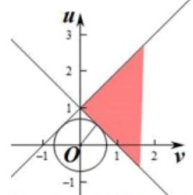

抽象函数

<table><tr><td>教学目标</td><td>1、函数单调性的定义与逆用；   2、函数奇偶性的定义与性质;   3、抽象函数性质的提取，抽象函数不等式的转换;   4、会解决转化后的不等式恒成立问题;</td></tr><tr><td>重点</td><td>抽象函数性质的判定和应用</td></tr><tr><td>难点</td><td>抽象函数性质的综合应用</td></tr></table>

## 知识梳理

一、定义:抽象函数问题，一般指没有给出具体函数解析式，只给出了其他一些条件(如函数定义域、解析递推式、取值情况、性质、图像特征等), 研究解决这个函数的解析式、性质或与函数相关的参数范围、 求值、不等式(或方程)解、图象、比较大小等问题. 这类问题具有概念抽象、综合性强、方法灵活等特点. 抽象函数问题既是学习的难点, 也是高考的热点, 认真学习它是提高学生数学能力和创新能力的有效途径.

## 二、常见的抽象函数模型:

① 正比例函数模型: $f\left( x\right)  = {kx}, k \neq  0\cdots \cdots  - f\left( {x \pm  y}\right)  = f\left( x\right)  \pm  f\left( y\right)$ .

② 幂函数模型: $f\left( x\right)  = {x}^{k} -  -  -  -  - f\left( {xy}\right)  = f\left( x\right)  \cdot  f\left( y\right) ;f\left( \frac{x}{y}\right)  = \frac{f\left( x\right) }{f\left( y\right) }$ .

③ 指数函数模型: $f\left( x\right)  = {a}^{x} - \cdots  -  - f\left( {x + y}\right)  = f\left( x\right)  \cdot  f\left( y\right) ;f\left( {x - y}\right)  = \frac{f\left( x\right) }{f\left( y\right) }$ .

④ 对数函数模型: $f\left( x\right)  = {\log }_{a}x - \cdots  - f\left( {xy}\right)  = f\left( x\right)  + f\left( y\right) ;f\left( \frac{x}{y}\right)  = f\left( x\right)  - f\left( y\right)$ .

⑤ 三角函数模型: $f\left( x\right)  = \tan x\cdots \cdots  - f\left( {x + y}\right)  = \frac{f\left( x\right)  + f\left( y\right) }{1 - f\left( x\right)  \cdot  f\left( y\right) }$ .

## 三、归纳方法:

1、观察不等式两端的特点，化为同类函数；

2、借助函数的单调性，脱掉“ $f$ ”；

3、注意定义域及单调区间，特别是对数函数中真数大于 0.

## (一) 抽象函数的定义域、递推关系、值域

## 例题精讲

【例 1】( 1 )已知函数 $f\left( x\right)$ 的定义域为 $\left\lbrack  {0,4}\right\rbrack$ ，求函数 $y = f\left( {x + 3}\right)  + f\left( {x}^{2}\right)$ 的定义域为___.

【难度】 $\star   \star   \star$

【答案】 $\left\lbrack  {-2,1}\right\rbrack$

【解析】 $0 \leq  x + 3 \leq  4,0 \leq  {x}^{2} \leq  4 \Rightarrow  x \in  \left\lbrack  {-2,1}\right\rbrack$

(2)已知函数 $f\left( {{x}^{2} - {2x} + 2}\right)$ 的定义域为 $\left\lbrack  {0,3}\right\rbrack$ ，求函数 $f\left( x\right)$ 的定义域.

【难度】 $\star   \star   \star$

【答案】[1,5]

【解析】由 $0 \leq  x \leq  3$ ,得 $1 \leq  {x}^{2} - {2x} + 2 \leq  5$ . 令 $u = {x}^{2} - {2x} + 2$ ,

则 $f\left( {{x}^{2} - {2x} + 2}\right)  = f\left( u\right) ,1 \leq  u \leq  5$ . 故 $f\left( x\right)$ 的定义域为 $\left\lbrack  {1.5}\right\rbrack$ .

【例 2】( 1 )已知定义在 $R$ 上的函数 $f\left( x\right)$ 的值域为 $\left\lbrack  {-\frac{3}{2},\frac{3}{8}}\right\rbrack$ ，则函数 $f\left( {x + 1}\right)$ 的值域为___.

【难度】 $\star   \star   \star$

【答案】 $\left\lbrack  {-\frac{3}{2},\frac{3}{8}}\right\rbrack$

【解析】函数左右平移不影响函数值

(2)设 $g\left( x\right)$ 是定义在 $R$ 上，以1为周期的函数，若函数 $f\left( x\right)  = x + g\left( x\right)$ 在区间 $\left\lbrack  {3,4}\right\rbrack$ 上的值域为 $\left\lbrack  {-2,5}\right\rbrack$ ， 则 $f\left( x\right)$ 在区间 $\left\lbrack  {-{10},{10}}\right\rbrack$ 上的值域为___.

【难度】 $\bigstar \bigstar$

【答案】 $\left\lbrack  {-{15},{11}}\right\rbrack$

【解析】由题意 $f\left( x\right)  - x = g\left( x\right)$ 在 $R$ 上成立 故 $f\left( {x + 1}\right)  - \left( {x + 1}\right)  = g\left( {x + 1}\right)$ 所以 $f\left( {x + 1}\right)  - f\left( x\right)  = 1$

由此知自变量增大 1,函数值也增大 1 故 $f\left( x\right)$ 在 $\left\lbrack  {-{10},{10}}\right\rbrack$ 上的值域为 $\left\lbrack  {-{15},{11}}\right\rbrack$

故答案为: $\left\lbrack  {-{15},{11}}\right\rbrack$

【例 3】已知函数 $f\left( x\right)$ 是定义在 $\left( {0, + \infty }\right)$ 上的单调函数,则对任意 $\left( {0, + \infty }\right)$ 都有 $f\left( {f\left( x\right)  + \frac{2}{x}}\right)  =  - 1$ 成立,则 $f\left( 1\right) \; =$ (   )

A. -1 B. -4 C. -3 D. 0

【难度】★★★

【答案】 $A$

【解析】解: 根据题意,函数 $f\left( x\right)$ 是定义在 $\left( {0, + \infty }\right)$ 上的单调函数,且对任意 $\left( {0, + \infty }\right)$ 都有 $f\left( {f\left( x\right)  + \frac{2}{x}}\right)  =  - 1$ 成立,则有 $f\left( x\right)  + \frac{2}{x}$ 为常数,设 $f\left( x\right)  + \frac{2}{x} = t,\left( {t > 0}\right)$ ,则 $f\left( x\right)  =  - \frac{2}{x} + t$ ,又由 $f\left( {f\left( x\right)  + \frac{2}{x}}\right)  =  - 1$ ,则 $f\left( t\right)  =  - \frac{2}{t} + t =  - 1$ ,解可得 $t = 1$ 或-2(舍),则 $f\left( x\right)  =  - \frac{2}{x} + 1$ ,则 $f\left( 1\right)  =  - 1$ ; 故选: $A$ .

【例 4】已知定义在 $R$ 上的奇函数 $f\left( x\right)$ 且满足 $f\left( {1 + x}\right)  =  - f\left( {3 - x}\right)$ ,且 $f\left( 1\right)  \neq  0$ ,若函数 $g\left( x\right)  = {x}^{6} + f\left( 1\right) \; \cos {4x} - 3$ 有且只有唯一的零点,则 $f\left( {2018}\right)  + f\left( {2019}\right)  =$ (   )

A. 1 B. -1 C. -3 D. 3

【难度】★★★

【答案】 $C$

【解析】解: 根据题意,函数 $f\left( x\right)$ 且满足 $f\left( {1 + x}\right)  =  - f\left( {3 - x}\right)$ ,则有 $f\left( x\right)  =  - f\left( {4 - x}\right)$ ,

又由 $f\left( x\right)$ 为奇函数,则有 $f\left( x\right)  =  - f\left( {-x}\right)$ ,则有 $- f\left( {-x}\right)  =  - f\left( {4 - x}\right)$ ,即 $f\left( x\right)  = f\left( {x + 4}\right)$ ,即函数 $f\left( x\right)$ 为周

期为 4 的周期函数,则有 $f\left( 2\right)  = f\left( {-2}\right)$ ,且 $f\left( {-2}\right)  =  - f\left( 2\right)$ ,分析可得 $f\left( 2\right)  =  - f\left( {-2}\right)  = 0$ ,

对于 $g\left( x\right)  = {x}^{6} + f\left( 1\right) \cos {4x} - 3$ ,有 $g\left( {-x}\right)  = {\left( -x\right) }^{6} + f\left( 1\right) \cos 4\left( {-x}\right)  - 3 = {x}^{6} + f\left( 1\right) \cos {4x} - 3 = g\left( x\right)$ , 即函数 $g\left( x\right)$ 为偶函数,若函数 $g\left( x\right)  = {x}^{6} + f\left( 1\right) \cos {4x} - 3$ 有且只有唯一的零点,则必有 $g\left( 0\right)  = f\left( 1\right)  - 3 = 0$ , 则 $f\left( 1\right)  = 3$ ,

$f\left( {2018}\right)  = f\left( {2 + {2016}}\right)  = f\left( 2\right)  = 0,\;f\left( {2019}\right)  = f\left( {3 + {2016}}\right)  = f\left( 3\right)  = f\left( {-1}\right)  =  - f\left( 1\right)  =  - 3$ ,

则 $f\left( {2018}\right)  + f\left( {2019}\right)  =  - 3$ ; 故选: $C$ .

【例 5】已知函数 $f\left( x\right)$ 满足: $f\left( {x + y}\right)  = f\left( x\right)  \cdot  f\left( y\right)$ 并且 $f\left( 1\right)  = 1$ ,那么: $\frac{{\left( f\left( 1\right) \right) }^{2}}{f\left( 1\right) } + \frac{{\left( f\left( 2\right) \right) }^{2}}{f\left( 3\right) } + \frac{{\left( f\left( 3\right) \right) }^{2}}{f\left( 5\right) } + \ldots  + \frac{{\left( f\left( {1010}\right) \right) }^{2}}{f\left( {2019}\right) }$ 的值为(   )A. 2019 B. ${1010}\mathrm{C}{.4038}\mathrm{D}{.3030}$

【难度】 $\star   \star   \star   \star$

【答案】 $B$

【解析】解: 由题意 $f\left( {x + y}\right)  = f\left( x\right) f\left( y\right)$ ,且 $f\left( 1\right)  = 1$ ,可得令 $x = n, y = 1$ ,可得 $f\left( {n + 1}\right)  = f\left( n\right)$ ,

可得 $f\left( 1\right)  = f\left( 2\right)  = f\left( 3\right)  = \ldots  = f\left( n\right)  = 1$ ,

那么 $\frac{{\left( f\left( 1\right) \right) }^{2}}{f\left( 1\right) } + \frac{{\left( f\left( 2\right) \right) }^{2}}{f\left( 3\right) } + \frac{{\left( f\left( 3\right) \right) }^{2}}{f\left( 5\right) } + \ldots  + \frac{{\left( f\left( {1010}\right) \right) }^{2}}{f\left( {2019}\right) } = {f}^{2}\left( 1\right)  + {f}^{2}\left( 2\right)  + \ldots  + {f}^{2}\left( {1010}\right)  = {1010}$ .

故选: $B$ .

## 巩固训练

1、已知函数 $y = f\left( {{2x} + 1}\right)$ 的定义域为 $\left\lbrack  {0,1}\right\rbrack$ ，求函数 $y = f\left( {{2x} - 3}\right)$ 的定义域；

【难度】 $\star   \star   \star$

【答案】 $\left\lbrack  {2,3}\right\rbrack$

【解析】 $x \in  \left\lbrack  {0,1}\right\rbrack   \Rightarrow  {2x} + 1 \in  \left\lbrack  {1,3}\right\rbrack  \therefore {2x} - 3 \in  \left\lbrack  {1,3}\right\rbrack   \Rightarrow  x \in  \left\lbrack  {2,3}\right\rbrack$

2、设 $g\left( x\right)$ 是定义在 $R$ 上，以 1 为周期的函数，若函数 $f\left( x\right)  = x + g\left( x\right)$ 在区间 $\left\lbrack  {3,4}\right\rbrack$ 上的值域为 $\left\lbrack  {-2,5}\right\rbrack$ ， 则 $f\left( x\right)$ 在区间 $\left\lbrack  {-{10},{10}}\right\rbrack$ 上的值域为___.

【难度】 $\star   \star   \star$

【答案】[-15, 11]

【解析】由题意 $f\left( x\right)  - x = g\left( x\right)$ 在 $R$ 上成立 故 $f\left( {x + 1}\right)  - \left( {x + 1}\right)  = g\left( {x + 1}\right)$ 所以 $f\left( {x + 1}\right)  - f\left( x\right)  = 1$ 由此知自变量增大 1,函数值也增大 1 故 $f\left( x\right)$ 在 $\left\lbrack  {-{10},{10}}\right\rbrack$ 上的值域为 $\left\lbrack  {-{15},{11}}\right\rbrack$

故答案为: $\left\lbrack  {-{15},{11}}\right\rbrack$

3、设定义在 $R$ 上的函数 $f\left( x\right)$ 的值域为 $A$ ,若集合 $A$ 为有限集,且对任意 ${x}_{1}\text{ 、 }{x}_{2} \in  R$ ,存在 ${x}_{3} \in  R$ 使得 $f\left( {x}_{1}\right) f\left( {x}_{2}\right)  = f\left( {x}_{3}\right)$ ，则满足条件的集合 $A$ 的个数为( )

A. 3 B. 5 C. 7 D. 无穷个

【难度】★★★★

【答案】 $B$

【解析】解: $\because$ 任意 ${x}_{1}\text{ 、 }{x}_{2} \in  R$ ,存在 ${x}_{3} \in  R$ 使得 $f\left( {x}_{1}\right) f\left( {x}_{2}\right)  = f\left( {x}_{3}\right)$ ,且集合 $A$ 为有限集,

$\therefore$ 从集合 $A$ 中取两个不同的数或同一个数取两次的积等于第三个数,这第三个数也在集合 $A$ 中.

(1) $f\left( {x}_{1}\right)  = f\left( {x}_{2}\right)$ 时:①集合 $A$ 中只有一个元素，则 $A = \{ 0\}$ ， $A = \{ 1\}$ ，②集合 $A$ 中有多个元素，则 $A = \{  - {1.1}\}$ ，

(2) $f\left( {x}_{1}\right)  \neq  f\left( {x}_{2}\right)$ 时， $A = \{ 1,0\}$ ， $A = \{  - 1,1,0\}$ ，综上所述满足条件的集合 $A$ 有 5 个. 故选: $B$ .

## (二)抽象函数的性质

## 例题精讲

【例 6】( 1 ) $f\left( x\right)$ 是定义在 $\left( {-1,1}\right)$ 上的奇函数且单调递减，若 $f\left( {2 - a}\right)  + f\left( {4 - {a}^{2}}\right)  < 0$ ，则 $a$ 的取值范围是 ( )

A. $\left( {\sqrt{3},2}\right)$ D. $\left( {-\infty ,\sqrt{5}}\right)  \cup  \left( {3, + \infty }\right)$

【难度】 $\star   \star   \star$

【答案】A

【解析】: $f\left( x\right)$ 是奇函数所以 $f\left( {-x}\right)  =  - f\left( x\right)$ 由 $f\left( {2 - a}\right)  + f\left( {4 - {a}^{2}}\right)  < 0$ 得:

$f\left( {2 - a}\right)  <  - f\left( {4 - {a}^{2}}\right)  = f\left( {{a}^{2} - 4}\right) \because f\left( x\right)$ 在 $\left( {-1,1}\right)$ 上单调递减 $\therefore \left\{  \begin{array}{l}  - 1 < 2 - a < 1 \\   - 1 < 4 - {a}^{2} < 1 \\  2 - a > 4 - {a}^{2} \end{array}\right.$ 解得 $a \in  \left( {\sqrt{3},2}\right)$ .

(2)已知偶函数 $f\left( x\right)$ 在区间 $\lbrack 0, + \infty )$ 上单调递增，则满足 $f\left( {{2x} - 1}\right)  < f\left( \frac{1}{3}\right)$ 的取值范围是( )

A $\left( {\frac{1}{3},\frac{2}{3}}\right)$ B $\left\lbrack  {\frac{1}{3},\frac{2}{3}}\right)$ C $\left( {\frac{1}{2},\frac{2}{3}}\right)$ D $\left\lbrack  {\frac{1}{2},\frac{2}{3}}\right)$

【难度】 $\star   \star   \star$

【答案】D

【解析】由于 $f\left( x\right)$ 是偶函数,且在区间 $\lbrack 0, + \infty )$ 上单调递增,所以在 $\left( {-\infty ,0}\right)$ 上单调递减.根据图像得 $\left| {{2x} - 1}\right|  < \frac{1}{3}$ ,解得 $\frac{1}{3} < x < \frac{2}{3}$ .

【例 7】设函数 $f\left( x\right)$ 是定义在 $R$ 上的偶函数,且对任意的 $x \in  \mathbf{R}$ 恒有 $f\left( {x + 1}\right)  = f\left( {x - 1}\right)$ ,已知当 $x \in  \left\lbrack  {0,1}\right\rbrack$ 时, $f\left( x\right)  = {\left( \frac{1}{2}\right) }^{1 - x}$ ,则

①2 是函数 $f\left( x\right)$ 的一个周期;

②函数 $f\left( x\right)$ 在 $\left( {1,2}\right)$ 上是减函数，在 $\left( {2,3}\right)$ 上是增函数；

③函数 $f\left( x\right)$ 的最大值是 1，最小值是 0；

④ $x = 1$ 是函数 $f\left( x\right)$ 的一个对称轴；

其中所有正确命题的序号是___.

【难度】★★★★

【答案】①②④

【解析】 $\because f\left( {x + 1}\right)  = f\left( {x - 1}\right) ,\therefore f\left( {x + 2}\right)  = f\left( {\left( {x + 1}\right)  + 1}\right)  = f\left( {\left( {x + 1}\right)  - 1}\right)  = f\left( x\right)$ ,

所以 2 是函数 $f\left( x\right)$ 的一个周期; 即①正确；

当 $x \in  \left\lbrack  {0,1}\right\rbrack$ 时, $f\left( x\right)  = {\left( \frac{1}{2}\right) }^{1 - x}$ ,则 $f\left( x\right)  = {\left( \frac{1}{2}\right) }^{1 - x} = {2}^{x - 1}$ 在 $x \in  \left\lbrack  {0,1}\right\rbrack$ 上为增函数,

因为函数 $f\left( x\right)$ 是定义在 $R$ 上的偶函数,所以函数 $f\left( x\right)$ 在 $x \in  \left\lbrack  {-1,0}\right\rbrack$ 上为减函数,

结合①中函数的周期性，可得函数 $f\left( x\right)$ 在 $\left( {1,2}\right)$ 上是减函数，在 $\left( {2,3}\right)$ 上是增函数；即②正确；

结合①②的周期性和单调性，

当 $x$ 为奇数时,函数 $f\left( x\right)$ 的最大值是 1 ,

当 $x$ 为偶数时,函数 $f\left( x\right)$ 的最小值是 $\frac{1}{2}$ ; 即③不正确;

因为 $f\left( {x + 1}\right)  = f\left( {x - 1}\right)$ 且函数 $f\left( x\right)$ 是定义在 $R$ 上的偶函数,

所以 $f\left( {1 + x}\right)  = f\left( {1 - x}\right)$ ; 即④正确；

故答案为:①②④

【例8】用 $\min \{ a, b\}$ 表示 $a, b$ 两数中的最小值，若函数 $f\left( x\right)  = \min \{ \left| x\right| ,\left| {x + t}\right| \}$ 的图像关于直线 $x = \frac{1}{2}$ 对称， 则 $t$ 的值为( )

A. -1 B. 1 C. -2 D. 2

【难度】★★★

【答案】A

【解析】令 $g\left( x\right)  = \left| x\right| , h\left( x\right)  = \left| {x + t}\right|$ ,因为 $g{\left( x\right) }_{\min } = g\left( 0\right)  = 0, h{\left( x\right) }_{\min } = h\left( 0\right)  = 0$ ,

所以 $f{\left( x\right) }_{\min } = f\left( 0\right)  = 0$ ,

因为函数 $f\left( x\right)  = \min \{ \left| x\right| ,\left| {x + t}\right| \}$ 的图像关于直线 $x = \frac{1}{2}$ 对称,

所以 $f\left( 1\right)  = \min \{ \left| 1\right| ,\left| {1 + t}\right| \}  = 0$ ,所以 $\left| {1 + t}\right|  = 0$ ,解得 $t =  - 1$ . 故选: A

【例 9】已知函数 $f\left( x\right)$ 满足 $f\left( 1\right)  = \frac{1}{4},{4f}\left( x\right) f\left( y\right)  = f\left( {x + y}\right)  + f\left( {x - y}\right) ,\left( {x, y \in  R}\right)$ ,则 $f\left( {2015}\right)  =$ (   )

A. $\frac{1}{2}$ B. $\frac{1}{4}$ C. $- \frac{1}{4}$ D. 0

【难度】★★★

【答案】B

【解析】解: 取 $x = 1, y = 0$ ,代入 ${4f}\left( x\right) f\left( y\right)  = f\left( {x + y}\right)  + f\left( {x - y}\right)$ ,

得 ${4f}\left( 1\right) f\left( 0\right)  = f\left( 1\right)  + f\left( 1\right)  = {2f}\left( 1\right)$ ,解得 $f\left( 0\right)  = \frac{1}{2}$ ,

则当 $x = 1, y = 1$ 时, ${4f}\left( 1\right) f\left( 1\right)  = f\left( 2\right)  + f\left( 0\right)$ ,解得 $f\left( 2\right)  = f\left( 1\right)  - f\left( 0\right)  =  - \frac{1}{4}$ ;

当 $x = 2, y = 1$ 时, ${4f}\left( 2\right) f\left( 1\right)  = f\left( 3\right)  + f\left( 1\right)$ ,解得 $f\left( 3\right)  = f\left( 2\right)  - f\left( 1\right)  =  - \frac{1}{2}$ ;

当 $x = 3, y = 1$ 时, ${4f}\left( 3\right) f\left( 1\right)  = f\left( 4\right)  + f\left( 2\right)$ ,解得 $f\left( 4\right)  = f\left( 3\right)  - f\left( 2\right)  =  - \frac{1}{4}$ ;

当 $x = 4, y = 1$ 时, ${4f}\left( 4\right) f\left( 1\right)  = f\left( 5\right)  + f\left( 3\right)$ ,解得 $f\left( 5\right)  = f\left( 4\right)  - f\left( 3\right)  = \frac{1}{4}$ ;

当 $x = 5, y = 1$ 时, ${4f}\left( 5\right) f\left( 1\right)  = f\left( 6\right)  + f\left( 4\right)$ ,解得 $f\left( 6\right)  = f\left( 5\right)  - f\left( 4\right)  = \frac{1}{2}$ ;

当 $x = 6, y = 1$ 时, ${4f}\left( 6\right) f\left( 1\right)  = f\left( 7\right)  + f\left( 5\right)$ ,解得 $f\left( 7\right)  = f\left( 6\right)  - f\left( 5\right)  = \frac{1}{4}$ ;

...

$f\left( x\right)$ 是周期为 6 的周期函数, ${2015} \div  6 = {370}$ 余 5; $f\left( {2015}\right)  = f\left( 5\right)  = \frac{1}{4}$ .

故选: $B$ .

【例 10】定义在 $\mathbf{R}$ 上的偶函数 $f\left( x\right)$ 满足 $f\left( {x + 8}\right)  = \frac{1}{4} + \sqrt{f\left( x\right)  - {f}^{2}\left( x\right) }$ ,则 $f\left( {2020}\right)  =$ ___.

【难度】 $\star   \star   \star   \star$

【答案】 $\frac{3 + \sqrt{7}}{8}$

【解析】: $f\left( {x + 8}\right)  = \frac{1}{4} + \sqrt{f\left( x\right)  - {f}^{2}\left( x\right) }$

将①中的 $x$ 替换为 $- x$ ，得 $f\left( {-x + 8}\right)  = \frac{1}{4} + \sqrt{f\left( {-x}\right)  - {f}^{2}\left( {-x}\right) }$.②

①-②得 $f\left( {x + 8}\right)  - f\left( {-x + 8}\right)  = 0$ ；又: $f\left( x\right)$ 是偶函数，故 $f\left( {-x}\right)  = f\left( x\right)$

$\therefore f\left( {x + 8}\right)  = f\left( {-x + 8}\right)  = f\left( {x - 8}\right) ;\therefore f\left( x\right)$ 是周期函数, $T = {16}$

$\therefore f\left( {2020}\right)  = f\left( {{126} \times  {16} + 4}\right)  = f\left( 4\right)  = f\left( {-4}\right)$

①式中令 $x =  - 4$ ，得 $f\left( {-4 + 8}\right)  = \frac{1}{4} + \sqrt{f\left( {-4}\right)  - {f}^{2}\left( {-4}\right) }$

$\therefore f\left( 4\right)  = \frac{1}{4} + \sqrt{f\left( 4\right)  - {f}^{2}\left( 4\right) }$ ,整理得 $\left\{  \begin{array}{l} {32}{f}^{2}\left( 4\right)  - {24f}\left( 4\right)  + 1 = 0 \\  f\left( 4\right)  - {f}^{2}\left( 4\right)  \geq  0 \\  f\left( 4\right)  \geq  \frac{1}{4} \end{array}\right.$

解得 $f\left( 4\right)  = \frac{3 + \sqrt{7}}{8};\therefore f\left( {2020}\right)  = f\left( 4\right)  = \frac{3 + \sqrt{7}}{8}$

故答案为: $\frac{3 + \sqrt{7}}{8}$ .

## 巩固训练

1、设定义在 $D$ 上的两个函数 $f\left( x\right) \text{ 、 }g\left( x\right)$ ,其值域依次是 $\left\lbrack  {a, b}\right\rbrack$ 和 $\left\lbrack  {c, d}\right\rbrack$ ,有下列4个命题:

① “ $a > d$ ” 是 “ $f\left( {x}_{1}\right)  > g\left( {x}_{2}\right)$ 对任意 ${x}_{1}\text{ 、 }{x}_{2} \in  D$ 恒成立”的充要条件；

② “ $a > d$ ” 是 “ $f\left( {x}_{1}\right)  > g\left( {x}_{2}\right)$ 对任意 ${x}_{1}\text{ 、 }{x}_{2} \in  D$ 恒成立” 的充分不必要条件；

③ “ $a > d$ ” 是 “ $f\left( x\right)  > g\left( x\right)$ 对任意 $x \in  D$ 恒成立”的充要条件；

④ “ $a > d$ ” 是 “ $f\left( x\right)  > g\left( x\right)$ 对任意 $x \in  D$ 恒成立” 的充分不必要条件.

其中正确的命题是___(请写出所有正确命题的序号).

【难度】 $\star   \star   \star$

【答案】①④

【解析】略

2、已知定义在 $R$ 上函数 $f\left( x\right)$ 的图象关于原点对称,且 $f\left( {1 + x}\right)  + f\left( {2 - x}\right)  = 0$ ,若 $f\left( 1\right)  = 1$ ,则 $f\left( 1\right)  + f\left( 2\right)  + f\left( 3\right)  + \cdots  + f\left( {2020}\right)  =$ ( )

A. 0 B. 1 C. 673 D. 674

【难度】★★★

【答案】B

【解析】因为 $f\left( x\right)$ 为奇函数,故 $f\left( 0\right)  = 0$ ;

因为 $f\left( {1 + x}\right)  + f\left( {2 - x}\right)  = 0$ ,故 $f\left( {1 + x}\right)  =  - f\left( {2 - x}\right)  = f\left( {x - 2}\right)$ ,

可知函数 $f\left( x\right)$ 的周期为 3 ; 在 $f\left( {1 + x}\right)  + f\left( {2 - x}\right)  = 0$ 中,令 $x = 1$ ,故 $f\left( 2\right)  =  - f\left( 1\right)  =  - 1$ ,

故函数 $f\left( x\right)$ 在一个周期内的函数值和为 0,故 $f\left( 1\right)  + f\left( 2\right)  + f\left( 3\right)  + \cdots  + f\left( {2020}\right)  = f\left( 1\right)  = 1$ . 故选: B.

3、已知函数 $f\left( x\right)$ 是 $R$ 上的偶函数,对于任意 $x \in  \mathbf{R}$ 都有 $f\left( {x + 6}\right)  = f\left( x\right)  + f\left( 3\right)$ 成立,当 ${x}_{1},{x}_{2} \in  \left\lbrack  {0,3}\right\rbrack$ , 且 ${x}_{1} \neq  {x}_{2}$ 时,都有 $\frac{f\left( {x}_{1}\right)  - f\left( {x}_{2}\right) }{{x}_{1} - {x}_{2}} > 0$ . 给出以下三个命题:

① 直线 $x =  - 6$ 是函数 $f\left( x\right)$ 图像的一条对称轴;

②函数 $f\left( x\right)$ 在区间 $\left\lbrack  {-9, - 6}\right\rbrack$ 上为增函数;

③函数 $f\left( x\right)$ 在区间 $\left\lbrack  {-9,9}\right\rbrack$ 上有五个零点.

问:以上命题中正确的个数有( ).

A. 0 个 B. 1 个 C. 2 个 D. 3 个

【难度】 $\star   \star   \star$

【答案】B

【解析】解: 根据题意,对于任意 $x \in  \mathbf{R}$ ,都有 $f\left( {x + 6}\right)  = f\left( x\right)  + f\left( 3\right)$ 成立,

令 $x =  - 3$ ,则 $f\left( {-3 + 6}\right)  = f\left( {-3}\right)  + f\left( 3\right)$ ,

又 $f\left( x\right)$ 是 $R$ 上的偶函数，所以 $f\left( 3\right)  = 0$ ，则有 $f\left( {x + 6}\right)  = f\left( x\right)$ ，所以 $f\left( x\right)$ 的周期为 6 ； 据此分析三个命题:

对于①，函数为偶函数，则函数的一条对称轴为 $y$ 轴，又由函数的周期为 6，

则直线 $x =  - 6$ 是函数 $f\left( x\right)$ 图象的一条对称轴，①正确；

对于②，当 ${x}_{1},{x}_{2} \in  \left\lbrack  {0,3}\right\rbrack$ ，且 ${x}_{1} \neq  {x}_{2}$ 时，都有 $\frac{f\left( {x}_{1}\right)  - f\left( {x}_{2}\right) }{{x}_{1} - {x}_{2}} > 0$ ，

则函数 $y = f\left( x\right)$ 在 $\left\lbrack  {0,3}\right\rbrack$ 上为增函数,

因为 $f\left( x\right)$ 是 $R$ 上的偶函数,所以函数 $y = f\left( x\right)$ 在 $\left\lbrack  {-3,0}\right\rbrack$ 上为减函数,

而 $f\left( x\right)$ 的周期为 6，所以函数 $y = f\left( x\right)$ 在 $\left\lbrack  {-9, - 6}\right\rbrack$ 上为减函数，②错误；

对于③， $f\left( 3\right)  = 0$ ， $f\left( x\right)$ 的周期为6，

所以 $f\left( {-9}\right)  = f\left( {-3}\right)  = f\left( 3\right)  = f\left( 9\right)  = 0$ ,函数 $y = f\left( x\right)$ 在 $\left\lbrack  {-9,9}\right\rbrack$ 上有四个零点; ③错误;

三个命题中只有①是正确的；

故选: B.

4、已知函数 $f\left( x\right)$ 是 $R$ 上的减函数,且 $y = f\left( {x - 2}\right)$ 的图象关于点 $\left( {2,0}\right)$ 成中心对称. 若 $u, v$ 满足不等式组 $\left\{  \begin{array}{l} f\left( u\right)  + f\left( {v - 1}\right)  \leq  0 \\  f\left( {u - v - 1}\right)  \geq  0 \end{array}\right.$ ,则 ${u}^{2} + {v}^{2}$ 的最小值为___.

【难度】 $\star   \star   \star   \star$

【答案】 $\frac{1}{2}$

【解析】: $y = f\left( {x - 2}\right)$ 的图象关于点 $\left( {2,0}\right)$ 成中心对称.

$\therefore y = f\left( x\right)$ 的图象关于点 $\left( {0,0}\right)$ 成中心对称. 即函数 $f\left( x\right)$ 是奇函数,

则不等式组 $\left\{  \begin{array}{l} f\left( u\right)  + f\left( {v - 1}\right)  \leq  0 \\  f\left( {u - v - 1}\right)  \geq  0 \end{array}\right.$ ,等价为 $\left\{  \begin{array}{l} f\left( u\right)  \leq   - f\left( {v - 1}\right)  = f\left( {1 - v}\right) \\  u - v - 1 \leq  0 \end{array}\right.$ ,即 $\left\{  \begin{array}{l} u \geq  1 - v \\  u - v - 1 \leq  0 \end{array}\right.$ ,

作出不等式组对应的平面区域如图,

则 ${u}^{2} + {v}^{2}$ 的几何意义为区域内的点到原点距离的平方,则由图象知原点到直线 $u = 1 - v$ ,即 $v + u - 1 = 0$ 的距离最小,此时 $d = \frac{\left| -1\right| }{\sqrt{2}} = \frac{1}{\sqrt{2}}$ ,故 ${u}^{2} + {v}^{2}$ 的最小值为 ${d}^{2} = \frac{1}{2}$ ,故答案为: $\frac{1}{2}$

5、已知函数 $f\left( x\right)$ 对任意实数 $x\text{ 、 }y$ 都有 $f\left( {x + y}\right)  = f\left( x\right)  + f\left( y\right)$ ,且当 $x < 0$ 时, $f\left( x\right)  < 0, f\left( 1\right)  = 5$ .

(1)判断函数 $f\left( x\right)$ 的奇偶性;

( 2 )求 $f\left( x\right)$ 在区间 $\left\lbrack  {-2,3}\right\rbrack$ 上的值域.

【难度】★★★★

【答案】见解析

【解析】解: (1) 令 $x = y = 0$ 得, $f\left( 0\right)  = f\left( 0\right)  + f\left( 0\right)$ ,所以 $f\left( 0\right)  = 0$ ,

令 $y =  - x$ 得, $f\left( 0\right)  = f\left( x\right)  + f\left( {-x}\right)$ ,所以 $f\left( {-x}\right)  =  - f\left( x\right)$ ,

所以，函数 $f\left( x\right)$ 为奇函数；

(2)设 ${x}_{1} < {x}_{2}$ ，则 ${x}_{1} - {x}_{2} < 0$ ，所以 $f\left( {{x}_{1} - {x}_{2}}\right)  < 0$ ，

则 $f\left( {x}_{1}\right)  = f\left\lbrack  {\left( {{x}_{1} - {x}_{2}}\right)  + {x}_{2}}\right\rbrack   = f\left( {{x}_{1} - {x}_{2}}\right)  + f\left( {x}_{2}\right)  < f\left( {x}_{2}\right)$

所以函数 $f\left( x\right)$ 为增函数; 由 $f\left( 2\right)  = f\left( {1 + 1}\right)  = f\left( 1\right)  + f\left( 1\right)  = {10}$ 得, $f\left( {-2}\right)  =  - {10}, f\left( 3\right)  = f\left( {2 + 1}\right)  = f$

(2) $+ f\left( 1\right)  = {10} + 5 = {15}$

所以函数 $f\left( x\right)$ 区间 $\left\lbrack  {-2,3}\right\rbrack$ 上的值域为 $\left\lbrack  {-{10},{15}}\right\rbrack$ .

## (三)抽象函数综合

## 例题精讲

【例 11】设函数 $y = f\left( x\right)$ 的定义域是 $R$ ,对于以下四个命题:

(1)若 $y = f\left( x\right)$ 是奇函数，则 $y = f\left( {f\left( x\right) }\right)$ 也是奇函数；

(2)若 $y = f\left( x\right)$ 是周期函数，则 $y = f\left( {f\left( x\right) }\right)$ 也是周期函数；

(3)若 $y = f\left( x\right)$ 是单调递减函数，则 $y = f\left( {f\left( x\right) }\right)$ 也是单调递减函数；

(4)若函数 $y = f\left( x\right)$ 存在反函数 $y = {f}^{-1}\left( x\right)$ ，且函数 $y = f\left( x\right)  - {f}^{-1}\left( x\right)$ 有零点，则函数 $y = f\left( x\right)  - x$ 也有零点.

其中正确的命题共有( )

A. 1 个 B. 2 个 C. 3 个 D. 4 个

【难度】★★★★

【答案】B

【解析】(1)若 $y = f\left( x\right)$ 是奇函数,则 $f\left( {-x}\right)  =  - f\left( x\right) ,\therefore f\left( {f\left( {-x}\right) }\right)  = f\left( {-f\left( x\right) }\right)  =  - f\left( {f\left( x\right) }\right)$ 也是奇函数,正确;

(2)若 $y = f\left( x\right)$ 是周期函数，则 $f\left( {x + T}\right)  = f\left( x\right)$ ， $f\left( {f\left( {x + T}\right) }\right)  = f\left( {f\left( x\right) }\right)$ 也是周期函数，正确；

(3)若 $y = f\left( x\right)$ 是单调递减函数，根据“同增异减”的原则，可得 $y = f\left( {f\left( x\right) }\right)$ 也是单调递增函数，故(3)不正确;

(4)若函数 $y = f\left( x\right)$ 存在反函数 $y = {f}^{-1}\left( x\right)$ ，且函数 $y = f\left( x\right)  - {f}^{-1}\left( x\right)$ 有零点，即 $y = f\left( x\right)$ 的图象与 $y = {f}^{-1}\left( x\right)$ 的图象有交点,而 $y = f\left( x\right)$ 的图象与 $y = {f}^{-1}\left( x\right)$ 的图象关于直线 $y = x$ 对称,但是这些交点可能只是关于直线 $y = x$ 对称,函数 $y = f\left( x\right)  - x$ 不一定有零点,比如函数 $y = \frac{1}{x}\left( {x \neq   \pm  1}\right)$ ,满足题意,但是函数 $y = f\left( x\right)  - x$ 没有零点,即(4)不正确; 故选 B.

【例 12】对于定义在 $R$ 上的函数 $f\left( x\right)$ ,如果存在实数 $a$ ,使得 $f\left( {a + x}\right)  \cdot  f\left( {a - x}\right)  = 1$ 对任意实数 $x \in  \mathbf{R}$ 恒成立,则称 $f\left( x\right)$ 为关于 $a$ 的“ $\tau$ 函数”. 已知定义在 $R$ 上的函数 $f\left( x\right)$ 是关于 0 和 1 的 “ $\tau$ 函数”，且当 $x \in  \left\lbrack  {0,1}\right\rbrack$ 时， $f\left( x\right)$ 的取值范围为 $\left\lbrack  {1,2}\right\rbrack$ ，则当 $x \in  \left\lbrack  {-2,2}\right\rbrack$ 时， $f\left( x\right)$ 的取值范围为___.

【难度】 $\star   \star   \star   \star$

【答案】 $\left\lbrack  {\frac{1}{2},2}\right\rbrack$

【解析】当 $a = 1$ 时, $f\left( {1 + x}\right)  \cdot  f\left( {1 - x}\right)  = 1$ ,所以 $f\left( {2 + x}\right)  \cdot  f\left( {-x}\right)  = 1$ .

当 $a = 0$ 时, $f\left( x\right)  \cdot  f\left( {-x}\right)  = 1$ ,故 $f\left( {2 + x}\right)  = f\left( x\right)$ ,故函数 $f\left( x\right)$ 是以 2 为周期的周期函数.

又当 $x \in  \left\lbrack  {1,2}\right\rbrack$ 时, $2 - x \in  \left\lbrack  {0,1}\right\rbrack$ ,所以 $f\left( {2 - x}\right)  \in  \left\lbrack  {1,2}\right\rbrack$ .

又 $f\left( {2 + x}\right)  \cdot  f\left( {-x}\right)  = 1$ ,所以 $f\left( x\right)  = \frac{1}{f\left( {2 - x}\right) } \in  \left\lbrack  {\frac{1}{2},1}\right\rbrack  ,\left( {x \in  \left\lbrack  {1,2}\right\rbrack  }\right)$ .

所以当 $x \in  \left\lbrack  {0,2}\right\rbrack$ 时, $f\left( x\right)  \in  \left\lbrack  {\frac{1}{2},2}\right\rbrack$ ,结合周期性知,当 $x \in  \left\lbrack  {-2,2}\right\rbrack$ 时 $f\left( x\right)  \in  \left\lbrack  {\frac{1}{2},2}\right\rbrack$

故答案为: $\left\lbrack  {\frac{1}{2},2}\right\rbrack$

【例 13】定义在 $R$ 上的函数 $f\left( x\right)$ 为增函数,对任意 $a, b \in  R$ 都有 $f\left( {a + b}\right)  = f\left( a\right)  + f\left( b\right)  + k$ ( $k$ 为常数)

(1)判断 $k$ 为何值时， $f\left( x\right)$ 为奇函数，并证明；

(2)设 $k =  - 1$ ， $f\left( x\right)$ 是 $R$ 上的增函数，且 $f\left( 1\right)  = 2$ ，若不等式 $f\left( {m{x}^{2} - {2mx} + 3}\right)  > 3$ 对任意 $x \in  \left( {0, + \infty }\right)$ 恒成立,求实数 $m$ 的取值范围.

(3)若 ${C}_{n} = \frac{1}{{2}^{n}} - \frac{1}{n\left( {n + 1}\right) }, n \in  {N}_{ + }$ ， ${S}_{n}$ 为 ${C}_{n}$ 的前 $n$ 项和，求正整数 $k$ ，使得对任意 $n \in  {N}^{ * }$ 均有 $f\left( {S}_{k}\right)  \geq  f\left( {S}_{n}\right)$ .

【难度】

【答案】见解析

【解析】解: (1) 若 $f\left( x\right)$ 在 $R$ 上为奇函数,则 $f\left( 0\right)  = 0$ ,令 $a = b = 0$ . 则 $f\left( {0 + 0}\right)  = f\left( 0\right)  + f\left( 0\right)  + k$ ,所以 $k = 0$ . 证明: 由 $f\left( {a + b}\right)  = f\left( a\right)  + f\left( b\right)$ ,令 $a = x, b =  - x$ ,则 $f\left( {x - x}\right)  = f\left( x\right)  + f\left( {-x}\right)$

又 $f\left( 0\right)  = 0$ ,则 $0 = f\left( x\right)  + f\left( {-x}\right)$ ,即 $f\left( {-x}\right)  =  - f\left( x\right)$ 对任意 $x \in  R$ 成立,所以 $f\left( x\right)$ 是奇函数

(2)令 $a = b = 1$ ，可得 $f\left( 2\right)  = f\left( 1\right)  + f\left( 1\right)  - 1 = 3$ ，可得 $f\left( 2\right)  = 3$ ，

根据 $f\left( {m \cdot  {3}^{x} - {2mx} + 3}\right)  > 3 = f\left( 2\right)$ 对任意 $x \in  \left( {0, + \infty }\right)$ 恒成立

又 $f\left( x\right)$ 是 $R$ 上的增函数,所以 $m{x}^{2} - {2mx} + 3 > 2$ 对任意 $x \in  \left( {0, + \infty }\right)$ 恒成立,

令 $g\left( x\right)  = m{x}^{2} - {2mx} + 1$ ,可得 $g\left( x\right)  > 0$ 对任意 $x \in  \left( {0, + \infty }\right)$ 恒成立,当 $m \neq  0$ 时,

其对称轴 $x = 1,\therefore \left\{  \begin{array}{l} g\left( 1\right)  > 0 \\  m > 0 \end{array}\right.$ 即可即: $- m + 1 > 0$ 解得: $0 < m < 1$ .

当 $m = 0$ 时,可得 $g\left( x\right)  = 1 > 0$ 对任意 $x \in  \left( {0, + \infty }\right)$ 恒成立,综上可得实数 $m$ 的取值范围是 $\lbrack 0,1)$ .

(3)由 ${C}_{n} = \frac{1}{{2}^{n}} - \frac{1}{n\left( {n + 1}\right) } = \frac{1}{{2}^{n}} - \left( {\frac{1}{n} - \frac{1}{n + 1}}\right) , n \in  {N}_{ + }$ ，

那么 ${S}_{n} = \frac{1}{2} + \frac{1}{{2}^{2}} + \ldots  + \frac{1}{{2}^{n}} - \left( {1 - \frac{1}{2} + \frac{1}{2} - \frac{1}{3} + \ldots \frac{1}{n} - \frac{1}{n + 1}}\right)  = \frac{1}{n + 1} - \frac{1}{{2}^{n}}$

$\therefore {S}_{n + 1} - {S}_{n} = \frac{1}{n + 2} - \frac{1}{{2}^{n + 1}} - \frac{1}{n + 1} - \frac{1}{{2}^{n}} = \frac{1}{{2}^{n + 1}} - \frac{1}{\left( {n + 1}\right) \left( {n + 2}\right) }\overset{\text{ 当 }}{ = }n = 1,2,3$ 时, ${S}_{n + 1} > {S}_{n}$

$n \geq  4$ 时, ${2}^{n + 1} = {\left( 1 + 1\right) }^{n + 1} \geq  2\left\lbrack  {1 + \left( {n + 1}\right)  + {C}_{n + 1}^{2}}\right\rbrack   = {n}^{2} + {3n} + 4 > {n}^{2} + {3n} + 2$ ,

$\therefore  = \frac{1}{{2}^{n + 1}} < \frac{1}{\left( {n + 1}\right) \left( {n + 2}\right) }\therefore {S}_{n + 1} < {S}_{n} \cdot  \;\therefore {S}_{1} < {S}_{2} < {S}_{3} < {S}_{4} > {S}_{5} > {S}_{6} > \ldots$ .

$\therefore n = 4$ 时, ${S}_{n}$ 取得最大值. 即 ${S}_{4} \geq  {S}_{n}$ 对 $\forall n \in  {N}^{ * }$ 都成立. $\therefore$ 正整数 $k = 4$ ,使得对任意 $n \in  {N}^{ * }$ 均有 $f\left( {S}_{k}\right)  \geq  f\left( {S}_{n}\right)$ .

【例 14】已知 $f\left( x\right)$ 是定义在 $R$ 上,满足 $f\left( {x + y}\right)  = f\left( x\right)  \cdot  f\left( y\right)$ ,当 $x > 0$ 时, $0 < f\left( x\right)  < 1$

(1)求 $f\left( 0\right)$ ；

(2) $x < 0$ 时，比较 $f\left( x\right)$ 与 1 的大小；

(3)讨论 $f\left( x\right)$ 在 $R$ 上的单调性；

(4) $f\left( 3\right)  = \frac{1}{8}$ ，求 $f\left( {2014}\right)$

(5) ${a}_{1} = f\left( 0\right)$ 且 $f\left( {a}_{n + 1}\right)  = \frac{1}{f\left( {2 - {a}_{n}}\right) }$ ,求 ${a}_{n}$

【难度】 $\star   \star   \star   \star$

【答案】见解析

【解析】(1) 取 $y = 0, x > 0$ ,代入得 $f\left( x\right)  = f\left( 0\right)  \cdot  f\left( x\right)$ ,即 $f\left( x\right) \left\lbrack  {f\left( 0\right)  - 1}\right\rbrack   = 0$

$\because x > 0$ 时, $f\left( x\right)  \neq  0\therefore f\left( 0\right)  = 1$

(2)取 $y =  - x$ ，代入得: $f\left( 0\right)  = f\left( x\right)  \cdot  f\left( {-x}\right)  = 1$ ，当 $x < 0$ 时， $- x > 0$ ，根据已知条件可知 $0 < f\left( {-x}\right)  < 1 \; \therefore f\left( x\right)  = \frac{1}{f\left( {-x}\right) } > 1$

(3)讨论 $f\left( x\right)$ 的单调性已知:当 $x > 0$ 时， $0 < f\left( x\right)  < 1$

任取 ${x}_{1} < {x}_{2}$ ,则 ${x}_{2} - {x}_{1} > 0$ ,根据当 $x > 0$ 时, $0 < f\left( x\right)  < 1$ 的已知条件,代入得

$f\left( {{x}_{2} - {x}_{1}}\right)  = f\left( {x}_{2}\right) f\left( {-{x}_{1}}\right)  \in  \left( {0,1}\right)$ ,又 $\because f\left( {-{x}_{1}}\right)  = \frac{1}{f\left( {x}_{1}\right) }$ ,故 $0 < \frac{f\left( {x}_{2}\right) }{f\left( {x}_{1}\right) } < 1$ ,即 $f\left( {x}_{1}\right)  > f\left( {x}_{2}\right)$ ,故 $f\left( x\right)$

在 $R$ 上单调递减

(4)取 $x = n, y = 1$ 可得: $f\left( {n + 1}\right)  = f\left( n\right)  \cdot  f\left( 1\right)$ ，这是一个类似于数列的递推关系，用累商法可求得: $f\left( n\right)  = {f}^{n}\left( 1\right) ,\therefore f\left( 3\right)  = {f}^{3}\left( 1\right)  = \frac{1}{8} \Rightarrow  f\left( 1\right)  = \frac{1}{2}\therefore f\left( {2014}\right)  = {f}^{2014}\left( 1\right)  = \frac{1}{{2}^{2014}}$

(5)根据 $f\left( {x + y}\right)  = f\left( x\right)  + f\left( y\right)$ 和已知的关系可得: $1 = f\left( {a}_{n + 1}\right) f\left( {2 - {a}_{n}}\right)  = f\left( {{a}_{n + 1} - {a}_{n} + 2}\right)$ 又 $\because f\left( 0\right)  = 1,\therefore f\left( {{a}_{n + 1} - {a}_{n} + 2}\right)  = f\left( 0\right)$ ,又因为 $f\left( x\right)$ 在 $R$ 上单调, $\therefore {a}_{n + 1} - {a}_{n} =  - 2 \Rightarrow  {a}_{n}$ 成等差数列, 公差为-2,又因为首项 ${a}_{1} = f\left( 0\right)  = 1$ ,故 ${a}_{n} =  - {2n} + 3$

【例 15】定义在 $R$ 上的函数 $f\left( x\right)$ 为增函数,对任意 $a, b \in  R$ 都有 $f\left( {a + b}\right)  = f\left( a\right)  + f\left( b\right)  + k$ ( $k$ 为常数)

(1)判断 $k$ 为何值时， $f\left( x\right)$ 为奇函数，并证明；

(2)设 $k =  - 1$ ， $f\left( x\right)$ 是 $R$ 上的增函数，且 $f\left( 1\right)  = 2$ ，若不等式 $f\left( {m{x}^{2} - {2mx} + 3}\right)  > 3$ 对任意 $x \in  \left( {0, + \infty }\right)$ 恒成立,求实数 $m$ 的取值范围.

(3)若 ${C}_{n} = \frac{1}{{2}^{n}} - \frac{1}{n\left( {n + 1}\right) }, n \in  {N}_{ + }$ ， ${S}_{n}$ 为 ${C}_{n}$ 的前 $n$ 项和，求正整数 $k$ ，使得对任意 $n \in  {N}^{ * }$ 均有 $f\left( {S}_{k}\right)  \geq  f\left( {S}_{n}\right)$ .

【难度】 $\star   \star   \star   \star$

【答案】见解析

【解析】解: (1)若 $f\left( x\right)$ 在 $R$ 上为奇函数,则 $f\left( 0\right)  = 0$ ,令 $a = b = 0$ . 则 $f\left( {0 + 0}\right)  = f\left( 0\right)  + f\left( 0\right)  + k$ ,所以 $k = 0$ . 证明: 由 $f\left( {a + b}\right)  = f\left( a\right)  + f\left( b\right)$ ,令 $a = x, b =  - x$ ,则 $f\left( {x - x}\right)  = f\left( x\right)  + f\left( {-x}\right)$

又 $f\left( 0\right)  = 0$ ,则 $0 = f\left( x\right)  + f\left( {-x}\right)$ ,即 $f\left( {-x}\right)  =  - f\left( x\right)$ 对任意 $x \in  R$ 成立,所以 $f\left( x\right)$ 是奇函数

(2)令 $a = b = 1$ ，可得 $f\left( 2\right)  = f\left( 1\right)  + f\left( 1\right)  - 1 = 3$ ，可得 $f\left( 2\right)  = 3$ ，

根据 $f\left( {m \cdot  {3}^{x} - {2mx} + 3}\right)  > 3 = f\left( 2\right)$ 对任意 $x \in  \left( {0, + \infty }\right)$ 恒成立

又 $f\left( x\right)$ 是 $R$ 上的增函数,所以 $m{x}^{2} - {2mx} + 3 > 2$ 对任意 $x \in  \left( {0, + \infty }\right)$ 恒成立,

令 $g\left( x\right)  = m{x}^{2} - {2mx} + 1$ ,可得 $g\left( x\right)  > 0$ 对任意 $x \in  \left( {0, + \infty }\right)$ 恒成立,当 $m \neq  0$ 时,

其对称轴 $x = 1,\therefore \left\{  \begin{array}{l} g\left( 1\right)  > 0 \\  m > 0 \end{array}\right.$ 即可即: $- m + 1 > 0$ 解得: $0 < m < 1$ .

当 $m = 0$ 时,可得 $g\left( x\right)  = 1 > 0$ 对任意 $x \in  \left( {0, + \infty }\right)$ 恒成立,综上可得实数 $m$ 的取值范围是 $\lbrack 0,1)$ .

(3)由 ${C}_{n} = \frac{1}{{2}^{n}} - \frac{1}{n\left( {n + 1}\right) } = \frac{1}{{2}^{n}} - \left( {\frac{1}{n} - \frac{1}{n + 1}}\right) , n \in  {N}_{ + }$ ，

那么 ${S}_{n} = \frac{1}{2} + \frac{1}{{2}^{2}} + \ldots  + \frac{1}{{2}^{n}} - \left( {1 - \frac{1}{2} + \frac{1}{2} - \frac{1}{3} + \ldots \frac{1}{n} - \frac{1}{n + 1}}\right)  = \frac{1}{n + 1} - \frac{1}{{2}^{n}}$

$\therefore {S}_{n + 1} - {S}_{n} = \frac{1}{n + 2} - \frac{1}{{2}^{n + 1}} - \frac{1}{n + 1} - \frac{1}{{2}^{n}} = \frac{1}{{2}^{n + 1}} - \frac{1}{\left( {n + 1}\right) \left( {n + 2}\right) }\overset{\text{ 当 }}{ = }n = 1,2,3$ 时, ${S}_{n + 1} > {S}_{n}$

$n \geq  4$ 时, ${2}^{n + 1} = {\left( 1 + 1\right) }^{n + 1} \geq  2\left\lbrack  {1 + \left( {n + 1}\right)  + {C}_{n + 1}^{2}}\right\rbrack   = {n}^{2} + {3n} + 4 > {n}^{2} + {3n} + 2$ ,

$\therefore  = \frac{1}{{2}^{n + 1}} < \frac{1}{\left( {n + 1}\right) \left( {n + 2}\right) }\therefore {S}_{n + 1} < {S}_{n}.\therefore {S}_{1} < {S}_{2} < {S}_{3} < {S}_{4} > {S}_{5} > {S}_{6} > \ldots$ .

$\therefore n = 4$ 时, ${S}_{n}$ 取得最大值. 即 ${S}_{4} \geq  {S}_{n}$ 对 $\forall n \in  {N}^{ * }$ 都成立. $\therefore$ 正整数 $k = 4$ ,使得对任意 $n \in  {N}^{ * }$ 均有 $f\left( {S}_{k}\right)  \geq  f\left( {S}_{n}\right)$ .

## 巩固训练

1、定义 $F\left( {a, b}\right)  = \left\{  \begin{array}{l} a, a \leq  b \\  b, a > b \end{array}\right.$ ,已知函数 $f\left( x\right) , g\left( x\right)$ 的定义域都是 $R$ ,现有下述命题:

①若 $f\left( x\right) , g\left( x\right)$ 都是奇函数，则 $F\left( {f\left( x\right) , g\left( x\right) }\right)$ 为奇函数；

②若 $f\left( x\right)$ ， $g\left( x\right)$ 都是偶函数，则 $F\left( {f\left( x\right) , g\left( x\right) }\right)$ 为偶函数；

③若 $f\left( x\right)$ ， $g\left( x\right)$ 都是增函数，则 $F\left( {f\left( x\right) , g\left( x\right) }\right)$ 为增函数；

④若 $f\left( x\right) , g\left( x\right)$ 都是减函数,则 $F\left( {f\left( x\right) , g\left( x\right) }\right)$ 为减函数;

则这些命题中，真命题的个数为___个.

【难度】

【答案】②③④

【解析】 $F\left( {a, b}\right)  = \left\{  \begin{array}{l} a, a \leq  b \\  b, a > b \end{array}\right.$ ,

若 $f\left( x\right) \text{ 、 }g\left( x\right)$ 都是奇函数,则函数 $F\left( {f\left( x\right) , g\left( x\right) }\right)$ 不一定是奇函数,

如 $y = x$ 与 $y = {x}^{3}$ ,可得 $F\left( {f\left( x\right) , g\left( x\right) }\right)$ 的图象不关于原点对称,故①是假命题；

若 $f\left( x\right) \text{ 、 }g\left( x\right)$ 都是偶函数,可得它们的图象关于 $y$ 轴对称,则函数 $F\left( {f\left( x\right) , g\left( x\right) }\right)$ 为偶函数,故②是真命题;

若 $f\left( x\right) \text{ 、 }g\left( x\right)$ 都是增函数,可得图象均为上升,则函数 $F\left( {f\left( x\right) , g\left( x\right) }\right)$ 为增函数,故③是真命题;

若 $f\left( x\right) \text{ 、 }g\left( x\right)$ 都是减函数,可得它们的图象下降,则函数 $F\left( {f\left( x\right) , g\left( x\right) }\right)$ 为减函数,故④是真命题. 故答案为:②③④.

2、已知偶函数 $f\left( x\right)$ 对任意 $x \in  \mathbf{R}$ 都有 $f\left( {x + 6}\right)  - f\left( x\right)  = {2f}\left( 3\right)$ ,则 $f\left( {2019}\right)  =$ ___.

【难度】 $\star   \star   \star$

【答案】0

【解析】 $\because f\left( x\right)$ 是定义在 $R$ 上的偶函数, $\therefore f\left( {-3}\right)  = f\left( 3\right)$

又 $f\left( {x + 6}\right)  - f\left( x\right)  = {2f}\left( 3\right)$ ,令 $x =  - 3$ 可得, $f\left( 3\right)  - f\left( {-3}\right)  = {2f}\left( 3\right)  \Rightarrow  f\left( 3\right)  = 0$

即: $f\left( {x + 6}\right)  = f\left( x\right) ;\therefore f\left( x\right)$ 为周期为 6 的函数

$\therefore f\left( {2019}\right)  = f\left( {{336} \times  6 + 3}\right)  = f\left( 3\right)  = 0$

3、已知函数 $f\left( x\right)$ 的定义域为 $R$ ,且满足 $f\left( {x + y}\right)  + f\left( {x - y}\right)  = {2f}\left( x\right) f\left( y\right)$ ,且 $f\left( \frac{1}{2}\right)  = \frac{\sqrt{2}}{2}, f\left( 0\right)  \neq  0$ ,则 $f\left( {2021}\right)  =$ (   )

A. 2021 B. 1 C. 0 D. -1

【难度】 $\star   \star   \star$

【答案】C

【解析】解: 令 $x = y = 0$ ; 则 $f\left( 0\right)  + f\left( 0\right)  = {2f}\left( 0\right) f\left( 0\right)$ ,故 ${2f}\left( 0\right) \left( {f\left( 0\right)  - 1}\right)  = 0$ ; 故 $f\left( 0\right)  = 1;\left( {f\left( 0\right)  = 0\text{ 舍 }}\right)$ 令 $x = y = \frac{1}{2}$ ; 则 $f\left( 1\right)  + f\left( 0\right)  = {2f}\left( \frac{1}{2}\right) f\left( \frac{1}{2}\right)$ ,故 $f\left( 1\right)  = 0$ ;

$\therefore f\left( {x + 1}\right)  + f\left( {x - 1}\right)  = {2f}\left( x\right) f\left( 1\right)  = 0$ ,即 $f\left( {x + 1}\right)  =  - f\left( {x - 1}\right)  \Rightarrow  f\left( {x + 2}\right)  =  - f\left( x\right)  \Rightarrow  f\left( {x + 4}\right)  = f\left( x\right)$ ,

故 $f\left( x\right)$ 的周期为 4，即 $f\left( x\right)$ 是周期函数. $\therefore f\left( {2021}\right)  = f\left( 1\right)  = 0$ ，故选: $C$ .

4、设 $f\left( x\right) , g\left( x\right) , h\left( x\right)$ 是定义域为 $\mathbf{R}$ 的三个函数，对于命题:①若 $f\left( x\right)  + g\left( x\right) , f\left( x\right)  + h\left( x\right) , g\left( x\right)  + h\left( x\right)$ 均为增函数,则 $f\left( x\right) , g\left( x\right) , h\left( x\right)$ 中至少有一个为增函数; ②若 $f\left( x\right)  + g\left( x\right) , f\left( x\right)  + h\left( x\right) , g\left( x\right)  + h\left( x\right)$ 均是以 $T$ 为周期的函数,则 $f\left( x\right) , g\left( x\right) , h\left( x\right)$ 均是以 $T$ 为周期的函数,下列判断正确的是( )

A. ①和②均为真命题 B. ①和②均为假命题

C. ①为真命题，②为假命题 D. ①为假命题，②为真命题

【难度】 $\bigstar \bigstar \bigstar$

【答案】D

【解析】①不成立,可举反例

$f\left( x\right)  = \left\{  {\begin{array}{l} {2x},\;x \leq  1 \\   - x + 3,\;x > 1 \end{array}, g\left( x\right)  = \left\{  {\begin{array}{ll} {2x} + 3, & x \leq  0 \\   - x + 3, & 0 < x < 1 \\  {2x}, & x \geq  1 \end{array}, h\left( x\right)  = \left\{  \begin{array}{ll}  - x, & x \leq  0 \\  {2x}, & x > 0 \end{array}\right. }\right. }\right.$

② $f\left( x\right)  + g\left( x\right)  = f\left( {x + T}\right)  + g\left( {x + T}\right) ,\;f\left( x\right)  + h\left( x\right)  = f\left( {x + T}\right)  + h\left( {x + T}\right) ,\;g\left( x\right)  + h\left( x\right)  = g\left( {x + T}\right)  + h\left( {x + T}\right)$

前两式作差,可得 $g\left( x\right)  - h\left( x\right)  = g\left( {x + T}\right)  - h\left( {x + T}\right)$

结合第三式,可得 $g\left( x\right)  = g\left( {x + T}\right) , h\left( x\right)  = h\left( {x + T}\right)$

也有 $f\left( x\right)  = f\left( {x + T}\right) \therefore$ ② 正确故选 D

5、已知定义在 $R$ 上的函数 $f\left( x\right)$ ,对任意实数 ${x}_{1},{x}_{2}$ 都有 $f\left( {{x}_{1} + {x}_{2}}\right)  = 1 + f\left( {x}_{1}\right)  + f\left( {x}_{2}\right)$ ,且 $f\left( 1\right)  = 1$ .

(1)若对任意正整数 $n$ ，有 ${a}_{n} = f\left( \frac{1}{{2}^{n}}\right)  + 1$ ，求 ${a}_{1}\text{ 、 }{a}_{2}$ 的值，并证明 $\left\{  {a}_{n}\right\}$ 为等比数列；

( 2 )设对任意正整数 $n$ ，有 ${b}_{n} = \frac{1}{f\left( n\right) }$ . 若不等式

${b}_{n + 1} + {b}_{n + 2} + \cdots  + {b}_{2n} > \frac{6}{35}{\log }_{2}\left( {x + 1}\right)$ 对任意不小于 2 的正整数 $n$ 都成立,求实数 $x$ 的取值范围.

【难度】 $\star   \star   \star   \star$

【答案】见解析

【解析】(1) 令 ${x}_{1} = {x}_{2} = \frac{1}{2}$ ,得 $f\left( 1\right)  = 1 + f\left( \frac{1}{2}\right)  + f\left( \frac{1}{2}\right)$ ,则 $f\left( \frac{1}{2}\right)  = 0,{a}_{1} = f\left( \frac{1}{2}\right)  + 1 = 1$ 令 ${x}_{1} = {x}_{2} = \frac{1}{4}$ ,得 $f\left( \frac{1}{2}\right)  = 1 + f\left( \frac{1}{4}\right)  + f\left( \frac{1}{4}\right)$ ,则 $f\left( \frac{1}{4}\right)  =  - \frac{1}{2},{a}_{2} = f\left( \frac{1}{4}\right)  + 1 = \frac{1}{2}$

令 ${x}_{1} = {x}_{2} = \frac{1}{{2}^{n + 1}}$ ,得 $f\left( {\frac{1}{{2}^{n + 1}} + \frac{1}{{2}^{n + 1}}}\right)  = 1 + f\left( \frac{1}{{2}^{n + 1}}\right)  + f\left( \frac{1}{{2}^{n + 1}}\right)$ ,即 $f\left( \frac{1}{{2}^{n}}\right)  = 1 + {2f}\left( \frac{1}{{2}^{n + 1}}\right)$ ,

则 $f\left( \frac{1}{{2}^{n}}\right)  + 1 = 2\left\lbrack  {1 + f\left( \frac{1}{{2}^{n + 1}}\right) }\right\rbrack  ,{a}_{n} = 2{a}_{n + 1}$ 所以,数列 $\left\{  {a}_{n}\right\}$ 是等比数列,公比 $q = \frac{1}{2}$ ,首项 ${a}_{1} = 1$ .

(2)令 ${x}_{1} = n,{x}_{2} = 1$ ，得 $f\left( {n + 1}\right)  = 1 + f\left( 1\right)  + f\left( n\right)$ ，即 $f\left( {n + 1}\right)  = f\left( n\right)  + 2$

则 $\{ f\left( n\right) \}$ 是等差数列,公差为 2,首项 $f\left( 1\right)  = 1$ ,故 $f\left( n\right)  = 1 + \left( {n - 1}\right)  \cdot  2 = {2n} - 1$ ,

${b}_{n} = \frac{1}{f\left( n\right) } = \frac{1}{{2n} - 1}$ . 设 $g\left( n\right)  = {b}_{n + 1} + {b}_{n + 2} + \cdots  + {b}_{2n} = \frac{1}{{2n} + 1} + \frac{1}{{2n} + 3} + \cdots  + \frac{1}{{4n} - 1}$ ,则

$g\left( {n + 1}\right)  - g\left( n\right)  = \frac{1}{{4n} + 1} + \frac{1}{{4n} + 3} - \frac{1}{{2n} + 1} = \frac{1}{\left( {{4n} + 1}\right) \left( {{4n} + 3}\right) \left( {{2n} + 1}\right) } > 0,$

所以 $\{ g\left( n\right) \}$ 是递增数列, ${g}_{\min } = g\left( 2\right)  = \frac{1}{5} + \frac{1}{7} = \frac{12}{35}$ ,从而 $\frac{6}{35}{\log }_{2}\left( {x + 1}\right)  < \frac{12}{35}$ ,即 ${\log }_{2}\left( {x + 1}\right)  < 2$ 则 $\left\{  \begin{array}{l} x + 1 > 0 \\  x + 1 < 4 \end{array}\right.$ ,解得 $x \in  \left( {-1,3}\right)$ .

## 实战演练

## 一、填空题

1、奇函数 $f\left( x\right)$ 的定义域为 $R$ ,若 $f\left( {x + 1}\right)$ 为偶函数,且 $f\left( {-1}\right)  =  - 1$ ,

则 $f\left( {2020}\right)  + f\left( {2021}\right)  =$ ___.

【难度】 $\star   \star   \star$

【答案】1.

【解析】解: 根据题意,奇函数 $f\left( x\right)$ 定义域为 $R$ ,则 $f\left( {-x}\right)  =  - f\left( x\right)$ ,且 $f\left( 0\right)  = 0$

又由 $f\left( {x + 1}\right)$ 为偶函数,即 $f\left( x\right)$ 的图像关于直线 $x = 1$ 对称,则有 $f\left( {-x}\right)  = f\left( {2 + x}\right)$ ,

综合可得 $f\left( {2 + x}\right)  = f\left( {-x}\right)  =  - f\left( x\right)$ ,则有 $f\left( {x + 4}\right)  =  - f\left( {x + 2}\right)  = f\left( x\right)$ ,

故函数 $f\left( x\right)$ 是周期为 4 的周期函数,

故 $f\left( {2020}\right)  = f\left( {0 + {505} \times  4}\right)  = f\left( 0\right)  = 0, f\left( {2021}\right)  = f\left( {1 + {505} \times  4}\right)  = f\left( 1\right)  =  - f\left( 1\right)  = 1$ ,

故 $f\left( {2020}\right)  + f\left( {2021}\right)  = 0 + 1 = 1$ ,

故答案为:1.

2、已知函数 $f\left( x\right)$ 是 $R$ 上的奇函数,且对任意的 $x$ 都有 $f\left( {x + \frac{5}{2}}\right)  =  - f\left( x\right)$ 成立, $f\left( {-2}\right)  > 1, f\left( {17}\right)  = \frac{a - 3}{{2a} + 5}$ , 则实数 $a$ 的取值范围为___.

【难度】 $\star   \star   \star$

【答案】 $\left( {-\frac{5}{2}, - \frac{2}{3}}\right)$ .

【解析】解: 根据题意,对任意的 $x$ 都有 $f\left( {x + \frac{5}{2}}\right)  =  - f\left( x\right)$ 成立,

则 $f\left( {x + 5}\right)  =  - f\left( {x + \frac{5}{2}}\right)  = f\left( x\right)$ ,则有 $f\left( {17}\right)  = f\left( {2 + {15}}\right)  = f\left( 2\right)  =  - f\left( {-2}\right)$ ,

又由 $f\left( {-2}\right)  > 1$ ,则 $f\left( {17}\right)  = \frac{a - 3}{{2a} + 5} =  - f\left( {-2}\right)  <  - 1$ ,

则有 $\frac{a - 3}{{2a} + 5} <  - 1$ ,变形可得: $\frac{{3a} + 2}{{2a} + 5} < 0$ ,

解可得: $- \frac{5}{2} < a <  - \frac{2}{3}$ ,即 $a$ 的取值范围为 $\left( {-\frac{5}{2}, - \frac{2}{3}}\right)$ ,

故答案为: $\left( {-\frac{5}{2}, - \frac{2}{3}}\right)$ .

3、已知 $f\left( x\right)$ 是定义在 $R$ 上的偶函数,且在区间 $( - \infty ,0\rbrack$ 上单调递增,若实数 $a$ 满足 $f\left( {{\log }_{2}\left| {a - 1}\right| }\right)  > f\left( {-2}\right)$ , 则 $a$ 的取值范围是___

【难度】 $\bigstar \bigstar \bigstar$

【答案】 $\left( {3,\frac{3}{4}}\right)  \cup  \left( {\frac{5}{4},5}\right)$

【解析】解: 根据题意, $f\left( x\right)$ 是定义在 $R$ 上的偶函数,且在区间 $( - \infty ,0\rbrack$ 上单调递增,

则 $f\left( x\right)$ 在 $\lbrack 0, + \infty )$ 上为减函数,

则 $f\left( {{\log }_{2}\left| {a - 1}\right| }\right)  > f\left( {-2}\right)  \Rightarrow  f\left( \left| {{\log }_{2}\left| {a - 1}\right| }\right| \right)  > f\left( 2\right)  \Rightarrow  \left| {{\log }_{2}\left| {a - 1}\right| }\right|  < 2 \Rightarrow   - 2 < {\log }_{2}\left| {a - 1}\right|  < 2$ ,

变形可得: $\frac{1}{4} < \left| {a - 1}\right|  < 4$ ,解可得: $- 3 < a < \frac{3}{4}$ 或 $\frac{5}{4} < x < 5$ ;

即不等式的解集为 $\left( {-3,\frac{3}{4}}\right)  \cup  \left( {\frac{5}{4},5}\right)$ ; 故答案为: $\left( {-3,\frac{3}{4}}\right)  \cup  \left( {\frac{5}{4},5}\right)$ .

4、已知函数 $f\left( x\right)$ 满足: $f\left( 1\right)  = \frac{1}{2}$ ,对任意实数 $x, y$ 都有 $f\left( {x + y}\right)  + f\left( {x - y}\right)  = {2f}\left( x\right) f\left( y\right)$ ,则 $f\left( 1\right)  + f\left( 2\right) \; + f\left( 3\right)  + \ldots  + f\left( {2021}\right)  =$ ___.

【难度】★★★

【答案】 $- \frac{1}{2}$ .

【解析】解: $\because$ 任意实数 $x, y$ 都有 $f\left( {x + y}\right)  + f\left( {x - y}\right)  = {2f}\left( x\right) f\left( y\right)$ ,

$\therefore$ 令 $y = 1$ ,则有 $f\left( {x + 1}\right)  + f\left( {x - 1}\right)  = {2f}\left( x\right) f\left( 1\right)$ ,

又 $\because f\left( 1\right)  = \frac{1}{2}$ ,则 $f\left( {x + 1}\right)  + f\left( {x - 1}\right)  = f\left( x\right)$ ,① 将 $x$ 代换为 $x + 1$ ，则有 $f\left( {x + 2}\right)  + f\left( x\right)  = f\left( {x + 1}\right)$ ，② ① + ②,可得 $f\left( {x + 2}\right)  =  - f\left( {x - 1}\right)$ ,将 $x$ 代换为 $x + 1$ ,则有 $f\left( {x + 3}\right)  =  - f\left( x\right)$ ,再将 $x$ 代换为 $x + 3$ ,则有 $f\left( {x + 6}\right)  = f\left( x\right) ,$

$\therefore f\left( x\right)$ 为周期函数,周期为 $6,\therefore f\left( x\right)  + f\left( {x + 1}\right)  + f\left( {x + 2}\right)  + f\left( {x + 3}\right)  + f\left( {x + 4}\right)  + f\left( {x + 5}\right)  = 0$ ,

$\therefore f\left( 1\right)  + f\left( 2\right)  + f\left( 3\right)  + \ldots  + f\left( {2021}\right)  = \left\lbrack  {f\left( 1\right)  + f\left( 2\right)  + \ldots  + f\left( 6\right) }\right\rbrack   + \left\lbrack  {f\left( 7\right)  + f\left( 8\right) }\right.$

$+ \ldots  + f\left( {12}\right) \rbrack  + \ldots  + \left\lbrack  {f\left( {2017}\right)  + f\left( {2018}\right)  + \ldots  + f\left( {2022}\right) }\right\rbrack   - f\left( {2022}\right)  =  - f\left( {2022}\right)  =  - f\left( 1\right)  =  - \frac{1}{2}$ . 故答案为: $- \frac{1}{2}$ .

5、若对任意 $x, y \in  R$ ,有 $f\left( {x + y}\right)  = f\left( x\right)  + f\left( y\right)$ ,则函数 $g\left( x\right)  = \frac{2x}{{x}^{2} + 1} + f\left( x\right)  + 3$ 在 $\left\lbrack  {-{2019},{2019}}\right\rbrack$ 上的最大值 $M$ 与最小值 $m$ 的和 $M + m =$ ___.

【难度】 $\star   \star   \star   \star$

【答案】 6 .

【解析】解: 由题意, $f\left( {x + y}\right)  = f\left( x\right)  + f\left( y\right)$ ,令 $x = y = 0$ ,可得 $f\left( 0\right)  = 0$ ; 令 $y =  - x$ ,可得 $f\left( x\right)  + f\left( {-x}\right)  = 0$ 即 $f\left( {-x}\right)  =  - f\left( x\right) ,\therefore f\left( x\right)$ 是奇函数,设函数 $h\left( x\right)  = \frac{2x}{{x}^{2} + 1} + f\left( x\right)$ . 可得 $h\left( {-x}\right)  =  - \frac{2x}{{x}^{2} + 1} - f\left( x\right)  =  - h\left( x\right)$ ,

$\therefore h\left( x\right)$ 在 $\left\lbrack  {-{2019},{2019}}\right\rbrack$ 为奇函数, $\therefore h{\left( x\right) }_{min} + h{\left( x\right) }_{max} = 0$ . 又 $\because M = g{\left( x\right) }_{max} = h{\left( x\right) }_{max} + 3$ , $m = g{\left( x\right) }_{\min } = h{\left( x\right) }_{\min } + 3,$

$\therefore M + m = 0 + 6 = 6$ . 故答案为: 6 .

6、函数 $f\left( x\right)$ 的定义域为 $D$ ，对 $D$ 内的任意 ${x}_{1}$ 、 ${x}_{2}$ ，当 ${x}_{1} < {x}_{2}$ 时，恒有 $f\left( {x}_{1}\right)  \leq  f\left( {x}_{2}\right)$ ，则称 $f\left( x\right)$ 为非减函数. 已知 $f\left( x\right)$ 是定义域为 $\left\lbrack  {0,1}\right\rbrack$ 的非减函数,且满足: ① 对任意 $x \in  \left\lbrack  {0,1}\right\rbrack  , f\left( {1 - x}\right)  + f\left( x\right)  = 2$ . ② 对任意 $x \in  \lbrack 0$ , $\left. \frac{1}{4}\right\rbrack  , f\left( x\right)  \geq  {4x}$ . 则 $f\left( \frac{4}{7}\right)  + f\left( \frac{5}{8}\right)$ 的值为___.

【难度】

【答案】 2 .

【解析】解: $\because$ 对任意 $x \in  \left\lbrack  {0,1}\right\rbrack  , f\left( {1 - x}\right)  + f\left( x\right)  = 2,\therefore f\left( {1 - \frac{1}{2}}\right)  + f\left( \frac{1}{2}\right)  = {2f}\left( \frac{1}{2}\right)  = 2$ ,得 $f\left( \frac{1}{2}\right)  = 1$ ,当 $x = \frac{3}{8}$ 时, $f\left( {1 - \frac{3}{8}}\right)  + f\left( \frac{3}{8}\right)  = f\left( \frac{5}{8}\right)  + f\left( \frac{3}{8}\right)  = 2$ ,

$\because$ 对任意 $x \in  \left\lbrack  {0,\frac{1}{4}}\right\rbrack  , f\left( x\right)  \geq  {4x},\therefore$ 当 $x = \frac{1}{4}$ 时, $f\left( \frac{1}{4}\right)  \geq  4 \times  \frac{1}{4} = 1$ ,

$\because$ 已知 $f\left( x\right)$ 是定义域为 $\left\lbrack  {0,1}\right\rbrack$ 的非减函数, $\therefore$ 当 ${x}_{1} < {x}_{2}$ 时,恒有 $f\left( {x}_{1}\right)  \leq  f\left( {x}_{2}\right)$ ,

当 $\frac{1}{4} \leq  x \leq  \frac{1}{2}$ 时, $f\left( \frac{1}{4}\right)  \leq  f\left( x\right)  \leq  f\left( \frac{1}{2}\right)  = 1$ ,即此时 $f\left( x\right)  = 1$ 为常数函数,则 $f\left( \frac{3}{7}\right)  = 1, f\left( \frac{3}{8}\right)  = 1$ ,

则 $f\left( \frac{5}{8}\right)  = 2 - f\left( \frac{3}{8}\right)  = 1, f\left( \frac{4}{7}\right)  = 2 - f\left( \frac{3}{7}\right)  = 2 - 1 = 1$ ,则 $f\left( \frac{4}{7}\right)  + f\left( \frac{5}{8}\right)  = 1 + 1 = 2$ .

故答案为:2

## 二、选择题

7、函数 $f\left( x\right)$ 是 $R$ 上的增函数，点 $A\left( {0, - 1}\right)$ ， $B\left( {3,1}\right)$ 是其图象上的两点，则 $\left| {f\left( {x + 1}\right) }\right|  < 1$ 的解集为( )

A. $\left( {-\infty , - 1}\right)  \cup  \lbrack 4, + \infty )$ B. $\left( {-\infty , - 1}\right)  \cup  \lbrack 2, + \infty )$

C. $\left( {-1,2}\right)$ D. $\left( {1,4}\right)$

【难度】★★★

【答案】 $C$

【解析】解: 根据题意, $\left| {f\left( {x + 1}\right) }\right|  < 1 \Rightarrow   - 1 < f\left( {x + 1}\right)  < 1$ ,

若 $A\left( {0, - 1}\right) , B\left( {3,1}\right)$ 是函数 $f\left( x\right)$ 图象上的两点,则有 $f\left( 0\right)  =  - 1, f\left( 3\right)  = 1$

故 $- 1 < f\left( {x + 1}\right)  < 1$ 等价于不等式 $f\left( 0\right)  < f\left( {x + 1}\right)  < f\left( 3\right)$ ,

又由函数 $f\left( x\right)$ 是 $R$ 上的增函数,则 $f\left( 0\right)  < f\left( {x + 1}\right)  < f\left( 3\right)$ 等价于 $0 < x + 1 < 3$

解得 $- 1 < x < 2$ ,不等式的解集为 $\left( {-1,2}\right)$ ; 故选: $C$ .

8、设函数 $f\left( x\right)$ 的定义域为 $R$ ,若对于任意实数 $m\text{ 、 }n$ ,总有 $f\left( {m + n}\right)  = f\left( m\right)  \cdot  f\left( n\right)$ ,当 $x > 0$ 时, $0 < f\left( x\right)  < 1$ , 那么以下说法:

(1) $f\left( 0\right)  = 0$ ；(2) $f\left( 0\right)  = 1$ ；(3) $f\left( x\right)$ 是奇函数；(4) $f\left( x\right)$ 在 $R$ 上单调递增； 其中正确的个数是( )

A. 1 个 B. 2 个 C. 3 个 D. 4 个

【难度】 $\star   \star   \star$

【答案】A

【解析】解: $\because f\left( {m + n}\right)  = f\left( m\right)  \cdot  f\left( n\right)$ ,令 $m = 1, n = 0$ ,则 $f\left( 1\right)  = f\left( 1\right) f\left( 0\right)$ ,

又 $\because$ 当 $x > 0$ 时, $0 < f\left( x\right)  < 1,\therefore 0 < f\left( 1\right)  < 1$ ,故 $f\left( 0\right)  = 1$ ,故 (1) 错,(2) 对;

(3)当 $x = 0$ 时， $f\left( 0\right)  = 1$ ，与奇函数关于原点对称矛盾，(3)错；

(4):当 $x < 0$ 时， $- x > 0$ ，则 $0 < f\left( {-x}\right)  < 1 \Rightarrow  f\left( x\right)  = \frac{1}{f\left( {-x}\right) } > 0$ ，即对任意 $x \in  R$ 都有 $f\left( x\right)  > 0$ ， 对于任意 ${x}_{1} > {x}_{2}$ , $\frac{f\left( {x}_{1}\right) }{f\left( {x}_{2}\right) } = f\left( {{x}_{1} - {x}_{2}}\right)  < 1 \Rightarrow  f\left( {x}_{1}\right)  < f\left( {x}_{2}\right)$ ,即 $f\left( x\right)$ 在 $R$ 上为减函数. (4) 错. 故正确的有 1 个，故选: $A$ .

9、定义在 $\left( {-1,1}\right)$ 上的函数 $f\left( x\right)$ 满足 $f\left( x\right)  = g\left( x\right)  - g\left( {-x}\right)  + 2$ ,对任意的 ${x}_{1},{x}_{2} \in  \left( {-1,1}\right) ,{x}_{1} \neq  {x}_{2}$ ,恒有 $\left\lbrack  {f\left( {x}_{1}\right)  - f\left( {x}_{2}\right) }\right\rbrack  \left( {{x}_{1} - {x}_{2}}\right)  > 0$ ，则关于 $x$ 的不等式 $f\left( {{3x} + 1}\right)  + f\left( x\right)  > 4$ 的解集为(   )

A. $\left( {-\frac{1}{4}, + \infty }\right)$ B. $\left( {-\frac{1}{4},0}\right)$ C. $\left( {-\infty , - \frac{1}{4}}\right)$ D. $\left( {-\frac{2}{3},0}\right)$

【难度】★★★★

【答案】 $B$

【解析】解: 对任意的 ${x}_{1},{x}_{2} \in  \left( {-1,1}\right) ,{x}_{1} \neq  {x}_{2}$ ,恒有 $\left\lbrack  {f\left( {x}_{1}\right)  - f\left( {x}_{2}\right) }\right\rbrack  \left( {{x}_{1} - {x}_{2}}\right)  > 0$ ,所以 $f\left( x\right)$ 是增函数,

设 $h\left( x\right)  = f\left( x\right)  - 2 = g\left( x\right)  - g\left( {-x}\right)$ ,则 $h\left( x\right)$ 为奇函数,且在 $\left( {-1,1}\right)$ 上为增函数,

所以不等式 $f\left( {{3x} + 1}\right)  + f\left( x\right)  > 4$ ,等价于 $f\left( {{3x} + 1}\right)  - 2 + f\left( x\right)  - 2 > 0$ ,

即 $h\left( {{3x} + 1}\right)  + h\left( x\right)  > 0$ ,亦即 $h\left( {{3x} + 1}\right)  >  - h\left( x\right)  = h\left( {-x}\right)$ ,

可得 $\left\{  \begin{array}{l}  - 1 < {3x} + 1 < 1 \\   - 1 < x < 1 \\  {3x} + 1 >  - x \end{array}\right.$ ,解得 $- \frac{1}{4} < x < 0$ ,故选: $B$ .

10、定义在 $R$ 上的函数 $f\left( x\right)$ 满足: 对任意 $\alpha ,\beta  \in  R$ ,总有 $f\left( {\alpha  + \beta }\right)  - \left\lbrack  {f\left( \alpha \right)  + f\left( \beta \right) }\right\rbrack   = {2015}$ ,则下列说法正确的是( )

A. $f\left( x\right)  + 1$ 是奇函数 B. $f\left( x\right)  - 1$ 是奇函数

C. $f\left( x\right)  + {2015}$ 是奇函数 D. $f\left( x\right)  - {2015}$ 是奇函数

【难度】★★★★

【答案】C

【解析】解: 令 $\alpha  = \beta  = 0$ ,则 $f\left( 0\right)  - \left\lbrack  {f\left( 0\right)  + f\left( 0\right) }\right\rbrack   = {2015}$ ,即 $f\left( 0\right)  =  - {2015}$ ,

令 $\beta  =  - \alpha$ ,则 $f\left( 0\right)  - \left\lbrack  {f\left( \alpha \right)  + f\left( {-\alpha }\right) }\right\rbrack   = {2015}$ ,即 $f\left( \alpha \right)  + f\left( {-\alpha }\right)  =  - {4030}$ ,

则 $f\left( {-\alpha }\right)  + {2015} =  - {2015} - f\left( \alpha \right)  =  - \left\lbrack  {{2015} + f\left( \alpha \right) }\right\rbrack$ ,即 $f\left( x\right)  + {2015}$ 是奇函数,故选: $C$ .

## 三、解答题

11、设函数 $f\left( x\right)$ 的定义域为 $\left( {0, + \infty }\right)$ ,且同时满足以下两个条件:

①存在实数 $a > 1$ ，使得 $f\left( \mathrm{a}\right)  = 1$ ；②当 $m \in  R$ ， $x > 0$ 时，有 $f\left( {x}^{m}\right)  - {mf}\left( x\right)  = 0$ 恒成立.

(1)函数 $y = \ln x$ 是否满足上述两个条件? 并说明理由;

(2)求证: 当 $x, y > 0$ 时, $f\left( \frac{x}{y}\right)  = f\left( x\right)  - f\left( y\right)$ ;

(3)若当 $t > 0$ 时， $f\left( {{t}^{2} + 4}\right)  - f\left( t\right)  \geq  1$ 恒成立，求实数 $a$ 的取值范围.

【难度】 $\star   \star   \star   \star$

【答案】(1)满足；(2)参加解析；(3) $\left( {1,4}\right)$ .

【解析】解: (1) 当 $x = e$ 时, $f\left( \mathrm{e}\right)  = \ln e = 1$ ,满足条件①,

$\because$ 当 $x > 0$ 时, $f\left( {x}^{m}\right)  = \ln {x}^{m} = m\ln x = {mf}\left( x\right)$ ,即 $f\left( {x}^{m}\right)  - {mf}\left( x\right)  = 0$ 恒成立,满足条件②,

综上所述函数 $y = \ln x$ 满足上述两个条件;

证明(2) $\because x, y$ 均为正数，且 $0 < a < 1$ ，根据指数函数性质可知，总有实数 $m$ ， $n$ 使得 $x = {a}^{m}$ ， $y = {a}^{n}$ ，

于是 $f\left( \frac{x}{y}\right)  = f\left( \frac{{a}^{m}}{{a}^{n}}\right)  = f\left( {a}^{m - n}\right)  = \left( {m - n}\right) f$ (a)

又 $f\left( x\right)  - f\left( y\right)  = f\left( {a}^{m}\right)  - f\left( {a}^{n}\right)  = {mf}\left( a\right)  - {nf}\left( a\right)  = \left( {m - n}\right) f\left( a\right)$ ,

$\therefore f\left( \frac{x}{y}\right)  = f\left( x\right)  - f\left( y\right)$ ,当 $t > 0$ 时, $f\left( {{t}^{2} + 4}\right)  - f\left( t\right)  \geq  1$ 恒成立,

由存在实数 $a > 1$ ,使得 $f\left( \mathrm{a}\right)  = 1;\therefore f\left( {{t}^{2} + 4}\right)  - f\left( t\right)  \geq  f\left( \mathrm{a}\right)$

根据(2)结论,可得 $f\left( \frac{{t}^{2} + 4}{t}\right)  \geq  f\left( \mathrm{a}\right)$ ,可得 $\frac{{t}^{2} + 4}{t} \geq  a$ ,

由 $\frac{{t}^{2} + 4}{t} = t + \frac{4}{t} \geq  2\sqrt{t \cdot  \frac{4}{t}} = 4$ ,(当且仅当 $t = 2$ 时,取等号)

可得 $a \leq  4$ ,即 $1 < a \leq  4$ .

$\therefore$ 实数 $a$ 的取值范围是 $(1,4\rbrack$ .

12、对定义在 $\left\lbrack  {0,1}\right\rbrack$ 上的函数 $f\left( x\right)$ ，如果同时满足以下三个条件:

① 对任意 $x \in  \left\lbrack  {0,1}\right\rbrack$ ，总有 $f\left( x\right)  \geq  0$ ；

② $f\left( 1\right)  = 1$ ；

③ 若 ${x}_{1} \geq  0,{x}_{2} \geq  0,{x}_{1} + {x}_{2} \leq  1$ ，有 $f\left( {{x}_{1} + {x}_{2}}\right)  \geq  f\left( {x}_{1}\right)  + f\left( {x}_{2}\right)$ 成立.

则称函数 $f\left( x\right)$ 为理想函数.

(1)判断 $g\left( x\right)  = {2}^{x} - 1\left( {x \in  \left\lbrack  {0,1}\right\rbrack  }\right)$ 是否为理想函数，并说明理由;

(2)若 $f\left( x\right)$ 为理想函数，求 $f\left( x\right)$ 的最小值和最大值；

(3)若 $f\left( x\right)$ 为理想函数，假设存在 ${x}_{0} \in  \left\lbrack  {0,1}\right\rbrack$ 满足 $f\left\lbrack  {f\left( {x}_{0}\right) }\right\rbrack   = {x}_{0}$ ，求证: $f\left( {x}_{0}\right)  = {x}_{0}$ .

【难度】 $\star   \star   \star   \star$

【答案】见解析

【解析】解: (1) ① 显然 $f\left( x\right)  = {2}^{x} - 1$ 在 $\left\lbrack  {0,1}\right\rbrack$ 上满足 $f\left( x\right)  \geq  0$ ; ② $f\left( 1\right)  = 1$ .

若 ${x}_{1} \geq  0,{x}_{2} \geq  0$ ,且 ${x}_{1} + {x}_{2} \leq  1$ ,

则有 $f\left( {{x}_{1} + {x}_{2}}\right)  - \left\lbrack  {f\left( {x}_{1}\right)  + f\left( {x}_{2}\right) }\right\rbrack   = {2}^{{x}_{ - }1 + {x}_{ - }2} - 1 - \left\lbrack  {\left( {{2}^{{x}_{ - }1} - 1}\right)  + \left( {{2}^{{x}_{ - }2} - 1}\right) }\right\rbrack   = \left( {{2}^{{x}_{ - }2} - 1}\right) \left( {{2}^{{x}_{ - }1} - 1}\right)  \geq  0$

故 $f\left( x\right)  = {2}^{x} - 1$ 满足条件①②③，所以 $f\left( x\right)  = {2}^{x} - 1$ 为理想函数，

(2)由题意可得对任意的 ${x}_{1},{x}_{2} \in  \left\lbrack  {0,1}\right\rbrack$ ，且 ${x}_{1} < {x}_{2}$ ，

$f\left( {x}_{1}\right)  - f\left( {x}_{2}\right)  = f\left( {x}_{1}\right)  - f\left( {{x}_{2} - {x}_{1} + {x}_{1}}\right)  \leq  f\left( {x}_{1}\right)  - \left\lbrack  {f\left( {x}_{1}\right)  + f\left( {{x}_{2} - {x}_{1}}\right) }\right\rbrack   =  - f\left( {{x}_{2} - {x}_{1}}\right)  \leq  0,$

$\therefore f\left( {x}_{1}\right)  \leq  f\left( {x}_{2}\right) ,\therefore f\left( x\right)$ 在 $\left\lbrack  {0,1}\right\rbrack$ 上单调递增,

令 ${x}_{1} = {x}_{2} = 0$ ,

$\because {x}_{1} \geq  0,{x}_{2} \geq  0$ 且 ${x}_{1} + {x}_{2} \leq  1$ ,则 $f\left( {{x}_{1} + {x}_{2}}\right)  \geq  f\left( {x}_{1}\right)  + f\left( {x}_{2}\right)$ 成立,

$\therefore f\left( 0\right)  \geq  {2f}\left( 0\right)$ ,又 $f\left( x\right)  \geq  0,\therefore f\left( 0\right)  = 0$ ,

$\therefore$ 当 $x = 0$ 时, $f\left( x\right)$ 取最小值 $f\left( 0\right)  = 0$ ,

当 $x = 1$ 时， $f\left( x\right)$ 取最大值 $f\left( 1\right)  = 1$ .

(3)由条件③知，任给 $m\text{ 、 }n \in  \left\lbrack  {0,1}\right\rbrack$ ，当 $m < n$ 时，由 $m < n$ 知 $n - m \in  \left\lbrack  {0,1}\right\rbrack$ ，

$\therefore f\left( n\right)  = f\left( {n - m + m}\right)  \geq  f\left( {n - m}\right)  + f\left( m\right)  \geq  f\left( m\right)$ .

若 $f\left( {x}_{0}\right)  > {x}_{0}$ ,则 $f\left( {x}_{0}\right)  \leq  f\left\lbrack  {f\left( {x}_{0}\right) }\right\rbrack   = {x}_{0}$ ,前后矛盾;

若: $f\left( {x}_{0}\right)  < {x}_{0}$ ,则 $f\left( {x}_{0}\right)  \geq  f\left\lbrack  {f\left( {x}_{0}\right) }\right\rbrack   = {x}_{0}$ ,前后矛盾. 故 $f\left( {x}_{0}\right)  = {x}_{0}$ .
