基本初等函数

<table><tr><td>教学目标</td><td>1、掌握二次函数、分式函数、幂函数、指数函数、对数函数的图像与性质   2、能学会用函数思想、数形结合思想、方程思想、等价转化的思想分析、解决问题</td></tr><tr><td>重点</td><td>常用函数的图像和基本性质、指对数函数的图像与性质</td></tr><tr><td>难 点</td><td>1、含参函数的综合问题   2、对数函数与指数函数之间的关系及性质的应用</td></tr></table>

## (一) 二次函数

## 知识梳理

## 1、二次函数的图象及性质:

(1)当 $a > 0$ 时，函数 $y = a{x}^{2} + {bx} + c$ 图象开口向上；顶点坐标为 $\left( {-\frac{b}{2a},\frac{{4ac} - {b}^{2}}{4a}}\right)$ ，对称轴为直线 $x =  - \frac{b}{2a}$ ; 当 $x <  - \frac{b}{2a}$ 时, $y$ 随着 $x$ 的增大而减小; 当 $x >  - \frac{b}{2a}$ 时, $y$ 随着 $x$ 的增大而增大; 当 $x =  - \frac{b}{2a}$ 时,函数取最小值 $y = \frac{{4ac} - {b}^{2}}{4a}$ ;

(2)当 $a < 0$ 时，函数 $y = a{x}^{2} + {bx} + c$ 图象开口向下；顶点坐标为 $\left( {-\frac{b}{2a},\frac{{4ac} - {b}^{2}}{4a}}\right)$ ，对称轴为直线 $x =  - \frac{b}{2a}$ ; 当 $x <  - \frac{b}{2a}$ 时, $y$ 随着 $x$ 的增大而增大; 当 $x >  - \frac{b}{2a}$ 时, $y$ 随着 $x$ 的增大而减小; 当 $x =  - \frac{b}{2a}$ 时,函数取最大值 $y = \frac{{4ac} - {b}^{2}}{4a}$ .

## 2、二次函数在闭区间上的最值:

设 $f\left( x\right)  = a{x}^{2} + {bx} + c\left( {a \neq  0}\right)$ ,求 $f\left( x\right)$ 在 $x \in  \left\lbrack  {m, n}\right\rbrack$ 上的最大值与最小值.

当 $a > 0$ 时,它的图象是开口向上的抛物线,数形结合可得在闭区间 $\left\lbrack  {m, n}\right\rbrack$ 上 $f\left( x\right)$ 的最值:

(1)当 $- \frac{b}{2a} \in  \left\lbrack  {m,\frac{m + n}{2}}\right\rbrack$ 时， $f\left( x\right)$ 的最小值是 $f\left( {-\frac{b}{2a}}\right)  = \frac{{4ac} - {b}^{2}}{4a}, f\left( x\right)$ 的最大值是 $f\left( n\right)$ .

(2)当 $- \frac{b}{2a} \in  \left\lbrack  {\frac{m + n}{2}, n}\right\rbrack$ 时， $f\left( x\right)$ 的最小值是 $f\left( {-\frac{b}{2a}}\right)  = \frac{{4ac} - {b}^{2}}{4a}, f\left( x\right)$ 的最大值是 $f\left( m\right)$ .

(3)若 $- \frac{b}{2a} < m$ ，由 $f\left( x\right)$ 在 $\left\lbrack  {m, n}\right\rbrack$ 上是增函数，则 $f\left( x\right)$ 的最小值是 $f\left( m\right)$ ，最大值是 $f\left( n\right)$ .

(4)若 $n <  - \frac{b}{2a}$ ，由 $f\left( x\right)$ 在 $\left\lbrack  {m, n}\right\rbrack$ 上是减函数则 $f\left( x\right)$ 的最大值是 $f\left( m\right)$ ，最小值是 $f\left( n\right)$ . 当 $a < 0$ 时,可类比得结论.

3、二次函数、一元二次方程及一元二次不等式之间的关系:

设 $f\left( x\right)  = a{x}^{2} + {bx} + c\left( {a > 0}\right)$ .

① $\Delta  < 0 \Leftrightarrow$ 函数 $y = f\left( x\right)$ 的图像与 $x$ 轴无交点 $\Leftrightarrow$ 方程 $f\left( x\right)  = 0$ 无实根 $\Leftrightarrow$ 不等式 $f\left( x\right)  > 0$ 的解为一切实数 $\Leftrightarrow$ 不等式 $f\left( x\right)  \leq  0$ 的无解;

② $\Delta  = 0 \Leftrightarrow$ 函数 $y = f\left( x\right)$ 的图像与 $x$ 轴相切 $\Leftrightarrow$ 方程 $f\left( x\right)  = 0$ 有两个相等的实根 $\Leftrightarrow$ 不等式 $f\left( x\right)  > 0$ 的解为 $x \neq   - \frac{b}{2a}$ ;

③ $\Delta  > 0 \Leftrightarrow$ 函数 $y = f\left( x\right)$ 的图像与 $\mathrm{x}$ 轴有两个不同的交点 $\Leftrightarrow$ 方程 $f\left( x\right)  = 0$ 有两个不等的实根: $\alpha ,\beta$ (设 $\alpha  < \beta$ ) $\Leftrightarrow$ 不等式 $f\left( x\right)  > 0$ 的解为 $x < \alpha$ 或 $x > \beta  \Leftrightarrow$ 不等式 $f\left( x\right)  < 0$ 的解为 $\alpha  < x < \beta$ .

4、一元二次方程根的分布: 设 $f\left( x\right)  = a{x}^{2} + {bx} + c\left( {a > 0,\Delta  > 0}\right)$ 的两根为 ${x}_{1}\text{ 、 }{x}_{2}$ .

1) ${x}_{1} > 0,{x}_{2} > 0 \Leftrightarrow  \left\{  \begin{array}{l} \Delta  \geq  0 \\   - \frac{b}{a} > 0 \\  \frac{c}{a} > 0 \end{array}\right.$ 2) ${x}_{1} < 0,{x}_{2} < 0 \Leftrightarrow  \left\{  \begin{array}{l} \Delta  \geq  0 \\   - \frac{b}{a} < 0 \\  \frac{c}{a} > 0 \end{array}\right.$

3) ${x}_{1} < 0,{x}_{2} > 0 \Leftrightarrow  \frac{c}{a} < 0 \Leftrightarrow  f\left( 0\right)  < 0\;$ 4) ${x}_{1} < {x}_{2} < m \Leftrightarrow  \left\{  \begin{array}{l} \Delta  > 0 \\   - \frac{b}{2a} < m \\  f\left( m\right)  > 0 \end{array}\right.$

5) $m < {x}_{1} < {x}_{2} \Leftrightarrow  \left\{  {\begin{array}{l} \Delta  > 0 \\   - \frac{b}{2a} > m \\  f\left( m\right)  > 0 \end{array}\;\text{ (6) }{x}_{1} < m < {x}_{2} \Leftrightarrow  f\left( m\right)  < 0}\right.$

7) ${x}_{1} < m < n < {x}_{2} \Leftrightarrow  \left\{  \begin{array}{l} f\left( m\right)  < 0 \\  f\left( n\right)  < 0 \end{array}\right.$

8) $m < {x}_{1} < {x}_{2} < n \Leftrightarrow  \left\{  \begin{array}{l} \Delta  > 0 \\  m <  - \frac{b}{2a} < n \\  f\left( m\right)  > 0 \\  f\left( n\right)  > 0 \end{array}\right.$

9) ${x}_{1} < m < {x}_{2} < n \Leftrightarrow  \left\{  \begin{array}{l} f\left( m\right)  < 0 \\  f\left( n\right)  > 0 \end{array}\right.$ 10) $m < {x}_{1} < n < {x}_{2} \Leftrightarrow  \left\{  \begin{array}{l} f\left( m\right)  > 0 \\  f\left( n\right)  < 0 \end{array}\right.$

讨论二次函数的区间根的分布情况一般需从三方面考虑:①判别式；②端点的函数值的符号；③对称轴与取值范围的相对位置.

## 例题精讲

【例1】函数 $f\left( x\right)  = a{x}^{2} + {bx} + c\left( {a \neq  0}\right)$ 的图象关于直线 $x =  - \frac{b}{2a}$ 对称. 据此可推测,对任意的非零实数 $a, b$ , $c, m, n, p$ ,关于 $x$ 的方程 $m{\left\lbrack  f\left( x\right) \right\rbrack  }^{2} + {nf}\left( x\right)  + p = 0$ 的解集都不可能是 ( )

A. $\{ 1,2\}$ B. $\{ 1,4\}$ C. $\{ 1,2,3,4\}$ D. $\{ 1,4,{16},{64}\}$

【难度】★★★

【答案】 $D$

【解析】根据二次函数的对称性, 所有的解必须要有同一个对称轴

【例 2】已知 $\frac{1}{3} \leq  a \leq  1$ ,若 $f\left( x\right)  = a{x}^{2} - {2x} + 1$ 在区间 $\left\lbrack  {1,3}\right\rbrack$ 上的最大值 $M\left( a\right)$ ,最小值 $N\left( a\right)$ ,设 $g\left( a\right)  = M\left( a\right)  - N\left( a\right) .$

(1)求 $g\left( a\right)$ 的解析式；

(2)判断 $g\left( a\right)$ 单调性，求 $g\left( a\right)$ 的最小值.

【难度】 $\star   \star   \star$

【答案】见解析

【解答】解: (1) 当 $\frac{1}{3} \leq  a \leq  \frac{1}{2}$ 时 $N\left( \mathrm{a}\right)  = f\left( \frac{1}{a}\right) , M\left( \mathrm{a}\right)  = f\left( 1\right)$ ,

此时 $g\left( \mathrm{a}\right)  = f\left( 1\right)  - f\left( \frac{1}{a}\right)  = a + \frac{1}{a} - 2$ ; 当 $\frac{1}{2} < a \leq  1$ 时 $N\left( \mathrm{a}\right)  = f\left( \frac{1}{a}\right) , M\left( \mathrm{a}\right)  = f\left( 3\right)$ ,

此时 $g\left( \mathrm{a}\right)  = f\left( 3\right)  - f\left( \frac{1}{a}\right)  = {9a} + \frac{1}{a} - 6;\therefore g\left( \mathrm{a}\right)  = \left\{  \begin{array}{ll} a + \frac{1}{a} - 2 & \frac{1}{3} \leq  a \leq  \frac{1}{2} \\  {9a} + \frac{1}{a} - 6 & \frac{1}{2} < a \leq  1 \end{array}\right.$

(2)当 $\frac{1}{3} \leq  a \leq  \frac{1}{2}$ 时， $\because g\left( \mathrm{a}\right)  = a + \frac{1}{a} - 2$ ， $\therefore {g}^{\prime }\left( \mathrm{a}\right)  = 1 - \frac{1}{{a}^{2}} < 0$ ，

$\therefore g\left( \mathrm{a}\right)$ 在 $\left\lbrack  {\frac{1}{3},\frac{1}{2}}\right\rbrack$ 上单调递减. 同理可知 $g\left( \mathrm{a}\right)$ 在 $\left( {\frac{1}{2},1}\right\rbrack$ 上单调递增

$\therefore g\left( \mathrm{a}\right) {}_{\min } = g\left( \frac{1}{2}\right)  = \frac{1}{2}$ .

【例 3】已知函数 $f\left( x\right)  =  - \frac{{x}^{2}}{2} + x$ 在区间 $\left\lbrack  {m, n}\right\rbrack$ 上的最小值是 ${3m}$ 最大值是 ${3n}$ ,求 $m, n$ 的值.

【难度】 $\star   \star   \star   \star$

【答案】 $m =  - 4, n = 0$

【解析】解法 1: 讨论对称轴 $x = 1$ 中 1 与 $m,\frac{m + n}{2}, n$ 的位置关系.

① 若 $m < n \leq  1$ ，则 $\left\{  \begin{array}{l} f{\left( x\right) }_{\max } = f\left( n\right)  = {3n} \\  f{\left( x\right) }_{\min } = f\left( m\right)  = {3m} \end{array}\right.$

解得 $m =  - 4, n = 0$ .

② 若 $\frac{m + n}{2} \leq  1 < n$ ，则 $\left\{  \begin{matrix} f{\left( x\right) }_{\max } = f\left( 1\right)  = {3n} \\  f{\left( x\right) }_{\min } = f\left( m\right)  = {3m} \end{matrix}\right.$ ，无解

③ 若 $m \leq  1 < \frac{m + n}{2}$ ，则 $\left\{  \begin{array}{l} f{\left( x\right) }_{\max } = f\left( 1\right)  = {3n} \\  f{\left( x\right) }_{\min } = f\left( n\right)  = {3m} \end{array}\right.$ ，无解

④ 若 $1 < m < n$ ，则 $\left\{  \begin{array}{l} f{\left( x\right) }_{\max } = f\left( m\right)  = {3n} \\  f{\left( x\right) }_{\min } = f\left( n\right)  = {3m} \end{array}\right.$ ，无解

综上， $m =  - 4, n = 0$

解析 2: 由 $f\left( x\right)  =  - \frac{1}{2}{\left( x - 1\right) }^{2} + \frac{1}{2}$ ,知 ${3n} \leq  \frac{1}{2}, n \leq  \frac{1}{6}$ ,则 $\left\lbrack  {m, n}\right\rbrack   \subseteq  ( - \infty ,1\rbrack$ ,

又 $\because$ 在 $\left\lbrack  {m, n}\right\rbrack$ 上当 $x$ 增大时 $f\left( x\right)$ 也增大所以 $\left\{  \begin{array}{l} f{\left( x\right) }_{\max } = f\left( n\right)  = {3n} \\  f{\left( x\right) }_{\min } = f\left( m\right)  = {3m} \end{array}\right.$

解得 $m =  - 4, n = 0$ .

【例 4】已知二次函数 $f\left( x\right)  = {x}^{2} + {ax} + b$ 的图象经过四点: $\left( {{x}_{1},0}\right) ,\left( {{x}_{2},0}\right) ,\left( {1, p}\right) ,\left( {2, q}\right)$ ,其中 $1 < {x}_{1} \leq  {x}_{2} < 2$ , 则 ${pq}$ 的最大值为( )

A. 2

B. $\frac{1}{4}$ C. $\frac{1}{2}$ D. $\frac{1}{16}$

【难度】 $\star   \star   \star$

【答案】D

【解析】解: 由于 $f\left( x\right)  = {x}^{2} + {ax} + b = \left( {x - {x}_{1}}\right) \left( {x - {x}_{2}}\right)$ ,则 $p = f\left( 1\right)  = \left( {1 - {x}_{1}}\right) \left( {1 - {x}_{2}}\right) , q = f\left( 2\right)  = \left( {2 - {x}_{1}}\right) \left( {2 - {x}_{2}}\right)$ , 因此 ${pq} = \left( {{x}_{1} - 1}\right) \left( {2 - {x}_{1}}\right) \left( {2 - {x}_{2}}\right) \left( {{x}_{2} - 1}\right)  \leq  {\left( \frac{{x}_{1} - 1 + 2 - {x}_{1}}{2}\right) }^{2} \cdot  {\left( \frac{{x}_{2} - 1 + 2 - {x}_{2}}{2}\right) }^{2} = \frac{1}{16}$ ,

当且仅当 ${x}_{1} = {x}_{2} = \frac{3}{2}, p = \frac{1}{4}, q = \frac{1}{4}$ 取等号,

故选: $D$ .

【例 5】已知 $a, b, c \in  R, a + b + c = 0$ ,若函数 $f\left( x\right)  = {3a}{x}^{2} + {2bx} + c\left( {a \neq  0}\right)$ 的两个零点是 ${x}_{1},{x}_{2}$ ,则 $\frac{1}{\left| 2{x}_{1} - 1\right| } + \frac{1}{\left| 2{x}_{2} - 1\right| }$ 的最小值是(   )

A. $\frac{\sqrt{3}}{6}$ B. $\frac{\sqrt{3}}{3}$ C. $\sqrt{3}$ D. $2\sqrt{3}$

【难度】 $\star   \star   \star   \star$

【答案】 $D$

【解析】解: $\because$ 函数 $f\left( x\right)  = {3a}{x}^{2} + {2bx} + c\left( {a \neq  0}\right)$ 的两个零点是 ${x}_{1},{x}_{2}$ ,

$\therefore {3a}{x}^{2} + {2bx} + c = 0\left( {a \neq  0}\right)$ 的两个根是 ${x}_{1},{x}_{2}$ ,

则 ${x}_{1} + {x}_{2} =  - \frac{2b}{3a},{x}_{1}{x}_{2} = \frac{c}{3a}$ ,

$\frac{1}{\left| 2{x}_{1} - 1\right| } + \frac{1}{\left| 2{x}_{2} - 1\right| } \geq  2\sqrt{\frac{1}{\left( {2{x}_{1} - 1}\right) \left( {2{x}_{2} - 1}\right) }}\left| { = 2\sqrt{\frac{1}{4{x}_{1}{x}_{2} - 2\left( {{x}_{1} + {x}_{2}}\right)  + 1}}}\right|  = 2\sqrt{\frac{1}{\frac{4c}{3a} + \frac{4b}{3a} + 1}}\left| { = 2\sqrt{\frac{1}{\frac{{4c} + {4b} + {3a}}{3a} + 1}}}\right|$ ,

$\because a + b + c = 0,\therefore {4a} + {4b} + {4c} = 0$ ,

则原式 $\geq  2\sqrt{\frac{1}{\frac{{4a} + {4b} + {4c} - a}{3a}}}\left| { = 2\sqrt{\frac{3a}{a}}}\right|  = 2\sqrt{3}$ ,

即 $\frac{1}{\left| 2{x}_{1} - 1\right| } + \frac{1}{\left| 2{x}_{2} - 1\right| }$ 的最小值是 $2\sqrt{3}$ ,

故选: $D$ .

## 巩固训练

1、已知函数 $f\left( x\right)  = {x}^{2} + {ax} + b\left( {a, b \in  R}\right)$ 的最小值为 0,若关于 $x$ 的不等式 $f\left( x\right)  < c$ 的解集为 $\left( {m, m + 4}\right)$ ,则实数 $c$ 的值为( )

A. 9 B. 8 C. 6 D. 4

【难度】 $\star   \star   \star$

【解析】解: $f\left( x\right)  = {x}^{2} + {ax} + b\left( {a, b \in  R}\right)$ 的值域为 $\lbrack 0, + \infty )$ ,

$\therefore \frac{{4b} - {a}^{2}}{4} = 0,\therefore b = \frac{{a}^{2}}{4}$ ,

$\because f\left( x\right)  < c$ 的解集为 $\left( {m, m + 4}\right) ,\therefore f\left( x\right)  - c = 0$ 的根为 $m, m + 4$ ,即 ${x}^{2} + {ax} + \frac{{a}^{2}}{4} - c = 0$ 的根为 $m, m + 4$ , $\because {\left( m + 4 - m\right) }^{2} = {\left( -a\right) }^{2} - 4\left( {\frac{{a}^{2}}{4} - c}\right) ,\therefore {4c} = {16}, c = 4$ .

故选: $D$ .

2、已知函数 $f\left( x\right)  = \left| {{x}^{2} - {2ax} + b}\right| , x \in  R$ . 给出下列命题:

① $f\left( x\right)$ 必是偶函数;

② $f\left( 0\right)  = f\left( 2\right)$ 时， $f\left( x\right)$ 的图像必关于直线 $x = 1$ 对称；

③ 若 ${a}^{2} - b \leq  0$ ，则 $f\left( x\right)$ 在区间 $\lbrack a, + \infty )$ 上是增函数；

④ $f\left( x\right)$ 有最大值 $\left| {{a}^{2} - b}\right|$ .

其中，正确命题的序号是___.

【难度】 $\star   \star   \star$

【答案】③

3、已知二次函数 $f\left( x\right)  = {x}^{2} + {ax} + b\left( {a, b \in  R}\right)$ 有两个不同的零点,若 $f\left( {{x}^{2} + {2x} - 1}\right)  = 0$ 有四个不同的根 ${x}_{1} < {x}_{2} < {x}_{3} < {x}_{4}$ ，且 ${x}_{1}$ ， ${x}_{2}$ ， ${x}_{3}$ ， ${x}_{4}$ 成等差数列，则 $a - b$ 不可能是( )

A. 0 B. 1 C. 2 D. 3

【难度】 $\star   \star   \star   \star$

【解析】解: 设 $f\left( x\right)$ 的两个零点为 $m, n$ 其中 $m < n$ ,

则 ${x}_{1},{x}_{4}$ 为 ${x}^{2} + {2x} - 1 - n = 0$ 的两根, ${x}_{2},{x}_{3}$ 为 ${x}^{2} + {2x} - 1 - m = 0$ 的两根,

根据韦达定理可得, ${x}_{1} + {x}_{4} = {x}_{2} + {x}_{3} =  - 2,{x}_{1}{x}_{4} =  - 1 - n,{x}_{2}{x}_{3} =  - 1 - m$ ,

$\because$ 二次函数 $f\left( x\right)  = {x}^{2} + {ax} + b$ ，

$\therefore  - a = m + n, b = {mn}$ ,

$\therefore a - b =  - m - n - {mn} = 1 - \left( {1 + m}\right) \left( {1 + n}\right)  = 1 - {x}_{1}{x}_{2}{x}_{3}{x}_{4}$ ,

又 $\because {x}_{1},{x}_{2},{x}_{3},{x}_{4}$ 成等差数列,

设 ${x}_{1} = 1 - {3d},{x}_{2} = 1 - d,{x}_{3} = 1 + d,{x}_{4} = 1 + {3d}$ ,

$a - b = 1 - \left( {1 - {3d}}\right) \left( {1 - d}\right) \left( {1 + d}\right) \left( {1 + {3d}}\right)  = {10}{d}^{2} - 9{d}^{4} =  - 9{\left( {d}^{2} - \frac{5}{9}\right) }^{2} + \frac{25}{9}$ ,

$\therefore a - b$ 的最大值为 $\frac{25}{9}$ ,

故 $D$ 选项不符合,

故选: $D$ .

4、已知函数 $f\left( x\right)  = 2{x}^{2} + {mx} + n$ ，则 $\left| {f\left( 1\right) }\right|$ 、 $\left| {f\left( 2\right) }\right|$ 、 $\left| {f\left( 3\right) }\right|$ 与 1 的大小关系为( )

A. 没有一个小于 1 B. 至多有一个不小于 1

C. 都不小于 1 D. 至少有一个不小于 1

【难度】★★★★

【解析】解: 当 $m =  - 2, n = 0$ 时, $f\left( x\right)  = 2{x}^{2} - {2x},\left| {f\left( 1\right) }\right|  = 0,\left| {f\left( 2\right) }\right|  = 4,\left| {f\left( 3\right) }\right|  = {12}$ ,可知 $A$ , $C$ 错误.

当 $m = n = 0$ 时, $f\left( x\right)  = 2{x}^{2}$ ,则 $\left| {f\left( 1\right) }\right|  = 2,\left| {f\left( 2\right) }\right|  = 8,\left| {f\left( 3\right) }\right|  = {18}$ ,可知 $B$ 错误.

假设 $\left| {f\left( 1\right) }\right|  < 1,\left| {f\left( 2\right) }\right|  < 1,\left| {f\left( 3\right) }\right|  < 1$ ,

由 $\left| {f\left( 1\right) }\right|  < 1$ ,得 $\left| {2 + m + n}\right|  < 1$ ,即 $- 3 < m + n <  - 1\ldots$ ①

由 $\left| {f\left( 2\right) }\right|  < 1,\left| {4 + {2m} + n}\right|  < 1$ ,即 $- 5 < {2m} + n <  - 3\ldots$ ②

由①得 $1 <  - m - n < 3\ldots$ ③，

② + ③ 得 $- 4 < m < 0,\therefore  - {12} < {3m} < 0$ ，

由③得 $2 <  - {2m} - {2n} < 6\ldots$ ④

由② + ④得 $- 3 <  - n < 3$ ， $\therefore  - 3 < n < 3$ ， $\therefore  - {15} < {3m} + n < 3$ ， $\therefore 3 < {18} + {3m} + n < {21}$ ，

$\therefore \left| {f\left( 3\right) }\right|  = \left| {{18} + {3m} + n}\right|  > 1$ 与 $\left| {f\left( 3\right) }\right|  < 1$ 矛盾,可知至少有一个不小于 $1, D$ 正确,

故选: $D$ .

5、已知函数 $f\left( x\right)  = {x}^{2} - {2ax}\left( {a > 0}\right)$ .

(1)当 $a = 2$ 时，解关于 $x$ 的不等式 $- 3 < f\left( x\right)  < 5$ ；

(2)对于给定的正数 $a$ ，有一个最大的正数 $M\left( a\right)$ ，使得在整个区间 $\left\lbrack  {0, M\left( a\right) }\right\rbrack$ 上，不等式 $\left| {f\left( x\right) }\right|  \leq  5$ 恒成立. 求出 $M\left( a\right)$ 的解析式;

(3)函数 $y = f\left( x\right)$ 在 $\left\lbrack  {t, t + 2}\right\rbrack$ 的最大值为0，最小值是-4，求实数 $a$ 和 $t$ 的值.

【难度】

【答案】见解析

【解析】(1) $a = 2$ 时, $- 3 < f\left( x\right)  < 5 \Leftrightarrow  \left\{  \begin{array}{l} {x}^{2} - {4x} - 5 < 0\cdots \text{ ① } \\  {x}^{2} - {4x} + 3 > 0\cdots \text{ ② } \end{array}\right.$

由①得， $- 1 < x < 5$ ，由②得， $x < 1$ 或 $x > 3$ ， $\therefore$ 不等式的解集为 $\left( {-1,1}\right)  \cup  \left( {3,5}\right)$ ；

(2) $\because a > 0$ ，当 $- {a}^{2} <  - 5$ ，即 $a > \sqrt{5}$ 时， $M\left( a\right)  = a - \sqrt{{a}^{2} - 5}$

当 $- 5 \leq   - {a}^{2} < 0$ ,即 $0 < a \leq  \sqrt{5}$ 时, $M\left( a\right)  = a + \sqrt{{a}^{2} + 5}$

$\therefore M\left( a\right)  = \left\{  \begin{array}{ll} a - \sqrt{{a}^{2} - 5} & a > \sqrt{5} \\  a + \sqrt{{a}^{2} + 5} & 0 < a \leq  \sqrt{5} \end{array}\right.$

(3) $f\left( x\right)  = {\left( x - a\right) }^{2} - {a}^{2}\left( {t \leq  x \leq  t + 2}\right)$ ,显然 $f\left( 0\right)  = f\left( {2a}\right)  = 0$

① 若 $t = 0$ ，则 $a \geq  t + 1$ ，且 ${\left\lbrack  f\left( x\right) \right\rbrack  }_{\min } = f\left( a\right)  =  - 4$ ，或 ${\left\lbrack  f\left( x\right) \right\rbrack  }_{\min } = f\left( 2\right)  =  - 4$ ，

当 $f\left( a\right)  =  - {a}^{2} =  - 4$ 时， $a =  \pm  2$ ， $a =  - 2$ 不合题意，舍去

当 $f\left( 2\right)  = {2}^{2} - {2a} \times  2 =  - 4$ 时， $a = 2$ ，

② 若 $t + 2 = {2a}$ ，则 $a \leq  t + 1$ ，且 ${\left\lbrack  f\left( x\right) \right\rbrack  }_{\min } = f\left( a\right)  =  - 4$ ，或 ${\left\lbrack  f\left( x\right) \right\rbrack  }_{\min } = f\left( {{2a} - 2}\right)  =  - 4$ ，

当 $f\left( a\right)  =  - {a}^{2} =  - 4$ 时， $a =  \pm  2$ ，若 $a = 2$ ， $t = 2$ ，符合题意；

若 $a =  - 2$ ,则与题设矛盾，不合题意，舍去

当 $f\left( {{2a} - 2}\right)  = {\left( 2a - 2\right) }^{2} - {2a}\left( {{2a} - 2}\right)  =  - 4$ 时， $a = 2$ ， $t = 2$

综上所述， $\left\{  \begin{array}{l} a = 2 \\  t = 0 \end{array}\right.$ 和 $\left\{  \begin{array}{l} a = 2 \\  t = 2 \end{array}\right.$ 符合题意.

## (二) 分式函数

## 知识梳理

1、分式函数 $y = \frac{{cx} + d}{{ax} + b}\left( {a \neq  0,{ad} \neq  {bc}}\right)$ 的图像与性质.

(1)定义域: ${\{ {xy} \neq   - \frac{b}{a}\} }$ ；(2)值域: ${\{ {yy} \neq  \frac{c}{a}\} }$ ；

(3)单调性:当 ${ad} > {bc}$ 时，递减区间为 $\left( {-\infty , - \frac{b}{a}}\right)$ 和 $\left( {-\frac{b}{a}, + \infty }\right)$ ，无递增区间； 当 ${ad} < {bc}$ 时，递增区间为 $\left( {-\infty , - \frac{b}{a}}\right)$ 和 $\left( {-\frac{b}{a}, + \infty }\right)$ ，无递减区间；

(4)渐近线及对称中心:渐近线为直线 $x =  - \frac{b}{a}$ 和 $y = \frac{c}{a}$ ，对称中心为点 $\left( {-\frac{b}{a},\frac{c}{a}}\right)$ ；

(5)奇偶性:当 $a = d = 0$ 时为奇函数；

(6)图象: 如下图所示

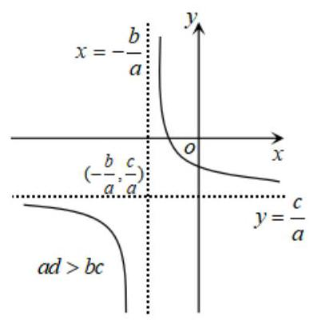

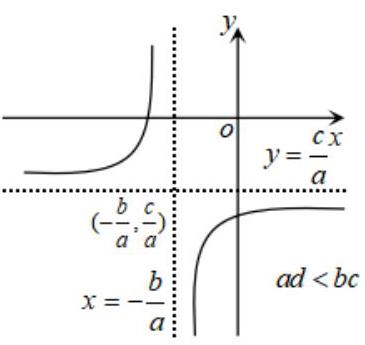

2、分式函数 $y = {ax} + \frac{b}{x}\left( {a, b > 0}\right)$ (“耐克函数”) 的图像与性质:

(1)定义域: $\{ x \mid  x \neq  0\}$ ； (2)值域: ${\{ {y\left| {y \geq  2\sqrt{ab}}\right. ,{{3y} \leq   - 2\sqrt{ab}}}\} }$ ；

(3)奇偶性:奇函数；

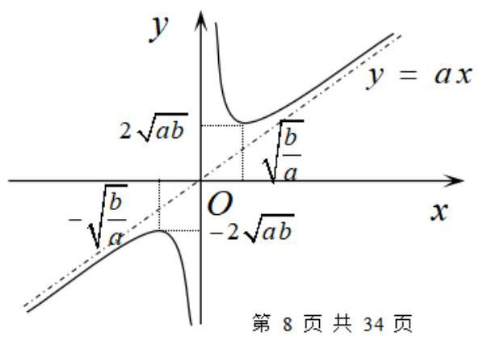

(4)单调性:在区间 $\left( {-\infty , - \sqrt{\frac{b}{a}}}\right\rbrack   \cup  \left\lbrack  {\sqrt{\frac{b}{a}}, + \infty }\right)$ 上是增函数， 在区间 $\left( {0,\sqrt{\frac{b}{a}}}\right\rbrack  ,\left\lbrack  {-\sqrt{\frac{b}{a}},0}\right)$ 上为减函数;

(5)渐近线:以 $y$ 轴和直线 $y = {ax}$ 为渐近线;

(6)图象:如右图所示.

3、分式函数 $y = {ax} + \frac{b}{x}\left( {a, b \in  R,{ab} \neq  0}\right)$ 的图像如下:

(1) $y = {ax} + \frac{b}{x}\left( {a > 0, b > 0}\right)$ (2) $y = {ax} + \frac{b}{x}\left( {a > 0, b < 0}\right)$

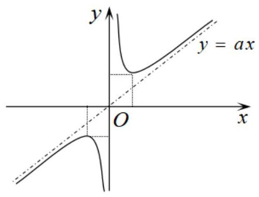

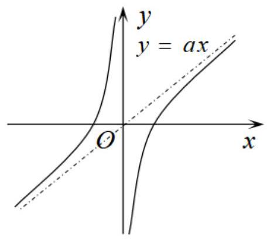

(3) $y = {ax} + \frac{b}{x}\left( {a < 0, b > 0}\right)$ (4) $y = {ax} + \frac{b}{x}\left( {a < 0, b < 0}\right)$

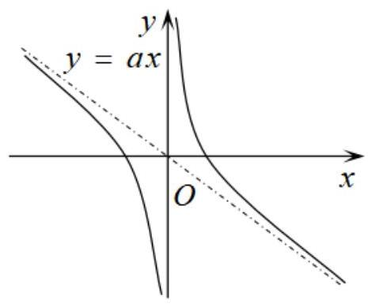

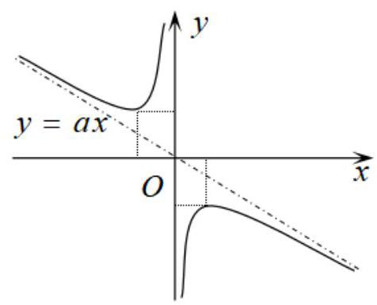

$y = {ax} + \frac{b}{x}\left( {a, b \in  R,{ab} \neq  0}\right)$ 的单调性、值域、奇偶性等,可以结合函数的图像研究.

## 例题精讲

【例 6】关于函数 $y = x + \frac{a}{x}\left( {a \in  R}\right)$ 单调性的描述正确的是( )

A. $(0,\sqrt{a}\rbrack$ 上单调递减, $\left\lbrack  {\sqrt{a}, + \infty }\right)$ 上单调递增

B. $\left\lbrack  {-\sqrt{a},0}\right)$ 上单调递减, $\left( {-\infty , - \sqrt{a}}\right\rbrack$ 上单调递增

C. 当 $a < 0$ 时,在 $\left( {-\infty ,0}\right)$ 和 $\left( {0, + \infty }\right)$ 上单调递减

D. 当 $a < 0$ 时,在 $\left( {-\infty ,0}\right)$ 和 $\left( {0, + \infty }\right)$ 上单调递增

【解析】解: 函数的定义域为 $\left( {-\infty ,0}\right)  \cup  \left( {0, + \infty }\right)$ ,

若 $a < 0$ ,则函数则 $\left( {-\infty ,0}\right)$ 和 $\left( {0, + \infty }\right)$ 上单调递增,故 $D$ 正确,

若 $a > 0$ ,则函数在 $\left( {0,\sqrt{a}}\right\rbrack$ 上单调递减, $\left\lbrack  {\sqrt{a}, + \infty }\right)$ 上单调递增,

故选: $D$ .

【例 7】已知函数 $f\left( x\right)  = {e}^{x} - {e}^{-x}$ .

( 1 )解不等式: $f\left( {1 - {2x}}\right)  + f\left( {{x}^{2} - 4}\right)  < 0$ ；

( 2 )是否存在非零实数 $t$ ，使得不等式 $f\left( {{2t} - \frac{1}{t}}\right)  + f\left( {1 - \sin \theta  - 2{\cos }^{2}\frac{\theta }{2}}\right)  \leq  0$ 对任意的 $\theta  \in  \left\lbrack  {0,\frac{\pi }{2}}\right\rbrack$ 都成立， 若存在,求出 $t$ 的取值范围; 若不存在,说明理由。

【难度】 $\star   \star   \star$

【答案】(1) $- 1 < x < 3$ ；(2) $t \leq   - \frac{1}{2}$ 或 $0 < t \leq  1$ .

【解析】(1) 因为 $y = {e}^{x}, y =  - {e}^{x}$ 都是 $\mathrm{R}$ 上的增函数,所以 $f\left( x\right)  = {e}^{x} - {e}^{-x}$ 是 $\mathrm{R}$ 上的增函数.

又因为 $f\left( {-x}\right)  = {e}^{-x} - {e}^{x} =  - f\left( x\right)$ ,所以函数 $f\left( x\right)$ 是奇函数.

因为 $f\left( {1 - {2x}}\right)  + f\left( {{x}^{2} - 4}\right)  < 0$ ,所以 $f\left( {1 - {2x}}\right)  < f\left( {-{x}^{2} + 4}\right) ,\therefore 1 - {2x} <  - {x}^{2} + 4$ ,

所以 ${x}^{2} - {2x} - 3 < 0,\therefore \left( {x - 3}\right) \left( {x + 1}\right)  < 0,\therefore  - 1 < x < 3$ . 所以不等式的解为 $- 1 < x < 3$ .

(2)因为 $f\left( {{2t} - \frac{1}{t}}\right)  + f\left( {1 - \sin \theta  - 2{\cos }^{2}\frac{\theta }{2}}\right)  \leq  0$ ，所以 $f\left( {{2t} - \frac{1}{t}}\right)  + f\left( {-\sin \theta  - \cos \theta }\right)  \leq  0$ ，

所以 $f\left( {{2t} - \frac{1}{t}}\right)  \leq  f\left( {\sin \theta  + \cos \theta }\right)$ ,所以 ${2t} - \frac{1}{t} \leq  \sin \theta  + \cos \theta  = \sqrt{2}\sin \left( {\theta  + \frac{\pi }{4}}\right)$ ,

因为 $\theta  \in  \left\lbrack  {0,\frac{\pi }{2}}\right\rbrack$ ,所以 $\theta  + \frac{\pi }{4} \in  \left\lbrack  {\frac{\pi }{4},\frac{3\pi }{4}}\right\rbrack$ ,所以 $\sqrt{2}\sin \left( {\theta  + \frac{\pi }{4}}\right)  \in  \left\lbrack  {1,\sqrt{2}}\right\rbrack$ ,所以 ${2t} - \frac{1}{t} \leq  1$ ,

所以 $\frac{\left( {{2t} + 1}\right) \left( {t - 1}\right) }{t} \leq  0,\therefore \left\{  \begin{array}{l} t\left( {{2t} + 1}\right) \left( {t - 1}\right)  \leq  0 \\  t \neq  0 \end{array}\right.$ ,所以 $t \leq   - \frac{1}{2}$ 或 $0 < t \leq  1$ 。

【例 8】甲、乙两地相距 300 千米，汽车从甲地匀速行驶到乙地，速度不超过 100 千米/小时，已知汽车每小时的运输成本 (以元为单位) 由可变部分和固定部分组成,可变部分与速度 $v$ (千米/小时) 的平方成正比，比例系数为 $b\left( {b > 0}\right)$ ，固定部分为 1000 元。

(1)把全程运输成本 $y$ (元)表示为速度 $v$ (千米/小时)的函数，并指出这个函数的定义域；

(2)为了使全程运输成本最小，汽车应以多大速度行驶？

【难度】 $\star   \star   \star$

【答案】(1) $y = {300}\left( {\frac{1000}{v} + {bv}}\right) , v \in  (0,{100}\rbrack$ ;

(2)当 $b \geq  \frac{1}{10}$ 时， $v = \sqrt{\frac{1000}{b}}$ ， $b \in  \left( {0,\frac{1}{10}}\right)$ 时， $v = {100}$ 时最小.

【解析】(1) 由题意得,全程运输成本 $y = \frac{300}{v}\left( {{1000} + b{v}^{2}}\right)  = {300}\left( {\frac{1000}{v} + {bv}}\right) , v \in  (0,{100}\rbrack$

(2)因为 $b > 0, v > 0$

所以 $y = {300}\left( {\frac{1000}{v} + {bv}}\right)  \geq  {600}\sqrt{\frac{1000}{v} \cdot  {bv}} = {6000}\sqrt{10b}$ ,当且仅当 $\frac{1000}{v} = {bv}$ 时取等号,即 $v = \sqrt{\frac{1000}{b}}$

① 当 $\sqrt{\frac{1000}{b}} \leq  {100}$ 时，即 $b \geq  \frac{1}{10}$ 时， $v = \sqrt{\frac{1000}{b}}$ 时， $y$ 最小。

② 当 $\sqrt{\frac{1000}{b}} > {100}$ 时，即 $0 < b < \frac{1}{10}$ 时， $y$ 在 $(0,{100}\rbrack$ 上单调递减，则 $v = {100}$ 时， $y$ 最小。

## 巩固训练

1、设函数 $f\left( x\right)  = \frac{{x}^{2} - {2x} + 5}{x - 1}$ 在区间 $\left\lbrack  {2,9}\right\rbrack$ 上的最大值和最小值分别为 $M$ 、 $m$ ，则 $m + M =$ ___。

【难度】 $\star   \star   \star$

【答案】 $\frac{25}{2}$

【解析】 $f\left( x\right)  = \frac{{x}^{2} - {2x} + 5}{x - 1} = \frac{{\left( x - 1\right) }^{2} + 4}{x - 1} = \left( {x - 1}\right)  + \frac{4}{x - 1}$ ;

因为 $x \in  \left\lbrack  {2,9}\right\rbrack$ ,所以 $x - 1 \in  \left\lbrack  {1,8}\right\rbrack$ ,令 $x - 1 = t$ ,则 $t \in  \left\lbrack  {1,8}\right\rbrack$ ;

因为 $y = f\left( x\right)  = t + \frac{4}{t}, t \in  \left\lbrack  {1,8}\right\rbrack$ ,根据耐克函数性质可知当 $t = 2$ 时,函数有最小值为 4 ;

当 $t = 8$ 时,函数有最大值为 $\frac{17}{2}$ . 所以 $m + M = \frac{25}{2}$ 。

2、关于函数 $f\left( x\right)  = x - \frac{a}{x}\left( {a > 0}\right)$ ,有下列四个命题:

(1) $f\left( x\right)$ 的值域是 $\left( {-\infty ,0}\right)  \cup  \left( {0, + \infty }\right)$ ；

(2) $f\left( x\right)$ 是奇函数；

(3)在 $\left( {-\infty ,0}\right)  \cup  \left( {0, + \infty }\right)$ 上单调递增；

(4)方程 $\left| {f\left( x\right) }\right|  = a$ 总有四个不同的解. 其中正确的是( )

A、(1)(2) B、(2) (3) C、(2) (4) D、(3)(4)

【难度】 $\star   \star   \star$

【答案】C

【解析】根据图像解题

3、为了在夏季降温和冬季供暖时减少能源损耗，房屋的屋顶和外墙需要建造隔热层.某幢建筑物要建造可使用16年的隔热层，每厘米厚的隔热层建造成本为4万元. 该建筑物每年的能源消耗费用 $C$ (单位:万元) 与隔热层厚度 $x$ (单位: 厘米) 满足关系: $C\left( x\right)  = \frac{k}{x + 5}\left( {0 \leq  x \leq  {10}}\right)$ . 若不建隔热层,每年的能源消耗费用为 $\frac{36}{5}$ 万元. 设 $f\left( x\right)$ 为隔热层建造费用与 16 年的能源消耗费用之和.

(1)求 $k$ 的值及 $f\left( x\right)$ 的表达式；

(2)隔热层修建多厚时，总费用 $f\left( x\right)$ 最小，并求其最小值.

【难度】 $\star   \star   \star$

【答案】(1) $k = {36}, f\left( x\right)  = \frac{576}{x + 5} + {4x}\left( {0 \leq  x \leq  {10}}\right)$ (2) 当隔热层修建 7 厘米厚时,总费用达到最小, 且最小为 76 万元.

【解析】(1) 由题意知: $C\left( 0\right)  = \frac{36}{5}$ ,代入 $C\left( x\right)  = \frac{k}{x + 5}$ 中得 $k = {36}$ ,因此 $C\left( x\right)  = \frac{36}{x + 5}\left( {0 \leq  x \leq  {10}}\right)$

$\therefore f\left( x\right)  = {16C}\left( x\right)  + {4x} = \frac{{16} \times  {36}}{x + 5} + {4x}$ ,即 $\therefore f\left( x\right)  = \frac{576}{x + 5} + {4x}\left( {0 \leq  x \leq  {10}}\right)$

(2)由 $f\left( x\right)  = \frac{576}{x + 5} + {4x} = 4\left\lbrack  {\frac{144}{x + 5} + \left( {x + 5}\right)  - 5}\right\rbrack$

令 $t = x + 5$ ,则 $t \in  \left\lbrack  {5,{15}}\right\rbrack$ ,考察函数 $g\left( t\right)  = t + \frac{144}{t}$ 在 $t \in  \left\lbrack  {5,{15}}\right\rbrack$ 的单调性知: 当 $t \in  \left\lbrack  {5,{12}}\right\rbrack$ 时为减函数,当

$t \in  \left\lbrack  {{12},{15}}\right\rbrack$ 时为增函数, $\therefore {g}_{\min }\left( t\right)  = g\left( {12}\right)  = {24}$

此时 $\therefore {f}_{\min }\left( x\right)  = f\left( 7\right)  = {76}$

即当隔热层修建 7 厘米厚时, 总费用达到最小, 且最小为 76 万元。

4、已知函数 $f\left( x\right)  = \frac{x + 1 - a}{a - x}\left( {x \neq  a}\right)$ ,

(1)证明:对定义域内的所有 $x$ ，都有 $f\left( {{2a} - x}\right)  + f\left( x\right)  + 2 = 0$ ；

( 2 )当 $f\left( x\right)$ 的定义域为 $\left\lbrack  {a + \frac{1}{2}, a + 1}\right\rbrack$ 时，求 $f\left( x\right)$ 的值域；

(3) 设函数 $g\left( x\right)  = {x}^{2} + \left| {\left( {x - a}\right) f\left( x\right) }\right|$ ,求 $g\left( x\right)$ 的最小值.

【难度】 $\star   \star   \star   \star$

【答案】见解析

【解析】(1)证明: $f\left( x\right)  + 2 + f\left( {{2a} - x}\right)  = \frac{x + 1 - a}{a - x} + 2 + \frac{{2a} - x + 1 - a}{a - {2a} + x} \; = \frac{x + 1 - a}{a - x} + 2 + \frac{a - x + 1}{x - a} = \frac{x + 1 - a + {2a} - {2x} - a + x - 1}{a - x} = 0\therefore$ 结论成立

(2)证明: $f\left( x\right)  = \frac{-\left( {a - x}\right)  + 1}{a - x} =  - 1 + \frac{1}{a - x}$

当 $a + \frac{1}{2} \leq  x \leq  a + 1$ 时 $- a - 1 \leq   - x \leq   - a - \frac{1}{2}\; - 1 \leq  a - x \leq   - \frac{1}{2}, - 2 \leq  \frac{1}{a - x} \leq   - 1$

$- 3 \leq   - 1 + \frac{1}{a - x} \leq   - 2\;$ 即 $f\left( x\right)$ 值域为 $\left\lbrack  {-3, - 2}\right\rbrack$

(3) 解: $g\left( x\right)  = {x}^{2} + \left| {x + 1 - a}\right| \left( {x \neq  a}\right)$

① 当 $x \geq  a - 1$ 且 $x \neq  a$ 时, $g\left( x\right)  = {x}^{2} + x + 1 - a = {\left( x + \frac{1}{2}\right) }^{2} + \frac{3}{4} - a$

如果 $a - 1 \geq   - \frac{1}{2}$ 即 $a \geq  \frac{1}{2}$ 时,则函数在 $\lbrack a - 1, a)$ 和 $\left( {a, + \infty }\right)$ 上单调递增

$g{\left( x\right) }_{\min } = g\left( {a - 1}\right)  = {\left( a - 1\right) }^{2},$

如果 $a - 1 <  - \frac{1}{2}$ 即当 $a < \frac{1}{2}$ 时, $g{\left( x\right) }_{\min } = g\left( {-\frac{1}{2}}\right)  = \frac{3}{4} - a$

而当 $a =  - \frac{1}{2}$ 时, $g\left( x\right)$ 在 $x = a = \frac{1}{2}$ 处无定义,故 $g\left( x\right)$ 最小值不存在

② 当 $x \leq  a - 1$ 时 $g\left( x\right)  = {x}^{2} - x - 1 + a = {\left( x - \frac{1}{2}\right) }^{2} + a - \frac{5}{4}$

如果 $a - 1 > \frac{1}{2}$ 即 $a > \frac{3}{2}$ 时 $g{\left( x\right) }_{\min } = g\left( \frac{1}{2}\right)  = a - \frac{5}{4}$

如果 $a - 1 \leq  \frac{1}{2}$ 即 $a \leq  \frac{3}{2}$ 时 $g\left( x\right)$ 在 $\left( {-\infty , a - 1}\right)$ 上为减函数 $g{\left( x\right) }_{\min } = g\left( {a - 1}\right)  = {\left( a - 1\right) }^{2}$

当 $a > \frac{3}{2}$ 时 ${\left( a - 1\right) }^{2} - \left( {a - \frac{5}{4}}\right)  = {\left( a - \frac{3}{2}\right) }^{2} > 0$ 当 $a < \frac{1}{2}$ 时 ${\left( a - 1\right) }^{2} - \left( {\frac{3}{4} - a}\right)  = {\left( a - \frac{1}{2}\right) }^{2} > 0$

综上所述:

当 $a < \frac{1}{2}$ 时 $g\left( x\right)$ 最小值是 $\frac{3}{4} - a$

当 $\frac{1}{2} \leq  a \leq  \frac{3}{2}$ 时 $g\left( x\right)$ 最小值是 ${\left( a - 1\right) }^{2}$

当 $a > \frac{3}{2}$ 时 $g\left( x\right)$ 最小值为 $a - \frac{5}{4}$

当 $a =  - \frac{1}{2}$ 时 $g\left( x\right)$ 最小值不存在

## (三) 幂函数

## 知识梳理

1、定义: 形如 $f\left( x\right)  = {x}^{a}\left( {a \in  Q}\right)$ 的函数叫做幂函数.

2、图像:

A、幂函数 $y = {x}^{a}\left( {a = 0,1}\right)$ 的图象:

<table><tr><td></td><td>$\alpha  = 0$</td><td>$\alpha  = 1$</td></tr><tr><td>图象</td><td>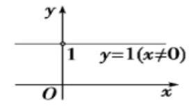</td><td>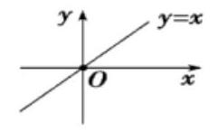</td></tr></table>

B、幂函数 $y = {x}^{a}$ ( $a = \frac{q}{p}, p, q \in  {N}^{ * }$ , $\frac{q}{p}$ 为最简分式) 的图像:

<table><tr><td>$\alpha  = \frac{q}{p}$</td><td>$\alpha  < 0$</td><td>$0 < \alpha  < 1$</td><td>$\alpha  > 1$</td></tr><tr><td>$p\text{ 、 }q$ 都是奇数</td><td>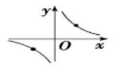</td><td>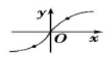</td><td>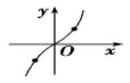</td></tr><tr><td>$p$ 为奇数 $q$ 为偶数</td><td>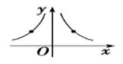</td><td>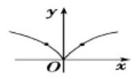</td><td>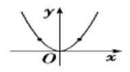</td></tr><tr><td>$p$ 为偶数 $q$ 为奇数</td><td>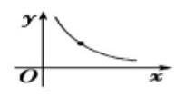</td><td>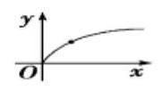</td><td>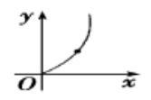</td></tr></table>

(3)幂函数的性质

A、几个常用幂函数的性质:

<table><tr><td></td><td>$y = x$</td><td>$y = {x}^{2}$</td><td>$y = {x}^{3}$</td><td>$y = {x}^{\frac{1}{2}}$</td><td>$y = {x}^{\frac{1}{3}}$</td><td>$y = {x}^{-1}$</td><td>$y = {x}^{-2}$</td><td>$y = {x}^{-\frac{1}{2}}$</td></tr><tr><td>定义域</td><td>R</td><td>R</td><td>R</td><td>$\{ x \mid  x \geq  0\}$</td><td>R</td><td>$\{ x \mid  x \neq  0\}$</td><td>$\{ x \mid  x \neq  0\}$</td><td>$\{ x \mid  x > 0\}$</td></tr><tr><td>奇偶性</td><td>奇</td><td>偶</td><td>奇</td><td>非奇非偶</td><td>奇</td><td>奇</td><td>偶</td><td>非奇非偶</td></tr><tr><td>在第I 象限的增减性</td><td>在第I象限单调递增</td><td>在第 I 象限单调递增</td><td>在第 I 象限单调递增</td><td>在第 I 象限单调递增</td><td>在第 I 象限单 调递增</td><td>在第 I 象限单调递减</td><td>在第 I 象限单调递减</td><td>在第I象限单调递减</td></tr></table>

B、幂函数 $y = {x}^{a}$ 的性质:

当 $\alpha  > 0$ 时,幂函数 $y = {x}^{a}$ 有下列性质:

(1)图象都通过点 $\left( {0,0}\right) ,\left( {1,1}\right)$ ；(2)在第一象限内都是增函数；

(3)在第一象限内， $\alpha  > 1$ 时，图象是向上的竖直抛物线； $0 < \alpha  < 1$ 时，图象是横卧抛物线型.

当 $\alpha  < 0$ 时,幂函数 $y = {x}^{\alpha }$ 有下列性质:

(1)图象都通过点 (1,1); (2)在第一象限内都是减函数，图象是双曲线型.

注: 无论 $\alpha$ 取任何实数,幂函数 $y = {x}^{\alpha }$ 的图象必然经过第一象限,并且一定不经过第四象限. $\left| \alpha \right|$ 越大,幂函数 $y = {x}^{\alpha }$ 上升或下降的越快.

## 例题精讲

【例 9】下列关于幂函数 $f\left( x\right)  = {x}^{a}\left( {a \in  Q}\right)$ 的论述中,正确的是( )

A. 当 $a = 0$ 时，幂函数的图像是一条直线

B. 幂函数的图像都经过 $\left( {0,0}\right)$ 和 $\left( {1,1}\right)$ 两个点

C. 若函数 $f\left( x\right)$ 为奇函数,则 $f\left( x\right)$ 在定义域内是增函数

D. 幂函数 $f\left( x\right)$ 的图像不可能在第四象限内

【难度】

【答案】D

【解析】A. 当 $a = 0$ 时, $f\left( x\right)  = {x}^{0}$ ,其定义域为 $\{ x \mid  x \neq  0\}$ ,所以图象为直线去掉点 $\left( {0,0}\right)$ ,故错误;

B. $f\left( x\right)  = \frac{1}{x}$ 显然不过点 $\left( {0,0}\right)$ ,故错误;

C. $f\left( x\right)  = \frac{1}{x}$ 的定义域为 $\left( {-\infty ,0}\right)  \cup  \left( {0, + \infty }\right)$ 且为奇函数, $f\left( x\right)$ 在定义域内不是增函数,故错误;

D. 当 $x > 0$ 时, $y = {x}^{a} > 0$ ,所以幂函数 $f\left( x\right)$ 的图象不可能在第四象限内,故正确. 故选: D。

【例 10】若 ${\left( a + 1\right) }^{-\frac{1}{3}} < {\left( 3 - 2a\right) }^{-\frac{1}{3}}$ ，则 $a$ 的取值范围是___.

【难度】 $\star   \star   \star$

【答案】 $\frac{2}{3} < a < \frac{3}{2}$ 或 $a <  - 1$

【解析】解: $\because {\left( a + 1\right) }^{-\frac{1}{3}} < {\left( 3 - 2a\right) }^{-\frac{1}{3}}, y = {x}^{-\frac{1}{3}}$ 在 $\left( {-\infty ,0}\right)$ 上单调递减,在 $\left( {0, + \infty }\right)$ 上单调递减

$\therefore \left\{  {\begin{array}{l} a + 1 > 0 \\  3 - {2a} > 0 \\  a + 1 > 3 - {2a} \end{array}\text{ 或 }\left\{  {\begin{array}{l} a + 1 < 0 \\  3 - {2a} < 0 \\  a + 1 > 3 - {2a} \end{array}\text{ 或 }\left\{  {\begin{array}{l} 3 - {2a} > 0 \\  a + 1 < 0 \end{array}\text{ 解之得 }\frac{2}{3} < a < \frac{3}{2}\text{ 或 }a <  - 1.}\right. }\right. }\right.$

故答案为: $\frac{2}{3} < a < \frac{3}{2}$ 或 $a <  - 1$

【例 11】已知集合 $M$ 是同时满足下列两个性质的函数 $f\left( x\right)$ 的全体:

① $f\left( x\right)$ 在其定义域上是单调增函数或单调减函数；②在 $f\left( x\right)$ 的定义域内存在区间 $\left\lbrack  {a, b}\right\rbrack$ ，使得 $f\left( x\right)$ 在 $\left\lbrack  {a, b}\right\rbrack$ 上的值域是 $\left\lbrack  {\frac{1}{2}a,\frac{1}{2}b}\right\rbrack$ .

(I) 判断函数 $y =  - {x}^{3}$ 是否属于集合 $M$ ? 并说明理由. 若是,请找出区间 $\left\lbrack  {a, b}\right\rbrack$ ;

(II) 若函数 $y = \sqrt{x - 1} + t \in  M$ ,求实数 $t$ 的取值范围.

【难度】

【答案】见解析

【解析】( 1 ) $y =  - {x}^{3}$ 的定义域是 $R,\therefore y =  - {x}^{3}$ 在 $R$ 上是单调减函数.

则 $y =  - {x}^{3}$ 在 $\left\lbrack  {a, b}\right\rbrack$ 上的值域是 $\left\lbrack  {-{b}^{3}, - {a}^{3}}\right\rbrack$ .

由 $\left\{  \begin{array}{l}  - {b}^{3} = \frac{1}{2}a, \\   - {a}^{3} = \frac{1}{2}b. \end{array}\right.$ 解得: $\left\{  \begin{array}{l} a =  - \frac{\sqrt{2}}{2}, \\  b = \frac{\sqrt{2}}{2}. \end{array}\right.$ 或 $\left\{  \begin{array}{l} a = \frac{\sqrt{2}}{2}, \\  b =  - \frac{\sqrt{2}}{2}. \end{array}\right.$ (舍去) 或 $\left\{  \begin{array}{l} a = 0, \\  b = 0. \end{array}\right.$ (舍去)

$\therefore$ 函数 $y =  - {x}^{3}$ 属于集合 $M$ ,且这个区间是 $\left\lbrack  {-\frac{\sqrt{2}}{2},\frac{\sqrt{2}}{2}}\right\rbrack$ .

(II) 设 $g\left( x\right)  = \sqrt{x - 1} + t$ ,则易知 $g\left( x\right)$ 是定义域 $\lbrack 1, + \infty )$ 上的增函数.

$\because \;g\left( x\right)  \in  M,\therefore$ 存在区间 $\left\lbrack  {a, b}\right\rbrack   \subset  \lbrack 1, + \infty )$ ,满足 $g\left( a\right)  = \frac{1}{2}a, g\left( b\right)  = \frac{1}{2}b$ .

即方程 $g\left( x\right)  = \frac{1}{2}x$ 在 $\lbrack 1, + \infty )$ 内有两个不等实根.

[法一]: 方程 $\sqrt{x - 1} + t = \frac{1}{2}x$ 在 $\lbrack 1, + \infty )$ 内有两个不等实根,等价于方程 $x - 1 = {\left( \frac{1}{2}x - t\right) }^{2}$ 在 $\lbrack {2t}, + \infty )$ 内有两个不等实根.

即方程 ${x}^{2} - \left( {{4t} + 4}\right) x + 4{t}^{2} + 4 = 0$ 在 $\lbrack {2t}, + \infty )$ 内有两个不等实根.

根据一元二次方程根的分布有 $\left\{  \begin{array}{l} {\left( 2t\right) }^{2} - \left( {{4t} + 4}\right)  \cdot  {2t} + 4{t}^{2} + 4 \geq  0, \\  \Delta  = {\left( 4t + 4\right) }^{2} - 4\left( {4{t}^{2} + 4}\right)  > 0, \\  \frac{{4t} + 4}{2} > {2t}. \end{array}\right.$

解得 $0 < t \leq  \frac{1}{2}$ .

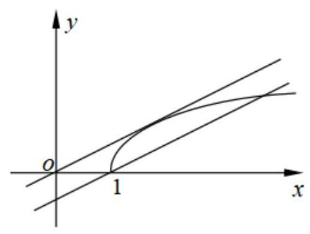

因此,实数 $t$ 的取值范围是 $0 < t \leq  \frac{1}{2}$ .

[法三]: 要使方程 $\sqrt{x - 1} + t = \frac{1}{2}x$ 在 $\lbrack 1, + \infty )$ 内有两个不等实根, 即使方程 $\sqrt{x - 1} = \frac{1}{2}x - t$ 在 $\lbrack 1, + \infty )$ 内有两个不等实根.

如图,当直线 $y = \frac{1}{2}x - t$ 经过点 $\left( {1,0}\right)$ 时, $t = \frac{1}{2}$ ,

当直线 $y = \frac{1}{2}x - t$ 与曲线 $y = \sqrt{x - 1}$ 相切时,

方程 $\sqrt{x - 1} = \frac{1}{2}x - t$ 两边平方,得 ${x}^{2} - \left( {{4t} + 4}\right) x + 4{t}^{2} + 4 = 0$ ,由 $\Delta  = 0$ ,得 $t = 0$ .

因此,利用数形结合得实数 $t$ 的取值范围是 $0 < t \leq  \frac{1}{2}$ .

## 巩固训练

1、如图所示曲线是幂函数 $y = {x}^{a}$ 在第一象限内的图象,其中 $a =  \pm  \frac{1}{2}, a =  \pm  2$ ,则曲线 ${C}_{1},{C}_{2},{C}_{3},{C}_{4}$ 对应 $a$ 的值依次是( )

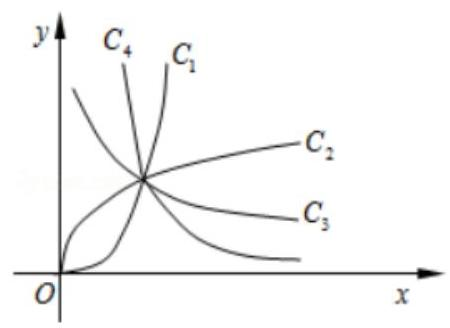

A. $\frac{1}{2} - 2$ 、-2、 $- \frac{1}{2}\;$ B.2、 $\frac{1}{2}$ 、 $- \frac{1}{2}$ 、-2C. $- \frac{1}{2}$ 、-2、2、 $\frac{1}{2}$ D.2、 $\frac{1}{2}$ 、-2、 $- \frac{1}{2}$

【难度】 $\star   \star$

【答案】 $B$ .

【解析】考察幂函数的图像

2、设 $y = f\left( x\right)$ 和 $y = g\left( x\right)$ 是两个不同的幂函数，集合 $M = \{ x \mid  f\left( x\right)  = g\left( x\right) \}$ ，则集合中的元素个( )

A. 1 或 2 或 0 B. 1 或 2 或 3 C. 1 或 2 或 3 或 4 D. 0 或 1 或 2 或 3

【难度】 $\star   \star   \star$

【答案】B.

【解析】考察幂函数的图像

3、已知幂函数 $f\left( x\right)  = {x}^{-{m}^{2} + {2m} + 3}\left( {m \in  Z}\right)$ 在区间 $\left( {0, + \infty }\right)$ 上是单调增函数,且为偶函数.

(1)求函数 $f\left( x\right)$ 的解析式;

(2)设函数 $g\left( x\right)  = 2\sqrt{f\left( x\right) } - {8x} + q - 1$ ，若 $g\left( x\right)  > 0$ 对任意 $x \in  \left\lbrack  {-1,1}\right\rbrack$ 恒成立，求实数 $q$ 的取值范围.

【难度】★★★

【答案】见解析

【解析】解: (1) $\because f\left( x\right)$ 在区间 $\left( {0, + \infty }\right)$ 上是单调增函数, $\therefore  - {m}^{2} + {2m} + 3 > 0$ 即 ${m}^{2} - {2m} - 3 < 0 \; \therefore  - 1 < m < 3$ 又 $\because m \in  Z\therefore m = 0,1,2$ 而 $m = 0,2$ 时, $f\left( x\right)  = {x}^{3}$ 不是偶函数, $m = 1$ 时, $f\left( x\right)  = {x}^{4}$ 是偶函数. $\therefore f\left( x\right)  = {x}^{4}$

(2)由 $f\left( x\right)  = {x}^{4}$ 知 $g\left( x\right)  = 2{x}^{2} - {8x} + q - 1, g\left( x\right)  > 0$ 对任意 $x \in  \left\lbrack  {-1,1}\right\rbrack$ 恒成立 $\Leftrightarrow  g{\left( x\right) }_{\min } > 0, x \in  \left\lbrack  {-1,1}\right\rbrack$ . 又 $g\left( x\right)  = 2{x}^{2} - {8x} + q - 1 = 2{\left( x - 2\right) }^{2} + q - 9$

$\therefore g\left( x\right)$ 在 $\left\lbrack  {-1,1}\right\rbrack$ 上单调递减,于是 $g{\left( x\right) }_{\min } = g\left( 1\right)  = q - 7$ . $\therefore q - 7 > 0, q > 7$ 故实数 $q$ 的取值范围是 $\left( {7, + \infty }\right)$ .

## (四) 指数函数

## 知识梳理

## 指数与指数幂的运算

## (1)根式的概念

①如果 ${x}^{n} = a, a \in  R, x \in  R, n > 1$ ，且 $n \in  {N}_{ + }$ ，那么 $x$ 叫做 $a$ 的 $n$ 次方根.

当 $n$ 是奇数时， $a$ 的 $n$ 次方根用符号 $\sqrt[n]{a}$ 表示；

当 $n$ 是偶数时,正数 $a$ 的正的 $n$ 次方根用符号 $\sqrt[n]{a}$ 表示,

负的 $n$ 次方根用符号 $- \sqrt[n]{a}$ 表示;

0 的 $n$ 次方根是 0 ; 负数 $a$ 没有 $n$ 次方根.

②式子 $\sqrt[n]{a}$ 叫做根式，这里 $n$ 叫做根指数， $a$ 叫做被开方数. 当 $n$ 为奇数时， $a$ 为任意实数；当 $n$ 为偶数时， $a \geq  0$ .

③ 根式的性质: ${\left( \sqrt[n]{a}\right) }^{n} = a$ ；当 $n$ 为奇数时， $\sqrt[n]{{a}^{n}} = a$ ；

当 $n$ 为偶数时, $\sqrt[n]{{a}^{n}} = \left| a\right|  = \left\{  \begin{array}{ll} a & \left( {a \geq  0}\right) \\   - a & \left( {a < 0}\right)  \end{array}\right.$ .

## (2)分数指数幂的概念

①正数的正分数指数幂的意义是: ${a}^{\frac{m}{n}} = \sqrt[n]{{a}^{m}}\left( {a > 0, m, n \in  {N}_{ + }\text{ ，且 }n > 1}\right)$ . 0的正分数指数幂等于 0 .

②正数的负分数指数幂的意义是: ${a}^{-\frac{m}{n}} = {\left( \frac{1}{a}\right) }^{\frac{m}{n}} = \sqrt[n]{{\left( \frac{1}{a}\right) }^{m}}\left( {a > 0, m, n \in  {N}_{ + }\text{ ,且 }n > 1}\right)$ . 0的负分数指数幂没有意义.

(3)分数指数幂的运算性质

① ${a}^{r} \cdot  {a}^{s} = {a}^{r + s}\left( {a > 0, r, s \in  R}\right) \;$ ② ${\left( {a}^{r}\right) }^{s} = {a}^{rs}\left( {a > 0, r, s \in  R}\right) \;$ ③ ${\left( ab\right) }^{r} = {a}^{r}{b}^{r}\left( {a > 0, b > 0, r \in  R}\right)$

## 指数函数的图像与性质

<table id="cross-table-1"><tr><td>函数名称</td><td colspan="2">指数函数</td></tr><tr><td>定义</td><td colspan="2">函数 $y = {a}^{x}\left( {a > 0\text{ 且 }a \neq  1}\right)$ 叫做指数函数</td></tr><tr><td>图</td><td>$a > 1$</td><td>$0 < a < 1$</td></tr><tr><td>象</td><td>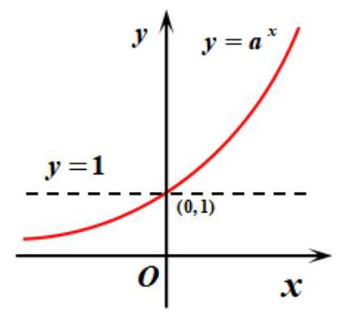</td><td>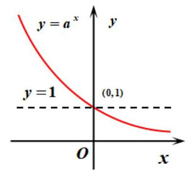</td></tr><tr><td>定义域</td><td colspan="2">$R$</td></tr><tr><td>值域</td><td colspan="2">$\left( {0, + \infty }\right)$</td></tr><tr><td>过定点</td><td colspan="2">图象过定点 $\left( {0,1}\right)$ ,即当 $x = 0$ 时, $y = 1$ .</td></tr><tr><td>奇偶性</td><td colspan="2">非奇非偶</td></tr><tr><td>单调性</td><td>在 $R$ 上是增函数</td><td>在 $R$ 上是减函数</td></tr><tr><td>函数值的变化情况</td><td>${a}^{x} > 1\left( {x > 0}\right)$    ${a}^{x} = 1\;\left( {x = 0}\right)$    ${a}^{x} < 1\;\left( {x < 0}\right)$</td><td>${a}^{x} < 1\left( {x > 0}\right)$    ${a}^{x} = 1\left( {x = 0}\right)$    ${a}^{x} > 1\left( {x < 0}\right)$</td></tr><tr><td>$a$ 变化对图象的影响</td><td colspan="2">在第一象限内, $a$ 越大图象越高; 在第二象限内, $a$ 越大图象越低.</td></tr></table>

## 例题精讲

【例12】高斯是德国著名的数学家，近代数学奠基者之一，享有“数学王子”的称号，用其名字命名的“高斯函数”为:设 $x \in  \mathbf{R}$ ，用 $\left\lbrack  x\right\rbrack$ 表示不超过 $x$ 的最大整数，则 $y = \left\lbrack  x\right\rbrack$ 称为高斯函数，例如:[-2.1] = -3, [3.1] $= 3$ ，已知函数 $f\left( x\right)  = \frac{{2}^{x + 1}}{1 + {2}^{x}} - \frac{1}{3}$ ，则函数 $y = \left\lbrack  {f\left( x\right) }\right\rbrack$ 的值域是___。

【难度】 $\star   \star   \star$

【答案】 $\{  - 1,0,1\}$

【解析】函数 $f\left( x\right)  = \frac{{2}^{x + 1}}{1 + {2}^{x}} - \frac{1}{3} = \frac{5}{3} - \frac{2}{1 + {2}^{x}} \in  \left( {-\frac{1}{3},\frac{5}{3}}\right)$ ,当 $- \frac{1}{3} < f\left( x\right)  < 0$ 时, $y = \left\lbrack  {f\left( x\right) }\right\rbrack   =  - 1$ ; 当 $0 \leq  f\left( x\right)  < 1$ 时, $y = \left\lbrack  {f\left( x\right) }\right\rbrack   = 0$ ; 当 $1 \leq  f\left( x\right)  < \frac{5}{3}$ 时, $y = \left\lbrack  {f\left( x\right) }\right\rbrack   = 1$ ,

$\therefore$ 函数 $y = \left\lbrack  {f\left( x\right) }\right\rbrack$ 的值域是 $\{  - 1,0,1\}$ 。

【例 13】设函数 $f\left( x\right)  = \left\{  \begin{array}{ll} \left| {{2}^{x} - 1}\right| , & x \leq  2 \\   - x + 5, & x > 2 \end{array}\right.$ ，若互不相等的实数 $a, b, c$ 满足 $f\left( a\right)  = f\left( b\right)  = f\left( c\right)$ ，则 ${2}^{a} + {2}^{b} + {2}^{c}$ 的取值范围是___。

【难度】 $\bigstar \bigstar \bigstar$

【答案】 $\left( {{18},{34}}\right)$

【解析】画出函数 $f\left( x\right)$ 的图象如图所示.

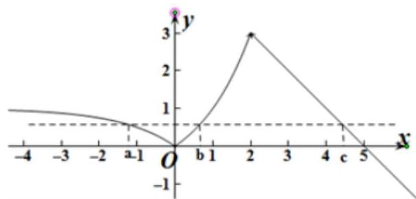

不妨令 $a < b < c$ ,则 $1 - {2}^{a} = {2}^{b} - 1$ ,则 ${2}^{a} + {2}^{b} = 2$ .

结合图象可得 $4 < c < 5$ ,故 ${16} < {2}^{c} < {32} \cdot  \therefore {18} < {2}^{a} + {2}^{b} + {2}^{c} < {34}$ 。

【例 15】已知函数 $f\left( x\right)  = {\mathrm{e}}^{\left| x - t\right| }, g\left( x\right)  =  - x + \mathrm{e}, h\left( x\right)  = \max \{ f\left( x\right) , g\left( x\right) \}$ ,其中 $\max \{ a, b\}$ 表示 $a, b$ 中最大的数.

(1) 若 $t = 1$ ，则 $h\left( 0\right)  =$ ___；

(2) 若 $h\left( x\right)  > \mathrm{e}$ 对 $x \in  R$ 恒成立，则 $t$ 的取值范围是___。

【难度】 $\star   \star   \star   \star$

【答案】 $\mathrm{e}\;t <  - 1$

【解析】(1) 当 $t = 1$ 时, $f\left( x\right)  = {e}^{\left| x - t\right| } = {e}^{\left| x - 1\right| }, f\left( 0\right)  = e, g\left( 0\right)  = e$ ,所以, $h\left( 0\right)  = e$ .

( 2 )当 $x < 0$ 时， $g\left( x\right)  =  - x + e > e$ ，所以，有 $h\left( x\right)  = \max \{ f\left( x\right) , g\left( x\right) \}  > e$ 成立；

当 $x \geq  0$ 时, $g\left( x\right)  \leq  e$ ,所以,只要 $f\left( x\right)  > e$ 即可,

即函数 $f\left( x\right)  = {\mathrm{e}}^{\left| x - t\right| }$ 当 $\mathrm{x} > 0$ 时,有 $f\left( x\right)  > e$ ,如下图,

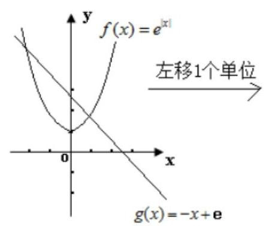

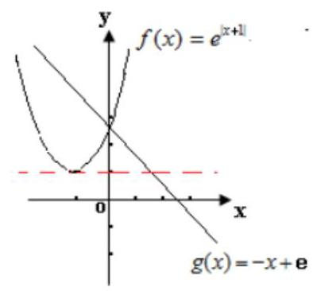

将 $f\left( x\right)  = {e}^{\left| x\right| }$ 左移 1 个单位，得到函数: $f\left( x\right)  = {e}^{\left| x + 1\right| }$ 图象，

此时,有 $f\left( x\right)  \geq  e\left( {\mathrm{x} > 0}\right)$ ,图象再左移满足 $f\left( x\right)  > e$ ,所以,有 $t <  - 1$ . 故答案为 $\mathrm{e}, t <  - 1$ 。

【例 16】已知函数 $f\left( x\right)  = \frac{{4}^{x} + k \cdot  {2}^{x} + 1}{{4}^{x} + {2}^{x} + 1}$ .

(1)若对任意的 $x \in  \mathbf{R}$ ， $f\left( x\right)  > 0$ 恒成立，求实数 $k$ 的取值范围；

(2)若 $f\left( x\right)$ 的最小值为 -2，求实数 $k$ 的值；

(3)若对任意的 ${x}_{1},{x}_{2},{x}_{3} \in  R$ ，均存在以 $f\left( {x}_{1}\right)$ ， $f\left( {x}_{2}\right)$ ， $f\left( {x}_{3}\right)$ 为三边长的三角形，求实数 $k$ 的取值范围。

【难度】★★★★

【答案】(1) $k >  - 2$ ; (2) $k =  - 8$ ; (3) $- \frac{1}{2} \leq  k \leq  4$

【解析】(1) $k >  - 2$

(2) $f\left( x\right)  = \frac{{4}^{x} + k \cdot  {2}^{x} + 1}{{4}^{x} + {2}^{x} + 1} = 1 + \frac{k - 1}{{2}^{x} + \frac{1}{{2}^{x}} + 1}$ ,令 $t = {2}^{x} + \frac{1}{{2}^{x}} + 1 \geq  3$ ,则 $y = 1 + \frac{k - 1}{t}\left( {t \geq  3}\right)$ ,

当 $k > 1$ 时, $y \in  \left( {1,\frac{k + 2}{3}}\right\rbrack$ 无最小值,舍去; 当 $k = 1$ 时, $y = 1$ 最小值不是 -2,舍去;

当 $k < 1$ 时, $y \in  \left\lbrack  {\frac{k + 2}{3},1}\right)$ ,最小值为 $\frac{k + 2}{3} =  - 2 \Rightarrow  k =  - 8$ ,综上所述, $k =  - 8$ .

(3)由题意， $f\left( {x}_{1}\right)  + f\left( {x}_{2}\right)  > f\left( {x}_{3}\right)$ 对任意 ${x}_{1},{x}_{2},{x}_{3} \in  R$ 恒成立.

当 $\mathrm{k} > 1$ 时，因 $2 < \mathrm{f}\left( {\mathrm{x}}_{1}\right)  + \mathrm{f}\left( {\mathrm{x}}_{2}\right)  \leq  \frac{2\mathrm{k} + 4}{3}$ 且 $1 < \mathrm{f}\left( {\mathrm{x}}_{3}\right)  \leq  \frac{\mathrm{k} + 2}{3}$ ，故 $\frac{\mathrm{k} + 2}{3} \leq  2$ ，即 $1 < \mathrm{k} \leq  4$ ；

当 $\mathrm{k} = 1$ 时， $\mathrm{f}\left( {\mathrm{x}}_{1}\right)  = \mathrm{f}\left( {\mathrm{x}}_{2}\right)  = \mathrm{f}\left( {\mathrm{x}}_{3}\right)  = 1$ ，满足条件；

当 $k < 1$ 时， $\frac{{2k} + 4}{3} \leq  f\left( {x}_{1}\right)  + f\left( {x}_{2}\right)  < 2$ 且 $\frac{k + 2}{3} \leq  f\left( {x}_{3}\right)  < 1$ ，故 $1 \leq  \frac{{2k} + 4}{3}$ ， $- \frac{1}{2} \leq  k < 1$ ；

综上所述， $- \frac{1}{2} \leq  k \leq  4$ 。

## 巩固训练

1、在平面直角坐标系中,若直线 $y = m$ 与函数 $f\left( x\right)  = \left| {{2}^{x} - 1}\right|$ 的图像只有一个交点,则实数 $m$ 的取值范围是___。

【难度】 $\bigstar \bigstar \bigstar$

【答案】 $\lbrack 1, + \infty )$

【解析】画出函数 $f\left( x\right)  = \left| {{2}^{x} - 1}\right|$ 的图象,如图所示:

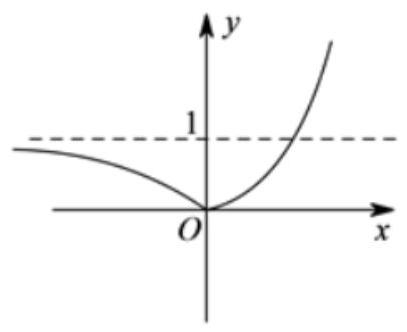

$\therefore$ 若直线 $y = m$ 与函数 $f\left( x\right)  = \left| {{2}^{x} - 1}\right|$ 的图象只有 1 个交点,则 $m \geq  1$ ,即实数 $m$ 的取值范围是: $\lbrack 1, + \infty )$ 。

2、已知函数 $f\left( x\right)  = \left\{  \begin{array}{l} \left( {{3a} - 1}\right) x + 2 - {2a}, x \geq  1 \\  {2}^{ax},\;x < 1 \end{array}\right.$ 满足对于任意 ${x}_{1} \neq  {x}_{2}$ ,都有 $\frac{f\left( {x}_{1}\right)  - f\left( {x}_{2}\right) }{{x}_{1} - {x}_{2}} > 0$ 成立,则 $a$ 的取值范围为___。

【难度】 $\star   \star   \star$

【答案】 $\left( {\frac{1}{3},1}\right\rbrack$

【解析】因为对于任意 ${x}_{1} \neq  {x}_{2}$ ,都有 $\frac{f\left( {x}_{1}\right)  - f\left( {x}_{2}\right) }{{x}_{1} - {x}_{2}} > 0$ ,故

对任意的 ${x}_{1} < {x}_{2}$ ,总有 $f\left( {x}_{1}\right)  - f\left( {x}_{2}\right)  < 0$ 即 $f\left( {x}_{1}\right)  < f\left( {x}_{2}\right)$ ,故 $f\left( x\right)$ 为 $R$ 上的增函数,

所以 $\left\{  \begin{array}{l} a > 0 \\  {3a} - 1 > 0 \\  a + 1 \geq  {2}^{a} \end{array}\right.$ ,故 $\left\{  \begin{array}{l} a > \frac{1}{3} \\  a + 1 \geq  {2}^{a} \end{array}\right.$ .

令 $g\left( a\right)  = a + 1, h\left( a\right)  = {2}^{a}$ ,它们的图象如图所示:

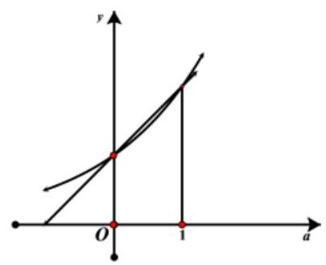

故 $g\left( a\right)  \geq  h\left( a\right)$ 的解为 $\left\lbrack  {0,1}\right\rbrack$ ,故 $\left\{  \begin{array}{l} a > \frac{1}{3} \\  a + 1 \geq  {2}^{a} \end{array}\right.$ 的解为 $\left( {\frac{1}{3},1}\right\rbrack$ . 故答案为: $\left( {\frac{1}{3},1}\right\rbrack$ 。

3、已知函数 $y = 4{a}^{x + 2} - 5$ ( $a > 0$ ，且 $a \neq  1$ )的图像横过定点 $P$ ，若点 $P$ 在直线 ${Ax} + {By} + 2 = 0$ 上，且 ${AB} > 0$ ，则 $\frac{1}{A} + \frac{2}{B}$ 的最小值为___.

【难度】 $\star   \star   \star$

【答案】 4

【解析】令 $x + 2 = 0,\therefore x =  - 2,\therefore y = 4 \times  {a}^{0} - 5 =  - 1$ ,所以定点 $P$ 的坐标为 $\left( {-2, - 1}\right)$ .

所以 $A \times  \left( {-2}\right)  - B + 2 = 0,\therefore {2A} + B = 2,\because A \cdot  B > 0,\therefore A > 0, B > 0$ .

所以 $\frac{1}{A} + \frac{2}{B} = \frac{1}{2} \times  \left( {{2A} + B}\right)  \times  \left( {\frac{1}{A} + \frac{2}{B}}\right)  = \frac{1}{2}\left( {4 + \frac{4A}{B} + \frac{B}{A}}\right)  \geq  \frac{1}{2}\left\lbrack  {4 + 2\sqrt{\frac{4A}{B} \cdot  \frac{B}{A}}}\right\rbrack   = 4$ .

当且仅当 $A = \frac{1}{2}, B = 1$ 时取“等号”. 所以 $\frac{1}{A} + \frac{2}{B}$ 的最小值为 4 . 故答案为:4。

4、已知 $g\left( x\right)  = {x}^{2} - {2ax} + 1$ 在区间 $\left\lbrack  {1,3}\right\rbrack$ 上的值域 $\left\lbrack  {0,4}\right\rbrack$ .

(1)求 $a$ 的值；

( 2 )若不等式 $g\left( {2}^{x}\right)  - k \cdot  {4}^{x} \geq  0$ 在 $x \in  \left\lbrack  {1, + \infty }\right\rbrack$ 上恒成立，求实数 $k$ 的取值范围；

(3)若函数 $y = \frac{g\left( \left| {{2}^{x} - 1}\right| \right) }{\left| {2}^{x} - 1\right| } + k \cdot  \frac{2}{\left| {2}^{x} - 1\right| } - {3k}$ 有三个零点，求实数 $k$ 的取值范围。

【难度】

【答案】(1) $a = 1$ (2) $k \leq  \frac{1}{4}$ (3) $k > 0$

【解析】(1) $1 \leq  a \leq  3$ 时, $g{\left( x\right) }_{\min } = g\left( a\right)  = 1 - {a}^{2} = 0 \Rightarrow  a = 1$ ,满足条件;

$a > 3$ 时, $g{\left( x\right) }_{\min } = g\left( 3\right)  = {10} - {6a} = 0 \Rightarrow  a = \frac{5}{3}$ (舍)

$a < 1$ 时, $g{\left( x\right) }_{\min } = g\left( 1\right)  = 2 - {2a} = 0 \Rightarrow  a = 1$ (舍),综上 $a = 1$

(2) $g\left( {2}^{k}\right)  - k \cdot  {4}^{k} \geq  0 \Rightarrow  k \leq  {\left( {2}^{-x}\right) }^{2} - 2\left( {2}^{-x}\right)  + 1$

设 $h\left( t\right)  = {t}^{2} - {2t} + 1, t = {2}^{-x} \in  \left( {0,{2}^{-1}}\right\rbrack$ ,则 $h{\left( t\right) }_{\min } = h\left( \frac{1}{2}\right)  = \frac{1}{4}, k \leq  \frac{1}{4}$

(3)问题等价于 ${\left| {2}^{x} - 1\right| }^{2} - 2 \times  \left| {{2}^{x} - 1}\right|  + 1 + {2k} - {3k}\left| {{2}^{x} - 1}\right|  = 0,\left( {\left| {{2}^{x} - 1}\right|  \neq  0}\right)$ 有三个不同的根，令 $\left. {\left| {{2}^{x} - 1}\right|  = t, t}\right) 0$ ,所以方程 $h\left( t\right)  = {t}^{2} - \left( {{3k} + 2}\right) t + {2k} + 1 = 0$ 有两个不同的解 ${t}_{1},{t}_{2}$ ,且 $0 < {t}_{1} < 1,{t}_{2} \geq  1$ , 因此 $\left\{  \begin{matrix} {2k} + 1 > 0 \\  h\left( 1\right)  < 0 \end{matrix}\right.$ 或 $\left\{  \begin{matrix} {2k} + 1 > 0 \\  h\left( 1\right)  = 0,0 < \frac{{3k} + 2}{2} < 1 \end{matrix}\right.  \Rightarrow  k > 0$ 。

## (五)对数函数

## 知识梳理

对数与对数运算

(1)对数的定义

①若 ${a}^{x} = N\left( {a > 0\text{ ,且 }a \neq  1}\right)$ ，则 $x$ 叫做以 $a$ 为底 $N$ 的对数，记作 $x = {\log }_{a}N$ ，其中 $a$ 叫做底数， $N$ 叫做真数.

②负数和零没有对数.

③ 对数式与指数式的互化: $x = {\log }_{a}N \Leftrightarrow  {a}^{x} = N\left( {a > 0, a \neq  1, N > 0}\right)$ .

(2)几个重要的对数恒等式 ${\log }_{a}1 = 0,{\log }_{a}a = 1,{\log }_{a}{a}^{b} = b$ .

(3)常用对数与自然对数 常用对数: $\lg N$ ，即 ${\log }_{10}N$ ；自然对数: $\ln N$ ，即 ${\log }_{e}N$ (其中 $e = {2.71828}\cdots )$ .

(4)对数的运算性质 如果 $a > 0, a \neq  1, M > 0, N > 0$ ，那么

①加法: ${\log }_{a}M + {\log }_{a}N = {\log }_{a}\left( {MN}\right) \;$ ②减法: ${\log }_{a}M - {\log }_{a}N = {\log }_{a}\frac{M}{N}$

③数乘: $n{\log }_{a}M = {\log }_{a}{M}^{n}\left( {n \in  R}\right)$ ④ ${a}^{{\log }_{a}N} = N$

⑤ ${\log }_{{a}^{b}}{M}^{n} = \frac{n}{b}{\log }_{a}M\left( {b \neq  0, n \in  R}\right) \;$ ⑥ 换底公式: ${\log }_{a}N = \frac{{\log }_{b}N}{{\log }_{b}a}\left( {b > 0\text{ ,且 }b \neq  1}\right)$

## 对数函数的图像与性质

<table><tr><td>函数名称</td><td colspan="2">对数函数</td></tr><tr><td>定义</td><td colspan="2">函数 $y = {\log }_{a}x\left( {a > 0\text{ 且 }a \neq  1}\right)$ 叫做对数函数</td></tr><tr><td rowspan="3">图象   定义域</td><td>$a > 1$</td><td>$0 < a < 1$</td></tr><tr><td>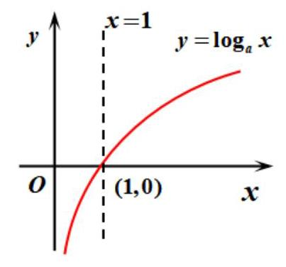</td><td>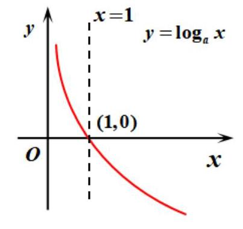</td></tr><tr><td colspan="2">$\left( {0, + \infty }\right)$</td></tr><tr><td>值域</td><td colspan="2">$R$</td></tr><tr><td>过定点</td><td colspan="2">图象过定点 $\left( {1,0}\right)$ ,即当 $x = 1$ 时, $y = 0$ .</td></tr><tr><td>奇偶性</td><td colspan="2">非奇非偶</td></tr><tr><td>单调性</td><td>在 $\left( {0, + \infty }\right)$ 上是增函数</td><td>在 $\left( {0, + \infty }\right)$ 上是减函数</td></tr><tr><td></td><td>${\log }_{a}x > 0\;\left( {x > 1}\right)$</td><td>${\log }_{a}x < 0\;\left( {x > 1}\right)$</td></tr><tr><td>函数值的   变化情况</td><td>${\log }_{a}x = 0\;\left( {x = 1}\right)$</td><td>${\log }_{a}x = 0\;\left( {x = 1}\right)$</td></tr><tr><td></td><td>${\log }_{a}x < 0\;\left( {0 < x < 1}\right)$</td><td>${\log }_{a}x > 0\;\left( {0 < x < 1}\right)$</td></tr><tr><td>$a$ 变化对图象的影响</td><td colspan="2">在第一象限内, $a$ 越大图象越靠低; 在第四象限内, $a$ 越大图象越靠高.</td></tr></table>

## 例题精讲

【例 17】如图所示,已知函数 $y = {\log }_{2}{4x}$ 图象上的两点 $A, B$ 和函数 $y = {\log }_{2}x$ 上的点 $C$ ,线段 ${AC}$ 平行于 $y$ 轴，三角形 ${ABC}$ 为正三角形时，点 $B$ 的坐标为 $\left( {p, q}\right)$ ，则实数 $p$ 的值为___.

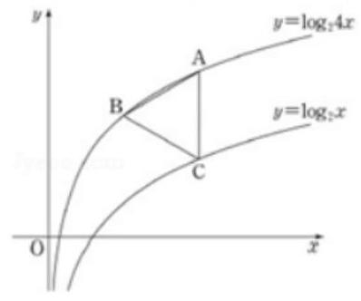

【难度】 $\star   \star   \star$

【答案】 $\sqrt{3}$

【解析】解: 根据题意,设 $A\left( {{x}_{0},2 + {\log }_{2}{x}_{0}}\right) , B\left( {p, q}\right) , C\left( {{x}_{0},{\log }_{2}{x}_{0}}\right)$ ,

$\because$ 线段 ${AC}//y$ 轴, $\bigtriangleup {ABC}$ 是等边三角形, $\therefore {AC} = 2,2 + {\log }_{2}p = q,\therefore p = {2}^{q - 2},\therefore {4p} = {2}^{q}$ ;

又 ${x}_{0} - p = \sqrt{3},\therefore p = {x}_{0} - \sqrt{3},\therefore {x}_{0} = p + \sqrt{3}$ ; 又 $2 + {\log }_{2}{x}_{0} - q = 1,\therefore {\log }_{2}{x}_{0} = q - 1,{x}_{0} = {2}^{q - 1}$ ;

$\therefore p + \sqrt{3} = {2}^{q - 1};{2p} + 2\sqrt{3} = {2}^{q} = {4p},\therefore p = \sqrt{3}$ ,故答案为: $\sqrt{3}$ .

【例 18】已知函数 $f\left( x\right)  = \left\{  \begin{array}{l} \left( {{2a} - 1}\right) x + a, x \geq  2 \\  {\log }_{a}\left( {x - 1}\right) ,1 < x < 2 \end{array}\right.$ 是 $\left( {1, + \infty }\right)$ 上的减函数,则实数 $a$ 的取值范围是___。

【难度】 $\star   \star   \star$

【答案】 $\left( {0,\frac{2}{5}}\right\rbrack$

【解析】因为函数 $f\left( x\right)  = \left\{  \begin{array}{l} \left( {{2a} - 1}\right) x + a, x \geq  2 \\  {\log }_{a}\left( {x - 1}\right) ,1 < x < 2 \end{array}\right.$ 是 $\left( {1, + \infty }\right)$ 上的减函数,

所以 $\left\{  \begin{array}{l} {2a} - 1 < 0 \\  0 < a < 1 \\  {\log }_{a}1 \geq  2\left( {{2a} - 1}\right)  + a \end{array}\right.$ ,即 $\left\{  \begin{array}{l} a < \frac{1}{2} \\  0 < a < 1 \\  a \leq  \frac{2}{5} \end{array}\right.$ ,解得 $0 < a \leq  \frac{2}{5}$ 。

【例 19】 $\alpha ,\beta$ 分别是关于 $x$ 的方程 ${\log }_{2}x + x - 5 = 0$ 和 ${2}^{x} + x - 5 = 0$ 的根，则 $\alpha  + \beta  =$ ___。

【难度】 $\star   \star   \star   \star$

【答案】 5

【解析】: $\;\alpha ,\beta$ 分别是方程 ${\log }_{2}x + x - 5 = 0$ 和 ${2}^{x} + x - 5 = 0$ 的根,

即 $\alpha ,\beta$ 分别是方程 ${\log }_{2}x =  - x + 5$ 和 ${2}^{x} =  - x + 5$ 的根,

$\therefore \alpha ,\beta$ 是函数 $y = {\log }_{2}x$ 与 $y =  - x + 5, y = {2}^{x}$ 与 $y =  - x + 5$ ,交点的横坐标,

$\because y = {2}^{x}$ 与 $y = {\log }_{2}x$ 的图像关于 $y = x$ 轴对称,

$\therefore y = {2}^{x}$ 与 $y =  - x + 5$ 的交点与 $y = {\log }_{2}x$ 与 $y =  - x + 5$ 交点关于 $y = x$ 对称,

$\therefore$ 由 $\left\{  {\begin{array}{l} y = x \\  y =  - x + 5 \end{array}\text{ 得 }x = y = \frac{5}{2},\therefore \frac{\alpha  + \beta }{2} = \frac{5}{2}}\right.$ ，即 $\alpha  + \beta  = 5$ ，故答案为:5。

【例 19】已知函数 $f\left( x\right)  = {\log }_{a}\frac{1 - x}{1 + x}\left( {0 < a < 1}\right)$ .

(1)求函数 $f\left( x\right)$ 的定义域 $D$ ，并判断 $f\left( x\right)$ 的奇偶性；

(2)如果当 $x \in  \left( {t, a}\right)$ 时， $f\left( x\right)$ 的值域是 $\left( {-\infty ,1}\right)$ ，求 $a$ 与 $t$ 的值；

(3)对任意的 ${x}_{1},{x}_{2} \in  D$ ，是否存在 ${x}_{3} \in  D$ ，使得 $f\left( {x}_{1}\right)  + f\left( {x}_{2}\right)  = f\left( {x}_{3}\right)$ ，若存在，求出 ${x}_{3}$ ；若不存在， 请说明理由.

【难度】★★★★

【答案】见解析

【解析】: (1) 令 $\frac{1 - x}{1 + x} > 0$ ,解得 $- 1 < x < 1, D = \left( {-1,1}\right)$

对任意 $x \in  D, f\left( {-x}\right)  = {\log }_{a}\frac{1 + x}{1 - x} = {\log }_{a}{\left( \frac{1 - x}{1 + x}\right) }^{-1} =  - {\log }_{a}\left( \frac{1 - x}{1 + x}\right)  =  - f\left( x\right)$

所以函数 $f\left( x\right)$ 是奇函数.

(2)由 $\frac{1 - x}{1 + x} =  - 1 + \frac{2}{x + 1}$ 知，函数 $g\left( x\right)  = \frac{1 - x}{1 + x}$ 在 $\left( {-1,1}\right)$ 上单调递减，

因为 $0 < a < 1$ ,所以 $f\left( x\right)$ 在 $\left( {-1,1}\right)$ 上是增函数 又因为 $x \in  \left( {t, a}\right)$ 时, $f\left( x\right)$ 的值域是 $\left( {-\infty ,1}\right)$ ,所以 $\left( {t, a}\right)  \subseteq  \left( {-1,1}\right)$

且 $g\left( x\right)  = \frac{1 - x}{1 + x}$ 在 $\left( {t, a}\right)$ 的值域是 $\left( {a, + \infty }\right)$ ,故 $g\left( a\right)  = \frac{1 - a}{1 + a} = a$ 且 $t =  - 1$ (结合 $g\left( x\right)$ 图像易得 $t =  - 1$ ) ${a}^{2} + a = 1 - a$ 解得 $a = \sqrt{2} - 1\left( {-\sqrt{2} - 1\text{ 舍去 }}\right)$ . 所以 $a = \sqrt{2} - 1, t =  - 1$

(3)假设存在 ${x}_{3} \in  \left( {-1,1}\right)$ 使得 $f\left( {x}_{1}\right)  + f\left( {x}_{2}\right)  = f\left( {x}_{3}\right)$

即 ${\log }_{a}\frac{1 - {x}_{1}}{1 + {x}_{1}} + {\log }_{a}\frac{1 - {x}_{2}}{1 + {x}_{2}} = {\log }_{a}\frac{1 - {x}_{3}}{1 + {x}_{3}},{\log }_{a}\left( {\frac{1 - {x}_{1}}{1 + {x}_{1}} \cdot  \frac{1 - {x}_{2}}{1 + {x}_{2}}}\right)  = {\log }_{a}\frac{1 - {x}_{3}}{1 + {x}_{3}} \Rightarrow  \frac{1 - {x}_{1}}{1 + {x}_{1}} \cdot  \frac{1 - {x}_{2}}{1 + {x}_{2}} = \frac{1 - {x}_{3}}{1 + {x}_{3}}$ ,

解得 ${x}_{3} = \frac{{x}_{1} + {x}_{2}}{1 + {x}_{1}{x}_{2}}$ ,下证: ${x}_{3} = \frac{{x}_{1} + {x}_{2}}{1 + {x}_{1}{x}_{2}} \in  \left( {-1,1}\right)$ ,即证: ${\left( \frac{{x}_{1} + {x}_{2}}{1 + {x}_{1}{x}_{2}}\right) }^{2} < 1$ .

证明: ${\left( \frac{{x}_{1} + {x}_{2}}{1 + {x}_{1}{x}_{2}}\right) }^{2} - 1 = \frac{{\left( {x}_{1} + {x}_{2}\right) }^{2} - {\left( 1 + {x}_{1}{x}_{2}\right) }^{2}}{{\left( 1 + {x}_{1}{x}_{2}\right) }^{2}} = \frac{{x}_{1}^{2} + {x}_{2}^{2} - 1 - {x}_{1}^{2}{x}_{2}^{2}}{{\left( 1 + {x}_{1}{x}_{2}\right) }^{2}} =  - \frac{\left( {1 - {x}_{1}^{2}}\right) \left( {1 - {x}_{2}^{2}}\right) }{{\left( 1 + {x}_{1}{x}_{2}\right) }^{2}}$

$\because {x}_{1},{x}_{2} \in  \left( {-1,1}\right) ,\therefore 1 - {x}_{1}^{2} > 0,1 - {x}_{2}^{2} > 0,{\left( 1 + {x}_{1}{x}_{2}\right) }^{2} > 0$

$\therefore \frac{\left( {1 - {x}_{1}^{2}}\right) \left( {1 - {x}_{2}^{2}}\right) }{{\left( 1 + {x}_{1}{x}_{2}\right) }^{2}} > 0$ ,即 ${\left( \frac{{x}_{1} + {x}_{2}}{1 + {x}_{1}{x}_{2}}\right) }^{2} - 1 < 0,\therefore {\left( \frac{{x}_{1} + {x}_{2}}{1 + {x}_{1}{x}_{2}}\right) }^{2} < 1$

所以存在 ${x}_{3} = \frac{{x}_{1} + {x}_{2}}{1 + {x}_{1}{x}_{2}} \in  \left( {-1,1}\right)$ ,使得 $f\left( {x}_{1}\right)  + f\left( {x}_{2}\right)  = f\left( {x}_{3}\right)$

另证: 要证明 ${\left( \frac{{x}_{1} + {x}_{2}}{1 + {x}_{1}{x}_{2}}\right) }^{2} < 1$ ,即证 ${\left( {x}_{1} + {x}_{2}\right) }^{2} < {\left( 1 + {x}_{1}{x}_{2}\right) }^{2}$ ,也即 $\left( {1 - {x}_{1}^{2}}\right) \left( {1 - {x}_{2}^{2}}\right)  > 0$ .

$\because {x}_{1},{x}_{2} \in  \left( {-1,1}\right) ,\therefore 1 - {x}_{1}^{2} > 0,1 - {x}_{2}^{2} > 0,\therefore \left( {1 - {x}_{1}^{2}}\right) \left( {1 - {x}_{2}^{2}}\right)  > 0,\therefore {\left( \frac{{x}_{1} + {x}_{2}}{1 + {x}_{1}{x}_{2}}\right) }^{2} < 1$ .

所以存在 ${x}_{3} = \frac{{x}_{1} + {x}_{2}}{1 + {x}_{1}{x}_{2}} \in  \left( {-1,1}\right)$ ,使得 $f\left( {x}_{1}\right)  + f\left( {x}_{2}\right)  = f\left( {x}_{3}\right)$ 集为 $\left( {2,3}\right)$ .

## 巩固训练

1、设函数 $f\left( x\right)  = {\log }_{2}\left( {\sqrt{1 + {x}^{2}} - x}\right)$ ,若对任意的 $x \in  \left( {-1, + \infty }\right)$ ,不等式 $f\left( {x - \ln a}\right)  + f\left( {{2x} + 4}\right)  < 0$ 恒成立，则 $a$ 的取值范围是___。

【难度】 $\star   \star   \star$

【答案】 $(0, e\rbrack$

【解析】因为 $f\left( {-x}\right)  = {\log }_{2}\left( {\sqrt{1 + {x}^{2}} + x}\right)  = {\log }_{2}{\left( \sqrt{1 + {x}^{2}} - x\right) }^{1} =  - f\left( x\right)$ ,所以 $f\left( x\right)$ 为奇函数,且定义域为 $R$ 。

又因为函数 $g\left( x\right)  = \sqrt{1 + {x}^{2}} + x$ 在 $\lbrack 0, + \infty )$ 上为增函数,所以 $f\left( x\right)  =  - {\log }_{2}\left( {\sqrt{1 + {x}^{2}} + x}\right)$ 在 $\lbrack 0, + \infty )$ 上为减函数,

从而 $f\left( x\right)$ 在 $R$ 上为减函数. 于是 $f\left( {x - \ln a}\right)  + f\left( {{2x} + 4}\right)  < 0$ 等价于

$f\left( {x - \ln a}\right)  <  - f\left( {{2x} + 4}\right)  = f\left( {-{2x} - 4}\right)$ ,所以 $x - \ln a >  - {2x} - 4$ ,即 $\ln a < {3x} + 4$ .

因为 $x \in  \left( {-1, + \infty }\right)$ ,所以 ${3x} + 4 > 1$ ,所以 $\ln a \leq  1$ ,解得 $0 < a \leq  e$ . 故答案为: $(0, e\rbrack$ 。

2、已知函数 $f\left( x\right)  = \left\{  \begin{matrix} \left| {{\log }_{3}x}\right| ,0 < x < 3 \\   - \cos \frac{\pi }{3}x,3 \leq  x \leq  9 \end{matrix}\right.$ ,若存在实数 ${x}_{1},{x}_{2},{x}_{3},{x}_{4}$ ,当 ${x}_{1} < {x}_{2} < {x}_{3} < {x}_{4}$ 时,满足 $f\left( {x}_{1}\right)  = f\left( {x}_{2}\right)  = f\left( {x}_{3}\right)  = f\left( {x}_{4}\right)$ ，则 ${x}_{1} + {x}_{2} + {x}_{3} + {x}_{4}$ 的取值范围是___。

【难度】 $\star   \star   \star$

【答案】 $\left( {{14},\frac{46}{3}}\right)$

【解析】画出函数 $f\left( x\right)  = \left\{  \begin{matrix} \left| {{\log }_{3}x}\right| ,0 < x < 3 \\   - \cos \frac{\pi }{3}x,3 \leq  x \leq  9 \end{matrix}\right.$ 的图像如图,

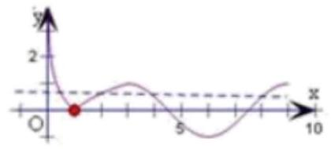

令 $f\left( {x}_{1}\right)  = f\left( {x}_{2}\right)  = f\left( {x}_{3}\right)  = f\left( {x}_{4}\right)  = a$ ,作出直线 $y = a$ ,

当 $x = 3$ 时， $f\left( 3\right)  =  - \cos \pi  = 1$ ，当 $x = 9$ 时， $f\left( 9\right)  =  - \cos {3\pi } = 1$ ，

由图像可知，当 $0 < a < 1$ 时，直线与 $f\left( x\right)$ 有 4 个交点，

且 $0 < {x}_{1} < 1 < {x}_{2} < 3 < {x}_{3} < {4.5} < {x}_{4} < 9$ ,

则: $\left| {{\log }_{3}{x}_{1}}\right|  = \left| {{\log }_{3}{x}_{2}}\right|$ ,可得 ${\log }_{3}{x}_{1} =  - {\log }_{3}{x}_{2},{x}_{1}{x}_{2} = 1$ ,

由 $y =  - \cos \left( {\frac{\pi }{3}x}\right)$ 的图像关于直线 $x = 6$ 对称,可得 ${x}_{3} + {x}_{4} = {12}$ ,

可得 ${x}_{1} + {x}_{2} + {x}_{3} + {x}_{4} = {x}_{2} + \frac{1}{{x}_{2}} + {12}\left( {1 < {x}_{2} < 3}\right)$ ,

设 $g\left( {x}_{2}\right)  = {x}_{2} + \frac{1}{{x}_{2}} + {12}\left( {1 < {x}_{2} < 3}\right)$ ,由对勾函数性质可得其在 $\left( {1,3}\right)$ 区间上单调递增,

当 ${x}_{2} = 1$ 时， ${x}_{1} + {x}_{2} + {x}_{3} + {x}_{4} = {14}$ ，

当 ${x}_{2} = 3$ 时， ${x}_{1} + {x}_{2} + {x}_{3} + {x}_{4} = \frac{46}{3}$ ，

故可得 ${x}_{1} + {x}_{2} + {x}_{3} + {x}_{4}$ 的取值范围是 $\left( {{14},\frac{46}{3}}\right)$ 。

3、设方程 ${2}^{-x} = \left| {lgx}\right|$ 的两个根为 ${x}_{1},{x}_{2}$ ，则下列关系正确的是( )

A. $0 < {x}_{1}{x}_{2} < 1$ B. ${x}_{1}{x}_{2} = 1$ C. ${x}_{1}{x}_{2} > 1$ D. ${x}_{1}{x}_{2} < 0$

【难度】★★★★

【答案】 $A$

【解析】解: $\because$ 方程 ${2}^{-x} = \left| {\lg x}\right|$ 的两个根为 ${x}_{1}$ 和 ${x}_{2}$ ,由题意知, $0 < {x}_{1} < 1,{x}_{2} > 1$ .

根据 $y = {2}^{-x}$ 是减函数,可得 ${2}^{-{x}_{1}} > {2}^{-{x}_{2}}$ ,即 $\left| {{lg}{x}_{1}}\right|  > \left| {{lg}{x}_{2}}\right|$ ,

$\therefore  - \lg {x}_{1} > \lg {x}_{2},\;\therefore \frac{1}{{x}_{1}} > {x}_{2},\;\therefore 0 < {x}_{1}{x}_{2} < 1$ ,

故选: $A$ .

4、已知函数 $f\left( x\right)  = {x}^{3} + \lg \left( {\sqrt{{x}^{2} + 1} + x}\right)$ ,若 $f\left( x\right)$ 的定义域中的 $a\text{ 、 }b$ 满足 $f\left( {-a}\right)  + f\left( {-b}\right)  - 3 = f\left( a\right)  + f\left( b\right)  + 3$ ，则 $f\left( a\right)  + f\left( b\right)  =$ ___

【难度】 $\star   \star   \star$

【答案】 -3

【解析】利用 $f\left( x\right)$ 为奇函数

5、已知 $a \in  R$ ，函数 $f\left( x\right)  = {\log }_{2}\left( {\frac{1}{x} + a}\right)$ .

(1)当 $a = 1$ 时，解不等式 $f\left( x\right)  < 0$ ；

(2)若 $a > 0$ ，不等式 $f\left( x\right)  < {\log }_{2}\left( {x + \frac{a + 1}{x}}\right)$ 恒成立，求 $a$ 的取值范围；

(3)若关于 $x$ 的方程 $f\left( x\right)  - {\log }_{2}\left\lbrack  {\left( {a - 4}\right) x + {2a} - 5}\right\rbrack   = 0$ 的解集中恰好有一个元素，求 $a$ 的取值范围。

【难度】 $\star   \star   \star   \star$

【答案】(1) $x \in  \left( {-\infty , - 1}\right)$ ; (2) $0 < a < 4$ ; (3) $\left( {1,2\rbrack \cup \{ 3,4}\right)$ .

【解析】(1) 由 ${\log }_{2}\left( {\frac{1}{x} + 1}\right)  < 0$ ,得 $0 < \frac{1}{x} + 1 < 1$ ,解得 $x \in  \left( {-\infty , - 1}\right)$ .

(2)由题意知 $\frac{1}{x} + a > 0, x + \frac{a + 1}{x} > 0$ ，得 $x \in  \left( {0, + \infty }\right)$ ，

又由题意可得 $\frac{1}{x} + a < x + \frac{a + 1}{x}$ ,即 $a < x + \frac{a}{x}$ ,又 $a, x \in  \left( {0, + \infty }\right) ,\therefore a < 2\sqrt{a}$ ,即 $0 < a < 4$ .

(3) $\frac{1}{x} + a = \left( {a - 4}\right) x + {2a} - 5$ ， $\left( {a - 4}\right) {x}^{2} + \left( {a - 5}\right) x - 1 = 0$ ，

当 $a = 4$ 时， $x =  - 1$ ，经检验，满足题意；当 $a = 3$ 时， ${x}_{1} = {x}_{2} =  - 1$ ，经检验，满足题意；

当 $a \neq  3$ 且 $a \neq  4$ 时， ${x}_{1} = \frac{1}{a - 4},{x}_{2} =  - 1,{x}_{1} \neq  {x}_{2}$ ，

${x}_{1}$ 是原方程的解当且仅当 $\frac{1}{{x}_{1}} + a > 0$ ,即 $a > 2;{x}_{2}$ 是原方程的解当且仅当 $\frac{1}{{x}_{2}} + a > 0$ ,即 $a > 1$ .

于是满足题意的 $a \in  (1,2\rbrack$ . 综上, $a$ 的取值范围为 $\left( {1,2\rbrack \cup \{ 3,4}\right)$ 。

## 实战演练

一、填空题

1、函数 $y = \frac{{2x} + 1}{x + 1}$ 在 $x \in  \lbrack 0$ ， $+ \infty )$ 上的值域是___.

【难度】★★

【答案】 $\lbrack 1,2)$ .

【解析】解: 当 $x \geq  0$ 时,函数 $y = \frac{{2x} + 1}{x + 1} = 2 - \frac{1}{x + 1}$ 在 $\lbrack 0, + \infty )$ 上是增函数,

故当 $x = 0$ 时,函数取得最小值为 1,

又 $y < 2$ ,故函数 $f\left( x\right)$ 的值域为 $\lbrack 1,2)$ ,故答案为: $\lbrack 1,2)$ .

2、在幂函数 $y = {x}^{\alpha }$ 的图象上任取两个不同的点 $\left( {{x}_{1},{y}_{1}}\right) ,\left( {{x}_{2},{y}_{2}}\right)$ ，若 $\frac{{y}_{2} - {y}_{1}}{{x}_{2} - {x}_{1}}$ 是定值，则 $\alpha  =$ ___.

【难度】★★★

【答案】 1 或 0

【解析】解: $\frac{{y}_{2} - {y}_{1}}{{x}_{2} - {x}_{1}}$ 表示两点之间的斜率是定值,故函数的图象是直线,故 $\alpha  = 1$ 或 0,故答案为: 1 或 0 .

3、已知 $y = \left| {{\log }_{2}x}\right|$ 的定义域为 $\left\lbrack  {a, b}\right\rbrack$ ，值域为 $\left\lbrack  {0,2}\right\rbrack$ ，则区间 $\left\lbrack  {a, b}\right\rbrack$ 的长度 $b - a$ 的最小值为___.

【难度】 $\star   \star   \star   \star$

【答案】 $\frac{3}{4}$

【解析】解: $\because y = \left| {{\log }_{2}x}\right| ,\therefore x = {2}^{y}$ 或 $x = {2}^{-y}.\because 0 \leq  y \leq  2,\therefore 1 \leq  x \leq  4$ ,或 $\frac{1}{4} \leq  x \leq  1$ .

即 $\{ a = 1, b = 4\}$ 或 $\{ a = \frac{1}{4}, b = 1\}$ . 于是 ${\left\lbrack  b - a\right\rbrack  }_{\min } = \frac{3}{4}$ . 故答案为: $\frac{3}{4}$ .

4、已知 $a, b, c$ 为正整数，方程 $a{x}^{2} + {bx} + c = 0$ 的两实根为 ${x}_{1},{x}_{2}\left( {{x}_{1} \neq  {x}_{2}}\right)$ ，且 $\left| {x}_{1}\right|  < 1$ ， $\left| {x}_{2}\right|  < 1$ ，则 $a + b + c$ 的最小值为___.

【难度】 $\star   \star   \star$

【答案】 11

【解析】解: 由题意, $a, b, c$ 为正整数, $\therefore {x}_{1} + {x}_{2} =  - \frac{b}{a} < 0,{x}_{1} \cdot  {x}_{2} = \frac{c}{a} > 0$ ,

又 $\left| {x}_{1}\right|  < 1,\left| {x}_{2}\right|  < 1,\therefore {x}_{1},{x}_{2} \in  \left( {-1,0}\right)$ ,

$\therefore \left\{  \begin{array}{l} \Delta  = {b}^{2} - {4ac} > 0 \\  f\left( {-1}\right)  = a - b + c > 0 \\  f\left( 0\right)  = c > 0 \\   - 1 <  - \frac{b}{2a} < 0 \end{array}\right.$ ,即 $\left\{  \begin{array}{l} {b}^{2} - {4ac} > 0 \\  b < a + c \\  b < {2a} \end{array}\right.$ ,①

$\because a, b, c$ 为正整数,取 $c = 1$ ,则 $a + 1 > b,\therefore a \geq  b,\therefore {a}^{2} \geq  {b}^{2} > {4ac} = {4a}$ ,

$\therefore a > 4,\therefore a \geq  5,\therefore {b}^{2} > {4ac} \geq  {20},\therefore b \geq  5$ ,

当 $a = b = 5, c = 1$ 时,符合①式，即符合题意，此时 $a + b + c = {11}$ ,

当 $c \geq  2$ 时, $\because {x}_{1},{x}_{2} \in  \left( {-1,0}\right) ,\therefore {x}_{1} \cdot  {x}_{2} = \frac{c}{a} < 1,\therefore c < a,\therefore a \geq  3$ ,

$\therefore {b}^{2} > {4ac} \geq  {24},\therefore b \geq  5$ ,又 $a + c > b \geq  5,\therefore a + c \geq  6,\therefore a + b + c \geq  {11}$ ,

$\therefore a + b + c$ 最小值为 11 .

故答案为: 11 .

5、已知函数 $f\left( x\right)  = \left\{  \begin{array}{l} {2}^{-x} - 1\left( {x \leq  0}\right) \\  f\left( {x - 1}\right) \left( {x > 0}\right)  \end{array}\right.$ 若方程 $f\left( x\right)  = x + a$ 有且只有两个不相等的实数根,则实数 $a$ 的取值范围是___.

【难度】 $\star   \star   \star   \star$

【答案】 $\left( {-\infty ,1}\right)$

【解答】解: 函数 $f\left( x\right)  = f\left( x\right)  = \left\{  \begin{array}{l} {2}^{-x} - 1\left( {x \leq  0}\right) \\  f\left( {x - 1}\right) \left( {x > 0}\right)  \end{array}\right.$ 的图象如图所示,

当 $a < 1$ 时,函数 $y = f\left( x\right)$ 的图象与函数 $y = x + a$ 的图象有两个交点,

即方程 $f\left( x\right)  = x + a$ 有且只有两个不相等的实数根.

故答案为 $\left( {-\infty ,1}\right)$

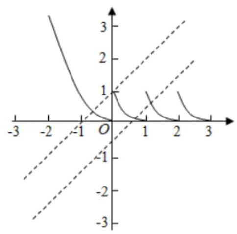

6、已知常数 $a > 0$ ，函数 $f\left( x\right)  = \frac{{2}^{x}}{{2}^{x} + {ax}}$ 的图象经过点 $P\left( {p,\frac{6}{5}}\right)$ 、 $Q\left( {q, - \frac{1}{5}}\right)$ ，若 ${2}^{p + q} = {16pq}$ ，则 $a =$ ___

【难度】 $\star   \star   \star   \star$

【答案】 4

【解析】解: 函数 $f\left( x\right)  = \frac{{2}^{x}}{{2}^{x} + {ax}}$ 的图象经过点 $P\left( {p,\frac{6}{5}}\right) \text{ 、 }Q\left( {q, - \frac{1}{5}}\right)$ ,

可得 $\frac{6}{5} = \frac{{2}^{p}}{{2}^{p} + {ap}}$ ,即 $\frac{ap}{{2}^{p}} =  - \frac{1}{6}\ldots \ldots$ ①; $- \frac{1}{5} = \frac{{2}^{q}}{{2}^{q} + {aq}}$ ,即 $\frac{aq}{{2}^{q}} =  - 6\ldots \ldots$ ②,由① $\times$ ②可得: ${a}^{2}{pq} = {2}^{p + q} \; \because {2}^{p + q} = {16pq},\therefore {16pq} = {a}^{2}{pq}$ ,而 $a > 0$ ,解得: $a = 4$ 故答案为: 4 .

## 二、选择题

7、函数 $y = {x}^{2} - {2x} + 3$ 在闭区间 $\left\lbrack  {0, m}\right\rbrack$ 上有最大值 3，最小值为 2， $m$ 的取值范围是( )

A. $( - \infty ,2\rbrack$ B. $\left\lbrack  {0,2}\right\rbrack$ C. $\left\lbrack  {1,2}\right\rbrack$ D. $\lbrack 1, + \infty )$

【难度】 $\star   \star   \star$

【答案】C

【解析】解: 作出函数 $f\left( x\right)$ 的图象,如图所示,

当 $x = 1$ 时, $y$ 最小,最小值是 2,当 $x = 2$ 时, $y = 3$ ,

函数 $f\left( x\right)  = {x}^{2} - {2x} + 3$ 在闭区间 $\left\lbrack  {0, m}\right\rbrack$ 上有最大值 3,最小值 2,

则实数 $m$ 的取值范围是 $\left\lbrack  {1,2}\right\rbrack$ . 故选: $C$ .

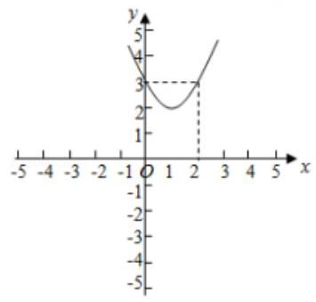

8、当 $x \in  \left( {0,\frac{1}{2}}\right)$ 时，函数 $f\left( x\right)  = {\log }_{a}\left( {-4{x}^{2} + {\log }_{a}x}\right)$ 的图象恒在 $x$ 轴下方，则实数 $a$ 的取值范围是( )

A. $\left\lbrack  {\frac{\sqrt{2}}{2},1}\right)$ B. $\left( {0,\frac{\sqrt{2}}{2}}\right)$ C. $\lbrack \sqrt{2}, + \infty )$ D. $\left( {0,1}\right)$

【难度】★★★

【答案】 $A$

【解析】解: 根据题意知 $f\left( x\right)  = {\log }_{a}\left( {-4{x}^{2} + {\log }_{a}x}\right)  < 0$ 对任意 $x \in  \left( {0,\frac{1}{2}}\right)$ 恒成立,

当 $a > 1$ 时,对任意 $x \in  \left( {0,\frac{1}{2}}\right) , - 4{x}^{2} + {\log }_{a}x < 0$ 不满足题意;

当 $0 < a < 1$ 时,可得 $- 4{x}^{2} + {\log }_{a}x > 1$ 对任意 $x \in  \left( {0,\frac{1}{2}}\right)$ 恒成立,即 ${\log }_{a}x > 4{x}^{2} + 1, x \in  \left( {0,\frac{1}{2}}\right)$

结合单调性可知,只需 ${\log }_{a}\frac{1}{2} \geq  2, a \geq  \frac{\sqrt{2}}{2}$ ,

又 $0 < a < 1,\therefore \frac{\sqrt{2}}{2} \leq  a < 1$ ,即 $a$ 的取值范围是 $\left\lbrack  {\frac{\sqrt{2}}{2},1}\right)$ . 故选: $A$ . 9、设 $f\left( x\right)  = {x}^{2} + {2x} + 1,0 < s < t$ ，若 $a = f\left( \sqrt{st}\right) , b = f\left( \frac{s + t}{2}\right) , c = \frac{f\left( s\right)  + f\left( t\right) }{2}$ ，则下列不等关系正确的是( )

A. $a < b < c$ B. $c < b < a$ C. $b < c < a$ D. $a < c < b$

【难度】★★★

【答案】 $A$

【解析】解: $f\left( x\right)  = {\left( x + 1\right) }^{2}$ ,对称轴是 $x =  - 1$ ,

故 $f\left( x\right)$ 在 $\lbrack  - 1, + \infty )$ 递增,如图示:

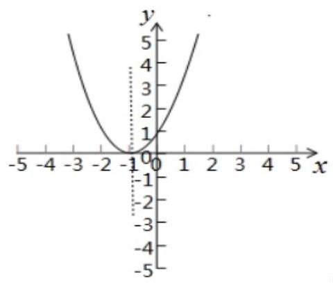

$\frac{s + t}{2} > \sqrt{st} > 0,$

$\therefore f\left( \frac{s + t}{2}\right)  > f\left( \sqrt{st}\right)$ ,即 $b > a,$

而 $c = \frac{{s}^{2} + {t}^{2}}{2} + \left( {s + t}\right)  + 1,\;b = {\left( \frac{s + t}{2}\right) }^{2} + \left( {s + t}\right)  + 1$ ,

故 $c - b = \frac{{s}^{2} + {t}^{2}}{2} + \left( {s + t}\right)  + 1 - {\left( \frac{s + t}{2}\right) }^{2} - \left( {s + t}\right)  - 1 = \frac{{\left( s - t\right) }^{2}}{4} > 0$ ,

故 $c > b$ ,故 $c > b > a$ ,

故选: $A$ .

10、(2019 春·浦东新区校级期中)设函数 $f\left( x\right)  = {a}^{x} + {b}^{x} - {c}^{x}$ ，其中 $c > a > 0, a > b > 0$ ，若 $a$ 、 $b$ 、 $c$ 是 ${\Delta ABC}$ 的三条边长，则下列结论中正确的是( )

① 存在 $x \in  {R}^{ + }$ ，使 ${a}^{x}$ 、 ${b}^{x}$ 、 ${c}^{x}$ 不能构成一个三角形的三条边

②对一切 $x \in  \left( {-\infty ,1}\right)$ ，都有 $f\left( x\right)  > 0$

③若 $\bigtriangleup {ABC}$ 为钝角三角形,则存在 $x \in  \left( {1,2}\right)$ ,使 $f\left( x\right)  = 0$ .

A. ①② B. ①③ C. ②③ D. ①②③

【难度】 $\star   \star   \star   \star$

【答案】 $D$

【解析】解: 在①中,令 $a = 2, b = 3, c = 4$ ,则 $a.b.c$ 可以构成三角形,

但 ${a}^{2} = 4,{b}^{2} = 9,{c}^{2} = {16}$ 却不能构成三角形,故①正确.

在②中， $\because a$ ， $b$ ， $c$ 是 $\bigtriangleup  {ABC}$ 的三条边长， $\therefore a + b > c$ ，

$\because c > a > 0, c > b > 0,\therefore 0 < \frac{a}{c} < 1,0 < \frac{b}{c} < 1$ ,

当 $x \in  \left( {-\infty ,1}\right)$ 时,

$f\left( x\right)  = {a}^{x} + {b}^{x} - {c}^{x} = {cx}\left\lbrack  {\left( \frac{a}{c}\right) x + \left( \frac{b}{c}\right) x - 1}\right\rbrack   > {cx}\left( {\frac{a}{c} + \frac{b}{c} - 1}\right)  = {cx} \cdot  \frac{a + b - c}{c} > 0$ ,故②正确.

在③中， $\because c > a > 0$ ， $c > b > 0$ ，若 $\bigtriangleup  {ABC}$ 为钝角三角形， $\therefore {a}^{2} + {b}^{2} - {c}^{2} < 0$ ，

$\because f\left( 1\right)  = a + b - c > 0, f\left( 2\right)  = {a}^{2} + {b}^{2} - {c}^{2} < 0$ ,

$\therefore$ 根据根的存在性定理可知在区间 $\left( {1,2}\right)$ 上存在零点,

即 $x \in  \left( {1,2}\right)$ ,使 $f\left( x\right)  = 0$ ,故③正确.

故选: $D$ .

## 三、解答题

11、在城市旧城改造中，某小区为了升级居住环境，拟在小区的闲置地中规划一个面积为 ${200}{m}^{2}$ 的矩形区域(如图所示)，按规划要求:在矩形内的四周安排 ${2m}$ 宽的绿化，绿化造价为 200 元/ ${m}^{2}$ ，中间区域地面硬化以方便后期放置各类健身器材,硬化造价为 100 元 $/{m}^{2}$ . 设矩形的长为 $x\left( m\right)$ .

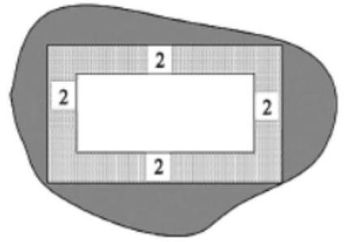

(1)设总造价 $y$ (元)表示为长度 $x\left( m\right)$ 的函数；

(2)当 $x\left( m\right)$ 取何值时，总造价最低，并求出最低总造价。

【难度】 $\star   \star   \star$

【答案】(1) $y = {18400} + {400}\left( {x + \frac{200}{x}}\right) , x \in  \left( {4,{50}}\right)$ (2) 当 $x = {10}\sqrt{2}$ 时,总造价最低为 ${18400} + {8000}\sqrt{2}$ 元

【解析】(1) 由矩形的长为 $x\left( m\right)$ ,则矩形的宽为 $\frac{200}{x}\left( m\right)$ ,

则中间区域的长为 $x - 4\left( m\right)$ ,宽为 $\frac{200}{x} - 4\left( m\right)$ ,则定义域为 $x \in  \left( {4,{50}}\right)$

则 $y = {100} \times  \left\lbrack  {\left( {x - 4}\right) \left( {\frac{200}{x} - 4}\right) }\right\rbrack   + {200}\left\lbrack  {{200} - \left( {x - 4}\right) \left( {\frac{200}{x} - 4}\right) }\right\rbrack$

整理得 $y = {18400} + {400}\left( {x + \frac{200}{x}}\right) , x \in  \left( {4,{50}}\right)$

(2) $x + \frac{200}{x} \geq  2\sqrt{x \cdot  \frac{200}{x}} = {20}\sqrt{2}$ ，当且仅当 $x = \frac{200}{x}$ 时取等号，即 $x = {10}\sqrt{2} \in  \left( {4,{50}}\right)$

所以当 $x = {10}\sqrt{2}$ 时,总造价最低为 ${18400} + {8000}\sqrt{2}$ 元。

12、已知函数 $f\left( x\right)  = {\log }_{a}\left( {1 - \frac{2}{x + 1}}\right) \left( {a > 0\text{ 且 }a \neq  1}\right)$ .

(1)判断函数 $f\left( x\right)$ 的奇偶性并说明理由;

(II) 当 $0 < a < 1$ 时,判断函数 $f\left( x\right)$ 在 $\left( {1, + \infty }\right)$ 上的单调性,并利用单调性的定义证明;

(III) 是否存在实数 $a$ ,使得当 $f\left( x\right)$ 的定义域为 $\left\lbrack  {m, n}\right\rbrack$ 时,值域为 $\left\lbrack  {1 + {\log }_{a}n,1 + {\log }_{a}m}\right\rbrack$ ? 若存在,求出实数 $a$ 的取值范围; 若不存在,请说明理由.

【难度】★★★★

【答案】见解析

【解析】解: (1) 由 $1 - \frac{2}{x + 1} > 0$ ,可得 $x <  - 1$ 或 $x > 1$ ,

$\therefore f\left( x\right)$ 的定义域为 $\left( {-\infty , - 1}\right)  \cup  \left( {1, + \infty }\right)$ ;

$\because f\left( x\right)  = {\log }_{a}\left( {1 - \frac{2}{x + 1}}\right)  = {\log }_{a\left( \frac{x - 1}{x + 1}\right) }$ ,

且 $f\left( {-x}\right)  = {\log }_{a\left( \frac{-x - 1}{-x + 1}\right) } = {\log }_{a}\left( \frac{x + 1}{x - 1}\right)  =  - {\log }_{a}\left( \frac{x - 1}{x + 1}\right)  =  - f\left( x\right)$ ;

$\therefore f\left( x\right)$ 在定义域上为奇函数.

(2)当 $0 < a < 1$ 时， $f\left( x\right)$ 在 $\left( {1, + \infty }\right)$ 单调递减，

任取 ${x}_{1},{x}_{2}$ 且 $1 < {x}_{1} < {x}_{2}$ ,

$f\left( {x}_{1}\right)  - f\left( {x}_{2}\right)  = {\log }_{a}\left( \frac{{x}_{1} - 1}{{x}_{1} + 1}\right)  - {\log }_{a}\left( \frac{{x}_{2} - 1}{{x2} + 1}\right)  = {\log }_{a}\left( \frac{\left( {{x}_{1} - 1}\right) \left( {{x}_{2} + 1}\right) }{\left( {{x}_{1} + 1}\right) \left( {{x}_{2} - 1}\right) }\right) ;$

由 $\left( {{x}_{1} - 1}\right) \left( {{x}_{2} + 1}\right)  - \left( {{x}_{1} + 1}\right) \left( {{x}_{2} - 1}\right)  = 2\left( {{x}_{1} - {x}_{2}}\right)  < 0$ ,

$\therefore 0 < \frac{\left( {{x}_{1} - 1}\right) \left( {{x}_{2} + 1}\right) }{\left( {{x}_{1} + 1}\right) \left( {{x}_{2} - 1}\right) } < 1$ ,

又 $0 < a < 1,\therefore {\log }_{a}\left( \frac{\left( {{x}_{1} - 1}\right) \left( {{x}_{2} + 1}\right) }{\left( {{x}_{1} + 1}\right) \left( {{x}_{2} - 1}\right) }\right)  > 0$

则 $f\left( {x}_{1}\right)  > f\left( {x}_{2}\right) ,\therefore f\left( x\right)$ 在 $\left( {1, + \infty }\right)$ 单调递减;

(3)假设存在这样的实数 $a$ ，使得当 $f\left( x\right)$ 的定义域为 $\left\lbrack  {m, n}\right\rbrack$ 时，值域为 $\left\lbrack  {1 + {\log }_{a}n,1 + {\log }_{a}m}\right\rbrack$ ；

由 $0 < m < n$ ,又 ${\log }_{a}n + 1 < {\log }_{a}m + 1$ ,即 ${\log }_{a}n < {\log }_{a}m$ ,

$\therefore 0 < a < 1$ .

由(2)知: $f\left( x\right)$ 在 $\left( {1, + \infty }\right)$ 单调递减，

$\therefore f\left( x\right)$ 在 $\left( {m, n}\right)$ 单调递减,

$\therefore \left\{  \begin{array}{l} f\left( m\right)  = {\log }_{a}\left( \frac{m - 1}{m + 1}\right)  = 1 + {\log }_{a}m \\  f\left( n\right)  = {\log }_{a}\left( \frac{n - 1}{n + 1}\right)  = 1 + {\log }_{a}n \end{array}\right.$ ,

即 $m, n$ 是方程 ${\log }_{a}\frac{x - 1}{x + 1} = {\log }_{a}x + 1$ 的两个实根,即 $\frac{x - 1}{x + 1} = {ax}$ 在 $\left( {1, + \infty }\right)$ 上有两个互异实根;

于是问题转化为关于 $x$ 的方程 $a{x}^{2} + \left( {a - 1}\right) x + 1 = 0$ 在 $\left( {1, + \infty }\right)$ 上有两个不同的实数根,

令 $g\left( x\right)  = a{x}^{2} + \left( {a - 1}\right) x + 1$ ,

则有 $\left\{  \begin{array}{l} \Delta  = {\left( a - 1\right) }^{2} - {4a} > 0 \\   - \frac{a - 1}{2a} > 1 \\  g\left( 1\right)  > 0 \end{array}\right.$ ,解得 $0 < a < 3 - 2\sqrt{2}$ ;

故存在实数 $a \in  \left( {0,3 - 2\sqrt{2}}\right)$ ,使得当 $f\left( x\right)$ 的定义域为 $\left\lbrack  {m, n}\right\rbrack$ 时,值域为 $\left\lbrack  {1 + {\log }_{a}n,1 + {\log }_{a}m}\right\rbrack$ .
