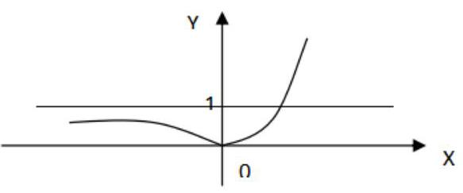
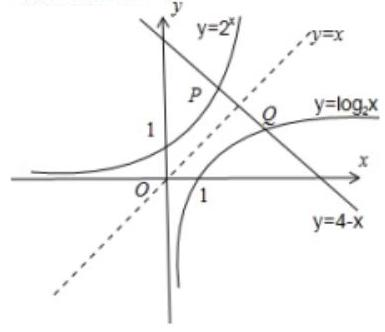
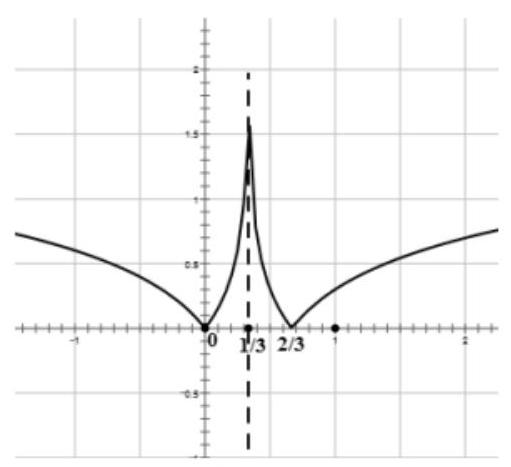

## 指对方程与反函数

<table><tr><td>教学目标</td><td>1、理解指数方程、对数方程的概念，掌握简单的指对方程和解法   2、理解反函数的概念，并能判定一个函数是否存在反函数；掌握求反函数的基本步骤，并能理解原函数和反函数之间的内在联系</td></tr><tr><td>重点</td><td>指数方程和对数方程的解法；理解函数与其反函数的图像和性质关系，能熟练求解已知函数的反函数</td></tr><tr><td>难点</td><td>复杂的指对方程的解题思想；抽象函数反函数的应用</td></tr></table>

## (一) 指对方程及其应用

## 知识梳理

## 1、基本概念:

(1)指数方程:在指数中含有未知数的方程叫指数方程.

(2)对数方程:对数的真数或底数中(或对数符号后面)含有未知数的方程叫对数方程.

## 2、解指数、对数方程的基本思想: 化同底或换元.

## 3、方程类型及解法

(1)求解形如 ${a}^{f\left( x\right) } = {a}^{g\left( x\right) }$ ， ${\log }_{a}f\left( x\right)  = {\log }_{a}g\left( x\right)$ ， ${a}^{f\left( x\right) } = {b}^{g\left( x\right) }$ ， ${a}^{f\left( x\right) } = b$ 的方程；

方法: 利用指数函数、对数函数的性质, 以及两边取对数的方法, 把它们转化为解一个可用初等方法来解的代数方程.

具体如下: ① ${a}^{x} = c\left( {a > 0, a \neq  0, c > 0}\right)$ ,其解为 $x = {\log }_{a}c$ ;

② ${a}^{f\left( x\right) } = {a}^{g\left( x\right) }\left( {a > 0, a \neq  1}\right)$ ，转化为代数方程 $f\left( x\right)  = g\left( x\right)$ 求解；

③ ${a}^{f\left( x\right) } = {b}^{g\left( x\right) }\left( {a > 0, a \neq  1, b > 0, b \neq  1}\right)$ ，转化为代数方程 $f\left( x\right) \lg a = g\left( x\right) \lg b$ 求解；

④ ${\log }_{a}x = b\left( {a > 0, a \neq  1}\right)$ ,其解为 $x = {a}^{b}$ ;

⑤ ${\log }_{a}f\left( x\right)  = {\log }_{a}g\left( x\right) \left( {a > 0, a \neq  1}\right)$ ,转化为 $\left\{  \begin{matrix} f\left( x\right)  = g\left( x\right) \\  f\left( x\right)  > 0 \\  g\left( x\right)  > 0 \end{matrix}\right.$ 求解;

(2)求解形如 $f\left( {a}^{x}\right)  = 0$ ， $f\left( {{\log }_{a}x}\right)  = 0$ 的方程；

方法: 通过换元,令 $y = {a}^{x}$ 或 $y = {\log }_{a}x$ 把它转化为一个可用初等方法解决的简单代数方程 $f\left( y\right)  = 0$ ,然后再解一个最简单的指数方程 ${a}^{x} = y\left( {y > 0}\right)$ 或对数方程 ${\log }_{a}x = y$ .

【知识补充】在解对数方程时, 常要应用对数的运算性质进行恒等变形, 通过恒等变形有时会造成增根或失根, 对此, 应注意, 一是在变形过程中, 注意变形后得到的方程是否与原方程同解, 特别要注意变形过程中所应用的对数运算性质, 是否满足性质中的条件; 二是要注意把求得的结果进行检验.

(3)求解形如 $x + {a}^{x} = 3$ 或 $x + {\log }_{a}x = 3$ 的方程，在初等数学中只能用图像法，即画出函数 $y = {a}^{x}$ 或 $y = {\log }_{a}x$ 的图像以及直线 $y = 3 - x$ ,从函数图像与这一直线有无交点来说明原方程是否有解.

## 例题精讲

【例1】解下列方程:

(1) ${\left( \sqrt{2 + \sqrt{3}}\right) }^{x} + {\left( \sqrt{2 - \sqrt{3}}\right) }^{x} = 4$

( 2 )方程 $2{\log }_{x}{25} - 3{\log }_{25}x = 1$ 的解集为___

(3) ${5}^{x + 1} = {3}^{{x}^{2} - 1}$

【难度】 $\star   \star   \star$

【答案】( 1 ) $x =  \pm  2$ ( 2 ) $\left\{  {\frac{1}{25},5\sqrt[3]{5}}\right\}$ ( 3 ) $x =  - 1$ 或 $x = {\log }_{3}{15}$

【解析】(1) 设 $t = {\left( \sqrt{2 + \sqrt{3}}\right) }^{x} > 0,{\left( \sqrt{2 - \sqrt{3}}\right) }^{x} = \frac{1}{t}$

(2) 设 $t = {\log }_{25}x$ ,则 $3{t}^{2} + t - 2 = 0 \Leftrightarrow  t =  - 1, t = \frac{2}{3}.x = \frac{1}{25}, x = 5\sqrt[3]{5}$ . 写成集合

(3)两边取对数得 $\left( {x + 1}\right) \lg 5 = \left( {{x}^{2} - 1}\right) \lg 3$ ，即 $\left( {x + 1}\right) \left\lbrack  {\lg 5 - \left( {x - 1}\right) \lg 3}\right\rbrack   = 0$ ，解得 $x =  - 1$ 或 ${\log }_{3}{15}$ ， 所以原方程的解为 $x =  - 1$ 或 $x = {\log }_{3}{15}$ .

【例 2】设数列 $\left\{  {x}_{n}\right\}$ 满足 ${\log }_{a}{x}_{n + 1} = 1 + {\log }_{a}{x}_{n}\left( {a > 0, a \neq  1}\right)$ ,若 ${x}_{1} + {x}_{2} + \ldots  + {x}_{100} = {100}$ ,则 ${x}_{101} + {x}_{102} + \ldots  + {x}_{200} =$ ___.

【难度】 $\star   \star   \star$

【答案】 ${100}{a}^{100}$

【解析】解: $\because {\log }_{a}{x}_{n + 1} = 1 + {\log }_{a}{x}_{n},\therefore {\log }_{a}{x}_{n + 1} - {\log }_{a}{x}_{n} = 1,\therefore {\log }_{a}^{\frac{{x}_{n + 1}}{{x}_{n}}} = 1$ ,则 $\frac{{x}_{n + 1}}{{x}_{n}} = a$ ,

$\therefore$ 数列 $\left\{  {x}_{n}\right\}$ 是以 $a$ 为公比的等比数列, $\because {x}_{1} + {x}_{2} + \ldots  + {x}_{100} = {100}$ ,

$\therefore {x}_{101} + {x}_{102} + \ldots  + {x}_{200} = {a}^{100}{x}_{1} + {a}^{100}{x}_{2} + \ldots {a}^{100}{x}_{100} = {a}^{100}\left( {{x}_{1} + {x}_{2} + \ldots  + {x}_{100}}\right)  = {100}{a}^{100}$ ,

故答案为: ${100}{a}^{100}$ .

【例 3】( 1 )关于 $x$ 的方程 $k \cdot  {9}^{x} - k \cdot  {3}^{x + 1} + 6\left( {k - 5}\right)  = 0$ 在区间 $\left\lbrack  {0,2}\right\rbrack$ 上有解，求 $k$ 的取值范围.

【难度】 $\star   \star   \star$

【答案】 $\frac{1}{2} \leq  k \leq  8$

【解析】由 $k \cdot  {9}^{x} - k \cdot  {3}^{x + 1} + 6\left( {k - 5}\right)  = 0$ ,得 $\frac{30}{k} = {9}^{x} - {3}^{x + 1} + 6$ ,因为方程在 $\left\lbrack  {0,2}\right\rbrack$ 上有解,所以 $\frac{30}{k}$ 在函数 $u = {9}^{x} - {3}^{x + 1} + 6, x \in  \left\lbrack  {0,2}\right\rbrack$ 的值内取值即可,不难求得其值域为 $\left\lbrack  {\frac{1}{2},8}\right\rbrack$ ,所以 $\frac{1}{2} \leq  k \leq  8$ .

( 2 )已知关于 $x$ 的方程 ${\log }_{2}\left( {x + 3}\right)  - {\log }_{4}{x}^{2} = a$ 的解在区间 $\left( {3,8}\right)$ 内，则 $a$ 的取值范围是___.

【难度】 $\star   \star   \star$

【答案】 $\left( {{\log }_{2}\frac{11}{8},1}\right)$

【解析】解: 关于 $x$ 的方程 ${\log }_{2}\left( {x + 3}\right)  - {\log }_{4}{x}^{2} = a$ 的解在区间 $\left( {3,8}\right)$ 内,

$\therefore$ 方程 ${\log }_{2}\left( {x + 3}\right)  - {\log }_{4}{x}^{2} = a$ ,化为: ${\log }_{2}\frac{x + 3}{x} = a,\because x \in  \left( {3,8}\right) ,\therefore \frac{x + 3}{x} = 1 + \frac{3}{x} \in  \left( {\frac{11}{8},2}\right)$ ,

$\therefore a \in  \left( {{\log }_{2}\frac{11}{8},1}\right)$ . $\therefore a$ 的取值范围是 $\left( {{\log }_{2}\frac{11}{8},1}\right)$ . 故答案为: $\left( {{\log }_{2}\frac{11}{8},1}\right)$ .

【例 4】若方程 ${4}^{x} + \left( {m - 3}\right)  \cdot  {2}^{x} + m = 0$ 有两个不相等的实数根,求实数 $m$ 的取值范围.

【难度】 $\star   \star   \star$

【答案】 $0 < m < 1$

【解析】设 ${2}^{x} = t$ ,则原方程化为 ${t}^{2} + \left( {m - 3}\right) t + m = 0,\because {2}^{x} = t > 0$ ,

$\therefore$ 原方程有两个不相等的实数根等价于方程 ${t}^{2} + \left( {m - 3}\right) t + m = 0$ 有两个不相等的正根,

充要条件为 $\left\{  \begin{array}{l} {\left( m - 3\right) }^{2} - {4m} > 0 \\   - \left( {m - 3}\right)  > 0 \\  m > 0 \end{array}\right.$ , $\therefore$ 实数 $m$ 的取值范围是 $0 < m < 1$ .

【例 5】试确定方程 $x + \left| {\lg x}\right|  = 2$ 的实根的个数.

【难度】 $\star   \star   \star$

【答案】 2

【解析】将原方程变形为 $\left| {\lg x}\right|  =  - x + 2$ ,通过图像可以发现函数 ${f}_{1}\left( x\right)  = \left| {\lg x}\right|$ 和 ${f}_{2}\left( x\right)  =  - x + 2\left( {x > 0}\right)$ 的图像有两个交点, 所以原方程有两个实根.

【例 6】已知 $x, y \in  \left( {-\frac{1}{2},\frac{1}{2}}\right) , m \in  R$ 且 $m \neq  0$ ,若 $\left\{  \begin{array}{l} \ln \frac{2 - x}{2 + x} = \tan x + {2m} \\  \ln \frac{1 - y}{1 + y} = \frac{2\tan y}{1 - {\tan }^{2}y} - {2m} \end{array}\right.$ ,则 $\frac{y}{x} =$ ___.

【难度】 $\star   \star   \star   \star$

【答案】 $- \frac{1}{2}$

【解答】解: 由 $\ln \frac{1 - y}{1 + y} = \frac{2\tan y}{1 - {\tan }^{2}y} - {2m}$ 得: $\ln \frac{2 - {2y}}{2 + {2y}} = \tan {2y} - {2m}$ ,

设 $f\left( x\right)  = \ln \frac{2 - x}{2 + x} - \tan x$ ,则 $f\left( {-x}\right)  = \ln \frac{2 + x}{2 - x} - \tan \left( {-x}\right)  =  - \left( {\ln \frac{2 - x}{2 + x} - \tan x}\right)  =  - f\left( x\right)$ ,则 $f\left( x\right)$ 为奇函数,则方

程组等价为 $\left\{  \begin{array}{l} f\left( x\right)  = {2m} \\  f\left( {2y}\right)  =  - {2m} \end{array}\right.$ ,即 $f\left( {2y}\right)  =  - f\left( x\right)  = f\left( {-x}\right)$ ,

$\because f\left( x\right)$ 在 $\left( {-1,1}\right)$ 上是单调递减, $\therefore {2y} =  - x$ ,即 $\frac{y}{x} =  - \frac{1}{2}$ . 故答案为: $- \frac{1}{2}$

【例 7】已知 $\left\{  \begin{array}{l} m + {\log }_{2}\left( {{2m} + 6}\right)  = {11} \\  n + {2}^{n - 1} = {14} \end{array}\right.$ ,则 $m + n =$ ___.

【难度】★★★★

【答案】11

【解答】解: 由 $\left\{  \begin{array}{l} m + {\log }_{2}\left( {{2m} + 6}\right)  = {11} \\  n + {2}^{n - 1} = {14} \end{array}\right.$ ,可得设 $u = m + 3, m + {\log }_{2}\left( {{2m} + 6}\right)  = {11}$

变为 ${\log }_{2}u = {13} - u$ ,设 $v = n - 1, n + {2}^{n - 1} = {14}$ ,变为 ${2}^{v} = {13} - v$ . 函数 $y = {\log }_{2}x$ 与 $y = {2}^{x}$ 互为反函数,它们都与 $y = {13} - x$ 相交,交点关于直线 $y = x$ 对称,

$\therefore u + v = {13}$ ,即 $m + 3 + n - 1 = {13},\therefore m + n = {11}$ .

故答案为: 11 .

【例 8】若在定义域内存在实数 ${x}_{0}$ ,使得 $f\left( {{x}_{0} + 1}\right)  = f\left( {x}_{0}\right)  + f\left( 1\right)$ 成立,则称函数 $f\left( x\right)$ 有 “漂移点”.

(1)用零点存在定理证明:函数 $f\left( x\right)  = {x}^{2} + {2}^{x}$ 在 $\left\lbrack  {0,1}\right\rbrack$ 上有 “漂移点”；

( 2 )若函数 $g\left( x\right)  = \lg \left( \frac{a}{{x}^{2} + 1}\right)$ 在 $\left( {0, + \infty }\right)$ 上有 “漂移点”，求实数 $a$ 的取值范围.

【难度】 $\star   \star   \star   \star$

【答案】见解析

【解答】解: (1) 令 $h\left( x\right)  = f\left( {x + 1}\right)  - f\left( x\right)  - f\left( 1\right)  = 2\left( {{2}^{x - 1} + x - 1}\right)$ ,

又 $h\left( 0\right)  =  - 1, h\left( 1\right)  = 2,\therefore h\left( 0\right) h\left( 1\right)  < 0$ ,

$\therefore h\left( x\right)  = 0$ 在 $\left( {0,1}\right)$ 上至少有一实根 ${x}_{0}$ ,

故函数 $f\left( x\right)  = {x}^{2} + {2}^{x}$ 在 $\left( {0,1}\right)$ 上有 “飘移点”.

(2)若 $f\left( x\right)  = \lg \left( \frac{a}{{x}_{0}^{2} + 1}\right)$ 在 $\left( {0, + \infty }\right)$ 上有飘移点 ${x}_{0}$ ，由题意知 $a > 0$ ，

即有 $\lg \frac{a}{{\left( {x}_{0} + 1\right) }^{2} + 1} = \lg \left( \frac{a}{{x}_{0}^{2} + 1}\right)  + \lg \frac{a}{2}$ 成立,即 $\frac{a}{{\left( {x}_{0}^{2} + 1\right) }^{2} + 1} = \frac{a}{{x}_{0}^{2} + 1} - \frac{a}{2}$ ,

整理得 $\left( {2 - a}\right) {x}_{0}^{2} - {2a}{x}_{0} + 2 - {2a} = 0$ ,

从而关于 $x$ 的方程 $g\left( x\right)  = \left( {2 - a}\right) {x}^{2} - {2ax} + 2 - {2a}$ 在 $\left( {0, + \infty }\right)$ 上应有实根 ${x}_{0}$ ,

当 $a = 2$ 时,方程的根为 $x =  - \frac{1}{2}$ ,不符合题意,

当 $0 < a < 2$ 时,由于函数 $g\left( x\right)$ 的对称轴 $x = \frac{a}{2 - a} > 0$ ,

可知,只需 $\bigtriangleup  = 4{a}^{2} - 4\left( {2 - a}\right) \left( {2 - {2a}}\right)  \geq  0$ ,

$\therefore 3 - \sqrt{5} \leq  a \leq  3 + \sqrt{5}$ ,即有 $3 - \sqrt{5} \leq  a < 2$ ,

当 $a > 2$ 时,由于函数 $g\left( x\right)$ 的对称轴 $x = \frac{a}{2 - a} < 0$ ,

只需 $g\left( 0\right)  > 0$ 即 $2 - {2a} > 0$ ,所以 $a < 1$ ,无解.

综上, $a$ 的取值范围是 $\lbrack 3 - \sqrt{5},2)$ .

【例 9】已知 $f\left( x\right)  = {\log }_{4}\left( {{4}^{x} + 1}\right)  + {kx}\left( {k \in  R}\right)$ 是偶函数,

(1)求 $k$ 的值；

(2)对任意实数 $b$ ,证明: 函数 $y = f\left( x\right)$ 的图像与直线 $y = \frac{1}{2}x + b$ 最多只有一个交点;

(3)设 $g\left( x\right)  = {\log }_{4}\left( {a \cdot  {2}^{x} - \frac{4}{3}a}\right)$ ，若函数 $f\left( x\right)$ 与 $g\left( x\right)$ 的图像有且只有一个公共点，求实数 $a$ 的取值范围.

【难度】 $\star   \star   \star   \star$

【答案】见解析

【解析】(1) $\because f\left( x\right)  = {\log }_{4}\left( {{4}^{x} + 1}\right)  + {kx}$ 为偶函数, $\therefore f\left( {-x}\right)  = f\left( x\right) {2kx} = {\log }_{4}\frac{{4}^{-x} + 1}{{4}^{x} + 1} = {\log }_{4}{4}^{-x} =  - x \; \therefore k =  - \frac{1}{2}$ .

(2) $\because f\left( x\right)  = {\log }_{4}\left( {{4}^{x} + 1}\right)  - \frac{1}{2}x,\therefore f\left( x\right)  = {\log }_{4}\left( {{2}^{x} + {2}^{-x}}\right)$ 由 $\left\{  \begin{array}{l} y = {\log }_{4}\left( {{2}^{x} + {2}^{-x}}\right) \\  y = \frac{1}{2}x + b \end{array}\right.$ 求得 $\frac{1}{2}x + b = {\log }_{4}\left( {{2}^{x} + {2}^{-x}}\right)$ 从而 ${2}^{x} + {2}^{-x} = {4}^{b} \cdot  {2}^{x}$ , ${4}^{b} = 1 + \frac{1}{{4}^{x}}$ ,即 ${4}^{-x} = {4}^{b} - 1$ ,而对于任意实数 $b,{4}^{-x} = {4}^{b} - 1$ 至多一个解

$\therefore$ 方程组 $y$ 至多一组解,即 $f\left( x\right)  = {\log }_{4}\left( {{4}^{x} + 1}\right)  - \frac{1}{2}x$ 的图像与直线 $y = \frac{1}{2}x + b$ 最多只有一个交点.

(3) 由 $\left\{  \begin{array}{l} y = {\log }_{4}\left( {a \cdot  {2}^{x} - \frac{4}{3}a}\right) \\  y = {\log }_{4}\left( {{2}^{x} + {2}^{-x}}\right)  \end{array}\right.$ 得 $a \cdot  {2}^{x} - \frac{4}{3}a = {2}^{x} + {2}^{-x}$ 即 $\left( {a - 1}\right) {\left( {2}^{x}\right) }^{2} - \frac{4}{3}a \cdot  {2}^{x} - 1 = 0$

令 $t = {2}^{x}$ ,则 $\left( {a - 1}\right) {t}^{2} - \frac{4}{3}{at} - 1 = 0$ 在 $\left( {0, + \infty }\right)$ 有且只有一个解,若 $a = 1$ ,则 $t =  - \frac{3}{4}$ ,不合题意,所以 $a \neq  1$

当 $\Delta  = \frac{16}{9}{a}^{2} + 4\left( {a - 1}\right)  = 0$ 即 $a =  - 3$ 或 $\frac{3}{4}$ 时方程有两个相等实根,

$\because$ 方程在 $\left( {0, + \infty }\right)$ 有一个根,故取 $a =  - 3$ ;

当 $\Delta  > 0$ ,即 $a <  - 3$ 或 $a > \frac{3}{4}$ 时,由方程在 $\left( {0, + \infty }\right)$ 只有一个正根,知 $\frac{-1}{a - 1} < 0$ 解得

$a > 1$ ，综上， $a$ 的取值范围 $\{  - 3\}  \cup  \left( {1, + \infty }\right)$

## 巩固训练

1、画出函数 $y = \left| {{3}^{x} - 1}\right|$ 的图像，并利用图像回答:当 $k$ 为何值时，方程 $\left| {{3}^{x} - 1}\right|  = k$ 无解？有一解？有两解?

【难度】 $\star   \star   \star$

【答案】见解析

【解析】图像如图所示,

当 $k < 0$ 时,直线 $y = k$ 与函数 $y = \left| {{3}^{x} - 1}\right|$ 无交点,所以方程无解;

当 $k = 0$ 或 $k \geq  1$ 时,直线 $y = k$ 与函数 $y = \left| {{3}^{x} - 1}\right|$ 有一个交点,所

以方程有一解;

当 $0 < k < 1$ 时,直线 $y = k$ 与函数 $y = \left| {{3}^{x} - 1}\right|$ 有两个交点,所以方程有两解;

2、已知关于 $x$ 的方程 ${3}^{{2x} + 1} + \left( {m - 1}\right) \left( {{3}^{x + 1} - 1}\right)  - \left( {m - 3}\right) {3}^{x} = 0\left( {m \in  R}\right)$ .

(1)当 $m = 4$ 时，解此方程；

(2)若方程在区间 $\left( {1,{\log }_{3}4}\right)$ 上有唯一的实数解，求 $\mathrm{m}$ 的取值范围.

【答案】见解析

【解析】(1) $m = 4$ ,则原方程为 ${3}^{{2x} + 1} + 3\left( {{3}^{x + 1} - 1}\right)  - {3}^{x} = 0$ 即 $3 \cdot  {\left( {3}^{x}\right) }^{2} + 8 \cdot  {3}^{x} - 3 = 0$

令 $t = {3}^{x} > 0$ ,则有 $3{t}^{2} + {8t} - 3 = 0$ 解得 $t =  - 3$ (舍) 或 $t = \frac{1}{3}$ 则 ${3}^{x} = \frac{1}{3}$ ,解得 $x =  - 1$ .

(2) $m \in  \left( {-7, - \frac{28}{5}}\right)$

3、已知 $a > 0, a \neq  1$ ，试求使方程: $2{\log }_{a}\left( {x - {ak}}\right)  = {\log }_{a}\left( {{x}^{2} - {a}^{2}}\right)$ 有解的 $k$ 的取值范围.

【难度】 $\star   \star   \star$

【答案】见解析

【解析】由对数函数的性质可知,原方程的解 $x$ 应该满足 $\left\{  \begin{array}{l} {\left( x - ak\right) }^{2} = \left( {{x}^{2} - {a}^{2}}\right) \\  x - {ak} > 0 \\  {x}^{2} - {a}^{2} > 0 \end{array}\right.$(1) (2) (3)

$\because \left( 1\right) \text{ 、 }\left( 2\right)$ 同时成立时,(3) 显然成立, $\therefore$ 只要解不等式组 $\left\{  \begin{array}{ll} {\left( x - ak\right) }^{2} = \left( {{x}^{2} - {a}^{2}}\right) & \text{ (1) } \\  x - {ak} > 0 & \text{ (2 } \end{array}\right.$

由( 1 )得 ${2kx} = a\left( {1 + {k}^{2}}\right) \;\left( 4\right)$

当 $k = 0$ 时，由 $a > 0$ 知( 4 )无解；当 $k \neq  0$ 时， $x = \frac{a\left( {1 + {k}^{2}}\right) }{2k}\;\left( 5\right)$

将 (5) 代入 (2) 得 $\frac{a\left( {1 + {k}^{2}}\right) }{2k} - {ak} > 0$ ,即 $\frac{1 + {k}^{2}}{2k} > k$ ,

若 $k < 0$ ,解得 $k <  - 1$ ,故 $k <  - 1$ ; 若 $k > 0$ ,解得 $0 < k < 1$ ,故 $0 < k < 1$ .

$\therefore$ 当 $k \in  \left( {-\infty , - 1}\right)  \cup  \left( {0,1}\right)$ 时,原方程有解.

4、(1)若关于 $x$ 的方程 ${9}^{x} + \left( {a + 4}\right)  \cdot  {3}^{x} + 4 = 0$ 有实数解,求实数 $a$ 的取值范围;

( 2 )实数 $a$ 取何值时，方程 $\lg \left( {x - 1}\right)  + \lg \left( {3 - x}\right)  = \lg \left( {1 - {ax}}\right)$ 有一解，两解，无解；

(3)已知不等式 $\lg \left( {{20} - 5{x}^{2}}\right)  > \lg \left( {a - x}\right)  + 1$ 的整数解只有 1，求实数 $a$ 的取值范围.

【难度】 $\star   \star   \star$

【答案】见解析

【解析】(1) $\because {9}^{x} + \left( {a + 4}\right)  \cdot  {3}^{x} + 4 = 0$ 有实数解,令则问题转化为方程 ${t}^{2} + \left( {a + 4}\right) t + 4 = 0$ 在 $\left( {0, + \infty }\right)$ 上有实数解

则有 $\left\{  {\begin{array}{l} \Delta  \geq  0 \\   - \frac{a + 4}{2} > 0 \end{array} \Rightarrow  \left\{  {\begin{array}{l} {\left( a + 4\right) }^{2} - {16} > 0 \\  a <  - 4 \end{array} \Rightarrow  a \leq   - 8}\right. }\right.$

(2)原方程等价于 $\left( {x - 1}\right) \left( {3 - x}\right)  = 1 - {ax}, x \in  \left( {1,3}\right)$ 则 $a = \frac{{x}^{2} - {4x} + 4}{x} = x + \frac{4}{x} - 4, x \in  \left( {1,3}\right)$ 令

$f\left( x\right)  = x + \frac{4}{x} - 4, x \in  \left( {1,3}\right)$ 容易证明 $f\left( x\right)$ 在 $\left( {1,2}\right\rbrack$ 上单调递减，在 $\left\lbrack  {2,3}\right)$ 上单调递增，且

$f\left( 1\right)  = 1, f\left( 2\right)  = 0, f\left( 3\right)  = \frac{1}{3}$

有图像可知① 当 $a = 0$ 或 $\frac{1}{3} \leq  a < 1$ 时 $y = a$ 与 $y = x + \frac{4}{x} - 4$ 在 $x \in  \left( {1,3}\right)$ 有一个公共点,此时方程有一解; ② 当 $a \in  \left( {0,\frac{1}{3}}\right)$ 时, $y = a$ 与 $y = x + \frac{4}{x} - 4$ 在 $x \in  \left( {1,3}\right)$ 有两个公共点,此时原方程有两解; ③当 $a < 0$ 或 $a \geq  1$ 时, $y = a$ 与 $y = x + \frac{4}{x} - 4$ 在 $x \in  \left( {1,3}\right)$ 无公共点,此时原方程无解.

(3) $\lg \left( {{20} - 5{x}^{2}}\right)  > \lg \left( {a - x}\right)  + 1 \Leftrightarrow  \left\{  {\begin{array}{l} {20} - 5{x}^{2} > 0 \\  a - x > 0 \\  {20} - 5{x}^{2} > {10}\left( {a - x}\right)  \end{array} \Leftrightarrow  \left\{  \begin{array}{l}  - 2 < x < 2 \\  x < a \\  {x}^{2} - {2x} + {2a} - 4 < 0 \end{array}\right. }\right.$

令 $f\left( x\right)  = {x}^{2} - {2x} + {2a} - 4$ ,可知考虑 $f\left( x\right) \left( {x \in  R}\right)$ 时, $f\left( x\right)$ 在 $x = 1$ 时取最小值.

$f\left( x\right)$ 在 $( - \infty ,1\rbrack$ 上递减,在 $\lbrack 1, + \infty )$ 上递增,又由于 $- 2 < x < 2$ 于是不等式 $\lg \left( {{20} - 5{x}^{2}}\right)  > \lg \left( {a - x}\right)  + 1$ 的整数解只有 $x = 1 \Leftrightarrow  \left\{  {\begin{array}{l} 1 < a \\  f\left( 0\right)  \geq  0 \\  f\left( 1\right)  < 0 \end{array} \Leftrightarrow  \left\{  \begin{array}{l} a > 1 \\  a \geq  2 \\  a < \frac{5}{2} \end{array}\right. }\right.$ 解得 $2 \leq  a < \frac{5}{2}\therefore a$ 的取值范围是 $\left\lbrack  {2,\frac{5}{2}}\right)$

5、若关于 $x$ 的方程 $\lg \left( {ax}\right) \lg \left( {a{x}^{2}}\right)  = 4$ 的所有解都大于 1,求实数 $a$ 的取值范围.

【难度】 $\star   \star   \star$

【答案】见解析

【解析】由原方程得: $\left( {\lg a + \lg x}\right) \left( {\lg a + 2\lg x}\right)  - 4 = 0$ ,即 $2{\left( \lg x\right) }^{2} + 3\lg a\lg x +  + {\left( \lg a\right) }^{2} - 4 = 0$ ,因为 $x > 1$ ,则 $\lg x > 0$ ,设 $\lg x = t$ ,则 $2{t}^{2} + 3\lg a \cdot  t + {\left( \lg a\right) }^{2} - 4 = 0$ 有两正根,所以 $\left\{  \begin{array}{l} {\left( 3\lg a\right) }^{2} - 8\left\lbrack  {{\left( \lg a\right) }^{2} - 4}\right\rbrack   \geq  0 \\   - \frac{3}{2}\lg a > 0 \\  {\left( \lg a\right) }^{2} - 4 > 0 \end{array}\right.$ ,故 $0 < a < \frac{1}{100}$

## (二) 反函数及其应用

1、反函数的表达形式: ${f}^{-1}\left( x\right)$

2、反函数存在的条件: 从定义域到值域上的一一对应确定的函数才有反函数;

3、定义域、值域: 反函数的定义域、值域上分别是原函数的值域、定义域,若 $y = f\left( x\right)$ 与 $y = {f}^{-1}\left( x\right)$ 互为反函数,函数 $y = f\left( x\right)$ 的定义域为 $A$ 、值域为 $B$ ,则 $f\left\lbrack  {{f}^{-1}\left( x\right) }\right\rbrack   = x\left( {x \in  B}\right) ,{f}^{-1}\left\lbrack  {f\left( x\right) }\right\rbrack   = x\left( {x \in  A}\right)$ ;

4、单调性、图象: 互为反函数的两个函数具有相同的单调性,它们的图象关于 $y = x$ 对称.

5、求反函数的一般方法:

(1)由 $y = f\left( x\right)$ 解出 $x = {f}^{-1}\left( y\right)$ ;

(2)将 $x = {f}^{-1}\left( y\right)$ 中的 $x, y$ 互换位置，得 $y = {f}^{-1}\left( x\right)$ ；

(3)求 $y = f\left( x\right)$ 的值域得 $y = {f}^{-1}\left( x\right)$ 的定义域.

## 例题精讲

【例 10】已知函数 $f\left( x\right)  = \left( {x - a}\right) \left| x\right|$ 存在反函数，则实数 $a =$ ___.

【难度】 $\star   \star   \star$

【答案】0

【解析】解: $a > 0$ 时, $f\left( x\right)  = \left\{  \begin{array}{l} {\left( x - \frac{a}{2}\right) }^{2} - \frac{{a}^{2}}{4}, x \geq  0 \\   - {\left( x - \frac{a}{2}\right) }^{2} + \frac{{a}^{2}}{4}, x < 0 \end{array}\right.$ ,

可得函数 $f\left( x\right)$ 在 $\left( {0,\frac{a}{2}}\right)$ 内单调递减,在 $\left( {-\infty ,0}\right) ,\left( {\frac{a}{2}, + \infty }\right)$ 上单调递增,因此不存在反函数.

$a = 0$ 时, $f\left( x\right)  = \left\{  \begin{array}{l} {x}^{2}, x \geq  0 \\   - {x}^{2}, x < 0 \end{array}\right.$ ,可得函数 $f\left( x\right)$ 在 $\left( {-\infty , + \infty }\right)$ 上单调递增,因此存在反函数.

$a < 0$ 时, $f\left( x\right)  = \left\{  \begin{array}{l} {\left( x - \frac{a}{2}\right) }^{2} - \frac{{a}^{2}}{4}, x \geq  0 \\   - {\left( x - \frac{a}{2}\right) }^{2} + \frac{{a}^{2}}{4}, x < 0 \end{array}\right.$ ,

可得函数 $f\left( x\right)$ 在 $\left( {\frac{a}{2},0}\right)$ 内单调递减,在 $\left( {-\infty ,\frac{a}{2}}\right) ,\left( {0, + \infty }\right)$ 上单调递增,

因此不存在反函数. 综上可得: $a = 0$ .

故答案为: 0 .

【例 11】(1) 已知 $f\left( x\right)  = \left\{  \begin{array}{l} {x}^{2} - 1,\left( {0 \leq  x \leq  1}\right) \\  {x}^{2}\;,\left( {-1 \leq  x < 0}\right)  \end{array}\right.$ 求 $f\left( x\right)$ 的反函数:

【难度】 $\star   \star   \star$

【答案】 $y = \left\{  \begin{matrix} \sqrt{x + 1}\left( {-1 \leq  x \leq  0}\right) \\   - \sqrt{x}\left( {0 < x \leq  1}\right)  \end{matrix}\right.$

【解析】当 $0 \leq  x \leq  1$ 时,得 $x = \sqrt{y + 1}\left( {-1 \leq  y \leq  0}\right)$ ,当 $- 1 \leq  x < 0$ 时,得 $x =  - \sqrt{y}\left( {0 < y \leq  1}\right)$ ,

$\therefore$ 所求函数的反函数为 $y = \left\{  \begin{matrix} \sqrt{x + 1}\left( {-1 \leq  x \leq  0}\right) \\   - \sqrt{x}\left( {0 < x \leq  1}\right)  \end{matrix}\right.$ .

(2)函数 $f\left( \frac{x}{3}\right)  = \frac{x + 3}{x}\left( {x \neq  0}\right)$ ，求 ${f}^{-1}\left( \frac{x}{3}\right)$ ；

【难度】 $\star   \star   \star   \star$

【答案】见解析

【解析】(1) 设 $\frac{x}{3} = t$ ,则 $x = {3t}, f\left( t\right)  = \frac{{3t} + 3}{3t} = \frac{t + 1}{t}\therefore y = f\left( x\right)  = \frac{x + 1}{x}$

$\therefore {yx} = x + 1,\therefore x\left( {y - 1}\right)  = 1,\therefore x = \frac{1}{y - 1}$ 得 ${f}^{-1}\left( x\right)  = \frac{1}{x - 1}$

可得 ${f}^{-1}\left( \frac{x}{3}\right)  = \frac{1}{\frac{x}{3} - 1} = \frac{3}{x - 3}$ 即 ${f}^{-1}\left( \frac{x}{3}\right)  = \frac{3}{x - 3}$

【例 12】(1) 设 $f\left( x\right)  = \frac{{2x} + 3}{x - 1}, y = g\left( x\right)$ 的图像与 $y = {f}^{-1}\left( {x + 1}\right)$ 的图像关于直线 $y = x$ 对称,则 $g\left( {11}\right)  =$ ___；

【难度】 $\star   \star   \star$

【答案】 $\frac{3}{2}$

【解析】解: $\because$ 函数 $y = g\left( x\right)$ 图象与 $y = {f}^{-1}\left( {x + 1}\right)$ 的图象关于直线 $y = x$ 对称,

$\therefore$ 函数 $y = g\left( x\right)$ 是函数 $y = {f}^{-1}\left( {x + 1}\right)$ 的反函数,

设 $y = f\left( x\right)  = \frac{{2x} + 3}{x - 1}$ ,可得 $x = \frac{y + 3}{y - 2}$ ,得 ${f}^{-1}\left( x\right)  = \frac{x + 3}{x - 2}$

$\therefore {f}^{-1}\left( {x + 1}\right)  = \frac{\left( {x + 1}\right)  + 3}{\left( {x + 1}\right)  - 2} = \frac{x + 4}{x - 1}$

设 $g\left( {11}\right)  = t$ ,则 $y = {f}^{-1}\left( {x + 1}\right)$ 的图象经过点 $\left( {t,{11}}\right)$

即 $\frac{t + 4}{t - 1} = {11}$ ,解之得 $t = \frac{3}{2}$

故答案为: $\frac{3}{2}$

(2)设定义域为 $R$ 的函数 $f\left( x\right)$ ， $g\left( x\right)$ 都有反函数，并且函数 $f\left( {x + 1}\right)$ 和 ${g}^{-1}\left( {x - 2}\right)$ 的图像关于直线 $y = x$ 对称，若 $g\left( 5\right)  = {2005}$ ，那么 $f\left( 6\right)  =$ ___.

【难度】 $\star   \star   \star$

【答案】2021

【解析】解: 由题意可得, $f\left( {x - 1}\right)$ 与 ${g}^{-1}\left( {x - 2}\right)$ 互为反函数,

而 $y = {g}^{-1}\left( {x - 2}\right)$ 的反函数为 $y = g\left( x\right)  + 2$ ,

$\therefore f\left( {x - 1}\right)  = g\left( x\right)  + 2$ ,

$\therefore f\left( 4\right)  = g\left( 5\right)  + 2 = {2019} + 2 = {2021}$ ,

故答案为: 2021.

【例 12】(1)已知函数 $y = f\left( x\right)$ 是奇函数，且当 $x \geq  0$ 时， $f\left( x\right)  = {\log }_{2}\left( {x + 1}\right)$ . 若函数 $y = g\left( x\right)$ 是 $y = f\left( x\right)$ 的反函数,则 $g\left( {-3}\right)  =$ ___.

【难度】★★★

【答案】-7

【解析】解: $\because$ 反函数与原函数具有相同的奇偶性.

$\therefore g\left( {-3}\right)  =  - g\left( 3\right)$ ,

一反函数的定义域是原函数的值域, $\therefore {\log }_{2}\left( {x + 1}\right)  = 3$ ,解得: $x = 7$ ,

即 $g\left( 3\right)  = 7$ ,故得 $g\left( {-3}\right)  =  - 7$ . 故答案为: -7 .

(2)设 ${f}^{-1}\left( x\right)$ 为 $f\left( x\right)  = \frac{x}{4} - \frac{\pi }{8}\cos x + \frac{\pi }{8}, x \in  (0,\pi \rbrack$ 的反函数，则 $y = f\left( x\right)  + {f}^{-1}\left( x\right)$ 的最大值为___.

【难度】 $\star   \star   \star$

【答案】 $\frac{5\pi }{4}$

【解析】解: $\because f\left( x\right)  = \frac{x}{4} - \frac{\pi }{8}\cos x + \frac{\pi }{8}$ 在 $x \in  (0,\pi \rbrack$ 上单调递增,

且 ${f}^{-1}\left( x\right)$ 为 $f\left( x\right)  = \frac{x}{4} - \frac{\pi }{8}\cos x + \frac{\pi }{8}$ 在 $x \in  (0,\pi \rbrack$ 的反函数,

又 $f\left( x\right)$ 与 ${f}^{-1}\left( x\right)$ 的单调性相同,

$\therefore$ 当 $x = \pi$ 时, $f\left( x\right)$ 的最大值是 $f\left( \pi \right)  = \frac{\pi }{4} - \frac{\pi }{8}\cos \pi  + \frac{\pi }{8} = \frac{\pi }{2}$ ;

且当 $x = \frac{\pi }{2}$ 时, $f\left( x\right)  = \frac{\pi }{8} - \frac{\pi }{8}\cos \frac{\pi }{2} + \frac{\pi }{8} = \frac{\pi }{4}$ ,

$\therefore y = f\left( x\right)  + {f}^{-1}\left( x\right)$ 的定义域是 $\left( {a,\frac{\pi }{2}}\right\rbrack$ ,且 $x = \frac{\pi }{2}$ 时, ${f}^{-1}\left( \frac{\pi }{2}\right)  = \pi$ ;

$\therefore y = f\left( x\right)  + {f}^{-1}\left( x\right)$ 的最大值为 $f\left( \frac{\pi }{2}\right)  + {f}^{-1}\left( \frac{\pi }{2}\right)  = \frac{\pi }{4} + \pi  = \frac{5\pi }{4}$ .

故答案为: $\frac{5\pi }{4}$ .

【例 13】已知 ${x}_{1}$ 是函数 $f\left( x\right)  = x{\log }_{2}x - {2020}$ 的一个零点, ${x}_{2}$ 是函数 $f\left( x\right)  = x \cdot  {2}^{x} - {2020}$ 的一个零点, 则 ${x}_{1} \cdot  {x}_{2}$ 的值为( )

A. 4040 B. 2020 C. 2020 D. 1

【难度】★★★★

【答案】C

【解析】因为 ${x}_{1}$ 是函数 $f\left( x\right)  = x{\log }_{2}x - {2020}$ 的一个零点, ${x}_{2}$ 是函数 $f\left( x\right)  = x \cdot  {2}^{x} - {2020}$ 的一个零点, 所以 ${\log }_{2}{x}_{1} = \frac{2020}{{x}_{1}},{2}^{{x}_{2}} = \frac{2020}{{x}_{2}}$ ,

$\because$ 函数 $y = {\log }_{2}x$ 与 $y = {2}^{x}$ 互为反函数,所以 $y = {\log }_{2}x$ 与 $y = {2}^{x}$ 的图像关于 $y = x$ 对称,

又因为 $y = \frac{2020}{x}$ 的图像关于 $y = x$ 对称,所以 $y = \frac{2020}{x}$ 的图像与 $y = {\log }_{2}x\text{ 、 }y = {2}^{x}$ 的图像交点 $\left( {{x}_{1},{\log }_{2}{x}_{1}}\right) ,\left( {{x}_{2},{2}^{{x}_{2}}}\right)$ 关于 $y = x$ 对称,

$\therefore {x}_{1} = {2}^{{x}_{2}},\therefore {\log }_{2}{x}_{1} = {\log }_{2}{2}^{{x}_{2}} = \frac{2020}{{x}_{1}},\therefore {x}_{2} = \frac{2020}{{x}_{1}},\therefore {x}_{1} \cdot  {x}_{2} = {2020}$ ,故选: C.

【例 14】对区间 $\mathrm{I}$ 上有定义的函数 $g\left( x\right)$ ,记 $g\left( I\right)  = \{ y \mid  y = g\left( x\right) , x \in  I\}$ ,已知定义域为 $\left\lbrack  {0,3}\right\rbrack$ 的函数 $y = f\left( x\right)$ 有反函数 $y = {f}^{-1}\left( x\right)$ ,且 ${f}^{-1}\left( {\lbrack 0,1}\right) ) = \lbrack 1,2),{f}^{-1}(\left( {2,4\rbrack }\right)  = \lbrack 0,1)$ ,若方程 $f\left( x\right)  - x = 0$ 有解 ${x}_{0}$ ,则 ${x}_{0} =$

【难度】 $\bigstar \bigstar \bigstar \bigstar$

【答案】 2

【解析】解: 因为 $g\left( I\right)  = \{ y \mid  y = g\left( x\right) , x \in  I\} ,{f}^{-1}\left( {\lbrack 0,1)}\right)  = \lbrack 1,2),{f}^{-1}\left( {2,4\rbrack }\right)  = \left\lbrack  {0,1}\right)$ ,

所以对于函数 $f\left( x\right)$ ,

当 $x \in  \lbrack 0,1)$ 时, $f\left( x\right)  \in  (2,4\rbrack$ ,所以方程 $f\left( x\right)  - x = 0$ 即 $f\left( x\right)  = x$ 无解;

当 $x \in  \lbrack 1,2)$ 时, $f\left( x\right)  \in  \lbrack 0,1)$ ,所以方程 $f\left( x\right)  - x = 0$ 即 $f\left( x\right)  = x$ 无解;

所以当 $x \in  \lbrack 0,2)$ 时方程 $f\left( x\right)  - x = 0$ 即 $f\left( x\right)  = x$ 无解,

又因为方程 $f\left( x\right)  - x = 0$ 有解 ${x}_{0}$ ,且定义域为 $\left\lbrack  {0,3}\right\rbrack$ ,

故当 $x \in  \left\lbrack  {2,3}\right\rbrack$ 时, $f\left( x\right)$ 的取值应属于集合 $\left( {-\infty ,0}\right)  \cup  \left\lbrack  {1,2}\right\rbrack   \cup  \left( {4, + \infty }\right)$ ,

故若 $f\left( {x}_{0}\right)  = {x}_{0}$ ,只有 ${x}_{0} = 2$ ,

故答案为:2.

【例 15】已知函数 $f\left( x\right)  = \sqrt{{ax} + 2}\left( {a < 0}\right)$ ,其反函数为 ${f}^{-1}\left( x\right)$

(1)若点 $P\left( {\sqrt{3}, - 1}\right)$ 在反函数 ${f}^{-1}\left( x\right)$ 的图像上，求 $a$ 的值

(2)如果点 $\left( {m, n}\right) \left( {m \neq  n}\right)$ 是函数 $f\left( x\right)  = \sqrt{{ax} + 2}\left( {a < 0}\right)$ 与其反函数 ${f}^{-1}\left( x\right)$ 图像上的公共点，求 $a$ 的取值范围

【难度】 $\star   \star   \star   \star$

【答案】(1) $a =  - 1\;\left( 2\right) \; - \frac{2\sqrt{6}}{3} < a \leq   - \sqrt{2}$

【解析】(1) $a =  - 1$

(2)由题意得 $\left\{  {\begin{array}{l} m = \sqrt{{an} + 2} \\  n = \sqrt{{am} + 2} \end{array} \Leftrightarrow  \left\{  {\begin{array}{l} {m}^{2} = {an} + 2 \\  {n}^{2} = {am} + 2 \\  m \geq  0, n \geq  0 \end{array} \Rightarrow  {m}^{2} - {n}^{2} =  - a\left( {m - n}\right) }\right. }\right.$

因为 $m \neq  n$ ,所以 $m + n = a$ 代入前式有:

${n}^{2} + {an} + {a}^{2} - 2 = 0\left( {n \geq  0}\right) ,{m}^{2} + {am} + {a}^{2} - 2 = 0\left( {m \geq  0}\right)$

所以原问题等价于方程 ${x}^{2} + {ax} + {a}^{2} - 2 = 0$ 有两个不相等的非负实根

所以 $\left\{  {\begin{array}{l} \Delta  = 8 - 3{a}^{2} > 0 \\  {x}_{1} + {x}_{2} =  - a > 0 \\  {x}_{1} \cdot  {x}_{2} = {a}^{2} - 2 \geq  0 \end{array} \Rightarrow   - \frac{2\sqrt{6}}{3} < a \leq   - \sqrt{2}}\right.$ .

## 巩固训练

1、已知函数 $f\left( x\right)  = \left\{  \begin{array}{l} {2}^{x},\;x < 0 \\  {2x} + 1, x \geq  0 \end{array}\right.$ 的反函数是 ${f}^{-1}\left( x\right)$ ,则 ${f}^{-1}\left\lbrack  {{f}^{-1}\left( 2\right) }\right\rbrack   =$ ___.

【难度】 $\star   \star   \star$

【答案】 -1

【解析】解: $\because$ 函数 $f\left( x\right)  = \left\{  \begin{array}{l} {2}^{x},\;x < 0 \\  {2x} + 1, x \geq  0 \end{array}\right.$ 的反函数是 ${f}^{-1}\left( x\right)$ ,

$\therefore f\left( x\right)  = 2$ 时, $x = \frac{1}{2};f\left( x\right)  = \frac{1}{2}$ 时, $x =  - 1$ ; 故 ${f}^{-1}\left\lbrack  {{f}^{-1}\left( 2\right) }\right\rbrack   = {f}^{-1}\left\lbrack  \frac{1}{2}\right\rbrack   =  - 1$ ; 故答案为: -1 .

2、定义在 $\left( {0, + \infty }\right)$ 上的函数 $y = f\left( x\right)$ 的反函数为 $y = {f}^{-1}\left( x\right)$ ,若 $g\left( x\right)  = \left\{  \begin{array}{l} {3}^{x} - 1, x \leq  0 \\  f\left( x\right) , x > 0 \end{array}\right.$ 为奇函数,则 ${f}^{-1}\left( x\right)  = 2$ 的解为___.

【难度】 $\star   \star   \star$

【答案】 $\frac{8}{9}$

【解析】解: 若 $g\left( x\right)  = \left\{  \begin{array}{l} {3}^{x} - 1, x \leq  0 \\  f\left( x\right) , x > 0 \end{array}\right.$ 为奇函数,可得当 $x > 0$ 时, $- x < 0$ ,即有 $g\left( {-x}\right)  = {3}^{-x} - 1$ ,

由 $g\left( x\right)$ 为奇函数,可得 $g\left( {-x}\right)  =  - g\left( x\right)$ ,则 $g\left( x\right)  = f\left( x\right)  = 1 - {3}^{-x}, x > 0$ ,

由定义在 $\left( {0, + \infty }\right)$ 上的函数 $y = f\left( x\right)$ 的反函数为 $y = {f}^{-1}\left( x\right)$ ,且 ${f}^{-1}\left( x\right)  = 2$ ,

可由 $f\left( 2\right)  = 1 - {3}^{-2} = \frac{8}{9}$ ,可得 ${f}^{-1}\left( x\right)  = 2$ 的解为 $x = \frac{8}{9}$ . 故答案为: $\frac{8}{9}$ .

3、已知函数 $y = f\left( x\right)$ 存在反函数 $y = {f}^{-1}\left( x\right)$ ,若函数 $y = f\left( x\right)  + {2}^{x}$ 的图象经过点 $\left( {1,6}\right)$ ,则函数 $y = {f}^{-1}\left( x\right)  + {\log }_{2}x$ 的图象必经过点___.

【难度】 $\star   \star   \star$

【答案】 $\left( {4,3}\right)$

【解析】解: $y = f\left( x\right)  + {2}^{x}$ 图象经过点 $\left( {1,6}\right)$ ,得 $6 = f\left( 1\right)  + 2, f\left( 1\right)  = 4$ ,故 $f\left( x\right)$ 反函数经过 $\left( {4,1}\right)$ 点, 所以 $y = {f}^{-1}\left( 4\right)  + {\log }_{2}4 = 1 + 2 = 3$ ,故答案为: $\left( {4,3}\right)$

4、已知函数 $f\left( x\right)  = \lg \left( {x + 1}\right)$ ， $g\left( x\right)$ 是以 2 为周期的偶函数，且当 $0 \leq  x \leq  1$ 时，有 $g\left( x\right)  = f\left( x\right)$ ，则函数 $y = g\left( x\right) \left( {x \in  \left\lbrack  {1\text{ ， }2}\right\rbrack  }\right)$ 的反函数是 $y =$ ___.

【难度】 $\star   \star   \star$

【答案】 $y = 3 - {10}^{x}\left( {x \in  \left\lbrack  {0,\lg 2}\right\rbrack  }\right)$

【解析】解: 当 $x \in  \left\lbrack  {1,2}\right\rbrack$ 时, $2 - x \in  \left\lbrack  {0,1}\right\rbrack  ,\therefore y = g\left( x\right)  = g\left( {x - 2}\right)  = g\left( {2 - x}\right)  = f\left( {2 - x}\right)  = {lg}\left( {3 - x}\right)$ ,

由单调性可知 $y \in  \left\lbrack  {0,\lg 2}\right\rbrack$ ,又 $\because x = 3 - {10}^{y}$ , $\therefore$ 所求反函数是 $y = 3 - {10}^{x}$ , $x \in  \left\lbrack  {0,\lg 2}\right\rbrack$ .

故答案为: $3 - {10}^{x}, x \in  \left\lbrack  {0,\lg 2}\right\rbrack$ .

5、已知函数 $f\left( x\right)  = {a}^{x}\left( {a > 0\text{ 且 }a \neq  1}\right)$ 满足 $f\left( 2\right)  > f\left( 3\right)$ ，若 $y = {f}^{-1}\left( x\right)$ 是 $y = f\left( x\right)$ 的反函数，则关于 $x$ 的不等式 ${f}^{-1}\left( {1 - \frac{1}{x}}\right)  > 1$ 的解集是___

【难度】 $\star   \star   \star$

【答案】 $\left( {1,\frac{1}{1 - a}}\right)$

【解析】 $\because f\left( x\right)  = {a}^{x}\left( {a > 0\text{ 且 }a \neq  1}\right)$ 是单调函数,且 $f\left( 2\right)  > f\left( 3\right) ,\therefore f\left( x\right)$ 单调递减, $\therefore 0 < a < 1$ , ${f}^{-1}\left( x\right)  = {\log }_{a}x\left( {a > 0\text{ 且 }a \neq  1}\right) ,\;{f}^{-1}\left( {1 - \frac{1}{x}}\right)  > 1 \Leftrightarrow  {\log }_{a}\left( {1 - \frac{1}{x}}\right)  > {\log }_{a}a,$

$\because 0 < a < 1,\therefore \left\{  \begin{array}{l} 1 - \frac{1}{x} < a \\  1 - \frac{1}{x} > 0 \end{array}\right.$ ,解得: $1 < x < \frac{1}{1 - a}$ ,

所以不等式的解集为 $\left( {1,\frac{1}{1 - a}}\right)$ . 故答案为: $\left( {1,\frac{1}{1 - a}}\right)$

6、已知函数 $y = \sqrt{\frac{{b}^{2}}{{a}^{2}}{x}^{2} - {b}^{2}}$ ， $\left( {x \geq  a, a > 0, b > 0}\right)$ 与其反函数有交点，则下列结论正确的是( )

A. $a = b$ B. $a < b$ C. $a > b$ D. $a$ 与 $b$ 的大小关系不确定

【难度】 $\star   \star   \star   \star$

【答案】B

【解析】解: 依题意得: 函数 $y = \sqrt{\frac{{b}^{2}}{{a}^{2}}{x}^{2} - {b}^{2}}\left( {x \geq  a, a > 0, b > 0}\right)$ 与函数 $y = x$ 有交点,

即 $\frac{{b}^{2}}{{a}^{2}}{x}^{2} - {b}^{2} = {x}^{2},{x}^{2} = \frac{{b}^{2}}{\frac{{b}^{2}}{{a}^{2}} - 1} = \frac{{a}^{2}{b}^{2}}{{b}^{2} - {a}^{2}} \geq  {a}^{2} > 0,\therefore {b}^{2} > {a}^{2},\therefore b > a$ ,故选: $B$ .

7、设 $\alpha$ ， $\beta$ 分别是关于 $x$ 的方程 ${\log }_{2}\left( {x - 1}\right)  + x - 5 = 0$ 和 ${2}^{x} + x - 4 = 0$ 的根，则 $\alpha  + \beta  =$ ___.

【难度】 $\star   \star   \star   \star$

【答案】 5

【解析】解: 分别作出函数 $y = {\log }_{2}x, y = {2}^{x}, y = 4 - x$ 的图象,相交于点 $P, Q$ .

$\because {\log }_{2}\left( {\alpha  - 1}\right)  = 4 - \left( {\alpha  - 1}\right) ,{2}^{\beta } = 4 - \beta$ . 而 $y = {\log }_{2}x\left( {x > 0}\right)$ 与 $y = {2}^{x}$ 互为反函数,

直线 $y = 4 - x$ 与直线 $y = x$ 互相垂直，

$\therefore$ 点 $P$ 与 $Q$ 关于直线 $y = x$ 对称. $\therefore \alpha  - 1 = {2}^{\beta } = 4 - \beta ,\therefore \alpha  + \beta  = 5$ .

故答案为: 4 .

8、给出下列命题:

(1)若奇函数存在反函数，则其反函数也是奇函数；

(2)函数 $f\left( x\right)$ 在区间 $\left\lbrack  {a, b}\right\rbrack$ 上存在反函数的充要条件是 $f\left( x\right)$ 在区间 $\left\lbrack  {a, b}\right\rbrack$ 上是单调函数；

(3)函数 $f\left( x\right)$ 在定义域 $D$ 上的反函数为 ${f}^{-1}\left( x\right)$ ，则对于任意的 ${x}_{0} \in  D$ 都有 $f\left( {{f}^{-1}\left( {x}_{0}\right) }\right)  = {f}^{-1}\left( {f\left( {x}_{0}\right) }\right)  = {x}_{0}$ 成立;

其中正确的命题为( )

A. (1) B. (1) (2) C. (1) (3) D. (1) (2) (3)

【难度】★★★★

【答案】A

【解析】若 $f\left( x\right)$ 为奇函数,则 $\left( {{x}_{ \circ  },{y}_{ \circ  }}\right) ,\left( {-{x}_{ \circ  }, - {y}_{ \circ  }}\right)$ 在 $y = f\left( x\right)$ 上,则 $\left( {{y}_{ \circ  },{x}_{ \circ  }}\right) ,\left( {-{y}_{ \circ  }, - {x}_{ \circ  }}\right)$ 在 $y = {f}^{-1}\left( x\right)$ 上,因此其反函数也是奇函数；所以(1)正确；

因为在区间 $\left\lbrack  {a, b}\right\rbrack$ 上不单调函数 $f\left( x\right)$ 也可存在反函数，所以(2)错误；

因为原函数与其反函数的交点不一定在 $y = x$ 上，所以(3)错误。

故选: A

## 实战演练

## 一、填空题

1、已知 $f\left( x\right)  = 4 - \sqrt{x + 1}\left( {x \geq   - 1}\right)$ ，则 ${f}^{-1}$ (1)的值等于___.

【难度】 $\star   \star$

【答案】 8

【解析】解: 依题意, $y = 4 - \sqrt{x + 1}$ ,所以 $x = {\left( 4 - y\right) }^{2} - 1$ ,

所以 ${f}^{-1}\left( x\right)  = {\left( 4 - x\right) }^{2} - 1,\left( {x \leq  4}\right)$ ,所以 ${f}^{-1}\left( 1\right)  = {\left( 4 - 1\right) }^{2} - 1 = 9 - 1 = 8$ . 故答案为: 8

2、方程 ${\log }_{2}\left( {x - 3}\right)  + {\log }_{2}\left( {x + 4}\right)  = 3$ 的解为___.

【难度】 $\star   \star   \star$

【答案】 4 .

【解析】解: 由 ${\log }_{2}\left( {x - 3}\right)  + {\log }_{2}\left( {x + 4}\right)  = 3$ ,

得 ${\log }_{2}\left( {{x}^{2} + x - {12}}\right)  = {\log }_{2}8$ ,即 ${x}^{2} + x - {12} = 8,\therefore {x}^{2} + x - {20} = 0$ ,

解得 $x = 4$ 或 $x =  - 5$ ,当 $x =  - 5$ 时原方程无意义,舍去,

$\therefore$ 方程 ${\log }_{2}\left( {x - 3}\right)  + {\log }_{2}\left( {x + 4}\right)  = 3$ 的解为 4 . 故答案为: 4 .

3、已知函数 $f\left( x\right)  = {2}^{x} - a \cdot  {2}^{-x}$ 的反函数是 ${f}^{-1}\left( x\right)$ ， ${f}^{-1}\left( x\right)$ 在定义域上是奇函数，则正实数 $a =$ ___.

【难度】 $\star   \star   \star$

【答案】 1

【解析】由于函数 $f\left( x\right)  = {2}^{x} - a \cdot  {2}^{-x}$ 的反函数 $y = {f}^{-1}\left( x\right)$ 在定义域上是奇函数,

则函数 $f\left( x\right)  = {2}^{x} - a \cdot  {2}^{-x}$ 为 $R$ 上的奇函数,所以, $f\left( 0\right)  = 1 - a = 0$ ,解得 $a = 1$ ,

此时, $f\left( x\right)  = {2}^{x} - {2}^{-x}$ ,定义域为 $R$ ,关于原点对称,

$f\left( {-x}\right)  = {2}^{-x} - {2}^{x} =  - \left( {{2}^{x} - {2}^{-x}}\right)  =  - f\left( x\right)$ ,则函数 $f\left( x\right)  = {2}^{x} - {2}^{-x}$ 为奇函数,因此, $a = 1$ .

故答案为: 1 .

4、方程 ${\log }_{3}\left( {{3}^{x} - 1}\right)  \cdot  {\log }_{3}\left( {{3}^{x - 1} - \frac{1}{3}}\right)  = 2$ 的解集为___。

【难度】 $\star   \star   \star$

【答案】 $\left\{  {{\log }_{3}{10},{\log }_{3}4 - 1}\right\}$

【解析】 $\because {\log }_{3}\left( {{3}^{x} - 1}\right)  \cdot  {\log }_{3}\left( {{3}^{x - 1} - \frac{1}{3}}\right)  = 2,\therefore {\log }_{3}\left( {{3}^{x} - 1}\right)  \cdot  {\log }_{3}\left\lbrack  {{3}^{-1}\left( {{3}^{x} - 1}\right) }\right\rbrack   = 2$ ,

$\therefore {\log }_{3}\left( {{3}^{x} - 1}\right)  \cdot  \left\lbrack  {{\log }_{3}\left( {{3}^{x} - 1}\right)  - 1}\right\rbrack   = 2$ ,令 ${\log }_{3}\left( {{3}^{x} - 1}\right)  = t$ ,化为 ${t}^{2} - t - 2 = 0$ ,解得 $t = 2$ 或 -1 .

$\therefore {\log }_{3}\left( {{3}^{x} - 1}\right)  = 2$ 或 ${\log }_{3}\left( {{3}^{x} - 1}\right)  =  - 1$ ,解得 $x = {\log }_{3}{10}$ 或 $x = {\log }_{3}4 - 1$ .

经过检验满足条件, $\therefore$ 原方程的解集为 $\left\{  {{\log }_{3}{10},{\log }_{3}4 - 1}\right\}$ . 故填: $\left\{  {{\log }_{3}{10},{\log }_{3}4 - 1}\right\}$ 。

5、如果函数 $f\left( x\right)  = \left| \lg \right| {3x} - 1\parallel$ 在定义域的某个子区间 $\left( {k - 1, k + 1}\right)$ 上不存在反函数,则 $k$ 的取值范围是

【难度】 $\star   \star   \star   \star$

【答案】 $\left( {-1, - \frac{2}{3}}\right\rbrack   \cup  \left\lbrack  {\frac{4}{3},\frac{5}{3}}\right)$

【解析】如图所示: 画出函数 $f\left( x\right)  = \left| \lg \right| {3x} - 1\parallel$ 的图像.

函数 $f\left( x\right)  = \left| \lg \right| {3x} - 1\parallel$ 在定义域的某个子区间 $\left( {k - 1, k + 1}\right)$ 上不存在反函数

则满足: $0 < k + 1 \leq  \frac{1}{3}$ 或 $\frac{1}{3} \leq  k - 1 < \frac{2}{3}$ 解得: $k \in  \left( {-1, - \frac{2}{3}}\right\rbrack   \cup  \left\lbrack  {\frac{4}{3},\frac{5}{3}}\right)$

故答案为 $\left( {-1, - \frac{2}{3}}\right\rbrack   \cup  \left\lbrack  {\frac{4}{3},\frac{5}{3}}\right)$

6、函数 $f\left( x\right)  = {x}^{2}, x \in  D$ 的值域是 $\{ 1,4,9\}$ 且函数 $f\left( x\right)$ 存在反函数，这样的 $f\left( x\right)$ 共有___个.

【难度】

【答案】8

【解析】解: 当 ${x}^{2} = 1$ 时, $x =  \pm  1$ ; 当 ${x}^{2} = 4$ 时, $x =  \pm  2$ ; 当 ${x}^{2} = 9$ 时, $x =  \pm  3$ ;

要函数 $f\left( x\right)$ 存在反函数,则一个 $y$ 只能对应一个 $x$ ,列举如下:

$$
\left\{  \begin{array}{l} x = 1, y = 1, \\  x = 1, y = 1,\left\{  \begin{array}{l} x = 2, y = 4,\left\{  \begin{array}{l} x = 3, y = 9 \\  x =  - 3, y = 9 \end{array}\right.  \end{array}\right. \\  x =  - 2, y = 4,\left\{  \begin{array}{l} x = 3, y = 9 \\  x =  - 3, y = 9 \end{array}\right. \\  x =  - 1, y = 1,\left\{  \begin{array}{l} x = 3, y = 9 \\  x =  - 3, y = 9 \end{array}\right. \\  x =  - 2, y = 4,\left\{  \begin{array}{l} x = 3, y = 9 \\  y =  - 3, y = 9 \end{array}\right.  \end{array}\right.
$$

这样的 $f\left( x\right)$ 共有 8 个,故答案为: 8 .

## 二、选择题

7、关于 $x$ 的方程 ${\left( \frac{1}{4}\right) }^{\left| x\right| } + a - 2 = 0$ 有解,则 $a$ 的取值范围是( )

A. $0 \leq  a < 1$ B. $1 \leq  a < 2$ C. $a \geq  1$ D. $a > 2$

【难度】 $\star   \star   \star$

【答案】B

【解析】 ${\left( \frac{1}{4}\right) }^{\left| x\right| } + a - 2 = 0$ 有解等价于 $a = 2 - {\left( \frac{1}{4}\right) }^{\left| x\right| }$ 有解,由于 $\left| x\right|  \geq  0$ ,所以 $0 < {\left( \frac{1}{4}\right) }^{\left| x\right| } \leq  1$ ,由此

$1 \leq  2 - {\left( \frac{1}{4}\right) }^{\left| x\right| } < 2$ ,可得关于 $x$ 的方程 ${\left( \frac{1}{4}\right) }^{\left| x\right| } + a - 2 = 0$ 有解,则 $a$ 的取值范围是 $1 \leq  a < 2$ ,故选 B。

8、已知函数 $f\left( x\right)  = \frac{a - x}{x - a - 1}$ 的反函数图象的对称中心是 $\left( {-1,3}\right)$ ,则实数 $a$ 的值是(   )

A. 2 B. 3 C. -3 D. -4

【难度】 $\star   \star   \star$

【答案】 $A$

【解析】解: 函数 $f\left( x\right)  = \frac{a - x}{x - a - 1}$ 的反函数图象的对称中心是 $\left( {-1,3}\right)$ ,所以原函数的对称中心为 $\left( {3, - 1}\right)$ , 函数化为 $f\left( x\right)  = \frac{a - x}{x - a - 1} =  - 1 + \frac{-1}{x - a - 1}$ ,所以 $a + 1 = 3$ ,所以 $a = 2$ . 故选: $A$ .

9、已知 $\lg x + \lg y = 2\lg \left( {x - {2y}}\right)$ ，则 ${\log }_{2}\frac{x}{y}$ 等于( )

A. 1 或 2 B. 0 或 2 C. 2 D. 4

【难度】★★★

【答案】C

【解析】解: $\because \lg x + \lg y = 2\lg \left( {x - {2y}}\right) ,\therefore \lg \left( {xy}\right)  = \lg {\left( x - 2y\right) }^{2},\therefore {xy} = {x}^{2} - {4xy} + 4{y}^{2}$ ,

$\therefore {x}^{2} + 4{y}^{2} - {5xy} = 0,\therefore {\left( \frac{x}{y}\right) }^{2} - 5\left( \frac{x}{y}\right)  + 4 = 0$ ,解得 $\frac{x}{y} = 1$ ,(舍),或 $\frac{x}{y} = 4,\therefore {\log }_{2}\frac{x}{y} = 2$ . 故选: $C$ .

10、若点 $P\left( {{x}_{0},{y}_{0}}\right) \left( {{x}_{0}{y}_{0} \neq  0}\right)$ 在函数 $y = f\left( x\right)$ 的图像上， $y = {f}^{-1}\left( x\right)$ 为函数 $y = f\left( x\right)$ 的反函数，设 ${P}_{1}\left( {{y}_{0},{x}_{0}}\right) \text{ 、 }{P}_{2}\left( {-{y}_{0},{x}_{0}}\right) \text{ 、 }{P}_{3}\left( {{y}_{0}, - {x}_{0}}\right) \text{ 、 }{P}_{4}\left( {-{y}_{0}, - {x}_{0}}\right)$ ,则有 ( )

A. 点 ${P}_{1},{P}_{2},{P}_{3},{P}_{4}$ 有可能都在函数 $y = {f}^{-1}\left( x\right)$ 的图像上 B. 只有点 ${P}_{2}$ 不可能在函数 $y = {f}^{-1}\left( x\right)$ 的图像上

C. 只有点 ${P}_{3}$ 不可能在函数 $y = {f}^{-1}\left( x\right)$ 的图像上 D. 点 ${P}_{2},{P}_{3}$ 都不可能在函数 $y = {f}^{-1}\left( x\right)$ 的图像上

【难度】★★★★

【答案】D

【解析】存在反函数的条件是原函数必须是一一对应的,

根据点 $P\left( {{x}_{0},{y}_{0}}\right) \left( {{x}_{0}{y}_{0} \neq  0}\right)$ 在函数 $y = f\left( x\right)$ 的图像上,

则 ${P}_{1}\left( {{y}_{0},{x}_{0}}\right)$ 在反函数 $y = {f}^{-1}\left( x\right)$ 的图像

若点 ${P}_{1}\left( {{y}_{0},{x}_{0}}\right)$ 与点 ${P}_{3}\left( {{y}_{0}, - {x}_{0}}\right)$ 都在反函数 $y = {f}^{-1}\left( x\right)$ 的图像上,

则相同的横坐标对应两个函数值, 不符合一一对应;

若点 ${P}_{2}\left( {-{y}_{0},{x}_{0}}\right)$ 在反函数图像上则点 $\left( {{x}_{0}, - {y}_{0}}\right)$ 在函数 $y = f\left( x\right)$ 的图像上,

则相同的横坐标对应两个函数值，不符合一对应;

故点 ${P}_{2},{P}_{3}$ 都不可能在函数 $y = {f}^{-1}\left( x\right)$ 的图像上,故选: D.

## 三、解答题

11、已知函数 $f\left( x\right)  = {2}^{x} - \frac{1}{{2}^{\left| x\right| }}$

(1)若 $f\left( x\right)  = 2$ ，求 $x$ 的值；

(2)若对任意 $t \in  \left\lbrack  {1,2}\right\rbrack$ ， ${2}^{t}f\left( {2t}\right)  + {mf}\left( t\right)  \geq  0$ 恒成立，求实数 $m$ 的取值范围。

【难度】 $\star   \star   \star$

【答案】(1) ${\log }_{2}\left( {1 + \sqrt{2}}\right)$ ；(2) $\lbrack  - 5, + \infty )$ .

【解析】(1) 当 $x < 0$ 时, $f\left( x\right)  = 0$ ,当 $x \geq  0$ 时, $f\left( x\right)  = {2}^{x} - \frac{1}{{2}^{x}}$ ,由条件可知 ${2}^{x} + \frac{1}{{2}^{x}} = 2$ ,即 ${2}^{2x} - 2 \cdot  {2}^{x} - 1 = 0$ ,解得 ${2}^{x} = 1 + \sqrt{2}$ (负根舍去),所以 $x = {\log }_{2}\left( {1 + \sqrt{2}}\right)$ .

(2)当 $t \in  \left\lbrack  {1,2}\right\rbrack$ 时， ${2}^{t}\left( {{2}^{2t} - \frac{1}{{2}^{2t}}}\right)  + m\left( {{2}^{t} - \frac{1}{{2}^{t}}}\right)  \geq  0$ ，注意到 ${2}^{2t} - 1 > 0$ ，将上式分离常数得 $m \geq   - \left( {{2}^{2t} + 1}\right)$ ， 由于 $t \in  \left\lbrack  {1,2}\right\rbrack$ ,所以 $- \left( {1 + {2}^{2t}}\right)  \in  \left\lbrack  {-{17}, - 5}\right\rbrack$ ,故 $m$ 的取值范围是 $\lbrack  - 5, + \infty )$ 。

12、已知函数 $f\left( x\right)  = {\log }_{2}\left( {{2}^{x} + 1}\right)$ .

(1)求证:函数 $f\left( x\right)$ 在 $\left( {-\infty , + \infty }\right)$ 内单调递增；

(2)记 ${f}^{-1}\left( x\right)$ 为函数 $f\left( x\right)$ 的反函数. 若关于 $x$ 的方程 ${f}^{-1}\left( x\right)  = m + f\left( x\right)$ 在 $\left\lbrack  {1,2}\right\rbrack$ 上有解，求 $m$ 的取值范围；

(3)若 $f\left( {x + t}\right)  > {2x}$ 对于 $x \in  \left\lbrack  {1,2}\right\rbrack$ 恒成立，求 $t$ 的取值范围.

【难度】 $\star   \star   \star   \star$

【答案】(1)证明见解析; (2) $\left\lbrack  {{\log }_{2}\frac{1}{3},{\log }_{2}\frac{3}{5}}\right\rbrack$ ; (3) $\left( {{\log }_{2}\frac{15}{4}, + \infty }\right)$

【解析】解: (1) 任取 ${x}_{1} < {x}_{2}$ ,则 $f\left( {x}_{1}\right)  - f\left( {x}_{2}\right)  = {\log }_{2}\left( {{2}^{{x}_{1}} + 1}\right)  - {\log }_{2}\left( {{2}^{{x}_{2}} + 1}\right)  = {\log }_{2}\frac{{2}^{{x}_{1}} + 1}{{2}^{{x}_{2}} + 1}$ ,

$\because {x}_{1} < {x}_{2},\;\therefore 0 < {2}^{{x}_{1}} + 1 < {2}^{{x}_{2}} + 1,\;\therefore 0 < \frac{{2}^{{x}_{1}} + 1}{{2}^{{x}_{2}} + 1} < 1,\;{\log }_{2}\frac{{2}^{{x}_{1}} + 1}{{2}^{{x}_{2}} + 1} < 0\therefore f\left( {x}_{1}\right)  < f\left( {x}_{2}\right)$ ,

即函数 $f\left( x\right)$ 在 $\left( {-\infty , + \infty }\right)$ 内单调递增

(2) $\because {f}^{-1}\left( x\right)  = {\log }_{2}\left( {{2}^{x} - 1}\right) \left( {x > 0}\right)$ ，

$\therefore m = {f}^{-1}\left( x\right)  - f\left( x\right)  = {\log }_{2}\left( {{2}^{x} - 1}\right)  - {\log }_{2}\left( {{2}^{x} + 1}\right)  = {\log }_{2}\frac{{2}^{x} - 1}{{2}^{x} + 1} = {\log }_{2}\left( {1 - \frac{2}{{2}^{x} + 1}}\right)$

当 $1 \leq  x \leq  2$ 时, $\frac{2}{5} \leq  \frac{2}{{2}^{x} + 1} \leq  \frac{2}{3},\therefore \frac{1}{3} \leq  1 - \frac{2}{{2}^{x} + 1} \leq  \frac{3}{5},\therefore m$ 的取值范围是 $\left\lbrack  {{\log }_{2}\frac{1}{3},{\log }_{2}\frac{3}{5}}\right\rbrack$ .

(3) $\because f\left( {x + t}\right)  > {2x}$ 对于 $x \in  \left\lbrack  {1,2}\right\rbrack$ 恒成立， $\therefore {\log }_{2}\left( {{2}^{x + t} + 1}\right)  > {2x} = {\log }_{2}{2}^{2x}$ ，

$\because y = {\log }_{2}x$ 在定义域上单调递增, $\therefore {2}^{x + t} + 1 > {2}^{2x}, x \in  \left\lbrack  {1,2}\right\rbrack$ 上恒成立

即 ${2}^{t} > \frac{{2}^{2x} - 1}{{2}^{x}} = {2}^{x} - \frac{1}{{2}^{x}}$ 在 $x \in  \left\lbrack  {1,2}\right\rbrack$ 上恒成立,令 $g\left( x\right)  = {2}^{x} - \frac{1}{{2}^{x}}, x \in  \left\lbrack  {1,2}\right\rbrack$

$\because y = {2}^{x}$ 在定义域上单调递增,且 $y = x - \frac{1}{x}$ 在 $\left( {0, + \infty }\right)$ 上也单调递增,由复合函数的单调性可知

$g\left( x\right)  = {2}^{x} - \frac{1}{{2}^{x}}$ 在 $x \in  \left\lbrack  {1,2}\right\rbrack$ 上单调递增, $\therefore g{\left( x\right) }_{\max } = g\left( 2\right)  = {2}^{2} - \frac{1}{{2}^{2}} = \frac{15}{4},\therefore {2}^{t} > \frac{15}{4}$

解得 $t > {\log }_{2}\frac{15}{4}$ . 故 $t$ 的取值范围为 $\left( {{\log }_{2}\frac{15}{4}, + \infty }\right)$ .
