## 三角比、三角函数的图像与性质

<table><tr><td>教学目标</td><td>1、理解任意角的概念、终边相同角间关系，会进行弧度制与角度制的互化; 掌握扇形的弧长公式与面积公式。掌握同角三角比的关系式;   2、熟练掌握每个象限三角比的符号; 熟练掌握诱导公式; 熟练运用三常用三角公式两角和与差的正弦、余弦、正切公式、二倍角公式. 熟练掌握正弦、余弦函数的图像与性质，并能用它研究复合三角函数的性质;   3、会用数形结合，通过图像来研究正弦函数、余弦函数的性质；   4、掌握三角函数图像的平移、伸缩变换问题; 掌握三角函数的最值求法;</td></tr><tr><td>重点</td><td>1、理解终边相同角间关系，掌握扇形的弧长公式与面积公式。掌握同角三角比的关系式；   2、熟练掌握每个象限三角比的符号; 熟练掌握诱导公式; 熟练运用三常用三角公式两角和与差的正弦、余弦、正切公式、二倍角公式.   3、三角函数图像性质、单调性与最值; 三角函数的应用;</td></tr><tr><td>难 点</td><td>1、三角变换的灵活应用、三角函数的化简、单调性与最值;   2、三角函数综合.</td></tr></table>

## (一) 三角比与三角恒等关系

## 知识梳理

任意角及三角比

1、角度制:圆周角 ${2\pi }$ 的 $\frac{1}{360}$ 为 1 度的角,这种用度做单位来度量角的单位制叫做角度制.

弧度制:我们把弧长等于半径的弧所对的圆心角叫做 1 弧度的角，用弧度做单位来度量角的单位制叫做弧度. 它的单位符号是 ${rad}A$ ，读作弧度.

角度制与弧度制的换算:

(2) ${1}^{ \circ  } = \frac{\pi }{180}\mathrm{{rad}} = {0.017453}\mathrm{{rad}}$ ； (3) $1\mathrm{{rad}} = {\left( \frac{180}{\pi }\right) }^{ \circ  } \approx  {57.30}^{ \circ  } = {57}^{ \circ  }{18}^{\prime }$

【不必强记公式,只要牢牢把握 ${180}^{ \circ  } = \pi$ 的关系即可】

2、扇形弧长公式: $l = \left| \alpha \right| r$ ，扇形面积公式: $S = \frac{1}{2}{lr} = \frac{1}{2}\alpha {r}^{2}$ .

3、在直角坐标系中，使角的顶点与坐标原点重合，角的始边与 $x$ 轴的正半轴重合，角的终边落在第几象限， 就说这个角是第几象限的角(或说这个角属于第几象限)；角的终边落在坐标轴上时，且不属于任何象限， 我们称它为轴线角.

4、终边相同的角: 两个角的始边重合,终边也重合时,称这两个角为终边相同的角,与 $\alpha$ 角终边相同的角的集合可记为 $\left\{  {\beta  \mid  \beta  = k \cdot  {360}^{ \circ  } + \alpha , k \in  \mathbf{Z}}\right\}$ .

注意: 终边相同的角不一定相等,它们之间相差 ${360}^{ \circ  }$ 的整数倍. 相等的角终边一定相同.

5、任意角 $\alpha$ 的三角比可以用其终边上的点的坐标来定义.

设 $P$ 是角 $\alpha$ 终边上任意一点 (点 $P$ 不能是角的顶点),它的坐标为 $\left( {x, y}\right)$ ,则 $P$ 到坐标原点 $O$ 的距离 $r = {OP} = \sqrt{{x}^{2} + {y}^{2}}$ ,定义正弦 $\sin \alpha  = \frac{y}{r}$ ,余弦 $\cos \alpha  = \frac{x}{r}$ ,正切 $\tan \alpha  = \frac{y}{x}$ ,余切 $\cot \alpha  = \frac{x}{y}$ ,正割 $\sec \alpha  = \frac{r}{x}$ ,余割 $\csc \alpha  = \frac{r}{y}$ .

当 $\alpha  = {k\pi } + \frac{\pi }{2}, k \in  \mathbf{Z}$ 时, $\tan \alpha ,\sec \alpha$ 无意义; 当 $\alpha  = {k\pi }, k \in  \mathbf{Z}$ 时, $\cot \alpha ,\csc \alpha$ 无意义.

6、三角函数的符号:

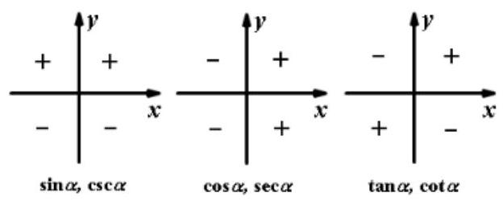

7、特殊角的三角函数值表:

<table><tr><td rowspan="2">$\alpha$   函数值函数</td><td>${0}^{ \circ  }$</td><td>${30}^{ \circ  }$</td><td>${45}^{ \circ  }$</td><td>${60}^{ \circ  }$</td><td>${90}^{ \circ  }$</td><td>180°</td><td>270°</td><td>360°</td></tr><tr><td>0</td><td>$\frac{\pi }{6}$</td><td>$\frac{\pi }{4}$</td><td>$\frac{\pi }{3}$</td><td>$\frac{\pi }{2}$</td><td>$\pi$</td><td>$\frac{3\pi }{2}$</td><td>${2\pi }$</td></tr><tr><td>$\sin \alpha$</td><td>0</td><td>1 2</td><td>$\frac{\sqrt{2}}{2}$</td><td>$\frac{\sqrt{3}}{2}$</td><td>1</td><td>0</td><td>-1</td><td>0</td></tr><tr><td>$\cos \alpha$</td><td>1</td><td>$\frac{\sqrt{3}}{2}$</td><td>$\frac{\sqrt{2}}{2}$</td><td>1 2</td><td>0</td><td>-1</td><td>0</td><td>1</td></tr><tr><td>$\tan \alpha$</td><td>0</td><td>$\frac{\sqrt{3}}{3}$</td><td>1</td><td>✓</td><td>不存在</td><td>0</td><td>不存在</td><td>0</td></tr><tr><td>$\cot \alpha$</td><td>不存在</td><td>✓</td><td>1</td><td>$\frac{\sqrt{3}}{3}$</td><td>0</td><td>不存在</td><td>0</td><td>不存在</td></tr></table>

## 二、同角三角比

1、同角三角比的 3 个关系:

(1)倒数关系: $\sin \alpha  \cdot  \csc \alpha  = 1;\cos \alpha  \cdot  \sec \alpha  = 1;\tan \alpha  \cdot  \cot \alpha  = 1$ ;

(2)商数关系: $\tan \alpha  = \frac{\sin \alpha }{\cos \alpha }\left( {\cos \alpha  \neq  0}\right) ;\cot \alpha  = \frac{\cos \alpha }{\sin \alpha }\left( {\sin \alpha  \neq  0}\right)$ ;

(3)平方关系: ${\sin }^{2}\alpha  + {\cos }^{2}\alpha  = 1;1 + {\tan }^{2}\alpha  = {\sec }^{2}\alpha ;1 + {\cot }^{2}\alpha  = {\csc }^{2}\alpha$ .

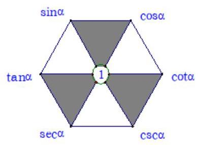

## 2、这些关系式还可以如图样加强形象记忆:

(1)对角线上两个函数的乘积为1(倒数关系)。

(2)任一角的函数等于与其相邻的两个函数的积(商数关系)。

(3)阴影部分，顶角两个函数的平方和等于底角函数的平方(平方关系)。

注意:1)“同角”的概念与角的表达形式无关，如: ${\sin }^{2}{3\alpha } + {\cos }^{2}{3\alpha } = 1,\frac{\sin \frac{\alpha }{2}}{\cos \frac{\alpha }{2}} = \tan \frac{\alpha }{2}$ 。

2)上述关系(公式)都必须在定义域允许的范围内成立。

3)由一个角的任一三角函数值可求出这个角的其余各三角函数值，且因为利用“平方关系”公式，最终需求平方根, 会出现两解, 因此应尽可能少用, 若使用时, 要注意讨论符号。

## 三、诱导公式

## 1、诱导公式

(1)第一组: $\sin \left( {{2k\pi } + \alpha }\right)  = \sin \alpha , k \in  \mathbf{Z}$ ; $\cos \left( {{2k\pi } + \alpha }\right)  = \cos \alpha , k \in  \mathbf{Z}$ ;

$\tan \left( {{2k\pi } + \alpha }\right)  = \tan \alpha , k \in  \mathbf{Z};\cot \left( {{2k\pi } + \alpha }\right)  = \cot \alpha , k \in  \mathbf{Z}$ .

(2)第二组: $\sin \left( {-\alpha }\right)  =  - \sin \alpha ;\cos \left( {-\alpha }\right)  = \cos \alpha ;\tan \left( {-\alpha }\right)  =  - \tan \alpha ;\cot \left( {-\alpha }\right)  =  - \cot \alpha$ .

(3)第三组: $\sin \left( {\pi  + \alpha }\right)  =  - \sin \alpha ;\cos \left( {\pi  + \alpha }\right)  =  - \cos \alpha ;\tan \left( {\pi  + \alpha }\right)  = \tan \alpha ;\cot \left( {\pi  + \alpha }\right)  = \cot \alpha$ .

(4)第四组: $\sin \left( {\pi  - \alpha }\right)  = \sin \alpha ;\cos \left( {\pi  - \alpha }\right)  =  - \cos \alpha ;\tan \left( {\pi  - \alpha }\right)  =  - \tan \alpha ;\cot \left( {\pi  - \alpha }\right)  =  - \cot \alpha$ .

(5) 第五组: $\sin \left( {\frac{\pi }{2} - \alpha }\right)  = \cos \alpha ;\cos \left( {\frac{\pi }{2} - \alpha }\right)  = \sin \alpha ;\tan \left( {\frac{\pi }{2} - \alpha }\right)  = \cot \alpha ;\cot \left( {\frac{\pi }{2} - \alpha }\right)  = \tan \alpha$ .

(6) 第六组: $\sin \left( {\frac{\pi }{2} + \alpha }\right)  = \cos \alpha ;\cos \left( {\frac{\pi }{2} + \alpha }\right)  =  - \sin \alpha ;\tan \left( {\frac{\pi }{2} + \alpha }\right)  =  - \cot \alpha ;\cot \left( {\frac{\pi }{2} + \alpha }\right)  =  - \tan \alpha$ .

## 2、记忆技巧:奇变偶不变，符号看象限

$\frac{\pi }{2}$ 的 “奇” 数倍加、减 $\alpha$ 化成 $\alpha$ 的三角比时,函数名称要 “变”。

【正弦(切)的变为余弦(切)，余弦(切)的变为正弦(切)】

$\frac{\pi }{2}$ 的 “偶” 数倍加、减 $\alpha$ 化成 $\alpha$ 的三角比时,函数名称 “不变”.

然后按 “符号看象限” 的规定,前面加上一个把 $\alpha$ 看成锐角时,原函数在相应象限内的符号.

这个方法可以概括为: “奇变偶不变, 符号看象限”.

## 四、两角和差公式以及辅助角公式

1、两角差的余弦、正弦和正切

$\cos \left( {\alpha  - \beta }\right)  = \cos \alpha \cos \beta  + \sin \alpha \sin \beta \; \sin \left( {\alpha  - \beta }\right)  = \sin \alpha \cos \beta  - \cos \alpha \sin \beta$

$\tan \left( {\alpha  - \beta }\right)  = \frac{\tan \alpha  - \tan \beta }{1 + \tan \alpha \tan \beta }$

2、两角和的余弦、正弦和正切

$\cos \left( {\alpha  + \beta }\right)  = \cos \alpha \cos \beta  - \sin \alpha \sin \beta$

$\tan \left( {\alpha  + \beta }\right)  = \frac{\tan \alpha  + \tan \beta }{1 - \tan \alpha \tan \beta }$

3、 $f\left( x\right)  = a\sin {\omega x} + b\cos {\omega x} = \sqrt{{a}^{2} + {b}^{2}}\sin \left( {{\omega x} + \theta }\right)$

(其中 $\theta$ 角所在的象限由 $a, b$ 的符号确定, $\theta$ 角的值由 $\tan \theta  = \frac{b}{a}$ 确定) 在求最值、化简时起着重要作用。

## 五、二倍角公式及半角公式

一、二倍角公式: $\sin {2\alpha } = 2\sin \alpha \cos \alpha ;\cos {2\alpha } = {\cos }^{2}\alpha  - {\sin }^{2}\alpha ;\tan {2\alpha } = \frac{2\tan \alpha }{1 - {\tan }^{2}\alpha }$ ;

(1)升幂公式: $\cos {2\alpha } = 2{\cos }^{2}\alpha  - 1\;\cos {2\alpha } = 1 - 2{\sin }^{2}\alpha$

(2)降幂公式: ${\cos }^{2}\alpha  = \frac{1 + \cos {2\alpha }}{2}\;{\sin }^{2}\alpha  = \frac{1 - \cos {2\alpha }}{2}$

二、半角公式: $\sin \frac{\alpha }{2} =  \pm  \sqrt{\frac{1 - \cos \alpha }{2}},\;\cos \frac{\alpha }{2} =  \pm  \sqrt{\frac{1 + \cos \alpha }{2}}$ ,

$\tan \frac{\alpha }{2} =  \pm  \sqrt{\frac{1 - \cos \alpha }{1 + \cos \alpha }} = \frac{\sin \alpha }{1 + \cos \alpha } = \frac{1 - \cos \alpha }{\sin \alpha }$

三、万能公式: $\sin \alpha  = \frac{2\tan \frac{\alpha }{2}}{1 + {\tan }^{2}\frac{\alpha }{2}},\cos \alpha  = \frac{1 - {\tan }^{2}\frac{\alpha }{2}}{1 + {\tan }^{2}\frac{\alpha }{2}},\tan \alpha  = \frac{2\tan \frac{\alpha }{2}}{1 - {\tan }^{2}\frac{\alpha }{2}}$ .

## 例题精讲

【例 1】已知圆 $O$ 与直线 $l$ 相切于点 $A$ ,点 $P, Q$ 同时从 $A$ 点出发, $P$ 沿着直线 $l$ 向右、 $Q$ 沿着圆周按逆时针以相同的速度运动,当 $Q$ 运动到点 $A$ 时,点 $P$ 也停止运动,连接 ${OQ},{OP}$ (如图),则阴影部分面积 ${S}_{1}$ , ${S}_{2}$ 的大小关系是( )

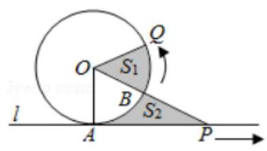

A. ${S}_{1} = {S}_{2}$ B. ${S}_{1} \leq  {S}_{2}$ C. ${S}_{1} \geq  {S}_{2}$ D. 先 ${S}_{1} < {S}_{2}$ ,再 ${S}_{1} = {S}_{2}$ ,最后 ${S}_{1} > {S}_{2}$

【难度】 $\star   \star   \star   \star$

【答案】 $A$

【解析】解: 如图所示,

$\because$ 直线 $l$ 与圆 $O$ 相切, $\therefore {OA} \bot  {AP},\therefore {S}_{\text{ 扇形 }{AOQ}} = \frac{1}{2} \cdot  \overset{\text{ ⏜ }}{AQ} \cdot  r = \frac{1}{2} \cdot  \overset{\text{ ⏜ }}{AQ} \cdot  {OA}$ ,

${S}_{\bigtriangleup {AOP}} = \frac{1}{2} \cdot  {OA} \cdot  {AP},\because \overset{\text{ ⏜ }}{AQ} = {AP},\therefore {S}_{\bigtriangleup {BCAOQ}} = {S}_{\bigtriangleup {AOP}}$ ,

即 ${S}_{\text{ 扇形 }{AOQ}} - {S}_{\text{ 扇形 }{AOB}} = {S}_{\Delta AOP} - {S}_{\text{ 扇形 }{AOB}}$ , $\therefore {S}_{1} = {S}_{2}$ .

故选: $A$ .

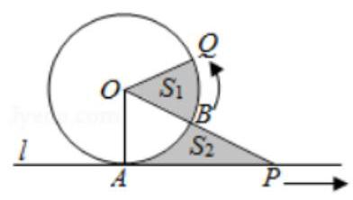

【例 2】已知 $\sin \theta  + \cos \theta  = \frac{2\sqrt{10}}{5}$ ,则 $\tan \left( {\theta  + \frac{\pi }{4}}\right)  =$ ___.

【难度】 $\star   \star   \star$

【答案】 $\pm  2$

【解析】解: $\because \sin \theta  + \cos \theta  = \sqrt{2}\sin \left( {\theta  + \frac{\pi }{4}}\right)  = \frac{2\sqrt{10}}{5},\therefore \sin \left( {\theta  + \frac{\pi }{4}}\right)  = \frac{2\sqrt{5}}{5}$ ,

$\therefore \cos \left( {\theta  + \frac{\pi }{4}}\right)  = \sqrt{1 - {\sin }^{2}\left( {\theta  + \frac{\pi }{4}}\right) } =  \pm  \frac{\sqrt{5}}{5},\therefore \tan \left( {\theta  + \frac{\pi }{4}}\right)  = \frac{\sin \left( {\theta  + \frac{\pi }{4}}\right) }{\cos \left( {\theta  + \frac{\pi }{4}}\right) } =  \pm  2$ ,故答案为: $\pm  2$ .

【例 3】设点 $P$ 是以原点为圆心的单位圆上的一个动点,它从初始位置 ${P}_{0}\left( {0,1}\right)$ 出发,沿单位圆顺时针方向旋转角 $\theta \left( {0 < \theta  < \frac{\pi }{2}}\right)$ 后到达点 ${P}_{1}$ ,然后继续沿单位圆顺时针方向旋转角 $\frac{\pi }{3}$ 到达点 ${P}_{2}$ ,若点 ${P}_{2}$ 的纵坐标是 $- \frac{1}{2}$ , 则点 ${P}_{1}$ 的坐标是 ___.

【难度】 $\bigstar \bigstar \bigstar$

【答案】 $\left( {\frac{\sqrt{3}}{2},\frac{1}{2}}\right)$

【解析】解: 初始位置 ${P}_{0}\left( {0,1}\right)$ 在 $\frac{\pi }{2}$ 的终边上, ${P}_{1}$ 所在射线对应的角为 $\frac{\pi }{2} - \theta ,{P}_{2}$ 所在射线对应的角为 $\frac{\pi }{6} - \theta$ , 由题意可知, $\sin \left( {\frac{\pi }{6} - \theta }\right)  =  - \frac{1}{2}$ ,又 $\frac{\pi }{6} - \theta  \in  \left( {-\frac{\pi }{3},\frac{\pi }{6}}\right)$ ,则 $\frac{\pi }{6} - \theta  =  - \frac{\pi }{6}$ ,解得 $\theta  = \frac{\pi }{3}$ ,

【例4】(1)化简 $\frac{\sin \left\lbrack  {\alpha  + \left( {{2n} + 1}\right) \pi }\right\rbrack   + \sin \left\lbrack  {\alpha  - \left( {{2n} + 1}\right) \pi }\right\rbrack  }{\sin \left( {\alpha  + {2n\pi }}\right)  \cdot  \cos \left( {\alpha  - {2n\pi }}\right) }\left( {n \in  Z}\right)$ .

【难度】 $\star   \star   \star$

【答案】见解析

【解析】原式 $= \frac{-\sin \alpha  - \sin \alpha }{\sin \alpha \cos \alpha } = \frac{-2\sin \alpha }{\sin \alpha \cos \alpha } =  - \frac{2}{\cos \alpha }$ .

(2) $\bigtriangleup  {ABC}$ 中，若 $\sin \frac{A}{2} = \sin \frac{B + C}{2}$ ，则 $\bigtriangleup  {ABC}$ 形状是___.

【难度】 $\star   \star   \star$

【答案】直角三角形

【解析】解: $\because A + B + C = \pi ,\therefore \frac{A}{2} = \frac{\pi }{2} - \frac{B + C}{2},\therefore \sin \frac{A}{2} = \sin \left( {\frac{\pi }{2} - \frac{B + C}{2}}\right)  = \cos \frac{B + C}{2} = \sin \frac{B + C}{2}$ ,即 $\tan \frac{B + C}{2} = 1,$

$\therefore \frac{B + C}{2} = \frac{\pi }{4}$ ,即 $A = B + C = \frac{\pi }{2}$ ,则 $\bigtriangleup {ABC}$ 为直角三角形. 故答案为: 直角三角形

(3)若 $\sin \left( {\frac{\pi }{6} - \alpha }\right)  = a$ ，则 $\sin \left( {\frac{5\pi }{6} + \alpha }\right)  =$ ___.

【难度】 $\star   \star   \star$

【答案】 $a$

【解析】解: 因为 $\sin \left( {\frac{5\pi }{6} + \alpha }\right)  = \sin \left( {\pi  - \frac{5\pi }{6} - \alpha }\right)  = \sin \left( {\frac{\pi }{6} - \alpha }\right)  = a$ . 故答案为: $a$ .

【例 5】( 1 )已知 $f\left( x\right)  = a\sin \left( {{\pi x} + \alpha }\right)  + b\cos \left( {{\pi x} + \beta }\right)$ ，其中 $a$ 、 $b$ 、 $\alpha$ 、 $\beta$ 都是非零常数，若 $f\left( {2014}\right)  =  - 1$ ， 则 $f\left( {2015}\right)$ 等于(   )

A. -1 B. 0 C. 1 D. 2

【难度】★★★

【答案】C.

【解析】 $f\left( {2014}\right)  = a\sin \left( {{2014\pi } + \alpha }\right)  + b\cos \left( {{2014\pi } + \beta }\right)  = a\sin \left( \alpha \right)  + b\cos \left( \beta \right)  =  - 1$ , $f\left( {2015}\right)  = a\sin \left( {{2015\pi } + \alpha }\right)  + b\cos \left( {{2015\pi } + \beta }\right)  = a\sin \left( {\pi  + \alpha }\right)  + b\cos \left( {\pi  + \beta }\right)  =  - \left\lbrack  {a\sin \left( \alpha \right)  + b\cos \left( \beta \right) }\right\rbrack   = 1$ .

( 2 ) $\sin \left( {\pi  + \frac{\pi }{6}}\right) \sin \left( {{2\pi } + \frac{\pi }{6}}\right) \sin \left( {{3\pi } + \frac{\pi }{6}}\right) \cdots \sin \left( {{2014\pi } + \frac{\pi }{6}}\right)$ 的值等于___.

【难度】 $\star   \star   \star   \star$

【答案】 $- \frac{1}{{2}^{2014}}$ .

【解析】原式 $= \left( {-\frac{1}{2}}\right) \frac{1}{2}\left( {-\frac{1}{2}}\right) \frac{1}{2}\cdots \frac{1}{2} =  - \frac{1}{{2}^{2014}}$ .

【例 6】( 1 )若 $2\sin \alpha  - 3\cos \beta  =  - \frac{6}{5},2\cos \alpha  - 3\sin \beta  =  - \frac{1}{5}$ ，则 $\sin \left( {\alpha  + \beta }\right)  =$ ___.

【难度】 $\star   \star   \star$

【答案】 $\frac{24}{25}$

【解析】解: 若 $2\sin \alpha  - 3\cos \beta  =  - \frac{6}{5},2\cos \alpha  - 3\sin \beta  =  - \frac{1}{5}$ ,

则 $4{\sin }^{2}\alpha  + 9{\cos }^{2}\beta  - {12}\sin \alpha \cos \beta  = \frac{36}{25}$ ①,

$4{\cos }^{2}\alpha  + 9{\sin }^{2}\beta  - {12}\cos \alpha \sin \beta  = \frac{1}{25}$ ②,

①+②可得 $4 + 9 - {12}\sin \left( {\alpha  + \beta }\right)  = \frac{37}{25}$ ，求得 $\sin \left( {\alpha  + \beta }\right)  = \frac{24}{25}$ ，故答案为: $\frac{24}{25}$ .

(2) $\cos \left( {{2\alpha } - \beta }\right)  =  - \frac{1}{9},\sin \left( {\alpha  - {2\beta }}\right)  = \frac{2}{3}$ ，且 $\alpha ,\beta  \in  \left( {0,\frac{\pi }{2}}\right)$ ，则 $\cos \left( {\alpha  + \beta }\right)  =$ ___.

【难度】 $\star   \star   \star   \star$

【答案】 $\frac{7\sqrt{5}}{27}$

【解析】解: $\because \alpha ,\beta  \in  \left( {0,\frac{\pi }{2}}\right) ,\therefore {2\alpha } - \beta  \in  \left( {-\frac{\pi }{2},\pi }\right) ,\alpha  - {2\beta } \in  \left( {-\pi ,\frac{\pi }{2}}\right)$ ,又 $\cos \left( {{2\alpha } - \beta }\right)  =  - \frac{1}{9}$ ,

$\therefore {2\alpha } - \beta  \in  \left( {\frac{\pi }{2},\pi }\right) ,\therefore \sin \left( {{2\alpha } - \beta }\right)  = \frac{4\sqrt{5}}{9} \cdot  \sin \left( {\alpha  - {2\beta }}\right)  = \frac{2}{3},\therefore \alpha  - {2\beta } \in  \left( {0,\frac{\pi }{2}}\right)$ ,

$\therefore \cos \left( {\alpha  - {2\beta }}\right)  = \frac{\sqrt{5}}{3}$ .

$\therefore \cos \left( {\alpha  + \beta }\right)  = \cos \left\lbrack  {\left( {{2\alpha } - \beta }\right)  - \left( {\alpha  - {2\beta }}\right) }\right\rbrack   = \cos \left( {{2\alpha } - \beta }\right) \cos \left( {\alpha  - {2\beta }}\right)  + \sin \left( {{2\alpha } - \beta }\right) \sin \left( {\alpha  - {2\beta }}\right)$

$=  - \frac{1}{9} \times  \frac{\sqrt{5}}{3} + \frac{4\sqrt{5}}{9} \times  \frac{2}{3} = \frac{7\sqrt{5}}{27}$ . 故答案为: $\frac{7\sqrt{5}}{27}$ .

【例 6】若 $x \in  \left( {0,\frac{\pi }{2}}\right) , y \in  \left( {0,\frac{\pi }{2}}\right)$ 且 $\sin {2x} = 6\tan \left( {x - y}\right) \cos {2x}$ ,则 $x + y$ 的取值不可能是( )

A. $\frac{\pi }{6}$ B. $\frac{\pi }{4}$ C. $\frac{2\pi }{3}$ D. $\frac{3\pi }{4}$

【难度】 $\star   \star   \star   \star$

【答案】C

【解析】由 $x \in  \left( {0,\frac{\pi }{2}}\right) , y \in  \left( {0,\frac{\pi }{2}}\right)$ 得 ${2x} \in  \left( {0,\pi }\right) , x - y \in  \left( {-\frac{\pi }{2},\frac{\pi }{2}}\right)$ ,则 $\sin {2x} \neq  0$ ,

所以 $\cos {2x} \neq  0,\tan \left( {x - y}\right)  \in  \left( {-\infty ,0}\right)  \cup  \left( {0, + \infty }\right)$ ,又由 $\sin {2x} = 6\tan \left( {x - y}\right) \cos {2x}$ 得 $6\tan \left( {x - y}\right)  = \tan {2x}$ ,

不妨设 $6\tan \left( {x - y}\right)  = \tan {2x} = {6a}\left( {a \neq  0}\right)$ ,则

$\tan \left( {x + y}\right)  = \tan \left\lbrack  {{2x} - \left( {x - y}\right) }\right\rbrack   = \frac{\tan {2x} - \tan \left( {x - y}\right) }{1 + \tan {2x} \cdot  \tan \left( {x - y}\right) } = \frac{5a}{6{a}^{2} + 1},$

设 $\frac{5a}{6{a}^{2} + 1} = k\left( {k \neq  0}\right)$ ,则有 ${6k}{a}^{2} - {5a} + k = 0$ 有解,则 $\Delta  = {\left( -5\right) }^{2} - 4 \times  6{k}^{2} \geq  0$ ,

解得 $- \frac{5\sqrt{6}}{12} \leq  k < 0$ 或 $0 < k \leq  \frac{5\sqrt{6}}{12}$ ,因为 $\tan \frac{2\pi }{3} =  - \sqrt{3} \notin  \left\lbrack  {-\frac{5\sqrt{6}}{12},0}\right)  \cup  \left( {0,\frac{5\sqrt{6}}{12}}\right\rbrack$ ,

故选: $C$ .

【例 7】( 1 )化简: $\sqrt{\frac{1}{2} - \frac{1}{2}\sqrt{\frac{1}{2} + \frac{1}{2}\cos {2\alpha }}}\left( {\alpha  \in  \left( {\frac{3\pi }{2},{2\pi }}\right) }\right)$ 。

(2)求值: $\sin {10}^{ \circ  }\sin {30}^{ \circ  }\sin {50}^{ \circ  }\sin {70}^{ \circ  }$ ；

(3)求值: $\frac{1}{\sin {10}^{ \circ  }} - \frac{\sqrt{3}}{\cos {10}^{ \circ  }}$ .

【难度】 $\star   \star   \star$

【答案】见解析

【解析】(1) 因为 $\frac{3\pi }{2} < \alpha  < {2\pi }$ ,所以, $\sqrt{\frac{1}{2} + \frac{1}{2}\cos {2\alpha }} = \left| {\cos \alpha }\right|  = \cos \alpha$ 又因 $\frac{3\pi }{4} < \frac{\alpha }{2} < \pi$ ,所以 $\sqrt{\frac{1}{2} - \frac{1}{2}\cos \alpha } = \left| {\sin \frac{\alpha }{2}}\right|  = \sin \frac{\alpha }{2}$ ,所以,原式 $= \sin \frac{\alpha }{2}$ 。

(2) $\because \sin {10}^{ \circ  } = \cos {80}^{ \circ  },\sin {50}^{ \circ  } = \cos {40}^{ \circ  },\sin {70}^{ \circ  } = \cos {20}^{ \circ  }$ .

$\therefore$ 原式 $= \frac{1}{2}\cos {80}^{ \circ  }\cos {40}^{ \circ  }\cos {20}^{ \circ  } = \frac{1}{2} \times  \frac{\cos {80}^{ \circ  }\cos {40}^{ \circ  }\cos {20}^{ \circ  }\sin {20}^{ \circ  }}{\sin {20}^{ \circ  }}$

$= \frac{1}{2} \times  \frac{\cos {80}^{ \circ  }\cos {40}^{ \circ  }\sin {40}^{ \circ  } \times  \frac{1}{2}}{\sin {20}^{ \circ  }}$

$$
= \frac{1}{2} \times  \frac{\cos {80}^{ \circ  }\sin {80}^{ \circ  } \times  \frac{1}{2} \times  \frac{1}{2}}{\sin {20}^{ \circ  }} = \frac{1}{2} \times  \frac{\sin {160}^{ \circ  } \times  \frac{1}{2} \times  \frac{1}{2} \times  \frac{1}{2}}{\sin {20}^{ \circ  }} = \frac{1}{16}.
$$

(3) 原式 $= \frac{\cos {10}^{ \circ  } - \sqrt{3}\sin {10}^{ \circ  }}{\sin {10}^{ \circ  }\cos {10}^{ \circ  }} = \frac{4\left( {\frac{1}{2}\cos {10}^{ \circ  } - \frac{\sqrt{3}}{2}\sin {10}^{ \circ  }}\right) }{2\sin {10}^{ \circ  }\cos {10}^{ \circ  }}$

$$
= \frac{4\left( {\sin {30}^{ \circ  }\cos {10}^{ \circ  } - \cos {30}^{ \circ  }\sin {10}^{ \circ  }}\right) }{2\sin {10}^{ \circ  }\cos {10}^{ \circ  }} = \frac{4\sin \left( {{30}^{ \circ  } - {10}^{ \circ  }}\right) }{\sin {20}^{ \circ  }} = \frac{4\sin {20}^{ \circ  }}{\sin {20}^{ \circ  }} = 4
$$

【例 8】已知 $- \frac{\pi }{2} < x < 0,\sin x + \cos x = \frac{1}{5}$ ,求:

(1) $\sin x - \cos x$ 的值；(2)求 $\frac{3{\sin }^{2}\frac{x}{2} - 2\sin \frac{x}{2}\cos \frac{x}{2} + {\cos }^{2}\frac{x}{2}}{\tan x + \frac{1}{\tan x}}$ 的值.

【难度】 $\star   \star   \star$

【答案】( 1 ) $\sin x - \cos x =  - \frac{7}{5}$ ( 2 ) $- \frac{108}{125}$

【解析】解: (1) 由题可知, $\sin x + \cos x = \frac{1}{5}$ ,则 ${\left( \sin x + \cos x\right) }^{2} = \frac{1}{25}$ ,

得 ${\sin }^{2}x + 2\sin x\cos x + {\cos }^{2}x = \frac{1}{25}$ ,即 $1 + 2\sin x\cos x = \frac{1}{25}$ ,得 $2\sin x\cos x =  - \frac{24}{25}$ ,

$\because {\left( \sin x - \cos x\right) }^{2} = 1 - 2\sin x\cos x = \frac{49}{25},\because  - \frac{\pi }{2} < x < 0,\therefore \sin x < 0,\cos x > 0$ ,

$\therefore \sin x - \cos x < 0$ ,故 $\sin x - \cos x =  - \frac{7}{5}$ .

(2) $\frac{3{\sin }^{2}\frac{x}{2} - 2\sin \frac{x}{2}\cos \frac{x}{2} + {\cos }^{2}\frac{x}{2}}{\tan x + \frac{1}{\tan x}} = \frac{2{\sin }^{2}\frac{x}{2} + {\sin }^{2}\frac{x}{2} - 2\sin \frac{x}{2}\cos \frac{x}{2} + {\cos }^{2}\frac{x}{2}}{\tan x + \frac{1}{\tan x}}$

$= \frac{2{\sin }^{2}\frac{x}{2} - \sin x + 1}{\frac{\sin x}{\cos x} + \frac{\cos x}{\sin x}} = \frac{2{\sin }^{2}\frac{x}{2} - \sin x + 1}{\frac{{\sin }^{2}x + {\cos }^{2}x}{\sin x\cos x}} = \sin x\cos x\left( {2{\sin }^{2}\frac{x}{2} - \sin x + 1}\right)$

$= \sin x\cos x\left\lbrack  {2\left( {1 - {\cos }^{2}\frac{x}{2}}\right)  - \sin x + 1}\right\rbrack   = \sin x\cos x\left( {1 - 2{\cos }^{2}\frac{x}{2} + 2 - \sin x}\right)$

$$
= \sin x\cos x\left( {-\cos x + 2 - \sin x}\right)  = \frac{1}{2} \times  2\sin x\cos x\left\lbrack  {2 - \left( {\sin x + \cos x}\right) }\right\rbrack
$$

$$
= \frac{1}{2} \times  \left( {-\frac{24}{25}}\right)  \times  \left( {2 - \frac{1}{5}}\right)  =  - \frac{108}{125}.
$$

【例 9】已知等差数列 $\left\{  {a}_{n}\right\}$ 的公差 $d \in  \left( {0,1}\right)$ ，且 $\frac{{\sin }^{2}{a}_{3} - {\sin }^{2}{a}_{7}}{\sin \left( {{a}_{3} + {a}_{7}}\right) } =  - 1$ ，若 ${a}_{1} \in  \left( {-\frac{5\pi }{4}, - \frac{9\pi }{8}}\right)$ 时，则数列 $\left\{  {a}_{n}\right\}$ 的前 $n$ 项和为 ${S}_{n}$ 取得最小值时 $n$ 的值为___.

【难度】 $\star   \star   \star   \star$

【答案】 10

【解析】解: $\because \left\{  {a}_{n}\right\}$ 为等差数列,且 $\frac{{\sin }^{2}{a}_{3} - {\sin }^{2}{a}_{7}}{\sin \left( {{a}_{3} + {a}_{7}}\right) } =  - 1$ ,

$\therefore \frac{\frac{1 - \cos 2{a}_{3}}{2} - \frac{1 - \cos 2{a}_{7}}{2}}{\sin \left( {{a}_{3} + {a}_{7}}\right) } =  - 1,\therefore \frac{\cos 2{a}_{7} - \cos 2{a}_{3}}{2} =  - \sin \left( {{a}_{3} + {a}_{7}}\right)$ ,

由和差化积公式得: $\frac{1}{2} \times  \left( {-2}\right) \sin \left( {{a}_{7} + {a}_{3}}\right)  \cdot  \sin \left( {{a}_{7} - {a}_{3}}\right)  =  - \sin \left( {{a}_{3} + {a}_{7}}\right)$ ,

又 $\sin \left( {{a}_{3} + {a}_{7}}\right)  \neq  0,\therefore \sin \left( {{a}_{7} - {a}_{3}}\right)  = 1,\therefore {4d} = {2k\pi } + \frac{\pi }{2} \in  \left( {0,4}\right)$ ;

取 $k = 0$ ，得 ${4d} = \frac{\pi }{2}$ ，解得 $d = \frac{\pi }{8}$ ；又 $\because {a}_{1} \in  \left( {-\frac{5\pi }{4}, - \frac{9\pi }{8}}\right)$ ，

$\therefore {a}_{n} = {a}_{1} + \frac{\pi }{8}\left( {n - 1}\right) ,\therefore {a}_{n} \in  \left( {-\frac{11\pi }{8} + \frac{n\pi }{8}, - \frac{10\pi }{8} + \frac{n\pi }{8}}\right)$ ;

令 ${a}_{n} \leq  0$ ,得 $- \frac{10\pi }{8} + \frac{n\pi }{8} \leq  0$ ,解得 $n \leq  {10}$ ;

$\therefore n = {10}$ 时,数列 $\left\{  {a}_{n}\right\}$ 的前 $n$ 项和 ${S}_{n}$ 取得最小值.

故答案为:10.

【例 10】对于集合 $A = \left\{  {{\theta }_{1},{\theta }_{2},\cdots ,{\theta }_{n}}\right\}$ 和常数 ${\theta }_{0}$ ,定义:

$\mu  = \frac{{\cos }^{2}\left( {{\theta }_{1} - {\theta }_{0}}\right)  + {\cos }^{2}\left( {{\theta }_{2} - {\theta }_{0}}\right)  + \ldots  + {\cos }^{2}\left( {{\theta }_{n} - {\theta }_{0}}\right) }{n}$ 为集合 $A$ 相对 ${\theta }_{0}$ 的 “余弦方差”.

(1)若集合 $A = \left\{  {\frac{\pi }{3},\frac{\pi }{4}}\right\}  ,{\theta }_{0} = 0$ ，求集合 $A$ 相对 ${\theta }_{0}$ 的 “余弦方差”；

(2)求证:集合 $A = \left\{  {\frac{\pi }{3},\frac{2\pi }{3},\pi }\right\}$ 相对任何常数 ${\theta }_{0}$ 的 “余弦方差” 是一个与 ${\theta }_{0}$ 无关的定值，并求此定值；

(3)若集合 $A = \left\{  {\frac{\pi }{4},\alpha ,\beta }\right\}  ,\alpha  \in  \lbrack 0,\pi ),\beta  \in  \lbrack \pi ,{2\pi })$ ，相对任何常数 ${\theta }_{0}$ 的 “余弦方差”是一个与 ${\theta }_{0}$ 无关的定值,求出 $\alpha \text{ 、 }\beta$ .

【难度】 $\star   \star   \star   \star   \star$

【答案】(1) $\frac{3}{8}$ ；(2) 证明见解析,定值 $\frac{1}{2}$ ；(3) $\alpha  = \frac{7}{12}\pi ,\beta  = \frac{23}{12}\pi$ 或 $\alpha  = \frac{11}{12}\pi ,\beta  = \frac{19}{12}\pi$

【解析】

(1)依题意: $\mu  = \frac{{\cos }^{2}\left( {\frac{\pi }{3} - 0}\right)  + {\cos }^{2}\left( {\frac{\pi }{4} - 0}\right) }{2} = \frac{\frac{1}{4} + \frac{1}{2}}{2} = \frac{3}{8}$ ;

(2)由 “余弦方差” 定义得: $\mu  = \frac{{\cos }^{2}\left( {\frac{\pi }{3} - {\theta }_{0}}\right)  + {\cos }^{2}\left( {\frac{2\pi }{3} - {\theta }_{0}}\right)  + {\cos }^{2}\left( {\pi  - {\theta }_{0}}\right) }{3}$ ， 则分子 $= {\left( \cos \frac{\pi }{3}\cos {\theta }_{0} + \sin \frac{\pi }{3}\sin {\theta }_{0}\right) }^{2} + {\left( \cos \frac{2\pi }{3}\cos {\theta }_{0} + \sin \frac{2\pi }{3}\sin {\theta }_{0}\right) }^{2} + {\left( \cos \pi \cos {\theta }_{0} + \sin \pi \sin {\theta }_{0}\right) }^{2} \; = {\left( \frac{1}{2}\cos {\theta }_{0} + \frac{\sqrt{3}}{2}\sin {\theta }_{0}\right) }^{2} + {\left( -\frac{1}{2}\cos {\theta }_{0} + \frac{\sqrt{3}}{2}\sin {\theta }_{0}\right) }^{2} + {\cos }^{2}{\theta }_{0} \; = \frac{1}{2}{\cos }^{2}{\theta }_{0} + \frac{3}{2}{\sin }^{2}{\theta }_{0} + {\cos }^{2}{\theta }_{0} = \frac{3}{2},\begin{aligned} \dot{\lambda } &  = \frac{3}{2} = \frac{1}{2}\text{ 为定值,与 }{\theta }_{0}\text{ 的取值无关. } \end{aligned}$

(3) $\mu  = \frac{{\cos }^{2}\left( {\frac{\pi }{4} - {\theta }_{0}}\right)  + {\cos }^{2}\left( {\alpha  - {\theta }_{0}}\right)  + {\cos }^{2}\left( {\beta  - {\theta }_{0}}\right) }{3}$ ,分子 $= {\left( \cos \frac{\pi }{4}\cos {\theta }_{0} + \sin \frac{\pi }{4}\sin {\theta }_{0}\right) }^{2} + {\left( \cos \alpha \cos {\theta }_{0} + \sin \alpha \sin {\theta }_{0}\right) }^{2} + {\left( \cos \beta \cos {\theta }_{0} + \sin \beta \sin {\theta }_{0}\right) }^{2} \; = \left( {\frac{1}{2}{\cos }^{2}{\theta }_{0} + \frac{1}{2}{\sin }^{2}{\theta }_{0} + \sin {\theta }_{0}\cos {\theta }_{0}}\right)  + \left( {{\cos }^{2}\alpha {\cos }^{2}{\theta }_{0} + {\sin }^{2}\alpha {\sin }^{2}{\theta }_{0} + 2\sin {\theta }_{0}\cos {\theta }_{0}\sin \alpha \cos \alpha }\right) \; + \left( {{\cos }^{2}\beta {\cos }^{2}{\theta }_{0} + {\sin }^{2}\beta {\sin }^{2}{\theta }_{0} + 2\sin {\theta }_{0}\cos {\theta }_{0}\sin \beta \cos \beta }\right) \; = \left( {\frac{1}{2} + {\cos }^{2}\alpha  + {\cos }^{2}\beta }\right) {\cos }^{2}{\theta }_{0} + \left( {\frac{1}{2} + {\sin }^{2}\alpha  + {\sin }^{2}\beta }\right) {\sin }^{2}{\theta }_{0} + \left( {1 + \sin {2\alpha } + \sin {2\beta }}\right) \sin {\theta }_{0}\cos {\theta }_{0} \; = \frac{1 + \cos 2{\theta }_{0}}{2}\left( {\frac{1}{2} + {\cos }^{2}\alpha  + {\cos }^{2}\beta }\right)  + \frac{1 - \cos 2{\theta }_{0}}{2}\left( {\frac{1}{2} + {\sin }^{2}\alpha  + {\sin }^{2}\beta }\right)  + \frac{1}{2}\left( {1 + \sin {2\alpha } + \sin {2\beta }}\right) \sin 2{\theta }_{0} \; = \frac{\cos 2{\theta }_{0}}{2}\left( {{\cos }^{2}\alpha  + {\cos }^{2}\beta  - {\sin }^{2}\alpha  - {\sin }^{2}\beta }\right)  + \frac{\sin 2{\theta }_{0}}{2}\left( {1 + \sin {2\alpha } + \sin {2\beta }}\right) \; + \frac{1}{2}\left( {\frac{1}{2} + {\cos }^{2}\alpha  + {\cos }^{2}\beta }\right)  + \frac{1}{2}\left( {\frac{1}{2} + {\sin }^{2}\alpha  + {\sin }^{2}\beta }\right) \; = \frac{\cos 2{\theta }_{0}}{2}\left( {\cos {2\alpha } + \cos {2\beta }}\right)  + \frac{\sin 2{\theta }_{0}}{2}\left( {1 + \sin {2\alpha } + \sin {2\beta }}\right) \; + \frac{1}{2}\left( {\frac{1}{2} + {\cos }^{2}\alpha  + {\cos }^{2}\beta }\right)  + \frac{1}{2}\left( {\frac{1}{2} + {\sin }^{2}\alpha  + {\sin }^{2}\beta }\right) \; = \frac{3}{2} + \frac{1}{2}\sin 2{\theta }_{0} \cdot  \left( {1 + \sin {2\alpha } + \sin {2\beta }}\right)  + \frac{1}{2}\cos 2{\theta }_{0} \cdot  \left( {\cos {2\alpha } + \cos {2\beta }}\right)$ .

要使 $\mu$ 是一个与 ${\theta }_{0}$ 无关的定值,则 $\left\{  \begin{array}{l} \cos {2\alpha } + \cos {2\beta } = 0 \\  1 + \sin {2\alpha } + \sin {2\beta } = 0 \end{array}\right.$ ,

$\because \cos {2\alpha } =  - \cos {2\beta },\therefore {2\alpha }$ 与 ${2\beta }$ 终边关于 $y$ 轴对称或关于原点对称,

又 $\sin {2\alpha } + \sin {2\beta } =  - 1$ ,得 ${2\alpha }$ 与 ${2\beta }$ 终边只能关于 $y$ 轴对称, $\therefore \left\{  \begin{array}{l} \sin {2\alpha } = \sin {2\beta } =  - \frac{1}{2} \\  \cos {2\alpha } =  - \cos {2\beta } \end{array}\right.$ ,

又 $\alpha  \in  \lbrack 0,\pi ),\beta  \in  \lbrack \pi ,{2\pi })$ ,则当 ${2\alpha } = \frac{7}{6}\pi$ 时, ${2\beta } = \frac{23}{6}\pi$ ;

当 ${2\alpha } = \frac{11}{6}\pi$ 时, ${2\beta } = \frac{19}{6}\pi \ldots \alpha  = \frac{7}{12}\pi ,\beta  = \frac{23}{12}\pi$ 或 $\alpha  = \frac{11}{12}\pi ,\beta  = \frac{19}{12}\pi$ .

故 $\alpha  = \frac{7}{12}\pi ,\beta  = \frac{23}{12}\pi$ 或 $\alpha  = \frac{11}{12}\pi ,\beta  = \frac{19}{12}\pi$ 时,相对任何常数 ${\theta }_{0}$ 的 “余弦方差” 是一个与 ${\theta }_{0}$ 无关的定值.

## 巩固训练

1、设 $a = \sin {15}^{ \circ  } + \cos {15}^{ \circ  }, b = \sin {17}^{ \circ  } + \cos {17}^{ \circ  }$ ，则下列各式中正确的是( )

A. $a < \frac{{a}^{2} + {b}^{2}}{2} < b$ B. $b < \frac{{a}^{2} + {b}^{2}}{2} < a$ C. $b < a < \frac{{a}^{2} + {b}^{2}}{2}$ D. $a < b < \frac{{a}^{2} + {b}^{2}}{2}$

【难度】 $\star   \star   \star$

【答案】 $D$

【解析】解: $\because a = \sin {15}^{ \circ  } + \cos {15}^{ \circ  } = \sqrt{2}\sin \left( {{45}^{ \circ  } + {15}^{ \circ  }}\right)  = \sqrt{2}\sin {60}^{ \circ  }, b = \sin {17}^{ \circ  } + \cos {17}^{ \circ  } = \sqrt{2}\sin {62}^{ \circ  }$ , $\therefore b > a > 1$ ,故排除 $B\text{ 、 }C$ .

再由 ${a}^{2} = 1 + 2\sin {15}^{ \circ  }\cos {15}^{ \circ  } = 1 + \sin {30}^{ \circ  },{b}^{2} = 1 + 2\sin {17}^{ \circ  }\cos {17}^{ \circ  } = 1 + \sin {34}^{ \circ  }$ ,

$\therefore \frac{{a}^{2} + {b}^{2}}{2} = {\sin }^{2}{60}^{ \circ  } + {\sin }^{2}{62}^{ \circ  } > 2\sin {60}^{ \circ  }\sin {62}^{ \circ  } = \sqrt{3}\sin {62}^{ \circ  } > b$ ,故排除 $A$ ,

故选: $D$ .

2、已知 $A$ 为锐角， $\lg \left( {1 + \cos A}\right)  = m,\lg \frac{1}{1 - \cos A} = n$ ，则 $\lg \sin A$ 的值为( )

A. $m + \frac{1}{n}$ B. $m - n$

C. $\frac{1}{2}\left( {m + n}\right)$ D. $\frac{1}{2}\left( {m - n}\right)$

【难度】 $\star   \star   \star$

【答案】D.

【解析】根据题意,两式相减,可得 $\lg \left( {1 + \cos A}\right)  - \lg \frac{1}{1 - \cos A} = m - n$ ,

$\lg \left\lbrack  {\left( {1 + \cos A}\right)  \cdot  \left( {1 - \cos A}\right) }\right\rbrack   = m - n \Rightarrow  \lg {\sin }^{2}A = m - n$ ,

$\because A$ 为锐角, $\therefore \sin A > 0,\therefore 2\lg \sin A = m - n \Rightarrow  \lg \sin A = \frac{1}{2}\left( {m - n}\right)$ .

3、化简: $\sqrt{\frac{2}{1 + \sin \theta } + \frac{2}{1 - \sin \theta }}$ .

【难度】 $\star   \star   \star$

【答案】 $2\left| {\sec \theta }\right|$ .

【解析】 $\sqrt{\frac{2}{1 + \sin \theta } + \frac{2}{1 - \sin \theta }} = \sqrt{\frac{2\left( {1 + \sin \theta  + 1 - \sin \theta }\right) }{\left( {1 + \sin \theta }\right)  \cdot  \left( {1 - \sin \theta }\right) }} = \sqrt{\frac{4}{1 - {\sin }^{2}\theta }} = 2\sqrt{\frac{1}{{\cos }^{2}\theta }} = 2\left| {\sec \theta }\right|$ .

4、若函数 $y = a\sin x + b\cos x$ (其中 $a, b \in  \mathbf{R}$ ，且 $a, b > 0$ )可化为 $y = \sqrt{{a}^{2} + {b}^{2}}\cos \left( {x - \varphi }\right)$ ， 则 $\varphi$ 应满足条件( )

A. $\tan \varphi  = \frac{b}{a}$ B. $\cos \varphi  = \frac{a}{\sqrt{{a}^{2} + {b}^{2}}}$ C. $\tan \varphi  = \frac{a}{b}$ D. $\sin \varphi  = \frac{b}{\sqrt{{a}^{2} + {b}^{2}}}$

【难度】 $\star   \star   \star$

【答案】C

【解析】 $y = a\sin x + b\cos x = \sqrt{{a}^{2} + {b}^{2}}\left( {\frac{a}{\sqrt{{a}^{2} + {b}^{2}}}\sin x + \frac{b}{\sqrt{{a}^{2} + {b}^{2}}}\cos x}\right) \; = \sqrt{{a}^{2} + {b}^{2}}\sin \left( {x + \theta }\right)$ ,其中 $\tan \theta  = \frac{b}{a}$ ,

$\because$ 函数 $y = a\sin x + b\cos x$ (其中 $a, b \in  \mathbf{R}$ ,且 $a, b > 0$ ) 可化为 $y = \sqrt{{a}^{2} + {b}^{2}}\cos \left( {x - \varphi }\right)$ ,

$\therefore \sin \left( {x + \theta }\right)  = \cos \left( {x - \varphi }\right)$ ,即 $\sin \left( {x + \theta }\right)  = \sin \left( {\frac{\pi }{2} + x - \varphi }\right) ,\therefore \frac{\pi }{2} - \varphi  = \theta  + {2\pi k}\left( {k \in  Z}\right)$ ,

$\therefore \tan \left( {\frac{\pi }{2} - \varphi }\right)  = \tan \left( {\theta  + {2\pi k}}\right)$ ,即 $\cot \varphi  = \tan \theta ,\therefore \tan \varphi  = \frac{1}{\tan \theta } = \frac{a}{b}$ ,

故选: C.

5、已知 $\alpha ,\beta  \in  \left( {0,\pi }\right)$ ， $\cos \alpha  =  - \frac{3\sqrt{10}}{10}$ ，若 $\sin \left( {{2\alpha } + \beta }\right)  = \frac{1}{2}\sin \beta$ ，则 $\alpha  + \beta  =$ ( )

A. $\frac{5}{4}\pi$ B. $\frac{2}{3}\pi$ C. $\frac{7}{6}\pi$ D. $\frac{7}{4}\pi$

【难度】 $\star   \star   \star   \star$

【答案】A

【解析】由题意可知, $\sin \left( {{2\alpha } + \beta }\right)  = \frac{1}{2}\sin \beta$ ,可化为 $\sin \left\lbrack  {\alpha  + \left( {\alpha  + \beta }\right) }\right\rbrack   = \frac{1}{2}\sin \left\lbrack  {\left( {\alpha  + \beta }\right)  - \alpha }\right\rbrack$ , 展开得 $\sin \alpha \cos \left( {\alpha  + \beta }\right)  + \cos \alpha \sin \left( {\alpha  + \beta }\right)  = \frac{1}{2}\cos \alpha \sin \left( {\alpha  + \beta }\right)  - \frac{1}{2}\sin \alpha \cos \left( {\alpha  + \beta }\right)$ ,则 $\cos \alpha \sin \left( {\alpha  + \beta }\right)  + 3\sin \alpha \cos \left( {\alpha  + \beta }\right)  = 0,$

因为 $\alpha ,\beta  \in  \left( {0,\pi }\right)$ ,且 $\cos \alpha  =  - \frac{3\sqrt{10}}{10}$ ,所以 $\sin \alpha  = \sqrt{1 - {\cos }^{2}\alpha } = \frac{\sqrt{10}}{10}$ ,

则 $- \frac{3\sqrt{10}}{10}\sin \left( {\alpha  + \beta }\right)  + 3 \times  \frac{\sqrt{10}}{10}\cos \left( {\alpha  + \beta }\right)  = 0$ ,且 $\alpha  \in  \left( {\frac{\pi }{2},\pi }\right)$ ,所以 $\sin \left( {\alpha  + \beta }\right)  = \cos \left( {\alpha  + \beta }\right)$ ,

当 $\cos \left( {\alpha  + \beta }\right)  = 0$ 时不满足题意,所 $\tan \left( {\alpha  + \beta }\right)  = 1$ ,

因为 $\alpha  \in  \left( {\frac{\pi }{2},\pi }\right) ,\beta  \in  \left( {0,\pi }\right)$ ,所以 $\alpha  + \beta  \in  \left( {\frac{\pi }{2},{2\pi }}\right)$ ,则 $\alpha  + \beta  = \frac{5}{4}\pi$ ,故选: A.

6、如图，在平面直角坐标系 ${xOy}$ 中，以 ${Ox}$ 轴为始边作两个锐角 $\alpha$ ， $\beta$ ，它们的终边分别交单位圆于 $A$ ， $B$ 两点. 已知 $A, B$ 两点的横坐标分别是 $\frac{\sqrt{5}}{5},\frac{\sqrt{10}}{10}$ .

(1)求 $\tan \alpha$ 和 $\tan \beta$ 的值；

(2)求 $\alpha  + \beta$ 的值.

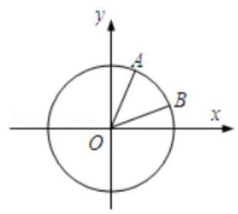

【难度】 $\star   \star   \star$

【答案】见解析

【解析】解: 由题意,得 $A\left( {\frac{\sqrt{5}}{5},\frac{2\sqrt{5}}{5}}\right) , B\left( {\frac{\sqrt{10}}{10},\frac{3\sqrt{10}}{10}}\right) \ldots$

(1) $\tan \alpha  = \frac{\frac{2\sqrt{5}}{5}}{\frac{\sqrt{5}}{5}} = 2,\tan \beta  = \frac{\frac{3\sqrt{10}}{10}}{\frac{\sqrt{10}}{10}} = 3\ldots$

(2)由(1)得 $\tan \left( {\alpha  + \beta }\right)  = \frac{\tan \alpha  + \tan \beta }{1 - \tan \alpha \tan \beta } = \frac{2 + 3}{1 - 2 \times  3} =  - 1\ldots$ 又 $\alpha  \in  \left( {0,\frac{\pi }{2}}\right) ,\beta  \in  \left( {0,\frac{\pi }{2}}\right)$ ，则 $\alpha  + \beta  \in  \left( {0,\pi }\right) \ldots \; \therefore \alpha  + \beta  = \frac{3}{4}\pi \ldots$

7、在锐角 ${\Delta ABC}$ 中， ${\tan B} + {\tan C} = 2\tan B\tan C$ ，则 ${\tan A}\tan B\tan C$ 的最小值为___.

【难度】 $\star   \star   \star   \star$

【答案】 8

【解析】解: $\tan A =  - \tan \left( {\pi  - A}\right)  =  - \tan \left( {B + C}\right)  =  - \frac{\tan B + \tan C}{1 - \tan B \cdot  \tan C}$ ,则

$\tan A\tan B\tan C =  - \frac{\tan B + \tan C}{1 - \tan B \cdot  \tan C} \cdot  \tan B\tan C,$

由 $\tan B + \tan C = 2\tan B\tan C$ ,可得 $\tan A\tan B\tan C =  - \frac{2{\left( \tan B\tan C\right) }^{2}}{1 - \tan B\tan C}$ ,

令 $\tan B\tan C = t$ ,由 $A, B, C$ 为锐角可得 $\tan A > 0,\tan B > 0,\tan C > 0$ ,

$\therefore 1 - \tan B\tan C < 0$ ,解得 $t > 1,\tan A\tan B\tan C =  - \frac{2{t}^{2}}{1 - t} = \frac{2{t}^{2}}{t - 1} = \frac{2}{\frac{1}{t} - \frac{1}{{t}^{2}}} =  - \frac{2}{{\left( \frac{1}{t} - \frac{1}{2}\right) }^{2} - \frac{1}{4}}$ ,由 $t > 1$ 得, $\frac{1}{4} \leq  \frac{1}{{t}^{2}} - \frac{1}{t} < 0$ ,因此 $\tan A\tan B\tan C$ 的最小值为 8 . 故答案为: 8 .

## (二)三角函数的图像与性质

## 知识梳理

一、三角函数的图像与性质

<table id="cross-table-1"><tr><td>函数</td><td>$y = \sin x$</td><td>$y = \cos x$</td><td>$y = \tan x$</td></tr><tr><td>图像</td><td>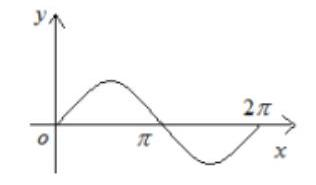</td><td>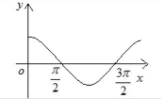</td><td>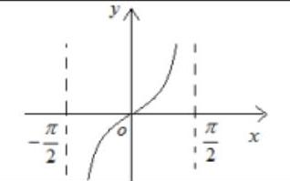</td></tr><tr><td>定义域</td><td colspan="2">$R$</td><td>$\left\{  {x\left| {\;x \neq  {k\pi } + \frac{\pi }{2}}\right. , k \in  Z}\right\}$</td></tr><tr><td>值域</td><td colspan="2">$\left\lbrack  {-1,1}\right\rbrack$</td><td>$R$</td></tr><tr><td>有界性</td><td>$\left| {\sin x}\right|  \leq  1$</td><td>$\left| {\cos x}\right|  \leq  1$</td><td>无</td></tr><tr><td>最小正周期</td><td colspan="2">${2\pi }$</td><td>$\pi$</td></tr><tr><td>单调性</td><td>增区间: $\left\lbrack  {{2k\pi } - \frac{\pi }{2},{2k\pi } + \frac{\pi }{2}}\right\rbrack  k \in  Z$ 减区间: $\left\lbrack  {{2k\pi } + \frac{\pi }{2},{2k\pi } + \frac{3\pi }{2}}\right\rbrack  k \in  Z$</td><td>增区间: $\left\lbrack  {{2k\pi } - \pi ,{2k\pi }}\right\rbrack  k \in  Z$ 减区间: $\left\lbrack  {{2k\pi } - \pi ,{2k\pi }}\right\rbrack  k \in  Z$</td><td>增区间: $\left( {{k\pi } - \frac{\pi }{2},{k\pi } + \frac{\pi }{2}}\right) k \in  Z$</td></tr><tr><td>奇偶性</td><td>奇</td><td>偶</td><td>奇</td></tr><tr><td>最值</td><td>$x = {2k\pi } + \frac{\pi }{2}$ 时, ${y}_{\max } = 1 \; x = {2k\pi } - \frac{\pi }{2}$ 时, ${y}_{\min } =  - 1 \; k \in  Z$</td><td>$x = {2k\pi }$ 时, ${y}_{\max } = 1 \; x = {2k\pi } + \pi$ 时, ${y}_{\min } =  - 1 \; k \in  Z$</td><td>无</td></tr><tr></tr><tr><td>对称中</td><td>$\left( {{k\pi },0}\right) , k \in  Z$</td><td>$\left( {{k\pi } + \frac{\pi }{2},0}\right) , k \in  Z$</td><td>$\left( {\frac{k\pi }{2},0}\right) , k \in  Z$</td></tr></table>

## 二、三角函数的解析式

1. 函数 $y = A\sin \left( {{\omega x} + \varphi }\right)  + B$ (其中 $A > 0,\omega  > 0$ ) 最大值是 $A + B$ ,最小值是 $- A + B$ ,振幅是 $A$ ,周期是 $T = \frac{2\pi }{\omega }$ ,频率是 $f = \frac{\omega }{2\pi }$ ,相位是 ${\omega x} + \varphi$ ,初相是 $\varphi$ ; 其图像的对称轴是直线 ${\omega x} + \varphi  = {k\pi } + \frac{\pi }{2}\left( {k \in  Z}\right)$ ，凡是该图像与直线 $y = B$ 的交点都是该图像的对称中心；

2. 由 $y = A\sin \left( {{\omega x} + \varphi }\right)$ 的图像求其函数式:

给出图像确定解析式 $y = A\sin \left( {{\omega x} + \varphi }\right)$ 的题型,有时从寻找 “五点” 中的第一个零点 $\left( {-\frac{\varphi }{\omega },0}\right)$ 作为突破口, 要从图像的升降情况找准第一个零点的位置;

3. 函数 $y = A\sin \left( {{\omega x} + \varphi }\right)  + B$ 的图像与函数 $y = \sin x$ 的图像之间可以通过变化 $A,\omega ,\varphi , B$ 来相互转化;

$A,\omega$ 影响图像的形状, $\varphi , B$ 影响图像与 $x$ 轴交点的位置; 由 $A$ 引起的变换称振幅变换,由 $\omega$ 引起的变换称周期变换,它们都是伸缩变换; 由 $\varphi$ 引起的变换称相位变换,由 $B$ 引起的变换称上下平移变换,它们都是平移变换；

既可以将三角函数的图像先平移后伸缩也可以将其先伸缩后平移；

变换方法如下:

先平移后伸缩:

$y = \sin x$ 的图像 $\xrightarrow[]{\text{ 向左 }\left( {\varphi  > 0}\right) \text{ 或向右 }\left( {\varphi ,0}\right) }$ 得 $y = \sin \left( {x + \varphi }\right)$ 的图像 $\frac{\text{ 横坐标伸长 }\left( {0 < \varphi  < 1}\right) \text{ 或缩短 }\left( {\varphi  > 1}\right) }{\text{ 到原来的 }\frac{1}{\omega }\text{ (纵坐标不变) }} \rightarrow$ 得 $y = \sin \left( {{\omega x} + \varphi }\right)$ 的图像 $\frac{\text{ 纵坐标伸长 }\left( {A > 1}\right) \text{ 或缩短 }\left( {0 < A < 1}\right) }{\text{ 为原来的,倍 (横坐标不变) }} \rightarrow$ 得 $y = A\sin \left( {{\omega x} + \varphi }\right)$ 的图像 $\frac{\text{ 向上 }\left( {k > 0}\right) \text{ 或向下 }\left( {k < 0}\right) }{\text{ 平移 }\left| x\right| \text{ 个单位长度 }} \rightarrow$ 得 $y = A\sin \left( {{\omega x} + \varphi }\right)  + k$ 的图像;

## 先伸缩后平移:

$y = \sin x$ 的图像 $\xrightarrow[]{\text{ 纵坐标伸长 }\left( {A > 1}\right) \text{ 或缩短 }\left( {0 < A < 1}\right) }$ 得 $y = A\sin x$ 的图像 $\xrightarrow[]{\text{ 横坐标伸长 }\left( {0 < \omega  < 1}\right) \text{ 或缩短 }\left( {\omega  > 1}\right) }$ 判断正的得 $y = A\sin \left( {\omega x}\right)$ 的图像 $\xrightarrow[{\text{ 平移 }\left| \frac{\varphi }{\omega }\right| \text{ 个单位 }}]{\text{ 向左 }\left( {\varphi  > 0}\right) \text{ 或向右 }\left( {\varphi  < 0}\right) }$ 得 $y = A\sin \left( {{\omega x} + \varphi }\right)$ 的图像 $\xrightarrow[{\text{ 平移 }x\text{ 个单位长度 }}]{\text{ 向上 }\left( {k > 0}\right) \text{ 或向下 }\left( {k < 0}\right) }$ 得 $y = A\sin \left( {{\omega x} + \varphi }\right)  + k$ 的图像；

## 例题精讲

【例 11】存在函数 $f\left( x\right)$ 满足: 对任意的 $x \in  \mathbf{R}$ 都有 ( )

A. $f\left( {\sin x}\right)  = \sin {2x}$ B. $f\left( {\sin x}\right)  = x + 1$

C. $f\left( {\cos x}\right)  = {\cos }^{2}x + 1$ D. $f\left( \left| {\cos x}\right| \right)  = 2\cos x + 1$

【难度】 $\star   \star   \star   \star$

【答案】C

【解析】A. $f\left( {\sin x}\right)  = \sin {2x}$ ,取 $x = \frac{\pi }{4}$ 和 $x = \frac{3\pi }{4}$ 得到 $f\left( \frac{\sqrt{2}}{2}\right)  = 1, f\left( \frac{\sqrt{2}}{2}\right)  =  - 1$ ,矛盾;

B. $f\left( {\sin x}\right)  = x + 1$ ,取 $x = 0$ 和 $x = \pi$ 得到 $f\left( 0\right)  = 1, f\left( 0\right)  = \pi  + 1$ ,矛盾;

C. 存在函数 $f\left( x\right)  = {x}^{2} + 1$ ,则对任意的 $x \in  \mathbf{R}, f\left( {\cos x}\right)  = {\cos }^{2}x + 1$ ;

D. $f\left( \left| {\cos x}\right| \right)  = 2\cos x + 1$ ,取 $x = 0$ 和 $x = \pi$ 得到 $f\left( 1\right)  = 3, f\left( 1\right)  =  - 1$ ,矛盾;

故选: $C$

【例 12】求下列函数的值域:

(1) $y = \frac{\sin x + 2}{2 - \sin x}, x \in  \left\lbrack  {0,\frac{\pi }{2}}\right\rbrack$ ; (2) $y = \frac{\sin x + 2}{2 - \cos x}$ ；

【难度】 $\star   \star   \star$

【答案】(1) $\left\lbrack  {1,3}\right\rbrack$ ；(2) $\left\lbrack  {\frac{4 - \sqrt{7}}{3},\frac{4 + \sqrt{7}}{3}}\right\rbrack$

【解析】(1)常数分离法或者反解利用三角有界性(2)数形结合或者反解利用三角有界性

【例 13】(1)已知函数 $f\left( x\right)  = \sqrt{3}\sin {\omega x} + \cos {\omega x}\left( {\omega  > 0}\right)$ 的图像与直线 $y = 2$ 的两个相邻交点的距离等于 $\pi$ ，则 $\omega$ 的值为___.

【难度】 $\star   \star   \star$

【答案】 2

【解析】 $f\left( x\right)  = \sqrt{3}\sin {\omega x} + \cos {\omega x} = 2\sin \left( {{\omega x} + \frac{\pi }{6}}\right)$ ,

又 $y = f\left( x\right)$ 的图像与直线 $y = 2$ 的两个相邻交点的距离等于 $\pi$ ,故函数的周期 $T = \pi$ ,所以 $\omega  = \frac{2\pi }{T} = 2$ ,

故答案为: 2 .

( 2 )函数 $f\left( x\right)  = \sqrt{2}\sin \left( {\frac{\pi }{4} + x}\right) \cos x$ 的图象相邻的两条对称轴之间的距离是___.

【难度】 $\star   \star   \star$

【答案】 $\frac{\pi }{2}$

【解析】解: $f\left( x\right)  = \sqrt{2}\sin \left( {\frac{\pi }{4} + x}\right) \cos x = \left( {\sin x + \cos x}\right) \cos x = \frac{1}{2}\sin {2x} + \frac{1}{2}\left( {1 + \cos {2x}}\right)  = \frac{\sqrt{2}}{2}\sin \left( {{2x} + \frac{\pi }{4}}\right)  + \frac{1}{2}$ , 所以 $f\left( x\right)$ 的周期 $T = \pi$ ,所以 $f\left( x\right)$ 的图象相邻的两条对称轴之间的距离为 $\frac{1}{2}T = \frac{\pi }{2}$ ,故答案为: $\frac{\pi }{2}$ .

【例14】(1)若将函数 $f\left( x\right)  = \left| {\sin \left( {{\omega x} - \frac{\pi }{8}}\right) }\right| \left( {\omega  > 0}\right)$ 的图像向左平移 $\frac{\pi }{12}$ 个单位后,所得图像对应的函数为偶函数,则 $\omega$ 的最小值是___.

【难度】 $\star   \star   \star$

【答案】 $\frac{3}{2}$ .

【解析】函数 $f\left( x\right)  = \left| {\sin \left( {{\omega x} - \frac{\pi }{8}}\right) }\right| \left( {\omega  > 0}\right)$ 的图像向左平移 $\frac{\pi }{12}$ 个单位后得到 $g\left( x\right)  = \left| {\sin \left( {{\omega x} + \frac{\omega \pi }{12} - \frac{\pi }{8}}\right) }\right| \left( {\omega  > 0}\right)$ , 若 $g\left( x\right)$ 是偶函数,则 $g\left( 0\right)  = 0$ 或 1,所以 $\frac{\omega \pi }{12} - \frac{\pi }{8} = \frac{k\pi }{2} \Rightarrow  \omega  = \frac{3}{2} + {6k}\left( {k \in  Z}\right)$ ,所以 $\omega$ 的最小值是 $\frac{3}{2}$ .

(2)已知函数 $f\left( x\right)  = \left\{  \begin{array}{ll} {x}^{2} + \sin \left( {x + \frac{\pi }{3}}\right) , & x > 0 \\   - {x}^{2} + \cos \left( {x + \alpha }\right) , & x < 0 \end{array}\right.$ ， $\alpha  \in  \lbrack 0,{2\pi })$ 是奇函数，则 $\alpha  = \frac{}{}$

【难度】 $\star   \star   \star   \star$

【答案】 $\alpha  = \frac{7\pi }{6}$

【解析】当 $x > 0$ ,则 $- x < 0,\because f\left( {-x}\right)  =  - f\left( x\right) ,\therefore f\left( {-x}\right)  =  - {x}^{2} + \cos \left( {-x + \alpha }\right)$ , $- f\left( x\right)  =  - {x}^{2} - \sin \left( {x + \frac{\pi }{3}}\right) ,\therefore \cos \left( {-x + \alpha }\right)  =  - \sin \left( {x + \frac{\pi }{3}}\right)  = \sin \left( {-x - \frac{\pi }{3}}\right)  = \cos \left( {x + \frac{5\pi }{6}}\right)$ , 即 $\cos \left( {x - \alpha }\right)  = \cos \left( {x + \frac{5\pi }{6}}\right)$ 在定义域上恒成立, $\therefore \alpha  =  - \frac{5\pi }{6} + {2k\pi },\therefore \alpha  = \frac{7\pi }{6}$ .

【例 15】( 1 )已知函数 $f\left( x\right)  = \left| {\sin \left( {{\omega x} + \frac{\pi }{6}}\right) }\right| \left( {\omega  > 0}\right)$ 在区间 $\left\lbrack  {0,\frac{\pi }{2}}\right\rbrack$ 上是单调递增函数，则正实数 $\omega$ 的取值范围是___.

【难度】 $\star   \star   \star   \star$

【答案】 $(0,\frac{2}{3}\rbrack$

【解析】解: $\because y = \left| {\sin x}\right|$ 在 $\left\lbrack  {0,\frac{\pi }{2}}\right\rbrack$ 上递增,周期为 $\pi$ ,令 ${k\pi } \leq  {\omega x} + \frac{\pi }{6} \leq  \frac{\pi }{2} + {k\pi }\left( {k \in  Z}\right)$ ,则 $- \frac{\pi }{6\omega } + \frac{k\pi }{\omega } \leq  x \leq  \frac{\pi }{3\omega } + \frac{k\pi }{\omega }\left( {k \in  Z}\right) ,\therefore$ 当 $k = 0$ 时, $f\left( x\right)$ 的增区间为 $\left\lbrack  {-\frac{\pi }{6\omega },\frac{\pi }{3\omega }}\right\rbrack  ,\because f\left( x\right)$ 在 $\left\lbrack  {0,\frac{\pi }{2}}\right\rbrack$ 上单调递减, $\therefore \frac{\pi }{2} \leq  \frac{\pi }{3\omega },\therefore 0 < \omega  \leq  \frac{2}{3},\therefore$ 正实数 $\omega$ 的取值范围为: $\left( {0,\frac{2}{3}}\right\rbrack$ . 故答案为: $(0,\frac{2}{3}\rbrack$ .

(2)若函数 $y = \tan {\omega x}$ 在 $\left( {-\frac{\pi }{2},\frac{\pi }{2}}\right)$ 内是减函数，则实数 $\omega$ 的取值范围是___；

【难度】 $\star   \star   \star   \star$

【答案】 $\lbrack  - 1,0)$

【解析】解: 若 $\omega  > 0$ ,则函数在每个周期内都是增函数,不合题意;

若 $\omega  = 0$ ,则函数是常值函数,不合题意;

若 $\omega  < 0$ ,则函数在 $\left( {\frac{\pi }{2\omega }, - \frac{\pi }{2\omega }}\right)$ 上单调递减,即要求 $\frac{\pi }{2\omega } <  - \frac{\pi }{2} \Rightarrow  \omega  \in  \lbrack  - 1,0)$ .

【例 16】(1) 若函数 $f\left( x\right)  = \frac{2{\left( x + 1\right) }^{2} + \sin x}{{x}^{2} + 1}$ 的最大值和最小值分别为 $M\text{ 、 }m$ ,则函数 $g\left( x\right)  = \left( {M + m}\right) x + \sin \left\lbrack  {\left( {M + m}\right) x - 1}\right\rbrack$ 图象的一个对称中心是___.

【难度】 $\star   \star   \star   \star$

【答案】 $\left( {\frac{1}{4},1}\right)$

【解析】解: 函数 $f\left( x\right)  = \frac{2{\left( x + 1\right) }^{2} + \sin x}{{x}^{2} + 1} = \frac{2{x}^{2} + 2 + {4x} + \sin x}{{x}^{2} + 1} = 2 + \frac{{4x} + \sin x}{{x}^{2} + 1}$

令 $h\left( x\right)  = \frac{{4x} + \sin x}{{x}^{2} + 1}$ 由 $h\left( {-x}\right)  = \frac{-{4x} - \sin x}{{x}^{2} + 1} = g\left( x\right)$ , $\therefore h\left( x\right)$ 是奇函数,

$\therefore h\left( x\right)$ 的最大值 $h{\left( x\right) }_{max}$ ,最小值 $h{\left( x\right) }_{min}$ 即 $h{\left( x\right) }_{max} + h{\left( x\right) }_{min} = 0$

那么: 函数 $f\left( x\right)$ 的最大值 $M = 2 + h{\left( x\right) }_{max}$ ,最小值为 $m = 2 + h{\left( x\right) }_{min}$

$\therefore M + m = 2 + h{\left( x\right) }_{max} + 2 + h{\left( x\right) }_{min} = 4$

可得: 函数 $g\left( x\right)  = \left( {M + m}\right) x + \sin \left\lbrack  {\left( {M + m}\right) x - 1}\right\rbrack   = {4x} + \sin \left( {{4x} - 1}\right)$ .

令 ${4x} - 1 = {k\pi }, k \in  Z$ . 可得 $x = \frac{1}{4}{k\pi } + \frac{1}{4}$ ,当 $k = 0$ 时,可得 $x = \frac{1}{4}$ ,此时 $g\left( \frac{1}{4}\right)  = 1$ ,

故得一个对称中心为 $\left( {\frac{1}{4},1}\right)$ . 故答案为: $\left( {\frac{1}{4},1}\right)$ .

(2)已知函数 $f\left( x\right)  = 5\sin \left( {{2x} - \theta }\right) ,\theta  \in  \left( {0,\frac{\pi }{2}}\right\rbrack  , x \in  \left\lbrack  {0,{5\pi }}\right\rbrack$ ,若函数 $F\left( x\right)  = f\left( x\right)  - 3$ 的所有零点依次记为 ${x}_{1},{x}_{2},{x}_{3},\cdots ,{x}_{n}$ ,且 ${x}_{1} < {x}_{2} < {x}_{3} < \cdots  < {x}_{n - 1} < {x}_{n}, n \in  {\mathbf{N}}^{ * }$ ,若 ${x}_{1} + 2{x}_{2} + 2{x}_{3} + \cdots  + 2{x}_{n - 2} + 2{x}_{n - 1} + {x}_{n} = \frac{83}{2}\pi$ , 则 $\theta  =$

【难度】★★★★

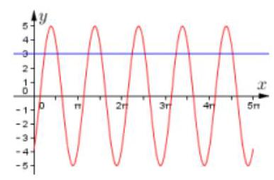

【答案】见解析

【解析】 $T = \pi$ ,对称轴 $x = \frac{\pi }{4} + \frac{\theta }{2} + \frac{k\pi }{2}, k \in  \mathbf{Z},\therefore {x}_{1} + {x}_{2} = \frac{\pi }{2} + \theta$ , ${x}_{2} + {x}_{3} = \frac{3\pi }{2} + \theta ,\ldots \ldots ,$

构成首项为 $\frac{\pi }{2} + \theta$ ,公差为 $\pi$ 的等差数列, $\therefore \frac{83}{2}\pi  = 9\left( {\frac{\pi }{2} + \theta }\right)  + \frac{9 \times  8}{2} \cdot  \pi  \Rightarrow  \theta  = \frac{\pi }{9}$

【例 17】(1) 已知函数 $f\left( x\right)  = 2\sin {\omega x}$ 在区间 $\left\lbrack  {-\frac{\pi }{3},\frac{\pi }{4}}\right\rbrack$ 上的最小值是 -2,则实数 $\omega$ 的取值范围为( )

C. $\left( {-\infty , - \frac{9}{2}}\right\rbrack$ D. $\left( {-\infty , - \frac{9}{2}}\right)  \cup  \lbrack 6, + \infty )$

【难度】 $\star   \star   \star$

【答案】A

【解析】利用函数图像求值域

(2)函数 $y = \sin x$ 的定义域为 $\left\lbrack  {a, b}\right\rbrack$ ，值域为 $\left\lbrack  {-1,\frac{1}{2}}\right\rbrack$ ，则 $b - a$ 的最大值为( )

A. $\pi$

B. $\frac{4}{3}\pi$ C. $\frac{5}{3}\pi$ D. ${2\pi }$

【难度】★★★

【答案】B

【解析】利用函数图像求值域

(3)已知函数 $f\left( x\right)  = \sin {\omega x}\left( {\omega  > 0}\right)$ ，将 $f\left( x\right)$ 的图象向左平移 $\frac{\pi }{2\omega }$ 个单位得到函数 $g\left( x\right)$ 的图象，令 $h\left( x\right)  = f\left( x\right)  + g\left( x\right)$ ,如果存在实数 $m$ ,使得对任意的实数 $x$ ,都有 $h\left( m\right)  \leq  h\left( x\right)  \leq  h\left( {m + 1}\right)$ 成立，则 $\omega$ 的最小值为___.

【难度】 $\star   \star   \star$

【答案】 $\pi$

【解析】解: 函数 $f\left( x\right)  = \sin {\omega x}\left( {\omega  > 0}\right)$ ,将 $f\left( x\right)$ 的图象向左平移 $\frac{\pi }{2\omega }$ 个单位得到函数 $g\left( x\right)  = \sin \left( {{\omega x} + \frac{\pi }{2}}\right)$

$= \cos {\omega x}$ 的图象,令 $h\left( x\right)  = f\left( x\right)  + g\left( x\right)  = \sin {\omega x} + \cos {\omega x} = \sqrt{2}\sin \left( {{\omega x} + \frac{\pi }{4}}\right)$ ,

如果存在实数 $m$ ,使得对任意的实数 $x$ ,都有 $h\left( m\right)  \leq  h\left( x\right)  \leq  h\left( {m + 1}\right)$ 成立,

$\therefore \frac{1}{2} \cdot  \frac{2\pi }{\omega } \leq  1,\therefore \omega  \geq  \pi$ ,则 $\omega$ 的最小值为 $\pi$ ,故答案为: $\pi$ .

【例 18】函数 $f\left( x\right)  = \sin x$ ,对于 ${x}_{1} < {x}_{2} < {x}_{3} < \cdots  < {x}_{n}$ 且 ${x}_{1},{x}_{2},\cdots ,{x}_{n} \in  \left\lbrack  {0,{8\pi }}\right\rbrack  \left( {n \geq  {10}}\right)$ ,记 $M = \left| {f\left( {x}_{1}\right)  - f\left( {x}_{2}\right) }\right|  + \left| {f\left( {x}_{2}\right)  - f\left( {x}_{3}\right) }\right|  + \left| {f\left( {x}_{3}\right)  - f\left( {x}_{4}\right) }\right|  + \cdots  + \left| {f\left( {x}_{n - 1}\right)  - f\left( {x}_{n}\right) }\right|$ ,则 $M$ 的最大值等于

【难度】 $\star   \star   \star   \star$

【答案】 16.

【解析】在 $\left\lbrack  {0,{8\pi }}\right\rbrack$ 有 4 个周期,每个周期起伏差值最大为4, $\therefore$ 最大值为 $4 \times  4 = {16}$

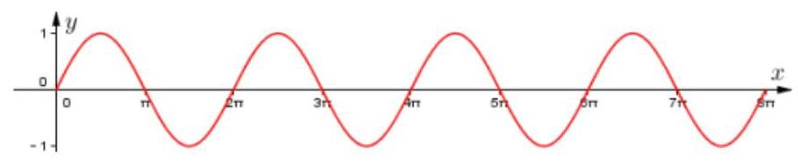

## 巩固训练

1、设函数 $f\left( x\right)  = \sin \left( {{2x} + \frac{\pi }{3}}\right)$ ，若 ${x}_{1}{x}_{2} < 0$ ，且 $f\left( {x}_{1}\right)  + f\left( {x}_{2}\right)  = 0$ ，则 $\left| {{x}_{2} - {x}_{1}}\right|$ 的取值范围是___.

【难度】 $\star   \star   \star$

【答案】 $\left( {\frac{\pi }{3}, + \infty }\right)$

【解析】解: 根据函数 $f\left( x\right)  = \sin \left( {{2x} + \frac{\pi }{3}}\right) ,\because f\left( {x}_{1}\right)  + f\left( {x}_{2}\right)  = 0$ ,可得 $f\left( {x}_{1}\right)  =  - f\left( {x}_{2}\right)$ ,

令 ${x}_{2} > {x}_{1}$ ,根据图象,可得 ${x}_{2},{x}_{1}$ 关于点 $\left( {-\frac{\pi }{6},0}\right)$ 对称时, $\left| {{x}_{2} - {x}_{1}}\right|$ 最小,

$\because {x}_{1}{x}_{2} < 0$ ,令 ${x}_{2} > 0$ ,则 ${x}_{1} <  - \frac{\pi }{3}$ . $\therefore$ 可得 $\left| {{x}_{2} - {x}_{1}}\right|  > \frac{\pi }{3},\therefore \left| {{x}_{2} - {x}_{1}}\right|$ 的取值范围为: $\left( {\frac{\pi }{3}, + \infty }\right)$ .

2、已知 $\theta  \in  \left\{  {\frac{\pi }{4},\frac{\pi }{2},\frac{3\pi }{4},{2\pi }}\right\}$ ，现将函数 $f\left( x\right)  = {\cos }^{4}x - {\sin }^{4}x$ 的图象向右平移 $\theta$ 个单位后得到函数 $g\left( x\right)$ 的图象,若两函数 $g\left( x\right)$ 与 $y = \tan {\omega x}\left( {\omega  > 0}\right)$ 图象的对称中心完全相同,则满足题意的 $\theta$ 的个数为 ( )

A. 1 B. 2

C. 3 D. 4

【难度】 $\star   \star   \star$

【答案】B

【解析】依题化简得: $f\left( x\right)  = \cos {2x}$ ,根据正余弦曲线与正切曲线的图象性质,欲使得两函数图象对称中心一致, $f\left( {x - \theta }\right)  = \cos 2\left( {x - \theta }\right)$ 须为奇函数,且 $y = \tan {\omega x}$ 只能为 $y = \tan x$ ,有如图的两类情况.

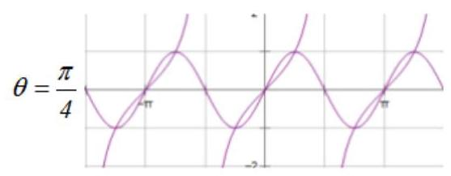

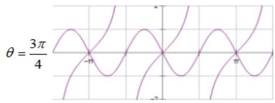

3、如图，摩天轮的半径为 ${40m}$ ， $O$ 点距地面的高度为 ${50m}$ ，摩天轮作匀速转动，每 12 分钟转一圈，摩天轮上 $P$ 点的起始位置在最低处,那么在 $t$ 分钟时, $P$ 点距地面的高度 $h =$ ___ $\left( m\right)$ .

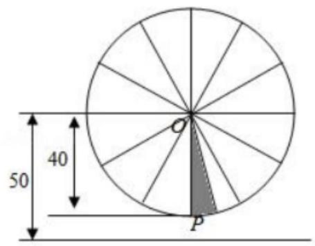

【难度】 $\star   \star   \star   \star$

【答案】 ${50} - {40}\cos \frac{\pi }{6}t$

【解析】解: 设在 $t$ 分钟时, $P$ 点距地面的高度 $h = {50} - {40}\cos \left( {{\omega x} + \varphi }\right)$ ,

✓摩天轮的半径为 ${40m}, O$ 点距地面的高度为 ${50m}$ ，摩天轮作匀速转动，每 12 分钟转一圈， $\therefore \frac{2\pi }{\omega } = {12}$ ， $\omega  = \frac{\pi }{6}.$

且振幅为 ${40m}$ ，摩天轮上 $P$ 点的起始位置在最低处， $\varphi  = 0$ ， $h = {50} - {40} = {10m}$ ， 由题意可得,在 $t$ 分钟时, $P$ 点距地面的高度 $h = {50} - {40}\cos \frac{\pi }{6}t$ ,单位 $m$ ,故答案为: ${50} - {40}\cos \frac{\pi }{6}t$ .

4、将函数 $f\left( x\right)  = 2\cos {2x}$ 的图象向右平移个 $\frac{\pi }{6}$ 单位后得到函数 $g\left( x\right)$ 的图象,若函数 $g\left( x\right)$ 在区间 $\left\lbrack  {0,\frac{a}{3}}\right\rbrack$ 和 $\left\lbrack  {{2a},\frac{7\pi }{6}}\right\rbrack$ 上均单调递增，则实数 $\mathrm{a}$ 的取值范围是( )

A. $\left\lbrack  {\frac{\pi }{3},\frac{\pi }{2}}\right\rbrack$ B. $\left\lbrack  {\frac{\pi }{6},\frac{\pi }{2}}\right\rbrack$ C. $\left\lbrack  {\frac{\pi }{6},\frac{\pi }{3}}\right\rbrack$ D. $\left\lbrack  {\frac{\pi }{4},\frac{3\pi }{8}}\right\rbrack$

【难度】 $\star   \star   \star   \star$

【答案】A

【解析】根据题意,将函数 $f\left( x\right)  = 2\cos {2x}$ 的图象向右平移个 $\frac{\pi }{6}$ 单位后得到函数 $g\left( x\right)$ 的图象,则 $g\left( x\right)  = 2\cos 2\left( {x - \frac{\pi }{6}}\right)  = 2\cos \left( {{2x} - \frac{\pi }{3}}\right) .$

根据函数 $g\left( x\right)$ 的单调增区间满足 $- \pi  + {2k\pi } \leq  {2x} - \frac{\pi }{3} \leq  {2k\pi },\left( {k \in  Z}\right)$ ,解得

$- \frac{\pi }{3} + {k\pi } \leq  x \leq  \frac{\pi }{6} + {k\pi },\left( {k \in  Z}\right) .$

当 $k = 0$ 时,函数的增区间为 $\left\lbrack  {-\frac{\pi }{3},\frac{\pi }{6}}\right\rbrack$ ,当 $k = 1$ 时,函数的增区间为 $\left\lbrack  {\frac{2\pi }{3},\frac{7\pi }{6}}\right\rbrack$ .

若满足函数 $g\left( x\right)$ 在区间 $\left\lbrack  {0,\frac{a}{3}}\right\rbrack$ 和 $\left\lbrack  {{2a},\frac{7\pi }{6}}\right\rbrack$ 上均单调递增,则 $\left\{  \begin{array}{l} 0 < \frac{a}{3} \leq  \frac{\pi }{6} \\  \frac{2\pi }{3} \leq  {2a} < \frac{7\pi }{6} \end{array}\right.$ ,解得 $a \in  \left\lbrack  {\frac{\pi }{3},\frac{\pi }{2}}\right\rbrack$ .

故选: A.

5、已知函数 $f\left( x\right)  = \sqrt{3}\sin {2x} - 2{\cos }^{2}x + 1$ ，将 $f\left( x\right)$ 的图象上的所有点的横坐标缩短到原来的 $\frac{1}{2}$ ，纵坐标保持不变; 再把所得图象向上平移 1 个单位长度,得到函数 $y = g\left( x\right)$ 的图象,若 $g\left( {x}_{1}\right)  \cdot  g\left( {x}_{2}\right)  = 9$ ,则 $\left| {{x}_{1} - {x}_{2}}\right|$ 的值可能为( )

A. $\frac{5\pi }{4}$ B. $\frac{3\pi }{4}$ C. $\frac{\pi }{2}$ D. $\frac{\pi }{3}$

【难度】 $\star   \star   \star   \star$

【答案】C

【解析】函数 $f\left( x\right)  = \sqrt{3}\sin {2x} - 2{\cos }^{2}x + 1 = \sqrt{3}\sin {2x} - \cos {2x} = 2\sin \left( {{2x} - \frac{\pi }{6}}\right)$ ,

将函数 $y = f\left( x\right)$ 的图象上的所有点的横坐标缩短到原来的 $\frac{1}{2}$ 倍,得 $y = 2\sin \left( {{4x} - \frac{\pi }{6}}\right)$ 的图象;

再把所得图象向上平移 1 个单位,得函数 $y = g\left( x\right)  = 2\sin \left( {{4x} - \frac{\pi }{6}}\right)  + 1$ 的图象,易知函数 $y = g\left( x\right)$ 的值域为 $\left\lbrack  {-1,3}\right\rbrack$ . 若 $g\left( {x}_{1}\right)  \cdot  g\left( {x}_{2}\right)  = 9$ ,则 $g\left( {x}_{1}\right)  = 3$ 且 $g\left( {x}_{2}\right)  = 3$ ,均为函数 $y = g\left( x\right)$ 的最大值,

由 ${4x} - \frac{\pi }{6} = \frac{\pi }{2} + {2k\pi }\left( {k \in  Z}\right)$ ,解得 $x = \frac{\pi }{6} + \frac{k\pi }{2}\left( {k \in  Z}\right)$ ; 其中 ${x}_{1}\text{ 、 }{x}_{2}$ 是三角函数 $y = g\left( x\right)$ 最高点的横坐标,

$\therefore \left| {{x}_{1} - {x}_{2}}\right|$ 的值为函数 $y = g\left( x\right)$ 的最小正周期 $T$ 的整数倍,且 $T = \frac{2\pi }{4} = \frac{\pi }{2}$ . 故选C.

6、已知函数 $f\left( x\right)  = \sin \left( {{2x} + \varphi }\right)$ ，其中 $\phi$ 为实数，若 $f\left( x\right)  \leq  \left| {f\left( \frac{\pi }{6}\right) }\right|$ 对 $x \in  \mathbf{R}$ 恒成立，且 $f\left( \frac{\pi }{2}\right)  > \mathrm{f}\left( \pi \right)$ ， 则 $f\left( x\right)$ 的单调递增区间是___.

【难度】 $\star   \star   \star$

【答案】 $\left\lbrack  {{k\pi } + \frac{\pi }{6},{k\pi } + \frac{2\pi }{3}}\right\rbrack  \left( {k \in  Z}\right)$

【解析】解:若 $f\left( x\right)  \leq  \left| {f\left( \frac{\pi }{6}\right) }\right|$ 对 $x \in  \mathbf{R}$ 恒成立,

则 $f\left( \frac{\pi }{6}\right)$ 等于函数的最大值或最小值,即 $2 \times  \frac{\pi }{6} + \varphi  = {k\pi } + \frac{\pi }{2}, k \in  Z$ ,

则 $\varphi  = \frac{\pi }{6} + {k\pi }, k \in  Z$ ,又 $f\left( \frac{\pi }{2}\right)  > f\left( \pi \right)$ ,即 $\sin \varphi  < 0$

令 $k =  - 1$ ,此时 $\varphi  =  - \frac{5\pi }{6}$ ,满足条件; 令 ${2x} - \frac{5\pi }{6} \in  \left\lbrack  {{2k\pi } - \frac{\pi }{2},{2k\pi } + \frac{\pi }{2}}\right\rbrack  , k \in  Z$ ,

解得 $x \in  \left\lbrack  {{k\pi } + \frac{\pi }{6},{k\pi } + \frac{2\pi }{3}}\right\rbrack  \left( {k \in  Z}\right)$ . 则 $f\left( x\right)$ 的单调递增区间是 $\left\lbrack  {{k\pi } + \frac{\pi }{6},{k\pi } + \frac{2\pi }{3}}\right\rbrack  \left( {k \in  Z}\right)$ .

故答案为: $\left\lbrack  {{k\pi } + \frac{\pi }{6},{k\pi } + \frac{2\pi }{3}}\right\rbrack  \left( {k \in  Z}\right)$ .

7、给出下列命题:①存在实数 $x$ ，使 $\sin x + \cos x = \frac{3}{2}$ ；②若 $\alpha ,\beta$ 是第一象限角，且 $\alpha  > \beta$ ，则 $\cos \alpha  < \cos \beta$ ; ③函数 $y = \frac{{\sin }^{2}x - \sin x}{\sin x - 1}$ 是奇函数；④函数 $y = \left| {\sin x - \frac{1}{2}}\right|$ 的周期是 $\pi$ ; ⑤函数 $y = \ln \left| {x - 1}\right|$ 的图象与函数 $y =  - 2\cos \left( {\pi x}\right) \;\left( {-2 \leq  x \leq  4}\right)$ 的图像所有交点的横坐标之和等于6. 其中正确命题的序号是___(把正确命题的序号都填上)

【难度】 $\star   \star   \star   \star$

【答案】⑤

【解析】 $\because \sin x + \cos x = \sqrt{2}\sin \left( {x + \frac{\pi }{4}}\right)  \leq  \sqrt{2} < \frac{3}{2}$ , $\therefore$ ①错误; $\because \frac{13\pi }{6} \cdot  \frac{\pi }{3}$ 是第一象限角,

而 $\cos \frac{13\pi }{6} = \frac{\sqrt{3}}{2} > \cos \frac{\pi }{3} = \frac{1}{2}$ ， $\therefore$ ②错误；函数 $y = \frac{{\sin }^{2}x - \sin x}{\sin x - 1}$ 的定义域为 $\left\{  {x\left| {\;x \neq  {2k\pi } + \frac{\pi }{2}}\right. , k \in  Z}\right\}$ ， 定义域不关于原点对称，故不是奇函数，③错误；

④由于 $\left| {\sin \left( {\pi  + x}\right)  - \frac{1}{2}}\right|  = \left| {\sin x + \frac{1}{2}}\right|  \neq  \left| {\sin x - \frac{1}{2}}\right|$ ,可知 $\pi$ 不是函数 $y = \left| {\sin x - \frac{1}{2}}\right|$ 的周期. ④错误; 由图象变化的法则可知: $y = \ln x$ 的图象作关于轴 $y$ 的对称后和原来的一起构成 $y = \ln \left| x\right|$ 的图象,向右平移 1 个单位得到 $y = \ln \left| {x - 1}\right|$ 的图象,又 $f\left( x\right)  =  - 2\cos {\pi x}$ 的周期为 $T = 2$ ,如图所示:

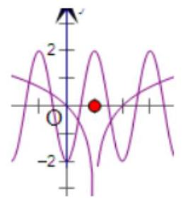

两图象都关于直线 $x = 1$ 对称,且共有6个交点,由中点坐标公式可得:

${x}_{A} + {x}_{B} =  - 2,{x}_{D} + {x}_{C} = 2,{x}_{E} + {x}_{F} = 6$

故所有交点的横坐标之和为6，⑤正确

8、已知函数 $f\left( x\right)  = \left\{  {\begin{array}{l} \cos \left( {\frac{\pi }{2}x}\right)  - 1, x \geq  0, \\   - {\log }_{a}\left( {-x}\right) , x < 0, \end{array}\left( {a > 0\text{ 且 }a \neq  1}\right) }\right.$ ,若函数图象上关于原点对称的点至少有 3 对, 则实数 $a$ 的取值范围是( ).

A. $\left( {0,\frac{\sqrt{6}}{6}}\right)$ B. $\left( {\frac{\sqrt{6}}{6},1}\right)$ C. $\left( {0,\frac{\sqrt{5}}{5}}\right)$ D. $\left( {\frac{\sqrt{5}}{5},1}\right)$

【难度】 $\star   \star   \star   \star$

【答案】A

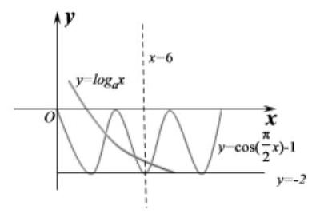

【解析】由题可知: $y = \cos \left( {\frac{\pi }{2}x}\right)  - 1$ 与 $y = {\log }_{a}x$ 的图像在 $x > 0$ 的交点至少有 3 对，可知 $a \in  \left( {0,1}\right)$ ，如图所示，

当 $x = 6$ 时, ${\log }_{a}6 >  - 2$ ,则 $0 < a < \frac{\sqrt{6}}{6}$ ,故实数 $a$ 的取值范围为 $\left( {0,\frac{\sqrt{6}}{6}}\right)$

故选: A

## (三)三角函数综合

## 例题精讲

【例19】若不等式 $\left( {\left| {x - {2a}}\right|  - b}\right)  \times  \cos \left( {{\pi x} - \frac{\pi }{3}}\right)  \leq  0$ 在 $x \in  \left\lbrack  {-\frac{1}{6},\frac{5}{6}}\right\rbrack$ 上恒成立，则 ${2a} + b$ 的最小值为( )

A. 1

B. $\frac{5}{6}$ C. $\frac{2}{3}$ D. 2

【难度】 $\star   \star   \star   \star$

【答案】B

【解析】当 $x \in  \left\lbrack  {-\frac{1}{6},\frac{5}{6}}\right\rbrack$ 时, ${\pi x} - \frac{\pi }{3} \in  \left\lbrack  {-\frac{\pi }{2},\frac{\pi }{2}}\right\rbrack$ ,故 $\cos \left( {{\pi x} - \frac{\pi }{3}}\right)  \geq  0$ 恒成立.

$\left( {\left| {x - {2a}}\right|  - b}\right)  \times  \cos \left( {{\pi x} - \frac{\pi }{3}}\right)  \leq  0$ ,即 $\left| {x - {2a}}\right|  \leq  b$ 恒成立,易知 $b > 0$ ,

解得 $- b + {2a} \leq  x \leq  b + {2a}$ 恒成立,故 $b + {2a} \geq  {x}_{\max } = \frac{5}{6}$ . 故选: B.

【例20】 $f\left( x\right)  = {a}_{1}\sin \left( {x + {\beta }_{1}}\right)  + {a}_{2}\sin \left( {x + {\beta }_{2}}\right)  + \cdots  + {a}_{n}\sin \left( {x + {\beta }_{n}}\right)$ ,其中 ${a}_{i}{\beta }_{i}\left( {i = 1,2,\cdots , n}\right)$ 均为常数, 下列说法正确的有___

(1)若 $f\left( 0\right)  = 0, f\left( \frac{\pi }{2}\right)  = 0$ ,则对于任意 $x \in  \mathbf{R}, f\left( x\right)  = 0$ 恒成立;

(2)若 $f\left( 0\right)  = 0$ ,则 $f\left( x\right)$ 是奇函数;

(3)若 $f\left( \frac{\pi }{2}\right)  = 0$ ,则 $f\left( x\right)$ 是偶函数;

(4)若 ${f}^{2}\left( 0\right)  + {f}^{2}\left( \frac{\pi }{2}\right)  \neq  0$ ,且当 ${x}_{1} \neq  {x}_{2}$ 时 $f\left( {x}_{1}\right)  = f\left( {x}_{2}\right)  = 0$ ,则 ${x}_{1} - {x}_{2} = {k\pi }\left( {k \in  Z}\right)$ ;

【难度】 $\star   \star   \star   \star$

【答案】 $\left( 1\right) \left( 2\right) \left( 3\right) \left( 4\right)$

【解析】解: (1) $f\left( x\right)  = {a}_{1}\sin \left( {x + {\beta }_{1}}\right)  + {a}_{2}\sin \left( {x + {\beta }_{2}}\right)  + \cdots  + {a}_{n}\sin \left( {x + {\beta }_{n}}\right)  = M\sin \left( {x + \varphi }\right)$ ,

若 $f\left( 0\right)  = 0, f\left( \frac{\pi }{2}\right)  = 0$ ,则 $M\sin \varphi  = 0, M\cos \varphi  = 0$ ,即 $M = 0$ ,所以对于任意 $x \in  \mathbf{R}, f\left( x\right)  = 0$ 恒成立;

(2) 若 $f\left( 0\right)  = 0, f\left( 0\right)  = {a}_{1}\sin {\beta }_{1} + {a}_{2}\sin {\beta }_{2} + \cdots  + {a}_{n}\sin {\beta }_{n} = 0$ ,

所以 $f\left( x\right)  + f\left( {-x}\right)  = {a}_{1}\sin \left( {x + {\beta }_{1}}\right)  + {a}_{2}\sin \left( {x + {\beta }_{2}}\right)  + \cdots  + {a}_{n}\sin \left( {x + {\beta }_{n}}\right)  +$

${a}_{1}\sin \left( {-x + {\beta }_{1}}\right)  + {a}_{2}\sin \left( {-x + {\beta }_{2}}\right)  + \cdots  + {a}_{n}\sin \left( {-x + {\beta }_{n}}\right)$

$= 2\cos x\left( {{a}_{1}\sin {\beta }_{1} + {a}_{2}\sin {\beta }_{2} + \cdots  + {a}_{n}\sin {\beta }_{n}}\right)  = 0$ ,所以 $f\left( x\right)$ 是奇函数;

(3) 若 $f\left( \frac{\pi }{2}\right)  = 0$ ,所以 ${a}_{1}\cos {\beta }_{1} + {a}_{2}\cos {\beta }_{2} + \cdots  + {a}_{n}\cos {\beta }_{n} = 0$ ,所以

$f\left( {-x}\right)  - f\left( x\right)  = {a}_{1}\sin \left( {-x + {\beta }_{1}}\right)  + {a}_{2}\sin \left( {-x + {\beta }_{2}}\right)  + \cdots  + {a}_{n}\sin \left( {-x + {\beta }_{n}}\right) .$

$\left\lbrack  {{a}_{1}\sin \left( {x + {\beta }_{1}}\right)  + {a}_{2}\sin \left( {x + {\beta }_{2}}\right)  + \cdots  + {a}_{n}\sin \left( {x + {\beta }_{n}}\right) }\right\rbrack$

$= 2\sin x\left( {{a}_{1}\cos {\beta }_{1} + {a}_{2}\cos {\beta }_{2} + \cdots  + {a}_{n}\cos {\beta }_{n}}\right)  = 0$ ,所以 $f\left( x\right)$ 是偶函数;

(4) 若 ${f}^{2}\left( 0\right)  + {f}^{2}\left( \frac{\pi }{2}\right)  \neq  0$ ,且当 ${x}_{1} \neq  {x}_{2}$ 时 $f\left( {x}_{1}\right)  = f\left( {x}_{2}\right)  = 0$ ,则 ${x}_{1},{x}_{2}$ 相差半个周期的整数倍,由 $f\left( x\right)  = M\sin \left( {x + \varphi }\right)$ 的周期为 ${2\pi }$ ,可得 ${x}_{1} - {x}_{2} = {k\pi }, k \in  Z$ ,故答案为 $\left( 1\right) \left( 2\right) \left( 3\right) \left( 4\right)$

【例21】设函数 $f\left( x\right)$ 的定义域为 $D$ ,记 $f\left( X\right)  = \{ y \mid  y = f\left( x\right) , x \in  X \subseteq  D\} ,{f}^{-1}\left( Y\right)  = \{ x \mid  f\left( x\right)  \in  Y, x \in  D\}$ , 若 $f\left( x\right)  = 2\sin \left( {{\omega x} + \frac{5\pi }{6}}\right) \left( {\omega  > 0}\right) , D = \left\lbrack  {0,\pi }\right\rbrack$ ,且 $f\left( {{f}^{-1}\left( \left\lbrack  {0,2}\right\rbrack  \right) }\right)  = \left\lbrack  {0,2}\right\rbrack$ ,则 $\omega$ 的取值范围是 ___.

【难度】 $\star   \star   \star   \star   \star$

【答案】 $\left\lbrack  {\frac{5}{3}, + \infty }\right)$

【解析】 $f\left( x\right)  = 2\sin \left( {{\omega x} + \frac{5\pi }{6}}\right) \left( {\omega  > 0}\right) , D = \left\lbrack  {0,\pi }\right\rbrack$ ,

${f}^{-1}\left( \left\lbrack  {0,2}\right\rbrack  \right)  = \{ x \mid  f\left( x\right)  \in  \left\lbrack  {0,2}\right\rbrack  , x \in  D\}$ 即 $2\sin \left( {{\omega x} + \frac{5\pi }{6}}\right)  \in  \left\lbrack  {0,2}\right\rbrack$

$\omega  > 0, x \in  \left\lbrack  {0,\pi }\right\rbrack  \therefore \frac{5\pi }{6} \leq  {\omega x} + \frac{5\pi }{6} \leq  {\omega \pi } + \frac{5\pi }{6}, f\left( {{f}^{-1}\left( \left\lbrack  {0,2}\right\rbrack  \right) }\right)  = \left\lbrack  {0,2}\right\rbrack$ ,

则 $\left\lbrack  {0,2}\right\rbrack$ 是 $2\sin \left( {{\omega x} + \frac{5\pi }{6}}\right)$ 值域的子集,故 ${\omega \pi } + \frac{5\pi }{6} \geq  {2\pi } + \frac{\pi }{2}\therefore \omega  \geq  \frac{5}{3}$ ,故答案为: $\left\lbrack  {\frac{5}{3}, + \infty }\right)$

【例22】已知 $x$ 为实数,用 $\left\lbrack  x\right\rbrack$ 表示不超过 $x$ 的最大整数,例如 $\left\lbrack  {1.2}\right\rbrack   = 1,\left\lbrack  {-{1.2}}\right\rbrack   =  - 2,\left\lbrack  1\right\rbrack   = 1$ ,对于函数 $f\left( x\right)$ ,若存在 $m \in  \mathbf{R}, m \notin  \mathbf{Z}$ ,使得 $f\left( m\right)  = f\left( \left\lbrack  m\right\rbrack  \right)$ ,则称函数 $f\left( x\right)$ 是 “ $\Omega$ 函数”.

(1)判断函数 $f\left( x\right)  = {x}^{2} - \frac{1}{3}x, g\left( x\right)  = \left| {\sin {\pi x}}\right|$ 是否是 “ $\Omega$ 函数”；

(2)设函数 $f\left( x\right)$ 是定义在 $\mathbf{R}$ 上的周期函数，其最小正周期是 $T$ ，若 $f\left( x\right)$ 不是 “ $\Omega$ 函数”，求 $T$ 的最小值；

(3)若函数 $f\left( x\right)  = x + \frac{a}{x}$ 是 “ $\Omega$ 函数”，求 $a$ 的取值范围.

【难度】 $\star   \star   \star   \star   \star$

【答案】(1) $f\left( x\right)$ 是, $g\left( x\right)$ 不是; (2) $1;\left( 3\right) a > 0$ ,且 $a \neq  {\left\lbrack  m\right\rbrack  }^{2}, a \neq  \left\lbrack  m\right\rbrack  \left( {\left\lbrack  m\right\rbrack   + 1}\right)$ .

【解析】(1) 对于函数 $f\left( x\right)  = {x}^{2} - \frac{1}{3}x$ 是 $\Omega$ 函数,设 $m = \frac{1}{3},\left\lbrack  m\right\rbrack   = 0$ ,

则 $f\left( m\right)  = f\left( \frac{1}{3}\right)  = 0, f\left( \left\lbrack  m\right\rbrack  \right)  = f\left( 0\right)  = 0$ ,

所以存在 $m \in  \mathbf{R}, m \notin  \mathbf{Z}$ ,使得 $f\left( m\right)  = f\left( \left\lbrack  m\right\rbrack  \right)$ ,所以函数 $f\left( x\right)$ 是 “ $\Omega$ 函数”.

对于函数 $g\left( x\right)  = \sin {\pi x}$ ,函数的最小正周期为 $\frac{2\pi }{\pi } \times  \frac{1}{2} = 1$ ,函数的图象如图所示,

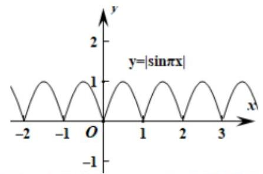

不妨研究函数在 $\left\lbrack  {0,1}\right\rbrack$ 这个周期的图象.

设 $0 < m < 1,\left\lbrack  m\right\rbrack   = 0$ ,则 $g\left( m\right)  = \left| {\sin {\pi m}}\right|  > 0, g\left( \left\lbrack  m\right\rbrack  \right)  = g\left( 0\right)  = 0$ ,所以 $g\left( m\right)  \neq  g\left( \left\lbrack  m\right\rbrack  \right)$ ,

所以函数 $g\left( x\right)$ 不是 “ $\Omega$ 函数”. 综合得函数 $f\left( x\right)$ 是 “ $\Omega$ 函数”，函数 $g\left( x\right)$ 不是 “ $\Omega$ 函数”.

(2) $T$ 的最小值为1. 因为 $f\left( x\right)$ 是以 $T$ 为最小正周期的周期函数，所以 $f\left( T\right)  = f\left( 0\right)$ .

假设 $T < 1$ ,则 $\left\lbrack  T\right\rbrack   = 0$ ,所以 $f\left( \left\lbrack  T\right\rbrack  \right)  = f\left( 0\right)$ ,矛盾. 所以必有 $T \geq  1$ .

而函数 $l\left( x\right)  = x - \left\lbrack  x\right\rbrack$ 的周期为 1,且显然不是 $\Omega$ 函数,

综上所述, $T$ 的最小值为 1 .

(3)当函数 $f\left( x\right)  = x + \frac{a}{x}$ 是 “ $\Omega$ 函数” 时,若 $a = 0$ ，则 $f\left( x\right)  = x$ 显然不是 $\Omega$ 函数，矛盾.

若 $a < 0, f\left( x\right)$ 在 $\left( {-\infty ,0}\right) ,\left( {0, + \infty }\right)$ 上单调递增,

此时不存在 $m < 0$ ,使得 $f\left( m\right)  = f\left( \left\lbrack  m\right\rbrack  \right)$ ,同理不存在 $m > 0$ ,使得 $f\left( m\right)  = f\left( \left\lbrack  m\right\rbrack  \right)$ ,

又注意到 $m\left\lbrack  m\right\rbrack   \geq  0$ ,即不会出现 $\left\lbrack  m\right\rbrack   < 0 < m$ 的情形,所以此时 $f\left( x\right)  = x + \frac{a}{x}$ 不是 $\Omega$ 函数.

当 $a > 0$ 时,设 $f\left( m\right)  = f\left( \left\lbrack  m\right\rbrack  \right)$ ,所以 $m + \frac{a}{m} = \left\lbrack  m\right\rbrack   + \frac{a}{\left\lbrack  m\right\rbrack  }$ ,

所以有 $a = m\left\lbrack  m\right\rbrack$ ,其中 $\left\lbrack  m\right\rbrack   \neq  0$ ,

当 $m > 0$ 时,因为 $\left\lbrack  m\right\rbrack   < m < \left\lbrack  m\right\rbrack   + 1$ ,所以 ${\left\lbrack  m\right\rbrack  }^{2} < m\left\lbrack  m\right\rbrack   < \left( {\left\lbrack  m\right\rbrack   + 1}\right) \left\lbrack  m\right\rbrack$ ,

所以 ${\left\lbrack  m\right\rbrack  }^{2} < a < \left( {\left\lbrack  m\right\rbrack   + 1}\right) \left\lbrack  m\right\rbrack$ ,

当 $m < 0$ 时, $\left\lbrack  m\right\rbrack   < 0$ ,因为 $\left\lbrack  m\right\rbrack   < m < \left\lbrack  m\right\rbrack   + 1$ ,所以 ${\left\lbrack  m\right\rbrack  }^{2} > m\left\lbrack  m\right\rbrack   > \left( {\left\lbrack  m\right\rbrack   + 1}\right) \left\lbrack  m\right\rbrack$ ,所以 ${\left\lbrack  m\right\rbrack  }^{2} > a > \left( {\left\lbrack  m\right\rbrack   + 1}\right) \left\lbrack  m\right\rbrack$ , 综上所述, $a > 0$ ,且 $a \neq  {\left\lbrack  m\right\rbrack  }^{2}, a \neq  \left\lbrack  m\right\rbrack  \left( {\left\lbrack  m\right\rbrack   + 1}\right)$ .

## 巩固训练

1、函数 $y = \tan x$ 的相邻两个周期的图象与直线 $\mathrm{y} = {2\mathrm{{Ay}}} = {-2}$ 围成的图形的面积是___.

【难度】 $\star   \star   \star$

【答案】 ${4\pi }$

【解析】由题意, 画出图像如下图所示

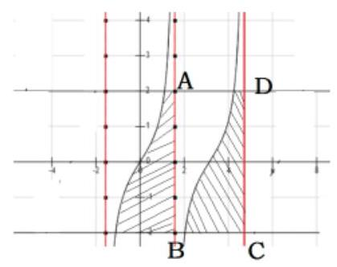

根据正切函数的对称性可知,两个阴影部分的面积相等,因此由 $y = \tan x$ 的相邻两个周期的图像与直线 $\mathrm{y} = 2$ 及 $\mathrm{y} =  - 2$ 围成的图形的面积可以看成 $\mathrm{{ABCD}}$ 组成的矩形的面积

因而 ${S}_{ABCD} = {4\pi }$

2、已知函数 $f\left( x\right)  = 3\sin \left( {{2x} - \frac{\pi }{6}}\right)$ ，若函数 $y = {f}^{2}\left( x\right)  - \left( {m - 1}\right) f\left( x\right)  - m$ 在 $\left\lbrack  {0,\frac{\pi }{2}}\right\rbrack$ 上有3个零点，则 $m$ 的取值范围为( )

A. $\left\lbrack  {\frac{3}{2},3}\right)$ B. $\left\lbrack  {-\frac{3}{2},3}\right)$ C. $\left\lbrack  {-\frac{3}{2},\frac{3}{2}}\right)$ D. $\left\lbrack  {\frac{3}{2},3}\right\rbrack$

【难度】 $\star   \star   \star$

【答案】A

【解析】画出函数 $f\left( x\right)  = 3\sin \left( {{2x} - \frac{\pi }{6}}\right)$ 的图像,如图所示:

$y = {f}^{2}\left( x\right)  - \left( {m - 1}\right) f\left( x\right)  - m = \left( {f\left( x\right)  - m}\right) \left( {f\left( x\right)  + 1}\right)  = 0$

当 $f\left( x\right)  =  - 1$ 时,即 $f\left( x\right)  = 3\sin \left( {{2x} - \frac{\pi }{6}}\right)  =  - 1$ ,有一个解; 则 $f\left( x\right)  = m$ 有两个解,根据图像知: $m \in  \left\lbrack  {\frac{3}{2},3}\right)$

故选: $A$

3、函数 $f\left( x\right)  = \sin \left( {\omega x}\right)$ (其中 $\omega  > 0$ )的图像与其对称轴在 $y$ 轴右侧的交点从左到右依次记为 ${A}_{1},{A}_{2},{A}_{3},\cdots ,{A}_{n},\cdots$ ,在点列 $\left\{  {A}_{n}\right\}$ 中存在四个不同的点成为某菱形的四个顶点,将满足上述条件的 $\omega$ 值从小到大组成的数列记为 $\left\{  {\omega }_{n}\right\}$ ,则 ${\omega }_{2020} =$

【难度】 $\star   \star   \star   \star$

【答案】 $\frac{\sqrt{8079}}{2}\pi$

【解析】根据题意作出图象如下,设 $f\left( x\right)  = \sin \left( {\omega x}\right)$ 的最小正周期为 $T = \frac{2\pi }{\omega }$

若 ${A}_{1}{A}_{2}{A}_{3}{A}_{4}$ 为菱形,则 $\left| {{A}_{1}{A}_{2}}\right|  = \left| {{A}_{1}{A}_{3}}\right| ,\left| {{A}_{1}{A}_{3}}\right|  = T,\left| {{A}_{1}{A}_{2}}\right|  = \sqrt{{\left( \frac{T}{2}\right) }^{2} + 4}$

所以 $\left| {{A}_{1}{A}_{2}}\right|  = \sqrt{{\left( \frac{T}{2}\right) }^{2} + 4} = T$ ,即 $\sqrt{\frac{1}{4} \times  \frac{4{\pi }^{2}}{{\omega }^{2}} + 4} = \frac{2\pi }{\omega }$ 。解得 $\omega  = \frac{\sqrt{3}\pi }{2}$

若 ${A}_{1}{A}_{4}{A}_{5}{A}_{8}$ 为菱形,则 $\left| {{A}_{1}{A}_{5}}\right|  = \left| {{A}_{1}{A}_{4}}\right| ,\left| {{A}_{1}{A}_{5}}\right|  = {2T},\left| {{A}_{1}{A}_{4}}\right|  = \sqrt{{\left( T + \frac{T}{2}\right) }^{2} + 4}$

所以 $\left| {{A}_{1}{A}_{2}}\right|  = \sqrt{{\left( T + \frac{T}{2}\right) }^{2} + 4} = {2T}$ ,即 $\sqrt{\frac{9}{4} \times  \frac{4{\pi }^{2}}{{\omega }^{2}} + 4} = \frac{4\pi }{\omega }$ 。解得 $\omega  = \frac{\sqrt{7}\pi }{2}$

若 ${A}_{1}{A}_{k - 1}{A}_{k}{A}_{m}$ 为菱形,则 $\left| {{A}_{1}{A}_{k}}\right|  = \left| {{A}_{1}{A}_{k - 1}}\right| ,\left| {{A}_{1}{A}_{k}}\right|  = {kT},\left| {{A}_{1}{A}_{4}}\right|  = \sqrt{{\left( \left( k - 1\right) T + \frac{T}{2}\right) }^{2} + 4}$

所以 $\left| {{A}_{1}{A}_{2}}\right|  = \sqrt{{\left( \left( k - 1\right) T + \frac{T}{2}\right) }^{2} + 4} = {2T}$ ,即 $\sqrt{\frac{{4k} - 1}{4} \times  \frac{4{\pi }^{2}}{{\omega }^{2}} + 4} = \frac{2k\pi }{\omega }$ 。解得 $\omega  = \frac{\sqrt{{4k} - 1}\pi }{2}, k \in  N$ ,

所以 ${\omega }_{2020} = \frac{\sqrt{4 \times  {2020} - 1}}{2}\pi  = \frac{\sqrt{8079}}{2}\pi$ 故答案为: $\frac{\sqrt{8079}}{2}\pi$

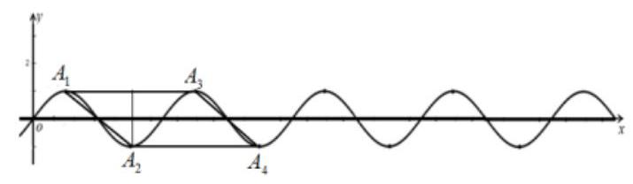

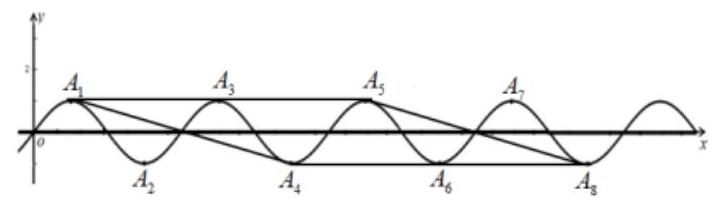

4、若函数 $f\left( x\right)  = a\sin x + \cos {2x}$ 在区间 $\left( {0,{n\pi }}\right) \left( {n \in  {\mathbf{N}}^{ * }}\right)$ 内恰有 2019 个零点，则 $n =$ ___

【难度】 $\star   \star   \star   \star$

【答案】 1346

【解析】令 $f\left( x\right)  = a\sin x + \cos {2x} = 0$ ,即有 $a\sin x = 2{\sin }^{2}x - 1$ ,因为 $\sin x = 0$ 不满足方程,所以 $a = 2\sin x - \frac{1}{\sin x}$ ,令 $t = \sin x \in  \left\lbrack  {-1,0)\cup (0,1}\right\rbrack  ,\therefore a = {2t} - \frac{1}{t}.\because$ 函数 $y = {2t} - \frac{1}{t}$ 在 $\lbrack  - 1,0)$ 上递增, 在 $\left( {0,1}\right\rbrack$ 上递增,由图象可知,直线 $y = a$ 与函数 $y = {2t} - \frac{1}{t}$ 的图象至少有一个交点.

当 $a > 1$ 时,直线 $y = a$ 与函数 $y = {2t} - \frac{1}{t}$ 的图象只有一个交点,此时 $t \in  \left( {-1,0}\right)$ ,

$t = \sin x$ 在一个周期 $\left( {0,{2\pi }}\right)$ 内的 $\left( {\pi ,{2\pi }}\right)$ 上有两个解,所以在区间 $\left( {0,{n\pi }}\right) \left( {n \in  {\mathbf{N}}^{ * }}\right)$ 内不可能有奇数个解; 当 $a <  - 1$ 时,同理可得,在区间 $\left( {0,{n\pi }}\right) \left( {n \in  {\mathbf{N}}^{ * }}\right)$ 内不可能有奇数个解;

当 $- 1 < a < 1$ 时,直线 $y = a$ 与函数 $y = {2t} - \frac{1}{t}$ 的图象有两个交点,一个 ${t}_{1} \in  \left( {-1,0}\right)$ ,一个 ${t}_{2} \in  \left( {0,1}\right)$ ,所以 $t = \sin x$ 在一个周期 $\left( {0,{2\pi }}\right)$ 内, $\left( {0,\pi }\right)$ 有两个解, $\left( {\pi ,{2\pi }}\right)$ 有两个解,所以在区间 $\left( {0,{n\pi }}\right) \left( {n \in  {\mathbf{N}}^{ * }}\right)$ 内不可能有奇数个解;

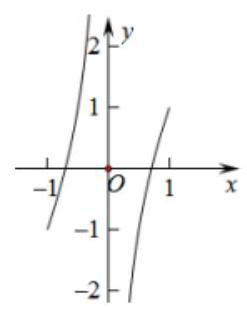

当 $a =  - 1$ 时,直线 $y = a$ 与函数 $y = {2t} - \frac{1}{t}$ 的图象有两个交点,一个 ${t}_{1} \in  \left( {0,1}\right)$ ,一个 ${t}_{2} =  - 1$ , 所以 $t = \sin x$ 在一个周期 $\left( {0,{2\pi }}\right)$ 内, $\left( {0,\pi }\right)$ 有两个解, $\left( {\pi ,{2\pi }}\right)$ 有一个解,即一个周期 $\left( {0,{2\pi }}\right)$ 内有三个解,

所以 ${2019} \div  3 = {673}$ ,即 $n = {673} \times  2 = {1346}$ .

当 $a = 1$ 时,同理可得, $n = {1346}$ .

故答案为:1346.

## 实战演练

## 一、填空题

1、若函数 $y = {\cos }^{2}{\omega x}\left( {\omega  > 0}\right)$ 的最小正周期是 $\pi$ ，则 $\omega  =$ ___.

【难度】★★

【答案】 1

【解析】倍角公式降次, 然后用周期公式

2、把函数 $f\left( x\right)  = \cos {2x} - \sqrt{3}\sin {2x}$ 的图象向右平移 $m\left( {m > 0}\right)$ 个单位,所得的图象关于坐标原点对称,则 $m$ 的最小值是___.

【难度】 $\star   \star   \star$

【答案】 $\frac{5\pi }{12}$

【解析】解: $f\left( x\right)  = \cos {2x} - \sqrt{3}\sin {2x} = 2\sin \left( {{2x} + \frac{5\pi }{6}}\right)$ 的图象向右平移 $m\left( {m > 0}\right)$ 个单位,得到 $g\left( x\right)  = 2\sin \left\lbrack  {2\left( {x - m}\right)  + \frac{5\pi }{6}}\right\rbrack$ ,令 $\frac{5\pi }{6} - {2m} = {k\pi }\left( {k \in  Z}\right)$ ,所以 ${2m} = \frac{5\pi }{6} - {k\pi }\left( {k \in  Z}\right)$ ,又 $m > 0$ ,

显然, $k = 0$ 时, $m = \frac{5\pi }{12}$ 为正数中的最小值

3、设奇函数 $f\left( x\right)$ 是定义在 $\mathrm{R}$ 上的减函数,若 $f\left( {{\cos }^{2}\theta  + {2m}\sin \theta }\right)  + f\left( {-{2m} - 2}\right)  > 0$ 当 $0 \leq  \theta  < \frac{\pi }{2}$ 时恒成立,则实数 $m$ 的范围是___.

【难度】 $\star   \star   \star$

【答案】 $\left\lbrack  {-\frac{1}{2}, + \infty }\right)$

【解析】解:原不等式等价于 $f\left( {{\cos }^{2}\theta  + {2m}\sin \theta }\right)  >  - f\left( {-{2m} - 2}\right)$ ,

由 $f\left( x\right)$ 是奇函数,则不等式等价于 $f\left( {{\cos }^{2}\theta  + {2m}\sin \theta }\right)  > f\left( {{2m} + 2}\right)$ ,

再由 $f\left( x\right)$ 是减函数,所以 ${\cos }^{2}\theta  + {2m}\sin \theta  < {2m} + 2, \Leftrightarrow  2\left( {1 - \sin \theta }\right) m > {\cos }^{2}\theta  - 2$ ;

由 $1 - \sin \theta  > 0$ ,则不等式为 ${2m} > \frac{-{\sin }^{2}\theta  - 1}{1 - \sin \theta }$ ,令 $t = \sin \theta \left( {0 \leq  t < 1}\right)$ ,设 $g\left( t\right)  = \frac{-{t}^{2} - 1}{1 - t}\left( {0 \leq  t < 1}\right)$ ,即要求

${2m} \geq  {g}_{\max },$

$g\left( t\right)  = \frac{1 - {t}^{2} - 2}{1 - t} = t + 1 + \frac{2}{t - 1} = t - 1 + \frac{2}{t - 1} + 2 \leq   - 2\sqrt{2} + 2$ ,等号成立 $\Leftrightarrow  t = \sqrt{2} + 1$ ,

$\Rightarrow  g\left( t\right)$ 在 $\left\lbrack  {0,1}\right\rbrack$ 上单调递减,即 ${g}_{\max } = g\left( 0\right)  =  - 1$ ,因此有 ${2m} >  - 1 \Leftrightarrow  m >  - \frac{1}{2}$ .

4、已知函数 $f\left( x\right)  = \sin \left( {\pi  - {\omega x}}\right)  + \cos \left( {\omega x}\right) \left( {\omega  > 0}\right)$ ，若 $f\left( x\right)$ 在 $\left( {\pi ,{2\pi }}\right)$ 内没有零点，则 $\omega$ 的取值范围是 ___.

【难度】 $\star   \star   \star$

【答案】 $\left( {0,\frac{3}{8}}\right\rbrack   \cup  \left\lbrack  {\frac{3}{4},\frac{7}{8}}\right\rbrack$

【解析】 $f\left( x\right)  = \sin {\omega x} + \cos {\omega x} = \sqrt{2}\sin \left( {{\omega x} + \frac{\pi }{4}}\right)$ ,

首先 $T \geq  {2\pi }$ ,因为 $\omega  > 0$ ,所以 $\frac{2\pi }{\omega } \geq  {2\pi },0 < \omega  \leq  1$ ,

$x \in  \left( {\pi ,{2\pi }}\right)$ 时, ${\omega x} + \frac{\pi }{4} \in  \left( {{\omega \pi } + \frac{\pi }{4},{2\omega \pi } + \frac{\pi }{4}}\right) ,{2\omega \pi } + \frac{\pi }{4} \leq  \frac{9\pi }{4},{\omega \pi } + \frac{\pi }{4} \leq  \frac{5\pi }{4}$ ,

若 $f\left( x\right)$ 在 $\left( {\pi ,{2\pi }}\right)$ 内没有零点,则 $0 \leq  {\omega \pi } + \frac{\pi }{4} < {2\omega \pi } + \frac{\pi }{4} \leq  \pi$ 或 $\pi  \leq  {\omega \pi } + \frac{\pi }{4} < {2\omega \pi } + \frac{\pi }{4} \leq  {2\pi }$ ,因为 $\omega  > 0$ ,故解得 $0 < \omega  \leq  \frac{3}{8}$ 或 $\frac{3}{4} \leq  \omega  \leq  \frac{7}{8}$ . 故答案为: $\left( {0,\frac{3}{8}}\right\rbrack   \cup  \left\lbrack  {\frac{3}{4},\frac{7}{8}}\right\rbrack$ .

5、记函数 $f\left( \theta \right)  = \left| {\cos \theta  + \frac{2}{3 + \cos \theta } + m}\right| \left( {\theta  \in  R, m \in  R}\right)$ 的最大值为 $g\left( m\right)$ ,则 $g\left( m\right)$ 的最小值为 ___.

【难度】 $\star   \star   \star   \star$

【答案】 $\frac{3}{4}$

【解析】 $f\left( \theta \right)  = \left| {\cos \theta  + 3 + \frac{2}{3 + \cos \theta } + m - 3}\right|$ ,令 $t = \cos \theta  + 3$ ,转化成一次含绝对值函数处理

6、圆 $O$ 的半径为 $1, P$ 为圆周上一点,现将如图放置的边长为 1 的正方形(实线所示，正方形的顶点 $A$ 与点 $P$ 重合)沿圆周逆时针滚动，点 $A$ 第一次回到点 $P$ 的位置，则点 $A$ 走过的路径的长度为 ___.

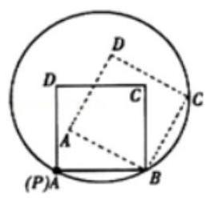

【难度】 $\star   \star   \star   \star   \star$

【答案】 $\frac{\left( {2 + \sqrt{2}}\right) \pi }{2}$

【解析】解: 由图可知: $\because$ 圆 $O$ 的半径 $r = 1$ ,正方形 ${ABCD}$ 的边长 $a = 1$ ,

$\therefore$ 以正方形的边为弦时所对的圆心角为 $\frac{\pi }{3}$ ，正方形在圆上滚动时点的顺序依次为 ${\text{ 如 }\text{ 图 }\text{ 所 }\text{ 示 }}$ ，

$\therefore$ 当点 $A$ 首次回到点 $P$ 的位置时,正方形滚动了 3 圈共 12 次,

设第 $i$ 次滚动,点 $A$ 的路程为 ${A}_{i}$ ,则 ${A}_{1} = \frac{\pi }{6} \times  \left| {AB}\right|  = \frac{\pi }{6},{A}_{2} = \frac{\pi }{6} \times  \left| {AC}\right|  = \frac{\sqrt{2}\pi }{6},{A}_{3} = \frac{\pi }{6} \times  \left| {DA}\right|  = \frac{\pi }{6},{A}_{4} = 0$ ,

$\therefore$ 点 $A$ 所走过的路径的长度为 $3\left( {{A}_{1} + {A}_{2} + {A}_{3} + {A}_{4}}\right)  = \frac{2 + \sqrt{2}}{2}\pi$ .

故答案为: $\frac{\left( {2 + \sqrt{2}}\right) \pi }{2}$ .

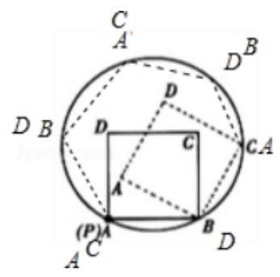

二、选择题

7、函数 $f\left( x\right)  = \cos \left( {{\omega x} + \varphi }\right) \left( {\omega  > 0,\left| \varphi \right|  < \frac{\pi }{2}}\right)$ 的部分图像如图所示,则下列结论不正确的是( )

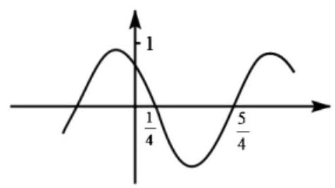

A. $\omega  = \pi$

B. $\varphi  = \frac{\pi }{3}$ C. $x = \frac{3}{4}$ 是函数的一条对称轴 D. $\left( {k + \frac{1}{4},0}\right)$ 是函数的对称轴心

【难度】 $\star   \star$

【答案】B

【解析】由函数的图象有 $\frac{1}{2}T = 1$ ,则 $T = 2$ ,即 $T = \frac{2\pi }{\omega } = 2$ ,所以 $\omega  = \pi$ ,则 $\mathbf{A}$ 正确.

由图象可得, $f\left( \frac{1}{4}\right)  = \cos \left( {\frac{1}{4}\pi  + \varphi }\right)  = 0$ ,

所以 $\frac{1}{4}\pi  + \varphi  = {2k\pi } + \frac{\pi }{2}.k \in  Z$ ,即 $\varphi  = {2k\pi } + \frac{\pi }{4}.k \in  Z$ ,由 $\left| \varphi \right|  < \frac{\pi }{2}$ ,

所以 $\varphi  = \frac{\pi }{4}$ ,即 $f\left( x\right)  = \cos \left( {{\pi x} + \frac{\pi }{4}}\right)$ ,所以 $\mathrm{B}$ 不正确.

所以函数 $f\left( x\right)$ 的对称轴为: ${\pi x} + \frac{\pi }{4} = {k\pi } + \pi .k \in  Z$ ,即 $x = k + \frac{3}{4}.k \in  Z$

当时, $x = \frac{3}{4}$ 是函数 $f\left( x\right)$ 的一条对称轴,所以 $\mathrm{C}$ 正确.

所以函数 $f\left( x\right)$ 的对称中心满足: ${\pi x} + \frac{\pi }{4} = {k\pi } + \frac{\pi }{2}.k \in  Z$ ,即 $x = k + \frac{1}{4}.k \in  Z$

所以函数 $f\left( x\right)$ 的对称轴心为 $\left( {k + \frac{1}{4},0}\right) , k \in  Z$ ,所以 $\mathrm{D}$ 正确.

故选: B

8、已知 $\tan \theta  = 2$ ，且 $\sin \theta  + \cos \theta  = \sqrt{3}\left( {\sin \theta  - \cos \theta }\right) \tan \varphi \left( {-\frac{\pi }{2} < \varphi  < \frac{\pi }{2}}\right)$ ，则函数 $f\left( x\right)  = \sin {2x} - \sin \left( {{2x} + \varphi }\right) \left( {0 \leq  x \leq  \frac{\pi }{2}}\right)$ 的值域为( )

A. $\left\lbrack  {-\frac{\sqrt{3}}{2},\frac{\sqrt{3}}{2}}\right\rbrack$ B. $\left\lbrack  {-\frac{\sqrt{3}}{2},1}\right\rbrack$ C. $\left\lbrack  {\frac{\sqrt{3}}{2},1}\right\rbrack$ D. $\left\lbrack  {-1,\frac{\sqrt{3}}{2}}\right\rbrack$

【难度】 $\star   \star   \star$

【答案】B

【解析】因为 $\tan \theta  = 2$ ,所以由 $\sin \theta  + \cos \theta  = \sqrt{3}\left( {\sin \theta  - \cos \theta }\right) \tan \varphi$ ,可得

$\tan \varphi  = \frac{\sin \theta  + \cos \theta }{\sqrt{3}\left( {\sin \theta  - \cos \theta }\right) } = \frac{\tan \theta  + 1}{\sqrt{3}\left( {\tan \theta  - 1}\right) } = \frac{2 + 1}{\sqrt{3}\left( {2 - 1}\right) } = \sqrt{3}$ ,而 $- \frac{\pi }{2} < \varphi  < \frac{\pi }{2}$ ,所以 $\varphi  = \frac{\pi }{3}$ . 于是

$f\left( x\right)  = \sin {2x} - \sin \left( {{2x} + \varphi }\right)  = \sin {2x} - \sin \left( {{2x} + \frac{\pi }{3}}\right)$

$= \sin {2x} - \frac{1}{2}\sin {2x} - \frac{\sqrt{3}}{2}\cos {2x} = \frac{1}{2}\sin {2x} - \frac{\sqrt{3}}{2}\cos {2x} = \sin \left( {{2x} - \frac{\pi }{3}}\right)$ ,

因为 $0 \leq  x \leq  \frac{\pi }{2}$ ,所以 $0 \leq  {2x} \leq  \pi$ ,所以 $- \frac{\pi }{3} \leq  {2x} - \frac{\pi }{3} \leq  \frac{2\pi }{3} \Rightarrow   - \frac{\sqrt{3}}{2} \leq  f\left( x\right)  \leq  1$ ,故答案为: $\left\lbrack  {-\frac{\sqrt{3}}{2},1}\right\rbrack$ .

9、已知方程 $\sin \left( {\frac{x}{2} + \frac{\pi }{6}}\right)  = \frac{\sqrt{3}}{2}, M = \left\{  {x\left| {\;x = {2k\pi } + {\left( -1\right) }^{k} \cdot  \frac{2\pi }{3} - \frac{\pi }{3}}\right. , k \in  Z}\right\}$ , $N = \left\{  {x\left| {\;x = {4k\pi } + \frac{\pi }{3}}\right. , k \in  Z}\right\}   \cup  \{ x \mid  x = \left( {{4k} + 1}\right) \pi , k \in  Z\}$ . 那么 ( )

A. $M$ 和 $N$ 都是方程的解集 B. $M$ 是方程的解集, $N$ 不是方程的解集

C. $M$ 不是方程的解集, $N$ 是方程的解集 D. $M$ 和 $N$ 都不是方程的解集

【难度】★★★

【答案】 $A$

【解析】解: 因为 $\sin \left( {\frac{x}{2} + \frac{\pi }{6}}\right)  = \frac{\sqrt{3}}{2}$ ,所以 $\frac{x}{2} + \frac{\pi }{6} = {2k\pi } + \frac{\pi }{3}$ ,或 $\frac{x}{2} + \frac{\pi }{6} = {2k\pi } + \pi  - \frac{\pi }{3}, k \in  Z$ ;

所以 $x = {4k\pi } + \frac{\pi }{3}, k \in  Z$ 或 $x = \left( {{4k} + 1}\right) \pi , k \in  Z$ ,即 $N = \left\{  {x\left| {\;x = {4k\pi } + \frac{\pi }{3}}\right. , k \in  Z}\right\}   \cup  \{ x|x = \left( {{4k} + 1}\right) \pi , k \in  Z\}$ ;

因为 $\{ x \mid  x = {4k\pi } + \frac{\pi }{3}, k \in  Z\}  \cup  \{ x \mid  x = \left( {{4k} + 1}\right) \pi , k \in  Z\}  = \left\{  {x \mid  x = {2k\pi } + {\left( -1\right) }^{k} \cdot  \frac{2\pi }{3} - \frac{\pi }{3}, k \in  Z}\right\}   = M$ ;

所以 $M, N$ 都是三角方程的解集,故选: $A$ .

10、函数 $f\left( x\right)  = \left\{  \begin{matrix} \cos \left( {{\pi x} - \pi }\right)  + 1, x \in  \left( {\frac{1}{2},1}\right)  \cup  \left( {1,\frac{3}{2}}\right) \\  a,\;x = 1 \end{matrix}\right.$ ,若关于 $x$ 的方程

$2{\left\lbrack  f\left( x\right) \right\rbrack  }^{2} - \left( {{2a} + 3}\right) f\left( x\right)  + {3a} = 0$ 有五个不同的实数解,则满足题意的 $a$ 的取值范围是

A. $\left( {0,1}\right)$

B. $\left( {0,\frac{3}{2}}\right)$ C. $\left( {1,2}\right)$

D. $\left( {1,\frac{3}{2}}\right)  \cup  \left( {\frac{3}{2},2}\right)$

【难度】 $\star   \star   \star   \star$

【答案】D

【解析】复合函数的图像

## 三、解答题

11、设函数 $y = f\left( x\right)$ 的表达式为 $f\left( x\right)  = 2\cos \left( {{\omega x} + \frac{\pi }{4}}\right) \cos \left( {{\omega x} - \frac{\pi }{4}}\right)  + \sqrt{3}\sin \left( {2\omega x}\right)$ ,其中常数 $\omega  > 0$ .

(1)求函数 $y = f\left( x\right)$ 的值域；

(2)设实数 ${x}_{1}\text{ 、 }{x}_{2}$ 满足 $\left| {{x}_{1} - {x}_{2}}\right|  = \frac{\pi }{2} < \frac{\pi }{\omega }$ ,若对任意 $x \in  R$ ，不等式 $f\left( {x}_{1}\right)  \leq  f\left( x\right)  \leq  f\left( {x}_{2}\right)$ 都成立，求 $\omega$ 的值以及方程 $f\left( x\right)  = 1$ 在闭区间 $\left\lbrack  {0,\pi }\right\rbrack$ 上的解.

【难度】 $\star   \star   \star   \star$

【答案】见解析

【解析】解: (1) $f\left( x\right)  = 2\cos \left( {{\omega x} + \frac{\pi }{4}}\right) \cos \left( {{\omega x} - \frac{\pi }{4}}\right)  + \sqrt{3}\sin \left( {2\omega x}\right)  = 2\sin \left( {{\omega x} - \frac{\pi }{4}}\right) \cos \left( {{\omega x} - \frac{\pi }{4}}\right)  + \sqrt{3}\sin \left( {2\omega x}\right) \; = \sqrt{3}\sin \left( {2\omega x}\right)  + \cos \left( {2\omega x}\right)  = 2\sin \left( {{2\omega x} + \frac{\pi }{6}}\right)$ ,因为 $\sin \left( {{2\omega x} + \frac{\pi }{6}}\right)  \in  \left\lbrack  {-1,1}\right\rbrack$ ,

所以 $f\left( x\right)$ 的值域为 $\left\lbrack  {-2,2}\right\rbrack$ ;

(2)对任意 $x \in  R$ ，不等式 $f\left( {x}_{1}\right)  \leq  f\left( x\right)  \leq  f\left( {x}_{2}\right)$ 都成立，则 $f\left( {x}_{1}\right)  =  - 2$ ， $f\left( {x}_{2}\right)  = 2$ ，

所以 ${2\omega }{x}_{1} + \frac{\pi }{6} = 2{k}_{1}\pi  - \frac{\pi }{2},{2\omega }{x}_{2} + \frac{\pi }{6} = 2{k}_{2}\pi  + \frac{\pi }{2},{k}_{1},{k}_{2} \in  Z$ ,

所以 $\left| {{x}_{1} - {x}_{2}}\right|  = \frac{2{k}_{1}\pi  - 2{k}_{2}\pi  - \pi }{2\omega } = \frac{\left( {2{k}_{1} - 2{k}_{2}}\right) \pi  - \pi }{2\omega } = \frac{\pi }{2} < \frac{\pi }{\omega }$ ,

则 $2{k}_{1} - 2{k}_{2} = 2$ ,解得 $\omega  = 1$ ,故 $f\left( x\right)  = 2\sin \left( {{2x} + \frac{\pi }{6}}\right)$ ,因为 $x \in  \left\lbrack  {0,\pi }\right\rbrack$ ,则 ${2x} + \frac{\pi }{6} \in  \left\lbrack  {\frac{\pi }{6},\frac{13\pi }{6}}\right\rbrack$ ,

因为 $f\left( x\right)  = 1$ ,则 $\sin \left( {{2x} + \frac{\pi }{6}}\right)  = \frac{1}{2}$ ,所以 ${2x} + \frac{\pi }{6} = \frac{\pi }{6}$ 或 ${2x} + \frac{\pi }{6} = \frac{5\pi }{6}$ 或 ${2x} + \frac{\pi }{6} = \frac{13\pi }{6}$ ,

解得 $x = 0$ 或 $x = \frac{\pi }{3}$ 或 $x = \pi$ ,故方程 $f\left( x\right)  = 1$ 在闭区间 $\left\lbrack  {0,\pi }\right\rbrack$ 上的解为 $x = 0$ 或 $x = \frac{\pi }{3}$ 或 $x = \pi$ .

12、已知函数 $f\left( x\right)  = \sqrt{3}\sin \left( {{\omega x} + \frac{\pi }{6}}\right)  + 2{\sin }^{2}\left( {\frac{\omega x}{2} + \frac{\pi }{12}}\right)  - 1\left( {\omega  > 0}\right)$ 的相邻两对称轴间的距离为 $\frac{\pi }{2}$ .

(1)求 $f\left( x\right)$ 的解析式;

(2)将函数 $f\left( x\right)$ 的图象向右平移 $\frac{\pi }{6}$ 个单位长度，再把横坐标缩小为原来的 $\frac{1}{2}$ (纵坐标不变)，得到函数 $y = g\left( x\right)$ 的图象,当 $x \in  \left\lbrack  {-\frac{\pi }{12},\frac{\pi }{6}}\right\rbrack$ 时,求函数 $g\left( x\right)$ 的值域.

(3)对于第(2)问中的函数 $g\left( x\right)$ ，记方程 $g\left( x\right)  = \frac{4}{3}$ 在 $x \in  \left\lbrack  {\frac{\pi }{6},\frac{4\pi }{3}}\right\rbrack$ 上的根从小到依次为 ${x}_{1},{x}_{2},\cdots ,{x}_{n}$ ， 试确定 $n$ 的值,并求 ${x}_{1} + 2{x}_{2} + 2{x}_{3} + \cdots  + 2{x}_{n - 1} + {x}_{n}$ 的值.

【难度】 $\star   \star   \star   \star$

【答案】见解析

【解析】解: (1) 由题意,函数 $f\left( x\right)  = \sqrt{3}\sin \left( {{\omega x} + \frac{\pi }{6}}\right)  + 2{\sin }^{2}\left( \frac{{\omega x} + \frac{\pi }{6}}{2}\right)  - 1$

$= \sqrt{3}\sin \left( {{\omega x} + \frac{\pi }{6}}\right)  - \cos \left( {{\omega x} + \frac{\pi }{6}}\right)  = 2\sin \left( {{\omega x} + \frac{\pi }{6} - \frac{\pi }{6}}\right)  = 2\sin {\omega x}$ ,

因为函数 $f\left( x\right)$ 图像的相邻两对称轴间的距离为 $\frac{\pi }{2}$ ,所以 $T = \pi$ ,可得 $\omega  = 2$ .

$f\left( x\right)  = 2\sin {2x}$ .

( 2 )将函数 $f\left( x\right)$ 的图像向右平移 $\frac{\pi }{6}$ 个单位长度，可得 $y = 2\sin \left( {{2x} - \frac{\pi }{3}}\right)$ 的图像，

再把横坐标缩小为原来的 $\frac{1}{2}$ ,得到函数 $y = g\left( x\right)  = 2\sin \left( {{4x} - \frac{\pi }{3}}\right)$ 的图像,

当 $x \in  \left\lbrack  {-\frac{\pi }{12},\frac{\pi }{6}}\right\rbrack$ 时, ${4x} - \frac{\pi }{3} \in  \left\lbrack  {-\frac{2\pi }{3},\frac{\pi }{3}}\right\rbrack$ ,

当 ${4x} - \frac{\pi }{3} =  - \frac{\pi }{2}$ 时，函数 $g\left( x\right)$ 取得最小值，最小值为 -2,

当 ${4x} - \frac{\pi }{3} = \frac{\pi }{3}$ 时,函数 $g\left( x\right)$ 取得最大值,最大值为 $\sqrt{3}$ ,故函数 $g\left( x\right)$ 的值域 $\left\lbrack  {-2,\sqrt{3}}\right\rbrack$ .

(3)由方程 $g\left( x\right)  = \frac{4}{3}$ ，即 $2\sin \left( {{4x} - \frac{\pi }{3}}\right)  = \frac{4}{3}$ ，即 $\sin \left( {{4x} - \frac{\pi }{3}}\right)  = \frac{2}{3}$ ，

因为 $x \in  \left\lbrack  {\frac{\pi }{6},\frac{4\pi }{3}}\right\rbrack$ ,可得 ${4x} - \frac{\pi }{3} \in  \left\lbrack  {\frac{\pi }{3},{5\pi }}\right\rbrack$ ,设 $\theta  = {4x} - \frac{\pi }{3}$ ,其中 $\theta  \in  \left\lbrack  {\frac{\pi }{3},{5\pi }}\right\rbrack$ ,即 $\sin \theta  = \frac{2}{3}$ ,

结合正弦函数 $y = \sin \theta$ 的图像,

可得方程 $\sin \theta  = \frac{2}{3}$ 在区间 $\left\lbrack  {\frac{\pi }{3},{5\pi }}\right\rbrack$ 有 5 个解,即 $n = 5$ ,

其中 ${\theta }_{1} + {\theta }_{2} = {3\pi },{\theta }_{2} + {\theta }_{3} = {5\pi },{\theta }_{3} + {\theta }_{4} = {7\pi },{\theta }_{4} + {\theta }_{5} = {9\pi }$ ,

$4{x}_{1} - \frac{\pi }{3} + 4{x}_{2} - \frac{\pi }{3} = {3\pi },4{x}_{2} - \frac{\pi }{3} + 4{x}_{3} - \frac{\pi }{3} = {5\pi },4{x}_{3} - \frac{\pi }{3} + 4{x}_{4} - \frac{\pi }{3} = {7\pi },4{x}_{4} - \frac{\pi }{3} + 4{x}_{5} - \frac{\pi }{3} = {9\pi }$

解得 ${x}_{1} + {x}_{2} = \frac{11\pi }{12},{x}_{2} + {x}_{3} = \frac{17\pi }{12},{x}_{3} + {x}_{4} = \frac{23\pi }{12},{x}_{4} + {x}_{5} = \frac{29\pi }{12}$

所以 ${x}_{1} + 2{x}_{2} + 2{x}_{3} + 2{x}_{4} + {x}_{5} = \left( {{x}_{1} + {x}_{2}}\right)  + \left( {{x}_{2} + {x}_{3}}\right)  + \left( {{x}_{3} + {x}_{4}}\right)  + \left( {{x}_{4} + {x}_{5}}\right)  = \frac{20\pi }{3}$ .

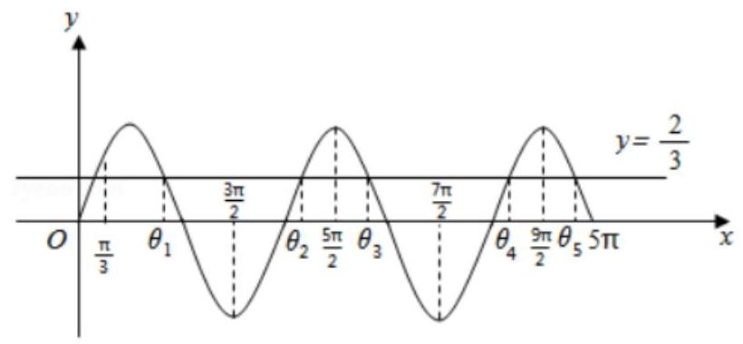
