## 解析几何专题

<table><tr><td>教学目标</td><td>1、梳理直线方程中常考概念, 各常考圆锥曲线的概念, 方程及基本几何性质;   2、熟悉求圆锥曲线中定值、定点、范围问题解答思路与解答分析过程</td></tr><tr><td>重点</td><td>求圆锥曲线中定值、定点、范围问题</td></tr><tr><td>难 点</td><td>求圆锥曲线中定值、定点、范围问题</td></tr></table>

## (一) 直线与圆锥曲线基本量及相关定义

## 知识梳理

## 一、直线的方程

## 1. 直线方程的几种形式

点方向式、点法向式、点斜式、一般式(注意各自已知条件及限制条件)

## 2. 倾斜角与斜率

(1)倾斜角:在平面直角坐标系中，把 $x$ 轴绕直线 $L$ 与 $x$ 轴的交点按逆时针方向旋转到和直线重合时所转的最小正角. 当直线和 $x$ 轴平行或重合时,我们规定直线的倾斜角为 ${0}^{ \circ  }$ ,故倾斜角的范围是 $\lbrack 0,\pi )$ .

(2)斜率:不是 $\frac{\pi }{2}$ 的倾斜角的正切值叫做直线的斜率，即 $k = \tan \alpha$ . (90°的倾斜角的斜率不存在；即: $\left. {\alpha  \rightarrow  \frac{\pi }{2}\text{ 时 }k \rightarrow  \infty }\right)$ .

(3)求直线斜率的方法

①定义法:已知直线的倾斜角为 $\alpha$ ，且 $\alpha  \neq  \frac{\pi }{2}$ ，则斜率 $k = \tan \alpha$ .

②公式法:已知直线过两点 ${P}_{1}\left( {{x}_{1},{y}_{1}}\right)$ 、 ${P}_{2}\left( {{x}_{2},{y}_{2}}\right)$ ，且 ${x}_{1} \neq  {x}_{2}$ ，则斜率 $k = \frac{{y}_{2} - {y}_{1}}{{x}_{2} - {x}_{1}}$ .

③方向向量法: 若 $\overrightarrow{\alpha } = \left( {m, n}\right)$ 为直线的方向向量,则直线的斜率 $k = \frac{n}{m}$ .

## 3. 两直线的位置关系

平面内两条直线的位置关系有三种: 重合、平行、相交.

## 4. 相交直线的夹角公式

$$
\cos \alpha  = \left| {\cos \theta }\right|  = \left| \frac{\overline{{d}_{1}} \cdot  \overline{{d}_{2}}}{\left| \overline{{d}_{1}}\right|  \cdot  \left| \overline{{d}_{2}}\right| }\right|  = \frac{\left| {a}_{1}{a}_{2} + {b}_{1}{b}_{2}\right| }{\sqrt{{a}_{1}^{2} + {b}_{1}^{2}} \cdot  \sqrt{{a}_{2}^{2} + {b}_{2}^{2}}}\text{ 或 }\tan  = \left| \frac{{k}_{2} - {k}_{1}}{1 + {k}_{1}{k}_{2}}\right|
$$

## 5. 距离公式

(1)点到直线的距离

点 $P\left( {{x}_{0},{y}_{0}}\right)$ 到直线 $l : {Ax} + {By} + C = 0$ 的距离 $d = \frac{\left| A{x}_{0} + B{y}_{0} + C\right| }{\sqrt{{A}^{2} + {B}^{2}}}$ .

(2)平行直线间的距离

若两条平行线直线 ${l}_{1} : {ax} + {by} + {c}_{1} = 0,{l}_{2} : {ax} + {by} + {c}_{2} = 0$ 的距离 $d = \frac{\left| {c}_{1} - {c}_{2}\right| }{\sqrt{{a}^{2} + {b}^{2}}}\left( {{a}^{2} + {b}^{2} \neq  0}\right)$ .

## 二、圆的方程

(1)圆的标准方程为 ${\left( x - a\right) }^{2} + {\left( y - b\right) }^{2} = {r}^{2}$ ，其中圆心为 $\left( {a, b}\right)$ ，半径为 $r$ ；

(2)圆的一般方程为 ${x}^{2} + {y}^{2} + {Dx} + {Ey} + F = 0$ ，圆心坐标 $\left( {-\frac{D}{2}, - \frac{E}{2}}\right)$ ，半径为 $\frac{\sqrt{{D}^{2} + {E}^{2} - {4F}}}{2}$ . 方程表示圆的充要条件是 ${D}^{2} + {E}^{2} - {4F} > 0$ .

(3)圆的参数方程: $\left\{  \begin{array}{l} x = a + r\cos \theta \\  y = b + r\sin \theta  \end{array}\right.$ ( $\theta$ 为参数)，其中圆心为 $\left( {a, b}\right)$ ，半径为 $r$ .

## 三、椭圆和双曲线的标准方程和几何性质

<table id="cross-table-1"><tr><td>名称</td><td>椭 圆</td><td>双 曲 线</td></tr><tr><td>图 象</td><td>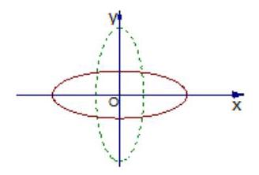</td><td>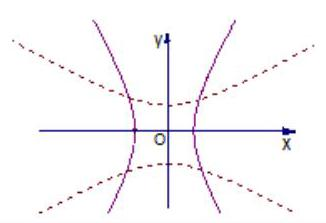</td></tr><tr><td>定义</td><td>平面内到两定点 ${F}_{1},{F}_{2}$ 的距离的和为常数 ${2a}\left( {{2a} > \left| {{F}_{1}{F}_{2}}\right| }\right)$ 的动点的轨迹叫椭圆. 即 $\left| {M{F}_{1}}\right|  + \left| {M{F}_{2}}\right|  = {2a}$    当 ${2a} > {2c}$ 时，轨迹是椭圆，    当 ${2a} = {2c}$ 时，轨迹是一条线段 $\left| {{F}_{1}{F}_{2}}\right|$    当 ${2a} < {2c}$ 时，轨迹不存在</td><td>平面内到两定点 ${F}_{1},{F}_{2}$ 的距离的差的绝对值为常数 ${2a}$ ( $0 < {2a} < \left| {{F}_{1}{F}_{2}}\right|$ )的动点的轨迹叫双曲线.    即 $\begin{Vmatrix}{M{F}_{1}\left| -\right| M{F}_{2}}\end{Vmatrix} = {2a}$    当 ${2a} < {2c}$ 时，轨迹是双曲线    当 ${2a} = {2c}$ 时，轨迹是两条射线    当 ${2a} > {2c}$ 时，轨迹不存在</td></tr><tr><td rowspan="2">标 准方 程</td><td>焦点在 $x$ 轴上时: $\frac{{x}^{2}}{{a}^{2}} + \frac{{y}^{2}}{{b}^{2}} = 1$    焦点在 $y$ 轴上时: $\frac{{y}^{2}}{{a}^{2}} + \frac{{x}^{2}}{{b}^{2}} = 1$    $\left( {a > b > 0}\right)$</td><td>焦点在 $x$ 轴上时: $\frac{{x}^{2}}{{a}^{2}} - \frac{{y}^{2}}{{b}^{2}} = 1$    焦点在 $y$ 轴上时: $\frac{{y}^{2}}{{a}^{2}} - \frac{{x}^{2}}{{b}^{2}} = 1$</td></tr><tr><td>注: 是根据分母的大小来判断焦点在哪一坐标轴上.</td><td>注:是根据项的正负来判断焦点所在的位置.</td></tr><tr><td>两轴</td><td>长轴长 ${2a}$ ，短轴长 ${2b}$ (长半轴 $a$ ，短半轴 $b$ )</td><td>实轴长 ${2a}$ ，虚轴长 ${2b}$    (实半轴 $a$ ，虚半轴 $b$ )</td></tr><tr><td>$a, b, c$ 关系</td><td>(1) ${a}^{2} = {c}^{2} + {b}^{2}$ (符合勾股定理的)    (2) $a$ 最大(可以 $c = b, c < b, c > b$ )</td><td>(1) ${c}^{2} = {a}^{2} + {b}^{2}$ (符合勾股定理的)    (2) $c$ 最大(可以 $a = b, a < b, a > b$ )</td></tr><tr><td>范围</td><td>焦点在 $x$ 轴: $- a \leq  x \leq  a, - b \leq  y \leq  b$ 焦点在 $y$ 轴: $- b \leq  x \leq  b, - a \leq  y \leq  a$</td><td>焦点在 $x$ 轴: $x \geq  a$ 或 $x \leq   - a$    焦点在 $y$ 轴: $y \geq  a$ 或 $y \leq   - a$</td></tr><tr><td>对称</td><td colspan="2">关于 $x$ 轴、 $y$ 轴和原点对称</td></tr></table>

注: 双曲线 $\frac{{x}^{2}}{{a}^{2}} - \frac{{y}^{2}}{{b}^{2}} = 1$ 的渐近线方程为 $y =  \pm  \frac{b}{a}x;\frac{{y}^{2}}{{a}^{2}} - \frac{{x}^{2}}{{b}^{2}} = 1$ 的渐近线方程为 $y =  \pm  \frac{a}{b}x$ .

## 四、抛物线的标准方程和几何性质

<table><tr><td>标准方程</td><td>图形</td><td>对称轴</td><td>焦点 $F$</td><td>准线 $l$</td></tr><tr><td>${y}^{2} = {2px}$</td><td>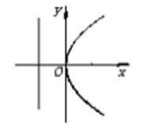</td><td>$x$ 轴</td><td>$\left( {\frac{p}{2},0}\right)$</td><td>$x =  - \frac{p}{2}$</td></tr><tr><td>${y}^{2} =  - {2px}$</td><td>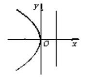</td><td>$x$ 轴</td><td>$\left( {-\frac{p}{2},0}\right)$</td><td>$x = \frac{p}{2}$</td></tr><tr><td>${x}^{2} = {2py}$</td><td>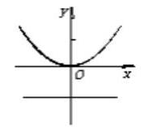</td><td>$y$ 轴</td><td>$\left( {0,\frac{p}{2}}\right)$</td><td>$y =  - \frac{p}{2}$</td></tr><tr><td>${x}^{2} =  - {2py}$</td><td>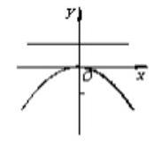</td><td>$y$ 轴</td><td>$\left( {0, - \frac{p}{2}}\right)$</td><td>$y = \frac{p}{2}$</td></tr></table>

## 例题精讲

【例 1】(1)过点 $P\left( {3, - 2}\right)$ 且倾斜角为 $\frac{\pi }{2}$ 的直线方程是( )

A. $x =  - 2$ B. $x = 3$ C. $y =  - 2$ D. $y = 3$

【难度】★★

【答案】B

【解析】倾斜角为 $\frac{\pi }{2}$ ,直线垂直于 $x$ 轴,直线方程为 $x = 3$ ; 故选: B

( 2 )直线 $l : x + {2y} - 3 = 0$ 的一个方向向量为( )

A. $\left( {2, - 1}\right)$ B. $\left( {2,1}\right)$ C. $\left( {-1,2}\right)$ D. $\left( {1,2}\right)$

【难度】★★

【答案】A

【解析】直线 $l$ 的斜率为 $k = \frac{-1}{2}$ ,设直线 $l$ 的方向向量为 $\left( {x, y}\right)$ ,则 $\frac{y}{x} = \frac{-1}{2}$ ,只有 $\mathbf{A}$ 项满足,故选: $\mathbf{A}$

(3)直线 $x + y - 1 = 0$ 与直线 $x - {2y} - 4 = 0$ 交于点 $P$ ，则点 $P$ 到直线 ${kx} - y + 1 + {2k} = 0\left( {k \in  R}\right)$ 的最大距离为( )

A. $\sqrt{2}$ B. 2 C. $2\sqrt{5}$ D. 4

【难度】★★

【答案】C

【解析】由 $\left\{  \begin{array}{l} x + y - 1 = 0 \\  x - {2y} - 4 = 0 \end{array}\right.$ 解得 $\left\{  \begin{array}{l} x = 2 \\  y =  - 1 \end{array}\right.$ ,所以 $P\left( {2, - 1}\right)$ ,

由 ${kx} - y + 1 + {2k} = 0\left( {k \in  R}\right)$ ,得 $k\left( {x + 2}\right)  - y + 1 = 0\left( {k \in  R}\right)$ ,令 $x =  - 2, y = 1$ 恒成立,

所以直线 ${kx} - y + 1 + {2k} = 0\left( {k \in  R}\right)$ 恒过点 $Q\left( {-2,1}\right)$ ,

所以点 $P$ 到直线 ${kx} - y + 1 + {2k} = 0\left( {k \in  R}\right)$ 的最大距离为 $\left| {PQ}\right|  = \sqrt{{\left\lbrack  2 - \left( -2\right) \right\rbrack  }^{2} + {\left( -1 - 1\right) }^{2}} = 2\sqrt{5}$ ,故选: C.

(4)函数 $y = a\sin x + {2b}\cos x$ 图像的一条对称轴方程为 $x = \frac{\pi }{4}$ ，则直线 ${ax} + {by} + 1 = 0$ 与 $x + y + 2 = 0$ 的夹角大小为 ( )

A. $\arccos \frac{\sqrt{10}}{10}$ B. $\arccos \frac{3\sqrt{10}}{10}$ C. $\arctan \left( {-\frac{1}{3}}\right)$ D. $\arctan \left( {-3}\right)$

【难度】 $\star   \star   \star$

【答案】B

【解析】: 函数 $y = a\sin x + {2b}\cos x$ 图像的一条对称轴方程为 $x = \frac{\pi }{4},\therefore \sqrt{{a}^{2} + 4{b}^{2}} = \left| {a\sin \frac{\pi }{4} + {2b}\cos \frac{\pi }{4}}\right|$ 解得 $a = {2b}$ ,设直线 ${ax} + {by} + 1 = 0$ 与 $x + y + 2 = 0$ 的夹角为 $\theta$ ,

直线 ${ax} + {by} + 1 = 0$ 的一个法量为 $\overrightarrow{m} = \left( {a, b}\right)$ ,直线 $x + y + 2 = 0$ 的一个法向量为 $\overrightarrow{n} = \left( {1,1}\right)$ ,

则 $\cos \theta  = \left| \frac{\overrightarrow{m} \cdot  \overrightarrow{n}}{\left| \overrightarrow{m}\right| \left| \overrightarrow{n}\right| }\right|  = \frac{\left| a + b\right| }{\sqrt{{a}^{2} + {b}^{2}} \cdot  \sqrt{2}} = \frac{3}{\sqrt{10}} = \frac{3\sqrt{10}}{10}$ ,所以 $\theta  = \arccos \frac{3\sqrt{10}}{10}$ ,故选: $B$ .

【例 2】( 1 )已知 $\odot  M$ 经过坐标原点，半径 $r = \sqrt{2}$ ，且与直线 $y = x + 2$ 相切，则 $\odot  M$ 的方程为( ).

A. ${\left( x + 1\right) }^{2} + {\left( y + 1\right) }^{2} = 2$ 或 ${\left( x - 1\right) }^{2} + {\left( y - 1\right) }^{2} = 2$

B. ${\left( x + 1\right) }^{2} + {\left( y - 1\right) }^{2} = 2$ 或 ${\left( x - 1\right) }^{2} + {\left( y + 1\right) }^{2} = 2$

C. ${\left( x - 1\right) }^{2} + {\left( y + 1\right) }^{2} = 2$ 或 ${\left( x + \sqrt{2}\right) }^{2} + {y}^{2} = 2$

D. ${\left( x - 1\right) }^{2} + {\left( y + 1\right) }^{2} = 2$ 或 ${\left( x - \sqrt{2}\right) }^{2} + {y}^{2} = 2$

【难度】 $\star   \star$

【答案】A

【解析】设圆心坐标为 $\left( {a, b}\right)$ ,半径 $r = \sqrt{2}$ ,

因为圆 $M$ 过坐标原点,且与直线 $y = x + 2$ 相切,所以 $\sqrt{{a}^{2} + {b}^{2}} = \frac{\left| a - b + 2\right| }{\sqrt{2}} = \sqrt{2}$ ,

所以 $a = b =  \pm  1$ ,即圆心为 $\left( {1,1}\right)$ 或 $\left( {-1, - 1}\right)$ ,

圆 $M$ 的方程为: ${\left( x - 1\right) }^{2} + {\left( y - 1\right) }^{2} = 2$ 或 ${\left( x + 1\right) }^{2} + {\left( y + 1\right) }^{2} = 2$ ,故选: A.

( 2 )若 $M, N$ 分别为圆 ${C}_{1} : {\left( x + 6\right) }^{2} + {\left( y - 5\right) }^{2} = 4$ 与圆 ${C}_{2} : {\left( x - 2\right) }^{2} + {\left( y - 1\right) }^{2} = 1$ 上的动点， $P$ 为直线 $x + y + 5 = 0$ 上的动点，则 $\left| {PM}\right|  + \left| {PN}\right|$ 的最小值为___.

【难度】 $\star   \star   \star$

【答案】 9

【解析】由题意点 ${C}_{1}\left( {-6,5}\right)$ 半径为 $2,{C}_{2}\left( {2,1}\right)$ 半径为 1,设点 ${C}_{1}$ 关于直线 $x + y + 5 = 0$ 的对称点为 ${C}_{3}\left( {{x}_{0},{y}_{0}}\right) ,$

如图:

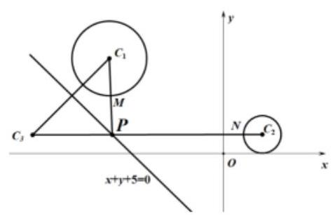

则 $\left\{  \begin{array}{l} \frac{{y}_{0} - 5}{{x}_{0} + 6} \times  \left( {-1}\right)  =  - 1 \\  \frac{{x}_{0} - 6}{2} + \frac{{y}_{0} + 5}{2} + 5 = 0 \end{array}\right.$ ,解得 $\left\{  \begin{array}{l} {x}_{0} =  - {10} \\  {y}_{0} = 1 \end{array}\right.$ ,即 ${C}_{3}\left( {-{10},1}\right)$ ,连接 ${C}_{2}{C}_{3}$ ,

求 $\left| {PM}\right|  + \left| {PN}\right|$ 的最小值可以转化为 $P$ 点到两个圆心的距离再减去两个圆的半径的和的最小值,再由点 ${C}_{1}\text{ 、 }{C}_{3}$ 关于直线 $x + y + 5 = 0$ 的对称,所以 $\left| {P{C}_{3}}\right|  + \left| {P{C}_{2}}\right|  - 3 \geq  \left| {{C}_{2}{C}_{3}}\right|  - 3$ ,

又 $\left| {{C}_{2}{C}_{3}}\right|  - 3 = \sqrt{{\left( -{10} - 2\right) }^{2} + {\left( 1 - 1\right) }^{2}} - 3 = {12} - 3 = 9$ . 故答案为: 9 .

【例 3】( 1 )若 ${F}_{1},{F}_{2}$ 是双曲线 $\frac{{y}^{2}}{{a}^{2}} - \frac{{x}^{2}}{{b}^{2}} = 1\left( {a > 0, b > 0}\right)$ 与椭圆 $\frac{{x}^{2}}{16} + \frac{{y}^{2}}{25} = 1$ 的共同焦点，点 $P$ 是两曲线的一个交点,且 $\bigtriangleup P{F}_{1}{F}_{2}$ 为等腰三角形,则该双曲线的渐近线方程是 ( )

A. $y =  \pm  2\sqrt{2}x$ B. $y =  \pm  \frac{\sqrt{2}}{4}x$ C. $y =  \pm  \frac{\sqrt{7}}{3}x$ D. $y =  \pm  \frac{3\sqrt{7}}{7}x$

【难度】★★

【答案】B

【解析】解: 因为椭圆 $\frac{{x}^{2}}{16} + \frac{{y}^{2}}{25} = 1$ 的焦点坐标为 $\left( {0, \pm  3}\right)$ ,所以双曲线 $\frac{{y}^{2}}{{a}^{2}} - \frac{{x}^{2}}{{b}^{2}} = 1\left( {a > 0, b > 0}\right)$ 中 $c = 3,{a}^{2} + {b}^{2} = 9$ ,

设点 $P$ 为两曲线在第一象限的交点，由于在椭圆中， $\bigtriangleup P{F}_{1}{F}_{2}$ 为等腰三角形，所以 $\left| {P{F}_{2}}\right|  = \left| {{F}_{1}{F}_{2}}\right|  = 6$ ，

所以 $\left| {P{F}_{1}}\right|  = {2a} - \left| {P{F}_{2}}\right|  = {10} - 6 = 4$ ,

在双曲线中, ${2a} = \left| {P{F}_{2}}\right|  - \left| {P{F}_{1}}\right|  = 6 - 4 = 2$ ,所以 $a = 1$ ,代入 ${a}^{2} + {b}^{2} = 9$ ,得 $b = 2\sqrt{2}$ ,

所以该双曲线的渐近线方程为 $y =  \pm  \frac{a}{b}x =  \pm  \frac{1}{2\sqrt{2}}x =  \pm  \frac{\sqrt{2}}{4}x$ ,故选: $\mathbf{B}$

( 2 )已知椭圆 ${C}_{1} : \frac{{x}^{2}}{{a}^{2}} + \frac{{y}^{2}}{{b}^{2}} = 1\left( {a > b > 0}\right)$ 与双曲线 ${C}_{2} : {x}^{2} - \frac{{y}^{2}}{4} = 1$ 有公共的焦点， ${C}_{2}$ 的一条渐近线与以 ${C}_{1}$ 的长轴为直径的圆相交于 $A, B$ 两点. 若 ${C}_{1}$ 恰好将线段 ${AB}$ 三等分，则 ${b}^{2} =$ ___.

【难度】★★

【答案】 $\frac{1}{2}$

【解析】圆的直径 ${AB} = {2a}, C, D$ 为三等分点，不妨设双曲线的一条渐近线方程为 $y = {2x}$ ，点 $C\left( {m,{2m}}\right)$ ， 由题意可知 $\left| {OC}\right|  = \frac{a}{3}$ ，且点 $C$ 在椭圆上，

所以 $\left\{  \begin{array}{l} {m}^{2} + {\left( 2m\right) }^{2} = \frac{{a}^{2}}{9} \\  \frac{{m}^{2}}{{a}^{2}} + \frac{4{m}^{2}}{{b}^{2}} = 1 \end{array}\right.$ ,消去 $m$ ,得 $\frac{{a}^{2}}{45}\left( {\frac{1}{{a}^{2}} + \frac{4}{{b}^{2}}}\right)  = 1$ ,故 ${a}^{2} = {11}{b}^{2}$ ,

又双曲线和椭圆有公共的焦点,所以 ${a}^{2} - {b}^{2} = 1 + 4 = 5$ ,所以 ${b}^{2} = \frac{1}{2}$ .

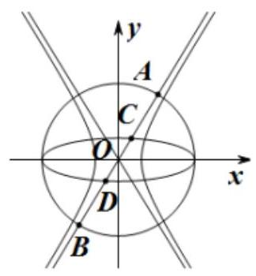

故答案为: $\frac{1}{2}$

【例 4】( 1 )圆 $C$ 过点 $\left( {0,2}\right)$ ，且圆心 $C$ 在抛物线 ${y}^{2} = x$ 上(不与原点重合)，若圆 $C$ 与 $y$ 轴交于点 $A, B$ ， 且 $\left| {AB}\right|  = 4$ ，则圆心 $C$ 的坐标为___.

【难度】★★

【答案】 $\left( {{16},4}\right)$

【解析】设圆心为 $C\left( {{m}^{2}, m}\right)$ ,则圆的半径为 $r = \sqrt{{m}^{4} + {\left( m - 2\right) }^{2}}$ ,圆 $C$ 的方程为 ${\left( x - {m}^{2}\right) }^{2} + {\left( y - m\right) }^{2} = {m}^{4} + {\left( m - 2\right) }^{2}$ , 令 $x = 0$ 可得 ${y}^{2} - {2my} + {4m} - 4 = 0$ ,设 $A\left( {{x}_{1},{y}_{1}}\right) , B\left( {{x}_{2},{y}_{2}}\right)$ ,则 ${y}_{1} + {y}_{2} = {2m},{y}_{1}{y}_{2} = {4m} - 4$ ,

则 $\left| {AB}\right|  = \left| {{y}_{1} - {y}_{2}}\right|  = \sqrt{{\left( {y}_{1} + {y}_{2}\right) }^{2} - 4{y}_{1}{y}_{2}} = \sqrt{4{m}^{2} - 4\left( {{4m} - 4}\right) } = 4$ ,且 $m \neq  0$ ,故 $m = 4$ ,则圆心 $C$ 的坐标为 $\left( {{16},4}\right)$ . 故答案为: $\left( {{16},4}\right)$ .

(2)已知抛物线 $y = \frac{1}{8}{x}^{2}$ 与双曲线 $\frac{{y}^{2}}{{a}^{2}} - {x}^{2} = 1\left( {a > 0}\right)$ 有共同的焦点 $F, O$ 为坐标原点， $P$ 在 $x$ 轴上方且在双曲线上,则 $\overrightarrow{OP} \cdot  \overrightarrow{FP}$ 的最小值为( ).

A. $3 - 2\sqrt{3}$ B. $2\sqrt{3} - 3$ C. $- \frac{7}{4}$ D. $\frac{3}{4}$

【难度】★★

【答案】A

【解析】抛物线 $y = \frac{1}{8}{x}^{2}$ ,可得 ${x}^{2} = {8y}$ ,焦点 $\mathrm{F}$ 为 $\left( {0,2}\right)$ ,则双曲线 $\frac{{y}^{2}}{{a}^{2}} - {x}^{2} = 1\left( {a > 0}\right)$ 的 $\mathrm{c} = 2$ , 则 ${a}^{2} = 3$ ,即双曲线方程为 $\frac{{y}^{2}}{3} - {x}^{2} = 1$ ,

设 $\mathbf{P}\left( {\mathbf{m},\mathbf{n}}\right) \left( {n \geq  3}\right)$ ,则 ${n}^{2} - 3{m}^{2} = 3,\therefore {m}^{2} = \frac{1}{3}{n}^{2} - 1$ ,则

$\overrightarrow{OP} \cdot  \overrightarrow{FP} = \left( {m, n}\right)  \cdot  \left( {m, n - 2}\right)  = {m}^{2} + {n}^{2} - {2n} = \frac{1}{3}{n}^{2} - 1 + {n}^{2} - {2n} = \frac{4}{3}{\left( n - \frac{3}{4}\right) }^{2} - \frac{7}{4}$ ,

因为 $n \geq  \sqrt{3}$ ，故当 $n = \sqrt{3}$ 时取得最小值，最小值为 $3 - 2\sqrt{3}$ ；故选 A.

【例 5】已知实数 $x, y$ 满足 $x\left| x\right|  + \frac{y\left| y\right| }{3} = 1$ ,则 $\left| {\sqrt{3}x + y - 4}\right|$ 的取值范围是( )

A. $\lbrack 4 - \sqrt{6},2)$ B. $\left\lbrack  {4 - \sqrt{6},4}\right)$ C. $\left\lbrack  {2 - \frac{\sqrt{6}}{2},2}\right)$ D. $\left\lbrack  {2 - \frac{\sqrt{6}}{2},4}\right)$

【难度】 $\star   \star   \star$

【答案】B

【解析】解: 因为实数 $x, y$ 满足 $x\left| x\right|  + \frac{y\left| y\right| }{3} = 1$ ,所以当 $x \geq  0, y \geq  0$ 时, $\frac{{y}^{2}}{3} + {x}^{2} = 1$ 其图像位于焦点在 $y$ 轴上的椭圆第一象限,当 $x > 0, y < 0$ 时, ${x}^{2} - \frac{{y}^{2}}{3} = 1$ 其图像位于焦点在 $x$ 轴上的双曲线第四象限, 当 $x < 0, y > 0$ 时, $\frac{{y}^{2}}{3} - {x}^{2} = 1$ 其图像位于焦点在 $y$ 轴上的双曲线第二象限,当 $x < 0, y < 0$ 时, $- \frac{{y}^{2}}{3} - {x}^{2} = 1$ 其图像不存在,作出圆锥曲线和双曲线的图像如下,其中 $x\left| x\right|  + \frac{y\left| y\right| }{3} = 1$ 图像如下:

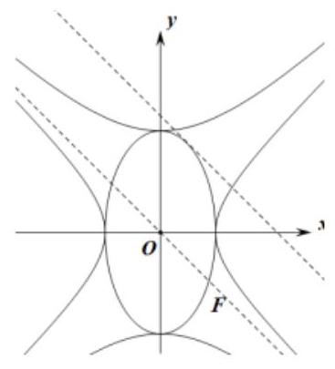

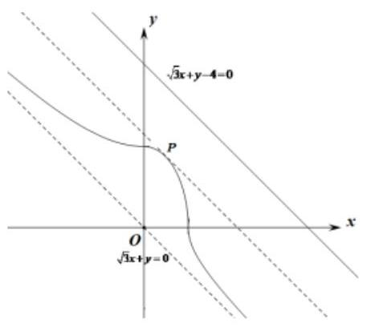

任意一点 $\left( {x, y}\right)$ 到直线 $\sqrt{3}x + y - 4 = 0$ 的距离 $d = \frac{\left| \sqrt{3}x + y - 4\right| }{2}$ ，所以 $\left| {\sqrt{3}x + y - 4}\right|  = {2d}$

结合图像可得 $\left| {\sqrt{3}x + y - 4}\right|$ 的范围就是图像上一点到直线 $\sqrt{3}x + y - 4 = 0$ 距离范围的 2 倍,

双曲线 ${x}^{2} - \frac{{y}^{2}}{3} = 1,\frac{{y}^{2}}{3} - {x}^{2} = 1$ 其中一条渐近线 $\sqrt{3}x + y = 0$ 与直线 $\sqrt{3}x + y - 4 = 0$ 平行

通过图形可得当曲线上一点位于 $P$ 时, ${2d}$ 取得最小值

当曲线上一点靠近双曲线的渐近线 $\sqrt{3}x + y = 0$ 时 ${2d}$ 取得最大值,不能取等号

设 $\sqrt{3}x + y + c = 0\left( {c < 0}\right)$ 与 $\frac{{y}^{2}}{3} + {x}^{2} = 1$ 其图像在第一象限相切于点 $P$

由 $\left\{  {\begin{matrix} \sqrt{3}x + y + c = 0 \\  \frac{{y}^{2}}{3} + {x}^{2} = 1 \end{matrix} \Rightarrow  6{x}^{2} + 2\sqrt{3}{cx} + {c}^{2} - 3 = 0}\right.$

因为 $\Delta  = {\left( 2\sqrt{3}c\right) }^{2}x - 4 \times  6 \times  \left( {{c}^{2} - 3}\right)  = 0 \Rightarrow  c =  - \sqrt{6}$ 或 $c = \sqrt{6}$ (舍去)

所以直线 $\sqrt{3}x + y - \sqrt{6} = 0$ 与直线 $\sqrt{3}x + y - 4 = 0$ 的距离为 $\frac{\left| -4 + \sqrt{6}\right| }{2}$ ，此时 $\left| {\sqrt{3}x + y - 4}\right|  = {2d} = 4 - \sqrt{6}$

直线 $\sqrt{3}x + y = 0$ 与直线 $\sqrt{3}x + y - 4 = 0$ 的距离为 $\frac{\left| -4 - 0\right| }{2} = 2$ ,此时 $\left| {\sqrt{3}x + y - 4}\right|  = {2d} = 4$

所以 $\left| {\sqrt{3}x + y - 4}\right|$ 的取值范围是 $\lbrack 4 - \sqrt{6},4)$ ,故选: B

## 巩固训练

1、直线 $\sqrt{3}x + y + 1 = 0$ 的倾斜角为( )

A. ${30}^{ \circ  }$ B. ${60}^{ \circ  }$ C. ${120}^{ \circ  }$ D. ${150}^{ \circ  }$

【答案】C

【解析】解: 将直线一般式方程化为斜截式方程得: $y =  - \sqrt{3}x - 1$ ,

所以直线的斜率为 $k =  - \sqrt{3}$ ,所以根据直线倾斜角与斜率的关系得直线的倾斜角为 ${120}^{ \circ  }$ . 故选: $\mathrm{C}$

2、过点 $\left( {2,3}\right)$ 且与直线 $l : x - {2y} + 1 = 0$ 垂直的直线方程是___.

【答案】 ${2x} + y - 7 = 0$

【解析】解: 由题意可设所求直线方程为 ${2x} + y + m = 0$ ,

因为所求直线过点 $\left( {2,3}\right)$ ,所以 $2 \times  2 + 3 + m = 0$ ,解得 $m =  - 7$ ,故答案为: ${2x} + y - 7 = 0$

3、两条直线 ${l}_{1} : \sqrt{3}x - y - \sqrt{3} = 0,{l}_{2} : x - \sqrt{3}y - 1 = 0$ 的夹角平分线所在直线的方程是___.

【答案】 $x - y - 1 = 0$

【解析】因为直线 ${l}_{1} : \sqrt{3}x - y - \sqrt{3} = 0$ 的倾斜角为 ${60}^{ \circ  },{l}_{2} : x - \sqrt{3}y - 1 = 0$ 的倾斜角为 ${30}^{ \circ  }$ ,且由 $\left\{  \begin{array}{l} \sqrt{3}x - y - \sqrt{3} = 0 \\  x - \sqrt{3}y - 1 = 0 \end{array}\right.$ 解得两直线的交点坐标为 $\left( {1,0}\right)$ ,所以可设两直线夹角平分线所在直线的方程为: $y = k\left( {x - 1}\right) \left( {\frac{\sqrt{3}}{3} < k < \sqrt{3}}\right) .\therefore \frac{\sqrt{3} - k}{1 + \sqrt{3}k} = \frac{k - \frac{\sqrt{3}}{3}}{1 + \frac{\sqrt{3}}{3}k}$ ,解得 $k = 1$ ,即两直线夹角平分线所在直线的方程为: $x - y - 1 = 0$ . 故答案为: $x - y - 1 = 0$ .

4、已知动点 $P$ 在直线 ${l}_{1} : {3x} - {4y} + 1 = 0$ 上运动，动点 $Q$ 在直线 ${l}_{2} : {6x} + {my} + 4 = 0$ 上运动，且 ${l}_{1}//{l}_{2}$ ，则 $\left| {PQ}\right|$ 的最小值为( )

A. $\frac{3}{5}$ B. $\frac{3}{10}$ C. $\frac{1}{5}$ D. $\frac{1}{10}$

【答案】C

【解析】因为 ${l}_{1}//{l}_{2}$ ,所以 $\frac{6}{3} = \frac{m}{-4} \neq  \frac{4}{1}$ ,解得 $m =  - 8$ ,化简得 ${l}_{2} : {3x} - {4y} + 2 = 0$

设 ${l}_{1},{l}_{2}$ 间的距离为 $d$ ,则 $d = \frac{\left| 2 - 1\right| }{\sqrt{{3}^{2} + {\left( -4\right) }^{2}}} = \frac{1}{5}$ ,由平行线的性质知 $\left| {PQ}\right|$ 的最小值为 $\frac{1}{5}$ ,故选: $\mathrm{C}$

5、已知点 $\left( {x, y}\right)$ 是曲线 $y = \sqrt{4 - {x}^{2}}$ 上任意一点，则 $\frac{y - 2}{x - 3}$ 的取值范围是( )

A. $\left( {0,2}\right)$ B. $\left\lbrack  {0,2}\right\rbrack$ C. $\left\lbrack  {-\frac{2}{3},0}\right\rbrack$ D. $\left\lbrack  {0,\frac{2}{3}}\right\rbrack$

【答案】B

【解析】曲线 $y = \sqrt{4 - {x}^{2}}$ 是以原点为圆心,2 为半径的上半圆,如图, $\frac{y - 2}{x - 3}$ 表示半圆上的点 $P\left( {x, y}\right)$ 与定点 $Q\left( {3,2}\right)$ 连线的斜率,由图, ${k}_{QB} = \frac{2 - 0}{3 - 2} = 2$ ,当 ${k}_{QA} = 0$ 时,直线 ${QA}$ 与半圆相切, $\therefore 0 \leq  {k}_{PQ} \leq  2$ ,即 $\frac{y - 2}{x - 3}$ 的取值范围是 $\left\lbrack  {0,2}\right\rbrack$ . 故选: B.

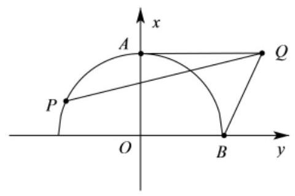

6、已知直线 $l : {mx} + y + {3m} - \sqrt{3} = 0$ 与圆 ${x}^{2} + {y}^{2} = {12}$ 交于 $A, B$ 两点.且 $A, B$ 在 $x$ 轴同侧,过 $A, B$ 分别做 $x$ 轴的垂线交 $x$ 轴于 $C, D$ 两点, $O$ 是坐标原点,若 $\left| {CD}\right|  = 3$ ,则 $\angle {AOB} =$ ( )

A. $\frac{\pi }{6}$ B. $\frac{\pi }{3}$ C. $\frac{\pi }{2}$ D. $\frac{2\pi }{3}$

【答案】B

【解析】因为直线的方程 $l : {mx} + y + {3m} - \sqrt{3} = 0$ 化为 $m\left( {x + 3}\right)  + y - \sqrt{3} = 0$ ,所以直线 $l$ 恒过点 $\left( {-3,\sqrt{3}}\right)$ , 而点 $\left( {-3,\sqrt{3}}\right)$ 满足 ${x}^{2} + {y}^{2} = {12}$ ,所以点 $\left( {-3,\sqrt{3}}\right)$ 在圆 ${x}^{2} + {y}^{2} = {12}$ 上，不妨设点 $A\left( {-3,\sqrt{3}}\right)$ ，又 $\left| {CD}\right|  = 3$ ， 所以点 $B\left( {0,2\sqrt{3}}\right)$ ,所以 $\left| {AB}\right|  = \sqrt{{\left( -3\right) }^{2} + {\left( \sqrt{3} - 2\sqrt{3}\right) }^{2}} = 2\sqrt{3}$ ,又圆 ${x}^{2} + {y}^{2} = {12}$ 的半径为 $2\sqrt{3}$ ,所以 $\bigtriangleup {AOB}$ 是等边三角形,所以 $\angle {AOB} = \frac{\pi }{3}$ . 故选: B.

7、已知复数 $z$ 满足条件 $\left| z\right|  = 1$ ，那么 $\left| {z + 2\sqrt{2} + i}\right|$ 的最大值为___.

【答案】4

【解析】因为 $\left| z\right|  = 1$ ,所以复数 $z$ 对应的点在单位圆上,

$\left| {z + 2\sqrt{2} + i}\right|$ 表示复数 $z$ 对应的点与复数 $- 2\sqrt{2} - i$ 对应的点 $M\left( {-2\sqrt{2}, - 1}\right)$ 之间的距离,

而 $\left| {OM}\right|  = \sqrt{8 + 1} = 3$ . 所以 $\left| {z + 2\sqrt{2} + i}\right|$ 的最大值为 $\left| {OM}\right|  + r = \left| {OM}\right|  + 1 = 4$ . 故答案为:4

8、若椭圆 $\frac{{x}^{2}}{m} + \frac{{y}^{2}}{3} = 1$ 的一个焦点在抛物线 ${y}^{2} = {8x}$ 的准线上,则 $m =$ ___.

【答案】7

【解析】解: 抛物线 ${y}^{2} = {8x}$ 的准线为直线 $x =  - 2$ ,

因为椭圆 $\frac{{x}^{2}}{m} + \frac{{y}^{2}}{3} = 1$ 的一个焦点在抛物线 ${y}^{2} = {8x}$ 的准线上,所以可得 $c = 2$ ,所以 $m = {a}^{2} = {b}^{2} + {c}^{2} = 3 + {2}^{2} = 7$ ,故答案为:7

9、中心在原点，焦点在 $x$ 轴上，且一个焦点在直线 ${3x} - {4y} + {12} = 0$ 上的等轴双曲线的方程是___.

【答案】 ${x}^{2} - {y}^{2} = 8$

【解析】令 $y = 0$ ,得 $x =  - 4$ ,又双曲线焦点在 $x$ 轴上, $\therefore$ 等轴双曲线的一个焦点为 $\left( {-4,0}\right)$ , $\therefore c = 4,{a}^{2} = {b}^{2} = \frac{1}{2}{c}^{2} = 8$ ,故等轴双曲线的方程为 ${x}^{2} - {y}^{2} = 8$ . 故答案为: ${x}^{2} - {y}^{2} = 8$

10、在平面直角坐标系 ${xOy}$ 中,椭圆 $\frac{{x}^{2}}{{a}^{2}} + \frac{{y}^{2}}{9} = 1\left( {a > 3}\right)$ 与为双曲线 $\frac{{x}^{2}}{{m}^{2}} - \frac{{y}^{2}}{4} = 1$ 有公共焦点 ${F}_{1},{F}_{2}$ . 设 $P$ 是椭圆与双曲线的一个交点，则 $\bigtriangleup  P{F}_{1}{F}_{2}$ 的面积是___.

【答案】 6 .

【解析】根据对称性,不妨设 $P$ 在第一象限. 由题设可知 ${\left| {F}_{1}{F}_{2}\right| }^{2} = 4\left( {{a}^{2} - 9}\right)  = 4\left( {{m}^{2} + 4}\right)  = 4{c}^{2}$ .

即 ${a}^{2} - {m}^{2} = {13},{a}^{2} - {c}^{2} = 9,{c}^{2} - {m}^{2} = 4$ .

根据椭圆与双曲线的定义得 $\left\{  {\begin{array}{l} \left| {P{F}_{1}}\right|  + \left| {P{F}_{2}}\right|  = {2a} \\  \left| {P{F}_{1}}\right|  - \left| {P{F}_{2}}\right|  = {2m} \end{array} \Rightarrow  \left\{  \begin{array}{l} \left| {P{F}_{1}}\right|  = a + m \\  \left| {P{F}_{2}}\right|  = a - m \end{array}\right. }\right.$ ,

在 $\bigtriangleup P{F}_{1}{F}_{2}$ 中,由余弦定理得

$\cos \angle {F}_{1}P{F}_{2} = \frac{{\left| PF\right| }_{1}^{2} + {\left| P{F}_{2}\right| }^{2} - {\left| {F}_{1}{F}_{2}\right| }^{2}}{2 \cdot  {\left| PF\right| }_{1} \cdot  \left| {P{F}_{2}}\right| } = \frac{{\left( a + m\right) }^{2} + {\left( a - m\right) }^{2} - 4{c}^{2}}{2\left( {a + m}\right) \left( {a - m}\right) }$

$= \frac{{a}^{2} + {m}^{2} - 2{c}^{2}}{{a}^{2} - {m}^{2}} = \frac{\left( {{a}^{2} - {c}^{2}}\right)  - \left( {{c}^{2} - {m}^{2}}\right) }{{a}^{2} - {m}^{2}} = \frac{5}{13}.$

所以, $\sin \angle {F}_{1}P{F}_{2} = \frac{12}{13},{S}_{\bigtriangleup P{F}_{1}{F}_{2}} = \frac{1}{2} \cdot  \left| {P{F}_{1}}\right|  \cdot  \left| {P{F}_{2}}\right|  \cdot  \sin \angle {F}_{1}P{F}_{2} = \frac{1}{2} \times  \left( {{a}^{2} - {m}^{2}}\right)  \times  \frac{12}{13} = 6$ . 故答案为: 6

11、已知 ${F}_{1}\left( {-3,0}\right) ,{F}_{2}\left( {3,0}\right)$ 为双曲线 $C : \frac{{x}^{2}}{{a}^{2}} - \frac{{y}^{2}}{{b}^{2}} = 1\left( {a > 0, b > 0}\right)$ 的左、右焦点,双曲线 $C$ 的渐近线上存在点 $P$ 满足 $\left| {P{F}_{1}}\right|  = 2\left| {P{F}_{2}}\right|$ ，则 $b$ 的最大值为___.

【答案】 $\frac{12}{5}$

【解析】设 $P\left( {x, y}\right)$ ,由 $\left| {P{F}_{1}}\right|  = 2\left| {P{F}_{2}}\right|$ 可得 ${\left( x + 3\right) }^{2} + {y}^{2} = 4\left\lbrack  {{\left( x - 3\right) }^{2} + {y}^{2}}\right\rbrack$ ,整理得 ${\left( x - 5\right) }^{2} + {y}^{2} = {16}$ 即点 $P$ 在以 $\left( {5,0}\right)$ 为圆心,4 为半径的圆上. 又点 ${F}_{2}$ 到双曲线 $C$ 的渐近线的距离为 $b$

所以当双曲线 $C$ 的渐近线与圆 ${\left( x - 5\right) }^{2} + {y}^{2} = {16}$ 相切时, $b$ 取得最大值,此时 $\frac{b}{3} = \frac{4}{5}$ ,解得 $b = \frac{12}{5}$ . 故答案为: $\frac{12}{5}$ .

## (二)圆锥曲线中范围问题

## 知识梳理

1、几何转化代数法: 若题目的条件和结论能明显体现几何特征和意义, 则考虑利用圆锥曲线的定义、图形、 几何性质来解决;

2、函数取值法:若题目的条件和结论的几何特征不明显，则可以建立目标函数，再求这个函数的最值(或值域)，常用方法:(1)配方法; (2)基本不等式法; (3)单调性法; (4)三角换元法; (5)导数法等, 要特别注意自变量的取值范围.

3、此类问题通过联立直线方程与圆锥曲线方程的方程组，应用一元二次方程根与系数的关系进行求解，此类问题易错点是复杂式子的变形能力不足, 导致错解.

## 例题精讲

【例 6】如图,已知曲线 ${C}_{1} : {y}^{2} = {4x}$ ,曲线 ${C}_{2} : \frac{{x}^{2}}{{a}^{2}} + \frac{{y}^{2}}{{b}^{2}} = 1\left( {a > b > 0}\right)$ 的左右焦点是 ${F}_{1},{F}_{2}$ ,且 ${F}_{2}$ 也是 ${C}_{1}$ 的焦点,点 $P$ 是 ${C}_{1}$ 与 ${C}_{2}$ 的在第一象限内的公共点且 $\left| {P{F}_{2}}\right|  = \frac{5}{3}$ ,过 ${F}_{2}$ 的直线 $l$ 分别与曲线 ${C}_{1}\text{ 、 }{C}_{2}$ 交于点 $A, B$ 和 $M, N$ .

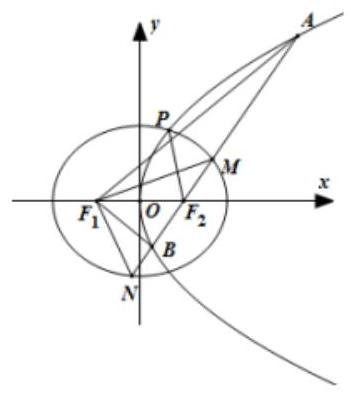

(1)求点 $P$ 的坐标以及 ${C}_{2}$ 的方程；

(2)若 $\bigtriangleup  {F}_{1}{AB}$ 与 $\bigtriangleup  {F}_{1}{MN}$ 面积分别是 ${S}_{1}$ 、 ${S}_{2}$ ，求 $\frac{{S}_{2}}{{S}_{1}}$ 的取值范围.

【难度】 $\star   \star   \star$

【答案】( 1 ) $P\left( {\frac{2}{3},\frac{2\sqrt{6}}{3}}\right) ;\frac{{x}^{2}}{4} + \frac{{y}^{2}}{3} = 1;$ ( 2 ) $\left( {0,\frac{3}{4}}\right\rbrack$ .

【解析】解: (1) ${F}_{2}\left( {1,0}\right)$ ,设 $P\left( {{x}_{0},{y}_{0}}\right)$ ,据题意有 $\left| {P{F}_{2}}\right|  = {x}_{0} + 1 = \frac{5}{3}$ ,则 ${x}_{0} = \frac{2}{3},\therefore P\left( {\frac{2}{3},\frac{2\sqrt{6}}{3}}\right)$ , 点 $P$ 在椭圆上及 ${F}_{2}$ 就是 ${C}_{1}$ 的焦点,则 $\left\{  \begin{matrix} {a}^{2} - {b}^{2} = 1 \\  \frac{4}{9{a}^{2}} + \frac{24}{9{b}^{2}} = 1 \end{matrix}\right.$ ,解之得: $\left\{  \begin{array}{l} {a}^{2} = 4 \\  {b}^{2} = 3 \end{array}\right.$ ,所以 ${C}_{2}$ 的方程是 $\frac{{x}^{2}}{4} + \frac{{y}^{2}}{3} = 1$ .

( 2 )易知 $\frac{{S}_{1}}{{S}_{2}} = \frac{\left| AB\right| }{\left| MN\right| }$ ，当 $l$ 不垂直于 $x$ 轴时，设 $l$ 的方程是 $y = k\left( {x - 1}\right) \left( {k \neq  0}\right)$ ，

联立 $\left\{  \begin{matrix} y = k\left( {x - 1}\right) \\  {y}^{2} = {4x} \end{matrix}\right.$ ,得 ${k}^{2}{x}^{2} - \left( {2{k}^{2} + 4}\right) x + {k}^{2} = 0,{\Delta }_{1} = {\left( 2{k}^{2} + 4\right) }^{2} - 4{k}^{4} > 0$ ,

设 $A\left( {{x}_{1},{y}_{1}}\right) , B\left( {{x}_{2},{y}_{2}}\right)$ ,则 ${x}_{1} + {x}_{2} = \frac{2{k}^{2} + 4}{{k}^{2}},\left| {AB}\right|  = {x}_{1} + {x}_{2} + 2 = \frac{4\left( {{k}^{2} + 1}\right) }{{k}^{2}}$ ;

联立 $\left\{  \begin{matrix} y = k\left( {x - 1}\right) \\  3{x}^{2} + 4{y}^{2} - {12} = 0 \end{matrix}\right.$ 得: $\left( {3 + 4{k}^{2}}\right) {x}^{2} - 8{k}^{2}x + 4{k}^{2} - {12} = 0$ ,

${\Delta }_{2} = {64}{k}^{4} - 4\left( {3 + 4{k}^{2}}\right) \left( {4{k}^{2} - {12}}\right)  = {144}\left( {1 + {k}^{2}}\right)  > 0,$

设 $M\left( {{x}_{3},{y}_{3}}\right) , N\left( {{x}_{4},{y}_{4}}\right)$ ,则 ${x}_{3} + {x}_{4} = \frac{8{k}^{2}}{3 + 4{k}^{2}},{x}_{3}{x}_{4} = \frac{4{k}^{2} - {12}}{3 + 4{k}^{2}}$ ,

$\left| {MN}\right|  = \sqrt{\left( {1 + {k}^{2}}\right) \left\lbrack  {{\left( {x}_{3} + {x}_{4}\right) }^{2} - 4{x}_{3}{x}_{4}}\right\rbrack  } = \frac{{12}\left( {1 + {k}^{2}}\right) }{3 + 4{k}^{2}}$ ,则 $\frac{{S}_{1}}{{S}_{2}} = \frac{\left| AB\right| }{\left| MN\right| } = \frac{3 + 4{k}^{2}}{3{k}^{2}} = \frac{4}{3} + \frac{1}{{k}^{2}} \in  \left( {\frac{4}{3}, + \infty }\right)$ ,

当 $l$ 垂直于 $x$ 轴时,易知 $\left| {AB}\right|  = 4,\left| {MN}\right|  = \frac{2{b}^{2}}{a} = 3$ ,此时 $\frac{{S}_{1}}{{S}_{2}} = \frac{\left| AB\right| }{\left| MN\right| } = \frac{4}{3}$ ,所以 $\frac{{S}_{1}}{{S}_{2}} \in  \left\lbrack  {\frac{4}{3}, + \infty }\right)$ .

综上所述 $\frac{{S}_{2}}{{S}_{1}}$ 的取值范围是 $\left( {0,\frac{3}{4}}\right\rbrack$ .

【例 7】已知双曲线 ${C}_{1} : {x}^{2} - \frac{{y}^{2}}{{b}^{2}} = 1\left( {b > 0}\right) , A\left( {{x}_{A},{b}^{2}}\right)$ 是 ${C}_{1}$ 上位于第二象限内的一点,曲线 ${C}_{2}$ 是以点 $C\left( {0,{b}^{2} + 1}\right)$ 为圆心过点 $A$ 的圆上满足 $y > {b}^{2}$ 的部分,曲线 $\Gamma$ 由 ${C}_{1}$ 上满足 $y \leq  {b}^{2}$ 的部分和 ${C}_{2}$ 组成,记 ${F}_{1}\text{ 、 }{F}_{2}$ 为 ${C}_{1}$ 的左、右焦点.

(1)若直线 ${AC}$ 与 $\Gamma$ 恰有两个公共点，求 $b$ 的最小值；

(2)设 $b = 1$ ，过 $A$ 的直线 $l$ 与 $\Gamma$ 相交于另外两点 $P$ 、 $Q$ ，求 $l$ 的倾斜角的取值范围.

【难度】 $\star   \star   \star$

【答案】(1) $\sqrt{\frac{\sqrt{5} - 1}{2}}$ ；(2) $\frac{\pi }{4} < \alpha  < \frac{3\pi }{4}$ 且 $\alpha  \neq  \pi  - \arctan \sqrt{2}$ .

【解析】(1)直线 ${AC}$ 显然与满足 $y \geq  {b}^{2}$ 的部分有两个交点，所以与 ${C}_{1}$ 上满足 $y < {b}^{2}$ 的部分无交点， ${k}_{AC} =  - \frac{1}{{x}_{A}},$

$\because A\left( {{x}_{A},{b}^{2}}\right)$ 在 ${x}^{2} - \frac{{y}^{2}}{{b}^{2}} = 1$ 上, $\therefore {x}_{A}^{2} - \frac{{b}^{4}}{{b}^{2}} = 1,\therefore {x}_{A} =  - \sqrt{1 + {b}^{2}}\;\left( {{x}_{A} < 0}\right)$ ,

$\therefore {k}_{AC} = \frac{1}{\sqrt{1 + {b}^{2}}}$ ,双曲线的渐近线的斜率为 $\pm  b$ ,当 ${k}_{AC} \leq  b$ 时,直线 ${AC}$ 与 ${C}_{1}$ 上满足 $y < {b}^{2}$ 的部分无交点, $\therefore \frac{1}{\sqrt{1 + {b}^{2}}} \leq  b$ ,即 $\frac{1}{1 + {b}^{2}} \leq  {b}^{2}$ ,解得 ${b}^{2} \geq  \frac{-1 + \sqrt{5}}{2},\therefore b$ 的最小值为 $\sqrt{\frac{-1 + \sqrt{5}}{2}}$ ;

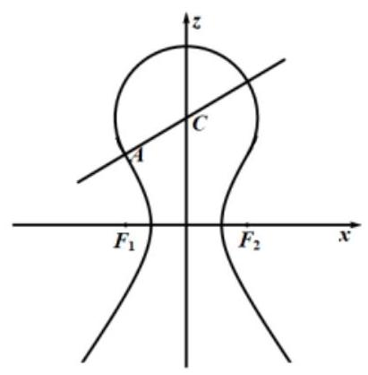

(2)当 $b = 1$ 时,双曲线的方程为 ${x}^{2} - {y}^{2} = 1, A\left( {-\sqrt{2},1}\right) , C\left( {0,2}\right)$ ,

设 $l$ 的倾斜角为 $\alpha$ ,当 $\alpha  = \frac{\pi }{2}$ 时,满足题意;

当 $\alpha$ 为锐角时,因为双曲线 ${x}^{2} - {y}^{2} = 1$ 渐近线的斜率为 $\pm  1,\therefore \frac{\pi }{4} < \alpha  < \frac{\pi }{2}$ ,

当 $\alpha$ 为钝角时,考虑直线 $l$ 与圆 $C$ 相切,设 $l : y - 1 = k\left( {x + \sqrt{2}}\right)$ ,即 ${kx} - y + 1 + \sqrt{2}k = 0$ ,

则 $\frac{\left| -2 + \sqrt{2}k + 1\right| }{\sqrt{1 + {k}^{2}}} = r = \left| {AC}\right|  = \sqrt{3}$ ,解得 $k =  - \sqrt{2} <  - 1$ ,说明 $l$ 与双曲线在第四象限不相交,

所以直线 $l$ 与双曲线在第二、三象限相交,而 $A$ 在第二象限,

当 $k =  - 1$ 时,只有一个交点 $A$ ,所以 $k <  - 1$ 且 $k \neq   - \sqrt{2}$ 符合要求,所以 $\frac{\pi }{2} < \alpha  < \frac{3}{4}\pi$ 且 $\alpha  \neq  \pi  - \arctan \sqrt{2}$ .

巩固训练

1、已知 $O$ 为坐标原点，椭圆 $C : \frac{{x}^{2}}{4} + {y}^{2} = 1$ ，点 $D$ ， $M$ ， $N$ 为 $C$ 上的动点， $O$ ， $M$ ， $N$ 三点共线，直线 ${DM}$ ， ${DN}$ 的斜率分别为 ${k}_{1},{k}_{2}\left( {{k}_{1}{k}_{2} \neq  0}\right)$ . 当直线 ${DM}$ 过点 $\left( {1,0}\right)$ 时，求 $\frac{1}{\left| DN\right| } + \frac{19}{2\sqrt{1 + {k}_{2}^{2}}}$ 的最小值；

【答案】 8

【解析】由题意,直线 ${DM}$ 过点 $\left( {1,0}\right)$ ,设 ${DM}$ 的方程为 $y = {k}_{1}\left( {x - 1}\right)$ ,即 ${k}_{1}x - y - {k}_{1} = 0$

联立方程组 $\left\{  \begin{matrix} {k}_{1}x - y - {k}_{1} = 0 \\  \frac{{x}^{2}}{4} + {y}^{2} = 1 \end{matrix}\right.$ ,整理得 $\left( {4{k}_{1}^{2} + 1}\right) {x}^{2} - 8{k}_{1}^{2}x + 4{k}_{1}^{2} - 4 = 0$ ,可得

${x}_{M} + {x}_{D} = \frac{8{k}_{1}^{2}}{4{k}_{1}^{2} + 1},{x}_{M} \cdot  {x}_{D} = \frac{4{k}_{1}^{2} - 4}{4{k}_{1}^{2} + 1},$

则 ${y}_{M} + {y}_{D} = {k}_{1}\left( {{x}_{1} - 1}\right)  + {k}_{1}\left( {{x}_{2} + 1}\right)  = \frac{-2{k}_{1}}{4{k}_{1}^{2} + 1}$ ,且 ${x}_{D} - {x}_{N} = \frac{8{k}_{1}^{2}}{4{k}_{1}^{2} + 1},{y}_{D} - {y}_{N} = \frac{-2{k}_{1}}{4{k}_{1}^{2} + 1}$

所以 $\left| {DN}\right|  = \sqrt{{\left( {x}_{D} - {x}_{N}\right) }^{2} + {\left( {y}_{D} - {y}_{N}\right) }^{2}} = \sqrt{\frac{{64}{k}_{1}^{4} + 4{k}_{1}^{2}}{{\left( 4{k}_{1}^{2} + 1\right) }^{2}}}$

$\sqrt{\frac{{64}{\left( -\frac{1}{4{k}_{2}}\right) }^{4} + 4{\left( -\frac{1}{4{k}_{2}}\right) }^{2}}{{\left( 4{\left( -\frac{1}{4{k}_{2}}\right) }^{2} + 1\right) }^{2}}} = \sqrt{\frac{{64} + {64}{k}_{2}^{2}}{{\left( 4 + {16}{k}_{2}^{2}\right) }^{2}}} = \sqrt{\frac{4 + 4{k}_{2}^{2}}{{\left( 4{k}_{2}^{2} + 1\right) }^{2}}} = \frac{2\sqrt{{k}_{2}^{2} + 1}}{4{k}_{2}^{2} + 1}$

所以 ${DN} + \frac{19}{2\sqrt{1 + {k}_{2}^{2}}} = \frac{2\sqrt{{k}_{2}^{2} + 1}}{4{k}_{2}^{2} + 1} + \frac{19}{2\sqrt{1 + {k}_{2}^{2}}}$

令 $\sqrt{{k}_{2}^{2} + 1} = t$ ,则 ${k}_{2}^{2} = {t}^{2} - 1$ ,又由 $\frac{1}{DN} + \frac{19}{2\sqrt{{k}_{2}^{2} + 1}} = \frac{2{t}^{2} + 8}{t} = {2t} + \frac{8}{t} \geq  8$ ,当且仅当 $t = 2,{k}_{2}^{2} = 3$ 时,等号成立,

所以 $\frac{1}{\left| DN\right| } + \frac{19}{2\sqrt{1 + {k}_{2}^{2}}}$ 的最小值为 8 .

2、已知椭圆 ${C}_{1} : \frac{{x}^{2}}{4} + {y}^{2} = 1,{F}_{1}\text{ 、 }{F}_{2}$ 为 ${C}_{1}$ 的左、右焦点.

(1)求椭圆 ${C}_{1}$ 的焦距;

(2)点 $Q\left( {\sqrt{2},\frac{\sqrt{2}}{2}}\right)$ 为椭圆 ${C}_{1}$ 一点，与 ${OQ}$ 平行的直线 $l$ 与椭圆 ${C}_{1}$ 交于两点 $A$ 、 $B$ ，若 $\bigtriangleup  {QAB}$ 面积为 1， 求直线 $l$ 的方程；

(3)已知椭圆 ${C}_{1}$ 与双曲线 ${C}_{2} : {x}^{2} - {y}^{2} = 1$ 在第一象限的交点为 $M\left( {{x}_{M},{y}_{M}}\right)$ ，椭圆 ${C}_{1}$ 和双曲线 ${C}_{2}$ 上满足 $\left| x\right|  \geq  \left| {x}_{M}\right|$ 的所有点 $\left( {x, y}\right)$ 组成曲线 $C$ . 若点 $N$ 是曲线 $C$ 上一动点,求 $\overrightarrow{N{F}_{1}} \cdot  \overrightarrow{N{F}_{2}}$ 的取值范围.

【答案】( 1 ) $2\sqrt{3}$ ；( 2 ) $y = \frac{1}{2}x \pm  1$ ；( 3 ) $\left\lbrack  {-\frac{4}{5,} + \infty }\right)$

【解析】(1)由椭圆 ${C}_{1}$ 的方程知: $c = \sqrt{{a}^{2} - {b}^{2}} = 3$ ,即焦距为 ${2c} = 2\sqrt{3}$ .

(2)设 $l : y = \frac{1}{2}x + m$ ，代入 ${x}^{2} + 4{y}^{2} = 4$ 得 ${x}^{2} + {2mx} + 2{m}^{2} - 2 = 0$ ， 由 $\Delta  = 4{m}^{2} - 8\left( {{m}^{2} - 1}\right)  = 8 - 4{m}^{2} > 0$ 得 $\left| m\right|  < \sqrt{2},{x}_{1} + {x}_{2} =  - {2m},{x}_{1}{x}_{2} = 2{m}^{2} - 2$ , 所以 ${AB} = \sqrt{1 + {k}^{2}} \cdot  \left| {{x}_{1} - {x}_{2}}\right|  = \frac{\sqrt{5}}{2} \times  2\sqrt{2 - {m}^{2}} = \sqrt{{10} - 5{m}^{2}}$ , 所以 $Q$ 到直线 $l$ 的距离 $d = \frac{\left| m\right| }{\frac{\sqrt{5}}{2}}$ ,由 ${S}_{eQAB} = \frac{1}{2}d \cdot  \left| {AB}\right|  = \left| m\right|  \cdot  \sqrt{2 - {m}^{2}} = 1$ ,得 $m =  \pm  1$ ,所以 $l : y = \frac{1}{2}x \pm  1$ (3)由 $\left\{  \begin{array}{l} {x}^{2} + 4{y}^{2} = 4 \\  {x}^{2} - {y}^{2} = 1 \end{array}\right.$ 解得 $\left\{  \begin{array}{l} {x}_{M} = \frac{2\sqrt{10}}{5} \\  {y}_{M} = \frac{\sqrt{15}}{5} \end{array}\right.$ ，设 $N\left( {x, y}\right)$ 是曲线 $C$ 上一点，又 ${F}_{1}\left( {-\sqrt{3},0}\right) ,{F}_{2}\left( {\sqrt{3},0}\right)$ ， $\overrightarrow{N{F}_{1}} = \left( {-\sqrt{3} - x, - y}\right) ,\overrightarrow{N{F}_{2}} = \left( {\sqrt{3} - x, - y}\right) ,\therefore \overrightarrow{N{F}_{1}} \cdot  \overrightarrow{N{F}_{2}} = {x}^{2} + {y}^{2} - 3,\left( {\left| x\right|  \geq  \frac{2\sqrt{10}}{5}}\right)$ ,

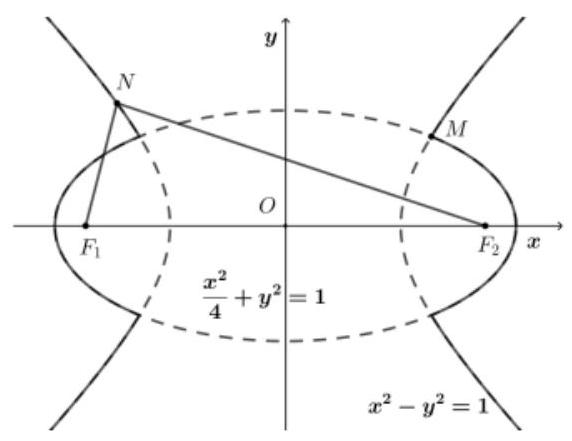

当 $N$ 在曲线 ${x}^{2} + 4{y}^{2} = 4\left( {\left| x\right|  \geq  \left| {x}_{M}\right| }\right)$ 上时, $\overline{N{F}_{1}} \cdot  \overline{N{F}_{2}} = 1 - 3{y}^{2}$ ,

当 $y = \frac{\sqrt{15}}{5}$ 时, ${\left( \overline{N{F}_{1}} \cdot  \overline{N{F}_{2}}\right) }_{\min } =  - \frac{4}{5}$ ,当 $y = 0$ 时, ${\left( \overline{N{F}_{1}} \cdot  \overline{N{F}_{2}}\right) }_{\max } = 1$ ,所以 $\overline{N{F}_{1}} \cdot  \overline{N{F}_{2}} \in  \left\lbrack  {-\frac{4}{5},1}\right\rbrack$ ;

当 $N$ 在曲线 ${x}^{2} - {y}^{2} = 1\left( {\left| x\right|  \geq  \left| {x}_{M}\right| }\right)$ 上时, $\overline{N{F}_{1}} \cdot  \overline{N{F}_{2}} = 2{y}^{2} - 2$ ;

当 $y = \frac{\sqrt{15}}{5}$ 时, ${\left( \overline{N{F}_{1}} \cdot  \overline{N{F}_{2}}\right) }_{\min } =  - \frac{4}{5},\overline{N{F}_{1}} \cdot  \overline{N{F}_{2}} \in  \left\lbrack  {-\frac{4}{5}, + \infty }\right)$ ; 综上, $\overline{N{F}_{1}} \cdot  \overline{N{F}_{2}} \in  \left\lbrack  {-\frac{4}{5}, + \infty }\right)$ .

## (三) 圆锥曲线中定值问题

## 知识梳理

一选:选择参变量. 需要证明为定值的量在通常情况下，照理是个变量，它应该是随着某一个量的变化而变化, 可选择这个量为参变量 (有时会选择两个量为参变量, 利用辅助条件消去其中之一).

二求:求出函数的解析式. 即把需要证明为定值的量表示成上述参变量的函数

三定值:化简解析式得到定值. 有题目的结论可知要证明为定值的量必与参变量的大小无关, 故求出的函数必为常数函数, 所以只要对函数作相应的化简.

## 例题精讲

【例 8】已知双曲线 $C : \frac{{x}^{2}}{{a}^{2}} - \frac{{y}^{2}}{{b}^{2}} = 1$ 过点 $M\left( {3,\sqrt{2}}\right)$ ,且右焦点为 $F\left( {2,0}\right)$ .

(1)求双曲线 $C$ 的方程；

(2)过点 $F$ 的直线 $l$ 与双曲线 $C$ 的右支交于 $A, B$ 两点，交 $y$ 轴于点 $P$ ，若 $\overrightarrow{PA} = m\overrightarrow{AF}$ ， $\overrightarrow{PB} = n\overrightarrow{BF}$ ，求证: $m + n$ 为定值.

【难度】 $\star   \star   \star$

【答案】(1) $\frac{{x}^{2}}{3} - {y}^{2} = 1$ ；(2)证明见解析；

【解析】(1)由题意，双曲线 $C : \frac{{x}^{2}}{{a}^{2}} - \frac{{y}^{2}}{{b}^{2}} = 1$ 过点 $M\left( {3,\sqrt{2}}\right)$ ，且右焦点为 $F\left( {2,0}\right)$ .

可得 $\frac{9}{{a}^{2}} - \frac{2}{{b}^{2}} = 1$ 且 $c = 2$ ,又由 ${c}^{2} = {a}^{2} + {b}^{2}$ ,解得 ${a}^{2} = 3,{b}^{2} = 1$ ,所以双曲线 $C$ 的方程为 $\frac{{x}^{2}}{3} - {y}^{2} = 1$ ;

(2)设 $A\left( {{x}_{1},{y}_{1}}\right) , B\left( {{x}_{2},{y}_{2}}\right)$ ，由题意得直线 $l$ 的斜率存在，所以设直线 $l : y = k\left( {x - 2}\right)$ ，所以 $P\left( {0, - {2k}}\right)$ ， 由 $\left\{  \begin{array}{l} \frac{{x}^{2}}{3} - {y}^{2} = 1 \\  y = k\left( {x - 2}\right)  \end{array}\right.$ ,得 $\left( {3{k}^{2} - 1}\right) {x}^{2} - {12}{k}^{2}x + {12}{k}^{2} + 3 = 0$ ,所以 ${x}_{1} + {x}_{2} = \frac{{12}{k}^{2}}{3{k}^{2} - 1},{x}_{1}{x}_{2} = \frac{{12}{k}^{2} + 3}{3{k}^{2} - 1}$ ,

由 $\overrightarrow{PA} = m\overrightarrow{AF},\overrightarrow{PB} = n\overrightarrow{BF}$ ,可得 ${x}_{1} = m\left( {2 - {x}_{1}}\right) ,{x}_{2} = n\left( {2 - {x}_{2}}\right)$ ,

所以 $m + n = \frac{{x}_{1}}{2 - {x}_{1}} + \frac{{x}_{2}}{2 - {x}_{2}} = \frac{{x}_{1}\left( {2 - {x}_{2}}\right)  + {x}_{2}\left( {2 - {x}_{1}}\right) }{\left( {2 - {x}_{1}}\right) \left( {2 - {x}_{2}}\right) } = \frac{2\left( {{x}_{1} + {x}_{2}}\right)  - 2{x}_{1}{x}_{2}}{4 - 2\left( {{x}_{1} + {x}_{2}}\right)  + {x}_{1}{x}_{2}}$

$= \frac{{24}{k}^{2} - 2\left( {{12}^{2} + 3}\right) }{4\left( {3{k}^{2} - 1}\right)  - {24}{k}^{2} + {12}{k}^{2} + 3} = \frac{-6}{-1} = 6$ ,所以 $m + n = 6$ ,为定值.

【例 9】已知 $O$ 为坐标原点,椭圆 $C : \frac{{x}^{2}}{4} + {y}^{2} = 1$ ,点 $D, M, N$ 为 $C$ 上的动点, $O, M, N$ 三点共线,直线 ${DM},{DN}$ 的斜率分别为 ${k}_{1},{k}_{2}\left( {{k}_{1}{k}_{2} \neq  0}\right)$ .

(1)证明: ${k}_{1}{k}_{2} =  - \frac{1}{4}$ ；

(2)若 ${k}_{1} + {k}_{2} = 0$ ，证明: ${\left| OD\right| }^{2} + {\left| OM\right| }^{2}$ 为定值.

【难度】 $\star   \star   \star$

【答案】(1)证明见解析；(2)证明见解析.

【解析】(1)由题意知,点 $M, O, N$ 三点共线,且 ${MN}$ 在椭圆 $C$ 上,可得 $M, N$ 关于原点对称,设 $M\left( {{x}_{0},{y}_{0}}\right)$ , $D\left( {{x}_{1},{y}_{1}}\right)$ ,则 $N\left( {-{x}_{0}, - {y}_{0}}\right)$ ,由点 $M\left( {{x}_{0},{y}_{0}}\right)$ 和 $D\left( {{x}_{1},{y}_{1}}\right)$ 在曲线 $C$ 上,可得 $\frac{{x}_{0}^{2}}{4} + {y}_{0}^{2} = 1,\frac{{x}_{1}^{2}}{4} + {y}_{1}^{2} = 1$ , 即 ${y}_{0}^{2} = 1 - \frac{{x}_{0}^{2}}{4},{y}_{1}^{2} = 1 - \frac{{x}_{1}^{2}}{4}$ ,可得 ${k}_{1}{k}_{2} = \frac{{y}_{1} - {y}_{0}}{{x}_{1} - {x}_{0}} \cdot  \frac{{y}_{1} + {y}_{0}}{{x}_{1} + {x}_{0}} = \frac{{y}_{1}^{2} - {y}_{0}^{2}}{{x}_{1}^{2} - {x}_{0}^{2}} = \frac{-\frac{1}{4}\left( {{x}_{1}^{2} - {x}_{0}^{2}}\right) }{{x}_{1}^{2} - {x}_{0}^{2}} =  - \frac{1}{4}$ .

(2)由(1)知 ${k}_{1}{k}_{2} =  - \frac{1}{4}$ ，又由 ${k}_{1} + {k}_{2} = 0$ ，可得 ${k}_{1} = \frac{1}{2},{k}_{2} =  - \frac{1}{2}$ 或 ${k}_{1} =  - \frac{1}{2},{k}_{2} = \frac{1}{2}$ ，

不妨设 ${k}_{1} = \frac{1}{2},{k}_{2} =  - \frac{1}{2}$ ,设直线 ${DM} : y = \frac{1}{2}x + m$ ,联立方程组 $\left\{  \begin{array}{l} y = \frac{1}{2}x + m \\  \frac{{x}^{2}}{4} + {y}^{2} = 1 \end{array}\right.$ ,整理得

${x}^{2} + {2mx} + 2{m}^{2} - 2 = 0$

则 ${x}_{D} + {x}_{M} =  - {2m},{x}_{D} \cdot  {x}_{M} = 2{m}^{2} - 2$ ,所以 ${y}_{D}^{2} + {y}_{M}^{2} = 1 - \frac{{x}_{D}^{2}}{4} + 1 - \frac{{x}_{M}^{2}}{4} = 1$ ,

所以 $O{D}^{2} + O{M}^{2} = {x}_{D}^{2} + {y}_{D}^{2} + {x}_{M}^{2} + {y}_{M}^{2} = 4 + 1 = 5$ .

巩固训练

1、已知椭圆方程为 $\frac{{x}^{2}}{4} + \frac{{y}^{2}}{3} = 1$ ，直线 $l : x = 4$ 与 $x$ 轴的交点记为 $P$ ，过右焦点 $F$ 的直线与椭圆交于 $A$ ， $B$ 两点.

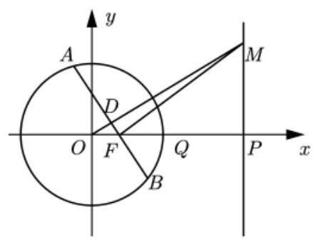

(1)设若 ${MF} \bot  {AB}$ 且交直线 $l$ 于 $M$ ，线段 ${AB}$ 中点为 $D$ ，求证: $O$ ， $D$ ， $M$ 三点共线；

(2)设 $Q$ 点的坐标为 $\left( {\frac{5}{2},0}\right)$ ，直线 ${BQ}$ 与直线 $l$ 交于点 $E$ ，试问 $\overline{EA} \cdot  \overline{EP}$ 是否为定值，若是，求出这个定值, 若不是, 请说明理由.

【答案】(1)证明见解析；(2)是； $\overrightarrow{EA} \cdot  \overrightarrow{EP}$ 为定值 0 .

【解析】(1) 由椭圆方程为 $\frac{{x}^{2}}{4} + \frac{{y}^{2}}{3} = 1$ 知,右焦点 $F$ 坐标 $\left( {1,0}\right)$ ,椭圆 $C$ 的右准线 $l$ 方程为 $x = 4$ ,点 $P$ 坐标 $\left( {4,0}\right)$ .

由 ${MF} \bot  {AB}$ 知,直线 ${AB}$ 的斜率不为 0,故设直线 ${AB}$ 的方程为 $x = {my} + 1$ ,

从而,直线 ${MF}$ 的方程为 $y =  - m\left( {x - 1}\right)$ ,令 $x = 4$ 得, $M$ 点坐标为 $\left( {4, - {3m}}\right)$ ,故直线 ${OM}$ 的方程为 $y =  - \frac{3m}{4}x$

联立方程组 $\left\{  \begin{array}{l} x = {my} + 1 \\  \frac{{x}^{2}}{4} + \frac{{y}^{2}}{3} = 1 \end{array}\right.$ ,消去 $y$ 得: $\left( {3{m}^{2} + 4}\right) {y}^{2} + {6my} - 9 = 0$ ,

设 $A\left( {{x}_{1},{y}_{1}}\right) , B\left( {{x}_{2},{y}_{2}}\right)$ ,即 ${y}_{1} + {y}_{2} = \frac{-{6m}}{3{m}^{2} + 4},{y}_{1} \cdot  {y}_{2} = \frac{-9}{3{m}^{2} + 4}$ ,

从而,线段 ${AB}$ 的中点 $D\left( {\frac{4}{3{m}^{2} + 4},\frac{-{3m}}{3{m}^{2} + 4}}\right)$ . 又线段 ${AB}$ 的中点 $D$ 的坐标满足直线 ${OM}$ 方程 $y =  - \frac{3m}{4}x$ , 所以点 $D$ 在直线 ${OM}$ 上，综上可知， $O$ ， $D$ ， $M$ 三点共线；

(2)当直线 ${AB}$ 的斜率为 0 时，点 $E$ 即为点 $P$ ，从而 $\overrightarrow{EP} = \overrightarrow{0}$ ，故 $\overrightarrow{EA} \cdot  \overrightarrow{EP} = 0$ .

直线 ${AB}$ 的斜率不为 0 时,由 (1) 知, ${y}_{1} + {y}_{2} = \frac{-{6m}}{3{m}^{2} + 4},{y}_{1} \cdot  {y}_{2} = \frac{-9}{3{m}^{2} + 4}$ ,

所以 ${y}_{1} + {y}_{2} = \frac{2}{3}m{y}_{1}{y}_{2}$ ,则 $m{y}_{2} = \frac{3\left( {{y}_{1} + {y}_{2}}\right) }{2{y}_{1}}$ ,直线 ${BQ}$ 的方程为 $y = \frac{{y}_{2}}{{x}_{2} - \frac{5}{2}}\left( {x - \frac{5}{2}}\right)$ ,又 ${x}_{2} = m{y}_{2} + 1$ ,

令 $x = 4$ ,得 $y = \frac{{y}_{2}}{{x}_{2} - \frac{5}{2}}\frac{3}{2} = \frac{3{y}_{2}}{2{x}_{2} - 5} = \frac{3{y}_{2}}{{2m}{y}_{2} - 3} = \frac{3{y}_{2}}{2?\frac{3\left( {{y}_{1} + {y}_{2}}\right) }{2{y}_{1}} - 3} = {y}_{1}$ ,

所以点 $E$ 的坐标为 $\left( {4,{y}_{1}}\right)$ ,即 ${EA} \bot  {EP}$ ,所以 $\overline{EA} \cdot  \overline{EP} = 0$ . 综上可知, $\overline{EA} \cdot  \overline{EP}$ 为定值 0 .

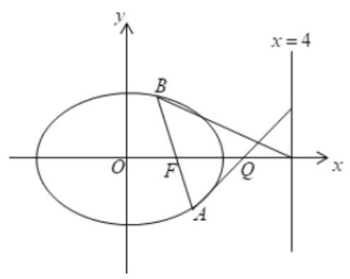

2、已知椭圆 $C : \frac{{x}^{2}}{{a}^{2}} + \frac{{y}^{2}}{{b}^{2}} = 1\left( {a > b > 0}\right)$ 的右焦点为 $F\left( {1,0}\right)$ ，且点 $P\left( {1,\frac{3}{2}}\right)$ 在椭圆 $C$ 上.

(1)求椭圆 $C$ 的标准方程；

(2)过椭圆 ${C}_{1} : \frac{{x}^{2}}{{a}^{2}} + \frac{{y}^{2}}{{b}^{2} - \frac{5}{3}} = 1$ 上异于其顶点的任意一点 $Q$ 作圆 $O : {x}^{2} + {y}^{2} = \frac{4}{3}$ 的两条切线,切点分别为 $M, N(M, N$ 不在坐标轴上),若直线 ${MN}$ 在 $x$ 轴, $y$ 轴上的截距分别为 $m, n$ ,证明: $\frac{1}{3{m}^{2}} + \frac{1}{{n}^{2}}$ 为定值;

(3)若 ${P}_{1},{P}_{2}$ 是椭圆 ${C}_{2} : \frac{{x}^{2}}{{a}^{2}} + \frac{3{y}^{2}}{{b}^{2}} = 1$ 上不同的两点， ${P}_{1}{P}_{2} \bot  x$ 轴，圆 $E$ 过 ${P}_{1},{P}_{2}$ 且椭圆 ${C}_{2}$ 上任意一点都不在圆 $E$ 内,则称圆 $E$ 为该椭圆的一个内切圆. 试问: 椭圆 ${C}_{2}$ 是否存在过左焦点 ${F}_{1}$ 的内切圆? 若存在,求出圆心 $E$ 的坐标; 若不存在,请说明理由.

【答案】( 1 ) $\frac{{x}^{2}}{4} + \frac{{y}^{2}}{3} = 1$ ；( 2 )证明见解析；( 3 )存在， $\left( {-\frac{\sqrt{3}}{2},0}\right)$ .

【解析】( 1 )由题意得， $c = 1$ . 所以 ${a}^{2} = {b}^{2} + 1$ ，又点 $P\left( {1,\frac{3}{2}}\right)$ 在椭圆 $C$ 上，所以 $\frac{1}{{a}^{2}} + \frac{9}{4{b}^{2}} = 1$ ，解 ${a}^{2} = 4,{b}^{2} = 3,$

所以椭圆 $C$ 的标准方程为 $\frac{{x}^{2}}{4} + \frac{{y}^{2}}{3} = 1$ ;

(2)由(1)知， ${C}_{1} : \frac{{x}^{2}}{4} + \frac{3{y}^{2}}{4} = 1$ ，设点 $Q\left( {{x}_{1},{y}_{1}}\right)$ ， $M\left( {{x}_{2},{y}_{2}}\right)$ ， $N\left( {{x}_{3},{y}_{3}}\right)$ 则直线 ${QM}$ 的方程为 ${x}_{2}x + {y}_{2}y = \frac{4}{3}$ ___①，直线 ${QN}$ 的方程为 ${x}_{3}x + {y}_{3}y = \frac{4}{3}$ ___②， 把点 $Q$ 的坐标代入 ①② 得 $\left\{  \begin{array}{l} {x}_{2}{x}_{1} + {y}_{2}{y}_{1} = \frac{4}{3} \\  {x}_{3}{x}_{1} + {y}_{3}{y}_{1} = \frac{4}{3} \end{array}\right.$ ，所以直线 ${MN}$ 的方程为 ${x}_{1}x + {y}_{1}y = \frac{4}{3}$ 令 $y = 0$ ,得 $m = \frac{4}{3{x}_{1}}$ ,令 $x = 0$ ,得 $n = \frac{4}{3{y}_{1}}$ . 所以 ${x}_{1} = \frac{4}{3m},{y}_{1} = \frac{4}{3n}$ ,又点 $Q$ 在圆 ${C}_{1}$ 上. 所以 ${\left( \frac{4}{3m}\right) }^{2} + 3{\left( \frac{4}{3n}\right) }^{2} = 4,\frac{1}{3{m}^{2}} + \frac{1}{{n}^{2}} = \frac{3}{4}$ ,为定值;

(3)由椭圆的对称性，不妨设 ${P}_{1}\left( {m, n}\right) ,{P}_{2}\left( {m, - n}\right)$ ，由题意知，点 $E$ 在 $x$ 轴上，

设点 $E\left( {t,0}\right)$ ,则圆 $E$ 的方程为 ${\left( x - t\right) }^{2} + {y}^{2} = {\left( m - t\right) }^{2} + {n}^{2}$

由椭圆的内切圆的定义知,椭圆上的点到点 $E$ 的距离的最小值是 $\left| {{P}_{1}E}\right|$ ,

设点 $M\left( {x, y}\right)$ 是椭圆 ${C}_{2}$ 上任意一点,则 ${\left| ME\right| }^{2} = {\left( x - t\right) }^{2} + {y}^{2} = \frac{3}{4}{x}^{2} - {2tx} + {t}^{2} + 1$ ,

当 $x = m$ 时, ${\left| ME\right| }^{2}$ 最小,所以 $m =  - \frac{-{2t}}{\frac{3}{2}} = \frac{4t}{3}$ ___①

假设椭圆 ${C}_{2}$ 存在过左焦点 ${F}_{1}$ 的内切圆,则 ${\left( -\sqrt{3} - t\right) }^{2} = {\left( m - t\right) }^{2} + {n}^{2}$ -

又点 ${P}_{1}$ 在椭圆 ${C}_{2}$ 上,所以 ${n}^{2} = 1 - \frac{{m}^{2}}{4} -$

由①②③得 $t =  - \frac{\sqrt{3}}{2}$ 或 $\mathrm{t} =  - \sqrt{3}$ ，

当 $t =  - \sqrt{3}$ 时, $m = \frac{4t}{3} = \frac{-4\sqrt{3}}{3} <  - 2$ ,不合题意,舍去,且经验证, $t =  - \frac{\sqrt{3}}{2}$ 符合题意,

综上,椭圆 ${C}_{2}$ 存在过左焦点 $F$ 的内切圆,圆心 $E$ 的坐标是 $\left( {-\frac{\sqrt{3}}{2},0}\right)$ .

## (四)圆锥曲线中定点问题

## 知识梳理

## 方法1:参数法

直线与圆锥曲线的综合题中求出直线所过定点解题步骤如下:

一选:选择参变量. 需要证明过定点的直线往往会随着一个量的变化而变化，可以选择这个量为参变量(当直线牵涉的量比较多时, 也可以选择多个参变量)

二求:求出直线的方程. 求出只含上述参变量的动直线方程，并有其他辅助条件减少参变量的个数，最终使得动直线的方程的系数中只含一个参变量.

三定点: 求出定点的坐标. 不妨设动直线的方程中只含有变量 $\lambda$ ,把直线方程写成 $f\left( {x, y}\right)  + {\lambda g}\left( {x, y}\right)  = 0$ 的形式,然后解关于 $x, y$ 的方程组 $\left\{  \begin{array}{l} f\left( {x, y}\right)  = 0 \\  g\left( {x, y}\right)  = 0 \end{array}\right.$ 得到定点的坐标.

方法2:由特殊到一般(先根据特殊情况确定定点，再进行一般性证明)

如果要解决的问题是一个定点的问题, 而题设条件有没有给出这个定点, 那么我们这样思考: 由于这个定点对符合要求的一些特殊情况必然成立, 可以根据这个特殊情况找到这个定点, 明确了定点外, 然后再进行推理研究.

例题精讲

【例 10】已知动点 $M$ 到直线 $x + 2 = 0$ 的距离比到点 $F\left( {1,0}\right)$ 的距离大 1 .

(1)求动点 $M$ 所在的曲线 $C$ 的方程；

(2)已知点 $P\left( {1,2}\right)$ ， $A$ 、 $B$ 是曲线 $C$ 上的两个动点，如果直线 ${PA}$ 的斜率与直线 ${PB}$ 的斜率之和为 2，证明: 直线 ${AB}$ 过定点.

【难度】 $\star   \star   \star$

【答案】(1) ${y}^{2} = {4x}$ ；(2)证明见解析.

【解析】(1)已知动点 $M$ 到直线 $x + 2 = 0$ 的距离比到点 $F\left( {1,0}\right)$ 的距离大 1 ，

等价于动点 $M$ 到直线 $x =  - 1$ 的距离和到点 $F\left( {1,0}\right)$ 的距离相等，

由抛物线的定义可得曲线 $C$ 的轨迹时以 $F\left( {1,0}\right)$ 为焦点,以直线 $x =  - 1$ 为准线的方程,

且 $p = 2$ ,所以曲线 $C$ 的方程为 ${y}^{2} = {4x}$ .

(2)设直线 ${PA}$ 的斜率为 $k$ ，所以直线 ${PB}$ 的斜率为 $2 - k$ ，则 ${l}_{PA} : y - 2 = k\left( {x - 1}\right)$ ， ${l}_{PB} : y - 2 =  - k\left( {x - 1}\right)$ 两类方程组 $\left\{  \begin{array}{l} y - 2 = k\left( {x - 1}\right) \\  {y}^{2} = {4x} \end{array}\right.$ ,整理得 $k{y}^{2} - {4y} - {4k} + 8 = 0$ ,即 $\left\lbrack  {{ky} + \left( {{2k} - 4}\right) }\right\rbrack  \left( {y - 2}\right)  = 0$ ,可得 $A\left( {\frac{{\left( 2 - k\right) }^{2}}{{k}^{2}},\frac{4 - {2k}}{k}}\right)$ ,联立方程组 $\left\{  \begin{array}{l} y - 2 = \left( {2 - k}\right) \left( {x - 1}\right) \\  {y}^{2} = {4x} \end{array}\right.$ ,可得 $\left( {2 - k}\right) {y}^{2} - {4y} + {4k} = 0$ , 即 $\left\lbrack  {\left( {2 - k}\right) y - {2k}}\right\rbrack  \left( {y - 2}\right)  = 0$ ,可得 $B\left( {\frac{{k}^{2}}{{\left( 2 - k\right) }^{2}},\frac{2k}{2 - k}}\right)$ ,所以 ${k}_{AB} = \frac{\frac{2k}{2 - k} - \frac{4 - {2k}}{k}}{\frac{{k}^{2}}{{\left( 2 - k\right) }^{2}} - \frac{{\left( 2 - k\right) }^{2}}{{k}^{2}}} = \frac{k\left( {k - 2}\right) }{{k}^{2} - {2k} + 2}$ , 所以 ${l}_{AB} : y - \frac{2k}{2 - k} = \frac{k\left( {k - 2}\right) }{{k}^{2} - {2k} + 2}\left( {x - \frac{{k}^{2}}{{\left( 2 - k\right) }^{2}}}\right)$ ,整理得 $y = \frac{k\left( {k - 2}\right) }{{k}^{2} - {2k} + 2}\left( {x + 1}\right)$ ,所以直线 ${AB}$ 恒过 $\left( {-1,0}\right)$ .

【例 11】已知椭圆 $C : \frac{{x}^{2}}{4} + {y}^{2} = 1$ 的左、右焦点分别为 ${F}_{1},{F}_{2}$ ,直线 $l : {mx} - y - \sqrt{3}m = 0\left( {m \in  \mathbf{R}}\right)$ 与椭圆 $C$ 交于 $M, N$ 两点(点 $M$ 在 $x$ 轴的上方).

(1)若 $m =  - 1$ ，求 $\bigtriangleup  M{F}_{1}{F}_{2}$ 的面积;

(2)是否存在实数 $m$ 使得以线段 ${MN}$ 为直径的圆恰好经过坐标原点 $O$ ? 若存在，求出 $m$ 的值；若不存在， 请说明理.

【难度】 $\star   \star   \star$

【答案】(1) $\frac{3 + 2\sqrt{6}}{5}$ ；(2)存在， $\pm  \frac{2\sqrt{11}}{11}$ .

【解析】(1)由题意，椭圆 $C : \frac{{x}^{2}}{4} + {y}^{2} = 1$ ，可得 ${a}^{2} = 4$ ， ${b}^{2} = 1$ ，又由 ${c}^{2} = {a}^{2} - {b}^{2} = 3$ ，所以 $c = \sqrt{3}$ ，所以 $\left| {{F}_{1}{F}_{2}}\right|  = 2\sqrt{3}$

联立 $\left\{  \begin{array}{l} \frac{{x}^{2}}{4} + {y}^{2} = 1 \\  x + y - \sqrt{3} = 0 \end{array}\right.$ 化简得 $5{y}^{2} - 2\sqrt{3}y - 1 = 0$ ,解得 $y = \frac{\sqrt{3} - 2\sqrt{2}}{5}$ 或 $y = \frac{\sqrt{3} + 2\sqrt{2}}{5}$ ,又点 $M$ 在 $x$ 轴的上方,所以 ${y}_{M} > 0$ ,所以 ${y}_{M} = \frac{\sqrt{3} + 2\sqrt{2}}{5}$ ,所以 $\bigtriangleup M{F}_{1}{F}_{2}$ 的面积为 $\frac{1}{2}\left| {{F}_{1}{F}_{2}}\right|  \times  {y}_{M} = \frac{1}{2} \times  2\sqrt{3} \times  \frac{\sqrt{3} + 2\sqrt{2}}{5} = \frac{3 + 2\sqrt{6}}{5}.$

(2)假设存在实数 $m$ 使得以线段 ${MN}$ 为直径的圆恰好经过坐标原点 $O$ ，则有 ${OM}\bot {ON}$ ，

设 $M\left( {{x}_{1},{y}_{1}}\right) , N\left( {{x}_{2},{y}_{2}}\right)$ ,联立方程组 $\left\{  \begin{array}{l} \frac{{x}^{2}}{4} + {y}^{2} = 1 \\  {mx} - y - \sqrt{3}m = 0 \end{array}\right.$ ,消去 $y$ 得

$\left( {4{m}^{2} + 1}\right) {x}^{2} - 8\sqrt{3}{m}^{2}x + {12}{m}^{2} - 4 = 0$

则 ${x}_{1} + {x}_{2} = \frac{8\sqrt{3}{m}^{2}}{4{m}^{2} + 1},{x}_{1}{x}_{2} = \frac{{12}{m}^{2} - 4}{4{m}^{2} + 1}$ .

由 ${OM} \bot  {ON}$ ,得 $\overrightarrow{OM} \cdot  \overrightarrow{ON} = 0$ ,所以 ${x}_{1}{x}_{2} + {y}_{1}{y}_{2} = 0$ ,即 ${m}^{2}\left( {{x}_{1} - \sqrt{3}}\right) \left( {{x}_{2} - \sqrt{3}}\right)  + {x}_{1}{x}_{2} = 0$ ,

整理得 $\left( {{m}^{2} + 1}\right) {x}_{1}{x}_{2} - \sqrt{3}{m}^{2}\left( {{x}_{1} + {x}_{2}}\right)  + 3{m}^{2} = 0$ ,所以 $\left( {{m}^{2} + 1}\right) \frac{{12}{m}^{2} - 4}{4{m}^{2} + 1} - \sqrt{3}{m}^{2}\frac{8\sqrt{3}{m}^{2}}{4{m}^{2} + 1} + 3{m}^{2} = 0$ ,解得 $m =  \pm  \frac{2\sqrt{11}}{11}$ ,经检验 $m =  \pm  \frac{2\sqrt{11}}{11}$ 时,①中 $\Delta  > 0$ ,

所以存在实数 $m =  \pm  \frac{2\sqrt{11}}{11}$ ,使得以线段 ${MN}$ 为直径的圆恰好经过坐标原点 $O$ .

1 设椭圆 $M : \frac{{x}^{2}}{{a}^{2}} + \frac{{y}^{2}}{{b}^{2}} = 1\left( {a > b > 0}\right)$ 的左顶点为 $A$ 、中心为 $O$ ,若椭圆 $M$ 过点 $P\left( {-\frac{1}{2},\frac{1}{2}}\right)$ ,且 ${AP} \bot  {PO}$ .

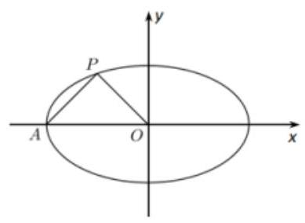

(1)求椭圆 $M$ 的方程；

(2)过点 $A$ 作两条斜率分别为 ${k}_{1},{k}_{2}$ 的直线交椭圆 $M$ 于 $D, E$ 两点，且 ${k}_{1}{k}_{2} = 1$ ，求证:直线 ${DE}$ 恒过一个定点.

【答案】(1) ${x}^{2} + \frac{{y}^{2}}{\frac{1}{3}} = 1$ ; (3)证明见解析.

【解析】(1) 由 ${AP} \bot  {OP}$ ,可知 ${k}_{AP} \cdot  {k}_{OP} =  - 1$ ,又由 $A$ 点坐标为 $\left( {-a,0}\right)$ ,故 $\frac{\frac{1}{2}}{-\frac{1}{2} + a} \cdot  \frac{\frac{1}{2}}{-\frac{1}{2}} =  - 1$ ,可得 $a = 1$ ,

因为椭圆 $M$ 过 $P$ 点,故 $\frac{1}{4} + \frac{1}{4{b}^{2}} = 1$ ,可得 ${b}^{2} = \frac{1}{3}$ ,所以椭圆 $M$ 的方程为 ${x}^{2} + \frac{{y}^{2}}{\frac{1}{3}} = 1$ .

(2)由点 $A\left( {-1,0}\right)$ ，则直线 ${AD}$ 方程为 $y = {k}_{1}\left( {x + 1}\right)$ ，代入 ${x}^{2} + 3{y}^{2} = 1$ ，

可得 $\left( {3{k}_{1}^{2} + 1}\right) {x}^{2} + 6{k}_{1}^{2}x + 3{k}_{1}^{2} - 1 = 0$ ,所以 ${x}_{A} \cdot  {x}_{D} = \frac{3{k}_{1}^{2} - 1}{3{k}_{1}^{2} + 1}$ ,

又因为 ${x}_{A} =  - 1$ ,故 ${x}_{D} = \frac{1 - 3{k}_{1}^{2}}{1 + 3{k}_{1}^{2}},{y}_{D} = {k}_{1}\left( {\frac{1 - 3{k}_{1}^{2}}{1 + 3{k}_{1}^{2}} + 1}\right)  = \frac{2{k}_{1}}{1 + 3{k}_{1}^{2}}$ ,

同理可得 ${x}_{E} = \frac{1 - 3{k}_{2}^{2}}{1 + 3{k}_{2}^{2}},{y}_{E} = \frac{2{k}_{2}}{1 + 3{k}_{2}^{2}}$ ,又 ${k}_{1}{k}_{2} = 1$ 且 ${k}_{1} \neq  {k}_{2}$ ,可得 ${k}_{2} = \frac{1}{{k}_{1}}$ 且 ${k}_{1} \neq   \pm  1$ ,

所以 ${x}_{E} = \frac{{k}_{1}^{2} - 3}{{k}_{1}^{2} + 3},{y}_{E} = \frac{2{k}_{1}}{{k}_{1}^{2} + 3}$ ,所以 ${k}_{DE} = \frac{{y}_{E} - {y}_{D}}{{x}_{E} - {x}_{D}} = \frac{\frac{2{k}_{1}}{{k}_{1}^{2} + 3} - \frac{2{k}_{1}}{1 + 3{k}_{1}^{2}}}{\frac{{k}_{1}^{2} - 3}{{k}_{1}^{2} + 3} - \frac{1 - 3{k}_{1}^{2}}{1 + 3{k}_{1}^{2}}} = \frac{2{k}_{1}}{3\left( {{k}_{1}^{2} + 1}\right) }$ ,

直线 ${DE}$ 的方程为 $y - \frac{2{k}_{1}}{1 + 3{k}_{1}^{2}} = \frac{2{k}_{1}}{3\left( {{k}_{1}^{2} + 1}\right) }\left( {x - \frac{1 - 3{k}_{1}^{2}}{1 + 3{k}_{1}^{2}}}\right)$ ,

令 $y = 0$ ,可得 $x = \frac{1 - 3{k}_{1}^{2}}{1 + 3{k}_{1}^{2}} - \frac{3\left( {{k}_{1}^{2} + 1}\right) }{1 + 3{k}_{1}^{2}} =  - 2$ . 故直线 ${DE}$ 过定点 $\left( {-2,0}\right)$ .

2、已知点 $F$ 是椭圆 $\frac{{x}^{2}}{1 + {a}^{2}} + {y}^{2} = 1\left( {a > 0}\right)$ 的右焦点,点 $M\left( {m,0}\right) , N\left( {0, n}\right)$ 分别是 $x$ 轴, $y$ 轴上的动点,且满足 $\overrightarrow{MN} \cdot  \overrightarrow{NF} = 0$ . 若点 $P$ 满足 $\overrightarrow{OM} = 2\overrightarrow{ON} + \overrightarrow{PO}$ ( $O$ 为坐标原点).

(1)求点 $P$ 的轨迹 $C$ 的方程；

( 2 )设过点 $F$ 任作一直线与点 $P$ 的轨迹交于 $A, B$ 两点，直线 ${OA},{OB}$ 与直线 $x =  - a$ 分别交于点 $S, T$ ， 试判断以线段 ${ST}$ 为直径的圆是否经过点 $F$ ? 请说明理由.

【答案】(1) ${y}^{2} = {4ax}$ (2)经过

【解析】(1) $\because$ 椭圆 $\frac{{x}^{2}}{1 + {a}^{2}} + {y}^{2} = 1\left( {a > 0}\right)$ 右焦点 $F$ 的坐标为 $\left( {a,0}\right)$ ,

$\therefore \overline{NF} = \left( {a, - n}\right) ,\because \overline{MN} = \left( {-m, n}\right) ,\therefore$ 由 $\overline{MN} \cdot  \overline{NF} = 0$ ,得 ${n}^{2} + {am} = 0$ .

设点 $P$ 的坐标为 $\left( {x, y}\right)$ ,由 $\overline{OM} = 2\overline{ON} + \overline{PO}$ ,有 $\left( {m,0}\right)  = 2\left( {0, n}\right)  + \left( {-x, - y}\right)$ ,

$\left\{  \begin{array}{l} m =  - x \\  n = \frac{y}{2} \end{array}\right.$ ,代入 ${n}^{2} + {am} = 0$ ,得 ${y}^{2} = {4ax}$ . 即点 $P$ 的轨迹 $C$ 的方程为 ${y}^{2} = {4ax}$ .

(2)解法一:设直线 ${AB}$ 的方程为 $x = {ty} + a$ ， $A\left( {\frac{{y}_{1}^{2}}{4a},{y}_{1}}\right)$ ， $B\left( {\frac{{y}_{2}^{2}}{4a},{y}_{2}}\right)$ ，则 ${l}_{OA} : y = \frac{4a}{{y}_{1}}x,{l}_{OB} : y = \frac{4a}{{y}_{2}}x$ . 由 $\left\{  {\begin{array}{l} y = \frac{4a}{{y}_{1}}x \\  x =  - a \end{array}\text{ 得 }S\left( {-a, - \frac{4{a}^{2}}{{y}_{1}}}\right) }\right.$ ,同理得 $T\left( {-a, - \frac{4{a}^{2}}{{y}_{2}}}\right) ,\therefore \overline{FS} = \left( {-{2a}, - \frac{4{a}^{2}}{{y}_{1}}}\right) ,\overline{FT} = \left( {-{2a}, - \frac{4{a}^{2}}{{y}_{2}}}\right)$ ,则 $\overline{FS} \cdot  \overline{FT} = 4{a}^{2} + \frac{{16}{a}^{4}}{{y}_{1}{y}_{2}}.$ 由 $\left\{  \begin{array}{l} x = {ty} + a \\  {y}^{2} = {4ax} \end{array}\right.$ 得 ${y}^{2} - {4aty} - 4{a}^{2} = 0,\therefore {y}_{1}{y}_{2} =  - 4{a}^{2}$ . 则 $\overline{FS} \cdot  \overline{FT} = 4{a}^{2} + \frac{{16}{a}^{4}}{\left( -4{a}^{2}\right) } = 4{a}^{2} - 4{a}^{2} = 0$ .

因此,以线段 ${ST}$ 为直径的圆经过点 $F$ .

解法二: ① 当 ${AB}\bot x$ 时, $A\left( {a,{2a}}\right) , B\left( {a, - {2a}}\right)$ ,则 ${l}_{OA} : y = {2x},{l}_{OB} : y =  - {2x}$ .

由 $\left\{  \begin{array}{l} y = {2x} \\  x =  - a \end{array}\right.$ ,得点 $S$ 的坐标为 $S\left( {-a, - {2a}}\right)$ ,则 $\overline{FS} = \left( {-{2a}, - {2a}}\right)$ ,

由 $\left\{  \begin{matrix} y =  - {2x} \\  x =  - a \end{matrix}\right.$ ,得点 $T$ 的坐标为 $T\left( {-a,{2a}}\right)$ ,则

$\overline{FT} = \left( {-{2a},{2a}}\right) .\therefore \overline{FS} \cdot  \overline{FT} = \left( {-{2a}}\right)  \times  \left( {-{2a}}\right)  + \left( {-{2a}}\right)  \times  {2a} = 0$ .

② 当 ${AB}$ 不垂直 $x$ 轴时,设直线 ${AB}$ 的方程为 $y = k\left( {x - a}\right) \left( {k \neq  0}\right) , A\left( {\frac{{y}_{1}^{2}}{4a},{y}_{1}}\right) , B\left( {\frac{{y}_{2}^{2}}{4a},{y}_{2}}\right)$ ,

同解法一,得 $\overline{FS} \cdot  \overline{FT} = 4{a}^{2} + \frac{{16}{a}^{4}}{{y}_{1}{y}_{2}}$ .

由 $\left\{  \begin{matrix} y = k\left( {x - a}\right) \\  {y}^{2} = {4ax} \end{matrix}\right.$ ,得 $k{y}^{2} - {4ay} - {4k}{a}^{2} = 0,\therefore {y}_{1}{y}_{2} =  - 4{a}^{2}$ . 则 $\overline{FS} \cdot  \overline{FT} = 4{a}^{2} + \frac{{16}{a}^{4}}{\left( -4{a}^{2}\right) } = 4{a}^{2} - 4{a}^{2} = 0$ .

因此,以线段 ${ST}$ 为直径的圆经过点 $F$ .
