## 第 1 课:函数与方程思想

<table><tr><td>教学目标</td><td>1、掌握函数思想在不同题型中的应用   2、掌握方程思想的应用   3、掌握函数与方程思想之间的转换</td></tr><tr><td>重点</td><td>函数与方程思想的综合应用</td></tr><tr><td>难点</td><td>函数与方程思想的灵活应用</td></tr></table>

## 知识梳理

数学思想是指导解题的核心, 是一种重要的思维方式, 学习数学就是要掌握数学思想方法, 掌握这些思想方法将会使你在数学学习过程中事半功倍, 灵活深入. 本讲所讲的数学方法主要是函数与方程的思想.

函数的思想, 就是用函数理论来解决问题的思想. 运用函数思想解决数学问题, 需要以运动变化的观点, 分析研究具体数量关系, 用函数的形式把这种关系表示出来, 运用函数的性质来解决问题.

方程的思想, 就是借助方程理论来解决问题的思想. 运用方程思想解决数学问题, 要动中求静, 研究运动中的等量关系.

函数思想与方程思想是一个整体, 运用这两种思想实质就是从不同的角度分析问题, 而两者的主要联系就在零点.

函数方程思想的几种重要形式

(1)函数和方程是密切相关的,对于函数 $y = f\left( x\right)$ ,当 $y = 0$ 时,就转化为方程 $f\left( x\right)  = 0$ ,也可以把函数式 $y = f\left( x\right)$ 看做二元方程 $y - f\left( x\right)  = 0$ 。

( 2 )函数与不等式也可以相互转化，对于函数 $y = f\left( x\right)$ ，当 $y > 0$ 时，就转化为不等式 $f\left( x\right)  > 0$ ，借助于函数图像与性质解决有关问题, 而研究函数的性质, 也离不开解不等式;

(3)数列的通项或前 $n$ 项和是自变量为正整数的函数，用函数的观点处理数列问题十分重要；

(4)函数 $f\left( x\right)  = {\left( 1 + x\right) }^{n}\left( {n \in  {N}^{ * }}\right)$ 与二项式定理是密切相关的,利用这个函数用赋值法和比较系数法可以解决很多二项式定理的问题;

(5)解析几何中的许多问题，例如直线和二次曲线的位置关系问题，需要通过解二元方程组才能解决，涉及到二次方程与二次函数的有关理论;

(6)立体几何中有关线段、角、面积、体积的计算，经常需要运用布列方程或建立函数表达式的方法加以解决。

## (一) 函数思想的应用

## 例题精讲

## 题型一:函数思想在不等式中的应用

【例 1】关于不等式 $\frac{{4x} + m}{{x}^{2} - {2x} + 3} < 2$ 对于任意的实数 $x$ 恒成立,则实数 $m$ 的取值范围是(   )

A. $\lbrack  - 2, + \infty )$ B. $\left( {-\infty , - 2}\right)$ C. $\lbrack  - 4, + \infty )$ D. $\left( {0, - 2}\right)$

【例2】对于满足 $0 \leq  p \leq  4$ 的实数 $p$ ,求使 ${x}^{2} + {px} > {4x} + p - 3$ 恒成立的 $x$ 的取值范围.

【例 3】定义在 $R$ 上的偶函数 $f\left( x\right)$ 满足对任意的 ${x}_{1},{x}_{2} \in  \left( {-\infty ,0}\right\rbrack  \left( {{x}_{1} \neq  {x}_{2}}\right)$ ,有 $f\left( 3\right)  = 0$ ,且 $\frac{f\left( {x}_{2}\right)  - f\left( {x}_{1}\right) }{{x}_{2} - {x}_{1}} < 0$ , 则不等式 $\frac{f\left( x\right)  + f\left( {-x}\right) }{3x} < 0$ 的解集是 ( )

A. $\left( {-\infty , - 3}\right)  \cup  \left( {3, + \infty }\right)$ B. $\left( {-3,0}\right)  \cup  \left( {3, + \infty }\right)$

C. $\left( {-\infty , - 3}\right)  \cup  \left( {0,3}\right)$ D. $\left( {-3,0}\right)  \cup  \left( {0,3}\right)$

## 题型二: 函数思想在三角中的应用

【例 4】已知函数 $f\left( x\right)  =  - {\sin }^{2}x + \sin x + a$ ,当 $f\left( x\right)  = 0$ 有实数解时,求 $\mathrm{a}$ 的取值范围。

【例 5】美化环境,建设美好家园,大家一直在行动. 现有一个直角三角形的绿地, $\angle C = {90}^{ \circ  }$ ,计划在 ${\Delta MNC}$ 区域建设一个游乐场,其中 ${AC} = 5$ 米, ${BC} = 5\sqrt{3}$ 米, $\angle {MCN} = {30}^{ \circ  }$ .

(1)若 ${AM} = 4$ 米，求 $\bigtriangleup  {MNC}$ 的周长；

(2)设 $\angle {ACM} = \theta$ ，求游乐场区域 ${\Delta MNC}$ 面积的最小值，并求出此时 $\theta$ 的值.

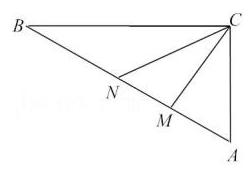

## 题型三:函数思想在数列中的应用

【例 6】已知数列 $\left\{  {a}_{n}\right\}$ 满足 ${a}_{n} = \left\{  \begin{array}{ll}  - {n}^{2} + {2tn}, n \leq  5, & n \in  {N}^{ * } \\  \left( {t - 1}\right) n, n > 5, & n \in  {N}^{ * } \end{array}\right.$ 且数列 $\left\{  {a}_{n}\right\}$ 是单调递增数列,则 $t$ 的取值范围是 ___. 【例 7】已知数列 $\left\{  {a}_{n}\right\}$ 的前 $n$ 项和 ${S}_{n} = {2}^{n + 1} - 2$ ，若 $\forall n \in  {N}^{ * }$ ， $\lambda {a}_{n} \leq  4 + {S}_{2n}$ 恒成立，则实数 $\lambda$ 的最大值是( )

A. 3 B. 4 C. 5 D. 6

## 题型四: 函数思想在向量中的应用

【例 8】如图,扇形的半径为 2,圆心角 $\angle {BAC} = {150}^{ \circ  }$ ,点 $P$ 在弧 $\overset{\text{ ⏜ }}{BC}$ 上运动, $\overrightarrow{AP} = x\overrightarrow{AB} + y\overrightarrow{AC}$ ,则 $\sqrt{3}x - y$ 的取值范围是( )

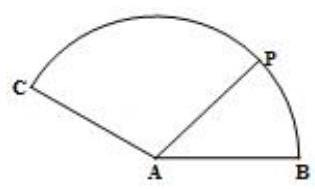

A. $\left\lbrack  {-\sqrt{3},2}\right\rbrack$ B. $\left\lbrack  {-1,2}\right\rbrack$ C. $\left\lbrack  {-2,4}\right\rbrack$ D. $\left\lbrack  {-2\sqrt{3},4}\right\rbrack$

【例 9】在棱长为 1 的正方体 ${ABCD} - {A}_{1}{B}_{1}{C}_{1}{D}_{1}$ 中，点 $E$ 为底面 ${A}_{1}{B}_{1}{C}_{1}{D}_{1}$ 内一动点，则 $\overrightarrow{EA} \cdot  \overrightarrow{EC}$ 的取值范围是 ( )

A. $\left\lbrack  {\frac{1}{2},1}\right\rbrack$ B. $\left\lbrack  {0,1}\right\rbrack$ C. $\left\lbrack  {-1,0}\right\rbrack$ D. $\left\lbrack  {-\frac{1}{2},0}\right\rbrack$

## 题型五: 函数思想在解析几何中的应用

【例 10】设 $P$ 点在圆 ${x}^{2} + {\left( y - 2\right) }^{2} = 1$ 上移动，点 $Q$ 在椭圆 $\frac{{x}^{2}}{9} + {y}^{2} = 1$ 上移动，则 $\left| {PQ}\right|$ 的最大值是___.

【例 11】已知 $P$ 是平面上的动点,且点 $P$ 与 ${F}_{1}\left( {-1,0}\right) \text{ 、 }{F}_{2}\left( {1,0}\right)$ 的距离之和为 $2\sqrt{3}$ . 点 $P$ 的轨迹为曲线 $E$ .

( I ) 求动点 $P$ 的轨迹 $E$ 的方程;

( II ) 不与 $y$ 轴垂直的直线 $l$ 过点 ${F}_{1}$ 且交曲线 $E$ 于 $M, N$ 两点,曲线 $E$ 与 $x$ 轴的交点为 $A, B$ ,当 $\left| {MN}\right|  \geq  \frac{8}{5}\sqrt{3}$ 时,求 $\overrightarrow{AM} \cdot  \overrightarrow{NB} + \overrightarrow{AN} \cdot  \overrightarrow{MB}$ 的取值范围.

【例 12】已知椭圆 $\Gamma  : \frac{{x}^{2}}{4} + \frac{{y}^{2}}{3} = 1$ ,直线 $l : y = {kx} + b$ 与椭圆 $\Gamma$ 仅有一个公共点.

(I) 求 $k, b$ 满足的关系式;

( II ) 若直线 $l$ 与 $x, y$ 轴分别交于 $A, B$ 两点, $O$ 是坐标原点,求 $\bigtriangleup {AOB}$ 面积的最小值.

## 题型六: 函数思想在立体几何中的应用

【例 13】如图, $M$ 是正方体 ${ABCD} - {A}_{1}{B}_{1}{C}_{1}{D}_{1}$ 对角线 $A{C}_{1}$ 上的动点,过点 $M$ 作垂直于面 ${AC}{C}_{1}{A}_{1}$ 的直线与正方体表面分别交于 $P\text{ 、 }Q$ 两点,设 ${AM} = x,{PQ} = y$ ,则函数 $y = f\left( x\right)$ 的图象大致为(   )

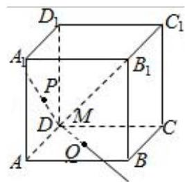

A.

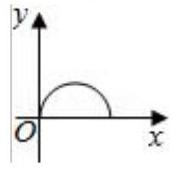

B.

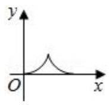

C.

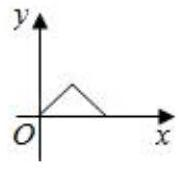

D.

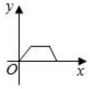

【例14】如图,长方体 ${ABCD} - {A}_{1}{B}_{1}{C}_{1}{D}_{1}$ 中, ${AB} = {AD} = 2, A{A}_{1} = 4$ ,点 $P$ 为面 ${AD}{D}_{1}{A}_{1}$ 的对角线 $A{D}_{1}$ 上的动点 (不包括端点). ${PM} \bot$ 平面 ${ABCD}$ 交 ${AD}$ 于点 $M,{MN} \bot  {BD}$ 于点 $N$ .

(1)设 ${AP} = x$ ，将 ${PN}$ 长表示为 $x$ 的函数；

(2)当 ${PN}$ 最小时，求异面直线 ${PN}$ 与 ${A}_{1}{C}_{1}$ 所成角的大小.(结果用反三角函数值表示)

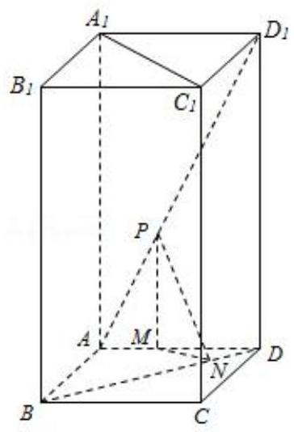

## 题型七: 利用函数思想处理多变量问题

【例 15】(1)设 ${\overrightarrow{e}}_{1},{\overrightarrow{e}}_{2}$ 为单位向量,非零向量 $\overrightarrow{b} = x{\overrightarrow{e}}_{1} + y{\overrightarrow{e}}_{2}, x, y \in  R$ . 若 ${\overrightarrow{e}}_{1},{\overrightarrow{e}}_{2}$ 的夹角为 $\frac{\pi }{6}$ ,则 $\frac{\left| x\right| }{\left| \overrightarrow{b}\right| }$ 的最大值等于( )

A. 4 B. 3 C. 2 D. 1

(2)不等式 ${x}^{2} - 2{y}^{2} \leq  {cx}\left( {y - x}\right)$ 对满足 $x > y > 0$ 的任意实数 $x$ ， $y$ 恒成立，则实数 $c$ 的最大值是___.

## 巩固训练

1、若不等式 ${x}^{2} + {ax} + 1 \geq  0$ 对于一切 $x \in  \left( {0,\frac{1}{2}}\right)$ 成立，则实数 $a$ 的最小值是 ( )

A. 0 B. -2

C. $- \frac{5}{2}$ D. -3

2、如图，已知半径为 1 的扇形 ${AOB},\angle {AOB} = {60}^{ \circ  }$ ， $P$ 为弧 $\overset{\text{ ⏜ }}{AB}$ 上的一个动点，则 $\overrightarrow{OP} \cdot  \overrightarrow{AB}$ 取值范围是___.

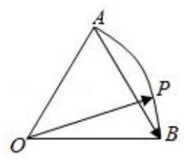

3、已知椭圆 ${x}^{2} + \frac{{y}^{2}}{{b}^{2}} = 1\left( {0 < b < 1}\right)$ ，其左、右焦点分别为 ${F}_{1}\text{ 、 }{F}_{2}$ ， $\left| {{F}_{1}{F}_{2}}\right|  = {2c}$ . 若此椭圆上存在点 $P$ ，使 $P$ 到直线 $x = \frac{1}{c}$ 的距离是 $\left| {P{F}_{1}}\right|$ 与 $\left| {P{F}_{2}}\right|$ 的等差中项，则 $b$ 的最大值为___.

4、设函数 $f\left( x\right)  = \left\{  \begin{array}{l} \left| {x + 1}\right| , x \leq  0 \\  \left| {{\log }_{4}x}\right| , x > 0 \end{array}\right.$ 若关于 $x$ 的方程 $f\left( x\right)  = a$ 有四个不同的解 ${x}_{1},{x}_{2},{x}_{3},{x}_{4}$ ,且 ${x}_{1} < {x}_{2} < {x}_{3} < {x}_{4}$ , 则 ${x}_{3}\left( {{x}_{1} + {x}_{2}}\right)  + \frac{1}{{x}_{3}^{2}{x}_{4}}$ 的取值范围是(   )

A. $\left( {-1,\frac{7}{2}}\right\rbrack$ B. $\left( {-1,\frac{7}{2}}\right)$ C. $\left( {-1, + \infty }\right)$ D. $\left( {-\infty ,\frac{7}{2}}\right\rbrack$

5、已知公差大于零的等差数列 $\left\{  {a}_{n}\right\}$ 的前 $n$ 项和为 ${S}_{n}$ ,且满足: ${a}_{3} \cdot  {a}_{4} = {120},{a}_{2} + {a}_{5} = {22}$ .

(1)求通项 ${a}_{n}$ ；

(2)若数列 $\left\{  {b}_{n}\right\}$ 是等差数列,且 ${b}_{n} = \frac{{S}_{n}}{n + c}$ ,求非零常数 $c$ ；

(3)在(2)的条件下，求 $f\left( n\right)  = \frac{{b}_{n}}{\left( {n + {36}}\right)  \cdot  {b}_{n + 1}}\left( {n \in  {N}_{ + }}\right)$ 的最大值.

## (二)方程思想的应用

## 例题精讲

## 题型一:方程思想在集合中的应用

【例 16】已知集合 $A = \left\{  {x \mid  m{x}^{2} - {2x} + 1 = 0, x \in  R}\right\}$ 有且仅有两个子集，则实数 $m =$ ___.

## 题型二: 方程思想在不等式中的应用

【例 17】已知关于 $x$ 的不等式 $\sqrt{x} > {ax} + \frac{3}{2}$ 的解集为 $4 < x < b$ ,求 $a, b$ 的值.

## 题型三: 方程思想在求函数最值时的应用

【例 18】已知函数 $y = \frac{m{x}^{2} + 4\sqrt{3}x + n}{{x}^{2} + 1}$ 的最大值为 7,最小值为-1,求此函数式。

## 题型四: 方程思想在数列中的应用

【例 19】若 $a, b$ 是方程 ${x}^{2} - {px} + q = 0\left( {p > 0, q > 0}\right)$ 的两个不同根,且 $a, b, - 2$ 这三个数可适当排序后成等差数列,也可适当排序后成等比数列,则 $p + q$ 的值等于 ( )

A. 6 B. 7 C. 8 D. 9

【例 20】设数列 $\left\{  {a}_{n}\right\}$ 是公差不为零的等差数列,前 $n$ 项和为 ${S}_{n}$ ,满足 ${a}_{2}^{2} + {a}_{3}^{2} = {a}_{4}^{2} + {a}_{5}^{2},{S}_{7} = 7$ ,则使得 $\frac{{a}_{m} \cdot  {a}_{m + 1}}{{a}_{m + 2}}$ 为数列 $\left\{  {a}_{n}\right\}$ 中的项的所有正整数 $m$ 的值为___.

## 题型五: 方程思想在解析几何中的应用

【例 21】直线 $\left( {1 + a}\right) x + y + 1 = 0$ 与圆 ${x}^{2} + {y}^{2} - {2x} = 0$ 相切,则 $\mathrm{a}$ 的值为( )

A. $1, - 1$ B. 2, -2 C. 1 D. -1

【例 22】已知直线 $y = k\left( {x + 2}\right)$ 与抛物线 $C : {y}^{2} = {8x}$ 相交于 $A\text{ 、 }B$ 两点， $F$ 为抛物线 $C$ 的焦点. 若 $\left| \overrightarrow{FA}\right|  = 2\left| \overrightarrow{FB}\right|$ ,则实数 $k =$ ___.

## 题型六: 方程思想在立体几何中的应用

【例 23】如图,圆锥形容器的高为 $h$ ,圆锥内水面的高为 ${h}_{1}$ ,且 ${h}_{1} = \frac{1}{3}h$ ,若将圆锥的倒置,水面高为 ${h}_{2}$ , 则 ${h}_{2}$ 等于( )

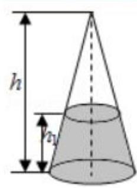

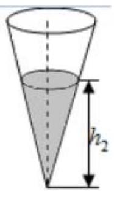

A. $\frac{2}{3}h$ B. $\frac{19}{27}h$ C. $\frac{\sqrt[3]{6}}{3}h$ D. $\frac{\sqrt[3]{19}}{3}h$

## 巩固训练

1、已知 $f\left( x\right)$ 是定义在 $R$ 上的奇函数,对任意两个不相等的正数 ${x}_{1},{x}_{2}$ 都有 $\frac{{x}_{2}f\left( {x}_{1}\right)  - {x}_{1}f\left( {x}_{2}\right) }{{x}_{1} - {x}_{2}} < 0$ ,记 $a = \frac{f\left( {4}^{0.2}\right) }{{4}^{0.2}},\;b = \frac{f\left( {0.4}^{2}\right) }{{0.4}^{2}},\;c = \frac{f\left( {{\log }_{0.2}4}\right) }{{\log }_{0.2}4}$ ,则 ( )

A. $c < b < a$ B. $a < b < c$ C. $a < c < b$ D. $c < b < a$

2、已知函数 $f\left( x\right)  = \left| {{\log }_{2}x}\right|$ ，正实数 $m$ ， $n$ 满足 $m < n$ ，且 $f\left( m\right)  = f\left( n\right)$ ，若 $f\left( x\right)$ 在区间 $\left\lbrack  {{m}^{2}\text{ ， }n}\right\rbrack$ 上的最大值为 2,则 $\frac{m}{n} =$ ___.

3、若实数 $a, b > 0$ ，满足 ${abc} = a + b + c$ ， ${a}^{2} + {b}^{2} = 1$ ，则实数 $c$ 的最小值为___

4、对于函数 $f\left( x\right)$ ,若在定义域内存在实数 ${x}_{0}$ ,满足 $f\left( {-{x}_{0}}\right)  =  - f\left( {x}_{0}\right)$ ,称 $f\left( x\right)$ 为 “局部奇函数”,若 $f\left( x\right)  = {x}^{2} - {2m} \cdot  x + {m}^{2} - 3$ 为定义域 $R$ 上的 “局部奇函数”，则实数 $m$ 的取值范围是( )

A. $\left\lbrack  {-\sqrt{3},\sqrt{6}}\right\rbrack$ B. $\left\lbrack  {-\sqrt{3},\sqrt{3}}\right\rbrack$ C. $\left\lbrack  {-\sqrt{6},\sqrt{3}}\right\rbrack$ D. $\left\lbrack  {-\sqrt{6},\sqrt{6}}\right\rbrack$

5、一般来说, 事物总是经过发生、发展、成熟三个阶段, 每个阶段的发展速度各不相同, 通常在发生阶段变化速度较为缓慢、在发展阶段变化速度加快、在成熟阶段变化速度又趋于缓慢, 按照上述三个阶段发展规律得到的变化曲线称为生长曲线. 美国生物学家和人口统计学家雷蒙德？皮尔提出一种能较好地描述生物生长规律的生长曲线,称为 “皮尔曲线”,常用的 “皮尔曲线” 的函数解析式为 $f\left( x\right)  = \frac{K}{1 + b{e}^{-{ax}}}\left( {K > 0, a > 0}\right.$ , $b > 0),\;x \in  \lbrack 0, + \infty )$ ,该函数也可以简化为 $f\left( x\right)  = \frac{K}{1 + {a}^{{kx} + b}}\left( {K > 0, a > 1, k < 0}\right)$ 的形式. 已知 $f\left( x\right)  = \frac{10}{1 + {3}^{{kx} + b}}\left( {x \in  N}\right)$ 描述的是一种果树的高度随着时间 $x$ (单位: 年) 的变化规律,若刚栽种时该果树的高为 ${1m}$ ,经过一年,该果树的高为 ${2.5m}$ ,则该果树的高度超过 ${8m}$ ,至少需要(   )

A. 4 年 B. 3 年 C. 5 年 D. 2 年

## (三)函数与方程的综合

## 例题精讲

【例24】若 $a, b$ 是正数,且满足 ${ab} = a + b + 3$ ,求 ${ab}$ 的取值范围.

【例25】已知函数 $f\left( x\right)  = \left( {{x}^{2} + {8x} + {15}}\right) \left( {a{x}^{2} + {bx} + c}\right)$ ( $a, b, c \in  \mathbf{R}$ )是偶函数，若方程 $a{x}^{2} + {bx} + c = 1$ 在区间 $\left\lbrack  {1,2}\right\rbrack$ 上有解,则实数 $a$ 的取值范围是___

## 巩固训练

1、若函数 $f\left( x\right)  = {2}^{x}\left( {x + a}\right)  - 1$ 在区间 $\left\lbrack  {0,1}\right\rbrack$ 上有零点，则实数 $a$ 的取值范围是___.

2、关于 $x$ 的方程 ${4}^{x} - a \cdot  {2}^{x} + 4 = 0$ 在 $\lbrack 0, + \infty )$ 上有两个不同的实数根，则实数 $a$ 的取值范围是___.

3、已知函数 $f\left( x\right)  = \frac{1}{a} - \frac{1}{x}\;\left( {a > 0, x > 0}\right)$ .

(1)求证: $f\left( x\right)$ 在 $\left( {0, + \infty }\right)$ 上是增函数；

(2)若 $f\left( x\right)  \leq  {2x}$ 在 $\left( {0, + \infty }\right)$ 上恒成立，求 $a$ 的取值范围；

(3)若 $f\left( x\right)$ 在 $\left\lbrack  {m, n}\right\rbrack$ 上的值域是 $\left\lbrack  {m, n}\right\rbrack  \left( {m \neq  n}\right)$ ，求 $a$ 的取值范围.
