## 第 1 课:函数与方程思想

<table><tr><td>教学目标</td><td>1、掌握函数思想在不同题型中的应用   2、掌握方程思想的应用   3、掌握函数与方程思想之间的转换</td></tr><tr><td>重点</td><td>函数与方程思想的综合应用</td></tr><tr><td>难点</td><td>函数与方程思想的灵活应用</td></tr></table>

## 知识梳理

数学思想是指导解题的核心, 是一种重要的思维方式, 学习数学就是要掌握数学思想方法, 掌握这些思想方法将会使你在数学学习过程中事半功倍, 灵活深入. 本讲所讲的数学方法主要是函数与方程的思想.

函数的思想, 就是用函数理论来解决问题的思想. 运用函数思想解决数学问题, 需要以运动变化的观点, 分析研究具体数量关系, 用函数的形式把这种关系表示出来, 运用函数的性质来解决问题.

方程的思想, 就是借助方程理论来解决问题的思想. 运用方程思想解决数学问题, 要动中求静, 研究运动中的等量关系.

函数思想与方程思想是一个整体, 运用这两种思想实质就是从不同的角度分析问题, 而两者的主要联系就在零点.

函数方程思想的几种重要形式

(1)函数和方程是密切相关的，对于函数 $y = f\left( x\right)$ ，当 $y = 0$ 时，就转化为方程 $f\left( x\right)  = 0$ ，也可以把函数式 $y = f\left( x\right)$ 看做二元方程 $y - f\left( x\right)  = 0$ 。

( 2 )函数与不等式也可以相互转化，对于函数 $y = f\left( x\right)$ ，当 $y > 0$ 时，就转化为不等式 $f\left( x\right)  > 0$ ，借助于函数图像与性质解决有关问题, 而研究函数的性质, 也离不开解不等式;

(3)数列的通项或前 $n$ 项和是自变量为正整数的函数，用函数的观点处理数列问题十分重要；

(4)函数 $f\left( x\right)  = {\left( 1 + x\right) }^{n}\left( {n \in  {N}^{ * }}\right)$ 与二项式定理是密切相关的，利用这个函数用赋值法和比较系数法可以解决很多二项式定理的问题;

(5)解析几何中的许多问题，例如直线和二次曲线的位置关系问题，需要通过解二元方程组才能解决，涉及到二次方程与二次函数的有关理论;

(6)立体几何中有关线段、角、面积、体积的计算，经常需要运用布列方程或建立函数表达式的方法加以解决。

## (一) 函数思想的应用

## 例题精讲

## 题型一:函数思想在不等式中的应用

【例 1】关于不等式 $\frac{{4x} + m}{{x}^{2} - {2x} + 3} < 2$ 对于任意的实数 $x$ 恒成立,则实数 $m$ 的取值范围是(   )

A. $\lbrack  - 2, + \infty )$ B. $\left( {-\infty , - 2}\right)$ C. $\lbrack  - 4, + \infty )$ D. $\left( {0, - 2}\right)$

【难度】 $\star   \star   \star$

【答案】 $B$

【解析】解: 配方可得 ${x}^{2} - {2x} + 3 = {\left( x - 1\right) }^{2} + 2 \geq  2$ ,

$\therefore$ 原不等式可化为 ${4x} + m < 2\left( {{x}^{2} - {2x} + 3}\right)$ 对于任意的实数恒成立,

整理可得 $2{x}^{2} - {8x} + 6 - m > 0$ 对于任意的实数恒成立,

$\therefore \bigtriangleup  = {\left( -8\right) }^{2} - 4 \times  2 \times  \left( {6 - m}\right)  < 0$ ,解得 $m <  - 2$ ,故选: $B$ .

【例2】对于满足 $0 \leq  p \leq  4$ 的实数 $p$ ,求使 ${x}^{2} + {px} > {4x} + p - 3$ 恒成立的 $x$ 的取值范围.

【难度】 $\star   \star   \star$

【答案】 $\left( {-\infty , - 1}\right)  \cup  \left( {3, + \infty }\right)$

【解析】原不等式为 ${x}^{2} + \left( {p - 4}\right) x + 3 - p > 0,0 \leq  p \leq  4$

整理得, $\left( {x - 1}\right) p + {x}^{2} - {4x} + 3 > 0,\;0 \leq  p \leq  4$

令 $y = f\left( x\right)  = \left( {x - 1}\right) p + {x}^{2} - {4x} + 3,\;0 \leq  p \leq  4$ ,转化为一次函数类型的恒成立问题,则有 $\left\{  {\begin{array}{l} f\left( 0\right)  > 0 \\  f\left( 4\right)  > 0 \end{array} \Rightarrow  \left\{  {\begin{array}{l} x \in  \left( {-\infty ,1}\right) \bigcup \left( {3, + \infty }\right) \\  x \in  \left( {-\infty , - 1}\right) \bigcup \left( {1, + \infty }\right)  \end{array} \Rightarrow  x \in  \left( {-\infty , - 1}\right) \bigcup \left( {3, + \infty }\right) .}\right. }\right.$

因此,要 ${x}^{2} + {px} > {4x} + p - 3$ 在 $0 \leq  p \leq  4$ 上恒成立, $x \in  \left( {-\infty , - 1}\right)  \cup  \left( {3, + \infty }\right)$ .

【例 3】定义在 $R$ 上的偶函数 $f\left( x\right)$ 满足对任意的 ${x}_{1},{x}_{2} \in  \left( {-\infty ,0}\right\rbrack  \left( {{x}_{1} \neq  {x}_{2}}\right)$ ,有 $f\left( 3\right)  = 0$ ,且 $\frac{f\left( {x}_{2}\right)  - f\left( {x}_{1}\right) }{{x}_{2} - {x}_{1}} < 0$ , 则不等式 $\frac{f\left( x\right)  + f\left( {-x}\right) }{3x} < 0$ 的解集是 (   )

A. $\left( {-\infty , - 3}\right)  \cup  \left( {3, + \infty }\right)$ B. $\left( {-3,0}\right)  \cup  \left( {3, + \infty }\right)$

C. $\left( {-\infty , - 3}\right)  \cup  \left( {0,3}\right)$ D. $\left( {-3,0}\right)  \cup  \left( {0,3}\right)$

【难度】 $\star   \star   \star$

【答案】 $C$

【解析】解: 由对任意的 ${x}_{1},{x}_{2} \in  \left( {-\infty ,0}\right\rbrack  \left( {{x}_{1} \neq  {x}_{2}}\right) ,\frac{f\left( {x}_{2}\right)  - f\left( {x}_{1}\right) }{{x}_{2} - {x}_{1}} < 0$ ,可知函数 $f\left( x\right)$ 在 $( - \infty ,0\rbrack$ 上单调递减,因为 $f\left( x\right)$ 为偶函数,所以 $f\left( x\right)$ 在 $\left( {0, + \infty }\right)$ 上单调递增,

因为 $f\left( 3\right)  = 0$ ,所以 $f\left( {-3}\right)  = f\left( 3\right)  = 0$ ,

所以当 $x <  - 3$ 或 $x > 3$ 时, $f\left( x\right)  > 0$ ,当 $- 3 < x < 3$ 时, $f\left( x\right)  < 0$ ,

不等式 $\frac{f\left( x\right)  + f\left( {-x}\right) }{3x} < 0$ 可转化为 $\frac{{2f}\left( x\right) }{3x} < 0$ ,所以 $\left\{  \begin{array}{l} f\left( x\right)  > 0 \\  x < 0 \end{array}\right.$ 或 $\left\{  \begin{array}{l} f\left( x\right)  < 0 \\  x > 0 \end{array}\right.$ ,

所以 $x <  - 3$ 或 $0 < x < 3$ . 故选: $C$ .

题型二: 函数思想在三角中的应用

【例 4】已知函数 $f\left( x\right)  =  - {\sin }^{2}x + \sin x + a$ ,当 $f\left( x\right)  = 0$ 有实数解时,求 $\mathrm{a}$ 的取值范围。

【难度】 $\star   \star   \star$

【答案】 $a \in  \left\lbrack  {-\frac{1}{4},2}\right\rbrack$

【解析】由 $f\left( x\right)  = 0$ 得 $- {\sin }^{2}x + \sin x + a = 0$ ,分离 $\mathrm{a}$ 得: $a = {\sin }^{2}x - \sin x = {\left( \sin x - \frac{1}{2}\right) }^{2} - \frac{1}{4}$ ;

问题转化为求 $\mathrm{a}$ 的值域。因为 $\sin x \in  \left\lbrack  {-1,1}\right\rbrack$ ,所以 $\left\lbrack  {{\left( \sin x - \frac{1}{2}\right) }^{2} - \frac{1}{4}}\right\rbrack   \in  \left\lbrack  {-\frac{1}{4},2}\right\rbrack$ 。

故当 $a \in  \left\lbrack  {-\frac{1}{4},2}\right\rbrack$ 时, $f\left( x\right)  = 0$ 有实数解。

【例 5】美化环境,建设美好家园,大家一直在行动. 现有一个直角三角形的绿地, $\angle C = {90}^{ \circ  }$ ,计划在 ${\Delta MNC}$ 区域建设一个游乐场,其中 ${AC} = 5$ 米, ${BC} = 5\sqrt{3}$ 米, $\angle {MCN} = {30}^{ \circ  }$ .

(1)若 ${AM} = 4$ 米，求 $\bigtriangleup  {MNC}$ 的周长；

(2)设 $\angle {ACM} = \theta$ ，求游乐场区域 ${\Delta MNC}$ 面积的最小值，并求出此时 $\theta$ 的值.

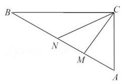

【难度】 $\star   \star   \star$

【答案】(1) $\sqrt{21} + \frac{7}{2} + \frac{5\sqrt{7}}{2}$ (米). (2)面积的最小值 $\frac{{150} - {75}\sqrt{3}}{2}$ . 此时 $\theta  = {15}^{ \circ  }$ .

【解析】解: (1) $\because \angle C = {90}^{ \circ  },{AC} = 5,{BC} = 5\sqrt{3}$ ,可得 $A = {60}^{ \circ  }$ ,

在 $\bigtriangleup {AMC}$ 中,由余弦定理有 $C{M}^{2} = A{M}^{2} + A{C}^{2} - {2AC} \times  {AM}\cos A = {21}$ ,

所以 ${CM} = \sqrt{21}$ ,又由余弦定理可求得 $\cos \angle {AMC} = \frac{\sqrt{21}}{14}$ ,所以 $\sin \angle {AMC} = \sqrt{1 - {\cos }^{2}\angle {AMC}} = \frac{5\sqrt{7}}{14}$ ,

所以 $\sin \angle {NMC} = \frac{5\sqrt{7}}{14},\cos \angle {NMC} =  - \frac{\sqrt{21}}{14}$ ,

在 ${\Delta CNM}$ 中,由正弦定理有 $\frac{CN}{\sin \angle {NMC}} = \frac{NM}{\sin {30}^{ \circ  }}$ ,所以有 $\frac{CN}{\frac{5\sqrt{7}}{14}} = \frac{NM}{\frac{1}{14}}$ ,

所以 ${CN} = \frac{5\sqrt{7}}{7}{NM}$ ,在 $\bigtriangleup {NMC}$ 中,由余弦定理有 $C{N}^{2} = N{M}^{2} + M{C}^{2} - {2NM} \times  {MC}\cos \angle {NMC}$ ,

解得 ${NM} = \frac{7}{2},{CN} = \frac{5\sqrt{7}}{2}$ ,所以 $\bigtriangleup {MNC}$ 的周长等于 $\sqrt{21} + \frac{7}{2} + \frac{5\sqrt{7}}{2}$ (米).

(2)设 $\angle {ACM} = \theta , A = {60}^{ \circ  }$ ，所以 $\angle {AMC} = {120}^{ \circ  } - \theta ,\angle {ANC} = {90}^{ \circ  } - \theta$ ，

在 $\bigtriangleup {AMC},\bigtriangleup {ANC}$ 中,由正弦定理有 $\frac{CM}{\operatorname{sim}{60}^{ \circ  }} = \frac{AC}{\sin \angle {AMC}},\frac{CN}{\sin {60}^{ \circ  }} = \frac{CA}{\sin \angle {ANC}}$ ,

所以有 ${CM} = \frac{5 \times  \frac{\sqrt{3}}{2}}{\sin \left( {{120}^{ \circ  } - \theta }\right) },{CN} = \frac{5 \times  \frac{\sqrt{3}}{2}}{\sin \left( {{90}^{ \circ  } - \theta }\right) }$ ,

所以 ${S}_{\bigtriangleup {CNM}} = \frac{1}{2} \times  \frac{5 \times  \frac{\sqrt{3}}{2}}{\sin \left( {{120}^{ \circ  } - \theta }\right) } \times  \frac{5 \times  \frac{\sqrt{3}}{2}}{\sin \left( {{90}^{ \circ  } - \theta }\right) } = \frac{1}{2} \times  \frac{{\left( 5 \times  \frac{\sqrt{3}}{2}\right) }^{2}}{\sin \left( {{120}^{ \circ  } - \theta }\right) \cos \theta } = \frac{\frac{75}{8}}{\frac{\sqrt{3}}{4} + \frac{1}{2}\sin \left( {{2\theta } + {60}^{ \circ  }}\right) }\left( {0 \leq  \theta  \leq  {60}^{ \circ  }}\right)$

所以当 $\sin \left( {{2\theta } + {60}^{ \circ  }}\right)  = 1$ 时取得面积的最小值 $\frac{{150} - {75}\sqrt{3}}{2}$ . 此时 $\theta  = {15}^{ \circ  }$ .

## 题型三: 函数思想在数列中的应用

【例 6】已知数列 $\left\{  {a}_{n}\right\}$ 满足 ${a}_{n} = \left\{  \begin{array}{ll}  - {n}^{2} + {2tn}, n \leq  5, & n \in  {N}^{ * } \\  \left( {t - 1}\right) n, n > 5, & n \in  {N}^{ * } \end{array}\right.$ 且数列 $\left\{  {a}_{n}\right\}$ 是单调递增数列,则 $t$ 的取值范围是 ___.

【难度】

【答案】 $\left( {\frac{9}{2},\frac{19}{4}}\right)$

【解析】解: $\because$ 数列 $\left\{  {a}_{n}\right\}$ 满足 ${a}_{n} = \left\{  \begin{array}{ll}  - {n}^{2} + {2tn}, n \leq  5, & n \in  {N}^{ * } \\  \left( {t - 1}\right) n, n > 5, & n \in  {N}^{ * } \end{array}\right.$ 且数列 $\left\{  {a}_{n}\right\}$ 是单调递增数列, $\therefore \left\{  \begin{array}{l} t > {4.5} \\  t - 1 > 0 \\   - {25} + {10t} < \left( {t - 1}\right)  \times  6 \end{array}\right.$ ,解得 $\frac{9}{2} < t < \frac{19}{4}$ ,则 $t$ 的取值范围是 $\left( {\frac{9}{2},\frac{19}{4}}\right)$ ,故答案为: $\left( {\frac{9}{2},\frac{19}{4}}\right)$ .

【例 7】已知数列 $\left\{  {a}_{n}\right\}$ 的前 $n$ 项和 ${S}_{n} = {2}^{n + 1} - 2$ ,若 $\forall n \in  {N}^{ * },\lambda {a}_{n} \leq  4 + {S}_{2n}$ 恒成立,则实数 $\lambda$ 的最大值是 ( )

A. 3 B. 4 C. 5 D. 6

【难度】 $\star   \star   \star$

【答案】 $C$

【解析】解: 由 ${S}_{n} = {2}^{n + 1} - 2$ ,得 ${a}_{1} = {S}_{1} = {2}^{2} - 2 = 2$ ,当 $n \geq  2$ 时, ${a}_{n} = {S}_{n} - {S}_{n - 1} = {2}^{n + 1} - 2 - \left( {{2}^{n} - 2}\right)  = {2}^{n}$ ,

验证 $n = 1$ 时 ${a}_{n} = {2}^{n}$ 成立, $\therefore {a}_{n} = {2}^{n}$ ,又 ${S}_{n} = {2}^{n + 1} - 2,\therefore {S}_{2n} = {2}^{{2n} + 1} - 2$ ,

$\because \forall n \in  {N}^{ * },\lambda {a}_{n} \leq  4 + {S}_{2n}$ 恒成立, $\therefore \lambda  \leq  \frac{4 + {S}_{2n}}{{a}_{n}} = \frac{4 + {2}^{{2n} + 1} - 2}{{2}^{n}} = 2\left( {{2}^{n} + \frac{1}{{2}^{n}}}\right)$ ,

当 $n = 1$ 时, $2\left( {{2}^{n} + \frac{1}{{2}^{n}}}\right)$ 有最小值为 $5.\therefore \lambda  \leq  5$ . 则则实数 $\lambda$ 的最大值是 5 . 故选: $C$ .

## 题型四: 函数思想在向量中的应用

【例 8】如图,扇形的半径为 2,圆心角 $\angle {BAC} = {150}^{ \circ  }$ ,点 $P$ 在弧 $\overset{\text{ ⏜ }}{BC}$ 上运动, $\overrightarrow{AP} = x\overrightarrow{AB} + y\overrightarrow{AC}$ ,则 $\sqrt{3}x - y$ 的取值范围是(   )

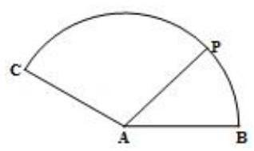

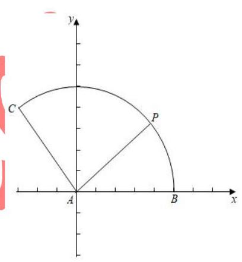

A. $\left\lbrack  {-\sqrt{3},2}\right\rbrack$ B. $\left\lbrack  {-1,2}\right\rbrack$ C. $\left\lbrack  {-2,4}\right\rbrack$

D. $\left\lbrack  {-2\sqrt{3},4}\right\rbrack$

【难度】 $\star   \star   \star$

【答案】 $B$

【解析】解: 根据题意,以 ${AB}$ 为 $x$ 轴,以 $A$ 为原点,建立坐标系,

如图: $P\left( {2\cos \theta ,2\sin \theta }\right) ,{0}^{ \circ  } \leq  \theta  \leq  {150}^{ \circ  }$ ,则 $A\left( {0,0}\right) , B\left( {2,0}\right) , C\left( {-\sqrt{3},1}\right)$ ,

$\overrightarrow{AP} = x\overrightarrow{AB} + y\overrightarrow{AC}$ ,则有 $\left( {2\cos \theta ,2\sin \theta }\right)  = x\left( {2,0}\right)  + y\left( {-\sqrt{3},1}\right)  = \left( {x - \sqrt{3}y, y}\right)$

变形可得: $\cos \theta  = x - \frac{\sqrt{3}}{2}y,\sin \theta  = \frac{y}{2}$ ; 则有 $x = \cos \theta  + \sqrt{3}\sin \theta , y = 2\sin \theta$ ,

$\sqrt{3}x - y = \sqrt{3}\cos \theta  + 3\sin \theta  - 2\sin \theta  = \sqrt{3}\cos \theta  + \sin \theta  = 2\sin \left( {\theta  + {60}^{ \circ  }}\right)$ ,

又由 ${0}^{ \circ  } \leq  \theta  \leq  {150}^{ \circ  }$ ,则 ${60}^{ \circ  } \leq  \theta  + {60}^{ \circ  } \leq  {210}^{ \circ  }$ ,则有 $- 1 \leq  \sqrt{3}x - y = 2\sin \left( {\theta  + {60}^{ \circ  }}\right)  \leq  2$ ,

故 $\sqrt{3}x - y$ 的取值范围是 $\left\lbrack  {-1,2}\right\rbrack$ ; 故选: $B$ .

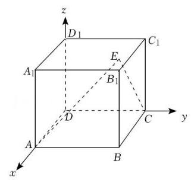

【例 9】在棱长为 1 的正方体 ${ABCD} - {A}_{1}{B}_{1}{C}_{1}{D}_{1}$ 中，点 $E$ 为底面 ${A}_{1}{B}_{1}{C}_{1}{D}_{1}$ 内一动点， 则 $\overrightarrow{EA} \cdot  \overrightarrow{EC}$ 的取值范围是(   )

A. $\left\lbrack  {\frac{1}{2},1}\right\rbrack$ B. $\left\lbrack  {0,1}\right\rbrack$ C. $\left\lbrack  {-1,0}\right\rbrack$ D. $\left\lbrack  {-\frac{1}{2},0}\right\rbrack$

【难度】 $\star   \star   \star$

【答案】 $A$

【解析】解: 如图,以 $D$ 为坐标原点建立如图所示空间直角坐标系.

则 $A\left( {1,0,0}\right) , C\left( {0,1,0}\right)$ ,设 $E\left( {x, y,1}\right)$ ,则 $0 \leq  x \leq  1,0 \leq  y \leq  1$ .

$\therefore \overrightarrow{EA} = \left( {1 - x, - y, - 1}\right) ,\overrightarrow{EC} = \left( {-x,1 - y, - 1}\right)$ ,

$\therefore \overrightarrow{EA} \cdot  \overrightarrow{EC} =  - x\left( {1 - x}\right)  - y\left( {1 - y}\right)  + 1 = {\left( x - \frac{1}{2}\right) }^{2} + {\left( y - \frac{1}{2}\right) }^{2} + \frac{1}{2}$ .

由二次函数的性质可得: 当 $x = y = \frac{1}{2}$ 时, $\overrightarrow{EA} \cdot  \overrightarrow{EC}$ 取最小值为 $\frac{1}{2}$ ;

当 $x = 0$ 或 $x = 1$ ,且 $y = 0$ 或 $y = 1$ 时, $\overrightarrow{EA} \cdot  \overrightarrow{EC}$ 取得最大值为 1 .

$\therefore \overrightarrow{EA} \cdot  \overrightarrow{EC}$ 的取值范围是 $\left\lbrack  {\frac{1}{2},1}\right\rbrack$ . 故选: $A$ .

## 题型五:函数思想在解析几何中的应用

【难度】 $\star   \star   \star$

【例 10】设 $P$ 点在圆 ${x}^{2} + {\left( y - 2\right) }^{2} = 1$ 上移动，点 $Q$ 在椭圆 $\frac{{x}^{2}}{9} + {y}^{2} = 1$ 上移动，则 $\left| {PQ}\right|$ 的最大值是 ___.

【答案】 $1 + \frac{3\sqrt{6}}{2}$

【解析】解: 设椭圆 $\frac{{x}^{2}}{9} + {y}^{2} = 1$ 上任意一点 $Q$ 的坐标为 $\left( {x, y}\right)$ ,则 ${x}^{2} + 9{y}^{2} = 9$ . 点 $Q$ 到圆心 $\left( {0,2}\right)$ 的距离为 $d = \sqrt{{x}^{2} + {\left( y - 2\right) }^{2}} = \sqrt{9 - 9{y}^{2} + {y}^{2} - {4y} + 4} = \sqrt{-8{\left( y + \frac{1}{4}\right) }^{2} + \frac{27}{2}}$ , 故当 $y =  - \frac{1}{4}$ 时， $d$ 取得最大值为 $\frac{3\sqrt{6}}{2}$ ，故 $\left| {PQ}\right|$ 的最大值为 $1 + \frac{3\sqrt{6}}{2}$ . 故答案为: $1 + \frac{3\sqrt{6}}{2}$ .

【例 11】已知 $P$ 是平面上的动点，且点 $P$ 与 ${F}_{1}\left( {-1,0}\right)$ 、 ${F}_{2}\left( {1,0}\right)$ 的距离之和为 $2\sqrt{3}$ . 点 $P$ 的轨迹为曲线 $E$ .

( I ) 求动点 $P$ 的轨迹 $E$ 的方程;

( II ) 不与 $y$ 轴垂直的直线 $l$ 过点 ${F}_{1}$ 且交曲线 $E$ 于 $M, N$ 两点,曲线 $E$ 与 $x$ 轴的交点为 $A, B$ ,当 $\left| {MN}\right|  \geq  \frac{8}{5}\sqrt{3}$ 时,求 $\overrightarrow{AM} \cdot  \overrightarrow{NB} + \overrightarrow{AN} \cdot  \overrightarrow{MB}$ 的取值范围.

【难度】 $\star   \star   \star$

【答案】见解析

【解析】解: (I) 依题意,点 $P$ 的轨迹 $E$ 是以 ${F}_{1}\left( {-1,0}\right) ,{F}_{2}\left( {1,0}\right)$ 为焦点,长轴长为 $2\sqrt{3}$ 的椭圆, 即 $a = \sqrt{3}, c = 1, b = \sqrt{2}$ ,故椭圆的标准方程为 $\frac{{x}^{2}}{3} + \frac{{y}^{2}}{2} = 1$ .

( II ) 设直线 $l$ 方程为 $y = k\left( {x + 1}\right)$ ,代入 $E$ 的方程 $\frac{{x}^{2}}{3} + \frac{{y}^{2}}{2} = 1$ 整理得 $\left( {2 + 3{k}^{2}}\right) {x}^{2} + 6{k}^{2}x + 3{k}^{2} - 6 = 0$ ,

设 点 $M\left( {{x}_{1},{y}_{1},{y}_{1}}\right) , N\left( {{x}_{2},{y}_{2}}\right)$ ,可得 ${x}_{1} + {x}_{2} =  - \frac{6{k}^{2}}{2 + 3{k}^{2}},{x}_{1}{x}_{2} = \frac{3{k}^{2} - 6}{2 + 3{k}^{2}}$ ,

$\left| {MN}\right|  = \sqrt{1 + {k}^{2}}\sqrt{{\left( {x}_{1} + {x}_{2}\right) }^{2} - 4{x}_{1}{x}_{2}} = \sqrt{1 + {k}^{2}} \cdot  \sqrt{\frac{{36}{k}^{4}}{{\left( 2 + 3{k}^{2}\right) }^{2}} - \frac{4\left( {3{k}^{2} - 6}\right) }{2 + 3{k}^{2}}} = 4\sqrt{3} \times  \frac{{k}^{2} + 1}{2 + 3{k}^{2}},$

由 $\left| {MN}\right|  \geq  \frac{8}{5}\sqrt{3}$ 得 ${k}^{2} \leq  1$ ,因为 $A\left( {-\sqrt{3},0}\right) , B\left( {\sqrt{3},0}\right)$ ,

所以 $\overrightarrow{AM} \cdot  \overrightarrow{NB} + \overrightarrow{AN} \cdot  \overrightarrow{MB} = \left( {{x}_{1} + \sqrt{3},{y}_{1}}\right)  \cdot  \left( {\sqrt{3} - {x}_{2}, - {y}_{2}}\right)  + \left( {{x}_{2} + \sqrt{3},{y}_{2}}\right)  \cdot  \left( {\sqrt{3} - {x}_{1}, - {y}_{1}}\right)$

$= 6 - 2{x}_{1}{x}_{2} - 2{y}_{1}{y}_{2} = 6 - 2{x}_{1}{x}_{2} - 2{k}^{2}\left( {{x}_{1} + 1}\right) \left( {{x}_{2} + 1}\right)  = 6 - \left( {2 + 2{k}^{2}}\right) {x}_{1}{x}_{2} - 2{k}^{2}\left( {{x}_{1} + {x}_{2}}\right)  - 2{k}^{2} = 6 + \frac{2{k}^{2} + {12}}{2 + 3{k}^{2}}$ ,

由已知得 $6 + \frac{2{k}^{2} + {12}}{2 + 3{k}^{2}} = 6 + \frac{2}{3} \cdot  \frac{{k}^{2} + 6}{{k}^{2} + \frac{2}{3}} = 6 + \frac{2}{3} + \frac{32}{9} \cdot  \frac{1}{{k}^{2} + \frac{2}{3}}$ ,

因为 $0 \leq  {k}^{2} \leq  1$ ，所以 $\frac{44}{5} \leq  6 + \frac{2}{3} + \frac{32}{9} \cdot  \frac{1}{{k}^{2} + \frac{2}{3}} \leq  {12}$ ，所以 $\overrightarrow{AM} \cdot  \overrightarrow{NB} + \overrightarrow{AN} \cdot  \overrightarrow{MB}$ 的取值范围是 $\left\lbrack  {\frac{44}{5},{12}}\right\rbrack$

【例 12】已知椭圆 $\Gamma  : \frac{{x}^{2}}{4} + \frac{{y}^{2}}{3} = 1$ ,直线 $l : y = {kx} + b$ 与椭圆 $\Gamma$ 仅有一个公共点.

(I) 求 $k, b$ 满足的关系式;

(II) 若直线 $l$ 与 $x, y$ 轴分别交于 $A, B$ 两点, $O$ 是坐标原点,求 $\bigtriangleup {AOB}$ 面积的最小值.

【难度】 $\star   \star   \star$

【答案】见解析

【解析】解: (I) 联立 $\left\{  \begin{array}{l} \frac{{x}^{2}}{4} + \frac{{y}^{2}}{3} = 1 \\  y = {kx} + b \end{array}\right.$ ,可得 $\left( {3 + 4{k}^{2}}\right) {x}^{2} + {8kbx} + 4{b}^{2} - {12} = 0$ ,

因为直线与椭圆只有一个公共点,所以 $\Delta  = {\left( 8kb\right) }^{2} - 4\left( {3 + 4{k}^{2}}\right) \left( {4{b}^{2} - {12}}\right)  = 0$ ,

化简得 $4{k}^{2} - {b}^{2} + 3 = 0$ .

( II ) 根据题意, $k$ 存在且 $k \neq  0$ ,所以 $A\left( {-\frac{b}{k},0}\right) , B\left( {0, b}\right)$ ,

所以 $\bigtriangleup {AOB}$ 面积 $S = \frac{1}{2} \times  \left| {-\frac{b}{k}}\right|  \times  \left| b\right|  = \frac{1}{2}\left| \frac{{b}^{2}}{k}\right|  = \frac{1}{2}\left| \frac{4{k}^{2} + 3}{k}\right|  = \frac{1}{2}\left| {4k}\right|  + \left| \frac{3}{k}\right|$ ,

$S = \frac{1}{2}\left( {\left| {4k}\right|  + \left| \frac{3}{k}\right| }\right)  \geq  \frac{1}{2} \times  2\sqrt{\left| {4k}\right|  \cdot  \left| \frac{3}{k}\right| } = 2\sqrt{3},$

当且仅当 $\left| {4k}\right|  = \left| \frac{3}{k}\right|$ 时,即 $k =  \pm  \frac{\sqrt{3}}{2}$ 时等号成立,即面积最小值为 $2\sqrt{3}$ ,

综上所述， $\bigtriangleup  {AOB}$ 的面积的最小值为 $2\sqrt{3}$ .

题型六:函数思想在立体几何中的应用

【例 13】如图, $M$ 是正方体 ${ABCD} - {A}_{1}{B}_{1}{C}_{1}{D}_{1}$ 对角线 $A{C}_{1}$ 上的动点,过点 $M$ 作垂直于面 ${AC}{C}_{1}{A}_{1}$ 的直线与正

方体表面分别交于 $P\text{ 、 }Q$ 两点,设 ${AM} = x,{PQ} = y$ ，则函数 $y = f\left( x\right)$ 的图象大致为( )

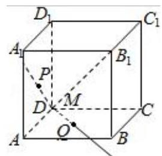

A.

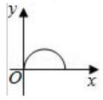

B.

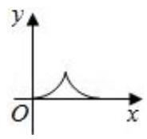

C.

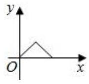

D.

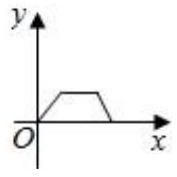

【难度】 $\star   \star   \star$

【答案】 $C$

【解析】解: 设正方体的棱长为 $1,{AM} = x \in  \left\lbrack  {0,\sqrt{3}}\right\rbrack  ,{PQ} = y \in  \left\lbrack  {0,\sqrt{2}}\right\rbrack  ,{PQ}$ 在底面上的射影平行于 ${BD}$ , 且最大值为 ${BD}$ .

从而当 $P$ 在 ${AO}$ 上时, $O$ 为 $A{C}_{1}$ 的中点,分别过 $M\text{ 、 }Q\text{ 、 }P$ 作底面的垂线,垂足分别为 ${M}_{1}\text{ 、 }{Q}_{1}\text{ 、 }{P}_{1}$ ,

则 $y = {PQ} = {P}_{1}{Q}_{1} = 2{M}_{1}{Q}_{1} = {2A}{M}_{1} = 2 \cdot  x\cos \angle {C}_{1}{AC} = {2x} \cdot  \frac{\sqrt{2}}{3} = \frac{2\sqrt{6}}{3}x$ .

而当 $P$ 在 ${C}_{1}O$ 上时,然后 $x$ 变大 $y$ 变小,直到 $y$ 变为 0,根据对称性可知此时 $y = 2\sqrt{2} - \frac{2\sqrt{6}}{3}x$ ,

故函数 $y = \left\{  \begin{array}{l} \frac{2\sqrt{6}}{3}x, x \in  \left\lbrack  {0,\frac{\sqrt{3}}{2}}\right\rbrack  \\  2\sqrt{2} - \frac{2\sqrt{6}}{3}x, x \in  \left( {\frac{\sqrt{3}}{2},\sqrt{3}}\right\rbrack   \end{array}\right.$ ,结合所给的答案,故选: $C$ .

【例14】如图,长方体 ${ABCD} - {A}_{1}{B}_{1}{C}_{1}{D}_{1}$ 中, ${AB} = {AD} = 2, A{A}_{1} = 4$ ,点 $P$ 为面 ${AD}{D}_{1}{A}_{1}$ 的对角线 $A{D}_{1}$ 上的动点 (不包括端点). ${PM} \bot$ 平面 ${ABCD}$ 交 ${AD}$ 于点 $M,{MN} \bot  {BD}$ 于点 $N$ .

(1)设 ${AP} = x$ ，将 ${PN}$ 长表示为 $x$ 的函数；

(2)当 ${PN}$ 最小时，求异面直线 ${PN}$ 与 ${A}_{1}{C}_{1}$ 所成角的大小.(结果用反三角函数值表示)

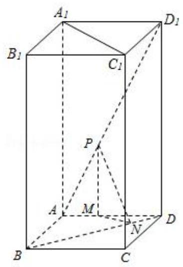

【难度】 $\star   \star   \star$

【答案】见解析

【解析】解: (1) 在 $\bigtriangleup {APM}$ 中, ${PM} = \frac{2\sqrt{5}x}{5},{AM} = \frac{\sqrt{5}x}{5}$ ,其中 $0 < x < 2\sqrt{5}$ ;

在 $\bigtriangleup {MND}$ 中, ${MN} = \frac{\sqrt{2}}{2}\left( {2 - \frac{\sqrt{5}}{5}x}\right)$ ,在 $\bigtriangleup {PMN}$ 中, ${PN} = \sqrt{\frac{9}{10}{x}^{2} - \frac{2\sqrt{5}}{5}x + 2}$ , $x \in  \left( {0,2\sqrt{5}}\right)$ ;

(2)当 $x = \frac{2\sqrt{5}}{9} \in  \left( {0,2\sqrt{5}}\right)$ 时， ${PN}$ 最小，此时 ${PN} = \frac{4}{3}$ .

因为在底面 ${ABCD}$ 中， ${MN}\bot {BD},{AC}\bot {BD}$ ，所以 ${MN}//{AC}$ ，又 ${A}_{1}{C}_{1}//{AC}$ ，

$\angle {PNM}$ 为异面直线 ${PN}$ 与 ${A}_{1}{C}_{1}$ 所成角的平面角,在 $\bigtriangleup {PMN}$ 中, $\angle {PMN}$ 为直角, $\tan \angle {PNM} = \frac{\sqrt{2}}{4}$ ,

所以 $\angle {PNM} = \arctan \frac{\sqrt{2}}{4}$ ,异面直线 ${PN}$ 与 ${A}_{1}{C}_{1}$ 所成角的大小 $\arctan \frac{\sqrt{2}}{4}$ .

## 题型七:利用函数思想处理多变量问题

【例 15】(1) 设 ${\overrightarrow{e}}_{1},{\overrightarrow{e}}_{2}$ 为单位向量,非零向量 $\overrightarrow{b} = x{\overrightarrow{e}}_{1} + y{\overrightarrow{e}}_{2}, x, y \in  R$ . 若 ${\overrightarrow{e}}_{1},{\overrightarrow{e}}_{2}$ 的夹角为 $\frac{\pi }{6}$ ,则 $\frac{\left| x\right| }{\left| \overrightarrow{b}\right| }$ 的最大值等于( )

A. 4 B. 3 C. 2 D. 1

【难度】★★★

【答案】C

【解析】解: ${\overrightarrow{e}}_{1},{\overrightarrow{e}}_{2}$ 为单位向量,若 ${\overrightarrow{e}}_{1},{\overrightarrow{e}}_{2}$ 的夹角为 $\frac{\pi }{6},\therefore \overrightarrow{{e}_{1}} \cdot  \overrightarrow{{e}_{2}} = 1 \cdot  1 \cdot  \cos \frac{\pi }{6} = \frac{\sqrt{3}}{2}$ ,

$\left| \overrightarrow{b}\right|  = \sqrt{{\left( x \cdot  \overrightarrow{{e}_{1}} + y \cdot  \overrightarrow{{e}_{2}}\right) }^{2}} = \sqrt{{x}^{2} + {y}^{2} + \sqrt{3} \cdot  x \cdot  y}.$

$\therefore$ 当 $x = 0$ 时, $\frac{\left| x\right| }{\left| \overrightarrow{b}\right| } = 0$ .

当 $x \neq  0$ 时,根据 $\frac{\left| x\right| }{\left| \overrightarrow{b}\right| } = \sqrt{\frac{{x}^{2}}{{x}^{2} + {y}^{2} + \sqrt{3} \cdot  x \cdot  y}} = \frac{1}{\sqrt{\frac{{x}^{2} + {y}^{2} + \sqrt{3} \cdot  x \cdot  y}{{x}^{2}}}} = \frac{1}{\sqrt{1 + {\left( \frac{y}{x}\right) }^{2} + \sqrt{3} \cdot  \frac{y}{x}}}$

$= \frac{1}{\sqrt{{\left( \frac{y}{x} + \frac{\sqrt{3}}{2}\right) }^{2} + \frac{1}{4}}} \leq  2$ ,当且仅当 $\frac{y}{x} =  - \frac{\sqrt{3}}{2}$ 时,取等号,故 $\frac{\left| x\right| }{\left| \overrightarrow{b}\right| }$ 的最大值等于 2 . 综合可得, $\frac{\left| x\right| }{\left| \overrightarrow{b}\right| }$ 的最大值等

于 2 . 故选: $C$ .

(2)不等式 ${x}^{2} - 2{y}^{2} \leq  {cx}\left( {y - x}\right)$ 对满足 $x > y > 0$ 的任意实数 $x$ ， $y$ 恒成立，则实数 $c$ 的最大值是___.

【难度】 $\star   \star   \star$

【答案】 $2\sqrt{2} - 4$

【解析】解: $\because$ 不等式 ${x}^{2} - 2{y}^{2} \leq  {cx}\left( {y - x}\right)$ 对任意满足 $x > y > 0$ 的实数 $x\text{ 、 }y$ 恒成立,

$\therefore c \leq  \frac{{x}^{2} - 2{y}^{2}}{{xy} - {x}^{2}} = \frac{{\left( \frac{x}{y}\right) }^{2} - 2}{\frac{x}{y} - {\left( \frac{x}{y}\right) }^{2}}$ ,令 $\frac{x}{y} = t > 1,\therefore c \leq  \frac{{t}^{2} - 2}{t - {t}^{2}} = f\left( t\right)$ .

当 $t > 2 + \sqrt{2}$ 时, ${f}^{\prime }\left( t\right)  > 0$ ,函数 $f\left( t\right)$ 单调递增; 当 $1 < t < 2 + \sqrt{2}$ 时, ${f}^{\prime }\left( t\right)  < 0$ ,函数 $f\left( t\right)$ 单调递减.

$\therefore$ 当 $t = 2 + \sqrt{2}$ 时, $f\left( t\right)$ 取得最小值, $f\left( {2 + \sqrt{2}}\right)  = 2\sqrt{2} - 4.\therefore$ 实数 $c$ 的最大值为 $2\sqrt{2} - 4$ .

故答案为: $2\sqrt{2} - 4$ .

巩固训练

1、若不等式 ${x}^{2} + {ax} + 1 \geq  0$ 对于一切 $x \in  \left( {0,\frac{1}{2}}\right)$ 成立，则实数 $a$ 的最小值是( )

A. 0 B. -2

C. $- \frac{5}{2}$ D. -3

【难度】 $\star   \star   \star$

【答案】 $C$

【解析】解: 不等式 ${x}^{2} + {ax} + 1 \geq  0$ 对于一切 $x \in  \left( {0,\frac{1}{2}}\right)$ 成立, $\therefore a \geq   - x - \frac{1}{x}$ 在 $x \in  \left( {0,\frac{1}{2}}\right)$ 上恒成立,

设 $f\left( x\right)  = x + \frac{1}{x},\;x \in  \left( {0,\frac{1}{2}}\right) ;\therefore f\left( x\right)$ 在 $x \in  \left( {0,\frac{1}{2}}\right)$ 内单调递减; $\therefore f\left( x\right)  > f\left( \frac{1}{2}\right)  = \frac{1}{2} + 2 = \frac{5}{2},\therefore  - x - \frac{1}{x} <  - \frac{5}{2},\therefore a \geq   - \frac{5}{2}$ ,即实数 $a$ 的最小值是 $- \frac{5}{2}$ . 故选: $C$ .

2、如图，已知半径为 1 的扇形 ${AOB},\angle {AOB} = {60}^{ \circ  }, P$ 为弧 $\overset{\text{ ⏜ }}{AB}$ 上的一个动点，则 $\overrightarrow{OP} \cdot  \overrightarrow{AB}$ 取值范围是___.

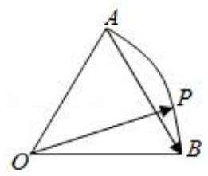

【难度】 $\star   \star   \star$

【答案】 $\left\lbrack  {-\frac{1}{2},\frac{1}{2}}\right\rbrack$

【解析】解: $\overrightarrow{OP} \cdot  \overrightarrow{AB} = \overrightarrow{OP} \cdot  \left( {\overrightarrow{OB} - \overrightarrow{OA}}\right)  = \overrightarrow{OP} \cdot  \overrightarrow{OB} - \overrightarrow{OP} \cdot  \overrightarrow{OA} = \cos \angle {BOP} - \cos \angle {AOP}$

$= \cos \left( {{60}^{ \circ  } - \angle {AOP}}\right)  - \cos \angle {AOP} = \frac{1}{2}\cos \angle {AOP} + \frac{\sqrt{3}}{2}\sin \angle {AOP} - \cos \angle {AOP}$

$= \frac{\sqrt{3}}{2}\sin \angle {AOP} - \frac{1}{2}\cos \angle {AOP} = \sin \left( {\angle {AOP} - {30}^{ \circ  }}\right)$ ；

${0}^{ \circ  } \leq  \angle {AOP} \leq  {60}^{ \circ  }$ ；

$\therefore  - {30}^{ \circ  } \leq  \angle {AOP} - {30}^{ \circ  } \leq  {30}^{ \circ  }$ ; $\therefore  - \frac{1}{2} \leq  \sin \left( {\angle {AOP} - {30}^{ \circ  }}\right)  \leq  \frac{1}{2}$ ; $\therefore \overrightarrow{OP} \cdot  \overrightarrow{AB}$ 的取值范围为 $\left\lbrack  {-\frac{1}{2},\frac{1}{2}}\right\rbrack$ .

故答案为: $\left\lbrack  {-\frac{1}{2},\frac{1}{2}}\right\rbrack$ .

3、已知椭圆 ${x}^{2} + \frac{{y}^{2}}{{b}^{2}} = 1\left( {0 < b < 1}\right)$ ，其左、右焦点分别为 ${F}_{1}\text{ 、 }{F}_{2},\left| {{F}_{1}{F}_{2}}\right|  = {2c}$ . 若此椭圆上存在点 $P$ ,使 $P$ 到直线 $x = \frac{1}{c}$ 的距离是 $\left| {P{F}_{1}}\right|$ 与 $\left| {P{F}_{2}}\right|$ 的等差中项，则 $b$ 的最大值为___.

【难度】 $\star   \star   \star$

【答案】 $\frac{\sqrt{3}}{2}$

【解析】解: 设 $P\left( {x, y}\right)$ ,则 $\because$ 椭圆上存在点 $P$ ,使 $P$ 到直线 $x = \frac{1}{c}$ 的距离是 $\left| {P{F}_{1}}\right|$ 与 $\left| {P{F}_{2}}\right|$ 的等差中项, $\therefore \left| {P{F}_{1}}\right|  + \left| {P{F}_{2}}\right|  = 2\left| {\frac{1}{c} - x}\right|  = {2a},\therefore x = \frac{1}{c} - a,\therefore  - a \leq  \frac{1}{c} - a \leq  a,\therefore \frac{1}{c} \leq  {2a} = 2,\therefore c \geq  \frac{1}{2},\therefore 1 - {b}^{2} \geq  \frac{1}{4}$ , $\because 0 < b < 1,\therefore 0 < b \leq  \frac{\sqrt{3}}{2},\therefore b$ 的最大值为 $\frac{\sqrt{3}}{2}$ . 故答案为 $\frac{\sqrt{3}}{2}$ .

4、设函数 $f\left( x\right)  = \left\{  \begin{array}{l} \left| {x + 1}\right| , x \leq  0 \\  \left| {{\log }_{4}x}\right| , x > 0 \end{array}\right.$ 若关于 $x$ 的方程 $f\left( x\right)  = a$ 有四个不同的解 ${x}_{1},{x}_{2},{x}_{3},{x}_{4}$ ,且 ${x}_{1} < {x}_{2} < {x}_{3} < {x}_{4}$ , 则 ${x}_{3}\left( {{x}_{1} + {x}_{2}}\right)  + \frac{1}{{x}_{3}^{2}{x}_{4}}$ 的取值范围是( )

A. $\left( {-1,\frac{7}{2}}\right\rbrack$ B. $\left( {-1,\frac{7}{2}}\right)$ C. $\left( {-1, + \infty }\right)$ D. $\left( {-\infty ,\frac{7}{2}}\right\rbrack$

【难度】 $\star   \star   \star$

【答案】 $A$

【解析】解: 作函数函数 $f\left( x\right)  = \left\{  \begin{array}{l} \left| {x + 1}\right| , x \leq  0 \\  \left| {{\log }_{4}x}\right| , x > 0 \end{array}\right.$ 的图象如下,结合图象,

$A, B, C, D$ 的横坐标分别为 ${x}_{1},{x}_{2},{x}_{3},{x}_{4}$ ,

故 ${x}_{1} + {x}_{2} =  - 2,{x}_{3}{x}_{4} = 1$ ,故 ${x}_{3}\left( {{x}_{1} + {x}_{2}}\right)  + \frac{1}{{x}_{3}^{2}{x}_{4}} = \frac{1}{{x}_{3}} - 2{x}_{3}$ ,

$\because 0 <  - {\log }_{4}{x}_{3} \leq  1,\therefore \frac{1}{4} \leq  {x}_{3} < 1,\therefore  - 1 < \frac{1}{{x}_{3}} - 2{x}_{3} \leq  \frac{7}{2}$ ,

故选: $A$ .

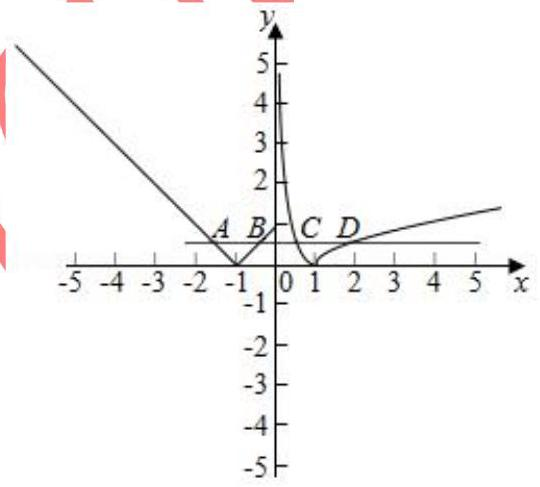

5、已知公差大于零的等差数列 $\left\{  {a}_{n}\right\}$ 的前 $n$ 项和为 ${S}_{n}$ ,且满足: ${a}_{3} \cdot  {a}_{4} = {120},\;{a}_{2} + {a}_{5} = {22}.$

(1)求通项 ${a}_{n}$ ；

(2)若数列 $\left\{  {b}_{n}\right\}$ 是等差数列,且 ${b}_{n} = \frac{{S}_{n}}{n + c}$ ,求非零常数 $c$ ；

(3)在(2)的条件下，求 $f\left( n\right)  = \frac{{b}_{n}}{\left( {n + {36}}\right)  \cdot  {b}_{n + 1}}\left( {n \in  {N}_{ + }}\right)$ 的最大值.

【难度】 $\star   \star   \star$

【答案】见解析

【解析】解: (1) $\because \left\{  {a}_{n}\right\}$ 为等差数列, $\therefore {a}_{3} + {a}_{4} = {a}_{2} + {a}_{5} = {22}$ ,又 ${a}_{3} \cdot  {a}_{4} = {120}$ , $\therefore {a}_{3},{a}_{4}$ 是方程 ${x}^{2} - {22x} + {120} = 0$ 的两实根. 方程两个根为: 10;12,

又公差 $d > 0,\therefore {a}_{3} < {a}_{4},\therefore {a}_{3} = {10},{a}_{4} = {12}$ .

$\therefore d = 2,\therefore {a}_{n} = {a}_{3} + \left( {n - 3}\right)  \times  2 = {2n} + 4$ .

(2)由(1)知 ${S}_{n} = n \cdot  6 + \frac{n\left( {n - 1}\right) }{2} \cdot  2 = {n}^{2} + {5n}$ ，

$\therefore {b}_{n} = \frac{{S}_{n}}{n + c} = \frac{{n}^{2} + {5n}}{n + c},\therefore {b}_{1} = \frac{6}{1 + c},{b}_{2} = \frac{14}{2 + c},{b}_{3} = \frac{24}{3 + c}$ .

$\because \left\{  {b}_{n}\right\}$ 是等差数列, $\therefore 2{b}_{2} = {b}_{1} + {b}_{3},\therefore {c}^{2} - {5c} = 0.\therefore c = 5$ 或 $c = 0$ (舍去), $\therefore c = 5$ .

(3)由(2)得 ${b}_{n} = \frac{{n}^{2} + {5n}}{n + 5} = n$ ，

$\therefore f\left( n\right)  = \frac{n}{\left( {n + {36}}\right) \left( {n + 1}\right) } = \frac{n}{{n}^{2} + {37n} + {36}} = \frac{1}{n + \frac{36}{n} + {37}} \leq  \frac{1}{2\sqrt{n \cdot  \frac{36}{n}} + {37}} = \frac{1}{49}$ .

当且仅当 $n = 6$ 时,表达式取得最大值: $f{\left( n\right) }_{\max } = \frac{1}{49}$ .

## (二)方程思想的应用

## 例题精讲

题型一: 方程思想在集合中的应用

【例 16】已知集合 $A = \left\{  {x \mid  m{x}^{2} - {2x} + 1 = 0, x \in  R}\right\}$ 有且仅有两个子集,则实数 $m =$

【难度】 $\star   \star   \star$

【答案】0 或 1 .

【解析】解: 由题意,① 当 $m = 0$ 时,方程为 $- {2x} + 1 = 0$ ,解得 $x = \frac{1}{2}$ ,满足 $A = \left\{  \frac{1}{2}\right\}$ 仅有两个子集;

② 当 $m \neq  0$ 时,方程有两个相等实根,所以 $\bigtriangleup  = 4 - {4m} = 0$ ,解得 $m = 1$ ;

所以实数 $m$ 的值为 0 或 1 . 故答案为: 0 或 1

题型二: 方程思想在不等式中的应用

【例 17】已知关于 $x$ 的不等式 $\sqrt{x} > {ax} + \frac{3}{2}$ 的解集为 $4 < x < b$ ,求 $a, b$ 的值.

【难度】 $\star   \star   \star$

【答案】 $a = \frac{1}{8}, b = {36}$

【解析】解: 令 $t = \sqrt{x} \geq  0$ ,则原不等式即 $a{t}^{2} - t + \frac{3}{2} < 0$ ,且此不等式的解集为 $\{ x \mid  2 < x < \sqrt{b}\}$ . 故 2 和 $\sqrt{b}$ 是一元二次方程 $a{t}^{2} - t + \frac{3}{2} = 0$ 的两个根, $\therefore$ 由韦达定理可得 $2 + \sqrt{b} = \frac{1}{a},2\sqrt{b} = \frac{3}{2a}$ , 求得 $a = \frac{1}{8}, b = {36}$ .

## 题型三: 方程思想在求函数最值时的应用

【例 18】已知函数 $y = \frac{m{x}^{2} + 4\sqrt{3}x + n}{{x}^{2} + 1}$ 的最大值为 7,最小值为 -1,求此函数式。

高三数学二轮复习 A 版

【难度】 $\star   \star   \star$

【答案】见解析

【解析】函数式变形为: $\left( {y - m}\right) {x}^{2} - 4\sqrt{3}x + \left( {y - n}\right)  = 0, x \in  R$ ,

由已知得 $y - m \neq  0,\therefore \Delta  = {\left( -4\sqrt{3}\right) }^{2} - 4\left( {y - m}\right) \left( {y - n}\right)  \geq  0$ 。

即: ${y}^{2} - \left( {m + n}\right) y + \left( {{mn} - {12}}\right)  \leq  0$ ①,

不等式①的解集为 (-1,7) ，则 $\left\{  \begin{array}{l} 1 + \left( {m + n}\right)  + {mn} - {12} = 0 \\  {49} - 7\left( {m + n}\right)  + {mn} - {12} = 0 \end{array}\right.$ 。

解得: $\left\{  \begin{array}{l} m = 5 \\  n = 1 \end{array}\right.$ 或 $\left\{  \begin{array}{l} m = 1 \\  n = 5 \end{array}\right. \therefore \mathrm{y} = \cdots \cdots$

## 题型四: 方程思想在数列中的应用

【例 19 】若 $a, b$ 是方程 ${x}^{2} - {px} + q = 0\left( {p > 0, q > 0}\right)$ 的两个不同根,且 $a, b, - 2$ 这三个数可适当排序后成等差数列,也可适当排序后成等比数列,则 $p + q$ 的值等于 ( )

A. 6 B. 7 C. 8 D. 9

【难度】 $\star   \star   \star$

【答案】 $D$

【解析】解: 根据题意, $a + b = p,{ab} = q$ ,又 $p > 0, q > 0$ ,得 $a > 0, b > 0$ ,

$\because a, b, - 2$ 这三个数可适当排序后构成等差数列,也可适当排序后成等比数列,

$\therefore \left\{  \begin{array}{l} {2b} = a - 2 \\  {ab} = 4 \end{array}\right.$ 或 $\left\{  \begin{array}{l} {2a} = b - 2 \\  {ab} = 4 \end{array}\right.$ ,解得 $\left\{  \begin{array}{l} a = 4 \\  b = 1 \end{array}\right.$ 或 $\left\{  \begin{array}{l} a = 1 \\  b = 4 \end{array}\right.$ ,

$\therefore p = a + b = 5, q = 1 \times  4 = 4$ ,则 $p + q = 9$ . 故选: $D$ .

【例 20】设数列 $\left\{  {a}_{n}\right\}$ 是公差不为零的等差数列,前 $n$ 项和为 ${S}_{n}$ ,满足 ${a}_{2}^{2} + {a}_{3}^{2} = {a}_{4}^{2} + {a}_{5}^{2},{S}_{7} = 7$ ,则使得 $\frac{{a}_{m} \cdot  {a}_{m + 1}}{{a}_{m + 2}}$ 为数列 $\left\{  {a}_{n}\right\}$ 中的项的所有正整数 $m$ 的值为___.

【难度】 $\star   \star   \star$

【答案】 2

【解析】解: 由 ${a}_{2}^{2} + {a}_{3}^{2} = {a}_{4}^{2} + {a}_{5}^{2}$ 得: $2{a}_{1} + {5d} = 0$ ①,

由 ${S}_{7} = \frac{7\left( {{a}_{1} + {a}_{7}}\right) }{2} = 7{a}_{4} = 7\left( {{a}_{1} + {3d}}\right)  = 7$ ,得到 ${a}_{1} + {3d} = 1$ ②,

联立①②，解得: ${a}_{1} =  - 5$ ， $d = 2$ ，

所以 ${a}_{n} =  - 5 + 2\left( {n - 1}\right)  = {2n} - 7$ ,

根据题意得: $\frac{{a}_{m} \cdot  {a}_{m + 1}}{{a}_{m + 2}} = \frac{\left( {{2m} - 7}\right) \left( {{2m} - 5}\right) }{{2m} - 3} = {2n} - 7$ ,

设 ${2m} - 3 = b$ ,得到 $b - 6 + \frac{8}{b} = {2n} - 7$ ,得到 $\frac{8}{b}$ 必须为偶数,即 $b =  - 1,1, - 2,2, - 4,4$ ,

又 $b \geq   - 1$ (数列的第三项) 且 $b$ 为奇数,得到 $b =  - 1$ 或 $b = 1$ ,

进而得到 $m = 1$ 或 $m = 2$ ,

当 $m = 1$ 时, $\frac{{a}_{m} \cdot  {a}_{m + 1}}{{a}_{m + 2}} =  - {15} = {2n} - 7$ ,解得 $n$ 不为正整数,不合题意舍去,

所以满足题意的正整数 $m$ 的值为 2 . 故答案为: 2

## 题型五: 方程思想在解析几何中的应用

【例 21 】直线 $\left( {1 + a}\right) x + y + 1 = 0$ 与圆 ${x}^{2} + {y}^{2} - {2x} = 0$ 相切,则 $\mathrm{a}$ 的值为 (   )

A. $1, - 1$ B. 2，-2 C. 1 D. -1

【难度】 $\star   \star   \star$

【答案】D

【解析】: 由直线方程得 $y =  - 1 - \left( {1 + a}\right) x$ ,并代入圆方程,整理得 $\left( {2 + {2a} + {a}^{2}}\right) {x}^{2} + {2ax} + 1 = 0$ 。 又直线与圆相切,应有 $\Delta  = 4{a}^{2} - 4\left( {2 + {2a} + {a}^{2}}\right)  =  - {8a} - 8 = 0$ ,解得 $a =  - 1$ 。故选 D。

【例 22】已知直线 $y = k\left( {x + 2}\right)$ 与抛物线 $C : {y}^{2} = {8x}$ 相交于 $A\text{ 、 }B$ 两点， $F$ 为抛物线 $C$ 的焦点. 若 $\left| \overrightarrow{FA}\right|  = 2\left| \overrightarrow{FB}\right|$ ,则实数 $k =$

【难度】 $\star   \star   \star$

【答案】 $\pm  \frac{2\sqrt{2}}{3}$

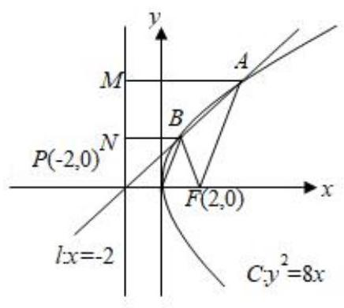

【解析】解: 设抛物线 $C : {y}^{2} = {8x}$ 的准线为 $l : x =  - 2$ ,直线 $y = k\left( {x + 2}\right)$ 恒过定点 $P\left( {-2,0}\right)$

如图过 $A\text{ 、 }B$ 分别作 ${AM} \bot  l$ 于 $M,{BN} \bot  l$ 于 $N$ ,由 $\left| {FA}\right|  = 2\left| {FB}\right|$ ,则 $\left| {AM}\right|  = 2\left| {BN}\right| ,$

点 $B$ 为 ${AP}$ 的中点、连接 ${OB}$ ,则 $\left| {OB}\right|  = \frac{1}{2}\left| {AF}\right|$ ,

$\therefore \left| {OB}\right|  = \left| {BF}\right|$ ,点 $B$ 的横坐标为 $1,\therefore$ 点 $B$ 的坐标为 $\left( {1, \pm  2\sqrt{2}}\right)$ , $\therefore k = \frac{\pm 2\sqrt{2} - 0}{1 - \left( {-2}\right) } =  \pm  \frac{2\sqrt{2}}{3}$ . 故答案为: $\pm  \frac{2\sqrt{2}}{3}$ .

## 题型六:方程思想在立体几何中的应用

【例 23】如图,圆锥形容器的高为 $h$ ,圆锥内水面的高为 ${h}_{1}$ ,且 ${h}_{1} = \frac{1}{3}h$ ,若将圆锥的倒置,水面高为 ${h}_{2}$ , 则 ${h}_{2}$ 等于( )

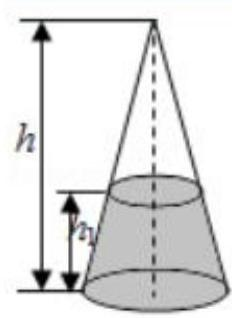

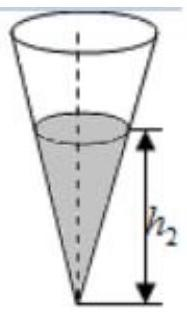

A. $\frac{2}{3}h$ B. $\frac{19}{27}h$ C. $\frac{\sqrt[3]{6}}{3}h$ D. $\frac{\sqrt[3]{19}}{3}h$

【难度】★★★

【答案】 $D$

【解析】解: 设圆锥形容器的底面积为 $S$ ,则未倒置前液面的面积为 $\frac{4}{9}S$ .

$\therefore$ 水的体积 $V = \frac{1}{3}{Sh} - \frac{1}{3} \times  \frac{4}{9}S \times  \left( {h - {h}_{1}}\right)  = \frac{19}{81}{Sh}$ .

设倒置后液面面积为 ${S}^{\prime }$ ,则 $\frac{{S}^{\prime }}{S} = {\left( \frac{{h}_{2}}{h}\right) }^{2},\therefore {S}^{\prime } = \frac{S{h}_{2}{}^{2}}{{h}^{2}}.\therefore$ 水的体积 $V = \frac{1}{3}{S}^{\prime }{h}_{2} = \frac{S{h}_{2}{}^{3}}{3{h}^{2}}$ .

$\therefore \frac{19}{81}{Sh} = \frac{S{h}_{2}^{3}}{3{h}^{2}}$ ，解得 ${h}_{2} = \frac{\sqrt[3]{19}h}{3}$ . 故选: $D$ .

## 巩固训练

1、已知 $f\left( x\right)$ 是定义在 $R$ 上的奇函数,对任意两个不相等的正数 ${x}_{1},{x}_{2}$ 都有 $\frac{{x}_{2}f\left( {x}_{1}\right)  - {x}_{1}f\left( {x}_{2}\right) }{{x}_{1} - {x}_{2}} < 0$ ,记 $a = \frac{f\left( {4}^{0.2}\right) }{{4}^{0.2}}, b = \frac{f\left( {0.4}^{2}\right) }{{0.4}^{2}}, c = \frac{f\left( {{\log }_{0.2}4}\right) }{{\log }_{0.2}4}$ ,则 ( )

A. $c < b < a$ B. $a < b < c$ C. $a < c < b$ D. $c < b < a$

【难度】★★★

【答案】 $C$

【解析】解: 因为对任意两个不相等的正数 ${x}_{1},{x}_{2}$ 都有 $\frac{{x}_{2}f\left( {x}_{1}\right)  - {x}_{1}f\left( {x}_{2}\right) }{{x}_{1} - {x}_{2}} < 0$ ,

令 ${x}_{1} > {x}_{2} > 0$ ,则 ${x}_{2}f\left( {x}_{1}\right)  - {x}_{1}f\left( {x}_{2}\right)  < 0$ ,即 $\frac{f\left( {x}_{1}\right) }{{x}_{1}} < \frac{f\left( {x}_{2}\right) }{{x}_{2}}$ ,

同理,当 $0 < {x}_{1} < {x}_{2}$ 时,有 $\frac{f\left( {x}_{1}\right) }{{x}_{1}} > \frac{f\left( {x}_{2}\right) }{{x}_{2}}$ ,所以函数 $g\left( x\right)  = \frac{f\left( x\right) }{x}$ 在 $\left( {0, + \infty }\right)$ 上单调递减,

又函数 $f\left( x\right)$ 为奇函数,则 $g\left( {-x}\right)  = \frac{f\left( {-x}\right) }{-x} = \frac{f\left( x\right) }{x} = g\left( x\right)$ ,所以 $g\left( x\right)$ 为偶函数,

则 $a = \frac{f\left( {4}^{0.2}\right) }{{4}^{0.2}} = g\left( {4}^{0.2}\right) , b = \frac{f\left( {0.4}^{2}\right) }{{0.4}^{2}} = g\left( {0.4}^{2}\right) , c = \frac{f\left( {{\log }_{0.2}4}\right) }{{\log }_{0.2}4} = g\left( {{\log }_{0.2}4}\right)  = g\left( {{\log }_{5}4}\right)$ ,

又 $0 < 0 \cdot  {4}^{2} = {0.16} < {0.5} < {\log }_{5}4 < 1 < {4}^{0.2}$ ,所以 $g\left( {4}^{0.2}\right)  < g\left( {{\log }_{5}4}\right)  < g\left( {0.4}^{2}\right)$ ,则 $a < c < b$ . 故选: $C$ .

2、已知函数 $f\left( x\right)  = \left| {{\log }_{2}x}\right|$ ，正实数 $m$ ， $n$ 满足 $m < n$ ，且 $f\left( m\right)  = f\left( n\right)$ ，若 $f\left( x\right)$ 在区间 $\left\lbrack  {{m}^{2}\text{ ， }n}\right\rbrack$ 上的最大值为 2,则 $\frac{m}{n} =$ ___.

【难度】 $\star   \star   \star$

【答案】 $\frac{1}{4}$

【解析】解: 由题意得 $- {\log }_{2}^{m} = {\log }_{2}^{n},\frac{1}{m} = n$ ,

函数 $f\left( x\right)  = \left| {{\log }_{2}x}\right|$ 在 $\left( {0,1}\right)$ 上是减函数,在 $\left( {1, + \infty }\right)$ 上是增函数,

$\therefore \left| {{\log }_{2}{m}^{2}}\right|  = 2$ ,或 ${\log }_{2}^{n} = 2.\therefore$ 当 $\left| {{\log }_{2}{m}^{2}}\right|  = 2$ 时, $n = \frac{1}{m}, n = 2, m = \frac{1}{2}$ .

此时, $f\left( x\right)$ 在区间 $\left\lbrack  {{m}^{2}, n}\right\rbrack$ 上的最大值为 2 ,满足条件.

当 ${\log }_{2}^{n} = 2$ 时, $n = 4, m = \frac{1}{4}$ ,此时, $f\left( x\right)$ 在区间 $\left\lbrack  {{m}^{2}, n}\right\rbrack$ 上的最大值为 $\left| {{\log }_{2}\frac{1}{16}}\right|  = 4$ ,不满足条件.

综上, $n = 2, m = \frac{1}{2}$ ,故 $\frac{m}{n} = \frac{1}{4}$ ,故答案为: $\frac{1}{4}$ .

3、若实数 $a, b > 0$ ，满足 ${abc} = a + b + c$ ， ${a}^{2} + {b}^{2} = 1$ ，则实数 $c$ 的最小值为___

【难度】 $\star   \star   \star$

【答案】 $- 2\sqrt{2}$

【解析】 ${abc} = a + b + c \Rightarrow  c = \frac{a + b}{{ab} - 1},\because {\left( a + b\right) }^{2} \leq  2\left( {{a}^{2} + {b}^{2}}\right)  = 2,\therefore a + b \leq  \sqrt{2}$ ,

$\because {2ab} \leq  {a}^{2} + {b}^{2} = 1,\therefore {ab} - 1 \leq   - \frac{1}{2}, - 2 \leq  \frac{1}{{ab} - 1} < 0,\therefore {c}_{\min } =  - 2\sqrt{2}$ ,此时 $a = b = \frac{\sqrt{2}}{2}$ .

4、对于函数 $f\left( x\right)$ ,若在定义域内存在实数 ${x}_{0}$ ,满足 $f\left( {-{x}_{0}}\right)  =  - f\left( {x}_{0}\right)$ ,称 $f\left( x\right)$ 为 “局部奇函数”,若 $f\left( x\right)  = {x}^{2} - {2m} \cdot  x + {m}^{2} - 3$ 为定义域 $R$ 上的 “局部奇函数”，则实数 $m$ 的取值范围是 ( )

高三数学二轮复习 A 版

A. $\left\lbrack  {-\sqrt{3},\sqrt{6}}\right\rbrack$ B. $\left\lbrack  {-\sqrt{3},\sqrt{3}}\right\rbrack$ C. $\left\lbrack  {-\sqrt{6},\sqrt{3}}\right\rbrack$ D. $\left\lbrack  {-\sqrt{6},\sqrt{6}}\right\rbrack$

【难度】 $\star   \star   \star$

【答案】 $B$

【解析】解: 根据题意, $f\left( x\right)$ 为 “局部奇函数” 等价于关于 $x$ 的方程 $f\left( {-x}\right)  =  - f\left( x\right)$ 有解.

即 ${x}^{2} + {2mx} + {m}^{2} - 3 =  - \left( {{x}^{2} - {2mx} + {m}^{2} - 3}\right)$ ,整理得: ${x}^{2} + {m}^{2} - 3 = 0$ ,

必有 ${m}^{2} - 3 \leq  0$ ,解得: $- \sqrt{3} \leq  m \leq  \sqrt{3}$ ,即 $m$ 的取值范围为 $\left\lbrack  {-\sqrt{3},\sqrt{3}}\right\rbrack$ ,故选: $B$ .

5、一般来说，事物总是经过发生、发展、成熟三个阶段，每个阶段的发展速度各不相同，通常在发生阶段变化速度较为缓慢、在发展阶段变化速度加快、在成熟阶段变化速度又趋于缓慢, 按照上述三个阶段发展规律得到的变化曲线称为生长曲线. 美国生物学家和人口统计学家雷蒙德？皮尔提出一种能较好地描述生物生长规律的生长曲线,称为 “皮尔曲线”,常用的 “皮尔曲线” 的函数解析式为 $f\left( x\right)  = \frac{K}{1 + b{e}^{-{ax}}}\left( {K > 0, a > 0}\right.$ , $b > 0), x \in  \lbrack 0, + \infty )$ ,该函数也可以简化为 $f\left( x\right)  = \frac{K}{1 + {a}^{{kx} + b}}\left( {K > 0, a > 1, k < 0}\right)$ 的形式. 已知 $f\left( x\right)  = \frac{10}{1 + {3}^{{kx} + b}}\left( {x \in  N}\right)$ 描述的是一种果树的高度随着时间 $x$ (单位: 年) 的变化规律,若刚栽种时该果树的高为 ${1m}$ ，经过一年，该果树的高为 ${2.5m}$ ，则该果树的高度超过 ${8m}$ ，至少需要( )

A. 4 年 B. 3 年 C. 5 年 D. 2 年

【难度】 $\star   \star   \star$

【答案】 $A$

【解析】解: 由题刚裁种时该果树的高为 $1\mathrm{\;m}$ ,经过一年,该果树的高为 ${2.5}\mathrm{\;m}$ ,得 $b = 2,{2.5} = \frac{10}{1 + {3}^{k \times  1 + 2}}$ , 解得 $k =  - 1$ ,所以 $f\left( x\right)  = \frac{10}{1 + {3}^{-x + 2}}$ ,由函数解析式可知, $f\left( x\right)$ 在 $\lbrack 0, + \infty )$ 上单调递增,

且 $f\left( 3\right)  = \frac{10}{1 + {3}^{-1}} = \frac{30}{4} = {7.5} < 8, f\left( 4\right)  = \frac{10}{1 + {3}^{-2}} = 9 > 8$ ,

故该果树的高度超过 ${8m}$ ，至少需要 4 年. 故选: $A$ .

## (三)函数与方程的综合

## 例题精讲

【例24】若 $a, b$ 是正数,且满足 ${ab} = a + b + 3$ ,求 ${ab}$ 的取值范围.

【难度】 $\star   \star   \star$

【答案】 $\lbrack 9, + \infty )$

【解析】方法一: (看成函数的值域) $\because {ab} = a + b + 3,\therefore a \neq  1,\therefore b = \frac{a + 3}{a - 1}$ ,而 $b > 0,\therefore \frac{a + 3}{a - 1} > 0$ ,

即 $a > 1$ 或 $a <  - 3$ . 又 $a > 0,\therefore a > 1$ ,故 $a - 1 > 0$ .

$\therefore {ab} = a \cdot  \frac{a + 3}{a - 1} = \frac{{\left( a - 1\right) }^{2} + 5\left( {a - 1}\right)  + 4}{a - 1} = a - 1 + \frac{4}{a - 1} + 5 \geq  9$

当且仅当 $a - 1 = \frac{4}{a - 1}$ ,即 $a = 3$ 时取等号. 又 $a > 3$ 时, $a - 1 + \frac{4}{a - 1} + 5$ 是关于 $a$ 的单调增函数,

$\therefore {ab}$ 的取值范围是 $\lbrack 9, + \infty )$ .

方法二: 若设 ${ab} = t$ ,则 $a + b = t - 3,\therefore a, b$ 可看成方程 ${x}^{2} - \left( {t - 3}\right) x + t = 0$ 的两个.正根.

从而有 $\left\{  {\begin{matrix} \Delta  = {\left( t - 3\right) }^{2} - {4t} \geq  0 \\  a + b = t - 3 > 0 \\  {ab} = t > 0 \end{matrix} \Rightarrow  \left\{  \begin{matrix} t \leq  1\text{ 或 }t \geq  9 \\  t > 3 \\  t > 0 \end{matrix}\right. }\right.  \Rightarrow  t \geq  9$ ,即 ${ab} \geq  9$ .

【例25】已知函数 $f\left( x\right)  = \left( {{x}^{2} + {8x} + {15}}\right) \left( {a{x}^{2} + {bx} + c}\right)$ ( $a, b, c \in  \mathbf{R}$ )是偶函数，若方程 $a{x}^{2} + {bx} + c = 1$ 在区间 $\left\lbrack  {1,2}\right\rbrack$ 上有解,则实数 $a$ 的取值范围是___

【难度】 $\star   \star   \star$

【答案】 $\left\lbrack  {\frac{1}{8},\frac{1}{3}}\right\rbrack$

【解析】展开后,奇次项有 $\left( {{8a} + b}\right) {x}^{3}\text{ 、 }\left( {{8c} + {15b}}\right) x,\therefore {8a} + b = 0$ ,

${8c} + {15b} = 0,\therefore b =  - {8a}, c = {15a}$ ,方程 $a{x}^{2} + {bx} + c = 1$ ,即 $a\left( {x - 3}\right) \left( {x - 5}\right)  = 1$ ,

$\because x \in  \left\lbrack  {1,2}\right\rbrack  ,\therefore \left( {x - 3}\right) \left( {x - 5}\right)  = \frac{1}{a} \in  \left\lbrack  {3,8}\right\rbrack$ ,即 $a \in  \left\lbrack  {\frac{1}{8},\frac{1}{3}}\right\rbrack$ .

## 巩固训练

1、若函数 $f\left( x\right)  = {2}^{x}\left( {x + a}\right)  - 1$ 在区间 $\left\lbrack  {0,1}\right\rbrack$ 上有零点，则实数 $a$ 的取值范围是___.

【难度】 $\star   \star   \star$

【答案】 $\left\lbrack  {-\frac{1}{2},1}\right\rbrack$

【解析】解: 函数 $f\left( x\right)  = {2}^{x}\left( {x + a}\right)  - 1$ 在区间 $\left\lbrack  {0,1}\right\rbrack$ 上有零点 $\Leftrightarrow$ 方程 $x + a = {\left( \frac{1}{2}\right) }^{x}$ 在区间 $\left\lbrack  {0,1}\right\rbrack$ 上有解. $\Leftrightarrow$ 函数 $y = x + a, y = \frac{1}{{2}^{x}}$ 的图象在区间 $\left\lbrack  {0,1}\right\rbrack$ 上有交点.

如图在同一坐标系内画出函数 $y = x + a, y = \frac{1}{{2}^{x}}$ 的图象,结合图象可得:

$0 + a \leq  {\left( \frac{1}{2}\right) }^{0}$ ，且 $1 + a \geq  {\left( \frac{1}{2}\right) }^{1} \Rightarrow   - \frac{1}{2} \leq  a \leq  1$ 实数 $a$ 的取值范围是 $\left\lbrack  {-\frac{1}{2},1}\right\rbrack$ ，故答案为: $\left\lbrack  {-\frac{1}{2},1}\right\rbrack$

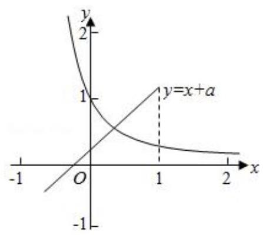

2、关于 $x$ 的方程 ${4}^{x} - a \cdot  {2}^{x} + 4 = 0$ 在 $\lbrack 0, + \infty )$ 上有两个不同的实数根，则实数 $a$ 的取值范围是___.

【难度】 $\star   \star   \star$

【答案】 $(4,5\rbrack$

【解析】解: $\because {4}^{x} - a \cdot  {2}^{x} + 4 = 0,\therefore a = \frac{{4}^{x} + 4}{{2}^{x}}$ ,令 $t = {2}^{x} \in  \lbrack 1, + \infty )$ ,

$\therefore a = \frac{{t}^{2} + 4}{t} = t + \frac{4}{t}$ ,由对勾函数的单调性得:

$a = t + \frac{4}{t} \geq  4$ ,又关于 $x$ 的方程 ${4}^{x} - a \cdot  {2}^{x} + 4 = 0$ 在 $\lbrack 0, + \infty )$ 上有两个不同的实数根,

$\therefore y = a, y = t + \frac{4}{t}$ 有两个不同的交点, $\therefore 4 < a \leq  5$ ; 故答案为: $(4,5\rbrack$ .

3、已知函数 $f\left( x\right)  = \frac{1}{a} - \frac{1}{x}\;\left( {a > 0, x > 0}\right)$ .

(1)求证: $f\left( x\right)$ 在 $\left( {0, + \infty }\right)$ 上是增函数；

(2)若 $f\left( x\right)  \leq  {2x}$ 在 $\left( {0, + \infty }\right)$ 上恒成立，求 $a$ 的取值范围；

(3)若 $f\left( x\right)$ 在 $\left\lbrack  {m, n}\right\rbrack$ 上的值域是 $\left\lbrack  {m, n}\right\rbrack  \left( {m \neq  n}\right)$ ，求 $a$ 的取值范围.

【难度】

【答案】见解析

【解析】(1)证明: 任取 ${x}_{1} > {x}_{2} > 0, f\left( {x}_{1}\right)  - f\left( {x}_{2}\right)  = \left( {\frac{1}{a} - \frac{1}{{x}_{1}}}\right)  - \left( {\frac{1}{a} - \frac{1}{{x}_{2}}}\right)  = \frac{1}{{x}_{2}} - \frac{1}{{x}_{1}} = \frac{{x}_{1} - {x}_{2}}{{x}_{1}{x}_{2}}$

$\because {x}_{1} > {x}_{2} > 0,\therefore {x}_{1}{x}_{2} > 0,{x}_{1} - {x}_{2} > 0,\therefore f\left( {x}_{1}\right)  - f\left( {x}_{2}\right)  > 0$ ,即 $f\left( {x}_{1}\right)  > f\left( {x}_{2}\right)$ ,故 $f\left( x\right)$ 在 $\left( {0, + \infty }\right)$ 上是增函数.

(2)解: $\because \frac{1}{a} - \frac{1}{x} \leq  {2x}$ 在 $\left( {0, + \infty }\right)$ 上恒成立，且 $a > 0,\therefore a \geq  \frac{1}{{2x} + \frac{1}{x}}$ 在 $\left( {0, + \infty }\right)$ 上恒成立，令 $g\left( x\right)  = \frac{1}{{2x} + \frac{1}{x}} \leq  \frac{1}{2\sqrt{{2x} \cdot  \frac{1}{x}}} = \frac{\sqrt{2}}{4}$ (当且仅当 ${2x} = \frac{1}{x}$ 即 $x = \frac{\sqrt{2}}{2}$ 时取等号),要使 $a \geq  \frac{1}{{2x} + \frac{1}{x}}$ 在 $\left( {0, + \infty }\right)$ 上恒

成立,则 $a \geq  \frac{\sqrt{2}}{4}$ . 故 $a$ 的取值范围是 $\left\lbrack  {\frac{\sqrt{2}}{4}, + \infty }\right)$ .

(3)解:由(1) $f\left( x\right)$ 在定义域上是增函数 $\therefore m = f\left( m\right) , n = f\left( n\right)$ ，即 ${m}^{2} - \frac{1}{a}m + 1 = 0,{n}^{2} - \frac{1}{a}n + 1 = 0$

故方程 ${x}^{2} - \frac{1}{a}x + 1 = 0$ 有两个不相等的正根 $m, n$ ,注意到 $m \cdot  n = 1$ ,故只需要 $\Delta  = {\left( \frac{1}{a}\right) }^{2} - 4 > 0$ ,由于 $a > 0$ ,则 0 $< a < \frac{1}{2}$ .
