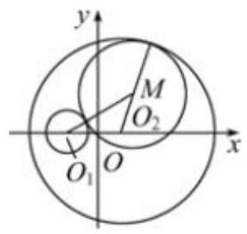
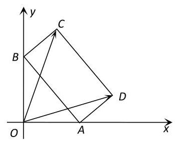
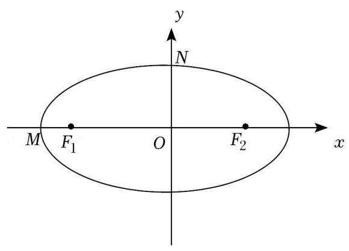
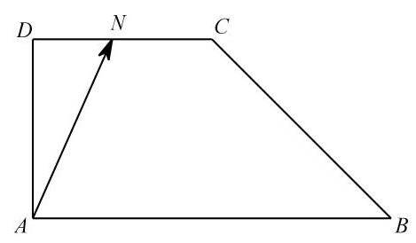
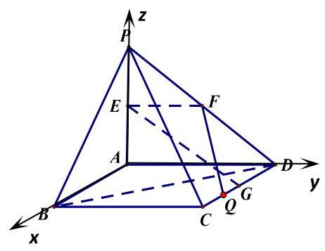
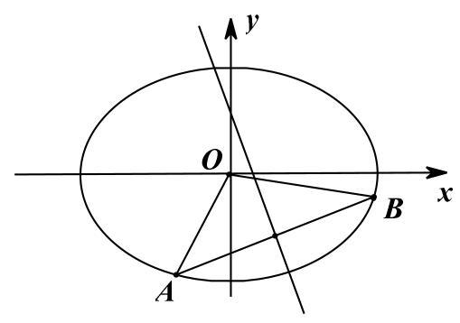

## 第 2 课:数形结合思想

<table><tr><td>教学目标</td><td>1、掌握常见数形结合思想的应用情境;   2、具有自觉转化数与形的意识；   3、探索数形转化的创新应用</td></tr><tr><td>重点</td><td>1、数学结合思想的常见应用；   2、数学结合思想的灵活应用</td></tr><tr><td>难 点</td><td>数形结合思想的灵活应用</td></tr></table>

## 知识梳理

数形结合是中学数学中四种重要思想方法之一, 对于所研究的代数问题, 有时可研究其对应几何的性质使问题得以解决 (以形助数); 或者对于所研究的几何问题, 可借助于对应图形的数量关系使问题得以解决 (以数助形), 这种解决问题的方法称之为数形结合.

我国著名数学家华罗庚曾写过关于数形结合的一首词:

数与形, 本是相倚依, 焉能分作两边飞。

数缺形时少知觉，形少数时难入微。

数形结合百般好，隔裂分家万事非。

切莫忘，几何代数统一体，

永远联系，切莫分离。

几何图形的形象直观，便于理解，代数方法具有一般性，解题过程的机械化，可操作性强，便于把握， 因此数形结合思想是数学中重要的思想方法. 所谓数形结合就是根据数学问题的题设和结论之间的内在联系, 既分析其数量关系, 又揭示其几何意义使数量关系和几何图形巧妙地结合起来, 并充分地利用这种结合, 探求解决问题的思路, 使问题得以解决的思考方法.

## (一) 代数问题转化成图形问题

## 知识梳理

## 常见的转化有:

①将集合关系利用文氏图或者函数图像或者曲线图像进行转化;

②不等式的有解性和恒成立问题可以通过函数图像或曲线图像进行转化;

③通过特定的数学概念或数学式的几何意义进行转化(如绝对值、斜率、距离公式等)；

④方程的解通过函数图像进行转化;

⑤利用曲线与方程的对应关系进行转化；

⑥利用复数和向量的几何意义进行转化；

⑦利用数列的函数性质进行转化。

## 例题精讲

【例 1】某校为拓展学生在音乐、体育、美术方面的能力, 开设了相应的兴趣班. 某班共有 34 名学生参加了兴趣班，有 17 人参加音乐班，有 20 人参加体育班，有 12 人参加美术班，同时参加音乐班与体育班的有 6 人，同时参加音乐班与美术班的有 4 人. 已知没有人同时参加三个班，则仅参加一个兴趣班的人数为( )

A. 19 B. 20 C. 21 D. 22

【例 2】若 $f\left( x\right)  = {x}^{\frac{2}{3}} - {x}^{-\frac{1}{2}}$ ,则满足 $f\left( x\right)  < 0$ 的 $x$ 的取值范围是___.

【例 3】已知实数 $x, y$ 满足条件 $\left\{  \begin{array}{l} x - y \geq  0 \\  x + y - 3 \leq  0 \\  x \geq  1 \end{array}\right.$ ,则 $\frac{y}{x + 1}$ 的最大值为 ( )

A. $\frac{1}{2}$ B. $\frac{3}{5}$ C. 1 D. 2

【例 4】在平面直角坐标系中,设点 $O\left( {0,0}\right) , A\left( {3,\sqrt{3}}\right)$ ,点 $P\left( {x, y}\right)$ 的坐标满足 $\left\{  \begin{array}{l} \sqrt{3}x - y \leq  0 \\  x - \sqrt{3}y + 2 \geq  0 \\  y \geq  0 \end{array}\right.$ , 则 $\overrightarrow{OA}$ 在 $\overrightarrow{OP}$ 上的投影的取值范围是___

【例 5】已知 $m \leq  \frac{2}{3}{x}^{2} - {2x} + 3 \leq  n\left( {m \neq  n}\right)$ 的解集为 $\left\lbrack  {m, n}\right\rbrack$ ,则 $m + n$ 的值为___.

【例 6】已知函数 $f\left( x\right)  = \left\{  \begin{array}{l} \frac{2}{x}, x \geq  2 \\  {\left( x - 1\right) }^{3}, x < 2 \end{array}\right.$ ,若关于 $x$ 的方程 $f\left( x\right)  = k$ 有两个不同的实根,则实数 $k$ 的取值范围是___.

【例 7】若定义域均为 $D$ 的三个函数 $f\left( x\right) \text{ 、 }g\left( x\right) \text{ 、 }h\left( x\right)$ 满足条件: 对任意 $x \in  D$ ,点 $\left( {x, g\left( x\right) }\right)$ 与点 $\left( {x, h\left( x\right) }\right)$ 都关于点 $\left( {x, f\left( x\right) }\right)$ 对称,则称 $h\left( x\right)$ 是 $g\left( x\right)$ 关于 $f\left( x\right)$ 的 “对称函数”,已知 $g\left( x\right)  = \sqrt{1 - {x}^{2}}, f\left( x\right)  = {2x} + b$ , $h\left( x\right)$ 是 $g\left( x\right)$ 关于 $f\left( x\right)$ 的 “对称函数”，且 $h\left( x\right)  \geq  g\left( x\right)$ 恒成立，则实数 $b$ 的取值范围是___

【例 8】已知函数 $f\left( x\right)  = \left| \frac{1}{\left| x\right|  - 1}\right|$ ,关于 $x$ 的方程 ${f}^{2}\left( x\right)  + {bf}\left( x\right)  + c = 0$ 有 7 个不同实数根, 则实数 $b\text{ 、 }c$ 满足的关系式是___

【例 9】函数 $y = \frac{\sin x + 2}{\cos x - 2}$ 的值域为___.

【例 10】已知 ${a}_{n} = \frac{n - \sqrt{122}}{n - \sqrt{123}}\left( {n \in  {N}^{ * }}\right)$ ,则在数列 $\left\{  {a}_{n}\right\}$ 的前 40 项中最大项和最小项分别是(   )

A. ${a}_{1},{a}_{30}$ B. ${a}_{1},{a}_{9}$ C. ${a}_{10},{a}_{9}$ D. ${a}_{12},{a}_{11}$

【例 11】直线 $l : y =  - x + m$ 与曲线 $x = \sqrt{4 - {y}^{2}}$ 有两个公共点,则实数 $m$ 的取值范围是(   )

A. $\lbrack  - 2,2\sqrt{2})$ B. $( - 2\sqrt{2}, - 2\rbrack$ C. $( - 2\sqrt{2},2\rbrack$ D. $\lbrack 2,2\sqrt{2})$

【例 12】已知 $A\text{ 、 }B$ 为平面上的两个定点,且 $\left| \overrightarrow{AB}\right|  = 2$ ,该平面上的动线段 ${PQ}$ 的端点 $P\text{ 、 }Q$ ,满足 $\left| \overrightarrow{AP}\right|  \leq  5$ , $\overrightarrow{AP} \cdot  \overrightarrow{AB} = 6,\overrightarrow{AQ} =  - 2\overrightarrow{AP}$ ，则动线段 ${PQ}$ 所形成图形的面积为( )

A. 36 B. 60 C. 72 D. 108

## 巩固训练

1、某班共 30 人，其中 15 人喜爱篮球运动，10 人喜爱乒乓运动，8 人对这两项运动都不喜爱，则喜爱篮球运动但不喜爱乒乓球运动的人数为___.

2、已知向量 $\overrightarrow{a}$ 和 $\overrightarrow{b}$ 满足条件: $\overrightarrow{a} \neq  \overrightarrow{b}$ 且 $\overrightarrow{a} \cdot  \overrightarrow{b} \neq  0$ . 若对于任意实数 $t$ ，恒有 $\left| {\overrightarrow{a} - t\overrightarrow{b}}\right|  \geq  \left| {\overrightarrow{a} - \overrightarrow{b}}\right|$ ，则在 $\overrightarrow{a}$ 、 $\overrightarrow{b}$ 、 $\overrightarrow{a} + \overrightarrow{b}$ 、 $\overrightarrow{a} - \overrightarrow{b}$ 这四个向量中，一定具有垂直关系的两个向量是( )

A. $\overrightarrow{a}$ 与 $\overrightarrow{a} - \overrightarrow{b}$ B. $\overrightarrow{b}$ 与 $\overrightarrow{a} - \overrightarrow{b}$ C. $\overrightarrow{a}$ 与 $\overrightarrow{a} + \overrightarrow{b}$ D. $\overrightarrow{b}$ 与 $\overrightarrow{a} + \overrightarrow{b}$

3、复数 $z$ 满足 $\left| {z - 1}\right|  + \left| {z + 1}\right|  = \sqrt{5}$ ，那么 $\left| z\right|$ 的取值范围是( )

A. $\left\lbrack  {\frac{2\sqrt{5}}{5},\sqrt{5}}\right\rbrack$ B. $\left\lbrack  {\frac{2\sqrt{5}}{5},2}\right\rbrack$ C. $\left\lbrack  {\frac{1}{2},\frac{\sqrt{5}}{2}}\right\rbrack$ D. $\left\lbrack  {1,2}\right\rbrack$

4、已知函数 $f\left( x\right)  = 2{\cos }^{2}\left( {{\omega x} - \frac{\pi }{12}}\right)  - \frac{1}{2}\left( {\omega  > 0}\right)$ 在 $\left\lbrack  {0,\pi }\right\rbrack$ 上恰有 7 个零点，则 $\omega$ 的取值范围是( )

A. $\left\lbrack  {\frac{41}{12},\frac{15}{4}}\right)$ B. $\left( {\frac{49}{12},\frac{23}{4}}\right\rbrack$ C. $\left( {\frac{41}{12},\frac{15}{4}}\right\rbrack$ D. $\left\lbrack  {\frac{49}{12},\frac{23}{4}}\right)$

5、已知函数 $f\left( x\right)  = \sin x$ ，若存在 ${x}_{1},{x}_{2},\ldots ,{x}_{m}$ 满足 $0 \leq  {x}_{1} < {x}_{2} < \ldots  < {x}_{m} \leq  {6\pi }$ ，且 $\left| {f\left( {x}_{1}\right)  - f\left( {x}_{2}\right) }\right|  + \left| {f\left( {x}_{2}\right)  - f\left( {x}_{3}\right) }\right|  + \ldots  + \left| {f\left( {x}_{m - 1}\right)  - f\left( {x}_{m}\right) }\right|  = {12}\left( {m \geq  2, m \in  {N}^{ * }}\right)$ ，则 $m$ 的最小值为( )

A. 6 B. 7 C. 8 D. 9

6、对于函数 $y = f\left( x\right)$ ，若存在 ${x}_{0}$ ，使 $f\left( {x}_{0}\right)  =  - f\left( {-{x}_{0}}\right)$ ，则称点 $\left( {{x}_{0}, f\left( {x}_{0}\right) }\right)$ 与点 $\left( {-{x}_{0}, - f\left( {-{x}_{0}}\right) }\right)$ 是函数 $f\left( x\right)$ 的一对 “隐对称点”. 若函数 $f\left( x\right)  = \left\{  \begin{array}{l} {x}^{2} + {2x}, x < 0 \\  {mx} + 2, x \geq  0 \end{array}\right.$ 的图象存在 “隐对称点”，则实数 $m$ 的取值范围是( )

A. $\lbrack 2 - 2\sqrt{2},0)$ B. $( - \infty ,2 - 2\sqrt{2}\rbrack$ C. $( - \infty ,2 + 2\sqrt{2}\rbrack$ D. $(0,2 + 2\sqrt{2}\rbrack$

7、若直线 $l : {ax} + {by} - 1 = 0$ 始终平分圆 $M : {x}^{2} + {y}^{2} - {4x} - {2y} + 1 = 0$ 的周长,则 $\sqrt{{\left( a - 2\right) }^{2} + {\left( b - 2\right) }^{2}}$ 的最小值为( )

A. $\sqrt{5}$ B. 5 C. $2\sqrt{5}$ D. 10

8、实数 $x, y$ 满足不等式组 $\left\{  \begin{array}{l} y \leq  3 + {3x} \\  y \leq  3 - \frac{3}{2}x \\  y \geq   - 1 + \frac{x}{2} \end{array}\right.$ ,则 $z = \left| {{2x} - y - 3}\right|$ 的取值范围为(   )

A. $\left\lbrack  {\frac{\sqrt{5}}{5},\frac{6\sqrt{5}}{5}}\right\rbrack$ B. $\left\lbrack  {0,1}\right\rbrack$

C. $\left\lbrack  {0,\frac{6\sqrt{5}}{5}}\right\rbrack$ D. $\left\lbrack  {0,6}\right\rbrack$

9、如图所示，一动圆与圆 ${x}^{2} + {y}^{2} + {6x} + 5 = 0$ 外切，同时与圆 ${x}^{2} + {y}^{2} - {6x} - {91} = 0$ 内切，求动圆圆心 $M$ 的轨迹方程, 并说明它是什么样的曲线.

## (二)几何问题转化成代数

## 知识梳理

## 常见的转化有:

①不等式问题中的图像问题可以向函数转化;

②平面几何图形中的角度、距离等问题可以向函数转化;

③几何问题中的交点问题可以向方程转化;

④借助于运算结果与几何定理的结合;

⑤空间图形向平面图形转化进而转化为代数运算。

## 例题精讲

【例 13】对于给定的实数 $k > 0$ ,函数 $f\left( x\right)  = \frac{k}{x}$ 的图像上总存在点 $C$ ,使得以 $C$ 为圆心,1 为半径的圆上有两个不同的点到原点 $O$ 的距离为 1,则 $k$ 的取值范围是___

【例 14】对于函数 $f\left( x\right)$ ,若在定义域内存在实数 ${x}_{0}$ 满足 $f\left( {-{x}_{0}}\right)  =  - f\left( {x}_{0}\right)$ ,则称 $f\left( x\right)$ 为 “局部奇函数”. 已知 $f\left( x\right)  =  - a{e}^{x} - 4$ 在 $R$ 上为 “局部奇函数”,则 $a$ 的取值范围是(   )

A. $\left\lbrack  {-4, + \infty }\right)$ B. $\left\lbrack  {-4,0}\right\rbrack$ C. $( - \infty , - 4\rbrack$ D. $( - \infty ,4\rbrack$

【例 15】线段 ${AB}$ 的长度为 2,点 $A\text{ 、 }B$ 分别在 $x$ 非负半轴和 $y$ 非负半轴上滑动,以线段 ${AB}$ 为一边,在第一象限内作矩形 ${ABCD}$ (顺时针排序), ${BC} = 1$ ,设 $O$ 为坐标原点,则 $\overrightarrow{OC} \cdot  \overrightarrow{OD}$ 的取值范围是___. 【例 16】已知圆 $O : {x}^{2} + {y}^{2} = 8$ ，点 $A\left( {2,0}\right)$ ，动点 $M$ 在圆上，则 $\angle {OMA}$ 的最大值为___.

【例 17】椭圆 ${C}_{1} : \frac{{x}^{2}}{9} + \frac{{y}^{2}}{4} = 1$ 和圆 ${C}_{2} : {x}^{2} + {\left( y + 1\right) }^{2} = {r}^{2}\left( {r > 0}\right)$ ,若两条曲线没有交点,求 $r$ 的取值范围.

【例 18】如图,已知 ${F}_{1}\text{ 、 }{F}_{2}$ 是椭圆 $\Gamma  : \frac{{x}^{2}}{4} + {y}^{2} = 1$ 的左、右焦点, $M\text{ 、 }N$ 是其顶点,直线 $l : y = {kx} + m\left( {k > 0}\right)$ 与 $\Gamma$ 相交于 $A, B$ 两点.

(1)求 $\bigtriangleup {F}_{2}{MN}$ 的面积 $P$ ；

( 2 )若 $l \bot  {F}_{2}N$ ，点 $A$ ， $M$ 重合，求 $B$ 点的坐标；

(3)设直线 ${OA},{OB}$ 的斜率分别为 ${k}_{1}$ 、 ${k}_{2}$ ，记以 ${OA},{OB}$ 为直径的圆的面积分别为 ${S}_{1}$ 、 ${S}_{2},{\Delta OAB}$ 的面积为 $S$ ,若 ${k}_{1}\text{ 、 }k\text{ 、 }{k}_{2}$ 恰好构成等比数列,求 $S\left( {{S}_{1} + {S}_{2}}\right)$ 的最大值.

## 巩固训练

1、如图，在梯形 ${ABCD}$ 中， ${AB}//{DC},{AD}\bot {AB},{AD} = {DC} = \frac{1}{2}{AB} = 2$ ，点 $N$ 是 ${CD}$ 边上一动点，则 $\overrightarrow{AN} \cdot  \overrightarrow{AB}$ 的最大值为___.

2、如图， ${PA} \bot$ 平面 ${ABCD}$ ，四边形 ${ABCD}$ 是正方形， ${PA} = {AD} = 2$ ， 点 $E$ 、 $F$ 、 $G$ 分别为线段 ${PA}$ 、 ${PD}$ 和 ${CD}$ 的中点.

(1)求异面直线 ${EG}$ 与 ${BD}$ 所成角的大小；

(2)在线段 ${CD}$ 上是否存在一点 $Q$ ，使得点 $A$ 到平面 ${EFQ}$ 的距离恰为 $\frac{4}{5}$ ? 若存在,求出线段 ${CQ}$ 的长; 若不存在,请说明理由.

3、已知定点 $M\left( {0,2}\right) , N\left( {-2,0}\right)$ ,直线 $l : {kx} - y - {2k} + 2 = 0$ ( $k$ 为常数).

(1)若点 $M\text{ 、 }N$ 到直线 $l$ 的距离相等,求实数 $k$ 的值;

(2)对于 $l$ 上任意不与 ${MN}$ 共线的一点 $P,\angle {MPN}$ 恒为锐角，求实数 $k$ 的取值范围.

4、已知椭圆 $\frac{{x}^{2}}{2} + {y}^{2} = 1$ 上两个不同的点 $\mathrm{A},\mathrm{B}$ 关于直线 $y = {mx} + \frac{1}{2}\left( {m \neq  0}\right)$ 对称.

(1)若已知 $C\left( {0,\frac{1}{2}}\right) , M$ 为椭圆上动点，证明: $\left| {MC}\right|  \leq  \frac{\sqrt{10}}{2}$ ；

(2)求实数 $m$ 的取值范围；

(3)求 $\bigtriangleup  {AOB}$ 面积的最大值( $O$ 为坐标原点
