## 知识梳理

## 第 2 课:数形结合思想

<table><tr><td>教学目标</td><td>1、掌握常见数形结合思想的应用情境;   2、具有自觉转化数与形的意识；   3、探索数形转化的创新应用</td></tr><tr><td>重点</td><td>1、数学结合思想的常见应用；   2、数学结合思想的灵活应用</td></tr><tr><td>难点</td><td>数形结合思想的灵活应用</td></tr></table>

数形结合是中学数学中四种重要思想方法之一, 对于所研究的代数问题, 有时可研究其对应几何的性质使问题得以解决 (以形助数); 或者对于所研究的几何问题, 可借助于对应图形的数量关系使问题得以解决 (以数助形), 这种解决问题的方法称之为数形结合.

我国著名数学家华罗庚曾写过关于数形结合的一首词:

数与形, 本是相倚依, 焉能分作两边飞。

数缺形时少知觉，形少数时难入微。

数形结合百般好，隔裂分家万事非。

切莫忘，几何代数统一体，

永远联系，切莫分离。

几何图形的形象直观, 便于理解, 代数方法具有一般性, 解题过程的机械化, 可操作性强, 便于把握, 因此数形结合思想是数学中重要的思想方法. 所谓数形结合就是根据数学问题的题设和结论之间的内在联系, 既分析其数量关系, 又揭示其几何意义使数量关系和几何图形巧妙地结合起来, 并充分地利用这种结合, 探求解决问题的思路, 使问题得以解决的思考方法.

## (一)代数问题转化成图形问题

## 知识梳理

## 常见的转化有:

①将集合关系利用文氏图或者函数图像或者曲线图像进行转化；

②不等式的有解性和恒成立问题可以通过函数图像或曲线图像进行转化;

③通过特定的数学概念或数学式的几何意义进行转化 (如绝对值、斜率、距离公式等)；

④方程的解通过函数图像进行转化;

⑤利用曲线与方程的对应关系进行转化；

⑥利用复数和向量的几何意义进行转化；

⑦利用数列的函数性质进行转化。

## 例题精讲

【例 1】某校为拓展学生在音乐、体育、美术方面的能力, 开设了相应的兴趣班. 某班共有 34 名学生参加了兴趣班, 有 17 人参加音乐班, 有 20 人参加体育班, 有 12 人参加美术班, 同时参加音乐班与体育班的有 6 人，同时参加音乐班与美术班的有 4 人. 已知没有人同时参加三个班，则仅参加一个兴趣班的人数为 ( )

A. 19 B. 20 C. 21 D. 22

【难度】 $\star   \star   \star$

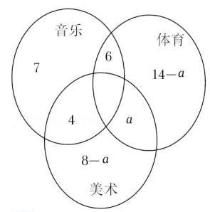

【答案】 $A$

【解析】解: 设同时参加体育班与美术班的学生人数为 $a$ ,

则由题意作出韦恩图,得: 由韦恩图得: $7 + 6 + 4 + a + {14} - a + 8 - a = {34}$ ,

解得 $a = 5.\therefore$ 仅参加一个兴趣班的人数为 $7 + {14} - 5 + 8 - 5 = {19}$ . 故选: $A$ .

【例 2】若 $f\left( x\right)  = {x}^{\frac{2}{3}} - {x}^{-\frac{1}{2}}$ ，则满足 $f\left( x\right)  < 0$ 的 $x$ 的取值范围是___.

【难度】 $\star   \star   \star$

【答案】 $\left( {0,1}\right)$

【解析】画幂函数图像,解: $f\left( x\right)  = {x}^{\frac{2}{3}} - {x}^{-\frac{1}{2}}$ ,若满足 $f\left( x\right)  < 0$ ,即 ${x}^{\frac{2}{3}} < {x}^{\frac{-1}{2}}$ ,

$\therefore {x}^{\frac{7}{6}} < 1 = {x}^{0},\because y = {x}^{\frac{7}{6}}$ 是增函数, $\therefore {x}^{\frac{7}{6}} < 1$ 的解集为: $\left( {0,1}\right)$ ,故答案为: $\left( {0,1}\right)$ .

【例 3】已知实数 $x, y$ 满足条件 $\left\{  \begin{array}{l} x - y \geq  0 \\  x + y - 3 \leq  0 \\  x \geq  1 \end{array}\right.$ ,则 $\frac{y}{x + 1}$ 的最大值为( )

A. $\frac{1}{2}$ B. $\frac{3}{5}$ C. 1 D. 2

【难度】 $\star   \star   \star$

【答案】 $B$

【解析】解: 实数 $x, y$ 满足条件 $\left\{  \begin{array}{l} x - y \geq  0 \\  x + y - 3 \leq  0 \\  x \geq  1 \end{array}\right.$ ,

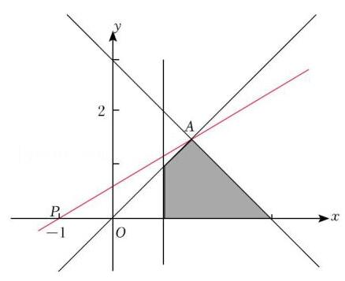

作出可行域如图阴影部分所示,

令 $z = \frac{y}{x + 1}$ ,则 $z$ 表示可行域中的点 $Q\left( {x, y}\right)$ 与点 $P\left( {-1,0}\right)$ 连线的斜率,

联立方程组 $\left\{  \begin{array}{l} x + y - 3 = 0 \\  x - y = 0 \end{array}\right.$ ,解得 $x = y = \frac{3}{2}$ ,所以点 $A\left( {\frac{3}{2},\frac{3}{2}}\right)$ ,

当点 $Q$ 在点 $A$ 处时, $z$ 取得最大值为 $\frac{\frac{3}{2}}{\frac{3}{2} + 1} = \frac{3}{5}$ . 故选: $B$ .

【例 4】在平面直角坐标系中,设点 $O\left( {0,0}\right) , A\left( {3,\sqrt{3}}\right)$ ,点 $P\left( {x, y}\right)$ 的坐标满足 $\left\{  \begin{array}{l} \sqrt{3}x - y \leq  0 \\  x - \sqrt{3}y + 2 \geq  0 \\  y \geq  0 \end{array}\right.$ , 则 $\overrightarrow{OA}$ 在 $\overrightarrow{OP}$ 上的投影的取值范围是___

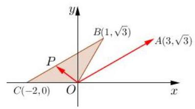

【难度】 $\star   \star   \star$

【答案】 $\left\lbrack  {-3,3}\right\rbrack$

【解析】点 $P$ 在图中阴影部分 (含边界),结合图像可知, $\angle {AOP} \in  \left\lbrack  {\frac{\pi }{6},\frac{5\pi }{6}}\right\rbrack  ,\overrightarrow{OA}$ 在 $\overrightarrow{OP}$ 上的投影即 $\left| \overrightarrow{OA}\right| \cos \angle {AOP} = 2\sqrt{3}\cos \angle {AOP} \in  \left\lbrack  {-3,3}\right\rbrack$

【例 5】已知 $m \leq  \frac{2}{3}{x}^{2} - {2x} + 3 \leq  n\left( {m \neq  n}\right)$ 的解集为 $\left\lbrack  {m, n}\right\rbrack$ ,则 $m + n$ 的值为___.

【难度】 $\star   \star   \star$

【答案】 3

【解析】解: $\because \frac{2}{3}{x}^{2} - {2x} + 3 = \frac{1}{3}\left( {2{x}^{2} - {6x} + 9}\right)  = \frac{1}{3}\left\lbrack  {{\left( x - 3\right) }^{2} + {x}^{2}}\right\rbrack   \geq  \frac{3}{2}$ ,

令 $\frac{2}{3}{n}^{2} - {2n} + 3 = n$ ,得 $2{n}^{2} - {9n} + 9 = 0$ ,解得 $n = \frac{3}{2}$ (舍去), $n = 3$

令 $\frac{2}{3}{x}^{2} - {2x} + 3 = 3$ ,解得 $x = 0$ 或 3 . 取 $m = 0.\therefore m + n = 3$ . 故答案为: 3 .

【例 6】已知函数 $f\left( x\right)  = \left\{  \begin{array}{l} \frac{2}{x}, x \geq  2 \\  {\left( x - 1\right) }^{3}, x < 2 \end{array}\right.$ ,若关于 $x$ 的方程 $f\left( x\right)  = k$ 有两个不同的实根,则实数 $k$ 的取值范围是___.

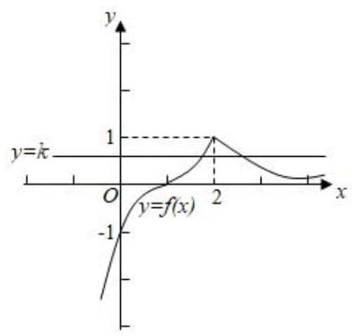

【难度】 $\star   \star   \star$

【答案】 $\left( {0,1}\right)$

【解析】解: 由题意作出函数 $f\left( x\right)  = \left\{  \begin{array}{l} \frac{2}{x}, x \geq  2 \\  {\left( x - 1\right) }^{3}, x < 2 \end{array}\right.$ 的图象,

关于 $x$ 的方程 $f\left( x\right)  = k$ 有两个不同的实根等价于函数 $f\left( x\right)  = \left\{  {\begin{array}{l} \frac{2}{x}, x \geq  2 \\  {\left( x - 1\right) }^{3}, x < 2 \end{array},\text{ 与 }y = k}\right.$ 有两个不同的公共点,由图象可知当 $k \in  \left( {0,1}\right)$ 时,满足题意,故答案为: $\left( {0,1}\right)$

【例 7】若定义域均为 $D$ 的三个函数 $f\left( x\right) \text{ 、 }g\left( x\right) \text{ 、 }h\left( x\right)$ 满足条件: 对任意 $x \in  D$ ,点 $\left( {x, g\left( x\right) }\right)$ 与点 $\left( {x, h\left( x\right) }\right)$ 都关于点 $\left( {x, f\left( x\right) }\right)$ 对称,则称 $h\left( x\right)$ 是 $g\left( x\right)$ 关于 $f\left( x\right)$ 的“对称函数”,已知 $g\left( x\right)  = \sqrt{1 - {x}^{2}}, f\left( x\right)  = {2x} + b$ ,

高三数学二轮复习 A 版 $h\left( x\right)$ 是 $g\left( x\right)$ 关于 $f\left( x\right)$ 的 “对称函数”，且 $h\left( x\right)  \geq  g\left( x\right)$ 恒成立，则实数 $b$ 的取值范围是___

【难度】 $\star   \star   \star$

【答案】 $b \geq  \sqrt{5}$

【解析】转化已知条件,即 $g\left( x\right)  \leq  f\left( x\right)$ 要恒成立, $x \in  \left\lbrack  {-1,1}\right\rbrack  ,\therefore \sqrt{1 - {x}^{2}} \leq  {2x} + b$ ,参变分离,即 $b \geq  \sqrt{1 - {x}^{2}} - {2x}$ ,设 $x = \cos \theta ,\sqrt{1 - {x}^{2}} = \sin \theta \therefore b \geq  \sin \theta  - 2\cos \theta$ 恒成立,即 $b \geq  \sqrt{5}$

【例 8】已知函数 $f\left( x\right)  = \left| \frac{1}{\left| x\right|  - 1}\right|$ ,关于 $x$ 的方程 ${f}^{2}\left( x\right)  + {bf}\left( x\right)  + c = 0$ 有 7 个不同实数根, 则实数 $b\text{ 、 }c$ 满足的关系式是___

【难度】 $\star   \star   \star$

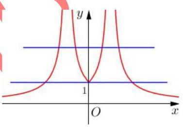

【答案】 $\left\{  \begin{array}{l} b + c =  - 1 \\  c > 1 \end{array}\right.$ 或 $\left\{  \begin{array}{l} b + c =  - 1 \\  b <  - 2 \end{array}\right.$

【解析】数形结合,函数 $f\left( x\right)  = \left| \frac{1}{\left| x\right|  - 1}\right|$ 图像如图,根据题意,要有 7 个不同实数

根,需满足 $f\left( x\right)  = 1$ 或 $f\left( x\right)  > 1$ ,设 $f\left( x\right)  = t$ ,即方程 ${t}^{2} + {bt} + c = 0$ 有两个

不同解 ${t}_{1} = 1$ 和 ${t}_{2} > 1$ ,将 ${t}_{1} = 1$ 代入可得 $b + c =  - 1$ ,两根之积 $c > 1$ ,两根之和 $- b > 2 \Rightarrow  b <  - 2,\therefore$ 实数 $b\text{ 、 }c$ 满足的关系式为 $\left\{  \begin{array}{l} b + c =  - 1 \\  c > 1 \end{array}\right.$ 或 $\left\{  \begin{array}{l} b + c =  - 1 \\  b <  - 2 \end{array}\right.$

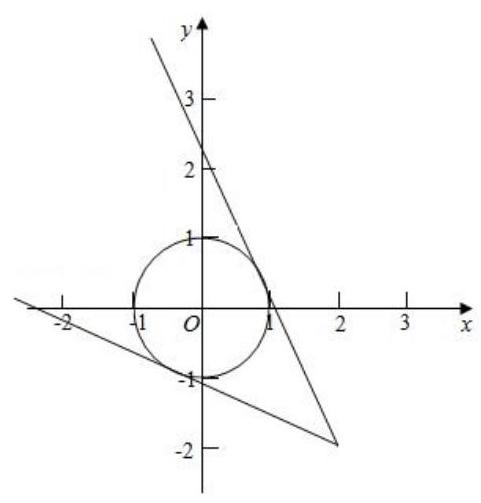

【例 9】函数 $y = \frac{\sin x + 2}{\cos x - 2}$ 的值域为___.

【难度】 $\star   \star   \star$

【答案】 $\left\lbrack  {\frac{-4 - \sqrt{7}}{3},\frac{-4 + \sqrt{7}}{3}}\right\rbrack$

【解析】解: 可以把函数理解为点 $\left( {\cos x,\sin x}\right)$ 到点 $\left( {2, - 2}\right)$ 的直线斜率的范围, 而 $\left( {\cos x,\sin x}\right)$ 的点的集合为以原点为圆心,半径为 1 的圆,如图:

当过点 $\left( {2, - 2}\right)$ 的直线的斜率不存在时,不与圆相切,

设此直线的方程为 $y + 2 = k\left( {x - 2}\right)$ ,整理得 $y - {kx} + {2k} + 2 = 0$ ,①

圆的方程为 ${x}^{2} + {y}^{2} = 1$ ,②

圆心到直线的距离为 $\frac{\left| 2k + 2\right| }{\sqrt{1 + {k}^{2}}} = 1$ ,整理求得 $k = \frac{-4 \pm  \sqrt{7}}{3}$ ,

$\therefore y = \frac{\sin x + 2}{\cos x - 2}$ 的值域为 $\left\lbrack  {\frac{-4 - \sqrt{7}}{3},\frac{-4 + \sqrt{7}}{3}}\right\rbrack$ . 故答案为: $\left\lbrack  {\frac{-4 - \sqrt{7}}{3},\frac{-4 + \sqrt{7}}{3}}\right\rbrack$ .

【例 10】已知 ${a}_{n} = \frac{n - \sqrt{122}}{n - \sqrt{123}}\left( {n \in  {N}^{ * }}\right)$ ,则在数列 $\left\{  {a}_{n}\right\}$ 的前 40 项中最大项和最小项分别是(   )

A. ${a}_{1},{a}_{30}$ B. ${a}_{1},{a}_{9}$ C. ${a}_{10},{a}_{9}$ D. ${a}_{12},{a}_{11}$

【难度】

【答案】 $D$

【解析】解: 根据题意, ${a}_{n} = \frac{n - \sqrt{122}}{n - \sqrt{123}} = 1 + \frac{\sqrt{123} - \sqrt{122}}{n - \sqrt{123}}$ ,

当 $n \leq  {11}$ 时,数列 $\left\{  {a}_{n}\right\}$ 递减,且 ${a}_{n} < 1$ ,当 $n \geq  {12}$ 时,数列 $\left\{  {a}_{n}\right\}$ 递减,且 ${a}_{n} > 1$ ,

故在数列 $\left\{  {a}_{n}\right\}$ 的前 40 项中最大项和最小项分别是 ${a}_{12}$ 和 ${a}_{11}$ ; 故选: $D$

【例 11】直线 $l : y =  - x + m$ 与曲线 $x = \sqrt{4 - {y}^{2}}$ 有两个公共点，则实数 $m$ 的取值范围是( )

A. $\lbrack  - 2,2\sqrt{2})$ B. $( - 2\sqrt{2}, - 2\rbrack$ C. $( - 2\sqrt{2},2\rbrack$ D. $\lbrack 2,2\sqrt{2})$

【难度】 $\star   \star   \star$

【答案】 $D$

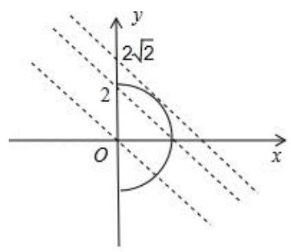

【解析】解: 由 $x = \sqrt{4 - {y}^{2}}$ 得 ${x}^{2} + {y}^{2} = 4\left( {x > 0}\right)$ ,

如图,当直线 $l : y =  - x + m$ 与 ${x}^{2} + {y}^{2} = 4\left( {x \geq  0}\right)$ 相切时,

即有 $\frac{\left| m\right| }{\sqrt{1 + 1}} = 2$ ,解得 $m =  \pm  2\sqrt{2}$ .

由图可知,若直线 $l : y =  - x + m$ 与曲线 $x = \sqrt{4 - {y}^{2}}$ 有两个公共点,

则实数 $m$ 的取值范围是 $\lbrack 2,2\sqrt{2})$ ,故选: $D$ .

【例 12】已知 $A\text{ 、 }B$ 为平面上的两个定点,且 $\left| \overrightarrow{AB}\right|  = 2$ ,该平面上的动线段 ${PQ}$ 的端点 $P\text{ 、 }Q$ ,满足 $\left| \overrightarrow{AP}\right|  \leq  5$ , $\overrightarrow{AP} \cdot  \overrightarrow{AB} = 6,\overrightarrow{AQ} =  - 2\overrightarrow{AP}$ ，则动线段 ${PQ}$ 所形成图形的面积为( )

A. 36 B. 60 C. 72 D. 108

【难度】 $\star   \star   \star$

【答案】 $B$

【解析】解: 根据题意建立平面直角坐标系, 如图所示;

则 $A\left( {0,0}\right) , B\left( {2,0}\right)$ ,设 $P\left( {x, y}\right) ,\therefore \overrightarrow{AP} = \left( {x, y}\right) ,\overrightarrow{AB} = \left( {2,0}\right)$ ;

由 $\left| \overrightarrow{AP}\right|  \leq  5$ ,得 ${x}^{2} + {y}^{2} \leq  {25}$ ; 又 $\overrightarrow{AP} \cdot  \overrightarrow{AB} = 6,\therefore {2x} = 6, x = 3;\therefore {y}^{2} \leq  {16};\therefore  - 4 \leq  y \leq  4$

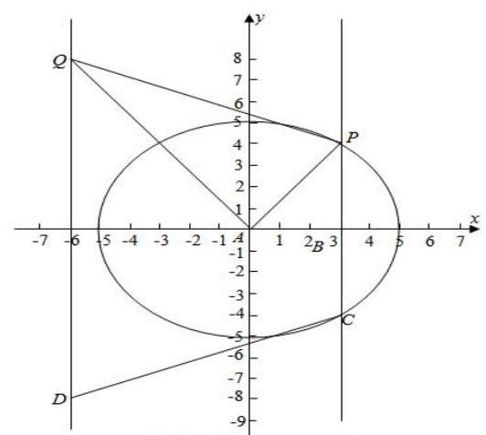

$\therefore$ 动点 $P$ 在直线 $x = 3$ 上,且 $- 4 \leq  y \leq  4$ ,由相似三角形可知 ${AQ}$ 扫过的面积为 48 ,

即 $\left| {PC}\right|  = 8$ ,则 ${AP}$ 扫过的三角形的面积为 $\frac{1}{2} \times  8 \times  3 = {12}$ ,

设点 $Q\left( {{x}_{0},{y}_{0}}\right) \because \overrightarrow{AQ} =  - 2\overrightarrow{AP},\therefore \left( {{x}_{0},{y}_{0}}\right)  =  - 2\left( {x, y}\right)  = ( - 6$ , $- {2y}),\therefore {x}_{0} =  - 6,{y}_{0} =  - {2y}$ ,

$\therefore$ 动点 $Q$ 在直线 $x =  - 6$ 上,且 $- 8 \leq  y \leq  8$ ,

$\therefore \left| {QD}\right|  = {16},\therefore {AQ}$ 扫过的三角形的面积为 $\frac{1}{2} \times  {16} \times  6 = {48},\therefore$ 因此和为 60,故选: $B$ .

## 巩固训练

1、某班共 30 人，其中 15 人喜爱篮球运动，10 人喜爱乒乓运动，8 人对这两项运动都不喜爱，则喜爱篮球运动但不喜爱乒乓球运动的人数为___

【难度】 $\star   \star   \star$

【答案】 12

【解析】利用韦恩图设未知数求解即可。

2、已知向量 $\overrightarrow{a}$ 和 $\overrightarrow{b}$ 满足条件: $\overrightarrow{a} \neq  \overrightarrow{b}$ 且 $\overrightarrow{a} \cdot  \overrightarrow{b} \neq  0$ . 若对于任意实数 $t$ ，恒有 $\left| {\overrightarrow{a} - t\overrightarrow{b}}\right|  \geq  \left| {\overrightarrow{a} - \overrightarrow{b}}\right|$ ，则在 $\overrightarrow{a}$ 、 $\overrightarrow{b}$ 、 $\overrightarrow{a} + \overrightarrow{b}$ 、 $\overrightarrow{a} - \overrightarrow{b}$ 这四个向量中，一定具有垂直关系的两个向量是( )

A. $\overrightarrow{a}$ 与 $\overrightarrow{a} - \overrightarrow{b}$ B. $\overrightarrow{b}$ 与 $\overrightarrow{a} - \overrightarrow{b}$ C. $\overrightarrow{a}$ 与 $\overrightarrow{a} + \overrightarrow{b}$ D. $\overrightarrow{b}$ 与 $\overrightarrow{a} + \overrightarrow{b}$

【难度】 $\star   \star   \star$

【答案】 $B$

【解析】解: 把已知不等式平方可得 ${a}^{2} - {2t}\overrightarrow{a} \cdot  \overrightarrow{b} + {t}^{2} \cdot  {\overrightarrow{b}}^{2} \geq  {\overrightarrow{a}}^{2} + {\overrightarrow{b}}^{2} - 2\overrightarrow{a} \cdot  \overrightarrow{b}$ ,

化简可得 $\left( {{t}^{2} - 1}\right) {\overrightarrow{b}}^{2} \geq  2\left( {t - 1}\right) \overrightarrow{a} \cdot  \overrightarrow{b}$ ,即 $\left( {t + 1}\right) {\overrightarrow{b}}^{2} \geq  2\overrightarrow{a} \cdot  \overrightarrow{b}$ .

由题意可得,对于任意实数 $t,\left( {t + 1}\right) {\overrightarrow{b}}^{2} \geq  2\overrightarrow{a} \cdot  \overrightarrow{b}$ 恒成立,故有 ${\overrightarrow{b}}^{2} = \overrightarrow{a} \cdot  \overrightarrow{b} = 0$ ,

即 $\overrightarrow{b} \cdot  \left( {\overrightarrow{a} - \overrightarrow{b}}\right)  = 0,\therefore \overrightarrow{b}$ 与 $\overrightarrow{a} - \overrightarrow{b}$ 一定垂直,故选: $B$ .

3、复数 $z$ 满足 $\left| {z - 1}\right|  + \left| {z + 1}\right|  = \sqrt{5}$ ，那么 $\left| z\right|$ 的取值范围是( )

A. $\left\lbrack  {\frac{2\sqrt{5}}{5},\sqrt{5}}\right\rbrack$ B. $\left\lbrack  {\frac{2\sqrt{5}}{5},2}\right\rbrack$ C. $\left\lbrack  {\frac{1}{2},\frac{\sqrt{5}}{2}}\right\rbrack$ D. $\left\lbrack  {1,2}\right\rbrack$

【难度】 $\star   \star   \star$

【答案】 $C$

【解析】解: 由复数 $z$ 满足 $\left| {z - 1}\right|  + \left| {z + 1}\right|  = \sqrt{5}$ ,可知

$z$ 在复平面内对应的点 $Z$ 的轨迹为以 $\left( {-1,0}\right) ,\left( {1,0}\right)$ 为焦点的椭圆,

则 $a = \frac{\sqrt{5}}{2}, c = 1, b = \sqrt{{\left( \frac{\sqrt{5}}{2}\right) }^{2} - {1}^{2}} = \frac{1}{2} \cdot  \therefore \left| z\right|$ 的取值范围是 $\left\lbrack  {\frac{1}{2},\frac{\sqrt{5}}{2}}\right\rbrack$ . 故选: $C$ .

4、已知函数 $f\left( x\right)  = 2{\cos }^{2}\left( {{\omega x} - \frac{\pi }{12}}\right)  - \frac{1}{2}\left( {\omega  > 0}\right)$ 在 $\left\lbrack  {0,\pi }\right\rbrack$ 上恰有 7 个零点，则 $\omega$ 的取值范围是( )

A. $\left\lbrack  {\frac{41}{12},\frac{15}{4}}\right)$ B. $\left( {\frac{49}{12},\frac{23}{4}}\right\rbrack$ C. $\left( {\frac{41}{12},\frac{15}{4}}\right\rbrack$ D. $\left\lbrack  {\frac{49}{12},\frac{23}{4}}\right)$

【难度】 $\star   \star   \star$

【答案】 $A$

【解析】解: 函数 $f\left( x\right)  = 2{\cos }^{2}\left( {{\omega x} - \frac{\pi }{12}}\right)  - \frac{1}{2} = 2 \times  \frac{\cos \left( {{2\omega x} - \frac{\pi }{6}}\right)  + 1}{2} - \frac{1}{2} = \cos \left( {{2\omega x} - \frac{\pi }{6}}\right)  + \frac{1}{2}$ ,

因为 $x \in  \left\lbrack  {0,\pi }\right\rbrack$ ,则 $- \frac{\pi }{6} \leq  {2\omega x} - \frac{\pi }{6} \leq  {2\omega \pi } - \frac{\pi }{6}$ ,

令 $y = \cos \left( {{2\omega x} - \frac{\pi }{6}}\right) ,\;y =  - \frac{1}{2}$ ,

因为函数 $f\left( x\right)$ 在 $\left\lbrack  {0,\pi }\right\rbrack$ 上恰有 7 个零点,即函数 $y = \cos \left( {{2\omega x} - \frac{\pi }{6}}\right)$ 与 $y =  - \frac{1}{2}$ 的图象有 7 个交点,所以 $\frac{20\pi }{3} \leq  {2\omega x} - \frac{\pi }{6} < \frac{22\pi }{3}$ ，则 $\frac{41}{12} \leq  \omega  < \frac{15}{4}$ ，所以 $\omega$ 的取值范围是 $\lbrack \frac{41}{12},\frac{15}{4})$ . 故选: $A$ .

5、已知函数 $f\left( x\right)  = \sin x$ ，若存在 ${x}_{1},{x}_{2},\ldots ,{x}_{m}$ 满足 $0 \leq  {x}_{1} < {x}_{2} < \ldots  < {x}_{m} \leq  {6\pi }$ ，且 $\left| {f\left( {x}_{1}\right)  - f\left( {x}_{2}\right) }\right|  + \left| {f\left( {x}_{2}\right)  - f\left( {x}_{3}\right) }\right|  + \ldots  + \left| {f\left( {x}_{m - 1}\right)  - f\left( {x}_{m}\right) }\right|  = {12}\left( {m \geq  2, m \in  {N}^{ * }}\right)$ ，则 $m$ 的最小值为( )

A. 6 B. 7 C. 8 D. 9

【难度】★★★

【答案】C

【解析】解: $\because y = \sin x$ 对任意 ${x}_{i},{x}_{j}\left( {i, j = 1,2,3,\ldots , m}\right)$ ,

都有 $\left| {f\left( {x}_{i}\right)  - f\left( {x}_{j}\right) }\right|  \leq  f{\left( x\right) }_{\max } - f{\left( x\right) }_{\min } = 2$ ,

要使 $m$ 取得最小值,尽可能多让 ${x}_{i}\left( {i = 1,2,3,\ldots , m}\right)$ 取得最高点,

考虑 $0 \leq  {x}_{1} < {x}_{2} < \ldots  < {x}_{m} \leq  {6\pi },\left| {f\left( {x}_{1}\right)  - f\left( {x}_{2}\right) }\right|  + \left| {f\left( {x}_{2}\right)  - f\left( {x}_{3}\right) }\right|  + \ldots  + \left| {f\left( {x}_{m - 1}\right)  - f\left( {x}_{m}\right) }\right|  = {12}$ , 按下图取值即可满足条件,

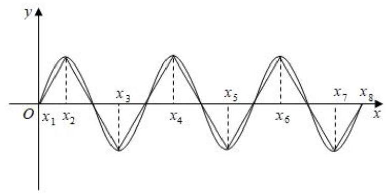

$\therefore m$ 的最小值为 8 . 故选: $C$ .

6、对于函数 $y = f\left( x\right)$ ，若存在 ${x}_{0}$ ，使 $f\left( {x}_{0}\right)  =  - f\left( {-{x}_{0}}\right)$ ，则称点 $\left( {{x}_{0}, f\left( {x}_{0}\right) }\right)$ 与点 $\left( {-{x}_{0}, - f\left( {-{x}_{0}}\right) }\right)$ 是函数 $f\left( x\right)$ 的一对 “隐对称点”. 若函数 $f\left( x\right)  = \left\{  \begin{array}{l} {x}^{2} + {2x}, x < 0 \\  {mx} + 2, x \geq  0 \end{array}\right.$ 的图象存在 “隐对称点”,则实数 $m$ 的取值范围是 ( )

A. $\lbrack 2 - 2\sqrt{2},0)$ B. $( - \infty ,2 - 2\sqrt{2}\rbrack$ C. $\left( {-\infty ,2 + 2\sqrt{2}}\right)$ D. $(0,2 + 2\sqrt{2}\rbrack$

【难度】 $\star   \star   \star$

【答案】 $B$

【解析】解: 由隐对称点的定义可知函数 $f\left( x\right)$ 图象上存在关于原点对称的点,设 $g\left( x\right)$ 的图象与函数 $y = {x}^{2} + {2x}, x < 0$ 的图象关于原点对称,

令 $x > 0$ ,则 $- x < 0,\therefore f\left( {-x}\right)  = {\left( -x\right) }^{2} + 2\left( {-x}\right)  = {x}^{2} - {2x},\therefore g\left( x\right)  =  - {x}^{2} + {2x}$ ,

故原题义等价于方程 ${mx} + 2 =  - {x}^{2} + {2x}\left( {x > 0}\right)$ 有零点,解得 $m =  - x - \frac{2}{x} + 2$ ,

又因 $- x - \frac{2}{x} + 2 \leq   - 2\sqrt{x \times  \frac{2}{x}} + 2 = 2 - 2\sqrt{2}$ ,当且仅当 $x = \sqrt{2}$ 时取等号, $\therefore m \in  ( - \infty ,2 - 2\sqrt{2}\rbrack$ . 故选: $B$ .

7、若直线 $l : {ax} + {by} - 1 = 0$ 始终平分圆 $M : {x}^{2} + {y}^{2} - {4x} - {2y} + 1 = 0$ 的周长,则 $\sqrt{{\left( a - 2\right) }^{2} + {\left( b - 2\right) }^{2}}$ 的最小值为( )

A. $\sqrt{5}$ B. 5 C. $2\sqrt{5}$ D. 10

【难度】★★★

【答案】 $A$

【解析】解: 把圆的方程化为标准方程得: ${\left( x - 2\right) }^{2} + {\left( y - 1\right) }^{2} = 4$ ,

$\therefore$ 圆心 $M$ 坐标为 $\left( {2,1}\right)$ ,半径 $r = 2,\because$ 直线 $l$ 始终平分圆 $M$ 的周长,

$\therefore$ 直线 $l$ 过圆 $M$ 的圆心 $M$ ,

把 $M\left( {2,1}\right)$ 代入直线 $l : {ax} + {by} + 1 = 0$ 得: ${2a} + b - 1 = 0$ ，

$\because \left( {2,2}\right)$ 到直线 ${2x} + y - 1 = 0$ 的距离 $d = \frac{\left| 4 + 2 - 1\right| }{\sqrt{5}} = \sqrt{5},\sqrt{{\left( a - 2\right) }^{2} + {\left( b - 2\right) }^{2}}$ 的最小值为 $\sqrt{5}$ . 故选: $A$ .

8、实数 $x, y$ 满足不等式组 $\left\{  \begin{array}{l} y \leq  3 + {3x} \\  y \leq  3 - \frac{3}{2}x \\  y \geq   - 1 + \frac{x}{2} \end{array}\right.$ ,则 $z = \left| {{2x} - y - 3}\right|$ 的取值范围为(   )

A. $\left\lbrack  {\frac{\sqrt{5}}{5},\frac{6\sqrt{5}}{5}}\right\rbrack$ B. $\left\lbrack  {0,1}\right\rbrack$ C. $\left\lbrack  {0,\frac{6\sqrt{5}}{5}}\right\rbrack$ D. $\left\lbrack  {0,6}\right\rbrack$

【难度】 $\bigstar \bigstar  \star$

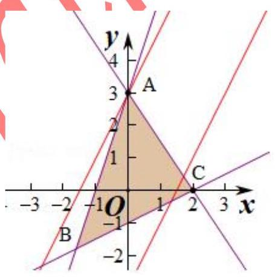

【答案】 $D$

【解析】解: 作出不等式组对应的平面区域,

$z = \left| {{2x} - y - 3}\right|  = \frac{\left| 2x - y - 3\right| }{\sqrt{5}} \cdot  \sqrt{5},\frac{\left| 2x - y - 3\right| }{\sqrt{5}}$ 的几何意义是区域内

的点到直线 ${2x} - y - 3 = 0$ 的距离 $d$ . 则 $z = \sqrt{5}d$ ,

由图象知 $d$ 的最小值为 0,点 $A\left( {0,3}\right)$ 到直线的距离最大,最大值 $d = \frac{\left| 0 - 3 - 3\right| }{\sqrt{5}} = \frac{6}{\sqrt{5}},$

则 $0 \leq  d \leq  \frac{6}{\sqrt{5}}$ ,则 $0 \leq  \sqrt{5}d \leq  6$ ,即 $0 \leq  z \leq  6$ ,故选: $D$ .

9、如图所示，一动圆与圆 ${x}^{2} + {y}^{2} + {6x} + 5 = 0$ 外切，同时与圆 ${x}^{2} + {y}^{2} - {6x} - {91} = 0$ 内切，求动圆圆心 $M$ 的轨迹方程, 并说明它是什么样的曲线.

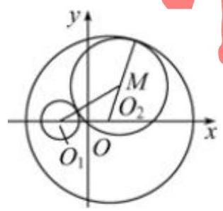

【难度】 $\star   \star   \star$

【答案】 $\frac{{x}^{2}}{36} + \frac{{y}^{2}}{27} = 1$

【解析】解: (方法一) 设动圆圆心为 $M\left( {x, y}\right)$ ,半径为 $R$ ,设已知圆的圆心分别为 ${O}_{1}\text{ 、 }{O}_{2}$ ,

将圆的方程分别配方得: ${\left( x + 3\right) }^{2} + {y}^{2} = 4,{\left( x - 3\right) }^{2} + {y}^{2} = {100}$ ，

当动圆与圆 ${O}_{1}$ 相外切时,有 $\left| {{O}_{1}M}\right|  = R + 2\ldots$ ①

当动圆与圆 ${O}_{2}$ 相内切时,有 $\left| {{O}_{2}M}\right|  = {10} - R$ .

将①②两式相加，得 $\left| {{O}_{1}M}\right|  + \left| {{O}_{2}M}\right|  = {12} > \left| {{O}_{1}{O}_{2}}\right|$ ，

$\therefore$ 动圆圆心 $M\left( {x, y}\right)$ 到点 ${O}_{1}\left( {-3,0}\right)$ 和 ${O}_{2}\left( {3,0}\right)$ 的距离和是常数 12,

所以点 $M$ 的轨迹是焦点为点 ${O}_{1}\left( {-3,0}\right) \text{ 、 }{O}_{2}\left( {3,0}\right)$ ,长轴长等于 12 的椭圆.

$\therefore {2c} = 6,{2a} = {12},\therefore c = 3, a = 6\therefore {b}^{2} = {36} - 9 = {27}$

$\therefore$ 圆心轨迹方程为 $\frac{{x}^{2}}{36} + \frac{{y}^{2}}{27} = 1$ ,轨迹为椭圆.

(方法二): 由方法一可得方程 $\sqrt{{\left( x + 3\right) }^{2} + {y}^{2}} + \sqrt{{\left( x - 3\right) }^{2} + {y}^{2}} = {12}$ ,移项再两边分别平方得: $2\sqrt{{\left( x + 3\right) }^{2} + {y}^{2}} = {12} + x$ ,两边再平方得: $3{x}^{2} + 4{y}^{2} - {108} = 0$ ,整理得 $\frac{{x}^{2}}{36} + \frac{{y}^{2}}{27} = 1$

所以圆心轨迹方程为 $\frac{{x}^{2}}{36} + \frac{{y}^{2}}{27} = 1$ ,轨迹为椭圆.

(二)几何问题转化成代数

## 知识梳理

## 常见的转化有:

①不等式问题中的图像问题可以向函数转化；

②平面几何图形中的角度、距离等问题可以向函数转化；

③几何问题中的交点问题可以向方程转化；

④借助于运算结果与几何定理的结合;

⑤空间图形向平面图形转化进而转化为代数运算。

## 例题精讲

【例 13】对于给定的实数 $k > 0$ ,函数 $f\left( x\right)  = \frac{k}{x}$ 的图像上总存在点 $C$ ,使得以 $C$ 为圆心,1 为半径的圆上有两个不同的点到原点 $O$ 的距离为 1,则 $k$ 的取值范围是___

【难度】 $\star   \star   \star$

【答案】 $k \in  \left( {0,2}\right)$

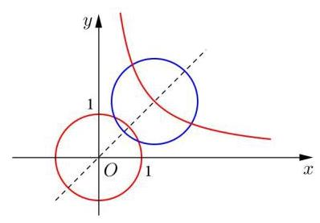

【解析】根据题意, 即函数图像上至少有一点到原点的

距离小于 2, $\because {x}^{2} + \frac{{k}^{2}}{{x}^{2}} \geq  {2k}$ ， $\therefore$ 距离的最小值为 $\sqrt{2k}$ ，

即 $\sqrt{2k} < 2$ ,解得 $k \in  \left( {0,2}\right)$ . 或者数形结合,这个距离

原点最近的点在 $y = x$ 上,代入 $\left( {\sqrt{k},\sqrt{k}}\right) ,\therefore \sqrt{2k} < 2$ ,解得 $k \in  \left( {0,2}\right)$ .

【例 14】对于函数 $f\left( x\right)$ ,若在定义域内存在实数 ${x}_{0}$ 满足 $f\left( {-{x}_{0}}\right)  =  - f\left( {x}_{0}\right)$ ,则称 $f\left( x\right)$ 为 “局部奇函数”. $E$ 知 $f\left( x\right)  =  - a{e}^{x} - 4$ 在 $R$ 上为 “局部奇函数”,则 $a$ 的取值范围是(   )

A. $\lbrack  - 4, + \infty )$ B. $\lbrack  - 4,0)$ C. $( - \infty , - 4\rbrack$ D. $( - \infty ,4\rbrack$

【难度】 $\star   \star   \star$

【答案】 $B$

【解析】解: 根据题意, $f\left( x\right)  =  - a{e}^{x} - 4$ 在 $R$ 上为 “局部奇函数”,则方程 $f\left( {-x}\right)  =  - f\left( x\right)$ 即 $\left( {-a{e}^{x} - 4}\right)  + \left( {-a{e}^{-x} - 4}\right)  = 0$ 有解,对于 $\left( {-a{e}^{x} - 4}\right)  + \left( {-a{e}^{-x} - 4}\right)  = 0$ ,变形可得 $- a\left( {{e}^{x} + {e}^{-x}}\right)  = 8$ ,即 $a =  - \frac{8}{{e}^{x} + {e}^{-x}}$ , 又由 ${e}^{x} + {e}^{-x} \geq  2$ ,当且仅当 $x = 0$ 时等号成立,必有 $- 4 \leq  a < 0$ ,即 $a$ 的取值范围为 $\lbrack  - 4,0)$ ; 故选: $B$ .

【例 15】线段 ${AB}$ 的长度为 2,点 $A\text{ 、 }B$ 分别在 $x$ 非负半轴和 $y$ 非负半轴上滑动,以线段 ${AB}$ 为一边,在第一象限内作矩形 ${ABCD}$ (顺时针排序)， ${BC} = 1$ ，设 $O$ 为坐标原点，则 $\overrightarrow{OC} \cdot  \overrightarrow{OD}$ 的取值范围是___.

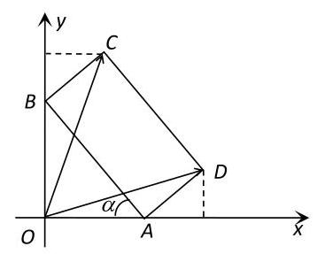

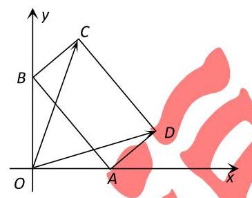

【难度】

【答案】 $\left\lbrack  {1,3}\right\rbrack$

【解析】(坐标法)

设 $\angle {OAB} = \alpha \left( {0 \leq  \alpha  \leq  \frac{\pi }{2}}\right)$ ,由图可知 $D\left( {2\cos \alpha  + \sin \alpha ,\cos \alpha }\right) , C\left( {\sin \alpha ,2\sin \alpha  + \cos \alpha }\right) \; \overrightarrow{OC} \cdot  \overrightarrow{OD} = 2\sin {2\alpha } + 1 \in  \left\lbrack  {1,3}\right\rbrack$ (也可以设 $\mathrm{{OA}} = a,\mathrm{{OB}} = b$ ,利用 ${a}^{2} + {b}^{2} = 4$ )

【例 16】已知圆 $O : {x}^{2} + {y}^{2} = 8$ ，点 $A\left( {2,0}\right)$ ，动点 $M$ 在圆上，则 $\angle {OMA}$ 的最大值为 ___ $\frac{\pi }{4}$ ___.

【难度】 $\star   \star   \star$

【答案】 $\frac{\pi }{4}$

【解析】解: 设 $\left| {MA}\right|  = a$ ,则 $\left| {OM}\right|  = 2\sqrt{2},\left| {OA}\right|  = 2$

由余弦定理知 $\cos \angle {OMA} = \frac{O{M}^{2} + M{A}^{2} - O{A}^{2}}{{2OM} \cdot  {MA}} = \frac{{\left( 2\sqrt{2}\right) }^{2} + {a}^{2} - {2}^{2}}{2 \times  2\sqrt{2}a} = \frac{1}{4\sqrt{2}} \cdot  \left( {\frac{4}{a} + a}\right)  \geq  \frac{1}{4\sqrt{2}} \cdot  2\sqrt{\frac{4}{a} \cdot  a} = \frac{\sqrt{2}}{2}$ ，

当且仅当 $a = 2$ 时等号成立; $\therefore \angle {OMA} \leq  \frac{\pi }{4}$ . 即 $\angle {OMA}$ 的最大值为 $\frac{\pi }{4}$ . 故答案为: $\frac{\pi }{4}$ .

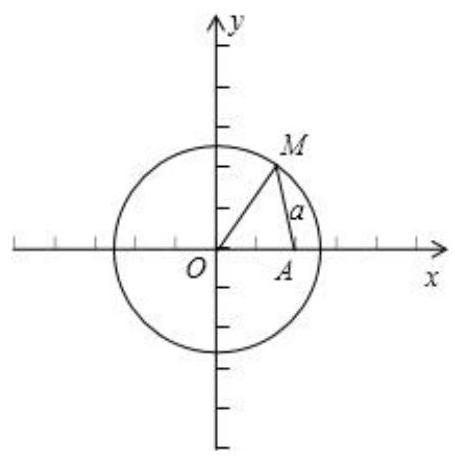

【例 17】椭圆 ${C}_{1} : \frac{{x}^{2}}{9} + \frac{{y}^{2}}{4} = 1$ 和圆 ${C}_{2} : {x}^{2} + {\left( y + 1\right) }^{2} = {r}^{2}\left( {r > 0}\right)$ ,若两条曲线没有交点,求 $r$ 的取值范围.

【难度】 $\star   \star   \star$

【答案】 $0 < r < 1$ 或 $r > \frac{3\sqrt{30}}{5}$ .

【解析】解: 椭圆 ${C}_{1} : \frac{{x}^{2}}{9} + \frac{{y}^{2}}{4} = 1$ 和圆 ${C}_{2} : {x}^{2} + {\left( y + 1\right) }^{2} = {r}^{2}\left( {r > 0}\right)$ ,消去 $x$ 可得 $- \frac{5}{4}{y}^{2} + {2y} + {10} - {r}^{2} = 0$ . $\because$ 两条曲线没有交点 $\therefore  - \frac{5}{4}{y}^{2} + {2y} + {10} - {r}^{2} = 0$ 没有实数根,或者两个根不在 $\left\lbrack  {-2,2}\right\rbrack$ .

若没有实数根. 则 $\bigtriangleup  = 4 - 4 \times  \left( {-\frac{5}{4}}\right)  \times  \left( {{10} - {r}^{2}}\right)  < 0,\because r > 0,\therefore r > \frac{3\sqrt{30}}{5}$ ;

若两个根不在 $\left\lbrack  {-2,2}\right\rbrack$ ,设 $f\left( y\right)  =  - \frac{5}{4}{y}^{2} + {2y} + {10} - {r}^{2}$ ,则 $\left\{  {\begin{array}{l} f\left( 2\right)  = 9 - {r}^{2} > 0 \\  f\left( {-2}\right)  = 1 - {r}^{2} > 0 \end{array},\therefore 0 < r < 1}\right.$

$\therefore$ 若两条曲线没有交点,则 $r$ 的取值范围是 $0 < r < 1$ 或 $r > \frac{3\sqrt{30}}{5}$ .

【例 18】如图,已知 ${F}_{1}\text{ 、 }{F}_{2}$ 是椭圆 $\Gamma  : \frac{{x}^{2}}{4} + {y}^{2} = 1$ 的左、右焦点, $M\text{ 、 }N$ 是其顶点,直线 $l : y = {kx} + m\left( {k > 0}\right)$ 与 $\Gamma$ 相交于 $A, B$ 两点.

(1)求 $\bigtriangleup {F}_{2}{MN}$ 的面积 $P$ ；

(2)若 $l \bot  {F}_{2}N$ ，点 $A, M$ 重合，求 $B$ 点的坐标；

(3)设直线 ${OA},{OB}$ 的斜率分别为 ${k}_{1}\text{ 、 }{k}_{2}$ ，记以 ${OA},{OB}$ 为直径的圆的面积分别为 ${S}_{1}\text{ 、 }{S}_{2},{\Delta OAB}$ 的面积为 $S$ ,若 ${k}_{1}\text{ 、 }k\text{ 、 }{k}_{2}$ 恰好构成等比数列,求 $S\left( {{S}_{1} + {S}_{2}}\right)$ 的最大值.

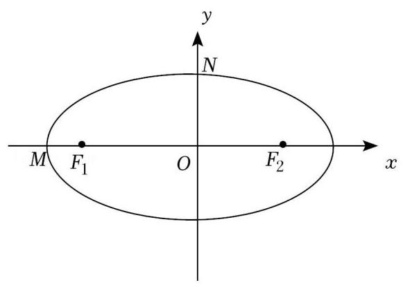

【难度】 $\star   \star   \star   \star$

【答案】(1) $\frac{\sqrt{3} + 2}{2}$ . (2) $\left( {-\frac{22}{13},\frac{4\sqrt{3}}{13}}\right)$ . (3) $\frac{5\pi }{4}$ .

【解析】解: (1) 根据题意可得 ${a}^{2} = 4,{b}^{2} = 1$ ,所以 ${c}^{2} = {a}^{2} - {b}^{2} = 3$ ,所以 $M\left( {-2,0}\right) , N\left( {0,1}\right) ,{F}_{2}\left( {\sqrt{3},0}\right)$ , 所以 ${S}_{\bigtriangleup {F}_{2}{MN}} = \frac{1}{2} \cdot  M{F}_{2} \cdot  {ON} = \frac{1}{2} \cdot  \left( {\sqrt{3} + 2}\right)  \times  1 = \frac{\sqrt{3} + 2}{2}$ .

(2)因为 $l \bot  {F}_{2}N$ ，所以 ${k}_{l} \cdot  {k}_{{F}_{2}N} =  - 1$ 所以 ${k}_{l} \cdot  \left( {-\frac{1}{\sqrt{3}}}\right)  =  - 1$ ，所以 ${k}_{l} = \sqrt{3}$ ，又直线 $l$ 过点 $M\left( {-2,0}\right)$ ， 所以直线 $l$ 的方程为 $y = \sqrt{3}\left( {x + 2}\right)$ ,联立 $\left\{  \begin{array}{l} y = \sqrt{3}\left( {x + 2}\right) \\  \frac{{x}^{2}}{4} + {y}^{2} = 1 \end{array}\right.$ ,所以 ${13}{x}^{2} + {48x} + {44} = 0$ , 所以 $- 2 + {x}_{B} =  - \frac{48}{13}$ ,解得 ${x}_{B} =  - \frac{22}{13}$ ,所以 ${y}_{B} = \sqrt{3}\left( {-\frac{22}{13} + 2}\right)  = \frac{4\sqrt{3}}{13}$ ,所以 $B$ 点的坐标为 $\left( {-\frac{22}{13},\frac{4\sqrt{3}}{13}}\right)$ .

(3)设直线 $l$ 的方程为 $y = {kx} + m, A\left( {{x}_{1},{y}_{1}}\right) , B\left( {{x}_{2},{y}_{2}}\right)$ ，由 $\left\{  \begin{array}{l} y = {kx} + m \\  \frac{{x}^{2}}{4} + {y}^{2} = 1 \end{array}\right.$ ，得 $\left( {1 + 4{k}^{2}}\right) {x}^{2} + {8kmx} + 4\left( {{m}^{2} - 1}\right)  = 0$ ，

则 $\Delta  = {16}\left( {1 + 4{k}^{2} - {m}^{2}}\right)  > 0,{x}_{1} + {x}_{2} =  - \frac{8km}{1 + 4{k}^{2}},{x}_{1}{x}_{2} = \frac{4\left( {{m}^{2} - 1}\right) }{1 + 4{k}^{2}}$ ,

因为 ${k}_{1}, k,{k}_{2}$ 恰好成等比数列,所以 ${k}^{2} = {k}_{1}{k}_{2} = \frac{\left( {k{x}_{1} + m}\right) \left( {k{x}_{2} + m}\right) }{{x}_{1}{x}_{2}}$ ,即 ${km}\left( {{x}_{1} + {x}_{2}}\right)  + {m}^{2} = 0$ ,

所以 ${km}\left( {-\frac{8km}{1 + 4{k}^{2}}}\right)  + {m}^{2} = 0$ ,解得 $k = \frac{1}{2}\left( {k > 0}\right)$ ,此时 $\bigtriangleup  = {16}\left( {2 - {m}^{2}}\right)  > 0$ ,即 $m \in  \left( {-\sqrt{2},\sqrt{2}}\right)$ ,

又 $A, O, B$ 三点不共线,得 $m \neq  0$ ,从而 $m \in  \left( {-\sqrt{2},0}\right)  \cup  \left( {0,\sqrt{2}}\right)$ ,

所以 $S = \frac{1}{2}\left| {AB}\right|  \cdot  d = \frac{1}{2}\sqrt{1 + {k}^{2}}\left| {{x}_{1} - {x}_{2}}\right|  \cdot  \frac{\left| m\right| }{\sqrt{1 + {k}^{2}}} = \frac{1}{2}\sqrt{{\left( {x}_{1} + {x}_{2}\right) }^{2}} - 4{x}_{1}{x}_{2} \cdot  \left| m\right|  = \sqrt{2 - {m}^{2}} \cdot  \left| m\right|$ ,

又 $\frac{{x}_{1}^{2}}{4} + {y}_{1}^{2} = 1,\frac{{x}_{2}^{2}}{4} + {y}_{2}^{2} = 1$ ,

所以 ${S}_{1} + {S}_{2} = \frac{\pi }{4}\left( {{x}_{1}^{2} + {y}_{1}^{2} + {x}_{2}^{2} + {y}_{2}^{2}}\right)  = \frac{\pi }{4}\left( {\frac{3}{4}{x}_{1}^{2} + \frac{3}{4}{x}_{2}^{2} + 2}\right)  = \frac{3\pi }{16}\left\lbrack  {{\left( {x}_{1} + {x}_{2}\right) }^{2} - 2{x}_{1}{x}_{2}}\right\rbrack   + \frac{\pi }{2} = \frac{5\pi }{4}$ ,

所以 $S\left( {{S}_{1} + {S}_{2}}\right)  = \frac{5\pi }{4} \cdot  \left( {\sqrt{2 - {m}^{2}} \cdot  \left| m\right| }\right)  \leq  \frac{5\pi }{4} \cdot  \frac{2 - {m}^{2} + {m}^{2}}{2} = \frac{5\pi }{4}$ ,当且仅当 $\sqrt{2 - {m}^{2}} = \left| m\right|$ ,即 $m =  \pm  1$ 时,取等号, 所以 $S\left( {{S}_{1} + {S}_{2}}\right)$ 的最大值为 $\frac{5\pi }{4}$ .

## 巩固训练

1、如图，在梯形 ${ABCD}$ 中， ${AB}//{DC}$ ， ${AD}\bot {AB}$ ， ${AD} = {DC} = \frac{1}{2}{AB} = 2$ ，点 $N$ 是 ${CD}$ 边上一动点，则 $\overrightarrow{AN} \cdot  \overrightarrow{AB}$ 的最大值为___.

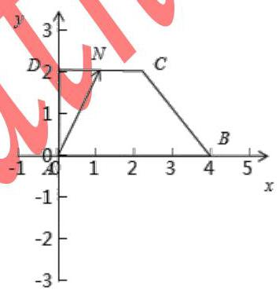

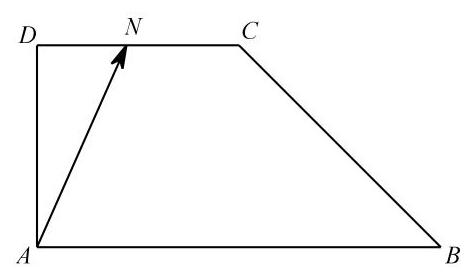

【难度】 $\star   \star   \star$

【答案】 8

【解析】(坐标法) 以 $\mathrm{{AB}}$ 、 $\mathrm{{AD}}$ 所在直线分别为 $\mathrm{x}$ 、 $\mathrm{y}$ ,建立如图坐标系,可得 $A\left( {0,0}\right) , B\left( {4,0}\right) , C\left( {2,2}\right) , D\left( {0,2}\right) N$ 坐标为 $\left( {x,2}\right) ,\left( {x \in  \left\lbrack  {0,2}\right\rbrack  }\right)$ , $\overrightarrow{AN} \cdot  \overrightarrow{AB} = \left( {\mathrm{x},2}\right) \left( {4,0}\right)  = 8\mathrm{x} + 2 \in  \left\lbrack  {2,8}\right\rbrack$ . 则 $\overrightarrow{AN} \cdot  \overrightarrow{AB}$ 的最大值为: 8 .

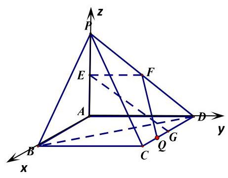

2、如图， ${PA} \bot$ 平面 ${ABCD}$ ，四边形 ${ABCD}$ 是正方形， ${PA} = {AD} = 2$ ， 点 $E\text{ 、 }F\text{ 、 }G$ 分别为线段 ${PA}\text{ 、 }{PD}$ 和 ${CD}$ 的中点.

(1)求异面直线 ${EG}$ 与 ${BD}$ 所成角的大小；

(2)在线段 ${CD}$ 上是否存在一点 $Q$ ，使得点 $A$ 到平面 ${EFQ}$ 的距离恰为 $\frac{4}{5}$ ? 若存在,求出线段 ${CQ}$ 的长; 若不存在,请说明理由.

【难度】 $\star   \star   \star$

【答案】 $\arccos \frac{\sqrt{3}}{6};\frac{2}{3}$

【解析】(1)以点 $A$ 为坐标原点,射线 ${AB},{AD},{AZ}$ 分别为 $x$ 轴、 $y$ 轴、 $\mathrm{z}$ 轴的正半轴建立空间直角坐标系如图示,点 $E\left( {0,0,1}\right) \text{ 、 }G\left( {1,2,0}\right) \text{ 、 }B\left( {2,0,0}\right) \text{ 、 }D\left( {0,2,0}\right)$ ,则 $\overrightarrow{EG} = \left( {1,2, - 1}\right) ,\overrightarrow{BD} = \left( {-2,2,0}\right)$ .

设异面直线 ${EG}$ 与 ${BD}$ 所成角为 $\theta$

$\cos \theta  = \frac{\left| \overrightarrow{EG} \cdot  \overrightarrow{BD}\right| }{\left| \overrightarrow{EG}\right|  \cdot  \left| \overrightarrow{BD}\right| } = \frac{\left| -2 + 4\right| }{\sqrt{6} \cdot  \sqrt{8}} = \frac{\sqrt{3}}{6}$ ,所以异面直线 ${EG}$ 与 ${BD}$ 所成角大小为 $\arccos \frac{\sqrt{3}}{6}$ .

(2)假设在线段 ${CD}$ 上存在一点 $Q$ 满足条件，设点 $Q\left( {{x}_{0},2,0}\right)$ ，平面 ${EFQ}$ 的法向量为 $\overrightarrow{n} = \left( {x, y, z}\right)$ ,则有 $\left\{  \begin{array}{l} \overrightarrow{n} \cdot  \overrightarrow{EF} = 0 \\  \overrightarrow{n} \cdot  \overrightarrow{EQ} = 0 \end{array}\right.$ 得到 $y = 0, z = x{x}_{0}$ ,取 $x = 1$ ,所以 $\overrightarrow{n} = \left( {1,0,{x}_{0}}\right)$ ,则 $\frac{\left| \overrightarrow{EA} \cdot  \overrightarrow{n}\right| }{\left| \overrightarrow{n}\right| } = {0.8}$ , 又 ${x}_{0} > 0$ ,解得 ${x}_{0} = \frac{4}{3}$ ,所以点 $Q\left( {\frac{4}{3},2,0}\right)$ 即 $\overrightarrow{CQ} = \left( {-\frac{2}{3},0,0}\right)$ ,则 $\left| \overrightarrow{CQ}\right|  = \frac{2}{3}$ 所以在线段 ${CD}$ 上存在一点 $Q$ 满足条件,且长度为 $\frac{2}{3}$ .

3、已知定点 $M\left( {0,2}\right) , N\left( {-2,0}\right)$ ,直线 $l : {kx} - y - {2k} + 2 = 0$ ( $k$ 为常数).

(1)若点 $M$ 、 $N$ 到直线 $l$ 的距离相等，求实数 $k$ 的值；

(2)对于 $l$ 上任意不与 ${MN}$ 共线的一点 $P,\angle {MPN}$ 恒为锐角，求实数 $k$ 的取值范围.

【难度】 $\star   \star   \star$

【答案】 $k <  - \frac{1}{7}$ 或 $k > 1$

【解析】解: (1) $\because$ 点 $M, N$ 到直线 $l$ 的距离相等, $\therefore l//{MN}$ 或 $l$ 过 ${MN}$ 的中点.

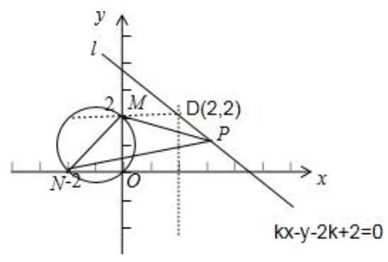

$\because M\left( {0,2}\right) , N\left( {-2,0}\right) ,\therefore {k}_{MN} = 1,{MN}$ 的中点坐标为 $C\left( {-1,1}\right)$ ,

又 $\because$ 直线 $l : {kx} - y - {2k} + 2 = 0$ 过点 $D\left( {2,2}\right)$ ，当 ${l//{MN}}$ 时， $k = {k}_{MN} = 1$ ；

当 $l$ 过 ${MN}$ 的中点时, $k = {k}_{CD} = \frac{1}{3}$ ; 综上可知: $k$ 的值为 1 或 $\frac{1}{3}$ .

(2) $\because$ 对于 $l$ 上任意一点 $P$ ， $\angle {MPN}$ 恒为锐角，

$\therefore l$ 与以 ${MN}$ 为直径的圆相离;

即圆心到直线 $l$ 的距离大于半径, $d = \frac{\left| -k - 1 - 2k + 2\right| }{\sqrt{{k}^{2} + 1}} > \sqrt{2}$ ,解得: $k <  - \frac{1}{7}$ 或 $k > 1$ .

4、已知椭圆 $\frac{{x}^{2}}{2} + {y}^{2} = 1$ 上两个不同的点 $\mathrm{A},\mathrm{B}$ 关于直线 $y = {mx} + \frac{1}{2}\left( {m \neq  0}\right)$ 对称.

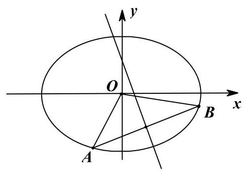

第 15 页共 16 页

(1)若已知 $C\left( {0,\frac{1}{2}}\right)$ ， $M$ 为椭圆上动点，证明: $\left| {MC}\right|  \leq  \frac{\sqrt{10}}{2}$ ；

(2)求实数 $m$ 的取值范围；

(3)求 $\bigtriangleup  {AOB}$ 面积的最大值(O为坐标原点 $)$ .

【难度】 $\star   \star   \star   \star$

【答案】见解析

【解析】解: (1) 设 $M\left( {x, y}\right)$ ,则 $\frac{{x}^{2}}{2} + {y}^{2} = 1$ ,于是

$\left| {MC}\right|  = \sqrt{{x}^{2} + {\left( y - \frac{1}{2}\right) }^{2}} = \sqrt{2 - 2{y}^{2} + {\left( y - \frac{1}{2}\right) }^{2}} = \sqrt{-{y}^{2} - y + \frac{9}{4}} = \sqrt{-{\left( y + \frac{1}{2}\right) }^{2} + \frac{5}{2}}$

因 $- 1 \leq  y \leq  1$ ，所以，当 $y =  - \frac{1}{2}$ 时， ${\left| MC\right| }_{\max } = \frac{\sqrt{10}}{2}$ . 即 $\left| {MC}\right|  \leq  \frac{\sqrt{10}}{2}$

( 2 )由题意知 $m \neq  0$ ，可设直线 ${AB}$ 的方程为 $y =  - \frac{1}{m}x + b$ .

由 $\left\{  \begin{array}{l} \frac{{x}^{2}}{2} + {y}^{2} = 1, \\  y =  - \frac{1}{m}x + b, \end{array}\right.$ 消去 $y$ ,得 $\frac{2 + {m}^{2}}{2{m}^{2}}{x}^{2} - \frac{2b}{m}x + {b}^{2} - 1 = 0$ .

因为直线 $y =  - \frac{1}{m}x + b$ 与椭圆 $\frac{{x}^{2}}{2} + {y}^{2} = 1$ 有两个不同的交点,所以, $\Delta  =  - 2{b}^{2} + 2 + \frac{4}{{m}^{2}} > 0$ ,

即 ${b}^{2} < 1 + \frac{2}{{m}^{2}}$ 将 ${AB}$ 中点 $M\left( {\frac{2mb}{{m}^{2} + 2},\frac{{m}^{2}b}{{m}^{2} + 2}}\right)$ 代入直线方程 $y = {mx} + \frac{1}{2}$ 解得 $b =  - \frac{{m}^{2} + 2}{2{m}^{2}}$

由①②得 $m <  - \frac{\sqrt{6}}{3}$ 或 $m > \frac{\sqrt{6}}{3}$

(3)令 $t = \frac{1}{m} \in  \left( {-\frac{\sqrt{6}}{2},0}\right)  \cup  \left( {0,\frac{\sqrt{6}}{2}}\right)$ ，即 ${t}^{2} = \left( {0,\frac{3}{2}}\right)$ ，

则 $\left| {AB}\right|  = \sqrt{{t}^{2} + 1} \cdot  \frac{\sqrt{-2{t}^{4} + 2{t}^{2} + \frac{3}{2}}}{{t}^{2} + \frac{1}{2}}$ 且 $O$ 到直线 ${AB}$ 的距离为 $d = \frac{{t}^{2} + \frac{1}{2}}{\sqrt{{t}^{2} + 1}}$

设 $\bigtriangleup {AOB}$ 的面积为 $S\left( t\right)$ ,所以 $S\left( t\right)  = \frac{1}{2}\left| {AB}\right|  \cdot  d = \frac{1}{2}\sqrt{-2{\left( {t}^{2} - \frac{1}{2}\right) }^{2} + 2} \leq  \frac{\sqrt{2}}{2}$ 当且仅当 ${t}^{2} = \frac{1}{2}$ 时,等号成立,故 $\bigtriangleup {AOB}$ 面积的最大值为 $\frac{\sqrt{2}}{2}$ .
