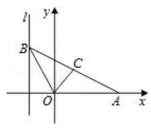
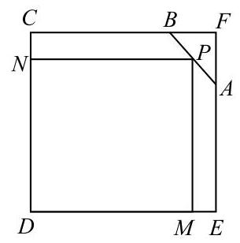

## 第 3 课:分类讨论思想

<table><tr><td>教学目标</td><td>1、掌握分类讨论思想基本原则和方法;   2、能正确和高效的进行分类与整合;   3、理解高中数学里比较常见的分类题型;   4、如何在必要情形下避开分类讨论.</td></tr><tr><td>重点</td><td>1、如何把握好分类的基本原则;   2、合理选定标准正确进行分类求解.</td></tr><tr><td>难点</td><td>1、如何把握好分类的基本原则;   2、合理选定标准正确进行分类求解.</td></tr></table>

## 知识梳理

分类讨论思想是一种重要的数学思想方法. 其基本思路是将一个较复杂的数学问题分解(或分割)成若干个基础性问题, 通过对基础性问题的解答来实现解决原问题的思想策略. 对问题实行分类与整合, 分类标准等于增加一个已知条件, 实现了有效增设, 将大问题(或综合性问题)分解为小问题(或基础性问题), 优化解题思路, 降低问题难度。分类讨论是一种逻辑方法, 是一种重要的数学思想, 同时也是一种重要的解题策略, 它体现了化整为零、积零为整的思想与归类整理的方法。有关分类讨论思想的数学问题具有明显的逻辑性、综合性、探索性, 能训练人的思维条理性和概括性, 所以在高考试题中占有重要的位置。

引起分类讨论的原因主要是以下几个方面:

(1)由数学概念引起的分类讨论. 有的概念本身是分类的，如绝对值、直线斜率、指数函数、对数函数等. (2)由性质、定理、公式的限制引起的分类讨论. 有的数学定理、公式、性质是分类给出的, 在不同的条件下结论不一致,如等比数列的前 $n$ 项和公式、函数的单调性等.

(3)由数学运算要求引起的分类讨论. 如除法运算中除数不为零, 偶次方根为非负, 对数真数与底数的要求, 指数运算中底数的要求, 不等式两边同乘以一个正数、负数, 三角函数的定义域等.

(4)由图形的不确定性引起的分类讨论. 有的图形类型、位置需要分类: 如角的终边所在的象限; 点、线、 面的位置关系等.

(5)由参数的变化引起的分类讨论. 某些含有参数的问题, 如含参数的方程、不等式, 由于参数的取值不同会导致所得结果不同, 或对于不同的参数值要运用不同的求解或证明方法.

(6)由实际意义引起的讨论. 此类问题在应用题中, 特别是在解决排列、组合中的计数问题时常用.

解答分类讨论问题时, 我们的基本方法和步骤是: 首先要确定讨论对象以及所讨论对象的全体的范围; 其次确定分类标准, 正确进行合理分类, 即标准统一、不漏不重、分类互斥 (没有重复); 再对所分类逐步进行讨论, 分级进行, 获取阶段性结果; 最后进行归纳小结, 综合得出结论。

分类讨论是一种有效的化繁为简的做法, 有时也可以避免分类讨论: 正反相对, 全集补集, 分离变量, 构造函数, 数形结合, 排列组合中捆邦等方法都可有效的避免分类。

## (一) 由数学概念、性质、定理、公式的限制、参量引起的分类讨论

## 例题精讲

1.集合、不等式中分类讨论

【例 1】已知集合 $A = \left\{  {x \mid  {x}^{2} - {5x} + 4 \leq  0}\right\}$ ,集合 $B = \left\{  {x \mid  {x}^{2} - {2ax} + a + 2 \leq  0}\right\}$ ,若 $B \subseteq  A$ ,则实数 $a$ 的取值范围为___.

【例 2】已知函数 $f\left( x\right)  = {a}^{x}\left| {{a}^{x} - 2}\right| ,\left( {a > 0, a \neq  1}\right)$ 。

(1)解方程 $f\left( x\right)  = 3$ ；

(2)当 $x \in  \left( {0,1}\right\rbrack$ 时，关于 $x$ 的不等式 $f\left( x\right)  < 3$ 恒成立，求实数 $a$ 的取值范围。

2. 函数中的分类讨论

【例 3】已知 ${\log }_{m}5 > {\log }_{n}5$ ,试确定 $m$ 和 $n$ 的大小关系。

【例 4】给出条件: ① ${x}_{1} < {x}_{2}$ ，② $\left| {x}_{1}\right|  > {x}_{2}$ ，③ ${x}_{1} < \left| {x}_{2}\right|$ ，④ ${x}_{1}^{2} < {x}_{2}^{2}$ . 函数 $f\left( x\right)  = \left| {\sin x}\right|  + \left| x\right|$ ，对任意 ${x}_{1}\text{ 、 }{x}_{2} \in  \left\lbrack  {-\frac{\pi }{2},\frac{\pi }{2}}\right\rbrack$ ,能使 $f\left( {x}_{1}\right)  < f\left( {x}_{2}\right)$ 成立的条件的序号是___.

【例 5】设函数 $f\left( x\right)  = a{x}^{2} - {2x} + 2$ ,对于满足 $1 < x < 4$ 的一切 $x$ 值都有 $f\left( x\right)  > 0$ ,则实数 $a$ 的取值范围为___.

3. 数列中等比数列前 $\mathrm{n}$ 项和公式

【例 6】已知等比数列的前 $n$ 项之和为 ${S}_{n}$ ,前 $n + 1$ 项之和为 ${S}_{n + 1}$ ,公比 $q > 0$ ,令 ${T}_{n} = \frac{{S}_{n}}{{S}_{n + 1}}$ ,求 $\mathop{\lim }\limits_{{n \rightarrow  \infty }}{T}_{n}$ 。

4. 立体几何和圆锥曲线中的分类

【例 7】如图,给出定点 $A\left( {a,0}\right) \left( {a > 0, a \neq  1}\right)$ 和直线 $l : x =  - 1, B$ 是直线 $l$ 上的动点, $\angle {BOA}$ 的角平分线交 ${AB}$ 于点 $C$ ,求点 $C$ 的轨迹方程,并讨论方程表示的曲线类型与 $a$ 值的关系.

【例 8】已知四面体 ${ABCD}$ 中, ${AB} = {CD} = 4, E\text{ 、 }F$ 分别为 ${BC}\text{ 、 }{AD}$ 的中点,且异面直线 ${AB}$ 与 ${CD}$ 所成的角为 $\frac{\pi }{3}$ ,则 ${EF} =$ ___.

5.三角中需要分类的

【例 9】在 $\bigtriangleup {ABC}$ 中,已知 $\sin A = \frac{1}{2},\cos B = \frac{5}{13}$ ,求 $\cos C$ 。

6.复数中需要分类的

【例 10】已知实系数一元二次方程 $2{x}^{2} + {3ax} + {a}^{2} - a = 0\left( {a \in  R}\right)$ 有两根 ${x}_{1}\text{ 、 }{x}_{2}$ ,求 $\left| {x}_{1}\right|  + \left| {x}_{2}\right|$ 的值. (用含 $a$ 的解析式表示)

## 巩固训练

1、角 $\alpha$ 的终边上一点 $P\left( {a,{2a}}\right) \left( {a \neq  0}\right)$ ，则 $2\sin \alpha  - \cos \alpha  =$ (   )

A. $\frac{\sqrt{5}}{5}$ B. $- \frac{\sqrt{5}}{5}$ C. $\frac{\sqrt{5}}{5}$ 或 $- \frac{\sqrt{5}}{5}$ D. $\frac{3\sqrt{5}}{5}$ 或 $- \frac{3\sqrt{5}}{5}$

2、设函数 $f\left( x\right)  = \left\{  \begin{array}{l} {x}^{2} + x, x < 0, \\   - {x}^{2}, x \geq  0. \end{array}\right.$ 若 $f\left( {f\left( a\right) }\right)  \leq  2$ ，则实数 $a$ 的取值范围是( )

A. $\lbrack  - 2, + \infty )$ B. $( - \infty , - 2\rbrack$ C. $( - \infty ,\sqrt{2}\rbrack$ D. $\left( {\sqrt{2}, + \infty }\right)$

3、在等比数列 $\left\{  {a}_{n}\right\}$ 中,已知 ${a}_{3} = \frac{3}{2},{s}_{3} = \frac{9}{2}$ ,求 ${a}_{1}$ 与 $q$ .

4、设 ${F}_{1},{F}_{2}$ 为椭圆 $\frac{{x}^{2}}{9} + \frac{{y}^{2}}{4} = 1$ 的两个焦点, $P$ 为椭圆上一点. 已知 $P,{F}_{1},{F}_{2}$ 是一个直角三角形的三个顶点, 且 $P{F}_{1} > P{F}_{2}$ ，则 $\frac{P{F}_{1}}{P{F}_{2}}$ 的值为___.

5、设 $a$ 为实数，设函数 $f\left( x\right)  = a\sqrt{1 - {x}^{2}} + \sqrt{1 + x} + \sqrt{1 - x}$ 的最大值为 $g\left( a\right)$ 。

(1)设 $t = \sqrt{1 + x} + \sqrt{1 - x}$ ，求 $t$ 的取值范围，并把 $f\left( x\right)$ 表示为 $t$ 的函数 $m\left( t\right)$ ；

(2)求 $g\left( a\right)$ ；

(3)试求满足 $g\left( a\right)  = g\left( \frac{1}{a}\right)$ 的所有实数 $a$ 。

6、已知椭圆 $C$ 的中心为直角坐标系的的原点，焦点在 $x$ 轴上，它的一个顶点到两个焦点的距离分别为 7 和 1 。

(1)求椭圆 $C$ 的方程；

(2)若 $P$ 为椭圆 $C$ 上的动点， $M$ 为过 $P$ 且垂直于 $x$ 轴的直线上的点，且 $\frac{\left| OP\right| }{\left| OM\right| } = \lambda$ ，求点 $M$ 的轨迹方程， 并说明轨迹是什么曲线?

## (二)由实际意义引起的讨论. 此类问题在应用题中，特别是在解决排列、组合中的计数问 题时常用

## 例题精讲

【例 11】有一块铁皮零件,其形状是由边长为 ${40}\mathrm{\;{cm}}$ 的正方形截去一个三角形 ${ABF}$ 所得的五边形,其中 ${AF} = {{12}\mathrm{\;{cm}}}$ ， ${BF} = {{10}\mathrm{\;{cm}}}$ ，如图所示，现在需要用这块材料截取矩形铁皮 ${DM}{PN}$ ，使得矩形的相邻两边分别落在 ${CD},{DE}$ 上,另一个顶点 $P$ 落在边 ${CB}$ 或 ${BA}$ 边上,设 ${DM} = x\mathrm{\;{cm}}$ ,矩形 ${DMPN}$ 的面积为 $y{\mathrm{\;{cm}}}^{2}$ .

(1)试求出矩形铁皮 ${DMPN}$ 的面积 $y$ 关于 $x$ 的函数解析式，并写出定义域；

(2)试问如何截取(即 $x$ 取何值时)，可使得到的矩形 ${DMPN}$ 的面积最大？

【例 12】(1)用数字 0、1、2、3、4、5 组成无重复数字的三位数，其中奇数的个数为___.(结果用数值表示)

(2)记 $a\text{ 、 }b\text{ 、 }c\text{ 、 }d\text{ 、 }e\text{ 、 }f$ 为 $1\text{ 、 }2\text{ 、 }3\text{ 、 }4\text{ 、 }5\text{ 、 }6$ 的任意一个排列，则使得 $\left( {a + b}\right) \left( {c + d}\right) \left( {e + f}\right)$ 为奇数的排列共有___个.

(3)秉展 “新时代、共享未来” 的主题. 第四届” 进博会” 于 2021 年 11 月 5 至 10 日在上海召开. 某高校派出 2 名女教师、2 名男教师和 1 名学生参加前五天的志愿者服务工作，每天安排 1 人，每人工作 1 天， 如果 2 名男教师不能安排在相邻两天，2 名女教师也是如此，那么符合条件的不同安排方案共有___种.

(4)在一次演唱会上共 10 名演员，其中 8 人能唱歌，5 人会跳舞，现要演出一个 2 人唱歌 2 人伴舞的节目， 有多少选派方法.

## 巩固训练

1、某市一家庭一月份、二月份、三月份天然气用量和支付费用如下表所示:

<table><tr><td>月份</td><td>用气量(立方米)</td><td>支付费用(元)</td></tr><tr><td>一</td><td>4</td><td>8</td></tr><tr><td>二</td><td>20</td><td>38</td></tr><tr><td>三</td><td>26</td><td>50</td></tr></table>

该市的家用天然气收费方法是:天然气费=基本费+超额费+保险费.

现已知,在每月用气量不超过 $A$ 立方米时,只交基本费 6 元; 每户的保险费是每月 $C$ 元 $\left( {C \leq  5}\right)$ ; 用气量超过 $A$ 立方米时,超过部分每立方米付 $B$ 元.

设当该家庭每月用气量 $x$ 立方米时,所支付费用为 $y$ 元. 求 $y$ 关于 $x$ 的函数解析式.

2、将一个四棱锥的每个顶点染上一种颜色，并使同一条棱的两个端点异色，如果只有 5 种颜色可供使用， 那么不同的染色方法总数为___.

## (三)如何灵活的避免分类讨论(常用参变分离)

## 例题精讲

【例 13】已经关于 $x$ 的不等式 $\left| {{ax} + 3}\right|  \leq  5$ 的解集是 $\left\lbrack  {-1,4}\right\rbrack$ ，则实数 $a$ 值为___.

【例 14】已知 $x \in  ( - \infty ,1\rbrack$ 时,不等式 $1 + {2}^{x} + \left( {a - {a}^{2}}\right)  \cdot  {4}^{x} > 0$ 恒成立,求 $a$ 的取值范围.

【例 15】分别求出符合下列要求的不同排法的种数

(1)6 名学生排 3 排，前排 1 人，中排 2 人，后排 3 人；

(2)6 名学生排成一排，甲不在排头也不在排尾；

(3)从 6 名运动员中选出 4 人参加 4×100 米接力赛，甲不跑第一棒，乙不跑第四棒；

(4)6 人排成一排，甲、乙必须相邻；

(5)6 人排成一排，甲、乙不相邻；

(6)6 人排成一排，限定甲要排在乙的左边，乙要排在丙的左边(甲、乙、丙可以不相邻).

## 巩固训练

1、已知函数 $y = \lg \left\lbrack  {{x}^{2} + \left( {a - 1}\right) x + {a}^{2}}\right\rbrack$ 的定义域为 $\mathrm{R}$ ，则实数 $a$ 的取值范围是___.

2、若不等式 $3{x}^{2} - {\log }_{a}x < 0$ 在 $x \in  \left( {0,\frac{1}{3}}\right)$ 内恒成立,求实数 $a$ 的取值范围.
