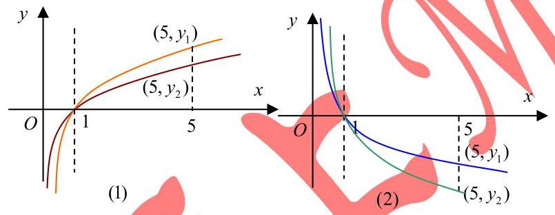
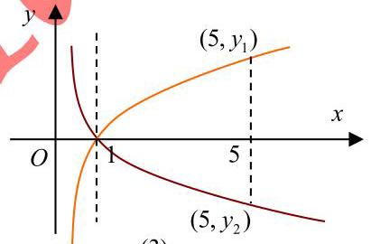
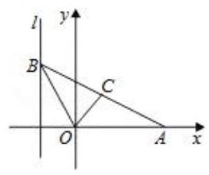
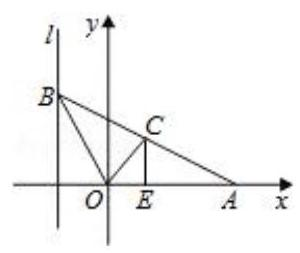
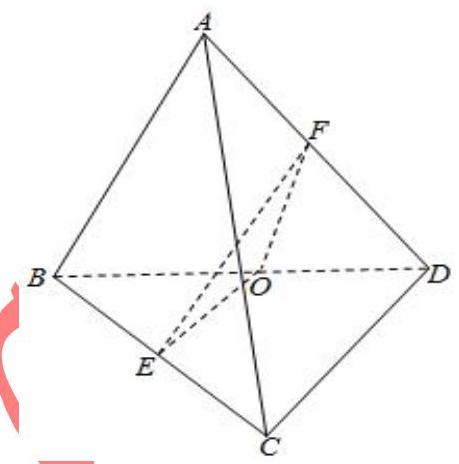
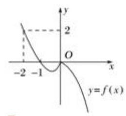
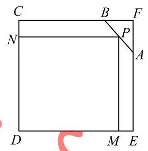
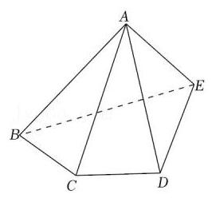
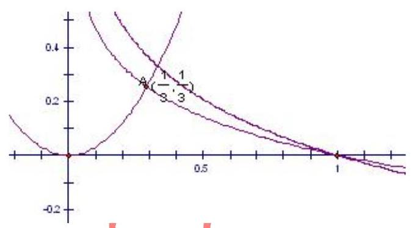

## 知识梳理

## 第 3 课:分类讨论思想

<table><tr><td>教学目标</td><td>1、掌握分类讨论思想基本原则和方法;   2、能正确和高效的进行分类与整合;   3、理解高中数学里比较常见的分类题型;   4、如何在必要情形下避开分类讨论.</td></tr><tr><td>重点</td><td>1、如何把握好分类的基本原则;   2、合理选定标准正确进行分类求解.</td></tr><tr><td>难 点</td><td>1、如何把握好分类的基本原则;   2、合理选定标准正确进行分类求解.</td></tr></table>

分类讨论思想是一种重要的数学思想方法. 其基本思路是将一个较复杂的数学问题分解(或分割)成若干个基础性问题, 通过对基础性问题的解答来实现解决原问题的思想策略. 对问题实行分类与整合, 分类标准等于增加一个已知条件, 实现了有效增设, 将大问题(或综合性问题)分解为小问题(或基础性问题), 优化解题思路, 降低问题难度。分类讨论是一种逻辑方法, 是一种重要的数学思想, 同时也是一种重要的解题策略, 它体现了化整为零、积零为整的思想与归类整理的方法。有关分类讨论思想的数学问题具有明显的逻辑性、综合性、探索性, 能训练人的思维条理性和概括性, 所以在高考试题中占有重要的位置。

引起分类讨论的原因主要是以下几个方面:

(1)由数学概念引起的分类讨论. 有的概念本身是分类的，如绝对值、直线斜率、指数函数、对数函数等. (2)由性质、定理、公式的限制引起的分类讨论. 有的数学定理、公式、性质是分类给出的, 在不同的条件下结论不一致,如等比数列的前 $n$ 项和公式、函数的单调性等.

(3)由数学运算要求引起的分类讨论. 如除法运算中除数不为零，偶次方根为非负，对数真数与底数的要求， 指数运算中底数的要求，不等式两边同乘以一个正数、负数，三角函数的定义域等.

(4)由图形的不确定性引起的分类讨论. 有的图形类型、位置需要分类:如角的终边所在的象限；点、线、 面的位置关系等.

(5)由参数的变化引起的分类讨论. 某些含有参数的问题，如含参数的方程、不等式，由于参数的取值不同会导致所得结果不同, 或对于不同的参数值要运用不同的求解或证明方法.

(6)由实际意义引起的讨论. 此类问题在应用题中, 特别是在解决排列、组合中的计数问题时常用.

解答分类讨论问题时, 我们的基本方法和步骤是: 首先要确定讨论对象以及所讨论对象的全体的范围; 其次确定分类标准, 正确进行合理分类, 即标准统一、不漏不重、分类互斥 (没有重复); 再对所分类逐步进行讨论, 分级进行, 获取阶段性结果; 最后进行归纳小结, 综合得出结论。

分类讨论是一种有效的化繁为简的做法, 有时也可以避免分类讨论: 正反相对, 全集补集, 分离变量, 构造函数, 数形结合, 排列组合中捆邦等方法都可有效的避免分类。

## (一) 由数学概念、性质、定理、公式的限制、参量引起的分类讨论

## 例题精讲

1.集合、不等式中分类讨论

【例 1】已知集合 $A = \left\{  {x \mid  {x}^{2} - {5x} + 4 \leq  0}\right\}$ ,集合 $B = \left\{  {x \mid  {x}^{2} - {2ax} + a + 2 \leq  0}\right\}$ ,若 $B \subseteq  A$ ,则实数 $a$ 的取值范围为___.

【难度】 $\bigstar \bigstar \bigstar$

【答案】 $- 1 < a \leq  \frac{18}{7}$

【解析】解: 集合 $A = \left\{  {x \mid  {x}^{2} - {5x} + 4 \leq  0}\right\}$ ,集合 $B = \left\{  {x \mid  {x}^{2} - {2ax} + a + 2 \leq  0}\right\}$

$B \subseteq  A$ ,解得 $A = \{ x \mid  1 \leq  x \leq  4\}$ ,

若 $B \neq  \varnothing , \bigtriangleup   = {\left( -2a\right) }^{2} - 4\left( {a + 2}\right)  = 4{a}^{2} - {4a} - 8 \geq  0$ ,可得 $a \geq  2$ 或 $a \leq   - 1$ ;

$B = \left\{  {x\left| {\;a - \sqrt{{a}^{2} - a - 2} \leq  x \leq  a + \sqrt{{a}^{2} - a - 2}}\right. }\right\}  ,$

$\because B \subseteq  A,\therefore \left\{  \begin{array}{l} a + \sqrt{{a}^{2} - a - 2} \leq  4\left( 1\right) \\  a - \sqrt{{a}^{2} - a - 2} \geq  1\left( 2\right)  \end{array}\right.$ ,解不等式①得， $a \leq  \frac{18}{7}$ ，解不等式②得， $1 \leq  a \leq  3$ ，取交集得， $1 \leq  a \leq  \frac{18}{7}$ ，

又 $\because  \bigtriangleup   \geq  0$ ,可得 $a \geq  2$ 或 $a \leq   - 1$ ; 可得 $2 \leq  a \leq  \frac{18}{7}$

当 $a = \frac{18}{7}$ 符合题意; 当 $a = 2$ 符合题意; $\therefore 2 \leq  a \leq  \frac{18}{7}$

若 $B = \varnothing$ ,可得 $\bigtriangleup  = {\left( -2a\right) }^{2} - 4\left( {a + 2}\right)  = 4{a}^{2} - {4a} - 8 < 0, - 1 < a < 2$ ;

综上可取并集得: $- 1 < a \leq  \frac{18}{7}$ 故答案为: $- 1 < a \leq  \frac{18}{7}$ ；

【例 2】已知函数 $f\left( x\right)  = {a}^{x}\left| {{a}^{x} - 2}\right| ,\left( {a > 0, a \neq  1}\right)$ 。

(1)解方程 $f\left( x\right)  = 3$ ；

(2)当 $x \in  (0,1\rbrack$ 时，关于 $x$ 的不等式 $f\left( x\right)  < 3$ 恒成立，求实数 $a$ 的取值范围。

【难度】 $\star   \star   \star$

【答案】见解析

【解析】(1) ${a}^{x}\left| {{a}^{x} - 2}\right|  = 3$ ,即: $\left| {\left( {{a}^{x} - 2}\right) {a}^{x}}\right|  = 3,{a}^{x} = {30r} - 1$ (舍去); 故 $x = {\log }_{a}3$ ;

(2)当 $a \in  \left( {0,1}\right)$ 时，令 $t = {a}^{x} \in  \lbrack a,1)$ ，则 $f\left( x\right)  = {a}^{x}\left| {{a}^{x} - 2}\right|$ 在 $x \in  (0,1\rbrack$ 单调递减；

$f\left( x\right)  < 3$ 恒成立,则 $f\left( 0\right)  = 1 < 3$ 恒成立,故 $a \in  \left( {0,1}\right)$ ;

当 $a \in  \left( {1, + \infty }\right)$ 时,令 $t = {a}^{x} \in  (1, a\rbrack , g\left( t\right)  = \left| {{t}^{2} - {2t}}\right| , t \in  (1, a\rbrack$

$g\left( t\right)  = f\left( x\right)  < 3$ 恒成立,结合函数 $g\left( t\right)$ 的图像,易知 $a < 3$ ,综上: $a \in  \left( {0,1}\right)  \cup  \left( {1,3}\right)$

2. 函数中的分类讨论

【例 3】已知 ${\log }_{m}5 > {\log }_{n}5$ ,试确定 $m$ 和 $n$ 的大小关系。

【难度】 $\star   \star   \star$

【答案】见解析

【解析】解法一: 分三种情况,令 ${y}_{1} = {\log }_{m}5,{y}_{2} = {\log }_{n}5$ ,

(1)当 ${\log }_{m}5 > {\log }_{n}5 > 0$ 时，如图(1)有 $1 < m < n$ 。

(2)当 $0 > {\log }_{m}5 > {\log }_{n}5$ 时，如图(2)有 $0 < m < n < 1$ 。

(1)当 ${\log }_{m}5 > 0 > {\log }_{n}5$ 时，如图(3)有 $0 < n < 1 < m$

注意: 本题也应用了 $y = {\log }_{a}x\left( {a > 0, a \neq  1}\right)$ 图像在第一象限的分布规律。

解法二: ${\log }_{m}5 > {\log }_{n}5 \Leftrightarrow  \frac{1}{{\log }_{5}m} > \frac{1}{{\log }_{5}n}$

(1)当 ${\log }_{5}m > 0,{\log }_{5}n > 0$ 时，则 ${\log }_{5}m < {\log }_{5}n$ ，所以 $1 < m < n$ 。

(2)当 ${\log }_{5}m < 0,{\log }_{5}n < 0$ 时，则 ${\log }_{5}m < {\log }_{5}n$ ，所以 $0 < m < n < 1$ 。

(3)当 ${\log }_{5}m > 0,{\log }_{5}n < 0$ 时,则有 $0 < n < 1 < m$

【例 4】给出条件: ① ${x}_{1} < {x}_{2}$ , ② $\left| {x}_{1}\right|  > {x}_{2}$ , ③ ${x}_{1} < \left| {x}_{2}\right|$ , ④ ${x}_{1}^{2} < {x}_{2}^{2}$ . 函数 $f\left( x\right)  = \left| {\sin x}\right|  + \left| x\right|$ ,对任意 ${x}_{1}\text{ 、 }{x}_{2} \in  \left\lbrack  {-\frac{\pi }{2},\frac{\pi }{2}}\right\rbrack$ ，能使 $f\left( {x}_{1}\right)  < f\left( {x}_{2}\right)$ 成立的条件的序号是___.

【难度】 $\star   \star   \star$

【答案】④

【解析】解: 由于函数 $f\left( x\right)  = \left| {\sin x}\right|  + \left| x\right|$ 为偶函数,它的图象关于 $y$ 轴对称,

函数 $f\left( x\right)$ 在 $\left\lbrack  {-\frac{\pi }{2},0}\right\rbrack$ 上是减函数,在 $\left\lbrack  {0,\frac{\pi }{2}}\right\rbrack$ 上是增函数,

要使对任意 ${x}_{1},{x}_{2} \in  \left\lbrack  {-\frac{\pi }{2},\frac{\pi }{2}}\right\rbrack$ ,都有 $f\left( {x}_{1}\right)  < f\left( {x}_{2}\right)$ ,只有 ${x}_{1}^{2} < {x}_{2}^{2}$ ,

故答案为: ④.

【例 5】设函数 $f\left( x\right)  = a{x}^{2} - {2x} + 2$ ,对于满足 $1 < x < 4$ 的一切 $x$ 值都有 $f\left( x\right)  > 0$ ,则实数 $a$ 的取值范围为___.

【难度】 $\star   \star   \star$

【答案】 $\left( {\frac{1}{2}, + \infty }\right)$

【解析】解: $\because$ 满足 $1 < x < 4$ 的一切 $x$ 值,都有 $f\left( x\right)  = a{x}^{2} - {2x} + 2 > 0$ 恒成立,可知 $a \neq  0$

$\therefore a > \frac{2\left( {x - 1}\right) }{{x}^{2}} = 2\left\lbrack  {\frac{1}{4} - {\left( \frac{1}{x} - \frac{1}{2}\right) }^{2}}\right\rbrack$ ,满足 $1 < x < 4$ 的一切 $x$ 值恒成立,

$\because \frac{1}{4} < \frac{1}{x} < 1,\therefore 2\left\lbrack  {\frac{1}{4} - {\left( \frac{1}{x} - \frac{1}{2}\right) }^{2}}\right\rbrack   \in  \left( {0,\frac{1}{2}}\right\rbrack$ ,实数 $a$ 的取值范围为: $\left( {\frac{1}{2}, + \infty }\right)$ . 故答案为: $\left( {\frac{1}{2}, + \infty }\right)$ .

3. 数列中等比数列前 $\mathrm{n}$ 项和公式

【例 6】已知等比数列的前 $n$ 项之和为 ${S}_{n}$ ,前 $n + 1$ 项之和为 ${S}_{n + 1}$ ,公比 $q > 0$ ,令 ${T}_{n} = \frac{{S}_{n}}{{S}_{n + 1}}$ ,求 $\mathop{\lim }\limits_{{n \rightarrow  \infty }}{T}_{n}$ 。

【难度】 $\star   \star   \star$

【答案】见解析

【解析】当 $q = 1$ 时, ${S}_{n} = n{a}_{1},{S}_{n + 1} = \left( {n + 1}\right) {a}_{1}\therefore \mathop{\lim }\limits_{{n \rightarrow  \infty }}{T}_{n} = n\mathop{\lim }\limits_{{n \rightarrow  \infty }}\frac{n}{n + 1} = 1$

当 $q \neq  1$ 时, ${S}_{n} = \frac{{a}_{1}\left( {1 - {q}^{n}}\right) }{1 - q},{S}_{n + 1} = \frac{{a}_{1}\left( {1 - {q}^{n + 1}}\right) }{1 - q}\;\therefore {\mathrm{T}}_{\mathrm{n}} = \frac{{\mathrm{S}}_{\mathrm{n}}}{{\mathrm{S}}_{\mathrm{n} + 1}} = \frac{1 - {\mathrm{q}}^{\mathrm{n}}}{1 - {\mathrm{q}}^{\mathrm{n} + 1}}$

当 $0 < q < 1$ 时, $\mathop{\lim }\limits_{{n \rightarrow  \infty }}{T}_{n} = 1$ ;

当 $q > 1$ 时, $\mathop{\lim }\limits_{{n \rightarrow  \infty }}{T}_{n} = \mathop{\lim }\limits_{{n \rightarrow  \infty }}\frac{\frac{1}{{q}^{n}} - 1}{\frac{1}{{q}^{n}} - q} = \frac{1}{q}$

综上所述,知 $\mathop{\lim }\limits_{{n \rightarrow  \infty }}{T}_{n} = \left\{  \begin{array}{ll} 1, & (0 < q \leq  \\  \frac{1}{q}, & \left( {q > 1}\right)  \end{array}\right.$

4. 立体几何和圆锥曲线中的分类

【例 7】如图,给出定点 $A\left( {a,0}\right) \left( {a > 0, a \neq  1}\right)$ 和直线 $l : x =  - 1, B$ 是直线 $l$ 上的动点, $\angle {BOA}$ 的角平分线

交 ${AB}$ 于点 $C$ . 求点 $C$ 的轨迹方程,并讨论方程表示的曲线类型与 $a$ 值的关系.

【难度】 $\star   \star   \star$

【答案】见解析

【解析】解: 依题意,记 $B\left( {-1, b}\right) \left( {b \in  R}\right)$ ,则直线 ${OA}$ 和 ${OB}$ 的方程分别为 $y = 0$ 和 $y =  - {bx}$ .

设点 $C\left( {x, y}\right)$ ,

则有 $0 \leq  x < a$ ,由 ${OC}$ 平分 $\angle {AOB}$ ,知点 $C$ 到 ${OA}\text{ 、 }{OB}$ 距离相等.

根据点到直线的距离公式得 $\left| y\right|  = \frac{\left| y + bx\right| }{\sqrt{1 + {b}^{2}}}$ . ①

依题设,点 $C$ 在直线 ${AB}$ 上,故有 $y =  - \frac{b}{1 + a}\left( {x - a}\right)$ .

由 $x - a \neq  0$ ,得 $b =  - \frac{\left( {1 + a}\right) y}{x - a}$ . ②,将②式代入①式得 ${y}^{2}\left\lbrack  {1 + \frac{{\left( 1 + a\right) }^{2}{y}^{2}}{{\left( x - a\right) }^{2}}}\right\rbrack   = {\left\lbrack  y - \frac{\left( {1 + a}\right) {xy}}{x - a}\right\rbrack  }^{2}$ ,

整理得 ${y}^{2}\left\lbrack  {\left( {1 - a}\right) {x}^{2} - {2ax} + \left( {1 + a}\right) {y}^{2}}\right\rbrack   = 0$ .

若 $y \neq  0$ ,则 $\left( {1 - a}\right) {x}^{2} - {2ax} + \left( {1 + a}\right) {y}^{2} = 0\left( {0 < x < a}\right)$ ;

若 $y = 0$ ,则 $b = 0,\angle {AOB} = \pi$ ,点 $C$ 的坐标为 $\left( {0,0}\right)$ ,满足上式.

综上得点 $C$ 的轨迹方程为 $\left( {1 - a}\right) {x}^{2} - {2ax} + \left( {1 + a}\right) {y}^{2} = 0\left( {0 \leq  x < a}\right)$

因为 $a \neq  0$ ,所以 $\frac{{\left( x - \frac{a}{1 - a}\right) }^{2}}{{\left( \frac{a}{1 - a}\right) }^{2}} + \frac{{y}^{2}}{\frac{{a}^{2}}{1 - a}} = 1\left( {0 \leq  x < a}\right)$ . 由此知,当 $0 < a < 1$ 时,方程③表示椭圆弧段;

当 $a > 1$ 时,方程③表示双曲线一支的弧段;

【例 8 】已知四面体 ${ABCD}$ 中, ${AB} = {CD} = 4, E\text{ 、 }F$ 分别为 ${BC}\text{ 、 }{AD}$ 的中点,且异面直线 ${AB}$ 与 ${CD}$ 所成的角为 $\frac{\pi }{3}$ ,则 ${EF} =$ ___.

【难度】 $\star   \star   \star$

【答案】 2 或 $2\sqrt{3}$

【解析】解: 取 ${BD}$ 中点 $O$ ,连结 ${EO}\text{ 、 }{FO}$ ,

$\because$ 四面体 ${ABCD}$ 中, ${AB} = {CD} = 4, E\text{ 、 }F$ 分别为 ${BC}\text{ 、 }{AD}$ 的中点,

且异面直线 ${AB}$ 与 ${CD}$ 所成的角为 $\frac{\pi }{3}$ ,

$\therefore {EO}//{CD}$ ,且 ${EO} = \frac{1}{2}{CD} = 2,{FO}//{AB}$ ,且 ${FO} = \frac{1}{2}{AB} = 2$ ,

$\therefore \angle {EOF}$ 是异面直线 ${AB}$ 与 ${CD}$ 所成的角,

$\therefore \angle {EOF} = \frac{\pi }{3}$ ,或 $\angle {EOF} = \frac{2\pi }{3}$ ,

当 $\angle {EOF} = \frac{\pi }{3}$ 时, ${\Delta EOF}$ 是等边三角形, $\therefore {EF} = 2$ .

当 $\angle {EOF} = \frac{2\pi }{3}$ 时, ${EF} = \sqrt{{2}^{2} + {2}^{2} - 2 \times  2 \times  2 \times  \cos \frac{2\pi }{3}} = 2\sqrt{3}$ .

故答案为:2 或 $2\sqrt{3}$ .

5.三角中需要分类的

【例 9】在 $\bigtriangleup {ABC}$ 中,已知 $\sin A = \frac{1}{2},\cos B = \frac{5}{13}$ ,求 $\cos C$ 。

【难度】 $\star   \star   \star$

【答案】见解析

【解析】 $\because 0 < \cos B = \frac{5}{13} < \frac{\sqrt{2}}{2}$ ,且 $B$ 为 $\bigtriangleup {ABC}$ 的一个内角 $\therefore {45}^{ \circ  } < B < {90}^{ \circ  }$ ,且 $\sin B = \frac{12}{13}$

若 $A$ 为锐角,由 $\sin A = \frac{1}{2}$ ,得 $A = {30}^{ \circ  }$ ,此时 $\cos A = \frac{\sqrt{3}}{2}$

若 $A$ 为钝角，由 $\sin A = \frac{1}{2}$ ，得 $A = {150}^{ \circ  }$ ，此时 $A + B > {180}^{ \circ  }$

这与三角形的内角和为 ${180}^{ \circ  }$ 相矛盾。可见 $A \neq  {150}^{ \circ  }$

$\therefore \cos C = \cos \left\lbrack  {\pi  - \left( {A + B}\right) }\right\rbrack   =  - \cos \left( {A + B}\right)$

$=  - \left\lbrack  {\cos A \cdot  \cos B - \sin A \cdot  \sin B}\right\rbrack   =  - \left\lbrack  {\frac{\sqrt{3}}{2} \cdot  \frac{5}{13} - \frac{1}{2} \cdot  \frac{12}{13}}\right\rbrack   = \frac{{12} - 5\sqrt{3}}{26}$

6.复数中需要分类的

【例 10】已知实系数一元二次方程 $2{x}^{2} + {3ax} + {a}^{2} - a = 0\left( {a \in  R}\right)$ 有两根 ${x}_{1}\text{ 、 }{x}_{2}$ ,求 $\left| {x}_{1}\right|  + \left| {x}_{2}\right|$ 的值. (用含 $a$ 的解析式表示)

【难度】 $\star   \star   \star$

【答案】见解析

【解析】实系数一元二次方程的两根可能是实数, 也可能是虚数, 因此需根据判别式的取值分类讨论. $\Delta  = {\left( 3a\right) }^{2} - 4 \times  2 \times  \left( {{a}^{2} - a}\right)  = {a}^{2} + {8a}$ ,

1) 当 ${a}^{2} + {8a} \geq  0$ ,即 $a \geq  0$ 或 $a \leq   - 8$ 时,方程有两个实数根,此时需讨论两根符号:

① 当 ${a}^{2} - a > 0$ ，即 $a > 1$ 或 $a \leq   - 8$ 时，两根同号，此时 $\left| {x}_{1}\right|  + \left| {x}_{2}\right|  = \left| {{x}_{1} + {x}_{2}}\right|  = \frac{3\left| a\right| }{2}$ ；

② 当 ${a}^{2} - a \leq  0$ ，即 $0 \leq  a \leq  1$ 时，两根异号或至少其一为 0，此时

$$
\left| {x}_{1}\right|  + \left| {x}_{2}\right|  = \sqrt{{\left( {x}_{1} - {x}_{2}\right) }^{2}} = \sqrt{{\left( {x}_{1} + {x}_{2}\right) }^{2} - 4{x}_{1}{x}_{2}} = \sqrt{{\left( \frac{3a}{2}\right) }^{2} - 4 \times  \frac{{a}^{2} - a}{2}} = \sqrt{\frac{{a}^{2}}{4} + {2a}};
$$

2) 当 ${a}^{2} + {8a} < 0$ 时,即 $- 8 < a < 0$ 时,两根对共轭虚根,故模长相同,此时 $\left| {x}_{1}\right|  + \left| {x}_{2}\right|  = 2\left| {x}_{1}\right|  = 2\sqrt{{x}_{1}\overline{{x}_{1}}} = 2\sqrt{{x}_{1}{x}_{2}} = 2\sqrt{\frac{{a}^{2} - a}{2}} = \sqrt{2{a}^{2} - {2a}}$ ;

综上所述, $\left| {x}_{1}\right|  + \left| {x}_{2}\right|  = \left\{  \begin{array}{ll} \frac{3\left| a\right| }{2}, & a > 1 \\  \sqrt{\frac{{a}^{2}}{4} + {2a}}, & 0 \leq  a \leq  1 \\  \sqrt{\frac{{a}^{2}}{4} + {2a}}, & 0 \leq  a \leq  1 \end{array}\right.$

## 巩固训练

1、角 $\alpha$ 的终边上一点 $P\left( {a,{2a}}\right) \left( {a \neq  0}\right)$ ，则 $2\sin \alpha  - \cos \alpha  =$ (   )

A. $\frac{\sqrt{5}}{5}$ B. $- \frac{\sqrt{5}}{5}$ C. $\frac{\sqrt{5}}{5}$ 或 $- \frac{\sqrt{5}}{5}$ D. $\frac{3\sqrt{5}}{5}$ 或 $- \frac{3\sqrt{5}}{5}$

【难度】 $\star   \star   \star$

【答案】 $D$

【解析】解: $\because \alpha$ 的终边上一点 $P\left( {a,{2a}}\right) \left( {a \neq  0}\right)$ ,

当 $a > 0$ 时， $\cos \alpha  = \frac{a}{\sqrt{5} \cdot  a} = \frac{\sqrt{5}}{5},\sin \alpha  = \frac{2a}{\sqrt{5} \cdot  a} = \frac{2\sqrt{5}}{5},2\sin \alpha  - \cos \alpha  = \frac{3\sqrt{5}}{5}$ ;

当 $a < 0$ 时， $\cos \alpha  = \frac{a}{-\sqrt{5} \cdot  a} =  - \frac{\sqrt{5}}{5}$ ， $\sin \alpha  = \frac{2a}{-\sqrt{5} \cdot  a} =  - \frac{2\sqrt{5}}{5}$ ， $2\sin \alpha  - \cos \alpha  =  - \frac{3\sqrt{5}}{5}$ ，故选: $D$ .

2、设函数 $f\left( x\right)  = \left\{  \begin{array}{l} {x}^{2} + x, x < 0, \\   - {x}^{2}, x \geq  0. \end{array}\right.$ 若 $f\left( {f\left( a\right) }\right)  \leq  2$ ，则实数 $a$ 的取值范围是( )

A. $\left\lbrack  {-2, + \infty }\right)$ B. $( - \infty , - 2\rbrack$ C. $\left( {-\infty ,\sqrt{2}}\right)$ D. $\left( {\sqrt{2}, + \infty }\right)$

【难度】 $\star   \star   \star$

【答案】 $C$

【解析】解: $y = f\left( x\right)$ 的图象如图所示,

$\because f\left( {f\left( a\right) }\right)  \leq  2,\therefore f\left( a\right)  \geq   - 2$ ,由函数图象可知 $a \leq  \sqrt{2}$ . 故选: $C$ .

3、在等比数列 $\left\{  {a}_{n}\right\}$ 中,已知 ${a}_{3} = \frac{3}{2},{s}_{3} = \frac{9}{2}$ ,求 ${a}_{1}$ 与 $q$ .

【难度】 $\star   \star   \star$

【答案】 $\frac{3}{2}$ 或 6

【解析】 ${a}_{1}{q}^{2} = \frac{3}{2},{a}_{1} + {a}_{1}q + {a}_{1}{q}^{2} = \frac{9}{2}$ ,联立解得: $q = 1,{a}_{1} = \frac{3}{2};q =  - \frac{1}{2},{a}_{1} = 6$ .

4、设 ${F}_{1},{F}_{2}$ 为椭圆 $\frac{{x}^{2}}{9} + \frac{{y}^{2}}{4} = 1$ 的两个焦点， $P$ 为椭圆上一点. 已知 $P,{F}_{1},{F}_{2}$ 是一个直角三角形的三个顶点， 且 $P{F}_{1} > P{F}_{2}$ ，则 $\frac{P{F}_{1}}{P{F}_{2}}$ 的值为___.

【难度】 $\star   \star   \star$

【答案】 2 或 $\frac{7}{2}$

【解析】解: $\because {F}_{1}\text{ 、 }{F}_{2}$ 为椭圆 $\frac{{x}^{2}}{9} + \frac{{y}^{2}}{4} = 1$ 的两个焦点, $\therefore a = 3, b = 2, c = \sqrt{9 - 4} = \sqrt{5}$ ,

$\therefore {F}_{1}\left( {-\sqrt{5},0}\right) ,{F}_{2}\left( {\sqrt{5},0}\right)$

当 $P{F}_{2} \bot  x$ 轴时, $P$ 的横坐标为 $\sqrt{5}$ ,其纵坐标为 $\pm  \frac{4}{3},\therefore \frac{\left| P{F}_{1}\right| }{\left| P{F}_{2}\right| } = \frac{{2a} - \frac{4}{3}}{\frac{4}{3}} = \frac{6 - \frac{4}{3}}{\frac{4}{3}} = \frac{7}{2}$ .

当 $P{F}_{1} \bot  P{F}_{2}$ 时,设 $\left| {P{F}_{2}}\right|  = m$ ,

则 $\left| {P{F}_{1}}\right|  = {2a} - m = 6 - m$ , $3 > m > 0$ ,由勾股定理可得

$4{c}^{2} = {m}^{2} + {\left( 6 - m\right) }^{2}$ ,即 ${20} = 2{m}^{2} - {12m} + {36}$ ,解得 $m = 2$ 或 $m = 4$ (舍去),

$\therefore \frac{\left| P{F}_{1}\right| }{\left| P{F}_{2}\right| } = \frac{6 - 2}{2} = 2$ . 综上, $\frac{\left| P{F}_{1}\right| }{\left| P{F}_{2}\right| }$ 的值为 $\frac{7}{2}$ 或 2 .

5、设 $a$ 为实数，设函数 $f\left( x\right)  = a\sqrt{1 - {x}^{2}} + \sqrt{1 + x} + \sqrt{1 - x}$ 的最大值为 $g\left( a\right)$ 。

(1)设 $t = \sqrt{1 + x} + \sqrt{1 - x}$ ，求 $t$ 的取值范围，并把 $f\left( x\right)$ 表示为 $t$ 的函数 $m\left( t\right)$ ；

(2)求 $g\left( a\right)$ ；

(3)试求满足 $g\left( a\right)  = g\left( \frac{1}{a}\right)$ 的所有实数 $a$ 。

【难度】 $\star   \star   \star$

【答案】见解析

【解析】(I) 令 $t = \sqrt{1 + x} + \sqrt{1 - x}$

要使有 $\mathrm{t}$ 意义,必须 $1 + \mathrm{x} \geq  0$ 且 $1 - \mathrm{x} \geq  0$ ,即 $- 1 \leq  \mathrm{x} \leq  1$ ,

$$
\therefore {t}^{2} = 2 + 2\sqrt{1 - {x}^{2}} \in  \left\lbrack  {2,4}\right\rbrack  ,\mathrm{t} \geq  0
$$

①

$\mathrm{t}$ 的取值范围是 $\left\lbrack  {\sqrt{2},2}\right\rbrack$ . 由①得 $\sqrt{1 - {x}^{2}} = \frac{1}{2}{t}^{2} - 1$

$\therefore \mathrm{m}\left( \mathrm{t}\right)  = \mathrm{a}\left( {\frac{1}{2}{t}^{2} - 1}\right)  + \mathrm{t} = \frac{1}{2}a{t}^{2} + t - a, t \in  \left\lbrack  {\sqrt{2},2}\right\rbrack$

(II) 由题意知 $\mathrm{g}\left( \mathrm{a}\right)$ 即为函数 $m\left( t\right)  = \frac{1}{2}a{t}^{2} + t - a, t \in  \left\lbrack  {\sqrt{2},2}\right\rbrack$ 的最大值。 注意到直线 $t =  - \frac{1}{a}$ 是抛物线 $m\left( t\right)  = \frac{1}{2}a{t}^{2} + t - a$ 的对称轴,分以下几种情况讨论。

(1)当 $a > 0$ 时，函数 $y = m\left( t\right) , t \in  \left\lbrack  {\sqrt{2},2}\right\rbrack$ 的图象是开口向上的抛物线的一段，

由 $t =  - \frac{1}{a} < 0$ 知 $\mathrm{m}\left( \mathrm{t}\right)$ 在 $\left\lbrack  {\sqrt{2},2}\right\rbrack$ . 上单调递增, $\;\mathrm{s} : \mathrm{g}\left( \mathrm{a}\right)  = \mathrm{m}\left( 2\right)  = \mathrm{a} + 2$ 。

(2)当 $\mathrm{a} = 0$ 时， $\mathrm{m\left( t\right)  = t, t \in  \left\lbrack  {\sqrt{2},2}\right\rbrack  ,\therefore g\left( a\right)  = 2}$

(3)当 $a < 0$ 时，函数 $y = m\left( t\right)$ ， $t \in  \left\lbrack  {\sqrt{2},2}\right\rbrack$ 的图象是开口向下的抛物线的一段，

若 $t =  - \frac{1}{a} \in  \left\lbrack  {0,\sqrt{2}}\right\rbrack$ ,即 $a \leq   - \frac{\sqrt{2}}{2}$ 则 $g\left( a\right)  = m\left( \sqrt{2}\right)  = \sqrt{2}$ ,

若 $t =  - \frac{1}{a} \in  (\sqrt{2},2\rbrack$ ,即 $- \frac{\sqrt{2}}{2} < a \leq   - \frac{1}{2}$ 则 $g\left( a\right)  = m\left( {-\frac{1}{a}}\right)  =  - a - \frac{1}{2a}$ ,

若 $t =  - \frac{1}{a} \in  \left( {2, + \infty }\right)$ ,即 $- \frac{1}{2} < a < 0$ 则 $g\left( a\right)  = m\left( 2\right)  = a + 2$ ,

综上有 $g\left( a\right)  = \left\{  \begin{array}{ll} a + 2, & a >  - \frac{1}{2} \\   - a - \frac{1}{2a}, &  - \frac{\sqrt{2}}{2} < a <  - \frac{1}{2}, \\  \sqrt{2}, & a \leq   - \frac{\sqrt{2}}{2} \end{array}\right.$

6、已知椭圆 $C$ 的中心为直角坐标系的的原点，焦点在 $x$ 轴上，它的一个顶点到两个焦点的距离分别为 7 和 1 。

(1)求椭圆 $C$ 的方程；

(2)若 $P$ 为椭圆 $C$ 上的动点， $M$ 为过 $P$ 且垂直于 $x$ 轴的直线上的点，且 $\frac{\left| OP\right| }{\left| OM\right| } = \lambda$ ，求点 $M$ 的轨迹方程， 并说明轨迹是什么曲线?

【难度】 $\bigstar \bigstar \bigstar$

【解析】(1) $\frac{{x}^{2}}{16} + \frac{{y}^{2}}{7} = 1$

(2)设 $M\left( {x, y}\right)$ ， $P\left( {{x}_{0},{y}_{0}}\right)$ ，由 $\frac{\left| OP\right| }{\left| OM\right| } = \lambda$ ，得 $\frac{{x}_{0}{}^{2} + {y}_{0}{}^{2}}{{x}^{2} + {y}^{2}} = {\lambda }^{2}$

整理得: $\left( {{16}{\lambda }^{2} - 9}\right) {x}^{2} + {16}{\lambda }^{2}{y}^{2} = {112}, x \in  \left\lbrack  {-4,4}\right\rbrack$

当 $\lambda  = \frac{3}{4}$ 时, $y =  \pm  \frac{4}{3}\sqrt{7}, x \in  \left\lbrack  {-4,4}\right\rbrack$ ,表示两条平行于 $x$ 轴的线段;

当 $\lambda  \neq  \frac{3}{4}$ 时, $\frac{{x}^{2}}{\frac{112}{{16}{\lambda }^{2} - 9} + \frac{{y}^{2}}{{\lambda }^{2}}} = 1$

若 $\frac{3}{4} < \lambda  < 1$ ,则表示焦点在 $x$ 轴的椭圆限制 $x \in  \left\lbrack  {-4,4}\right\rbrack$ 的一部分;

若 $\lambda  \geq  1$ ,则表示焦点在 $x$ 轴上的一个椭圆;

若 $0 < \lambda  < \frac{3}{4}$ ,则表示焦点在 $y$ 轴上的双曲线 $x \in  \left\lbrack  {-4,4}\right\rbrack$ 的一部分。

(二) 由实际意义引起的讨论. 此类问题在应用题中, 特别是在解决排列、组合中的计数问题时常用

## 例题精讲

【例 11】有一块铁皮零件,其形状是由边长为 ${40}\mathrm{\;{cm}}$ 的正方形截去一个三角形 ${ABF}$ 所得的五边形,其中 ${AF} = {{12}\mathrm{\;{cm}}}$ ， ${BF} = {10}\mathrm{\;{cm}}$ ，如图所示，现在需要用这块材料截取矩形铁皮 ${DMPN}$ ，使得矩形的相邻两边分别落在 ${CD},{DE}$ 上,另一个顶点 $P$ 落在边 ${CB}$ 或 ${BA}$ 边上,设 ${DM} = x\mathrm{\;{cm}}$ ,矩形 ${DMPN}$ 的面积为 $y{\mathrm{\;{cm}}}^{2}$ .

(1)试求出矩形铁皮 ${DMPN}$ 的面积 $y$ 关于 $x$ 的函数解析式，并写出定义域；

(2)试问如何截取(即 $x$ 取何值时 $)$ ，可使得到的矩形 ${DMPN}$ 的面积最大？

【难度】 $\star   \star   \star$

【答案】见解析

【解析】(1)依据题意并结合图形, 可知:

${1}^{0}$ 当点 $P$ 在线段 ${CB}$ 上,即 $0 < x \leq  {30}$ 时, $y = {40x}$ ;

${2}^{0}$ 当点 $P$ 在线段 ${BA}$ 上,即 ${30} < x \leq  {40}$ 时,由 $\frac{PQ}{QA} = \frac{BF}{FA}$ ,得 ${QA} = {48} - \frac{6}{5}x$ .

于是, $y = {DM} \cdot  {PM} = {DM} \cdot  {EQ} = {76x} - \frac{6}{5}{x}^{2}$ .

所以, $y = \left\{  \begin{array}{l} {40x},0 < x \leq  {30} \\  {76x} - \frac{6}{5}{x}^{2} \cdot  {30} < x \leq  {40} \end{array}\right.$ 定义域 $D = (0,{40}\rbrack$ .

(2)由(1)知，当 $0 < x \leq  {30}$ 时， $0 < y \leq  {1200}$ ；

当 ${30} < x \leq  {40}$ 时, $y = {76x} - \frac{6}{5}{x}^{2} =  - \frac{6}{5}{\left( x - \frac{95}{3}\right) }^{2} + \frac{3610}{3} \leq  \frac{3610}{3}$ ,当且仅当 $x = \frac{95}{3}$ 时,等号成立.

因此, $y$ 的最大值为 $\frac{3610}{3}$ .

答: 先在 ${DE} \bot$ 截取线段 ${DM} = \frac{95}{3}\mathrm{\;{cm}}$ ,然后过点 $M$ 作 ${DE}$ 的垂线交 ${BA}$ 于点 $P$ ,再过点 $P$ 作 ${DE}$ 的平行线交 ${DC}$ 于点 $N$ ，最后沿 ${MP}$ 与 ${PN}$ 截铁皮，所得矩形面积最大，最大面积为 $\frac{3610}{3}c{m}^{2}$ .

【例 12】(1)用数字0，1、2，3，4，5 组成无重复数字的三位数，其中奇数的个数为___.(结果用数值表示)

【难度】 $\star   \star   \star$

【答案】 48

【解析】解: 先挑个位,有 ${C}_{3}^{1}$ 种; 再挑百位,有 ${C}_{4}^{1}$ 种; 最后挑十位,有 ${C}_{4}^{1}$ 种;

故奇数的个数为 ${C}_{3}^{1}{C}_{4}^{1}{C}_{4}^{1} = {48}$ 个. 故答案为: 48 .

(2)记 $a\text{ 、 }b\text{ 、 }c\text{ 、 }d\text{ 、 }e\text{ 、 }f$ 为 $1\text{ 、 }2\text{ 、 }3\text{ 、 }4\text{ 、 }5\text{ 、 }6$ 的任意一个排列，则使得 $\left( {a + b}\right) \left( {c + d}\right) \left( {e + f}\right)$ 为奇数的排列共有___个.

【难度】 $\star   \star   \star$

【答案】 288

【解析】解: 根据题意,若 $\left( {a + b}\right) \left( {c + d}\right) \left( {e + f}\right)$ 为奇数,

则 $\left( {a + b}\right) \text{ 、 }\left( {c + d}\right) \text{ 、 }\left( {e + f}\right)$ 全部为奇数,

则 $a$ 的选法有 6 种, $b$ 的选法有 3 种, $c$ 的选法有 4 种, $d$ 的选法有 2 种,

$e$ 的选法有 2 种, $f$ 的选法有 1 种,故有 $6 \times  3 \times  4 \times  2 \times  2 \times  1 = {288}$ 种排法,故答案为: 288 .

(3)秉辰“新时代、共享未来”的主题. 第四届”进博会”于 2021 年 11 月 5 至 10 日在上海召开. 某高校派出 2 名女教师、 2 名男教师和 1 名学生参加前五天的志愿者服务工作，每天安排 1 人，每人工作 1 天， 如果 2 名男教师不能安排在相邻两天，2 名女教师也是如此，那么符合条件的不同安排方案共有___种.

【难度】 $\star   \star   \star$

【答案】 48

【解析】解: 根据题意,不考虑限制条件,5 人安排在 5 天进行志愿活动,有 ${A}_{5}^{5} = {120}$ 种安排方法,

其中 2 名男教师相邻的有 ${A}_{2}^{2}{A}_{4}^{4} = {48}$ 种,2 名女教师相邻的有 ${A}_{2}^{2}{A}_{4}^{4} = {48}$ 种,

男教师和女教师都相邻的有 ${A}_{2}^{2}{A}_{2}^{2}{A}_{3}^{3} = {24}$ 种,则有 ${120} - {48} - {48} + {24} = {48}$ 种安排方法,故答案为: 48 .

(4)在一次演唱会上共 10 名演员，其中 8 人能唱歌，5 人会跳舞，现要演出一个 2 人唱歌 2 人伴舞的节目， 有多少选派方法.

【难度】 $\star   \star   \star$

【答案】 199

【解析】解: 由题意可知能歌善舞的“双面手”共有 $\left( {5 + 8}\right)  - {10} = 3$ 个, $\therefore$ 仅能歌的 5 人，仅善舞的 2 人. 分类计数:(1)“双面手”不选，共有 ${C}_{5}^{2}{C}_{2}^{2} = {10}$ 种选法；

(2)“双面手” 选 1 人，共有 ${C}_{5}^{1}{C}_{3}^{1}{C}_{2}^{2} + {C}_{5}^{2}{C}_{3}^{1}{C}_{2}^{1} = {75}$ 种选法;

(3)“双面手” 选 2 人，共有 ${C}_{3}^{2}{C}_{2}^{2} + {C}_{5}^{2}{C}_{3}^{2} + {C}_{5}^{1}{C}_{3}^{1}{C}_{2}^{1}{C}_{2}^{1} = {93}$ 种选法;

(4)“双面手” 选 3 人，共有 ${C}_{3}^{1}{C}_{5}^{1} + {C}_{3}^{1}{C}_{2}^{1} = {21}$ 种选法;

故选法种数为: ${10} + {75} + {93} + {21} = {199}$ 种选法.

## 巩固训练

1、某市一家庭一月份、二月份、三月份天然气用量和支付费用如下表所示:

<table><tr><td>月份</td><td>用气量(立方米)</td><td>支付费用(元)</td></tr><tr><td>一</td><td>4</td><td>8</td></tr><tr><td>二</td><td>20</td><td>38</td></tr><tr><td>三</td><td>26</td><td>50</td></tr></table>

该市的家用天然气收费方法是:天然气费=基本费+超额费+保险费.

现已知,在每月用气量不超过 $A$ 立方米时,只交基本费 6 元; 每户的保险费是每月 $C$ 元 $\left( {C \leq  5}\right)$ ; 用气量超过 $A$ 立方米时,超过部分每立方米付 $B$ 元.

设当该家庭每月用气量 $x$ 立方米时,所支付费用为 $y$ 元. 求 $y$ 关于 $x$ 的函数解析式.

【难度】 $\star   \star   \star$

【答案】见解析

【解析】根据题意,

$y = \left\{  \begin{matrix} 6 + C, & 0 \leq  x \leq  A, \\  6 + B\left( {x - A}\right)  + C, & x > A. \end{matrix}\right.$(1) (2)

因为 $0 < C \leq  5$ ,所以 $6 + C \leq  {11}$ .

由表格知,二、三月份的费用大于 11 , 因此,二、三月份的用气量均超过基本量 $A$ ,于是有

$\left\{  \begin{array}{l} {38} = 6 + B\left( {{20} - A}\right)  + C, \\  {50} = 6 + B\left( {{26} - A}\right)  + C. \end{array}\right.$

解得 $B = 2,{2A} = 8 + C.\;\left( 3\right)$

假设一月份用气量超过了基本量,即 $4 > A$ .

将 $x = 4$ 代入( 2 ) 得 ${2A} = 6 + C$ 与( 3 )矛盾.

所以 $4 \leq  A$ ，所以 $6 + C = 8$ ， $C = 2$

因此， $A = 5$ ， $B = 2$ ， $C = 2$ .

所以, $y = \left\{  \begin{array}{ll} 8, & 0 \leq  x \leq  \\  {2x} - 2, & x > 5. \end{array}\right.$

2、将一个四棱锥的每个顶点染上一种颜色，并使同一条棱的两个端点异色，如果只有 5 种颜色可供使用， 那么不同的染色方法总数为___.

【难度】 $\star   \star   \star$

【答案】 420

【解析】解: 第一步: 点 $A$ 上色,5 种方法,第二步: 点 $B$ 上色,4 种方法,

第三步:点 $C$ 上色，3 种方法，第四步:点 $D$ 上色，

若与点 $B$ 相同，则有 1 种方法，若与点 $B$ 不同，则有 2 种方法，

高三数学二轮复习 A 版

第五步: 点 $E$ 上色,若点 $D$ 与点 $B$ 相同,则有 3 种方法,若点 $D$ 与点 $B$ 不同,则有 2 种方法,

故不同的染色方法总数为 $5 \times  4 \times  3 \times  1 \times  3 + 5 \times  4 \times  3 \times  2 \times  2 = {420}$ ,故答案为: 420 .

(三)如何灵活的避免分类讨论(常用参变分离)

## 例题精讲

【例 13】已经关于 $x$ 的不等式 $\left| {{ax} + 3}\right|  \leq  5$ 的解集是 $\left\lbrack  {-1,4}\right\rbrack$ ,则实数 $a$ 值为

【难度】 $\bigstar \bigstar \bigstar$

【答案】 $a =  - 2$

【解析】本题考带参数绝对值不等式的解法, 注意要分类讨论.

原不等式等价于: $- 8 \leq  {ax} \leq  2$ ,

当 $a = 0$ 时,不符合题意,舍去;

当 $a > 0$ 时,有 $\frac{-8}{a} \leq  x \leq  \frac{2}{a}$ ,故 $a = 8$ 且 $a = \frac{1}{2}$ 不可能同时成立,舍去;

当 $a < 0$ 时,有 $\frac{2}{a} \leq  x \leq  \frac{-8}{a}$ ,故 $a =  - 2$

另解: 应用数形结合 应用 $y = \left| {{ax} + 3}\right|$ 对称性直接得 $- \frac{3}{a} = \frac{-1 + 4}{2}, a =  - 2$

【例 14】已知 $x \in  ( - \infty ,1\rbrack$ 时,不等式 $1 + {2}^{x} + \left( {a - {a}^{2}}\right)  \cdot  {4}^{x} > 0$ 恒成立,求 $a$ 的取值范围.

【难度】

【答案】 $\therefore  - \frac{1}{2} < a < \frac{3}{2}$

【解析】令 ${2}^{x} = t,\because x \in  ( - \infty ,1\rbrack ,\;\therefore t \in  (0,2\rbrack$ . 所以原不等式可化为: ${a}^{2} - a < \frac{t + 1}{{t}^{2}}$ .

要使上式在 $t \in  (0,2\rbrack$ 上恒成立,只需求出 $f\left( t\right)  = \frac{t + 1}{{t}^{2}}$ 在 $t \in  (0,2\rbrack$ 上的最小值即可.

$\because f\left( t\right)  = \frac{t + 1}{{t}^{2}} = {\left( \frac{1}{t}\right) }^{2} + \frac{1}{t} = {\left( \frac{1}{t} + \frac{1}{2}\right) }^{2} - \frac{1}{4}\;\because \frac{1}{t} \in  \left\lbrack  {\frac{1}{2}, + \infty }\right)$ ,

$\therefore f{\left( t\right) }_{\min } = f\left( 2\right)  = \frac{3}{4}\;\therefore {a}^{2} - a < \frac{3}{4}\;\therefore  - \frac{1}{2} < a < \frac{3}{2}$ .

【例 15】分别求出符合下列要求的不同排法的种数

(1)6 名学生排 3 排，前排 1 人，中排 2 人，后排 3 人；

(2)6 名学生排成一排，甲不在排头也不在排尾；

(3)从 6 名运动员中选出 4 人参加 4×100 米接力赛，甲不跑第一棒，乙不跑第四棒；

(4)6 人排成一排，甲、乙必须相邻；

(5)6 人排成一排，甲、乙不相邻；

(6)6 人排成一排，限定甲要排在乙的左边，乙要排在丙的左边(甲、乙、丙可以不相邻).

【难度】 $\star   \star   \star$

【答案】(1) 720; (2) 480; (3) 252; (4) 240; (5) 480; (6) 120 种.

【解析】解: (1) 6名学生排 3 排,前排 1 人,中排 2 人,后排 3 人,共有 ${A}_{6}^{6} = {720}$ 种;

(2)6 名学生排成一排，甲不在排头也不在排尾，先安排甲，再安排其他 5 人，共有 ${A}_{4}^{1}{A}_{5}^{5} = {480}$ 种；

(3)从 6 名短跑运动员中选出 4 人，甲不能跑第一棒，乙不能跑第四棒，以乙跑不跑第一棒分两类.

第 1 类，乙跑第一棒有 ${A}_{5}^{3} = {60}$ 种排法;

第 2 类,乙不跑第一棒有 ${A}_{4}^{1}{A}_{4}^{1}{A}_{4}^{2} = {192}$ 种排法.

故共有 ${60} + {192} = {252}$ 种参赛方案;

(4)甲、乙两名学生相邻，用捆绑法，有 ${A}_{2}^{2} \cdot  {A}_{5}^{5} = {240}$ 种不同的站法;

(5)利用间接法，有 ${A}_{6}^{6} - {240} = {480}$ 种不同的站法.

巩固训练

1、已知函数 $y = \lg \left\lbrack  {{x}^{2} + \left( {a - 1}\right) x + {a}^{2}}\right\rbrack$ 的定义域为 $\mathrm{R}$ ，则实数 $a$ 的取值范围是___.

【难度】 $\star   \star$

【答案】 $a <  - 1$ 或 $a > \frac{1}{3}$

【解析】 $x \in  R,{x}^{2} + \left( {a - 1}\right) x + {a}^{2} > 0 \Rightarrow  \Delta  = {\left( a - 1\right) }^{2} - 4{a}^{2} > 0$

2、若不等式 $3{x}^{2} - {\log }_{a}x < 0$ 在 $x \in  \left( {0,\frac{1}{3}}\right)$ 内恒成立,求实数 $a$ 的取值范围.

【难度】 $\star   \star   \star$

【答案】 $1 > a \geq  \frac{1}{27}$

【解析】本题运用数形结合法先将不等式两端的式子分别看作两个函数, 作函数的图像, 然后通过观察两图像 (特别是交点时) 的位置关系, 列出关于参数的不等式, 注意体会其中的转化思想.

由题意知: $3{x}^{2} < {\log }_{a}x$ 在 $x \in  \left( {0,\frac{1}{3}}\right)$ 内恒成立,

在同一坐标系内,分别作函数 $y = 3{x}^{2}$ 和 $y = {\log }_{a}x$ 观察两函数图像,当 $x \in  \left( {0,\frac{1}{3}}\right)$ 时,若 $a > 1$ 函数 $y = {\log }_{a}x$ 的图像显然在函数 $y = 3{x}^{2}$ 图像的下方,所以不成立; 当 $0 < a < 1$ 时,由图 1 可知, $y = {\log }_{a}x$ 的图像必须过点

$\left( {\frac{1}{3},\frac{1}{3}}\right)$ 或在这个点的上方,则, ${\log }_{a}\frac{1}{3} \geq  \frac{1}{3},\therefore a \geq  \frac{1}{27}\;\therefore 1 > a \geq  \frac{1}{27}$ .

综上得: $1 > a \geq  \frac{1}{27}$ .
