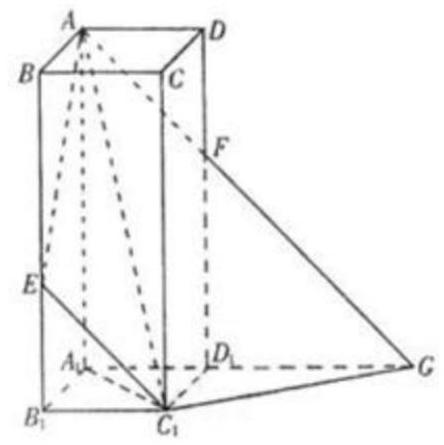
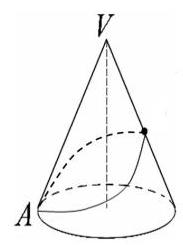
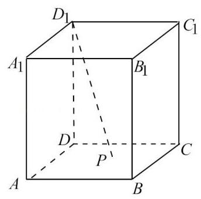
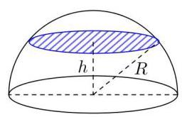
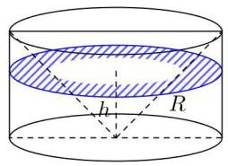
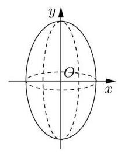
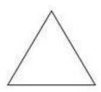
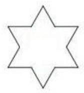
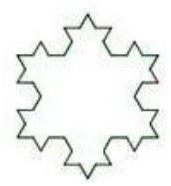

## 知识梳理

## 第 4 课:转化与化归思想

<table><tr><td>教学目标</td><td>1、理解和掌握转换与化归的思想，其本质是在研究和解决数学问题时采用某种方式，借助某种函数性质、图象、公式或已知条件将问题通过变换加以转化, 进而达到解决问题的一种策略或方法;   2、掌握转换与化归的得原则:熟悉化原则、简单化原则、直观化原则、正难则反原则；   3、掌握高中数学常见的转化:正与反的转化、常量和变量的转化、特殊与一般的转化、等与不等的转化、陌生与熟悉的转化、函数与方程的转化以及空间与平面的转化。</td></tr><tr><td>重点</td><td>1、转化分有等价转化与不等价转化，等价转化后的新问题与原问题实质是一样的，不等价转化则部分地改变了原对象的实质, 需对所得结论进行必要的修正;   2、应用转化与化归思想解题的原则应是化难为易、化生为熟、化繁为简，尽量是等价转化； 常见的转化有:正与反的转化、数与形的转化、相等与不等的转化、整体与局部的转化、空间与平面相互转化、复数与实数相互转化、常量与变量的转化、数学语言的转化。</td></tr><tr><td>难 点</td><td>1、转化分有等价转化与不等价转化，等价转化后的新问题与原问题实质是一样的，不等价转化则部分地改变了原对象的实质, 需对所得结论进行必要的修正;   2、应用转化与化归思想解题的原则应是化难为易、化生为熟、化繁为简，尽量是等价转化； 常见的转化有:正与反的转化、数与形的转化、相等与不等的转化、整体与局部的转化、空间与平面相互转化、复数与实数相互转化、常量与变量的转化、数学语言的转化。</td></tr></table>

化归与转换的思想，就是在研究和解决数学问题时采用某种方式，借助某种函数性质、图象、公式或已知条件将问题通过变换加以转化, 进而达到解决问题的思想。等价转化总是将抽象转化为具体, 复杂转化为简单、未知转化为已知, 通过变换迅速而合理的寻找和选择问题解决的途径和方法。转化有等价转化与不等价转化。等价转化后的新问题与原问题实质是一样的。不等价转化则部分地改变了原对象的实质，需对所得结论进行必要的修正。应用转化化归思想解题的原则应是化难为易、化生为熟、化繁为简，尽量是等价转化。常见的转化有: 正与反的转化、数与形的转化、相等与不等的转化、整体与局部的转化、空间与平面相互转化、复数与实数相互转化、常量与变量的转化、数学语言的转化。

## (一) 正与反的转化

例题精讲

【例 1】设 $a, b, c \in  \left( {0,1}\right)$ ,求证: $\left( {1 - a}\right) b,\left( {1 - b}\right) c,\left( {1 - c}\right) a$ 不可能同时大于 $\frac{1}{4}$ .

【例 2】有 9 张卡片分别写着数字1,2,3,4,5,6,7,8,9,甲、乙二人依次从中抽取一张卡片(不放回), 试求:

(1)甲抽到写有奇数数字卡片，且乙抽到写有偶数数字卡片的概率.

(2)甲、乙二人至少抽到一张奇数数字卡片的概率.

## 巩固训练

1、已知函数 $f\left( x\right)  = 4{x}^{2} - {ax} + 1$ 在 $\left( {0,1}\right)$ 内至少有一个零点,试求实数 $a$ 的取值范围.

2、10 张奖券中只有 3 张有奖，5 个人购买，每人一张，至少有 1 人中奖的概率为___.

3、若三条直线 ${l}_{1} : {{3x} - y + 2} = 0,{l}_{2} : {{2x} + y + 3} = 0,{l}_{3} : {{mx} + y} = 0$ ，当 $m$ 为何值时，三条直线能构成三角形？

## (二)数与形的转化

## 例题精讲

【例 3】设 $f\left( x\right)$ 是定义在 $\mathrm{R}$ 上的偶函数,对任意 $x \in  R$ ,都有 $f\left( {x - 2}\right)  = f\left( {x + 2}\right)$ ,且当 $x \in  \left\lbrack  {-2,0}\right\rbrack$ 时, $f\left( x\right)  = {\left( \frac{1}{2}\right) }^{x} - 1$ . 若函数 $g\left( x\right)  = f\left( x\right)  - {\log }_{a}\left( {x + 2}\right) \left( {a > 1}\right)$ 在区间 $( - 2,6\rbrack$ 恰有 3 个不同的零点,则 $a$ 的取值范围是___.

【例 4】若 $\left| {z - {2i}}\right|  + \left| {z - {z}_{0}}\right|  = 4$ 表示的动点的轨迹是椭圆,则 $\left| {z}_{0}\right|$ 的取值范围是___.

巩固训练

1、设集合 $A = \left\{  {\left( {x, y}\right) \left| {\;\frac{{y}^{2}}{{a}^{2}} - {x}^{2} = 1}\right. , a > 1}\right\}  , B = \left\{  {\left( {x, y}\right)  \mid  y = {t}^{x}, t > \sqrt{2a}, t \neq  1}\right\}$ ,则 $A \cap  B$ 的子集的个数是 ( )

(A). 4 (B). 3 (C). 2 (D). 1

2、正方体 ${ABCD} - {A}_{1}{B}_{1}{C}_{1}{D}_{1}$ 的棱上到异面直线 ${AB}, C{C}_{1}$ 的距离相等的点的个数为( )

A. 2 B. 3 C. 4 D. 5

## (三)参量、常量与变量的转化

## 例题精讲

【例 5】若 $4{y}^{2} + {4xy} + x + 6 = 0$ 对实数 $y$ 成立,则 $x$ 的取值范围是___.

【例 6】已知不等式 ${4}^{x} - a \cdot  {2}^{x} + 2 > 0$ ,对于 $a \in  ( - \infty ,3\rbrack$ 恒成立,则实数 $x$ 的取值范围是 ___.

## 巩固训练

1、已知 $f\left( \mathrm{t}\right)  = {\log }_{2}^{t},\mathrm{t} \in  \left\lbrack  {\sqrt{2},8}\right\rbrack$ ,对于 $f\left( \mathrm{t}\right)$ 值域内的所有实数 $\mathrm{m}$ ,不等式 ${x}^{2} + {mx} + 4 > {2m} + {4x}$ 恒成立, 则 $x$ 的取值范围是___.

2、对于 $- 1 < a < 1$ ，使不等式 ${\left( \frac{1}{2}\right) }^{{x}^{2} + {ax}} < {\left( \frac{1}{2}\right) }^{{2x} + a - 1}$ 成立的 $x$ 的取值范围是___.

## (四)化生为熟、化繁为简

## 例题精讲

【例 7】若 $x, y \in  R$ ,集合 $A = \left\{  {\left( {x, y}\right)  \mid  {x}^{2} + {y}^{2} = 1}\right\}  , B = \left\{  {\left( {x, y}\right) \left| {\;\frac{x}{a} - \frac{y}{b} = 1}\right. , a > 0, b > 0}\right\}$ ,当 $A \cap  B$ 有且只有一个元素时， $a, b$ 满足的关系式是___.

【例 8】在定圆 $C : {x}^{2} + {y}^{2} = 4$ 内过点 $P\left( {-1,1}\right)$ 作两条互相垂直的直线与 $C$ 分别交于 $A, B$ 和 $M, N$ ,则 $\frac{\left| AB\right| }{\left| MN\right| } + \frac{\left| MN\right| }{\left| AB\right| }$ 的范围是___.

## 巩固训练

1、问题 “求不等式 ${3}^{x} + {4}^{x} \leq  {5}^{x}$ 的解” 有如下的思路: 不等式 ${3}^{x} + {4}^{x} \leq  {5}^{x}$ 可变为 ${\left( \frac{3}{5}\right) }^{x} + {\left( \frac{4}{5}\right) }^{x} \leq  1$ ,考察函数 $f\left( x\right)  = {\left( \frac{3}{5}\right) }^{x} + {\left( \frac{4}{5}\right) }^{x}$ 可知,函数 $f\left( x\right)$ 在 $\mathbf{R}$ 上单调递减,且 $f\left( 2\right)  = 1,\therefore$ 原不等式的解是 $x \geq  2$ . 仿照此解法可得到不等式: ${x}^{3} - \left( {{2x} + 3}\right)  > {\left( 2x + 3\right) }^{3} - x$ 的解是___.

2、若点集 $A = \left\{  {\left( {x, y}\right)  \mid  {x}^{2} + {y}^{2} \leq  1}\right\}  ,\;B = \{ \left( {x, y}\right)  \mid   - 1 \leq  x \leq  1, - 1 \leq  y \leq  1\}$ ,则点集

$Q = \left\{  {\left( {x, y}\right)  \mid  x = {x}_{1} + {x}_{2}, y = {y}_{1} + {y}_{2},\left( {{x}_{1},{y}_{1}}\right)  \in  A,\left( {{x}_{2},{y}_{2}}\right)  \in  B}\right\}$ 所表示的区域的面积为___

## (五)函数与方程的转化

## 例题精讲

【例9】已知关于 $x$ 的方程 ${x}^{2} - \left( {{2m} - 8}\right) x + {m}^{2} - {16} = 0$ 的两个实根 ${x}_{1}\text{ 、 }{x}_{2}$ 满足 ${x}_{1} < \frac{3}{2} < {x}_{2}$ ,则实数 $m$ 的取值范围___.

【例 10】已知 $f\left( x\right)$ 为定义在实数 $R$ 上的奇函数,且 $f\left( x\right)$ 在 $\lbrack 0, + \infty )$ 上是增函数. 当 $0 \leq  \theta  \leq  \frac{\pi }{2}$ 时,是否存在这样的实数 $m$ ,使 $f\left( {\cos {2\theta } - 3}\right)  + f\left( {{4m} - {2m}\cos \theta }\right)  > f\left( 0\right)$ 对所有的 $\theta  \in  \left\lbrack  {0,\frac{\pi }{2}}\right\rbrack$ 均成立? 若存在,求出所有适合条件的实数 $m$ ; 若不存在,请说明理由.

## 巩固训练

1、若三角方程 $\sqrt{2}\sin \alpha  - \sqrt{7}\cos \alpha  = {2m} - 1$ 有解，则实数 $m$ 的取值范围是___.

2、若函数 $f\left( x\right)  = {2}^{\left| x - 3\right| } - {\log }_{a}x + 1$ 无零点，则 $a$ 的取值范围为___.

## (六)空间与平面的转化

## 例题精讲

【例 11】如图 2,在正四棱柱 ${ABCD} - {A}_{1}{B}_{1}{C}_{1}{D}_{1}$ 中, ${AB} = 1,{B{B}_{1}} = \sqrt{3} + 1, E$ 为 $B{B}_{1}$ 上使 ${B}_{1}E = 1$ 的点. 平面 ${AE}{C}_{1}$ 交 $D{D}_{1}$ 于 $F$ ,交 ${A}_{1}{D}_{1}$ 的延长线于 $G$ . 求:

(1)异面直线 ${AD}$ 与 ${C}_{1}G$ 所成的角的大小； (2)二面角 $A - {C}_{1}G - {A}_{1}$ 的正切值.

【例 12】如图所示,一只小蚂蚁正从圆锥底面上的点 $A$ 沿圆锥体的表面匀速爬行一周,又绕回到点 $A$ . 已知该圆锥体的底面半径为 $r$ ,母线长为 ${3r}$ ,试问小蚂蚁沿怎样的路径如何爬行,才能最快到达点 $A$ ? 并求出该路径的长.

## 巩固训练

1、已知球 $O$ 的半径为 $1, A, B, C$ 三点都在球面上,且每两点间的球面距离均为 $\frac{\pi }{2}$ ,则球心 $O$ 到平面 ${ABC}$ 的距离为 (   )

A. $\frac{1}{3}$ B. $\frac{\sqrt{3}}{3}$ C. $\frac{2}{3}$ D. $\frac{\sqrt{6}}{3}$

2、如图，在棱长为 1 的正方体 ${ABCD} - {A}_{1}{B}_{1}{C}_{1}{D}_{1}$ 中， $P$ 为底面 ${ABCD}$ 内(包括边界)的动点，满足 ${D}_{1}P$ 与直线 $C{C}_{1}$ 所成角的大小为 $\frac{\pi }{6}$ ，则线段 ${DP}$ 扫过的面积为___.

## (七)命题、集合的等价转化

## 例题精讲

【例 13】已知 $f\left( x\right)  = m\left( {x - {2m}}\right) \left( {x + m + 3}\right) , g\left( x\right)  = {2}^{x} - 2$ ,若 $\forall x \in  R, f\left( x\right)  < 0$ 或 $g\left( x\right)  < 0$ ,则 $m$ 的取值范围是___.

## 巩固训练

1、“ $x \neq  2$ 或 $y \neq   - 2$ ” 是 “ ${xy} \neq   - 4$ ” 的( )

A. 必要而不充分条件 B. 充分而不必要条件

C. 充要条件 D. 既不充分又不必要条件

## (八)复数与实数的转化

## 例题精讲

【例14】设 ${z}_{1},{z}_{2} \in  C,{z}_{1}^{2} - 2{z}_{1}{z}_{2} + 4{z}_{2}^{2} = 0,\left| {z}_{2}\right|  = 2$ ,则以 $\left| {z}_{1}\right|$ 为直径的圆面积为( )

A. $\pi$ B. ${4\pi }$ C. ${8\pi }$ D. ${16\pi }$

## 巩固训练

1、下列类比推理命题 (其中 $Q$ 为有理数集, $R$ 为实数集, $C$ 为复数集) :

① “若 $a, b \in  R$ ，则 $a - b = 0 \Rightarrow  a = b$ ” 类比推出 “若 $a, b \in  C$ ，则 $a - b = 0 \Rightarrow  a = b$ ”；

② “若 $a, b, c, d \in  R$ ,则复数 $a + {bi} = c + {di} \Rightarrow  a = c, b = d$ ” 类比推出 “若 $a, b, c, d \in  Q$ ,则 $a + b\sqrt{2} = c + d\sqrt{2} \Rightarrow  a = c, b = d$ ”;

③ “若 $a, b \in  R$ ,则 $a - b > 0 \Rightarrow  a > b$ ”类比推出“若 $a, b \in  C$ ,则 $a - b > 0 \Rightarrow  a > b$ ”. 其中类比结论正确的个数是( )

A. 0 B. 1 C. 2 D. 3

## (九)特殊与一般的转化

## 例题精讲

【例 15】已知函数 $f\left( x\right)  = \frac{{a}^{x}}{{a}^{x} + \sqrt{a}}\left( {a > 0\text{ 且 }a \neq  1}\right)$ ,求 $f\left( \frac{1}{100}\right)  + f\left( \frac{2}{100}\right)  + \cdots  + f\left( \frac{99}{100}\right)$ 的值

## 巩固训练

1、课本中介绍了应用祖暅原理推导棱锥体积公式的做法，祖暅原理也可用来求旋转体的体积, 现介绍用祖暅原理求球体体积公式的做法: 可构造一个底面半径和高都与球半径相等的圆柱, 然后在圆柱内挖去一个以圆柱下底面圆心为顶点, 圆柱上底面为底面的圆锥, 用这样一个几何体与半球应用祖暅原理(图 1)，即可求得球的体积公式，请研究和理解球的体积公式求法的基础上,解答以下问题: 已知椭圆的标准方程为 $\frac{{x}^{2}}{4} + \frac{{y}^{2}}{25} = 1$ ,将此椭圆绕 $y$ 轴旋转一周后，得一橄榄状的几何体(图 2)，其体积等于___

2、某种平面分形图如下图所示，一级分形图是一个边长为 1 的等边三角形(图(1))；___ 形图是将一级分形图的每条线段三等分，并以中间的那一条线段为一底边向形外作等边三角形，然后去掉底边 (图 (2)); 将二级分形图的每条线段三等边,重复上述的作图方法,得到三级分形图 (图 (3)); $\cdots$ ; 重复上述作图方法，依次得到四级、五级、...、 $n$ 级分形图. 则 $n$ 级分形图的周长___.

图(1)

图(2)

图(3)

## (十)数学与文字的转化

## 例题精讲

【例 16】在平面直角坐标系内,设 $M\left( {{x}_{1},{y}_{1}}\right) , N\left( {{x}_{2},{y}_{2}}\right)$ 为不同的两点,直线 $l$ 的方程为 ${ax} + {by} + c = 0$ , $\delta  = \frac{a{x}_{1} + b{y}_{1} + c}{a{x}_{2} + b{y}_{2} + c}$ ，下面四个命题中的假命题为( )

A. 存在唯一的实数 $\delta$ ,使点 $N$ 在直线 $l$ 上

B. 若 $\delta  = 1$ ,则过 $M$ , $N$ 两点的直线与直线 $l$ 平行

C. 若 $\delta  =  - 1$ ,则直线经过线段 $M, N$ 的中点

D. 若 $\delta  > 1$ ,则点 $M, N$ 在直线 $l$ 的同侧,且直线 $l$ 与线段 $M, N$ 的延长线相交

## 巩固训练

1、某企业为一个高科技项目注入了启动资金 1000 万元，已知每年可获利 25%，但由于竞争激烈，每年年底需从利润中抽取 200 万元资金进行科研、技术改造与广告投入，方能保持原有的利润增长率，设经过 $n$ 年后,该项目的资金为 ${a}_{n}$ 万元.

(1)求 ${a}_{1}\text{ 、 }{a}_{2}$ ；

(2)设 ${b}_{n} = {a}_{n} - {800}$ ，证明:数列 $\left\{  {b}_{n}\right\}$ 为等比数列，并求出至少需经过多少年，该项目的资金才可以达到或超过翻两番(即为原来的 4 倍)的目标(取 $\lg 2 = {0.3}$ )；

(3)若 ${c}_{n} = \frac{\left( {n + 1}\right) {b}_{n}}{250}$ ，求数列 $\left\{  {c}_{n}\right\}$ 的前 $n$ 项和 ${S}_{n}$ .
