## 知识梳理

## 第 4 课:转化与化归思想

<table><tr><td>教学目标</td><td>1、理解和掌握转换与化归的思想，其本质是在研究和解决数学问题时采用某种方式，借助某种函数性质、图象、公式或已知条件将问题通过变换加以转化, 进而达到解决问题的一种策略或方法;   2、掌握转换与化归的得原则:熟悉化原则、简单化原则、直观化原则、正难则反原则；   3、掌握高中数学常见的转化:正与反的转化、常量和变量的转化、特殊与一般的转化、等与不等的转化、陌生与熟悉的转化、函数与方程的转化以及空间与平面的转化。</td></tr><tr><td>重点</td><td>1、转化分有等价转化与不等价转化，等价转化后的新问题与原问题实质是一样的，不等价转化则部分地改变了原对象的实质, 需对所得结论进行必要的修正;   2、应用转化与化归思想解题的原则应是化难为易、化生为熟、化繁为简，尽量是等价转化； 常见的转化有:正与反的转化、数与形的转化、相等与不等的转化、整体与局部的转化、空间与平面相互转化、复数与实数相互转化、常量与变量的转化、数学语言的转化。</td></tr><tr><td>难 点</td><td>1、转化分有等价转化与不等价转化，等价转化后的新问题与原问题实质是一样的，不等价转化则部分地改变了原对象的实质, 需对所得结论进行必要的修正;   2、应用转化与化归思想解题的原则应是化难为易、化生为熟、化繁为简，尽量是等价转化； 常见的转化有:正与反的转化、数与形的转化、相等与不等的转化、整体与局部的转化、空间与平面相互转化、复数与实数相互转化、常量与变量的转化、数学语言的转化。</td></tr></table>

化归与转换的思想，就是在研究和解决数学问题时采用某种方式，借助某种函数性质、图象、公式或已知条件将问题通过变换加以转化, 进而达到解决问题的思想。等价转化总是将抽象转化为具体, 复杂转化为简单、未知转化为已知, 通过变换迅速而合理的寻找和选择问题解决的途径和方法。转化有等价转化与不等价转化。等价转化后的新问题与原问题实质是一样的。不等价转化则部分地改变了原对象的实质，需对所得结论进行必要的修正。应用转化化归思想解题的原则应是化难为易、化生为熟、化繁为简，尽量是等价转化。常见的转化有: 正与反的转化、数与形的转化、相等与不等的转化、整体与局部的转化、空间与平面相互转化、复数与实数相互转化、常量与变量的转化、数学语言的转化。

## (一) 正与反的转化

## 例题精讲

【例 1】设 $a, b, c \in  \left( {0,1}\right)$ ,求证: $\left( {1 - a}\right) b,\left( {1 - b}\right) c,\left( {1 - c}\right) a$ 不可能同时大于 $\frac{1}{4}$ .

【难度】 $\star   \star   \star$

【答案】见解析

【解析】若不然,即它们都大于 $\frac{1}{4}$ ,

则由同向相乘性, $\frac{1}{64} < \left( {1 - a}\right) b \cdot  \left( {1 - b}\right) c \cdot  \left( {1 - c}\right) a = \left( {1 - a}\right) a \cdot  b\left( {1 - b}\right)  \cdot  c\left( {1 - c}\right)$ ,

由 $a \in  \left( {0,1}\right)$ ,结合基本不等式 $\left( {1 - a}\right)  \cdot  a \leq  {\left( \frac{1 - a + a}{2}\right) }^{2} = \frac{1}{4}$ ,同理, $b\left( {1 - b}\right)  \leq  \frac{1}{4}, c\left( {1 - c}\right)  \leq  \frac{1}{4}$ ;

由同向相乘性, $\frac{1}{64} < \left( {1 - a}\right) b \cdot  \left( {1 - b}\right) c \cdot  \left( {1 - c}\right) a \leq  \frac{1}{64}$ ,矛盾! 故假设不成立,原命题成立.

【例 2】有 9 张卡片分别写着数字 1, 2, 3, 4, 5, 6, 7, 8, 9, 甲、乙二人依次从中抽取一张卡片(不放回), 试求:

(1)甲抽到写有奇数数字卡片，且乙抽到写有偶数数字卡片的概率.

(2)甲、乙二人至少抽到一张奇数数字卡片的概率.

【难度】★★★

【答案】(1) $\frac{5}{18}$ ;(2) $\frac{5}{6}$ .

【解析】(1)甲、乙二人依次从九张卡片中各抽取一张的可能结果有 ${C}_{9}^{1}{C}_{8}^{1}$ ，甲抽到写有奇数数字卡片，且乙抽到写有偶数数字卡片的结果有 ${C}_{5}^{1}{C}_{4}^{1}$ 种,设甲抽到写有奇数数字卡片,且乙抽到写有偶数数字卡片的概率为 ${P}_{1}$ ,则 ${P}_{1} = \frac{{C}_{5}^{1} \cdot  {C}_{4}^{1}}{{C}_{9}^{1} \cdot  {C}_{8}^{1}} = \frac{20}{72} = \frac{5}{18}$ .

(2)设甲、乙二人至少抽到一张奇数数字的概率为 ${P}_{2}$ ，甲、乙二人至少抽到一张奇数数字卡片的对立事件为两人均抽到写有偶数数字卡片. 设为 $\overline{{P}_{2}}$ ,则 ${P}_{2} = 1 - \overline{{P}_{2}} = 1 - \frac{{C}_{4}^{1} \cdot  {C}_{3}^{1}}{{C}_{9}^{1} \cdot  {C}_{8}^{1}} = \frac{5}{6}$

## 巩固训练

1、已知函数 $f\left( x\right)  = 4{x}^{2} - {ax} + 1$ 在 $\left( {0,1}\right)$ 内至少有一个零点,试求实数 $a$ 的取值范围.

【难度】 $\bigstar \bigstar \bigstar$

【答案】 $\lbrack 4, + \infty )$ .

【解析】当函数 $f\left( x\right)  = 4{x}^{2} - {ax} + 1$ 在 $\left( {0,1}\right)$ 内没有零点时 $\Leftrightarrow  4{x}^{2} - {ax} + 1 = 0$ 在 $\left( {0,1}\right)$ 内没有实数根,即在 $\left( {0,1}\right)$ 内, $a \neq  {4x} + \frac{1}{x}$ .

而当 $x \in  \left( {0,1}\right)$ 时, ${4x} + \frac{1}{x} \geq  2\sqrt{{4x} \cdot  \frac{1}{x}} = 4$ ,得 ${4x} + \frac{1}{x} \in  \lbrack 4, + \infty )$ 。

要使 $a \neq  {4x} + \frac{1}{x}$ ,必有 $a < 4$ ,故满足题设的实数的取值范围是 $\lbrack 4, + \infty )$

2、10 张奖券中只有 3 张有奖，5 个人购买，每人一张，至少有 1 人中奖的概率为___.

【难度】 $\star   \star   \star$

【答案】 $\frac{11}{12}$

【解析】考虑没有人中奖的概率

3、若三条直线 ${l}_{1} : {{3x} - y + 2} = 0,{l}_{2} : {{2x} + y + 3} = 0,{l}_{3} : {{mx} + y} = 0$ ,当 $m$ 为何值时,三条直线能构成三角形?

【难度】★★★

【答案】当 $m \neq   - 1$ 且 $m \neq   - 3$ 且 $m \neq  2$ 时三条直线能构成三角形

【解析】三条直线不能构成三角形 $\Leftrightarrow$ 三条直线交于同一点或其中至少有两条直线平行.

(1)若三条直线交于同一点时,

解方程组 $\left\{  \begin{array}{l} {3x} - y + 2 = 0 \\  {2x} + y + 3 = 0 \end{array}\right.$ ,得 $\left\{  \begin{array}{l} x =  - 1 \\  y =  - 1 \end{array}\right.$ ,即 ${l}_{1}$ 与 ${l}_{2}$ 的交点是 $\left( {-1, - 1}\right)$ ,把点 $\left( {-1, - 1}\right)$ 代入直线 ${l}_{3}$ 的方程得 $m =  - 1$ .

(2)若其中至少有两条直线平行时，

由 ${l}_{1}//{l}_{2}$ 得: $m =  - 3$ ; 由 ${l}_{2}//{l}_{3}$ 得: $m = 2$ ,

综上: 当 $m \neq   - 1$ 且 $m \neq   - 3$ 且 $m \neq  2$ 时三条直线能构成三角形.

## (二)数与形的转化

## 例题精讲

【例 3】设 $f\left( x\right)$ 是定义在 $\mathrm{R}$ 上的偶函数,对任意 $x \in  R$ ,都有 $f\left( {x - 2}\right)  = f\left( {x + 2}\right)$ ,且当 $x \in  \left\lbrack  {-2,0}\right\rbrack$ 时, $f\left( x\right)  = {\left( \frac{1}{2}\right) }^{x} - 1$ . 若函数 $g\left( x\right)  = f\left( x\right)  - {\log }_{a}\left( {x + 2}\right) \left( {a > 1}\right)$ 在区间 $( - 2,6\rbrack$ 恰有 3 个不同的零点,则 $a$ 的取值范围是___.

【难度】★★★

【答案】 $\sqrt[3]{4} < a < 2$ .

【解析】将 $g\left( x\right)$ 的零点问题转化成函数 $f\left( x\right)$ 和函数 $y = {\log }_{a}\left( {x + 2}\right)$ 的图像交点个数问题,可得 $\left\{  {\begin{array}{l} {\log }_{a}4 < 3 \\  {\log }_{a}8 > 3 \end{array} \Rightarrow  \sqrt[3]{4} < a < 2.}\right.$

【例 4】若 $\left| {z - {2i}}\right|  + \left| {z - {z}_{0}}\right|  = 4$ 表示的动点的轨迹是椭圆，则 $\left| {z}_{0}\right|$ 的取值范围是___.

【难度】 $\star   \star   \star   \star$

【答案】 $\left| {z}_{0}\right|  \in  \lbrack 0,6)$

【解析】首先要理解数学符号的意义: $\left| {z - {2i}}\right|  + \left| {z - {z}_{0}}\right|  = 4$ 表示复数 $z$ 对应的动点到复数 ${2i}$ 与 ${z}_{0}$ 对应的两定点之间的距离之和等于 4 . 而根据椭圆的定义知,两定点之间的距离要小于定值 4 , 所以有 $\left| {{z}_{0} - {2i}}\right|  < 4$ , 而此式又表示 ${z}_{0}$ 对应的点在以 ${2i}$ 对应点为圆心,4 为半径的圆内,由模的几何意义知 $\left| {z}_{0}\right|  \in  \lbrack 0,6)$ .

巩固训练

1、设集合 $A = \left\{  {\left( {x, y}\right) \left| {\;\frac{{y}^{2}}{{a}^{2}} - {x}^{2} = 1}\right. , a > 1}\right\}  , B = \{ \left( {x, y}\right)  \mid  y = {t}^{x}, t > \sqrt{2a}, t \neq  1\}$ ，则 $A \cap  B$ 的子集的个数是 ( )

(A). 4 (B). 3 (C). 2 (D). 1

【难度】 $\star   \star   \star$

【答案】C

【解析】解: 在同一坐标系下,画出函数 $y = {t}^{x}$ 的图象与双曲线 $\frac{{y}^{2}}{{a}^{2}} - {x}^{2} = 1, a > 1$ 的图象如下图:

由于 $a > 1$ ,故双曲线的上顶点的纵坐标必大于 1,

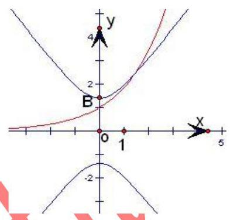

由图可知,两个图象只有 1 个交点所以两个集合有一个共同元素,

则 $A\bigcap B$ 的子集有空集和本身,个数是 2 故选: $C$ .

2、正方体 ${ABCD} - {A}_{1}{B}_{1}{C}_{1}{D}_{1}$ 的棱上到异面直线 ${AB}, C{C}_{1}$ 的距离相等的点的个数为( )

A. 2 B. 3 C. 4 D. 5

【难度】 $\star   \star   \star$

【答案】C

【解析】画出正方体，如图所示，正方体一共六个面，12条棱，

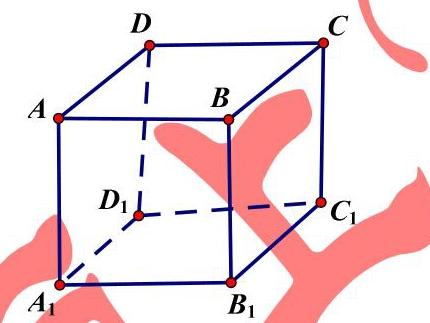

(1)在上侧面ABCD中到两异面直线距离相等的点都在以 C 为焦点 $\mathrm{{AB}}$ 为准线的抛物线上(如图)，在三条棱上到异面直线 ${AB}\text{ ， }C{C}_{1}$ 的距离相等的点只有 $\mathrm{D}$ 点和 $\mathrm{{BC}}$ 中点 $\mathrm{M}$ ，

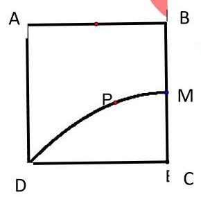

(2)在右侧面 ${\mathrm{{CBB}}}_{1}{\mathrm{C}}_{1}$ 中的三条棱上到异面直线 ${AB}\text{ ， }C{C}_{1}$ 的距离相等的点只有 ${\mathrm{B}}_{1}$ 点

(3)在下底面的棱 ${A}_{1}{D}_{1}$ 上，N 到 AB 距离即为 NA，N 到 ${C}_{1}C$ 的距离即为 $N{C}_{1}$ ，使得 ${NA} = N{C}_{1}$ 的点为 ${D}_{1}{A}_{1}$ 中点

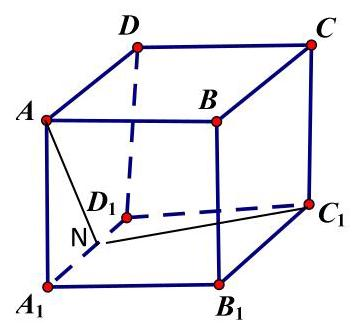

所以，综上一共就 4 个点

## (三)参量、常量与变量的转化

## 例题精讲

【例 5】若 $4{y}^{2} + {4xy} + x + 6 = 0$ 对实数 $y$ 成立,则 $x$ 的取值范围是

【难度】 $\star   \star   \star$

【答案】 $\left( {-\infty , - 2\rbrack \cup \lbrack 3, + \infty }\right)$

【解析】在 $4{y}^{2} + {4xy} + x + 6 = 0$ 中, $y$ 是变量, $x$ 是常量,等式是关于 $y$ 的一元二次方程,由于它有实数解,则 $\Delta  \geq  0$

【例 6】已知不等式 ${4}^{x} - a \cdot  {2}^{x} + 2 > 0$ ,对于 $a \in  ( - \infty ,3\rbrack$ 恒成立,则实数 $x$ 的取值范围是 ___.

【难度】 $\star   \star   \star$

【答案】 $\left( {-\infty ,0}\right)  \cup  \left( {1, + \infty }\right)$

【解答】解: 不等式 ${4}^{x} - a \cdot  {2}^{x} + 2 > 0$ ,对于 $a \in  ( - \infty ,3\rbrack$ 恒成立,

所以设 $t = {2}^{x}, t > 0$ ,则 ${t}^{2} - {at} + 2 > 0$ ,对于 $a \in  ( - \infty ,3\rbrack$ 恒成立,

即 $a < t + \frac{2}{t}$ ,对于 $a \in  ( - \infty ,3\rbrack$ 恒成立,所以 $t + \frac{2}{t} > 3$ ,即 ${t}^{2} - {3t} + 2 > 0$ ,

解得 $t > 2$ 或 $t < 1$ ,即 ${2}^{x} > 2$ 或 ${2}^{x} < 1$ ,解得 $x > 1$ 或 $x < 0$ ,综上, $x$ 的取值范围为 $\left( {-\infty ,0}\right)  \cup  \left( {1, + \infty }\right)$ .

## 巩固训练

1、已知 $f\left( \mathrm{t}\right)  = {\log }_{2}^{t},\mathrm{t} \in  \left\lbrack  {\sqrt{2},8}\right\rbrack$ ,对于 $f\left( \mathrm{t}\right)$ 值域内的所有实数 $\mathrm{m}$ ,不等式 ${x}^{2} + {mx} + 4 > {2m} + {4x}$ 恒成立, 则 $x$ 的取值范围是___.

【难度】 $\star   \star   \star$

【答案】 $\left( {-\infty , - 1}\right)  \cup  \left( {2, + \infty }\right)$ .

【解析】解: $\because t \in  \left\lbrack  {\sqrt{2},8}\right\rbrack  ,\therefore f\left( t\right)  \in  \left\lbrack  {\frac{1}{2},3}\right\rbrack$

原题转化为: $m\left( {x - 2}\right)  + {\left( x - 2\right) }^{2} > 0$ 恒成立,为 $m$ 的一次函数 (这里思维的转化很重要)

当 $x = 2$ 时,不等式不成立. $\therefore x \neq  2$ . 令 $g\left( m\right)  = m\left( {x - 2}\right)  + {\left( x - 2\right) }^{2}, m \in  \left\lbrack  {\frac{1}{2},3}\right\rbrack$

问题转化为 $g\left( m\right)$ 在 $m \in  \left\lbrack  {\frac{1}{2},3}\right\rbrack$ 上恒大于 0,则: $\left\{  \begin{array}{l} g\left( \frac{1}{2}\right)  > 0 \\  g\left( 3\right)  > 0 \end{array}\right.$ ,解得: $x > 2$ 或 $x <  - 1$ .

2、对于 $- 1 < a < 1$ ，使不等式 ${\left( \frac{1}{2}\right) }^{{x}^{2} + {ax}} < {\left( \frac{1}{2}\right) }^{{2x} + a - 1}$ 成立的 $x$ 的取值范围是___.

【难度】 $\star   \star   \star$

【答案】 $x \leq  0$ 或 $x \geq  2$

【解答】解: 不等式 ${\left( \frac{1}{2}\right) }^{{x}^{2} + {ax}} < {\left( \frac{1}{2}\right) }^{{2x} + a - 1}$ 成立,就是 ${x}^{2} + {ax} > {2x} + a -$

即: $\left( {x - 1}\right) a + {x}^{2} - {2x} + 1 > 0$ ,只需满足 $\left\{  \begin{array}{l}  - \left( {x - 1}\right)  + {x}^{2} - {2x} + 1 \geq  0 \\  \left( {x - 1}\right)  + {x}^{2} - {2x} + 1 \geq  0 \end{array}\right.$

解得 $x \leq  0$ 或 $x \geq  2$ 故答案为: $x \leq  0$ 或 $x \geq  2$ .

## (四)化生为熟、化繁为简

## 例题精讲

【例 7】若 $x, y \in  R$ ,集合 $A = \left\{  {\left( {x, y}\right)  \mid  {x}^{2} + {y}^{2} = 1}\right\}  , B = \left\{  {\left( {x, y}\right) \left| {\;\frac{x}{a} - \frac{y}{b} = 1}\right. , a > 0, b > 0}\right\}$ ,当 $A \cap  B$ 有且只有一个元素时， $a, b$ 满足的关系式是___.

【难度】 $\star   \star   \star$

【答案】 ${ab} = \sqrt{{a}^{2} + {b}^{2}}$ .

【解析】 $A \cap  B$ 有且只有一个元素可转化为直线 $\frac{x}{a} - \frac{y}{b} = 1$ 与圆 ${x}^{2} + {y}^{2} = 1$ 相切,故圆心到直线的距离为 $\frac{\left| ab\right| }{\sqrt{{a}^{2} + {b}^{2}}} = 1.\because a > 0, b > 0,\therefore {ab} = \sqrt{{a}^{2} + {b}^{2}}$ .

【例 8 】在定圆 $C : {x}^{2} + {y}^{2} = 4$ 内过点 $P\left( {-1,1}\right)$ 作两条互相垂直的直线与 $C$ 分别交于 $A, B$ 和 $M, N$ ,则 $\frac{\left| AB\right| }{\left| MN\right| } + \frac{\left| MN\right| }{\left| AB\right| }$ 的范围是___.

【难度】 $\star   \star   \star$

【答案】 $\left\lbrack  {2,\frac{3\sqrt{2}}{2}}\right\rbrack$

【解析】由于题目条件中过点 $P\left( {-1,1}\right)$ 可作无数对互相垂直的直线,因此可取特殊位置的两条直线来解决问题. 设 $\frac{\left| AB\right| }{\left| MN\right| } = t$ ,考虑特殊情况: ${AB}$ 垂直 ${OP}$ 时, ${MN}$ 过点 $O,\left| {AB}\right|$ 最小, $\left| {MN}\right|$ 最大,所以 ${t}_{\min } = \frac{\sqrt{2}}{2},{t}_{\max } = \sqrt{2}$ . 所以 $t \in  \left\lbrack  {\frac{\sqrt{2}}{2},\sqrt{2}}\right\rbrack$ . 又因为 $t + \frac{1}{t} \geq  2\sqrt{t \cdot  \frac{1}{t}} = 2$ ,所以 $t + \frac{1}{t} \in  \left\lbrack  {2,\frac{3\sqrt{2}}{2}}\right\rbrack$ .

## 巩固训练

1、问题 “求不等式 ${3}^{x} + {4}^{x} \leq  {5}^{x}$ 的解” 有如下的思路: 不等式 ${3}^{x} + {4}^{x} \leq  {5}^{x}$ 可变为 ${\left( \frac{3}{5}\right) }^{x} + {\left( \frac{4}{5}\right) }^{x} \leq  1$ ,考察函数 $f\left( x\right)  = {\left( \frac{3}{5}\right) }^{x} + {\left( \frac{4}{5}\right) }^{x}$ 可知，函数 $f\left( x\right)$ 在 $\mathbf{R}$ 上单调递减，且 $f\left( 2\right)  = 1\text{ ， }\therefore$ 原不等式的解是 $x \geq  2$ . 仿照此解法 $\overline{\square }$ 得到不等式: ${x}^{3} - \left( {{2x} + 3}\right)  > {\left( 2x + 3\right) }^{3} - x$ 的解是___.

【难度】 $\star   \star   \star$

【答案】 $\left( {-\infty , - 3}\right)$

【解析】化简原式,得 ${x}^{3} + x > {\left( 2x + 3\right) }^{3} + \left( {{2x} + 3}\right)$ ,再根据所教方法一一构造函数法,得到思路, 可以设 $f\left( x\right)  = {x}^{3} + x$ ,使原式变为 $f\left( x\right)  > f\left( {{2x} + 3}\right)$ ,而 $f\left( x\right)  = {x}^{3} + x$ 又明显是一个增函数, 故 $x > {2x} + 3$ ,解得 $\left( {-\infty , - 3}\right)$ .

2、若点集 $A = \left\{  {\left( {x, y}\right)  \mid  {x}^{2} + {y}^{2} \leq  1}\right\}  , B = \{ \left( {x, y}\right)  \mid   - 1 \leq  x \leq  1, - 1 \leq  y \leq  1\}$ ,则点集 $Q = \left\{  {\left( {x, y}\right)  \mid  x = {x}_{1} + {x}_{2}, y = {y}_{1} + {y}_{2},\left( {{x}_{1},{y}_{1}}\right)  \in  A,\left( {{x}_{2},{y}_{2}}\right)  \in  B}\right\}$ 所表示的区域的面积为___

【难度】 $\star   \star   \star$

【答案】 ${12} + \pi$

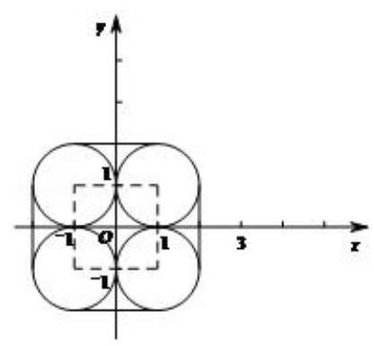

【解析】解: 由 ${x}_{1}^{2} + {y}_{1}^{2} \leq  1, x = {x}_{1} + {x}_{2}, y = {y}_{1} + {y}_{2}$ ,

得 ${\left( x - {x}_{2}\right) }^{2} + {\left( y - {y}_{2}\right) }^{2} \leq  1$ ,又 $- 1 \leq  {x}_{2} \leq  1, - 1 \leq  {y}_{2} \leq  1$ ,

所以点 $\left( {x, y}\right)$ 表示以集合 $B$ 表示的正方形内的点为圆心,半径为 1 的圆面. 如图所示,点集 $Q$ 是由四段圆弧以及连接它们的四条切线段围成的区域,其面积为 ${12} + \pi$ . 故答案为: ${12} + \pi$ .

## (五)函数与方程的转化

## 例题精讲

【例9】已知关于 $x$ 的方程 ${x}^{2} - \left( {{2m} - 8}\right) x + {m}^{2} - {16} = 0$ 的两个实根 ${x}_{1}\text{ 、 }{x}_{2}$ 满足 ${x}_{1} < \frac{3}{2} < {x}_{2}$ ,则实数 $m$ 的取值范围___.

【难度】 $\star   \star   \star$

【答案】 $\left\{  {m\left| {\; - \frac{1}{2} < m < \frac{7}{2}}\right. }\right\}$

【解析】由题意得,令 $f\left( x\right)  = {x}^{2} - \left( {{2m} - 8}\right) x + {m}^{2} - {16}$ ,则 $f\left( \frac{3}{2}\right)  < 0$ ,解得 $\left\{  {m\left| {\; - \frac{1}{2} < m < \frac{7}{2}}\right. }\right\}$

【例 10】已知 $f\left( x\right)$ 为定义在实数 $R$ 上的奇函数,且 $f\left( x\right)$ 在 $\lbrack 0, + \infty )$ 上是增函数. 当 $0 \leq  \theta  \leq  \frac{\pi }{2}$ 时,是否存在这样的实数 $m$ ,使 $f\left( {\cos {2\theta } - 3}\right)  + f\left( {{4m} - {2m}\cos \theta }\right)  > f\left( 0\right)$ 对所有的 $\theta  \in  \left\lbrack  {0,\frac{\pi }{2}}\right\rbrack$ 均成立? 若存在,求出所有适合条件的实数 $m$ ; 若不存在,请说明理由.

【难度】 $\star   \star   \star$

【答案】 $m > 4 - 2\sqrt{2}$

【解析】由 $f\left( x\right)$ 是 $R$ 上的奇函数可得 $f\left( 0\right)  = 0$ . 又在 $\lbrack 0, + \infty )$ 上是增函数,故 $\lbrack 0, + \infty )$ 在 $R$ 上为增函数. 由题设条件可得 $f\left( {\cos {2\theta } - 3}\right)  + f\left( {{4m} - {2m}\cos \theta }\right)  > 0$ 又由 $f\left( x\right)$ 为奇函数,

可得 $f\left( {\cos {2\theta } - 3}\right)  > f\left( {{2m}\cos \theta  - {4m}}\right) \because f\left( x\right)$ 在 $R$ 上为增函数.

$\therefore \cos {2\theta } - 3 > {2m}\cos \theta  - {4m} \Rightarrow  {\cos }^{2}\theta  - m\cos \theta  + {2m} - 2 > 0$ .

令 $\cos \theta  = t,\because 0 \leq  \theta  \leq  \frac{\pi }{2},\therefore 0 \leq  t \leq  1$ ,于是问题转化为对一切 $0 \leq  t \leq  1$ ,不等式 ${t}^{2} - {mt} + {2m} - 2 > 0$ 恒成立. 又 $\because \frac{{t}^{2} - 2}{t - 2} = \left( {t - 2}\right)  + \frac{2}{t - 2} + 4 \leq  4 - 2\sqrt{2},\therefore m > 4 - 2\sqrt{2}\;\therefore$ 存在实数 $m$ 满足题设的条件, $m > 4 - 2\sqrt{2}$ .

## 巩固训练

1、若三角方程 $\sqrt{2}\sin \alpha  - \sqrt{7}\cos \alpha  = {2m} - 1$ 有解，则实数 $m$ 的取值范围是___.

【难度】 $\star   \star   \star$

【答案】 $\left\lbrack  {-1,2}\right\rbrack$

【解析】 $\sqrt{2}\sin \alpha  - \sqrt{7}\cos \alpha  = {2m} - 1$ 可转化为 $\sin \left( {\alpha  - \varphi }\right)  = \frac{{2m} - 1}{3}$ ,则 $- 1 \leq  \frac{{2m} - 1}{3} \leq  1$ ,即 $- 1 \leq  m \leq  2$ .

2、若函数 $f\left( x\right)  = {2}^{\left| x - 3\right| } - {\log }_{a}x + 1$ 无零点，则 $a$ 的取值范围为___.

【难度】 $\star   \star   \star$

【答案】 $\left( {\sqrt{3}, + \infty }\right)$

【解析】 ${2}^{\left| x - 3\right| } - {\log }_{a}x + 1 = 0$ 无解 $\Rightarrow  {2}^{\left| x - 3\right| } + 1 = {\log }_{a}x$ 无解 $\Rightarrow$ 函数 $g\left( x\right)  = {2}^{\left| x - 3\right| } + 1$ 与函数 $h\left( x\right)  = {\log }_{a}x$ 无交点,画出图像易知 $a > 1$ 且 $g\left( 3\right)  > h\left( 3\right)$ ,解得 $a > \sqrt{3}$ .

## (六)空间与平面的转化

## 例题精讲

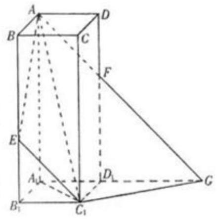

【例 11】如图 2,在正四棱柱 ${ABCD} - {A}_{1}{B}_{1}{C}_{1}{D}_{1}$ 中, ${AB} = 1, B{B}_{1} = \sqrt{3} + 1, E$ 为 $B{B}_{1}$ 上使 ${B}_{1}E = 1$ 的点. 平面 ${AE}{C}_{1}$ 交 $D{D}_{1}$ 于 $F$ ,交 ${A}_{1}{D}_{1}$ 的延长线于 $G$ . 求:

(1)异面直线 ${AD}$ 与 ${C}_{1}G$ 所成的角的大小；(2)二面角 $A - {C}_{1}G - {A}_{1}$ 的正切值.

【难度】 $\star   \star   \star$

【答案】(1) $\frac{\pi }{6}$ (2) 2 .

【解析】(1) 由 ${AD}//{{A}_{1}{D}_{1}}$ 知 $\angle {C}_{1}G{D}_{1}$ 为异面直线 ${AD}$ 与 ${C}_{1}G$ 所成的角. 连结 ${C}_{1}F$ .

因为 ${AE}$ 和 ${C}_{1}F$ 分别是平行平面 ${AB}{B}_{1}{A}_{1}$ 和 $C{C}_{1}{D}_{1}D$ 与平面 ${AE}{C}_{1}G$ 的交线,所以 ${AE}//{C}_{1}F$ . 由此可得 ${D}_{1}F = {BE} = \sqrt{3}$ 由 ${\Delta F}{D}_{1}G \backsim  {\Delta FDA}$ ,得 ${D}_{1}G = \sqrt{3}$ . 在 ${Rt\Delta }{C}_{1}{D}_{1}G$ 中, ${C}_{1}{D}_{1} = 1,{D}_{1}G = \sqrt{3}$ 所以 $\angle {C}_{1}G{D}_{1} = \frac{\pi }{6}$ .

(2) 作 ${D}_{1}H \bot  {C}_{1}G$ 于 $H$ ,连结 ${FH}$ . 由三垂线定理知 ${FH} \bot  {C}_{1}G$ .

故 $\angle {D}_{1}{HF}$ 为二面角 $F - {C}_{1}G - {D}_{1}$ 即二面角 $A - {C}_{1}G - {A}_{1}$ 的平面角 在 ${Rt\Delta GH}{D}_{1}$ 中,

${D}_{1}G = \sqrt{3},\;\angle {D}_{1}{GH} = \frac{\pi }{6}$ ,所以 ${D}_{1}H = \frac{\sqrt{3}}{2}$ . 故 $\tan \angle {D}_{1}{HF} = \frac{{D}_{1}F}{{D}_{1}H}\frac{\sqrt{3}}{\frac{\sqrt{3}}{2}} = 2$ .

【例 12】如图所示,一只小蚂蚁正从圆锥底面上的点 $A$ 沿圆锥体的表面匀速爬行一周,又绕回到点 $A$ . 已知该圆锥体的底面半径为 $r$ ,母线长为 ${3r}$ ,试问小蚂蚁沿怎样的路径如何爬行,才能最快到达点 $A$ ? 并求出该路径的长.

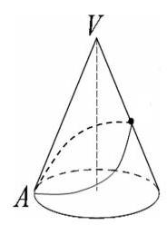

【难度】 $\star   \star   \star$

【答案】见解析

【解析】设 $\angle {AV}{A}_{1} = \theta$ ,即 $\frac{\theta }{2\pi } = \frac{{2\pi } \cdot  r}{{2\pi } \cdot  {3r}},\theta  = \frac{2\pi }{3}$ ,

$\therefore A{A}_{1}^{2} = V{A}^{2} + V{A}_{1}^{2} - {2VA} \cdot  V{A}_{1}\cos \frac{2\pi }{3} \; = {\left( 3r\right) }^{2} + {\left( 3r\right) }^{2} - 2 \cdot  {3r} \cdot  {3r} \cdot  \cos \frac{2\pi }{3} = {27}{r}^{2}$ ,即 $A{A}_{1} = 3\sqrt{3}r$ ,

则小蚂蚁沿线段 $A{A}_{1}$ 爬行 (如图),能最快到达点 $A$ ,且该路径的长为 $3\sqrt{3}r$ .

## 巩固训练

1、已知球 $O$ 的半径为 $1, A, B, C$ 三点都在球面上,且每两点间的球面距离均为 $\frac{\pi }{2}$ ,则球心 $O$ 到平面 ${ABC}$ 的距离为 (   )

A. $\frac{1}{3}$ B. $\frac{\sqrt{3}}{3}$ C. $\frac{2}{3}$ D. $\frac{\sqrt{6}}{3}$

【难度】★★★

【答案】B

【解析】球中内接的图形解决起来比较困难,因此尽量将其转化为熟悉且方便运算的几何体,题中有 $\mathrm{A}\text{ 、 }\mathrm{\;B}$ 、 C 三点,又涉及球面距离,因此相关点有四个: $\mathrm{O},\mathrm{A},\mathrm{B},\mathrm{C}$ ,组成了一个三棱锥,将题中相应关系转化到三棱锥上,求 $\mathrm{O}$ 到底面 $\mathrm{{ABC}}$ 的高就很方便了,当然,根据每两点间的球面距离均为 $\frac{\pi }{2}$ 的条件,再将三棱锥转化为正方体的一个角, 运算就进一步简化了

2、如图，在棱长为 1 的正方体 ${ABCD} - {A}_{1}{B}_{1}{C}_{1}{D}_{1}$ 中， $P$ 为底面 ${ABCD}$ 内(包括边界)的动点，满足 ${D}_{1}P$ 与直线 $C{C}_{1}$ 所成角的大小为 $\frac{\pi }{6}$ ，则线段 ${DP}$ 扫过的面积为___.

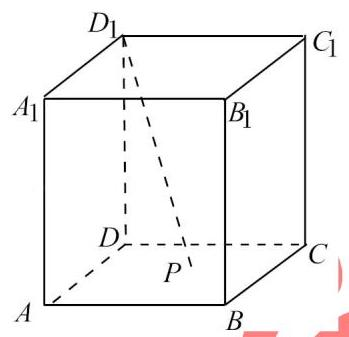

【难度】 $\star   \star   \star$

【答案】 $\frac{1}{12}\pi$

【解析】解: 因为 $C{C}_{1}//D{D}_{1}$

所以 ${D}_{1}P$ 与直线 $C{C}_{1}$ 所成角可转化为 ${D}_{1}P$ 与直线 $D{D}_{1}$ 所成角,即 $\angle D{D}_{1}P = \frac{\pi }{6}$ ,

在 ${Rt}\bigtriangleup {D}_{1}{DP}$ 中, $D{D}_{1} = 1,\angle D{D}_{1}P = \frac{\pi }{6}$ ,所以 ${DP} = \frac{\sqrt{3}}{3}$ ,

所以点 $P$ 在底面 ${ABCD}$ 内的轨迹是以 $\frac{\sqrt{3}}{3}$ 为半径的圆的四分之一,

所以线段 ${DP}$ 扫过的面积为 $\frac{1}{4}\pi  \cdot  {\left( \frac{\sqrt{3}}{3}\right) }^{2} = \frac{1}{12}\pi$ . 故答案为: $\frac{1}{12}\pi$ .

## (七)命题、集合的等价转化

## 例题精讲

【例 13】已知 $f\left( x\right)  = m\left( {x - {2m}}\right) \left( {x + m + 3}\right) , g\left( x\right)  = {2}^{x} - 2$ ,若 $\forall x \in  R, f\left( x\right)  < 0$ 或 $g\left( x\right)  < 0$ ,则 $m$ 的取值范围是___.

【难度】

【答案】 $\left( {-4,0}\right)$ .

【解析】将问题转化为 $g\left( x\right)  < 0$ 的解集的补集是 $f\left( x\right)  < 0$ 的解集的子集求解.

$\because g\left( x\right)  = {2}^{x} - 2 < 0,\therefore x < 1$ . 又 $\forall x \in  R, f\left( x\right)  < 0$ 或 $g\left( x\right)  < 0,\therefore \lbrack 1, + \infty )$ 是 $f\left( x\right)  < 0$ 的解集的子集. 又由 $f\left( x\right)  = m\left( {x - {2m}}\right) \left( {x + m + 3}\right)  < 0$ ，知 $m$ 不可能大于等于 0，因此 $m < 0$ . 当 $m < 0$ 时， $f\left( x\right)  < 0$ ，即 $\left( {x - {2m}}\right) \left( {x + m + 3}\right)  > 0$ ,若 ${2m} =  - m - 3$ ,即 $m =  - 1$ ,此时 $f\left( x\right)  < 0$ 的解集为 $\{ x \mid  x \neq   - 2\}$ ,满足题意; 若 ${2m} >  - m - 3$ ,即 $- 1 < m < 0$ ,此时 $f\left( x\right)  < 0$ 的解集为 $\{ x \mid  x > {2m}$ 或 $\mathrm{x} <  - m - 3\}$ ,依题意 ${2m} < 1$ ,即 $- 1 < m < 0$ ; 若 ${2m} <  - m - 3$ ,即 $m <  - 1$ ,此时 $f\left( x\right)  < 0$ 的解集为 $\left\{  {x \mid  x < {2m}\text{ 或 }x >  - m - 3}\right\}$ ,依 题 $- \mathrm{m} - 3 < 1,\therefore m >  - 4,\therefore  - 4 < m <  - 1$ . 综上可知,满足条件的 $m$ 的取值范围是 $- 4 < m < 0$ .

## 巩固训练

1、“ $x \neq  2$ 或 $y \neq   - 2$ ” 是 “ ${xy} \neq   - 4$ ” 的( )

A. 必要而不充分条件 B. 充分而不必要条件

C. 充要条件 D. 既不充分又不必要条件

【难度】 $\star   \star   \star$

【答案】 $B$

【解析】解: $\because x \neq  2$ 或 $y \neq   - 2$ 能推出 ${xy} \neq   - 4$ ,是充分条件,

${xy} \neq   - 4$ 推不出 $x \neq   - 2$ 或 $y \neq   - 2$ ,不是必要条件. 故选: $B$ .

## (八)复数与实数的转化

## 例题精讲

【例14】设 ${z}_{1},{z}_{2} \in  C,{z}_{1}^{2} - 2{z}_{1}{z}_{2} + 4{z}_{2}^{2} = 0,\left| {z}_{2}\right|  = 2$ ,则以 $\left| {z}_{1}\right|$ 为直径的圆面积为( )

A. $\pi$ B. ${4\pi }$ C. ${8\pi }$ D. ${16\pi }$

【难度】 $\star   \star   \star$

【答案】B

【解析】 ${z}_{1}^{2} - 2{z}_{1}{z}_{2} + 4{z}_{2}^{2} = 0 \Rightarrow  {\left( {z}_{1} - {z}_{2}\right) }^{2} =  - 3{z}_{2}^{2} \Rightarrow  {z}_{1} - {z}_{2} =  \pm  \sqrt{3i} \cdot  {z}_{2} \Rightarrow  {z}_{1} = \left( {1 \pm  \sqrt{3}i}\right) {z}_{2} \; \therefore \left| {z}_{1}\right|  = \left| \left( {1 \pm  \sqrt{3}i}\right) \right|  \cdot  \left| {z}_{2}\right|  = 4,\therefore$ 圆面积为 ${4\pi }$ ,选B；

## 巩固训练

1、下列类比推理命题(其中 $Q$ 为有理数集， $R$ 为实数集， $C$ 为复数集):

① “若 $a, b \in  R$ ，则 $a - b = 0 \Rightarrow  a = b$ ” 类比推出 “若 $a, b \in  C$ ，则 $a - b = 0 \Rightarrow  a = b$ ”；

② “若 $a, b, c, d \in  R$ ,则复数 $a + {bi} = c + {di} \Rightarrow  a = c, b = d$ ” 类比推出 “若 $a, b, c, d \in  Q$ ,则 $a + b\sqrt{2} = c + d\sqrt{2} \Rightarrow  a = c, b = d$ ";

③ “若 $a, b \in  R$ ,则 $a - b > 0 \Rightarrow  a > b$ ” 类比推出 “若 $a, b \in  C$ ,则 $a - b > 0 \Rightarrow  a > b$ ”. 其中类比结论正确的个数是( )

A. 0 B. 1 C. 2 D. 3

【难度】 $\star   \star   \star$

【答案】 $C$

【解析】解: ① 在复数集 $C$ 中,若两个复数满足 $a - b = 0$ ,则它们的实部和虚部均相等,则 $a, b$ 相等. 故 ①正确；

②在有理数集 $Q$ 中，若 $a + b\sqrt{2} = c + d\sqrt{2}$ ，则 $\left( {a - c}\right)  + \left( {b - d}\right) \sqrt{2} = 0$ ，易得: $a = c$ ， $b = d$ . 故②正确； ③若 $a, b \in  C$ ，当 $a = 1 + i, b = i$ 时， $a - b = 1 > 0$ ，但 $a, b$ 是两个虚数，不能比较大小. 故③错误故 3 个结论中,有两个是正确的. 故选: $C$ .

(九)特殊与一般的转化

## 例题精讲

【例 15】已知函数 $f\left( x\right)  = \frac{{a}^{x}}{{a}^{x} + \sqrt{a}}\left( {a > 0\text{ 且 }a \neq  1}\right)$ ,求 $f\left( \frac{1}{100}\right)  + f\left( \frac{2}{100}\right)  + \cdots  + f\left( \frac{99}{100}\right)$ 的值

【难度】 $\star   \star   \star$

【答案】 $\frac{99}{2}$

【解析】 $f\left( x\right)  + f\left( {1 - x}\right)  = \frac{{a}^{x}}{{a}^{x} + \sqrt{a}} + \frac{{a}^{1 - x}}{{a}^{1 - x} + \sqrt{a}} = \frac{{a}^{x}}{{a}^{x} + \sqrt{a}} + \frac{a}{a + {a}^{x}\sqrt{a}} \; = \frac{{a}^{x}}{{a}^{x} + \sqrt{a}} + \frac{\sqrt{a}}{\sqrt{a} + {a}^{x}} = \frac{\sqrt{a} + {a}^{x}}{{a}^{x} + \sqrt{a}} = 1$ ,于是 $f\left( \frac{1}{100}\right)  + f\left( \frac{2}{100}\right)  + \cdots  + f\left( \frac{99}{100}\right) \; = \left\lbrack  {f\left( \frac{1}{100}\right)  + f\left( \frac{99}{100}\right) }\right\rbrack   + \left\lbrack  {f\left( \frac{2}{100}\right)  + f\left( \frac{98}{100}\right) }\right\rbrack   + \cdots \left\lbrack  {f\left( \frac{49}{100}\right)  + f\left( \frac{51}{100}\right) }\right\rbrack   + f\left( \frac{50}{100}\right)  = 1 \times  {49} + \frac{1}{2} = \frac{99}{2}$

## 巩固训练

1、课本中介绍了应用祖暅原理推导棱锥体积公式的做法，祖暅原理也可用来求旋转体的体积, 现介绍用祖暅原理求球体体积公式的做法: 可构造一个底面半径和高都与球半径相等的圆柱, 然后在圆柱内挖去一个以圆柱下底面圆心为顶点, 圆柱上底面为底面的圆锥, 用这样一个几何体与半球应用祖暅原理(图 1)，即可求得球的体积公式，请研究和理解球的体积

高三数学二轮复习 A 版

公式求法的基础上,解答以下问题: 已知椭圆的标准方程为 $\frac{{x}^{2}}{4} + \frac{{y}^{2}}{25} = 1$ ,将此椭圆绕 $y$ 轴旋转一周后，得一橄榄状的几何体(图 2)，其体积等于___

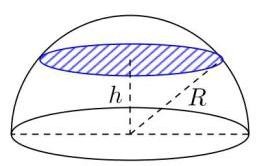

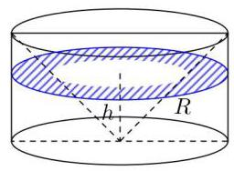

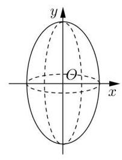

【难度】 $\star   \star   \star$

【答案】见解析

【解析】构造模型如图,设 ${OH} = {O}^{\prime }{H}^{\prime } = h$ ,

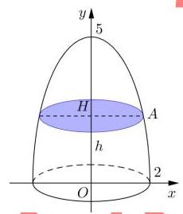

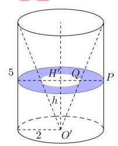

则 ${AH} = \sqrt{4 - \frac{4{y}^{2}}{25}},\therefore {S}_{\text{ 左 }} = {4\pi } - \frac{4{y}^{2}\pi }{25}$ ,

${H}^{\prime }P = 2,{H}^{\prime }Q = \frac{2}{5}h,{S}_{\text{ 右 }} = {4\pi } - \frac{4{y}^{2}\pi }{25}$ ,

据祖暅原理 $V = \frac{2}{3}{V}_{\text{ 柱 }} = \frac{2}{3}\left( {4\pi }\right)  \times  {10} = \frac{80\pi }{3}$ ;

2、某种平面分形图如下图所示，一级分形图是一个边长为 1 的等边三角形(图(1))；___如分形图是将一级分形图的每条线段三等分，并以中间的那一条线段为一底边向形外作等边三角形，然后去掉底边(图(2))；将二级分形图的每条线段三等边，重复上述的作图方法，得到三级分形图(图 (3))、 宋重复上述作图方法，依次得到四级、五级、...、 $n$ 级分形图. 则 $n$ 级分形图的周长___.

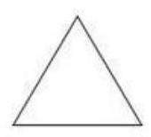

图(1)

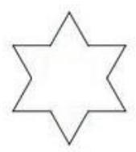

图(2)

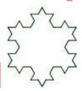

图(3)

【难度】 $\star   \star   \star$

【答案】 $3{\left( \frac{4}{3}\right) }^{n - }$

【解析】注意观察每个分形图的线段长度会在下一级分形图中变为 $\frac{4}{3}$ 倍的折线; 一级分形图的图形周长为 $3 = 3 \cdot  {\left( \frac{4}{3}\right) }^{0}$ ,二级分形图的图形周长为 $4 = 3 \cdot  {\left( \frac{4}{3}\right) }^{1} = 3 \cdot  {\left( \frac{4}{3}\right) }^{2 - 1}$ ,三级分形图的图形周长为 $\frac{16}{3} = 3 \cdot  {\left( \frac{4}{3}\right) }^{2} = 3 \cdot  {\left( \frac{4}{3}\right) }^{3 - 1},\cdots$ ,故 $n$ 级分形图的图形周长为 $3 \cdot  {\left( \frac{4}{3}\right) }^{n - 1}$ .

## (十)数学与文字的转化

## 例题精讲

【例 16】在平面直角坐标系内,设 $M\left( {{x}_{1},{y}_{1}}\right) , N\left( {{x}_{2},{y}_{2}}\right)$ 为不同的两点,直线 $l$ 的方程为 ${ax} + {by} + c = 0$ , $\delta  = \frac{a{x}_{1} + b{y}_{1} + c}{a{x}_{2} + b{y}_{2} + c}$ ,下面四个命题中的假命题为(   )

A. 存在唯一的实数 $\delta$ ,使点 $N$ 在直线 $l$ 上

B. 若 $\delta  = 1$ ,则过 $M, N$ 两点的直线与直线 $l$ 平行

C. 若 $\delta  =  - 1$ ,则直线经过线段 $M, N$ 的中点

D. 若 $\delta  > 1$ ,则点 $M, N$ 在直线 $l$ 的同侧,且直线 $l$ 与线段 $M, N$ 的延长线相交

【难度】 $\star   \star   \star$

【答案】 $A$

【解析】解: 对于 $A$ ,因为当点 $N$ 在直线 $l$ 上时, $a{x}_{2} + b{y}_{2} + c = 0$ ,所以 $\delta$ 不确定,所以 $A$ 错;

对于 $B$ ,因为 $\delta  = 1, a{x}_{2} + b{y}_{2} + c \neq  0$ ,即 $N \notin  l$ ,

$a{x}_{2} + b{y}_{2} + c = a{x}_{1} + b{y}_{1} + c$ ,所以 $a\left( {{x}_{1} - {x}_{2}}\right)  + b\left( {{y}_{1} - {y}_{2}}\right)  = 0$

即向量 $\overrightarrow{MN}$ 与直线 $l$ 的法向量垂直,并且 $N$ 不在 $l$ 上,所以 ${MN}//l$ ,所以 $B$ 对;

对于 $C$ ,因为 $\delta  =  - 1, a{x}_{2} + b{y}_{2} + c + a{x}_{1} + b{y}_{1} + c = 0$ ,

所以 $a\frac{{x}_{1} + {x}_{2}}{2} + b\frac{{y}_{1} + {y}_{2}}{3} + c = 0$ ,于是 $\left( {\frac{{x}_{1} + {x}_{2}}{2},\frac{{y}_{1} + {y}_{2}}{3}}\right)  \in  l$ ,

所以则直线 $l$ 经过线段 $M$ ， $N$ 的中点，所以 $C$ 对；

对于 $D$ ,因为 $\delta  > 1 > 0$ ,则 $a{x}_{2} + b{y}_{2} + c$ 与 $a{x}_{1} + b{y}_{1} + c$ ,同号,

所以点 $M, N$ 在直线 $l$ 的同侧,

$a{x}_{1} + b{y}_{1} + c > a{x}_{2} + b{y}_{2} + c$ 或 $a{x}_{1} + b{y}_{1} + c < a{x}_{2} + b{y}_{2} + c$ ,

从而 $a\left( {{x}_{1} - {x}_{2}}\right)  + b\left( {{y}_{1} - {y}_{2}}\right)  > 0$ ,或 $a\left( {{x}_{1} - {x}_{2}}\right)  + b\left( {{y}_{1} - {y}_{2}}\right)  < 0$ ,

即 $a\left( {{x}_{1} - {x}_{2}}\right)  + b\left( {{y}_{1} - {y}_{2}}\right)  \neq  0$ ,向量 $\overrightarrow{MN}$ 与直线 $l$ 的法向量不垂直,

所以直线 ${MN}$ 与直线不平行或重合,所以直线 $l$ 与线段 $M, N$ 的延长线相交,

所以 $D$ 对. 故选: $A$ .

巩固训练

1、某企业为一个高科技项目注入了启动资金 1000 万元，已知每年可获利 25%，但由于竞争激烈，每年年底需从利润中抽取 200 万元资金进行科研、技术改造与广告投入，方能保持原有的利润增长率，设经过 $n$ 年后,该项目的资金为 ${a}_{n}$ 万元.

(1)求 ${a}_{1}$ 、 ${a}_{2}$ ；

(2)设 ${b}_{n} = {a}_{n} - {800}$ ，证明:数列 $\left\{  {b}_{n}\right\}$ 为等比数列，并求出至少需经过多少年，该项目的资金才可以达到或超过翻两番 (即为原来的 4 倍) 的目标 (取 $\lg 2 = {0.3}$ );

(3)若 ${c}_{n} = \frac{\left( {n + 1}\right) {b}_{n}}{250}$ ，求数列 $\left\{  {c}_{n}\right\}$ 的前 $n$ 项和 ${S}_{n}$ .

【难度】 $\star   \star   \star$

【答案】见解析

【解析】解: (1) 由题意可得, ${a}_{1} = {1000}\left( {1 + {25}\% }\right)  - {200} = {1050},{a}_{2} = {1050}\left( {1 + {25}\% }\right)  - {200} = {1112.5}$ ,

(2)因为 ${a}_{n + 1} = \frac{5}{4}{a}_{n} - {200}$ ，因为 ${b}_{n} = {a}_{n} - {800}$ ，

所以 ${800} + {b}_{n} = {a}_{n},{800} + {b}_{n + 1} = {a}_{n + 1} = \frac{5}{4}{a}_{n} - {200} = \frac{5}{4}\left( {{b}_{n} + {800}}\right)  - {200}$ .

所以 ${b}_{n + 1} = \frac{5}{4}{b}_{n}$ ,数列 $\left\{  {b}_{n}\right\}$ 是以 250 为首项,以 $\frac{5}{4}$ 为公比的等比数列,

所以 ${b}_{n} = {250} \times  {\left( \frac{5}{4}\right) }^{n - 1},{a}_{n} = {800} + {250}{\left( \frac{5}{4}\right) }^{n - 1}$

令 ${a}_{n} \geq  {4000}$ 可得 ${\left( \frac{5}{4}\right) }^{n - 1} \geq  \frac{64}{5}$ ,所以 $\left( {n - 1}\right) \lg \frac{5}{4} \geq  \lg \frac{64}{5}$ ,从而可得 $n - 1 \geq  \frac{\lg \frac{64}{5}}{\lg \frac{5}{4}} = \frac{\lg {64} - \lg 5}{\lg 5 - \lg 4} = \frac{7\lg 2 - 1}{1 - 3\lg 2} \approx  {11}$ ,

故 $n \geq  {12}$ ,至少要经过 12 年,该项目的资金才可以达到或超过翻两番的目标,

(3)由 ${c}_{n} = \frac{\left( {n + 1}\right) {b}_{n}}{250}$ ，得 ${c}_{n} = \left( {n + 1}\right)  \cdot  {\left( \frac{5}{4}\right) }^{n - 1}$ ， ${S}_{n} = 2 \times  1 + 3 \times  \frac{5}{4} + \ldots  + n \cdot  {\left( \frac{5}{4}\right) }^{n?2} + \left( {n + 1}\right)  \cdot  {\left( \frac{5}{4}\right) }^{n?1}$ ， $\frac{5}{4}{S}_{n} = 2 \times  \frac{5}{4} + 3 \times  {\left( \frac{5}{4}\right) }^{2} + \ldots  + n \cdot  {\left( \frac{5}{4}\right) }^{n?1} + \left( {n + 1}\right)  \cdot  {\left( \frac{5}{4}\right) }^{n},$

两式相减可得, $?\frac{1}{4}{S}_{n} = 2 + \frac{5}{4} + {\left( \frac{5}{4}\right) }^{2} + \ldots  + {\left( \frac{5}{4}\right) }^{n?1} - \left( {n + 1}\right)  \cdot  {\left( \frac{5}{4}\right) }^{n} = 2 + \frac{\frac{5}{4}\left\lbrack  {1 - {\left( \frac{5}{4}\right) }^{n - 1}}\right\rbrack  }{1 - \frac{5}{4}} - \left( {n + 1}\right)  \times  {\left( \frac{5}{4}\right) }^{n}$ ,

所以 ${S}_{n} =  - 4\left\lbrack  {2 + 4 \times  {\left( \frac{5}{4}\right) }^{n} - 5 - \left( {n + 1}\right)  \times  {\left( \frac{5}{4}\right) }^{n}}\right\rbrack   = {12} + \left( {{4n} - {12}}\right)  \cdot  {\left( \frac{5}{4}\right) }^{n}$ .
