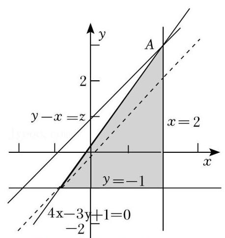
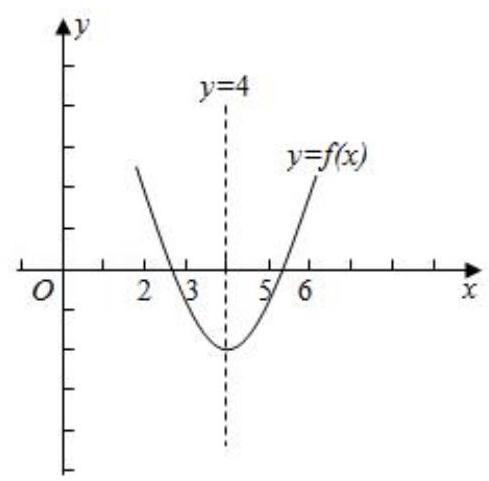
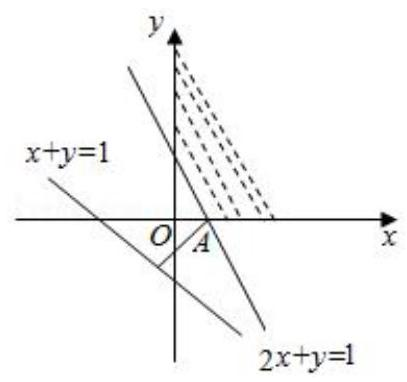
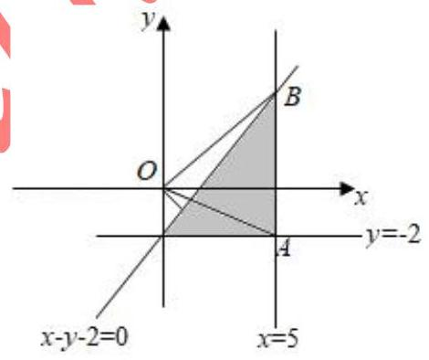
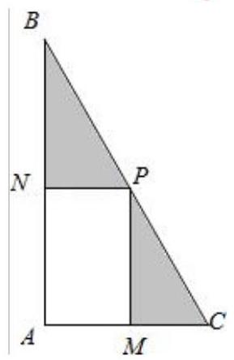

## 知识梳理

## 第 5 课:不等式专题

<table><tr><td>教学目标</td><td>1、掌握常见不等式的方法;   2、具有函数方程的思想；   3、具有数形结合的思想；   4、掌握任意与存在问题的解法.</td></tr><tr><td>重点</td><td>1、掌握不等式恒成立的的各种变形;   2、数形结合的灵活应用和函数方程的转化.</td></tr><tr><td>难点</td><td>1、掌握不等式恒成立的的各种变形；   2、数形结合的灵活应用和函数方程的转化.</td></tr></table>

1. 重视对基础知识的考查, 设问方式不断创新. 重点考查四种题型: 解不等式, 证明不等式, 涉及不等式应用题, 涉及不等式的综合题, 所占比例远远高于在课时和知识点中的比例. 重视基础知识的考查, 常考常新, 创意不断，设问方式不断创新，图表信息题，多选型填空题等情景新颖的题型受到命题者的青睐，值得引起我们的关注.

2. 突出重点，综合考查，在知识与方法的交汇点处设计命题，在不等式间题中蕴含着丰富的函数思想，不等式又为研究函数提供了重要的工具，不等式与函数既是知识的结合点，又是数学知识与数学方法的交汇点, 因而在历年高考题中始终是重中之重. 在全面考查函数与不等式基础知识的同时, 将不等式的重点知识以及其他知识有机结合, 进行综合考查, 强调知识的综合和知识的内在联系, 加大数学思想方法的考查力度, 是高考对不等式考查的又一新特点.

3. 加大推理、论证能力的考查力度, 充分体现由知识立意向能力立意转变的命题方向. 由于代数推理没有几何图形作依托, 因而更能检测出学生抽象思维能力的层次. 这类代数推理问题常以高中代数的主体内容—— 函数、方程、不等式、数列及其交叉综合部分为知识背景, 并与高等数学知识及思想方法相衔接, 立意新颖, 抽象程度高, 有利于高考选拔功能的充分发挥. 对不等式的考查更能体现出高观点、低设问、深入浅出的 特点, 考查容量之大、功能之多、能力要求之高, 一直是高考的热点.

4. 突出不等式的知识在解决实际问题中的应用价值, 借助不等式来考查学生的应用意识.

不等式部分的内容是高考较为稳定的一个热点, 考查的重点是不等式的性质、证明、解法及最值方面的应用。高考试题中有以下几个明显的特点:

(1)不等式与函数、数列、几何、导数，实际应用等有关内容综合在一起的综合试题多，单独考查不等式的试题题量很少。

(2)选择题, 填空题和解答题三种题型中均有各种类型不等式题, 特别是应用题和压轴题几乎都与不等式有关。

(3)不等式的证明考得比得频繁，所涉及的方法主要是比较法、综合法和分析法，而放缩法作为一种辅助方法不容忽视。

## (一)不等式的解法

## 例题精讲

【例 1】不等式 $x - 2 + \frac{1}{x - 3} < {2x} + 5 + \frac{1}{x - 3}$ 的解集是 ( )

A. $\left( {-7, + \infty }\right)$ B. $\left( {-\infty ,7}\right)$

C. $\left( {-7,3}\right)  \cup  \left( {3, + \infty }\right)$ D. $\left( {-\infty ,3}\right)  \cup  \left( {3,7}\right)$

【难度】 $\star   \star   \star$

【答案】 $C$

【解析】解: 由 $x - 2 + \frac{1}{x - 3} < {2x} + 5 + \frac{1}{x - 3}$ 得 $x - 2 < {2x} + 5$ 且 $x \neq  3$ ,

解得 $x >  - 7$ 且 $x \neq  3$ ，所以原不等式的解集为 $\{ x \mid  x >  - 7$ 且 $x \neq  3\}$ . 故选: $C$

【例 2】不等式 $a{x}^{2} + {bx} + c > 0$ 的解集为 $\left( {-2,1}\right)$ ，则不等式 $a{x}^{2} + \left( {a + b}\right) x + c - a < 0$ 的解集为___.

【难度】 $\star   \star   \star$

【答案】 $\left( {-\infty , - 3}\right)  \cup  \left( {1, + \infty }\right)$

【解析】解: 不等式 $a{x}^{2} + {bx} + c > 0$ 的解集为 $\left( {-2,1}\right)$ ,

所以 -2 和 1 是 $a{x}^{2} + {bx} + c = 0$ 的实数根,且 $a < 0$ ; 所以 $\left\{  \begin{array}{l}  - 2 + 1 =  - \frac{b}{a} \\   - 2 \times  1 = \frac{c}{a} \end{array}\right.$ ,

$b = a, c =  - {2a}$ ,所以不等式 $a{x}^{2} + \left( {a + b}\right) x + c - a < 0$ 可化为 $a{x}^{2} + {2ax} - {3a} < 0$ ,即 ${x}^{2} + {2x} - 3 > 0$ ,

解得 $x <  - 3$ 或 $x > 1$ ,所以不等式的解集为 $\left( {-\infty , - 3}\right)  \cup  \left( {1, + \infty }\right)$ .

故答案为: $\left( {-\infty , - 3}\right)  \cup  \left( {1, + \infty }\right)$ .

【例 3】设不等式 $\sqrt{f\left( x\right) } > g\left( x\right)$ 的解集为 $M$ ,不等式组 $\left\{  \begin{array}{l} g\left( x\right)  \geq  0 \\  f\left( x\right)  > {g}^{2}\left( x\right)  \end{array}\right.$ 的解集为 $N$ ,则 $M\text{ 、 }N$ 之间的关系为 ( )

A. $M = N$ B. $M \supseteq  N$ C. $M \subseteq  N$ D. $M\text{ 、 }N$ 互不包含

【难度】 $\star   \star   \star$

【答案】 $B$

【解析】解: 不等式组 $\left\{  \begin{array}{l} g\left( x\right)  \geq  0 \\  f\left( x\right)  > {g}^{2}\left( x\right)  \end{array}\right.$ 等价于 $\left\{  \begin{array}{l} g\left( x\right)  \geq  0 \\  \sqrt{f\left( x\right) } > g\left( x\right)  \end{array}\right.$ ,

因为不等式 $\sqrt{f\left( x\right) } > g\left( x\right)$ 的解集为 $M$ ,不等式组 $\left\{  \begin{array}{l} g\left( x\right)  \geq  0 \\  f\left( x\right)  > {g}^{2}\left( x\right)  \end{array}\right.$ 的解集为 $N$ ,

所以 $M \supseteq  N$ . 故选: $B$ .

【例 4】若不等式组 $\left\{  \begin{array}{l} {x}^{2} - {2ax} + 2 \geq  0 \\  {ax}\left( {x - 1}\right)  < 1 \end{array}\right.$ 的解集是 $R$ ,则 $a$ 的取值范围是___.

【难度】 $\star   \star   \star$

【答案】 $\left\lbrack  {-\sqrt{2},0}\right\rbrack$

【解析】解: 由题意得: $\left\{  \begin{array}{l} 4{a}^{2} - 8 \leq  0 \\  a \leq  0 \\  {a}^{2} + {4a} < 0 \end{array}\right.$ ,解得: $- \sqrt{2} \leq  a \leq  0$ ,

故 $a$ 的范围是 $\left\lbrack  {-\sqrt{2},0}\right\rbrack$ ,故答案为: $\left\lbrack  {-\sqrt{2},0}\right\rbrack$ .

【例 5】不等式 ${\log }_{2}x + {2}^{x} < 2$ 的解集为___.

【难度】 $\star   \star   \star$

【答案】 $\left( {0,1}\right)$

【解析】解: 由题意,设 $f\left( x\right)  = {\log }_{2}x + {2}^{x} - 2, x \in  \left( {0, + \infty }\right)$ ;

则 $f\left( x\right)$ 在定义域 $\left( {0, + \infty }\right)$ 上是单调增函数,且 $f\left( 1\right)  = {\log }_{2}1 + 2 - 2 = 0$ ,

所以 $f\left( x\right)$ 在定义域 $\left( {0, + \infty }\right)$ 有唯一的零点是 1,所以 $f\left( x\right)  < 0$ 的解集为 $\left( {0,1}\right)$ ,

即不等式 ${\log }_{2}x + {2}^{x} < 2$ 的解集为 $\left( {0,1}\right)$ . 故答案为: $\left( {0,1}\right)$ .

【例 6】设函数 $f\left( x\right)  = \left\{  \begin{array}{l} {a}^{x}, x < 1 \\  \left| {{x}^{2} - {2x}}\right| , x \geq  1 \end{array}\right.$ (其中 $a > 0, a \neq  1$ ),若不等式 $f\left( x\right)  \leq  3$ 的解集为 $( - \infty ,3\rbrack$ ,则实数 $a$ 的取值范围为___.

【难度】 $\star   \star   \star$

【答案】 $(1,3\rbrack$

【解析】解: $a > 0$ ,且 $a \neq  1$ ,设函数 $f\left( x\right)  = \left\{  \begin{array}{l} {a}^{x}, x < 1 \\  \left| {{x}^{2} - {2x}}\right| , x \geq  1 \end{array}\right.$ ,若不等式 $f\left( x\right)  \leq  3$ 的解集是 $( - \infty ,3\rbrack$ , 当 $x \geq  1$ 时, $\left| {{x}^{2} - {2x}}\right|  \leq  3$ ,可得 $- 3 \leq  {x}^{2} - {2x} \leq  3$ ,解得 $1 \leq  x \leq  3$ ; 当 $x < 1$ ,即 $x \in  \left( {-\infty ,1}\right)$ 时, ${a}^{x} \leq  3$ ,不等式恒成立可得 $1 < a \leq  3$ .

综上可得 $1 < a \leq  3$ . $\therefore$ 实数 $a$ 的取值范围为: $\left( {1,3}\right)$ . 故答案为: $\left( {1,3}\right)$ .

【例 7】解关于 $x$ 的不等式: $m{x}^{2} + \left( {m - 2}\right) x - 2 > 0$ .

【难度】 $\star   \star   \star$

【答案】 $\left\{  {x\left| {\; - 1 < x < \frac{2}{m}}\right. }\right\}$

【解析】解: 当 $m = 0$ 时,不等式化为 $- {2x} - 2 > 0$ ,解得 $x <  - 1$ ;

当 $m > 0$ 时,不等式化为 $\left( {{mx} - 2}\right) \left( {x + 1}\right)  > 0$ ,解得 $x <  - 1$ ,或 $x > \frac{2}{m}$ ;

当 $- 2 < m < 0$ 时, $\frac{2}{m} <  - 1$ ,不等式化为 $\left( {x - \frac{2}{m}}\right) \left( {x + 1}\right)  < 0$ ,解得 $\frac{2}{m} < x <  - 1$

当 $m =  - 2$ 时,不等式化为 ${\left( x + 1\right) }^{2} < 0$ ,此时无解;

当 $m <  - 2$ 时, $\frac{2}{m} >  - 1$ ,不等式化为 $\left( {x - \frac{2}{m}}\right) \left( {x + 1}\right)  < 0$ ,解得 $- 1 < x < \frac{2}{m}$ ;

综上, $m = 0$ 时,不等式的解集是 $\{ x \mid  x <  - 1\}$ ;

$m > 0$ 时,不等式的解集是 $\{ x \mid  x <  - 1$ ,或 $x > \frac{2}{m}\}$ ;

$- 2 < m < 0$ 时,不等式的解集是 $\left\{  {x\left| {\;\frac{2}{m} < x <  - 1}\right. }\right\}$ ;

$m =  - 2$ 时,不等式无解;

$m <  - 2$ 时,不等式的解集是 $\{ x \mid   - 1 < x < \frac{2}{m}\}$ .

【例 8】已知函数 $y = {a}^{2 - x} + 1\left( {a > 0\text{ 且 }a \neq  1}\right)$ 的图像恒过定点 $P$ ,且点 $P$ 在直线 ${mx} + {ny} - 2 = 0\left( {{mn} > 0}\right)$ 上,则 $\frac{1}{m} + \frac{2}{n}$ 的最小值为

【难度】 $\star   \star   \star$

【答案】 $2\sqrt{2} + 3$

【解析】解: $\because$ 函数 $y = {a}^{2 - x} + 1\left( {a > 0\text{ 且 }a \neq  1}\right)$ 的图像恒过定点 $P,\therefore \left\{  \begin{array}{l} 2 - x = 0 \\  1 + 1 = y \end{array}\right.$ ,解得 $x = 2, y = 2$ ,

故点 $P\left( {2,2}\right)$ ,则 ${2m} + {2n} - 2 = 0$ ,所以 $m + n = 1\left( {{mn} > 0}\right)$ ,

所以 $\frac{1}{m} + \frac{2}{n} = \left( {\frac{1}{m} + \frac{2}{n}}\right) \left( {m + n}\right)  = \frac{n}{m} + \frac{2m}{n} + 3 \geq  2\sqrt{2} + 3$ ,

(当且仅当 $\frac{n}{m} = \frac{2m}{n}$ ,即 $m = \sqrt{2} - 1, n = 2 - \sqrt{2}$ 时,等号成立),故答案为: $2\sqrt{2} + 3$ .

【例 9】若 $x, y$ 满足 $\left\{  \begin{array}{l} x \leq  2, \\  y \geq   - 1, \\  {4x} - {3y} + 1 \geq  0, \end{array}\right.$ 则 $y - x$ 的最大值为 ___.

【难度】 $\star   \star   \star$

【答案】 1

【解析】解: 作出不等式组对应的平面区域如图:

设 $z = y - x$ ,则 $y = x + z$ ,平移直线 $y = x + z$ ,

由图象可知当直线 $y = x + z$ 经过点 $A\left( {2,3}\right)$ 时,

直线 $y = x + z$ 的截距最大,此时 $z$ 最大, ${z}_{\max } = 3 - 2 = 1$ .

故 $y - x$ 的最大值是 1 .

故答案为: 1 .

【例 10】若实数 $x\text{ 、 }y$ 满足 ${2020}^{x} - {2020}^{y} < {2021}^{-x} - {2021}^{-y}$ ,则 ( )

A. $x - y < 0$ B. $x - y > 0$ C. $\frac{y}{x}$ D. $\frac{y}{x} > 1$

【难度】 $\star   \star   \star$

【答案】 $A$

【解析】解: 实数 $x\text{ 、 }y$ 满足 ${2020}^{x} - {2020}^{y} < {2021}^{-x} - {2021}^{-y}$

$\therefore {2020}^{x} - {2021}^{-x} < {2021}^{y} - {2021}^{-y}$ ,

由于 $f\left( t\right)  = {2020}^{t} - {2021}^{-t} = {2020}^{t} - \frac{1}{{2021}^{t}}$ 是 $R$ 上的增函数, $f\left( x\right)  < f\left( y\right)$ ,

$\therefore x < y$ ,故选 $A$ .

【例 11】关于 $x$ 的一元二次不等式 ${x}^{2} - {8x} + a \leq  0$ 的解集中有且仅有 3 个整数，则 $a$ 的取值范围是 ___.

【难度】 $\star   \star   \star$

【答案】 $({12},{15}\rbrack$

【解析】解: 设函数 $f\left( x\right)  = {x}^{2} - {8x} + a$ ,其图象是开口向上,对称轴是 $x = 3$ 的抛物线,如图所示;

若关于 $x$ 的一元二次不等式 ${x}^{2} - {8x} + a \leq  0$ 的解集中有且仅有 3 个整数,则这 3 个整数解为 $3\text{ 、 }4\text{ 、 }5$ , 由函数的图象知, $\left\{  \begin{array}{l} f\left( 2\right)  > 0 \\  f\left( 3\right)  \leq  0 \end{array}\right.$ ,即 $\left\{  \begin{array}{l} 4 - {16} + a > 0 \\  9 - {24} + a \leq  0 \end{array}\right.$ ,解得 ${12} < a \leq  {15}$ . 所以实数 $a$ 的取值范围是 $({12},{15}\rbrack$ . 故答案为: $({12},{15}\rbrack$ .

【例 12】若 $f\left( x\right)  = {x}^{\frac{2}{3}} - {x}^{-1}$ ，则满足 $f\left( x\right)  > 0$ 的 $x$ 的取值范围是___.

【难度】 $\star   \star   \star$

【答案】 $\left( {-\infty ,0}\right)  \cup  \left( {1, + \infty }\right)$

【解析】解: 由 $f\left( x\right)  > 0$ 得到 ${x}^{\frac{2}{3}} > {x}^{-1}$ ,且 $x \neq  0$ ,即 ${x2} > {x}^{-3}$ ,

当 $x > 0$ 时,不等式化为 ${x}^{5} > 1$ ,解得 $x > 1$ ,当 $x < 0$ 时,不等式化为 ${x}^{5} < 1$ ,解得 $x < 0$ ,

综上: $x$ 的取值范围是 $\left( {-\infty ,0}\right)  \cup  \left( {1, + \infty }\right)$ ,故答案为: $\left( {-\infty ,0}\right)  \cup  \left( {1, + \infty }\right)$ .

【例 13】已知非负实数 $a, b$ 满足 ${2a} + b \geq  1$ ,则 $\frac{\left| a + b + 1\right| }{\sqrt{2}}$ 的最小值等于___.

【难度】 $\star   \star   \star$

【答案】 $\frac{3\sqrt{2}}{4}$

【解析】解: 由题意可知,点 $\left( {a, b}\right)$ 满足约束条件 $\left\{  \begin{array}{l} x \geq  0, y \geq  0 \\  {2x} + y \geq  1 \end{array}\right.$ ,由约束条件作

出平面区域如图:

$\frac{\left| a + b + 1\right| }{\sqrt{2}}$ 的几何意义为可行域内的点到直线 $x + y + 1 = 0$ 的距离,

其最小值为 $A\left( {\frac{1}{2},0}\right)$ 当直线 $x + y + 1 = 0$ 的距离,等于 $\frac{\left| \frac{1}{2} + 0 + 1\right| }{\sqrt{2}} = \frac{3\sqrt{2}}{4}$ .

故答案为: $\frac{3\sqrt{2}}{4}$ .

## 巩固训练

1、若正数 $x, y$ 满足 $\frac{1}{y} + x = 4$ ，则 $\frac{x}{y}$ 的最大值为 ___.

【难度】 $\star   \star   \star$

【答案】 4

【解析】解: $\because$ 正数 $x, y$ 满足 $\frac{1}{y} + x = 4$ ,

$\therefore x = 4 - \frac{1}{y} = \frac{{4y} - 1}{y} > 0$ ,解得 $y > \frac{1}{4}$ .

$\therefore \frac{x}{y} = \frac{{4y} - 1}{{y}^{2}} = \frac{4}{y} - \frac{1}{{y}^{2}} =  - {\left( \frac{1}{y} - 2\right) }^{2} + 4$ ,当 $\frac{1}{y} = 2\left( {y = \frac{1}{2}}\right)$ 时取最大值 4 .

$\therefore \frac{x}{y}$ 的最大值为 4 . 故答案为: 4 .

2、不等式 ${\log }_{2}\left( {{4}^{x} - 3}\right)  > x + 1$ 的解集是___.

【难度】 $\star   \star   \star$

【答案】 $\left( {{\log }_{2}3, + \infty }\right)$

【解析】解: $\because {4}^{x} - 3 > 0,\therefore x > \frac{1}{2}{\log }_{2}3$ ,

$\because {\log }_{2}\left( {{4}^{x} - 3}\right)  > x + 1,\therefore {2}^{x + 1} < {4}^{x} - 3,\therefore {\left( {2}^{x}\right) }^{2} - 2 \cdot  {2}^{x} - 3 > 0$

解得 ${2}^{x} > 3$ ,或 ${2}^{x} <  - 1$ (舍), $\therefore x > {\log }_{2}3$ . 故答案为: $\left( {{\log }_{2}3, + \infty }\right)$ .

3、已知函数 $f\left( x\right)  = \left\{  \begin{array}{l} {2}^{x}, x \geq  0 \\  1, x < 0 \end{array}\right.$ ，若 $f\left( {1 - {a}^{2}}\right)  > f\left( {2a}\right)$ ，则实数 $a$ 的取值范围是 ___.

【难度】 $\star   \star   \star$

【答案】 $- 1 < a < \sqrt{2} - 1$

【解析】解: 函数 $f\left( x\right)  = \left\{  \begin{array}{l} {2}^{x}, x \geq  0 \\  1,\;x < 0 \end{array}\right.$ , $x < 0$ 时是常函数, $x \geq  0$ 时是增函数,

由 $f\left( {1 - {a}^{2}}\right)  > f\left( {2a}\right)$ ,所以 $\left\{  \begin{array}{l} {2a} < 1 - {a}^{2} \\  1 - {a}^{2} > 0 \end{array}\right.$ ,解得: $- 1 < a < \sqrt{2} - 1$ ,故答案为: $- 1 < a < \sqrt{2} - 1$ .

4、已知实数 $x\text{ 、 }y$ 满足 $x + {2y} = 3$ ，则 ${2}^{x} + {4}^{y}$ 的最小值为___.

【难度】 $\star   \star   \star$

【答案】 $4\sqrt{2}$

【解析】解: 因为 $x + {2y} = 3$ ,

则 ${2}^{x} + {4}^{y} \geq  2\sqrt{{2}^{x} \cdot  {4}^{y}} = 2\sqrt{{2}^{x + {2y}}} = 2\sqrt{8} = 4\sqrt{2}$ ,

当且仅当 $x = {2y}$ 且 $x + {2y} = 3$ ,即 $x = \frac{3}{2}, y = \frac{3}{4}$ 时取等号,此时 ${2}^{x} + {4}^{y}$ 最小值为 $4\sqrt{2}$ .

故答案为: $4\sqrt{2}$ .

5、设 $x, y$ 满足约束条件 $\left\{  \begin{array}{l} x - y - 2 \geq  0 \\  x - 5 \leq  0 \\  y + 2 \geq  0 \end{array}\right.$ ，则 $z = {x}^{2} + {y}^{2}$ 的最小值与最大值之和为___.

【难度】 $\star   \star   \star$

【答案】36

【解析】解: 由约束条件作出可行域如图,

由图可知, $A\left( {5, - 2}\right)$ ,联立 $\left\{  \begin{array}{l} x = 5 \\  x - y - 2 = 0 \end{array}\right.$ ,解得 $B\left( {5,3}\right)$ .

$z = {x}^{2} + {y}^{2}$ 的几何意义为可行域内的动点到原点距离的平方,

$\because O$ 到直线 $x - y - 2 = 0$ 的距离为 $\frac{\left| -2\right| }{\sqrt{2}} = \sqrt{2},\left| {OA}\right|  = \sqrt{{5}^{2} + {\left( -2\right) }^{2}} = \sqrt{29}$ ,

$\left| {OB}\right|  = \sqrt{{5}^{2} + {3}^{2}} = \sqrt{34},$

$\therefore z = {x}^{2} + {y}^{2}$ 的最小值为 2,最大值为 34,最小值与最大值的和为 $2 + {34} = {36}$ . 故答案为: 36.

6、已知函数 $f\left( x\right)  = \frac{x}{1 + \left| x\right| }$ ，则不等式 $f\left( {x - 3}\right)  + f\left( {2x}\right)  > 0$ 的解集为___.

【难度】 $\star   \star   \star$

【答案】 $\{ x \mid  x > 1\}$

【解析】解: 由题意得 $f\left( x\right)$ 为奇函数,当 $x > 0$ 时, $f\left( x\right)  = \frac{x}{1 + x} = 1 - \frac{1}{x + 1}$ ,

故 $f\left( x\right)$ 在 $\left( {0, + \infty }\right)$ 上是增函数,故它在 $\left( {-\infty ,0}\right)$ 上也是增函数.

又 $f\left( x\right)  = 0$ ,故 $f\left( x\right)$ 是 $R$ 上的增函数.

由不等式 $f\left( {x - 3}\right)  + f\left( {2x}\right)  > 0$ ,可得 $f\left( {x - 3}\right)  > f\left( {-{2x}}\right) ,\therefore x - 3 >  - {2x}$ ,解得 $x > 1$ ,

故原不等式的解集为 $\{ x \mid  x > 1\}$ ,故答案为: $\{ x \mid  x > 1\}$ .

## (二)不等式的证明

## 例题精讲

【例 14】实数 $a, b, c$ 满足 ${a}^{2} = {2a} + c - b - 1$ 且 $a + {b}^{2} + 1 = 0$ ，则下列关系成立的是( )

A. $b > a \geq  c$ B. $c \geq  a > b$ C. $b > c \geq  a$ D. $c \geq  b > a$

【难度】★★★

【答案】 $D$

【解析】解: $\because$ 实数 $a, b, c$ 满足 ${a}^{2} = {2a} + c - b - 1,\therefore {\left( a - 1\right) }^{2} = c - b \geq  0,\therefore c \geq  b$ , $\because a + {b}^{2} + 1 = 0,\therefore a =  - {b}^{2} - 1,\therefore b - a = b + {b}^{2} + 1 = {\left( b + \frac{1}{2}\right) }^{2} + \frac{3}{4} > 0,\therefore b > a$ , $\therefore c \geq  b > a$ . 故选: $D$ .

【例 15】设 $x, y, z > 0, a = {4x} + \frac{1}{y}, b = {4y} + \frac{1}{z}, c = {4z} + \frac{1}{x}$ ,则 $a, b, c$ 三个数(   )

A. 都小于 4 B. 至少有一个不大于 4

C. 都大于 4 D. 至少有一个不小于 4

【难度】 $\star   \star   \star$

【答案】 $D$

【解析】解: $\because a + b + c = {4x} + \frac{1}{y} + {4y} + \frac{1}{z} + {4z} + \frac{1}{x} = {4x} + \frac{1}{x} + {4y} + \frac{1}{y} + {4z} + \frac{1}{z} \geq  4 + 4 + 4 = {12}$ , $\therefore a, b, c$ 至少有一个不小于 4 .

则关于 $a\text{ 、 }b\text{ 、 }c$ 三个数的结论中,只有答案 $D$ 对. 故选: $D$ .

## 巩固训练

1、设 $x\text{ 、 }y$ 是不全为零的实数,试比较 $2{x}^{2} + {y}^{2}$ 与 ${x}^{2} + {xy}$ 的大小;

【答案】解法 1: $2{x}^{2} + {y}^{2} - \left( {{x}^{2} + {xy}}\right)  = {x}^{2} + {y}^{2} - {xy} = {\left( x - \frac{y}{2}\right) }^{2} + \frac{3}{4}{y}^{2}$

因为 $x\text{ 、 }y$ 是不全为零的实数,所以 ${\left( x - \frac{y}{2}\right) }^{2} + \frac{3}{4}{y}^{2} > 0$ ,即 $2{x}^{2} + {y}^{2} > {x}^{2} + {xy}$

解法 2: 当 ${xy} < 0$ 时, ${x}^{2} + {xy} < {x}^{2} < 2{x}^{2} + {y}^{2}$ ;

当 ${xy} > 0$ 时,作差: $2{x}^{2} + {y}^{2} - \left( {{x}^{2} + {xy}}\right)  = {x}^{2} + {y}^{2} - {xy} \geq  {2xy} - {xy} = {xy} > 0$ ; 因为 $x\text{ 、 }y$ 是不全为零的实数,所以当 ${xy} = 0$ 时, $2{x}^{2} + {y}^{2} > {x}^{2} + {xy}$ 。综上, $2{x}^{2} + {y}^{2} > {x}^{2} + {xy}$

## (三) 不等式中恒成立、有解性问题

## 例题精讲

【例 16】若关于 $x$ 的不等式 ${a}^{2} + {b}^{2} - {2a} - {4b} + 5 < {e}^{x}$ 的解集是 $R$ ,则 ${a}^{2} + {b}^{2} =$ ___.

【难度】 $\star   \star   \star$

【答案】 5

【解析】解: 关于 $x$ 的不等式 ${a}^{2} + {b}^{2} - {2a} - {4b} + 5 < {e}^{x}$ 的解集是 $R$ ,

所以不等式 ${a}^{2} + {b}^{2} - {2a} - {4b} + 5 < {e}^{x}$ 对于 $x \in  R$ 恒成立,

因为 $y = {e}^{x}$ 在 $R$ 上的值域为 $\left( {0, + \infty }\right)$ ,所以 ${a}^{2} + {b}^{2} - {2a} - {4b} + 5 \leq  0$ ,

即 ${\left( a - 1\right) }^{2} + {\left( b - 2\right) }^{2} \leq  0$ ,又 ${\left( a - 1\right) }^{2} + {\left( b - 2\right) }^{2} \geq  0$ ,则 ${\left( a - 1\right) }^{2} + {\left( b - 2\right) }^{2} = 0$ ,

所以 $a = 1, b = 2$ ,则 ${a}^{2} + {b}^{2} = 5$ . 故答案为: 5 .

【例 17】对于任意 $x \in  R$ 均有 $f\left( x\right)  + {2g}\left( x\right)  = {mx} - 4$ ,若 $f\left( x\right)  - {x}^{2} + {2g}\left( x\right)  \geq  0$ 在 $x \in  \left( {0, + \infty }\right)$ 上有解,则实数 $m$ 的取值范围是 ___.

【难度】★★★

【答案】 $\lbrack 4, + \infty )$

【解析】解: 对于任意 $x \in  R$ 均有 $f\left( x\right)  + {2g}\left( x\right)  = {mx} - 4$ ,

若 $f\left( x\right)  - {x}^{2} + {2g}\left( x\right)  \geq  0$ 在 $x \in  \left( {0, + \infty }\right)$ 上有解,即为 ${mx} - 4 - {x}^{2} \geq  0$ ,即 $m \geq  x + \frac{4}{x}$ 在 $x \in  \left( {0, + \infty }\right)$ 上有解,

即有 $m \geq  {\left( x + \frac{4}{x}\right) }_{min}$ ,由 $x > 0$ 时, $x + \frac{4}{x} \geq  2\sqrt{x \cdot  \frac{4}{x}} = 4$ ,当且仅当 $x = 2$ 时取得等号,

所以 $m \geq  4$ ,故答案为: $\lbrack 4, + \infty )$ .

## 巩固训练

1、若 $x > 0, y > 0$ ，且 ${4x} + y = {xy}$ ，则 $x + y - m \geq  0$ 恒成立的实数 $m$ 的取值范围是 ___.

【难度】 $\star   \star   \star$

【答案】 $( - \infty ,9\rbrack$

【解析】解: 若两个正实数 $x, y$ 满足 ${4x} + y = {xy}$ ,则 $\frac{1}{x} + \frac{4}{y} = 1$ ,

则 $x + y = \left( {x + y}\right) \left( {\frac{1}{x} + \frac{4}{y}}\right)  = 5 + \frac{y}{x} + \frac{4x}{y} \geq  5 + 2\sqrt{4} = 9,\therefore {\left( x + y\right) }_{\min } = 9$ ,

当且仅当 $\frac{y}{x} = \frac{4x}{y}$ ,即 $x = 3, y = 6$ 时取等号,

$\because x + y - m \geq  0$ 恒成立, $\therefore m \leq  {\left( x + y\right) }_{\min },\therefore m \leq  9$ , $\therefore$ 实数 $m$ 的取值范围是 $( - \infty ,9\rbrack$ . 故答案为: $( - \infty ,9\rbrack$ .

2、已知函数 $f\left( x\right)  = {x}^{2}, g\left( x\right)  = {\left( \frac{1}{2}\right) }^{x} - m$ ,若对任意 $x \in  \left\lbrack  {1,2}\right\rbrack$ ,都有 $f\left( x\right)  \geq  g\left( x\right)$ ,求实数 $m$ 的取值范围 【难度】 $\star   \star   \star$

【答案】 $\left\lbrack  {-\frac{1}{2}, + \infty }\right)$

【解析】对任意的 $x \in  \left\lbrack  {1,2}\right\rbrack$ ,都有 $f\left( x\right)  \geq  g\left( x\right)$ ,转化为 $m \geq  {\left( \frac{1}{2}\right) }^{x} - {x}^{2}$ ,题意等价于 $m \geq  {\left( {\left( \frac{1}{2}\right) }^{x} - {x}^{2}\right) }_{\max }$ , 令 $h\left( x\right)  = {\left( \frac{1}{2}\right) }^{x} - {x}^{2}$ ,且 $h\left( x\right)$ 在 $x \in  \left\lbrack  {1,2}\right\rbrack$ 上为减函数,故 $h{\left( x\right) }_{\max } = h\left( 1\right)  =  - \frac{1}{2}$ ,故 $m \in  \left\lbrack  {-\frac{1}{2}, + \infty }\right)$

3、已知函数 $f\left( x\right)  = {e}^{x} - 1, g\left( x\right)  =  - {x}^{2} + {4x} - 3$ ，若有 $f\left( a\right)  = g\left( b\right)$ ，则 $b$ 的取值范围为___

【难度】 $\star   \star   \star$

【答案】 $\left( {2 - \sqrt{2},2 + \sqrt{2}}\right)$

【解析】因为 $f\left( x\right)$ 的值域为 $\left( {-1, + \infty }\right)$ ,又有 $f\left( a\right)  = g\left( b\right)$ ,即 $g\left( b\right)  >  - 1$ ,解得 $2 - \sqrt{2} < b < 2 + \sqrt{2}$

4、已知 $f\left( x\right)  = \left| \begin{array}{ll} {ax} & x \\   - 2 & {2x} \end{array}\right| \left( {a\text{ 为常数 }}\right) , g\left( x\right)  = \frac{2{x}^{2} + 1}{x}$ ,且当 ${x}_{1}\text{ 、 }{x}_{2} \in  \left\lbrack  {1,4}\right\rbrack$ 时,总有 $f\left( {x}_{1}\right)  \leq  g\left( {x}_{2}\right)$ ,则实数 $a$ 的取值范围是

【难度】 $\star   \star   \star$

【答案】 $a \leq   - \frac{1}{6}$

【解析】 $f\left( x\right)  = {2a}{x}^{2} + {2x}, g\left( x\right)  = {2x} + \frac{1}{x}, x \in  \left\lbrack  {1,4}\right\rbrack  ,\therefore g{\left( x\right) }_{\min } = g\left( 1\right)  = 3$ ,

$\because f\left( {x}_{1}\right)  \leq  g\left( {x}_{2}\right)$ 恒成立,即 $f\left( x\right)  \leq  3$ 在 $x \in  \left\lbrack  {1,4}\right\rbrack$ 时恒成立,分类讨论,① 当 $a \geq  0, f\left( x\right)$

在 $\left\lbrack  {1,4}\right\rbrack$ 上单调递增, $\therefore f\left( 4\right)  = {32a} + 8 \leq  3$ ,不符,舍去; ② 当 $a < 0, f\left( 1\right)  = {2a} + 2 \leq  3$ ,

$f\left( {-\frac{2}{4a}}\right)  = \frac{-4}{8a} \leq  3, f\left( 4\right)  = {32a} + 8 \leq  3$ ,综上解得, $a \leq   - \frac{1}{6}$

## (四)不等式的综合应用

## 例题精讲

【例 18】某校课外兴趣小组的学生为了给学校边的一口被污染的池塘治污，他们通过实验后决定在池塘中投放一种能与水中的污染物质发生化学反应的药剂. 已知每投放 $m\left( {1 \leq  m \leq  4, m \in  R}\right)$ 个单位的药剂,它在水中释放的浓度 $y$ (克 $/$ 升) 随着时间 $x$ (天)变化的函数关系式近似为 $y = m \cdot  f\left( x\right)$ ,其中 $f\left( x\right)  = \left\{  \begin{array}{l} \frac{16}{8 - x},0 \leq  x \leq  4 \\  5 - \frac{1}{2}x,4 < x \leq  {10} \end{array}\right.$ 若多次投放，则某一时刻水中的药剂浓度为各次投放的药剂在相应时刻所释放的浓度之和. 根据经验，当水中药剂的浓度不低于 4(克/升)时，它才能起到有效治污的作用.

(I)若一次投放 4 个单位的药剂，则有效治污时间可达几天？

( II ) 若第一次投放 2 个单位的药剂,6 天后再投放 $m$ 个单位的药剂,要使接下来的 4 天中能够持续有效治污，试求 $m$ 的最小值.

【难度】 $\star   \star   \star$

【答案】见解析

【解析】解: $\left( I\right) \because m = 4,\therefore y = \left\{  \begin{array}{l} \frac{64}{8 - x}\left( {0 \leq  x \leq  4}\right) \\  {20} - {2x}(4 < x \leq  {10} \end{array}\right.$(2 分)

当 $0 \leq  x \leq  4$ 时，由 $\frac{64}{8 - x} \geq  4$ ，解得 $x \geq   - 8$ ，此时 $0 \leq  x \leq  4$ ；

当 $4 < x \leq  {10}$ 时，由 ${20} - {2x} \geq  4$ ，解得 $x \leq  8$ ，此时 $4 < x \leq  8\ldots$ (4 分)

综上，得 $0 \leq  x \leq  8$ ，故若一次投放 4 个单位的药剂，则有效治污的时间可达 8 天...(6 分)

(II) 当 $6 \leq  x \leq  {10}$ 时, $y = 2 \times  \left( {5 - \frac{1}{2}x}\right)  + m\left\lbrack  \frac{16}{8 - \left( {x - 6}\right) }\right\rbrack   = {10} - x + \frac{16m}{{14} - x} = {14} - x + \frac{16m}{{14} - x} - 4,\ldots$ (9 分)

又 ${14} - x \in  \left\lbrack  {4,8}\right\rbrack  , m \in  \left\lbrack  {1,4}\right\rbrack$ ,则 $y \geq  2\sqrt{16m} - 4 = 8\sqrt{m} - 4$ .

当且仅当 ${14} - x = \frac{16m}{{14} - x}$ ,即 ${14} - x = 4\sqrt{m} \in  \left\lbrack  {4,8}\right\rbrack$ 时取等号.

令 $8\sqrt{m} - 4 \geq  4$ ,解得 $m \geq  1$ ,故所求 $m$ 的最小值为 1 . (14 分)

【例 19】已知数列 $\left\{  {a}_{n}\right\}  ,{a}_{1} = 1, n{a}_{n + 1} = \left( {n + 1}\right) {a}_{n} + 1$ ,若对于任意的 $a \in  \left\lbrack  {-2,2}\right\rbrack  , n \in  {\mathbf{N}}^{ * }$ ,不等式 $\frac{{a}_{n + 1}}{n + 1} < {3 - a} \cdot  {2}^{t}$ 恒成立，则实数 $t$ 的取值范围为___

【难度】 $\star   \star   \star$

高三数学二轮复习 A 版

【答案】 $( - \infty , - 1\rbrack$

【解析】由题意数列 $\left\{  {a}_{n}\right\}$ 中, $n{a}_{n + 1} = \left( {n + 1}\right) {a}_{n} + 1$ ,即 $n{a}_{n + 1} - \left( {n + 1}\right) {a}_{n} = 1$ 则有 $\frac{{a}_{n + 1}}{n + 1} - \frac{{a}_{n}}{n} = \frac{1}{n\left( {n + 1}\right) } = \frac{1}{n} - \frac{1}{n + 1}$

则有 $\frac{{a}_{n + 1}}{n + 1} = \left( {\frac{{a}_{n + 1}}{n + 1} - \frac{{a}_{n}}{n}}\right)  + \left( {\frac{{a}_{n}}{n} - \frac{{a}_{n - 1}}{n - 1}}\right)  + \left( {\frac{{a}_{n - 1}}{n - 1} - \frac{{a}_{n - 2}}{n - 2}}\right)  + \ldots  + \left( {\frac{1}{2}{a}_{2} - {a}_{1}}\right)  + {a}_{1}$

$= \left( {\frac{1}{n} - \frac{1}{n + 1}}\right)  + \left( {\frac{1}{n - 1} - \frac{1}{n}}\right)  + \left( {\frac{1}{n - 2} - \frac{1}{n - 1}}\right)  + \ldots  + \left( {1 - \frac{1}{2}}\right)  + 1 = 2 - \frac{1}{n + 1} < 2$

又对于任意的 $a \in  \left\lbrack  {-2,2}\right\rbrack  , n \in  {\mathbf{N}}^{ * }$ ,不等式 $\frac{{a}_{n + 1}}{n + 1} < 3 - a \cdot  {2}^{t}$ 恒成立,即 $2 \leq  3 - a \cdot  {2}^{t}$ 对于任意的 $a \in  \left\lbrack  {-2,2}\right\rbrack$ 恒成立,

$\therefore a \cdot  {2}^{t} \leq  1, a \in  \left\lbrack  {-2,2}\right\rbrack$ 恒成立, $\therefore 2 \cdot  {2}^{t} \leq  1 \Rightarrow  t \leq   - 1$ ,故答案为: $( - \infty , - 1\rbrack$

## 巩固训练

1、某中学为了落实 “阳光运动一小时” 活动,计划在一块直角三角形 ${ABC}$ 的空地上修建一个占地面积为 $S$ 的矩形 ${AMPN}$ 健身场地. 如图,点 $M$ 在 ${AC}$ 上,点 $N$ 在 ${AB}$ 上,且 $P$ 点在斜边 ${BC}$ 上,已知 $\angle {ACB} = {60}^{ \circ  }$ 且 $\left| {AC}\right|  = {30}$ 米, $\left| {AM}\right|  = x$ 米, $x \in  \left\lbrack  {{10},{20}}\right\rbrack$ .

(1)试用 $x$ 表示 $S$ ，并求 $S$ 的取值范围；

(2)若在矩形 ${AMPN}$ 以外(阴影部分)铺上草坪. 已知:矩形 ${AMPN}$ 健身场地每平方米的造价为 $\frac{37k}{\sqrt{S}}$ ， 草坪的每平方米的造价为 $\frac{12k}{\sqrt{S}}$ ( $k$ 为正常数). 设总造价 $T$ 关于 $S$ 的函数为 $T = f\left( S\right)$ ,试问: 如何选取 $\left| {AM}\right|$ 的长,才能使总造价 $T$ 最低.

【难度】 $\star   \star   \star$

【答案】见解析

【解析】解: (1) 在 Rt $\Delta \mathrm{{PMC}}$ 中,显然 $\left| {MC}\right|  = {30} - x,\angle {PCM} = {60}^{ \circ  }$ ,

$\therefore \left| {PM}\right|  = \left| {MC}\right|  \cdot  \tan \angle {PCM} = \sqrt{3}\left( {{30} - x}\right) ,\ldots$ (2 分)

矩形 ${AMPN}$ 的面积 $S = \left| {PM}\right|  \cdot  \left| {MC}\right|  = \sqrt{3}x\left( {{30} - x}\right) , x \in  \left\lbrack  {{10},{20}}\right\rbrack  \ldots$ (4 分)

于是 ${200}\sqrt{3} \leq  S \leq  {225}\sqrt{3}$ 为所求. ...(6 分)

(2)矩形 ${AMPN}$ 健身场地造价 ${T}_{1} = {37k}\sqrt{S}\ldots$ (7 分)

又 $\bigtriangleup  {ABC}$ 的面积为 ${450}\sqrt{3}$ ，即草坪造价 ${T}_{2} = \frac{12k}{\sqrt{S}}\left( {{450}\sqrt{3} - S}\right)$ ，...(8 分

由总造价 $T = {T}_{1} + {T}_{2},\therefore T = {25k}\left( {\sqrt{S} + \frac{{216}\sqrt{3}}{\sqrt{S}}}\right) ,{200}\sqrt{3} \leq  S \leq  {225}\sqrt{3}.\ldots .\left( {{10}\text{ 分 }}\right)$

$\because \sqrt{S} + \frac{{216}\sqrt{3}}{\sqrt{S}} \geq  {12}\sqrt{6\sqrt{3}}$ ，

当且仅当 $\sqrt{S} = \frac{{216}\sqrt{3}}{\sqrt{S}}$ 即 $S = {216}\sqrt{3}$ 时等号成立，(C. C. 2).

此时 $\sqrt{3}x\left( {{30} - x}\right)  = {216}\sqrt{3}$ ,解得 $x = {12}$ 或 $x = {18}$ ,

所以选取 $\left| {AM}\right|$ 的长为 12 米或 18 米时总造价 $T$ 最低. ... (14 分)

2、已知函数 $f\left( x\right)  = a{x}^{2} - {2x} + 2, a \in  R$ . 设函数 $F\left( x\right)  = \left| {f\left( x\right) }\right|$ ,若对任意 ${x}_{1},{x}_{2} \in  \left\lbrack  {1,2}\right\rbrack  ,{x}_{1} \neq  {x}_{2}$ ,满足 $\frac{F\left( {x}_{1}\right)  - F\left( {x}_{2}\right) }{{x}_{1} - {x}_{2}} > 0$ ,求实数 $a$ 的取值范围.

【难度】 $\star   \star   \star$

【答案】 $\left( {-\infty ,0}\right\rbrack   \cup  \left\lbrack  {1, + \infty }\right)$

【解析】由对任意 ${x}_{1},{x}_{2} \in  \left\lbrack  {1,2}\right\rbrack  ,{x}_{1} \neq  {x}_{2}$ ,满足 $\frac{F\left( {x}_{1}\right)  - F\left( {x}_{2}\right) }{{x}_{1} - {x}_{2}} > 0$ ,可得 $F\left( x\right)  = \left| {f\left( x\right) }\right|$ 在 $x \in  \left\lbrack  {1,2}\right\rbrack$ 单调递增,

① 当 $a < 0$ 时， $f\left( x\right)  = a{x}^{2} - {2x} + 2$ ，对称轴为 $x = \frac{1}{a} < 0$

又因为 $f\left( 0\right)  > 0$ 且 $f\left( x\right)$ 在 $x \in  \left\lbrack  {1,2}\right\rbrack$ 单调递减,且 $f\left( 1\right)  = a < 0$ ,所以 $F\left( x\right)  = \left| {f\left( x\right) }\right|$ 在 $x \in  \left\lbrack  {1,2}\right\rbrack$ 单调递增,

② 当 $a = 0$ 时， $f\left( x\right)  =  - {2x} + 2$ ， $f\left( x\right)$ 在 $x \in  \left\lbrack  {1,2}\right\rbrack$ 单调递减，且 $f\left( 1\right)  = 0$ ，

所以 $F\left( x\right)  = \left| {f\left( x\right) }\right|$ 在 $x \in  \left\lbrack  {1,2}\right\rbrack$ 单调递增,

③ 当 $0 < a \leq  \frac{1}{2}$ 时， $f\left( x\right)  = a{x}^{2} - {2x} + 2$ ，对称轴为 $x = \frac{1}{a} \in  \lbrack 2, + \infty )$ ，

所以 $f\left( x\right)$ 在 $x \in  \left\lbrack  {1,2}\right\rbrack$ 单调递减,要使 $F\left( x\right)  = \left| {f\left( x\right) }\right|$ 在 $x \in  \left\lbrack  {1,2}\right\rbrack$ 单调递增. $f\left( 1\right)  = a < 0$ 不符合,舍去; ④ 当 $\frac{1}{2} < a < 1$ 时, $f\left( x\right)  = a{x}^{2} - {2x} + 2$ ,对称轴为 $x = \frac{1}{a} \in  \left( {1,2}\right)$ ,可知 $F\left( x\right)  = \left| {f\left( x\right) }\right|$ 在 $x \in  \left\lbrack  {1,2}\right\rbrack$ 不单调增, ⑤当 $a \geq  1$ 时， $f\left( x\right)  = a{x}^{2} - {2x} + 2$ ，对称轴为 $x = \frac{1}{a} \in  (0,1\rbrack$ ，所以 $f\left( x\right)$ 在 $x \in  \left\lbrack  {1,2}\right\rbrack$ 单调递增， $f\left( 1\right)  = a > 0$

则 $F\left( x\right)  = \left| {f\left( x\right) }\right|$ 在 $x \in  \left\lbrack  {1,2}\right\rbrack$ 单调递增,故 $a \geq  1$ 满足题意; 综上所述, $a$ 的取值范围为 $\left( {-\infty ,0\rbrack \cup \lbrack 1, + \infty }\right)$ .
