## 知识梳理

## 第 6 课:函数专题

<table><tr><td>教学目标</td><td>1、掌握函数的基本性质认知理解判断方法；   2、灵活掌握函数性质的应用特点和应用方向;   3、综合应函数性质解决有关问题；   4、学会函数中常用的数学思想方法，培养学生综合分析与应用能，体会函数类问题基本解题方向与策略.</td></tr><tr><td>重点</td><td>1、基本性质灵活的应用特征；   2、数学思想的灵活应用意识；   3、加强综合分析问题的能力.</td></tr><tr><td>难点</td><td>1、基本性质灵活的应用特征；   2、数学思想的灵活应用意识；   3、加强综合分析问题的能力.</td></tr></table>

函数的性质是研究初等函数的基石, 也是高考考查的重点内容, 所涉及到的函数主要是二次函数、指数函数、对数函数、分段函数及抽象函数的有关性质, 要求学生能够利用函数性质灵活解题. 在复习中要肯于在对定义的深入理解上下功夫，复习函数的性质，可以从 “数” 和 “形” 两个方面，从理解函数的一些性质的定义入手，在判断和证明函数的性质的问题中得以巩固. 综合题要充分运用好常用的数学思想和方法， 并充分调动好函数的基本性质, 将难题分解为几个简单的点逐个解决。

1. 函数的基本性质: 奇偶性、单调性、周期性的判断方法与应用特点: ”形” 对称作图, 平移作图; ”数” f (-x) 与 $f\left( x\right) , f\left( {x + T}\right)$ 互求以及 $x, y$ 大小变化互求,大小比较,最值值域求解;

2. 解函数题型的基本方向:有形用形(直观)、没形用数(精确、表达清楚)、数形结合为佳

3. 函数中常用的数学思想:分类讨论、数形结合、函数与方程

3. 解综合性函数题时的基本策略:以基本性质的应用为基础，重视概念理解与应用，重视基本方法，难题要想到数学思想的渗透

## (一)函数的概念和三要素

## 例题精讲

【例 1】(1)已知函数 $f\left( {x - 1}\right)$ 的定义域为 $\left\lbrack  {1,9}\right\rbrack$ ，则函数 $g\left( x\right)  = f\left( {2x}\right)  + \sqrt{8 - {2}^{x}}$ 的定义域为___.

(2)若函数 $f\left( x\right)  = \sqrt{{2}^{{x}^{2} - {2ax} - a} - \frac{1}{2}}$ 的定义域是 $R$ ，则实数 $a$ 的取值范围是___.

(3)已知函数 $y = {a}^{x} + b\;\left( {a > 0\text{ 且 }a \neq  1}\right)$ 的定义域和值域都是 $\left\lbrack  {-1,0}\right\rbrack$ ，求 $a + b$ 的值.

(4)已知函数 $f\left( x\right)  = \left\{  \begin{array}{l} \left( {1 + {2a}}\right) x - a, x < 0 \\  {\log }_{2}\left( {x + 1}\right) , x \geq  0 \end{array}\right.$ 的值域为 $R$ ，则实数 $a$ 的范围是___.

【例 2】( 1 )若函数 $f\left( x\right)  = {\log }_{a}\left( {{x}^{2} - \frac{a}{2}x + 1}\right) ,\left( {a > 0, a \neq  1}\right)$ 没有最小值，则实数 $a$ 的取值范围是___.

(2)已知 $a > \frac{1}{3}$ ，函数 $f\left( x\right)  = \lg \left( {\left| {x - a}\right|  + 1}\right)$ 在区间 $\left\lbrack  {0,{3a} - 1}\right\rbrack$ 上有最小值 0，且有最大值为 $\lg \left( {a + 1}\right)$ ，则实数 $a$ 的取值范围是___；

【例 3】设 $D$ 是含数 1 的有限实数集， $f\left( x\right)$ 是定义在 $D$ 上的函数，若 $f\left( x\right)$ 的图像绕原点逆时针旋转 $\frac{\pi }{6}$ 后与原图像重合,则在以下各项中, $f\left( 1\right)$ 的可能值只能是 ( ).

A. 0

B. $\frac{\sqrt{3}}{3}$ C. $\frac{\sqrt{3}}{2}$ D. $\sqrt{2}$

【例 4】( 1 )已知函数 $f\left( x\right)$ 的定义域为 $\{ 0,1,2\}$ ，值域为 $\{ 0,1\}$ ，则满足条件的函数 $f\left( x\right)$ 的个数为( )

A. 1 个 B. 6 个 C. 8 个 D. 无数个

(2)已知函数 $f\left( x\right)  = \frac{4}{\left| x\right|  + 2} - 1$ 的定义域是 $\left\lbrack  {a, b}\right\rbrack$ ( $a, b$ 为整数)，值域是 $\left\lbrack  {0,1}\right\rbrack$ ，则满足条件的整数数对 $\left( {a, b}\right)$ 的个数是( )

A. 3 B. 4 C. 5 D. 6

【例 5】设 $f\left( x\right)$ 是定义在 $R$ 上以 2 为周期的偶函数,已知 $x \in  \left( {0,1}\right) , f\left( x\right)  = {\log }_{\frac{1}{2}}\left( {1 - x}\right)$ ,则函数 $f\left( x\right)$ 在 $\left( {1,2}\right)$ 上的解析式是___

【例 6】某药材种植基地准备种植某种药材, 从历年市场行情可知, 从 2 月 1 日起的 300 天内, 该药材的市场售价 $P$ (元/千克)与上市时间 $t$ (天)的关系可以用如图①所示的一条折线表示，该药材的种植成本 $Q$ (元/千克) 与上市时间 $t$ (天)的关系可以用如图②所示的抛物线表示.

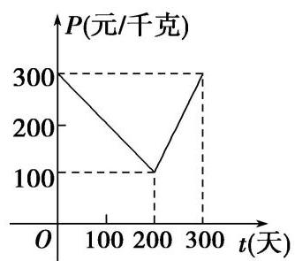

图①

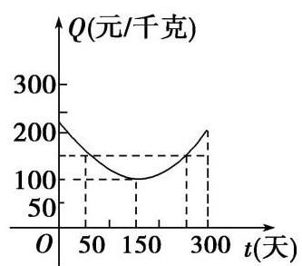

图②

(1)写出图①中表示的市场售价与上市时间的函数关系式 $P = f\left( t\right)$ ，写出图②中表示的种植成本与上市时间的函数关系式 $Q = g\left( t\right)$ ;

(2)若市场售价减去种植成本为纯收益，则何时上市该药材的纯收益最大？

【例 7】对于定义域为 $D$ 的函数 $y = f\left( x\right)$ ,如果存在区间 $\left\lbrack  {m, n}\right\rbrack   \subseteq  D\left( {m < n}\right)$ ,同时满足: ① $f\left( x\right)$ 在 $\left\lbrack  {m, n}\right\rbrack$ 内是单调函数；②当定义域是 $\left\lbrack  {m, n}\right\rbrack$ 时， $f\left( x\right)$ 的值域也是 $\left\lbrack  {m, n}\right\rbrack$ . 则称函数 $f\left( x\right)$ 是区间 $\left\lbrack  {m, n}\right\rbrack$ 上的“保值函数”.

(1)求证:函数 $g\left( x\right)  = {x}^{2} - {2x}$ 不是定义域 $\left\lbrack  {0,1}\right\rbrack$ 上的“保值函数”；

(2)已知 $f\left( x\right)  = 2 + \frac{1}{a} - \frac{1}{{a}^{2}x}\left( {a \in  R, a \neq  0}\right)$ 是区间 $\left\lbrack  {m, n}\right\rbrack$ 上的“保值函数”，求 $a$ 的取值范围.

## 巩固训练

1、已知函数 $f\left( x\right)  = \left| x\right|  + \frac{a}{x} - 2$ ，若函数 $y = f\left( {x - a}\right)$ 有三个不同的零点，则实数 $a$ 取值范围是( )

A. $\left( {-1,0}\right)  \cup  \left( {0,1}\right)$ B. $\left( {-3,0}\right)  \cup  \left( {0,3}\right)$

C. $\left( {-3\sqrt{2},0}\right)  \cup  \left( {0,3\sqrt{2}}\right)$ D. $\left( {-6,0}\right)  \cup  \left( {0,6}\right)$

2、已知函数 $f\left( x\right)  = \left\{  \begin{array}{l} \left( {x + 1}\right) {e}^{x}, x < 1, \\  {x}^{2} - {2x}, x \geq  1, \end{array}\right.$ 则函数 $f\left( x\right)$ 的值域为___. 若函数 $g\left( x\right)  = f\left( x\right)  - k$ 有 3 个零点， 则 $k$ 的范围是___.

3、设函数 $f\left( x\right)  = \left\{  \begin{matrix} {2}^{x} + 1, x \leq  1 \\  {\log }_{3}x + {3}^{a}, x > 1 \end{matrix}\right.$ ，若 $f\left( {f\left( 1\right) }\right)  > 4$ ，则实数 $a$ 的取值范围___.

4、直角梯形 ${ABCD}$ ，如图(1)，动点 $P$ 从 $B$ 点出发，沿 $B \rightarrow  C \rightarrow  D \rightarrow  A$ 运动，设点 $P$ 运动的路程为 $x$ ， $\bigtriangleup  {ABP}$ 的面积为 $f\left( x\right)$ . 如果函数 $y = f\left( x\right)$ 的图象如图 (2) 所示，则 $\bigtriangleup  {ABC}$ 的面积为___

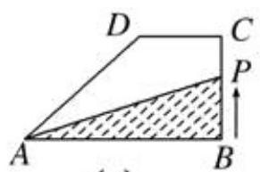

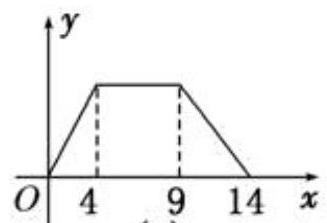

(1) (2)

5、如图， $\bigtriangleup  {OAB}$ 是边长为 4 的正三角形，记 $\bigtriangleup  {OAB}$ 位于直线 $x = t\left( {0 < t < 6}\right)$ 左侧的图形的面积为 $f\left( t\right)$ ，求函数 $f\left( t\right)$ 的解析式.

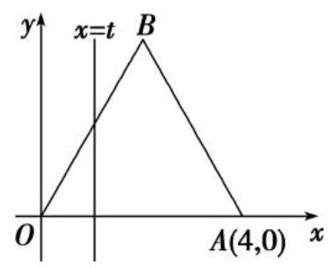

## (二)函数的性质

## 例题精讲

【例 8】已知函数 $f\left( x\right)  = \frac{x}{{x}^{2} + 1}$ . 关于 $f\left( x\right)$ 的性质,有以下四个推断:

① $f\left( x\right)$ 的定义域是 $\left( {-\infty , + \infty }\right)$ ； ② $f\left( x\right)$ 是奇函数；

③ $f\left( x\right)$ 在区间 $\left( {0,1}\right)$ 上单调递增； ④ $f\left( x\right)$ 的值域是 $\left\lbrack  {-\frac{1}{2},\frac{1}{2}}\right\rbrack$ .

其中推断正确的个数是( )

A. 1 B. 2 C. 3 D. 4

【例 9】定义在 $\mathbf{R}$ 上的函数 $f\left( x\right)$ 满足: 对于任意的 ${x}_{1},{x}_{2} \in  \mathbf{R}$ ,都有 $\left\lbrack  {f\left( {x}_{1}\right)  - f\left( {x}_{2}\right) }\right\rbrack   \cdot  \left( {{x}_{1} - {x}_{2}}\right)  > 0$ 恒成立, 且对于任意 $x, y \in  \mathbf{R}$ 都有 $f\left( {x + y}\right)  = f\left( x\right)  \cdot  f\left( y\right)$ ,同时 $f\left( 1\right)  = 3$ ,则不等式 $f\left( {{x}^{2} - x}\right)  < 9$ 的解集为___.

【例 10】已知函数 $f\left( x\right)  = {\log }_{\frac{1}{2}}\frac{3 - {kx}}{x - 3}$ 为奇函数.

(1)求实数 $k$ 的值；

(2)设 $h\left( x\right)  = \frac{3 - {kx}}{x - 3}$ ，证明:函数 $y = h\left( x\right)$ 在 $\left( {3, + \infty }\right)$ 上是减函数；

(3)若函数 $g\left( x\right)  = f\left( x\right)  + {2}^{x} + m$ ，且 $g\left( x\right)$ 在 $\left\lbrack  {4,5}\right\rbrack$ 上只有一个零点，求实数 $m$ 的取值范围.

【例 11】设函数 $f\left( x\right)  = {2x} + \frac{a}{x} + b$ ,其中 $a > 0, b \in  \mathbf{R}$ .

(1)若 $f\left( x\right)$ 在 $\left\lbrack  {1,2}\right\rbrack$ 上不单调，求 $a$ 的取值范围；

(2)记 $M\left( {a, b}\right)$ 为 $\left| {f\left( x\right) }\right|$ 在 $\left\lbrack  {1,2}\right\rbrack$ 上的最大值，求 $M\left( {a, b}\right)$ 的最小值.

【例 12】设 $f\left( x\right)  = {\log }_{\frac{1}{2}}\frac{1 - {ax}}{x - 1} + x$ 为奇函数, $a$ 为常数.

(1)求 $a$ 的值；

(2)判断函数 $f\left( x\right)$ 在 $x \in  \left( {1, + \infty }\right)$ 上的单调性，并说明理由;

(3)若对于区间 $\left\lbrack  {3,4}\right\rbrack$ 上的每一个 $x$ 值，不等式 $f\left( x\right)  > {\left( \frac{1}{2}\right) }^{x} + m$ 恒成立，求实数 $m$ 的取值范围.

## 巩固训练

1、函数 $f\left( x\right)  = \frac{x}{{x}^{2} + a}$ 的图象不可能是( )

A.

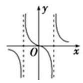

B.

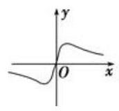

C.

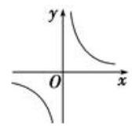

D.

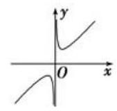

2、下列说法中错误的个数为( )

①图象关于坐标原点对称的函数是奇函数；②图象关于 $y$ 轴对称的函数是偶函数；

③ 奇函数的图象一定过坐标原点; ④偶函数的图象一定与 $y$ 轴相交.

A. 4 B. 3

C. 2 D. 1

3、已知函数 $f\left( x\right)$ 是定义在 $\mathrm{R}$ 上的偶函数,满足 $f\left( x\right)  = f\left( {2 - x}\right)$ ,且当 $x \in  \left\lbrack  {0,1}\right\rbrack$ 时, $f\left( x\right)  = {x}^{2}$ . 若函数 $g\left( x\right)  = f\left( x\right)  - x - a$ 恰有 3 个不同的零点，则实数 $a$ 的取值范围可以是___.

① $\left( {-\frac{5}{4}, - 1}\right)$ ② $\left( {-\frac{1}{4},0}\right)$ ③ $\left( {\frac{3}{4},1}\right)$ ④ $\left( {\frac{7}{4},2}\right)$

4、若函数 $f\left( x\right)$ 同时满足:(i) $f\left( x\right)$ 为偶函数；(ii) 对任意 ${x}_{1},{x}_{2} \in  \lbrack 0, + \infty )$ 且 ${x}_{1} \neq  {x}_{2}$ ，总有 $\left( {{x}_{1} - {x}_{2}}\right) \left\lbrack  {f\left( {x}_{1}\right)  - f\left( {x}_{2}\right) }\right\rbrack   > 0$ ; (iii) 定义域为 $\mathrm{R}$ ,值域为 $\lbrack  - 1,1)$ ,则称函数 $f\left( x\right)$ 具有性质 $P$ ,现有 4 个函数: ① $y = \frac{\left| x\right|  - 1}{\left| x\right|  + 1}$ ，② $y = \frac{1 - {x}^{2}}{1 + {x}^{2}}$ ，③ $y = \frac{{x}^{2} - 1}{{x}^{2} + 1}$ ，④ $y = \frac{{2}^{x} - 1}{{2}^{x} + 1}$ ，其中具有性质 *P 的是___(填上所有满足条件的序号).

5、已知函数 $f\left( x\right)  = \frac{a \cdot  {2}^{x} + a - 2}{{2}^{x} + 1}$ ，其中 $a$ 为常数.

(1)判断函数 $f\left( x\right)$ 的单调性并证明;

(2)若 $a = 1$ ，存在 $x \in  \left( {-2,2}\right)$ 使得方程 $f\left( {{x}^{2} + m + 6}\right)  + f\left( {-{2m}x}\right)  = 0$ 有解，求实数 $m$ 的取值范围.

## (三)反函数

## 例题精讲

【例 13】已知 $f\left( x\right)  = \sqrt{9 - 4{x}^{2}}, x \in  D$ 有反函数 ${f}^{-1}\left( x\right)  =  - \frac{1}{2}\sqrt{9 - {x}^{2}}, x \in  A$ ,则 $f\left( x\right)$ 的定义域 $D$ 可能是( )

A. $\left\lbrack  {-\frac{1}{2},\frac{3}{2}}\right\rbrack$ B. $\left\lbrack  {-\frac{3}{2},0}\right\rbrack$

C. $\left\lbrack  {0,\frac{3}{2}}\right\rbrack$ D. $\left\lbrack  {-3,3}\right\rbrack$

【例 14】已知函数 $y = f\left( x\right)$ 的图象与函数 $y = {2}^{x}$ 的图象关于直线 $y = x$ 对称, $g\left( x\right)$ 为奇函数,且当 $x > 0$ 时, $g\left( x\right)  = f\left( x\right)  - x$ ,则 $g\left( {-8}\right)  =$ (   )

A. -5 B. -6 C. 5 D. 6

【例 15】已知函数 $f\left( x\right)  = {x}^{2} - {2ax} - 3, x \in  \lbrack 1,4)$ 存在反函数，则 $a$ 的取值范围是( )

A. $a \leq  1$ 或 $a \geq  4$ B. $a < 1$ 或 $a \geq  4$ C. $a > 4$ D. $a \leq  1$ 或 $a > 4$

【例 16】已知函数 $f\left( x\right)  = {a}^{x} + x + 1\left( {a > 1}\right) ,{f}^{-1}\left( x\right)$ 为 $f\left( x\right)$ 的反函数，则 ${f}^{-1}\left( {x + 1}\right)$ 的反函数，则 ${f}^{-1}\left( {x + 1}\right)$ 的反函数 $g\left( x\right)$ 的表达式为 ___.

## 巩固训练

1、已知函数 $g\left( x\right)  = f\left( x\right)  + {x}^{2}$ 是奇函数，当 $x > 0$ 时，函数 $f\left( x\right)$ 的图象与函数 $y = {\log }_{2}x$ 的图象关于 $y = x$ 对称， 则 $g\left( {-1}\right)  =$

A. -5 B. -3 C. -1 D. 1

2、定义在 $R$ 上的函数 $f\left( x\right)$ 的反函数为 $y = {f}^{-1}\left( x\right)$ ,若 $f\left( {x + 1}\right)  = {2}^{x} - 1$ ,则 ${f}^{-1}\left( {x + 1}\right)  =$ ___.

3、已知函数 $y = f\left( x\right)$ 的图像过定点 $\left( {3, - 5}\right)$ ，且函数 $y = f\left( x\right)$ 的反函数为 $y = {f}^{-1}\left( x\right)$ ，则函数 $y = {f}^{-1}\left( {1 - {3x}}\right)  - {x}^{2} + 1$ 的图像必过定点___.

4、设函数 $y = f\left( x\right)$ 存在反函数 $y = {f}^{-1}\left( x\right)$ ,且函数 $y = {2x} - f\left( x\right)$ 的图象过点 $\left( {2,3}\right)$ ,则函数 $y = {f}^{-1}\left( x\right)  - {2x}$ 的图象一定过点___.

## (四)函数的图像和零点

## 例题精讲

【例 17】(1)方程 $\lg {\left( x - {100}\right) }^{2} = \frac{7}{2} - \left( {\left| x\right|  - {200}}\right) \left( {\left| x\right|  - {202}}\right)$ 的解的个数为( )

(A) 2 (B) 4 (C) 6 (D) 8

(2)已知函数 $f\left( x\right)  = \left\{  \begin{array}{l} {3}^{-x}\left( {x \leq  0}\right) , \\  \sqrt{x}\left( {x > 0}\right) , \end{array}\right.$ 若函数 $g\left( x\right)  = f\left( x\right)  - \frac{1}{2}x - b$ 有且仅有两个零点,则实数 $\mathrm{b}$ 的取值范围是___.

(3)已知函数 $f\left( x\right)  = \left\{  \begin{array}{l} \left| {\ln x}\right| ,0 < x < e \\  2 - \ln x, x > e \end{array}\right.$ ，若正实数 $a, b, c$ 互不相等，且 $f\left( a\right)  = f\left( b\right)  = f\left( c\right)$ ，则 $a \cdot  b \cdot  c$ 的取值范围为___.

(4)已知函数 $f\left( x\right)$ 满足:①定义域为 $R$ ；②对任意的 $x \in  \mathbf{R}$ ，有 $f\left( {x + 3}\right)  = f\left( x\right)$ ；③当 $x \in  \left\lbrack  {0,3}\right\rbrack$ 时， $f\left( x\right)  = \left\{  \begin{array}{l} {x}^{2},0 \leq  x \leq  1 \\   - \frac{1}{2}x + \frac{3}{2},1 < x \leq  3 \end{array}\right.$ . 若函数 $g\left( x\right)  = \frac{1}{2}\ln x$ ,则函数 $y = f\left( x\right)  - g\left( x\right)$ 在 $\left\lbrack  {0,5}\right\rbrack$ 上零点的个数是( )

A. 1 B. 2 C. 3 D. 4

【例 18】((松江 2017 一模 11)已知函数 $f\left( x\right)  = \left\{  \begin{array}{ll} \sqrt{-{x}^{2} + {4x} - 3}, & 1 \leq  x \leq  3 \\  {2}^{x} - 8, & x > 3 \end{array}\right.$ ，若 $F\left( x\right)  = f\left( x\right)  - {kx}$ 在其定义域内有 3 个零点,则实数 $k \in$ ___

【例 19】函数 $f\left( x\right)  = \left\{  \begin{matrix} a, x = 1 \\  {\left( \frac{1}{2}\right) }^{\left| x - 1\right| } + 1, x \neq  1 \end{matrix}\right.$ ,若关于 $x$ 的方程 $2{\left\lbrack  f\left( x\right) \right\rbrack  }^{2} - \left( {{2a} + 3}\right)  \cdot  f\left( x\right)  + {3a} = 0$ 有五个不同的实数解,求 $a$ 的取值范围.

## 巩固训练

1、关于函数 $f\left( x\right)  = \frac{\left| x\right| }{\left.\parallel  x\left| -1\right| \right| }$ ,给出以下四个命题:

(1)当 $x > 0$ 时， $y = f\left( x\right)$ 单调递减且没有最值;

(2)方程 $f\left( x\right)  = {kx} + b\left( {k \neq  0}\right)$ 一定有实数解;

(3)如果方程 $f\left( x\right)  = m$ ( $m$ 为常数)有解，则解的个数一定是偶数；

(4) $y = f\left( x\right)$ 是偶函数且有最小值.

其中正确的命题个数为( )

A. 1 B. 2 C. 3 D. 4

2、已知函数 $f\left( x\right)$ 是定义在 $\left( {-\infty ,0}\right)  \cup  \left( {0, + \infty }\right)$ 上的偶函数,且当 $x > 0$ 时, $f\left( x\right)  = \left\{  \begin{array}{l} {\left( x - 2\right) }^{2},0 < x \leq  4 \\  \frac{1}{2}f\left( {x - 4}\right) , x > 4 \end{array}\right.$ ,则方程 $f\left( x\right)  = 1$ 解的个数为( )

A. 4 B. 6 C. 8 D. 10

3、定义域和值域均为 $\left\lbrack  {-a, a}\right\rbrack$ (常数 $a > 0$ ) 的函数 $y = f\left( x\right)$ 和 $y = g\left( x\right)$ 的图象如图所示,则方程 $f\left\lbrack  {g\left( x\right) }\right\rbrack   = 0$ 解的个数为( )

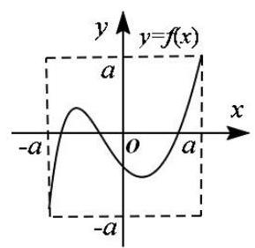

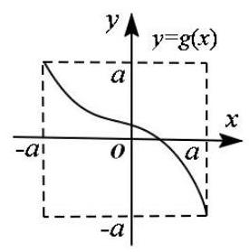

(a) (b)

A. 1 B. 2 C. 3 D. 4

## (五)常用函数模型

例题精讲

【例 20】(1)设 $f\left( x\right)  = \left\{  \begin{array}{l} x, x \in  \left( {-\infty , a}\right) \\  {x}^{2}, x \in  \lbrack a, + \infty ) \end{array}\right.$ ，若 $\mathrm{f}\left( 2\right)  = 4$ ，则 $\mathrm{a}$ 的取值范围为___.

( 2 )已知函数 $f\left( x\right)  = \left\{  \begin{matrix}  - {4x} + 1 & x >  - 1 \\  {x}^{2} + {6x} + {10} & x \leq   - 1 \end{matrix}\right.$ 关于 $x$ 的不等式 $f\left( x\right)  - {mx} - {2m} - 2 < 0$ 的解集是 $\left( {{x}_{1},{x}_{2}}\right)  \cup  \left( {{x}_{3}, + \infty }\right)$ ,若 ${x}_{1}{x}_{2}{x}_{3} > 0$ ,则 ${x}_{1} + {x}_{2} + {x}_{3}$ 的取值范围是___

【例 21】已知函数 $f\left( x\right)  = \left| {x - a}\right|  - \frac{9}{x} + a, x \in  \left\lbrack  {1,6}\right\rbrack  , a \in  R$ .

(1)若 $a = 1$ ，试判断并用定义证明函数 $f\left( x\right)$ 的单调性；

(2)当 $a \in  \left( {1,3}\right)$ 时，求证函数 $f\left( x\right)$ 存在反函数.

巩固训练

1、已知函数 $f\left( x\right)  = \left\{  \begin{array}{l} \frac{1}{\left| {x - 1}\right|  - 1}, x \in  \left( {-\infty ,0}\right)  \cup  \left( {0,2}\right)  \cup  \left( {2, + \infty }\right) \\  1, x \in  \{ 0,2\}  \end{array}\right.$ ,则关于方程 $a{\left\lbrack  f\left( x\right) \right\rbrack  }^{2} + {bf}\left( x\right)  + c = 0\left( {a \neq  0}\right)$ ,下列说法错误的是 ( )

A. 上述方程没有实数根的充分不必要条件是 ${b}^{2} - {4ac} < 0$

B. 若 $a = 1, b = 1, c =  - 2$ ，则方程有 6 个根，且满足所有根的和为 6

C. 若 $a = 1, b =  - 1, c = 0$ ,则方程有 4 个根,记这四个根分别为 ${x}_{1},{x}_{2},{x}_{3},{x}_{4}$ 则有 ${x}_{1}^{2} + {x}_{2}^{2} + {x}_{3}^{2} + {x}_{4}^{2} = {14}$

D. 若 $a = 2, b = 3, c = 1$ ，则方程有 3 个根，且满足所有根的和为 3

2、2020 年 12 月 8 日，中尼两国联合对外宣布，经过两国团队的扎实工作，珠穆朗玛峰的最新高程为 8848.86 米. 已知大气压强 $p\left( \mathrm{{Pa}}\right)$ 随高度 $h\left( \mathrm{\;m}\right)$ 的变化满足关系式 $\ln {P}_{0} - \ln p = {kh},{P}_{0}$ 是海平面大气压强， $k = {0.000126}{\mathrm{\;m}}^{-1}$ ， 则珠穆朗玛峰峰顶的大气压强是海平面大气压强的( )(取 0.000126×8848.86=1.1)

A. $\frac{1}{{e}^{0.1}}$ B. $\frac{1}{{e}^{0.9}}$ C. $\frac{1}{{e}^{1.1}}$ D. $\frac{1}{{e}^{2.1}}$

3、设函数 $f\left( x\right)  = \left\{  \begin{array}{l} {x}^{3}, x \leq  a \\  {x}^{2}, x > a \end{array}\right.$ ，若 $f\left( 2\right)  > 4$ ，则 $a$ 的取值范围为___.

4、第 24 届冬季奥林匹克运动会，即 2022 年北京冬季奥运会，计划于 2022 年 2 月 4 日星期五开幕，2 月 20 日星期日闭幕. 该奥运会激发了大家对冰雪运动的热情, 与冰雪运动有关的商品销量持续增长. 对某店铺某款冰雪运动装备在过去的一个月内(以 30 天计)的销售情况进行调查发现:该款冰雪运动装备的日销售单价 $P\left( x\right)$ (元/套) 与时间 $x$ (被调查的一个月内的第 $x$ 天) 的函数关系近似满足 $P\left( x\right)  = {2000} + \frac{k}{\sqrt{x + 1}}$ (常数 $k > 0$ ). 该款冰雪运动装备的日销售量 $Q\left( x\right)$ (套)与时间 $x$ 的部分数据如下表所示: 已知第 24 天该商品的日销售收入为 32400 元.

<table><tr><td>$x$</td><td>3</td><td>8</td><td>15</td><td>24</td></tr><tr><td>$Q\left( x\right)$ (套)</td><td>12</td><td>13</td><td>14</td><td>15</td></tr></table>

(1)求 $k$ 的值.

(2)给出以下三种函数模型:① $Q\left( x\right)  = t{a}^{x} + b$ ; ② $Q\left( x\right)  = p{\left( x - {16}\right) }^{2} + q$ ; ③ $Q\left( x\right)  = m\sqrt{x + 1} + n$ . 请你依据上表中的数据,从以上三种函数模型中,选择你认为最合适的一种函数模型,来描述该商品的日销售量 $Q\left( x\right)$ 与时间 $x$ 的关系,说明你选择的理由. 根据你选择的模型,预估该商品的日销售收入 $f\left( x\right) \left( {1 \leq  x \leq  {30}, x \in  {\mathrm{N}}_{ + }}\right)$ (元)在哪一天达到最低.

## (六)函数的综合

## 例题精讲

【例 22】设函数 $f\left( x\right)  = \left| {\frac{2}{x} - {ax} + 5}\right| \left( {a \in  \mathbf{R}}\right)$ .

(1)求函数的零点；

(2)当 $a = 3$ 时，求证: $f\left( x\right)$ 在区间 $\left( {-\infty , - 1}\right)$ 上单调递减；

(3)若对任意的正实数 $a$ ，总存在 ${x}_{0} \in  \left\lbrack  {1,2}\right\rbrack$ ，使得 $f\left( {x}_{0}\right)  \geq  m$ ，求实数 $m$ 的取值范围.

【例 23】已知: 函数 $g\left( x\right)  = a{x}^{2} - {2ax} + 1 + b\;\left( {a \neq  0, b < 1}\right)$ ,在区间 $\left\lbrack  {2,3}\right\rbrack$ 上有最大值 4,最小值 1,设函数 $f\left( x\right)  = \frac{g\left( x\right) }{x}$ .

(1)求 $a$ 、 $b$ 的值及函数 $f\left( x\right)$ 的解析式；

(2)若不等式 $f\left( {2}^{x}\right)  - k \cdot  {2}^{x} \geq  0$ 在 $x \in  \left\lbrack  {-1,\;1}\right\rbrack$ 时恒成立，求实数 $k$ 的取值范围；

(3)如果关于 $x$ 的方程 $f\left( \left| {{2}^{x} - 1}\right| \right)  + t \cdot  \left( {\frac{4}{\left| {2}^{x} - 1\right| } - 3}\right)  = 0$ 有三个相异的实数根，求实数 $t$ 的取值范围.

## 巩固训练

1、已知函数 $f\left( x\right)  = \left\{  \begin{array}{l} \frac{\left| x\right| }{\left| x - 1\right| }, x < 1 \\  {x}^{2} - {6x} + 9, x \geq  1 \end{array}\right.$ ,若方程 $f\left( x\right)  = a$ 有四个不同的根 ${x}_{1},{x}_{2},{x}_{3},{x}_{4}$ ,则 $\frac{1}{{x}_{1}} + \frac{1}{{x}_{2}} + \frac{1}{{x}_{3}} + \frac{1}{{x}_{4}}$ 的取值范围是___.

2、已知定义域为 $R$ 的函数 $f\left( x\right)  = \frac{{b}^{x} + n}{-2{b}^{x} - 2}$ 是奇函数,且指数函数 $y = {b}^{x}$ 的图象过点 $\left( {2,4}\right)$ .

( I ) 求 $f\left( x\right)$ 的表达式;

(II) 若方程 $f\left( {{x}^{2} + {3x}}\right)  + f\left( {-a + x}\right)  = 0, x \in  \left( {-4, + \infty }\right)$ 恰有 2 个互异的实数根,求实数 $a$ 的取值集合;

(III) 若对任意的 $t \in  \left\lbrack  {-1,1}\right\rbrack$ ,不等式 $f\left( {{t}^{2} - {2a}}\right)  + f\left( {{at} - 1}\right)  \geq  0$ 恒成立,求实数 $a$ 的取值范围.
