## 知识梳理

## 第 6 课:函数专题

<table><tr><td>教学目标</td><td>1、掌握函数的基本性质认知理解判断方法；   2、灵活掌握函数性质的应用特点和应用方向;   3、综合应函数性质解决有关问题；   4、学会函数中常用的数学思想方法，培养学生综合分析与应用能，体会函数类问题基本解题方向与策略.</td></tr><tr><td>重点</td><td>1、基本性质灵活的应用特征；   2、数学思想的灵活应用意识；   3、加强综合分析问题的能力.</td></tr><tr><td>难点</td><td>1、基本性质灵活的应用特征;   2、数学思想的灵活应用意识；   3、加强综合分析问题的能力.</td></tr></table>

函数的性质是研究初等函数的基石，也是高考考查的重点内容，所涉及到的函数主要是二次函数、指数函数、对数函数、分段函数及抽象函数的有关性质, 要求学生能够利用函数性质灵活解题. 在复习中要肯于在对定义的深入理解上下功夫，复习函数的性质，可以从 “数” 和 “形” 两个方面，从理解函数的一些性质的定义入手，在判断和证明函数的性质的问题中得以巩固、综合题要充分运用好常用的数学思想和方法， 并充分调动好函数的基本性质, 将难题分解为几个简单的点逐个解决。

1. 函数的基本性质: 奇偶性、单调性、周期性的判断方法与应用特点: ”形” 对称作图, 平移作图; ”数” f (-x) 与 $f\left( x\right) , f\left( {x + T}\right)$ 互求以及 $x, y$ 大小变化互求,大小比较,最值值域求解;

2. 解函数题型的基本方向:有形用形(直观)、没形用数(精确、表达清楚)、数形结合为佳

3. 函数中常用的数学思想:分类讨论、数形结合、函数与方程

3. 解综合性函数题时的基本策略:以基本性质的应用为基础，重视概念理解与应用，重视基本方法，难题要想到数学思想的渗透

## (一)函数的概念和三要素

## 例题精讲

【例 1】(1)已知函数 $f\left( {x - 1}\right)$ 的定义域为 $\left\lbrack  {1,9}\right\rbrack$ ，则函数 $g\left( x\right)  = f\left( {2x}\right)  + \sqrt{8 - {2}^{x}}$ 的定义域为___.

【难度】 $\star   \star   \star$

【答案】 $\left\lbrack  {0,3}\right\rbrack$

【解析】 $\because f\left( {x - 1}\right)$ 的定义域为 $\left\lbrack  {1,9}\right\rbrack  ,\therefore 1 \leq  x \leq  9$ ,即 $0 \leq  x - 1 \leq  8$ ,

即 $f\left( x\right)$ 的定义域是 $\left\lbrack  {0,8}\right\rbrack$ ,要使函数 $g\left( x\right)  = f\left( {2x}\right)  + \sqrt{8 - {2}^{x}}$ 有意义,

则 $\left\{  \begin{array}{l} 0 \leq  {2x} \leq  8 \\  8 - {2}^{x} \geq  0 \end{array}\right.$ ,得 $\left\{  \begin{array}{l} 0 \leq  x \leq  4 \\  x \leq  3 \end{array}\right.$ ,得 $0 \leq  x \leq  3$ ,即函数 $g\left( x\right)$ 的定义域为 $\left\lbrack  {0,3}\right\rbrack$ ,故答案为: $\left\lbrack  {0,3}\right\rbrack$ .

(2)若函数 $f\left( x\right)  = \sqrt{{2}^{{x}^{2} - {2ax} - a} - \frac{1}{2}}$ 的定义域是 $R$ ，则实数 $a$ 的取值范围是___.

【难度】 $\star   \star   \star$

【答案】 $\left\lbrack  {\frac{-1 - \sqrt{5}}{2},\frac{-1 + \sqrt{5}}{2}}\right\rbrack$

【解析】由函数 $f\left( x\right)  = \sqrt{{2}^{{x}^{2} - {2ax} - a} - \frac{1}{2}}$ 的定义域为 $\mathrm{R}$ ,得 ${2}^{{x}^{2} - {2ax} - a} - \frac{1}{2} \geq  0$ 恒成立,化简得 ${x}^{2} - {2ax} - a + 1 \geq  0$ 恒成立, 所以由 $\Phi  = 4{a}^{2} - 4\left( {1 - a}\right)  \leq  0$ 解得: $\left\lbrack  {\frac{-1 - \sqrt{5}}{2},\frac{-1 + \sqrt{5}}{2}}\right\rbrack$ .

故答案为: $\left\lbrack  {\frac{-1 - \sqrt{5}}{2},\frac{-1 + \sqrt{5}}{2}}\right\rbrack$ .

(3)已知函数 $y = {a}^{x} + b\;\left( {a > 0\text{ 且 }a \neq  1}\right)$ 的定义域和值域都是 $\left\lbrack  {-1,0}\right\rbrack$ ,求 $a + b$ 的值.

【难度】 $\star   \star   \star$

【答案】 $a + b =  - \frac{3}{2}$ .

【解析】当 $a > 1, y = {a}^{x} + b$ 为增函数,所以 $\left\{  \begin{array}{l} {a}^{-1} + b =  - 1, \\  {a}^{0} + b = 0 \end{array}\right.$ , $b =  - 1, a$ 无解,即方程组无解; 当 $0 < a < 1$ ， $y = {a}^{x} + b$ 为减函数，所以 $\left\{  \begin{array}{l} {a}^{-1} + b = 0 \\  {a}^{0} + b =  - 1 \end{array}\right.$ ，即 $\left\{  \begin{array}{l} a = \frac{1}{2}, \\  b =  - 2 \end{array}\right.$ 符合题意. 所以 $a + b =  - \frac{3}{2}$ .

(4)已知函数 $f\left( x\right)  = \left\{  \begin{array}{ll} \left( {1 + {2a}}\right) x - a, & x < 0 \\  {\log }_{2}\left( {x + 1}\right) , & x \geq  0 \end{array}\right.$ 的值域为 $R$ ，则实数 $a$ 的范围是___.

【难度】 $\star   \star   \star$

【答案】 $- \frac{1}{2} < a \leq  0$

【解析】当 $x \geq  0$ 时, $f\left( x\right)  = {\log }_{2}x \geq  0$ ,因此当 $x < 0$ 时, $f\left( x\right)  = \left( {1 + {2a}}\right) x - a$ 的取值范围应包含 $\left( {-\infty ,0}\right)$ , $\therefore \left\{  \begin{array}{l} 1 + {2a} > 0 \\   - a \geq  0 \end{array}\right.$ ,解得 $- \frac{1}{2} < a \leq  0$ . 故答案为 $- \frac{1}{2} < a \leq  0$ .

【例 2】( 1 )若函数 $f\left( x\right)  = {\log }_{a}\left( {{x}^{2} - \frac{a}{2}x + 1}\right) ,\left( {a > 0, a \neq  1}\right)$ 没有最小值，则实数 $a$ 的取值范围是___.

【难度】 $\star   \star   \star$

【答案】 $\left( {0,1}\right)  \cup  \lbrack 4, + \infty )$

【解析】当 $0 < a < 1$ 时, $y = {\log }_{a}x$ 在 $\left( {0, + \infty }\right)$ 单调递减, $\because y = {x}^{2} - \frac{a}{2}x + 1$ 没有最大值,

$\therefore f\left( x\right)  = {\log }_{a}\left( {{x}^{2} - \frac{a}{2}x + 1}\right)$ 没有最小值,符合题意;

当 $a > 1$ 时, $y = {\log }_{a}x$ 在 $\left( {0, + \infty }\right)$ 单调递增,则可得当 ${x}^{2} - \frac{a}{2}x + 1 \leq  0$ 有解时, $f\left( x\right)  = {\log }_{a}\left( {{x}^{2} - \frac{a}{2}x + 1}\right)$ 没有最小值,

$\therefore \Delta  = {\left( -\frac{a}{2}\right) }^{2} - 4 \geq  0$ ,解得 $a \geq  4$ ,综上, $a$ 的取值范围为 $\left( {0,1}\right)  \cup  \lbrack 4, + \infty )$ . 故答案为: $\left( {0,1}\right)  \cup  \lbrack 4, + \infty )$ .

(2)已知 $a > \frac{1}{3}$ ，函数 $f\left( x\right)  = \lg \left( {\left| {x - a}\right|  + 1}\right)$ 在区间 $\left\lbrack  {0,{3a} - 1}\right\rbrack$ 上有最小值 0，且有最大值为 $\lg \left( {a + 1}\right)$ ，则实数 $a$ 的取值范围是___；

【难度】 $\star   \star   \star$

【答案】 $\left\lbrack  {\frac{1}{2},1}\right\rbrack$

【解析】函数 $f\left( x\right)  = \lg \left( {\left| {x - a}\right|  + 1}\right)$ 在 $\left( {-\infty , a}\right)$ 上是减函数，在 $\left( {a, + \infty }\right)$ 上是增函数，

$f\left( 0\right)  = \lg \left( {\left| a\right|  + 1}\right)  = \lg \left( {a + 1}\right) ,\;f\left( a\right)  = \lg 0,$

当 $\lg \left( {\left| {x - a}\right|  + 1}\right)  = \lg \left( {a + 1}\right)$ 时,解得 $x = 0$ ,或 $x = {2a}$ ,

因为函数 $f\left( x\right)  = \lg \left( {\left| {x - a}\right|  + 1}\right)$ 在区间 $\left\lbrack  {0,{3a} - 1}\right\rbrack$ 上有最小值 0,且有最大值为 $\lg \left( {a + 1}\right)$ ,

因为 $a > \frac{1}{3}$ ,所以有 $\left\{  {\begin{array}{l} {3a} - 1 \geq  a \\  {3a} - 1 \leq  {2a} \end{array} \Rightarrow  \frac{1}{2} \leq  a \leq  1}\right.$ ,因此 $\frac{1}{2} \leq  a \leq  1$ ,故答案为: $\left\lbrack  {\frac{1}{2},1}\right\rbrack$

【例 3】设 $D$ 是含数 1 的有限实数集， $f\left( x\right)$ 是定义在 $D$ 上的函数，若 $f\left( x\right)$ 的图像绕原点逆时针旋转 $\frac{\pi }{6}$ 后与原图像重合,则在以下各项中, $f\left( 1\right)$ 的可能值只能是 ( ).

A. 0

B. $\frac{\sqrt{3}}{3}$ C. $\frac{\sqrt{3}}{2}$ D. $\sqrt{2}$

【难度】★★★★

【答案】C

【解析】由题意可得: 问题可转化为圆上有 12 个点为一组,每次绕原点逆时针旋转 $\frac{\pi }{6}$ 个单位后与下一个点会重合,则通过代入和赋值的方法,当 $f\left( 1\right)  = \sqrt{3},\frac{\sqrt{3}}{3},0$ 时,此时得到圆心角为 $\frac{\pi }{3},\frac{\pi }{6},0$ ,然而此时 $x = 0$ 或 $x = 1$ 时，都有 2 个 $y$ 与之对应，根据函数的定义，自变量与应变量只能“一对一”或“多对一”，不能“一对

多”,因此,只有当 $x = \frac{\sqrt{3}}{2}$ 时,此时旋转 $\frac{\pi }{6}$ ,满足一个 $x$ 对应一个 $y$ ,所以 $f\left( 1\right)$ 的可能值只能是 $\frac{\sqrt{3}}{2}$ , 故选:C.

【例 4】(1)已知函数 $f\left( x\right)$ 的定义域为 $\{ 0,1,2\}$ ，值域为 $\{ 0,1\}$ ，则满足条件的函数 $f\left( x\right)$ 的个数为v___( )

A. 1 个 B. 6 个 C. 8 个 D. 无数个

【难度】 $\star   \star   \star$

【答案】B

【解析】满足条件的函数 $f\left( x\right)$ 有: $f\left( 0\right)  = 0, f\left( 1\right)  = 1, f\left( 2\right)  = 1$ ;

$f\left( 0\right)  = 1, f\left( 1\right)  = 0, f\left( 2\right)  = 0;f\left( 1\right)  = 0, f\left( 0\right)  = 1, f\left( 2\right)  = 1;$

$f\left( 1\right)  = 1, f\left( 0\right)  = 0, f\left( 2\right)  = 0;f\left( 2\right)  = 0, f\left( 0\right)  = 1, f\left( 1\right)  = 1;$

$f\left( 2\right)  = 1, f\left( 0\right)  = 0, f\left( 1\right)  = 0$ ,满足条件的函数有 6 个. 故选:B.

(2)已知函数 $f\left( x\right)  = \frac{4}{\left| x\right|  + 2} - 1$ 的定义域是 $\left\lbrack  {a, b}\right\rbrack$ ( $a, b$ 为整数)，值域是 $\left\lbrack  {0,1}\right\rbrack$ ，则满足条件的整数数对 $\left( {a, b}\right)$ 的个数是( )

A. 3 B. 4 C. 5 D. 6

【难度】 $\star   \star   \star   \star$

【答案】C

【解析】由 $f\left( x\right)  = \frac{4}{\left| x\right|  + 2} - 1 = 0$ ,得 $\left| x\right|  + 2 = 4$ ,得 $x = 2$ 或 $x =  - 2$ .

由 $f\left( x\right)  = \frac{4}{\left| x\right|  + 2} - 1 = 1$ ,得 $\left| x\right|  + 2 = 2$ ,得 $x = 0$ .

易知函数在 $x > 0$ 时, $f\left( x\right)  = \frac{4}{x + 2} - 1, f\left( x\right)$ 为减函数,

此时函数 $f\left( x\right)$ 的图像是由 $f\left( x\right)  = \frac{4}{x}$ 的图像平移而得到.

又由函数 $f\left( x\right)$ 为偶函数,可做出函数 $f\left( x\right)$ 的图像.

$f\left( x\right)$ 的定义域是 $\left\lbrack  {a, b}\right\rbrack  \left( {a, b\text{ 为整数 }}\right)$ ,值域是 $\left\lbrack  {0,1}\right\rbrack$

根据图象可知满足整数数对的有 $\left( {-2,0}\right) ,\left( {-2,1}\right) ,\left( {-2,2}\right) ,\left( {0,2}\right) ,\left( {-1,2}\right)$ 共 5 个. 故选: $\mathcal{C}$

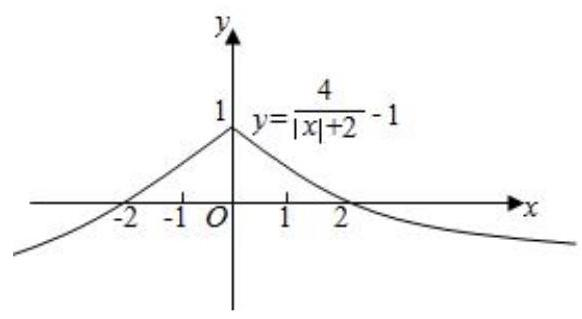

【例 5】设 $f\left( x\right)$ 是定义在 $R$ 上以 2 为周期的偶函数,已知 $x \in  \left( {0,1}\right) , f\left( x\right)  = {\log }_{\frac{1}{2}}\left( {1 - x}\right)$ ,则函数 $f\left( x\right)$ 在 $\left( {1,2}\right)$ 上的解析式是___

【难度】 $\star   \star   \star$

【答案】 $f\left( x\right)  = {\log }_{\frac{1}{2}}\left( {x - 1}\right)$

【解析】根据题意,由于 $f\left( x\right)$ 是定义在 $R$ 上以 2 为周期的偶函数,那么当 $x \in  \left( {0,1}\right) , f\left( x\right)  = {\log }_{\frac{1}{2}}\left( {1 - x}\right)$ , 可知当 $x \in  \left\lbrack  {-1,0}\right\rbrack$ ， $f\left( {-x}\right)  = {\log }_{\frac{1}{2}}\left( {1 + x}\right)  = f\left( x\right)$ ，那么利用周期性可知， $f\left( x\right)$ 在(1,2)上的解析式就是将 $\mathrm{x} \in  \left\lbrack  {-1,0}\right\rbrack  , f\left( {-x}\right)  = {\log }_{\frac{1}{2}}\left( {1 + x}\right)  = f\left( x\right)$ 的图像向右平移 2 个单位得到的,因此可知 $f\left( x\right)  = {\log }_{\frac{1}{2}}\left( {x - 1}\right)$ ,答案为 $f\left( x\right)  = {\log }_{\frac{1}{2}}\left( {x - 1}\right)$ .

【例 6】某药材种植基地准备种植某种药材, 从历年市场行情可知, 从 2 月 1 日起的 300 天内, 该药材的市场售价 $P\left( \text{ 元/千克 }\right)$ 与上市时间 $t$ (天)的关系可以用如图①所示的一条折线表示，该药材的种植成本 $Q$ (元/千克) 与上市时间 $t$ (天)的关系可以用如图②所示的抛物线表示.

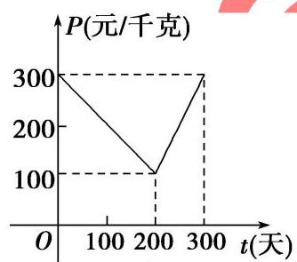

图①

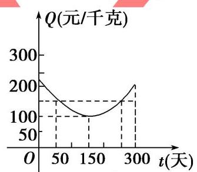

图②

(1)写出图①中表示的市场售价与上市时间的函数关系式 $P = f\left( t\right)$ ，写出图②中表示的种植成本与上市时间的函数关系式 $Q = g\left( t\right)$ ；

(2)若市场售价减去种植成本为纯收益，则何时上市该药材的纯收益最大？

【难度】 $\star   \star   \star$

【答案】(1) $f\left( t\right)  = \left\{  \begin{array}{l} {300} - t,0 \leq  t \leq  {200} \\  {2t} - {300},{200} < t \leq  {300} \end{array}\right.$ , $g\left( t\right)  = \frac{1}{200}{\left( t - {150}\right) }^{2} + {100},0 \leq  t \leq  {300}$ ;

(2)从 2 月 1 日开始的第 50 天上市，该药材的纯收益最大，最大纯收益为 100 元/千克.

【解析】(1) 由图①知，当 $0 \leq  t \leq  {200}$ 时，令 $P = {at} + b$ ，则有 $\left\{  \begin{array}{l} b = {300} \\  {200a} + b = {100} \end{array}\right.$ ，解得 $\left\{  \begin{array}{l} a =  - 1 \\  b = {300} \end{array}\right.$ ，即有 $P = {300} - t$ ， $0 \leq  t \leq  {200},$

当 ${200} < t \leq  {300}$ 时，同理得: $P = {2t} - {300}$ ，

所以市场售价与上市时间的函数关系式为 $P = f\left( t\right)  = \left\{  \begin{array}{l} {300} - t,0 \leq  t \leq  {200} \\  {2t} - {300},{200} < t \leq  {300} \end{array}\right.$ ,

由图②知，令 $Q = m{\left( t - {150}\right) }^{2} + {100}$ ，而当 $t = {50}$ 时， $Q = {150}$ ，代入解得 $m = \frac{1}{200}$ ，则 $Q = \frac{1}{200}{\left( t - {150}\right) }^{2} + {100}$ ， 所以种植成本与上市时间的函数关系式为 $Q = g\left( t\right)  = \frac{1}{200}{\left( t - {150}\right) }^{2} + {100},0 \leq  t \leq  {300}$ .

(2)设从 2 月 1 日起的第 $t$ 天的纯收益为 $h\left( t\right)$ (元/千克)，由题意得， $h{\left( t\right) }^{-f}\left( t\right)  - g\left( t\right)$ .

即 $h\left( t\right)  = \left\{  \begin{array}{l}  - \frac{1}{200}{t}^{2} + \frac{1}{2}t + \frac{175}{2},0 \leq  t \leq  {200} \\   - \frac{1}{200}{t}^{2} + \frac{7}{2}t - \frac{1025}{2},{200} < t \leq  {300} \end{array}\right.$ ,

当 $0 \leq  t \leq  {200}$ 时, $h\left( t\right)  =  - \frac{1}{200}{\left( t - {50}\right) }^{2} + {100}$ ,则当 $t = {50}$ 时, $h\left( t\right)$ 在区间 $\left\lbrack  {0,{200}}\right\rbrack$ 上取得最大值 100,

当 ${200} < t \leq  {300}$ 时, $h\left( t\right)  =  - \frac{1}{200}{\left( t - {350}\right) }^{2} + {100}$ ,则当 $t = {300}$ 时, $h\left( t\right)$ 在区间 $({200},{300}\rbrack$ 上取得最大值 87.5,而 100>87.5,

综上得,当 $t = {50}$ 时, $h\left( t\right)$ 取得最大值,最大值为 100,

所以从 2 月 1 日开始的第 50 天上市，该药材的纯收益最大，最大纯收益为 100 元/千克.

【例 7】对于定义域为 $D$ 的函数 $y = f\left( x\right)$ ,如果存在区间 $\left\lbrack  {m, n}\right\rbrack   \subseteq  D\left( {m < n}\right)$ ,同时满足: ① $f\left( x\right)$ 在 $\left\lbrack  {m, n}\right\rbrack$ 内是单调函数；②当定义域是 $\left\lbrack  {m, n}\right\rbrack$ 时， $f\left( x\right)$ 的值域也是 $\left\lbrack  {m, n}\right\rbrack$ . 则称函数 $f\left( x\right)$ 是区间 $\left\lbrack  {m, n}\right\rbrack$ 上的“保值函数”.

(1)求证:函数 $g\left( x\right)  = {x}^{2} - {2x}$ 不是定义域 $\left\lbrack  {0,1}\right\rbrack$ 上的“保值函数”；

(2)已知 $f\left( x\right)  = 2 + \frac{1}{a} - \frac{1}{{a}^{2}x}\left( {a \in  R, a \neq  0}\right)$ 是区间 $\left\lbrack  {m, n}\right\rbrack$ 上的“保值函数”，求 $a$ 的取值范围.

【难度】 $\bigstar \bigstar \bigstar \bigstar$

【答案】见解析

【解析】(1)函数 $g\left( x\right)  = {x}^{2} - {2x}$ 在 $x \in  \left\lbrack  {0,1}\right\rbrack$ 时的值域为 $\left\lbrack  {-1,0}\right\rbrack$ ,

不满足 “保值函数” 的定义,因此函数 $g\left( x\right)  = {x}^{2} - {2x}$ 不是定义域 $\left\lbrack  {0,1}\right\rbrack$ 上的 “保值函数”.

( 2 )因 $f\left( x\right)  = 2 + \frac{1}{a} - \frac{1}{{a}^{2}x}$ 在 $\left\lbrack  {m, n}\right\rbrack$ 内是单调增函数，故 $f\left( m\right)  = m, f\left( n\right)  = n$ ， 这说明 $m, n$ 是方程 $2 + \frac{1}{a} - \frac{1}{{a}^{2}x} = x$ 的两个不相等的实根,

其等价于方程 ${a}^{2}{x}^{2} - \left( {2{a}^{2} + a}\right) x + 1 = 0$ 有两个不相等的实根,

由 $\Delta  = {\left( 2{a}^{2} + a\right) }^{2} - 4{a}^{2} > 0$ 解得 $a <  - \frac{3}{2}$ 或 $a > \frac{1}{2}$ . 故 $a$ 的取值范围为 $\left( {-\infty , - \frac{3}{2}}\right)  \cup  \left( {\frac{1}{2}, + \infty }\right)$ .

## 巩固训练

1、已知函数 $f\left( x\right)  = \left| x\right|  + \frac{a}{x} - 2$ ，若函数 $y = f\left( {x - a}\right)$ 有三个不同的零点，则实数 $a$ 取值范围是( )

A. $\left( {-1,0}\right)  \cup  \left( {0,1}\right)$ B. $\left( {-3,0}\right)  \cup  \left( {0,3}\right)$

C. $\left( {-3\sqrt{2},0}\right)  \cup  \left( {0,3\sqrt{2}}\right)$ D. $\left( {-6,0}\right)  \cup  \left( {0,6}\right)$

【难度】 $\star   \star   \star   \star$

【答案】A

【解析】由 $f\left( x\right)  = \left| x\right|  + \frac{a}{x} - 2$ 定义域为 $\left( {-\infty ,0}\right)  \cup  \left( {0, + \infty }\right)$ ,且 $f\left( x\right)  = \left| x\right|  + \frac{a}{x} - 2 = 0$ 可得 $a = {2x} - x\left| x\right|$ ,

$\therefore f\left( x\right)  = \left| x\right|  + \frac{a}{x} - 2$ 有三个零点,当且仅当 $a = {2x} - x\left| x\right|$ 在 $\left( {-\infty ,0}\right)  \cup  \left( {0, + \infty }\right)$ 有三个零点,

$\therefore y = a$ 与 $g\left( x\right)  = {2x} - x\left| x\right|  = \left\{  \begin{array}{l} {x}^{2} + {2x}, x < 0 \\   - {x}^{2} + {2x}, x > 0 \end{array}\right.$ 有三个公共点,而当 $x < 0$ 时 $g\left( x\right)  \geq   - 1$ ,当 $x > 0$ 时 $g\left( x\right)  \leq  1$ , $\therefore y = g\left( x\right)$ 的图象如下,

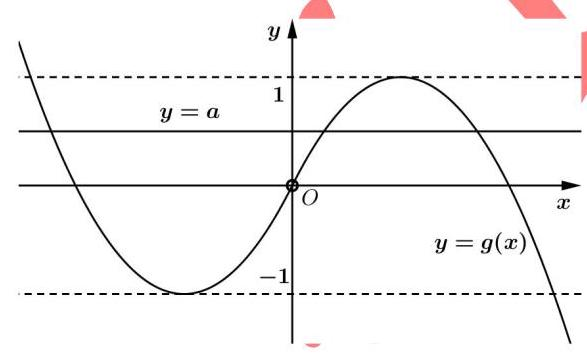

由图知,当 $- 1 < a < 0$ 或 $0 < a < 1$ 时,直线 $y = a$ 与函数 $g\left( x\right)$ 的图象有三个交点,

由 $y = f\left( {x - a}\right)$ 是 $y = f\left( x\right)$ 向左 $\left( {a < 0}\right)$ 或向右 $\left( {a > 0}\right)$ 平移 $\left| a\right|$ 个单位而得,图象左右平移不影响图象与 $x$ 轴交点个数,

$\therefore a$ 的取值范围是 $\left( {-1,0}\right)  \cup  \left( {0,1}\right)$ . 故选: A

2、已知函数 $f\left( x\right)  = \left\{  \begin{array}{l} \left( {x + 1}\right) {e}^{x}, x < 1, \\  {x}^{2} - {2x}, x \geq  1, \end{array}\right.$ 则函数 $f\left( x\right)$ 的值域为___. 若函数 $g\left( x\right)  = f\left( x\right)  - k$ 有 3 个零点， 则 $k$ 的范围是___.

【难度】 $\star   \star   \star   \star$

【答案】 $\lbrack  - 1, + \infty )\;\left( {-{e}^{-2},0}\right)$

【解析】解: 因为 $f\left( x\right)  = \left\{  \begin{array}{l} \left( {x + 1}\right) {e}^{x}, x < 1, \\  {x}^{2} - {2x}, x \geq  1, \end{array}\right.$ ,当 $x < 1$ 时 $f\left( x\right)  = \left( {x + 1}\right) {e}^{x}$ ,则 ${f}^{\prime }\left( x\right)  = \left( {x + 2}\right) {e}^{x}$ ,当 $x <  - 2$ 时 ${f}^{\prime }\left( x\right)  < 0$ ,当 $- 2 < x < 1$ 时 ${f}^{\prime }\left( x\right)  > 0$ ,即 $f\left( x\right)$ 在 $\left( {-\infty , - 2}\right)$ 上单调递减,在 $\left( {-2,1}\right)$ 上单调递增,则当 $x =  - 2$ 时取得极小值,且 $f\left( {-2}\right)  =  - {e}^{-2}$ 当 $x \geq  1$ 时,所以 $f\left( x\right)  = {x}^{2} - {2x} = {\left( x - 1\right) }^{2} - 1$ ,函数图象如下所示:

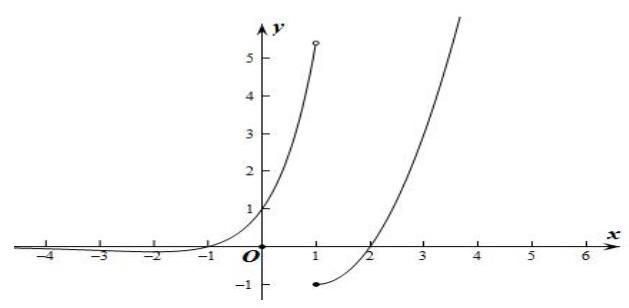

由函数图象可知函数的值域为 $\lbrack  - 1, + \infty )$ ,函数 $g\left( x\right)  = f\left( x\right)  - k$ 有 3 个零点,即 $y = f\left( x\right)$ 与 $y = k$ 有 3 个交点, 所以 $- {e}^{-2} < k < 0$ ,即 $k \in  \left( {-{e}^{-2},0}\right)$

故答案为: $\lbrack  - 1, + \infty ),\left( {-{e}^{-2},0}\right)$

3、设函数 $f\left( x\right)  = \left\{  \begin{matrix} {2}^{x} + 1, x \leq  1 \\  {\log }_{3}x + {3}^{a}, x > 1 \end{matrix}\right.$ ，若 $f\left( {f\left( 1\right) }\right)  > 4$ ，则实数 $a$ 的取值范围___.

【难度】 $\star   \star   \star$

【答案】 $\left( {1, + \infty }\right)$

【解析】因为 $f\left( x\right)  = \left\{  \begin{matrix} {2}^{x} + 1, x \leq  1 \\  {\log }_{3}x + {3}^{a}, x > 1 \end{matrix}\right.$ ,

所以 $f\left( 1\right)  = 2 + 1 = 3$ ,则 $f\left( {f\left( 1\right) }\right)  = f\left( 3\right)  = {\log }_{3}3 + {3}^{a} = 1 + {3}^{a}$ ,

若 $f\left( {f\left( 1\right) }\right)  > 4$ ,则 $1 + {3}^{a} > 4$ ,即 ${3}^{a} > 3$ ,解得 $a > 1$ ,

所以实数 $a$ 的取值范围为 $\left( {1, + \infty }\right)$ . 故答案为: $\left( {1, + \infty }\right)$ .

4、直角梯形 ${ABCD}$ ，如图(1)，动点 $P$ 从 $B$ 点出发，沿 $B \rightarrow  C \rightarrow  D \rightarrow  A$ 运动，设点 $P$ 运动的路程为 $x$ ， $\bigtriangleup  {ABP}$ 的面积为 $f\left( x\right)$ . 如果函数 $y = f\left( x\right)$ 的图象如图 (2) 所示，则 $\bigtriangleup  {ABC}$ 的面积为___

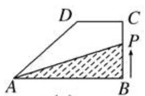

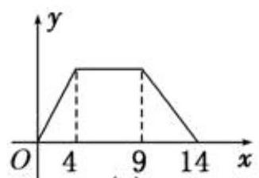

(1) (2)

【难度】 $\star   \star   \star$

【答案】 16

【解析】由题意结合图 (2) 可知: ${BC} = 4,{CD} = 9 - 4 = 5,{AD} = {14} - 9 = 5$ ,

过 $D$ 作 ${DG} \bot  {AB}\;\therefore {AG} = 3$ ，由此可求出 ${AB} = 3 + 5 = 8$ .

${S}_{\bigtriangleup {ABC}} = \frac{1}{2}{AB} \cdot  {BC} = \frac{1}{2} \times  8 \times  4 = {16}$ . 故答案为:16.

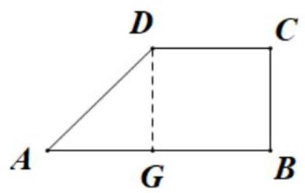

5、如图， $\bigtriangleup  {OAB}$ 是边长为 4 的正三角形，记 $\bigtriangleup  {OAB}$ 位于直线 $x = t\left( {0 < t < 6}\right)$ 左侧的图形的面积为 $f\left( t\right)$ ，求函数 $f\left( t\right)$ 的解析式.

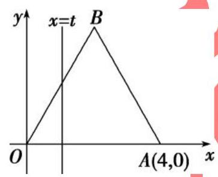

【难度】 $\star   \star   \star$

【答案】 $f\left( t\right)  = \left\{  \begin{array}{l} \frac{\sqrt{3}{t}^{2}}{2},0 < t \leq  2 \\   - \frac{\sqrt{3}}{2}{t}^{2} + 4\sqrt{3}t - 4\sqrt{3},2 < t \leq  4 \\  4\sqrt{3},4 < t < 6 \end{array}\right.$

【解析】当 $0 < t \leq  2$ 时, $f\left( t\right)  = \frac{1}{2} \times  t \times  \sqrt{3}t = \frac{\sqrt{3}{t}^{2}}{2}$ ;

当 $2 < t \leq  4$ 时， $f\left( t\right)  = \frac{1}{2} \times  4 \times  2\sqrt{3} - \frac{1}{2}\left( {4 - t}\right)  \times  \sqrt{3}\left( {4 - t}\right)  = \frac{\sqrt{3}}{2}\overrightarrow{t} + 4\sqrt{3}t - 4\sqrt{3}$ ；

当 $4 < t < 6$ 时, $f\left( t\right)  = \frac{1}{2} \times  4 \times  2\sqrt{3} = 4\sqrt{3}$ .

所以函数 $f\left( t\right)$ 的解析式为 $f\left( t\right)  = \left\{  \begin{array}{l} \frac{\sqrt{3}{t}^{2}}{2},0 < t \leq  2 \\   - \frac{\sqrt{3}}{2}{t}^{2} + 4\sqrt{3}t - 4\sqrt{3},2 < t \leq  4. \\  4\sqrt{3},4 < t < 6 \end{array}\right.$

## (二)函数的性质

## 例题精讲

【例 8】已知函数 $f\left( x\right)  = \frac{x}{{x}^{2} + 1}$ . 关于 $f\left( x\right)$ 的性质,有以下四个推断:

① $f\left( x\right)$ 的定义域是 $\left( {-\infty , + \infty }\right)$ ； ② $f\left( x\right)$ 是奇函数；

③ $f\left( x\right)$ 在区间 $\left( {0,1}\right)$ 上单调递增； ④ $f\left( x\right)$ 的值域是

其中推断正确的个数是( )

A. 1 B. 2 C. 3 D. 4

【难度】★★★

【答案】D

【解析】①因为 ${x}^{2} + 1 \geq  1 \neq  0$ ,所以函数的定义域为 $R$ ,即①正确；

② $f\left( {-x}\right)  = \frac{-x}{{\left( -x\right) }^{2} + 1} =  - \frac{x}{{x}^{2} + 1} =  - f\left( x\right)$ ，所以 $f\left( x\right)$ 是奇函数，即②正确；

③ 任取 ${x}_{1},{x}_{2} \in  \left( {0,1}\right)$ ，且 ${x}_{1} < {x}_{2}$ ，

则 $f\left( {x}_{1}\right)  - f\left( {x}_{2}\right)  = \frac{{x}_{1}}{{x}_{1}^{2} + 1} - \frac{{x}_{2}}{{x}_{2}^{2} + 1} = \frac{{x}_{1}\left( {{x}_{2}^{2} + 1}\right)  - {x}_{2}\left( {{x}_{1}^{2} + 1}\right) }{\left( {{x}_{1}^{2} + 1}\right) \left( {{x}_{2}^{2} + 1}\right) } = \frac{\left( {{x}_{1}{x}_{2} - 1}\right) \left( {{x}_{2} - {x}_{1}}\right) }{\left( {{x}_{1}^{2} + 1}\right) \left( {{x}_{2}^{2} + 1}\right) }$ ,

因为 ${x}_{1},{x}_{2} \in  \left( {0,1}\right)$ ,且 ${x}_{1} < {x}_{2}$ ,所以 ${x}_{1}{x}_{2} - 1 < 0,{x}_{2} - {x}_{1} > 0$ ,所以 $f\left( {x}_{1}\right)  < f\left( {x}_{2}\right)$ ,

即 $f\left( x\right)$ 在区间 $\left( {0,1}\right)$ 上单调递增,所以③正确；

④ 当 $x > 0$ 时, $f\left( x\right)  = \frac{x}{{x}^{2} + 1} = \frac{1}{x + \frac{1}{x}} \leq  \frac{1}{2\sqrt{x \cdot  \frac{1}{x}}} = \frac{1}{2}$ ,

由②知,函数 $f\left( x\right)$ 为奇函数,所以当 $x < 0$ 时, $f\left( x\right)  \geq   - \frac{1}{2}$ , 而当 $x = 0$ 时， $f\left( 0\right)  = 0$ ，所以 $f\left( x\right)$ 的值域是 $\left\lbrack  {-\frac{1}{2},\frac{1}{2}}\right\rbrack$ ，即④正确.

故选: D.

【例 9】定义在 $\mathbf{R}$ 上的函数 $f\left( x\right)$ 满足: 对于任意的 ${x}_{1},{x}_{2} \in  \mathbf{R}$ ,都有 $\left\lbrack  {f\left( {x}_{1}\right)  - f\left( {x}_{2}\right) }\right\rbrack   \cdot  \left( {{x}_{1} - {x}_{2}}\right)  > 0$ 恒成立, 且对于任意 $x, y \in  \mathbf{R}$ 都有 $f\left( {x + y}\right)  = f\left( x\right)  \cdot  f\left( y\right)$ ,同时 $f\left( 1\right)  = 3$ ,则不等式 $f\left( {{x}^{2} - x}\right)  < 9$ 的解集为___.

【难度】 $\star   \star   \star$

【答案】 $\left( {-1,2}\right)$

【解析】不妨设 ${x}_{1} < {x}_{2} \in  \mathbf{R}$ ,由 $\left\lbrack  {f\left( {x}_{1}\right)  - f\left( {x}_{2}\right) }\right\rbrack   \cdot  \left( {{x}_{1} - {x}_{2}}\right)  > 0$ 恒成立,得 $f\left( {x}_{1}\right)  < f\left( {x}_{2}\right)$ 恒成立,可知函数 $f\left( x\right)$ 在在 $\mathbf{R}$ 上单调递增,

$f\left( {x + y}\right)  = f\left( x\right)  \cdot  f\left( y\right)$ ,同时 $f\left( 1\right)  = 3$ ,可知 $f\left( 2\right)  = f\left( 1\right) f\left( 1\right)  = 9$ ,

$\therefore$ 不等式 $f\left( {{x}^{2} - x}\right)  < 9$ 即为 $f\left( {{x}^{2} - x}\right)  < f\left( 2\right)$ ,等价于 ${x}^{2} - x < 2$ ,解得 $- 1 < x < 2$ ,

$\therefore$ 所求不等式的解集为 $\left( {-1,2}\right)$ ,故答案为: $\left( {-1,2}\right)$

【例 10】已知函数 $f\left( x\right)  = {\log }_{\frac{1}{2}}\frac{3 - {kx}}{x - 3}$ 为奇函数.

(1)求实数 $k$ 的值；

(2)设 $h\left( x\right)  = \frac{3 - {kx}}{x - 3}$ ，证明:函数 $y = h\left( x\right)$ 在 $\left( {3, + \infty }\right)$ 上是减函数；

(3)若函数 $g\left( x\right)  = f\left( x\right)  + {2}^{x} + m$ ，且 $g\left( x\right)$ 在 $\left\lbrack  {4,5}\right\rbrack$ 上只有一个零点，求实数 $m$ 的取值范围.

【难度】 $\star   \star   \star   \star$

【答案】(1)1；(2)见解析；(3) $\left\lbrack  {-{30},{\log }_{2}7 - {16}}\right\rbrack$ .

【解析】(1) $\because f\left( x\right)$ 为奇函数, $\therefore f\left( {-x}\right)  =  - f\left( x\right)$ ,

即 ${\log }_{\frac{1}{2}}\frac{3 + {kx}}{-x - 3} =  - {\log }_{\frac{1}{2}}\frac{3 - {kx}}{x - 3} \Rightarrow  {\log }_{\frac{1}{2}}\frac{3 + {kx}}{-x - 3} = {\log }_{\frac{1}{2}}\frac{x - 3}{3 - {kx}}$ ,

$\therefore 9 - {k}^{2}{x}^{2} = 9 - {x}^{2}$ ,整理得 ${k}^{2} = 1,\therefore k =  - 1\left( {k = 1\text{ 使 }f\left( x\right) \text{ 无意义而舍去 }}\right)$ .

( 2 )由 $\left( 1\right) k =  - 1$ ，故 $h\left( x\right)  = \frac{3 + x}{x - 3}$ ，设 $a > b > 3$ ，

$\therefore h\left( a\right)  - h\left( b\right)  = \frac{3 + a}{a - 3} - \frac{3 + b}{b - 3} = \frac{3\left( {b - a}\right) }{\left( {a - 3}\right) \left( {b - 3}\right) }$

$\because a > b > 3$ 时, $b - a < 0, a - 3 > 0, b - 3 > 0,\therefore h\left( a\right)  - h\left( b\right)  < 0$ ,

$\therefore h\left( x\right)$ 在 $\left( {3, + \infty }\right)$ 上时减函数;

(3)由(2)知， $h\left( x\right)$ 在 $\left( {3, + \infty }\right)$ 上单调递减，根据复合函数的单调性可知 $f\left( x\right)$ 在 $\left( {3, + \infty }\right)$ 递增，又 $\because y = {2}^{x}$ 在 $\mathbf{R}$

上单调递增, $\therefore g\left( x\right)  = f\left( x\right)  + {2}^{x} + m$ 在 $\left\lbrack  {4,5}\right\rbrack$ 递增,

$\because g\left( x\right)$ 在区间 $\left\lbrack  {4,5}\right\rbrack$ 上只有一个零点,

$\therefore g\left( 4\right) g\left( 5\right)  \leq  0$ ,解得 $m \in  \left\lbrack  {-{30},{\log }_{2}7 - {16}}\right\rbrack$ .

【例 11】设函数 $f\left( x\right)  = {2x} + \frac{a}{x} + b$ ,其中 $a > 0, b \in  \mathbf{R}$ .

(1)若 $f\left( x\right)$ 在 $\left\lbrack  {1,2}\right\rbrack$ 上不单调,求 $a$ 的取值范围;

(2)记 $M\left( {a, b}\right)$ 为 $\left| {f\left( x\right) }\right|$ 在 $\left\lbrack  {1,2}\right\rbrack$ 上的最大值，求 $M\left( {a, b}\right)$ 的最小值.

【难度】 $\star   \star   \star   \star$

【答案】(1) $a \in  \left( {2,8}\right) \;\left( 2\right) 3 - 2\sqrt{2}$

【解析】(1) 根据对勾函数的单调性和 $f\left( x\right)$ 在 $\left\lbrack  {1,2}\right\rbrack$ 上不单调可知, $1 < \sqrt{\frac{a}{2}} < 2$ ,解出 $a$ 的取值范围; (2) 令 $g\left( x\right)  = {2x} + \frac{a}{x}$ ，根据函数图象即函数对称性可知，当 $1 < \sqrt{\frac{a}{2}} < 2$ ， $f\left( 1\right)  = f\left( 2\right)$ ，且 $b =  - \frac{\mathop{\max }\limits_{{x \in  \left\lbrack  {1,2}\right\rbrack  }}g\left( x\right)  + \mathop{\min }\limits_{{x \in  \left\lbrack  {1,2}\right\rbrack  }}g\left( x\right) }{2}$ 时， $M\left( {a, b}\right)$ 取得最小值.

(1)

由对勾函数函数单调性的定义可知: $f\left( x\right)$ 在 $\left( {0,\sqrt{\frac{a}{2}}}\right)$ 上递减,在 $\left( {\sqrt{\frac{a}{2}}, + \infty }\right)$ 上递增,因此 $f\left( x\right)$ 在 $\left\lbrack  {1,2}\right\rbrack$ 上不单调的充要条件是 $1 < \sqrt{\frac{a}{2}} < 2$ ,解得: $2 < a < 8$ ,所以 $a \in  \left( {2,8}\right)$ ;

(2)

令 $g\left( x\right)  = {2x} + \frac{a}{x}$ ,比 $0 < \sqrt{\frac{a}{2}} \leq  1,\sqrt{\frac{a}{2}} \geq  2,1 < \sqrt{\frac{a}{2}} < 2$ 三种情况,可知当 $1 < \sqrt{\frac{a}{2}} < 2, f\left( 1\right)  = f\left( 2\right)$ ,且 $b =  - \frac{\mathop{\max }\limits_{{x \in  \left\lbrack  {1,2}\right\rbrack  }}g\left( x\right)  + \mathop{\min }\limits_{{x \in  \left\lbrack  {1,2}\right\rbrack  }}g\left( x\right) }{2}$ 时, $M\left( {a, b}\right)$ 取得最小值,且最小值为 $\frac{\mathop{\max }\limits_{{x \in  \left\lbrack  {1,2}\right\rbrack  }}f\left( x\right)  - \mathop{\min }\limits_{{x \in  \left\lbrack  {1,2}\right\rbrack  }}f\left( x\right) }{2}$ ,由 $f\left( 1\right)  = f\left( 2\right)$ 得: $a = 4$ , 所以 $\mathop{\max }\limits_{{x \in  \left\lbrack  {1,2}\right\rbrack  }}g\left( x\right)  = g\left( 1\right)  = 6$ , $\mathop{\min }\limits_{{x \in  \left\lbrack  {1,2}\right\rbrack  }}g\left( x\right)  = g\left( \sqrt{\frac{a}{2}}\right)  = g\left( \sqrt{2}\right)  = 4\sqrt{2}$ ,所以 $b =  - \left( {3 + 2\sqrt{2}}\right)$ , 所以 $M\left( {a, b}\right)$ 的最小值为 $\frac{\mathop{\max }\limits_{{x \in  \left\lbrack  {1,2}\right\rbrack  }}f\left( x\right)  - \mathop{\min }\limits_{{x \in  \left\lbrack  {1,2}\right\rbrack  }}f\left( x\right) }{2} = 3 - 2\sqrt{2}$ .

【例 12】设 $f\left( x\right)  = {\log }_{\frac{1}{2}}\frac{1 - {ax}}{x - 1} + x$ 为奇函数, $a$ 为常数.

(1)求 $a$ 的值；

(2)判断函数 $f\left( x\right)$ 在 $x \in  \left( {1, + \infty }\right)$ 上的单调性，并说明理由;

(3)若对于区间 $\left\lbrack  {3,4}\right\rbrack$ 上的每一个 $x$ 值，不等式 $f\left( x\right)  > {\left( \frac{1}{2}\right) }^{x} + m$ 恒成立，求实数 $m$ 的取值范围.

【难度】

【答案】见解析

【解析】(1) $\because f\left( x\right)  = {\log }_{\frac{1}{2}}\frac{1 - {ax}}{x - 1} + x$ 为奇函数, $\therefore f\left( {-x}\right)  + f\left( x\right)  = 0$ 对定义域内的任意 $x$ 都成立, $\therefore {\log }_{\frac{1}{2}}\frac{1 + {ax}}{-x - 1} - x + {\log }_{\frac{1}{2}}\frac{1 - {ax}}{x - 1} + x = 0,\therefore \frac{1 + {ax}}{-x - 1} \cdot  \frac{1 - {ax}}{x - 1} = 1$ ,解得 $a =  - 1$ 或 $a = 1$ (舍去).

( 2 )由( 1 )知: $\because f\left( x\right)  = {\log }_{\frac{1}{2}}\frac{1 + x}{x - 1} + x$ ，

任取 ${x}_{1},{x}_{2} \in  \left( {1, + \infty }\right)$ ,设 ${x}_{1} < {x}_{2}$ ,则 $\frac{1 + {x}_{1}}{{x}_{1} - 1} - \frac{1 + {x}_{2}}{{x}_{2} - 1} = \frac{{x}_{2} - {x}_{1}}{\left( {{x}_{1} - 1}\right) \left( {{x}_{2} - 1}\right) } > 0$ ,

$\therefore \frac{1 + {x}_{1}}{{x}_{1} - 1} > \frac{1 + {x}_{2}}{{x}_{2} - 1} > 0\therefore {\log }_{\frac{1}{2}}\frac{1 + {x}_{1}}{{x}_{1} - 1} < {\log }_{\frac{1}{2}}\frac{1 + {x}_{2}}{{x}_{2} - 1}\;\therefore {\log }_{\frac{1}{2}}\frac{1 + {x}_{1}}{{x}_{1} - 1} + {x}_{1} < {\log }_{\frac{1}{2}}\frac{1 + {x}_{2}}{{x}_{2} - 1} + {x}_{2}$

$\therefore f\left( {x}_{1}\right)  < f\left( {x}_{2}\right) \therefore f\left( x\right)$ 在 $x \in  \left( {1, + \infty }\right)$ 上是增函数.

(3)令 $g\left( x\right)  = f\left( x\right)  - {\left( \frac{1}{2}\right) }^{x}, x \in  \left\lbrack  {3,4}\right\rbrack$ ，

$\because y = {\left( \frac{1}{2}\right) }^{x}$ 在 $x \in  \left\lbrack  {3,4}\right\rbrack$ 上是减函数, $\therefore$ 由 (2) 知, $g\left( x\right)  = f\left( x\right)  - {\left( \frac{1}{2}\right) }^{x}, x \in  \left\lbrack  {3,4}\right\rbrack$ 是增函数,

$\therefore g{\left( x\right) }_{\min } = g\left( 3\right)  = \frac{15}{8}$ ,

$\because$ 对于区间 $\left\lbrack  {3,4}\right\rbrack$ 上的每一个 $x$ 值,不等式 $f\left( x\right)  > {\left( \frac{1}{2}\right) }^{x} + m$ 恒成立,

即 $m < g\left( x\right)$ 恒成立, $\;\therefore m < \frac{15}{8}$

巩固训练

1、函数 $f\left( x\right)  = \frac{x}{{x}^{2} + a}$ 的图象不可能是( )

A.

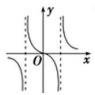

B.

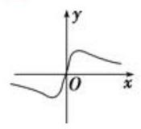

C.

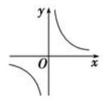

D.

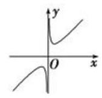

【难度】 $\star   \star   \star$

【答案】D

【解析】若 $a = 0$ ,则 $f\left( x\right)  = \frac{x}{{x}^{2}} = \frac{1}{x}$ ,选项 $\mathrm{C}$ 符合;

若 $a > 0$ ,则函数定义域为 $R$ ,选项 $\mathrm{B}$ 符合

若 $a < 0$ ,则 $x \neq   \pm  \sqrt{-a}$ ,选项 $\mathrm{A}$ 符合,所以不可能是选项 $\mathrm{D}$ . 故选: $\mathrm{D}$ .

2、下列说法中错误的个数为( )

高三数学二轮复习 A 版

①图象关于坐标原点对称的函数是奇函数；②图象关于 $y$ 轴对称的函数是偶函数；

③奇函数的图象一定过坐标原点；④偶函数的图象一定与 $y$ 轴相交.

A. 4 B. 3

C. 2 D. 1

【难度】 $\star   \star   \star$

【答案】C

【解析】解: 由奇函数、偶函数的性质, 知①②说法正确;

对于③，如 $f\left( x\right)  = \frac{1}{x}, x \in  \left( {-\infty ,0}\right)  \cup  \left( {0, + \infty }\right)$ ，它是奇函数，但它的图象不过原点，所以③说法错误； 对于④,如 $f\left( x\right)  = \frac{1}{{x}^{2}}, x \in  \left( {-\infty ,0}\right)  \cup  \left( {0, + \infty }\right)$ ,它是偶函数,但它的图象不与 $y$ 轴相交,所以④说法错误. 故选: C.

3、已知函数 $f\left( x\right)$ 是定义在 $\mathrm{R}$ 上的偶函数,满足 $f\left( x\right)  = f\left( {2 - x}\right)$ ,且当 $x \in  \left\lbrack  {0,1}\right\rbrack$ 时, $f\left( x\right)  = {x}^{2}$ . 若函数 $g\left( x\right)  = f\left( x\right)  - x - a$ 恰有 3 个不同的零点，则实数 $a$ 的取值范围可以是___

① $\left( {-\frac{5}{4}, - 1}\right)$ ② $\left( {-\frac{1}{4},0}\right)$ ③ $\left( {\frac{3}{4},1}\right)$ ④ $\left( {\frac{7}{4},2}\right)$

【难度】★★★

【答案】②④

【解析】由 $f\left( x\right)  = f\left( {2 - x}\right)$ 得函数图象关于直线 $x = 1$ 对称,又 $f\left( x\right)$ 是偶函数,

所以 $f\left( x\right)$ 是周期函数,且周期为 2 ,

$x \in  \left\lbrack  {0,1}\right\rbrack$ 时, $f\left( x\right)  = {x}^{2}$ . 则 $x \in  \left\lbrack  {-1,1}\right\rbrack$ 时, $f\left( x\right)  = {x}^{2}$ ,

函数 $g\left( x\right)  = f\left( x\right)  - x - a$ 恰有 3 个不同的零点,即 $f\left( x\right)$ 的图象与直线 $y = x + a$ 有三个不同的交点,作出函数 $f\left( x\right)$ 的图象,作出直线 $y = x + a$ ,如图,

当直线过 $A\left( {1,1}\right)$ 时, $a = 0$ ,

当直线 $y = x + a$ 与 $y = {x}^{2}$ 相切时,

由 ${x}^{2} = x + a,{x}^{2} - x - a = 0,\Delta  = 1 + {4a} = 0, a =  - \frac{1}{4}$ ,

由图可得,当 $- \frac{1}{4} < a < 0$ 时,满足题意,再由周期性,可知四个选项中,只有②④正确. 故选: ②④

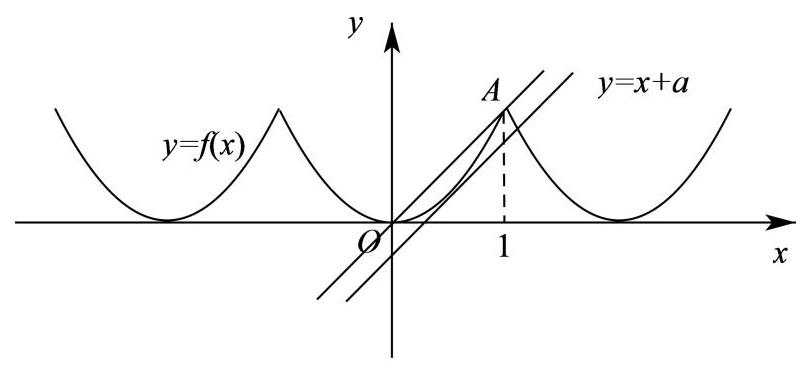

4、若函数 $f\left( x\right)$ 同时满足: (i) $f\left( x\right)$ 为偶函数; (ii) 对任意 ${x}_{1},{x}_{2} \in  \lbrack 0, + \infty )$ 且 ${x}_{1} \neq  {x}_{2}$ ,总有 $\left( {{x}_{1} - {x}_{2}}\right) \left\lbrack  {f\left( {x}_{1}\right)  - f\left( {x}_{2}\right) }\right\rbrack   > 0$ ; (iii) 定义域为 $\mathrm{R}$ ,值域为 $\lbrack  - 1,1)$ ,则称函数 $f\left( x\right)$ 具有性质 $P$ ,现有 4 个函数: ① $y = \frac{\left| x\right|  - 1}{\left| x\right|  + 1}$ ，② $y = \frac{1 - {x}^{2}}{1 + {x}^{2}}$ ，③ $y = \frac{{x}^{2} - 1}{{x}^{2} + 1}$ ，④ $y = \frac{{2}^{x} - 1}{{2}^{x} + 1}$ ，其中具有性质 * $p$ (为是___(填上所有满足条件的序号).

【难度】 $\star   \star   \star$

【答案】① ③

【解析】对于 ④ $f\left( x\right)  = \frac{{2}^{x} - 1}{{2}^{x} + 1}, f\left( {-x}\right)  = \frac{{2}^{-x} - 1}{{2}^{-x} + 1} = \frac{1 - {2}^{x}}{{2}^{x} + 1} =  - f\left( x\right)$ 故函数为奇函数,

故排除④;

由 (ii) 可知 $f\left( x\right)$ 在 $\lbrack 0, + \infty )$ 上单调递增,

对于② $y = \frac{1 - {x}^{2}}{1 + {x}^{2}} =  - 1 + \frac{2}{1 + {x}^{2}}$ 在 $\lbrack 0, + \infty )$ 上是减函数,故不合题意;

对于① $f\left( x\right)  = \frac{\left| x\right|  - 1}{\left| x\right|  + 1} = f\left( {-x}\right)$ 是偶函数， $f\left( x\right)  = \frac{\left| x\right|  - 1}{\left| x\right|  + 1} = 1 - \frac{2}{\left| x\right|  + 1}$ ， $\left| x\right|  + 1 \in  \lbrack 0, + \infty )$

在 $\lbrack 0, + \infty )$ 上是增函数,定义域为 $\mathrm{R}, f\left( x\right)  = 1 - \frac{2}{\left| x\right|  + 1},\left| x\right|  + 1 \in  \lbrack 0, + \infty )$ ,

$- \frac{2}{\left| x\right|  + 1} \in  \lbrack  - 2,0)\therefore 1 - \frac{2}{\left| x\right|  + 1} \in  \lbrack  - 1,1)$ ,具有性质 $P$ ;

对于③，由②知该函数为偶函数，令 $y = \frac{{x}^{2} - 1}{{x}^{2} + 1} = 1 - \frac{2}{{x}^{2} + 1}$ ，

可得函数在 $\lbrack 0, + \infty )$ 上是增函数, ${x}^{2} + 1 \in  \lbrack 0, + \infty ),1 - \frac{2}{{x}^{2} + 1} \in  \lbrack  - 1,1)$

均满足题干中的三点要求,故具有性质 $P$ ;

故答案为:①③

5、已知函数 $f\left( x\right)  = \frac{a \cdot  {2}^{x} + a - 2}{{2}^{x} + 1}$ ,其中 $a$ 为常数.

(1)判断函数 $f\left( x\right)$ 的单调性并证明;

高三数学二轮复习 A 版

(2)若 $a = 1$ ，存在 $x \in  \left( {-2,2}\right)$ 使得方程 $f\left( {{x}^{2} + m + 6}\right)  + f\left( {-{2mx}}\right)  = 0$ 有解，求实数 $m$ 的取值范围.

【难度】 $\star   \star   \star   \star$

【答案】(1) 增函数,证明见解析; (2) $m <  - 2$ 或 $m > \frac{10}{3}$ .

【解析】(1) 因为 $f\left( x\right)  = \frac{a \cdot  {2}^{x} + a - 2}{{2}^{x} + 1} = \frac{a \cdot  \left( {{2}^{x} + 1}\right)  - 2}{{2}^{x} + 1} = a - \frac{2}{{2}^{x} + 1}$ ,

设 ${x}_{1},{x}_{2}$ 为 $\mathrm{R}$ 上的任意两个实数,且 ${x}_{1} < {x}_{2}$ ,

则 $f\left( {x}_{1}\right)  - f\left( {x}_{2}\right)  = \left( {a - \frac{2}{{2}^{{x}_{1}} + 1}}\right)  - \left( {a - \frac{2}{{2}^{{x}_{2}} + 1}}\right)  = \frac{2}{{2}^{{x}_{2}} + 1}\frac{2}{{2}^{{x}_{1}} + 1} = \frac{2\left( {{2}^{{x}_{1}} - {2}^{{x}_{2}}}\right) }{\left( {{2}^{{x}_{2}} + 1}\right) \left( {{2}^{{x}_{1}} + 1}\right) }$ ,

因为 ${x}_{1} < {x}_{2}$ ,所以 ${2}^{{x}_{1}} + 1 > 0,{2}^{{x}_{2}} + 1 > 0,{2}^{{x}_{1}} < {2}^{{x}_{2}}$ ,

所以 $\frac{2\left( {{2}^{{x}_{1}} - {2}^{{x}_{2}}}\right) }{\left( {{2}^{{x}_{2}} + 1}\right) \left( {{2}^{{x}_{1}} + 1}\right) } < 0$ ,即 $f\left( {x}_{1}\right)  < f\left( {x}_{2}\right)$ ,

所以函数 $f\left( x\right)$ 在 $\mathrm{R}$ 上单调递增.

(2)当 $a = 1$ 时， $f\left( x\right)  = \frac{{2}^{x} - 1}{{2}^{x} + 1}$ ，由(1)知函数 $f\left( x\right)$ 在 $\mathrm{R}$ 上单调递增，

又因为 $f\left( {-x}\right)  = \frac{{2}^{-x} - 1}{{2}^{-x} + 1} = \frac{\frac{1}{{2}^{x}} - 1}{\frac{1}{{2}^{x}} + 1} = \frac{1 - {2}^{x}}{{2}^{x} + 1} =  - f\left( x\right)$ ,所以 $f\left( x\right)$ 为奇函数.

由 $f\left( {{x}^{2} + m + 6}\right)  + f\left( {-{2mx}}\right)  = 0$ ,得 $f\left( {{x}^{2} + m + 6}\right)  =  - f\left( {-{2mx}}\right)$ ,

因为 $f\left( x\right)$ 为奇函数,所以 $f\left( {{x}^{2} + m + 6}\right)  = f\left( {2mx}\right)$ ,

又因为函数 $f\left( x\right)$ 单调递增,所以 ${x}^{2} + m + 6 = {2mx}$ ,即 ${x}^{2} - {2mx} + m + 6 = 0$ ,

所以方程 ${x}^{2} - {2mx} + m + 6 = 0$ 在区间 $\left( {-2,2}\right)$ 内有解,令 $g\left( x\right)  = {x}^{2} - {2mx} + m + 6, x \in  \left( {-2,2}\right)$ ,

所以 $\left\{  \begin{matrix} \Delta  = 0 \\   - 2 < m < 2 \end{matrix}\right.$ 或 $g\left( {-2}\right)  \cdot  g\left( 2\right)  < 0$ 或 $\left\{  \begin{matrix} \Delta  > 0 \\   - 2 < m < 2 \\  {5m} + {10} > 0 \\  {3m} - {10} > 0 \end{matrix}\right.$ ,

即 $\left\{  \begin{matrix} {m}^{2} - m - 6 = 0 \\   - 2 < m < 2 \end{matrix}\right.$ 或 $\left( {{5m} + {10}}\right) \left( {{3m} - {10}}\right)  > 0$ 或无解,解得 $m <  - 2$ 或 $m > \frac{10}{3}$ .

## (三)反函数

## 例题精讲

【例 13】已知 $f\left( x\right)  = \sqrt{9 - 4{x}^{2}}, x \in  D$ 有反函数 ${f}^{-1}\left( x\right)  =  - \frac{1}{2}\sqrt{9 - {x}^{2}}, x \in  A$ ,则 $f\left( x\right)$ 的定义域 $D$ 可能是( )

A. $\left\lbrack  {-\frac{1}{2},\frac{3}{2}}\right\rbrack$ B. $\left\lbrack  {-\frac{3}{2},0}\right\rbrack$

C. $\left\lbrack  {0,\frac{3}{2}}\right\rbrack$ D. $\left\lbrack  {-3,3}\right\rbrack$

【难度】 $\star   \star   \star$

【答案】B

【解析】因为 $f\left( x\right)$ 的定义域为: $9 - 4{x}^{2} \geq  0$ ,解得 $- \frac{3}{2} \leq  x \leq  \frac{3}{2}$ ,

反函数 ${f}^{-1}\left( x\right)  =  - \frac{1}{2}\sqrt{9 - {x}^{2}}, x \in  A$ 的值域为: $- \frac{3}{2} \leq  {f}^{-1}\left( x\right)  \leq  0$ ,

故函数的定义域为: $\left\{  \begin{matrix}  - \frac{3}{2} \leq  x \leq  \frac{3}{2} \\   - \frac{3}{2} \leq  {f}^{-1}\left( x\right)  \leq  0 \end{matrix}\right.$ ,故函数的定义域为: $x \in  \left\lbrack  {-\frac{3}{2},0}\right\rbrack$ ,故选: $\mathrm{B}$

【例 14】已知函数 $y = f\left( x\right)$ 的图象与函数 $y = {2}^{x}$ 的图象关于直线 $y = x$ 对称, $g\left( x\right)$ 为奇函数,且当 $x > 0$ 时, $g\left( x\right)  = f\left( x\right)  - x$ ，则 $g\left( {-8}\right)  =$ ( )

A. -5 B. -6 C. 5 D. 6

【难度】 $\star   \star   \star$

【答案】C

【解析】解: 由已知,函数 $y = f\left( x\right)$ 与函数 $y = {2}^{x}$ 互为反函数,则 $f\left( x\right)  = {\log }_{2}x$ .

由题设,当 $x > 0$ 时, $g\left( x\right)  = {\log }_{2}x - x$ ,则 $g\left( 8\right)  = {\log }_{2}8 - 8 = 3 - 8 =  - 5$ .

因为 $g\left( x\right)$ 为奇函数,所以 $g\left( {-8}\right)  =  - g\left( 8\right)  = 5$ . 故选: C.

【例 15】已知函数 $f\left( x\right)  = {x}^{2} - {2ax} - 3, x \in  \lbrack 1,4)$ 存在反函数，则 $a$ 的取值范围是( )

A. $a \leq  1$ 或 $a \geq  4$ B. $a < 1$ 或 $a \geq  4$ C. $a > 4$ D. $a \leq  1$ 或 $a > 4$

【难度】 $\star   \star   \star$

【答案】A

【解析】函数 $f\left( x\right)  = {x}^{2} - {2ax} - 3, x \in  \lbrack 1,4)$ 存在反函数,即函数 $f\left( x\right)  = {x}^{2} - {2ax} - 3$ 在 $\lbrack 1,4)$ 上是一一映射,只需函数 $f\left( x\right)  = {x}^{2} - {2ax} - 3$ 在 $\lbrack 1,4)$ 上单调即可,因为函数 $f\left( x\right)  = {x}^{2} - {2ax} - 3$ 的对称轴为 $x =  - \frac{-{2a}}{2 \times  1} = a$ ,故当 $a \leq  1$ 或 $a \geq  4$ 时,函数 $f\left( x\right)  = {x}^{2} - {2ax} - 3$ 在 $\lbrack 1,4)$ 上单调,即函数 $f\left( x\right)  = {x}^{2} - {2ax} - 3, x \in  \lbrack 1,4)$ 存在反函数.

故选: A.

【例 16】已知函数 $f\left( x\right)  = {a}^{x} + x + 1\left( {a > 1}\right) ,{f}^{-1}\left( x\right)$ 为 $f\left( x\right)$ 的反函数,则 ${f}^{-1}\left( {x + 1}\right)$ 的反函数 $g\left( x\right)$ 的表达式为 ___.

【难度】 $\star   \star   \star   \star$

【答案】 $g\left( x\right)  = {a}^{x} + x\left( {a > 1}\right)$

【解析】解: 由题可知, $y = {f}^{-1}\left( x\right)$ 的图象向左平移 1 个单位得出 $y = {f}^{-1}\left( {x + 1}\right)$ 的图象,

因为 ${f}^{-1}\left( x\right)$ 为 $f\left( x\right)$ 的反函数, ${f}^{-1}\left( {x + 1}\right)$ 的反函数为 $g\left( x\right)$ ,

则 $y = f\left( x\right)$ 与 $y = {f}^{-1}\left( x\right)$ 的图象关于直线 $y = x$ 对称,

且 $y = {f}^{-1}\left( {x + 1}\right)$ 与 $y = g\left( x\right)$ 的图象关于直线 $y = x$ 对称,

$\therefore$ 函数 $y = f\left( x\right)$ 向下平移 1 个单位可以得出 $y = g\left( x\right)$ 的图象

$\because f\left( x\right)  = {a}^{x} + x + 1\left( {a > 1}\right) ,\therefore g\left( x\right)  = {a}^{x} + x\left( {a > 1}\right)$ . 故答案为: $g\left( x\right)  = {a}^{x} + x\left( {a > 1}\right)$

## 巩固训练

1、已知函数 $g\left( x\right)  = f\left( x\right)  + {x}^{2}$ 是奇函数，当 $x > 0$ 时，函数 $f\left( x\right)$ 的图象与函数 $y = {\log }_{2}x$ 的图象关于 $y = x$ 对称， 则 $g\left( {-1}\right)  =$ (   )

A. -5 B. -3 C. -1 D. 1

【难度】

【答案】B

【解析】因为 $x > 0$ 时, $f\left( x\right)$ 的图象与函数 $y = {\log }_{2}x$ 的图象关于 $y = x$ 对称,

所以 $x > 0$ 时, $f\left( x\right)  = {2}^{x}$ ,所以 $x > 0$ 时, $g\left( x\right)  = {2}^{x} + {x}^{2}$ ,

又因为 $g\left( x\right)$ 是奇函数,所以 $g\left( {-1}\right)  =  - g\left( 1\right)  =  - \left( {2 + 1}\right)  =  - 3$ ,故选: B

2、定义在 $R$ 上的函数 $f\left( x\right)$ 的反函数为 $y = {f}^{-1}\left( x\right)$ ，若 $f\left( {x + 1}\right)  = {2}^{x} - 1$ ，则 ${f}^{-1}\left( {x + 1}\right)  =$ ___.

【难度】 $\star   \star   \star$

【答案】 ${\log }_{2}\left( {x + 2}\right)  + 1,\left( {x >  - 2}\right)$

【解析】因为 $f\left( {x + 1}\right)  = {2}^{x} - 1$ ,

令 $t = x + 1$ ,则 $x = t - 1, f\left( t\right)  = {2}^{t - 1} - 1$ ,所以 $f\left( x\right)  = {2}^{x - 1} - 1$ ,

所以 ${f}^{-1}\left( x\right)  = {\log }_{2}\left( {x + 1}\right)  + 1,\left( {x >  - 1}\right)$ ,

所以 ${f}^{-1}\left( {x + 1}\right)  = {\log }_{2}\left( {x + 2}\right)  + 1,\left( {x >  - 2}\right)$ ,故答案为: ${\log }_{2}\left( {x + 2}\right)  + 1,\left( {x >  - 2}\right)$

3、已知函数 $y = f\left( x\right)$ 的图像过定点 $\left( {3, - 5}\right)$ ,且函数 $y = f\left( x\right)$ 的反函数为 $y = {f}^{-1}\left( x\right)$ ,则函数 $y = {f}^{-1}\left( {1 - {3x}}\right)  - {x}^{2} + 1$ 的图像必过定点___.

【难度】 $\star   \star   \star$

【答案】 $\left( {2,0}\right)$

【解析】解: 因为函数 $y = f\left( x\right)$ 的图像过定点 $\left( {3, - 5}\right)$ ,所以函数 $y = f\left( x\right)$ 的反函数为 $y = {f}^{-1}\left( x\right)$ 经过 $\left( {-5,3}\right)$ , 即 $3 = {f}^{-1}\left( {-5}\right)$ ,

令 $1 - {3x} =  - 5$ ,得 $x = 2$ ,所以当 $\mathrm{x} = 2$ 时, $y = {f}^{-1}\left( {-5}\right)  - {2}^{2} + 1 = 0$ ,

所以函数 $y = {f}^{-1}\left( {1 - {3x}}\right)  - {x}^{2} + 1$ 的图像必过定点 $\left( {2,0}\right)$ ,故答案为: $\left( {2,0}\right)$

4、设函数 $y = f\left( x\right)$ 存在反函数 $y = {f}^{-1}\left( x\right)$ ,且函数 $y = {2x} - f\left( x\right)$ 的图象过点 $\left( {2,3}\right)$ ,则函数 $y = {f}^{-1}\left( x\right)  - {2x}$ 的图象一定过点___.

【难度】 $\star   \star   \star$

【答案】 $\left( {1,0}\right)$

【解析】解: $\because$ 函数 $y = f\left( x\right)$ 存在反函数 $y = {f}^{-1}\left( x\right)$ ,且函数 $y = {2x} - f\left( x\right)$ 的图象过点 $\left( {2,3}\right) ,\therefore f\left( 2\right)  = 1$ , $\therefore {f}^{-1}\left( 1\right)  = 2,\;$ ,当 $x = 1$ 时, $y = {f}^{-1}\left( 1\right)  - 2 \times  1 = 0$

函数 $y = {f}^{-1}\left( x\right)  - {2x}$ 的图象一定过点 $\left( {1,0}\right)$ ,故答案为: $\left( {1,0}\right)$ .

## (四)函数的图像和零点

## 例题精讲

【例 17】(1)方程 $\lg {\left( x - {100}\right) }^{2} = \frac{7}{2} - \left( {\left| x\right|  - {200}}\right) \left( {\left| x\right|  - {202}}\right)$ 的解的个数为( )

(A) 2 (B) 4 (C) 6 (D) 8

【难度】★★★★

【答案】B

【解析】结合图形易知.

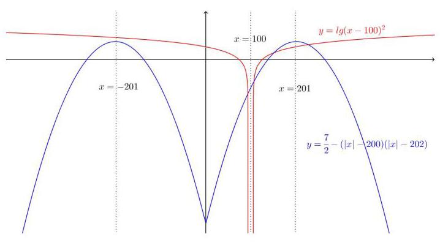

(2)已知函数 $f\left( x\right)  = \left\{  \begin{array}{l} {3}^{-x}\left( {x \leq  0}\right) , \\  \sqrt{x}\left( {x > 0}\right) , \end{array}\right.$ 若函数 $g\left( x\right)  = f\left( x\right)  - \frac{1}{2}x - b$ 有且仅有两个零点，则实数 $\mathrm{b}$ 的取值范围是___.

【难度】 $\star   \star   \star   \star$

【答案】 $\left( {0,\frac{1}{2}}\right)$

【解析】函数 $g\left( x\right)  = f\left( x\right)  - \frac{1}{2}x - b$ 有且仅有两个零点,即 $f\left( x\right)  - \frac{1}{2}x - b = 0$ 有两个根,数形结合知函数 $y = f\left( x\right)$ 图象与 $y = \frac{1}{2}x + b$ 图象有两个交点,如图所示 $\left| y\right|  = \frac{1}{2\sqrt{x}} = \frac{1}{2}$ ,得 $x = 1$ ,所以直线 $y = \frac{1}{2}x + \frac{1}{2}$ 时, 恰有一交点 $\left( {1,1}\right)$ ,故 $0 < b < \frac{1}{2}$ . 故本题答案应填 $\left( {0,\frac{1}{2}}\right)$ .

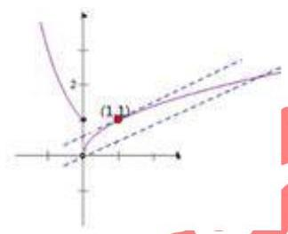

(3)已知函数 $f\left( x\right)  = \left\{  \begin{array}{l} \left| {\ln x}\right| ,0 < x < e \\  2 - \ln x, x > e \end{array}\right.$ ，若正实数 $a, b, c$ 互不相等，且 $f\left( a\right)  = f\left( b\right)  = f\left( c\right)$ ，则 $a \cdot  b \cdot  c$ 的取值范围为___.

【难度】 $\star   \star   \star   \star$

【答案】 $\left( {e,{e}^{2}}\right)$

【解析】 $f\left( x\right)  = \left\{  \begin{array}{l} \left| {\ln x}\right| ,0 < x < e \\  2 - \ln x, x > e \end{array}\right.$ 的图象如图所示:

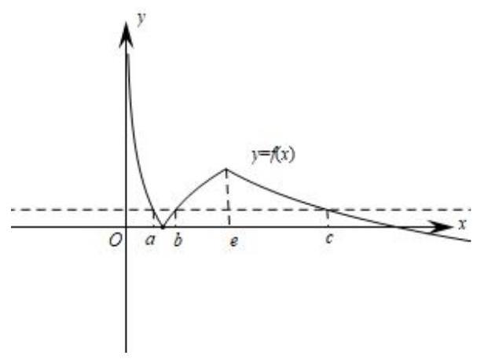

设 $a < b < c$ ,因为 $f\left( a\right)  = f\left( b\right)  = f\left( c\right)$ ,所以 $\left| {\ln a}\right|  = \left| {\ln b}\right|$ ,即 $\ln a + \ln b = 0$ ,则 ${ab} = 1$ ,

又因为 $x > e$ 时, $y = 2 - \ln x$ 单调递减,且与 $x$ 轴交于点 $\left( {{e}^{2},0}\right)$ ,所以 $c \in  \left( {e,{e}^{2}}\right)$ ,

所以 ${abc} = c \in  \left( {e,{e}^{2}}\right)$ ,故答案为: $\;\left( {e,{e}^{2}}\right)$

(4)已知函数 $f\left( x\right)$ 满足:①定义域为 $R$ ；②对任意的 $x \in  \mathbf{R}$ ，有 $f\left( {x + 3}\right)  = f\left( x\right)$ ；③当 $x \in  \left\lbrack  {0,3}\right\rbrack$ 时， $f\left( x\right)  = \left\{  \begin{array}{l} {x}^{2},0 \leq  x \leq  1 \\   - \frac{1}{2}x + \frac{3}{2},1 < x \leq  3 \end{array}\right.$ . 若函数 $g\left( x\right)  = \frac{1}{2}\ln x$ ,则函数 $y = f\left( x\right)  - g\left( x\right)$ 在 $\left\lbrack  {0,5}\right\rbrack$ 上零点的个数是( )

A. 1 B. 2 C. 3 D. 4

【难度】★★★★

【答案】C

【解析】 $y = f\left( x\right)  - g\left( x\right)$ 在 $\left\lbrack  {0,5}\right\rbrack$ 上的零点个数等价于 $f\left( x\right)$ 与 $g\left( x\right)$ 在 $\left\lbrack  {0,5}\right\rbrack$ 上的交点个数; 由 $f\left( {x + 3}\right)  = f\left( x\right)$

知: $f\left( x\right)$ 是周期为 3 的周期函数;

又当 $x \in  \left\lbrack  {0,3}\right\rbrack$ 时, $f\left( x\right)  = \left\{  \begin{array}{l} {x}^{2},0 \leq  x \leq  1 \\   - \frac{1}{2}x + \frac{3}{2},1 < x \leq  3 \end{array}\right.$ ,可得 $f\left( x\right)$ 与 $g\left( x\right)$ 在 $\left\lbrack  {0,5}\right\rbrack$ 上的图象如下图所示:

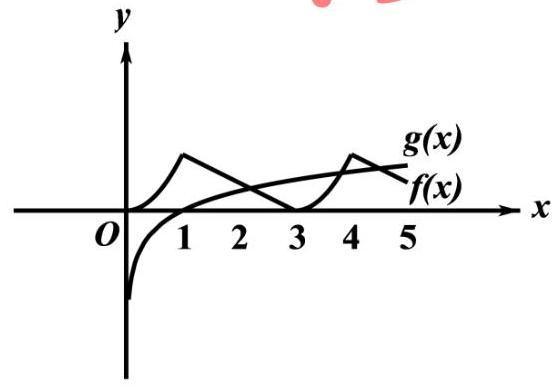

由图象可知: $f\left( x\right)$ 与 $g\left( x\right)$ 在 $\left\lbrack  {0,5}\right\rbrack$ 上有 3 个不同交点,

即 $y = f\left( x\right)  - g\left( x\right)$ 在 $\left\lbrack  {0,5}\right\rbrack$ 上零点的个数为 3 个. 故选: C.

【例 18】((松江 2017 一模 11) 已知函数 $f\left( x\right)  = \left\{  \begin{array}{ll} \sqrt{-{x}^{2} + {4x} - 3}, & 1 \leq  x \leq  3 \\  {2}^{x} - 8, & x > 3 \end{array}\right.$ ,若 $F\left( x\right)  = f\left( x\right)  - {kx}$ 在其定义域内有 3 个零点,则实数 $k \in$ ___

【难度】 $\star   \star   \star   \star$

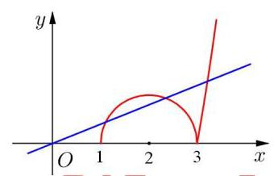

【答案】 $\left( {0,\frac{\sqrt{3}}{3}}\right)$

【解析】数形结合,作出 $f\left( x\right)$ 的函数图象,根据题意, 函数 $y = f\left( x\right)$ 与 $y = {kx}$ 有 3 个交点, $\therefore k > 0$ ,其中在 $x \in  \left\lbrack  {1,3}\right\rbrack$ 上有 2 个交点,即直线 $y = {kx}$ 与半圆相交,点

$\left( {2,0}\right)$ 到直线距离 $d = \frac{2k}{\sqrt{{k}^{2} + 1}} < 1$ ,综上, $k \in  \left( {0,\frac{\sqrt{3}}{3}}\right)$

【例 19】函数 $f\left( x\right)  = \left\{  \begin{matrix} a, x = 1 \\  {\left( \frac{1}{2}\right) }^{\left| x - 1\right| } + 1, x \neq  1 \end{matrix}\right.$ ,若关于 $x$ 的方程 $2{\left\lbrack  f\left( x\right) \right\rbrack  }^{2} - \left( {{2a} + 3}\right)  \cdot  f\left( x\right)  + {3a} = 0$ 有五个不同的实数解,求 $a$ 的取值范围.

【难度】 $\star   \star   \star   \star$

【答案】由 $2{\left\lbrack  f\left( x\right) \right\rbrack  }^{2} - \left( {{2a} + 3}\right)  \cdot  f\left( x\right)  + {3a} = 0$ 得 $f\left( x\right)  = \frac{3}{2}$ 或 $f\left( x\right)  = a$ . 由已知画出函数 $f\left( x\right)$ 的大致图像,要使关于 $x$ 的方程 $2{\left\lbrack  f\left( x\right) \right\rbrack  }^{2} - \left( {{2a} + 3}\right)  \cdot  f\left( x\right)  + {3a} = 0$ 有五个不同的实数解,即要使 1 数 $y = f\left( x\right)$ 的图像与直线 $y = \frac{3}{2}\text{ 、 }y = a$ 共有五个不同的交点,结合图像不难得出, $a$ 的取值范围是 $\left( {1,\frac{3}{2}}\right)  \cup  \left( {\frac{3}{2},2}\right)$ .

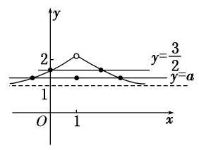

巩固训练

1、关于函数 $f\left( x\right)  = \frac{\left| x\right| }{\left.\parallel  x\left| -1\right| \right| }$ ,给出以下四个命题:

(1)当 $x > 0$ 时， $y = f\left( x\right)$ 单调递减且没有最值;

(2)方程 $f\left( x\right)  = {kx} + b\left( {k \neq  0}\right)$ 一定有实数解;

(3)如果方程 $f\left( x\right)  = m$ ( $m$ 为常数)有解，则解的个数一定是偶数；

(4) $y = f\left( x\right)$ 是偶函数且有最小值.

其中正确的命题个数为( )

A. 1 B. 2 C. 3 D. 4

【难度】 $\star   \star   \star$

【答案】B

【解析】函数 $f\left( x\right)  = \frac{\left| x\right| }{\left| x\right|  - 1 \mid  }$ 是偶函数,当 $x > 0$ 时, $y = f\left( x\right)$ 在 $\left( {0,1}\right)$ 上单调递增,在 $\left( {1, + \infty }\right)  \bot$ 单调递减,且 $f\left( x\right)  \geq  0$ 恒成立,可得函数草图如下:

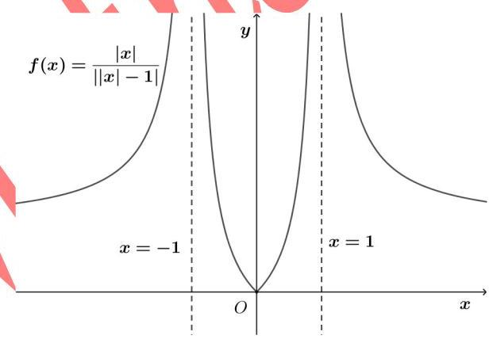

(1)当 $x > 1$ 时, $y = f\left( x\right)  = \frac{x}{x - 1} = 1 + \frac{1}{x - 1}$ 单调递减,当 $0 < x < 1\;f\left( x\right)  = \frac{\left| x\right| }{\left| \left| x\right|  - 1\right| }$ 时, $y = f\left( x\right)  =  - \frac{x}{x - 1} =  - 1 - \frac{1}{x - 1}$ 单调递增,故错误;

(2)当 $k > 0$ 时，函数 $y = f\left( x\right)$ 与函数 $y = {kx} + b$ 的图像一定有交点,由对称性可知,当 $x < 0$ 且 $k < 0$ 时,函数 $y = f\left( x\right)$ 与函数 $y = {kx} + b$ 的图像也一定有交点，故正确；

(3)当 $m = 0$ 时,方程 $f\left( x\right)  = m$ 只有 1 个解 $x = 0$ ，故错误；

(4)由对称性知， $y = f\left( x\right)$ 有最小值 $f\left( 0\right)  = 0$ ，故正确；

故选: B

2、已知函数 $f\left( x\right)$ 是定义在 $\left( {-\infty ,0}\right)  \cup  \left( {0, + \infty }\right)$ 上的偶函数,且当 $x > 0$ 时, $f\left( x\right)  = \left\{  \begin{array}{l} {\left( x - 2\right) }^{2},0 < x \leq  4 \\  \frac{1}{2}f\left( {x - 4}\right) , x > 4 \end{array}\right.$ ,则方程 $f\left( x\right)  = 1$ 解的个数为( )

A. 4 B. 6 C. 8 D. 10

【难度】 $\star   \star   \star   \star$

【答案】D

【解析】由题意,函数当 $x > 0$ 时, $f\left( x\right)  = \left\{  \begin{array}{l} {\left( x - 2\right) }^{2},0 < x \leq  4 \\  \frac{1}{2}f\left( {x - 4}\right) , x > 4 \end{array}\right.$ ,

作出函数 $f\left( x\right)$ 的图象,如图所示,

又由方程 $f\left( x\right)  = 1$ 解的个数,即为函数 $y = f\left( x\right)$ 与 $y = 1$ 的图象交点的个数,

当 $x > 0$ 时,结合图象,两函数 $y = f\left( x\right)$ 与 $y = 1$ 的图象有 5 个交点,

又由函数 $y = f\left( x\right)$ 为偶函数,图象关于 $y$ 轴对称,

所以当 $x < 0$ 时,结合图象,两函数 $y = f\left( x\right)$ 与 $y = 1$ 的图象也有 5 个交点,

综上可得,函数 $y = f\left( x\right)$ 与 $y = 1$ 的图象有 10 个交点,

即方程 $f\left( x\right)  = 1$ 解的个数为 10 .

故选: D.

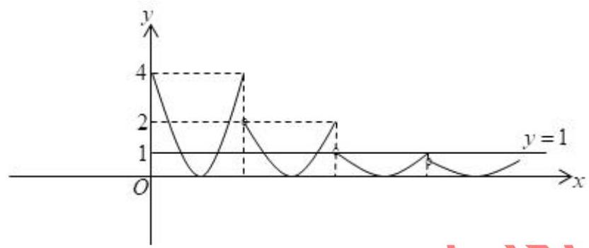

3、定义域和值域均为 $\left\lbrack  {-a, a}\right\rbrack$ (常数 $a > 0$ ) 的函数 $y = f\left( x\right)$ 和 $y = g\left( x\right)$ 的图象如图所示,则方程 $f\left\lbrack  {g\left( x\right) }\right\rbrack   = 0$ 解的个数为( )

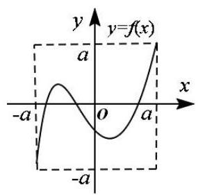

(a)

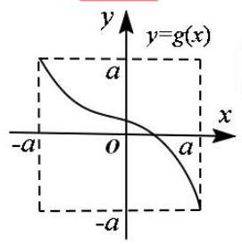

(b)

A. 1 B. 2 C. 3 D. 4

【难度】★★★★

【答案】C

【解析】由图(a)可知,方程 $f\left( x\right)  = 0$ 在 $\left\lbrack  {-a, a}\right\rbrack$ 上有三个实数解,

由图(b)可知,函数 $g\left( x\right)$ 在 $\left\lbrack  {-a, a}\right\rbrack$ 上单调递减,且值域为 $\left\lbrack  {-a, a}\right\rbrack$ ,

所以方程 $f\left\lbrack  {g\left( x\right) }\right\rbrack   = 0$ 有三个实数解.故选: C.

## (五)常用函数模型

## 例题精讲

【例 20】(1)设 $f\left( x\right)  = \left\{  \begin{array}{l} x, x \in  \left( {-\infty , a}\right) \\  {x}^{2}, x \in  \lbrack a, + \infty ) \end{array}\right.$ ，若 $\mathrm{f}\left( 2\right)  = 4$ ，则 $\mathrm{a}$ 的取值范围为___.

【难度】 $\star   \star   \star$

【答案】 $( - \infty ,2\rbrack$

【解析】根据题意当 $2 \in  \left( {-\infty , a}\right)$ 时, $f\left( 2\right)  = 2$ ,不满足题意,

当 $2 \in  \lbrack a, + \infty )$ 时, $f\left( 2\right)  = {2}^{2} = 4$ ,满足条件,所以 $a \leq  2$ . 故 $a$ 的取值范围为 $( - \infty ,2\rbrack$

故答案为: $( - \infty ,2\rbrack$

(2)已知函数 $f\left( x\right)  = \left\{  \begin{matrix}  - {4x} + 1 & x >  - 1 \\  {x}^{2} + {6x} + {10} & x \leq   - 1 \end{matrix}\right.$ 关于 $x$ 的不等式 $f\left( x\right)  - {mx} - {2m} - 2 < 0$ 的解集是 $\left( {{x}_{1},{x}_{2}}\right)  \cup  \left( {{x}_{3}, + \infty }\right)$ ,若 ${x}_{1}{x}_{2}{x}_{3} > 0$ ,则 ${x}_{1} + {x}_{2} + {x}_{3}$ 的取值范围是___

【难度】 $\star   \star   \star   \star$

【答案】 $\lbrack 2\sqrt{7} - {12}, + \infty )$

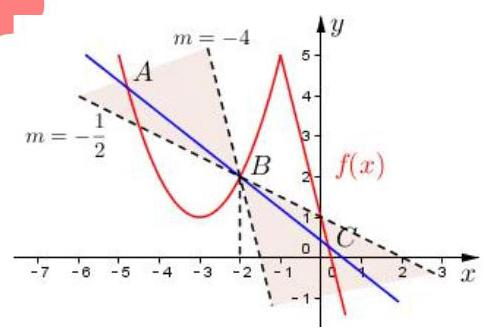

【解析】 $f\left( x\right)  < m\left( {x + 2}\right)  + 2$ ,

数形结合, $y = m\left( {x + 2}\right)  + 2$ 表示斜率为 $m$ 且经

过 $\left( {-2,2}\right)$ 的直线,同时 $\left( {-2,2}\right)$ 也在 $f\left( x\right)$ 图像上,

设三个交点为 $A\left( {{x}_{1},{y}_{1}}\right) , B\left( {{x}_{2},{y}_{2}}\right) , C\left( {{x}_{3},{y}_{3}}\right)$ ,

易知 ${x}_{1} <  - 2,{x}_{2} =  - 2,\because {x}_{1}{x}_{2}{x}_{3} > 0,\therefore$ 需满

足 ${x}_{3} > 0$ ,结合图形可得直线斜率 $m \in  \left( {-4, - \frac{1}{2}}\right)$ ,

由 $\left\{  \begin{array}{l} y = m\left( {x + 2}\right)  + 2 \\  y = {x}^{2} + {6x} + {10} \end{array}\right.$ 得 ${x}^{2} + \left( {6 - m}\right) x + 8 - {2m} = 0,\therefore {x}_{1} + {x}_{2} = m - 6$ ,由 $\left\{  \begin{array}{l} y = m\left( {x + 2}\right)  + 2 \\  y =  - {4x} + 1 \end{array}\right.$

可得 ${x}_{3} = \frac{-{2m} - 1}{m + 4},\therefore {x}_{1} + {x}_{2} + {x}_{3} = m - 6 - \frac{{2m} + 1}{m + 4} = m + 4 + \frac{7}{m + 4} - {12},\because m + 4 \in  \left( {0,\frac{7}{2}}\right)$ ,

$\therefore m + 4 + \frac{7}{m + 4} - {12} \in  \left\lbrack  {2\sqrt{7} - {12}, + \infty }\right)$ .

【例 21】已知函数 $f\left( x\right)  = \left| {x - a}\right|  - \frac{9}{x} + a, x \in  \left\lbrack  {1,6}\right\rbrack  , a \in  R$ .

(1)若 $a = 1$ ，试判断并用定义证明函数 $f\left( x\right)$ 的单调性；

(2)当 $a \in  \left( {1,3}\right)$ 时，求证函数 $f\left( x\right)$ 存在反函数.

【难度】★★★★

【答案】见解析

【解析】(1)判断: 若 $a = 1$ ,函数 $f\left( x\right)$ 在 $\left\lbrack  {1,6}\right\rbrack$ 上是增函数.

证明: 当 $a = 1$ 时, $f\left( x\right)  = x - \frac{9}{x}, f\left( x\right)$ 在 $\left\lbrack  {1,6}\right\rbrack$ 上是增函数. 2 分

在区间 $\left\lbrack  {1,6}\right\rbrack$ 上任取 ${x}_{1},{x}_{2}$ ,设 ${x}_{1} < {x}_{2}$ ,

$$
f\left( {x}_{1}\right)  - f\left( {x}_{2}\right)  = \left( {{x}_{1} - \frac{9}{{x}_{1}}}\right)  - \left( {{x}_{2} - \frac{9}{{x}_{2}}}\right)  = \left( {{x}_{1} - {x}_{2}}\right)  - \left( {\frac{9}{{x}_{1}} - \frac{9}{{x}_{2}}}\right)
$$

$$
= \frac{\left( {{x}_{1} - {x}_{2}}\right) \left( {{x}_{1}{x}_{2} + 9}\right) }{{x}_{1}{x}_{2}} < 0
$$

所以 $f\left( {x}_{1}\right)  < f\left( {x}_{2}\right)$ ,即 $f\left( x\right)$ 在 $\left\lbrack  {1,6}\right\rbrack$ 上是增函数. 6 分

(2)因为 $1 < a \leq  3$ ，所以 $f\left( x\right)  = \left\{  \begin{array}{ll} {2a} - \left( {x + \frac{9}{x}}\right) , & 1 \leq  x \leq  a, \\  x - \frac{9}{x}, & a < x \leq  6, \end{array}\right.$ 8 分

当 $1 < a \leq  3$ 时, $f\left( x\right)$ 在 $\left\lbrack  {1, a}\right\rbrack$ 上是增函数, 9 分

证明: 当 $1 < a \leq  3$ 时, $f\left( x\right)$ 在 $\left\lbrack  {1, a}\right\rbrack$ 上是增函数 (过程略) 11 分

$f\left( x\right)$ 在在 $\left\lbrack  {a,6}\right\rbrack$ 上也是增函数

当 $1 < a \leq  3$ 时, $y = f\left( x\right) x \in  \left\lbrack  {1,6}\right\rbrack$ 上是增函数 12 分

所以任意一个 $x \in  \left\lbrack  {1,6}\right\rbrack$ ,均能找到唯一的 $y$ 和它对应,

所以 $y = f\left( x\right) \;x \in  \left\lbrack  {1,6}\right\rbrack$ 时, $f\left( x\right)$ 存在反函数

## 巩固训练

1、已知函数 $f\left( x\right)  = \left\{  \begin{array}{l} \frac{1}{\left| {x - 1}\right|  - 1}, x \in  \left( {-\infty ,0}\right)  \cup  \left( {0,2}\right)  \cup  \left( {2, + \infty }\right) \\  1, x \in  \{ 0,2\}  \end{array}\right.$ ,则关于方程 $a{\left\lbrack  f\left( x\right) \right\rbrack  }^{2} + {bf}\left( x\right)  + c = 0\left( {a \neq  0}\right)$ ,下列说法错误的是 (   )

A. 上述方程没有实数根的充分不必要条件是 ${b}^{2} - {4ac} < 0$

B. 若 $a = 1, b = 1, c =  - 2$ ,则方程有 6 个根,且满足所有根的和为 6

C. 若 $a = 1, b =  - 1, c = 0$ ,则方程有 4 个根,记这四个根分别为 ${x}_{1},{x}_{2},{x}_{3},{x}_{4}$ 则有 ${x}_{1}^{2} + {x}_{2}^{2} + {x}_{3}^{2} + {x}_{4}^{2} = {14}$

D. 若 $a = 2, b = 3, c = 1$ ，则方程有 3 个根，且满足所有根的和为 3

【难度】 $\star   \star   \star   \star$

【答案】D

【解析】先画出 $f\left( x\right)$ 的图象,如下图所示: $f\left( x\right)  \in  ( - \infty , - 1\rbrack  \cup  \left( {0, + \infty }\right)$ ,

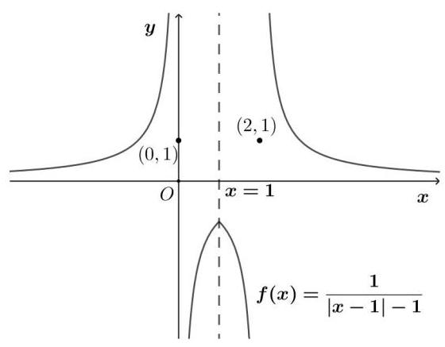

选项 A: ${b}^{2} - {4ac} < 0$ 一定能推出上述方程没有实数根，但是，反之不行，例如: $a = 2, b = 1, c = 0$ 时，该方程也没有实数根, 所以选项 A 正确;

选项 B: 当 $a = 1, b = 1, c =  - 2$ 时, $f\left( x\right)  =  - 2$ 或 $f\left( x\right)  = 1$ ,此时这六个根共分为三组关于直线 $x = 1$ 对称,所以六个根之和为 6 , 所以选项 B 正确;

选项 C: 当 $a = 1, b =  - 1, c = 0$ 时, $f\left( x\right)  = 0$ 或 $f\left( x\right)  = 1$ ,此时方程有四个根,分别为 ${x}_{1} =  - 1,{x}_{2} = 0,{x}_{3} = 2,{x}_{4} = 3$ , 所有根的平方和为 14 , 所以选项 C 正确;

选项 D: 当 $a = 2, b = 3, c = 1$ 时, $f\left( x\right)  =  - \frac{1}{2}$ 或 $f\left( x\right)  =  - 1$ ,此时方程只有一个实数根 $x = 1$ ,所以选项 D 错误; 故选: D.

2、2020 年 12 月 8 日，中尼两国联合对外宣布，经过两国团队的扎实工作，珠穆朗玛峰的最新高程为 8848.86 米. 已知大气压强 $p\left( \mathrm{{Pa}}\right)$ 随高度 $h\left( \mathrm{\;m}\right)$ 的变化满足关系式 $\ln {P}_{0} - \ln p = {kh},{P}_{0}$ 是海平面大气压强, $k = {0.000126}{\mathrm{\;m}}^{-1}$ , 则珠穆朗玛峰峰顶的大气压强是海平面大气压强的( )(取 0.000126×8848.86=1.1)

A. $\frac{1}{{e}^{0.1}}$ B. $\frac{1}{{e}^{0.9}}$ C. $\frac{1}{{e}^{1.1}}$ D. $\frac{1}{{e}^{2.1}}$

【难度】 $\star   \star   \star$

【答案】C

【解析】解: 由 $\ln {p}_{0} - \ln p = {kh}$ 得 $\frac{p}{{p}_{0}} = {e}^{-{kh}}$ ,设珠穆朗玛峰峰顶的大气压强为 ${p}_{1}$ ,则 $\frac{{p}_{1}}{{p}_{0}} = {e}^{-{0.000126} \times  {8848.86}} = \frac{1}{{e}^{1.1}}$ , 故选: C.

3、设函数 $f\left( x\right)  = \left\{  \begin{array}{l} {x}^{3}, x \leq  a \\  {x}^{2}, x > a \end{array}\right.$ ，若 $f\left( 2\right)  > 4$ ，则 $a$ 的取值范围为___.

【难度】 $\star   \star   \star$

【答案】 $\lbrack 2, + \infty )$

【解析】当 $a \geq  2$ 时,则 $f\left( 2\right)  = {2}^{3} > 4$ ,合乎题意;

当 $a < 2$ 时, $f\left( 2\right)  = {2}^{2} = 4$ ,不合乎题意.

综上所述,实数 $a$ 的取值范围是 $\lbrack 2, + \infty )$ . 故答案为: $\lbrack 2, + \infty )$ .

4、第 24 届冬季奥林匹克运动会，即 2022 年北京冬季奥运会，计划于 2022 年 2 月 4 日星期五开幕，2 月 20 日星期日闭幕. 该奥运会激发了大家对冰雪运动的热情, 与冰雪运动有关的商品销量持续增长. 对某店铺某款冰雪运动装备在过去的一个月内(以 30 天计)的销售情况进行调查发现:该款冰雪运动装备的日销售单价 $P\left( x\right)$ (元/套) 与时间 $x$ (被调查的一个月内的第 $x$ 天) 的函数关系近似满足 $P\left( x\right)  = {2000} + \frac{k}{\sqrt{x + 1}}$ (常数 $k > 0$ ). 该款冰雪运动装备的日销售量 $Q\left( x\right)$ (套) 与时间 $x$ 的部分数据如下表所示:

已知第 24 天该商品的日销售收入为 32400 元.

<table><tr><td>$x$</td><td>3</td><td>8 15</td><td>24</td></tr><tr><td>$Q\left( x\right)$ (套)</td><td>12</td><td>13 14</td><td>15</td></tr></table>

(1)求 $k$ 的值.

(2)给出以下三种函数模型:① $Q\left( x\right)  = t{a}^{x} + b$ ; ② $Q\left( x\right)  = p{\left( x - {16}\right) }^{2} + q$ ; ③ $Q\left( x\right)  = m\sqrt{x + 1} + n$ . 请你依据上表中的数据,从以上三种函数模型中,选择你认为最合适的一种函数模型,来描述该商品的日销售量 $Q\left( x\right)$ 与时间 $x$ 的关系,说明你选择的理由. 根据你选择的模型,预估该商品的日销售收入 $f\left( x\right) \left( {1 \leq  x \leq  {30}, x \in  {\mathrm{N}}_{ + }}\right)$

(元)在哪一天达到最低.

【难度】 $\star   \star   \star$

【答案】(1) $k = {800}$ (2) 答案见解析

【解析】由题意,得 ${15} \times  \left( {{2000} + \frac{k}{\sqrt{{24} + 1}}}\right)  = {32400}$ ,解得 $k = {800}$ ;

解: 表格中 $Q\left( x\right)$ 对应的数据递增的速度较慢,排除模型①.

因为 $Q\left( x\right)  = p{\left( x - {16}\right) }^{2} + q$ 表示在 $x = {16}$ 两侧“等距”的函数值相等 (或叙述为函数图象必然关于直线 $x = {16}$ 对称),而表格中的数据并未体现此规律 $\left( {{13} \neq  {15}}\right)$ ,排除模型②.

对于模型③，将 $\left( {3,{12}}\right) ,\left( {8,{13}}\right)$ 代入模型③， $\left\{  \begin{array}{l} {2m} + n = {12}, \\  {3m} + n = {13}, \end{array}\right.$ 解得 $\left\{  \begin{array}{l} m = 1, \\  n = {10}, \end{array}\right.$

高三数学二轮复习 A 版

此时, $Q\left( x\right)  = \sqrt{x + 1} + {10}$ ,经验证, $\left( {{15},{14}}\right) ,\left( {{24},{15}}\right)$ 均满足,故选模型③,

$$
f\left( x\right)  = Q\left( x\right)  \cdot  P\left( x\right)  = \left( {\sqrt{x + 1} + {10}}\right) \left( {{2000} + \frac{800}{\sqrt{x + 1}}}\right)  = {20800} + {2000}\sqrt{t + 1} + \frac{8000}{\sqrt{x + 1}}
$$

$$
\geq  {20800} + 2\sqrt{{2000}\sqrt{x + 1} \cdot  \frac{8000}{\sqrt{x + 1}}} = {20800} + 2 \times  {4000} = {28800}\text{ , }
$$

当且仅当 $x = 3$ 时,等号成立,故日销售收入在第 3 天达到最低.

## (六)函数的综合

## 例题精讲

【例 22】设函数 $f\left( x\right)  = \left| {\frac{2}{x} - {ax} + 5}\right| \left( {a \in  \mathbf{R}}\right)$ .

(1)求函数的零点；

(2)当 $a = 3$ 时，求证: $f\left( x\right)$ 在区间 $\left( {-\infty , - 1}\right)$ 上单调递减；

(3)若对任意的正实数 $a$ ，总存在 ${x}_{0} \in  \left\lbrack  {1,2}\right\rbrack$ ，使得 $f\left( {x}_{0}\right)  \geq  m$ ，求实数 $m$ 的取值范围.

【难度】 $\star   \star   \star   \star$

【答案】见解析

【解析】解: (1) ① 当 $a = 0$ 时,函数的零点为 $x =  - \frac{2}{5}$ ;

② 当 $a \geq   - \frac{25}{8}$ 且 $a \neq  0$ 时，函数的零点是 $x = \frac{5 \pm  \sqrt{{25} + {8a}}}{2a}$ ；

③ 当 $a <  - \frac{25}{8}$ 时，函数无零点；

(2)当 $a = 3$ 时， $f\left( x\right)  = \left| {\frac{2}{x} - {3x} + 5}\right|$ ，令 $g\left( x\right)  = \frac{2}{x} - {3x} + 5$

任取 ${x}_{1},{x}_{2} \in  \left( {-\infty , - 1}\right)$ ,且 ${x}_{1} < {x}_{2}$ ,

则 $g\left( {x}_{1}\right)  - g\left( {x}_{2}\right)  = \frac{2}{{x}_{1}} - 3{x}_{1} + 5 - \left( {\frac{2}{{x}_{2}} - 3{x}_{2} + 5}\right)  = \frac{\left( {{x}_{2} - {x}_{1}}\right) \left( {2 + 3{x}_{1}{x}_{2}}\right) }{{x}_{1}{x}_{2}}$

因为 ${x}_{1} < {x}_{2},{x}_{1},{x}_{2} \in  \left( {-\infty , - 1}\right)$ ,所以 ${x}_{2} - {x}_{1} > 0,{x}_{1}{x}_{2} > 1$ ,从而 $\frac{\left( {{x}_{2} - {x}_{1}}\right) \left( {2 + 3{x}_{1}{x}_{2}}\right) }{{x}_{1}{x}_{2}} > 0$

即 $g\left( {x}_{1}\right)  - g\left( {x}_{2}\right)  > 0 \Rightarrow  g\left( {x}_{1}\right)  > g\left( {x}_{2}\right)$ 故 $g\left( x\right)$ 在区间 $\left( {-\infty , - 1}\right)$ 上的单调递减

当 $x \in  \left( {-\infty , - 1}\right)$ 时, $g\left( x\right)  \in  \left( {6, + \infty }\right) \therefore f\left( x\right)  = \left| {\frac{2}{x} - {3x} + 5}\right|  = \frac{2}{x} - {3x} + 5 = g\left( x\right)$

即当 $a = 3$ 时, $f\left( x\right)$ 在区间 $\left( {-\infty , - 1}\right)$ 上单调递减;

(3)对任意的正实数 $a$ ，存在 ${x}_{0} \in  \left\lbrack  {1,2}\right\rbrack$ 使得 $f\left( {x}_{0}\right)  \geq  m$ ，即 $f{\left( {x}_{0}\right) }_{\max } \geq  m$ ，

当 $x \in  \left( {0, + \infty }\right)$ 时,

$f\left( x\right)  = \left| {\frac{2}{x} - {ax} + 5}\right|  = \left\{  \begin{array}{ll} \frac{2}{x} - {ax} + 5, & 0 < x < \frac{5 + \sqrt{{25} + {8a}}}{2a} \\   - \frac{2}{x} + {ax} - 5, & x \geq  \frac{5 + \sqrt{{25} + {8a}}}{2a} \end{array}\right.$

即 $f\left( x\right)$ 在区间 $\left( {0,\frac{5 + \sqrt{{25} + {8a}}}{2a}}\right)$ 上单调递减,在区间 $\left( {\frac{5 + \sqrt{{25} + {8a}}}{2a}, + \infty }\right)$ 上单调递增;

所以 $f{\left( {x}_{0}\right) }_{\max } = \max \{ f\left( 1\right) , f\left( 2\right) \}  = \max \{ \left| {7 - a}\right| ,\left| {6 - {2a}}\right| \}$ .

又由于 $a > 0,\max \{ \left| {7 - a}\right| ,\left| {6 - {2a}}\right| \}  \geq  \frac{8}{3}$ ,所以 $m \leq  \frac{8}{3}$ .

【例 23】已知: 函数 $g\left( x\right)  = a{x}^{2} - {2ax} + 1 + b\;\left( {a \neq  0, b < 1}\right)$ ,在区间 $\left\lbrack  {2,3}\right\rbrack$ 上有最大值 4,最小值 1,设函数 $f\left( x\right)  = \frac{g\left( x\right) }{x}$ .

(1)求 $a$ 、 $b$ 的值及函数 $f\left( x\right)$ 的解析式；

(2)若不等式 $f\left( {2}^{x}\right)  - k \cdot  {2}^{x} \geq  0$ 在 $x \in  \left\lbrack  {-1,\;1}\right\rbrack$ 时恒成立，求实数 $k$ 的取值范围；

(3)如果关于 $x$ 的方程 $f\left( \left| {{2}^{x} - 1}\right| \right)  + t \cdot  \left( {\frac{4}{\left| {2}^{x} - 1\right| } - 3}\right)  = 0$ 有三个相异的实数根，求实数 $t$ 的取值范围.

【难度】 $\star   \star   \star   \star$

【答案】见解析

【解析】(1) $g\left( x\right)  = a{x}^{2} - {2ax} + 1 + b$ ,由题意得:

${1}^{ \circ  }\left\{  {\begin{array}{l} a > 0 \\  g\left( 2\right)  = 1 + b = 1 \\  g\left( 3\right)  = {3a} + b + 1 = 4 \end{array}\text{ 得 }\left\{  {\begin{array}{l} a = 1 \\  b = 0 \end{array},\;\text{ 或 }\;{2}^{ \circ  }\left\{  {\begin{array}{l} a < 0 \\  g\left( 2\right)  = 1 + b = 4 \\  g\left( 3\right)  = {3a} + b + 1 = 1 \end{array}\text{ 得 }\left\{  {\begin{array}{l} a =  - 1 \\  b = 3 > 1 \end{array}\text{ (舍去) }}\right. }\right. }\right. }\right.$

$\therefore a = 1, b = 0$

高三数学二轮复习 A 版 $g\left( x\right)  = {x}^{2} - {2x} + 1,\;f\left( x\right)  = x + \frac{1}{x} - 2$

(2)不等式 $f\left( {2}^{x}\right)  - k \cdot  {2}^{x} \geq  0$ ,即 ${2}^{x} + \frac{1}{{2}^{x}} - 2 \geq  k \cdot  {2}^{x},\therefore k \leq  {\left( \frac{1}{{2}^{x}}\right) }^{2} - 2 \cdot  \left( \frac{1}{{2}^{x}}\right)  + 1$

设 $t = \frac{1}{{2}^{x}} \in  \left\lbrack  {\frac{1}{2},2}\right\rbrack  ,\therefore k \leq  {\left( t - 1\right) }^{2},\because {\left( t - 1\right) }^{2}{}_{\min } = 0,\therefore k \leq  0$

(3) $f\left( \left| {{2}^{x} - 1}\right| \right)  + t \cdot  \left( {\frac{4}{\left| {2}^{x} - 1\right| } - 3}\right)  = 0$ ，即 $\left| {{2}^{x} - 1}\right|  + \frac{1}{\left| {2}^{x} - 1\right| } + \frac{4t}{\left| {2}^{x} - 1\right| } - {3t} - 2 = 0$ .

令 $u = \left| {{2}^{x} - 1}\right|  > 0$ ,则 ${u}^{2} - \left( {{3t} + 2}\right) u + \left( {{4t} + 1}\right)  = 0$ ,

记方程 $\left( *\right)$ 的根为 ${u}_{1}\text{ 、 }{u}_{2}$ ,当 $0 < {u}_{1} < 1 \leq  {u}_{2}$ 时,原方程有三个相异实根,

记 $\varphi \left( u\right)  = {u}^{2} - \left( {{3t} + 2}\right) u + \left( {{4t} + 1}\right)$ ,由题可知,

$\left\{  \begin{array}{l} \varphi \left( 0\right)  = {4t} + 1 > 0 \\  \varphi \left( 1\right)  = t < 0 \end{array}\right.$ 或 $\left\{  \begin{array}{l} \varphi \left( 0\right)  = {4t} + 1 > 0 \\  \varphi \left( 1\right)  = t = 0 \\  0 < \frac{{3t} + 2}{2} < 1 \end{array}\right.$ ,解得 $- \frac{1}{4} < t < 0$

巩固训练

1、已知函数 $f\left( x\right)  = \left\{  \begin{array}{l} \frac{x}{\left| x - 1\right| }, x < 1 \\  {x}^{2} - {6x} + 9, x \geq  1 \end{array}\right.$ ，若方程 $f\left( x\right)  = a$ 有四个不同的根 ${x}_{1},{x}_{2},{x}_{3},{x}_{4}$ ，则 $\frac{1}{{x}_{1}} + \frac{1}{{x}_{2}} + \frac{1}{{x}_{3}} + \frac{1}{{x}_{4}}$ 的取值范围是___.

【难度】 $\star   \star   \star   \star$

【答案】 $\left( {\frac{8}{3},\frac{11}{4}}\right)$

【解析】依题意,当 $x < 0$ 时, $f\left( x\right)  = \frac{1}{1 - \frac{1}{x}}$ 在 $\left( {-\infty ,0}\right)$ 上单调递减, $0 < \left| \frac{x}{x - 1}\right|  < 1$ ,当 $0 < x < 1$ 时, $f\left( x\right)  = \frac{1}{\frac{1}{x} - 1}$ 在 $\left( {0,1}\right)$ 上单调递增, $\left| \frac{x}{x - 1}\right|  \in  \left( {0, + \infty }\right)$ ,而 $f\left( 0\right)  = 0$ ,

当 $x > 1$ 时, $f\left( x\right)  = {\left( x - 3\right) }^{2}, f\left( x\right)  \in  \lbrack 0, + \infty )$ ,

方程 $f\left( x\right)  = a$ 有四个不同的根 ${x}_{1},{x}_{2},{x}_{3},{x}_{4}$ ,即直线 $y = a$ 与函数 $y = f\left( x\right)$ 图象有 4 个交点,如图,其交点横坐标为 ${x}_{1},{x}_{2},{x}_{3},{x}_{4}$ ,不妨令 ${x}_{1} < {x}_{2} < {x}_{3} < {x}_{4}$ ,观察图象知, $0 < a < 1,{x}_{1} < 0 < {x}_{2} < 1 < {x}_{3} < {x}_{4}$ , 由 $\left| \frac{x}{x - 1}\right|  = a$ 得,即 $\left| \frac{{x}_{1}}{{x}_{1} - 1}\right|  = \left| \frac{{x}_{2}}{{x}_{2} - 1}\right|$ ,则 $\frac{{x}_{1}}{{x}_{1} - 1} =  - \frac{{x}_{2}}{{x}_{2} - 1} \Leftrightarrow  \frac{{x}_{1} - 1}{{x}_{1}} = \frac{1 - {x}_{2}}{{x}_{2}} \Leftrightarrow  \frac{1}{{x}_{1}} + \frac{1}{{x}_{2}} = 2$ ,

由 ${x}^{2} - {6x} + 9 = a$ ,即 ${x}^{2} - {6x} + 9 - a = 0$ 得: ${x}_{3},{x}_{4}$ 是方程 ${x}^{2} - {6x} + 9 - a = 0$ 的两个不等实根,

于是得 ${x}_{3} + {x}_{4} = 6,{x}_{3}{x}_{4} = 9 - a$ ,则 $\frac{1}{{x}_{3}} + \frac{1}{{x}_{4}} = \frac{{x}_{3} + {x}_{4}}{{x}_{3}{x}_{4}} = \frac{6}{9 - a}$ ,而 $\frac{6}{9 - a}$ 在 $a \in  \left( {0,1}\right)$ 上是递增的, $\frac{2}{3} < \frac{6}{9 - a} < \frac{3}{4}$ , 因此, $\frac{1}{{x}_{1}} + \frac{1}{{x}_{2}} + \frac{1}{{x}_{3}} + \frac{1}{{x}_{4}} = 2 + \frac{6}{9 - a} \in  \left( {\frac{8}{3},\frac{11}{4}}\right)$ , 所以 $\frac{1}{{x}_{1}} + \frac{1}{{x}_{2}} + \frac{1}{{x}_{3}} + \frac{1}{{x}_{4}}$ 的取值范围是 $\left( {\frac{8}{3},\frac{11}{4}}\right)$ .

故答案为: $\left( {\frac{8}{3},\frac{11}{4}}\right)$

2、已知定义域为 $R$ 的函数 $f\left( x\right)  = \frac{{b}^{x} + n}{-2{b}^{x} - 2}$ 是奇函数,且指数函数 $y = {b}^{x}$ 的图象过点 $\left( {2,4}\right)$ .

( I ) 求 $f\left( x\right)$ 的表达式;

( II ) 若方程 $f\left( {{x}^{2} + {3x}}\right)  + f\left( {-a + x}\right)  = 0, x \in  \left( {-4, + \infty }\right)$ 恰有 2 个互异的实数根,求实数 $a$ 的取值集合;

(III) 若对任意的 $t \in  \left\lbrack  {-1,1}\right\rbrack$ ,不等式 $f\left( {{t}^{2} - {2a}}\right)  + f\left( {{at} - 1}\right)  \geq  0$ 恒成立,求实数 $a$ 的取值范围.

【难度】 $\star   \star   \star   \star$

【答案】( I ) $f\left( x\right)  = \frac{-{2}^{x} + 1}{{2}^{x + 1} + 2}$ ; ( II ) $\{ a \mid   - 4 < a < 0\}$ ; ( III ) $\{ a \mid  a \geq  0\}$ .

【解析】( I ) 由指数函数 $y = {b}^{x}$ 的图象过点 $\left( {2,4}\right)$ ,得 $b = 2$ ,所以 $f\left( x\right)  = \frac{{2}^{x} + n}{-2 \cdot  {2}^{x} - 2}$ ,

又 $f\left( x\right)$ 为 $R$ 上的奇函数,所以 $f\left( 0\right)  = 0$ ,得 $n =  - 1$ ,经检验,当 $n =  - 1$ 时,符合 $f\left( {-x}\right)  =  - f\left( x\right)$ ,所以 $f\left( x\right)  = \frac{-{2}^{x} + 1}{{2}^{x + 1} + 2};$

(II) $f\left( x\right)  = \frac{-{2}^{x} + 1}{{2}^{x + 1} + 2} =  - \frac{1}{2} + \frac{1}{{2}^{x} + 1}$ ,因为 $y = {2}^{x} + 1$ 在定义域内单调递增,

则 $y = \frac{1}{{2}^{x} + 1}$ 在定义域内单调递减,所以 $f\left( x\right)$ 在定义域内单调递增减,

由于 $f\left( x\right)$ 为 $R$ 上的奇函数,所以由 $f\left( {{x}^{2} + {3x}}\right)  + f\left( {-a + x}\right)  = 0$ ,

可得 $f\left( {{x}^{2} + {3x}}\right)  =  - f\left( {-a + x}\right)  = f\left( {a - x}\right)$ ,则 ${x}^{2} + {3x} = a - x$ 在 $x \in  \left( {-4, + \infty }\right)$ 恰有 2 个互异的实数根,即 $f\left( x\right)  = {x}^{2} + {4x} - a$ 在 $x \in  \left( {-4, + \infty }\right)$ 恰与 $x$ 轴有两个交点,

则 $\left\{  {\begin{array}{l} f\left( {-4}\right)  > 0 \\  \Delta  > 0 \\  f\left( {-2}\right)  < 0 \end{array} \Rightarrow  \left\{  \begin{array}{l} a < 0 \\  a >  - 4 \Rightarrow   - 4 < a < 0, \\  a >  - 4 \end{array}\right. }\right.$

所以实数 $a$ 的取值集合为 $\{ a \mid   - 4 < a < 0\}$ .

(III) 由 (II) 知函数 $f\left( x\right)$ 为 $R$ 上的减函数且为奇函数,

由 $f\left( {{t}^{2} - {2a}}\right)  + f\left( {{at} - 1}\right)  \geq  0$ ,得 $f\left( {{t}^{2} - {2a}}\right)  \geq  f\left( {1 - {at}}\right)$ ,所以 ${t}^{2} - {2a} \leq  1 - {at}$ ,

即 ${t}^{2} + {at} - {2a} - 1 \leq  0$ 对任意的 $t \in  \left\lbrack  {-1,1}\right\rbrack$ 恒成立,令 $g\left( t\right)  = {t}^{2} + {at} - {2a} - 1$ ,

由题意 $\left\{  \begin{array}{l} g\left( {-1}\right)  \leq  0 \\  g\left( 1\right)  \leq  0 \end{array}\right.$ ,得 $a \geq  0$ ,所以实数 $a$ 的取值范围为: $\{ a \mid  a \geq  0\}$ .
