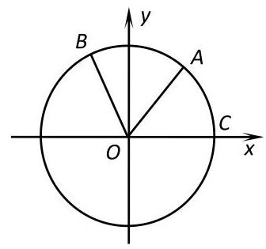
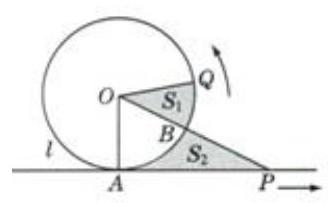
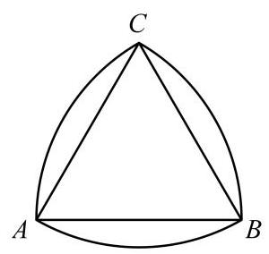
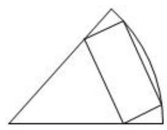
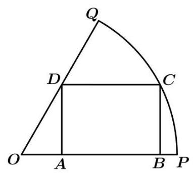
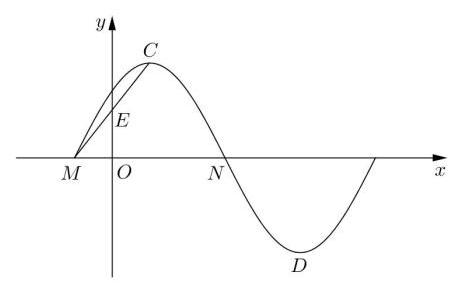
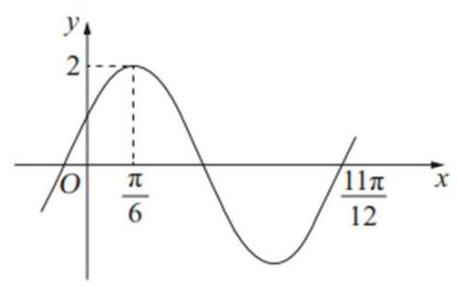
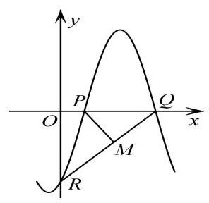
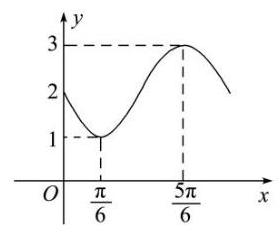
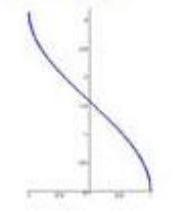

## 第 7 课:三角专题

<table><tr><td>教学目标</td><td>1、熟练掌握三角恒等式及基本应用;   2、灵活应用正余弦定理解三角形及化简求值计算;   3、掌握三角函数图象及性质，并应用基本性质解决问题   4、 在应用知识过程中体会三变”变角、变式、变名“等基本技巧应用，达到灵活应用能力</td></tr><tr><td>重点</td><td>1、基本恒等式记忆法及用法   2、体会角、函数名、结构、运算方式的变形, 其技巧常有差异分析、化异为同、辅助角、三角代换、和差配凑、幂指变换等.   3、加强综合分析问题的能力.</td></tr><tr><td>难 点</td><td>1、体会角、函数名、结构、运算方式的变形, 其技巧常有差异分析、化异为同、辅助角、三角代换、和差配凑、幂指变换等.   2、加强综合分析问题的能力.</td></tr></table>

## (一) 三角比

## 知识梳理

1、任意角 $\alpha$ 的三角比可以用其终边上的点的坐标来定义.

设 $P$ 是角 $\alpha$ 终边上任意一点 (点 $P$ 不能是角的顶点),它的坐标为 $\left( {x, y}\right)$ ,则 $P$ 到坐标原点 $O$ 的距离 $r = {OP} = \sqrt{{x}^{2} + {y}^{2}}$ ,定义正弦 $\sin \alpha  = \frac{y}{r}$ ,余弦 $\cos \alpha  = \frac{x}{r}$ ,正切 $\tan \alpha  = \frac{y}{x}$ ,余切 $\cot \alpha  = \frac{x}{y}$ ,正割 $\sec \alpha  = \frac{r}{x}$ ,余割 $\csc \alpha  = \frac{r}{y}$ . 当 $\alpha  = {k\pi } + \frac{\pi }{2}, k \in  \mathbf{Z}$ 时, $\tan \alpha ,\sec \alpha$ 无意义; 当 $\alpha  = {k\pi }, k \in  \mathbf{Z}$ 时, $\cot \alpha ,\csc \alpha$ 无意义.

2、三角函数的符号:

## 3、同角三角比的 3 个关系:

第 1 页共 15 页

(1)倒数关系: $\sin \alpha  \cdot  \csc \alpha  = 1;\cos \alpha  \cdot  \sec \alpha  = 1;\tan \alpha  \cdot  \cot \alpha  = 1$ ；

(2)商数关系: $\tan \alpha  = \frac{\sin \alpha }{\cos \alpha }\left( {\cos \alpha  \neq  0}\right)$ ; $\cot \alpha  = \frac{\cos \alpha }{\sin \alpha }\left( {\sin \alpha  \neq  0}\right)$ ;

(3)平方关系: ${\sin }^{2}\alpha  + {\cos }^{2}\alpha  = 1$ ; $1 + {\tan }^{2}\alpha  = {\sec }^{2}\alpha$ ; $1 + {\cot }^{2}\alpha  = {\csc }^{2}\alpha$ .

## 4、这些关系式还可以如图样加强形象记忆:

(1)对角线上两个函数的乘积为 1(倒数关系)。

(2)任一角的函数等于与其相邻的两个函数的积(商数关系)。

(3)阴影部分，顶角两个函数的平方和等于底角函数的平方(平方关系)。

注意:1)“同角”的概念与角的表达形式无关，如: ${\sin }^{2}{3\alpha } + {\cos }^{2}{3\alpha } = 1,\frac{\sin \frac{\alpha }{2}}{\cos \frac{\alpha }{2}} = \tan \frac{\alpha }{2}$ 。

2)上述关系(公式)都必须在定义域允许的范围内成立。

3)由一个角的任一三角函数值可求出这个角的其余各三角函数值，且因为利用“平方关系”公式，最终需求平方根, 会出现两解, 因此应尽可能少用, 若使用时, 要注意讨论符号。

5、诱导公式:4 个同名 2 个异名

6、两角和差公式与辅助角公式

7、二倍角与半倍角公式

## 例题精讲

【例 1】已知函数 $y = {\log }_{a}\left( {x - 2}\right)  + 4\left( {a > 0, a \neq  1}\right)$ 的图像恒过点定 $A$ ,若角 $\alpha$ 终边经过点 $A$ ,则 ${\sin }^{2}\alpha  + \sin \left( {\alpha  + \frac{3\pi }{2}}\right)  =$ ___.

例 2 图

【例 2】如图,点 $A\text{ 、 }B$ 是单位圆 $O$ 上的两点,点 $C$ 是圆 $O$ 与 $x$ 轴的正半轴的交点, 将锐角 $\alpha$ 的终边 ${OA}$ 按逆时针方向旋转 $\frac{\pi }{3}$ 到 ${OB}$ .

(1)若点 $A$ 的坐标为 $\left( {\frac{3}{5},\frac{4}{5}}\right)$ ，求 $\frac{1 + \sin {2\alpha }}{1 + \cos {2\alpha }}$ 的值；

( 2 )用 $\alpha$ 表示 $\left| {BC}\right|$ ，并求 $\left| {BC}\right|$ 的取值范围.

【例 3】已知角 $\alpha ,\beta$ 的顶点都为坐标原点,始边都与 $x$ 轴的非负半轴重合,且都为第一象限的角, $\alpha ,\beta$ 终边上分别有点 $A\left( {1, a}\right) , B\left( {2, b}\right)$ ,且 $\alpha  = {2\beta }$ ,则 $\frac{1}{a} + b$ 的最小值为

A. 1 B. $\sqrt{2}$ C. $\sqrt{3}$ D. 2

【例 4】在直角坐标平面 ${xOy}$ 中,已知两定点 ${F}_{1}\left( {-2,0}\right)$ 与 ${F}_{2}\left( {2,0}\right)$ 位于动直线 $l : {ax} + {by} + c = 0$ 的同侧,设集合 $P = \left\{  {l \mid  \text{ 点 }{F}_{1}\text{ 与点 }{F}_{2}\text{ 到直线 }l\text{ 的距离之差等于 }2}\right\}  , Q = \left\{  {\left( {x, y}\right)  \mid  {x}^{2} + {y}^{2} \leq  4, x, y \in  R}\right\}$ ,记

$S = \{ \left( {x, y}\right)  \mid  \left( {x, y}\right)  \notin  l, l \in  P\} , T = \{ \left( {x, y}\right)  \mid  \left( {x, y}\right)  \in  Q \cap  S\}$ ,则由 $T$ 中的所有点所组成的图形的面积是___

【例 5】下列六个命题(1)不存在无穷多个角 $\alpha$ 和 $\beta$ ,使得 $\sin \left( {\alpha  + \beta }\right)  = \sin \alpha \cos \beta  - \cos \alpha \sin \beta$

( 2 )存在这样的角 $\alpha$ 和 $\beta$ ，使得 $\cos \left( {\alpha  + \beta }\right)  = \cos \alpha \cos \beta  + \sin \alpha \sin \beta$

(3)对任意角 $\alpha$ 和 $\beta$ ，都有 $\cos \left( {\alpha  + \beta }\right)  = \cos \alpha \cos \beta  - \sin \alpha \sin \beta$

(4)不存在这样的角 $\alpha$ 和 $\beta$ ,使得 $\sin \left( {\alpha  + \beta }\right)  \neq  \sin \alpha \cos \beta  + \cos \alpha \sin \beta$

(5) 不存在这样的角 $\alpha$ 和 $\beta$ ,使得 $\tan \left( {\alpha  + \beta }\right)  = \frac{\tan \alpha  - \tan \beta }{1 + \tan \alpha  \cdot  \tan \beta }$

(6)对任意角 $\alpha$ 和 $\beta$ ，都有 $\tan \left( {\alpha  + \beta }\right)  = \frac{\tan \alpha  + \tan \beta }{1 - \tan \alpha  \cdot  \tan \beta }$ 其中假命题的个数是( )

A. 1 B. 2 C. 3 D. 4

## 巩固训练

1、已知 $A$ 为锐角， $\lg \left( {1 + \cos A}\right)  = m,\lg \frac{1}{1 - \cos A} = n$ ，则 $\lg \sin A$ 的值为( )

A、 $m + \frac{1}{n}$ B、 $m - n$

C、 $\frac{1}{2}\left( {m + n}\right)$ D、 $\frac{1}{2}\left( {m - n}\right)$

2、如果 $\sin \alpha  \cdot  \cos \alpha  > 0$ ,且 $\sin \alpha  \cdot  \tan \alpha  > 0$ ,化简: $\cos \frac{\alpha }{2}\sqrt{\frac{1 - \sin \frac{\alpha }{2}}{1 + \sin \frac{\alpha }{2}}} + \cos \frac{\alpha }{2}\sqrt{\frac{1 + \sin \frac{\alpha }{2}}{1 - \sin \frac{\alpha }{2}}}$ .

3、已知角 $\theta$ 的终边经过点 $P\left( {x,3}\right) \left( {x < 0}\right)$ 且 $\cos \theta  = \frac{\sqrt{10}}{10}x$ ，则 $x =$ ___.

4、已知函数 $f\left( x\right)$ 为 $R$ 上的奇函数,且 $f\left( {-x}\right)  = f\left( {2 + x}\right)$ ,当 $x \in  \left\lbrack  {0,1}\right\rbrack  , f\left( x\right)  = {2}^{x} + \frac{a}{{2}^{x}}$ ,则 $f\left( {2019}\right)  + f\left( {2022}\right)$ 的值为( )

A. $- \frac{3}{2}$ B. 0

C. $\frac{3}{2}$ D. $\frac{21}{4}$

5、已知圆 $O$ 与直线 $l$ 相切于点 $A$ ,点 $P, Q$ 同时从点 $A$ 出发, $P$ 沿直线 $l$ 匀速向右、 $Q$ 沿圆周按逆时针方向以相同的速率运动,当点 $Q$ 运动到如图所示的位置时,点 $P$ 也停止运动,连接 ${OQ},{OP}$ ,则阴影部分的面积 ${S}_{1}$ ， ${S}_{2}$ 的大小关系是( )

A. ${S}_{1} \geq  {S}_{2}$ B. ${S}_{1} \leq  {S}_{2}$

C. ${S}_{1} = {S}_{2}$ D. 先 ${S}_{1} < {S}_{2}$ ,再 ${S}_{1} = {S}_{2}$ ,最后 ${S}_{1} > {S}_{2}$

6、已知 $2\cos \left( {{2\alpha } + \beta }\right)  + 3\cos \beta  = 0$ ，求 $\tan \left( {\alpha  + \beta }\right) \tan \alpha$ 的值.

## (二) 解三角形

## 知识梳理

## 一、正余弦定理

(1)正弦定理: $\frac{a}{\sin A} = \frac{b}{\sin B} = \frac{c}{\sin C} = {2R}$

$$
{a}^{2} = {b}^{2} + {c}^{2} - {2bc} \cdot  \cos A,
$$

(2)余弦定理: ${b}^{2} = {c}^{2} + {a}^{2} - {2ac}\cos B$ ，；

$$
{c}^{2} = {a}^{2} + {b}^{2} - {2ab}\cos C.
$$

## 二、三角形面积公式

(1) ${S}_{\bigtriangleup {ABC}} = \frac{1}{2}{ab}\sin C = \frac{1}{2}{ac}\sin B = \frac{1}{2}{bc}\sin A$

(2) $S = \frac{1}{2}a \cdot  {h}_{a}\left( {h}_{a}\right.$ 表示 $a$ 边上的高 $)$

(3) $S = \frac{1}{2}{ab}\sin C = \frac{1}{2}{ac}\sin B = \frac{1}{2}{bc}\sin A = \frac{abc}{4R}\left( {R\text{ 为外接圆半径 }}\right)  = 2{R}^{2}\sin A\sin B\sin C$

## 例题精讲

【例 6】鲁洛克斯三角形又称“勒洛三角形”，是一种特殊的三角形，指分别以正三角形的顶点为圆心，以其边长为半径作圆弧, 由这三段圆弧组成的曲边三角形. 鲁洛克斯三角形的特点是: 在任何方向上都有相同的宽度, 机械加工业上利用这个性质, 把钻头的横截面做成鲁洛克斯三角形的形状, 就能在零件上钻出正方形的孔来. 如下图,已知某鲁洛克斯三角形的一段弧 $\overset{\text{ ⏜ }}{AB}$ 的长度为 $\pi$ ,则线段 ${AB}$ 的长为___,该鲁洛克斯三角形的面积为___.

【例 7】已知 $\bigtriangleup  {ABC}$ 中，角 $A, B, C$ 所对的边分别是 $a, b, c$ ，满足 ${a}^{2} = {b}^{2} + {bc}$ .

(1)求证: $A = {2B}$ ；

(2)若 $b = 2$ ，且 $\sin C + \tan B\cos C = 1$ ，求 $\bigtriangleup  {ABC}$ 的内切圆半径.

【例 8】在 $\bigtriangleup  {ABC}$ 中，角 $A$ 、 $B$ 、 $C$ 的对边分别是 $a$ 、 $b$ 、 $c$ ，若满足 $b = 4$ ， $A = {60}^{ \circ  }$ 的三角形仅有一个，则 $\bigtriangleup  {ABC}$ 面积的取值范围是___.

【例 9】如下图所示,某农场有一块扇形农田,其半径为 ${100}\mathrm{\;m}$ ,圆心角为 $\frac{\pi }{3}$ ,现要按图中方法在农田中围出一个面积最大的内接矩形用于种植，则围出的矩形农田的面积为___ ${\mathrm{m}}^{2}$ .

## 巩固训练

1、在 $\bigtriangleup  {ABC}$ 中，若 $\tan A \cdot  \tan B > 1$ ，则 $\bigtriangleup  {ABC}$ 的形状为( )

A 锐角三角形 B. 钝角三角形 C. 直角三角形 D. 无法判断

2、已知 $\bigtriangleup  {ABC}$ 中，角 $A, B, C$ 所对的边分别是 $a, b, c$ ，满足 ${a}^{2} = {b}^{2} + {bc}$ .

(1)求证: $A = {2B}$ ；

(2)若 $b = 2$ ，且 $\sin C + \tan B\cos C = 1$ ，求 $\bigtriangleup  {ABC}$ 的内切圆半径.

3、在 $\bigtriangleup {ABC}$ 中，三个内角 $A, B, C$ ，所对的边依次为 $a, b, c$ ，且 $\cos C = \frac{1}{4}$ .

(1)求 $2{\cos }^{2}\frac{A + B}{2} + 2\sin {2C}$ 的值；

(2)设 $c = 2$ ，求 $\mathbf{a} + \mathbf{b}$ 的取值范围.

4、如图，某小区有一块扇形 ${OPQ}$ 空地，现打算在 $\overset{\text{ ⏜ }}{PQ}$ 上选取一点 $C$ ，按如图方式规划一块矩形 ${ABCD}$ 土地用于建造文化景观. 已知扇形 ${OPQ}$ 的半径为 6 米,圆心角为 ${60}^{ \circ  }$ ,则矩形 ${ABCD}$ 土地的面积(单位:平方米)的最大值是___.

## (三)三角函数图像与性质

## 知识梳理

三角函数的图像与性质

<table id="cross-table-1"><tr><td>$y = \sin x$</td><td>$y = \cos x$</td><td>$y = \tan x$</td></tr><tr><td></td><td></td><td></td></tr><tr><td>$R$</td><td>$R$</td><td>$\{ x \mid  x \in  R,$    $x \neq  {k\pi } + \frac{\pi }{2}, k \in  Z\}$</td></tr><tr><td>$\left\lbrack  {-1,1}\right\rbrack$</td><td>$\left\lbrack  {-1,1}\right\rbrack$</td><td>$R$</td></tr><tr><td>$\left| {\sin x}\right|  \leq  1$</td><td>$\left| {\cos x}\right|  \leq  1$</td><td>无</td></tr><tr><td>${2\pi }$</td><td>${2\pi }$</td><td>$\pi$</td></tr><tr><td>增区间:    $\left\lbrack  {{2k\pi } - \frac{\pi }{2},{2k\pi } + \frac{\pi }{2}}\right\rbrack$    减区间:    $\left\lbrack  {{2k\pi } + \frac{\pi }{2},{2k\pi } + \frac{3\pi }{2}}\right\rbrack$    $k \in  Z$</td><td>增区间:    $\left\lbrack  {{2k\pi } - \pi ,{2k\pi }}\right\rbrack$ 减    区间:    $\left\lbrack  {{2k\pi } - \pi ,{2k\pi }}\right\rbrack \; k \in  Z$</td><td>增区间:    $\left( {{k\pi } - \frac{\pi }{2},{k\pi } + \frac{\pi }{2}}\right)$    $k \in  Z$</td></tr><tr><td>奇</td><td>偶</td><td>奇</td></tr><tr><td>$x = \frac{\pi }{2} + {2k\pi }$ 时,    ${y}_{\max } = 1$    $x =  - \frac{\pi }{2} + {2k\pi }$ 时,    ${y}_{\min } =  - 1$    $k \in  Z$</td><td>$x = {2k\pi }$ 时, ${y}_{\max } = 1 \; x = \pi  + {2k\pi }$ 时, ${y}_{\min } =  - 1 \; k \in  Z$</td><td>无</td></tr><tr><td>$x = \frac{\pi }{2} + {k\pi }, k \in  Z$</td><td>$x = {k\pi }, k \in  Z$</td><td>无</td></tr><tr><td>$\left( {{k\pi },0}\right) , k \in  Z$</td><td>$\left( {\frac{\pi }{2} + {k\pi },0}\right)$    $k \in  Z$</td><td>$\left( {\frac{k\pi }{2},0}\right) , k \in  Z$</td></tr></table>

9、函数 $y = A\sin \left( {{\omega x} + \varphi }\right)$ 的图像

一般的,函数 $y = A\sin \left( {{\omega x} + \varphi }\right)$ (其中 $A > 0,\omega  > 0$ ) 的图像可由 “五点法” 或图像变换法得到.

(1)“五点法”:先求出当 ${\omega x} + \varphi$ 为 $0,\frac{\pi }{2},\pi ,\frac{3}{2}\pi ,{2\pi }$ 时相对应的 $y$ 值，其次分别求出对应的 $x$ 值，再列表、描点、连线,最后根据函数的周期性,将图像向左、右无限扩展,即可得 $y = A\sin \left( {{\omega x} + \varphi }\right)$ 在 $R$ 上图像.

(2)图像变换法:一般可按下述步骤进行:

$y = \sin x\xrightarrow[]{\text{ 振幅变换 }y = A\sin x}y = A\sin x\xrightarrow[]{\text{ 平移变换 }y}y = A\sin \left( {x + \varphi }\right) \xrightarrow[]{\text{ 周期变换 }}y = A\sin \left( {{\omega x} + \varphi }\right)$ ①振幅变换: 当 $A > 1$ 时,图像上各点的纵坐标伸长到原来的 $A$ 倍 (横坐标不变); 当 $0 < A < 1$ 时,图像上各点的纵坐标缩短到原来的 $A$ 倍(横坐标不变).

② 平移变换:当 $\varphi  > 0$ 时，图像上所有点向左平移 $\varphi$ 个单位；当 $\varphi  < 0$ 时，图像上所有点向右平移 $\left| \varphi \right|$ 个单位.

③周期变换:当 $\omega  > 1$ 时，图像上各点的横坐标缩短为原来的 $\frac{1}{\omega }$ 倍(纵坐标不变)；当 $0 < \omega  < 1$ 时，图像上各点的横坐标伸长为原来的 $\frac{1}{\omega }$ 倍(纵坐标不变).

## 例题精讲

【例 10】关于函数 $f\left( x\right)  = \left| {\sin x}\right|  + \left| {\cos x}\right| \left( {x \in  \mathbf{R}}\right)$ ,则下列说法中不正确的是 ( )

A. $f\left( x\right)$ 的最大值为 $\sqrt{2}$ B. $f\left( x\right)$ 的最小正周期为 $\pi$

C. $f\left( x\right)$ 的图象关于直线 $x = \frac{\pi }{4}$ 对称 D. $f\left( x\right)$ 在 $\left( {\frac{\pi }{2},\frac{2\pi }{3}}\right)$ 上单调递增

【例 11】(1) 已知函数 $f\left( x\right)  = \sin \left( {{\omega x} + \frac{\pi }{3}}\right) \;\left( {x \in  R,\omega  > 0}\right.$ ) 的最小正周期为 $\pi$ ,将 $y = f\left( x\right)$ 图像向左平移 $\varphi$ 个单位长度 $\left( {0 < \varphi  < \frac{\pi }{2}}\right)$ 所得图像关于 $y$ 轴对称,则 $\varphi  =$ ___.

(2)如果函数 $y = \sin {2x} + a\cos {2x}$ 的图像关于直线 $x =  - \frac{\pi }{8}$ 对称，则 $a =$ ___.

(3)若函数 $f\left( x\right)  = a\sin x + \cos x$ 的图像关于点 $\left( {-\frac{\pi }{3},0}\right)$ 成中心对称，则 $a =$ ___.

【例 12】已知 $f\left( x\right)  = 3\sin \left( {{2x} + \varphi }\right) \;\left( {\varphi  \in  \mathbf{R}}\right)$ 既不是奇函数也不是偶函数,若 $y = f\left( {x + m}\right)$ 的图像关于原点对称, $y = f\left( {x + n}\right)$ 的图像关于 $y$ 轴对称,则 $\left| m\right|  + \left| n\right|$ 的最小值为 ( )

A. $\pi$

B. $\frac{\pi }{2}$ C. $\frac{\pi }{4}$ D. $\frac{\pi }{8}$

【例 13】已知函数 $f\left( x\right)  = \sin \left( {\cos x}\right)  + \cos \left( {\sin x}\right)$ ,下列关于该函数结论正确的是 (多选题) ( )

A. $f\left( x\right)$ 的图象关于直线 $x = \frac{\pi }{4}$ 对称 B. $f\left( x\right)$ 的一个周期是 ${2\pi }$

C. $f\left( x\right)$ 的最小值是 -2

D. $f\left( x\right)$ 在区间 $\left( {0,\frac{\pi }{2}}\right)$ 是减函数

【例 14】已知函数 $f\left( x\right)  = A\cos \left( {{\omega x} + \varphi }\right) \left( {A > 0,\omega  > 0, - \frac{\pi }{2} < \varphi  < 0}\right)$ 的图像与 $y$ 轴的交点为 $\left( {0,1}\right)$ ,它在 $y$ 轴右侧的第一个最高点和第一个最低点的坐标分别

为 $\left( {{x}_{0},2}\right)$ 和 $\left( {{x}_{0} + {2\pi }, - 2}\right)$

(1)求函数 $f\left( x\right)$ 的解析式；

(2)若锐角 $\theta$ 满足 $\cos \theta  = \frac{1}{3}$ ，求 $f\left( {2\theta }\right)$ 的值.

【例 15】设函数 $f\left( x\right)  = \lg \left( {1 - \cos {2x}}\right)  + \cos \left( {x + \theta }\right) ,\theta  \in  \left\lbrack  {0,\frac{\pi }{2}}\right)$

(1)讨论函数 $y = f\left( x\right)$ 的奇偶性,并说明理由;

(2)设 $\theta  > 0$ ，解关于 $x$ 的不等式 $f\left( {\frac{\pi }{4} + x}\right)  - f\left( {\frac{3\pi }{4} - x}\right)  < 0$ .

## 巩固训练

1、已知函数 $f\left( x\right)  = \sin \left( {{\omega x} + \varphi }\right) \left( {\omega  > 0,\left| \varphi \right|  < \frac{\pi }{2}}\right)$ ,其图像相邻两条对称轴之间的距离为 $\frac{\pi }{2}$ ,将函数的图像向左平移 $\frac{\pi }{12}$ 个单位后,得到的图像对应的函数为偶函数. 下列判断正确的是( )

A. 函数 $f\left( x\right)$ 的最小正周期为 ${2\pi }$

B. 函数 $f\left( x\right)$ 的图像关于点 $\left( {\frac{7\pi }{12},0}\right)$ 对称

C. 函数 $f\left( x\right)$ 的图像关于直线 $x =  - \frac{7\pi }{12}$ 对称 D. 函数 $f\left( x\right)$ 在 $\left\lbrack  {\frac{3\pi }{4},\pi }\right\rbrack$ 上单调递增

2、已知函数 $f\left( x\right)  = A\cos \left( {{\omega x} + \varphi }\right)$ (其中 $A > 0$ ， $\omega  > 0$ ， $\left| \varphi \right|  < \frac{\pi }{2}$ 的部分图象如图所示；将函数 $f\left( x\right)$ 图象的横坐标伸长到原来的 6 倍后,再向左平移 $\frac{\pi }{4}$ 个单位,得到函数 $g\left( x\right)$ 的图象,则函数 $g\left( x\right)$ 在 ( ) 上单调递减.

A. $\left\lbrack  {-{6\pi }, - {5\pi }}\right\rbrack$ B. $\left\lbrack  {{2\pi },{4\pi }}\right\rbrack$ C. $\left\lbrack  {{4\pi },{6\pi }}\right\rbrack$ D. $\left\lbrack  {-{4\pi }, - {3\pi }}\right\rbrack$

3、若函数 $f\left( x\right)  = \sin x - \sin \left( {x + \theta }\right)$ 是奇函数，则 $\theta$ 的一个可能的值为( )

A. $\frac{\pi }{2}$ B. $- \frac{\pi }{2}$ C. $\frac{\pi }{4}$ D. $\pi$

4、如图，函数 $f\left( x\right)  = A\sin \left( {{\omega x} + \varphi }\right)$ (其中 $A > 0$ ， $\omega  > 0$ ， $\left| \varphi \right|  \leq  \frac{\pi }{2}$ )与坐标轴的三个交点 $P$ ， $Q$ ， $R$ 满足 $P\left( {1,0}\right)$ ， $M\left( {2, - 2}\right)$ 为线段 ${QR}$ 的中点，则 $\mathrm{A}$ 的值为( )

A. $2\sqrt{3}$

B. $\frac{7\sqrt{3}}{3}$ C. $\frac{8\sqrt{3}}{3}$ D. $4\sqrt{3}$

5、已知 $\omega  > 0$ ，若函数 $f\left( x\right)  = \sin \left( {{\omega x} + \frac{\pi }{4}}\right)$ 在 $\left( {\frac{\pi }{2},\pi }\right)$ 上单调递增，则 $\omega$ 的取值范围为___.

6、如图是函数 $y = f\left( x\right)  = A\sin \left( {{\omega x} + \varphi }\right)  + 2\left( {A > 0,\omega  > 0,\left| \varphi \right|  < \pi }\right)$ 的图象的一部分，则函数 $f\left( x\right)$ 的解析式为___.

7、已知 $f\left( x\right)  = 2\sin \left( {{2x} + \frac{\pi }{3}}\right)$ ，若 $\exists {x}_{1},{x}_{2},{x}_{3} \in  \left\lbrack  {0,\frac{3\pi }{2}}\right\rbrack$ ，使得 $f\left( {x}_{1}\right)  = f\left( {x}_{2}\right)  = f\left( {x}_{3}\right)$ ，若 ${x}_{1} + {x}_{2} + {x}_{3}$ 的最大值为 $M$ ， 最小值为 $N$ ,则 $M + N =$ ___.

## (四)反三角与三角方程

## 知识梳理

## 反三角函数的图像和性质

<table><tr><td>反三角函数</td><td>$y = \arcsin x$</td><td>$y = \arccos x$</td><td>$y = \arctan x$</td></tr><tr><td>图像</td><td>$y = \arcsin x$    </td><td>$y = \arccos x$    </td><td>$y = \arctan x$    </td></tr><tr><td>定义域</td><td>$\left\lbrack  {-1,1}\right\rbrack$</td><td>$\left\lbrack  {-1,1}\right\rbrack$</td><td>$\left( {-\infty , + \infty }\right)$</td></tr><tr><td>值域</td><td>$\left\lbrack  {-\frac{\pi }{2},\frac{\pi }{2}}\right\rbrack$</td><td>$\left\lbrack  {0,\pi }\right\rbrack$</td><td>$\left( {-\frac{\pi }{2},\frac{\pi }{2}}\right)$</td></tr><tr><td>奇偶性</td><td>奇函数</td><td>非奇非偶</td><td>奇函数</td></tr><tr><td>单调性</td><td>增函数</td><td>减函数</td><td>增函数</td></tr></table>

## 【提醒】常用关系式

(1) $\arcsin \left( {-x}\right)  =  - \arcsin x, x \in  \left\lbrack  {-1,1}\right\rbrack  \;\sin \left( {\arcsin x}\right)  = x, x \in  \left\lbrack  {-1,1}\right\rbrack$

$\arcsin \left( {\sin x}\right)  = x, x \in  \left\lbrack  {-\frac{\pi }{2},\frac{\pi }{2}}\right\rbrack$

(2) $\arccos \left( {-x}\right)  = \pi  - \arccos x, x \in  \left\lbrack  {-1,1}\right\rbrack  \cos \left( {\arccos x}\right)  = x, x \in  \left\lbrack  {-1,1}\right\rbrack$

$\arccos \left( {\cos x}\right)  = x, x \in  \left\lbrack  {0,\pi }\right\rbrack$

(3) $\arctan \left( {-x}\right)  =  - \arctan x, x \in  R\tan \left( \arctan \right)  = x, x \in  R$

$\arctan \left( {\tan x}\right)  = x, x \in  \left( {-\frac{\pi }{2},\frac{\pi }{2}}\right)$

## 最简三角方程的解集, 见下表

<table id="cross-table-2"><tr><td>方程</td><td>方程的解集</td></tr></table>

## 例题精讲

【例 16】函数 $y = \pi  - 3\arcsin \frac{1}{2}\left( {{x}^{2} + {4x} + 5}\right)$ 的值域为___.

【例 17】已知数列 ${a}_{n} = \arcsin \left( {\sin {n}^{ \circ  }}\right) , n \in  {N}^{ * },\left\{  {a}_{n}\right\}$ 的前 $n$ 项和为 ${S}_{n}$ ,则当 $1 \leq  n \leq  {2016}$ 时,()

A. ${S}_{1980} \leq  {S}_{n} \leq  {S}_{90}$ B. ${S}_{1800} \leq  {S}_{n} \leq  {S}_{180}$

C. ${S}_{1980} \leq  {S}_{n} \leq  {S}_{180}$ D. ${S}_{2016} \leq  {S}_{n} \leq  {S}_{90}$

【例 18】设函数 $f\left( x\right)  = m\cos \left( {x + \alpha }\right)  + n\cos \left( {x + \beta }\right)$ ,其中 $m, n,\alpha ,\beta$ 为已知实常数, $x \in  \mathbf{R}$ ,则下列命题中错误的是( )

A. 若 $f\left( 0\right)  = f\left( \frac{\pi }{2}\right)  = 0$ ,则 $f\left( x\right)  = 0$ 对任意实数 $x$ 恒成立;

B. 若 $f\left( 0\right)  = 0$ ，则函数 $f\left( x\right)$ 为奇函数；

C. 若 $f\left( \frac{\pi }{2}\right)  = 0$ ,则函数 $f\left( x\right)$ 为偶函数;

D. 当 ${f}^{2}\left( 0\right)  + {f}^{2}\left( \frac{\pi }{2}\right)  \neq  0$ 时,若 $f\left( {x}_{1}\right)  = f\left( {x}_{2}\right)  = 0$ ,则 ${x}_{1} - {x}_{2} = {2k\pi }\;\left( {k \in  \mathbf{Z}}\right)$ .

## 巩固训练

1、方程 $\left| {\sin x}\right|  + \left| {\cos x}\right|  = \sqrt{2}$ 的解集是___.

2、函数 $f\left( x\right)  = \sin x + \sin \left( {{2x} + \frac{\pi }{3}}\right)  + \sin \left( {x + \frac{2\pi }{3}}\right)$ 在 $\left( {0,{2\pi }}\right)$ 上的所有零点之和为___.

3、设 ${a}_{1}\text{ 、 }{a}_{2} \in  \mathbf{R}$ ,且 $\frac{1}{2 + \sin {\alpha }_{1}} + \frac{1}{2 + \sin \left( {2{\alpha }_{2}}\right) } = 2$ ,则 $\left| {{10\pi } - {\alpha }_{1} - {\alpha }_{2}}\right|$ 的最小值等于___

4、设 $a, b \in  R, c \in  \lbrack 0,{2\pi })$ ,若对任意实数 $x$ 都有 $3\sin \left( {{2x} - \frac{\pi }{6}}\right)  = a\sin \left( {{bx} + c}\right)$ ,则满足条件的 $c$ 的所有取值的和为___.
