## (一) 三角比

## 第 7 课:三角专题

<table><tr><td>教学目标</td><td>1、熟练掌握三角恒等式及基本应用;   2、灵活应用正余弦定理解三角形及化简求值计算;   3、掌握三角函数图象及性质，并应用基本性质解决问题   4、 在应用知识过程中体会三变”变角、变式、变名“等基本技巧应用，达到灵活应用能力</td></tr><tr><td>重点</td><td>1、基本恒等式记忆法及用法   2、体会角、函数名、结构、运算方式的变形, 其技巧常有差异分析、化异为同、辅助角、三角代换、和差配凑、幂指变换等.   3、加强综合分析问题的能力.</td></tr><tr><td>难 点</td><td>1、体会角、函数名、结构、运算方式的变形，其技巧常有差异分析、化异为同、辅助角、三角代换、和差配凑、幂指变换等.   2、加强综合分析问题的能力.</td></tr></table>

## 知识梳理

1、任意角 $\alpha$ 的三角比可以用其终边上的点的坐标来定义

设 $P$ 是角 $\alpha$ 终边上任意一点 (点 $P$ 不能是角的顶点),它的坐标为 $\left( {x, y}\right)$ ,则 $P$ 到坐标原点 $O$ 的距离 $r = {OP} = \sqrt{{x}^{2} + {y}^{2}}$ ,定义正弦 $\sin \alpha  = \frac{y}{r}$ ,余弦 $\cos \alpha  = \frac{x}{r}$ ,正切 $\tan \alpha  = \frac{y}{x}$ ,余切 $\cot \alpha  = \frac{x}{y}$ ,正割 $\sec \alpha  = \frac{r}{x}$ ,余割 $\csc \alpha  = \frac{r}{y}$ . 当 $\alpha  = {k\pi } + \frac{\pi }{2}, k \in  \mathbf{Z}$ 时, $\tan \alpha ,\sec \alpha$ 无意义; 当 $\alpha  = {k\pi }, k \in  \mathbf{Z}$ 时, $\cot \alpha ,\csc \alpha$ 无意义.

2、三角函数的符号:

## 3、同角三角比的 3 个关系:

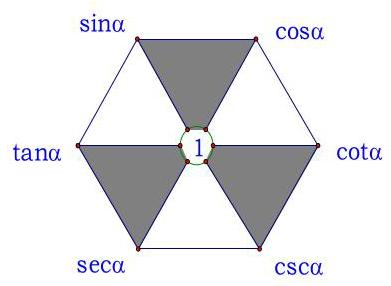

第 1 页共 28 页

(1)倒数关系: $\sin \alpha  \cdot  \csc \alpha  = 1;\cos \alpha  \cdot  \sec \alpha  = 1;\tan \alpha  \cdot  \cot \alpha  = 1$ ；

(2)商数关系: $\tan \alpha  = \frac{\sin \alpha }{\cos \alpha }\left( {\cos \alpha  \neq  0}\right)$ ; $\cot \alpha  = \frac{\cos \alpha }{\sin \alpha }\left( {\sin \alpha  \neq  0}\right)$ ;

(3)平方关系: ${\sin }^{2}\alpha  + {\cos }^{2}\alpha  = 1$ ; $1 + {\tan }^{2}\alpha  = {\sec }^{2}\alpha$ ; $1 + {\cot }^{2}\alpha  = {\csc }^{2}\alpha$ .

## 4、这些关系式还可以如图样加强形象记忆:

(1)对角线上两个函数的乘积为 1(倒数关系)。

(2)任一角的函数等于与其相邻的两个函数的积(商数关系)。

(3)阴影部分，顶角两个函数的平方和等于底角函数的平方(平方关系)。

注意:1)“同角”的概念与角的表达形式无关，如: ${\sin }^{2}{3\alpha } + {\cos }^{2}{3\alpha } = 1,\frac{\sin \frac{\alpha }{2}}{\cos \frac{\alpha }{2}} = \tan \frac{\alpha }{2}$ 。

2)上述关系(公式)都必须在定义域允许的范围内成立。

3)由一个角的任一三角函数值可求出这个角的其余各三角函数值，且因为利用“平方关系”公式，最终需求平方根, 会出现两解, 因此应尽可能少用, 若使用时, 要注意讨论符号。

5、诱导公式:4 个同名 2 个异名

6、两角和差公式与辅助角公式

7、二倍角与半倍角公式

## 例题精讲

【例 1 】已知函数 $y = {\log }_{a}\left( {x - 2}\right)  + 4\left( {a > 0, a \neq  1}\right)$ 的图像恒过点定 $A$ ,若角 $\alpha$ 终边经过点 $A$ ,则 ${\sin }^{2}\alpha  + \sin \left( {\alpha  + \frac{3\pi }{2}}\right)  =$

【难度】 $\star   \star   \star$

【答案】 $\frac{1}{25}$

【解析】令 $x - 2 = 1,\therefore x = 3, x = 3$ 时, $y = 4$ ,所以定点 $A\left( {3,4}\right)$ ,

所以 $\sin \alpha  = \frac{4}{\sqrt{{3}^{2} + {4}^{2}}} = \frac{4}{5},\cos \alpha  = \frac{3}{\sqrt{{3}^{2} + {4}^{2}}} = \frac{3}{5}$ .

由题得 ${\sin }^{2}\alpha  + \sin \left( {\alpha  + \frac{3\pi }{2}}\right)  = {\sin }^{2}\alpha  - \cos \alpha  = \frac{16}{25} - \frac{3}{5} = \frac{1}{25}$ . 故答案为: $\frac{1}{25}$

【例 2】如图,点 $A\text{ 、 }B$ 是单位圆 $O$ 上的两点,点 $C$ 是圆 $O$ 与 $x$ 轴的正半轴的交点, 将锐角 $\alpha$ 的终边 ${OA}$ 按逆时针方向旋转 $\frac{\pi }{3}$ 到 ${OB}$ .

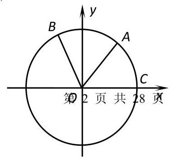

例 2 图

(1)若点 $A$ 的坐标为 $\left( {\frac{3}{5},\frac{4}{5}}\right)$ ，求 $\frac{1 + \sin {2\alpha }}{1 + \cos {2\alpha }}$ 的值；

(2)用 $\alpha$ 表示 $\left| {BC}\right|$ ，并求 $\left| {BC}\right|$ 的取值范围.

【难度】 $\star   \star   \star$

【答案】见解析

【解析】(1) 由已知, $\cos \alpha  = \frac{3}{5},\sin \alpha  = \frac{4}{5}$ .

$\therefore \sin {2\alpha } = 2\sin \alpha \cos \alpha  = \frac{24}{25},\cos {2\alpha } = {\cos }^{2}\alpha  - {\sin }^{2}\alpha  =  - \frac{7}{25}$ .

$\frac{1 + \sin {2\alpha }}{1 + \cos {2\alpha }} = \frac{1 + \frac{24}{25}}{1 + \left( {-\frac{7}{25}}\right) } = \frac{49}{18}.$

( 2 )由单位圆可知: $\left| {OC}\right|  = \left| {OB}\right|  = 1$ ， $\angle {COB} = \alpha  + \frac{\pi }{3}$ ，

由余弦定理得: ${\left| BC\right| }^{2} = {\left| OC\right| }^{2} + {\left| OB\right| }^{2} - 2\left| {OC}\right| \left| {OB}\right| \cos \angle {COB} = 1 + 1 - 2\cos \left( {\alpha  + \frac{\pi }{3}}\right)  = 2 - 2\cos \left( {\alpha  + \frac{\pi }{3}}\right)$

$\because \alpha  \in  \left( {0,\frac{\pi }{2}}\right) ,\;\therefore \alpha  + \frac{\pi }{3} \in  \left( {\frac{\pi }{3},\frac{5\pi }{6}}\right)$ ,

$\therefore \cos \left( {\alpha  + \frac{\pi }{3}}\right)  \in  \left( {-\frac{\sqrt{3}}{2},\frac{1}{2}}\right) \therefore {\left| BC\right| }^{2} \in  \left( {1,2 + \sqrt{3}}\right) ,\therefore \left| {BC}\right|  \in  \left( {1,\frac{\sqrt{6} + \sqrt{2}}{2}}\right)$ .

【例 3】已知角 $\alpha ,\beta$ 的顶点都为坐标原点,始边都与 $x$ 轴的非负半轴重合,且都为第一象限的角, $\alpha ,\beta$ 终边上分别有点 $A\left( {1, a}\right) , B\left( {2, b}\right)$ ,且 $\alpha  = {2\beta }$ ,则 $\frac{1}{a} + b$ 的最小值为

A. 1 B. $\sqrt{2}$ C. $\sqrt{3}$ D. 2

【难度】 $\star   \star   \star$

【答案】C

【解析】由已知得, $\tan \alpha  = \alpha ,\tan \beta  = \frac{b}{2}$ ,因为 $\alpha  = {2\beta }$ ,所以 $\tan \alpha  = \tan \left( {2\beta }\right)$ ,

所以 $a = \frac{2 \cdot  \frac{b}{2}}{1 - {\left( \frac{b}{2}\right) }^{2}}, a = \frac{4b}{4 - {b}^{2}}$ ,所以 $\frac{1}{a} + b = \frac{4 - {b}^{2}}{4b} + b = \frac{1}{b} + \frac{3b}{4} \geq  2\sqrt{\frac{1}{b} \cdot  \frac{3b}{4}} = \sqrt{3}$ ,

当且仅当 $\frac{1}{b} = \frac{3b}{4}, b = \frac{2\sqrt{3}}{3}$ 时,取等号.

【例 4】在直角坐标平面 ${xOy}$ 中,已知两定点 ${F}_{1}\left( {-2,0}\right)$ 与 ${F}_{2}\left( {2,0}\right)$ 位于动直线 $l : {ax} + {by} + c = 0$ 的同侧,设集合 $P = \left\{  {l \mid  \text{ 点 }{F}_{1}\text{ 与点 }{F}_{2}\text{ 到直线 }l\text{ 的距离之差等于 }2}\right\}  , Q = \left\{  {\left( {x, y}\right)  \mid  {x}^{2} + {y}^{2} \leq  4, x, y \in  R}\right\}$ ,记

$S = \{ \left( {x, y}\right)  \mid  \left( {x, y}\right)  \notin  l, l \in  P\} , T = \{ \left( {x, y}\right)  \mid  \left( {x, y}\right)  \in  Q \cap  S\}$ ,则由 $T$ 中的所有点所组成的图形的面积是___

【难度】★★★

【答案】 $4\sqrt{3} + \frac{4\pi }{3}$

【解析】: 两定点 ${F}_{1}\left( {-2,0}\right)$ 与 ${F}_{2}\left( {2,0}\right)$ 位于动直线 $l : {ax} + {by} + c = 0$ 的同侧,如图:

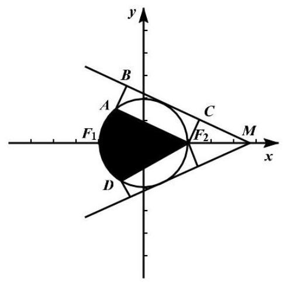

过 ${F}_{1}\left( {-2,0}\right)$ 与 ${F}_{2}\left( {2,0}\right)$ 分别作 $l$ 直线的垂线,垂足分别为 $B, C$

由题意得 ${F}_{1}B - {F}_{2}C = 2$ ,即 ${F}_{1}A = 2$

$\because$ 在 $\mathrm{{Rt}}\bigtriangleup A{F}_{1}{F}_{2}$ 中 ${F}_{1}{F}_{2} = 4$ ,

$\therefore \cos \angle A{F}_{1}{F}_{2} = \frac{1}{2}$ 可得 $\angle A{F}_{1}{F}_{2} = {60}^{ \circ  }$

$\therefore$ 集合 $P$ 对应的轨迹为线段 $A{F}_{2}$ 的上方部分, $Q$ 对应的区域为半径为 2 的单位圆内部根据 $T$ 的定义可知, $T$ 中的所有点组成的图形为图形阴影部分

$\therefore$ 阴影部分的面积为: $2\left( {\frac{1}{6}\pi  \times  {2}^{2} + \frac{1}{2} \times  2 \times  4 \times  \sin {60}^{ \circ  }}\right)  = 4\sqrt{3} + \frac{4\pi }{3}$

故答案为: $4\sqrt{3} + \frac{4\pi }{3}$ .

【例 5】下列六个命题( 1 )不存在无穷多个角 $\alpha$ 和 $\beta$ ,使得 $\sin \left( {\alpha  + \beta }\right)  = \sin \alpha \cos \beta  - \cos \alpha \sin \beta$

(2)存在这样的角 $\alpha$ 和 $\beta$ ,使得 $\cos \left( {\alpha  + \beta }\right)  = \cos \alpha \cos \beta  + \sin \alpha \sin \beta$

(3)对任意角 $\alpha$ 和 $\beta$ ,都有 $\cos \left( {\alpha  + \beta }\right)  = \cos \alpha \cos \beta  - \sin \alpha \sin \beta$

(4)不存在这样的角 $\alpha$ 和 $\beta$ ，使得 $\sin \left( {\alpha  + \beta }\right)  \neq  \sin \alpha \cos \beta  + \cos \alpha \sin \beta$

(5)不存在这样的角 $\alpha$ 和 $\beta$ ,使得 $\tan \left( {\alpha  + \beta }\right)  = \frac{\tan \alpha  - \tan \beta }{1 + \tan \alpha  \cdot  \tan \beta }$

(6)对任意角 $\alpha$ 和 $\beta$ ，都有 $\tan \left( {\alpha  + \beta }\right)  = \frac{\tan \alpha  + \tan \beta }{1 - \tan \alpha  \cdot  \tan \beta }$

其中假命题的个数是( )

A. 1 B. 2 C. 3 D. 4

【难度】 $\star   \star   \star$

【答案】C

【解析】对于 (1),令 $\alpha  = {k\pi },\beta  = {n\pi }\left( {k, n \in  \mathrm{Z}}\right)$ ,则有 $\sin \left( {\alpha  + \beta }\right)  = 0,\sin \alpha  = \sin \beta  = 0$ ,

$\sin \left( {\alpha  + \beta }\right)  = \sin \alpha \cos \beta  - \cos \alpha \sin \beta$ 成立,

显然角 $\alpha$ 和 $\beta$ 有无穷多个，(1)不正确；

对于(2),令 $\alpha  = {2\pi },\beta  = 0$ ,则 $\cos \left( {\alpha  + \beta }\right)  = \cos \alpha  = \cos \beta  = 1,\sin \alpha  = \sin \beta  = 0$ ,

即 $\cos \left( {\alpha  + \beta }\right)  = \cos \alpha \cos \beta  + \sin \alpha \sin \beta$ 成立，(2)正确；

对于(3),由和角的余弦公式知,对任意角 $\alpha$ 和 $\beta$ ,都有 $\cos \left( {\alpha  + \beta }\right)  = \cos \alpha \cos \beta  - \sin \alpha \sin \beta$ ,(3)正确;

对于(4),由和角的正弦公式知,对任意角 $\alpha$ 和 $\beta ,\sin \left( {\alpha  + \beta }\right)  = \sin \alpha \cos \beta  + \cos \alpha \sin \beta$

即不存在这样的角 $\alpha$ 和 $\beta$ ,使得 $\sin \left( {\alpha  + \beta }\right)  \neq  \sin \alpha \cos \beta  + \cos \alpha \sin \beta$ ,(4)正确;

对于(5),令 $\alpha  = {2\pi },\beta  = 0$ ,则 $\tan \left( {\alpha  + \beta }\right)  = 0,\tan \alpha  = 0,\tan \beta  = 0$ ,有 $\tan \left( {\alpha  + \beta }\right)  = \frac{\tan \alpha  - \tan \beta }{1 + \tan \alpha  \cdot  \tan \beta },\left( 5\right)$ 不正确;

对于(6),令 $\alpha  = \frac{\pi }{4},\beta  = \frac{\pi }{4}$ ,则 $\alpha  + \beta  = \frac{\pi }{2},\tan \left( {\alpha  + \beta }\right)$ 无意义,(6)不正确,

所以给定的 6 个命题中有 3 个不正确.

故选: $\mathrm{C}$

巩固训练

1、已知 $A$ 为锐角， $\lg \left( {1 + \cos A}\right)  = m,\lg \frac{1}{1 - \cos A} = n$ ，则 $\lg \sin A$ 的值为( )

A、 $m + \frac{1}{n}$ B、 $m - n$ C、 $\frac{1}{2}\left( {m + n}\right)$ D、 $\frac{1}{2}\left( {m - n}\right)$

【难度】 $\star   \star   \star$

【答案】D.

【解析】根据题意, 两式相减, 可得

$\lg \left( {1 + \cos A}\right)  - \lg \frac{1}{1 - \cos A} = m - n,\;\lg \left\lbrack  {\left( {1 + \cos A}\right)  \cdot  \left( {1 - \cos A}\right) }\right\rbrack   = m - n \Rightarrow  \lg {\sin }^{2}A = m - n$ ,

$\because A$ 为锐角, $\therefore \sin A > 0,\;\therefore 2\lg \sin A = m - n \Rightarrow  \lg \sin A = \frac{1}{2}\left( {m - n}\right)$ .

2、如果 $\sin \alpha  \cdot  \cos \alpha  > 0$ ,且 $\sin \alpha  \cdot  \tan \alpha  > 0$ ,化简: $\cos \frac{\alpha }{2}\sqrt{\frac{1 - \sin \frac{\alpha }{2}}{1 + \sin \frac{\alpha }{2}}} + \cos \frac{\alpha }{2}\sqrt{\frac{1 + \sin \frac{\alpha }{2}}{1 - \sin \frac{\alpha }{2}}}$ .

【难度】 $\star   \star   \star$

【答案】D.

【解析】由 $\sin \alpha  \cdot  \cos \alpha  > 0$ ,得 $\frac{{\sin }^{2}\alpha }{\cos \alpha } > 0,\cos \alpha  > 0$ ,又 $\sin \alpha  \cdot  \tan \alpha  > 0,\therefore \sin \alpha  > 0$

$\therefore {2k\pi } < \alpha  < {2k\pi } + \frac{\pi }{2}\left( {k \in  Z}\right)$ ,即 ${k\pi } < \frac{\alpha }{2} < {k\pi } + \frac{\pi }{4}\left( {k \in  Z}\right)$ ,

当为 $k$ 偶数时, $\frac{\alpha }{2}$ 位于第一象限,当为 $k$ 奇数时, $\frac{\alpha }{2}$ 位于第三象限:

原式 $= \cos \frac{\alpha }{2}\sqrt{\frac{{\left( 1 - \sin \frac{\alpha }{2}\right) }^{2}}{{\cos }^{2}\frac{\alpha }{2}}} + \cos \frac{\alpha }{2}\sqrt{\frac{{\left( \right) }^{2}}{{\cos }^{2}\frac{\alpha }{2}}} = \cos \frac{\alpha }{2} \cdot  \frac{1 - \sin \frac{\alpha }{2}}{\left| \cos \frac{\alpha }{2}\right| } + \cos \frac{\alpha }{2} \cdot  \frac{1 + \sin \frac{\alpha }{2}}{\left| \cos \frac{\alpha }{2}\right| } = \frac{2\cos \frac{\alpha }{2}}{\left| \cos \frac{\alpha }{2}\right| } = \left\{  \begin{array}{l} 2\left( {\frac{\alpha }{2}\text{ 在第一象限 }}\right) \\   - 2\left( {\frac{\alpha }{2}\text{ 在第三象限 }}\right)  \end{array}\right.$ . 3、已知角 $\theta$ 的终边经过点 $P\left( {x,3}\right) \left( {x < 0}\right)$ 且 $\cos \theta  = \frac{\sqrt{10}}{10}x$ ，则 $x =$ ___.

【难度】 $\star   \star   \star$

【答案】 -1

【解析】由余弦函数的定义可得 $\cos \theta  = \frac{x}{\sqrt{{x}^{2} + 9}} = \frac{\sqrt{10}}{10}x$ ,解得 $x = 0$ (舍去),或 $x = 1$ (舍去),或 $x =  - 1$ , $\therefore x =  - 1$ . 故答案为: -1 .

4、已知函数 $f\left( x\right)$ 为 $R$ 上的奇函数,且 $f\left( {-x}\right)  = f\left( {2 + x}\right)$ ,当 $x \in  \left\lbrack  {0,1}\right\rbrack  , f\left( x\right)  = {2}^{x} + \frac{a}{{2}^{x}}$ ,则 $f\left( {2019}\right)  + f\left( {2022}\right)$ 的值为( )

A. $- \frac{3}{2}$ B. 0

C. $\frac{3}{2}$ D. $\frac{21}{4}$

【难度】 $\star   \star   \star$

【答案】A

【解析】根据题意,函数 $f\left( x\right)$ 为 $R$ 上的奇函数,则 $f\left( 0\right)  = 0$ ,又由 $x \in  \left\lbrack  {0,1}\right\rbrack$ 时 $f\left( x\right)  = {2}^{x} + \frac{a}{{2}^{x}}$ ,则有 $f\left( 0\right)  = 1 + a = 0$ , 解可得: $a =  - 1$ ,则有 $f\left( x\right)  = {2}^{x} - \frac{1}{{2}^{x}}$ .

又由 $f\left( {-x}\right)  = f\left( {2 + x}\right)$ ,即 $f\left( {x + 2}\right)  =  - f\left( x\right)$ ,则有 $f\left( {x + 4}\right)  =  - f\left( {x + 2}\right)  = f\left( x\right)$ ,即函数 $f\left( x\right)$ 是周期为 4 的周期函数.

则 $f\left( {2019}\right)  = f\left( {-1 + 4 \times  {505}}\right)  = f\left( {-1}\right)  =  - f\left( 1\right)  =  - \frac{3}{2}$ ,

$f\left( {2022}\right)  = f\left( {2 + 4 \times  {505}}\right)  = f\left( 2\right)  = f\left( {-0}\right)  = f\left( 0\right)  = 0,$

所以 $f\left( {2019}\right)  + f\left( {2022}\right)  =  - \frac{3}{2} + 0 =  - \frac{3}{2}$ .

故选: A

5、已知圆 $O$ 与直线 $l$ 相切于点 $A$ ,点 $P, Q$ 同时从点 $A$ 出发, $P$ 沿直线 $l$ 匀速向右、 $Q$ 沿圆周按逆时针方向以相同的速率运动,当点 $Q$ 运动到如图所示的位置时,点 $P$ 也停止运动,连接 ${OQ},{OP}$ ,则阴影部分的面积 ${S}_{1},{S}_{2}$ 的大小关系是( )

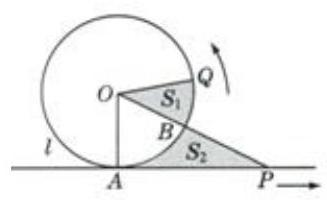

A. ${S}_{1} \geq  {S}_{2}$ B. ${S}_{1} \leq  {S}_{2}$

C. ${S}_{1} = {S}_{2}$ D. 先 ${S}_{1} < {S}_{2}$ ,再 ${S}_{1} = {S}_{2}$ ,最后 ${S}_{1} > {S}_{2}$

【难度】 $\star   \star   \star$

【答案】C

【解析】因圆 $O$ 与直线 $l$ 相切,则 ${OA} \bot  {AP}$ ,于是得 $\bigtriangleup {AOP}$ 面积 ${S}_{\bigtriangleup {OAP}} = \frac{1}{2}{OA} \cdot  {AP}$

令弧 ${AQ}$ 的弧长为 $l$ ,扇形 ${AOQ}$ 面积 $S = \frac{1}{2}{lr} = \frac{1}{2}l \cdot  {OA}$

依题意 $l = {AP}$ ,即 $S = {S}_{\Delta OAP}$ ,令扇形 ${AOB}$ 面积为 ${S}^{\prime }$ ,则有 ${S}^{\prime } + {S}_{1} = {S}^{\prime } + {S}_{2}$ ,即 ${S}_{1} = {S}_{2}$ ,

所以阴影部分的面积 ${S}_{1},{S}_{2}$ 的大小关系是 ${S}_{1} = {S}_{2}$ . 故选: $\mathrm{C}$

6、已知 $2\cos \left( {{2\alpha } + \beta }\right)  + 3\cos \beta  = 0$ ，求 $\tan \left( {\alpha  + \beta }\right) \tan \alpha$ 的值.

【难度】 $\star   \star   \star$

【答案】 -5

【解析】 $\because {2\alpha } + \beta  = \alpha  + \beta  + \alpha ,\beta  = \alpha  + \beta  - \alpha$

$\therefore \cos \left( {{2\alpha } + \beta }\right)  = \cos \left\lbrack  {\left( {\alpha  + \beta }\right)  + \alpha }\right\rbrack   = \cos \left( {\alpha  + \beta }\right) \cos \alpha  - \sin \left( {\alpha  + \beta }\right) \sin \alpha$ ,

$\cos \beta  = \cos \left\lbrack  {\left( {\alpha  + \beta }\right)  - \alpha }\right\rbrack   = \cos \left( {\alpha  + \beta }\right) \cos \alpha  + \sin \left( {\alpha  + \beta }\right) \sin \alpha ,$

$\because 2\cos \left( {{2\alpha } + \beta }\right)  + 3\cos \beta  = 0$ ,

$\therefore 2\cos \left( {\alpha  + \beta }\right) \cos \alpha  - 2\sin \left( {\alpha  + \beta }\right) \sin \alpha  + 3\cos \left( {\alpha  + \beta }\right) \cos \alpha  + 3\sin \left( {\alpha  + \beta }\right) \sin \alpha  = 0$ ,即

$5\cos \left( {\alpha  + \beta }\right) \cos \alpha  + \sin \left( {\alpha  + \beta }\right) \sin \alpha  = 0,$

$\therefore \tan \left( {\alpha  + \beta }\right) \tan \alpha  =  - 5$ .

## (二) 解三角形

## 知识梳理

## 一、正余弦定理

(1)正弦定理: $\frac{a}{\sin A} = \frac{b}{\sin B} = \frac{c}{\sin C} = {2R}$

$$
{a}^{2} = {b}^{2} + {c}^{2} - {2bc} \cdot  \cos A,
$$

(2)余弦定理: ${b}^{2} = {c}^{2} + {a}^{2} - {2ac}\cos B$ ，；

$$
{c}^{2} = {a}^{2} + {b}^{2} - {2ab}\cos C.
$$

## 二、三角形面积公式

(1) ${S}_{\bigtriangleup {ABC}} = \frac{1}{2}{ab}\sin C = \frac{1}{2}{ac}\sin B = \frac{1}{2}{bc}\sin A$

(2) $S = \frac{1}{2}a \cdot  {h}_{a}\left( {h}_{a}\right.$ 表示 $a$ 边上的高 $)$

(3) $S = \frac{1}{2}{ab}\sin C = \frac{1}{2}{ac}\sin B = \frac{1}{2}{bc}\sin A = \frac{abc}{4R}\left( {R\text{ 为外接圆半径 }}\right)  = 2{R}^{2}\sin A\sin B\sin C$

## 例题精讲

【例 6】鲁洛克斯三角形又称“勒洛三角形”，是一种特殊的三角形，指分别以正三角形的顶点为圆心，以其边长为半径作圆弧, 由这三段圆弧组成的曲边三角形. 鲁洛克斯三角形的特点是: 在任何方向上都有相同的宽度, 机械加工业上利用这个性质, 把钻头的横截面做成鲁洛克斯三角形的形状, 就能在零件上钻出正方形的孔来. 如下图,已知某鲁洛克斯三角形的一段弧 $\overset{\text{ ⏜ }}{AB}$ 的长度为 $\pi$ ,则线段 ${AB}$ 的长为___,该鲁洛克斯三角形的面积为___

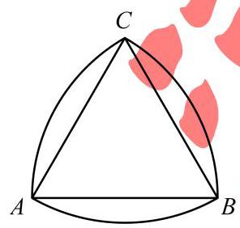

【难度】 $\star   \star   \star$

【答案】 $3\;\frac{{9\pi } - 9\sqrt{3}}{2}$

【解析】因 $\bigtriangleup {ABC}$ 是正三角形,以点 $C$ 为圆心的弧 ${AB}$ 所对圆心角为 $\frac{\pi }{3}$ ,则有 $\frac{\pi }{3} \cdot  {AC} = \pi$ ,解得 ${AC} = 3$ , 所以 ${AB} = 3$ ；

弧 ${AB}$ 与弦 ${AB}$ 所对弓形面积为 ${S}_{1} = \frac{1}{2} \cdot  3 \cdot  \pi  - \frac{1}{2}A{B}^{2}\sin \frac{\pi }{3} = \frac{3\pi }{2}\frac{9\sqrt{3}}{4}$ ,

所以鲁洛克斯三角形的面积为 $S = 3{S}_{1} + \frac{1}{2}A{B}^{2}\sin \frac{\pi }{3} = 3\left( {\frac{3\pi }{2} - \frac{9\sqrt{3}}{4}}\right)  + \frac{9\sqrt{3}}{4} = \frac{{9\pi } - 9\sqrt{3}}{2}$ .

故答案为: $3;\frac{{9\pi } - 9\sqrt{3}}{2}$

【例 7】已知 $\bigtriangleup  {ABC}$ 中，角 $A, B, C$ 所对的边分别是 $a, b, c$ ，满足 ${a}^{2} = {b}^{2} + {bc}$ .

(1)求证: $A = {2B}$ ；

(2)若 $b = 2$ ，且 $\sin C + \tan B\cos C = 1$ ，求 $\bigtriangleup  {ABC}$ 的内切圆半径.

【难度】 $\star   \star   \star$

【答案】(1) 证明见解析; (2) $\sqrt{3} - 1$ .

【解析】(1) 证明: 由 ${a}^{2} = {b}^{2} + {bc} = {b}^{2} + {c}^{2} - {2bc}\cos A$ 得 ${c}^{2} = {bc} + {2bc}\cos A$ ,即 $c = b + {2b}\cos A$

$\therefore \sin C = \sin B + 2\sin B\cos A$ ,即 $\sin \left( {A + B}\right)  = \sin B + 2\sin B\cos A,\therefore \sin \left( {A - B}\right)  = \sin B > 0$

又 $0 < B < \pi , - \pi  < A - B < \pi ,\therefore A - B = B$ 或 $A - B = \pi  - B$ (舍去), $\therefore A = {2B}$

(2)由 $\sin C + \tan B\cos C = \frac{\sin C\cos B + \sin B\cos C}{\cos B} = 1$ ，得 $\sin \left( {B + C}\right)  = \cos B$ ，

$\therefore \sin A = \cos B > 0,\therefore \sin B = \frac{1}{2},\therefore B = \frac{\pi }{6}, A = \frac{\pi }{3}, C = \frac{\pi }{2}$ .

因为 $b = 2$ ,可知 $a = 2\sqrt{3}, c = 4$ ,有 $\bigtriangleup  {ABC}$ 内切圆半径 $r = \frac{a + b - c}{2} = \sqrt{3} - 1$

【例 8】在 $\bigtriangleup  {ABC}$ 中，角 $A$ ， $B$ ， $C$ 的对边分别是 $a$ 、 $b$ 、 $c$ ，若满足 $b = 4$ ， $A = {60}^{ \circ  }$ 的三角形仅有一个，则 $\bigtriangleup  {ABC}$ 面积的取值范围是___

【难度】 $\star   \star   \star$

【答案】 $\lbrack 4\sqrt{3}, + \infty ) \cup  \{ 2\sqrt{3}\}$

【解析】由正弦定理知，满足 $b = 4, A = {60}^{ \circ  }$ 三角形仅有一个，

则 $a = b\sin A$ 或 $a \geq  b$ ,即 $a = 2\sqrt{3}$ 或 $a \geq  4$ ,

由余弦定理得, $c = 2 + \sqrt{{a}^{2} - {12}}$ ,所以 $c \in  \{ 2\}  \cup  \lbrack 4, + \infty )$ ,

$\therefore {S}_{\bigtriangleup {ABC}} = \frac{1}{2}{bc} \cdot  \sin A = \sqrt{3}\left( {2 + \sqrt{{a}^{2} - {12}}}\right)  \in  \left\{  {2\sqrt{3}}\right\}   \cup  \lbrack 4\sqrt{3}, + \infty )$ . 故答案为: $\left\lbrack  {4\sqrt{3}, + \infty }\right)  \cup  \{ 2\sqrt{3}\}$

【例 9】如下图所示,某农场有一块扇形农田,其半径为 ${100}\mathrm{\;m}$ ,圆心角为 $\frac{\pi }{3}$ ,现要按图中方法在农田中围出一个面积最大的内接矩形用于种植,则围出的矩形农田的面积为___ ${\mathrm{m}}^{2}$ .

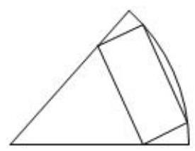

【难度】 $\star   \star   \star   \star$

【答案】 ${10000}\left( {2 - \sqrt{3}}\right)$

【解析】解: 如图: 做 $\angle {AOB}$ 的角平分线交 ${BE}$ 于 $D$ ,设 $\angle {EOA} = \theta$ ,则 ${2DE} = {2R}\sin \left( {{30}^{ \circ  } - \theta }\right)$ , $\angle {OFE} = {150}^{ \circ  }$ ,在 $\bigtriangleup {OFE}$ 中,由正弦定理可知: $\frac{EF}{\sin \theta } = \frac{R}{\sin {150}^{ \circ  }}$ ,则 ${EF} = {2R}\sin \theta$ 所以矩形农田的面积为:

$S = {2R}\sin \left( {{30}^{ \circ  } - \theta }\right)  \cdot  {2R}\sin \theta  = 4{R}^{2}\sin \theta \sin \left( {{30}^{ \circ  } - \theta }\right)  = 2{R}^{2}\left( {\frac{1}{2}\sin {2\theta } + \frac{\sqrt{3}}{2}\cos {2\theta }}\right)  - \sqrt{3}{R}^{2}$

$= 2{R}^{2}\sin \left( {{2\theta } + {60}^{ \circ  }}\right)  - \sqrt{3}{R}^{2}$

当 $\sin \left( {{2\theta } + {60}^{ \circ  }}\right)  = 1$ 时,即 $\theta  = {15}^{ \circ  }$ 时, $S$ 有最大值为 $\left( {2 - \sqrt{3}}\right) {R}^{2}$

又 $R = {100}$ ,所以面积的最大值为 ${10000}\left( {2 - \sqrt{3}}\right)$ ; 故答案为: ${10000}\left( {2 - \sqrt{3}}\right)$ .

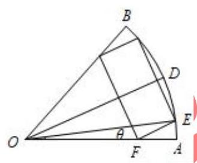

## 巩固训练

1、在 $\bigtriangleup  {ABC}$ 中，若 $\tan A \cdot  \tan B > 1$ ，则 $\bigtriangleup  {ABC}$ 的形状为( )

A 锐角三角形 B. 钝角三角形 C. 直角三角形 D. 无法判断

【难度】★★★

【答案】A

【解析】由 $\tan A \cdot  \tan B > 0$ 可知 $A$ 与 $B$ 的正切值同号,

若是同负,则 $A, B$ 均为钝角,不可能; 故 $A, B$ 均为锐角;

另一方面, $\tan C = \tan \left\lbrack  {\pi  - \left( {A + B}\right) }\right\rbrack   =  - \tan \left( {A + B}\right)  = \frac{\tan A + \tan B}{\tan A\tan B - 1}$ ,

由 $\tan A > 0,\tan B > 0$ 及 $\tan A \cdot  \tan B > 1$ 可知 $\tan C > 0$ ，即 $C$ 是锐角；

综上所述， $\bigtriangleup  {ABC}$ 是锐角三角形，故选 A.

2、已知 $\bigtriangleup  {ABC}$ 中，角 $A, B, C$ 所对的边分别是 $a, b, c$ ，满足 ${a}^{2} = {b}^{2} + {bc}$ .

(1)求证: $A = {2B}$ ；

(2)若 $b = 2$ ，且 $\sin C + \tan B\cos C = 1$ ，求 $\bigtriangleup  {ABC}$ 的内切圆半径.

【难度】 $\star   \star   \star$

【答案】(1)证明见解析；(2) $\sqrt{3} - 1$ .

【解析】(1) 证明: 由 ${a}^{2} = {b}^{2} + {bc} = {b}^{2} + {c}^{2} - {2bc}\cos A$ 得 ${c}^{2} = {bc} + {2bc}\cos A$ ,即 $c = b + {2b}\cos A \; \therefore \sin C = \sin B + 2\sin B\cos A$ ,即 $\sin \left( {A + B}\right)  = \sin B + 2\sin B\cos A,\therefore \sin \left( {A - B}\right)  = \sin B > 0$ 又 $0 < B < \pi , - \pi  < A - B < \pi ,\therefore A - B = B$ 或 $A - B = \pi  - B$ (舍去), $\therefore A = {2B}$

(2)由 $\sin C + \tan B\cos C = \frac{\sin C\cos B + \sin B\cos C}{\cos B} = 1$ ，得 $\sin \left( {B + C}\right)  = \cos B$ ，

$\therefore \sin A = \cos B > 0,\therefore \sin B = \frac{1}{2},\therefore B = \frac{\pi }{6}, A = \frac{\pi }{3}, C = \frac{\pi }{2}$ .

因为 $b = 2$ ,可知 $a = 2\sqrt{3}, c = 4$ ,有 $\bigtriangleup  {ABC}$ 内切圆半径 $r = \frac{a + b - c}{2} = \sqrt{3} - 1$

3、在 $\bigtriangleup  {ABC}$ 中，三个内角 $A, B, C$ ，所对的边依次为 $a, b, c$ ，且 $\cos C = \frac{1}{4}$ .

(1)求 $2{\cos }^{2}\frac{A + B}{2} + 2\sin {2C}$ 的值；

(2)设 $c = 2$ ，求 $\mathbf{a} + \mathbf{b}$ 的取值范围.

【难度】 $\star   \star   \star$

【答案】(1) $\frac{3 + \sqrt{15}}{4}$ (2) $\left( {2,\frac{4\sqrt{6}}{3}}\right\rbrack$

【解析】(1) $\because \cos C = \frac{1}{4}$ ,又 $\mathrm{C}$ 为三角形内角, $\therefore \sin C = \sqrt{1 - {\cos }^{2}C} = \frac{\sqrt{15}}{4}$ ,

$\therefore 2{\cos }^{2}\frac{A + B}{2} + 2\sin {2C} = 1 + \cos \left( {A + B}\right)  + 2\sin {2C}$

$= 1 - \cos C + 4\sin C\cos C = 1 - \frac{1}{4} + 4 \times  \frac{1}{4} \times  \frac{\sqrt{15}}{4} = \frac{3 + \sqrt{15}}{4}$

(2) $\because c = 2,\cos C = \frac{1}{4},\therefore$ 由余弦定理可得: $4 = {a}^{2} + {b}^{2} - \frac{1}{2}{ab} = {\left( a + b\right) }^{2} - \frac{5}{2}{ab}$ ,

$\because {a}^{2} + {b}^{2} \geq  {2ab}$ ,可得: ${ab} \leq  \frac{8}{3}$ ,当且仅当 $a = b$ 时等号成立,

$\therefore$ 可得: ${\left( a + b\right) }^{2} = 4 + \frac{5}{2}{ab} \leq  \frac{32}{3}$ ,可得: $a + b \leq  \frac{4\sqrt{6}}{3}$ ,当且仅当 $a = b$ 时等号成立,

$\because a + b > c = 2,\therefore a + b$ 的取值范围为: $\left( {2,\frac{4\sqrt{6}}{3}}\right\rbrack$

4、如图,某小区有一块扇形 ${OPQ}$ 空地,现打算在 $\overset{\text{ ⏜ }}{PQ}$ 上选取一点 $C$ ,按如图方式规划一块矩形 ${ABCD}$ 土地用于建造文化景观. 已知扇形 ${OPQ}$ 的半径为 6 米,圆心角为 ${60}^{ \circ  }$ ,则矩形 ${ABCD}$ 土地的面积(单位:平方米)的最大值是___.

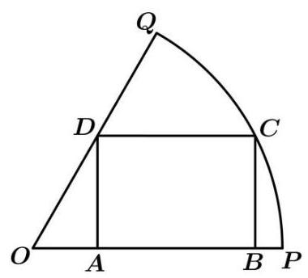

【难度】★★★

【答案】 $6\sqrt{3}$

【解析】 $\angle {POQ} = {60}^{ \circ  } = \frac{\pi }{3}$ ，设 $\angle {COP} = \theta$ ， $0 < \theta  < \frac{\pi }{3}$ ，则 ${BC} = {OC}\sin \theta  = 6\sin \theta$ ，

$\bigtriangleup {OCD}$ 中, $\angle {ODC} = \frac{2\pi }{3}$ ,由正弦定理 $\frac{OC}{\sin \angle {ODC}} = \frac{CD}{\sin \angle {DOC}}$ ,

$\frac{6}{\sin \frac{2\pi }{3}} = \frac{CD}{\sin \left( {\frac{\pi }{3} - \theta }\right) }$ ,所以 ${CD} = \frac{6\sin \left( {\frac{\pi }{3} - \theta }\right) }{\sin \frac{2\pi }{3}} = 4\sqrt{3}\sin \left( {\frac{\pi }{3}\theta }\right)$

${S}_{ABCD} = {BC} \cdot  {CD} = 6\sin \theta  \cdot  4\sqrt{3}\sin \left( {\frac{\pi }{3} - \theta }\right)  = {24}\sqrt{3}\sin \theta \left( {\frac{\sqrt{3}}{2}\cos \theta  - \frac{1}{2}\sin \theta }\right)$

$= {12}\sqrt{3}\left( {\sqrt{3}\sin \theta \cos \theta  - {\sin }^{2}\theta }\right)  = 6\sqrt{3}\left\lbrack  {\sqrt{3}\sin {2\theta } - \left( {1 - \cos {2\theta }}\right) }\right\rbrack$

$= {12}\sqrt{3}\left( {\frac{\sqrt{3}}{2}\sin {2\theta } + \frac{1}{2}\cos {2\theta }}\right)  - 6\sqrt{3} = {12}\sqrt{3}\sin \left( {{2\theta } + \frac{\pi }{6}}\right)  - 6\sqrt{3}$ ,

所以 ${2\theta } + \frac{\pi }{6} = \frac{\pi }{2}$ ,即 $\theta  = \frac{\pi }{6}$ 时, ${S}_{ABCD}$ 取得最大值 ${12}\sqrt{3} - 6\sqrt{3} = 6\sqrt{3}$ .

故答案为: $6\sqrt{3}$ .

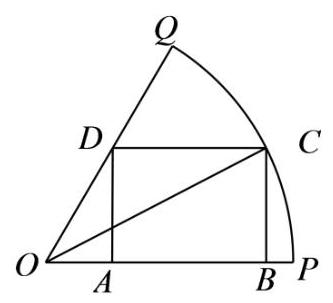

## (三)三角函数图像与性质

## 知识梳理

三角函数的图像与性质

<table id="cross-table-1"><tr><td>$y = \sin x$</td><td>$y = \cos x$</td><td>$y = \tan x$</td></tr><tr><td>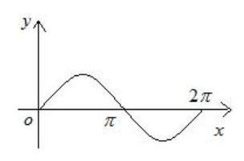</td><td>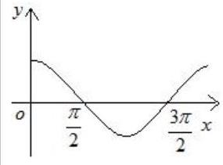</td><td>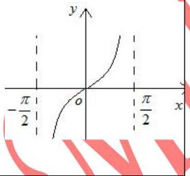</td></tr><tr><td>$R$</td><td></td><td>$\{ x \mid  x \in  R, \; x \neq  {k\pi } + \frac{\pi }{2}, k \in  Z\}$</td></tr><tr><td>$\left\lbrack  {-1,1}\right\rbrack$</td><td>$\left\lbrack  {-1,1}\right\rbrack$</td><td>$R$</td></tr><tr><td>$\left| {\sin x}\right|  \leq  1$</td><td>$\cos x \mid   \leq  1$</td><td>无</td></tr><tr><td>${2\pi }$</td><td>${2\pi }$</td><td>$\pi$</td></tr><tr><td>增区间:    $\left\lbrack  {{2k\pi } - \frac{\pi }{2},{2k\pi } + \frac{\pi }{2}}\right\rbrack$    减区间:    $\left\lbrack  {{2k\pi } + \frac{\pi }{2},{2k\pi } + \frac{3\pi }{2}}\right\rbrack \; k \in  Z$</td><td>增区间: $\left\lbrack  {{2k\pi } - \pi ,{2k\pi }}\right\rbrack$ 减区间: $\left\lbrack  {{2k\pi } - \pi ,{2k\pi }}\right\rbrack \; k \in  Z$</td><td>增区间:    $\left( {{k\pi } - \frac{\pi }{2},{k\pi } + \frac{\pi }{2}}\right)$    $k \in  Z$</td></tr><tr><td>奇</td><td>偶</td><td>奇</td></tr><tr><td>$x = \frac{\pi }{2} + {2k\pi }$ 时,</td><td>$x = {2k\pi }$ 时,</td><td>无</td></tr><tr></tr><tr><td>${y}_{\max } = 1 \; x =  - \frac{\pi }{2} + {2k\pi }$ 时, ${y}_{\min } =  - 1 \; k \in  Z$</td><td>${y}_{\max } = 1 \; x = \pi  + {2k\pi }$ 时, ${y}_{\min } =  - 1 \; k \in  Z$</td><td></td></tr><tr><td>$x = \frac{\pi }{2} + {k\pi }, k \in  Z$</td><td>$x = {k\pi }, k \in  Z$</td><td>无</td></tr><tr><td>$\left( {{k\pi },0}\right) , k \in  Z$</td><td>$\left( {\frac{\pi }{2} + {k\pi },0}\right) \; k \in  Z$</td><td>$\left( {\frac{k\pi }{2},0}\right) , k \in  Z$</td></tr></table>

高三数学二轮复习 A 版三角专题一教师版

9、函数 $y = A\sin \left( {{\omega x} + \varphi }\right)$ 的图像

一般的,函数 $y = A\sin \left( {{\omega x} + \varphi }\right)$ (其中 $A > 0,\omega  > 0$ ) 的图像可由 “五点法” 或图像变换法得到.

(1)“五点法”:先求出当 ${\omega x} + \varphi$ 为 $0,\frac{\pi }{2},\pi ,\frac{3}{2}\pi ,{2\pi }$ 时相对应的 $y$ 值，其次分别求出对应的 $x$ 值，再列表、描点、连线,最后根据函数的周期性,将图像向左、右无限扩展,即可得 $y = A\sin \left( {{\omega x} + \varphi }\right)$ 在 $R$ 上图像.

(2)图像变换法:一般可按下述步骤进行:

$y = \sin x\xrightarrow[]{\text{ 振幅变换 }}y = A\sin x\xrightarrow[]{\text{ 平移变换 }}y = A\sin \left( {x + \varphi }\right) \;$ 周期变换 $\rightarrow  y = A\sin \left( {{\omega x} + \varphi }\right)$ ①振幅变换: 当 $A > 1$ 时,图像上各点的纵坐标伸长到原来的 $A$ 倍 (横坐标不变); 当 $0 < A < 1$ 时,图像上各点的纵坐标缩短到原来的 $A$ 倍(横坐标不变).

② 平移变换:当 $\varphi  > 0$ 时，图像上所有点向左平移 $\varphi$ 个单位；当 $\varphi  < 0$ 时，图像上所有点向右平移 $\left| \varphi \right|$ 个单位.

③周期变换:当 $\omega  > 1$ 时，图像上各点的横坐标缩短为原来的 $\frac{1}{\omega }$ 倍(纵坐标不变)；当 $0 < \omega  < 1$ 时，图像上各点的横坐标伸长为原来的 $\frac{1}{\omega }$ 倍(纵坐标不变).

## 例题精讲

【例 10】关于函数 $f\left( x\right)  = \left| {\sin x}\right|  + \left| {\cos x}\right| \left( {x \in  \mathbf{R}}\right)$ ,则下列说法中不正确的是 ( )

A. $f\left( x\right)$ 的最大值为 $\sqrt{2}$ B. $f\left( x\right)$ 的最小正周期为 $\pi$

C. $f\left( x\right)$ 的图象关于直线 $x = \frac{\pi }{4}$ 对称 D. $f\left( x\right)$ 在 $\left( {\frac{\pi }{2},\frac{2\pi }{3}}\right)$ 上单调递增

【难度】 $\star   \star   \star$

【答案】B

【解析】因为 $f\left( {\frac{\pi }{2} + x}\right)  = \left| {\sin \left( {\frac{\pi }{2} + x}\right) }\right|  + \left| {\cos \left( {\frac{\pi }{2} + x}\right) }\right|  = \left| {\cos x}\right|  + \sin x \vDash  f\left( x\right)$

所以 $\frac{\pi }{2}$ 是 $f\left( x\right)$ 的一个周期,故 $\mathrm{B}$ 错误;

当 $x \in  \left\lbrack  {0,\frac{\pi }{2}}\right\rbrack$ 时, $f\left( x\right)  = \sin x + \cos x = \sqrt{2}\sin \left( {x + \frac{\pi }{4}}\right)$ ,所以当 $x = \frac{\pi }{4}$ 时, $f{\left( x\right) }_{\max } = \sqrt{2}$ ,故 A 正确;

因为 $f\left( {\frac{\pi }{2} - x}\right)  = \left| {\sin \left( {\frac{\pi }{2} - x}\right) }\right|  + \left| {\cos \left( {\frac{\pi }{2} - x}\right) }\right|  = \left| {\cos x}\right|  + \sin x = f\left( x\right)$

所以 $f\left( x\right)$ 的图象关于直线 $x = \frac{\pi }{4}$ 对称,故 $\mathrm{C}$ 正确;

当 $x \in  \left( {\frac{\pi }{2},\frac{2\pi }{3}}\right)$ 时, $f\left( x\right)  = \sin x - \cos x = \sqrt{2}\sin \left( {x - \frac{\pi }{4}}\right)$ ,

因为 $x - \frac{\pi }{4} \in  \left( {\frac{\pi }{4},\frac{5\pi }{12}}\right)$ ,所以 $f\left( x\right)$ 在 $\left( {\frac{\pi }{2},\frac{2\pi }{3}}\right)$ 上单调递增,故 $\mathrm{D}$ 正确.

故选: B

【例 11】(1) 已知函数 $f\left( x\right)  = \sin \left( {{\omega x} + \frac{\pi }{3}}\right) \;\left( {x \in  R,\omega  > 0}\right)$ 的最小正周期为 $\pi$ ,将 $y = f\left( x\right)$ 图像向左平移 $\varphi$ 个单位长度 $\left( {0 < \varphi  < \frac{\pi }{2}}\right)$ 所得图像关于 $y$ 轴对称,则 $\varphi  =$

【难度】 $\star   \star   \star$

【答案】 $\frac{\pi }{12}$

【解析】平移后 $\sin \left( {{2x} + \frac{\pi }{3} + {2\varphi }}\right)$ 为偶函数, $\frac{\pi }{3} + {2\varphi } = \frac{\pi }{2}\left( {{2k} + 1}\right) , k \in  Z$

( 2 )如果函数 $y = \sin {2x} + a\cos {2x}$ 的图像关于直线 $x =  - \frac{\pi }{8}$ 对称，则 $a =$ ___.

【难度】 $\star   \star   \star$

【答案】-1 .

【解析】 $f\left( {-\frac{\pi }{8}}\right)  =  \pm  \sqrt{{a}^{2} + 1}$

(3)若函数 $f\left( x\right)  = a\sin x + \cos x$ 的图像关于点 $\left( {-\frac{\pi }{3},0}\right)$ 成中心对称，则 $a =$ ___.

【难度】 $\star   \star   \star$

【答案】 $\frac{\sqrt{3}}{3}$ .

【解析】由 $f\left( x\right)  = a\sin x + \cos x$ 的图像关于点 $\left( {-\frac{\pi }{3},0}\right)$ 成中心对称知 $f\left( {-\frac{\pi }{3}}\right)  = 0, a = \frac{\sqrt{3}}{3}$ .

【例 12】已知 $f\left( x\right)  = 3\sin \left( {{2x} + \varphi }\right) \;\left( {\varphi  \in  \mathbf{R}}\right)$ 既不是奇函数也不是偶函数,若 $y = f\left( {x + m}\right)$ 的图像关于原点对称, $y = f\left( {x + n}\right)$ 的图像关于 $y$ 轴对称,则 $\left| m\right|  + \left| n\right|$ 的最小值为 ( )

A. $\pi$

B. $\frac{\pi }{2}$ C. $\frac{\pi }{4}$ D. $\frac{\pi }{8}$

【难度】 $\star   \star   \star   \star$

【答案】C

【解析】可设 ${\varphi }_{0}$ 满足 ${\varphi }_{0} \in  \left( {0,\frac{\pi }{2}}\right)  \cup  \left( {\frac{\pi }{2},\pi }\right)$ ,且 $\varphi  = {2t\pi } + {\varphi }_{0}\left( {t \in  Z}\right)$ ,则 $f\left( x\right)  = 3\sin \left( {{2x} + {\varphi }_{0}}\right)$ ,

注意到五点作图法的最左边端点为 $\left( {-\frac{{\varphi }_{0}}{2},0}\right)$ ,而 $\frac{T}{2} = \frac{\pi }{2},\frac{T}{4} = \frac{\pi }{4}$ ,

故有 $\left| m\right|  = \min \left( {\left| {-\frac{{\varphi }_{0}}{2}}\right| ,\left| \frac{\pi  - {\varphi }_{0}}{2}\right| }\right)  = \min \left( {\frac{{\varphi }_{0}}{2},\frac{\pi  - {\varphi }_{0}}{2}}\right) ,\left| n\right|  = \left| {-\frac{{\varphi }_{0}}{2} + \frac{\pi }{4}}\right|  = \left| \frac{\pi  - 2{\varphi }_{0}}{4}\right|$ ,

当 ${\varphi }_{0} \in  \left( {0,\frac{\pi }{2}}\right)$ 时, $\left| m\right|  = \frac{{\varphi }_{0}}{2},\left| n\right|  = \frac{\pi  - 2{\varphi }_{0}}{4}$ ,此时 $\left| m\right|  + \left| n\right|  = \frac{\pi }{4}$ ;

当 ${\varphi }_{0} \in  \left( {\frac{\pi }{2},\pi }\right)$ 时, $\left| m\right|  = \frac{\pi  - {\varphi }_{0}}{2},\left| n\right|  = \frac{2{\varphi }_{0} - \pi }{4}$ ,此时 $\left| m\right|  + \left| n\right|  = \frac{\pi  - {\varphi }_{0}}{2} + \frac{2{\varphi }_{0} - \pi }{4} = \frac{\pi }{4}$ ,

故选: $C$ .

【例 13】已知函数 $f\left( x\right)  = \sin \left( {\cos x}\right)  + \cos \left( {\sin x}\right)$ ,下列关于该函数结论正确的是 (多选题) ( )

A. $f\left( x\right)$ 的图象关于直线 $x = \frac{\pi }{4}$ 对称 B. $f\left( x\right)$ 的一个周期是 ${2\pi }$

C. $f\left( x\right)$ 的最小值是 -2

D. $f\left( x\right)$ 在区间 $\left( {0,\frac{\pi }{2}}\right)$ 是减函数

【难度】 $\star   \star   \star   \star$

【答案】BD

【解析】对于 $\mathrm{A}, f\left( {\frac{\pi }{2} - x}\right)  = \sin \left( {\cos \left( {\frac{\pi }{2} - x}\right) }\right)  + \cos \left( {\sin \left( {\frac{\pi }{2} - x}\right) }\right)  = \sin \left( {\sin x}\right)  + \cos \left( {\cos x}\right)  \neq  f\left( x\right)$ ,故选项 $\mathrm{A}$ 错误;

对于 $\mathrm{B}, f\left( {{2\pi } + x}\right)  = \sin \left( {\cos \left( {{2\pi } + x}\right) }\right)  + \cos \left( {\sin \left( {{2\pi } + x}\right) }\right)  = \sin \left( {\cos x}\right)  + \cos \left( {\sin x}\right)  = f\left( x\right)$ ,故选项 $\mathrm{B}$ 正确；

对于 $\mathrm{C}$ ,若 $f\left( x\right)$ 最小值为 -2,则此时 $\sin \left( {\cos x}\right)  =  - 1,\cos \left( {\sin x}\right)  =  - 1.\because  - 1 \leq  \cos x \leq  1$ ,

$\therefore \sin \left( {\cos x}\right)  \in  \left\lbrack  {-\sin 1,\sin 1}\right\rbrack$ ,也即 $\sin \left( {\cos x}\right)  \neq   - 1$ ,故选项 $\mathrm{C}$ 错误;

对于 $\mathrm{D}, y = \cos x$ 在 $\left( {0,\frac{\pi }{2}}\right)$ 上是减函数,且 $\cos x \in  \left( {0,1}\right)  \subseteq  \left( {0,\frac{\pi }{2}}\right)$ ,

$\therefore y = \sin \left( {\cos x}\right)$ 在区间 $\left( {0,\frac{\pi }{2}}\right)$ 上是减函数,

$y = \sin x$ 在区间 $\left( {0,\frac{\pi }{2}}\right)$ 上是增函数,且 $\sin x \in  \left( {0,1}\right)  \subseteq  \left( {0,\frac{\pi }{2}}\right)$ ,

高三数学二轮复习 A 版 $\therefore y = \cos \left( {\sin x}\right)$ 在区间 $\left( {0,\frac{\pi }{2}}\right)$ 上是减函数,故选项 $\mathrm{D}$ 正确.

故选: BD.

【例 14】已知函数 $f\left( x\right)  = A\cos \left( {{\omega x} + \varphi }\right) \;\left( {A > 0,\omega  > 0, - \frac{\pi }{2} < \varphi  < 0}\right)$ 的图像与 $y$ 轴的

交点为 $\left( {0,1}\right)$ ,它在 $y$ 轴右侧的第一个最高点和第一个最低点的坐标分别

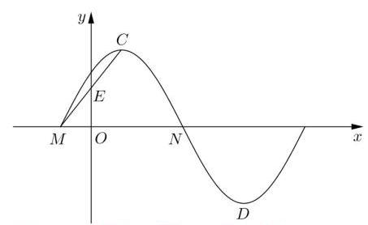

为 $\left( {{x}_{0},2}\right)$ 和 $\left( {{x}_{0} + {2\pi }, - 2}\right)$

(1)求函数 $f\left( x\right)$ 的解析式;

(2)若锐角 $\theta$ 满足 $\cos \theta  = \frac{1}{3}$ ，求 $f\left( {2\theta }\right)$ 的值.

【难度】 $\star   \star   \star$

【解析】(1) 由题意可得 $A = 2,\frac{T}{2} = {2\pi }$ 即 $T = {4\pi },\omega  = \frac{1}{2}$ ,

$f\left( x\right)  = 2\cos \left( {\frac{1}{2}x + \varphi }\right) ,\;f\left( 0\right)  = 1$ ，由 $\cos \varphi  = \frac{1}{2}$ 且 $- \frac{\pi }{2} < \varphi  < 0,$ 得 $\varphi  =  - \frac{\pi }{3}$ ，所以函数 $f\left( x\right)  = 2\cos \left( {\frac{1}{2}x - \frac{\pi }{3}}\right)$

由于 $\cos \theta  = \frac{1}{3}$ 且 $\theta$ 为锐角,所以 $\sin \theta  = \frac{2\sqrt{2}}{3}, f\left( {2\theta }\right)  = 2\cos \left( {\theta  - \frac{\pi }{3}}\right)  = 2\left( {\cos \theta \cos \frac{\pi }{3} + \sin \theta \sin \frac{\pi }{3}}\right) \; = 2 \cdot  \left( {\frac{1}{3} \times  \frac{1}{2} + \frac{2\sqrt{2}}{3} \times  \frac{\sqrt{3}}{2}}\right)  = \frac{1 + 2\sqrt{6}}{3}$

【例 15】设函数 $f\left( x\right)  = \lg \left( {1 - \cos {2x}}\right)  + \cos \left( {x + \theta }\right) ,\theta  \in  \left\lbrack  {0,\frac{\pi }{2}}\right)$

(1)讨论函数 $y = f\left( x\right)$ 的奇偶性,并说明理由;

(2)设 $\theta  > 0$ ，解关于 $x$ 的不等式 $f\left( {\frac{\pi }{4} + x}\right)  - f\left( {\frac{3\pi }{4} - x}\right)  < 0$ .

【难度】 $\star   \star   \star$

【答案】(1)答案见解析; (2) $\left( {{2k\pi } + \frac{\pi }{4},{2k\pi } + \frac{3\pi }{4}}\right)  \cup  \left( {{2k\pi } + \frac{3\pi }{4},{2k\pi } + \frac{5\pi }{4}}\right) , k \in  Z$ .

【解析】(1) 由对数的性质,得 $1 - \cos {2x} > 0$ ,

$\therefore \cos {2x} \neq  1$ ,即 $x \neq  {k\pi }\left( {k \in  Z}\right)$ ,故定义域关于原点对称,

1、偶函数,则有 $f\left( {-x}\right)  = f\left( x\right)$ ,即 $\lg \left\lbrack  {1 - \cos 2\left( {-x}\right) }\right\rbrack   + \cos \left( {-x + \theta }\right)  = \log \left( {1 - \cos {2x}}\right)  + \cos \left( {x + \theta }\right)$ ,可得 $\cos \left( {-x + \theta }\right)  = \cos \left( {x + \theta }\right) ,$

$\therefore$ 整理得: 要使 $2\sin x\sin \theta  = 0$ 对一切 $x \neq  {k\pi }\left( {k \in  Z}\right)$ 恒成立,在 $\theta  \in  \left\lbrack  {0,\frac{\pi }{2}}\right)$ 中有 $\theta  = 0$ .

2、奇函数,则定义域内,任意 ${x}_{0}$ 有 $f\left( {x}_{0}\right)  + f\left( {-{x}_{0}}\right)  = 0$ ,如 ${x}_{0} = \frac{\pi }{4}$ ,

$\therefore f\left( \frac{\pi }{4}\right)  + f\left( {-\frac{\pi }{4}}\right)  = 0$ ,而 $f\left( {-\frac{\pi }{4}}\right)  = \lg \left( {1 - \cos \left( {-\frac{\pi }{2}}\right) }\right)  + \cos \left( {-\frac{\pi }{4} + \theta }\right)  = \cos \left( {-\frac{\pi }{4} + \theta }\right)$ ,

$f\left( \frac{\pi }{4}\right)  = \lg \left( {1 - \cos \frac{\pi }{2}}\right)  + \cos \left( {\frac{\pi }{4} + \theta }\right)  = \cos \left( {\frac{\pi }{4} + \theta }\right) ,$

$\therefore \sqrt{2}\cos \theta  = 0$ ,显然在 $\theta  \in  \left\lbrack  {0,\frac{\pi }{2}}\right)$ 上不成立,

综上,当 $\theta  = 0$ 时为偶函数; 当 $\theta  \in  \left( {0,\frac{\pi }{2}}\right)$ 时既不是奇函数又不是偶函数.

( 2 )由 $f\left( {\frac{\pi }{4} + x}\right)  - f\left( {\frac{3\pi }{4} - x}\right)  < 0$ ，代入得

$\lg \left\lbrack  {1 - \cos 2\left( {\frac{\pi }{4} + x}\right) }\right\rbrack   + \cos \left( {\frac{\pi }{4} + x + \theta }\right)  - \lg \left\lbrack  {1 - \cos 2\left( {\frac{3\pi }{4} - x}\right) }\right\rbrack   - \cos \left( {\frac{3\pi }{4} - x + \theta }\right)  < 1$ ,

$\therefore \lg \left( {1 + \sin {2x}}\right)  + \cos \left( {\frac{\pi }{4} + x + \theta }\right)  - \lg \left( {1 + \sin {2x}}\right)  - \cos \left( {\frac{3\pi }{4} - x + \theta }\right)  < 0$ ,化简为

$\cos \left( {\frac{\pi }{4} + x - \theta }\right)  + \cos \left( {\frac{\pi }{4} + x + \theta }\right)  < 0$ ,展开整理得: $2\cos \left( {x + \frac{\pi }{4}}\right) \cos \theta  < 0$ ,

$\because \theta  \in  \left( {0,\frac{\pi }{2}}\right)$ ,即 $\cos \theta  > 0$ ,

$\therefore$ 可得 $\left\{  \begin{array}{l} \cos \left( {x + \frac{\pi }{4}}\right)  < 0 \\  \frac{\pi }{4} + x \neq  {k}_{1}\pi \;,{k}_{1} \in  Z,{k}_{2} \in  Z \\  \frac{3\pi }{4} - x \neq  {k}_{2}\pi  \end{array}\right.$

$\therefore$ 解集为 $\left( {{2k\pi } + \frac{\pi }{4},{2k\pi } + \frac{3\pi }{4}}\right)  \cup  \left( {{2k\pi } + \frac{3\pi }{4},{2k\pi } + \frac{5\pi }{4}}\right) , k \in  Z$ .

巩固训练

1、已知函数 $f\left( x\right)  = \sin \left( {{\omega x} + \varphi }\right) \left( {\omega  > 0,\left| \varphi \right|  < \frac{\pi }{2}}\right)$ ,其图像相邻两条对称轴之间的距离为 $\frac{\pi }{2}$ ,将函数的图像向左平移 $\frac{\pi }{12}$ 个单位后,得到的图像对应的函数为偶函数. 下列判断正确的是( )

A. 函数 $f\left( x\right)$ 的最小正周期为 ${2\pi }$

B. 函数 $f\left( x\right)$ 的图像关于点 $\left( {\frac{7\pi }{12},0}\right)$ 对称

C. 函数 $f\left( x\right)$ 的图像关于直线 $x =  - \frac{7\pi }{12}$ 对称 D. 函数 $f\left( x\right)$ 在 $\left\lbrack  {\frac{3\pi }{4},\pi }\right\rbrack$ 上单调递增

【难度】 $\star   \star   \star$

【答案】D

高三数学二轮复习 A 版

【解析】图像相邻两条对称轴之间的距离为 $\frac{\pi }{2}$ ,则最小正周期是 $T = \pi ,\mathrm{\;A}$ 错, $\omega  = \frac{2\pi }{\pi } = 2$ ,

函数的图像向左平移 $\frac{\pi }{12}$ 个单位后得解析式 $y = \sin \left\lbrack  {2\left( {x + \frac{\pi }{12}}\right)  + \varphi }\right\rbrack   = \sin \left( {{2x} + \frac{\pi }{6} + \varphi }\right)$ ,函数为偶函数,则 $\varphi  + \frac{\pi }{6} = {k\pi } + \frac{\pi }{2}, k \in  Z$ ,又 $\left| \varphi \right|  < \frac{\pi }{2}$ ,所以 $\varphi  = \frac{\pi }{3}$ .

所以 $f\left( x\right)  = \sin \left( {{2x} + \frac{\pi }{3}}\right)$ ,

$f\left( \frac{7\pi }{12}\right)  = \sin \left( {2 \times  \frac{7\pi }{12} + \frac{\pi }{3}}\right)  =  - 1,\mathrm{\;B}$ 错,

$f\left( {-\frac{7\pi }{12}}\right)  = \sin \left\lbrack  {2 \times  \left( {-\frac{7\pi }{12}}\right)  + \frac{\pi }{3}}\right\rbrack   =  - \frac{\sqrt{3}}{2},\mathrm{C}$ 错;

$x \in  \left\lbrack  {\frac{3\pi }{4},\pi }\right\rbrack$ 时, ${2x} + \frac{\pi }{3} \in  \left\lbrack  {\frac{11\pi }{6},\frac{7\pi }{3}}\right\rbrack   \subseteq  \left\lbrack  {\frac{3\pi }{2},\frac{5\pi }{2}}\right\rbrack$ , D 正确.

故选: D.

2、已知函数 $f\left( x\right)  = A\cos \left( {{\omega x} + \varphi }\right)$ (其中 $A > 0,\omega  > 0$ ， $\left| \varphi \right|  < \frac{\pi }{2}$ 的部分图象如图所示；将函数 $f\left( x\right)$ 图象的横坐标伸长到原来的 6 倍后,再向左平移 $\frac{\pi }{4}$ 个单位,得到函数 $g\left( x\right)$ 的图象,则函数 $g\left( x\right)$ 在 ( ) 上单调递减.

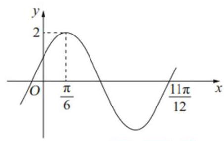

A. $\left\lbrack  {-{6\pi }, - {5\pi }}\right\rbrack$ B. $\left\lbrack  {{2\pi },{4\pi }}\right\rbrack$ C. $\left\lbrack  {{4\pi },{6\pi }}\right\rbrack$ D. $\left\lbrack  {-{4\pi }, - {3\pi }}\right\rbrack$

【难度】 $\star   \star   \star$

【答案】D

【解析】根据函数 $f\left( x\right)  = A\cos \left( {{\omega x} + \varphi }\right)$ 的图象,可得 $A = 2,\frac{3T}{4} = \frac{11\pi }{12} - \frac{\pi }{6} = \frac{3\pi }{4}$ ,

则 $T = \pi  = \frac{2\pi }{\omega }$ ,则 $\omega  = 2$ ,故 $f\left( x\right)  = 2\cos \left( {{2x} + \varphi }\right)$ ;

由 $f\left( \frac{\pi }{6}\right)  = 2$ ,可得 $\frac{\pi }{3} + \varphi  = {2k\pi }\left( {k \in  Z}\right)$ ,解得 $\varphi  =  - \frac{\pi }{3} + {2k\pi }\left( {k \in  Z}\right)$ ,

因为 $\left| \varphi \right|  < \frac{\pi }{2}$ ,可得 $\varphi  =  - \frac{\pi }{3}$ ,所以 $f\left( x\right)  = 2\cos \left( {{2x} - \frac{\pi }{3}}\right)$ ,

将函数 $f\left( x\right)$ 图象的横坐标伸长到原来的 6 倍后,得到 $y = 2\cos \left( {\frac{1}{3}x - \frac{\pi }{3}}\right)$ ,

再向左平移 $\frac{\pi }{4}$ 个单位后,得到 $g\left( x\right)  = 2\cos \left( {\frac{1}{3}x - \frac{\pi }{4}}\right)$ ,

令 ${2k\pi } \leq  \frac{1}{3}x - \frac{\pi }{4} \leq  \pi  + {2k\pi }, k \in  Z$ ,解得 ${6k\pi } + \frac{3\pi }{4} \leq  x \leq  \frac{15\pi }{4} + {6k\pi }, k \in  Z$ ,

令 $- \pi  + {2k\pi } \leq  \frac{1}{3}x - \frac{\pi }{4} \leq  {2k\pi }, k \in  Z$ ,解得 $- \frac{9\pi }{4} + {6k\pi } \leq  x \leq  \frac{3\pi }{4} + {6k\pi }, k \in  Z$ ,

所以函数 $g\left( x\right)$ 单调递增区间为 $\left\lbrack  {-\frac{9\pi }{4} + {6k\pi },\frac{3\pi }{4} + {6k\pi }}\right\rbrack  , k \in  Z$ ,

单调递减区间为 $\left\lbrack  {{6k\pi } + \frac{3\pi }{4},\frac{15\pi }{4} + {6k\pi }}\right\rbrack  , k \in  Z$ ,

所以函数 $g\left( x\right)$ 在 $\left\lbrack  {-{6\pi }, - {5\pi }}\right\rbrack$ 上先增后减,在 $\left\lbrack  {{2\pi },{4\pi }}\right\rbrack$ 上先减后增,

在 $\left\lbrack  {{4\pi },{6\pi }}\right\rbrack$ 上单调递增,在 $\left\lbrack  {-{4\pi }, - {3\pi }}\right\rbrack$ 上单调递减. 故选: D.

3、若函数 $f\left( x\right)  = \sin x - \sin \left( {x + \theta }\right)$ 是奇函数，则 $\theta$ 的一个可能的值为 ( )

A. $\frac{\pi }{2}$ B. $- \frac{\pi }{2}$ C. $\frac{\pi }{4}$ D. $\pi$

【难度】 $\star   \star   \star$

【答案】D

【解析】解: 方法一: 由于 $f\left( x\right)$ 为奇函数,且定义域为 $\mathrm{R}$ ,

因此必有 $f\left( 0\right)  = 0$ ,

即 $- \sin \theta  = 0,\sin \theta  = 0$ ,结合选项知 $\mathrm{D}$ 项正确.

故选: D.

方法二: 由于 $f\left( x\right)$ 是奇函数,所以 $f\left( {-x}\right)  =  - f\left( x\right)$ 对 $x \in  \mathrm{R}$ 恒成立,

即 $\sin \left( {-x}\right)  - \sin \left( {-x + \theta }\right)  =  - \sin x + \sin \left( {x + \theta }\right)$ ,整理得 $\sin \theta  \cdot  \cos x = 0$ ,

因此 $\sin \theta  = 0,\theta  = {k\pi }\left( {k \in  Z}\right)$ ,结合选项知 $\theta$ 的一个可能值为 $\pi$ ,

故选: D.

4、如图,函数 $f\left( x\right)  = A\sin \left( {{\omega x} + \varphi }\right)$ (其中 $A > 0,\omega  > 0,\left| \varphi \right|  \leq  \frac{\pi }{2}$ ) 与坐标轴的三个交点 $P, Q, R$ 满足 $P\left( {1,0}\right)$ , $M\left( {2, - 2}\right)$ 为线段 ${QR}$ 的中点，则 $\mathrm{A}$ 的值为( )

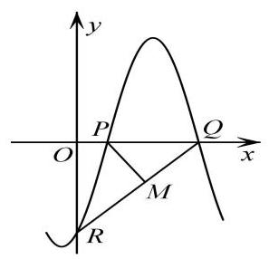

高三数学二轮复习 A 版

A. $2\sqrt{3}$

B. $\frac{7\sqrt{3}}{3}$ C. $\frac{8\sqrt{3}}{3}$ D. $4\sqrt{3}$

【难度】 $\star   \star   \star$

【答案】C

【解析】由于 $M\left( {2, - 2}\right)$ 是 ${QR}$ 的中点,且 $Q, R$ 分别在 $x$ 轴和 $y$ 轴上,所以 $Q\left( {4,0}\right) , R\left( {0, - 4}\right)$ .

因此函数 $f\left( x\right)$ 的周期 $\mathrm{T} = 2 \times  \left( {4 - 1}\right)  = 6$ ,

所以 $\frac{2\pi }{\omega } = 6$ ,则 $\omega  = \frac{\pi }{3}$ . 又由图象知 $f\left( \frac{1 + 4}{2}\right)  = A$ ,即 $A\sin \left( {\frac{5\pi }{6} + \varphi }\right)  = A$ ,

所以 $\sin \left( {\frac{5\pi }{6} + \varphi }\right)  = 1$ . 而 $\left| \varphi \right|  \leq  \frac{\pi }{2}$ ,所以 $\varphi  =  - \frac{\pi }{3}$ ,于是 $f\left( x\right)  = A\sin \left( {\frac{\pi }{3}x - \frac{\pi }{3}}\right)$ .

又因为 $f\left( 0\right)  =  - 4$ ，所以 $A\sin \left( {-\frac{\pi }{3}}\right)  =  - 4$ ，解得 $A = \frac{8\sqrt{3}}{3}$ ，故选:C.

5、已知 $\omega  > 0$ ，若函数 $f\left( x\right)  = \sin \left( {{\omega x} + \frac{\pi }{4}}\right)$ 在 $\left( {\frac{\pi }{2},\pi }\right)$ 上单调递增，则 $\omega$ 的取值范围为___.

【难度】 $\star   \star   \star$

【答案】 $0 < \omega  \leq  \frac{1}{4}$

【解析】由 ${2k\pi } - \frac{\pi }{2} \leq  {\omega x} + \frac{\pi }{4} \leq  {2k\pi } + \frac{\pi }{2}, k \in  Z,\omega  > 0$ 解得 $\frac{2k\pi }{\omega } - \frac{3\pi }{4\omega } \leq  x \leq  \frac{2k\pi }{\omega } + \frac{\pi }{4\omega }, k \in  Z$ ,

所以 $f\left( x\right)$ 的单调递增区间为 $\left\lbrack  {\frac{2k\pi }{\omega } - \frac{3\pi }{4\omega },\frac{2k\pi }{\omega } + \frac{\pi }{4\omega }}\right\rbrack  , k \in  Z$

又 $f\left( x\right)$ 在 $\left( {\frac{\pi }{2},\pi }\right)$ 上递增,所以 $\left\{  \begin{array}{l} \frac{2k\pi }{\omega } - \frac{3\pi }{4\omega } \leq  \frac{\pi }{2} \\  \frac{2k\pi }{\omega } + \frac{\pi }{4\omega } \geq  \pi  \end{array}\right.$ ,

解得 ${4k} - \frac{3}{2} \leq  \omega  \leq  {2k} + \frac{1}{4}, k \in  Z,\omega  > 0$ ,

由 ${2k} + \frac{1}{4} > 0$ 及 $k \in  Z$ ,得 $k \geq  0$ ,由 ${4k} - \frac{3}{2} \leq  {2k} + \frac{1}{4}$ 得 $k \leq  \frac{7}{8}$ ,所以 $k = 0$ ,

所以 $0 < \omega  \leq  \frac{1}{4}$ . 故答案为: $0 < \omega  \leq  \frac{1}{4}$ .

6、如图是函数 $y = f\left( x\right)  = A\sin \left( {{\omega x} + \varphi }\right)  + 2\left( {A > 0,\omega  > 0,\left| \varphi \right|  < \pi }\right)$ 的图象的一部分,则函数 $f\left( x\right)$ 的解析式为___.

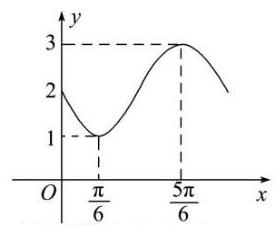

【难度】 $\bigstar \bigstar \bigstar$

【答案】 $f\left( x\right)  = \sin \left( {\frac{3}{2}x - \frac{3\pi }{4}}\right)  + 2$

【解析】由图象知, $A = \frac{3 - 1}{2} = 1,\frac{T}{2} = \frac{5\pi }{6} - \frac{\pi }{6} = \frac{2\pi }{3}$ ,则 $T = \frac{4\pi }{3},\omega  = \frac{3}{2}$ ,

由 $\frac{5\pi }{6} \times  \frac{3}{2} + \varphi  = \frac{\pi }{2} + {2k\pi }, k \in  Z$ ,得 $\varphi  =  - \frac{3\pi }{4} + {2k\pi }, k \in  Z$ . 又 $\left| \varphi \right|  < \pi ,\therefore \varphi  =  - \frac{3\pi }{4}$ .

$\therefore f\left( x\right)  = \sin \left( {\frac{3}{2}x - \frac{3\pi }{4}}\right)  + 2$ .

故答案为: $f\left( x\right)  = \sin \left( {\frac{3}{2}x - \frac{3\pi }{4}}\right)  + 2$ .

7、已知 $f\left( x\right)  = 2\sin \left( {{2x} + \frac{\pi }{3}}\right)$ ，若 $\exists {x}_{1},{x}_{2},{x}_{3} \in  \left\lbrack  {0,\frac{3\pi }{2}}\right\rbrack$ ，使得 $f\left( {x}_{1}\right)  = f\left( {x}_{2}\right)  = f\left( {x}_{3}\right)$ ，若 ${x}_{1} + {x}_{2} + {x}_{3}$ 的最大值为 $M$ ， 最小值为 $N$ ,则 $M + N =$ ___.

【难度】 $\star   \star   \star$

【答案】 $\frac{23\pi }{6}$

【解析】作出 $f\left( x\right)  = 2\sin \left( {{2x} + \frac{\pi }{3}}\right)$ 在 $\left\lbrack  {0,\frac{3\pi }{2}}\right\rbrack$ 上的图象 (如图所示)

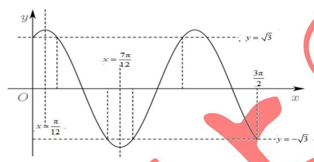

因为 $f\left( 0\right)  = 2\sin \frac{\pi }{3} = \sqrt{3},\;f\left( \frac{3\pi }{2}\right)  = 2\sin \left( {\pi  + \frac{\pi }{3}}\right)  =  - \sqrt{3}$ ,

所以当 $f\left( x\right)$ 的图象与直线 $y = \sqrt{3}$ 相交时,

设前三个交点横坐标依次为 ${x}_{1}\text{ 、 }{x}_{2}\text{ 、 }{x}_{3}$ ,此时和最小为 $N$ ,

由 $2\sin \left( {{2x} + \frac{\pi }{3}}\right)  = \sqrt{3}$ ,得 $\sin \left( {{2x} + \frac{\pi }{3}}\right)  = \frac{\sqrt{3}}{2}$ ,则 ${x}_{1} = 0,{x}_{2} = \frac{\pi }{6},{x}_{3} = \pi , N = \frac{7\pi }{6}$ ;

当 $f\left( x\right)$ 的图象与直线 $y =  - \sqrt{3}$ 相交时,

设三个交点横坐标依次为 ${x}_{1}\text{ 、 }{x}_{2}\text{ 、 }{x}_{3}$ ,此时和最大为 $M$ ,

由 $2\sin \left( {{2x} + \frac{\pi }{3}}\right)  =  - \sqrt{3}$ ,得 $\sin \left( {{2x} + \frac{\pi }{3}}\right)  =  - \frac{\sqrt{3}}{2}$ ,则 ${x}_{1} + {x}_{2} = \frac{7\pi }{6},{x}_{3} = \frac{3\pi }{2}, M = \frac{8\pi }{3}$ ;

所以 $M + N = \frac{23\pi }{6}$ . 故答案为: $\frac{23\pi }{6}$ .

## (四) 反三角与三角方程

## 知识梳理

## 反三角函数的图像和性质

<table><tr><td>反三角函数</td><td>$y = \arcsin x$</td><td>$y = \arccos x$</td><td>$y = \arctan x$</td></tr><tr><td>图像</td><td>$y = \arcsin x$    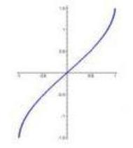</td><td>$y = \arccos x$    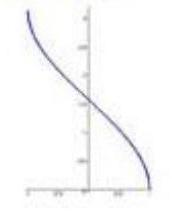</td><td>$y = \arctan x$</td></tr><tr><td>定义域</td><td>$\left\lbrack  {-1,1}\right\rbrack$</td><td>$\left\lbrack  {-1,1}\right\rbrack$</td><td>$\left( {-\infty , + \infty }\right)$</td></tr><tr><td>值域</td><td>$\left\lbrack  {-\frac{\pi }{2},\frac{\pi }{2}}\right\rbrack$</td><td>$\left\lbrack  {0,\pi }\right\rbrack$</td><td>$\left( {-\frac{\pi }{2},\frac{\pi }{2}}\right)$</td></tr><tr><td>奇偶性</td><td>奇函数</td><td>非奇非偶</td><td>奇函数</td></tr><tr><td>单调性</td><td>增函数</td><td>减函数</td><td>增函数</td></tr></table>

## 【提醒】常用关系式

(1) $\arcsin \left( {-x}\right)  =  - \arcsin x, x \in  \left\lbrack  {-1,1}\right\rbrack  \;\sin \left( {\arcsin x}\right)  = x, x \in  \left\lbrack  {-1,1}\right\rbrack$

$\arcsin \left( {\sin x}\right)  = x, x \in  \left\lbrack  {-\frac{\pi }{2},\frac{\pi }{2}}\right\rbrack$

(2) $\arccos \left( {-x}\right)  = \pi  - \arccos x, x \in  \left\lbrack  {-1,1}\right\rbrack  \cos \left( {\arccos x}\right)  = x, x \in  \left\lbrack  {-1,1}\right\rbrack$

$\arccos \left( {\cos x}\right)  = x, x \in  \left\lbrack  {0,\pi }\right\rbrack$

(3) $\arctan \left( {-x}\right)  =  - \arctan x, x \in  R\tan \left( \arctan \right)  = x, x \in  R$

$\arctan \left( {\tan x}\right)  = x, x \in  \left( {-\frac{\pi }{2},\frac{\pi }{2}}\right)$

## 最简三角方程的解集, 见下表

<table id="cross-table-2"><tr><td>方程</td><td>方程的解集</td></tr></table>

## 例题精讲

【例 16】函数 $y = \pi  - 3\arcsin \frac{1}{2}\left( {{x}^{2} + {4x} + 5}\right)$ 的值域为___.

【难度】★★★

【答案】 $\left\lbrack  {-\frac{\pi }{2},\frac{\pi }{2}}\right\rbrack$

【解析】设 $t = \frac{1}{2}\left( {{x}^{2} + {4x} + 5}\right)$ ,则 $t \geq  \frac{1}{2}\left\lbrack  {{\left( -2\right) }^{2} + 4 \times  \left( {-2}\right)  + 5}\right\rbrack   = \frac{1}{2}$ ,

$\because$ 函数 $f\left( t\right)  = \arcsin t$ 是 $\left\lbrack  {-1,1}\right\rbrack$ 上的增函数,

$\therefore$ 当 $t \geq  \frac{1}{2}$ 时, $\arcsin t \geq  \arcsin \frac{1}{2} = \frac{\pi }{6}$ ,且 $\arcsin t \leq  \frac{\pi }{2}$ ,由此可得: $3\arcsin \frac{1}{2}\left( {{x}^{2} + {4x} + 5}\right)  \in  \left\lbrack  {\frac{\pi }{2},\frac{3\pi }{2}}\right\rbrack$ , $\therefore  - \frac{\pi }{2} \leq  \pi  - 3\arcsin \frac{1}{2}\left( {{x}^{2} + {4x} + 5}\right)  \leq  \frac{\pi }{2}$ ,

即函数 $y = \pi  - 3\arcsin \frac{1}{2}\left( {{x}^{2} + {4x} + 5}\right)$ 的值域 $\left\lbrack  {-\frac{\pi }{2},\frac{\pi }{2}}\right\rbrack$ . 故答案为: $\left\lbrack  {-\frac{\pi }{2},\frac{\pi }{2}}\right\rbrack$ .

【例 17】已知数列 ${a}_{n} = \arcsin \left( {\sin {n}^{ \circ  }}\right) , n \in  {N}^{ * },\left\{  {a}_{n}\right\}$ 的前 $n$ 项和为 ${S}_{n}$ ,则当 $1 \leq  n \leq  {2016}$ 时,( )

A. ${S}_{1980} \leq  {S}_{n} \leq  {S}_{90}$ B. ${S}_{1800} \leq  {S}_{n} \leq  {S}_{180}$

C. ${S}_{1980} \leq  {S}_{n} \leq  {S}_{180}$ D. ${S}_{2016} \leq  {S}_{n} \leq  {S}_{90}$

【难度】 $\star   \star   \star   \star$

【答案】B

【解析】根据反正弦函数 $y = \arcsin x, x \in  \left\lbrack  {-1,1}\right\rbrack  , y \in  \left\lbrack  {-\frac{\pi }{2},\frac{\pi }{2}}\right\rbrack$ ,

分析数列 ${a}_{n} = \arcsin \left( {\sin {n}^{ \circ  }}\right) , n \in  {N}^{ * }$ ,可以发现数列 $\left\{  {a}_{n}\right\}$ 是一个以 360 为周期的数列,

其中 ${a}_{1} = \frac{\pi }{180},{a}_{2} = \frac{2\pi }{180},\cdots ,{a}_{89} = \frac{89\pi }{180},{a}_{90} = \frac{90\pi }{180}$

${a}_{91} = \frac{89\pi }{180},{a}_{92} = \frac{88\pi }{180},\cdots ,{a}_{179} = \frac{\pi }{180},{a}_{180} = 0$

${a}_{181} =  - \frac{\pi }{180},{a}_{182} =  - \frac{2\pi }{180},\cdots ,{a}_{269} =  - \frac{89\pi }{180},{a}_{270} =  - \frac{90\pi }{180}$

${a}_{271} =  - \frac{89\pi }{180},{a}_{272} =  - \frac{88\pi }{180},\cdots ,{a}_{359} =  - \frac{\pi }{180},{a}_{360} = 0$

一个周期之和 ${S}_{360} = 0$ ,且 ${S}_{360} = 0$ 取最小值, ${S}_{180}$ 取得最大值,所以 $\mathrm{B}$ 正确;

${S}_{180} > {S}_{90},{S}_{90}$ 不是最大值,所以 $\mathrm{A},\mathrm{D}$ 错误

${S}_{1800} = {S}_{{360} \times  5} = 0,\;{S}_{2016} = {S}_{216} > 0,$

${S}_{1980} = {S}_{180} > {S}_{90}$ 所以 A、C 错误; 故选: B

【例 18】设函数 $f\left( x\right)  = m\cos \left( {x + \alpha }\right)  + n\cos \left( {x + \beta }\right)$ ,其中 $m, n,\alpha ,\beta$ 为已知实常数, $x \in  \mathbf{R}$ ,则下列命题中错误的是 ( )

A. 若 $f\left( 0\right)  = f\left( \frac{\pi }{2}\right)  = 0$ ,则 $f\left( x\right)  = 0$ 对任意实数 $x$ 恒成立;

B. 若 $f\left( 0\right)  = 0$ ,则函数 $f\left( x\right)$ 为奇函数;

C. 若 $f\left( \frac{\pi }{2}\right)  = 0$ ,则函数 $f\left( x\right)$ 为偶函数;

D. 当 ${f}^{2}\left( 0\right)  + {f}^{2}\left( \frac{\pi }{2}\right)  \neq  0$ 时,若 $f\left( {x}_{1}\right)  = f\left( {x}_{2}\right)  = 0$ ,则 ${x}_{1} - {x}_{2} = {2k\pi }\;\left( {k \in  \mathbf{Z}}\right)$ .

【难度】 $\star   \star   \star   \star$

【答案】D

【解析】

$f\left( x\right)  = m\left( {\cos x\cos \alpha  - \sin x\sin \alpha }\right)  + n\left( {\cos x\cos \beta  - \sin x\sin \beta }\right)  = \left( {m\cos \alpha  + n\cos \beta }\right) \cos x - \left( {m\sin \alpha  + n\sin \beta }\right) \sin x$

不妨设 $f\left( x\right)  = \left( {{k}_{1}\cos {\alpha }_{1} + {k}_{2}\cos {\alpha }_{2}}\right) \cos x - \left( {{k}_{1}\sin {\alpha }_{1} + {k}_{2}\sin {\alpha }_{2}}\right) \sin \lambda .{k}_{1},{k}_{2},{\alpha }_{1},{\alpha }_{2}$ 为已知实常数.

若 $f\left( 0\right)  = 0$ ,则得 ${k}_{1}\cos {\alpha }_{1} + {k}_{2}\cos {\alpha }_{2} = 0$ ; 若 $f\left( \frac{\pi }{2}\right)  = 0$ ,则得 ${k}_{1}\sin {\alpha }_{1} + {k}_{2}\sin {\alpha }_{2} = 0$ .

于是当 $f\left( 0\right)  = f\left( \frac{\pi }{2}\right)  = 0$ 时, $f\left( x\right)  = 0$ 对任意实数 $x$ 恒成立,即命题 $\mathrm{A}$ 是真命题;

当 $f\left( 0\right)  = 0$ 时, $f\left( x\right)  =  - \left( {{k}_{1}\sin {\alpha }_{1} + {k}_{2}\sin {\alpha }_{2}}\right) \sin x$ ,它为奇函数,即命题 $\mathrm{B}$ 是真命题;

当 $f\left( \frac{\pi }{2}\right)  = 0$ 时, $f\left( x\right)  = \left( {{k}_{1}\cos {\alpha }_{1} + {k}_{2}\cos {\alpha }_{2}}\right) \cos x$ ,它为偶函数,即命题 $\mathrm{C}$ 是真命题;

当 ${f}^{2}\left( 0\right)  + {f}^{2}\left( \frac{\pi }{2}\right)  \neq  0$ 时,令 $f\left( x\right)  = 0$ ,则

$\left( {{k}_{1}\cos {\alpha }_{1} + {k}_{2}\cos {\alpha }_{2}}\right) \cos x - \left( {{k}_{1}\sin {\alpha }_{1} + {k}_{2}\sin {\alpha }_{2}}\right) \sin x = (,$

上述方程中,若 $\cos x = 0$ ,则 $\sin x = 0$ ,这与 ${\cos }^{2}x + {\sin }^{2}x = 1$ 矛盾,所以 $\cos x \neq  0$ .

将该方程的两边同除以 $\cos x$ 得

$\tan x = \frac{{k}_{1}\cos {\alpha }_{1} + {k}_{2}\cos {\alpha }_{2}}{{k}_{1}\sin {\alpha }_{1} + {k}_{2}\sin {\alpha }_{2}}$ ,令 $\frac{{k}_{1}\cos {\alpha }_{1} + {k}_{2}\cos {\alpha }_{2}}{{k}_{1}\sin {\alpha }_{1} + {k}_{2}\sin {\alpha }_{2}} = t\;\left( {t \neq  0}\right)$ ,

则 $\tan x = t$ ,解得 $x = {k\pi } + \arctan t\;\left( {k \in  Z}\right)$ .

不妨取 ${x}_{1} = {k}_{1}\pi  + \arctan t,{x}_{2} = {k}_{2}\pi  + \arctan t\;\left( {{k}_{1} \in  Z\text{ 且 }{k}_{2} \in  Z}\right)$ ,

则 ${x}_{1} - {x}_{2} = \left( {{k}_{1} - {k}_{2}}\right) \pi$ ,即 ${x}_{1} - {x}_{2} = {k\pi }\;\left( {k \in  Z}\right)$ ,所以命题 $\mathrm{D}$ 是假命题.

故选: D

## 巩固训练

1、方程 $\left| {\sin x}\right|  + \left| {\cos x}\right|  = \sqrt{2}$ 的解集是___.

【难度】 $\star   \star   \star$

【答案】 $\left\{  {x\left| {\;x = {k\pi } + \frac{\pi }{4}}\right. \text{ 或 }x = {k\pi } + \frac{3}{4}\pi , k \in  Z}\right\}$

【解析】 $\because \left| {\sin x}\right|  + \left| {\cos x}\right|  = \sqrt{2}$ ,

$\therefore {\left( \left| \sin x\right|  + \left| \cos x\right| \right) }^{2} = {\sin }^{2}x + {\cos }^{2}x + 2\sin x\cos x = 1 + 2\sin x\cos x = 1$ ,

$\therefore 2\left| {\sin x\cos x}\right|  = \left| {\sin {2x}}\right|  = 1,\therefore \sin {2x} =  \pm  1$ ,

当 $\sin {2x} = 1$ 时,则 ${2x} = \frac{\pi }{2} + {2k\pi }\left( {k \in  Z}\right)$ 即 $x = \frac{\pi }{4} + {k\pi }\left( {k \in  Z}\right)$ ;

当 $\sin {2x} =  - 1$ 时,则 ${2x} = \frac{3\pi }{2} + {2k\pi }\left( {k \in  Z}\right)$ 即 $x = \frac{3\pi }{4} + {k\pi }\left( {k \in  Z}\right)$ ;

$\therefore$ 原方程的解集为 $\left\{  {x\left| {\;x = {k\pi } + \frac{\pi }{4}}\right. \text{ 或 }x = {k\pi } + \frac{3}{4}\pi , k \in  Z}\right\}$ .

故答案为: $\left\{  {x\left| {\;x = {k\pi } + \frac{\pi }{4}}\right. \text{ 或 }x = {k\pi } + \frac{3}{4}\pi , k \in  Z}\right\}$ .

2、函数 $f\left( x\right)  = \sin x + \sin \left( {{2x} + \frac{\pi }{3}}\right)  + \sin \left( {x + \frac{2\pi }{3}}\right)$ 在 $\left( {0,{2\pi }}\right)$ 上的所有零点之和为___.

【难度】 $\star   \star   \star$

【答案】 $\frac{13\pi }{3}$

【解析】由题意得 $f\left( x\right)  = \sin x + \sin \left( {{2x} + \frac{\pi }{3}}\right)  + \left( {-\frac{1}{2}}\right) \sin x + \frac{\sqrt{3}}{2}\cos x = \sin \left( {x + \frac{\pi }{3}}\right)  + \sin \left( {{2x} + \frac{\pi }{3}}\right)$ ,

令 $f\left( x\right)  = 0$ ,则 $\sin \left( {x + \frac{\pi }{3}}\right)  =  - \sin \left( {{2x} + \frac{\pi }{3}}\right)  = \sin \left( {-{2x} - \frac{\pi }{3}}\right)$ ,

所以 $x + \frac{\pi }{3} =  - {2x} - \frac{\pi }{3} + 2{k}_{1}\pi ,{k}_{1} \in  \mathbf{Z}$ 或 $x + \frac{\pi }{3} = 2{k}_{2}\pi  + \pi  - \left( {-{2x} - \frac{\pi }{3}}\right) ,{k}_{2} \in  \mathbf{Z}$ ,

解得 $x =  - \frac{2\pi }{9} + \frac{2{k}_{1}\pi }{3},{k}_{1} \in  \mathbf{Z}$ 或 $x =  - \pi  - 2{k}_{2}\pi ,{k}_{2} \in  \mathbf{Z}$ ,

因为 $x \in  \left( {0,{2\pi }}\right)$ ,所以 $x = \pi ,\frac{4\pi }{9},\frac{10\pi }{9},\frac{16\pi }{9}$ ,所以函数 $f\left( x\right)$ 在 $\left( {0,{2\pi }}\right)$ 上的所有零点之和为 $\frac{13\pi }{3}$ . 故答案为: $\frac{13\pi }{3}$

3、设 ${a}_{1}\text{ 、 }{a}_{2} \in  \mathbf{R}$ ,且 $\frac{1}{2 + \sin {\alpha }_{1}} + \frac{1}{2 + \sin \left( {2{\alpha }_{2}}\right) } = 2$ ,则 $\left| {{10\pi } - {\alpha }_{1} - {\alpha }_{2}}\right|$ 的最小值等于___

【难度】 $\star   \star   \star   \star$

【答案】 $\frac{\pi }{4}$

【解析】三角方程有界性

4、设 $a, b \in  R, c \in  \lbrack 0,{2\pi })$ ,若对任意实数 $x$ 都有 $3\sin \left( {{2x} - \frac{\pi }{6}}\right)  = a\sin \left( {{bx} + c}\right)$ ,则满足条件的 $c$ 的所有取值的和为___.

【难度】 $\bigstar \bigstar \bigstar$

【答案】 ${4\pi }$

【解析】因为对任意实数 $x$ 都有 $3\sin \left( {{2x} - \frac{\pi }{6}}\right)  = a\sin \left( {{bx} + c}\right)$ ,所以 $\left| a\right|  = 3$ .

当 $a = 3$ 时,方程等价于 $\sin \left( {{2x} - \frac{\pi }{6}}\right)  = \sin \left( {{bx} + c}\right)$ ,则两函数的周期相同,即 $\left| \mathbf{b}\right|  = 2$ . 当 $b = 2$ 时,

$\sin \left( {{2x} - \frac{\pi }{6}}\right)  = \sin \left( {{2x} + c}\right)$ ,此时 $c =  - \frac{\pi }{6} + {2\pi } = \frac{11\pi }{6}$ ; 当 $b =  - 2$ 时,

$\sin \left( {{2x} - \frac{\pi }{6}}\right)  = \sin \left\lbrack  {\pi  - \left( {{2x} - \frac{\pi }{6}}\right) }\right\rbrack   = \sin \left( {-{2x} + \frac{7\pi }{6}}\right)  = \sin \left( {-{2x} + c}\right)$ ,此时 $c = \frac{7\pi }{6}$ .

当 $a =  - 3$ 时,方程等价于 $\sin \left( {{2x} - \frac{\pi }{6}}\right)  =  - \sin \left( {{bx} + c}\right)  = \sin \left( {-{bx} - c}\right)$ . 当 $b =  - 2$ 时,此时 $c = \frac{\pi }{6}$ ; 当 $b = 2$ 时, $\sin \left( {{2x} - \frac{\pi }{6}}\right)  = \sin \left\lbrack  {-\pi  - \left( {{2x} - \frac{\pi }{6}}\right) }\right\rbrack   = \sin \left( {-{2x} - \frac{5\pi }{6}}\right)  = \sin \left( {-{2x} - c}\right)$ ,此时 $c = \frac{5\pi }{6}$ . 综上, $c$ 的所

有取值为 $\frac{11\pi }{6},\frac{7\pi }{6},\frac{\pi }{6},\frac{5\pi }{6}$ ,和为 ${4\pi }$ .

故答案为: ${4\pi }$
