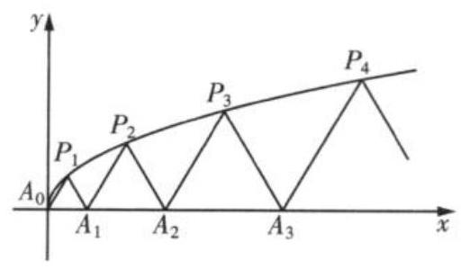

第 8 课:数列专题

<table><tr><td>教学目标</td><td>1、掌握数列的概念   2、掌握等差等比数列的通项公式和求和公式   3、掌握通项的求法和求和的方法   4、掌握数列的函数性质</td></tr><tr><td>重点</td><td>数列的综合</td></tr><tr><td>难点</td><td>数列的综合</td></tr></table>

## (一)等差、等比数列

## 例题精讲

【例 1】已知数列 $\left\{  {a}_{n}\right\}$ 为等差数列,数列 $\left\{  {b}_{n}\right\}$ 的前 $n$ 项和为 ${S}_{n}$ ,若 ${b}_{n} = {a}_{n}\cos \frac{2n\pi }{3},{a}_{1} = 6$ ,则 ${S}_{2020} =$ ___.

【例 2】已知各项均为正数的数列 $\left\{  {a}_{n}\right\}$ 的前 $n$ 项和为 ${S}_{n}$ ,且 ${a}_{n} + 1 = 2\sqrt{{S}_{n}}$ .

(1)求数列 $\left\{  {a}_{n}\right\}$ 的通项公式 ${a}_{n}$ ；

(2)设数列 $\left\{  {{\left( -1\right) }^{n} \cdot  \frac{n}{{a}_{n} \cdot  {a}_{n + 1}}}\right\}$ 的前 $n$ 项和为 ${T}_{n}$ ，求 ${T}_{2020}$ .

【例 3】设函数 $f\left( x\right)  = {\log }_{m}x\;\left( {m > 0\text{ 且 }m \neq  1}\right)$ ,若 $m$ 是等比数列 $\left\{  {a}_{n}\right\}  \left( {n \in  {\mathrm{N}}^{ * }}\right)$ 的公比,且 $f\left( {{a}_{2}{a}_{4}{a}_{6}\cdots {a}_{2018}}\right)  = 7$ ，则 $f\left( {a}_{1}^{2}\right)  + f\left( {a}_{2}^{2}\right)  + f\left( {a}_{3}^{2}\right)  + \cdots  + f\left( {a}_{2018}^{2}\right)$ 的值为___.

【例 4】等比数列 $\left\{  {a}_{n}\right\}$ 的首项为 $\frac{3}{2}$ ,公比为 $- \frac{1}{2}$ ,前 $n$ 项和为 ${S}_{n}$ ,则当 $n \in  {\mathbf{N}}^{ * }$ 时, ${S}_{n} - \frac{1}{{S}_{n}}$ 的最大值与最小值之和为___.

【例 5】已知 $\left\{  {a}_{n}\right\}$ 为等差数列,前 $n$ 项和为 ${S}_{n}\left( {n \in  {N}^{ * }}\right) ,\left\{  {b}_{n}\right\}$ 是首项为 2 的等比数列,且公比大于 0, ${b}_{2} + {b}_{3} = {12},\;{b}_{3} = {a}_{4} + {a}_{1},\;{S}_{16} = {16}{b}_{4}.$

(1)求 $\left\{  {a}_{n}\right\}$ 和 $\left\{  {b}_{n}\right\}$ 的通项公式;

(2)求数列 $\left\{  {{a}_{n}{\mathcal{H}}_{n}}\right\}$ 的前 $n$ 项和 ${T}_{n}\left( {n \in  {N}^{ * }}\right)$ ;

(3)设集合 $A = \left\{  {x\left| {\;x = {a}_{n}}\right. , n \in  {N}^{ * }}\right\}  , B = \left\{  {x\left| {\;x = {b}_{n}}\right. , n \in  {N}^{ * }}\right\}$ ，将 $A \cup  B$ 的所有元素从小到大依次排列构成一个数列 $\left\{  {c}_{n}\right\}$ ,记 ${U}_{n}$ 为数列 $\left\{  {c}_{n}\right\}$ 的前 $n$ 项和,求 $\left| {{U}_{n} - {2020}}\right|$ 的最小值.

## 巩固训练

1、已知集合 $A = \left\{  {x\left| {\;x = {2n} - 1}\right. , n \in  {\mathbf{N}}^{ * }}\right\}  , B = \left\{  {x\left| {\;x = {2}^{n}}\right. , n \in  {\mathbf{N}}^{ * }}\right\}$ ,将 $A \cup  B$ 中的所有元素按从小到大的顺序排列构成一个数列 $\left\{  {a}_{n}\right\}$ ，设数列 $\left\{  {a}_{n}\right\}$ 的前 $n$ 项和为 ${S}_{n}$ ，则使得 ${S}_{n} > {1000}$ 成立的最小的和的值为___.

2、已知数列 $\left\{  {a}_{n}\right\}  ,\left\{  {b}_{n}\right\}  ,{S}_{n}$ 为数列 $\left\{  {a}_{n}\right\}$ 的前 $n$ 项和， ${a}_{n} > 0,{a}_{2} = 4{b}_{1}$ ，若 ${a}_{1} = 2,{a}_{n}{}^{2} - {a}_{n}{a}_{n - 1} - 2{a}_{n - 1}{}^{2} = 0\left( {n \geq  2}\right)$ ， 且 $n{b}_{n + 1} - \left( {n + 1}\right) {b}_{n} = {n}^{2} + n, n \in  {\mathrm{N}}^{ * }$ .

(1)求数列 $\left\{  {a}_{n}\right\}$ 的通项公式;

(2)证明 $\left\{  \frac{{b}_{n}}{n}\right\}$ 为等差数列;

(3)若数列 $\left\{  {c}_{n}\right\}$ 的通项公式为 ${c}_{n} = \left\{  \begin{array}{l}  - \frac{{a}_{n}{b}_{n}}{2}, n\text{ 为奇数 } \\  \frac{{a}_{n}{b}_{n}}{4}, n\text{ 为偶数 } \end{array}\right.$ ，令 ${T}_{n}$ 为 $\left\{  {c}_{n}\right\}$ 的前 $n$ 项的和，求 ${T}_{2n}$ .

3、已知数列 $\left\{  {a}_{n}\right\}$ 的前 $n$ 项和为 ${S}_{n},{a}_{1} = 3$ ,且 $\frac{{S}_{n}}{n} - \frac{{S}_{n - 1}}{n - 1} = 1\left( {n \geq  2, n \in  {\mathrm{N}}^{ * }}\right)$ .

(1)求数列 $\left\{  {a}_{n}\right\}$ 的通项公式；

(2)设 ${b}_{n} = \frac{{S}_{n}}{{\left( \sqrt{3}\right) }^{{a}_{n} - 1}}$ ，数列 $\left\{  {b}_{n}\right\}$ 的前 $n$ 项和为 ${T}_{n}$ ，求 ${T}_{n}$ .

## (二)数列的极限与数学归纳法

## 例题精讲

【例 6】已知数列 $\left\{  {a}_{n}\right\}$ 的通项公式 ${a}_{n} = \left\{  \begin{array}{l} {\left( -1\right) }^{n},1 \leq  n \leq  {2019} \\  {\left( \frac{1}{2}\right) }^{n - {2019}}, n \geq  {2020} \end{array}\right.$ ,前 $n$ 项和为 ${S}_{n}$ ,则关于数列 $\left\{  {a}_{n}\right\}  ,\left\{  {S}_{n}\right\}$ 的极限, 下面判断正确的是( )

A. 数列 $\left\{  {a}_{n}\right\}$ 的极限不存在, $\left\{  {S}_{n}\right\}$ 的极限存在

B. 数列 $\left\{  {a}_{n}\right\}$ 的极限存在, $\left\{  {S}_{n}\right\}$ 的极限不存在

C. 数列 $\left\{  {a}_{n}\right\}  \text{ 、 }\left\{  {S}_{n}\right\}$ 的极限均存在,但极限值不相等

D. 数列 $\left\{  {a}_{n}\right\}  \text{ 、 }\left\{  {S}_{n}\right\}$ 的极限均存在,且极限值相等

【例 7】无穷等比数列 $\left\{  {a}_{n}\right\}$ 的前 $n$ 项和为 ${S}_{n}$ ,若 $\mathop{\lim }\limits_{{n \rightarrow  \infty }}{S}_{n} = \frac{1}{{a}_{1}}$ ,则首项 ${a}_{1}$ 的取值范围是___.

【例8】已知椭圆 $\frac{\left( {n + 1}\right) {x}^{2}}{{4n} + 1} + \frac{\left( {n + 2}\right) {y}^{2}}{n + 1} = 1$ 的右焦点为 ${F}_{n}\left( {{c}_{n},0}\right)$ ,其中 $n \in  {\mathbf{N}}^{ * }$ ,则 $\mathop{\lim }\limits_{{n \rightarrow  \infty }}{c}_{n} =$ ___.

【例 9】如图, ${P}_{1}\left( {{x}_{1},{y}_{1}}\right) \text{ 、 }{P}_{2}\left( {{x}_{2},{y}_{2}}\right) \text{ 、 }\cdots \text{ 、 }{P}_{n}\left( {{x}_{n},{y}_{n}}\right) \left( {0 < {y}_{1} < {y}_{2} < \cdots  < {y}_{n}}\right)$ 是曲线 $C : {y}^{2} = {3x}\left( {y \geq  0}\right)$ 上的 $n$ 个点,点 ${A}_{i}\left( {{a}_{i},0}\right) \left( {i = 1,2,3,\cdots , n}\right)$ 在 $x$ 轴的正半轴上,且 $\bigtriangleup {A}_{i - 1}{A}_{i}{P}_{i}$ 是正三角形 ( ${A}_{0}$ 是坐标原点).

(1)写出 ${a}_{1}\text{ 、 }{a}_{2}\text{ 、 }{a}_{3}$ ；

(2)猜想点 ${A}_{n}\left( {{a}_{n},0}\right) \left( {n \in  {\mathbf{N}}^{ * }}\right)$ 的横坐标 ${a}_{n}$ 关于 $n$ 的表达式,并用数学归纳法证明.

## 巩固训练

1、计算: $\mathop{\lim }\limits_{{n \rightarrow  \infty }}\frac{\left| 4n - {23}\right| }{2n} =$

2、设无穷等比数列 $\left\{  {a}_{n}\right\}$ 的前 $n$ 项和为 ${S}_{n}$ ,若 ${a}_{1} = 1$ ,且 $\mathop{\lim }\limits_{{n \rightarrow  \infty }}\left( {{S}_{1} + {S}_{n}}\right)  = 3$ ,则公比 $q =$ ___.

3、无穷等比数列的前 $n$ 项和 ${S}_{n} = a - {\left( \frac{1}{3}\right) }^{n}$ ，则该数列所有项的和为___

4、用数学归纳法证明等式 $\left( {n + 1}\right) \left( {n + 2}\right)  \cdot  \cdots  \cdot  \left( {n + n}\right)  = {2}^{n} \cdot  1 \cdot  3 \cdot  \cdots  \cdot  \left( {{2n} - 1}\right) \left( {n \in  {\mathrm{N}}^{ * }}\right)$ ,从 $k$ 到 $k + 1$ 左端需要增乘的代数式为( )

A. ${2k} + 1$ B. $2\left( {{2k} + 1}\right)$

C. $\frac{{2k} + 1}{k + 1}$ D. $\frac{{2k} + 3}{k + 1}$

5、已知数列 $\left\{  {a}_{n}\right\}$ 满足 ${a}_{n} = n{\left( n + 1\right) }^{2}$ ，是否存在等差数列 $\left\{  {b}_{n}\right\}$ ，使 ${a}_{n} = 1 \cdot  {b}_{1} + 2 \cdot  {b}_{2} + \cdots  + n \cdot  {b}_{n}$ 对一切正整数 $n$ 都成立? 请证明你的结论.

## (三)数列的综合

## 例题精讲

【例 10】已知 $n \in  {N}^{ * }$ ,集合 ${M}_{n} = \left\{  {\frac{1}{2},\frac{3}{4},\frac{5}{8},\cdots ,\frac{{2n} - 1}{{2}^{n}}}\right\}$ ,集合 ${M}_{n}$ 的所有非空子集的最小元素之和为 ${T}_{n}$ , 则使得 ${T}_{n} > {80}$ 的最小正整数 $n$ 的值为___.

【例 11】设数列 $\left\{  {a}_{n}\right\}$ 的前 $n$ 项和为 ${S}_{n}$ ,且 ${a}_{1} = 3,2{S}_{n} = {a}_{n + 1} + {4n} - 3\left( {n \in  {N}_{ + }}\right)$

(1)证明:数列 $\left\{  {{a}_{n} - 2}\right\}$ 是等比数列

(2)设 ${b}_{n} = {3}^{n} + {\left( -1\right) }^{n}t{a}_{n}$ ，若数列 $\left\{  {b}_{n}\right\}$ 是递增数列，求 $t$ 的取值范围

【例 12】已知 $x$ 轴上的点 ${A}_{1}\left( {1,0}\right) ,{A}_{2}\left( {5,0}\right) ,\cdots ,{A}_{n}\left( {{a}_{n},0}\right)$ 满足 $\overline{{A}_{n}{A}_{n + 1}} = \frac{1}{2}\overline{{A}_{n - 1}{A}_{n}}$ . 射线 $y = x\left( {x \geq  0}\right)$ 上的点 ${B}_{1}\left( {3,3}\right) ,{B}_{2}\left( {5,5}\right) ,\cdots ,{B}_{n}\left( {{b}_{n},{b}_{n}}\right)$ 满足 $\left| \overrightarrow{O{B}_{n + 1}}\right|  = \left| \overrightarrow{O{B}_{n}}\right|  + 2\sqrt{2}, n \in  {\mathbf{N}}^{ * }$ .

(1)证明: $\left\{  {{a}_{n + 1} - {a}_{n}}\right\}$ 是等比数列；

(2)用 $n$ 表示点 ${A}_{n}$ 和点 ${B}_{n}$ 的坐标；

(3)求四边形 ${A}_{n}{A}_{n + 1}{B}_{n + 1}{B}_{n}$ 的面积 ${S}_{n}$ 的取值范围.

【例13】已知数列 $\left\{  {a}_{n}\right\}$ 中,已知 ${a}_{1} = 1,{a}_{2} = a,{a}_{n + 1} = k\left( {{a}_{n} + {a}_{n + 2}}\right)$ 对任意 $n \in  {\mathbf{N}}^{ * }$ 都成立,数列 $\left\{  {a}_{n}\right\}$ 的前 $n$ 项和为 ${S}_{n}$ .

(1)若 $\left\{  {a}_{n}\right\}$ 是等差数列，求 $k$ 的值；

(2)若 $a = 1, k =  - \frac{1}{2}$ ，求 ${S}_{n}$ ；

(3)是否存在实数 $k$ ，使数列 $\left\{  {a}_{n}\right\}$ 是公比不为 1 的等比数列，且任意相邻三项 ${a}_{m}$ ， ${a}_{m + 1}$ ， ${a}_{m + 2}$ 按某顺序排列后成等差数列? 若存在,求出所有 $k$ 的值; 若不存在,请说明理由.

巩固训练

1、已知函数 $f\left( x\right)  = \left\{  \begin{matrix} \left( {3 - a}\right) x - 3, x \leq  7, \\  {a}^{x - 6}, x > 7. \end{matrix}\right.$ 令 ${a}_{n} = f\left( n\right) \left( {n \in  {\mathbf{N}}^{ * }}\right)$ 得数列 $\left\{  {a}_{n}\right\}$ ,若数列 $\left\{  {a}_{n}\right\}$ 为递增数列,则实数 $a$ 的取值范围为( )

A. $\left( {1,3}\right)$ B. $\left( {2,3}\right)$

c. $\left( {\frac{9}{4},3}\right)$ D. $\left( {2,\frac{9}{4}}\right)$

2、若数列 $\left\{  {a}_{n}\right\}$ 的通项公式为 ${a}_{n} = {2}^{n} - 1$ ，在一个 $n$ 行 $n$ 列的数表中，第 $\mathrm{i}$ 行第 $j$ 列的元素为 ${c}_{ij} = {a}_{i} \cdot  {a}_{j} + {a}_{i} + {a}_{j}\left( {i = 1,2,\cdots , n, j = 1,2,\cdots , n}\right)$ ，则满足 ${c}_{11} + {c}_{22} + \cdots  + {c}_{nn} < {2021}$ 的 $n$ 的最大值是( )

A. 4 B. 5 C. 6 D. 7

3、在计算机语言中，有一种函数 $y = {INT}\left( x\right)$ 叫做取整函数 (也叫高斯函数),它表示 $y$ 等于不超过 $x$ 的最大整数,如 ${INT}\left( {0.9}\right)  = 0,{INT}\left( {3.14}\right)  = 3$ ,已知 ${a}_{n} = {INT}\left( {\frac{2}{7} \times  {10}^{n}}\right) ,{b}_{1} = {a}_{1}$ , ${b}_{n} = {a}_{n} - {10}{a}_{n - 1}$ ( $n \in  {N}^{ * }$ ,且 $n \geq  2$ ),则 ${b}_{2018}$ 等于( )

A. 2 B. 5 C. 7 D. 8

4、已知 ${S}_{n}$ 为数列 $\left\{  {a}_{n}\right\}$ 的前 $n$ 项和，若 ${a}_{1} = \frac{5}{2}$ ，且 ${a}_{n + 1}\left( {2 - {a}_{n}}\right)  = 2\left( {n \in  {N}^{ * }}\right)$ ，则 ${S}_{21} =$ ___.

5、已知数列 $\left\{  {a}_{n}\right\}$ 的前 $n$ 项和为 ${S}_{n}$ ，且 ${S}_{n} = \frac{3}{2}{a}_{n} - \frac{1}{2}, n \in  {\mathrm{N}}^{ * }$ ，数列 $\left\{  {b}_{n}\right\}$ 满足: ${b}_{1} = {a}_{1},{b}_{2} = 3,{b}_{n} + {b}_{n + 2} = 2{b}_{n + 1}, \; n \in  {\mathrm{N}}^{ * }$ .

(1)求数列 $\left\{  {a}_{n}\right\}$ ， $\left\{  {b}_{n}\right\}$ 的通项公式；

(2)求数列 $\left\{  {{a}_{n} \cdot  {b}_{n}}\right\}$ 的前 $n$ 项和 ${T}_{n}$ ；

(3)若不等式 $k \cdot  {\left( \frac{2}{3}\right) }^{n} \cdot  {a}_{n + 1} - {b}_{n} + 6 \geq  0$ 对任意 $n \in  {\mathrm{N}}^{ * }$ 恒成立，求实数 $k$ 的取值范围.
