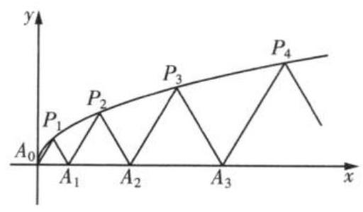

第 8 课:数列专题

<table><tr><td>教学目标</td><td>1、掌握数列的概念   2、掌握等差等比数列的通项公式和求和公式   3、掌握通项的求法和求和的方法   4、掌握数列的函数性质</td></tr><tr><td>重点</td><td>数列的综合</td></tr><tr><td>难点</td><td>数列的综合</td></tr></table>

## (一)等差、等比数列

## 例题精讲

【例 1】已知数列 $\left\{  {a}_{n}\right\}$ 为等差数列,数列 $\left\{  {b}_{n}\right\}$ 的前 $n$ 项和为 ${S}_{n}$ ,若 ${b}_{n} = {a}_{n}\cos \frac{2n\pi }{3},{a}_{1} = 6$ ,则 ${S}_{2020} =$ ___.

【难度】 $\star   \star   \star$

【答案】 -3

【解析】 $\because {b}_{1} + {b}_{2} + {b}_{3} =  - \frac{1}{2}\left( {{a}_{1} + {a}_{2}}\right)  + {a}_{3} = \frac{3}{2}d,{b}_{{3k} - 2} + {b}_{{3k} - 1} + {b}_{3k} =  - \frac{1}{2}\left( {{a}_{{3k} - 2} + {a}_{{3k} - 1}}\right)  + {a}_{3k} = \frac{3}{2}d$ ,

$\therefore \left\{  {b}_{n}\right\}$ 的连续 3 项的和为常数列,

$\therefore {S}_{2020} = \frac{3}{2}d \times  {673} + {b}_{2020} = \frac{2019}{2}d + \left( {{a}_{1} + {2019d}}\right)  \times  \left( {-\frac{1}{2}}\right)  =  - \frac{1}{2}{a}_{1} =  - 3$ . 故答案为:-3.

【例 2】已知各项均为正数的数列 $\left\{  {a}_{n}\right\}$ 的前 $n$ 项和为 ${S}_{n}$ ,且 ${a}_{n} + 1 = 2\sqrt{{S}_{n}}$ .

(1)求数列 $\left\{  {a}_{n}\right\}$ 的通项公式 ${a}_{n}$ ；

(2)设数列 $\left\{  {{\left( -1\right) }^{n} \cdot  \frac{n}{{a}_{n} \cdot  {a}_{n + 1}}}\right\}$ 的前 $n$ 项和为 ${T}_{n}$ ，求 ${T}_{2020}$ .

【难度】 $\star   \star   \star$

【答案】( 1 ) ${a}_{n} = {2n} - 1$ ；( 2 )- $\frac{1010}{4041}$ .

【解析】(1) $\because {a}_{n} + 1 = 2\sqrt{{S}_{n}},\therefore {\left( {a}_{n} + 1\right) }^{2} = 4{S}_{n}$ ,即 ${S}_{n} = \frac{{a}_{n}^{2} + 2{a}_{n} + 1}{4}$ ,

当 $n = 1$ 时， ${a}_{1} = \frac{{a}_{1}^{2} + 2{a}_{1} + 1}{4}$ ，即 ${\left( {a}_{1} - 1\right) }^{2} = 0$ ，解得 ${a}_{1} = 1$ ，

当 $n \geq  2$ 时， ${a}_{n} = {S}_{n} - {S}_{n - 1} = \frac{{a}_{n}^{2} + 2{a}_{n} + 1}{4} - \frac{{a}_{n - 1}^{2} + 2{a}_{n - 1} + 1}{4} = \frac{{a}_{n}^{2} + 2{a}_{n} - {a}_{n - 1}^{2} - 2{a}_{n - 1}}{4}$ ,

化简得 $2\left( {{a}_{n} + {a}_{n - 1}}\right)  = {a}_{n}^{2} - {a}_{n - 1}^{2} = \left( {{a}_{n} + {a}_{n - 1}}\right) \left( {{a}_{n} - {a}_{n - 1}}\right)$ ,又数列 $\left\{  {a}_{n}\right\}$ 各项均为正数,

$\therefore {a}_{n} + {a}_{n - 1} \neq  0,\therefore {a}_{n} - {a}_{n - 1} = 2$ ,

$\therefore$ 数列 $\left\{  {a}_{n}\right\}$ 是首项为 1 、公差为 2 的等差数列, $\therefore {a}_{n} = 1 + \left( {n - 1}\right)  \times  2 = {2n} - 1$ ;

(2)设 ${b}_{n} = {\left( -1\right) }^{n} \cdot  \frac{n}{{a}_{n} \cdot  {a}_{n + 1}}$ ，由(1)得 ${b}_{n} = {\left( -1\right) }^{n} \cdot  \frac{n}{\left( {{2n} - 1}\right)  \cdot  \left( {{2n} + 1}\right) } = \frac{1}{4} \cdot  {\left( -1\right) }^{n} \cdot  \left( {\frac{1}{{2n} - 1} + \frac{1}{{2n} + 1}}\right)$ ， 则 ${T}_{2020} = {b}_{1} + {b}_{2} + \cdots  + {b}_{2020} \; = \frac{1}{4} \cdot  {\left( -1\right) }^{1} \cdot  \left( {\frac{1}{1} + \frac{1}{3}}\right)  + \frac{1}{4} \cdot  {\left( -1\right) }^{2} \cdot  \left( {\frac{1}{3} + \frac{1}{5}}\right)  + \cdots  + \frac{1}{4} \cdot  {\left( -1\right) }^{2020} \cdot  \left( {\frac{1}{4039} + \frac{1}{4041}}\right) \; = \frac{1}{4} \cdot  \left( {-\frac{1}{1} - \frac{1}{3} + \frac{1}{3} + \frac{1}{5} + \cdots  + \frac{1}{4039} + \frac{1}{4041}}\right)  = \frac{1}{4} \cdot  \left( {\frac{1}{4041} - 1}\right)  =  - \frac{1010}{4041}$ .

【例 3】设函数 $f\left( x\right)  = {\log }_{m}x\left( {m > 0\text{ 且 }m \neq  1}\right)$ ,若 $m$ 是等比数列 $\left\{  {a}_{n}\right\}  \left( {n \in  {\mathbf{N}}^{ * }}\right)$ 的公比,且 $f\left( {{a}_{2}{a}_{4}{a}_{6}\cdots {a}_{2018}}\right)  = 7$ ，则 $f\left( {a}_{1}^{2}\right)  + f\left( {a}_{2}^{2}\right)  + f\left( {a}_{3}^{2}\right)  + \cdots  + f\left( {a}_{2018}^{2}\right)$ 的值为___.

【难度】 $\star   \star   \star$

【答案】 -1990

【解析】 $\because f\left( {{a}_{2}{a}_{4}{a}_{6}\cdots {a}_{2018}}\right)  = 7,\therefore {a}_{2}{a}_{4}{a}_{6}\cdots {a}_{2018} = {m}^{7},{a}_{1}{a}_{3}\ldots {a}_{2017} = \frac{{a}_{2}{a}_{4}{a}_{6}\ldots {a}_{2018}}{{m}^{1009}} = {m}^{-{1002}}$ , $\therefore f\left( {a}_{1}^{2}\right)  + f\left( {a}_{2}^{2}\right)  + f\left( {a}_{3}^{2}\right)  + \cdots  + f\left( {a}_{2018}^{2}\right)  = {\log }_{m}\left( {{a}_{1}^{2}{a}_{2}^{2}\ldots {a}_{2018}^{2}}\right)  = {\log }_{m}{\left( {a}_{1}{a}_{3}\ldots {a}_{2017} \times  {a}_{2}{a}_{4}\ldots {a}_{2018}\right) }^{2} \; = {\log }_{m}{\left( {m}^{-{1002}} \cdot  {m}^{7}\right) }^{2} = {\log }_{m}{m}^{-{1990}} =  - {1990}$ . 故答案为 -1990 .

【例 4】等比数列 $\left\{  {a}_{n}\right\}$ 的首项为 $\frac{3}{2}$ ,公比为 $- \frac{1}{2}$ ,前 $n$ 项和为 ${S}_{n}$ ,则当 $n \in  {\mathbf{N}}^{ * }$ 时, ${S}_{n} - \frac{1}{{S}_{n}}$ 的最大值与最小值之和为___.

【难度】 $\star   \star   \star$

【答案】 $\frac{1}{4}$

【解析】依题意得, ${S}_{n} = \frac{\frac{3}{2}\left\lbrack  {1 - {\left( -\frac{1}{2}\right) }^{n}}\right\rbrack  }{1 - \left( {-\frac{1}{2}}\right) } = 1 - {\left( -\frac{1}{2}\right) }^{n}$ .

当 $n$ 为奇数时, ${S}_{n} = 1 + \frac{1}{{2}^{n}}$ 随着 $n$ 的增大而减小, $\therefore 1 < {S}_{n} = 1 + \frac{1}{{2}^{n}} \leq  {S}_{1} = \frac{3}{2}$ ,

$\because {S}_{n} - \frac{1}{{S}_{n}}$ 随着 ${S}_{n}$ 的增大而增大, $\therefore 0 < {S}_{n} - \frac{1}{{S}_{n}} \leq  \frac{5}{6}$ ;

当 $n$ 为偶数时, ${S}_{n} = 1 - \frac{1}{{2}^{n}}$ 随着 $n$ 的增大而增大, $\therefore \frac{3}{4} = {S}_{2} \leq  {S}_{n} = 1 - \frac{1}{{2}^{n}} < 1$ ,

$\because {S}_{n} - \frac{1}{{S}_{n}}$ 随着 ${S}_{n}$ 的增大而增大, $- \frac{7}{12} \leq  {S}_{n} - \frac{1}{{S}_{n}} < 0$ .

因此 ${S}_{n} - \frac{1}{{S}_{n}}$ 的最大值与最小值分别为 $\frac{5}{6}, - \frac{7}{12}$ ,其最大值与最小值之和为 $\frac{5}{6} - \frac{7}{12} = \frac{1}{4}$ . 故答案为: $\frac{1}{4}$ .

【例 5】已知 $\left\{  {a}_{n}\right\}$ 为等差数列,前 $n$ 项和为 ${S}_{n}\left( {n \in  {N}^{ * }}\right) ,\left\{  {b}_{n}\right\}$ 是首项为 2 的等比数列,且公比大于 0, ${b}_{2} + {b}_{3} = {12},{b}_{3} = {a}_{4} + {a}_{1},{S}_{16} = {16}{b}_{4}$ .

(1)求 $\left\{  {a}_{n}\right\}$ 和 $\left\{  {b}_{n}\right\}$ 的通项公式;

(2)求数列 $\left\{  {{a}_{n}{\mathcal{K}}_{n}}\right\}$ 的前 $n$ 项和 ${T}_{n}\left( {n \in  {N}^{ * }}\right)$ ；

(3)设集合 $A = \left\{  {x \mid  x = {a}_{n}, n \in  {N}^{ * }}\right\}  , B = \left\{  {x \mid  x = {b}_{n}, n \in  {N}^{ * }}\right\}$ ，将 $A \cup  B$ 的所有元素从小到大依次排列构成一个数列 $\left\{  {c}_{n}\right\}$ ，记 ${U}_{n}$ 为数列 $\left\{  {c}_{n}\right\}$ 的前 $n$ 项和，求 $\left| {{U}_{n} - {2020}}\right|$ 的最小值.

【难度】 $\star   \star   \star   \star$

【答案】( 1 ) ${a}_{n} = {2n} - 1,\;{b}_{n} = {2}^{n}.$ ( 2 ) ${T}_{n} = \left( {{2n} - 3}\right)  \times  {2}^{n + 1} + 6$ ；( 3 )42.

【解析】(1) 设 $\left\{  {a}_{n}\right\}$ 的公差为 $d,\left\{  {b}_{n}\right\}$ 的公比为 $q$ ,且 $q > 0$

由 ${b}_{2} + {b}_{3} = {12}$ 可得 ${b}_{1}q + {b}_{1}{q}^{2} = {12},\because {b}_{1} = 2, q > 0,\therefore q = 2,\therefore {b}_{n} = {2}^{n}$

由 ${b}_{3} = {a}_{4} + {a}_{1}$ ,可得 $2{a}_{1} + {3d} = 8$ ,①由 ${S}_{16} = {16}{b}_{4}$ ,可得 $2{a}_{1} + {15d} = {32}$ ,②

①②联立，解得 ${a}_{1} = 1, d = 2,\therefore {a}_{n} = {2n} - 1$

$\therefore \left\{  {a}_{n}\right\}$ 的通项公式为 ${a}_{n} = {2n} - 1,\left\{  {b}_{n}\right\}$ 的通项公式为 ${b}_{n} = {2}^{n}$

(2) ${T}_{n} = 1 \times  {2}^{1} + 3 \times  {2}^{2} + \cdots  + \left( {{2n} - 1}\right)  \times  {2}^{n}$ ，① $2{T}_{n} = 1 \times  {2}^{2} + 3 \times  {2}^{3} + \cdots  + \left( {{2n} - 3}\right)  \times  {2}^{n} + \left( {{2n} - 1}\right)  \times  {2}^{n + 1}$ ， ②

②-①可得，

${T}_{n} = 1 \times  {2}^{1} - 2\left( {{2}^{2} + {2}^{3}\cdots  + {2}^{n}}\right)  - \left( {{2n} - 1}\right)  \times  {2}^{n + 1} =  - 1 \times  {2}^{1} - 2 \times  \frac{4\left( {1 - {2}^{n - 1}}\right) }{1 - 2} + \left( {{2n} - 1}\right)  \times  {2}^{n + 1} = \left( {{2n} - 3}\right)  \times  {2}^{n + 1} + 6$

(3)当 ${a}_{k} < {b}_{l} < {a}_{k + 1}\left( {k, l \in  {N}^{ * }}\right)$ 时， ${2k} - 1 < {2}^{l} < {2k} + 1$ ，有 $k - \frac{1}{2} < {2}^{l - 1} < k + \frac{1}{2}$ ，则 $k = {2}^{l - 1}$

设 ${H}_{l} = {a}_{1} + {a}_{2} + \cdots  + {a}_{{2}^{l - 1}} + {b}_{1} + {b}_{2} + \cdots  + {b}_{l}$ ,则共有 $k + l = {2}^{l - 1} + l$ 个数,即 ${H}_{l} = {U}_{{2}^{l - 1} + l}$

而 ${a}_{1} + {a}_{2} + \cdots  + {a}_{{2}^{l - 1}} = \frac{{2}^{l - 1}\left( {2 \times  1 - 1 + {2}^{l} - 1}\right) }{2} = {2}^{{2l} - 2},{b}_{1} + {b}_{2} + \cdots  + {b}_{l} = \frac{2\left( {1 - {2}^{l}}\right) }{1 - 2} = {2}^{l + 1} - 2$ ,

则 ${H}_{l} = {2}^{{2l} - 2} + {2}^{l + 1} - 2$ 可知 ${H}_{6} = {1150} < {2000} < {H}_{7} = {4350}$ ,可知在 $\left( {{2}^{6},{2}^{7}}\right)$ 中取得最小值,

假设是 $\left( {{2}^{6},{2}^{7}}\right)$ 中第 $m\left( {m < {63}}\right)$ 项取得,设 $\left( {{2}^{6},{2}^{7}}\right)$ 中前 $m$ 项和为 ${V}_{m} = {65m} + \frac{m\left( {m - 1}\right) }{2} \times  2 = {m}^{2} + {64m}$ 经计算可知 $m = {12},\left| {{U}_{n} - {2020}}\right|$ 取得最小值 42 .

巩固训练

1、已知集合 $A = \left\{  {x\left| {\;x = {2n} - 1}\right. , n \in  {\mathbf{N}}^{ * }}\right\}  , B = \left\{  {x\left| {\;x = {2}^{n}}\right. , n \in  {\mathbf{N}}^{ * }}\right\}$ ，将 $A \cup  B$ 中的所有元素按从小到大的顺序排列构成一个数列 $\left\{  {a}_{n}\right\}$ ，设数列 $\left\{  {a}_{n}\right\}$ 的前 $n$ 项和为 ${S}_{n}$ ，则使得 ${S}_{n} > {1000}$ 成立的最小的 $n$ 的值为___.

【难度】 $\star   \star   \star$

【答案】36

【解析】由题意,对于数列 $\left\{  {a}_{n}\right\}$ 的项 ${2}^{n}$ ,其前面的项 $1,3,5,\ldots ,{2}^{n} - 1 \in  A$ ,共有 ${2}^{n - 1}$ 项, $2,{2}^{2},{2}^{3},\cdots ,{2}^{n} \in  B$ , 共有 $n$ 项,所以 ${2}^{n}$ 为数列 $\left\{  {a}_{n}\right\}$ 的 ${2}^{n - 1} + n$ 项,

且 ${S}_{{2}^{n - 1} + n} = \left\lbrack  {\left( {2 \times  1 - 1}\right)  + \left( {2 \times  2 - 1}\right)  + \cdots  + \left( {2 \times  {2}^{n - 1} - 1}\right) }\right\rbrack   + \left( {2 + {2}^{2} + \cdots  + {2}^{n}}\right)  = {4}^{n - 1} + {2}^{n + 1} - 2$ .

可算得 ${2}^{6 - 1} + 6 = {38}$ (项), ${a}_{38} = {64},{S}_{38} = {1150}$ ,

因为 ${a}_{37} = {63},{a}_{36} = {61},{a}_{35} = {59}$ ,所以 ${S}_{37} = {1086},{S}_{36} = {1023},{S}_{35} = {962}$ ,

因此所求 $n$ 的最小值为 36 . 故答案为:36.

2、已知数列 $\left\{  {a}_{n}\right\}  ,\left\{  {b}_{n}\right\}  ,{S}_{n}$ 为数列 $\left\{  {a}_{n}\right\}$ 的前 $n$ 项和， ${a}_{n} > 0,{a}_{2} = 4{b}_{1}$ ，若 ${a}_{1} = 2,{a}_{n}{}^{2} - {a}_{n}{a}_{n - 1} - 2{a}_{n - 1}{}^{2} = 0\left( {n \geq  2}\right)$ ， 且 $n{b}_{n + 1} - \left( {n + 1}\right) {b}_{n} = {n}^{2} + n, n \in  {\mathrm{N}}^{ * }$ .

(1)求数列 $\left\{  {a}_{n}\right\}$ 的通项公式；

(2)证明 $\left\{  \frac{{b}_{n}}{n}\right\}$ 为等差数列；

(3)若数列 $\left\{  {c}_{n}\right\}$ 的通项公式为 ${c}_{n} = \left\{  \begin{array}{l}  - \frac{{a}_{n}{b}_{n}}{2}, n\text{ 为奇数 } \\  \frac{{a}_{n}{b}_{n}}{4}, n\text{ 为偶数 } \end{array}\right.$ ，令 ${T}_{n}$ 为 $\left\{  {c}_{n}\right\}$ 的前 $n$ 项的和，求 ${T}_{2n}$ .

【难度】 $\star   \star   \star$

【答案】(1) ${a}_{n} = {2}^{n}$ (2) 证明见解析 (3) ${T}_{2n} = \frac{7 + \left( {{12n} - 7}\right)  \cdot  {4}^{n}}{9}$

【解析】(1) 当 $n > 1$ 时, $\left\{  {\begin{array}{l} {S}_{n} = 2{a}_{n} - 2 \\  {S}_{n - 1}2{a}_{n - 1} - 2 \end{array} \Rightarrow  {a}_{n} = 2{a}_{n} - 2{a}_{n - 1} \Rightarrow  \frac{{a}_{n}}{{a}_{n - 1}} = 2}\right.$

当 $n = 1$ 时， ${S}_{1} = 2{a}_{1} - 2 \Rightarrow  {a}_{1} = 2$ ，

综上, $\left\{  {a}_{n}\right\}$ 是公比为 2,首项为 2 的等比数列, ${a}_{n} = {2}^{n}$

(2)证明: $\because {a}_{2} = 4{b}_{1},\therefore {b}_{1} = 1$ ,

$\because n{b}_{n + 1} - \left( {n + 1}\right) {b}_{n} = {n}^{2} + n,\;\therefore \frac{{b}_{n + 1}}{n + 1} - \frac{{b}_{n}}{n} = 1$

综上, $\left\{  \frac{{b}_{n}}{n}\right\}$ 是公差为 1,首项为 1 的等差数列, $\frac{{b}_{n}}{n} = 1 + n - 1 \Rightarrow  {b}_{n} = {n}^{2}$ .

(3)解:令 ${p}_{n} = {c}_{{2n} - 1} + {c}_{2n} =  - \frac{{\left( 2n - 1\right) }^{2} \cdot  {2}^{{2n} - 1}}{2} + \frac{{\left( 2n\right) }^{2} \cdot  {2}^{2n}}{4} = \left( {{4n} - 1}\right) {2}^{{2n} - 2} = \left( {{4n} - 1}\right) {4}^{n - 1}$ ，

$\left\{  \begin{array}{l} {T}_{2n} = 3 \times  {4}^{0} + 7 \times  {4}^{1} + {11} \times  {4}^{2} + \ldots  + \left( {{4n} - 1}\right)  \times  {4}^{n} \\  4{T}_{2n} = 3 \times  {4}^{1} + 7 \times  {4}^{2} + {11} \times  {4}^{3} + \ldots  + \left( {{4n} - 5}\right)  \times  {4}^{n} + \left( {{4n} - 1}\right)  \times  {4}^{n + 1} \end{array}\right.$

①-②，得 $- 3{T}_{2n} = 3 \cdot  {4}^{0} + 4 \cdot  {4}^{1} + 4 \cdot  {4}^{2} + \ldots  + 4 \cdot  {4}^{n - 1} - \left( {{4n} - 1}\right)  \cdot  {4}^{n}$ ，

$- 3{T}_{2n} = 3 + \frac{{16} - 4 \cdot  {4}^{n}}{1 - 4} - \left( {{4n} - 1}\right)  \cdot  {4}^{n}$ .

$\therefore {T}_{2n} = \frac{7}{9} + \frac{{12n} - 7}{9} \cdot  {4}^{n}$ .

3、已知数列 $\left\{  {a}_{n}\right\}$ 的前 $n$ 项和为 ${S}_{n},{a}_{1} = 3$ ,且 $\frac{{S}_{n}}{n} - \frac{{S}_{n - 1}}{n - 1} = 1\left( {n \geq  2, n \in  {\mathrm{N}}^{ * }}\right)$ .

(1)求数列 $\left\{  {a}_{n}\right\}$ 的通项公式；

(2)设 ${b}_{n} = \frac{{S}_{n}}{{\left( \sqrt{3}\right) }^{{a}_{n} - 1}}$ ，数列 $\left\{  {b}_{n}\right\}$ 的前 $n$ 项和为 ${T}_{n}$ ，求 ${T}_{n}$ .

【难度】 $\star   \star   \star$

【答案】(1) ${a}_{n} = {2n} + 1$ (2) $3 - \frac{{n}^{2} + {5n} + 6}{2 \cdot  {3}^{n}}$

【解析】(1) 解: 由题意,可知当 $n = 1$ 时, $\frac{{S}_{1}}{1} = \frac{{a}_{1}}{1} = 3$ ,

因为当 $n \geq  2$ 时, $\frac{{S}_{n}}{n} - \frac{{S}_{n - 1}}{n - 1} = 1$ ,所以数列 $\left\{  \frac{{S}_{n}}{n}\right\}$ 是以 3 为首项,1 为公差的等差数列,

故 $\frac{{S}_{n}}{n} = 3 + \left( {n - 1}\right)  = n + 2$ ,所以 ${S}_{n} = n\left( {n + 2}\right) , n \in  {\mathrm{N}}^{ * }$ ,

则当 $n \geq  2$ 时, ${a}_{n} = {S}_{n} - {S}_{n - 1} = n\left( {n + 2}\right)  - \left( {n - 1}\right) \left( {n + 1}\right)  = {2n} + 1$ ,

因为当 $n = 1$ 时, ${a}_{1} = 3$ 也满足上式,所以 ${a}_{n} = {2n} + 1$ ;

(2)解:由(1)，可得

${b}_{n} = \frac{{S}_{n}}{{\left( \sqrt{3}\right) }^{{a}_{n} - 1}} = \frac{n\left( {n + 2}\right) }{{\left( \sqrt{3}\right) }^{2n}} = \frac{{n}^{2} + {2n}}{{3}^{n}},$

则 ${T}_{n} = {b}_{1} + {b}_{2} + {b}_{3} + \cdots  + {b}_{n} = \frac{{1}^{2} + 2 \times  1}{{3}^{1}} + \frac{{2}^{2} + 2 \times  2}{{3}^{2}} + \frac{{3}^{2} + 2 \times  3}{{3}^{3}} + \cdots  + \frac{{n}^{2} + {2n}}{{3}^{3}}$ ,

$\frac{1}{3}{T}_{n} = \frac{{1}^{2} + 2 \times  1}{{3}^{2}} + \frac{{2}^{2} + 2 \times  2}{{3}^{3}} + \cdots  + \frac{{\left( n - 1\right) }^{2} + 2\left( {n - 1}\right) }{3} + \frac{{n}^{2} + {2n}}{{3}^{+1}},$

两式相减,可得 $\frac{2}{3}{T}_{n} = 1 + \frac{2 \times  2 + 1}{{3}^{2}} + \frac{2 \times  3 + 1}{{3}^{3}} + \ldots  + \frac{{2n} + 1}{{3}^{n}} - \frac{{n}^{2} + {2n}}{{3}^{n + 1}}$ ,

令 ${M}_{n} = \frac{2 \times  2 + 1}{{3}^{2}} + \frac{2 \times  3 + 1}{{3}^{3}} + \ldots  + \frac{{2n} + 1}{{3}^{n}}$ ,

则 $\frac{1}{3}{M}_{n} = \frac{2 \times  2 + 1}{{3}^{3}} + \ldots  + \frac{2\left( {n - 1}\right)  + 1}{{3}^{n}} + \frac{{2n} + 1}{{3}^{n + 1}}$ ,

两式相减,可得 $\frac{2}{3}{M}_{n} = \frac{2 \times  2 + 1}{{3}^{2}} + \frac{2}{{3}^{3}} + \frac{2}{{3}^{4}} + \cdots  + \frac{2}{{3}^{n}} - \frac{{2n} + 1}{{3}^{n + 1}}$

$= \frac{5}{9} + 2 \times  \left( {\frac{1}{{3}^{3}} + \frac{1}{{3}^{4}} + \cdots  + \frac{1}{{3}^{n}}}\right)  - \frac{{2n} + 1}{{3}^{n + 1}}$

$= \frac{5}{9} + 2 \times  \frac{\frac{1}{{3}^{3}} - \frac{1}{{3}^{n + 1}}}{1 - \frac{1}{3}} - \frac{{2n} + 1}{{3}^{n + 1}} = \frac{2}{3} - \frac{{2n} + 4}{{3}^{n + 1}}$ ,所以 ${M}_{n} = 1 - \frac{n + 2}{{3}^{n}}$ ,

即 $\frac{2}{3}{T}_{n} = 1 + {M}_{n} - \frac{{n}^{2} + {2n}}{{3}^{n + 1}} = 1 + 1 - \frac{n + 2}{{3}^{n}} - \frac{{n}^{2} + {2n}}{{3}^{n + 1}} = 2 - \frac{{n}^{2} + {5n} + 6}{{3}^{n + 1}}$ ,所以 ${T}_{n} = 3 - \frac{{n}^{2} + {5n} + 6}{2 \cdot  {3}^{n}}$ .

## (二)数列的极限与数学归纳法

## 例题精讲

【例 6】已知数列 $\left\{  {a}_{n}\right\}$ 的通项公式 ${a}_{n} = \left\{  \begin{array}{l} {\left( -1\right) }^{n},1 \leq  n \leq  {2019} \\  {\left( \frac{1}{2}\right) }^{n - {2019}}, n \geq  {2020} \end{array}\right.$ ,前 $n$ 项和为 ${S}_{n}$ ,则关于数列 $\left\{  {a}_{n}\right\}  ,\left\{  {S}_{n}\right\}$ 的极限, 下面判断正确的是( )

A. 数列 $\left\{  {a}_{n}\right\}$ 的极限不存在, $\left\{  {S}_{n}\right\}$ 的极限存在

B. 数列 $\left\{  {a}_{n}\right\}$ 的极限存在, $\left\{  {S}_{n}\right\}$ 的极限不存在

C. 数列 $\left\{  {a}_{n}\right\}  \text{ 、 }\left\{  {S}_{n}\right\}$ 的极限均存在,但极限值不相等

D. 数列 $\left\{  {a}_{n}\right\}  \text{ 、 }\left\{  {S}_{n}\right\}$ 的极限均存在,且极限值相等

【难度】 $\star   \star   \star$

【答案】 D

【解析】由于 ${a}_{n} = \left\{  \begin{array}{l} {\left( -1\right) }^{n},1 \leq  n \leq  {2019} \\  {\left( \frac{1}{2}\right) }^{n - {2019}}, n \geq  {2020} \end{array}\right.$ ,当 $n \rightarrow   + \infty$ 时, ${a}_{n} \rightarrow  0$ .

当 $n \geq  {2020}$ 时, ${S}_{n} =  - 1 + \frac{\frac{1}{2}\left( {1 - \frac{1}{{2}^{n - {2019}}}}\right) }{1 - \frac{1}{2}} =  - \frac{1}{{2}^{n - {2019}}}$ ,当 $n \rightarrow   + \infty$ 时, ${S}_{n} \rightarrow  0$ .

所以数列 $\left\{  {a}_{n}\right\}  \text{ 、 }\left\{  {S}_{n}\right\}$ 的极限均存在,且极限值相等. 故选: D

【例 7】无穷等比数列 $\left\{  {a}_{n}\right\}$ 的前 $n$ 项和为 ${S}_{n}$ ,若 $\mathop{\lim }\limits_{{n \rightarrow  \infty }}{S}_{n} = \frac{1}{{a}_{1}}$ ,则首项 ${a}_{1}$ 的取值范围是___.

【难度】★★★

【答案】 $\left( {-\sqrt{2}, - 1}\right)  \cup  \left( {-1,0}\right)  \cup  \left( {0,1}\right)  \cup  \left( {1,\sqrt{2}}\right)$

【解析】由题意得等比数列公比满足 $\left| q\right|  < 1, q \neq  0$

$\because {S}_{n} = \frac{{a}_{1}\left( {1 - {q}^{n}}\right) }{1 - q},{a}_{1} \neq  0$ 且 $\mathop{\lim }\limits_{{n \rightarrow  \infty }}{S}_{n} = \frac{1}{{a}_{1}},\therefore \frac{{a}_{1}}{1 - q} = \frac{1}{{a}_{1}}$ ,解得: ${a}_{1}^{2} = 1 - q$ ,由 $\left| q\right|  < 1, q \neq  0$ ,可得:

$q = 1 - {a}_{1}^{2}$ ,即 $- 1 < 1 - {a}_{1}^{2} < 1,1 - {a}_{1}^{2} \neq  0$ ,解得: ${a}_{1} \in  \left( {-\sqrt{2}, - 1}\right)  \cup  \left( {-1,0}\right)  \cup  \left( {0,1}\right)  \cup  \left( {1,\sqrt{2}}\right)$ ,

故答案为: $\left( {-\sqrt{2}, - 1}\right)  \cup  \left( {-1,0}\right)  \cup  \left( {0,1}\right)  \cup  \left( {1,\sqrt{2}}\right)$

【例8】已知椭圆 $\frac{\left( {n + 1}\right) {x}^{2}}{{4n} + 1} + \frac{\left( {n + 2}\right) {y}^{2}}{n + 1} = 1$ 的右焦点为 ${F}_{n}\left( {{c}_{n},0}\right)$ ,其中 $n \in  {\mathbf{N}}^{ * }$ ,则 $\mathop{\lim }\limits_{{n \rightarrow  \infty }}{c}_{n} =$ ___.

【难度】★★★

【答案】 $\sqrt{3}$

【解析】椭圆 $\frac{\left( {n + 1}\right) {x}^{2}}{{4n} + 1} + \frac{\left( {n + 2}\right) {y}^{2}}{n + 1} = 1$ ,即 $\frac{{x}^{2}}{n + 1} + \frac{{y}^{2}}{n + 1} = 1$ ,焦点在 $x$ 轴上,

所以 ${c}_{n} = \sqrt{\frac{{4n} + 1}{n + 1} - \frac{n + 1}{n + 2}} = \sqrt{\frac{\left( {{4n} + 1}\right) \left( {n + 2}\right)  - {\left( n + 1\right) }^{2}}{\left( {n + 1}\right) \left( {n + 2}\right) }} = \sqrt{\frac{3{n}^{2} + {7n} + 1}{{n}^{2} + {3n} + 2}} = \sqrt{\frac{3 + \frac{7}{n} + \frac{1}{{n}^{2}}}{1 + \frac{3}{n} + \frac{2}{{n}^{2}}}}$ ,

所以 $\mathop{\lim }\limits_{{n \rightarrow  \infty }}{c}_{n} = \sqrt{3}$ . 故答案为: $\sqrt{3}$

【例 9】如图, ${P}_{1}\left( {{x}_{1},{y}_{1}}\right) \text{ 、 }{P}_{2}\left( {{x}_{2},{y}_{2}}\right) \text{ 、 }\cdots \text{ 、 }{P}_{n}\left( {{x}_{n},{y}_{n}}\right) \left( {0 < {y}_{1} < {y}_{2} < \cdots  < {y}_{n}}\right)$ 是曲线 $C : {y}^{2} = {3x}\left( {y \geq  0}\right)$ 上的 $n$ 个点,点 ${A}_{i}\left( {{a}_{i},0}\right) \left( {i = 1,2,3,\cdots , n}\right)$ 在 $x$ 轴的正半轴上,且 $\bigtriangleup {A}_{i - 1}{A}_{i}{P}_{i}$ 是正三角形 ( ${A}_{0}$ 是坐标原点).

(1)写出 ${a}_{1}$ 、 ${a}_{2}$ 、 ${a}_{3}$ ；

(2)猜想点 ${A}_{n}\left( {{a}_{n},0}\right) \left( {n \in  {\mathbf{N}}^{ * }}\right)$ 的横坐标 ${a}_{n}$ 关于 $n$ 的表达式，并用数学归纳法证明.

【难度】 $\star   \star   \star   \star$

【答案】(1) ${a}_{1} = 2,{a}_{2} = 6,{a}_{3} = {12}$ ; (2) 猜想: ${a}_{n} = n\left( {n + 1}\right) \left( {n \in  {\mathbf{N}}^{ * }}\right)$ ,证明见解析.

【解析】(1) 设 ${a}_{0} = 0$ ,则依题意,可得 ${x}_{n} = \frac{{a}_{n - 1} + {a}_{n}}{2},{y}_{n} = \sqrt{3} \cdot  \frac{{a}_{n} - {a}_{n - 1}}{2}$ ,

代入 ${y}^{2} = {3x}$ ，得 ${\left( \sqrt{3} \cdot  \frac{{a}_{n} - {a}_{n - 1}}{2}\right) }^{2} = \frac{3}{2}\left( {{a}_{n - 1} + {a}_{n}}\right)$ ，即 ${\left( {a}_{n} - {a}_{n - 1}\right) }^{2} = 2\left( {{a}_{n - 1} + {a}_{n}}\right) \left( {n \in  {\mathbf{N}}^{ * }}\right)$ ，

所以 ${a}_{1} = 2,{a}_{2} = 6,{a}_{3} = {12}$

(2)曲(1)可猜想: ${a}_{n} = n\left( {n + 1}\right) \left( {n \in  {\mathbf{N}}^{ * }}\right)$ . 下面用数学归纳法证明:

( i ) 当 $n = 1$ 时,猜想显然成立;

(ii) 假设当 $n = k$ 时猜想成立,即有 ${a}_{k} = k\left( {k + 1}\right)$ ,

则当 $n = k + 1$ 时,由 ${\left( {a}_{k + 1} - {a}_{k}\right) }^{2} = 2\left( {{a}_{k} + {a}_{k + 1}}\right)$ 得 ${\left\lbrack  {a}_{k + 1} - k\left( k + 1\right) \right\rbrack  }^{2} = 2\left\lbrack  {k\left( {k + 1}\right)  + {a}_{k + 1}}\right\rbrack$ ,

即 ${a}_{k + 1}^{2} - 2\left( {{k}^{2} + k + 1}\right) {a}_{k + 1} + \left\lbrack  {k\left( {k - 1}\right) }\right\rbrack   \cdot  \left\lbrack  {\left( {k + 1}\right) \left( {k + 2}\right) }\right\rbrack   = 0$ ,

解得 ${a}_{k + 1} = \left( {k + 1}\right) \left( {k + 2}\right)$ ( ${a}_{k + 1} = k\left( {k - 1}\right)  < {a}_{k}$ 不符合题意，舍去)，

即当 $n = k + 1$ 时,猜想成立.

由( i )(ii ) 知猜想成立,即 ${a}_{n} = n\left( {n + 1}\right) \left( {n \in  {\mathbf{N}}^{ * }}\right)$ .

## 巩固训练

1、计算: $\mathop{\lim }\limits_{{n \rightarrow  \infty }}\frac{\left| 4n - {23}\right| }{2n} =$ ___.

【难度】 $\star   \star$

【答案】 2

【解析】解: $\mathop{\lim }\limits_{{n \rightarrow  \infty }}\frac{\left| 4n - {23}\right| }{2n} = \mathop{\lim }\limits_{{n \rightarrow  \infty }}\frac{\left| 4 - \frac{23}{n}\right| }{2} = \frac{4}{2} = 2$ . 故答案为: 2 .

2、设无穷等比数列 $\left\{  {a}_{n}\right\}$ 的前 $n$ 项和为 ${S}_{n}$ ,若 ${a}_{1} = 1$ ,且 $\mathop{\lim }\limits_{{n \rightarrow  \infty }}\left( {{S}_{1} + {S}_{n}}\right)  = 3$ ,则公比 $q =$

【难度】 $\star   \star$

【答案】 $\frac{1}{2}$

【解析】设等比数列 $\left\{  {a}_{n}\right\}$ 的公比为 $q$ ,

因为 ${a}_{1} = 1$ ,且 $\mathop{\lim }\limits_{{n \rightarrow  \infty }}\left( {{S}_{1} + {S}_{n}}\right)  = 3$ ,可得 ${S}_{1} + \mathop{\lim }\limits_{{n \rightarrow  \infty }}{S}_{n} = {a}_{1} + \frac{{a}_{1}}{1 - q} = 1 + \frac{1}{1 - q} = 3$ ,解得 $q = \frac{1}{2}$ .

故答案为: $\frac{1}{2}$ .

3、无穷等比数列的前 $n$ 项和 ${S}_{n} = a - {\left( \frac{1}{3}\right) }^{n}$ ,则该数列所有项的和为___

【难度】 $\star   \star   \star$

【答案】 1

【解析】 $\because {S}_{n} = a - {\left( \frac{1}{3}\right) }^{n},\therefore {a}_{1} = {S}_{1} = a - \frac{1}{3},{a}_{2} = {S}_{2} - {S}_{1} = \frac{2}{9},{a}_{3} = {S}_{3} - {S}_{2} = \frac{2}{27}$ ,

$\because$ 该数列无穷等比数列, $\therefore {\left( \frac{2}{9}\right) }^{2} = \left( {a - \frac{1}{3}}\right)  \times  \frac{2}{27}$ ,解得 $a = 1$ ,

$\therefore {a}_{1} = 1 - \frac{1}{3} = \frac{2}{3}, q = \frac{1}{3},\therefore {S}_{n} = \frac{{a}_{1}\left( {1 - {q}^{n}}\right) }{1 - q} = \frac{\frac{2}{3}\left( {1 - \frac{1}{{3}^{n}}}\right) }{1 - \frac{1}{3}} = 1 - \frac{1}{{3}^{n}}$ ,

$\therefore$ 该数列的各项和 $= \mathop{\lim }\limits_{{n \rightarrow  \infty }}\left( {1 - \frac{1}{{3}^{n}}}\right)  = 1$ . 故答案为: 1 .

4、用数学归纳法证明等式 $\left( {n + 1}\right) \left( {n + 2}\right) \cdots \cdots \left( {n + n}\right)  = {2}^{n} \cdot  1 \cdot  3 \cdot  \cdots \left( {{2n} - 1}\right) \left( {n \in  {\mathrm{N}}^{ * }}\right)$ ,从 $k$ 到 $k + 1$ 左端需要增乘的代数式为( )

A. ${2k} + 1$ B. $2\left( {{2k} + 1}\right)$

C. $\frac{{2k} + 1}{k + 1}$ D. $\frac{{2k} + 3}{k + 1}$

【难度】 $\star   \star   \star$

【答案】B

【解析】当 $n = k$ 时,左端为 $\left( {k + 1}\right) \left( {k + 2}\right) \left( {k + 3}\right) \cdots \cdots {2k}$

当 $n = k + 1$ 时,左端为 $\left( {k + 2}\right) \left( {k + 3}\right) \cdots \cdots {2k} \cdot  \left( {{2k} + 1}\right)  \cdot  \left( {{2k} + 2}\right)$

因为 $\left( {k + 2}\right) \left( {k + 3}\right) \cdots \cdots {2k} \cdot  \left( {{2k} + 1}\right)  \cdot  \left( {{2k} + 2}\right)  = \left\lbrack  {\left( {k + 1}\right) \left( {k + 2}\right) \left( {k + 3}\right) \cdots \cdots {2k}}\right\rbrack   \cdot  2\left( {{2k} + 1}\right)$

所以从 $k$ 到 $k + 1$ 左端需要增乘的代数式为 $2\left( {{2k} + 1}\right)$ ,故选: B.

5、已知数列 $\left\{  {a}_{n}\right\}$ 满足 ${a}_{n} = n{\left( n + 1\right) }^{2}$ ，是否存在等差数列 $\left\{  {b}_{n}\right\}$ ，使 ${a}_{n} = 1 \cdot  {b}_{1} + 2 \cdot  {b}_{2} + \cdots  + n \cdot  {b}_{n}$ 对一切正整数 $n$ 都成立? 请证明你的结论.

【难度】 $\star   \star   \star$

【答案】存在, ${b}_{n} = {3n} + 1$ ,证明见解析.

【解析】假设存在等差数列 $\left\{  {b}_{n}\right\}$ ,使 ${a}_{n} = 1 \cdot  {b}_{1} + 2 \cdot  {b}_{2} + \cdots  + n \cdot  {b}_{n}$ 对一切正整数 $n$ 都成立.

当 $n = 1,2,3$ 时, ${a}_{1} = 4 = {b}_{1};{a}_{2} = {18} = {b}_{1} + 2{b}_{2};{a}_{3} = {48} = 1 \cdot  {b}_{1} + 2 \cdot  {b}_{2} + 3{b}_{3}$

联立解得 ${b}_{1} = 4,{b}_{2} = 7,{b}_{3} = {10}$ .

$\therefore$ 公差 $d = 7 - 4 = 3$ ,

$\therefore {b}_{n} = 4 + 3\left( {n - 1}\right)  = {3n} + 1$ .

$\therefore n{b}_{n} = 3{n}^{2} + n$ .

以下验证猜想的正确性:

$1 \cdot  {b}_{1} + 2 \cdot  {b}_{2} + \cdots  + n \cdot  {b}_{n} = 3 \times  \left( {{1}^{2} + {2}^{2} + \ldots  + {n}^{2}}\right)  + \frac{n\left( {n + 1}\right) }{2}$

$= 3 \times  \frac{n\left( {n + 1}\right) \left( {{2n} + 1}\right) }{6} + \frac{n\left( {n + 1}\right) }{2}$

$$
= n{\left( n + 1\right) }^{2} = {a}_{n}
$$

$\therefore$ 存在等差数列 $\left\{  {b}_{n}\right\}$ ,其通项公式为 ${b}_{n} = {3n} + 1$ ,使 ${a}_{n} = 1 \cdot  {b}_{1} + 2 \cdot  {b}_{2} + \cdots  + n \cdot  {b}_{n}$ 对一切正整数 $n$ 都成立.

## (三) 数列的综合

## 例题精讲

【例 10】已知 $n \in  {N}^{ * }$ ,集合 ${M}_{n} = \left\{  {\frac{1}{2},\frac{3}{4},\frac{5}{8},\cdots ,\frac{{2n} - 1}{{2}^{n}}}\right\}$ ,集合 ${M}_{n}$ 的所有非空子集的最小元素之和为 ${T}_{n}$ , 则使得 ${T}_{n} > {80}$ 的最小正整数 $n$ 的值为___.

【难度】 $\star   \star   \star$

【答案】 13

【解析】当 $n = 2$ 时, ${M}_{n}$ 的所有非空子集为: $\left\{  \frac{1}{2}\right\}  ,\left\{  \frac{3}{4}\right\}  ,\left\{  {\frac{1}{2},\frac{3}{4}}\right\}$ ,所以 $S = \frac{1}{2} + \frac{1}{2} + \frac{3}{4} = \frac{7}{4}$ .

当 $n = 3$ 时, $S = \frac{1}{2} \times  4 + \frac{3}{4} + \frac{5}{8} \times  2 = 4$ .

当 $n \geq  4$ 时,当最小值为 $\frac{{2n} - 1}{{2}^{n}}$ 时,每个元素都有或无两种情况,共有 $n - 1$ 个元素,其有 ${2}^{n - 1} - 1$ 个非空子集, ${S}_{1} = \frac{{2n} - 1}{2}$ .

当最小值为 $\frac{{2n} - 3}{{2}^{n - 1}}$ 时,不含 $\frac{{2n} - 1}{{2}^{n}}$ ,含 $\frac{{2n} - 3}{{2}^{n - 1}}$ ,共有 $n - 2$ 个元素,

有 ${2}^{n - 2} - 1$ 个非空子集, ${S}_{2} = \frac{{2n} - 3}{2}\ldots \ldots$

所以 ${T}_{n} = {S}_{1} + {S}_{2} + {S}_{3} + \ldots  + {S}_{n} = \frac{{2n} - 1}{2} + \frac{{2n} - 3}{2} + \ldots  + \frac{7}{2} + 2 + \frac{5}{4} + \frac{3}{4} = \frac{1}{2} \times  \frac{\left( {{2n} - 1 + 7}\right) \left( {n - 3}\right) }{2} + 4 = \frac{{n}^{2} - 1}{2}$ .

因为 ${T}_{n} > {80},{n}^{2} > {161}$ ,即 $n \geq  {13}$ . 所以便得 ${T}_{n} > {80}$ 的最小正整数 $n$ 的值为 13 .

故答案为: 13 .

【例 11】设数列 $\left\{  {a}_{n}\right\}$ 的前 $n$ 项和为 ${S}_{n}$ ,且 ${a}_{1} = 3,2{S}_{n} = {a}_{n + 1} + {4n} - 3\left( {n \in  {N}_{ + }}\right)$

(1)证明:数列 $\left\{  {{a}_{n} - 2}\right\}$ 是等比数列

(2)设 ${b}_{n} = {3}^{n} + {\left( -1\right) }^{n}t{a}_{n}$ ，若数列 $\left\{  {b}_{n}\right\}$ 是递增数列，求 $t$ 的取值范围

【难度】 $\star   \star   \star$

【答案】(1) 证明见解析; (2) $\left( {-\frac{3}{4},\frac{9}{8}}\right)$ .

【解析】(1) 证明: 因为 $2{S}_{n} = {a}_{n + 1} + {4n} - 3\left( {n \in  {N}_{ + }}\right)$ ,所以 $2{S}_{n - 1} = {a}_{n} + 4\left( {n - 1}\right)  - 3\left( {n \geq  2}\right)$ ,

所以 $2{a}_{n} = {a}_{n + 1} - {a}_{n} + 4$ ,即 $2{a}_{n + 1} = 3{a}_{n} - 4$ ,则 ${a}_{n + 1} - 2 = 3\left( {{a}_{n} - 2}\right)$ ,即 $\frac{{a}_{n + 1} - 2}{{a}_{n} - 2} = 3\left( {n \geq  2}\right)$ ,

当 $n = 1$ 时, $2{S}_{1} = {a}_{2} + 4 - 3 = 6$ ,所以 ${a}_{2} = 5$ ,因此 $\frac{{a}_{2} - 2}{{a}_{1} - 2} = 3$ 满足上式;

故数列 $\left\{  {{a}_{n} - 2}\right\}$ 是以 1 为首项,3 为公比的等比数列;

(2)由(1)可得 ${a}_{n} - 2 = {3}^{n - 1}$ ，则 ${a}_{n} = {3}^{n - 1} + 2$ ，因此 ${b}_{n} = {3}^{n} + {\left( -1\right) }^{n}t{a}_{n} = {3}^{n} + t{\left( -1\right) }^{n}\left( {{3}^{n - 1} + 2}\right)$ ，

所以 ${b}_{n + 1} = {3}^{n + 1} + t{\left( -1\right) }^{n + 1}\left( {{3}^{n} + 2}\right)$ ,

则 ${b}_{n + 1} - {b}_{n} = {3}^{n + 1} + t{\left( -1\right) }^{n + 1}\left( {{3}^{n} + 2}\right)  - \left\lbrack  {{3}^{n} + t{\left( -1\right) }^{n}\left( {{3}^{n - 1} + 2}\right) }\right\rbrack   = 2 \times  {3}^{n} + {4t}{\left( -1\right) }^{n + 1}\left( {{3}^{n - 1} + 1}\right)$ ,

因为数列 $\left\{  {b}_{n}\right\}$ 是递增数列,所以 ${b}_{n + 1} - {b}_{n} > 0$ ,即 $2 \times  {3}^{n} - {4t}{\left( -1\right) }^{n - 1}\left( {{3}^{n - 1} + 1}\right)  > 0$ ,

当 $n$ 为奇数时, $2 \times  {3}^{n} - {4t}\left( {{3}^{n - 1} + 1}\right)  > 0$ ,即 $t >  - \frac{{3}^{n}}{2 \times  {3}^{n - 1} + 2}$ ,

易知 $y =  - \frac{{3}^{n}}{2 \times  {3}^{n - 1} + 2} =  - \frac{3}{2 + \frac{2}{{3}^{n - 1}}}$ 单调递减,所以 ${y}_{\max } =  - \frac{3}{2 \times  {3}^{0} + 2} =  - \frac{3}{4}$ ,因此只需 $t >  - \frac{3}{4}$ ;

当 $n$ 为偶数时, $2 \times  {3}^{n} - {4t}\left( {{3}^{n - 1} + 1}\right)  > 0$ ,即 $t < \frac{{3}^{n}}{2 \times  {3}^{n - 1} + 2}$

易知 $y = \frac{{3}^{n}}{2 \times  {3}^{n - 1} + 2} = \frac{3}{2 + \frac{2}{{3}^{n - 1}}}$ 单调递增,所以 ${y}_{\min } = \frac{{3}^{2}}{2 \times  {3}^{2 - 1} + 2} = \frac{9}{8}$ ,所以只需 $t < \frac{9}{8}$ ;

综上, $t$ 的取值范围为 $\left( {-\frac{3}{4},\frac{9}{8}}\right)$ .

【例 12】已知 $x$ 轴上的点 ${A}_{1}\left( {1,0}\right) ,{A}_{2}\left( {5,0}\right) ,\cdots ,{A}_{n}\left( {{a}_{n},0}\right)$ 满足 $\overline{{A}_{n}{A}_{n + 1}} = \frac{1}{2}\overline{{A}_{n - 1}{A}_{n}}$ . 射线 $y = x\left( {x \geq  0}\right)$ 上的点 ${B}_{1}\left( {3,3}\right) ,{B}_{2}\left( {5,5}\right) ,\cdots ,{B}_{n}\left( {{b}_{n},{b}_{n}}\right)$ 满足 $\left| \overrightarrow{O{B}_{n + 1}}\right|  = \left| \overrightarrow{O{B}_{n}}\right|  + 2\sqrt{2}, n \in  {\mathbf{N}}^{ * }$ .

(1)证明: $\left\{  {{a}_{n + 1} - {a}_{n}}\right\}$ 是等比数列；

(2)用 $n$ 表示点 ${A}_{n}$ 和点 ${B}_{n}$ 的坐标；

(3)求四边形 ${A}_{n}{A}_{n + 1}{B}_{n + 1}{B}_{n}$ 的面积 ${S}_{n}$ 的取值范围.

【难度】 $\star   \star   \star   \star$

【答案】(1)证明见详解; (2) ${A}_{n}\left( {9 - {2}^{4 - n},0}\right) ,{B}_{n}\left( {{2n} + 1,{2n} + 1}\right)$ ; (3) $(9,{12}\rbrack$ .

【解析】(1) 解: 已知 $x$ 轴上的点 ${A}_{1}\left( {1,0}\right) \text{ 、 }{A}_{2}\left( {5,0}\right) \text{ 、 }\cdots ,{A}_{n}\left( {{a}_{n},0}\right)$ 满足 $\overrightarrow{{A}_{n}{A}_{n + 1}} = \frac{1}{2}\overrightarrow{{A}_{n - 1}{A}_{n}}$ ,

则 ${a}_{n + 1} - {a}_{n} = \frac{1}{2}\left( {{a}_{n} - {a}_{n - 1}}\right) ,\left( {n \geq  2}\right) ,\because {A}_{1}\left( {1,0}\right) ,{A}_{2}\left( {5,0}\right) ,\therefore {a}_{2} - {a}_{1} = 4$ ,

所以 $\left\{  {{a}_{n + 1} - {a}_{n}}\right\}$ 是以 4 为首项, $\frac{1}{2}$ 为公比的等比数列.

(2)解:由(1)得 $\left\{  {{a}_{n + 1} - {a}_{n}}\right\}$ 是以 4 为首项， $\frac{1}{2}$ 为公比的等比数列，

$\therefore {a}_{n + 1} - {a}_{n} = 4 \times  {\left( \frac{1}{2}\right) }^{n - 1},\therefore {a}_{n} = {a}_{1} + \left( {{a}_{2} - {a}_{1}}\right)  + \ldots  + \left( {{a}_{n} - {a}_{n - 1}}\right)  = 1 + 4 + \ldots  + 4 \times  {\left( \frac{1}{2}\right) }^{n - 2} = 9 - {2}^{4 - n},\left( {n \geq  2}\right)$ ,

${a}_{1} = 1$ 符合上式, $\therefore {A}_{n}\left( {9 - {2}^{4 - n},0}\right)$ ,

$\because$ 射线 $y = x\left( {x \geq  0}\right)$ 上的点 ${B}_{1}\left( {3,3}\right) \text{ 、 }{B}_{2}\left( {5,5}\right) \text{ 、 }\cdots ,{B}_{n}\left( {{b}_{n},{b}_{n}}\right)$ 满足 $\left| \overrightarrow{O{B}_{n + 1}}\right|  = \left| \overrightarrow{O{B}_{n}}\right|  + 2\sqrt{2}, n \in  {\mathbf{N}}^{ * }$ ,

则 $\left| \overrightarrow{O{B}_{n + 1}}\right|  = \sqrt{2}{b}_{n + 1},\left| \overrightarrow{O{B}_{n}}\right|  = \sqrt{2}{b}_{n}$ ,

$\therefore \sqrt{2}{b}_{n + 1} = \sqrt{2}{b}_{n} + 2\sqrt{2},\therefore {b}_{n + 1} - {b}_{n} = 2,\because {B}_{1}\left( {3,3}\right) ,\therefore \left\{  {b}_{n}\right\}$ 是以 3 为首项，2 为公差的等差数列，

$\therefore {b}_{n} = {2n} + 1,\therefore {B}_{n}\left( {{2n} + 1,{2n} + 1}\right)$ .

(3)解:由(2)得 ${A}_{n}\left( {9 - {2}^{4 - n},0}\right) ,{B}_{n}\left( {{2n} + 1,{2n} + 1}\right)$ ，

则 ${A}_{n + 1}\left( {9 - {2}^{3 - n},0}\right) ,{B}_{n + 1}\left( {{2n} + 3,{2n} + 3}\right)$ ,

四边形 ${A}_{n}{A}_{n + 1}{B}_{n + 1}{B}_{n}$ 面积为: $S = {S}_{\bigtriangleup O{A}_{n + 1}{B}_{n + 1}} - {S}_{\bigtriangleup O{A}_{n}{B}_{n}}$ ,

即 $S = \frac{1}{2}\left( {9 - {2}^{3 - n}}\right) \left( {{2n} + 3}\right)  - \frac{1}{2}\left( {9 - {2}^{4 - n}}\right) \left( {{2n} + 1}\right)  = \left( {n - \frac{1}{2}}\right)  \times  {2}^{3 - n} + 9 = \frac{{8n} - 4}{{2}^{n}} + 9$ ,

令 $g\left( n\right)  = \frac{{8n} - 4}{{2}^{n}}\left( {n \in  {N}^{ * }}\right)$ ,则 $g\left( {n + 1}\right)  = \frac{{8n} + 4}{{2}^{n + 1}}$ ,

$\therefore g\left( {n + 1}\right)  - g\left( n\right)  = \frac{{8n} + 4}{{2}^{n + 1}} - \frac{{8n} - 4}{{2}^{n}} = \frac{6 - {4n}}{{2}^{n}}$ ,

当 $n = 1$ 时,可知 $g\left( 2\right)  > g\left( 1\right)$ ,当 $n \geq  2$ 时,可知 $g\left( {n + 1}\right)  < g\left( n\right)$ ;

即 $g\left( 2\right)  > g\left( 3\right)  > g\left( 4\right)  > \cdots  > g\left( n\right)  > \cdots$ ,

所以 $g\left( n\right)$ 的最大值为 $g\left( 2\right)  = \frac{8 \times  2 - 4}{{2}^{2}} = 3$ ,

又 $g\left( 1\right)  = 2$ ,且 $g\left( n\right)  = \frac{{8n} - 4}{{2}^{n}} > 0$ ,

所以 $0 < g\left( n\right)  \leq  3$ ,而 $S = g\left( n\right)  + 9 = \frac{{8n} - 4}{{2}^{n}} + 9$ ,故 $9 < S \leq  {12}$ ,

所以四边形 ${A}_{n}{A}_{n + 1}{B}_{n + 1}{B}_{n}$ 的面积 ${S}_{n}$ 的取值范围是 $(9,{12}\rbrack$ .

【例13】已知数列 $\left\{  {a}_{n}\right\}$ 中,已知 ${a}_{1} = 1,{a}_{2} = a,{a}_{n + 1} = k\left( {{a}_{n} + {a}_{n + 2}}\right)$ 对任意 $n \in  {\mathbf{N}}^{ * }$ 都成立,数列 $\left\{  {a}_{n}\right\}$ 的前 $n$ 项和为 ${S}_{n}$ .

(1)若 $\left\{  {a}_{n}\right\}$ 是等差数列，求 $k$ 的值；

(2)若 $a = 1$ ， $k =  - \frac{1}{2}$ ，求 ${S}_{n}$ ；

(3)是否存在实数 $k$ ，使数列 $\left\{  {a}_{n}\right\}$ 是公比不为 1 的等比数列，且任意相邻三项 ${a}_{m}$ ， ${a}_{m + 1}$ ， ${a}_{m + 2}$ 按某顺序排列后成等差数列? 若存在,求出所有 $k$ 的值; 若不存在,请说明理由.

【难度】 $\star   \star   \star   \star$

【答案】(1) $k = \frac{1}{2};\left( 2\right) {S}_{n} = \left\{  {\begin{array}{l} 2 - n, n = {2k} - 1 \\  n, n = {2k} \end{array}\left( {k \in  {\mathbf{N}}^{ * }}\right) ;\left( 3\right) }\right.$ 存在, $k =  - \frac{2}{5}$ .

【解析】(1) 由题意,数列 $\left\{  {a}_{n}\right\}$ 是等差数列,则对任意 $n \in  {\mathbf{N}}^{ * }$ ,

可得 ${a}_{n + 1} - {a}_{n} = {a}_{n + 2} - {a}_{n + 1}$ ,即 $2{a}_{n + 1} = {a}_{n} + {a}_{n + 2}$ ,即 ${a}_{n + 1} = \frac{1}{2}\left( {{a}_{n} + {a}_{n + 2}}\right)$ ,故 $k = \frac{1}{2}$ .

(2)由 $k =  - \frac{1}{2}$ 时， ${a}_{n + 1} =  - \frac{1}{2}\left( {{a}_{n} + {a}_{n + 2}}\right)$ ，

即 $2{a}_{n + 1} =  - {a}_{n} - {a}_{n + 2},{a}_{n + 2} + {a}_{n + 1} =  - \left( {{a}_{n + 1} + {a}_{n}}\right)$ ,故 ${a}_{n + 3} + {a}_{n + 2} =  - \left( {{a}_{n + 2} + {a}_{n + 1}}\right)  = {a}_{n + 1} + {a}_{n}$ .

当 $n$ 是偶数时, ${S}_{n} = {a}_{1} + {a}_{2} + {a}_{3} + {a}_{4} + \cdots  + {a}_{n - 1} + {a}_{n} = \frac{n}{2}\left( {{a}_{1} + {a}_{2}}\right)  = n$ ;

当 $n$ 是奇数时, ${a}_{2} + {a}_{3} =  - \left( {{a}_{1} + {a}_{2}}\right)  =  - 2$ ,

${S}_{n} = {a}_{1} + {a}_{2} + {a}_{3} + {a}_{4} + \cdots  + {a}_{n - 1} + {a}_{n} = {a}_{1} + \left( {{a}_{2} + {a}_{3}}\right)  + \left( {{a}_{4} + {a}_{5}}\right)  + \cdots  + \left( {{a}_{n - 1} + {a}_{n}}\right) ,$

$= 1 + \frac{n - 1}{2} \times  \left( {-2}\right)  = 2 - n$ ,综上可得, ${S}_{n} = \left\{  {\begin{array}{l} 2 - n, n = {2k} - 1 \\  n, n = {2k} \end{array}\left( {k \in  {\mathbf{N}}^{ * }}\right) }\right.$ .

(3)若 $\left\{  {a}_{n}\right\}$ 是等比数列，则公比 $q = \frac{{a}_{2}}{{a}_{1}} = a$ ，由题意 $a \neq  1$ ，故 ${a}_{m} = {a}^{m - 1}$ ， ${a}_{m + 1} = {a}^{m}$ ， ${a}_{m + 2} = {a}^{m + 1}$ . ①若 ${a}_{m + 1}$ 为等差中项，则 $2{a}_{m + 1} = {a}_{m} + {a}_{m + 2}$ ，即 $2{a}^{m} = {a}^{m - 1} + {a}^{m + 1},{2a} = 1 + {a}^{2}$ ，解得 $a = 1$ (舍去)； ②若 ${a}_{m}$ 为等差中项，则 $2{a}_{m} = {a}_{m + 1} + {a}_{m + 2}$ ，即 $2{a}^{m - 1} = {a}^{m} + {a}^{m + 1}$ ， $2 = a + {a}^{2}$ ， 因为 $a \neq  1$ ，解得 $a =  - 2$ ， $k = \frac{{a}_{m + 1}}{{a}_{m} + {a}_{m + 2}} = \frac{{a}^{m}}{{a}^{m - 1} + {a}^{m + 1}} = \frac{a}{1 + {a}^{2}} =  - \frac{2}{5}$ . ③若 ${a}_{m + 2}$ 为等差中项，则 $2{a}_{m + 2} = {a}_{m} + {a}_{m + 1}$ ，即 $2{a}^{m + 1} = {a}^{m} + {a}^{m - 1}$ ， $2{a}^{2} = a + 1$ ， 因为 $a \neq  1$ ,解得 $a =  - \frac{1}{2}, k = \frac{a}{1 + {a}^{2}} =  - \frac{2}{5}$ ,综上,存在实数 $k$ 满足题意, $k =  - \frac{2}{5}$ .

## 巩固训练

1、已知函数 $f\left( x\right)  = \left\{  \begin{matrix} \left( {3 - a}\right) x - 3, x \leq  7, \\  {a}^{x - 6}, x > 7. \end{matrix}\right.$ 令 ${a}_{n} = f\left( n\right) \left( {n \in  {\mathbf{N}}^{ * }}\right)$ 得数列 $\left\{  {a}_{n}\right\}$ ,若数列 $\left\{  {a}_{n}\right\}$ 为递增数列,则实数 $a$ 的取值范围为( )

A. $\left( {1,3}\right)$ B. $\left( {2,3}\right)$

c. $\left( {\frac{9}{4},3}\right)$ D. $\left( {2,\frac{9}{4}}\right)$

【难度】 $\star   \star   \star$

【答案】B

【解析】 $\because f\left( x\right)  = \left\{  \begin{matrix} \left( {3 - a}\right) x - 3, x \leq  7, \\  {a}^{x - 6}, x > 7. \end{matrix}\right.$

令 ${a}_{n} = f\left( n\right) \left( {n \in  {N}^{ * }}\right)$ 得数列 $\left\{  {a}_{n}\right\}  ,\therefore {a}_{n} = \left\{  \begin{array}{l} \left( {3 - a}\right) n - 3, n \leq  7 \\  {a}^{n - 6}, n > 7 \end{array}\right. \left( {n \in  {N}^{ * }}\right)$ 且数列 $\left\{  {a}_{n}\right\}$ 为递增数列, 得 $\left\{  \begin{matrix} 3 - a > 0, \\  a > 1, \\  7\left( {3 - a}\right)  - 3 < {a}^{2}, \end{matrix}\right.$ 解得 $2 < a < 3$ 即 $a \in  \left( {2,3}\right)$ ,故选: B.

2、若数列 $\left\{  {a}_{n}\right\}$ 的通项公式为 ${a}_{n} = {2}^{n} - 1$ ,在一个 $n$ 行 $n$ 列的数表中,第 $\mathrm{i}$ 行第 $j$ 列的元素为 ${c}_{ij} = {a}_{i} \cdot  {a}_{j} + {a}_{i} + {a}_{j}\left( {i = 1,2,\cdots , n, j = 1,2,\cdots , n}\right)$ ,则满足 ${c}_{11} + {c}_{22} + \cdots  + {c}_{nn} < {2021}$ 的 $n$ 的最大值是( )

A. 4 B. 5 C. 6 D. 7

【难度】 $\star   \star   \star$

【答案】B

【解析】数列 $\left\{  {a}_{n}\right\}$ 的通项公式为 ${a}_{n} = {2}^{n} - 1$ ,在一个 $n$ 行 $n$ 列的数表中,第 $\mathrm{i}$ 行第 $j$ 列的元素为 ${c}_{ij} = {a}_{i} \cdot  {a}_{j} + {a}_{i} + {a}_{j}\left( {i = 1,2,\cdots , n, j = 1,2,\cdots , n}\right) ,$

所以 ${c}_{ij} = {a}_{i} \cdot  {a}_{j} + {a}_{i} + {a}_{j} = \left( {{2}^{i} - 1}\right) \left( {{2}^{j} - 1}\right)  + {2}^{i} - 1 + {2}^{j} - 1 = {2}^{i + j} - 1$ .

令 ${S}_{n} = {c}_{11} + {c}_{22} + \cdots  + {c}_{nn}$ ,则 ${S}_{n} - {S}_{n - 1} = {c}_{nn} > 0\left( {n \geq  2, n \in  {N}^{ * }}\right)$ ,所以,数列 $\left\{  {S}_{n}\right\}$ 为递增数列,

当 ${c}_{11} + {c}_{22} + \cdots  + {c}_{nn} < {2021}$ 时,

所有的元素之和为 ${S}_{n} = {2}^{2} - 1 + {2}^{4} - 1 + {2}^{6} - 1 + \cdots  + {2}^{n + n} - 1 < {2021}$ ,

当 $n = 4$ 时， ${S}_{4} = {2}^{2} + {2}^{4} + {2}^{6} + {2}^{8} - 4 = {336} < {2021}$ ，

当 $n = 5$ 时， ${S}_{5} = {2}^{2} + {2}^{4} + {2}^{6} + {2}^{8} + {2}^{10} - 5 = {1359} < {2021}$ ，

当 $n = 6$ 时, ${S}_{6} = {2}^{2} + {2}^{4} + {2}^{6} + {2}^{8} + {2}^{10} + {2}^{12} - 6 = {5454} > {2021}$ ,

故 $n$ 的最大值为 5,

故选: B.

3、在计算机语言中，有一种函数 $y = {INT}\left( x\right)$ 叫做取整函数 (也叫高斯函数),它表示 $y$ 等于不超过 $x$ 的最大整数,如 $\operatorname{INT}\left( {0.9}\right)  = 0,\operatorname{INT}\left( {3.14}\right)  = 3$ ,已知 ${a}_{n} = \operatorname{INT}\left( {\frac{2}{7} \times  {10}^{n}}\right) ,{b}_{1} = {a}_{1}$ , ${b}_{n} = {a}_{n} - {10}{a}_{n - 1}\left( {n \in  {N}^{ * }\text{ ，且 }n \geq  2}\right)$ ，则 ${b}_{2018}$ 等于( )

A. 2 B. 5 C. 7 D. 8

【难度】 $\star   \star   \star$

【答案】D

【解析】用计算题 TABLE 功能列出 $\left\{  {a}_{n}\right\}$ 前 10 项,观察可知, ${b}_{n}$ 即 ${a}_{n}$ 的个位数字,

$\therefore {b}_{1} = {a}_{1} = 2,{b}_{2} = 8,{b}_{3} = 5,{b}_{4} = 7,{b}_{5} = 1,{b}_{6} = 4,{b}_{7} = 2,\ldots \ldots$ ,每 6 个一循环,

${2018} \div  6 = {336}\cdots \cdots 2,\therefore {b}_{2018} = {b}_{2} = 8$ . 选 D

4、已知 ${S}_{n}$ 为数列 $\left\{  {a}_{n}\right\}$ 的前 $n$ 项和，若 ${a}_{1} = \frac{5}{2}$ ，且 ${a}_{n + 1}\left( {2 - {a}_{n}}\right)  = 2\left( {n \in  {N}^{ * }}\right)$ ，则 ${S}_{21} =$ ___.

【难度】 $\star   \star   \star$

【答案】 $\frac{8}{3}$

【解析】由 ${a}_{n + 1}\left( {2 - {a}_{n}}\right)  = 2$ ,得 ${a}_{n + 1} = \frac{2}{2 - {a}_{n}}$ ,

因为 ${a}_{1} = \frac{5}{2}$ ,所以 ${a}_{2} = \frac{2}{2 - {a}_{1}} =  - 4,{a}_{3} = \frac{2}{2 - {a}_{2}} = \frac{1}{3},{a}_{4} = \frac{2}{2 - {a}_{3}} = \frac{6}{5},{a}_{5} = \frac{2}{2 - {a}_{4}} = \frac{5}{2} = {a}_{1}$ ,

所以数列 $\left\{  {a}_{n}\right\}$ 是周期为 4 的数列,因为 ${21} = 4 \times  5 + 1$ ,所以 ${a}_{21} = {a}_{1} = \frac{5}{2}$ ,

所以 ${S}_{21} = 5\left( {{a}_{1} + {a}_{2} + {a}_{3} + {a}_{4}}\right)  + {a}_{21} = 5\left( {{a}_{1} + {a}_{2} + {a}_{3} + {a}_{4}}\right)  + {a}_{1} = 5\left( {\frac{5}{2} - 4 + \frac{1}{3} + \frac{6}{5}}\right)  + \frac{5}{2} = \frac{8}{3}$ ,故答案为: $\frac{8}{3}$

5、已知数列 $\left\{  {a}_{n}\right\}$ 的前 $n$ 项和为 ${S}_{n}$ ，且 ${S}_{n} = \frac{3}{2}{a}_{n} - \frac{1}{2}, n \in  {\mathrm{N}}^{ * }$ ，数列 $\left\{  {b}_{n}\right\}$ 满足: ${b}_{1} = {a}_{1},{b}_{2} = 3,{b}_{n} + {b}_{n + 2} = 2{b}_{n + 1}$ ， $n \in  {\mathrm{N}}^{ * }$ .

(1)求数列 $\left\{  {a}_{n}\right\}$ ， $\left\{  {b}_{n}\right\}$ 的通项公式；

(2)求数列 $\left\{  {{a}_{n} \cdot  {b}_{n}}\right\}$ 的前 $n$ 项和 ${T}_{n}$ ；

(3)若不等式 $k \cdot  {\left( \frac{2}{3}\right) }^{n} \cdot  {a}_{n + 1} - {b}_{n} + 6 \geq  0$ 对任意 $n \in  {\mathrm{N}}^{ * }$ 恒成立，求实数 $k$ 的取值范围.

【难度】 $\star   \star   \star   \star$

【答案】(1) ${a}_{n} = {3}^{n - 1},{b}_{n} = {2n} - 1;\left( 2\right) {T}_{n} = \left( {n - 1}\right) {3}^{n} + 1;\left( 3\right) k \geq  \frac{3}{32}$ .

【解析】(1) 数列 $\left\{  {a}_{n}\right\}$ 的前项和为 ${S}_{n},\forall n \in  {\mathrm{N}}^{ * },{S}_{n} = \frac{3}{2}{a}_{n} - \frac{1}{2}$ ,当 $n \geq  2$ 时, ${a}_{n} = {S}_{n} - {S}_{n - 1} = \frac{3}{2}{a}_{n} - \frac{3}{2}{a}_{n - 1}$ , 则 ${a}_{n} = 3{a}_{n - 1}$ ,而当 $n = 1$ 时, ${a}_{1} = {S}_{1} = \frac{3}{2}{a}_{1} - \frac{1}{2}$ ,即得 ${a}_{1} = 1$ ,

因此,数列 $\left\{  {a}_{n}\right\}$ 是以 1 为首项,3 为公比的等比数列,则 ${a}_{n} = {3}^{n - 1}$ ,

数列 $\left\{  {b}_{n}\right\}$ 中, $\forall n \in  {\mathrm{N}}^{ * },{b}_{n} + {b}_{n + 2} = 2{b}_{n + 1}$ ,则数列 $\left\{  {b}_{n}\right\}$ 是等差数列,

而 ${b}_{1} = 1,{b}_{2} = 3$ ,即有公差 $d = {b}_{2} - {b}_{1} = 2$ ,则 ${b}_{n} = {2n} - 1$ ,

所以数列 $\left\{  {a}_{n}\right\}  ,\left\{  {b}_{n}\right\}$ 的通项公式分别是: ${a}_{n} = {3}^{n - 1},{b}_{n} = {2n} - 1$ .

( 2 )由( 1 )知， ${a}_{n}{b}_{n} = \left( {{2n} - 1}\right)  \cdot  {3}^{n - 1}$ ，

则 ${T}_{n} = 1 + 3 \times  {3}^{1} + 5 \times  {3}^{2} + \cdots  + \left( {{2n} - 1}\right)  \times  {3}^{n - 1}$

则有 $3{T}_{n} = 1 \times  3 + 3 \times  {3}^{2} + 5 \times  {3}^{3} + \cdots  + \left( {{2n} - 3}\right)  \times  {3}^{n - 1} + \left( {{2n} - 1}\right)  \times  {3}^{n}$ ,

两式相减得: $- 2{T}_{n} = 1 + 2 \times  3 + 2 \times  {3}^{2} + \cdots  + 2 \times  {3}^{n - 1} - \left( {{2n} - 1}\right)  \times  {3}^{n} = 1 + 2 \times  \frac{3\left( {1 - {3}^{n - 1}}\right) }{1 - 3} - \left( {{2n} - 1}\right)  \cdot  {3}^{n} =  - 2 - 2\left( {n - 1}\right)  \cdot  {3}^{n}$ , 从而得 ${T}_{n} = \left( {n - 1}\right)  \cdot  {3}^{n} + 1$ ,所以数列 $\left\{  {{a}_{n} \cdot  {b}_{n}}\right\}$ 的前 $n$ 项和 ${T}_{n} = \left( {n - 1}\right)  \cdot  {3}^{n} + 1$ .

(3)由(1)知， $k \cdot  {\left( \frac{2}{3}\right) }^{n} \cdot  {a}_{n + 1} - {b}_{n} + 6 \geq  0 \Leftrightarrow  k \cdot  {2}^{n} - {2n} + 7 \geq  0 \Leftrightarrow  k \geq  \frac{{2n} - 7}{{2}^{n}}$ ，

依题意得 $k \geq  \frac{{2n} - 7}{{2}^{n}}$ 对任意 $n \in  {\mathrm{N}}^{ * }$ 恒成立,设 ${c}_{n} = \frac{{2n} - 7}{{2}^{n}}$ ,则 ${c}_{n + 1} - {c}_{n} = \frac{2\left( {n + 1}\right)  - 7}{{2}^{n + 1}} - \frac{{2n} - 7}{{2}^{n}} = \frac{9 - {2n}}{{2}^{n + 1}}$ ,

当 $n \geq  5$ ， ${c}_{n + 1} \leq  {c}_{n}$ ， $\left\{  {c}_{n}\right\}$ 为单调递减数列，当 $1 \leq  n < 5$ ， ${c}_{n + 1} > {c}_{n}$ ， $\left\{  {c}_{n}\right\}$ 为单调递增数列，

显然有 $\frac{1}{16} = {c}_{4} < {c}_{5} = \frac{3}{32}$ ,则当 $n = 5$ 时， ${c}_{n}$ 取得最大值 $\frac{3}{32}$ ，即 $\frac{{2n} - 7}{{2}^{n}}$ 最大值是 $\frac{3}{32}$ ，因此， $k \geq  \frac{3}{32}$ ， 所以实数 $k$ 的取值范围是 $k \geq  \frac{3}{32}$ .
