## 平面向量专题

<table><tr><td>教学目标</td><td>1、掌握并灵活运用向量的概念;   2、会求各种类型的向量几何运算问</td></tr><tr><td>重点</td><td>1、向量概念的特殊情况；   2、各种类型向量几何运算问题的求法.</td></tr><tr><td>难 点</td><td>1、向量概念的特殊情况；   2、各种类型向量几何运算问题的求法.</td></tr></table>

## (一) 平面向量的概念、线性运算

## 知识梳理

1、平面向量的有关概念:

(1)向量的定义:既有大小又有方向的量叫做向量。

(2)零向量:长度为零的向量叫做零向量，记作 $\overrightarrow{0}$ ；零向量的方向是任意的。

(3)单位向量:长度为 1 个长度单位的向量叫做单位向量(与 $\overrightarrow{AB}$ 共线的单位向量是 $\pm  \frac{\overrightarrow{AB}}{\left| \overrightarrow{AB}\right| }$ )

(4)共线(平行)向量:方向相同或相反的向量叫共线(平行)向量，规定零向量与任何向量共线。

2、向量的线性运算:

向量的加法、减法、数乘与三角形法则、平行四边形法则

3、平面向量的坐标运算

(1) 若 $\overrightarrow{a} = \left( {{x}_{1},{y}_{1}}\right) ,\overrightarrow{b} = \left( {{x}_{2},{y}_{2}}\right)$ ,则 $\overrightarrow{a} + \overrightarrow{b} = \left( {{x}_{1} + {x}_{2},{y}_{1} + {y}_{2}}\right) ,\overrightarrow{a} - \overrightarrow{b} = \left( {{x}_{1} - {x}_{2},{y}_{1} - {y}_{2}}\right)$ 。 两个向量和与差的坐标分别等于这两个向量相应坐标的和与差。

(2)若 $A\left( {{x}_{1},{y}_{1}}\right) , B\left( {{x}_{2},{y}_{2}}\right)$ ，则 $\overrightarrow{AB} = \left( {{x}_{2} - {x}_{1},{y}_{2} - {y}_{1}}\right)$ 。

一个向量的坐标等于表示此向量的有向线段的终点坐标减去始点的坐标。

(3)若 $\overrightarrow{a} = \left( {x, y}\right)$ 和实数 $\lambda$ ，则 $\overrightarrow{\lambda a} = \left( {{\lambda x},{\lambda y}}\right)$ 。

实数与向量的积的坐标等于用这个实数乘原来向量的相应坐标。

4、向量平行的充要条件的坐标表示:设 $\overrightarrow{a} = \left( {{x}_{1},{y}_{1}}\right) ,\overrightarrow{b} = \left( {{x}_{2},{y}_{2}}\right)$ 其中 $\overrightarrow{b} \neq  \overrightarrow{a}$

$\overrightarrow{a}//\overrightarrow{b}\;\left( {\overrightarrow{b} \neq  \overrightarrow{0}}\right)$ 的充要条件是 $\underline{{x}_{1}{v}_{2} - {x}_{2}{v}_{1} = 0}$ 。

## 例题精讲

【例 1】( 1 )对于任意向量 $\overrightarrow{a},\overrightarrow{b},\overrightarrow{c}$ ，下列命题正确的是( )

A. 若 $\overrightarrow{a}//\overrightarrow{b},\overrightarrow{b}//\overrightarrow{c}$ ,则 $\overrightarrow{a}//\overrightarrow{c}$ B. 若 $\overrightarrow{a} \cdot  \overrightarrow{b} = \overrightarrow{b} \cdot  \overrightarrow{c}$ ,则 $\overrightarrow{a} = \overrightarrow{c}$

C. 单位向量都相等 D. 若 $\left| {\overrightarrow{a} - \overrightarrow{b}}\right|  = \left| {\overrightarrow{a} + \overrightarrow{b}}\right|$ ,则 $\overrightarrow{a} \cdot  \overrightarrow{b} = 0$

【难度】★★

【答案】D

【解析】A. 当 $\overrightarrow{b} = \overrightarrow{0}$ 时,满足 $\overrightarrow{a}//\overrightarrow{b},\overrightarrow{b}//\overrightarrow{c}$ ,但 $\overrightarrow{a},\overrightarrow{c}$ 不一定共线,故错误;

B. 因为 $\overrightarrow{a} \cdot  \overrightarrow{b} = \overrightarrow{b} \cdot  \overrightarrow{c}$ ,所以 $\overrightarrow{b} \cdot  \left( {\overrightarrow{a} - \overrightarrow{c}}\right)  = 0$ ,所以 $\overrightarrow{b} \bot  \left( {\overrightarrow{a} - \overrightarrow{c}}\right)$ ,故错误;

C. 长度为 1 的所有向量都称之为单位向量, 方向可能不同, 故不正确;

D. 因为 $\left| {\overrightarrow{a} - \overrightarrow{b}}\right|  = \left| {\overrightarrow{a} + \overrightarrow{b}}\right|$ ,所以 ${\left| \overrightarrow{a} - \overrightarrow{b}\right| }^{2} = {\left| \overrightarrow{a} + \overrightarrow{b}\right| }^{2}$ ,即 $\overrightarrow{a} \cdot  \overrightarrow{b} = 0$ ,故正确;

故选: D

( 2 )若 $\overrightarrow{a} = \left( {1, - 2}\right)$ ， $\overrightarrow{b} = \left( {-3,1}\right)$ ， $\overrightarrow{{c}_{0}}$ 是与 $\overrightarrow{a} - \overrightarrow{b}$ 方向相反的单位向量，则 $\overrightarrow{{c}_{0}} =$ ___

【难度】 $\star   \star$

【答案】 $\left( {-\frac{4}{5},\frac{3}{5}}\right)$

【解析】设 $\overrightarrow{{c}_{0}} = \left( {x, y}\right)$ ,由已知条件可得 $\overrightarrow{a} - \overrightarrow{b} = \left( {1, - 2}\right)  - \left( {-3,1}\right)  = \left( {4, - 3}\right)$ ,

由已知可得 $\left\{  \begin{array}{l}  - {3x} = {4y} \\  \sqrt{{x}^{2} + {y}^{2}} = 1,\text{ 解得 }\left\{  \begin{array}{l} x =  - \frac{4}{5} \\  y = \frac{3}{5} \end{array}\right. \text{ ,因此, }\overrightarrow{{c}_{0}} = \left( {-\frac{4}{5},\frac{3}{5}}\right) \text{ . 故答案为: }\left( {-\frac{4}{5},\frac{3}{5}}\right) \text{ . } \\  x < 0 \end{array}\right.$

【例 2】( 1 )在平行四边形 ${ABCD}$ 中， $\left| \overrightarrow{AB}\right|  = 3$ ，若 $\frac{\overrightarrow{BA}}{\left| \overrightarrow{BA}\right| } + \frac{\overrightarrow{BC}}{\left| \overrightarrow{BC}\right| } = \frac{\overrightarrow{BD}}{\left| \overrightarrow{BD}\right| }$ ，则 $\left| \overrightarrow{AC}\right|  =$ ( )

A. $2\sqrt{3}$ B. $3\sqrt{3}$ C. $4\sqrt{3}$ D. 3

【难度】 $\star   \star   \star$

【答案】B

【解析】 $\because \frac{\overrightarrow{BA}}{\left| \overrightarrow{BA}\right| } + \frac{\overrightarrow{BC}}{\left| \overrightarrow{BC}\right| } = \frac{\overrightarrow{BD}}{\left| \overrightarrow{BD}\right| }$ ,则 ${BD}$ 平分 $\angle {ABC}$ ,则四边形 ${ABCD}$ 为菱形.

且 $\angle {ABC} = {120}^{ \circ  }$ ，由 $\left| \overline{AB}\right|  = \left| \overline{BC}\right|  = 3$ ，则 $\left| \overline{AC}\right|  = 3\sqrt{3}$ ，故选:B.

(2)已知点 $P$ 是边长为 1 的正方形 ${ABCD}$ 所在平面上一点，满足 $\overrightarrow{PA} \cdot  \left( {\overrightarrow{PB} + \overrightarrow{PC} + \overrightarrow{PD}}\right)  = 0$ ，则 $\left| \overrightarrow{PD}\right|$ 的最小值是( )

A. $\frac{\sqrt{5} - \sqrt{2}}{3}$ B. $\frac{\sqrt{2} - 1}{3}$ C. $\frac{\sqrt{5} - \sqrt{2}}{2}$ D. $\frac{\sqrt{2} - 1}{2}$

【难度】 $\star   \star   \star$

【答案】A

【解析】解: 建立如图所示的平面直角坐标系,则 $A\left( {0,0}\right) , B\left( {1,0}\right) , C\left( {1,1}\right) , D\left( {0,1}\right)$ ,

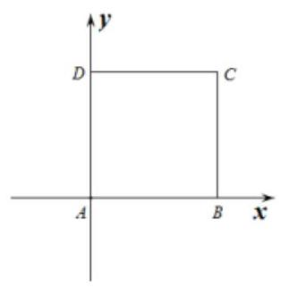

设 $P\left( {x, y}\right)$ ,则 $\overrightarrow{PA} = \left( {-x, - y}\right) ,\overrightarrow{PB} = \left( {1 - x, - y}\right)$ ,

$\overrightarrow{PC} = \left( {1 - x,1 - y}\right) ,\overrightarrow{PD} = \left( {-x,1 - y}\right)  \Rightarrow  \overrightarrow{PB} + \overrightarrow{PC} + \overrightarrow{PD} = \left( {2 - {3x},2 - {3y}}\right)$ ,

由题意知: $\left( {-x}\right) \left( {2 - {3x}}\right)  + \left( {-y}\right) \left( {2 - {3y}}\right)  = 0$ ,即 ${\left( x - \frac{1}{3}\right) }^{2} + {\left( y - \frac{1}{3}\right) }^{2} = {\left( \frac{\sqrt{2}}{3}\right) }^{2}$ ,

$\therefore$ 点 $P$ 在以 $M\left( {\frac{1}{3},\frac{1}{3}}\right)$ 为圆心,半径为 $r = \frac{\sqrt{2}}{3}$ 的圆上,

又 $\left| \overrightarrow{PD}\right|$ 表示圆上的点到 $P$ 的距离, ${\left| \overrightarrow{.{PD}}\right| }_{\min } = \left| {DM}\right|  - r = \sqrt{{\left( \frac{1}{3}\right) }^{2} + {\left( \frac{2}{3}\right) }^{2}} - \frac{\sqrt{2}}{3} = \frac{\sqrt{5} - \sqrt{2}}{3}$ . 故选A.

【例 3】点 $M$ 是三角形 ${ABC}$ 所在平面上一点,且满足 $\left( {\overrightarrow{MA} + \overrightarrow{MB} - 2\overrightarrow{MC}}\right)  \cdot  \left( {\overrightarrow{MA} - \overrightarrow{MB}}\right)  = 0$ ,则三角形 ${ABC}$ 的形状一定是( )

A. 等腰三角形 B. 直角三角形 C. 钝角三角形 D. 不能确定

【难度】 $\star   \star   \star$

【答案】A

【解析】取 ${AB}$ 中点为 $E$ ,连接 ${CE}$ ,如图,

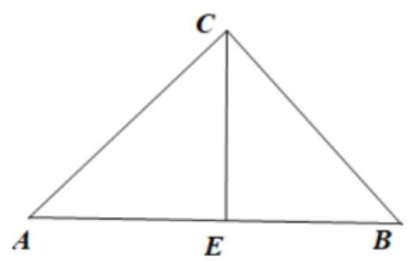

因为 $\left( {\overrightarrow{MA} + \overrightarrow{MB} - 2\overrightarrow{MC}}\right)  \cdot  \left( {\overrightarrow{MA} - \overrightarrow{MB}}\right)  = \left( {2\overrightarrow{ME} - 2\overrightarrow{MC}}\right)  \cdot  \overrightarrow{BA} = 2\overrightarrow{CE} \cdot  \overrightarrow{BA} = 0$ ,所以 ${CE} \bot  {BA}$ ,

又 $E$ 为 ${AB}$ 中点,所以 ${CA} = {CB}$ ，故三角形 ${ABC}$ 的形状一定是等腰三角形，故选:A

【例 4】已知平面向量 $\overrightarrow{a},\overrightarrow{b},\overrightarrow{c}$ 是单位向量，且 $\overrightarrow{a} \cdot  \overrightarrow{b} = 0$ . 则 $\left| {\overrightarrow{a} + \overrightarrow{b} - \overrightarrow{c}}\right|$ 的取值范围是( )

A. $\left\lbrack  {\sqrt{2} - 1,1}\right\rbrack$ B. $\left\lbrack  {\sqrt{2} - 1,1}\right\rbrack$

C. $\left\lbrack  {1,\sqrt{2} + 1}\right\rbrack$ D. $\left\lbrack  {\sqrt{2},\sqrt{3}}\right\rbrack$

【难度】 $\star   \star   \star$

【答案】A

【解析】根据题意,三个平面向量 $\overrightarrow{a},\overrightarrow{b},\overrightarrow{c}$ 是单位向量,且 $\overrightarrow{a} \cdot  \overrightarrow{b} = 0$ ,

可设 $\overrightarrow{a} = \left( {1,0}\right) ,\overrightarrow{b} = \left( {0,1}\right) ,\overrightarrow{c} = \left( {x, y}\right)$ ,则 $\overrightarrow{a} + \overrightarrow{b} - \overrightarrow{c} = \left( {1 - x,1 - y}\right)$ ,

若 $\overrightarrow{c}$ 为单位向量,则 ${x}^{2} + {y}^{2} = 1$ ,表示单位圆上的任意一点,所以 $\left| {\overrightarrow{a} + \overrightarrow{b} - \overrightarrow{c}}\right|  = \sqrt{{\left( 1 - x\right) }^{2} + {\left( 1 - y\right) }^{2}}$ ,

表示单位圆上的点到定点 $P\left( {1,1}\right)$ 的距离,其最大值为 $\left| {PM}\right|  = r + \left| {OP}\right|  = 1 + \sqrt{2}$ ,最小值为 $\left| {OP}\right|  - r = \sqrt{2} - 1$ ,

所以 $\left| {\overrightarrow{a} + \overrightarrow{b} - \overrightarrow{c}}\right|$ 的取值范围是 $\left\lbrack  {\sqrt{2} - 1,\sqrt{2} + 1}\right\rbrack$ . 故选: A.

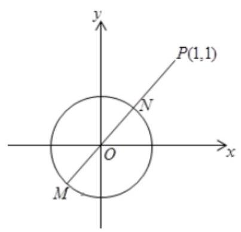

【例 5】已知平面向量 $\overrightarrow{a},\overrightarrow{b},\overrightarrow{c}$ ,对任意实数 $t$ ,都有 $\left| {\overrightarrow{b} - t\overrightarrow{a}}\right|  \geq  \left| {\overrightarrow{b} - \overrightarrow{a}}\right| ,\left| {\overrightarrow{b} - t\overrightarrow{c}}\right|  \geq  \left| {\overrightarrow{b} - \overrightarrow{c}}\right|$ 成立. 若 $\left| \overrightarrow{a}\right|  = 3,\left| \overrightarrow{c}\right|  = 2$ , $\left| {\overrightarrow{a} - \overrightarrow{c}}\right|  = \sqrt{7}$ ，则 $\left| \overrightarrow{b}\right|  =$ ___.

【难度】 $\star   \star   \star   \star$

【答案】 $\frac{2\sqrt{21}}{3}$

【解析】设 $\overrightarrow{a} = \overrightarrow{OA},\overrightarrow{b} = \overrightarrow{OB},\overrightarrow{c} = \overrightarrow{OC}$ ,则 $t\overrightarrow{a} = t\overrightarrow{OA}, t\overrightarrow{c} = t\overrightarrow{OC}$ ,

即 $\overrightarrow{OA}{}^{\prime } = t\overrightarrow{OA},\overrightarrow{OC}{}^{\prime } = t\overrightarrow{OC}$ ,则 ${A}^{\prime },{C}^{\prime }$ 分别在 ${OA},{OC}$ 所在的直线上,

$\therefore \overrightarrow{b} - t\overrightarrow{a} = \overrightarrow{OB} - \overrightarrow{OA}{}^{\prime } = \overrightarrow{{A}^{\prime }B},\overrightarrow{b} - \overrightarrow{a} = \overrightarrow{OB} - \overrightarrow{OA} = \overrightarrow{AB}$

因为 $\left| {\overrightarrow{b} - t\overrightarrow{a}}\right|  \geq  \left| {\overrightarrow{b} - \overrightarrow{a}}\right|$ ,所以 $\left| \overrightarrow{{A}^{\prime }B}\right|  \geq  \left| \overrightarrow{AB}\right|$ ,

因为垂线段距离最短, $\therefore \left| \overrightarrow{AB}\right|$ 即为点 $B$ 到 ${OA}$ 的垂线段长度,

即 $\overrightarrow{OA} \bot  \overrightarrow{AB}$ , 同理 $\overrightarrow{OC} \bot  \overrightarrow{BC}$ ,所以 ${OABC}$ 四点在以 ${OB}$ 为直径的圆上,

而 $\left| \overrightarrow{a}\right|  = \left| \overrightarrow{OA}\right|  = 3,\left| \overrightarrow{OC}\right|  = \left| \overrightarrow{c}\right|  = 2,\left| {\overrightarrow{a} - \overrightarrow{c}}\right|  = \left| \overrightarrow{CA}\right|  = \sqrt{7},\therefore \cos \angle {COA} = \frac{9 + 4 - 7}{2 \times  3 \times  2} = \frac{1}{2}$ ,

即 $\angle {COA} = {60}^{ \circ  },\sin \angle {COA} = \frac{\sqrt{3}}{2}$ ,

由正弦定理可得三角形 ${OAC}$ 外接圆的直径 ${2R} = \frac{\sqrt{7}}{\frac{\sqrt{3}}{2}} = \frac{2\sqrt{21}}{3}$ ,

即四边形 ${OABC}$ 外接圆的直径为 $\frac{2\sqrt{21}}{3}$ ，所以 $\left| \overrightarrow{b}\right|  = \left| \overrightarrow{OB}\right|  = {2R} = \frac{2\sqrt{21}}{3}$ ，故答案为: $\frac{2\sqrt{21}}{3}$ .

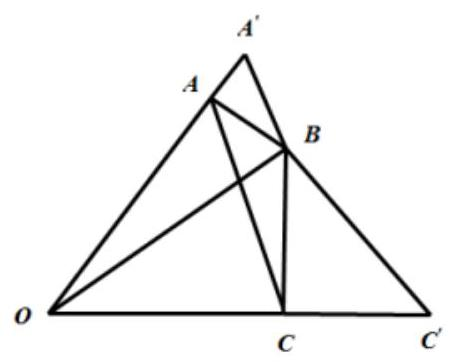

## 巩固训练

1、给出下列几种说法:①若非零向量 $\overrightarrow{a}$ 与 $\overrightarrow{b}$ 共线，则 $\overrightarrow{a} = \overrightarrow{b}$ ；②若向量 $\overrightarrow{a}$ 与 $\overrightarrow{b}$ 同向，且 $\left| \overrightarrow{a}\right|  > \left| \overrightarrow{b}\right|$ ，则 $\overrightarrow{a} > \overrightarrow{b}$ ； ③若两向量有相同的基线，则两向量相等；④若 $\overrightarrow{a}//\overrightarrow{b}$ ， $\overrightarrow{b}//\overrightarrow{c}$ ，则 $\overrightarrow{a}//\overrightarrow{c}$ 其中错误说法的序号是___.

【答案】①②③④

【解析】共线向量模长不一定相等, 故①错误; 向量不能比较大小, 故②错误;

向量的基线相等, 但长度不一定相等, 故③错误;

若 $\overrightarrow{b} = \overrightarrow{0}$ ,则对任何向量 $\overrightarrow{a},\overrightarrow{c}$ 都有 $\overrightarrow{a}//\overrightarrow{b},\overrightarrow{b}//\overrightarrow{c}$ ,但 $\overrightarrow{a},\overrightarrow{c}$ 不一定共线,故④错误. 故答案为: ①②③④.

2、设 $\overrightarrow{a},\overrightarrow{b}$ 是两个平面向量，则 “ $\overrightarrow{a} = \overrightarrow{b}$ ” 是 “ $\left| \overrightarrow{a}\right|  = \left| \overrightarrow{b}\right|$ ” 的( )

A. 充分而不必要条件 B. 必要而不充分条件

C. 充要条件 D. 既不充分也不必要条件

【答案】A

【解析】因为 $\overrightarrow{a} = \overrightarrow{b}$ ,则一定有 $\left| \overrightarrow{a}\right|  = \left| \overrightarrow{b}\right|$ ,而 $\left| \overrightarrow{a}\right|  = \left| \overrightarrow{b}\right|$ 推不出 $\overrightarrow{a} = \overrightarrow{b}$ ,所以“ $\overrightarrow{a} = \overrightarrow{b}$ ” 是 “ $\left| \overrightarrow{a}\right|  = \left| \overrightarrow{b}\right|$ ” 的充分不必要条件, 故选: A

3、在边长为 1 的正方形 ${ABCD}$ 中，设 $\overrightarrow{AB} = \overrightarrow{a},\overrightarrow{AD} = \overrightarrow{b}$ ， $\overrightarrow{AC} = \overrightarrow{c}$ ，则 $\left| {\overrightarrow{a} - \overrightarrow{b} + \overrightarrow{c}}\right|  =$ ( )

A. 1 B. 2 C. 3 D. 4

【答案】B

【解析】解: 因为 $\overrightarrow{AB} = \overrightarrow{a},\overrightarrow{AD} = \overrightarrow{b},\overrightarrow{AC} = \overrightarrow{c}$ ,所以

$\overrightarrow{a} - \overrightarrow{b} + \overrightarrow{c} = \overrightarrow{AB} - \overrightarrow{AD} + \overrightarrow{AC} = \overrightarrow{AB} - \overrightarrow{AD} + \left( {\overrightarrow{AB} + \overrightarrow{AD}}\right)  = 2\overrightarrow{AB}$

又 $\left| \overrightarrow{AB}\right|  = 1$ ，所以 $\left| {\overrightarrow{a} - \overrightarrow{b} + \overrightarrow{c}}\right|  = \left| {2\overrightarrow{AB}}\right|  = 2$ ，故选:B

4、已知平面向量 $\overrightarrow{a},\overrightarrow{b},\overrightarrow{c}$ 满足 $\overrightarrow{a} \bot  \overrightarrow{b}$ ，且 $\left\{  {\left| \overrightarrow{a}\right| ,\left| \overrightarrow{b}\right| ,\left| \overrightarrow{c}\right| }\right\}   = \left\{  {1,\sqrt{3},3}\right\}$ ，则 $\left| {\overrightarrow{a} + \overrightarrow{b} + \overrightarrow{c}}\right|$ 的最大值是___.

【答案】 5

【解析】: $\overrightarrow{a} \bot  \overrightarrow{b},\therefore \left| {\overrightarrow{a} + \overrightarrow{b}}\right|  = \sqrt{{\overrightarrow{a}}^{2} + 2\overrightarrow{a} \cdot  \overrightarrow{b} + {\overrightarrow{b}}^{2}} = \sqrt{{\overrightarrow{a}}^{2} + {\overrightarrow{b}}^{2}}$ ,

若 $\left| \overrightarrow{c}\right|  = 1$ ,则 $\left| {\overrightarrow{a} + \overrightarrow{b}}\right|  = \sqrt{{\overrightarrow{a}}^{2} + {\overrightarrow{b}}^{2}} = 2\sqrt{3}$ ,则 $\left| {\overrightarrow{a} + \overrightarrow{b} + \overrightarrow{c}}\right|  \leq  \left| {\overrightarrow{a} + \overrightarrow{b}}\right|  + \left| \overrightarrow{c}\right|  = 2\sqrt{3} + 1$ (当且仅当 $\overrightarrow{a} + \overrightarrow{b}$ 与 $\overrightarrow{c}$ 同向时取等号)，

若 $\left| \overrightarrow{c}\right|  = \sqrt{3}$ ,则 $\left| {\overrightarrow{a} + \overrightarrow{b}}\right|  = \sqrt{{\overrightarrow{a}}^{2} + {\overrightarrow{b}}^{2}} = \sqrt{10}$ ,

则 $\left| {\overrightarrow{a} + \overrightarrow{b} + \overrightarrow{c}}\right|  \leq  \left| {\overrightarrow{a} + \overrightarrow{b}}\right|  + \left| \overrightarrow{c}\right|  = \sqrt{10} + \sqrt{3}$ (当且仅当 $\overrightarrow{a} + \overrightarrow{b}$ 与 $\overrightarrow{c}$ 同向时取等号),

若 $\left| \overrightarrow{c}\right|  = 3$ ,则 $\left| {\overrightarrow{a} + \overrightarrow{b}}\right|  = \sqrt{{\overrightarrow{a}}^{2} + {\overrightarrow{b}}^{2}} = 2$ ,则 $\left| {\overrightarrow{a} + \overrightarrow{b} + \overrightarrow{c}}\right|  \leq  \left| {\overrightarrow{a} + \overrightarrow{b}}\right|  + \left| \overrightarrow{c}\right|  = 5$ (当且仅当 $\overrightarrow{a} + \overrightarrow{b}$ 与 $\overrightarrow{c}$ 同向时取等号), 综上, $\left| {\overrightarrow{a} + \overrightarrow{b} + \overrightarrow{c}}\right|$ 的最大值是 5 . 故答案为: 5 .

5、已知平面向量 $\overrightarrow{a},\overrightarrow{b},\overrightarrow{c},\overrightarrow{d}$ 满足 $\left| \overrightarrow{a}\right|  = \left| \overrightarrow{b}\right|  = 1,\left| \overrightarrow{c}\right|  = 2,\overrightarrow{a} \cdot  \overrightarrow{b} = 0,\left| {\overrightarrow{c} - \overrightarrow{d}}\right|  = 1$ ,则 $\left| {2\overrightarrow{a} + \overrightarrow{b} + \overrightarrow{d}}\right|$ 的取值范围为___.

【答案】 $\left\lbrack  {0,\sqrt{5} + 3}\right\rbrack$

【解析】令 $\overrightarrow{a} = \left( {1,0}\right) ,\overrightarrow{b} = \left( {0,1}\right) ,\overrightarrow{c} = \left( {x, y}\right)$ ,设 $C$ 的坐标为 $\left( {x, y}\right) , C$ 的轨迹为圆心在原点,半径为 2 的圆上. 设 $\overrightarrow{d} = \left( {{x}^{\prime },{y}^{\prime }}\right) , D$ 的坐标为 $\left( {{x}^{\prime },{y}^{\prime }}\right) , D$ 的轨迹为圆心在原点,大圆半径为 3,小圆半径为 1 的圆环上. $\left| {2\overrightarrow{a} + \overrightarrow{b} + \overrightarrow{d}}\right|  = \left| {\overrightarrow{d} - \left( {-2, - 1}\right) }\right|$ 表示 $D$ 与点 $P\left( {-2, - 1}\right)$ 的距离,

由图可知,故 $\left| {2\overrightarrow{a} + \overrightarrow{b} + \overrightarrow{d}}\right|$ 的取值范围为 $\left\lbrack  {0,\sqrt{5} + 3}\right\rbrack$ . 故答案为: $\left\lbrack  {0,\sqrt{5} + 3}\right\rbrack$

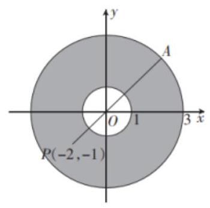

## (二)平面向量的基本定理及坐标表示

## 知识梳理

向量共线定理: 向量 $\overrightarrow{b}$ 与非零向量 $\overrightarrow{a}$ 共线的充要条件是有且仅有一个实数 $\lambda$ ,使得 $\overrightarrow{b} = \lambda \overrightarrow{a}$ ,即 $\overrightarrow{b}//\overrightarrow{a} \Leftrightarrow  \overrightarrow{b} = \; \lambda \overrightarrow{a}\left( {\overrightarrow{a} \neq  \overrightarrow{0}}\right)$ 。

推论: 如果 $l$ 为经过已知点 $A$ 且平行于已知非零向量 $\overrightarrow{a}$ 的直线,那么对于任意一点0,点 $P$ 在直线 $l$ 上的充要条件是存在实数 $t$ 满足等式 $\overline{OP} = \overline{OA} + t\overrightarrow{a}$ 。

$\overrightarrow{OP} = \overrightarrow{OA} + t\left( {\overrightarrow{OB} - \overrightarrow{OA}}\right)  = \left( {1 - t}\right) \overrightarrow{OA} + t\overrightarrow{OB}$ . 注: 中点公式 $\overrightarrow{OP} = \frac{1}{2}\left( {\overrightarrow{OA} + \overrightarrow{OB}}\right)$

平面向量分解定理: 如果 $\overrightarrow{{e}_{1}},\overrightarrow{{e}_{2}}$ 是同一平面内的两个不共线向量,那么对于这一平面内的任一向量 $\overrightarrow{a}$ , 有且只有一对实数 ${\lambda }_{1},{\lambda }_{2}$ 使 $\overrightarrow{a} = {\lambda }_{1}\overrightarrow{{e}_{1}} + {\lambda }_{2}\overrightarrow{{e}_{2}}$ 。

## 例题精讲

【例 6】设 $\overrightarrow{a}\text{ 、 }\overrightarrow{b}$ 为非零向量. 则 “ $\overrightarrow{a} \cdot  \overrightarrow{b} = \left| \overrightarrow{a}\right|  \cdot  \left| \overrightarrow{b}\right|$ ” 是 “ $\overrightarrow{a}//\overrightarrow{b}$ ” 的( )

A. 充分不必要条件 B. 必要不充分条件

C. 充分必要条件 D. 既不充分也必要条件

【难度】 $\star   \star$

【答案】A

【解析】设非零向量 $\overrightarrow{a}\text{ 、 }\overrightarrow{b}$ 的夹角为 $\theta$ ,由于 $\overrightarrow{a} \cdot  \overrightarrow{b} = \left| \overrightarrow{a}\right|  \cdot  \left| \overrightarrow{b}\right|  = \left| \overrightarrow{a}\right|  \cdot  \left| \overrightarrow{b}\right|  = \left| \overrightarrow{a}\right|  \cdot  \left| \overrightarrow{b}\right| \cos \theta$ ,可得 $\cos \theta  = 1$ ,

$\because 0 \leq  \theta  \leq  \pi ,\therefore \theta  = 0$ ,所以, $\theta  = 0 \Rightarrow  \overrightarrow{a}//\overrightarrow{b}$ ,但 $\overrightarrow{a}//\overrightarrow{b} \Rightarrow  \theta  = 0$ .

因此，“ $\overrightarrow{a} \cdot  \overrightarrow{b} = \left| \overrightarrow{a}\right|  \cdot  \left| \overrightarrow{b}\right|$ ” 是 “ $\overrightarrow{a}//\overrightarrow{b}$ ” 的充分不必要条件. 故选: A.

【例 7】( 1 )已知向量 $\overrightarrow{a}$ 、 $\overrightarrow{b}$ 不共线， $\overrightarrow{c} = 3\overrightarrow{a} + \overrightarrow{b}$ ， $\overrightarrow{d} = m\overrightarrow{a} + \left( {m + 2}\right) \overrightarrow{b}$ ，若 $\overrightarrow{c}//\overrightarrow{d}$ ，则实数 $m =$ ___.

【难度】 $\star   \star$

【答案】 -3

【解析】: $\overrightarrow{c}//\overrightarrow{d}$ ,向量 $\overrightarrow{a},\overrightarrow{b}$ 不共线, $\therefore m : 3 = \left( {m + 2}\right)  : 1$ ,则 $m =  - 3$ .

故答案为: -3 .

(2)设 $\overrightarrow{a},\overrightarrow{b}$ 是两个不平行的向量，若 $\overrightarrow{AB} = 2\overrightarrow{a} + k\overrightarrow{b},\overrightarrow{BC} = \overrightarrow{a} + 2\overrightarrow{b},\overrightarrow{CD} = 2\overrightarrow{a} - \overrightarrow{b}$ ，且 $A, B, D$ 三点共线，则实数 $k$ 的值为___.

【难度】 $\star   \star$

【答案】 $\frac{2}{3}$

【解析】由题意 $\overrightarrow{BD} = 3\overrightarrow{a} + \overrightarrow{b}$ ,因为 $A, B, D$ 三点共线,所以 $\overrightarrow{AB},\overrightarrow{BD}$ 共线,所以存在实数 $\lambda$ ,使得 $2\overrightarrow{a} + k\overrightarrow{b} = \lambda \left( {3\overrightarrow{a} + \overrightarrow{b}}\right)$ ,所以 $2 = {3\lambda }, k = \lambda$ ,所以 $k = \frac{2}{3}$ . 故答案为: $\frac{2}{3}$ .

【例 8】如图所示,已知点 $G$ 是 $\bigtriangleup  {ABC}$ 的重心,过点 $G$ 作直线分别交 ${AB},{AC}$ 两边于 $M, N$ 两点,且 $\overrightarrow{AM} = x\overrightarrow{AB},\overrightarrow{AN} = y\overrightarrow{AC}$ ,则 ${3x} + y$ 的最小值为___.

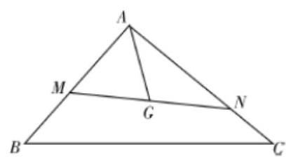

【难度】★★★

【答案】 $\frac{4 + 2\sqrt{3}}{3}$

【解析】根据条件: $\overrightarrow{AC} = \frac{1}{y}\overrightarrow{AN},\overrightarrow{AB} = \frac{1}{x}\overrightarrow{AM}$ ,

因为 $G$ 是 $\bigtriangleup  {ABC}$ 的重心， $\overrightarrow{AG} = \frac{1}{3}\overrightarrow{AB} + \frac{1}{3}\overrightarrow{AC}$ ， $\therefore \overrightarrow{AG} = \frac{1}{3x}\overrightarrow{AM} + \frac{1}{3y}\overrightarrow{AN}$ ，

又 $M, G, N$ 三点共线, $\therefore \frac{1}{3x} + \frac{1}{3y} = 1$ .

$\because x > 0, y > 0,\therefore {3x} + y = \left( {{3x} + y}\right) \left( {\frac{1}{3x} + \frac{1}{3y}}\right)  = \frac{4}{3} + \frac{x}{y} + \frac{y}{3x} \geq  \frac{4}{3} + 2\sqrt{\frac{x}{y} \cdot  \frac{y}{3x}} = \frac{4 + 2\sqrt{3}}{3}$

$\therefore {3x} + y$ 的最小值为 $\frac{4 + 2\sqrt{3}}{3}$ ; 当且仅当 $\frac{x}{y} = \frac{y}{3x}$ 时取等号成立. 故答案为: $\frac{4 + 2\sqrt{3}}{3}$

【例 9】设数列 $\left\{  {a}_{n}\right\}$ 的前 $n$ 项和为 ${S}_{n}$ ,满足 $\overrightarrow{OA} = \left( {2{a}_{n}}\right) \overrightarrow{OB} - \left( {S}_{n}\right) \overrightarrow{OC}$ ,且 $A\text{ 、 }B\text{ 、 }C$ 三点共线 (点 $O$ 不在这条直线上)

(1)求 ${S}_{n}$ 关于 ${a}_{n}$ 的函数表达式;

(2)求 ${a}_{n}$ ；

(3)若点 ${A}_{n}$ 的坐标为 $\left( {{\log }_{2}{a}_{n},{\log }_{2}\left( {{S}_{n} + 1}\right) }\right)$ ，求与 $\overline{{A}_{n - 1}{A}_{n}}$ 同方向的单位向量.

【难度】 $\star   \star   \star$

【答案】( 1 ) ${S}_{n} = 2{a}_{n} - 1$ ；( 2 ) ${a}_{n} = {2}^{n - 1}$ ；(3) $\left( {\frac{\sqrt{2}}{2},\frac{\sqrt{2}}{2}}\right)$ ；

【解析】( 1 )由于 $A\text{ 、 }B\text{ 、 }C$ 三点共线(点 $O$ 不在这条直线上)，则 $\overrightarrow{AB}//\overrightarrow{BC}$ ，

则存在实数 $\lambda  \in  R$ ,使得 $\overrightarrow{AB} = \lambda \overrightarrow{BC}$ ,即 $\overrightarrow{OB} - \overrightarrow{OA} = \lambda \left( {\overrightarrow{OC} - \overrightarrow{OB}}\right)$ ,所以, $\overrightarrow{OA} = \left( {1 + \lambda }\right) \overrightarrow{OB} - \lambda \overrightarrow{OC}$ ,

又 $\because \overrightarrow{OA} = \left( {2{a}_{n}}\right) \overrightarrow{OB} - \left( {S}_{n}\right) \overrightarrow{OC}$ ,则 $\left\{  {\begin{array}{l} 1 + \lambda  = 2{a}_{n} \\  \lambda  = {S}_{n} \end{array},\therefore {S}_{n} = 2{a}_{n} - 1}\right.$ ;

( 2 )由于数列 $\left\{  {a}_{n}\right\}$ 的前 $n$ 项和为 ${S}_{n}$ ，且满足 ${S}_{n} = 2{a}_{n} - 1$ .

当 $n = 1$ 时， ${a}_{1} = {S}_{1} = 2{a}_{1} - 1$ ，解得 ${a}_{1} = 1$ ；当 $n \geq  2$ 时，由 ${S}_{n} = 2{a}_{n} - 1$ 可得 ${S}_{n - 1} = 2{a}_{n - 1} - 1$ ，

上述两个等式相减得 ${a}_{n} = 2{a}_{n} - 2{a}_{n - 1},\therefore {a}_{n} = 2{a}_{n - 1}$ ,

由 ${a}_{1} = 1$ ,可得出 ${a}_{2} = 2,{a}_{3} = 4,\cdots$ ,以此类推,对任意的 $n \in  {\mathbf{N}}^{ * },{a}_{n} \neq  0$ ,

所以, $\frac{{a}_{n}}{{a}_{n - 1}} = 2$ ,所以,数列 $\left\{  {a}_{n}\right\}$ 是等比数列,且首项为 1,公比为 $2,\therefore {a}_{n} = 1 \times  {2}^{n - 1} = {2}^{n - 1}$ ;

(3) ${S}_{n} + 1 = 2{a}_{n} = {2}^{n}$ ，则 ${\log }_{2}{a}_{n} = n - 1$ ， ${\log }_{2}\left( {{S}_{n} + 1}\right)  = n$ ，则 ${A}_{n}\left( {n - 1, n}\right)$ ，

所以, $\overline{{A}_{n - 1}{A}_{n}} = \overline{O{A}_{n}} - \overline{O{A}_{n - 1}} = \left( {n - 1, n}\right)  - \left( {n - 2, n - 1}\right)  = \left( {1,1}\right)$ ,

设与 $\overline{{A}_{n - 1}{A}_{n}}$ 同向的单位向量为 $\overrightarrow{e} = \left( {x, y}\right)$ ,

由题意可得 $\left\{  \begin{array}{l} y = x \\  \sqrt{{x}^{2} + {y}^{2}} = 1, \\  x > 0 \end{array}\right.$ 解得 $x = y = \frac{\sqrt{2}}{2}$ ,所以,与 $\overline{{A}_{n - 1}{A}_{n}}$ 同方向的单位向量为 $\overrightarrow{e} = \left( {\frac{\sqrt{2}}{2},\frac{\sqrt{2}}{2}}\right)$ .

【例 10】( 1 )在等腰梯形 ${ABCD}$ 中， ${AB} = {2CD}$ ，若 $\overrightarrow{AD} = \overrightarrow{a}$ ， $\overrightarrow{AB} = \overrightarrow{b}$ ，则 $\overrightarrow{BC} =$ ( )

A. $\overrightarrow{a} - \frac{1}{2}\overrightarrow{b}$ B. $\frac{1}{2}\overrightarrow{a} + \overrightarrow{b}$

C. $- \overrightarrow{a} + \frac{3}{2}\overrightarrow{b}$ D. $\overrightarrow{a} + \frac{1}{2}\overrightarrow{b}$

【难度】 $\star   \star$

【答案】A

【解析】解法一: 如图,取 ${AB}$ 的中点 $E$ ,连结 ${DE}$ ,因为四边形 ${ABCD}$ 为等腰梯形, ${AB} = {2CD}$ ,所以 $\overrightarrow{DC} = \overrightarrow{EB} = \frac{1}{2}\overrightarrow{AB}$ ,所以四边形 ${BCDE}$ 为平行四边形,所以 $\overrightarrow{BC} = \overrightarrow{BA} + \overrightarrow{AD} + \overrightarrow{DC} =  - \overrightarrow{b} + \overrightarrow{a} + \frac{1}{2}\overrightarrow{b} = \overrightarrow{a} - \frac{1}{2}\overrightarrow{b}$ . 故选:A.

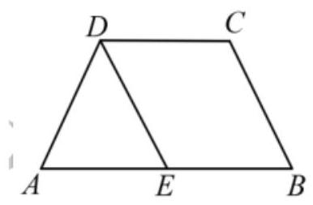

解法二: 如图,取 ${AB}$ 的中点 $E$ ,连结 ${DE}$ ,因为四边形 ${ABCD}$ 为等腰梯形, ${AB} = {2CD}$ ,所以 $\overrightarrow{DC} = \overrightarrow{EB}$ , 所以四边形 ${BCDE}$ 为平行四边形,所以 $\overrightarrow{BC} = \overrightarrow{ED} = \overrightarrow{AD} - \overrightarrow{AE} = \overrightarrow{a} - \frac{1}{2}\overrightarrow{b}$ . 故选:A.

(2)若 $\overrightarrow{\alpha },\overrightarrow{\beta }$ 是一组基底，向量 $\overrightarrow{\gamma } = x\overrightarrow{\alpha } + y\overrightarrow{\beta }\left( {x, y \in  R}\right)$ ，则称 $\left( {x, y}\right)$ 为向量 $\overrightarrow{\gamma }$ 在基底 $\overrightarrow{\alpha },\overrightarrow{\beta }$ 下的坐标. 现已知向量

$\overrightarrow{a}$ 在基底 $\overrightarrow{p} = \left( {1, - 1}\right) ,\overrightarrow{q} = \left( {2,1}\right)$ 下的坐标为 $\left( {-2,2}\right)$ ,则 $\overrightarrow{a}$ 在另一组基底 $\overrightarrow{m} = \left( {-1,1}\right) ,\overrightarrow{n} = \left( {1,2}\right)$ 下的坐标为 ( )

A. $\left( {2,0}\right)$ B. $\left( {0, - 2}\right)$ C. $\left( {-2,0}\right)$ D. $\left( {0,2}\right)$

【难度】★★

【答案】D

【解析】 $\because \overrightarrow{a}$ 在基底 $\overrightarrow{p} = \left( {1, - 1}\right) ,\overrightarrow{q} = \left( {2,1}\right)$ 下的坐标为 $\left( {-2,2}\right) ,\therefore \overrightarrow{a} =  - 2\overrightarrow{p} + 2\overrightarrow{q} = \left( {2,4}\right)$ . 令 $\overrightarrow{a} = x\overrightarrow{m} + y\overrightarrow{n} = \left( {-x + y, x + {2y}}\right) ,\left( {x, y \in  R}\right)$ ,则 $\left\{  \begin{array}{l}  - x + y = 2, \\  x + {2y} = 4, \end{array}\right.$ 解得 $\left\{  \begin{array}{l} x = 0, \\  y = 2. \end{array}\right.$

$\therefore \overrightarrow{a}$ 在基底 $\overrightarrow{m} = \left( {-1,1}\right) ,\overrightarrow{n} = \left( {1,2}\right)$ 下的坐标为 $\left( {0,2}\right)$ . 故选: D.

【例 11】( 1 )设 $D$ 为 ${\Delta ABC}$ 所在平面内一点， $\overline{AD} =  - \frac{1}{3}\overline{AB} + \frac{4}{3}\overline{AC}$ ，若 $\overline{BC} = \lambda \overline{DC}\left( {\lambda  \in  R}\right)$ ，则 $\lambda  =$ (   )

A. -3 B. 3 C. -2 D. 2

【难度】 $\star   \star$

【答案】A

【解析】若 $\overrightarrow{BC} = \lambda \overrightarrow{DC}\left( {\lambda  \in  R}\right) ,\therefore \overrightarrow{AC} - \overrightarrow{AB} = \lambda \overrightarrow{AC} - \lambda \overrightarrow{AD}$ ,化为 $\overrightarrow{AD} = \frac{1}{\lambda }\overrightarrow{AB} + \frac{\lambda  - 1}{\lambda }\overrightarrow{AC}$ ,

与 $\overrightarrow{AD} =  - \frac{1}{3}\overrightarrow{AB} + \frac{4}{3}\overrightarrow{AC}$ 比较,可得: $\frac{1}{\lambda } =  - \frac{1}{3},\frac{\lambda  - 1}{\lambda } = \frac{4}{3}$ ,解得 $\lambda  =  - 3$ . 则 $\lambda  =  - 3$ . 故选 $A$ .

(2)已知非零向量 $\bar{a}$ 、 $\bar{b}$ 、 $\bar{c}$ 两两不平行，且 $\bar{a}//\left( {\bar{b} + \bar{c}}\right)$ ， $\bar{b}//\left( {\bar{a} + \bar{c}}\right)$ ，设 $\bar{c} = x\bar{a} + y\bar{b}$ ， $x, y \in  \mathbf{R}$ ，则 $x + {2y} =$

【难度】 $\star   \star$

【答案】-3

【详解】解: 因为非零向量 $\overrightarrow{a}\text{ 、 }\overrightarrow{b}\text{ 、 }\overrightarrow{c}$ 两两不平行,且 $\overrightarrow{a}//\left( {\overrightarrow{b} + \overrightarrow{c}}\right) ,\overrightarrow{b}//\left( {\overrightarrow{a} + \overrightarrow{c}}\right)$ ,

$\therefore \overrightarrow{a} = m\left( {\overrightarrow{b} + \overrightarrow{c}}\right) , m \neq  0,\therefore \overrightarrow{c} = \frac{1}{m}\overrightarrow{a} - \overrightarrow{b};\therefore \overrightarrow{b} = n\left( {\overrightarrow{a} + \overrightarrow{c}}\right) , n \neq  0;\therefore \overrightarrow{c} = \frac{1}{n}\overrightarrow{b} - \overrightarrow{a};\therefore \left\{  \begin{array}{l} \frac{1}{m} =  - 1 \\   - 1 = \frac{1}{n} \end{array}\right.$ ,解得 $\left\{  \begin{array}{l} m =  - 1 \\  n =  - 1 \end{array}\right. \; \because \overrightarrow{c} = x\overrightarrow{a} + y\overrightarrow{b};\therefore x = y =  - 1;\therefore x + {2y} =  - 3$ ; 故答案为:-3.

例 12、如图， $O$ 在 $\bigtriangleup  {ABC}$ 的内部， $D$ 为 ${AB}$ 的中点，且 $\overline{OA} + \overline{OB} + 2\overline{OC} = \overline{0}$ ，则 $\bigtriangleup  {ABC}$ 的面积与 $\bigtriangleup  {AOC}$ 的面积的比值为( )

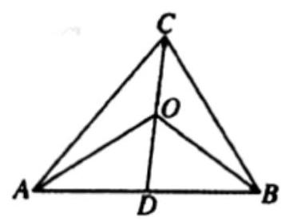

A. 3 B. 4 C. 5 D. 6

【难度】 $\star   \star   \star$

【答案】B

【解析】解: $\because \mathrm{D}$ 为 $\mathrm{{AB}}$ 的中点, $\therefore \overrightarrow{OA} + \overrightarrow{OB} = 2\overrightarrow{OD}$

$\because \overline{OA} + \overline{OB} + 2\overline{OC} = \overline{0};\therefore \overline{OC} =  - \overline{OD};\therefore \mathrm{O}$ 是 $\mathrm{{CD}}$ 的中点, $\therefore {\mathrm{S}}_{\bigtriangleup \mathrm{{AOC}}} = {\mathrm{S}}_{\bigtriangleup \mathrm{{AOD}}} = \frac{1}{2}{\mathrm{\;S}}_{\bigtriangleup \mathrm{{AOB}}} = \frac{1}{4}{\mathrm{\;S}}_{\bigtriangleup \mathrm{{ABC}}}$ ,故选 B.

【例 13】如图,四边形 ${OABC}$ 是边长为 1 的正方形, ${OD} = 3$ ,点 $P$ 为 $\bigtriangleup {BCD}$ 内 (含边界) 的动点,设 $\overrightarrow{OP} = \alpha \overrightarrow{OC} + \beta \overrightarrow{OD}\left( {\alpha ,\beta  \in  R}\right)$ ,则 $\frac{\alpha }{5} + \frac{\beta }{4}$ 的最大值是 ( )

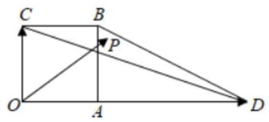

A. $\frac{1}{4}$ B. $\frac{9}{20}$ C. $\frac{3}{4}$ D. $\frac{17}{60}$

【难度】 $\star   \star   \star$

【答案】D

【详解】

以 $O$ 为原点, ${OD},{OC}$ 为 $x, y$ 轴建立如图所示的平面直角坐标系:

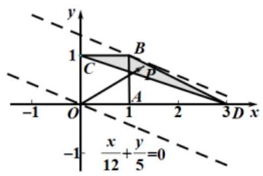

因为四边形 ${OABC}$ 是边长为 1 的正方形, ${OD} = 3$ ,

所以 $D\left( {3,0}\right) , C\left( {0,1}\right) , B\left( {1,1}\right)$ ,

$\overrightarrow{OD} = \left( {3,0}\right) ,\overrightarrow{OC} = \left( {0,1}\right)$ ,

所以 $\overrightarrow{OP} = \alpha \overrightarrow{OC} + \beta \overrightarrow{OD} = \left( {0,\alpha }\right)  + \left( {{3\beta },0}\right)  = \left( {{3\beta },\alpha }\right)$ ,

设 $P\left( {x, y}\right)$ ,则 $\left\{  \begin{array}{l} x = {3\beta } \\  y = \alpha  \end{array}\right.$ ,所以 $\left\{  \begin{array}{l} \beta  = \frac{x}{3} \\  \alpha  = y \end{array}\right.$ ,

所以 $\frac{\alpha }{5} + \frac{\beta }{4} = \frac{y}{5} + \frac{x}{12}$ ,即求 $z = \frac{x}{12} + \frac{y}{5}$ 的最大值,

因为点 $P$ 为 $\bigtriangleup {BCD}$ 内(含边界)的动点，

所以由图可知,平移直线 $\frac{x}{12} + \frac{y}{5} = 0$ 到经过点 $B\left( {1,1}\right)$ 时, $z = \frac{x}{12} + \frac{y}{5}$ 取得最大值 $\frac{17}{60}$ ,

所以 $\frac{\alpha }{5} + \frac{\beta }{4}$ 的最大值是 $\frac{17}{60}$ .

故选: D

【例 14】已知直线 ${PA},{PB}$ 分别与半径为 1 的圆 $O$ 相切于点 $A, B,\left| {PO}\right|  = 2$ ,若点 $M$ 在圆 $O$ 的内部(不含边界)，且 $\overrightarrow{PM} = {2\lambda }\overrightarrow{PA} + \left( {1 - \lambda }\right) \overrightarrow{PB}$ ，则实数 $\lambda$ 的取值范围是___.

【难度】 $\star   \star   \star$

【答案】 $\left( {0,\frac{2}{3}}\right)$

【解析】如图所示:

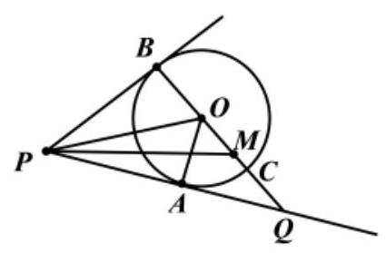

在 ${PA}$ 的延长线上取一点 $Q$ ,使得 $\left| {PA}\right|  = \left| {AQ}\right|$ ,连接 ${OQ}$ ,交圆 $O$ 于 $C$ 点.

因为 $\left| {OB}\right|  = \left| {OA}\right|  = 1,\left| {PO}\right|  = 2$ ,

所以 $\angle {BOP} = \angle {AOP} = \angle {AOQ} = {60}^{ \circ  },\left| {PB}\right|  = \left| {PA}\right|  = \sqrt{3}$ .

所以 $B, O, Q$ 三点共线,且 $\left| {BQ}\right|  = \sqrt{{\left( 2\sqrt{3}\right) }^{2} - {\left( \sqrt{3}\right) }^{2}} = 3$ ,即 $\left| {CQ}\right|  = 1$ .

又因为 $2\overrightarrow{PA} = \overrightarrow{PQ}$ ,

所以 $\overrightarrow{PM} = {2\lambda }\overrightarrow{PA} + \left( {1 - \lambda }\right) \overrightarrow{PB} = \lambda \overrightarrow{PQ} + \left( {1 - \lambda }\right) \overrightarrow{PB}$ ,即 $\overrightarrow{BM} = {\lambda BQ}$ .

又因为点 $M$ 在圆 $O$ 的内部,所以 $0 < \lambda  < \frac{2}{3}$ .

故答案为: $\left( {0,\frac{2}{3}}\right)$

巩固训练

1、设向量 $\overrightarrow{a},\overrightarrow{b}$ 不平行，向量 $\lambda \overrightarrow{a} + \overrightarrow{b}$ 与 $\overrightarrow{a} + 2\overrightarrow{b}$ 平行，则实数 $\lambda  =$ ___.

【答案】 $\frac{1}{2}$

【解析】由于向量 $\overrightarrow{\lambda a} + \overrightarrow{b}$ 与 $\overrightarrow{a} + 2\overrightarrow{b}$ 平行且 $\overrightarrow{a} + 2\overrightarrow{b}$ 为非零向量(否则 $\overrightarrow{a},\overrightarrow{b}$ 平行)，

所以存在 $\mu  \in  R$ ,使得 $\lambda \overrightarrow{a} + \overrightarrow{b} = \mu \left( {\overrightarrow{a} + 2\overrightarrow{b}}\right)$ ,即 $\left( {\lambda  - \mu }\right) \overrightarrow{a} + \left( {1 - {2\mu }}\right) \overrightarrow{b} = \overrightarrow{0}$ ,

因为向量 $\overrightarrow{a},\overrightarrow{b}$ 不平行,所以 $\left\{  \begin{array}{l} \lambda  - \mu  = 0 \\  1 - {2\mu } = 0 \end{array}\right.$ ,解得 $\left\{  \begin{array}{l} \lambda  = \frac{1}{2} \\  \mu  = \frac{1}{2} \end{array}\right.$ . 故答案为: $\frac{1}{2}$ .

2、点 $P$ 是 $\bigtriangleup {ABC}$ 所在平面内一点，若 $\overrightarrow{CB} = \lambda \overrightarrow{PA} + \overrightarrow{PB}\left( {\lambda  \in  R}\right)$ ，则点 $P$ 在( )

A. $\bigtriangleup {ABC}$ 内部 B. ${AC}$ 边所在的直线上

C. ${AB}$ 边所在的直线上 D. ${BC}$ 边所在的直线上

【答案】B

【解析】试题分析: 将 $\overrightarrow{CB} = \lambda \overrightarrow{PA} + \overrightarrow{PB}\left( {\lambda  \in  R}\right)$ 变形为 $\overrightarrow{CB} - \overrightarrow{PB} = \lambda \overrightarrow{PA} \Rightarrow  \overrightarrow{CB} + \overrightarrow{BP} = \lambda \overrightarrow{PA}$ 即 $\overrightarrow{CP} = \lambda \overrightarrow{PA}\left( {\lambda  \in  R}\right)$ . 则 $\overrightarrow{CP}$ 与 $\overrightarrow{PA}$ 共线,因为由公共点 $P$ ,则 $A, C, P$ 三点共线. 故 B 正确.

3、已知 ${S}_{n}$ 为数列 $\left\{  {a}_{n}\right\}$ 的前 $n$ 项和， ${a}_{1} = {a}_{2} = 1$ ，平面内三个不共线的向量 $\overrightarrow{OA},\overrightarrow{OB},\overrightarrow{OC}$ ，满足 $\overrightarrow{OC} = \left( {{a}_{n - 1} + {a}_{n + 1}}\right) \overrightarrow{OA} + \left( {1 - {a}_{n}}\right) \overrightarrow{OB}, n \geq  2.n \in  {\mathbf{N}}^{ * }$ ，若 $A, B, C$ 在同一直线上，则 ${S}_{2018} =$ ___.

【答案】 2

【解析】由题意, $A\text{ 、 }B\text{ 、 }C$ 在同一直线上, $\therefore {a}_{n - 1} + {a}_{n + 1} + 1 - {a}_{n} = 1$ ,即 ${a}_{n - 1} + {a}_{n + 1} = {a}_{n}$ ,

${a}_{1} = {a}_{2} = 1,{a}_{3} = 0,{a}_{4} = {a}_{5} =  - 1,{a}_{6} = 0,{a}_{7} = {a}_{8} = 1,{a}_{9} = 0,\ldots \ldots$ ,可知周期为 6,

且每 6 项之和为 0, $\because {2018} = 6 \times  {336} + 2,\therefore {S}_{2018} = {a}_{1} + {a}_{2} + {336} \times  0 = 2$ .

4、在 $\bigtriangleup {ABC}$ 中，点 $F$ 为线段 ${BC}$ 上任一点(不含端点)，若 $\overline{AF} = {2x}\overrightarrow{AB} + y\overrightarrow{AC}\left( {x > 0, y > 0}\right)$ ，则 $\frac{1}{x} + \frac{2}{y}$ 的最小值为( )

A. 1 B. 8 C. 2 D. 4

【答案】B

【解析】因为 $\overrightarrow{AF} = {2x}\overrightarrow{AB} + y\overrightarrow{AC}\left( {x > 0, y > 0}\right)$ ,且点 $\mathrm{F}$ 在线段 $\mathrm{{BC}}$ 上,则 ${2x} + y = 1$ ,且 $x > 0, y > 0$ , 则 $\frac{1}{x} + \frac{2}{y} = \left( {\frac{1}{x} + \frac{2}{y}}\right) \left( {{2x} + y}\right)  = 4 + \frac{y}{x} + \frac{4x}{y} \geq  4 + 4 = 8$ . 故选: B.

5、设 $D$ 为 $\bigtriangleup  {ABC}$ 的边 ${AC}$ 靠近 $A$ 的三等分点， $\overline{BD} = \lambda \overrightarrow{BA} + \frac{1}{3}\overrightarrow{BC}$ ，则 $\lambda  =$ ___.

【答案】 $\frac{2}{3}$

【解析】解: 如图, $\overrightarrow{BD} = \overrightarrow{BA} + \overrightarrow{AD} = \overrightarrow{BA} + \frac{1}{3}\overrightarrow{AC} = \overrightarrow{BA} + \frac{1}{3}\left( {\overrightarrow{BC} - \overrightarrow{BA}}\right)  = \frac{2}{3}\overrightarrow{BA} + \frac{1}{3}\overrightarrow{BC}$ , 则 $\lambda  = \frac{2}{3}$ ，故答案为: $\frac{2}{3}$

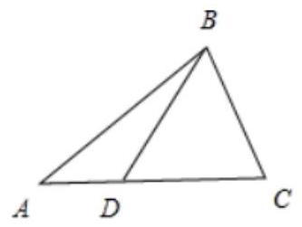

6、如图，正六边形 ${ABCDEF}$ 中，若 $\overline{AD} = \lambda \overline{AC} + \mu \overline{AE}$ ( $\lambda$ ， $\mu  \in  \mathbf{R}$ )，则 $\lambda  + \mu$ 的值为___.

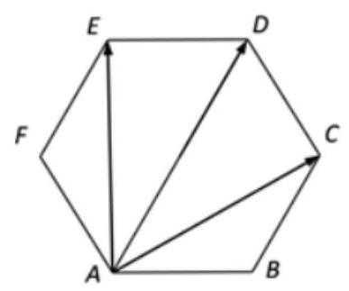

【答案】 $\frac{4}{3}$

【解析】连接 ${EC}$ 交 ${AD}$ 于点 $M$ ,连接 ${FC}$ 交 ${AD}$ 于点 $O$ ,如下图:

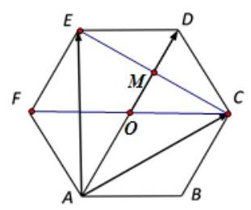

由题可得: $O$ 为 ${AD}$ 的中点, $M$ 为 ${AD}$ 的一个四等分点,且 ${MD} = \frac{1}{4}{AD}, M$ 为 ${EC}$ 中点所以 $\overline{AD} = \frac{4}{3}\overline{AM} = \frac{4}{3} \times  \frac{1}{2}\left( {\overline{AC} + \overline{AE}}\right)  = \lambda \overline{AC} + \mu \overline{AE}$ ,所以 $\left\{  \begin{array}{l} \lambda  = \frac{2}{3} \\  \mu  = \frac{2}{3} \end{array}\right.$ ,所以 $\lambda  + \mu  = \frac{4}{3}$

7、已知等边三角形 ${ABC}$ 的边长为 6，点 $P$ 满足 $3\overrightarrow{PA} + 2\overrightarrow{PB} + \overrightarrow{PC} = \overrightarrow{0}$ ，则 $\left| \overrightarrow{PA}\right|  =$ ( )

A. $\frac{7}{9}$ B. $\frac{\sqrt{7}}{6}$ C. $\sqrt{7}$

D. $\frac{\sqrt{7}}{3}$

【答案】C

【解析】因为 $3\overrightarrow{PA} + 2\overrightarrow{PB} + \overrightarrow{PC} = \overrightarrow{0}$ ,所以 $6\overrightarrow{AP} = 2\left( {\overrightarrow{AP} + \overrightarrow{PB}}\right)  + \left( {\overrightarrow{AP} + \overrightarrow{PC}}\right)  = 2\overrightarrow{AB} + \overrightarrow{AC}$ , 所以 $\overrightarrow{AP} = \frac{1}{3}\overrightarrow{AB} + \frac{1}{6}\overrightarrow{AC}$ ,

所以 ${\overrightarrow{AP}}^{2} = {\left( \frac{1}{3}\overrightarrow{AB} + \frac{1}{6}\overrightarrow{AC}\right) }^{2} = \frac{1}{9}{\overrightarrow{AB}}^{2} + \frac{1}{9}\overrightarrow{AB} \cdot  \overrightarrow{AC} + \frac{1}{36}{\overrightarrow{AC}}^{2}$ ,

$= \frac{1}{9} \times  {6}^{2} + \frac{1}{9} \times  6 \times  6 \times  \cos {60}^{ \circ  } + \frac{1}{36} \times  {6}^{2} = 7$ ,

故 $\left| \overrightarrow{PA}\right|  = \sqrt{7}$ . 故选:C.

8、设 $\overrightarrow{AG} = \frac{1}{3}\left( {\overrightarrow{AB} + \overrightarrow{AC}}\right)$ ,过 $G$ 作直线 $l$ 分别交 ${AB},{AC}$ (不与端点重合) 于 $P, Q$ ,若 $\overrightarrow{AP} = \lambda \overrightarrow{AB}$ , $\overline{AQ} = \mu \overline{AC}$ ,若 $\bigtriangleup {PAG}$ 与 $\bigtriangleup {QAG}$ 的面积之比为 $\frac{2}{3}$ ,则 $\mu  =$

A. $\frac{1}{3}$ B. $\frac{2}{3}$ C. $\frac{3}{4}$ D. $\frac{5}{6}$

【答案】D

【解析】连接 ${AG}$ 并延长,则通过 ${BC}$ 的中点 $M$ ,过 $P, Q$ 分别向 ${AG}$ 所在直线作垂线,垂足分别为 $D$ , $E$ ,如图所示

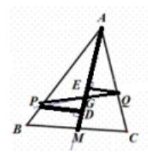

$\because \bigtriangleup {PAG}$ 与 $\bigtriangleup {QAG}$ 的面积之比为 $\frac{2}{3},\therefore \frac{PD}{QE} = \frac{2}{3}$

根据三角形相似可知 $\frac{PG}{GQ} = \frac{2}{3}$ ,则 $\overline{PG} = \frac{2}{5}\overline{PQ},\therefore \overline{AG} = \overline{AP} + \overline{PG} = \overline{AP} + \frac{2}{5}\left( {\overline{AQ} - \overline{AP}}\right)$

即 $\overline{AG} = \frac{3}{5}\overline{AP} + \frac{2}{5}\overline{AQ} = \frac{3}{5}\lambda \overline{AB} + \frac{2}{5}\mu \overline{AC}$

由平行四边形法则得 $\overline{AG} = \frac{2}{3}\overline{AM} = \frac{1}{3}\left( {\overline{AB} + \overline{AC}}\right)$ ,根据待定系数法有 $\frac{2}{5}\mu  = \frac{1}{3}$ ,则 $\mu  = \frac{5}{6}$ ; 故选 $D$

9、在直角三角形 ${ABC}$ 中， $\angle A = \frac{\pi }{2}$ ， ${AB} = 3$ ， ${AC} = 4$ ， $E$ 为三角形 ${ABC}$ 内一点，且 ${AE} = \frac{\sqrt{2}}{2}$ ，若 $\overrightarrow{AE} = \lambda \overrightarrow{AB} + \mu \overrightarrow{AC}$ ，则 ${3\lambda } + {4\mu }$ 的最大值等于___.

【答案】 1

【解析】在直角三角形 ${ABC}$ 中, $\angle A = \frac{\pi }{2}$ ,故以 $A$ 点为原点,以 $\overrightarrow{AB},\overrightarrow{AC}$ 为 $x, y$ 轴正方向建系:

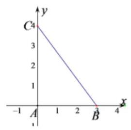

则 $\overrightarrow{AB} = \left( {3,0}\right) ,\overrightarrow{AC} = \left( {0,4}\right)$ ,所以 $\overrightarrow{AE} = \lambda \overrightarrow{AB} + \mu \overrightarrow{AC} = \left( {{3\lambda },{4\mu }}\right)$ ,

因为 ${AE} = \frac{\sqrt{2}}{2}$ ,所以 ${\left( 3\lambda \right) }^{2} + {\left( 4\mu \right) }^{2} = \frac{1}{2}\left( {\lambda  > 0,\mu  > 0}\right)$ ,又 ${\left( 3\lambda \right) }^{2} + {\left( 4\mu \right) }^{2} = {\left( 3\lambda  + 4\mu \right) }^{2} - 2 \cdot  {3\lambda } \cdot  {4\mu } = \frac{1}{2}$

所以 ${\left( 3\lambda  + 4\mu \right) }^{2} - \frac{1}{2} = 2 \cdot  {3\lambda } \cdot  {4\mu } \leq  2 \cdot  {\left( \frac{{3\lambda } + {4\mu }}{2}\right) }^{2}$ (当且仅当 ${3\lambda } = {4\mu } = \frac{1}{2}$ 时等号成立),

所以 ${\left( 3\lambda  + 4\mu \right) }^{2} - \frac{1}{2} \leq  2 \cdot  {\left( \frac{{3\lambda } + {4\mu }}{2}\right) }^{2}$ ,解得 ${3\lambda } + {4\mu } \leq  1$ ,故答案为:1 .

10、如图， $\angle {BAC} = \frac{2\pi }{3}$ ，圆 $\mathrm{M}$ 与 $\mathrm{{AB}}$ 、 $\mathrm{{AC}}$ 分别相切于点 $\mathrm{D}$ 、 $\mathrm{E}$ ， ${AD} = 1$ ，点 $\mathrm{P}$ 是圆 $\mathrm{M}$ 及其内部任意一点， 且 $\overrightarrow{AP} = x\overrightarrow{AD} + y\overrightarrow{AE}\left( {x\text{ 、 }y \in  R}\right)$ ,则 $x + y$ 的取值范围是( )

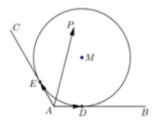

A. $\left\lbrack  {1,4 + 2\sqrt{3}}\right\rbrack$ B. $\left\lbrack  {4 - 2\sqrt{3},4 + 2\sqrt{3}}\right\rbrack$ C. $\left\lbrack  {1,2 + \sqrt{3}}\right\rbrack$ D. $\left\lbrack  {2 - \sqrt{3},2 + \sqrt{3}}\right\rbrack$

【答案】B

【解析】连接 ${AM}$ 并延长分别交圆 $M$ 于 $Q\text{ 、 }T$ ,连接 ${DE},{DE}$ 与 ${AM}$ 交于 $R$ ,显然 $\overrightarrow{AR} = \frac{1}{2}\overrightarrow{AD} + \frac{1}{2}\overrightarrow{AE}$ , 此时 $x + y = 1$ ,分别过 $Q\text{ 、 }T$ 作 ${DE}$ 的平行线,由于 ${AD} = {AE} = 1,\angle {BAC} = {120}^{ \circ  }$ ,则 ${AM} = 2,{DM} = \sqrt{3}$ , 则 ${AQ} = 2 - \sqrt{3},{AR} = \frac{1}{2},\frac{\overline{AQ}}{Q} = \frac{2 - \sqrt{3}}{\frac{1}{2}} = \left( {4 - 2\sqrt{3}}\right) \overline{AR} = \left( {2 - \sqrt{3}}\right) \overline{AD} + \left( {2 - \sqrt{3}}\right) \overline{AE}$ ,此时 $x + y = 4 - 2\sqrt{3}$ ,同理可得: $\overrightarrow{AT} = \left( {2 + \sqrt{3}}\right) \overrightarrow{AD} + \left( {2 + \sqrt{3}}\right) \overrightarrow{AE}, x + y = 4 + 2\sqrt{3}$ ,选 $B$ .

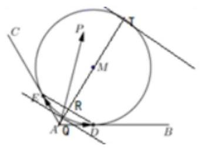

11、已知 $A\text{ 、 }B\text{ 、 }C$ 为直线 $l$ 上不同的三点，点 $O \notin$ 直线 $l$ ，实数 $x$ 满足关系式 ${x}^{2}\overline{OA} + {2x}\overline{OB} + \overline{OC} = \overrightarrow{0}$ ， 有下列结论中正确的个数有( )

① $\overrightarrow{OB}{}^{2} - \overrightarrow{OC} \cdot  \overrightarrow{OA} \geq  0$ ；

② ${\overline{OB}}^{2} - \overline{OC} \cdot  \overline{OA} < 0$ ；

③ $x$ 的值有且只有一个;

④ $x$ 的值有两个;

⑤ 点 $B$ 是线段 ${AC}$ 的中点.

A. 1 个 B. 2 个 C. 3 个 D. 4 个

【答案】C

【解析】由题意得 $\overrightarrow{OC} =  - {x}^{2}\overrightarrow{OA} - {2x}\overrightarrow{OB},\because A, B, C$ 为直线 $l$ 上不同的三点,点 $O \notin  l$ ,

因此 ${x}^{2} + {2x} + 1 = 0$ ,解得 $x =  - 1,\therefore \overrightarrow{OB} = \frac{1}{2}\left( {\overrightarrow{OA} + \overrightarrow{OC}}\right)$ ,

$\therefore {\overrightarrow{OB}}^{2} - \overrightarrow{OA} \cdot  \overrightarrow{OC} = \frac{1}{4}{\left( \overrightarrow{OC} + \overrightarrow{OA}\right) }^{2} - \overrightarrow{OA} \cdot  \overrightarrow{OC} = \frac{1}{4}{\left( \overrightarrow{OA} - \overrightarrow{OC}\right) }^{2} \geq  0$

又由于 $x =  - 1,\overrightarrow{OB} = \frac{1}{2}\left( {\overrightarrow{OA} + \overrightarrow{OC}}\right)$ ,因此 $x$ 的值只有一个,点 $B$ 是线段 ${AC}$ 的中点,故答案为 $\mathrm{C}$ .

## (三)平面向量的数量积

## 知识梳理

1、两个非零向量夹角的概念

已知非零向量 $\overrightarrow{a}$ 与 $\overrightarrow{b}$ ，作 $\overrightarrow{OA} = \overrightarrow{a}$ ， $\overrightarrow{OB} = \overrightarrow{b}$ ，则 $\angle {AOB} = \theta \left( {0 \leq  \theta  \leq  \pi }\right)$ . 则 $\overrightarrow{a}$ 与 $\overrightarrow{b}$ 的夹角。

2、平面向量数量积(内积)的定义:已知两个非零向量 $\overrightarrow{a}$ 与 $\overrightarrow{b}$ ，它们的夹角是 $\theta$ ，则数量 $\left| \overrightarrow{a}\right| \left| \overrightarrow{b}\right| \cos \theta$ 叫 $\overrightarrow{a}$ 与 $\overrightarrow{b}$ 的数量积,记作 $\overrightarrow{a} \cdot  \overrightarrow{b}$ ,即有 $\overrightarrow{a} \cdot  \overrightarrow{b} = \left| \overrightarrow{a}\right| \left| \overrightarrow{b}\right| \cos \theta$ 。

## 3、平面两向量数量积的坐标表示

已知两个非零向量 $\overrightarrow{a} = \left( {{x}_{1},{y}_{1}}\right) ,\overrightarrow{b} = \left( {{x}_{2},{y}_{2}}\right)$ ,设 $\overrightarrow{i}$ 是 $x$ 轴上的单位向量, $\overrightarrow{j}$ 是 $y$ 轴上的单位向量,那么 $\overrightarrow{a} = \underline{{x}_{1}i} + {y}_{1}\overrightarrow{j},\;\overrightarrow{b} = \underline{{x}_{2}i} + {y}_{2}\overrightarrow{j}$ 所以 $\overrightarrow{a} \cdot  \overrightarrow{b} = \underline{{x}_{1}{x}_{2}} + {y}_{1}{y}_{2}$ 。

## 例题精讲

【例 15】已知 $\left| \overrightarrow{a}\right|  = 2,\left| \overrightarrow{b}\right|  = 3$ ，向量 $\overrightarrow{a}$ 与 $\overrightarrow{b}$ 的夹角为 ${60}^{ \circ  }$ ，向量 $\overrightarrow{c} = 5\overrightarrow{a} + 3\overrightarrow{b},\overrightarrow{d} = 3\overrightarrow{a} + k\overrightarrow{b}$ . 若 $\overrightarrow{c} \bot  \overrightarrow{d}$ ，则实数 $k$ 的值为___.

【难度】 $\star   \star$

【答案】 $- \frac{29}{14}$

【解析】由题可知: $\overrightarrow{a} \cdot  \overrightarrow{b} = \left| \overrightarrow{a}\right| \left| \overrightarrow{b}\right| \cos \langle \overrightarrow{a},\overrightarrow{b}\rangle  = 2 \times  3 \times  \frac{1}{2} = 3$ ,由 $\overrightarrow{c} = 5\overrightarrow{a} + 3\overrightarrow{b},\overrightarrow{d} = 3\overrightarrow{a} + k\overrightarrow{b}$ 且 $\overrightarrow{c} \bot  \overrightarrow{d}$

所以 $\overrightarrow{c} \cdot  \overrightarrow{d} = \left( {5\overrightarrow{a} + 3\overrightarrow{b}}\right)  \cdot  \left( {3\overrightarrow{a} + k\overrightarrow{b}}\right)  = 0$ ,则 ${15}{\overrightarrow{a}}^{2} + \left( {{5k} + 9}\right) \overrightarrow{a} \cdot  \overrightarrow{b} + {3k}{\overrightarrow{b}}^{2} = 0$ ,则

${15} \times  {2}^{2} + \left( {{5k} + 9}\right)  \times  3 + {3k} \times  {3}^{2} = 0$

所以 $k =  - \frac{29}{14}$ ,故答案为: $k =  - \frac{29}{14}$

【例 16】在 $\bigtriangleup  {ABC}$ 中， $A = \frac{\pi }{3}$ ， ${AC} = 4$ ， ${AB} = 6$ ， $D$ 在 ${CB}$ 边上，若 $\overrightarrow{CD} = \lambda \overrightarrow{CB}$ ， $\overrightarrow{AD} \cdot  \overrightarrow{BC} =  - {17}$ ， 则实数 $\lambda$ 的值为___

【难度】★★

【答案】 $\frac{3}{4}$

【解析】因为 $\overrightarrow{CD} = \lambda \overrightarrow{CB}$ ,故 $\overrightarrow{AD} - \overrightarrow{AC} = \lambda \left( {\overrightarrow{AB} - \overrightarrow{AC}}\right)$ ,故 $\overrightarrow{AD} = \lambda \overrightarrow{AB} + \left( {1 - \lambda }\right) \overrightarrow{AC}$ ,

$\overrightarrow{AD} \cdot  \overrightarrow{BC} = \left\lbrack  {\lambda \overrightarrow{AB} + \left( {1 - \lambda }\right) \overrightarrow{AC}}\right\rbrack   \cdot  \left( {\overrightarrow{AC} - \overrightarrow{AB}}\right)  = \left( {{2\lambda } - 1}\right) \overrightarrow{AB} \cdot  \overrightarrow{AC} + \left( {1 - \lambda }\right) {\overrightarrow{AC}}^{2} - \lambda {\overrightarrow{AB}}^{2}$

$= \left( {{2\lambda } - 1}\right)  \times  {12} + \left( {1 - \lambda }\right)  \times  {16} - \lambda  \times  {36} = 4 - {28\lambda } =  - {17}$ ,

所以 $\lambda  = \frac{3}{4}$ ,故答案为: $\frac{3}{4}$ .

【例 17】在平面直角坐标系 ${xOy}$ 内,已知直线 $l$ 与圆 $O : {x}^{2} + {y}^{2} = 8$ 相交于 $A, B$ 两点,且 $\left| \mathrm{{AB}}\right|  = 4$ ,若 $\overrightarrow{OC} = 2\overrightarrow{OA} - \overrightarrow{OB}$ 且 $M$ 是线段 ${AB}$ 的中点，则 $\overrightarrow{OC} \cdot  \overrightarrow{OM}$ 的值为( )

A. $\sqrt{3}$ B. $2\sqrt{2}$ C. 3 D. 4

【难度】 $\bigstar \bigstar \bigstar$

【答案】D

【解析】由 $\left| \mathrm{{AB}}\right|  = 4, M$ 是线段 ${AB}$ 的中点,则 ${OM} \bot  {AB}$

所以 $\left| {OM}\right|  = \sqrt{{R}^{2} - {2}^{2}} = \sqrt{8 - 4} = 2$

由 $\overrightarrow{OC} = 2\overrightarrow{OA} - \overrightarrow{OB}$ ,则 $\overrightarrow{OC} + \overrightarrow{OB} = 2\overrightarrow{OA}$ ,则 $A$ 为线段 ${BC}$ 的中点,如图

所以 $\left| {CM}\right|  = \left| {CA}\right|  + \left| {AM}\right|  = 4 + 2 = 6$

在直角 $\bigtriangleup {CMO}$ 中, $\overrightarrow{OC} \cdot  \overrightarrow{OM} = \left| \overrightarrow{OM}\right|  \cdot  \left| \overrightarrow{OC}\right| \cos \angle {COM} = {\left| \overrightarrow{OM}\right| }^{2} = 4$

故选: D

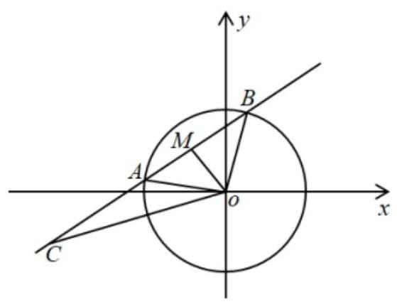

【例 18】( 1 )已知 $M\left( {2,0}\right)$ ， $N\left( {3,0}\right)$ ， $P$ 是抛物线 $C : {y}^{2} = {3x}$ 上一点，则 $\overrightarrow{PM} \cdot  \overrightarrow{PN}$ 的最小值是___. 【难度】 $\star   \star   \star$

【答案】 5

【解析】设 $P\left( {x, y}\right)$ ,则 $\overrightarrow{PM} = \left( {2 - x, - y}\right) ,\overrightarrow{PN} = \left( {3 - x, - y}\right)$ ,

从而 $\overrightarrow{PM} \cdot  \overrightarrow{PN} = \left( {3 - x}\right) \left( {2 - x}\right)  + {y}^{2} = {x}^{2} - {5x} + 6 + {y}^{2}$ .

因为点 $P$ 在抛物线 $C$ 上,所以 ${y}^{2} = {3x}$ ,

所以 $\overrightarrow{PM} \cdot  \overrightarrow{PN} = \left( {3 - x}\right) \left( {2 - x}\right)  + {y}^{2} = {x}^{2} - {5x} + 6 + {3x} = {x}^{2} - {2x} + 6 \geq  5$ ,当且仅当 $x = 1$ 时取等号.

故答案为: 5

(2)已知 ${AB}$ 是半圆 $O$ 的直径， ${AB} = 2$ ，三角形 ${OCD}$ 的顶点 $C$ ， $D$ 在半圆弧 ${AB}$ 上运动，且 $\angle {COD} = {120}^{ \circ  }$ ， 点 $P$ 是半圆弧 ${AB}$ 上的动点，则 $\overrightarrow{PC} \cdot  \overrightarrow{PD}$ 的取值范围是( )

A. $\left\lbrack  {-\frac{1}{2},1}\right\rbrack$ B. $\left\lbrack  {-\frac{3}{4},\frac{\sqrt{5}}{2} - \frac{3}{4}}\right\rbrack$

C. $\left\lbrack  {-\frac{3}{4},\frac{\sqrt{7}}{2} - \frac{3}{4}}\right\rbrack$ D. $\left\lbrack  {-\frac{1}{2},\frac{\sqrt{5}}{2} - \frac{3}{4}}\right\rbrack$

【难度】 $\star   \star   \star$

【答案】A

【解析】

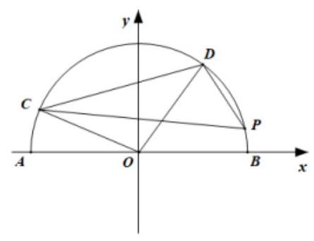

如图,设 $D\left( {\cos \alpha ,\sin \alpha }\right) , C\left( {\cos \left( {\alpha  + \frac{2\pi }{3}}\right) ,\sin \left( {\alpha  + \frac{2\pi }{3}}\right) }\right) , P\left( {\cos \theta ,\sin \theta }\right)$ ,

其中 $0 \leq  \alpha  \leq  \frac{\pi }{3},0 \leq  \theta  \leq  \pi$ .

$\overrightarrow{PC} = \left( {\cos \left( {\alpha  + \frac{2\pi }{3}}\right)  - \cos \theta ,\sin \left( {\alpha  + \frac{2\pi }{3}}\right)  - \sin \theta }\right) ,\overrightarrow{PD} = \left( {\cos \alpha  - \cos \theta ,\sin \alpha  - \sin \theta }\right)$ ,

所以 $\overrightarrow{PC} \cdot  \overrightarrow{PD} = \left\lbrack  {\cos \left( {\alpha  + \frac{2\pi }{3}}\right)  - \cos \theta }\right\rbrack   \times  \left( {\cos \alpha  - \cos \theta }\right)  + \left\lbrack  {\sin \left( {\alpha  + \frac{2\pi }{3}}\right)  - \sin \theta }\right\rbrack   \times  \left( {\sin \alpha  - \sin \theta }\right)$ ,

$=  - \frac{1}{2} + 1 - \cos \theta  \times  \left\lbrack  {\cos \left( {\alpha  + \frac{2\pi }{3}}\right)  + \cos \alpha }\right\rbrack   - \sin \theta  \times  \left\lbrack  {\sin \left( {\alpha  + \frac{2\pi }{3}}\right)  + \sin \alpha }\right\rbrack$

$= \frac{1}{2} - \cos \theta  \times  \sin \left( {\frac{\pi }{6} - \alpha }\right)  - \sin \theta  \times  \cos \left( {\frac{\pi }{6} - \alpha }\right)  = \frac{1}{2} - \sin \left( {\frac{\pi }{6} - \alpha  + \theta }\right)$ ,

因为 $0 \leq  \alpha  \leq  \frac{\pi }{3},0 \leq  \theta  \leq  \pi$ ,故 $- \frac{\pi }{3} \leq  \theta  - \alpha  \leq  \pi , - \frac{\pi }{6} \leq  \theta  - \alpha  + \frac{\pi }{6} \leq  \frac{7\pi }{6}$

故 $- \frac{1}{2} \leq  \sin \left( {\frac{\pi }{6} - \alpha  + \theta }\right)  \leq  1$ ,故 $\overrightarrow{PC} \cdot  \overrightarrow{PD} \in  \left\lbrack  {-\frac{1}{2},1}\right\rbrack$ . 故选: A.

【例 19】已知双曲线 $H : {x}^{2} - \frac{{y}^{2}}{{b}^{2}} = 1\left( {b > 0}\right)$ ,经过点 $D\left( {2,0}\right)$ 的直线 $l$ 与该双曲线交于 $M\text{ 、 }N$ 两点.

(1)若 $l$ 与 $x$ 轴垂直,且 $\left| {MN}\right|  = 6$ ,求 $b$ 的值；

(2)若 $b = \sqrt{2}$ ，且 $M$ 、 $N$ 的横坐标之和为 -4，证明: ${\angle {MON}} = {90}^{ \circ  }$ .

(3)设直线 $l$ 与 $y$ 轴交于点 $E,\overrightarrow{EM} = \lambda \overrightarrow{MD},\overrightarrow{EN} = \mu \overrightarrow{ND}$ ，求证: $\lambda  + \mu$ 为定值.

【难度】 $\star   \star   \star$

【答案】( 1 ) $b = \sqrt{3}$ ( 2 )证明见解析；( 3 )证明见解析；

【解析】(1) $l : x = 2,4 - \frac{{y}^{2}}{{b}^{2}} = 1, y =  \pm  \sqrt{3}b$ ,

$\therefore M\left( {2,\sqrt{3}b}\right) , N\left( {2, - \sqrt{3}b}\right) ,\;{MN} = 2\sqrt{3}b = 6 \Rightarrow  b = \sqrt{3}$ .

(2) $H : {x}^{2} - \frac{{y}^{2}}{2} = 1$ ，设 $M\left( {{x}_{1},{y}_{1}}\right)$ ， $N\left( {{x}_{2},{y}_{2}}\right)$ ，显然直线斜率存在，设方程为 $y = k\left( {x - 2}\right)$ ，并与 $H$ 联立得 $\left( {2 - {k}^{2}}\right) {x}^{2} + 4{k}^{2}x - 4{k}^{2} - 2 = 0$ ,由 ${x}_{1} + {x}_{2} =  - 4$ 得 $\frac{-4{k}^{2}}{2 - {k}^{2}} =  - 4 \Rightarrow  k =  \pm  1$ ,此时 ${x}_{1} \cdot  {x}_{2} =  - 6$ . $\overrightarrow{OM} \cdot  \overrightarrow{ON} = {x}_{1}{x}_{2} + {y}_{1}{y}_{2} = {x}_{1}{x}_{2} + \left( {{x}_{1} - 2}\right) \left( {{x}_{2} - 2}\right)  = 2{x}_{1}{x}_{2} - 2\left( {{x}_{1} + {x}_{2}}\right)  + 4 \; =  - {12} - 2 \times  \left( {-4}\right)  + 4 = 0$ .

(3)有题意可知直线 $l$ 斜率必存在，设方程为 $y = k\left( {x - 2}\right)$ ，且 $E\left( {0, - {2k}}\right)$ . 由 $\overrightarrow{EM} = \lambda \overrightarrow{MD},\overrightarrow{EN} = \mu \overrightarrow{ND}$ 得

$\left\{  {\begin{array}{l} \left( {{x}_{1},{y}_{1} + {2k}}\right)  = \lambda \left( {2 - {x}_{1}, - {y}_{1}}\right) \\  \left( {{x}_{2},{y}_{2} + {2k}}\right)  = \lambda \left( {2 - {x}_{2}, - {y}_{2}}\right)  \end{array},\text{ 所以 }{x}_{1} = \frac{2\lambda }{1 + \lambda },{y}_{1} = \frac{-{2k}}{1 + \lambda }}\right.$ ,又由于点 $M$ 在双曲线 $H$ 上,故 ${x}_{1}^{2} - \frac{{y}_{1}^{2}}{{b}^{2}} = 1 \Rightarrow  {\left( \frac{2\lambda }{1 + \lambda }\right) }^{2} - \frac{{\left( \frac{-{2k}}{1 + \lambda }\right) }^{2}}{{b}^{2}} = 1$ 化简得 $3{b}^{2}{\lambda }^{2} - 2{b}^{2}\lambda  - 4{k}^{2} - {b}^{2} = 0$ ,同理 $3{b}^{2}{\mu }^{2} - 2{b}^{2}\mu  - 4{k}^{2} - {b}^{2} = 0$ . 故 $\lambda \text{ 、 }\mu$ 是方程 $3{b}^{2}{x}^{2} - 2{b}^{2}x - 4{k}^{2} - {b}^{2} = 0$ 的两根. 则 $\lambda  + \mu  = \frac{2{b}^{2}}{3{b}^{2}} = \frac{2}{3}$ 为定值.

## 巩固训练

1、如图，在 $\bigtriangleup  {ABC}$ 中， ${AD}\bot {AB}$ ， $\left| \overline{AD}\right|  = 2$ ， $\overline{DC} = 3\overline{BD}$ ，则 $\overline{AC} \cdot  \overline{AD}$ 的值为( )

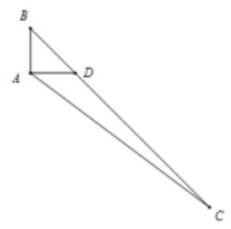

A. 3 B. 8 C. 12 D. 16

【难度】★★

【答案】D

【解析】 $\because \overrightarrow{AC} = \overrightarrow{AD} + \overrightarrow{DC} = \overrightarrow{AD} + 3\overrightarrow{BD} = \overrightarrow{AD} + 3\left( {\overrightarrow{AD} - \overrightarrow{AB}}\right)  = 4\overrightarrow{AD} - 3\overrightarrow{AB}$ ,

$\because {AD} \bot  {AB}$ ，则 $\overrightarrow{AD} \cdot  \overrightarrow{AB} = 0$ ，所以， $\overrightarrow{AC} \cdot  \overrightarrow{AD} = \left( {4\overrightarrow{AD} - 3\overrightarrow{AB}}\right)  \cdot  \overrightarrow{AD} = 4{\overrightarrow{AD}}^{2} = 4 \times  {2}^{2} = {16}$ . 故选:D.

2、在平行四边形 ${ABCD}$ 中,点 $M, N$ 分别在边 ${BC},{CD}$ 上,且满足 ${BC} = {3MC},{DC} = {4NC}$ ,若 ${AB} = 4$ , $\mathrm{{AD}} = 3$ ,则 $\overline{\mathrm{{AN}}} \cdot  \overline{\mathrm{{MN}}} =$ (   )

A. $- \sqrt{7}$ B. 0 C. $\sqrt{7}$ D. 7

【难度】 $\star   \star   \star$

【答案】B

【解析】如图:

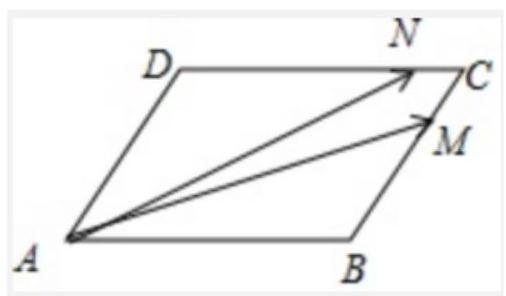

$\mathrm{{BC}} = 3\mathrm{{MC}},\mathrm{{DC}} = 4\mathrm{{NC}}$ ,且 $\mathrm{{AB}} = 4,\mathrm{{AD}} = 3$ ,

则 $\overrightarrow{\mathrm{{AN}}} \cdot  \overrightarrow{\mathrm{{MN}}} = \left( {\overrightarrow{\mathrm{{AD}}} + \overrightarrow{\mathrm{{DN}}}}\right) \left( {\overrightarrow{\mathrm{{MC}}} + \overrightarrow{\mathrm{{CN}}}}\right)  = \left( {\overrightarrow{\mathrm{{AD}}} + \frac{3}{4}\overrightarrow{\mathrm{{AB}}}}\right) \left( {\frac{1}{3}\overrightarrow{\mathrm{{AD}}} - \frac{1}{4}\overrightarrow{\mathrm{{AB}}}}\right)  = \frac{1}{3}{\left| \overrightarrow{\mathrm{{AD}}}\right| }^{2} - \frac{3}{16}{\left| \overrightarrow{\mathrm{{AB}}}\right| }^{2} \; = \frac{1}{3} \times  9 - \frac{3}{16} \times  {16} = 0$ . 故答案选 B.

3、如图， ${AB} = 1,{AC} = 3,\angle A = {90}^{ \circ  },\overrightarrow{CD} = 2\overrightarrow{DB}$ ，则 $\overrightarrow{AD} \cdot  \overrightarrow{AB} =$ ( )

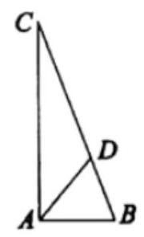

A. $\frac{4}{3}$ B. 1

C. $\frac{2}{3}$ D. $\frac{1}{3}$

【难度】★★

【答案】C

【解析】利用投影求数量积, 解略。故选: C

4、已知向量 $\overrightarrow{AB} = \left( {\frac{1}{2},\frac{\sqrt{3}}{2}}\right) ,\overrightarrow{AC} = \left( {\frac{\sqrt{3}}{2},\frac{1}{2}}\right)$ ，则 $\angle {BAC} =$ ___.

【难度】 $\star   \star$

【答案】 $\frac{\pi }{6}$

【解析】由平面向量的数量积的坐标运算可得 $\overrightarrow{AB} \cdot  \overrightarrow{AC} = \frac{\sqrt{3}}{4} + \frac{\sqrt{3}}{4} = \frac{\sqrt{3}}{2}$ , $\left| \overrightarrow{AB}\right|  = \left| \overrightarrow{AC}\right|  = 1$ ,

$\therefore \cos \angle {BAC} = \frac{\overrightarrow{AB} \cdot  \overrightarrow{AC}}{\left| \overrightarrow{AB}\right|  \cdot  \left| \overrightarrow{AC}\right| } = \frac{\sqrt{3}}{2},\because 0 \leq  \angle {BAC} \leq  \pi$ ， $\therefore \angle {BAC} = \frac{\pi }{6}$ . 故答案为: $\frac{\pi }{6}$

5、在平面直角坐标系中，已知点 $A\left( {-1,0}\right)$ 、 $B\left( {2,0}\right)$ ， $E$ 、 $F$ 是 $y$ 轴上的两个动点，且 $\overline{\left| EF\right| } = 2$ ，则的 $\overline{AE} \cdot  \overline{BF}$ 最小值为___.

【难度】 $\star   \star   \star$

【答案】-3

【解析】根据题意,设 $\mathrm{E}\left( {0,\mathrm{a}}\right) ,\mathrm{F}\left( {0,\mathrm{\;b}}\right) ;\therefore \left| \overline{EF}\right|  = \left| {a - b}\right|  = 2;\therefore \mathrm{a} = \mathrm{b} + 2$ ,或 $\mathrm{b} = \mathrm{a} + 2$ ; 且 $\overrightarrow{AE} = \left( {1, a}\right) ,\overrightarrow{BF} = \left( {-2, b}\right)$ ;

$\therefore \overrightarrow{AE} \cdot  \overrightarrow{BF} =  - 2 + {ab}$ ;

当 $a = b + 2$ 时, $\overrightarrow{AE} \cdot  \overrightarrow{BF} =  - 2 + \left( {b + 2}\right)  \cdot  b = {b}^{2} + {2b} - 2$ ;

$\because {\mathrm{b}}^{2} + 2\mathrm{\;b} - 2$ 的最小值为 $\frac{-8 - 4}{4} =  - 3$ ; $\therefore \overrightarrow{AE} \cdot  \overrightarrow{BF}$ 的最小值为-3,同理求出 $\mathrm{b} = 4 + 2$ 时, $\overrightarrow{AE} \cdot  \overrightarrow{BF}$ 的最小值为 -3 . 故答案为: -3 .

6、在椭圆 $\frac{{x}^{2}}{4} + \frac{{y}^{2}}{2} = 1$ 上任意一点 $P, Q$ 与 $P$ 关于 $x$ 轴对称,若有 $\overline{{F}_{1}P} \cdot  \overline{{F}_{2}P} \leq  1$ ,则 $\overline{{F}_{1}P}$ 与 $\overline{{F}_{2}Q}$ 的夹角范围为___

【难度】 $\star   \star   \star$

【答案】 $\left\lbrack  {\pi  - \arccos \frac{1}{3},\pi }\right\rbrack$

【解析】由题意: ${F}_{1}\left( {-\sqrt{2},0}\right) ,{F}_{2}\left( {\sqrt{2},0}\right)$

设 $P\left( {x, y}\right) , Q\left( {x, - y}\right)$ ,因为 $\overline{{F}_{1}P} \cdot  \overline{{F}_{2}P} \leq  1$ ,则 ${x}^{2} - 2 + {y}^{2} \leq  1$

与 $\frac{{x}^{2}}{4} + \frac{{y}^{2}}{2} = 1$ 结合 $\Rightarrow  4 - 2{y}^{2} - 2 + {y}^{2} \leq  1$ ,又 $y \in  \left\lbrack  {-\sqrt{2},\sqrt{2}}\right\rbrack   \Rightarrow  {y}^{2} \in  \left\lbrack  {1,2}\right\rbrack$

$\cos \theta  = \frac{\overline{{F}_{1}P} \cdot  \overline{{F}_{2}Q}}{\left| \overline{{F}_{1}P}\right|  \cdot  \left| \overline{{F}_{2}Q}\right| } = \frac{{x}^{2} - 2 - {y}^{2}}{\sqrt{{\left( x + \sqrt{2}\right) }^{2} + {y}^{2}}\sqrt{{\left( x - \sqrt{2}\right) }^{2} + {y}^{2}}} = \frac{{x}^{2} - 2 - {y}^{2}}{\sqrt{{\left( {x}^{2} + 2 + {y}^{2}\right) }^{2} - {\left( 2\sqrt{2}x\right) }^{2}}}$

与 $\frac{{x}^{2}}{4} + \frac{{y}^{2}}{2} = 1$ 结合,消去 $x$ ,可得: $\cos \theta  = \frac{2 - 3{y}^{2}}{{y}^{2} + 2} =  - 3 + \frac{8}{{y}^{2} + 2} \in  \left\lbrack  {-1, - \frac{1}{3}}\right\rbrack$ ,所以 $\theta  \in  \left\lbrack  {\pi  - \arccos \frac{1}{3},\pi }\right\rbrack$

本题正确结果: $\left\lbrack  {\pi  - \arccos \frac{1}{3},\pi }\right\rbrack$

7、设 $\left( {{x}_{1},{y}_{1}}\right) \text{ 、 }\left( {{x}_{2},{y}_{2}}\right) \text{ 、 }\left( {{x}_{3},{y}_{3}}\right)$ 是平面曲线 ${x}^{2} + {y}^{2} = {2x} - {6y}$ 上任意三点，则 $A = {x}_{1}{y}_{2} - {x}_{2}{y}_{1} + {x}_{2}{y}_{3} - {x}_{3}{y}_{2}$ 的最小值为

【难度】 $\star   \star   \star$

【答案】 -40

【解析】解: 因为 ${x}^{2} + {y}^{2} = {2x} - {6y}$ ,所以 ${\left( x - 1\right) }^{2} + {\left( y + 3\right) }^{2} = {10}$ ,该曲线表示以 $\left( {1, - 3}\right)$ 为圆心,以 $\sqrt{10}$ 为半径的圆.

$A = {x}_{1}{y}_{2} - {x}_{2}{y}_{1} + {x}_{2}{y}_{3} - {x}_{3}{y}_{2}$ ,可以看做向量 $\overrightarrow{a} = \left( {{x}_{2},{y}_{2}}\right)$ 与 $\overrightarrow{b} = \left( {{y}_{3}, - {x}_{3}}\right)$ 的数量积, $\overrightarrow{a} = \left( {{x}_{2},{y}_{2}}\right)$ 与 $\overrightarrow{c} = \left( {-{y}_{1},{x}_{1}}\right)$ 的数量积之和,因为点 $\left( {{x}_{2},{y}_{2}}\right)$ 在 ${x}^{2} + {y}^{2} = {2x} - {6y}$ 上,

点 $\left( {{y}_{3}, - {x}_{3}}\right)$ 在 ${x}^{2} + {y}^{2} = {2y} + {6x}$ ,点 $\left( {-{y}_{1},{x}_{1}}\right)$ 在 ${x}^{2} + {y}^{2} =  - {2y} - {6x}$ 上,结合向量的几何意义,可知最小值为 $2\sqrt{10} \cdot  \left( {-\sqrt{10}}\right)  + 2\sqrt{10} \cdot  \left( {-\sqrt{10}}\right)  =  - {40}$ ,即 $\left( {2, - 6}\right)  \cdot  \left( {-4,2}\right)  + \left( {2, - 6}\right)  \cdot  \left( {2,4}\right)  =  - {40}$

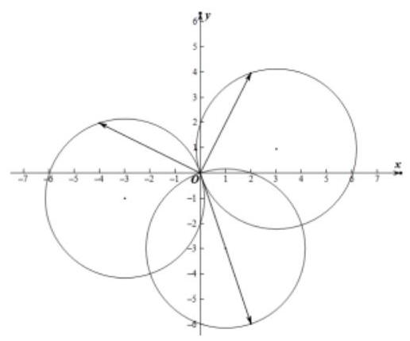

故答案为: -40

## 拓展提高

【例 20】如图,四个棱长为 1 的正方体排成一个正四棱柱, $\mathrm{{AB}}$ 是一条侧棱, ${P}_{i}\left( {i = 1,2,\ldots }\right)$ 是上底面上其余的八个点,则 $\overrightarrow{AB} \cdot  \overrightarrow{A{P}_{i}}\left( {i = 1,2\ldots }\right)$ 的不同值的个数为

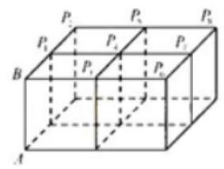

A. 1 B. 2 C. 4 D. 8

【答案】A

【解析】如图, ${AB}$ 与上底面垂直,因此 ${AB} \bot  B{P}_{i}\left( {i = 1,2,\cdots }\right) ,\overrightarrow{AB} \cdot  \overrightarrow{A{P}_{i}} = \left| \overrightarrow{AB}\right| \left| \overrightarrow{A{P}_{i}}\right| \cos \angle {BA}{P}_{i} = \left| \overrightarrow{AB}\right|  \cdot  \left| \overrightarrow{AB}\right| \cos \angle {BA}{P}_{i} = \left| \overrightarrow{AB}\right|  \cdot  \left| \overrightarrow{AB}\right|  = 1$ .

【例 21】将函数 $f\left( x\right)  = 4\cos \left( {\frac{\pi }{2}x}\right)$ 和直线 $g\left( x\right)  = x - 1$ 的所有交点从左到右依次记为 ${A}_{1},{A}_{2},\ldots ,{A}_{k}$ ,若 $P$ 点坐标为 $\left( {0,\sqrt{3}}\right)$ ,则 $\left| {\overrightarrow{P{A}_{1}} + \overrightarrow{P{A}_{2}} + \cdots  + \overrightarrow{P{A}_{k}}}\right|  =$ ( )

A. $k$ B. ${2k}$

C. 5 D. 10

【答案】D

【解析因为 $f\left( x\right) , g\left( x\right)$ 均过点 $\left( {1,0}\right)$ ,且关于该点中心对称,

由 $f\left( x\right) , g\left( x\right)$ 解析式,可得函数图象如下:

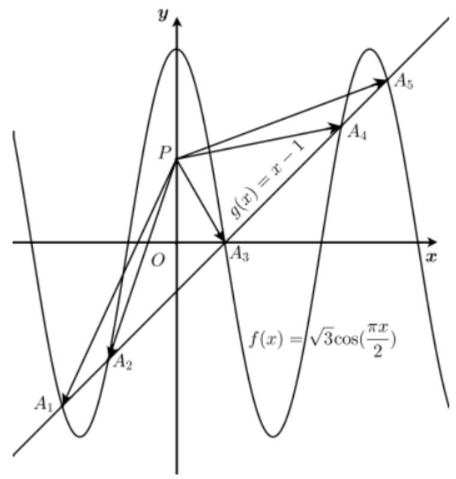

由图知: $f\left( x\right) , g\left( x\right)$ 有 5 个交点 ${A}_{1},{A}_{2},{A}_{3},{A}_{4},{A}_{5}$ ,其中 ${A}_{1}$ 与 ${A}_{5}\text{ 、 }{A}_{2}$ 与 ${A}_{4}$ 关于 ${A}_{3}\left( {1,0}\right)$ 对称,

所以 $\overrightarrow{P{A}_{1}} + \overrightarrow{P{A}_{5}} = \overrightarrow{P{A}_{2}} + \overrightarrow{P{A}_{4}} = 2\overrightarrow{P{A}_{3}}$ ,故 $\left| {\overrightarrow{P{A}_{1}} + \overrightarrow{P{A}_{2}} + \ldots  + \overrightarrow{P{A}_{k}}}\right|  = 5\left| \overrightarrow{P{A}_{3}}\right|  = 5 \times  2 = {10}$ .

故选: D

【例 22】在边长为 1 的正六边形 ABCDEF 中,记以 $\mathrm{A}$ 为起点,其余顶点为终点的向量分别为 $\overrightarrow{{a}_{1}},\overrightarrow{{a}_{2}},\overrightarrow{{a}_{3}},\overrightarrow{{a}_{4}},\overrightarrow{{a}_{5}}$ ; 以 $\mathrm{D}$ 为起点，其余顶点为终点的向量分别为 $\overrightarrow{{d}_{1}},\overrightarrow{{d}_{2}},\overrightarrow{{d}_{3}},\overrightarrow{{d}_{4}},\overrightarrow{{d}_{5}}$ . 若 $m, M$ 分别为 $\left( {\overrightarrow{{a}_{i}} + \overrightarrow{{a}_{j}} + \overrightarrow{{a}_{k}}}\right)  \cdot  \left( {\overrightarrow{{d}_{r}} + \overrightarrow{{d}_{z}} + \overrightarrow{{d}_{t}}}\right)$ 的最小值、最大值,其中 $\{ i, j, k\}  \subseteq  \{ 1,2,3,4,5\} ,\{ r, s, t\}  \subseteq  \{ 1,2,3,4,5\}$ ,则 $m, M$ 满足.

A. $m = 0, M > 0$ B. $m < 0, M > 0$ C. $m < 0, M = 0$ D. $m < 0, M < 0$

【答案】D

【解析】作图知,只有 $\overrightarrow{AF} \cdot  \overrightarrow{DE} = \overrightarrow{AB} \cdot  \overrightarrow{DC} > 0$ ,其余均有 $\overrightarrow{{a}_{i}} \cdot  \overrightarrow{{d}_{r}} \leq  0$ ,故选D.
