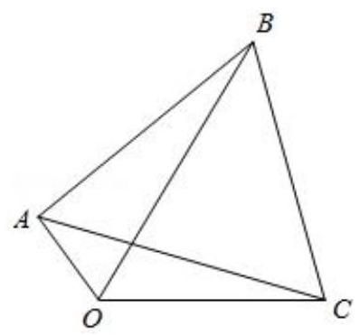
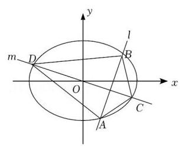
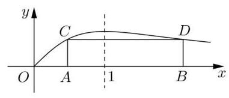
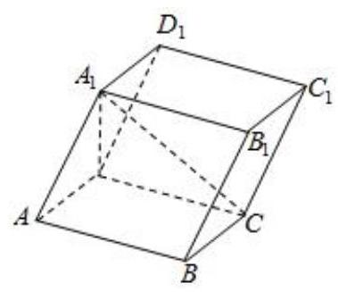
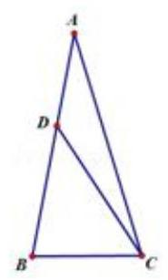
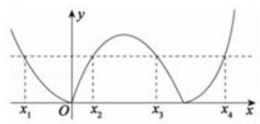
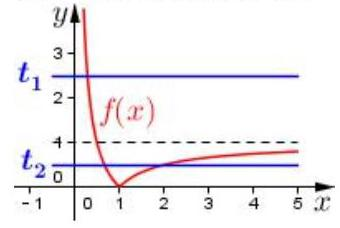
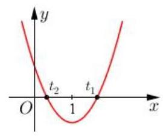

## 第 1 课:函数与方程思想

<table><tr><td>教学目标</td><td>1、掌握函数思想在不同题型中的应用   2、掌握方程思想的应用   3、掌握函数与方程思想之间的转换</td></tr><tr><td>重点</td><td>函数与方程思想的综合应用</td></tr><tr><td>难点</td><td>函数与方程思想的灵活应用</td></tr></table>

## 知识梳理

数学思想是指导解题的核心, 是一种重要的思维方式, 学习数学就是要掌握数学思想方法, 掌握这些思想方法将会使你在数学学习过程中事半功倍, 灵活深入. 本讲所讲的数学方法主要是函数与方程的思想.

函数的思想, 就是用函数理论来解决问题的思想. 运用函数思想解决数学问题, 需要以运动变化的观点, 分析研究具体数量关系, 用函数的形式把这种关系表示出来, 运用函数的性质来解决问题.

方程的思想, 就是借助方程理论来解决问题的思想. 运用方程思想解决数学问题, 要动中求静, 研究运动中的等量关系.

函数思想与方程思想是一个整体, 运用这两种思想实质就是从不同的角度分析问题, 而两者的主要联系就在零点.

函数方程思想的几种重要形式

(1)函数和方程是密切相关的,对于函数 $y = f\left( x\right)$ ,当 $y = 0$ 时,就转化为方程 $f\left( x\right)  = 0$ ,也可以把函数式 $y = f\left( x\right)$ 看做二元方程 $y - f\left( x\right)  = 0$ 。

(2)函数与不等式也可以相互转化，对于函数 $y = f\left( x\right)$ ，当 $y > 0$ 时，就转化为不等式 $f\left( x\right)  > 0$ ，借助于函数图像与性质解决有关问题, 而研究函数的性质, 也离不开解不等式;

(3)数列的通项或前 $n$ 项和是自变量为正整数的函数，用函数的观点处理数列问题十分重要；

(4)函数 $f\left( x\right)  = {\left( 1 + x\right) }^{n}\left( {n \in  {N}^{ * }}\right)$ 与二项式定理是密切相关的,利用这个函数用赋值法和比较系数法可以解决很多二项式定理的问题;

(5)解析几何中的许多问题，例如直线和二次曲线的位置关系问题，需要通过解二元方程组才能解决，涉及到二次方程与二次函数的有关理论;

(6)立体几何中有关线段、角、面积、体积的计算，经常需要运用布列方程或建立函数表达式的方法加以解决。

## (一) 函数思想的应用

## 例题精讲

题型一:函数思想在不等式中的应用

【例 1】设关于 $x$ 的实系数不等式 $\left( {{ax} + 3}\right) \left( {{x}^{2} - b}\right)  \leq  0$ 对任意 $x \in  \lbrack 0, + \infty )$ 恒成立，则 ${a}^{2}b =$ ___.

【例2】已知 $f\left( t\right)  = {\log }_{2}t, t \in  \left\lbrack  {\sqrt{2},8}\right\rbrack$ ,对于 $f\left( t\right)$ 值域内的所有实数 $m$ ,不等式 ${x}^{2} + {mx} + 4 > {2m} + {4x}$ 恒成立,求 $x$ 的范围.

【例 3】解不等式 ${\left( \frac{1}{2}\right) }^{x} - x + \frac{1}{2} > 0$ 时,可构造函数 $f\left( x\right)  = {\left( \frac{1}{2}\right) }^{x} - x$ ,由 $f\left( x\right)$ 在 $x \in  R$ 是减函数,及 $f\left( x\right)  > f\left( 1\right)$ , 可得 $x < 1$ . 用类似的方法可求得不等式 $\arcsin {x}^{2} + \arcsin x + {x}^{6} + {x}^{3} > 0$ 的解集为 ( )

A. $(0,1\rbrack$ B. $\left( {-1,1}\right)$ C. $( - 1,1\rbrack$ D. $\left( {-1,0}\right)$

## 题型二: 函数思想在三角中的应用

【例 4】在锐角 $\bigtriangleup {ABC}$ 中,角 $A, B, C$ 的对边分别为 $a, b, c, S$ 为 $\bigtriangleup {ABC}$ 的面积,且 ${2S} = {a}^{2} - {\left( b - c\right) }^{2}$ , 则 $\frac{4{b}^{2} - {12bc} + {17}{c}^{2}}{4{b}^{2} - {12bc} + {13}{c}^{2}}$ 的取值范围为 ( )

A. $\left\lbrack  {\frac{9}{5},\frac{73}{37}}\right)$ B. $\left( {\frac{281}{181},\frac{9}{5}}\right\rbrack$ C. $\left\lbrack  {2,\frac{73}{37}}\right)$ D. $\left( {\frac{281}{181},2}\right\rbrack$

【例 5】铰链又称合页, 是用来连接两个固体并允许两者之间做相对转动的机械装置. 铰链可由可移动的组件构成,或者由可折叠的材料构成. 合页主要安装于门窗上,而铰链更多安装于橱柜上. 如图所示 ${OA},{OC}$ 就是一个合页的抽象图, $\angle {AOC}$ 可以在 $\left\lbrack  {0,\pi }\right\rbrack$ 变化,其中 ${OC} = {2OA} = 8\mathrm{\;{cm}}$ ,正常把合页安装在家具上时, $\angle {AOC}$ 的变化范围是 $\left\lbrack  {\frac{\pi }{2},\pi }\right\rbrack$ 根据合页的安装和使用经验可知,要使得安装的家具门开关不受影响,在以 ${AC}$ 为边长的正三角形 ${ABC}$ 区域内不能有障碍物.

(1)若 $\angle {AOC} = \frac{\pi }{2}$ 时，求 $\odot  B$ 的长；

(2)当 $\angle {AOC}$ 是多大时，求 $\bigtriangleup  {OBC}$ 面积的最大值.

## 题型三: 函数思想在数列中的应用

【例 6】已知等比数列 $\left\{  {a}_{n}\right\}$ 的首项为 2,公比为 $- \frac{1}{3}$ ,其前 $n$ 项和记为 ${S}_{n}$ ,若对任意的 $n \in  {\mathbf{N}}^{ * }$ ,均有 $A \leq  3{S}_{n} - \frac{1}{{S}_{n}} \leq  B$ 恒成立，则 $B - A$ 的最小值为( )

A. $\frac{7}{2}$ B. $\frac{9}{4}$ C. $\frac{11}{4}$ D. $\frac{13}{6}$

【例 7】已知函数 $f\left( x\right)  = {\log }_{k}x\left( {k\text{ 为常数， }k > 0\text{ 且 }k \neq  1}\right)$ ，且数列 $\left\{  {f\left( {a}_{n}\right) }\right\}$ 是首项为 4，公差为 2 的等差数列.

(1)求证:数列 $\left\{  {a}_{n}\right\}$ 是等比数列；

( 2 )若 ${b}_{n} = {a}_{n} + f\left( {a}_{n}\right)$ ，当 $k = \frac{1}{\sqrt{2}}$ 时，求数列 $\left\{  {b}_{n}\right\}$ 的前 $n$ 项和 ${S}_{n}$ 的最小值；

(3)若 ${c}_{n} = {a}_{n}\lg {a}_{n}$ ，问是否存在实数 $k$ ，使得 $\left\{  {c}_{n}\right\}$ 是递增数列？若存在，求出 $k$ 的范围；若不存在，说明理由.

## 题型四: 函数思想在向量中的应用

【例 8】已知 $\overrightarrow{A{B}_{1}} \bot  \overrightarrow{A{B}_{2}},\left| {O{B}_{1}}\right|  = \left| {O{B}_{2}}\right|  = 1,\overrightarrow{AP} = \overrightarrow{A{B}_{1}} + \overrightarrow{A{B}_{2}},\left| \overrightarrow{OP}\right|  < \frac{1}{2}$ ，则 $\left| \overrightarrow{OA}\right|$ 的取值范围是( )

A. $\left( {\frac{\sqrt{7}}{3},\sqrt{3}}\right)$ B. $\left( {\frac{\sqrt{7}}{2},\sqrt{2}}\right\rbrack$ C. $\left( {\frac{\sqrt{7}}{3},\sqrt{2}}\right\rbrack$ D. $\left( {\frac{\sqrt{5}}{2},\sqrt{3}}\right\rbrack$

【例 9】已知 $A\text{ 、 }B\text{ 、 }C$ 是单位圆上三个互不相同的点,若 $\left| \overrightarrow{AB}\right|  = \left| \overrightarrow{AC}\right|$ ,则 $\overrightarrow{AB} \cdot  \overrightarrow{AC}$ 的最小值是___

## 题型五:函数思想在解析几何中的应用

【例 10】过点 $P\left( {\frac{1}{2}, - 2}\right)$ 作圆 $C : {\left( x - \frac{4}{3}m\right) }^{2} + {\left( y - m + 1\right) }^{2} = 1\left( {m \in  \mathbf{R}}\right)$ 的切线,切点分别为 $A\text{ 、 }B$ ,则 $\overrightarrow{PA} \cdot  \overrightarrow{PB}$ 的最小值为___

【例 11】已知点 $P$ 在双曲线 $\frac{{x}^{2}}{9} - \frac{{y}^{2}}{16} = 1$ 上,点 $A$ 满足 $\overrightarrow{PA} = \left( {t - 1}\right) \overrightarrow{OP}\;\left( {t \in  \mathbf{R}}\right)$ ,且 $\overrightarrow{OA} \cdot  \overrightarrow{OP} = {60}$ , $\overrightarrow{OB} = \left( {0,1}\right)$ ，则 $\left| {\overrightarrow{OB} \cdot  \overrightarrow{OA}}\right|$ 的最大值为___

【例 12】椭圆 ${C}_{1} : \frac{{x}^{2}}{{a}^{2}} + \frac{{y}^{2}}{{b}^{2}} = 1\left( {a > b > 0}\right)$ 经过点 $E\left( {1,1}\right)$ ,其右焦点为抛物线 ${C}_{2} : {y}^{2} = 2\sqrt{6}x$ 的焦点 $F$ ; 直线 $l$ 与椭圆 ${C}_{1}$ 交于 $A, B$ 两点，且以 ${AB}$ 为直径的圆过原点.

(1)求椭圆 ${C}_{1}$ 的方程；

(2)若过原点的直线 $m$ 与椭圆 ${C}_{1}$ 交于 $C, D$ 两点，且 $\overrightarrow{OC} = t\left( {\overrightarrow{OA} + \overrightarrow{OB}}\right)$ ，求四边形 ${ACBD}$ 面积的最大值.

## 题型六: 函数思想在立体几何中的应用

【例 13】如图,一矩形 ${ABCD}$ 的一边 ${AB}$ 在 $x$ 轴上,另两个顶点 $C\text{ 、 }D$ 在函数 $f\left( x\right)  = \frac{x}{1 + {x}^{2}}, x > 0$ 的图像上,则此矩形绕 $x$ 轴旋转而成的几何体的体积的最大值是___

【例 14】如图,在平行六面体 ${ABCD} - {A}_{1}{B}_{1}{C}_{1}{D}_{1}$ 中, ${AD} = 1,{CD} = 2,{A}_{1}D \bot$ 平面 ${ABCD}, A{A}_{1}$ 与底面 ${ABCD}$ 所成角为 $\theta$ ,设直线 ${A}_{1}C$ 与平面 $A{A}_{1}{D}_{1}D$ 、平面 ${ABCD}$ 、平面 $A{A}_{1}{B}_{1}B$ 所成角的大小分别为 $\alpha ,\beta ,\gamma$ .

(1)若 $\angle {ADC} = {2\theta }$ ，求平行六面体 ${ABCD} - {A}_{1}{B}_{1}{C}_{1}{D}_{1}$ 的体积 $V$ 的取值范围；

(2)若 $\angle {ADC} = {2\theta }$ 且 $\theta  = \frac{\pi }{4}$ ，求 $\alpha$ ， $\beta$ ， $\gamma$ 中的最大值；

(3)若 $\angle {ADC} = \frac{\pi }{2}$ ， $g\left( \theta \right)  = \max \{ \alpha \left( \theta \right)$ ， $\beta \left( \theta \right)$ ， $\gamma \left( \theta \right) \}$ ，(其中 $\max \{ a$ ， $b\}$ 是指 $a$ ， $b$ 中的最大的数)，求 $g\left( \theta \right)$ 的最小值.

## 题型七:利用函数思想处理多变量问题

【例 15】已知函数 $f\left( x\right)  = \left\{  \begin{matrix}  - {4x} + 1 & x >  - 1 \\  {x}^{2} + {6x} + {10} & x \leq   - 1 \end{matrix}\right.$ 关于 $x$ 的不等式 $f\left( x\right)  - {mx} - {2m} - 2 < 0$ 的解集是 $\left( {{x}_{1},{x}_{2}}\right)  \cup  \left( {{x}_{3}, + \infty }\right)$ ，若 ${x}_{1}{x}_{2}{x}_{3} > 0$ ，则 ${x}_{1} + {x}_{2} + {x}_{3}$ 的取值范围是___

【例 16】若函数 $y = f\left( x\right)$ 对定义域内的每一个值 ${x}_{1}$ ,在其定义域内都存在唯一的 ${x}_{2}$ ,使 $f\left( {x}_{1}\right) f\left( {x}_{2}\right)  = 1$ 成立, 则称该函数为 “依赖函数”.

(1)判断函数 $g\left( x\right)  = {2}^{x}$ 是否为 “依赖函数”，并说明理由;

(2)若函数 $f\left( x\right)  = {\left( x - 1\right) }^{2}$ 在定义域 $\left\lbrack  {m, n}\right\rbrack$ ( $m > 1$ )上为 “依赖函数”，求实数 $m$ 、 $n$ 乘积 ${mn}$ 的取值范围;

(3)已知函数 $f\left( x\right)  = {\left( x - a\right) }^{2}$ ( $a < \frac{4}{3}$ )在定义域 $\left\lbrack  {\frac{4}{3},4}\right\rbrack$ 上为 “依赖函数”，若存在实数 $x \in  \left\lbrack  {\frac{4}{3},4}\right\rbrack$ ，使得对任意的 $t \in  \mathbf{R}$ ,有不等式 $f\left( x\right)  \geq   - {t}^{2} + \left( {s - t}\right) x + 4$ 都成立,求实数 $s$ 的最大值.

## 巩固训练

1、不等式 ${x}^{2} - 2{y}^{2} \leq  {cx}\left( {y - x}\right)$ 对满足 $x > y > 0$ 的任意实数 $x, y$ 恒成立,则实数 $c$ 的最大值是___.

2、已知 $f\left( x\right)  = \left\{  {\begin{array}{l} \left| {{\log }_{2}x}\right| ,0 < x \leq  2 \\  \frac{1}{8}{x}^{2} - \frac{5}{4}x + 3, x > 2 \end{array}, a, b, c, d}\right.$ 是互不相同的正数,且 $f\left( \mathrm{a}\right)  = f\left( \mathrm{\;b}\right)  = f\left( \mathrm{c}\right)  = f\left( \mathrm{\;d}\right)$ , 则 ${abcd}$ 的取值范围是(   )

A. $\left( {{18},{28}}\right)$ B. $\left( {{16},{24}}\right)$ C. $\left( {{21},{24}}\right)$ D. $\left( {{20},{25}}\right)$

3、设函数 $f\left( x\right)  = \left\{  \begin{array}{ll} 2\left| {x - 1}\right|  + 2 & 0 \leq  x \leq  2 \\  \frac{x - 1}{x - 2} & x > 2 \end{array}\right.$ ,若互不相同的实数 $a, b, c$ 满足 $f\left( a\right)  = f\left( b\right)  = f\left( c\right)  = k$ , 则 $k$ 的取值范围是 ___； ${af}$ (a) $+ {bf}$ (b) $+ {cf}$ (c)的取值范围是 ___.

4、已知数列 $\left\{  {a}_{n}\right\}$ 是各项均不为 0 的等差数列， ${S}_{n}$ 为其前 $n$ 项和，且满足 ${a}_{n}^{2} = {S}_{{2n} - 1}\left( {n \in  {N}^{ + }}\right)$ . 若不等式 $\frac{\lambda }{{a}_{n + 1}} \leq  \frac{n + 8 \cdot  {\left( -1\right) }^{n}}{2n}$ 对任意的 $n \in  {N}^{ + }$ 恒成立,则实数 $\lambda$ 的最大值为___.

5、 $\bigtriangleup {ABC}$ 中， ${AB} = {AC} = 2$ ， $\bigtriangleup {ABC}$ 所在平面内存在点 $P$ 使得 $P{B}^{2} + P{C}^{2} = 4$ ， $P{A}^{2} = 1$ ，则 $\bigtriangleup {ABC}$ 的面积最大值为 ___.

6、法国著名的军事家拿破仑. 波拿巴最早提出的一个几何定理: “以任意三角形的三条边为边向外构造三个等边三角形,则这三个三角形的外接圆圆心恰为另一个等边三角形的顶点”. 在三角形 ${ABC}$ 中,角 $A = {60}^{ \circ  }$ , 以 ${AB}\text{ 、 }{BC}\text{ 、 }{AC}$ 为边向外作三个等边三角形,其外接圆圆心依次为 ${O}_{1}\text{ 、 }{O}_{2}\text{ 、 }{O}_{3}$ ,若三角形 ${O}_{1}{O}_{2}{O}_{3}$ 的面积为 $\frac{\sqrt{3}}{2}$ ，则三角形 ${ABC}$ 的周长最小值为___.

7、已知数列 $\left\{  {a}_{n}\right\}$ 为等差数列， ${a}_{1} = 2$ ，其前 $n$ 和为 ${S}_{n}$ ，数列 $\left\{  {b}_{n}\right\}$ 为等比数列，且 ${a}_{1}{b}_{1} + {a}_{2}{b}_{2} + {a}_{3}{b}_{3} + \cdots  + {a}_{n}{b}_{n} = \left( {n - 1}\right)  \cdot  {2}^{n + 2} + 4$ 对任意的 $n \in  {\mathbf{N}}^{ * }$ 恒成立.

(1)求数列 $\left\{  {a}_{n}\right\}$ 、 $\left\{  {b}_{n}\right\}$ 的通项公式；

(2)是否存在 $p, q \in  {\mathbf{N}}^{ * }$ ，使得 ${\left( {a}_{{2p} + 2}\right) }^{2} - {b}_{q} = {2020}$ 成立，若存在，求出所有满足条件

的 $p, q$ ; 若不存在,说明理由.

(3)是否存在非零整数 $\lambda$ ，使不等式 $\lambda \left( {1 - \frac{1}{{a}_{1}}}\right) \left( {1 - \frac{1}{{a}_{2}}}\right) \cdots \cdots \left( {1 - \frac{1}{{a}_{n}}}\right) \cos \frac{{a}_{n + 1}\pi }{2} < \frac{1}{\sqrt{{a}_{n} + 1}}$ 对一切 $n \in  {\mathbf{N}}^{ * }$ 都成立? 若存在,求出 $\lambda$ 的值; 若不存在,说明理由.

## (二)方程思想的应用

## 例题精讲

## 题型一:方程思想在函数最值中的应用

【例 17】已知函数 $f\left( x\right)  = {\log }_{m}\frac{x - 3}{x + 3}$

(1)若 $f\left( x\right)$ 的定义域为 $\left\lbrack  {\alpha ,\beta }\right\rbrack  ,\left( {\beta  > \alpha  > 0}\right)$ ,判断 $f\left( x\right)$ 在定义域上的增减性,并加以说明;

(2)当 $0 < m < 1$ 时,是否存在 $\mathrm{m}$ 使 $f\left( x\right)$ 的值域为 $\left\lbrack  {{\log }_{m}\left( {m\left( {\beta  - 1}\right) }\right) ,{\log }_{m}\left( {m\left( {\alpha  - 1}\right) }\right) }\right\rbrack$ 的定义域区间为 $\left\lbrack  {\alpha ,\beta }\right\rbrack \; \left( {\beta  > \alpha  > 0}\right)$ ? 请说明理由.

错解分析: 第(1)问中考生易忽视 “ $\alpha  > 3$ ” 这一关键隐性条件；第(2)问中转化出的方程，不能认清其根的实质特点, 为两大于 3 的根.

## 题型二: 方程思想在三角中时的应用

【例 18】如图,已知等腰三角形 ${ABC}$ 的顶角 $A = \frac{\pi }{7}, D$ 是腰 ${AB}$ 上一点. 若 ${AD} = 1,{CD} = \sqrt{2}$ , 则 ${BC} =$ ___. 【例 19】已知函数 $f\left( x\right)  = 2{\cos }^{2}\left( {{\omega x} - \frac{\pi }{12}}\right)  - \frac{1}{2}\left( {\omega  > 0}\right)$ 在 $\left\lbrack  {0,\pi }\right\rbrack$ 上恰有 7 个零点,则 $\omega$ 的取值范围是(   )

A. $\left\lbrack  {\frac{41}{12},\frac{15}{4}}\right)$ B. $\left( {\frac{49}{12},\frac{23}{4}}\right\rbrack$ C. $\left( {\frac{41}{12},\frac{15}{4}}\right\rbrack$ D. $\left\lbrack  {\frac{49}{12},\frac{23}{4}}\right)$

## 题型三: 方程思想在数列中的应用

【例20】已知数列 $\left\{  {a}_{n}\right\}$ 的奇数项是首项为 1 的等差数列,偶数项是首项为2的等比数列. 设数列 $\left\{  {a}_{n}\right\}$ 的前 $\mathrm{n}$ 项和为 ${S}_{n}$ ,且满足 ${a}_{4} = {S}_{3},{a}_{9} = {a}_{3} + {a}_{4}$ .

(1)求数列 $\left\{  {a}_{n}\right\}$ 的通项公式；

(2)若 ${a}_{k}{a}_{k + 1} = {a}_{k + 2}$ ，求正整数 $k$ 的值；

(3)是否存在正整数 $k$ ，使得 $\frac{{S}_{2k}}{{S}_{{2k} - 1}}$ 恰好为数列 $\left\{  {a}_{n}\right\}$ 的一项？若存在，求出所有满足条件的正整数 $k$ ；若不存在, 请说明理由.

## 题型四: 方程思想在解析几何中的应用

【例 21】在 ${x}^{2} + {y}^{2} = 4$ 上任取一点 $T$ ,过点 $T$ 作 $x$ 轴的垂线段 ${TA}, A$ 为垂足,点 $B$ 为 ${TA}$ 的中点.

(1)求动点 $B$ 的轨迹 $C$ 的方程；

(2)设 $H$ 为直线 $y =  - 2$ 上任一点，轨迹 $C$ 与 $y$ 轴的两个交点分别为 $R, Q$ ，且 $R, Q, H$ 三点不共线， 直线 ${HR},{HQ}$ 与轨迹 $C$ 的另一交点分别为点 $D, E$ ,求证: 直线 ${DE}$ 过定点.

【例 22】在平面直角坐标系 ${xOy}$ 中,已知椭圆 $\Gamma  : \frac{{x}^{2}}{4} + {y}^{2} = 1, A$ 为 $\Gamma$ 的上顶点, $P$ 为 $\Gamma$ 上异于上、下顶点的动点， $M$ 为 $x$ 正半轴上的动点.

(1)若 $P$ 在第一象限，且 $\left| {OP}\right|  = \sqrt{2}$ ，求 $P$ 的坐标；

(2)设 $P\left( {\frac{8}{5},\frac{3}{5}}\right)$ ，若以 $A$ 、 $P$ 、 $M$ 为顶点的三角形是直角三角形，求 $M$ 的横坐标；

(3)若 $\left| {MA}\right|  = \left| {MP}\right|$ ，直线 ${AQ}$ 与 $\Gamma$ 交于另一点 $\mathrm{C}$ ，且 $\overrightarrow{AQ} = 2\overrightarrow{AC}$ ， $\overrightarrow{PQ} = 4\overrightarrow{PM}$ ， 求直线 ${AQ}$ 的方程.

## 题型五: 方程思想在立体几何中的应用

【例23】在棱长为 1 的正方体 ${ABCD} - {A}_{1}{B}_{1}{C}_{1}{D}_{1}$ 中，若点 $P$ 是棱上一点，则满足 $\left| {PA}\right|  + \left| {P{C}_{1}}\right|  = 2$ 的点 $P$ 的个数为___.

## 巩固训练

1、对于函数 $f\left( x\right)$ ，若在定义域内存在实数 ${x}_{0}$ 满足 $f\left( {-{x}_{0}}\right)  =  - f\left( {x}_{0}\right)$ ，则称 $f\left( x\right)$ 为 “局部奇函数”. 已知 $f\left( x\right)  =  - a{e}^{x} - 4$ 在 $R$ 上为 “局部奇函数”,则 $a$ 的取值范围是(   )

A. $\lbrack  - 4, + \infty )$ B. $\left\lbrack  {-4,0}\right)$ C. $( - \infty , - 4\rbrack$ D. $( - \infty ,4\rbrack$

2、已知 $a$ 是函数 $f\left( x\right)  = \ln x + {x}^{2} - 2$ 的零点，则 ${e}^{a - 1} + a - 5$ 的值为 ( )

A. 正数 B. 0 C. 负数 D. 无法判断

3、已知数列 $\left\{  {a}_{n}\right\}$ 满足 ${a}_{1} =  - \frac{6}{7},1 + {a}_{1} + {a}_{2} + \cdots  + {a}_{n} - \lambda {a}_{n + 1} = 0$ (其中 $\lambda  \neq  0$ 且 $\lambda  \neq   - 1, n \in  {N}^{ * }$ ).

${S}_{n}$ 为数列 $\left\{  {a}_{n}\right\}$ 的前 $n$ 项和.

(1)若 ${a}_{2}^{2} = {a}_{1} \cdot  {a}_{3}$ ，求 $\lambda$ 的值；

(2)求数列 $\left\{  {a}_{n}\right\}$ 的通项公式 ${a}_{n}$ ；

(3)当 $\lambda  = \frac{1}{3}$ 时，数列 $\left\{  {a}_{n}\right\}$ 中是否存在三项构成等差数列，若存在，请求出此三项；若不存在，说明理由.

## (三)函数与方程的综合

## 例题精讲

【例 24】函数 $f\left( x\right)  = \left| {{x}^{2} - {2x}}\right| ,{x}_{1}\text{ 、 }{x}_{2}\text{ 、 }{x}_{3}\text{ 、 }{x}_{4}$ 满足: $f\left( {x}_{1}\right)  = f\left( {x}_{2}\right)  = f\left( {x}_{3}\right)  = f\left( {x}_{4}\right)  = m,{x}_{1} < {x}_{2} < {x}_{3} < {x}_{4}$ 且 ${x}_{2} - {x}_{1} = {x}_{3} - {x}_{2} = {x}_{4} - {x}_{3}$ ,则 $m =$ (   )

A. $\frac{3}{5}$ B. $\frac{4}{5}$ C. 1

D. $\frac{6}{5}$

【例25】已知函数 $f\left( x\right)  = \left| {1 - \frac{1}{x}}\right| \left( {x > 0}\right)$ ,若关于 $x$ 的方程 ${\left\lbrack  f\left( x\right) \right\rbrack  }^{2} + {mf}\left( x\right)  + {2m} + 3 = 0$ 有三个不相等的实数解,则实数 $m$ 的取值范围为___

【例 26】如果一个多边形的所有顶点均在某个函数的图象上, 那么称此多边形为该函数的内接多边形. 设函数 ${f}_{1}\left( x\right)  = {x}^{3} - {x}^{2} - {4x} - 1,{f}_{2}\left( x\right)  = {x}^{2} - \frac{x}{2} + 2$ ,若四边形 ${ABCD}$ 为函数 $y = {f}_{1}\left( x\right)  + {f}_{2}\left( x\right)$ 的内接正方形,则此正方形的面积为( )

A. 15 或 7 B. 10 或 7 C. 10 或 17 D. 15 或 17

## 巩固训练

1、已知函数 $f\left( x\right)  = m \cdot  {2}^{x} + {x}^{2} + {nx}$ ，记集合 $A = \{ x \mid  f\left( x\right)  = 0, x \in  \mathbf{R}\}$ ，集合 $B = \{ x \mid  f\left\lbrack  {f\left( x\right) }\right\rbrack   = 0, x \in  \mathbf{R}\}$ ， 若 $A = B$ ,且都不是空集,则 $m + n$ 的取值范围是( )

A. $\lbrack 0,4)$ B. $\lbrack  - 1,4)$ C. $\left\lbrack  {-3,5}\right\rbrack$ D. $\lbrack 0,7)$

2、若 $a, b$ 是正数，且满足 ${ab} = a + b + 3$ ，求 ${ab}$ 的取值范围.

3、已知函数 $f\left( x\right)  = \left( {{x}^{2} + {8x} + {15}}\right) \left( {a{x}^{2} + {bx} + c}\right)$ ( $a, b, c \in  \mathbf{R}$ )是偶函数，若方程 $a{x}^{2} + {bx} + c = 1$ 在区间 $\left\lbrack  {1,2}\right\rbrack$ 上有解,则实数 $a$ 的取值范围是___

4、设 $x, y \in  R$ ,满足 $\left\{  \begin{array}{l} {\left( x - 1\right) }^{5} + {2x} + \sin \left( {x - 1}\right)  = 3 \\  {\left( y - 1\right) }^{5} + {2y} + \sin \left( {y - 1}\right)  = 1 \end{array}\right.$ ,则 $x + y = \left( \begin{matrix}  &  \end{matrix}\right)$

A. 0 B. 2 C. 4 D. 6

5、如果关于 $x$ 的方程 $\left| {{x}^{2} - {2x} - 3 + a}\right|  = {a}^{2} - 6$ 恰好有两个相异实根,求 $a$ 的取值范围.

6、已知函数 $f\left( x\right)  = \left| {x + 1}\right|  + \left| {x + 2}\right|  + \cdots  + \left| {x + {2021}}\right|  + \left| {x - 1}\right|  + \left| {x - 2}\right|  + \cdots  + \left| {x - {2021}}\right| \left( {x \in  R}\right)$ ,且实数 $a$ 满足 $f\left( {{a}^{2} - a - 2}\right)  = f\left( {a + 1}\right)$ ，则实数 $a$ 的取值范围为( )

A. $a = 3$ 或 $a = 1$ 或 $\frac{1 - \sqrt{13}}{2} \leq  a \leq  \frac{1 - \sqrt{5}}{2}$ B. $a = 3$ 或 $a = 1$

C. $a = 3$ 或 $a =  - 1$ D. $a = 3$ 或 $a = 1$ 或 $a =  - 1$

7、设函数 $f\left( x\right)  = \left| {\frac{2}{x} - {ax} + 5}\right| \left( {a \in  \mathbf{R}}\right)$ .

(1)求函数的零点；

(2)当 $a = 3$ 时，求证: $f\left( x\right)$ 在区间 $\left( {-\infty , - 1}\right)$ 上单调递减；

(3)若对任意的正实数 $a$ ，总存在 ${x}_{0} \in  \left\lbrack  {1,2}\right\rbrack$ ，使得 $f\left( {x}_{0}\right)  \geq  m$ ，求实数 $m$ 的取值范围.
