## 第 1 课:函数与方程思想

<table><tr><td>教学目标</td><td>1、掌握函数思想在不同题型中的应用   2、掌握方程思想的应用   3、掌握函数与方程思想之间的转换</td></tr><tr><td>重点</td><td>函数与方程思想的综合应用</td></tr><tr><td>难点</td><td>函数与方程思想的灵活应用</td></tr></table>

## 知识梳理

数学思想是指导解题的核心, 是一种重要的思维方式, 学习数学就是要掌握数学思想方法, 掌握这些思想方法将会使你在数学学习过程中事半功倍, 灵活深入. 本讲所讲的数学方法主要是函数与方程的思想.

函数的思想, 就是用函数理论来解决问题的思想. 运用函数思想解决数学问题, 需要以运动变化的观点, 分析研究具体数量关系, 用函数的形式把这种关系表示出来, 运用函数的性质来解决问题.

方程的思想, 就是借助方程理论来解决问题的思想. 运用方程思想解决数学问题, 要动中求静, 研究运动中的等量关系.

函数思想与方程思想是一个整体, 运用这两种思想实质就是从不同的角度分析问题, 而两者的主要联系就在零点.

函数方程思想的几种重要形式

(1)函数和方程是密切相关的，对于函数 $y = f\left( x\right)$ ，当 $y = 0$ 时，就转化为方程 $f\left( x\right)  = 0$ ，也可以把函数式 $y = f\left( x\right)$ 看做二元方程 $y - f\left( x\right)  = 0$ 。

(2)函数与不等式也可以相互转化，对于函数 $y = f\left( x\right)$ ，当 $y > 0$ 时，就转化为不等式 $f\left( x\right)  > 0$ ，借助于函数图像与性质解决有关问题, 而研究函数的性质, 也离不开解不等式;

(3)数列的通项或前 $n$ 项和是自变量为正整数的函数，用函数的观点处理数列问题十分重要；

(4)函数 $f\left( x\right)  = {\left( 1 + x\right) }^{n}\left( {n \in  {N}^{ * }}\right)$ 与二项式定理是密切相关的，利用这个函数用赋值法和比较系数法可以解决很多二项式定理的问题;

(5)解析几何中的许多问题，例如直线和二次曲线的位置关系问题，需要通过解二元方程组才能解决，涉及到二次方程与二次函数的有关理论;

(6)立体几何中有关线段、角、面积、体积的计算，经常需要运用布列方程或建立函数表达式的方法加以解决。

## (一) 函数思想的应用

## 例题精讲

题型一:函数思想在不等式中的应用

【例 1】设关于 $x$ 的实系数不等式 $\left( {{ax} + 3}\right) \left( {{x}^{2} - b}\right)  \leq  0$ 对任意 $x \in  \lbrack 0, + \infty )$ 恒成立，则 ${a}^{2}b =$ ___.

【难度】 $\star   \star   \star$

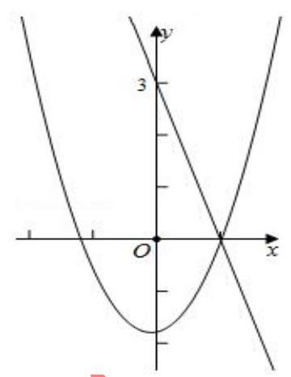

【答案】 9

【解析】解: $\because \left( {{ax} + 3}\right) \left( {{x}^{2} - b}\right)  \leq  0$ 对任意 $x \in  \lbrack 0, + \infty )$ 恒成立,

$\therefore$ 当 $x = 0$ 时,不等式等价为 $- {3b} \leq  0$ ,即 $b \geq  0$ ,

当 $x \rightarrow   + \infty$ 时, ${x}^{2} - b > 0$ ,此时 ${ax} + 3 < 0$ ,则 $a < 0$ ,

设 $f\left( x\right)  = {ax} + 3, g\left( x\right)  = {x}^{2} - b$ ,

若 $b = 0$ ,则 $g\left( x\right)  = {x}^{2} > 0$ ,

函数 $f\left( x\right)  = {ax} + 3$ 的零点为 $x =  - \frac{3}{a}$ ,则函数 $f\left( x\right)$ 在 $\left( {0, - \frac{3}{a}}\right)$ 上 $f\left( x\right)  > 0$ ,此时

不满足条件;

若 $a = 0$ ,则 $f\left( x\right)  = 3 > 0$ ,而此时 $x \rightarrow   + \infty$ 时, $g\left( x\right)  > 0$ 不满足条件,故 $b > 0$ ;

$\because$ 函数 $f\left( x\right)$ 在 $\left( {0, - \frac{3}{a}}\right)$ 上 $\left. {f\left( x\right)  > 0,\text{ 则 }\left( {-\frac{3}{a}, + \infty }\right) }\right)$ 上 $f\left( x\right)  < 0$ ,

而 $g\left( x\right)$ 在 $\left( {0, + \infty }\right)$ 上的零点为 $x = \sqrt{b}$ ,且 $g\left( x\right)$ 在 $\left( {0,\sqrt{b}}\right)  + g\left( x\right)  < 0$

则 $\left( {\sqrt{b}, + \infty }\right)$ 上 $g\left( x\right)  > 0$ ,

$\therefore$ 要使 $\left( {{ax} + 3}\right) \left( {{x}^{2} - b}\right)  \leq  0$ 对任意 $x \in  \lbrack 0, + \infty )$ 恒成立,

则函数 $f\left( x\right)$ 与 $g\left( x\right)$ 的零点相同,即 $- \frac{3}{a} = \sqrt{b},\therefore {a}^{2}b = 9$ . 故答案为: 9 .

【例2】已知 $f\left( t\right)  = {\log }_{2}t, t \in  \left\lbrack  {\sqrt{2},8}\right\rbrack$ ,对于 $f\left( t\right)$ 值域内的所有实数 $m$ ,不等式 ${x}^{2} + {mx} + 4 > {2m} + {4x}$ 恒成立,求 $x$ 的范围.

【难度】 $\star   \star   \star$

【答案】 $x \in  \left( {-\infty , - 1}\right)  \cup  \left( {2 + \infty }\right)$

【解析】解法一: 因为 $t \in  \left\lbrack  {\sqrt{2},8}\right\rbrack$ ,所以 $f\left( t\right)  \in  \left\lbrack  {\frac{1}{2},3}\right\rbrack$ ,即 $m \in  \left\lbrack  {\frac{1}{2},3}\right\rbrack$ ,

原不等式可化为 $m\left( {x - 2}\right)  + {\left( x - 2\right) }^{2} > 0$ 对任意的 $m \in  \left\lbrack  {\frac{1}{2},3}\right\rbrack$ 恒成立,

令 $g\left( m\right)  = \left( {x - 2}\right) m + {\left( x - 2\right) }^{2}$ ,则 $\left\{  \begin{array}{l} g\left( \frac{1}{2}\right)  > 0 \\  g\left( 3\right)  > 0 \end{array}\right.$ ,解得 $x > 2$ 或 $x <  - 1$ ,

即 $x \in  \left( {-\infty , - 1}\right)  \cup  \left( {2 + \infty }\right)$ .

解法二: 构造函数 $g\left( x\right)  = {x}^{2} + \left( {m - 4}\right) x + 4 - {2m} > 0$ ,

即 $\left( {x - 2}\right) \left( {x + m - 2}\right)  > 0$ ,则 $x \in  \left( {-\infty ,2 - m}\right)  \cup  \left( {2, + \infty }\right)$ ,为使该不等式对任意的 $m \in  \left\lbrack  {\frac{1}{2},3}\right\rbrack$ 都成立,则 $x \in  \left( {-\infty ,{\left( 2 - m\right) }_{\min }}\right)  \cup  \left( {2, + \infty }\right)  = \left( {-\infty , - 1}\right)  \cup  \left( {2, + \infty }\right) .$

【例 3】解不等式 ${\left( \frac{1}{2}\right) }^{x} - x + \frac{1}{2} > 0$ 时,可构造函数 $f\left( x\right)  = {\left( \frac{1}{2}\right) }^{x} - x$ ,由 $f\left( x\right)$ 在 $x \in  R$ 是减函数,及 $f\left( x\right)  > f\left( 1\right)$ , 可得 $x < 1$ . 用类似的方法可求得不等式 $\arcsin {x}^{2} + \arcsin x + {x}^{6} + {x}^{3} > 0$ 的解集为 ( )

A. $(0,1\rbrack$ B. $\left( {-1,1}\right)$ C. $( - 1,1\rbrack$ D. $\left( {-1,0}\right)$

【难度】 $\star   \star   \star$

【答案】 $A$

【解析】解: 由题意,构造函数 $g\left( x\right)  = \arcsin x + {x}^{3}$ ,在 $x \in  \left\lbrack  {-1,1}\right\rbrack$ 上是增函数,且是奇函数,

不等式 $\arcsin {x}^{2} + \arcsin x + {x}^{6} + {x}^{3} > 0$ 可化为 $g\left( {x}^{2}\right)  > g\left( {-x}\right)$ ,

$\therefore  - 1 \leq   - x < {x}^{2} \leq  1,\therefore 0 < x \leq  1$ ,故选: $A$ .

## 题型二: 函数思想在三角中的应用

【例 4】在锐角 ${\Delta ABC}$ 中,角 $A, B, C$ 的对边分别为 $a, b, c, S$ 为 $\bigtriangleup {ABC}$ 的面积,且 ${2S} = {a}^{2} - {\left( b - c\right) }^{2}$ , 则 $\frac{4{b}^{2} - {12bc} + {17}{c}^{2}}{4{b}^{2} - {12bc} + {13}{c}^{2}}$ 的取值范围为(   )

A. $\left\lbrack  {\frac{9}{5},\frac{73}{37}}\right)$ B. $\left( {\frac{281}{181},\frac{9}{5}}\right\rbrack$ C. $\lbrack 2,\frac{73}{37})$ D. $\left( {\frac{281}{181},2}\right\rbrack$

【难度】 $\star   \star   \star   \star$

【答案】 $D$

【解析】解: $\bigtriangleup {ABC}$ 中,由余弦定理得, ${a}^{2} = {b}^{2} + {c}^{2} - {2bc}\cos A$ ,

且 $\bigtriangleup {ABC}$ 的面积为 $S = \frac{1}{2}{bc}\sin A$ ,由 ${2S} = {a}^{2} - {\left( b - c\right) }^{2}$ ,得 ${bc}\sin A = {2bc} - {2bc}\cos A$ ,

化简得 $\sin A + 2\cos A = 2$ ; 又 $A \in  \left( {0,\frac{\pi }{2}}\right) ,{\sin }^{2}A + {\cos }^{2}A = 1$ ,所以 $\sin A + 2\sqrt{1 - {\sin }^{2}A} = 2$ ,

化简得 $5{\sin }^{2}A - 4\sin A = 0$ ,解得 $\sin A = \frac{4}{5}$ 或 $\sin A = 0$ (不合题意,舍去);

所以 $\frac{b}{c} = \frac{\sin B}{\sin C} = \frac{\sin \left( {A + C}\right) }{\sin C} = \frac{\sin A\cos C + \cos A\sin C}{\sin C} = \frac{4}{5\tan C} + \frac{3}{5}$ ,

由 $B + C = \pi  - A$ ,且 $B \in  \left( {0,\frac{\pi }{2}}\right) ,\pi  - A \in  \left( {\frac{\pi }{2},\pi }\right)$ ,解得 $C \in  \left( {\frac{\pi }{2} - A,\pi  - A}\right)  \cap  \left( {0,\frac{\pi }{2}}\right)  = \left( {\frac{\pi }{2} - A,\frac{\pi }{2}}\right)$ ,

所以 $\tan C > \frac{1}{\tan A} = \frac{3}{4}$ ,所以 $\frac{1}{\tan C} \in  \left( {0,\frac{4}{3}}\right)$ ,所以 $\frac{b}{c} \in  \left( {\frac{3}{5},\frac{5}{3}}\right)$ ; 设 $\frac{b}{c} = t$ ,其中 $t \in  \left( {\frac{3}{5},\frac{5}{3}}\right)$ , 所以 $y = \frac{4{b}^{2} - {12bc} + {17}{c}^{2}}{4{b}^{2} - {12bc} + {13}{c}^{2}} = \frac{4{\left( \frac{b}{c}\right) }^{2} - {12}\left( \frac{b}{c}\right)  + {17}}{4{\left( \frac{b}{c}\right) }^{2} - {12}\left( \frac{b}{c}\right)  + {13}} = \frac{4{t}^{2} - {12t} + {17}}{4{t}^{2} - {12t} + {13}} = 1 + \frac{4}{4{t}^{2} - {12t} + {13}} = 1 + \frac{4}{4\left( {t - \frac{3}{2}{t}^{2} + 4}\right. }$ , 又 $\frac{3}{5} < \frac{3}{2} < \frac{5}{3}$ ,所以 $t = \frac{3}{2}$ 时, $y$ 取得最大值为 ${y}_{\max } = 2, t = \frac{3}{5}$ 时, $y = \frac{281}{181}, t = \frac{5}{3}$ 时, $y = \frac{73}{37}$ ,且 $\frac{281}{181} < \frac{73}{37}$ , 所以 $y \in  \left( {\frac{281}{181},2}\right\rbrack$ ,即 $\frac{4{b}^{2} - {12bc} + {17}{c}^{2}}{4{b}^{2} - {12bc} + {13}{c}^{2}}$ 的取值范围是 $\left( {\frac{281}{181},2}\right\rbrack$ . 故选: $D$ .

【例 5】铰链又称合页, 是用来连接两个固体并允许两者之间做相对转动的机械装置. 铰链可由可移动的组件构成,或者由可折叠的材料构成. 合页主要安装于门窗上,而铰链更多安装于橱柜上. 如图所示 ${OA},{OC}$ 就是一个合页的抽象图, $\angle {AOC}$ 可以在 $\left\lbrack  {0,\pi }\right\rbrack$ 变化,其中 ${OC} = {2OA} = 8\mathrm{\;{cm}}$ ,正常把合页安装在家具上时, $\angle {AOC}$ 的变化范围是 $\left\lbrack  {\frac{\pi }{2},\pi }\right\rbrack$ 根据合页的安装和使用经验可知,要使得安装的家具门开关不受影响,在以 ${AC}$ 为边长的正三角形 ${ABC}$ 区域内不能有障碍物.

(1)若 $\angle {AOC} = \frac{\pi }{2}$ 时，求 $\bigtriangleup  {OB}$ 的长；

(2)当 $\angle {AOC}$ 是多大时，求 $\bigtriangleup {OBC}$ 面积的最大值.

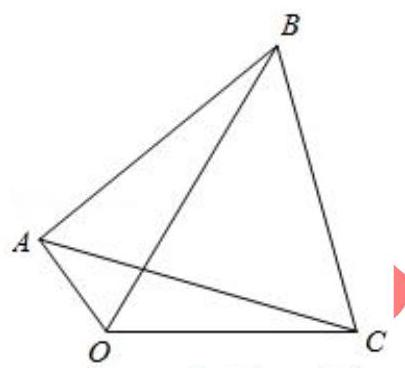

【难度】

【答案】见解析

【解析】解: (1) 如图所示, $\because {OC} = {2OA} = 8,\angle {AOC} = \frac{\pi }{2}$ ,

$\therefore \sin \angle {OAC} = \frac{8}{\sqrt{{4}^{2} + {8}^{2}}} = \frac{2\sqrt{5}}{5},\cos \angle {OAC} = \frac{\sqrt{5}}{5}$ ，又 $\because {\Delta ABC}$ 为正三角形， $\therefore {AC} = {AB} = 4\sqrt{5}$ ， $\because \angle {OAB} = \angle {OAC} + \frac{\pi }{3},\;\therefore \cos \angle {OAB} = \cos \left( {\angle {OAC} + \frac{\pi }{3}}\right)  = \cos \angle {OAC} \cdot  \cos \frac{\pi }{3} - \sin \angle {OAC} \cdot  \sin \frac{\pi }{3} \; = \frac{\sqrt{5}}{5} \cdot  \frac{1}{2} - \frac{2\sqrt{5}}{5} \cdot  \frac{\sqrt{3}}{2} = \frac{\sqrt{5}}{10}\left( {1 - 2\sqrt{3}}\right) ,$

在 $\bigtriangleup {OAB}$ 中, $B{O}^{2} = {4}^{2} + {80} - 2 \times  4 \times  4\sqrt{5} \times  \frac{\sqrt{5}}{10}\left( {1 - 2\sqrt{3}}\right)  = {16}\left( {5 + 2\sqrt{3}}\right)$ ,故 ${BO} = 4\sqrt{2\sqrt{3} + 5}$ ;

(2)设 $\angle {AOC} = \alpha$ ， $\angle {ACO} = \beta$ ， ${BC} = {AC} = x$ ，

则 ${x}^{2} = {4}^{2} + {8}^{2} - 2 \times  4 \times  8 \times  \cos \alpha$ ,即 ${x}^{2} = {80} - {64}\cos \alpha$ ,

$\cos \angle {ACO} = \frac{A{C}^{2} + O{C}^{2} - A{O}^{2}}{{2AC} \times  {OC}}$ ，即 $\cos \beta  = \frac{{x}^{2} + {48}}{16x}$ ，由正弦定理可得 $\frac{x}{\sin \alpha } = \frac{4}{\sin \beta }$ ，

故 ${S}_{\bigtriangleup {OBC}} = \frac{1}{2}{BC} \cdot  {CO}\sin \left( {\beta  + \frac{\pi }{3}}\right)  = {4x}\sin \beta \cos \frac{\pi }{3} + {4x}\cos \beta \sin \frac{\pi }{3} = 4 \cdot  4\sin \alpha  \cdot  \frac{1}{2} + 2\sqrt{3}x\frac{{x}^{2} + {48}}{16x}$

$= 8\sin \alpha  + \frac{\sqrt{3}}{8}\left( {{128} - {84}\cos \alpha }\right)  = 8\sin \alpha  - 8\sqrt{3}\cos \alpha  + {16}\sqrt{3} = {16}\sin \left( {\alpha  - \frac{\pi }{3}}\right)  + {16}\sqrt{3},$

则当 $\angle {AOC} = \frac{5\pi }{6}$ 时， ${\Delta OBC}$ 面积的最大，最大值为 ${16} + {16}\sqrt{3}c{m}^{2}$ .

## 题型三: 函数思想在数列中的应用

【例 6】已知等比数列 $\left\{  {a}_{n}\right\}$ 的首项为 2,公比为 $- \frac{1}{3}$ ,其前 $n$ 项和记为 ${S}_{n}$ ,若对任意的 $n \in  {\mathbf{N}}^{ * }$ ,均有 $A \leq  3{S}_{n} - \frac{1}{{S}_{n}} \leq  B$ 恒成立,则 $B - A$ 的最小值为(   )

A. $\frac{7}{2}$ B. $\frac{9}{4}$ C. $\frac{11}{4}$ D. $\frac{13}{6}$

【难度】 $\star   \star   \star   \star$

【答案】选 B.

【解析】 ${S}_{n} = \frac{3}{2}\left\lbrack  {1 - {\left( -\frac{1}{3}\right) }^{n}}\right\rbrack  ,1 - {\left( -\frac{1}{3}\right) }^{n}$ 取值依次为 $1 + \frac{1}{3}\text{ 、 }1 - \frac{1}{9}\text{ 、 }1 + \frac{1}{27}\text{ 、 }1 - \frac{1}{81}\text{ 、 }\ldots$ ,

$\therefore {S}_{2} \leq  {S}_{n} \leq  {S}_{1}$ ,即 $\frac{4}{3} \leq  {S}_{n} \leq  2$ ,设 $f\left( {S}_{n}\right)  = 3{S}_{n} - \frac{1}{{S}_{n}}$ ,可知其在 $\left\lbrack  {\frac{4}{3},2}\right\rbrack$ 上单调递增,

$\therefore f\left( \frac{4}{3}\right)  \leq  f\left( {S}_{n}\right)  \leq  f\left( 2\right)$ ,即 $\frac{13}{4} \leq  f\left( {S}_{n}\right)  \leq  \frac{11}{2},\therefore {\left( B - A\right) }_{\min } = \frac{11}{2} - \frac{13}{4} = \frac{9}{4}$ ,故选 B.

【例 7】已知函数 $f\left( x\right)  = {\log }_{k}x\left( {k\text{ 为常数， }k > 0\text{ 且 }k \neq  1}\right)$ ，且数列 $\left\{  {f\left( {a}_{n}\right) }\right\}$ 是首项为 4，公差为 2 的等差数列.

(1)求证:数列 $\left\{  {a}_{n}\right\}$ 是等比数列；

(2)若 ${b}_{n} = {a}_{n} + f\left( {a}_{n}\right)$ ，当 $k = \frac{1}{\sqrt{2}}$ 时，求数列 $\left\{  {b}_{n}\right\}$ 的前 $n$ 项和 ${S}_{n}$ 的最小值；

(3)若 ${c}_{n} = {a}_{n}\lg {a}_{n}$ ，问是否存在实数 $k$ ，使得 $\left\{  {c}_{n}\right\}$ 是递增数列？若存在，求出 $k$ 的范围；若不存在，说明理由.

【难度】★★★★

【答案】见解析

【解析】(1) 证: 由题意 $f\left( {a}_{n}\right)  = 4 + \left( {n - 1}\right)  \times  2 = {2n} + 2$ ,即 ${\log }_{k}{a}_{n} = {2n} + 2$ ,

$\therefore {a}_{n} = {k}^{{2n} + 2}\therefore \frac{{a}_{n + 1}}{{a}_{n}} = \frac{{k}^{2\left( {n + 1}\right)  + 2}}{{k}^{{2n} + 2}} = {k}^{2}.\because$ 常数 $k > 0$ 且 $k \neq  1,\therefore {k}^{2}$ 为非零常数,

$\therefore$ 数列 $\left\{  {a}_{n}\right\}$ 是以 ${k}^{4}$ 为首项， ${k}^{2}$ 为公比的等比数列.

( 2 )当 $k = \frac{1}{\sqrt{2}}$ 时， ${a}_{n} = \frac{1}{{2}^{n + 1}}$ ， $f\left( {a}_{n}\right)  = {2n} + 2$ ，

所以 ${S}_{n} = \frac{{2n} + 2 + 4}{2}n + \frac{\frac{1}{4}\left( {1 - \frac{1}{{2}^{n}}}\right) }{1 - \frac{1}{2}} = {n}^{2} + {3n} + \frac{1}{2} - \frac{1}{{2}^{n + 1}}$

因为 $n \geq  1$ ,所以, ${n}^{2} + {3n} + \frac{1}{2} - \frac{1}{{2}^{n + 1}}$ 是递增数列,因而最小值为 ${S}_{1} = 1 + 3 + \frac{1}{2} - \frac{1}{4} = \frac{15}{4}$ 。

(3)由(1)知， ${c}_{n} = {a}_{n}\lg {a}_{n} = \left( {{2n} + 2}\right)  \cdot  {k}^{{2n} + 2}\lg k$ ，要使 ${c}_{n} < {c}_{n + 1}$ 对一切 $n \in  {\mathbf{N}}^{ * }$ 成立

即 $\left( {n + 1}\right) \lg k < \left( {n + 2}\right)  \cdot  {k}^{2} \cdot  \lg k$ 对一切 $n \in  {\mathbf{N}}^{ * }$ 成立.

当 $k > 1$ 时， $\lg k > 0$ ， $n + 1 < \left( {n + 2}\right) {k}^{2}$ 对一切 $n \in  {\mathbf{N}}^{ * }$ 恒成立；

当 $0 < k < 1$ 时, $\lg k < 0, n + 1 > \left( {n + 2}\right) {k}^{2}$ 对一切 $n \in  {\mathbf{N}}^{ * }$ 恒成立,

只需 ${k}^{2} < {\left( \frac{n + 1}{n + 2}\right) }_{\min },\because \frac{n + 1}{n + 2} = 1 - \frac{1}{n + 2}$ 单调递增, $\therefore$ 当 $n = 1$ 时, ${\left( \frac{n + 1}{n + 2}\right) }_{\min } = \frac{2}{3}$ .

$\therefore {k}^{2} < \frac{2}{3}$ ,且 $0 < k < 1,\therefore 0 < k < \frac{\sqrt{6}}{3}$ . 综上所述,存在实数 $k \in  \left( {0,\frac{\sqrt{6}}{3}}\right)  \cup  \left( {1, + \infty }\right)$ 满足条件.

## 题型四: 函数思想在向量中的应用

【例 8】已知 $\overrightarrow{A{B}_{1}} \bot  \overrightarrow{A{B}_{2}},\left| {O{B}_{1}}\right|  = \left| {O{B}_{2}}\right|  = 1,\overrightarrow{AP} = \overrightarrow{A{B}_{1}} + \overrightarrow{A{B}_{2}},\left| \overrightarrow{OP}\right|  < \frac{1}{2}$ ,则 $\left| \overrightarrow{OA}\right|$ 的取值范围是(   )

A. $\left( {\frac{\sqrt{7}}{3},\sqrt{3}}\right)$ B. $\left( {\frac{\sqrt{7}}{2},\sqrt{2}}\right\rbrack$ C. $\left( {\frac{\sqrt{7}}{3},\sqrt{2}}\right\rbrack$ D. $\left( {\frac{\sqrt{5}}{2},\sqrt{3}}\right\rbrack$

【难度】 $\star   \star   \star   \star$

【答案】 $B$

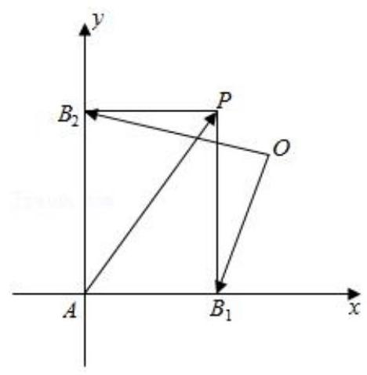

【解析】解: 因为 $\overrightarrow{A{B}_{1}} \bot  \overrightarrow{A{B}_{2}},\overrightarrow{AP} = \overrightarrow{A{B}_{1}} + \overrightarrow{A{B}_{2}}$ 可知四边形 $A{B}_{1}P{B}_{2}$ 为矩形,

以 $A{B}_{1}, A{B}_{2}$ 所在的直线为坐标轴建立坐标系,

$\left| {A{B}_{1}}\right|  = a,\left| {A{B}_{2}}\right|  = b$ ,设 $O\left( {x, y}\right) , P\left( {a, b}\right)$ ,因为 $\left| \overrightarrow{O{B}_{1}}\right|  = \left| \overrightarrow{O{B}_{2}}\right|  = 1$ ,

所以 $\left\{  \begin{array}{l} {\left( x - a\right) }^{2} + {y}^{2} = 1 \\  {x}^{2} + {\left( y - b\right) }^{2} = 1 \end{array}\right.$ ,变形为 $\left\{  \begin{array}{l} {\left( x - a\right) }^{2} = 1 - {y}^{2} \\  {\left( y - b\right) }^{2} = 1 - {x}^{2} \end{array}\right.$ ,

因为 $\left| \overrightarrow{OP}\right|  < \frac{1}{2}$ ,所以 ${\left( x - a\right) }^{2} + {\left( y - b\right) }^{2} < \frac{1}{4},1 - {x}^{2} + 1 - {y}^{2} < \frac{1}{4}$ ,

所以 ${x}^{2} + {y}^{2} > \frac{7}{4}$ . ①

因为 ${\left( x - a\right) }^{2} + {y}^{2} = 1,{y}^{2} \leq  1$ ,同理 ${x}^{2} \leq  1$ ,所以 ${x}^{2} + {y}^{2} \leq  2$ ,②

由①②可知， $\frac{7}{4} < {x}^{2} + {y}^{2} \leq  2$ ，因为 $\left| \overrightarrow{OA}\right|  = \sqrt{{x}^{2} + {y}^{2}}$ ，所以 $\frac{\sqrt{7}}{2} < \left| \overrightarrow{OA}\right|  < \sqrt{2}$ ，故选: $B$ .

【例 9】已知 $A\text{ 、 }B\text{ 、 }C$ 是单位圆上三个互不相同的点,若 $\left| \overrightarrow{AB}\right|  = \left| \overrightarrow{AC}\right|$ ,则 $\overrightarrow{AB} \cdot  \overrightarrow{AC}$ 的最小值是___

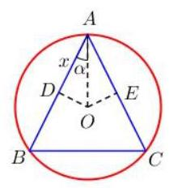

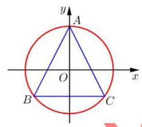

【难度】 $\star   \star   \star   \star$

【答案】 $- \frac{1}{2}$

【解析】法一: 由题意,作 ${OD} \bot  {AB},{OE} \bot  {AC}$ ,设 ${AD} = x,\angle {OAD} = \alpha ,\therefore \cos \alpha  = x$ , $\cos \angle {BAC} = \cos {2\alpha } = 2{x}^{2} - 1$ ， ${AB} = {AC} = {2x}$ ， $\therefore \overrightarrow{AB} \cdot  \overrightarrow{AC} = {2x} \cdot  {2x} \cdot  \cos {2\alpha } = 8{x}^{4} - 4{x}^{2} \; = 8{\left( {x}^{2} - \frac{1}{4}\right) }^{2} - \frac{1}{2} \geq   - \frac{1}{2}$ ,即 $\overrightarrow{AB} \cdot  \overrightarrow{AC}$ 的最小值为 $- \frac{1}{2}$ .

法二: 建系,设 $A\left( {0,1}\right) , B\left( {\cos \theta ,\sin \theta }\right) , C\left( {-\cos \theta ,\sin \theta }\right) ,\therefore \overrightarrow{AB} = \left( {\cos \theta ,\sin \theta  - 1}\right)$ , $\overrightarrow{AC} = \left( {-\cos \theta ,\sin \theta  - 1}\right) ,\therefore \overrightarrow{AB} \cdot  \overrightarrow{AC} =  - {\cos }^{2}\theta  + {\left( \sin \theta  - 1\right) }^{2} = 2{\sin }^{2}\theta  - 2\sin \theta \; = 2{\left( \sin \theta  - \frac{1}{2}\right) }^{2} - \frac{1}{2} \geq   - \frac{1}{2}$ ,即 $\overrightarrow{AB} \cdot  \overrightarrow{AC}$ 的最小值为 $- \frac{1}{2}$

## 题型五:函数思想在解析几何中的应用

【例 10】过点 $P\left( {\frac{1}{2}, - 2}\right)$ 作圆 $C : {\left( x - \frac{4}{3}m\right) }^{2} + {\left( y - m + 1\right) }^{2} = 1\left( {m \in  \mathbf{R}}\right)$ 的切线，切点分别为 $A\text{ 、 }B$ ，则 $\overrightarrow{PA} \cdot  \overrightarrow{PB}$ 的最小值为___

【难度】 $\star   \star   \star   \star$

【答案】 $2\sqrt{2} - 3$ .

【解析】设 $\angle {ACP} = \theta ,\theta  \in  \left( {0,\frac{\pi }{2}}\right) ,\angle {ACB} = {2\theta },{CP} = \frac{1}{\cos \theta }$ ,

$\therefore \overrightarrow{PA} \cdot  \overrightarrow{PB} = \left( {\overrightarrow{PC} + \overrightarrow{CA}}\right)  \cdot  \left( {\overrightarrow{PC} + \overrightarrow{CB}}\right)  = {\overrightarrow{PC}}^{2} + \overrightarrow{PC} \cdot  \overrightarrow{CB} + \overrightarrow{CA} \cdot  \overrightarrow{PC} + \overrightarrow{CA} \cdot  \overrightarrow{CB}$

$= \frac{1}{{\cos }^{2}\theta } - 1 - 1 + \cos {2\theta } = \frac{1}{{\cos }^{2}\theta } + 2{\cos }^{2}\theta  - 3 \geq  2\sqrt{2} - 3$ ,当 ${\cos }^{2}\theta  = \frac{\sqrt{2}}{2}$ 时等号成立.

【例 11】已知点 $P$ 在双曲线 $\frac{{x}^{2}}{9} - \frac{{y}^{2}}{16} = 1$ 上,点 $A$ 满足 $\overrightarrow{PA} = \left( {t - 1}\right) \overrightarrow{OP}\left( {t \in  \mathbf{R}}\right)$ ,且 $\overrightarrow{OA} \cdot  \overrightarrow{OP} = {60}$ , $\overrightarrow{OB} = \left( {0,1}\right)$ ，则 $\left| {\overrightarrow{OB} \cdot  \overrightarrow{OA}}\right|$ 的最大值为___

【难度】 $\star   \star   \star   \star$

【答案】 8

【解析】 $\overrightarrow{PA} = \overrightarrow{PO} + \overrightarrow{OA} = \left( {t - 1}\right) \overrightarrow{OP} \Rightarrow  \overrightarrow{OA} = t\overrightarrow{OP},\therefore$ 设 $P\left( {x, y}\right) ,\therefore A\left( {{tx},{ty}}\right)$ ,

$\therefore \overrightarrow{OA} \cdot  \overrightarrow{OP} = t\left( {{x}^{2} + {y}^{2}}\right)  = {60},\therefore t = \frac{60}{{x}^{2} + {y}^{2}},\because \frac{{x}^{2}}{9} - \frac{{y}^{2}}{16} = 1,\therefore t = \frac{960}{{144} + {25}{y}^{2}}$ ,

$\therefore \left| {\overrightarrow{OB} \cdot  \overrightarrow{OA}}\right|  = t\left| y\right|  = \frac{960}{\frac{144}{\left| y\right| } + {25}\left| y\right| } \leq  \frac{960}{2\sqrt{{144} \times  {25}}} = 8$ .

【例 12】椭圆 ${C}_{1} : \frac{{x}^{2}}{{a}^{2}} + \frac{{y}^{2}}{{b}^{2}} = 1\left( {a > b > 0}\right)$ 经过点 $E\left( {1,1}\right)$ ,其右焦点为抛物线 ${C}_{2} : {y}^{2} = 2\sqrt{6}x$ 的焦点 $F$ ; 直线 $l$ 与椭圆 ${C}_{1}$ 交于 $A, B$ 两点，且以 ${AB}$ 为直径的圆过原点.

(1)求椭圆 ${C}_{1}$ 的方程；

(2)若过原点的直线 $m$ 与椭圆 ${C}_{1}$ 交于 $C, D$ 两点，且 $\overrightarrow{OC} = t\left( {\overrightarrow{OA} + \overrightarrow{OB}}\right)$ ，求四边形 ${ACBD}$ 面积的最大值.

【难度】 $\star   \star   \star   \star$

【答案】见解析

【解析】解: (1) 抛物线 ${C}_{2} : {y}^{2} = 2\sqrt{6}x$ 的焦点 $F$ 为 $\left( {\frac{\sqrt{6}}{2},0}\right)$ ,则 $c = \frac{\sqrt{6}}{2}$ ,

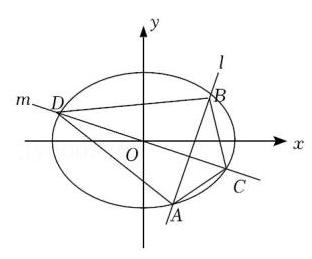

点 $E\left( {1,1}\right)$ 在椭圆 ${C}_{1} : \frac{{x}^{2}}{{a}^{2}} + \frac{{y}^{2}}{{b}^{2}} = 1$ 上,即 $\frac{1}{{a}^{2}} + \frac{1}{{a}^{2} - \frac{3}{2}} = 1$ ,

解得 ${a}^{2} = 3,{b}^{2} = \frac{3}{2}$ ,所以椭圆 ${C}_{1}$ 的方程为 $\frac{{x}^{2}}{3} + \frac{2{y}^{2}}{3} = 1$ .

(2)当直线 ${AB}$ 斜率存在时,设其方程为 $y = {kx} + m, A\left( {{x}_{1},{y}_{1}}\right) , B\left( {{x}_{2},{y}_{2}}\right)$ ， 联立 $\left\{  \begin{array}{l} {x}^{2} + 2{y}^{2} = 3 \\  y = {kx} + m \end{array}\right.$ 可得 $\left( {2{k}^{2} + 1}\right) {x}^{2} + {4kmx} + 2{m}^{2} - 3 = 0$ ,

则 $\Delta  = 4\left( {6{k}^{2} - 2{m}^{2} + 3}\right)  > 0$ ①， ${x}_{1} + {x}_{2} =  - \frac{4km}{2{k}^{2} + 1}$ ②， ${x}_{1}{x}_{2} = \frac{2{m}^{2} - 3}{2{k}^{2} + 1}$ ，③

以 ${AB}$ 为直径的圆过原点即 $\overrightarrow{OA} \cdot  \overrightarrow{OB} = {x}_{1}{x}_{2} + {y}_{1}{y}_{2} = {x}_{1}{x}_{2} + \left( {k{x}_{1} + m}\right) \left( {k{x}_{2} + m}\right)  = 0$ ,

化简可得 $\left( {{k}^{2} + 1}\right) {x}_{1}{x}_{2} + {km}\left( {{x}_{1} + {x}_{2}}\right)  + {m}^{2} = 0$ ,代入②③两式，

整理得 $\left( {{k}^{2} + 1}\right) \left( {2{m}^{2} - 3}\right)  + {km}\left( {-{4km}}\right)  + {m}^{2}\left( {2{k}^{2} + 1}\right)  = 0$ ,即 ${m}^{2} = {k}^{2} + 1$ ,

将④式代入①式，得 $\bigtriangleup   = 4\left( {4{k}^{2} + 1}\right)  > 0$ 恒成立则 $k \in  R$ ，

设线段 ${AB}$ 中点为 $M$ ,由 $\overrightarrow{OC} = t\left( {\overrightarrow{OA} + \overrightarrow{OB}}\right)  = {2t}\overrightarrow{OM}$ ,由观察可知 ${S}_{ACBD} = 2{S}_{OACB} = {4t}{S}_{OAB}$ , ${S}_{OAB} = \frac{1}{2}\left| m\right| \left| {{x}_{1} - {x}_{2}}\right|  = \left| m\right| \frac{\sqrt{4{k}^{2} + 1}}{2{k}^{2} + 1}$ ,又由 $\overrightarrow{OC} = t\left( {\overrightarrow{OA} + \overrightarrow{OB}}\right)$ ,则 $C$ 点坐标为 $\left( {t\left( {{x}_{1} + {x}_{2}}\right) , t\left( {{y}_{1} + {y}_{2}}\right) }\right)$ ,

化简可得 $\left\{  \begin{array}{l} t\left( {{x}_{1} + {x}_{2}}\right)  =  - \frac{4km}{2{k}^{2} + 1}t \\  t\left( {{y}_{1} + {y}_{2}}\right)  =  - \frac{2m}{2{k}^{2} + 1}t \end{array}\right.$ ,代回椭圆方程可得 $\frac{8{m}^{2}{t}^{2}}{2{k}^{2} + 1} = 3$ 即 $t = \sqrt{\frac{3\left( {2{k}^{2} + 1}\right) }{8{m}^{2}}}$ ,

则 ${S}_{ACBD} = {4t}{S}_{OAB} = 4\sqrt{\frac{3\left( {2{k}^{2} + 1}\right) }{8{m}^{2}}}\left| m\right| \frac{\sqrt{4{k}^{2} + 1}}{2{k}^{2} + 1} = \sqrt{6}\sqrt{\frac{4{k}^{2} + 1}{2{k}^{2} + 1}} = \sqrt{6}\sqrt{2 - \frac{1}{2{k}^{2} + 1}} < 2\sqrt{5}$ ,

另外,当直线 ${AB}$ 斜率不存在时, ${AB}$ 方程为 $x =  \pm  1$ ,直线 ${CD}$ 过 ${AB}$ 中点,即为 $x$ 轴,

易得 $\left| {AB}\right|  = 2,\left| {CD}\right|  = 2\sqrt{3},{S}_{ACBD} = \frac{1}{2}\left| {AB}\right| \left| {CD}\right|  = 2\sqrt{3}$

综上,四边形 ${ACBD}$ 面积的最大值为 $2\sqrt{3}$ .

## 题型六: 函数思想在立体几何中的应用

【例 13】如图,一矩形 ${ABCD}$ 的一边 ${AB}$ 在 $x$ 轴上,另两个顶点 $C\text{ 、 }D$ 在函数 $f\left( x\right)  = \frac{x}{1 + {x}^{2}}, x > 0$ 的图像上,则此矩形绕 $x$ 轴旋转而成的几何体的体积的最大值是___

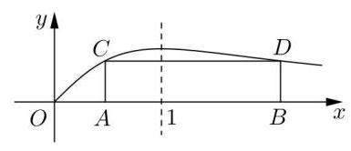

【难度】 $\star   \star   \star   \star$

【答案】 $\frac{\pi }{4}$

【解析】设 $A\left( {{x}_{1},0}\right) \text{ 、 }B\left( {{x}_{2},0}\right) \text{ 、 }C\left( {{x}_{1}, t}\right) \text{ 、 }D\left( {{x}_{2}, t}\right) ,\therefore t = \frac{x}{1 + {x}^{2}}$ ,即 $t{x}^{2} - x + t = 0$ , $\therefore {x}_{1}{x}_{2} = 1,{x}_{1} + {x}_{2} = \frac{1}{t},\left| {{x}_{1} - {x}_{2}}\right|  = \frac{\sqrt{1 - 4{t}^{2}}}{t}, V = {Sh} = \pi {t}^{2}\left| {{x}_{1} - {x}_{2}}\right|  = {\pi t}\sqrt{1 - 4{t}^{2}}$ , $\because {\left( 2t\right) }^{2} + {\left( \sqrt{1 - 4{t}^{2}}\right) }^{2} \geq  2 \cdot  {2t} \cdot  \sqrt{1 - 4{t}^{2}}$ ,即 $1 \geq  {4t}\sqrt{1 - 4{t}^{2}},\therefore V \leq  \frac{\pi }{4}$ .

【例 14】如图,在平行六面体 ${ABCD} - {A}_{1}{B}_{1}{C}_{1}{D}_{1}$ 中, ${AD} = 1,{CD} = 2,{A}_{1}D \bot$ 平面 ${ABCD}, A{A}_{1}$ 与底面 ${ABCD}$ 所成角为 $\theta$ ,设直线 ${A}_{1}C$ 与平面 $A{A}_{1}{D}_{1}D$ 、平面 ${ABCD}$ 、平面 $A{A}_{1}{B}_{1}B$ 所成角的大小分别为 $\alpha ,\beta ,\gamma$ .

(1)若 $\angle {ADC} = {2\theta }$ ，求平行六面体 ${ABCD} - {A}_{1}{B}_{1}{C}_{1}{D}_{1}$ 的体积 $V$ 的取值范围；

(2)若 $\angle {ADC} = {2\theta }$ 且 $\theta  = \frac{\pi }{4}$ ，求 $\alpha ,\beta ,\gamma$ 中的最大值；

(3)若 $\angle {ADC} = \frac{\pi }{2}, g\left( \theta \right)  = \max \{ \alpha \left( \theta \right) ,\beta \left( \theta \right) ,\gamma \left( \theta \right) \}$ ，(其中 $\max \{ a, b\}$ 是指 $a, b$ 中的最大的数)，求 $g\left( \theta \right)$ 的最小值.

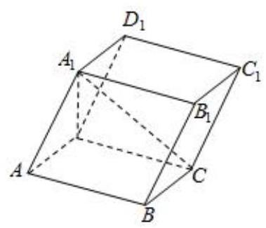

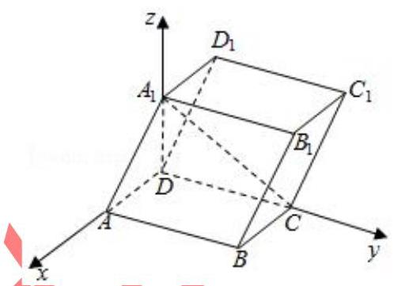

【难度】 $\star   \star   \star   \star$

【答案】(1) $\left( {0,4}\right)$ . (2) $\alpha ,\beta ,\gamma$ 中最大值为 $\alpha  = \arctan 2 \cdot  \left( 3\right) \frac{\pi }{4}$ .

【解析】解: (1) 由题意得 $D{A}_{1} = \tan \theta \left( {0 < \theta  < \frac{\pi }{2}}\right)$ ,四边形 ${ABCD}$ 的面积为 $2\sin {2\theta }$ 平行六面体 ${ABCD} - {A}_{1}{B}_{1}{C}_{1}{D}_{1}$ 的体积 $V = 2\sin {2\theta } \cdot  \tan \theta  = 4{\sin }^{2}\theta$ ,

$\therefore$ 平行六面体 ${ABCD} - {A}_{1}{B}_{1}{C}_{1}{D}_{1}$ 的体积 $V$ 的取值范围为 $\left( {0,4}\right)$

(2) $\because \theta  = {45}^{ \circ  }$ ， $\therefore \angle {ADC} = {90}^{ \circ  }$ ，即 ${CD} \bot  {AD}$ ，

又 $\because {A}_{1}D \bot$ 平面 ${ABCD},\therefore {CD} \bot  {A}_{1}D,\therefore {CD} \bot$ 平面 $A{A}_{1}{D}_{1}D$ ，

$\therefore \alpha  = \angle C{A}_{1}D,\beta  = \angle {A}_{1}{CD}$ ,由题意得 ${A}_{1}D = 1,{AD} = 1,{CD} = 2,\therefore \tan \alpha  = 2,\tan \beta  = \frac{1}{2}$ ,

$\therefore \alpha  = \arctan 2,\beta  = \arctan \frac{1}{2}$ ,

以 ${DA},{DC}, D{A}_{1}$ 为 $x, y, z$ 轴,建立空间直角坐标系 $O - {xyz}$ ,

则 ${A}_{1}\left( {0,0,1}\right) , C\left( {0,2,0}\right) , A\left( {1,0,0}\right) , B\left( {1,2,0}\right)$

$\therefore \overrightarrow{{A}_{1}C} = \left( {0,2, - 1}\right) ,\overrightarrow{A{A}_{1}} = \left( {-1,0,1}\right) ,\overrightarrow{AB} = \left( {0,2,0}\right)$ ,

设侧面 $A{A}_{1}{B}_{1}B$ 的法向量 $\overrightarrow{n} = \left( {x, y, z}\right) ,\therefore \left\{  \begin{array}{l}  - x + z = 0 \\  {2y} = 0 \end{array}\right.$ ,取 $x = 1$ 得 $\left\{  \begin{array}{l} y = 0 \\  z = 1 \end{array}\right.$ ,

$\therefore$ 侧面 $A{A}_{1}{B}_{1}B$ 的法向量 $\overrightarrow{n} = \left( {1,0,1}\right) ,\therefore \sin \gamma  = \left| {\cos  < \overrightarrow{{A}_{1}C},\overrightarrow{n} > }\right|  = \frac{\left| \overrightarrow{{A}_{1}C} \cdot  \overrightarrow{n}\right| }{\left| \overrightarrow{{A}_{1}C}\right|  \cdot  \left| \overrightarrow{n}\right| } = \frac{\sqrt{10}}{10}$ ,

$\therefore$ 直线 ${A}_{1}C$ 与侧面 $A{A}_{1}{B}_{1}B$ 所成角 $\gamma$ 的大小为 $\arcsin \frac{\sqrt{10}}{10}$ ,综上, $\alpha ,\beta ,\gamma$ 中最大值为 $\alpha  = \arctan 2$ .

(3) $\because \angle {ADC} = \frac{\pi }{2}$ ，即 ${CD} \bot  {AD}$ ，又 $\because {A}_{1}D \bot$ 平面 ${ABCD}$ ， $\therefore {CD} \bot  {A}_{1}D$ ，

$\therefore {CD} \bot$ 平面 $A{A}_{1}{D}_{1}D,\therefore \alpha  = \angle C{A}_{1}D,\beta  = \angle {A}_{1}{CD},\because D{A}_{1} = \tan \theta ,\therefore \tan \alpha  = \frac{CD}{D{A}_{1}} = \frac{2}{\tan \theta },\tan \beta  = \frac{D{A}_{1}}{CD} = \frac{\tan \theta }{2}$ ,

以 ${DA},{DC}, D{A}_{1}$ 为 $x, y, z$ 轴建立空间直角坐标系 $O - {xyz}$ ,

则 ${A}_{1}\left( {0,0,\tan \theta }\right) , C\left( {0,2,0}\right) , A\left( {1,0,0}\right) , B\left( {1,2,0}\right)$

$\therefore \overrightarrow{{A}_{1}C} = \left( {0,2, - \tan \theta }\right) ,\overrightarrow{A{A}_{1}} = \left( {-1,0,\tan \theta }\right) ,\overrightarrow{AB} = \left( {0,2,0}\right)$ ,

设侧面 $A{A}_{1}{B}_{1}B$ 的法向量 $\overrightarrow{n} = \left( {x, y, z}\right) ,\therefore \left\{  \begin{array}{l}  - x + z\tan \theta  = 0 \\  {2y} = 0 \end{array}\right.$ ,令 $x = \tan \theta$ 得 $\left\{  \begin{array}{l} y = 0 \\  z = 1 \end{array}\right.$ ,

$\therefore$ 侧面 $A{A}_{1}{B}_{1}B$ 的法向量 $\overrightarrow{n} = \left( {\tan \theta ,0,1}\right) ,\therefore \sin \gamma  = \frac{\left| \overrightarrow{{A}_{1}C} \cdot  \overrightarrow{n}\right| }{\left| \overrightarrow{{A}_{1}C}\right|  \cdot  \left| \overrightarrow{n}\right| } = \frac{\left| 0 + 0 + \tan \theta \right| }{\sqrt{4 + {\tan }^{2}\theta } \times  \sqrt{{\tan }^{2}\theta  + 1}} = \frac{\tan \theta }{\sqrt{{\tan }^{4}\theta  + 5{\tan }^{2}\theta  + 4}}$ , $\therefore \tan \gamma  = \frac{\tan \theta }{{\tan }^{2}\theta  + 2},\therefore \overrightarrow{{A}_{1}C}$ 与 $\overrightarrow{n}$ 所在的直线的夹角为 $\arctan \gamma  = \arctan \left( \frac{\tan \theta }{{\tan }^{2}\theta  + 2}\right)$ , $\therefore g\left( \theta \right)  = \max \left\{  {\arctan \left( \frac{2}{\tan \theta }\right) ,\arctan \left( \frac{\tan \theta }{2}\right) }\right.$ , $\left. {\arctan \left( \frac{\tan \theta }{{\tan }^{2}\theta  + 2}\right) }\right\}$ 令 $t = \tan \theta , t \in  \left( {0, + \infty }\right)$ ,则 $h\left( t\right)  = \max \left\{  {\frac{2}{t},\frac{t}{2},\frac{t}{{t}^{2} + 2}}\right\}$ , $\because \frac{2}{t} - \frac{t}{{t}^{2} + 2} = \frac{{t}^{2} + 4}{t\left( {{t}^{2} + 2}\right) } > 0,\frac{t}{2} - \frac{t}{{t}^{2} + 2} = \frac{{t}^{3}}{2\left( {{t}^{2} + 2}\right) } > 0,\therefore h\left( t\right)  = \max \left\{  {\frac{2}{t},\frac{t}{2}}\right\}   = \left\{  \begin{array}{l} \frac{2}{t},0 < t \leq  2 \\  \frac{t}{2}, t > 2 \end{array}\right.$ , $\therefore {\left\lbrack  h\left( t\right) \right\rbrack  }_{\text{ min }} = 1,\;\therefore {\left\lbrack  g\left( \theta \right) \right\rbrack  }_{\text{ min }} = \arctan 1 = \frac{\pi }{4}$ .

## 题型七:利用函数思想处理多变量问题

【例 15】已知函数 $f\left( x\right)  = \left\{  \begin{matrix}  - {4x} + 1 & x >  - 1 \\  {x}^{2} + {6x} + {10} & x \leq   - 1 \end{matrix}\right.$ 关于 $x$ 的不等式 $f\left( x\right)  - {mx} - {2m} - 2 < 0$ 的解集是 $\left( {{x}_{1},{x}_{2}}\right)  \cup  \left( {{x}_{3}, + \infty }\right)$ ，若 ${x}_{1}{x}_{2}{x}_{3} > 0$ ，则 ${x}_{1} + {x}_{2} + {x}_{3}$ 的取值范围是___

【难度】 $\star   \star   \star   \star$

【答案】 $\lbrack 2\sqrt{7} - {12}, + \infty )$

【解析】 $f\left( x\right)  < m\left( {x + 2}\right)  + 2$ ,数形结合, $y = m\left( {x + 2}\right)  + 2$ 表示斜率为 $m$ 且经

过 $\left( {-2,2}\right)$ 的直线,同时 $\left( {-2,2}\right)$ 也在 $f\left( x\right)$ 图像上,设三个交点为 $A\left( {{x}_{1},{y}_{1}}\right) , B\left( {{x}_{2},{y}_{2}}\right) , C\left( {{x}_{3},{y}_{3}}\right)$ , 易知 ${x}_{1} <  - 2,{x}_{2} =  - 2,\because {x}_{1}{x}_{2}{x}_{3} > 0,\therefore$ 需满足 ${x}_{3} > 0$ ,结合图形可得直线斜率 $m \in  \left( {-4, - \frac{1}{2}}\right)$ ,

由 $\left\{  \begin{array}{l} y = m\left( {x + 2}\right)  + 2 \\  y = {x}^{2} + {6x} + {10} \end{array}\right.$ 得 ${x}^{2} + \left( {6 - m}\right) x + 8 - {2m} = 0,\therefore {x}_{1} + {x}_{2} = m - 6$ ,由 $\left\{  \begin{array}{l} y = m\left( {x + 2}\right)  + 2 \\  y =  - {4x} + 1 \end{array}\right.$

可得 ${x}_{3} = \frac{-{2m} - 1}{m + 4},\therefore {x}_{1} + {x}_{2} + {x}_{3} = m - 6 - \frac{{2m} + 1}{m + 4} = m + 4 + \frac{7}{m + 4} - {12},\because m + 4 \in  \left( {0,\frac{7}{2}}\right)$ ,

$\therefore m + 4 + \frac{7}{m + 4} - {12} \in  \lbrack 2\sqrt{7} - {12}, + \infty )$ .

【例 16】若函数 $y = f\left( x\right)$ 对定义域内的每一个值 ${x}_{1}$ ,在其定义域内都存在唯一的 ${x}_{2}$ ,使 $f\left( {x}_{1}\right) f\left( {x}_{2}\right)  = 1$ 成立, 则称该函数为 “依赖函数”.

(1)判断函数 $g\left( x\right)  = {2}^{x}$ 是否为 “依赖函数”，并说明理由;

(2)若函数 $f\left( x\right)  = {\left( x - 1\right) }^{2}$ 在定义域 $\left\lbrack  {m, n}\right\rbrack$ ( $m > 1$ )上为 “依赖函数”，求实数 $m$ 、 $n$ 乘积 ${mn}$ 的取值范围;

(3)已知函数 $f\left( x\right)  = {\left( x - a\right) }^{2}$ ( $a < \frac{4}{3}$ )在定义域 $\left\lbrack  {\frac{4}{3},4}\right\rbrack$ 上为“依赖函数”，若存在实数 $x \in  \left\lbrack  {\frac{4}{3},4}\right\rbrack$ ，使得对任意的 $t \in  \mathbf{R}$ ,有不等式 $f\left( x\right)  \geq   - {t}^{2} + \left( {s - t}\right) x + 4$ 都成立,求实数 $s$ 的最大值.

【难度】 $\star   \star   \star   \star$

【答案】见解析

【解析】(1) 对于函数 $g\left( x\right)  = {2}^{x}$ 的定义域 $\mathrm{R}$ 内任意的 ${x}_{1}$ ,取 $x =  - {x}_{1}$ ,则 $g\left( {x}_{1}\right) g\left( {x}_{2}\right)  = 1$ ,

且由 $g\left( x\right)  = {2}^{x}$ 在 $\mathbf{R}$ 上单调递增,可知 ${x}_{2}$ 的取值唯

故 $g\left( x\right)  = {2}^{x}$ 是 “依赖函数”; 4 分

(2) 因为 $m > 1, f\left( x\right)  = {\left( x - 1\right) }^{2}$ 在 $\left\lbrack  {m, n}\right\rbrack$ 递增,故 $f\left( m\right) f\left( n\right)  = 1$ ,即 ${\left( m - 1\right) }^{2}{\left( n - 1\right) }^{2} = 1$ , 5 分

由 $n > m > 1$ ,得 $\left( {m - 1}\right) \left( {n - 1}\right)  = 1$ ,故 $n = \frac{m}{m - 1}$ 6 分

由 $n > m > 1$ ,得 $1 < m < 2$ , 7 分

从而 ${mn} = \frac{{m}^{2}}{m - 1} = m - 1 + \frac{1}{m - 1} + 2$ 在 $m \in  \left( {1,2}\right)$ 上单调递减,故 ${mn} \in  \left( {4, + \infty }\right) ,\cdots 9$ 分

(3) 因 $a < \frac{4}{3}$ ，故 $f\left( x\right)  = {\left( x - a\right) }^{2}$ 在 $\left\lbrack  {\frac{4}{3},4}\right\rbrack$ 上单调递增，

从而 $f\left( \frac{4}{3}\right)  \cdot  f\left( 4\right)  = 1$ ,即 ${\left( \frac{4}{3} - a\right) }^{2}{\left( 4 - a\right) }^{2} = 1$ ,进而 $\left( {\frac{4}{3} - a}\right) \left( {4 - a}\right)  = 1$ ,

解得 $a = 1$ 或 $a = \frac{13}{3}$ (舍). 13 分

从而,存在 $x \in  \left\lbrack  {\frac{4}{3},4}\right\rbrack$ ,使得对任意的 $t \in  \mathbf{R}$ ,有不等式 ${\left( x - 1\right) }^{2} \geq   - {t}^{2} + \left( {s - t}\right) x + 4$ 都成立, $\mathbf{B} \; {t}^{2} + {xt} + {x}^{2} - \left( {s + 2}\right) x - 3 \geq  0$ 恒成立,由 $\Delta  = {x}^{2} - 4\left\lbrack  {{x}^{2} - \left( {s + 2}\right) x - 3}\right\rbrack   \leq  0,\cdots \cdots {15}$ .

得 $4\left( {s + 2}\right) x \leq  3{x}^{2} - {12}$ ,由 $x \in  \left\lbrack  {\frac{4}{3},4}\right\rbrack$ ,可得 $4\left( {s + 2}\right)  \leq  {3x} - \frac{12}{x}$ ,

又 $y = {3x} - \frac{12}{x}$ 在 $x \in  \left\lbrack  {\frac{4}{3},4}\right\rbrack$ 单调递增,故当 $x = 4$ 时, ${\left( 3x - \frac{12}{x}\right) }_{\max } = 9$ ,

从而 $4\left( {s + 2}\right)  \leq  9$ ,解得 $s \leq  \frac{1}{4}$ ,故实数 $s$ 的最大值为 $\frac{1}{4}$ . 18 分

## 巩固训练

1、不等式 ${x}^{2} - 2{y}^{2} \leq  {cx}\left( {y - x}\right)$ 对满足 $x > y > 0$ 的任意实数 $x, y$ 恒成立，则实数 $c$ 的最大值是___.

【难度】 $\star   \star   \star   \star$

【答案】 $2\sqrt{2} - 4$

【解析】解: $\because$ 不等式 ${x}^{2} - 2{y}^{2} \leq  {cx}\left( {y - x}\right)$ 对任意满足 $x > y > 0$ 的实数 $x\text{ 、 }y$ 恒成立,

$\therefore c \leq  \frac{{x}^{2} - 2{y}^{2}}{{xy} - {x}^{2}} = \frac{{\left( \frac{x}{y}\right) }^{2} - 2}{\frac{x}{y} - {\left( \frac{x}{y}\right) }^{2}}$ ,令 $\frac{x}{y} = t > 1,\therefore c \leq  \frac{{t}^{2} - 2}{t - {t}^{2}} = f\left( t\right)$ ,

当 $t > 2 + \sqrt{2}$ 时， ${f}^{\prime }\left( t\right)  > 0$ ，函数 $f\left( t\right)$ 单调递增；当 $1 < t < 2 + \sqrt{2}$ 时， ${f}^{\prime }\left( t\right)  < 0$ ，函数 $f\left( t\right)$ 单调递减.

$\therefore$ 当 $t = 2 + \sqrt{2}$ 时， $f\left( t\right)$ 取得最小值， $f\left( {2 + \sqrt{2}}\right)  = 2\sqrt{2} - 4$ ， $\therefore$ 实数 $c$ 的最大值为 $2\sqrt{2} - 4$ .

故答案为: $2\sqrt{2} - 4$ .

2、已知 $f\left( x\right)  = \left\{  {\begin{array}{l} \left| {{\log }_{2}x}\right| ,0 < x \leq  2 \\  \frac{1}{8}{x}^{2} - \frac{5}{4}x + 3, x > 2 \end{array}, a, b, c, d}\right.$ 是互不相同的正数,且 $f\left( \mathrm{a}\right)  = f\left( \mathrm{b}\right)  = f\left( \mathrm{c}\right)  = f\left( \mathrm{d}\right)$ , 则 ${abcd}$ 的取值范围是(   )

A. $\left( {{18},{28}}\right)$ B. $\left( {{16},{24}}\right)$ C. $\left( {{21},{24}}\right)$ D. $\left( {{20},{25}}\right)$

【难度】 $\star   \star   \star   \star$

【答案】 $B$

【解析】解: 不妨设 $0 < a < b < c < d$ ,作出 $f\left( x\right)$ 的图象,如图所示:

当 $x > 2$ 时， $f\left( x\right)$ 的对称轴为 $x = 5$ ，

$\because c$ 与 $d$ 关于 $x = 5$ 对称, $\therefore c + d = {10}$ ,则 ${\log }_{2}a =  - {\log }_{2}b$ ,故 ${ab} = 1$ ,

又 $c \in  \left( {2,4}\right) , d \in  \left( {6,8}\right)$ ,当 $f\left( x\right)  = 1$ 时, $x = \frac{1}{2}$ 或 $x = 2$ 或 $x = 8$ ,

当 $f\left( x\right)  = 0$ 时， $x = 1$ 或 $x = 4$ 或 $x = 6$ ，则 ${cd} \in  \left( {{16},{24}}\right)$ ，故 ${abcd} \in  \left( {{16},{24}}\right)$ ，故选: $B$ .

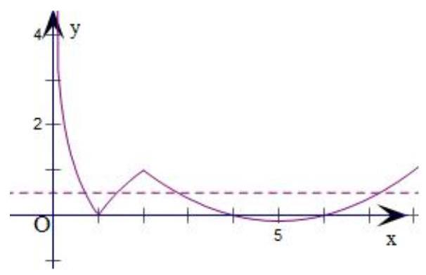

3、设函数 $f\left( x\right)  = \left\{  \begin{array}{ll} 2\left| {x - 1}\right|  + 2 & 0 \leq  x \leq  2 \\  \frac{x - 1}{x - 2} & x > 2 \end{array}\right.$ ，若互不相同的实数 $a$ ， $b$ ， $c$ 满足 $f\left( a\right)  = f\left( b\right)  = f\left( c\right)  = k$ ， 则 $k$ 的取值范围是 ___；___ ${af}\left( a\right)  + {bf}\left( b\right)  + {cf}\left( c\right)$ 的取值范围是 ___.

【难度】 $\star   \star   \star   \star$

【答案】 $(2,4\rbrack ,({10},\frac{52}{3}\rbrack$

【解析】解: 由题意知 $f\left( x\right)  = \left\{  \begin{array}{ll} 2\left| {x - 1}\right|  + 2 & 0 \leq  x \leq  2 \\  \frac{x - 1}{x - 2} & x > 2 \end{array}\right.  = \left\{  \begin{array}{l} 4 - {2x},0 \leq  x \leq  1 \\  {2x},1 < x \leq  2 \\  \frac{x - 1}{x - 2}, x > 2 \end{array}\right.$ ,做出图像如右:

令 $a < b < c$ ,则由 $f\left( \mathrm{a}\right)  = f\left( \mathrm{\;b}\right)  = f\left( \mathrm{c}\right)  = k$ 可得 $4 - {2a} = {2b} = \frac{c - 1}{c - 2} = k$

结合 $1 < b \leq  2$ 可知, $k \in  (2,4\rbrack$ ,由(或)可解得: $a = \frac{4 - k}{2}, b = \frac{k}{2}, c = \frac{1 - {2k}}{1 - k}$ ,

所以令 $g\left( k\right)  = {af}\left( \mathrm{a}\right)  + {bf}\left( \mathrm{b}\right)  + {cf}\left( \mathrm{c}\right)  = k\left( {a + b + c}\right)  = k\left( {2 - \frac{k}{2} + \frac{k}{2} + \frac{1 - {2k}}{1 - k}}\right)$

$= \frac{{3k} - 4{k}^{2}}{1 - k}, k \in  (2,4\rbrack$ ,令 $t = 1 - k \in  \lbrack  - 3, - 1)$ ,则函数 $g\left( k\right)$ 化为 $h\left( t\right)  =  - \left( {{4t} + \frac{1}{t}}\right)  + 5, t \in  \lbrack  - 3, - 1)$ .

由对勾函数的性质可知, $y = 4\left( {t + \frac{\frac{1}{4}}{t}}\right)$ 在 $\lbrack  - 3, - 1)$ 上单调递增,故 $h\left( t\right)$ 在 $\lbrack  - 3, - 1)$ 上单调递减,

所以 ${10} < h\left( t\right)  \leq  \frac{52}{3}$ ,故 ${af}\left( \mathrm{a}\right)  + {bf}\left( \mathrm{b}\right)  + {cf}\left( \mathrm{c}\right)$ 的取值范围是 $({10},\frac{52}{3}\rbrack$ .

故答案为: $(2,4\rbrack ,\left( {{10},\frac{52}{3}}\right\rbrack$ .

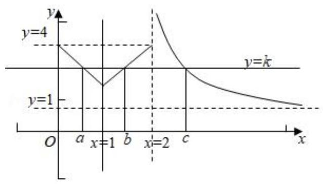

4、已知数列 $\left\{  {a}_{n}\right\}$ 是各项均不为 0 的等差数列, ${S}_{n}$ 为其前 $n$ 项和,且满足 ${a}_{n}^{2} = {S}_{{2n} - 1}\left( {n \in  {N}^{ + }}\right)$ . 若不等式 $\frac{\lambda }{{a}_{n + 1}} \leq  \frac{n + 8 \cdot  {\left( -1\right) }^{n}}{2n}$ 对任意的 $n \in  {N}^{ + }$ 恒成立，则实数 $\lambda$ 的最大值为___.

【难度】 $\star   \star   \star   \star$

【答案】 $- \frac{21}{2}$

【解析】解: $\because {a}_{n}^{2} = {S}_{{2n} - 1},\therefore {a}_{1}^{2} = {S}_{1} = {a}_{1}$ ,又 $\because {a}_{n} \neq  0,\therefore {a}_{1} = 1$ ,又 $\because {a}_{2}^{2} = {S}_{3} = 3{a}_{2}.\therefore {a}_{2} = 3$ 或 ${a}_{2} = 0$ (舍),

$\therefore$ 数列 $\left\{  {a}_{n}\right\}$ 的公差 $d = {a}_{2} - {a}_{1} = 3 - 1 = 2,\therefore {a}_{n} = 1 + 2\left( {n - 1}\right)  = {2n} - 1,\therefore$ 不等式 $\frac{\lambda }{{a}_{n + 1}} \leq  \frac{n + 8 \cdot  {\left( -1\right) }^{n}}{2n}$ 对任意的 $n \in  {N}^{ + }$ 恒成立,即不等式 $\frac{\lambda }{{2n} + 1} \leq  \frac{n + 8 \cdot  {\left( -1\right) }^{n}}{2n}$ 对任意的 $n \in  {N}^{ + }$ 恒成立,

$\therefore \lambda$ 小于等于 $f\left( n\right)  = \frac{\left( {{2n} + 1}\right) \left\lbrack  {n + 8 \cdot  {\left( -1\right) }^{n}}\right\rbrack  }{2n}$ 的最小值,

① 当 $n$ 为奇数时， $f\left( n\right)  = \frac{\left( {{2n} + 1}\right) \left( {n - 8}\right) }{2n} = n - \frac{4}{n} - \frac{15}{2}$ 随着 $n$ 的增大而增大，

$\therefore$ 此时 $f{\left( n\right) }_{\text{ min }} = f\left( 1\right)  = 1 - 4 - \frac{15}{2} =  - \frac{21}{2}$ ;

② 当 $n$ 为偶数时， $f\left( n\right)  = \frac{\left( {{2n} + 1}\right) \left( {n + 8}\right) }{2n} = n + \frac{4}{n} + \frac{17}{2} > \frac{17}{2}$ ，

$\therefore$ 此时 $f{\left( n\right) }_{\min } > \frac{17}{2} >  - \frac{21}{2}$ ; 综合①、②可知 $\lambda  \leq   - \frac{21}{2}$ ，故答案为: $- \frac{21}{2}$ .

5、 $\bigtriangleup {ABC}$ 中， ${AB} = {AC} = 2$ ， $\bigtriangleup {ABC}$ 所在平面内存在点 $P$ 使得 $P{B}^{2} + P{C}^{2} = 4$ ， $P{A}^{2} = 1$ ，则 $\bigtriangleup {ABC}$ 的面积最大值为 ___.

【难度】 $\star   \star   \star   \star$

【答案】 2

【解析】解: 以 ${BC}$ 的中点为原点, ${BC}$ 所在直线为 $x$ 轴,建立直角坐标系,

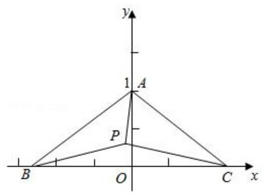

设 $B\left( {-a,0}\right) , C\left( {a,0}\right) \left( {a > 0}\right)$ ,则 $A\left( {0,\sqrt{4 - {a}^{2}}}\right)$ ,设 $P\left( {x, y}\right)$ ,因为 $P{B}^{2} + P{C}^{2} = 4, P{A}^{2} = 1$ ,

所以有 $\left\{  \begin{array}{l} {\left( x + a\right) }^{2} + {y}^{2} + {\left( x - a\right) }^{2} + {y}^{2} = 4 \\  {x}^{2} + {\left( y - \sqrt{4 - {a}^{2}}\right) }^{2} = 1 \end{array}\right.$ ,即 $\left\{  \begin{array}{l} {x}^{2} + {y}^{2} = 4 - {a}^{2} \\  {x}^{2} + {\left( y - \sqrt{4 - {a}^{2}}\right) }^{2} = 1 \end{array}\right.$ ,

所以 $P$ 点既在以 $\left( {0,0}\right)$ 为圆心, $\sqrt{4 - {a}^{2}}$ 为半径的圆上,也在以 $\left( {0,\sqrt{4 - {a}^{2}}}\right)$ 为圆心. 以 1 为半径的圆上,

所以 $\left| {1 - \sqrt{4 - {a}^{2}}}\right|  \leq  \sqrt{4 - {a}^{2}} \leq  1 + \sqrt{4 - {a}^{2}}$ ,化简得: ${a}^{2} \leq  \frac{15}{4}$ ,

三角形 ${ABC}$ 的面积 $S = \frac{1}{2} \times  \left| {BC}\right|  \times  \left| {OA}\right|  = \frac{1}{2} \times  {2a} \times  \sqrt{4 - {a}^{2}} = \sqrt{4{a}^{2} - {a}^{4}} = \sqrt{-{\left( {a}^{2} - 2\right) }^{2} + 4}$ ,

所以当 ${a}^{2} = 2$ 时,三角形面积有最大值为 2,故答案为: 2 .

6、法国著名的军事家拿破仑. 波拿巴最早提出的一个几何定理: “以任意三角形的三条边为边向外构造三个等边三角形,则这三个三角形的外接圆圆心恰为另一个等边三角形的顶点”. 在三角形 ${ABC}$ 中,角 $A = {60}^{ \circ  }$ , 以 ${AB}\text{ 、 }{BC}\text{ 、 }{AC}$ 为边向外作三个等边三角形,其外接圆圆心依次为 ${O}_{1}\text{ 、 }{O}_{2}\text{ 、 }{O}_{3}$ ,若三角形 ${O}_{1}{O}_{2}{O}_{3}$ 的面积为 $\frac{\sqrt{3}}{2}$ ，则三角形 ${ABC}$ 的周长最小值为___

【难度】 $\star   \star   \star   \star$

【答案】 $3\sqrt{2}$

【解析】解: 由题意知 $\bigtriangleup {O}_{1}{O}_{2}{O}_{3}$ 为等边三角形,设边长为 $m$ ,

则 ${S}_{\bigtriangleup {O}_{1}{O}_{2}{O}_{3}} = \frac{1}{2}{m}^{2}\sin {60}^{ \circ  } = \frac{\sqrt{3}}{4}{m}^{2} = \frac{\sqrt{3}}{2}$ ,解得 $\left| {{O}_{1}{O}_{2}}\right|  = m = \sqrt{2}$ ;

设 ${BC} = a,{AC} = b,{AB} = c$ ,如图所示:

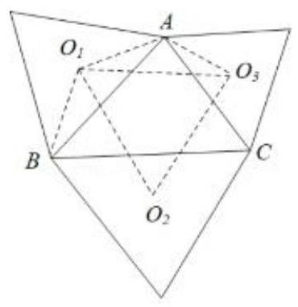

在 $\bigtriangleup {O}_{1}A{O}_{2}$ 中, $\angle {O}_{1}{AB} = \angle {O}_{1}{BA} = {30}^{ \circ  }$ ,

由 $\angle {BAC} = {60}^{ \circ  }$ ,所以 $\angle {O}_{1}A{O}_{2} = {120}^{ \circ  }$ ,在等腰 $\bigtriangleup B{O}_{1}A$ 中, $\frac{AB}{{O}_{1}A} = \frac{\sin {120}^{ \circ  }}{\sin {30}^{ \circ  }}$

解得 ${O}_{1}A = \frac{c}{\sqrt{3}}$ ,同理得 ${O}_{3}A = \frac{b}{\sqrt{3}}$ ,在 $\bigtriangleup {O}_{1}A{O}_{2}$ 中,由余弦定理得 ${O}_{1}{O}_{3}{}^{2} = {O}_{1}{A}^{2} + {O}_{3}{A}^{2} - 2{O}_{1}A \cdot  {O}_{3}A \cdot  \cos {120}^{ \circ  }$ , 即 $2 = \frac{{c}^{2}}{3} + \frac{{b}^{2}}{3} - 2 \cdot  \frac{bc}{3} \cdot  \left( {-\frac{1}{2}}\right)$ ,即 ${b}^{2} + {c}^{2} + {bc} = 6$ ,

在 $\bigtriangleup  {ABC}$ 中，由余弦定理知，

${a}^{2} = {b}^{2} + {c}^{2} - {2bc}\cos A = {b}^{2} + {c}^{2} - {bc},\therefore a = \sqrt{\left( {{b}^{2} + {c}^{2} + {bc}}\right)  - {2bc}} = \sqrt{6 - {2bc}}$

又 $\because {\left( b + c\right) }^{2} = {b}^{2} + {c}^{2} + {bc} + {bc} = 6 + {bc},\therefore b + c = \sqrt{6 + {bc}}$

$\therefore \bigtriangleup {ABC}$ 的周长为 $a + b + c = \sqrt{6 - {2bc}} + \sqrt{6 + {bc}}$ ,又 $\because {b}^{2} + {c}^{2} \geq  {2bc}$ ,

$\therefore {b}^{2} + {c}^{2} + {bc} = 6 \geq  {3bc},\therefore {bc} \leq  2$ . 令 $f\left( x\right)  = \sqrt{6 - {2x}} + \sqrt{6 + x}\left( {0 < x \leq  2}\right)$ ,

$\therefore f\left( x\right)$ 在 $(0,2\rbrack$ 上单调递减, $\therefore$ 当 $x = 2$ 时取得最小值, $f\left( 2\right)  = 3\sqrt{2}$ .

$\therefore a + b + c \geq  3\sqrt{2}$ ，即 $\bigtriangleup  {ABC}$ 的周长最小值为 $3\sqrt{2}$ . 故答案为: $3\sqrt{2}$ .

7、已知数列 $\left\{  {a}_{n}\right\}$ 为等差数列， ${a}_{1} = 2$ ，其前 $n$ 和为 ${S}_{n}$ ，数列 $\left\{  {b}_{n}\right\}$ 为等比数列，且 ${a}_{1}{b}_{1} + {a}_{2}{b}_{2} + {a}_{3}{b}_{3} + \cdots  + {a}_{n}{b}_{n} = \left( {n - 1}\right)  \cdot  {2}^{n + 2} + 4$ 对任意的 $n \in  {\mathbf{N}}^{ * }$ 恒成立.

(1)求数列 $\left\{  {a}_{n}\right\}$ 、 $\left\{  {b}_{n}\right\}$ 的通项公式；

(2)是否存在 $p, q \in  {\mathbf{N}}^{ * }$ ，使得 ${\left( {a}_{{2p} + 2}\right) }^{2} - {b}_{q} = {2020}$ 成立，若存在，求出所有满足条件

的 $p, q$ ; 若不存在,说明理由.

(3)是否存在非零整数 $\lambda$ ，使不等式 $\lambda \left( {1 - \frac{1}{{a}_{1}}}\right) \left( {1 - \frac{1}{{a}_{2}}}\right) \cdots \cdots \left( {1 - \frac{1}{{a}_{n}}}\right) \cos \frac{{a}_{n + 1}\pi }{2} < \frac{1}{\sqrt{{a}_{n} + 1}}$ 对一切 $n \in  {\mathbf{N}}^{ * }$ 都成立？若存在，求出 $\lambda$ 的值；若不存在，说明理由.

【难度】 $\star   \star   \star   \star$

【答案】见解析

【解析】(1)设数列 $\left\{  {a}_{n}\right\}$ 的公差为 $d$ ,数列 $\left\{  {b}_{n}\right\}$ 的公比为 $q$ .

因为 ${a}_{1}{b}_{1} + {a}_{2}{b}_{2} + {a}_{3}{b}_{3} + \cdots  + {a}_{n}{b}_{n} = \left( {n - 1}\right)  \cdot  {2}^{n + 2} + 4\left( {n \in  {\mathbf{N}}^{ * }}\right)$

令 $n = 1,2,3$ 分别得 ${a}_{1}{b}_{1} = 4,{a}_{1}{b}_{1} + {a}_{2}{b}_{2} = {20},{a}_{1}{b}_{1} + {a}_{2}{b}_{2} + {a}_{3}{b}_{3} = {68}$ ,又 ${a}_{1} = 2$

所以 $\left\{  \begin{matrix} {a}_{1} = 2,{b}_{1} = 2 \\  {a}_{2}{b}_{2} = {16} \\  {a}_{3}{b}_{3} = {48} \end{matrix}\right.$ 即 $\left\{  \begin{matrix} \left( {2 + d}\right) \left( {2q}\right)  = {16} \\  \left( {2 + {2d}}\right) \left( {2{q}^{2}}\right)  = {48} \end{matrix}\right.  \Rightarrow  3{d}^{2} - {4d} - 4 = 0$ ,得 $\left\{  \begin{matrix} {d}_{1} =  - \frac{2}{3} \\  {q}_{1} = 6 \end{matrix}\right.$ 或 $\left\{  \begin{matrix} {d}_{2} = 2 \\  {q}_{2} = 2 \end{matrix}\right.$

经检验 $d = 2, q = 2$ 符合题意, $d =  - \frac{2}{3}, q = 6$ 不合题意,舍去.

所以 ${a}_{n} = {2n},{b}_{n} = {2}^{n}$ .

(2)假设存在 $p, q \in  {\mathbf{N}}^{ * }$ 满足条件，则 ${\left( 4p + 4\right) }^{2} - {2}^{q} = {2020}$

化简得 $4{p}^{2} + {8p} - {501} = {2}^{q - 2}$

由 $p \in  {\mathbf{N}}^{ * }$ 得 $4{p}^{2} + {8p} - {501}$ 为奇数,所以 ${2}^{q - 2}$ 为奇数,故 $q = 2$

得 $4{p}^{2} + {8p} - {501} = 1 \Rightarrow  2{p}^{2} + {4p} - {251} = 0$ ,故 $p = \frac{-2 \pm  \sqrt{506}}{2}$ ,这与 $p \in  {\mathbf{N}}^{ * }$ 矛盾,所以不存在满足题设的正整数 $p, q$ .

(3) 由 ${a}_{n} = {2n}$ ,得 $\cos \frac{{a}_{n + 1}\pi }{2} = \cos \left( {n + 1}\right) \pi  = {\left( -1\right) }^{n + 1}$ ,

设 ${b}_{n} = \frac{1}{\left( {1 - \frac{1}{{a}_{1}}}\right) \left( {1 - \frac{1}{{a}_{2}}}\right) \cdots \left( {1 - \frac{1}{{a}_{n}}}\right) \sqrt{{a}_{n} + 1}}$ ,则不等式等价于 ${\left( -1\right) }^{n + 1}\lambda  < {b}_{n}$ .

$\frac{{b}_{n + 1}}{{b}_{n}} = \frac{\sqrt{{a}_{n} + 1}}{\left( {1 - \frac{1}{{a}_{n + 1}}}\right) \sqrt{{a}_{n + 1} + 1}} = \frac{\sqrt{{2n} + 1}}{\left( {1 - \frac{1}{{2n} + 2}}\right) \sqrt{{2n} + 3}} = \frac{{2n} + 2}{\sqrt{\left( {{2n} + 1}\right) \left( {{2n} + 3}\right) }} = \frac{\sqrt{4{n}^{2} + {8n} + 4}}{\sqrt{4{n}^{2} + {8n} + 3}} > 1\;\because {b}_{n} > 0$ ,

$\therefore {b}_{n + 1} > {b}_{n}$ ,数列 $\left\{  {b}_{n}\right\}$ 单调递增.

假设存在这样的实数 $\lambda$ ,使得不等式 ${\left( -1\right) }^{n + 1}\lambda  < {b}_{n}$ 对一切 $n \in  {\mathbf{N}}^{ * }$ 都成立,则

① 当 $n$ 为奇数时,得 $\lambda  < {\left( {b}_{n}\right) }_{\min } = {b}_{1} = \frac{2\sqrt{3}}{3}$ .

② 当 $n$ 为偶数时,得 $- \lambda  < {\left( {b}_{n}\right) }_{\min } = {b}_{2} = \frac{8\sqrt{5}}{15}$ ,即 $\lambda  >  - \frac{8\sqrt{5}}{15}$ .

综上, $\lambda  \in  \left( {-\frac{8\sqrt{5}}{15},\frac{2\sqrt{3}}{3}}\right)$ ,由 $\lambda$ 是非零整数,知存在 $\lambda  =  \pm  1$ 满足条件.

## (二)方程思想的应用

## 例题精讲

题型一:方程思想在函数最值中的应用

【例 17】已知函数 $f\left( x\right)  = {\log }_{m}\frac{x - 3}{x + 3}$

(1)若 $f\left( x\right)$ 的定义域为 $\left\lbrack  {\alpha ,\beta }\right\rbrack  ,\left( {\beta  > \alpha  > 0}\right)$ ,判断 $f\left( x\right)$ 在定义域上的增减性,并加以说明;

(2)当 $0 < m < 1$ 时,是否存在 $\mathrm{m}$ 使 $f\left( x\right)$ 的值域为 $\left\lbrack  {{\log }_{m}\left( {m\left( {\beta  - 1}\right) }\right) ,{\log }_{m}\left( {m\left( {\alpha  - 1}\right) }\right) }\right\rbrack$ 的定义域区间为 $\left\lbrack  {\alpha ,\beta }\right\rbrack \; \left( {\beta  > \alpha  > 0}\right)$ ? 请说明理由.

错解分析: 第(1)问中考生易忽视 “ $\alpha  > 3$ ” 这一关键隐性条件; 第(2)问中转化出的方程,不能认清其根的实质特点, 为两大于 3 的根.

【难度】 $\star   \star   \star   \star$

【答案】见解析

【解析】(1) $\frac{x - 3}{x + 3} > 0 \Leftrightarrow  x <  - 3$ 或 $x > 3.\because f\left( x\right)$ 定义域为 $\left\lbrack  {\alpha ,\beta }\right\rbrack  ,\therefore \alpha  > 3$ ,设 $\beta  \geq  {x}_{1} > {x}_{2} \geq  \alpha$ ,有 $\frac{{x}_{1} - 3}{{x}_{1} + 3} - \frac{{x}_{2} - 3}{{x}_{2} + 3} = \frac{6\left( {{x}_{1} - {x}_{2}}\right) }{\left( {{x}_{1} + 3}\right) \left( {{x}_{2} + 3}\right) } > 0$ ,当 $0 < m < 1$ 时, $f\left( x\right)$ 为减函数,当 $m > 1$ 时, $f\left( x\right)$ 为增函数.

(2)若 $f\left( x\right)$ 在 $\left\lbrack  {\alpha ,\beta }\right\rbrack$ 上的值域为 $\left\lbrack  {{\log }_{m}\left( {m\left( {\beta  - 1}\right) }\right) ,{\log }_{m}\left( {m\left( {\alpha  - 1}\right) }\right) }\right\rbrack$ .

$\because 0 < m < 1, f\left( x\right)$ 为减函数 $\therefore \left\{  \begin{array}{l} f\left( \beta \right)  = {\log }_{m}\frac{\beta  - 3}{\beta  + 3} = {\log }_{m}m\left( {\beta  - 1}\right) \\  f\left( \alpha \right)  = {\log }_{m}\frac{\alpha  - 3}{\alpha  + 3} = {\log }_{m}m\left( {\alpha  - 1}\right)  \end{array}\right.$

即 $\left\{  \begin{array}{l} m{\beta }^{2} + \left( {{2m} - 1}\right) \beta  - 3\left( {m - 1}\right)  = 0 \\  m{\alpha }^{2} + \left( {{2m} - 1}\right) \alpha  - 3\left( {m - 1}\right)  = 0 \end{array}\right.$ ,又 $\beta  > \alpha  > 3$

即 $\alpha ,\beta$ 为方程 $m{x}^{2} + \left( {{2m} - 1}\right) x - 3\left( {m - 1}\right)  = 0$ 的大于 3 的两个根

$\therefore \left\{  {\begin{array}{l} 0 < m < 1 \\  \Delta  = {16}{m}^{2} - {16m} + 1 > 0 \\   - \frac{{2m} - 1}{2m} > 3 \\  f\left( 3\right)  > 0 \end{array}\;\therefore 0 < m < \frac{2 - \sqrt{3}}{4}}\right.$

故当 $0 < m < \frac{2 - \sqrt{3}}{4}$ 时,满足题意条件的 $m$ 存在.

## 题型二: 方程思想在三角中时的应用

【例 18】如图,已知等腰三角形 ${ABC}$ 的顶角 $A = \frac{\pi }{7}, D$ 是腰 ${AB}$ 上一点. 若 ${AD} = 1,{CD} = \sqrt{2}$ ,则 ${BC} =$ ___.

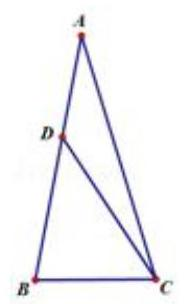

【难度】

【答案】 1

【解析】解: 因为 $A = \frac{\pi }{7}$ ,设 $\alpha  = \frac{\pi }{14}$ ,则 $A = {2\alpha }$ ,所以 ${7\alpha } = \frac{\pi }{2}$ ,所以 ${3\alpha } = \frac{\pi }{2} - {4\alpha }$ ;

所以 $\sin {3\alpha } = \sin \left( {\frac{\pi }{2} - {4\alpha }}\right)  = \cos {4\alpha }$ ,得 $3\sin \alpha  - 4{\sin }^{3}\alpha  = 2{\left( 1 - 2{\sin }^{2}\alpha \right) }^{2} - 1$ ,

化简得 $8{\sin }^{4}\alpha  + 4{\sin }^{3}\alpha  - 8{\sin }^{2}\alpha  - 3\sin \alpha  + 1 = 0$ ; 即 $\left( {\sin \alpha  + 1}\right) \left( {8{\sin }^{3}\alpha  - 4{\sin }^{2}\alpha  - 4\sin \alpha  + 1}\right)  = 0$ .

又 $\sin \alpha  + 1 > 0$ ，所以 $8{\sin }^{3}\alpha  - 4{\sin }^{2}\alpha  - 4\sin \alpha  + 1 = 0$ ，即 $- 4\sin \alpha \cos {2\alpha } - 4{\sin }^{2}\alpha  + 1 = 0$ :___ $\text{ ① }$

设 ${BC} = x,{AC} = y : \bigtriangleup {ACD}$ 中, $A = {2\alpha },{AD} = 1,{CD} = \sqrt{2}$

由余弦定理得 $D{C}^{2} = A{D}^{2} + A{C}^{2} - {2AD} \cdot  {AC} \cdot  \cos A$ ,即 $2 = 1 + {y}^{2} - 2 \times  1 \times  y \times  \cos {2\alpha }$ ,

解得 $\cos {2\alpha } = \frac{{y}^{2} - 1}{2y}$ ， … ② 等腰三角形 ${ABC}$ 中，可得 $\sin \alpha  = \frac{\frac{1}{2}{BC}}{AC} = \frac{x}{2y}$ ；...③

把②③代入①，得 $- 4 \times  \frac{x}{2y} \times  \frac{{y}^{2} - 1}{2y} - 4 \times  \frac{{x}^{2}}{4{y}^{2}} + 1 = 0$ ，

化简得 $\left( {x - 1}\right) \left( {1 + x + {y}^{2}}\right)  = 0$ : 因为 $1 + x + {y}^{2} > 0$ ,所以 $x - 1 = 0$ ,解得 $x = 1$ ,即 ${BC} = 1$ . 故答案为: 1 .

【例 19】已知函数 $f\left( x\right)  = 2{\cos }^{2}\left( {{\omega x} - \frac{\pi }{12}}\right)  - \frac{1}{2}\left( {\omega  > 0}\right)$ 在 $\left\lbrack  {0,\pi }\right\rbrack$ 上恰有 7 个零点,则 $\omega$ 的取值范围是(   )

A. $\left\lbrack  {\frac{41}{12},\frac{15}{4}}\right)$ B. $\left( {\frac{49}{12},\frac{23}{4}}\right\rbrack$ C. $\left( {\frac{41}{12},\frac{15}{4}}\right\rbrack$ D. $\left\lbrack  {\frac{49}{12},\frac{23}{4}}\right)$

【难度】 $\star   \star   \star   \star$

【答案】 $A$

【解析】解: 函数 $f\left( x\right)  = 2{\cos }^{2}\left( {{\omega x} - \frac{\pi }{12}}\right)  - \frac{1}{2} = 2 \times  \frac{\cos \left( {{2\omega x} - \frac{\pi }{6}}\right)  + 1}{2} - \frac{1}{2} = \cos \left( {{2\omega x} - \frac{\pi }{6}}\right)  + \frac{1}{2}$ ,

因为 $x \in  \left\lbrack  {0,\pi }\right\rbrack$ ,则 $- \frac{\pi }{6} \leq  {2\omega x} - \frac{\pi }{6} \leq  {2\omega \pi } - \frac{\pi }{6}$ ,令 $y = \cos \left( {{2\omega x} - \frac{\pi }{6}}\right) , y =  - \frac{1}{2}$ ,

因为函数 $f\left( x\right)$ 在 $\left\lbrack  {0,\pi }\right\rbrack$ 上恰有 7 个零点,

即函数 $y = \cos \left( {{2\omega x} - \frac{\pi }{6}}\right)$ 与 $y =  - \frac{1}{2}$ 的图象有 7 个交点, 所以 $\frac{20\pi }{3} \leq  {2\omega x} - \frac{\pi }{6} < \frac{22\pi }{3}$ ，则 $\frac{41}{12} \leq  \omega  < \frac{15}{4}$ ，所以 $\omega$ 的取值范围是 $\left\lbrack  {\frac{41}{12},\frac{15}{4}}\right)$ . 故选: $A$ .

## 题型三: 方程思想在数列中的应用

【例20】已知数列 $\left\{  {a}_{n}\right\}$ 的奇数项是首项为 1 的等差数列,偶数项是首项为 2 的等比数列. 设数列 $\left\{  {a}_{n}\right\}$ 的前 $\mathrm{n}$ 项和为 ${S}_{n}$ ,且满足 ${a}_{4} = {S}_{3},{a}_{9} = {a}_{3} + {a}_{4}$ .

(1)求数列 $\left\{  {a}_{n}\right\}$ 的通项公式；

(2)若 ${a}_{k}{a}_{k + 1} = {a}_{k + 2}$ ，求正整数 $k$ 的值；

(3)是否存在正整数 $k$ ，使得 $\frac{{S}_{2k}}{{S}_{{2k} - 1}}$ 恰好为数列 $\left\{  {a}_{n}\right\}$ 的一项？若存在，求出所有满足条件的正整数 $k$ ；若不存在, 请说明理由.

【难度】 $\star   \star   \star   \star$

【答案】见解析

【解析】(1) 设 $\left\{  {a}_{n}\right\}$ 的奇数项构成的等差数列的公差为 $d$ ,偶数项构成的等比数列的

公比为 $q$ ,则 ${a}_{{2n} - 1} = 1 + \left( {n - 1}\right) d,{a}_{2n} = 2{q}^{n - 1}$ .

由已知,得 $\left\{  {\begin{array}{l} {2q} = \left( {2 + d}\right)  + 2 \\  1 + {4d} = \left( {1 + d}\right)  + {2q} \end{array} \Rightarrow  \left\{  \begin{array}{l} d = 2, \\  q = 3. \end{array}\right. }\right.$

故数列 $\left\{  {a}_{n}\right\}$ 的通项公式为: ${a}_{n} = \left\{  \begin{matrix} n, & \text{ (当 }n\text{ 为奇数) } \\  2 \cdot  {3}^{\frac{n - 2}{2}}, & \text{ (当 }n\text{ 为偶数) } \end{matrix}\right.$ .

(2)当 $k$ 为奇数时，由 ${a}_{k}{a}_{k + 1} = {a}_{k + 2}$ ，得 $k \cdot  2 \cdot  {3}^{\frac{k - 1}{2}} = k + 2 \Rightarrow  {3}^{\frac{k - 1}{2}} = \frac{k + 2}{2k}$ .

由于 ${3}^{\frac{k - 1}{2}} \in  {N}^{ * }$ ,而 $\frac{k + 2}{2k}$ 仅在 $k = 2$ 时为正整数,与 $k$ 为奇数矛盾!

当 $\mathrm{k}$ 为偶数时,由 ${a}_{k}{a}_{k + 1} = {a}_{k + 2}$ ,得 $2 \cdot  {3}^{\frac{k - 2}{2}} \cdot  \left( {k + 1}\right)  = 2 \cdot  {3}^{\frac{k}{2}} \Rightarrow  k = 2$ .

综上,得 $k = 2$ .

(3)由(1)可求得 ${S}_{2k} = \left\lbrack  {1 + 3 + \cdots  + \left( {{2k} - 1}\right) }\right\rbrack   + 2\left( {1 + 3 + {3}^{2} + \cdots  + {3}^{k - 1}}\right)  = {3}^{k} + {k}^{2} - 1$ ,

${S}_{{2k} - 1} = {S}_{2k} - {a}_{2k} = {3}^{k - 1} + {k}^{2} - 1$ .

若 $\frac{{S}_{2k}}{{S}_{{2k} - 1}}$ 为数列 $\left\{  {a}_{n}\right\}$ 中的一项,则 $\frac{{S}_{2k}}{{S}_{{2k} - 1}} = m$ ( $m$ 为正奇数),或 $\frac{{S}_{2k}}{{S}_{{2k} - 1}} = 2 \cdot  {3}^{\frac{m - 2}{2}}$ ( $m$ 为正偶数).

(i) 若 $\frac{{S}_{2k}}{{S}_{{2k} - 1}} = m\left( {m\text{ 为正奇数 }}\right)$ ,则 $\frac{{3}^{k} + {k}^{2} - 1}{{3}^{k - 1} + {k}^{2} - 1} = m \Rightarrow  \left( {3 - m}\right) {3}^{k - 1} = \left( {m - 1}\right) \left( {{k}^{2} - 1}\right)$ .

当 $k = 1$ 时， $m = 3$ ，结论成立；

当 $k \neq  1$ 时, $\frac{{3}^{k - 1}}{{k}^{2} - 1} = \frac{m - 1}{3 - m}$ ,由 $\frac{{3}^{k - 1}}{{k}^{2} - 1} > 0$ ,得 $\frac{m - 1}{3 - m} > 0$ ,解得 $1 < m < 3$ ,

由于 $m$ 为正奇数，故此时满足条件的正整数 $\mathrm{k}$ 不存在.

(ii) 若 $\frac{{S}_{2k}}{{S}_{{2k} - 1}} = 2 \cdot  {3}^{\frac{m - 2}{2}}$ (m为正偶数),显然 $k \neq  1$ ,则

$\frac{{3}^{k} + {k}^{2} - 1}{{3}^{k - 1} + {k}^{2} - 1} = 2 \cdot  {3}^{\frac{m - 2}{2}} \Rightarrow  \left( {3 - 2 \cdot  {3}^{\frac{m - 2}{2}}}\right) {3}^{k - 1} = \left( {{k}^{2} - 1}\right) \left( {2 \cdot  {3}^{\frac{m - 2}{2}} - 1}\right)  \Rightarrow  \frac{{3}^{k - 1}}{{k}^{2} - 1} = \frac{2 \cdot  {3}^{\frac{m - 2}{2}} - 1}{3 - 2 \cdot  {3}^{\frac{m - 2}{2}}}$ .

由 $k > 1$ 得 $\frac{{3}^{k - 1}}{{k}^{2} - 1} > 0$ ,得 $\frac{2 \cdot  {3}^{\frac{m - 2}{2}} - 1}{3 - 2 \cdot  {3}^{\frac{m - 2}{2}}} > 0 \Rightarrow  1 < 2 \cdot  {3}^{\frac{m - 2}{2}} < 3$ .

由 $m$ 为正偶数，得 $2 \cdot  {3}^{\frac{m - 2}{2}}$ 为正偶数，因此 $2 \cdot  {3}^{\frac{m - 2}{2}} = 2$ ，从而 $\frac{{3}^{k - 1}}{{k}^{2} - 1} = 1 \Rightarrow  {3}^{k - 1} = {k}^{2} - 1$ .

当 $k = 2$ 时, ${3}^{k - 1} = {k}^{2} - 1$ ; 下面用数学归纳法证明: 当 $k \geq  3$ 时, ${3}^{k - 1} > {k}^{2} - 1$ .

① 当 $k = 3$ 时,显然 ${3}^{k - 1} > {k}^{2} - 1$ ;

② 假设当 $k = l \geq  3$ 时，有 ${3}^{l - 1} > {l}^{2} - 1$ ; 当 $k = l + 1$ 时，

由 $l \geq  3$ 得 $3\left( {{l}^{2} - 1}\right)  - \left\lbrack  {{\left( l + 1\right) }^{2} - 1}\right\rbrack   = {\left( l - 1\right) }^{2} + \left( {{l}^{2} - 4}\right)  > 0$ ,故

$$
{3}^{\left( {l + 1}\right)  - 1} = 3 \cdot  {3}^{l - 1} > 3\left( {{l}^{2} - 1}\right)  > {\left( l + 1\right) }^{2} - 1\text{ . }
$$

即当 $k = l + 1$ 时,结论成立. 由①,② 知: 当 $k \geq  3$ 时, ${3}^{k - 1} > {k}^{2} - 1$ .

## 题型四: 方程思想在解析几何中的应用

【例 21】在 ${x}^{2} + {y}^{2} = 4$ 上任取一点 $T$ ,过点 $T$ 作 $x$ 轴的垂线段 ${TA}, A$ 为垂是,点 $B$ 为 ${TA}$ 的中点.

(1)求动点 $B$ 的轨迹 $C$ 的方程；

(2)设 $H$ 为直线 $y =  - 2$ 上任一点，轨迹 $C$ 与 $y$ 轴的两个交点分别为 $R, Q$ ，且 $R, Q, H$ 三点不共线， 直线 ${HR},{HQ}$ 与轨迹 $C$ 的另一交点分别为点 $D,\widetilde{E}$ ,求证: 直线 ${DE}$ 过定点.

【难度】 $\star   \star   \star   \star$

【答案】见解析

【解析】解: (1) 设 $B\left( {x, y}\right)$ ,则由题意得 $A\left( {x,0}\right) , T\left( {x,{2y}}\right)$ ,

因为 $T$ 在圆 ${x}^{2} + {y}^{2} = 4$ 上，所以 ${x}^{2} + {\left( 2y\right) }^{2} = 4$ ，整理得 $\frac{{x}^{2}}{4} + {y}^{2} = 1$ ，

所以动点 $B$ 的轨迹 $C$ 的方程为 $\frac{{x}^{2}}{4} + {y}^{2} = 1$ .

(2)证明: $\frac{{x}^{2}}{4} + {y}^{2} = 1$ 与 $y$ 轴的两个交点 $R\left( {0, - 1}\right)$ ， $Q\left( {0,1}\right)$ ，由题意，直线 ${DE}$ 斜率存在，

设 ${DE} : y = {kx} + m, D\left( {{x}_{1},{y}_{1}}\right) , E\left( {{x}_{2},{y}_{2}}\right)$ ,

联立 $\left\{  \begin{array}{l} y = {kx} + m \\  {x}^{2} + 4{y}^{2} = 4 \end{array}\right.$ ,消去 $y$ 整理得, $\left( {1 + 4{k}^{2}}\right) {x}^{2} + {8kmx} + 4{m}^{2} - 4 = 0$ ,

$\Delta  > 0,{x}_{1} + {x}_{2} =  - \frac{8km}{1 + 4{k}^{2}},{x}_{1}{x}_{2} = \frac{4{m}^{2} - 4}{1 + 4{k}^{2}}$ ,

因为直线 ${HR},{HQ}$ 与轨迹 $C$ 的另一交点分别为点 $D, E$ ,且 $H$ 为直线 $y =  - 2$ 上任一点,

所以直线 ${RD},{QE}$ 交点的纵坐标为 -2,直线 ${RD} : y = \frac{{y}_{1} + 1}{{x}_{1}}x - 1$ ,

直线 ${QE} : y = \frac{{y}_{2} - 1}{{x}_{2}}x + 1$ ,联立 ${RD},{QE}$ 得

${y}_{H} = \frac{{x}_{1}\left( {{y}_{2} - 1}\right)  + {x}_{2}\left( {{y}_{1} + 1}\right) }{{x}_{2}\left( {{y}_{1} + 1}\right)  - {x}_{1}\left( {{y}_{2} - 1}\right) } = \frac{{x}_{1}\left( {k{x}_{2} + m - 1}\right)  + {x}_{2}\left( {k{x}_{1} + m + 1}\right) }{{x}_{2}\left( {k{x}_{1} + m + 1}\right)  - {x}_{1}\left( {k{x}_{2} + m - 1}\right) } = \frac{{2k}{x}_{1}{x}_{2} + m\left( {{x}_{1} + {x}_{2}}\right)  + \left( {{x}_{2} - {x}_{1}}\right) }{{x}_{1} + {x}_{2} + m\left( {{x}_{2} - {x}_{1}}\right) } = \frac{-\frac{8k}{1 + 4{k}^{2}} + \left( {{x}_{2} - {x}_{1}}\right) }{\frac{8km}{1 + 4{k}^{2}} + m\left( {{x}_{2} - {x}_{1}}\right) }\overset{!}{ = }\mathop{\sum }\limits_{{m = 2}}{2}^{m},$

所以 $m =  - \frac{1}{2}$ ,即直线 ${DE} : y = {kx} - \frac{1}{2}$ ,恒过 $\left( {0, - \frac{1}{2}}\right)$ ,故直线 ${DE}$ 恒过定点.

【例 22】在平面直角坐标系 ${xOy}$ 中,已知椭圆 $\Gamma  : \frac{{x}^{2}}{4} + {y}^{2} = 1, A$ 为 $\Gamma$ 的上顶点, $P$ 为 $\Gamma$ 上异于上、下顶点的动点 $M$ 为 $x$ 正半轴上的动点.

(1)若 $P$ 在第一象限，且 $\left| {OP}\right|  = \sqrt{2}$ ，求 $P$ 的坐标；

(2)设 $P\left( {\frac{8}{5},\frac{3}{5}}\right)$ ，若以 $A$ 、 $P$ 、 $M$ 为顶点的三角形是直角三角形，求 $M$ 的横坐标；

(3)若 $\left| {MA}\right|  = \left| {MP}\right|$ ，直线 ${AQ}$ 与 $\Gamma$ 交于另一点 $\mathrm{C}$ ，且 $\overrightarrow{AQ} = 2\overrightarrow{AC}$ ， $\overrightarrow{PQ} = 4\overrightarrow{PM}$ ，

求直线 ${AQ}$ 的方程.

【难度】 $\star   \star   \star   \star$

【答案】见解析

【解析】(1) 联立 $\Gamma  : \frac{{x}^{2}}{4} + {y}^{2} = 1$ 与 ${x}^{2} + {y}^{2} = 2$ ,可得 $P\left( {\frac{2\sqrt{3}}{3},\frac{\sqrt{6}}{3}}\right)$

(2)设 $M\left( {m,0}\right) ,\overrightarrow{MA} \cdot  \overrightarrow{MP} = \left( {-m,1}\right)  \cdot  \left( {\frac{8}{5} - m,\frac{3}{5}}\right)  = {m}^{2} - \frac{8}{5}m + \frac{3}{5} = 0 \Rightarrow  m = \frac{3}{5}$ 或 $m = 1 \; \overrightarrow{PA} \cdot  \overrightarrow{MP} = \left( {-\frac{8}{5},\frac{2}{5}}\right)  \cdot  \left( {\frac{8}{5} - m,\frac{3}{5}}\right)  = \frac{8}{5}m - \frac{64}{25} + \frac{6}{25} = 0 \Rightarrow  m = \frac{29}{20}$

(3)设 $P\left( {{x}_{0},{y}_{0}}\right)$ ，线段 ${AP}$ 的中垂线与 $x$ 轴的交点即 $M\left( {\frac{3}{8}{x}_{0},0}\right) ,\because \overrightarrow{PQ} = 4\overrightarrow{PM}$ ，

$\therefore Q\left( {-\frac{3}{2}{x}_{0}, - 3{y}_{0}}\right) ,\because \overrightarrow{AQ} = 2\overrightarrow{AC},\therefore C\left( {-\frac{3}{4}{x}_{0},\frac{1 - 3{y}_{0}}{2}}\right)$ ,代入并联立椭圆方程,

解得 ${x}_{0} = \frac{8\sqrt{5}}{9},{y}_{0} =  - \frac{1}{9},\therefore Q\left( {-\frac{4}{3}\sqrt{5},\frac{1}{3}}\right) ,\;\therefore$ 直线 ${AQ}$ 的方程为 $y = \frac{\sqrt{5}}{10}x + 1$

题型五:方程思想在立体几何中的应用

【例23】在棱长为 1 的正方体 ${ABCD} - {A}_{1}{B}_{1}{C}_{1}{D}_{1}$ 中，若点 $P$ 是棱上一点，则满足 $\left| {PA}\right|  + \left| {P{C}_{1}}\right|  = 2$ 的点 $P$ 的个数为___.

【难度】 $\star   \star   \star   \star$

【答案】 6

【解析】解: $\because$ 正方体的棱长为 $1\therefore A{C}_{1} = \sqrt{3},\because \left| {PA}\right|  + \left| {P{C}_{1}}\right|  = 2$ ,

$\therefore$ 点 $P$ 是以 ${2c} = \sqrt{3}$ 为焦距,以 $a = 1$ 为长半轴,以 $\frac{1}{2}$ 为短半轴的椭圆, $\because P$ 在正方体的棱上,

$\therefore P$ 应是椭圆与正方体与棱的交点,

结合正方体的性质可知,满足条件的点应该在棱 ${B}_{1}{C}_{1},{C}_{1}{D}_{1}, C{C}_{1}, A{A}_{1},{AB},{AD}$ 上各有一点满足条件. 故答案为: 6 .

## 巩固训练

1、对于函数 $f\left( x\right)$ ，若在定义域内存在实数 ${x}_{0}$ 满足 $f\left( {-{x}_{0}}\right)  =  - f\left( {x}_{0}\right)$ ，则称 $f\left( x\right)$ 为 “局部奇函数”. 已知 $f\left( x\right)  =  - a{e}^{x} - 4$ 在 $R$ 上为 “局部奇函数”，则 $a$ 的取值范围是( )

A. $\lbrack  - 4, + \infty )$ B. $\lbrack  - 4,0)$ C. $( - \infty , - 4\rbrack$ D. $( - \infty ,4\rbrack$

【难度】★★★

【答案】 $B$

【解析】解: 根据题意, $f\left( x\right)  =  - a{e}^{x} - 4$ 在 $R$ 上为 “局部奇函数”,则方程 $f\left( {-x}\right)  =  - f\left( x\right)$ 即 $\left( {-a{e}^{x} - 4}\right)  + \left( {-a{e}^{-x} - 4}\right)  = 0$ 有解,

对于 $\left( {-a{e}^{x} - 4}\right)  + \left( {-a{e}^{-x} - 4}\right)  = 0$ ,变形可得 $- a\left( {{e}^{x} + {e}^{-x}}\right)  = 8$ ,即 $a =  - \frac{8}{{e}^{x} + {e}^{-x}}$ ,

又由 ${e}^{x} + {e}^{-x} \geq  2$ ,当且仅当 $x = 0$ 时等号成立,必有 $- 4 \leq  a < 0$ ,即 $a$ 的取值范围为 $\lbrack  - 4,0)$ ; 故选: $B$ .

2、已知 $a$ 是函数 $f\left( x\right)  = \ln x + {x}^{2} - 2$ 的零点，则 ${e}^{a - 1} + a - 5$ 的值为(   )

A. 正数 B. 0 C. 负数 D. 无法判断

【难度】 $\star   \star   \star$

【答案】 $C$

【解析】解: 易知函数 $f\left( x\right)  = \ln x + {x}^{2} - 2$ 在 $\left( {0, + \infty }\right)$ 上为增函数,

又 $f\left( 1\right)  = \ln 1 + 1 - 2 =  - 1 < 0, f\left( 2\right)  = \ln 2 + 4 - 2 = \ln 2 + 2 > 0$ ,

所以存在 $a \in  \left( {1,2}\right)$ ,使 $f\left( \mathrm{a}\right)  = 0$ ,所以 ${e}^{a - 1} + a - 5 < {e}^{2 - 1} + 2 - 5 = e - 3 < 0$ ,故选: $C$ .

3、已知数列 $\left\{  {a}_{n}\right\}$ 满足 ${a}_{1} =  - \frac{6}{7},1 + {a}_{1} + {a}_{2} + \cdots  + {a}_{n} - \lambda {a}_{n + 1} = 0$ (其中 $\lambda  \neq  0$ 且 $\lambda  \neq   - 1, n \in  {N}^{ * }$ ).

${S}_{n}$ 为数列 $\left\{  {a}_{n}\right\}$ 的前 $n$ 项和.

(1)若 ${a}_{2}^{2} = {a}_{1} \cdot  {a}_{3}$ ，求 $\lambda$ 的值；

(2)求数列 $\left\{  {a}_{n}\right\}$ 的通项公式 ${a}_{n}$ ；

(3)当 $\lambda  = \frac{1}{3}$ 时，数列 $\left\{  {a}_{n}\right\}$ 中是否存在三项构成等差数列，若存在，请求出此三项；若不存在，说明理由.

【难度】 $\star   \star   \star   \star$

【答案】见解析

【解析】: (1) 令 $n = 1$ ,得到 ${a}_{2} = \frac{1}{7\lambda }$ ,令 $n = 2$ ,得到 ${a}_{3} = \frac{1}{7\lambda } + \frac{1}{7{\lambda }^{2}}$ 。 .2 分由 ${a}_{2}^{2} = {a}_{1} \cdot  {a}_{3}$ ,计算得 $\lambda  =  - \frac{7}{6}$ . .4 分

(2) 由题意 $1 + {a}_{1} + {a}_{2} + \cdots  + {a}_{n} - \lambda {a}_{n + 1} = 0$ ,可得:

$1 + {a}_{1} + {a}_{2} + \cdots  + {a}_{n - 1} - \lambda {a}_{n} = 0\left( {n \geq  2}\right)$ ,所以有

$\left( {1 + \lambda }\right) {a}_{n} - \lambda {a}_{n + 1} = 0\left( {n \geq  2}\right)$ ,又 $\lambda  \neq  0,\lambda  \neq   - 1$ , .5 分

得到: ${a}_{n + 1} = \frac{1 + \lambda }{\lambda }{a}_{n}\left( {n \geq  2}\right)$ ,故数列 $\left\{  {a}_{n}\right\}$ 从第二项起是等比数列。 .7 分

又因为 ${a}_{2} = \frac{1}{7\lambda }$ ,所以 $n \geq  2$ 时, ${a}_{n} = \frac{1}{7\lambda }{\left( \frac{1 + \lambda }{\lambda }\right) }^{n - 2}$ .8 分

所以数列 $\left\{  {a}_{n}\right\}$ 的通项 ${a}_{n} = \left\{  \begin{array}{ll}  - \frac{6}{7} & n = 1, \\  \frac{1}{7\lambda }{\left( \frac{1 + \lambda }{\lambda }\right) }^{n - 2} & n \geq  2. \end{array}\right.$ 10 分

(3) 因为 $\lambda  = \frac{1}{3}$ 所以 ${a}_{n} = \left\{  \begin{array}{ll}  - \frac{6}{7} & n = 1, \\  \frac{3}{7} \cdot  {4}^{n - 2} & n \geq  2. \end{array}\right.$ ___

假设数列 $\left\{  {a}_{n}\right\}$ 中存在三项 ${a}_{m}\text{ 、 }{a}_{k}\text{ 、 }{a}_{p}$ 成等差数列,

①不防设 $m > k > p \geq  2$ ，因为当 $n \geq  2$ 时，数列 $\left\{  {a}_{n}\right\}$ 单调递增，所以 $2{a}_{k} = {a}_{m} + {a}_{p}$

即: ${2}^{ \times  }{\left( \frac{3}{7}\right) }^{ \times  }{4}^{k - 2} = \frac{3}{7} \times  {4}^{m - 2} + \frac{3}{7} \times  {4}^{p - 2}$ ,化简得: ${2}^{ \times  }{4}^{k - p} = {4}^{m - p} + 1$

即 ${2}^{{2k} - {2p} + 1} = {2}^{{2m} - {2p}} + 1$ ,若此式成立,必有: ${2m} - {2p} = 0$ 且 ${2k} - {2p} + 1 = 1$ ,

故有: $m = p = k$ ,和题设矛盾 .14 分

②假设存在成等差数列的三项中包含 ${a}_{1}$ 时，

不妨设 $m = 1$ ， $k > p \geq  2$ 且 ${a}_{k} > {a}_{p}$ ，所以 $2{a}_{p} = {a}_{1} + {a}_{k}$ ，

$2 \times  \left( \frac{3}{7}\right)  \times  {4}^{p - 2} = \frac{6}{7} + \left( \frac{3}{7}\right)  \times  {4}^{k - 2}$ ,所以 $2 \times  {4}^{p - 2} =  - 2 + {4}^{k - 2}$ ,即 ${2}^{{2p} - 4} = {2}^{{2k} - 5} - 1$

因为 $k > p \geq  2$ ,所以当且仅当 $k = 3$ 且 $p = 2$ 时成立. 16 分

因此,数列 $\left\{  {a}_{n}\right\}$ 中存在 ${a}_{1}\text{ 、 }{a}_{2}\text{ 、 }{a}_{3}$ 或 ${a}_{3}\text{ 、 }{a}_{2}\text{ 、 }{a}_{1}$ 成等差数列 18 分

## (三)函数与方程的综合

## 例题精讲

【例 24】函数 $f\left( x\right)  = \left| {{x}^{2} - {2x}}\right| ,{x}_{1}\text{ 、 }{x}_{2}\text{ 、 }{x}_{3}\text{ 、 }{x}_{4}$ 满足: $f\left( {x}_{1}\right)  = f\left( {x}_{2}\right)  = f\left( {x}_{3}\right)  = f\left( {x}_{4}\right)  = m,{x}_{1} < {x}_{2} < {x}_{3} < {x}_{4}$ 且 ${x}_{2} - {x}_{1} = {x}_{3} - {x}_{2} = {x}_{4} - {x}_{3}$ ,则 $m =$ (   )

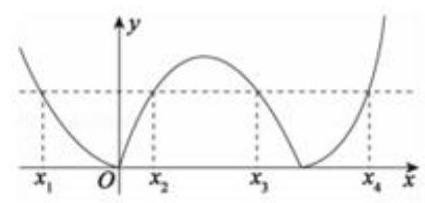

A. $\frac{3}{5}$ B. $\frac{4}{5}$ C. 1

D. $\frac{6}{5}$

【难度】 $\star   \star   \star   \star$

【答案】见解析

【解析】解: 由函数的解析式可知函数的对称轴为 $x = 1$ ,

不妨设 ${x}_{1} = 1 - {3a},{x}_{2} = 1 - a,{x}_{3} = 1 + a,{x}_{4} = 1 + {3a}\left( {a > 0}\right)$ ,

由 $f\left( {x}_{4}\right)  = f\left( {x}_{3}\right)$ 可得: $\left| {\left( {1 + {3a}}\right) \left( {{3a} - 1}\right) }\right|  = \left| {\left( {1 + a}\right) \left( {a - 1}\right) }\right|$ ,

解得: ${a}^{2} = \frac{1}{5}\left( {a = 0\text{ 舍去 }}\right)$ ,则 $m = f\left( {x}_{3}\right)  = \left| {{a}^{2} - 1}\right|  = \frac{4}{5}$ . 故选: $B$ .

【例25】已知函数 $f\left( x\right)  = \left| {1 - \frac{1}{x}}\right| \left( {x > 0}\right)$ ,若关于 $x$ 的方程 ${\left\lbrack  f\left( x\right) \right\rbrack  }^{2} + {mf}\left( x\right)  + {2m} + 3 = 0$ 有三个不相等的实数解,则实数 $m$ 的取值范围为___

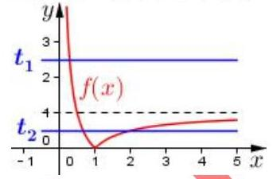

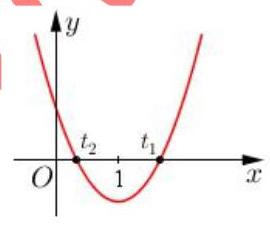

【难度】 $\star   \star   \star   \star$

【答案】 $- \frac{3}{2} < m \leq   - \frac{4}{3}$

【解析】 $\left( {-\frac{3}{2}, - \frac{4}{3}}\right\rbrack$ ,设 $f\left( x\right)  = t,\therefore {t}^{2} + {mt} + {2m} + 3 = 0$ ,数形结合两种情况: ① ${t}_{1} = 0$ , $0 < {t}_{2} < 1$ ,代入 ${t}_{1} = 0$ ,此时 ${2m} + 3 = 0, m =  - \frac{3}{2},{t}_{2} = \frac{3}{2}$ ,不符; ② ${t}_{1} \geq  1,0 < {t}_{2} < 1$ , 二次函数如图所示,设 $g\left( t\right)  = {t}^{2} + {mt} + {2m} + 3,\therefore g\left( 0\right)  > 0, g\left( 1\right)  \leq  0$ ,得 $- \frac{3}{2} < m \leq   - \frac{4}{3}$ .

【例 26】如果一个多边形的所有顶点均在某个函数的图象上, 那么称此多边形为该函数的内接多边形. 设函数 ${f}_{1}\left( x\right)  = {x}^{3} - {x}^{2} - {4x} - 1,{f}_{2}\left( x\right)  = {x}^{2} - \frac{x}{2} + 2$ ,若四边形 ${ABCD}$ 为函数 $y = {f}_{1}\left( x\right)  + {f}_{2}\left( x\right)$ 的内接正方形,则此正方形的面积为( )

A. 15 或 7 B. 10 或 7 C. 10 或 17 D. 15 或 17

【难度】 $\star   \star   \star   \star$

【答案】 $C$

【解析】解: 令 $f\left( x\right)  = {f}_{1}\left( x\right)  + {f}_{2}\left( x\right)$ ,则 $f\left( x\right)  = {x}^{3} - \frac{9}{2}x + 1$ ,

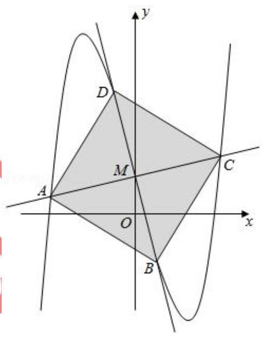

解: 由 $f\left( x\right)  + f\left( {-x}\right)  = 2$ ,得函数 $f\left( x\right)$ 关于点 $M\left( {0,1}\right)$ 中心对称,显然该正

方形 ${ABCD}$ 的中心为 $M$ ,

由正方形性质可知, ${AC} \bot  {BD}$ 于 $M$ ,且 $\left| {AM}\right|  = \left| {BM}\right|  = \left| {CM}\right|  = \left| {DM}\right|$ ,

设直线 ${AC}$ 的方程为 $y = {kx} + 1\left( {k > 0}\right)$ ,则直线 ${BD}$ 的方程为 $y =  - \frac{1}{k}x + 1$ ,

设 $A\left( {{x}_{1},{y}_{1}}\right) , B\left( {{x}_{2},{y}_{2}}\right)$ ,则 $C\left( {-{x}_{1},2 - {y}_{1}}\right) , D\left( {-{x}_{2},2 - {y}_{2}}\right)$ ,

联立直线 ${AC}$ 方程与函数 $y = f\left( x\right)$ 得 $\left\{  \begin{array}{l} y = {kx} + 1 \\  y = {x}^{3} - \frac{9}{2}x + 1 \end{array}\right.$ ,即 ${x}^{3} - \left( {k + \frac{9}{2}}\right) x = 0$ , $\therefore {x}_{1}^{2} = k + \frac{9}{2}$ ,同理 ${x}_{2}^{2} = \frac{9}{2} - \frac{1}{k}$ ,

又 $\left| {AM}\right|  = \sqrt{1 + {k}^{2}}\left| {{x}_{1} - 0}\right| ,\left| {BM}\right|  = \sqrt{1} + \frac{1}{{k}^{2}}\left| {{x}_{2} - 0}\right|$ ,

$\left( {1 + {k}^{2}}\right) \left( {k + \frac{9}{2}}\right)  = \left( {1 + \frac{1}{{k}^{2}}}\right) \left( {\frac{9}{2} - \frac{1}{k}}\right)$ ,即 ${k}^{2} + \frac{1}{{k}^{2}} + \frac{9}{2}\left( {k - \frac{1}{k}}\right)  = 0$

化简得 $2{\left( k - \frac{1}{k}\right) }^{2} + 9\left( {k - \frac{1}{k}}\right)  + 4 = 0$ ,

$\therefore k - \frac{1}{k} =  - 4$ 或 $k - \frac{1}{k} =  - \frac{1}{2}$ ,

$\therefore k + \frac{1}{k} = \sqrt{{\left( k - \frac{1}{k}\right) }^{2} + 4} = 2\sqrt{5}$ 或 $\frac{\sqrt{17}}{2}$ ,

$\therefore {S}_{\text{ 正方形 }{ABCD}} = 2\left| {AM}\right| \left| {BM}\right|  = 2\sqrt{1 + {k}^{2}} \cdot  \sqrt{1 + \frac{1}{{k}^{2}}} \cdot  \left| {{x}_{1}{x}_{2}}\right|  = 2\left( {k + \frac{1}{k}}\right)  \cdot  \sqrt{\left( {k + \frac{9}{2}}\right) \left( {\frac{9}{2} - \frac{1}{k}}\right) } = 2\left( {k + \frac{1}{k}}\right)  \cdot  \sqrt{\frac{9}{2}\left( {k - \frac{1}{k}}\right)  + \frac{77}{4}} = {10}$ 或 17.

故选: $C$ .

## 巩固训练

1、已知函数 $f\left( x\right)  = m \cdot  {2}^{x} + {x}^{2} + {nx}$ ,记集合 $A = \{ x \mid  f\left( x\right)  = 0, x \in  \mathbf{R}\}$ ,集合 $B = \{ x \mid  f\left\lbrack  {f\left( x\right) }\right\rbrack   = 0, x \in  \mathbf{R}\}$ , 若 $A = B$ ，且都不是空集，则 $m + n$ 的取值范围是( )

A. $\lbrack 0,4)$ B. $\left\lbrack  {-1,4}\right)$ C. $\left\lbrack  {-3,5}\right\rbrack$ D. $\lbrack 0,7)$

【难度】 $\star   \star   \star$

【答案】A

【解析】设 ${x}_{0} \in  A,\therefore f\left( {x}_{0}\right)  = 0,\because A = B,\therefore {x}_{0} \in  B,\therefore f\left\lbrack  {f\left( {x}_{0}\right) }\right\rbrack   = 0$ ,即 $f\left( 0\right)  = 0$ ,

$\therefore m = 0, f\left( x\right)  = {x}^{2} + {nx}$ . 当 $n = 0, A = B = \{ 0\}$ ,符合题意. 当 $n \neq  0, A = \{ 0, - n\}$ ,

$B = \{ x \mid  f\left( x\right)  = 0, f\left( x\right)  =  - n, x \in  \mathbf{R}\} ,\because A = B,\therefore f\left( x\right)  =  - n$ 无解,即 ${x}^{2} + {nx} + n = 0$ 无解,

$\Delta  = {n}^{2} - {4n} < 0 \Rightarrow  0 < n < 4,\because m = 0,\therefore$ 综上所述, $m + n \in  \lbrack 0,4)$ ,故选 A.

2、若 $a, b$ 是正数,且满足 ${ab} = a + b + 3$ ,求 ${ab}$ 的取值范围.

【难度】 $\star   \star   \star$

【答案】 $\lbrack 9, + \infty )$

【解析】方法一: (看成函数的值域) $\because {ab} = a + b + 3,\therefore a \neq  1,\therefore b = \frac{a + 3}{a - 1}$ ,而 $b > 0,\therefore \frac{a + 3}{a - 1} > 0$ ,

即 $a > 1$ 或 $a <  - 3$ . 又 $a > 0,\therefore a > 1$ ,故 $a - 1 > 0$ .

$\therefore {ab} = a \cdot  \frac{a + 3}{a - 1} = \frac{{\left( a - 1\right) }^{2} + 5\left( {a - 1}\right)  + 4}{a - 1} = a - 1 + \frac{4}{a - 1} + 5 \geq  9$

当且仅当 $a - 1 = \frac{4}{a - 1}$ ,即 $a = 3$ 时取等号. 又 $a > 3$ 时, $a - 1 + \frac{4}{a - 1} + 5$ 是关于 $a$ 的单调增函数,

$\therefore {ab}$ 的取值范围是 $\lbrack 9, + \infty )$ .

方法二: 若设 ${ab} = t$ ,则 $a + b = t - 3,\therefore a, b$ 可看成方程 ${x}^{2} - \left( {t - 3}\right) x + t = 0$ 的两个. 正根

从而有 $\left\{  {\begin{matrix} \Delta  = {\left( t - 3\right) }^{2} - {4t} \geq  0 \\  a + b = t - 3 > 0 \\  {ab} = t > 0 \end{matrix} \Rightarrow  \left\{  \begin{matrix} t \leq  1\text{ 或 }t \geq  9 \\  t > 3 \\  t > 0 \end{matrix}\right. }\right.  \Rightarrow  t \geq  9$ ,即 ${ab} \geq  9$ .

3、已知函数 $f\left( x\right)  = \left( {{x}^{2} + {8x} + {15}}\right) \left( {a{x}^{2} + {bx} + c}\right)$ ( $a, b, c \in  \mathbf{R}$ )是偶函数，若方程 $a{x}^{2} + {bx} + c = 1$ 在区间 $\left\lbrack  {1,2}\right\rbrack$ 上有解,则实数 $a$ 的取值范围是___

【难度】 $\star   \star   \star   \star$

【答案】 $\left\lbrack  {\frac{1}{8},\frac{1}{3}}\right\rbrack$

【解析】展开后,奇次项有 $\left( {{8a} + b}\right) {x}^{3}\text{ 、 }\left( {{8c} + {15b}}\right) x,\therefore {8a} + b = 0$ ,

${8c} + {15b} = 0,\therefore b =  - {8a}, c = {15a}$ ,方程 $a{x}^{2} + {bx} + c = 1$ ,即 $a\left( {x - 3}\right) \left( {x - 5}\right)  = 1$ ,

$\because x \in  \left\lbrack  {1,2}\right\rbrack  ,\therefore \left( {x - 3}\right) \left( {x - 5}\right)  = \frac{1}{a} \in  \left\lbrack  {3,8}\right\rbrack$ ,即 $a \in  \left\lbrack  {\frac{1}{8},\frac{1}{3}}\right\rbrack$ .

4、设 $x, y \in  R$ ,满足 $\left\{  \begin{array}{l} {\left( x - 1\right) }^{5} + {2x} + \sin \left( {x - 1}\right)  = 3 \\  {\left( y - 1\right) }^{5} + {2y} + \sin \left( {y - 1}\right)  = 1 \end{array}\right.$ ,则 $x + y =$ (   )

A. 0 B. 2 C. 4 D. 6

【难度】 $\star   \star   \star   \star$

【答案】 $B$

【解析】解: $\because {\left( x - 1\right) }^{5} + {2x} + \sin \left( {x - 1}\right)  = 3,\therefore {\left( x - 1\right) }^{5} + 2\left( {x - 1}\right)  + \sin \left( {x - 1}\right)  = 3 - 2 = 1$ ,

$\because {\left( y - 1\right) }^{5} + {2y} + \sin \left( {y - 1}\right)  = 1,\therefore {\left( y - 1\right) }^{3} + 2\left( {y - 1}\right)  + \sin \left( {y - 1}\right)  = 1 - 2 =  - 1$ ,

设 $f\left( t\right)  = {t}^{5} + {2t} + \sin t$ ,则 $f\left( t\right)$ 为奇函数,且 ${f}^{\prime }\left( t\right)  = 5{t}^{4} + 2 + \cos t > 0$ ,

即函数 $f\left( t\right)$ 单调递增. 由题意可知 $f\left( {x - 1}\right)  = 1, f\left( {y - 1}\right)  =  - 1$ ,即 $f\left( {x - 1}\right)  + f\left( {y - 1}\right)  = 1 - 1 = 0$ ,

即 $f\left( {x - 1}\right)  =  - f\left( {y - 1}\right)  = f\left( {1 - y}\right) ,\because$ 函数 $f\left( t\right)$ 单调递增 $\therefore x - 1 = 1 - y$ ,即 $x + y = 2$ ,故选: $B$ .

5、如果关于 $x$ 的方程 $\left| {{x}^{2} - {2x} - 3 + a}\right|  = {a}^{2} - 6$ 恰好有两个相异实根,求 $a$ 的取值范围.

【难度】 $\star   \star   \star   \star$

【答案】 $\left( {-\infty , - 3}\right) \bigcup \left( {3, + \infty }\right) \bigcup \{  - \sqrt{6}\}$

【解析】解: 令函数 $f\left( x\right)  = \left| {{x}^{2} - {2x} + 1 + a}\right|$ ,函数 $g\left( x\right)  = {x}^{2} - {2x} + 1 + a$ 的图象是开口向上,顶点坐标为 $\left( {1, a}\right)$ 的抛物线,

若 $a \geq  0$ ,水平直线 $y = {a}^{2} - 6$ 与抛物线 $y = {x}^{2} - {2x} + 1 + a$ 有两个不同的交点,则 $\left\{  \begin{array}{l} a \geq  0 \\  {a}^{2} - 6 > a \end{array}\right.$ ,解得 $a > 3$ . 若 $a < 0$ ,则函数 $y = \left| {{x}^{2} - {2x} + 1 + a}\right|$ 的图象如图所示,

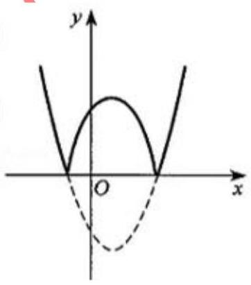

水平直线 $y = {a}^{2} - 6$ 与函数 $y = \left| {{x}^{2} - {2x} + 1 + a}\right|$ 的图象有两个不同的交点,

其条件为 $\left\{  \begin{array}{l} a < 0 \\  {a}^{2} - 6 >  - a \end{array}\right.$ 或 ${a}^{2} - 6 = 0$ ,解得 $a <  - 3$ 或 $a =  - \sqrt{6}$

所以常数 $a$ 的取值范围是 $\left( {-\infty , - 3}\right) \bigcup \left( {3, + \infty }\right) \bigcup \{  - \sqrt{6}\}$ .

6、已知函数 $f\left( x\right)  = \left| {x + 1}\right|  + \left| {x + 2}\right|  + \cdots  + \left| {x + {2021}}\right|  + \left| {x - 1}\right|  + \left| {x - 2}\right|  + \cdots  + \left| {x - {2021}}\right| \left( {x \in  R}\right)$ ,且实数 $a$ 满足 $f\left( {{a}^{2} - a - 2}\right)  = f\left( {a + 1}\right)$ ，则实数 $a$ 的取值范围为 ( )

A. $a = 3$ 或 $a = 1$ 或 $\frac{1 - \sqrt{13}}{2} \leq  a \leq  \frac{1 - \sqrt{5}}{2}$ B. $a = 3$ 或 $a = 1$

C. $a = 3$ 或 $a =  - 1$ D. $a = 3$ 或 $a = 1$ 或 $a =  - 1$

【难度】 $\star   \star   \star   \star$

【答案】 $A$

【解析】解: 因为函数 $f\left( x\right)  = \left| {x + 1}\right|  + \left| {x + 2}\right|  + \cdots  + \left| {x + {2021}}\right|  + \left| {x - 1}\right|  + \left| {x - 2}\right|  + \cdots  + \left| {x - {2021}}\right| \left( {x \in  R}\right)$ , 当 $x < a$ 时, $\left| {x - a}\right|  =  - x + a$ ,当 $x > a$ 时, $\left| {x - a}\right|  = x - a$ ,

$\therefore$ 当 $a <  - 1$ 时,函数 $f\left( x\right)$ 的解析式中一次项系数为负 (去绝对值时 $x$ 的系数为 -1 的式子个数多于系数为 1 的),同理,当 $- 1 \leq  a \leq  1$ 时,函数 $f\left( x\right)$ 的解析式中一次项系数为 0 (此时函数为常数函数),

当 $a > 1$ 时,函数 $f\left( x\right)$ 的解析式中一次项系数为正,

故函数 $f\left( x\right)  = \left| {x - {2012}}\right|  + \ldots  + \left| {x - 2}\right|  + \left| {x - 1}\right|  + \left| {x + 1}\right|  + \left| {x + 2}\right|  + \ldots  + \left| {x + {2012}}\right|$ 在 $( - \infty , - 1\rbrack$ 上递减,在 $\left\lbrack  {-1,1}\right\rbrack$ 上不具单调性,在 $\lbrack 1, + \infty )$ 上递增,

因为 $f\left( {-x}\right)  = \left| {-x - {2012}}\right|  + \ldots  + \left| {-x - 2}\right|  + \left| {-x - 1}\right|  + \left| {-x + 1}\right|  + \left| {-x + 2}\right|  + \ldots  + \left| {-x + {2012}}\right|$

$= \left| {x + {2012}}\right|  + \ldots  + \left| {x + 2}\right|  + \left| {x + 1}\right|  + \left| {x - 1}\right|  + \left| {x - 2}\right|  + \ldots  + \left| {x - {2012}}\right|  = f\left( x\right)$ ,故函数 $f\left( x\right)$ 为偶函数,因为 $f\left( {{a}^{2} - a - 2}\right)  = f\left( {a + 1}\right)$ ,则 $\left| {{a}^{2} - {2a} - 2}\right|  = \left| {a + 1}\right|$ ,

所以 ${a}^{2} - {2a} - 2 = a + 1$ 或 ${a}^{2} - {2a} - 2 =  - a - 1$ ,解得 $a =  - 1$ 或 $a = 3$ 或 $a = 1$ ,

当 $- 1 \leq  x \leq  1$ 时, $f\left( x\right)$ 为常数函数,因为 $f\left( {{a}^{2} - a - 2}\right)  = f\left( {a + 1}\right)$ ,

则 $\left\{  \begin{array}{l}  - 1 \leq  {a}^{2} - a - 2 \leq  1 \\   - 1 \leq  a + 1 \leq  2 \end{array}\right.$ ,解得 $\frac{1 - \sqrt{13}}{2} \leq  a \leq  \frac{1 - \sqrt{15}}{2}$ ,综上所述, $a = 1$ 或 $a = 3$ 或 $\frac{1 - \sqrt{13}}{2} \leq  a \leq  \frac{1 - \sqrt{15}}{2}$ . 故选: $A$ .

7、设函数 $f\left( x\right)  = \left| {\frac{2}{x} - {ax} + 5}\right| \left( {a \in  \mathbf{R}}\right)$ .

(1)求函数的零点；

(2)当 $a = 3$ 时，求证: $f\left( x\right)$ 在区间 $\left( {-\infty , - 1}\right)$ 上单调递减；

(3)若对任意的正实数 $a$ ，总存在 ${x}_{0} \in  \left\lbrack  {1,2}\right\rbrack$ ，使得 $f\left( {x}_{0}\right)  \geq  m$ ，求实数 $m$ 的取值范围.

【难度】 $\star   \star   \star   \star$

【答案】见解析

【解析】(1) ① 当 $a = 0$ 时,函数的零点为 $x =  - \frac{2}{5}$ ;

② 当 $a \geq   - \frac{25}{8}$ 且 $a \neq  0$ 时，函数的零点是 $x = \frac{5 \pm  \sqrt{{25} + {8a}}}{2a}$ ；

③ 当 $a <  - \frac{25}{8}$ 时，函数无零点；

(2)当 $a = 3$ 时， $f\left( x\right)  = \frac{2}{x} - {3x} + 5$ ，令 $g\left( x\right)  = \frac{2}{x} - {3x} + 5$

任取 ${x}_{1},{x}_{2} \in  \left( {-\infty , - 1}\right)$ ,且 ${x}_{1} < {x}_{2}$ ,

则 $g\left( {x}_{1}\right)  - g\left( {x}_{2}\right)  = \frac{2}{{x}_{1}} - 3{x}_{1} + 5 - \left( {\frac{2}{{x}_{2}} - 3{x}_{2} + 5}\right)  = \frac{\left( {{x}_{2} - {x}_{1}}\right) \left( {2 + 3{x}_{1}{x}_{2}}\right) }{{x}_{1}{x}_{2}}$

因为 ${x}_{1} < {x}_{2},{x}_{1},{x}_{2} \in  \left( {-\infty , - 1}\right)$ ,所以 ${x}_{2} - {x}_{1} > 0,{x}_{1}{x}_{2} > 1$ ,从而 $\frac{\left( {{x}_{2} - {x}_{1}}\right) \left( {2 + 3{x}_{1}{x}_{2}}\right) }{{x}_{1}{x}_{2}} > 0$

即 $g\left( {x}_{1}\right)  - g\left( {x}_{2}\right)  > 0 \Rightarrow  g\left( {x}_{1}\right)  > g\left( {x}_{2}\right)$ 故 $g\left( x\right)$ 在区间 $\left( {-\infty , - 1}\right)$ 上的单调递减

当 $x \in  \left( {-\infty , - 1}\right)$ 时, $g\left( x\right)  \in  \left( {6, + \infty }\right) \therefore f\left( x\right)  = \left| {\frac{2}{x} - {3x} + 5}\right|  = \frac{2}{x} - {3x} + 5 = g\left( x\right)$

即当 $a = 3$ 时， $f\left( x\right)$ 在区间 $\left( {-\infty , - 1}\right)$ 上单调递减；

(3)对任意的正实数 $a$ ，存在 ${x}_{0} \in  \left\lbrack  {1,2}\right\rbrack$ 使得 $f\left( {x}_{0}\right)  \geq  m$ ，即 $f{\left( {x}_{0}\right) }_{\max } \geq  m$ ，

当 $x \in  \left( {0, + \infty }\right)$ 时,

$f\left( x\right)  = \left| {\frac{2}{x} - {ax} + 5}\right|  = \left\{  \begin{array}{ll} \frac{2}{x} - {ax} + 5, & 0 < x < \frac{5 + \sqrt{{25} + {8a}}}{2a} \\   - \frac{2}{x} + {ax} - 5, & x \geq  \frac{5 + \sqrt{{25} + {8a}}}{2a} \end{array}\right.$

即 $f\left( x\right)$ 在区间 $\left( {0,\frac{5 + \sqrt{{25} + {8a}}}{2a}}\right)$ 上单调递减,在区间 $\left( {\frac{5 + \sqrt{{25} + {8a}}}{2a}, + \infty }\right)$ 上单调递增;

所以 $f{\left( {x}_{0}\right) }_{\max } = \max \{ f\left( 1\right) , f\left( 2\right) \}  = \max \{ \left| {7 - a}\right| ,\left| {6 - {2a}}\right| \}$ ,

又由于 $a > 0,\max \{ \left| {7 - a}\right| ,\left| {6 - {2a}}\right| \}  \geq  \frac{8}{3}$ ,所以 $m \leq  \frac{8}{3}$ .
