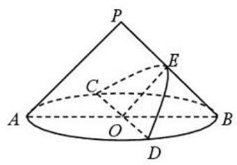
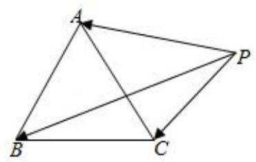
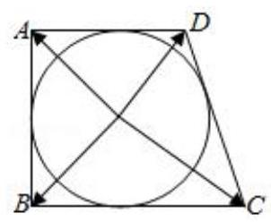
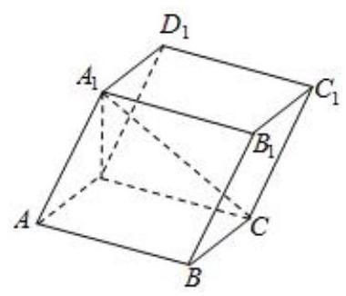
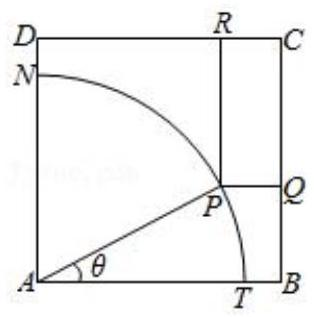
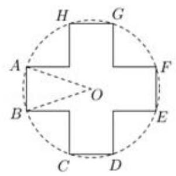
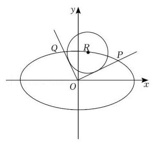

## 第 2 课:数形结合思想

<table><tr><td>教学目标</td><td>1、掌握常见数形结合思想的应用情境;   2、具有自觉转化数与形的意识；   3、探索数形转化的创新应用</td></tr><tr><td>重点</td><td>1、数学结合思想的常见应用；   2、数学结合思想的灵活应用</td></tr><tr><td>难 点</td><td>数形结合思想的灵活应用</td></tr></table>

## 知识梳理

数形结合是中学数学中四种重要思想方法之一, 对于所研究的代数问题, 有时可研究其对应几何的性质使问题得以解决 (以形助数); 或者对于所研究的几何问题, 可借助于对应图形的数量关系使问题得以解决 (以数助形), 这种解决问题的方法称之为数形结合.

我国著名数学家华罗庚曾写过关于数形结合的一首词:

数与形, 本是相倚依, 焉能分作两边飞。

数缺形时少知觉，形少数时难入微。

数形结合百般好，隔裂分家万事非。

切莫忘，几何代数统一体，

永远联系，切莫分离。

几何图形的形象直观, 便于理解, 代数方法具有一般性, 解题过程的机械化, 可操作性强, 便于把握, 因此数形结合思想是数学中重要的思想方法. 所谓数形结合就是根据数学问题的题设和结论之间的内在联系, 既分析其数量关系, 又揭示其几何意义使数量关系和几何图形巧妙地结合起来, 并充分地利用这种结合, 探求解决问题的思路, 使问题得以解决的思考方法.

## (一) 代数问题转化成图形问题

## 知识梳理

## 常见的转化有:

①将集合关系利用文氏图或者函数图像或者曲线图像进行转化；

②不等式的有解性和恒成立问题可以通过函数图像或曲线图像进行转化；

③通过特定的数学概念或数学式的几何意义进行转化(如绝对值、斜率、距离公式等)；

④方程的解通过函数图像进行转化;

⑤利用曲线与方程的对应关系进行转化；

⑥利用复数和向量的几何意义进行转化；

⑦利用数列的函数性质进行转化。

## 例题精讲

【例 1】已知 $A = \{ \left( {x, y}\right) \left| \right| x\left| { \leq  1,}\right| y \mid   \leq  1\} , B = \left\{  {\left( {x, y}\right)  \mid  {\left( x - a\right) }^{2} + {\left( y - a\right) }^{2} \leq  1, a \in  R}\right\}$ ,若 $A \cap  B \neq  \varnothing$ ,则 $a$ 的取值范围是___。

【例 2】函数 $f\left( x\right)  = \sin {\omega x}\;\left( {\omega  > 0}\right)$ 的图像与其对称轴在 $y$ 轴右侧的交点从左到右依次记为 ${A}_{1},{A}_{2},{A}_{3},\cdots ,{A}_{n},\cdots$ ,在点列 $\left\{  {A}_{n}\right\}$ 中存在三个不同的点 ${A}_{k}\text{ 、 }{A}_{i}\text{ 、 }{A}_{p}$ ,使得 $\bigtriangleup {A}_{k}{A}_{i}{A}_{p}$ 是等腰直角三角形，将满足上述条件的 $\omega$ 值从小到大组成的数列记为 $\left\{  {\omega }_{n}\right\}$ ，则 ${\omega }_{2019} =$ ___

【例 3】已知 $M = \frac{{a}^{2} - a\sin \theta  + 1}{{a}^{2} - a\cos \theta  + 1}\left( {a,\theta  \in  \mathbf{R}, a \neq  0}\right)$ ，则 $M$ 的取值范围是___

【例4】若 $M\text{ 、 }N$ 两点分别在函数 $y = f\left( x\right)$ 与 $y = g\left( x\right)$ 的图像上,且关于直线 $x = 1$ 对称,则称 $M\text{ 、 }N$ 是 $y = f\left( x\right)$ 与 $y = g\left( x\right)$ 的一对 “伴点” ( $M\text{ 、 }N$ 与 $N\text{ 、 }M$ 视为相同的一对)。已知 $f\left( x\right)  = \left\{  {\begin{array}{l}  - \sqrt{2 - x}\left( {x < 2}\right) \\  \sqrt{4 - {\left( x - 4\right) }^{2}}\left( {x \geq  2}\right)  \end{array}, g\left( x\right)  = \left| {x + a}\right|  + 1}\right.$ 若 $y = f\left( x\right)$ 与 $y = g\left( x\right)$ 存在两对 “伴点”,则实数 $a$ 的取值范围为___.

【例 5 】已知函数 $f\left( x\right)  = \left| {1 - \frac{1}{x}}\right| \left( {x > 0}\right)$ ,若关于 $x$ 的方程 ${\left\lbrack  f\left( x\right) \right\rbrack  }^{2} + {mf}\left( x\right)  + {2m} + 3 = 0$ 有三个不相等的实数解,则实数 $m$ 的取值范围为___

【例 6】已知定义在 $\mathbf{R}$ 上的奇函数 $f\left( x\right)$ 满足: $f\left( {x + 2}\right)  =  - f\left( x\right)$ ,且当 $0 \leq  x \leq  1$ 时, $f\left( x\right)  = {\log }_{2}\left( {x + a}\right)$ , 若对于任意 $x \in  \left\lbrack  {0,1}\right\rbrack$ ，都有 $f\left( {-{x}^{2} + {tx} + \frac{1}{2}}\right)  \geq  1 - {\log }_{2}3$ ，则实数 $t$ 的取值范围为___

【例 7】设函数 ${f}_{a}\left( x\right)  = \left| x\right|  + \left| {x - a}\right|$ ,当 $a$ 在实数范围内变化时,在圆盘 ${x}^{2} + {y}^{2} \leq  1$ 内,且不在任一 ${f}_{a}\left( x\right)$ 的图像上的点的全体组成的图形的面积为___

【例 8】等差数列 ${a}_{1},{a}_{2},\cdots ,{a}_{n}\left( {n \geq  3, n \in  {\mathbf{N}}^{ * }}\right.$ ) 满足 $\left| {a}_{1}\right|  + \left| {a}_{2}\right|  + \cdots  + \left| {a}_{n}\right|  = \left| {{a}_{1} + 1}\right|  + \left| {{a}_{2} + 1}\right| \; + \cdots  + \left| {{a}_{n} + 1}\right|  = \left| {{a}_{1} - 2}\right|  + \left| {{a}_{2} - 2}\right|  + \cdots  + \left| {{a}_{n} - 2}\right|  = {2019}$ ,则 ( )

A. $n$ 的最大值为 50 B. $n$ 的最小值为 50

C. $n$ 的最大值为 51 D. $n$ 的最小值为 51

【例 9】已知 $\overrightarrow{{a}_{1}},\overrightarrow{{a}_{2}},\overrightarrow{{b}_{1}},\overrightarrow{{b}_{2}},\ldots ,\overrightarrow{{b}_{k}}\left( {k \in  {N}^{ * }}\right)$ 是平面内两两互不相等的向量,满足 $\left| {\overrightarrow{{a}_{1}} - \overrightarrow{{a}_{2}}}\right|  = 1$ ,且 $\left| {\overrightarrow{{a}_{i}} - \overrightarrow{{b}_{j}}}\right|  \in  \{ 1$ , 2\}(其中 $i = 1,2, j = 1,2,\ldots , k)$ ，则 $k$ 的最大值是___.

【例 10】已知复数集合 $A = \left\{  {x + y\mathrm{i}\left| \right| x \mid   \leq  1,\left| y\right|  \leq  1, x, y \in  \mathbf{R}}\right\}  , B = \left\{  {{z}_{2} \mid  {z}_{2} = \left( {\frac{3}{4} + \frac{3}{4}\mathrm{i}}\right) {z}_{1},{z}_{1} \in  A}\right\}$ ,其中 $\mathrm{i}$ 为虚数单位,若复数 $z \in  A \cap  B$ ,则 $z$ 对应的点 $Z$ 在复平面内所形成图形的面积为___

【例 11】在三棱锥 $P - {ABC}$ 中,三条侧棱 ${PA},{PB},{PC}$ 两两垂直,且 ${PA} = {PB} = 3,{PC} = 4$ ,又 $M$ 是底面 ${ABC}$ 内一点,则 $M$ 到三个侧面的距离的平方和的最小值是___.

## 巩固训练

1、已知函数 $f\left( x\right)  = \left| \frac{1}{\left| x\right|  - 1}\right|$ ，关于 $x$ 的方程 ${f}^{2}\left( x\right)  + {bf}\left( x\right)  + c = 0$ 有 7 个不同实数根，则实数 $b$ 、 $c$ 满足的关系式是___

2、已知向量 $\overrightarrow{a} = \left( {\cos \alpha ,\sin \alpha }\right) ,\overrightarrow{b} = \left( {\cos \beta ,\sin \beta }\right)$ ，且 $\alpha  - \beta  = \frac{\pi }{3}$ ，若向量 $\overrightarrow{c}$ 满足 $\left| {\overrightarrow{c} - \overrightarrow{a} - \overrightarrow{b}}\right|  = 1$ ，则 $\left| \overrightarrow{c}\right|$ 的最大值为___

3、已知定义域为 $R$ 的函数 $y = f\left( x\right)$ 满足 $f\left( {x + 2}\right)  = f\left( x\right)$ ，且 $- 1 \leq  x < 1$ 时， $f\left( x\right)  = 1 - {x}^{2}$ ，函数 $g\left( x\right)  = \left\{  \begin{array}{l} \lg \left| x\right| , x \neq  0 \\  1, x = 0 \end{array}\right.$ ,若 $F\left( x\right)  = f\left( x\right)  - g\left( x\right)$ ,则 $x \in  \left\lbrack  {-5,{10}}\right\rbrack$ ,函数 $F\left( x\right)$ 零点的个数是___

4、求 $y = \sqrt{x + 1} - \sqrt{x - 1}$ 的值域。

5、已知 ${AB}$ 为单位圆 $O$ 的一条弦， $P$ 为单位圆 $O$ 上的点，若 $f\left( \lambda \right)  = \left| {\overrightarrow{AP} - \lambda \overrightarrow{AB}}\right| \left( {\lambda  \in  R}\right)$ 的最小值为 $m$ ， 当点 $P$ 在单位圆上运动时， $m$ 的最大值为 $\frac{4}{3}$ ，则线段 ${AB}$ 长度为___

6、设 $f\left( x\right) , g\left( x\right)$ 是定义在 $R$ 上的两个周期函数， $f\left( x\right)$ 周期为 $4, g\left( x\right)$ 的周期为2，且 $f\left( x\right)$ 是奇函数. 当 $x \in  (0$ ， 2] 时, $f\left( x\right)  = \sqrt{1 - {\left( x - 1\right) }^{2}}, g\left( x\right)  = \left\{  \begin{array}{l} k\left( {x + 2}\right) ,0 < x \leq  1 \\   - \frac{1}{2},1 < x \leq  2 \end{array}\right.$ ,其中 $k > 0$ . 若在区间 $(0,9\rbrack$ 上,关于 $x$ 的方程 $f\left( x\right)  = g\left( x\right)$ 有 8 个不同的实数根,则 $k$ 的取值范围是(   )

A. $\left( {0,\frac{\sqrt{2}}{4}}\right)$ B. $\left( {\frac{1}{3},\frac{\sqrt{2}}{4}}\right)$ C. $\left\lbrack  {\frac{1}{3},\frac{\sqrt{2}}{4}}\right)$ D. $\left\lbrack  {\frac{1}{3},\frac{\sqrt{2}}{4}}\right\rbrack$

7、已知函数 $f\left( x\right)  = \left\{  \begin{array}{l}  - {2}^{-x} + 1, x \leq  0 \\  f\left( {x - 1}\right) , x > 0 \end{array}\right.$ ,若方程 $f\left( x\right)  = {\log }_{a}\left( {x + 2}\right) \left( {0 < a < 1}\right)$ 有且仅有两个不同的实数根,则实数 $a$ 的取值范围为___.

8、已知 $\theta  > 0$ ，存在实数 $\varphi$ ，使得对任意 $n \in  {N}^{ * }$ ， $\cos \left( {{n\theta } + \varphi }\right)  < \frac{\sqrt{3}}{2}$ ，则 $\theta$ 的最小值是___.

9、已知 $f\left( x\right)  = \frac{2}{x - 1} - a \mid  \left( {x > 1, a > 0}\right)$ ， $f\left( x\right)$ 与 $x$ 轴交点为 $A$ ，若对于图象上任意一点 $P$ ，在其图象上总存在另一点 $Q\left( {P\text{ 、 }Q\text{ 异于 }A}\right)$ ,满足 ${AP} \bot  {AQ}$ ,且 $\left| {AP}\right|  = \left| {AQ}\right|$ ,则 $a =$ ___.

## (二)几何问题转化成代数

## 知识梳理

## 常见的转化有:

①不等式问题中的图像问题可以向函数转化;

②平面几何图形中的角度、距离等问题可以向函数转化;

③几何问题中的交点问题可以向方程转化;

④借助于运算结果与几何定理的结合;

⑤空间图形向平面图形转化进而转化为代数运算。

## 例题精讲

【例 12】已知函数 $y = f\left( x\right)$ 与 $y = g\left( x\right)$ 的图像关于 $y$ 轴对称,当函数 $y = f\left( x\right)$ 与 $y = g\left( x\right)$ 在区间 $\left\lbrack  {a, b}\right\rbrack$ 上同时递增或同时递减时,把区间 $\left\lbrack  {a, b}\right\rbrack$ 叫做函数 $y = f\left( x\right)$ 的 “不动区间”,若区间 $\left\lbrack  {1,2}\right\rbrack$ 为函数 $y = \left| {{2}^{x} - t}\right|$ 的 “不动区间”，则实数 $t$ 的取值范围是___

【例 13】正方形 ${ABCD}$ 的边长为 4, $O$ 是正方形 ${ABCD}$ 的中心,过中心 $O$ 的直线 $I$ 与边 ${AB}$ 交于点 $M$ ,与边 ${CD}$ 交于点 $N, P$ 为平面上一点，满足 $2\overrightarrow{OP} = \lambda \overrightarrow{OB} + \left( {1 - \lambda }\right) \overrightarrow{OC}$ ，则 $\overrightarrow{PM} \cdot  \overrightarrow{PN}$ 的最小值为___

【例14】若曲线 $\left| y\right|  = x + 2$ 与 $C : \frac{{x}^{2}}{4\lambda } + \frac{{y}^{2}}{4} = 1$ 恰有两个不同交点,则实数 $\lambda$ 取值范围为( )

A. $( - \infty , - 1\rbrack  \cup  \left( {1, + \infty }\right)$ B. $( - \infty , - 1\rbrack$

C. $\left( {1, + \infty }\right)$ D. $\lbrack  - 1,0) \cup  \left( {1, + \infty }\right)$

【例 15】 $\bigtriangleup {ABC}$ 中, ${BC}$ 边上的中垂线分别交 ${BC}\text{ 、 }{AC}$ 于点 $D\text{ 、 }E$ ,若 $\overrightarrow{AE} \cdot  \overrightarrow{BC} = 6,\left| \overrightarrow{AB}\right|  = 2$ , 则 ${AC} =$ ___

【例 16】如图,在底面半径和高均为 $\sqrt{2}$ 的圆锥中, ${AB}\text{ 、 }{CD}$ 是底面圆 $O$ 的两条互相垂直的直径, $E$ 是母线 ${PB}$ 的中点,已知过 ${CD}$ 与 $E$ 的平面与圆锥侧面的交线是以 $E$ 为顶点的抛物线的一部分，则该抛物线的焦点到圆锥顶点 $P$ 的距离等于( )

A. $\frac{1}{2}$ B. 1

C. $\frac{\sqrt{10}}{4}$ D. $\frac{\sqrt{5}}{2}$

巩固训练

1、关于曲线 $C : \frac{{x}^{2}}{4} + {y}^{4} = 1$ ,给出下列四个结论:

①曲线 $C$ 是椭圆；②关于坐标原点中心对称；③关于直线 $y = x$ 轴对称；④所围成封闭图形面积小于 8. 则其中正确结论的序号是 ( )

A. ②④ B. ②③④ C. ①②③④ D. ①②④

2、如图， $\bigtriangleup  {ABC}$ 是边长为 1 的正三角形，点 $P$ 在 $\bigtriangleup  {ABC}$ 所在的平面内，且 ${\left| \overrightarrow{PA}\right| }^{2} + {\left| \overrightarrow{PB}\right| }^{2} + {\left| \overrightarrow{PC}\right| }^{2} = a$ ( $a$ 为常数). 下列结论中,正确的是( )

A. 当 $0 < a < 1$ 时,满足条件的点 $P$ 有且只有一个

B. 当 $a = 1$ 时,满足条件的点 $P$ 有三个

C. 当 $a > 1$ 时,满足条件的点 $P$ 有无数个

D. 当 $a$ 为任意正实数时,满足条件的点 $P$ 是有限个

3、如图所示，半径为 1 的圆 $O$ 始终内切于直角梯形 ${ABCD}$ ，则当 ${AD}$ 的长度增加时，以下结论:① $\overrightarrow{OA} \cdot  \overrightarrow{OD}$ 越来越小; ② $\left| {\overrightarrow{OA} + \overrightarrow{OB} + \overrightarrow{OC} + \overrightarrow{OD}}\right|$ 保持不变. 它们成立的情况是 ( )

A. ①②都正确 B. ①②都错误 C. ①正确，②错误 D. ①错误，②正确

4、将等差数列 ${a}_{n} = {2n} - 1\left( {n \in  {N}^{ * }}\right)$ 中 ${n}^{2}$ 个项依次排列成下列 $n$ 行 $n$ 列的方阵，在方阵中任取一个元素，记为 ${x}_{1}$ ,划去 ${x}_{1}$ 所在的行与列,将剩下元素 按原来得位置关系组成 $\left( {n - 1}\right)$ 行 $\left( {n - 1}\right)$ 列方阵,任取其中一元素 ${x}_{2}$ ,划去 ${x}_{2}$ 所在的行与列...,将最后剩下元素记为 ${x}_{n}$ ,记 ${S}_{n} = {x}_{1} + {x}_{2}\ldots  + {x}_{n}$ 则 $\mathop{\lim }\limits_{{n \rightarrow  \infty }}\frac{{S}_{n}}{2{n}^{3} + {n}^{2}} =$ ___.

$\begin{array}{llll} 1 & 3 & 5 & \cdots {2n} - 1 \end{array}$

${2n} + 1\;{2n} + 3\;{2n} + 5\;\cdots \;{4n} - 1$

${4n} + 1\;{4n} + 3\;{4n} + 5\;\cdots \;{6n} - 1$

注 3:土 3:

$2{n}^{2} - {2n} + 1\;2{n}^{2} - {2n} + 3\;\cdots \;2{n}^{2} - 1$

5、如图，在平行六面体 ${ABCD} - {A}_{1}{B}_{1}{C}_{1}{D}_{1}$ 中， ${AD} = 1$ ， ${CD} = 2$ ， ${A}_{1}D\bot$ 平面 ${ABCD}$ ， $A{A}_{1}$ 与底面 ${ABCD}$ 所成角为 $\theta$ ,设直线 ${A}_{1}C$ 与平面 $A{A}_{1}{D}_{1}D$ 、平面 ${ABCD}$ 、平面 $A{A}_{1}{B}_{1}B$ 所成角的大小分别为 $\alpha ,\beta ,\gamma$ .

(1)若 $\angle {ADC} = {2\theta }$ ，求平行六面体 ${ABCD} - {A}_{1}{B}_{1}{C}_{1}{D}_{1}$ 的体积 $V$ 的取值范围；

(2)若 $\angle {ADC} = {2\theta }$ 且 $\theta  = \frac{\pi }{4}$ ，求 $\alpha$ ， $\beta$ ， $\gamma$ 中的最大值；

(3)若 $\angle {ADC} = \frac{\pi }{2}$ ， $g\left( \theta \right)  = \max \{ \alpha \left( \theta \right)$ ， $\left. {\beta \left( \theta \right) \text{ ， }\gamma \left( \theta \right) }\right\}$ ，(其中 $\max \{ a$ ， $b\}$ 是指 $a$ ， $b$ 中的最大的数)，求 $g\left( \theta \right)$ 的最小值.

6、如图所示, ${ABCD}$ 是一块边长为 7 米的正方形铁皮,其中 ${ATN}$ 是一半径为 6 米的扇形,已经被腐蚀不能使用,其余部分完好可利用. 工人师傅想在未被腐蚀部分截下一个有边落在 ${BC}$ 与 ${CD}$ 上的长方形铁皮 ${PQCR}$ ,其中 $P$ 是弧 ${TN}$ 上一点. 设 $\angle {TAP} = \theta$ ,长方形 ${PQCR}$ 的面积为 $S$ 平方米.

(1)求 $S$ 关于 $\theta$ 的函数解析式；

(2)求 $S$ 的最大值及此时 $\theta$ 的值.

7、如图，直径为 1 的圆 $O$ 中，作一关于圆心对称、邻边互相垂直的十字形，其中 ${AB} < {BE}$ ，设 $\angle {AOB} = \theta$ .

(1)将十字形的面积 $S$ 表示为 $\theta$ 的函数;

(2)求十字形的面积 $S$ 的最大值，并求相应 $\theta$ 的值.

8、椭圆 ${C}_{1} : \frac{{x}^{2}}{{a}^{2}} + \frac{{y}^{2}}{{b}^{2}} = 1\left( {a > b > 0}\right)$ 的焦点 ${F}_{1},{F}_{2}$ 是等轴双曲线 ${C}_{2} : \frac{{x}^{2}}{2} - \frac{{y}^{2}}{2} = 1$ 的顶点,若椭圆 ${C}_{1}$ 与双曲线 ${C}_{2}$ 的一个交点是 $P\text{ ， } \bigtriangleup  P{F}_{1}{F}_{2}$ 的周长为 $4 + 2\sqrt{2}$ .

(1)求椭圆 ${C}_{1}$ 的标准方程；

(2)点 $M$ 是双曲线 ${C}_{2}$ 上任意不同于其顶点的动点,设直线 $M{F}_{1}$ 、 $M{F}_{2}$ 的斜率分别为 ${k}_{1},{k}_{2}$ ，求证: ${k}_{1}$ ， ${k}_{2}$ 的乘积为定值;

(3)过点 $Q\left( {-4,0}\right)$ 任作一动直线 $l$ 交椭圆 ${C}_{1}$ 与 $A, B$ 两点，记 $\overrightarrow{AQ} = \lambda \overrightarrow{QB}\left( {\lambda  \in  R}\right)$ ，若在直线 ${AB}$ 上取一点 $R$ ， 使得 $\overrightarrow{AR} = \left( {-\lambda }\right) \overrightarrow{RB}$ ,试判断当直线 $l$ 运动是,点 $R$ 是否在某一定直线上运动? 若是,求出该直线的方程; 若不是, 请说明理由.

9、已知椭圆 $C : \frac{{x}^{2}}{{a}^{2}} + \frac{{y}^{2}}{{b}^{2}} = 1\left( {a > b > 0}\right)$ 的一焦点与短轴的两个端点组成的三角形是等边三角形,直线 $y = 1$ 与椭圆 $C$ 的两交点间的距离为 8 .

(1)求椭圆 $C$ 的方程；

(2)如图,设 $R\left( {{x}_{0},{y}_{0}}\right)$ 是椭圆 $C$ 上的一动点,由原点 $O$ 向圆 ${\left( x - {x}_{0}\right) }^{2} + {\left( y - {y}_{0}\right) }^{2} = 4$ 引两条切线,分别交椭圆 $C$ 于点 $P, Q$ ,若直线 ${OP},{OQ}$ 的斜率均存在,并分别记为 ${k}_{1},{k}_{2}$ ,求证: ${k}_{1} \cdot  {k}_{2}$ 为定值;

(3)在(2)的条件下，试问 ${\left| OP\right| }^{2} + {\left| OQ\right| }^{2}$ 是否为定值？若是，求出该值；若不是，请说明理由.

