## 知识梳理

## 第 2 课:数形结合思想

<table><tr><td>教学目标</td><td>1、掌握常见数形结合思想的应用情境;   2、具有自觉转化数与形的意识；   3、探索数形转化的创新应用</td></tr><tr><td>重点</td><td>1、数学结合思想的常见应用；   2、数学结合思想的灵活应用</td></tr><tr><td>难点</td><td>数形结合思想的灵活应用</td></tr></table>

数形结合是中学数学中四种重要思想方法之一, 对于所研究的代数问题, 有时可研究其对应几何的性质使问题得以解决 (以形助数); 或者对于所研究的几何问题, 可借助于对应图形的数量关系使问题得以解决 (以数助形), 这种解决问题的方法称之为数形结合.

我国著名数学家华罗庚曾写过关于数形结合的一首词:

数与形, 本是相倚依, 焉能分作两边飞。

数缺形时少知觉，形少数时难入微。

数形结合百般好，隔裂分家万事非。

切莫忘，几何代数统一体，

永远联系，切莫分离。

几何图形的形象直观，便于理解，代数方法具有一般性，解题过程的机械化，可操作性强，便于把握， 因此数形结合思想是数学中重要的思想方法. 所谓数形结合就是根据数学问题的题设和结论之间的内在联系, 既分析其数量关系, 又揭示其几何意义使数量关系和几何图形巧妙地结合起来, 并充分地利用这种结合, 探求解决问题的思路, 使问题得以解决的思考方法.

## (一)代数问题转化成图形问题

## 知识梳理

## 常见的转化有:

①将集合关系利用文氏图或者函数图像或者曲线图像进行转化；

②不等式的有解性和恒成立问题可以通过函数图像或曲线图像进行转化；

③通过特定的数学概念或数学式的几何意义进行转化(如绝对值、斜率、距离公式等)；

④方程的解通过函数图像进行转化;

⑤利用曲线与方程的对应关系进行转化；

⑥利用复数和向量的几何意义进行转化；

⑦利用数列的函数性质进行转化。

## 例题精讲

【例 1】已知 $A = \{ \left( {x, y}\right) \left| \right| x\left| { \leq  1,}\right| y \mid   \leq  1\} , B = \left\{  {\left( {x, y}\right)  \mid  {\left( x - a\right) }^{2} + {\left( y - a\right) }^{2} \leq  1, a \in  R}\right\}$ ,若 $A \cap  B \neq  \varnothing$ ,则 $a$ 的取值范围是___。

【难度】★★★★

【答案】 $- 1 - \frac{\sqrt{2}}{2} \leq  a \leq  1 + \frac{\sqrt{2}}{2}$

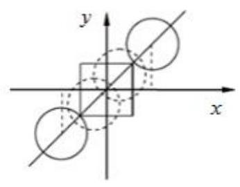

【解析】如图,集合 $\mathrm{A}$ 所表示的点为正方形的内部及其边界,集合 $\mathrm{B}$ 所表示的点为以 $\left( {a, a}\right)$ 为圆心,以 1 为半径的圆的内部及其边界,而圆心 $\left( {a, a}\right)$ 在直线 $y = x$ 上,故需要使 $A \cap  B \neq  \varnothing$ ,则 $- 1 - \frac{\sqrt{2}}{2} \leq  a \leq  1 + \frac{\sqrt{2}}{2}$ 为所求.

【例 2】函数 $f\left( x\right)  = \sin {\omega x}\;\left( {\omega  > 0}\right)$ 的图像与其对称轴在 $y$ 轴右侧的交点从左到右依次记为

${A}_{1},{A}_{2},{A}_{3},\cdots ,{A}_{n},\cdots$ ,在点列 $\left\{  {A}_{n}\right\}$ 中存在三个不同的点 ${A}_{k}\text{ 、 }{A}_{i}\text{ 、 }{A}_{p}$ ,使得 $\bigtriangleup {A}_{k}{A}_{i}{A}_{p}$ 是等腰直角三角形,将满足上述条件的 $\omega$ 值从小到大组成的数列记为 $\left\{  {\omega }_{n}\right\}$ ,则 ${\omega }_{2019} =$

【难度】 $\star   \star   \star   \star$

【答案】 $\frac{4037}{2}\pi$

【解析】先求 ${\omega }_{1}$ ,如左图所示, $T = \frac{2\pi }{{\omega }_{1}} = 4 \Rightarrow  {\omega }_{1} = \frac{\pi }{2}$ ; 再分析 ${\omega }_{2}$ ,如右图所示, ${3T} = 3 \cdot  \frac{2\pi }{{\omega }_{2}} = 4 \Rightarrow  {\omega }_{2} = \frac{3\pi }{2}$ ; 归纳可得, $\left( {{2n} - 1}\right) T = \left( {{2n} - 1}\right)  \cdot  \frac{2\pi }{{\omega }_{n}} = 4 \Rightarrow  {\omega }_{n} = \frac{\left( {{2n} - 1}\right) \pi }{2}$ .

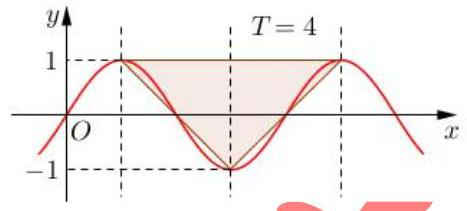

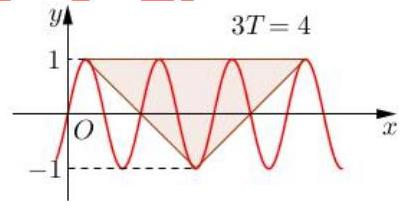

【例 3】已知 $M = \frac{{a}^{2} - a\sin \theta  + 1}{{a}^{2} - a\cos \theta  + 1}\left( {a,\theta  \in  \mathbf{R}, a \neq  0}\right)$ ，则 $M$ 的取值范围是___.

【难度】

【答案】 $\frac{4 - \sqrt{7}}{3} \leq  M \leq  \frac{4 + \sqrt{7}}{3}$

【解析】 $M$ 可看作点 $\left( {{a}^{2} + 1,{a}^{2} + 1}\right)$ 与 $\left( {a\cos \theta , a\sin \theta }\right)$ 连线的斜率, $\left( {a\cos \theta , a\sin \theta }\right)$ 表示坐标在原点，半径为 $\left| a\right|$ 的圆，设过 $\left( {{a}^{2} + 1,{a}^{2} + 1}\right)$ 的直线为 $y = M\left( {x - {a}^{2} - 1}\right)  + {a}^{2} + 1$ ， $\therefore d = \frac{\left| -M\left( {a}^{2} + 1\right)  + {a}^{2} + 1\right| }{\sqrt{1 + {M}^{2}}} \leq  \left| a\right|$ ,平方化简得 $\frac{1 + {M}^{2}}{{\left( 1 - M\right) }^{2}} \geq  \frac{{\left( {a}^{2} + 1\right) }^{2}}{{a}^{2}} = {a}^{2} + \frac{1}{{a}^{2}} + 2 \geq  4$ , $\therefore 1 + {M}^{2} \geq  4{M}^{2} - {8M} + 4$ ,解得 $\frac{4 - \sqrt{7}}{3} \leq  M \leq  \frac{4 + \sqrt{7}}{3}$

【另解】判别式法,化简为关于 $a$ 的方程, $\left( {M - 1}\right) {a}^{2} - \left( {M\cos \theta  - \sin \theta }\right) a + \left( {M - 1}\right)  = 0$ ,

$\Delta  = {\left( M\cos \theta  - \sin \theta \right) }^{2} - 4{\left( M - 1\right) }^{2} \geq  0,\therefore {\left( M\cos \theta  - \sin \theta \right) }^{2} \geq  4{\left( M - 1\right) }^{2}$ 有解,即满足

${\left( M\cos \theta  - \sin \theta \right) }_{\max }^{2} \geq  4{\left( M - 1\right) }^{2},\therefore {M}^{2} + 1 \geq  4{\left( M - 1\right) }^{2}$ ,解得 $\frac{4 - \sqrt{7}}{3} \leq  M \leq  \frac{4 + \sqrt{7}}{3}$

【例4】若 $M\text{ 、 }N$ 两点分别在函数 $y = f\left( x\right)$ 与 $y = g\left( x\right)$ 的图像上,且关于直线 $x = 1$ 对称,则称 $M\text{ 、 }N$ 是 $y = f\left( x\right)$ 与 $y = g\left( x\right)$ 的一对 “伴点” ( $M\text{ 、 }N$ 与 $N\text{ 、 }M$ 视为相同的一对)。已知

$f\left( x\right)  = \left\{  {\begin{array}{l}  - \sqrt{2 - x}\left( {x < 2}\right) \\  \sqrt{4 - {\left( x - 4\right) }^{2}}\left( {x \geq  2}\right)  \end{array}, g\left( x\right)  = \left| {x + a}\right|  + 1}\right.$ 若 $y = f\left( x\right)$ 与 $y = g\left( x\right)$ 存在两对 “伴点”,则实数 $a$ 的取值范围为___.

【难度】 $\star   \star   \star   \star$

【答案】 $\left\lbrack  {3 - 2\sqrt{2},1 + 2\sqrt{2}}\right\rbrack$

【解析】作 $y = f\left( x\right)$ 关于 $x = 1$ 对称得 ${\left( x + 2\right) }^{2} + {y}^{2} = 4$ ,临界时与 $g\left( x\right)  = \left| {x + a}\right|  + 1$ 相切,有 $d = \frac{\left| a - 3\right| }{\sqrt{2}} = 2$ ,解得 $a = 3 - 2\sqrt{2}$ ,另一端点同理可得 $a = 1 + 2\sqrt{2}$

【例 5】已知函数 $f\left( x\right)  = \left| {1 - \frac{1}{x}}\right| \left( {x > 0}\right)$ ,若关于 $x$ 的方程 ${\left\lbrack  f\left( x\right) \right\rbrack  }^{2} + {mf}\left( x\right)  + {2m} + 3 = 0$ 有三个不相等的实数解,则实数 $m$ 的取值范围为___

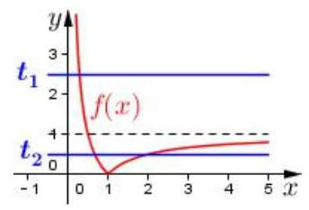

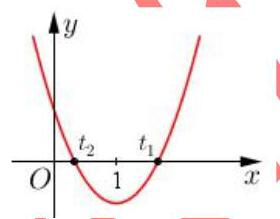

【难度】 $\star   \star   \star   \star$

【答案】 $\left( {-\frac{3}{2}, - \frac{4}{3}}\right\rbrack$

【解析】设 $f\left( x\right)  = t,\therefore {t}^{2} + {mt} + {2m} + 3 = 0$ ,数形结合两种情况: ① ${t}_{1} = 0$ ,

$0 < {t}_{2} < 1$ ,代入 ${t}_{1} = 0$ ,此时 ${2m} + 3 = 0, m =  - \frac{3}{2},{t}_{2} = \frac{3}{2}$ ,不符; ② ${t}_{1} \geq  1,0 < {t}_{2} < 1$ ,

二次函数如图所示,设 $g\left( t\right)  = {t}^{2} + {mt} + {2m} + 3,\therefore g\left( 0\right)  > 0, g\left( 1\right)  \leq  0$ ,得 $- \frac{3}{2} < m \leq   - \frac{4}{3}$ .

【例 6】已知定义在 $\mathbf{R}$ 上的奇函数 $f\left( x\right)$ 满足: $f\left( {x + 2}\right)  =  - f\left( x\right)$ ,且当 $0 \leq  x \leq  1$ 时, $f\left( x\right)  = {\log }_{2}\left( {x + a}\right)$ , 若对于任意 $x \in  \left\lbrack  {0,1}\right\rbrack$ ，都有 $f\left( {-{x}^{2} + {tx} + \frac{1}{2}}\right)  \geq  1 - {\log }_{2}3$ ，则实数 $t$ 的取值范围为___

【难度】 $\star   \star   \star   \star$

【答案】 $\left\lbrack  {0,3}\right\rbrack$

【解析】 $\because f\left( x\right)$ 为定义在 $\mathbf{R}$ 上奇函数, $\therefore f\left( 0\right)  = 0 \Rightarrow  a = 1,\because f\left( {x + 2}\right)  =  - f\left( x\right)$ ,

$\therefore$ 周期为 4,画出 $f\left( x\right)$ 图像如图所示, $\because f\left( {-{x}^{2} + {tx} + \frac{1}{2}}\right)  \geq  1 - {\log }_{2}3 = f\left( {-\frac{1}{2}}\right)  = f\left( \frac{5}{2}\right)$ , $\therefore  - \frac{1}{2} + {4k} \leq   - {x}^{2} + {tx} + \frac{1}{2} \leq  \frac{5}{2} + {4k}, k \in  \mathbf{Z},\because$ 对于任意 $x \in  \left\lbrack  {0,1}\right\rbrack$ 都成立, $\therefore$ 代入 $x = 0$ , $\therefore  - \frac{1}{2} + {4k} \leq  \frac{1}{2} \leq  \frac{5}{2} + {4k}$ ,即 $k = 0,\therefore$ 对于任意 $x \in  \left\lbrack  {0,1}\right\rbrack  , - \frac{1}{2} \leq   - {x}^{2} + {tx} + \frac{1}{2} \leq  \frac{5}{2}$ 成立, 当 $x \in  (0,1\rbrack$ ,分离参数得 $x - \frac{1}{x} \leq  t \leq  x + \frac{2}{x}$ 恒成立, $\therefore {\left( x - \frac{1}{x}\right) }_{\max } \leq  t \leq  {\left( x + \frac{2}{x}\right) }_{\min }, t \in  \left\lbrack  {0,3}\right\rbrack$

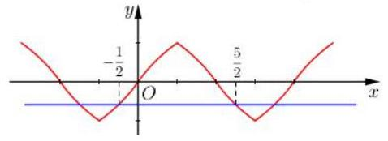

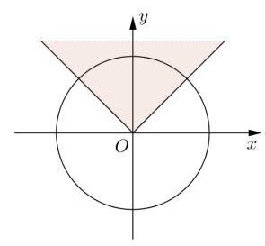

【例 7】设函数 ${f}_{a}\left( x\right)  = \left| x\right|  + \left| {x - a}\right|$ ,当 $a$ 在实数范围内变化时,在圆盘 ${x}^{2} + {y}^{2} \leq  1$ 内, 且不在任一 ${f}_{a}\left( x\right)$ 的图像上的点的全体组成的图形的面积为___

【难度】 $\star   \star   \star   \star$

【答案】 $\frac{3\pi }{4}$

【解析】根据题意, ${f}_{a}\left( a\right)  = \left| a\right|  + \left| {a - a}\right|  = \left| a\right|$ ,即当 $a$ 在实数范围内变化时,图像一个分段点为 $\left( {a,\left| a\right| }\right)$ ,该点轨迹为 $y = \left| x\right| ,\therefore$ 结合图像可得图像面积为 $\frac{3\pi }{4}$

【例 8】等差数列 ${a}_{1},{a}_{2},\cdots ,{a}_{n}\left( {n \geq  3}\right.$ , $n \in  {\mathbf{N}}^{ * }$ ) 满足 $\left| {a}_{1}\right|  + \left| {a}_{2}\right|  + \cdots  + \left| {a}_{n}\right|  = \left| {{a}_{1} + 1}\right|  + \left| {{a}_{2} + 1}\right| \; + \cdots  + \left| {{a}_{n} + 1}\right|  = \left| {{a}_{1} - 2}\right|  + \left| {{a}_{2} - 2}\right|  + \cdots  + \left| {{a}_{n} - 2}\right|  = {2019}$ ,则 ( )

A. $n$ 的最大值为 50 B. $n$ 的最小值为 50

C. $n$ 的最大值为 51 D. $n$ 的最小值为 51

【难度】 $\star   \star   \star   \star$

【答案】A

【解析】选A. 构造函数 $f\left( x\right)  = \left| x\right|  + \left| {x + d}\right|  + \left| {x + {2d}}\right|  + \cdots  + \left| {x + \left( {n - 1}\right) d}\right|$ ,可知方程 $f\left( x\right)  = {2019}$ 至少有三个解 ${a}_{1}\text{ 、 }{a}_{1} + 1\text{ 、 }{a}_{1} - 2,\therefore$ 该绝对值函数为平底型,

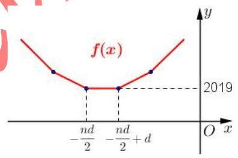

$\therefore n$ 为偶数,且 $d \geq  3$ ,不妨设 $n = {2k}, k \in  {\mathbf{N}}^{ * }$ ,

$\therefore {a}_{1},{a}_{2},\cdots ,{a}_{k}$ 均为负, ${a}_{k + 1},{a}_{k + 2},\cdots ,{a}_{2k}$ 均为正,

$\therefore \left| {a}_{1}\right|  + \left| {a}_{2}\right|  + \cdots  + \left| {a}_{n}\right|  =  - {a}_{1} - \cdots  - {a}_{k} + {a}_{k + 1} + \cdots  + {a}_{2}$ ,

$\left( {{a}_{k + 1} - {a}_{1}}\right)  + \left( {{a}_{k + 2} - {a}_{2}}\right)  + \cdots  + \left( {{a}_{2k} - {a}_{k}}\right)  = {k}^{2}d = {2019}$ ,

$d \geq  3,\therefore {k}^{2} = \frac{2019}{d} \leq  \frac{2019}{3} \Rightarrow  k \leq  {25}, n = {2k} \leq  {50}$ .

【例 9】已知 $\overrightarrow{{a}_{1}},\overrightarrow{{a}_{2}},\overrightarrow{{b}_{1}},\overrightarrow{{b}_{2}},\ldots ,\overrightarrow{{b}_{k}}\left( {k \in  {N}^{ * }}\right)$ 是平面内两两互不相等的向量,满足 $\left| {\overrightarrow{{a}_{1}} - \overrightarrow{{a}_{2}}}\right|  = 1$ ,且 $\left| {\overrightarrow{{a}_{i}} - \overrightarrow{{b}_{j}}}\right|  \in  \{ 1$ , 2\}(其中 $i = 1,2, j = 1,2,\ldots , k)$ ，则 $k$ 的最大值是___.

【难度】★★★★

【答案】 6

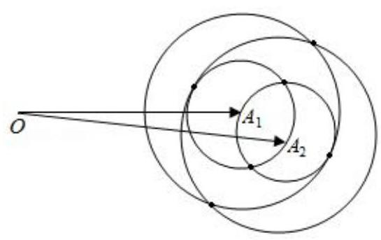

【解析】解: 如图,设 $\overrightarrow{O{A}_{1}} = \overrightarrow{{a}_{1}},\overrightarrow{O{A}_{2}} = \overrightarrow{{a}_{2}}$ ,

由 $\left| {\overrightarrow{{a}_{1}} - \overrightarrow{{a}_{2}}}\right|  = 1$ ,且 $\left| {\overrightarrow{{a}_{i}} - \overrightarrow{{b}_{j}}}\right|  \in  \{ 1,2\}$ ,

分别以 ${A}_{1},{A}_{2}$ 为圆心,以 1 和 2 为半径画圆,其中任意两圆的公

共点共有 6 个.

故满足条件的 $k$ 的最大值为 6 . 故答案为: 6 .

【例 10】已知复数集合 $A = \left\{  {x + y\mathrm{i}\left| \right| x \mid   \leq  1,\left| y\right|  \leq  1, x, y \in  \mathbf{R}}\right\}  ,\;B = \left\{  {{z}_{2} \mid  {z}_{2} = \left( {\frac{3}{4} + \frac{3}{4}\mathrm{i}}\right) {z}_{1},{z}_{1} \in  A}\right\}$ ,其中 $\mathrm{i}$ 为虚数单位,若复数 $z \in  A \cap  B$ ,则 $z$ 对应的点 $Z$ 在复平面内所形成图形的面积为___

【难度】

【答案】 $\frac{7}{2}$

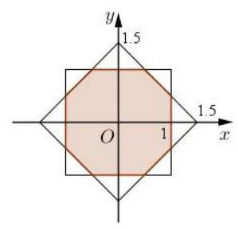

【解析】 ${z}_{1} = x + y\mathrm{i}$ ,设 ${z}_{2} = m + n\mathrm{i} = \left( {\frac{3}{4} + \frac{3}{4}\mathrm{i}}\right) \left( {x + y\mathrm{i}}\right)  = \frac{3}{4}x - \frac{3}{4}y + \left( {\frac{3}{4}x + \frac{3}{4}y}\right) \mathrm{i}$ , $\therefore m = \frac{3}{4}x - \frac{3}{4}y, n = \frac{3}{4}x + \frac{3}{4}y,\therefore x = \frac{2}{3}\left( {m + n}\right)$ , $y = \frac{2}{3}\left( {-m + n}\right) ,\because \left| x\right|  \leq  1,\left| y\right|  \leq  1,\therefore \left| {m + n}\right|  \leq  \frac{3}{2},\left| {m - n}\right|  \leq  \frac{3}{2},$

$\therefore$ 集合 $A\text{ 、 }B$ 图形如图为两个正方形,其公共部分面积为 $4 - \frac{1}{2} = \frac{7}{2}$ .

【例 11】在三棱锥 $P - {ABC}$ 中,三条侧棱 ${PA},{PB},{PC}$ 两两垂直,且 ${PA} = {PB} = 3,{PC} = 4$ ,又 $M$ 是底面 ${ABC}$ 内一点，则 $M$ 到三个侧面的距离的平方和的最小值是___.

【难度】 $\star   \star   \star   \star$

【答案】 $\frac{144}{41}$

【解析】解: 以 $P$ 为原点, ${PA}$ 为 $x$ 轴, ${PB}$ 为 $y$ 轴, ${PC}$ 为 $z$ 轴,

建立空间直角坐标系,由已知得 $A\left( {3,0,0}\right) , B\left( {0,3,0}\right) , C\left( {0,0,4}\right)$ ,

$\therefore$ 平面 ${ABC}$ 为: $\frac{1}{3}x + \frac{1}{3}y + \frac{1}{4}z = 1$ ,

$\therefore 1 = {\left( \frac{1}{3}x + \frac{1}{3}y + \frac{1}{4}z\right) }^{2} \leq  \left\lbrack  {{\left( \frac{1}{3}\right) }^{2} + {\left( \frac{1}{3}\right) }^{2} + {\left( \frac{1}{4}\right) }^{2}}\right\rbrack  \left( {{x}^{2} + {y}^{2} + {z}^{2}}\right)$ ,解得 ${x}^{2} + {y}^{2} + {z}^{2} \geq  \frac{144}{41}$ .

又 $M$ 是底面 ${ABC}$ 内一点,

$\therefore M$ 到三棱锥三个侧面的距离的平方和的最小值是 $\frac{144}{41}$ . 故答案为: $\frac{144}{41}$ .

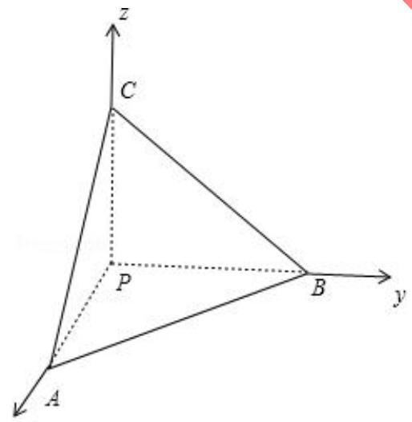

巩固训练

1、已知函数 $f\left( x\right)  = \left| \frac{1}{\left| x\right|  - 1}\right|$ ,关于 $x$ 的方程 ${f}^{2}\left( x\right)  + {bf}\left( x\right)  + c = 0$ 有 7 个不同实数根,则实数 $b\text{ 、 }c$ 满足的关系式是___

【难度】★★★★

【答案】 $\left\{  \begin{array}{l} b + c =  - 1 \\  c > 1 \end{array}\right.$ 或 $\left\{  \begin{array}{l} b + c =  - 1 \\  b <  - 2 \end{array}\right.$

【解析】数形结合,函数 $f\left( x\right)  = \left| \frac{1}{\left| x\right|  - 1}\right|$ 图像如图,根据题意,要有 7 个不同实数根,需满足 $f\left( x\right)  = 1$ 或

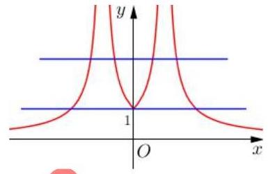

$f\left( x\right)  > 1$ ,设 $f\left( x\right)  = t$ ,即方程 ${t}^{2} + {bt} + c = 0$ 有两个不同解 ${t}_{1} = 1$ 和 ${t}_{2} > 1$ , 将 ${t}_{1} = 1$ 代入可得 $b + c =  - 1$ ,两根之积 $c > 1$ ,两根之和 $- b > 2 \Rightarrow  b <  - 2$ ,

$\therefore$ 实数 $b\text{ 、 }c$ 满足的关系式为 $\left\{  \begin{array}{l} b + c =  - 1 \\  c > 1 \end{array}\right.$ 或 $\left\{  \begin{array}{l} b + c =  - 1 \\  b <  - 2 \end{array}\right.$

2、已知向量 $\overrightarrow{a} = \left( {\cos \alpha ,\sin \alpha }\right) ,\overrightarrow{b} = \left( {\cos \beta ,\sin \beta }\right)$ ，且 $\alpha  - \beta  = \frac{\pi }{3}$ ，若向量 $\overrightarrow{c}$ 满足 $\left| {\overrightarrow{c} - \overrightarrow{a} - \overrightarrow{b}}\right|  = 1$ ，则 $\left| \overrightarrow{c}\right|$ 的最大值为___

【难度】

【答案】 $\sqrt{3} + 1$

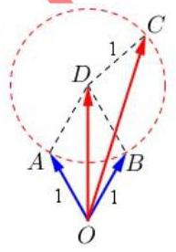

【解析】由题意, $\left| \overrightarrow{a}\right|  = \left| \overrightarrow{b}\right|  = 1$ ,且 $\overrightarrow{a}$ 与 $\overrightarrow{b}$ 夹角为 $\frac{\pi }{3}$ ,

结合图像,如图, $\overrightarrow{OA} = \overrightarrow{a},\overrightarrow{OB} = \overrightarrow{b},\overrightarrow{OC} = \overrightarrow{c},\therefore \overrightarrow{a} + \overrightarrow{b} = \overrightarrow{OD}$ ,

$\left| \overrightarrow{OD}\right|  = \sqrt{3},\because \left| {\overrightarrow{c} - \overrightarrow{a} - \overrightarrow{b}}\right|  = 1,\therefore \left| {\overrightarrow{OC} - \overrightarrow{OD}}\right|  = \left| \overrightarrow{DC}\right|  = 1$

$\therefore \left| \overrightarrow{OC}\right|  \leq  \left| \overrightarrow{OD}\right|  + \left| \overrightarrow{CD}\right|  = \sqrt{3} + 1$ ,即 $\left| \overrightarrow{c}\right|$ 的最大值为 $\sqrt{3} + 1$

3、已知定义域为 $R$ 的函数 $y = f\left( x\right)$ 满足 $f\left( {x + 2}\right)  = f\left( x\right)$ ,且 $- 1 \leq  x < 1$ 时, $f\left( x\right)  = 1 - {x}^{2}$ ,函数 $g\left( x\right)  = \left\{  \begin{array}{l} \lg \left| x\right| , x \neq  0 \\  1, x = 0 \end{array}\right.$ ,若 $F\left( x\right)  = f\left( x\right)  - g\left( x\right)$ ,则 $x \in  \left\lbrack  {-5,{10}}\right\rbrack$ ,函数 $F\left( x\right)$ 零点的个数是___

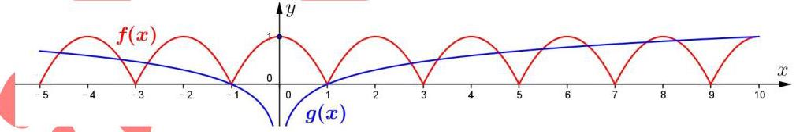

【难度】 $\star   \star   \star   \star$

【答案】 15

【解析】这是一道典型的数形结合题, $\because f\left( {x + 2}\right)  = f\left( x\right)$ , $\therefore$ 周期为 2,由此可得 $f\left( x\right)$ 的图像, $F\left( x\right)$ 的零点个数,即 $f\left( x\right)$ 与 $g\left( x\right)$ 图像的交点个数,由图可知,有 15 个,本题的易错点在于容易漏掉 $\left( {0,1}\right)$ 这个点,还有 $\left( {{10},1}\right)$ 附近的一个点,即 $\left\lbrack  {9,{10}}\right\rbrack$ 上有两个交点, $\because$ 如果在 $\left\lbrack  {9,{10}}\right\rbrack$ 上只有一个交点 $\left( {{10},1}\right)$ 的话, $\left( {{10},1}\right)$ 又是 $f\left( x\right)$ 在 $\left\lbrack  {9,{10}}\right\rbrack$ 上的顶点, $g\left( x\right)$ 必须要平行于 $x$ 轴,而 $g\left( x\right)$ 在 $\left\lbrack  {9,{10}}\right\rbrack$ 上明显是递增的, $\therefore$ 在 $\left\lbrack  {9,{10}}\right\rbrack$ 上会有两个交点

4、求 $y = \sqrt{x + 1} - \sqrt{x - 1}$ 的值域。

【难度】 $\star   \star   \star   \star$

【答案】 $(0,\sqrt{2}\rbrack$

【解析】设 $u = \sqrt{x + 1}, v =  - \sqrt{x - 1}$ ,

则原方程化为 $\left\{  \begin{array}{l} v =  - u + y \\  {u}^{2} - {v}^{2} = 1 \end{array}\right. \left( {u \geq  \sqrt{2}, v \leq  0}\right)$ ,作曲线如图

当直线过点 $\left( {\sqrt{2},0}\right)$ 时,在 $v$ 轴上截距 $y$ 取最大值,即 ${y}_{\max } = \sqrt{2}$ ,当直线到渐近线时无交点,所以 $y$ 无最小值,故值域为 $(0,\sqrt{2}\rbrack$

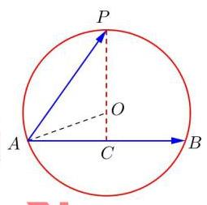

5、已知 ${AB}$ 为单位圆 $O$ 的一条弦， $P$ 为单位圆 $O$ 上的点，若 $f\left( \lambda \right)  = \left| {\overrightarrow{AP} - \lambda \overrightarrow{AB}}\right| \left( {\lambda  \in  R}\right)$ 的最小值为 $m$ ， 当点 $P$ 在单位圆上运动时， $m$ 的最大值为 $\frac{4}{3}$ ，则线段 ${AB}$ 长度为___

【难度】 $\bigstar \bigstar \bigstar$

【答案】 ${AB} = \frac{4\sqrt{2}}{3}$

【解析】本题与普陀区 16 题类似, $m$ 的几何意义为 $P$ 点到 ${AB}$ 的距离，即 ${PC}$ 的长，当 ${PC}$ 经过圆心 $O$ 时取最大，

${PC} = \frac{4}{3},{OC} = \frac{1}{3},{OA} = 1,{AC} = \frac{2\sqrt{2}}{3},{AB} = \frac{4\sqrt{2}}{3}$

6、设 $f\left( x\right) , g\left( x\right)$ 是定义在 $R$ 上的两个周期函数， $f\left( x\right)$ 周期为 $4, g\left( x\right)$ 的周期为 2，且 $f\left( x\right)$ 是奇函数. 当 $x \in  (0$ ， 2] 时, $f\left( x\right)  = \sqrt{1 - {\left( x - 1\right) }^{2}}, g\left( x\right)  = \left\{  \begin{array}{l} k\left( {x + 2}\right) ,0 < x \leq  1 \\   - \frac{1}{2},1 < x \leq  2 \end{array}\right.$ ,其中 $k > 0$ . 若在区间 $(0,9\rbrack$ 上,关于 $x$ 的方程 $f\left( x\right)  = g\left( x\right)$ 有 8 个不同的实数根,则 $k$ 的取值范围是(   )

A. $\left( {0,\frac{\sqrt{2}}{4}}\right)$ B. $\left( {\frac{1}{3},\frac{\sqrt{2}}{4}}\right)$ C. $\left\lbrack  {\frac{1}{3},\frac{\sqrt{2}}{4}}\right)$ D. $\left\lbrack  {\frac{1}{3},\frac{\sqrt{2}}{4}}\right\rbrack$

【难度】

【答案】 $C$

【解析】解: 作出函数 $f\left( x\right)$ 与 $g\left( x\right)$ 的图象如图,由图可知,函数 $f\left( x\right)$ 与 $g\left( x\right)  =  - \frac{1}{2}(1 < x \leq  2,3 < x \leq  4,5 < x \leq  6$ , $7 < x \leq  8)$ 仅有 2 个实数根要使关于 $x$ 的方程 $f\left( x\right)  = g\left( x\right)$ 有 8 个不同的实数根,则 $f\left( x\right)  = \sqrt{1 - {\left( x - 1\right) }^{2}}, x \in  (0$ , 2] 与 $g\left( x\right)  = k\left( {x + 2}\right) , x \in  (0,1\rbrack$ 的图象有 2 个不同交点,由 $\left( {1,0}\right)$ 到直线 ${kx} - y + {2k} = 0$ 的距离为 1,得 $\frac{\left| 3k\right| }{\sqrt{{k}^{2} + 1}} = 1$ ,解得 $k = \frac{\sqrt{2}}{4}\left( {k > 0}\right)$ ,

$\because$ 两点 $\left( {-2,0}\right) ,\left( {1,1}\right)$ 连线的斜率 $k = \frac{1}{3},\therefore \frac{1}{3} \leq  k < \frac{\sqrt{2}}{4}$ . 即 $k$ 的取值范围为 $\left\lbrack  {\frac{1}{3},\frac{\sqrt{2}}{4}}\right)$ . 故选: $C$ .

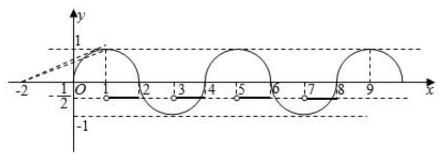

7、已知函数 $f\left( x\right)  = \left\{  \begin{array}{l}  - {2}^{-x} + 1, x \leq  0 \\  f\left( {x - 1}\right) , x > 0 \end{array}\right.$ ,若方程 $f\left( x\right)  = {\log }_{a}\left( {x + 2}\right) \left( {0 < a < 1}\right)$ 有且仅有两个不同的实数根,则实数 $a$ 的取值范围为___.

【难度】 $\star   \star   \star   \star$

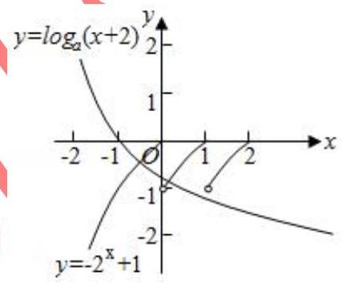

【答案】 $\left\lbrack  {\frac{1}{3},\frac{1}{2}}\right)$

【解析】解: $\because$ 当 $x > 0$ 时, $f\left( x\right)  = f\left( {x - 1}\right) ,\therefore f\left( x\right)$ 在 $\left( {0, + \infty }\right)$ 上是周期为 1 的函数,做出 $y = f\left( x\right)$ 与 $y = {\log }_{a}\left( {x + 2}\right)$ 的函数图象,则两函数图象有 2 个又点, $\therefore \left\{  \begin{array}{l} {\log }_{a}2 >  - 1 \\  {\log }_{a}3 \leq   - 1 \end{array}\right.$ ,解得 $\frac{1}{3} \leq  a < \frac{1}{2}$ . 故答案为:

8、已知 $\theta  > 0$ ，存在实数 $\varphi$ ，使得对任意 $n \in  {N}^{ * }$ ， $\cos \left( {{n\theta } + \varphi }\right)  < \frac{\sqrt{3}}{2}$ ，则 $\theta$ 的最小值是___.

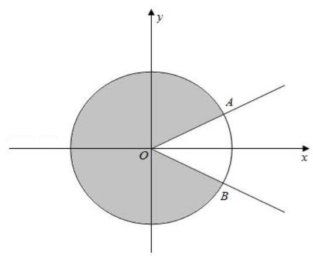

【难度】 $\star   \star   \star   \star$

【答案】 $\frac{2\pi }{5}$

【解析】解: 在单位圆中分析,由题意可得 ${n\theta } + \varphi$ 的终边要落在图中阴影部分区域 (其中 $\angle {AOx} = \angle {BOx} = \frac{\pi }{6}$ ),所以 $\theta  > \angle {AOB} = \frac{\pi }{3}$ ,因为对任意 $n \in  {N}^{ * }$ 都成立,所以 $\frac{2\pi }{\theta } \in  {N}^{ * }$ ,即 $\theta  = \frac{2\pi }{k}, k \in  {N}^{ * }$ ,同时 $\theta  > \frac{\pi }{3}$ ,所以 $\theta$ 的最小值为 $\frac{2\pi }{5}$ . 故答案为: $\frac{2\pi }{5}$ .

9、已知 $f\left( x\right)  = \frac{2}{x - 1} - a \mid  \left( {x > 1, a > 0}\right)$ ， $f\left( x\right)$ 与 $x$ 轴交点为 $A$ ，若对于 $f\left( x\right)$ 图象上任意一点 $P$ ，在其图象上

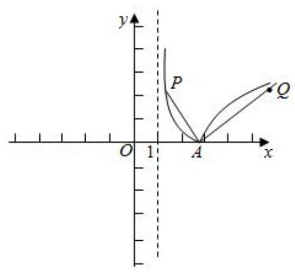

总存在另一点 $Q\left( {P\text{ 、 }Q\text{ 异于 }A}\right)$ ,满足 ${AP} \bot  {AQ}$ ,且 $\left| {AP}\right|  = \left| {AQ}\right|$ ,则 $a = \underline{\;}.$

【难度】 $\star   \star   \star   \star$

【答案】 $\sqrt{2}$

【解析】解: 由题意, 可知:

令 $f\left( x\right)  = \left| {\frac{2}{x - 1} - a}\right|  = 0$ ,解得: $x = \frac{2}{a} + 1,\therefore$ 点 $A$ 的坐标为: $\left( {\frac{2}{a} + 1,0}\right)$ .

高三数学二轮复习 B 版

则 $f\left( x\right)  = \left\{  {\begin{array}{l} \frac{2}{x - 1} - a,1 < x \leq  {x}_{A} \\   - \frac{2}{x - 1} + a, x > {x}_{A} \end{array}.\therefore f\left( x\right) }\right.$ 大致图象如下:

由题意,很明显 $P\text{ 、 }Q$ 两点分别在两个分段曲线上,

不妨设点 $P$ 在左边曲线上,点 $Q$ 在右边曲线上. 设直线 ${AP}$ 的斜率为 $k$ ,则 ${l}_{AP} : y = k\left( {x - \frac{2}{a} - 1}\right)$ .

联立方程: $\left\{  \begin{array}{l} y = k\left( {x - \frac{2}{a} - 1}\right) \\  y = \frac{2}{x - 1} - a \end{array}\right.$ ,整理,得: $k{x}^{2} + \left\lbrack  {a - k\left( {\frac{2}{a} + 2}\right) }\right\rbrack  x + k\left( {\frac{2}{a} + 1}\right)  - a - 2 = 0$ .

$\therefore {x}_{P} + {x}_{A} =  - \frac{a - k\left( {\frac{2}{a} + 2}\right) }{k} = \frac{2}{a} + 2 - \frac{a}{k}.\because {x}_{A} = \frac{2}{a} + 1,\therefore {x}_{P} = \frac{2}{a} + 2 - \frac{a}{k} - {x}_{A} = 1 - \frac{a}{k}$ .

再将 ${x}_{P} = 1 - \frac{a}{k}$ 代入第一个方程,可得: ${y}_{P} =  - a - \frac{2k}{a}$ .

$\therefore$ 点 $P$ 的坐标为: $\left( {1 - \frac{a}{k}, - a - \frac{2k}{a}}\right)$ .

$\therefore \left| {AP}\right|  = \sqrt{{\left( {x}_{P} - {x}_{A}\right) }^{2} + {\left( {y}_{P} - {y}_{A}\right) }^{2}} = \sqrt{{\left( 1 - \frac{a}{k} - \frac{2}{a} - 1\right) }^{2} + {\left( -a - \frac{2k}{a}\right) }^{2}}$

$= \sqrt{\frac{4}{{a}^{2}} \cdot  {k}^{2} + {4k} + {a}^{2} \cdot  \frac{1}{{k}^{2}} + 4 \cdot  \frac{1}{k} + {a}^{2} + \frac{4}{{a}^{2}}}$ .

$\because {AP} \bot  {AQ}$ ， $\therefore$ 直线 ${AQ}$ 的斜率为 $- \frac{1}{k}$ ，则 ${l}_{AQ} : y =  - \frac{1}{k}\left( {x - \frac{2}{a} - 1}\right)$ .

同理类似求点 $P$ 的坐标的过程,可得: 点 $Q$ 的坐标为: $\left( {1 - {ak}, a + \frac{2}{ak}}\right)$ .

$\therefore \left| {AQ}\right|  = \sqrt{{\left( {x}_{Q} - {x}_{A}\right) }^{2} + {\left( {y}_{Q} - {y}_{A}\right) }^{2}} = \sqrt{{\left( 1 - ak - \frac{2}{a} - 1\right) }^{2} + {\left( a + \frac{2}{ak}\right) }^{2}}$

$= \sqrt{{a}^{2} \cdot  {k}^{2} + {4k} + \frac{4}{{a}^{2}} \cdot  \frac{1}{{k}^{2}} + 4 \cdot  \frac{1}{k} + {a}^{2} + \frac{4}{{a}^{2}}}$

$\because \left| {AP}\right|  = \left| {AQ}\right|$ ,及 $k$ 的任意性,可知: $\frac{4}{{a}^{2}} = {a}^{2}$ ,解得: $a = \sqrt{2}$ . 故答案为: $\sqrt{2}$ .

## (二)几何问题转化成代数

## 知识梳理

## 常见的转化有:

①不等式问题中的图像问题可以向函数转化;

②平面几何图形中的角度、距离等问题可以向函数转化;

③几何问题中的交点问题可以向方程转化;

④借助于运算结果与几何定理的结合;

⑤空间图形向平面图形转化进而转化为代数运算。

## 例题精讲

【例 12】已知函数 $y = f\left( x\right)$ 与 $y = g\left( x\right)$ 的图像关于 $y$ 轴对称,当函数 $y = f\left( x\right)$ 与 $y = g\left( x\right)$ 在区间 $\left\lbrack  {a, b}\right\rbrack$ 上同时递增或同时递减时,把区间 $\left\lbrack  {a, b}\right\rbrack$ 叫做函数 $y = f\left( x\right)$ 的 “不动区间”,若区间 $\left\lbrack  {1,2}\right\rbrack$ 为函数 $y = \left| {{2}^{x} - t}\right|$ 的 “不动区间”,则实数 $t$ 的取值范围是___

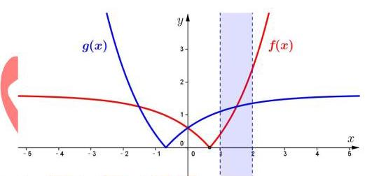

【难度】 $\star   \star   \star   \star$

【答案】 $t \in  \left\lbrack  {\frac{1}{2},2}\right\rbrack$

【解析】结合图像, $y = \left| {{2}^{x} - t}\right|$ 的零点 $x = {\log }_{2}t$ 应满足 ${\log }_{2}t \in  \left\lbrack  {-1,1}\right\rbrack$ ,解得 $t \in  \left\lbrack  {\frac{1}{2},2}\right\rbrack$ .

【例 13】正方形 ${ABCD}$ 的边长为 $4, O$ 是正方形 ${ABCD}$ 的中心,过中心 $O$ 的直线 $l$ 与边 ${AB}$ 交于点 $M$ ,与边 ${CD}$ 交于点 $N, P$ 为平面上一点，满足 $2\overrightarrow{OP} = \lambda \overrightarrow{OB} + \left( {1 - \lambda }\right) \overrightarrow{OC}$ ，则 $\overrightarrow{PM} \cdot  \overrightarrow{PN}$ 的最小值为___

【难度】 $\star   \star   \star   \star$

【答案】 -7

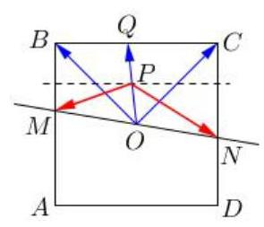

【解析】设 $\overrightarrow{OQ} = 2\overrightarrow{OP} = \lambda \overrightarrow{OB} + \left( {1 - \lambda }\right) \overrightarrow{OC}$ ,由向量共线

定理,可知点 $Q$ 在直线 ${BC}$ 上, $P$ 为 ${OQ}$ 中点, $\therefore \overrightarrow{PM} \cdot  \overrightarrow{PN}$

$\left( {\overrightarrow{PO} + \overrightarrow{OM}}\right)  \cdot  \left( {\overrightarrow{PO} + \overrightarrow{ON}}\right)  = {\overrightarrow{PO}}^{2} + \overrightarrow{OM} \cdot  \overrightarrow{ON} = {\overrightarrow{PO}}^{2} - {\overrightarrow{OM}}^{2}$ ,

$\because {\left| \overrightarrow{PO}\right| }_{\min } = 1,{\left| \overrightarrow{OM}\right| }_{\max } = 2\sqrt{2},\therefore {\left( \overrightarrow{PM} \cdot  \overrightarrow{PN}\right) }_{\min } =  - 7$ .

【例14】若曲线 $\left| y\right|  = x + 2$ 与 $C : \frac{{x}^{2}}{4\lambda } + \frac{{y}^{2}}{4} = 1$ 恰有两个不同交点,则实数 $\lambda$ 取值范围为( )

A. $( - \infty , - 1\rbrack  \cup  \left( {1, + \infty }\right)$ B. $( - \infty , - 1\rbrack  \cup  \left( {1, + \infty }\right)$

C. $\left( {1, + \infty }\right)$ D. $\lbrack  - 1,0) \cup  \left( {1, + \infty }\right)$

【难度】 $\star   \star   \star   \star$

【答案】A

【解析】数形结合,分类讨论,① 当 $\lambda  > 0$ ,曲线 $C$ 为椭圆,根据题意如图所示,需满足 ${4\lambda } > 4$ ,即 $\lambda  > 1$ ; ② 当 $\lambda  < 0$ ,曲线 $C$ 为双曲线,根据题意如图所示,双曲线渐近线的斜率 $\frac{1}{\sqrt{-\lambda }} \leq  1$ ,即 $\lambda  \leq   - 1$ . 综上所述,选 A.

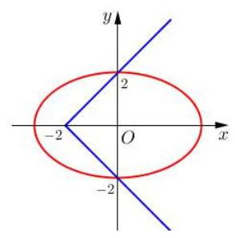

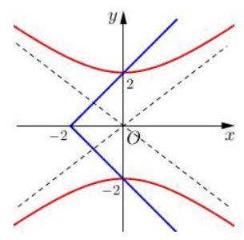

【例 15】 $\bigtriangleup {ABC}$ 中, ${BC}$ 边上的中垂线分别交 ${BC}\text{ 、 }{AC}$ 于点 $D\text{ 、 }E$ ,若 $\overrightarrow{AE} \cdot  \overrightarrow{BC} = 6,\left| \overrightarrow{AB}\right|  = 2$ , 则 ${AC} =$

【难度】 $\star   \star   \star   \star$

【答案】 4

【解析】取特殊情况,不妨令 $\angle B$ 为直角,根据向量几何意义, $\overrightarrow{AE} \cdot  \overrightarrow{BC} = 2{\left| \overrightarrow{BD}\right| }^{2} = 6$

$\therefore {BD} = \sqrt{3},{BC} = 2\sqrt{3},\therefore {AC} = 4$ .

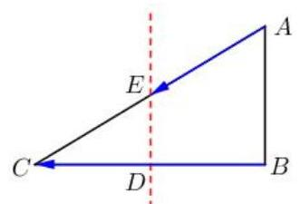

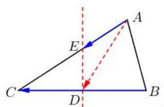

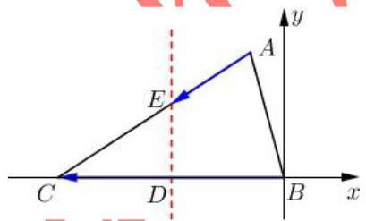

解法二: $\overrightarrow{AE} \cdot  \overrightarrow{BC} = \left( {\overrightarrow{AD} + \overrightarrow{DE}}\right)  \cdot  \overrightarrow{BC} = 6 \Rightarrow  \overrightarrow{AD} \cdot  \overrightarrow{BC} = 6 \Rightarrow  \overrightarrow{AD} \cdot  \overrightarrow{DB} =  - 3$ ,

$\left| \overrightarrow{AB}\right|  = 2 \Rightarrow  {\left( \overrightarrow{AD} + \overrightarrow{DB}\right) }^{2} = 4 \Rightarrow  {\left| \overrightarrow{AD}\right| }^{2} + {\left| \overrightarrow{DB}\right| }^{2} = {10},\because \cos \angle {ADB} =  - \cos \angle {ADC}$ ,

余弦定理展开得: $A{D}^{2} + D{B}^{2} - A{B}^{2} = A{C}^{2} - A{D}^{2} - D{B}^{2} \Rightarrow  A{C}^{2} = {16} \Rightarrow  {AC} = 4$ .

解法三: 以 $B$ 为坐标原点建立如图直角坐标系,则 $B\left( {0,0}\right)$ ,设 $A\left( {2\cos \theta ,2\sin \theta }\right) , C\left( {{2a},0}\right)$ ,

$D\left( {a,0}\right) , E\left( {a, m}\right) ,\therefore \overrightarrow{AE} \cdot  \overrightarrow{BC} = \left( {a - 2\cos \theta , m - 2\sin \theta }\right)  \cdot  \left( {{2a},0}\right)  = 2{a}^{2} - {4a}\cos \theta  = 6$ ,

$\therefore A{C}^{2} = {\left( 2a - 2\cos \theta \right) }^{2} + {\left( -2\sin \theta \right) }^{2} = 4{a}^{2} - {8a}\cos \theta  + 4 = {16} \Rightarrow  {AC} = 4$ .

【例 16】如图,在底面半径和高均为 $\sqrt{2}$ 的圆锥中, ${AB}\text{ 、 }{CD}$ 是底面圆 $O$ 的两条互相垂直的直径, $E$ 是母线 ${PB}$ 的中点,已知过 ${CD}$ 与 $E$ 的平面与圆锥侧面的交线是以 $E$ 为顶点的抛物线的一部分，则该抛物线的焦点到圆锥顶点 $P$ 的距离等于( )

A. $\frac{1}{2}$ B.

C. $\frac{\sqrt{10}}{4}$ D. $\frac{\sqrt{5}}{2}$

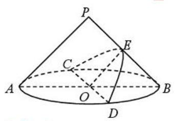

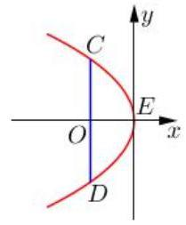

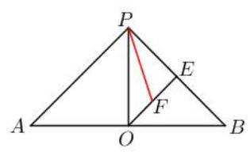

【难度】

【答案】D

【解析】将抛物线放入坐标系,如图所示, $\because {OE} = 1,{OC} = {OD} = \sqrt{2}$ ，

$\therefore C\left( {-1,\sqrt{2}}\right)$ ,设抛物线 ${y}^{2} = {2px}$ ,代入 $C$ 点,可得 ${y}^{2} =  - {2x},\therefore$ 焦点为 $\left( {-\frac{1}{2},0}\right)$ ,

即焦点为 ${OE}$ 中点,设焦点为 $F$ ,则 ${EF} = \frac{1}{2},{PE} = 1,\therefore {PF} = \frac{\sqrt{5}}{2}$ ,故选 D.

巩固训练

1、关于曲线 $C : \frac{{x}^{2}}{4} + {y}^{4} = 1$ ,给出下列四个结论:

①曲线 $C$ 是椭圆；②关于坐标原点中心对称；③关于直线 $y = x$ 轴对称；④所围成封闭图形面积小于 8. 则其中正确结论的序号是( )

A. ②④ B. ②③④ C. ①②③④ D. ①②④

【难度】★★★★

【答案】 $A$

【解析】解: 曲线 $C : \frac{{x}^{2}}{4} + {y}^{4} = 1$ ,①,由椭圆方程的形式可得曲线 $C$ 不是椭圆;

②，将原方程中的 $x$ 换为 $- x$ ， $y$ 换为 $- y$ ，可得方程不变，故曲线 $C$ 关于坐标原点中心对称，故②正确；

③，将原方程中的 $x$ 换为 $y$ ， $y$ 换为 $x$ ，可得方程 $\frac{{y}^{2}}{4} + {x}^{4} = 1$ ，与原方程不一样，故曲线 $C$ 不关于直线 $y = x$ 轴对称, 故③错误；

④, $\because \left| x\right|  \leq  2,\left| y\right|  \leq  1,\therefore$ 曲线 $C : \frac{{x}^{2}}{4} + {y}^{4} = 1$ 所围成的封闭面积小于 $4 \times  2 = 8$ ,故④正确. 故选: $A$ .

2、如图， $\bigtriangleup {ABC}$ 是边长为 1 的正三角形，点 $P$ 在 $\bigtriangleup {ABC}$ 所在的平面内，且 ${\left| \overrightarrow{PA}\right| }^{2} + {\left| \overrightarrow{PB}\right| }^{2} + {\left| \overrightarrow{PC}\right| }^{2} = a$ (a 为常数). 下列结论中, 正确的是(   )

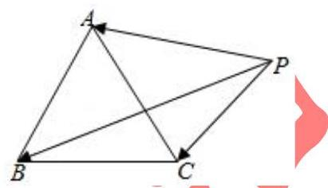

A. 当 $0 < a < 1$ 时,满足条件的点 $P$ 有且只有一个

B. 当 $a = 1$ 时,满足条件的点 $P$ 有三个

C. 当 $a > 1$ 时,满足条件的点 $P$ 有无数个

D. 当 $a$ 为任意正实数时,满足条件的点 $P$ 是有限个

【难度】 $\star   \star   \star   \star$

【答案】 $C$

【解析】解: 以 ${BC}$ 所在直线为 $x$ 轴, ${BC}$ 中点为原点,建立直角坐标系,如图所示

则 $A\left( {0,\frac{\sqrt{3}}{2}}\right) , B\left( {-\frac{1}{2},0}\right) , C\left( {\frac{1}{2},0}\right)$ ,设 $P\left( {x, y}\right)$ ,可得

${\left| \overrightarrow{PA}\right| }^{2} = {x}^{2} + {\left( y - \frac{\sqrt{3}}{2}\right) }^{2},{\left| \overrightarrow{PB}\right| }^{2} = {\left( x + \frac{1}{2}\right) }^{2} + {y}^{2},{\left| \overrightarrow{PC}\right| }^{2} = {\left( x - \frac{1}{2}\right) }^{2} + {y}^{2}$

$\because {\left| \overrightarrow{PA}\right| }^{2} + {\left| \overrightarrow{PB}\right| }^{2} + {\left| \overrightarrow{PC}\right| }^{2} = a\therefore {x}^{2} + {\left( y - \frac{\sqrt{3}}{2}\right) }^{2} + {\left( x + \frac{1}{2}\right) }^{2} + {y}^{2} + {\left( x - \frac{1}{2}\right) }^{2} + {y}^{2} = a$

化简得: $3{x}^{2} + 3{y}^{2} - \sqrt{3}y + \frac{5}{4} - a = 0$ ,即 ${x}^{2} + {y}^{2} - \frac{\sqrt{3}}{3}y + \frac{5}{12} - \frac{a}{3} = 0$

配方,得 ${x}^{2} + {\left( y - \frac{\sqrt{3}}{6}\right) }^{2} = \frac{1}{3}\left( {a - 1}\right) \ldots \left( 1\right)$

当 $a < 1$ 时,方程 (1) 的右边小于 0,故不能表示任何图形;

当 $a = 1$ 时,方程 (1) 的右边为 0,表示点 $\left( {0,\frac{\sqrt{3}}{6}}\right)$ ,恰好是正三角形的重心;

当 $a > 1$ 时,方程 (1) 的右边大于 0,表示以 $\left( {0,\frac{\sqrt{3}}{6}}\right)$ 为圆心,半径为 $\sqrt{\frac{1}{3}\left( {a - 1}\right) }$ 的圆

由此对照各个选项,可得只有 $C$ 项符合题意,故选: $C$ .

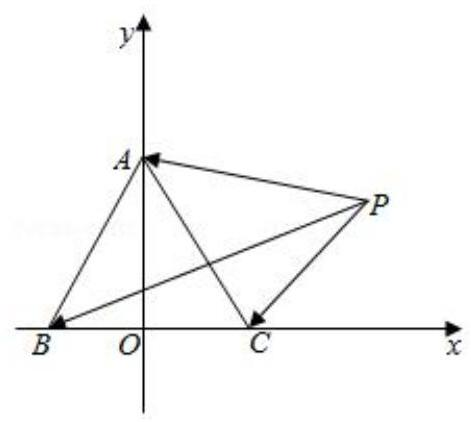

3、如图所示，半径为 1 的圆 $O$ 始终内切于直角梯形 ${ABCD}$ ，则当 ${AD}$ 的长度增加时，以下结论:① $\overrightarrow{OA} \cdot  \overrightarrow{OD}$ 越来越小; ② $\left| {\overrightarrow{OA} + \overrightarrow{OB} + \overrightarrow{OC} + \overrightarrow{OD}}\right|$ 保持不变. 它们成立的情况是 ( )

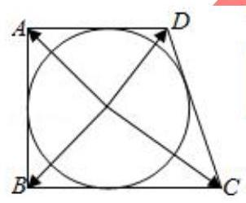

A. ①②都硅确 B. ①②都错误 C. ①正确，②错误 D. ①错误，②正确

【难度】★★★★

【答案】 $C$

【解析】解: 建立如图所示平面直角坐标系,

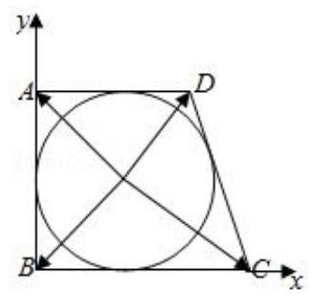

则 $B\left( {0,0}\right) , A\left( {0,2}\right) , O\left( {1,1}\right)$ ,设 $C\left( {m,0}\right) , D\left( {n,2}\right) ,\left( {m > 1, n > 1}\right)$ ,

则 ${CD}$ 所在直线方程为 $\frac{y - 0}{2 - 0} = \frac{x - m}{n - m}$ ,即 ${2x} + \left( {m - n}\right) y - {2m} = 0$ ,

由题意, $\frac{\left| 2 + m - n - 2m\right| }{\sqrt{{\left( m - n\right) }^{2} + 4}} = 1$ ,整理得 $m + n - {mn} = 0\left( {m, n > 1}\right)$ ,

$\overrightarrow{OA} = \left( {-1,1}\right) ,\overrightarrow{OB} = \left( {-1, - 1}\right) ,\overrightarrow{OC} = \left( {m - 1, - 1}\right) ,\overrightarrow{OD} = \left( {n - 1,1}\right)$ ,

$\therefore \overrightarrow{OA} \cdot  \overrightarrow{OD} = 2 - n$ ,当 ${AD}$ 的长度增加时, $n$ 增大,则 $\overrightarrow{OA} \cdot  \overrightarrow{OD}$ 越来越小,故①正确;

$\overrightarrow{OA} + \overrightarrow{OB} + \overrightarrow{OC} + \overrightarrow{OD} = \left( {m + n - 4,0}\right) ,\left| {\overrightarrow{OA} + \overrightarrow{OB} + \overrightarrow{OC} + \overrightarrow{OD}}\right|  = \sqrt{{\left( m + n - 4\right) }^{2}} = \left| {m + n - 4}\right|  = \left| {{mn} - 4}\right|$ ,

当 ${AD}$ 的长度增加时, $n$ 增大, $\left| {{mn} - 4}\right|$ 是变化的,故②错误、故选: $C$ .

4、将等差数列 ${a}_{n} = {2n} - 1\left( {n \in  {N}^{ * }}\right)$ 中 ${n}^{2}$ 个项依次排列成下列 $n$ 行 $n$ 列的方阵,在方阵中任取一个元素,记为 ${x}_{1}$ ,划去 ${x}_{1}$ 所在的行与列,将剩下元素 按原来得位置关系组成 $\left( {n - 1}\right)$ 行 $\left( {n - 1}\right)$ 列方阵,任取其中一元素 ${x}_{2}$ ,划去 ${x}_{2}$ 所在的行与列...,将最后剩下元素记为 ${x}_{n}$ ,记 ${S}_{n} = {x}_{1} + {x}_{2}\ldots  + {x}_{n}$ 则 $\mathop{\lim }\limits_{{n \rightarrow  \infty }}\frac{{S}_{n}}{2{n}^{3} + {n}^{2}} =$ ___.

$\begin{array}{llll} 1 & 3 & 5 & \cdots {2n} - 1 \end{array}$

${2n} + 1\;{2n} + 3\;{2n} + 5\;\cdots {4n} - 1$

${4n} + 1\;{4n} + 3\;{4n} + 5\;\cdots {6n} - 1$

………………

$2{r}^{2} - {2n} + 1\;2{r}^{2} - {2n} + 3\;\cdots \;2{r}^{2} - 1$

【难度】 $\star   \star   \star   \star$

【答案】 $\frac{1}{2}$

【解析】不妨取 ${x}_{1} = 1,{x}_{2} = {2n} + 3,{x}_{3} = {4n} + 5,\ldots ,{x}_{n} = 2{n}^{2} - 1$ ,

故 ${S}_{n} = 1 + \left( {{2n} + 3}\right)  + \left( {{4n} + 5}\right)  + \ldots  + \left( {2{n}^{2} - 1}\right)$

$= \left\lbrack  {1 + 3 + 5 + \ldots  + \left( {{2n} - 1}\right) }\right\rbrack   + \left\lbrack  {{2n} + {4n} + \ldots  + \left( {n - 1}\right) {2n}}\right\rbrack   = {n}^{2} + \left( {n - 1}\right)  \times  {n}^{2} = {n}^{3}$ ,

故 $\mathop{\lim }\limits_{{n \rightarrow  \infty }}\frac{{S}_{n}}{2{n}^{3} + {n}^{2}} = \mathop{\lim }\limits_{{n \rightarrow  \infty }}\frac{{n}^{3}}{2{n}^{3} + {n}^{2}} = \mathop{\lim }\limits_{{n \rightarrow  \infty }}\frac{1}{2 + \frac{1}{n}} = \frac{1}{2}$ ,故答案为: $\frac{1}{2}$ .

5、如图，在平行六面体 ${ABCD} - {A}_{1}{B}_{1}{C}_{1}{D}_{1}$ 中， ${AD} = 1$ ， ${CD} = 2$ ， ${A}_{1}D\bot$ 平面 ${ABCD}$ ， ${A{A}_{1}}$ 与底面 ${ABCD}$ 所成角为 $\theta$ ,设直线 ${A}_{1}C$ 与平面 $A{A}_{1}{D}_{1}D$ 、平面 ${ABCD}$ 、平面 $A{A}_{1}{B}_{1}B$ 所成角的大小分别为 $\alpha ,\beta ,\gamma$ .

(1)若 $\angle {ADC} = {2\theta }$ ，求平行六面体 ${ABCD} - {A}_{1}{B}_{1}{C}_{1}{D}_{1}$ 的体积 $V$ 的取值范围；

(2)若 $\angle {ADC} = {2\theta }$ 且 $\theta  = \frac{\pi }{4}$ ，求 $\alpha ,\beta ,\gamma$ 中的最大值；

(3)若 $\angle {ADC} = \frac{\pi }{2}, g\left( \theta \right)  = \max \{ \alpha \left( \theta \right) ,\beta \left( \theta \right) ,\gamma \left( \theta \right) \}$ ，(其中 $\max \{ a, b\}$ 是指 $a, b$ 中的最大的数)，求 $g\left( \theta \right)$ 的最小值.

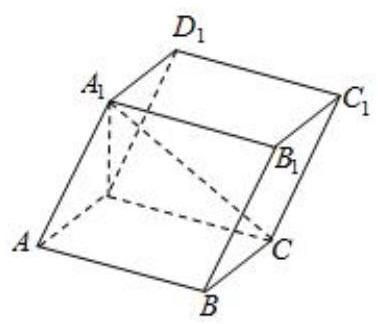

【难度】

【答案】见解析

【解析】解: (1) 由题意得 $D{A}_{1} = \tan \theta \left( {0 < \theta  < \frac{\pi }{2}}\right)$ ,四边形 ${ABCD}$ 的面积

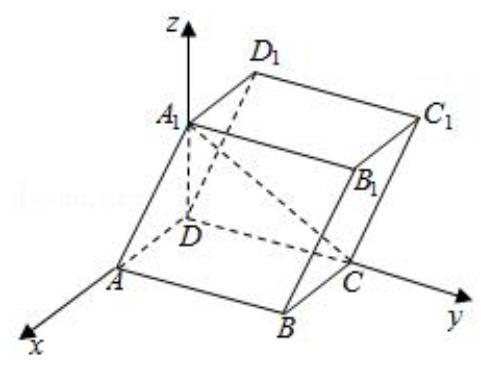

为 $2\sin {2\theta }$

平行六面体 ${ABCD} - {A}_{1}{B}_{1}{C}_{1}{D}_{1}$ 的体积 $V = 2\sin {2\theta } \cdot  \tan \theta  = 4{\sin }^{2}\theta$ ,

$\therefore$ 平行六面体 ${ABCD} - {A}_{1}{B}_{1}{C}_{1}{D}_{1}$ 的体积 $V$ 的取值范围为 $\left( {0,4}\right)$ .

(2) $\because \theta  = {45}^{ \circ  },\therefore \angle {ADC} = {90}^{ \circ  }$ ，即 ${CD} \bot  {AD}$ ，

又 $\because {A}_{1}D \bot$ 平面 ${ABCD},\therefore {CD} \bot  {A}_{1}D,\therefore {CD} \bot$ 平面 $A{A}_{1}{D}_{1}D$ ，

$\therefore \alpha  = \angle C{A}_{1}D,\beta  = \angle {A}_{1}{CD}$ ,

由题意得 ${A}_{1}D = 1,{AD} = 1,{CD} = 2,\therefore \tan \alpha  = 2,\tan \beta  = \frac{1}{2}$ ,

$\therefore \alpha  = \arctan 2,\beta  = \arctan \frac{1}{2}$ ,

以 ${DA},{DC}, D{A}_{1}$ 为 $x, y, z$ 轴,建立空间直角坐标系 $O - {xyz}$ ,

则 ${A}_{1}\left( {0,0,1}\right) , C\left( {0,2,0}\right) , A\left( {1,0,0}\right) , B\left( {1,2,0}\right)$

$\therefore \overrightarrow{{A}_{1}C} = \left( {0,2, - 1}\right) ,\overrightarrow{A{A}_{1}} = \left( {-1,0,1}\right) ,\overrightarrow{AB} = \left( {0,2,0}\right)$ ,

设侧面 $A{A}_{1}{B}_{1}B$ 的法向量 $\overrightarrow{n} = \left( {x, y, z}\right)$ ,

$\therefore \left\{  \begin{array}{l}  - x + z = 0 \\  {2y} = 0 \end{array}\right.$ ,取 $x = 1$ 得 $\left\{  \begin{array}{l} y = 0 \\  z = 1 \end{array}\right.$ , $\therefore$ 侧面 $A{A}_{1}{B}_{1}B$ 的法向量 $\overrightarrow{n} = \left( {1,0,1}\right)$ ,

$\therefore \sin \gamma  = \left| {\cos  < \overrightarrow{{A}_{1}C},\overrightarrow{n} > }\right|  = \frac{\left| \overrightarrow{{A}_{1}C} \cdot  \overrightarrow{n}\right| }{\left| \overrightarrow{{A}_{1}C}\right|  \cdot  \left| \overrightarrow{n}\right| } = \frac{\sqrt{10}}{10}$ , $\therefore$ 直线 ${A}_{1}C$ 与侧面 $A{A}_{1}{B}_{1}B$ 所成角 $\gamma$ 的大小为 $\arcsin \frac{\sqrt{10}}{10}$ ,

综上, $\alpha ,\beta ,\gamma$ 中最大值为 $\alpha  = \arctan 2$ .

(3) $\because \angle {ADC} = \frac{\pi }{2}$ ，即 ${CD} \bot  {AD}$ ，又 $\because {A}_{1}D \bot$ 平面 ${ABCD}$ ， $\therefore {CD} \bot  {A}_{1}D$ ，

$\therefore {CD} \bot$ 平面 $A{A}_{1}{D}_{1}D$ ， $\therefore \alpha  = \angle C{A}_{1}D$ ， $\beta  = \angle {A}_{1}{CD}$ ，

$\because D{A}_{1} = \tan \theta ,\therefore \tan \alpha  = \frac{CD}{D{A}_{1}} = \frac{2}{\tan \theta },\tan \beta  = \frac{D{A}_{1}}{CD} = \frac{\tan \theta }{2}$ ,

以 ${DA},{DC}, D{A}_{1}$ 为 $x, y, z$ 轴建立空间直角坐标系 $O - {xyz}$ ,

则 ${A}_{1}\left( {0,0,\tan \theta }\right) , C\left( {0,2,0}\right) , A\left( {1,0,0}\right) , B\left( {1,2,0}\right)$

$\therefore \overrightarrow{{A}_{1}C} = \left( {0,2, - \tan \theta }\right) ,\overrightarrow{A{A}_{1}} = \left( {-1,0,\tan \theta }\right) ,\overrightarrow{AB} = \left( {0,2,0}\right)$ ,

设侧面 $A{A}_{1}{B}_{1}B$ 的法向量 $\overrightarrow{n} = \left( {x, y, z}\right)$ ,

$\therefore \left\{  \begin{array}{l}  - x + z\tan \theta  = 0 \\  {2y} = 0 \end{array}\right.$ . 令 $x = \tan \theta$ 得 $\left\{  \begin{array}{l} y = 0 \\  z = 1 \end{array}\right.$ ,

$\therefore$ 侧面 $A{A}_{1}{B}_{1}B$ 的法向量 $\overrightarrow{n} = \left( {\tan \theta ,0,1}\right)$ ,

$\therefore \sin \gamma  = \frac{\left| \overrightarrow{{A}_{1}C} \cdot  \overrightarrow{n}\right| }{\left| \overrightarrow{{A}_{1}C}\right|  \cdot  \left| \overrightarrow{n}\right| } = \frac{\left| 0 + 0 + \tan \theta \right| }{\sqrt{4 + {\tan }^{2}\theta } \times  \sqrt{{\tan }^{2}\theta  + 1}} = \frac{\tan \theta }{\sqrt{{\tan }^{4}\theta  + 5{\tan }^{2}\theta  + 4}},\therefore \tan \gamma  = \frac{\tan \theta }{{\tan }^{2}\theta  + 2}$ ,

$\therefore \overrightarrow{{A}_{1}C}$ 与 $\overrightarrow{n}$ 所在的直线的夹角为 $\arctan \gamma  = \arctan \left( \frac{\tan \theta }{{\tan }^{2}\theta  + 2}\right)$ ,

$\therefore g\left( \theta \right)  = \max \left\{  \right. \arctan \left( \frac{2}{\tan \theta }\right) ,\left. {\arctan \left( \frac{\tan \theta }{2}\right) ,\arctan \left( \frac{\tan \theta }{{ta}{n}^{2}\theta  + 2}\right) }\right\}  ,$

令 $t = \tan \theta , t \in  \left( {0, + \infty }\right)$ ,则 $h\left( t\right)  = \max \left\{  {\frac{2}{t},\frac{t}{2},\frac{t}{{t}^{2} + 2}}\right\}$ ,

$\because \frac{2}{t} - \frac{t}{{t}^{2} + 2} = \frac{{t}^{2} + 4}{t\left( {{t}^{2} + 2}\right) } > 0,\frac{t}{2} - \frac{t}{{t}^{2} + 2} = \frac{{t}^{3}}{2\left( {{t}^{2} + 2}\right) } > 0$ ,

$\therefore h\left( t\right)  = \max \left\{  {\frac{2}{t},\frac{t}{2}}\right\}   = \left\{  {\begin{array}{l} \frac{2}{t},0 < t \leq  2 \\  \frac{t}{2}, t > 2 \end{array},\;\therefore {\left\lbrack  h\left( t\right) \right\rbrack  }_{\min } = 1,\therefore {\left\lbrack  g\left( \theta \right) \right\rbrack  }_{\min } = \arctan 1 = \frac{\pi }{4}}\right.$ .

6、如图所示, ${ABCD}$ 是一块边长为 7 米的正方形铁皮,其中 ${ATN}$ 是一半径为 6 米的扇形,已经被腐蚀不能使用,其余部分完好可利用. 工人师傅想在未被腐蚀部分截下一个有边落在 ${BC}$ 与 ${CD}$ 上的长方形铁皮 ${PQCR}$ ,其中 $P$ 是弧 ${TN}$ 上一点. 设 $\angle {TAP} = \theta$ ,长方形 ${PQCR}$ 的面积为 $S$ 平方米.

(1)求 $S$ 关于 $\theta$ 的函数解析式；

(2)求 $S$ 的最大值及此时 $\theta$ 的值.

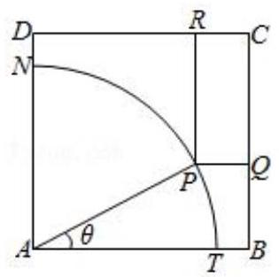

【难度】★★★★

【答案】见解析

【解析】解: (1)延长 ${RP}$ 交 ${AB}$ 于 $E$ ,延长 ${QP}$ 交 ${AD}$ 于 $F$ ,

由 ${ABCD}$ 是正方形, ${PRCQ}$ 是矩形,可知 ${PE} \bot  {AB},{PF} \bot  {AD}$ ,

由 $\angle {TAP} = \theta$ ,可得 ${EP} = 6\cos \theta ,{FP} = 6\sin \theta ,\therefore {PR} = 7 - 6\sin \theta ,{PQ} = 7 - 6\cos \theta$ ,

$\therefore S = {PR} \cdot  {PQ} = \left( {7 - 6\sin \theta }\right) \left( {7 - 6\cos \theta }\right)  = {49} - {42}\left( {\sin \theta  + \cos \theta }\right)  + {36}\sin \theta \cos \theta$

故 $S$ 关于 $\theta$ 的函数解析式为 $S = {49} - {42}\left( {\sin \theta  + \cos \theta }\right)  + {36}\sin \theta \cos \theta \left( {0 \leq  \theta  \leq  \frac{\pi }{2}}\right) \ldots$ (4 分)

( 2 )由 $\sin \theta  + \cos \theta  = t$ ，可得 ${t}^{2} = {\left( \sin \theta  + \cos \theta \right) }^{2} = 1 + 2\sin \theta \cos \theta$ ，即 $\sin \theta \cos \theta  = \frac{{t}^{2} - 1}{2}$ ，

$\therefore S = {49} - {42t} + {18}\left( {{t}^{2} - 1}\right)  = {18}{t}^{2} - {42t} + {31}.$

又由 $0 \leq  \theta  \leq  \frac{\pi }{2}$ ，可得 $\frac{\pi }{4} \leq  \theta  + \frac{\pi }{4} \leq  \frac{3\pi }{4}$ ，故 $t = \sin \theta  + \cos \theta  = \sqrt{2}\sin \left( {\theta  + \frac{\pi }{4}}\right)  \in  \left\lbrack  {1,\sqrt{2}}\right\rbrack$ ，

$\therefore S$ 关于 $t$ 的表达式为 $S = {18}{t}^{2} - {42t} + {31}\left( {t \in  \left\lbrack  {1,\sqrt{2}}\right\rbrack  }\right) \ldots \left( {9\text{ 分 }}\right)$

又由 $S = {18}{\left( t - \frac{7}{6}\right) }^{2} + \frac{13}{2}, t \in  \left\lbrack  {1,\sqrt{2}}\right\rbrack$ 可知当 $t = \sqrt{2}$ 时, $S$ 取最大值,故 $S$ 的最大值为 ${67} - {42}\sqrt{2}$ . ... (12 分)

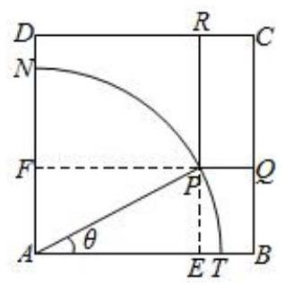

7、如图，直径为 1 的圆 $O$ 中，作一关于圆心对称、邻边互相垂直的十字形，其中 ${AB} < {BE}$ ，设 $\angle {AOB} = \theta$ .

(1)将十字形的面积 $S$ 表示为 $\theta$ 的函数;

(2)求十字形的面积 $S$ 的最大值，并求相应 $\theta$ 的值.

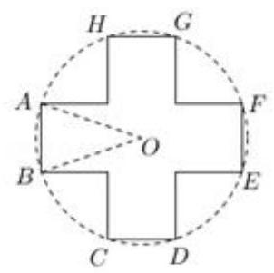

【难度】★★★★

【答案】见解析

【解析】解: (1) 由题意, ${AB} = \sin \frac{\theta }{2},{BE} = \cos \frac{\theta }{2}$ ,又 ${AB} < {BE}$ ,故 $\theta  \in  \left( {0,\frac{\pi }{2}}\right)$ .

故 $S = 2\sin \frac{\theta }{2}\cos \frac{\theta }{2} - {\sin }^{2}\frac{\theta }{2},\theta  \in  \left( {0,\frac{\pi }{2}}\right)$ .

(2) $\because S = 2\sin \frac{\theta }{2}\cos \frac{\theta }{2} - {\sin }^{2}\frac{\theta }{2} = \sin \theta  - \frac{1 - \cos \theta }{2} = \sin \theta  + \frac{\cos \theta }{2} - \frac{1}{2} = \frac{\sqrt{5}}{2}\left( {\sin \theta \frac{2}{\sqrt{5}} + \frac{1}{\sqrt{5}}\cos \theta }\right)  - \frac{1}{2} = \frac{\sqrt{5}}{2}\sin \left( {\theta  + \alpha }\right)  - \frac{1}{2}$ ，

其中 $\alpha  = \arctan \frac{1}{2}$ ,当 $\theta  = \arctan 2$ 时, ${S}_{\max } = \frac{\sqrt{5} - 1}{2}$ .

8、椭圆 ${C}_{1} : \frac{{x}^{2}}{{a}^{2}} + \frac{{y}^{2}}{{b}^{2}} = 1\left( {a > b > 0}\right)$ 的焦点 ${F}_{1},{F}_{2}$ 是等轴双曲线 ${C}_{2} : \frac{{x}^{2}}{2} - \frac{{y}^{2}}{2} = 1$ 的顶点,若椭圆 ${C}_{1}$ 与双曲线 ${C}_{2}$ 的一个交点是 $P,\bigtriangleup P{F}_{1}{F}_{2}$ 的周长为 $4 + 2\sqrt{2}$ .

(1)求椭圆 ${C}_{1}$ 的标准方程；

(2)点 $M$ 是双曲线 ${C}_{2}$ 上任意不同于其顶点的动点，设直线 $M{F}_{1}$ 、 $M{F}_{2}$ 的斜率分别为 ${k}_{1},{k}_{2}$ ，求证: ${k}_{1}$ ， ${k}_{2}$ 的乘积为定值;

(3)过点 $Q\left( {-4,0}\right)$ 任作一动直线 $l$ 交椭圆 ${C}_{1}$ 与 $A, B$ 两点，记 $\overrightarrow{AQ} = \lambda \overrightarrow{QB}\left( {\lambda  \in  R}\right)$ ，若在直线 ${AB}$ 上取一点 $R$ ， 使得 $\overrightarrow{AR} = \left( {-\lambda }\right) \overrightarrow{RB}$ ,试判断当直线 $l$ 运动是,点 $R$ 是否在某一定直线上运动? 若是,求出该直线的方程; 若不是, 请说明理由.

【难度】★★★★

【答案】见解析

【解析】解: (1) 由题可知, $c = \sqrt{2}$ ,由 $\bigtriangleup P{F}_{1}{F}_{2}$ 的周长为 $4 + 2\sqrt{2}$ ,

所以 $\left| {P{F}_{1}}\right|  + \left| {P{F}_{2}}\right|  = 4 + 2\sqrt{2} - 2\sqrt{2} = 4$ ,即 ${2a} = 4$ ,所以 $a = 2$ ,所以 ${b}^{2} = {a}^{2} - {c}^{2} = 2$ ,

所以椭圆的标准方程为 $\frac{{x}^{2}}{4} + \frac{{y}^{2}}{2} = 1$ ;

(2)证明:设 $M\left( {x, y}\right)$ ，由 ${F}_{1}\left( {-\sqrt{2},0}\right) ,{F}_{2}\left( {\sqrt{2},0}\right)$ ，所以 ${k}_{1} = \frac{y}{x + \sqrt{2}},{k}_{2} = \frac{y}{x - \sqrt{2}}$ ，所以 ${k}_{1} \cdot  {k}_{2} = \frac{{y}^{2}}{{x}^{2} - 2}$ ， 又 $\frac{{x}^{2}}{2} - \frac{{y}^{2}}{2} = 1$ ,则 ${y}^{2} = {x}^{2} - 2$ ,所以 ${k}_{1} \cdot  {k}_{2} = 1$ ,即 ${k}_{1},{k}_{2}$ 的乘积为定值;

(3)是:依题可知:直线的斜率存在，设方程为 $y = k\left( {x + 4}\right)$ ， $A\left( {{x}_{1}\text{ ， }{y}_{1}}\right)$ ， $B\left( {{x}_{2}\text{ ， }{y}_{2}}\right)$ ， 所以 $\left\{  \begin{array}{l} y = k\left( {x + 4}\right) \\  \frac{{x}^{2}}{4} + \frac{{y}^{2}}{2} = 1 \end{array}\right.$ ,消元整理得, $\left( {1 + 2{k}^{2}}\right) {x}^{2} + {16}{k}^{2}x + {32}{k}^{2} - 4 = 0$ ,

所以 $\bigtriangleup  = {\left( {16}{k}^{2}\right) }^{2} - 4 \times  \left( {1 + 2{k}^{2}}\right)  \times  \left( {{32}{k}^{2} - 4}\right)  = {16}\left( {1 - 6{k}^{2}}\right)  > 0$ ,

${x}_{1}{x}_{2} = \frac{{32}{k}^{2} - 4}{1 + 2{k}^{2}},{x}_{1} + {x}_{2} =  - \frac{{16}{k}^{2}}{1 + 2{k}^{2}}$ ,由 $\overrightarrow{AQ} = \lambda \overrightarrow{QB}$ 得, $- 4 - {x}_{1} = \lambda \left( {{x}_{2} + 4}\right)$ ,所以 $\lambda  =  - \frac{4 + {x}_{1}}{{x}_{2} + 4}$ ,

设 $R\left( {{x}_{0},{y}_{0}}\right)$ ,由 $\overrightarrow{AR} = \left( {-\lambda }\right) \overrightarrow{RB}$ 得, ${x}_{0} - {x}_{1} =  - \lambda \left( {{x}_{2} - {x}_{0}}\right)$ ,所以 ${x}_{0} = \frac{{x}_{1} - \lambda {x}_{2}}{1 - \lambda } = \frac{{x}_{1} + \frac{4 + {x}_{1}}{{x}_{2} + 4}{x}_{2}}{1 + \frac{4 + {x}_{1}}{{x}_{2} + 4}} = \frac{2{x}_{1}{x}_{2} + 4\left( {{x}_{1} + {x}_{2}}\right) }{{x}_{1} + {x}_{2} + 8}$ , 所以 ${x}_{0} = \frac{2 \times  \frac{{32}{k}^{2} - 4}{1 + 2{k}^{2}} + 4 \times  \left( \frac{{16}{k}^{2}}{1 + 2{k}^{2}}\right) }{-\frac{{16}{k}^{2}}{1 + 2{k}^{2}} + 8} =  - 1$ ,所以 $R$ 在定直线 $x =  - 1$ 上.

9、已知椭圆 $C : \frac{{x}^{2}}{{a}^{2}} + \frac{{y}^{2}}{{b}^{2}} = 1\left( {a > b > 0}\right)$ 的一焦点与短轴的两个端点组成的三角形是等边三角形,直线 $y = 1$ 与椭圆 $C$ 的两交点间的距离为 8 .

(1)求椭圆 $C$ 的方程；

(2)如图,设 $R\left( {{x}_{0},{y}_{0}}\right)$ 是椭圆 $C$ 上的一动点,由原点 $O$ 向圆 ${\left( x - {x}_{0}\right) }^{2} + {\left( y - {y}_{0}\right) }^{2} = 4$ 引两条切线,分别交椭圆 $C$ 于点 $P, Q$ ,若直线 ${OP},{OQ}$ 的斜率均存在,并分别记为 ${k}_{1},{k}_{2}$ ,求证: ${k}_{1} \cdot  {k}_{2}$ 为定值;

(3)在(2)的条件下，试问 ${\left| OP\right| }^{2} + {\left| OQ\right| }^{2}$ 是否为定值？若是，求出该值；若不是，请说明理由.

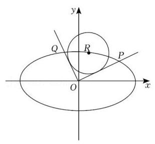

【难度】★★★★

【答案】见解析

【解析】解: (1) 依题意, $\tan {30}^{ \circ  } = \frac{b}{c} = \frac{\sqrt{3}}{3}$ ,即 ${c}^{2} = 3{b}^{2}$ ,

又由于直线 $y = 1$ 与椭圆 $C$ 的两交点间的距离为 8,故椭圆过点 $\left( {4,1}\right)$ ,则 $\frac{16}{{a}^{2}} + \frac{1}{{b}^{2}} = 1$ ,

结合 ${a}^{2} = {b}^{2} + {c}^{2}$ ,可得 ${a}^{2} = {20},{b}^{2} = 5,{c}^{2} = {15},\therefore$ 椭圆 $C$ 的方程为 $\frac{{x}^{2}}{20} + \frac{{y}^{2}}{5} = 1$ ;

(2)证明:直线 ${OP} : y = {k}_{1}x$ ,直线 ${OQ} : y = {k}_{2}x$ ,

又直线 ${OP}$ 为圆 $R$ 的切线,则 $\frac{\left| {k}_{1}{x}_{0} - {y}_{0}\right| }{\sqrt{{k}_{1}^{2} + 1}} = 2$ ,化简可得 $\left( {{x}_{0}^{2} - 4}\right) {k}_{1}^{2} - 2{x}_{0}{y}_{0}{k}_{1} + {y}_{0}^{2} - 4 = 0$ ,

同理可得 $\left( {{x}_{0}^{2} - 4}\right) {k}_{2}^{3} - 2{x}_{0}{y}_{0}{k}_{2} + {y}_{0}^{2} - 4 = 0$ ,

$\therefore {k}_{1},{k}_{2}$ 是方程 $\left( {{x}_{0}^{2} - 4}\right) {k}^{2} - 2{x}_{0}{y}_{0}k + {y}_{0}^{2} - 4 = 0$ 的两根,由 ${x}_{0}^{2} - 4 \neq  0,\Delta  > 0$ ,可知 ${k}_{1}{k}_{2} = \frac{{y}_{0}^{2} - 4}{{x}_{0}{}^{2} - 4}$ ,

又 $R\left( {{x}_{0},{y}_{0}}\right)$ 在椭圆上，即 ${y}_{0}^{2} = 5 - \frac{1}{4}{x}_{0}^{2}\text{ ， }\therefore {k}_{1}{k}_{2} = \frac{{y}_{0}^{2} - 4}{{x}_{0}^{2} - 4} = \frac{1 - \frac{1}{4}{x}_{0}^{2}}{{x}_{0}^{2} - 4} =  - \frac{1}{4},\therefore {k}_{1}{k}_{2}$ 为定值 $- \frac{1}{4}$ ；

(3)在(2)的条件下，设 $P\left( {{x}_{1},{y}_{1}}\right)$ ， $Q\left( {{x}_{2},{y}_{2}}\right)$ ，联立 $\left\{  \begin{array}{l} y = {k}_{1}x \\  \frac{{x}^{2}}{20} + \frac{{y}^{2}}{5} = 1 \end{array}\right.$ ，可解得 $\left\{  \begin{array}{l} {x}_{1}^{2} = \frac{20}{1 + 4{k}_{1}^{2}} \\  {y}_{1}^{2} = \frac{{20}{k}_{1}^{2}}{1 + 4{k}_{1}^{2}} \end{array}\right.$ ， $\therefore {x}_{1}^{2} + {y}_{1}^{2} = \frac{{20}\left( {1 + {k}_{1}^{2}}\right) }{1 + 4{k}_{1}^{2}}$ ,同理可得 ${x}_{2}^{2} + {y}_{2}^{2} = \frac{{20}\left( {1 + {k}_{2}^{2}}\right) }{1 + 4{k}_{2}^{2}}$ ,

$\therefore {\left| OP\right| }^{2} + {\left| OQ\right| }^{2} = {x}_{1}^{2} + {y}_{1}^{2} + {x}_{2}^{2} + {y}_{2}^{2} = \frac{{20}\left( {1 + {k}_{1}^{2}}\right) }{1 + 4{k}_{1}^{2}} + \frac{{20}\left( {1 + {k}_{2}^{2}}\right) }{1 + 4{k}_{2}^{2}} = \frac{{20}\left( {1 + {k}_{1}^{2}}\right) }{1 + 4{k}_{1}^{2}} + \frac{{20}\left( {1 + \frac{1}{{16}{k}_{1}^{2}}}\right) }{1 + \frac{1}{4{k}_{1}^{2}}} = \frac{{25} + {100}{k}_{1}^{2}}{1 + 4{k}_{1}^{2}} = {25}$ . $\therefore {\left| OP\right| }^{2} + {\left| OQ\right| }^{2}$ 为定值 25 .
