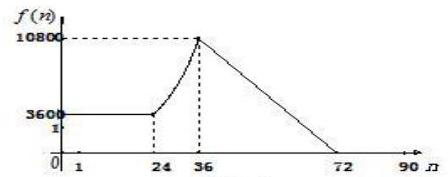
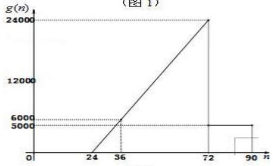
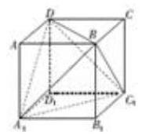
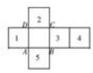
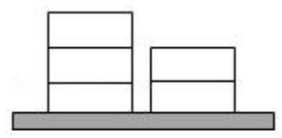

## 第 3 课:分类讨论思想

<table><tr><td>教学目标</td><td>1、掌握分类讨论思想基本原则和方法;   2、能正确和高效的进行分类与整合;   3、理解高中数学里比较常见的分类题型;   4、如何在必要情形下避开分类讨论.</td></tr><tr><td>重点</td><td>1、如何把握好分类的基本原则;   2、合理选定标准正确进行分类求解.</td></tr><tr><td>难点</td><td>1、如何把握好分类的基本原则;   2、合理选定标准正确进行分类求解.</td></tr></table>

## 知识梳理

分类讨论思想是一种重要的数学思想方法. 其基本思路是将一个较复杂的数学问题分解(或分割)成若干个基础性问题, 通过对基础性问题的解答来实现解决原问题的思想策略. 对问题实行分类与整合, 分类标准等于增加一个已知条件, 实现了有效增设, 将大问题(或综合性问题)分解为小问题(或基础性问题), 优化解题思路, 降低问题难度。分类讨论是一种逻辑方法, 是一种重要的数学思想, 同时也是一种重要的解题策略, 它体现了化整为零、积零为整的思想与归类整理的方法。有关分类讨论思想的数学问题具有明显的逻辑性、综合性、探索性, 能训练人的思维条理性和概括性, 所以在高考试题中占有重要的位置。

引起分类讨论的原因主要是以下几个方面:

(1)由数学概念引起的分类讨论. 有的概念本身是分类的，如绝对值、直线斜率、指数函数、对数函数等. (2)由性质、定理、公式的限制引起的分类讨论. 有的数学定理、公式、性质是分类给出的, 在不同的条件下结论不一致,如等比数列的前 $n$ 项和公式、函数的单调性等.

(3)由数学运算要求引起的分类讨论. 如除法运算中除数不为零, 偶次方根为非负, 对数真数与底数的要求, 指数运算中底数的要求, 不等式两边同乘以一个正数、负数, 三角函数的定义域等.

(4)由图形的不确定性引起的分类讨论. 有的图形类型、位置需要分类:如角的终边所在的象限；点、线、 面的位置关系等.

(5)由参数的变化引起的分类讨论. 某些含有参数的问题, 如含参数的方程、不等式, 由于参数的取值不同会导致所得结果不同, 或对于不同的参数值要运用不同的求解或证明方法.

(6)由实际意义引起的讨论. 此类问题在应用题中, 特别是在解决排列、组合中的计数问题时常用.

解答分类讨论问题时, 我们的基本方法和步骤是: 首先要确定讨论对象以及所讨论对象的全体的范围; 其次确定分类标准, 正确进行合理分类, 即标准统一、不漏不重、分类互斥 (没有重复); 再对所分类逐步进行讨论, 分级进行, 获取阶段性结果; 最后进行归纳小结, 综合得出结论。

分类讨论是一种有效的化繁为简的做法, 有时也可以避免分类讨论: 正反相对, 全集补集, 分离变量, 构造函数, 数形结合, 排列组合中捆邦等方法都可有效的避免分类。

## (一) 由数学概念、性质、定理、公式的限制、参量引起的分类讨论

## 例题精讲

【例 1】对于全集 $\mathbf{R}$ 的子集 $A$ ,定义函数 ${f}_{A}\left( x\right)  = \left\{  \begin{array}{ll} 1 & \left( {x \in  A}\right) \\  0 & \left( {x \in  {\complement }_{\mathbf{R}}A}\right)  \end{array}\right.$ 为 $A$ 的特征函数. 设 $A\text{ 、 }B$ 为全集 $\mathbf{R}$ 的子集, 下列结论中错误的是 ( )

A. 若 $A \subseteq  B$ ,则 ${f}_{A}\left( x\right)  \leq  {f}_{B}\left( x\right)$ B. ${f}_{{\complement }_{\mathbf{R}}A}\left( x\right)  = 1 - {f}_{A}\left( x\right)$

C. ${f}_{A \cap  B}\left( x\right)  = {f}_{A}\left( x\right)  \cdot  {f}_{B}\left( x\right)$ D. ${f}_{A \cup  B}\left( x\right)  = {f}_{A}\left( x\right)  + {f}_{B}\left( x\right)$

【例2】已知函数 $f\left( x\right)  = \left| {x + \frac{1}{x} + a}\right|$ ,若对任意实数 $a$ ,关于 $x$ 的不等式 $f\left( x\right)  \geq  m$ 在区间 $\left\lbrack  {\frac{1}{2},3}\right\rbrack$ 上总有解, 则实数 $m$ 的取值范围为___

【例 3】若 $f\left( x\right)  = \left| {x - a}\right|  \cdot  \left| {x - {3a}}\right|$ ，且 $x \in  \left\lbrack  {0,1}\right\rbrack$ 上的值域为 $\left\lbrack  {0, f\left( 1\right) }\right\rbrack$ ，则实数 $a$ 的取值范围是___.

【例 4】已知函数 $f\left( x\right)  = {2}^{x} + k \cdot  {2}^{-x}\left( {x \in  R}\right)$ .

(1)判断函数 $f\left( x\right)$ 的奇偶性，并说明理由;

(2)设 $k > 0$ ，问函数 $f\left( x\right)$ 的图像是否关于某直线 $x = m$ 成轴对称图形，如果是，求出 $m$ 的值； 如果不是,请说明理由; (可利用真命题: “函数 $g\left( x\right)$ 的图像关于某直线 $x = m$ 成轴对称图形” 的充要条件为 “函数 $g\left( {m + x}\right)$ 是偶函数”)

(3)设 $k =  - 1$ ，函数 $h\left( x\right)  = a \cdot  {2}^{x} - {2}^{1 - x} - \frac{4}{3}a$ ，若函数 $f\left( x\right)$ 与 $h\left( x\right)$ 的图像有且只有一个公共点，求实数 $a$ 的取值范围.

【例 5】已知函数 $f\left( x\right)  = {x}^{2} - 1, g\left( x\right)  = a\left| {x - 1}\right|$

(1)若 $x \in  R$ 时，不等式 $f\left( x\right)  \geq  g\left( x\right)$ 恒成立，求实数 $a$ 的取值范围；

(2)求函数 $h\left( x\right)  = \left| {f\left( x\right) }\right|  + g\left( x\right)$ 在区间 $\left\lbrack  {-2,2}\right\rbrack$ 上的最大值.

【例 6】函数 $f\left( x\right)  = \sin \left( {\tan {\omega x}}\right)$ ,其中 $\omega  \neq  0$ .

(1)讨论 $f\left( x\right)$ 的奇偶性;

(2) $\omega  = 1$ 时，求证 $f\left( x\right)$ 的最小正周期 $\pi$ ；

(3) $\omega  \in  \left( {{1.50},{1.57}}\right)$ ，当函数 $f\left( x\right)$ 的图像与 $g\left( x\right)  = \frac{1}{2}\left( {x + \frac{1}{x}}\right)$ 的图像有交点时，求满足条件的 $\omega \mathrm{d}$ 的个数， 说明理由.

【例 7】已知函数 $f\left( x\right)  = \cos x$ ,若对任意实数 ${x}_{1},{x}_{2}$ ,方程 $\left| {f\left( x\right)  - f\left( {x}_{1}\right) }\right|  + \left| {f\left( x\right)  - f\left( {x}_{2}\right) }\right|  = m\left( {m \in  R}\right)$ 有解, 方程 $\left| {f\left( x\right)  - f\left( {x}_{1}\right) }\right|  - \left| {f\left( x\right)  - f\left( {x}_{2}\right) }\right|  = n\left( {n \in  R}\right)$ 也有解,则 $m + n$ 的值的集合为___.

【例 8】( 1 )点 $M\left( {{20},{40}}\right)$ ，抛物线 ${y}^{2} = {2px}$ ( $p > 0$ )的焦点为 $F$ ,若对于抛物线上的任意点 $P$ ， $\left| {PM}\right|  + \left| {PF}\right|$ 的最小值为 41，则 $p$ 的值等于___

(2)已知曲线 ${C}_{1} : \left| y\right|  - x = 2$ 与曲线 ${C}_{2} : \lambda {x}^{2} + {y}^{2} = 4$ 恰好有两个不同的公共点，则实数 $\lambda$ 的取值范围是 ( )

A. $( - \infty , - 1\rbrack  \cup  \lbrack 0,1)$ B. $( - 1,1\rbrack$ C. $\lbrack  - 1,1)$ D. $\left\lbrack  {-1,0}\right\rbrack   \cup  \left( {1, + \infty }\right)$

(3)已知椭圆 ${x}^{2} + \frac{{y}^{2}}{2} = {a}^{2}\left( {a > 0}\right)$ 和点 $A\left( {-1,1}\right) , B\left( {2,4}\right)$ ，若线段 ${AB}$ 与椭圆没有公共点，求实数 $a$ 的取值范围.

【例 9】已知数列 $\left\{  {a}_{n}\right\}$ 的前 $n$ 项和为 ${S}_{n}$ ,对任意 $n \in  {\mathbf{N}}^{ * },{S}_{n} = {\left( -1\right) }^{n}{a}_{n} + \frac{1}{{2}^{n}} + n - 3$ 且 $\left( {{a}_{1} - p}\right) \left( {{a}_{2} - p}\right)  < 0$ , 则实数 $p$ 的取值范围是___.

【例 10】已知数列 $\left\{  {a}_{n}\right\}$ 与 $\left\{  {b}_{n}\right\}$ 满足 ${a}_{n + 1} - {a}_{n} = 2\left( {{b}_{n + 1} - {b}_{n}}\right) , n \in  {\mathrm{N}}^{ * }$ .

(1)若 ${b}_{n} = {3n} + 5$ ，且 ${a}_{1} = 1$ ，求 $\left\{  {a}_{n}\right\}$ 的通项公式；

(2)设 $\left\{  {a}_{n}\right\}$ 的第 ${n}_{0}$ 项是最大项，即 ${a}_{{n}_{0}} \geq  {a}_{n}\left( {n \in  {\mathrm{N}}^{ * }}\right)$ ，求证: $\left\{  {b}_{n}\right\}$ 的第 ${n}_{0}$ 项是最大项；

(3)设 ${a}_{1} = \lambda  < 0,{b}_{n} = {\lambda }^{n}\left( {n \in  {\mathrm{N}}^{ * }}\right)$ ，求 $\lambda$ 的取值范围，使得 $\left\{  {a}_{n}\right\}$ 有最大值 $M$ 与最小值 $m$ ，且 $\frac{M}{m} \in  \left( {-2,2}\right)$ .

【例 11】对于数列 $\left\{  {a}_{n}\right\}$ ,若从第二项起的每一项均大于该项之前的所有项的和,则称 $\left\{  {a}_{n}\right\}$ 为 $P$ 数列.

设无穷数列 $\left\{  {a}_{n}\right\}$ 是首项为 $a$ ,公比为 $q$ 的等比数列,有穷数列 $\left\{  {b}_{n}\right\}  \text{ 、 }\left\{  {c}_{n}\right\}$ 是从 $\left\{  {a}_{n}\right\}$ 中取出部分项按原来的顺序所组成的不同数列,起所有项和分别为 ${T}_{1}\text{ 、 }{T}_{2}$ ,求 $\left\{  {a}_{n}\right\}$ 是 $P$ 数列时 $a$ 与 $q$ 所满足的条件,并证明命题 “若 $a > 0$ 且 ${T}_{1} = {T}_{2}$ ,则 $\left\{  {a}_{n}\right\}$ 不是 $P$ 数列”.

## 巩固训练

1、圆锥的母线长为 2，其侧面展开图的中心角为 $\theta$ 弧度，过圆锥顶点的截面中，面积的最大值为 2；则 $\theta$ 的取值范围是( )

A. $\lbrack \sqrt{2}\pi ,{2\pi })$ B. $\left\lbrack  {\pi ,\sqrt{2}\pi }\right\rbrack$ C. $\{ \sqrt{2}\pi \}$ D. $\left\lbrack  {\frac{\sqrt{2}\pi }{2},\pi }\right)$

2、若 ${a}_{1}\text{ 、 }{b}_{1}\text{ 、 }{c}_{1}\text{ 、 }{a}_{2}\text{ 、 }{b}_{2}\text{ 、 }{c}_{2} \in  R$ ,且都不为零,则 “ $\frac{{a}_{1}}{{a}_{2}} = \frac{{b}_{1}}{{b}_{2}} = \frac{{c}_{1}}{{c}_{2}}$ ” 是 “关于 $x$ 的不等式 ${a}_{1}{x}^{2} + {b}_{1}x + {c}_{1} > 0$ 与 ${a}_{2}{x}^{2} + {b}_{2}x + {c}_{2} > 0$ 的解集相同” 的( )

A. 充分非必要条件 B. 必要非充分条件

C. 充要条件 D. 既非充分又非必要条件

3、设 $a, b \in  \mathbf{R}, c \in  \lbrack 0,{2\pi })$ . 若对任意实数 $x$ 都有 $2\sin \left( {{3x} - \frac{\pi }{3}}\right)  = a\sin \left( {{bx} + c}\right)$ ,则满足条件的有序实数组 $\left( {a, b, c}\right)$ 的组数为___.

4、已知关于 x 的不等式组 $1 \leq  k{x}^{2} + {2x} + k \leq  2$ 有唯一实数解，则实数 k 的取值集合是___.

5、已知函数 $f\left( x\right)  = \frac{{x}^{2} + \left( {a - 1}\right) x - {2a} + 2}{2{x}^{2} + {ax} - {2a}}$ 的定义域是使得解析式有意义的 $x$ 的集合，如果对于定义域内的任意实数 $x$ ，函数值均为正，则实数 $a$ 的取值范围是___.

6、(1)已知全集 $U = \{ 1,2,3,4,5,6,7,8,9,{10}\}$ ，集合 $A = \left\{  {{a}_{1},{a}_{2},{a}_{3}}\right\}$ ，则满足 ${a}_{3} \geq  {a}_{2} + 1 \geq  {a}_{1} + 4$ 的集合 $A$ 的个数是___. (用数字作答)

(2)已知全集 $U = \{ 1,2,3,4,5,6,7,8\}$ ，在 $U$ 中任取四个元素组成的集合记为 $A = \left\{  {{a}_{1},{a}_{2},{a}_{3},{a}_{4}}\right\}$ ，余下的四个元素组成的集合记为 ${C}_{U}A = \left\{  {{b}_{1},{b}_{2},{b}_{3},{b}_{4}}\right\}$ ,若 ${a}_{1} + {a}_{2} + {a}_{3} + {a}_{4} < {b}_{1} + {b}_{2} + {b}_{3} + {b}_{4}$ ,则集合 $A$ 的取法共有___种.

7、已知数列 $\left\{  {a}_{n}\right\}$ 满足: ${a}_{1} = m$ (m 为正整数)， ${a}_{n + 1} = \left\{  \begin{array}{l} \frac{{a}_{n}}{2}\text{ ，当 }{a}_{n}\text{ 为偶数时， } \\  3{a}_{n} + 1\text{ ，当 }{a}_{n}\text{ 为奇数时。 } \end{array}\right.$ 若 ${a}_{6} = 1$ ，则 $\mathrm{m}$ 所有可能的取值为___.

8、已知函数 ${f}_{1}\left( x\right)  = {e}^{\left| x - 2a + 1\right| },{f}_{2}\left( x\right)  = {e}^{\left| {x - a}\right|  + 1}, x \in  R$ .

(1)若 $a = 2$ ，求 $f\left( x\right)  = {f}_{1}\left( x\right)  + {f}_{2}\left( x\right)$ 在 $x \in  \left\lbrack  {2,3}\right\rbrack$ 上的最小值；

(2)若 $x \in  \lbrack a, + \infty )$ 时， ${f}_{2}\left( x\right)  \geq  {f}_{1}\left( x\right)$ ，求 $a$ 的取值范围；

(3)求函数 $g\left( x\right)  = \frac{{f}_{1}\left( x\right)  + {f}_{2}\left( x\right) }{2} - \frac{\left| {f}_{1}\left( x\right)  - {f}_{2}\left( x\right) \right| }{2}$ 在 $x \in  \left\lbrack  {1,6}\right\rbrack$ 上的最小值.

9、已知实数 $a > 0$ ，函数 $f\left( x\right)  = \sqrt{\frac{1 - {x}^{2}}{1 + {x}^{2}}} + a\sqrt{\frac{1 + {x}^{2}}{1 - {x}^{2}}}$ .

(1)当 $a = 1$ 时，求 $f\left( x\right)$ 的最小值;

(2)当 $a = 1$ 时，判断 $f\left( x\right)$ 的单调性，并说明理由；

(3)求实数 $a$ 的范围，使得对于区间 $\left\lbrack  {-\frac{2\sqrt{5}}{5},\frac{2\sqrt{5}}{5}}\right\rbrack$ 上的任意三个实数 $r$ 、 $s$ 、 $t$ ，都存在以 $f\left( r\right) \text{ 、 }f\left( s\right) \text{ 、 }f\left( t\right)$ 为边长的三角形.

## (二)由实际意义引起的讨论. 此类问题在应用题中, 特别是在解决排列、组合中的计数问 题时常用

## 例题精讲

【例 12】2010 年上海世博会组委会为保证游客参观的顺利进行，对每天在各时间段进入园区和离开园区的人数作了一个模拟预测. 为了方便起见, 以 10 分钟为一个计算单位, 上午 9 点 10 分作为第一个计算人数的时间,即 $n = 1;9$ 点 20 分作为第二个计算人数的时间,即 $n = 2$ ; 依此类推...,把一天内从上午 9 点到晚上 24 点分成了 90 个计算单位.

对第 $n$ 个时刻进入园区的人数 $f\left( n\right)$ 和时间 $n\left( {n \in  {N}^{ * }}\right)$ 满足以下关系(如图

$$
\text{ 1): }f\left( n\right)  = \left\{  {\begin{array}{ll} {3600} & \left( {1 \leq  n \leq  {24}}\right) \\  {3600} \cdot  {3}^{\frac{n - {24}}{12}} & \left( {{25} \leq  n \leq  {36}}\right) \\   - {300n} + {21600} & \left( {{37} \leq  n \leq  {72}}\right) \\  0 & \left( {{73} \leq  n \leq  {90}}\right)  \end{array},\;n \in  {N}^{ * }}\right.
$$

图 2

对第 $n$ 个时刻离开园区的人数 $g\left( n\right)$ 和时间 $n\left( {n \in  {N}^{ * }}\right)$ 满足以下关系(如图

$$
\text{ 2): }g\left( n\right)  = \left\{  \begin{array}{ll} 0 & \left( {1 \leq  n \leq  {24}}\right) \\  {500n} - {12000} & \left( {{25} \leq  n \leq  {72}}\right) ,\;n \in  {N}^{ * } \\  {5000} & \left( {{73} \leq  n \leq  {90}}\right)  \end{array}\right.
$$

(1)试计算在当天下午 3 点整(即 15 点整)时，世博园区内共有多少游客？

(2)请求出当天世博园区内游客总人数最多的时刻.

【例 13】面关于棱长为 1 的正方体 ${ABCD} - {A}_{1}{B}_{1}{C}_{1}{D}_{1}$ 叙述正确的是___.

①任取四个顶点，共面的情况有 8 种；

②任取四个顶点顺次连接总共可构成 10 个正三棱锥;

③任取六个表面中的两个，两面平行的情况有 5 种；

④如图把正方体展开，正方体原下底面 ${A}_{1}{B}_{1}{C}_{1}{D}_{1}$ 与标号 4 对应;

⑤在原正方体中任取两个顶点，这两点间的距离在区间 $\left( {\frac{\sqrt{10}}{2},\sqrt{3}}\right)$ 内的情况有 4 种.

## 巩固训练

1、已知 “ $c, d, e, f$ ” 是从1,3,4,5,7中取出 4 个元素的一个排列. 设 $x$ 是实数，若 “ $\left( {x - 2}\right) \left( {x - 6}\right)  < 0$ ” 可推出 “ $\left( {x - c}\right) \left( {x - d}\right)  < 0$ 或 $\left( {x - e}\right) \left( {x - f}\right)  < 0$ ”,则满足条件的排列“ $c, d, e, f$ ” 共有___个.

2、设 $\left( {{x}_{1},{x}_{2},{x}_{3},{x}_{4},{x}_{5}}\right)$ 是1,2,3,4,5的一个排列,若 $\left( {{x}_{i} - {x}_{i + 1}}\right) \left( {{x}_{i + 1} - {x}_{i + 2}}\right)  < 0$ 对一切 $i \in  \{ 1,2,3\}$ 恒成立, 就称该排列是 “交替” 的. “交替” 的排列的数目是 ( )

A. 8 B. 16 C. 24 D. 32

3、如图，在地上有同样大小的 5 块积木，一堆 2 个，一堆 3 个，要把积木一块一块的全部放到某个盒子里， 每次只能取出其中一堆最上面的一块，则不同的取法有___种(用数字作答).

4、设集合 $A = \{ 1,2,3,\cdots ,{2020}\}$ ，选择 $A$ 的两个非空子集 $B$ 和 $C$ ，要使 $C$ 中最小的数大于 $B$ 中的最大数，则不同的选择方法有___.

5、已知函数 $f\left( x\right)  = \left\{  \begin{array}{l} \left| x\right| , x \in  p \\   - {x}^{2} + {2x}, x \in  M \end{array}\right.$ 其中 $P, M$ 是非空数集,且 $P \mid  M = \varnothing$ ,设 $f\left( P\right)  = \{ y \mid  y = f\left( x\right) , x \in  P\}$ , $f\left( M\right)  = \{ y \mid  y = f\left( x\right) ,\;x \in  M\} .$

(I) 若 $P = \left( {-\infty ,0}\right) , M = \left\lbrack  {0,4}\right\rbrack$ ,求 $f\left( P\right)  \cup  f\left( M\right)$ ;

( II ) 是否存在实数 $a >  - 3$ ,使得 $P \cup  M = \left\lbrack  {-3, a}\right\rbrack$ ,且 $f\left( P\right)  \cup  f\left( M\right)  = \left\lbrack  {-3,{2a} - 3}\right\rbrack$ ? 若存在,请求出满足条件的实数 $a$ ; 若不存在,请说明理由;

(III) 若 $P \cup  M = R$ ,且 $0 \in  M, I \in  P, f\left( x\right)$ 是单调递增函数,求集合 $P, M$ .

## (三)如何灵活的避免分类讨论(常用参变分离)

## 例题精讲

【例 14】若不等式 ${2x} - 1 > m\left( {{x}^{2} - 1}\right)$ 对满足 $\left| m\right|  \leq  1$ 的所有 $m$ 都成立,则 $x$ 的取值范围是___.

【例 15】四面体的顶点与棱的中点共 10 个点, 在其中取四个不共面的点, 有 ___种不同的取法(结果用数字表示).

【例 16】设函数 $f\left( x\right)  = \left| {x + \frac{1}{x} - {ax} - b}\right|$ ,若对任意的实数 $a, b$ ,总存在 ${x}_{0} \in  \left\lbrack  {\frac{1}{5},5}\right\rbrack$ 使得 $f\left( {x}_{0}\right)  \geq  m$ 成立,则实 $m$ 数的取值范围是 ___.

## 巩固训练

1、已知 $f\left( x\right)$ 是偶函数,且 $f\left( x\right)$ 在 $\lbrack 0, + \infty )$ 上是减函数,若 $f\left( {{ax} + 1}\right)  \leq  f\left( {x - 2}\right)$ 在 $x \in  \left\lbrack  {\frac{1}{2},1}\right\rbrack$ 上恒成立,则实数 $a$ 的取值范围是( )

A. $\left\lbrack  {-5,1}\right\rbrack$ B. $\left\lbrack  {-5,0}\right\rbrack$

C. $\left( {-\infty , - 5}\right)  \cup  \lbrack 1, + \infty )$ D. $\left( {-\infty , - 5\rbrack \bigcup \lbrack 1, + \infty }\right)$

2、在报名的 8 名男生和 5 名女生中，选取 6 人参加志愿者活动，要求男、女都有，则不同的选取方式的种数为___(结果用数值表示)

3、设 $f\left( x\right)$ 是定义在 $R$ 上的奇函数,且当 $x \geq  0$ 时, $f\left( x\right)  = {x}^{2}$ ,若对任意的 $x \in  \left\lbrack  {t, t + 2}\right\rbrack$ ,不等式 $f\left( {x + t}\right)  \geq  {2f}\left( x\right)$ 恒成立，则实数 $t$ 的取值范围是 ___.

4、已知二次函数 $f\left( x\right)$ 满足 $f\left( x\right)  = f\left( {-4 - x}\right)$ ， $f\left( 0\right)  = 3$ ，若 ${x}_{1},{x}_{2}$ 是 $f\left( x\right)$ 的两个零点，且 $\left| {{x}_{1} - {x}_{2}}\right|  = 2$ .

(1)求 $f\left( x\right)$ 的解析式；

(2)若 $g\left( x\right)  = \frac{f\left( x\right) }{x}$ ，求函数 $g\left( x\right)$ 的值域；

(2)若不等式 $g\left( {2}^{x}\right)  - k \cdot  {2}^{x} \geq  0$ 在 $x \in  \left\lbrack  {-1,1}\right\rbrack$ 上恒成立，求对数 $k$ 的取值范围.
