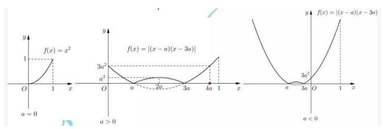
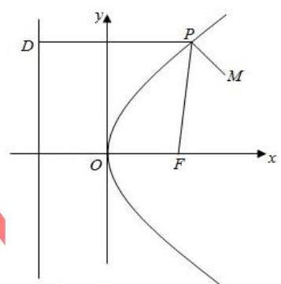
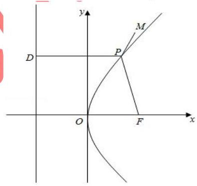
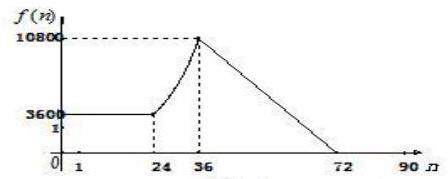
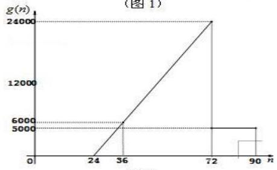
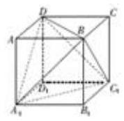
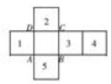
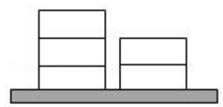
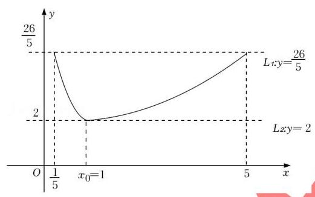

## 知识梳理

## 第 3 课:分类讨论思想

<table><tr><td>教学目标</td><td>1、掌握分类讨论思想基本原则和方法;   2、能正确和高效的进行分类与整合;   3、理解高中数学里比较常见的分类题型;   4、如何在必要情形下避开分类讨论.</td></tr><tr><td>重点</td><td>1、如何把握好分类的基本原则;   2、合理选定标准正确进行分类求解.</td></tr><tr><td>难点</td><td>1、如何把握好分类的基本原则;   2、合理选定标准正确进行分类求解.</td></tr></table>

分类讨论思想是一种重要的数学思想方法. 其基本思路是将一个较复杂的数学问题分解(或分割)成若干个基础性问题, 通过对基础性问题的解答来实现解决原问题的思想策略. 对问题实行分类与整合, 分类标准等于增加一个已知条件, 实现了有效增设, 将大问题(或综合性问题)分解为小问题(或基础性问题), 优化解题思路, 降低问题难度。分类讨论是一种逻辑方法, 是一种重要的数学思想, 同时也是一种重要的解题策略, 它体现了化整为零、积零为整的思想与归类整理的方法。有关分类讨论思想的数学问题具有明显的逻辑性、综合性、探索性, 能训练人的思维条理性和概括性, 所以在高考试题中占有重要的位置。

引起分类讨论的原因主要是以下几个方面:

(1)由数学概念引起的分类讨论. 有的概念本身是分类的，如绝对值、直线斜率、指数函数、对数函数等. (2)由性质、定理、公式的限制引起的分类讨论. 有的数学定理、公式、性质是分类给出的, 在不同的条件下结论不一致,如等比数列的前 $n$ 项和公式、函数的单调性等.

(3)由数学运算要求引起的分类讨论. 如除法运算中除数不为零, 偶次方根为非负, 对数真数与底数的要求, 指数运算中底数的要求，不等式两边同乘以一个正数、负数，三角函数的定义域等.

(4)由图形的不确定性引起的分类讨论. 有的图形类型、位置需要分类:如角的终边所在的象限；点、线、 面的位置关系等.

(5)由参数的变化引起的分类讨论. 某些含有参数的问题, 如含参数的方程、不等式, 由于参数的取值不同会导致所得结果不同, 或对于不同的参数值要运用不同的求解或证明方法.

(6)由实际意义引起的讨论. 此类问题在应用题中, 特别是在解决排列、组合中的计数问题时常用.

解答分类讨论问题时, 我们的基本方法和步骤是: 首先要确定讨论对象以及所讨论对象的全体的范围; 其次确定分类标准, 正确进行合理分类, 即标准统一、不漏不重、分类互斥 (没有重复); 再对所分类逐步进行讨论, 分级进行, 获取阶段性结果; 最后进行归纳小结, 综合得出结论。

分类讨论是一种有效的化繁为简的做法, 有时也可以避免分类讨论: 正反相对, 全集补集, 分离变量, 构造函数, 数形结合, 排列组合中捆邦等方法都可有效的避免分类。

## (一)由数学概念、性质、定理、公式的限制、参量引起的分类讨论

例题精讲

【例 1】对于全集 $\mathbf{R}$ 的子集 $A$ ,定义函数 ${f}_{A}\left( x\right)  = \left\{  \begin{array}{ll} 1 & \left( {x \in  A}\right) \\  0 & \left( {x \in  {\complement }_{\mathbf{R}}A}\right)  \end{array}\right.$ 为 $A$ 的特征函数. 设 $A\text{ 、 }B$ 为全集 $\mathbf{R}$ 的子集, 下列结论中错误的是 ( )

A. 若 $A \subseteq  B$ ,则 ${f}_{A}\left( x\right)  \leq  {f}_{B}\left( x\right)$ B. ${f}_{{\complement }_{\mathbf{R}}A}\left( x\right)  = 1 - {f}_{A}\left( x\right)$

C. ${f}_{A \cap  B}\left( x\right)  = {f}_{A}\left( x\right)  \cdot  {f}_{B}\left( x\right)$ D. ${f}_{A \cup  B}\left( x\right)  = {f}_{A}\left( x\right)  + {f}_{B}\left( x\right)$

【难度】 $\star   \star   \star   \star$

【答案】D

【解析】当 $x \in  A \cap  B$ ,此时 $x \in  A\text{ 、 }x \in  B\text{ 、 }x \in  A \cup  B$ 同时成立, ${f}_{A}\left( x\right)  = {f}_{B}\left( x\right)  = \; {f}_{A \cup  B}\left( x\right)  = 1,\therefore {f}_{A \cup  B}\left( x\right)  = {f}_{A}\left( x\right)  + {f}_{B}\left( x\right)$ 不恒成立,故 $\mathrm{D}$ 错误. 其余选项均正确.

【例2】已知函数 $f\left( x\right)  = \left| {x + \frac{1}{x} + a}\right|$ ,若对任意实数 $a$ ,关于 $x$ 的不等式 $f\left( x\right)  \geq  m$ 在区间 $\left\lbrack  {\frac{1}{2},3}\right\rbrack$ 上总有解, 则实数 $m$ 的取值范围为___

【难度】 $\star   \star   \star   \star$

【答案】 $\left( {-\infty ,\frac{2}{3}}\right\rbrack$

【解析】 $x \in  \left\lbrack  {\frac{1}{2},3}\right\rbrack$ 时,令 $\mathrm{t} = \mathrm{x} + \frac{1}{x}, t \in  \left\lbrack  {2,\frac{10}{3}}\right\rbrack$ ,即: $f\left( t\right)  = \left| {t + a}\right|  \geq  m$ 在 $\mathrm{t} \in  \left\lbrack  {2,\frac{10}{3}}\right\rbrack$ 上总有解,即 $m \leq  f{\left( t\right) }_{\max };\mathrm{t} \in  \left\lbrack  {2,\frac{10}{3}}\right\rbrack$ . 当 $a \geq   - 2$ 时, $\mathrm{f}\left( t\right)  = t + a \Rightarrow  f{\left( t\right) }_{\min } = \frac{10}{3} + a \geq  m$ 在 $a \geq   - 2$ 上恒成立,即: $m \leq  \frac{10}{3} - 2 = \frac{4}{3}$ ,当 $- \frac{10}{3} < a <  - 2$ 时, $\mathrm{f}\left( t\right)  = \left\{  \begin{array}{l} t + a, t \in  \left\lbrack  {-a,\frac{10}{3}}\right\rbrack  \\   - t - a, t \in  \lbrack 2, - a) \end{array}\right.$ 时, $f\left( t\right)$ 的最大值 $\frac{10}{3} + a$ 或 $- 2 - a$ 中取到,即 ${2f}{\left( t\right) }_{\max } \geq   - 2 - a + \frac{10}{3} + a = \frac{4}{3} \Rightarrow  f\left( t\right)  \geq  \frac{2}{3}, m \leq  \frac{2}{3}$ 综上 $m \in  \left( {-\infty ,\frac{2}{3}}\right\rbrack$

【例 3】若 $f\left( x\right)  = \left| {x - a}\right|  \cdot  \left| {x - {3a}}\right|$ ,且 $x \in  \left\lbrack  {0,1}\right\rbrack$ 上的值域为 $\left\lbrack  {0, f\left( 1\right) }\right\rbrack$ ,则实数 $a$ 的取值范围是___

【难度】 $\star   \star   \star   \star$

【答案】 $\left\lbrack  {0,\frac{1}{4}}\right\rbrack$

【解析】当 $a = 0$ 时,符合,当 $a > 0$ 时必有 ${4a} \leq  1 \Rightarrow  0 < a \leq  \frac{1}{4}$

当 $a < 0$ 时, $f\left( x\right)$ 单调递增,值域为 $\left\lbrack  {f\left( 0\right) , f\left( 1\right) }\right\rbrack   = \left\lbrack  {3{a}^{2}, f\left( 1\right) }\right\rbrack$ ,不符合

【例 4】已知函数 $f\left( x\right)  = {2}^{x} + k \cdot  {2}^{-x}\left( {x \in  R}\right)$ .

(1)判断函数 $f\left( x\right)$ 的奇偶性，并说明理由;

(2)设 $k > 0$ ，问函数 $f\left( x\right)$ 的图像是否关于某直线 $x = m$ 成轴对称图形，如果是，求出 $m$ 的值； 如果不是,请说明理由; (可利用真命题: “函数 $g\left( x\right)$ 的图像关于某直线 $x = m$ 成轴对称图形” 的充要条件为 “函数 $g\left( {m + x}\right)$ 是偶函数”)

(3)设 $k =  - 1$ ，函数 $h\left( x\right)  = a \cdot  {2}^{x} - {2}^{1 - x} - \frac{4}{3}a$ ，若函数 $f\left( x\right)$ 与 $h\left( x\right)$ 的图像有且只有一个公共点，求实数 $a$ 的取值范围.

【难度】 $\star   \star   \star   \star$

【答案】见解析

【解析】(1) $f\left( {-x}\right)  = {2}^{-x} + k \cdot  {2}^{x}$ ,

若 $f\left( x\right)$ 是偶函数,则 $f\left( {-x}\right)  = f\left( x\right)$ ,即 ${2}^{-x} + k \cdot  {2}^{x} = {2}^{x} + k \cdot  {2}^{-x}$ ,

所以 $\left( {k - 1}\right) \left( {{2}^{x} - {2}^{-x}}\right)  = 0$ 对任意实数 $x$ 成立,所以 $k = 1$ ;

若 $f\left( x\right)$ 是奇函数,则 $f\left( {-x}\right)  =  - f\left( x\right)$ ,即 ${2}^{-x} + k \cdot  {2}^{x} =  - {2}^{x} - k \cdot  {2}^{-x}$ ,

所以 $\left( {k + 1}\right) \left( {{2}^{x} + {2}^{-x}}\right)  = 0$ 对任意实数 $x$ 成立,所以 $k =  - 1$

综上,当 $k = 1$ 时, $f\left( x\right)$ 是偶函数; 当 $k =  - 1$ 时, $f\left( x\right)$ 是奇函数;

当 $k \neq   \pm  1$ 时, $f\left( x\right)$ 既不是奇函数也不是偶函数。

(2)当 $k > 0$ 时，若函数 $f\left( x\right)$ 的图像是轴对称图形，且对称轴是直线 $x = m$ ，

则函数 $f\left( {m + x}\right)$ 是偶函数,即对任意实数 $x, f\left( {m - x}\right)  = f\left( {m + x}\right)$ ,

故 ${2}^{m - x} + k \cdot  {2}^{-\left( {m - x}\right) } = {2}^{m + x} + k \cdot  {2}^{-\left( {m + x}\right) }$ ,化简得 $\left( {{2}^{x} - {2}^{-x}}\right) \left( {{2}^{m} - k \cdot  {2}^{-m}}\right)  = 0$ ,

因为上式对任意 $x \in  \mathbf{R}$ 成立,所以 ${2}^{m} - k \cdot  {2}^{-m} = 0, m = \frac{1}{2}{\log }_{2}k$ .

所以,函数 $f\left( x\right)$ 的图像是轴对称图形,其对称轴是直线 $x = \frac{1}{2}{\log }_{2}k$ .

(3)由 $f\left( x\right)  = h\left( x\right)$ 得， $\left( {a - 1}\right)  \cdot  {2}^{x} - {2}^{-x} - \frac{4}{3}a = 0$ ，即 $\left( {a - 1}\right)  \cdot  {2}^{2x} - \frac{4}{3}a \cdot  {2}^{x} - 1 = 0$ ，

此方程有且只有一个实数解.

令 $t = {2}^{x}$ ,则 $t > 0$ ,问题转化为: 方程 $\left( {a - 1}\right) {t}^{2} - \frac{4}{3}{at} - 1 = 0$ 有且只有一个正数根.

① 当 $a = 1$ 时， $t =  - \frac{3}{4}$ ，不合题意.

② 当 $a \neq  1$ 时，

(i) 若 $\bigtriangleup  = 0$ ,则 $a =  - 3$ 或 $\frac{3}{4}$ ,若 $a =  - 3$ ,则 $t = \frac{1}{2}$ ,符合题意; 若 $a = \frac{3}{4}$ ,则 $t =  - 2$ ,不合题意.

(ii) 若 $\bigtriangleup  > 0$ ,则 $a <  - 3$ 或 $a > \frac{3}{4}$ ,由题意,方程有一个正根和一个负根,即 $\frac{-1}{a - 1} < 0$ ,解得 $a > 1$ 综上,实数 $a$ 的取值范围是 $\{  - 3\}  \cup  \left( {1, + \infty }\right)$ .

【例 5】已知函数 $f\left( x\right)  = {x}^{2} - 1, g\left( x\right)  = a\left| {x - 1}\right|$

(1)若 $x \in  R$ 时，不等式 $f\left( x\right)  \geq  g\left( x\right)$ 恒成立，求实数 $a$ 的取值范围；

(2)求函数 $h\left( x\right)  = \left| {f\left( x\right) }\right|  + g\left( x\right)$ 在区间 $\left\lbrack  {-2,2}\right\rbrack$ 上的最大值.

【难度】★★★★

【答案】见解析

【解析】解: (1) 不等式 $f\left( x\right)  \geq  g\left( x\right)$ 对 $x \in  R$ 恒成立,即 $\left( {{x}^{2} - 1}\right)  \geq  a\left| {x - 1}\right|$ (*) 对 $x \in  R$ 恒成立,

① 当 $x = 1$ 时，(*)显然成立，此时 $a \in  R$ ；

② 当 $x \neq  1$ 时，(*)可变形为 $a \leq  \frac{{x}^{2} - 1}{\left| x - 1\right| }$ ，令 $\varphi \left( x\right)  = \frac{{x}^{2} - 1}{\left| x - 1\right| } = \left\{  \begin{array}{l} x + 1, x > 1 \\   - x - 1, x < 1 \end{array}\right.$ ，

因为当 $x > 1$ 时, $\varphi \left( x\right)  > 2$ ,当 $x < 1$ 时, $\varphi \left( x\right)  >  - 2$ ,

所以 $\varphi \left( x\right)  >  - 2$ ,故此时 $a \leq   - 2$ .

综合①②，得所求实数 $a$ 的取值范围是 $a \leq   - 2$ ；

(2) $h\left( x\right)  = \left| {f\left( x\right) }\right|  + g\left( x\right)  = \left| {{x}^{2} - 1}\right|  + a\left| {x - 1}\right|  = \left\{  \begin{array}{l} {x}^{2} - {ax} + a - 1, - 2 \leq  x \leq   - 1 \\   - {x}^{2} - {ax} + a + 1, - 1 < x < 1 \\  {x}^{2} + {ax} - a - 1,1 < x \leq  2 \end{array}\right.$ ,

令 $\frac{a}{2} =  - \frac{3}{2}, - \frac{a}{2} =  - 1, - \frac{a}{2} = 1$ ,则 $a =  - 3, a = 2, a =  - 2$ ,

$h\left( {-2}\right)  = {3a} + 3, h\left( {-1}\right)  = {2a}, h\left( 1\right)  = 0, h\left( {-\frac{a}{2}}\right)  = \frac{{a}^{2}}{4} + a + 1, h\left( 2\right)  = 3 + a$

① 当 $a <  - 3$ 时， $\frac{a}{2} <  - \frac{3}{2}, - \frac{a}{2} > \frac{3}{2}$ ，则 $h{\left( x\right) }_{\max } = \max \{ h\left( {-1}\right) , h\left( 1\right) \}  = h\left( 1\right)  = 0$ .

② $- 3 \leq  a \leq   - 2$ 时， $- \frac{3}{2} < \frac{a}{2} <  - 1,1 <  - \frac{a}{2} < \frac{3}{2}$ ，则 $h{\left( x\right) }_{\max } = \max \{ h\left( {-2}\right) , h\left( 1\right) , h\left( 2\right) \}$ ，

因为 $h\left( {-2}\right)  = {3a} + 3 < 0, h\left( 1\right)  = 0, h\left( 2\right)  = 3 + a \geq  0$ ,所以 $h{\left( x\right) }_{\max } = h\left( 2\right)  = 3 + a$ .

③ 当 $- 2 < a < 2$ 时， $- 1 < \frac{a}{2} < 1$ ，则 $- 1 <  - \frac{a}{2} < 1$ 则 $h{\left( x\right) }_{\max } = \max \{ h\left( {-2}\right)$ ， $h\left( {-\frac{a}{2}}\right)$ ， $h\left( 2\right) \}$

$\because h\left( {-2}\right)  = {3a} + 3,\;h\left( {-\frac{a}{2}}\right)  = \frac{{a}^{2}}{4} + a + 1 < h\left( 2\right)  = 3 + a$

若 $- 2 < a < 0, h\left( {-2}\right)  = {3a} + 3 < h\left( 2\right)  = 3 + a$ . 所以 $h{\left( x\right) }_{\max } = h\left( 2\right)  = 3 + a$ .

若 $0 \leq  a < 2, h\left( {-2}\right)  = {3a} + 3 > h\left( 2\right)  = 3 + a$ . 所以 $h{\left( x\right) }_{\max } = h\left( {-2}\right)  = {3a} + 3$ .

④ 当 $a \geq  2$ 时， $\frac{a}{2} \geq  1$ ，则 $- \frac{a}{2} \leq   - 1$ .

则 $h{\left( x\right) }_{\max } = \max \{ h\left( {-2}\right) , h\left( {-1}\right) , h\left( 2\right) \}  = h\left( {-2}\right)  = {3a} + 3$ .

综上所述,当 $a <  - 3$ 时, $h\left( x\right)$ 在 $\left\lbrack  {-2,2}\right\rbrack$ 上的最大值为 0 ;

当 $- 3 \leq  a < 0$ 时, $h\left( x\right)$ 在 $\left\lbrack  {-2,2}\right\rbrack$ 上的最大值为 $a + 3$ ;

【例 6】函数 $f\left( x\right)  = \sin \left( {\tan {\omega x}}\right)$ ,其中 $\omega  \neq  0$ .

(1)讨论 $f\left( x\right)$ 的奇偶性;

(2) $\omega  = 1$ 时，求证 $f\left( x\right)$ 的最小正周期 $\pi$ ；

(3) $\omega  \in  \left( {{1.50},{1.57}}\right)$ ，当函数 $f\left( x\right)$ 的图像与 $g\left( x\right)  = \frac{1}{2}\left( {x + \frac{1}{x}}\right)$ 的图像有交点时，求满足条件的 $\omega \mathrm{d}$ 的个数， 说明理由.

【难度】★★★★★

【答案】(1)奇函数；(2)证明略；(3) 198 个

【解析】(1) 由 ${\omega x} \neq  {k\pi } + \frac{\pi }{2}$ 得 $x \neq  \frac{{2k} + 1}{2\omega }\pi , k \in  Z$

所以函数 $f\left( x\right)  = \sin \left( {\tan {wx}}\right)$ 的定义域为 $\left\{  {x\left| {\;x \neq  \frac{{2k} + 1}{2\omega }\pi }\right. , k \in  Z}\right\}$

所以定义域关于原点对称

$f\left( {-x}\right)  = \sin \left\lbrack  {\tan w\left( {-x}\right) }\right\rbrack   = \sin \left( {-\tan {wx}}\right)  =  - \sin \left( {\tan {wx}}\right)  =  - f\left( x\right)$

所以函数 $f\left( x\right)  = \sin \left( {\tan {wx}}\right)$ 是 $\{ x \mid  x \neq  \frac{{2k} + 1}{2\omega }\pi , k \in  Z\}$ 上的奇函数.

(2) $w = 1, f\left( x\right)  = \sin \left( {\tan x}\right)$ 函数 $f\left( x\right)$ 是周期函数，且 $\pi$ 是它的一个周期.

因为 $f\left( {x + \pi }\right)  = \sin \left\lbrack  {\tan \left( {x + \pi }\right) }\right\rbrack   = \sin \left( {\tan x}\right)  = f\left( x\right)$

所以函数 $f\left( x\right)$ 是周期函数,且 $\pi$ 是它的一个周期.

假设 ${T}_{0}$ 是函数 $f\left( x\right)  = \sin \left( {\tan x}\right)$ 的最小正周期,且 $0 < {T}_{0} < \pi$

那么对任意实数 $x$ ,都有 $f\left( {x + {T}_{0}}\right)  = \sin \left\lbrack  {\tan \left( {x + {T}_{0}}\right) }\right\rbrack   = \sin \left( {\tan x}\right)  = f\left( x\right)$ 成立

取 $x = 0$ ,则 $\sin \left( {\tan {T}_{0}}\right)  = 0$ ,则 $\tan {T}_{0} = {k\pi }, k \in  Z\;\left( *\right)$

取 $x = {T}_{0}$ ,则 $\sin \left( {\tan 2{T}_{0}}\right)  = \sin \left( {\tan {T}_{0}}\right)$ 所以 $\sin \left( \frac{2\tan {T}_{0}}{1 - {\tan }^{2}{T}_{0}}\right)  = \sin \left( {\tan {T}_{0}}\right)$

把 (*) 式代入 式，得 $\sin \left( \frac{2k\pi }{1 - {k}^{2}{\pi }^{2}}\right)  = 0$ ，所以 $\frac{2k\pi }{1 - {k}^{2}{\pi }^{2}} = {n\pi }, k, n \in  Z$

得 $\frac{2k}{1 - {k}^{2}{\pi }^{2}} = n, k, n \in  {Zk} \neq  0$ 时,上式左边为无理数,右边为有理数

所以只能 $k = 0$ 但由 $0 < {T}_{0} < \pi ,\tan {T}_{0} = {k\pi }, k \in  Z$ 知 $k \neq  0$

所以假设错误,故 $\pi$ 是 $f\left( x\right)$ 的最小正周期. -3 分

(3)因为 $x > 0$ ， $\frac{1}{2}\left( {x + \frac{1}{x}}\right)  \geq  \frac{1}{2} \times  2\sqrt{x \cdot  \frac{1}{x}} = 1$ 且 $f\left( x\right)  = \sin \left( {\tan {wx}}\right)  \leq  1$

由 $f\left( x\right)  = \sin \left( {\tan {wx}}\right)  = g\left( x\right)  = \frac{1}{2}\left( {x + \frac{1}{x}}\right)$ 成立,当且仅当 $x = 1$ 成立 -2 分

$\sin \left( {\tan w}\right)  = 1$ ,得 $\tan \omega  = {2k\pi } + \frac{\pi }{2}$

所以 $\omega  = \arctan \left( {{2k\pi } + \frac{\pi }{2}}\right)  + {n\pi }, k, n \in  Z$

因为 $\omega  \in  \left( {{1.50},{1.57}}\right)$ ,所以只能 $n = 0$

得 $\omega  = \arctan \left( {{2k\pi } + \frac{\pi }{2}}\right) , k \in  Z$ 得 $\omega  = \arctan \left( {{2k\pi } + \frac{\pi }{2}}\right)$ 是 $k$ 的递增函数

当 $k < 0$ 时, $\omega  = \arctan \left( {{2k\pi } + \frac{\pi }{2}}\right)  < \arctan \left( {-\frac{3\pi }{2}}\right)  < 0$ ,不符合

当 $k = 0$ 时, $\omega  = \arctan \frac{\pi }{2} \approx  {1.00} \notin  \left( {{1.50},{1.57}}\right)$

当 $k = 1$ 时， $\omega  = \arctan \frac{5\pi }{2} \approx  {1.44} \notin  \left( {{1.50},{1.57}}\right)$

当 $k = 2$ 时， $\omega  = \arctan \frac{9\pi }{2} \approx  {1.5001} \in  \left( {{1.50},{1.57}}\right)$

当 $k = 3$ 时， $\omega  = \arctan \frac{13\pi }{2} \approx  {1.52} \in  \left( {{1.50},{1.57}}\right)$

当 $k = {199}$ 时, $\omega  = \arctan \frac{797\pi }{2} \approx  {1.5699} \in  \left( {{1.50},{1.57}}\right)$

当 $k = {200}$ 时, $\omega  = \arctan \frac{801\pi }{2} \approx  {1.570001546} \notin  \left( {{1.50},{1.57}}\right)$

当 $k > {200}$ 时, $\omega  > {1.570001546} \notin  \left( {{1.50},{1.57}}\right)$ 无解故满足条件的 $\widehat{\omega }$ 的个数有 198 个.

【例 7】已知函数 $f\left( x\right)  = \cos x$ ,若对任意实数 ${x}_{1},{x}_{2}$ ,方程 $\left| {f\left( x\right)  - f\left( {x}_{1}\right) }\right|  + \left| {f\left( x\right)  - f\left( {x}_{2}\right) }\right|  = m\left( {m \in  R}\right)$ 有解, 方程 $\left| {f\left( x\right)  - f\left( {x}_{1}\right) }\right|  - \left| {f\left( x\right)  - f\left( {x}_{2}\right) }\right|  = n\left( {n \in  R}\right)$ 也有解,则 $m + n$ 的值的集合为___.

【难度】

【答案】 $\{ 2\}$

【解析】解: 由题可知 $f\left( x\right)  = \cos x$ ,不妨设 $\cos {x}_{1} \leq  \cos {x}_{2}$ ,

对于 $m$ ,对任意实数 ${x}_{1},{x}_{2}$ ,方程 $\left| {f\left( x\right)  - f\left( {x}_{1}\right) }\right|  + \left| {f\left( x\right)  - f\left( {x}_{2}\right) }\right|  = m\left( {m \in  R}\right)$ 有解,

当 $\cos x \geq  \cos {x}_{2}$ 时,方程可化为 $m = 2\cos x - \left( {\cos {x}_{1} + \cos {x}_{2}}\right)$ 有解,

所以 $m \geq  \cos {x}_{2} - \cos {x}_{1}$ 恒成立,所以 $m \geq  2$ ; 当 $\cos x \leq  \cos {x}_{1}$ 时,同上;

当 $\cos {x}_{1} < \cos x < \cos {x}_{2}$ 时,方程可化为 $m = \cos {x}_{2} - \cos {x}_{1}$ 有解,所以 $m \in  \left\lbrack  {0,2}\right\rbrack$ ,

综上得: $m = 2$ ；

对于 $n$ ,对任意实数 ${x}_{1},{x}_{2}$ ,方程 $\left| {f\left( x\right)  - f\left( {x}_{1}\right) }\right|  - \left| {f\left( x\right)  - f\left( {x}_{2}\right) }\right|  = n\left( {n \in  R}\right)$ 也有解,

当 $\cos x \geq  \cos {x}_{2}$ 时,方程可化为 $n = \cos {x}_{2} - \cos {x}_{1}$ 有解,所以 $n \in  \left\lbrack  {0,2}\right\rbrack$ ;

当 $\cos x \leq  \cos {x}_{1}$ 时,同上; 当 $\cos {x}_{1} < \cos x < \cos {x}_{2}$ 时,方程可化为 $n = 2\cos x - \left( {\cos {x}_{1} + \cos {x}_{2}}\right)$ 有解,所以 $\cos {x}_{1} - \cos {x}_{2} < n < \cos {x}_{2} - \cos {x}_{1}$ 恒成立,所以 $n = 0$ ,所以 $m + n$ 的值的集合为 $\{ 2\}$ .

故答案为: $\{ 2\}$ .

【例 8】(1)点 $M\left( {{20},{40}}\right)$ ，抛物线 ${y}^{2} = {2px}$ ( $p > 0$ )的焦点为 $F$ ,若对于抛物线上的任意点 $P$ ， $\left| {PM}\right|  + \left| {PF}\right|$ 的最小值为 41，则 $p$ 的值等于___

【难度】 $\bigstar \bigstar \bigstar \bigstar$

【答案】 22 或 42

【解析】解: 由抛物线的定义可知: 抛物线上的点到焦点距离 $=$ 到准线的距离, 过 $P$ 做抛物线的准线的垂线,垂足为 $D$ ,则 $\left| {PF}\right|  = \left| {PD}\right|$ ,

当 $M\left( {{20},{40}}\right)$ 位于抛物线内, $\therefore \left| {PM}\right|  + \left| {PF}\right|  = \left| {PM}\right|  + \left| {PD}\right|$ ,

当 $M, P, D$ 共线时, $\left| {PM}\right|  + \left| {PF}\right|$ 的距离最小,

由最小值为 41,即 ${20} + \frac{p}{2} = {41}$ ,解得: $p = {42}$ ,

当 $M\left( {{20},{40}}\right)$ 位于抛物线外,

当 $P, M, F$ 共线时, $\left| {PM}\right|  + \left| {PF}\right|$ 取最小值, 即 $\sqrt{{40}^{2} + {\left( {20} - \frac{p}{2}\right) }^{2}} = {41}$ ,解得: $p = {22}$ 或 58,

由当 $p = {58}$ 时, ${y}^{2} = {116x}$ ,则点 $M\left( {{20},{40}}\right)$ 在抛物线内,舍去,

故答案为: 42 或 22 .

(2)已知曲线 ${C}_{1} : \left| y\right|  - x = 2$ 与曲线 ${C}_{2} : \lambda {x}^{2} + {y}^{2} = 4$ 恰好有两个不同的公共点,则实数 $\lambda$ 的取值范围是 ( )

A. $( - \infty , - 1\rbrack  \cup  \lbrack 0,1)$ B. $\left( {-1,1}\right\rbrack$ C. $\lbrack  - 1,1)$ D. $\left\lbrack  {-1,0}\right\rbrack   \cup  \left( {1, + \infty }\right)$

【难度】 $\star   \star   \star   \star$

【答案】C

【解析】解: 由 $x = \left| y\right|  - 2$ 可得, $y \geq  0$ 时, $x = y - 2;y < 0$ 时, $x =  - y - 2$ ,

$\therefore$ 函数 $x = \left| y\right|  - 2$ 的图象与方程 ${y}^{2} + \lambda {x}^{2} = 4$ 的曲线必相交于 $\left( {0, \pm  2}\right)$ ,

所以为了使曲线 ${C}_{1} : \left| y\right|  - x = 2$ 与曲线 ${C}_{2} : \lambda {x}^{2} + {y}^{2} = 4$ 恰好有两个不同的公共点,

则将 $x = y - 2$ 代入方程 ${y}^{2} + \lambda {x}^{2} = 4$ ,整理可得 $\left( {1 + \lambda }\right) {y}^{2} - {4\lambda y} + {4\lambda } - 4 = 0$ ,

当 $\lambda  =  - 1$ 时, $y = 2$ 满足题意,

$\because$ 曲线 ${C}_{1} : \left| y\right|  - x = 2$ 与曲线 ${C}_{2} : \lambda {x}^{2} + {y}^{2} = 4$ 恰好有两个不同的公共点, $\therefore  \bigtriangleup   > 0,2$ 是方程的根, $\therefore \frac{4\left( {\lambda  - 1}\right) }{\lambda  + 1} < 0$ ,即 $- 1 < \lambda  < 1$ 时,方程两根异号,满足题意;

综上知,实数 $\lambda$ 的取值范围是 $\lbrack  - 1,1)$ . 故选: $C$ .

(3)已知椭圆 ${x}^{2} + \frac{{y}^{2}}{2} = {a}^{2}\left( {a > 0}\right)$ 和点 $A\left( {-1,1}\right) , B\left( {2,4}\right)$ ，若线段 ${AB}$ 与椭圆没有公共点，求实数 $a$ 的取值范围.

【难度】 $\star   \star   \star   \star$

【答案】 $a \in  \left( {0,\frac{2}{3}\sqrt{3}}\right)  \cup  \left( {2\sqrt{3}, + \infty }\right)$

【解析】解: 线段 ${AB}$ 的方程为 $y = 4\left( {-3 \leq  x \leq  4}\right)$ ,代入 ${x}^{2} + \frac{{y}^{2}}{2} = {a}^{2}$ 得 ${x}^{2} = {a}^{2} - 8$

当 ${a}^{2} - 8 < 0$ 或 ${a}^{2} - 8 > {16}$ 时,线段 ${AB}$ 与椭圆 ${x}^{2} + \frac{{y}^{2}}{2} = {a}^{2}\left( {a > 0}\right)$ 没有公共点,

求解不等式可得 $a$ 的取值范围是 $\left( {0,2\sqrt{2}}\right) \bigcup \left( {2\sqrt{6}, + \infty }\right)$ .

【例 9】已知数列 $\left\{  {a}_{n}\right\}$ 的前 $n$ 项和为 ${S}_{n}$ ,对任意 $n \in  {\mathbb{N}}^{ * },{S}_{n} = {\left( -1\right) }^{n}{a}_{n} + \frac{1}{{2}^{n}} + n - 3$ 且 $\left( {{a}_{1} - p}\right) \left( {{a}_{2} - p}\right)  < 0$ , 则实数 $p$ 的取值范围是___.

【难度】 $\star   \star   \star   \star$

【答案】 $\left( {-\frac{3}{4},\frac{11}{4}}\right)$

【解析】由题意得,

${a}_{n} = {S}_{n} - {S}_{n - 1} = {\left( -1\right) }^{n}{a}_{n} + \frac{1}{{2}^{n}} + n - 3 - \left\lbrack  {{\left( -1\right) }^{n}{a}_{n - 1} + \frac{1}{{2}^{n - 1}} + n - 1 - 3}\right\rbrack   = {\left( -1\right) }^{n}{a}_{n} - {\left( -1\right) }^{n}{a}_{n - 1} - \frac{1}{{2}^{n}} + 1$

当 $n$ 为偶数时, ${a}_{n} = {a}_{n} + {a}_{n - 1} - \frac{1}{{2}^{n}} + 1$ ,即 ${a}_{n - 1} = \frac{1}{{2}^{n}} - 1$ ,所以 ${a}_{n} = \frac{1}{{2}^{n + 1}} - 1\left( {n\text{ 为奇数 }}\right)$

当 $n$ 为奇数时, ${a}_{n} =  - {a}_{n} + {a}_{n - 1} - \frac{1}{{2}^{n}} + 1$ ,即 ${a}_{n - 1} = 3 - \frac{1}{{2}^{n - 1}}$ ,所以 ${a}_{n} = 3 - \frac{1}{{2}^{n}}$ ( $n$ 为偶数)

于是可知奇数项 ${a}_{n} = \frac{1}{{2}^{n + 1}} - 1 \in  \left( {-1, - \frac{3}{4}}\right\rbrack$ ,偶数项 ${a}_{n} = 3 - \frac{1}{{2}^{n}} \in  \left\lbrack  {\frac{11}{4},3}\right)$ ,所以可知 $p \in  \left( {-\frac{3}{4},\frac{11}{4}}\right)$

【例 10】已知数列 $\left\{  {a}_{n}\right\}$ 与 $\left\{  {b}_{n}\right\}$ 满足 ${a}_{n + 1} - {a}_{n} = 2\left( {{b}_{n + 1} - {b}_{n}}\right) , n \in  {\mathrm{N}}^{ * }$ .

(1)若 ${b}_{n} = {3n} + 5$ ，且 ${a}_{1} = 1$ ，求 $\left\{  {a}_{n}\right\}$ 的通项公式；

(2)设 $\left\{  {a}_{n}\right\}$ 的第 ${n}_{0}$ 项是最大项，即 ${a}_{{n}_{0}} \geq  {a}_{n}\left( {n \in  {\mathrm{N}}^{ * }}\right)$ ，求证: $\left\{  {b}_{n}\right\}$ 的第 ${n}_{0}$ 项是最大项；

(3)设 ${a}_{1} = \lambda  < 0$ ， ${b}_{n} = {\lambda }^{n}\left( {n \in  {\mathrm{N}}^{ * }}\right)$ ，求 $\lambda$ 的取值范围，使得 $\left\{  {a}_{n}\right\}$ 有最大值 $M$ 与最小值 $m$ ，且 $\frac{M}{m} \in  \left( {-2,2}\right)$ .

【难度】 $\star   \star   \star   \star$

【答案】(1) ${a}_{n} = {6n} - 5\left( {n \in  {\mathrm{N}}^{ * }}\right)$ ；(2)证明见解析；(3) $\left( {-\frac{1}{2},0}\right)$ ；

【解析】(1) 由 ${b}_{n} = {3n} + 5$ 可得: ${a}_{n + 1} - {a}_{n} = 2\left( {{b}_{n + 1} - {b}_{n}}\right)  = 6\left( {n \in  {\mathrm{N}}^{ * }}\right)$ ,又 ${a}_{1} = 1$ ，所以数列 $\left\{  {a}_{n}\right\}$ 为以 1 为首项， 6 为公差的等差数列,即有 ${a}_{n} = {6n} - 5\left( {n \in  {\mathrm{N}}^{ * }}\right)$ ;

(2)由 ${a}_{n + 1} - {a}_{n} = 2\left( {{b}_{n + 1} - {b}_{n}}\right) , n \in  {\mathrm{N}}^{ * }$ 可得:

${a}_{2} - {a}_{1} = 2\left( {{b}_{2} - {b}_{1}}\right)$

${a}_{3} - {a}_{2} = 2\left( {{b}_{3} - {b}_{2}}\right)$

...

${a}_{n} - {a}_{n - 1} = 2\left( {{b}_{n} - {b}_{n - 1}}\right) \left( {n \geq  2}\right)$

将上述式子累加可得

${a}_{n} - {a}_{1} = 2\left( {{b}_{n} - {b}_{1}}\right) \left( {n \geq  2}\right)$ ,当 $n = 1$ 时,也成立,所以 ${a}_{n} - {a}_{1} = 2\left( {{b}_{n} - {b}_{1}}\right) \left( {n \in  {\mathrm{N}}^{ * }}\right)$ ,由此可得 ${b}_{n} = \frac{1}{2}{a}_{n} + {b}_{1} - \frac{1}{2}{a}_{1}$ ,由于 ${b}_{1} - \frac{1}{2}{a}_{1}$ 为常数,所以当 $\left\{  {a}_{n}\right\}$ 的第 ${n}_{0}$ 项是最大项时, $\frac{1}{2}{a}_{n} + {b}_{1} - \frac{1}{2}{a}_{1}$ 最大,即 $\left\{  {b}_{n}\right\}$ 的第 ${n}_{0}$ 项是最大项;

(3)有(2)可知 ${a}_{n} - {a}_{1} = 2\left( {{b}_{n} - {b}_{1}}\right) \left( {n \in  {\mathrm{N}}^{ * }}\right)$ ，即 ${a}_{n} = 2{b}_{n} + {a}_{1} - 2{b}_{1}$ ，结合 ${a}_{1} = \lambda ,{b}_{n} = {\lambda }^{n}$ 可得 ${a}_{n} = 2 \cdot  {\lambda }^{n} - \lambda$ ,分三种情况进行讨论:

①当 $\lambda  =  - 1$ 时，则 $n$ 为偶数时 ${a}_{n} = 3, n$ 为奇数时 ${a}_{n} =  - 1$ ，即有 $M = 3, m =  - 1$ ，此时 $\frac{M}{m} =  - 3 \notin  \left( {-2,2}\right)$ ，由此, 此情况不符合条件;

② 当 $\lambda  \in  \left( {-1,0}\right)$ 时，则 $n$ 为偶数时， ${\lambda }^{n} = {\left( -\lambda \right) }^{n}$ ，由于 $\lambda  \in  \left( {-1,0}\right)$ ，所以 $- \lambda  \in  \left( {0,1}\right)$ ，从而 ${\lambda }^{n}$ 随着 $n$ 增大值减小,此时 ${\lambda }^{n} > 0,{\left( {\lambda }^{n}\right) }_{\max } = {\lambda }^{2}$ ,无最小值 (无限靠近 0 ); $n$ 为奇数时, ${\lambda }^{n} < 0$ ,此时 ${\lambda }^{n} =  - {\left( -\lambda \right) }^{n}$ ,由于 $\lambda  \in  \left( {-1,0}\right)$ ,所以 $- \lambda  \in  \left( {0,1}\right)$ ,从而 ${\left( -\lambda \right) }^{n}$ 随着 $n$ 增大值减小,结合 ${\lambda }^{n} =  - {\left( -\lambda \right) }^{n}$ ,可知随着 $n$ 增大 ${\lambda }^{n}$ 值增大, 此时 ${\left( {\lambda }^{n}\right) }_{\min } = \lambda$ ,无最大值 (无限靠近 0 ); 由此可知数列 $\left\{  {a}_{n}\right\}$ 的最大值 $M = 2{\lambda }^{2} - \lambda$ ,最小值 $m = {2\lambda } - \lambda  = \lambda$ , $\frac{M}{m} = \frac{2{\lambda }^{2} - \lambda }{\lambda } = {2\lambda } - 1$ ,又 $\frac{M}{m} \in  \left( {-2,2}\right)$ ,所以 $\left\{  {\begin{matrix} {2\lambda } - 1 < 2 \\  {2\lambda } - 1 >  - 2 \\   - 1 < \lambda  < 0 \end{matrix},\text{ 解之 } - \frac{1}{2} < \lambda  < 0}\right.$ ;

③ 当 $\lambda  <  - 1$ 时，则 $n$ 为偶数时， ${\lambda }^{n} = {\left( -\lambda \right) }^{n}$ ，由于 $\lambda  <  - 1$ ，所以 $- \lambda  \in  \left( {1, + \infty }\right)$ ，从而 ${\lambda }^{n}$ 随着 $n$ 增大值增大，此时 ${\lambda }^{n} > 0,{\left( {\lambda }^{n}\right) }_{\min } = {\lambda }^{2}$ ,无最大值(无限靠近 $+ \infty$ ); $n$ 为奇数时, ${\lambda }^{n} < 0$ ,此时 ${\lambda }^{n} =  - {\left( -\lambda \right) }^{n}$ ,由于 $\lambda  <  - 1$ ,

高三数学二轮复习 B 版

所以 $- \lambda  > 1$ ,从而 ${\left( -\lambda \right) }^{n}$ 随着 $n$ 增大值增大,结合 ${\lambda }^{n} =  - {\left( -\lambda \right) }^{n}$ ,可知随着 $n$ 增大 ${\lambda }^{n}$ 值减小,此时 ${\left( {\lambda }^{n}\right) }_{\max } = \lambda$ , 无最小值 (无限靠近 -0 ); 由此可知,在 $\lambda  <  - 1$ 条件下,数列 $\left\{  {a}_{n}\right\}$ 无最值,显然不符合条件; 综上,符合条件的实数 $\lambda$ 的取值范围为 $\left( {-\frac{1}{2},0}\right)$ .

【例 11】对于数列 $\left\{  {a}_{n}\right\}$ ,若从第二项起的每一项均大于该项之前的所有项的和,则称 $\left\{  {a}_{n}\right\}$ 为 $P$ 数列.

设无穷数列 $\left\{  {a}_{n}\right\}$ 是首项为 $a$ ,公比为 $q$ 的等比数列,有穷数列 $\left\{  {b}_{n}\right\}  \text{ 、 }\left\{  {c}_{n}\right\}$ 是从 $\left\{  {a}_{n}\right\}$ 中取出部分项按原来的顺序所组成的不同数列,起所有项和分别为 ${T}_{1}\text{ 、 }{T}_{2}$ ,求 $\left\{  {a}_{n}\right\}$ 是 $P$ 数列时 $a$ 与 $q$ 所满足的条件,并证明命题 “若 $a > 0$ 且 ${T}_{1} = {T}_{2}$ ,则 $\left\{  {a}_{n}\right\}$ 不是 $P$ 数列”.

【难度】 $\star   \star   \star   \star   \star$

【答案】见解析

【解析】若 $\left\{  {a}_{n}\right\}$ 是 $P$ 数列,则 $a = {S}_{1} < {a}_{2} = {aq}$ ,

若 $a > 0$ ,则 $q > 1$ ,又由 ${a}_{n + 1} > {S}_{n}$ 对一切正整数 $n$ 都成立,

可知 $a{q}^{n} > a\frac{{q}^{n} - 1}{q - 1}$ ,即 $2 - q < {\left( \frac{1}{q}\right) }^{n}$ 对一切正整数 $n$ 都成立,由 ${\left( \frac{1}{q}\right) }^{n} > 0$ ,且 $\mathop{\lim }\limits_{{n \rightarrow  \infty }}{\left( \frac{1}{q}\right) }^{n} = 0$ . 故 $2 - q \leq  0$ ,可得 $q \geq  2$ .

若 $a < 0$ ,则 $q < 1$ ,又由 ${a}_{n + 1} > {S}_{n}$ 对一切正整数 $n$ 都成立,可知 $a{q}^{n} > a\frac{1 - {q}^{n}}{1 - q}$ ,即 $\left( {2 - q}\right) {q}^{n} < 1$ 对一切正整数 $n$ 都成立,又当 $q \in  ( - \infty , - 1\rbrack$ 时, $\left( {2 - q}\right) {q}^{n} < 1$ 当 $n = 2$ 时不成立,

故有 $\left\{  \begin{matrix} q \in  \left( {0,1}\right) , \\  \left( {2 - q}\right) q < 1 \end{matrix}\right.$ 或 $\left\{  \begin{matrix} q \in  \left( {-1,0}\right) , \\  \left( {2 - q}\right) {q}^{2} < 1 \end{matrix}\right.$ ,解得 $q \in  \left( {\frac{1 - \sqrt{5}}{2},0}\right)  \cup  \left( {0,1}\right)$ .

所以 $\left\{  {a}_{n}\right\}$ 是 $P$ 数列时, $a$ 与 $q$ 所满足的条件为 $\left\{  \begin{array}{l} a > 0 \\  q \geq  2 \end{array}\right.$ 或 $\left\{  \begin{matrix} a < 0 \\  q \in  \left( {0,1}\right)  \cup  \left( {\frac{1 - \sqrt{5}}{2},0}\right)  \end{matrix}\right.$

下面用反证法证明命题 “若 $a > 0$ 且 ${T}_{1} = {T}_{2}$ ,则 $\left\{  {a}_{n}\right\}$ 不是 $P$ 数列”.

假设 $\left\{  {a}_{n}\right\}$ 是 $P$ 数列,由 $a > 0$ ,可知 $q \geq  2$ 且 $\left\{  {a}_{n}\right\}$ 中每一项均为正数,

若 $\left\{  {b}_{n}\right\}$ 中的每一项都在 $\left\{  {c}_{n}\right\}$ 中,则由这两数列是不同数列,可知 ${T}_{1} < {T}_{2}$ ,

若 $\left\{  {c}_{n}\right\}$ 中的每一项都在 $\left\{  {b}_{n}\right\}$ 中,同理可得 ${T}_{1} > {T}_{2}$ .

若 $\left\{  {b}_{n}\right\}$ 中至少有一项不在 $\left\{  {c}_{n}\right\}$ 中且 $\left\{  {c}_{n}\right\}$ 中至少有一项不在 $\left\{  {b}_{n}\right\}$ 中,

设 $\left\{  {b}_{n}^{\prime }\right\}  ,\left\{  {c}_{n}^{\prime }\right\}$ 是将 $\left\{  {b}_{n}\right\}  ,\left\{  {c}_{n}\right\}$ 中的公共项去掉之后剩余项依次构成的数列,它们的所有项和分别为 ${T}_{1}^{\prime },{T}_{2}^{\prime }$ ,不妨设 $\left\{  {b}_{n}^{\prime }\right\}  ,\left\{  {c}_{n}^{\prime }\right\}$ 中的最大项在 $\left\{  {b}_{n}^{\prime }\right\}$ 中,设为 ${a}_{m}$ ,则 $m \geq  2$ ,

则 ${T}_{2}^{\prime } \leq  {a}_{1} + {a}_{2} + \cdots  + {a}_{m - 1} < {a}_{m} \leq  {T}_{1}^{\prime }$ ,故 ${T}_{2}^{\prime } < {T}_{1}^{\prime }$ ,所以 ${T}_{2} < {T}_{1}$ ,故总有 ${T}_{1} \neq  {T}_{2}$ ,与 ${T}_{1} = {T}_{2}$ 矛盾. 故 $\left\{  {a}_{n}\right\}$ 不是 $P$ 数列.

## 巩固训练

1、圆锥的母线长为 2,其侧面展开图的中心角为 $\theta$ 弧度,过圆锥顶点的截面中,面积的最大值为 2; 则 $\theta$ 的取值范围是( )

A. $\lbrack \sqrt{2}\pi ,{2\pi })$ B. $\left\lbrack  {\pi ,\sqrt{2}\pi }\right\rbrack$ C. $\{ \sqrt{2}\pi \}$ D. $\left\lbrack  {\frac{\sqrt{2}\pi }{2},\pi }\right)$

【答案】 $A$

【解析】解: 圆锥的母线长为 2,其侧面展开图的中心角为 $\theta$ 弧度,过圆锥顶点的截面中,面积的最大值为

2,设轴截面的中心角为 ${2\alpha }$ ,由条件得: $\frac{\pi }{4} \leq  \alpha  < \frac{\pi }{2},\sin \alpha  = \frac{r}{l} = \frac{r}{2} \geq  \frac{\sqrt{2}}{2}$ ,解得 $r \geq  \sqrt{2}$ ,

$\theta  = \frac{2\pi r}{l} \geq  \frac{2\sqrt{2}\pi }{2} = \sqrt{2}\pi ,\therefore \sqrt{2}\pi  \leq  \theta  < {2\pi },\therefore \theta$ 的取值范围是 $\lbrack \sqrt{2}\pi ,{2\pi })$ . 故选: $A$ .

2、若 ${a}_{1}\text{ 、 }{b}_{1}\text{ 、 }{c}_{1}\text{ 、 }{a}_{2}\text{ 、 }{b}_{2}\text{ 、 }{c}_{2} \in  R$ ,且都不为零,则 “ $\frac{{a}_{1}}{{a}_{2}} = \frac{{b}_{1}}{{b}_{2}} = \frac{{c}_{1}}{{c}_{2}}$ ” 是 “关于 $x$ 的不等式 ${a}_{1}{x}^{2} + {b}_{1}x + {c}_{1} > 0$ 与 ${a}_{2}{x}^{2} + {b}_{2}x + {c}_{2} > 0$ 的解集相同” 的 ( )

A. 充分非必要条件 B. 必要非充分条件

C. 充要条件 D. 既非充分又非必要条件

【难度】 $\star   \star   \star   \star$

【答案】 $D$

【解析】解: 举反例,不等式 ${x}^{2} + x + 1 > 0$ 与 ${x}^{2} + x + 2 > 0$ 的解集都是 $R$ ,

但是 $\frac{1}{1} \neq  \frac{1}{2}$ ,若 $\frac{1}{-1} = \frac{1}{-1} = \frac{1}{-1}$ ,则不等式 ${x}^{2} + x + 1 > 0 =  - {x}^{2} - x - 1 > 0$ 的解集不相同,

故则 “ $\frac{{a}_{1}}{{a}_{2}} = \frac{{b}_{1}}{{b}_{2}} = \frac{{c}_{1}}{{c}_{2}}$ ” 是 “关于 $x$ 的不等式 ${a}_{1}{x}^{2} + {b}_{1}x + {c}_{1} > 0$ 与 ${a}_{2}{x}^{2} + {b}_{2}x + {c}_{2} > 0$ 的解集相同” 的既非充分又非必要条件. 故选: $D$ .

3、设 $a, b \in  \mathbf{R}, c \in  \lbrack 0,{2\pi })$ . 若对任意实数 $x$ 都有 $2\sin \left( {{3x} - \frac{\pi }{3}}\right)  = a\sin \left( {{bx} + c}\right)$ ,则满足条件的有序实数组 $\left( {a, b, c}\right)$ 的组数为___

【难度】 $\star   \star   \star   \star$

【答案】 4

【解析】解: $\because$ 对于任意实数 $x$ 都有 $2\sin \left( {{3x} - \frac{\pi }{3}}\right)  = a\sin \left( {{bx} + c}\right)$ , $\therefore$ 必有 $\left| a\right|  = 2$ ,

若 $a = 2$ ,则方程等价为 $\sin \left( {{3x} - \frac{\pi }{3}}\right)  = \sin \left( {{bx} + c}\right)$ ,

则函数的周期相同,若 $b = 3$ ,此时 $C = \frac{5\pi }{3}$ ,

若 $b =  - 3$ ,则 $C = \frac{4\pi }{3}$ ,

若 $a =  - 2$ ,则方程等价为 $\sin \left( {{3x} - \frac{\pi }{3}}\right)  =  - \sin \left( {{bx} + c}\right)  = \sin \left( {-{bx} - c}\right)$ ,

若 $b =  - 3$ ,则 $C = \frac{\pi }{3}$ ,若 $b = 3$ ,则 $C = \frac{2\pi }{3}$ ,

综上满足条件的有序实数组 $\left( {a, b, c}\right)$ 为 $\left( {2,3,\frac{5\pi }{3}}\right) ,\left( {2, - 3,\frac{4\pi }{3}}\right) ,\left( {-2, - 3,\frac{\pi }{3}}\right) ,\left( {-2,3,\frac{2\pi }{3}}\right)$ , 共有 4 组, 故答案为: 4 .

4、已知关于 $\mathrm{x}$ 的不等式组 $1 \leq  k{x}^{2} + {2x} + k \leq  2$ 有唯一实数解,则实数 $\mathrm{k}$ 的取值集合是___.

【难度】★★★★

【答案】 $\left\{  {\frac{1 - \sqrt{5}}{2},1 + \sqrt{2}}\right\}$

【解析】解: 若 $K = 0$ ,不等式组 $1 \leq  k{x}^{2} + {2x} + k \leq  2$ 可化为: $1 \leq  {2x} \leq  2$ ,不满足条件

若 $K > 0$ ,则若不等式组 $1 \leq  k{x}^{2} + {2x} + k \leq  2,\frac{4{k}^{2} - 4}{4k} = 2$ 时,满足条件,解得: $k = 1 + \sqrt{2}$

若 $K < 0$ ,则若不等式组 $1 \leq  k{x}^{2} + {2x} + k \leq  2,\frac{4{k}^{2} - 4}{4k} = 1$ 时,满足条件,解得: $k = \frac{1 - \sqrt{5}}{2}$

故答案为: $\left\{  {\frac{1 - \sqrt{5}}{2},1 + \sqrt{2}}\right\}$

5、已知函数 $f\left( x\right)  = \frac{{x}^{2} + \left( {a - 1}\right) x - {2a} + 2}{2{x}^{2} + {ax} - {2a}}$ 的定义域是使得解析式有意义的 $x$ 的集合,如果对于定义域内的任意实数 $x$ ,函数值均为正,则实数 $a$ 的取值范围是

【难度】 $\bigstar \bigstar \bigstar \bigstar$

【答案】 $- 7 < a \leq  0$ 或 $a = 2$

【解析】给出的函数分子分母都是二次三项式, 对应的图象都是开口向上的抛物线, 若分子分母对应的方程是同解方程,

则 $\left\{  \begin{array}{l} a - 1 = \frac{a}{2} \\   - a =  - {2a} + 2 \end{array}\right.$ ,解得 $a = 2$ . 此时函数的值为 $f\left( x\right)  = \frac{1}{2} > 0$ .

若分子分母对应的方程不是同解方程,要保证对于定义域内的任意实数 $x$ ,函数值均为正,则需要分子分母的判别式均小于 0,即 $\left\{  \begin{array}{l} {\left( a - 1\right) }^{2} - 4\left( {2 - {2a}}\right)  < 0\text{ ① } \\  {a}^{2} - 4 \times  2 \times  \left( {-{2a}}\right)  < 0\text{ ② } \end{array}\right.$ ,

解①得 $- 7 < a < 1$ . 解②得 $- {16} < a < 0$ . 所以 $a$ 的范围是 $- 7 < a < 0$ .

当 $a = 0$ 时,函数化为 $f\left( x\right)  = \frac{{x}^{2} - x + 2}{2{x}^{2}}$ ,函数定义域为 $\{ x \mid  x \neq  0\}$ ,分母恒大于 0,分子的判别式小于 0,分子恒大于 0 , 函数值恒正.

综上,对于定义域内的任意实数 $x$ ,函数值均为正,则实数 $a$ 的取值范围是 $- 7 < a \leq  0$ 或 $a = 2$ .

6、(1)已知全集 $U = \{ 1,2,3,4,5,6,7,8,9,{10}\}$ ，集合 $A = \left\{  {{a}_{1},{a}_{2},{a}_{3}}\right\}$ ，则满足 ${a}_{3} \geq  {a}_{2} + 1 \geq  {a}_{1} + 4$

高三数学二轮复习 B 版的集合 A 的个数是___. (用数字作答)

(2)已知全集 $U = \{ 1,2,3,4,5,6,7,8\}$ ，在 $U$ 中任取四个元素组成的集合记为 $A = \left\{  {{a}_{1},{a}_{2},{a}_{3},{a}_{4}}\right\}$ ，余下的四个元素组成的集合记为 ${C}_{U}A = \left\{  {{b}_{1},{b}_{2},{b}_{3},{b}_{4}}\right\}$ ,若 ${a}_{1} + {a}_{2} + {a}_{3} + {a}_{4} < {b}_{1} + {b}_{2} + {b}_{3} + {b}_{4}$ ,则集合 $A$ 的取法共有___种.

【难度】 $\star   \star   \star   \star$

【答案】(1)56 (2)31

【解析】(1) 当 ${a}_{3}$ 取 10 时, ${a}_{2}$ 取 9 时, ${a}_{1}$ 就有 6 种取法, ${a}_{2}$ 取 8 时, ${a}_{3}$ 就有 5 种取法

一直做下去就发现,当 ${a}_{3} = {10}$ 时,集合 $A$ 有 $6 + 5 + 4 + 3 + 2 + 1$ 种取法

当 ${a}_{3} = 9$ 时,同上集合 $A$ 有 $5 + 4 + 3 + 2 + 1$ 种取法, ${a}_{3} = 8$ 时,就有 $4 + 3 + 2 + 1$ 种取法

当 ${a}_{3} = 7$ 时,就有 $3 + 2 + 1$ 种取法,当 ${a}_{3} = 6$ 时,就有 $2 + 1$ 种取法

当 ${a}_{3} = 5$ 时,只有 1 种取法 $\therefore$ 根据分类原理知共有 ${21} + {15} + {10} + 6 + 3 + 1 = {56}$ 种结果.

故答案为: 56

(2) $\because$ 全集 $U = \{ 1,2,3,4,5,6,7,8\} ,\therefore U$ 中元素的和为 $1 + 2 + 3 + 4 + 5 + 6 + 7 + 8 = {36}$ ,

若 ${a}_{1} + {a}_{2} + {a}_{3} + {a}_{4} < {b}_{1} + {b}_{2} + {b}_{3} + {b}_{4}$ ,则 $S = {a}_{1} + {a}_{2} + {a}_{3} + {a}_{4} < {18}$ ,

$U$ 中任取 4 个元素的取法有 ${C}_{8}^{4} = {70}$ ,

其中 $S = {18}$ 的取法有以下 8 种: $\{ 1,2,7,8\}  : \{ 1,3,6,8\} ;\{ 1,4,6,7\} ;\{ 1,4,5,8\} ;\{ 2,3$ , $5,8\} ;\{ 2,3,6,7\} ;\{ 2,4,5,7\} ;\{ 3,4,5,6\} .$

对于其它 ${70} - 8 = {62}$ 种取法, $S$ 要么大于 18,要么小于 18,

如果 $S$ 小于 18,那么它属于 $A$ ,如果 $S$ 大于 18,那么其补集的元素和就小于 18,属于 $A$

故 $A$ 的取法共有 $\frac{62}{2} = {31}$ 种. 故答案为: 31 .

7、已知数列 $\left\{  {a}_{n}\right\}$ 满足: ${a}_{1} = m$ ( $\mathrm{m}$ 为正整数), ${a}_{n + 1} = \left\{  \begin{array}{l} \frac{{a}_{n}}{2},\text{ 当 }{a}_{n}\text{ 为偶数时, } \\  3{a}_{n} + 1,\text{ 当 }{a}_{n}\text{ 为奇数时。 } \end{array}\right.$ 若 ${a}_{6} = 1$ ,则 $\mathrm{m}$ 所有可能的取值为___.

【难度】 $\star   \star   \star   \star$

【答案】4,5,32

【解析】解: $\because {a}_{6} = 1,\therefore {a}_{5}$ 必为偶数, $\therefore {a}_{6} = \frac{{a}_{5}}{2} = 1$ ,解得 ${a}_{5} = 2$ . 当 ${a}_{4}$ 为偶数时, ${a}_{5} = \frac{{a}_{4}}{2}$ ,解得 ${a}_{4} = 4$ ; 当 ${a}_{4}$ 为奇数时, ${a}_{5} = 3{a}_{4} + 1 = 2$ ,解得 ${a}_{4} = \frac{1}{3}$ ,舍去.

$\therefore {a}_{4} = 4$ . 当 ${a}_{3}$ 为偶数时, ${a}_{4} = \frac{{a}_{3}}{2} = 4$ ,解得 ${a}_{3} = 8$ ; 当 ${a}_{3}$ 为奇数时, ${a}_{4} = 3{a}_{3} + 1 = 4$ ,解得 ${a}_{3} = 1$ . 当 ${a}_{3} = 8$ 时,当 ${a}_{2}$ 为偶数时, ${a}_{3} = \frac{{a}_{2}}{2}$ ,解得 ${a}_{2} = {16}$ ; 当 ${a}_{2}$ 为奇数时, ${a}_{3} = 3{a}_{2} + 1 = 8$ ,解得 ${a}_{2} = \frac{7}{3}$ ,舍去. 当 ${a}_{3} = 1$ 时,当 ${a}_{2}$ 为偶数时, ${a}_{3} = \frac{{a}_{2}}{2} = 1$ ,解得 ${a}_{2} = 2$ ; 当 ${a}_{2}$ 为奇数时, ${a}_{3} = 3{a}_{2} + 1 = 1$ ,解得 ${a}_{2} = 0$ ,舍去. 当 ${a}_{2} = {16}$ 时,当 ${a}_{1}$ 为偶数时, ${a}_{2} = \frac{{a}_{1}}{2} = {16}$ ,解得 ${a}_{1} = {32} = m$ ; 当 ${a}_{1}$ 为奇数时, ${a}_{2} = 3{a}_{1} + 1 = {16}$ ,解得 ${a}_{1} = 5 = m$ . 当 ${a}_{2} = 2$ 时,当 ${a}_{1}$ 为偶数时, ${a}_{2} = \frac{{a}_{1}}{2} = 2$ ,解得 ${a}_{1} = 4 = m$ ; 当 ${a}_{1}$ 为奇数时, ${a}_{2} = 3{a}_{1} + 1 = 2$ ,解得 ${a}_{1} = \frac{1}{3}$ , 舍去. 综上可得 $m = 4,5,{32}$ .

8、已知函数 ${f}_{1}\left( x\right)  = {e}^{\left| x - 2a + 1\right| },{f}_{2}\left( x\right)  = {e}^{\left| {x - a}\right|  + 1}, x \in  R$ .

(1)若 $a = 2$ ，求 $f\left( x\right)  = {f}_{1}\left( x\right)  + {f}_{2}\left( x\right)$ 在 $x \in  \left\lbrack  {2,3}\right\rbrack$ 上的最小值；

(2)若 $x \in  \lbrack a, + \infty )$ 时， ${f}_{2}\left( x\right)  \geq  {f}_{1}\left( x\right)$ ，求 $a$ 的取值范围；

(3)求函数 $g\left( x\right)  = \frac{{f}_{1}\left( x\right)  + {f}_{2}\left( x\right) }{2} - \frac{\left| {f}_{1}\left( x\right)  - {f}_{2}\left( x\right) \right| }{2}$ 在 $x \in  \left\lbrack  {1,6}\right\rbrack$ 上的最小值.

【难度】

【答案】见解析

【解析】(1)因为 $a = 2$ ,且 $x \in  \left\lbrack  {2,3}\right\rbrack$ ,

所以 $f\left( x\right)  = {e}^{\left| x - 3\right| } + {e}^{\left| {x - 2}\right|  + 1} = {e}^{3 - x} + {e}^{x - 1} = \frac{{e}^{3}}{{e}^{x}} + \frac{{e}^{x}}{e} \geq  2\sqrt{\frac{{e}^{3}}{{e}^{x}} \times  \frac{{e}^{x}}{e}} = {2e}$ ,

当且仅当 $x = 2$ 时取等号,所以 $f\left( x\right)$ 在 $x \in  \left\lbrack  {2,3}\right\rbrack$ 上的最小值为 ${3e}$

(2)由题意知，当 $x \in  \lbrack a, + \infty )$ 时， ${e}^{\left| x - 2a + 1\right| } \leq  {e}^{\left| {x - a}\right|  + 1}$ ，即 $\left| {x - {2a} + 1}\right|  \leq  \left| {x - a}\right|  + 1$ 恒成立

所以 $\left| {x - {2a} + 1}\right|  \leq  x - a + 1$ ,即 ${2ax} \geq  3{a}^{2} - {2a}$ 对 $x \in  \lbrack a, + \infty )$ 恒成立,

则由 $\left\{  \begin{matrix} {2a} \geq  0 \\  2{a}^{2} \geq  3{a}^{2} - {2a} \end{matrix}\right.$ ,得所求 $a$ 的取值范围是 $0 \leq  a \leq  2$ ;

(3)记 ${h}_{1}\left( x\right)  = \left| {x - \left( {{2a} - 1}\right) }\right| ,{h}_{2}\left( x\right)  = \left| {x - a}\right|  + 1$ ，则 ${h}_{1}\left( x\right) ,{h}_{2}\left( x\right)$ 的图象分别是以 $\left( {{2a} - {,0}}\right)$ 和 $\left( {a,1}\right)$ 为顶点开口向上的 $\mathrm{V}$ 型线,且射线的斜率均为 $\pm  1$ .

① 当 $1 \leq  {2a} - 1 \leq  6$ ，即 $1 \leq  a \leq  \frac{7}{2}$ 时，易知 $g\left( x\right)$ 在 $x \in  \left\lbrack  {1\text{ ， }6}\right\rbrack$ 上的最小值为 ${f}_{1}\left( {{2a} - 1}\right)  = {e}^{0} = 1$ ；

② 当 $a < 1$ 时，可知 ${2a} - 1 < a$ ，所以

(i) 当 ${h}_{1}\left( 1\right)  \leq  {h}_{2}\left( 1\right)$ ,得 $\left| {a - 1}\right|  \leq  1$ ,即 $0 \leq  a < 1$ 时, $g\left( x\right)$ 在 $x \in  \left\lbrack  {1,6}\right\rbrack$ 上的最小值为 ${f}_{1}\left( 1\right)  = {e}^{2 - {2a}}$

(ii) 当 ${h}_{1}\left( 1\right)  > {h}_{2}\left( 1\right)$ ,得 $\left| {a - 1}\right|  > 1$ ,即 $a < 0$ 时, $g\left( x\right)$ 在 $x \in  \left\lbrack  {1,6}\right\rbrack$ 上的最小值为 ${f}_{2}\left( 1\right)  = {e}^{2 - a}$ ③ 当 $a > \frac{7}{2}$ 时，因为 ${2a} - 1 > a$ ，可知 ${2a} - 1 > 6$ ，

(i) 当 ${h}_{1}\left( 6\right)  \leq  1$ ,得 $\left| {{2a} - 7}\right|  \leq  1$ ,即 $\frac{7}{2} < a \leq  4$ 时, $g\left( x\right)$ 在 $x \in  \left\lbrack  {1,6}\right\rbrack$ 上的最小值为 ${f}_{1}\left( 6\right)  = {e}^{{2a} - 7}$ ;

(ii) 当 ${h}_{1}\left( 6\right)  > 1$ 且 $a \leq  6$ 时,即 $4 < a \leq  6, g\left( x\right)$ 在 $x \in  \left\lbrack  {1,6}\right\rbrack$ 上的最小值为 ${f}_{2}\left( a\right)  = {e}^{1} = e$ ;

(iii) 当 $a > 6$ 时,因为 ${h}_{1}\left( 6\right)  = {2a} - 7 > a - 5 = {h}_{2}\left( 6\right)$ ,所以 $g\left( x\right)$ 在 $x \in  \left\lbrack  {1,6}\right\rbrack$ 上的最小值为 ${f}_{2}\left( 6\right)  = {e}^{a - 5}$

综上所述,函数 $g\left( x\right)$ 在 $x \in  \left\lbrack  {1,6}\right\rbrack$ 上的最小值为 $\left\{  \begin{array}{ll} {e}^{2 - a} & a < 0 \\  {e}^{2 - {2a}} & 0 \leq  a < 1 \\  1 & 1 \leq  a \leq  \frac{7}{2} \\  {e}^{{2a} - 7} & \frac{7}{2} < a \leq  4 \\  {e}^{a - 5} & a > 6 \end{array}\right.$ ;

9、已知实数 $a > 0$ ,函数 $f\left( x\right)  = \sqrt{\frac{1 - {x}^{2}}{1 + {x}^{2}}} + a\sqrt{\frac{1 + {x}^{2}}{1 - {x}^{2}}}$ .

(1)当 $a = 1$ 时，求 $f\left( x\right)$ 的最小值;

(2)当 $a = 1$ 时，判断 $f\left( x\right)$ 的单调性，并说明理由；

(3)求实数 $a$ 的范围，使得对于区间 $\left\lbrack  {-\frac{2\sqrt{5}}{5},\frac{2\sqrt{5}}{5}}\right\rbrack$ 上的任意三个实数 $r$ 、 $s$ 、 $t$ ，都存在以 $f\left( r\right) \text{ 、 }f\left( s\right) \text{ 、 }f\left( t\right)$ 为边长的三角形.

【难度】 $\star   \star   \star   \star   \star$

【答案】见解析

【解析】易知 $f\left( x\right)$ 的定义域为 $\left( {-1,1}\right)$ ,且 $f\left( x\right)$ 为偶函数.

(1) $a = 1$ 时， $f\left( x\right)  = \sqrt{\frac{1 - {x}^{2}}{1 + {x}^{2}}} + \sqrt{\frac{1 + {x}^{2}}{1 - {x}^{2}}} = \frac{2}{\sqrt{1 - {x}^{4}}}$ 2 分

$x = 0$ 时 $f\left( x\right)  = \sqrt{\frac{1 - {x}^{2}}{1 + {x}^{2}}} + \sqrt{\frac{1 + {x}^{2}}{1 - {x}^{2}}}$ 最小值为 2 . 4 分

(2) $a = 1$ 时， $f\left( x\right)  = \sqrt{\frac{1 - {x}^{2}}{1 + {x}^{2}}} + \sqrt{\frac{1 + {x}^{2}}{1 - {x}^{2}}} = \frac{2}{\sqrt{1 - {x}^{4}}}$

$x \in  \lbrack 0,1)$ 时， $f\left( x\right)$ 递增； $\;x \in  \left( {-1,0}\right\rbrack$ 时， $f\left( x\right)$ 递减； 6 分

$f\left( x\right)$ 为偶函数. 所以只对 $x \in  \lbrack 0,1)$ 时,说明 $f\left( x\right)$ 递增.

设 $0 \leq  {x}_{1} < {x}_{2} < 1$ ,所以 $\sqrt{1 - {x}_{1}^{4}} > \sqrt{1 - {x}_{2}^{4}} > 0$ ,得 $\frac{1}{\sqrt{1 - {x}_{1}^{4}}} < \frac{1}{\sqrt{1 - {x}_{2}^{4}}}$

$f\left( {x}_{1}\right)  - f\left( {x}_{2}\right)  = \frac{1}{\sqrt{1 - {x}_{1}^{4}}} - \frac{1}{\sqrt{1 - {x}_{2}^{4}}} < 0$ ,所以 $x \in  \lbrack 0,1)$ 时, $f\left( x\right)$ 递增; 10 分

(3) $t = \sqrt{\frac{1 - {x}^{2}}{1 + {x}^{2}}},\because x \in  \left\lbrack  {-\frac{2\sqrt{5}}{5},\frac{2\sqrt{5}}{5}}\right\rbrack  ,\therefore t \in  \left\lbrack  {\frac{1}{3},1}\right\rbrack  ,\therefore y = t + \frac{a}{t}\left( {\frac{1}{3} \leq  t \leq  1}\right)$

从而原问题等价于求实数 $a$ 的范围,使得在区间 $\left\lbrack  {\frac{1}{3},1}\right\rbrack$ 上,恒有 $2{y}_{\min } > {y}_{\max }$ . 11 分 ① 当 $0 < a \leq  \frac{1}{9}$ 时， $y = t + \frac{a}{t}$ 在 $\left\lbrack  {\frac{1}{3},1}\right\rbrack$ 上单调递增，

$\therefore {y}_{\min } = {3a} + \frac{1}{3},{y}_{\max } = a + 1$ ,由 $2{y}_{\min } > {y}_{\max }$ 得 $a > \frac{1}{15}$ ,从而 $\frac{1}{15} < a \leq  \frac{1}{9}$ ; 12 分

② 当 $\frac{1}{9} < a \leq  \frac{1}{3}$ 时， $y = t + \frac{a}{t}$ 在 $\left\lbrack  {\frac{1}{3},\sqrt{a}}\right\rbrack$ 上单调递减，在 $\left\lbrack  {\sqrt{a},1}\right\rbrack$ 上单调递增，

$\therefore {y}_{\min } = 2\sqrt{a},{y}_{\max } = \max \{ {3a} + \frac{1}{3}, a + 1\}  = a + 1$ ,

由 $2{y}_{\min } > {y}_{\max }$ 得 $7 - 4\sqrt{3} < a < 7 + 4\sqrt{3}$ ，从而 $\frac{1}{9} < a \leq  \frac{1}{3};\cdots \cdots \cdots \cdots$

③ 当 $\frac{1}{3} < a < 1$ 时， $y = t + \frac{a}{t}$ 在 $\left\lbrack  {\frac{1}{3},\sqrt{a}}\right\rbrack$ 上单调递减，在 $\left\lbrack  {\sqrt{a},1}\right\rbrack$ 上单调递增，

$\therefore {y}_{\min } = 2\sqrt{a},{y}_{\max } = \max \left\{  {{3a} + \frac{1}{3}, a + 1}\right\}   = {3a} + \frac{1}{3}$ ,

由 $2{y}_{\min } > {y}_{\max }$ 得 $\frac{7 - 4\sqrt{3}}{9} < a < \frac{7 + 4\sqrt{3}}{9}$ ,从而 $\frac{1}{3} < a < 1$ ; 14 分

④ 当 $a \geq  1$ 时， $y = t + \frac{a}{t}$ 在 $\left\lbrack  {\frac{1}{3},1}\right\rbrack$ 上单调递减， $\therefore {y}_{\min } = a + 1,{y}_{\max } = {3a} + \frac{1}{3}$ ，

由 $2{y}_{\min } > {y}_{\max }$ 得 $a < \frac{5}{3}$ ，从而 $1 \leq  a < \frac{5}{3}$ ； 15 分

综上， $\frac{1}{15} < a < \frac{5}{3}$ 16 分

(二)由实际意义引起的讨论. 此类问题在应用题中, 特别是在解决排列、组合中的计数问题时常用

## 例题精讲

【例 12】2010 年上海世博会组委会为保证游客参观的顺利进行，对每天在各时间段进入园区和离开园区的人数作了一个模拟预测. 为了方便起见, 以 10 分钟为一个计算单位, 上午 9 点 10 分作为第一个计算人数的时间,即 $n = 1;9$ 点 20 分作为第二个计算人数的时间,即 $n = 2$ ; 依此类推...,把一天内从上午 9 点到晚上 24 点分成了 90 个计算单位.

对第 $n$ 个时刻进入园区的人数 $f\left( n\right)$ 和时间 $n\left( {n \in  {N}^{ * }}\right)$ 满足以下关系(如图

$$
\text{ 1): }f\left( n\right)  = \left\{  {\begin{array}{ll} {3600} & \left( {1 \leq  n \leq  {24}}\right) \\  {3600} \cdot  {3}^{\frac{n - {24}}{12}} & \left( {{25} \leq  n \leq  {36}}\right) \\   - {300n} + {21600} & \left( {{37} \leq  n \leq  {72}}\right) \\  0 & \left( {{73} \leq  n \leq  {90}}\right)  \end{array},\;n \in  {N}^{ * }}\right.
$$

图 2

对第 $n$ 个时刻离开园区的人数 $g\left( n\right)$ 和时间 $n\left( {n \in  {N}^{ * }}\right)$ 满足以下关系 (如图

2): $g\left( n\right)  = \left\{  \begin{array}{ll} 0 & \left( {1 \leq  n \leq  {24}}\right) \\  {500n} - {12000} & \left( {{25} \leq  n \leq  {72}}\right) , \\  {5000} & \left( {{73} \leq  n \leq  {90}}\right)  \end{array}\right. \;n \in  {N}^{ * }$

(1)试计算在当天下午 3 点整(即 15 点整)时，世博园区内共有多少游客？

(2)请求出当天世博园区内游客总人数最多的时刻.

【难度】 $\star   \star   \star   \star$

【答案】见解析

【解析】解: (1) 当 $0 \leq  n \leq  {24}$ 且 $n \in  {N}^{ * }$ 时, $f\left( n\right)  = {3600}$

当 ${25} \leq  n \leq  {36}$ 且 $n \in  {N}^{ * }$ 时， $f\left( n\right)  = {3600} \cdot  {3}^{\frac{n - {24}}{12}}$ (2 分)

所以 ${S}_{36} = \left\lbrack  {f\left( 1\right)  + f\left( 2\right)  + f\left( 3\right)  +  + f\left( {24}\right) }\right\rbrack   +  + \left\lbrack  {f\left( {25}\right)  + f\left( {26}\right)  +  + f\left( {36}\right) }\right\rbrack$

$= {3600} \times  {24} + {3600} \times  \left\lbrack  \frac{\sqrt[{12}]{3}\left( {2\sqrt[{12}]{3} - 1}\right) }{\sqrt[{12}]{3} - 1}\right\rbrack   = {86400} + {82299.59} = {168700}$ ; (2 分)

另一方面, 已经离开的游客总人数是:

${T}_{12} = g\left( {25}\right)  + g\left( {26}\right)  +  + g\left( {36}\right)  = {12} \times  {500} + \frac{{12} \times  {11}}{2} \times  {500} = {39000}$ ; (2 分)

所以 $S = {S}_{36} - {T}_{12} = {168700} - {39000} = {129700}$ (人)

故当天下午 3 点整 (即 15 点整) 时, 世博园区内共有 129700 位游客. (2 分)

(2)当 $f\left( n\right)  - g\left( n\right)  \geq  0$ 时园内游客人数递增；当 $f\left( n\right)  - g\left( n\right)  < 0$ 时园内游客人数递减.

(i) 当 $1 \leq  n \leq  {24}$ 时,园区人数越来越多,人数不是最多的时间; (2 分)

(ii) 当 ${25} \leq  n \leq  {36}$ 时,令 ${500n} - {12000} \leq  {3600}$ ,得出 $n \leq  {31}$ ,

即当 ${25} \leq  n \leq  {31}$ 时,进入园区人数多于离开人数,总人数越来越多; (2 分)

当 ${32} \leq  n \leq  {36}$ 时, ${3600} \cdot  {3}^{\frac{n - {24}}{12}} > {{500n} - {12000}}$ ，进入园区人数多于离开人数，总人数越来越多；(2分)

(iii) 当 ${37} \leq  n \leq  {72}$ 时,令 $- {300n} + {21600} = {500n} - {12000}$ 时, $n = {42}$ ,

即在下午 4 点整时, 园区人数达到最多.

此后离开人数越来越多，故园区内人数最多的时间是下午 4 点整. (2 分)

【例 13】面关于棱长为 1 的正方体 ${ABCD} - {A}_{1}{B}_{1}{C}_{1}{D}_{1}$ 叙述正确的是___.

①任取四个顶点，共面的情况有 8 种；

②任取四个顶点顺次连接总共可构成 10 个正三棱锥；

③任取六个表面中的两个，两面平行的情况有 5 种；

④如图把正方体展开，正方体原下底面 ${A}_{1}{B}_{1}{C}_{1}{D}_{1}$ 与标号 4 对应;

⑤在原正方体中任取两个顶点，这两点间的距离在区间 $\left( {\frac{\sqrt{10}}{2},\sqrt{3}}\right)$ 内的情况有 4 种.

【难度】 $\star   \star   \star   \star$

【答案】②④⑤

【解析】解: 任取四个顶点, 共面的情况有 12 种, 故①错;

任取四个顶点顺次连接总共可构成以每个顶点可以构成 8 个,

相对面异面的两对角线的四个顶点可构成 2 个正四面体,

故可构成 10 个正三棱锥, 故②正确；

任取六个表面中的两个，两面平行的情况有 3 种，故③错误；

如图把正方体展开，正方体原下底面 ${A}_{1}{B}_{1}{C}_{1}{D}_{1}$ 与标号 4 对应，故④正确；

两点间的距离在区间 $\left( {\frac{\sqrt{10}}{2},\sqrt{3}}\right\rbrack$ 内,

这两顶点的连线为正方体的体对角线，共有 4 种，故⑤正确。

故答案为:②④⑤.

## 巩固训练

1、已知 “ $c, d, e, f$ ” 是从1,3,4,5,7中取出 4 个元素的一个排列. 设 $x$ 是实数，若“ $\left( {x - 2}\right) \left( {x - 6}\right)  < 0$ ” 可推出 “ $\left( {x - c}\right) \left( {x - d}\right)  < 0$ 或 $\left( {x - e}\right) \left( {x - f}\right)  < 0$ ”,则满足条件的排列 “ $c, d, e, f$ ” 共有___个.

【难度】 $\star   \star   \star   \star$

【答案】 48

【解析】解: 分析题意,得出结论为 $\left( {2,6}\right)$ 包含于 $\left( {c, d}\right)  \cup  \left( {e, f}\right)$ .

首先对于类似 $\left( {c, d}\right)$ 可能是 $\left( {d, c}\right)$ 这种,有 ${2}^{2} = 4$ 种情况.

由于是 $\left( {c, d}\right)  \cup  \left( {e, f}\right)$ ,我们考虑一下这两个区间的关系: 无外乎分离、交叉、包含 3 种

①分离:此时 ${ab}$ 只能在 ${cd}$ 内部，或者在 ${ef}$ 内部；再考虑到 ${cd}$ 、 ${ef}$ 谁左谁右，总共 $2 \times  2 = 4$ 种情况；

②交叉:比如此时由小到大的顺序为 $\operatorname{cedf}$ ，那么 $\left( {c, d}\right)  \cup  \left( {e, f}\right)$ 实际上就是 $\left( {c, f}\right)$ ，所以 ${cf}$ 之间应该有 ${ed}$ 2 个数字,选择 2 个位置中的两个给 ${ab}$ 有 2 种; 再考虑到 ${cd}\text{ 、 }{ef}$ 谁左谁右,总共 $2 \times  2 = 4$ 种情况包含: 跟交叉无甚区别,也是 4 种情况,故总情况数: $4 \times  \left( {4 + 4 + 4}\right)  = {48}$ 个. 故答案为: 48 .

2、设 $\left( {{x}_{1},{x}_{2},{x}_{3},{x}_{4},{x}_{5}}\right)$ 是1,2,3,4,5的一个排列,若 $\left( {{x}_{i} - {x}_{i + 1}}\right) \left( {{x}_{i + 1} - {x}_{i + 2}}\right)  < 0$ 对一切 $i \in  \{ 1,2,3\}$ 恒成立，就称该排列是 “交替” 的. “交替” 的排列的数目是 ( )

A. 8 B. 16 C. 24 D. 32

【难度】★★★★

【答案】D

【解析】解: 由已知可得: ${x}_{i} - {x}_{i + 1}$ 与 ${x}_{i + 1} - {x}_{i + 2}$ 异号,有两种情况:

(1) ${x}_{i} - {x}_{i + 1} > 0$ 且 ${x}_{i + 1} - {x}_{i + 2} < 0$ ,此时

① 当第二和第四位是 1 或 2 时，有 ${A}_{3}^{3} \times  {A}_{2}^{2} = {12}$ 种；

② 当第一位是 2 ，第一位是 1 ，第四位是 3 时有 ${A}_{2}^{2} = 2$ 种，

② 当第一位是 2 ，第二位是 1 ，第四位是 5 时有 ${A}_{2}^{2} = 2$ 种，共计 ${12} + 2 + 2 = {16}$ 种.

(2) ${x}_{i} - {x}_{i + 1} < 0$ 且 ${x}_{i + 1} - {x}_{i + 2} > 0$ ，此时

①当第二位和第四位是 4 或 5 时，有 ${A}_{3}^{3} \times  {A}_{2}^{2} = {12}$ 种；

②当第一位是 2，第二位和第四位是 3 或 4 时，有 ${A}_{2}^{2} \times  {A}_{2}^{2} = 4$ 种，共计 ${12} + 4 = {16}$ 种.

综上可得,一共有 ${16} + {16} = {32}$ 种. 故选: $D$ .

3、如图，在地上有同样大小的 5 块积木，一堆 2 个，一堆 3 个，要把积木一块一块的全部放到某个盒子里， 每次只能取出其中一堆最上面的一块，则不同的取法有___种(用数字作答).

高三数学二轮复习 B 版

【难度】 $\bigstar \bigstar \bigstar$

【答案】 10

【解析】解: 根据题意,假设左边的积木从上至下依次为 $1\text{ 、 }2\text{ 、 }3$ ,右边的积木从上至下依次为 $4\text{ 、 }5$ , 分 2 种情况讨论:

若先取 1 ，有 12345、12453、12435、14235、14253、14523，共 6 种取法；

若先取 4 , 有 45123、41523、41253 、41235 , 共 4 种取法;

则一共有 $6 + 4 = {10}$ 中不同的取法;

故答案为: 10 .

4、设集合 $A = \{ 1,2,3,\cdots ,{2020}\}$ ,选择 $A$ 的两个非空子集 $B$ 和 $C$ ,要使 $C$ 中最小的数大于 $B$ 中的最大数，则不同的选择方法有___.

【难度】 $\star   \star   \star   \star$

【答案】 ${2018} \times  {2}^{2019} + 1$

【解析】解: 当集合 $B$ 中的最大元素为 1 时,满足题意的集合 $B$ 共有 1 个,对应的集合 $C$ 共有 ${2}^{2019} - 1$ ,即满足题意的共有 $1 \times  \left( {{2}^{2019} - 1}\right)$ 个;

当集合 $B$ 中的最大元素为 2 时,满足题意的集合 $B$ 共有 2 个,对应的集合 $C$ 共有 ${2}^{2018} - 1$ ,即满足题意的共有 $2 \times  \left( {{2}^{2018} - 1}\right)$ 个;

当集合 $B$ 中的最大元素为 3 时,满足题意的集合 $B$ 共有 ${2}^{2}$ 个,对应的集合 $C$ 共有 ${2}^{2017} - 1$ ,即满足题意的共有 ${2}^{2} \times  \left( {{2}^{2017} - 1}\right)$ 个;

当集合 $B$ 中的最大元素为 4 时,满足题意的集合 $B$ 共有 ${2}^{3}$ 个,对应的集合 $C$ 共有 ${2}^{2016} - 1$ ,即满足题意的共有 ${2}^{3} \times  \left( {{2}^{2016} - 1}\right)$ 个;

...

当集合 $B$ 中的最大元素为 2019 时,满足题意的集合 $B$ 共有 ${2}^{2018}$ 个,对应的集合 $C$ 共有 ${2}^{1} - 1$ ,即满足题意的共有 ${2}^{2019} \times  \left( {{2}^{1} - 1}\right)$ 个;

综上所述, 满足题意的不同的选择方法有:

$1 \times  \left( {{2}^{2019} - 1}\right)  + 2 \times  \left( {{2}^{2018} - 1}\right)  + {2}^{2} \times  \left( {{2}^{2017} - 1}\right)  + \ldots  + {2}^{2019} \times  \left( {{2}^{1} - 1}\right)  = {2019} \times  {2}^{2019} - \left( {1 + 2 + {2}^{2} + \ldots {2}^{2018}}\right)$

$= {2019} \times  {2}^{2019} - \frac{1 \times  \left( {1 - {2}^{2019}}\right) }{1 - 2} = {2019} \times  {2}^{2019} - \left( {{2}^{2019} - 1}\right)  = {2018} \times  {2}^{2019} + 1$ . 故答案为:2018 $\times  {2}^{2019} + 1$ .

5、已知函数 $f\left( x\right)  = \left\{  \begin{array}{l} \left| x\right| , x \in  p \\   - {x}^{2} + {2x}, x \in  M \end{array}\right.$ 其中 $P, M$ 是非空数集,且 $P \mid  M = \varnothing$ ,设 $f\left( P\right)  = \{ y \mid  y = f\left( x\right) , x \in  P\}$ , $f\left( M\right)  = \{ y \mid  y = f\left( x\right) ,\;x \in  M\} .$

(I) 若 $P = \left( {-\infty ,0}\right) , M = \left\lbrack  {0,4}\right\rbrack$ ,求 $f\left( P\right)  \cup  f\left( M\right)$ ;

(II) 是否存在实数 $a >  - 3$ ,使得 $P \cup  M = \left\lbrack  {-3, a}\right\rbrack$ ,且 $f\left( P\right)  \cup  f\left( M\right)  = \left\lbrack  {-3,{2a} - 3}\right\rbrack$ ? 若存在,请求出满足条件的实数 $a$ ; 若不存在,请说明理由;

(III) 若 $P \cup  M = R$ ,且 $0 \in  M, I \in  P, f\left( x\right)$ 是单调递增函数,求集合 $P, M$ .

【难度】 $\star   \star   \star   \star$

【答案】见解析

【解析】解: $\left( I\right) \because P = \left( {-\infty ,0}\right) ,\therefore f\left( P\right)  = \left\{  {y\left| {y = }\right| x \mid  , x \in  \left( {-\infty ,0}\right) }\right\}   = \left( {0, + \infty }\right)$ , $\because M = \left\lbrack  {0,4}\right\rbrack  ,\;\therefore f\left( M\right)  = \left\{  {y\left| {\;y =  - {x}^{2} + {2x}}\right. ,\;x \in  \left\lbrack  {0,4}\right\rbrack  }\right\}   = \left\lbrack  {-8,1}\right\rbrack$ .

$\therefore f\left( P\right)  \cup  f\left( M\right)  = \lbrack  - 8, + \infty )$

(II) 若 $- 3 \in  M$ ,则 $f\left( {-3}\right)  =  - {15} \notin  \left\lbrack  {-3,{2a} - 3}\right\rbrack$ ,不符合要求 $\therefore  - 3 \in  P$ ,从而 $f\left( {-3}\right)  = 3$

$\because f\left( {-3}\right)  = 3 \in  \left\lbrack  {-3\text{ ， }{2a} - 3}\right\rbrack  \therefore {2a} - 3 \geq  3$  ， 得 $a \geq  3$

若 $a > 3$ ,则 ${2a} - 3 > 3 >  - {\left( x - 1\right) }^{2} + 1 =  - {x}^{2} + {2x}$

$\because P \mid  \bigcap M = \varnothing ,\therefore {2a} - 3$ 的原象 ${x}_{0} \in  P$ 且 $3 < {x}_{0} \leq  a\therefore {x}_{0} \leq  a - 3 \leq  a$ ,得 $a \leq  3$ ,与前提矛盾 $\therefore a = 3$

此时可取 $P = \left\lbrack  {-3, - 1)\bigcup \left\lbrack  {0,3}\right\rbrack  , M = \lbrack  - 1,0)\text{ ,满足题意 }}\right\rbrack$

(III) $\because f\left( x\right)$ 是单调递增函数, $\therefore$ 对任意 $x < 0$ ,有 $f\left( x\right)  < f\left( 0\right)  = 0,\therefore x \in  M$

$\therefore \left( {-\infty ,0}\right)  \subseteq  M$ ,同理可证: $\left( {1, + \infty }\right)  \subseteq  P$

若存在 $0 < {x}_{0} < 1$ ,使得 ${x}_{0} \in  M$ ,则 $1 > f\left( {x}_{0}\right)  =  - {x}_{0}{}^{2} + 2{x}_{0} > {x}_{0}$ ,于是 $\left\lbrack  {{x}_{0}, - {x}_{0}{}^{2} + 2{x}_{0}}\right\rbrack   \subseteq  M$

记 ${x}_{1} =  - {x}_{0}{}^{2} + 2{x}_{0} \in  \left( {0,1}\right) ,{x}_{2} =  - {x}_{1}^{2} + 2{x}_{1},\ldots \therefore \left\lbrack  {{x}_{0},{x}_{1}}\right\rbrack   \in  M$ ,同理可知 $\left\lbrack  {{x}_{1},{x}_{2}}\right\rbrack   \in  M,\ldots$

由 ${x}_{n + 1} =  - {x}_{n}{}^{2} + 2{x}_{n}$ ,得 $1 - {x}_{n + 1} = 1 + {x}_{n}{}^{2} - 2{x}_{n} = {\left( 1 - {x}_{n}\right) }^{2}$ ;

$\therefore 1 - {x}_{n} = {\left( 1 - {x}_{n - 1}\right) }^{2} = \left( {1 - {x}_{n - 2}}\right) {2}^{2} = \ldots  = \left( {1 - {x}_{0}}\right) {2}^{n}$

对于任意 $x \in  \left\lbrack  {{x}_{0},1}\right\rbrack$ ,取 $\left\lbrack  {{\log }_{2}{\log }_{\left( 1 - \right) }{x}_{0})\left( {1 - x}\right)  - 1,{\log }_{2}{\log }_{\left( 1 - \right) }{x}_{0})\left( {1 - x}\right) }\right\rbrack$ 中的自然数 ${n}_{x}$ ,则 $x \in  \left\lbrack  {x{n}_{x},\;x{n}_{x} + 1}\right\rbrack   \subseteq  M\therefore \left\lbrack  {{x}_{0},1}\right)  \subseteq  M$

综上所述，满足要求的 $P$ ， $M$ 必有如下表示:

$P = \left( {0, t}\right) \bigcup \lbrack 1, + \infty ), M = \left( {-\infty ,0}\right\rbrack  \bigcup \lbrack t,1)$ ,其中 $0 < t < 1$

或者 $P = \left( {0, t\rbrack \bigcup \lbrack 1, + \infty }\right) , M = \left( {-\infty ,0}\right\rbrack  \bigcup \left( {t,1}\right)$ ,其中 $0 < t < 1$

或者 $P = \lbrack 1, + \infty ), M = \left( {-\infty ,1}\right)$

或者 $P = \left( {0, + \infty }\right) , M = ( - \infty ,0\rbrack$

## (三)如何灵活的避免分类讨论(常用参变分离)

## 例题精讲

【例 14】若不等式 ${2x} - 1 > m\left( {{x}^{2} - 1}\right)$ 对满足 $\left| m\right|  \leq  1$ 的所有 $m$ 都成立,则 $x$ 的取值范围是___

【难度】 $\star   \star   \star   \star$

【答案】 $\left( {\sqrt{3} - 1,2}\right)$

【解析】令 $f\left( m\right)  =  - \left( {{x}^{2} - 1}\right) m + {2x} - 1$ ,原不等式等价于 $f\left( m\right)  > 0$ 对于 $m \in  \left\lbrack  {-1,1}\right\rbrack$ 恒成立,

由此得 $\left\{  \begin{array}{l} f\left( 1\right)  > 0 \\  f\left( {-1}\right)  > 0 \end{array}\right.$ ,即 $\left\{  \begin{array}{l} 1 - {x}^{2} + {2x} - 1 > 0 \\  {x}^{2} - 1 + {2x} - 1 > 0 \end{array}\right.$ ,解得 $\sqrt{3} - 1 < x < 2$ ,故答案为: $\left( {\sqrt{3} - 1,2}\right)$ .

【例 15】四面体的顶点与棱的中点共 10 个点, 在其中取四个不共面的点, 有 ___种不同的取法(结果用数字表示).

【难度】

【答案】 141

【解析】解: 根据题意,从 10 个点中任取 4 个点有 ${C}_{10}^{4}$ 种取法,

其中四点共面的情况有三类.

①取出的 4 个点位于四面体的同一个面上，有 $4{C}_{6}^{4}$ 种；

②取任一条棱上的 3 个点及该棱对棱的中点，这 4 点共面，有 6 种；

③由中位线构成的平行四边形(其两组对边分别平行于四面体相对的两条棱)，它的 4 顶点共面，有 3 种. 则不同的取法共有 ${C}_{10}^{4} - 4{C}_{6}^{4} - 6 - 3 = {141}$ 种. 故答案为: 141 .

【例 16】设函数 $f\left( x\right)  = \left| {x + \frac{1}{x} - {ax} - b}\right|$ ,若对任意的实数 $a, b$ ,总存在 ${x}_{0} \in  \left\lbrack  {\frac{1}{5},5}\right\rbrack$ 使得 $f\left( {x}_{0}\right)  \geq  m$ 成立,则实 $m$ 数的取值范围是 ___.

高三数学二轮复习 B 版

【难度】 $\star   \star   \star   \star$

【答案】 $( - \infty , - \frac{8}{5}\rbrack$

【解析】解: 由题意,函数 $f\left( x\right)  = \left| {x + \frac{1}{x} - {ax} - b}\right|$ 表示函数 $g\left( x\right)  = x + \frac{1}{x}$ 与函数 $h\left( x\right)  = {ax} + b$ 横坐标相等时, 纵坐标的竖直距离,作出函数 $g\left( x\right)  = x + \frac{1}{x}$ 的图象如图所示,

由图可知,当 $h\left( x\right)$ 位于直线 ${L}_{1}$ 与直线 ${L}_{2}$ 正中间时,函数 $f\left( x\right)$ 的最大值最小,

直线 ${L}_{1}$ 的方程为 $y = g\left( \frac{1}{5}\right)  = g\left( 5\right)  = \frac{26}{5}$ ,

因为 $g\left( x\right)  = x + \frac{1}{x}$ 是对勾函数,由对勾函数的性质可得,直线 ${L}_{2}$ 的方程为 $y = g\left( 1\right)  = 2$ ,

所以 ${\left\lbrack  f{\left( x\right) }_{\max }\right\rbrack  }_{\min } = \frac{\frac{26}{5} - 2}{2} = \frac{8}{5}$ ,所以 $m \leq  \frac{8}{5}$ ,则实 $m$ 数的取值范围是 $( - \infty , - \frac{8}{5}\rbrack$ . 故答案为: $( - \infty , - \frac{8}{5}\rbrack$ .

## 巩固训练

1、已知 $f\left( x\right)$ 是偶函数,且 $f\left( x\right)$ 在 $\lbrack 0, + \infty )$ 上是减函数,若 $f\left( {{ax} + 1}\right)  \leq  f\left( {x - 2}\right)$ 在 $x \in  \left\lbrack  {\frac{1}{2},1}\right\rbrack$ 上恒成立,则实数 $a$ 的取值范围是 $($

A. $\left\lbrack  {-5,1}\right\rbrack$ B. $\left\lbrack  {-5,0}\right\rbrack$

C. $\left( {-\infty , - 5}\right) \bigcup \lbrack 1, + \infty )$ D. $\left( {-\infty , - 5\rbrack \bigcup \lbrack 1, + \infty }\right)$

【难度】 $\star   \star   \star   \star$

【答案】 $D$

【解析】(利用偶函数 $f\left( x\right)  = f\left( {-x}\right)  = f\left( \left| x\right| \right)$ ,可以避免分类讨论) 解: $\because f\left( x\right)$ 是偶函数,且 $f\left( x\right)$ 在 $\lbrack 0, + \infty )$ 上是减函数, $\therefore f\left( x\right)$ 在 $\left( {-\infty ,0}\right)$ 上是增函数,

$\because x \in  \left\lbrack  {\frac{1}{2},1}\right\rbrack  ,\therefore x - 2 \in  \left\lbrack  {-\frac{3}{2}, - 1}\right\rbrack  ,\therefore f\left( {x - 2}\right)  \geq  f\left( {-\frac{3}{2}}\right)$ ,

要使 $f\left( {{ax} + 1}\right)  \leq  f\left( {x - 2}\right)$ 在 $x \in  \left\lbrack  {\frac{1}{2},1}\right\rbrack$ 上恒成立,则 $f\left( {{ax} + 1}\right)  \leq  f\left( {-\frac{3}{2}}\right) ,\therefore {ax} + 1 \leq   - \frac{3}{2}$ 或 ${ax} + 1 \geq  \frac{3}{2}$ ,

$\because x \in  \left\lbrack  {\frac{1}{2},1}\right\rbrack  ,\;\therefore a \leq   - \frac{5}{2x}$ 或 $a \geq  \frac{1}{2x},\;\therefore a \leq  {\left( -\frac{5}{2x}\right) }_{\min }$ 或 $a \geq  {\left( \frac{1}{2x}\right) }_{\max }$ ,

当 $x = \frac{1}{2}$ 时， ${\left( -\frac{5}{2x}\right) }_{\min } =  - 5$ ；当 $x = \frac{1}{2}$ 时， ${\left( \frac{1}{2x}\right) }_{\max } = 1\text{ ， }\therefore a \leq   - 5$ 或 $a \geq  1$ ，

$\therefore$ 实数 $a$ 的取值范围为 $\left( {-\infty , - 5\rbrack \bigcup \lbrack 1, + \infty }\right)$ . 故选: $D$ .

2、在报名的 8 名男生和 5 名女生中，选取 6 人参加志愿者活动，要求男、女都有，则不同的选取方式的种数为___(结果用数值表示)

【难度】

【答案】1688

【解析】解: 根据题意, 用间接法分析:

从 8 名男生和 5 名女生共 13 人中选取 6 人，有 ${C}_{13}^{6} = {1716}$ 种取法,

其中只有男生的取法有 ${C}_{8}^{6} = {28}$ 种,没有只有女生的取法,

则男、女都有选取方式有 ${1716} - {28} = {1688}$ 种;

故答案为:1688.

3、设 $f\left( x\right)$ 是定义在 $R$ 上的奇函数，且当 $x \geq  0$ 时， $f\left( x\right)  = {x}^{2}$ ，若对任意的 $x \in  \left\lbrack  {t, t + 2}\right\rbrack$ ，不等式 $f\left( {x + t}\right)  \geq  {2f}\left( x\right)$ 恒成立，则实数 $t$ 的取值范围是___.

【难度】 $\star   \star   \star   \star$

【答案】 $\lbrack \sqrt{2}, + \infty )$

【解析】解: 当 $x \geq  0$ 时, $f\left( x\right)  = {x}^{2}\because$ 函数是奇函数 $\therefore$ 当 $x < 0$ 时, $f\left( x\right)  =  - {x}^{2}$

$\therefore f\left( x\right)  = \left\{  {\begin{array}{ll} {x}^{2} & x \geq  0 \\   - {x}^{2} & x < 0 \end{array},\therefore f\left( x\right) }\right.$ 在 $R$ 上是单调递增函数,且满足 ${2f}\left( x\right)  = f\left( {\sqrt{2}x}\right)$ ,

$\because$ 不等式 $f\left( {x + t}\right)  \geq  {2f}\left( x\right)  = f\left( {\sqrt{2}x}\right)$ 在 $\left\lbrack  {t, t + 2}\right\rbrack$ 恒成立,

$\therefore x + t \geq  \sqrt{2}x$ 在 $\left\lbrack  {t, t + 2}\right\rbrack$ 恒成立,

即: $x \leq  \left( {1 + \sqrt{2}}\right) t$ 在 $\left\lbrack  {t, t + 2}\right\rbrack$ 恒成立, $\therefore t + 2 \leq  \left( {1 + \sqrt{2}}\right) t$ 解得: $t \geq  \sqrt{2}$ ,故答案为: $\lbrack \sqrt{2}, + \infty )$ .

4、已知二次函数 $f\left( x\right)$ 满足 $f\left( x\right)  = f\left( {-4 - x}\right) , f\left( 0\right)  = 3$ ,若 ${x}_{1},{x}_{2}$ 是 $f\left( x\right)$ 的两个零点,且 $\left| {{x}_{1} - {x}_{2}}\right|  = 2$ .

(1)求 $f\left( x\right)$ 的解析式;

高三数学二轮复习 B 版

(2)若 $g\left( x\right)  = \frac{f\left( x\right) }{x}$ ，求函数 $g\left( x\right)$ 的值域；

(2)若不等式 $g\left( {2}^{x}\right)  - k \cdot  {2}^{x} \geq  0$ 在 $x \in  \left\lbrack  {-1,1}\right\rbrack$ 上恒成立，求对数 $k$ 的取值范围.

【难度】 $\star   \star   \star   \star$

【答案】见解析

【解析】解: (1) $\because f\left( x\right)  = f\left( {-4 - x}\right) ,{x}_{1},{x}_{2}$ 是 $f\left( x\right)$ 的两个零点,且 $\left| {{x}_{1} - {x}_{2}}\right|  = 2$ .

$\therefore f\left( x\right)$ 的对称轴为 $x =  - 2$ ,可得 ${x}_{1} =  - 3,{x}_{2} =  - 1$ (不妨设 ${x}_{1} < {x}_{2}$ ),

设 $f\left( x\right)  = a\left( {x + 3}\right) \left( {x + 1}\right) \left( {a \neq  0}\right)$ ,由 $f\left( 0\right)  = {3a} = 3$ ,得 $a = 1,\therefore f\left( x\right)  = {x}^{2} + {4x} + 3$

(2) $\because g\left( x\right)  = \frac{f\left( x\right) }{x} = \frac{{x}^{2} + {4x} + 3}{x} = x + \frac{3}{x} + 4$ ，

当 $x > 0$ 时, $x + \frac{3}{x} + 4 \geq  2\sqrt{3} + 4$ ,当且仅当 $x = \sqrt{3}$ 时取等号,此时 $g\left( x\right)  \in  \lbrack 2\sqrt{3} + 4, + \infty )$ ;

当 $x < 0$ 时, $x + \frac{3}{x} + 4 \leq   - 2\sqrt{3} + 4$ ,当且仅当 $x =  - \sqrt{3}$ 时取等号,此时 $g\left( x\right)  \in  \left( {-\infty , - 2\sqrt{3} + 4}\right\rbrack$ ,

$\therefore$ 函数 $g\left( x\right)$ 的值域是 $\left( {-\infty , - 2\sqrt{3} + 4}\right) \bigcup \left\lbrack  {2\sqrt{3} + 4, + \infty }\right)$

(3)不等式 $g\left( {2}^{x}\right)  - k \cdot  {2}^{x} \geq  0$ 可化为 ${2}^{x} + \frac{3}{{2}^{x}} + 4 - k \cdot  {2}^{x} \geq  0$ ，即 $k \leq  1 + 3{\left( \frac{1}{{2}^{x}}\right) }^{2} + 4 \cdot  \frac{1}{{2}^{x}}$ 恒成立， 令 $t = \frac{1}{{2}^{x}},\because x \in  \left\lbrack  {-1,1}\right\rbrack  ,\therefore t \in  \left\lbrack  {\frac{1}{2},2}\right\rbrack$ ,

令 $h\left( t\right)  = 3{t}^{2} + {4t} + 1, t \in  \left\lbrack  {\frac{1}{2},2}\right\rbrack$ ,图象开口向上对称轴为 $t =  - \frac{2}{3}$ ,

$\therefore$ 当 $t = \frac{1}{2}$ 时, $h\left( t\right)$ 取得最小值为 $h\left( \frac{1}{2}\right)  = \frac{15}{4},\therefore k \leq  \frac{15}{4}$ .

$\therefore$ 实数 $k$ 的取值范围为 $\left( {-\infty ,\frac{15}{4}}\right\rbrack$ .
