## 知识梳理

## 第 4 课:转化与化归思想

<table><tr><td>教学目标</td><td>1、理解和掌握转换与化归的思想，其本质是在研究和解决数学问题时采用某种方式，借助某种函数性质、图象、公式或已知条件将问题通过变换加以转化, 进而达到解决问题的一种策略或方法;   2、掌握转换与化归的得原则:熟悉化原则、简单化原则、直观化原则、正难则反原则；   3、掌握高中数学常见的转化:正与反的转化、常量和变量的转化、特殊与一般的转化、等与不等的转化、陌生与熟悉的转化、函数与方程的转化以及空间与平面的转化。</td></tr><tr><td>重点</td><td>1、转化分有等价转化与不等价转化，等价转化后的新问题与原问题实质是一样的，不等价转化则部分地改变了原对象的实质, 需对所得结论进行必要的修正;   2、应用转化与化归思想解题的原则应是化难为易、化生为熟、化繁为简，尽量是等价转化； 常见的转化有:正与反的转化、数与形的转化、相等与不等的转化、整体与局部的转化、空间与平面相互转化、复数与实数相互转化、常量与变量的转化、数学语言的转化。</td></tr><tr><td>难 点</td><td>1、转化分有等价转化与不等价转化，等价转化后的新问题与原问题实质是一样的，不等价转化则部分地改变了原对象的实质, 需对所得结论进行必要的修正;   2、应用转化与化归思想解题的原则应是化难为易、化生为熟、化繁为简，尽量是等价转化； 常见的转化有:正与反的转化、数与形的转化、相等与不等的转化、整体与局部的转化、空间与平面相互转化、复数与实数相互转化、常量与变量的转化、数学语言的转化。</td></tr></table>

化归与转换的思想，就是在研究和解决数学问题时采用某种方式，借助某种函数性质、图象、公式或已知条件将问题通过变换加以转化, 进而达到解决问题的思想。等价转化总是将抽象转化为具体, 复杂转化为简单、未知转化为已知, 通过变换迅速而合理的寻找和选择问题解决的途径和方法。转化有等价转化与不等价转化。等价转化后的新问题与原问题实质是一样的。不等价转化则部分地改变了原对象的实质，需对所得结论进行必要的修正。应用转化化归思想解题的原则应是化难为易、化生为熟、化繁为简, 尽量是等价转化。常见的转化有: 正与反的转化、数与形的转化、相等与不等的转化、整体与局部的转化、空间与平面相互转化、复数与实数相互转化、常量与变量的转化、数学语言的转化。

## (一) 正与反的转化

## 例题精讲

【例 1】已知函数 $f\left( x\right)  = 4{x}^{2} - 2\left( {p - 2}\right) x - 2{p}^{2} - p + 1$ ,在区间 $\left\lbrack  {-1,1}\right\rbrack$ 上至少存在一个实数 $c$ 使 $f\left( c\right)  > 0$ ,求实数 $p$ 的取值范围.

【例 2】已知函数 $f\left( x\right)  = \frac{{2}^{x} + a}{{2}^{x} + 1}, x \in  R$ . 当 $a = 2$ ,且 $b < c$ 时,证明: 对任意 $d \in  \left\lbrack  {f\left( c\right) , f\left( b\right) }\right\rbrack$ ,存在唯一的 ${x}_{0} \in  R$ ,使得 $f\left( {x}_{0}\right)  = d$ ,且 ${x}_{0} \in  \left\lbrack  {b, c}\right\rbrack$ .

## 巩固训练

1、若 $x, y \in  {\mathbb{R}}^{ + }$ ，且 $x + y > 2$ ，求证: $\frac{1 + y}{x}$ 与 $\frac{1 + x}{y}$ 中至少有一个小于 2 .

2、函数 $f\left( x\right)  = \sqrt{a{x}^{2} + {bx} + c}$ 的图像关于任意直线 $l$ 对称后的图像依然为某函数图像，则实数 $a\text{ 、 }b\text{ 、 }c$ 应满足的充要条件为___.

## (二)数与形的转化

## 例题精讲

【例 3】设平面点集 $A = \left\{  {\left( {x, y}\right) \left| {\;\left( {y - x}\right) \left( {y - \frac{1}{x}}\right)  \geq  0}\right. }\right\}  , B = \left\{  {\left( {x, y}\right) \left| {\;{\left( x - 1\right) }^{2} + {\left( y - 1\right) }^{2} \leq  1}\right. }\right\}$ ,则 $A \cap  B$ 所表示的平面图形的面积为___.

【例4】在直角坐标平面 ${xOy}$ 中,已知两定点 ${F}_{1}\left( {-2,0}\right)$ 与 ${F}_{2}\left( {2,0}\right)$ 位于动直线 $l : {ax} + {by} + c = 0$ 的同侧,设集合 $P = \left\{  {l \mid  \text{ 点 }{F}_{1}\text{ 与点 }{F}_{2}\text{ 到直线 }l\text{ 的距离之差等于 }2}\right\}  , Q = \left\{  {\left( {x, y}\right)  \mid  {x}^{2} + {y}^{2} \leq  4, x, y \in  \mathbf{R}}\right\}$ ,记 $S = \{ \left( {x, y}\right)  \mid  \left( {x, y}\right)  \notin  l, l \in  P\} ,\;T = \{ \left( {x, y}\right)  \mid  \left( {x, y}\right)  \in  Q \cap  S\}$ ,则由 $T$ 中的所有点所组成的图形的面积是___.

【例 5】若 $\left| {z - {2i}}\right|  + \left| {z - {z}_{0}}\right|  = 4$ 表示的动点的轨迹是椭圆,则 $\left| {z}_{0}\right|$ 的取值范围是___.

## 巩固训练

1、定义在 $R$ 上的函数 $f\left( x\right)$ 满足 $f\left( x\right)  = \left\{  \begin{matrix} {2}^{x} + 2 & 0 \leq  x < 1 \\  4 - {2}^{-x} &  - 1 \leq  x < 0 \end{matrix}\right.$ ,且 $f\left( {x - 1}\right)  = f\left( {x + 1}\right)$ ,则函数 $g\left( x\right)  = f\left( x\right)  - \frac{{3x} - 5}{x - 2}$ 在区间 $\left\lbrack  {-1,5}\right\rbrack$ 上的所有零点之和为( )

A. 4 B. 5 C. 7 D. 8

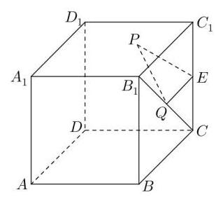

2、如图，棱长为 2 的正方体 ${ABCD} - {A}_{1}{B}_{1}{C}_{1}{D}_{1}$ 中， $E$ 为 $C{C}_{1}$ 的中点,点 $P\text{ 、 }Q$ 分别为面 ${A}_{1}{B}_{1}{C}_{1}{D}_{1}$ 和线段 ${B}_{1}C$ 上动点,则 ${\Delta PEQ}$ 周长的最小值为 ( )

A. $2\sqrt{2}$ B. $\sqrt{10}$ C. $\sqrt{11}$ D. $\sqrt{12}$

## (三)参量、常量与变量的转化

## 例题精讲

【例 6】已知方程 $a{x}^{2} - 2\left( {a - 3}\right) x + a - 2 = 0$ (其中 $a$ 为负整数),试求使此方程的解至少有一个为整数时的 $a$ 值.

【例 7】在平面直角坐标系 ${xOy}$ ,已知平面区域 $A = \{ \left( {x, y}\right)  \mid  x + y \leq  1$ ,且 $x \geq  0, y \geq  0\}$ ,则平面区域 $B = \{ \left( {x + y, x - y}\right)  \mid  \left( {x, y}\right)  \in  A\}$ 的面积为___.

【例 8 】已知函数 $f\left( x\right)  = {\log }_{a}\frac{1 - x}{1 + x}\left( {0 < a < 1}\right)$ . 对任意的 ${x}_{1},{x}_{2} \in  D$ ,是否存在 ${x}_{3} \in  D$ ,使得 $f\left( {x}_{1}\right)  + f\left( {x}_{2}\right)  = f\left( {x}_{3}\right)$ ,若存在,求出 ${x}_{3}$ ; 若不存在,请说明理由.

## 巩固训练

1、已知抛物线系: $y = {x}^{2} + \left( {{2m} + 1}\right) x + {m}^{2} - 1$ ，求这些抛物线的公切线的方程.

2、设 $a > 0, x\text{ 、 }y\text{ 、 }z \in  R, x + y + z = a,{x}^{2} + {y}^{2} + {z}^{2} = {a}^{2}$ ,求 $x\text{ 、 }y\text{ 、 }z$ 的取值范围.

## (四)化生为熟、化繁为简

## 例题精讲

【例 9】设集合 $A = \left\{  {\left( {x, y}\right) \left| {\;\frac{m}{2} \leq  {\left( x - 2\right) }^{2} + {y}^{2} \leq  {m}^{2}}\right. , x, y \in  R}\right\}  , B = \{ \left( {x, y}\right)  \mid  {2m} \leq  x + y \leq  {{2m} + 1}, x, y \in  R\}$ ,若 $A \cap  B \neq  \varnothing$ ，则实数 $m$ 的取值范围是___；

【例 10】设 $x, y \in  R$ 且 $3{x}^{2} + 2{y}^{2} = {6x}$ ,求 ${x}^{2} + {y}^{2}$ 的范围.

【例 11】问题 “求不等式 ${3}^{x} + {4}^{x} \leq  {5}^{x}$ 的解” 有如下的思路: 不等式 ${3}^{x} + {4}^{x} \leq  {5}^{x}$ 可变为 ${\left( \frac{3}{5}\right) }^{x} + {\left( \frac{4}{5}\right) }^{x} \leq  1$ ,考察函数 $f\left( x\right)  = {\left( \frac{3}{5}\right) }^{x} + {\left( \frac{4}{5}\right) }^{x}$ 可知,函数 $f\left( x\right)$ 在 $\mathbf{R}$ 上单调递减,且 $f\left( 2\right)  = 1,\therefore$ 原不等式的解是 $x \geq  2$ . 仿照此解法可得到不等式: ${x}^{3} - \left( {{2x} + 3}\right)  > {\left( 2x + 3\right) }^{3} - x$ 的解是___.

【例 12】椭圆: $\frac{{x}^{2}}{24} + \frac{{y}^{2}}{16} = 1$ ,直线 $l : \frac{x}{12} + \frac{y}{8} = 1, P$ 是 $l$ 上一点,射线 ${OP}$ 交椭圆于点 $R$ ,又点 $Q$ 在 ${OP}$ 上且满足 $\left| {OQ}\right|  \cdot  \left| {OP}\right|  = {\left| OR\right| }^{2}$ ,当点 $P$ 在 $l$ 上移动时,求点 $Q$ 的轨迹方程,并说明轨迹是什么曲线.

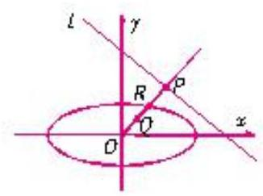

## 巩固训练

1、在定圆 $C : {x}^{2} + {y}^{2} = 4$ 内过点 $P\left( {-1,1}\right)$ 作两条互相垂直的直线与 $C$ 分别交于 $A, B$ 和 $M, N$ ,则 $\frac{\left| AB\right| }{\left| MN\right| } + \frac{\left| MN\right| }{\left| AB\right| }$ 的范围是___.

2、已知函数 $f\left( x\right)  = \frac{1}{2}\left( {x + \frac{1}{x}}\right) , g\left( x\right)  = \frac{1}{2}\left( {x - \frac{1}{x}}\right)$ . 若直线 $l : {ax} + {by} + c = 0\left( {a, b, c\text{ 为常数 }}\right)$ 与 $f\left( x\right)$ 的图像交于不同的两点 $A\text{ 、 }B$ ,与 $g\left( x\right)$ 的图像交于不同的两点 $C\text{ 、 }D$ ,求证: $\left| {AC}\right|  = \left| {BD}\right|$ .

3、设数列 $\left\{  {a}_{n}\right\}$ 的前 $n$ 项和为 ${S}_{n}$ ，点 $P\left( {{S}_{n},{a}_{n}}\right)$ 在直线 $\left( {3 - m}\right) x + {2my} - m - 3 = 0$ 上， $\left( {m \in  {\mathbf{N}}^{ * }, m\text{ 为常数， }m \neq  3}\right)$ . (1)求 ${a}_{\mathrm{n}}$ ；

(2)若数列 $\left\{  {a}_{n}\right\}$ 的公比 $q = f\left( m\right)$ ，数列 $\left\{  {b}_{n}\right\}$ 满足 ${b}_{1} = {a}_{1}$ ， ${b}_{n} = \frac{3}{2}f\left( {b}_{n - 1}\right)$ ， $\left( {n \in  {\mathbf{N}}^{ * }, n \geq  2}\right)$ ，求证: $\left\{  \frac{1}{{b}_{n}}\right\}$ 为等差数列,并求 ${b}_{n}$ ;

(3)设数列 $\left\{  {c}_{n}\right\}$ 满足 ${c}_{n} = {b}_{n} \cdot  {b}_{n + 2}$ ， ${T}_{n}$ 为数列 $\left\{  {c}_{n}\right\}$ 的前 $n$ 项和，且存在实数 $T$ 满足 ${T}_{n} \geq  T$ ， $\left( {n \in  {\mathbf{N}}^{ * }}\right)$ ，求 $T$ 的最大值.

## (五)函数与方程的转化

## 例题精讲

【例 13】已知函数 $f\left( x\right)  = x + \frac{1}{x} - 2$ .

(1)若不等式 $f\left( {2}^{x}\right)  - k \cdot  {2}^{x} \geq  0$ 在 $x \in  \left\lbrack  {-1,1}\right\rbrack$ 上有解,求实数 $k$ 的取值范围;

(2)若 $f\left( \left| {{2}^{x} - 1}\right| \right)  + k \cdot  \frac{2}{\left| {2}^{x} - 1\right| } - {3k} = 0$ 有三个不同的实数解，求实数 $k$ 的取值范围.

【例 14】对于定义域为 $\mathrm{D}$ 的函数 $y = f\left( x\right)$ ,如果存在区间 $\left\lbrack  {m, n}\right\rbrack   \subseteq  D$ ,同时满足:

① $f\left( x\right)$ 在 $\left\lbrack  {m, n}\right\rbrack$ 内是单调函数；

② 当定义域是 $\left\lbrack  {m, n}\right\rbrack$ 时， $f\left( x\right)$ 的值域也是 $\left\lbrack  {m, n}\right\rbrack$ .

则称 $\left\lbrack  {m, n}\right\rbrack$ 是该函数的 “和谐区间”.

(1)证明: $\left\lbrack  {0,1}\right\rbrack$ 是函数 $y = f\left( x\right)  = {x}^{2}$ 的一个 “和谐区间”.

(2)求证:函数 $y = g\left( x\right)  = 3 - \frac{5}{x}$ 不存在 “和谐区间”.

(3)已知:函数 $y = h\left( x\right)  = \frac{\left( {{a}^{2} + a}\right) x - 1}{{a}^{2}x}$ ( $a \in  R$ ， $a \neq  0$ )有 “和谐区间” $\left\lbrack  {m, n}\right\rbrack$ ，当 $a$ 变化时，求出 $n - m$ 的最大值.

## 巩固训练

1、若函数 $f\left( x\right)  = {2}^{\left| x - 3\right| } - {\log }_{a}x + 1$ 无零点，则 $a$ 的取值范围为___.

2、已知实数 $a, b$ 分别满足 ${a}^{3} - 3{a}^{2} + {5a} = 1,{b}^{3} - 3{b}^{2} + {5b} = 5$ ,求 $a + b$ 的值.

## (六)空间与平面的转化

## 例题精讲

【例 15】(1)如图，在直三棱柱 ${ABC} - {A}_{1}{B}_{1}{C}_{1}$ 中，底面为直角三角形， ${\measuredangle {ACB}} = {90}^{ \circ  },{AC} = 6$ ， ${BC} = {C{C}_{1}} = \sqrt{2}, P$ 是 $B{C}_{1}$ 上一动点，则 ${CP} + {P{A}_{1}}$ 的最小值是

___.

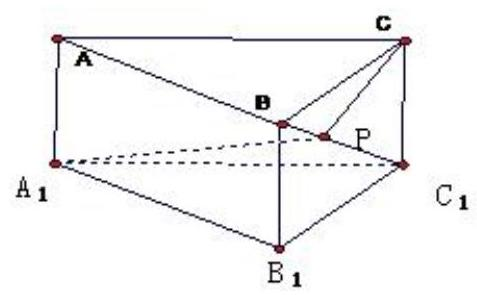

(2)如图所示，一只小蚂蚁正从圆锥底面上的点 $A$ 沿圆锥体的表面匀速爬行一周，又绕回到点 $A$ ，已知该圆锥体的底面半径为 $r$ ,母线长为 ${3r}$ ,试问小蚂蚁沿怎样的路径如何爬行,才能最快到达点 $A$ ? 并求出该路径的长.

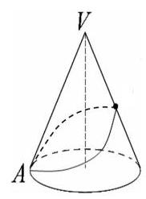

(3)如图，已知正三棱柱的底面边长为 ${2cm}$ ，高为 ${5cm}$ ，一质点自 $A$ 点出发，沿着三棱柱的侧面绕行两周到达 ${A}_{1}$ 点的最短路线的长为___ ${cm}$

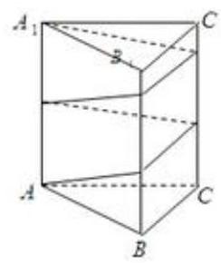

## 巩固训练

1、如图所示，图(a)为大小可变化的三棱锥 $P - {ABC}$ .

(1)将此三棱锥沿三条侧棱剪开，假定展开图刚好是一个直角梯形 ${P}_{1}{P}_{2}{P}_{3}A$ ，如图(b)所示. 求证: 侧棱 ${PB} \bot  {AC}$ ；

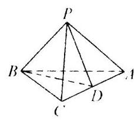

(a)

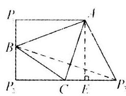

(b)

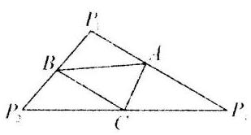

(C)

(2)由(1)的条件和结论，若三棱锥中 ${PA} = {AC}$ ， ${PB} = 2$ ，求侧面 ${PAC}$ 与底面 ${ABC}$ 所成角；

(3)将此三棱锥沿三条侧棱剪开，假定其展开图刚好是一个三角形 ${P}_{1}{P}_{2}{P}_{3}$ ，如图(c)所示. 已知 ${P}_{1}{P}_{3} = {P}_{2}{P}_{3},{P}_{1}{P}_{2} = {2a}$ ,若三棱锥相对棱 ${PB}$ 与 ${AC}$ 间的距离为 $d$ ,求此三棱锥的体积.

## (七)复数与实数的转化

## 例题精讲

【例 16】在复数范围内方程 ${x}^{2} - 5\left| x\right|  + 6 = 0$ 的解的个数为( )

(A) 2 (B) 4

(C) 6 (D) 8

## (八)特殊与一般的转化

## 例题精讲

【例 17】课本中介绍了应用祖暅原理推导棱锥体积公式的做法, 祖暅原理也可用来求旋转体的体积, 现介绍用祖暅原理求球体体积公式的做法: 可构造一个底面半径和高都与球半径相等的圆柱, 然后在圆柱内挖去一个以圆柱下底面圆心为顶点, 圆柱上底面为底面的圆锥, 用这样一个几何体与半球应用祖暅原理(图 1)，即可求得球的体积公式，请研究和理解球的体积公式求法的基础上,解答以下问题: 已知椭圆的标准方程为 $\frac{{x}^{2}}{4} + \frac{{y}^{2}}{25} = 1$ ,将此椭圆绕 $y$ 轴旋转一周后，得一橄榄状的几何体(图 2)，其体积等于___

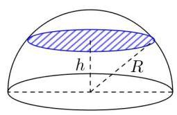

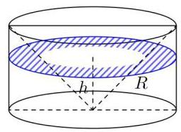

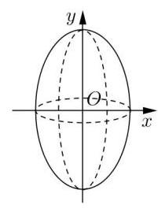

## 巩固训练

1、如图，现将一张正方形纸片进行如下操作:第一步，将纸片以 $D$ 为顶点，任意向上翻折，折痕与 ${BC}$ 交于点 ${E}_{1}$ ,然后复原,记 $\angle {CD}{E}_{1} = {\alpha }_{1}$ ; 第二步,将纸片以 $D$ 为顶点向下翻折,使 ${AD}$ 与 ${E}_{1}D$ 重合,得到折痕 ${E}_{2}D$ ,然后复原,记 $\angle {AD}{E}_{2} = {\alpha }_{2}$ ; 第三步,将纸片以 $D$ 为顶点向上翻折,使 ${CD}$ 与 ${E}_{2}D$ 重合,得到折痕 ${E}_{3}D$ ,然后复原,记 $\angle {CD}{E}_{3} = {\alpha }_{3}$ ; 按此折法从第二步起重复以上步骤……,得到 ${\alpha }_{1},{\alpha }_{2},\cdots ,{\alpha }_{n},\cdots$ ,则 $\mathop{\lim }\limits_{{n \rightarrow  \infty }}{\alpha }_{n} =$ ___.

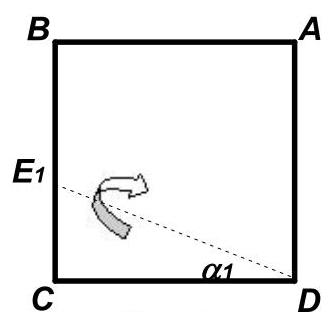

第一步

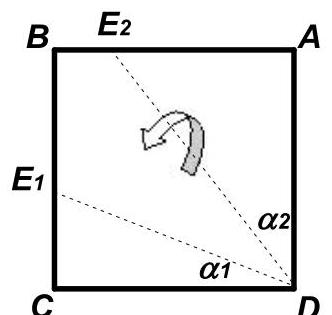

第二步

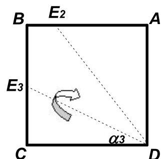

第三步

2、若以 ${F}_{1}\left( {0, - 1}\right) ,{F}_{2}\left( {0,1}\right)$ 为焦点的椭圆 C 过点 $P\left( {\frac{\sqrt{2}}{2},1}\right)$ .

(1)求椭圆C的方程；

(2)过点 $S\left( {-\frac{1}{3},0}\right)$ 的动直线 $l$ 交椭圆C 于 $\mathrm{A},\mathrm{B}$ 两点，试问:在坐标平面上是否存在一个定点 $\mathrm{T}$ ，使得无论 $l$ 如何转动,以 $\mathrm{{AB}}$ 为直径的圆恒过点 $\mathrm{T}$ ? 若存在,求出点 $\mathrm{T}$ 的坐标; 若不存在,请说明理由.

## (九)数学与文字的转化

## 例题精讲

【例 18】向量集合 $S = \{ \overrightarrow{a} \mid  \overrightarrow{a} = \left( {x, y}\right) , x, y \in  \mathbf{R}\}$ ,对于任意 $\overrightarrow{\alpha }\text{ 、 }\overrightarrow{\beta } \in  S$ ,以及任意 $\lambda  \in  \left( {0,1}\right)$ ,都有 $\lambda \overrightarrow{\alpha } + \left( {1 - \lambda }\right) \overrightarrow{\beta } \in  S$ ,则称 $S$ 为 “ $C$ 类集”. 现有四个命题:

① 若 $S$ 为 “ $C$ 类集”，则集合 $M = \{ \mu \overrightarrow{a} \mid  \overrightarrow{a} \in  S,\mu  \in  \mathbf{R}\}$ 也是 “ $C$ 类集”;

② 若 $S\text{ 、 }T$ 都是 “ $C$ 类集”,则集合 $M = \{ \overrightarrow{a} + \overrightarrow{b} \mid  \overrightarrow{a} \in  S,\overrightarrow{b} \in  T\}$ 也是 “ $C$ 类集”;

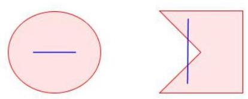

③ 若 ${A}_{1}\text{ 、 }{A}_{2}$ 都是 “ $C$ 类集”,则 ${A}_{1} \cup  {A}_{2}$ 也是 “ $C$ 类集”;

④ 若 ${A}_{1}\text{ 、 }{A}_{2}$ 都是 “ $C$ 类集”，且交集非空，则 ${A}_{1} \cap  {A}_{2}$ 也是 “ $C$ 类集”.

其中正确的命题有___

## 巩固训练

1、已知 $a\text{ 、 }b\text{ 、 }c$ 为实常数，数列 $\left\{  {x}_{n}\right\}$ 的通项 ${x}_{n} = a{n}^{2} + {bn} + c, n \in  {N}^{ * }$ ，则 “存在 $k \in  {N}^{ * }$ ，使得 ${x}_{{100} + k}$ 、 ${x}_{{200} + k}$ 、 ${x}_{{300} + k}$ 成等差数列” 的一个必要条件是( )

A. $a \geq  0$ B. $b \leq  0$ C. $c = 0$ D. $a - {2b} + c = 0$

2、如图，用 35 个单位正方形拼成一个矩形，点 ${P}_{1}\text{ 、 }{P}_{2}\text{ 、 }{P}_{3}\text{ 、 }{P}_{4}$ 以及四个标记为 “▲” 的点在正方形的顶点处,设集合 $\Omega  = \left\{  {{P}_{1},{P}_{2},{P}_{3},{P}_{4}}\right\}$ ,点 $P \in  \Omega$ ,过 $P$ 作直线 ${l}_{P}$ ,使得不在 ${l}_{P}$ 上的 “ $\Delta$ ” 的点分布在 ${l}_{P}$ 的两侧. 用 ${D}_{1}\left( {l}_{P}\right)$ 和 ${D}_{2}\left( {l}_{P}\right)$ 分别表示 ${l}_{P}$ 一侧和另一侧的 “ $\Delta$ ” 的点到 ${l}_{P}$ 的距离之和. 若过 $P$ 的直线 ${l}_{P}$ 中有且只有一条满足 ${D}_{1}\left( {l}_{P}\right)  = {D}_{2}\left( {l}_{P}\right)$ ,则 $\Omega$ 中所有这样的 $P$ 为___.

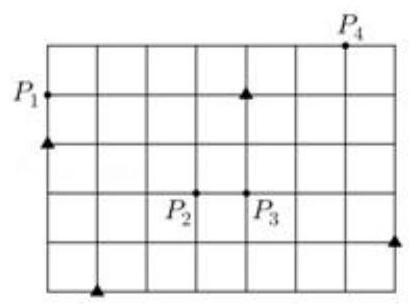
