## 知识梳理

## 第 4 课:转化与化归思想

<table><tr><td>教学目标</td><td>1、理解和掌握转换与化归的思想，其本质是在研究和解决数学问题时采用某种方式，借助某种函数性质、图象、公式或已知条件将问题通过变换加以转化, 进而达到解决问题的一种策略或方法;   2、掌握转换与化归的得原则:熟悉化原则、简单化原则、直观化原则、正难则反原则；   3、掌握高中数学常见的转化:正与反的转化、常量和变量的转化、特殊与一般的转化、等与不等的转化、陌生与熟悉的转化、函数与方程的转化以及空间与平面的转化。</td></tr><tr><td>重点</td><td>1、转化分有等价转化与不等价转化，等价转化后的新问题与原问题实质是一样的，不等价转化则部分地改变了原对象的实质, 需对所得结论进行必要的修正;   2、应用转化与化归思想解题的原则应是化难为易、化生为熟、化繁为简，尽量是等价转化； 常见的转化有:正与反的转化、数与形的转化、相等与不等的转化、整体与局部的转化、空间与平面相互转化、复数与实数相互转化、常量与变量的转化、数学语言的转化。</td></tr><tr><td>难点</td><td>1、转化分有等价转化与不等价转化，等价转化后的新问题与原问题实质是一样的，不等价转化则部分地改变了原对象的实质, 需对所得结论进行必要的修正;   2、应用转化与化归思想解题的原则应是化难为易、化生为熟、化繁为简，尽量是等价转化； 常见的转化有:正与反的转化、数与形的转化、相等与不等的转化、整体与局部的转化、空间与平面相互转化、复数与实数相互转化、常量与变量的转化、数学语言的转化。</td></tr></table>

化归与转换的思想，就是在研究和解决数学问题时采用某种方式，借助某种函数性质、图象、公式或已知条件将问题通过变换加以转化, 进而达到解决问题的思想。等价转化总是将抽象转化为具体, 复杂转化为简单、未知转化为已知, 通过变换迅速而合理的寻找和选择问题解决的途径和方法。转化有等价转化与不等价转化。等价转化后的新问题与原问题实质是一样的。不等价转化则部分地改变了原对象的实质，需对所得结论进行必要的修正。应用转化化归思想解题的原则应是化难为易、化生为熟、化繁为简，尽量是等价转化。常见的转化有: 正与反的转化、数与形的转化、相等与不等的转化、整体与局部的转化、空间与平面相互转化、复数与实数相互转化、常量与变量的转化、数学语言的转化。

## (一) 正与反的转化

## 例题精讲

【例 1】已知函数 $f\left( x\right)  = 4{x}^{2} - 2\left( {p - 2}\right) x - 2{p}^{2} - p + 1$ ，在区间 $\left\lbrack  {-1,1}\right\rbrack$ 上至少存在一个实数 $c$ 使 $f\left( c\right)  > 0$ ，求实数 $p$ 的取值范围.

【难度】

【答案】 $p \in  \left( {-3,\frac{3}{2}}\right)$

【解析】设所求 $p$ 的范围为 $A$ ,则 ${C}_{I}A = \left\{  {p \mid  f\left( x\right)  = 4{x}^{2} - 2\left( {p - 2}\right) x - 2{p}^{2} - p + 1 \leq  0, x \in  \left\lbrack  {-1,1}\right\rbrack  }\right\}$ 注意到函数的图象开口向上; $\therefore {C}_{I}A = \left\{  {p\left| {\;\begin{array}{l} f\left( 1\right)  =  - 2{p}^{2} - {3p} + 9 \leq  0 \\  f\left( {-1}\right)  =  - 2{p}^{2} + p + 1 \leq  0 \end{array}}\right. }\right\}   = \left\{  {p\left| {\;p \leq   - 3\text{ 或 }p \geq  \frac{3}{2}}\right. }\right\}  \therefore A = \left\{  {p\left| {\; - 3 < p < \frac{3}{2}}\right. }\right\}$

【例 2】已知函数 $f\left( x\right)  = \frac{{2}^{x} + a}{{2}^{x} + 1}, x \in  R$ . 当 $a = 2$ ,且 $b < c$ 时,证明: 对任意 $d \in  \left\lbrack  {f\left( c\right) , f\left( b\right) }\right\rbrack$ ,存在唯一的 ${x}_{0} \in  R$ ,使得 $f\left( {x}_{0}\right)  = d$ ,且 ${x}_{0} \in  \left\lbrack  {b, c}\right\rbrack$ .

【难度】

【答案】见解析

【解析】证明: 当 $a = 2$ 时函数 $y = f\left( x\right)$ 是减函数,所以函数 $y = f\left( x\right)$ 在 $\left\lbrack  {b, c}\right\rbrack$ 上的值域为 $\left\lbrack  {f\left( c\right) , f\left( b\right) }\right\rbrack$ , 因为 $d \in  \left\lbrack  {f\left( c\right) , f\left( b\right) }\right\rbrack$ ,所以存在 ${x}_{0} \in  R$ ,使得 $f\left( {x}_{0}\right)  = d$ . 假设存在 ${x}_{1} \in  R,{x}_{1} \neq  {x}_{0}$ 使得 $f\left( {x}_{1}\right)  = d$ ,

若 ${x}_{1} > {x}_{0}$ ,则 $f\left( {x}_{1}\right)  < f\left( {x}_{0}\right)$ ,若 ${x}_{1} < {x}_{0}$ ,则 $f\left( {x}_{1}\right)  > f\left( {x}_{0}\right)$ ,与 $f\left( {x}_{1}\right)  = f\left( {x}_{0}\right)  = d$ 矛盾,故 ${x}_{0}$ 是唯一的假设 ${x}_{0} \notin  \left\lbrack  {b, c}\right\rbrack$ ,即 ${x}_{0} < b$ 或 ${x}_{0} > c$ ,则 $f\left( {x}_{0}\right)  > f\left( b\right)$ 或 $f\left( {x}_{0}\right)  < f\left( c\right)$

所以 $d \notin  \left\lbrack  {f\left( c\right) , f\left( b\right) }\right\rbrack$ ,与 $d \in  \left\lbrack  {f\left( c\right) , f\left( b\right) }\right\rbrack$ 矛盾,故 ${x}_{0} \in  \left\lbrack  {b, c}\right\rbrack$

## 巩固训练

1、若 $x, y \in  {\mathbb{R}}^{ + }$ ，且 $x + y > 2$ ，求证: $\frac{1 + y}{x}$ 与 $\frac{1 + x}{y}$ 中至少有一个小于 2 .

【难度】★★★★

【答案】见解析

【解析】反证法: 若不然,则 $\frac{1 + y}{x} \geq  2$ 且 $\frac{1 + x}{y} \geq  2$ ,

由 $x, y \in  {\mathbb{R}}^{ + }$ 可得 $1 + y \geq  {2x}$ 且 $1 + x \geq  {2y}$ ,

同向相加得 $2 + x + y \geq  {2x} + {2y} \Leftrightarrow  2 \geq  x + y$ 矛盾!故假设不成立,原命题成立.

2、函数 $f\left( x\right)  = \sqrt{a{x}^{2} + {bx} + c}$ 的图像关于任意直线 $l$ 对称后的图像依然为某函数图像，则实数 $a$ 、 $b$ 、 $c$ 应满足的充要条件为___.

【难度】 $\star   \star   \star   \star$

【答案】 $a < 0$ 且 ${b}^{2} - {4ac} = 0$

【解析】题目的意思是,不管以任何直线对称后得到的图像,都满足,一个 $x$ 对应 $1\text{ 个 }y$ 题目给的任意直线 $l$ 对称后的图像依然为某函数图像。这一条件限制性非常强,不妨从其反面考虑,函数 $f\left( x\right)$ 对称之后不能构成一个函数图像,则原函数上必有两个或两个以上的点,假如函数经过 2 个点 $A\text{ 、 }B$ ,那么就能找到一条对称直线 $l$ ,使得对称后 $A\text{ 、 }B$ 落在垂直于 $x$ 轴的直线上,显然是不成立的,所以 $f\left( x\right)$ 的图像只能是一个点。 结合函数 $y = a{x}^{2} + {bx} + c$ 的性质,当且仅当 $y = 0$ 时,有且只有一个 $x$ 与之对应,故只有 $a{x}^{2} + {bx} + c = 0$ 时, 满足要求. 故 $a{x}^{2} + {bx} + c \leq  0$ 在 $R$ 上恒成立,所以 $a < 0$ 且 ${b}^{2} - {4ac} = 0$

## (二) 数与形的转化

## 例题精讲

【例 3】设平面点集 $A = \left\{  {\left( {x, y}\right) \left| {\;\left( {y - x}\right) \left( {y - \frac{1}{x}}\right)  \geq  0}\right. }\right\}  , B = \left\{  {\left( {x, y}\right) \left| {\;{\left( x - 1\right) }^{2} + {\left( y - 1\right) }^{2} \leq  1}\right. }\right\}$ ,则 $A \cap  B$ 所表示的平面图形的面积为___.

【难度】 $\star   \star   \star   \star$

【答案】 $\frac{\pi }{2}$

【解析】由 $\left( {y - x}\right) \left( {y - \frac{1}{x}}\right)  \geq  0$ 可知 $\left\{  \begin{array}{l} y - x \geq  0 \\  y - \frac{1}{x} \geq  0 \end{array}\right.$ 或者 $\left\{  \begin{array}{l} y - x \leq  0 \\  y - \frac{1}{x} \leq  0 \end{array}\right.$ ,在同一坐标系中做出平面区域如图: 由图象可知 $A \cap  B$ 的区域为阴影部分,根据对称性可知,两部分阴影面积之和为圆面积的一半,所以面积为 $\frac{\pi }{2}$ .

【例4】在直角坐标平面 ${xOy}$ 中,已知两定点 ${F}_{1}\left( {-2,0}\right)$ 与 ${F}_{2}\left( {2,0}\right)$ 位于动直线 $l : {ax} + {by} + c = 0$ 的同侧,设集合 $P = \left\{  {l \mid  \text{ 点 }{F}_{1}\text{ 与点 }{F}_{2}\text{ 到直线 }l\text{ 的距离之差等于 }2}\right\}  , Q = \left\{  {\left( {x, y}\right)  \mid  {x}^{2} + {y}^{2} \leq  4, x, y \in  \mathbf{R}}\right\}$ ,记

$S = \{ \left( {x, y}\right)  \mid  \left( {x, y}\right)  \notin  l, l \in  P\} ,\;T = \{ \left( {x, y}\right)  \mid  \left( {x, y}\right)  \in  Q \cap  S\}$ ,则由 $T$ 中的所有点所组成的图形的面积是___.

【难度】

【答案】 $\frac{2\pi }{3} + 2\sqrt{3}$

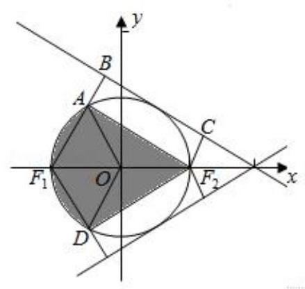

【解析】解: 过 ${F}_{1}\left( {-1,0}\right)$ 与 ${F}_{2}\left( {1,0}\right)$ 分别作直线 $l$ 的垂线,垂足分别为 $B, C$ , 则由题意值 ${F}_{1}B - {F}_{2}C = 1$ ,即 ${F}_{1}A = 1$ .

$\therefore$ 三角形 $A{F}_{1}B$ 为正三角形,边长为 1,正三角形的高为 $\frac{\sqrt{3}}{2}$ ,且 $\angle {F}_{1}A{F}_{2} = {90}^{ \circ  }$

$\therefore$ 集合 $P$ 对应的轨迹为线段 $A{F}_{2}$ 的上方部分, $Q$ 对应的区域为半径为 1 的单位圆内部.

根据 $T$ 的定义可知, $T$ 中的所有点所组成的图形为图形阴影部分.

$\therefore$ 阴影部分的面积为 $2\left( {\frac{1}{6}\pi  \times  {1}^{2} + \frac{1}{2} \times  1 \times  \frac{\sqrt{3}}{2}}\right)  = \frac{\sqrt{3}}{2} + \frac{\pi }{3}$ .

故答案为: $\frac{\sqrt{3}}{2} + \frac{\pi }{3}$ .

【例 5】若 $\left| {z - {2i}}\right|  + \left| {z - {z}_{0}}\right|  = 4$ 表示的动点的轨迹是椭圆，则 $\left| {z}_{0}\right|$ 的取值范围是___.

【难度】 $\star   \star   \star   \star$

【答案】 $\left| {z}_{0}\right|  \in  \lbrack 0,6)$

【解析】首先要理解数学符号的意义: $\left| {z - {2i}}\right|  + \left| {z - {z}_{0}}\right|  = 4$ 表示复数 $z$ 对应的动点到复数 ${2i}$ 与 ${z}_{0}$ 对应的两定点之间的距离之和等于 4 . 而根据椭圆的定义知,两定点之间的距离要小于定值 4 , 所以有 $\left| {{z}_{0} - {2i}}\right|  < 4$ , 而此式又表示 ${z}_{0}$ 对应的点在以 ${2i}$ 对应点为圆心,4 为半径的圆内,由模的几何意义知 $\left| {z}_{0}\right|  \in  \lbrack 0,6)$ .

巩固训练

1、定义在 $R$ 上的函数 $f\left( x\right)$ 满足 $f\left( x\right)  = \left\{  \begin{matrix} {2}^{x} + 2 & 0 \leq  x < 1 \\  4 - {2}^{-x} &  - 1 \leq  x < 0 \end{matrix}\right.$ ,且 $f\left( {x - 1}\right)  = f\left( {x + 1}\right)$ ,则函数 $g\left( x\right)  = f\left( x\right)  - \frac{{3x} - 5}{x - 2}$ 在区间 $\left\lbrack  {-1,5}\right\rbrack$ 上的所有零点之和为( )

A. 4 B. 5 C. 7 D. 8

【难度】★★★★

【答案】B

【解析】作出 $f\left( x\right)$ 图像如图所示,周期为 2,设 $h\left( x\right)  = \frac{{3x} - 5}{x - 2} = 3 + \frac{1}{x - 2}$ ,即求 $f\left( x\right)$ 与 $h\left( x\right)$ 交点横坐标之和. 结合图像可知, 共有 3 个交点, 其中两个交点关于 (2,3) 点对称, 另一个交点的横坐标为 1,所以交点的横坐标之和为 $2 \times  2 + 1 = 5$ ,即所有零点之和为 5

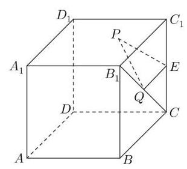

2、如图，棱长为 2 的正方体 ${ABCD} - {A}_{1}{B}_{1}{C}_{1}{D}_{1}$ 中， $E$ 为 $C{C}_{1}$ 的中点，点 $P$ 、 $Q$ 分别为面 ${A}_{1}{B}_{1}{C}_{1}{D}_{1}$ 和线段 ${B}_{1}C$ 上动点,则 ${\Delta PEQ}$ 周长的最小值为 ( )

A. $2\sqrt{2}$ B. $\sqrt{10}$ C. $\sqrt{11}$ D. $\sqrt{12}$

【难度】 $\star   \star   \star   \star$

【答案】B

【解析】解: 由题意得: ${\Delta PEQ}$ 周长取最小值时, $P$ 在 ${B}_{1}{C}_{1}$ 上,

在平面 ${B}_{1}{C}_{1}{CB}$ 上,设 $E$ 关于 ${B}_{1}C$ 的对称点为 $M$ ,关于 ${B}_{1}{C}_{1}$ 的对称点为 $N$ ,

连结 ${MN}$ ,当 ${MN}$ 与 ${B}_{1}{C}_{1}$ 的交点为 $P,{MN}$ 与 ${B}_{1}C$ 的交点为 $M$ 时,

则 ${MN}$ 是 $\bigtriangleup  {PEQ}$ 周长的最小值， ${EM} = 2,{EN} = \sqrt{2}$ ， ${\angle {MEN}} = {135}^{ \circ  }$ ，

$\therefore {MN} = \sqrt{4 + 2 - 2 \times  2 \times  \sqrt{2} \times  \left( {-\frac{\sqrt{2}}{2}}\right) } = \sqrt{10}.\therefore \bigtriangleup {PEQ}$ 周长的最小值为 $\sqrt{10}$ . 故选: $B$ .

## (三)参量、常量与变量的转化

## 例题精讲

【例 6】已知方程 $a{x}^{2} - 2\left( {a - 3}\right) x + a - 2 = 0$ (其中 $a$ 为负整数),试求使此方程的解至少有一个为整数时的 $a$ 值.

【难度】 $\star   \star   \star   \star$

【答案】-10或-4

【解析】把 $a$ 看成变量,用 $x$ 来表示 $a$ 得 $a = \frac{2 - {6x}}{{\left( x - 1\right) }^{2}}$ ,使 $a$ 为负整数即 $\frac{2 - {6x}}{{\left( x - 1\right) }^{2}} \leq   - 1$ ,解得 $4 - \sqrt{13} \leq  x \leq  4 + \sqrt{13}$ ， $x$ 的可能的值为2、3、4、5、6、7，求出满足的 $a$ 的值为 -4 或 -10

【例 7】在平面直角坐标系 ${xOy}$ ,已知平面区域 $A = \{ \left( {x, y}\right)  \mid  x + y \leq  1$ ,且 $x \geq  0, y \geq  0\}$ ,则平面区域 $B = \{ \left( {x + y, x - y}\right)  \mid  \left( {x, y}\right)  \in  A\}$ 的面积为___.

【难度】 $\star   \star   \star   \star$

【答案】 1

【解析】令 $a = x + y, b = x - y$ ,则 $x = \frac{1}{2}\left( {a + b}\right) , y = \frac{1}{2}\left( {a - b}\right)$ ,代入集合 $\mathrm{A}$ ,易得 $a + b \geq  0, a - b \geq  0, a \leq  1$ , 其所对应的平面区域如图阴影部分,则平面区域的面积为 $\frac{1}{2} \times  2 \times  1 = 1$

【例 8 】已知函数 $f\left( x\right)  = {\log }_{a}\frac{1 - x}{1 + x}\left( {0 < a < 1}\right)$ . 对任意的 ${x}_{1},{x}_{2} \in  D$ ,是否存在 ${x}_{3} \in  D$ ,使得 $f\left( {x}_{1}\right)  + f\left( {x}_{2}\right)  = f\left( {x}_{3}\right)$ ,若存在,求出 ${x}_{3}$ ; 若不存在,请说明理由.

【难度】 $\star   \star   \star   \star$

【答案】见解析

【解析】假设存在 ${x}_{3} \in  \left( {-1,1}\right)$ 使得 $f\left( {x}_{1}\right)  + f\left( {x}_{2}\right)  = f\left( {x}_{3}\right)$

即 ${\log }_{a}\frac{1 - {x}_{1}}{1 + {x}_{1}} + {\log }_{a}\frac{1 - {x}_{2}}{1 + {x}_{2}} = {\log }_{a}\frac{1 - {x}_{3}}{1 + {x}_{3}}$

${\log }_{a}\left( {\frac{1 - {x}_{1}}{1 + {x}_{1}} \cdot  \frac{1 - {x}_{2}}{1 + {x}_{2}}}\right)  = {\log }_{a}\frac{1 - {x}_{3}}{1 + {x}_{3}} \Rightarrow  \frac{1 - {x}_{1}}{1 + {x}_{1}} \cdot  \frac{1 - {x}_{2}}{1 + {x}_{2}} = \frac{1 - {x}_{3}}{1 + {x}_{3}}$ ,解得 ${x}_{3} = \frac{{x}_{1} + {x}_{2}}{1 + {x}_{1}{x}_{2}}$ ,

下证: ${x}_{3} = \frac{{x}_{1} + {x}_{2}}{1 + {x}_{1}{x}_{2}} \in  \left( {-1,1}\right)$ ,即证: ${\left( \frac{{x}_{1} + {x}_{2}}{1 + {x}_{1}{x}_{2}}\right) }^{2} < 1$ .

证明: ${\left( \frac{{x}_{1} + {x}_{2}}{1 + {x}_{1}{x}_{2}}\right) }^{2} - 1 = \frac{{\left( {x}_{1} + {x}_{2}\right) }^{2} - {\left( 1 + {x}_{1}{x}_{2}\right) }^{2}}{{\left( 1 + {x}_{1}{x}_{2}\right) }^{2}} = \frac{{x}_{1}^{2} + {x}_{2}^{2} - 1 - {x}_{1}^{2}{x}_{2}^{2}}{{\left( 1 + {x}_{1}{x}_{2}\right) }^{2}} =  - \frac{\left( {1 - {x}_{1}^{2}}\right) \left( {1 - {x}_{2}^{2}}\right) }{{\left( 1 + {x}_{1}{x}_{2}\right) }^{2}}$

$\because {x}_{1},{x}_{2} \in  \left( {-1,1}\right) ,\therefore 1 - {x}_{1}^{2} > 0,1 - {x}_{2}^{2} > 0,{\left( 1 + {x}_{1}{x}_{2}\right) }^{2} > 0$

$\therefore \frac{\left( {1 - {x}_{1}^{2}}\right) \left( {1 - {x}_{2}^{2}}\right) }{{\left( 1 + {x}_{1}{x}_{2}\right) }^{2}} > 0$ ,即 ${\left( \frac{{x}_{1} + {x}_{2}}{1 + {x}_{1}{x}_{2}}\right) }^{2} - 1 < 0,\therefore {\left( \frac{{x}_{1} + {x}_{2}}{1 + {x}_{1}{x}_{2}}\right) }^{2} < 1$

所以存在 ${x}_{3} = \frac{{x}_{1} + {x}_{2}}{1 + {x}_{1}{x}_{2}} \in  \left( {-1,1}\right)$ ,使得 $f\left( {x}_{1}\right)  + f\left( {x}_{2}\right)  = f\left( {x}_{3}\right)$

另证: 要证明 ${\left( \frac{{x}_{1} + {x}_{2}}{1 + {x}_{1}{x}_{2}}\right) }^{2} < 1$ ,即证 ${\left( {x}_{1} + {x}_{2}\right) }^{2} < {\left( 1 + {x}_{1}{x}_{2}\right) }^{2}$ ,也即 $\left( {1 - {x}_{1}^{2}}\right) \left( {1 - {x}_{2}^{2}}\right)  > 0$ .

$\because {x}_{1},{x}_{2} \in  \left( {-1,1}\right) ,\therefore 1 - {x}_{1}{}^{2} > 0,1 - {x}_{2}{}^{2} > 0,\therefore \left( {1 - {x}_{1}{}^{2}}\right) \left( {1 - {x}_{2}{}^{2}}\right)  > 0,\therefore {\left( \frac{{x}_{1} + {x}_{2}}{1 + {x}_{1}{x}_{2}}\right) }^{2} < 1$ .

所以存在 ${x}_{3} = \frac{{x}_{1} + {x}_{2}}{1 + {x}_{1}{x}_{2}} \in  \left( {-1,1}\right)$ ,使得 $f\left( {x}_{1}\right)  + f\left( {x}_{2}\right)  = f\left( {x}_{3}\right)$ ;

## 巩固训练

1、已知抛物线系: $y = {x}^{2} + \left( {{2m} + 1}\right) x + {m}^{2} - 1$ ,求这些抛物线的公切线的方程.

【难度】 $\star   \star   \star   \star$

【答案】 $x - y - 1 = 0$

【解析】 $y = {x}^{2} + \left( {{2m} + 1}\right) x + {m}^{2} - 1 \Rightarrow  {\left( x + m\right) }^{2} + x - y - 1 = 0$

2、设 $a > 0, x\text{ 、 }y\text{ 、 }z \in  R, x + y + z = a,{x}^{2} + {y}^{2} + {z}^{2} = {a}^{2}$ ,求 $x\text{ 、 }y\text{ 、 }z$ 的取值范围.

【难度】 $\star   \star   \star   \star$

【答案】 $- \frac{a}{3} \leq  x \leq  a, - \frac{a}{3} \leq  y \leq  a, - \frac{a}{3} \leq  z \leq  a$

【解析】因为 $x + y = a - z,{x}^{2} + {y}^{2} = \frac{{a}^{2}}{2} - {z}^{2}$ ,所以,由柯西不等式得 ${\left( x + y\right) }^{2} \leq  2\left( {{x}^{2} + {y}^{2}}\right)$ ,即 ${\left( a - z\right) }^{2} \leq  2\left( {\frac{{a}^{2}}{2} - {z}^{2}}\right)$ ,即 $3{z}^{2} - {2az} \leq  0$ ,所以 $\bar{z}$ 的取值范围是 $z \in  \left\lbrack  {0,\frac{2a}{3}}\right\rbrack  \left( {{10}\text{ 分 }}\right)$ .

(四)化生为熟、化繁为简

## 例题精讲

【例 9】设集合 $A = \left\{  {\left( {x, y}\right) \left| {\;\frac{m}{2} \leq  }\right. {\left( x - 2\right) }^{2} + {y}^{2} \leq  {m}^{2}, x, y \in  R}\right\}  , B = \{ \left( {x, y}\right)  \mid  {2m} \leq  x + y \leq  {2m} + 1, x, y \in  R\}$ ,若 $A \cap  B \neq  \varnothing$ ，则实数 $m$ 的取值范围是___；

【难度】★★★★

【答案】 $\left\lbrack  {\frac{1}{2},\sqrt{2} + 1}\right\rbrack$

【解析】当 $m \leq  0$ 时,集合 $A$ 是以 $\left( {2,0}\right)$ 为圆心,以 $\left| m\right|$ 为半径的圆,集合 $B$ 是在两条平行线之间;

$\because \frac{2 - {2m} - 1}{\sqrt{2}} + m = \left( {1 - \sqrt{2}}\right) m + \frac{\sqrt{2}}{2} > 0$ ,因为 $A \cap  B \neq  \varnothing$ ,此时无解; 当 $m > 0$ 时,集合 $A$ 是以 $\left( {2,0}\right)$ 为圆心,以 $\sqrt{\frac{m}{2}}$ 和 $\left| m\right|$ 为半径的圆环,集合 $B$ 是在两条平行线之间,必有 $\left\{  {\begin{matrix} \frac{\left| 2 - 2m - 1\right| }{\sqrt{2}} \geq  m \\  \frac{\left| 2 - 2m\right| }{\sqrt{2}} \leq  m \end{matrix} \Rightarrow  \frac{\sqrt{2} - 1}{2} \leq  m \leq  \sqrt{2} + 1}\right.$ .

又因为 $\frac{\mathrm{m}}{2} \leq  {m}^{2},\therefore \frac{1}{2} \leq  m \leq  \sqrt{2} + 1$ .

【例 10】设 $x, y \in  R$ 且 $3{x}^{2} + 2{y}^{2} = {6x}$ ,求 ${x}^{2} + {y}^{2}$ 的范围.

【难度】 $\star   \star   \star   \star$

【答案】 $\left\lbrack  {0,4}\right\rbrack$

【解析】设 $k = {x}^{2} + {y}^{2}$ ,再代入消去 $y$ ,转化为关于 $x$ 的方程有实数解时求参数 $k$ 范围的问题. 其中要注意隐含条件,即 $x$ 的范围.

方法一: 由 ${6x} - 3{x}^{2} = 2{y}^{2} \geq  0$ 得 $0 \leq  x \leq  2$ .

设 $k = {x}^{2} + {y}^{2}$ ,则 ${y}^{2} = k - {x}^{2}$ ,代入已知等式得: ${x}^{2} - {6x} + {2k} = 0$ ,

即 $k =  - \frac{1}{2}{x}^{2} + {3x}$ ,其对称轴为 $x = 3$ ,由 $0 \leq  x \leq  2$ 得 $k \in  \left\lbrack  {0,4}\right\rbrack$ . 所以 ${x}^{2} + {y}^{2}$ 的范围是: $0 \leq  {x}^{2} + {y}^{2}$ ; 方法二:数形结合法(转化为解析几何问题):

由 $3{x}^{2} + 2{y}^{2} = {6x}$ 得 ${\left( x - 1\right) }^{2} + \frac{{y}^{2}}{\frac{3}{2}} = 1$ ,即表示如图所示椭圆,其一个顶点在坐标原点. ${x}^{2} + {y}^{2}$ 的范围就是椭圆上的点到坐标原点的距离的平方. 由图可知最小值是 0,距离最大的点是以原点为圆心的圆与椭圆

相切的切点. 设圆方程为 ${x}^{2} + {y}^{2} = \mathrm{k}$ ,代入椭圆中消 $\mathrm{y}$ 得 ${x}^{2} - {6x} + {2k} = 0$ . 由判别式 $\Delta  = {36} - {8k} = 0 \Rightarrow  k = 4$ , 所以 ${x}^{2} + {y}^{2}$ 的范围是: $0 \leq  {x}^{2} + {y}^{2} \leq  4$ .

再解:三角换元法，对已知式和待求式都可以进行三角换元(转化为三角问题):

由 $3{x}^{2} + 2{y}^{2} = {6x}$ 得 ${\left( x - 1\right) }^{2} + \frac{{y}^{2}}{\frac{3}{2}} = 1$ ,设 $\left\{  \begin{array}{l} x - 1 = \cos \alpha \\  y = \frac{\sqrt{6}}{2}\sin \alpha  \end{array}\right.$ ,则

${x}^{2} + {y}^{2} = 1 + 2\cos \alpha  + {\cos }^{2}\alpha  + \frac{3}{2}{\sin }^{2}\alpha  = 1 + \frac{3}{2} + 2\cos \alpha  - \frac{1}{2}{\cos }^{2}\alpha$

$=  - \frac{1}{2}{\cos }^{2}\alpha  + 2\cos \alpha  + \frac{5}{2} \in  \left\lbrack  {0,4}\right\rbrack$

所以 ${x}^{2} + {y}^{2}$ 的范围是: $0 \leq  {x}^{2} + {y}^{2} \leq  4$ .

【例 11】问题 “求不等式 ${3}^{x} + {4}^{x} \leq  {5}^{x}$ 的解” 有如下的思路: 不等式 ${3}^{x} + {4}^{x} \leq  {5}^{x}$ 可变为 ${\left( \frac{3}{5}\right) }^{x} + {\left( \frac{4}{5}\right) }^{x} \leq  1$ ,考察函数 $f\left( x\right)  = {\left( \frac{3}{5}\right) }^{x} + {\left( \frac{4}{5}\right) }^{x}$ 可知,函数 $f\left( x\right)$ 在 $\mathbf{R}$ 上单调递减,且 $f\left( 2\right)  = 1,\therefore$ 原不等式的解是 $x \geq  2$ . 仿照此解法可得到不等式: ${x}^{3} - \left( {{2x} + 3}\right)  > {\left( 2x + 3\right) }^{3} - x$ 的解是___.

【难度】

【答案】 $\left( {-\infty , - 3}\right)$

【解析】化简原式,得 ${x}^{3} + x > {\left( 2x + 3\right) }^{3} + \left( {{2x} + 3}\right)$ ,再根据所教方法一一构造函数法,得到思路,

可以设 $f\left( x\right)  = {x}^{3} + x$ ,使原式变为 $f\left( x\right)  > f\left( {{2x} + 3}\right)$ ,而 $f\left( x\right)  = {x}^{3} + x$ 又明显是一个增函数, 故 $x > {2x} + 3$ ,解得 $\left( {-\infty , - 3}\right)$ .

【例 12】椭圆: $\frac{{x}^{2}}{24} + \frac{{y}^{2}}{16} = 1$ ,直线 $l : \frac{x}{12} + \frac{y}{8} = 1, P$ 是 $l$ 上一点,射线 ${OP}$ 交椭圆于点 $R$ ,又点 $Q$ 在 ${OP}$ 上且满足 $\left| {OQ}\right|  \cdot  \left| {OP}\right|  = {\left| OR\right| }^{2}$ ,当点 $P$ 在 $l$ 上移动时,求点 $Q$ 的轨迹方程,并说明轨迹是什么曲线.

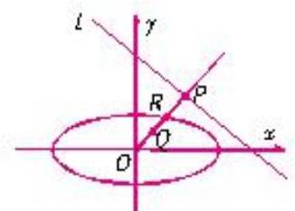

图 3

【难度】 $\bigstar \bigstar \bigstar$

【答案】见解析.

【解析】设点 $Q\text{ 、 }R\text{ 、 }P$ 的坐标为: $Q\left( {x, y}\right) , R\left( {{x}_{R},{y}_{R}}\right) , P\left( {{x}_{P},{y}_{P}}\right)$ .

把关系式 $\left| {OQ}\right|  \cdot  \left| {OP}\right|  = {\left| OR\right| }^{2}$ 投影到 $x$ 轴上,得 $x \cdot  {x}_{R} = {x}_{R}{}^{2}$ ,又设 ${OP}$ 的方程为 $y = {kx}$ ,

则 $\left\{  {\begin{array}{l} {y}_{p} = k{x}_{p} \\  2{x}_{p} + 3{y}_{p} = {24} \end{array} \Rightarrow  {x}_{p} = \frac{24}{2 + {3k}} \cdot  \left\{  {\begin{array}{l} {y}_{R} = k{x}_{R} \\  2{x}_{R}{}^{2} + 3{y}_{R}{}^{2} = {48} \end{array} \Rightarrow  {x}_{R}{}^{2} = \frac{48}{2 + 3{k}^{2}}}\right. }\right.$

$\because x \cdot  {x}_{R} = {x}_{R}{}^{2},\therefore \left\{  \begin{array}{l} x = \frac{4 + {6k}}{2 + 3{k}^{2}} \\  y = {kx} \end{array}\right.$ ,这是点 $Q$ 轨迹的参数方程, $k$ 为参数,消去 $k$ ,化为标准

方程 $\frac{{\left( x - 1\right) }^{2}}{\frac{5}{2}} + \frac{{\left( y - 1\right) }^{2}}{\frac{5}{3}} = 1$

当点 $P$ 在 $y$ 轴上时, $k$ 不存在,此时, $Q$ 点的坐标 $\left( {0,2}\right)$ 满足方程,因此点 $Q$ 的轨迹是以 $\left( {1,1}\right)$ 为中心,长轴平行于 $x$ 轴,长、短半袖分别为 $\frac{\sqrt{10}}{2},\frac{\sqrt{15}}{3}$ 的椭圆 (除去点 $\left( {0,0}\right)$ ).

巩固训练

1、在定圆 $C : {x}^{2} + {y}^{2} = 4$ 内过点 $P\left( {-1,1}\right)$ 作两条互相垂直的直线与 $C$ 分别交于 $A, B$ 和 $M, N$ ,则 $\frac{\left| AB\right| }{\left| MN\right| } + \frac{\left| MN\right| }{\left| AB\right| }$ 的范围是___.

【难度】 $\star   \star   \star   \star$

【答案】 $\left\lbrack  {2,\frac{3\sqrt{2}}{2}}\right\rbrack$

【解析】由于题目条件中过点 $P\left( {-1,1}\right)$ 可作无数对互相垂直的直线,因此可取特殊位置的两条直线来解决问题. 设 $\frac{\left| AB\right| }{\left| MN\right| } = t$ ,考虑特殊情况: ${AB}$ 垂直 ${OP}$ 时, ${MN}$ 过点 $O,\left| {AB}\right|$ 最小, $\left| {MN}\right|$ 最大,所以 ${t}_{\min } = \frac{\sqrt{2}}{2},{t}_{\max } = \sqrt{2}$ . 所以 $t \in  \left\lbrack  {\frac{\sqrt{2}}{2},\sqrt{2}}\right\rbrack$ . 又因为 $t + \frac{1}{t} \geq  2\sqrt{t \cdot  \frac{1}{t}} = 2$ ,所以 $t + \frac{1}{t} \in  \left\lbrack  {2,\frac{3\sqrt{2}}{2}}\right\rbrack$ .

2、已知函数 $f\left( x\right)  = \frac{1}{2}\left( {x + \frac{1}{x}}\right) , g\left( x\right)  = \frac{1}{2}\left( {x - \frac{1}{x}}\right)$ . 若直线 $l : {ax} + {by} + c = 0\left( {a, b, c\text{ 为常数 }}\right)$ 与 $f\left( x\right)$ 的图像交于不同的两点 $A\text{ 、 }B$ ,与 $g\left( x\right)$ 的图像交于不同的两点 $C\text{ 、 }D$ ,求证: $\left| {AC}\right|  = \left| {BD}\right|$ .

【难度】 $\star   \star   \star   \star$

【答案】见解析

【解析】设 $A\left( {{x}_{1},{y}_{1}}\right) , B\left( {{x}_{2},{y}_{2}}\right) , C\left( {{x}_{3},{y}_{3}}\right) , D\left( {{x}_{4},{y}_{4}}\right)$

$\left\{  \begin{array}{l} {ax} + {by} + c = 0 \\  y = \frac{1}{2}\left( {x + \frac{1}{x}}\right)  \Rightarrow  \left( {{2a} + b}\right) {x}^{2} + {2cx} + b = 0,\text{ 则 }{x}_{1} + {x}_{2} =  - \frac{2c}{{2a} + b} \end{array}\right.$

同理由 $\left\{  {\begin{array}{l} {ax} + {by} + c = 0 \\  y = \frac{1}{2}\left( {x - \frac{1}{x}}\right)  \end{array} \Rightarrow  \left( {{2a} + b}\right) {x}^{2} + {2cx} - b = 0}\right.$ ,则 ${x}_{3} + {x}_{4} =  - \frac{2c}{{2a} + b}$

则 ${AB}$ 中点与 ${CD}$ 中点重合,即 $\left| {AC}\right|  = \left| {BD}\right|$ .

3、设数列 $\left\{  {a}_{n}\right\}$ 的前 $n$ 项和为 ${S}_{n}$ ,点 $P\left( {{S}_{n},{a}_{n}}\right)$ 在直线 $\left( {3 - m}\right) x + {2my} - m - 3 = 0$ 上, $\left( {m \in  {\mathbf{N}}^{ * }, m\text{ 为常数, }m \neq  3}\right)$ . (1) 求 ${a}_{\mathrm{n}}$ ；

(2)若数列 $\left\{  {a}_{n}\right\}$ 的公比 $q = f\left( m\right)$ ，数列 $\left\{  {b}_{n}\right\}$ 满足 ${b}_{1} = {a}_{1},{b}_{n} = \frac{3}{2}f\left( {b}_{n - 1}\right)$ ， $\left( {n \in  {\mathbf{N}}^{ * }, n \geq  2}\right)$ ，求证: $\left\{  \frac{1}{{b}_{n}}\right\}$ 为等差数列,并求 ${b}_{n}$ ;

(3)设数列 $\left\{  {c}_{n}\right\}$ 满足 ${c}_{n} = {b}_{n} \cdot  {b}_{n + 2}$ ， ${T}_{n}$ 为数列 $\left\{  {c}_{n}\right\}$ 的前 $n$ 项和，且存在实数 $T$ 满足 ${T}_{n} \geq  T$ ， $\left( {n \in  {\mathbf{N}}^{ * }}\right)$ ，求 $T$ 的最大值.

【难度】 $\star   \star   \star   \star$

【答案】( 1 ) ${a}_{n} = {\left( \frac{2m}{m + 3}\right) }^{n - 1}$ ；( 2 ) ${b}_{n} = \frac{3}{n + 2}$ .；( 3 ) $\frac{3}{5}$ .

【解析】(1) 由题设, $\left( {3 - m}\right) {S}_{n} + {2m}{a}_{n} - m - 3 = 0$ 1

$\therefore \left( {3 - m}\right) {a}_{1} + {2m}{a}_{1} - m - 3 = 0 \Rightarrow  {a}_{1} = \frac{m + 3}{m + 3} = 1$ 由①， $n \geq  2$ 时， $\left( {3 - m}\right) {S}_{n - 1} + {2m}{a}_{n - 1} - m - 3 = 0$ ②

①-②得， $\left( {3 - m}\right) {a}_{n} + {2m}\left( {{a}_{n} - {a}_{n - 1}}\right)  = 0 \Rightarrow  {a}_{n} = \frac{2m}{m + 3}{a}_{n - 1},\therefore {a}_{n} = {\left( \frac{2m}{m + 3}\right) }^{n}$

(2)由(I)知 $q = \frac{2m}{m + 3},{b}_{1} = {a}_{1} = 1,{b}_{n} = \frac{3}{2}f\left( {b}_{n - 1}\right)  = \frac{3}{2} \times  \frac{2{b}_{n - 1}}{{b}_{n - 1} + 3}$ ,

化简得: $\frac{1}{{b}_{n}} = \frac{1}{{b}_{n - 1}} + \frac{1}{3} \Rightarrow  \frac{1}{{b}_{n}} = 1 + \left( {n - 1}\right)  \times  \frac{1}{3} = \frac{n + 2}{3}.\;\therefore \left\{  \frac{1}{{b}_{n}}\right\}$ 为等差数列, $\therefore {b}_{n} = \frac{3}{n + 2}$ .

(3) 由 (II) 知 ${c}_{n} = {b}_{n} \cdot  {b}_{n + 2} = \frac{3}{n + 2} \cdot  \frac{3}{n + 4} > 0, n \in  {N}^{ * }.{T}_{n}$ 为数列 $\left\{  {c}_{n}\right\}$ 的前 $n$ 项和,因为 ${c}_{n} > 0$ ,所以 ${T}_{n}$ 是递增的, ${T}_{n} \geq  {T}_{1} = {c}_{1} = \frac{3}{5}$ ,所以要满足 ${T}_{n} \geq  T,\left( {n \in  {N}^{ * }}\right) ,\therefore T \leq  \frac{3}{5}$ . 所以 $T$ 的最大值是 $\frac{3}{5}$ .

## (五)函数与方程的转化

## 例题精讲

【例 13】已知函数 $f\left( x\right)  = x + \frac{1}{x} - 2$ .

(1)若不等式 $f\left( {2}^{x}\right)  - k \cdot  {2}^{x} \geq  0$ 在 $x \in  \left\lbrack  {-1,1}\right\rbrack$ 上有解,求实数 $k$ 的取值范围;

(2)若 $f\left( \left| {{2}^{x} - 1}\right| \right)  + k \cdot  \frac{2}{\left| {2}^{x} - 1\right| } - {3k} = 0$ 有三个不同的实数解，求实数 $k$ 的取值范围.

【难度】 $\star   \star   \star   \star$

【答案】( 1 ) $\left( {-\infty ,1\rbrack ;\left( 2\right) (0, + \infty }\right)$

【解析】(1) $f\left( {2}^{x}\right)  - k \cdot  {2}^{x} \geq  0$ 可化为 ${2}^{x} + \frac{1}{{2}^{x}} - 2 \geq  k \cdot  {2}^{x}$ ,即 $1 + {\left( \frac{1}{{2}^{x}}\right) }^{2} - 2 \cdot  \frac{1}{{2}^{x}} \geq  k$ , 令 $t = \frac{1}{{2}^{x}}$ ,则 $k \leq  {t}^{2} - {2t} + 1$ ,因 $x \in  \left\lbrack  {-1,1}\right\rbrack$ ,故 $t \in  \left\lbrack  {\frac{1}{2},2}\right\rbrack$ ,记 $h\left( t\right)  = {t}^{2} - {2t} + 1$ ,因为 $t \in  \left\lbrack  {\frac{1}{2},2}\right\rbrack$ ,故 $h{\left( t\right) }_{\max } = 1$ ,所以 $k$ 的取值范围是 $( - \infty ,1\rbrack$ .

( 2 )原方程可化为 ${\left| {2}^{x} - 1\right| }^{2} - \left( {{3k} + 2}\right)  \cdot  \left| {{2}^{x} - 1}\right|  + \left( {{2k} + 1}\right)  = 0$ ，

令 $\left| {{2}^{x} - 1}\right|  = m$ ,则 $m \in  \left( {0, + \infty }\right) ,{m}^{2} - \left( {{3k} + 2}\right) m + \left( {{2k} + 1}\right)  = 0$ 有两个不同的实数解 ${m}_{1}\text{ 、 }{m}_{2}$ ,其中 $0 < {m}_{1} < 1,{m}_{2} > 1$ ,或 $0 < {m}_{1} < 1,{m}_{2} = 1$ .

记 $h\left( m\right)  = {m}^{2} - \left( {{3k} + 2}\right) m + \left( {{2k} + 1}\right)$ ,则 $\left\{  \begin{array}{l} {2k} + 1 > 0 \\  h\left( 1\right)  =  - k < 0 \end{array}\right.$ 或 $\left\{  \begin{array}{l} {2k} + 1 > 0 \\  h\left( 1\right)  =  - k = 0 \\  0 < \frac{{3k} + 2}{2} < 1 \end{array}\right.$

解第一个不等式组,得 $k > 0$ ,而第二个不等式组无实数解

所以实数 $k$ 的取值范围是 $\left( {0, + \infty }\right)$ .

【例 14】对于定义域为 $\mathrm{D}$ 的函数 $y = f\left( x\right)$ ,如果存在区间 $\left\lbrack  {m, n}\right\rbrack   \subseteq  D$ ,同时满足:

① $f\left( x\right)$ 在 $\left\lbrack  {m, n}\right\rbrack$ 内是单调函数；

② 当定义域是 $\left\lbrack  {m, n}\right\rbrack$ 时， $f\left( x\right)$ 的值域也是 $\left\lbrack  {m, n}\right\rbrack$ .

则称 $\left\lbrack  {m, n}\right\rbrack$ 是该函数的 “和谐区间”.

(1)证明: $\left\lbrack  {0,1}\right\rbrack$ 是函数 $y = f\left( x\right)  = {x}^{2}$ 的一个 “和谐区间”.

(2)求证:函数 $y = g\left( x\right)  = 3 - \frac{5}{x}$ 不存在 “和谐区间”.

(3)已知:函数 $y = h\left( x\right)  = \frac{\left( {{a}^{2} + a}\right) x - 1}{{a}^{2}x}\left( {a \in  R, a \neq  0}\right)$ 有 “和谐区间” $\left\lbrack  {m, n}\right\rbrack$ ，当 $a$ 变化时，求出 $n - m$ 的最大值.

【难度】

【答案】见解析

【解析】(1) $\because y = {x}^{2}$ 在区间 $\left\lbrack  {0,1}\right\rbrack$ 上单调递增.

又 $f\left( 0\right)  = 0, f\left( 1\right)  = 1$ , $\therefore$ 值域为 $\left\lbrack  {0,1}\right\rbrack$ ,

$\therefore$ 区间 $\left\lbrack  {0,1}\right\rbrack$ 是 $y = f\left( x\right)  = {x}^{2}$ 的一个 “和谐区间”.

(2)设 $\left\lbrack  {m, n}\right\rbrack$ 是已知函数定义域的子集. $\because x \neq  0,\left\lbrack  {m, n}\right\rbrack   \subseteq  \left( {-\infty ,0}\right)$ 或 $\left\lbrack  {m, n}\right\rbrack   \subseteq  \left( {0, + \infty }\right)$ ，故函数 $y = 3 - \frac{5}{x}$ 在 $\left\lbrack  {m, n}\right\rbrack$ 上单调递增.

若 $\left\lbrack  {m, n}\right\rbrack$ 是已知函数的 “和谐区间”,则 $\left\{  \begin{array}{l} g\left( m\right)  = m \\  g\left( n\right)  = n \end{array}\right.$ ; 故 $m\text{ 、 }n$ 是方程 $3 - \frac{5}{x} = x$ 的同号的相异实数根. $\because {x}^{2} - {3x} + 5 = 0$ 无实数根, $\therefore$ 函数 $y = 3 - \frac{5}{x}$ 不存在 “和谐区间”.

(3)设 $\left\lbrack  {m, n}\right\rbrack$ 是已知函数定义域的子集. $\because x \neq  0,\left\lbrack  {m, n}\right\rbrack   \subseteq  \left( {-\infty ,0}\right)$ 或 $\left\lbrack  {m, n}\right\rbrack   \subseteq  \left( {0, + \infty }\right)$ ，故函数 $y = \frac{\left( {{a}^{2} + a}\right) x - 1}{{a}^{2}x} = \frac{a + 1}{a} - \frac{1}{{a}^{2}x}$ 在 $\left\lbrack  {m, n}\right\rbrack$ 上单调递增.

若 $\left\lbrack  {m, n}\right\rbrack$ 是已知函数的 “和谐区间”,则 $\left\{  \begin{array}{l} h\left( m\right)  = m \\  h\left( n\right)  = n \end{array}\right.$ ;

故 $m\text{ 、 }n$ 是方程 $\frac{a + 1}{a} - \frac{1}{{a}^{2}x} = x$ ,即 ${a}^{2}x - \left( {{a}^{2} + a}\right) x + 1 = 0$ 的同号的相异实数根.

$\because {mn} = \frac{1}{{a}^{2}} > 0,\therefore m, n$ 同号,只须 $\Delta  = {a}^{2}\left( {a + 3}\right) \left( {a - 1}\right)  > 0$ ,即 $a > 1$ 或 $a <  - 3$ 时,已知函数有 “和谐区间” $\left\lbrack  {m, n}\right\rbrack  ,\because n - m = \sqrt{{\left( n + m\right) }^{2} - {4mn}} = \sqrt{-3{\left( \frac{1}{a} - \frac{1}{3}\right) }^{2} + \frac{4}{3}},\therefore$ 当 $a = 3$ 时, $n - m$ 取最大值 $\frac{2\sqrt{3}}{3}$

巩固训练

1、若函数 $f\left( x\right)  = {2}^{\left| x - 3\right| } - {\log }_{a}x + 1$ 无零点，则 $a$ 的取值范围为___.

【难度】 $\star   \star   \star$

【答案】 $\left( {\sqrt{3}, + \infty }\right)$

【解析】 ${2}^{\left| x - 3\right| } - {\log }_{a}x + 1 = 0$ 无解 $\Rightarrow  {2}^{\left| x - 3\right| } + 1 = {\log }_{a}x$ 无解 $\Rightarrow$ 函数 $g\left( x\right)  = {2}^{\left| x - 3\right| } + 1$ 与函数 $h\left( x\right)  = {\log }_{a}x$ 无交点,画出图像易知 $a > 1$ 且 $g\left( 3\right)  > h\left( 3\right)$ ,解得 $a > \sqrt{3}$

2、已知实数 $a, b$ 分别满足 ${a}^{3} - 3{a}^{2} + {5a} = 1,{b}^{3} - 3{b}^{2} + {5b} = 5$ ,求 $a + b$ 的值.

【难度】 $\star   \star   \star$

【答案】 2

【解析】对题设的两个等式变形为 ${\left( a - 1\right) }^{3} + 2\left( {a - 1}\right)  =  - 2,{\left( b - 1\right) }^{3} + 2\left( {b - 1}\right)  = 2$ ,

根据这两个等式的特征,构造函数 $f\left( x\right)  = {x}^{3} + {2x}$ .

函数 $f\left( x\right)$ 是一个奇函数,又是 $\mathbf{R}$ 上的增函数,则有 $f\left( {a - 1}\right)  =  - 2, f\left( {b - 1}\right)  = 2$ ,

于是, $f\left( {a - 1}\right)  =  - f\left( {b - 1}\right)  = f\left( {1 - b}\right)$ ,因而得 $a - 1 = 1 - b.a + b = 2$ .

## (六)空间与平面的转化

## 例题精讲

【例 15】(1)如图，在直三棱柱 ${ABC} - {A}_{1}{B}_{1}{C}_{1}$ 中，底面为直角三角形， ${\measuredangle {ACB}} = {90}^{ \circ  },{AC} = 6$ ， ${BC} = {C{C}_{1}} = \sqrt{2}, P$ 是 $B{C}_{1}$ 上一动点，则 ${CP} + P{A}_{1}$ 的最小值是

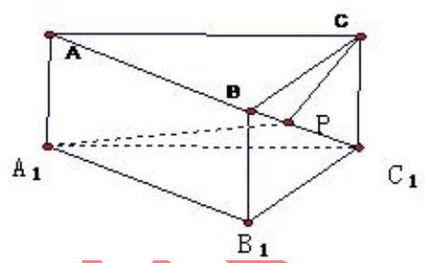

___.

【难度】 $\star   \star   \star   \star$

【答案】 $5\sqrt{2}$

【解析】连 ${A}_{1}B$ ,沿 $B{C}_{1}$ 将 ${\Delta CB}{C}_{1}$ 展开与 $\Delta {A}_{1}B{C}_{1}$ 在同一个平面内,连 ${A}_{1}C$ ,则 ${A}_{1}C$ 的长度就是所求的最小值.

通过计算可得 ${AB} = {A}_{1}{B}_{1} = \sqrt{38},{A}_{1}B = \sqrt{40},{A}_{1}{C}_{1} = 6, B{C}_{2} = 2$ ,所以 $\angle {A}_{1}{C}_{1}B = {90}^{ \circ  }$ ,又 $\angle B{C}_{1}C = {45}^{ \circ  }$ , 于是, $\angle {A}_{1}{C}_{1}C = {135}^{ \circ  }$ ,

$\therefore \angle {\mathrm{A}}_{1}{\mathrm{C}}_{1}\mathrm{C} = {135}^{ \circ  }$ . 由余弦定理可求得 ${\mathrm{A}}_{1}\mathrm{C} = 5\sqrt{2}$ .

(2)如图所示，一只小蚂蚁正从圆锥底面上的点 $A$ 沿圆锥体的表面匀速爬行一周，又绕回到点 $A$ . 已知该圆锥体的底面半径为 $r$ ,母线长为 ${3r}$ ,试问小蚂蚁沿怎样的路径如何爬行,才能最快到达点 $A$ ? 并求出该路径的长.

【难度】 $\star   \star   \star   \star$

【答案】见解析

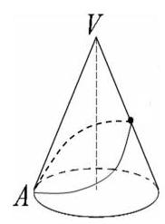

【解析】设 $\angle {AV}{A}_{1} = \theta$ ,即 $\frac{\theta }{2\pi } = \frac{{2\pi } \cdot  r}{{2\pi } \cdot  {3r}},\theta  = \frac{2\pi }{3}$ ,

$\therefore A{A}_{1}^{2} = V{A}^{2} + V{A}_{1}^{2} - {2VA} \cdot  V{A}_{1}\cos \frac{2\pi }{3}$

$= {\left( 3r\right) }^{2} + {\left( 3r\right) }^{2} - 2 \cdot  {3r} \cdot  {3r} \cdot  \cos \frac{2\pi }{3} = {27}{r}^{2}$ ,即 $A{A}_{1} = 3\sqrt{3}r$ ,

则小蚂蚁沿线段 $A{A}_{1}$ 爬行 (如图),能最快到达点 $A$ ,且该路径的长为 $3\sqrt{3}r$ .

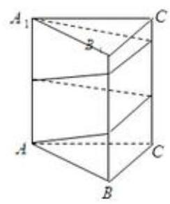

(3)如图，已知正三棱柱的底面边长为 ${2cm}$ ，高为 ${5cm}$ ，一质点自 $A$ 点出发，沿着三棱柱的侧面绕行两周到达 ${A}_{1}$ 点的最短路线的长为___ ${cm}$

【难度】 $\star   \star   \star   \star$

【答案】 13

【解析】解: 将正三棱柱 ${ABC} - {A}_{1}{B}_{1}{C}_{1}$ 沿侧棱展开,再拼接一次,其侧面展开图如图所示,

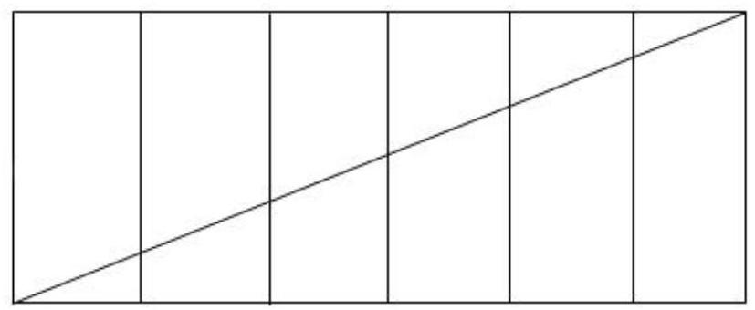

在展开图中, 最短距离是六个矩形对角线的连线的长度, 也即为三棱柱的侧面上所求距离的最小值.

由已知求得矩形的长等于 $6 \times  2 = {12}$ ,宽等于 5,由勾股定理 $d = \sqrt{{12}^{2} + {5}^{2}} = {13}$ .

## 巩固训练

1、如图所示,图 (a) 为大小可变化的三棱锥 $P - {ABC}$

(1)将此三棱锥沿三条侧棱剪开，假定展开图刚好是一个直角梯形 ${P}_{1}{P}_{2}{P}_{3}A$ ，如图(b)所示. 求证: 侧棱 ${PB} \bot  {AC}$ ；

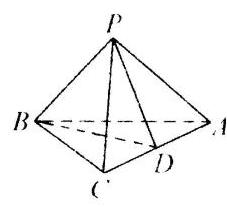

(a)

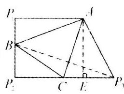

(b)

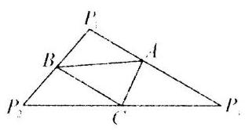

(C)

(2)由(1)的条件和结论，若三棱锥中 ${PA} = {AC}$ ， ${PB} = 2$ ，求侧面 ${PAC}$ 与底面 ${ABC}$ 所成角；

(3)将此三棱锥沿三条侧棱剪开，假定其展开图刚好是一个三角形 ${P}_{1}{P}_{2}{P}_{3}$ ，如图(c)所示. 已知 ${P}_{1}{P}_{3} = {P}_{2}{P}_{3},{P}_{1}{P}_{2} = {2a}$ ,若三棱锥相对棱 ${PB}$ 与 ${AC}$ 间的距离为 $d$ ,求此三棱锥的体积.

【难度】 $\star   \star   \star$

【答案】(1) 在平面图中 ${P}_{1}B \bot  {P}_{2}B,{P}_{2}B \bot  {P}_{2}C$ . 故三棱锥中， ${PB} \bot  {PA},{PB} \bot  {PC},\therefore {PB} \bot$ 平面 ${PAC}$ , $\therefore {PB} \bot  {AC}$ .

(2)由(1)在三棱锥中作 ${PD} \bot  {AC}$ 于 $D$ ,连结 ${BD}$ . 由三垂线定理得 ${BD} \bot  {AC}$ ， $\therefore \angle {PDB}$ 是所求二面角的平面角,在展开图中,连 $B{P}_{3}$ 得 $B{P}_{3} \bot  {AC}$ ,作 ${AE} \bot  C{P}_{3}$ 于 $E$ ,得 ${AE} = {P}_{1}{P}_{2} = 4$ .

设 ${PA} = {AC} = x$ ,则 ${P}_{1}A = {AC} = {P}_{3}A = x$ ,由 ${P}_{2}C = C{P}_{3},{CE} = E{P}_{3} = \frac{x}{3} = \sqrt{{x}^{2} - 4},\therefore E{P}_{3} = 2$ . 故 $C{P}_{3} = 2\sqrt{2}$ ， ${P}_{2}{P}_{3} = 4\sqrt{2}$ ，由 ${AC} \cdot  {D{P}_{3}} = {C{P}_{3}} \cdot  {AE}$ 得 $D{P}_{3} = \frac{8}{3}$ ，又 ${B{P}_{3}} = \sqrt{B{P}_{2}^{2} + {P}_{2}{P}_{3}^{2}} = 6$ ， $\therefore \; {BD} = \frac{10}{3}$ . 在 $\bigtriangleup  {PDB}$ 中， ${cos}\angle {PDB} = \frac{4}{5}$ ，故侧面 ${AC}$ 与底面 ${ABC}$ 所成的角的大小为 ${arccos}\frac{4}{5}$ .

(3)在平面图中，由剪法知， $A$ 、 $B$ 、 $C$ 分别是三角形三边的中点.

由此得: ${AB} = {BC},{AC} = a$ . 在三棱锥中,取 ${AC}$ 中点 $D$ . 连 ${PD}\text{ 、 }{BD},{AC} \bot  {PD},{AC} \bot  {BD}$ , 故 ${AC} \bot$ 平面 ${PDB}$ ,且 $D$ 到 ${PB}$ 的距离为异面直线 ${PB}$ 与 ${AC}$ 之间的距离 $d$ ,

$\therefore {S}_{\bigtriangleup {PDB}} = \frac{1}{2}{ad},\therefore V = V = \frac{1}{6}{a}^{2}d$

## (七)复数与实数的转化

## 例题精讲

【例 16】在复数范围内方程 ${x}^{2} - 5\left| x\right|  + 6 = 0$ 的解的个数为( )

(A) 2 (B) 4

(C) 6 (D) 8

【难度】★★★★

【答案】C

【解析】解: 设 $x = a + {bi}\left( {a, b \in  R}\right)$ ,

代入 ${x}^{2} - 5\left| x\right|  + 6 = 0$ ，得 ${\left( a + bi\right) }^{2} - 5\sqrt{{a}^{2} + {b}^{2}} + 6 = 0$ .

即 ${a}^{2} - {b}^{2} + {2abi} - 5\sqrt{{a}^{2} + {b}^{2}} + 6 = 0,\therefore \left\{  \begin{array}{l} {a}^{2} - {b}^{2} - 5\sqrt{{a}^{2} + {b}^{2}} + 6 = 0\text{ ① } \\  {2ab} = 0\text{ ② } \end{array}\right.$ ,

由②得 ${ab} = 0$ ，当 $a = 0$ 时，代入①得: ${\left| b\right| }^{2} + 5\left| b\right|  - 6 = 0$ ，解得 $\left| b\right|  = 1$ ， $b =  \pm  1$ ， $\therefore x =  \pm  i$ ；

当 $b = 0$ 时,代入 1 得 ${\left| a\right| }^{2} - 5\left| a\right|  + 6 = 0$ ,解得 $\left| a\right|  = 2$ 或 $\left| a\right|  = 3, a =  \pm  2$ 或 $a =  \pm  3$ ,

$\therefore x =  \pm  2$ 或 $x =  \pm  3\;\therefore$ 复数集内方程 ${x}^{2} - 5\left| x\right|  + 6 = 0$ 的解的个数是 6 . 故选: $C$ .

## (八)特殊与一般的转化

## 例题精讲

【例 17】课本中介绍了应用祖暅原理推导棱锥体积公式的做法, 祖暅原理也可用来求旋转体的体积, 现介绍用祖暅原理求球体体积公式的做法: 可构造一个底面半径和高都与球半径相等的圆柱, 然后在圆柱内挖去一个以圆柱下底面圆心为顶点, 圆柱上底面为底面的圆锥, 用这样一个几何体与半球应用祖暅原理(图 1)，即可求得球的体积公式，请研究和理解球的体积公式求法的基础上，解答以下问题:已知椭圆的标准方程为 $\frac{{x}^{2}}{4} + \frac{{y}^{2}}{25} = 1$ ，将此椭圆绕 $y$ 轴旋转一周后，得一橄榄状的几何体(图 2)，其体积等于___

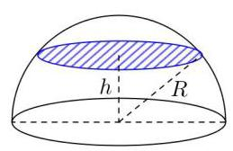

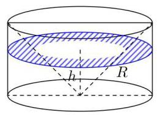

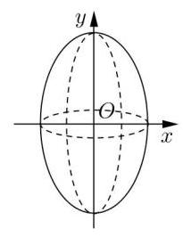

【难度】★★★★

【答案】 $\frac{80\pi }{3}$

【解析】构造模型如图,设 ${OH} = {O}^{\prime }{H}^{\prime } = h$ ,

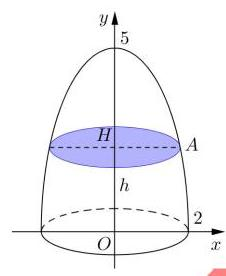

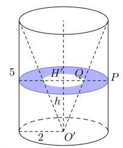

则 ${AH} = \sqrt{4 - \frac{4{y}^{2}}{25}},\therefore {S}_{\text{ 左 }} = {4\pi } - \frac{4{y}^{2}\pi }{25}$ ,

${H}^{\prime }P = 2,{H}^{\prime }Q = \frac{2}{5}h,{S}_{\text{ 右 }} = {4\pi } - \frac{4{y}^{2}\pi }{25}$ ,

据祖暅原理 $V = \frac{2}{3}{V}_{\text{ 柱 }} = \frac{2}{3}\left( {4\pi }\right)  \times  {10} = \frac{80\pi }{3}$ ;

## 巩固训练

1、如图,现将一张正方形纸片进行如下操作: 第一步,将纸片以 $D$ 为顶点,任意向上翻折,折痕与 ${BC}$ 交于点 ${E}_{1}$ ,然后复原,记 $\angle {CD}{E}_{1} = {\alpha }_{1}$ ; 第二步,将纸片以 $D$ 为顶点向下翻折,使 ${AD}$ 与 ${E}_{1}D$ 重合,得到折痕 ${E}_{2}D$ ,然后复原,记 $\angle {AD}{E}_{2} = {\alpha }_{2}$ ; 第三步,将纸片以 $D$ 为顶点向上翻折,使 ${CD}$ 与 ${E}_{2}D$ 重合,得到折痕 ${E}_{3}D$ ,然后复原,记 $\angle {CD}{E}_{3} = {\alpha }_{3}$ ; 按此折法从第二步起重复以上步骤 $\cdots \cdots$ ,得到 ${\alpha }_{1},{\alpha }_{2},\cdots ,{\alpha }_{n},\cdots$ ,则 $\mathop{\lim }\limits_{{n \rightarrow  \infty }}{\alpha }_{n} =$

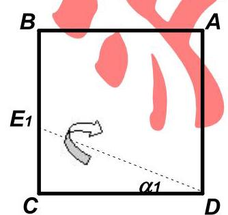

第一步

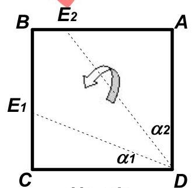

第二步

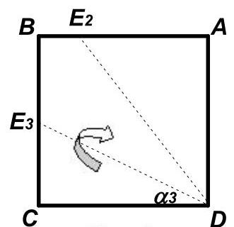

第三步

【难度】 $\star   \star   \star   \star$

【答案】 $\frac{\pi }{6}$

【解答】解: 由第二步可知: ${\alpha }_{2} = \frac{1}{2}\left( {\frac{\pi }{2} - {\alpha }_{1}}\right)$ ; 由第三步可知: ${\alpha }_{3} = \frac{1}{2}\left( {\frac{\pi }{2} - {\alpha }_{2}}\right) ,\ldots$ 依此类推: ${\alpha }_{n} = \frac{1}{2}\left( {\frac{\pi }{2} - {\alpha }_{n - 1}}\right) \left( {n \geq  2}\right) .\;\therefore {\alpha }_{n} =  - \frac{1}{2}{\alpha }_{n - 1} - \frac{\pi }{4},\therefore {\alpha }_{n} - \frac{\pi }{6} =  - \frac{1}{2}\left( {{\alpha }_{n - 1} - \frac{\pi }{6}}\right)$ ,

①若 ${\alpha }_{1} = \frac{\pi }{6}$ ，则 ${\alpha }_{n} = \frac{\pi }{6}$ ，此时 $\mathop{\lim }\limits_{{n \rightarrow  \infty }}{\alpha }_{n} = \frac{\pi }{6}$ ；

②若 ${\alpha }_{1} \neq  \frac{\pi }{6}$ ，则数列 $\left\{  {{\alpha }_{n} - \frac{\pi }{6}}\right\}$ 是以 ${\alpha }_{1} - \frac{\pi }{6}$ 为首项， $- \frac{1}{2}$ 为公比的等比数列，

$\therefore {\alpha }_{n} - \frac{\pi }{6} = \left( {{\alpha }_{1} - \frac{\pi }{6}}\right) {\left( -\frac{1}{2}\right) }^{n - 1}$ ,即 ${\alpha }_{n} = \left( {{\alpha }_{1} - \frac{\pi }{6}}\right) {\left( -\frac{1}{2}\right) }^{n - 1} + \frac{\pi }{6}.\therefore \mathop{\lim }\limits_{{n \rightarrow  \infty }}{\alpha }_{n} = \mathop{\lim }\limits_{{n \rightarrow  \infty }}\left\lbrack  {\left( {{\alpha }_{1} - \frac{\pi }{6}}\right) {\left( -\frac{1}{2}\right) }^{n - 1} + \frac{\pi }{6}}\right\rbrack   = \frac{\pi }{6}$ .

综上可知: $\mathop{\lim }\limits_{{n \rightarrow  \infty }}{\alpha }_{n} = \frac{\pi }{6}$ . 故答案为 $\frac{\pi }{6}$ .

2、若以 ${F}_{1}\left( {0, - 1}\right) ,{F}_{2}\left( {0,1}\right)$ 为焦点的椭圆 C 过点 $P\left( {\frac{\sqrt{2}}{2},1}\right)$ .

(1)求椭圆 C 的方程；

(2)过点 $S\left( {-\frac{1}{3},0}\right)$ 的动直线 $l$ 交椭圆 C 于 $\mathrm{A},\mathrm{B}$ 两点，试问:在坐标平面上是否存在一个定点 $\mathrm{T}$ ，使得无论 $l$ 如何转动，以 ${AB}$ 为直径的圆恒过点 $\mathrm{T}$ ? 若存在，求出点 $\mathrm{T}$ 的坐标；若不存在，请说明理由.

【难度】 $\star   \star   \star   \star$

【答案】 $1.{x}^{2} + \frac{{y}^{2}}{2} = 1\;$ 2. 存在 $T\left( {1,0}\right)$

【解答】解: (I) 设椭圆方程为 $\frac{{y}^{2}}{{a}^{2}} + \frac{{x}^{2}}{{b}^{2}} = 1\left( {a > b > 0}\right)$ , $\because$ 椭圆过点 $P\left( {\frac{\sqrt{2}}{2},1}\right)$ ,则由椭圆的定义知 ${2a} = \left| {P{F}_{1}}\right|  + \left| {P{F}_{2}}\right|  = \sqrt{{\left( \frac{\sqrt{2}}{2}\right) }^{2} + {2}^{2}} + \sqrt{{\left( \frac{\sqrt{2}}{2}\right) }^{2} + {0}^{2}} = 2\sqrt{2}$ ,所以, $a = \sqrt{2},{b}^{2} = {a}^{2} - {c}^{2} = 1$ , 椭圆 $C$ 的方程为 ${x}^{2} + \frac{{y}^{2}}{2} = 1$ .

(II) 解法一: 若直线 $l$ 与 $x$ 轴重合,则以 ${AB}$ 为直径的圆是 ${x}^{2} + {y}^{2} = 1$ ;

若直线 $l$ 垂直于 $x$ 轴时,则以 ${AB}$ 为直径的圆是 ${\left( x + \frac{1}{3}\right) }^{2} + {y}^{2} = \frac{16}{9}$

由 $\left\{  \begin{array}{l} {\left( x + \frac{1}{3}\right) }^{2} + {y}^{2} = \frac{16}{9} \\  {x}^{2} + {y}^{2} = 1 \end{array}\right.$ 解得 $\left\{  \begin{array}{l} x = 1 \\  y = 0 \end{array}\right.$ ,所以两圆相切于点 $\left( {1,0}\right)$ .

因此,如果存在点 $T$ 满足条件,则该点只能是 $\left( {1,0}\right)$

下面证明 $T\left( {1,0}\right)$ 就是所求的点. 若直线 $l$ 垂直于 $x$ 轴时,则以 ${AB}$ 为直径的圆经过点 $\left( {1,0}\right)$ ;

若直线 $l$ 不垂直于 $x$ 轴时,可设直线 $l : y = k\left( {x + \frac{1}{3}}\right)$

由 $\left\{  \begin{array}{l} {x}^{2} + \frac{{y}^{2}}{2} = 1 \\  y = k\left( {x + \frac{1}{3}}\right)  \end{array}\right.$ ,整理得 $\left( {{k}^{2} + 2}\right) {x}^{2} + \frac{2}{3}{k}^{2}x + \frac{1}{9}{k}^{2} - 2 = 0$

记 $A\left( {{x}_{1},{y}_{1}}\right) \text{ 、 }B\left( {{x}_{2},{y}_{2}}\right)$ ,则 $\left\{  \begin{array}{l} {x}_{1} + {x}_{2} = \frac{-2{k}^{2}}{3\left( {{k}^{2} + 2}\right) } \\  {x}_{1}{x}_{2} = \frac{{k}^{2} - {18}}{9\left( {{k}^{2} + 2}\right) } \end{array}\right.$

又因为 $\overrightarrow{TA} = \left( {{x}_{1} - 1,{y}_{1}}\right) ,\overrightarrow{TB} = \left( {{x}_{2} - 1,{y}_{2}}\right)$ ,

则 $\overrightarrow{TA} \cdot  \overrightarrow{TB} = \left( {{x}_{1} - 1,{y}_{1}}\right)  \cdot  \left( {{x}_{2} - 1,{y}_{2}}\right)  = \left( {{x}_{1} - 1}\right) \left( {{x}_{2} - 1}\right)  + {y}_{1}{y}_{2}$

$= \left( {{x}_{1} - 1}\right) \left( {{x}_{2} - 1}\right)  + {k}^{2}\left( {{x}_{1} + \frac{1}{3}}\right) \left( {{x}_{2} + \frac{1}{3}}\right)  = \left( {{k}^{2} + 1}\right) {x}_{1}{x}_{2} + \left( {\frac{1}{3}{k}^{2} - 1}\right) \left( {{x}_{1} + {x}_{2}}\right)  + \frac{1}{9}{k}^{2} + 1$

$= \left( {{k}^{2} + 1}\right)  \cdot  \frac{{k}^{2} - {18}}{9\left( {{k}^{2} + 2}\right) } + \left( {\frac{1}{3}{k}^{2} - 1}\right)  \cdot  \frac{-2{k}^{2}}{3\left( {{k}^{2} + 2}\right) } + \frac{1}{9}{k}^{2} + 1 = 0$

所以, ${TA} \bot  {TB}$ ,即以 ${AB}$ 为直径的圆恒过定点 $T\left( {1,0}\right)$ ,

故平面上存在一个定点 $T\left( {1,0}\right)$ 满足题设条件

解法二: $\left( I\right)$ 由已知 $c = 1$ ,设椭圆方程为 $\frac{{y}^{2}}{{a}^{2}} + \frac{{x}^{2}}{{a}^{2} - 1} = 1\left( {a > 1}\right)$ .

因为点 $P$ 在椭圆上,则 $\frac{1}{{a}^{2}} + \frac{\frac{1}{2}}{{a}^{2} - 1} = 1\left( {a > 1}\right)$ ,解得 ${a}^{2} = 2$ ,所以椭圆方程为 ${x}^{2} + \frac{{y}^{2}}{2} = 1$

(II) 如果存在定点 $T\left( {u, v}\right)$ 满足条件. 若直线 $l$ 垂直于 $x$ 轴时,

则以 ${AB}$ 为直径的圆经过点 $\left( {1,0}\right)$ ; 若直线 $l$ 不垂直于 $x$ 轴时,可设直线 $l : y = k\left( {x + \frac{1}{3}}\right)$ .

由 $\left\{  \begin{array}{l} {x}^{2} + \frac{{y}^{2}}{2} = 1 \\  y = k\left( {x + \frac{1}{3}}\right)  \end{array}\right.$ ,整理得 $\left( {{k}^{2} + 2}\right) {x}^{2} + \frac{2}{3}{k}^{2}x + \frac{1}{9}{k}^{2} - 2 = 0$

记 $A\left( {{x}_{1},{y}_{1}}\right) \text{ 、 }B\left( {{x}_{2},{y}_{2}}\right)$ ,则 $\left\{  \begin{array}{l} {x}_{1} + {x}_{2} = \frac{-2{k}^{2}}{3\left( {{k}^{2} + 2}\right) } \\  {x}_{1}{x}_{2} = \frac{{k}^{2} - {18}}{9\left( {{k}^{2} + 2}\right) } \end{array}\right.$

$\because$ 又因为 $\overrightarrow{TA} = \left( {{x}_{1} - u,{y}_{1} - v}\right) ,\overrightarrow{TB} = \left( {{x}_{2} - u,{y}_{2} - v}\right)$ ,

则 $\overrightarrow{TA} \cdot  \overrightarrow{TB} = \left( {{x}_{1} - u,{y}_{1} - v}\right)  \cdot  \left( {{x}_{2} - u,{y}_{2} - v}\right)  = \left( {{x}_{1} - u}\right) \left( {{x}_{2} - u}\right)  + \left( {{y}_{1} - v}\right) \left( {{y}_{2} - v}\right)$

$= \left( {{x}_{1} - u}\right) \left( {{x}_{2} - u}\right)  + \left( {k{x}_{1} + \frac{1}{3}k - v}\right) \left( {k{x}_{2} + \frac{1}{3}k - v}\right)$

$$
= \left( {{k}^{2} + 1}\right) {x}_{1}{x}_{2} + \left( {\frac{1}{3}{k}^{2} - u - {kv}}\right) \left( {{x}_{1} + {x}_{2}}\right)  + \frac{1}{9}{k}^{2} - \frac{2}{3}{kv} + {u}^{2} + {v}^{2}
$$

$$
= \left( {{k}^{2} + 1}\right)  \cdot  \frac{{k}^{2} - {18}}{9\left( {{k}^{2} + 2}\right) } + \left( {\frac{1}{3}{k}^{2} - u - {kv}}\right)  \cdot  \frac{-2{k}^{2}}{3\left( {{k}^{2} + 2}\right) } + \frac{1}{9}{k}^{2} - \frac{2}{3}{kv} + {u}^{2} + {v}^{2}
$$

$$
= \frac{\left( {3{u}^{2} + {2u} + 3{v}^{2} - 5}\right) {k}^{2} - {4vk} + 6{u}^{2} + 6{v}^{2} - 6}{3\left( {{k}^{2} + 2}\right) }
$$

当且仅当 $\overrightarrow{TA} \cdot  \overrightarrow{TB} = 0$ 恒成立时,以 ${AB}$ 为直径的圆恒过点 $T\left( {u, v}\right) .\overrightarrow{TA} \cdot  \overrightarrow{TB} = 0$ 恒成立等价于

$$
\left\{  {\begin{array}{l} 3{u}^{2} + {2u} + 3{v}^{2} - 5 = 0 \\   - {4v} = 0 \\  6{u}^{2} + 6{v}^{2} - 6 = 0 \end{array},}\right.
$$

解得 $u = 1, v = 0$

所以当 $u = 1, v = 0$ 时,无论直线 $l$ 如何转动,以 ${AB}$ 为直径的圆恒过定点 $T\left( {1,0}\right)$ .

故平面上存在一个定点 $T\left( {1,0}\right)$ 满足题目条件.

## (九)数学与文字的转化

## 例题精讲

【例 18】向量集合 $S = \left\{  {\overrightarrow{a} \mid  \overrightarrow{a} = \left( {x, y}\right) , x, y \in  \mathbf{R}}\right\}$ ,对于任意 $\overrightarrow{\alpha }\text{ 、 }\overrightarrow{\beta } \in  S$ ,以及任意 $\lambda  \in  \left( {0,1}\right)$ ,都有 $\lambda \overrightarrow{\alpha } + \left( {1 - \lambda }\right) \overrightarrow{\beta } \in  S$ ,则称 $S$ 为 “ $C$ 类集”. 现有四个命题:

① 若 $S$ 为 “ $C$ 类集”，则集合 $M = \{ \mu \overrightarrow{a} \mid  \overrightarrow{a} \in  S,\mu  \in  \mathbf{R}\}$ 也是 “ $C$ 类集”;

② 若 $S\text{ 、 }T$ 都是 “ $C$ 类集”，则集合 $M = \{ \overrightarrow{a} + \overrightarrow{b} \mid  \overrightarrow{a} \in  S,\overrightarrow{b} \in  T\}$ 也是 “ $C$ 类集”;

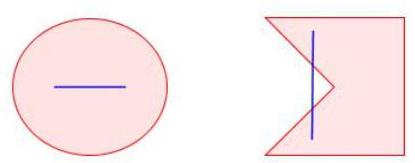

③ 若 ${A}_{1}\text{ 、 }{A}_{2}$ 都是 “ $C$ 类集”,则 ${A}_{1} \cup  {A}_{2}$ 也是 “ $C$ 类集”;

④ 若 ${A}_{1}\text{ 、 }{A}_{2}$ 都是 “ $C$ 类集”,且交集非空,则 ${A}_{1} \cap  {A}_{2}$ 也是 “ $C$ 类集”.

其中正确的命题有

【难度】 $\star   \star   \star   \star$

【答案】①②④

【解析】理解题意等价转化为点集问题,即

“平面中有点集 $S$ ,若对于 $S$ 中的任意两点 $A\text{ 、 }B$ ,线

段 ${AB}$ 上的点均属于 $S$ ,则称点集 $S$ 为 $C$ 类集”. 举两

个例子，左图区域内任选两点所连线段依然在区域内，符合 $C$ 类集定义，而右图并不符合，

不妨称符合 $C$ 类集的这种图形为 “凸形”. 命题①，相当于将 “凸形” 放大或缩小，变化后

还是 “凸形”,正确; 命题②，可以进一步将 “凸形” 简化为圆，即 $M$ 在圆 ${O}_{1}$ 内， $N$ 在圆 ${O}_{2}$

内，MN 的中点轨迹为 “凸形”，结合命题①，乘以 2 仍为 “凸形”，②正确；命题③，两个

“凸形” 的并集不一定为 “凸形”，错误；命题④，两个 “凸形” 的交集还是 “凸形”，正确.

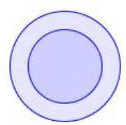

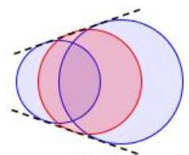

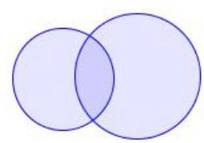

① ② ③ ④

## 巩固训练

1、已知 $a\text{ 、 }b\text{ 、 }c$ 为实常数，数列 $\left\{  {x}_{n}\right\}$ 的通项 ${x}_{n} = a{n}^{2} + {bn} + c, n \in  {N}^{ * }$ ，则 “存在 $k \in  {N}^{ * }$ ，使得 ${x}_{{100} + k}$ 、 ${x}_{{200} + k}$ 、 ${x}_{{300} + k}$ 成等差数列” 的一个必要条件是( )

A. $a \geq  0$ B. $b \leq  0$ C. $c = 0$ D. $a - {2b} + c = 0$

【难度】★★★★

【答案】 $A$

【解析】法一: 存在 $k \in  {N}^{ * }$ ,使得 ${x}_{{100} + k} \rightarrow  {x}_{{200} + k}$ 、 ${x}_{{300} + k}$ 成等差数列,可得: $2\left\lbrack  {a{\left( {200} + k\right) }^{2} + b\left( {{200} + k}\right)  + c}\right\rbrack   = a{\left( {100} + k\right) }^{2} + b\left( {{100} + k}\right)  + c + a{\left( {300} + k\right) }^{2} + b\left( {{300} + k}\right)  + c$ ,化为: $a = 0$ .

$\therefore$ 使得 ${x}_{{100} + k},{x}_{{200} + k},{x}_{{300} + k}$ 成等差数列的必要条件是 $a \geq  0$ . 故选: $A$ .

法二: 直线与二次函数不可能有 3 个交点

2、如图,用 35 个单位正方形拼成一个矩形,点 ${P}_{1}\text{ 、 }{P}_{2}\text{ 、 }{P}_{3}\text{ 、 }{P}_{4}$ 以及四个标记为 “ $\Delta$ ” 的点在正方形的顶点处,设集合 $\Omega  = \left\{  {{P}_{1},{P}_{2},{P}_{3},{P}_{4}}\right\}$ ,点 $P \in  \Omega$ ,过 $P$ 作直线 ${l}_{P}$ ,使得不在 ${l}_{P}$ 上的 “ $\Delta$ ” 的点分布在 ${l}_{P}$ 的两侧. 用 ${D}_{1}\left( {l}_{P}\right)$ 和 ${D}_{2}\left( {l}_{P}\right)$ 分别表示 ${l}_{P}$ 一侧和另一侧的“ $\Delta$ ” 的点到 ${l}_{P}$ 的距离之和. 若过 $P$ 的直线 ${l}_{P}$ 中有且只有一条满足 ${D}_{1}\left( {l}_{P}\right)  = {D}_{2}\left( {l}_{P}\right)$ ,则 $\Omega$ 中所有这样的 $P$ 为___.

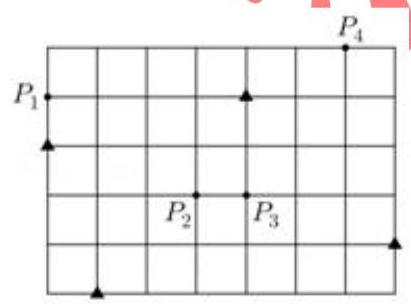

【难度】

【答案】 ${p}_{1},{p}_{3},{p}_{4}$

【解析】建立适当的直角坐标系,四个▲的坐标为 $\left( {1,0}\right) ,\left( {7,1}\right) ,\left( {0,3}\right) ,\left( {4,4}\right)$

${p}_{1}\left( {0,4}\right) ,{p}_{2}\left( {3,2}\right) ,{p}_{3}\left( {4,2}\right) ,{p}_{5}\left( {6,5}\right)$

设 ${l}_{P}$ 直线方程为 ${ax} + {by} + c = 0$ ,由 ${D}_{1}\left( {l}_{P}\right)  = {D}_{2}\left( {l}_{P}\right)  \Rightarrow$ 四个 $\bigtriangleup$ 到直线 ${l}_{P}$ 的方向距离之和为 0,

则 $\frac{a + c}{\sqrt{{a}^{2} + {b}^{2}}} + \frac{{7a} + b + c}{\sqrt{{a}^{2} + {b}^{2}}} + \frac{{3b} + c}{\sqrt{{a}^{2} + {b}^{2}}} + \frac{{4a} + {4b} + c}{\sqrt{{a}^{2} + {b}^{2}}} = 0 \Rightarrow  {12a} + {8b} + {4c} = 0$ ,所以 ${3a} + {2b} + c = 0$ ,即 ${ax} + {by} + c = 0$ 过点 $\left( {3,2}\right) ,{l}_{P}$ 过点 ${p}_{2}$ 就能满足 ${D}_{1}\left( {l}_{P}\right)  = {D}_{2}\left( {l}_{P}\right)$ ,

又因为若过 $P$ 的直线 ${l}_{P}$ 中有且只有一条,所以 ${l}_{P}$ 还要过 ${p}_{1},{p}_{3},{p}_{4}$ 任何一点都能唯一

所以答案为 ${p}_{1},{p}_{3},{p}_{4}$
