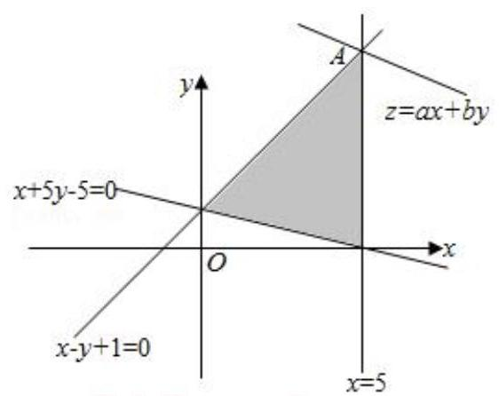
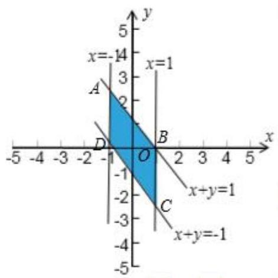
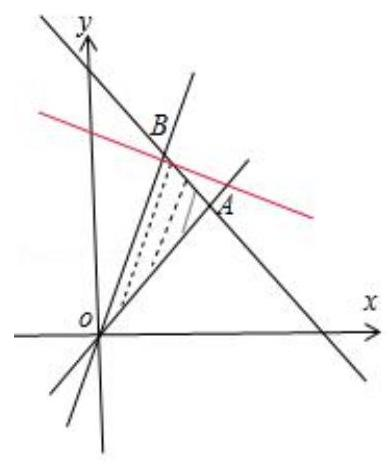
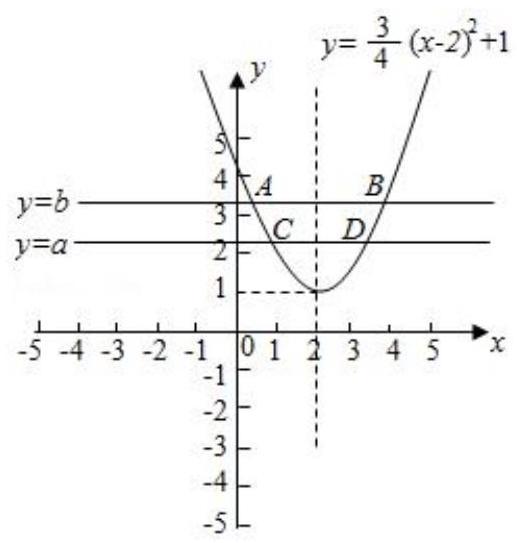
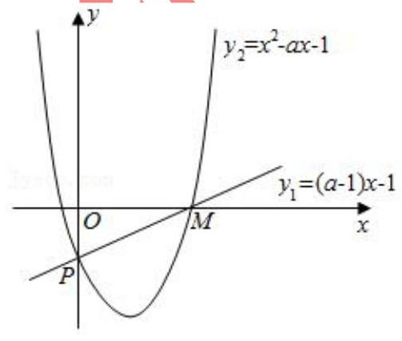
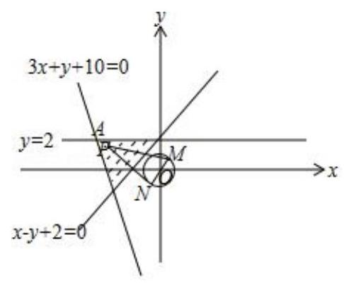
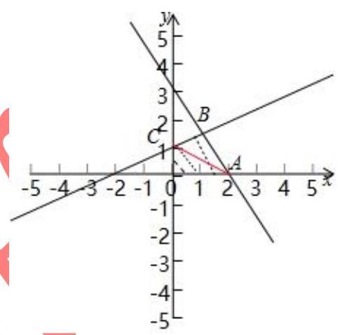
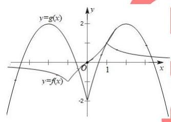
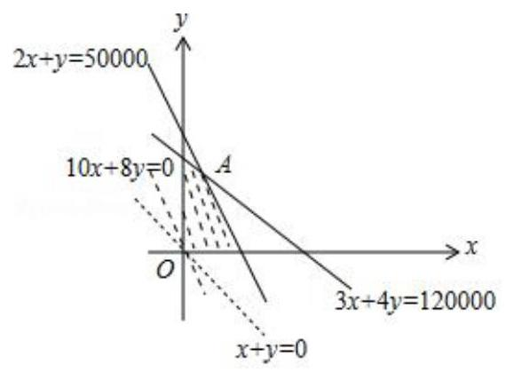
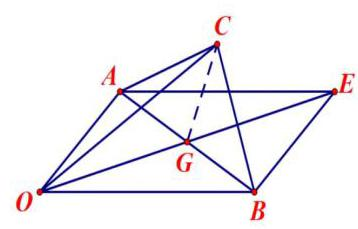

## 知识梳理

## 第 5 课:不等式专题

<table><tr><td>教学目标</td><td>1、掌握常见不等式的方法;   2、具有函数方程的思想；   3、具有数形结合的思想；   4、掌握任意与存在问题的解法.</td></tr><tr><td>重点</td><td>1、掌握不等式恒成立的的各种变形；   2、数形结合的灵活应用和函数方程的转化.</td></tr><tr><td>难 点</td><td>1、掌握不等式恒成立的的各种变形;   2、数形结合的灵活应用和函数方程的转化.</td></tr></table>

1. 重视对基础知识的考查, 设问方式不断创新. 重点考查四种题型: 解不等式, 证明不等式, 涉及不等式应用题, 涉及不等式的综合题, 所占比例远远高于在课时和知识点中的比例. 重视基础知识的考查, 常考常新, 创意不断，设问方式不断创新，图表信息题，多选型填空题等情景新颖的题型受到命题者的青睐，值得引起我们的关注.

2. 突出重点，综合考查，在知识与方法的交汇点处设计命题，在不等式问题中蕴含着丰富的函数思想，不等式又为研究函数提供了重要的工具, 不等式与函数既是知识的结合点, 又是数学知识与数学方法的交汇点, 因而在历年高考题中始终是重中之重. 在全面考查函数与不等式基础知识的同时, 将不等式的重点知识以及其他知识有机结合, 进行综合考查, 强调知识的综合和知识的内在联系, 加大数学思想方法的考查力度, 是高考对不等式考查的又一新特点.

3. 加大推理、论证能力的考查力度, 充分体现由知识立意向能力立意转变的命题方向. 由于代数推理没有几何图形作依托，因而更能检测出学生抽象思维能力的层次. 这类代数推理问题常以高中代数的主体内容—— 函数、方程、不等式、数列及其交叉综合部分为知识背景, 并与高等数学知识及思想方法相衔接, 立意新颖, 抽象程度高, 有利于高考选拔功能的充分发挥. 对不等式的考查更能体现出高观点、低设问、深入浅出的 特点, 考查容量之大、功能之多、能力要求之高, 一直是高考的热点.

4. 突出不等式的知识在解决实际问题中的应用价值, 借助不等式来考查学生的应用意识.

不等式部分的内容是高考较为稳定的一个热点, 考查的重点是不等式的性质、证明、解法及最值方面的应用。高考试题中有以下几个明显的特点:

(1)不等式与函数、数列、几何、导数，实际应用等有关内容综合在一起的综合试题多，单独考查不等式的试题题量很少。

(2)选择题, 填空题和解答题三种题型中均有各种类型不等式题, 特别是应用题和压轴题几乎都与不等式有关。

(3)不等式的证明考得比得频繁, 所涉及的方法主要是比较法、综合法和分析法, 而放缩法作为一种辅助方法不容忽视。

## (一) 不等式的解法

## 例题精讲

【例 1】已知 $m\text{ 、 }n$ 是非零常数，不等式 $m\left( {x + 1}\right) \left( {x - 3}\right)  \geq  0$ 的解集为 $A$ ,不等式 $n\left( {x + 1}\right) \left( {x - 3}\right)  > 0$ 的解集为 $B$ , 则 “ ${mn} < 0$ ” 是 “ $A \cup  B = R$ ” 的( )

A. 充分非必要条件 B. 必要非充分条件

C. 充要条件 D. 既不充分又不必要条件

【难度】★★★

【答案】 $C$

【解析】解: ① 当 ${mn} < 0$ 时,若 $m < 0$ ,则 $n > 0$ ,此时 $A = \left\lbrack  {-1,3}\right\rbrack  , B = \left( {-\infty , - 1}\right)  \cup  \left( {3, + \infty }\right)$ ,所以 $A \cup  B = R$ ; 当 $m > 0, n < 0$ 时,此时 $A = \left( {-\infty , - 1\rbrack \bigcup \lbrack 3, + \infty }\right) , B = \left( {-1,3}\right)$ ,所以 $A \cup  B = R$ ,

所以 “ ${mn} < 0$ ” 是 “ $A \cup  B = R$ ” 的充分条件;

② 当 $A \cup  B = R$ 时，若 $m < 0$ ，此时 $A = \left\lbrack  {-1,3}\right\rbrack$ ，

当 $n < 0$ 时， $B = \left( {-1,3}\right)$ ，不满足题意，

当 $n > 0$ 时, $B = \left( {-\infty , - 1}\right)  \cup  \left( {3, + \infty }\right)$ ,符合题意,此时 ${mn} < 0$ ;

若 $m > 0$ ,此时 $A = \left( {-\infty , - 1\rbrack \bigcup \lbrack 3, + \infty }\right)$

当 $n > 0$ 时, $B = \left( {-\infty , - 1}\right)  \cup  \left( {3, + \infty }\right)$ ,不符合题意;

当 $n < 0$ 时， $B = \left( {-1,3}\right)$ ，满足题意，此时 ${mn} < 0$ ；

所以 “ ${mn} < 0$ ” 是 “ $A \cup  B = R$ ” 的必要条件. 综上所述， “ ${mn} < 0$ ” 是 “ $A \cup  B = R$ ” 的充要条件.

故选: $C$ .

【例 2】设 $\left\lbrack  x\right\rbrack$ 表示不超过 $x$ 的最大整数,如 $\left\lbrack  {4.1}\right\rbrack   = 4$ ,则不等式 ${\left\lbrack  x\right\rbrack  }^{2} - 5\left\lbrack  x\right\rbrack   + 6 \leq  0$ 的解集是 ( )

A. $\left\lbrack  \begin{array}{ll} 2 & 3 \end{array}\right\rbrack$ B. $\left\lbrack  {2,4}\right\rbrack$ C. $\lbrack 2,4)$ D. $\lbrack 3,4)$

【难度】★★★★

【答案】 $C$

【解析】解: 由 ${\left\lbrack  x\right\rbrack  }^{2} - 5\left\lbrack  x\right\rbrack   + 6 \leq  0$ ,得 $\left( {\left\lbrack  x\right\rbrack   - 2}\right) \left( {\left\lbrack  x\right\rbrack   - 3}\right)  \leq  0$ . 解得 $2 \leq  \left\lbrack  x\right\rbrack   \leq  3$ .

因为 $\left\lbrack  x\right\rbrack$ 表示不超过 $x$ 的最大整数,所以 $2 \leq  x < 4$ .

所以原不等式的解集为 $\lbrack 2,4)$ . 故选: $C$ .

高三数学二轮复习 B 版

【例 3】已知 $\alpha  : 1 \leq  x \leq  4,\beta  : {\log }_{2}^{2}x - {4a} \cdot  {\log }_{4}x + 1 \leq  0$ ,若 $\alpha$ 是 $\beta$ 成立的必要条件,则实数 $a$ 的取值范围是___.

【难度】 $\star   \star   \star   \star$

【答案】 $\left( {-1,\frac{5}{4}}\right\rbrack$

【解析】解: 由题意, $\left\{  {x \mid  {\log }_{2}^{2}x - {4a} \cdot  {\log }_{4}x + 1 \leq  0}\right\}   \subseteq  \{ x \mid  1 \leq  x \leq  4\}$

令 $t = {\log }_{2}x$ ,则 $\beta$ 即 ${t}^{2} - {2at} + 1 \leq  0\left( *\right)$ ,

由题意转化为关于 $t$ 的不等式 (*) 的解集是集合 $\{ t \mid  0 \leq  t \leq  2\}$ 的子集,

①若不等式 (*) 的解集为 $\varnothing$ ，此时 $\bigtriangleup  = 4{a}^{2} - 4 < 0$ ，解得 $- 1 < a < 1$ ；

②若不等式 (*) 的解集不为 $\varnothing$ ,令 $f\left( t\right)  = {t}^{2} - {2at} + 1$ ,对称轴为 $x = a$ ,

则 $\left\{  \begin{array}{l} \Delta  \geq  0 \\  0 \leq  a \leq  2 \\  f\left( 0\right)  \geq  0 \\  f\left( 2\right)  \geq  0 \end{array}\right.$ ,解得 $1 \leq  a \leq  \frac{5}{4}$ . 综上所述 $a$ 的取值范围 $\left( {-1,\frac{5}{4}}\right\rbrack$ ,故答案为: $\left( {-1,\frac{5}{4}}\right\rbrack$ .

【例 4】设 $x, y \in  R$ ，若 $\left| x\right|  + \left| {x - 4}\right|  + \left| y\right|  + \left| {y - 1}\right|  \leq  5$ ，则 ${2x} - {3y} + {xy}$ 取值范围为___.

【难度】 $\star   \star   \star   \star$

【答案】 $\left\lbrack  {-3,9}\right\rbrack$

【解析】解: $\because \left| x\right|  + \left| {x - 4}\right|  \geq  \left| {x - \left( {x - 4}\right) }\right|  = 4,\left| y\right|  + \left| {y - 1}\right|  \geq  \left| {y - \left( {y - 1}\right) }\right|  = 1$ ,

当且仅当 $0 \leq  x \leq  4,0 \leq  y \leq  1$ 时取等号. $\therefore \left| x\right|  + \left| {x - 4}\right|  + \left| y\right|  + \left| {y - 1}\right|  \geq  5$ ,

又 $\left| x\right|  + \left| {x - 4}\right|  + \left| y\right|  + \left| {y - 1}\right|  \leq  5,\therefore$ 只有 $\left| x\right|  + \left| {x - 4}\right|  + \left| y\right|  + \left| {y - 1}\right|  = 5$ 成立,此时 $0 \leq  x \leq  4,0 \leq  y \leq  1$ ,

令 $f\left( x\right)  = {2x} - {3y} + {xy} = \left( {2 + y}\right) x - {3y}$ ,则 $f\left( 0\right)  =  - {3y}, f\left( 4\right)  = y + 8$ .

$\because y \in  \left\lbrack  {0,1}\right\rbrack  ,\therefore {2x} - {3y} + {xy} \in  \left\lbrack  {-3,9}\right\rbrack$ . 故答案为: $\left\lbrack  {-3,9}\right\rbrack$ .

【例 5】设关于 $x$ 的方程 $\left| {x - 2}\right|  + \left| {{2x} - 3}\right|  = \left| {{ax} + b}\right| \left( {a, b \in  R}\right)$ 集为 $M$ ,关于 $x$ 的不等式 $\left( {x - 2}\right) \left( {{2x} - 3}\right)  \geq  0$ 的解集为 $N$ ,若集合 $M = N$ ,则 $a \cdot  b =$ ___.

【难度】 $\star   \star   \star   \star$

【答案】 -15

【解析】解: 不等式 $\left( {x - 2}\right) \left( {{2x} - 3}\right)  \geq  0$ 的解集为 $N = \left\{  {x\left| {\;x \leq  \frac{3}{2}}\right. \text{ 或 }x \geq  2}\right\}$ ,

所以有 $\left\{  \begin{array}{l} x - 2 < 0 \\  {2x} - 3 < 0 \end{array}\right.$ 或 $\left\{  \begin{array}{l} x - 2 > 0 \\  {2x} - 3 > 0 \end{array}\right.$ ,所以 $\left| {{ax} + b}\right|  = 5 - {3x}$ 或 $\left| {{ax} + b}\right|  = {3x} - 5$ ,

故 $\left| {{ax} + b}\right|  = \left| {{3x} - 5}\right|$ ,所以 ${ab} = 3 \times  \left( {-5}\right)  =  - {15}$ 或 ${ab} = \left( {-3}\right)  \times  5 =  - {15}$ ,故 ${ab} =  - {15}$ . 故答案为: -15 .

【例 6】若正实数 $a\text{ 、 }b$ 满足 $a + b = {ab}$ ,则 $a + \frac{b}{a} + \frac{16}{ab}$ 的最小值为___.

【难度】 $\star   \star   \star   \star$

【答案】 7

【解析】解: 因为 $a + b = {ab}$ ,则有 $b = {ab} - a$ ,

所以 $a + \frac{b}{a} + \frac{16}{ab} = a + \frac{{ab} - a}{a} + \frac{16}{ab} = a + b + \frac{16}{ab} - 1 = {ab} + \frac{16}{ab} - 1 \geq  2\sqrt{{ab} \cdot  \frac{16}{ab}} - 1 = 7$ ,

当且仅当 $a = b = 2$ 时取等号,所以 $a + \frac{b}{a} + \frac{16}{ab}$ 的最小值为 7 . 故答案为: 7

【例 7】已知实数 $a\text{ 、 }b$ 满足 $\left( {a + 2}\right) \left( {b + 1}\right)  = 8$ ,有结论:

① 存在 $a > 0, b > 0$ ，使得 ${ab}$ 取到最大值；

②存在 $a < 0$ ， $b < 0$ ，使得 $a + b$ 取到最小值；

正确的判断是 ( )

A. ①成立，②成立 B. ①不成立，②不成立

C. ①成立，②不成立 D. ①不成立，②成立

【难度】 $m$

【答案】C

【解析】解: 因为 $\left( {a + 2}\right) \left( {b + 1}\right)  = 8$ ,所以 ${ab} = 6 - \left( {a + {2b}}\right)$ ,

① $a > 0, b > 0, a + {2b} = \left( {a + 2}\right)  + \left( {{2b} + 2}\right)  - 4 \geq  2\sqrt{\left( {a + 2}\right) \left( {{2b} + 2}\right) } - 4 = 4$ ,当且 $2 = {2b}$ 时取等号，

所以 $6 - {ab} \geq  4$ ,解得 ${ab} \leq  2$ ,即 ${ab}$ 取到最大值 2 ; ①正确；

② $a < 0$ ， $b < 0$ ，

当 $a + 2 > 0$ 时， $a + b = a + \frac{8}{a + 2} - 1 = a + 2 + \frac{8}{a + 2} - 3 \geq  2\sqrt{\left( {a + 2}\right)  \cdot  \frac{8}{a + 2}} - 3 = 4\sqrt{2} - 3$ ，

当且仅当 $a + 2 = \frac{8}{a + 2}$ 时取等号,此时 $a = 2\sqrt{2} - 2$ 不符合 $a < 0$ ,不满足题意;

当 $a + 2 < 0$ 时, $a + b = a + \frac{8}{a + 2} - 1 = a + 2 + \frac{8}{a + 2} - 3 =  - \left\lbrack  {-\left( {a + 2}\right)  - \frac{8}{a + 2}}\right\rbrack   - 3 \leq   - 3 - 4\sqrt{2}$ ,

此时取得最大值,没有最小值,② 错误. 故选: $C$ .

【例 8】设 $x, y$ 满足约束条件 $\left\{  \begin{array}{l} x - 5 \leq  0 \\  x - y + 1 \geq  0 \\  x + {5y} - 5 \geq  0 \end{array}\right.$ ,且 $z = {ax} + {by}\left( {a > 0, b > 0}\right)$ 的最大值为 1,则 $\frac{5}{a} + \frac{6}{b}$ 的最小值为 ( )

A. 64 B. 81 C. 100 D. 121

【难度】★★★★

【答案】 $D$

【解析】解: 作出约束条件表示的可行域如图,

$\because a > 0, b > 0$ ,联立 $\left\{  \begin{array}{l} x - y + 1 = 0 \\  x = 5 \end{array}\right.$ ,得 $x = 5, y = 6$ ,

$\therefore$ 当直线 $z = {ax} + {by}$ 经过点 $\left( {5,6}\right)$ 时, $z$ 取得最大值,

则 ${5a} + {6b} = 1$ ,

$\therefore \frac{5}{a} + \frac{6}{b} = \left( {\frac{5}{a} + \frac{6}{b}}\right) \left( {{5a} + {5b}}\right)  = {61} + {30}\left( {\frac{b}{a} + \frac{a}{b}}\right)  \geq  {61} + {60} = {121}$ ,

当且仅当 $a = b = \frac{1}{11}$ 时,等号成立, $\therefore \frac{5}{a} + \frac{6}{b}$ 的最小值为 121. 故选: $D$ .

【例 9】下列结论中错误的是 ( )

A. 存在实数 $x\text{ 、 }y$ 满足 $\left\{  \begin{array}{l} \left| x\right|  \leq  1 \\  \left| {x + y}\right|  \leq  1 \end{array}\right.$ ,并使得 $4\left( {x + 1}\right) \left( {y + 1}\right)  > 9$ 成立

B. 存在实数 $x\text{ 、 }y$ 满足 $\left\{  \begin{array}{l} \left| x\right|  \leq  1 \\  \left| {x + y}\right|  \leq  1 \end{array}\right.$ ,并使得 $4\left( {x + 1}\right) \left( {y + 1}\right)  > 7$ 成立

C. 满足 $\left\{  \begin{array}{l} \left| x\right|  \leq  1 \\  \left| {x + y}\right|  \leq  1 \end{array}\right.$ ,且使得 $4\left( {x + 1}\right) \left( {y + 1}\right)  =  - 9$ 成立的实数 $x\text{ 、 }y$ 不存在

D. 满足 $\left\{  \begin{array}{l} \left| x\right|  \leq  1 \\  \left| {x + y}\right|  \leq  1 \end{array}\right.$ ，且使得 $4\left( {x + 1}\right) \left( {y + 1}\right)  <  - 9$ 成立的实数 $x$ 、 $y$ 不存在

【难度】

【答案】 $A$

【解析】解: 画出不等式组 $\left\{  \begin{array}{l} \left| x\right|  \leq  1 \\  \left| {x + y}\right|  \leq  1 \end{array}\right.$ 表示的平面区域,如图阴影所示: $A\left( {-{1.2}}\right) , B\left( {1,0}\right) C\left( {1, - 2}\right) , D\left( {-1,0}\right)$ , 令 $z = 4\left( {x + 1}\right) \left( {y + 1}\right)$ ,可知可行域内的点,在边界时, $z$ 取得最大值或最小值,

最优解在 $x + y = 1$ 时, $z = 4\left( {x + 1}\right) \left( {y + 1}\right)  = 4\left( {x + 1}\right) \left( {2 - x}\right)$

$=  - 4{\left( x - \frac{1}{2}\right) }^{2} + 9$ ,因为 $\left| x\right|  \leq  1$ ,所以 $z$ 的最大值为 9,

此时 $x = y = \frac{1}{2}$ . 所以存在实数 $x\text{ 、 }y$ 满足 $\left\{  \begin{array}{l} \left| x\right|  \leq  1 \\  \left| {x + y}\right|  \leq  1 \end{array}\right.$ ,并使得 $4\left( {x + 1}\right) \left( {y + 1}\right)  > 9$ 成立,不正确;

存在实数 $x\text{ 、 }y$ 满足 $\left\{  \begin{array}{l} \left| x\right|  \leq  1 \\  \left| {x + y}\right|  \leq  1 \end{array}\right.$ ,并使得 $4\left( {x + 1}\right) \left( {y + 1}\right)  > 7$ 成立,所以 $B$ 正确;

最优解在 $x + y =  - 1$ 时, $z = 4\left( {x + 1}\right) \left( {y + 1}\right)  = 4\left( {x + 1}\right) \left( {-x}\right)  =  - 4\left( {{x}^{2} + x}\right)  =  - 4{\left( x + \frac{1}{2}\right) }^{2} + 1$ ,

由 $\left| x\right|  \leq  1$ ，所以 $- 8 \leq  z \leq  1$ .

所以满足 $\left\{  \begin{array}{l} \left| x\right|  \leq  1 \\  \left| {x + y}\right|  \leq  1 \end{array}\right.$ ,且使得 $4\left( {x + 1}\right) \left( {y + 1}\right)  =  - 9$ 成立的实数 $x\text{ 、 }y$ 不存在, $C$ 正确;

满足 $\left\{  \begin{array}{l} \left| x\right|  \leq  1 \\  \left| {x + y}\right|  \leq  1 \end{array}\right.$ ,且使得 $4\left( {x + 1}\right) \left( {y + 1}\right)  <  - 9$ 成立的实数 $x\text{ 、 }y$ 不存在,所以 $D$ 正确;

最优解在 $x =  \pm  1$ 边界时,上述结果正确. 故选: $A$ .

【例 10】已知实数 $m > 1$ ，实数 $x\text{ 、 }y$ 满足不等式组 $\left\{  \begin{matrix} x - y \leq  0 \\  {9x} - {2y} \geq  0 \\  x + y \leq  6 \\  x, y \in  N \end{matrix}\right.$ ，若目标函数 $z = x + {my}$ 的最大值等于 10， 则 $m =$ ___.

【难度】★★★★

【答案】 2

【解析】解: 由约束条件 $\left\{  \begin{matrix} x - y \leq  0 \\  {9x} - {2y} \geq  0 \\  x + y \leq  6 \\  x, y \in  N \end{matrix}\right.$ 作出可行域如图内的整数点 (含边界线上的整数点),

联立 $\left\{  \begin{array}{l} x - y = 0 \\  x + y = 6 \end{array}\right.$ ，解得 $A\left( {3,3}\right)$ ， $\left\{  {\begin{array}{l} x + y = 6 \\  {9x} - {2y} = 0 \end{array} \Rightarrow  B\left( {\frac{12}{11},\frac{54}{11}}\right) }\right.$ ，

化目标函数 $z = x + {my}$ 为 $y =  - \frac{1}{m}x + \frac{1}{m}z$ ,

由图可知,当直线 $y =  - \frac{1}{m}x + \frac{1}{m}z$ 过 $B$ 时,直线在 $y$ 轴上的截距最大,但 $B$ 不是整数点,

因为: $0 \leq  x \leq  3,0 \leq  y \leq  \frac{54}{11}$ ,故当 $y = 4, x = 2$ 时, $z$ 有最大值为 $2 + {4m} = {10}$ ,

即 $m = 2$ . 故答案为: 2 .

【例 11】已知关于 $x$ 的不等式 $a \leq  \frac{3}{4}{x}^{2} - {3x} + 4 \leq  b$ ,下列结论正确的是(   )

A. 当 $a < b < 1$ 时,不等式 $a \leq  \frac{3}{4}{x}^{2} - {3x} + 4 \leq  b$ 的解集非空

B. 当 $a = 2$ 时,不等式 $a \leq  \frac{3}{4}{x}^{2} - {3x} + 4 \leq  b$ 的解集可以为 $\{ x \mid  c \leq  x \leq  d\}$ 的形式

C. 不等式 $a \leq  \frac{3}{4}{x}^{2} - {3x} + 4 \leq  b$ 的解集恰好为 $\{ x \mid  a \leq  x \leq  b\}$ ,那么 $b = \frac{4}{3}$

D. 不等式 $a \leq  \frac{3}{4}{x}^{2} - {3x} + 4 \leq  b$ 的解集恰好为 $\{ x \mid  a \leq  x \leq  b\}$ ,那么 $b - a = 4$

【难度】 $\star   \star   \star   \star$

【答案】 $D$

【解析】解: 由 $\frac{3}{4}{x}^{2} - {3x} + 4 \leq  b$ ,可得 $3{x}^{2} - {12x} + {16} - {4b} \leq  0$ ,

因为 $b < 1$ ,则 $\bigtriangleup  = {\left( -{12}\right) }^{2} - 4 \times  3 \times  \left( {{16} - {4b}}\right)  = {48}\left( {b - 1}\right)  < 0$ ,

所以不等式 $a \leq  \frac{3}{4}{x}^{2} - {3x} + 4 \leq  b$ 的解集为空集，故选项 $A$ 错误；

在同一直角坐标系中,作出函数 $y = \frac{3}{4}{x}^{2} - {3x} + 4$ 的图象以及直线 $y = a$ 和直线 $y = b$ ,如图所示,

设直线 $y = a$ 与函数图象交于点 $C, D\left( {C\text{ 在 }D\text{ 的左侧 }}\right)$ ,

直线 $y = b$ 与函数图象交于点 $A, B\left( {A\text{ 在 }B\text{ 的左侧 }}\right)$ ,

由图可知,当 $a = 2$ 时,不等式 $a \leq  \frac{3}{4}{x}^{2} - {3x} + 4 \leq  b$ 的解集可以写成 $\left\{  {x \mid  {x}_{A} \leq  x \leq  {x}_{C}}\right\}  \bigcup \left\{  {x \mid  {x}_{D} \leq  x \leq  {x}_{B}}\right\}$ 的形式,

故选项 $B$ 错误;

令 $y = \frac{3}{4}{x}^{2} - {3x} + 4$ ,由不等式 $a \leq  \frac{3}{4}{x}^{2} - {3x} + 4 \leq  b$ 的解集恰好为 $\{ x \mid  a \leq  x \leq  b\}$ ,

则 $a \leq  {y}_{\min }$ ,即 $a \leq  1$ ,且当 $x = a, x = b$ 时,函数 $y = \frac{3}{4}{x}^{2} - {3x} + 4$ 的值都是 $b$ , 由 $\frac{3}{4}{x}^{2} - {3x} + 4 = b$ ,解得 $b = 4$ 或 $b = \frac{4}{3}$ ,

当 $b = \frac{4}{3}$ 时,由 $\frac{3}{4}{x}^{2} - {3x} + 4 = b = \frac{4}{3}$ ,解得 $a = \frac{4}{3}$ 或 $a = \frac{8}{3}$ ,不满足 $a \leq  1$ ,不符合题意,

故选项 $C$ 错误;

当 $b = 4$ 时,由 $\frac{3}{4}{x}^{2} - {3x} + 4 = b = 4$ ,解得 $a = 0$ 或 $a = 4$ (舍),此时 $b - a = 4 - 0 = 4$ ,

故选项 $D$ 正确. 故选: $D$ .

【例 12】设 $a \in  R$ ，若 $x > 0$ 时，均有 $\left\lbrack  {\left( {a - 1}\right) x - 1}\right\rbrack  \left( {{x}^{2} - {ax} - 1}\right)  \geq  0$ ，则实数 $a$ 的取值集合为___.

【难度】 $\star   \star   \star   \star$

【答案】 $\left\{  \frac{3}{2}\right\}$

【解析】解: (1) $a = 1$ 时,不等式为 $- {x}^{2} + x + 1 =  - {\left( x - \frac{1}{2}\right) }^{2} + \frac{5}{4} \leq  \frac{5}{4}$ ,不满足题意,

(2) $a \neq  1$ ，构造函数 ${y}_{1} = \left( {a - 1}\right) x - 1,{y}_{2} = {x}^{2} - {ax} - 1$ ，它们都过定点

$P\left( {0, - 1}\right)$ .

考查函数 ${y}_{1} = \left( {a - 1}\right) x - 1$ : 令 $y = 0$ ,得 $M\left( {\frac{1}{a - 1},0}\right)$ ,

$\therefore a > 1$ ;

考查函数 ${y}_{2} = {x}^{2} - {ax} - 1,\because x > 0$ 时均有 $\left\lbrack  {\left( {a - 1}\right) x - 1}\right\rbrack  \left( {{x}^{2} - {ax} - 1}\right)  \geq  0$ ,

$\therefore {y}_{2} = {x}^{2} - {ax} - 1$ 过点 $M\left( {\frac{1}{a - 1},0}\right)$ ,代入得: ${\left( \frac{1}{a - 1}\right) }^{2} - \frac{a}{a - 1} - 1 = 0$ ,

解之得: $a = \frac{3}{2}$ ，或 $a = 0$ (舍去). 故答案为: $\left\{  \frac{3}{2}\right\}$ .

【例 13】解不等式 ${\left( \frac{1}{2}\right) }^{x} - x + \frac{1}{2} > 0$ 时,可构造函数 $f\left( x\right)  = {\left( \frac{1}{2}\right) }^{x} - x$ ,由 $f\left( x\right)$ 在 $x \in  R$ 是减函数及 $f\left( x\right)  > f\left( 1\right)$ ,可得 $x < 1$ ,用类似的方法可求得不等式 $\arcsin {x}^{2} + \arcsin x + {x}^{6} + {x}^{3} > 0$ 的解集为( )

A. $(0,1\rbrack$ B. $\left( {-1,1}\right)$ C. $\left( {-1,1}\right\rbrack$ D. $\left( {-1,0}\right)$

【难度】★★★★

【答案】A

【解析】 $\arcsin {x}^{2} + {x}^{6} >  - \arcsin x - {x}^{3},\therefore \arcsin \left( {x}^{2}\right)  + {\left( {x}^{2}\right) }^{3} > \arcsin \left( {-x}\right)  + {\left( -x\right) }^{3}$ ,设 $g\left( x\right)  = \arcsin x + {x}^{3}, g\left( x\right)$ 为奇函数,且单调递增,定义域为 $\left\lbrack  {-1,1}\right\rbrack  ,\therefore g\left( {x}^{2}\right)  > g\left( {-x}\right)$ ,

即 ${x}^{2} >  - x$ ,解得 $x > 0$ 或 $x <  - 1$ ,结合定义域, $\therefore$ 解集为 $(0,1\rbrack$ ,选A,

巩固训练

1、不等式 $a{x}^{2} + {bx} + c > 0$ 的解集为 (-2,1) ，则不等式 $a{x}^{2} + \left( {a + b}\right) x + c - a < 0$ 的解集为 ___.

【难度】 $\star   \star   \star   \star$

【答案】 $\left( {-\infty , - 3}\right)  \cup  \left( {1, + \infty }\right)$

【解析】解: 不等式 $a{x}^{2} + {bx} + c > 0$ 的解集为 $\left( {-2,1}\right)$ ,

所以 -2 和 1 是 $a{x}^{2} + {bx} + c = 0$ 的实数根,且 $a < 0$ ; 所以 $\left\{  \begin{array}{l}  - 2 + 1 =  - \frac{b}{a} \\   - 2 \times  1 = \frac{c}{a} \end{array}\right.$ , $b = a, c =  - {2a}$ ,

所以不等式 $a{x}^{2} + \left( {a + b}\right) x + c - a < 0$ 可化为 $a{x}^{2} + {2ax} - {3a} < 0$ ,即 ${x}^{2} + {2x} - 3 > 0$ ,

解得 $x <  - 3$ 或 $x > 1$ ,所以不等式的解集为 $\left( {-\infty , - 3}\right)  \cup  \left( {1, + \infty }\right)$ . 故答案为: $\left( {-\infty , - 3}\right)  \cup  \left( {1, + \infty }\right)$ .

2、若不等式组 $\left\{  \begin{array}{l} {x}^{2} - x - 2 > 0 \\  2{x}^{2} + \left( {5 + {2k}}\right) x + {5k} < 0 \end{array}\right.$ 的解集为 $M$ ，且 $M\bigcap Z$ 中有 2021 个元素，则 $k$ 的取值范围是 ___.

【难度】 $\star   \star   \star   \star$

【答案】 $\left\lbrack  {-{2023}, - {2022})\cup ({2023},{2024}}\right\rbrack$

【解析】解: $\left\{  \begin{matrix} {x}^{2} - x - 2 > 0 \\  2{x}^{2} + \left( {5 + {2k}}\right) x + {5k} < 0 \end{matrix}\right.$ ,整理得: $\left\{  \begin{matrix} \left( {x - 2}\right) \left( {x + 1}\right)  > 0 \\  \left( {{2x} + {5k}}\right) \left( {x + k}\right)  < 0 \end{matrix}\right.$ ,

当 $k > 0$ 时, $\left\{  \begin{array}{l} x > 2\text{ 或 }x <  - 1 \\   - {5k} < x <  - k \end{array}\right.$ ,由于 $M\bigcap Z$ 中有 2021 个元素,

所以当 $k \in  ({2023},{2024}\rbrack$ 时,满足条件;

当 $k < 0$ 时, $\left\{  \begin{array}{l} x > 2\text{ 或 }x <  - 1 \\   - k < x <  - {5k} \end{array}\right.$ ,由于 $M\bigcap Z$ 中有 2021 个元素,

所以当 $k \in  \lbrack  - {2023}, - {2022})$ 时,满足条件;

综上所述: $k$ 的取值范围为 $\left\lbrack  {-{2023}, - {2022}}\right)  \cup  \left( {{2023},{2024}}\right\rbrack$ .

故答案为:[一2023, -2022] $\cup  ({2023},{2024}\rbrack$ .

3、设函数 $f\left( x\right)  = {\log }_{2}\left( {{2}^{x} + 1}\right)$ ，则不等式 ${2f}\left( x\right)  \leq  {f}^{-1}\left( {{\log }_{2}5}\right)$ 的解为___▲___

【难度】 $\star   \star   \star   \star$

【答案】 $( - \infty ,0\rbrack$

【解析】解: ${f}^{-1}\left( x\right)  = {\log }_{2}\left( {{2}^{x} - 1}\right) , x \in  \left( {0, + \infty }\right)$ . 由 ${2f}\left( x\right)  \leq  {f}^{-1}\left( {{\log }_{2}5}\right)$ ,

$2{\log }_{2}\left( {{2}^{x} + 1}\right)  \leq  {\log }_{2}\left( {{2}^{{\log }_{2}5} - 1}\right)  = {\log }_{2}4,\;\therefore {\log }_{2}\left( {{2}^{x} + 1}\right)  \leq  1$

$\therefore 0 < {2}^{x} + 1 \leq  2,\therefore 0 < {2}^{x} \leq  1, \Rightarrow  x \leq  0$ ; 综上, $x \leq  0$ ; 故答案为: $( - \infty ,0\rbrack$ .

4、已知函数 $f\left( x\right)  = \left\{  \begin{array}{l} {2}^{x}, x \geq  0 \\  1, x < 0 \end{array}\right.$ ，若 $f\left( {1 - {a}^{2}}\right)  > f\left( {2a}\right)$ ，则实数 $a$ 的取值范围是 ___.

【难度】 $\star   \star   \star   \star$

【答案】 $- 1 < a < \sqrt{2} - 1$

【解析】解: 函数 $f\left( x\right)  = \left\{  \begin{array}{l} {2}^{x}, x \geq  0 \\  1,\;x < 0 \end{array}\right.$ , $x < 0$ 时是常函数, $x \geq  0$ 时是增函数,

由 $f\left( {1 - {a}^{2}}\right)  > f\left( {2a}\right)$ ,所以 $\left\{  \begin{array}{l} {2a} < 1 - {a}^{2} \\  1 - {a}^{2} > 0 \end{array}\right.$ ,解得: $- 1 < a < \sqrt{2} - 1$ ,故答案为: $- 1 < a < \sqrt{2} - 1$ .

5、已知 $x \in  R$ ，定义: $A\left( x\right)$ 表示不小于 $x$ 的最小整数. 如 $A\left( \sqrt{3}\right)  = 2, A\left( {-{0.4}}\right)  = 0, A\left( {-{1.1}}\right)  =  - 1$ . 若 $A\left( {{2x} \cdot  A\left( x\right) }\right)  = 5$ ，则正实数 $x$ 的取值范围是___.

【难度】 $\star   \star   \star   \star$

【答案】 $\left( {1,\frac{5}{4}}\right\rbrack$

【解析】解: 当 $A\left( x\right)  = 1$ 时, $0 < x \leq  1$ ,可得 $4 < {2x} \leq  5$ ,得 $2 < x \leq  \frac{5}{2}$ ,矛盾,故 $A\left( x\right)  \neq  1$ ,

当 $A\left( x\right)  = 2$ 时, $1 < x \leq  2$ ,可得 $4 < {4x} \leq  5$ ,得 $1 < x \leq  \frac{5}{4}$ ,符合题意,故 $A\left( x\right)  = 2$ ,

当 $A\left( x\right)  = 3$ 时, $2 < x \leq  3$ ,可得 $4 < {6x} \leq  5$ ,得 $\frac{2}{3} < x \leq  \frac{5}{6}$ ,矛盾,故 $A\left( x\right)  \neq  3$ ,

由此可知,当 $A\left( x\right)  \geq  4$ 时也不合题意,故 $A\left( x\right)  = 2$

$\therefore$ 正实数 $x$ 的取值范围是 $(1,\frac{5}{4}\rbrack$ ,故答案为: $(1,\frac{5}{4}\rbrack$

6、若正实数 $x, y, z$ 满足 $x + y + z = 1$ ，则 $\frac{1}{x + y} + \frac{x + y}{z}$ 的最小值是___.

【难度】

【答案】 3

【解析】解: 由题意: $x\text{ 、 }y\text{ 、 }z > 0$ ,满足 $x + y + z = 1$ .

则 $\frac{1}{x + y} + \frac{x + y}{z} = \frac{x + y + z}{x + y} + \frac{x + y}{z} = 1 + \frac{z}{x + y} + \frac{x + y}{z} \geq  2\sqrt{\frac{z}{x + y} \cdot  \frac{x + y}{z}} + 1 = 3$

当且仅当 $z = x + y = \frac{1}{2}$ 时,取等号.

$\therefore \frac{1}{x + y} + \frac{x + y}{z}$ 的最小值为 3 . 故答案为:3 .

7、若实数 $x\text{ 、 }y$ 满足 ${2020}^{x} - {2020}^{y} < {2021}^{-x} - {2021}^{-y}$ ，则( )

A. $x - y < 0$ B. $x - y > 0$ C. $\frac{y}{x} < 1$ D. $\frac{y}{x} > 1$

【难度】 $\star   \star   \star   \star$

【答案】 $A$

【解析】解: 实数 $x\text{ 、 }y$ 满足 ${2020}^{x} - {2020}^{y} < {2021}^{-x} - {2021}^{-y}$ ,

$\therefore {2020}^{x} - {2021}^{-x} < {2021}^{y} - {2021}^{-y}$ ,

由于 $f\left( t\right)  = {2020}^{t} - {2021}^{-t} = {2020}^{t} - \frac{1}{{2021}^{t}}$ 是 $R$ 上的增函数, $f\left( x\right)  < f\left( y\right)$ ,

$\therefore x < y$ ,故选: $A$ .

8、若实数 $x\text{ 、 }y$ 满足 $6{\cos }^{2}\left( {x + y - 3}\right)  = \frac{{\left( x + 3\right) }^{2} + {\left( y - 3\right) }^{2} - {2xy}}{x - y + 3}$ ,则 ${xy}$ 的最小值为___

【难度】 $\star   \star   \star   \star$

【答案】 $\frac{{\left( \pi  - 3\right) }^{2}}{4}$

【解析】解: 因为

$6{\cos }^{2}\left( {x + y - 3}\right)  = \frac{{\left( x + 3\right) }^{2} + {\left( y - 3\right) }^{2} - {2xy}}{x - y + 3} = \frac{{x}^{2} + {6x} + 9 + {y}^{2} - {6y} + 9 - {2xy}}{x - y + 3} = \frac{{x}^{2} + {y}^{2} + 9 + {6x} - {6y} - {2xy} + 9}{x - y + 3} = \frac{{\left( x - y + 3\right) }^{2} + 9}{x - y + 3} = x - y + 3 + \frac{9}{x - y + 3} \geq  6$ 或 $\leq   - 6$ ,

又 $0 \leq  6{\cos }^{2}\left( {x + y - 3}\right)  \leq  6$ ,所以 $6{\cos }^{2}\left( {x + y - 3}\right)  = 6$ ,所以 $\cos \left( {x + y - 3}\right)  =  \pm  1$ ,

当且仅当 $x - y + 3 = 3$ ,即 $x = y$ ,同时 $x + y - 3 = {k\pi }, k \in  Z$ 时取等号,

故 $x + y = {2x} = {k\pi } + 3$ ,所以 $x = \frac{{k\pi } + 3}{2}, k \in  Z$ ,故 ${xy} = {\left( \frac{{k\pi } + 3}{2}\right) }^{2} \geq  \frac{{\left( \pi  - 3\right) }^{2}}{4}\left( {k =  - 1}\right)$ ,

即 ${xy}$ 的最小值为 $\frac{{\left( \pi  - 3\right) }^{2}}{4}$ ,故答案为: $\frac{{\left( \pi  - 3\right) }^{2}}{4}$ .

9、已知正数 $x$ 、 $y$ 满足 $x + \frac{4}{y} = 1$ ，则 $\frac{1}{x} + y$ 的最小值为___.

【难度】 $\star   \star   \star   \star$

【答案】 9

【解析】解: 因为正数 $x\text{ 、 }y$ 满足 $x + \frac{4}{y} = 1$ ,

则 $\frac{1}{x} + y = \left( {\frac{1}{x} + y}\right) \left( {x + \frac{4}{y}}\right)  = 5 + {xy} + \frac{4}{xy} \geq  5 + 2\sqrt{{xy} \cdot  \frac{4}{xy}} = 9$

当且仅当 ${xy} = \frac{4}{xy}$ 且 $x + \frac{4}{y} = 1$ ,即 $x = \frac{1}{3}, y = 6$ 时取等号,此时 $\frac{1}{x} + y$ 的最小值 9 .

故答案为: 9 .

10、设正数 $a$ 、 $b$ ，当 ${\left( a + b\right) }^{2} + \frac{1}{4ab}$ 取最小值时， $a$ 的值为___.

【难度】 $\star   \star   \star   \star$

【答案】 $\frac{1}{2}$

【解析】解: $\because$ 正数 $a\text{ 、 }b,\therefore a + b \geq  2\sqrt{ab},\therefore {\left( a + b\right) }^{2} \geq  {4ab}$ ,当且仅当 $a = b$ 时取等号,

$\therefore {\left( a + b\right) }^{2} + \frac{1}{4ab} \geq  {4ab} + \frac{1}{4ab} \geq  2\sqrt{1} = 2$ ,当且仅当 ${4ab} = \frac{1}{4ab}$ ,即 $\left\{  {\begin{array}{l} a = b \\  {ab} = \frac{1}{4} \end{array},\therefore a = b = \frac{1}{2}}\right.$ 时取等号,

$\therefore a$ 的值为 $\frac{1}{2}$ . 故答案为: $\frac{1}{2}$ .

11、已知 $a\text{ 、 }b\text{ 、 }m\text{ 、 }n$ 均为正实数，且满足 ${2021a} + {2020b} - {ab} = 0, m + n = 8\left( {\frac{2020}{a} + \frac{2021}{b}}\right)$ ，则 $\left( {m + \frac{1}{m}}\right)  \cdot  \left( {n + \frac{1}{n}}\right)$ 的取值范围为___.

【难度】 $\star   \star   \star   \star$

【答案】 $\lbrack 2\sqrt{65} - 2, + \infty )$

【解析】解: $\left( {m + \frac{1}{m}}\right)  \cdot  \left( {n + \frac{1}{n}}\right)  = {mn} + \frac{n}{m} + \frac{m}{n} + \frac{1}{mn} = {mn} + \frac{{m}^{2} + {n}^{2} + 1}{mn}$

$= {mn} + \frac{{\left( m + n\right) }^{2} - {2mn} + 1}{mn} = {mn} + \frac{{\left( m + n\right) }^{2} + 1}{mn} - 2$ ,

因为 ${2021a} + {2020b} - {ab} = 0$ ,所以 $\frac{2021}{b} + \frac{2020}{a} = 1,\therefore m + n = 8\left( {\frac{2020}{a} + \frac{2021}{b}}\right)  = 8$ ,

则 $\left( {m + \frac{1}{m}}\right) \left( {n + \frac{1}{n}}\right)  = {mn} + \frac{65}{mn} - 2$ ,

设 $t = {mn} = m\left( {8 - m}\right)  =  - {m}^{2} + {8m} =  - {\left( m - 4\right) }^{2} + {16}$ ,

$\because 0 < m < 8,\therefore t \in  \left( {0,{16}}\right)$ ,

$\therefore \left( {m + \frac{1}{m}}\right) \left( {n + \frac{1}{n}}\right)  = {mn} + \frac{65}{mn} - 2 = t + \frac{65}{t} - 2 \geq  2\sqrt{65} - 2$ ,

当且仅当 $t = \frac{65}{t}$ ,即 $t = \sqrt{65}$ 时取等号,

$\therefore \left( {m + \frac{1}{m}}\right) \left( {n + \frac{1}{n}}\right)  \geq  2\sqrt{65} - 2$ ,

$\therefore \left( {m + \frac{1}{m}}\right) \left( {n + \frac{1}{n}}\right)$ 的取值范围为 $\lbrack 2\sqrt{65} - 2, + \infty )$ . 故答案为: $\lbrack 2\sqrt{65} - 2, + \infty )$ .

12、已知 ${MN}$ 为圆 ${x}^{2} + {y}^{2} = 1$ 的一条直径,点 $P\left( {x, y}\right)$ 的坐标满足不等式组 $\left\{  \begin{matrix} x - y + 2 \leq  0 \\  {3x} + y + {10} \geq  0 \\  y \leq  2 \end{matrix}\right.$ ,则 $\overrightarrow{PM} \cdot  \overrightarrow{PN}$ 的取值范围是___.

【难度】 $\star   \star   \star   \star$

【答案】 $\left\lbrack  \begin{array}{lll} 1 & 1 & 9 \end{array}\right\rbrack$

【解析】解: 由不等式组 $\left\{  \begin{matrix} x - y + 2 \leq  0 \\  {3x} + y + {10} \geq  0 \\  y \leq  2 \end{matrix}\right.$ 作出可行域如图,

$O\left( {0,0}\right) , M\left( {x, y}\right) ,\overrightarrow{OM} =  - \overrightarrow{ON}$ ,

$\therefore \overrightarrow{PM} \cdot  \overrightarrow{PN} = \left( {\overrightarrow{OM} - \overrightarrow{OP}}\right)  \cdot  \left( {\overrightarrow{ON} - \overrightarrow{OP}}\right)  = {\overrightarrow{OP}}^{2} - 1 = {x}^{2} + {y}^{2} - 1$ ,

$\therefore$ 当 $x =  - 4, y = 2$ 时, $\overrightarrow{PM} \cdot  \overrightarrow{PN}$ 取最大值 19,

当 $x =  - 1, y = 1$ 时, $\overrightarrow{PM} \cdot  \overrightarrow{PN}$ 取最小值为 1 .

$\therefore \overrightarrow{PM} \cdot  \overrightarrow{PN}$ 的取值范围是 $\left\lbrack  {1,{19}}\right\rbrack$ . 故答案为: $\left\lbrack  {1,{19}}\right\rbrack$ .

13、已知 $P\text{ 、 }Q$ 在不等式组 $\left\{  \begin{matrix} x \geq  0 \\  y \geq  0 \\  x - {2y} + 2 \geq  0 \\  {3x} + {2y} - 6 \leq  0 \end{matrix}\right.$ 所确定的区域内,则线段 ${PQ}$ 的长的最大值为___.

【难度】 $\star   \star   \star   \star$

【答案】 $\sqrt{5}$

【解析】解: 作出不等式组对应的平面区域如图:

联立 $\left\{  {\begin{array}{l} x - {2y} + 2 = 0 \\  {3x} + {2y} - 6 = 0 \end{array} \Rightarrow  \left\{  \begin{array}{l} x = 1 \\  y = \frac{3}{2} \end{array}\right. }\right.$ ,

则 $A\left( {2,0}\right) , B\left( {1,\frac{3}{2}}\right) , C\left( {0,1}\right)$ ,

故 ${OB} = \sqrt{{1}^{2} + {\left( \frac{3}{2}\right) }^{2}} = \frac{\sqrt{13}}{2},{AC} = \sqrt{{1}^{2} + {2}^{2}} = \sqrt{5}$ ，

$\therefore$ 线段 ${PQ}$ 的长的最大值为: $\sqrt{5}$ ，故答案为: $\sqrt{5}$

14、若使集合 $A = \left\{  {x\left| {\;\left( {{kx} - {k}^{2} - 6}\right) \left( {x - 4}\right)  > 0}\right. , x \in  Z}\right\}$ 中的元素个数最少，则实数 $k$ 的取值范围是___.

【难度】 $\star   \star   \star   \star$

【答案】 $- 3 \leq  k \leq   - 2$

【解析】当 $k \geq  0$ 时,集合 $A$ 中的元素有无数个, $\therefore k < 0,\therefore \left\lbrack  {x - \left( {k + \frac{6}{k}}\right) }\right\rbrack  \left( {x - 4}\right)  < 0$ ,

$\because k + \frac{6}{k} < 0,\therefore k + \frac{6}{k} < x < 4,\because k < 0.\therefore k + \frac{6}{k} \leq   - 2\sqrt{6} \approx   - {4.9}$ ,

要使集合 $A$ 元素个数最小, $k + \frac{6}{k} \geq   - 5,\therefore {k}^{2} + 6 \leq   - {5k}$ ,解得 $- 3 \leq  k \leq   - 2$

15、 $f\left( x\right)$ 是偶函数，且 $f\left( x\right)$ 在 $\lbrack 0, + \infty )$ 上是增函数，如果 $f\left( {{ax} + 1}\right)  \leq  f\left( {x - 2}\right)$ 在 $\left\lbrack  {\frac{1}{2},1}\right\rbrack$ 上恒成立，则实数 $a$ 的取值范围是___.

【难度】 $\star   \star   \star   \star$

【答案】 $\left\lbrack  {-2,0}\right\rbrack$

【解析】解: 由题意可知: $f\left( x\right)$ 是偶函数,且 $f\left( x\right)$ 在 $\lbrack 0, + \infty )$ 上是增函数,

$\therefore f\left( x\right)$ 在 $\left( {-\infty ,0}\right\rbrack$ 上是减函数, $\therefore$ 由 $f\left( {{ax} + 1}\right)  \leq  f\left( {x - 2}\right)$ 在 $\left\lbrack  {\frac{1}{2},1}\right\rbrack$ 上恒成立,

可知: $\left| {{ax} + 1}\right|  \leq  \left| {x - 2}\right|$ 在 $\left\lbrack  {\frac{1}{2},1}\right\rbrack$ 上恒成立,

$\therefore \frac{-\left| {x - 2}\right|  - 1}{x} \leq  a \leq  \frac{\left| {x - 2}\right|  - 1}{x}$ 在 $\left\lbrack  {\frac{1}{2},1}\right\rbrack$ 上恒成立, $\therefore  - 2 \leq  a \leq  0$ . 故答案为: $\left\lbrack  {-2,0}\right\rbrack$ .

## (二)不等式的证明

## 例题精讲

【例 14】整数 $p > 1, n \in  {N}^{ * }$ . 证明: 当 $x >  - 1$ 且 $x \neq  0$ 时, ${\left( 1 + x\right) }^{p} > 1 + {px}$ ;

【难度】 $\star   \star   \star   \star$

【答案】见解析

【解析】证明: 用数学归纳法证明:

① 当 $p = 2$ 时， ${\left( 1 + x\right) }^{2} = 1 + {2x} + {x}^{2} > 1 + {2x}$ ，原不等式成立。

②假设 $p = k\left( {k \geq  2, k \in  {N}^{ + }}\right)$ 时，不等式 ${\left( 1 + x\right) }^{k} > 1 + {kx}$ 成立

当 $p = k + 1$ 时， ${\left( 1 + x\right) }^{k + 1} = \left( {1 + x}\right) {\left( 1 + x\right) }^{k} > \left( {1 + x}\right) \left( {1 + {kx}}\right)  = 1 + \left( {k + 1}\right) x + k{x}^{2} > 1 + \left( {k + 1}\right) x$

所以 $p = k + 1$ 时，原不等式成立，综合①②可得原不等式成立

【例 15】我们将具有下列性质的所有函数组成集合 $M$ : 函数 $y = f\left( x\right) \left( {x \in  D}\right)$ ,对任意 $x, y,\frac{x + y}{2} \in  D$ 均满足 $f\left( \frac{x + y}{2}\right)  \geq  \frac{1}{2}\left\lbrack  {f\left( x\right)  + f\left( y\right) }\right\rbrack$ ,当且仅当 $x = y$ 时等号成立.

(1)若定义在 $\left( {0, + \infty }\right)$ 上的函数 $f\left( x\right)  \in  M$ ，试比较 $f\left( 3\right)  + f\left( 5\right)$ 与 ${2f}\left( 4\right)$ 大小.

(2)给定两个函数: ${f}_{1}\left( x\right)  = \frac{1}{x}\left( {x > 0}\right)$ ， ${f}_{2}\left( x\right)  = {\log }_{a}x\left( {a > 1, x > 0}\right)$ . 证明: ${f}_{1}\left( x\right)  \notin  M$ ， ${f}_{2}\left( x\right)  \in  M$ .

(3)试利用(2)的结论解决下列问题:若实数 $m\text{ 、 }n$ 满足 ${2}^{m} + {2}^{n} = 1$ ，求 $m + n$ 的最大值.

【难度】 $\star   \star   \star   \star$

【答案】见解析

【解析】解: (1) $\frac{f\left( 3\right)  + f\left( 5\right) }{2} \leq  f\left( \frac{3 + 5}{2}\right)$ ,即 $f\left( 3\right)  + f\left( 5\right)  \leq  {2f}\left( 4\right)$

但 $3 \neq  5$ ，所以 $f\left( 3\right)  + f\left( 5\right)  < {2f}\left( 4\right)$ (若答案写成 $f\left( 3\right)  + f\left( 5\right)  \leq  {2f}\left( 4\right)$ ，扣一分) (4 分)

(2)①对于 ${f}_{1}\left( x\right)  = \frac{1}{x}\left( {x > 0}\right)$ ，取 $x = 1$ ， $y = 2$ ，则

${f}_{1}\left( \frac{x + y}{2}\right)  = {f}_{1}\left( \frac{3}{2}\right)  = \frac{2}{3},\;\frac{1}{2}\left\lbrack  {{f}_{2}\left( x\right)  + {f}_{2}\left( y\right) }\right\rbrack   = \frac{1}{2}\left( {1 + \frac{1}{2}}\right)  = \frac{3}{4}$

所以 $f\left( \frac{x + y}{2}\right)  < \frac{1}{2}\left\lbrack  {f\left( x\right)  + f\left( y\right) }\right\rbrack  ,{f}_{1}\left( x\right)  \notin  M$ . (6 分)

② 对于 ${f}_{2}\left( x\right)  = {\log }_{a}x\left( {a > 1, x > 0}\right)$ 任取 $x, y \in  {R}^{ + }$ ，则 $f\left( \frac{x + y}{2}\right)  = {\log }_{a}\frac{x + y}{2} \; \because \frac{x + y}{2} \geq  \sqrt{xy}$ ,而函数 ${f}_{2}\left( x\right)  = {\log }_{a}x\left( {a > 1, x > 0}\right)$ 是增函数

$\therefore {\log }_{a}\frac{x + y}{2} \geq  {\log }_{a}\sqrt{xy}$ ,即 ${\log }_{a}\frac{x + y}{2} \geq  \frac{1}{2}{\log }_{a}\left( {xy}\right)  = \frac{1}{2}\left( {{\log }_{a}x + {\log }_{a}y}\right)$

则 ${f}_{2}\left( \frac{x + y}{2}\right)  \geq  \frac{1}{2}\left\lbrack  {{f}_{2}\left( x\right)  + {f}_{2}\left( y\right) }\right\rbrack$ ,即 ${f}_{2}\left( x\right)  \in  M$ . (10 分)

(3)设 $x = {2}^{m}, y = {2}^{n}$ ，则 $m = {\log }_{2}x, n = {\log }_{2}y$ ，且 $x + y = 1$ .

由(2)知:函数 $g\left( x\right)  = {\log }_{2}x$ 满足 $g\left( \frac{x + y}{2}\right)  \geq  \frac{1}{2}\left\lbrack  {g\left( x\right)  + g\left( y\right) }\right\rbrack$ ，

得 ${\log }_{2}\frac{x + y}{2} \geq  \frac{1}{2}\left\lbrack  {{\log }_{2}x + {\log }_{2}y}\right\rbrack$ ,即 ${\log }_{2}\frac{1}{2} \geq  \frac{1}{2}\left( {m + n}\right)$ ,则 $m + n \leq   - 2$ (14 分)

当且仅当 $x = y$ ,即 ${2}^{m} = {2}^{n} = \frac{1}{2}$ ,即 $m = n =  - 1$ 时, $m + n$ 有最大值为 -2 . (16 分)

## 巩固训练

1、实数 $a, b, c$ 满足 ${a}^{2} = {2a} + c - b - 1$ 且 $a + {b}^{2} + 1 = 0$ ，则下列关系成立的是( )

A. $b > a \geq  c$ B. $c \geq  a > b$ C. $b > c \geq  a$ D. $c \geq  b > a$

【难度】★★★★

【答案】 $D$

【解析】解: $\because$ 实数 $a, b, c$ 满足 ${a}^{2} = {2a} + c - b - 1,\therefore {\left( a - 1\right) }^{2} = c - b \geq  0,\therefore c \geq  b$ , $\because a + {b}^{2} + 1 = 0,\therefore a =  - {b}^{2} - 1,\therefore b - a = b + {b}^{2} + 1 = {\left( b + \frac{1}{2}\right) }^{2} + \frac{3}{4} > 0,\therefore b > a,\therefore c \geq  b > a$ .

故选: $D$ .

2、证明不等式 $1 + \frac{1}{\sqrt{2}} + \frac{1}{\sqrt{3}} + \cdots  + \frac{1}{\sqrt{n}} < 2\sqrt{n}\left( {n \in  {\mathbf{N}}^{ * }}\right)$

【难度】 $\star   \star   \star   \star$

【答案】见解析

【解析】证法一: (1) 当 $n$ 等于 1 时,不等式左端等于 1,右端等于 2,所以不等式成立;

(2)假设 $n = k\left( {k \geq  1}\right)$ 时，不等式成立，即 $1 + \frac{1}{\sqrt{2}} + \frac{1}{\sqrt{3}} + \cdots  + \frac{1}{\sqrt{k}} < 2\sqrt{k}$ ，

则 $1 + \frac{1}{\sqrt{2}} + \frac{1}{\sqrt{3}} + \cdots  + \frac{1}{\sqrt{k + 1}} < 2\sqrt{k} + \frac{1}{\sqrt{k + 1}}$

$= \frac{2\sqrt{k\left( {k + 1}\right) } + 1}{\sqrt{k + 1}} < \frac{k + \left( {k + 1}\right)  + 1}{\sqrt{k + 1}} = 2\sqrt{k + 1},$

$\therefore$ 当 $n = k + 1$ 时,不等式成立.

综合 (1)、(2) 得: 当 $n \in  {\mathbf{N}}^{ * }$ 时,都有 $1 + \frac{1}{\sqrt{2}} + \frac{1}{\sqrt{3}} + \cdots  + \frac{1}{\sqrt{n}} < 2\sqrt{n}$ .

另从 $k$ 到 $k + 1$ 时的证明还有下列证法:

$\because 2\left( {k + 1}\right)  - 1 - 2\sqrt{k\left( {k + 1}\right) } = k - 2\sqrt{k\left( {k + 1}\right) } + \left( {k + 1}\right)$

$= {\left( \sqrt{k} - \sqrt{k + 1}\right) }^{2} > 0,$

$\therefore 2\sqrt{k\left( {k + 1}\right) } + 1 < 2\left( {k + 1}\right)$ ,

$\because \sqrt{k + 1} > 0,\therefore 2\sqrt{k} + \frac{1}{\sqrt{k + 1}} < 2\sqrt{k + 1}$ .

又如: $\because 2\sqrt{k + 1} - 2\sqrt{k} = \frac{2}{\sqrt{k + 1} + \sqrt{k}} > \frac{2}{\sqrt{k + 1} + \sqrt{k + 1}} = \frac{1}{\sqrt{k + 1}}$ ,

$\therefore 2\sqrt{k} + \frac{1}{\sqrt{k + 1}} < 2\sqrt{k + 1}$ .

证法二: 对任意 $k \in  {\mathbf{N}}^{ * }$ ,都有:

$\frac{1}{\sqrt{k}} = \frac{2}{\sqrt{k} + \sqrt{k}} < \frac{2}{\sqrt{k} + \sqrt{k - 1}} = 2\left( {\sqrt{k} - \sqrt{k - 1}}\right) ,$

因此 $1 + \frac{1}{\sqrt{2}} + \frac{1}{\sqrt{3}} + \cdots  + \frac{1}{\sqrt{n}} < 2 + 2\left( {\sqrt{2} - 1}\right)  + 2\left( {\sqrt{3} - \sqrt{2}}\right)  + \cdots  + 2\left( {\sqrt{n} - \sqrt{n - 1}}\right)  = 2\sqrt{n}$ .

证法三: 设 $f\left( n\right)  = 2\sqrt{n} - \left( {1 + \frac{1}{\sqrt{2}} + \frac{1}{\sqrt{3}} + \cdots  + \frac{1}{\sqrt{n}}}\right)$ ,

那么对任意 $k \in  {\mathrm{N}}^{ * }$ 都有:

$f\left( {k + 1}\right)  - f\left( k\right)  = 2\left( {\sqrt{k + 1} - \sqrt{k}}\right)  - \frac{1}{\sqrt{k + 1}}$

$= \frac{1}{\sqrt{k + 1}}\left\lbrack  {2\left( {k + 1}\right)  - 2\sqrt{k\left( {k + 1}\right) } - 1}\right\rbrack$

$= \frac{1}{\sqrt{k + 1}} \cdot  \left\lbrack  {\left( {k + 1}\right)  - 2\sqrt{k\left( {k + 1}\right) } + k}\right\rbrack   = \frac{{\left( \sqrt{k + 1} - \sqrt{k}\right) }^{2}}{\sqrt{k + 1}} > 0$

$\therefore f\left( {k + 1}\right)  > f\left( k\right)$

因此,对任意 $n \in  \mathbf{N}$ 都有 $f\left( n\right)  > f\left( {n - 1}\right)  > \cdots  > f\left( 1\right)  = 1 > 0$ ,

$\therefore \frac{1}{1 + \frac{1}{\sqrt{2}}} + \frac{1}{\sqrt{3}} + \cdots  + \frac{1}{\sqrt{n}} < 2\sqrt{n}$ .

## (三)不等式中恒成立、有解性问题

## 例题精讲

【例 16】下列不等式恒成立的是( )

A. ${x}^{2} + \frac{1}{{x}^{2}} \geq  x + \frac{1}{x}$ B. $\left| {x - y}\right|  + \frac{1}{x - y} \geq  2$

C. $\left| {x - y}\right|  \geq  \left| {x - z}\right|  + \left| {y - z}\right|$ D. $\sqrt{x + 3} - \sqrt{x + 1} \geq  \sqrt{x + 2} - \sqrt{x}$

【难度】 $\star   \star   \star   \star$

【答案】 $A$

【解析】解: $A.x < 0$ 时, ${x}^{2} + \frac{1}{{x}^{2}} \geq  x + \frac{1}{x}$ 成立; $x > 0$ 时,设 $t = x + \frac{1}{x} \geq  2$ ,不等式 ${x}^{2} + \frac{1}{{x}^{2}} \geq  x + \frac{1}{x}$ 化为: ${t}^{2} - 2 \geq  t$ , 化为 $\left( {t - 2}\right) \left( {t + 1}\right)  \geq  0$ ,即 $t \geq  2$ ,恒成立. 因此不等式恒成立.

$B$ . 取 $x - y =  - 1$ ,则 $\left| {x - y}\right|  + \frac{1}{x - y} = 1 - 1 = 0 < 2$ ,因此不恒成立;

$C$ . 由绝对值不等式的性质可得: $\left| {x - z}\right|  + \left| {y - z}\right|  \geq  \left| {\left( {x - z}\right)  - \left( {y - z}\right) }\right|  = \left| {x - y}\right|$ ,因此不恒成立.

D. $\because \sqrt{x + 3} - \sqrt{x + 1} > \sqrt{x + 2} - \sqrt{x},\therefore \left( {\sqrt{x + 3} - \sqrt{x + 1}}\right)  - \left( {\sqrt{x + 2} - \sqrt{x}}\right)  = \frac{2}{\sqrt{x + 3} + \sqrt{x + 1}} - \frac{2}{\sqrt{x + 2} + \sqrt{x}} \leq  0$ , $\therefore \left( {\sqrt{x + 3} - \sqrt{x + 1}}\right)  \leq  \left( {\sqrt{x + 2} - \sqrt{x}}\right)$ ,错误. 故选: $A$ .

【例 17】已知函数 $f\left( x\right)  = 2{\log }_{a}\left( {x - n}\right)  - {\log }_{a}\left( {{2n} - x}\right)$ ,其中 $a > 0$ 且 $a \neq  1, n \in  Z$ .

(1)若 $n = 6$ ，求不等式 $f\left( x\right)  > 0$ 的解集；

(2)若存在 $x \in  Z$ 使 $f\left( x\right)  > 0$ ，求 $n$ 的取值范围.

【难度】 $\star   \star   \star   \star$

【答案】 $n \geq  6$ 且 $n \in  Z$

【解析】解: (1) 函数 $f\left( x\right)  = 2{\log }_{a}\left( {x - n}\right)  - {\log }_{a}\left( {{2n} - x}\right)$ ,其中 $a > 0$ 且 $a \neq  1, n \in  Z$ ,

若 $n = 6$ ,不等式 $f\left( x\right)  > 0$ ,即 $2{\log }_{a}\left( {x - 6}\right)  - {\log }_{a}\left( {{12} - x}\right)  > 0$ ,

即 $2{\log }_{a}\left( {x - 6}\right)  > {\log }_{a}\left( {{12} - x}\right)$ ， $\therefore$ 当 $a > 1$ 时， ${\left( x - 6\right) }^{2} > \left( {{12} - x}\right)$ ，且 $6 < x < {12}$ ，

解得 $8 < x < {12}$ ,故不等式的解集为 $\left( {8,{12}}\right)$ ; 当 $0 < a < 1$ 时, ${\left( x - 6\right) }^{2} < \left( {{12} - x}\right)$ ,且 $6 < x < {12}$ ,

解得 $6 < x < 8$ ,故不等式的解集为 $\left( {6,8}\right)$ .

(2)因为存在 ${x}_{0} \in  Z$ 使 ${x}_{0} \in  \left( {n,{2n}}\right)$ ，故 $n \geq  2$ 或 $n \leq   - 2$ ，

存在 $x \in  Z$ 使 $f\left( x\right)  > 0$ ,即 ${\log }_{a}{\left( x - n\right) }^{2} > {\log }_{a}\left( {{2n} - x}\right)$ 能成立,

当 $0 < a < 1$ 时, ${\left( x - n\right) }^{2} < {2n} - x$ ,即 ${x}^{2} + \left( {1 - {2n}}\right) x + {n}^{2} - {2n} < 0$ 有解,

当 $a > 1$ 时， ${\left( x - n\right) }^{2} > {2n} - x$ ，即 ${x}^{2} + \left( {1 - {2n}}\right) x + {n}^{2} - {2n} > 0$ 有解，

令 $h\left( x\right)  = {x}^{2} + \left( {1 - {2n}}\right) x + {n}^{2} - {2n}$ ,则存在 ${x}_{1},{x}_{2} \in  Z$ 且 ${x}_{1},{x}_{2} \in  \left( {n,{2n}}\right)$ ,

所以 $h\left( {x}_{1}\right)  < 0, h\left( {x}_{2}\right)  > 0$ 且 $\bigtriangleup  = {\left( 1 - 2n\right) }^{2} - 4\left( {{n}^{2} - {2n}}\right)  > 0$ ,因为 $h\left( {2n}\right)  = {n}^{2} > 0$ ,

则 $n >  - \frac{1}{4}$ ,故 $n \geq  2$ ,又 $h\left( n\right)  =  - n < 0$ ,故 $h\left( x\right)$ 在 $\left( {n,{2n}}\right)$ 中有唯一的零点 $t$ ,

则 $t = n + \sqrt{{4n} + 1} - \frac{1}{2}$ ,此时需要 $t - n > 1,{2n} - t > 1$ ,解得 $n > \frac{5}{2} + \sqrt{7}$ ,又 $n \in  Z$ ,

所以 $n$ 的取值范围为 $n \geq  6$ 且 $n \in  Z$ .

## 巩固训练

1、已知 $a > 1, b > 1$ ，且 $\frac{1}{a - 1} + \frac{1}{b - 1} = 1$ . 若不等式 $a + {4b} \geq   - {x}^{2} + {4x} + {16} - m$ 对任意实数 $x$ 恒成立，则实数 $m$ 的取值范围是( )

A. $\lbrack 3, + \infty )$ B. $\left( {-\infty ,3}\right)$ C. $( - \infty ,6\rbrack$ D. $\left\lbrack  {6, + \infty }\right\rbrack$

【难度】 $\bigstar \bigstar \bigstar \bigstar$

【答案】D

【解析】由于不等式 $a + {4b} \geq   - {x}^{2} + {4x} + {16} - m$ 对任意实数 $x$ 恒成立,即 $a + {4b} + m \geq   - {x}^{2} + {4x} + {16}$ 恒成立,而 $- {x}^{2} + {4x} + {16} =  - {\left( x - 2\right) }^{2} + {20} \leq  {20}$ ,所以 $a + {4b} + m \geq  {20}$ ①,由于 $a - 1 > 0, b - 1 > 0$ , $a + {4b} = a - 1 + 4\left( {b - 1}\right)  + 5$ $= \left\lbrack  {\left( {a - 1}\right)  + 4\left( {b - 1}\right) }\right\rbrack  \left( {\frac{1}{a - 1} + \frac{1}{b - 1}}\right)  + 5 \; = {10} + \frac{4\left( {b - 1}\right) }{a - 1} + \frac{a - 1}{b - 1} \geq  {10} + 2\sqrt{\frac{4\left( {b - 1}\right) }{a - 1} \cdot  \frac{a - 1}{b - 1}} = {10} + 4 = {14}$ . 所以 ${14} + m \geq  {20}$ ,解得 $m \geq  6$ . 故选 D.

2、设函数 $f\left( x\right)$ 的定义域为 $R$ ,满足 $f\left( {x + 2}\right)  = {2f}\left( x\right)$ ,且当 $x \in  (0,2\rbrack$ 时, $f\left( x\right)  = x + \frac{1}{x} - \frac{9}{4}$ . 若对任意 $x \in  ( - \infty , m\rbrack$ ,都有 $f\left( x\right)  \geq   - \frac{2}{3}$ ,则 $m$ 的取值范围是( )

A. $\left( {-\infty ,\frac{21}{5}}\right\rbrack$ B. $\left( {-\infty ,\frac{16}{3}}\right\rbrack$

C. $\left( {-\infty ,\frac{18}{4}}\right\rbrack$ D. $\left( {-\infty ,\frac{19}{4}}\right\rbrack$

【难度】 $\star   \star   \star   \star$

【答案】D

【解析】当 $x \in  (0,2\rbrack$ 时, $f\left( x\right)  = x + \frac{1}{x} - \frac{9}{4}$ 的最小值是 $- \frac{1}{4}$ ,由 $f\left( {x + 2}\right)  = {2f}\left( x\right)$ 知当 $x \in  (2,4\rbrack$ 时, $f\left( x\right)  = \left( {x - 2}\right)  + \frac{1}{x - 2} - \frac{9}{4}$ 的最小值是 $- \frac{1}{2}$ ,当 $x \in  (4,6\rbrack$ 时, $f\left( x\right)  = \left( {x - 4}\right)  + \frac{1}{x - 4} - \frac{9}{4}$ 的最小值是-1，要使 $f\left( x\right)  \geq   - \frac{2}{3}$ ，则 $\left( {x - 4}\right)  + \frac{1}{x - 4} - \frac{9}{4} \geq   - \frac{2}{3}$ ，解得: $x \leq  \frac{19}{4}$ 或 $x \geq  \frac{16}{3}$ .

3、当 $x$ 和 $y$ 取遍所有实数时， $f\left( {x, y}\right)  = {\left( x + 5 - \left| \cos y\right| \right) }^{2} + {\left( x - \left| \sin y\right| \right) }^{2} \geq  m$ 恒成立，则 $m$ 的最大值为___.

【难度】 $\star   \star   \star   \star$

【答案】 8

【解析】两点之间的距离

4、如果对一切正实数 $x\text{ 、 }y$ ,不等式 $\frac{y}{4} - {\cos }^{2}x \geq  a\sin x - \frac{9}{y}$ 恒成立,则实数 $a$ 的取值范围是 ( )

A. $\left( {-\infty ,\frac{4}{3}}\right\rbrack$ B. $\lbrack 3, + \infty )$ C. $\left\lbrack  {-2\sqrt{2},2\sqrt{2}}\right\rbrack$ D. $\left\lbrack  {-3,3}\right\rbrack$

【难度】 $\star   \star   \star   \star$

【答案】D

【解析】不等式转化为 $a\sin x + {\cos }^{2}x \leq  \frac{y}{4} + \frac{9}{y},\therefore \frac{y}{4} + \frac{9}{y} \geq  3$ ,即 $\frac{y}{4} + \frac{9}{y}$ 的最小值为 3, $\therefore a\sin x + {\cos }^{2}x \leq  3$ ,即 ${\sin }^{2}x - a\sin x + 2 \geq  0$ 恒成立,法一: 二次函数分类讨论,

① 当 $\frac{a}{2} \leq   - 1$ ,即 $a \leq   - 2$ ,将 $\sin x =  - 1$ 代入, $1 + a + 2 \geq  0$ ,即 $a \geq   - 3,\therefore  - 3 \leq  a \leq   - 2$ ,

② 当 $- 1 < \frac{a}{2} < 1$ ,即 $- 2 < a < 2,\Delta  = {a}^{2} - 8 \leq  0$ ,即 $- 2\sqrt{2} \leq  a \leq  2\sqrt{2},\therefore  - 2 < a < 2$ ,

③ 当 $\frac{a}{2} \geq  1$ ，即 $a \geq  2$ ，将 $\sin x = 1$ 代入， $1 - a + 2 \geq  0$ ，即 $a \leq  3$ ， $\therefore 2 \leq  a \leq  3$ ；

综上， $a \in  \left\lbrack  {-3,3}\right\rbrack$ ，故选 D；法二:分离参数讨论， $a\sin x \leq  2 + {\sin }^{2}x$ ，当 $0 < \sin x \leq  1$ ，

$a \leq  \sin x + \frac{2}{\sin x},\therefore a \leq  3$ ,当 $- 1 \leq  \sin x < 0, a \geq  \sin x + \frac{2}{\sin x},\therefore a \geq   - 3$ ,故选 D

5、定义在 $R$ 上的函数 $f\left( x\right)$ 满足 $f\left( {-x}\right)  = f\left( x\right)$ ,且当 $x \geq  0$ 时, $f\left( x\right)  = \left\{  \begin{array}{l}  - {x}^{2} + 1,0 \leq  x < 1 \\  2 - {2}^{x}, x \geq  1 \end{array}\right.$ ,若对任意的 $x \in  \left\lbrack  {m - 1, m}\right\rbrack$ ，不等式 $f\left( {2 - x}\right)  \leq  f\left( {x + m}\right)$ 恒成立，则实数 $m$ 的最大值是( )

A. -1 B. -2

C. $\frac{2}{3}$ D. $\frac{4}{3}$

【答案】C

【解析】 $f\left( {-x}\right)  = f\left( x\right)$ ,可得 $f\left( x\right)$ 为偶函数,当 $x \geq  0$ 时, $f\left( x\right)  = \left\{  \begin{array}{l}  - {x}^{2} + 1,0 \leq  x < 1 \\  2 - {2}^{x}, x \geq  1 \end{array}\right.$ ,

可得 $0 \leq  x < 1$ 时, $f\left( x\right)  = 1 - {x}^{2}$ 递减, $f\left( x\right)  \in  (0,1\rbrack$ ;

当 $x \geq  1$ 时， $f\left( x\right)$ 递减，且 $f\left( 1\right)  = 0, f\left( x\right)  \in  \left( {-\infty ,0\rbrack }\right)$ ， $f\left( x\right)$ 在 $x \geq  0$ 上连续，且为减函数，

对任意的 $x \in  \left\lbrack  {m - 1, m}\right\rbrack$ ,不等式 $f\left( {2 - x}\right)  \leq  f\left( {x + m}\right)$ 恒成立,可得 $f\left( \left| {2 - x}\right| \right)  \leq  f\left( \left| {x + m}\right| \right)$ ,

即为 $\left| {x - 2}\right|  \geq  \left| {x + m}\right|$ ,平方得到 $\left( {{2m} + 4}\right) x \leq  4 - {m}^{2}$ ,

①当 ${2m} + 4 > 0$ 即 $m >  - 2$ 时，得到 $x \leq  \frac{2 - m}{2}$ 任意的 $x \in  \left\lbrack  {m - 1, m}\right\rbrack$ 成立，

$\therefore \frac{2 - m}{2} \geq  m$ ,得到 $m \leq  \frac{2}{3},\therefore  - 2 < m \leq  \frac{2}{3}$ ;

②当 ${2m} + 4 = 0$ ，不满足题意；

③ 当 ${2m} + 4 < 0$ 即 $m <  - 2$ 时，得到 $x \geq  \frac{2 - m}{2}$ 任意的 $x \in  \left\lbrack  {m - 1, m}\right\rbrack$ 成立，

$\therefore \frac{2 - m}{2} \leq  m - 1$ ,得到 $m \geq  \frac{4}{3}$ ,不满足题意; 综上, $- 2 < m \leq  \frac{2}{3}$ ,故 $m$ 的最大值为 $\frac{2}{3}$ ,故选: $C$ .

6、若不等式 $\left\lbrack  {{2}^{x}\left( {t - 1}\right)  - 1}\right\rbrack   \cdot  {\log }_{a}\frac{{4x} - 1}{4t} \geq  0$ 对任意的正整数 $x$ 恒成立(其中 $a \in  R$ ，且 $a > 1$ )，则 $t$ 的取值范围是___.

【难度】

【答案】 $\frac{5}{4} \leq  t \leq  \frac{3}{2}$

【解析】原不等式 $\Leftrightarrow  \left\{  \begin{array}{l} {2}^{x}\left( {t - 1}\right)  - 1 \geq  0 \\  {\log }_{a}\frac{{4x} - 1}{4t} \geq  0 \end{array}\right.$ 或 $\left\{  \begin{array}{l} {2}^{x}\left( {t - 1}\right)  - 1 \leq  0 \\  {\log }_{a}\frac{{4x} - 1}{4t} \leq  0 \end{array}\right.$ ,

因为 $a > 1$ ,所以 $\left\{  \begin{array}{l} t \geq  1 + \frac{1}{{2}^{x}} \\  t \leq  x - \frac{1}{4} \end{array}\right.$ (1) 或 $\left\{  \begin{array}{l} t \leq  1 + \frac{1}{{2}^{x}} \\  t \geq  x - \frac{1}{4} \end{array}\right.$ (2).

当 $x = 1$ 时,(2) 成立,此时 $\frac{3}{4} \leq  t \leq  \frac{3}{2}$ . 当 $x \in  \mathbf{Z}, x \geq  2$ 时,(1) 成立,因为在 (1) 中, $1 + \frac{1}{{2}^{x}} \leq  t \leq  x - \frac{1}{4}$ , 令 $g\left( x\right)  = x - \frac{1}{{2}^{x}} - \frac{5}{4}$ ,则 $g\left( x\right)  = x - \frac{1}{{2}^{x}} - \frac{5}{4}$ 为单调递增函数,所以要使 $\left\{  \begin{array}{l} t \geq  1 + \frac{1}{{2}^{x}} \\  t \leq  x - \frac{1}{4} \end{array}\right.$ (1) 对 $x \in  \mathbf{Z}, x \geq  2$ 成立,

只需 $x = 2$ 时成立. 又 $x = 2$ 时, $\frac{5}{4} \leq  t \leq  \frac{7}{4}$ . 所以使不等式对任意的正整数 $x$ 恒成立, $t$ 的取值范围是 $\frac{5}{4} \leq  t \leq  \frac{3}{2}$

7、已知 $f\left( x\right)$ 为奇函数,当 $x \geq  0$ 时, $f\left( x\right)  = \left\{  \begin{array}{l} {2}^{x} - 1\left( {0 \leq  x < 1}\right) \\  {x}^{-1}\left( {x \geq  1}\right)  \end{array}\right.$ , $g\left( x\right)$ 为偶函数,当 $x \geq  0$ 时, $g\left( x\right)  =  - {x}^{2} + {4x} - 2$ ，若对任意实数 $a$ ，不等式 $f\left( a\right)  < g\left( b\right)$ 恒成立，则实数 $b$ 的取值范围是( )

A. $\left( {-\infty , - 3}\right)  \cup  \left( {3, + \infty }\right)$ B. $\left( {-3, - 1}\right)  \cup  \left( {1,3}\right)$

C. $\left( {-1,1}\right)$

D. $\left( {-\frac{1}{3},\frac{1}{3}}\right)$

【难度】★★★★

【答案】B

【解析】 $f\left( x\right)$ 为奇函数,当 $x \geq  0$ 时, $f\left( x\right)  = \left\{  \begin{matrix} {2}^{x} - 1,0 \leq  x < 1 \\  {x}^{-1}, x \geq  1 \end{matrix}\right.$

由奇函数的性质易得,当 $x < 0$ 时, $f\left( x\right)  = \left\{  \begin{matrix}  - {2}^{-x} + 1, - 1 < x < 0 \\   - {\left( -x\right) }^{-1}, x \leq   - 1 \end{matrix}\right.$

$g\left( x\right)$ 为偶函数,当 $x \geq  0$ 时, $g\left( x\right)  =  - {x}^{2} + {4x} - 2$ ,由偶函数的性质易得,当 $x < 0$ 时,

$g\left( x\right)  =  - {x}^{2} - {4x} - 2$ ，分别画出 $f\left( x\right)$ 的图象和 $g\left( x\right)$ 的图象如下图，

$\rightarrow$ 对任意实数 $a$ ,不等式 $f\left( a\right)  < g\left( b\right)$ 恒成立,则 $f{\left( a\right) }_{\max } < g\left( b\right)$ ,

结合图象可得 $f{\left( a\right) }_{\max } = 1$ ,则 $g\left( b\right)  > 1$ ,即 $- {b}^{2} + {4b} - 2 > 1\left( {b \geq  0}\right)$ 或 $- {b}^{2} - {4b} - 2 > 1\left( {b < 0}\right)$ , 解不等式可得 $b$ 的范围为 $\left( {-3, - 1}\right)  \cup  \left( {1,3}\right)$ . 故选: B.

## (四)不等式的综合应用

## 例题精讲

【例 18】2021 年 3 月 25 日《人民日报》报道:“作为世界最大棉花消费国、第二大棉花生产国，我国 2020 - 2021 年度棉花产量约 595 万吨. 其中, 新疆棉产量 520 万吨, 占国内总产量约 87% . 除了新疆, 河南、河北、 山东、湖北等也是我国的棉花主要产地. ”某公司为响应国家扶贫号召, 为某小型纺织工厂提供资金和技术的支持，并搭建销售平台. 现该公司为该厂提供新疆棉 2.5 吨，河南棉 12 吨. 该工厂打算生产两种不同类型的抱枕， $A$ 款抱枕需要新疆棉 100g ，河南棉 300g ， $B$ 款抱枕需要新疆棉 50g ，河南棉 400g ，且一个 $A$ 款抱枕的利润为 10 元，一个 $B$ 款抱枕的利润为 8 元. 假设工厂所生产的抱枕可全部售出.

(1)求工厂生产 $A$ 款抱枕和 $B$ 款抱枕各多少个时，可获得最大利润，最大利润是多少？

(2)若工厂有两种销售方案可供选择，

方案一:自行出售抱枕，则所获利润需上缴公司10%；

方案二:由公司代售，则公司不分抱枕类型，让工厂每个抱枕获得 8 元的利润.

请问该工厂选择哪种方案更划算? 请说明理由.

【难度】★★★★

【答案】见解析

【解析】解: (1) 设该工厂生产 $A$ 款抱枕 $x$ 个, $B$ 款抱枕 $y$ 个时,获得的利润为 $z$ 元.

则 $\left\{  \begin{array}{l} {100x} + {50y} \leq  {2500000} \\  {300x} + {400y} \leq  {12000000} \\  x \geq  0, y \geq  0 \end{array}\right.$ ,即 $\left\{  \begin{array}{l} {2x} + y \leq  {50000} \\  {3x} + {4y} \leq  {120000} \\  x \geq  0, y \geq  0 \end{array}\right.$ ,

目标函数 $z = {10x} + {8y},\left( {x, y \in  N}\right)$ .

由图可知,当直线 $z = {10x} + {8y}$ 经过点 $\left( {{16000},{18000}}\right)$ 时, $z$ 取得最大值 304000 ,

即该工厂生产 $A$ 款抱枕 16000 个, $B$ 款抱枕 18000 时可获得最大利润,

最大利润为 304000 元;

(2)若工厂选择方案一，则其收益为 ${304000} \times  \left( {1 - {10}\% }\right)  = {273600}$ 元； 若工厂选择方案二，则工厂生产的抱枕越多越好，设其生产的抱枕个数为 $t$ ,

则 $t = x + y,\;\left( {x, y \in  N}\right)$ ,由 (1) 知即 $\left\{  \begin{array}{l} {2x} + y \leq  {50000} \\  {3x} + {4y} \leq  {120000} \\  x \geq  0, y \geq  0 \end{array}\right.$ ,

由 (1) 图可知,当 $x = {16000}, y = {18000}$ 时, $t$ 取得最大值,

此时工厂的收益为 $\left( {{16000} + {18000}}\right)  \times  8 = {272000}$ 元,故选择方案一更划算.

【例 19】已知非零向量 $\overrightarrow{a},\overrightarrow{b},\overrightarrow{c}$ 满足: $\left( {\overrightarrow{a} - 2\overrightarrow{c}}\right)  \cdot  \left( {\overrightarrow{b} - 2\overrightarrow{c}}\right)  = 0$ ,且不等式 $\left| {\overrightarrow{a} + \overrightarrow{b}}\right|  + \left| {\overrightarrow{a} - \overrightarrow{b}}\right|  \geq  \lambda \left| \overrightarrow{c}\right|$ 恒成立, 则实数 $\lambda$ 的最大值为___.

【难度】 $\star   \star   \star   \star$

【答案】 4 .

【详解】法一: 作出相关图形,设 $\overrightarrow{OA} = \overrightarrow{a},\overrightarrow{OB} = \overrightarrow{b}$ ,由于 $\left( {\overrightarrow{a} - 2\overrightarrow{c}}\right)  \cdot  \left( {\overrightarrow{b} - 2\overrightarrow{c}}\right)  = 0$ ,所以 $\left( {\overrightarrow{a} - 2\overrightarrow{c}}\right)  \bot  \left( {\overrightarrow{b} - 2\overrightarrow{c}}\right)$ , 且这两个向量共起点，所以 $2\overrightarrow{c}$ 的终点是在以 $\mathrm{{AB}}$ 为直径的圆上，可设 $\overrightarrow{OC} = 2\overrightarrow{c}$ ，所以由图可知 $\overrightarrow{a} + \overrightarrow{b} = \overrightarrow{OE}$ ， $\overrightarrow{a} - \overrightarrow{b} = \overrightarrow{BA}\;$ ,所 $\;\left| {\overrightarrow{a} + \overrightarrow{b}}\right|  + \left| {\overrightarrow{a} - \overrightarrow{b}}\right|  \geq  \lambda \left| \overrightarrow{c}\right| \; \lambda  \leq  \frac{{OE} + {AB}}{\frac{OC}{2}}\;\frac{{OE} + {AB}}{\frac{OC}{2}} = 4\frac{{OG} + {GB}}{OC} = 4\frac{{OG} + {GC}}{OC} \geq  4\frac{OC}{OC} = 4$ ,所以 $\lambda  \leq  4$ ,答案为 4 .

法二: (特殊值法) 不妨设 $\overrightarrow{a} = \left( {1,0}\right) ,\overrightarrow{b} = \left( {0,1}\right) ,\overrightarrow{c} = \left( {x, y}\right)$ ,则

$\overrightarrow{a} - 2\overrightarrow{c} = \left( {1 - {2x}, - {2y}}\right) ,\overrightarrow{b} - 2\overrightarrow{c} = \left( {-{2x},1 - {2y}}\right) ,\left| {\overrightarrow{a} + \overrightarrow{b}}\right|  = \left| {\overrightarrow{a} - \overrightarrow{b}}\right|  = \sqrt{2}$ ,由于 $\left( {\overrightarrow{a} - 2\overrightarrow{c}}\right)  \cdot  \left( {\overrightarrow{b} - 2\overrightarrow{c}}\right)  = 0$ 可得 $- {2x}\left( {1 - {2x}}\right)  - {2y}\left( {1 - {2y}}\right)  = 0$ 整理得 ${\left( x - \frac{1}{4}\right) }^{2} + {\left( y - \frac{1}{4}\right) }^{2} = \frac{1}{8}$ ,可得圆的参数方程为:

$\begin{array}{l} \left\{  {\begin{array}{l} x = \frac{1}{4} + \frac{\sqrt{2}}{4}\cos \theta \\  y = \frac{1}{4} + \frac{\sqrt{2}}{4}\sin \theta  \end{array}\left( {\theta \text{ 为参数 }}\right) ,}\right.  \end{array}$

则 $\left| {\overrightarrow{a} + \overrightarrow{b}}\right|  + \left| {\overrightarrow{a} - \overrightarrow{b}}\right|  \geq  \lambda \left| \overrightarrow{c}\right|$ 相当于 $\lambda  \leq  \frac{2\sqrt{2}}{\left| \overrightarrow{c}\right| }$ 恒成立,即求得 $\lambda  \leq  {\left\lbrack  \frac{2\sqrt{2}}{\left| \overrightarrow{c}\right| }\right\rbrack  }_{\min }$ ,即求 $\left| \overrightarrow{c}\right|$ 的最大值即可, $\left| \overrightarrow{c}\right|  = \sqrt{{\left( \frac{1}{4} + \frac{\sqrt{2}}{4}\cos \theta \right) }^{2} + {\left( \frac{1}{4} + \frac{\sqrt{2}}{4}\sin \theta \right) }^{2}} = \sqrt{\frac{1}{4} + \frac{1}{4}\sin \left( {\theta  + \frac{\pi }{4}}\right) }$ ,所以 ${\left| \overrightarrow{c}\right| }_{\max } = \frac{\sqrt{2}}{2}$ ,因此 $\lambda  \leq  4$ . 故答案为 4 .

【例 20】已知集合 $D = \left\{  {\left( {{x}_{1},{x}_{2}}\right)  \mid  {x}_{1} > 0,{x}_{2} > 0,{x}_{1} + {x}_{2} = k}\right\}$ (其中 $k$ 为正常数).

(1)设 $u = {x}_{1}{x}_{2}$ ，求 $u$ 的取值范围；

(2)求证:当 $k \geq  1$ 时不等式 $\left( {\frac{1}{{x}_{1}} - {x}_{1}}\right) \left( {\frac{1}{{x}_{2}} - {x}_{2}}\right)  \leq  {\left( \frac{k}{2} - \frac{2}{k}\right) }^{2}$ 对任意 $\left( {{x}_{1},{x}_{2}}\right)  \in  D$ 恒成立；

(3)求使不等式 $\left( {\frac{1}{{x}_{1}} - {x}_{1}}\right) \left( {\frac{1}{{x}_{2}} - {x}_{2}}\right)  \geq  {\left( \frac{k}{2} - \frac{2}{k}\right) }^{2}$ 对任意 $\left( {{x}_{1},{x}_{2}}\right)  \in  D$ 恒成立的 ${k}^{2}$ 的范围.

【难度】 $\star   \star   \star   \star$

【答案】见解析

【解析】解: (1) ${x}_{1}{x}_{2} \leq  {\left( \frac{{x}_{1} + {x}_{2}}{2}\right) }^{2} = \frac{{k}^{2}}{4}$ ,当且仅当 ${x}_{1} = {x}_{2} = \frac{k}{2}$ 时等号成立,

故 $u$ 的取值范围为 $\left( {0,\frac{{k}^{2}}{4}}\right\rbrack$ .

( 2 ) 解法 一( 函 数 法 )

$\left( {\frac{1}{{x}_{1}} - {x}_{1}}\right) \left( {\frac{1}{{x}_{2}} - {x}_{2}}\right)  = \frac{1}{{x}_{1}{x}_{2}} + {x}_{1}{x}_{2} - \frac{{x}_{1}}{{x}_{2}} - \frac{{x}_{2}}{{x}_{1}} = {x}_{1}{x}_{2} + \frac{1}{{x}_{1}{x}_{2}} - \frac{{x}_{1}^{2} + {x}_{2}^{2}}{{x}_{1}{x}_{2}} = {x}_{1}{x}_{2} - \frac{{k}^{2} - 1}{{x}_{1}{x}_{2}} + 2 = u - \frac{{k}^{2} - 1}{u} + 2$

由 $0 < u \leq  \frac{{k}^{2}}{4}$ ,又 $k \geq  1,{k}^{2} - 1 \geq  0$ ,

$\therefore f\left( u\right)  = u - \frac{{k}^{2} - 1}{u} + 2$ 在 $\left( {0,\frac{{k}^{2}}{4}}\right\rbrack$ 上是增函数

所以 $\left( {\frac{1}{{x}_{1}} - {x}_{1}}\right) \left( {\frac{1}{{x}_{2}} - {x}_{2}}\right)$

$= u - \frac{{k}^{2} - 1}{u} + 2 \leq  \frac{{k}^{2}}{4} - \frac{{k}^{2} - 1}{\frac{{k}^{2}}{4}} + 2 = \frac{{k}^{2}}{4} - 2 + \frac{4}{{k}^{2}} = {\left( \frac{2}{k} - \frac{k}{2}\right) }^{2}$

即当 $k \geq  1$ 时不等式 $\left( {\frac{1}{{x}_{1}} - {x}_{1}}\right) \left( {\frac{1}{{x}_{2}} - {x}_{2}}\right)  \leq  {\left( \frac{k}{2} - \frac{2}{k}\right) }^{2}$ 成立

解法二 (不等式证明的作差比较法)

$\left( {\frac{1}{{x}_{1}} - {x}_{1}}\right) \left( {\frac{1}{{x}_{2}} - {x}_{2}}\right)  - {\left( \frac{k}{2} - \frac{2}{k}\right) }^{2} = \frac{1}{{x}_{1}{x}_{2}} + {x}_{1}{x}_{2} - \frac{{x}_{1}}{{x}_{2}} - \frac{{x}_{2}}{{x}_{1}} - \frac{4}{{k}^{2}} - \frac{{k}^{2}}{4} + 2 = \frac{1}{{x}_{1}{x}_{2}} - \frac{4}{{k}^{2}} - \left( {\frac{{k}^{2}}{4} - {x}_{1}{x}_{2}}\right)  - \left( {\frac{{x}_{1}}{{x}_{2}} + \frac{{x}_{2}}{{x}_{1}} - 2}\right) \; = \frac{{k}^{2} - 4{x}_{1}{x}_{2}}{{k}^{2}{x}_{1}{x}_{2}} - \frac{{k}^{2} - 4{x}_{1}{x}_{2}}{4} - \frac{{\left( {x}_{1} - {x}_{2}\right) }^{2}}{{x}_{1}{x}_{2}}$ ,

将 ${k}^{2} - 4{x}_{1}{x}_{2} = {\left( {x}_{1} - {x}_{2}\right) }^{2}$ 代入得: $\left( {\frac{1}{{x}_{1}} - {x}_{1}}\right) \left( {\frac{1}{{x}_{2}} - {x}_{2}}\right)  - {\left( \frac{k}{2} - \frac{2}{k}\right) }^{2} = \frac{{\left( {x}_{1} - {x}_{2}\right) }^{2}\left( {4 - {k}^{2}{x}_{1}{x}_{2} - 4{k}^{2}}\right) }{4{k}^{2}{x}_{1}{x}_{2}}$

$\because {\left( {x}_{1} - {x}_{2}\right) }^{2} \geq  0, k \geq  1$ 时 $4 - {k}^{2}{x}_{1}{x}_{2} - 4{k}^{2} = 4\left( {1 - {k}^{2}}\right)  - {k}^{2}{x}_{1}{x}_{2} < 0$ ,

$\therefore \frac{{\left( {x}_{1} - {x}_{2}\right) }^{2}\left( {4 - {k}^{2}{x}_{1}{x}_{2} - 4{k}^{2}}\right) }{4{k}^{2}{x}_{1}{x}_{2}} \leq  0$ ,即当 $k \geq  1$ 时不等式 $\left( {\frac{1}{{x}_{1}} - {x}_{1}}\right) \left( {\frac{1}{{x}_{2}} - {x}_{2}}\right)  \leq  {\left( \frac{k}{2} - \frac{2}{k}\right) }^{2}$ 成立.

(3)解法一(函数法)

记 $\left( {\frac{1}{{x}_{1}} - {x}_{1}}\right) \left( {\frac{1}{{x}_{2}} - {x}_{2}}\right)  = u + \frac{1 - {k}^{2}}{u} + 2 = f\left( u\right)$ ,则 ${\left( \frac{k}{2} - \frac{2}{k}\right) }^{2} = f\left( \frac{{k}^{2}}{4}\right)$ ,

即求使 $f\left( u\right)  \geq  f\left( \frac{{k}^{2}}{4}\right)$ 对 $u \in  \left( {0,\frac{{k}^{2}}{4}}\right\rbrack$ 恒成立的 ${k}^{2}$ 的范围.

由(2)知，要使 $\left( {\frac{1}{{x}_{1}} - {x}_{1}}\right) \left( {\frac{1}{{x}_{2}} - {x}_{2}}\right)  \geq  {\left( \frac{k}{2} - \frac{2}{k}\right) }^{2}$

对任意 $\left( {{x}_{1},{x}_{2}}\right)  \in  D$ 恒成立,必有 $0 < k < 1$ ,因此 $1 - {k}^{2} > 0$ ,

$\therefore$ 函数 $f\left( u\right)  = u + \frac{1 - {k}^{2}}{u} + 2$ 在 $\left( {0,\sqrt{1 - {k}^{2}}}\right\rbrack$ 上递减,在 $\left\lbrack  {\sqrt{1 - {k}^{2}}, + \infty }\right)$ 上递增,

要使函数 $f\left( u\right)$ 在 $\left( {0,\frac{{k}^{2}}{4}}\right\rbrack$ 上恒有 $f\left( u\right)  \geq  f\left( \frac{{k}^{2}}{4}\right)$ ,必有 $\frac{{k}^{2}}{4} \leq  \sqrt{1 - {k}^{2}}$ ,即 ${k}^{4} + {16}{k}^{2} - {16} \leq  0$ ,

解得 $0 < {k}^{2} \leq  4\sqrt{5} - 8$ .

解法二 (不等式证明的作差比较法)

由(2)可知 $\left( {\frac{1}{{x}_{1}} - {x}_{1}}\right) \left( {\frac{1}{{x}_{2}} - {x}_{2}}\right)  - {\left( \frac{k}{2} - \frac{2}{k}\right) }^{2} = \frac{{\left( {x}_{1} - {x}_{2}\right) }^{2}\left( {4 - {k}^{2}{x}_{1}{x}_{2} - 4{k}^{2}}\right) }{4{k}^{2}{x}_{1}{x}_{2}}$ ,

要不等式恒成立,必须 $4 - {k}^{2}{x}_{1}{x}_{2} - 4{k}^{2} \geq  0$ 恒成立,即 ${x}_{1}{x}_{2} \leq  \frac{4 - 4{k}^{2}}{{k}^{2}}$ 恒成立

由 $0 < {x}_{1}{x}_{2} \leq  \frac{{k}^{2}}{4}$ 得 $\frac{{k}^{2}}{4} \leq  \frac{4 - 4{k}^{2}}{{k}^{2}}$ ,即 ${k}^{4} + {16}{k}^{2} - {16} \leq  0$ ,解得 $0 < {k}^{2} \leq  4\sqrt{5} - 8$

因此不等式 $\left( {\frac{1}{{x}_{1}} - {x}_{1}}\right) \left( {\frac{1}{{x}_{2}} - {x}_{2}}\right)  \geq  {\left( \frac{k}{2} - \frac{2}{k}\right) }^{2}$ 恒成立的 ${k}^{2}$ 的范围是 $0 < {k}^{2} \leq  4\sqrt{5} - 8$

## 巩固训练

1、某公司为了变废为宝，节约资源，新上了一个从生活垃圾中提炼生物柴油的项目. 经测算，该项目月处理成本 $y$ (元) 与月处理量 $x$ (吨)之间的函数关系可以近似地表示为: $y = \left\{  \begin{array}{l} \frac{1}{3}{x}^{3} - {80}{x}^{2} + {5040x}, x \in  \lbrack {120},{144}) \\  \frac{1}{2}{x}^{2} - {200x} + {80000}, x \in  \lbrack {144},{500}) \end{array}\right.$ , 且每处理一吨生活垃圾，可得到能利用的生物柴油价值为 200 元，若该项目不获利，政府将给予补贴.

(I) 当 $x \in  \left\lbrack  {{200},{300}}\right\rbrack$ 时,判断该项目能否获利? 如果获利,求出最大利润; 如果不获利,则政府每月至少需要补贴多少元才能使该项目不亏损?

(II)该项目每月处理量为多少吨时, 才能使每吨的平均处理成本最低？

【难度】 $\star   \star   \star   \star$

【答案】见解析

【解析】解: (I) 当 $x \in  \lbrack {200},{300})$ 时,该项目获利为 $S$ ,则

$S = {200x} - \left( {\frac{1}{2}{x}^{2} - {200x} + {80000}}\right)  =  - \frac{1}{2}{\left( x - {400}\right) }^{2},$

$\therefore$ 当 $x \in  \lbrack {200},{300})$ 时, $S < 0$ ,因此,该项目不会获利

当 $x = {300}$ 时, $S$ 取得最大值 -5000 , 所以政府每月至少需要补贴 5000 元才能使该项目不亏损;

( II ) 由题意可知, 生活垃圾每吨的平均处理成本为: $\frac{y}{x} = \left\{  \begin{array}{l} \frac{1}{3}{x}^{2} - {80x} + {5040}, x \in  \lbrack {120},{144}) \\  \frac{1}{2}x + \frac{80000}{x} - {200}, x \in  \lbrack {144},{500}) \end{array}\right.$

当 $x \in  \lbrack {120},{144})$ 时, $\frac{y}{x} = \frac{1}{3}{\left( x - {120}\right) }^{2} + {240}$

所以当 $x = {120}$ 时, $\frac{y}{x}$ 取得最小值 240 ;

当 $x \in  \lbrack {144},{500})$ 时, $\frac{y}{x} = \frac{1}{2}x + \frac{80000}{x} - {200} \geq  2\sqrt{\frac{1}{2}x \cdot  \frac{80000}{x}} - {200} = {200}$

当且仅当 $\frac{1}{2}x = \frac{80000}{x}$ ,即 $x = {400}$ 时, $\frac{y}{x}$ 取得最小值 200

因为 ${240} > {200}$ ,所以当每月处理量为400吨时,才能使每吨的平均处理成本最低.

2、设 $a \in  \mathrm{R}$ ，若不等式 $\left| {{x}^{2} + \frac{1}{x}}\right|  + \left| {{x}^{2} - \frac{1}{x}}\right|  + {ax} \geq  {4x} - 8$ 恒成立，则实数 $a$ 的取值范围是

A. $\left\lbrack  {-2,{12}}\right\rbrack$ B. $\left\lbrack  {-2,{10}}\right\rbrack$ C. $\left\lbrack  {-4,4}\right\rbrack$ D. $\left\lbrack  {-4,{12}}\right\rbrack$

【难度】 $\star   \star   \star   \star$

【答案】D

【详解】 $\left| {{x}^{2} + \frac{1}{x}}\right|  + \left| {{x}^{2} - \frac{1}{x}}\right|  + {ax} \geq  {4x} - 8$ 恒成立，即为 $\left| {{x}^{2} + \frac{1}{x}}\right|  + \left| {{x}^{2} - \frac{1}{x}}\right|  + 8 \geq  \left( {4 - a}\right) x$ 恒成立，

当 $x > 0$ 时,可得 $4 - a \leq  \left| {x + \frac{1}{{x}^{2}}}\right|  + \left| {x - \frac{1}{{x}^{2}}}\right|  + \frac{8}{x}$ 的最小值,

由 $\left| {x + \frac{1}{{x}^{2}}}\right|  + \left| {x - \frac{1}{{x}^{2}}}\right|  + \frac{8}{x} \geq  \left| {x + \frac{1}{{x}^{2}} + x - \frac{1}{{x}^{2}}}\right|  + \frac{8}{x} = {2x} + \frac{8}{x} \geq  2\sqrt{{2x} \cdot  \frac{8}{x}} = 8$ ,

当且仅当 $x = 2$ 取得最小值 8,即有 $4 - a \leq  8$ ,则 $a \geq   - 4$ ; 当 $x < 0$ 时,可得 $4 - a \geq   - \left\lbrack  {\left| {x + \frac{1}{{x}^{2}}}\right|  + \left| {x - \frac{1}{{x}^{2}}}\right|  - \frac{8}{x}}\right\rbrack$ 的最大值,由 $\left| {-x + \frac{1}{{x}^{2}}}\right|  + \left| {-x - \frac{1}{{x}^{2}}}\right|  - \frac{8}{x} \geq   - {2x} - \frac{8}{x} \geq  2\sqrt{{2x} \cdot  \frac{8}{x}} = 8$ ,当且仅当 $x =  - 2$ 取得最大值-8,即有 $4 - a \geq   - 8$ ,则 $a \leq  {12}$ ,综上可得 $- 4 \leq  a \leq  {12}$ . 故选 $D$ .

3、对于函数 $y = f\left( x\right)$ 与常数 $a, b$ ,若 $f\left( {2x}\right)  = {af}\left( x\right)  + b$ 恒成立,则称 $\left( {a, b}\right)$ 为函数 $f\left( x\right)$ 的一个 “ $p$ 数对”; 若 $f\left( {2x}\right)  \geq  {af}\left( x\right)  + b$ 恒成立,则称 $\left( {a, b}\right)$ 为函数 $f\left( x\right)$ 的一个 “类 $P$ 数对”. 设函数 $f\left( x\right)$ 的定义域为 ${\mathbf{R}}^{ + }$ ,且 $f\left( 1\right)  = 3$ .

(1)若 $\left( {-2,0}\right)$ 是 $f\left( x\right)$ 的一个 “ $P$ 数对”，且当 $x \in  \lbrack 1,2)$ 时 $f\left( x\right)  = k - \left| {{2x} - 3}\right|$ ，求 $f\left( x\right)$ 在区间 $\lbrack 1,{2}^{n})\left( {n \in  {\mathbf{N}}^{ * }}\right)$ 上的最大值与最小值;

(2)若 $f\left( x\right)$ 是增函数，且 $\left( {2, - 2}\right)$ 是 $f\left( x\right)$ 的一个 “类 $P$ 数对”，试比较 $f\left( {2}^{-n}\right)$ 与 ${2}^{-n} + 2\left( {n \in  {\mathbf{N}}^{ * }}\right)$ 的大小，并说明理由.

【难度】

【答案】见解析

【解析】(1)当 $x \in  \lbrack 1,2)$ 时, $f\left( x\right)  = k - \left| {{2x} - 3}\right|$ ,令 $x = 1$ ,可得 $f\left( 1\right)  = k - 1 = 3$ ,

解得 $k = 4$ ,即 $x \in  \lbrack 1,2)$ 时, $f\left( x\right)  = 4 - \left| {{2x} - 3}\right|$ ,故 $f\left( x\right)$ 在 $\lbrack 1,2)$ 上的取值范围是 $\left\lbrack  {3,4}\right\rbrack$ .

又 $\left( {-2,0}\right)$ 是 $f\left( x\right)$ 的一个 “ $P$ 数对”,故 $f\left( {2x}\right)  =  - {2f}\left( x\right)$ 恒成立,当 $x \in  \left\lbrack  {{2}^{k - 1},{2}^{k}}\right) \left( {k \in  {\mathbb{N}}^{ * }}\right)$ 时,

$\frac{x}{{2}^{k - 1}} \in  \lbrack 1,2), f\left( x\right)  =  - {2f}\left( \frac{x}{2}\right)  = {4f}\left( \frac{x}{4}\right)  = \cdots  = {\left( -2\right) }^{k - 1}f\left( \frac{x}{{2}^{k - 1}}\right) ,$

故 $k$ 为奇数时, $f\left( x\right)$ 在 $\left\lbrack  {{2}^{k - 1},{2}^{k}}\right)$ 上的取值范围是 $\left\lbrack  {3 \times  {2}^{k - 1},{2}^{k + 1}}\right\rbrack$ ;

当 $k$ 为偶数时, $f\left( x\right)$ 在 $\left\lbrack  {{2}^{k - 1},{2}^{k}}\right)$ 上的取值范围是 $\left\lbrack  {-{2}^{k + 1}, - 3 \times  {2}^{k - 1}}\right\rbrack$ .

所以当 $n = 1$ 时， $f\left( x\right)$ 在 $\left\lbrack  {1,{2}^{n}}\right)$ 上的最大值为 4，最小值为 3 ；

当 $n$ 为不小于 3 的奇数时, $f\left( x\right)$ 在 $\left\lbrack  {1,{2}^{n}}\right)$ 上的最大值为 ${2}^{n + 1}$ ,最小值为 $- {2}^{n}$ ;

当 $n$ 为不小于 2 的偶数时, $f\left( x\right)$ 在 $\left\lbrack  {1,{2}^{n}}\right)$ 上的最大值为 ${2}^{n}$ ,最小值为 $- {2}^{n + 1}$ .

(2) 由 $\left( {2, - 2}\right)$ 是 $f\left( x\right)$ 的一个 “类 $P$ 数对” 可知 $f\left( {2x}\right)  \geq  {2f}\left( x\right)  - 2$ 恒成立,

即 $f\left( x\right)  \leq  \frac{1}{2}f\left( {2x}\right)  + 1$ 恒成立,令 $x = \frac{1}{{2}^{k}}\left( {k \in  {\mathrm{N}}^{ * }}\right)$ ,可得 $f\left( \frac{1}{{2}^{k}}\right)  \leq  \frac{1}{2}f\left( \frac{1}{{2}^{k - 1}}\right)  + 1$ ,

即 $f\left( \frac{1}{{2}^{k}}\right)  - 2 \leq  \frac{1}{2}\left\lbrack  {f\left( \frac{1}{{2}^{k - 1}}\right)  - 2}\right\rbrack$ 对一切 $k \in  {\mathbf{N}}^{ * }$ 恒成立,

所以 $f\left( \frac{1}{{2}^{n}}\right)  - 2 \leq  \frac{1}{2}\left\lbrack  {f\left( \frac{1}{{2}^{n - 1}}\right)  - 2}\right\rbrack   \leq  \frac{1}{4}\left\lbrack  {f\left( \frac{1}{{2}^{n - 2}}\right)  - 2}\right\rbrack   \leq  \cdots  \leq  \frac{1}{{2}^{n}}\left\lbrack  {f\left( 1\right)  - 2}\right\rbrack   = \frac{1}{{2}^{n}}$ ,故 $f\left( {2}^{-n}\right)  \leq  {2}^{-n} + 2\left( {n \in  {\mathbf{N}}^{ * }}\right)$ .
