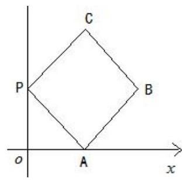
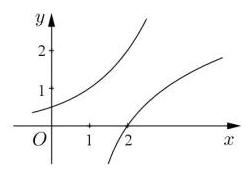
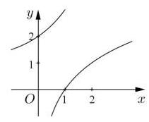
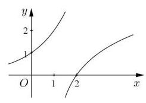
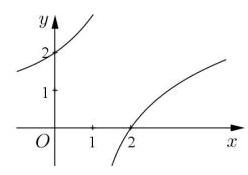

## 知识梳理

## 第 6 课:函数专题

<table><tr><td>教学目标</td><td>1、掌握函数的基本性质认知理解判断方法；   2、灵活掌握函数性质的应用特点和应用方向;   3、综合应函数性质解决有关问题；   4、学会函数中常用的数学思想方法，培养学生综合分析与应用能，体会函数类问题基本解题方向与策略.</td></tr><tr><td>重点</td><td>1、基本性质灵活的应用特征;   2、数学思想的灵活应用意识；   3、加强综合分析问题的能力.</td></tr><tr><td>难点</td><td>1、基本性质灵活的应用特征；   2、数学思想的灵活应用意识；   3、加强综合分析问题的能力.</td></tr></table>

函数的性质是研究初等函数的基石，也是高考考查的重点内容，所涉及到的函数主要是二次函数、指数函数、对数函数、分段函数及抽象函数的有关性质, 要求学生能够利用函数性质灵活解题. 在复习中要肯于在对定义的深入理解上下功夫，复习函数的性质，可以从 “数” 和 “形” 两个方面，从理解函数的一些性质的定义入手，在判断和证明函数的性质的问题中得以巩固. 综合题要充分运用好常用的数学思想和方法， 并充分调动好函数的基本性质, 将难题分解为几个简单的点逐个解决。

1. 函数的基本性质: 奇偶性、单调性、周期性的判断方法与应用特点: ”形” 对称作图, 平移作图; ”数” f (-x) 与 $f\left( x\right) , f\left( {x + T}\right)$ 互求以及 $x, y$ 大小变化互求,大小比较,最值值域求解;

2. 解函数题型的基本方向:有形用形 (直观)、没形用数(精确、表达清楚)、数形结合为佳

3. 函数中常用的数学思想: 分类讨论、数形结合、函数与方程

3. 解综合性函数题时的基本策略:以基本性质的应用为基础，重视概念理解与应用，重视基本方法，难题要想到数学思想的渗透

## (一)函数的概念和三要素

## 例题精讲

【例1】(1)若函数 $f\left( x\right)  = {\log }_{a}\left( {{x}^{2} - {ax} + 1}\right) \left( {a > 0\text{ 且 }a \neq  1}\right)$ 没有最小值，则 $a$ 的取值范围是___.

(2)已知 $a > \frac{1}{3}$ ，函数 $f\left( x\right)  = \lg \left( {\left| {x - a}\right|  + 1}\right)$ 在区间 $\left\lbrack  {0,{3a} - 1}\right\rbrack$ 上有最小值为0且最大值为 $\lg \left( {a + 1}\right)$ ，则实数 $a$ 的取值范围是___

【例2】已知 $b, c \in  \mathbf{R}$ ,若 $\left| {{x}^{2} + {bx} + c}\right|  \leq  M$ 对任意的 $x \in  \left\lbrack  {0,4}\right\rbrack$ 恒成立，则()

A. $M$ 的最小值为 1 B. $M$ 的最小值为 2

C. $M$ 的最小值为 4 D. $M$ 的最小值为8

【例3】已知函数 $f\left( x\right)  = {x}^{2} - {5x} + 7$ ,若对于任意正整数 $n$ ,在区间 $\left\lbrack  {1, n + \frac{5}{n}}\right\rbrack$ 上存在 $m + 1$ 个实数 ${a}_{0}\text{ 、 }{a}_{1}$ 、 ${a}_{2}\text{ 、 }\cdots \text{ 、 }{a}_{m}$ ，使得 $f\left( {a}_{0}\right)  > f\left( {a}_{1}\right)  + f\left( {a}_{2}\right)  + \cdots  + f\left( {a}_{m}\right)$ 成立，则 $m$ 的最大值为___

【例4】对于定义域为 $D$ 的函数 $y = f\left( x\right)$ ,如果存在区间 $\left\lbrack  {m, n}\right\rbrack   \subseteq  D\left( {m < n}\right)$ ,同时满足:

① $f\left( x\right)$ 在 $\left\lbrack  {m, n}\right\rbrack$ 内是单调函数；②当定义域是 $\left\lbrack  {m, n}\right\rbrack$ 时， $f\left( x\right)$ 的值域也是 $\left\lbrack  {m, n}\right\rbrack$ .

则称函数 $f\left( x\right)$ 是区间 $\left\lbrack  {m, n}\right\rbrack$ 上的“保值函数”.

(1)求证:函数 $g\left( x\right)  = {x}^{2} - {2x}$ 不是定义域 $\left\lbrack  {0,1}\right\rbrack$ 上的“保值函数”；

(2)已知 $f\left( x\right)  = 2 + \frac{1}{a} - \frac{1}{{a}^{2}x}\left( {a \in  R, a \neq  0}\right)$ 是区间 $\left\lbrack  {m, n}\right\rbrack$ 上的“保值函数”，求 $a$ 的取值范围.

## 巩固训练

1、若函数 $f\left( x\right)  = \sqrt{a - x} + \sqrt{x}$ ( $a$ 为常数)，对于定义域内的任意两个实数 ${x}_{1}$ 、 ${x}_{2}$ ，恒有 $\left| {f\left( {x}_{1}\right)  - f\left( {x}_{2}\right) }\right|  < 1$ 成立,用 $S\left( a\right)$ 表示满足条件的所有正整数 $a$ 的和,则 $S\left( a\right)  =$ ___.

2、已知函数 $f\left( x\right)  = \sqrt{1 + x} + \sqrt{1 - x}$ .

(1)求函数 $f\left( x\right)$ 的定义域和值域；

(2)设 $F\left( x\right)  = \frac{a}{2} \cdot  \left\lbrack  {{f}^{2}\left( x\right)  - 2}\right\rbrack   + f\left( x\right)$ ( $a$ 为实数)，求 $F\left( x\right)$ 在 $a < 0$ 时的最大值 $g\left( a\right)$ ；

(3)对(2)中 $g\left( a\right)$ ，若 $- {m}^{2} + {2tm} + \sqrt{2} \leq  g\left( a\right)$ 对 $a < 0$ 所有的实数 $a$ 及 $t \in  \left\lbrack  {-1,1}\right\rbrack$ 恒成立，求实数 $m$ 的取值范围.

## (二)函数的性质

## 例题精讲

【例 5】已知函数 $f\left( x\right)  = \frac{1}{{x}^{2} + 1} + {\log }_{\frac{1}{2}}\left( {\left| x\right|  + 1}\right)$ ，则不等式 $f\left( {m - 2}\right)  <  - \frac{1}{2}$ 的解集为( )

A. $\left( {1,3}\right)$ B. $\left( {-\infty ,1}\right)  \cup  \left( {3, + \infty }\right)$

C. $\left( {0,4}\right)$ D. $\left( {-\infty ,0}\right)  \cup  \left( {4, + \infty }\right)$

【例6】(1)已知函数 $f\left( x\right)  = x\left| x\right|$ . 当 $x \in  \left\lbrack  {a, a + 1}\right\rbrack$ 时,不等式 $f\left( {x + {2a}}\right)  > {4f}\left( x\right)$ 恒成立,则实数 $a$ 的取值范围是___.

(2)已知 $y = f\left( x\right)$ 是定义在 $\mathbf{R}$ 上的增函数,且 $y = f\left( x\right)$ 的图像关于点 $\left( {1,0}\right)$ 对称,若实数 $x\text{ 、 }y$ 满足不等式 $f\left( {{x}^{2} + {2x}}\right)  + f\left( {{y}^{2} - {4y} + 6}\right)  \leq  0$ ，则 ${x}^{2} + {y}^{2}$ 的取值范围是___

(3)已知函数 $y = f\left( x\right)$ 与 $y = g\left( x\right)$ 的图像关于 $y$ 轴对称,当函数 $y = f\left( x\right)$ 与 $y = g\left( x\right)$ 在区

间 $\left\lbrack  {a, b}\right\rbrack$ 上同时递增或同时递减时,把区间 $\left\lbrack  {a, b}\right\rbrack$ 叫做函数 $y = f\left( x\right)$ 的 “不动区间”,若区间 $\left\lbrack  {1,2}\right\rbrack$ 为函数 $y = \left| {{2}^{x} - t}\right|$ 的 “不动区间”，则实数 $t$ 的取值范围是___

【例7】设函数 $g\left( x\right)  = {3}^{x}, h\left( x\right)  = {9}^{x}$ .

(1)解方程: $h\left( x\right)  - {8g}\left( x\right)  - h\left( 1\right)  = 0$ ；

(2)令 $p\left( x\right)  = \frac{g\left( x\right) }{g\left( x\right)  + \sqrt{3}}$ ，求证: $p\left( \frac{1}{2014}\right)  + p\left( \frac{2}{2014}\right)  + \cdots  + p\left( \frac{2012}{2014}\right)  + p\left( \frac{2013}{2014}\right)  = \frac{2013}{2}$ ；

(3)若 $f\left( x\right)  = \frac{g\left( {x + 1}\right)  + a}{g\left( x\right)  + b}$ 是实数集 $\mathbf{R}$ 上的奇函数，且 $f\left( {h\left( x\right)  - 1}\right)  + f\left( {2 - k \cdot  g\left( x\right) }\right)  > 0$ 对任意实数 $x$ 恒成立,求实数 $k$ 的取值范围.

【例8】设 $f\left( x\right)  = {\log }_{\frac{1}{2}}\frac{1 - {ax}}{x - 1} + x$ 为奇函数, $a$ 为常数.

(1)求 $a$ 的值；

(2)判断函数 $f\left( x\right)$ 在 $x \in  \left( {1, + \infty }\right)$ 上的单调性，并说明理由；

(3)若对于区间 $\left\lbrack  {3,4}\right\rbrack$ 上的每一个 $x$ 值，不等式 $f\left( x\right)  > {\left( \frac{1}{2}\right) }^{x} + m$ 恒成立，求实数 $m$ 的取值范围.

## 巩固训练

1、如图放置的边长为 1 的正方形 ${PABC}$ 沿 $x$ 轴滚动. 设顶点 $P\left( {x, y}\right)$ 的轨迹方程是 $y = f\left( x\right)$ . 则函数 $f\left( x\right)$ 的最小正周期为___； $y = f\left( x\right)$ 在其两个相邻零点间的图像与 $x$ 轴所围区域的面积为___.

2、已知函数 $y = f\left( x\right)$ 在定义域 $\mathrm{R}$ 上是增函数，值域为 $\left( {0, + \infty }\right)$ ，且满足: $f\left( {-x}\right)  = \frac{1}{f\left( x\right) }$ . 设 $F\left( x\right)  = \frac{1 - f\left( x\right) }{1 + f\left( x\right) }.$

(1)求函数 $y = F\left( x\right)$ 值域和零点；

(2)判断函数 $y = F\left( x\right)$ 奇偶性和单调性,并给予证明.

## (三) 反函数

## 例题精讲

【例 9】已知常数 $k, b, t \in  \mathrm{R}$ ,直线 $f\left( x\right)  = {kx} + b$ 与曲线 $g\left( x\right)  = \frac{{t}^{2}}{x}$ 交于点 $M\left( {m, - 1}\right) , N\left( {n,2}\right)$ ,则不等式 ${f}^{-1}\left( x\right)  \geq  {g}^{-1}\left( x\right)$ 的解集为___.

【例10】(1)若函数 $f\left( x\right)$ 的反函数为 ${f}^{-1}\left( x\right)$ ，则函数 $f\left( {x - 1}\right)$ 与 ${f}^{-1}\left( {x - 1}\right)$ 的图像可能是( )

A. B. C. D.

(2)设 $a > 1$ ， ${x}_{1}$ ， ${x}_{2}$ 分别是函数 $f\left( x\right)  = x - {a}^{-x}$ 和 $g\left( x\right)  = x{\log }_{a}x - 1$ 的零点，则 ${x}_{1} + 9{x}_{2}$ 的取值范围( ) A. $\lbrack 6, + \infty )$ B. $\left( {6, + \infty }\right)$ C. $\lbrack {10}, + \infty )$ D. $\left( {{10}, + \infty }\right)$

## 巩固训练

1、设 ${f}^{-1}\left( x\right)$ 为 $f\left( x\right)  = \frac{x}{4} - \frac{\pi }{8}\cos x + \frac{\pi }{8}, x \in  \left\lbrack  {0,\pi }\right\rbrack$ 的反函数，则 $y = f\left( x\right)  + {f}^{-1}\left( x\right)$ 的最大值为___.

2、对于区间 $I$ 上有定义的函数 $g\left( x\right)$ ，记 $g\left( I\right)  = \{ y \mid  y = g\left( x\right) , x \in  I\}$ . 定义域为 $\left\lbrack  {0.3}\right\rbrack$ 的函数 $y = f\left( x\right)$ 有反函数， 满足: $f\left( {\lbrack 1,2}\right) ) = \lbrack 0,1), f\left( {\lbrack 0,1}\right) ) = (2,4\rbrack$ . 若方程 $f\left( x\right)  - x = 0$ 有解 ${x}_{0}$ ,则 ${x}_{0} =$ ___.

3、已知 $f\left( x\right)  = {2}^{x + m} + {mx} + 1$ ,其中 $m$ 是实常数.

(1)若 $f\left( \frac{1}{m}\right)  > {18}$ ，求 $m$ 的取值范围；

(2)若 $m > 0$ ，求证:函数 $f\left( x\right)$ 的零点有且仅有一个；

(3)若 $m > 0$ ，设函数 $y = f\left( x\right)$ 的反函数为 $y = {f}^{-1}\left( x\right)$ ，若 ${a}_{1}$ ， ${a}_{2}$ ， ${a}_{3}$ ， ${a}_{4}$ 是公差 $d > 0$ 的等差数列且均在函数 $f\left( x\right)$ 的值域中,求证: ${f}^{-1}\left( {a}_{1}\right)  + {f}^{-1}\left( {a}_{4}\right)  < {f}^{-1}\left( {a}_{2}\right)  + {f}^{-1}\left( {a}_{3}\right)$ .

## (四)函数的图像和零点

## 例题精讲

【例11】(1) 设 $f\left( x\right)  = {x}^{2} + {2a} \cdot  x + b \cdot  {2}^{x}$ ,其中 $a, b \in  N, x \in  R$ ,如果函数 $y = f\left( x\right)$ 与函数 $y = f\left( {f\left( x\right) }\right)$ 都有零点且它们的零点完全相同,则 $\left( {a, b}\right)$ 为___

(2)已知函数 $f\left( x\right)  = \left| {1 - \frac{1}{x}}\right| \left( {x > 0}\right)$ ，若关于 $x$ 的方程 ${\left\lbrack  f\left( x\right) \right\rbrack  }^{2} + {mf}\left( x\right)  + {2m} + 3 = 0$ 有三个不相等的实数解,则实数 $m$ 的取值范围为___

【例12】(1)已知 $\lambda  \in  \mathbf{R}$ ，函数 $f\left( x\right)  = \left\{  \begin{matrix} x - 4 & x \geq  \lambda \\  {x}^{2} - {4x} + 3 & x < \lambda  \end{matrix}\right.$ ，若函数 $f\left( x\right)$ 恰有2个零点，则 $\lambda$ 的取值范围是___

(2)设 $f\left( x\right)$ 是定义在 $\mathbf{R}$ 上的周期为4的函数,且 $f\left( x\right)  = \left\{  \begin{array}{ll} \sin {2\pi x} & 0 \leq  x \leq  1 \\  2{\log }_{2}x & 1 < x < 4 \end{array}\right.$ ,记 $g\left( x\right)  = f\left( x\right)  - a$ ,若 $0 < a < \frac{1}{2}$ ，则函数 $g\left( x\right)$ 在区间 $\left\lbrack  {-4,5}\right\rbrack$ 上零点的个数是( )

A. 5 B. 6 C. 7 D. 8

(3)已知 $f\left( x\right)$ ，对任意 $x \in  \lbrack 1, + \infty )$ ，恒有 $f\left( {2x}\right)  = {2f}\left( x\right)$ 成立，且当 $x \in  \lbrack 1,2)$ 时， $f\left( x\right)  = 2 - x$ ，则方程 $f\left( x\right)  = \frac{1}{3}x$ 在区间 $\left\lbrack  {1,{100}}\right\rbrack$ 上所有根的和为___

(4)设函数 ${f}_{1}\left( x\right)  = {\log }_{4}x - {\left( \frac{1}{4}\right) }^{x}\text{ 、 }{f}_{2}\left( x\right)  = {\log }_{\frac{1}{4}}x - {\left( \frac{1}{4}\right) }^{x}$ 的零点分别为 ${x}_{1}\text{ 、 }{x}_{2}$ ,则()

(A) $0 < {x}_{1}{x}_{2} < 1$ . (B) ${x}_{1}{x}_{2} = 1$ . (C) $1 < {x}_{1}{x}_{2} < 2$ . (D) ${x}_{1}{x}_{2} \geq  2$ .

(5)已知函数 $f\left( x\right)  = \left\{  \begin{array}{ll} \left| {{\log }_{5}\left( {1 - x}\right) }\right| & x < 1 \\   - {\left( x - 2\right) }^{2} + 2 & x \geq  1 \end{array}\right.$ ，则方程 $f\left( {x + \frac{1}{x} - 2}\right)  = a$ ( $a \in  \mathbf{R}$ )的实数根个数不可能为( )

A. 5 个 B. 6 个 C. 7 个 D. 8个

【例13】(1)给出函数 $g\left( x\right)  =  - {x}^{2} + {bx}, h\left( x\right)  =  - m{x}^{2} + x - 4$ ,这里 $b, m, x \in  R$ ,若不等式 $g\left( x\right)  + b + 1 \leq  0$ ( $x \in  R$ ) 恒成立, $h\left( x\right)  + 4$ 为奇函数,且函数 $f\left( x\right)  = \left\{  \begin{array}{ll} g\left( x\right) & \left( {x \leq  t}\right) \\  h\left( x\right) & \left( {x > t}\right)  \end{array}\right.$ 恰有两个零点,则实数 $t$ 的取值范围为___.

(2)不等式 $\left( {\left| {x - a}\right|  - b}\right) \sin \left( {{\pi x} + \frac{\pi }{6}}\right)  \leq  0$ 对 $x \in  \left\lbrack  {-1,1}\right\rbrack$ 恒成立，则 $a + b$ 的值等于( )

A. $\frac{2}{3}$ B. $\frac{5}{6}$ C. 1 D. 2

## 巩固训练

1、已知函数 $f\left( x\right)  = m \cdot  {2}^{x} + {x}^{2} + {nx}$ ，记集合 $A = \{ x \mid  f\left( x\right)  = 0, x \in  \mathbf{R}\}$ ，集合 $B = \left\{  {x \mid  f\left\lbrack  {f\left( x\right) }\right\rbrack   = 0, x \in  \mathbf{R}}\right\}$ ， 若 $A = B$ ，且都不是空集，则 $m + n$ 的取值范围是___

2、已知函数 $f\left( x\right)  + 2 = \frac{2}{f\left( \sqrt{x + 1}\right) }$ ，当 $x \in  (0,1\rbrack$ 时， $f\left( x\right)  = {x}^{2}$ ，若在区间 $\left\lbrack  {-1,1}\right\rbrack$ 内 $g\left( x\right)  = f\left( x\right)  - t\left( {x + 1}\right)$ 有两个不同的零点,则实数 $t$ 的取值范围是___

3、已知函数 $f\left( x\right)  = {2x}\left| {x + a}\right|  - 1$ 有三个不同的零点,则实数 $a$ 的取值范围为___

4、已知函数 $f\left( x\right)  = \left\{  \begin{array}{l} \frac{x}{4{x}^{2} + {16}}\;x \geq  2 \\  {\left( \frac{1}{2}\right) }^{\left| x - a\right| }\;x < 2 \end{array}\right.$ ,若对任意的 ${x}_{1} \in  \lbrack 2, + \infty )$ ,都存在唯一的 ${x}_{2} \in  \left( {-\infty ,2}\right)$ ,满足 $f\left( {x}_{1}\right)  = f\left( {x}_{2}\right)$ ,则实数 $a$ 的取值范围为___

## (五)函数综合

## 例题精讲

【例14】定义函数 $f\left( x\right)  = \{ x\{ x\} \}$ ，其中 $\{ x\}$ 表示不小于 $x$ 的最小整数，如 \{1.4\} $= 2$ ， $\{  - {2.3}\}  =  - 2$ ，当 $x \in  (0, n\rbrack$ ( $n \in  {\mathbf{N}}^{ * }$ ) 时,函数 $f\left( x\right)$ 的值域为 ${A}_{n}$ ,记集合 ${A}_{n}$ 中元素的个数为 ${a}_{n}$ ,则 ${a}_{n} =$

【例 15】记号 $\left\lbrack  x\right\rbrack$ 表示不超过实数 $x$ 的最大整数,若 $f\left( x\right)  = \left\lbrack  \frac{{x}^{2}}{30}\right\rbrack   + \left\lbrack  \sqrt{30x}\right\rbrack$ ,则 $f\left( 1\right)  + f\left( 2\right)  + f\left( 3\right)  + \cdots  + f\left( {29}\right)  + f\left( {30}\right)$ 的值为 ( )

A. 899 B. 900 C. 901 D. 902

【例16】若 $M\text{ 、 }N$ 两点分别在函数 $y = f\left( x\right)$ 与 $y = g\left( x\right)$ 的图像上,且关于直线 $x = 1$ 对称,称 $M\text{ 、 }N$ 是 $y = f\left( x\right)$ 与 $y = g\left( x\right)$ 的一对“伴点” ( $M\text{ 、 }N$ 与 $N\text{ 、 }M$ 视为相同的一对),已知

$f\left( x\right)  = \left\{  {\begin{matrix}  - \sqrt{2 - x} & x < 2 \\  \sqrt{4 - {\left( x - 4\right) }^{2}} & x \geq  2 \end{matrix}, g\left( x\right)  = \left| {x + a}\right|  + 1}\right.$ ,若 $y = f\left( x\right)$ 与 $y = g\left( x\right)$ 存在两对 “伴点”,则实数 $a$ 的取值范围为___

【例17】已知函数 $f\left( x\right)  = \left| {x - a}\right|  - \frac{9}{x} + a, x \in  \left\lbrack  {1,6}\right\rbrack  , a \in  R$ .

(1)若 $a = 1$ ，试判断并用定义证明函数 $f\left( x\right)$ 的单调性；

(2)当 $a \in  \left( {1,3}\right)$ 时，求证函数 $f\left( x\right)$ 存在反函数.

## 巩固训练

1、对于在某个区间 $\lbrack a, + \infty )$ 上有意义的函数 $f\left( x\right)$ ,如果存在一次函数 $g\left( x\right)  = {kx} + b$ 使得对于任意的 $x \in  \lbrack a, + \infty )$ ,有 $\left| {f\left( x\right)  - g\left( x\right) }\right|  \leq  1$ 恒成立,则称函数 $g\left( x\right)$ 是函数 $f\left( x\right)$ 在区间 $\lbrack a, + \infty )$ 上的弱渐近函数.

(1)若函数 $g\left( x\right)  = {3x}$ 是函数 $f\left( x\right)  = {3x} + \frac{m}{x}$ 在区间 $\lbrack 4, + \infty )$ 上的弱渐近函数，求实数 $m$ 的取值范围;

(2)证明:函数 $g\left( x\right)  = {2x}$ 是函数 $f\left( x\right)  = 2\sqrt{{x}^{2} - 1}$ 在区间 $\lbrack 2, + \infty )$ 上的弱渐近函数.

2、已知函数 $y = f\left( x\right)$ ，若在定义域内存在 ${x}_{0}$ ，使得 $f\left( {-{x}_{0}}\right)  =  - f\left( {x}_{0}\right)$ 成立，则称 ${x}_{0}$ 为函数 $f\left( x\right)$ 的局部对称点.

(1)若 $a\text{ 、 }b \in  \mathrm{R}$ 且 $a \neq  0$ ，证明:函数 $f\left( x\right)  = a{x}^{2} + {bx} - a$ 必有局部对称点；

(2)若函数 $f\left( x\right)  = {2}^{x} + c$ 在区间 $\left\lbrack  {-1,2}\right\rbrack$ 内有局部对称点，求实数 $c$ 的取值范围；

(3)若函数 $f\left( x\right)  = {4}^{x} - m \cdot  {2}^{x + 1} + {m}^{2} - {3\mathrm{{\text{ 在 }R}}}$ 上有局部对称点,求实数 $m$ 的取值范围.
