## 知识梳理

## 第 6 课:函数专题

<table><tr><td>教学目标</td><td>1、掌握函数的基本性质认知理解判断方法；   2、灵活掌握函数性质的应用特点和应用方向;   3、综合应函数性质解决有关问题；   4、学会函数中常用的数学思想方法，培养学生综合分析与应用能，体会函数类问题基本解题方向与策略.</td></tr><tr><td>重点</td><td>1、基本性质灵活的应用特征；   2、数学思想的灵活应用意识；   3、加强综合分析问题的能力.</td></tr><tr><td>难点</td><td>1、基本性质灵活的应用特征；   2、数学思想的灵活应用意识；   3、加强综合分析问题的能力.</td></tr></table>

函数的性质是研究初等函数的基石，也是高考考查的重点内容，所涉及到的函数主要是二次函数、指数函数、对数函数、分段函数及抽象函数的有关性质, 要求学生能够利用函数性质灵活解题. 在复习中要肯于在对定义的深入理解上下功夫，复习函数的性质，可以从 “数” 和 “形” 两个方面，从理解函数的一些性质的定义入手，在判断和证明函数的性质的问题中得以巩固、综合题要充分运用好常用的数学思想和方法， 并充分调动好函数的基本性质, 将难题分解为几个简单的点逐个解决。

1. 函数的基本性质: 奇偶性、单调性、周期性的判断方法与应用特点: ”形” 对称作图, 平移作图; ”数” f (-x) 与 $f\left( x\right) , f\left( {x + T}\right)$ 互求以及 $x, y$ 大小变化互求,大小比较,最值值域求解;

2. 解函数题型的基本方向:有形用形(直观)、没形用数(精确、表达清楚)、数形结合为佳

3. 函数中常用的数学思想:分类讨论、数形结合、函数与方程

3. 解综合性函数题时的基本策略:以基本性质的应用为基础，重视概念理解与应用，重视基本方法，难题要想到数学思想的渗透

## (一)函数的概念和三要素

## 例题精讲

【例1】(1)若函数 $f\left( x\right)  = {\log }_{a}\left( {{x}^{2} - {ax} + 1}\right) \left( {a > 0\text{ 且 }a \neq  1}\right)$ 没有最小值，则 $a$ 的取值范围是___.

【难度】 $\star   \star   \star   \star$

【答案】 $\left( {0,1}\right)  \cup  \lbrack 2, + \infty )$ .

【解析】根据条件, 分类讨论, 属于对数函数性质的综合考查。

(2)已知 $a > \frac{1}{3}$ ，函数 $f\left( x\right)  = \lg \left( {\left| {x - a}\right|  + 1}\right)$ 在区间 $\left\lbrack  {0,{3a} - 1}\right\rbrack$ 上有最小值为0且最大值为 $\lg \left( {a + 1}\right)$ ，则实数 $a$ 的取值范围是___

【难度】 $\star   \star   \star   \star$

【答案】 $\left\lbrack  {\frac{1}{2},1}\right\rbrack$ .

【解析】根据题意,在0和 $\mathrm{a}$ 时分别取到最大值和最小值

【例2】已知 $b, c \in  \mathbf{R}$ ,若 $\left| {{x}^{2} + {bx} + c}\right|  \leq  M$ 对任意的 $x \in  \left\lbrack  {0,4}\right\rbrack$ 恒成立，则()

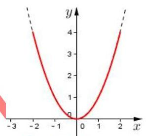

A. $M$ 的最小值为 1 B. $M$ 的最小值为 2

C. $M$ 的最小值为 4 D. $M$ 的最小值为 8

【难度】★★★★

【答案】B

【解析】本题重在理解,等价转化为 “已知 $f\left( x\right)  = {x}^{2}$ ,

$x \in  \left\lbrack  {a, a + 4}\right\rbrack$ ,若 ${2M} = f{\left( x\right) }_{\max } - f{\left( x\right) }_{\min }$ ,求 $M$ 的最小值”.

化动为静，结合图像，容易得到 $a =  - 2$ 时， $f{\left( x\right) }_{\max } - f{\left( x\right) }_{\min }$ 最小，为 $f\left( 2\right)  - f\left( 0\right)  = 4$ . $\therefore {M}_{\min } = 2$ ，选 B.

【例3】已知函数 $f\left( x\right)  = {x}^{2} - {5x} + 7$ ,若对于任意正整数 $n$ ,在区间 $\left\lbrack  {1, n + \frac{5}{n}}\right\rbrack$ 上存在 $m + 1$ 个实数 ${a}_{0}\text{ 、 }{a}_{1}$ 、 ${a}_{2}\text{ 、 }\cdots \text{ 、 }{a}_{m}$ ,使得 $f\left( {a}_{0}\right)  > f\left( {a}_{1}\right)  + f\left( {a}_{2}\right)  + \cdots  + f\left( {a}_{m}\right)$ 成立,则 $m$ 的最大值为___

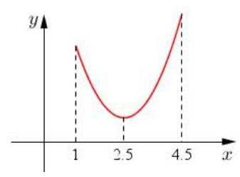

【难度】 $\star   \star   \star   \star$

【答案】 6

【解析】对于任意正整数 $n$ 成立,取 ${\left( n + \frac{5}{n}\right) }_{\min } = \frac{9}{2},\therefore$ 在区间 $\left\lbrack  {1,\frac{9}{2}}\right\rbrack$ 上函数

最大值为 $f\left( \frac{9}{2}\right)  = \frac{19}{4}$ ,最小值为 $f\left( \frac{5}{2}\right)  = \frac{3}{4},\frac{19}{4} \div  \frac{3}{4} = 6\cdots \cdots \frac{1}{4}$ ,即 $m$ 的最大值为 6 .

【例4】对于定义域为 $D$ 的函数 $y = f\left( x\right)$ ,如果存在区间 $\left\lbrack  {m, n}\right\rbrack   \subseteq  D\left( {m < n}\right)$ ,同时满足:

① $f\left( x\right)$ 在 $\left\lbrack  {m, n}\right\rbrack$ 内是单调函数；② 当定义域是 $\left\lbrack  {m, n}\right\rbrack$ 时， $f\left( x\right)$ 的值域也是 $\left\lbrack  {m, n}\right\rbrack$ ，

则称函数 $f\left( x\right)$ 是区间 $\left\lbrack  {m, n}\right\rbrack$ 上的“保值函数”.

(1)求证:函数 $g\left( x\right)  = {x}^{2} - {2x}$ 不是定义域 $\left\lbrack  {0,1}\right\rbrack$ 上的“保值函数”；

(2)已知 $f\left( x\right)  = 2 + \frac{1}{a} - \frac{1}{{a}^{2}x}\left( {a \in  R, a \neq  0}\right)$ 是区间 $\left\lbrack  {m, n}\right\rbrack$ 上的“保值函数”，求 $a$ 的取值范围.

【难度】 $\star   \star   \star   \star$

【答案】(1)不是:(2) $\left( {-\infty , - \frac{3}{2}}\right)  \cup  \left( {\frac{1}{2}, + \infty }\right)$

【解析】(1) 函数 $g\left( x\right)  = {x}^{2} - {2x}$ 在 $x \in  \left\lbrack  {0,1}\right\rbrack$ 时的值域为 $\left\lbrack  {-1,0}\right\rbrack$ ,

不满足“保值函数”的定义,因此函数 $g\left( x\right)  = {x}^{2} - {2x}$ 不是定义域 $\left\lbrack  {0,1}\right\rbrack$ 上的“保值函数”.

(2)因 $f\left( x\right)  = 2 + \frac{1}{a} - \frac{1}{{a}^{2}x}$ 在 $\left\lbrack  {m, n}\right\rbrack$ 内是单调增函数，故 $f\left( m\right)  = m, f\left( n\right)  = n$ ， 这说明 $m, n$ 是方程 $2 + \frac{1}{a} - \frac{1}{{a}^{2}x} = x$ 的两个不相等的实根,

其等价于方程 ${a}^{2}{x}^{2} - \left( {2{a}^{2} + a}\right) x + 1 = 0$ 有两个不相等的实根,

由 $\Delta  = {\left( 2{a}^{2} + a\right) }^{2} - 4{a}^{2} > 0$ 解得 $a <  - \frac{3}{2}$ 或 $a > \frac{1}{2}$ . 故 $a$ 的取值范围为 $\left( {-\infty , - \frac{3}{2}}\right)  \cup  \left( {\frac{1}{2}, + \infty }\right)$ .

## 巩固训练

1、若函数 $f\left( x\right)  = \sqrt{a - x} + \sqrt{x}$ ( $a$ 为常数),对于定义域内的任意两个实数 ${x}_{1}\text{ 、 }{x}_{2}$ ,恒有 $\left| {f\left( {x}_{1}\right)  - f\left( {x}_{2}\right) }\right|  < 1$ 成立,用 $S\left( a\right)$ 表示满足条件的所有正整数 $a$ 的和,则 $S\left( a\right)  =$ ___.

【难度】 $\star   \star   \star   \star$

【答案】 15

【解析】方法一: 对函数 $f\left( x\right)$ 先平方; 方法二: 三角换元, $\because {\left( \sqrt{a - x}\right) }^{2} + {\left( \sqrt{x}\right) }^{2} = a,\therefore$ 可令 $\sqrt{x} = \sqrt{a}\cos \theta ,\sqrt{a - x} = \sqrt{a}\sin \theta ,\theta  \in  \left\lbrack  {0,\frac{\pi }{2}}\right\rbrack$ . 解得 $0 < a < 3 + 2\sqrt{2}$

2、已知函数 $f\left( x\right)  = \sqrt{1 + x} + \sqrt{1 - x}$ .

(1)求函数 $f\left( x\right)$ 的定义域和值域；

(2)设 $F\left( x\right)  = \frac{a}{2} \cdot  \left\lbrack  {{f}^{2}\left( x\right)  - 2}\right\rbrack   + f\left( x\right)$ ( $a$ 为实数)，求 $F\left( x\right)$ 在 $a < 0$ 时的最大值 $g\left( a\right)$ ；

(3)对(2)中 $g\left( a\right)$ ，若 $- {m}^{2} + {2tm} + \sqrt{2} \leq  g\left( a\right)$ 对 $a < 0$ 所有的实数 $a$ 及 $t \in  \left\lbrack  {-1,1}\right\rbrack$ 恒成立，求实数 $m$ 的取值范围.

【难度】 $\star   \star   \star   \star$

【答案】见解析

【解析】(1) 由 $\left\{  \begin{array}{l} x + 1 \geq  0, \\  1 - x \geq  0 \end{array}\right.$ 得 $- 1 \leq  x \leq  1$ ,所以定义域为 $\left\lbrack  {-1,1}\right\rbrack$ .

又 $f{\left( x\right) }^{2} = 2 + 2\sqrt{1 - {x}^{2}} \in  \left\lbrack  {2,4}\right\rbrack$ ,由 $f\left( x\right)  \geq  0$ 得值域为 $\left\lbrack  {\sqrt{2},2}\right\rbrack$ .

(2)因为 $F\left( x\right)  = \frac{a}{2} \cdot  \left\lbrack  {{f}^{2}\left( x\right)  - 2}\right\rbrack   + f\left( x\right)  = a\sqrt{1 - {x}^{2}} + \sqrt{1 + x} + \sqrt{1 - x}$ ，

令 $t = f\left( x\right)  = \sqrt{1 + x} + \sqrt{1 - x}$ ,则 $\sqrt{1 - {x}^{2}} = \frac{1}{2}{t}^{2} - 1$ ,

$\therefore F\left( x\right)  = m\left( t\right)  = a\left( {\frac{1}{2}{t}^{2} - 1}\right)  + t) = \frac{1}{2}a{t}^{2} + t - a, t \in  \left\lbrack  {\sqrt{2},2}\right\rbrack$ ,

由题意知 $g\left( a\right)$ 即为函数 $m\left( t\right)  = \frac{1}{2}a{t}^{2} + t - a, t \in  \left\lbrack  {\sqrt{2},2}\right\rbrack$ 的最大值.

注意到直线 $t =  - \frac{1}{a}$ 是抛物线 $m\left( t\right)  = \frac{1}{2}a{t}^{2} + t - a$ 的对称轴.

因为 $a < 0$ 时,函数 $y = m\left( t\right) , t \in  \left\lbrack  {\sqrt{2},2}\right\rbrack$ 的图像是开口向下的抛物线的一段,

① 若 $t =  - \frac{1}{a} \in  \left( {0,\sqrt{2}}\right\rbrack$ ，即 $a \leq   - \frac{\sqrt{2}}{2}$ 则 $g\left( a\right)  = m\left( \sqrt{2}\right)  = \sqrt{2}$ ；

② 若 $t =  - \frac{1}{a} \in  (\sqrt{2},2\rbrack$ ，即 $- \frac{\sqrt{2}}{2} < a \leq   - \frac{1}{2}$ 则 $g\left( a\right)  = m\left( {-\frac{1}{a}}\right)  =  - a - \frac{1}{2a}$ ；

③ 若 $t =  - \frac{1}{a} \in  \left( {2, + \infty }\right)$ ，即 $- \frac{1}{2} < a < 0$ 则 $g\left( a\right)  = m\left( 2\right)  = a + 2$ .

综上有 $g\left( a\right)  = \left\{  \begin{array}{ll} a + 2, & a \geq   - \frac{1}{2} \\   - a - \frac{1}{2a}, &  - \frac{\sqrt{2}}{2} < a <  - \frac{1}{2}, \\  \sqrt{2}, & a \leq   - \frac{\sqrt{2}}{2} \end{array}\right.$

## (二)函数的性质

## 例题精讲

【例 5】已知函数 $f\left( x\right)  = \frac{1}{{x}^{2} + 1} + {\log }_{\frac{1}{2}}\left( {\left| x\right|  + 1}\right)$ ，则不等式 $f\left( {m - 2}\right)  <  - \frac{1}{2}$ 的解集为( )

A. $\left( {1,3}\right)$ B. $\left( {-\infty ,1}\right)  \cup  \left( {3, + \infty }\right)$

C. $\left( {0,4}\right)$ D. $\left( {-\infty ,0}\right)  \cup  \left( {4, + \infty }\right)$

【难度】

【答案】B

【解析】由题意知 $f\left( x\right)$ 的定义域为 $\mathrm{R}$ ,

$\therefore f\left( {-x}\right)  = \frac{1}{{\left( -x\right) }^{2} + 1} + {\log }_{\frac{1}{2}}\left( {\left| {-x}\right|  + 1}\right)  = f\left( x\right) ,\therefore f\left( x\right)$ 是定义在 $\mathrm{R}$ 上的偶函数,

$\because y = \frac{1}{{x}^{2} + 1}, y = {\log }_{\frac{1}{2}}\left( {\left| x\right|  + 1}\right)$ 在 $\left( {0, + \infty }\right)$ 上单调递减, $\therefore f\left( x\right)$ 在 $\left( {-\infty ,0}\right)$ 上单调递增,

$\because f\left( 1\right)  =  - \frac{1}{2}, f\left( {m - 2}\right)  <  - \frac{1}{2},\therefore f\left( \left| {m - 2}\right| \right)  < f\left( 1\right) ,\therefore \left| {m - 2}\right|  > 1,\therefore m > 3$ 或 $m < 1$ .

故选: B

【例6】(1)已知函数 $f\left( x\right)  = x\left| x\right|$ . 当 $x \in  \left\lbrack  {a, a + 1}\right\rbrack$ 时，不等式 $f\left( {x + {2a}}\right)  > {4f}\left( x\right)$ 恒成立，则实数 $a$ 的取值范围是___.

【难度】 $\star   \star   \star   \star$

【答案】 $\left( {1, + \infty }\right)$

【解析】 $f\left( {x + {2a}}\right)  > {4f}\left( x\right)  \Rightarrow  f\left( {x + {2a}}\right)  > f\left( {2x}\right)$ .

(2)已知 $y = f\left( x\right)$ 是定义在 $\mathbf{R}$ 上的增函数，且 $y = f\left( x\right)$ 的图像关于点 $\left( {1,0}\right)$ 对称，若实数 $x$ 、 $y$ 满足不等式 $f\left( {{x}^{2} + {2x}}\right)  + f\left( {{y}^{2} - {4y} + 6}\right)  \leq  0$ ，则 ${x}^{2} + {y}^{2}$ 的取值范围是___

【难度】★★★★

【答案】 $\left\lbrack  {6 - 2\sqrt{5},6 + 2\sqrt{5}}\right\rbrack$

【解析】根据中心对称和函数的单调性解不等式

(3)已知函数 $y = f\left( x\right)$ 与 $y = g\left( x\right)$ 的图像关于 $y$ 轴对称,当函数 $y = f\left( x\right)$ 与 $y = g\left( x\right)$ 在区

间 $\left\lbrack  {a, b}\right\rbrack$ 上同时递增或同时递减时,把区间 $\left\lbrack  {a, b}\right\rbrack$ 叫做函数 $y = f\left( x\right)$ 的 “不动区间”,若区间 $\left\lbrack  {1,2}\right\rbrack$ 为函数 $y = \left| {{2}^{x} - t}\right|$ 的 “不动区间”，则实数 $t$ 的取值范围是___

【难度】 $\star   \star   \star   \star$

【答案】 $\left\lbrack  {\frac{1}{2},2}\right\rbrack$ .

【解析】画图, 图像平移

【例7】设函数 $g\left( x\right)  = {3}^{x}, h\left( x\right)  = {9}^{x}$ .

(1)解方程: $h\left( x\right)  - {8g}\left( x\right)  - h\left( 1\right)  = 0$ ；

(2)令 $p\left( x\right)  = \frac{g\left( x\right) }{g\left( x\right)  + \sqrt{3}}$ ，求证: $p\left( \frac{1}{2014}\right)  + p\left( \frac{2}{2014}\right)  + \cdots  + p\left( \frac{2012}{2014}\right)  + p\left( \frac{2013}{2014}\right)  = \frac{2013}{2}$ ；

(3)若 $f\left( x\right)  = \frac{g\left( {x + 1}\right)  + a}{g\left( x\right)  + b}$ 是实数集 $\mathbf{R}$ 上的奇函数,且 $f\left( {h\left( x\right)  - 1}\right)  + f\left( {2 - k \cdot  g\left( x\right) }\right)  > 0$ 对任意实数 $x$ 恒成立,求实数 $k$ 的取值范围.

【难度】 $\bigstar \bigstar \bigstar$

【答案】( 1 ) $x = 2$ ；( 2 )见解析；( 3 ) $k < 2$

【解析】(1) $h\left( x\right)  - {8g}\left( x\right)  - h\left( 1\right)  = 0$ 即: ${9}^{x} - 8 \cdot  {3}^{x} - 9 = 0$ ,解得 ${3}^{x} = 9, x = 2$

(2) $p\left( \frac{1007}{2014}\right)  = p\left( \frac{1}{2}\right)  = \frac{\sqrt{3}}{2\sqrt{3}} = \frac{1}{2}$ .

因为 $p\left( x\right)  + p\left( {1 - x}\right)  = \frac{{3}^{x}}{{3}^{x} + \sqrt{3}} + \frac{{3}^{1 - x}}{{3}^{1 - x} + \sqrt{3}} = \frac{{3}^{x}}{{3}^{x} + \sqrt{3}} + \frac{\sqrt{3}}{{3}^{x} + \sqrt{3}} = 1$ ,

所以, $p\left( \frac{1}{2014}\right)  + p\left( \frac{2}{2014}\right)  + \cdots  + p\left( \frac{2013}{2014}\right)  = {1006} + \frac{1}{2} = \frac{2013}{2}$ ,

(3)因为 $f\left( x\right)  = \frac{\varphi \left( {x + 1}\right)  + a}{\varphi \left( x\right)  + b}$ 是实数集上的奇函数，所以 $a =  - 3, b = 1$ .

$f\left( x\right)  = 3\left( {1 - \frac{2}{{3}^{x} + 1}}\right) ,\;f\left( x\right)$ 在实数集上单调递增.

由 $f\left( {h\left( x\right)  - 1}\right)  + f\left( {2 - k \cdot  g\left( x\right) }\right)  > 0$ 得 $f\left( {h\left( x\right)  - 1}\right)  >  - f\left( {2 - k \cdot  g\left( x\right) }\right)$ ,又因为 $f\left( x\right)$ 是实数集上的奇函数,

所以 $f\left( {h\left( x\right)  - 1}\right)  > f\left( {k \cdot  g\left( x\right)  - 2}\right)$ ,又因为 $f\left( x\right)$ 在实数集上单调递增,所以 $h\left( x\right)  - 1 > k \cdot  g\left( x\right)  - 2$

即 ${3}^{2x} - 1 > k \cdot  {3}^{x} - 2$ 对任意的 $x \in  R$ 都成立,即 $k < {3}^{x} + \frac{1}{{3}^{x}}$ 对任意的 $x \in  R$ 都成立, $k < 2$ .

【例8】设 $f\left( x\right)  = {\log }_{\frac{1}{2}}\frac{1 - {ax}}{x - 1} + x$ 为奇函数, $a$ 为常数.

(1)求 $a$ 的值；

(2)判断函数 $f\left( x\right)$ 在 $x \in  \left( {1, + \infty }\right)$ 上的单调性，并说明理由;

(3)若对于区间 $\left\lbrack  {3,4}\right\rbrack$ 上的每一个 $x$ 值，不等式 $f\left( x\right)  > {\left( \frac{1}{2}\right) }^{x} + m$ 恒成立，求实数 $m$ 的取值范围.

【难度】 $\star   \star   \star   \star$

【答案】(1) $a =  - 1$ ；(2) 在 $x \in  \left( {1, + \infty }\right)$ 上是增函数；(3) $\therefore m < \frac{15}{8}$

【解析】(1) $\because f\left( x\right)  = {\log }_{\frac{1}{2}}\frac{1 - {ax}}{x - 1} + x$ 为奇函数, $\therefore f\left( {-x}\right)  + f\left( x\right)  = 0$ 对定义域内的任意 $x$ 都成立, $\therefore {\log }_{\frac{1}{2}}\frac{1 + {ax}}{-x - 1} - x + {\log }_{\frac{1}{2}}\frac{1 - {ax}}{x - 1} + x = 0,\therefore \frac{1 + {ax}}{-x - 1} \cdot  \frac{1 - {ax}}{x - 1} = 1$ ,解得 $a =  - 1$ 或 $a = 1$ (舍去).

(2)由(1)知: $\because f\left( x\right)  = {\log }_{\frac{1}{2}}\frac{1 + x}{x - 1} + x$ ,

任取 ${x}_{1},{x}_{2} \in  \left( {1, + \infty }\right)$ ,设 ${x}_{1} < {x}_{2}$ ,则 $\frac{1 + {x}_{1}}{{x}_{1} - 1} - \frac{1 + {x}_{2}}{{x}_{2} - 1} = \frac{{x}_{2} - {x}_{1}}{\left( {{x}_{1} - 1}\right) \left( {{x}_{2} - 1}\right) } > 0$ ,

$\therefore \frac{1 + {x}_{1}}{{x}_{1} - 1} > \frac{1 + {x}_{2}}{{x}_{2} - 1} > 0\therefore {\log }_{\frac{1}{2}}\frac{1 + {x}_{1}}{{x}_{1} - 1} < {\log }_{\frac{1}{2}}\frac{1 + {x}_{2}}{{x}_{2} - 1}\;\therefore {\log }_{\frac{1}{2}}\frac{1 + {x}_{1}}{{x}_{1} - 1} + {x}_{1} < {\log }_{\frac{1}{2}}\frac{1 + {x}_{2}}{{x}_{2} - 1} + {x}_{2}$

$\therefore f\left( {x}_{1}\right)  < f\left( {x}_{2}\right) \therefore f\left( x\right)$ 在 $x \in  \left( {1, + \infty }\right)$ 上是增函数.

(3)令 $g\left( x\right)  = f\left( x\right)  - {\left( \frac{1}{2}\right) }^{x}, x \in  \left\lbrack  {3,4}\right\rbrack  \;\because y = {\left( \frac{1}{2}\right) }^{x}$ 在 $x \in  \left\lbrack  {3,4}\right\rbrack$ 上是减函数，

$\therefore$ 由(2)知， $g\left( x\right)  = f\left( x\right)  - {\left( \frac{1}{2}\right) }^{x}, x \in  \left\lbrack  {3,4}\right\rbrack$ 是增函数,

$\therefore g{\left( x\right) }_{\min } = g\left( 3\right)  = \frac{15}{8},\because$ 对于区间 $\left\lbrack  {3,4}\right\rbrack$ 上的每一个 $x$ 值,不等式 $f\left( x\right)  > {\left( \frac{1}{2}\right) }^{x} + m$ 恒成立, $\therefore m < \frac{15}{8}$ .

## 巩固训练

1、如图放置的边长为 1 的正方形 ${PABC}$ 沿 $X$ 轴滚动. 设顶点 $P\left( {x, y}\right)$ 的轨迹方程是 $y = f\left( x\right)$ . 则函数 $f\left( x\right)$

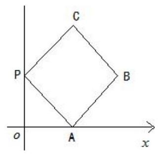

的最小正周期为___； $y = f\left( x\right)$ 在其两个相邻零点间的图像与 $x$ 轴所围区域的面积为___.

【难度】 $\star   \star   \star   \star$

【答案】 $4;\pi  + 1$

【解析】由于函数周期性, 可以把图按照正方的正方形画出运动轨迹图像。

2、已知函数 $y = f\left( x\right)$ 在定义域 $\mathrm{R}$ 上是增函数,值域为 $\left( {0, + \infty }\right)$ ,且满足: $f\left( {-x}\right)  = \frac{1}{f\left( x\right) }$ . 设 $F\left( x\right)  = \frac{1 - f\left( x\right) }{1 + f\left( x\right) }.$

(1)求函数 $y = F\left( x\right)$ 值域和零点；

(2)判断函数 $y = F\left( x\right)$ 奇偶性和单调性,并给予证明.

【难度】 $\star   \star   \star   \star$

【答案】(1) 值域为 $\left( {-1,1}\right)$ ; 零点为 $x = 0$ . (2) 见解析

【解析】(1) $F\left( x\right)  = \frac{1 - f\left( x\right) }{1 + f\left( x\right) } =  - 1 + \frac{2}{1 + f\left( x\right) },\because f\left( x\right)  > 0,\therefore 0 < \frac{1}{1 + f\left( x\right) } < 1$

$\therefore  - 1 < F\left( x\right)  < 1$ ,故, $y = F\left( x\right)$ 的值域为 $\left( {-1,1}\right)$ ;

$\because f\left( {-x}\right)  = \frac{1}{f\left( x\right) }$ ,令 $x = 0, f\left( 0\right)  =  \pm  1,\;\because f\left( x\right)  > 0,\therefore f\left( 0\right)  = 1$ .

故, $y = F\left( x\right)$ 的零点为 $x = 0$ .

(2)对任意的 $x \in  R, F\left( {-x}\right)  = \frac{1 - f\left( {-x}\right) }{1 + f\left( {-x}\right) } = \frac{1 - \frac{1}{f\left( x\right) }}{1 + \frac{1}{f\left( x\right) }} =  - \frac{1 - f\left( x\right) }{1 + f\left( x\right) } =  - F\left( x\right)$ 3 分

所以, $y = F\left( x\right)$ 是奇函数. 2 分

由已知, $y = f\left( x\right)$ 在定义域 $\mathrm{R}$ 上是增函数,

所以,对任意的 ${x}_{1},{x}_{2} \in  R,{x}_{1} < {x}_{2}$ ,都有 $f\left( {x}_{1}\right)  - f\left( {x}_{2}\right)  < 0$ .

又 $F\left( {x}_{1}\right)  - F\left( {x}_{2}\right)  = \frac{2}{1 + f\left( {x}_{1}\right) } - \frac{2}{1 + f\left( {x}_{2}\right) } = \frac{f\left( {x}_{2}\right)  - f\left( {x}_{1}\right) }{\left( {1 + f\left( {x}_{1}\right) }\right) \left( {1 + f\left( {x}_{2}\right) }\right) } > 0$ . -3分

所以, $y = F\left( x\right)$ 在定义域 $\mathrm{R}$ 上是减函数. -2分

## (三)反函数

## 例题精讲

【例 9】已知常数 $k, b, t \in  \mathrm{R}$ ,直线 $f\left( x\right)  = {kx} + b$ 与曲线 $g\left( x\right)  = \frac{{t}^{2}}{x}$ 交于点 $M\left( {m, - 1}\right) , N\left( {n,2}\right)$ ,则不等式 ${f}^{-1}\left( x\right)  \geq  {g}^{-1}\left( x\right)$ 的解集为___.

【难度】★★★★

【答案】 $\left( {-\infty , - 1}\right)  \cup  \left( {0,2}\right)$ .

【解析】易知 $g\left( x\right)  = \frac{{t}^{2}}{x}$ 在 $\left( {-\infty ,0}\right)$ 和 $\left( {0, + \infty }\right)$ 上都是减函数,值域是 $\left( {-\infty ,0}\right)  \cup  \left( {0, + \infty }\right)$ ,

因此 ${g}^{-1}\left( x\right)$ 在 $\left( {-\infty ,0}\right)$ 和 $\left( {0, + \infty }\right)$ 上也都是减函数,

且 $y = {f}^{-1}\left( x\right)$ 与 $y = {g}^{-1}\left( x\right)$ 的图象的交点为 $\left( {-1, m}\right) ,\left( {2, n}\right) , y = {g}^{-1}\left( x\right)$ 必定是增函数,

因此不等式 ${f}^{-1}\left( x\right)  \geq  {g}^{-1}\left( x\right)$ 的解是 $x <  - 1$ 或 $0 < x < 2$ .

故答案为: $\left( {-\infty , - 1}\right)  \cup  \left( {0,2}\right)$ .

【例10】(1)若函数 $f\left( x\right)$ 的反函数为 ${f}^{-1}\left( x\right)$ ，则函数 $f\left( {x - 1}\right)$ 与 ${f}^{-1}\left( {x - 1}\right)$ 的图像可能是( )

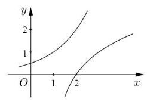

A.

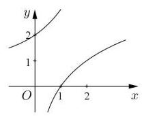

B.

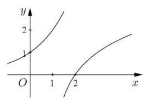

C.

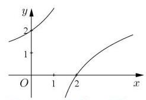

D.

【难度】

【答案】A

【解析】注意 ${f}^{-1}\left( {x - 1}\right)$ 是由 ${f}^{-1}\left( x\right)$ 平移得到的

(2)设 $a > 1,{x}_{1},{x}_{2}$ 分别是函数 $f\left( x\right)  = x - {a}^{-x}$ 和 $g\left( x\right)  = x{\log }_{a}x - 1$ 的零点，则 ${x}_{1} + 9{x}_{2}$ 的取值范围( )

A. $\lbrack 6, + \infty )$ B. $\left( {6, + \infty }\right)$ C. $\lbrack {10}, + \infty )$ D. $\left( {{10}, + \infty }\right)$

【难度】

【答案】D

【解析】因为 ${x}_{1},{x}_{2}$ 分别是函数 $f\left( x\right)  = x - {a}^{-x}$ 和 $g\left( x\right)  = x{\log }_{a}x - 1$ 的零点

则 ${x}_{1},{x}_{2}$ 分别是 ${a}^{x} = \frac{1}{x}$ 和 ${\log }_{a}x = \frac{1}{x}$ 的解

所以 ${x}_{1},{x}_{2}$ 分别是函数 $y = \frac{1}{x}$ 与函数 $y = {a}^{x}$ 和 数 $y = {\log }_{a}x$ 交点的横坐标

所以交点分别为 $A\left( {{x}_{1},\frac{1}{{x}_{1}}}\right) , B\left( {{x}_{2},\frac{1}{{x}_{2}}}\right)$

因为 $a > 1$ ,所以 $0 < {x}_{1} < 1,{x}_{2} > 1$

由于函数 $y = \frac{1}{x}$ 与函数 $y = {a}^{x}$ 和函数 $y = {\log }_{a}x$ 都关于 $y = x$ 对称

所以点 $\mathrm{A}$ 与点 $B$ 关于 $y = x$ 对称

因为 $A\left( {{x}_{1},\frac{1}{{x}_{1}}}\right)$ 关于 $y = x$ 对称的点坐标为 $\left( {\frac{1}{{x}_{1}},{x}_{1}}\right)$ ,所以 ${x}_{1} = \frac{1}{{x}_{2}}$

即 ${x}_{1} \cdot  {x}_{2} = 1$ ,且 ${x}_{1} \neq  {x}_{2}$ ,所以 ${x}_{1} + 9{x}_{2} = {x}_{1} + {x}_{2} + 8{x}_{2} \geq  2\sqrt{{x}_{1} \cdot  {x}_{2}} + 8{x}_{2} > 2 + 8{x}_{2}$ ,由于 ${x}_{1} \neq  {x}_{2}$ ,所以不能取等号,因为

${x}_{2} > 1$ ,所以 $2 + 8{x}_{2} > 2 + 8 = {10}$ ,即 ${x}_{1} + 9{x}_{2} \in  \left( {{10}, + \infty }\right)$

故选:D

## 巩固训练

1、设 ${f}^{-1}\left( x\right)$ 为 $f\left( x\right)  = \frac{x}{4} - \frac{\pi }{8}\cos x + \frac{\pi }{8}$ ， $x \in  \left\lbrack  {0,\pi }\right\rbrack$ 的反函数，则 $y = f\left( x\right)  + {f}^{-1}\left( x\right)$ 的最大值为___.

【难度】 $\star   \star   \star   \star$

【答案】 $\frac{5}{4}\pi$

【解析】由题意,函数 $f\left( x\right)  = \frac{x}{4} - \frac{\pi }{8}\cos x + \frac{\pi }{8}$ 是 $\left\lbrack  {0,\pi }\right\rbrack$ 上的单调递增函数,

且 ${f}^{-1}\left( x\right)$ 为 $f\left( x\right)  = \frac{x}{4} - \frac{\pi }{8}\cos x + \frac{\pi }{8}, x \in  \left\lbrack  {0,\pi }\right\rbrack$ 的反函数,

所以函数 $f\left( x\right)$ 与 ${f}^{-1}\left( x\right)$ 的单调性相同,

当 $x = \pi$ 时,函数 $f\left( x\right)$ 取得最大值 $f\left( \pi \right)  = \frac{\pi }{4} - \frac{\pi }{8}\cos \pi  + \frac{\pi }{8} = \frac{\pi }{2}$ ,

当 $x = 0$ 时, $f\left( 0\right)  =  - \frac{\pi }{8}\cos 0 + \frac{\pi }{8} = 0$ ,

当 $x = \frac{\pi }{2}$ 时， $f\left( \frac{\pi }{2}\right)  = \frac{1}{4} \times  \frac{\pi }{2} - \frac{\pi }{8}\cos \frac{\pi }{2} + \frac{\pi }{8} = \frac{\pi }{4}$ ，

所以函数 $y = f\left( x\right)  + {f}^{-1}\left( x\right)$ 的定义域为 $\left\lbrack  {0,\frac{\pi }{2}}\right\rbrack$ ,且当 $x = \frac{\pi }{2}$ 时, ${f}^{-1}\left( \frac{\pi }{2}\right)  = \pi$ ,

所以 $y = f\left( x\right)  + {f}^{-1}\left( x\right)$ 的最大值为 $f\left( \frac{\pi }{2}\right)  + {f}^{-1}\left( \frac{\pi }{2}\right)  = \frac{\pi }{4} + \pi  = \frac{5\pi }{4}$ ,故答案为: $\frac{5\pi }{4}$ .

2、对于区间 $I$ 上有定义的函数 $g\left( x\right)$ ，记 $g\left( I\right)  = \{ y \mid  y = g\left( x\right) , x \in  I\}$ . 定义域为 $\left\lbrack  {0.3}\right\rbrack$ 的函数 $y = f\left( x\right)$ 有反函数， 满足: $f\left( {\lbrack 1,2}\right) ) = \lbrack 0,1), f\left( {\lbrack 0,1}\right) ) = (2,4\rbrack$ . 若方程 $f\left( x\right)  - x = 0$ 有解 ${x}_{0}$ ,则 ${x}_{0} =$ ___.

【难度】 $\star   \star   \star   \star$

【答案】 2

【解析】因为 $g\left( I\right)  = \{ y \mid  y = g\left( x\right) , x \in  I\} ,{f}^{-1}\left( {\lbrack 0,1}\right) ) = \lbrack 1,2),{f}^{-1}\left( {2,4\rbrack }\right)  = \lbrack 0,1)$ ,

所以对于函数 $f\left( x\right)$ ,

当 $x \in  \lbrack 0,1)$ 时, $f\left( x\right)  \in  (2,4\rbrack$ ,所以方程 $f\left( x\right)  - x = 0$ 即 $f\left( x\right)  = x$ 无解;

当 $x \in  \lbrack 1,2)$ 时, $f\left( x\right)  \in  \lbrack 0,1)$ ,所以方程 $f\left( x\right)  - x = 0$ 即 $f\left( x\right)  = x$ 无解;

所以当 $x \in  \lbrack 0,2)$ 时方程 $f\left( x\right)  - x = 0$ 即 $f\left( x\right)  = x$ 无解,

又因为方程 $f\left( x\right)  - x = 0$ 有解 ${x}_{0}$ ,且定义域为 $\left\lbrack  {0,3}\right\rbrack$ ,

故当 $x \in  \left\lbrack  {2,3}\right\rbrack$ 时, $f\left( x\right)$ 的取值应属于集合 $\left( {-\infty ,0}\right)  \cup  \left\lbrack  {1,2}\right\rbrack   \cup  \left( {4, + \infty }\right)$ ,

故若 $f\left( {x}_{0}\right)  = {x}_{0}$ ,只有 ${x}_{0} = 2$ ,故答案为: ${x}_{0} = 2$ .

3、已知 $f\left( x\right)  = {2}^{x + m} + {mx} + 1$ ，其中 $m$ 是实常数.

(1)若 $f\left( \frac{1}{m}\right)  > {18}$ ，求 $m$ 的取值范围；

(2)若 $m > 0$ ，求证:函数 $f\left( x\right)$ 的零点有且仅有一个；

(3)若 $m > 0$ ，设函数 $y = f\left( x\right)$ 的反函数为 $y = {f}^{-1}\left( x\right)$ ，若 ${a}_{1},{a}_{2},{a}_{3},{a}_{4}$ 是公差 $d > 0$ 的等差数列且均在函数 $f\left( x\right)$ 的值域中,求证: ${f}^{-1}\left( {a}_{1}\right)  + {f}^{-1}\left( {a}_{4}\right)  < {f}^{-1}\left( {a}_{2}\right)  + {f}^{-1}\left( {a}_{3}\right)$ .

【难度】 $\star   \star   \star   \star$

【答案】(1) $\left( {0,2 - \sqrt{3}}\right)  \cup  \left( {2 + \sqrt{3}, + \infty }\right)$ (2)证明见解析；(3)证明见解析:

【解析】(1) $f\left( \frac{1}{m}\right)  = {2}^{m + \frac{1}{m}} + 2 > {18}$ ,所以 ${2}^{m + \frac{1}{m}} > {16}, m + \frac{1}{m} > 4$ ,易知 $m > 0$ ,所以 ${m}^{2} - {4m} + 1 > 0$ ,所以 $m \in  \left( {0,2 - \sqrt{3}}\right)  \cup  \left( {2 + \sqrt{3}, + \infty }\right) .$

( 2 )函数 $f\left( x\right)$ 为增函数，且 $f\left( 0\right)  = {2}^{m} + 1 > 0$ ， $f\left( {-m - \frac{2}{m}}\right)  = {2}^{-\frac{2}{m}} - {m}^{2} - 1$ ，由于 ${2}^{-\frac{2}{m}} < 1 \Rightarrow  {2}^{-\frac{2}{m}} - {m}^{2} - 1 < 0 \Rightarrow  f\left( {-m - \frac{2}{m}}\right)  < 0$ . 故在 $\left( {-m + \frac{2}{m},0}\right)$ 上必存在 ${x}_{0}$ ,使 $f\left( {x}_{0}\right)  = 0$ . 又 $f\left( x\right)$ 为增函数,所以函数 $f\left( x\right)$ 的零点有且仅有一个.

(3)即证: ${f}^{-1}\left( {a}_{4}\right)  - {f}^{-1}\left( {a}_{3}\right)  < {f}^{-1}\left( {a}_{2}\right)  - {f}^{-1}\left( {a}_{1}\right)$ .

$\Leftrightarrow  {f}^{-1}\left( {{a}_{3} + d}\right)  - {f}^{-1}\left( {a}_{3}\right)  < {f}^{-1}\left( {{a}_{1} + d}\right)  - {f}^{-1}\left( {a}_{1}\right)$ ,而 ${a}_{3} > {a}_{1}$ ,所以只需证 ${f}^{-1}\left( {t + d}\right)  - {f}^{-t}\left( t\right)$ 是关于 $t$ 的减函数.

设 ${t}_{1} < {t}_{2}$ ,即证 $\left| {{f}^{-1}\left( {{t}_{1} + d}\right)  - {f}^{-1}\left( {t}_{1}\right) }\right|  - \left| {{f}^{-1}\left( {{t}_{2} + d}\right)  - {f}^{-1}\left( {t}_{2}\right) }\right|$ ※大于 0

设 $f\left( {u}_{1}\right)  = {t}_{1} + d,\;f\left( {u}_{2}\right)  = {t}_{1},\;f\left( {n}_{1}\right)  = {t}_{2} + d,\;f\left( {n}_{2}\right)  = {t}_{2}$ ,由 $f\left( x\right)$ 单调递增可得 ${u}_{1} > {u}_{2},{n}_{1} > {n}_{2},{u}_{1} < {n}_{1},{u}_{2} < {n}_{2}$ . ※ $= \left( {{u}_{1} - {u}_{2}}\right)  - \left( {{n}_{1} - {n}_{2}}\right)$ . 而 $\left\{  \begin{array}{l} f\left( {u}_{1}\right)  = {2}^{{u}_{1} + m} + m{u}_{1} + 1 = {t}_{1} + d \\  f\left( {u}_{2}\right)  = {2}^{{u}_{2} + m} + m{u}_{2} + 1 = {t}_{1} \end{array}\right.$ ,

两式相减得 ${2}^{{u}_{1} + m} - {2}^{{n}_{2} + m} + m\left( {{u}_{1} - {u}_{2}}\right)  = d,\;{2}^{{u}_{2} + m}\left( {{2}^{{u}_{1} - {u}_{2}} - 1}\right)  + m\left( {{u}_{1} - {u}_{2}}\right)  = d$ ①

同理 ${2}^{{n}_{2} + m}\left( {{2}^{{n}_{1} - {n}_{2}} - 1}\right)  + m\left( {{n}_{1} - {n}_{2}}\right)  = d$ ②,

①-②得: ${2}^{{u}_{2} + m}\left( {{2}^{{u}_{1} - {u}_{2}} - 1}\right)  - {2}^{{n}_{2} + m}\left( {{2}^{{n}_{1} - {n}_{2}} - 1}\right)  = m\left( {{n}_{1} - {n}_{2}}\right)  - m\left( {{u}_{1} - {u}_{2}}\right) .$

若 $\left( {{u}_{1} - {u}_{2}}\right)  - \left( {{n}_{1} - {n}_{2}}\right)  \leq  0$ ,则上式左侧 $< 0$ ,右侧 $\geq  0$ 矛盾,故※ > 0 .证毕.

## (四)函数的图像和零点

## 例题精讲

【例11】(1) 设 $f\left( x\right)  = {x}^{2} + {2a} \cdot  x + b \cdot  {2}^{x}$ ,其中 $a, b \in  N, x \in  R$ ,如果函数 $y = f\left( x\right)$ 与函数 $y = f\left( {f\left( x\right) }\right)$ 都有零点且它们的零点完全相同,则 $\left( {a, b}\right)$ 为___

【难度】 $\bigstar \bigstar \bigstar$

【答案】 $\left( {0,0}\right)$ 或 $\left( {1,0}\right)$

【解析】设零点 ${x}_{0}, f\left( {x}_{0}\right)  = 0, f\left( {f\left( {x}_{0}\right) }\right)  = 0 \Rightarrow  f\left( 0\right)  = 0,\therefore b = 0,\therefore f\left( x\right)  = {x}^{2} + {2ax}$

当 $a = 0, f\left( x\right)  = {x}^{2}, f\left( {f\left( x\right) }\right)  = {x}^{4}$ ,有唯一零点 $x = 0$ ,符合; 当 $a \neq  0, f\left( x\right)  = x\left( {x + {2a}}\right)$ ,

有两个零点 ${x}_{1} = 0$ 和 ${x}_{2} =  - {2a}, f\left( {f\left( x\right) }\right)  = f\left( x\right) \left\lbrack  {f\left( x\right)  + {2a}}\right\rbrack   = 0 \Rightarrow  f\left( x\right)  = 0$ 和 $f\left( x\right)  =  - {2a}$ ,

$\because f\left( x\right)  = 0$ 已满足有两个相同的零点 ${x}_{1} = 0$ 和 ${x}_{2} =  - {2a},\therefore$ 方程 $f\left( x\right)  =  - {2a}$ 无解

即 ${x}^{2} + {2ax} + {2a} = 0$ 无解, $\Delta  = 4{a}^{2} - {8a} < 0 \Rightarrow  0 < a < 2,\therefore a = 1$ ;

综上, $\left( {a, b}\right)$ 为 $\left( {0,0}\right)$ 或 $\left( {1,0}\right)$ .

(2)已知函数 $f\left( x\right)  = \left| {1 - \frac{1}{x}}\right| \left( {x > 0}\right)$ ，若关于 $x$ 的方程 ${\left\lbrack  f\left( x\right) \right\rbrack  }^{2} + {mf}\left( x\right)  + {2m} + 3 = 0$ 有三个不相等的实数解，则实数 $m$ 的取值范围为___

【难度】 $\star   \star   \star   \star$

【答案】 $\left( {-\frac{3}{2}, - \frac{4}{3}}\right\rbrack$

【解析】根据函数的图像转化为一元二次方程根的分布

【例12】(1)已知 $\lambda  \in  \mathbf{R}$ ，函数 $f\left( x\right)  = \left\{  \begin{matrix} x - 4 & x \geq  \lambda \\  {x}^{2} - {4x} + 3 & x < \lambda  \end{matrix}\right.$ ，若函数 $f\left( x\right)$ 恰有 2 个零点，则 $\lambda$ 的取值范围是___

【难度】★★★★

【答案】 $\lambda  \in  (1,3\rbrack  \cup  \left( {4, + \infty }\right)$

【解析】 $y = x - 4$ 的零点为 $x = 4, y = {x}^{2} - {4x} + 3$ 的零点为 $x = 1$ 或 $x = 3$ ,若函数恰有两个零点,结合图像可得, $\lambda  \in  (1,3\rbrack  \cup  \left( {4, + \infty }\right)$ .

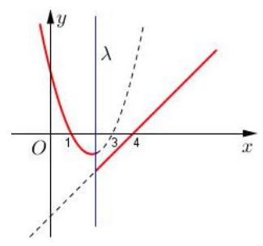

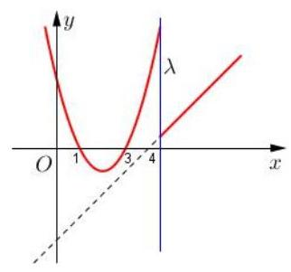

(2)设 $f\left( x\right)$ 是定义在 $\mathbf{R}$ 上的周期为4的函数，且 $f\left( x\right)  = \left\{  \begin{array}{ll} \sin {2\pi x} & 0 \leq  x \leq  1 \\  2{\log }_{2}x & 1 < x < 4 \end{array}\right.$ ，记 $g\left( x\right)  = f\left( x\right)  - a$ ，若 $0 < a < \frac{1}{2}$ ，则函数 $g\left( x\right)$ 在区间 $\left\lbrack  {-4,5}\right\rbrack$ 上零点的个数是( )

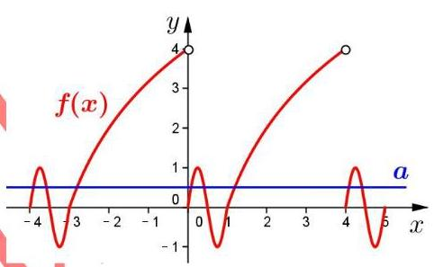

A. 5 B. 6 C. 7 D. 8

【难度】

【答案】D

【解析】数形结合,转化为 $y = f\left( x\right) \left( {x \in  \left\lbrack  {-4,5}\right\rbrack  }\right)$ 与 $y = a\left( {0 < a < \frac{1}{2}}\right)$ 的交点个数问题, 画出图像, 观察可得, 交点个数为8个,

即 $g\left( x\right)$ 在区间 $\left\lbrack  {-4,5}\right\rbrack$ 上有 8 个零点,故选D.

(3)已知 $f\left( x\right)$ ，对任意 $x \in  \lbrack 1, + \infty )$ ，恒有 $f\left( {2x}\right)  = {2f}\left( x\right)$ 成立，且当 $x \in  \lbrack 1,2)$ 时， $f\left( x\right)  = {2 - x}$ ，则方程 $f\left( x\right)  = \frac{1}{3}x$ 在区间 $\left\lbrack  {1,{100}}\right\rbrack$ 上所有根的和为___

【难度】 $\star   \star   \star   \star$

【答案】 $\frac{381}{2}$

【解析】当 $x \in  \lbrack 2,4)$ 时, $\frac{x}{2} \in  \lbrack 1,2)$ ,则 $f\left( \frac{x}{2}\right)  = 2 - \frac{x}{2}, f\left( {2x}\right)  = {2f}\left( x\right)$ 故 $f\left( x\right)  = 4 - x$ ;

同理可得: $x \in  \left\lbrack  {{2}^{k},{2}^{k + 1}}\right)$ 时， $f\left( x\right)  = {2}^{k + 1} - x, k \in  \mathbf{N}$

$f\left( x\right)  = \frac{1}{3}x$ ,即 ${2}^{k + 1} - x = \frac{1}{3}x\therefore x = \frac{3}{4} \cdot  {2}^{k + 1}$ ,取 $\frac{3}{4} \cdot  {2}^{k + 1} \leq  {100}$ 则 $k \leq  6$

故所有根的和为 $\frac{3}{4} \cdot  \left( {{2}^{1} + {2}^{2} + \ldots  + {2}^{7}}\right)  = \frac{381}{2}$ ,故答案为: $\frac{381}{2}$

(4)设函数 ${f}_{1}\left( x\right)  = {\log }_{4}x - {\left( \frac{1}{4}\right) }^{x}\text{ 、 }{f}_{2}\left( x\right)  = {\log }_{\frac{1}{4}}x - {\left( \frac{1}{4}\right) }^{x}$ 的零点分别为 ${x}_{1}\text{ 、 }{x}_{2}$ ,则()

(A) $0 < {x}_{1}{x}_{2} < 1$ . (B) ${x}_{1}{x}_{2} = 1$ . (C) $1 < {x}_{1}{x}_{2} < 2$ . (D) ${x}_{1}{x}_{2} \geq  2$ .

【难度】★★★★

【答案】A

【解析】本题考查函数零点相关知识.

因为函数 ${f}_{1}\left( x\right)  = {\log }_{2}x - {\left( \frac{1}{2}\right) }^{x},{f}_{2}\left( x\right)  = {\log }_{\frac{1}{2}}x - {\left( \frac{1}{2}\right) }^{x}$ 的零点分别为 ${x}_{1},{x}_{2}$ ,故可得 ${\log }_{2}{}^{{x}_{1}} = {\left( \frac{1}{2}\right) }^{{x}_{1}}\cdots {\left( \text{ ① }{\log }_{\frac{1}{2}}{}^{{x}_{2}} = {\left( \frac{1}{2}\right) }^{{x}_{2}}\cdots \text{ ② }\text{ ，如图 }\text{ ，显然有 }0 < {x}_{2} < 1 < {x}_{2}\text{ ，故 }{x}_{1}{x}_{2} > 0\text{ ，① } - \text{ ② }\right) }^{n} \; {\log }_{2}{}^{{x}_{1}{x}_{2}} = {\left( \frac{1}{2}\right) }^{{x}_{1}} - {\left( \frac{1}{2}\right) }^{{x}_{2}} < 0 \Rightarrow  {x}_{1}{x}_{2} < 1$ ,选 A.

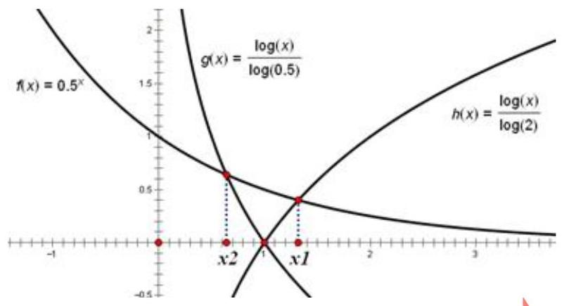

(5)已知函数 $f\left( x\right)  = \left\{  \begin{array}{ll} \left| {{\log }_{5}\left( {1 - x}\right) }\right| & x < 1 \\   - {\left( x - 2\right) }^{2} + 2 & x \geq  1 \end{array}\right.$ ，则方程 $f\left( {x + \frac{1}{x} - 2}\right)  = a$ ( $a \in  \mathbf{R}$ )的实数根个数不可能为( ) A. 5 个 B. 6 个 C. 7 个 D. 8 个

【难度】 $\star   \star   \star   \star$

【答案】A

【解析】如下图所示,画出函数 $f\left( x\right)$ 以及 $g\left( x\right)  = x + \frac{1}{x} - 2$ 的图象,从而可知,当 $a < 0$ 时,方程 $f\left( x\right)  = a$ 有一正根, $\therefore$ 方程 $f\left( {x + \frac{1}{x} - 2}\right)  = a$ 有两个根,当 $a = 0$ 时,方程 $f\left( x\right)  = a$ 有一正根,一个根为 0, $\therefore f\left( {x + \frac{1}{x} - 2}\right)  = a$ 有三个根,当 $0 < a < 1$ 时,方程 $f\left( x\right)  = a$ 有两个正根,一个大于 -4 的负根,

$\therefore f\left( {x + \frac{1}{x} - 2}\right)  = a$ 有四个根,当 $a = 1$ 时,方程 $f\left( x\right)  = a$ 有一个负根 -4,三个正根, $\therefore f\left( {x + \frac{1}{x} - 2}\right)  = a$ 有七个根,当 $1 < a < 2$ 时,方程 $f\left( x\right)  = a$ 有三个正根,一个小于 -4 的负根, $\therefore f\left( {x + \frac{1}{x} - 2}\right)  = a$ 有八个根,当 $a = 2$ 时, 方程 $f\left( x\right)  = a$ 有两个正根,一个小于 -4 的负根, $\therefore f\left( {x + \frac{1}{x} - 2}\right)  = a$ 有六个根,当 $a > 2$ 时,方程 $f\left( x\right)  = a$ 有一个正根一个小于 -4 的负根, $\therefore f\left( {x + \frac{1}{x} - 2}\right)  = a$ 有四个根, $\therefore f\left( {x + \frac{1}{x} - 2}\right)  = a$ 根的个数可能为2,3,4,6, 7, 8, 故选 A.

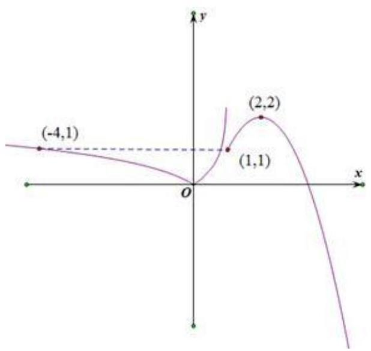

【例13】(1)给出函数 $g\left( x\right)  =  - {x}^{2} + {bx}$ ， $h\left( x\right)  =  - m{x}^{2} + x - 4$ ，这里 $b, m, x \in  R$ ，若不等式 $g\left( x\right)  + b + 1 \leq  0$ ( $x \in  R$ ) 恒成立, $h\left( x\right)  + 4$ 为奇函数,且函数 $f\left( x\right)  = \left\{  \begin{array}{ll} g\left( x\right) & \left( {x \leq  t}\right) \\  h\left( x\right) & \left( {x > t}\right)  \end{array}\right.$ 恰有两个零点,则实数 $t$ 的取值范围为___.

【难度】 $\star   \star   \star   \star$

【答案】 $\lbrack  - 2,0) \cup  \lbrack 4, + \infty )$ .

【解析】若不等式 $g\left( x\right)  + b + 1 \leq  0\left( {x \in  \mathrm{R}}\right)$ 恒成立,

即 ${x}^{2} - {bx} - b - 1 \geq  0$ 恒成立,

则 $\Delta  = {b}^{2} + 4\left( {b + 1}\right)  = {\left( b + 2\right) }^{2} \leq  0$ ,解得: $b =  - 2$ ,

故 $g\left( x\right)  =  - {x}^{2} - {2x}$ .

若 $h\left( x\right)  + 4$ 为奇函数，则 $- m{x}^{2} - x - 4 + 4 = m{x}^{2} - x - 4 + 4$ ，解得: $m = 0$ ，

故 $h\left( x\right)  = x - 4$ .

函数 $g\left( x\right)$ ， $h\left( x\right)$ 的图象，如图所示:

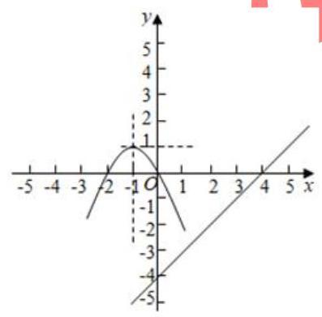

若函数 $f\left( x\right)  = \left\{  \begin{array}{ll} g\left( x\right) & \left( {x \leq  t}\right) \\  h\left( x\right) & \left( {x > t}\right)  \end{array}\right.$ 恰有两个零点,

当 $- 2 \leq  t < 0$ 时,零点为 $x =  - 2$ 和 $x = 4$ ;

当 $t \geq  4$ 时,零点为 $x =  - 2$ 和 $x = 0$ ; 故答案为 $\lbrack  - 2,0) \cup  \lbrack 4, + \infty )$ .

(2)不等式 $\left( {\left| {x - a}\right|  - b}\right) \sin \left( {{\pi x} + \frac{\pi }{6}}\right)  \leq  0$ 对 $x \in  \left\lbrack  {-1,1}\right\rbrack$ 恒成立，则 $a + b$ 的值等于( )

A. $\frac{2}{3}$ B. $\frac{5}{6}$ C. 1 D. 2

【难度】 $\star   \star   \star   \star$

【答案】B

【解析】画图, 根据函数图像

## 巩固训练

1、已知函数 $f\left( x\right)  = m \cdot  {2}^{x} + {x}^{2} + {nx}$ ,记集合 $A = \{ x \mid  f\left( x\right)  = 0, x \in  \mathbf{R}\}$ ,集合 $B = \{ x \mid  f\left\lbrack  {f\left( x\right) }\right\rbrack   = 0, x \in  \mathbf{R}\}$ , 若 $A = B$ ，且都不是空集，则 $m + n$ 的取值范围是___

【难度】 $\bigstar \bigstar \bigstar$

【答案】 $m + n \in  \lbrack 0,4)$

【解析】设 ${x}_{0} \in  A,\therefore f\left( {x}_{0}\right)  = 0,\because A = B,\therefore {x}_{0} \in  B,\therefore f\left\lbrack  {f\left( {x}_{0}\right) }\right\rbrack   = 0$ ,即 $f\left( 0\right)  = 0$ ,

$\therefore m = 0, f\left( x\right)  = {x}^{2} + {nx}$ . 当 $n = 0, A = B = \{ 0\}$ ,符合题意当 $n \neq  0, A = \{ 0, - n\}$ ,

$B = \{ x \mid  f\left( x\right)  = 0, f\left( x\right)  =  - n, x \in  \mathbf{R}\} ,\because A = B,\therefore f\left( x\right)  =  - n$ 无解,即 ${x}^{2} + {nx} + n = 0$ 无解,

$\Delta  = {n}^{2} - {4n} < 0 \Rightarrow  0 < n < 4,\because m = 0,\therefore$ 综上所述, $m + n \in  \lbrack 0,4)$

2、已知函数 $f\left( x\right)  + 2 = \frac{2}{f\left( \sqrt{x + 1}\right) }$ ，当 $x \in  (0,1\rbrack$ 时， $f\left( x\right)  = {x}^{2}$ ，若在区间 $\left\lbrack  {-1,1}\right\rbrack$ 内 $g\left( x\right)  = f\left( x\right)  - t\left( {x + 1}\right)$ 有两个不同的零点，则实数 $t$ 的取值范围是___

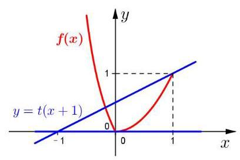

【难度】 $\star   \star   \star   \star$

【答案】 $t \in  \left( {0,\frac{1}{2}}\right\rbrack$

【解析】当 $x \in  ( - 1,0\rbrack ,\sqrt{x + 1} \in  (0,1\rbrack , f\left( \sqrt{x + 1}\right)  = x + 1$ , $f\left( x\right)  = \frac{2}{x + 1} - 2$ ,作出 $f\left( x\right)$ 图像如图所示,根据题意,即

$y = f\left( x\right)$ 与 $y = t\left( {x + 1}\right)$ 有两个不同交点, $t$ 即直线 $y = t\left( {x + 1}\right)$ 的斜率,数形结合,观察图像可得 $t \in  \left( {0,\frac{1}{2}}\right\rbrack$ .

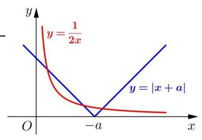

3、已知函数 $f\left( x\right)  = {2x}\left| {x + a}\right|  - 1$ 有三个不同的零点,则实数 $a$ 的取值范围为___

【难度】 $\star   \star   \star   \star$

【答案】 $a \in  \left( {-\infty , - \sqrt{2}}\right)$

【解析】本题可分类讨论,亦可转化为 $y = \left| {x + a}\right|$ 与 $y = \frac{1}{2x}$ 的交点个数问题, 结合函数图像可得, 要有三个不同的交点,

高三数学二轮复习 B 版

即 $y =  - x - a$ 与 $y = \frac{1}{2x}$ 必须有两个交点, $\therefore  - x - a = \frac{1}{2x}$ ,

即 $2{x}^{2} + {2ax} + 1 = 0,\Delta  = 4{a}^{2} - 8 > 0,\because  - a > 0$ 明显成立, $\therefore a \in  \left( {-\infty , - \sqrt{2}}\right)$

4、已知函数 $f\left( x\right)  = \left\{  \begin{array}{l} \frac{x}{4{x}^{2} + {16}}\;x \geq  2 \\  {\left( \frac{1}{2}\right) }^{\left| x - a\right| }\;x < 2 \end{array}\right.$ ,若对任意的 ${x}_{1} \in  \lbrack 2, + \infty )$ ,都存在唯一的 ${x}_{2} \in  \left( {-\infty ,2}\right)$ ,满足 $f\left( {x}_{1}\right)  = f\left( {x}_{2}\right)$ ，则实数 $a$ 的取值范围为___

【难度】 $\star   \star   \star   \star$

【答案】 $a \in  \lbrack  - 2,6)$

【解析】当 $x \geq  2, f\left( x\right)  = \frac{x}{4{x}^{2} + {16}} = \frac{1}{{4x} + \frac{16}{x}},\because y = {4x} + \frac{16}{x}$ 在 $x \in  \lbrack 2, + \infty )$ 的值域为 $\lbrack {16}, + \infty )$ ,且单调递

增, $\therefore f\left( x\right)$ 在 $x \in  \lbrack 2, + \infty )$ 的值域为 $\left( {0,\frac{1}{16}}\right\rbrack$ ,且单调递减,数形结合,分析 $f\left( x\right)  = {\left( \frac{1}{2}\right) }^{\left| x - a\right| }\left( {x < 2}\right)$ 与 $f\left( x\right)  = \frac{x}{4{x}^{2} + {16}}\left( {x \geq  2}\right)$ 的图像关系

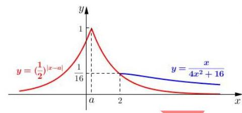

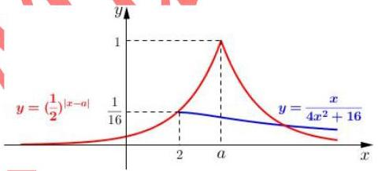

由题意，当 $a < 2$ ，需满足 ${\left( \frac{1}{2}\right) }^{2 - a} \geq  \frac{1}{16}$ ，即 $a \geq   - 2$ ， $a \in  \lbrack  - 2,2)$ ；

当 $a \geq  2$ ,需满足 ${\left( \frac{1}{2}\right) }^{a - 2} > \frac{1}{16}$ ,即 $a < 6,\ldots a \in  \lbrack 2,6)$ ; 综上所述, $a \in  \lbrack  - 2,6)$ .

## (五)函数综合

## 例题精讲

【例14】定义函数 $f\left( x\right)  = \{ x\{ x\} \}$ ，其中 $\{ x\}$ 表示不小于 $x$ 的最小整数，如 \{1.4\} $= 2$ ， $\{  - {2.3}\}  =  - 2$ ，当 $x \in  (0, n\rbrack$ ( $n \in  {\mathbf{N}}^{ * }$ )时，函数 $f\left( x\right)$ 的值域为 ${A}_{n}$ ，记集合 ${A}_{n}$ 中元素的个数为 ${a}_{n}$ ，则 ${a}_{n} =$ ___

【难度】 $\star   \star   \star   \star$

【答案】 $\frac{n\left( {n + 1}\right) }{2}$

【解析】 ${a}_{n} = \frac{n\left( {n + 1}\right) }{2}$ ,当 $x \in  (0,1\rbrack ,\{ x\}  = 1, f\left( x\right)  = \{ x\{ x\} \}  = \{ x\}  = 1$ ,有 1 个元素;

当 $x \in  (1,2\rbrack ,\{ x\}  = 2,\;f\left( x\right)  = \{ x\{ x\} \}  = \{ {2x}\} ,{2x} \in  (2,4\rbrack ,\therefore \{ {2x}\}  = 3$ 或 4,有 2 个元素;

当 $x \in  (2,3\rbrack ,\{ x\}  = 3, f\left( x\right)  = \{ x\{ x\} \}  = \{ {3x}\} ,{3x} \in  (6,9\rbrack ,\therefore$ 有 $9 - 6 = 3$ 个元素; $\cdots \cdots$ ;

当 $x \in  (n - 2, n - 1\rbrack ,\{ x\}  = n - 1, f\left( x\right)  = \{ \left( {n - 1}\right) x\} ,\left( {n - 1}\right) x \in  \left( {\left( {n - 2}\right) \left( {n - 1}\right) ,{\left( n - 1\right) }^{2}}\right\rbrack$ ,

$\therefore$ 有 ${\left( n - 1\right) }^{2} - \left( {n - 2}\right) \left( {n - 1}\right)  = n - 1$ 个元素;

当 $x \in  (n - 1, n\rbrack ,\{ x\}  = n, f\left( x\right)  = \{ x\{ x\} \}  = \{ {nx}\} ,{nx} \in  \left( {{n}^{2} - n,{n}^{2}}\right\rbrack$ ,

$\therefore$ 有 ${n}^{2} - \left( {{n}^{2} - n}\right)  = n$ 个元素; 且 $\left( {\left( {n - 2}\right) \left( {n - 1}\right) ,{\left( n - 1\right) }^{2}}\right\rbrack   \cap  \left( {{n}^{2} - n,{n}^{2}}\right\rbrack   = \varnothing$ ,

$\therefore$ 当 $x \in  (0, n\rbrack ,{a}_{n} = 1 + 2 + \cdots  + n = \frac{n\left( {n + 1}\right) }{2}$

【例 15】记号 $\left\lbrack  x\right\rbrack$ 表示不超过实数 $x$ 的最大整数,若 $f\left( x\right)  = \left\lbrack  \frac{{x}^{2}}{30}\right\rbrack   + \left\lbrack  \sqrt{30x}\right\rbrack$ ,则

$f\left( 1\right)  + f\left( 2\right)  + f\left( 3\right)  + \cdots  + f\left( {29}\right)  + f\left( {30}\right)$ 的值为 ( )

A. 899 B. 900 C. 901 D. 902

【难度】★★★★

【答案】C

【解析】令 $g\left( x\right)  = \frac{{x}^{2}}{30}, h\left( x\right)  = \sqrt{30x}$ ,则 $f\left( x\right)  = \left\lbrack  {g\left( x\right) }\right\rbrack   + \left\lbrack  {h\left( x\right) }\right\rbrack$ ,

$f\left( 1\right)  + f\left( 2\right)  + \cdots  + f\left( {30}\right)  = \left\lbrack  {g\left( 1\right) }\right\rbrack   + \left\lbrack  {g\left( 2\right) }\right\rbrack   + \cdots  + \left\lbrack  {g\left( {30}\right) }\right\rbrack   + \left\lbrack  {h\left( 1\right) }\right\rbrack   + \left\lbrack  {h\left( 2\right) }\right\rbrack   + \cdots  + \left\lbrack  {h\left( {30}\right) }\right\rbrack$ ,

其中: $\left\lbrack  {g\left( x\right) }\right\rbrack$ 对应函数值表示落在 $g\left( x\right)  = \frac{{x}^{2}}{30}$ 图像下方的整点个数,如 $\left\lbrack  {g\left( {10}\right) }\right\rbrack   = 3$ (如图1);

则 $\left\lbrack  {g\left( 1\right) }\right\rbrack   + \left\lbrack  {g\left( 2\right) }\right\rbrack   + \cdots  + \left\lbrack  {g\left( {30}\right) }\right\rbrack$ 表示落在函数 $g\left( x\right)  = \frac{{x}^{2}}{30}\left( {0 < x \leq  {30}}\right)$ 图像上以及图像的下

方的整点个数 (如图 2),同理, $\left\lbrack  {h\left( 1\right) }\right\rbrack   + \left\lbrack  {h\left( 2\right) }\right\rbrack   + \cdots  + \left\lbrack  {h\left( {30}\right) }\right\rbrack$ 表示落在函数 $h\left( x\right)  = \sqrt{30x}$

( 0 < x ≤ 30 )图像上以及图像的下方的整点个数(如图 3 )，

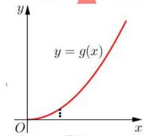

图(1)

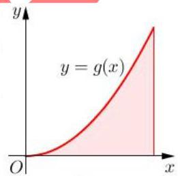

图(2)

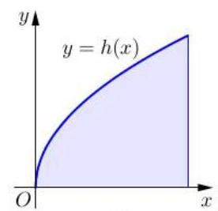

图(3)

这里,我们观察到 $g\left( x\right)  = \frac{{x}^{2}}{30}, h\left( x\right)  = \sqrt{30x}$ 互为反函数,两者函数关于 $y = x$ 对称,

那么函数 $h\left( x\right)  = \sqrt{30x}$ ( $0 < x \leq  {30}$ )下方的整点个数(如图3)可等价为落在 $g\left( x\right)  = \frac{{x}^{2}}{30}$ 图像上及左侧的整点个数 $\left( {0 < y \leq  {30}}\right)$ ,如图4; 结合图2及图4,则

$f\left( 1\right)  + f\left( 2\right)  + \cdots  + f\left( {30}\right)  = \left\lbrack  {g\left( 1\right) }\right\rbrack   + \left\lbrack  {g\left( 2\right) }\right\rbrack   + \cdots  + \left\lbrack  {g\left( {30}\right) }\right\rbrack   + \left\lbrack  {h\left( 1\right) }\right\rbrack   + \left\lbrack  {h\left( 2\right) }\right\rbrack   + \cdots  + \left\lbrack  {h\left( {30}\right) }\right\rbrack$ ,

可等价为 $y = g\left( x\right) \left( {0 < x \leq  {30},0 < y \leq  {30}}\right)$ 图像下方及左方的整点个数 (有两个相同的点 $\left( {{30},{30}}\right)$ ),即: 落点 $0 < x \leq  {30},0 < y \leq  {30}$ 内所有的整点个数再加上 $\left( {{30},{30}}\right)$ 这个唯一重复的点 (如图5),则

$f\left( 1\right)  + f\left( 2\right)  + f\left( 3\right)  + \cdots  + f\left( {29}\right)  + f\left( {30}\right)  = {30}^{2} + 1 = {901}$ . 故选C.

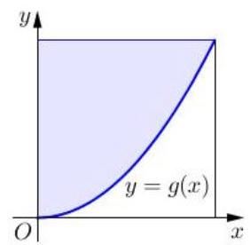

图(4)

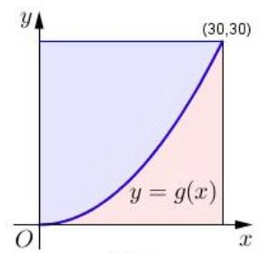

图(5)

【例 16】若 $M\text{ 、 }N$ 两点分别在函数 $y = f\left( x\right)$ 与 $y = g\left( x\right)$ 的图像上,且关于直线 $x = 1$ 对称,称 $M\text{ 、 }N$ 是 $y = f\left( x\right)$ 与 $y = g\left( x\right)$ 的一对 “伴点” ( $M\text{ 、 }N$ 与 $N\text{ 、 }M$ 视为相同的一对),已知

$f\left( x\right)  = \left\{  {\begin{matrix}  - \sqrt{2 - x} & x < 2 \\  \sqrt{4 - {\left( x - 4\right) }^{2}} & x \geq  2 \end{matrix}, g\left( x\right)  = \left| {x + a}\right|  + 1}\right.$ ,若 $y = f\left( x\right)$ 与 $y = g\left( x\right)$ 存在两对 “伴点”,则实数 $a$ 的取值范围为___

【难度】 $\bigstar \bigstar \bigstar$

【答案】 $\left( {3 - 2\sqrt{2},1 + 2\sqrt{2}}\right)$

【解析】函数图像

【例17】已知函数 $f\left( x\right)  = \left| {x - a}\right|  - \frac{9}{x} + a, x \in  \left\lbrack  {1,6}\right\rbrack  , a \in  R$ .

(1)若 $a = 1$ ，试判断并用定义证明函数 $f\left( x\right)$ 的单调性；

( 2 )当 $a \in  \left( {1,3}\right)$ 时，求证函数 $f\left( x\right)$ 存在反函数.

【难度】 $\star   \star   \star   \star$

【答案】(1)判断: 若 $a = 1$ ,函数 $f\left( x\right)$ 在 $\left\lbrack  {1,6}\right\rbrack$ 上是增函数.

证明: 当 $a = 1$ 时, $f\left( x\right)  = x - \frac{9}{x}, f\left( x\right)$ 在 $\left\lbrack  {1,6}\right\rbrack$ 上是增函数. 2分

在区间 $\left\lbrack  {1,6}\right\rbrack$ 上任取 ${x}_{1},{x}_{2}$ ,设 ${x}_{1} < {x}_{2}$

$f\left( {x}_{1}\right)  - f\left( {x}_{2}\right)  = \left( {{x}_{1} - \frac{9}{{x}_{1}}}\right)  - \left( {{x}_{2} - \frac{9}{{x}_{2}}}\right)  = \left( {{x}_{1} - {x}_{2}}\right)  - \left( {\frac{9}{{x}_{1}} - \frac{9}{{x}_{2}}}\right)$

$= \frac{\left( {{x}_{1} - {x}_{2}}\right) \left( {{x}_{1}{x}_{2} + 9}\right) }{{x}_{1}{x}_{2}} < 0$

所以 $f\left( {x}_{1}\right)  < f\left( {x}_{2}\right)$ ,即 $f\left( x\right)$ 在 $\left\lbrack  {1,6}\right\rbrack$ 上是增函数. 6 分

( 2 )因为 $1 < a \leq  3$ ，所以 $f\left( x\right)  = \left\{  \begin{array}{ll} {2a} - \left( {x + \frac{9}{x}}\right) , & 1 \leq  x \leq  a, \\  x - \frac{9}{x}, & a < x \leq  6, \end{array}\right.$ 8 分

当 $1 < a \leq  3$ 时, $f\left( x\right)$ 在 $\left\lbrack  {1, a}\right\rbrack$ 上是增函数, 9分

证明: 当 $1 < a \leq  3$ 时, $f\left( x\right)$ 在 $\left\lbrack  {1, a}\right\rbrack$ 上是增函数 (过程略) 11 分

$f\left( x\right)$ 在在 $\left\lbrack  {a,6}\right\rbrack$ 上也是增函数

当 $1 < a \leq  3$ 时, $y = f\left( x\right) x \in  \left\lbrack  {1,6}\right\rbrack$ 上是增函数 12分

所以任意一个 $x \in  \left\lbrack  {1,6}\right\rbrack$ ,均能找到唯一的 $y$ 和它对应,所以 $y = f\left( x\right) \;x \in  \left\lbrack  {1,6}\right\rbrack$ 时, $f\left( x\right)$ 存在反函数

## 巩固训练

1、对于在某个区间 $\lbrack a, + \infty )$ 上有意义的函数 $f\left( x\right)$ ，如果存在一次函数 $g\left( x\right)  = {kx} + b$ 使得对于任意的 $x \in  \lbrack a, + \infty )$ ,有 $\left| {f\left( x\right)  - g\left( x\right) }\right|  \leq  1$ 恒成立,则称函数 $g\left( x\right)$ 是函数 $f\left( x\right)$ 在区间 $\lbrack a, + \infty )$ 上的弱渐近函数.

(1)若函数 $g\left( x\right)  = {3x}$ 是函数 $f\left( x\right)  = {3x} + \frac{m}{x}$ 在区间 $\lbrack 4, + \infty )$ 上的弱渐近函数，求实数 $m$ 的取值范围;

(2)证明:函数 $g\left( x\right)  = {2x}$ 是函数 $f\left( x\right)  = 2\sqrt{{x}^{2} - 1}$ 在区间 $\lbrack 2, + \infty )$ 上的弱渐近函数.

【难度】 $\star   \star   \star   \star$

【答案】见解析

【解析】(1) 因为函数 $g\left( x\right)  = {3x}$ 是函数 $f\left( x\right)  = {3x} + \frac{m}{x}$ 在区间 $\lbrack 4, + \infty )$ 上的弱渐近函数,

所以 $\left| {f\left( x\right)  - g\left( x\right) }\right|  = \left| \frac{m}{x}\right|  \leq  1$ ,即 $\left| m\right|  \leq  \left| x\right|$ 在区间 $\lbrack 4, + \infty )$ 上恒成立,

即 $\left| m\right|  \leq  4 \Rightarrow   - 4 \leq  m \leq  4$

(2) $\left| {f\left( x\right)  - g\left( x\right) }\right|  = \left| {2\sqrt{{x}^{2} - 1} - {2x}}\right|  = 2\left| {\sqrt{{x}^{2} - 1} - x}\right|$ ，

$\because x \in  \lbrack 2, + \infty ),\therefore \left| {f\left( x\right)  - g\left( x\right) }\right|  = 2\left| {x - \sqrt{{x}^{2} - 1}}\right|  = 2\left( {x - \sqrt{{x}^{2} - 1}}\right)$

令 $h\left( x\right)  = \left| {f\left( x\right)  - g\left( x\right) }\right|  = 2\left( {x - \sqrt{{x}^{2} - 1}}\right)  = \frac{2\left( {x - \sqrt{{x}^{2} - 1}}\right) \left( {x + \sqrt{{x}^{2} - 1}}\right) }{x + \sqrt{{x}^{2} - 1}} = \frac{2}{x + \sqrt{{x}^{2} - 1}}$

任取 $2 \leq  {x}_{1} < {x}_{2}$ ,则 $3 \leq  {x}_{1}^{2} - 1 < {x}_{2}^{2} - 1,\sqrt{3} \leq  \sqrt{{x}_{1}^{2} - 1} < \sqrt{{x}_{2}^{2} - 1}$

$0 < {x}_{1} + \sqrt{{x}_{1}^{2} - 1} < {x}_{2} + \sqrt{{x}_{2}^{2} - 1} \Rightarrow  \frac{2}{{x}_{1} + \sqrt{{x}_{1}^{2} - 1}} > \frac{2}{{x}_{2} + \sqrt{{x}_{2}^{2} - 1}} \Rightarrow  h\left( {x}_{1}\right)  < h\left( {x}_{2}\right)$

即函数 $h\left( x\right)  = \left| {f\left( x\right)  - g\left( x\right) }\right|  = 2\left( {x - \sqrt{{x}^{2} - 1}}\right)$ 在区间 $\lbrack 2, + \infty )$ 上单调递减,

所以 $\left| {f\left( x\right)  - g\left( x\right) }\right|  \in  \left( {0,4 - 2\sqrt{3}}\right\rbrack$ ,

又 $\left( {0,4 - 2\sqrt{3}}\right\rbrack   \subseteq  \left\lbrack  {-1,1}\right\rbrack$ ,即满足 $g\left( x\right)  = {2x}$ 使得对于任意的 $x \in  \left\lbrack  {2, + \infty }\right)$ 有 $\left| {f\left( x\right)  - g\left( x\right) }\right|  \leq  1$ 恒成立,

所以函数 $g\left( x\right)  = {2x}$ 是函数 $f\left( x\right)  = 2\sqrt{{x}^{2} - 1}$ 在区间 $\lbrack 2, + \infty )$ 上的弱渐近函数.

2、已知函数 $y = f\left( x\right)$ ，若在定义域内存在 ${x}_{0}$ ，使得 $f\left( {-{x}_{0}}\right)  =  - f\left( {x}_{0}\right)$ 成立，则称 ${x}_{0}$ 为函数 $f\left( x\right)$ 的局部对称点.

(1)若 $a\text{ 、 }b \in  \mathrm{R}$ 且 $a \neq  0$ ，证明:函数 $f\left( x\right)  = a{x}^{2} + {bx} - a$ 必有局部对称点；

(2)若函数 $f\left( x\right)  = {2}^{x} + c$ 在区间 $\left\lbrack  {-1,2}\right\rbrack$ 内有局部对称点，求实数 $c$ 的取值范围；

(3)若函数 $f\left( x\right)  = {4}^{x} - m \cdot  {2}^{x + 1} + {m}^{2} - {3\mathrm{{\text{ 在 }R}}}$ 上有局部对称点,求实数 $m$ 的取值范围.

【难度】★★★★

【答案】见解析

【解析】(1) 由 $f\left( x\right)  = a{x}^{2} + {bx} - a$ 得 $f\left( {-x}\right)  = a{x}^{2} - {bx} - a\ldots ..{.1}$ 分

代入 $f\left( {-x}\right)  + f\left( x\right)  = 0$ 得， $\left( {a{x}^{2} + {bx} - a}\right)  + \left( {a{x}^{2} - {bx} - a}\right)  = 0$ ，

得到关于 $x$ 的方程 $a{x}^{2} - a = 0\left( {a \neq  0}\right) ,\ldots$

其中 $\Delta  = 4{a}^{2}$ ,由于 $a \in  R$ 且 $a \neq  0$ ,所以 $\Delta  > 0$ 恒成立......3分

所以函数 $f\left( x\right)  = a{x}^{2} + {bx} - a\left( {a \neq  0}\right)$ 必有局部对称点。......4分

(2)方程 ${2}^{x} + {2}^{-x} + {2c} = 0$ 在区间 $\left\lbrack  {-1,2}\right\rbrack$ 上有解，于是 $- {2c} = {2}^{x} + {2}^{-x}\ldots \ldots 5$ 分

设 $t = {2}^{x}\left( {-1 \leq  x \leq  2}\right) ,\frac{1}{2} \leq  t \leq  4,\ldots \ldots 6$ 分 $\; - {2c} = t + \frac{1}{t}\ldots \ldots 7$ )

其中 $2 \leq  t + \frac{1}{t} \leq  \frac{17}{4}\ldots \ldots 9$ 分 所以 $- \frac{17}{8} \leq  c \leq   - 1$ 10分

(3) $f\left( {-x}\right)  = {4}^{-x} - m \cdot  {2}^{-x + 1} + {m}^{2} - 3$ ， 11分

由于 $f\left( {-x}\right)  + f\left( x\right)  = 0$ ,所以 ${4}^{-x} - m \cdot  {2}^{-x + 1} + {m}^{2} - 3 =  - \left( {{4}^{x} - m \cdot  {2}^{x + 1} + {m}^{2} - 3}\right) \ldots$ 1

于是 $\left( {{4}^{x} + {4}^{-x}}\right)  - {2m}\left( {{2}^{x} + {2}^{-x}}\right)  + 2\left( {{m}^{2} - 3}\right)  = 0$ . ( )在 $R$ 上有解...... 14分

令 ${2}^{x} + {2}^{-x} = t\;\left( {t \geq  2}\right)$ ，则 ${4}^{x} + {4}^{-x} = {t}^{2} - 2$ ，___.15分

所以方程 (*) 变为 ${t}^{2} - {2mt} + 2{m}^{2} - 8 = 0$ 在区间 $\lbrack 2, + \infty )$ 内有解. 需满足条件:

$\left\{  {\begin{array}{l} \Delta  = 4{m}^{2} - 8\left( {{m}^{2} - 4}\right)  \geq  0 \\  \frac{{2m} + \sqrt{4\left( {8 - {m}^{2}}\right) }}{2} \geq  2 \end{array}\text{ ......16分 }}\right.$ 即 $\left\{  \begin{array}{l}  - 2\sqrt{2} \leq  m \leq  2\sqrt{2} \\  1 - \sqrt{3} \leq  m \leq  2\sqrt{2} \end{array}\right.$ ,化简得 $1 - \sqrt{3} \leq  m \leq  2\sqrt{2}$ . 18分
