## 第 7 课:三角专题

<table><tr><td>教学目标</td><td>1、熟练掌握三角恒等式及基本应用;   2、灵活应用正余弦定理解三角形及化简求值计算;   3、掌握三角函数图象及性质，并应用基本性质解决问题   4、 在应用知识过程中体会三变”变角、变式、变名“等基本技巧应用，达到灵活应用能力</td></tr><tr><td>重点</td><td>1、基本恒等式记忆法及用法   2、体会角、函数名、结构、运算方式的变形, 其技巧常有差异分析、化异为同、辅助角、三角代换、和差配凑、幂指变换等.   3、加强综合分析问题的能力.</td></tr><tr><td>难点</td><td>1、体会角、函数名、结构、运算方式的变形, 其技巧常有差异分析、化异为同、辅助角、三角代换、和差配凑、幂指变换等.   2、加强综合分析问题的能力.</td></tr></table>

## (一) 三角比

## 知识梳理

1、任意角 $\alpha$ 的三角比可以用其终边上的点的坐标来定义.

设 $P$ 是角 $\alpha$ 终边上任意一点 (点 $P$ 不能是角的顶点),它的坐标为 $\left( {x, y}\right)$ ,则 $P$ 到坐标原点 $O$ 的距离 $r = {OP} = \sqrt{{x}^{2} + {y}^{2}}$ ,定义正弦 $\sin \alpha  = \frac{y}{r}$ ,余弦 $\cos \alpha  = \frac{x}{r}$ ,正切 $\tan \alpha  = \frac{y}{x}$ ,余切 $\cot \alpha  = \frac{x}{y}$ ,正割 $\sec \alpha  = \frac{r}{x}$ ,余割 $\csc \alpha  = \frac{r}{y}$ . 当 $\alpha  = {k\pi } + \frac{\pi }{2}, k \in  \mathbf{Z}$ 时, $\tan \alpha ,\sec \alpha$ 无意义; 当 $\alpha  = {k\pi }, k \in  \mathbf{Z}$ 时, $\cot \alpha ,\csc \alpha$ 无意义.

2、三角函数的符号:

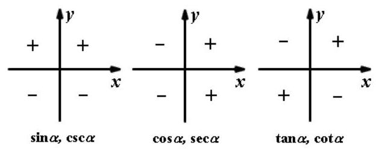

## 3、同角三角比的 3 个关系:

第 1 页共 16 页

(1)倒数关系: $\sin \alpha  \cdot  \csc \alpha  = 1$ ； $\cos \alpha  \cdot  \sec \alpha  = 1$ ； $\tan \alpha  \cdot  \cot \alpha  = 1$ ；

(2)商数关系: $\tan \alpha  = \frac{\sin \alpha }{\cos \alpha }\left( {\cos \alpha  \neq  0}\right)$ ; $\cot \alpha  = \frac{\cos \alpha }{\sin \alpha }\left( {\sin \alpha  \neq  0}\right)$ ;

(3)平方关系: ${\sin }^{2}\alpha  + {\cos }^{2}\alpha  = 1$ ; $1 + {\tan }^{2}\alpha  = {\sec }^{2}\alpha$ ; $1 + {\cot }^{2}\alpha  = {\csc }^{2}\alpha$ .

## 4、这些关系式还可以如图样加强形象记忆:

(1)对角线上两个函数的乘积为 1(倒数关系)。

(2)任一角的函数等于与其相邻的两个函数的积(商数关系)。

(3)阴影部分，顶角两个函数的平方和等于底角函数的平方(平方关系)。

注意:1)“同角”的概念与角的表达形式无关，如: ${\sin }^{2}{3\alpha } + {\cos }^{2}{3\alpha } = 1,\frac{\sin \frac{\alpha }{2}}{\cos \frac{\alpha }{2}} = \tan \frac{\alpha }{2}$ 。

2)上述关系(公式)都必须在定义域允许的范围内成立。

3)由一个角的任一三角函数值可求出这个角的其余各三角函数值，且因为利用“平方关系”公式，最终需求平方根, 会出现两解, 因此应尽可能少用, 若使用时, 要注意讨论符号。

## 5、诱导公式:4 个同名 2 个异名

6、两角和差公式与辅助角公式

7、二倍角与半倍角公式

## 例题精讲

【例 1】某中学开展劳动实习，学生加工制作零件，零件的截面如图所示， ${O}_{1}$ 为圆孔及轮廓圆弧 ${AB}$ 所在圆的圆心, ${O}_{2}$ 为圆弧 ${CD}$ 所在圆的圆心,点 $\mathrm{A}$ 是圆弧 ${AB}$ 与直线 ${AC}$ 的切点,点 $B$ 是圆弧 ${AB}$ 与直线 ${BD}$ 的切点, 点 $C$ 是圆弧 ${CD}$ 与直线 ${AC}$ 的切点,点 $D$ 是圆弧 ${CD}$ 与直线 ${BD}$ 的切点, ${O}_{1}{O}_{2} = {18}\mathrm{\;{cm}}, A{O}_{1} = 6\mathrm{\;{cm}}$ , $C{O}_{2} = {15}\mathrm{\;{cm}}$ ，圆孔 ${O}_{1}$ 的半径为 $3\mathrm{\;{cm}}$ ，则图中阴影部分的的面积为___ $c{m}^{2}$ .

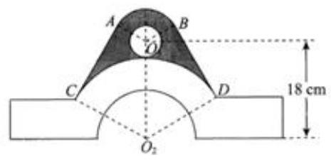

【例 2】已知 ${S}_{n}$ 为 $\left\{  {a}_{n}\right\}$ 的前 $n$ 项和,若 ${a}_{n}\left( {4 + \cos {n\pi }}\right)  = n\left( {2 - \cos {n\pi }}\right)$ ,则 ${S}_{88}$ 等于___.

【例 3】利用辅助角公式时 $\frac{\sqrt{3}}{2}\sin A - \frac{3}{2}\cos A = \sqrt{3}\sin \left( {A - \frac{\pi }{3}}\right)$ ,容易错解为 $\sqrt{3}\sin \left( {A - \frac{\pi }{6}}\right)$ . 提鞋公式也叫李善兰辅助角公式,其正弦型如下: $a\sin x + b\cos x = \sqrt{{a}^{2} + {b}^{2}}\sin \left( {x + \varphi }\right)$ , $- \pi  < \varphi  \leq  \pi$ ，下列判断错误的是( )

A. 当 $a > 0, b > 0$ 时,辅助角 $\varphi  = \arctan \frac{b}{a}$

B. 当 $a > 0, b < 0$ 时,辅助角 $\varphi  = \arctan \frac{b}{a} + \pi$

C. 当 $a < 0, b > 0$ 时,辅助角 $\varphi  = \arctan \frac{b}{a} + \pi$

D. 当 $a < 0, b < 0$ 时,辅助角 $\varphi  = \arctan \frac{b}{a} - \pi$

【例 4】已知 $\theta  > 0$ ,对任意 $n \in  {\mathbf{N}}^{ * }$ ,总存在实数 $\varphi$ ,使得 $\cos \left( {{n\theta } + \varphi }\right)  < \frac{\sqrt{3}}{2}$ ,则 $\theta$ 的最小值是___

【例 5】设圆 $O$ 的半径为 2,点 $P$ 为圆周上给定一点,如图,放置边长为 2 的正方形 ${ABCD}$ (实线所示,正方形的顶点 $\mathrm{A}$ 与点 $P$ 重合,点 $B$ 在圆周上). 现将正方形 ${ABCD}$ 沿圆周按顺时针方向连续滚动,当点 $\mathrm{A}$ 首次回到点 $P$ 的位置时,点 $\mathrm{A}$ 所走过的路径的长度为 ( )

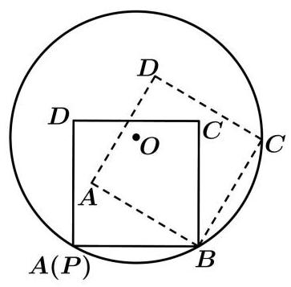

A. $\left( {1 - 2\sqrt{2}}\right) \pi$ B. $\left( {2 + \sqrt{2}}\right) \pi$ C. ${4\pi }$

D. $\left( {3 + \frac{\sqrt{2}}{2}}\right) \pi$

## 巩固训练

1、已知角 $\alpha ,\beta$ 的顶点都为坐标原点，始边都与 $x$ 轴的非负半轴重合，且都为第一象限的角， $\alpha ,\beta$ 终边上分别有点 $A\left( {1, a}\right) , B\left( {2, b}\right)$ ,且 $\alpha  = {2\beta }$ ,则 $\frac{1}{a} + b$ 的最小值为

A. 1 B. $\sqrt{2}$ C. $\sqrt{3}$ D. 2

2、已知 $f\left( x\right)$ 是定义域为 $R$ 的单调函数,且对任意实数 $x$ ,都有 $f\left\lbrack  {f\left( x\right)  + \frac{3}{{4}^{x} + 1}}\right\rbrack   = \frac{2}{5}$ ,则 $f\left( {{\log }_{2}\sin \frac{17\pi }{6}}\right)  =$ ___.

3、已知函数 $f\left( x\right)  = \left\{  {\begin{array}{l} {x}^{2} + \sin \left( {x + \frac{\pi }{3}}\right) , x > 0 \\   - {x}^{2} + \cos \left( {x + \alpha }\right) , x < 0 \end{array},\alpha  \in  \lbrack 0,{2\pi })}\right.$ 是奇函数,则 $\alpha  =$ ___.

4、在直角坐标平面 ${xOy}$ 中,已知两定点 ${F}_{1}\left( {-2,0}\right)$ 与 ${F}_{2}\left( {2,0}\right)$ 位于动直线 $l : {ax} + {by} + c = 0$ 的同侧,设集合 $P = \{ l \mid$ 点 ${F}_{1}$ 与点 ${F}_{2}$ 到直线 $l$ 的距离之差等于 $2\} , Q = \left\{  {\left( {x, y}\right)  \mid  {x}^{2} + {y}^{2} \leq  4, x, y \in  R}\right\}$ ,记 $S = \{ \left( {x, y}\right)  \mid  \left( {x, y}\right)  \notin  l, l \in  P\} , T = \{ \left( {x, y}\right)  \mid  \left( {x, y}\right)  \in  Q \cap  S\}$ ,则由 $T$ 中的所有点所组成的图形的面积是___

5、若函数 $f\left( x\right)  = 3\sin {\omega x} + 4\cos {\omega x}\left( {0 \leq  x \leq  \frac{\pi }{3},\omega  > 0}\right)$ 的值域为 $\left\lbrack  {4,5}\right\rbrack$ ，则 $\cos \frac{\omega \pi }{3}$ 的取值范围为( )

A. $\left\lbrack  {\frac{7}{25},\frac{4}{5}}\right\rbrack$ B. $\left\lbrack  {\frac{7}{25},\frac{3}{5}}\right\rbrack$

C. $\left\lbrack  {-\frac{7}{25},\frac{4}{5}}\right\rbrack$ D. $\left\lbrack  {-\frac{7}{25},\frac{3}{5}}\right\rbrack$

6、下列六个命题(1)不存在无穷多个角 $\alpha$ 和 $\beta$ ，使得 $\sin \left( {\alpha  + \beta }\right)  = \sin \alpha \cos \beta  - \cos \alpha \sin \beta$

(2)存在这样的角 $\alpha$ 和 $\beta$ ，使得 $\cos \left( {\alpha  + \beta }\right)  = \cos \alpha \cos \beta  + \sin \alpha \sin \beta$

(3)对任意角 $\alpha$ 和 $\beta$ ,都有 $\cos \left( {\alpha  + \beta }\right)  = \cos \alpha \cos \beta  - \sin \alpha \sin \beta$

(4)不存在这样的角 $\alpha$ 和 $\beta$ ，使得 $\sin \left( {\alpha  + \beta }\right)  \neq  \sin \alpha \cos \beta  + \cos \alpha \sin \beta$

(5) 不存在这样的角 $\alpha$ 和 $\beta$ ,使得 $\tan \left( {\alpha  + \beta }\right)  = \frac{\tan \alpha  - \tan \beta }{1 + \tan \alpha  \cdot  \tan \beta }$

(6)对任意角 $\alpha$ 和 $\beta$ ，都有 $\tan \left( {\alpha  + \beta }\right)  = \frac{\tan \alpha  + \tan \beta }{1 - \tan \alpha  \cdot  \tan \beta }$

其中假命题的个数是( )

A. 1 B. 2 C. 3 D. 4

7、已知函数 $f\left( x\right)  = {x}^{3} + \frac{1}{{3}^{x} - 1} + 1$ ，若 $f\left( {\sin \left( {\frac{\pi }{6} - \alpha }\right) }\right)  = \frac{1}{2019}$ ，则 $f\left( {\cos \left( {\alpha  - \frac{2\pi }{3}}\right) }\right)  =$ ___.

## (二) 解三角形

## 知识梳理

## 一、正余弦定理

(1)正弦定理: $\frac{a}{\sin A} = \frac{b}{\sin B} = \frac{c}{\sin C} = {2R}$

$$
{a}^{2} = {b}^{2} + {c}^{2} - {2bc} \cdot  \cos A,
$$

(2)余弦定理: ${b}^{2} = {c}^{2} + {a}^{2} - {2ac}\cos B$ ，；

$$
{c}^{2} = {a}^{2} + {b}^{2} - {2ab}\cos C.
$$

## 二、三角形面积公式

(1) ${S}_{\bigtriangleup {ABC}} = \frac{1}{2}{ab}\sin C = \frac{1}{2}{ac}\sin B = \frac{1}{2}{bc}\sin A$

(2) $S = \frac{1}{2}a \cdot  {h}_{a}\left( {h}_{a}\right.$ 表示 $a$ 边上的高 $)$

(3) $S = \frac{1}{2}{ab}\sin C = \frac{1}{2}{ac}\sin B = \frac{1}{2}{bc}\sin A = \frac{abc}{4R}\left( {R\text{ 为外接圆半径 }}\right)  = 2{R}^{2}\sin A\sin B\sin C$

## 例题精讲

【例 6】如图,在平面四边形 ${ABCD}$ 中, ${AD} = 1,{BD} = \frac{2\sqrt{6}}{3},{AB} \bot  {AC},{AC} = \sqrt{2}{AB}$ ,则 ${CD}$ 的最小值为___.

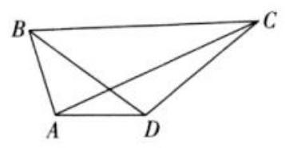

【例 7】在 $\bigtriangleup  {ABC}$ 中，已知角 $A = \frac{2\pi }{3}$ ，角 $\mathrm{A}$ 的平分线 ${AD}$ 与边 ${BC}$ 相交于点 $D$ ， ${AD} = 2$ . 则 ${AB} + {2AC}$ 的最小值. 为___.

【例 8】如图,在直角三角形 ${ABC}$ 中, $A = \frac{\pi }{2},{AB} = 3,{AC} = 4, D\text{ 、 }E\text{ 、 }F$ 分别在线段 ${AC}\text{ 、 }{AB}\text{ 、 }{BC}$ 上,且 $D$ 为 ${AC}$ 的中点， ${DE} \bot  {DF}$ ，设 $\angle {ADE} = \alpha$ .

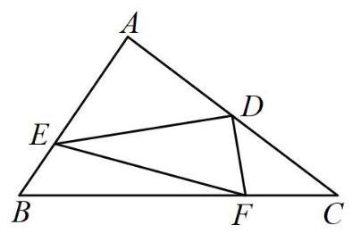

(1)求 $\sin \angle {DFC}$ (用 $\alpha$ 表示)；

(2)求三角形 ${DEF}$ 面积的最小值.

【例 9】如图,悬崖 ${DE}$ 的右侧有一条河,左侧一点 $\mathrm{A}$ 与河对岸 $B, F$ 点、悬崖底部 $E$ 点在同一直线上，一架带有照相机功能的无人机从 $\mathrm{A}$ 点沿 ${AD}$ 直线飞行 200 米到达悬崖顶部 $D$ 点后,然后再飞到 $F$ 点的正上方垂直飞行对线段 ${EB}$ 拍照. 其中从 $\mathrm{A}$ 处看悬崖顶部 $D$ 的仰角为 ${60}^{ \circ  },\sin \angle {ABD} = \frac{\sqrt{21}}{7},{BF} = {100}$ 米,当无人机在 $C$ 点处获得最佳拍照角度时 (即 $\angle {BCE}$ 最大),该无人机离底面的高度为 ( )

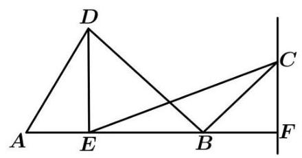

A. ${50}\sqrt{2}$ 米 B. ${50}\sqrt{3}$ 米 C. ${100}\sqrt{3}$ 米 D. 200 米

【例 10】中国天眼 FAST (500 米口径球面射电天文望远镜), 于 2016 年 9 月 25 日落成启用.天眼是当之无愧的国之重器，它的灵敏度是世界上排名第二的美国阿雷西博望远镜的三倍左右，它的直径达到了 500 米， 它的反射面积相当于 30 个足球场的大小.如图是中国天眼的剖面，当我们观测某个方向的天体目标 ${S}_{1}$ 时，在天体 ${S}_{1}$ 和球心 $O$ 到反射面点 $M$ 的连线上选取一个点 $F$ 作为抛物面的焦点,把以点 $M$ 为中心周边的镜面通过下拉索拉动，使球面变形成抛物面(抛物面是指抛物线绕着他的对称轴旋转 ${180}^{ \circ  }$ 所得到的面)，这个抛物面把天体目标发出的平行光聚焦到焦点 $F$ 上，我们的接收机(馈源)就安装在这个焦点 $F$ 上，可见虽然天眼是一个球面形状,但观测时球面已经变成抛物面了. 若 ${AB}$ 垂直 ${MF}$ 并交于点 $N,{AB} = {300}$ 米, ${MF} = {125}$ 米, 则 ${MN} =$ ___米， $\cos \angle {AFB} =$ ___.

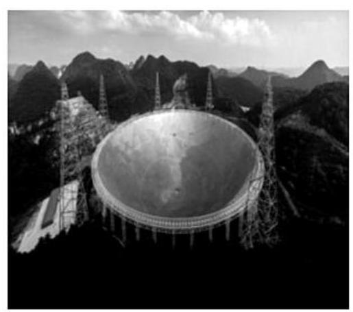

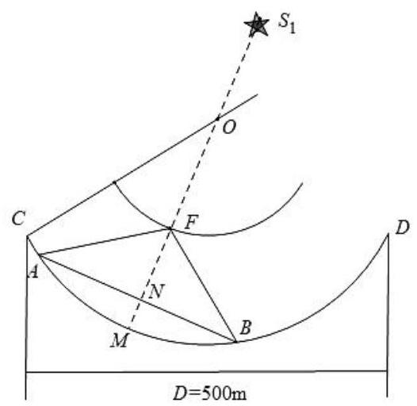

## 巩固训练

1、在 $\bigtriangleup  {ABC}$ 中， $\tan A + \tan B + \tan C = \tan B \cdot  \tan C$ ，则 $\frac{B + C}{A} =$ ___.

2、在三角形 ${ABC}$ 中,已知角 $A = \frac{5\pi }{6}$ ，角 $A$ 的平分线 ${AD}$ 与边 ${BC}$ 相交于点 $D$ ， ${AD} = 2$ . 则 ${AB} + {AC}$ 的最小值为___.

3、如图，在 $\bigtriangleup  {ABC}$ 中， $D$ ， $E$ 分别为边 ${AB}$ ， ${AC}$ 上的点，满足 ${BC} = 3\sqrt{21}$ ， ${BD} = 7$ ， $\tan \angle {BDC} =  - 3\sqrt{3}$ ， $\angle {DEC} = \frac{\pi }{3}$ .

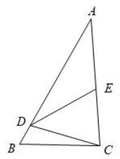

(1)求 $\angle {BCD}$ 的大小；

(2)求 ${CE} + {DE}$ 的最大值.

4、已知 $\bigtriangleup  {ABC}$ 中，内角 $A, B, C$ 的对边分别为 $a, b, c$ ，且满足 $b\sin \left( {\frac{p}{2} - C}\right)  = \frac{1}{2}{ab} + c\cos \left( {p - B}\right)$ .

(1)求 $b$ 的值；

(2)若 $B = \frac{\pi }{3}$ ，求 $\bigtriangleup  {ABC}$ 面积的最大值.

## (三)三角函数图像与性质

## 知识梳理

三角函数的图像与性质

<table id="cross-table-1"><tr><td>$y = \sin x$</td><td>$y = \cos x$</td><td>$y = \tan x$</td></tr><tr><td>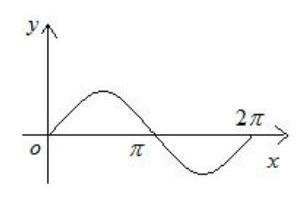</td><td>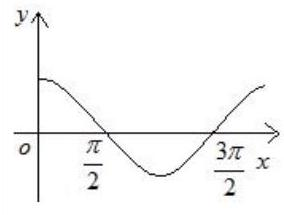</td><td>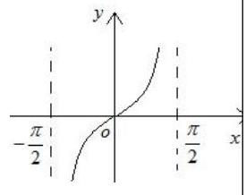</td></tr><tr><td>$R$</td><td>$R$</td><td>$\{ x \mid  x \in  R,$    $x \neq  {k\pi } + \frac{\pi }{2}, k \in  Z\}$</td></tr><tr><td>$\left\lbrack  {-1,1}\right\rbrack$</td><td>$\left\lbrack  {-1,1}\right\rbrack$</td><td>$R$</td></tr><tr><td>$\left| {\sin x}\right|  \leq  1$</td><td>$\left| {\cos x}\right|  \leq  1$</td><td>无</td></tr><tr><td>${2\pi }$</td><td>${2\pi }$</td><td>$\pi$</td></tr><tr><td>增区间:    $\left\lbrack  {{2k\pi } - \frac{\pi }{2},{2k\pi } + \frac{\pi }{2}}\right\rbrack$    减区间:    $\left\lbrack  {{2k\pi } + \frac{\pi }{2},{2k\pi } + \frac{3\pi }{2}}\right\rbrack$    $k \in  Z$</td><td>增区间:    $\left\lbrack  {{2k\pi } - \pi ,{2k\pi }}\right\rbrack$ 减    区间:    $\left\lbrack  {{2k\pi } - \pi ,{2k\pi }}\right\rbrack \; k \in  Z$</td><td>增区间:    $\left( {{k\pi } - \frac{\pi }{2},{k\pi } + \frac{\pi }{2}}\right)$    $k \in  Z$</td></tr><tr><td>奇</td><td>偶</td><td>奇</td></tr><tr><td>$x = \frac{\pi }{2} + {2k\pi }$ 时,    ${y}_{\max } = 1$    $x =  - \frac{\pi }{2} + {2k\pi }$ 时,    ${y}_{\min } =  - 1$    $k \in  Z$</td><td>$x = {2k\pi }$ 时, ${y}_{\max } = 1 \; x = \pi  + {2k\pi }$ 时, ${y}_{\min } =  - 1 \; k \in  Z$</td><td>无</td></tr><tr><td>$x = \frac{\pi }{2} + {k\pi }, k \in  Z$</td><td>$x = {k\pi }, k \in  Z$</td><td>无</td></tr><tr><td>$\left( {{k\pi },0}\right) , k \in  Z$</td><td>$\left( {\frac{\pi }{2} + {k\pi },0}\right)$    $k \in  Z$</td><td>$\left( {\frac{k\pi }{2},0}\right) , k \in  Z$</td></tr></table>

9、函数 $y = A\sin \left( {{\omega x} + \varphi }\right)$ 的图像

一般的,函数 $y = A\sin \left( {{\omega x} + \varphi }\right)$ (其中 $A > 0,\omega  > 0$ ) 的图像可由 “五点法” 或图像变换法得到.

(1)“五点法”:先求出当 ${\omega x} + \varphi$ 为 $0,\frac{\pi }{2},\pi ,\frac{3}{2}\pi ,{2\pi }$ 时相对应的 $y$ 值，其次分别求出对应的 $x$ 值，再列表、描点、连线,最后根据函数的周期性,将图像向左、右无限扩展,即可得 $y = A\sin \left( {{\omega x} + \varphi }\right)$ 在 $R$ 上图像.

(2)图像变换法:一般可按下述步骤进行:

$y = \sin x\xrightarrow[]{\text{ 振幅变换 }y = A\sin x}y = A\sin x\xrightarrow[]{\text{ 平移变换 }y}y = A\sin \left( {x + \varphi }\right) \xrightarrow[]{\text{ 周期变换 }}y = A\sin \left( {{\omega x} + \varphi }\right)$ ① 振幅变换: 当 $A > 1$ 时,图像上各点的纵坐标伸长到原来的 $A$ 倍 (横坐标不变); 当 $0 < A < 1$ 时,图像上各点的纵坐标缩短到原来的 $A$ 倍(横坐标不变).

② 平移变换:当 $\varphi  > 0$ 时，图像上所有点向左平移 $\varphi$ 个单位；当 $\varphi  < 0$ 时，图像上所有点向右平移 $\left| \varphi \right|$ 个单位.

③周期变换:当 $\omega  > 1$ 时，图像上各点的横坐标缩短为原来的 $\frac{1}{\omega }$ 倍(纵坐标不变)；当 $0 < \omega  < 1$ 时，图像上各点的横坐标伸长为原来的 $\frac{1}{\omega }$ 倍(纵坐标不变).

## 例题精讲

【例 11】(1)将函数 $f\left( x\right)  = 2\sin {2x}$ 的图像向右平移 $\varphi \left( {0 < \varphi  < \pi }\right)$ 个单位后得到函数 $g\left( x\right)$ 的图像. 若对满足 $\left| {f\left( {x}_{1}\right)  - g\left( {x}_{2}\right) }\right|  = 4$ 的 ${x}_{1}\text{ 、 }{x}_{2}$ ,有 $\left| {{x}_{1} - {x}_{2}}\right|$ 的最小值为 $\frac{\pi }{6}$ . 则 $\varphi  =$ (   )

A、 $\frac{\pi }{3}$ ; B、 $\frac{\pi }{6}$ ; C、 $\frac{\pi }{3}$ 或 $\frac{2\pi }{3}$ ； D、 $\frac{\pi }{6}$ 或 $\frac{5\pi }{6}$ .

(2)设 ${a}_{n} = \frac{1}{n}\sin \frac{n\pi }{25},{S}_{n} = {a}_{1} + {a}_{2} + \ldots  + {a}_{n}\;\left( {n \in  {N}^{ * }}\right)$ ，在 ${S}_{1},{S}_{2},\ldots ,{S}_{100}$ 中，正数的个数是( )

A. 25 B. 50 C. 75 D. 100

(3)将函数 $f\left( x\right)  = 2\sin \left( {{3x} + \frac{\pi }{4}}\right)$ 的图像向下平移 1 个单位，得到 $g\left( x\right)$ 的图像，若 $g\left( {x}_{1}\right)  \cdot  g\left( {x}_{2}\right)  = 9$ ，其中 ${x}_{1},{x}_{2} \in  \left\lbrack  {0,{4\pi }}\right\rbrack$ ，则 $\frac{{x}_{1}}{{x}_{2}}$ 的最大值为( )

A. 9

B. $\frac{37}{5}$ C. 3 D. 1

【例 12】(1)已知函数 $f\left( x\right)  = 2\sin \left( {\omega x}\right)$ ,其中常数 $\omega  > 0$ ,若 $y = f\left( x\right)$ 在 $\left\lbrack  {-\frac{\pi }{4},\frac{2\pi }{3}}\right\rbrack$ 上单调递增,则 $\omega$ 的取值范围___.

(2)设定义在 $R$ 上的函数 $f\left( x\right)$ 是最小正周期为 ${2\pi }$ 的偶函数，当 $x \in  \left\lbrack  {0,\pi }\right\rbrack$ 时， $0 < f\left( x\right)  < 1$ ，且在 $\left\lbrack  {0,\frac{\pi }{2}}\right\rbrack$ 上单调递减,在 $\left\lbrack  {\frac{\pi }{2},\pi }\right\rbrack$ 上单调递增,则函数 $y = f\left( x\right)  - \sin x$ 在 $\left\lbrack  {-{10\pi },{10\pi }}\right\rbrack$ 上的零点个数为

(3)已知函数 $f\left( x\right)  = \sin \left( {{\omega x} + \varphi }\right) \left( {\omega  > 0,\left| \varphi \right|  \leq  \frac{\pi }{2}}\right) , x =  - \frac{\pi }{4}$ 为 $f\left( x\right)$ 的零点， $x = \frac{\pi }{4}$ 为 $y = f\left( x\right)$ 图像的对称轴,且 $f\left( x\right)$ 在 $\left( {\frac{\pi }{18},\frac{5\pi }{36}}\right)$ 单调,则 $\omega$ 的最大值为( )

A、 11 B、 9 C、 7 D、 5

(4)已知 $f\left( x\right)  = \sin \left( {{\omega x} + \frac{\pi }{3}}\right) \left( {\omega  > 0}\right)$ ， $f\left( \frac{\pi }{6}\right)  = f\left( \frac{\pi }{3}\right)$ ，且 $f\left( x\right)$ 在区间 $\left( {\frac{\pi }{6},\frac{\pi }{3}}\right)$ 有最小值，无最大值，则 $\omega  =$ ___.

【例 13】已知函数 $f\left( x\right)  = A\sin \left( {{\omega x} - \frac{\pi }{6}}\right) \left( {A > 0,\omega  > 0}\right)$ ,直线 $y = 1$ 与 $f\left( x\right)$ 的图象在 $y$ 轴右侧交点的横坐标依次为 ${a}_{1}\text{ 、 }{a}_{2}\text{ 、 }\cdots \text{ 、 }{a}_{k}\text{ 、 }{a}_{k + 1}\text{ 、 }\cdots$ ,(其中 $k \in  {\mathbf{N}}^{ * }$ ),若 $\frac{{a}_{{2k} + 1} - {a}_{2k}}{{a}_{2k} - {a}_{{2k} - 1}} = 2$ ,则 $A =$ (   )

A. $\frac{2\sqrt{3}}{3}$ B. 2 C. $\sqrt{2}$ D. $2\sqrt{3}$

【例 14】已知函数 $f\left( x\right)  = a\sin {\omega x} + 2\sin \left( {{\omega x} + \frac{\pi }{3}}\right)  + b$ 的图象的相邻两个对称轴之间的距离为 $\frac{\pi }{2}$ ，且 $\forall x \in  R$ 恒有 $f\left( x\right)  \leq  f\left( \frac{\pi }{6}\right)$ ,若存在 ${x}_{1},{x}_{2},{x}_{3} \in  \left\lbrack  {0,\frac{\pi }{2}}\right\rbrack  , f\left( {x}_{1}\right)  + f\left( {x}_{2}\right)  \leq  f\left( {x}_{3}\right)$ 成立,则 $b$ 的取值范围为___.

## 巩固训练

1、设函数 $f\left( x\right)  = 2\sin \left( {{\omega x} + \varphi }\right)  - 1\left( {\omega  > 0,0 \leq  \varphi  \leq  \frac{\pi }{2}}\right)$ 的最小正周期为 ${4\pi }$ ，且 $f\left( x\right)$ 在 $\left\lbrack  {0,{5\pi }}\right\rbrack$ 内恰有 3 个零点，则 $\varphi$ 的取值范围是( )

A. $\left\lbrack  {0,\frac{\pi }{3}}\right\rbrack   \cup  \left\{  \frac{5\pi }{12}\right\}$ B. $\left\lbrack  {0,\frac{\pi }{4}}\right\rbrack   \cup  \left\lbrack  {\frac{\pi }{3},\frac{\pi }{2}}\right\rbrack$

C. $\left\lbrack  {0,\frac{\pi }{6}}\right\rbrack   \cup  \left\{  \frac{5\pi }{12}\right\}$ D. $\left\lbrack  {0,\frac{\pi }{6}}\right\rbrack   \cup  \left\lbrack  {\frac{\pi }{3},\frac{\pi }{2}}\right\rbrack$

2、如图,半径为 1 的半圆 $O$ 与等边三角形 ${ABC}$ 夹在两平行线 ${l}_{1},{l}_{2}$ 之间, ${l}_{1}//{l}_{2}, l$ 与半圆相交于 $F\text{ 、 }G$ 两点, 与三角形 ${ABC}$ 两边相交于点 $E\text{ 、 }D$ ,设弧 ${FG}$ 的长为 $x\left( {0 < x < \pi }\right) , y = {EB} + {BC} + {CD}$ ,若 $l$ 从 ${l}_{1}$ 平行移动到 ${l}_{2}$ , 则函数 $y = f\left( x\right)$ 的图像大致是( )

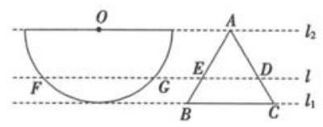

A.

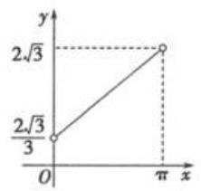

B.

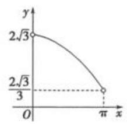

C.

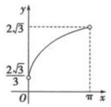

D.

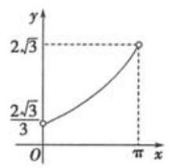

3、已知 $f\left( x\right)  = 3\sin \left( {{2x} + \varphi }\right) \;\left( {\varphi  \in  \mathbf{R}}\right)$ 既不是奇函数也不是偶函数,若 $y = f\left( {x + m}\right)$ 的图像关于原点对称, $y = f\left( {x + n}\right)$ 的图像关于 $y$ 轴对称,则 $\left| m\right|  + \left| n\right|$ 的最小值为 ( )

A. $\pi$

B. $\frac{\pi }{2}$ C. $\frac{\pi }{4}$ D. $\frac{\pi }{8}$

4、已知函数 $f\left( x\right)  = \sin \left( {\cos x}\right)  + \cos \left( {\sin x}\right)$ ，下列关于该函数结论正确的是(多选题)( )

A. $f\left( x\right)$ 的图象关于直线 $x = \frac{\pi }{4}$ 对称 B. $f\left( x\right)$ 的一个周期是 ${2\pi }$

C. $f\left( x\right)$ 的最小值是 -2

D. $f\left( x\right)$ 在区间 $\left( {0,\frac{\pi }{2}}\right)$ 是减函数

5、已知直线 $y = m$ 与函数 $f\left( x\right)  = \sin \left( {{\omega x} + \frac{\pi }{4}}\right)  + \frac{3}{2}\left( {\omega  > 0}\right)$ 的图象相交,若自左至右的三个相邻交点 $\mathrm{A}, B, C$ 满足 $2\left| {AB}\right|  = \left| {BC}\right|$ ,则实数 $m =$ ___.

6、已知函数 $f\left( x\right)  = 4\sin x\cos \left( {x + \frac{\pi }{3}}\right)  + \sqrt{3}$ ,

(1)化简 $f\left( x\right)$ 到 $y = A\sin \left( {{\omega x} + \varphi }\right)  + B\left( {A > 0,\omega  > 0,\left| \varphi \right|  < \frac{\pi }{2}}\right)$ ,并求最小正周期;

(2)求函数 $f\left( x\right)$ 在区间 $\left\lbrack  {-\frac{\pi }{4},\frac{\pi }{6}}\right\rbrack$ 上的单调减区间；

(3)将函数 $f\left( x\right)$ 图像向右移动 $\frac{\pi }{6}$ 个单位，再将所得图像上各点的横坐标缩短到原来的 $a\left( {0 < a < 1}\right)$ 倍得到 $y = g\left( x\right)$ 的图像,若 $y = g\left( x\right)$ 在区间 $\left\lbrack  {-1,1}\right\rbrack$ 上至少有 100 个最大值,求 $a$ 的取值范围.

## (四) 反三角与三角方程

## 知识梳理

## 反三角函数的图像和性质

<table><tr><td>反三角函数</td><td>$y = \arcsin x$</td><td>$y = \arccos x$</td><td>$y = \arctan x$</td></tr><tr><td>图像</td><td>$y = \arcsin x$    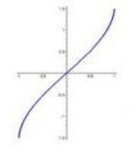</td><td>$y = \arccos x$    </td><td>$y = \arctan x$    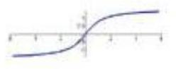</td></tr><tr><td>定义域</td><td>$\left\lbrack  {-1,1}\right\rbrack$</td><td>$\left\lbrack  {-1,1}\right\rbrack$</td><td>$\left( {-\infty , + \infty }\right)$</td></tr><tr><td>值域</td><td>$\left\lbrack  {-\frac{\pi }{2},\frac{\pi }{2}}\right\rbrack$</td><td>$\left\lbrack  {0,\pi }\right\rbrack$</td><td>$\left( {-\frac{\pi }{2},\frac{\pi }{2}}\right)$</td></tr><tr><td>奇偶性</td><td>奇函数</td><td>非奇非偶</td><td>奇函数</td></tr><tr><td>单调性</td><td>增函数</td><td>减函数</td><td>增函数</td></tr></table>

## 【提醒】常用关系式

(1) $\arcsin \left( {-x}\right)  =  - \arcsin x, x \in  \left\lbrack  {-1,1}\right\rbrack  \;\sin \left( {\arcsin x}\right)  = x, x \in  \left\lbrack  {-1,1}\right\rbrack$

$\arcsin \left( {\sin x}\right)  = x, x \in  \left\lbrack  {-\frac{\pi }{2},\frac{\pi }{2}}\right\rbrack$

(2) $\arccos \left( {-x}\right)  = \pi  - \arccos x, x \in  \left\lbrack  {-1,1}\right\rbrack  \cos \left( {\arccos x}\right)  = x, x \in  \left\lbrack  {-1,1}\right\rbrack$

$\arccos \left( {\cos x}\right)  = x, x \in  \left\lbrack  {0,\pi }\right\rbrack$

(3) $\arctan \left( {-x}\right)  =  - \arctan x, x \in  R\tan \left( \arctan \right)  = x, x \in  R$

$\arctan \left( {\tan x}\right)  = x, x \in  \left( {-\frac{\pi }{2},\frac{\pi }{2}}\right)$

## 最简三角方程的解集, 见下表

<table id="cross-table-2"><tr><td colspan="2">方程</td><td>方程的解集</td></tr><tr><td rowspan="3">$\sin x = a$</td><td>$\left| a\right|  > 1$</td><td>$\phi$</td></tr><tr><td>$\left| a\right|  = 1$</td><td>$\left\{  {x\left| {\;x = {2k\pi } + \arcsin a}\right. , k \in  Z}\right\}$</td></tr><tr><td>$\left| a\right|  < 1$</td><td>$\left\{  {x\left| {\;x = {k\pi } + {\left( -1\right) }^{k}\arcsin a}\right. , k \in  Z}\right\}$</td></tr><tr><td rowspan="3">$\cos x = a$</td><td>$\left| a\right|  > 1$</td><td>$\phi$</td></tr><tr><td>$\left| a\right|  = 1$</td><td>$\left\{  {x\left| {\;x = {2k\pi } + \arccos a}\right. , k \in  Z}\right\}$</td></tr><tr><td>$\left| a\right|  < 1$</td><td>$\left\{  {x\left| {\;x = {2k\pi } \pm  \arccos a}\right. , k \in  Z}\right\}$</td></tr><tr><td colspan="2">$\tan x = a$</td><td>$\left\{  {x\left| {\;x = {k\pi } + \arctan a}\right. , k \in  Z}\right\}$</td></tr></table>

## 例题精讲

【例 15】设 ${a}_{1}\text{ 、 }{a}_{2} \in  \mathbf{R}$ ,且 $\frac{1}{2 + \sin {\alpha }_{1}} + \frac{1}{2 + \sin \left( {2{\alpha }_{2}}\right) } = 2$ ,则 $\left| {{10\pi } - {\alpha }_{1} - {\alpha }_{2}}\right|$ 的最小值等于___

【例 16】设 $a, b \in  R, c \in  \lbrack 0,{2\pi })$ ,若对任意实数 $x$ 都有 $3\sin \left( {{2x} - \frac{\pi }{6}}\right)  = a\sin \left( {{bx} + c}\right)$ ,则满足条件的 $c$ 的所有取值的和为___.

【例 17】已知函数 $f\left( x\right)  = \cos x$ ,若对任意实数 ${x}_{1},{x}_{2}$ ,方程 $\left| {f\left( x\right)  - f\left( {x}_{1}\right) }\right|  + \left| {f\left( x\right)  - f\left( {x}_{2}\right) }\right|  = m\left( {m \in  R}\right)$ 有解,

## 巩固训练

1、若函数 $f\left( x\right)  = \cos {mx}\left( {m > 0}\right)$ 在区间 $\left( {{2\pi },{3\pi }}\right)$ 内既没有取到最大值 1，也没有取到最小值 -1，则 $m$ 的取值范围为___

2、函数 $y = \pi  - 3\arcsin \frac{1}{2}\left( {{x}^{2} + {4x} + 5}\right)$ 的值域为___.

3、已知数列 ${a}_{n} = \arcsin \left( {\sin {n}^{ \circ  }}\right) , n \in  {N}^{ * },\left\{  {a}_{n}\right\}$ 的前 $n$ 项和为 ${S}_{n}$ ,则当 $1 \leq  n \leq  {2016}$ 时,( )

A. ${S}_{1980} \leq  {S}_{n} \leq  {S}_{90}$ B. ${S}_{1800} \leq  {S}_{n} \leq  {S}_{180}$

C. ${S}_{1980} \leq  {S}_{n} \leq  {S}_{180}$ D. ${S}_{2016} \leq  {S}_{n} \leq  {S}_{90}$

4、设函数 $f\left( x\right)  = m\cos \left( {x + \alpha }\right)  + n\cos \left( {x + \beta }\right)$ ,其中 $m, n,\alpha ,\beta$ 为已知实常数, $x \in  \mathbf{R}$ ,则下列命题中错误的是 ( )

A. 若 $f\left( 0\right)  = f\left( \frac{\pi }{2}\right)  = 0$ ,则 $f\left( x\right)  = 0$ 对任意实数 $x$ 恒成立;

B. 若 $f\left( 0\right)  = 0$ ，则函数 $f\left( x\right)$ 为奇函数；

C. 若 $f\left( \frac{\pi }{2}\right)  = 0$ ，则函数 $f\left( x\right)$ 为偶函数；

D. 当 ${f}^{2}\left( 0\right)  + {f}^{2}\left( \frac{\pi }{2}\right)  \neq  0$ 时,若 $f\left( {x}_{1}\right)  = f\left( {x}_{2}\right)  = 0$ ,则 ${x}_{1} - {x}_{2} = {2k\pi }\;\left( {k \in  \mathbf{Z}}\right)$ .

5、已知 $A = \{ y \mid  y = \sin \left( {{\omega n} + \varphi }\right) , n \in  Z\}$ ，若存在 $\varphi$ 使得集合 A 中恰有 3 个元素，则 $\omega$ 的取值不可能是( )

A. $\frac{2\pi }{7}$ B. $\frac{2\pi }{5}$ C. $\frac{\pi }{2}$ D. $\frac{2\pi }{3}$
