## (一) 三角比

## 第 7 课:三角专题

<table><tr><td>教学目标</td><td>1、熟练掌握三角恒等式及基本应用;   2、灵活应用正余弦定理解三角形及化简求值计算;   3、掌握三角函数图象及性质，并应用基本性质解决问题   4、 在应用知识过程中体会三变”变角、变式、变名“等基本技巧应用，达到灵活应用能力</td></tr><tr><td>重点</td><td>1、基本恒等式记忆法及用法   2、体会角、函数名、结构、运算方式的变形, 其技巧常有差异分析、化异为同、辅助角、三角代换、和差配凑、幂指变换等.   3、加强综合分析问题的能力.</td></tr><tr><td>难 点</td><td>1、体会角、函数名、结构、运算方式的变形，其技巧常有差异分析、化异为同、辅助角、三角代换、和差配凑、幂指变换等.   2、加强综合分析问题的能力.</td></tr></table>

## 知识梳理

1、任意角 $\alpha$ 的三角比可以用其终边上的点的坐标来定义

设 $P$ 是角 $\alpha$ 终边上任意一点 (点 $P$ 不能是角的顶点),它的坐标为 $\left( {x, y}\right)$ ,则 $P$ 到坐标原点 $O$ 的距离 $r = {OP} = \sqrt{{x}^{2} + {y}^{2}}$ ,定义正弦 $\sin \alpha  = \frac{y}{r}$ ,余弦 $\cos \alpha  = \frac{x}{r}$ ,正切 $\tan \alpha  = \frac{y}{x}$ ,余切 $\cot \alpha  = \frac{x}{y}$ ,正割 $\sec \alpha  = \frac{r}{x}$ ,余割 $\csc \alpha  = \frac{r}{y}$ . 当 $\alpha  = {k\pi } + \frac{\pi }{2}, k \in  \mathbf{Z}$ 时, $\tan \alpha ,\sec \alpha$ 无意义; 当 $\alpha  = {k\pi }, k \in  \mathbf{Z}$ 时, $\cot \alpha ,\csc \alpha$ 无意义.

2、三角函数的符号:

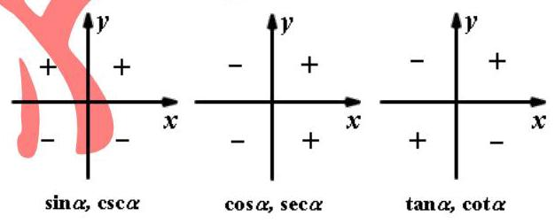

## 3、同角三角比的 3 个关系:

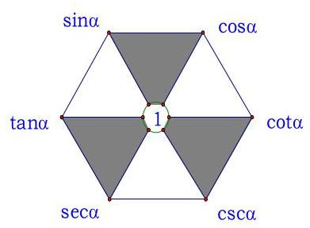

第 1 页共35页

(1)倒数关系: $\sin \alpha  \cdot  \csc \alpha  = 1$ ； $\cos \alpha  \cdot  \sec \alpha  = 1$ ； $\tan \alpha  \cdot  \cot \alpha  = 1$ ；

(2)商数关系: $\tan \alpha  = \frac{\sin \alpha }{\cos \alpha }\left( {\cos \alpha  \neq  0}\right)$ ; $\cot \alpha  = \frac{\cos \alpha }{\sin \alpha }\left( {\sin \alpha  \neq  0}\right)$ ;

(3)平方关系: ${\sin }^{2}\alpha  + {\cos }^{2}\alpha  = 1$ ; $1 + {\tan }^{2}\alpha  = {\sec }^{2}\alpha$ ; $1 + {\cot }^{2}\alpha  = {\csc }^{2}\alpha$ .

## 4、这些关系式还可以如图样加强形象记忆:

(1)对角线上两个函数的乘积为 1(倒数关系)。

(2)任一角的函数等于与其相邻的两个函数的积(商数关系)。

(3)阴影部分，顶角两个函数的平方和等于底角函数的平方(平方关系)。

注意:1)“同角”的概念与角的表达形式无关，如: ${\sin }^{2}{3\alpha } + {\cos }^{2}{3\alpha } = 1,\frac{\sin \frac{\alpha }{2}}{\cos \frac{\alpha }{2}} = \tan \frac{\alpha }{2}$ 。

2)上述关系(公式)都必须在定义域允许的范围内成立。

3)由一个角的任一三角函数值可求出这个角的其余各三角函数值，且因为利用“平方关系”公式，最终需求平方根, 会出现两解, 因此应尽可能少用, 若使用时, 要注意讨论符号。

5、诱导公式:4 个同名 2 个异名

6、两角和差公式与辅助角公式

7、二倍角与半倍角公式

## 例题精讲

【例 1】某中学开展劳动实习，学生加工制作零件，零件的截面如图所示， ${O}_{1}$ 为圆孔及轮廓圆弧 ${AB}$ 所在圆的圆心, ${O}_{2}$ 为圆弧 ${CD}$ 所在圆的圆心,点 $\mathrm{A}$ 是圆弧 ${AB}$ 与直线 ${AC}$ 的切点,点 $B$ 是圆弧 ${AB}$ 与直线 ${BD}$ 的切点, 点 $C$ 是圆弧 ${CD}$ 与直线 ${AC}$ 的切点,点 $D$ 是圆弧 ${CD}$ 与直线 ${BD}$ 的切点, ${O}_{1}{O}_{2} = {18}\mathrm{\;{cm}}, A{O}_{1} = 6\mathrm{\;{cm}}$ , $C{O}_{2} = {15}\mathrm{\;{cm}}$ ，圆孔 ${O}_{1}$ 的半径为 $3\mathrm{\;{cm}}$ ，则图中阴影部分的的面积为___ $c{m}^{2}$ .

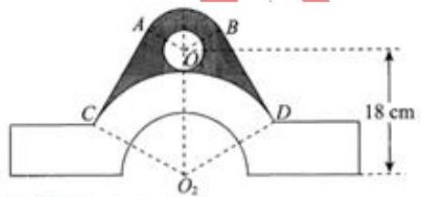

【难度】 $\star   \star   \star   \star$

【答案】 ${189}\sqrt{3} - {72\pi }$

【解析】如图所示: ${O}_{1}M \bot  C{O}_{2}$ ,则 ${O}_{2}M = 9,{O}_{1}{O}_{2} = {18},{O}_{1}M = 9\sqrt{3}$ ,

$\therefore \angle {O}_{1}{O}_{2}M = \frac{\pi }{3} \Rightarrow  \angle C{O}_{2}D = \angle A{O}_{1}B = \frac{2\pi }{3}$ ,

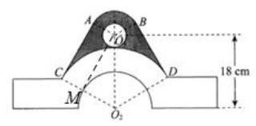

$\because S = {S}_{\text{ 梯形 }A{O}_{1}{O}_{2}C} + {S}_{\text{ 梯形 }B{O}_{1}{O}_{2}D} - {S}_{\text{ 扇形 }C{O}_{2}D} - {S}_{\text{ 圆 }{O}_{1}} + {S}_{\text{ 扇形 }{O}_{1}B}$ ,

$\therefore S = 2 \times  \frac{1}{2} \times  \left( {6 + {15}}\right)  \times  9\sqrt{3} - \frac{1}{2} \times  \frac{2\pi }{3} \times  {15}^{2} - \pi  \times  {3}^{2} + \frac{1}{2} \times  \frac{2\pi }{3} \times  {6}^{2} = {189}\sqrt[3]{ - }{72\pi }$ ,

故答案为: ${189}\sqrt{3} - {72\pi }$ .

【例 2】已知 ${S}_{n}$ 为 $\left\{  {a}_{n}\right\}$ 的前 $n$ 项和,若 ${a}_{n}\left( {4 + \cos {n\pi }}\right)  = n\left( {2 - \cos {n\pi }}\right)$ ,则 ${S}_{88}$ 等于

【难度】 $\star   \star   \star   \star$

【答案】 2332

【解析】由题意当 $n = {2k} + 1, k \in  Z$ 时, $\cos {n\pi } =  - 1,\therefore 3{a}_{n} = {3n}$ ,即 ${a}_{n} = n$ ;

当 $n = {2k} + 2, k \in  Z$ 时, $\cos {n\pi } = 1,\therefore 5{a}_{n} = n$ ,即 ${a}_{n} = \frac{1}{5}n$ ;

$\therefore {S}_{2n} = \left( {1 + 3 + 5 + \ldots  + {2n} - 1}\right)  + \frac{1}{5}\left( {2 + 4 + 6 + \ldots  + {2n}}\right)$ ,

$= \frac{n\left( {1 + {2n} - 1}\right) }{2} + \frac{1}{5} \cdot  \frac{n\left( {2 + {2n}}\right) }{2} = \frac{n\left( {{6n} + 1}\right) }{5}\therefore {S}_{88} = \frac{{44}\left( {6 \times  {44} + 1}\right) }{5} = {2332}$ ,

故答案为 2332 .

【例 3】利用辅助角公式时 $\frac{\sqrt{3}}{2}\sin A - \frac{3}{2}\cos A = \sqrt{3}\sin \left( {A - \frac{\pi }{3}}\right)$ ,容易错解为 $\sqrt{3}\sin \left( {A - \frac{\pi }{6}}\right)$ . 提鞋公式也叫李善兰辅助角公式,其正弦型如下: $a\sin x + b\cos x = \sqrt{{a}^{2} + {b}^{2}}\sin \left( {x + \varphi }\right)$ , $- \pi  < \varphi  \leq  \pi$ ，下列判断错误的是( )

A. 当 $a > 0, b > 0$ 时,辅助角 $\varphi  = \arctan \frac{b}{a}$

B. 当 $a > 0, b < 0$ 时,辅助角 $\varphi  = \arctan \frac{b}{a} + \pi$

C. 当 $a < 0, b > 0$ 时,辅助角 $\varphi  = \arctan \frac{b}{a} + \pi$

D. 当 $a < 0, b < 0$ 时,辅助角 $\varphi  = \arctan \frac{b}{a} - \pi$

【难度】★★★★

【答案】B；

【解析】 $a\sin x + b\cos x = \sqrt{{a}^{2} + {b}^{2}}\left( {\frac{a}{\sqrt{{a}^{2} + {b}^{2}}}\sin x + \frac{b}{\sqrt{{a}^{2} + {b}^{2}}}\cos x}\right)$ ,

$\because {\left( \frac{a}{\sqrt{{a}^{2} + {b}^{2}}}\right) }^{2} + {\left( \frac{b}{\sqrt{{a}^{2} + {b}^{2}}}\right) }^{2} = 1,\therefore$ 可设 $\frac{a}{\sqrt{{a}^{2} + {b}^{2}}} = \cos \varphi ,\frac{b}{\sqrt{{a}^{2} + {b}^{2}}} = \sin \varphi$ ,

从而 $\sqrt{{a}^{2} + {b}^{2}}\left( {\sin x\cos \varphi  + \sin \varphi \cos x}\right)  = \sqrt{{a}^{2} + {b}^{2}}\sin \left( {x + \varphi }\right)$ ,此时 $\tan \varphi  = \frac{\sin \varphi }{\cos \varphi } = \frac{b}{a}$ .

当 $a > 0, b > 0$ 时,即 $\cos \varphi  > 0,\sin \varphi  > 0,\varphi  \in  \left( {0,\frac{\pi }{2}}\right) ,\therefore \varphi  = \arctan \frac{b}{a},\mathrm{\;A}$ 正确;

当 $a > 0, b < 0$ 时,即 $\cos \varphi  > 0,\sin \varphi  < 0,\varphi  \in  \left( {-\frac{\pi }{2},0}\right) ,\therefore \varphi  = \arctan \frac{b}{a},\mathrm{\;B}$ 错误;

当 $a < 0, b > 0$ 时,即 $\cos \varphi  < 0,\sin \varphi  > 0,\varphi  \in  \left( {\frac{\pi }{2},\pi }\right) ,\therefore \varphi  = \arctan \frac{b}{a} + \pi ,\mathrm{C}$ 正确;

当 $a < 0$ ， $b < 0$ 时，即 $\cos \varphi  < 0$ ， $\sin \varphi  < 0$ ， $\varphi  \in  \left( {-\pi , - \frac{\pi }{2}}\right)$ ， $\therefore \varphi  = \arctan \frac{b}{a} - \pi$ ， $\mathrm{D}$ 正确

【例 4】已知 $\theta  > 0$ ,对任意 $n \in  {\mathbf{N}}^{ * }$ ,总存在实数 $\varphi$ ,使得 $\cos \left( {{n\theta } + \varphi }\right)  < \frac{\sqrt{3}}{2}$ ,则 $\theta$ 的最小值是___

【难度】 $\star   \star   \star   \star$

【答案】 $\frac{2\pi }{5}$

【解析】在单位圆中分析, 由题意,

${n\theta } + \varphi$ 的终边要落在图中阴影部分区域

(其中 $\angle {AOx} = \angle {BOx} = \frac{\pi }{6}$ ),

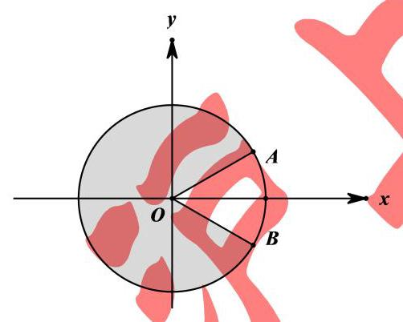

必存在某个正整数 $n$ ,使得 ${n\theta } + \varphi$ 终边在 $\mathrm{{OB}}$ 的下面,而再加上 $\theta$ ,即跨越空白区域到达下一个周期内的阴影区域内，

$\therefore \theta  > \angle {AOB} = \frac{\pi }{3}$ ，

以对任意 $n \in  {\mathbf{N}}^{ * }$ 要成立,所以必存在某个正整数 $n$ ,使得以后的各个角的终边与前面的重复 (否则终边有无穷多,必有两个角的终边相差任意给定的角度比如 ${1}^{ \circ  }$ ,进而对于更大的 $n$ ,次差的累积可以达到任意的整度数, 便不可能在空白区域中不存在了),

故存在正整数 $m$ ,使得 $\frac{2m\pi }{\theta } \in  {\mathbf{N}}^{ * }$ ,即 $\theta  = \frac{2m\pi }{k}, k \in  {\mathbf{N}}^{ * }$ ,

同时 $\theta  > \frac{\pi }{3},\therefore \theta$ 的最小值为 $\frac{2\pi }{5}$ ,故答案为: $\frac{2\pi }{5}$ .

【例 5】设圆 $O$ 的半径为 2,点 $P$ 为圆周上给定一点,如图,放置边长为 2 的正方形 ${ABCD}$ (实线所示,正方形的顶点 $\mathrm{A}$ 与点 $P$ 重合,点 $B$ 在圆周上). 现将正方形 ${ABCD}$ 沿圆周按顺时针方向连续滚动,当点 $\mathrm{A}$ 首次回到点 $P$ 的位置时,点 $\mathrm{A}$ 所走过的路径的长度为 ( )

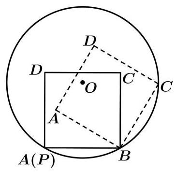

A. $\left( {1 - 2\sqrt{2}}\right) \pi$ B. $\left( {2 + \sqrt{2}}\right) \pi$ C. ${4\pi }$

D. $\left( {3 + \frac{\sqrt{2}}{2}}\right) \pi$

【难度】 $\star   \star   \star   \star$

【答案】B

【解析】由图可知,圆 $O$ 的半径为 $r = 2$ ,正方形 ${ABCD}$ 的边长为 $a = 2$ ,

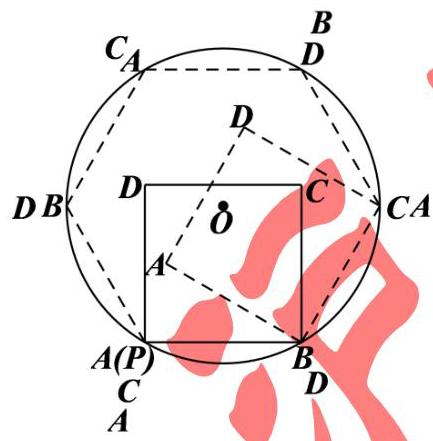

以正方形的边为弦所对的圆心角为 $\frac{\pi }{3}$ ，正方形在圆上滚动时点的顺序依次为如图所示，

当点 $\mathrm{A}$ 首次回到点 $P$ 的位置时,正方形滚动了 3 圈,共 12 次,

设第 $\mathrm{i}$ 次滚动时,点 $\mathrm{A}$ 的路程为 ${m}_{i}$ ,则 ${m}_{1} = \frac{\pi }{6} \times  \left| {AB}\right|  = \frac{\pi }{3},{m}_{2} = \frac{\pi }{6} \times  \left| {AC}\right|  = \frac{\sqrt{2}}{3}\pi$ ,

${m}_{3} = \frac{\pi }{6} \times  \left| {AD}\right|  = \frac{\pi }{3},{m}_{4} = 0,$

因此,点 $\mathrm{A}$ 所走过的路程为 $3\left( {{m}_{1} + {m}_{2} + {m}_{3} + {m}_{4}}\right)  = \left( {2 + \sqrt{2}}\right) \pi$ .

故选: B.

## 巩固训练

1、已知角 $\alpha ,\beta$ 的顶点都为坐标原点，始边都与 $x$ 轴的非负半轴重合，且都为第一象限的角， $\alpha ,\beta$ 终边上分别有点 $A\left( {1, a}\right) , B\left( {2, b}\right)$ ,且 $\alpha  = {2\beta }$ ,则 $\frac{1}{a} + b$ 的最小值为

A. 1 B. $\sqrt{2}$ C. $\sqrt{3}$ D. 2

【难度】 $\bigstar \bigstar \bigstar$

【答案】C

【解析】由已知得, $\tan \alpha  = \alpha ,\tan \beta  = \frac{b}{2}$ ,因为 $\alpha  = {2\beta }$ ,所以 $\tan \alpha  = \tan \left( {2\beta }\right)$ ,

所以 $a = \frac{2 \cdot  \frac{b}{2}}{1 - {\left( \frac{b}{2}\right) }^{2}}, a = \frac{4b}{4 - {b}^{2}}$ ,所以 $\frac{1}{a} + b = \frac{4 - {b}^{2}}{4b} + b = \frac{1}{b} + \frac{3b}{4} \geq  2\sqrt{\frac{1}{b} \cdot  \frac{3b}{4}} = \sqrt{3}$ ,

当且仅当 $\frac{1}{b} = \frac{3b}{4}, b = \frac{2\sqrt{3}}{3}$ 时,取等号.

2、已知 $f\left( x\right)$ 是定义域为 $R$ 的单调函数,且对任意实数 $x$ ,都有 $f\left\lbrack  {f\left( x\right)  + \frac{3}{{4}^{x} + 1}}\right\rbrack   = \frac{2}{5}$ ,则 $f\left( {{\log }_{2}\sin \frac{17\pi }{6}}\right)  =$ ___.

【难度】 $\star   \star   \star   \star$

【答案】 $- \frac{7}{5}$

【解析】对任意实数 $x$ ,都有 $f\left\lbrack  {f\left( x\right)  + \frac{3}{{4}^{x} + 1}}\right\rbrack   = \frac{2}{5}$

令 $f\left( x\right)  + \frac{3}{{4}^{x} + 1} = t$ 则 $f\left( t\right)  = \frac{2}{5}$

因为 $f\left( x\right)$ 是定义域为 $R$ 的单调函数所当 $x = t$ 时,函数值唯一,即代入 $f\left( x\right)  + \frac{3}{{4}^{x} + 1} = t$

可得 $f\left( t\right)  + \frac{3}{{4}^{t} + 1} = t$ ,即 $\frac{2}{5} + \frac{3}{{4}^{t} + 1} = t$

化简可得 $\frac{3}{{4}^{t} + 1} = t - \frac{2}{5}$ ,经检验可知 $t = 1$ 为方程的解

而 $y = \frac{3}{{4}^{t} + 1}$ 为单调递减函数, $y = t - \frac{2}{5}$ 为单调递增函数

所以两个函数只有一个交点,即 $\frac{3}{{4}^{t} + 1} = t - \frac{2}{5}$ 只有一个根为 $t = 1$ ,所以 $f\left( x\right)  =  - \frac{3}{{4}^{x} + 1} + 1$

而 ${\log }_{2}\sin \frac{17\pi }{6} = {\log }_{2}\sin \frac{5\pi }{6} = {\log }_{2}\frac{1}{2} =  - 1$ ,所以 $f\left( {{\log }_{2}\sin \frac{17\pi }{6}}\right)  = f\left( {-1}\right)  =  - \frac{3}{{4}^{-1} + 1} + 1 =  - \frac{7}{5}$ 故答案为: $- \frac{7}{5}$

3、已知函数 $f\left( x\right)  = \left\{  {\begin{array}{l} {x}^{2} + \sin \left( {x + \frac{\pi }{3}}\right) , x > 0 \\   - {x}^{2} + \cos \left( {x + \alpha }\right) , x < 0 \end{array},\alpha  \in  \lbrack 0,{2\pi })}\right.$ 是奇函数,则 $\alpha  =$ ___.

【难度】 $\star   \star   \star   \star$

【答案】 $\frac{7\pi }{6}$

【解析】函数 $f\left( x\right)  = \left\{  {\begin{array}{l} {x}^{2} + \sin \left( {x + \frac{\pi }{3}}\right) , x > 0 \\   - {x}^{2} + \cos \left( {x + \alpha }\right) , x < 0 \end{array},\alpha  \in  \lbrack 0,{2\pi })}\right.$ 是奇函数

设 $x < 0$ ,则 $- x > 0, f\left( {-x}\right)  = {x}^{2} + \sin \left( {-x + \frac{\pi }{3}}\right) \therefore f\left( x\right)  =  - f\left( {-x}\right)  =  - {x}^{2} - \sin \left( {-x + \frac{\pi }{3}}\right)$

即 $- {x}^{2} + \cos \left( {x + \alpha }\right)  =  - {x}^{2} - \sin \left( {-x + \frac{\pi }{3}}\right) \therefore \cos \left( {x + \alpha }\right)  = \sin \left( {x - \frac{\pi }{3}}\right)  = \sin \left( {x + \alpha  + \frac{\pi }{2}}\right)$

故 $x - \frac{\pi }{3} = x + \alpha  + \frac{\pi }{2} + {2k\pi }\therefore \alpha  =  - \frac{5\pi }{6} - {2k\pi }, k \in  Z$ ,当 $k =  - 1$ 时满足 $\alpha  = \frac{7\pi }{6}$ .

故答案为: $\frac{7\pi }{6}$

4、在直角坐标平面 ${xOy}$ 中,已知两定点 ${F}_{1}\left( {-2,0}\right)$ 与 ${F}_{2}\left( {2,0}\right)$ 位于动直线 $l : {ax} + {by} + c = 0$ 的同侧,设集合 $P = \{ l \mid$ 点 ${F}_{1}$ 与点 ${F}_{2}$ 到直线 $l$ 的距离之差等于 $2\} , Q = \left\{  {\left( {x, y}\right)  \mid  {x}^{2} + {y}^{2} \leq  4, x, y \in  R}\right\}$ ,记 $S = \{ \left( {x, y}\right)  \mid  \left( {x, y}\right)  \notin  l, l \in  P\} , T = \{ \left( {x, y}\right)  \mid  \left( {x, y}\right)  \in  Q \cap  S\}$ ,则由 $T$ 中的所有点所组成的图形的面积是___

【难度】 $\star   \star   \star   \star$

【答案】 $4\sqrt{3} + \frac{4\pi }{3}$

【解析】: 两定点 ${F}_{1}\left( {-2,0}\right)$ 与 ${F}_{2}\left( {2,0}\right)$ 位于动直线 $l : {ax} + {by} + c = 0$ 的同侧,如图:

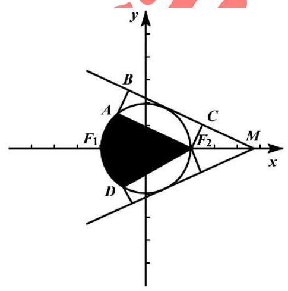

过 ${F}_{1}\left( {-2,0}\right)$ 与 ${F}_{2}\left( {2,0}\right)$ 分别作 $l$ 直线的垂线,垂足分别为 $B, C$

由题意得 ${F}_{1}B - {F}_{2}C = 2$ ,即 ${F}_{1}A = 2$

$\because$ 在 $\operatorname{Rt}\bigtriangleup A{F}_{1}{F}_{2}$ 中 ${F}_{1}{F}_{2} = 4$ ,

$\therefore \cos \angle A{F}_{1}{F}_{2} = \frac{1}{2}$ 可得 $\angle A{F}_{1}{F}_{2} = {60}^{ \circ  }$

$\therefore$ 集合 $P$ 对应的轨迹为线段 $A{F}_{2}$ 的上方部分, $Q$ 对应的区域为半径为 2 的单位圆内部根据 $T$ 的定义可知, $T$ 中的所有点组成的图形为图形阴影部分

$\therefore$ 阴影部分的面积为: $2\left( {\frac{1}{6}\pi  \times  {2}^{2} + \frac{1}{2} \times  2 \times  4 \times  \sin {60}^{ \circ  }}\right)  = 4\sqrt{3} + \frac{4\pi }{3}$

故答案为: $4\sqrt{3} + \frac{4\pi }{3}$ .

5、若函数 $f\left( x\right)  = 3\sin {\omega x} + 4\cos {\omega x}\left( {0 \leq  x \leq  \frac{\pi }{3},\omega  > 0}\right)$ 的值域为 $\left\lbrack  {4,5}\right\rbrack$ ，则 $\cos \frac{\omega \pi }{3}$ 的取值范围为( )

A. $\left\lbrack  {\frac{7}{25},\frac{4}{5}}\right\rbrack$ B. $\left\lbrack  {\frac{7}{25},\frac{3}{5}}\right\rbrack$

C. $\left\lbrack  {-\frac{7}{25},\frac{4}{5}}\right\rbrack$ D. $\left\lbrack  {-\frac{7}{25},\frac{3}{5}}\right\rbrack$

【难度】 $\star   \star   \star   \star$

【答案】A

【解析】解: $f\left( x\right)  = 3\sin {\omega x} + 4\cos {\omega x} = 5\sin \left( {{\omega x} + \beta }\right) ,\left( {0 \leq  x \leq  \frac{\pi }{3},\omega  > 0}\right)$ , $\tan \beta  = \frac{4}{3},\sin \beta  = \frac{4}{5},\cos \beta  = \frac{3}{5}$ , 令 $t = {\omega x} + \beta$ ,则 $g\left( t\right)  = 5\sin t$ ,

因为 $0 \leq  x \leq  \frac{\pi }{3},\omega  > 0$ ,所以 $\beta  \leq  t \leq  \frac{\pi \omega }{3} + \beta ,0 < \beta  < \frac{\pi }{2}$ ,

因为函数 $f\left( x\right)$ 的值域为 $\left\lbrack  {4,5}\right\rbrack$ ,则 $g\left( {\pi  - \beta }\right)  = 4, g\left( \frac{\pi }{2}\right)  = 5$

所以 $\frac{\pi }{2} \leq  \frac{\omega \pi }{3} + \beta  \leq  \pi  - \beta$ ,即 $\frac{\pi }{2} - \beta  \leq  \frac{\omega \pi }{3} \leq  \pi  - {2\beta }$ ,

因为 $0 < \frac{\pi }{2} - \beta  \leq  x \leq  \pi  - {2\beta } < \pi$ ,函数 $y = \cos x$ 单调递减,

$\cos \left( {\frac{\pi }{2} - \beta }\right)  = \sin \beta  = \frac{4}{5},\cos \left( {\pi  - {2\beta }}\right)  =  - \cos {2\beta } = {\sin }^{2}\beta  - {\cos }^{2}\beta  = \frac{16}{25} - \frac{9}{25} = \frac{7}{25}$

所以 $\cos \frac{\omega \pi }{3}$ 的取值范围为 $\left\lbrack  {\frac{7}{25},\frac{4}{5}}\right\rbrack$ 故选: A

6、下列六个命题(1)不存在无穷多个角 $\alpha$ 和 $\beta$ ，使得 $\sin \left( {\alpha  + \beta }\right)  = \sin \alpha \cos \beta  - \cos \alpha \sin \beta$

( 2 )存在这样的角 $\alpha$ 和 $\beta$ ，使得 $\cos \left( {\alpha  + \beta }\right)  = \cos \alpha \cos \beta  + \sin \alpha \sin \beta$

(3)对任意角 $\alpha$ 和 $\beta$ ,都有 $\cos \left( {\alpha  + \beta }\right)  = \cos \alpha \cos \beta  - \sin \alpha \sin \beta$

(4)不存在这样的角 $\alpha$ 和 $\beta$ ,使得 $\sin \left( {\alpha  + \beta }\right)  \neq  \sin \alpha \cos \beta  + \cos \alpha \sin \beta$

(5)不存在这样的角 $\alpha$ 和 $\beta$ ,使得 $\tan \left( {\alpha  + \beta }\right)  = \frac{\tan \alpha  - \tan \beta }{1 + \tan \alpha  \cdot  \tan \beta }$

(6)对任意角 $\alpha$ 和 $\beta$ ,都有 $\tan \left( {\alpha  + \beta }\right)  = \frac{\tan \alpha  + \tan \beta }{1 - \tan \alpha  \cdot  \tan \beta }$

其中假命题的个数是( )

A. 1 B. 2 C. 3 D. 4

【难度】 $\star   \star   \star   \star$

【答案】C

【解析】对于 (1),令 $\alpha  = {k\pi },\beta  = {n\pi }\left( {k, n \in  \mathrm{Z}}\right)$ ,则有 $\sin \left( {\alpha  + \beta }\right)  = 0,\sin \alpha  = \sin \beta  = 0$ ,

$\sin \left( {\alpha  + \beta }\right)  = \sin \alpha \cos \beta  - \cos \alpha \sin \beta$ 成立,

显然角 $\alpha$ 和 $\beta$ 有无穷多个，(1)不正确；

对于(2),令 $\alpha  = {2\pi },\beta  = 0$ ,则 $\cos \left( {\alpha  + \beta }\right)  = \cos \alpha  = \cos \beta  = 1,\sin \alpha  = \sin \beta  = 0$ ,

即 $\cos \left( {\alpha  + \beta }\right)  = \cos \alpha \cos \beta  + \sin \alpha \sin \beta$ 成立，(2)正确；

对于(3)，由和角的余弦公式知，对任意角 $\alpha$ 和 $\beta$ ，都有 $\cos \left( {\alpha  + \beta }\right)  = \cos \alpha \cos \beta  - \sin \alpha \sin \beta$ ，(3)正确；

对于(4),由和角的正弦公式知,对任意角 $\alpha$ 和 $\beta ,\sin \left( {\alpha  + \beta }\right)  = \sin \alpha \cos \beta  + \cos \alpha \sin \beta$ ,

即不存在这样的角 $\alpha$ 和 $\beta$ ,使得 $\sin \left( {\alpha  + \beta }\right)  \neq  \sin \alpha \cos \beta  + \cos \alpha \sin \beta$ ,(4)正确

对于(5),令 $\alpha  = {2\pi },\beta  = 0$ ,则 $\tan \left( {\alpha  + \beta }\right)  = 0,\tan \alpha  = 0,\tan \beta  = 0$ ,有 $\tan \left( {\alpha  + \beta }\right)  = \frac{\tan \alpha  - \tan \beta }{1 + \tan \alpha  \cdot  \tan \beta },\left( 5\right)$ 不正确;

对于 (6),令 $\alpha  = \frac{\pi }{4},\beta  = \frac{\pi }{4}$ ,则 $\alpha  + \beta  = \frac{\pi }{2},\tan \left( {\alpha  + \beta }\right)$ 无意义,(6)不正确,

所以给定的 6 个命题中有 3 个不正确.

故选: $\mathrm{C}$

7、已知函数 $f\left( x\right)  = {x}^{3} + \frac{1}{{3}^{x} - 1} + 1$ ，若 $f\left( {\sin \left( {\frac{\pi }{6} - \alpha }\right) }\right)  = \frac{1}{2019}$ ，则 $f\left( {\cos \left( {\alpha  - \frac{2\pi }{3}}\right) }\right)  =$ ___.

【难度】 $\star   \star   \star   \star$

【答案】 $\frac{2018}{2019}$

【解析】函数 $f\left( x\right)  = {x}^{3} + \frac{1}{{3}^{x} - 1} + 1$ ,

则有 $f\left( {-x}\right)  + f\left( x\right)  = {\left( -x\right) }^{3} + {x}^{3} + \frac{1}{{3}^{-x} - 1} + \frac{1}{{3}^{x} - 1} + 2 = \frac{1 - {3}^{x}}{{3}^{x} - 1} + 2 = 1$ ,

又 $\because \cos \left( {\alpha  - \frac{2\pi }{3}}\right)  = \cos \left( {\frac{2\pi }{3} - \alpha }\right)  = \cos \left( {\frac{\pi }{2} + \frac{\pi }{6} - \alpha }\right)  =  - \sin \left( {\frac{\pi }{6} - \alpha }\right)$ ,

$\therefore f\left( {\sin \left( {\frac{\pi }{6} - \alpha }\right) }\right)  + f\left( {\cos \left( {\alpha  - \frac{2\pi }{3}}\right) }\right)  = f\left( {\sin \left( {\frac{\pi }{6} - \alpha }\right) }\right)  + f\left( {-\sin \left( {\frac{\pi }{6} - \alpha }\right) }\right)  = 1$ ,

则 $f\left( {\cos \left( {\alpha  - \frac{2\pi }{3}}\right) }\right)  = 1 - f\left( {\sin \left( {\frac{\pi }{6} - \alpha }\right) }\right)  = 1 - \frac{1}{2019} = \frac{2018}{2019}$ . 故答案为: $\frac{2018}{2019}$

## (二)解三角形

## 知识梳理

## 一、正余弦定理

(1)正弦定理: $\frac{a}{\sin A} = \frac{b}{\sin B} = \frac{c}{\sin C} = {2R}$

$$
{a}^{2} = {b}^{2} + {c}^{2} - {2bc} \cdot  \cos A,
$$

(2)余弦定理: ${b}^{2} = {c}^{2} + {a}^{2} - {2ac}\cos B$ ，；

$$
{c}^{2} = {a}^{2} + {b}^{2} - {2ab}\cos C.
$$

## 二、三角形面积公式

(1) ${S}_{\bigtriangleup {ABC}} = \frac{1}{2}{ab}\sin C = \frac{1}{2}{ac}\sin B = \frac{1}{2}{bc}\sin A$

(2) $S = \frac{1}{2}a \cdot  {h}_{a}\left( {h}_{a}\right.$ 表示 $a$ 边上的高 $)$

(3) $S = \frac{1}{2}{ab}\sin C = \frac{1}{2}{ac}\sin B = \frac{1}{2}{bc}\sin A = \frac{abc}{4R}\left( {R\text{ 为外接圆半径 }}\right)  = 2{R}^{2}\sin A\sin B\sin C$

## 例题精讲

【例 6】如图,在平面四边形 ${ABCD}$ 中, ${AD} = 1,{BD} = \frac{2\sqrt{6}}{3},{AB} \bot  {AC},{AC} = \sqrt{2}{AB}$ ,则 ${CD}$ 的最小值为___.

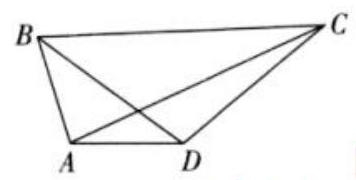

【难度】 $\star   \star   \star   \star$

【答案】 $\frac{\sqrt{3}}{3}$

【解析】设 $\angle {ADB} = \theta$ ，在 $\bigtriangleup {ABD}$ 中，由正弦定理得 $\frac{AB}{\sin \theta } = \frac{BD}{\sin \angle {BAD}}$ ，即 $\frac{AB}{\sin \theta } = \frac{\frac{2\sqrt{6}}{3}}{\sin \angle {BAD}}$

整理得 ${AB} \cdot  \sin \angle {BAD} = \frac{2\sqrt{6}}{3}\sin \theta$ .

由余弦定理得 $A{B}^{2} = A{D}^{2} + B{D}^{2} - 2 \cdot  {AD} \cdot  {BD} \cdot  \cos \theta  = \frac{11}{3} - \frac{4\sqrt{6}}{3}\cos \theta$ ,

因为 ${AB}\bot {AC}$ ,所以 $\angle {BAD} = \frac{\pi }{2} + \angle {DAC}$ . 在 $\bigtriangleup  {ACD}$ 中,

由余弦定理得 $C{D}^{2} = A{D}^{2} + A{C}^{2} - {2AD} \cdot  {AC} \cdot  \cos \angle {DAC} = 1 + {2A}{B}^{2} - 2\sqrt{2}{AB} \cdot  \sin \angle {BAD}$

$= \frac{25}{3} - \frac{8\sqrt{6}}{3}\cos \theta  - \frac{8\sqrt{3}}{3}\sin \theta  = \frac{25}{3} - 8\sin \left( {\theta  + \varphi }\right)$ (其中 $\tan \varphi  = \sqrt{2}$ ),

所以当 $\sin \left( {\theta  + \varphi }\right)  = 1$ 时， $C{D}_{\min } = \frac{\sqrt{3}}{3}$ . 故答案为: $\frac{\sqrt{3}}{3}$

【例 7】在 $\bigtriangleup  {ABC}$ 中，已知角 $A = \frac{2\pi }{3}$ ，角 $\mathrm{A}$ 的平分线 ${AD}$ 与边 ${BC}$ 相交于点 $D$ ， ${AD} = 2$ . 则 ${AB} + {2AC}$ 的最小值为___.

【难度】★★★★

【答案】 $6 + 4\sqrt{2}$

【解析】 ${AB} = c,{AC} = b,{BC} = a,{AD} = 2$ ,

依题意 ${AD}$ 是角 $\mathrm{A}$ 的角平分线,

由三角形的面积公式得 $\frac{1}{2} \times  2 \times  c \times  \sin \frac{\pi }{3} + \frac{1}{2} \times  2 \times  b \times  \sin \frac{\pi }{3} = \frac{1}{2} \times  {bc} \times  \sin \frac{2\pi }{3}$ ,

化简得 ${2c} + {2b} = {bc},\frac{1}{b} + \frac{1}{c} = \frac{1}{2}$ ,

${AB} + {2AC} = c + {2b} = 2\left( {c + {2b}}\right) \left( {\frac{1}{b} + \frac{1}{c}}\right)  = 2\left( {3 + \frac{c}{b} + \frac{2b}{c}}\right)$

$\geq  2\left( {3 + 2\sqrt{\frac{c}{b} \cdot  \frac{2b}{c}}}\right)  = 6 + 4\sqrt{2}$ .

当且仅当 $\frac{c}{b} = \frac{2b}{c}, c = \sqrt{2}b,2 \cdot  \sqrt{2}b + {2b} = b \cdot  \sqrt{2}b, b = 2 + \sqrt{2}, c = 2\sqrt{2} + 2$ 时等号成立.

故答案为: $6 + 4\sqrt{2}$

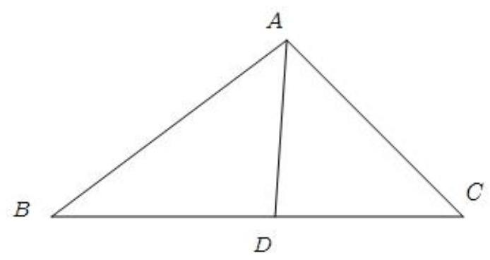

【例 8】如图,在直角三角形 ${ABC}$ 中, $A = \frac{\pi }{2},{AB} = 3,{AC} = 4, D\text{ 、 }E\text{ 、 }F$ 分别在线段 ${AC}\text{ 、 }{AB}\text{ 、 }{BC}$ 上,且 $D$ 为 ${AC}$ 的中点， ${DE}\bot {DF}$ ，设 $\angle {ADE} = \alpha$ .

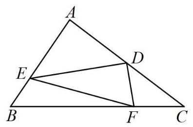

(1)求 $\sin \angle {DFC}$ (用 $\alpha$ 表示)；

(2)求三角形 ${DEF}$ 面积的最小值.

【难度】 $\star   \star   \star   \star$

【答案】(1) $\frac{4}{5}\cos \alpha  + \frac{3}{5}\sin \alpha$ (2) $\frac{4}{3}$

【解析】(1) 在直角三角形 ${ABC}$ 中, $A = \frac{\pi }{2},{AB} = 3,{AC} = 4$

所以 ${BC} = \sqrt{A{B}^{2} + A{C}^{2}} = 5,\sin C = \frac{AB}{BC} = \frac{3}{5},\cos C = \frac{AC}{BC} = \frac{4}{5}$ ;

因为 ${DE} \bot  {DF}$ ,所以 $\angle {FDC} = \frac{\pi }{2} - \alpha$ ,

即 $\sin \angle {FDC} = \sin \left( {\frac{\pi }{2} - \alpha }\right)  = \cos \alpha ,\cos \angle {FDC} = \cos \left( {\frac{\pi }{2} - \alpha }\right)  = \sin \alpha$ ;

在 $\bigtriangleup {DFC}$ 中,因为

$\sin \angle {DFC} = \sin \left( {\pi  - \angle {FDC} - \angle C}\right)  = \sin \left( {\angle {FDC} + \angle C}\right)  = \sin \angle {FDC}\cos C + \cos \angle {FDC}\sin C = \frac{4}{5}\cos \alpha  + \frac{3}{5}\sin \alpha$

(2)在直角三角形 ${ADE}$ 中，因为 ${AD} = 2$ ，所以 ${DE} = \frac{2}{\cos \alpha }$ ；

在 $\bigtriangleup {DFC}$ 中,因为 ${DC} = 2$ ,

所以由正弦定理得, $\frac{DC}{\sin \angle {DFC}} = \frac{DF}{\sin C}$ ,即 ${DF} = \frac{{DC} \cdot  \sin C}{\sin \angle {DFC}} = \frac{6}{3\sin \alpha  + 4\cos \alpha }$ ;

在直角三角形 ${DEF}$ 中,

${S}_{\bigtriangleup {DEF}} = \frac{1}{2}{DE} \cdot  {DF} = \frac{1}{2} \cdot  \frac{2}{\cos \alpha } \cdot  \frac{6}{3\sin \alpha  + 4\cos \alpha } = \frac{6}{3\sin \alpha \cos \alpha  + 4{\cos }^{2}\alpha } = \frac{12}{3\sin {2\alpha } + 4\cos {2\alpha } + 4} = \frac{12}{5\sin \left( {{2\alpha } + \varphi }\right)  + 4}$ , 其中 $\tan \varphi  = \frac{4}{3}$ ,且 $\varphi  \in  \left( {\frac{\pi }{4},\frac{\pi }{3}}\right)$ ;

又因为 $E$ 在线段 ${AB}$ 上,所以 $0 \leq  \tan \alpha  \leq  \frac{3}{2}$ ,且 $\alpha  \in  \left( {0,\frac{\pi }{3}}\right)$ ;

故当 ${2\alpha } + \varphi  = \frac{\pi }{2}$ 时， ${\left( {S}_{\bigtriangleup {DEF}}\right) }_{\min } = \frac{4}{3}$ .

【例 9】如图,悬崖 ${DE}$ 的右侧有一条河,左侧一点 $\mathrm{A}$ 与河对岸 $B, F$ 点、悬崖底部 $E$ 点在同一直线上,一架带有照相机功能的无人机从 $\mathrm{A}$ 点沿 ${AD}$ 直线飞行 200 米到达悬崖顶部 $D$ 点后，然后再飞到 $F$ 点的正上方垂直飞行对线段 ${EB}$ 拍照. 其中从 $A$ 处看悬崖顶部 $D$ 的仰角为 ${60}^{ \circ  },\sin \angle {ABD} = \frac{\sqrt{21}}{7},{BF} = {100}$ 米,当无人机在 $C$ 点处获得最佳拍照角度时 (即 $\angle {BCE}$ 最大)，该无人机离底面的高度为( )

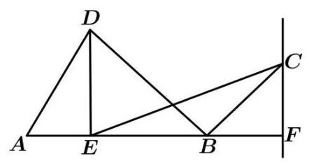

A. ${50}\sqrt{2}$ 米 B. ${50}\sqrt{3}$ 米 C. ${100}\sqrt{3}$ 米 D. 200 米

【难度】 $\bigstar \bigstar \bigstar$

【答案】C

【解析】在 $\bigtriangleup {ABD}$ 中,由正弦定理得 $\frac{200}{\sin \angle {ABD}} = \frac{BD}{\sin {60}^{ \circ  }}$ ,所以 ${BD} = \frac{{100}\sqrt{3}}{\frac{\sqrt{21}}{7}} = {100}\sqrt{7}$ . 再由余弦定理得 ${\left( {100}\sqrt{7}\right) }^{2} = A{B}^{2} + {200}^{2} - 2 \times  {AB} \times  {200}\cos {60}^{ \circ  }$ ,解得 ${AB} = {300}$ . 又 ${AE} = {200}\cos {60}^{ \circ  } = {100}$ ,所以 ${BE} = {300} - {100} = {200}$ . 设该无人机离底面的高度为 $x$ 米, $\tan \angle {BCF} = \frac{100}{x},\tan \angle {ECF} = \frac{300}{x}$ , 则 $\tan \angle {BCE} = \frac{\frac{300}{x} - \frac{100}{x}}{1 + \frac{300}{x} \cdot  \frac{100}{x}} = \frac{\frac{200}{x}}{1 + \frac{3000}{{x}^{2}}} = \frac{200x}{{x}^{2} + {30000}} = \frac{200}{x + \frac{30000}{x}} \leq  \frac{200}{\sqrt{x \cdot  \frac{30000}{x}}}\frac{\sqrt{3}}{3}$ ，当且仅当 $x = {100}\sqrt{3}$ 时等号成立, 此时无人机拍摄角度最佳. 故选: C

【例 10】中国天眼 FAST (500 米口径球面射电天文望远镜), 于 2016 年 9 月 25 日落成启用.天眼是当之无愧的国之重器，它的灵敏度是世界上排名第二的美国阿雷西博望远镜的三倍左右，它的直径达到了 500 米， 它的反射面积相当于 30 个足球场的大小.如图是中国天眼的剖面，当我们观测某个方向的天体目标 ${S}_{1}$ 时，在天体 ${S}_{1}$ 和球心 $O$ 到反射面点 $M$ 的连线上选取一个点 $F$ 作为抛物面的焦点,把以点 $M$ 为中心周边的镜面通过下拉索拉动，使球面变形成抛物面(抛物面是指抛物线绕着他的对称轴旋转 ${180}^{ \circ  }$ 所得到的面)，这个抛物面把天体目标发出的平行光聚焦到焦点 $F$ 上，我们的接收机(馈源)就安装在这个焦点 $F$ 上，可见虽然天眼是一个球面形状,但观测时球面已经变成抛物面了. 若 ${AB}$ 垂直 ${MF}$ 并交于点 $N,{AB} = {300}$ 米, ${MF} = {125}$ 米, 则 ${MN} =$ ___米， $\cos \angle {AFB} =$ ___.

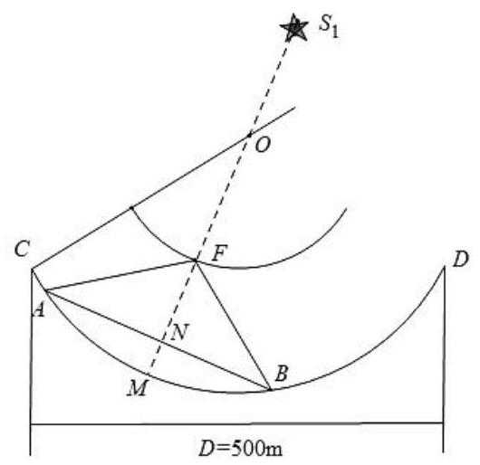

【难度】★★★★

【答案】 45 - $\frac{161}{289}$

【解析】解: 根据题意,此时观测曲面为抛物面,弧 ${AMB}$ 为抛物线上的一部分, $F$ 为抛物线的焦点, 故如图，建立平面直角坐标系，

所以设抛物线的方程为 ${y}^{2} = {2px}\left( {p > 0}\right)$ ，

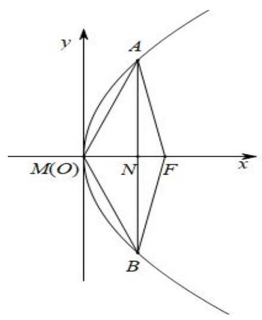

因为 ${MF} = {125},{AB} = {300}$ ,

所以 $F\left( {{125},0}\right) ,{y}_{A} = {150}$ ,

所以 $\frac{p}{2} = {125}$ ,即 $p = {250}$

所以抛物线的方程为 ${y}^{2} = {500x}$

所以 ${x}_{A} = \frac{{150}^{2}}{500} = {45}$

所以 $A\left( {{45},{150}}\right) , B\left( {{45}, - {150}}\right) , N\left( {{45},0}\right)$

所以 ${MN} = {45}$ 米, ${AF} = {BF} = {170}$ 米,

所以在 $\bigtriangleup {AFB}$ 中, $\cos \angle {AFB} = \frac{{\left| AF\right| }^{2} + {\left| BF\right| }^{2} - {\left| AB\right| }^{2}}{2\left| {AF}\right| \left| {BF}\right| } = \frac{{170}^{2} + {170}^{2} - {300}^{2}}{2 \times  {170} \times  {170}} =  - \frac{161}{289}$ .

故答案为: ${45}; - \frac{161}{289}$

巩固训练

1、在 $\bigtriangleup  {ABC}$ 中， $\tan A + \tan B + \tan C = \tan B \cdot  \tan C$ ，则 $\frac{B + C}{A} =$ ___.

【难度】 $\star   \star   \star   \star$

【答案】 3

【解析】 $\tan A = \tan \left\lbrack  {\pi  - \left( {B + C}\right) }\right\rbrack   =  - \tan \left( {B + C}\right)  = \frac{\tan B + \tan C}{\tan B\tan C - 1}$ ,

所以 $\tan A \cdot  \tan B \cdot  \tan C = \tan A + \tan B + \tan C$ ,

又 $\tan A + \tan B + \tan C = \tan B \cdot  \tan C$ ,

所以 $\tan A = 1$ ,因为 $A \in  \left( {0,\pi }\right)$ ,所以 $A = \frac{\pi }{4}$ ,所以 $B + C = \pi  - A = \frac{3\pi }{4}$ ,

所以 $\frac{B + C}{A} = 3$ . 故答案为: 3 .

2、在三角形 ${ABC}$ 中，已知角 $A = \frac{5\pi }{6}$ ，角 $A$ 的平分线 ${AD}$ 与边 ${BC}$ 相交于点 $D$ ， ${AD} = 2$ . 则 ${AB} + {AC}$ 的最小值为___.

【难度】 $\star   \star   \star   \star$

【答案】 $4\sqrt{6} + 4\sqrt{2}$

【解析】解: 因为 ${AD}$ 是 $\angle A$ 的角平分线,且 ${AD} = 2$ ,由 ${S}_{\bigtriangleup {ABC}} = {S}_{\bigtriangleup {ABD}} + {S}_{\bigtriangleup {ADC}}$ ,

可得 $\frac{1}{2}{AB} \cdot  {AC} \cdot  \sin \angle {BAC} = \frac{1}{2}{AB} \cdot  {AD} \cdot  \sin \angle {BAD} + \frac{1}{2}{AD} \cdot  {AC} \cdot  \sin \angle {DAC}$ ,

即 $\frac{1}{2}{AB} \cdot  {AC} \cdot  \sin \frac{5\pi }{6} = \frac{1}{2} \times  2 \cdot  {AB} \cdot  \sin \frac{5\pi }{12} + \frac{1}{2} \times  2 \cdot  {AC} \cdot  \sin \frac{5\pi }{12}$

即 $\frac{1}{2}{AB} \cdot  {AC} = 2\left( {{AB} + {AC}}\right)  \cdot  \sin \frac{5\pi }{12}$

所以 $\frac{1}{2}{AB} \cdot  {AC} = 2\left( {{AB} + {AC}}\right)  \cdot  \sin \frac{5\pi }{12} \leq   - \frac{1}{2}{\left( \frac{{AB} + {AC}}{2}\right) }^{2}$ ，当且仅当 ${AB} = {AC}$ 时取等号，解得 ${AB} + {AC} \geq  {16}\sin \frac{5\pi }{12}$ 或 ${AB} + {AC} \leq  0$ (舍去)，因为 $\sin \frac{5\pi }{12} = \sin \left( {\frac{\pi }{4} + \frac{\pi }{6}}\right)  = \sin \frac{\pi }{4}\cos \frac{\pi }{6} + \cos \frac{\pi }{4}\sin \frac{\pi }{6} = \frac{\sqrt{2}}{2} \times  \frac{\sqrt{3}}{2} + \frac{\sqrt{2}}{2} \times  \frac{1}{2} = \frac{\sqrt{6} + \sqrt{2}}{4}$ ，所以 ${AB} + {AC} \geq  {16} \times  \frac{\sqrt{6} + \sqrt{2}}{4} = 4\sqrt{6} + 4\sqrt{2}$ ,故答案为: $4\sqrt{6} + 4\sqrt{2}$

3、如图，在 $\bigtriangleup  {ABC}$ 中， $D$ ， $E$ 分别为边 ${AB}$ ， ${AC}$ 上的点，满足 ${BC} = {3\sqrt{21}}$ ， ${BD} = 7$ ， $\tan \angle {BDC} =  - {3\sqrt{3}}$ ， $\angle {DEC} = \frac{\pi }{3}$ .

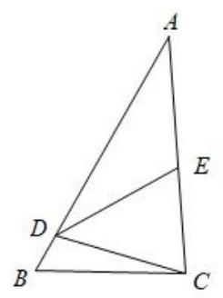

(1)求 $\angle {BCD}$ 的大小；

(2)求 ${CE} + {DE}$ 的最大值.

【难度】 $\star   \star   \star   \star$

【答案】(1) $\angle {BCD} = \frac{\pi }{6}$ ； (2) $8\sqrt{7}$ .

【解析】(1) 在 $\bigtriangleup {BCD}$ 中,因为 $\tan \angle {BDC} =  - 3\sqrt{3}$ ,

所以 $\frac{\pi }{2} < \angle {BDC} < \pi$ ,且 $\left\{  \begin{array}{l} \frac{\sin \angle {BDC}}{\cos \angle {BDC}} =  - 3\sqrt{3} \\  {\sin }^{2}\angle {BDC} + {\cos }^{2}\angle {BDC} = 1 \end{array}\right.$ ,解得 $\left\{  \begin{array}{l} \sin \angle {BDC} = \frac{3\sqrt{21}}{14} \\  \cos \angle {BDC} =  - \frac{\sqrt{7}}{14} \end{array}\right.$ ,

所以在 $\bigtriangleup {BCD}$ 中,由正弦定理得 $\frac{BC}{\sin \angle {BDC}} = \frac{BD}{\sin \angle {BCD}}$ ,

即 $\sin \angle {BCD} = \frac{{BD} \cdot  \sin \angle {BDC}}{BC} = \frac{7 \times  \frac{3\sqrt{21}}{14}}{3\sqrt{21}} = \frac{1}{2}$ ,

又因为 $\angle {BDC}$ 为钝角，所以 $\angle {BCD}$ 为锐角，所以 $\angle {BCD} = \frac{\pi }{6}$ .

(2)在 $\bigtriangleup {BCD}$ 中，由余弦定理得 $\cos \angle {BDC} = \frac{B{D}^{2} + C{D}^{2} - B{C}^{2}}{{2BD} \cdot  {CD}} = \frac{{49} + C{D}^{2} - {189}}{2 \times  7 \times  {CD}} =  - \frac{\sqrt{7}}{14}$ ，

解得 ${CD} = 4\sqrt{7}$ 或 ${CD} =  - 5\sqrt{7}$ (舍去).

在 $\bigtriangleup {CDE}$ 中, $\angle {DEC} = \frac{\pi }{3}$ ,设 ${DE} = x\left( {x > 0}\right) ,{CE} = y\left( {y > 0}\right)$ ,

由余弦定理得 $\cos \angle {DEC} = \frac{D{E}^{2} + C{E}^{2} - C{D}^{2}}{{2DE} \cdot  {CE}} = \frac{{x}^{2} + {y}^{2} - {112}}{2xy} = \frac{1}{2}$ ,

即 ${x}^{2} + {y}^{2} - {112} = {xy}$ ,整理得 ${\left( x + y\right) }^{2} - {112} = {3xy}$ .

又因为 $x > 0, y > 0$ ,所以 ${\left( x + y\right) }^{2} - {112} = {3xy} \leq  \frac{3{\left( x + y\right) }^{2}}{4}$ ,即 $\frac{{\left( x + y\right) }^{2}}{4} \leq  {112}$ ,

所以 ${\left( x + y\right) }^{2} \leq  {448}$ ,当且仅当 $x = y = 4\sqrt{7}$ 时,等号成立,

即 ${\left( x + y\right) }_{\max } = 8\sqrt{7}$ ,故 ${CE} + {DE}$ 的最大值为 $8\sqrt{7}$ .

4、已知 $\bigtriangleup  {ABC}$ 中，内角 $A, B, C$ 的对边分别为 $a, b, c$ ，且满足 $b\sin \left( {\frac{p}{2} - C}\right)  = \frac{1}{2}{ab} + c\cos \left( {p - B}\right)$ .

(1)求 $b$ 的值；

(2)若 $B = \frac{\pi }{3}$ ，求 $\bigtriangleup  {ABC}$ 面积的最大值.

【难度】 $\star   \star   \star   \star$

【答案】(1)2； (2) $\sqrt{3}$ .

【解析】解: 由题意得 $b\cos C = \frac{1}{2}{ab} - c\cos B$ ,

由正弦定理得: $\sin B\cos C = \frac{1}{2}b\sin A - \sin C\cos B$ ，

即 $\sin B\cos C + \sin C\cos B = \frac{1}{2}b\sin A$ ,即 $\sin A = \frac{1}{2}b\sin A$ ,因为 $\sin A \neq  0$ ,所以 $b = 2$

(2)解:由余弦定理 ${b}^{2} = {a}^{2} + {c}^{2} - {2ac}\cos B$ ，即 ${a}^{2} + {c}^{2} - {ac} = 4$ ，

由基本不等式得: ${a}^{2} + {c}^{2} - {ac} = 4 \geq  {2ac} - {ac}$ ，即 ${ac} \leq  4$ ，

当且仅当 $a = c = 2$ 时取得等号,

$\therefore {S}_{\bigtriangleup {ABC}} = \frac{1}{2}{ac}\sin B \leq  \frac{1}{2} \cdot  4 \cdot  \sin \frac{p}{3} = \sqrt{3}$ ,

所以 $\bigtriangleup  {ABC}$ 面积的最大值为 $\sqrt{3}$ .

(三)三角函数图像与性质

## 知识梳理

三角函数的图像与性质

<table id="cross-table-1"><tr><td>$y = \sin x$</td><td>$y = \cos x$</td><td>$y = \tan x$</td></tr><tr><td>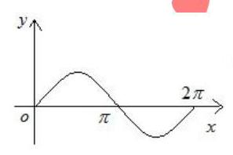</td><td>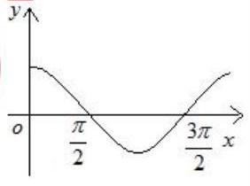</td><td>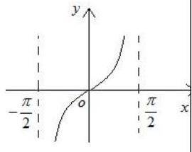</td></tr><tr><td>$R$</td><td>$R$</td><td>$\{ x \mid  x \in  R,$    $x \neq  {k\pi } + \frac{\pi }{2}, k \in  Z\}$</td></tr><tr><td>$\left\lbrack  {-1,1}\right\rbrack$</td><td>$\left\lbrack  {-1,1}\right\rbrack$</td><td>$R$</td></tr><tr><td>$\left| {\sin x}\right|  \leq  1$</td><td>$\left| {\cos x}\right|  \leq  1$</td><td>无</td></tr><tr><td>${2\pi }$</td><td>${2\pi }$</td><td>$\pi$</td></tr><tr><td>增区间:    $\left\lbrack  {{2k\pi } - \frac{\pi }{2},{2k\pi } + \frac{\pi }{2}}\right\rbrack$    减区间:    $\left\lbrack  {{2k\pi } + \frac{\pi }{2},{2k\pi } + \frac{3\pi }{2}}\right\rbrack$    $k \in  Z$</td><td>增区间: $\left\lbrack  {{2k\pi } - \pi ,{2k\pi }}\right\rbrack$ 减区间: $\left\lbrack  {{2k\pi } - \pi ,{2k\pi }}\right\rbrack \; k \in  Z$</td><td>增区间:    $\left( {{k\pi } - \frac{\pi }{2},{k\pi } + \frac{\pi }{2}}\right)$    $k \in  Z$</td></tr><tr><td>奇</td><td>偶</td><td>奇</td></tr><tr><td>$x = \frac{\pi }{2} + {2k\pi }$ 时,    ${y}_{\max } = 1$    $x =  - \frac{\pi }{2} + {2k\pi }$ 时,    ${y}_{\min } =  - 1$    $k \in  Z$</td><td>$x = {2k\pi }$ 时, ${y}_{\max } = 1 \; x = \pi  + {2k\pi }$ 时, ${y}_{\min } =  - 1 \; k \in  Z$</td><td></td></tr><tr><td>$x = \frac{\pi }{2} + {k\pi }, k \in  Z$</td><td>$x = {k\pi }, k \in  Z$</td><td>无</td></tr><tr><td>$\left( {{k\pi },0}\right) , k \in  Z$</td><td>$\left( {\frac{\pi }{2} + {k\pi },0}\right) ,$    $k \in  Z$</td><td>$\left( {\frac{k\pi }{2},0}\right) , k \in  Z$</td></tr></table>

9、函数 $y = A\sin \left( {{\omega x} + \varphi }\right)$ 的图像

一般的,函数 $y = A\sin \left( {{\omega x} + \varphi }\right)$ (其中 $A > 0,\omega  > 0$ ) 的图像可由 “五点法” 或图像变换法得到.

(1)“五点法”:先求出当 ${\omega x} + \varphi$ 为 $0,\frac{\pi }{2},\pi ,\frac{3}{2}\pi ,{2\pi }$ 时相对应的 $y$ 值，其次分别求出对应的 $x$ 值，再列表、描点、连线,最后根据函数的周期性,将图像向左、右无限扩展,即可得 $y = A\sin \left( {{\omega x} + \varphi }\right)$ 在 $R$ 上图像.

(2)图像变换法:一般可按下述步骤进行:

$y = \sin x\xrightarrow[]{\text{ 振幅变换 }}y = A\sin x\xrightarrow[]{\text{ 平移变换 }}y = A\sin \left( {x + \varphi }\right) \xrightarrow[]{\text{ 周期变换 }}y = A\sin \left( {{\omega x} + \varphi }\right)$ ①振幅变换: 当 $A > 1$ 时,图像上各点的纵坐标伸长到原来的 $A$ 倍 (横坐标不变); 当 $0 < A < 1$ 时,图像上各点的纵坐标缩短到原来的 $A$ 倍(横坐标不变).

② 平移变换:当 $\varphi  > 0$ 时，图像上所有点向左平移 $\varphi$ 个单位；当 $\varphi  < 0$ 时，图像上所有点向右平移 $\left| \varphi \right|$

个单位.

③周期变换:当 $\omega  > 1$ 时，图像上各点的横坐标缩短为原来的 $\frac{1}{\omega }$ 倍(纵坐标不变)；当 $0 < \omega  < 1$ 时，图像上各点的横坐标伸长为原来的 $\frac{1}{\omega }$ 倍(纵坐标不变).

## 例题精讲

【例 11】(1)将函数 $f\left( x\right)  = 2\sin {2x}$ 的图像向右平移 $\varphi$ ( $0 < \varphi  < \pi$ ) 个单位后得到函数 $g\left( x\right)$ 的图像. 若对满足 $\left| {f\left( {x}_{1}\right)  - g\left( {x}_{2}\right) }\right|  = 4$ 的 ${x}_{1}\text{ 、 }{x}_{2}$ ,有 $\left| {{x}_{1} - {x}_{2}}\right|$ 的最小值为 $\frac{\pi }{6}$ . 则 $\varphi  =$ (   )

A、 $\frac{\pi }{3}$ ; B、 $\frac{\pi }{6}$ C、 $\frac{\pi }{3}$ 或 $\frac{2\pi }{3}$ ； D、 $\frac{\pi }{6}$ 或 $\frac{5\pi }{6}$ .

【难度】 $\bigstar \bigstar \bigstar$

【答案】C.

【解析】解: 因为将函数 $f\left( x\right)  = 2\sin {2x}$ 的周期为 $\pi$ ,函数的图象向右平移 $\varphi \left( {0 < \varphi  < \pi }\right)$ 个单位后得到函数 $g\left( x\right)$ 的图象. 若对满足 $\left| {f\left( {x}_{1}\right)  - g\left( {x}_{2}\right) }\right|  = 4$ 的可知,两个函数的最大值与最小值的差为 4,有 ${\left| {x}_{1} - {x}_{2}\right| }_{\min } = \frac{\pi }{6}$ ,

不妨 ${x}_{1} = \frac{\pi }{4},{x}_{2} = \frac{\pi }{12}$ ,即 $g\left( x\right)$ 在 ${x}_{2} = \frac{\pi }{12}$ ,取得最小值, $\sin \left( {2 \times  \frac{\pi }{12} - {2\varphi }}\right)  =  - 1$ ,

此时 $\varphi  = \frac{\pi }{3} - {k\pi }, k \in  Z$ ,结合 $0 < \varphi  < \pi$ ,可得 $\varphi  = \frac{\pi }{3}$ ,满足题意.

${x}_{1} = \frac{\pi }{4},\;{x}_{2} = \frac{5\pi }{12}$ ,即 $g\left( x\right)$ 在 ${x}_{2} = \frac{5\pi }{12},$ 取得最小值, $\sin \left( {2 \times  \frac{5\pi }{12} - {2\varphi }}\right)  =  - 1$ ,

此时 $\varphi  = \frac{2\pi }{3} - {k\pi }, k \in  Z$ ,结合 $0 < \varphi  < \pi$ . 可得 $\varphi  = \frac{2\pi }{3}$ ,满足题意.

故选: $C$ .

(2)设 ${a}_{n} = \frac{1}{n}\sin \frac{n\pi }{25}$ ， ${S}_{n} = {a}_{1} + {a}_{2} + \ldots  + {a}_{n}\text{ ( }n \in  {N}^{ * }\text{ ) }$ ，在 ${S}_{1}$ ， ${S}_{2}$ ， $\ldots$ ， ${S}_{100}$ 中，正数的个数是( )

A. 25 B. 50 C. 75 D. 100

【难度】 $\star   \star   \star   \star$

【答案】D

【解析】由题可知函数 $g\left( x\right)  = \sin \frac{\pi }{25}x$ 的周期为 50,100 则为该函数的两个周期,作函数 $f\left( x\right)  = \frac{1}{x}\sin \frac{\pi }{25}x$ 的图象如下,数列 $\left\{  {a}_{n}\right\}$ 的前 24 项均为正数,第 51 项到 74 项也均为正数,第 26 到 49 项均为负数,第 76 到 99 项也均为负数,，当 $1 \leq  i \leq  {25}$ 或 ${51} \leq  i \leq  {75}$ 时， $\sin \frac{i\pi }{25} > 0$ ，而 $\frac{1}{i} - \frac{1}{{25} + i} > 0$ ，故 $\frac{1}{i}\sin \frac{i\pi }{25} + \frac{1}{{25} + i}\sin \frac{\left( {i + {25}}\right) \pi }{25} > 0$ ,故 ${S}_{1},{S}_{2},\cdots ,{S}_{100}$ 均是正数. 答案为 D.

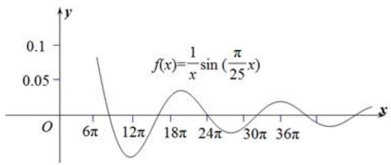

(3)将函数 $f\left( x\right)  = 2\sin \left( {{3x} + \frac{\pi }{4}}\right)$ 的图像向下平移 1 个单位，得到 $g\left( x\right)$ 的图像，若 $g\left( {x}_{1}\right)  \cdot  g\left( {x}_{2}\right)  = 9$ ，其中 ${x}_{1},{x}_{2} \in  \left\lbrack  {0,{4\pi }}\right\rbrack$ ，则 $\frac{{x}_{1}}{{x}_{2}}$ 的最大值为( )

A. 9

B. $\frac{37}{5}$ C. 3 D. 1

【难度】

【答案】A

【解析】将函数 $f\left( x\right)  = 2\sin \left( {{3x} + \frac{\pi }{4}}\right)$ 的图象向下平移 1 个单位,

得到 $g\left( x\right)  = 2\sin \left( {{3x} + \frac{\pi }{4}}\right)  - 1$ 的图象,

$\because g\left( x\right)  \in  \left\lbrack  {-3,1}\right\rbrack$

若 $g\left( {x}_{1}\right) g\left( {x}_{2}\right)  = 9$ ,则 $g\left( {x}_{1}\right)  = g\left( {x}_{2}\right)  =  - 3$ ,

则 $\sin \left( {3{x}_{1} + \frac{\pi }{4}}\right)  =  - 1 - \sin \left( {3{x}_{2} + \frac{\pi }{4}}\right)$ ,

$\because {x}_{1},{x}_{2} \in  \left\lbrack  {0,{4\pi }}\right\rbrack  ,3{x}_{1} + \frac{\pi }{4} \in  \left\lbrack  {\frac{\pi }{4},\frac{49\pi }{4}}\right\rbrack  ,3{x}_{2} + \frac{\pi }{4} \in  \left\lbrack  {\frac{\pi }{4},\frac{49\pi }{4}}\right\rbrack$ ,

$3{x}_{2} + \frac{\pi }{4}$ 的最小值为 $\frac{3\pi }{2},3{x}_{1} + \frac{\pi }{4}$ 的最大值为 $\frac{23\pi }{2}$ ,

故 ${x}_{1}$ 的最大值为 $\frac{15\pi }{4},{x}_{2}$ 的最小值为 $\frac{5\pi }{12}$ ,则 $\frac{{x}_{1}}{{x}_{2}}$ 的最大值为 $\frac{\frac{15\pi }{4}}{\frac{5\pi }{12}} = 9$ ,故答案为 9 .

【例 12】( 1 )已知函数 $f\left( x\right)  = 2\sin \left( {\omega x}\right)$ ，其中常数 $\omega  > 0$ ，若 $y = f\left( x\right)$ 在 $\left\lbrack  {-\frac{\pi }{4},\frac{2\pi }{3}}\right\rbrack$ 上单调递增，则 $\omega$ 的取值范围___.

【难度】 $\star   \star   \star   \star$

【答案】 $0 < \omega  \leq  \frac{3}{4}$ 【解析】(1)因为 $\omega  > 0$ ,根据题意有 $\left\{  {\begin{array}{l}  - \frac{\pi }{4}\omega  \geq   - \frac{\pi }{2} \\  \frac{2\pi }{3}\omega  \leq  \frac{\pi }{2} \end{array} \Rightarrow  0 < \omega  \leq  \frac{3}{4}}\right.$

(2)设定义在 $R$ 上的函数 $f\left( x\right)$ 是最小正周期为 ${2\pi }$ 的偶函数，当 $x \in  \left\lbrack  {0,\pi }\right\rbrack$ 时， $0 < f\left( x\right)  < 1$ ，且在 $\left\lbrack  {0,\frac{\pi }{2}}\right\rbrack$ 上单调递减，在 $\left\lbrack  {\frac{\pi }{2},\pi }\right\rbrack$ 上单调递增，则函数 $y = f\left( x\right)  - \sin x$ 在 $\left\lbrack  {-{10\pi },{10\pi }}\right\rbrack$ 上的零点个数为 【难度】 $\star   \star   \star   \star$

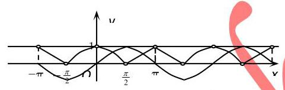

【答案】 20

【解析】数形结合

(3)已知函数 $f\left( x\right)  = \sin \left( {{\omega x} + \varphi }\right) \left( {\omega  > 0,\left| \varphi \right|  \leq  \frac{\pi }{2}}\right) , x =  - \frac{\pi }{4}$ 为 $f\left( x\right)$ 的零点， $x = \frac{\pi }{4}$ 为 $y = f\left( x\right)$ 图像的对称轴,且 $f\left( x\right)$ 在 $\left( {\frac{\pi }{18},\frac{5\pi }{36}}\right)$ 单调,则 $\omega$ 的最大值为( )

A、11 B、 9 C、 7 D、 5

【难度】 $\bigstar \bigstar \bigstar$

【答案】B

【解析】: $x =  - \frac{\pi }{4}$ 为 $f\left( x\right)$ 的零点, $x = \frac{\pi }{4}$ 为 $y = f\left( x\right)$ 图象的对称轴, $\therefore \frac{{2n} + 1}{4} \cdot  T = \frac{\pi }{2}$ 即 $\frac{{2n} + 1}{4} \cdot  \frac{2\pi }{\omega } = \frac{\pi }{2},\left( {n \in  N}\right)$ , 即 $\omega$ 为正奇数， $\because f\left( x\right)$ 在 $\left( {\frac{\pi }{18},\frac{5\pi }{36}}\right)$ ，则 $\frac{5\pi }{36} - \frac{\pi }{18} = \frac{\pi }{12} \leq  \frac{T}{2}$ ，即 $T = \frac{2\pi }{\omega } \geq  \frac{\pi }{6}$ ，解得 $\omega  \leq  {12}$ ，当 $\omega  = {11}$ 时， $- \frac{11\pi }{4} + \varphi  = {k\pi }, k \in  Z,\;\because \left| \varphi \right|  \leq  \frac{\pi }{2},\therefore \varphi  =  - \frac{\pi }{4}$ ，此时 $f\left( x\right)$ 在 $\left( {\frac{\pi }{18},\frac{5\pi }{36}}\right)$ 不单调，不满足题意，当 $\omega  = 9$ 时， $- \frac{9\pi }{4} + \varphi  = {k\pi }, k \in  Z,\;\because \left| \varphi \right|  \leq  \frac{\pi }{2},\therefore \varphi  = \frac{\pi }{4}$ ，此时 $f\left( x\right)$ 在 $\left( {\frac{\pi }{18},\frac{5\pi }{36}}\right)$ 单调，满足题意，故 $\omega$ 的最大值为 9，故选 D.

(4)已知 $f\left( x\right)  = \sin \left( {{\omega x} + \frac{\pi }{3}}\right) \left( {\omega  > 0}\right)$ ， $f\left( \frac{\pi }{6}\right)  = f\left( \frac{\pi }{3}\right)$ ，且 $f\left( x\right)$ 在区间 $\left( {\frac{\pi }{6},\frac{\pi }{3}}\right)$ 有最小值，无最大值，则 $\omega  =$ ___.

【难度】 $\star   \star   \star   \star$

【答案】 $\frac{14}{3}$ .

【解析】由 $f\left( \frac{\pi }{6}\right)  = f\left( \frac{\pi }{3}\right)$ 可得 $\frac{\frac{\pi }{6} + \frac{\pi }{3}}{2} = \frac{\pi }{4}$ 为函数 $f\left( x\right)$ 的一条对称轴

又 $f\left( x\right)$ 在区间 $\left( {\frac{\pi }{6},\frac{\pi }{3}}\right)$ 有最小值,无最大值,

可得 $f\left( x\right)$ 在 $x = \frac{\pi }{4}$ 处取得最小值,即 $\frac{\pi }{4}\omega  - \frac{\pi }{6} = {2k\pi } + \pi$ ,

$\therefore \omega  = {8k} + \frac{14}{3}, k \in  Z$ ,又知 $T = \frac{2\pi }{\omega } \geq  \frac{\pi }{3} - \frac{\pi }{6} = \frac{\pi }{6}$ ,

$\therefore 0 < \omega  \leq  {12}$ ,综上 $\omega  = \frac{14}{3}$ . 故选: B

【例 13】已知函数 $f\left( x\right)  = A\sin \left( {{\omega x} - \frac{\pi }{6}}\right) \left( {A > 0,\omega  > 0}\right)$ ,直线 $y = 1$ 与 $f\left( x\right)$ 的图象在 $y$ 轴右侧交点的横坐标依次为 ${a}_{1}\text{ 、 }{a}_{2}\text{ 、 }\cdots \text{ 、 }{a}_{k}\text{ 、 }{a}_{k + 1}\text{ 、 }\cdots$ ,(其中 $k \in  {\mathbf{N}}^{ * }$ )，若 $\frac{{a}_{{2k} + 1} - {a}_{2k}}{{a}_{2k} - {a}_{{2k} - 1}} = 2$ ，则 $A =$ (   )

A. $\frac{2\sqrt{3}}{3}$ B. 2 C. $\sqrt{2}$ D. $2\sqrt{3}$

【难度】 $\star   \star   \star   \star$

【答案】B

【解析】由 $f\left( x\right)  = 1$ 可得 $\sin \left( {{\omega x} - \frac{\pi }{6}}\right)  = \frac{1}{A} \leq  1,\because A > 0$ ,则 $A \geq  1$ .

若 $A = 1$ ,则 ${a}_{{2k} + 1} - {a}_{2k} = {a}_{2k} - {a}_{{2k} - 1}\left( {k \in  {N}^{ * }}\right)$ ,不合乎题意,所以, $A > 1$ .

令 $u = {\omega x} - \frac{\pi }{6},{b}_{k} = \omega {a}_{k} - \frac{\pi }{6}$ ,如下图所示:

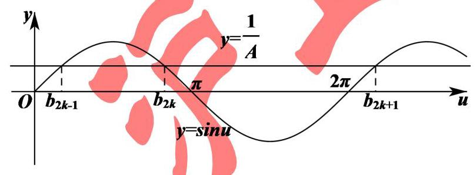

由图可知, ${b}_{{2k} + 1} - {b}_{{2k} - 1} = {2\pi }$ ,则 $\left( {\omega {a}_{{2k} + 1} - \frac{\pi }{6}}\right)  - \left( {\omega {a}_{{2k} - 1} - \frac{\pi }{6}}\right)  = {2\pi }$ ,

$\frac{{b}_{{2k} + 1} - {b}_{2k}}{{b}_{2k} - {b}_{{2k} - 1}} = \frac{\omega \left( {{a}_{{2k} + 1} - {a}_{2k}}\right) }{\omega \left( {{a}_{2k} - {a}_{{2k} - 1}}\right) } = 2$ ,所以, ${b}_{2k} - {b}_{{2k} - 1} = \frac{1}{3}\left( {{b}_{{2k} + 1} - {b}_{{2k} - 1}}\right)  = \frac{2\pi }{3}$ ,

所以, ${b}_{2k} = {b}_{{2k} - 1} + \frac{2\pi }{3}$ ,

所以, $\sin {b}_{{2k} - 1} = \sin {b}_{2k} = \sin \left( {{b}_{{2k} - 1} + \frac{2\pi }{3}}\right)  =  - \frac{1}{2}\sin {b}_{{2k} - 1} + \frac{\sqrt{3}}{2}\cos {b}_{{2k} - 1}$ ,

整理可得 $\cos {b}_{{2k} - 1} = \sqrt{3}\sin {b}_{{2k} - 1}$ ,

由题意可得 $\left\{  \begin{array}{l} \cos {b}_{{2k} - 1} = \sqrt{3}\sin {b}_{{2k} - 1} \\  {\cos }^{2}{b}_{{2k} - 1} + {\sin }^{2}{b}_{{2k} - 1} = 1,\text{ 解得 }A = 2.\text{ 故选: B. } \\  \sin {b}_{{2k} - 1} = \frac{1}{A} > 0 \end{array}\right.$

【例 14】已知函数 $f\left( x\right)  = a\sin {\omega x} + 2\sin \left( {{\omega x} + \frac{\pi }{3}}\right)  + b$ 的图象的相邻两个对称轴之间的距离为 $\frac{\pi }{2}$ ，且 $\forall x \in  R$ 恒有 $f\left( x\right)  \leq  f\left( \frac{\pi }{6}\right)$ ,若存在 ${x}_{1},{x}_{2},{x}_{3} \in  \left\lbrack  {0,\frac{\pi }{2}}\right\rbrack  , f\left( {x}_{1}\right)  + f\left( {x}_{2}\right)  \leq  f\left( {x}_{3}\right)$ 成立,则 $b$ 的取值范围为___.

【难度】

【答案】 $( - \infty ,4\sqrt{3}\rbrack$

【解析】由题设, $f\left( x\right)  = \left( {a + 1}\right) \sin {\omega x} + \sqrt{3}\cos {\omega x} + b = \sqrt{{\left( a + 1\right) }^{2} + 3} \cdot  \sin \left( {{\omega x} + \varphi }\right)  + b$

由 $f\left( x\right)$ 相邻两个对称轴之间的距离为 $\frac{\pi }{2}$ ,故 $T = \pi ,\omega  = \frac{2\pi }{T} = 2$ ,

又 $f\left( x\right)$ 关于 $x = \frac{\pi }{6}$ 对称,即 $\frac{\pi }{3} + \varphi  = \frac{\pi }{2}$ ,故 $\tan \varphi  = \frac{\sqrt{3}}{3} = \frac{\sqrt{3}}{a + 1}$ ,解得 $a = 2$ ,

$\therefore f\left( x\right)  = 2\sqrt{3}\sin \left( {{2x} + \frac{\pi }{6}}\right)  + b$ ,

当 $x \in  \left\lbrack  {0,\frac{\pi }{2}}\right\rbrack$ 时, ${2x} + \frac{\pi }{6} \in  \left\lbrack  {\frac{\pi }{6},\frac{7\pi }{6}}\right\rbrack$ ,此时 $f\left( x\right)$ 的最大值为 $2\sqrt{3} + b$ ,最小值为 $- \sqrt{3} + b$ ,

若存在 ${x}_{1},{x}_{2},{x}_{3} \in  \left\lbrack  {0,\frac{\pi }{2}}\right\rbrack$ ,使 $f\left( {x}_{1}\right)  + f\left( {x}_{2}\right)  \leq  f\left( {x}_{3}\right)$ 成立,则 $\mathop{\lim }\limits_{{n \rightarrow  \infty }} - 2\sqrt{3} + {2b} \leq  2\sqrt{3} + b$ ,

$\therefore b \leq  4\sqrt{3}$ . 故答案为: $( - \infty ,4\sqrt{3}\rbrack$

## 巩固训练

1、设函数 $f\left( x\right)  = 2\sin \left( {{\omega x} + \varphi }\right)  - 1\left( {\omega  > 0,0 \leq  \varphi  \leq  \frac{\pi }{2}}\right)$ 的最小正周期为 ${4\pi }$ ，且 $f\left( x\right)$ 在 $\left\lbrack  {0,{5\pi }}\right\rbrack$ 内恰有 3 个零点，则 $\varphi$ 的取值范围是( )

A. $\left\lbrack  {0,\frac{\pi }{3}}\right\rbrack   \cup  \left\{  \frac{5\pi }{12}\right\}$ B. $\left\lbrack  {0,\frac{\pi }{4}}\right\rbrack   \cup  \left\lbrack  {\frac{\pi }{3},\frac{\pi }{2}}\right\rbrack$

C. $\left\lbrack  {0,\frac{\pi }{6}}\right\rbrack   \cup  \left\{  \frac{5\pi }{12}\right\}$ D. $\left\lbrack  {0,\frac{\pi }{6}}\right\rbrack   \cup  \left\lbrack  {\frac{\pi }{3},\frac{\pi }{2}}\right\rbrack$

【难度】 $\star   \star   \star   \star$

【答案】D

【解析】因为 $T = \frac{2\pi }{\omega } = {4\pi }$ ,所以 $\omega  = \frac{1}{2}$ . 由 $f\left( x\right)  = 0$ ,得 $\sin \left( {\frac{1}{2}x + \varphi }\right)  = \frac{1}{2}$ .

当 $x \in  \left\lbrack  {0,{5\pi }}\right\rbrack$ 时, $\frac{1}{2}x + \varphi  \in  \left\lbrack  {\varphi ,\varphi  + \frac{5\pi }{2}}\right\rbrack$ ,又 $0 < \varphi  \leq  \frac{\pi }{2}$ ,则 $\frac{5\pi }{2} \leq  \varphi  + \frac{5\pi }{2} \leq  {3\pi }$ .

因为 $y = \sin x - \frac{1}{2}$ 在 $\left\lbrack  {0,{3\pi }}\right\rbrack$ 上的零点为 $\frac{\pi }{6},\frac{5\pi }{6},\frac{13\pi }{6},\frac{17\pi }{6}$ ,且 $f\left( x\right)$ 在 $\left\lbrack  {0,{5\pi }}\right\rbrack$ 内恰有 3 个零点,所以 $\left\{  {\begin{array}{l} 0 \leq  \varphi  \leq  \frac{\pi }{6}, \\  \frac{13\pi }{6} \leq  \varphi  + \frac{5\pi }{2} < \frac{17\pi }{6} \end{array}\text{ 或 }\left\{  {\begin{array}{l} \frac{\pi }{6} < \varphi  \leq  \frac{\pi }{2}, \\  \frac{17\pi }{6} \leq  \varphi  + \frac{5\pi }{2}, \end{array}\text{ 解得 }\varphi  \in  \left\lbrack  {0,\frac{\pi }{6}}\right\rbrack   \cup  \left\lbrack  {\frac{\pi }{3},\frac{\pi }{2}}\right\rbrack  .}\right. }\right.$

故选: D

2、如图,半径为 1 的半圆 $O$ 与等边三角形 ${ABC}$ 夹在两平行线 ${l}_{1},{l}_{2}$ 之间, ${l}_{1}//{l}_{2}$ , $l$ 与半圆相交于 $F\text{ 、 }G$ 两点, 与三角形 ${ABC}$ 两边相交于点 $E\text{ 、 }D$ ,设弧 ${FG}$ 的长为 $x\left( {0 < x < \pi }\right) , y = {EB} + {BC} + {CD}$ ,若 $l$ 从 ${l}_{1}$ 平行移动到 ${l}_{2}$ , 则函数 $y = f\left( x\right)$ 的图像大致是( )

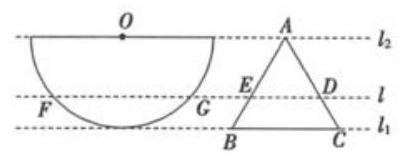

A.

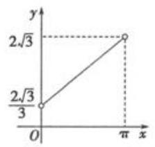

B.

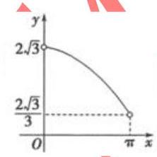

C.

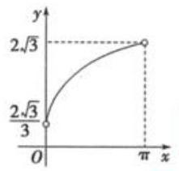

D.

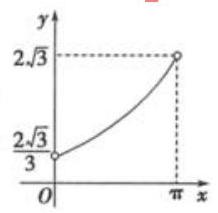

【难度】

【答案】D

【解析】依题意,正 $\bigtriangleup  {ABC}$ 的高为 1,则其边长 ${BC} = \frac{2\sqrt{3}}{3}$ ，

如图,连接 ${OF},{OG}$ ,过 $O$ 作 ${ON} \bot  {l}_{1}$ 于 $N$ ,交 $l$ 于点 $M$ ,过 $E$ 作 ${EH} \bot  {l}_{1}$ 于 $H$ ,

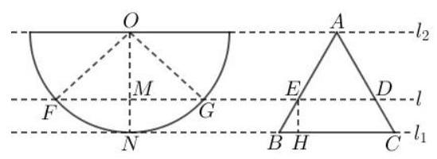

因 ${OF} = 1$ ,弧 ${FG}$ 的长为 $x\left( {0 < x < \pi }\right)$ ,则 $\angle {FOG} = x$ ,又 $l//{l}_{1}//{l}_{2}$ ,即有 $\angle {FON} = \frac{1}{2}\angle {FOG} = \frac{1}{2}x$ ,

于是得 ${OM} = {OF} \cdot  \cos \angle {FON} = \cos \frac{x}{2},{EH} = {MN} = {ON} - {OM} = 1 - \cos \frac{x}{2},{EB} = \frac{EH}{\sin {60}^{ \circ  }} = \frac{2\sqrt{3}}{3}\left( {1 - \cos \frac{x}{2}}\right)$ ,

因此, $y = {EB} + {BC} + {CD} = {2EB} + {BC} = \frac{4\sqrt{3}}{3}\left( {1 - \cos \frac{x}{2}}\right)  + \frac{2\sqrt{3}}{3} = 2\sqrt{3}\frac{4\sqrt{3}}{3}\cos \frac{x}{2}$ ,

即 $f\left( x\right)  = 2\sqrt{3} - \frac{4\sqrt{3}}{3}\cos \frac{x}{2},0 < x < \pi$ ,显然 $f\left( x\right)$ 在 $\left( {0,\pi }\right)$ 上单调递增,且图象是曲线,排除选项 $\mathrm{A},\mathrm{B}$ ,

而 $f\left( \frac{\pi }{2}\right)  = 2\sqrt{3} - \frac{4\sqrt{3}}{3}\cos \frac{\pi }{4} = 2\sqrt{3}\left( {1 - \frac{\sqrt{2}}{3}}\right)  < 2\sqrt{3} \times  \frac{2}{3} = \frac{\frac{2\sqrt{3}}{3} + 2\sqrt{3}}{2}$ , C 选项不满足, D 选项符合要求,所以

函数 $y = f\left( x\right)$ 的图像大致是选项 D. 故选:D

3、已知 $f\left( x\right)  = 3\sin \left( {{2x} + \varphi }\right) \;\left( {\varphi  \in  \mathbf{R}}\right)$ 既不是奇函数也不是偶函数,若 $y = f\left( {x + m}\right)$ 的图像关于原点对称, $y = f\left( {x + n}\right)$ 的图像关于 $y$ 轴对称,则 $\left| m\right|  + \left| n\right|$ 的最小值为 ( )

A. $\pi$

B. $\frac{\pi }{2}$ C. $\frac{\pi }{4}$ D. $\frac{\pi }{8}$

【难度】 $\star   \star   \star   \star$

【答案】C

【解析】可设 ${\varphi }_{0}$ 满足 ${\varphi }_{0} \in  \left( {0,\frac{\pi }{2}}\right)  \cup  \left( {\frac{\pi }{2},\pi }\right)$ ,且 $\varphi  = {2t\pi } + {\varphi }_{0}\left( {t \in  Z}\right)$ ,则 $f\left( x\right)  = 3\sin \left( {{2x} + {\varphi }_{0}}\right)$ ,

注意到五点作图法的最左边端点为 $\left( {-\frac{{\varphi }_{0}}{2},0}\right)$ ,而 $\frac{T}{2} = \frac{\pi }{2},\frac{T}{4} = \frac{\pi }{4}$ ,

故有 $\left| m\right|  = \min \left( {\left| {-\frac{{\varphi }_{0}}{2}}\right| ,\left| \frac{\pi  - {\varphi }_{0}}{2}\right| }\right)  = \min \left( {\frac{{\varphi }_{0}}{2},\frac{\pi  - {\varphi }_{0}}{2}}\right) ,\left| n\right|  = \left| {-\frac{{\varphi }_{0}}{2} + \frac{\pi }{4}}\right|  = \left| \frac{\pi  - 2{\varphi }_{0}}{4}\right|$ ,

当 ${\varphi }_{0} \in  \left( {0,\frac{\pi }{2}}\right)$ 时, $\left| m\right|  = \frac{{\varphi }_{0}}{2},\left| n\right|  = \frac{\pi  - 2{\varphi }_{0}}{4}$ ,此时 $\left| m\right|  + \left| n\right|  = \frac{\pi }{4}$ ;

当 ${\varphi }_{0} \in  \left( {\frac{\pi }{2},\pi }\right)$ 时, $\left| m\right|  = \frac{\pi  - {\varphi }_{0}}{2},\left| n\right|  = \frac{2{\varphi }_{0} - \pi }{4}$ ,此时 $\left| m\right|  + \left| n\right|  = \frac{\pi  - {\varphi }_{0}}{2} + \frac{2{\varphi }_{0} - \pi }{4} = \frac{\pi }{4}$ ,

故选: $C$ .

4、已知函数 $f\left( x\right)  = \sin \left( {\cos x}\right)  + \cos \left( {\sin x}\right)$ ，下列关于该函数结论正确的是(多选题)( )

A. $f\left( x\right)$ 的图象关于直线 $x = \frac{\pi }{4}$ 对称 B. $f\left( x\right)$ 的一个周期是 ${2\pi }$

C. $f\left( x\right)$ 的最小值是 -2

D. $f\left( x\right)$ 在区间 $\left( {0,\frac{\pi }{2}}\right)$ 是减函数

【难度】 $\star   \star   \star   \star$

【答案】BD

【解析】对于 $\mathrm{A}, f\left( {\frac{\pi }{2} - x}\right)  = \sin \left( {\cos \left( {\frac{\pi }{2} - x}\right) }\right)  + \cos \left( {\sin \left( {\frac{\pi }{2} - x}\right) }\right)  = \sin \left( {\sin x}\right)  + \cos \left( {\cos x}\right)  \neq  f\left( x\right)$ ,故选项 $\mathrm{A}$ 错误; 对于 $\mathrm{B}, f\left( {{2\pi } + x}\right)  = \sin \left( {\cos \left( {{2\pi } + x}\right) }\right)  + \cos \left( {\sin \left( {{2\pi } + x}\right) }\right)  = \sin \left( {\cos x}\right)  + \cos \left( {\sin x}\right)  = f\left( x\right)$ ,故选项 $\mathrm{B}$ 正确；

对于 $\mathrm{C}$ ,若 $f\left( x\right)$ 最小值为 -2,则此时 $\sin \left( {\cos x}\right)  =  - 1,\cos \left( {\sin x}\right)  =  - 1.\because  - 1 \leq  \cos x \leq  1$ ,

$\therefore \sin \left( {\cos x}\right)  \in  \left\lbrack  {-\sin 1,\sin 1}\right\rbrack$ ,也即 $\sin \left( {\cos x}\right)  \neq   - 1$ ,故选项 $\mathrm{C}$ 错误;

对于 $\mathrm{D}, y = \cos x$ 在 $\left( {0,\frac{\pi }{2}}\right)$ 上是减函数,且 $\cos x \in  \left( {0,1}\right)  \subseteq  \left( {0,\frac{\pi }{2}}\right)$ ,

$\therefore y = \sin \left( {\cos x}\right)$ 在区间 $\left( {0,\frac{\pi }{2}}\right)$ 上是减函数,

$y = \sin x$ 在区间 $\left( {0,\frac{\pi }{2}}\right)$ 上是增函数,且 $\sin x \in  \left( {0,1}\right)  \subseteq  \left( {0,\frac{\pi }{2}}\right)$ ,

$\therefore y = \cos \left( {\sin x}\right)$ 在区间 $\left( {0,\frac{\pi }{2}}\right)$ 上是减函数,故选项 D 正确.

故选: BD.

5、已知直线 $y = m$ 与函数 $f\left( x\right)  = \sin \left( {{\omega x} + \frac{\pi }{4}}\right)  + \frac{3}{2}\left( {\omega  > 0}\right)$ 的图象相交，若自左至右的三个相邻交点 $\mathrm{A}, B, C$ 满足 $2\left| {AB}\right|  = \left| {BC}\right|$ ,则实数 $m =$ ___.

【难度】 $\star   \star   \star   \star$

【答案】 1 或 2

【解析】解: 由题知,直线与 $y = m$ 与函数 $f\left( x\right)  = \sin \left( {{\omega x} + \frac{\pi }{4}}\right)  + \frac{3}{2}\left( {\omega  > 0}\right)$ 的图象相交

等价于直线 $y = m - \frac{3}{2}$ 与函数 $y = \sin \left( {{\omega x} + \frac{\pi }{4}}\right)$ 的图象相交

设 $A\left( {{x}_{1}, m - \frac{3}{2}}\right) , B\left( {{x}_{2}, m - \frac{3}{2}}\right) , C\left( {{x}_{3}, m - \frac{3}{2}}\right)$ ,所以 $\left| {AC}\right|  = \frac{2\pi }{\omega }$ ,

又由 $2\left| {AB}\right|  = \left| {BC}\right|$ 得: $\left| {AB}\right|  = \frac{1}{3}\left| {AC}\right|  = \frac{2\pi }{3\omega }$ ，即 ${x}_{2} - {x}_{1} = \frac{2\pi }{3\omega }$

化简得: $\omega {x}_{2} - \omega {x}_{1} = \frac{2\pi }{3}$ ①

由题知点 $\mathrm{A}$ 和点 $B$ 的中点坐标为: $\left( {\frac{{x}_{1} + {x}_{2}}{2}, m - \frac{3}{2}}\right)$

当直线 $y = m - \frac{3}{2}$ 与函数 $y = \sin \left( {{\omega x} + \frac{\pi }{4}}\right)$ 的交点在 $x$ 轴上方,则 $\sin \left( {\omega  \cdot  \frac{{x}_{1} + {x}_{2}}{2} + \frac{\pi }{4}}\right)  = 1$ ,即 $\omega  \cdot  \frac{{x}_{1} + {x}_{2}}{2} + \frac{\pi }{4} = \frac{\pi }{2} + {2k\pi }, k \in  Z$

化简得: $\omega {x}_{1} + \omega {x}_{2} = \frac{\pi }{2} + {4k\pi }$ ②

由①②联立得: $\omega {x}_{1} + \frac{\pi }{4} = \frac{\pi }{6} + {2k\pi }$ ， $k \in  Z$

所以 $\sin \left( {\omega {x}_{1} + \frac{\pi }{4}}\right)  = \sin \left( {\frac{\pi }{6} + {2k\pi }}\right)  = \frac{1}{2}$ ，即 $m - \frac{3}{2} = \frac{1}{2}$ 解得: $m = 2$

当直线 $y = m - \frac{3}{2}$ 与函数 $y = \sin \left( {{\omega x} + \frac{\pi }{4}}\right)$ 的交点在 $x$ 轴下方,则 $\sin \left( {\omega  \cdot  \frac{{x}_{1} + {x}_{2}}{2} + \frac{\pi }{4}}\right)  =  - 1$ ,即 $\omega  \cdot  \frac{{x}_{1} + {x}_{2}}{2} + \frac{\pi }{4} = \frac{3\pi }{2} + {2k\pi }, k \in  Z$

化简得: $\omega {x}_{1} + \omega {x}_{2} = \frac{5\pi }{2} + {4k\pi }$ ③

由①③联立得: $\omega {x}_{1} + \frac{\pi }{4} = \frac{7\pi }{6} + {2k\pi }$ ， $k \in  Z$

所以 $\sin \left( {\omega {x}_{1} + \frac{\pi }{4}}\right)  = \sin \left( {\frac{7\pi }{6} + {2k\pi }}\right)  = \frac{1}{2}$ ,即 $m - \frac{3}{2} =  - \frac{1}{2}$ 解得: $m = 1$

所以 $m = 1$ 或 $m = 2$ ,故答案为: 1 或 2 .

6、已知函数 $f\left( x\right)  = 4\sin x\cos \left( {x + \frac{\pi }{3}}\right)  + \sqrt{3}$ ,

(1)化简 $f\left( x\right)$ 到 $y = A\sin \left( {{\omega x} + \varphi }\right)  + B\left( {A > 0,\omega  > 0,\left| \varphi \right|  < \frac{\pi }{2}}\right)$ ，并求最小正周期；

(2)求函数 $f\left( x\right)$ 在区间 $\left\lbrack  {-\frac{\pi }{4},\frac{\pi }{6}}\right\rbrack$ 上的单调减区间；

(3)将函数 $f\left( x\right)$ 图像向右移动 $\frac{\pi }{6}$ 个单位，再将所得图像上各点的横坐标缩短到原来的 $a\left( {0 < a < 1}\right)$ 倍得到 $y = g\left( x\right)$ 的图像,若 $y = g\left( x\right)$ 在区间 $\left\lbrack  {-1,1}\right\rbrack$ 上至少有 100 个最大值,求 $a$ 的取值范围.

【难度】 $\star   \star   \star   \star$

【答案】(1) $f\left( x\right)  = 2\sin \left( {{2x} + \frac{\pi }{3}}\right)$ ，最小正周期是 $\pi$ ； (2) $\left\lbrack  {\frac{\pi }{12},\frac{\pi }{6}}\right\rbrack$ ；(3) $\left( {0,\frac{4}{199\pi }}\right\rbrack$ .

【解析】(1) 依题意,

$f\left( x\right)  = 4\sin x\left( {\frac{1}{2}\cos x - \frac{\sqrt{3}}{2}\sin x}\right)  + \sqrt{3} = 2\sin x\cos x + \sqrt{3}\left( {1 - 2{\sin }^{2}x}\right)  = \sin {2x} + \sqrt{3}\cos {2x} = 2\sin \left( {{2x} + \frac{\pi }{3}}\right)$ ,

其中 $\omega  = 2$ ,则 $T = \frac{2\pi }{\omega } = \pi$ ,

所以 $f\left( x\right)  = 2\sin \left( {{2x} + \frac{\pi }{3}}\right)$ ,最小正周期是 $\pi$

(2)由(1)知，当 $- \frac{\pi }{4} \leq  x \leq  \frac{\pi }{6}$ 时， $- \frac{\pi }{6} \leq  {2x} + \frac{\pi }{3} \leq  \frac{2\pi }{3}$ ，则由 $\frac{\pi }{2} \leq  {2x} + \frac{\pi }{3} \leq  \frac{2\pi }{3}$ 得 $\frac{\pi }{12} \leq  x \leq  \frac{\pi }{6}$ ，

即 $f\left( x\right)$ 在 $\left\lbrack  {\frac{\pi }{12},\frac{\pi }{6}}\right\rbrack$ 上单调递减,

所以函数 $f\left( x\right)$ 在区间 $\left\lbrack  {-\frac{\pi }{4},\frac{\pi }{6}}\right\rbrack$ 上的单调减区间是 $\left\lbrack  {\frac{\pi }{12},\frac{\pi }{6}}\right\rbrack$ .

(3)由(1)知， $f\left( x\right)  = 2\sin \left( {{2x} + \frac{\pi }{3}}\right)$ ，将函数 $f\left( x\right)$ 图像向右移动 $\frac{\pi }{6}$ 个单位所得函数为 $y = 2\sin {2x}$ ，于是得 $g\left( x\right)  = 2\sin \frac{2}{a}x$ ,则 $g\left( x\right)$ 的周期为 $\mathrm{a}\pi$ ,

因 $y = g\left( x\right)$ 在区间 $\left\lbrack  {-1,1}\right\rbrack$ 上至少有 100 个最大值,则在长为 2 的区间 $\left\lbrack  {-1,1}\right\rbrack$ 上至少有 99.5 个周期,因此, ${a\pi } \times  {99.5} \leq  2$ ,解得 $a \leq  \frac{4}{199\pi }$ ,而 $0 < a < 1$ ,于是得 $0 < a \leq  \frac{4}{199\pi }$ , 所以 $a$ 的取值范围 $\left( {0,\frac{4}{199\pi }}\right\rbrack$ .

## (四) 反三角与三角方程

## 知识梳理

## 反三角函数的图像和性质

<table><tr><td>反三角函数</td><td>$y = \arcsin x$</td><td>$y = \arccos x$</td><td>$y = \arctan x$</td></tr><tr><td>图像</td><td>$y = \arcsin x$    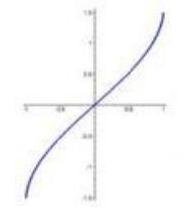</td><td>$y = \arccos x$    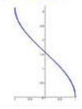</td><td>$y = \arctan x$    </td></tr><tr><td>定义域</td><td>$\left\lbrack  {-1,1}\right\rbrack$</td><td>$\left\lbrack  {-1,1}\right\rbrack$</td><td>$\left( {-\infty , + \infty }\right)$</td></tr><tr><td>值域</td><td>$\left\lbrack  {-\frac{\pi }{2},\frac{\pi }{2}}\right\rbrack$</td><td>$\left\lbrack  {0,\pi }\right\rbrack$</td><td>$\left( {-\frac{\pi }{2},\frac{\pi }{2}}\right)$</td></tr><tr><td>奇偶性</td><td>奇函数</td><td>非奇非偶</td><td>奇函数</td></tr><tr><td>单调性</td><td>增函数</td><td>减函数</td><td>增函数</td></tr></table>

## 【提醒】常用关系式

(1) $\arcsin \left( {-x}\right)  =  - \arcsin x, x \in  \left\lbrack  {-1,1}\right\rbrack  \;\sin \left( {\arcsin x}\right)  = x, x \in  \left\lbrack  {-1,1}\right\rbrack$

$\arcsin \left( {\sin x}\right)  = x, x \in  \left\lbrack  {-\frac{\pi }{2},\frac{\pi }{2}}\right\rbrack$

(2) $\arccos \left( {-x}\right)  = \pi  - \arccos x, x \in  \left\lbrack  {-1,1}\right\rbrack  \cos \left( {\arccos x}\right)  = x, x \in  \left\lbrack  {-1,1}\right\rbrack$

$\arccos \left( {\cos x}\right)  = x, x \in  \left\lbrack  {0,\pi }\right\rbrack$

(3) $\arctan \left( {-x}\right)  =  - \arctan x, x \in  R\tan \left( \arctan \right)  = x, x \in  R$

$\arctan \left( {\tan x}\right)  = x, x \in  \left( {-\frac{\pi }{2},\frac{\pi }{2}}\right)$

## 最简三角方程的解集, 见下表

<table><tr><td colspan="2">方程</td><td>方程的解集</td></tr><tr><td rowspan="3">$\sin x = a$</td><td>$\left| a\right|  > 1$</td><td>$\phi$</td></tr><tr><td>$\left| a\right|  = 1$</td><td>$\left\{  {x\left| {\;x = {2k\pi } + \arcsin a}\right. , k \in  Z}\right\}$</td></tr><tr><td>$\left| a\right|  < 1$</td><td>$\left\{  {x\left| {\;x = {k\pi } + {\left( -1\right) }^{k}\arcsin a}\right. , k \in  Z}\right\}$</td></tr><tr><td rowspan="3">$\cos x = a$</td><td>$\left| a\right|  > 1$</td><td>$\phi$</td></tr><tr><td>$\left| a\right|  = 1$</td><td>$\left\{  {x\left| {\;x = {2k\pi } + \arccos a}\right. , k \in  Z}\right\}$</td></tr><tr><td>$\left| a\right|  < 1$</td><td>$\left\{  {x\left| {\;x = {2k\pi } \pm  \arccos a}\right. , k \in  Z}\right\}$</td></tr><tr><td colspan="2">$\tan x = a$</td><td>$\left\{  {x\left| {\;x = {k\pi } + \arctan a}\right. , k \in  Z}\right\}$</td></tr></table>

## 例题精讲

【例 15】设 ${a}_{1}\text{ 、 }{a}_{2} \in  \mathbf{R}$ ,且 $\frac{1}{2 + \sin {\alpha }_{1}} + \frac{1}{2 + \sin \left( {2{\alpha }_{2}}\right) } = 2$ ,则 $\left| {{10\pi } - {\alpha }_{1} - {\alpha }_{2}}\right|$ 的最小值等于___

【难度】 $\star   \star   \star   \star$

【答案】 $\frac{\pi }{4}$

【解析】三角方程有界性

【例 16】设 $a, b \in  R, c \in  \lbrack 0,{2\pi })$ ,若对任意实数 $x$ 都有 $3\sin \left( {{2x} - \frac{\pi }{6}}\right)  = a\sin \left( {{bx} + c}\right)$ ,则满足条件的 $c$ 的所有取值的和为___

【难度】 $\star   \star   \star   \star$

【答案】 ${4\pi }$

【解析】因为对任意实数 $x$ 都有 $3\sin \left( {{2x} - \frac{\pi }{6}}\right)  = a\sin \left( {{bx} + c}\right)$ ,所以 $\left| a\right|  = 3$ .

当 $a = 3$ 时,方程等价于 $\sin \left( {{2x} - \frac{\pi }{6}}\right)  = \sin \left( {{bx} + c}\right)$ ,则两函数的周期相同,即 $\left| \mathbf{b}\right|  = 2$ . 当 $b = 2$ 时,

$\sin \left( {{2x} - \frac{\pi }{6}}\right)  = \sin \left( {{2x} + c}\right)$ ,此时 $c =  - \frac{\pi }{6} + {2\pi } = \frac{11\pi }{6}$ ; 当 $b =  - 2$ 时,

$\sin \left( {{2x} - \frac{\pi }{6}}\right)  = \sin \left\lbrack  {\pi  - \left( {{2x} - \frac{\pi }{6}}\right) }\right\rbrack   = \sin \left( {-{2x} + \frac{7\pi }{6}}\right)  = \sin \left( {-{2x} + c}\right)$ ,此时 $c = \frac{7\pi }{6}$ .

当 $a =  - 3$ 时,方程等价于 $\sin \left( {{2x} - \frac{\pi }{6}}\right)  =  - \sin \left( {{bx} + c}\right)  = \sin \left( {-{bx} - c}\right)$ . 当 $b =  - 2$ 时,此时 $c = \frac{\pi }{6}$ ; 当 $b = 2$ 时, $\sin \left( {{2x} - \frac{\pi }{6}}\right)  = \sin \left\lbrack  {-\pi  - \left( {{2x} - \frac{\pi }{6}}\right) }\right\rbrack   = \sin \left( {-{2x} - \frac{5\pi }{6}}\right)  = \sin \left( {-{2x} - c}\right)$ ,此时 $c = \frac{5\pi }{6}$ . 综上, $c$ 的所有取值为 $\frac{11\pi }{6},\frac{7\pi }{6},\frac{\pi }{6},\frac{5\pi }{6}$ ,和为 ${4\pi }$ .

故答案为: ${4\pi }$

【例 17】已知函数 $f\left( x\right)  = \cos x$ ,若对任意实数 ${x}_{1},{x}_{2}$ ,方程 $\left| {f\left( x\right)  - f\left( {x}_{1}\right) }\right|  + \left| {f\left( x\right)  - f\left( {x}_{2}\right) }\right|  = m\left( {m \in  R}\right)$ 有解, 方程 $\left| {f\left( x\right)  - f\left( {x}_{1}\right) }\right|  - \left| {f\left( x\right)  - f\left( {x}_{2}\right) }\right|  = n\left( {n \in  R}\right)$ 也有解,则 $m + n$ 的值的集合为___

【难度】 $\star   \star   \star   \star$

【答案】 $\{ 2\}$

【解析】解: 由题可知 $f\left( x\right)  = \cos x$ ,不妨设 $\cos {x}_{1} \leq  \cos {x}_{2}$

对于 $m$ ,对任意实数 ${x}_{1},{x}_{2}$ ,方程 $\left| {f\left( x\right)  - f\left( {x}_{1}\right) }\right|  + \left| {f\left( x\right)  - f\left( {x}_{2}\right) }\right|  = m\left( {m \in  R}\right)$ 有解,

当 $\cos x \geq  \cos {x}_{2}$ 时,方程可化为 $m = 2\cos x - \left( {\cos {x}_{1} + \cos {x}_{2}}\right)$ 有解.

所以 $m \geq  \cos {x}_{2} - \cos {x}_{1}$ 恒成立,所以 $m \geq  2$ ;

当 $\cos x \leq  \cos {x}_{1}$ 时,同上;

当 $\cos {x}_{1} < \cos x < \cos {x}_{2}$ 时,方程可化为 $m = \cos {x}_{2} - \cos {x}_{1}$ 有解,所以 $m \in  \left\lbrack  {0,2}\right\rbrack$ ,

综上得: $m = 2$ ；

对于 $n$ ,对任意实数 ${x}_{1},{x}_{2}$ ,方程 $\left| {f\left( x\right)  - f\left( {x}_{1}\right) }\right|  - \left| {f\left( x\right)  - f\left( {x}_{2}\right) }\right|  = n\left( {n \in  R}\right)$ 也有解,

当 $\cos x \geq  \cos {x}_{2}$ 时,方程可化为 $n = \cos {x}_{2} - \cos {x}_{1}$ 有解,所以 $n \in  \left\lbrack  {0,2}\right\rbrack$ ;

当 $\cos x \leq  \cos {x}_{1}$ 时,同上;

当 $\cos {x}_{1} < \cos x < \cos {x}_{2}$ 时,方程可化为 $n = 2\cos x - \left( {\cos {x}_{2} + \cos {x}_{1}}\right)$ 有解,

所以 $\cos {x}_{1} - \cos {x}_{2} < n < \cos {x}_{2} - \cos {x}_{1}$ 恒成立,所以 $n = 0$ ,

所以 $m + n$ 的值的集合为 $\{ 2\}$ .

故答案为: $\{ 2\}$ .

## 巩固训练

1、若函数 $f\left( x\right)  = \cos {mx}$ ( $m > 0$ )在区间 $\left( {{2\pi },{3\pi }}\right)$ 内既没有取到最大值 1，也没有取到最小值 -1，则 $m$ 的取值范围为___

【难度】 $\star   \star   \star   \star$

【答案】 $\left( {0,\frac{1}{3}}\right\rbrack   \cup  \left\lbrack  {\frac{1}{2},\frac{2}{3}}\right\rbrack   \cup  \{ 1\}$

【解析】当 $x \in  \left( {{2\pi },{3\pi }}\right)$ 且 $\omega  > 0$ 时, ${2\pi \omega } < {\omega x} < {3\pi \omega }$ ,

因为函数 $f\left( x\right)$ 在区间 $\left( {{2\pi },{3\pi }}\right)$ 内既没有最大值 1,也没有最小值 -1,

则 $\left( {{2\pi \omega },{3\pi \omega }}\right)  \subseteq  \left( {{k\pi },{k\pi } + \pi }\right)$ ,其中 $k \in  Z$ ,

所以, $\left\{  \begin{array}{l} {2\pi \omega } \geq  {k\pi } \\  {3\pi \omega } \leq  {k\pi } + \pi  \end{array}\right.$ ,解得 $\frac{k}{2} \leq  \omega  \leq  \frac{k + 1}{3}\left( {k \in  Z}\right)$ ,由 $\frac{k}{2} \leq  \frac{k + 1}{3}$ ,可得 $k \leq  2$ ,

因为 $\omega  > 0$ 且 $k \in  Z$ ,当 $k = 0$ 时, $0 < \omega  \leq  \frac{1}{3}$ ; 当 $k = 1$ 时, $\frac{1}{2} \leq  \omega  \leq  \frac{2}{3}$ ; 当 $k = 2$ 时, $\omega  = 1$ .

综上所述,实数 $\omega$ 的取值范围是 $\left( {0,\frac{1}{3}}\right\rbrack   \cup  \left\lbrack  {\frac{1}{2},\frac{2}{3}}\right\rbrack   \cup  \{ 1\}$ .

故答案为: $\left( {0,\frac{1}{3}}\right\rbrack   \cup  \left\lbrack  {\frac{1}{2},\frac{2}{3}}\right\rbrack   \cup  \{ 1\}$ .

2、函数 $y = \pi  - 3\arcsin \frac{1}{2}\left( {{x}^{2} + {4x} + 5}\right)$ 的值域为___▲___.

【难度】 $\star   \star   \star   \star$

【答案】 $\left\lbrack  {-\frac{\pi }{2},\frac{\pi }{2}}\right\rbrack$

【解析】设 $t = \frac{1}{2}\left( {{x}^{2} + {4x} + 5}\right)$ ,则 $t \geq  \frac{1}{2}\left\lbrack  {{\left( -2\right) }^{2} + 4 \times  \left( {-2}\right)  + 5}\right\rbrack   = \frac{1}{2}$ ,

$\because$ 函数 $f\left( t\right)  = \arcsin t$ 是 $\left\lbrack  {-1,1}\right\rbrack$ 上的增函数,

$\therefore$ 当 $t \geq  \frac{1}{2}$ 时, $\arcsin t \geq  \arcsin \frac{1}{2} = \frac{\pi }{6}$ ,且 $\arcsin t \leq  \frac{\pi }{2}$ ,由此可得: $3\arcsin \frac{1}{2}\left( {{x}^{2} + {4x} + 5}\right)  \in  \left\lbrack  {\frac{\pi }{2},\frac{3\pi }{2}}\right\rbrack$ , $\therefore  - \frac{\pi }{2} \leq  \pi  - 3\arcsin \frac{1}{2}\left( {{x}^{2} + {4x} + 5}\right)  \leq  \frac{\pi }{2}$ ,

即函数 $y = \pi  - 3\arcsin \frac{1}{2}\left( {{x}^{2} + {4x} + 5}\right)$ 的值域 $\left\lbrack  {-\frac{\pi }{2},\frac{\pi }{2}}\right\rbrack$ . 故答案为: $\left\lbrack  {-\frac{\pi }{2},\frac{\pi }{2}}\right\rbrack$ .

3、已知数列 ${a}_{n} = \arcsin \left( {\sin {n}^{ \circ  }}\right) , n \in  {N}^{ * },\left\{  {a}_{n}\right\}$ 的前 $n$ 项和为 ${S}_{n}$ ,则当 $1 \leq  n \leq  {2016}$ 时,( )

A. ${S}_{1980} \leq  {S}_{n} \leq  {S}_{90}$ B. ${S}_{1800} \leq  {S}_{n} \leq  {S}_{180}$

C. ${S}_{1980} \leq  {S}_{n} \leq  {S}_{180}$ D. ${S}_{2016} \leq  {S}_{n} \leq  {S}_{90}$

【难度】 $\star   \star   \star   \star$

【答案】B

【解析】根据反正弦函数 $y = \arcsin x, x \in  \left\lbrack  {-1,1}\right\rbrack  , y \in  \left\lbrack  {-\frac{\pi }{2},\frac{\pi }{2}}\right\rbrack$ ,

分析数列 ${a}_{n} = \arcsin \left( {\sin {n}^{ \circ  }}\right)$ ， $n \in  {N}^{ * }$ ，可以发现数列 $\left\{  {a}_{n}\right\}$ 是一个以 360 为周期的数列，

其中 ${a}_{1} = \frac{\pi }{180},{a}_{2} = \frac{2\pi }{180},\cdots ,{a}_{89} = \frac{89\pi }{180},{a}_{90} = \frac{90\pi }{180}$

${a}_{91} = \frac{89\pi }{180},{a}_{92} = \frac{88\pi }{180},\cdots ,{a}_{179} = \frac{\pi }{180},{a}_{180} = 0$

${a}_{181} =  - \frac{\pi }{180},{a}_{182} =  - \frac{2\pi }{180},\cdots ,{a}_{269} =  - \frac{89\pi }{180},{a}_{270} =  - \frac{90\pi }{180}$

${a}_{271} =  - \frac{89\pi }{180},{a}_{272} =  - \frac{88\pi }{180},\cdots ,{a}_{359} =  - \frac{\pi }{180},{a}_{360} = 0$

一个周期之和 ${S}_{360} = 0$ ，且 ${S}_{360} = 0$ 取最小值， ${S}_{180}$ 取得最大值，所以 $\mathrm{B}$ 正确；

${S}_{180} > {S}_{90},{S}_{90}$ 不是最大值,所以 $\mathrm{A},\mathrm{D}$ 错误

${S}_{1800} = {S}_{{360} \times  5} = 0,\;{S}_{2016} = {S}_{216} > 0,$

${S}_{1980} = {S}_{180} > {S}_{90}$ 所以 A、C 错误; 故选: B

4、设函数 $f\left( x\right)  = m\cos \left( {x + \alpha }\right)  + n\cos \left( {x + \beta }\right)$ ，其中 $m, n,\alpha ,\beta$ 为已知实常数， $x \in  \mathbf{R}$ ，则下列命题中错误的是 ( )

A. 若 $f\left( 0\right)  = f\left( \frac{\pi }{2}\right)  = 0$ ,则 $f\left( x\right)  = 0$ 对任意实数 $x$ 恒成立;

B. 若 $f\left( 0\right)  = 0$ ，则函数 $f\left( x\right)$ 为奇函数；

C. 若 $f\left( \frac{\pi }{2}\right)  = 0$ ，则函数 $f\left( x\right)$ 为偶函数；

D. 当 ${f}^{2}\left( 0\right)  + {f}^{2}\left( \frac{\pi }{2}\right)  \neq  0$ 时,若 $f\left( {x}_{1}\right)  = f\left( {x}_{2}\right)  = 0$ ,则 ${x}_{1} - {x}_{2} = {2k\pi }\;\left( {k \in  \mathbf{Z}}\right)$ .

【难度】

【答案】D

【解析】

$f\left( x\right)  = m\left( {\cos x\cos \alpha  - \sin x\sin \alpha }\right)  + n\left( {\cos x\cos \beta  - \sin x\sin \beta }\right)  = \left( {m\cos \alpha  + n\cos \beta }\right) \cos x - \left( {m\sin \alpha  + n\sin \beta }\right) \sin x$

不妨设 $f\left( x\right)  = \left( {{k}_{1}\cos {\alpha }_{1} + {k}_{2}\cos {\alpha }_{2}}\right) \cos x - \left( {{k}_{1}\sin {\alpha }_{1} + {k}_{2}\sin {\alpha }_{2}}\right) \sin x.{k}_{1},{k}_{2},{\alpha }_{1},{\alpha }_{2}$ 为已知实常数.

若 $f\left( 0\right)  = 0$ ,则得 ${k}_{1}\cos {\alpha }_{1} + {k}_{2}\cos {\alpha }_{2} = 0$ ; 若 $f\left( \frac{\pi }{2}\right)  = 0$ ,则得 ${k}_{1}\sin {\alpha }_{1} + {k}_{2}\sin {\alpha }_{2} = 0$ .

于是当 $f\left( 0\right)  = f\left( \frac{\pi }{2}\right)  = 0$ 时, $f\left( x\right)  = 0$ 对任意实数 $x$ 恒成立,即命题 $\mathrm{A}$ 是真命题;

当 $f\left( 0\right)  = 0$ 时, $f\left( x\right)  =  - \left( {{k}_{1}\sin {\alpha }_{1} + {k}_{2}\sin {\alpha }_{2}}\right) \sin x$ ,它为奇函数,即命题 $\mathrm{B}$ 是真命题;

当 $f\left( \frac{\pi }{2}\right)  = 0$ 时, $f\left( x\right)  = \left( {{k}_{1}\cos {\alpha }_{1} + {k}_{2}\cos {\alpha }_{2}}\right) \cos x$ ,它为偶函数,即命题 $\mathrm{C}$ 是真命题;

当 ${f}^{2}\left( 0\right)  + {f}^{2}\left( \frac{\pi }{2}\right)  \neq  0$ 时,令 $f\left( x\right)  = 0$ ,则

$\left( {{k}_{1}\cos {\alpha }_{1} + {k}_{2}\cos {\alpha }_{2}}\right) \cos x - \left( {{k}_{1}\sin {\alpha }_{1} + {k}_{2}\sin {\alpha }_{2}}\right) \sin x = (,$

上述方程中,若 $\cos x = 0$ ,则 $\sin x = 0$ ,这与 ${\cos }^{2}x + {\sin }^{2}x = 1$ 矛盾,所以 $\cos x \neq  0$ .

将该方程的两边同除以 $\cos x$ 得

$\tan x = \frac{{k}_{1}\cos {\alpha }_{1} + {k}_{2}\cos {\alpha }_{2}}{{k}_{1}\sin {\alpha }_{1} + {k}_{2}\sin {\alpha }_{2}}$ ,令 $\frac{{k}_{1}\cos {\alpha }_{1} + {k}_{2}\cos {\alpha }_{2}}{{k}_{1}\sin {\alpha }_{1} + {k}_{2}\sin {\alpha }_{2}} = t\;\left( {t \neq  0}\right)$ ,

则 $\tan x = t$ ,解得 $x = {k\pi } + \arctan t\;\left( {k \in  Z}\right)$ .

不妨取 ${x}_{1} = {k}_{1}\pi  + \arctan t,{x}_{2} = {k}_{2}\pi  + \arctan t\;\left( {{k}_{1} \in  Z\text{ 且 }{k}_{2} \in  Z}\right.$

则 ${x}_{1} - {x}_{2} = \left( {{k}_{1} - {k}_{2}}\right) \pi$ ,即 ${x}_{1} - {x}_{2} = {k\pi }\;\left( {k \in  Z}\right)$ ,所以命题 $\mathrm{D}$ 是假命题.

故选: D

5、已知 $A = \{ y \mid  y = \sin \left( {{\omega n} + \varphi }\right) , n \in  Z\}$ ，若存在 $\varphi$ 使得集合 A 中恰有 3 个元素，则 $\omega$ 的取值不可能是( )

A. $\frac{2\pi }{7}$ B. $\frac{2\pi }{5}$ C. $\frac{\pi }{2}$ D. $\frac{2\pi }{3}$

【难度】 $\star   \star   \star   \star$

【答案】A

【解析】解: 对 $\mathrm{A}$ ,当 $\omega  = \frac{2\pi }{7}, y = \sin \left( {\frac{2\pi }{7}n + \varphi }\right)$ ,函数的周期为 $T = \frac{2\pi }{\omega } = \frac{2\pi }{\frac{2\pi }{7}} = 7$

在一个周期内,对 $n$ 赋值

当 $n = 0$ 时, $y = \sin \varphi$ ; 当 $n = 1$ 时, $y = \sin \left( {\frac{2\pi }{7} + \varphi }\right)$ ;

当 $n = 2$ 时， $y = \sin \left( {\frac{4\pi }{7} + \varphi }\right)$ ；当 $n = 3$ 时， $y = \sin \left( {\frac{6\pi }{7} + \varphi }\right)$ ；

当 $n = 4$ 时, $y = \sin \left( {\frac{8\pi }{7} + \varphi }\right)  = \sin \left( {-\frac{6\pi }{7} + \varphi }\right)$ ;

当 $n = 5$ 时， $y = \sin \left( {\frac{10\pi }{7} + \varphi }\right)  = \sin \left( {-\frac{4\pi }{7} + \varphi }\right)$ ；

当 $n = 6$ 时, $y = \sin \left( {\frac{12\pi }{7} + \varphi }\right)  = \sin \left( {-\frac{2\pi }{7} + \varphi }\right)$ ;

令 $\varphi  = \frac{\pi }{2}$ 时, $\sin \varphi  = \sin \frac{\pi }{2} = 1$

$\sin \left( {\frac{2\pi }{7} + \frac{\pi }{2}}\right)  = \sin \left( {-\frac{2\pi }{7} + \frac{\pi }{2}}\right)  = \cos \frac{2\pi }{7}\;\sin \left( {\frac{4\pi }{7} + \frac{\pi }{2}}\right)  = \sin \left( {-\frac{4\pi }{7} + \frac{\pi }{2}}\right)  = \cos \frac{4\pi }{7}$

$\sin \left( {\frac{6\pi }{7} + \frac{\pi }{2}}\right)  = \sin \left( {-\frac{6\pi }{7} + \frac{\pi }{2}}\right)  = \cos \frac{6\pi }{7}$

所以存在 $\varphi$ 使得 $n = 1$ 时的 $y$ 值等于 $n = 6$ 时的 $y$ 值, $n = 2$ 时的 $y$ 值等于 $n = 5$ 时的 $y$ 值, $n = 3$ 时的 $y$ 值等于 $n = 4$ 时的 $y$ 值.

但是当 $n$ 等于 0、1、2、3 时,不存在 $\varphi$ 使得这个 $y$ 值中的任何两个相等所以当 $\omega  = \frac{2\pi }{7}$ 时,集合 $\mathrm{A}$ 中至少有四个元素,不符合题意,故 $\mathrm{A}$ 错误;

对 $\mathrm{B}$ ,当 $\omega  = \frac{2\pi }{5}, y = \sin \left( {\frac{2\pi }{5}n + \varphi }\right)$ ,函数的周期为 $T = \frac{2\pi }{\omega } = \frac{2\pi }{\frac{2\pi }{5}} = 5$

在一个周期内,对 $n$ 赋值

当 $n = 0$ 时, $y = \sin \varphi$ ; 当 $n = 1$ 时, $y = \sin \left( {\frac{2\pi }{5} + \varphi }\right)$ ;

当 $n = 2$ 时， $y = \sin \left( {\frac{4\pi }{5} + \varphi }\right)$ ；当 $n = 3$ 时， $y = \sin \left( {\frac{6\pi }{5} + \varphi }\right)  = \sin \left( {-\frac{4\pi }{5} + \varphi }\right)$ ；

当 $n = 4$ 时, $y = \sin \left( {\frac{8\pi }{5} + \varphi }\right)  = \sin \left( {-\frac{2\pi }{5} + \varphi }\right)$ ;

令 $\varphi  = \frac{\pi }{2},\sin \frac{\pi }{2} = 1$

$\sin \left( {\frac{2\pi }{5} + \frac{\pi }{2}}\right)  = \sin \left( {-\frac{2\pi }{5} + \frac{\pi }{2}}\right)  = \cos \frac{2\pi }{5}\;\sin \left( {\frac{4\pi }{5} + \frac{\pi }{2}}\right)  = \sin \left( {-\frac{4\pi }{5} + \frac{\pi }{2}}\right)  = \cos \frac{4\pi }{5}$

所以当 $\omega  = \frac{2\pi }{5}$ 时,符合题意,故 $\mathrm{B}$ 正确;

对 $\mathrm{C}$ ,当 $\omega  = \frac{\pi }{2}, y = \sin \left( {\frac{\pi }{2}n + \varphi }\right)$ ,函数的周期为 $T = \frac{2\pi }{\omega } = \frac{2\pi }{\frac{\pi }{2}} = 4$

在一个周期内,对 $n$ 赋值

当 $n = 0$ 时, $y = \sin \varphi$ ; 当 $n = 1$ 时, $y = \sin \left( {\frac{\pi }{2} + \varphi }\right)  = \cos \varphi$ ;

当 $n = 2$ 时, $y = \sin \left( {\pi  + \varphi }\right)  =  - \sin \varphi$ ; 当 $n = 3$ 时, $y = \sin \left( {\frac{3\pi }{2} + \varphi }\right)  =  - \cos \varphi$ ;

令 $\varphi  = 0$ ,则 $\sin 0 =  - \sin 0 = 0,\cos 0 = 1, - \cos 0 =  - 1$

所以当 $\omega  = \frac{\pi }{2}$ 时,符合题意,故 $\mathrm{C}$ 正确;

对 $\mathrm{D}$ ,当 $\omega  = \frac{2\pi }{3}, y = \sin \left( {\frac{2\pi }{3}n + \varphi }\right)$ ,函数的周期为 $T = \frac{2\pi }{\omega } = \frac{2\pi }{\frac{2\pi }{3}} = 3$

在一个周期内,对 $n$ 赋值

当 $n = 0$ 时, $y = \sin \varphi$ ; 当 $n = 1$ 时, $y = \sin \left( {\frac{2\pi }{3} + \varphi }\right)$ ; 当 $n = 2$ 时, $y = \sin \left( {\frac{4\pi }{3} + \varphi }\right)$ ;

令 $\varphi  = 0,\sin 0 = 0,\sin \frac{2\pi }{3} = \frac{\sqrt{3}}{2},\sin \frac{4\pi }{3} =  - \frac{\sqrt{3}}{2}$

所以当 $\omega  = \frac{2\pi }{3}$ 时,符合题意,故 $\mathrm{D}$ 正确. 故选: A.
