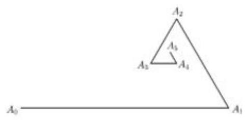
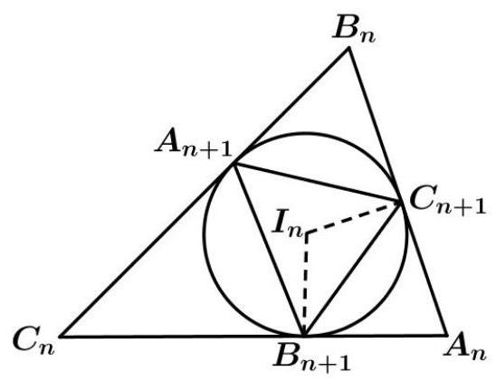
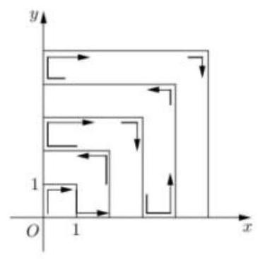

第 8 课:数列专题

<table><tr><td>教学目标</td><td>1、掌握数列的概念   2、掌握等差等比数列的通项公式和求和公式   3、掌握通项的求法和求和的方法   4、掌握数列的函数性质</td></tr><tr><td>重点</td><td>数列的综合</td></tr><tr><td>难点</td><td>数列的综合</td></tr></table>

## (一)等差、等比数列

## 例题精讲

【例 1】已知数列 $\left\{  {a}_{n}\right\}$ 是公差为 $d$ 的等差数列, ${S}_{n}$ 是其前 $n$ 项和,若 $\left\{  \sqrt{{S}_{n} - {2n}}\right\}$ 也是公差为 $d$ 的等差数列, 则 $\left\{  {a}_{n}\right\}$ 的通项为___.

【例 2】在数列 $\left\{  {a}_{n}\right\}$ 中,如果对任意 $n \in  {N}^{ * }$ 都有 $\frac{{a}_{n + 2} - {a}_{n + 1}}{{a}_{n + 1} - {a}_{n}} = k$ ( $k$ 为常数),则称 $\left\{  {a}_{n}\right\}$ 为等差比数列, $k$ 称为公差比. 下列说法不正确的是 ( )

A. 等差数列一定是等差比数列 B. 等差比数列的公差比一定不为 0

C. 若 ${a}_{n} =  - {3}^{n} + 2$ ,则数列 $\left\{  {a}_{n}\right\}$ 是等差比数列 D. 若等比数列是等差比数列, 则其公比等于公差比

【例 3】已知 ${a}_{1},{a}_{2},{a}_{3},\ldots \ldots ,{a}_{n}$ 是各项不为零的 $n\left( {n \geq  4}\right)$ 项等差数列,且公差不为零,若将此数列删去某一项得到的数列(按原来的顺序)是等比数列，则 $n$ 的值为( )

A. 4 B. 6 C. 7 D. 无法确定

【例 4】甲、乙两人相约打靶，每人有 8 次机会，分别用数列 $\left\{  {a}_{n}\right\}$ 和 $\left\{  {b}_{n}\right\}$ 来统计其结果. 若甲第 $n$ 局中靶， 则 ${a}_{n} = n$ ,若甲第 $n$ 局未中,则 ${a}_{n} =  - n$ ; 若乙第 $n$ 局中靶,则 ${b}_{n} = {2}^{n - 1}$ ,若乙第 $n$ 局未中,则 ${b}_{n} =  - {2}^{n - 1}$ . 已知 ${b}_{1} + {b}_{2} + \cdots  + {b}_{8} = {127}$ ， ${a}_{1}{b}_{1} + {a}_{2}{b}_{2} + \cdots  + {a}_{8}{b}_{8} = {1793}$ ，则 ${a}_{1} + {a}_{2} + \cdots  + {a}_{8} =$ ___.

## 巩固训练

1、已知集合 $A = \left\{  {x\left| {\;x = {2n} - 1}\right. , n \in  {\mathbf{N}}^{ * }}\right\}  , B = \left\{  {x\left| {\;x = {2}^{n}}\right. , n \in  {\mathbf{N}}^{ * }}\right\}$ ,将 $A \cup  B$ 中的所有元素按从小到大的顺序排列构成一个数列 $\left\{  {a}_{n}\right\}$ ，设数列 $\left\{  {a}_{n}\right\}$ 的前 $n$ 项和为 ${S}_{n}$ ，则使得 ${S}_{n} > {1000}$ 成立的最小的 $n$ 的值为___.

2、已知等差数列 $\left\{  {a}_{n}\right\}$ 的前 $n$ 项和为 ${S}_{n}$ ， ${a}_{3} = 4$ ， $\frac{{S}_{n + 1}}{n + 1} - \frac{{S}_{n}}{n} = \frac{1}{2}$ ，数列 $\left\{  {b}_{n}\right\}$ 满足 ${b}_{1} = \frac{1}{2}$ ， $\frac{{b}_{n + 1}}{n + 1} = \frac{{b}_{n}}{2n}$ ，记集合 $M = \left\{  {n \mid  {a}_{n}{b}_{n} \geq  \lambda , n \in  {N}^{ * }}\right\}$ ，若集合 $M$ 的子集个数为 16，则实数 $\lambda$ 的取值范围为( )

A. $\left( {\frac{5}{4},\frac{3}{2}}\right\rbrack$ B. $\left( {\frac{15}{16},\frac{5}{4}}\right\rbrack$ C. $\left( {\frac{15}{16},1}\right\rbrack$ D. $\left( {1,\frac{5}{4}}\right\rbrack$

3、在数列 $\left\{  {a}_{n}\right\}$ 中,已知 ${a}_{1} = 1,{a}_{2} = 2,{a}_{n + 2} = \left\{  {\begin{array}{ll} {a}_{n} + 2, & n = {2k} - 1 \\  3{a}_{n}, & n = {2k} \end{array}\left( {k \in  {\mathrm{N}}^{ * }}\right) }\right.$ .

(1)求数列 $\left\{  {a}_{n}\right\}$ 的通项公式；

(2)设数列 $\left\{  {a}_{n}\right\}$ 的前 $n$ 项和为 ${S}_{n}$ ，问是否存在正整数 $m$ ， $n$ ，使得 ${S}_{2n} = m{S}_{{2n} - 1}$ ？若存在，求出所有的正整数对 $\left( {m, n}\right)$ ; 若不存在,请说明理由.

## (二)数列的极限与数学归纳法

## 例题精讲

【例 5】已知 $p, q$ 是两个不相等的正整数，且 $q \geq  2$ ，则 $\mathop{\lim }\limits_{{n \rightarrow  \infty }}\frac{{\left( 1 + \frac{1}{n}\right) }^{p} - 1}{{\left( 1 + \frac{1}{n}\right) }^{q} - 1}$ 等于___.

【例 6】已知点 $O\left( {0,0}\right) \text{ 、 }{A}_{0}\left( {2,3}\right)$ 和 ${B}_{0}\left( {5,6}\right)$ ,记线段 ${A}_{0}{B}_{0}$ 的中点为 ${P}_{1}$ ,取线段 ${A}_{0}{P}_{1}$ 和 ${P}_{1}{B}_{0}$ 中的一条,记其端点为 ${A}_{1}\text{ 、 }{B}_{1}$ ,使之满足 $\left( {\left| {O{A}_{1}}\right|  - 5}\right) \left( {\left| {O{B}_{1}}\right|  - 5}\right)  < 0$ ,记线段 ${A}_{1}{B}_{1}$ 的中点为 ${P}_{2}$ ,取线段 ${A}_{1}{P}_{2}$ 和 ${P}_{2}{B}_{1}$ 中的一条,记其端点为 ${A}_{2}\text{ 、 }{B}_{2}$ ,使之满足 $\left( {\left| {O{A}_{2}}\right|  - 5}\right) \left( {\left| {O{B}_{2}}\right|  - 5}\right)  < 0$ ,依次下去,得到点 ${P}_{1}\text{ 、 }{P}_{2}\text{ 、 }{P}_{3}\text{ 、 }\ldots \text{ 、 }{P}_{n}\text{ 、 }\ldots$ ,则 $\mathop{\lim }\limits_{{n \rightarrow  \infty }}\left| {{A}_{0}{P}_{n}}\right|  =$ ___.

【例 7】定义 “ $\frac{{\left| x\right| }^{n}}{{a}^{n}} + \frac{{\left| y\right| }^{n}}{{b}^{n}} = 1\left( {a > b > 0, n \in  {N}^{ * }, n \geq  3}\right)$ ”代表的曲线为“超椭圆”,设 $a\text{ 、 }b$ 为常数,设超椭圆的周长为 ${C}_{n}$ ,那么 $\mathop{\lim }\limits_{{n \rightarrow  \infty }}{C}_{n} =$ ___.

【例 8】设 ${P}_{n}\left( {{x}_{n},{y}_{n}}\right)$ 是圆 ${x}^{2} + {y}^{2} - {4x} + {2y} = 0$ 与圆 ${x}^{2} + {y}^{2} = \frac{1}{{2}^{n}}$ 在第一象限的交点，则 $\mathop{\lim }\limits_{{n \rightarrow  \infty }}\frac{{y}_{n}}{{x}_{n}}$ 的值为( )

A. 2 B. -2 C. $\frac{1}{2}$ D. 不存在

## 巩固训练

1、如图所示，已知 ${A}_{0}\left( {0,0}\right)$ ， ${A}_{1}\left( {4,0}\right)$ ，对任何 $n \in  N$ ，点 ${A}_{n + 2}$ 按照如下方式生成 $\angle {A}_{n}{A}_{n + 1}{A}_{n + 2} = \frac{\pi }{3}$ ， $\left| \overrightarrow{{A}_{n + 1}{A}_{n + 2}}\right|  = \frac{1}{2}\left| \overrightarrow{{A}_{n}{A}_{n + 1}}\right|$ ,且 ${A}_{n},{A}_{n + 1},{A}_{n + 2}$ 按逆时针排列,记点 ${A}_{n}$ 的坐标为 $\left( {{a}_{n},{b}_{n}}\right) \left( {n \in  N}\right)$ ,则 $\left( {\mathop{\lim }\limits_{{n \rightarrow  \infty }}{a}_{n},\mathop{\lim }\limits_{{n \rightarrow  \infty }}{b}_{n}}\right)  =$ ___.

2、记椭圆 $\frac{{x}^{2}}{4} + \frac{n{y}^{2}}{{4n} + 1} = 1$ 围成的区域 (含边界) 为 ${\Omega }_{\mathrm{n}}\left( {\mathrm{n} = 1,2,3\cdots }\right)$ ,当点 $\left( {x, y}\right)$ 分别在 ${\Omega }_{1},{\Omega }_{2},\ldots$ 上时, $x + y$ 的最大值分别是 ${M}_{1},{M}_{2},\ldots$ ,则 $\mathop{\lim }\limits_{{n \rightarrow   + \infty }}{M}_{n}$ ___.

3、设有 $\Delta {A}_{0}{B}_{0}{C}_{0}$ ，作它的内切圆，得到的三个切点确定一个新的三角形 $\Delta {A}_{1}{B}_{1}{C}_{1}$ ，再作 $\Delta {A}_{1}{B}_{1}{C}_{1}$ 的内切圆，得到的三个切点又确定一个新的三角形 $\Delta {A}_{2}{B}_{2}{C}_{2}$ ,以此类推,一次一次不停地作下去可以得到一个三角形序列 $\Delta {A}_{n}{B}_{n}{C}_{n}\left( {n = 1,2,3,\cdots }\right)$ ，它们的尺寸越来越小，则最终这些三角形的极限情形是( )

A. 等边三角形 B. 直角三角形

C. 与原三角形相似 D. 以上均不对

4、已知数列 $\left\{  {a}_{n}\right\}$ 满足 ${a}_{n} < {a}_{n + 1}\left( {n \in  {\mathbf{N}}^{ * }}\right)$ ,若 ${P}_{n}\left( {n,{a}_{n}}\right) \left( {n \geq  3}\right)$ 在双曲线 $\frac{{x}^{2}}{6} - \frac{{y}^{2}}{2} = 1$ 上,则 $\mathop{\lim }\limits_{{n \rightarrow  \infty }}\left| {{P}_{n}{P}_{n + 1}}\right|  =$

5、在数列 $\left\{  {a}_{n}\right\}$ 中， ${a}_{1} = 0$ ，且对任意的 $m \in  {N}^{ * }$ ， ${a}_{{2m} - 1}$ 、 ${a}_{2m}$ 、 ${a}_{{2m} + 1}$ 构成 ${2m}$ 为公差的等差数列.

(1)求证: ${a}_{4}$ 、 ${a}_{5}$ 、 ${a}_{6}$ 成等比数列；

(2)求数列 $\left\{  {a}_{n}\right\}$ 的通项公式；

(3)设 ${S}_{n} = \frac{{2}^{2}}{{a}_{2}} + \frac{{3}^{2}}{{a}_{3}} + \cdots  + \frac{{n}^{2}}{{a}_{n}}$ ，试问当 $n \rightarrow  \infty$ 时，数列 $\left\{  {{S}_{n} - {2n}}\right\}$ 是否存在极限？若存在，求出其值，若不存在,请说明理由.

## (三)数列的综合

## 例题精讲

【例 9】已知数列 $\left\{  {a}_{n}\right\}$ 的首项 ${a}_{1} = 1$ ,且满足 ${a}_{n + 1} - {a}_{n} = {\left( -\frac{1}{2}\right) }^{n}\left( {n \in  {\mathrm{N}}^{ * }}\right)$ ,则存在正整数 $n$ ,使得 $\left( {{a}_{n} - \lambda }\right) \left( {{a}_{n + 1} - \lambda }\right)  < 0$ 成立的实数 $\lambda$ 组成的集合为( )

A. $\left( {\frac{1}{2},2}\right)$ B. $\left( {\frac{2}{3},1}\right)$ C. $\left( {\frac{1}{2},1}\right)$ D. $\left( {\frac{2}{3},\frac{5}{6}}\right)$

【例 10】有人玩都硬币走跳棋的游戏, 已知硬币出现正反面为等可能性事件, 棋盘上标有第 0 站, 第 1 站, 第 2 站, ..., 第 8 站, 一枚棋子开始在第 0 站, 棋手每掷一次硬币, 棋子向前跳动一次, 若掷出正面, 棋子向前跳一站 (从 $k$ 到 $k + 1$ ). 若掷出反面,棋子向前跳两站 (从 $k$ 到 $k + 2$ ),直到棋子跳到第 7 站 (胜利大本营)或跳到第 8 站(失败集中营)时，该游戏结束. 设棋子跳到第 $n$ 站概率为 ${P}_{n}$ ，则 ${P}_{7} =$ ___.

【例 11】若数列 $\left\{  {a}_{n}\right\}$ 满足 ${a}_{0} = 0$ ，且 $\left| {a}_{k}\right|  = \left| {{a}_{k - 1} + 3}\right| \left( {k \in  {\mathbf{N}}^{ * }}\right)$ ，则 $\left| {{a}_{1} + {a}_{2} + \cdots  + {a}_{19} + {a}_{20}}\right|$ 的最小值为___.

【例 12】已知数列 $\left\{  {a}_{n}\right\}$ 中,已知 ${a}_{1} = 1,{a}_{2} = a,{a}_{n + 1} = k\left( {{a}_{n} + {a}_{n + 2}}\right)$ 对任意 $n \in  {\mathbf{N}}^{ * }$ 都成立,数列 $\left\{  {a}_{n}\right\}$ 的前 $n$ 项和为 ${S}_{n}$ .

(1)若 $\left\{  {a}_{n}\right\}$ 是等差数列，求 $k$ 的值；

(2)若 $a = 1, k =  - \frac{1}{2}$ ，求 ${S}_{n}$ ；

(3)是否存在实数 $k$ ，使数列 $\left\{  {a}_{n}\right\}$ 是公比不为 1 的等比数列，且任意相邻三项 ${a}_{m}$ ， ${a}_{m + 1}$ ， ${a}_{m + 2}$ 按某顺序排列后成等差数列? 若存在,求出所有 $k$ 的值; 若不存在,请说明理由.

【例 13】若实数数列 $\left\{  {a}_{n}\right\}$ 满足 ${a}_{n + 2} = \left| {a}_{n + 1}\right|  - {a}_{n}\left( {n \in  {N}^{ * }}\right)$ ,则称数列 $\left\{  {a}_{n}\right\}$ 为 “ $P$ 数列”.

(1)若数列 $\left\{  {a}_{n}\right\}$ 是 $P$ 数列,且 ${a}_{1} = 0,{a}_{4} = 1$ ,求 ${a}_{3},{a}_{5}$ 的值;

(2)求证:若数列 $\left\{  {a}_{n}\right\}$ 是 $P$ 数列，则 $\left\{  {a}_{n}\right\}$ 的项不可能全是正数，也不可能全是负数；

(3)若数列 $\left\{  {a}_{n}\right\}$ 是 $P$ 数列，且 $\left\{  {a}_{n}\right\}$ 中不含值为零的项，记 $\left\{  {a}_{n}\right\}$ 的前 2025 项中值为负数的项的个数为 $m$ ， 求 $m$ 的所有可能取值.

【例 14】已知有穷数列 $\left\{  {a}_{n}\right\}$ 的各项均不相等,将 $\left\{  {a}_{n}\right\}$ 的项从大到小重新排序后相应的项数构成新数列 $\left\{  {p}_{n}\right\}$ , 称 $\left\{  {p}_{n}\right\}$ 为 $\left\{  {a}_{n}\right\}$ 的“序数列”. 例如，数列 ${a}_{1}$ 、 ${a}_{2}$ 、 ${a}_{3}$ 满足 ${a}_{1} > {a}_{3} > {a}_{2}$ ，则其“序数列” $\left\{  {p}_{n}\right\}$ 为 1、3、2，若两个不同数列的“序数列”相同，则称这两个数列互为“保序数列”.

(1)若数列 $3 - {2x}$ 、 ${5x} + 6$ 、 ${x}^{2}$ 的“序数列”为 2、3、1，求实数 $x$ 的取值范围；

(2)若项数均为 2021 的数列 $\left\{  {x}_{n}\right\}$ 、 $\left\{  {y}_{n}\right\}$ 互为“保序数列”，其通项公式分别为 ${x}_{n} = \left( {n + \frac{1}{2}}\right)  \cdot  {\left( \frac{2}{3}\right) }^{n}$ ， ${y}_{n} =  - {n}^{2} + {tn}$ ( $t$ 为常数),求实数 $t$ 的取值范围;

(3)设 ${a}_{n} = {q}^{n - 1} + p$ ，其中 $p$ 、 $q$ 是实常数，且 $q >  - 1$ ，记数列 $\left\{  {a}_{n}\right\}$ 的前 $n$ 项和为 ${S}_{n}$ ，若当正整数 $k \geq  3$ 时， 数列 $\left\{  {a}_{n}\right\}$ 的前 $k$ 项与数列 $\left\{  {S}_{n}\right\}$ 的前 $k$ 项(都按原来的顺序)总是互为“保序数列”，求 $p\text{ 、 }q$ 满足的条件.

【例 15】设 $q\text{ 、 }d$ 为常数,若存在大于 1 的整数 $k$ ,使得无穷数列 $\left\{  {a}_{n}\right\}$ 满足 ${a}_{n + 1} = \left\{  \begin{array}{l} {a}_{n} + d,\frac{n}{k} \notin  {\mathbf{N}}^{ * } \\  q{a}_{n},\frac{n}{k} \in  {\mathbf{N}}^{ * } \end{array}\right.$ ,则称数列 $\left\{  {a}_{n}\right\}  \left( {n \in  {\mathbf{N}}^{ * }}\right)$ 为“ $M\left( k\right)$ 数列”.

(1)设 $d = 3, q = 0$ ，若首项为 1 的数列 $\left\{  {a}_{n}\right\}$ 为“ $M$ (3)数列”，求 ${a}_{2021}$ ；

(2)若首项为 1 的等比数列 $\left\{  {b}_{n}\right\}$ 为 “ $M\left( k\right)$ 数列”，求数列 $\left\{  {b}_{n}\right\}$ 的通项公式，并指出相应的 $k$ 、 $d$ 、 $q$ 的值；

(3)设 $d = 1, q = 2$ ，若首项为 1 的数列 $\left\{  {c}_{n}\right\}$ 为“ $M\left( {10}\right)$ 数列”，求数列 $\left\{  {c}_{n}\right\}$ 的前 ${10n}$ 项和 ${S}_{10n}$ .

## 巩固训练

1、设 ${x}_{1},{x}_{2},{x}_{3},{x}_{4} \in  \{  - 1,0,2\}$ ,那么满足 $2 \leq  \left| {x}_{1}\right|  + \left| {x}_{2}\right|  + \left| {x}_{3}\right|  + \left| {x}_{4}\right|  \leq  4$ 的所有有序数对 $\left( {{x}_{1},{x}_{2},{x}_{3},{x}_{4}}\right)$ 的组数为___

2、如图，一个粒子从原点出发，在第一象限和两坐标轴正半轴上运动，在第一秒时它从原点运动到点 $\left( {0,1}\right)$ ， 接着它按图所示在 $x$ 轴、 $y$ 轴的垂直方向上来回运动，且每秒移动一个单位长度，那么，在 2022 秒时，这个粒子所处的位置在点___.

3、已知数列 $\left\{  {a}_{n}\right\}$ 满足: ${a}_{1} = 1,{a}_{n + 1} - {a}_{n} \in  \left\{  {{a}_{1},{a}_{2},\cdots ,{a}_{n}}\right\}  \left( {n \in  {N}^{ * }}\right)$ ,记数列 $\left\{  {a}_{n}\right\}$ 的前 $n$ 项和为 ${S}_{n}$ ,若对所有满足条件的列数 $\left\{  {a}_{n}\right\}  ,{S}_{10}$ 的最大值为 $M$ ，最小值为 $m$ ，则 $M + m =$ ___.

4、已知公比大于 1 的等比数列 $\left\{  {a}_{n}\right\}$ 满足 ${a}_{2} + {a}_{4} = {20},{a}_{3} = 8$ ,记 ${b}_{m}$ 为 $\left\{  {a}_{n}\right\}$ 在区间 $(0, m\rbrack \left( {m \in  {N}^{ * }}\right)$ 中的项的个数, $\left\{  {b}_{n}\right\}$ 的前 $n$ 项和为 ${S}_{n}$ ,则 ${S}_{{2}^{n}} =$ ___.

5、已知 $n \in  {N}^{ * }$ ，集合 ${M}_{n} = \left\{  {\frac{1}{2},\frac{3}{4},\frac{5}{8},\cdots ,\frac{{2n} - 1}{{2}^{n}}}\right\}$ ，集合 ${M}_{n}$ 的所有非空子集的最小元素之和为 ${T}_{n}$ ，则使得 ${T}_{n} > {80}$ 的最小正整数 $n$ 的值为___.

6、用 $\left\lbrack  x\right\rbrack$ 表示不超过 $x$ 的最大整数,例如 $\left\lbrack  3\right\rbrack   = 3,\left\lbrack  {1.2}\right\rbrack   = 1,\left\lbrack  {-{1.3}}\right\rbrack   =  - 2$ . 已知数列 $\left\{  {a}_{n}\right\}$ 满足 ${a}_{1} = 1$ , ${a}_{n + 1} = {a}_{n}^{2} + {a}_{n}$ ,则 $\left\lbrack  {\frac{1}{{a}_{1} + 1} + \frac{1}{{a}_{2} + 1} + \ldots  + \frac{1}{{a}_{2020} + 1}}\right\rbrack   =$ ___.

7、已知数列 $\left\{  {a}_{n}\right\}$ 是各项均不为 0 的等差数列,公差为 $d,{S}_{n}$ 为其前 $n$ 项和,且满足 ${a}_{n}^{2} = {S}_{{2n} - 1}, n \in  {\mathbf{N}}^{ * }$ . 数列 $\left\{  {b}_{n}\right\}$ 满足 ${b}_{n} = \frac{1}{{a}_{n} \cdot  {a}_{n + 1}}, n \in  {\mathbf{N}}^{ * },{T}_{n}$ 为数列 $\left\{  {b}_{n}\right\}$ 的前 $n$ 项和.

(1)求数列 $\left\{  {a}_{n}\right\}$ 的通项公式 ${a}_{n}$ 和数列 $\left\{  {b}_{n}\right\}$ 的前 $n$ 项和 ${T}_{n}$ ；

(2)若对任意的 $n \in  {\mathbf{N}}^{ * }$ ，不等式 $\lambda {T}_{n} < n + 8 \cdot  {\left( -1\right) }^{n}$ 恒成立，求实数 $\lambda$ 的取值范围；

(3)是否存在正整数 $m, n\left( {1 < m < n}\right)$ ，使得 ${T}_{1},{T}_{m},{T}_{n}$ 成等比数列? 若存在，求出所有 $m, n$ 的值；若不存在， 请说明理由.
