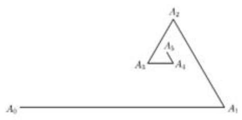
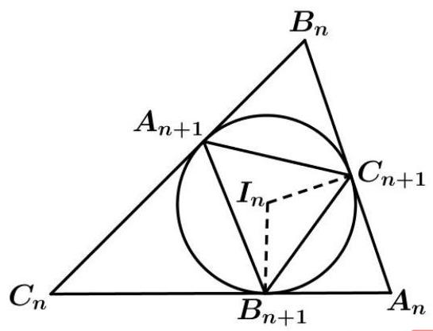
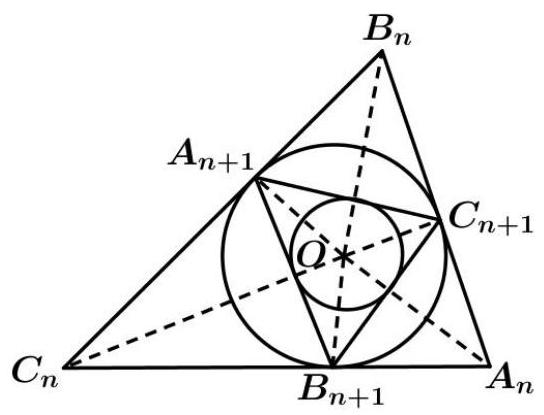
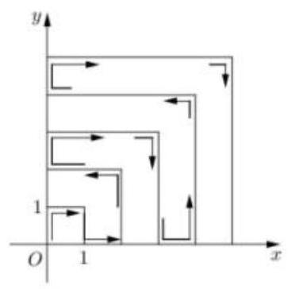
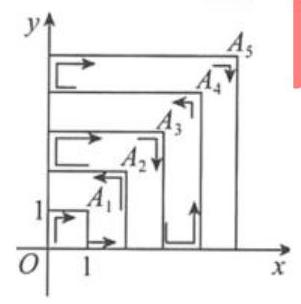

第 8 课:数列专题

<table><tr><td>教学目标</td><td>1、掌握数列的概念   2、掌握等差等比数列的通项公式和求和公式   3、掌握通项的求法和求和的方法   4、掌握数列的函数性质</td></tr><tr><td>重点</td><td>数列的综合</td></tr><tr><td>难点</td><td>数列的综合</td></tr></table>

## (一)等差、等比数列

## 例题精讲

【例 1】已知数列 $\left\{  {a}_{n}\right\}$ 是公差为 $d$ 的等差数列, ${S}_{n}$ 是其前 $n$ 项和,若 $\left\{  \sqrt{{S}_{n} - {2n}}\right\}$ 也是公差为 $d$ 的等差数列, 则 $\left\{  {a}_{n}\right\}$ 的通项为___.

【难度】 $\star   \star   \star$

【答案】 ${a}_{n} = 2$ 或 ${a}_{n} = \frac{1}{2}n + \frac{7}{4}$

【解析】依题意,等差数列 $\left\{  {a}_{n}\right\}$ 的公差为 $d$ ,前 $n$ 项的和为 ${S}_{n}$ ,若数列 $\sqrt{{S}_{n} - {2n}}$ 也是公差为 $d$ 的等差数列, 可得 $\sqrt{{S}_{n} - {2n}} = \sqrt{{a}_{1} - 2} + \left( {n - 1}\right) d$

当 $n \neq  1$ 时,可化为 $\frac{d}{2}{n}^{2} + \left( {{a}_{1} - \frac{d}{2} - 2}\right) n = {d}^{2}{n}^{2} + \left( {{2d}\sqrt{{a}_{1} - 2} - 2{d}^{2}}\right) n + \left( {{a}_{1} - 2 + {d}^{2} - {2d}\sqrt{{a}_{1} - 2}}\right)$ ,

即 $\left\{  \begin{array}{l} \frac{d}{2} = {d}^{2} \\  {a}_{1} - \frac{d}{2} - 2 = {2d}\sqrt{{a}_{1} - 2} - 2{d}^{2} \end{array}\right.$ ,解得 $\left\{  \begin{array}{l} d = 0 \\  {a}_{1} = 2 \end{array}\right.$ 或者 $\left\{  \begin{array}{l} d = \frac{1}{2} \\  {a}_{1} = \frac{9}{4} \end{array}\right.$ ,

所以 ${a}_{n} = 2$ ,或者 ${a}_{n} = \frac{9}{4} + \left( {n - 1}\right)  \times  \frac{1}{2} = \frac{1}{2}n + \frac{7}{4}$ .

故答案为: ${a}_{n} = 2$ 或 ${a}_{n} = \frac{1}{2}n + \frac{7}{4}$ .

【例 2】在数列 $\left\{  {a}_{n}\right\}$ 中,如果对任意 $n \in  {N}^{ * }$ 都有 $\frac{{a}_{n + 2} - {a}_{n + 1}}{{a}_{n + 1} - {a}_{n}} = k$ ( $k$ 为常数),则称 $\left\{  {a}_{n}\right\}$ 为等差比数列, $k$ 称为公差比下列说法不正确的是( )

A. 等差数列一定是等差比数列 B. 等差比数列的公差比一定不为 0

C. 若 ${a}_{n} =  - {3}^{n} + 2$ ,则数列 $\left\{  {a}_{n}\right\}$ 是等差比数列 D. 若等比数列是等差比数列, 则其公比等于公差比

高三数学二轮复习 B 版

【难度】 $\star   \star   \star$

【答案】A

【解析】对于数列 $\left\{  {a}_{n}\right\}$ ,考虑 ${a}_{n} = 1,{a}_{n + 1} = 1,{a}_{n + 2} = 1,\frac{{a}_{n + 2} - {a}_{n + 1}}{{a}_{n + 1} - {a}_{n}}$ 无意义,所以 $A$ 选项错误;

若等差比数列的公差比为 0, $\frac{{a}_{n + 2} - {a}_{n + 1}}{{a}_{n + 1} - {a}_{n}} = 0,{a}_{n + 2} - {a}_{n + 1} = 0$ ,则 ${a}_{n + 1} - {a}_{n}$ 与题目矛盾,所以 $B$ 选项说法正确;

若 ${a}_{n} =  - {3}^{n} + 2,\frac{{a}_{n + 2} - {a}_{n + 1}}{{a}_{n + 1} - {a}_{n}} = 3$ ,数列 $\left\{  {a}_{n}\right\}$ 是等差比数列,所以 $C$ 选项正确;

若等比数列是等差比数列,则 ${a}_{n} = {a}_{1}{q}^{n - 1}, q \neq  1$ ,

$\frac{{a}_{n + 2} - {a}_{n + 1}}{{a}_{n + 1} - {a}_{n}} = \frac{{a}_{1}{q}^{n + 1} - {a}_{1}{q}^{n}}{{a}_{1}{q}^{n} - {a}_{1}{q}^{n - 1}} = \frac{{a}_{1}{q}^{n}\left( {q - 1}\right) }{{a}_{1}{q}^{n - 1}\left( {q - 1}\right) } = q$ ,所以 $D$ 选项正确. 故选: A

【例 3】已知 ${a}_{1},{a}_{2},{a}_{3},\ldots \ldots ,{a}_{n}$ 是各项不为零的 $n\left( {n \geq  4}\right)$ 项等差数列,且公差不为零,若将此数列删去某一项得到的数列(按原来的顺序)是等比数列，则 $n$ 的值为(

A. 4 B. 6 C. 7 D. 无法确定

【难度】★★★★

【答案】A

【解析】当 $n \geq  6$ 时,无论删掉哪一项,必定会出现连续三项既是等差数列. 又是等比数列,则为常数列, 于是该数列公差为零,不满足题意,则 $n = 4$ 或 $n = 5$ . 当 $n = 5$ 时,由以上分析可知,只能删掉第三项,此时 ${a}_{1}{a}_{5} = {a}_{2}{a}_{4} \Rightarrow  {a}_{1}\left( {{a}_{1} + {4d}}\right)  = \left( {{a}_{1} + d}\right) \left( {{a}_{1} + {3d}}\right)  \Rightarrow  d = 0$ ,不满足题意. 故 $n = 4$ . 验证过程如下: 当 $n = 4$ 时,有 ${a}_{1},{a}_{2},{a}_{3},{a}_{4}$ .

将此数列删去某一项得到的数列(按照原来的顺序)是等比数列.

如果删去 ${a}_{1}$ ,或 ${a}_{4}$ ,则等于有 3 个项既是等差又是等比,不满足题意. 故可以知道删去的是 ${a}_{2}$ ,或 ${a}_{3}$ .

如果删去的是 ${a}_{2}$ ,则 ${a}_{1} : {a}_{3} = {a}_{3} : {a}_{4}$ ,故 ${a}_{1}\left( {{a}_{1} + {3d}}\right)  = {\left( {a}_{1} + 2d\right) }^{2}$ ,

整理得到 $3{a}_{1}d = 4{a}_{1}d + 4{d}^{2}$ ,即 $4{d}^{2} + {a}_{1}d = 0$ ,故 ${4d} + {a}_{1} = 0$ 即 $\frac{{a}_{1}}{d} =  - 4$ .

如果删去的是 ${a}_{3}$ ,则 ${a}_{1} : {a}_{2} = {a}_{2} : {a}_{4}$ ,故 ${a}_{1}\left( {{a}_{1} + {3d}}\right)  = {\left( {a}_{1} + d\right) }^{2}$ ,

整理得到 $3{a}_{1}d = 2{a}_{1}d + {d}^{2}$ 即 ${a}_{1}d = {d}^{2}$ ,故 ${a}_{1} = d$ 即 $\frac{{a}_{1}}{d} = 1$ . 可得 $\frac{{a}_{1}}{d} =  - 4$ 或 1 . 故答案为: A.

【例 4】甲、乙两人相约打靶，每人有 8 次机会，分别用数列 $\left\{  {a}_{n}\right\}$ 和 $\left\{  {b}_{n}\right\}$ 来统计其结果. 若甲第 $n$ 局中靶， 则 ${a}_{n} = n$ ,若甲第 $n$ 局未中,则 ${a}_{n} =  - n$ ; 若乙第 $n$ 局中靶,则 ${b}_{n} = {2}^{n - 1}$ ,若乙第 $n$ 局未中,则 ${b}_{n} =  - {2}^{n - 1}$ . 已知 ${b}_{1} + {b}_{2} + \cdots  + {b}_{8} = {127},{a}_{1}{b}_{1} + {a}_{2}{b}_{2} + \cdots  + {a}_{8}{b}_{8} = {1793}$ ,则 ${a}_{1} + {a}_{2} + \cdots  + {a}_{8} =$ ___.

【难度】 $\star   \star   \star   \star$

【答案】 22

【解析】由 ${b}_{n} =  \pm  {2}^{n - 1}$ ,而只有 $1 + 2 + 4 + 8 + {16} + {32} - {64} + {128} = {127}$ ,即 ${b}_{7}$ 为负项,其它为正项;

又 ${a}_{1}{b}_{1} + {a}_{2}{b}_{2} + \cdots  + {a}_{8}{b}_{8} = {a}_{1} + 2{a}_{2} + 4{a}_{3} + 8{a}_{4} + {16}{a}_{5} + {32}{a}_{6} - {64}{a}_{7} + {128}{a}_{8} = {1793}$ ,而 ${a}_{n} =  \pm  n$ ,

当 $\left\{  {a}_{n}\right\}$ 都为正项时, ${a}_{1}{b}_{1} + {a}_{2}{b}_{2} + \cdots  + {a}_{8}{b}_{8} = 1 + 2 \times  2 + 4 \times  3 + 8 \times  4 + {16} \times  5 + {32} \times  6 - {64} \times  7 + {128} \times  8 = {89}$ ,显然不合题设,

当 ${a}_{7}$ 为负项,其它为正项时,恰有

${a}_{1}{b}_{1} + {a}_{2}{b}_{2} + \cdots  + {a}_{8}{b}_{8} = 1 + 2 \times  2 + 4 \times  3 + 8 \times  4 + {16} \times  5 + {32} \times  6 + {64} \times  7 + {128} \times  8 = {1793}$

$\therefore \left\{  {a}_{n}\right\}$ 为 $\{ 1,2,3,4,5,6, - 7,8\}$ ,故 ${a}_{1} + {a}_{2} + \cdots  + {a}_{8} = 1 + 2 + 3 + 4 + 5 + 6 - 7 + 8 = {22}$ .

故答案为: 22.

## 巩固训练

1、已知集合 $A = \left\{  {x\left| {\;x = {2n} - 1}\right. , n \in  {\mathbf{N}}^{ * }}\right\}  , B = \left\{  {x\left| {\;x = {2}^{n}}\right. , n \in  {\mathbf{N}}^{ * }}\right\}$ ,将 $A \cup  B$ 中的所有元素按从小到大的顺序排列构成一个数列 $\left\{  {a}_{n}\right\}$ ，设数列 $\left\{  {a}_{n}\right\}$ 的前 $n$ 项和为 ${S}_{n}$ ，则使得 ${S}_{n} > {1000}$ 成立的最小的 $n$ 的值为___.

【难度】 $\star   \star   \star   \star$

【答案】36

【解析】由题意,对于数列 $\left\{  {a}_{n}\right\}$ 的项 ${2}^{n}$ ,其前面的项 $1,3,5,\ldots ,{2}^{n} - 1 \in  A$ ,共有 ${2}^{n - 1}$ 项, $2,{2}^{2},{2}^{3},\cdots ,{2}^{n} \in  B$ , 共有 $n$ 项，所以 ${2}^{n}$ 为数列 $\left\{  {a}_{n}\right\}$ 的 ${2}^{n - 1} + n$ 项，

且 ${S}_{{2}^{n - 1} + n} = \left\lbrack  {\left( {2 \times  1 - 1}\right)  + \left( {2 \times  2 - 1}\right)  + \cdots  + \left( {2 \times  {2}^{n - 1} - 1}\right) }\right\rbrack   + \left( {2 + {2}^{2} + \cdots  + {2}^{n}}\right)  = {4}^{n - 1} + {2}^{n + 1} - 2$ .

可算得 ${2}^{6 - 1} + 6 = {38}$ (项), ${a}_{38} = {64},{S}_{38} = {1150}$ ,

因为 ${a}_{37} = {63},{a}_{36} = {61},{a}_{35} = {59}$ ,所以 ${S}_{37} = {1086},{S}_{36} = {1023},{S}_{35} = {962}$ ,

因此所求 $n$ 的最小值为 36 . 故答案为:36 .

2、已知等差数列 $\left\{  {a}_{n}\right\}$ 的前 $n$ 项和为 ${S}_{n},{a}_{3} = 4,\frac{{S}_{n + 1}}{n + 1} - \frac{{S}_{n}}{n} = \frac{1}{2}$ ,数列 $\left\{  {b}_{n}\right\}$ 满足 ${b}_{1} = \frac{1}{2},\frac{{b}_{n + 1}}{n + 1} = \frac{{b}_{n}}{2n}$ ,记集合 $M = \left\{  {n \mid  {a}_{n}{b}_{n} \geq  \lambda , n \in  {N}^{ * }}\right\}$ ，若集合 $M$ 的子集个数为 16，则实数 $\lambda$ 的取值范围为( )

A. $\left( {\frac{5}{4},\frac{3}{2}}\right\rbrack$ B. $\left( {\frac{15}{16},\frac{5}{4}}\right\rbrack$ C. $\left( {\frac{15}{16},1}\right\rbrack$ D. $\left( {1,\frac{5}{4}}\right\rbrack$

【难度】 $\star   \star   \star   \star$

【答案】C

【解析】解: 设等差数列 $\left\{  {a}_{n}\right\}$ 的公差为 $d$ ,因为等差数列 $\left\{  {a}_{n}\right\}$ 的前 $n$ 项和为 ${S}_{n}$ .

所以 $\frac{{S}_{n + 1}}{n + 1} - \frac{{S}_{n}}{n} = \frac{\frac{\left( {n + 1}\right) \left( {{a}_{1} + {a}_{n + 1}}\right) }{2} - \frac{n\left( {{a}_{1} + {a}_{n}}\right) }{n}}{n + 1} = \frac{1}{2}\left( {{a}_{n + 1} - {a}_{n}}\right)  = \frac{1}{2}$ ,即 ${a}_{n + 1} - {a}_{n} = d = 1$ ,

又 ${a}_{3} = 4$ ,所以 ${a}_{n} = {a}_{3} + \left( {n - 3}\right) d = n + 1$ ,

又数列 $\left\{  {b}_{n}\right\}$ 满足 $\frac{{b}_{n + 1}}{n + 1} = \frac{1}{2} \times  \frac{{b}_{n}}{n}$ ，所以数列 $\left\{  \frac{{b}_{n}}{n}\right\}$ 为等比数列，公比 $q = \frac{1}{2}$ ，首项为 ${b}_{1} = \frac{1}{2}$ ，

所以 $\frac{{b}_{n}}{n} = \frac{1}{2} \times  {\left( \frac{1}{2}\right) }^{n - 1} = \frac{1}{{2}^{n}}$ ,得 ${b}_{n} = \frac{n}{{2}^{n}}$ ,

所以 ${a}_{n}{b}_{n} = \frac{n\left( {n + 1}\right) }{{2}^{n}}$ ,设 ${c}_{n} = \frac{n\left( {n + 1}\right) }{{2}^{n}}$ ,令 $\frac{{c}_{n + 1}}{{c}_{n}} = \frac{n + 2}{2n} < 1$ ,得 $n > 2$ ,

即 ${c}_{1} < {c}_{2} = {c}_{3},{c}_{3} > {c}_{4} > {c}_{5} > \ldots$ ,又集合 $M$ 的子集个数为 16,

所以 $M$ 只有 4 个元素.

即不等式 ${a}_{n}{b}_{n} = \frac{n\left( {n + 1}\right) }{{2}^{n}} \geq  \lambda$ 只有 4 个解,

又 ${c}_{1} = 1,{c}_{2} = \frac{3}{2},{c}_{3} = \frac{3}{2},{c}_{4} = \frac{5}{4},{c}_{5} = \frac{15}{16}$ ,所以 $\frac{15}{16} < \lambda  \leq  1$ ,故选: C.

3、在数列 $\left\{  {a}_{n}\right\}$ 中，已知 ${a}_{1} = 1,{a}_{2} = 2,{a}_{n + 2} = \left\{  {\begin{array}{ll} {a}_{n} + 2, & n = {2k} - 1 \\  3{a}_{n}, & n = {2k} \end{array}\left( {k \in  {\mathrm{N}}^{ * }}\right) }\right.$ .

(1)求数列 $\left\{  {a}_{n}\right\}$ 的通项公式；

(2)设数列 $\left\{  {a}_{n}\right\}$ 的前 $n$ 项和为 ${S}_{n}$ ，问是否存在正整数 $m$ ， $n$ ，使得 ${S}_{2n} = m{S}_{{2n} - 1}$ ？若存在，求出所有的正整数对 $\left( {m, n}\right)$ ; 若不存在,请说明理由.

【难度】

【答案】(1) ${a}_{n} = \left\{  {\begin{array}{l} n, n = {2k} - 1 \\  2 \times  {3}^{\frac{n}{2} - 1}, n = {2k} \end{array}, k \in  {\mathrm{N}}^{ * }}\right.$ (2) 存在, $\left( {2,2}\right) ,\left( {3,1}\right)$

【解析】(1) 由 ${a}_{1} = 1,{a}_{2} = 2,{a}_{n + 2} = \left\{  {\begin{array}{l} {a}_{n} + 2, n = {2k} - 1 \\  3{a}_{n}, n = {2k} \end{array}\left( {k \in  {\mathrm{N}}^{ * }}\right) }\right.$ .

可得数列 $\left\{  {a}_{n}\right\}$ 的奇数项是以 1 为首项,公差为 2 的等差数列;

偶数项是以 2 为首项, 公比为 3 的等比数列.

$\therefore$ 对任意正整数 $k,{a}_{{2k} - 1} = 1 + 2\left( {k - 1}\right)  = {2k} - 1;{a}_{2k} = 2 \times  {3}^{k - 1}$ .

$\therefore$ 数列 $\left\{  {a}_{n}\right\}$ 的通项公式 ${a}_{n} = \left\{  {\begin{array}{l} n, n = {2k} - 1 \\  2 \times  {3}^{\frac{n}{2} - 1}, n = {2k} \end{array}, k \in  {\mathrm{N}}^{ * }}\right.$ .

(2) ${S}_{2n} = \left( {{a}_{1} + {a}_{3} + \ldots  + {a}_{{2n} - 1}}\right)  + \left( {{a}_{2} + {a}_{4} + \ldots  + {a}_{2n}}\right)  = \frac{n\left( {1 + {2n} - 1}\right) }{2} + \frac{2\left( {1 - {3}^{n}}\right) }{1 - 3} = {3}^{n} + {n}^{2} - 1, n \in  {\mathrm{N}}^{ * }$ . ${S}_{{2n} - 1} = {S}_{2n} - {a}_{2n} = {3}^{n - 1} + {n}^{2} - 1.$

假设存在正整数 $m, n$ ,使得 ${S}_{2n} = m{S}_{{2n} - 1}$ ,

则 ${3}^{n} + {n}^{2} - 1 = m\left( {{3}^{n - 1} + {n}^{2} - 1}\right) ,\therefore {3}^{n - 1}\left( {3 - m}\right)  = \left( {m - 1}\right) \left( {{n}^{2} - 1}\right)$ ,(*)

从而 $3 - m \geq  0,\therefore m \leq  3$ ,又 $m \in  {\mathrm{N}}^{ * },\therefore m = 1,2,3$ .

① 当 $m = 1$ 时， (*) 式左边大于 0，右边等于 0，不成立，

② 当 $m = 3$ 时， (*) 式左边等于 0， $\therefore 2\left( {{n}^{2} - 1}\right)  = 0$ ，解得 $n = 1$ ， $\therefore {S}_{2} = 3{S}_{1}$ .

③ 当 $m = 2$ 时 (*) 式可化为 ${3}^{n - 1} = \left( {n + 1}\right) \left( {n - 1}\right) , n = 1$ 显然不满足，

当 $n \geq  2$ 时,存在 ${k}_{1},{k}_{2} \in  {\mathrm{N}}^{ * },{k}_{1} < {k}_{2}$ ,使得 $n - 1 = {3}^{{k}_{1}} \in  {\mathrm{N}}^{ * }, n + 1 = {3}^{{k}_{2}} \in  {N}^{ * }$ ,且 ${k}_{1} + {k}_{2} = n - 1$ ,

从而 ${3}^{{k}_{2}} - {3}^{{k}_{1}} = {3}^{{k}_{1}}\left( {{3}^{{k}_{2} - {k}_{1}} - 1}\right)  = 2,\therefore {3}^{{k}_{2} - {k}_{1}} - 1 = 2,{3}^{{k}_{1}} = 1$ ,

$\therefore {k}_{1} = 0,{k}_{2} - {k}_{1} = 1$ ,于是 $n = 2,{S}_{4} = 2{S}_{3}$ .

综上可知,符合条件的正整数对 $\left( {m, n}\right)$ 只有两对: $\left( {2,2}\right) ,\left( {3,1}\right)$ .

## (二)数列的极限与数学归纳法

## 例题精讲

【例 5】已知 $p, q$ 是两个不相等的正整数,且 $q \geq  2$ ,则 $\mathop{\lim }\limits_{{n \rightarrow  \infty }}\frac{{\left( 1 + \frac{1}{n}\right) }^{p} - 1}{{\left( 1 + \frac{1}{n}\right) }^{q} - 1}$ 等于___.

【难度】 $\star   \star   \star   \star$

【答案】 $\frac{p}{q}$

【解析】 $\mathop{\lim }\limits_{{n \rightarrow  \infty }}\frac{{\left( 1 + \frac{1}{n}\right) }^{p} - 1}{{\left( 1 + \frac{1}{n}\right) }^{q} - 1} = \mathop{\lim }\limits_{{n \rightarrow  \infty }}\frac{{C}_{p}^{1}{\left( \frac{1}{n}\right) }^{1} + {C}_{p}^{2}{\left( \frac{1}{n}\right) }^{2} + \ldots  + {C}_{p}^{p}{\left( \frac{1}{n}\right) }^{p}}{{C}_{q}^{1}{\left( \frac{1}{n}\right) }^{1} + {C}_{q}^{2}{\left( \frac{1}{n}\right) }^{2} + \ldots  + {C}_{q}^{q}{\left( \frac{1}{n}\right) }^{q}}$

$= \mathop{\lim }\limits_{{n \rightarrow  \infty }}\frac{{C}_{p}^{1} + {C}_{p}^{2}{\left( \frac{1}{n}\right) }^{1} + \ldots  + {C}_{p}^{p}{\left( \frac{1}{n}\right) }^{p - 1}}{{C}_{q}^{1} + {C}_{q}^{2}{\left( \frac{1}{n}\right) }^{1} + \ldots  + {C}_{q}^{q}{\left( \frac{1}{n}\right) }^{q - 1}} = \frac{p}{q}$ ,故答案为: $\frac{p}{q}$

【例 6】已知点 $O\left( {0,0}\right) \text{ 、 }{A}_{0}\left( {2,3}\right)$ 和 ${B}_{0}\left( {5,6}\right)$ ,记线段 ${A}_{0}{B}_{0}$ 的中点为 ${P}_{1}$ ,取线段 ${A}_{0}{P}_{1}$ 和 ${P}_{1}{B}_{0}$ 中的一条,记其端点为 ${A}_{1}\text{ 、 }{B}_{1}$ ,使之满足 $\left( {\left| {O{A}_{1}}\right|  - 5}\right) \left( {\left| {O{B}_{1}}\right|  - 5}\right)  < 0$ ,记线段 ${A}_{1}{B}_{1}$ 的中点为 ${P}_{2}$ ,取线段 ${A}_{1}{P}_{2}$ 和 ${P}_{2}{B}_{1}$ 中的一条,记其端点为 ${A}_{2}\text{ 、 }{B}_{2}$ ,使之满足 $\left( {\left| {O{A}_{2}}\right|  - 5}\right) \left( {\left| {O{B}_{2}}\right|  - 5}\right)  < 0$ ,依次下去,得到点 ${P}_{1}\text{ 、 }{P}_{2}\text{ 、 }{P}_{3}\text{ 、、 }\ldots {P}_{n}\text{ 、 }\ldots$ ,则 $\mathop{\lim }\limits_{{n \rightarrow  \infty }}\left| {{A}_{0}{P}_{n}}\right|  =$ ___.

【难度】 $\star   \star   \star   \star$

【答案】 $\sqrt{2}$

【解析】由 $\left( {\left| {O{A}_{2}}\right|  - 5}\right) \left( {\left| {O{B}_{2}}\right|  - 5) < 0}\right.$ 可知 $\left| {O{A}_{2}}\right|$ 和 $\left| {O{B}_{2}}\right|$ 一个大于 5 一个小于 5,

设线段 ${A}_{0}{B}_{0}$ 上到原点距离等于 5 的点为 $P\left( {x, y}\right)$ ,由 $\sqrt{{x}^{2} + {y}^{2}} = 5$ ,且 $\frac{y - 3}{x - 2} = \frac{y - 6}{x - 5}$ 可得 $x = 3, y = 4$ ,

所以线段 ${A}_{0}{B}_{0}$ 上到原点距离等于 5 的点为 $P\left( {3,4}\right)$ ,

若 $\left( {\left| {O{A}_{1}}\right|  - 5}\right) \left( {\left| {O{B}_{1}}\right|  - 5}\right)  < 0$ 则 ${A}_{1}\text{ 、 }{B}_{1}$ 应在点 $P\left( {3,4}\right)$ 的两侧,

所以第一次应取 ${A}_{0}{P}_{1}$ ,

若 $\left( {\left| {O{A}_{2}}\right|  - 5}\right) \left( {\left| {O{B}_{2}}\right|  - 5}\right)  < 0$ ,依次下去则 ${A}_{1}\text{ 、 }{B}_{1},{A}_{2}\text{ 、 }{B}_{2},\cdots$ 中必有一点在 $P\left( {3,4}\right)$ 的左侧,一点在 $P\left( {3,4}\right)$ 的右侧,因为 ${P}_{1},{P}_{2},\cdots {P}_{n},\cdots$ 是中点,所以 ${P}_{1},{P}_{2},\cdots {P}_{n},\cdots$ 的极限为 $P\left( {3,4}\right)$ ,

所以 $\mathop{\lim }\limits_{{n \rightarrow  \infty }}\left| {{A}_{0}{P}_{n}}\right|  = \left| {{A}_{0}P}\right|  = \sqrt{2}$ ,故答案为: $\sqrt{2}$ .

【例 7】定义 “ $\frac{{\left| x\right| }^{n}}{{a}^{n}} + \frac{{\left| y\right| }^{n}}{{b}^{n}} = 1\left( {a > b > 0, n \in  {N}^{ * }, n \geq  3}\right)$ ”代表的曲线为“超椭圆”,设 $a\text{ 、 }b$ 为常数,设超椭圆的周长为 ${C}_{n}$ ,那么 $\mathop{\lim }\limits_{{n \rightarrow  \infty }}{C}_{n} =$ ___.

【难度】 $\star   \star   \star   \star$

【答案】 ${4a} + {4b}$

【解析】由题得 $0 \leq  \frac{{\left| x\right| }^{n}}{{a}^{n}} \leq  1,0 \leq  \frac{{\left| y\right| }^{n}}{{b}^{n}} \leq  1$ ,故同椭圆类似, $- a \leq  x \leq  a, - b \leq  y \leq  b$ .

显然 $\frac{{\left| x\right| }^{n}}{{a}^{n}} + \frac{{\left| y\right| }^{n}}{{b}^{n}} = 1\left( {a > b > 0, n \in  {N}^{ * }, n \geq  3}\right)$ 过 $\left( {\pm a,0}\right) ,\left( {0, \pm  b}\right)$

故考虑 $- a < x < a$ 时,此时 $\mathop{\lim }\limits_{{n \rightarrow  \infty }}\frac{{\left| x\right| }^{n}}{{a}^{n}} = 0$ ,因为 $\frac{{\left| x\right| }^{n}}{{a}^{n}} + \frac{{\left| y\right| }^{n}}{{b}^{n}} = 1$ ,故此时 $\mathop{\lim }\limits_{{n \rightarrow  \infty }}\frac{{\left| y\right| }^{n}}{{b}^{n}} = 1$ ,

考虑到极限可直接取 $y =  \pm  b$ ,即当 $- a < x < a$ 时 $y =  \pm  b$ ,

同理可得当 $- b < y < b$ 时 $x =  \pm  a$ ，故当 $n \rightarrow   + \infty$ 时， $\frac{{\left| x\right| }^{n}}{{a}^{n}} + \frac{{\left| y\right| }^{n}}{{b}^{n}} = 1$ 的图像为以 ${2a}$ 为长， ${2b}$ 为宽的矩形. 此时周长为 ${4a} + {4b}$ . 故答案为: ${4a} + {4b}$

【例 8】设 ${P}_{n}\left( {{x}_{n},{y}_{n}}\right)$ 是圆 ${x}^{2} + {y}^{2} - {4x} + {2y} = 0$ 与圆 ${x}^{2} + {y}^{2} = \frac{1}{{2}^{n}}$ 在第一象限的交点，则 $\mathop{\lim }\limits_{{n \rightarrow  \infty }}\frac{{y}_{n}}{{x}_{n}}$ 的值为( )

A. 2 B. -2 C. $\frac{1}{2}$ D. 不存在

【难度】 $\star   \star   \star   \star$

【答案】A

【解析】两圆方程相减,得公共弦方程为 ${4x} - {2y} = \frac{1}{{2}^{n}}$ ,故点 ${P}_{n}\left( {{x}_{n},{y}_{n}}\right)$ 可看成公共弦方程和圆 ${x}^{2} + {y}^{2} - {4x} + {2y} = 0$ 在第一象限的交点,当 $n \rightarrow  \infty$ 时,直线趋向于 ${4x} - {2y} = 0$ ,即 $y = {2x},\mathop{\lim }\limits_{{n \rightarrow  \infty }}\frac{{y}_{n}}{{x}_{n}} = 2$ ,

故选: A.

## 巩固训练

1、如图所示,已知 ${A}_{0}\left( {0,0}\right) ,{A}_{1}\left( {4,0}\right)$ ,对任何 $n \in  N$ ,点 ${A}_{n + 2}$ 按照如下方式生成 $\angle {A}_{n}{A}_{n + 1}{A}_{n + 2} = \frac{\pi }{3}$ , $\left| \overrightarrow{{A}_{n + 1}{A}_{n + 2}}\right|  = \frac{1}{2}\left| \overrightarrow{{A}_{n}{A}_{n + 1}}\right|$ ,且 ${A}_{n},{A}_{n + 1},{A}_{n + 2}$ 按逆时针排列,记点 ${A}_{n}$ 的坐标为 $\left( {{a}_{n},{b}_{n}}\right) \left( {n \in  N}\right)$ ,则 $\left( {\mathop{\lim }\limits_{{n \rightarrow  \infty }}{a}_{n},\mathop{\lim }\limits_{{n \rightarrow  \infty }}{b}_{n}) = }\right.$ ___.

【难度】 $\star   \star   \star   \star$

【答案】 $\left( {\frac{20}{7},\frac{4\sqrt{3}}{7}}\right)$

【解析】因为 $\angle {A}_{n}{A}_{n + 1}{A}_{n + 2} = \frac{\pi }{3},\left| \overrightarrow{{A}_{n + 1}{A}_{n + 2}}\right|  = \frac{1}{2}\left| \overrightarrow{{A}_{n}{A}_{n + 1}}\right|$ ,

所以任意相邻两向量 $\overrightarrow{{A}_{n}{A}_{n + 1}},\overrightarrow{{A}_{n + 1}{A}_{n + 2}}$ 的夹角均为 $\frac{\pi }{3}$ ,

且 $\left| \overrightarrow{{A}_{n + 1}{A}_{n + 2}}\right|  = \frac{1}{2}\left| \overrightarrow{{A}_{n}{A}_{n + 1}}\right|$ ,所以 $\overrightarrow{{A}_{0}{A}_{n}} = \overrightarrow{{A}_{0}{A}_{1}} + \overrightarrow{{A}_{1}{A}_{2}} + \overrightarrow{{A}_{2}{A}_{3}} + \cdots  + \overrightarrow{{A}_{n - 1}{A}_{n}}$ ,

又因为 $\overrightarrow{{A}_{0}{A}_{n}} = \left( {{a}_{n},{b}_{n}}\right)$ ，所以 ${a}_{n} = 4 - 2 \times  \cos \frac{\pi }{3} - 1 \times  \cos \frac{\pi }{3} + 1 \cdot  \cos \frac{\pi }{3} - \frac{1}{2}{\cos }^{2}\frac{\pi }{3} - \frac{1}{2}{\cos }^{3}\frac{\pi }{3} + \frac{1}{2}{\cos }^{3}\frac{\pi }{3} - \cdots$

$= 3 - {\left( \frac{1}{2}\right) }^{3} - {\left( \frac{1}{2}\right) }^{6} - {\left( \frac{1}{2}\right) }^{9} - \cdots$ 所以 $\mathop{\lim }\limits_{{n \rightarrow  \infty }}{a}_{n} = 3 - \mathop{\lim }\limits_{{n \rightarrow  \infty }}\frac{\frac{1}{8}\left\lbrack  {1 - {\left( \frac{1}{8}\right) }^{n}}\right\rbrack  }{1 - \frac{1}{8}} = 3 - \frac{1}{7} = \frac{20}{7}$

${b}_{n} = 0 + 2\sin \frac{\pi }{3} - 1 \cdot  \sin \frac{\pi }{3} + 0 + \frac{1}{4} \cdot  \sin \frac{\pi }{3} - \frac{1}{8} \cdot  \sin \frac{\pi }{3} + 0 + \cdots$

$= \sin \frac{\pi }{3}\left( {2 - 1 + \frac{1}{4} - \frac{1}{8} + \frac{1}{32} - \frac{1}{64} + \cdots }\right)  = \frac{\sqrt{3}}{2}\left( {1 + \frac{1}{8} + \frac{1}{64} + \cdots }\right)$

所以 $\mathop{\lim }\limits_{{n \rightarrow  \infty }}{b}_{n} = \frac{\sqrt{3}}{2} \cdot  \mathop{\lim }\limits_{{n \rightarrow  \infty }}\frac{1 - {\left( \frac{1}{8}\right) }^{n}}{1 - \frac{1}{9}} = \frac{\sqrt{3}}{2} \times  \frac{8}{7} = \frac{4\sqrt{3}}{7}$ ,故答案为: $\left( {\frac{20}{7},\frac{4\sqrt{3}}{7}}\right)$ .

2、记椭圆 $\frac{{x}^{2}}{4} + \frac{n{y}^{2}}{{4n} + 1} = 1$ 围成的区域 (含边界) 为 ${\Omega }_{\mathrm{n}}\left( {\mathrm{n} = 1,2,3\cdots }\right)$ ,当点 $\left( {x, y}\right)$ 分别在 ${\Omega }_{1},{\Omega }_{2},\ldots$ 上时, $x + y$ 的最大值分别是 ${M}_{1},{M}_{2},\ldots$ ,则 $\mathop{\lim }\limits_{{n \rightarrow   + \infty }}{M}_{n} =$ ___.

【难度】 $\star   \star   \star   \star$

【答案】 $2\sqrt{2}$

【解析】把椭圆 $\frac{{x}^{2}}{4} + \frac{n{y}^{2}}{{4n} + 1} = 1$ 得,椭圆的参数方程为: $\left\{  {\begin{array}{l} x = 2\cos \theta \\  y = \sqrt{4 + \frac{1}{n}}\sin \theta  \end{array}\left( {\theta \text{ 为参数 }}\right) }\right.$ ,

$\therefore x + y = 2\cos \theta  + \sqrt{4 + \frac{1}{n}}\sin \theta  = \sqrt{{2}^{2} + 4 + \frac{1}{n}}\sin \left( {\theta  + \phi }\right)$ ,

由正弦函数的性质可知: 当 $\sin \left( {\theta  + \varphi }\right)  = 1$ 时, $x + y$ 取最大值,

$\therefore {\left( x + y\right) }_{\max } = \sqrt{{2}^{2} + 4 + \frac{1}{n}} = \sqrt{8 + \frac{1}{n}}\therefore \mathop{\lim }\limits_{{n \rightarrow  \infty }}{M}_{n} = \mathop{\lim }\limits_{{n \rightarrow  \infty }}\sqrt{8 + \frac{1}{n}} = 2\sqrt{2}$ ,

故答案为: $2\sqrt{2}$ .

3、设有 $\Delta {A}_{0}{B}_{0}{C}_{0}$ ,作它的内切圆,得到的三个切点确定一个新的三角形 $\Delta {A}_{1}{B}_{1}{C}_{1}$ ,再作 $\Delta {A}_{1}{B}_{1}{C}_{1}$ 的内切圆,得到的三个切点又确定一个新的三角形 $\Delta {A}_{2}{B}_{2}{C}_{2}$ ,以此类推,一次一次不停地作下去可以得到一个三角形序列 $\Delta {A}_{n}{B}_{n}{C}_{n}\left( {n = 1,2,3,\cdots }\right)$ ,它们的尺寸越来越小,则最终这些三角形的极限情形是

A. 等边三角形 B. 直角三角形

C. 与原三角形相似 D. 以上均不对

【难度】★★★★

【答案】A

【解析】设第 $n$ 个内切圆的圆心为 ${O}_{n}$ ,第 $n$ 个三角形的内角, $\angle {B}_{n}{A}_{n}{C}_{n} = {a}_{n},\angle {A}_{n}{B}_{n}{C}_{n} = {b}_{n},\angle {A}_{n}{C}_{n}{B}_{n} = {c}_{n}$ , 在四边形 $O{O}_{n}{A}_{n + 1}{B}_{n}{C}_{n + 1}$ 中, $\because {A}_{n + 1}{C}_{n + 1} \bot  {O}_{n}{B}_{n},\;{O}_{n}{A}_{n + 1} \bot  {B}_{n}{C}_{n},$

$\therefore \angle {O}_{n}{A}_{n + 1}{C}_{n + 1} = \angle {A}_{n + 1}{B}_{n}{O}_{n} = \frac{1}{2}{b}_{n}$ ,

同理 $\angle {O}_{n}{A}_{n + 1}{B}_{n + 1} = \frac{1}{2}{c}_{n}$ ,所以 ${a}_{n + 1} = \angle {B}_{n + 1}{A}_{n + 1}{C}_{n + 1} = \angle {O}_{n}{A}_{n + 1}{C}_{n + 1} + \angle {O}_{n}{A}_{n + 1}{B}_{n + 1} = \frac{{b}_{n} + {c}_{n}}{2} = \frac{\pi  - {a}_{n}}{2}$ ,

$\therefore {a}_{n + 1} = \frac{\pi }{2} - \frac{1}{2}{a}_{n}$ ,设 ${a}_{n + 1} + k =  - \frac{1}{2}\left( {{a}_{n} - {2k} - \pi }\right)$ ,令 $k =  - {2k} - \pi$ ,得, $k =  - \frac{\pi }{3}$ ,

即 $\frac{{a}_{n + 1} - \frac{\pi }{3}}{{a}_{n} - \frac{\pi }{3}} =  - \frac{1}{2}$ ,所以 $\left\{  {{a}_{n} - \frac{\pi }{3}}\right\}$ 是以 ${a}_{1} - \frac{\pi }{3}$ 为首相,以 $- \frac{1}{2}$ 为公比的等比数列. $\therefore {a}_{n + 1} = \frac{\pi }{3} + \left( {{a}_{1} - \frac{\pi }{3}}\right)  \times  {\left( -\frac{1}{2}\right) }^{n}$ ,所以 $\mathop{\lim }\limits_{{n \rightarrow  \infty }}{a}_{n} = \mathop{\lim }\limits_{{n \rightarrow  \infty }}\left\lbrack  {\frac{\pi }{3} + \left( {{a}_{1} - \frac{\pi }{3}}\right) {\left( -\frac{1}{2}\right) }^{n - 1}}\right\rbrack   = \frac{\pi }{3}$ ,

同理当 $n \rightarrow   + \infty$ 时, ${b}_{n},{c}_{n} \rightarrow  \frac{\pi }{3}$ ,故三角形的极限为等边三角形. 故选 A .

4、已知数列 $\left\{  {a}_{n}\right\}$ 满足 ${a}_{n} < {a}_{n + 1}\left( {n \in  {\mathbf{N}}^{ * }}\right)$ ,若 ${P}_{n}\left( {n,{a}_{n}}\right) \left( {n \geq  3}\right)$ 在双曲线 $\frac{{x}^{2}}{6} - \frac{{y}^{2}}{2} = 1$ 上,则 $\mathop{\lim }\limits_{{n \rightarrow  \infty }}\left| {{P}_{n}{P}_{n + 1}}\right|  =$

【难度】 $\star   \star   \star   \star$

【答案】 $\frac{2\sqrt{3}}{3}$

【解析】因为 $n \rightarrow  \infty$ 时, ${P}_{n}\left( {n,{a}_{n}}\right) ,{P}_{n + 1}\left( {n + 1,{a}_{n + 1}}\right)$ 无限趋近于渐近线 $y = \frac{\sqrt{3}}{3}x$ ,因为这条渐近线倾斜角为 $\frac{\pi }{6}$ ,所以 $\mathop{\lim }\limits_{{n \rightarrow  \infty }}\left| {{P}_{n}{P}_{n + 1}}\right|  = \frac{\left( {n + 1}\right)  - n}{\cos \frac{\pi }{6}} = \frac{2\sqrt{3}}{3}$ .

5、在数列 $\left\{  {a}_{n}\right\}$ 中， ${a}_{1} = 0$ ，且对任意的 $m \in  {N}^{ * }$ ， ${a}_{{2m} - 1}$ 、 ${a}_{2m}$ 、 ${a}_{{2m} + 1}$ 构成 ${2m}$ 为公差的等差数列.

(1)求证: ${a}_{4}$ 、 ${a}_{5}$ 、 ${a}_{6}$ 成等比数列；

(2)求数列 $\left\{  {a}_{n}\right\}$ 的通项公式；

(3)设 ${S}_{n} = \frac{{2}^{2}}{{a}_{2}} + \frac{{3}^{2}}{{a}_{3}} + \cdots  + \frac{{n}^{2}}{{a}_{n}}$ ，试问当 $n \rightarrow  \infty$ 时，数列 $\left\{  {{S}_{n} - {2n}}\right\}$ 是否存在极限？若存在，求出其值，若不存在, 请说明理由.

【难度】 $\star   \star   \star   \star$

【答案】(1)证明见解析; (2) ${a}_{n} = \left\{  \begin{array}{l} \frac{{n}^{2} - 1}{2}n\text{ 为奇数 } \\  \frac{{n}^{2}}{2}n\text{ 为偶数 } \end{array}\right.$

【解析】(1) 令 $m = 1$ ,则 ${a}_{1},{a}_{2},{a}_{3}$ 构成以 2 为公差的等差数列,

所以 ${a}_{2} = 2,{a}_{3} = 4$ ,令 $m = 2$ ,则 ${a}_{3},{a}_{4},{a}_{5}$ 构成以 4 为公差的等差数列,

所以 ${a}_{4} = 8,{a}_{5} = {12}$ ,令 $m = 3$ ,则 ${a}_{5},{a}_{6},{a}_{7}$ 构成以 6 为公差的等差数列,

所以 ${a}_{6} = {18},{a}_{7} = {24}$ ,由 ${a}_{5}{}^{2} = {a}_{4} \cdot  {a}_{6}$ ,得 ${a}_{4}\text{ 、 }{a}_{5}\text{ 、 }{a}_{6}$ 成等比数列;

(2)因为 ${a}_{{2m} - 1}$ 、 ${a}_{2m}$ 、 ${a}_{{2m} + 1}$ 构成 ${2m}$ 为公差的等差数列，

所以 $\left\{  \begin{array}{l} {a}_{2m} = {a}_{{2m} - 1} + {2m} \\  {a}_{{2m} + 1} = {a}_{2m} + {2m} \end{array}\right.$ ,即 ${a}_{{2m} + 1} - {a}_{{2m} - 1} = {2m}$ ,

${a}_{{2m} - 1} - {a}_{1} = \frac{\left( {{4m} - 4 + 4}\right) \left( {m - 1}\right) }{2} = {2m}\left( {m - 1}\right)$ ,又 ${a}_{1} = 0$ ,所以 ${a}_{{2m} - 1} = {2m}\left( {m - 1}\right)$ ,

当 $n$ 为奇数时,令 ${2m} - 1 = n$ ,得 $m = \frac{n + 1}{2}$ ,所以 ${a}_{n} = \frac{\left( {n + 1}\right) \left( {n - 1}\right) }{2} = \frac{{n}^{2} - 1}{2}$ ;

当 $n$ 为偶数时,由 ${a}_{2m} = {2m} + {a}_{{2m} - 1} = 2{m}^{2}$ ,令 ${2m} = n$ ,得 $m = \frac{n}{2}$ ,所以 ${a}_{n} = 2 \times  \frac{{n}^{2}}{4} = \frac{{n}^{2}}{2}$ ;

(3)当 $n$ 为奇数时, $\frac{{n}^{2}}{{a}_{n}} = \frac{2{n}^{2}}{{n}^{2} - 1} = 2 + \frac{2}{{n}^{2} - 1} = 2 + \frac{1}{n - 1} - \frac{1}{n + 1}$ ,

当 $n$ 为偶数时, $\frac{{n}^{2}}{{a}_{n}} = \frac{2{n}^{2}}{{n}^{2}} = 2$ ,所以 $\mathop{\lim }\limits_{{n \rightarrow  0}}\left( {{S}_{n} - {2n}}\right)  = \mathop{\lim }\limits_{{n \rightarrow  0}}\left\lbrack  {{2n} + \left( {\frac{1}{2} - \frac{1}{4}}\right)  + \left( {\frac{1}{4} - \frac{1}{6}}\right)  + \ldots  + \left( {\frac{1}{n - 1} - \frac{1}{n + 1}}\right)  - {2n}}\right\rbrack   = \frac{1}{2}$ .

## 三) 数列的综合

## 例题精讲

【例 9】已知数列 $\left\{  {a}_{n}\right\}$ 的首项 ${a}_{1} = 1$ ,且满足 ${a}_{n + 1} - {a}_{n} = {\left( -\frac{1}{2}\right) }^{n}\left( {n \in  {\mathrm{N}}^{ * }}\right)$ ,则存在正整数 $n$ ,使得 $\left( {{a}_{n} - \lambda }\right) \left( {{a}_{n + 1} - \lambda }\right)  < 0$ 成立的实数 $\lambda$ 组成的集合为( )

A. $\left( {\frac{1}{2},2}\right)$ B. $\left( {\frac{2}{3},1}\right)$ C. $\left( {\frac{1}{2},1}\right)$ D. $\left( {\frac{2}{3},\frac{5}{6}}\right)$

【难度】

【答案】C

【解析】 $\because$ 数列 $\left\{  {a}_{n}\right\}$ 的首项 ${a}_{1} = 1$ ,且满足 ${a}_{n + 1} - {a}_{n} = {\left( -\frac{1}{2}\right) }^{n}\left( {n \in  {\mathrm{N}}^{ * }}\right)$ ,

可得 ${a}_{n} = {a}_{1} + \left( {{a}_{2} - {a}_{1}}\right)  + \left( {{a}_{3} - {a}_{2}}\right)  + \cdots  + \left( {{a}_{n} - {a}_{n - 1}}\right)$

$= 1 + \left( {-\frac{1}{2}}\right)  + {\left( -\frac{1}{2}\right) }^{2} + \cdots  + {\left( -\frac{1}{2}\right) }^{n - 1} = \frac{1 - {\left( -\frac{1}{2}\right) }^{n}}{1 + \frac{1}{2}} = \frac{2}{3}\left\lbrack  {1 - {\left( -\frac{1}{2}\right) }^{n}}\right\rbrack$ ,

又存在正整数 $n$ ,使得 $\left( {{a}_{n} - \lambda }\right) \left( {{a}_{n + 1} - \lambda }\right)  < 0$ 成立,

当 $n$ 为偶数时, ${a}_{n} = \frac{2}{3}\left\lbrack  {1 - {\left( \frac{1}{2}\right) }^{n}}\right\rbrack$ ,单调递增,可得 ${a}_{n}$ 的最小值为 ${a}_{2} = \frac{1}{2}$ ;

${a}_{n + 1} = \frac{2}{3}\left\lbrack  {1 + {\left( \frac{1}{2}\right) }^{n + 1}}\right\rbrack$ ,单调递减,可得 ${a}_{n + 1}$ 的最大值为 ${a}_{3} = \frac{3}{4}$ ,

可得 ${a}_{n} < \lambda  < {a}_{n + 1}$ ,即有 $\frac{1}{2} < \lambda  < \frac{3}{4}$ ;

当 $n$ 为奇数时, ${a}_{n} = \frac{2}{3}\left\lbrack  {1 + {\left( \frac{1}{2}\right) }^{n}}\right\rbrack$ ,单调递减,可得 ${a}_{n}$ 的最大值为 ${a}_{1} = 1$ ;

${a}_{n + 1} = \frac{2}{3}\left\lbrack  {1 - {\left( \frac{1}{2}\right) }^{n + 1}}\right\rbrack$ ,单调递增,可得 ${a}_{n + 1}$ 的最小值为 ${a}_{2} = \frac{1}{2}$ ,

可得 ${a}_{n + 1} < \lambda  < {a}_{n}$ ,即有 $\frac{1}{2} < \lambda  < 1;\therefore \lambda$ 的取值范围是 $\left( {\frac{1}{2},1}\right)$ . 故选:

【例 10 】有人玩都硬币走跳棋的游戏, 已知硬币出现正反面为等可能性事件, 棋盘上标有第 0 站, 第 1 站, 第 2 站, ..., 第 8 站, 一枚棋子开始在第 0 站, 棋手每掷一次硬币, 棋子向前跳动一次, 若掷出正面, 棋子向前跳一站 (从 $k$ 到 $k + 1$ ). 若掷出反面，棋子向前跳两站 (从 $k$ 到 $k + 2$ )，直到棋子跳到第 7 站 (胜利大本营)或跳到第 8 站(失败集中营)时，该游戏结束. 设棋子跳到第 $n$ 站概率为 ${P}_{n}$ ，则 ${P}_{7} =$ ___.

【难度】 $\star   \star   \star   \star$

【答案】 $\frac{85}{128}$

【解析】由题意得: ${P}_{0} = 1,{P}_{1} = \frac{1}{2},{P}_{n} = \frac{1}{2}{P}_{n - 1} + \frac{1}{2}{P}_{n - 2}, n \geq  2, n \in  N$ ,从而当 $n \geq  2$ 时,

${P}_{n} - {P}_{n - 1} = \frac{1}{2}{P}_{n - 1} + \frac{1}{2}{P}_{n - 2} - {P}_{n - 1} =  - \frac{1}{2}\left( {{P}_{n - 1} - {P}_{n - 2}}\right)$ ,而 ${P}_{1} - {P}_{0} = \frac{1}{2} - 1 =  - \frac{1}{2}$ ,所以 $\left\{  {{P}_{n} - {P}_{n - 1}}\right\}$ 是以公比为 $- \frac{1}{2}$ ,首项为 $- \frac{1}{2}$ 的等比数列,即 ${P}_{n} - {P}_{n - 1} =  - \frac{1}{2} \times  {\left( -\frac{1}{2}\right) }^{n - 1} = {\left( -\frac{1}{2}\right) }^{n},\left( {n \geq  2}\right)$ 所以

${P}_{n} = {\left( -\frac{1}{2}\right) }^{n} + {P}_{n - 1} = {\left( -\frac{1}{2}\right) }^{n} + {\left( -\frac{1}{2}\right) }^{n - 1} + \cdots  + {\left( -\frac{1}{2}\right) }^{2} + {P}_{1} = {\left( -\frac{1}{2}\right) }^{n} + {\left( -\frac{1}{2}\right) }^{n - 1} + \cdots  + {\left( -\frac{1}{2}\right) }^{2} + \frac{1}{2}$

$= \frac{\frac{1}{4} - {\left( -\frac{1}{2}\right) }^{n + 1}}{1 - \left( {-\frac{1}{2}}\right) } + \frac{1}{2} = \frac{2}{3} - \frac{2}{3}{\left( -\frac{1}{2}\right) }^{n + 1}$ ,所以 ${P}_{7} = \frac{2}{3} - \frac{2}{3}{\left( -\frac{1}{2}\right) }^{8} = \frac{85}{128}$ 故答案为: $\frac{85}{128}$

【例 11】若数列 $\left\{  {a}_{n}\right\}$ 满足 ${a}_{0} = 0$ ，且 $\left| {a}_{k}\right|  = \left| {{a}_{k - 1} + 3}\right| \left( {k \in  {\mathbf{N}}^{ * }}\right)$ ，则 $\left| {{a}_{1} + {a}_{2} + \cdots  + {a}_{19} + {a}_{20}}\right|$ 的最小值为___.

【难度】★★★★

【答案】 30

【解析】根据题意,易知 ${a}_{1} =  \pm  3,{a}_{2} = 0$ 或 $\pm  6,{a}_{3} =  \pm  3$ 或 $\pm  9,{a}_{4} = 0\text{ 、 } \pm  6$ 或 $\pm  {12}$ ,

${a}_{5} =  \pm  3\text{ 、 } \pm  9$ 或 $\pm  {15},{a}_{6} = 0\text{ 、 } \pm  6\text{ 、 } \pm  {12}$ 或 $\pm  {18}$ ,以此类推,

${a}_{19} =  \pm  3\text{ 、 } \pm  9\text{ 、 } \pm  {15}\text{ 、 } \pm  {21}\text{ 、 } \pm  {27}\text{ 、 } \pm  {33}\text{ 、 } \pm  {39}\text{ 、 }\ldots  \pm  {54},$

${a}_{20} = 0\text{ 、 } \pm  6\text{ 、 } \pm  {12}\text{ 、 } \pm  {18}\text{ 、 } \pm  {24}\text{ 、 } \pm  {30}\text{ 、 } \pm  {36}\text{ 、 }\ldots  \pm  {60}.$

故 ${\left| {a}_{1} + {a}_{2}\right| }_{\min } = 3,{\left| {a}_{1} + {a}_{2} + {a}_{3} + {a}_{4}\right| }_{\min } = 6,{\left| {a}_{1} + {a}_{2} + {a}_{3} + {a}_{4} + {a}_{5} + {a}_{6}\right| }_{\min } = 9$ ,

以此类推,得 ${\left| {a}_{1} + {a}_{2} + \cdots  + {a}_{19} + {a}_{20}\right| }_{\min } = {30}$ . 故答案为: 30 .

【例 12】已知数列 $\left\{  {a}_{n}\right\}$ 中,已知 ${a}_{1} = 1,{a}_{2} = a,{a}_{n + 1} = k\left( {{a}_{n} + {a}_{n + 2}}\right)$ 对任意 $n \in  {\mathbf{N}}^{ * }$ 都成立,数列 $\left\{  {a}_{n}\right\}$ 的前 $n$ 项和为 ${S}_{n}$ .

(1)若 $\left\{  {a}_{n}\right\}$ 是等差数列，求 $k$ 的值；

(2)若 $a = 1, k =  - \frac{1}{2}$ ，求 ${S}_{n}$ ；

(3)是否存在实数 $k$ ，使数列 $\left\{  {a}_{n}\right\}$ 是公比不为 1 的等比数列，且任意相邻三项 ${a}_{m}$ ， ${a}_{m + 1}$ ， ${a}_{m + 2}$ 按某顺序排列后成等差数列? 若存在,求出所有 $k$ 的值; 若不存在,请说明理由.

【难度】 $\star   \star   \star   \star$

【答案】(1) $k = \frac{1}{2};\;2){S}_{n} = \left\{  {\begin{array}{l} 2 - n, n = {2k} - 1 \\  n, n = {2k} \end{array}\left( {k \in  {\mathbf{N}}^{ * }}\right) ;\left( 3\right) }\right.$ 存在, $k =  - \frac{2}{5}$ .

【解析】(1) 由题意,数列 $\left\{  {a}_{n}\right\}$ 是等差数列,则对任意 $n \in  {\mathbf{N}}^{ * }$ ,

可得 ${a}_{n + 1} - {a}_{n} = {a}_{n + 2} - {a}_{n + 1}$ ,即 $2{a}_{n + 1} = {a}_{n} + {a}_{n + 2}$ ,即 ${a}_{n + 1} = \frac{1}{2}\left( {{a}_{n} + {a}_{n + 2}}\right)$ ,故 $k = \frac{1}{2}$ .

( 2 )由 $k =  - \frac{1}{2}$ 时， ${a}_{n + 1} =  - \frac{1}{2}\left( {{a}_{n} + {a}_{n + 2}}\right)$ ，

即 $2{a}_{n + 1} =  - {a}_{n} - {a}_{n + 2},{a}_{n + 2} + {a}_{n + 1} =  - \left( {{a}_{n + 1} + {a}_{n}}\right)$ ,故 ${a}_{n + 3} + {a}_{n + 2} =  - \left( {{a}_{n + 2} + {a}_{n + 1}}\right)  = {a}_{n + 1} + {a}_{n}$ .

当 $n$ 是偶数时, ${S}_{n} = {a}_{1} + {a}_{2} + {a}_{3} + {a}_{4} + \cdots  + {a}_{n - 1} + {a}_{n} = \frac{n}{2}\left( {{a}_{1} + {a}_{2}}\right)  = n$ ;

当 $n$ 是奇数时, ${a}_{2} + {a}_{3} =  - \left( {{a}_{1} + {a}_{2}}\right)  =  - 2$ ,

${S}_{n} = {a}_{1} + {a}_{2} + {a}_{3} + {a}_{4} + \cdots  + {a}_{n - 1} + {a}_{n} = {a}_{1} + \left( {{a}_{2} + {a}_{3}}\right)  + \left( {{a}_{4} + {a}_{5}}\right)  + \cdots  + \left( {{a}_{n - 1} + {a}_{n}}\right) ,$

高三数学二轮复习 B 版 $= 1 + \frac{n - 1}{2} \times  \left( {-2}\right)  = 2 - n$ ,综上可得, ${S}_{n} = \left\{  {\begin{array}{l} 2 - n, n = {2k} - 1 \\  n, n = {2k} \end{array}\left( {k \in  {\mathbf{N}}^{ * }}\right) }\right.$ .

(3)若 $\left\{  {a}_{n}\right\}$ 是等比数列，则公比 $q = \frac{{a}_{2}}{{a}_{1}} = a$ ，由题意 $a \neq  1$ ，故 ${a}_{m} = {a}^{m - 1}$ ， ${a}_{m + 1} = {a}^{m}$ ， ${a}_{m + 2} = {a}^{m + 1}$ . ①若 ${a}_{m + 1}$ 为等差中项，则 $2{a}_{m + 1} = {a}_{m} + {a}_{m + 2}$ ，即 $2{a}^{m} = {a}^{m - 1} + {a}^{m + 1}$ ， ${2a} = 1 + {a}^{2}$ ，解得 $a = 1$ (舍去)； ②若 ${a}_{m}$ 为等差中项，则 $2{a}_{m} = {a}_{m + 1} + {a}_{m + 2}$ ，即 $2{a}^{m - 1} = {a}^{m} + {a}^{m + 1}$ ， $2 = a + {a}^{2}$ ，

因为 $a \neq  1$ ，解得 $a =  - 2$ ， $k = \frac{{a}_{m + 1}}{{a}_{m} + {a}_{m + 2}} = \frac{{a}^{m}}{{a}^{m - 1} + {a}^{m + 1}} = \frac{a}{1 + {a}^{2}} =  - \frac{2}{5}$ .

③若 ${a}_{m + 2}$ 为等差中项，则 $2{a}_{m + 2} = {a}_{m} + {a}_{m + 1}$ ，即 $2{a}^{m + 1} = {a}^{m} + {a}^{m - 1}$ ， $2{a}^{2} = a + 1$ ，

因为 $a \neq  1$ ，解得 $a =  - \frac{1}{2}, k = \frac{a}{1 + {a}^{2}} =  - \frac{2}{5}$ ，综上，存在实数 $k$ 满足题意， $k =  - \frac{2}{5}$ .

【例 13】若实数数列 $\left\{  {a}_{n}\right\}$ 满足 ${a}_{n + 2} = \left| {a}_{n + 1}\right|  - {a}_{n}\left( {n \in  {N}^{ * }}\right)$ ,则称数列 $\left\{  {a}_{n}\right\}$ 为 “ $P$ 数列”.

(1)若数列 $\left\{  {a}_{n}\right\}$ 是 $P$ 数列,且 ${a}_{1} = 0,{a}_{4} = 1$ ,求 ${a}_{3},{a}_{5}$ 的值；

(2)求证:若数列 $\left\{  {a}_{n}\right\}$ 是 $P$ 数列，则 $\left\{  {a}_{n}\right\}$ 的项不可能全是正数，也不可能全是负数；

(3)若数列 $\left\{  {a}_{n}\right\}$ 是 $P$ 数列，且 $\left\{  {a}_{n}\right\}$ 中不含值为零的项，记 $\left\{  {a}_{n}\right\}$ 的前 2025 项中值为负数的项的个数为 $m$ ， 求 $m$ 的所有可能取值.

【难度】

【答案】( 1 ) ${a}_{3} = \frac{1}{2},{a}_{5} = \frac{1}{2}$ ( 2 )见解析( 3 ) $\left\{  {675}\right\}$

【解析】(1) 解: 因为 $\left\{  {a}_{n}\right\}$ 是 $P$ 数列,且 ${a}_{1} = 0$ ,所以 ${a}_{3} = \left| {a}_{2}\right|  - {a}_{1} = \left| {a}_{2}\right|$ ,所以 ${a}_{4} = \left| {a}_{3}\right|  - {a}_{2} = \left| {a}_{2}\right|  - {a}_{2}$ , 所以 $\left| {a}_{2}\right|  - {a}_{2} = 1$ ,解得 ${a}_{2} =  - \frac{1}{2}$ ,所以 ${a}_{3} = \frac{1}{2},{a}_{5} = \left| {a}_{4}\right|  - {a}_{3} = \frac{1}{2}$ ;

(2)证明:假设 $P$ 数列 $\left\{  {a}_{n}\right\}$ 的项都是正数，即 ${a}_{n} > 0,{a}_{n + 1} > 0,{a}_{n + 2} > 0$ ，

所以 ${a}_{n + 2} = {a}_{n + 1} - {a}_{n},{a}_{n + 3} = {a}_{n + 2} - {a}_{n + 1} =  - {a}_{n} < 0$ ,与假设矛盾,

故 $P$ 数列 $\left\{  {a}_{n}\right\}$ 的项不可能全是正数,

假设 $P$ 数列 $\left\{  {a}_{n}\right\}$ 的项都是负数,

则 ${a}_{n} < 0$ ,而 ${a}_{n + 2} = \left| {a}_{n + 1}\right|  - {a}_{n} > 0$ ,与假设矛盾,

故 $P$ 数列 $\left\{  {a}_{n}\right\}$ 的项不可能全是负数,

所以 $\left\{  {a}_{n}\right\}$ 的项不可能全是正数,也不可能全是负数;

(3)解:由(2)可知 $P$ 数列 $\left\{  {a}_{n}\right\}$ 中项既有负数也有正数，

且最多连续两项都是负数, 最多连续三项都是正数.

因此存在最小的正整数 $k$ 满足 ${a}_{k} < 0,{a}_{k + 1} > 0\left( {k \leq  5}\right)$ .

设 ${a}_{k} =  - a,{a}_{k + 1} = b\left( {a, b > 0}\right)$ ,

则 ${a}_{k + 2} = b + a,{a}_{k + 3} = a,{a}_{k + 4} =  - b,{a}_{k + 5} = b - a.{a}_{k + 6} = \left| {b - a}\right|  + b,{a}_{k + 7} = \left| {b - a}\right|  + a,{a}_{k + 8} = a - b,{a}_{k + 9} =  - a$ , ${a}_{k + {10}} = b$ ,

故有 ${a}_{k} = {a}_{k + 9}$ ,即数列 $\left\{  {a}_{n}\right\}$ 是周期为 9 的数列,

由上可知 ${a}_{k},{a}_{k + 1},\cdots ,{a}_{k + 8}$ 这 9 项中,

${a}_{k},{a}_{k + 4}$ 为负数, ${a}_{k + 5},{a}_{k + 8}$ 这两项中一个为正数,另一个为负数,其余项都是正数,

因为 ${2025} = 9 \times  {225}$ ,

所以当 $k = 1$ 时， $m = {225} \times  3 = {675}$ ；

当 $2 \leq  k \leq  5$ 时， ${a}_{1}$ ， ${a}_{2}$ ， $\cdots$ ， ${a}_{k - 1}$ 这 $k - 1$ 项中至多有一项为负数，而且负数项只能是 ${a}_{k - 1}$ ，

记 ${a}_{k},{a}_{k + 1},\cdots ,{a}_{2025}$ 这 ${2016} - k$ 项中负数项的个数为 $t$ ,

当 $k = 2,3,4$ 时,若 ${a}_{k - 1} < 0$ ,则 $b = {a}_{k + 1} = \left| {a}_{k}\right|  - {a}_{k - 1} > \left| {a}_{k}\right|  = a$ ,故 ${a}_{k + 8}$ 为负数,

此时 $t = {674}, m = {674} + 1 = {675}$ ;

若 ${a}_{k - 1} > 0$ ,则 $b = {a}_{k + 1} = \left| {a}_{k}\right|  - {a}_{k - 1} < \left| {a}_{k}\right|  = a$ ,故 ${a}_{k + 5}$ 为负数.

此时 $t = {675}, m = {675}$ ,

当 $k = 5$ 时, ${a}_{k - 1}$ 必须为负数, $t = {674}, m = {675}$ ,

综上可知 $m$ 的取值集合为 $\{ {675}\}$ 。

【例 14】已知有穷数列 $\left\{  {a}_{n}\right\}$ 的各项均不相等,将 $\left\{  {a}_{n}\right\}$ 的项从大到小重新排序后相应的项数构成新数列 $\left\{  {p}_{n}\right\}$ , 称 $\left\{  {p}_{n}\right\}$ 为 $\left\{  {a}_{n}\right\}$ 的“序数列”. 例如，数列 ${a}_{1}$ 、 ${a}_{2}$ 、 ${a}_{3}$ 满足 ${a}_{1} > {a}_{3} > {a}_{2}$ ，则其“序数列” $\left\{  {p}_{n}\right\}$ 为 1、3、2，若两个不同数列的“序数列”相同，则称这两个数列互为“保序数列”.

(1)若数列 $3 - {2x}$ 、 ${5x} + 6$ 、 ${x}^{2}$ 的“序数列”为 2、3、1，求实数 $x$ 的取值范围；

(2)若项数均为 2021 的数列 $\left\{  {x}_{n}\right\}$ 、 $\left\{  {y}_{n}\right\}$ 互为“保序数列”，其通项公式分别为 ${x}_{n} = \left( {n + \frac{1}{2}}\right)  \cdot  {\left( \frac{2}{3}\right) }^{n}$ ， ${y}_{n} =  - {n}^{2} + {tn}$ ( $t$ 为常数),求实数 $t$ 的取值范围;

(3)设 ${a}_{n} = {q}^{n - 1} + p$ ，其中 $p$ 、 $q$ 是实常数，且 $q >  - 1$ ，记数列 $\left\{  {a}_{n}\right\}$ 的前 $n$ 项和为 ${S}_{n}$ ，若当正整数 $k \geq  3$ 时， 数列 $\left\{  {a}_{n}\right\}$ 的前 $k$ 项与数列 $\left\{  {S}_{n}\right\}$ 的前 $k$ 项 (都按原来的顺序) 总是互为“保序数列”,求 $p\text{ 、 }q$ 满足的条件.

【难度】 $\star   \star   \star   \star$

【答案】(1) $1 < x < 6$ (2) $4 < t < 5$ (3)答案见解析

【解析】(1) 由题意得 ${a}_{2} > {a}_{3} > {a}_{1}$ ,即 $\left\{  \begin{array}{l} {5x} + 6 > {x}^{2} \\  {x}^{2} > 3 - {2x} \end{array}\right.$ ,解得 $1 < x < 6$ ;

(2) ${x}_{n + 1} - {x}_{n} = \left( {n + \frac{3}{2}}\right) {\left( \frac{2}{3}\right) }^{n + 1} - \left( {n + \frac{1}{2}}\right) {\left( \frac{2}{3}\right) }^{n} = \frac{3 - {2n}}{6}{\left( \frac{2}{3}\right) }^{n}$ ,

当 $n = 1$ 时， ${x}_{2} - {x}_{1} > 0$ ，即 ${x}_{2} > {x}_{1}$ ，当 $n \geq  2$ 时， ${x}_{n + 1} - {x}_{n} < 0$ ，即 ${x}_{n + 1} < {x}_{n}$ ，

故 ${x}_{2} > {x}_{1},{x}_{2} > {x}_{3} > {x}_{4} > \cdots  > {x}_{2021}$ ,

又 ${x}_{1} = 1,{x}_{3} = \frac{28}{27},{x}_{4} = \frac{8}{9}$ ，因此 $\left\{  {x}_{n}\right\}$ 的序数列为 $2,3,1,4,5,\cdots$ ，2021.

又因 $\left\{  {x}_{n}\right\}  \text{ 、 }\left\{  {y}_{n}\right\}$ 互为 “保序数列”,故 ${y}_{2} > {y}_{3} > {y}_{1} > {y}_{4} > {y}_{5} > \cdots  > {y}_{2021}$ ,

只需满足 $2 < \frac{t}{2} < \frac{5}{2}$ ,解得: $4 < t < 5$ .

(3)① 当 $q =  \pm  1$ 或 $q = 0$ 时，数列 $\left\{  {a}_{n}\right\}$ 中有相等的项，不满足题意.

② 当 $q > 1$ 时，数列 $\left\{  {a}_{n}\right\}$ 单调递增，故 $\left\{  {S}_{n}\right\}$ 也应单调递增，

从而 ${S}_{n + 1} - {S}_{n} = {a}_{n + 1} = {q}^{n} + p > 0$ 对 $n \in  {\mathbf{N}}^{ * }$ 且 $n < k$ 恒成立. 又数列 $\left\{  {{q}^{n} + p}\right\}$ 单调递增,故 $p + q > 0$ .

③ 当 $0 < q < 1$ 时，数列 $\left\{  {a}_{n}\right\}$ 单调递减，故 $\left\{  {S}_{n}\right\}$ 也应单调递减，

从而 ${S}_{n + 1} - {S}_{n} = {a}_{n + 1} = {q}^{n} + p < 0$ 对 $n \in  {\mathbf{N}}^{ * }$ 且 $n < k$ 恒成立.

又数列 $\left\{  {{q}^{n} + p}\right\}$ 单调递减,故 $p + q < 0$ .

④ 当 $- 1 < q < 0$ 时,数列 $\left\{  {a}_{{2n} - 1}\right\}$ 单调递减,且 ${a}_{{2n} - 1} > p;\left\{  {a}_{2n}\right\}$ 单调递增,且 ${a}_{2n} < p$ ,

于是 ${S}_{{2n} + 1} - {S}_{{2n} - 1} = {a}_{2n} + {a}_{{2n} + 1} = {q}^{{2n} - 1} + {q}^{2n} + {2p} < 0$ 对 $n \in  {\mathbf{N}}^{ * }$ 且 $n \leq  \frac{k - 1}{2}$ 恒成立,即 ${2p} < {\left( -q\right) }^{{2n} - 1}\left( {1 + q}\right)$ ,从而 ${2p} \leq  0$ .

另一方面, ${S}_{{2n} + 2} - {S}_{2n} = {a}_{{2n} + 1} + {a}_{{2n} + 2} = {q}^{2n} + {q}^{{2n} + 1} + {2p} > 0$ 对 $n \in  {\mathbf{N}}^{ * }$ 且 $n \leq  \frac{k - 2}{2}$ 恒成立,即 ${2p} >  - {q}^{2n}\left( {1 + q}\right)$ ,从而 ${2p} \geq  0$ .

综上, ${2p} = 0$ ,即 $p = 0$ .

此时 ${S}_{{2n} - 1} = \frac{1 - {q}^{{2n} - 1}}{1 - q} = \frac{1}{1 - q} - \frac{{q}^{{2n} - 1}}{1 - q} > \frac{1}{1 - q},{S}_{2n} = \frac{1 - {q}^{2n}}{1 - q} = \frac{1}{1 - q} - \frac{{q}^{2n}}{1 - q} < \frac{1}{1 - q}$ ,满足题意.

综上,当 $q > 1$ 时, $p\text{ 、 }q$ 满足的条件是 $p + q > 0$ ;

当 $0 < q < 1$ 时, $p\text{ 、 }q$ 满足的条件是 $p + q < 0$ ;

当 $- 1 < q < 0$ 时, $p\text{ 、 }q$ 满足的条件是 $p = 0$ .

【例 15】设 $q\text{ 、 }d$ 为常数,若存在大于 1 的整数 $k$ ,使得无穷数列 $\left\{  {a}_{n}\right\}$ 满足 ${a}_{n + 1} = \left\{  \begin{array}{l} {a}_{n} + d,\frac{n}{k} \notin  {\mathbf{N}}^{ * } \\  q{a}_{n},\frac{n}{k} \in  {\mathbf{N}}^{ * } \end{array}\right.$ ,则称数列 $\left\{  {a}_{n}\right\}  \left( {n \in  {\mathbf{N}}^{ * }}\right)$ 为“ $M\left( k\right)$ 数列”.

(1)设 $d = 3$ ， $q = 0$ ，若首项为 1 的数列 $\left\{  {a}_{n}\right\}$ 为“ $M$ (3)数列”，求 ${a}_{2021}$ ；

(2)若首项为 1 的等比数列 $\left\{  {b}_{n}\right\}$ 为“ $M\left( k\right)$ 数列”，求数列 $\left\{  {b}_{n}\right\}$ 的通项公式，并指出相应的 $k$ 、 $d$ 、 $q$ 的值；

(3)设 $d = 1, q = 2$ ，若首项为 1 的数列 $\left\{  {c}_{n}\right\}$ 为“ $M\left( {10}\right)$ 数列”，求数列 $\left\{  {c}_{n}\right\}$ 的前 ${10n}$ 项和 ${S}_{10n}$ .

【难度】 $\star   \star   \star   \star$

【答案】(1) 3;

(2)① ${b}_{n} = 1$ ，此时 $d = 0$ ， $q = 1$ ， $k \geq  2$ ， $k \in  {\mathrm{N}}^{ * }$ ，② ${b}_{n} = {\left( -1\right) }^{n - 1}$ ，此时 $d =  - 2$ ， $q =  - 1$ ， $k \geq  2$ ， $k \in  {\mathrm{N}}^{ * }$ ；

(3) ${190}\left( {{2}^{n} - 1}\right)  - {135n}$ .

【解析】(1) 由题知 ${a}_{n + 1} = \left\{  \begin{matrix} {a}_{n} + 3,\frac{n}{3} \notin  {\mathrm{N}}^{ * } \\  0,\frac{n}{3} \in  {\mathrm{N}}^{ * } \end{matrix}\right.$ , ${a}_{1} = 1,\because {2019} \div  3 = {673} \in  {\mathrm{N}}^{ * },\therefore {a}_{2020} = {a}_{{2019} + 1} = 0$ , $\therefore {a}_{2021} = {a}_{{2020} + 1} = {a}_{2020} + 3 = 3$ ;

(2)①若 $k = 2$ ，则 ${b}_{1} = 1$ ， ${b}_{2} = 1 + d$ ， ${b}_{3} = \left( {1 + d}\right) q$ ， ${b}_{4} = \left( {1 + d}\right) q + d$ ，

由 ${b}_{1}{b}_{3} = {b}_{2}^{2}$ ,得 $1 + d = q \neq  0,\therefore d \neq   - 1$ ;

由 ${b}_{2}{b}_{4} = {b}_{3}^{2}$ ,得 $\left( {1 + d}\right) {q}^{2} = \left( {1 + d}\right) q + d$ .

联立两式,得 $\left\{  \begin{array}{l} d = 0, \\  q = 1 \end{array}\right.$ 或 $\left\{  \begin{array}{l} d =  - 2, \\  q =  - 1 \end{array}\right.$ ,则 ${b}_{n} = 1$ 或 ${b}_{n} = {\left( -1\right) }^{n - 1}$ ,经检验 $k \geq  3$ 时也均合题意.

② 若 $k \geq  3$ ，则 ${b}_{1} = 1,{b}_{2} = 1 + d,{b}_{3} = 1 + {2d}$ ，

由 ${b}_{1}{b}_{3} = {b}_{2}^{2}$ ,得 ${\left( 1 + d\right) }^{2} = 1 + {2d}$ ,得 $d = 0$ ,则 ${b}_{n} = 1, q = 1$ ,经检验符合题意.

综上①②，满足条件的 $\left\{  {b}_{n}\right\}$ 的通项公式为:

① ${b}_{n} = 1$ ，此时 $d = 0, q = 1, k \geq  2, k \in  {\mathrm{N}}^{ * }$ ；

② ${b}_{n} = {\left( -1\right) }^{n - 1}$ ，此时 $d =  - 2, q =  - 1, k \geq  2, k \in  {\mathrm{N}}^{ * }$ .

(3)由题可知 ${c}_{n + 1} = \left\{  \begin{array}{l} {c}_{n} + 1,\frac{n}{10} \notin  {\mathbf{N}}^{ * }, \\  2{c}_{n},\frac{n}{10} \in  {\mathbf{N}}^{ * } \end{array}\right.$ ， ${c}_{1} = 1$ ，数列 $\left\{  {c}_{n}\right\}$ 项的规律为，，从而求出其前 10n 项的和，， 即, ${S}_{10n} = {190}\left( {{2}^{n} - 1}\right)  - {135n}$ .

## 巩固训练

1、设 ${x}_{1},{x}_{2},{x}_{3},{x}_{4} \in  \{  - 1,0,2\}$ ,那么满足 $2 \leq  \left| {x}_{1}\right|  + \left| {x}_{2}\right|  + \left| {x}_{3}\right|  + \left| {x}_{4}\right|  \leq  4$ 的所有有序数对 $\left( {{x}_{1},{x}_{2},{x}_{3},{x}_{4}}\right)$ 的组数为___

【难度】

【答案】 45

【解析】① $\left| {x}_{1}\right|  + \left| {x}_{2}\right|  + \left| {x}_{3}\right|  + \left| {x}_{4}\right|  = 2$ ,有 10 组; ② $\left| {x}_{1}\right|  + \left| {x}_{2}\right|  + \left| {x}_{3}\right|  + \left| {x}_{4}\right|  = 3$ ,

有 16 组; ③ $\left| {x}_{1}\right|  + \left| {x}_{2}\right|  + \left| {x}_{3}\right|  + \left| {x}_{4}\right|  = 4$ ,有 19 组; 综上,共 45 组

2、如图，一个粒子从原点出发，在第一象限和两坐标轴正半轴上运动，在第一秒时它从原点运动到点 $\left( {0,1}\right)$ ，

接着它按图所示在 $x$ 轴、 $y$ 轴的垂直方向上来回运动，且每秒移动一个单位长度，那么，在 2022 秒时，这个粒子所处的位置在点___

【难度】★★★★

【答案】 $\left( {2,{44}}\right)$

【解析】如图,设粒子运动到 ${A}_{1},{A}_{2},\ldots ,{A}_{n}$ 时所用的间分别为 ${a}_{1},{a}_{2},\cdots ,{a}_{n}$

则 ${a}_{1} = 2,{a}_{2} = 6,{a}_{3} = {12},{a}_{4} = {20},\ldots ,{a}_{n} - {a}_{n - 1} = {2n}$ ,

将 ${a}_{2} - {a}_{1} = 2 \times  2,{a}_{3} - {a}_{2} = 2 \times  3,{a}_{4} - {a}_{3} = 2 \times  4,\ldots ,{a}_{n} - {a}_{n - 1} = {2n}\left( {n \geq  2}\right)$ 相加得:

${a}_{n} - {a}_{1} = 2\left( {2 + 3 + 4 + \ldots  + n}\right)  = {n}^{2} + n - 2$ ,则 ${a}_{n} = n\left( {n + 1}\right) \left( {n \geq  2}\right) ,{a}_{1} = 2$ 满足,

所以 ${a}_{n} = n\left( {n + 1}\right)$ ，由 ${44} \times  {45} = {1980}$ ，故运动了 1980 秒时它到点 ${A}_{44}\left( {{44},{44}}\right)$ ，

又由运动规律知: ${A}_{1},{A}_{2},\ldots ,{A}_{n}$ 中,奇数点处向不运动,偶数点处向左运动,

故粒子到达 ${A}_{44}\left( {{44},{44}}\right)$ 时间左运动 42 秒期运动了 2022 秒到达点 $\left( {2,{44}}\right)$ ，

则所求点应为 $\left( {2,{44}}\right)$ .

故答案为: $\left( {2,{44}}\right)$ .

3、已知数列 $\left\{  {a}_{n}\right\}$ 满足: ${a}_{1} = 1,{a}_{n + 1} - {a}_{n} \in  \left\{  {{a}_{1},{a}_{2},\cdots ,{a}_{n}}\right\}  \left( {n \in  {N}^{ * }}\right)$ ,记数列 $\left\{  {a}_{n}\right\}$ 的前 $n$ 项和为 ${S}_{n}$ ,若对所有满足条件的列数 $\left\{  {a}_{n}\right\}  ,{S}_{10}$ 的最大值为 $M$ ，最小值为 $m$ ，则 $M + m =$ ___.

【难度】

【答案】1078

【解析】由题意,数列 $\left\{  {a}_{n}\right\}$ 满足: ${a}_{1} = 1,{a}_{n + 1} - {a}_{n} \in  \left\{  {{a}_{1},{a}_{2},\cdots ,{a}_{n}}\right\}$ ,

由 ${a}_{2} - {a}_{1} = {a}_{1}$ ,可得 ${a}_{2} = 2{a}_{1} = 2$ ;

由 ${a}_{3} - {a}_{2} \in  \left\{  {{a}_{1},{a}_{2}}\right\}$ ,可得 ${a}_{3} = {a}_{2} + {a}_{1} = 3$ 或 ${a}_{3} = 2{a}_{2} = 4$ ;

由 ${a}_{4} - {a}_{3} \in  \left\{  {{a}_{1},{a}_{2},{a}_{3}}\right\}$ ,可得 ${a}_{4} = {a}_{3} + {a}_{1} = 4$ 或 $5;{a}_{4} = {a}_{3} + {a}_{2} = 5$ 或 $6;{a}_{4} = 2{a}_{3} = 6$ 或 8 ;

由 ${a}_{5} - {a}_{4} \in  \left\{  {{a}_{1},{a}_{2},{a}_{3},{a}_{4}}\right\}$ ,可得 ${a}_{5} = {a}_{4} + {a}_{1} = 5$ 或 6 或 7 ;

${a}_{5} = {a}_{4} + {a}_{2} = 6$ 或 7 或 8 ； ${a}_{5} = {a}_{4} + {a}_{3} = 7$ 或 8 或 9 或 10 或 12 ；

${a}_{5} = 2{a}_{4} = 8$ 或或 9 或 10 或 12 或 16 ; $\cdots$

综上可得 ${S}_{10}$ 的最大值 $M = 1 + 2 + {2}^{2} + \cdots {2}^{9} = \frac{1 - {2}^{10}}{1 - 2} = {1023}$

最小值为 $m = 1 + 2 + 3 + \cdots {10} = \frac{{10} \times  \left( {1 + {10}}\right) }{2} = {55}$ ,所以 $M + m = {1078}$ . 故答案为: 1078

4、已知公比大于 1 的等比数列 $\left\{  {a}_{n}\right\}$ 满足 ${a}_{2} + {a}_{4} = {20},{a}_{3} = 8$ ,记 ${b}_{m}$ 为 $\left\{  {a}_{n}\right\}$ 在区间 $(0, m\rbrack \left( {m \in  {N}^{ * }}\right)$ 中的项的个数, $\left\{  {b}_{n}\right\}$ 的前 $n$ 项和为 ${S}_{n}$ ,则 ${S}_{{2}^{n}} =$

【难度】 $\star   \star   \star   \star$

【答案】 $\left( {n - 1}\right) {2}^{n} - {2}^{n + 1} - 2 + n$

【解析】设 $\left\{  {a}_{n}\right\}$ 的公比为 $q\left( {q > 1}\right)$ ,由 $\left\{  \begin{array}{l} {a}_{2} + {a}_{4} = {20} \\  {a}_{3} = 8 \end{array}\right.$ 得 $\left\{  \begin{array}{l} {a}_{1} = 2 \\  q = 2 \end{array}\right.$ 或 $\left\{  \begin{array}{l} {a}_{1} = {32} \\  q = \frac{1}{2} \end{array}\right.$ (舍去)

所以 ${a}_{n} = {2}^{n},{2}^{1} = 2,{2}^{2} = 4,{2}^{3} = 8,{2}^{4} = {16},{2}^{5} = {32},{2}^{6} = {64}$

在区间 $(0,1\rbrack$ 上, ${b}_{1} = 0$ ,在区间上 $(0,2\rbrack ,(0,3\rbrack$ 上 ${b}_{2} = {b}_{3} = 1,2$ 个 1

在区间 $(0,4\rbrack ,(0,5\rbrack (0,6\rbrack ,(0,7\rbrack$ 上, ${b}_{4} = {b}_{5} = {b}_{6} = {b}_{7} = 2,{2}^{2}$ 个 2

在区间 $(0,8\rbrack ,(0,9\rbrack (0,{10}\rbrack ,(0,{11}\rbrack ,\ldots (0,{15}\rbrack$ 上, ${b}_{8} = {b}_{9} = {b}_{11}\ldots  = {b}_{15} = 3,{2}^{3}$ 个 3,...

归纳得当 ${2}^{n} \leq  m < {2}^{n + 1}$ 时, ${b}_{m} = n$

所以 ${S}_{{2}^{n}} = 1 \times  2 + 2 \times  {2}^{2} + 3 \times  {2}^{3} + \cdots  + \left( {n - 1}\right) {2}^{n - 1} + n$

令 ${T}_{n} = 1 \times  2 + 2 \times  {2}^{2} + 3 \times  {2}^{3} + \cdots  + \left( {n - 1}\right) {2}^{n - 1}$ ,则 $2{T}_{n} = 1 \times  2 + 2 \times  {2}^{2} + 3 \times  {2}^{3} + \cdots  + \left( {n - 1}\right) {2}^{n - 1} + \left( {n - 1}\right) {2}^{n}$ 两式相减,整理得 ${T}_{n} = \left( {n - 1}\right) {2}^{n} - {2}^{n + 1} - 2$ ,所以 ${S}_{{2}^{n}} = \left( {n - 1}\right) {2}^{n} - {2}^{n + 1} - 2 + n$

故答案为: $\left( {n - 1}\right) {2}^{n} - {2}^{n + 1} - 2 + n$

5、已知 $n \in  {N}^{ * }$ ，集合 ${M}_{n} = \left\{  {\frac{1}{2},\frac{3}{4},\frac{5}{8},\cdots ,\frac{{2n} - 1}{{2}^{n}}}\right\}$ ，集合 ${M}_{n}$ 的所有非空子集的最小元素之和为 ${T}_{n}$ ，则使得 ${T}_{n} > {80}$ 的最小正整数 $n$ 的值为___.

【难度】

【答案】 13

【解析】当 $n = 2$ 时, ${M}_{n}$ 的所有非空子集为: $\left\{  \frac{1}{2}\right\}  ,\left\{  \frac{3}{4}\right\}  ,\left\{  {\frac{1}{2},\frac{3}{4}}\right\}$ ,所以 $S = \frac{1}{2} + \frac{1}{2} + \frac{3}{4} = \frac{7}{4}$ .

当 $n = 3$ 时, $S = \frac{1}{2} \times  4 + \frac{3}{4} + \frac{5}{8} \times  2 = 4$ .

当 $n \geq  4$ 时,当最小值为 $\frac{{2n} - 1}{{2}^{n}}$ 时,每个元素都有或无两种情况,共有 $n - 1$ 个元素,共有 ${2}^{n - 1} - 1$ 个非空子集, ${S}_{1} = \frac{{2n} - 1}{2}$ .

当最小值为 $\frac{{2n} - 3}{{2}^{n - 1}}$ 时,不含 $\frac{{2n} - 1}{{2}^{n}}$ ,含 $\frac{{2n} - 3}{{2}^{n - 1}}$ ,其有 $n - 2$ 个元素,

有 ${2}^{n - 2} - 1$ 个非空子集. ${S}_{2} = \frac{{2n} - 3}{2}\ldots$

所以 ${T}_{n} = {S}_{1} + {S}_{2} + {S}_{3} + \ldots  + {S}_{n} = \frac{{2n} - 1}{2} + \frac{{2n} - 3}{2} + \ldots  + \frac{7}{2} + 2 + \frac{5}{4} + \frac{3}{4} = \frac{1}{2} \times  \frac{\left( {{2n} - 1 + 7}\right) \left( {n - 3}\right) }{2} + 4 = \frac{{n}^{2} - 1}{2}$ .

因为 ${T}_{n} > {80},{n}^{2} > {161}$ ,即 $n \geq  {13}$ . 所以使得 ${T}_{n} > {80}$ 的最小正整数 $n$ 的值为 13 .

故答案为: 13 .

6、用 $\left\lbrack  x\right\rbrack$ 表示不超过 $x$ 的最大整数,例如 $\left\lbrack  3\right\rbrack   = 3,\left\lbrack  {1.2}\right\rbrack   = 1,\left\lbrack  {-{1.3}}\right\rbrack   =  - 2$ . 已知数列 $\left\{  {a}_{n}\right\}$ 满足 ${a}_{1} = 1$ , ${a}_{n + 1} = {a}_{n}^{2} + {a}_{n}$ ，则 $\left\lbrack  {\frac{1}{{a}_{1} + 1} + \frac{1}{{a}_{2} + 1} + \ldots  + \frac{1}{{a}_{2020} + 1}}\right\rbrack   =$ ___.

【难度】 $\star   \star   \star   \star$

【答案】 0

【解析】由已知 ${a}_{n + 1} = {a}_{n}^{2} + {a}_{n} = {\left( {a}_{n} + \frac{1}{2}\right) }^{2} + \frac{3}{4} > 0$ ,所以数列为正项数列,且 ${a}_{n + 1} - {a}_{n} = {a}_{n}{}^{2} > 0$ ,则数列 $\left\{  {a}_{n}\right\}$ 为正项递增数列. 对条件 ${a}_{n + 1} = {a}_{n}{}^{2} + {a}_{n}$ 两边取倒数得: $\frac{1}{{a}_{n + 1}} = \frac{1}{{a}_{n}\left( {{a}_{n} + 1}\right) } = \frac{1}{{a}_{n}} - \frac{1}{{a}_{n} + 1}$ ,

所以 $\frac{1}{{a}_{n} + 1} = \frac{1}{{a}_{n}} - \frac{1}{{a}_{n + 1}}$ ,所以有:

$\frac{1}{{a}_{1} + 1} + \frac{1}{{a}_{2} + 1} + \cdots  + \frac{1}{{a}_{2020} + 1} = \frac{1}{{a}_{1}} - \frac{1}{{a}_{2}} + \frac{1}{{a}_{2}} - \frac{1}{{a}_{3}} + \cdots  + \frac{1}{{a}_{2020}} - \frac{1}{{a}_{2021}} = \frac{1}{{a}_{1}} - \frac{1}{{a}_{2021}} = 1 - \frac{1}{{a}_{2021}}$ ,数列为正项

递增数列,则 ${a}_{2021} > {a}_{1} = 1$ ,则 $0 < 1 - \frac{1}{{a}_{2021}} < 1$ ,所以 $\left\lbrack  {\frac{1}{{a}_{1} + 1} + \frac{1}{{a}_{2} + 1} + \cdots  + \frac{1}{{a}_{2020} + 1}}\right\rbrack   = 0$ ,故答案为: 0

7、已知数列 $\left\{  {a}_{n}\right\}$ 是各项均不为 0 的等差数列,公差为 $d,{S}_{n}$ 为其前 $n$ 项和,且满足

${a}_{n}^{2} = {S}_{{2n} - 1}, n \in  {\mathbf{N}}^{ * }$ . 数列 $\left\{  {b}_{n}\right\}$ 满足 ${b}_{n} = \frac{1}{{a}_{n} \cdot  {a}_{n + 1}}, n \in  {\mathbf{N}}^{ * },{T}_{n}$ 为数列 $\left\{  {b}_{n}\right\}$ 的前 $n$ 项和.

(1)求数列 $\left\{  {a}_{n}\right\}$ 的通项公式 ${a}_{n}$ 和数列 $\left\{  {b}_{n}\right\}$ 的前 $n$ 项和 ${T}_{n}$ ；

(2)若对任意的 $n \in  {\mathbf{N}}^{ * }$ ，不等式 $\lambda {T}_{n} < n + 8 \cdot  {\left( -1\right) }^{n}$ 恒成立，求实数 $\lambda$ 的取值范围；

(3)是否存在正整数 $m, n\left( {1 < m < n}\right)$ ，使得 ${T}_{1},{T}_{m},{T}_{n}$ 成等比数列? 若存在，求出所有 $m, n$ 的值；若不存在， 请说明理由.

【难度】★★★★

【答案】见解析

【解析】(1) 法一) 在 ${a}_{n}^{2} = {S}_{{2n} - 1}$ 中,令 $n = 1, n = 2$ ,

得 $\left\{  \begin{array}{l} {a}_{1}{}^{2} = {S}_{1}, \\  {a}_{2}{}^{2} = {S}_{3}, \end{array}\right.$ 即 $\left\{  \begin{array}{l} {a}_{1}{}^{2} = {a}_{1}, \\  {\left( {a}_{1} + d\right) }^{2} = 3{a}_{1} + {3d}, \end{array}\right.$

解得 ${a}_{1} = 1, d = 2,\therefore {a}_{n} = {2n} - 1$

又 $\because {a}_{n} = {2n} - 1$ 时, ${S}_{n} = {n}^{2}$ 满足 ${a}_{n}^{2} = {S}_{{2n} - 1},\therefore {a}_{n} = {2n} - 1$

$\because {b}_{n} = \frac{1}{{a}_{n}{a}_{n + 1}} = \frac{1}{\left( {{2n} - 1}\right) \left( {{2n} + 1}\right) } = \frac{1}{2}\left( {\frac{1}{{2n} - 1} - \frac{1}{{2n} + 1}}\right)$ ,

$\therefore {T}_{n} = \frac{1}{2}\left( {1 - \frac{1}{3} + \frac{1}{3} - \frac{1}{5} + \cdots  + \frac{1}{{2n} - 1} - \frac{1}{{2n} + 1}}\right)  = \frac{n}{{2n} + 1}$ .

(2)① 当 $n$ 为偶数时，要使不等式 $\lambda {T}_{n} < n + 8 \cdot  {\left( -1\right) }^{n}$ 恒成立，即需不等式 $\lambda  < \frac{\left( {n + 8}\right) \left( {{2n} + 1}\right) }{n} = {2n} + \frac{8}{n} + {17}$ 恒成立. $\because {2n} + \frac{8}{n} \geq  8$ ,等号在 $n = 2$ 时取得.

$\therefore$ 此时 $\lambda$ 需满足 $\lambda  < {25}$ .

② 当 $n$ 为奇数时,要使不等式 $\lambda {T}_{n} < n + 8 \cdot  {\left( -1\right) }^{n}$ 恒成立,即需不等式 $\lambda  < \frac{\left( {n - 8}\right) \left( {{2n} + 1}\right) }{n} = {2n} - \frac{8}{n} - {15}$ 恒成立.

$\because {2n} - \frac{8}{n}$ 是随 $n$ 的增大而增大, $\therefore n = 1$ 时 ${2n} - \frac{8}{n}$ 取得最小值 -6 .

$\therefore$ 此时 $\lambda$ 需满足 $\lambda  <  - {21}$ .

综合①、②可得 $\lambda$ 的取值范围是 $\lambda  <  - {21}$ .

(3) ${T}_{1} = \frac{1}{3},{T}_{m} = \frac{m}{{2m} + 1},{T}_{n} = \frac{n}{{2n} + 1}$ ,

若 ${T}_{1},{T}_{m},{T}_{n}$ 成等比数列,则 ${\left( \frac{m}{{2m} + 1}\right) }^{2} = \frac{1}{3}\left( \frac{n}{{2n} + 1}\right)$ ,

即 $\frac{{m}^{2}}{4{m}^{2} + {4m} + 1} = \frac{n}{{6n} + 3}$ .

由 $\frac{{m}^{2}}{4{m}^{2} + {4m} + 1} = \frac{n}{{6n} + 3}$ ,可得 $\frac{3}{n} = \frac{-2{m}^{2} + {4m} + 1}{{m}^{2}} > 0$ ,即 $- 2{m}^{2} + {4m} + 1 > 0$ ,

$\therefore 1 - \frac{\sqrt{6}}{2} < m < 1 + \frac{\sqrt{6}}{2}$ .

又 $m \in  \mathbf{N}$ ,且 $m > 1$ ,所以 $m = 2$ ,此时 $n = {12}$ .

因此,当且仅当 $m = 2, n = {12}$ 时,数列 $\left\{  {T}_{n}\right\}$ 中的 ${T}_{1},{T}_{m},{T}_{n}$ 成等比数列. $\ldots {16}$ 分

[另解] 因为 $\frac{n}{{6n} + 3} = \frac{1}{6 + \frac{3}{n}} < \frac{1}{6}$ ,故 $\frac{{m}^{2}}{4{m}^{2} + {4m} + 1} < \frac{1}{6}$ ,即 $2{m}^{2} - {4m} - 1 < 0$ , $\therefore 1 - \frac{\sqrt{6}}{2} < m < 1 + \frac{\sqrt{6}}{2}$ ,(以下同上).
