## 解析几何专题

<table><tr><td>教学目标</td><td>1、掌握直线与圆锥曲线综合问题，利用韦达定理，设而不求思想；   2、熟悉求圆锥曲线中有关弦长、定值、定点、范围问题解题思路与解答分析过程;</td></tr><tr><td>重点</td><td>求圆锥曲线中定值、定点、范围问题</td></tr><tr><td>难 点</td><td>求圆锥曲线中定值、定点、范围问题</td></tr></table>

## (一)解析几何中范围(最值)问题

## 知识梳理

## 解析几何中范围(最值)问题常见解法:

1、几何转化代数法: 若题目的条件和结论能明显体现几何特征和意义, 则考虑利用圆锥曲线的定义、图形、 几何性质来解决;

2、函数取值法:若题目的条件和结论的几何特征不明显，则可以建立目标函数，再求这个函数的最值(或值域)，常用方法:(1)配方法; (2)基本不等式法; (3)单调性法; (4)三角换元法; (5)导数法等, 要特别注意自变量的取值范围.

3、此类问题通过联立直线方程与圆锥曲线方程的方程组, 应用一元二次方程根与系数的关系进行求解, 此类问题易错点是复杂式子的变形能力不足, 导致错解.

## 例题精讲

【例 1】已知椭圆 $C : \frac{{x}^{2}}{{a}^{2}} + \frac{{y}^{2}}{{b}^{2}} = 1\left( {a > b > 0}\right)$ 经过 $A\left( {1,0}\right) , B\left( {0, b}\right)$ 两点 $O$ 为坐标原点,且 $\bigtriangleup  {AOB}$ 的面积为 $\frac{\sqrt{2}}{4}$ . 过点 $P\left( {0,1}\right)$ 且斜率为 $k$ ( $k > 0$ )的直线 $l$ 与椭圆 $C$ 有两个不同的交点 $M, N$ ，且直线 ${AM},{AN}$ 分别与 $y$ 轴交于点 $S, T$ .

(1)求椭圆 $C$ 的方程；

(2)求直线 $l$ 的斜率 $k$ 的取值范围；

(3)设 $\overrightarrow{PS} = \lambda \overrightarrow{PO},\overrightarrow{PT} = \mu \overrightarrow{PO}$ ，求 $\lambda  + \mu$ 的取值范围.

【难度】 $\star   \star   \star$

【答案】( 1 ) ${x}^{2} + 2{y}^{2} = 1$ ；( 2 ) $\left( {\frac{\sqrt{2}}{2}, + \infty }\right)$ ；( 3 ) $\left( {\sqrt{2},2}\right)$ ；

【解析】(1)因为椭圆 $C : \frac{{x}^{2}}{{a}^{2}} + \frac{{y}^{2}}{{b}^{2}} = 1$ 经过点 $A\left( {1,0}\right)$ ,所以 ${a}^{2} = 1$ 解得 $a = 1$ . 由 $\bigtriangleup  {AOB}$ 的面积为 $\frac{\sqrt{2}}{4}$ 可知， $\frac{1}{2}{ab} = \frac{\sqrt{2}}{4}$ ，解得 $b = \frac{\sqrt{2}}{2}$ ，所以椭圆 $C$ 的方程为 ${x}^{2} + 2{y}^{2} = 1$ .

( 2 )设直线 $l$ 的方程为 $y = {kx} + 1$ ， $M\left( {{x}_{1},{y}_{1}}\right)$ ， $N\left( {{x}_{2},{y}_{2}}\right)$ .

联立 $\left\{  \begin{array}{l} {x}^{2} + 2{y}^{2} = 1 \\  y = {kx} + 1 \end{array}\right.$ ,消 $y$ 整理可得: $\left( {2{k}^{2} + 1}\right) {x}^{2} + {4kx} + 1 = 0$ .

因为直线与椭圆有两个不同的交点,所以 $\Delta  = {16}{k}^{2} - 4\left( {2{k}^{2} + 1}\right)  > 0$ ,解得 ${k}^{2} > \frac{1}{2}$ .

因为 $k > 0$ ,所以 $k$ 的取值范围是 $\left( {\frac{\sqrt{2}}{2}, + \infty }\right)$ .

(3)因为 $A\left( {1,0}\right) , P\left( {0,1}\right) , M\left( {{x}_{1},{y}_{1}}\right) , N\left( {{x}_{2},{y}_{2}}\right)$ . 所以直线 ${AM}$ 的方程是: $y = \frac{{y}_{1}}{{x}_{1} - 1}\left( {x - 1}\right)$ .

令 $x = 0$ ,解得 $y = \frac{-{y}_{1}}{{x}_{1} - 1}$ . 所以点 $S$ 的坐标为 $\left( {0,\frac{-{y}_{1}}{{x}_{1} - 1}}\right)$ . 同理可得: 点 $T$ 的坐标为 $\left( {0,\frac{-{y}_{2}}{{x}_{2} - 1}}\right)$ .

所以 $\overline{PS} = \left( {0,\frac{-{y}_{1}}{{x}_{1} - 1} - 1}\right) ,\overline{PT} = \left( {0,\frac{-{y}_{2}}{{x}_{2} - 1} - 1}\right) ,\overline{PO} = \left( {0, - 1}\right)$ .

由 $\overrightarrow{PS} = \lambda \overrightarrow{PO},\overrightarrow{PT} = \mu \overrightarrow{PO}$ ,可得: $\frac{-{y}_{1}}{{x}_{1} - 1} - 1 =  - \lambda ,\frac{-{y}_{2}}{{x}_{2} - 1} - 1 =  - \mu$ ,

所以 $\lambda  = \frac{{y}_{1}}{{x}_{1} - 1} + 1 = \frac{k{x}_{1} + 1}{{x}_{1} - 1} + 1$ . 同理 $\mu  = \frac{k{x}_{2} + 1}{{x}_{2} - 1} + 1$ .

由(2)得 ${x}_{1} + {x}_{2} =  - \frac{4k}{2{k}^{2} + 1},{x}_{1}{x}_{2} = \frac{1}{2{k}^{2} + 1}$ ，所以

$\lambda  + \mu  = \frac{k{x}_{1} + 1}{{x}_{1} - 1} + \frac{k{x}_{2} + 1}{{x}_{2} - 1} + 2 = \frac{{2k}{x}_{1}{x}_{2} + \left( {1 - k}\right) \left( {{x}_{1} + {x}_{2}}\right)  - 2}{{x}_{1}{x}_{2} - \left( {{x}_{1} + {x}_{2}}\right)  + 1} + 2$

$= \frac{{2k} \cdot  \frac{1}{2{k}^{2} + 1} + \left( {1 - k}\right) \left( {-\frac{4k}{2{k}^{2} + 1}}\right)  - 2}{\frac{1}{2{k}^{2} + 1} + \left( \frac{4k}{2{k}^{2} + 1}\right)  + 1} + 2 = \frac{{2k} - {4k} + 4{k}^{2} - 2\left( {2{k}^{2} + 1}\right) }{1 + {4k} + 2{k}^{2} + 1} + 2 = \frac{-\left( {k + 1}\right) }{{\left( k + 1\right) }^{2}} + 2 \; =  - \frac{1}{k + 1} + 2 \in  \left( {\sqrt{2},2}\right) \left( {\because k > \frac{\sqrt{2}}{2}}\right)$ ; 所以 $\lambda  + \mu$ 的范围是 $\left( {\sqrt{2},2}\right)$ .

【例 2】已知 ${F}_{1}\left( {-1,0}\right) ,{F}_{2}\left( {1,0}\right)$ ,点 $D$ 是圆 $O : {x}^{2} + {y}^{2} = 4$ 上一动点,动点 $E$ 满足 $\overrightarrow{{F}_{2}E} = 2\overrightarrow{{F}_{2}D}$ ,点 $P$ 在直线 $E{F}_{1}$ 上,且 ${DP} \bot  E{F}_{2}$ .

(1)求点 $P$ 的轨迹 $C$ 的标准方程；

(2)已知点 $Q$ 在直线 $l : x - 4 = 0$ 上，过点 $Q$ 作曲线 $C$ 的两条切线，切点分别为 $M, N$ ，记点 $M, N$ 到直线 ${OQ}$ 的距离分别为 ${d}_{1},{d}_{2}$ ,求 $\frac{\left| MN\right| }{{d}_{1} + {d}_{2}}$ 的最大值,并求出此时 $Q$ 点的坐标.

【难度】 $\star   \star   \star   \star$

【答案】(1) $\frac{{x}^{2}}{4} + \frac{{y}^{2}}{3} = 1\left( {x \neq   \pm  2}\right)$ ；(2) $\frac{7\sqrt{3}}{12},\left( {4, \pm  2\sqrt{3}}\right)$

【解析】解: (1) 由 $\overrightarrow{{F}_{2}E} = 2\overrightarrow{{F}_{2}D}$ ,可知 $D$ 为线段 $E{F}_{2}$ 的中点,

又 ${PD} \bot  E{F}_{2}$ ,所以 ${PD}$ 是线段 $E{F}_{2}$ 的垂直平分线,故 $\left| {PE}\right|  = \left| {P{F}_{2}}\right|$ .

因为点 $P$ 在直线 $E{F}_{1}$ 上,所以 $\left| {P{F}_{1}}\right|  + \left| {P{F}_{2}}\right|  = \left| {P{F}_{1}}\right|  + \left| {PE}\right|  = \left| {E{F}_{1}}\right|  = 2\left| {OD}\right|  = 4 > 2$ .

由椭圆的定义可知, $P$ 点轨迹是以 ${F}_{1}\left( {-1,0}\right) ,{F}_{2}\left( {1,0}\right)$ 为焦点,以 4 为长轴长的椭圆,即 ${2a} = 4, c = 1$ ,解得 $a = 2, b = \sqrt{3}$ ,

另当 $D$ 点坐标为 $\left( {\pm 2,0}\right)$ 时, $P$ 与 $D$ 重合,不符合题意,故 $C$ 的标准方程为 $\frac{{x}^{2}}{4} + \frac{{y}^{2}}{3} = 1\left( {x \neq   \pm  2}\right)$ .

(2)设 $M\left( {{x}_{1},{y}_{1}}\right)$ ， $N\left( {{x}_{2},{y}_{2}}\right)$ ， $Q\left( {4, t}\right)$ ，所以曲线 $C : \frac{{x}^{2}}{4} + \frac{{y}^{2}}{3} = 1$ 点 $M\left( {{x}_{1},{y}_{1}}\right)$ 处的切线 ${QM}$ 的方程为 $\frac{x \cdot  {x}_{1}}{4} + \frac{y \cdot  {y}_{1}}{3} = 1$ ,又因为切线 ${QM}$ 过 $Q\left( {4, t}\right)$ ,所以 ${x}_{1} + \frac{t \cdot  {y}_{1}}{3} = 1$ .

同理可得 ${x}_{2} + \frac{t \cdot  {y}_{2}}{3} = 1$ ,故直线 ${MN}$ 的方程为 $x + \frac{ty}{3} = 1$ . 所以 $\left| {MN}\right|  = \sqrt{1 + \frac{{t}^{2}}{9}}\left| {{y}_{1} - {y}_{2}}\right|$ .

因为直线 ${OQ}$ 的方程为 ${tx} - {4y} = 0$ ,所以 ${d}_{1} = \frac{\left| t{x}_{1} - 4{y}_{1}\right| }{\sqrt{{16} + {t}^{2}}},{d}_{2} = \frac{\left| t{x}_{2} - 4{y}_{2}\right| }{\sqrt{{16} + {t}^{2}}}$ .

又因为 $M, N$ 在直线 ${OQ}$ 的两侧,所以

${d}_{1} + {d}_{2} = \frac{\left| t{x}_{1} - 4{y}_{1}\right| }{\sqrt{{16} + {t}^{2}}} + \frac{\left| t{x}_{2} - 4{y}_{2}\right| }{\sqrt{{16} + {t}^{2}}} = \frac{\left| t{x}_{1} - 4{y}_{1} - t{x}_{2} + 4{y}_{2}\right| }{\sqrt{{16} + {t}^{2}}} = \frac{\left( {\frac{{t}^{2}}{3} + 4}\right) \left| {{y}_{2} - {y}_{1}}\right| }{\sqrt{{16} + {t}^{2}}},$

所以 $\frac{\left| MN\right| }{{d}_{1} + {d}_{2}} = \frac{\sqrt{1 + \frac{{t}^{2}}{9}}\left| {{y}_{1} - {y}_{2}}\right| }{\frac{\left( {\frac{{t}^{2}}{3} + 4}\right) \left| {{y}_{2} - {y}_{1}}\right| }{\sqrt{{16} + {t}^{2}}}} = \frac{\sqrt{{t}^{2} + 9}\sqrt{{t}^{2} + {16}}}{{t}^{2} + {12}}$ ,

令 ${t}^{2} + {12} = x\left( {x \geq  {12}}\right) , y = \frac{\left| MN\right| }{{d}_{1} + {d}_{2}}$ ,则 $y = \frac{\sqrt{x - 3} \cdot  \sqrt{x + 4}}{x} = \sqrt{-\frac{12}{{x}^{2}} + \frac{1}{x} + 1}\left( {x \geq  {12}}\right)$ ,

当 $\frac{1}{x} = \frac{1}{24}$ ,即 $t =  \pm  2\sqrt{3}$ 时, $y = \frac{\left| MN\right| }{{d}_{1} + {d}_{2}}$ 有最大值 $\frac{7\sqrt{3}}{12}$ ,此时 $Q$ 点的坐标为 $\left( {4, \pm  2\sqrt{3}}\right)$ .

【例 3】已知椭圆 $C : \frac{{x}^{2}}{{a}^{2}} + \frac{{y}^{2}}{{b}^{2}} = 1\left( {a > b > 0}\right)$ 的左、右焦点分别是 ${F}_{1},{F}_{2}$ ,直线 $l$ 过 ${F}_{1}$ 交 $C$ 于 $A, B$ 两点, ${\Delta AB}{F}_{2}$ 的周长为 $4\sqrt{2}$ ，过 ${F}_{2}$ 且垂直于 $x$ 轴的直线被椭圆截得的弦长为 $\sqrt{2}$ .

(1)求椭圆 $C$ 的标准方程；

(2)设直线 ${l}_{1}$ (斜率存在) 交椭圆 $C$ 于 $P, Q$ 两点 $\left( {P, Q\text{ 异于上顶点 }}\right)$ ，椭圆上顶点为 $M,{PM} \bot  {QM}$ ，线段 ${PQ}$ 的垂直平分线 ${l}_{2}$ 在 $x$ 轴上的截距为 ${x}_{0}$ ,求 ${x}_{0}$ 的取值范围.

【难度】 $\star   \star   \star$

【答案】(1) $\frac{{x}^{2}}{2} + {y}^{2} = 1$ . (2) $- \frac{\sqrt{2}}{12} \leq  {x}_{0} \leq  \frac{\sqrt{2}}{12}$ 且 ${x}_{0} \neq  0$

【解析】( 1 )由题意可知 $\bigtriangleup {AB}{F}_{2}$ 的周长为 $\left| {AB}\right|  + \left| {A{F}_{2}}\right|  + \left| {B{F}_{2}}\right|  = {4a} = {4\sqrt{2}}$ ， $\therefore a = \sqrt{2}$ ，

又过 ${F}_{2}$ 且垂直于 $x$ 轴的直线被椭圆所截的弦长为 $\sqrt{2}$ ，

$\therefore$ 椭圆过点 $\left( {c,\frac{\sqrt{2}}{2}}\right)$ ，代入椭圆方程得 $\frac{{c}^{2}}{2} + \frac{1}{2{b}^{2}} = 1$ ①；又 ${b}^{2} + {c}^{2} = 2$ ②；

由①②得 ${b}^{2} = {c}^{2} = 1,\therefore$ 椭圆 $C$ 的标准方程为 $\frac{{x}^{2}}{2} + {y}^{2} = 1$ ;

(2)由题可知直线 ${l}_{1}$ 的斜率 $k \neq  0$ ，设 ${l}_{1} : y = {kx} + m\left( {m \neq  1}\right)$ ，

则由 $\left\{  \begin{array}{l} y = {kx} + m \\  {x}^{2} + 2{y}^{2} = 2 \end{array}\right.$ ,得 $\left( {1 + 2{k}^{2}}\right) {x}^{2} + {4kmx} + 2{m}^{2} - 2 = 0$ ,

且 $\Delta  = {\left( 4km\right) }^{2} - 4\left( {1 + 2{k}^{2}}\right) \left( {2{m}^{2} - 2}\right)  > 0$ ,化简得 $1 + 2{k}^{2} > {m}^{2}$ ,

设 $P\left( {{x}_{1},{y}_{1}}\right) , Q\left( {{x}_{2},{y}_{2}}\right)$ ,则 $\left\{  \begin{array}{l} {x}_{1} + {x}_{2} = \frac{-{4km}}{1 + 2{k}^{2}} \\  {x}_{1}{x}_{2} = \frac{2{m}^{2} - 2}{1 + 2{k}^{2}} \end{array}\right.$ ,

$\because M\left( {0,1}\right) ,\overrightarrow{MP} = \left( {{x}_{1},{y}_{1} - 1}\right) ,\overrightarrow{MQ} = \left( {{x}_{2},{y}_{2} - 1}\right) ,\therefore \overrightarrow{MP} \cdot  \overrightarrow{MQ} = {x}_{1}{x}_{2} + \left( {{y}_{1} - 1}\right) \left( {{y}_{2} - 1}\right)  = 0$ ,

即 $\left( {1 + {k}^{2}}\right) {x}_{1}{x}_{2} + k\left( {m - 1}\right) \left( {{x}_{1} + {x}_{2}}\right)  + {\left( m - 1\right) }^{2} = 0$ ,也即

$\left( {1 + {k}^{2}}\right) \frac{2{m}^{2} - 2}{1 + 2{k}^{2}} - k\left( {m - 1}\right) \frac{4km}{1 + 2{k}^{2}} + {\left( m - 1\right) }^{2} = 0,$

整理得 $\left( {m - 1}\right) \left( {{3m} + 1}\right)  = 0$ ,解得 $m =  - \frac{1}{3}$ 或 $m = 1$ (舍去), $\therefore {PQ}$ 所在的直线方程为 $y = {kx} - \frac{1}{3}$ ,

设线段 ${PQ}$ 的中点坐标为 $\left( {{x}^{\prime },{y}^{\prime }}\right)$ ,则 ${x}^{\prime } = \frac{{x}_{1} + {x}_{2}}{2} = \frac{2k}{3\left( {1 + 2{k}^{2}}\right) },{y}^{\prime } = \frac{-1}{3\left( {1 + 2{k}^{2}}\right) }$ ,

$\therefore$ 线段 ${PQ}$ 的中垂线 ${l}_{2}$ 的方程为 $y + \frac{1}{3\left( {1 + 2{k}^{2}}\right) } =  - \frac{1}{k}\left( {x - \frac{2k}{3\left( {1 + 2{k}^{2}}\right) }}\right)$ ,

$\therefore$ 直线 ${l}_{2}$ 在 $x$ 轴上的截距 ${x}_{0} = \frac{k}{3\left( {1 + 2{k}^{2}}\right) } = \frac{1}{3\left( {\frac{1}{k} + {2k}}\right) }, k \neq  0$ ,

当 $k > 0$ 时, $3\left( {\frac{1}{k} + {2k}}\right)  \geq  6\sqrt{2},0 < \frac{1}{3\left( {\frac{1}{k} + {2k}}\right) } \leq  \frac{\sqrt{2}}{12}$ ;

当 $\mathrm{k} < 0$ 时, $3\left( {\frac{1}{k} + {2k}}\right)  \leq   - 6\sqrt{2}, - \frac{\sqrt{2}}{12} \leq  \frac{1}{3\left( {\frac{1}{k} + {2k}}\right) } < 0,\therefore  - \frac{\sqrt{2}}{12} \leq  {x}_{0} \leq  \frac{\sqrt{2}}{12}$ 且 ${x}_{0} \neq  0$ .

综上所述, ${x}_{0}$ 的取值范围是 $- \frac{\sqrt{2}}{12} \leq  {x}_{0} \leq  \frac{\sqrt{2}}{12}$ 且 ${x}_{0} \neq  0$ .

【例 4】已知双曲线 ${C}_{1} : \frac{{x}^{2}}{4} - \frac{{y}^{2}}{{b}^{2}} = 1$ 与圆 ${C}_{2} : {x}^{2} + {y}^{2} = 4 + {b}^{2}\left( {b > 0}\right)$ 在第一象限交点为 $A\left( {{x}_{A},{y}_{A}}\right)$ ,曲线 $\Gamma  : \left\{  {\begin{aligned} \frac{{x}^{2}}{4} - \frac{{y}^{2}}{{b}^{2}} &  = 1,\left| x\right|  > {x}_{A} \\  {x}^{2} + {y}^{2} &  = 4 + {b}^{2},\left| x\right|  \leq  {x}_{A} \end{aligned}.}\right.$

(1)若 ${x}_{A} = \sqrt{6}$ ，求 $b$ ；

(2)若 $\mathbf{b} = \sqrt{5},{C}_{2}$ 与 $x$ 轴交点是 ${F}_{1}$ 、 ${F}_{2}$ ， $P$ 是曲线 $\Gamma$ 上一点，且在第一象限，并满足 $\left| {P{F}_{1}}\right|  = 8$ ，求 $\angle {F}_{1}P{F}_{2}$ ；

(3)过点 $S\left( {0,2 + \frac{{b}^{2}}{2}}\right)$ 且斜率为 $- \frac{b}{2}$ 的直线 $l$ 交曲线 $\Gamma$ 于 $M$ 、 $N$ 两点，用 $b$ 的代数式表示 $\overrightarrow{OM} \cdot  \overrightarrow{ON}$ ，并求出 $\overrightarrow{OM} \cdot  \overrightarrow{ON}$ 的取值范围.

【难度】 $\star   \star   \star   \star$

【答案】(1) $2;\left( 2\right) \frac{11}{16};\left( 3\right) \overrightarrow{OM} \cdot  \overrightarrow{ON} = {b}^{2} + 4;\left( {4,6 + 2\sqrt{5}}\right)$ .

【解析】(1)若 ${x}_{A} = \sqrt{6}$ ，因为点 $A$ 为曲线 ${C}_{1}$ 与曲线 ${C}_{2}$ 的交点，

$\because \left\{  \begin{matrix} \frac{{x}_{A}{}^{2}}{4} - \frac{{y}_{A}{}^{2}}{{b}^{2}} = 1 \\  {x}_{A}{}^{2} + {y}_{A}{}^{2} = 4 + {b}^{2} \end{matrix}\right.$ ,解得 $\left\{  \begin{matrix} {y}_{A} = \sqrt{2} \\  b = 2 \end{matrix}\right. ,\therefore b = 2$ ;

(2)方法一:由题意易得 ${F}_{1}$ 、 ${F}_{2}$ 为曲线的两焦点，因为 $a = 2, b = \sqrt{5}$ ？， $\therefore c = \sqrt{{a}^{2} + {b}^{2}} = \sqrt{4 + 5} = 3$ ，

又 $\because \mathrm{P}$ 在第一象限,由双曲线定义知: $\left| {P{F}_{2}}\right|  = \left| {P{F}_{1}}\right|  - {2a},\left| {P{F}_{1}}\right|  = 8,{2a} = 4,\therefore \left| {P{F}_{2}}\right|  = 4$ ,

又 $\because b = \sqrt{5},\therefore \left| {{F}_{1}{F}_{2}}\right|  = 6$ ,在 ${\Delta P}{F}_{1}{F}_{2}$ 中由余弦定理可得: $\cos \angle {F}_{1}P{F}_{2} = \frac{{\left| P{F}_{1}\right| }^{2} + {\left| P{F}_{2}\right| }^{2} - {\left| {F}_{1}{F}_{2}\right| }^{2}}{2 \cdot  \left| {P{F}_{1}}\right|  \cdot  \left| {P{F}_{2}}\right| } = \frac{11}{16}$ ;

方法二: $\because b = \sqrt{5}$ ,可得 $\left\{  \begin{matrix} \frac{{x}^{2}}{4} - \frac{{y}^{2}}{5} = 1 \\  {\left( x + 3\right) }^{2} + {y}^{2} = {64} \end{matrix}\right.$ ,解得 $P\left( {4,\sqrt{15}}\right)$ ,

$\therefore \overrightarrow{P{F}_{1}} = \left( {-7, - \sqrt{15}}\right) ,\overrightarrow{P{F}_{2}} = \left( {-1, - \sqrt{15}}\right) ;\therefore \cos \left\langle  {\overrightarrow{P{F}_{1}},\overrightarrow{P{F}_{2}}}\right\rangle   = \frac{\overrightarrow{P{F}_{1}} \cdot  \overrightarrow{P{F}_{2}}}{\left| \overrightarrow{P{F}_{1}}\right|  \cdot  \left| \overrightarrow{P{F}_{2}}\right| } = \frac{11}{16}$ ;

(3)设直线 $l : y =  - \frac{b}{2}x + \frac{{b}^{2} + 4}{2}$ ，

可得原点 $O$ 到直线 $l$ 的距离 $d = \frac{\left| \frac{{b}^{2} + 4}{2}\right| }{\sqrt{1 + \frac{{b}^{2}}{4}}} = \frac{\left| {b}^{2} + 4\right| }{\sqrt{{b}^{2} + 4}} = \sqrt{{b}^{2} + 4}$ ，所以直线 $l$ 是圆的切线，切点为 $M$ ， 所以 ${k}_{OM} = \frac{2}{b}$ ,并设 ${l}_{OM} : y = \frac{2}{b}x$ ,与圆 ${x}^{2} + {y}^{2} = 4 + {b}^{2}$ 联立可得 ${x}^{2} + \frac{4}{{b}^{2}}{x}^{2} = 4 + {b}^{2}$ ,

所以得 $x = b, y = 2$ ,即 $M\left( {b,2}\right)$ ,

直线 $l$ 的斜率为 $- \frac{b}{2}$ ,双曲线的渐近线方程为 $y =  \pm  \frac{b}{2}x$ ,所以直线 $l$ 与双曲线的斜率为负值的渐近线平行, 所以只有当 ${y}_{A} < {y}_{M} = 2$ 时,直线 $l$ 才能与曲线 $\Gamma$ 有两个交点,

由 $\left\{  \begin{matrix} \frac{{x}_{A}{}^{2}}{4} - \frac{{y}_{A}{}^{2}}{{b}^{2}} = 1 \\  {x}_{A}{}^{2} + {y}_{A}{}^{2} = 4 + {b}^{2} \end{matrix}\right.$ ,得 ${y}_{A}^{2} = \frac{{b}^{4}}{a + {b}^{2}}$ ,所以有 $\frac{{b}^{4}}{4 + {b}^{2}} < 4$ ,得 $0 < {b}^{2} < 2 + 2\sqrt{5}$ ,

又因为: $\overrightarrow{OM} \cdot  \overrightarrow{ON} = \left| \overrightarrow{OM}\right|  \cdot  \left| \overrightarrow{ON}\right| \cos \angle {MON} = {\left| \overrightarrow{OM}\right| }^{2} = {b}^{2} + 4$ ,

所以 $\overrightarrow{OM} \cdot  \overrightarrow{ON} = {b}^{2} + 4 \in  \left( {4,6 + 2\sqrt{5}}\right)$ .

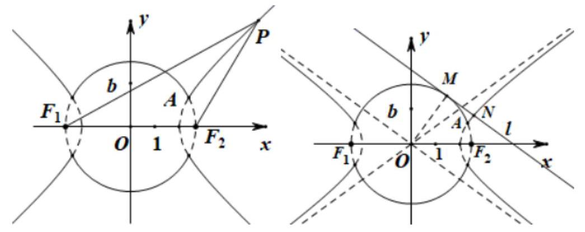

巩固训练

1、已知 $\bigtriangleup {OFQ}$ 的面积为 $2\sqrt{6}$ ， $\overrightarrow{OF} \cdot  \overrightarrow{FQ} = m$

(1)设 $\sqrt{6} \leq  m \leq  4\sqrt{6}$ ，求 $\angle {OFQ}$ 正切值的取值范围；

(2)设以 $O$ 为中心， $F$ 为焦点的双曲线经过点 $Q$ (如图)， $\left| \overrightarrow{OF}\right|  = {c, m} = \left( {\frac{\sqrt{6}}{4} - 1}\right) {c}^{2}$ 当 $\left| \overrightarrow{OQ}\right|$ 取得最小值时, 求此双曲线的方程。

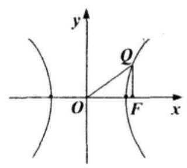

【答案】见解析

【解析】(1)设 $\angle {OFQ} = \theta \left\{  {\begin{array}{l} \left| \overrightarrow{OF}\right|  \cdot  \left| \overrightarrow{FQ}\right| \cos \left( {\pi  - \theta }\right)  = m \\  \frac{1}{2} \cdot  \left| \overrightarrow{OF}\right|  \cdot  \left| \overrightarrow{FQ}\right| \sin \theta  = 2\sqrt{6} \end{array} \Rightarrow  \tan \theta  =  - \frac{4\sqrt{6}}{m}}\right. \; \because \sqrt{6} \leq  m \leq  4\sqrt{6}\; - 4 \leq  \tan \theta  \leq   - 1$

(2)设所求的双曲线方程为 $\frac{{x}^{2}}{{a}^{2}} - \frac{{y}^{2}}{{b}^{2}} = 1\left( {a > 0, b > 0}\right) , Q\left( {{x}_{1},{y}_{1}}\right)$ ,则 $\overline{FQ} = \left( {{x}_{1} - c,{y}_{1}}\right)$

$\therefore {S}_{\bigtriangleup {OFQ}} = \frac{1}{2}\left| \overrightarrow{OF}\right|  \cdot  \left| {y}_{1}\right|  = 2\sqrt{6},\therefore {y}_{1} =  \pm  \frac{4\sqrt{6}}{c}$

又 $\because \overrightarrow{OF} \cdot  \overrightarrow{FQ} = m,\therefore \overrightarrow{OF} \cdot  \overrightarrow{FQ} = \left( {c,0}\right)  \cdot  \left( {{x}_{1} - c,{y}_{1}}\right)  = \left( {{x}_{1} - c}\right)  \cdot  c = \left( {\frac{\sqrt{6}}{4} - 1}\right) {c}^{2}$

$\therefore {x}_{1} = \frac{\sqrt{6}}{4}c,\therefore \left| \overrightarrow{OQ}\right|  = \sqrt{{x}_{1}^{2} + {y}_{1}^{2}} = \sqrt{\frac{96}{{c}^{2}} + \frac{3{c}^{2}}{8}} \geq  \sqrt{12}$ .

当且仅当 $c = 4$ 时, $\left| \overline{OQ}\right|$ 最小,此时 $Q$ 的坐标是 $\left( {\sqrt{6},\sqrt{6}}\right)$ 或 $\left( {\sqrt{6}, - \sqrt{6}}\right)$

$\therefore \left\{  {\begin{array}{l} \frac{6}{{a}^{2}} - \frac{6}{{b}^{2}} = 1 \\  {a}^{2} + {b}^{2} = {16} \end{array} \Rightarrow  \left\{  {\begin{array}{l} {a}^{2} = 4 \\  {b}^{2} = {12} \end{array}\text{ ,所求方程为 }\frac{{x}^{2}}{4} - \frac{{y}^{2}}{12} = 1}\right. }\right.$ .

2、已知椭圆 $C : \frac{{x}^{2}}{2} + {y}^{2} = 1$ 的左、右焦点分别为 ${F}_{1},{F}_{2}$ ,直线 $l$ 垂直于 $x$ 轴,垂足为 $T$ ,与抛物线 ${y}^{2} = {4x}$ 交于不同的两点 $P, Q$ ，且 $\overrightarrow{{F}_{1}P} \cdot  \overrightarrow{{F}_{2}Q} =  - 5$ ，过 ${F}_{2}$ 的直线 $m$ 与椭圆 $C$ 交于 $A, B$ 两点，设 $\overrightarrow{{F}_{2}A} = \lambda \overrightarrow{{F}_{2}B}$ ，且 $\lambda  \in  \left\lbrack  {-2, - 1}\right\rbrack$ .

(1)求点 $T$ 的坐标；

(2)求 $\left| {\overrightarrow{TA} + \overrightarrow{TB}}\right|$ 的取值范围.

【答案】(1) $T\left( {2,0}\right)$ ；(2) $\left\lbrack  {2,\frac{{13}\sqrt{2}}{8}}\right\rbrack$ .

【解析】(1) 可知 ${F}_{1}\left( {-1,0}\right) ,{F}_{2}\left( {1,0}\right)$ ,

设 $P\left( {{x}_{0},{y}_{0}}\right) , Q\left( {{x}_{0}, - {y}_{0}}\right)$ ,则 $\overrightarrow{{F}_{1}P} \cdot  \overrightarrow{{F}_{2}Q} =  - 5 = \left( {{x}_{0} + 1,{y}_{0}}\right)  \cdot  \left( {{x}_{0} - 1, - {y}_{0}}\right)  = {x}_{0}^{2} - 1 - {y}_{0}^{2}$ ,

又 ${y}^{2} = {4x}$ ,所以 $- 5 = {x}_{0}{}^{2} - 1 - 4{x}_{0}$ ,解得 ${x}_{0} = 2$ ,所以 $T\left( {2,0}\right)$ .

(2)据题意，直线 $m$ 的斜率必不为 0，所以设 $m : x = {ty} + 1$ ，将直线 $m$ 方程代入椭圆 $C$ 的方程中，

整理得 $\left( {{t}^{2} + 2}\right) {y}^{2} + {2ty} - 1 = 0$ ,

设 $A\left( {{x}_{1},{y}_{1}}\right) , B\left( {{x}_{2},{y}_{2}}\right)$ ,则 ${y}_{1} + {y}_{2} =  - \frac{2t}{{t}^{2} + 2}$ ① $\;{y}_{1}{y}_{2} =  - \frac{1}{{t}^{2} + 2}$ ②

因为 $\overrightarrow{{F}_{1}A} = \lambda \overrightarrow{{F}_{1}B}$ ,所以 ${y}_{1} = \lambda {y}_{2}$ ,且 $x < 0$ ,

将①式平方除以②式得 $\frac{{y}_{1}}{{y}_{2}} + \frac{{y}_{2}}{{y}_{1}} + 2 =  - \frac{4{t}^{2}}{{t}^{2} + 2}$ ，所以 $\lambda  + \frac{1}{\lambda } + 2 =  - \frac{4{t}^{2}}{{t}^{2} + 2}$ ， $\lambda  \in  \left\lbrack  {-2, - 1}\right\rbrack$ ，又解得 $0 \leq  {t}^{2} \leq  \frac{2}{7}$ 又 $\overrightarrow{TA} + \overrightarrow{TB} = \left( {{x}_{1} + {x}_{2} - 4,{y}_{1} + {y}_{2}}\right) ,{x}_{1} + {x}_{2} - 4 = t\left( {{y}_{1} + {y}_{2}}\right)  - 2 =  - \frac{4\left( {{t}^{2} + 1}\right) }{{t}^{2} + 2}$ 所以 ${\left| \overrightarrow{TA} + \overrightarrow{TB}\right| }^{2} = {\left( {x}_{1} + {x}_{2} - 4\right) }^{2} + {\left( {y}_{1} + {y}_{2}\right) }^{2} = {16} - \frac{28}{{t}^{2} + 2} + \frac{8}{{\left( {t}^{2} + 2\right) }^{2}}$ 令 $n = \frac{1}{{t}^{2} + 2}$ ,则 $n \in  \left\lbrack  {\frac{7}{16},\frac{1}{2}}\right\rbrack$ ,所以 ${\left| \overrightarrow{TA} + \overrightarrow{TB}\right| }^{2} = 8{n}^{2} - {28n} + {16} = 8{\left( n - \frac{7}{4}\right) }^{2} - \frac{17}{2} \in  \left\lbrack  {4,\frac{169}{32}}\right\rbrack \; \left| {\overrightarrow{TA} + \overrightarrow{TB}}\right|  \in  \left\lbrack  {2,\frac{{13}\sqrt{2}}{8}}\right\rbrack$

3、如图，已知抛物线 $C : {x}^{2} = {4y}$ ，设直线 $l$ 经过点 $Q\left( {1,2}\right)$ 且与抛物线 $C$ 相交于 ${AB}$ 两点，抛物线 $C$ 在 $A$ 、 $B$ 两点处的切线相交于点 $P$ ,直线 ${PA},{PB}$ 分别与 $x$ 轴交于 $D\text{ 、 }E$ 两点.

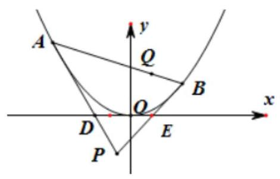

(1)求点 $P$ 的轨迹方程

( 2 )当点 $P$ 不在 $x$ 轴上时，记 $\bigtriangleup  {PDE}$ 的面积为 ${S}_{1}$ ， $\bigtriangleup  {PAB}$ 的面积为 ${S}_{2}$ ，求 $\frac{{S}_{2}}{{S}_{1}}$ 的最小值.

【答案】(1) $x - {2y} - 4 = 0$ (2) 4

【解析】(1)因为抛物线 $C : {x}^{2} = {4y}$ ,所以 $y = \frac{{x}^{2}}{4},{y}^{\prime } = \frac{x}{2}$ .

设 $A\left( {{x}_{1},\frac{{x}_{1}^{2}}{4}}\right) , B\left( {{x}_{2},\frac{{x}_{2}^{2}}{4}}\right) ,{k}_{PA} = \frac{{x}_{1}}{2},{k}_{PB} = \frac{{x}_{2}}{2}$ . 则切线 ${PA},{PB}$ 的方程分别为 $y = \frac{{x}_{1}}{2}x - \frac{{x}_{1}^{2}}{4}$ 和

$y = \frac{{x}_{2}}{2}x - \frac{{x}_{2}^{2}}{4}.$

联立 $\left\{  \begin{array}{l} y = \frac{{x}_{1}}{2}x - \frac{{x}_{1}^{2}}{4} \\  y = \frac{{x}_{2}}{2}x - \frac{{x}_{2}^{2}}{4} \end{array}\right.$ 解得交点 $P$ 的坐标为: ${x}_{P} = \frac{{x}_{1} + {x}_{2}}{2},{y}_{P} = \frac{{x}_{1}{x}_{2}}{4}$ .

设直线 $l$ 的方程为 $y = k\left( {x - 1}\right)  + 2$ ,代入 ${x}^{2} = {4y}$ ,整理得: ${x}^{2} - {4kx} + {4k} - 8 = 0$ ,

所以 ${x}_{1} + {x}_{2} = {4k},{x}_{1}{x}_{2} = {4k} - 8$ ,且 $\Delta  > 0$ .

所以 ${x}_{P} = {2k},{y}_{P} = k - 2$ ,于是 ${x}_{P} = 2{y}_{P} + 4$ ,故点 $P$ 的轨迹方程为 $x - {2y} - 4 = 0$ .

(2)因为切线 ${PA}$ 的方程为 $y = \frac{{x}_{1}}{2}x - \frac{{x}_{1}^{2}}{4}$ ，

令 $y = 0$ 得到 ${x}_{D} = \frac{{x}_{1}}{2}$ ,同理: ${x}_{E} = \frac{{x}_{2}}{2}$ . 所以 $\left| {DE}\right|  = \frac{\left| {x}_{2} - {x}_{1}\right| }{2}$ .

又 $P\left( {{2k}, k - 2}\right)$ ,故 ${S}_{1} = \frac{1}{2} \cdot  \left| {DE}\right|  \cdot  \left| {y}_{P}\right|  = \frac{\left| {{x}_{2} - {x}_{1}}\right|  \cdot  \left| {k - 2}\right| }{4}$ . 由 (1) 可知 $\left| {AB}\right|  = \sqrt{1 + {k}^{2}} \cdot  \left| {{x}_{2} - {x}_{1}}\right|$ ,

又点 $P$ 到直线 ${AB}$ 的距离为 ${d}_{P} = \frac{\left| k\left( 2k - 1\right)  - \left( k - 2\right)  + 2\right| }{\sqrt{1 + {k}^{2}}} = \frac{\left| 2{k}^{2} - 2k + 4\right| }{\sqrt{1 + {k}^{2}}}$ ,

所以 ${S}_{2} = \frac{1}{2} \cdot  \left| {AB}\right|  \cdot  {d}_{P} = \left| {{k}^{2} - k + 2}\right|  \cdot  \left| {{x}_{2} - {x}_{1}}\right|$ . 所以 $\frac{{S}_{2}}{{S}_{1}} = \frac{4\left| {{k}^{2} - k + 2}\right| }{\left| k - 2\right| }$ .

令 $k - 2 = t, t \neq  0$ ,则 $\frac{{S}_{2}}{{S}_{1}} = \frac{4\left| {{t}^{2} + {3t} + 4}\right| }{\left| t\right| } = 4\left| {t + \frac{4}{t} + 3}\right|$ .

① 当 $t > 0$ 时， $t + \frac{4}{t} \geq  2\sqrt{4} = 4$ ，当且仅当 $t = 2$ 时取 “=”. 所以 $\frac{{S}_{2}}{{S}_{1}} \geq  4 \times  \left( {4 + 3}\right)  = {28}$ ；

② 当 $t < 0$ 时， $t + \frac{4}{t} =  - \left\lbrack  {\left( {-t}\right)  + \left( {-\frac{4}{4}}\right) }\right\rbrack   \leq   - 4$ ， $t + \frac{4}{t} + 3 \leq   - 1$ ， $\left| {t + \frac{4}{t} + 3}\right|  \geq  1$ ，

当且仅当 $t =  - 2$ 时取 “ $=$ ”. 所以 $\frac{{S}_{2}}{{S}_{1}} \geq  4$ ; 综上所述: $\frac{{S}_{2}}{{S}_{1}}$ 的最小值为 4 .

4、已知椭圆 $\frac{{x}^{2}}{2} + {y}^{2} = 1$ 上两个不同的点 $A, B$ 关于直线 $y = {mx} + \frac{1}{2}\left( {m \neq  0}\right)$ 对称.

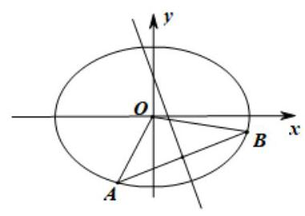

(1)若已知 $C\left( {0,\frac{1}{2}}\right)$ ， $M$ 为椭圆上动点，证明: $\left| {MC}\right|  \leq  \frac{\sqrt{10}}{2}$ ；

(2)求实数 $m$ 的取值范围；

(3)求 $\bigtriangleup  {AOB}$ 面积的最大值(O为坐标原点).

【答案】见解析

【解析】(1) 设 $M\left( {x, y}\right)$ ,则 $\frac{{x}^{2}}{2} + {y}^{2} = 1$ ,

于是 $\left| {MC}\right|  = \sqrt{{x}^{2} + {\left( y - \frac{1}{2}\right) }^{2}} = \sqrt{2 - 2{y}^{2} + {\left( y - \frac{1}{2}\right) }^{2}} = \sqrt{-{y}^{2} - y + \frac{9}{4}} = \sqrt{-{\left( y + \frac{1}{2}\right) }^{2} + \frac{5}{2}}$

因 $- 1 \leq  y \leq  1$ ,所以,当 $y =  - \frac{1}{2}$ 时, ${\left| MC\right| }_{\max } = \frac{\sqrt{10}}{2}$ . 即 $\left| {MC}\right|  \leq  \frac{\sqrt{10}}{2}$

( 2 )由题意知 $m \neq  0$ ，可设直线 ${AB}$ 的方程为 $y =  - \frac{1}{m}x + b$ .

由 $\left\{  \begin{array}{l} \frac{{x}^{2}}{2} + {y}^{2} = 1, \\  y =  - \frac{1}{m}x + b, \end{array}\right.$ 消去 $y$ ,得 $\frac{2 + {m}^{2}}{2{m}^{2}}{x}^{2} - \frac{2b}{m}x + {b}^{2} - 1 = 0$ . 因为直线 $y =  - \frac{1}{m}x + b$ 与椭圆 $\frac{{x}^{2}}{2} + {y}^{2} = 1$ 有

两个不同的交点,所以, $\Delta  =  - 2{b}^{2} + 2 + \frac{4}{{m}^{2}} > 0$ ,即 ${b}^{2} < 1 + \frac{2}{{m}^{2}}$①

将 ${AB}$ 中点 $M\left( {\frac{2mb}{{m}^{2} + 2},\frac{{m}^{2}b}{{m}^{2} + 2}}\right)$ 代入直线方程 $y = {mx} + \frac{1}{2}$ 解得 $b =  - \frac{{m}^{2} + 2}{2{m}^{2}}\;($②

由①②得 $m <  - \frac{\sqrt{6}}{3}$ 或 $m > \frac{\sqrt{6}}{3}$

(3)令 $t = \frac{1}{m} \in  \left( {-\frac{\sqrt{6}}{2},0}\right)  \cup  \left( {0,\frac{\sqrt{6}}{2}}\right)$ ，即 ${t}^{2} = \left( {0,\frac{3}{2}}\right)$ ，

则 $\left| {AB}\right|  = \sqrt{{t}^{2} + 1} \cdot  \frac{\sqrt{-2{t}^{4} + 2{t}^{2} + \frac{3}{2}}}{{t}^{2} + \frac{1}{2}}$ ，且 $O$ 到直线 ${AB}$ 的距离为 $d = \frac{{t}^{2} + \frac{1}{2}}{\sqrt{{t}^{2} + 1}}$

设 $\bigtriangleup {AOB}$ 的面积为 $S\left( t\right)$ ,所以 $S\left( t\right)  = \frac{1}{2}\left| {AB}\right|  \cdot  d = \frac{1}{2}\sqrt{-2{\left( {t}^{2} - \frac{1}{2}\right) }^{2} + 2} \leq  \frac{\sqrt{2}}{2}$

当且仅当 ${t}^{2} = \frac{1}{2}$ 时,等号成立. 故 $\bigtriangleup {AOB}$ 面积的最大值为 $\frac{\sqrt{2}}{2}$ .

## (二)解析几何中定值(点)问题

## 知识梳理

## 一、解析几何中定值问题解题步骤如下:

(1)选择参变量. 需要证明为定值的量在通常情况下，照理是个变量，它应该是随着某一个量的变化而变化， 可选择这个量为参变量(有时会选择两个量为参变量，利用辅助条件消去其中之一).

(2)求出函数的解析式. 即把需要证明为定值的量表示成上述参变量的函数

(3)化简解析式得到定值. 有题目的结论可知要证明为定值的量必与参变量的大小无关，故求出的函数必为常数函数, 所以只要对函数作相应的化简.

## 二、直线与圆锥曲线的综合题中求直线所过定点问题:

## 方法1:参数法

直线与圆锥曲线的综合题中求出直线所过定点解题步骤如下:

一选:选择参变量. 需要证明过定点的直线往往会随着一个量的变化而变化，可以选择这个量为参变量(当直线牵涉的量比较多时, 也可以选择多个参变量)

二求:求出直线的方程. 求出只含上述参变量的动直线方程，并有其他辅助条件减少参变量的个数，最终使得动直线的方程的系数中只含一个参变量.

三定点: 求出定点的坐标. 不妨设动直线的方程中只含有变量 $\mathbf{\lambda }$ ,把直线方程写成 $f\left( {x, y}\right)  + {\lambda g}\left( {x, y}\right)  = 0$ 的形式,然后解关于 $x, y$ 的方程组 $\left\{  \begin{array}{l} f\left( {x, y}\right)  = 0 \\  g\left( {x, y}\right)  = 0 \end{array}\right.$ 得到定点的坐标.

方法2:由特殊到一般(先根据特殊情况确定定点，再进行一般性证明)

如果要解决的问题是一个定点的问题, 而题设条件有没有给出这个定点, 那么我们这样思考: 由于这个定点对符合要求的一些特殊情况必然成立, 可以根据这个特殊情况找到这个定点, 明确了定点外, 然后再进行推理研究.

## 例题精讲

【例 5】已知点 $P$ 是圆 $F : {x}^{2} + {y}^{2} - {4x} - {16} = 0$ 上任意一点 $\left( F\right.$ 是圆心 $)$ ,点 ${F}^{\prime }$ 与点 $F$ 关于原点对称,线段 $P{F}^{\prime }$ 的垂直平分线与半径 ${FP}$ 交于点 $M$ .

(1)求点 $M$ 的轨迹， $\Gamma$ 的方程；

(2)过点 $F$ 作 $\Gamma$ 的两条互相垂直的弦 ${AB},{CD}$ ，若 $\left| {AB}\right|  + \left| {{CD}\left|  = \right| \lambda }\right| {AB}\left| \cdot \right| {CD} \mid$ ，求证: $\lambda$ 为定值.

【难度】 $\star   \star   \star$

【答案】(1) $\frac{{x}^{2}}{5} + {y}^{2} = 1$ ; (2) 证明见解析.

【解析】(1) 圆 $F$ 的标准方程为: ${\left( x - 2\right) }^{2} + {y}^{2} = {20}$ ,圆心 $F\left( {2,0}\right)$ ,半径 $r = 2\sqrt{5}$ .

由已知可得, $\left| {M{F}^{\prime }}\right|  + \left| {MF}\right|  = \left| {MP}\right|  + \left| {MF}\right|  = r = 2\sqrt{5} > \left| {F{F}^{\prime }}\right|$ ,所以点 $M$ 的轨迹是以 ${F}^{\prime }, F$ 为焦点的椭圆,

其中 ${2a} = 2\sqrt{5}, c = 2$ ,所以 $a = \sqrt{5},{b}^{2} = {a}^{2} - {c}^{2} = 1$ ,所以点 $M$ 的轨迹 $\Gamma$ 方程为 $\frac{{x}^{2}}{5} + {y}^{2} = 1$ .

(2)当 ${AB}$ 斜率不存在或斜率为 0 时， $\lambda  = \frac{\left| {AB}\right|  + \left| {CD}\right| }{\left| {AB}\right|  \cdot  \left| {CD}\right| } = \frac{1}{\left| AB\right| } + \frac{1}{\left| CD\right| } = \frac{1}{2a} + \frac{a}{2{b}^{2}} = \frac{3\sqrt{5}}{5}$ ,

当 ${AB}$ 斜率存在且不为 0 时,设 ${AB}$ 方程为 $y = k\left( {x - 2}\right) , A\left( {{x}_{1},{y}_{1}}\right) , B\left( {{x}_{2},{y}_{2}}\right)$ ,

则 ${CD}$ 方程为 $y =  - \frac{1}{k}\left( {x - 2}\right)$ ,由 $\left\{  \begin{array}{l} y = k\left( {x - 2}\right) \\  \frac{{x}^{2}}{5} + {y}^{2} = 1 \end{array}\right.$ ,消去 $y$ 得, $\left( {1 + 5{k}^{2}}\right) {x}^{2} - {20}{k}^{2}x + {20}{k}^{2} - 5 = 0,\Delta  > 0$ , 则 ${x}_{1} + {x}_{2} = \frac{{20}{k}^{2}}{1 + 5{k}^{2}},{x}_{1}{x}_{2} = \frac{{20}{k}^{2} - 5}{1 + 5{k}^{2}}$ ,

所以 $\left| {AB}\right|  = \sqrt{1 + {k}^{2}}\left| {{x}_{1} - {x}_{2}}\right|  = \sqrt{1 + {k}^{2}} \cdot  \sqrt{{\left( {x}_{1} + {x}_{2}\right) }^{2} - 4{x}_{1}{x}_{2}} = \frac{2\sqrt{5}\left( {{k}^{2} + 1}\right) }{1 + 5{k}^{2}}$ ,同理, $\left| {CD}\right|  = \frac{2\sqrt{5}\left( {{k}^{2} + 1}\right) }{{k}^{2} + 5}$ , 所以 $\lambda  = \frac{1}{\left| AB\right| } + \frac{1}{\left| CD\right| } = \frac{1 + 5{k}^{2}}{2\sqrt{5}\left( {{k}^{2} + 1}\right) } + \frac{{k}^{2} + 5}{2\sqrt{5}\left( {{k}^{2} + 1}\right) } = \frac{3\sqrt{5}}{5}$ . 综上可知, $\lambda$ 为定值 $\frac{3\sqrt{5}}{5}$ .

【例 6】在平面直角坐标系 ${xOy}$ 中,已知椭圆 $C : \frac{{x}^{2}}{{a}^{2}} + \frac{{y}^{2}}{{b}^{2}} = 1\left( {a > b > 0}\right)$ 的 $\frac{c}{a} = \frac{\sqrt{6}}{3}$ 且过定点 $D\left( {-\sqrt{3},1}\right)$ .

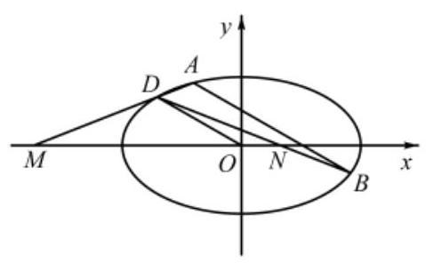

(1)求椭圆 $C$ 的方程；

(2)设平行于 ${OD}$ 的直线 $l$ 与椭圆 $C$ 交于 $A, B$ 两点(如图所示).

① 线段 ${AB}$ 的长度是否有最大值？并说明理由;

②若直线 ${DA},{DB}$ 与 $x$ 轴分别交于 $M, N$ 两点，记 $M, N$ 的横坐标为 $m, n$ ，求证: $m + n$ 为定值.

【难度】★★★★

【答案】(1) $\frac{{x}^{2}}{6} + \frac{{y}^{2}}{2} = 1$ ; (2) ①不存在，证明见解析；② $m + n$ 是定值等于 $- 2\sqrt{3}$ ，证明见解析.

【解析】(1)由题意可得 $\left\{  \begin{array}{l} \frac{c}{a} = \frac{\sqrt{6}}{3} \\  \frac{3}{{a}^{2}} + \frac{1}{{b}^{2}} = 1 \\  {a}^{2} = {b}^{2} + {c}^{2} \end{array}\right.$ ，解得: $\left\{  \begin{array}{l} a = \sqrt{6} \\  b = \sqrt{2} \\  c = 2 \end{array}\right.$ ，所以求椭圆 $C$ 的方程为 $\frac{{x}^{2}}{6} + \frac{{y}^{2}}{2} = 1$ ，

(2)①因为 ${k}_{OD} = \frac{1 - 0}{-\sqrt{3} - 0} =  - \frac{\sqrt{3}}{3}$ ， ${OD}$ 平行于直线 $l$ ，

所以设直线 $l$ 的方程为: $y =  - \frac{\sqrt{3}}{3}x + m, A\left( {{x}_{1},{y}_{1}}\right) , B\left( {{x}_{2},{y}_{2}}\right)$

由 $\left\{  \begin{array}{l} \frac{{x}^{2}}{6} + \frac{{y}^{2}}{2} = 1 \\  y =  - \frac{\sqrt{3}}{3}x + m \end{array}\right.$ 可得 $2{x}^{2} - 2\sqrt{3}{mx} + 3{m}^{2} - 6 = 0$ , $\Delta  = {12}{m}^{2} - 8\left( {3{m}^{2} - 6}\right)  > 0$ ,解得: ${m}^{2} < 4$ ,

${x}_{1} + {x}_{2} = \sqrt{3}m\;{x}_{1}{x}_{2} = \frac{3{m}^{2} - 6}{2}$ ,所以 $\left| {AB}\right|  = \sqrt{1 + {\left( -\frac{\sqrt{3}}{3}\right) }^{2}}\left| {{x}_{1} - {x}_{2}}\right|  = \frac{2}{\sqrt{3}}\sqrt{{\left( {x}_{1} + {x}_{2}\right) }^{2} - 4{x}_{1}{x}_{2}}$

$= \frac{2}{\sqrt{3}}\sqrt{3{m}^{2} - 4 \times  \frac{3{m}^{2} - 6}{2}} = \frac{2}{\sqrt{3}}\sqrt{{12} - 3{m}^{2}} = 2\sqrt{4 - {m}^{2}}$ ,

因为 ${m}^{2} < 4$ ,所以当 $m = 0$ 时, $\left| {AB}\right|$ 最大,此时直线 $l$ 的方程为 $y =  - \frac{\sqrt{3}}{3}x$ ,

直线 ${AB}$ 与直线 ${OD}$ 重合,不满足与 ${OD}$ 平行,所以不存在;

② ${k}_{AD} = \frac{{y}_{1} - 1}{{x}_{1} + \sqrt{3}},{k}_{BD} = \frac{{y}_{2} - 1}{{x}_{2} + \sqrt{3}}$ ，则直线 ${AD}$ 的方程为 $y - 1 = \frac{{y}_{1} - 1}{{x}_{1} + \sqrt{3}}\left( {x + \sqrt{3}}\right)$ ，

令 $y = 0$ 可得: $x = m = \frac{{x}_{1} + \sqrt{3}}{1 - {y}_{1}} - \sqrt{3}$ ，直线 ${BD}$ 的方程为 $y - 1 = \frac{{y}_{2} - 1}{{x}_{2} + \sqrt{3}}\left( {x + \sqrt{3}}\right)$ ，

令 $y = 0$ 可得: $x = n = \frac{{x}_{2} + \sqrt{3}}{1 - {y}_{2}} - \sqrt{3}, m + n = \frac{{x}_{1} + \sqrt{3}}{1 - {y}_{1}} - \sqrt{3} + \frac{{x}_{2} + \sqrt{3}}{1 - {y}_{2}} - \sqrt{3} = \frac{{x}_{1} + \sqrt{3}}{1 - {y}_{1}} + \frac{{x}_{2} + \sqrt{3}}{1 - {y}_{2}} - 2\sqrt{3}$

$= \frac{\left( {{x}_{1} + \sqrt{3}}\right) \left( {1 - {y}_{2}}\right)  + \left( {{x}_{2} + \sqrt{3}}\right) \left( {1 - {y}_{1}}\right) }{\left( {1 - {y}_{1}}\right) \left( {1 - {y}_{2}}\right) } - 2\sqrt{3} = \frac{-{x}_{1}{y}_{2} - {x}_{2}{y}_{1} + {x}_{1} + {x}_{2} + 2\sqrt{3} - \sqrt{3}\left( {{y}_{1} + {y}_{2}}\right) }{1 - \left( {{y}_{1} + {y}_{2}}\right)  + {y}_{1}{y}_{2}} - 2\sqrt{3}$

$= \frac{-{x}_{1}{y}_{2} - {x}_{2}{y}_{1} + {x}_{1} + {x}_{2} + 2\sqrt{3} - \sqrt{3}\left( {{y}_{1} + {y}_{2}}\right) }{1 - \left( {{y}_{1} + {y}_{2}}\right)  + {y}_{1}{y}_{2}} - 2\sqrt{3}$

由①知 ${x}_{1} + {x}_{2} = \sqrt{3}m\;{x}_{1}{x}_{2} = \frac{3{m}^{2} - 6}{2}$ ，所 ${y}_{1} + {y}_{2} =  - \frac{\sqrt{3}}{3}{x}_{1} + m - \frac{\sqrt{3}}{3}{x}_{2} + m =  - \frac{\sqrt{3}}{3} \times  \sqrt{3}m + {2m} = m$

${y}_{1}{y}_{2} = \left( {-\frac{\sqrt{3}}{3}{x}_{1} + m}\right) \left( {-\frac{\sqrt{3}}{3}{x}_{2} + m}\right)  = \frac{1}{3}{x}_{1}{x}_{2} - \frac{\sqrt{3}}{3}m\left( {{x}_{1} + {x}_{2}}\right)  + {m}^{2}$

$= \frac{1}{3} \times  \frac{3{m}^{2} - 6}{2} - \frac{\sqrt{3}}{3}m \times  \sqrt{3}m + {m}^{2} = \frac{{m}^{2} - 2}{2}$ ,

${x}_{1}{y}_{2} + {x}_{2}{y}_{1} = {x}_{1}\left( {-\frac{\sqrt{3}}{3}{x}_{2} + m}\right)  + {x}_{2}\left( {-\frac{\sqrt{3}}{3}{x}_{1} + m}\right)  =  - \frac{2\sqrt{3}}{3}{x}_{1}{x}_{2} + m\left( {{x}_{1} + {x}_{2}}\right)$

$=  - \frac{2\sqrt{3}}{3} \times  \frac{3{m}^{2} - 6}{2} + m \times  \sqrt{3}m = 2\sqrt{3}$

所以 $m + n = \frac{-2\sqrt{3} + \sqrt{3}m + 2\sqrt{3} - \sqrt{3}m}{1 - m + \frac{{m}^{2} - 2}{2}} - 2\sqrt{3} = 0 - 2\sqrt{3} =  - 2\sqrt{3}$ ,所以 $m + n$ 是定值等于 $- 2\sqrt{3}$

【例 7】在平面直角坐标系中,已知焦距为 4 的椭圆 $C : \frac{{x}^{2}}{{a}^{2}} + \frac{{y}^{2}}{{b}^{2}} = 1\left( {a > b > 0}\right)$ 的左、右顶点分别为 $A\text{ 、 }B$ , 椭圆 $C$ 的右焦点为 $F$ ,过 $F$ 作一条垂直于 $x$ 轴的直线与椭圆相交于 $R\text{ 、 }S$ ,若线段 ${RS}$ 的长为 $\frac{10}{3}$ .

(1)求椭圆 $C$ 的方程；

(2)设 $Q\left( {t, m}\right)$ 是直线 $x = 9$ 上的点，直线 ${QA}\text{ 、 }{QB}$ 与椭圆 $C$ 分别交于点 $M\text{ 、 }N$ ，求证:直线 ${MN}$ 必过 $x$ 轴上的一定点, 并求出此定点的坐标;

【难度】

【答案】见解析

【解析】本题第一小问非常基础,根据焦距及 $\mathrm{{RS}}$ 长易知椭圆方程; 第二小问中有三条直线,分别是 ${QA}$ 、 ${QB}$ 、MN，而所求为 MN 过定点，因此可考虑将 MN 直线表示出来，利用参数系数为 0 解决问题.

(1)依题意，椭圆过点 $\left( {2,\frac{5}{3}}\right)$ ，故 $\left\{  \begin{array}{l} \frac{4}{{a}^{2}} + \frac{25}{9{b}^{2}} = 1 \\  {a}^{2} - {b}^{2} = 4 \end{array}\right.$ ，解得 $\left\{  \begin{array}{l} {a}^{2} = 9 \\  {b}^{2} = 5 \end{array}\right.$ 椭圆 $C$ 的方程为 $\frac{{x}^{2}}{9} + \frac{{y}^{2}}{5} = 1$ .

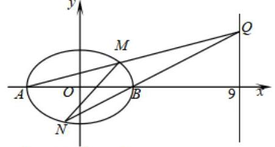

(2)设 $Q\left( {9, m}\right)$ ，直线 ${QA}$ 的方程为 $y = \frac{m}{12}\left( {x + 3}\right)$ ，

代入椭圆方程，得 $\left( {{80} + {m}^{2}}\right) {x}^{2} + {6x} + 9{m}^{2} - {720} = 0$ ，

设 $M\left( {{x}_{1},{y}_{1}}\right)$ ,则 $- 3{x}_{1} = \frac{9{m}^{2} - {720}}{{m}^{2} + {80}} \Rightarrow  {x}_{1} = \frac{{240} - 3{m}^{2}}{{m}^{2} + {80}}$ ,

${y}_{1} = \frac{m}{12}\left( {{x}_{1} + 3}\right)  = \frac{m}{12}\left( {\frac{{240} - 3{m}^{2}}{{m}^{2} + {80}} + 3}\right)  = \frac{40m}{{m}^{2} + {80}}$ ,故点 $M$ 的坐标为 $\left( {\frac{{240} - 3{m}^{2}}{{m}^{2} + {80}},\frac{40m}{{m}^{2} + {80}}}\right)$ .

同理,直线 ${QB}$ 的方程为 $\mathrm{y} = \frac{\mathrm{m}}{6}\left( {\mathrm{x} - 3}\right)$ ,代入椭圆方程,得 $\left( {{20} + {m}^{2}}\right) {x}^{2} - {6x} + 9{m}^{2} - {180} = 0$ ,

设 $N\left( {{x}_{2},{y}_{2}}\right)$ ,则 $3{x}_{2} = \frac{9{m}^{2} - {180}}{{m}^{2} + {20}} \Rightarrow  {x}_{2} = \frac{3{m}^{2} - {60}}{{m}^{2} + {20}},{y}_{2} = \frac{m}{6}\left( {{x}_{2} - 3}\right)  = \frac{m}{6}\left( {\frac{3{m}^{2} - {60}}{{m}^{2} + {20}} - 3}\right)  =  - \frac{20m}{{m}^{2} + {20}}$ . 可得点 $N$ 的坐标为 $\left( {\frac{3{m}^{2} - {60}}{{m}^{2} + {20}}, - \frac{20m}{{m}^{2} + {20}}}\right)$ .

① 若 $\frac{{240} - 3{m}^{2}}{{m}^{2} + {80}} = \frac{3{m}^{2} - {60}}{{m}^{2} + {20}} \Rightarrow  {m}^{2} = {40}$ 时，直线 ${MN}$ 的方程为 $x = 1$ ，与 $x$ 轴交于 $\left( {1,0}\right)$ 点；

② 若 ${m}^{2} \neq  {40}$ ，直线 ${MN}$ 的方程为 $y + \frac{20m}{{m}^{2} + {20}} = \frac{10m}{{40} - {m}^{2}}\left( {x - \frac{3{m}^{2} - {60}}{{m}^{2} + {20}}}\right)$ ，

令 $y = 0$ ,解得 $x = 1$ . 综上所述,直线 ${MN}$ 必过 $x$ 轴上的定点 $\left( {1,0}\right)$ .

【例 8】已知抛物线 ${C}_{1} : {y}^{2} = {4x}$ 的焦点与椭圆 ${C}_{2} : \frac{{x}^{2}}{{a}^{2}} + \frac{{y}^{2}}{3} = 1$ 的右焦点 ${F}_{2}$ 重合, ${F}_{1}$ 是椭圆 ${C}_{2}$ 的左焦点, $O$ 是坐标原点.过点 ${F}_{2}$ 的直线 ${l}_{1}$ 与抛物线 ${C}_{1}$ 交于不同的两点 $A, B$ ,与椭圆 ${C}_{2}$ 交于两点 $C, D$ .

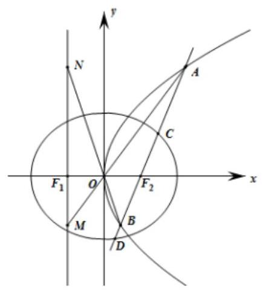

(1)求椭圆 ${C}_{2}$ 的标准方程；

(2)记 $\bigtriangleup  {F}_{1}{AB}$ 与 $\bigtriangleup  {F}_{1}{CD}$ 的面积分别为 ${S}_{1},{S}_{2}$ ，求 $\frac{{S}_{1}}{{S}_{2}}$ 的最小值；

(3)过点 ${F}_{1}$ 且垂直于 $x$ 轴的直线 ${l}_{2}$ 分别交直线 ${OA},{OB}$ 于点 $M$ 和点 $N$ . 问:以 ${MN}$ 为直径的圆是否经过定点? 若是, 求出所有定点坐标; 若不是, 说明理由.

【难度】 $\star   \star   \star   \star$

【答案】(1) $\frac{{x}^{2}}{4} + \frac{{y}^{2}}{3} = 1$ ；(2) $\frac{4}{3}$ ；(3)过定点，定点为 $\left( {1,0}\right) ,\left( {-3,0}\right)$ .

【解析】(1) $\therefore$ 抛物线 ${C}_{1} : {y}^{2} = {4x}$ 的焦点 $F\left( {1,0}\right)$ ， $\therefore$ 椭圆 ${C}_{2} : \frac{{x}^{2}}{{a}^{2}} + \frac{{y}^{2}}{3} = 1$ 的右焦点 ${F}_{2}\left( {1,0}\right)$ ， $\therefore {c}^{2} = 1,{b}^{2} = 3$ ,则 ${a}^{2} = {b}^{2} + {c}^{2} = 4$ ,即椭圆 ${C}_{2}$ 的标准方程为 $\frac{{x}^{2}}{4} + \frac{{y}^{2}}{3} = 1$ .

(2)设直线 ${l}_{1}$ 为 $x = {my} + 1,\;A\left( {{x}_{1},{y}_{1}}\right) , B\left( {{x}_{2},{y}_{2}}\right) , C\left( {{x}_{3},{y}_{3}}\right) , D\left( {{x}_{4},{y}_{4}}\right)$ ， $\left\{  {\begin{matrix} x = {my} + 1 \\  {y}^{2} = {4x} \end{matrix} \Rightarrow  {y}^{2} - {4my} - 4 = 0 \Rightarrow  \left\{  {\begin{matrix} {y}_{1} + {y}_{2} = {4m} \\  {y}_{1}{y}_{2} =  - 4 \end{matrix},}\right. }\right.$ 同理 $\left\{  {\begin{matrix} x = {my} + 1 \\  3{x}^{2} + 4{y}^{2} = {12} \end{matrix} \Rightarrow  \left( {3{m}^{2} + 4}\right) {y}^{2} + {6my} - 9 = 0 \Rightarrow  \left\{  \begin{matrix} {y}_{3} + {y}_{4} = \frac{-{6m}}{3{m}^{2} + 4} \\  {y}_{3}{y}_{4} = \frac{-9}{3{m}^{2} + 4} \end{matrix}\right. }\right.$ , ${\left( \frac{{S}_{1}}{{S}_{2}}\right) }^{2} = {\left( \frac{\left| {y}_{1} - {y}_{2}\right| }{\left| {y}_{3} - {y}_{4}\right| }\right) }^{2} = \frac{{\left( {y}_{1} + {y}_{2}\right) }^{2} - 4{y}_{1}{y}_{2}}{{\left( {y}_{3} + {y}_{4}\right) }^{2} - 4{y}_{3}{y}_{4}} = \frac{{16}{m}^{2} + {16}}{\frac{{36}{m}^{2}}{{\left( 3{m}^{2} + 4\right) }^{2}} + \frac{36}{3{m}^{2} + 4}} = \frac{{\left( 3{m}^{2} + 4\right) }^{2}}{9} \geq  \frac{16}{9}$ . 即 $\frac{{S}_{1}}{{S}_{2}} \geq  \frac{4}{3}$

(3)设直线 ${OA} : y = \frac{{y}_{1}}{{x}_{1}}x$ ,由 $\left\{  {\begin{array}{l} y = \frac{{y}_{1}}{{x}_{1}}x \\  x =  - 1 \end{array} \Rightarrow  M\left( {-1, - \frac{{y}_{1}}{{x}_{1}}}\right) }\right.$ ,同理 $N\left( {-1, - \frac{{y}_{2}}{{x}_{2}}}\right)$ ,由 (2) 可知 ${x}_{1}{x}_{2} = \frac{{y}_{1}^{2}}{4} \cdot  \frac{{y}_{2}^{2}}{4} = 1$

$\therefore \left| {MN}\right|  = \left| {\frac{{y}_{2}}{{x}_{2}} - \frac{{y}_{1}}{{x}_{1}}}\right|  = \frac{\left| {y}_{2}{x}_{1} - {y}_{1}{x}_{2}\right| }{\left| {x}_{1}{x}_{2}\right| } = \left| {{y}_{2}\left( {m{y}_{1} + 1}\right)  - {y}_{1}\left( {m{y}_{2} + 1}\right) }\right|$

$= \left| {{y}_{1} - {y}_{2}}\right|  = \sqrt{{\left( {y}_{1} + {y}_{2}\right) }^{2} - 4{y}_{1}{y}_{2}} = 4\sqrt{{m}^{2} + 1}$

$\therefore \frac{1}{2}\left( {-\frac{{y}_{1}}{{x}_{1}} - \frac{{y}_{2}}{{x}_{2}}}\right)  =  - \frac{1}{2} \cdot  \frac{{y}_{1}{x}_{2} + {y}_{2}{x}_{1}}{{x}_{1}{x}_{2}} =  - \frac{1}{2}\left\lbrack  {{y}_{1}\left( {m{y}_{2} + 1}\right)  + {y}_{2}\left( {m{y}_{1} + 1}\right) }\right\rbrack   =  - \frac{1}{2}\left\lbrack  {{2m}{y}_{1}{y}_{2} + \left( {{y}_{1} + {y}_{2}}\right) }\right\rbrack   =  - {2m}$

$\therefore$ 以 ${MN}$ 为直径的圆的圆心 $\left( {-1, - {2m}}\right)$ ,

$\therefore$ 以 ${MN}$ 为直径的圆方程为 ${\left( x + 1\right) }^{2} + {\left( y + 2m\right) }^{2} = 4{m}^{2} + 4$

显然 $y = 0$ 时,等式成立与 $m$ 无关 $\therefore {\left( x + 1\right) }^{2} = 4$ ,即定点为 $\left( {1,0}\right) ,\left( {-3,0}\right)$ .

## 巩固训练

1、已知抛物线 $C : {y}^{2} = {2px}\left( {p > 0}\right)$ 的焦点为 $F$ ，倾斜角为 ${45}^{ \circ  }$ 的直线 $l$ 过点 $F$ 与抛物线 $C$ 交于 $A, B$ 两点，且 $\left| {AB}\right|  = 8$ .

(1)求 $p$ ；

(2)设点 $E$ 为直线 $x = \frac{p}{2}$ 与抛物线 $C$ 在第一象限的交点，过点 $E$ 作 $C$ 的斜率分别为 ${k}_{1}$ ， ${k}_{2}$ 的两条弦 ${EM},{EN}$ ,如果 ${k}_{1} + {k}_{2} =  - 1$ ,证明直线 ${MN}$ 过定点,并求出定点坐标.

【答案】( 1 ) $p = 2$ ；( 2 )证明见解析，定点为 $\left( {5, - 6}\right)$ .

【解析】解: (1) 由题意知: $F\left( {\frac{p}{2},0}\right)$ ,则直线 $l$ 的方程为 $y = x - \frac{p}{2}$ ,代入抛物线方程得 ${x}^{2} - {3px} + \frac{{p}^{2}}{4} = 0$ , 设 $A\left( {{x}_{A},{y}_{A}}\right) , B\left( {{x}_{B},{y}_{B}}\right)$ ,根据抛物线定义 $\left| {AF}\right|  = {x}_{A} + \frac{p}{2},\left| {BF}\right|  = {x}_{B} + \frac{p}{2}$ , $\therefore \left| {AB}\right|  = \left| {AF}\right|  + \left| {BF}\right|  = {x}_{A} + {x}_{B} + p = {4p} = 8,\therefore p = 2$ ;

( 2 )抛物线方程为 ${y}^{2} = {4x}$ ，直线 $x = \frac{p}{2}$ ，即 $x = 1$ ，解得 $E\left( {1,2}\right)$ .

① 当 ${MN}$ 斜率不存在时,设方程为 $x = t$ ,则 $M\left( {t,2\sqrt{t}}\right) , N\left( {t, - 2\sqrt{t}}\right)$ ,

${k}_{1} + {k}_{2} = \frac{2\sqrt{t} - 2}{t - 1} + \frac{-2\sqrt{t} - 2}{t - 1} =  - 1$ ,解得: $t = 5,\therefore$ 方程为 $x = 5$ ;

② 当 ${MN}$ 斜率存在时,设 ${MN} : y = {kx} + b\left( {k \neq  0}\right)$ , $\left\{  \begin{array}{l} y = {kx} + b \\  {y}^{2} = {4x} \end{array}\right.$ ,即 ${k}^{2}{x}^{2} + \left( {{2kb} - 4}\right) x + {b}^{2} = 0$ ,

$\left\{  {\begin{array}{l} \Delta  > 0 \\  {x}_{1} + {x}_{2} = \frac{4 - {2kb}}{{k}^{2}}, \\  {x}_{1}{x}_{2} = \frac{{b}^{2}}{{k}^{2}} \end{array}{k}_{1} = \frac{{y}_{1} - 2}{{x}_{1} - 1} = \frac{k{x}_{1} + b - 2}{{x}_{1} - 1} = k + \frac{b + k - 2}{{x}_{1} - 1},{k}_{2} = k + \frac{b + k - 2}{{x}_{2} - 1}}\right.$ ,

${k}_{1} + {k}_{2} = {2k} + \left( {b + k - 2}\right)  \cdot  \frac{{x}_{1} + {x}_{2} - 2}{\left( {{x}_{1} - 1}\right) \left( {{x}_{2} - 1}\right) } =  - 1$ ,化简得: $b =  - {5k} - 6$ ,

此时 ${MN} : y = k\left( {x - 5}\right)  - 6$ ,过定点 $\left( {5, - 6}\right)$ ,综上,直线 ${MN}$ 过定点 $\left( {5, - 6}\right)$ .

2、设抛物线 $C : {y}^{2} = {2px}\left( {p > 0}\right)$ 的焦点为 $F$ ，过 $F$ 且垂于 $x$ 轴的直线与抛物线交于 ${P}_{1}$ ， ${P}_{2}$ 两点，已知 $\left| {{P}_{1}{P}_{2}}\right|  = 8$ .

(1)求抛物线 $C$ 的方程；

(2)设 $m > 0$ ，过点 $M\left( {m,0}\right)$ 作方向向量为 $\overrightarrow{d} = \left( {1,\sqrt{3}}\right)$ 的直线与抛物线 $C$ 相交于 $A, B$ 两点，求使 $\angle {AFB}$ 为钝角时实数 $m$ 的取值范围;

(3)对给定的定点 $M\left( {m,0}\right) \left( {m > 0}\right)$ ，过 $M$ 作直线与抛物线 $C$ 相交于 $A$ ， $B$ 两点，问是否存在一条垂直于 $x$ 轴的直线与以线段 ${AB}$ 为直径的圆始终相切? 若存在,请求出这条直线; 若不存在,请说明理由.

【答案】(1) ${y}^{2} = {8x}$ ；(2) $\left( {0,2}\right)  \cup  \left( {2,\frac{{18} + 4\sqrt{21}}{3}}\right)$ ；(3)答案见解析.

【解析】(1)由条件得 ${2p} = 8$ , $\therefore$ 抛物线 $C$ 的方程为 ${y}^{2} = {8x}$ ;

(2)直线方程为 $y = \sqrt{3}\left( {x - m}\right)$ 代入 ${y}^{2} = {8x}$ 得 $3{x}^{2} - \left( {{6m} + 8}\right) x + 3{m}^{2} = 0$ ，

设 $A\left( {{x}_{1},{y}_{1}}\right) , B\left( {{x}_{2},{y}_{2}}\right) , F\left( {2,0}\right)$ ,则 $\overrightarrow{FA} = \left( {{x}_{1} - 2,{y}_{1}}\right) ,\overrightarrow{FB} = \left( {{x}_{2} - 2,{y}_{2}}\right) ,{x}_{1} + {x}_{2} = \frac{{6m} + 8}{3},{x}_{1}{x}_{2} = {m}^{2}$ .

$\because \angle {AFB}$ 为钝角, $\therefore \overrightarrow{FA} \cdot  \overrightarrow{FB} < 0,\therefore \left( {{x}_{1} - 2}\right) \left( {{x}_{2} - 2}\right)  + {y}_{1}{y}_{2} < 0$ ,即

$\therefore 4{x}_{1}{x}_{2} - \left( {2 + {3m}}\right) \left( {{x}_{1} + {x}_{2}}\right)  + 4 + 3{m}^{2} < 0$ ,

因此 $3{m}^{2} - {36m} - 4 < 0,\therefore \frac{{18} - 4\sqrt{21}}{3} < m < \frac{{18} + 4\sqrt{21}}{3}$ ,

$\because m > 0$ 且 $m \neq  2$ ,综上得 $m \in  \left( {0,2}\right)  \cup  \left( {2,\frac{{18} + 4\sqrt{21}}{3}}\right)$ .

(3)设过 $M$ 所作直线方程为 $x = {ty} + m$ 代入 ${y}^{2} = {8x}$ 得 ${y}^{2} - {ty} - {8m} = 0$ ，

设 $A\left( {{x}_{1},{y}_{1}}\right) , B\left( {{x}_{2},{y}_{2}}\right)$ ,则 ${y}_{1} + {y}_{2} = {8t},{y}_{1}{y}_{2} =  - {8m}$ ,

设 ${AB}$ 中为 $T$ ,则 ${y}_{T} = \frac{{y}_{1} + {y}_{2}}{2} = {4t},{x}_{T} = t{y}_{T} + m = 4{t}^{2} + m$ ,

$\therefore {AB}$ 中点 $\left( {{4t},4{t}^{2} + m}\right)$ ,

$\left| {AB}\right|  = \sqrt{1 + {t}^{2}}\left| {{y}_{1} - {y}_{2}}\right|  = \sqrt{1 + {t}^{2}} \cdot  \sqrt{{64}{t}^{2} + {32m}}.$

设存在直线 $x = {x}_{0}$ 满足条件,则 $\left| {4{t}^{2} + m - {x}_{0}}\right|  = \frac{1}{2}\sqrt{1 + {t}^{2}} \cdot  \sqrt{{64}{t}^{2} + {32m}}$ ,

$\therefore {32}\left( {m - {x}_{0}}\right) {t}^{2} + 4{\left( m - {x}_{0}\right) }^{2} = \left( {{64} + {32m}}\right) {t}^{2} + {32m}$ 对任意 $t$ 恒成立,

$\therefore \left\{  \begin{array}{l} {32}\left( {m - {x}_{0}}\right)  = {64} + {32m}, \\  4{\left( m - {x}_{0}\right) }^{2} = {32m} \end{array}\right.$ ,解得 $\left\{  \begin{array}{l} {x}_{0} =  - 2 \\  m = 2 \end{array}\right.$

故当 $m = 2$ 时,存在直线 $x =  - 2$ 满足条件;

当 $m \neq  2$ 且 $m > 0$ 时,直线不存在.

3、设椭圆 $C : \frac{{x}^{2}}{{a}^{2}} + \frac{{y}^{2}}{{b}^{2}} = 1\left( {a > b > 0}\right)$ 过点 $\left( {-2,0}\right)$ ，且直线 $x - {5y} + 1 = 0$ 过 $C$ 的左焦点.

(1)求 $C$ 的方程；

(2)设 $\left( {x,\sqrt{3}y}\right)$ 为 $C$ 上的任一点，记动点 $\left( {x, y}\right)$ 的轨迹为 $\Gamma$ ， $\Gamma$ 与 $x$ 轴的负半轴、 $y$ 轴的正半轴分别交于点 $G\text{ 、 }H, C$ 的短轴端点关于直线 $y = x$ 的对称点分别为 ${F}_{1}\text{ 、 }{F}_{2}$ ,当点 $P$ 在直线 ${GH}$ 上运动时,求 $\overline{P{F}_{1}} \bullet  \overline{P{F}_{2}}$ 的最小值;

(3)如图，直线 $l$ 经过 $C$ 的右焦点 $F$ ，并交 $C$ 于 $A$ 、 $B$ 两点，且 $A$ 、 $B$ 在直线 $x = 4$ 上的射影依次为 $D$ 、 $E$ ， 当 $l$ 绕 $F$ 转动时,直线 ${AE}$ 与 ${BD}$ 是否相交于定点? 若是,求出定点的坐标,否则,请说明理由.

【答案】(1) $\frac{{x}^{2}}{4} + \frac{{y}^{2}}{3} = 1$ (2) $- \frac{11}{5}$ (3) 当 $l$ 绕 $F$ 转动时,直线 ${AE}$ 与 ${BD}$ 相交于定点 $\left( {\frac{5}{2},0}\right)$

【解析】解: (1) 由已知得 $a = 2$ ,在直线 $x - {5y} + 1 = 0$ 中,取 $y = 0$ ,得 $x =  - 1$ ,可得 $c = 1$ .

$\therefore {b}^{2} = {a}^{2} - {c}^{2} = 3,\therefore$ 椭圆 $C$ 的方程为 $\frac{{x}^{2}}{4} + \frac{{y}^{2}}{3} = 1$ ;

(2)由 $\left( {x,\sqrt{3}y}\right)$ 为 $C$ 上的点，得 $\frac{{x}^{2}}{4} + {y}^{2} = 1$ ， $\therefore \Gamma  : \frac{{x}^{2}}{4} + {y}^{2} = 1$ ，则 $G\left( {-2,0}\right)$ ， $H\left( {0,1}\right)$ ，

$\therefore {GH} : \frac{x}{-2} + \frac{y}{1} = 1$ ,即 $x - {2y} + 2 = 0$ . 椭圆 $C$ 的短轴两端点分别为 $\left( {0, - \sqrt{3}}\right) ,\left( {0,\sqrt{3}}\right)$ ,

两点关于直线 $y = x$ 的对称点分别为 ${F}_{1}\left( {-\sqrt{3},0}\right) \text{ 、 }{F}_{2}\left( {\sqrt{3},0}\right)$ ,设 $P\left( {{x}_{0},{y}_{0}}\right)$ ,则 ${x}_{0} - 2{y}_{0} + 2 = 0$ , $\overrightarrow{P{F}_{1}} = \left( {-\sqrt{3} - {x}_{0}, - {y}_{0}}\right) ,\overrightarrow{P{F}_{2}} = \left( {\sqrt{3} - {x}_{0}, - {y}_{0}}\right)$ ,

则 $\overrightarrow{P{F}_{1}} \cdot  \overrightarrow{P{F}_{2}} = {x}_{0}{}^{2} - 3 + {y}_{0}{}^{2} = 5{y}_{0}{}^{2} - 8{y}_{0} + 1 = 5{\left( {y}_{0} - \frac{4}{5}\right) }^{2} - \frac{11}{5} \geq   - \frac{11}{5},\therefore \overrightarrow{P{F}_{1}} \cdot  \overrightarrow{P{F}_{2}}$ 的最小值为 $- \frac{11}{5}$ ;

(3)当直线 $l$ 斜率不存在时,直线 $l \bot  x$ 轴,则 ${ABED}$ 为矩形，由对称性知， ${AE}$ 与 ${BD}$ 相交 ${FK}$ 的中点 $N\left( {\frac{5}{2},0}\right)$ ， 猜想,当直线 $l$ 的倾斜角变化时, ${AE}$ 与 ${BD}$ 相交于定点 $N\left( {\frac{5}{2},0}\right)$ .

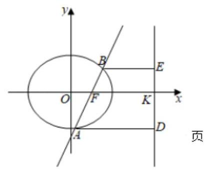

证明: 设直线 $l$ 方程 $y = k\left( {x - 1}\right)$ ,

直线 $l$ 交椭圆于 $A\left( {{x}_{1},{y}_{1}}\right) , B\left( {{x}_{2},{y}_{2}}\right)$ ,则 $D\left( {4,{y}_{1}}\right) , E\left( {4,{y}_{2}}\right)$ ,

联立 $\left\{  \begin{array}{l} y = k\left( {x - 1}\right) \\  \frac{{x}^{2}}{4} + \frac{{y}^{2}}{3} = 1 \end{array}\right.$ ,得 $\left( {3 + 4{k}^{2}}\right) {x}^{2} - 8{k}^{2}x + 4{k}^{2} - {12} = 0$ ,

$\therefore {x}_{1} + {x}_{2} = \frac{8{k}^{2}}{3 + 4{k}^{2}},{x}_{1}{x}_{2} = \frac{4{k}^{2} - {12}}{3 + 4{k}^{2}}$ ,

当直线 $l$ 的倾斜角变化时,首先证直线 ${AE}$ 过定点 $N\left( {\frac{5}{2},0}\right)$ ,

$\because {AE} : y - {y}_{2} = \frac{{y}_{2} - {y}_{1}}{4 - {x}_{1}} \cdot  \left( {x - 4}\right)$ ,当 $x = \frac{5}{2}$ 时, $y = {y}_{2} + \frac{{y}_{2} - {y}_{1}}{4 - {x}_{1}} \cdot  \left( {-\frac{3}{2}}\right)$

$= \frac{2\left( {4 - {x}_{1}}\right)  \cdot  {y}_{2} - 3\left( {{y}_{2} - {y}_{1}}\right) }{2\left( {4 - {x}_{1}}\right) } = \frac{2\left( {4 - {x}_{1}}\right)  \cdot  k\left( {{x}_{2} - 1}\right)  - {3k}\left( {{x}_{2} - {x}_{1}}\right) }{2\left( {4 - {x}_{1}}\right) }$

$= \frac{-{8k} - {2k}{x}_{1}{x}_{2} + {5k}\left( {{x}_{1} + {x}_{2}}\right) }{2\left( {4 - {x}_{1}}\right) } = 0,$

$\therefore$ 点 $N\left( {\frac{5}{2},0}\right)$ 在直线 ${l}_{AB}$ 上，同理可证，点 $N\left( {\frac{5}{2},0}\right)$ 也在直线 ${l}_{BD}$ 上.

$\therefore$ 当 $l$ 绕 $F$ 转动时, ${AE}$ 与 ${BD}$ 相交于定点 $\left( {\frac{5}{2},0}\right)$ .

4、已知直线 $l : x = t\left( {0 < t < 2}\right)$ 与椭圆 $\Gamma  : \frac{{x}^{2}}{4} + \frac{{y}^{2}}{2} = 1$ 相交于 $A\text{ 、 }B$ 两点,其中 $A$ 在第一象限, $M$ 是椭圆上一点.

(1)记 ${F}_{1}$ 、 ${F}_{2}$ 是椭圆 $\Gamma$ 的左右焦点，若直线 ${AB}$ 过 ${F}_{2}$ ，当 $M$ 到 ${F}_{1}$ 的距离与到直线 ${AB}$ 的距离相等时，求点 $M$ 的横坐标;

(2)若点 $M$ 、 $A$ 关于 $y$ 轴对称，当 $\bigtriangleup  {MAB}$ 的面积最大时，求直线 ${MB}$ 的方程；

(3)设直线 ${MA}$ 和 ${MB}$ 与 $x$ 轴分别交于 $P$ 、 $Q$ ，证明: $\left| {OP}\right|  \cdot  \left| {OQ}\right|$ 为定值.

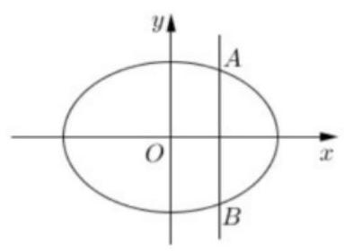

【答案】(1) ${x}_{m} = 4\sqrt{2} - 6$ ；(2) $y =  - \frac{\sqrt{2}}{2}x$ ；(3)4

【解析】(1)设 $M\left( {{x}_{m},{y}_{m}}\right)$ ，易知: ${F}_{1}\left( {-\sqrt{2},0}\right)$ 、 ${F}_{2}\left( {\sqrt{2},0}\right)$ 、 ${l}_{AB} : x = \sqrt{2}$ 由题意, $\left\{  \begin{matrix} {\left| {x}_{m} - \sqrt{2}\right| }^{2} = {\left( {x}_{m} + \sqrt{2}\right) }^{2} + {y}_{m}^{2} \\  \frac{{x}_{m}{}^{2}}{4} + \frac{{y}_{m}{}^{2}}{2} = 1 \end{matrix}\right.  \Rightarrow  {x}_{m} = 4\sqrt{2} - 6$ (正值为增根) (2)设 $A\left( {t,{y}_{0}}\right)$ 、 $B\left( {t, - {y}_{0}}\right)$ ， ${y}_{0} > 0 \; \left\{  {\begin{matrix} x = t \\  \frac{{x}^{2}}{4} + \frac{{y}_{0}{}^{2}}{2} = 1 \end{matrix} \Rightarrow  {y}_{0} = \sqrt{\frac{4 - {t}^{2}}{2}} \Rightarrow  \left| {AM}\right|  = {2t},\left| {AB}\right|  = 2\sqrt{\frac{4 - {t}^{2}}{2}};}\right. \; {S}_{\bigtriangleup {MAB}} = \frac{1}{2}\left| {AM}\right| \left| {AB}\right|  = \sqrt{2} \cdot  \sqrt{-{\left( {t}^{2} - 2\right) }^{2} + 4} \leq  2\sqrt{2}\left( {t = \sqrt{2}}\right) ;$ (3)设 $M\left( {2\cos \alpha ,\sqrt{2}\sin \alpha }\right)$ 、 $P\left( {{x}_{p},{y}_{p}}\right)$ 、 $Q\left( {{x}_{q},{y}_{q}}\right)$

$\left\{  {\begin{matrix} {l}_{AM} : y = \frac{{y}_{0} - \sqrt{2}\sin \alpha }{t - 2\cos \alpha }\left( {x - t}\right)  + {y}_{0} \\  y = 0 \end{matrix} \Rightarrow  {x}_{p} = \frac{\sqrt{2}t\sin \alpha  + 2{y}_{0}\cos \alpha }{{y}_{0} - \sqrt{2}\sin \alpha },}\right.$

同理可得 ${x}_{q} = \frac{\sqrt{2}t\sin \alpha  - 2{y}_{0}\cos \alpha }{-{y}_{0} - \sqrt{2}\sin \alpha }$ ; $\left| {OP}\right|  \cdot  \left| {OQ}\right|  = \left| {{x}_{p} \cdot  {x}_{q}}\right|  = \frac{8{\sin }^{2}\alpha  + 2{t}^{2} - 8}{2{\sin }^{2}\alpha  + \frac{1}{2}{t}^{2} - 2} = 4$

5、已知椭圆 $y : \frac{{x}^{2}}{{a}^{2}} + {y}^{2} = 1$ (常数 $a > 1$ ) 的左顶点为 $R$ ,点 $A\left( {a,1}\right) , B\left( {-a,1}\right) , O$ 为坐标原点.

(1)若 $P$ 是椭圆 $\gamma$ 上任意一点， $\overline{OP} = m\overrightarrow{OA} + n\overrightarrow{OB}$ ，求 ${m}^{2} + {n}^{2}$ 的值；

(2)设 $M\left( {{x}_{1},{y}_{1}}\right)$ ， $N\left( {{x}_{2},{y}_{2}}\right)$ 是椭圆 $\gamma$ 上的两个动点，满足 ${k}_{OM} \cdot  {k}_{ON} = {k}_{OA} \cdot  {k}_{OB}$ ，试探究 ${\Delta OMN}$ 的面积是否为定值, 说明理由.

【答案】见解析

【解析】(1) $\overrightarrow{OP} = m\overrightarrow{OA} + n\overrightarrow{OB} = \left( {{ma} - {na}, m + n}\right)$ ,得 $P\left( {{ma} - {na}, m + n}\right) {\left( m - n\right) }^{2} + {\left( m + n\right) }^{2} = 1$ ,即 ${m}^{2} + {n}^{2} = \frac{1}{2}$

(2)(解法一)由条件得, $\frac{{y}_{1}{y}_{2}}{{x}_{1}{x}_{2}} =  - \frac{1}{{a}^{2}}$ ,平方得 ${x}_{1}^{2}{x}_{2}^{2} = {a}^{4}{y}_{1}^{2}{y}_{2}^{2} = \left( {{a}^{2} - {x}_{1}^{2}}\right) \left( {{a}^{2} - {x}_{2}^{2}}\right)$ ,即 ${x}_{1}^{2} + {x}_{2}^{2} = {a}^{2} \; {S}_{\bigtriangleup {OMN}} = \frac{1}{2}\left| {{x}_{1}{y}_{2} - {x}_{2}{y}_{1}}\right|  = \frac{1}{2}\sqrt{{x}_{1}^{2}{y}_{2}^{2} + {x}_{2}^{2}{y}_{1}^{2} - 2{x}_{1}{x}_{2}{y}_{1}{y}_{2}} = \frac{1}{2}\sqrt{{x}_{1}^{2}\left( {1 - \frac{{x}_{2}^{2}}{{a}^{2}}}\right)  + {x}_{2}^{2}\left( {1 - \frac{{x}_{1}^{2}}{{a}^{2}}}\right)  + \frac{2{x}_{1}^{2}{x}_{2}^{2}}{{a}^{2}}} \; = \frac{1}{2}\sqrt{{x}_{1}^{2} + {x}_{2}^{2}} = \frac{a}{2}\;$ 故 $\bigtriangleup {OMN}$ 的面积为定值 $\frac{a}{2}$

(解法二) ① 当直线 ${MN}$ 的斜率不存在时,易得 $\bigtriangleup {OMN}$ 的面积为 $\frac{a}{2}$

② 当直线 ${MN}$ 的斜率存在时,设直线 ${MN}$ 的方程为 $y = {kx} + t$

$\left\{  {\begin{matrix} \frac{{x}^{2}}{{a}^{2}} + {y}^{2} = 1 \\  y = {kx} + t \end{matrix} \Rightarrow  \left( {1 + {a}^{2}{k}^{2}}\right) {x}^{2} + {2kt}{a}^{2}x + {a}^{2}\left( {{t}^{2} - 1}\right)  = 0}\right.$

由 $M\left( {{x}_{1},{y}_{1}}\right) , N\left( {{x}_{2},{y}_{2}}\right)$ ,可得 ${x}_{1} + {x}_{2} = \frac{-{2kt}{a}^{2}}{1 + {a}^{2}{k}^{2}},{x}_{1}{x}_{2} = \frac{{a}^{2}\left( {{t}^{2} - 1}\right) }{1 + {a}^{2}{k}^{2}}$ ,

${y}_{1}{y}_{2} = \left( {k{x}_{1} + t}\right) \left( {k{x}_{2} + t}\right)  = {k}^{2}{x}_{1}{x}_{2} + {kt}\left( {{x}_{1} + {x}_{2}}\right) x + {t}^{2} = \frac{{t}^{2} - {a}^{2}{k}^{2}}{1 + {a}^{2}{k}^{2}}$

又 ${k}_{OM} \cdot  {k}_{ON} = \frac{{y}_{1}{y}_{2}}{{x}_{1}{x}_{2}} =  - \frac{1}{{a}^{2}}$ ,可得 $2{t}^{2} = {a}^{2}{k}^{2} + 1$

因为 ${MN} = \sqrt{1 + {k}^{2}} \cdot  \left| {{x}_{1} - {x}_{2}}\right|$ ,点 $O$ 到直线 ${MN}$ 的距离 $d = \frac{\left| t\right| }{\sqrt{1 + {k}^{2}}}$

${S}_{\bigtriangleup {OMN}} = \frac{1}{2} \cdot  {MN} \cdot  d = \frac{\left| t\right| }{2} \cdot  \left| {{x}_{1} - {x}_{2}}\right|  = \frac{\left| t\right| }{2} \cdot  \sqrt{{\left( {x}_{1} + {x}_{2}\right) }^{2} - 4{x}_{1}{x}_{2}} = \frac{\left| t\right| }{2} \cdot  \sqrt{\frac{4{a}^{2}\left( {1 + {a}^{2}{k}^{2} - {t}^{2}}\right) }{{\left( 1 + {a}^{2}{k}^{2}\right) }^{2}}} = \frac{a}{2}$

综上: $\bigtriangleup {OMN}$ 的面积为定值 $\frac{a}{2}$

## (三)圆锥曲线的综合

## 例题精讲

【例 9】数学中有许多寓意美好的曲线,曲线 $C : {\left( {x}^{2} + {y}^{2}\right) }^{3} = 4{x}^{2}{y}^{2}$ 被称为 “四叶玫瑰线” (如图所示). 给出下列三个结论:

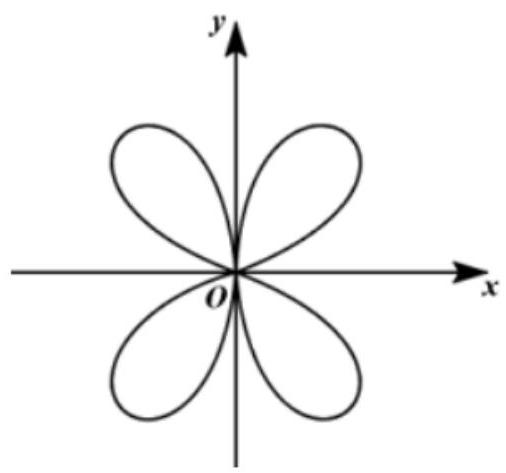

①曲线 $C$ 关于直线 $y = x$ 对称;

②曲线 $C$ 上任意一点到原点的距离都不超过 1;

③存在一个以原点为中心、边长为 $\sqrt{2}$ 的正方形，使曲线 $C$ 在此正方形区域内(含边界).

其中，正确结论的序号是( )

A. ①② B. ②③ C. ①③ D. ①②③

【答案】A

【解析】解: 对于①,用 $\left( {y, x}\right)$ 替换方程中的 $\left( {x, y}\right)$ ,方程形式不变,

所以曲线 $C$ 关于直线 $y = x$ 对称,故①正确,

对于②,设点 $P\left( {x, y}\right)$ 是曲线上任意一点,则 ${\left( {x}^{2} + {y}^{2}\right) }^{3} = 4{x}^{2}{y}^{2}$ ,

则点 $P$ 到原点的距离为 $\sqrt{{x}^{2} + {y}^{2}}$ ,

由 ${\left( {x}^{2} + {y}^{2}\right) }^{3} = 4{x}^{2}{y}^{2} \leq  4 \times  {\left( \frac{{x}^{2} + {y}^{2}}{2}\right) }^{2}$ ,解得 $\sqrt{{x}^{2} + {y}^{2}} \leq  1$ ,当且仅当 ${x}^{2} = {y}^{2} = \frac{1}{2}$ 时取等号,故②正确,

对于③，由②可知，包含该曲线的以原点为圆心的最小的圆的半径为 1，

所以最小圆应该是包含该曲线的最小正方形的内切圆, 即正方形的边长最短为 2 , 故③错误.

故选: A

【例 10】城市的许多街道是相互垂直或平行的, 因此, 乘坐出租车往往不能沿直线到达目的地, 只能按直角拐弯的方式行走. 在平面直角坐标系中,定义 $d\left( {P, Q}\right)  = \left| {{x}_{1} - {x}_{2}}\right|  + \left| {{y}_{1} - {y}_{2}}\right|$ 为两点 $P\left( {{x}_{1},{y}_{1}}\right) \text{ 、 }Q\left( {{x}_{2},{y}_{2}}\right)$ 之间的“出租车距离”.

给出下列四个结论: ①若点 $O\left( {0,0}\right)$ ,点 $A\left( {1,2}\right)$ ,则 $d\left( {O, A}\right)  = 3$ ;

②到点 $O\left( {0,0}\right)$ 的“出租车距离”不超过 1 的点的集合所构成的平面图形面积是 $\pi$ ；

③若点 $A\left( {1,2}\right)$ ，点 $B$ 是抛物线 ${y}^{2} = x$ 上的动点，则 $d\left( {A, B}\right)$ 的最小值是 1；

④若点 $A\left( {1,2}\right)$ ，点 $B$ 是圆 ${x}^{2} + {y}^{2} = 1$ 上的动点，则 $d\left( {A, B}\right)$ 的最大值是 $3 + \sqrt{2}$ .

其中，所有正确结论的序号是___.

【答案】①③④

【解析】对于①, $d\left( {O, A}\right)  = \left| {1 - 0}\right|  + \left| {2 - 0}\right|  = 3$ ,①对;

对于②,设点 $P\left( {x, y}\right)$ 满足 $d\left( {O, P}\right)  \leq  1$ ,即 $\left| x\right|  + \left| y\right|  \leq  1$ .

对于方程 $\left| x\right|  + \left| y\right|  = 1$ ,当 $x \geq  0, y \geq  0$ 时, $x + y = 1$ ; 当 $x \leq  0, y \geq  0$ 时, $- x + y = 1$ ;

当 $x \leq  0, y \leq  0$ 时, $- x - y = 1$ ; 当 $x \geq  0, y \leq  0$ 时, $x - y = 1$ .

作出集合 $\{ \left( {x, y}\right) \parallel x\left| +\right| y \mid   \leq  1\}$ 所表示的平面区域如下图中的阴影部分区域所表示:

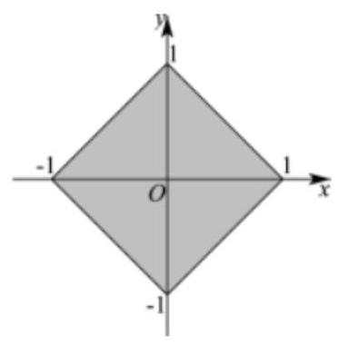

平面区域是边长为 $\sqrt{2}$ 的正方形,该区域的面积为 ${\left( \sqrt{2}\right) }^{2} = 2$ ,②错；

对于③，设点 $B\left( {x, y}\right)$ ，则 $d\left( {A, B}\right)  = \left| {x - 1}\right|  + \left| {y - 2}\right|  = \left| {{y}^{2} - 1}\right|  + \left| {y - 2}\right|$ ，令 $f\left( y\right)  = \left| {{y}^{2} - 1}\right|  + \left| {y - 2}\right|$ .

当 $y \leq   - 1$ 时, $f\left( y\right)  = {y}^{2} - 1 + 2 - y = {y}^{2} - y + 1 = {\left( y - \frac{1}{2}\right) }^{2} + \frac{3}{4} \geq  3$ ,

当 $- 1 < y < 1$ 时, $f\left( y\right)  = 1 - {y}^{2} + 2 - y =  - {y}^{2} - y + 3 =  - {\left( y + \frac{1}{2}\right) }^{2} + \frac{13}{4} \in  \left( {1,\frac{13}{4}}\right\rbrack$ ;

当 $1 \leq  y < 2$ 时, $f\left( y\right)  = {y}^{2} - 1 + 2 - y = {y}^{2} - y + 1 = {\left( y - \frac{1}{2}\right) }^{2} + \frac{3}{4} \in  \lbrack 1,3)$ ;

当 $y \geq  2$ 时, $f\left( y\right)  = {y}^{2} - 1 + y - 2 = {y}^{2} + y - 3 = {\left( y + \frac{1}{2}\right) }^{2} - \frac{13}{4} \geq  3$ .

综上所述, $d\left( {A, B}\right)  \geq  1$ ,③对;

对于④,设点 $B\left( {\cos \theta ,\sin \theta }\right)$ ,则 $d\left( {A, B}\right)  = \left| {1 - \cos \theta }\right|  + \left| {2 - \sin \theta }\right|  = 3 - \left( {\sin \theta  + \cos \theta }\right)  = 3 - \sqrt{2}\sin \left( {\theta  + \frac{\pi }{4}}\right)$ ,

所以, $d\left( {A, B}\right)$ 的最大值是 $3 + \sqrt{2}$ ,④ 对.

故答案为:①③④.

【例 11】(1)设椭圆 ${C}_{1} : \frac{{x}^{2}}{{a}^{2}} + \frac{{y}^{2}}{{b}^{2}} = 1$ 与双曲线 ${C}_{2} : 9{x}^{2} - \frac{9{y}^{2}}{8} = 1$ 有相同的焦点 ${F}_{1}\text{ 、 }{F}_{2}\text{ ， }M$ 是椭圆 ${C}_{1}$ 与双曲线 ${C}_{2}$ 的公共点,且 $\bigtriangleup M{F}_{1}{F}_{2}$ 的周长为 6,求椭圆 ${C}_{1}$ 的方程; 我们把具有公共焦点、公共对称轴的两段圆锥曲线弧合成的封闭曲线称为“盾圆”；

(2)如图，已知“盾圆 $D$ ”的方程为 ${y}^{2} = \left\{  \begin{matrix} {4x} & 0 \leq  x \leq  3 \\   - {12}\left( {x - 4}\right) & 3 < x \leq  4 \end{matrix}\right.$ ，设“盾圆 $D$ ”上的任意一点 $M$ 到 $F\left( {1,0}\right)$ 的距离为 ${d}_{1}, M$ 到直线 $l : x = 3$ 的距离为 ${d}_{2}$ ,求证: ${d}_{1} + {d}_{2}$ 为定值;

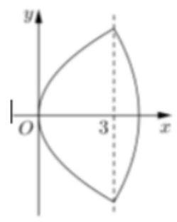

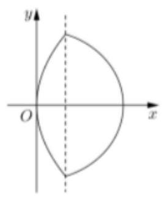

(3)由抛物线弧 ${E}_{1} : {y}^{2} = {4x}$ ( $0 \leq  x \leq  \frac{2}{3}$ )与第( 1 )小题椭圆弧 ${E}_{2} : {E}_{2} : \frac{{x}^{2}}{{a}^{2}} + \frac{{y}^{2}}{{b}^{2}} = 1$ ( $\frac{2}{3} \leq  x \leq  a$ )所合成的封闭曲线为“盾圆 $E$ ”,设过点 $F\left( {1,0}\right)$ 的直线与“盾圆 $E$ ”交于 $\mathrm{A}\text{ 、 }B$ 两点, $\left| {FA}\right|  = {r}_{1},\left| {FB}\right|  = {r}_{2}$ ,且 $\angle {AFx} = \alpha \; \left( {0 \leq  \alpha  \leq  \pi }\right)$ ,试用 $\cos \alpha$ 表示 ${r}_{1}$ ,并求 $\frac{{r}_{1}}{{r}_{2}}$ 的取值范围.

【答案】( 1 ) $\frac{{x}^{2}}{4} + \frac{{y}^{2}}{3} = 1$ ；( 2 )证明见解析；( 3 ) $\alpha  \in  \left\lbrack  {0,\pi  - \arccos \frac{1}{5}}\right\rbrack$ ， ${r}_{1} = \frac{3}{2 + \cos \alpha }$ ； $\alpha  \in  \left( {\pi  - \arccos \frac{1}{5},\pi }\right\rbrack$ ， ${r}_{1} = \frac{2}{1 - \cos \alpha };\frac{{r}_{1}}{{r}_{2}} = \left\lbrack  {\frac{9}{11},\frac{11}{9}}\right\rbrack  .$

【解析】(1)由 $\bigtriangleup M{F}_{1}{F}_{2}$ 的周长为 6 得 $a + c = 3$ ，椭圆 ${C}_{1}$ 与双曲线 ${C}_{2} : 9{x}^{2} - \frac{9{y}^{2}}{8} = 1$ 有相同的焦点，所以 ${c}^{2} = \frac{1}{9} + \frac{8}{9} = 1$ ,即 $c = 1$ ,则 $a = 2,{b}^{2} = {a}^{2} - {c}^{2} = 3$ ,则椭圆 ${C}_{1}$ 的方程为 $\frac{{x}^{2}}{4} + \frac{{y}^{2}}{3} = 1$

(2)证明:设“盾圆 $D$ ”上的任意一点 $M$ 的坐标为 $\left( {x, y}\right) ,{d}_{2} = \left| {x - 3}\right|$

当 $M \in  {C}_{1}$ 时, ${y}^{2} = {4x}\left( {0 \leq  x \leq  3}\right) ,{d}_{1} = \sqrt{{\left( x - 1\right) }^{2} + {y}^{2}} = \left| {x + 1}\right|$ ,

即 ${d}_{1} + {d}_{2} = \left| {x + 1}\right|  + \left| {x + 3}\right|  = \left( {x + 1}\right)  + \left( {3 - x}\right)  = 4$ ;

当 $M \in  {C}_{2}$ 时, ${y}^{2} = {12}\left( {x - 4}\right) \left( {3 < x \leq  4}\right) ,{d}_{1} = \sqrt{{\left( x - 1\right) }^{2} + {y}^{2}} = \left| {7 - x}\right|$ ,

即 ${d}_{1} + {d}_{2} = \left| {7 - x}\right|  + \left| {x - 3}\right|  = \left( {7 - x}\right)  + \left( {x - 3}\right)  = 4$ ;

所以 ${d}_{1} + {d}_{2} = 4$ 为定值.

(3)显然“盾圆 $E$ ”由两部分合成，所以按 $\mathrm{A}$ 在抛物弧 ${E}_{1}$ 或椭圆弧 ${E}_{2}$ 上加以分类，由“盾圆 $E$ ”的对称性，不妨设 $\mathrm{A}$ 在 $x$ 轴上方 $\left( {\text{ 或 }x\text{ 轴上 }}\right)$ ;

当 $x = \frac{2}{3}$ 时, $y =  \pm  \frac{2\sqrt{6}}{3}$ ,此时 $r = \frac{5}{3},\cos \alpha  =  - \frac{1}{5}$ ;

当 $- \frac{1}{5} \leq  \cos \alpha  \leq  1$ 时, $\mathrm{A}$ 在椭圆弧 ${E}_{2}$ 上,由题设知 $A\left( {1 + {r}_{1}\cos \alpha ,{r}_{1}\sin \alpha }\right)$ 代入 $\frac{{x}^{2}}{4} + \frac{{y}^{2}}{3} = 1$

得, $3{\left( 1 + {r}_{1}\cos \alpha \right) }^{2} + 4{\left( {r}_{1}\sin \alpha \right) }^{2} - {12} = 0$ ,整理得 $\left( {4 - {\cos }^{2}\alpha }\right) {r}_{1}^{2} + 6{r}_{1}\cos \alpha  - 9 = 0$ ,解得 ${r}_{1} = \frac{3}{2 + \cos \alpha }$ 或

${r}_{1} = \frac{3}{\cos \alpha  - 2}$ (舍去)

当 $- 1 \leq  \cos \alpha  \leq   - \frac{1}{5}$ 时, $\mathrm{A}$ 在抛物弧 ${E}_{1}$ 上,方程或定义均可得到 ${r}_{1} = 2 + {r}_{1}\cos \alpha$ ,于是 ${r}_{1} = \frac{2}{1 - \cos \alpha }$ ,

综上, ${r}_{1} = \frac{2}{1 - \cos \alpha }\left( {-1 \leq  \cos \alpha  \leq   - \frac{1}{5}}\right)$ 或 ${r}_{1} = \frac{3}{2 + \cos \alpha }\left( {-\frac{1}{5} \leq  \cos \alpha  \leq  1}\right)$ ;

相应地, $B\left( {1 - {r}_{2}\cos \alpha , - {r}_{2}\sin \alpha }\right)$ ,

当 $- 1 \leq  \cos \alpha  \leq   - \frac{1}{5}$ 时, $\mathrm{A}$ 在抛物弧 ${E}_{1}$ 上, $B$ 在椭圆弧 ${E}_{2}$ 上,

$\frac{{r}_{1}}{{r}_{2}} = \frac{2}{1 - \cos \alpha } \cdot  \frac{2 - \cos \alpha }{3} = \frac{2}{3}\left( {1 + \frac{1}{\cos \alpha }}\right)  \in  \left\lbrack  {1,\frac{11}{9}}\right\rbrack$

当 $- \frac{1}{5} \leq  \cos \alpha  \leq  1$ 时, $\mathrm{A}$ 在椭圆弧 ${E}_{2}$ 上, $B$ 在抛物弧 ${E}_{1}$ 上,

$\frac{{r}_{1}}{{r}_{2}} = \frac{3}{2 + \cos \alpha } \cdot  \frac{1 + \cos \alpha }{2} = \frac{3}{2}\left( {1 - \frac{1}{2 + \cos \alpha }}\right)  \in  \left\lbrack  {\frac{9}{11},1}\right\rbrack$

当 $- \frac{1}{5} < \cos \alpha  < \frac{1}{5}$ 时， $\mathrm{A}\text{ 、 }B$ 在椭圆弧 ${E}_{2}$ 上，

$\frac{{r}_{1}}{{r}_{2}} = \frac{3}{2 + \cos \alpha } \cdot  \frac{2 - \cos \alpha }{3} = \frac{2 - \cos \alpha }{2 + \cos \alpha } \in  \left( {\frac{9}{11},\frac{11}{9}}\right)$

综上， $\alpha  \in  \left\lbrack  {0,\pi  - \arccos \frac{1}{5}}\right\rbrack$ ， ${r}_{1} = \frac{3}{2 + \cos \alpha }$ ； $\alpha  \in  \left( {\pi  - \arccos \frac{1}{5},\pi }\right\rbrack$ ， ${r}_{1} = \frac{2}{1 - \cos \alpha }$ ；

$\frac{{r}_{1}}{{r}_{2}}$ 的取值范围是 $\left\lbrack  {\frac{9}{11},\frac{11}{9}}\right\rbrack$

## 巩固训练

1、中国结是一种手工编织工艺品, 因为其外观对称精致, 可以代表汉族悠久的历史, 符合中国传统装饰的习俗和审美观念, 故命名为中国结.中国结的意义在于它所显示的情致与智慧正是汉族古老文明中的一个侧面, 也是数学奥秘的游戏呈现. 它有着复杂曼妙的曲线, 却可以还原成最单纯的二维线条. 其中的八字结对应着数学曲线中的双纽线.曲线 $C : {\left( {x}^{2} + {y}^{2}\right) }^{2} = 9\left( {{x}^{2} - {y}^{2}}\right)$ 是双纽线,则下列结论不正确的是( )

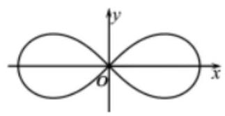

A. 曲线 $C$ 的图象关于原点对称

B. 曲线 $C$ 经过 5 个整点 (横、纵坐标均为整数的点)

C. 曲线 $C$ 上任意一点到坐标原点 $O$ 的距离都不超过 3

D. 若直线 $y = {kx}$ 与曲线 $C$ 只有一个交点,则实数 $k$ 的取值范围为 $\left( {-\infty , - 1\rbrack \cup \lbrack 1, + \infty }\right)$

【答案】B

【解析】把 $\left( {-x, - y}\right)$ 代入 ${\left( {x}^{2} + {y}^{2}\right) }^{2} = 9\left( {{x}^{2} - {y}^{2}}\right)$ 得 ${\left( {x}^{2} + {y}^{2}\right) }^{2} = 9\left( {{x}^{2} - {y}^{2}}\right)$ ,

所以曲线 $C$ 的图象关于原点对称，故 $\mathbf{A}$ 正确；

令 $y = 0$ 解得 $x = 0$ ,或 $x =  \pm  3$ ,即曲线经过 $\left( {0,0}\right) ,\left( {3,0}\right) ,\left( {-3,0}\right)$ ,

结合图象, $- 3 \leq  x \leq  3$ ,

令 $x =  \pm  1$ ,得 ${y}^{2} = \frac{-{11} + \sqrt{151}}{2} < 1$ ,令 $x =  \pm  2$ ,得 $1 < {y}^{2} = \frac{-{17} + \sqrt{369}}{2} < 2$ ,

因此结合图象曲线 $C$ 只能经过 3 个整点, $\left( {0,0}\right) ,\left( {2,0}\right) ,\left( {-2,0}\right)$ ,故 $\mathbf{B}$ 错误;

${\left( {x}^{2} + {y}^{2}\right) }^{2} = 9\left( {{x}^{2} - {y}^{2}}\right)$ 可得 ${x}^{2} + {y}^{2} = \frac{9\left( {{x}^{2} - {y}^{2}}\right) }{{x}^{2} + {y}^{2}} \leq  9$ ,

所以曲线 $C$ 上任意一点到坐标原点 $O$ 的距离 $d = \sqrt{{x}^{2} + {y}^{2}} \leq  3$ ,即都不超过 3,

故 C 正确;

直线 $y = {kx}$ 与曲线 ${\left( {x}^{2} + {y}^{2}\right) }^{2} = 9\left( {{x}^{2} - {y}^{2}}\right)$ 一定有公共点 $\left( {0,0}\right)$ ,

若直线 $y = {kx}$ 与曲线 $C$ 只有一个交点，

所以 $\left\{  \begin{array}{l} {\left( {x}^{2} + {y}^{2}\right) }^{2} = 9\left( {{x}^{2} - {y}^{2}}\right) \\  y = {kx} \end{array}\right.$ ,整理得 ${x}^{4}{\left( 1 + {k}^{2}\right) }^{2} = 9{x}^{2}\left( {1 - {k}^{2}}\right)$ 无解,

即 $1 - {k}^{2} \leq  0$ ,解得 $k \in  \left( {-\infty , - 1}\right\rbrack   \cup  \lbrack 1, + \infty )$ ,故 $\mathrm{D}$ 正确.

故选: B.

2、焦点为 $F$ 的抛物线 ${C}_{1} : {y}^{2} = {4x}$ 与圆 ${C}_{2} : {\left( x - 1\right) }^{2} + {y}^{2} = {16}$ 交于 $A, B$ 两点，其中 $\mathrm{A}$ 点横坐标为 ${x}_{A}$ ，方程 $\left\{  \begin{matrix} {y}^{2} = {4x}, x \leq  {x}_{A} \\  {\left( x - 1\right) }^{2} + {y}^{2} = {16}, x > {x}_{A} \end{matrix}\right.$ 的曲线记为 $\Gamma , P$ 是曲线 $\Gamma$ 上一动点.

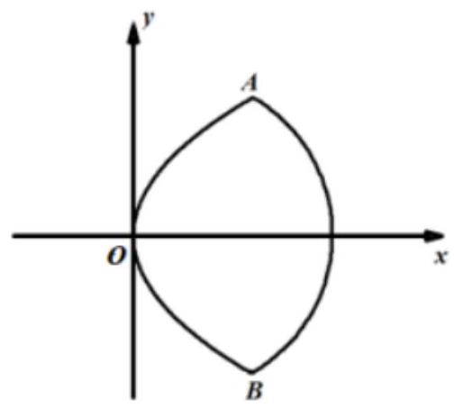

(1)若 $P$ 在抛物线上且满足 $\left| {PF}\right|  = 3$ ，求直线 ${PF}$ 的斜率；

(2) $T\left( {m,0}\right)$ 是 $x$ 轴上一定点. 若动点 $P$ 在 $\Gamma$ 上满足 $x \leq  {x}_{A}$ 的范围内运动时， $\left| {PT}\right|  \leq  \left| {AT}\right|$ 恒成立，求 $m$ 的取值范围;

(3) $Q$ 是曲线 $\Gamma$ 上另一动点，且满足 ${FP}\bot {FQ}$ ,若 $\bigtriangleup  {PFQ}$ 的面积为4，求线段 ${PQ}$ 的长.

【答案】( 1 ) $\pm  2\sqrt{2}$ ；( 2 ) $m \leq  \frac{7}{2}$ ；( 3 ) $\left| {PQ}\right|  = 2\sqrt{5}$ 。

【解析】(1) $F\left( {1,0}\right)$ ， $\left| {PF}\right|  = {x}_{p} + 1 = 3$ ， $\therefore {x}_{p} = 2$

$\therefore P\left( {2, \pm  2\sqrt{2}}\right)$ ,

所以 ${k}_{PF} = \frac{\pm 2\sqrt{2}}{2 - 1} =  \pm  2\sqrt{2}$ .

(2)由 $\left\{  \begin{matrix} {y}^{2} = {4x} \\  {\left( x - 1\right) }^{2} + {y}^{2} = {16} \end{matrix}\right.$ 得 ${x}^{2} + {2x} - {15} = 0$ ， $\therefore {x}_{A} = 3$

设 $P\left( {x, y}\right) , x \in  \left\lbrack  {0,3}\right\rbrack$ ,则 ${y}^{2} = {4x}$ ,

$\left| {PT}\right|  = \sqrt{{\left( x - m\right) }^{2} + {y}^{2}} = \sqrt{{\left( x - m\right) }^{2} + {4x}} = \sqrt{{x}^{2} + \left( {4 - {2m}}\right) x + {m}^{2}},\;x \in  \left\lbrack  {0,3}\right\rbrack$

由题意 $x = 3$ 最大,所以对称轴 $x = m - 2 \leq  \frac{3}{2}$ ,

$\therefore m \leq  \frac{7}{2}$ .

(3) $F\left( {1,0}\right)$ 是 ${C}_{2} : {\left( x - 1\right) }^{2} + {y}^{2} = {16}$ 的圆心. 设 $P\left( {{x}_{1},{y}_{1}}\right) , Q\left( {{x}_{2},{y}_{2}}\right) ,{x}_{1},{x}_{2} \in  \left\lbrack  {0,5}\right\rbrack$

(i) 若 $P, Q$ 都位于 ${C}_{2} : {\left( x - 1\right) }^{2} + {y}^{2} = {16}$ 上,则 ${S}_{\bigtriangleup {PFQ}} = \frac{1}{2} \times  {4}^{2} = 8 \neq  4$ ,(舍)

(ii) 若 $P, Q$ 都位于 ${C}_{1} : {y}^{2} = {4x}$ 上,则 $\overrightarrow{FP} = \left( {{x}_{1} - 1,{y}_{1}}\right) ,\overrightarrow{FQ} = \left( {{x}_{2} - 1,{y}_{2}}\right)$

$\overrightarrow{FP} \cdot  \overrightarrow{FQ} = \left( {{x}_{1} - 1}\right)  \cdot  \left( {{x}_{2} - 1}\right)  + {y}_{1}{y}_{2} = {x}_{1}{x}_{2} - \left( {{x}_{1} + {x}_{2}}\right)  + 1 \pm  4\sqrt{{x}_{1}{x}_{2}} = 0$ ①

${S}_{\bigtriangleup {PFQ}} = \frac{1}{2}\left| {FP}\right|  \cdot  \left| {FQ}\right|  = \frac{1}{2}\left( {{x}_{1} + 1}\right) \left( {{x}_{2} + 1}\right)  = \frac{1}{2}\left( {{x}_{1}{x}_{2} + {x}_{1} + {x}_{2} + 1}\right)  = 4$ ②

将①式代入②式，得: ${\left( \sqrt{{x}_{1}{x}_{2}} \pm  1\right) }^{2} = 4\;{x}_{1}{x}_{2} = 9$ 或 1

代入①得: ${x}_{1} + {x}_{2} = 9 + 1 - 4\sqrt{9} =  - 2 < 0$ 或 ${x}_{1} + {x}_{2} = 1 + 1 + 4\sqrt{1} = 6$ (舍)

(iii) 若 $P, Q$ 分别位于 ${C}_{1} : {y}^{2} = {4x}$ 与 ${C}_{2} : {\left( x - 1\right) }^{2} + {y}^{2} = {16}$ 上,

则 ${S}_{\bigtriangleup {PFQ}} = \frac{1}{2}\left| {FP}\right|  \cdot  \left| {FQ}\right|  = \frac{1}{2}\left( {{x}_{1} + 1}\right)  \cdot  4 = 2\left( {{x}_{1} + 1}\right)  = 4$ ,得 ${x}_{1} = 1$

$\therefore \left| {FP}\right|  = 2,\therefore \left| {PQ}\right|  = \sqrt{{2}^{2} + {4}^{2}} = 2\sqrt{5}$ 综上: $\left| {PQ}\right|  = 2\sqrt{5}$ .
