立体几何专题

<table><tr><td>教学目标</td><td>1、通过点、直线、平面位置关系培养学生空间想象能力;   2、了解简单几何体、组合体, 会求几何体的表面积和体积;   3、能用几何法和向量法求空间角的大小与距离问题;</td></tr><tr><td>重点</td><td>1、几何体的表面积与体积;   2、异面直线夹角、线面角，二面角的求法;   3、点到平面的距离公式.</td></tr><tr><td>难 点</td><td>1、线面角，二面角的求法、点到平面的距离公式。;   2、要有一定空间想象能力判断点、线面间的位置关系.</td></tr></table>

## (一)点、直线、平面间的位置关系

## 知识梳理

## 1、点、直线、平面间的位置关系;

## (1)两条直线的位置关系

$\left\{  \begin{array}{l} \text{ 共面直线 }\left\{  \begin{array}{l} \text{ 平行直线: 在同一平面内,没有公共点; } \\  \text{ 相交直线: 有且只有一个公共点; } \end{array}\right. \\  \text{ 异面直线: 不能同在任何平面内的两条直线,没有公共点. } \end{array}\right.$

## (2)直线与平面间的位置关系

直线在平面外 角正极性的夹角

## (3)两平面间的位置关系

两平面平行——没有公共点

两平面相交__有一条公共直线

## 例题精讲

【例 1】( 1 )设 $l$ 是直线， $\alpha$ ， $\beta$ 是两个不同的平面，下列命题中正确的是( )

A. 若 $l//\alpha , l//\beta$ ，则 $\alpha //\beta$ B. 若 $l//\alpha , l \bot  \beta$ ,则 $\alpha  \bot  \beta$

C. 若 $\alpha  \bot  \beta , l \bot  \alpha$ ,则 $l//\beta$ D. 若 $\alpha  \bot  \beta , l//\alpha$ ,则 $l \bot  \beta$

【难度】 $\star   \star$

【答案】B

【解析】对 $\mathbf{A}$ ,若 $l//\alpha , l//\beta$ ,则 $\alpha$ 与 $\beta$ 相交或平行; 对 $\mathbf{B}$ ,若 $l//\alpha , l \bot  \beta$ ,则 $\alpha  \bot  \beta$ ; 对 $\mathbf{C}$ ,若 $\alpha  \bot  \beta$ , $l \bot  \alpha$ ,则 $l//\beta$ 或 $l \subset  \beta$ ; 对 $\mathrm{D}$ ,若 $\alpha  \bot  \beta , l//\alpha$ ,则 $l$ 与 $\beta$ 相交、平行或 $l \subset  \beta$ ;

故选: B.

(2)已知 ${AB}$ 是平面 $\alpha$ 外的一条直线，则下列命题中真命题的个数是( )

① 在 $\alpha$ 内存在无数多条直线与直线 ${AB}$ 平行；② 在 $\alpha$ 内存在无数多条直线与直线 ${AB}$ 垂直；

③在 $\alpha$ 内存在无数多条直线与直线 ${AB}$ 异面；④一定存在过 ${AB}$ 且与 $\alpha$ 垂直的平面 $\beta$ .

A. 1 个 B. 2 个 C. 3 个 D. 4 个

【难度】 $\star   \star   \star$

【答案】C

【解析】略

(3)在正方体 $A{C}_{1}$ 中， $E$ 是棱 $C{C}_{1}$ 的中点， $F$ 是侧面 ${BC}{C}_{1}{B}_{1}$ 内的动点，且 ${A}_{1}F$ 与平面 ${D}_{1}{AE}$ 的垂线垂直， 如图所示，下列说法不正确的是( )

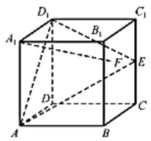

A. 点 $F$ 的轨迹是一条线段 B. ${A}_{1}F$ 与 ${BE}$ 是异面直线

C. ${A}_{1}F$ 与 ${D}_{1}E$ 不可能平行 D. 三棱锥 $F - {AB}{D}_{1}$ 的体积为定值

【难度】 $\star   \star   \star$

【答案】C

【解析】对于 $A$ ,设平面 $A{D}_{1}E$ 与直线 ${BC}$ 交于点 $G$ ,连接 ${AG}\text{ 、 }{EG}$ ,则 $G$ 为 ${BC}$ 的中点,分别取 ${B}_{1}B$ 、 ${B}_{1}{C}_{1}$ 的中点 $M\text{ 、 }N$ ,连接 ${AM}\text{ 、 }{MN}\text{ 、 }{AN}$ ,

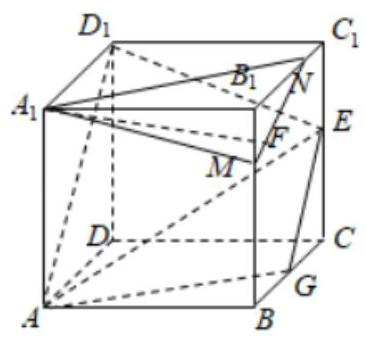

$\because {A}_{1}M//{D}_{1}E,{A}_{1}M \text{ ⊄ }$ 平面 ${D}_{1}{AE},{D}_{1}E \subset$ 平面 ${D}_{1}{AE},\therefore {A}_{1}M//$ 平面 ${D}_{1}{AE}$ . 同理可得 ${MN}//$ 平面 ${D}_{1}{AE}$ , $\because {A}_{1}M\text{ 、 }{MN}$ 是平面 ${A}_{1}{MN}$ 内的相交直线

$\therefore$ 平面 ${A}_{1}{MN}//$ 平面 ${D}_{1}{AE}$ ,由此结合 ${A}_{1}F//$ 平面 ${D}_{1}{AE}$ ,可得直线 ${A}_{1}F \subset$ 平面 ${A}_{1}{MN}$ ,

即点 $F$ 是线段 ${MN}$ 上上的动点. $\therefore A$ 正确.

对于 $B,\because$ 平面 ${A}_{1}{MN}//$ 平面 ${D}_{1}{AE},{BE}$ 和平面 ${D}_{1}{AE}$ 相交, $\therefore {A}_{1}F$ 与 ${BE}$ 是异面直线, $\therefore B$ 正确.

对于 $C$ ,由 $A$ 知,平面 ${A}_{1}{MN}//$ 平面 ${D}_{1}{AE},\therefore {A}_{1}F$ 与 ${D}_{1}E$ 不可能平行, $\therefore C$ 错误.

对于 $D$ ,因为 ${MN}//{EG}$ ,则 $F$ 到平面 $A{D}_{1}E$ 的距离是定值,三棱锥 $F - A{D}_{1}E$ 的体积为定值,所以 $D$ 正确; 故选: $C$ .

【例 2】如图所示,在正方体 ${ABCD} - {A}^{\prime }{B}^{\prime }{C}^{\prime }{D}^{\prime }$ 中,点 $M$ 为线段 ${B}^{\prime }{D}^{\prime }$ 的中点.

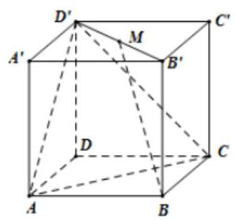

(1)求证: $D{D}^{\prime } \bot  {AC}$ ；

(2)求证: ${BM}//$ 平面 ${AC}{D}^{\prime }$ .

【难度】 $\star   \star   \star$

【答案】(1)证明见解析; (2)证明见解析.

【解析】证明: (1)在正方体 ${ABCD} - {A}^{\prime }{B}^{\prime }{C}^{\prime }{D}^{\prime }$ 中,

$\because D{D}^{\prime } \bot  {AD}, D{D}^{\prime } \bot  {CD}$ ,且 ${CD} \cap  {AD} = D,\therefore D{D}^{\prime } \bot$ 平面 ${ACD},{AC} \subset$ 平面 ${ACD},\therefore D{D}^{\prime } \bot  {AC}$ (2)如图所示，连接 ${BD}$ ，交 ${AC}$ 于 $N$ ，连接 ${D}^{\prime }N$ .

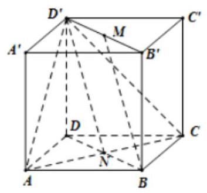

由题设得: ${BN} = {M{D}^{\prime }}$ ， ${BN}//{M{D}^{\prime }}$ ， $\therefore$ 四边形_ ${{BM}{D}^{\prime }}N$ 为平行四边形， $\therefore {BM}//{N{D}^{\prime }}$ . 又 $\because N{D}^{\prime } \subset$ 平面 ${AC}{D}^{\prime },{BM} \text{ ⊄ }$ 平面 ${AC}{D}^{\prime },\therefore {BM}//$ 平面 ${AC}{D}^{\prime }$ .

## 巩固训练

1、已知直线 $m \subset$ 平面 $\alpha$ ,则直线 $l \bot$ 平面 $\alpha$ 是直线 $l \bot  m$ 的( )

A. 充要条件 B. 充分不必要条件 C. 必要不充分条件 D. 既不充分又不必要条件

【答案】B

【解析】充分性: $\because$ 直线 $l \bot$ 平面 $\alpha ,\therefore l$ 垂直于平面 $\alpha$ 内所有直线,

又 $\because$ 直线 $m \subset$ 平面 $\alpha ,\therefore$ 直线 $l \bot$ 直线 $m$ ,充分性成立;

必要性: 若 $l \bot  m$ 且直线 $m \subset$ 平面 $\alpha$ ,根据线面垂直判定定理得直线 $l \bot$ 平面 $\alpha$ 不成立,必要性不成立. 故选: B.

2、已知 $\alpha ,\beta$ 是两个平面, $m, n$ 是两条直线. 有下列命题:

①如果 $m//n, n \subset  \alpha$ ，那么 $m//\alpha$ ； ②如果 $m//\alpha , m \subset  \beta ,\alpha  \cap  \beta  = n.$ ，那么 $m//n$ ；

③如果 $\alpha //\beta , m \subset  \alpha$ ，那么 $m//\beta$ ；④如果 $\alpha  \bot  \beta ,\alpha  \cap  \beta  = n, m \bot  n$ ，那么 $m \bot  \beta$ .

其中所有真命题的序号是___.

【答案】②③

【解析】① 如果 $m//n, n \subset  \alpha$ ,那么 $m//\alpha$ 或 $m \subset  \alpha$ ,故①不正确；

②如果 $m//\alpha , m \subset  \beta ,\alpha  \cap  \beta  = n$ .，那么 $m//n$ ，这就是线面平行推得线线平行的性质定理，故②正确； ③如果 $\alpha //\beta , m \subset  \alpha$ ，那么 $m//\beta$ ，这就是利用面面平行推线面平行的性质定理，故③正确； ④缺少 $m \subset  \alpha$ 这个条件，故④不正确. 故答案为:②③

3、已知 $m$ ， $n$ 是两条直线， $\alpha$ ， $\beta$ 是两个平面，则下列命题中错误的是( )

A. 若 $m \bot  n, m \bot  \alpha , n \bot  \beta$ ，则 $\alpha  \bot  \beta$ B. 若 $m \subset  \alpha ,\alpha //\beta$ ,则 $m//\beta$

C. 若 $m \bot  n, m \bot  \alpha , n//\beta$ ,则 $\alpha  \bot  \beta$ D. 若 $\alpha  \cap  \beta  = l, m//\alpha , m//\beta$ ,则 $m//l$

【答案】C

【解析】略

4、如图，四面体 ${ABCD}$ 中， $O$ 是 ${BD}$ 的中点，点 $G$ 、 $E$ 分别在线段 ${AO}$ 和 ${BC}$ 上， ${BE} = {2EC}$ ， ${AG} = {2GO}$ ，

${CA} = {CB} = {CD} = {BD} = 2,\;{AB} = {AD} = \sqrt{2}.$

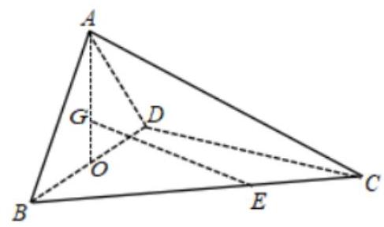

(1)求证: ${GE}//$ 平面 ${ACD}$ ；

(2)求证:平面 ${ABD} \bot$ 平面 ${BCD}$ .

【答案】(1)证明见解析; (2)证明见解析.

【解析】证明: (1) 连接 ${BG}$ 并延长,交 ${AD}$ 于 $M$ ,连接 ${MC}$ ,

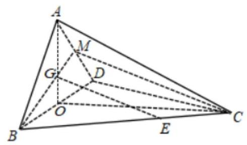

在 $\bigtriangleup {ABD}$ 中, $O$ 为 ${BD}$ 中点, $G$ 在 ${AO}$ 上, ${AG} = {2GO},\therefore G$ 为 $\bigtriangleup {ABD}$ 的重心, $\therefore \frac{BG}{GM} = \frac{2}{1}$ , 又 $\frac{BE}{EC} = \frac{2}{1}\therefore \frac{BG}{GM} = \frac{BE}{EC}\therefore {GE}//{MC}$ ,

$\because {GE} \text{ ⊄ }$ 平面 ${ACD},{AC} \subset$ 平面 ${ACD},\therefore {GE}//$ 平面 ${ACD}$ ；

(2)在 $\bigtriangleup  {ABD}$ 中， $O$ 为 ${BD}$ 中点， ${BD} = 2,{AB} = {AD} = \sqrt{2}$ ， $\therefore {AO}\bot {BD}\therefore {AO} = \sqrt{{AB}^{2} - {BO}^{2}} = 1$ ，

在 $\bigtriangleup {BCD}$ 中, ${BC} = {CD} = {BD} = 2, O$ 为 ${BD}$ 中点,连接 ${OC}$ ,则 ${OC} = \sqrt{3}$ ,

又 ${CA} = 2$ ， $\therefore O{A}^{2} + O{C}^{2} = C{A}^{2}$ ， $\therefore {AO} \bot  {OC}$

由 ${AO} \bot  {OC}$ , ${AO} \bot  {BD},{OC} \cap  {BD} = O,{OC},{BD} \subset$ 平面 ${BCD}$ ,得 ${AO} \bot$ 平面 ${BCD}$ ,

又 ${AO} \subset$ 平面 ${ABD}$ ， $\therefore$ 平面 ${ABD} \bot$ 平面 ${BCD}$ .

## (二)几何体的表面积与体积

表面积公式: ${S}_{\text{ 全 }} = {S}_{\text{ 侧 }} + {S}_{\text{ 底 }}$

柱体的体积: ${V}_{\text{ 柱 }} = {S}_{\text{ 底 }} \times  h\;(h$ 为柱体的高 $)$

锥体的体积: ${V}_{\text{ 锥 }} = \frac{1}{3} \times  {S}_{\text{ 底 }} \times  h\;(h$ 为锥体的高)

球的体积: ${V}_{\text{ 球 }} = \frac{4}{3}\pi {r}^{3}$ ( $r$ 是球的半径)

## 例题精讲

【例 3】(1)若圆锥的侧面展开图是圆心角为 ${90}^{ \circ  }$ 的扇形，则该圆锥的侧面积与底面积之比为___.

【难度】★★

【答案】4:1

【解析】设圆锥的底面半径为 $r$ ,母线长为 $l$ ,由题意得: $\frac{\pi }{2}l = {2\pi r}$ ,即 $l = {4r}$ ,所以其侧面积是 ${S}_{1} = {\pi rl} = {4\pi }{r}^{2}$ , 底面积是 ${S}_{2} = \pi {r}^{2}$ ,所以该圆锥的侧面积与底面积之比为 $4 : 1$ ; 故答案为: $4 : 1$

(2)如图所示，正方形 ${ABCD}$ 的边长为 2，切去阴影部分围成一个正四棱锥，则正四棱锥的侧面积取值范围为( )

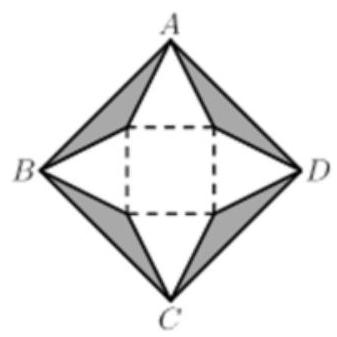

A. $\left( {1,2}\right)$ B. $\left\lbrack  {1,2}\right\rbrack$ C. $\left\lbrack  {0,2}\right\rbrack$ D. $\left( {0,2}\right)$

【难度】 $\star   \star   \star$

【答案】D

【解析】设四棱锥一个侧面为三角形 ${APQ},\angle {APQ} = x$ ,

则 ${AH} = \frac{1}{2} \times  {PQ} \times  \tan x = \frac{{AC} - {PQ}}{2} = \frac{2\sqrt{2} - {PQ}}{2} = \sqrt{2} - \frac{1}{2}{PQ},\therefore {PQ} = \frac{2\sqrt{2}}{1 + \tan x},{AH} = \frac{\sqrt{2}\tan x}{1 + \tan x}$ , $\therefore S = 4 \times  \frac{1}{2} \times  {PQ} \times  {AH} = 2 \times  {PQ} \times  {AH} = 2 \times  \frac{2\sqrt{2}}{1 + \tan x} \times  \frac{\sqrt{2}\tan x}{1 + \tan x} = \frac{8\tan x}{{\left( 1 + \tan x\right) }^{2}}, x \in  \left\lbrack  {\frac{\pi }{4},\frac{\pi }{2}}\right)$ , $\because S = \frac{8\tan x}{{\left( 1 + \tan x\right) }^{2}} = \frac{8\tan x}{1 + {\tan }^{2}x + 2\tan x} = \frac{8}{\frac{1}{\tan x} + \tan x + 2} \leq  \frac{8}{2 + 2} = 2$ ,

(当且仅当 $\tan x = 1$ ,即 $x = \frac{\pi }{4}$ 时取等号) 而 $\tan x > 0$ ,故 $S > 0$ ,

$\because S = 2$ 时,三角形 ${APQ}$ 是等腰直角三角形,顶角 $\angle {PAQ} = {90}^{ \circ  }$ ,阴影部分不存在,折叠后 $A$ 与 $O$ 重合, 构不成棱锥, $\therefore S$ 的范围为 $\left( {0,2}\right)$ . 故选 D.

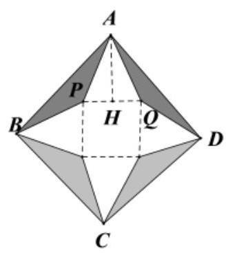

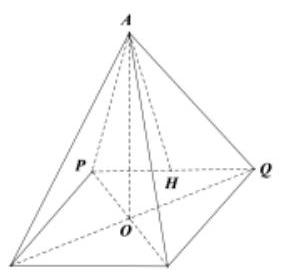

【例 4】已知圆柱的轴截面是长方形 ${ABCD}$ ,且 ${BC} = {2AB} = 6$ ,一只蚂蚁从圆柱的底部 $B$ 点出发沿圆柱侧面爬行到点 $D$ ，则这只蚂蚁行进的最短路径为___.

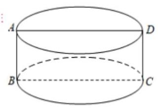

【难度】 $\star   \star   \star$

【答案】 $3\sqrt{{\pi }^{2} + 1}$

【解析】可知 $\overset{\text{ ⏜ }}{BC} = \frac{1}{2} \times  \pi  \times  6 = {3\pi }$ ,则这只蚂蚁行进的最短路径为长为 ${3\pi }$ ,宽为 3 的长方形的对角线长, 即最短路径为 $\sqrt{{\left( 3\pi \right) }^{2} + {3}^{2}} = 3\sqrt{{\pi }^{2} + 1}$ . 故答案为: $3\sqrt{{\pi }^{2} + 1}$ .

【例 5】( 1 )如图,梯形 ${ABCD}$ 中, ${AD}//{BC},\angle {ABC} = {90}^{ \circ  },{AD} = a,{BC} = {2a},\angle {DCB} = {60}^{ \circ  }$ , 在平面 ${ABCD}$ 内过点 $C$ 作 $l \bot  {CB}$ ,以 $l$ 为轴旋转一周. 求旋转体的表面积和体积.

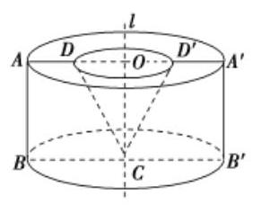

【难度】 $\star   \star   \star$

【答案】 $\left( {4\sqrt{3} + 9}\right) \pi {a}^{2},\frac{{11}\sqrt{3}}{3}\pi {a}^{3}$

【解析】解: 如图,在梯形 ${ABCD}$ 中, $\angle {ABC} = {90}^{ \circ  },{AD}//{BC}$ ,且 ${AD} = a,{BC} = {2a},\angle {DCB} = {60}^{ \circ  }$ , $\therefore {CD} = \frac{{BC} - {AD}}{\cos {60}^{ \circ  }} = {2a},{AB} = {CD}\sin {60}^{ \circ  } = \sqrt{3}a,\therefore {DD}^{\prime } = {AA}^{\prime } - {2AD} = {2BC} - {2AD} = {2a}$ ， $\therefore {DO} = \frac{1}{2}{DD}^{\prime } = a$ ，由于以 $l$ 为轴将梯形 ${ABCD}$ 旋转一周后，形成的几何体为圆柱中挖去一个倒放的与圆柱等高的圆锥,由上述计算知,圆柱母线长 $\sqrt{3}a$ ,底面半径 ${2a}$ ,圆锥的母线长 ${2a}$ ,底面半径 $a$ ,

$\therefore$ 圆柱的侧面积为: ${S}_{1} = {2\pi } \cdot  {2a} \cdot  \sqrt{3}a = 4\sqrt{3}\pi {a}^{2}$ ,

圆锥的侧面积为: ${S}_{2} = \pi  \cdot  a \cdot  {2a} = {2\pi }{a}^{2}$ ,圆柱的底面积为: ${S}_{3} = \pi {\left( 2a\right) }^{2} = {4\pi }{a}^{2}$ ,圆锥的底面积为: ${S}_{4} = \pi {a}^{2},$

$\therefore$ 组合体上底面积为: ${S}_{5} = {S}_{3} - {S}_{4} = {3\pi }{a}^{2},\therefore$ 旋转体的表面积为: $S = {S}_{1} + {S}_{2} + {S}_{3} + {S}_{5} = \left( {4\sqrt{3} + 9}\right) \pi {a}^{2}$ , 又由题意知, 形成的几何体的体积为一个圆柱的体积减去一个圆锥的体积,

圆柱的体积为: ${V}_{1} = {Sh} = \pi  \cdot  {\left( 2a\right) }^{2} \cdot  \sqrt{3}a = 4\sqrt{3}\pi {a}^{3}$ ,圆锥的体积为: ${V}_{2} = \frac{1}{3}{S}^{\prime }h = \frac{1}{3} \cdot  \pi  \cdot  {a}^{2} \cdot  \sqrt{3}a = \frac{\sqrt{3}}{3}\pi {a}^{3}$ , $\therefore$ 旋转体的体积为: $V = {V}_{1} - {V}_{2} = 4\sqrt{3}\pi {a}^{3} - \frac{\sqrt{3}}{3}\pi {a}^{3} = \frac{{11}\sqrt{3}}{3}\pi {a}^{3}$ .

(2)如图，在棱长为 2 的正方体 ${ABCD} - {A}_{1}{B}_{1}{C}_{1}{D}_{1}$ 中，截去三棱锥 ${A}_{1} - {ABD}$ ，求

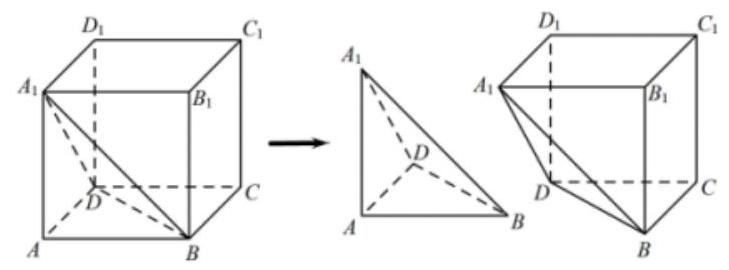

(1)截去的三棱锥 ${A}_{1} - {ABD}$ 的表面积；

(2)剩余的几何体 ${A}_{1}{B}_{1}{C}_{1}{D}_{1} - {DBC}$ 的体积.

【难度】 $\star   \star   \star$

【答案】(1) $6 + 2\sqrt{3}$ ；(2) $\frac{20}{3}$

【解析】(1)由正方体的特点可知三棱锥 ${A}_{1} - {ABD}$ 中， $\bigtriangleup  {A}_{1}{BD}$ 是边长为 $2\sqrt{2}$ 的等边三角形， $\bigtriangleup  {A}_{1}{AD}$ 、 $\bigtriangleup  {A}_{1}{AB}$ 、 $\bigtriangleup  {ABD}$ 都是直角边为 2 的等腰直角三角形，所以截去的三棱锥 ${A}_{1} - {ABD}$ 的表面积 $S = {S}_{\_ A,{BD}} + {S}_{\_ A,{AD}} + {S}_{\_ A,{AB}} + {S}_{\_ {ABD}} = \frac{\sqrt{3}}{4} \times  {\left( 2\sqrt{2}\right) }^{2} + 3 \times  \frac{1}{2} \times  2 \times  2 = 6 + 2\sqrt{3}$

(2)正方体的体积为 ${2}^{3} = 8$ ，三棱锥 ${A}_{1} - {ABD}$ 的体积为 $\frac{1}{3} \times  {S}_{\bigtriangleup {ABD}} \times  A{A}_{1} = \frac{1}{3} \times  \frac{1}{2} \times  2 \times  2 \times  2 = \frac{4}{3}$ ，

所以剩余的几何体 ${A}_{1}{B}_{1}{C}_{1}{D}_{1} - {DBC}$ 的体积为 $8 - \frac{4}{3} = \frac{20}{3}$ .

【例 6】如图, ${AB}$ 是圆柱的直径, ${PA}$ 是圆柱的母线, ${AB} = 3,{PA} = 3\sqrt{3}$ ,点 $C$ 是圆柱底面圆周上的点.

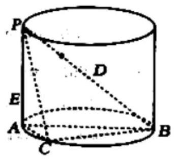

(1)求三棱锥 $P - {ABC}$ 体积的最大值；

(2)若 ${AC} = 1$ ， $D$ 是线段 ${PB}$ 上靠近点 $P$ 的三等分点，点 $E$ 是线段 ${PA}$ 上的动点，求 ${CE} + {ED}$ 的最小值.

【难度】 $\star   \star   \star$

【答案】(1) $\frac{9\sqrt{3}}{4};\left( 2\right) 4$

【解析】(1)三棱锥 $P - {ABC}$ 高 $h = 3\sqrt{3}$ ， ${AB} = 3$ ，点 $C$ 到 ${AB}$ 的最大值为底面圆的半径 $\frac{3}{2}$ ，则三棱锥 $P - {ABC}$ 体积的最大值等于 $\frac{1}{3} \times  3\sqrt{3} \times  \frac{1}{2} \times  \frac{3}{2} \times  3 = \frac{9\sqrt{3}}{4}$ .

(2)将 $\bigtriangleup  {PAC}$ 绕着 ${PA}$ 旋转到 ${PA}{C}^{\prime }$ 使其共面，且 ${C}^{\prime }$ 在 ${AB}$ 的反向延长线上，连接 ${C}^{\prime }D$ ， ${C}^{\prime }D$ 与 ${PA}$ 的交点为 $E$ ,此时 ${CE} + {ED}$ 最小,为 ${C}^{\prime }D$ ;

由 ${AB} = 3,{PA} = 3\sqrt{3}$ ，且易知 ${PA}\bot {AB}$ ，由勾股定理知 ${PB} = 6$ ，因为 ${AB} = \frac{1}{2}{PB}$ ，所以 $\angle {APB} = {30}^{ \circ  }$ ， 则 $\angle {DB}{C}^{\prime } = {60}^{ \circ  },{BD} = \frac{2}{3}{PB} = 4$ ;

${C}^{\prime }B = {C}^{\prime }A + {AB} = 1 + 3 = 4$ ,则 ${\Delta BD}{C}^{\prime }$ 是边长为 4 的等边三角形,故 ${C}^{\prime }D = 4$ ,所以 ${CE} + {ED}$ 的最小值等于 4.

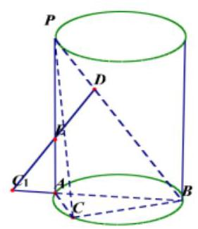

【例 7】学生到工厂劳动实践,利用 ${3D}$ 打印技术制作模型. 如图,该模型为在圆锥底部挖去一个正方体后的剩余部分(正方体有四个顶点在圆锥母线上，其余四个顶点在圆锥底面上)，圆锥底面直径为10、 $\sqrt{2}{cm}$ ，高为 10cm.打印所用原料密度为 ${1.2}\mathrm{g}/{\mathrm{{cm}}}^{3}$ ，不考虑打印损耗，制作该模型所需原料的质量为___g.( $\pi$ 取 3.14)

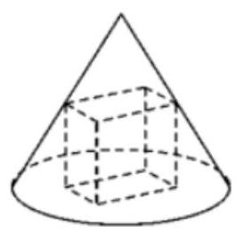

【难度】 $\star   \star   \star$

【答案】 478

【解析】如图,是几何体的轴截面,设正方体的棱长为 $a$ ,则 $\frac{\frac{\sqrt{2}}{2}a}{5\sqrt{2}} = \frac{{10} - a}{10}$ ,解得 $a = 5$ ,

$\therefore$ 该模型的体积为: $V = \frac{1}{3} \times  \pi  \times  {\left( 5\sqrt{2}\right) }^{2} \times  {10} - {5}^{3} \approx  {398.33}\left( {\mathrm{\;{cm}}}^{3}\right)$ . $\therefore$ 制作该模型所需原料的质量为 ${398.33} \times  {1.2} \approx  {478}\left( g\right)$ . 故答案为: 478 .

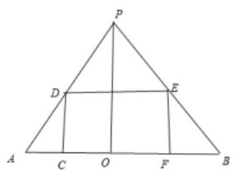

【例 8】( 1 )在正方体 ${ABCD} - {A}_{1}{B}_{1}{C}_{1}{D}_{1}$ 中，三棱锥 $A - {B}_{1}C{D}_{1}$ 的表面积为 $4\sqrt{3}$ ，则正方体外接球的体积为( )

A. $4\sqrt{3}\pi$ B. $\sqrt{6}\pi$ C. ${32}\sqrt{3}\pi$ D. $8\sqrt{6}\pi$

【难度】★★

【答案】B

【解析】解: 设正方体的棱长为 $a$ ,则 ${B}_{1}{D}_{1} = {AC} = A{B}_{1} = A{D}_{1} = {B}_{1}C = {D}_{1}C = \sqrt{2}a$ ,

由于三棱锥 $A - {B}_{1}C{D}_{1}$ 的表面积为 $4\sqrt{3}$ ，所以 $S = 4{S}_{\bigtriangleup A{B}_{1}C} = 4 \times  \frac{1}{2} \times  \frac{\sqrt{3}}{2}{\left( \sqrt{2}a\right) }^{2} = 4\sqrt{3}$ ，所以 $a = \sqrt{2}$

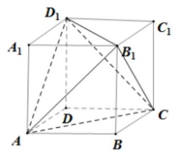

所以正方体的外接球的半径为 $\frac{\sqrt{{\left( \sqrt{2}\right) }^{2} + {\left( \sqrt{2}\right) }^{2} + {\left( \sqrt{2}\right) }^{2}}}{2} = \frac{\sqrt{6}}{2}$ ,所以正方体的外接球的体积为 $\frac{4}{3}\pi  \cdot  {\left( \frac{\sqrt{6}}{2}\right) }^{3} = \sqrt{6}\pi$ 故选: $B$ .

( 2 )球 $O$ 的内接正四面体 $A - {BCD}$ 中， $P$ 、 $Q$ 分别为被 ${AC}$ 、 ${AD}$ 上的点，过 ${PQ}$ 作平面 $\alpha$ ，使得 ${AB}$ 、 ${CD}$ 与 $\alpha$ 平行，且 ${AB}$ 、 ${CD}$ 到 $\alpha$ 的距离分别为1,2，则球 $O$ 被平面 $\alpha$ 所截得的圆的面积是___.

【难度】 $\star   \star   \star$

【答案】 $\frac{13\pi }{2}$

【解析】将正四面体 $A - {BCD}$ 放到一个正方体模型中,如图所示,球 $O$ 是正四面体 $A - {BCD}$ 的外接球, 也是正方体的外接球.

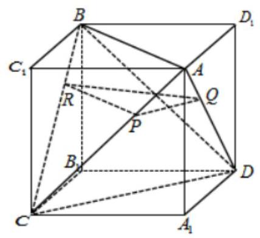

依题意,设平面 $\alpha$ 交 ${BC}$ 于 $R$ ,

因为 ${AB}//$ 平面 $\alpha$ ,平面 ${ABC}$ 与平面 $\alpha$ 交于 ${RP}$ ,所以 ${AB}//{RP}$ ,同理 ${CD}//$ 平面 $\alpha$ ,可证 ${CD}//{PQ}$ .

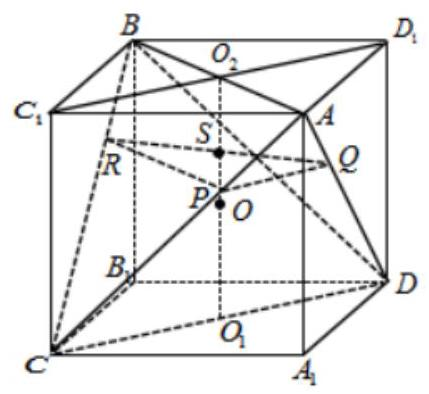

如图，连接 ${C}_{1}{D}_{1}$ ，与 ${AB}$ 交于上底面中心 ${O}_{2}$ ，易见 ${C}_{1}{D}_{1}//{CD}$ ，而 ${CD}//$ 平面 $\alpha$ ，

故 ${C}_{1}{D}_{1}//$ 平面 $\alpha$ ,结合 ${AB}//$ 平面 $\alpha ,{C}_{1}{D}_{1} \cap  {AB} = {O}_{2}$ ,

故上底面 $A{C}_{1}B{D}_{1}//$ 平面 $\alpha$ ,同理下底面也平行平面 $\alpha$ .

因为 ${AB}\text{ 、 }{CD}$ 到 $\alpha$ 的距离分别为1,2,即连接上下底面中心 ${O}_{2}{O}_{1}$ ,交平面 $\alpha$ 于 $S$ ,

则 ${O}_{2}S = 1, S{O}_{1} = 2$ ,则正方形棱长为 ${O}_{2}{O}_{1} = 1 + 2 = 3$ ,正四面体 $A - {BCD}$ 棱长为 $3\sqrt{2}$ ,

正方体的体对角线,即球的直径为 ${2R} = 3\sqrt{3}$ ,即 $R = \frac{3\sqrt{3}}{2}$ ,

球 $O$ 被平面 $\alpha$ 所截得的圆的半径为 $r$ ,则截面圆圆心为 $S$ ,到球心的距离 $d = {SO} = {O}_{2}O - {O}_{2}S = \frac{3}{2} - 1 = \frac{1}{2}$ , 故 $r = \sqrt{{R}^{2} - {d}^{2}} = \sqrt{{\left( \frac{3\sqrt{3}}{2}\right) }^{2} - {\left( \frac{1}{2}\right) }^{2}} = \frac{\sqrt{26}}{2}$ ,故面积 $S = \pi {r}^{2} = \pi  \times  {\left( \frac{\sqrt{26}}{2}\right) }^{2} = \frac{13\pi }{2}$ . 故答案为: $\frac{13\pi }{2}$ .

巩固训练

1、某正方体的体对角线长为 $\sqrt{6}$ ，则这个正方体的表面积为___.

【答案】 12

【解析】设正方体的棱长为 $a$ ,由体对角线长为 $\sqrt{6}$ ,得 $3{a}^{2} = 6$ ,解得 ${a}^{2} = 2$ ,

所以正方体的表面积为 $S = 6{a}^{2} = {12}$ . 故答案为: 12 .

2、蹴鞠，又名“蹴球”“蹴圆”等，“蹴”有用脚蹴、踢的含义，蹴最早系外包皮革、内饰米糠的球.因而“蹴鞠” 就是指古人以脚蹴、踢皮球的活动, 类似今日的足球. 2006 年 5 月 20 日, 蹴鞠已作为非物质文化遗产经国务院批准列入第一批国家级非物质文化遗产名录.已知某“鞠”的表面上有四个点 $A, B, C, D$ 满足

${AB} = {CD} = {14}\mathrm{\;{cm}}$ ， ${BD} = {AC} = {8\mathrm{\;{cm}}}$ ， ${AD} = {BC} = {12}\mathrm{\;{cm}}$ ，则该“鞠”的表面积为___ ${\mathrm{{cm}}}^{2}$

【答案】 ${202\pi }$

【解析】

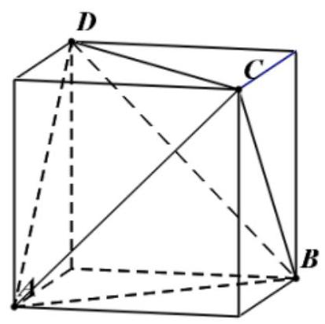

如图将四面体放入长方体中，四面体各边可看作长方体各面的对角线，则“鞠”的表面积为四面体 $A - {BCD}$ 外接球的表面积,即为长方体外接球的表面积,设长方体棱长为 $a, b, c$ ,则有 ${a}^{2} + {b}^{2} = {14}^{2},{a}^{2} + {c}^{2} = {8}^{2}$ , ${b}^{2} + {c}^{2} = {12}^{2}$ ,设长方体外接球半径为 $R$ ,则有 ${\left( 2R\right) }^{2} = \sqrt{{a}^{2} + {b}^{2} + {c}^{2}}$ ,解得 ${R}^{2} = \frac{101}{2}$ ,

所以外接球的表面积为: $S = {4\pi }{R}^{2} = {4\pi } \cdot  \frac{101}{2} = {202\pi }$ . 故答案为: ${202\pi }$

3、如图，圆柱的轴截面 ${ABCD}$ 为边长为 2 的正方形，过 ${AC}$ 且与截面 ${ABCD}$ 垂直的平面截该圆柱表面，所得曲线为一个椭圆，则该椭圆的焦距为( )

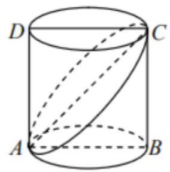

A. 1 B. $\sqrt{2}$ C. 2 D. $2\sqrt{2}$

【答案】C

【解析】解: $\because {AC}$ 为椭圆的长轴, $\therefore {2a} = 2\sqrt{2}, a = \sqrt{2}$ ,短轴长等于圆柱的底面圆直径,即 ${2b} = 2$ , $\therefore b = 1,{c}^{2} = {a}^{2} - {b}^{2} = 1,\therefore {2c} = 2$ . 故选: $C$ .

4、已知某个三棱锥的三视图如图所示, 其中正视图是等边三角形, 侧视图是直角三角形, 俯视图是等腰直角三角形，则此三棱锥的体积等于( )

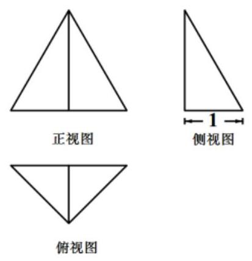

A. $\frac{1}{3}$ B. $\frac{\sqrt{3}}{3}$ C. $\frac{2}{3}$ D. $\frac{2\sqrt{3}}{3}$

【答案】B

【解析】由三视图知几何体是一个侧面与底面垂直的三棱锥, 底面是斜边上的高是 1 的直角三角形, 则两条直角边是 $\sqrt{2}$ ,斜边是 $2,\therefore$ 底面的面积是 $\frac{1}{2} \times  \sqrt{2} \times  \sqrt{2} = 1$ ,与底面垂直的侧面是一个边长为 2 的正三角形,

$\therefore$ 三棱锥的高是 $\sqrt{3},\therefore$ 三棱锥的体积是 $\frac{1}{3} \times  1 \times  \sqrt{3} = \frac{\sqrt{3}}{3}$ ,故选: B

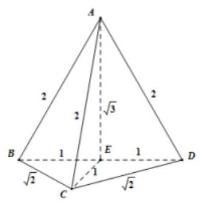

5、已知直四棱柱 ${ABCD} - {A}_{1}{B}_{1}{C}_{1}{D}_{1}$ ，其底面 ${ABCD}$ 是平行四边形，外接球体积为 ${36\pi }$ ，若 $A{C}_{1} \bot  {BD}$ ， 则其外接球被平面 $A{B}_{1}{D}_{1}$ 截得图形面积的最小值为( )

A. ${8\pi }$

B. $\frac{243}{10}\pi$ C. $\frac{81}{10}\pi$ D. ${6\pi }$

【答案】A

【解析】由直四棱柱 ${ABCD} - {A}_{1}{B}_{1}{C}_{1}{D}_{1}$ 内接于球,则 $A, B, C, D$ 四点在球面上,

所以四边形 ${ABCD}$ 为球的一截面圆的内接四边形,所以对角互补.

又四边形 ${ABCD}$ 是平行四边形,所以 ${ABCD}$ 为矩形.

在直四棱柱 ${ABCD} - {A}_{1}{B}_{1}{C}_{1}{D}_{1}$ 中， $C{C}_{1} \bot$ 平面 ${ABCD}$ ，所以 ${C{C}_{1}} \bot  {BD}$

又 $A{C}_{1} \bot  {BD}$ ， $A{C}_{1} \cap  C{C}_{1} = {C}_{1}$ ，所以 ${BD} \bot$ 平面 ${AC}{C}_{1}$ ，所以 ${BD} \bot  {AC}$

所以四边形 ${ABCD}$ 为正方形,所以直四棱柱 ${ABCD} - {A}_{1}{B}_{1}{C}_{1}{D}_{1}$ 为正四棱柱.

由外接球体积为 $\frac{4\pi }{3}{R}^{3} = {36\pi }$ ,则球的半径为 $R = 3$ ,

由 $A{C}_{1}$ 为该外接球的直径,则 $A{C}_{1} = 6$

设 ${AB} = {AD} = a, C{C}_{1} = b$ ，则 $A{C}_{1}^{2} = 2{a}^{2} + {b}^{2} = {36}$ ，则 ${b}^{2} = {36} - 2{a}^{2}$

在 $\bigtriangleup A{B}_{1}{D}_{1}$ 中, $A{B}_{1} = A{D}_{1} = \sqrt{{a}^{2} + {b}^{2}} = \sqrt{{a}^{2} + \left( {{36} - 2{a}^{2}}\right) } = \sqrt{{36} - {a}^{2}},{B}_{1}{D}_{1} = \sqrt{2}a$

由余弦定理可得 $\cos \angle A{D}_{1}{B}_{1} = \frac{A{D}_{1}^{2} + {B}_{1}{D}_{1}^{2} - A{B}_{1}^{2}}{{2A}{D}_{1} \cdot  {B}_{1}{D}_{1}} = \frac{2{a}^{2}}{2 \times  \sqrt{{36} - {a}^{2}} \times  \sqrt{2}a} = \frac{a}{\sqrt{{36} - {a}^{2}} \times  \sqrt{2}}$

所以 $\sin \angle A{D}_{1}{B}_{1} = \sqrt{1 - {\cos }^{2}\angle A{D}_{1}{B}_{1}} = \sqrt{1 - \frac{{a}^{2}}{2 \times  \left( {{36} - {a}^{2}}\right) }} = \sqrt{\frac{{72} - 3{a}^{2}}{{72} - 2{a}^{2}}}$

设 $\bigtriangleup A{B}_{1}{D}_{1}$ 的外接圆的半径为 $r$ ,由正弦定理可得 ${2r} = \frac{A{B}_{1}}{\sin \angle A{D}_{1}{B}_{1}} = \frac{\sqrt{{36} - {a}^{2}}}{\sqrt{\frac{{72} - 3{a}^{2}}{{72} - 2{a}^{2}}}} = \frac{\sqrt{2}\left( {{36} - {a}^{2}}\right) }{\sqrt{{72} - 3{a}^{2}}}$

所以 $r = \frac{{36} - {a}^{2}}{\sqrt{6}\sqrt{{24} - {a}^{2}}} = \frac{1}{\sqrt{6}} \times  \frac{{24} - {a}^{2} + {12}}{\sqrt{{24} - {a}^{2}}} = \frac{1}{\sqrt{6}}\left( {\sqrt{{24} - {a}^{2}} + \frac{12}{\sqrt{{24} - {a}^{2}}}}\right)  \geq  \frac{1}{\sqrt{6}} \times  2\sqrt{12} = 2\sqrt{2}$

当且仅当 $\sqrt{{24} - {a}^{2}} = \frac{12}{\sqrt{{24} - {a}^{2}}}$ ,即 $a = 2\sqrt{3}$ 时取得等号,即 $r$ 的最小值为 $2\sqrt{2}$

其外接球被平面 $A{B}_{1}{D}_{1}$ 截得图形面积的最小值为: $S = \pi {r}^{2} = {8\pi }$ ; 故选: A

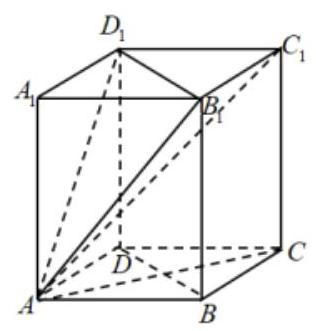

6、小明有一卷纸，纸非常的薄且紧紧缠绕着一个圆柱体轴心卷成一卷，它的整体外貌如图所示，纸卷的直径 12 厘米，轴的直径为 4 厘米. 当小明用掉 $\frac{3}{4}$ 的纸后，则剩下的这卷纸的直径最接近于___厘米(精确到厘米) .

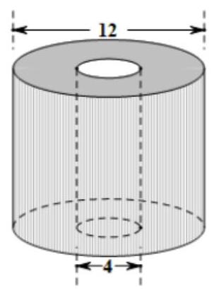

【答案】 7

【解析】使用卷纸的过程中,卷纸的高不变,用之前卷纸的底面积 $\pi  \times  {\left( \frac{12}{2}\right) }^{2} - \pi  \times  {\left( \frac{4}{2}\right) }^{2} = {32\pi }$ ,

设用后纸的半径为 $r$ 厘米,当小明用掉 $\frac{3}{4}$ 的纸后卷纸的底面积 $\pi {r}^{2} - \pi {\left( \frac{4}{2}\right) }^{2} = \frac{1}{4} \times  {32\pi }$ ,解得 $r = 2\sqrt{3}$ 厘米, 所以剩下的这卷纸的直径为 $4\sqrt{3}$ 厘米,最接近于 7 厘米. 故答案为: 7

7、如图，在矩形 ${ABCD}$ 中， ${AB} = 1$ ， ${BC} = \sqrt{3}$ ，沿 ${BD}$ 将矩形庚 ${ABCD}$ 折叠，连接 ${AC}$ ，所得三棱锥 $A - {BCD}$ 正视图和俯视图如图,则三棱锥 $A - {BCD}$ 中 ${AC}$ 长为( )

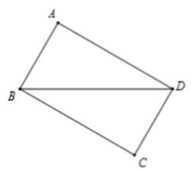

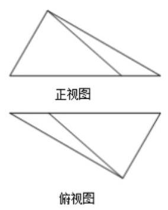

A. $\frac{3}{2}$ B. $\sqrt{3}$

C. $\frac{\sqrt{10}}{2}$ D. 2

【答案】C

【解析】

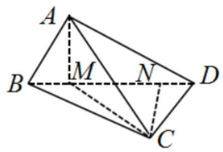

根据三棱锥 $A - {BCD}$ 正视图和俯视图，还原后得到三棱锥的直观图如图示，由图可知:平面 ${ABD}\bot$ 平面 ${CBD}$ ,过 $A$ 作 ${AM} \bot  {BD}$ 于点 $M$ ,连结 ${MC}$ ,则 ${AM} \bot$ 平面 ${CBD},\therefore \bigtriangleup {MCA}$ 为直角三角形.

过 $C$ 作 ${CN} \bot  {BD}$ 于点 $N$ ,在直角三角形 ${ABD}$ 中, ${AB} = 1,{AD} = \sqrt{3},\therefore {BD} = \sqrt{A{B}^{2} + A{D}^{2}} = 2$

所以 $\angle {ABD} = {60}^{ \circ  },\angle {ADB} = {30}^{ \circ  }$ ,则在直角三角形 ${ABM}$ 中, ${AB} = 1,\angle {ABM} = {60}^{ \circ  },\therefore {BM} = \frac{1}{2},{AM} = \frac{\sqrt{3}}{2}$ .

同理,在直角三角形 ${CBD}$ 中, ${DN} = \frac{1}{2},{CN} = \frac{\sqrt{3}}{2},\therefore {MN} = {BD} \cdot  {BM} \cdot  {DN} = 2 - \frac{1}{2} - \frac{1}{2} = 1$ ,

$\therefore {CM} = \sqrt{{CN}^{2} + {MN}^{2}} = \sqrt{{\left( \frac{\sqrt{3}}{2}\right) }^{2} + {1}^{2}} = \frac{\sqrt{7}}{2}$

在直角三角形 ${AMC}$ 中, ${AC} = \sqrt{C{M}^{2} + A{M}^{2}} = \sqrt{{\left( \frac{\sqrt{7}}{2}\right) }^{2} + {\left( \frac{\sqrt{3}}{2}\right) }^{2}} = \frac{\sqrt{10}}{2}$ ,故选: C

8、已知正方体 ${ABCD} - {A}_{1}{B}_{1}{C}_{1}{D}_{1}$ 的棱长为 2， $E$ 为棱 $A{A}_{1}$ 的中点，截面 $C{D}_{1}E$ 交棱 ${AB}$ 于点 $F$ ，则四面体 ${CDF}{D}_{1}$ 的外接球表面积为( )

A. $\frac{39\pi }{4}$ B. $\frac{41\pi }{4}$ C. ${12\pi }$

D. $\frac{43\pi }{4}$

【答案】B

【解析】

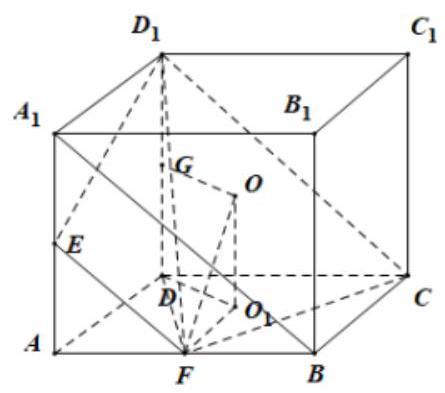

设 $D{D}_{1}$ 的中点为 $G,\bigtriangleup {DFC}$ 的外接圆的圆心为 ${O}_{1}$ ,四面体 ${CDF}{D}_{1}$ 的外接球的球心为 $O$ ,

连接 ${OG},{OF}, O{O}_{1},{A}_{1}B$ ,因为平面 ${A}_{1}{AB}{B}_{1}//$ 平面 ${D}_{1}{DC}{C}_{1}$ ,平面 $C{D}_{1}E \cap$ 平面 ${A}_{1}{AB}{B}_{1} = {EF}$ ,

平面 $C{D}_{1}E \cap$ 平面 ${D}_{1}{DC}{C}_{1} = {D}_{1}C$ ,故 ${EF}//{D}_{1}C$ ,而 ${A}_{1}B//{D}_{1}C$ ,故 ${EF}//{A}_{1}B$ ,故 $F$ 为 ${AB}$ 的中点,

所以 ${DF} = {CF} = \sqrt{1 + 4} = \sqrt{5}$ ,故 $\cos \angle {DFC} = \frac{{10} - 4}{2 \times  \sqrt{5} \times  \sqrt{5}} = \frac{3}{5}$ ,

因为 $\angle {DFC}$ 为三角形的内角,故 $\sin \angle {DFC} = \frac{4}{5}$ ,故 $\bigtriangleup {DFC}$ 的外接圆的半径为 $\frac{1}{2} \times  \frac{2}{\frac{4}{5}} = \frac{5}{4}$ ,

$O{O}_{1} \bot$ 平面 ${ABCD}, D{D}_{1} \bot$ 平面 ${ABCD}$ ,故 $O{O}_{1}//D{D}_{1}$ ,

在平面 ${GD}{O}_{1}O$ 中, ${OG} \bot  D{D}_{1},{O}_{1}D \bot  D{D}_{1}$ ,故 ${OG}//{O}_{1}D$ ,

故四边形 ${GD}{O}_{1}O$ 为平行四边形,故 $O{O}_{1}//{GD}, O{O}_{1} = {GD}$ ,所以四面体 ${CDF}{D}_{1}$ 的外接球的半径为 $\sqrt{1 + \frac{25}{16}} = \frac{\sqrt{41}}{4}$ ,故四面体 ${CDF}{D}_{1}$ 的外接球表面积为 ${4\pi } \times  \frac{41}{16} = \frac{41\pi }{4}$ ,故选: B.

9、已知梯形 ${ABCD}$ ，按照斜二测画法画出它的直观图 ${A}^{\prime }{B}^{\prime }{C}^{\prime }{D}^{\prime }$ ，如图所示，其中 ${A}^{\prime }{D}^{\prime } = 2,{B}^{\prime }{C}^{\prime } = 4$ ， ${A}^{\prime }{B}^{\prime } = 1$ ,

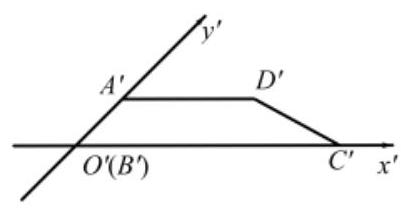

求:(1)梯形 ${ABCD}$ 的面积；

(2)梯形 ${ABCD}$ 以 ${BC}$ 为旋转轴旋转一周形成的几何体的表面积和体积.

【答案】(1)6；(2) $\left( {{12} + 4\sqrt{2}}\right) \pi$ ， $\frac{32}{3}\pi$ .

【解析】(1)根据题意，四边形 ${A}^{\prime }{B}^{\prime }{C}^{\prime }{D}^{\prime }$ 还原成直角梯形 ${ABCD}$ ，如图，

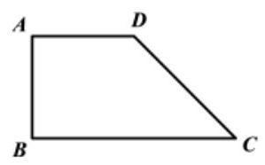

其中 ${AB} = {AD} = 2,{BC} = 4$ ，则梯形 ${ABCD}$ 的面积为 $\frac{1}{2} \times  \left( {2 + 4}\right)  \times  2 = 6$ ；

(2)可知旋转后形成的几何体为一个圆柱和一个圆锥形成的组合体，

$\therefore S = \pi {\left| AB\right| }^{2} + {2\pi }\left| {AB}\right|  \times  \left| {AD}\right|  + \pi \left| {AB}\right|  \times  \left| {CD}\right|  = \pi  \times  {2}^{2} + {2\pi } \times  2 \times  2 + \pi  \times  2 \times  2\sqrt{2} = \left( {{12} + 4\sqrt{2}}\right) \pi$ , $V = \pi {\left| AB\right| }^{2} \times  \left| {AD}\right|  + \frac{1}{3}\pi {\left| AB\right| }^{2} \times  \left( {\left| {BC}\right|  - \left| {AD}\right| }\right)  = \pi  \times  {2}^{2} \times  2 + \frac{1}{3} \times  \pi  \times  {2}^{2} \times  2 = \frac{32}{3}\pi$ .

10、已知一圆锥底面圆的直径是3，圆锥的母线长为3，在该圆锥内放置一个棱长为 $a$ 的正四面体(每条棱长都为 $a$ 的三棱锥)，并且正四面体可以在该圆锥内任意转动，则 $a$ 的最大值为( )

A. 1 B. $\sqrt{2}$ C. $\sqrt{3}$ D. 2

【答案】B

【解析】解: 依题意, 四面体可以在圆锥内任意转动, 故该四面体内接于圆锥的内切球,

设球心为 $P$ ,球的半径为 $r$ ,下底面半径为 $R$ ,轴截面上球与圆锥母线的切点为 $Q$ ,圆锥的轴截面如图:

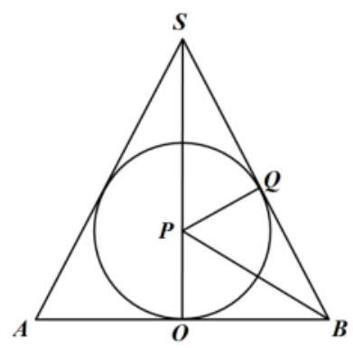

由已知 ${AB} = \mathrm{{SA}} = \mathrm{{SB}} = 3$ ，所以三角形 ${SAB}$ 为等边三角形，故 $P$ 是 $\bigtriangleup  {SAB}$ 的中心， 连接 ${BP}$ ，则 ${BP}$ 平分 $\angle {SBA}$ ， $\therefore \angle {PBO} = {30}^{ \circ  }$ ；

所以 $\tan {30}^{ \circ  } = \frac{r}{R}$ ,即 $r = \frac{\sqrt{3}}{3}R = \frac{\sqrt{3}}{3} \times  \frac{3}{2} = \frac{\sqrt{3}}{2}$ ,即四面体的外接球的半径为 $r = \frac{\sqrt{3}}{2}$ . 另正四面体可以从正方体中截得,如图,从图中可以得到,当正四面体的棱长为 $a$ 时,截得它的正方体的棱长为 $\frac{\sqrt{2}}{2}a$ ,而正四面体的四个顶点都在正方体上,

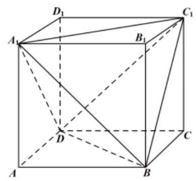

故正四面体的外接球即为截得它的正方体的外接球, 所以

${2r} = \sqrt{3}A{A}_{1} = \sqrt{3} \times  \frac{\sqrt{2}}{2}a = \frac{\sqrt{6}}{2}a$ ,所以 $a = \sqrt{2}$ . 即 $a$ 的最大值为 $\sqrt{2}$ . 故选: B.

## (三)求空间几何体角的问题

## 知识梳理

两异面直线间的夹角、直线与平面间的夹角、二面角的平面角;

① 若异面直线 ${l}_{1},{l}_{2}$ 的方向向量为 $\overrightarrow{{u}_{1}},\overrightarrow{{u}_{2}},;{l}_{1}$ 与 ${l}_{2}$ 所成的角为 $\alpha$ ，则 $\cos \alpha  = \left| {\cos \left\langle  {\overrightarrow{{u}_{1}},\overrightarrow{{u}_{2}}}\right\rangle  }\right|$

②已知直线 $l$ 的方向向量为 $\overrightarrow{v}$ ，平面 $\alpha$ 的法向量 $\overrightarrow{u}$ ， $l$ 与平面 $\alpha$ 的夹角为 $\alpha$ ，则 $\sin \alpha  = \left| {\cos \langle \overrightarrow{u},\overrightarrow{v}\rangle }\right|$ ；

③ 已知二面角 $\alpha  - l - \beta$ 的两个面 $\alpha$ 和 $\beta$ 的法向量分别为 $\overrightarrow{v}$ ， $\overrightarrow{u}$ ，则 $\langle \overrightarrow{u},\overrightarrow{v}\rangle$ 与该二面角相等或互补；

## 例题精讲

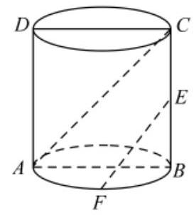

【例 9】( 1 )如图,圆柱的体积为 ${16\pi }$ ，正方形 ${ABCD}$ 为该圆柱的轴截面， $F$ 为 $\overset{\text{ ⏜ }}{AB}$ 的中点， $E$ 为母线 ${BC}$ 的中点，则异面直线 ${AC}$ ， ${EF}$ 所成的角的余弦值为___.

【难度】 $\star   \star   \star$

【答案】 $\frac{\sqrt{6}}{3}$

【解析】设圆柱底面半径为 $r$ ,则母线长为 ${2r}$ ,由 $\pi {r}^{2} \cdot  {2r} = {16\pi }$ 得 $r = 2$ .

设底面圆心为 $O$ ,连接 ${OE},{OF}$ . 则 ${OE}//{AC}$ ,所以 $\angle {OEF}$ 为异面直线 ${AC},{EF}$ 所成的角.

在 Rt $\bigtriangleup {OEF}$ 中, ${OF} = 2,{OE} = 2\sqrt{2},{EF} = 2\sqrt{3}$ . 所以 $\cos \angle {OEF} = \frac{OE}{EF} = \frac{\sqrt{6}}{3}$ . 故答案为: $\frac{\sqrt{6}}{3}$ .

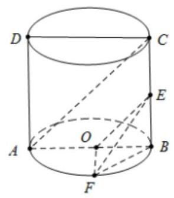

(2)在四面体 ${ABCD}$ 中， ${AB} = {BC} = {CD} = {DA} = 5$ ， ${AC} = 3$ ， ${BD} = 8$ ，点 $P$ 在平面 ${ABD}$ 内，且 ${CP} = 2\sqrt{2}$ ，设异面直线 ${CP}$ 与 ${BD}$ 所成的角为 $\theta$ ，则 $\sin \theta$ 的最小值为( )

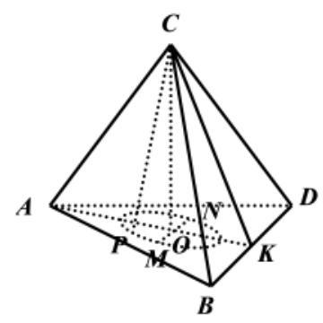

A. $\frac{3\sqrt{6}}{8}$ B. $\frac{\sqrt{3}}{2}$ C. $\frac{\sqrt{3}}{3}$ D. $\frac{\sqrt{2}}{2}$

【答案】A

【解析】取 ${BD}$ 中点 $K$ ,连接 ${AK},{CK}$ ,取 ${AK}$ 中点 $O$ ,连接 $\mathrm{{CO}}$ ,

$\because {AB} = {AD} = 5,{BC} = {CD} = 5,{BK} = {DK} = 4$ ， $\therefore {AK}\bot {BD}$ ， ${CK}\bot {BD}$ ，

由 ${AK} \cap  {CK} = K,{AK},{CK} \subset$ 平面 ${ACK},\therefore {AK} = {CK} = 3,{BD} \bot$ 平面 ${ACK}$ ,

$\because {CO} \subset$ 平面 ${ACK},\therefore {CO} \bot  {BD}$ ,

$\because {AC} = {AK} = {CK},\therefore {CO} \bot  {AK}$ ,又 ${BD},{AK} \subset$ 平面 ${ABD},{BD} \cap  {AK} = K$ ,

$\therefore {CO} \bot$ 平面 ${ABD}$ ，又 ${OP} \subset$ 平面 ${ABD}$ ， $\therefore {CO} \bot  {OP}$ ，

又 ${CO} = \sqrt{9 - \frac{9}{4}} = \frac{3\sqrt{3}}{2},{CP} = 2\sqrt{2},\therefore {OP} = \sqrt{8 - \frac{27}{4}} = \frac{\sqrt{5}}{2}$ ,

$\therefore P$ 点在平面 ${ABD}$ 内的轨迹是以 $O$ 为圆心, $\frac{\sqrt{5}}{2}$ 为半径的圆.

作直径 ${MN}//{BD}$ ,则当 $P$ 与 $M$ 或 $N$ 重合时, $\sin \theta$ 取得最小值, $\therefore {\left( \sin \theta \right) }_{\min } = \frac{CO}{CP} = \frac{\frac{3\sqrt{3}}{2}}{2\sqrt{2}} = \frac{3\sqrt{6}}{8}$ . 故选: A.

【例 10】( 1 )如图,四边形 ${ABCD}$ 为梯形, ${AB}//{CD},\angle C = {60}^{ \circ  },{AB} = 2,{BC} = 3,{CD} = 6$ ,点 $M$ 在边 ${CD}$ 上,且 ${CM} = \frac{1}{3}{CD}$ . 现沿 ${AM}$ 将 $\bigtriangleup  {ADM}$ 折起至 $\bigtriangleup  {AQM}$ 的位置,使 ${QB} = 3$ .

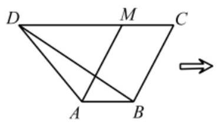

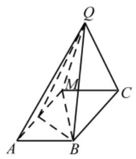

(1)求证: ${QB}\bot$ 平面 ${ABCM}$ ；

(2)求直线 ${BM}$ 与平面 ${AQM}$ 所成角的正弦值.

【难度】 $\star   \star   \star$

【答案】(1)证明见解析；(2II) $\frac{3\sqrt{7}}{14}$ .

【解析】( 1 )解:因为 ${BC} = 3,{CD} = 6,\angle C = {60}^{ \circ  }$ ，所以由余弦定理得

${BD} = \sqrt{{3}^{2} + {6}^{2} - 2 \times  3 \times  6\cos {60}^{ \circ  }} = {3\sqrt{3}}$ ，从而 $B{D}^{2} + B{C}^{2} = C{D}^{2}$ ，所以 ${DB}\bot {BC}$ ，

由已知得 ${AB}\not{= }{MC}$ ，所以 ${ABCM}$ 为平行四边形，所以 ${DB}\bot {AM}$ ，

设 ${DB} \cap  {AM} = O$ ,则折后可得 ${AM}\bot {QO},{AM}\bot {BO}$ ,又 ${{QO} \cap  {BO}} = O$ , ${QO},{BO} \subset$ 平面 ${BQO}$ ,所以 ${AM} \bot$ 平面 ${QOB},{QB} \subset$ 平面 ${QOB}$ ,所以 ${QB} \bot  {AM}$ ,

因为 ${QO} = 2\sqrt{3},{OB} = \sqrt{3},{QB} = 3$ ,即 $Q{B}^{2} + B{O}^{2} = Q{O}^{2}$ ,所以 ${QB} \bot  {BO}$ ,

因为 ${AM} \cap  {BO} = O$ ， ${AM},{BO} \subset$ 平面 ${ABCM}$ ，所以 ${QB}\bot$ 平面 ${ABCM}$ ；

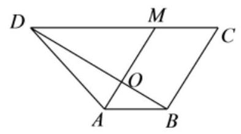

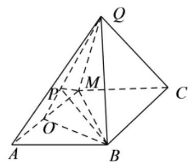

(2)方法一(几何法)在平面 ${BOQ}$ 内作 ${BP}\bot {QO}$ 于 $P$ ，则由 ${AM}\bot$ 平面 ${QOB}$ ，得 ${AM}\bot {BP}$ ，

又 ${QO} \cap  {AM} = O$ , ${QO},{AM} \subset$ 平面 ${AQM}$ ,所以 ${BP} \bot$ 平面 ${AQM}$ ,

连 ${MP}$ ,则 ${MP}$ 是 ${BM}$ 在平面 ${AQM}$ 上的射影,所以 $\angle {BMP}$ 即是 ${BM}$ 与平面 ${AQM}$ 所成的角.

因为 ${BP} = \frac{{QB} \cdot  {OB}}{QO} = \frac{3 \times  \sqrt{3}}{2\sqrt{3}} = \frac{3}{2},{BM} = \sqrt{B{C}^{2} + C{M}^{2} - {2BC} \cdot  {CM}\cos {60}^{ \circ  }} = \sqrt{7}$ ,

所以 $\sin \angle {BMP} = \frac{BP}{BM} = \frac{3\sqrt{7}}{14}$ .

方法二: (建系法) 略.

(2)如图，三棱锥 $A - {BCD}$ 的底面 ${BCD}$ 在平面 $\alpha$ 内，所有棱均相等， $E$ 是棱 ${AC}$ 的中点，若三棱锥 $A - {BCD}$ 绕棱 ${CD}$ 旋转，设直线 ${BE}$ 与平面 $\alpha$ 所成的角为 $\theta$ ，则 $\cos \theta$ 的取值范围为( )

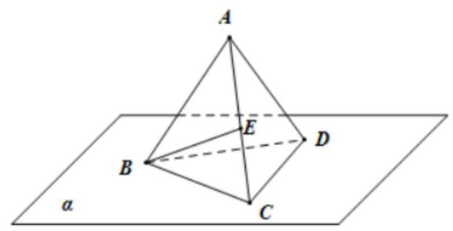

A. $\left\lbrack  {\frac{\sqrt{3}}{6},1}\right\rbrack$ B. $\left\lbrack  {\frac{5}{6},1}\right\rbrack$ C. $\left\lbrack  {0,\frac{\sqrt{11}}{6}}\right\rbrack$ D. $\left\lbrack  {0,\frac{\sqrt{33}}{6}}\right\rbrack$

【答案】A

【解析】取 ${AD}$ 的中点 $F$ ,连接 ${EF}\text{ 、 }{BF}$ ,如下图所示:

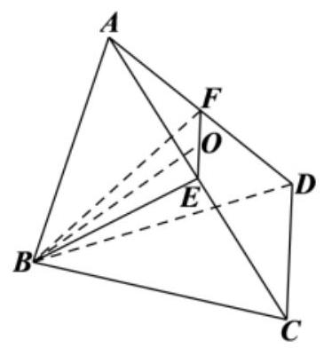

$\because E\text{ 、 }F$ 分别为 ${AC}\text{ 、 }{AD}$ 的中点，所以， ${EF}//{CD}$ ，

设正四面体 ${ABCD}$ 的棱长为 2,则 ${BE} = {BF} = \sqrt{3},{EF} = \frac{1}{2}{CD} = 1$ ，

由余弦定理可得 $\cos \angle {BEF} = \frac{B{E}^{2} + E{F}^{2} - B{F}^{2}}{{2BE} \cdot  {EF}} = \frac{\sqrt{3}}{6}$ .

当三棱锥 $A - {BCD}$ 绕棱 ${CD}$ 旋转时,直线 ${BE}$ 与平面 $\alpha$ 所成的角为 $\theta$ ,

让正四面体 ${ABCD}$ 相对静止，让平面 $\alpha$ 绕着直线 ${CD}$ 转动，则平面 $\alpha$ 的垂线也绕着 ${CD}$ 旋转，

设过直线 ${EF}$ 的平面 $\beta$ 满足 $\alpha //\beta$ ,

$\because {EF}//{CD}$ ,问题也等价于平面 $\beta$ 绕着直线 ${EF}$ 旋转,

当 $B \in  \beta$ 时, $\theta$ 取得最小值 0,此时, $\cos \theta$ 取得最大值 1;

当 $B \notin  \beta$ 时,设点 $B$ 到平面 $\beta$ 的距离为 $d$ ,可得 $\sin \theta  = \frac{d}{BE}$ ,

当 $d$ 取最大值时, $\theta$ 取最大值,此时,平面 ${BEF} \bot$ 平面 $\beta$ ,

由于 ${BE} = {BF}$ ,取 ${EF}$ 的中点 $O$ ,连接 ${BO}$ ,可得 ${BO} \bot  {EF}$ ,

$\because$ 平面 ${BEF} \bot$ 平面 $\beta$ ,平面 ${BEF} \cap  \beta  = {EF},{BO} \subset$ 平面 ${BEF},\therefore {BO} \bot  \beta$ ,

此时, $\theta  = \angle {BEF}$ ,所以, $\cos \theta$ 的最小值为 $\frac{\sqrt{3}}{6}$ . 综上所述, $\cos \theta$ 的取值范围是 $\left\lbrack  {\frac{\sqrt{3}}{6},1}\right\rbrack$ . 故选: A.

【例 11】正四面体 $A - {BCD}$ 中,点 $P$ 为 $\bigtriangleup {BCD}$ 所在平面上的动点,若 ${AP}$ 与 ${AB}$ 所成角为 ${60}^{ \circ  }$ ,则动点 $P$ 的轨迹是( )

A. 圆 B. 椭圆 C. 双曲线 D. 抛物线

【难度】 $\star   \star   \star$

【答案】C

【解析】: ${AP}$ 与 ${AB}$ 所成角为 ${60}^{ \circ  }$ , $\therefore {AP}$ 是以 ${AB}$ 为轴, $A$ 为顶点的圆锥的母线,即 $P$ 是圆锥的侧面上, $P$ 点轨迹是平面 ${BCD}$ 与这个圆锥侧面的交线.

正四面体 ${ABCD}$ 中,设 ${AO}$ 棱锥的高,则 $O$ 是 $\bigtriangleup {BCD}$ 的中心, $\angle {ABO}$ 是 ${AB}$ 与平面 ${BCD}$ 所成的角, 设正四面体棱长为 1,则 ${BO} = \frac{2}{3} \times  \frac{\sqrt{3}}{2} \times  1 = \frac{\sqrt{3}}{3},{AO} = \sqrt{1 - {\left( \frac{\sqrt{3}}{3}\right) }^{2}} = \frac{\sqrt{6}}{3},\tan \angle {ABO} = \frac{AO}{BO} = \sqrt{2}$ , $\angle {ABO} < {60}^{ \circ  }$ ,

∵平面与轴的夹角小于, 因此平面与圆锥的侧面的交线是双曲线. 故选: C.

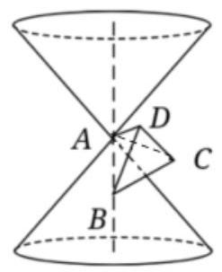

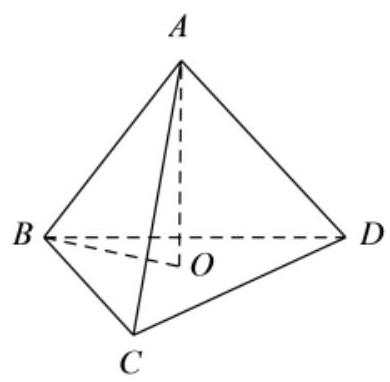

【例 12】如图,在四棱锥 $P - {ABCD}$ 中,等边三角形 ${PAD}$ 所在的平面与正方形 ${ABCD}$ 所在的平面互相垂直， $O$ 为 ${AD}$ 的中点， $E$ 为 ${DC}$ 的中点，且 ${AD} = 2$ .

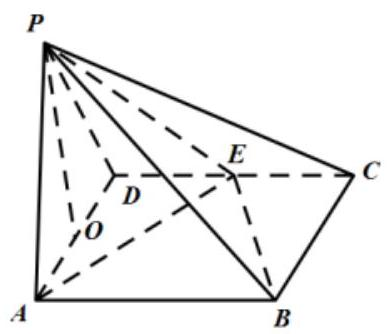

(1)求证: ${PO}\bot$ 平面 ${ABCD}$ ；

(2)求二面角 $P - {EB} - A$ 的平面角的余弦值；

(3)在线段 ${AB}$ 上是否存在点 $M$ ，使直线 ${PM}$ 与 $\bigtriangleup  {PAD}$ 所在平面成 ${30}^{ \circ  }$ 角？若存在，求出 ${AM}$ 的长，若不存在, 请说明理由.

【难度】 $\star   \star   \star$

【答案】(1)证明见解析；(2) $\frac{\sqrt{6}}{4}$ ；(3)存在， ${AM} = \frac{2\sqrt{3}}{3}$ .

【解析】(1) $\because \bigtriangleup {PAD}$ 是等边三角形， $O$ 为 ${AD}$ 的中点， $\therefore {PO} \bot  {AD}$

$\because$ 平面 ${PAD} \bot$ 平面 ${ABCD}$ ,平面 ${PAD} \cap$ 平面 ${ABCD} = {AD},{PO} \subset$ 平面 ${PAD},\therefore {PO} \bot$ 平面 ${ABCD}$ .

(2)取 ${BC}$ 的中点 $F$ ， $\because$ 底面 ${ABCD}$ 是正方形， $\therefore {OF} \bot  {AD}$ ，

又 ${PO} \bot$ 平面 ${ABCD},{OF} \subset$ 平面 ${ABCD},{AD} \subset$ 平面 ${ABCD},\therefore {PO},{OF},{AD}$ 两两垂直.

以 $O$ 为原点，以 ${OA}$ 为 $x$ 轴、 ${OF}$ 为 $y$ 轴、 ${OP}$ 为 $z$ 轴建立空间直角坐标系如图:

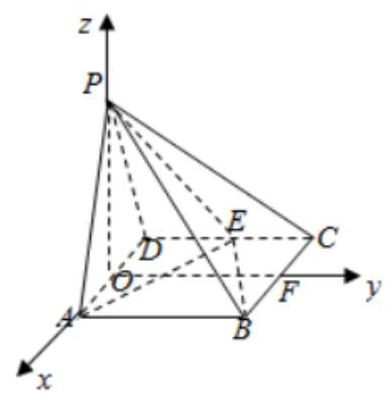

则 $O\left( {0,0,0}\right) , P\left( {0,0,\sqrt{3}}\right) , B\left( {1,2,0}\right) , E\left( {-1,1,0}\right) ,\therefore \overrightarrow{EP} = \left( {1, - 1,\sqrt{3}}\right) ,\overrightarrow{EB} = \left( {2,1,0}\right) ,\overrightarrow{OP} = \left( {0,0,\sqrt{3}}\right)$ 显然平面 ${EBA}$ 的法向量 $\overrightarrow{OP} = \left( {0,0,\sqrt{3}}\right)$ . 设平面 ${PBE}$ 的法向量为 $\overrightarrow{n} = \left( {x, y, z}\right)$ ,则 $\left\{  \begin{array}{l} \overrightarrow{n} \cdot  \overrightarrow{EP} = 0 \\  \overrightarrow{n} \cdot  \overrightarrow{EB} = 0 \end{array}\right.$ , $\therefore \left\{  \begin{array}{l} x - y + \sqrt{3}z = 0 \\  {2x} + y = 0 \end{array}\right.$ ,令 $x = 1$ ,得 $\overrightarrow{n} = \left( {1, - 2, - \sqrt{3}}\right) ,\therefore \overrightarrow{n} \cdot  \overrightarrow{OP} =  - 3,\left| \overrightarrow{n}\right|  = 2\sqrt{2},\left| \overrightarrow{OP}\right|  = \sqrt{3}$ , $\therefore \cos \langle \overrightarrow{n},\overrightarrow{OP}\rangle  =  - \frac{\sqrt{6}}{4}\because$ 二面角 $P - {EB} - A$ 为锐角, $\therefore P - {EB} - A$ 的余弦值为 $\frac{\sqrt{6}}{4}$ .

(3)设在线段 ${AB}$ 上存在点 $M\left( {1, x,0}\right) \left( {0 < x \leq  2}\right)$ 使线段 ${PM}$ 与平面 ${PAD}$ 所在平面成 ${30}^{ \circ  }$ 角， $\because$ 平面 ${PAD}$ 的法向量为 $\overrightarrow{OF} = \left( {0,2,0}\right) ,\overrightarrow{PM} = \left( {1, x, - \sqrt{3}}\right) ,\therefore \cos \langle \overrightarrow{OF},\overrightarrow{PM}\rangle  = \frac{\overrightarrow{OF} \cdot  \overrightarrow{PM}}{\left| \overrightarrow{OF}\right| \left| \overrightarrow{PM}\right| } = \frac{x}{\sqrt{4 + {x}^{2}}}$ . $\therefore \sin {30}^{ \circ  } = \frac{x}{\sqrt{4 + {x}^{2}}} = \frac{1}{2}$ ,解得 $x = \frac{2\sqrt{3}}{3}$ ,符合题意.

$\therefore$ 在线段 ${AB}$ 上存在点 $M$ ,当线段 ${AM} = \frac{2\sqrt{3}}{3}$ 时, ${PM}$ 与平面 ${PAD}$ 所在平面成 ${30}^{ \circ  }$ 角.

巩固训练

1、在正方体 ${ABCD} - {A}_{1}{B}_{1}{C}_{1}{D}_{1}$ 中，已知 $E, F, G$ 分别为 ${CD},{D}_{1}D,{A}_{1}{B}_{1}$ 的中点， $P$ 为平面 ${CD}{D}_{1}{C}_{1}$ 内任一点， 设异面直线 ${GF}$ 与 ${PE}$ 所成的角为 $\alpha$ ,则 $\cos \alpha$ 的最大值为( )

A. $\frac{1}{3}$ B. $\frac{\sqrt{2}}{3}$ C. $\frac{\sqrt{3}}{3}$ D. 1

【答案】C

【解析】若 $\cos \alpha$ 取得最大值,则 $\alpha$ 取得最小值,因为 $P$ 为平面 ${CD}{D}_{1}{C}_{1}$ 内任一点,由直线与平面所成角的定义可知,直线 ${GF}$ 与平面 ${CD}{D}_{1}{C}_{1}$ 所成的角为直线 ${GF}$ 与平面 ${CD}{D}_{1}{C}_{1}$ 内的所有直线所成角的最小角,所以 $\alpha$ 的最小值为 ${GF}$ 与平面 ${CD}{D}_{1}{C}_{1}$ 所成的角,如图所示, $H$ 为 ${D}_{1}{C}_{1}$ 中点,可知 ${HF}$ 即为 ${GF}$ 在平面 ${CD}{D}_{1}{C}_{1}$ 内的射影,设正方体的边长为 2,则可得 ${HF} = \sqrt{2},{GH} = 2$ ,所以 ${GF} = \sqrt{6}$ ,从而得到 $\cos \alpha  = \frac{\sqrt{2}}{\sqrt{6}} = \frac{\sqrt{3}}{3}$ . 故选: C.

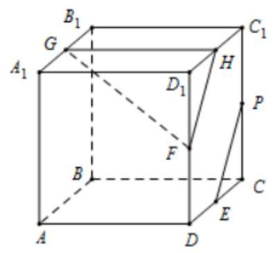

2、在三棱锥 $P - {ABC}$ 中，底面 ${ABC}$ 为正三角形，平面 ${PBC} \bot$ 平面 ${ABC},{PB} = {PC} = 1, D$ 为 ${AP}$ 上一点， ${AD} = {2DP}, O$ 为三角形 ${ABC}$ 的中心.

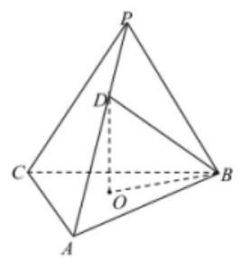

(1)求证: ${AC}\bot$ 平面 ${OBD}$ ；

(2)若直线 ${PA}$ 与平面 ${ABC}$ 所成的角为 ${45}^{ \circ  }$ ，求二面角 $A - {BD} - O$ 的余弦值.

【答案】(1)证明见解析；(2) $\frac{\sqrt{15}}{5}$ .

【解析】(1)证明: 连接 ${AO}$ 并延长 ${BC}$ 交于点 $E$ ,则 $E$ 为 ${BC}$ 中点,连接 ${PE}$ . 如图所示:

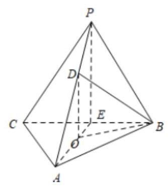

因为 $O$ 为正三角形 ${ABC}$ 的中心,所以 ${AO} = {2OE}$ ,

又 ${AD} = {2DP}$ ,所以 ${DO}//{PE}$ ,因为 ${PB} = {PC}, E$ 为 ${BC}$ 中点,所以 ${PE} \bot  {BC}$ ,

又平面 ${PBC} \bot$ 平面 ${ABC}$ ,平面 ${PBC} \cap$ 平面 ${ABC} = {BC}$ ,所以 ${PE} \bot$ 平面 ${ABC}$ ,

所以 ${DO} \bot$ 平面 ${ABC},{AC} \subset$ 平面 ${PBC}$ ,所以 ${DO} \bot  {AC}$ ,

又 ${AC} \bot  {BO},{DO} \cap  {BO} = O$ ,所以 ${AC} \bot$ 平面 ${OBD}$ .

(2)由 ${PE} \bot$ 平面 ${ABC}$ 知，所以 $\angle {PAE} = {45}^{ \circ  }$ ，所以 ${PE} = {AE}$ ，所以 $\bigtriangleup  {ABE}{ \cong  }_{ \bigtriangleup  }{PBE}$ ，

所以 ${AB} = {PB} = {BC} = {AC} = 1$ ，由( 1 )知， ${EA},{EB},{EP}$ 两两互相垂直，

所以分别以 ${EA},{EB},{EP}$ 的方向为 $x, y, z$ 轴正方向,建立如图所示空间直角坐标系,

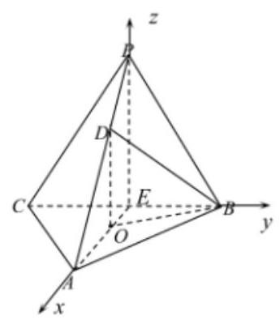

则 $A\left( {\frac{\sqrt{3}}{2},0,0}\right) , B\left( {0,\frac{1}{2},0}\right) , P\left( {0,0,\frac{\sqrt{3}}{2}}\right) , D\left( {\frac{\sqrt{3}}{6},0,\frac{\sqrt{3}}{3}}\right) , C\left( {0, - \frac{1}{2},0}\right)$

所以 $\overrightarrow{AB} = \left( {-\frac{\sqrt{3}}{2},\frac{1}{2},0}\right) ,\overrightarrow{BD} = \left( {\frac{\sqrt{3}}{6}, - \frac{1}{2},\frac{\sqrt{3}}{3}}\right)$ ,

设平面 ${ABD}$ 的法向量为 $\overrightarrow{n} = \left( {x, y, z}\right)$ ,则 $\left\{  \begin{array}{l} \overrightarrow{n} \cdot  \overrightarrow{BD} = \frac{\sqrt{3}x}{6} - \frac{y}{2} + \frac{\sqrt{3}}{3}z = 0 \\  \overrightarrow{n} \cdot  \overrightarrow{AB} =  - \frac{\sqrt{3}}{2}x + \frac{y}{2} = 0 \end{array}\right.$ ,

令 $x = 1$ ,可得 $y = \sqrt{3}, z = 1$ ,则 $\overrightarrow{n} = \left( {1,\sqrt{3},1}\right)$ . 由 (1) 知 ${AC} \bot$ 平面 ${DBO}$ ,

故 $\overrightarrow{AC} = \left( {-\frac{\sqrt{3}}{2}, - \frac{1}{2},0}\right)$ 为平面 ${DBO}$ 的法向量,所以 $\cos \langle \overrightarrow{n},\overrightarrow{AC}\rangle  = \frac{\overrightarrow{n} \cdot  \overrightarrow{AC}}{\left| \overrightarrow{n}\right| \left| \overrightarrow{AC}\right| } = \frac{-\frac{\sqrt{3}}{2} - \frac{\sqrt{3}}{2}}{\sqrt{5} \cdot  1} =  - \frac{\sqrt{15}}{5}$

由图可知二面角 $A - {BD} - O$ 的为锐二面角,所以二面角 $A - {BD} - O$ 的余弦值为 $\frac{\sqrt{15}}{5}$ .

3、已知三棱柱 ${ABC} - {A}_{1}{B}_{1}{C}_{1}, A{A}_{1} \bot$ 平面 ${ABC},\angle {BAC} = {90}^{ \circ  },\mathbf{A}{A}_{1} = \mathbf{A}\mathbf{B} = \mathbf{A}\mathbf{C} = \mathbf{1}$ .

(1)求异面直线 $A{C}_{1}$ 与 ${A}_{1}B$ 所成的角;

(2)求二面角 $A - B{C}_{1} - {A}_{1}$ 的正弦值；

(3)设 $M$ 为 ${A}_{1}B$ 的中点，在 $\bigtriangleup  {ABC}$ 的内部或边上是否存在一点 $N$ ，使得 ${MN}\bot$ 平面 ${AB}{C}_{1}$ ？若存在，确定点 $N$ 的位置,若不存在,说明理由.

【答案】( 1 ) ${60}^{ \circ  }$ ；( 2 ) $\frac{\sqrt{3}}{2}$ ；(3)存在，点 $N$ 为 ${BC}$ 的中点.

【解析】因为 $A{A}_{1} \bot$ 平面 ${ABC},\angle {BAC} = {90}^{ \circ  }$

如图，以 ${A}_{1}{B}_{1}$ 为 $x$ 轴， ${A}_{1}{C}_{1}$ 为 $y$ 轴， ${A}_{1}$ 内 $z$ 轴建立空间直角坐标系:

因为 $A{A}_{1} = {AB} = {AC} = 1$ ,所以 ${A}_{1}\left( {0,0,0}\right) ,{B}_{1}\left( {1,0,0}\right) ,{C}_{1}\left( {0,1,0}\right) , A\left( {0,0,1}\right) , B\left( {1,0,1}\right) , C\left( {0,1,1}\right)$ ,

(1) $\overrightarrow{A{C}_{1}} = \left( {0,1, - 1}\right) ,\overrightarrow{{A}_{1}B} = \left( {1,0,1}\right) ,\cos  < \overrightarrow{A{C}_{1}},\overrightarrow{{A}_{1}B} > \frac{\overrightarrow{A{C}_{1}} \cdot  \overrightarrow{{A}_{1}B}}{\left| \overrightarrow{A{C}_{1}}\right| \left| \overrightarrow{{A}_{1}B}\right| } = \frac{-1}{\sqrt{2} \times  \sqrt{2}} =  - \frac{1}{2}$ ,

所以异面直线 $A{C}_{1}$ 与 ${A}_{1}B$ 所成的角为 ${60}^{ \circ  }$ .

(2) $\overrightarrow{B{C}_{1}} = \left( {-1,1, - 1}\right)$ ，设平面 ${AB}{C}_{1}$ 的法向量为 ${\overrightarrow{n}}_{1} = \left( {{x}_{1},{y}_{1},{z}_{1}}\right)$

$\left\{  {\begin{array}{l} \overrightarrow{A{C}_{1}} \cdot  \overrightarrow{{n}_{1}} = 0 \\  \overrightarrow{B{C}_{1}} \cdot  \overrightarrow{{n}_{1}} = 0 \end{array} \Rightarrow  \left\{  \begin{array}{l} {y}_{1} - {z}_{1} = 0 \\   - {x}_{1} + {y}_{1} - {z}_{1} = 0 \end{array}\right. }\right.$

${x}_{1} = 0$ ，不妨令 ${z}_{1} = 1,{y}_{1} = 1$ ，则平面 ${AB}{C}_{1}$ 的一个法向量为 ${\overrightarrow{n}}_{1} = \left( {0,1,1}\right)$

设平面 $B{C}_{1}{A}_{1}$ 的法向量为 ${\overrightarrow{n}}_{2} = \left( {{x}_{2},{y}_{2},{z}_{2}}\right) ,\left\{  {\begin{array}{l} \overrightarrow{{A}_{1}B} \cdot  \overrightarrow{{n}_{2}} = 0 \\  \overrightarrow{B{C}_{1}} \cdot  \overrightarrow{{n}_{2}} = 0 \end{array} \Rightarrow  \left\{  {\begin{array}{l} {x}_{2} + {z}_{2} = 0 \\   - {x}_{2} + {y}_{2} - {z}_{2} = 0 \end{array},{y}_{2} = 0}\right. }\right.$ ,不妨令 ${x}_{2} = 1,{z}_{2} =  - 1,$

则平面 $B{C}_{1}{A}_{1}$ 的一个法向量为 ${\overrightarrow{n}}_{2} = \left( {1,0, - 1}\right)$ . $\cos  < \overrightarrow{{n}_{1}},\overrightarrow{{n}_{2}} >  = \frac{\overrightarrow{{n}_{1}} \cdot  \overrightarrow{{n}_{2}}}{\left| \overrightarrow{{n}_{1}}\right| \left| \overrightarrow{{n}_{2}}\right| } = \frac{-1}{2}$

从而 $\sin  < \overrightarrow{{n}_{1}},\overrightarrow{{n}_{2}} >  = \frac{\sqrt{3}}{2}$ ，所以二面角 $\mathbf{A} - \mathbf{B}{\mathbf{C}}_{1} - {\mathbf{A}}_{1}$ 的正弦值为 $\frac{\sqrt{3}}{2}$ .

(3)假设在平面 ${ABC}$ 的边上或内部存在一点 $N\left( {x, y,1}\right)$ ，

因为 $M$ 为 ${A}_{1}B$ 的中点, $\overrightarrow{{A}_{1}B} = \left( {1,0,1}\right)$ ,所以 $M\left( {\frac{1}{2},0,\frac{1}{2}}\right)$ ,

所以 $\overrightarrow{MN} = \left( {x - \frac{1}{2}, y,\frac{1}{2}}\right)$ ,又 $\overrightarrow{A{C}_{1}} = \left( {0,1, - 1}\right) ,\overrightarrow{B{C}_{1}} = \left( {-1,1, - 1}\right)$

则 $\left\{  {\begin{array}{l} \overrightarrow{A{C}_{1}} \cdot  \overrightarrow{MN} = 0 \\  \overrightarrow{B{C}_{1}} \cdot  \overrightarrow{MN} = 0 \end{array} \Rightarrow  \left\{  \begin{array}{l} y = \frac{1}{2} \\  x = y \end{array}\right. }\right.$ ,所以 $N\left( {\frac{1}{2},\frac{1}{2},1}\right)$

且 $\overrightarrow{BN} = \frac{1}{2}\overrightarrow{BC}$ 所以 $N$ 是 ${BC}$ 的中点. 故存在点 $N, N$ 为 ${BC}$ 的中点,满足条件.

4、如图，在半圆柱 $W$ 中， ${AB}$ 为上底面直径， ${DC}$ 为下底面直径， ${AD}$ 为母线， ${AB} = {AD} = 2$ ，点 $F$ 在 $\overset{\text{ ⏜ }}{AB}$ 上,点 $G$ 在 $\overset{\text{ ⏜ }}{DC}$ 上, ${BF} = {DG} = 1, P$ 为 ${DC}$ 的中点.

(1)求三棱锥 $A - {DGP}$ 的体积；

(2)求直线 ${AP}$ 与直线 ${BF}$ 所成角的余弦值；

(3)求二面角 $A - {GC} - D$ 的正切值.

【答案】( 1 ) $\frac{\sqrt{3}}{6}$ ；( 2 ) $\frac{\sqrt{5}}{10}$ ；( 3 )2.

【解析】解: (1) 由题意知, $\bigtriangleup {DPG}$ 为正三角形, ${DP} = {DG} = {PG} = 1$ ,所以 ${S}_{\bigtriangleup {DGP}} = \frac{1}{2} \times  1 \times  1 \times  \sin {60}^{ \circ  } = \frac{\sqrt{3}}{4}$

因为 ${AD}$ 为圆柱的母线,所以 ${AD} \bot$ 平面 ${DCG}$ ; 所以 ${V}_{A - {DGP}} = \frac{1}{3} \times  {S}_{\Delta DGP} \times  {AD} = \frac{\sqrt{3}}{6}$

(2)过 $F$ 点作圆柱的母线 ${FH}$ 交 $\overset{\text{ ⏜ }}{DC}$ 于 $H$ ，

因为 ${FH}$ 与 ${BC}$ 均为圆柱的母线,所以 ${FH}//{BC}$ 且 ${FH} = {BC}$ ,

所以四边形 ${BCHF}$ 为平行四边形,所以 ${FB}//{HC}$ 且 ${FB} = {HC} = 1$ ,所以 $\bigtriangleup {PCH}$ 为正三角形

又因为 $\bigtriangleup {DPG}$ 为正三角形,所以 $\angle {HCP} = \angle {GPD} = {60}^{ \circ  },{CH}//{GP}$

所以 ${BF}//{CH}//{GP}$ ,所以 $\angle {APG}$ 为直线 ${AP}$ 与 ${BF}$ 所成的角

在 $\bigtriangleup  {APG}$ 中， ${AG} = \sqrt{5},{GP} = 1,{AP} = \sqrt{5}$ ，所以由余弦定理知:

$\cos \angle {APG} = \frac{A{P}^{2} + G{P}^{2} - A{G}^{2}}{{2AP} \times  {GP}} = \frac{1}{2\sqrt{5}} = \frac{\sqrt{5}}{10}$

所以直线 ${AP}$ 与直线 ${BF}$ 所成角的余弦值为 $\frac{\sqrt{5}}{10}$

(3)因为 ${AD} \bot$ 平面 ${DCG}$ ， ${CG} \subset$ 平面 ${DCG}$ ，所以 ${CG} \bot  {AD}$

又因为 ${CG} \bot  {DG},{AD} \cap  {DG} = D$ ,所以 ${CG} \bot$ 平面 ${ADG}$

所以 ${CG}\bot {AG},{CG}\bot {DG}$ ，因此 $\angle {AGD}$ 为二面角 $A - {GC} - D$ 的平面角

在 ${\operatorname{Rt}}_{ \bigtriangleup  }{ADG}$ 中， ${AD} = 2$ ， ${DG} = 1$ ， $\tan \angle {AGD} = \frac{AD}{DG} = 2$ ，所以二面角 $A - {GC} - D$ 的正切值为 2

(四)点到平面的距离问题【

## 知识梳理

点到平面的距离:

法一:向量法:若平面 $\alpha$ 的一个法向量为 $\overrightarrow{u}$ ，P 是平面 $\alpha$ 外一点，A 是 $\alpha$ 内任一点，则点 P 到平面 $\alpha$ 的距离 $d = \frac{\left| \overrightarrow{PA} \cdot  \overrightarrow{u}\right| }{\left| \overrightarrow{u}\right| }$ .

法二: 等体积法

## 例题精讲

【例 13】已知正三棱柱 ${ABC} - {A}_{1}{B}_{1}{C}_{1}$ ，底面正三角形 ${ABC}$ 的边长为2，侧棱 $A{A}_{1}$ 长为2，则点 ${B}_{1}$ 到平面 ${A}_{1}{BC}$ 的距离为( )

A. $\frac{2\sqrt{21}}{7}$ B. $\frac{2\sqrt{21}}{21}$ C. $\frac{4\sqrt{7}}{7}$ D. $\frac{4\sqrt{7}}{21}$

【难度】★★

【答案】A

【解析】已知正三棱柱 ${ABC} - {A}_{1}{B}_{1}{C}_{1}$ ，底面正三角形 ${ABC}$ 的边长为2，侧棱 $A{A}_{1}$ 长为2，所以可得

${A}_{1}B = {A}_{1}C = 2\sqrt{2},\bigtriangleup {A}_{1}{BC}$ 为等腰三角形,所以 $\bigtriangleup {A}_{1}{BC}$ 的高为 $\sqrt{7}$ ,由对称性可知, ${V}_{{B}_{1} - A,{BC}} = {V}_{A - A,{BC}}$ , 所以点 ${B}_{1}$ 到平面 ${A}_{1}{BC}$ 的距离等于点 $A$ 到平面 ${A}_{1}{BC}$ 的距离,所以 ${V}_{A - {A}_{1}{BC}} = {V}_{{A}_{1} - {ABC}}$ ,又因为 ${S}_{\bigtriangleup {A}_{,{BC}}} = \frac{1}{2} \times  2 \times  \sqrt{7} = \sqrt{7},{S}_{\bigtriangleup {ABC}} = \frac{1}{2} \times  2 \times  \sqrt{3} = \sqrt{3}$ ,所以 $\frac{1}{3} \times  {S}_{\bigtriangleup {A}_{,{BC}}} \times  h = \frac{1}{3} \times  {S}_{\bigtriangleup {ABC}} \times  2$ ,即 $h = \frac{2\sqrt{3}}{\sqrt{7}} = \frac{2\sqrt{21}}{7}$ . 故选: A.

【例 14】如图,在等腰梯形 ${ABCD}$ 中, ${AB}//{CD},{AB} = {2CD} = {2AD} = 2$ ,将 $\bigtriangleup {ADC}$ 沿着 ${AC}$ 翻折,使得点 $D$ 到点 $P$ ,且 ${AP} \bot  {BC}$ .

(1)求证:平面 ${APC} \bot$ 平面 ${ABC}$ ；

(2)求点 $C$ 到平面 ${APB}$ 的距离.

【答案】(1)证明见解析；(2) $\frac{\sqrt{21}}{7}$ .

【解析】(1)由等腰梯形 ${ABCD}$ 中, ${AB} = {2CD} = {2AD} = 2$ ,可得 $\angle {ABC} = {60}^{ \circ  }$ ,

又由 ${AB} = {2BC}$ ,所以 ${AC} \bot  {BC}$ ,又因为 ${BC} \bot  {AP}$ ,且 ${AC} \cap  {AP} = A$ ,所以 ${BC} \bot$ 平面 ${APC}$ ,

又由 ${BC} \subset$ 平面 ${ABC}$ ,所以平面 ${APC} \bot$ 平面 ${ABC}$ .

(2)方法一:如图①所示，取 ${AB}$ 的中点 $E$ ，连接 ${DE}$ ， ${CE}$ ， ${AC}$ ，则 ${AECD}$ 为菱形，且 $\angle {DAE} = {60}^{ \circ  }$ ， 则 ${AC} \bot  {DE}$ ,

记垂足为 $O$ ,则 ${DO} = \frac{1}{2},{AC} = \sqrt{3}$ ,由 (1) 知,平面 ${APC} \bot$ 平面 ${ABC}$ ,如图②所示,

又 ${DO} \bot  {AC}$ ,所以 ${DO} \bot$ 平面 ${ABC}$ ,由 (1) 知, ${BC} \bot$ 平面 ${APC}$ ,即 ${BC} \bot  {CP}$ ,

又 ${BC} = {CP} = 1$ ,所以 ${BP} = \sqrt{2}$ ,所以 ${S}_{\bigtriangleup {ACB}} = \frac{1}{2}{AC} \cdot  \mathrm{{CB}} = \frac{\sqrt{3}}{2}$ ,

在 $\bigtriangleup {ABP}$ 中,由 ${AB} = 2,{AP} = 1,{BP} = \sqrt{2}$ ,

所以 $\cos \angle {PAB} = \frac{P{A}^{2} + A{B}^{2} - P{B}^{2}}{{2A}B{PA}P} = \frac{3}{4}$ ，所以 $\sin \angle {PAB} = \frac{\sqrt{7}}{4}$ ，则

${S}_{\bigtriangleup {PAB}} = \frac{1}{2}\left| {AP}\right| \left| {AB}\right| \sin \angle {PAB} = \frac{\sqrt{7}}{4},$

设点 $C$ 到平面 ${APB}$ 的距离为 $h$ ，由 ${V}_{P - {ACB}} = {V}_{C - {ABP}}$ ，得 $\frac{1}{3}{PO} \cdot  {S}_{\bigtriangleup {ACB}} = \frac{1}{3}{hr}{S}_{\bigtriangleup {ABP}}$ ，即 $h = \frac{{PO} \cdot  {S}_{\bigtriangleup {ACB}}}{{S}_{\bigtriangleup {ABP}}} = \frac{\sqrt{21}}{7}$ .

①

②

## 巩固训练

1、如图，平面四边形 ${ABCD}$ 中， ${AB} = {AD} = 1$ ， ${BD} = \sqrt{2}$ ， ${CD} = \sqrt{3}$ ， ${BD}\bot {CD}$ 将其沿对角线 ${BD}$ 折成四面体 ${A}^{\prime } - {BCD}$ ，使平面 ${A}^{\prime }{BD}\bot$ 平面 ${BCD}$ ，则四面体 ${A}^{\prime } - {BCD}$ 的外接球的球心到平面 $\overset{\text{ ⏜ }}{{A}^{\prime }{CD}}$ 的距离等于___.

【答案】 $\frac{1}{2}$

【解析】取 ${BC}$ 的中点为 $M$ ,连接 ${A}^{\prime }M,{DM}$ ,

因为平面 ${A}^{\prime }{BD} \bot$ 平面 ${BCD},{BD} \bot  {CD}$ ,平面 ${A}^{\prime }{BD} \cap$ 平面 ${BCD} = {BD},{CD} \subset$ 平面 ${BCD}$ ,故 ${CD} \bot$ 平面 ${A}^{\prime }{BD}$ ,因为 $B{A}^{\prime } \subset$ 平面 ${A}^{\prime }{BD}$ ,故 ${CD} \bot  B{A}^{\prime }$ ,

因为 ${A}^{\prime }B = {A}^{\prime }D = 1,{BD} = \sqrt{2}$ ,故 $B{D}^{2} = {A}^{\prime }{B}^{2} + {A}^{\prime }{D}^{2}$ ,故 $B{A}^{\prime } \bot  {A}^{\prime }D$ ,

又 ${A}^{\prime }D \cap  {DC} = D$ ,故 $B{A}^{\prime } \bot$ 平面 ${A}^{\prime }{CD}$ ,因为 ${A}^{\prime }C \subset$ 平面 ${A}^{\prime }{CD}$ ,

故 ${A}^{\prime }D \bot  {A}^{\prime }C$ ,而 $M$ 为 ${BC}$ 的中点,故 $M{A}^{\prime } = {MB} = {MC}$ ,

又 ${BD} \bot  {DC}$ ,所以 ${MD} = {MB}$ ,故 $M$ 为四面体 ${A}^{\prime } - {BCD}$ 外接球的球心.

设球心 $M$ 到平面 ${A}^{\prime }{CD}$ 的距离为 $h$ ，因为 ${V}_{B - {A}^{\prime }{CD}} = 2{V}_{M - {A}^{\prime }{CD}}$ ，所以 $\frac{1}{3}{S}_{\bigtriangleup {A}^{\prime }{CD}}{A}^{\prime }B = 2 \times  \frac{1}{3}{S}_{\bigtriangleup {A}^{\prime }{CD}}h$ ，即 $h = \frac{1}{2}$ . 故答案为: $\frac{1}{2}$ .

2、如图，在长方体 ${ABCD} - {A}_{1}{B}_{1}{C}_{1}{D}_{1}$ 中， $T$ 为 $D{D}_{1}$ 上一点，已知 ${DT} = 2,{AB} = 4,{BC} = 2, A{A}_{1} = 6$ . 求点 ${C}_{1}$ 到平面 ${A}_{1}{TC}$ 的距离.

【答案】 $\frac{4\sqrt{21}}{7}$ .

【解析】方法一: 由已知可得 ${A}_{1}T = {TC} = 2\sqrt{5},{A}_{1}C = 2\sqrt{14}$ ,所以 ${S}_{\bigtriangleup {ATC}} = \frac{1}{2} \times  2\sqrt{14} \times  \sqrt{6} = 2\sqrt{21}$ .

又 ${S}_{\bigtriangleup {TC}{C}_{1}} = \frac{1}{2} \times  6 \times  4 = {12}$ .

设点 ${C}_{1}$ 到平面 ${A}_{1}{TC}$ 的距离为 $h$ . 在长方体 ${ABCD} - {A}_{1}{B}_{1}{C}_{1}{D}_{1}$ 中,

因为 ${A}_{1}{D}_{1} \bot$ 平面 ${CD}{C}_{1}{D}_{1}$ ,即 ${A}_{1}{D}_{1} \bot$ 平面 ${TC}{C}_{1}$ ,再由 ${V}_{{C}_{1} - {A}_{1}{TC}} = {V}_{{A}_{1} - {TC}{C}_{1}}$ 得 $\frac{1}{3}{S}_{\bigtriangleup {A}_{1}{TC}} \cdot  h = \frac{1}{3}{S}_{\bigtriangleup {TC}{C}_{1}} \cdot  {A}_{1}{D}_{1}$ , 所以, $h = \frac{{S}_{\bigtriangleup {TC}{C}_{1}} \cdot  {A}_{1}{D}_{1}}{{S}_{\bigtriangleup {A}_{1}{TC}}} = \frac{{12} \times  2}{2\sqrt{21}} = \frac{4\sqrt{21}}{7}$ . 即点 ${C}_{1}$ 到平面 ${A}_{1}{TC}$ 的距离为 $\frac{4\sqrt{21}}{7}$ .

方法二: 如图,以 $D$ 为原点, ${DA}\text{ 、 }{DC}\text{ 、 }D{D}_{1}$ 分别为 $x\text{ 、 }y\text{ 、 }z$ 轴,建立空间直角坐标系.

注意到 ${C}_{1}\left( {0,4,6}\right) ,{A}_{1}\left( {2,0,6}\right)$ ,及 $T\left( {0,0,2}\right) , C\left( {0,4,0}\right)$ ,故 $\overrightarrow{{A}_{1}T} = \left( {-2,0, - 4}\right) ,\overrightarrow{CT} = \left( {0, - 4,2}\right)$ , $\overrightarrow{{C}_{1}T} = \left( {0, - 4, - 4}\right)$ ,

设平面 ${A}_{1}{TC}$ 的一个法向量为 $\overrightarrow{m} = \left( {x, y, z}\right)$ ,

由已知,得 $\left\{  \begin{array}{l} \overrightarrow{m} \cdot  \overrightarrow{{A}_{1}T} = 0 \\  \overrightarrow{m} \cdot  \overrightarrow{CT} = 0 \end{array}\right.$ ,即 $\left\{  \begin{array}{l}  - {2x} - {4z} = 0 \\   - {4y} + {2z} = 0 \end{array}\right.$ ,所以 $\left\{  \begin{array}{l} x =  - {4y} \\  z = {2y} \end{array}\right.$ ,可取 $\overrightarrow{m} = \left( {-4,1,2}\right)$ ,

所以点 ${C}_{1}$ 到平面 ${A}_{1}{TC}$ 的距离为 $\frac{\left| \overrightarrow{{C}_{1}T} \cdot  \overrightarrow{m}\right| }{\left| \overrightarrow{m}\right| } = \frac{\left| 0 \times  \left( -4\right)  + \left( -4\right)  \times  1 + \left( -4\right)  \times  2\right| }{\sqrt{{\left( -4\right) }^{2} + {1}^{2} + {2}^{2}}} = \frac{4\sqrt{21}}{7}$ .

即点 ${C}_{1}$ 到平面 ${A}_{1}{TC}$ 的距离为 $\frac{4\sqrt{21}}{7}$ .

3、如图，圆柱的轴截面 ${ABCD}$ 是长方形，点 $E$ 是底面圆周上异于 $A$ ， $B$ 的一点， ${AF}\bot {DE}$ ， $F$ 是垂足.

(1)证明: ${AF}\bot {DB}$ ；

(2)若 ${AB} = 2$ ， ${AD} = 3$ ，当三棱锥 $D - {ABE}$ 体积最大时，求点 $C$ 到平面 ${BDE}$ 的距离.

【答案】(1)证明见解析；(2) $\frac{3}{11}\sqrt{22}$ .

【解析】(1) $\because {EB} \subset$ 平面 ${AEB},\therefore {DA} \bot  {EB}$ ，

$\because {AB}$ 是圆柱底面的直径，点 $E$ 在圆周上， $\therefore {AE} \bot  {EB}$ ，又 ${AE} \cap  {DA} = A$ ， ${AE} \subset$ 平面 ${DAE}$ ， ${DA} \subset$ 平面 ${DAE}$ ,

$\therefore {BE} \bot$ 平面 ${DAE}$ ，

$\because {AF} \subset$ 平面 ${DAE}$ ， $\therefore {EB} \bot  {AF}$ ，

又 $\because {AF} \bot  {DE}$ ，且 ${EB} \cap  {DE} = E$ ， ${EB} \subset$ 平面 ${DEB}$ ， ${DE} \subset$ 平面 ${DEB}$ ，

$\therefore {AF} \bot$ 平面 ${DEB},\because {DB} \subset$ 平面 ${DEB},\therefore {AF} \bot  {DB}$ ;

(2) ${V}_{D - {AEB}} = \frac{1}{3} \times  {S}_{\bigtriangleup {AEB}} \times  \left| {DA}\right| ,\left| {DA}\right|  = 3$ ，当 ${V}_{D - {AEB}}$ 最大时，即 ${S}_{\bigtriangleup {AEB}} = \frac{1}{2}\left| {EA}\right|  \cdot  \left| {EB}\right|$ 最大，

因为 ${S}_{\bigtriangleup {AEB}} = \frac{1}{2}{EA} \cdot  {EB} \leq  \frac{1}{2}{\left( \frac{\left| {EA}\right|  + \left| {EB}\right| }{2}\right) }^{2}$ ，当且仅当 $\left| {EA}\right|  = \left| {EB}\right|$ 相等时，等号成立；

即 $\bigtriangleup  {AEB}$ 是等腰直角三角形时， $\bigtriangleup  {AEB}$ 的面积最大；

$\because \left| {DA}\right|  = 3,\left| {AB}\right|  = 2,\therefore \left| {BE}\right|  = \sqrt{2},\left| {DE}\right|  = \sqrt{{3}^{2} + {\left( \sqrt{2}\right) }^{2}} = \sqrt{11}$ ,点 $E$ 到平面 ${ABCD}$ 的距离 $\frac{1}{2}\left| {AB}\right|  = 1$ ,

设点 $C$ 到平面 ${EBD}$ 的距离为 $h$ ,则 ${V}_{C - {DBE}} = {V}_{E - {CBD}}$ ,即 $\frac{1}{3} \times  \frac{1}{2} \times  \sqrt{2} \times  \sqrt{11} \times  h = \frac{1}{3} \times  \frac{1}{2} \times  3 \times  2 \times  1$ ,

解得: $h = \frac{3}{11}\sqrt{22}$ .
