## (一) 平面向量加减运算及其几何意义

平面向量专题

<table><tr><td>教学目标</td><td>1、掌握并灵活运用向量的概念;   2、会求各种类型的向量几何运算问</td></tr><tr><td>重点</td><td>1、向量概念的特殊情况；   2、各种类型向量几何运算问题的求法.</td></tr><tr><td>难 点</td><td>1、向量概念的特殊情况；   2、各种类型向量几何运算问题的求法.</td></tr></table>

知识梳理

<table><tr><td>向量运算</td><td>定义</td><td>法则(或几何意义)</td><td>运算律</td></tr><tr><td>加法</td><td>求两个向量和的运算</td><td>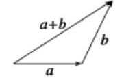   三角形法则    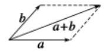   平行四边形法则</td><td>(1)交换律: $\overrightarrow{a} + \overrightarrow{b} = \overrightarrow{b} + \overrightarrow{a}$ (2)结合律: $\;\begin{array}{l} \left( {\overrightarrow{a} + \overrightarrow{b}}\right)  + \overrightarrow{c} \\   = \overrightarrow{a} + \left( {\overrightarrow{b} + \overrightarrow{c}}\right)  \end{array}$</td></tr><tr><td>减法</td><td>求 $\overrightarrow{a}$ 与 $\overrightarrow{b}$ 的相反向量 $- \overrightarrow{b}$ 的和的运算叫做 $\overrightarrow{a}$ 与 $\overrightarrow{b}$ 的差</td><td>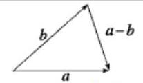   三角形法则</td><td>$\bar{a} - \bar{b} = \bar{a} + \left( {-\bar{b}}\right)$</td></tr><tr><td>数乘</td><td>求实数 $\lambda$ 与向量 $\overrightarrow{a}$ 的积的运算</td><td>(1) $\left| {\lambda \overrightarrow{a}}\right|  = \left| \lambda \right| \left| \overrightarrow{a}\right|$ ；   (2)当 $\lambda  > 0$ 时， $\lambda \overrightarrow{a}$ 的方向与 $\overrightarrow{a}$ 的方向相同; 当 $\lambda  < 0$ 时, $\lambda \overrightarrow{a}$ 的方向与 $\overrightarrow{a}$ 的方向相反; 当 $\lambda  = 0$ 时, $\lambda \overrightarrow{a} =$ 0</td><td>$\lambda \left( {\mu \overrightarrow{a}}\right)  = {\lambda \mu }\overrightarrow{a}; \; \left( {\lambda  + \mu }\right) \overrightarrow{a} = \lambda \overrightarrow{a} + \mu \overrightarrow{a}; \; \lambda \left( {\overrightarrow{a} + \overrightarrow{b}}\right)  = \lambda \overrightarrow{a} + \lambda \overrightarrow{b}$</td></tr></table>

## 例题精讲

【例 1】记 $\min \{ x, y\}  = \left\{  \begin{array}{l} y, x \geq  y \\  x, x < y \end{array}\right.$ ,设 $\bar{a},\bar{b}$ 为平面内的非零向量,则 ( )

A. $\min \{ \left| {\overrightarrow{a} + \overrightarrow{b}}\right| ,\left| {\overrightarrow{a} - \overrightarrow{b}}\right| \}  \leq  \min \{ \left| \overrightarrow{a}\right| ,\left| \overrightarrow{b}\right| \}$ B. $\min \left\{  {{\left| \overrightarrow{a} + \overrightarrow{b}\right| }^{2},{\left| \overrightarrow{a} - \overrightarrow{b}\right| }^{2}}\right\}   \geq  {\overrightarrow{a}}^{2} + {\overrightarrow{b}}^{2}$

C. $\min \{ \left| {\bar{a} + \bar{b}}\right| ,\left| {\bar{a} - \bar{b}}\right| \}  \geq  \min \{ \left| \bar{a}\right| ,\left| \bar{b}\right| \}$ D. $\min \left\{  {{\left| \overrightarrow{a} + \overrightarrow{b}\right| }^{2},{\left| \overrightarrow{a} - \overrightarrow{b}\right| }^{2}}\right\}   \leq  {\overrightarrow{a}}^{2} + {\overrightarrow{b}}^{2}$

【难度】 $\star   \star   \star$

【答案】D

【解析】对于 $\mathbf{A}$ 选项:考虑 $\overrightarrow{a} \bot  \overrightarrow{b}$ ，根据向量加法减法法则几何意义知: $\left| {\overrightarrow{a} + \overrightarrow{b}}\right|  = \left| {\overrightarrow{a} - \overrightarrow{b}}\right|  > \min \{ \left| \overrightarrow{a}\right| ,\left| \overrightarrow{b}\right| \}$ ， 所以 $\mathbf{A}$ 错误; $\mathbf{B}$ 选项: 根据平面向量数量积可知: 不能保证 $\pm  \overrightarrow{a} \cdot  \overrightarrow{b} \geq  0$ 恒成立, ${\left| \overrightarrow{a} + \overrightarrow{b}\right| }^{2} = {\overrightarrow{a}}^{2} + {\overrightarrow{b}}^{2} + 2\overrightarrow{a} \cdot  \overrightarrow{b},{\left| \overrightarrow{a} - \overrightarrow{b}\right| }^{2} = {\overrightarrow{a}}^{2} + {\overrightarrow{b}}^{2} - 2\overrightarrow{a} \cdot  \overrightarrow{b},$

所以它们的较小者一定小于等于 ${\overrightarrow{a}}^{2} + {\overrightarrow{b}}^{2}$ ,所以 $\mathbf{B}$ 错误 $\mathbf{D}$ 正确;

C 选项: 考虑 $\overrightarrow{a}//\overrightarrow{b},\left| \overrightarrow{a}\right|  = 5,\left| \overrightarrow{b}\right|  = 4\min \{ \left| {\overrightarrow{a} + \overrightarrow{b}}\right| ,\left| {\overrightarrow{a} - \overrightarrow{b}}\right| \}  = 1,\min \{ \left| \overrightarrow{a}\right| ,\left| \overrightarrow{b}\right| \}  = 4$ ,所以 $\mathrm{C}$ 错误. 故选: $\mathrm{D}$

【例 2】若平面向量 $\overline{{a}_{i}}$ 满足 $\left| \overline{{a}_{i}}\right|  = 1\left( {i = 1,2,3,4}\right)$ ,且 $\overline{{a}_{i}} \cdot  \overline{{a}_{i + 1}} = 0\left( {i = 1,2,3}\right)$ ,则 $\left| {\overline{{a}_{1}} + \overline{{a}_{2}} + \overline{{a}_{3}} + \overline{{a}_{4}}}\right|$ 可能的值有___个.

【难度】 $\star   \star   \star$

【答案】 3

【解析】由 $\overrightarrow{{a}_{i}} \cdot  \overrightarrow{{a}_{i + 1}} = 0$ 可得出 $\overrightarrow{{a}_{i}} \bot  \overrightarrow{{a}_{i + 1}}$ . 若四向量首尾相连构成正方形(图1)，则 $\left| {\overrightarrow{{a}_{1}} + \overrightarrow{{a}_{2}} + \overrightarrow{{a}_{3}} + \overrightarrow{{a}_{4}}}\right|  = 0$ ； 当四向量如图 2 所示时,则 $\left| {\overrightarrow{{a}_{1}} + \overrightarrow{{a}_{2}} + \overrightarrow{{a}_{3}} + \overrightarrow{{a}_{4}}}\right|  = 2$ ; 当四向量如图 3 所示时,则 $\left| {\overrightarrow{{a}_{1}} + \overrightarrow{{a}_{2}} + \overrightarrow{{a}_{3}} + \overrightarrow{{a}_{4}}}\right|  = 2\sqrt{2}$ . 故答案为: 3 .

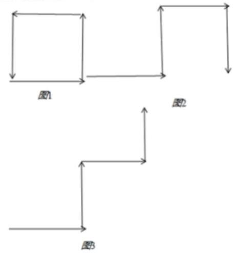

【例 3】已知点 $A, B, C$ 在圆 ${x}^{2} + {y}^{2} = 4$ 上运动,且 ${AB} \bot  {BC}$ . 若点 $P$ 的坐标为 $\left( {3,4}\right)$ ,则 $\left| {\overrightarrow{PA} + \overrightarrow{PB} + \overrightarrow{PC}}\right|$ 的取值范围为( )

A. $\left\lbrack  {{10},{15}}\right\rbrack$ B. $\left\lbrack  {{12},{17}}\right\rbrack$ C. $\left\lbrack  {{13},{17}}\right\rbrack$ D. $\left\lbrack  {{15},{17}}\right\rbrack$

【难度】★★★

【答案】C

【解析】由题意知 $\mathrm{{AC}}$ 是圆的直径,所以 $\mathrm{O}$ 是 $\mathrm{{AC}}$ 中点,故 $\overrightarrow{PA} + \overrightarrow{PC} = 2\overrightarrow{PO},\mathrm{{PO}}$ 的长为 5,所以 $\left| {\overrightarrow{PA} + \overrightarrow{PB} + \overrightarrow{PC}}\right|  = \left| {2\overrightarrow{PO} + \overrightarrow{PB}}\right|$ ,显然当 $\mathrm{B}$ 在 $\mathrm{{PO}}$ 上时, $\left| {\overrightarrow{PA} + \overrightarrow{PB} + \overrightarrow{PC}}\right|$ 有最小值 ${10} + 5 - 2 = {13}$ ,当 $\mathrm{B}$ 在 $\mathrm{{PO}}$ 的延长线上时, $\left| {\overrightarrow{PA} + \overrightarrow{PB} + \overrightarrow{PC}}\right|$ 有最大值 ${10} + 5 + 2 = {17}$ ,故选 C.

【例 4】已知非零向量 $\overrightarrow{a},\overrightarrow{b},\overrightarrow{c}$ 满足: $\left( {\overrightarrow{a} - 2\overrightarrow{c}}\right) \left( {\overrightarrow{b} - 2\overrightarrow{c}}\right)  = 0$ 且不等式 $\left| {\overrightarrow{a} + \overrightarrow{b}}\right|  + \left| {\overrightarrow{a} - \overrightarrow{b}}\right|  \geq  \lambda \left| \overrightarrow{c}\right|$ 恒立，则实数 $\lambda$ 的最大值为( )

A. 2 B. 3 C. 4 D. 5

【难度】★★★

【答案】C

【解析】解: $\because \left( {\overrightarrow{a} - 2\overrightarrow{c}}\right) \left( {\overrightarrow{b} - 2\overrightarrow{c}}\right)  = 0\;\therefore \left( {\overrightarrow{a} - 2\overrightarrow{c}}\right)  \bot  \left( {\overrightarrow{b} - 2\overrightarrow{c}}\right)$

$\therefore \left| {\left( {\overrightarrow{a} - 2\overrightarrow{c}}\right)  + \left( {\overrightarrow{b} - 2\overrightarrow{c}}\right) }\right|  = \left| {\left( {\overrightarrow{a} - 2\overrightarrow{c}}\right)  - \left( {\overrightarrow{b} - 2\overrightarrow{c}}\right) }\right|$ ,整理得 $\left| {\overrightarrow{a} + \overrightarrow{b} - 4\overrightarrow{c}}\right|  = \left| {\overrightarrow{a} - \overrightarrow{b}}\right|$

$\therefore \left| {\overrightarrow{a} + \overrightarrow{b}}\right|  + \left| {\overrightarrow{a} - \overrightarrow{b}}\right|  = \left| {-\overrightarrow{a} - \overrightarrow{b}}\right|  + \left| {\overrightarrow{a} + \overrightarrow{b} - 4\overrightarrow{c}}\right|  \geq  \left| {-\overrightarrow{a} - \overrightarrow{b} + \overrightarrow{a} + \overrightarrow{b} - 4\overrightarrow{c}}\right|  = 4\left| \overrightarrow{c}\right|$ 即 ${\lambda }_{\max } = 4$ ,故选:C.

【例 5】已知 ${l}_{1} : {mx} - y - {3m} + 1 = 0$ 与 ${l}_{2} : x + {my} - {3m} - 1 = 0$ 相交于点 $P$ ，线段 ${AB}$ 是圆 $C : {\left( x + 1\right) }^{2} + {\left( y + 1\right) }^{2} = 4$ 的一条动弦，且 $\left| {AB}\right|  = 2\sqrt{3}$ ，则 $\left| {\overrightarrow{PA} + \overrightarrow{PB}}\right|$ 的最小值是___.

【难度】

【答案】 $4\sqrt{2} - 2$

【解析】 $\because {l}_{1} : {mx} - y - {3m} + 1 = 0$ 与 ${l}_{2} : x + {my} - {3m} - 1 = 0,\therefore {l}_{1} \bot  {l}_{2},{l}_{1}$ 过定点 $\left( {3,1}\right) ,{l}_{2}$ 过定点 $\left( {1,3}\right) , \; \therefore$ 点 $P$ 的轨迹方程为圆 ${\left( x - 2\right) }^{2} + {\left( y - 2\right) }^{2} = 2$ ,

作垂直线段 ${CD} \bot  {AB},{CD} = \sqrt{{2}^{2} - {\left( \sqrt{3}\right) }^{2}} = 1$ ,所以点 $D$ 的轨迹为 ${\left( x + 1\right) }^{2} + {\left( y + 1\right) }^{2} = 1$ ,

则 $\left| {\overline{PA} + \overline{PB}}\right|  = \left| {\overline{PC} + \overline{CA} + \overline{PC} + \overline{CB}}\right|  = 2\left| {\overline{PC} + \overline{CD}}\right|  = 2\left| \overline{PD}\right|$ ,

因为圆 $P$ 和圆 $D$ 的圆心距为 $\sqrt{{\left( 2 + 1\right) }^{2} + {\left( 2 + 1\right) }^{2}} = 3\sqrt{2} > 1 + \sqrt{2}$ ,所以两圆外离,

所以 $\left| {PD}\right|$ 最小值为 $3\sqrt{2} - 1 - \sqrt{2} = 2\sqrt{2} - 1$ ,所以 $\left| {\overline{PA} + \overline{PB}}\right|$ 的最小值为 $4\sqrt{2} - 2$ . 故答案为: $4\sqrt{2} - 2$ .

## 巩固训练

1、设 ${F}_{1},{F}_{2}$ 分别是双曲线 $\frac{{x}^{2}}{{a}^{2}} - \frac{{y}^{2}}{{b}^{2}} = 1\left( {a > 0, b > 0}\right)$ 的左、右焦点, $O$ 为坐标原点,过左焦点 ${F}_{1}$ 作直线 ${F}_{1}$ 作直线 ${F}_{1}P$ 与圆 ${x}^{2} + {y}^{2} = {a}^{2}$ 切于点 $E$ ,与双曲线右支交于点 $P$ ,且满足 $\overline{OE} = \frac{1}{2}\left( {\overline{OP} + \overline{O{F}_{1}}}\right) ,\left| \overline{OE}\right|  = \sqrt{3}$ ,则双曲线的方程为( )

A. $\frac{{x}^{2}}{6} - \frac{{y}^{2}}{12} = 1$ B. $\frac{{x}^{2}}{6} - \frac{{y}^{2}}{9} = 1$ C. $\frac{{x}^{2}}{3} - \frac{{y}^{2}}{6} = 1$ D. $\frac{{x}^{2}}{3} - \frac{{y}^{2}}{12} = 1$

【答案】D

【解析】解:

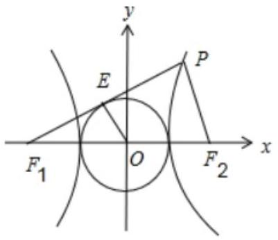

$\because E$ 为圆 ${x}^{2} + {y}^{2} = {a}^{2}$ 上的点, $\therefore {OE} = a = \sqrt{3},\because \overrightarrow{OE} = \frac{1}{2}\left( {\overrightarrow{OP} + \overrightarrow{O{F}_{1}}}\right)$ ,

$\therefore E$ 是 $P{F}_{1}$ 的中点,又 $O$ 是 ${F}_{1}{F}_{2}$ 的中点, $\therefore P{F}_{2} = {2OE} = {2a} = 2\sqrt{3}$ ,且 $P{F}_{2}\parallel {OE}$ ,

又 $P{F}_{1} - P{F}_{2} = {2a} = 2\sqrt{3},\therefore P{F}_{1} = {4a} = 4\sqrt{3}$ ,

$\because P{F}_{1}$ 是圆的切线, $\therefore {OE} \bot  P{F}_{1},\therefore P{F}_{2} \bot  P{F}_{1}$ ,又

${F}_{1}{F}_{2} = {2c},\therefore 4{c}^{2} = P{F}_{1}^{2} + P{F}_{2}^{2} = {60},\therefore {c}^{2} = {15},\therefore {b}^{2} = {c}^{2} - {a}^{2} = {12}.\therefore$ 双曲线方程为 $\frac{{x}^{2}}{3} - \frac{{y}^{2}}{12} = 1$ . 故选 D.

2、圆 ${x}^{2} + {y}^{2} + {6x} - {4y} = 0$ 与曲线 $y = \frac{{2x} + 4}{x + 3}$ 相交于 $A, B, C, D$ 点四点， $O$ 为坐标原点，则 $\left| {\overrightarrow{OA} + \overrightarrow{OB} + \overrightarrow{OC} + \overrightarrow{OD}}\right|  =$ ___.

【答案】 $4\sqrt{13}$

【解析】由圆方程,可得圆心坐标为 $\left( {-3,2}\right)$ ,又 $y = \frac{{2x} + 4}{x + 3} = 2 - \frac{2}{x + 3}$ ,其图象关于 $\left( {-3,2}\right)$ 对称在同一直角坐标系中, 画出圆和函数图像如下所示:

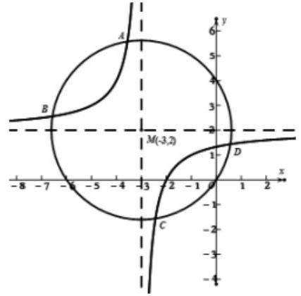

数形结合可知,圆和函数 $y = \frac{{2x} + 4}{x + 3}$ 都关于点 $M\left( {-3,2}\right)$ 对称,

故可得其交点 $A$ 和 $C, B$ 和 $D$ 都关于点 $M\left( {-3,2}\right)$ 对称. 故 $\overrightarrow{MA} + \overrightarrow{MC} = \overrightarrow{0},\overrightarrow{MB} + \overrightarrow{MD} = \overrightarrow{0}$ ,

则 $\overrightarrow{OA} + \overrightarrow{OB} + \overrightarrow{OC} + \overrightarrow{OD} = \overrightarrow{OM} + \overrightarrow{MA} + \overrightarrow{OM} + \overrightarrow{MB} + \overrightarrow{OM} + \overrightarrow{MC} + \overrightarrow{OM} + \overrightarrow{MD} = 4\overrightarrow{OM}$ .

故 $\left| {\overrightarrow{OA} + \overrightarrow{OB} + \overrightarrow{OC} + \overrightarrow{OD}}\right|  = 4\sqrt{{\left( -3\right) }^{2} + {2}^{2}} = 4\sqrt{13}$ . 故答案为: $4\sqrt{13}$ .

3、 $O$ 为 $\bigtriangleup {ABC}$ 所在平面上动点，点 $P$ 满足 $\overline{OP} = \overline{OA} + \lambda \left( {\frac{\overline{AB}}{\left| \overline{AB}\right| } + \frac{\overline{AC}}{\left| \overline{AC}\right| }}\right)$ ， $\lambda  \in  \lbrack 0, + \infty )$ ，则射线 ${AP}$ 过 ${\Delta ABC}$ 的( )

A. 外心 B. 内心 C. 重心 D. 垂心

【答案】B

【解析】: $\overrightarrow{OP} = \overrightarrow{OA} + \lambda \left( {\frac{\overrightarrow{AB}}{\left| \overrightarrow{AB}\right| } + \frac{\overrightarrow{AC}}{\left| \overrightarrow{AC}\right| }}\right) ;\therefore \overrightarrow{OP} - \overrightarrow{OA} = \overrightarrow{AP} = \lambda \left( {\frac{\overrightarrow{AB}}{\left| \overrightarrow{AB}\right| } + \frac{\overrightarrow{AC}}{\left| \overrightarrow{AC}\right| }}\right)$

因为 $\frac{\overrightarrow{AB}}{\left| \overrightarrow{AB}\right| }$ 和 $\frac{\overrightarrow{AC}}{\left| \overrightarrow{AC}\right| }$ 分别是 $\frac{}{AB}$ 和 $\overrightarrow{AC}$ 的单位向量,所以 $\frac{\overrightarrow{AB}}{\left| \overrightarrow{AB}\right| } + \frac{\overrightarrow{AC}}{\left| \overrightarrow{AC}\right| }$ 是以 $\frac{\overrightarrow{AB}}{\left| \overrightarrow{AB}\right| }$ 和 $\frac{\overrightarrow{AC}}{\left| \overrightarrow{AC}\right| }$ 为邻边的平行四边形的角平分线对应的向量; 所以 $\overrightarrow{AP}$ 的方向与 $\angle {BAC}$ 的角平分线重合; 即射线 ${AP}$ 过 $\bigtriangleup  {ABC}$ 的内心; 故选 B

4、若圆 ${x}^{2} + {y}^{2} = 5$ 上的两个动点 $A, B$ 满足 $\left| \overrightarrow{AB}\right|  = \sqrt{15}$ ，点 $M$ 在直线 ${2x} + y = {10}$ 上运动，则 $\left| {\overrightarrow{MA} + \overrightarrow{MB}}\right|$ 的最小值是( )

A. $2\sqrt{5}$ B. $3\sqrt{5}$ C. $\sqrt{10}$ D. $2\sqrt{10}$

【答案】B

【解析】由 ${x}^{2} + {y}^{2} = 5$ 可知圆心为坐标原点 $O\left( {0,0}\right)$ ,半径为 $r = \sqrt{5}$ ,因为 $\left| \overrightarrow{AB}\right|  = \sqrt{15}$ ,所以圆心到直线 ${AB}$ 的距离 $d = \sqrt{{r}^{2} - {\left( \frac{\sqrt{15}}{2}\right) }^{2}} = \frac{\sqrt{5}}{2}$ ,设 ${AB}$ 的中点为 $N$ ,则 $\left| {ON}\right|  = d = \frac{\sqrt{5}}{2}$ ,所以 $N$ 点在以原点为圆心,以 ${r}_{1} = \frac{\sqrt{5}}{2}$ 为半径的圆上,所以 $N$ 点的轨迹方程为 ${x}^{2} + {y}^{2} = \frac{5}{4}$ , $\overrightarrow{MA} + \overrightarrow{MB} = \overrightarrow{MN} + \overrightarrow{NA} + \overrightarrow{MN} + \overrightarrow{NB}$ ,又 $N$ 为 ${AB}$ 的中点,所以 $\overrightarrow{NA} =  - \overrightarrow{NB}$ ,

所以 $\overrightarrow{MA} + \overrightarrow{MB} = 2\overrightarrow{MN}$ ,圆心 $\left( {0,0}\right)$ 到 ${2x} + y = {10}$ 的距离为 ${d}_{1} = \frac{\left| -{10}\right| }{\sqrt{4 + 1}} = 2\sqrt{5}$ ，所以

${\left| \overrightarrow{MN}\right| }_{\min } = {d}_{1} - {r}_{1} = 2\sqrt{5} - \frac{\sqrt{5}}{2} = \frac{3\sqrt{5}}{2}$ ,所以 ${\left| \overrightarrow{MA} + \overrightarrow{MB}\right| }_{\min } = 2{\left| \overrightarrow{MN}\right| }_{\min } = 3\sqrt{5}$ . 故选: $\mathrm{B}$

5、已知平面向量 $\overrightarrow{PA}$ 、 $\overrightarrow{PB}$ 满足 ${\left| \overrightarrow{PA}\right| }^{2} + {\left| \overrightarrow{PB}\right| }^{2} = 4$ ， ${\left| \overrightarrow{AB}\right| }^{2} = 2$ ，设 $\overrightarrow{PC} = 2\overrightarrow{PA} + \overrightarrow{PB}$ ，则 $\left| \overrightarrow{PC}\right|  \in$ ___.

【答案】 $\left\lbrack  {\frac{3\sqrt{6} - \sqrt{2}}{2},\frac{3\sqrt{6} + \sqrt{2}}{2}}\right\rbrack$

【解析】因为 ${\left| \overrightarrow{AB}\right| }^{2} = {\left| \overrightarrow{AP} + \overrightarrow{PB}\right| }^{2} = {\left| \overrightarrow{PA}\right| }^{2} + {\left| \overrightarrow{PB}\right| }^{2} - 2\overrightarrow{PA} \cdot  \overrightarrow{PB} = 2$ 且 ${\left| \overrightarrow{PA}\right| }^{2} + {\left| \overrightarrow{PB}\right| }^{2} = 4$ ,所以 $\overrightarrow{PA} \cdot  \overrightarrow{PB} = 1$ ;

又因为 ${\left| \overrightarrow{PA} + \overrightarrow{PB}\right| }^{2} = {\left| \overrightarrow{PA}\right| }^{2} + {\left| \overrightarrow{PB}\right| }^{2} + 2\overrightarrow{PA} \cdot  \overrightarrow{PB} = 6$ ,所以 $\left| {\overrightarrow{PA} + \overrightarrow{PB}}\right|  = \sqrt{6}$ ;

由 ${\left| \overrightarrow{AB}\right| }^{2} = {\left| \overrightarrow{PB} - \overrightarrow{PA}\right| }^{2} = {\left| \overrightarrow{PA} - \overrightarrow{PB}\right| }^{2} = 2$ ,所以 $\left| {\overrightarrow{PA} - \overrightarrow{PB}}\right|  = \sqrt{2}$ ;

根据 $\overrightarrow{PC} = 2\overrightarrow{PA} + \overrightarrow{PB} = \frac{3}{2}\left( {\overrightarrow{PA} + \overrightarrow{PB}}\right)  + \frac{1}{2}\left( {\overrightarrow{PA} - \overrightarrow{PB}}\right)$ ,可知:

$\left| {\frac{3}{2}\left| {\overrightarrow{PA} + \overrightarrow{PB}}\right|  - \frac{1}{2}\left| {\overrightarrow{PA} - \overrightarrow{PB}}\right| }\right|  \leq  \left| \overrightarrow{PC}\right|  \leq  \frac{3}{2}\left| {\overrightarrow{PA} + \overrightarrow{PB}}\right|  + \frac{1}{2}\left| {\overrightarrow{PA} - \overrightarrow{PB}}\right| ,$

左端取等号时: $P, A, B$ 三点共线且 $P$ 在线段 ${AB}$ 外且 $P$ 靠近 $B$ 点; 右端取等号时, $P, A, B$ 三点共线且 $P$ 在线段 ${AB}$ 外且 $P$ 靠近 $A$ 点,

所以 $\frac{3\sqrt{6} - \sqrt{2}}{2} \leq  \left| \overline{PC}\right|  \leq  \frac{3\sqrt{6} + \sqrt{2}}{2}$ ,所以 $\left| \overline{PC}\right|  \in  \left\lbrack  {\frac{3\sqrt{6} - \sqrt{2}}{2},\frac{3\sqrt{6} + \sqrt{2}}{2}}\right\rbrack$ . 故答案为:

$\left\lbrack  {\frac{3\sqrt{6} - \sqrt{2}}{2},\frac{3\sqrt{6} + \sqrt{2}}{2}}\right\rbrack$

## (二)平面向量共线定理与分解定理

## 知识梳理

一、平面向量共线定量理:

① 向量 $\overrightarrow{b}$ 与非零向量 $\overrightarrow{a}$ 共线 $\Leftrightarrow$ 有且只有一个实数 $\lambda$ ，使得 $\overrightarrow{b} = \lambda \overrightarrow{a}$ ；

② 若 $\overrightarrow{a} = \left( {{x}_{1},{y}_{1}}\right) ,\overrightarrow{b} = \left( {{x}_{2},{y}_{2}}\right)$ ，则 $\overrightarrow{a}//\overrightarrow{b} \Leftrightarrow  {x}_{1}{y}_{2} - {x}_{2}{y}_{1} = 0$ .

③三点共线定理:对 ${AB}$ 直线外任一点 $O$ ，点 $P$ 在直线 ${AB}$ 上 $\Leftrightarrow$ 存在实数 $\lambda$ ，使 $\overrightarrow{OP} = \lambda \overrightarrow{OA} + \left( {1 - \lambda }\right) \overrightarrow{OB}$ . 二、平面向量的分解定理:

如果 $\overrightarrow{{e}_{1}},\overrightarrow{{e}_{2}}$ 是同一平面内的两个不平行向量,那么对于这一平面内的任意向量 $\overrightarrow{a}$ ,有且只有一对实数 ${\lambda }_{1},{\lambda }_{2}$ ,使 $\overrightarrow{a} = {\lambda }_{1}\overrightarrow{{e}_{1}} + {\lambda }_{2}\overrightarrow{{e}_{2}}$ . 我们把不平行的向量 $\overrightarrow{{e}_{1}},\overrightarrow{{e}_{2}}$ 叫做这一平面内所有向量的一组基.

注意:(1)基底不共线；

(2)将任一向量 $\overrightarrow{a}$ 在给出基底 $\overrightarrow{{e}_{1}},\overrightarrow{{e}_{2}}$ 的条件下进行分解;

(3)基底给定时,分解形式唯一, ${\lambda }_{1},{\lambda }_{2}$ 是被 $\overrightarrow{a},\overrightarrow{{e}_{1}},\overrightarrow{{e}_{2}}$ 唯一确定的数量

## 例题精讲

【例 6】已知点 $P$ 为 ${ABC}$ 内一点， $\overrightarrow{PA} + 2\overrightarrow{PB} + 4\overrightarrow{PC} = \overrightarrow{0}$ ，则 $\bigtriangleup  {APB}$ ， $\bigtriangleup  {APC}$ ， $\bigtriangleup  {BPC}$ 的面积之比为()

A. $9 : 4 : 1$ B. 1:4:9 C. $3 : 2 : 1$ D. $4 : 2 : 1$

【难度】 $\star   \star   \star$

【答案】D

【解析】如图所示,延长 ${PC}$ 至点 $E$ 使得 ${PE} = {2PC}$ ,连接 ${BE}$ ,取 ${BE}$ 的中点为 $F$ ,连接 ${PF}$ 交 ${BC}$ 于点 $G$ , 延长 ${PB}$ 至点 $H$ 使得 ${PH} = {2PB}$ ,连接 ${AH}$ ,取 ${AH}$ 的中点为 $I$ ,连接 ${PI}$ 交 ${AB}$ 于点 $J$ ,

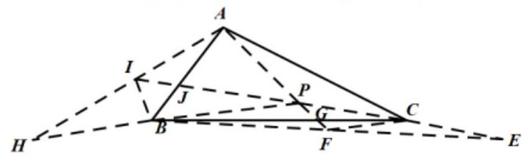

因为 $\overrightarrow{PA} + 2\overrightarrow{PB} + 4\overrightarrow{PC} = \overrightarrow{0}$ ,所以 $\overrightarrow{PA} =  - 2\left( {\overrightarrow{PB} + 2\overrightarrow{PC}}\right)  =  - 4\overrightarrow{PF}$ ,

则 $A\text{ 、 }P\text{ 、 }F$ 三点共线,且 ${PA} = {4PF}$ ,

因为 ${FC}$ 为 $\bigtriangleup {EPB}$ 的中位线,所以 ${PB} = {2CF}$ ， ${PB}//{CF}$ ，

则 $\bigtriangleup  {CFG} \sim   \bigtriangleup  {BPG}$ ，所以 $\frac{PG}{GF} = \frac{PB}{FC} = 2$ ，即 ${PG} = {2GF}$ ， ${PG} = \frac{2}{3}{PF}$ ，

所以 $\frac{PA}{PG} = 6,\frac{AG}{PG} = 7$ ,设 $\bigtriangleup  {PBC}\text{ 、 } \bigtriangleup  {ABC}$ 的高分别为 ${h}_{1}\text{ 、 }{h}_{2}$ ,

$\frac{{S}_{\bigtriangleup {PBC}}}{{S}_{\bigtriangleup {ABC}}} = \frac{\frac{1}{2}{BC} \cdot  {h}_{1}}{\frac{1}{2}{BC} \cdot  {h}_{2}} = \frac{{h}_{1}}{{h}_{2}} = \frac{PG}{AG} = \frac{1}{7}$ ，即 ${S}_{\bigtriangleup {PBC}} = \frac{1}{7}{S}_{\bigtriangleup {ABC}}.$ 同理由 $\overrightarrow{PA} + 2\overrightarrow{PB} =  - 4\overrightarrow{PC}$ 可推出

${S}_{\bigtriangleup {PAB}} = \frac{4}{7}{S}_{\bigtriangleup {ABC}}$ ,则 ${S}_{\bigtriangleup {PAC}} = {S}_{\bigtriangleup {ABC}} - {S}_{\bigtriangleup {PBC}} - {S}_{\bigtriangleup {PAB}} = \frac{2}{7}{S}_{\bigtriangleup {ABC}}$ ,所以 ${S}_{\bigtriangleup {PAB}} : {S}_{\bigtriangleup {PAC}} : {S}_{\bigtriangleup {PBC}} = 4 : 2 : 1$ . 故选:D

【例 7】如图,等腰三角形 ${ABC},{AB} = {AC} = 2,\angle {BAC} = {120}^{ \circ  }.E, F$ 分别为边 ${AB}$ , ${AC}$ 上的动点, 且满足 $\overrightarrow{AE} = m\overrightarrow{AB},\overrightarrow{AF} = n\overrightarrow{AC}$ ,其中 $m, n \in  \left( {0,1}\right) , m + n = 1, M, N$ 分别是 ${EF},{BC}$ 的中点,则 $\left| {MN}\right|$ 的最小值为___.

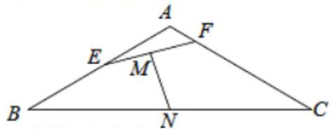

【难度】 $\star   \star   \star$

【答案】 $\frac{1}{2}$

【解析】解: $\overrightarrow{MN} = \overrightarrow{AN} - \overrightarrow{AM} = \frac{1}{2}\left( {\overrightarrow{AB} + \overrightarrow{AC}}\right)  - \frac{1}{2}\left( {m\overrightarrow{AB} + n\overrightarrow{AC}}\right)  = \frac{1}{2}\left( {1 - m}\right) \overrightarrow{AB} + \frac{1}{2}\left( {1 - n}\right) \overrightarrow{AC}$

$\therefore {\overrightarrow{MN}}^{2} = \frac{1}{4}{\left( 1 - m\right) }^{2}{\overrightarrow{AB}}^{2} + \frac{1}{4}{\left( 1 - n\right) }^{2}{\overrightarrow{AC}}^{2} + \frac{1}{2}\left( {1 - m}\right) \left( {1 - n}\right) \overrightarrow{AB} \cdot  \overrightarrow{AC} = {\left( 1 - m\right) }^{2} + {\left( 1 - n\right) }^{2} - \left( {1 - m}\right) \left( {1 - n}\right)$ ;

$\because m + n = 1,\therefore n = 1 - m$ ,代入上式得: ${\overrightarrow{MN}}^{2} = {\left( 1 - m\right) }^{2} + {m}^{2} + \left( {1 - m}\right) m = 3{m}^{2} - {3m} + 1 = 3{\left( m - \frac{1}{2}\right) }^{2} + \frac{1}{4}$ ; $\because m \in  \left( {0,1}\right) ;\therefore m = \frac{1}{2}$ 时, ${\overrightarrow{MN}}^{2}$ 取最小值 $\frac{1}{4} : \therefore \left| {MN}\right|$ 的最小值为 $\frac{1}{2}$ . 故答案为: $\frac{1}{2}$ .

【例 8】在直角梯形 ${ABCD}$ 中, $\overrightarrow{AB} \cdot  \overrightarrow{AD} = 0,\angle B = {30}^{ \circ  },{AB} = 2\sqrt{3},{BC} = 2$ ,点 $E$ 为 ${BC}$ 上一点,且 $\overrightarrow{AE} = x\overrightarrow{AB} + y\overrightarrow{AD}$ ,当 ${xy}$ 的值最大时, $\left| \overrightarrow{AE}\right|  =$ (   )

A. $\sqrt{5}$ B. 2

C. $\frac{\sqrt{30}}{2}$ D. $2\sqrt{3}$

【难度】 $\star   \star   \star$

【答案】B

【解析】由题意,直角梯形 ${ABCD}$ 中, $\overrightarrow{AB} \cdot  \overrightarrow{AD} = 0,\angle B = {30}^{ \circ  },{AB} = 2\sqrt{3},{BC} = 2$ ,

可求得 ${AD} = 1,{CD} = \sqrt{3}$ ，所以 $\overrightarrow{AB} = 2\overrightarrow{DC}$ .

$\because$ 点 $E$ 在线段 ${BC}$ 上,设 $\overrightarrow{BE} = \lambda \overrightarrow{BC}\left( {0 \leq  \lambda  \leq  1}\right)$ ,则

$\overrightarrow{AE} = \overrightarrow{AB} + \overrightarrow{BE} = \overrightarrow{AB} + \lambda \overrightarrow{BC} = \overrightarrow{AB} + \lambda \left( {\overrightarrow{BA} + \overrightarrow{AD} + \overrightarrow{DC}}\right)$

$= \left( {1 - \lambda }\right) \overline{AB} + \lambda \overline{AD} + \lambda \overline{DC} = \left( {1 - \frac{\lambda }{2}}\right) \overline{AB} + \lambda \overline{AD}$ ,即 $\overline{AE} = \left( {1 - \frac{\lambda }{2}}\right) \overline{AB} + \lambda \overline{AD}$ ,

又因为 $\overrightarrow{AE} = x\overrightarrow{AB} + y\overrightarrow{AD}$ ,所以 $x = 1 - \frac{\lambda }{2}, y = \lambda$ ,

所以 ${xy} = \left( {1 - \frac{\lambda }{2}}\right) \lambda  =  - \frac{1}{2}\left\lbrack  {{\left( \lambda  - 1\right) }^{2} - 1}\right\rbrack   =  - \frac{1}{2}{\left( \lambda  - 1\right) }^{2} + \frac{1}{2} \leq  \frac{1}{2}$ ,当 $\lambda  = 1$ 时,等号成立.

所以 $\left| \overrightarrow{AE}\right|  = \frac{1}{2}\overrightarrow{AB} + \overrightarrow{AD} \mid   = 2$ . 故选: B.

【例 9】已知点 $A\left( {0, - 1}\right) , B\left( {3,0}\right) , C\left( {1,2}\right)$ ,平面区域 $P$ 是由所有满足 $\overline{AM} = \lambda \overline{AB} + \mu \overline{AC}\left( {2 < \lambda  \leq  m,2 < \mu  \leq  n}\right)$ 的点 $M$ 组成的区域,若区域 $P$ 的面积为 16,则 $m + n$ 的最小值为___.

【难度】

【答案】 $4 + 2\sqrt{2}$

【解析】设 $M\left( {x, y}\right) ,\overrightarrow{AB} = \left( {3,1}\right) ,\overrightarrow{AC} = \left( {1,3}\right) ,\left| \overrightarrow{AB}\right|  = \left| \overrightarrow{AC}\right|  = \sqrt{10}$

$\therefore \cos \angle {BAC} = \frac{\overrightarrow{AB} \cdot  \overrightarrow{AC}}{\left| \overrightarrow{AB}\right| \left| \overrightarrow{AC}\right| } = \frac{3}{5},\therefore \sin \angle {BAC} = \frac{4}{5}$ ，

令 $\overrightarrow{AE} = 2\overrightarrow{AB},\overrightarrow{AF} = 2\overrightarrow{AC}$ ,以 ${AE},{AF}$ 为邻边作平行四边形 ${AENF}$ ,

令 $\overrightarrow{AP} = m\overrightarrow{AB},\overrightarrow{AQ} = n\overrightarrow{AC}$ ,以 ${AP},{AQ}$ 为邻边作平行四边形 ${APGQ}$ ,

$\because \overrightarrow{AM} = \lambda \overrightarrow{AB} + \mu \overrightarrow{AC}\left( {2 < \lambda  \leq  m,2 < \mu  \leq  n}\right) ,\therefore$ 符合条件的 $M$ 点组成的区域是平行四边形 ${EIGH}$ 如图所示

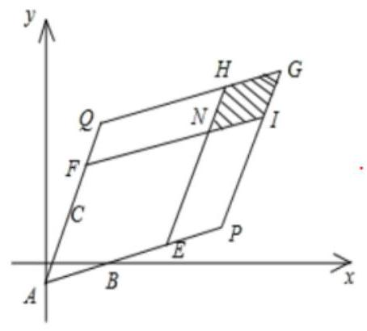

$\therefore \sqrt{10}\left( {m - 2}\right)  \cdot  \sqrt{10}\left( {n - 2}\right)  \times  \frac{4}{5} = {16}$ ,即 $\left( {m - 2}\right)  \cdot  \left( {n - 2}\right)  = 2$ ,

$\because \left( {m - 2}\right)  \cdot  \left( {n - 2}\right)  \leq  \frac{{\left( m + n - 4\right) }^{2}}{4},\therefore 2 \leq  \frac{{\left( m + n - 4\right) }^{2}}{4}$ ,解得 $m + n \geq  4 + 2\sqrt{2}$ ; 故答案为: $4 + 2\sqrt{2}$ .

【例 10】已知非零向量 $\overrightarrow{OP}\text{ 、 }\overrightarrow{OQ}$ 不共线,设 $\overrightarrow{OM} = \frac{1}{m + 1}\overrightarrow{OP} + \frac{m}{m + 1}\overrightarrow{OQ}$ ,定义点集 $A = \left\{  {F\left| {\;\frac{\overline{FP} \cdot  \overline{FM}}{\left| \overline{FP}\right| } = \frac{\overline{FQ} \cdot  \overline{FM}}{\left| \overline{FQ}\right| }}\right. }\right\}$ ,若对于任意的 $m \geq  3$ ,当 ${F}_{1}\text{ 、 }{F}_{2} \in  A$ 且不在直线 ${PQ}$ 上时,不等式 $\left| \overrightarrow{{F}_{1}{F}_{2}}\right|  \leq  k\left| \overrightarrow{PQ}\right|$ 恒成立，则实数 $k$ 的取值范围为___.

【难度】 $\star   \star   \star   \star$

【答案】 $\left\lbrack  {\frac{3}{4}, + \infty }\right)$

【解析】 $\because \overrightarrow{OM} = \frac{1}{m + 1}\overrightarrow{OP} + \frac{m}{m + 1}\overrightarrow{OQ}$ ,即 $\frac{1}{m + 1}\overrightarrow{OM} + \frac{m}{m + 1}\overrightarrow{OM} = \frac{1}{m + 1}\overrightarrow{OP} + \frac{m}{m + 1}\overrightarrow{OQ}$ ,

$\therefore \frac{1}{m + 1}\left( {\overrightarrow{OM} - \overrightarrow{OP}}\right)  = \frac{m}{m + 1}\left( {\overrightarrow{OQ} - \overrightarrow{OM}}\right) ,\therefore \overrightarrow{PM} = m\overrightarrow{MQ}$ ,

由 $A = \left\{  {F\left| {\;\frac{\overline{FP} \cdot  \overline{FM}}{\left| \overline{FP}\right| } = \frac{\overline{FQ} \cdot  \overline{FM}}{\left| \overline{FQ}\right| }}\right. }\right\}$ ,则 $\left| \overline{FM}\right| \cos \angle {PFM} = \left| \overline{FM}\right| \cos \angle {QFM}$ ,所以, ${FM}$ 为 $\angle {PFQ}$ 的角平分线,

则点 $M$ 到 ${PF}$ 和 ${PQ}$ 的距离相等,所以, $\frac{{S}_{\bigtriangleup {PFM}}}{{S}_{\bigtriangleup {QFM}}} = \frac{\left| PM\right| }{\left| QM\right| } = \frac{\left| PF\right| }{\left| QF\right| } = m$ ,

以点 $P$ 为坐标原点, ${PQ}$ 所在直线为 $x$ 轴建立如下图所示的平面直角坐标系,设 $\left| {PM}\right|  = 1$ ,

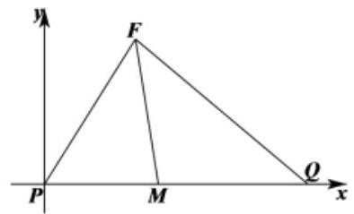

则 $P\left( {0,0}\right) , M\left( {1,0}\right) , Q\left( {1 + m,0}\right)$ ,设点 $F\left( {x, y}\right)$ ,

由 $\frac{\left| PF\right| }{\left| QF\right| } = m$ 可得 $\frac{\sqrt{{x}^{2} + {y}^{2}}}{\sqrt{{\left( x - 1 - m\right) }^{2} + {y}^{2}}} = m$ ,化简可得 ${\left( x + \frac{{m}^{2}}{1 - m}\right) }^{2} + {y}^{2} = {\left( \frac{m}{m - 1}\right) }^{2}$ ,

故点 $F$ 是以点 $\left( {\frac{{m}^{2}}{1 - m},0}\right)$ 为圆心, $\frac{m}{m - 1}$ 为半径为圆上的一点,

要使得不等式 $\left| \overrightarrow{{F}_{1}{F}_{2}}\right|  \leq  k\left| \overrightarrow{PQ}\right|$ 对圆上任意两点 ${F}_{1},{F}_{2}$ 恒成立,而 $\left| \overrightarrow{{F}_{1}{F}_{2}}\right|  \leq  {2r} = 2\left( \frac{m}{m + 1}\right)$ ,所以只需 $\frac{2m}{m - 1} \leq  k\left( {m + 1}\right)$ 对任意的 $m \geq  3$ 恒成立, $\therefore k \geq  \frac{2m}{{m}^{2} - 1} = \frac{2}{m - \frac{1}{m}}$ ,

由于函数 $y = \frac{2}{x - \frac{1}{x}}$ 在区间 $\lbrack 3, + \infty )$ 上单调递增,则 ${y}_{\max } = \frac{2}{3 - \frac{1}{3}} = \frac{3}{4},\therefore k \geq  \frac{3}{4}$ .

因此，实数 $k$ 的取值范围是 $\left\lbrack  {\frac{3}{4}, + \infty }\right)$ . 故答案为: $\left\lbrack  {\frac{3}{4}, + \infty }\right)$ .

## 巩固训练

1、已知平面四边形 ${ABCD}$ 中， ${AB} = 1,{CD} = 2,{DA} = 3,\overrightarrow{AC} \cdot  \overrightarrow{BD} = {10}$ ，则 ${BC} =$ ___.

【答案】 4

【解析】解: 平面四边形 ${ABCD}$ 中, ${AB} = 1,{CD} = 2,{DA} = 3,\overrightarrow{AC} \cdot  \overrightarrow{BD} = {10}$

则 ${\overrightarrow{AB}}^{2} = \left( {\overrightarrow{AC} + \overrightarrow{CB}}\right)  \cdot  \left( {\overrightarrow{AD} + \overrightarrow{DB}}\right)  = \overrightarrow{AC} \cdot  \overrightarrow{AD} + \overrightarrow{AC} \cdot  \overrightarrow{DB} + \overrightarrow{CB} \cdot  \overrightarrow{AD} + \overrightarrow{CB} \cdot  \overrightarrow{DB}$

$=  - \overrightarrow{AC} \cdot  \overrightarrow{BD} + \left( {\overrightarrow{AC} \cdot  \overrightarrow{AD} + \overrightarrow{CB} \cdot  \overrightarrow{AD}}\right)  + \overrightarrow{CB} \cdot  \overrightarrow{DB} =  - \overrightarrow{AC} \cdot  \overrightarrow{BD} + \overrightarrow{AB} \cdot  \overrightarrow{AD} + \overrightarrow{CB} \cdot  \overrightarrow{DB}$

$=  - \overrightarrow{AC} \cdot  \overrightarrow{BD} + \left( {\overrightarrow{AD} + \overrightarrow{DB}}\right)  \cdot  \overrightarrow{AD} + \overrightarrow{CB} \cdot  \left( {\overrightarrow{DC} + \overrightarrow{CB}}\right)  =  - \overrightarrow{AC} \cdot  \overrightarrow{BD} + {\overrightarrow{AD}}^{2} + \overrightarrow{DB} \cdot  \overrightarrow{AD} + \overrightarrow{CB} \cdot  \overrightarrow{DC} + {\overrightarrow{CB}}^{2}$

$=  - \overrightarrow{AC} \cdot  \overrightarrow{BD} + {\overrightarrow{AD}}^{2} + \overrightarrow{DB} \cdot  \left( {\overrightarrow{AC} + \overrightarrow{CD}}\right)  + \overrightarrow{CB} \cdot  \overrightarrow{DC} + {\overrightarrow{CB}}^{2}$

$=  - \overrightarrow{AC} \cdot  \overrightarrow{BD} + {\overrightarrow{AD}}^{2} + \overrightarrow{DB} \cdot  \overrightarrow{AC} + \left( {\overrightarrow{DB} \cdot  \overrightarrow{CD} + \overrightarrow{CB} \cdot  \overrightarrow{DC}}\right)  + {\overrightarrow{CB}}^{2}$

$=  - 2\overrightarrow{AC} \cdot  \overrightarrow{BD} + {\overrightarrow{AD}}^{2} + {\overrightarrow{CB}}^{2} + \left( {\overrightarrow{DB} - \overrightarrow{CB}}\right)  \cdot  \overrightarrow{CD}$

$=  - 2\overrightarrow{AC} \cdot  \overrightarrow{BD} + {\overrightarrow{AD}}^{2} + {\overrightarrow{CB}}^{2} - {\overrightarrow{CD}}^{2}$

即 ${1}^{2} =  - 2 \times  {10} + {3}^{2} + {\overline{CB}}^{2} - {2}^{2}$ ,解得 ${\overline{CB}}^{2} = {16}$ ,即 $\left| \overline{CB}\right|  = 4$ ; 所以 ${BC} = 4$ . 故答案为: 4 .

2、在平面四边形 ${ABCD}$ 中，已知 $\bigtriangleup  {ABC}$ 的面积是 $\bigtriangleup  {ACD}$ 的面积的 3 倍，若存在正实数 $x$ 、 $y$ 使得 $\overline{AC} = \left( {\frac{1}{x} - 3}\right) \overline{AB} + \left( {1 - \frac{1}{y}}\right) \overline{AD}$ 成立，则 $x + y$ 的最小值为( )

A. $\frac{3 + \sqrt{2}}{5}$ B. $\frac{3 + \sqrt{3}}{5}$ C. $\frac{2 + \sqrt{2}}{5}$ D. $\frac{2 + \sqrt{3}}{5}$

【答案】D

【解析】根据题意,如图,连接 ${AC}\text{ 、 }{BD}$ ,设 ${AC}$ 与 ${BD}$ 交于点 $O$ ,过点 $B$ 作 ${BE} \bot  {AC}$ 与点 $E$ ,过点 $D$ 作 ${DF} \bot  {AC}$ 与点 $F$ ,

若 $\bigtriangleup {ACB}$ 面积是 $\bigtriangleup {ADC}$ 面积的 3 倍,即 ${3DF} = {BE}$ ,根据相似三角形的性质可知, $3\overrightarrow{DO} = \overrightarrow{OB}$ ,

$\therefore 3\left( {\overrightarrow{DA} + \overrightarrow{AO}}\right)  = \overrightarrow{OA} + \overrightarrow{AB},\therefore \overrightarrow{AO} = \frac{1}{4}\overrightarrow{AB} + \frac{3}{4}\overrightarrow{AD}$ ,

设 $\overrightarrow{\mathrm{{AC}}} = \lambda \overrightarrow{\mathrm{{AO}}} = \frac{\lambda }{4}\overrightarrow{\mathrm{{AB}}} + \frac{3\lambda }{4}\overrightarrow{\mathrm{{AD}}},\because \overrightarrow{\mathrm{{AC}}} = \left( {\frac{1}{x} - 3}\right) \overrightarrow{AB} + \left( {1 - \frac{1}{y}}\right) \overrightarrow{AD},\therefore 1 - \frac{1}{y} = 3\left( {\frac{1}{x} - 3}\right) ,\therefore \frac{3}{x} + \frac{1}{y} =$

10,

$\therefore x + y = \frac{1}{10}\left( {x + y}\right) \left( {\frac{3}{x} + \frac{1}{y}}\right)  = \frac{1}{10}\left( {4 + \frac{3y}{x} + \frac{x}{y}}\right)  \geq  \frac{1}{10}\left( {4 + 2\sqrt{3}}\right)  = \frac{2 + \sqrt{3}}{5}$

当且仅当 $\frac{3y}{x} = \frac{x}{y}$ 且 $\frac{3}{x} + \frac{1}{y} = {10}$ ,即 $x = \frac{3 + \sqrt{3}}{10}, y = \frac{1 + \sqrt{3}}{10}$ 时取等号; 故答案为: $\frac{2 + \sqrt{3}}{5}$ .

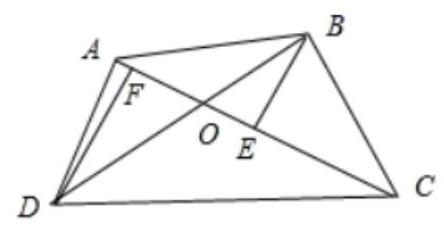

3、如图，在 ${\Delta OAB}$ 中，点 $P$ 是线段 ${OB}$ 及线段 ${AB}$ 延长线所围成的阴影区域(含边界)的任意一点，且 $\overrightarrow{OP} = x\overrightarrow{OA} + y\overrightarrow{OB}$ 则在直角坐标平面内,实数对 $\left( {x, y}\right)$ 所示的区域在直线 $y = 4$ 的下侧部分的面积是___.

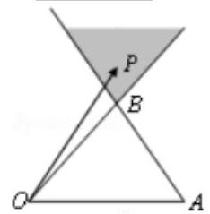

【答案】 $\frac{9}{2}$

【解析】解: 一般问题特殊化,考虑 $\bigtriangleup {OAB}$ 为特殊三角形, ${OA} = {OB} = 1,{OA} \bot  {OB}$ ,以 ${OA}$ 所在的直线为 $x$ 轴,以 ${OB}$ 所在的直线为 $y$ 轴为建立直角坐标系,则有 $\overrightarrow{OA} = \left( {1,0}\right) ,\overrightarrow{OB} = \left( {0,1}\right)$ ,直线 ${AB}$ 的方程为: $x + y = 1 \; \overrightarrow{OP} = x\overrightarrow{OA} + y\overrightarrow{OB} = \left( {x,0}\right)  + \left( {0, y}\right)  = \left( {x, y}\right)$

实数对 $\left( {x, y}\right)$ 所示的区域在直线 $y = 4$ 的下侧部分为直角边为 3 的等腰直角三角形面积 $S = \frac{1}{2} \times  3 \times  3 = \frac{9}{2}$ ,

故答案为: $\frac{9}{2}$ .

4、在平面直角坐标系: ${xOy}$ 中,设 $A\text{ 、 }B\text{ 、 }C$ 是圆 ${x}^{2} + {y}^{2} = 1$ 上相异三点,若存在正实数 $\lambda ,\mu$ ,使得 $\overrightarrow{OC} = \lambda \overrightarrow{OA} + \mu \overrightarrow{OB}$ ,则 ${\lambda }^{2} + {\left( \mu  - 3\right) }^{2}$ 的取值范围是(   )

A. $\left( {\frac{1}{2},1}\right)$ B. $\left( {\frac{2}{3},1}\right)$ C. $\left( {1,2}\right)$ D. $\left( {2, + \infty }\right)$

【答案】 $D$

【解析】解: 由已知可得, $- 1 \leq  \overrightarrow{OB} \cdot  \overrightarrow{OC} < 1$

$\because \overrightarrow{OC} = \lambda \overrightarrow{OA} + \mu \overrightarrow{OB},\therefore \overrightarrow{OC} - \mu \overrightarrow{OB} = \lambda \overrightarrow{OA}$ ,两边同时平方可得, ${\lambda }^{2} = 1 - {2\mu }\overrightarrow{OB} \cdot  \overrightarrow{OC} + {\mu }^{2}$

设 $f\left( \mu \right)  = {\lambda }^{2} + {\left( \mu  - 3\right) }^{2} = 2{\mu }^{2} - {6\mu } + {10} - {2\mu }\overrightarrow{OB} \cdot  \overrightarrow{OC} > 2{\mu }^{2} - {8\mu } + {10} = 2{\left( \mu  - 2\right) }^{2} + 2 \geq  2$

$\therefore f\left( \mu \right)  > 2$ 即 ${\lambda }^{2} + {\left( \mu  - 3\right) }^{2} > 2$ 故选: $D$ .

5、如图，在四边形 $\mathrm{{ABCD}}$ 中， $\mathrm{O}$ 为 $\mathrm{{BD}}$ 的中点，且 $\overrightarrow{AO} = 3\overrightarrow{OC}$ ，已知 $\overrightarrow{AB} \cdot  \overrightarrow{AD} = 9$ ， $\overrightarrow{CB} \cdot  \overrightarrow{CD} =  - 7$ ，则 ${BD} =$ ___. 【答案】 6

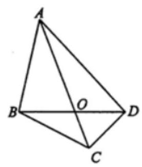

【解析】 $\because O$ 为 $\mathrm{{BD}}$ 的中点; $\therefore \overrightarrow{AO} = \frac{1}{2}\left( {\overrightarrow{AB} + \overrightarrow{AD}}\right)$ ; 又 $\overrightarrow{AO} = 3\overrightarrow{OC}$ ;

$\therefore \overrightarrow{AC} = \frac{4}{3}\overrightarrow{AO} = \frac{2}{3}\left( {\overrightarrow{AB} + \overrightarrow{AD}}\right)$ ;

$\therefore \overrightarrow{CB} = \overrightarrow{AB} - \overrightarrow{AC} = \overrightarrow{AB} - \frac{2}{3}\left( {\overrightarrow{AB} + \overrightarrow{AD}}\right)  = \frac{1}{3}\overrightarrow{AB} - \frac{2}{3}\overrightarrow{AD}$ ,

$\overrightarrow{CD} = \overrightarrow{AD} - \overrightarrow{AC} =  - \frac{2}{3}\overrightarrow{AB} + \frac{1}{3}\overrightarrow{AD};$

$\therefore \overrightarrow{CB} \cdot  \overrightarrow{CD} =  - \frac{2}{9}{\overrightarrow{AB}}^{2} - \frac{2}{9}{\overrightarrow{AD}}^{2} + \frac{5}{9}\overrightarrow{AB} \cdot  \overrightarrow{AD}$ ; 又 $\overrightarrow{AB} \cdot  \overrightarrow{AD} = 9,\overrightarrow{CB} \cdot  \overrightarrow{CD} =  - 7$ ;

$\therefore  - 7 =  - \frac{2}{9}\left( {{\overrightarrow{AB}}^{2} + {\overrightarrow{AD}}^{2}}\right)  + 5;\therefore {\overrightarrow{AB}}^{2} + {\overrightarrow{AD}}^{2} = {54}$ ;

$\therefore {\overrightarrow{BD}}^{2} = {\left( \overrightarrow{AD} - \overrightarrow{AB}\right) }^{2} = {\overrightarrow{AD}}^{2} + {\overrightarrow{AB}}^{2} - 2\overrightarrow{AB} \cdot  \overrightarrow{AD} = {54} - {18} = {36};\therefore {BD} = 6$ .

## (三) 平面向量的坐标运算及其数量积

## 知识梳理

## 1、两个非零向量夹角的概念:

已知非零向量 $\bar{a}$ 与 $\overrightarrow{b}$ ，作 ${OA} = \bar{a},\overrightarrow{OB} = \overrightarrow{b}$ ，则 $\angle {AOB} = \theta$ ((《》有 $x$ ) 和 $\overrightarrow{a}$ 与 $\overrightarrow{b}$ 的夹角.

2、平面向量数量积 (内积) 的定义: 已知两个非零向量 $\overrightarrow{a}$ 与 $\overrightarrow{b}$ ,它们的夹角是 $\theta$ ,则数量 $\left| \overrightarrow{a}\right| \left| \overrightarrow{b}\right| \cos \theta$ 叫 $\bar{a}$ 与 $\overrightarrow{b}$ 的数量积,记作 $\overrightarrow{a} \cdot  \overrightarrow{b}$ ,即有 $\bar{a} \cdot  \overrightarrow{b} = \left| \bar{a}\right| \left| \overrightarrow{b}\right| \cos \theta$ .

3、平面向量的坐标运算:

(1)若 $\overrightarrow{a} = \left( {{x}_{1},{y}_{1}}\right) ,\overrightarrow{b} = \left( {{x}_{2},{y}_{2}}\right)$ ，则 $\overrightarrow{a} + \overrightarrow{b} = \left( {{x}_{1} + {x}_{2},{y}_{1} + {y}_{2}}\right) ,\overrightarrow{a} - \overrightarrow{b} = \left( {{x}_{1} - {x}_{2},{y}_{1} - {y}_{2}}\right)$ .

两个向量和与差的坐标分别等于这两个向量相应坐标的和与差.

(2)若 $A\left( {{x}_{1},{y}_{1}}\right)$ ， $B\left( {{x}_{2},{y}_{2}}\right)$ ，则 $\overrightarrow{AB} = \left( {{x}_{2} - {x}_{1},{y}_{2} - {y}_{1}}\right)$ .

一个向量的坐标等于表示此向量的有向线段的终点坐标减去始点的坐标.

(3)若 $\overrightarrow{a} = \left( {x, y}\right)$ 和实数 $\lambda$ ，则 $\lambda \overrightarrow{a} = \left( {{\lambda x},{\lambda y}}\right)$ .

实数与向量的积的坐标等于用这个实数乘原来向量的相应坐标.

(4)向量平行的充要条件的坐标表示:设 $\overrightarrow{a} = \left( {{x}_{1},{y}_{1}}\right) ,\overrightarrow{b} = \left( {{x}_{2},{y}_{2}}\right)$ 其中 $\overrightarrow{b} \neq  \overrightarrow{a}$

$\overrightarrow{a}//\overrightarrow{b}\;\left( {\overrightarrow{b} \neq  \overrightarrow{0}}\right)$ 的充要条件是 $\underline{{x}_{1}{y}_{2} - {x}_{2}{y}_{1} = 0}$ .

(5)平面两向量数量积的坐标表示:

已知两个非零向量 $\overrightarrow{a} = \left( {{x}_{1},{y}_{1}}\right) ,\overrightarrow{b} = \left( {{x}_{2},{y}_{2}}\right)$ ,设 $\overrightarrow{i}$ 是 $x$ 轴上的单位向量, $\overrightarrow{j}$ 是 $y$ 轴上的单位向量,那么 $\overrightarrow{a} = \underline{{x}_{1}\overrightarrow{i} + {y}_{1}\overrightarrow{j}},\;\overrightarrow{b} = \underline{{x}_{2}\overrightarrow{i} + {y}_{2}\overrightarrow{j}}$ 所以 $\overrightarrow{a} \cdot  \overrightarrow{b} = \underline{{x}_{1}{x}_{2} + {y}_{1}{y}_{2}}$ .

## 例题精讲

【例 11 】已知 $\bigtriangleup  {ABC}$ 的边 ${AB} = 2, \bigtriangleup  {ABC}$ 的外接圆半径为 2，则 $\overrightarrow{AB} \cdot  \overrightarrow{AC}$ 的取值范围是( )

A. $\left\lbrack  {-2,6}\right\rbrack$ B. $\left\lbrack  {2,6}\right\rbrack$ C. $\left\lbrack  {-2,2}\right\rbrack$ D. $\left\lbrack  {2,4}\right\rbrack$

【难度】★★★

【答案】A

【解析】如图设 $\bigtriangleup  {ABC}$ 的外接圆圆心为 $O$ ，

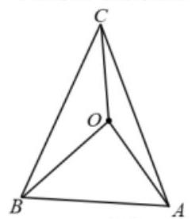

$\because  \bigtriangleup  {ABC}$ 的边 ${AB} = 2$ ， $\bigtriangleup  {ABC}$ 的外接圆半径为2， $\therefore  \bigtriangleup  {BOA}$ 是等边三角形. 则

$\overrightarrow{AB} \cdot  \overrightarrow{AC} = \overrightarrow{AB} \cdot  \left( {\overrightarrow{AB} + \overrightarrow{BO} + \overrightarrow{OC}}\right)  = \overrightarrow{AB} \cdot  \overrightarrow{AB} + \overrightarrow{AB} \cdot  \overrightarrow{BO} + \overrightarrow{AB} \cdot  \overrightarrow{OC}$

$= 4 + 2 \times  2 \times  \cos {120}^{ \circ  } + 2 \times  2 \times  \cos \langle \overrightarrow{AB},\overrightarrow{OC}\rangle  = 2 + 4\cos \left\langle  {\overrightarrow{AB},\overrightarrow{OC}}\right\rangle$ ,

其中 $0 \leq  \langle \overrightarrow{AB},\overrightarrow{OC}\rangle  \leq  \pi$ ,则 $- 1 \leq  \cos \left\langle  {\overrightarrow{AB},\overrightarrow{OC}}\right\rangle   \leq  1$ ,于是 $- 2 \leq  \overrightarrow{AB} \cdot  \overrightarrow{AC} \leq  6$ ,故选: A.

【例 12】已知不共线的两个向量 $\overrightarrow{OA},\overrightarrow{OB}$ ,且 $\left| \overrightarrow{OA}\right|  = 2,\left| \overrightarrow{OB}\right|  = 3$ ,若存在 $n$ 个点 ${M}_{i}\left( {i = 1,2,\cdots , n}\right)$ 关于点 $A$ 的对称点为 ${S}_{i}\left( {i = 1,2,\cdots , n}\right)$ ， ${S}_{i}$ 关于点 $B$ 的对称点为 ${N}_{i}\left( {i = 1,2,\cdots , n}\right)$ ，当点 $C$ 为线段 ${AB}$ 中点时,则 $\left( {\mathop{\sum }\limits_{{i = 1}}^{n}\overline{{M}_{i}{N}_{i}}}\right)  \cdot  \overline{OC} =$ (   )

A. ${5n}$ B. ${13n}$

C. $\frac{5}{2}\left( {{n}^{2} + n}\right)$ D. 5

【难度】★★★

【答案】A

【解析】根据三角形中位线性质得 $\overline{{M}_{i}{N}_{i}} = 2\overline{AB}$ ,所以 $\mathop{\sum }\limits_{{i = 1}}^{n}\overline{{M}_{i}{N}_{i}} = {2n}\overline{AB} = {2n}\left( {\overrightarrow{OB} - \overrightarrow{OA}}\right)$ ,

因此 $\left( {\mathop{\sum }\limits_{{i = 1}}^{n}\overline{{M}_{i}{N}_{i}}}\right)  \cdot  \overline{OC} = {2n}\left( {\overline{OB} - \overline{OA}}\right) \frac{\overline{OA} + \overline{OB}}{2} = n\left( {{\overline{OB}}^{2} - {\overline{OA}}^{2}}\right)  = n\left( {9 - 4}\right)  = {5n}$ ,选 A.

【例 13】如图所示,在直角梯形 ${ABCD}$ 中,已知 ${AD}//{BC},\angle {ABC} = \frac{\pi }{2},{AB} = {AD} = 1,{BC} = 2, M$ 为 ${BD}$ 的中点. 设 $P\text{ 、 }Q$ 分别为线段 ${AB}\text{ 、 }{CD}$ 上的动点,若 $P\text{ 、 }M\text{ 、 }Q$ 三点共线,则 $\overline{AQ} \cdot  \overline{CP}$ 的最大值为___.

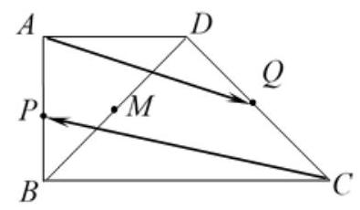

【难度】 $\star   \star   \star   \star$

【答案】 -2

【解析】以 $B$ 为原点， ${BC},{BA}$ 分别为 $x, y$ 轴建立如图所示的直角坐标系，如图所示，

则 $B\left( {0,0}\right) , C\left( {2,0}\right) , A\left( {0,1}\right) , D\left( {1,1}\right) , M\left( {\frac{1}{2},\frac{1}{2}}\right)$ ,设 $P\left( {0,{y}_{0}}\right) ,{y}_{0} \in  \left\lbrack  {0,1}\right\rbrack$ ,

又由 ${k}_{CD} =  - 1$ ,所以直线 ${CD} : y =  - x + 2$ ,设 $Q\left( {{x}_{0}, - {x}_{0} + 2}\right) ,{x}_{0} \in  \left\lbrack  {1,2}\right\rbrack$ ,

所以 $\overrightarrow{MP} = \left( {-\frac{1}{2},{y}_{0} - \frac{1}{2}}\right) ,\overrightarrow{MQ} = \left( {{x}_{0} - \frac{1}{2}, - {x}_{0} + \frac{3}{2}}\right)$ ,

因为 $P\text{ 、 }M\text{ 、 }Q$ 三点共线,所以 $\overrightarrow{MP}//\overrightarrow{MQ}$ ,

可得 $- \frac{1}{2}\left( {-{x}_{0} + \frac{3}{2}}\right)  = \left( {{y}_{0} - \frac{1}{2}}\right) \left( {{x}_{0} - \frac{1}{2}}\right)$ ,整理得 ${x}_{0}{y}_{0} - \frac{1}{2}{y}_{0} - {x}_{0} + 1 = 0$ ,

又由 $\overrightarrow{AQ} \cdot  \overrightarrow{CP} = \left( {{x}_{0}, - {x}_{0} + 1}\right)  \cdot  \left( {-2,{y}_{0}}\right)  =  - 2{x}_{0} - {x}_{0}{y}_{0} + {y}_{0} =  - 2{x}_{0} - \frac{1}{2}{y}_{0} - {x}_{0} + 1 + {y}_{0} =  - 3{x}_{0} + \frac{1}{2}{y}_{0} + 1$ ,

又由 ${x}_{0}{y}_{0} - \frac{1}{2}{y}_{0} - {x}_{0} + 1 = 0,{x}_{0} \in  \left\lbrack  {1,2}\right\rbrack  ,{y}_{0} \in  \left\lbrack  {0,1}\right\rbrack$ ,可得 ${x}_{0}\left( {{y}_{0} - 1}\right)  = \frac{1}{2}{y}_{0} - 1$ ,

又因为 ${y}_{0} - 1 \leq  0$ ,所以 $\left( {{y}_{0} - 1}\right)  \cdot  {x}_{0}$ 关于 ${x}_{0}$ 单调递减,所以 $2\left( {{y}_{0} - 1}\right)  \leq  {x}_{0}\left( {{y}_{0} - 1}\right)  \leq  \left( {{y}_{0} - 1}\right)  \cdot  1$ ,

所以 $2{y}_{0} - 2 \leq  \frac{1}{2}{y}_{0} - 1 \leq  {y}_{0} - 1$ ,解得 $0 \leq  {y}_{0} \leq  \frac{2}{3}$ ,

所以 $- 3{x}_{0} + \frac{1}{2}{y}_{0} + 1 =  - 3 \cdot  \frac{\frac{1}{2}{y}_{0} - \frac{1}{2} - \frac{1}{2}}{{y}_{0} - 1} + \frac{1}{2}{y}_{0} + 1 =  - 3 \cdot  \left( {\frac{1}{2} - \frac{1}{2} \cdot  \frac{1}{{y}_{0} - 1}}\right)  + \frac{1}{2}{y}_{0} + 1 \; =  - \frac{3}{2} + \frac{3}{2} \cdot  \frac{1}{{y}_{0} - 1} + \frac{1}{2}\left( \frac{1}{{y}_{0} - 1}\right)  + \frac{3}{2} = \frac{3}{2} \cdot  \frac{1}{{y}_{0} - 1} + \frac{1}{2}\left( {{y}_{0} - 1}\right)  =  - \left\lbrack  {\frac{3}{2} \cdot  \frac{1}{1 - {y}_{0}} + \frac{1}{2}\left( {1 - {y}_{0}}\right) }\right\rbrack   = h\left( {y}_{0}\right)$ , 令 $t = 1 - {y}_{0}$ ,则 $t > 0$ ,令 $y = \frac{3}{2} \cdot  \frac{1}{t} + \frac{1}{2}t$ ,

可得函数 $y$ 在 $\left( {0,\sqrt{3}}\right)$ 上减函数,在 $y$ 在 $\left( {\sqrt{3}, + \infty }\right)$ 上增函数,

当 $t = 1 - {y}_{0} \in  \left\lbrack  {\frac{1}{3},1}\right\rbrack$ 时, ${y}_{\min } = \frac{3}{2} \cdot  \frac{1}{1} + \frac{1}{2} \times  1 = 2$ ,所以 $h{\left( {y}_{0}\right) }_{\max } =  - 2$ . 故答案为: -2 .

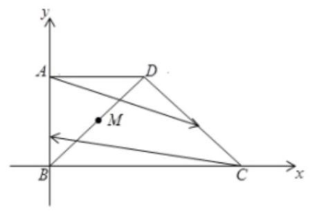

【例 14】已知在平行四边形 ${ABCD}$ 中,满足 $\left| {\overrightarrow{AB} + \overrightarrow{AD}}\right|  = \left| {\overrightarrow{AB} - \overrightarrow{AD}}\right|  = 2$ ,动点 $P$ 满足 $\left| {PC}\right|  = \frac{\sqrt{2}}{2}$ ,则 $\overrightarrow{PB} \cdot  \overrightarrow{PD}$ 的最小值为___.

【难度】

【答案】 $\frac{1}{2} - \sqrt{2}$

【解析】解答一: $\left| {\overrightarrow{AB} + \overrightarrow{AD}}\right|  = \left| {\overrightarrow{AB} - \overrightarrow{AD}}\right|  \Rightarrow  \overrightarrow{AB} \cdot  \overrightarrow{AD} = 0$ ,可得四边形是矩形,，以点 $\mathrm{C}$ 为原点建立直角坐标系,不妨设 $D\left( {a,0}\right) , B\left( {0, b}\right)$ ,则 $A\left( {a, b}\right)$ ,且 ${a}^{2} + {b}^{2} = 4$ ,点 $\mathbf{P}$ 的轨迹方程为: ${x}^{2} + {y}^{2} = \frac{1}{2}$ ;

设 $P\left( {\frac{\sqrt{2}}{2}\cos \alpha ,\frac{\sqrt{2}}{2}\sin \alpha }\right)$ ,则 $\overrightarrow{PB} \cdot  \overrightarrow{PD} =  - \frac{\sqrt{2}}{2}\left( {a\cos \alpha  + b\sin \alpha }\right)  + \frac{1}{2}$ ; 再设 $a = 2\cos \beta , b = 2\sin \beta$ ,代

入上式得, $\overrightarrow{PB} \cdot  \overrightarrow{PD} =  - \sqrt{2}\cos \left( {\alpha  - \beta }\right)  + \frac{1}{2}$ ; 当 $\cos \left( {\alpha  - \beta }\right)  = 1$ 时, $\overrightarrow{PB} \cdot  \overrightarrow{PD}$ 的最小值为 $\frac{1}{2} - \sqrt{2}$ .

解法二: $\left| {\overrightarrow{AB} + \overrightarrow{AD}}\right|  = \left| {\overrightarrow{AB} - \overrightarrow{AD}}\right|  \Rightarrow  \overrightarrow{AB} \cdot  \overrightarrow{AD} = 0$ ,可得四边形是矩形,

如图所示,取坐标轴和矩形边平行建立坐标系,设 $P\left( {x, y}\right)$ 为任意点,矩形四个顶点为

$A\left( {{x}_{1},{y}_{1}}\right) , C\left( {{x}_{2},{y}_{2}}\right) , B\left( {{x}_{1},{y}_{2}}\right) , D\left( {{x}_{2},{y}_{1}}\right)$ ,则有

${\left| PA\right| }^{2} + {\left| PC\right| }^{2} = {\left( {x}_{1} - x\right) }^{2} + {\left( {y}_{1} - y\right) }^{2} + {\left( {x}_{2} - x\right) }^{2} + {\left( {y}_{2} - y\right) }^{2},$

${\left| PB\right| }^{2} + {\left| PD\right| }^{2} = {\left( {x}_{1} - x\right) }^{2} + {\left( {y}_{2} - y\right) }^{2} + {\left( {x}_{2} - x\right) }^{2} + {\left( {y}_{1} - y\right) }^{2}.\therefore {\left| PA\right| }^{2} + {\left| PC\right| }^{2} = {\left| PB\right| }^{2} + {\left| PD\right| }^{2}$ ,

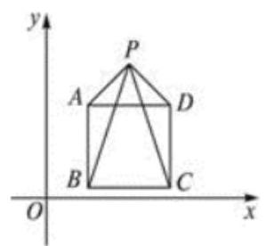

由向量加法的平行四边形法则可知，四边形 ${ABCD}$ 是对角线长为 2 的长方形，点 $P$ 的轨迹是以点 $C$ 为圆心， $\frac{\sqrt{2}}{2}$ 为半径的圆,如图所示:

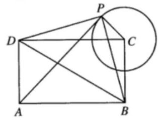

$\overrightarrow{PB} \cdot  \overrightarrow{PD} = \left| \overrightarrow{PB}\right|  \cdot  \left| \overrightarrow{PD}\right|  \cdot  \cos \angle {BPD} = \frac{{\left| PB\right| }^{2} + {\left| PD\right| }^{2} - 4}{2} = \frac{{\left| PC\right| }^{2} + {\left| PA\right| }^{2} - 4}{2} = \frac{{\left| PA\right| }^{2} - \frac{7}{2}}{2} \geq  \frac{1}{2} - \sqrt{2}$ , 当且仅当 $A, P, C$ 三点共线时取等号. 故答案为: $\frac{1}{2} - \sqrt{2}$ .

【例 15】已知直线 $y = x + 1$ 上有两点 $A\left( {{a}_{1},{b}_{1}}\right) , B\left( {{a}_{2},{b}_{2}}\right)$ ,且 ${a}_{1} > {a}_{2}$ ,已知若 $\left| {AB}\right|  = 2 + \sqrt{2}$ ,且 ${a}_{1},{b}_{1},{a}_{2},{b}_{2}$ , 满足 $2\left| {{a}_{1}{a}_{2} + {b}_{1}{b}_{2}}\right|  = \sqrt{{a}_{1}^{2} + {b}_{1}^{2}} \cdot  \sqrt{{a}_{2}^{2} + {b}_{2}^{2}}$ ，则这样的点 $A$ 个数为( )

A. 1 B. 2 C. 3 D. 4

【难度】★★★★

【答案】B

【解析】因为直线 $y = x + 1$ 上有两点 $A\left( {{a}_{1},{b}_{1}}\right) , B\left( {{a}_{2},{b}_{2}}\right)$ ,且 ${a}_{1} > {a}_{2}$ ,

设 $\overrightarrow{OA}$ 和 $\overrightarrow{OB}$ 的夹角为 $\theta$ ,则 $\overrightarrow{OA} = \left( {{a}_{1},{b}_{1}}\right) ,\overrightarrow{OB} = \left( {{a}_{2},{b}_{2}}\right) ,\overrightarrow{OA} \cdot  \overrightarrow{OB} = {a}_{1}{a}_{2} + {b}_{1}{b}_{2}$ ,

$\left| \overrightarrow{OA}\right|  = \sqrt{{a}_{1}^{2} + {b}_{1}^{2}},\left| \overrightarrow{OB}\right|  = \sqrt{{a}_{2}^{2} + {b}_{2}^{2}},$

所以 $2\left| {{a}_{1}{a}_{2} + {b}_{1}{b}_{2}}\right|  = \sqrt{{a}_{1}^{2} + {b}_{1}^{2}} \cdot  \sqrt{{a}_{2}^{2} + {b}_{2}^{2}}$ 即转化为 $2\left| {\overrightarrow{OA} \cdot  \overrightarrow{OB}}\right|  = \left| \overrightarrow{OA}\right|  \times  \left| \overrightarrow{OB}\right|$ ,

因为 $2\left| {\overrightarrow{OA} \cdot  \overrightarrow{OB}}\right|  = 2\left| \overrightarrow{OA}\right|  \times  \left| \overrightarrow{OB}\right| \left| {\cos \theta }\right|$ ,所以 $2\left| \overrightarrow{OA}\right|  \times  \left| \overrightarrow{OB}\right| \left| {\cos \theta }\right|  = \left| \overrightarrow{OA}\right|  \times  \left| \overrightarrow{OB}\right|$ ,解得: $\cos \theta  =  \pm  \frac{1}{2}$ ,

因为 $0 \leq  \theta  \leq  \pi$ ,所以 $\theta  = \frac{\pi }{3}$ 或 $\theta  = \frac{2\pi }{3}$ ,

若 $\left| {AB}\right|  = 2 + \sqrt{2}$ ,由正弦定理可得 $\bigtriangleup {OAB}$ 外接圆的半径为 $\frac{AB}{2\sin \angle {AOB}} = \frac{2 + \sqrt{2}}{\sqrt{3}}$ ,

设 $\bigtriangleup {OAB}$ 外接圆的圆心为 $C$ ,则 $C$ 到直线 $y = x + 1$ 的距离为 $d = \sqrt{{\left( \frac{2\sqrt{3} + \sqrt{6}}{3}\right) }^{2} - {\left( \frac{2 + \sqrt{2}}{2}\right) }^{2}} = \frac{\sqrt{2} + 1}{\sqrt{3}}$ ,

所以圆心在与直线 $y = x + 1$ 平行且距离为 $\frac{\sqrt{2} + 1}{\sqrt{3}}$ 的两条平行直线 $y = x + \frac{\sqrt{2} + 2}{\sqrt{3}} + 1, y = x + 1 - \frac{\sqrt{2} + 2}{\sqrt{3}}$

上,且 $C$ 到原点 $O$ 的距离为 $\frac{2 + \sqrt{2}}{\sqrt{3}}$ ,原点 $O$ 到直线 $y = x + \frac{\sqrt{2} + 2}{\sqrt{3}} + 1$ 的距离为

$d = \frac{\frac{\sqrt{2} + 2}{\sqrt{3}} + 1}{\sqrt{2}} = \frac{\sqrt{2} + 2 + \sqrt{3}}{\sqrt{6}} > \frac{2 + \sqrt{2}}{\sqrt{3}}$ ,所以直线 $y = x + \frac{\sqrt{2} + 2}{\sqrt{3}} + 1$ 上面不存在这样的点 $C$ ,

原点 $O$ 到直线 $y = x + 1 - \frac{\sqrt{2} + 2}{\sqrt{3}}$ 的距离为 $d = \frac{\left| \frac{\sqrt{2} + 2}{\sqrt{3}} - 1\right| }{\sqrt{2}} = \frac{\sqrt{2} + 2 - \sqrt{3}}{\sqrt{6}} < \frac{2 + \sqrt{2}}{\sqrt{3}}$ ,

所以直线 $y = x + 1 - \frac{\sqrt{2} + 2}{\sqrt{3}}$ 上存在两个这样的点 $C$ 到原点的距离为 $\frac{2 + \sqrt{2}}{\sqrt{3}}$ ,

一个点 $C$ 对应一个点 $A$ ，所以这样的点 $A$ 有 2 个，故选:B

## 巩固训练

1、已知正 $\bigtriangleup  {ABC}$ 的边长为2， ${PQ}$ 为 $\bigtriangleup  {ABC}$ 内切圆 $O$ 的一条直径， $M$ 为 $\bigtriangleup  {ABC}$ 边上的动点，则 $\overline{MP} \cdot  \overline{MQ}$ 的取值范围为___.

【答案】 $\left\lbrack  {0,1}\right\rbrack$

【解析】

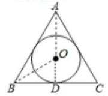

如图所示， $O$ 为正 $\bigtriangleup  {ABC}$ 内切圆圆心， ${OD}$ 为内切圆半径，在 $\bigtriangleup  {BDO}$ 中， ${BD} = 1$ ， $\angle {OBD} = {30}^{ \circ  }$ ，可求得内切圆半径 ${OD} = \frac{\sqrt{3}}{3}$ . 又 ${PQ}$ 为圆 $O$ 的直径， $\therefore \overrightarrow{OQ} =  - \overrightarrow{OP}$ ，

利用向量的线性表示可得, $\overrightarrow{MP} = \overrightarrow{MO} + \overrightarrow{OP},\overrightarrow{MQ} = \overrightarrow{MO} + \overrightarrow{OQ} = \overrightarrow{MO} - \overrightarrow{OP}$ ,

$\therefore \overrightarrow{MP} \cdot  \overrightarrow{MQ} = \left( {\overrightarrow{MO} + \overrightarrow{OP}}\right) \left( {\overrightarrow{MO} - \overrightarrow{OP}}\right)  = {\left| \overrightarrow{MO}\right| }^{2} - {\left| \overrightarrow{OP}\right| }^{2} = {\left| \overrightarrow{MO}\right| }^{2} - \frac{1}{3}$ ,

又 $M$ 为 $\bigtriangleup {ABC}$ 边上的动点,由图可知,当 $M$ 为 $\bigtriangleup {ABC}$ 边的中点时, $\left| \overrightarrow{MO}\right|$ 最小为 $\frac{\sqrt{3}}{3}$ ,即 $\overrightarrow{MP} \cdot  {\overrightarrow{MQ}}_{\min } = 0$ ; 当 $M$ 为 $\bigtriangleup {ABC}$ 的顶点时, $\left| \overrightarrow{MO}\right|$ 最大为 $\frac{2\sqrt{3}}{3}$ ,即 $\overrightarrow{MP} \cdot  {\overrightarrow{MQ}}_{\max } = 1$ .

$\therefore \overrightarrow{MP} \cdot  \overrightarrow{MQ}$ 的取值范围为 $\left\lbrack  {0,1}\right\rbrack$ . 故答案为: $\left\lbrack  {0,1}\right\rbrack$ .

2、如图梯形 ${ABCD}$ ， ${AB}//{CD}$ 且 ${AB} = 5$ ， ${AD} = {2DC} = 4$ ， $E$ 在线段 ${BC}$ 上， $\overrightarrow{AC} \cdot  \overrightarrow{BD} = 0$ ，则 $\overrightarrow{AE} \cdot  \overrightarrow{DE}$ 的最小值为___.

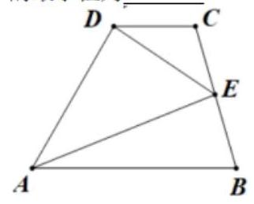

【答案】 $\frac{95}{13}$

【解析】因为 ${AB}//{CD}$ ,所以向量 $\overrightarrow{AD}$ 与 $\overrightarrow{AB}$ 的夹角和向量 $\overrightarrow{AD}$ 与 $\overrightarrow{DC}$ 的夹角相等,

设向量 $\overrightarrow{AD}$ 与 $\overrightarrow{AB}$ 的夹角为 $\theta$ ,因为 $\overrightarrow{AC} \cdot  \overrightarrow{BD} = 0$ ,所以 $\left( {\overrightarrow{AD} + \overrightarrow{DC}}\right)  \cdot  \left( {\overrightarrow{AD} - \overrightarrow{AB}}\right)  = 0$ ,

即 ${\overrightarrow{AD}}^{2} + \overrightarrow{DC} \cdot  \overrightarrow{AD} - \overrightarrow{AD} \cdot  \overrightarrow{AB} - \overrightarrow{DC} \cdot  \overrightarrow{AB} = 0$ ,

整理得 ${16} + 8\cos \theta  - {20}\cos \theta  - {10} = 0$ ,解得 $\cos \theta  = \frac{1}{2},\theta  = {60}^{ \circ  }$ ,

如图，过点 $D$ 作 ${AB}$ 垂线，垂足为 $O$ ，建立如图所示的直角坐标系，

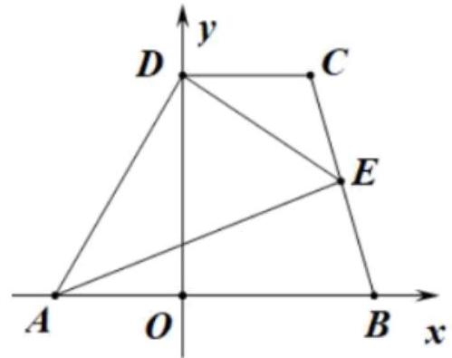

易知 $A\left( {-2,0}\right)$ ， $B\left( {3,0}\right)$ ， $D\left( {0,2\sqrt{3}}\right)$ ， $C\left( {2,2\sqrt{3}}\right)$ ，

则 $\overrightarrow{BC} = \left( {-1,2\sqrt{3}}\right) ,\overrightarrow{BE} = \lambda \overrightarrow{BC} = \left( {-\lambda ,2\sqrt{3}\lambda }\right) ,0 \leq  \lambda  \leq  1$ ,

$E = \left( {3 - \lambda ,2\sqrt{3}\lambda }\right) ,\overrightarrow{AE} = \left( {5 - \lambda ,2\sqrt{3}\lambda }\right) ,\overrightarrow{DE} = \left( {3 - \lambda ,2\sqrt{3}\lambda  - 2\sqrt{3}}\right) ,$

$\overrightarrow{AE} \cdot  \overrightarrow{DE} = \left( {5 - \lambda }\right) \left( {3 - \lambda }\right)  + 2\sqrt{3}\lambda \left( {2\sqrt{3}\lambda  - 2\sqrt{3}}\right)  = {13}{\lambda }^{2} - {20\lambda } + {15}$ ,

因为 $0 \leq  \lambda  \leq  1$ ,所以当 $\lambda  = \frac{10}{13}$ 时,取最小值,最小值为 $\frac{95}{13}$ ,故答案为: $\frac{95}{13}$ .

3、已知 $\bigtriangleup  {ABC}$ 的外心为 $O,\overrightarrow{AO} \cdot  \overrightarrow{BC} = 3\overrightarrow{BO} \cdot  \overrightarrow{AC} + 4\overrightarrow{CO} \cdot  \overrightarrow{BA}$ ，则 $\cos B$ 的取值范围是___.

【答案】 $\left\lbrack  {\frac{\sqrt{2}}{3},1}\right)$

【解析】作出图示如下图所示,取 ${BC}$ 的中点 $D$ ,连接 ${OD},{AD}$ ,因为 $\bigtriangleup {ABC}$ 的外心为 $O$ ,则 ${OD} \bot  {BC}$ ,

因为 $\overrightarrow{AO} \cdot  \overrightarrow{BC} = \left( {\overrightarrow{AD} + \overrightarrow{DO}}\right)  \cdot  \overrightarrow{BC} = \overrightarrow{AD} \cdot  \overrightarrow{BC} + \overrightarrow{DO} \cdot  \overrightarrow{BC} = \overrightarrow{AD} \cdot  \overrightarrow{BC}$ ,

又 $\overrightarrow{AD} \cdot  \overrightarrow{BC} = \frac{1}{2}\left( {\overrightarrow{AB} + \overrightarrow{AC}}\right)  \cdot  \left( {\overrightarrow{AC} - \overrightarrow{AB}}\right)  = \frac{1}{2}\left( {{\overrightarrow{AC}}^{2} - {\overrightarrow{AB}}^{2}}\right)  = \frac{1}{2}\left( {{b}^{2} - {c}^{2}}\right)$ ,所以 $\overrightarrow{AO} \cdot  \overrightarrow{BC} = \frac{1}{2}\left( {{b}^{2} - {c}^{2}}\right)$ ,

同理可得 $\overrightarrow{BO} \cdot  \overrightarrow{AC} = \frac{1}{2}\left( {{a}^{2} - {c}^{2}}\right) ,\overrightarrow{CO} \cdot  \overrightarrow{BA} = \frac{1}{2}\left( {{b}^{2} - {a}^{2}}\right)$ ,

所以 $\overrightarrow{AO} \cdot  \overrightarrow{BC} = 3\overrightarrow{BO} \cdot  \overrightarrow{AC} + 4\overrightarrow{CO} \cdot  \overrightarrow{BA}$ 化为 $\frac{1}{2}\left( {{b}^{2} - {c}^{2}}\right)  = 3 \times  \frac{1}{2}\left( {{a}^{2} - {c}^{2}}\right)  + 4 \times  \frac{1}{2}\left( {{b}^{2} - {a}^{2}}\right)$ ,即 ${a}^{2} + 2{c}^{2} = 3{b}^{2}$ .

由余弦定理得 $\cos B = \frac{{a}^{2} + {c}^{2} - {b}^{2}}{2ac} = \frac{{a}^{2} + {c}^{2} - \frac{1}{3}\left( {{a}^{2} + 2{c}^{2}}\right) }{2ac} = \frac{1}{3} \times  \frac{2{a}^{2} + {c}^{2}}{2ac}$ ,

又 $\frac{2{a}^{2} + {c}^{2}}{2ac} \geq  \frac{2\sqrt{2}{ac}}{2ac} = \sqrt{2}$ ,当且仅当 $\sqrt{2}a = c$ 时,取等号,又 $0 < B < \pi$ ,所以 $\frac{\sqrt{2}}{3} \leq  \cos B < 1$ . 故答案为: $\left\lbrack  {\frac{\sqrt{2}}{3},1}\right)$ .

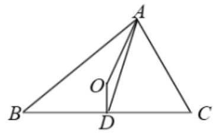

4、已知腰长为 2 的等腰直角 $\bigtriangleup {ABC}$ 中， $M$ 为斜边 ${AB}$ 的中点，点 $P$ 为该平面内一动点，若 $\left| \overrightarrow{PC}\right|  = 2$ ，则 $\left( {\overrightarrow{PA} \cdot  \overrightarrow{PB} + 4}\right)  \cdot  \left( {\overrightarrow{PC} \cdot  \overrightarrow{PM}}\right)$ 的最小值为( )

A. ${24} - {16}\sqrt{2}$ B. ${24} + {16}\sqrt{2}$ C. ${48} - {32}\sqrt{2}$ D. ${48} + {32}\sqrt{2}$

【答案】C

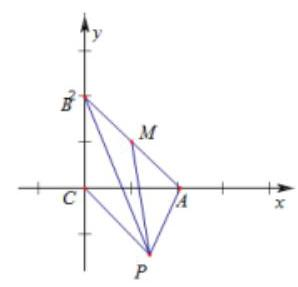

【解析】以 ${CA},{CB}$ 为 $x, y$ 轴建立平面直角坐标系,则 $C\left( {0,0}\right) , A\left( {2,0}\right) , B\left( {0,2}\right) , M\left( {1,1}\right)$ ,

设 $P\left( {x, y}\right)$ ,则 $\overrightarrow{PA} = \left( {2 - x, - y}\right) ,\overrightarrow{PB} = \left( {-x,2 - y}\right) ,\overrightarrow{PC} = \left( {-x, - y}\right) ,\overrightarrow{PM} = \left( {1 - x,1 - y}\right)$ ,

$\overrightarrow{PA} \cdot  \overrightarrow{PB} =  - x\left( {2 - x}\right)  - y\left( {2 - y}\right)  = {x}^{2} - {2x} + {y}^{2} - {2y}$ ,

$\overrightarrow{PC} \cdot  \overrightarrow{PM} =  - x\left( {1 - x}\right)  - y\left( {1 - y}\right)  = {x}^{2} - x + {y}^{2} - y,$

$\because \left| \overrightarrow{PC}\right|  = 2,\therefore {x}^{2} + {y}^{2} = 4$ ,设 $x = 2\cos \theta , y = 2\sin \theta$ ,则

$x + y = 2\cos \theta  + 2\sin \theta  = 2\sqrt{2}\sin \left( {\theta  + \frac{\pi }{4}}\right) ,\therefore  - 2\sqrt{2} \leq  x + y \leq  2\sqrt{2}$ ,

$\left( {\overrightarrow{PA} \cdot  \overrightarrow{PB} + 4}\right)  \cdot  \left( {\overrightarrow{PC} \cdot  \overrightarrow{PM}}\right)  = \left( {4 - {2x} - {2y} + 4}\right) \left( {4 - x - y}\right)  = 2{\left( x + y - 4\right) }^{2}$ ,

$\therefore x + y = 2\sqrt{2}$ 时, $\left( {\overrightarrow{PA} \cdot  \overrightarrow{PB} + 4}\right)  \cdot  \left( {\overrightarrow{PC} \cdot  \overrightarrow{PM}}\right)$ 取得最小值 $2{\left( 2\sqrt{2} - 4\right) }^{2} = {48} - {32}\sqrt{2}$ . 故选: C.

5、已知向量 $\overrightarrow{a},\overrightarrow{b},\overrightarrow{c}$ 满足 $\left| \overrightarrow{a}\right|  = 2,\left| \overrightarrow{b}\right|  = 4,\overrightarrow{a}$ 与 $\overrightarrow{b}$ 的夹角为 $\frac{\pi }{3},\left( {\overrightarrow{c} - \overrightarrow{a}}\right)  \bullet  \left( {\overrightarrow{c} + \overrightarrow{b}}\right)  =  - 3$ ,则 $\left| {\overrightarrow{c} - \overrightarrow{a}}\right|$ 的最小值为___.

【答案】 $\sqrt{7} - 2$

【解析】向量 $\overrightarrow{a},\overrightarrow{b},\overrightarrow{c}$ 满足 $\left| \overrightarrow{a}\right|  = 2,\left| \overrightarrow{b}\right|  = 4,\overrightarrow{a}$ 与 $\overrightarrow{b}$ 的夹角为 $\frac{\pi }{3}$ ,

如图所示,取 $\overrightarrow{OA} = \left( {2,0}\right) ,\overrightarrow{OB} = \left( {2,2\sqrt{3}}\right)$ .

设 $\overrightarrow{OC} = \overrightarrow{c} = \left( {x, y}\right) ,\overrightarrow{c} - \overrightarrow{a} = \left( {x - 2, y}\right) ,\overrightarrow{c} + \overrightarrow{b} = \left( {x + 2, y + 2\sqrt{3}}\right)$ .

$\because \left( {\overrightarrow{c} - \overrightarrow{a}}\right)  \cdot  \left( {\overrightarrow{c} + \overrightarrow{b}}\right)  =  - 3,\therefore {x}^{2} - 4 + y\left( {y + 2\sqrt{3}}\right)  =  - 3$ ,

$\therefore {x}^{2} + {\left( y + \sqrt{3}\right) }^{2} = 4$ ，故 $C$ 在为以 $\left( {0, - \sqrt{3}}\right)$ 为圆心以 2 为半径的圆的上，

则 $\left| {\overrightarrow{c} - \overrightarrow{a}}\right|  = \sqrt{{\left( x - 2\right) }^{2} + {y}^{2}}$ 表示 $C$ 到 $\left( {2,0}\right)$ 的距离，因为圆心 $\left( {0, - \sqrt{3}}\right)$ 到 $\left( {2,0}\right)$ 距离为 $\sqrt{7}$ ，

故 $\left| {\overrightarrow{c} - \overrightarrow{a}}\right|$ 的最小值为 $\sqrt{7} - 2$ .

6、如图，已知函数 $f\left( x\right)  = \frac{\sqrt{3}}{2}\left| {\sin {\pi x}}\right|$ ， ${A}_{1}$ ， ${A}_{2}$ ， ${A}_{3}$ 是图象的顶点， $O$ ， $B$ ， $C$ ， $D$ 为 $f\left( x\right)$ 与 $x$ 轴的交点， 线段 ${A}_{3}D$ 上有五个不同的点 ${Q}_{1},{Q}_{2},\ldots ,{Q}_{5}$ ,记 ${n}_{i} = \overrightarrow{O{A}_{2}} \cdot  \overrightarrow{O{Q}_{i}}\left( {i = 1,2,\ldots ,5}\right)$ ，则 ${n}_{1} + {n}_{2} + \ldots  + {n}_{5}$ 的值为( )

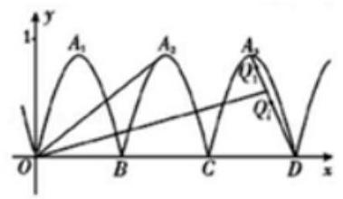

A. $\frac{15}{2}\sqrt{3}$ B. 45

C. $\frac{15}{4}\sqrt{3}$ D. $\frac{45}{2}$

【答案】D

【解析】解:由题意得,函数 $f\left( x\right)$ 的周期 $T = 1$ ,即 $B, C, D$ 的横坐标分别为1,2,3,故 ${A}_{2}\left( {\frac{3}{2},\frac{\sqrt{3}}{2}}\right) ,{A}_{3}\left( {\frac{5}{2},\frac{\sqrt{3}}{2}}\right)$ , 则 ${k}_{O{A}_{2}} = \frac{\sqrt{3}}{3},{k}_{D{A}_{1}} = \frac{\frac{\sqrt{3}}{2} - 0}{\frac{5}{2} - 3} =  - \sqrt{3}$ ,因为 ${k}_{O{A}_{2}} \cdot  {k}_{D{A}_{1}} =  - 1$ ,故 $\overrightarrow{O{A}_{2}} \bot  \overrightarrow{D{A}_{3}}$ ,

故

${n}_{1} + {n}_{2} + \ldots \ldots  + {n}_{5} = \overline{O{A}_{2}}\left( {\overline{O{Q}_{1}} + \overline{O{Q}_{2}} + \overline{O{Q}_{3}} + \overline{O{Q}_{4}} + \overline{O{Q}_{5}}}\right)  = \overline{O{A}_{2}}\left( {5\overline{OD} + \overline{D{Q}_{1}} + \overline{D{Q}_{2}} + \overline{D{Q}_{3}} + \overline{D{Q}_{4}} + \overline{D{Q}_{5}}}\right)  = 5\overline{O{A}_{2}} \cdot   \bullet  \overline{OD} = 5 \times  \left( {\frac{3}{2} \times  3 + 0}\right)  = \frac{45}{2}$ 故选: $D$ .
