## 函数 (一)

<table><tr><td>教学目标</td><td>熟悉高考函数考点</td></tr><tr><td>重点</td><td>1、函数概念与函数三要素；   2、函数性质的综合运用与灵活应用；   3、函数零点与图像综合运用；   4、加强综合分析问题的能力与处理问题的能力.</td></tr><tr><td>难 点</td><td>1、函数性质的综合运用与灵活应用；   2、函数零点与图像综合运用；   3、加强综合分析问题的能力与处理问题的能力.</td></tr></table>

## (一)函数的概念、函数的三要素

## 知识梳理

1、函数的定义:设 $A$ 、 $B$ 是非空的数集，如果按照某个确定的对应关系 $f$ ，使对于集合 $A$ 中的任意一个数 $x$ ,在集合 $B$ 中都有唯一确定的数 $f\left( x\right)$ 和它对应,那么就称 $f : A \rightarrow  B$ 为从集合 $A$ 到集合 $B$ 的一个函数. 记作: $y = f\left( x\right) , x \in  A$ . 其中, $x$ 叫做自变量, $x$ 的取值范围 $A$ 叫做函数的定义域; 与 $x$ 的值相对应的 $y$ 值叫做函数值,函数值的集合 $\{ f\left( x\right)  \mid  x \in  A\}$ 叫做函数的值域

注意:(1)集合 A、B 是非零数集；(2)集合 A 中自变量 x 的任意性；(3)集合 B 中因变量 y 的唯一性， 即 x 与 y 对应关系一对一或多对一;

2、函数的三要素分别指函数的___定义域___、___值域___、___对应法则___；

例题精讲

【例 1】( 1 )函数 $y = \frac{2\lg x}{\sqrt{x - 1}}$ 的定义域是( )

A. $\left( {1, + \infty }\right)$ B. $\left( {0, + \infty }\right)$ C. $\lbrack 1, + \infty )$ D. $\left( {0,1}\right)  \cup  \left( {1, + \infty }\right)$

【难度】★★

【答案】A

【解析】对于函数 $y = \frac{2\lg x}{\sqrt{x - 1}}$ ,有 $\left\{  \begin{array}{l} x > 0 \\  x - 1 > 0 \end{array}\right.$ ,解得 $x > 1$ ,因此,函数 $y = \frac{2\lg x}{\sqrt{x - 1}}$ 的定义域是 $\left( {1, + \infty }\right)$ . 故选: A.

(2)已知函数 $f\left( x\right)$ 的定义域为 $\left\lbrack  {-1,2}\right\rbrack$ ，则函数 $g\left( x\right)  = f\left( {2x}\right)  + \sqrt{1 - {2}^{x}}$ 的定义域为( )

A. $\left\lbrack  {0,1}\right\rbrack$ B. $\left\lbrack  {-1,0}\right\rbrack$

C. $\left\lbrack  {-\frac{1}{2},1}\right\rbrack$ D. $\left\lbrack  {-\frac{1}{2},0}\right\rbrack$

【难度】★★

【答案】D

【解析】由题意 $\left\{  \begin{array}{l}  - 1 \leq  {2x} \leq  2 \\  1 - {2}^{x} \geq  0 \end{array}\right.$ ,解得 $- \frac{1}{2} \leq  x \leq  0$ . 故选: D.

【例 2】( 1 )已知函数 $f\left( {e}^{x}\right)  = \ln x$ ,若 $f\left( a\right)  = 0$ ,则 $a =$ ___.

【难度】 $\star   \star$

【答案】e

【解析】依题意知, $a = {e}^{x}$ 时, $\ln x = 0$ ,即 $\ln x = \ln 1, x = 1$ ,故 $a = {e}^{1} = e$ . 故答案为: $e$ .

(2)已知函数 $f\left( x\right)$ 满足: $f\left( 1\right)  = 2$ ，且对任意的实数 $x$ ，都有 $f\left( {x + 1}\right)  = f\left( x\right)  + 1$ 成立，则 $f\left( {2021}\right)  =$

【难度】★★

【答案】 2022

【解析】解: 因为函数 $f\left( x\right)$ 满足: $f\left( 1\right)  = 2$ ,且对任意的实数 $x$ ,都有 $f\left( {x + 1}\right)  = f\left( x\right)  + 1$

所以 $f\left( {2021}\right)  = f\left( {2020}\right)  + 1 = f\left( {2019}\right)  + 2 = \cdots  = f\left( 1\right)  + {2020}$

又 $f\left( 1\right)  = 2$ ，所以 $f\left( {2021}\right)  = f\left( {2020}\right)  + 1 = f\left( {2019}\right)  + 2 = \cdots  = f\left( 1\right)  + {2020} = {2022}$

故答案为:2022

【例 3】( 1 )下列函数中,值域为 $\lbrack 0, + \infty )$ 的是( )

A. $y = {2}^{x}$ B. $y = {x}^{\frac{1}{2}}$ C. $y = \tan x$ D. $y = \cos x$

【难度】★★

【答案】B

【解析】结合选项和基本初等函数图像与性质易知选 B.

(2)函数 $y = \frac{\sqrt{x - 1}}{x}$ 的值域是( )

A. $\left\lbrack  {-\frac{1}{2},\frac{1}{2}}\right\rbrack$ B. $\left\lbrack  {0,1}\right\rbrack$ C. $\left\lbrack  {0,\frac{1}{2}}\right\rbrack$ D. $\lbrack 0, + \infty )$

【难度】 $\star   \star   \star$

【答案】C

【解析】令 $t = \sqrt{x - 1}$ ,则 $t \geq  0$ ,当 $t = 0$ 时, $y = 0$ ,当 $t \neq  0$ 时, $0 < y = \frac{t}{{t}^{2} + 1} = \frac{1}{t + \frac{1}{t}} \leq  \frac{1}{2\sqrt{t \cdot  \frac{1}{t}}} = \frac{1}{2}$ ,

当且仅当 $t = 1$ 时,即 $x = 2$ 时等号成立,综上 $0 \leq  y \leq  \frac{1}{2}$ ,故选: C.

(3)已知函数 $f\left( x\right)  = \left\{  \begin{array}{l} \left( {a - 2}\right) x + {2a} + 1, x \leq  2 \\  2{a}^{x - 1}, x > 2 \end{array}\right.$ ( $a > 0$ 且 $a \neq  1$ ),若 $f\left( x\right)$ 有最小值,则实数 $a$ 的取值范围为___.

【难度】 $\star   \star   \star$

【答案】 $\left( {0,\frac{3}{4}}\right\rbrack   \cup  \left( {1,\frac{3}{2}}\right\rbrack$ .

【解析】 $f\left( 2\right)  = 2\left( {a - 2}\right)  + {2a} + 1 = {4a} - 3$ ,

当 $x = 2$ 时, $2{a}^{2 - 1} = {2a}$ ,

若 $a > 2$ ，则当 $x \leq  2$ 时为增函数，此时无最小值，不合题意；

若 $a = 2$ ,当 $x \leq  2$ 时, $f\left( x\right)  = 5$ ,当 $x > 2$ 时, $2 \times  {2}^{x - 1} = {2}^{x} > 4$ ,此时无最小值,不合题意;

若 $1 < a < 2$ ,当 $x \leq  2$ 时, $f\left( x\right)$ 为减函数,此时 $f\left( x\right)  \geq  f\left( 2\right)  = {4a} - 3$ ,

当 $x > 2$ 时, $f\left( x\right)$ 为增函数,且此时 $f\left( x\right)  > {2a}$ ,要使 $f\left( x\right)$ 有最小值,

则 ${4a} - 3 \leq  {2a}$ ,即 ${2a} \leq  3, a \leq  \frac{3}{2}$ ,则 $1 < a \leq  \frac{3}{2}$ ;

若 $0 < a < 1$ ,当 $x \leq  2$ 时 $f\left( x\right)$ 为减函数,此时 $f\left( x\right)  \geq  f\left( 2\right)  = {4a} - 3$ ,

当 $x > 2$ 时, $f\left( x\right)$ 为减函数,且 $f\left( x\right)  > 0$ ,要使 $f\left( x\right)$ 有最小值,

则 ${4a} - 3 \leq  0$ ,即 $a \leq  \frac{3}{4}$ ,则 $0 < a \leq  \frac{3}{4}$ . 综上所述, $1 < a \leq  \frac{3}{2}$ 或 $0 < a \leq  \frac{3}{4}$ ,

$\therefore$ 实数 $a$ 的取值范围是 $\left( {0,\frac{3}{4}}\right\rbrack   \cup  \left( {1,\frac{3}{2}}\right\rbrack$ . 故答案为: $\left( {0,\frac{3}{4}}\right\rbrack   \cup  \left( {1,\frac{3}{2}}\right\rbrack$ .

【例 4】函数概念最早是在 17 世纪由德国数学家莱布尼茨提出的, 后又经历了贝努利、欧拉等人的改译. 1821 年法国数学家柯西给出了这样的定义: 在某些变数存在着一定的关系, 当一经给定其中某一变数的值, 其他变数的值可随着确定时, 则称最初的变数叫自变量, 其他的变数叫做函数. 德国数学家康托尔创立的集

合论使得函数的概念更严谨. 后人在此基础上构建了高中教材中的函数定义:“一般地，设 $A$ ， $B$ 是两个非空的数集,如果按某种对应法则 $f$ ,对于集合 $A$ 中的每一个元素 $x$ ,在集合 $B$ 中都有唯一的元素 $y$ 和它对应, 那么这样的对应叫做从 $A$ 到 $B$ 的一个函数”，则下列对应法则 $f$ 满足函数定义的有( )

A. $f\left( \left| {x - 2}\right| \right)  = x$ B. $f\left( {x}^{2}\right)  = x$ C. $f\left( {\cos x}\right)  = x$ D. $f\left( {e}^{x}\right)  = x$

【难度】 $\star   \star   \star$

【答案】D

【解析】

对于 A. 令 $t = \left| {x - 2}\right|$ ,可得 $x = 2 \pm  t$ ,则 $f\left( t\right)  = 2 \pm  t$ ,所以不满足函数的定义,所以 $\mathrm{A}$ 不正确;

对于 $\mathrm{B}$ ,令 $t = {x}^{2}\left( {t \geq  0}\right) , f\left( t\right)  =  \pm  \sqrt{t}$ ,设 $t = 4, f\left( t\right)  =  \pm  2$ ,一个自变量对应两个函数值,不符合函数定义; 对于 $\mathbf{C}$ ,设 $t = \cos x$ ,当 $t = \frac{1}{2}$ ,则 $x$ 可以取包括 $\pm  \frac{\pi }{3}$ 等无数多的值,不符合函数定义;

对于 D. 令 $t = {e}^{x}\left( {t > 0}\right) , f\left( t\right)  = \ln t$ ,符合函数定义. 故选: D

## 巩固训练

1、已知函数 $f\left( x\right)$ 的定义域为 $\left\lbrack  {-2,1}\right\rbrack$ ，则函数 $y = \frac{f\left( {{3x} - 2}\right) }{\lg \left( {1 - x}\right) }$ 的定义域为( )

A. $\left\lbrack  {0,1}\right\rbrack$ B. $\lbrack 0,1)$ C. $(0,1\rbrack$ D. $\left( {0,1}\right)$

【答案】D

【解析】已知函数 $f\left( x\right)$ 的定义域为 $\left\lbrack  {-2,1}\right\rbrack$ ,对于函数 $y = \frac{f\left( {{3x} - 2}\right) }{\lg \left( {1 - x}\right) }$ ,有 $\left\{  \begin{array}{l}  - 2 \leq  {3x} - 2 \leq  1 \\  1 - x > 0 \\  \lg \left( {1 - x}\right)  \neq  0 \end{array}\right.$ ,

即 $\left\{  \begin{array}{l}  - 2 \leq  {3x} - 2 \leq  1 \\  1 - x > 0 \\  1 - x \neq  1 \end{array}\right.$ ，解得 $0 < x < 1$ . 因此，函数 $y = \frac{f\left( {{3x} - 2}\right) }{\lg \left( {1 - x}\right) }$ 的定义域为 $\left( {0,1}\right)$ . 故选:D.

2、下列函数中，值域为区间 $\lbrack 2, + \infty )$ 的是( )

A. $f\left( x\right)  = 2{x}^{2}$ B. $f\left( x\right)  = {2}^{x} + 1$

C. $f\left( x\right)  = \left| x\right|  + 2$ D. $f\left( x\right)  = x + \frac{1}{x}$

【答案】C

【解析】A选项,因为 $f\left( x\right)  = 2{x}^{2} \geq  0$ ,即其值域为 $\lbrack 0, + \infty )$ ,故 $\mathrm{A}$ 不满足题意;

B 选项，因为指数函数 $y = {2}^{x}$ 的值域为 $\left( {0, + \infty }\right)$ ，所以 $f\left( x\right)  = {2}^{x} + 1$ 的值域为 $\left( {1, + \infty }\right)$ ，故 B 不满足题意； C 选项,因为 $y = \left| x\right|  \geq  0$ ,所以 $f\left( x\right)  = \left| x\right|  + 2 \geq  2$ ,即其值域为 $\lbrack 2, + \infty )$ ,故 $\mathrm{C}$ 正确;

D 选项,当 $x < 0$ 时, $f\left( x\right)  = x + \frac{1}{x} < 0$ ,因此函数 $f\left( x\right)  = x + \frac{1}{x}$ 在定义域内的值域不是 $\lbrack 2, + \infty )$ ,故 $\mathrm{D}$ 不满足题意；故选:C.

3、已知函数 $f\left( x\right)  = \left\{  \begin{array}{l} \frac{1}{x} + {2x},0 < x \leq  1 \\  {x}^{2} - 1, x > 1 \end{array}\right.$ ，若 $f\left( {x}_{0}\right)  = 3$ ，则实数 ${x}_{0}$ 的值为___.

【答案】 $\frac{1}{2},1$ 或 2

【解析】当 $0 < {x}_{0} \leq  1$ 时,因为 $f\left( {x}_{0}\right)  = 3$ ,所以 $\frac{1}{{x}_{0}} + 2{x}_{0} = 3 \Rightarrow  {x}_{0} = 1$ 或 ${x}_{0} = \frac{1}{2}$ ,显然符合 $0 < {x}_{0} \leq  1$ ; 当 ${x}_{0} > 1$ 时,因为 $f\left( {x}_{0}\right)  = 3$ ,所以 ${x}_{0}{}^{2} - 1 = 3 \Rightarrow  {x}_{0} =  \pm  2$ ,而 ${x}_{0} > 1$ ,所以 ${x}_{0} = 2$ ,

故答案为: $\frac{1}{2},1$ 或2

4、已知 $x \in  \left\lbrack  {0,\frac{1}{3}}\right\rbrack$ ，则函数 $g\left( x\right)  = x + \sqrt{1 - {3x}}$ 的值域为___.

【答案】 $\left\lbrack  {\frac{1}{3},1}\right\rbrack$

【解析】解: 因为 $x \in  \left\lbrack  {0,\frac{1}{3}}\right\rbrack$ ,所以 $1 - {3x} \in  \left\lbrack  {0,1}\right\rbrack$ ,所以 $\sqrt{1 - {3x}} \in  \left\lbrack  {0,1}\right\rbrack$ ,令 $t = \sqrt{1 - {3x}}$ ,则 $t \in  \left\lbrack  {0,1}\right\rbrack$ , 所以 $x = \frac{1 - {t}^{2}}{3}$ ,所以 $y = \frac{1 - {t}^{2}}{3} + t =  - \frac{{t}^{2}}{3} + t + \frac{1}{3}, t \in  \left\lbrack  {0,1}\right\rbrack$ ,

因为抛物线的对称轴方程为 $t = \frac{3}{2}$ ,所以 $t \in  \left\lbrack  {0,1}\right\rbrack$ 时,函数 $y =  - \frac{{t}^{2}}{3} + t + \frac{1}{3}$ 单调递增,

所以 $y \in  \left\lbrack  {\frac{1}{3},1}\right\rbrack$ . 故答案为: $\left\lbrack  {\frac{1}{3},1}\right\rbrack$

5、函数 $y = {\log }_{2}\left( {-3 - x}\right)$ 的定义域为 $A$ ，函数 $y = {x}^{\frac{1}{2}}$ 的值域为 $B$ ，则 $A \cup  B =$ ___.

【答案】 $\left( {-\infty , - 3}\right)  \cup  \lbrack 0, + \infty )$

【解析】 $A = \{ x \mid   - 3 - x > 0\}  = \left( {-\infty , - 3}\right) , B = \left\{  {y\left| {\;y = {x}^{\frac{1}{2}}}\right. }\right\}   = \lbrack 0, + \infty )$ ,

故 $A \cup  B = \left( {-\infty , - 3}\right)  \cup  \lbrack 0, + \infty )$ ,故答案为: $\left( {-\infty , - 3}\right)  \cup  \lbrack 0, + \infty )$ .

6、已知函数 $f\left( x\right)  = \left\{  \begin{array}{l} {\log }_{2}\left( {x + 3}\right) , - 3 < x \leq  1 \\  {x}^{2} - {ax}, x > 1 \end{array}\right.$ 的值域为 $R$ ，则实数 $a$ 的取值范围是( )

A. $( - 1,0\rbrack$ B. $\left\lbrack  {-1,0}\right\rbrack$ C. $\left( {-1, + \infty }\right)$ D. $\lbrack  - 1, + \infty )$

【答案】D

【解析】当 $- 3 < x \leq  1$ 时, $0 < x + 3 \leq  4$ ,则 $f\left( x\right)  = {\log }_{2}\left( {x + 3}\right)  \in  ( - \infty ,2\rbrack$ ,

所以，函数 $f\left( x\right)  = {x}^{2} - {ax}$ 在区间 $\left( {1, + \infty }\right)$ 上的值域包含 $\left( {2, + \infty }\right)$ ，

所以,存在 $x \in  \left( {1, + \infty }\right)$ ,使得 ${x}^{2} - {ax} \leq  2$ ,即 $a \geq  x - \frac{2}{x}$ ,

而函数 $g\left( x\right)  = x - \frac{2}{x}$ 在区间 $\left( {1, + \infty }\right)$ 上为增函数, $\therefore g\left( x\right)  > g\left( 1\right)  =  - 1,\therefore a \geq   - 1$ .

故选: D.

7、下列选项中， $y$ 可表示为 $x$ 的函数的是( )

A. ${3}^{y} + {x}^{2} = 0$ B. $x = {y}^{\frac{2}{3}}$

C. $\left| y\right|  = \left| x\right|$ D. ${\log }_{2}y = {x}^{3}$

【答案】D

【解析】对于 $\mathbf{A}$ :令 $x = 0$ ,找不到 $y$ 与之对应,故 $\mathbf{A}$ 错误;

对于 $\mathbf{B}$ : 令 $x = 4, y$ 可以取 $\pm  2$ ,故 $\mathbf{B}$ 错误;

对于 $\mathrm{C}$ : 令 $x = 2, y$ 可以取 $\pm  2$ ,故 $\mathrm{B}$ 错误;

对于 $\mathrm{D} : {\log }_{2}y = {x}^{3}$ 可转换为 $y = {2}^{{x}^{3}}$ ,是一一对应,符合函数的定义,故 $\mathrm{D}$ 正确. 故选: $\mathrm{D}$

## (二)函数的性质

## 知识梳理

## 1、函数奇偶性的定义

偶函数: 如果对于函数 $y = f\left( x\right)$ 定义域 $D$ 内的任意实数 $x$ ,都有 $f\left( {-x}\right)  = f\left( x\right)$ ,那么就把函数 $y = f\left( x\right)$ 叫做偶函数.

奇函数: 如果对于函数 $y = f\left( x\right)$ 定义域 $D$ 内的任意实数 $x$ ,都有 $f\left( {-x}\right)  =  - f\left( x\right)$ ,那么就把函数 $y = f\left( x\right)$ 叫做奇函数.

## 2、函数单调性的定义

<table><tr><td></td><td>增函数</td><td>减函数</td></tr><tr><td rowspan="3">定义</td><td colspan="2">一般地,设函数 $f\left( x\right)$ 的定义域为 $I$ . 如果对于定义域 $I$ 内某个区间 $D$ 上的任意两个自变量 ${x}_{1},{x}_{2}$ ,</td></tr><tr><td>当 ${x}_{1} < {x}_{2}$ 时,都有 $f\left( {x}_{1}\right)  < f\left( {x}_{2}\right)$ ,那么就说函数 $f\left( x\right)$ 在区间 $D$ 上是增函数</td><td>当 ${x}_{1} < {x}_{2}$ 时,都有 $f\left( {x}_{1}\right)  > f\left( {x}_{2}\right)$ ,那么就说函数 $f\left( x\right)$ 在区间 $D$ 上是减函数</td></tr><tr><td>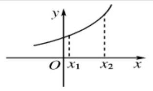 自左向右看图象是上升的</td><td>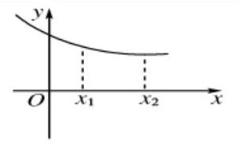 自左向右看图象是下降的</td></tr></table>

## 3、函数的周期性

对于函数 $y = f\left( x\right)$ ,如果 存在一个常数 $T\left( {T \neq  0}\right)$ ,使得对于定义域内的任意一个 $x$ ,都有 $f\left( {x + T}\right)  = f\left( x\right)$ ,那么这个函数 $f\left( x\right)$ 叫做周期函数,非零常数 $T$ 叫做 $f\left( x\right)$ 的周期,对于一个周期函数来说, 如果在所有的周期中存在一个最小正数, 那么这个最小正数叫做这个函数的最小正周期.

## 例题精讲

【例 5】( 1 )已知 $f\left( x\right)  = a - \frac{2}{{2}^{x} + 1}$ 是定义在 $R$ 上的奇函数，则 $f\left( {-3}\right)$ 的值是( )

A. -3

B. $\frac{9}{7}$ C. $\frac{1}{3}$ D. $- \frac{7}{9}$

【难度】★★

【答案】D

【解析】 $\because f\left( x\right)  = a - \frac{2}{{2}^{x} + 1}$ 是定义在 $R$ 上的奇函数, $\therefore f\left( 0\right)  = a - \frac{2}{{2}^{0} + 1} = a - 1 = 0$ ,解得 $a = 1$ , $\therefore f\left( x\right)  = 1 - \frac{2}{{2}^{x} + 1}$ ,则 $f\left( {-3}\right)  = 1 - \frac{2}{{2}^{-3} + 1} =  - \frac{7}{9}$ . 故选: $D$ .

(2)已知函数 $f\left( x\right)  = 1 - \lg \frac{1 - x}{1 + x}$ ，若 $f\left( a\right)  = \frac{1}{2}$ ，则 $f\left( {-a}\right)  =$ ( )

A. $- \frac{1}{2}$ B. $\frac{1}{2}$ C. $- \frac{3}{2}$ D. $\frac{3}{2}$

【难度】 $\star   \star$

【答案】D

【解析】函数 $f\left( x\right)  = 1 - \lg \frac{1 - x}{1 + x}$ 中,定义域为 $\left( {-1,1}\right)$ ,

设 $g\left( x\right)  = \lg \frac{1 - x}{1 + x}$ ,则 $g\left( {-x}\right)  = \lg \frac{1 + x}{1 - x}$ ,故 $g\left( x\right)  + g\left( {-x}\right)  = \lg \frac{1 + x}{1 - x} + \lg \frac{1 - x}{1 + x} = \lg 1 = 0$ ,故

$g\left( a\right)  + g\left( {-a}\right)  = 0.$

由 $f\left( x\right)  = 1 - \lg \frac{1 - x}{1 + x} = 1 - g\left( x\right)$ 知, $f\left( a\right)  = 1 - g\left( a\right) , f\left( {-a}\right)  = 1 - g\left( {-a}\right)$ ,故

$f\left( a\right)  + f\left( {-a}\right)  = 2 - \left\lbrack  {g\left( a\right)  + g\left( {-a}\right) }\right\rbrack   = 2 - 0 = 2$ ,而 $f\left( a\right)  = \frac{1}{2}$ ,故 $f\left( {-a}\right)  = 2 - \frac{1}{2} = \frac{3}{2}$ . 故选: D.

(3)已知 $y = f\left( x\right)  + {x}^{2}$ 是奇函数，且 $f\left( 1\right)  = 3$ ，若 $g\left( x\right)  = f\left( x\right)  + 2$ ，则 $g\left( {-1}\right)  =$ ___.

【难度】 $\star   \star   \star$

【答案】 -3

【解析】 $\because y = f\left( x\right)  + {x}^{2}$ 是奇函数, $\therefore f\left( {-x}\right)  + {x}^{2} =  - f\left( x\right)  - {x}^{2},\therefore f\left( {-x}\right)  + f\left( x\right)  =  - 2{x}^{2}$ ,

$\because f\left( 1\right)  = 3,\therefore f\left( {-1}\right)  =  - 5, g\left( x\right)  = f\left( x\right)  + 2$ ,则 $g\left( {-1}\right)  = f\left( {-1}\right)  + 2 =  - 3$ . 故答案为:-3

【例 6】( 1 )设 $f\left( x\right)$ 是定义在 $R$ 上且周期为 2 的函数,在区间 $\left\lbrack  {-1,1}\right\rbrack$ 上, $f\left( x\right)  = \left\{  \begin{array}{l} {ax} + 1, - 1 \leq  x < 0 \\  \frac{{bx} + 2}{x + 1},0 \leq  x \leq  1 \end{array}\right.$ 其中 $a, b \in  R$ . 若 $f\left( \frac{1}{2}\right)  = f\left( \frac{3}{2}\right)$ ，则 $a + {3b}$ 的值为___.

【难度】 $\star   \star   \star$

【答案】 -10

【解析】因为 $f\left( x\right)$ 是定义在 $R$ 上且周期为 2 的函数,所以

$f\left( \frac{3}{2}\right)  = f\left( {-\frac{1}{2}}\right)$ ，且 $f\left( {-1}\right)  = f\left( 1\right)$ ，故 $f\left( \frac{1}{2}\right)  = f\left( {-\frac{1}{2}}\right)$ ，从而 $\frac{\frac{1}{2}b + 2}{\frac{1}{2} + 1} =  - \frac{1}{2}a + 1,{3a} + {2b} =  - 2$ ①.

由 $f\left( {-1}\right)  = f\left( 1\right)$ ,得 $- a + 1 = \frac{b + 2}{2}$ ,故 $b =  - {2a}$ .

由①②得 $a = 2, b =  - 4$ ，从而 $a + {3b} =  - {10}$ .

( 2 )设 $f\left( x\right)$ 是定义在 $R$ 上的函数，对任意实数有 $f\left( x\right) f\left( {x - 2}\right)  = 1$ ，又当 $0 < x \leq  2$ 时， $f\left( x\right)  = \frac{1}{\sqrt{x}}$ ， 则 $f\left( 8\right)  =$

【难度】 $\star   \star$

【答案】 $\sqrt{2}$

【解析】由 $f\left( x\right) f\left( {x - 2}\right)  = 1$ ,即 $f\left( x\right)  = \frac{1}{f\left( {x - 2}\right) }$

所以 $f\left( {x + 4}\right)  = \frac{1}{f\left( {x + 2}\right) } = \frac{1}{\frac{1}{f\left( x\right) }} = f\left( x\right)$ ,所以 $f\left( x\right)$ 是以 4 为周期的周期函数.

所以 $f\left( 8\right)  = f\left( 0\right)  = \frac{1}{f\left( 2\right) } = \frac{1}{\frac{\sqrt{2}}{2}} = \frac{1}{\sqrt{2}}$ ; 故答案为: $\sqrt{2}$

(3)已知定义域为 $\mathbf{R}$ 的函数 $f\left( x\right)$ 满足:①图象关于原点对称；② $f\left( x\right)  = f\left( {\frac{3}{2} - x}\right)$ ；③当 $x \in  \left( {0,\frac{3}{4}}\right)$ 时， $f\left( x\right)  = {\log }_{2}\left( {x + 1}\right)  + m$ . 若 $f\left( {2020}\right)  = {\log }_{2}3$ ，则 $m =$ ( )

A. -1 B. 1 C. -2 D. 2

【难度】★★★

【答案】B

【解析】由①可知函数 $f\left( x\right)$ 为奇函数,又 $f\left( x\right)  = f\left( {\frac{3}{2} - x}\right)  =  - f\left( {x - \frac{3}{2}}\right)$ ,故

$f\left( {3 + x}\right)  =  - f\left( {x + \frac{3}{2}}\right)  = f\left( x\right)$ ,即函数 $f\left( x\right)$ 的周期为 3,

$\therefore f\left( {2020}\right)  = f\left( 1\right)  = f\left( \frac{1}{2}\right)  = {\log }_{2}\frac{3}{2} + m = {\log }_{2}3$ ,解得 $m = 1$ . 故选: B.

【例 7】( 1 )已知 $f\left( x\right)$ 是 $R$ 上的偶函数，当 $x \in  \lbrack 0, + \infty )$ 时， $f\left( x\right)  =  - {x}^{2} + x + 1$ ，若实数 $t$ ，满足 $f\left( {\lg t}\right)  > 1$ ， 则 $t$ 的取值范围是( )

A. $\left( {\frac{1}{10},1}\right)  \cup  \left( {1,{10}}\right)$ B. $\left( {0,\frac{1}{10}}\right)  \cup  \left( {1,{10}}\right)$

C. $\left( {-1,0}\right)  \cup  \left( {0,1}\right)$

D. $\left( {0,\frac{1}{10}}\right)  \cup  \left( {1, + \infty }\right)$

【难度】 $\star   \star   \star$

【答案】A

【解析】解: 由题意知,当 $x \in  \lbrack 0, + \infty )$ 时, $f\left( x\right)  =  - {x}^{2} + x + 1$ ,则 $f\left( 1\right)  = f\left( 0\right)  = 1$ ,又 $f\left( x\right)$ 是 $\mathbf{R}$ 上的偶函数, $f\left( {-1}\right)  = f\left( 1\right)  = 1$ ,函数图象如下所示:

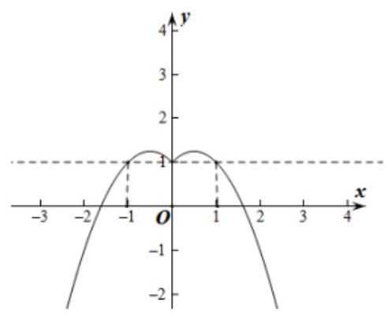

当 $f\left( x\right)  > 1$ 时,则 $- 1 < x < 1$ 且 $x \neq  0$ ,所以由 $f\left( {\lg t}\right)  > 1$ ,得 $- 1 < \lg t < 1$ 且 $\lg t \neq  0$ ,所以 $\frac{1}{10} < t < {10}$ 且 $t \neq  1$ ,则 $t$ 的取值范围是 $\left( {\frac{1}{10},1}\right)  \cup  \left( {1,{10}}\right)$ . 故选: A.

(2)已知函数 $f\left( x\right)  = a{x}^{2} + {bx} + c$ ( $a \neq  0$ ， $a$ 、 $b$ 、 $c$ 均为常数)，函数 ${f}_{1}\left( x\right)$ 的图像与函数 $f\left( x\right)$ 的图像关于 $y$ 轴对称,函数 ${f}_{2}\left( x\right)$ 的图像与函数 ${f}_{1}\left( x\right)$ 的图像关于直线 $y = 1$ 对称. 则函数 ${f}_{2}\left( x\right)$ 的解析式为 ___.

【难度】 $\star   \star   \star$

【答案】 $- a{x}^{2} + {bx} + 2 - c$

【解析】设点 $P\left( {x, y}\right)$ 在函数 ${f}_{2}\left( x\right)$ 的图像上.

则 $\mathrm{P}$ 关于直线 $y = 1$ 的对称点 ${P}^{\prime }\left( {x,2 - y}\right)$ 在函数 ${f}_{1}\left( x\right)$ 的图像上.

进而, ${P}^{\prime }$ 关于 $\mathbf{y}$ 轴的对称点 ${P}^{\prime \prime }\left( {-x,2 - y}\right)$ 在函数 $f\left( x\right)$ 的图像上.

则 $2 - y = a{x}^{2} - {bx} + c$ ,即 $y =  - a{x}^{2} + {bx} + 2 - c$ . 故 ${f}_{2}\left( x\right)  =  - a{x}^{2} + {bx} + 2 - c$ .

【例 8】( 1 )已知 $f\left( x\right)$ 是 $\mathbf{R}$ 上的奇函数， $g\left( x\right)$ 是 $\mathbf{R}$ 上的偶函数，且 $f\left( x\right)  + g\left( x\right)  = 2{x}^{3} + {x}^{2} + {3x} + 1$ ，则 $f\left( 1\right)  + g\left( 2\right)  =$ (   )

A. 5 B. 6 C. 8 D. 10

【难度】★★

【答案】D

【解析】因为 $f\left( x\right)  + g\left( x\right)  = 2{x}^{3} + {x}^{2} + {3x} + 1$ ,所以 $f\left( {-x}\right)  + g\left( {-x}\right)  =  - 2{x}^{3} + {x}^{2} - {3x} + 1$ . 又 $f\left( x\right)$ 是奇函数, $g\left( x\right)$ 是偶函数,所以 $- f\left( x\right)  + g\left( x\right)  =  - 2{x}^{3} + {x}^{2} - {3x} + 1$ ,

则 $f\left( x\right)  = 2{x}^{3} + {3x}, g\left( x\right)  = {x}^{2} + 1$ ,故 $f\left( 1\right)  + g\left( 2\right)  = 5 + 5 = {10}$ . 故选: D

(2)已知函数 $y = f\left( x\right)$ 和 $y = g\left( x\right)$ 分别是定义在 $R$ 上的偶函数和奇函数,且 $f\left( 0\right)  =  - 4, f\left( x\right)  = g\left( {x + 2}\right)$ ,则 $g\left( x\right)$ 的解析式可以是( )

A. $y =  - 4\sin \frac{\pi x}{4}\;$ B. $y = 4\sin \frac{\pi x}{2}$ C. $y =  - 4\cos \frac{\pi x}{4}$ D. $y = 4\cos \frac{\pi x}{2}$

【难度】 $\star   \star$

【答案】A

【解析】因为 $f\left( 0\right)  =  - 4, f\left( x\right)  = g\left( {x + 2}\right)$ ,所以 $g\left( 2\right)  =  - 4$ ,

而 ${y}_{1}\left( 2\right)  =  - 4\sin \frac{2\pi }{4} =  - 4,{y}_{2}\left( 2\right)  = 4\sin \frac{2\pi }{2} = 0,{y}_{3}\left( 2\right)  =  - 4\cos \frac{2\pi }{4} = 0,{y}_{4}\left( 2\right)  = 4\cos \frac{2\pi }{2} =  - 4$ ,

又因为 $y = g\left( x\right)$ 是定义在 $R$ 上的奇函数,所以 $g\left( {-x}\right)  =  - g\left( x\right)$ ,

而 ${y}_{1}\left( {-x}\right)  =  - 4\sin \left( {-\frac{\pi x}{4}}\right)  = 4\sin \frac{\pi x}{4} =  - {y}_{1}\left( x\right) ,{y}_{4}\left( {-x}\right)  = 4\cos \left( {-\frac{\pi }{2}x}\right)  = 4\cos \frac{\pi }{2}x = {y}_{4}\left( x\right)$ ,故选: A

【例 9】( 1 )若函数 $f\left( x\right)  = {x}^{2} - a\left| {x - 1}\right|$ 是区间 $\lbrack 0, + \infty )$ 上的增函数，则实数 $a$ 的取值范围是___.

【难度】 $\star   \star   \star$

【答案】 $\left\lbrack  {0,2}\right\rbrack$

【解析】 $f\left( x\right)  = \left\{  \begin{array}{l} {x}^{2} - {ax} + a, x \geq  1 \\  {x}^{2} + {ax} - a, x < 1 \end{array}\right.$ ,要使函数 $f\left( x\right)$ 在 $\left\lbrack  {0, + \infty }\right)$ 单调递增,则 $y = {x}^{2} - {ax} + a$ 在 $\lbrack 1, + \infty )$ 单

调递增,且 $y = {x}^{2} + {ax} - a$ 在 $\lbrack 0,1)$ 单调递增,以及在分界点处 $- a \leq  a$ ,即得 $\left\{  \begin{array}{l} \frac{a}{2} \leq  1 \\   - \frac{a}{2} \leq  0 \\   - a \leq  a \end{array}\right.$ ,解得: $0 \leq  a \leq  2$ .

故答案为: $\left\lbrack  {0,2}\right\rbrack$

(2)若函数 $f\left( x\right)  = {2}^{\left| x - a\right| }\left( {a \in  R}\right)$ 满足 $f\left( {1 + x}\right)  = f\left( {1 - x}\right)$ ，且 $f\left( x\right)$ 在 $\lbrack m, + \infty )$ 单调递增，则实数 $m$ 的最小值等于___.

【难度】★★

【答案】 1

【解析】根据 $f\left( {1 + x}\right)  = f\left( {1 - x}\right)$ 可知函数 $f\left( x\right)$ 的图像关于直线 $x = 1$ 对称,可知 $a = 1$ ,从而可以确定函数 $f\left( x\right)$ 在 $\lbrack 1, + \infty )$ 上是增函数,从而有 $\lbrack m, + \infty ) \subseteq  \lbrack 1, + \infty )$ ,所以 $m \geq  1$ ,故 $m$ 的最小值等于 1 .

【例 10】( 1 )已知函数 $f\left( x\right)  = \frac{{3}^{x} - {3}^{-x}}{{3}^{x} + {3}^{-x}}$ ,且 $f\left( {{5a} - 2}\right)  >  - f\left( {a - 2}\right)$ ,则 $a$ 的取值范围是( )

A. $\left( {0, + \infty }\right)$ B. $\left( {-\infty ,0}\right)$

C. $\left( {-\infty ,\frac{2}{3}}\right)$ D. $\left( {\frac{2}{3}, + \infty }\right)$

【难度】★★

【答案】D

【解析】解: 根据题意,函数 $f\left( x\right)  = \frac{{3}^{x} - {3}^{-x}}{{3}^{x} + {3}^{-x}}$ ,其定义域为 $\mathrm{R}$ ,

又由 $f\left( {-x}\right)  = \frac{{3}^{-x} - {3}^{x}}{{3}^{-x} + {3}^{x}} =  - \frac{{3}^{x} - {3}^{-x}}{{3}^{x} + {3}^{-x}} =  - f\left( x\right) , f\left( x\right)$ 为奇函数,

又 $f\left( x\right)  = 1 - \frac{2}{{9}^{x} + 1}$ ，函数 $y = {9}^{x} + 1$ 为增函数，则 $f\left( x\right)$ 在 $\mathrm{R}$ 上单调递增；

$f\left( {{5a} - 2}\right)  >  - f\left( {a - 2}\right)  \Rightarrow  f\left( {{5a} - 2}\right)  > f\left( {-a + 2}\right)  \Rightarrow  {5a} - 2 >  - a + 2$ ,解可得 $a > \frac{2}{3}$ ,故选:D.

(2)已知函数 $f\left( x\right)  = \frac{1}{{x}^{2} - {4x} + 5} - \ln \left| {x - 2}\right|$ ，则使不等式 $f\left( {{2t} + 1}\right)  > f\left( {t + 2}\right)$ 成立的实数 $t$ 的取值范围是 ___.

【难度】 $\star   \star   \star$

【答案】 $\left( {\frac{1}{3},\frac{1}{2}}\right)  \cup  \left( {\frac{1}{2},1}\right)$

【解析】 $f\left( x\right)  = \frac{1}{{\left( x - 2\right) }^{2} + 1} - \ln \left| {x - 2}\right| ,\;f\left( {2 - t}\right)  = \frac{1}{{t}^{2} + 1} - \ln \left| t\right| , f\left( {2 + t}\right)  = \frac{1}{{t}^{2}} - \ln \left| t\right|  = f\left( {2 - t}\right)$ ,所以 $f\left( x\right)$ 的图象关于直线 $x = 2$ 对称, $x > 2$ 时, $f\left( x\right)  = \frac{1}{{\left( x - 2\right) }^{2} + 1} - \ln \left( {x - 2}\right)$

设 $2 < {x}_{1} < {x}_{2}$ ,则 $0 < {\left( {x}_{1} - 2\right) }^{2} + 1 < {\left( {x}_{2} - 2\right) }^{2} + 1,\frac{1}{{\left( {x}_{1} - 2\right) }^{2} + 1} > \frac{1}{{\left( {x}_{2} - 2\right) }^{2} + 1}$ ,

$0 < {x}_{1} - 2 < {x}_{2} - 2,\ln \left( {{x}_{1} - 2}\right)  < \ln \left( {{x}_{2} - 2}\right) ,$

所以 $\frac{1}{{\left( {x}_{1} - 2\right) }^{2} + 1} - \ln \left( {{x}_{1} - 1}\right)  > \frac{1}{{\left( {x}_{2} - 2\right) }^{2} + 1} - \ln \left( {{x}_{2} - 1}\right)$ ,即 $f\left( {x}_{1}\right)  > f\left( {x}_{2}\right)$

即 $f\left( x\right)$ 是减函数，所以 $x < 2$ 时函数为增函数，

因此由 $f\left( {{2t} + 1}\right)  > f\left( {t + 2}\right)$ 得 $\left\{  \begin{array}{l} \left| {{2t} + 1 - 2}\right|  < \left| {t + 2 - 2}\right| \\  {2t} + 1 \neq  2 \\  t + 2 \neq  2 \end{array}\right.$ ，解得 $\frac{1}{3} < t < 1$ 且 $t \neq  \frac{1}{2}$ . 故答案为: $\left( {\frac{1}{3},\frac{1}{2}}\right)  \cup  \left( {\frac{1}{2},1}\right)$

【例 11】已知函数 $f\left( x\right)  = 2 + \frac{1}{a} - \frac{1}{{a}^{2}x}$ ,实数 $a \in  R$ 且 $a \neq  0$ .

(1)设 $0 < m < n$ ，判断函数 $f\left( x\right)$ 在 $\left\lbrack  {m, n}\right\rbrack$ 上的单调性，并说明理由；

(2)设 $0 < m < n$ 且 $a > 0$ 时， $f\left( x\right)$ 的定义域和值域都是 $\left\lbrack  {m, n}\right\rbrack$ ，求 $n - m$ 的最大值；

(3)若 $x \geq  1$ 时不等式 $\left| {{a}^{2}f\left( x\right) }\right|  \leq  {2x}$ 恒成立，求实数 $a$ 的取值范围.

【难度】 $\star   \star   \star$

【答案】(1)单调递增,理由见解析; (2) $\frac{4\sqrt{3}}{3};$ (3) $- \frac{3}{2} \leq  a \leq  1$ 且 $a \neq  0$ .

【解析】(1) 设 $0 < m \leq  {x}_{1} < {x}_{2} \leq  n$ ,则 $f\left( {x}_{1}\right)  - f\left( {x}_{2}\right)  =  - \frac{1}{{a}^{2}{x}_{1}} + \frac{1}{{a}^{2}{x}_{2}} = \frac{{x}_{1} - {x}_{2}}{{a}^{2}{x}_{1}{x}_{2}}$ , $\because 0 < m \leq  {x}_{1} < {x}_{2} \leq  n,\therefore {x}_{1}{x}_{2} > 0,{x}_{1} - {x}_{2} < 0,\therefore f\left( {x}_{1}\right)  < f\left( {x}_{2}\right)$ ,故 $f\left( x\right)$ 在 $\left\lbrack  {m, n}\right\rbrack$ 上单调递增;

(2)由(1)可得 $0 < m < n$ 时， $f\left( x\right)$ 在 $\left\lbrack  {m, n}\right\rbrack$ 上单调递增，

$\because f\left( x\right)$ 的定义域和值域都是 $\left\lbrack  {m, n}\right\rbrack  ,\therefore f\left( m\right)  = m, f\left( n\right)  = n$ ,

则 $m, n$ 是方程 $2 + \frac{1}{a} - \frac{1}{{a}^{2}x} = x$ 的不相等的两个正数根,即 ${a}^{2}{x}^{2} - \left( {2{a}^{2} + a}\right) x + 1 = 0$ 有两个不相等的正数根,

则 $\left\{  \begin{array}{l} \Delta  = {\left( 2{a}^{2} + a\right) }^{2} - 4{a}^{2} > 0 \\  {x}_{1} + {x}_{2} = \frac{2{a}^{2} + a}{{a}^{2}} > 0,\text{ 解得 }a > \frac{1}{2}, \\  {x}_{1}{x}_{2} = \frac{1}{{a}^{2}} > 0 \end{array}\right.$

$\therefore n - m = \sqrt{{\left( \frac{2{a}^{2} + a}{{a}^{2}}\right) }^{2} - \frac{4}{{a}^{2}}} = \frac{1}{a}\sqrt{4{a}^{2} + {4a} - 3} = \sqrt{-3{\left( \frac{1}{a} - \frac{2}{3}\right) }^{2} + \frac{16}{3}}$ ,

$\because a \in  \left( {\frac{1}{2}, + \infty }\right) ,\therefore a = \frac{3}{2}$ 时, $n - m$ 最大值为 $\frac{4\sqrt{3}}{3}$ ;

(3) ${a}^{2}f\left( x\right)  = 2{a}^{2} + a - \frac{1}{x}$ ，则不等式 $\left| {{a}^{2}f\left( x\right) }\right|  \leq  {2x}$ 对 $x \geq  1$ 恒成立，

即 $- {2x} \leq  2{a}^{2} + a - \frac{1}{x} \leq  {2x}$ ,即 $\frac{1}{x} - {2x} \leq  2{a}^{2} + a \leq  {2x} + \frac{1}{x}$ 对 $x \geq  1$ 恒成立,

令 $h\left( x\right)  = {2x} + \frac{1}{x}$ ,则 $h\left( x\right)$ 在 $\lbrack 1, + \infty )$ 单调递增, $\therefore h{\left( x\right) }_{\text{ min }} = h\left( 1\right)  = 3$ ,

令 $g\left( x\right)  = \frac{1}{x} - {2x}$ ,则 $g\left( x\right)$ 在 $\lbrack 1, + \infty )$ 单调递减, $\therefore g{\left( x\right) }_{\text{ max }} = g\left( 1\right)  =  - 1$ ,

$\therefore \left\{  \begin{array}{l} 2{a}^{2} + a \leq  3 \\  2{a}^{2} + a \geq   - 1 \end{array}\right.$ ,解得 $- \frac{3}{2} \leq  a \leq  1$ 且 $a \neq  0$ .

## 巩固训练

1、已知函数 $y = f\left( x\right)$ 是定义在 $\mathrm{R}$ 上的奇函数,当 $x < 0$ 时, $f\left( x\right)  = {x}^{2} + {mx} + 2$ ,且 $f\left( 1\right)  =  - 2$ ,则 $f\left( 2\right)$ 的值为( )

A. -4 B. 0 C. 4 D. 2

【答案】A

【解析】 $\because f\left( x\right)$ 是 $R$ 上的奇函数, $\therefore f\left( {-1}\right)  =  - f\left( 1\right)  = 2$ ,即 $1 - m + 2 = 2, m = 1$ . $f\left( {-2}\right)  = {\left( -2\right) }^{2} + \left( {-2}\right)  + 2 = 4,\therefore f\left( 2\right)  =  - f\left( {-2}\right)  =  - 4$ . 故选: A.

2、已知定义在 $\mathbf{R}$ 上的函数 $f\left( x\right)$ 满足 $f\left( {x + 1}\right)$ 是奇函数， $f\left( {x - 1}\right)$ 是偶函数，且 $f\left( 0\right)  = 1$ ，则 $f\left( 1\right)  + f\left( 4\right)  =$ ( )

A. -1 B. 0 C. 1 D. 2

【答案】A

【解析】解: $\because f\left( {x + 1}\right)$ 是奇函数, $f\left( {x - 1}\right)$ 是偶函数, $\therefore f\left( {x + 1}\right)  =  - f\left( {-x + 1}\right) , f\left( {x - 1}\right)  = f\left( {-x - 1}\right)$ , 令 $x = 3$ ,由 $f\left( {x + 1}\right)  =  - f\left( {-x + 1}\right)$ ,得: $f\left( 4\right)  = f\left( {3 + 1}\right)  =  - f\left( {-3 + 1}\right)  =  - f\left( {-2}\right)$ ,

令 $x =  - 1$ ,由 $f\left( {x - 1}\right)  = f\left( {-x - 1}\right)$ ,得: $f\left( {-2}\right)  = f\left( {-1 - 1}\right)  = f\left( {-\left( {-1}\right)  - 1}\right)  = f\left( 0\right)  = 1$ ,

$\therefore f\left( 4\right)  =  - f\left( {-2}\right)  =  - 1$ ,

令 $x = 0$ ,由 $f\left( {x + 1}\right)  =  - f\left( {-x + 1}\right) , f\left( 1\right)  =  - f\left( 1\right)$ ,即 ${2f}\left( 1\right)  = 0$ ,解得: $f\left( 1\right)  = 0$ ,

$\therefore f\left( 1\right)  + f\left( 4\right)  = 0 - 1 =  - 1$ ,故选: A.

3、已知函数 $f\left( x\right)$ 是定义在 $\mathrm{R}$ 上的奇函数,且关于直线 $x = 1$ 对称,当 $0 < x \leq  1$ 时, $f\left( x\right)  = {x}^{2} - {2x} + 3$ , 则 $f\left( \frac{5}{2}\right)  =$ (   )

A. $- \frac{7}{4}$ B. $\frac{7}{4}$ C. $- \frac{9}{4}$ D. $\frac{9}{4}$

【答案】C

【解析】由题意,函数 $f\left( x\right)$ 是定义在 $\mathbf{R}$ 上的奇函数,且 $f\left( {x + 1}\right)  = f\left( {-x + 1}\right)$ ,

可得 $f\left( {x + 1}\right)  =  - f\left( {x - 1}\right) , f\left( x\right)  =  - f\left( {x + 2}\right)$ ,所以 $f\left( x\right)  =  - f\left( {x + 2}\right)  = f\left( {x + 4}\right)$ ,

所以函数 $f\left( x\right)$ 是周期为 4 的周期函数,又由当 $0 < x \leq  1$ 时, $f\left( x\right)  = {x}^{2} - {2x} + 3$ ,则

$f\left( \frac{5}{2}\right)  = f\left( {-\frac{3}{2}}\right)  =  - f\left( \frac{3}{2}\right)  =  - f\left( \frac{1}{2}\right)  =  - \left( {\frac{1}{4} - 2 \times  \frac{1}{2} + 3}\right)  =  - \frac{9}{4}$ . 故选: C.

4、设 $f\left( x\right)$ 是定义在 $\left\lbrack  {-2,2}\right\rbrack$ 上的奇函数,且在 $\left\lbrack  {-2,2}\right\rbrack$ 上单调递减,若不等式 $f\left( {{2x} - \frac{1}{4}}\right)  + f\left( {1 - x}\right)  \geq  0$ 的解集为 $A$ ,则 $g\left( x\right)  = x - \frac{4}{x}$ 在 $A$ 上的最小值为( )

A. $\frac{8}{7}$ B. $\frac{55}{4}$ C. $\frac{55}{12}$ D. $\frac{207}{56}$

【答案】D

【解析】因为 $f\left( x\right)$ 是 $\left\lbrack  {-2,2}\right\rbrack$ 上的奇函数,所以由 $f\left( {{2x} - \frac{1}{4}}\right)  + f\left( {1 - x}\right)  \geq  0$ 得 $f\left( {{2x} - \frac{1}{4}}\right)  \geq  f\left( {x - 1}\right)$ , 又因为 $f\left( x\right)$ 在 $\left\lbrack  {-2,2}\right\rbrack$ 上单调递减,所以 $\left\{  \begin{array}{l}  - 2 \leq  {2x} - \frac{1}{4} \leq  2 \\   - 2 \leq  x - 1 \leq  2 \\  {2x} - \frac{1}{4} \leq  x - 1 \end{array}\right.$ ,解得 $- \frac{7}{8} \leq  x \leq   - \frac{3}{4}$ ,即 $A = \left\lbrack  {-\frac{7}{8}, - \frac{3}{4}}\right\rbrack$ . 因为 $g\left( x\right)  = x - \frac{4}{x}$ 在 $\left( {-\infty ,0}\right)$ 单调递增,所以 $g\left( x\right)  = x - \frac{4}{x}$ 在 $A$ 上的最小值为 $g\left( {-\frac{7}{8}}\right)  =  - \frac{7}{8} - \frac{4}{-\frac{7}{8}} = \frac{207}{56}$ . 故选: D.

5、已知函数 $f\left( {3x}\right)$ 的图象仅关于点 $\left( {2,0}\right)$ 对称，若 $f\left( {{3x} + m}\right)$ 为奇函数，则 $m =$ ( )

A. 0 B. 2 C. 3 D. 6

【答案】D

【解析】解: $f\left( {{3x} + m}\right)  = f\left\lbrack  {3\left( {x + \frac{m}{3}}\right) }\right\rbrack$ ,

将函数 $f\left( {3x}\right)$ 的图象向左平移 2 个单位长度,得到函数 $y = f\left\lbrack  {3\left( {x + 2}\right) }\right\rbrack$ 的图象,

因为函数 $f\left( {3x}\right)$ 的图象仅关于点 $\left( {2,0}\right)$ 对称,所以 $y = f\left\lbrack  {3\left( {x + 2}\right) }\right\rbrack$ 为奇函数,又

$f\left( {{3x} + m}\right)  = f\left\lbrack  {3\left( {x + \frac{m}{3}}\right) }\right\rbrack$ 为奇函数; 所以 $\frac{m}{3} = 2$ ,解得 $m = 6$ . 故选: D.

6、已知定义域为 $\mathbf{R}$ 的函数 $f\left( x\right)$ 在 $\lbrack 2, + \infty )$ 单调递减，且 $f\left( {4 - x}\right)  + f\left( x\right)  = 0$ ，则使得不等式 $f\left( {{x}^{2} + x}\right)  + f\left( {x + 1}\right)  < 0$ 成立的实数 $x$ 的取值范围是( )

A. $- 3 < x < 1$ B. $x <  - 1$ 或 $x > 3$ C. $x <  - 3$ 或 $x > 1$ D. $x \neq   - 1$

【答案】C

【解析】 $f\left( {4 - x}\right)  + f\left( x\right)  = 0$ ,则 $f\left( x\right)$ 关于 $\left( {2,0}\right)$ 对称,

因为 $f\left( x\right)$ 在 $\lbrack 2, + \infty )$ 单调递减,所以 $f\left( x\right)$ 在 $\mathbf{R}$ 上单调递减,所以 $f\left( {x + 1}\right)  =  - f\left( {3 - x}\right)$ ,

由 $f\left( {{x}^{2} + x}\right)  + f\left( {x + 1}\right)  < 0$ 得 $f\left( {{x}^{2} + x}\right)  - f\left( {3 - x}\right)  < 0$ ,所以 $f\left( {{x}^{2} + x}\right)  < f\left( {3 - x}\right)$ ,

所以 ${x}^{2} + x > 3 - x$ ,解得 $x > 1$ 或 $x <  - 3$ . 故选: C.

7、狄利克雷是德国著名数学家，是最早倡导严格化方法的数学家之一. 狄利克雷函数 $f\left( x\right)  = \left\{  \begin{array}{l} 1, x \in  Q \\  0, x \notin  Q \end{array}\right.$ ( $Q$ 是有理数)的出现表示数学家对数学的理解开始了深刻的变化，从研究“算”到研究更抽象的“概念，性质， 结构”. 关于 $f\left( x\right)$ 的性质，下列说法不正确的是( )

A. $f\left( \pi \right)  > f\left( 0\right)$ B. 函数 $f\left( x\right)$ 是偶函数

C. $f\left( {f\left( x\right) }\right)  = 1$ D. 函数 $f\left( x\right)$ 是周期函数

【答案】A

【解析】选项A. 由条件 $f\left( \pi \right)  = 0, f\left( 0\right)  = 1$ ,所以 $f\left( \pi \right)  < f\left( 0\right)$ ,故 $\mathrm{A}$ 不正确.

选项B. 当 $x \in  Q$ 时, $- x \in  Q$ ,则有 $f\left( x\right)  = 1, f\left( {-x}\right)  = 1$ ,即有 $f\left( x\right)  = f\left( {-x}\right)$

当 $x \notin  Q$ 时, $- x \notin  Q$ ,则有 $f\left( x\right)  = 0, f\left( {-x}\right)  = 0$ ,即有 $f\left( x\right)  = f\left( {-x}\right)$

故总有 $f\left( x\right)  = f\left( {-x}\right)$ 成立,所以函数 $f\left( x\right)$ 是偶函数,故 $\mathbf{B}$ 正确.

选项 C. 由 $f\left( x\right)  = \left\{  \begin{array}{l} 1, x \in  Q \\  0, x \notin  Q \end{array}\right.$ ,可得 $f\left( x\right)$ 的值为有理数,所以 $f\left( {f\left( x\right) }\right)  = 1$ ,故 $\mathrm{C}$ 成立.

选项D. 对于任意 $T \in  Q\left( {T \neq  0}\right)$ ,则 $x$ 与 $x + T$ 同为有理数或无理数,

所以总有 $f\left( {T + x}\right)  = f\left( x\right)  = 1$ 或 $f\left( {T + x}\right)  = f\left( x\right)  = 0$ ,即 $f\left( {T + x}\right)  = f\left( x\right)$ 成立

所以函数 $f\left( x\right)$ 是周期函数,故 $\mathrm{D}$ 正确. 故选: $\mathrm{A}$

8、已知 $f\left( x\right)$ 是定义在 $R$ 上的奇函数, $f\left( {-1}\right)  =  - \frac{1}{6}$ ,且当 $x \geq  0$ 时, $f\left( x\right)  = \frac{a}{{2}^{x}} - \frac{b}{{3}^{x}}$ .

(1)求实数 $a, b$ 的值；

(2)求 $f\left( x\right)$ 的解析式;

(3)若任意 $x \in  \left\lbrack  {-2, - 1}\right\rbrack$ ， $f\left( x\right)  \geq  {4}^{x}\left( {m - {\log }_{2}\frac{3 - x}{3 + x}}\right)  - {2}^{x + 1}$ ，求实数 $m$ 的取值范围.

【答案】( 1 ) $a = b = 1$ ；( 2 ) $f\left( x\right)  = \left\{  {\begin{array}{l} \frac{1}{{2}^{x}} - \frac{1}{{3}^{x}}, x \geq  0 \\  {3}^{x} - {2}^{x}, x < 0 \end{array};\;\left( 3\right) \left( {-\infty ,\frac{13}{3}}\right\rbrack  }\right.$ .

【解析】(1)由题意知 $f\left( 1\right)  =  - f\left( {-1}\right)  = \frac{1}{6}$ ，即 $\frac{a}{2} - \frac{b}{3} = \frac{1}{6}$ ，

又 $f\left( 0\right)  = 0$ ,即 $a - b = 0$ ,解得 $a = b = 1$ ,所以实数 $a$ 的值为 1,实数 $b$ 的值为 1 .

(2)由(1)知当 $x \geq  0$ 时， $f\left( x\right)  = \frac{1}{{2}^{x}} - \frac{1}{{3}^{x}}$ ；当 $x < 0$ 时， $- x > 0$ ，根据奇函数的定义可知， $f\left( x\right)  =  - f\left( {-x}\right)  =  - \left( {\frac{1}{{2}^{-x}} - \frac{1}{{3}^{-x}}}\right)  = {3}^{x} - 2$ . 故 $f\left( x\right)  = \left\{  \begin{array}{l} \frac{1}{{2}^{x}} - \frac{1}{{3}^{x}}, x \geq  0 \\  {3}^{x} - {2}^{x}, x < 0 \end{array}\right.$ .

(3)由 $\forall x \in  \left\lbrack  {-2, - 1}\right\rbrack  ,{3}^{x} - {2}^{x} \geq  {4}^{x}\left( {m - {\log }_{2}\frac{3 - x}{3 + x}}\right)  - {2}^{x + 1}$ ,得 ${4}^{x}\left( {m - {\log }_{2}\frac{3 - x}{3 + x}}\right)  \leq  {3}^{x} + {2}^{x}$ 在区间 $\left\lbrack  {-2, - 1}\right\rbrack$ 上恒成立,

又 ${4}^{x} > 0$ ,所以 $m \leq  {\left( \frac{3}{4}\right) }^{x} + {\left( \frac{1}{2}\right) }^{x} + {\log }_{2}\frac{3 - x}{3 + x}$ 在区间 $\left\lbrack  {-2, - 1}\right\rbrack$ 上恒成立.

令 $t\left( x\right)  = \frac{3 - x}{3 + x} =  - 1 + \frac{6}{3 + x}$ ,易知函数 $t\left( x\right)$ 在区间 $\left\lbrack  {-2, - 1}\right\rbrack$ 上为减函数,

所以函数 $y = {\log }_{2}\frac{3 - x}{3 + x}$ 在区间 $\left\lbrack  {-2, - 1}\right\rbrack$ 上为减函数,

又函数 $y = {\left( \frac{3}{4}\right) }^{x}, y = {\left( \frac{1}{2}\right) }^{x}$ 在区间 $\left\lbrack  {-2, - 1}\right\rbrack$ 上为减函数,

所以 $g\left( x\right)  = {\left( \frac{3}{4}\right) }^{x} + {\left( \frac{1}{2}\right) }^{x} + {\log }_{2}\frac{3 - x}{3 + x}$ 在区间 $\left\lbrack  {-2, - 1}\right\rbrack$ 上为减函数,

所以 $m \leq  g{\left( x\right) }_{\min } = g\left( {-1}\right)  = \frac{4}{3} + 2 + 1 = \frac{13}{3}$ ,故实数 $m$ 的取值范围为 $\left( {-\infty ,\frac{13}{3}}\right\rbrack$ .

9、已知 $f\left( x\right)  = {e}^{x} - \frac{a}{{e}^{x}}$ 是奇函数.

(1)求实数 $a$ 的值；

(2)求函数 $y = {e}^{2x} + {e}^{-x} - {2\lambda }f\left( x\right)$ 在 $\lbrack 0, + \infty )$ 上的值域；

(3)令 $g\left( x\right)  = f\left( x\right)  - {2x}$ ，求不等式 $g\left( {{x}^{3} + 1}\right)  + g\left( {1 - 3{x}^{2}}\right)  < 0$ 的解集.

【答案】(1) $1;\left( 2\right) \lambda  < 0$ 时,值域为 $\lbrack 2, + \infty );\lambda  \geq  0$ 时,值域为 $\left\lbrack  {2 - {\lambda }^{2}, + \infty }\right) ;\left( 3\right) \{ x \mid  x < 1 - \sqrt{3}$ 或 $1 < x < 1 + \sqrt{3}\}$ .

【解析】(1) 由题意可得 $f\left( {-x}\right)  =  - f\left( x\right) ,\frac{1}{{e}^{x}} - a{e}^{x} =  - {e}^{x} + \frac{a}{{e}^{x}}$ ,整理可得, $\left( {a - 1}\right) \left( {{e}^{x} + \frac{1}{{e}^{x}}}\right)  = 0$ , $\therefore a = 1$ ;

(2)令 $t = {e}^{x} - \frac{1}{{e}^{x}}$ ，

$\because x \in  \lbrack 0, + \infty ),\therefore {e}^{x} \in  \lbrack 1, + \infty ),\therefore t \geq  0$ ,

$\therefore y = {e}^{2x} + {e}^{-{2x}} - {2\lambda f}\left( x\right)  = {e}^{2x} + {e}^{-{2x}} - {2\lambda }\left( {{e}^{x} - \frac{1}{{e}^{x}}}\right)  = {t}^{2} - {2\lambda t} + 2,\left( {t \geq  0}\right)$ ,对称轴 $t = \lambda$ ,

① $\lambda  < 0$ 时， $y = {t}^{2} - {2\lambda }t + 2$ 在 $\lbrack 0, + \infty )$ 上单调递增， $\therefore y \geq  2$ ，值域为 $\lbrack 2, + \infty )$ ；

② $\lambda  \geq  0$ 时， $y = {t}^{2} - {2\lambda }t + 2$ 在 $\lbrack 0, + \infty )$ 上先减后增，当 $x = \lambda$ 时函数有最小值 $2 - {\lambda }^{2}$ ，值域为 $\lbrack 2 - {\lambda }^{2}, + \infty )$ ；

(3) $\because g\left( {-x}\right)  = f\left( {-x}\right)  + {2x} =  - f\left( x\right)  + {2x} =  - g\left( x\right) , x \in  \mathbf{R}$ ， $\therefore g\left( x\right)$ 为奇函数，

$\because g\left( {{x}^{3} + 1}\right)  + g\left( {1 - 3{x}^{2}}\right)  < 0,\therefore g\left( {{x}^{3} + 1}\right)  <  - g\left( {1 - 3{x}^{2}}\right)  = g\left( {-1 + 3{x}^{2}}\right)$ ,

$\because {g}^{\prime }\left( x\right)  = {e}^{x} + \frac{1}{{e}^{x}} - 2 \geq  0,\therefore g\left( x\right)$ 单调递增, $\therefore {x}^{3} + 1 <  - 1 + 3{x}^{2}$ ,即

${x}^{3} - 3{x}^{2} + 2 = \left( {x - 1}\right) \left( {{x}^{2} - {2x} - 2}\right)  < 0,$

当 $x > 1$ 时, ${x}^{2} - {2x} - 2 < 0$ ,解可得 $1 < x < 1 + \sqrt{3}$ ,

当 $x < 1$ 时， ${x}^{2} - {2x} - 2 > 0$ ，解可得 $x < 1 - \sqrt{3}$ ，

综上可得,不等式的解集 $\{ x \mid  x < 1 - \sqrt{3}$ 或 $1 < x < 1 + \sqrt{3}\}$ .

10、已知函数 $f\left( x\right)  = \left\{  \begin{array}{l}  - {x}^{2} + {2x}, x > 0, \\  0,\;x = 0, \\  {x}^{2} + {mx}, x < 0 \end{array}\right.$ 是奇函数.

(1)求实数 $m$ 的值；

(2)若函数 $f\left( x\right)$ 在区间 $\left\lbrack  {-1, a - 2}\right\rbrack$ 上是单调增函数，求实数 $a$ 的取值范围；

(3)求不等式 $\frac{f\left( x\right)  - f\left( {-x}\right) }{x} < 0$ 的解集.

【答案】(1)2; (2) $1 < a \leq  3$ ； (3) $x \in  \left( {-\infty , - 2}\right)  \cup  \left( {2, + \infty }\right)$ .

【解析】(1)设 $x < 0$ ，则 $- x > 0$ ，所以 $f\left( {-x}\right)  =  - {x}^{2} - {2x}$ ，

$\because f\left( x\right)$ 是奇函数, $\therefore f\left( x\right)  =  - f\left( {-x}\right)  = {x}^{2} + {2x},\therefore m = 2$ ,

(2) $f\left( x\right)$ 的图象如图

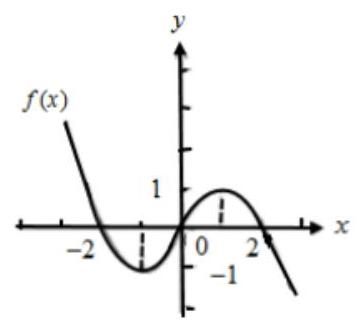

$\because$ 函数 $f\left( x\right)$ 在区间 $\left\lbrack  {-1, a - 2}\right\rbrack$ 上单调递增, $\therefore  - 1 < a - 2 \leq  1,\therefore 1 < a \leq  3$ .

(3) 由 $\frac{f\left( x\right)  - f\left( {-x}\right) }{x} < 0$ 可得 $\frac{{2f}\left( x\right) }{x} < 0$ ,即 ${xf}\left( x\right)  < 0$ ,

当 $x > 0$ 时 $f\left( x\right)  < 0$ ,由图像可得: $x > 2$ ,当 $x < 0$ 时 $f\left( x\right)  > 0$ ,由图像可得: $x <  - 2$ ,

综上: $x \in  \left( {-\infty , - 2}\right)  \cup  \left( {2, + \infty }\right)$

## (三) 函数的图像与零点

## 知识梳理

1、函数零点的定义: 对于函数 $y = f\left( x\right) , x \in  D$ ,如果存在实数 $c \in  D$ ,使得 $f\left( c\right)  = 0$ ,就把 $c$ 叫做函数的零点 (zero).

2、求函数零点的二分法: 事实上，对于区间 $\left\lbrack  {a, b}\right\rbrack$ 上的图像时一段连续曲线的函数 $y = f\left( x\right)$ ,如果 $f\left( a\right)  \cdot  f\left( b\right)  < 0$ ,那么 $y = f\left( x\right)$ 在区间 $\left( {a, b}\right)$ 上一定有零点.

3、函数的零点与方程的解关系: 函数 $y = f\left( x\right) , x \in  D$ 的零点,就是方程 $f\left( x\right)  = 0$ 在集合 $D$ 中的解,也是该函数 $y = f\left( x\right)$ 的图像与 $x$ 轴的交点的横坐标.

【例 12】( 1 )函数 $f\left( x\right)  = \ln \left( {x + 1}\right)  - \frac{2}{x}$ 的零点所在的大致区间是( )

A. $\left( {3,4}\right)$ B. $\left( {2, e}\right)$ C. $\left( {1,2}\right)$ D. $\left( {0,1}\right)$

【难度】 $\star   \star$

【答案】C

【解析】因为 $f\left( 1\right)  = \ln 2 - \frac{2}{1} < 0, f\left( 2\right)  = \ln 3 - \frac{2}{2} > 0$ ,且函数 $f\left( x\right)$ 在 $\left( {0, + \infty }\right)$ 上单调递增,所以函数的零点所在区间为 $\left( {1,2}\right)$ . 故选: $C$

(2)设函数 $f\left( x\right)  = x\lg x$ 满足 $f\left( a\right) f\left( b\right) f\left( c\right)  < 0\left( {a < b < c}\right)$ ， $f\left( x\right)$ 的零点为 ${x}_{0}$ ，则下列选项中一定错误的是( )

A. ${x}_{0} \in  \left( {a, c}\right)$ B. ${x}_{0} \in  \left( {a, b}\right)$ C. ${x}_{0} \in  \left( {b, c}\right)$ D. ${x}_{0} \in  \left( {c, + \infty }\right)$

【难度】 $\star   \star   \star$

【答案】C

【解析】由题意,函数 $f\left( x\right)  = x\lg x$ 的定义域为 $\left( {0, + \infty }\right)$ ,且 $f\left( x\right)$ 的零点为 ${x}_{0}$ ,即 $f\left( {x}_{0}\right)  = 0$ ,解得 ${x}_{0} = 1$ , 又因为 $f\left( a\right) f\left( b\right) f\left( c\right)  < 0\left( {a < b < c}\right)$ ,

可得 $f\left( a\right) , f\left( b\right) , f\left( c\right)$ 中,有 1 个负数、两个正数,或 3 个都是负数,

若 $f\left( a\right) , f\left( b\right) , f\left( c\right)$ 中,有 1 个负数、两个正数,可得 $f\left( a\right)  < 0, f\left( b\right)  > 0, f\left( c\right)  > 0$ ,即 $0 < a < 1 < b < c$ , 根据零点的存在定理,可得 ${x}_{0} \in  \left( {a, b}\right)$ 或 ${x}_{0} \in  \left( {a, c}\right)$ ;

若 $f\left( a\right) , f\left( b\right) , f\left( c\right)$ 中,3 个都是负数,则满足 $f\left( a\right)  < 0, f\left( b\right)  < 0, f\left( c\right)  < 0$ ,

即 $0 < a < b < c < 1$ ,此时函数的零点 ${x}_{0} \in  \left( {c, + \infty }\right)$ . 故选: C.

【例 13】( 1 )函数 $f\left( x\right)  = \sin {\pi x} - x - \frac{1}{4x}$ 的零点为___.

【难度】 $\star   \star   \star$

【答案】 $\pm  \frac{1}{2}$

【解析】令 $f\left( x\right)  = 0$ 得 $\sin {\pi x} = x + \frac{1}{4x}$ ,令 $g\left( x\right)  = \sin {\pi x}\left( {x \neq  0}\right)$ 与 $h\left( x\right)  = x + \frac{1}{4x}\left( {x \neq  0}\right)$

由于 $g\left( {-x}\right)  =  - \sin {\pi x} =  - g\left( x\right) , h\left( {-x}\right)  =  - \left( {x + \frac{1}{4x}}\right)  =  - h\left( x\right)$ ,

所以 $g\left( x\right)$ 和 $h\left( x\right)$ 都是奇函数,图象关于原点对称.

当 $x > 0$ 时, $g\left( x\right)  \in  \left\lbrack  {-1,1}\right\rbrack  , h\left( x\right)  = x + \frac{1}{4x} \geq  2\sqrt{x \cdot  \frac{1}{4x}} = 1$ ,当且仅当 $x = \frac{1}{4x}, x = \frac{1}{2}$ 时等号成立, 而 $g\left( \frac{1}{2}\right)  = \sin \frac{\pi }{2} = 1$ ,所以当 $x = \frac{1}{2}$ 时, $g\left( \frac{1}{2}\right)  = h\left( \frac{1}{2}\right)  = 1$ . 所以当 $x > 0$ 时, $f\left( x\right)  = 0$ 有唯一解 $x = \frac{1}{2}$ . 由于 $g\left( x\right)$ 和 $h\left( x\right)$ 都是奇函数,图象关于原点对称,所以当 $x < 0$ 时,有 $g\left( {-\frac{1}{2}}\right)  = h\left( {-\frac{1}{2}}\right)  =  - 1$ , 也即当 $x < 0$ 时, $f\left( x\right)  = 0$ 有唯一解 $x =  - \frac{1}{2}$ . 综上所述, $f\left( x\right)$ 的零点为 $\pm  \frac{1}{2}$ . 故答案为: $\pm  \frac{1}{2}$

(2)定义函数 $f\left( x\right)  = \left\{  \begin{array}{l} 6 - {12}\left| {x - \frac{3}{2}}\right| ,1 \leq  x \leq  2 \\  \frac{1}{2}f\left( \frac{x}{2}\right) , x > 2 \end{array}\right.$ ，则函数 $g\left( x\right)  = x \cdot  f\left( x\right)  - 9$ 在区间 $\left\lbrack  {1,{2}^{n}}\right\rbrack  \left( {n \in  {\mathrm{N}}^{ * }}\right)$ 内的所有的零点之和为___.

【难度】 $\star   \star   \star$

【答案】 $\frac{3\left( {{2}^{n} - 1}\right) }{2}$

【解析】当 $1 \leq  x \leq  \frac{3}{2}$ 时, $f\left( x\right)  = {12x} - {12}$ ,所以 $g\left( x\right)  = {12}{\left( x - \frac{1}{2}\right) }^{2} - {12}$ ,此时当 $x = \frac{3}{2}$ 时, $g{\left( x\right) }_{\max } = 0$ ; 当 $\frac{3}{2} < x \leq  2$ 时, $f\left( x\right)  = {24} - {12x}$ ,所以 $g\left( x\right)  =  - {12}{\left( x - 1\right) }^{2} + 3 < 0$ ; 由此可得 $1 \leq  x \leq  2$ 时, $g{\left( x\right) }_{\max } = 0$ .

下面考虑 ${2}^{n - 1} < x \leq  {2}^{n}$ 且 $n \geq  2$ 时, $g\left( x\right)$ 的最大值的情况.

当 ${2}^{n - 1} < x \leq  3 \cdot  {2}^{n - 2}$ 且 $n \geq  2$ 时,由函数 $f\left( x\right)$ 的定义知 $f\left( x\right)  = \frac{1}{2}f\left( \frac{x}{2}\right)  = \cdots  = \frac{1}{{2}^{n - 1}}f\left( \frac{x}{{2}^{n - 1}}\right)$ ,

因为 $1 \leq  \frac{x}{{2}^{n - 1}} \leq  \frac{3}{2}$ ,所以 $g\left( x\right)  = \frac{3}{{2}^{{2n} - 4}}{\left( x - {2}^{n - 2}\right) }^{2} - {12}$ ,此时当 $x = 3 \cdot  {2}^{n - 2}$ 时, $g\left( x\right) {}_{\max } = 0$ ;

当 $3 \cdot  {2}^{n - 2} < x \leq  {2}^{n}$ 时,同理可知, $g\left( x\right)  =  - \frac{3}{{2}^{{2n} - 4}}{\left( x - {2}^{n - 1}\right) }^{2} + 3 < 0$ .

由此可得 ${2}^{n - 1} < x \leq  {2}^{n}$ 且 $n \geq  2$ 时, $g{\left( x\right) }_{\max } = 0$ .

综上可得:对于一切的 $n \in  {\mathrm{N}}^{ * }$ ，函数 $g\left( x\right)$ 在区间 $\left( {{2}^{n - 1},{2}^{n}}\right\rbrack$ 上有 1 个零点，

从而 $g\left( x\right)$ 在区间 $\left\lbrack  {1,{2}^{n}}\right\rbrack$ 上有 $n$ 个零点,且这些零点为 ${x}_{n} = 3 \cdot  {2}^{n - 2}$ ,

因此,所有这些零点成等比数列,所有零点的和为 $\frac{3}{2}\left( {{2}^{n} - 1}\right)$ . 故答案为: $\frac{3}{2}\left( {{2}^{n} - 1}\right)$ .

例 14、(1)若关于 $x$ 的方程 ${\log }_{2}\left( {a{x}^{2} - {2x} + 2}\right)  = 2$ 在区间 $\left\lbrack  {\frac{1}{2},2}\right\rbrack$ 上有解，则实数 $a$ 的取值范围为 ___

【难度】 $\star   \star   \star$

【答案】 $\left\lbrack  {\frac{3}{2},{12}}\right\rbrack$

【解析】方程 ${\log }_{2}\left( {a{x}^{2} - {2x} + 2}\right)  = 2$ 在 $\left\lbrack  {\frac{1}{2},2}\right\rbrack$ 内有解,则 $a{x}^{2} - {2x} - 2 = 0$ 在 $\left\lbrack  {\frac{1}{2},2}\right\rbrack$ 内有解,

即在 $\left\lbrack  {\frac{1}{2},2}\right\rbrack$ 内有值使 $a = \frac{2}{{x}^{2}} + \frac{2}{x}$ 成立;

设 $u = \frac{2}{{x}^{2}} + \frac{2}{x} = 2{\left( \frac{1}{x} + \frac{1}{2}\right) }^{2} - \frac{1}{2}$ ,当 $x \in  \left\lbrack  {\frac{1}{2},2}\right\rbrack$ 时, $u \in  \left\lbrack  {\frac{3}{2},{12}}\right\rbrack  ,\therefore a \in  \left\lbrack  {\frac{3}{2},{12}}\right\rbrack$ ,

$\therefore a$ 的取值范围是 $\frac{3}{2} \leq  a \leq  {12}$ . 故答案为: $\left\lbrack  {\frac{3}{2},{12}}\right\rbrack$

(2)已知函数 $f\left( x\right)  = \left\{  \begin{array}{l}  - {x}^{2} - {4x} - 1, x <  - 1 \\  {\left( \frac{1}{2}\right) }^{\left| x\right| }, x \geq   - 1 \end{array}\right.$ ，若关于 $x$ 方程 $f\left( x\right)  = m$ 恰有三个不同的实数解，则实数 $m$ 的取值范围是( )

A. $\left( {0,3}\right)$ B. $\lbrack 2,3)$

C. $\left( {0,\frac{1}{2}}\right\rbrack$ D. $\left\lbrack  {\frac{1}{2},1}\right)$

【难度】 $\star   \star   \star$

【答案】D

【解析】根据函数 $f\left( x\right)  = \left\{  \begin{array}{l}  - {x}^{2} - {4x} - 1, x <  - 1 \\  {\left( \frac{1}{2}\right) }^{\left| x\right| }, x \geq   - 1 \end{array}\right.$ ,作出函数图象,如图.

方程 $f\left( x\right)  = m$ 恰有三个不同的实数解,即函数 $f\left( x\right)$ 的图象与 $y = m$ 的图象有三个交点如图, $f\left( {-1}\right)  = \frac{1}{2}$ , 当 $\frac{1}{2} \leq  m < 1$ 时,函数 $f\left( x\right)$ 的图象与 $y = m$ 的图象有三个交点; 故选: $\mathrm{D}$

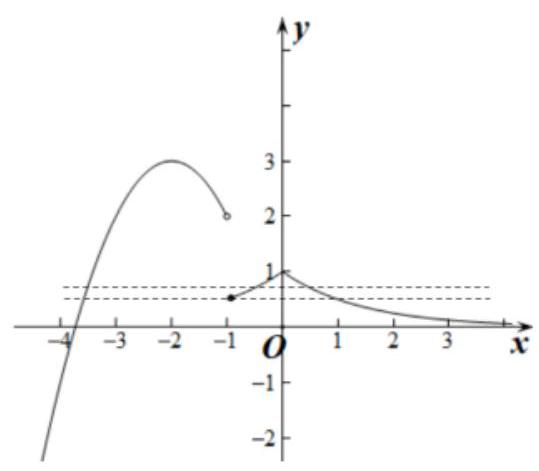

(3)已知函数 $f\left( x\right)$ 的图像是折线段 ${ABCDE}$ ，如图，其中 $A\left( {1,2}\right)$ 、 $B\left( {2,1}\right)$ 、 $C\left( {3,2}\right)$ 、 $D\left( {4,1}\right)$ 、 $E\left( {5,2}\right)$ ， 若直线 $y = {kx} + b\left( {k, b \in  R}\right)$ 与 $f\left( x\right)$ 的图像恰有 4 个不同的公共点，则 $k$ 的取值范围是( )

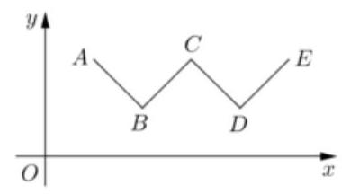

A. $\left( {-1,0}\right)  \cup  \left( {0,1}\right)$

B. $\left( {-\frac{1}{3},\frac{1}{3}}\right)$

C. $(0,1\rbrack$

D. $\left\lbrack  {0,\frac{1}{3}}\right\rbrack$

【难度】★★★

【答案】B

【解析】数形结合,通过观察 $\mathrm{k} = 0$ 显然满足,旋转直线,当直线经过点 $B\left( {2,1}\right)$ 和 $E\left( {5,2}\right)$ 正好是临界情况, 结合两点斜率公式,此时 $k = \frac{1}{3}$ ,根据对称性,当直线经过点 $A\left( {1,2}\right)$ 和 $D\left( {4,1}\right)$ ,此时 $k =  - \frac{1}{3}$ ,故答案选 B。

【例 15】( 1 )已知函数 $y = f\left( x\right)$ 的图像是折线段 ${ABC}$ ,若中 $A\left( {0,0}\right) , B\left( {\frac{1}{2},5}\right) , C\left( {1,0}\right)$ . 函数 $y = {xf}\left( x\right) \left( {0 \leq  x \leq  1}\right)$ 的图像与 $x$ 轴围成的图形的面积为___.

【难度】 $\star   \star   \star$

【答案】 $\frac{5}{4}$

【解析】如图 1, $f\left( x\right)  = \left\{  \begin{array}{ll} {10x}, & 0 \leq  x \leq  \frac{1}{2} \\  {10} - {10x}, & \frac{1}{2} < x \leq  1 \end{array}\right.$ ,

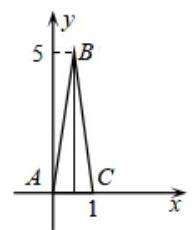

图 1

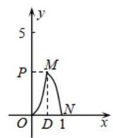

图 2

所以 $y = {xf}\left( x\right)  = \left\{  \begin{matrix} {10}{x}^{2},\;0 \leq  x \leq  \frac{1}{2} \\   - {10}{x}^{2} + {10x},\frac{1}{2} < x \leq  1 \end{matrix}\right.$ ,

易知, $y = {xf}\left( x\right)$ 的分段解析式中的两部分抛物线形状完全相同,只是开口方向及顶点位置不同,如图 2，封闭图形 ${MND}$ 与 ${OMP}$ 全等，面积相等，故所求面积即为矩形 ${ODMP}$ 的面积 $S = \frac{1}{2} \times  \frac{5}{2} = \frac{5}{4}$ .

(2)已知函数 $f\left( x\right)$ 的定义域为 $\lbrack 0, + \infty )$ ，且满足①对任意的 $x > 2$ 时 $f\left( x\right)  = {2f}\left( {x - 2}\right)$ 恒成立，②当

$x \in  \left\lbrack  {0,2}\right\rbrack$ 时, $f\left( x\right)  = 1 - \left| {x - 1}\right|$ ,若关于 $x$ 的函数 $g\left( x\right)  = f\left( x\right)  - a$ 的零点从小到大依次为数列 $\left\{  {a}_{n}\right\}$ , $n \in  {\mathrm{N}}^{ * }$ 的项， ${S}_{n}$ 为其前 $n$ 项和若 ${S}_{8} = {64}$ ，则 $a$ 的取值范围为___.

【难度】 $\star   \star   \star$

【答案】 $\left( {2,4}\right)$

【解析】由题意可知函数图像每向右平移 2 个单位,纵坐标伸长为原来的 2 倍,函数 $f\left( x\right)$ 图像如下所示:

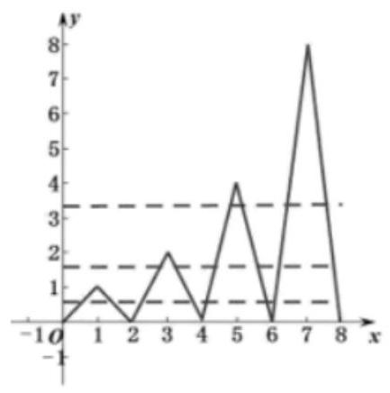

函数 $g\left( x\right)$ 的零点即为 $y = f\left( x\right)$ 与 $y = a$ 的交点横坐标,也就是数列 $\left\{  {a}_{n}\right\}$ 的项,由图像可知当直线 $y = a$ 向上移动时, 图像交点的横坐标也在变化, 但是对称性不变,

当 $a \in  \left( {0,1}\right)$ 时, ${S}_{8} = 2\left( {1 + 3 + 5 + 7}\right)  = {32}$ ; 当 $a \in  \left( {1,2}\right)$ 时, ${S}_{8} = 2\left( {3 + 5 + 7 + 9}\right)  = {48}$ ;

当 $a \in  \left( {2,4}\right)$ 时, ${S}_{8} = 2\left( {5 + 7 + 9 + {11}}\right)  = {64}$ ,所以 $a$ 的取值范围为 $\left( {2,4}\right)$ . 故答案为: $\left( {2,4}\right)$

## 巩固训练

1、设函数 $f\left( x\right)  = x + {\log }_{2}x - m$ ，则 “函数 $f\left( x\right)$ 在 $\left( {\frac{1}{2},2}\right)$ 上存在零点”是 “ $m \in  \left( {-1,4}\right)$ ” 的( )

A. 充分不必要条件 B. 必要不充分条件

C. 充要条件 D. 既不充分也不必要条件

【答案】A

【解析】由题得 $f\left( \frac{1}{2}\right) f\left( 2\right)  = \left( {-\frac{1}{2} - m}\right)  \cdot  \left( {3 - m}\right)  < 0$ ,解得 $- \frac{1}{2} < m < 3$ ,

设 $A = \left( {-\frac{1}{2},3}\right) , B = \left( {-1,4}\right)$ ,显然 $A \subsetneq  B$ ,

所以“函数 $f\left( x\right)$ 在 $\left( {\frac{1}{2},2}\right)$ 上存在零点” 是 “ $m \in  \left( {-1,4}\right)$ ” 的充分不必要条件. 故选:A

2、已知 $f\left( x\right)$ 是定义在 $R$ 上的奇函数,当 $x \geq  0$ 时, $f\left( x\right)  = {x}^{2} - {3x}$ ,则函数 $g\left( x\right)  = f\left( x\right)  - x + 3$ 的零点的集合为( )

A. $\{ 1,3\}$ B. $\{  - 3, - 1,1,3\}$ C. $\{ 2 - \sqrt{7},1,3\}$ D. $\{  - 2 - \sqrt{7},1,3\}$

【答案】D

【解析】因为 $f\left( x\right)$ 是定义在 $R$ 上的奇函数,当 $x \geq  0$ 时, $f\left( x\right)  = {x}^{2} - {3x}$ ,所以 $f\left( x\right)  = \left\{  \begin{array}{l} {x}^{2} - {3x}, x \geq  0 \\   - {x}^{2} - {3x}, x < 0 \end{array}\right.$ , 所以 $g\left( x\right)  = \left\{  \begin{array}{l} {x}^{2} - {4x} + 3, x \geq  0 \\   - {x}^{2} - {4x} + 3, x < 0 \end{array}\right.$ ,

由 $\left\{  \begin{array}{l} x \geq  0 \\  {x}^{2} - {4x} + 3 = 0 \end{array}\right.$ ,解得 $x = 1$ 或 $x = 3$ ; 由 $\left\{  \begin{array}{l} x < 0 \\   - {x}^{2} - {4x} + 3 = 0 \end{array}\right.$ 解得 $x =  - 2 - \sqrt{7}$ 或 $x =  - 2 + \sqrt{7}$ (舍去), 所以函数 $g\left( x\right)  = f\left( x\right)  - x + 3$ 的零点的集合为 $\{  - 2 - \sqrt{7},1,3\}$ . 故选: D.

3、定义在 $R$ 上的偶函数 $f\left( x\right)$ ,满足 $f\left( {x + 3}\right)  = f\left( x\right) , f\left( 2\right)  = 0$ ,则函数 $y = f\left( x\right)$ 在区间 $\left( {0,6}\right)$ 内零点的个数为( )

A. 4 个 B. 2 个 C. 至少 4 个 D. 至多 2 个

【答案】C

【解析】解: $f\left( {x + 3}\right)  = f\left( x\right)$ ,得到函数的周期是 3,

$\because f\left( x\right)$ 是定义在 $R$ 上的偶函数,且周期是 $3, f\left( 2\right)  = 0$ ,

$\therefore f\left( {-1}\right)  = 0$ 即 $f\left( 1\right)  = 0.\therefore f\left( 5\right)  = f\left( 2\right)  = 0, f\left( 4\right)  = f\left( 1\right)  = 0$ ,所以函数 $y = f\left( x\right)$ 在区间 $\left( {0,6}\right)$ 内零点的个数至少有 4 个解. 故选: $C$ .

4、已知函数 $f\left( x\right)  = {3}^{x} - \frac{1 + {ax}}{x}$ . 若存在 ${x}_{0} \in  \left( {-\infty , - 1}\right)$ ,使得 $f\left( {x}_{0}\right)  = 0$ ,则实数 $a$ 的取值范围是( )

A. $\left( {-\infty ,\frac{4}{3}}\right)$ B. $\left( {0,\frac{4}{3}}\right)$ C. $\left( {-\infty ,0}\right)$ D. $\left( {\frac{4}{3}, + \infty }\right)$

【答案】B

【解析】由 $f\left( x\right)  = {3}^{x} - \frac{1 + {ax}}{x} = 0$ ,可得 $a = {3}^{x} - \frac{1}{x}$ ,令 $g\left( x\right)  = {3}^{x} - \frac{1}{x}$ ,其中 $x \in  \left( {-\infty , - 1}\right)$ ,

由于存在 ${x}_{0} \in  \left( {-\infty , - 1}\right)$ ,使得 $f\left( {x}_{0}\right)  = 0$ ,则实数 $a$ 的取值范围即为函数 $g\left( x\right)$ 在 $\left( {-\infty , - 1}\right)$ 上的值域.

由于函数 $y = {3}^{x}\text{ 、 }y =  - \frac{1}{x}$ 在区间 $\left( {-\infty , - 1}\right)$ 上为增函数,所以函数 $g\left( x\right)$ 在 $\left( {-\infty , - 1}\right)$ 上为增函数.

当 $x \in  \left( {-\infty , - 1}\right)$ 时, $g\left( x\right)  = {3}^{x} - \frac{1}{x} < {3}^{-1} + 1 = \frac{4}{3}$ ,又 $g\left( x\right)  = {3}^{x} - \frac{1}{x} > 0$ ,

所以,函数 $g\left( x\right)$ 在 $\left( {-\infty , - 1}\right)$ 上的值域为 $\left( {0,\frac{4}{3}}\right)$ .

因此,实数 $a$ 的取值范围是 $\left( {0,\frac{4}{3}}\right)$ . 故选: B.

5、已知定义域为 $R$ 的奇函数 $f\left( x\right)$ 在区间 $\left( {0, + \infty }\right)$ 上为减函数,且 $f\left( 2\right)  = 0$ ,则不等式 $\frac{f\left( {x + 1}\right) }{x - 1} \geq  0$ 的解集为___.

【答案】 $\left\lbrack  {-3, - 1}\right\rbrack$

【解析】 $\because f\left( x\right)$ 是定义域为 $R$ 的奇函数,且在区间 $\left( {0, + \infty }\right)$ 上为严格减函数,有 $f\left( 2\right)  = 0$ , $\therefore f\left( x\right)$ 在区间 $\left( {-\infty ,0}\right)$ 上为严格减函数且 $f\left( 2\right)  = 0$ ,可作出 $f\left( x\right)$ 的草图:

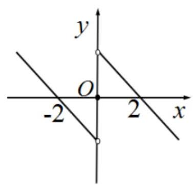

不等式 $\frac{f\left( {x + 1}\right) }{x - 1} \geq  0$ 可化为: $\left\{  \begin{array}{l} x - 1 > 0 \\  f\left( {x + 1}\right)  \geq  0 \end{array}\right.$ 或 $\left\{  \begin{array}{l} x - 1 < 0 \\  f\left( {x + 1}\right)  \leq  0 \end{array}\right.$

对于 $\left\{  \begin{array}{l} x - 1 > 0 \\  f\left( {x + 1}\right)  \geq  0 \end{array}\right.$ ,当 $x > 1$ 时 $x + 1 > 2, f\left( {x + 1}\right)  < 0$ ,无解;

对于 $\left\{  \begin{array}{l} x - 1 < 0 \\  f\left( {x + 1}\right)  \leq  0 \end{array}\right.$ ,当 $x < 1$ 时 $x + 1 < 2, f\left( {x + 1}\right)  \leq  0$ ,由图像观察, $- 2 \leq  x + 1 \leq  0$ ,解得: $- 3 \leq  x \leq   - 1$ 所以不等式 $\frac{f\left( {x + 1}\right) }{x - 1} \geq  0$ 的解集为 $\left\lbrack  {-3, - 1}\right\rbrack$ . 故答案为: $\left\lbrack  {-3, - 1}\right\rbrack$

6、已知函数 $f\left( x\right)  = \left\{  \begin{array}{l} 1 - \frac{1}{2}\left| {1 - x}\right| , x \leq  2 \\  \frac{1}{2}f\left( {x - 2}\right) ,2 < x \leq  6 \end{array}\right.$ ，则函数 $g\left( x\right)  = {xf}\left( x\right)  - 1$ 的零点个数是___.

【答案】7

【解析】当 $x \leq  2$ 时, $f\left( x\right)  = 1 - \frac{1}{2}\left| {1 - x}\right|  = \left\{  \begin{array}{ll} \frac{3 - x}{2} & 1 \leq  x \leq  2 \\  \frac{1 + x}{2} & x < 1 \end{array}\right.$

当 $2 < x \leq  4$ 时, $f\left( x\right)  = \frac{1}{2}f\left( {x - 2}\right)  = \left\{  \begin{array}{ll} \frac{x - 1}{4} & 2 < x \leq  3 \\  \frac{5 - x}{4} & 3 < x \leq  4 \end{array}\right.$

当 $4 < x \leq  6$ 时, $f\left( x\right)  = \frac{1}{2}f\left( {x - 2}\right)  = \left\{  \begin{array}{ll} \frac{x - 3}{8} & 4 < x \leq  5 \\  \frac{7 - x}{8} & 5 < x \leq  6 \end{array}\right.$

函数 $g\left( x\right)  = {xf}\left( x\right)  - 1$ 的实数根的个数; 即方程 $f\left( x\right)  = \frac{1}{x}$ 的实数根的个数.

在同一坐标系中作出 $y = f\left( x\right)$ 与 $y = \frac{1}{x}$ 的图象,

由 $f\left( 1\right)  = 1, f\left( 2\right)  = \frac{1}{2}, f\left( 4\right)  = \frac{1}{4}$ ,如图,函数 $y = f\left( x\right)$ 的图象与 $y = \frac{1}{x}$ 的图象有 7 个交点.

所以函数 $g\left( x\right)  = {xf}\left( x\right)  - 1$ 的零点个数是: 7 ; 故答案为: 7

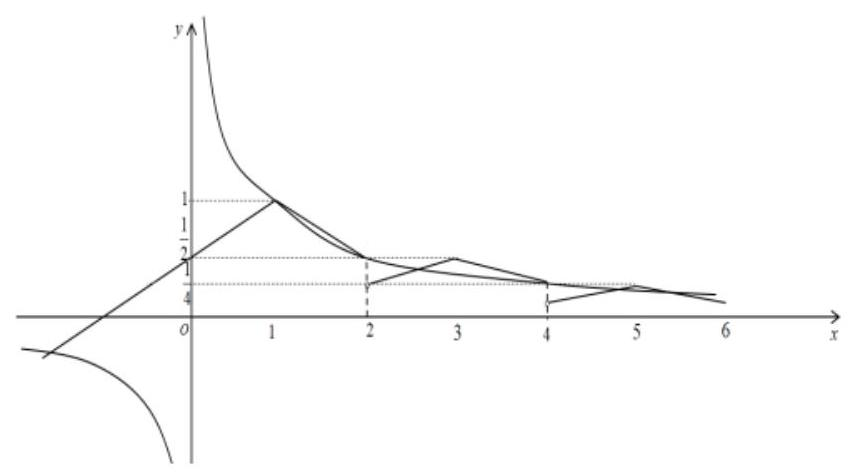

7、若关于 $x$ 的方程 $\frac{\left| x\right| }{x + 2} = k{x}^{2}$ 有四个不同的实数解，则实数 $k$ 的取值范围为( )

A. $\left( {\frac{1}{2},1}\right)$ B. $\left( {0,1}\right)$

C. $\left( {\frac{1}{2}, + \infty }\right)$ D. $\left( {1, + \infty }\right)$

【答案】D

【解析】

由于关于 $x$ 的方程 $\frac{\left| x\right| }{x + 2} = k{x}^{2}$ 有 4 个不同的实数解,当 $x = 0$ 时,是此方程的 1 个根,

故关于 $x$ 的方程 $\frac{\left| x\right| }{x + 2} = k{x}^{2}$ 有 3 个不同的非零的实数解,

又 $\frac{\left| x\right| }{x + 2} = k{x}^{2} \Leftrightarrow  \left| x\right|  = k{x}^{2}\left( {x + 2}\right)  \Leftrightarrow  \frac{1}{k} = \frac{{x}^{2}\left( {x + 2}\right) }{\left| x\right| } = \left| x\right| \left( {x + 2}\right)$

即方程 $\frac{1}{k} = \left\{  \begin{array}{l} x\left( {x + 2}\right) , x > 0 \\   - x\left( {x + 2}\right) , x < 0 \end{array}\right.$ 有 3 个不同的非零的实数解,

即函数 ${y}_{1} = \frac{1}{k}$ 的图像与函数 ${y}_{2} = \left\{  \begin{array}{l} x\left( {x + 2}\right) , x > 0 \\   - x\left( {x + 2}\right) , x < 0 \end{array}\right.$ 的图像有 3 个不同的交点,在同一直角坐标系作图:

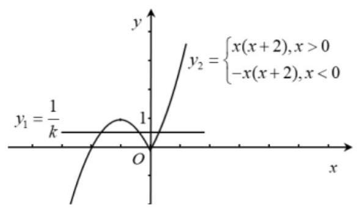

由图可知, $0 < \frac{1}{k} < 1$ ,即 $k > 1,\therefore k$ 的取值范围为 $\left( {1, + \infty }\right)$ ; 故选: D

8、已知函数 $f\left( x\right)  = \left\{  \begin{matrix} \left| {\ln x}\right| , x > 0 \\  {x}^{2} + {4x} + 1, x \leq  0 \end{matrix}\right.$ ,若关于 $\mathrm{x}$ 的方程 ${f}^{2}\left( x\right)  - {bf}\left( x\right)  + c = 0\left( {b, c \in  R}\right)$ 有 8 个不同的实数根,则 $b + c$ 的取值范围是( )

A. $\left( {-\infty ,3}\right)$ B. $\left( {0,3}\right\rbrack$ C. $\left\lbrack  {0,3}\right\rbrack$ D. $\left( {0,3}\right)$

【答案】D

【解析】

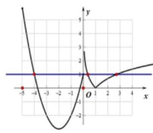

函数 $\mathrm{f}\left( \mathrm{x}\right)$ 的图像如上图所示,显然直线 $\mathrm{y} = 1$ 与图像有 4 个交点,且函数图像与 $\mathrm{x}$ 轴有 3 个交点. 设 $\mathrm{t} = \mathrm{f}\left( \mathrm{x}\right)$ , 则 ${t}^{2} - {bt} + c = 0$ . ①当该方程无解时，显然关于 $\mathbf{x}$ 的方程 ${f}^{2}\left( x\right)  - {bf}\left( x\right)  + c = 0\left( {b, c \in  R}\right)$ 无实数解；②当该方程有 1 个解时,显然关于 $\mathbf{x}$ 的方程 ${f}^{2}\left( x\right)  - {bf}\left( x\right)  + c = 0\left( {b, c \in  R}\right)$ 最多有 4 个解; 当该方程有两个不等的实数解时,关于 $\mathbf{x}$ 的方程 ${f}^{2}\left( x\right)  - {bf}\left( x\right)  + c = 0\left( {b, c \in  R}\right)$ 可能会出现 8 个实数解,但需有

$\left\{  {\begin{matrix} \Delta  = {b}^{2} - {4c} > 0 \\  0 < \frac{b}{2} < 1 \\  c > 0 \\  1 - b + c \geq  0 \end{matrix}\therefore \left\{  \begin{matrix} \Delta  = {b}^{2} - {4c} > 0 \\  0 < b < 2 \\  c > 0 \\  1 - b + c \geq  0 \end{matrix}\right. }\right.$ (*) .

将 $\mathbf{b}$ 看作自变量、 $\mathbf{c}$ 看作因变量,于是设 $z = b + c$ ,则 $\mathbf{z}$ 可看作是直线 $c =  - b + z$ 在 $\mathbf{c}$ 轴上的截距. 不等式组 (*) 表示的平面区域如下图所示曲边三角形 OPQ 的内部且包含线段 OQ(除端点).

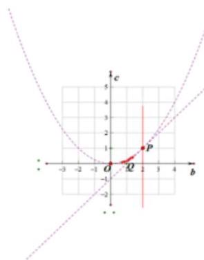

显然当直线过点 $\mathrm{O}$ 时截距最小即 $z$ 最小,当过点 $\mathrm{P}\left( {2,1}\right)$ 时,截距最大即 $z$ 最大,但因为不等式组表示

的区域不包含点 $\mathrm{O}$ ,点 $\mathrm{P}$ ,所以 $z \in  \left( {0,3}\right)$ ,故选 $\mathrm{D}$ .

9、对于函数 $f\left( x\right)$ ，若集合 $\{ x \mid  x > 0, f\left( x\right)  = f\left( {-x}\right) \}$ 中恰有 $k$ 个元素，则称函数 $f\left( x\right)$ 是“ $k$ 阶准偶函数”. 若函数 $f\left( x\right)  = \left\{  \begin{array}{l} {\left( \frac{1}{2}\right) }^{x}, x \leq  a \\  {x}^{2}, x > a \end{array}\right.$ 是 “ 2 阶准偶函数”,则 $a$ 的取值范围是( )

A. $\left( {-\infty ,0}\right)$ B. $\lbrack 0,2)$ C. $\lbrack 0,4)$ D. $\lbrack 2,4)$

【答案】B

【解析】解: 根据题意,函数 $f\left( x\right)  = \left\{  \begin{array}{l} {\left( \frac{1}{2}\right) }^{x}, x \leq  a \\  {x}^{2}, x > a \end{array}\right.$ 是 “ 2 阶准偶函数”,

则集合 $\{ x \mid  x > 0, f\left( x\right)  = f\left( {-x}\right) \}$ 中恰有 2 个元素.

当 $a < 0$ 时,函数 $f\left( x\right)  = \left\{  \begin{array}{l} {\left( \frac{1}{2}\right) }^{x}, x \leq  a \\  {x}^{2}, x > a \end{array}\right.$ 有一段部分为 $y = {x}^{2}, x > a$ ,注意的函数 $y = {x}^{2}$ 本身具有偶函数性质,故集合 $\{ x \mid  x > 0, f\left( x\right)  = f\left( {-x}\right) \}$ 中不止有两个元素,矛盾,

当 $a > 0$ 时,根据“ 2 阶准偶函数”的定义得 $f\left( x\right)$ 的可能取值为 ${x}^{2}$ 或 ${\left( \frac{1}{2}\right) }^{x}, f\left( {-x}\right)$ 为 ${\left( \frac{1}{2}\right) }^{-x} = {2}^{x}$ ,故当 ${\left( \frac{1}{2}\right) }^{x} = {2}^{x}$ ,该方程无解,当 ${x}^{2} = {2}^{x}$ ,解得 $x = 2$ 或 $x = 4$ ,故要使得集合 $\{ x \mid  x > 0, f\left( x\right)  = f\left( {-x}\right) \}$ 中恰

有 2 个元素,则需要满足 $a < 2$ ,即 $0 < a < 2$ ;

当 $a = 0$ 时,函数 $f\left( x\right)  = \left\{  {\begin{array}{l} {\left( \frac{1}{2}\right) }^{x}, x \leq  0 \\  {x}^{2}, x > 0 \end{array}, f\left( x\right) }\right.$ 的取值为 ${x}^{2}, f\left( {-x}\right)$ 为 ${\left( \frac{1}{2}\right) }^{-x} = {2}^{x}$ ,根据题意得 ${x}^{2} = {2}^{x}$ 满足恰有两个元素,故 $a = 0$ 满足条件. 综上,实数 $a$ 的取值范围是 $\lbrack 0,2)$ . 故选: B
