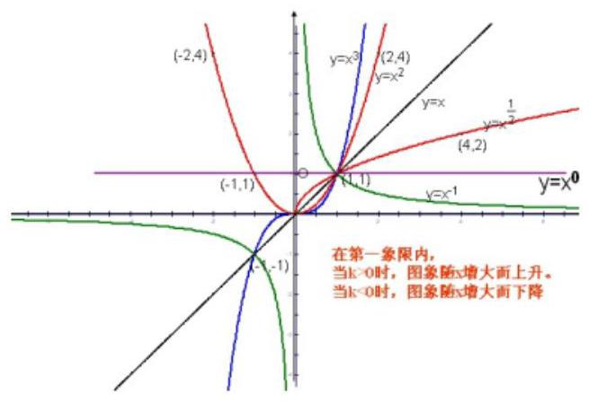
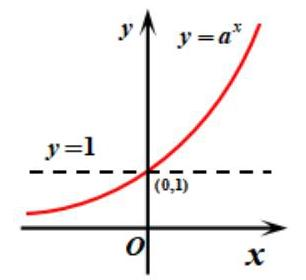
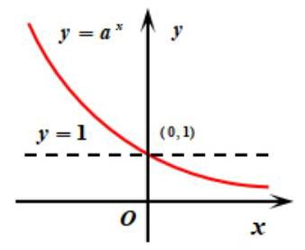
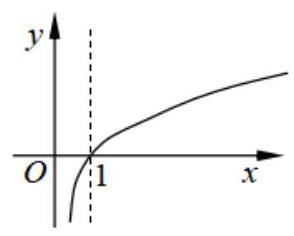
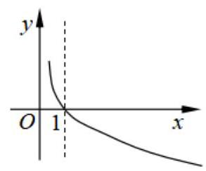
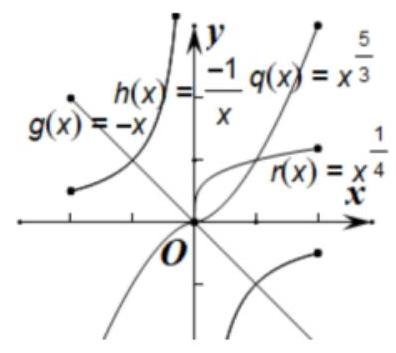
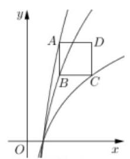
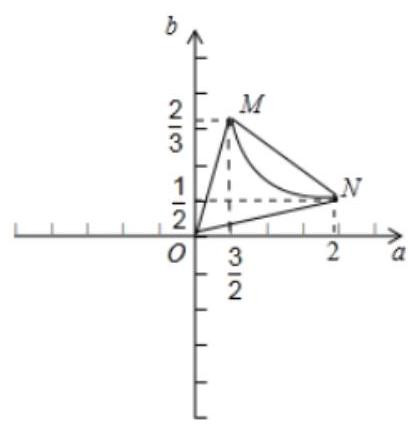

## 函数 (二)

<table><tr><td>教学目标</td><td>熟悉高考函数考点.</td></tr><tr><td>重点</td><td>1、基本初等函数的图像与性质;   2、反函数及原函数与反函数之间的关系;   3、加强综合分析问题的能力与处理问题的能力.</td></tr><tr><td>难 点</td><td>1、基本初等函数的图像与性质;   2、反函数及原函数与反函数之间的关系;   3、加强综合分析问题的能力与处理问题的能力.</td></tr></table>

## (一)常用初等函数

## 知识梳理

## 常见初等函数有二次函数、分式函数、幂函数、指数函数、对数函数(三角函数在后面会讲解) 1、二次函数: 形如 $y = a{x}^{2} + {bx} + c\left( {a \neq  0}\right)$

二次函数 $y = a{x}^{2} + {bx} + c$ 的图象的对称轴方程是 $x =  - \frac{b}{2a}$ ,顶点坐标是 $\left( {-\frac{b}{2a},\frac{{4ac} - {b}^{2}}{4a}}\right)$ .

当 $a > 0$ 时,函数在 $\left\lbrack  {-\frac{b}{2a}, + \infty }\right)$ 上是增函数,在 $\left( {-\infty , - \frac{b}{2a}}\right\rbrack$ 上是减函数;

当 $a < 0$ 时,函数在 $\left( {-\infty , - \frac{b}{2a}}\right\rbrack$ 上是增函数,在 $\left\lbrack  {-\frac{b}{2a}, + \infty }\right)$ 上是减函数.

## 2、分式函数(包含反比例函数、耐克函数、假耐克函数):略

3、幂函数: 形如 $y = {x}^{k}$

考纲要求要掌握的部分幂函数其图像如下:

## 4、指数函数

函数(二)一教师版

<table><tr><td>函数名称</td><td colspan="2">指数函数</td></tr><tr><td>定义</td><td colspan="2">函数 $y = {a}^{x}\left( {a > 0\text{ 且 }a \neq  1}\right)$ 叫做指数函数</td></tr><tr><td rowspan="2">图   象</td><td>$a > 1$</td><td>$0 < a < 1$</td></tr><tr><td></td><td></td></tr><tr><td>定义域</td><td colspan="2">$R$</td></tr><tr><td>值域</td><td colspan="2">$\left( {0, + \infty }\right)$</td></tr><tr><td>过定点</td><td colspan="2">图象过定点 $\left( {0,1}\right)$ ,即当 $x = 0$ 时, $y = 1$ .</td></tr><tr><td>奇偶性</td><td colspan="2">非奇非偶</td></tr><tr><td>单调性</td><td>在 $R$ 上是增函数</td><td>在 $R$ 上是减函数</td></tr><tr><td>$a$ 变化对图象的影响</td><td colspan="2">在第一象限内, $a$ 越大图象越高; 在第二象限内, $a$ 越大图象越低.</td></tr></table>

5、对数函数:

由对数函数的图像归纳对数函数的性质:

(1)定义域是 $\left( {0, + \infty }\right)$ ，值域为 $\left( {-\infty , + \infty }\right)$ 。

(2)恒过定点 $\left( {1,0}\right)$ 。

(3)若 $a > 1$ ，则 $x \in  \left( {0,1}\right)$ 时， $y < 0$ ； $x \in  \left( {1, + \infty }\right)$ 时， $y > 0$ ； 若 $0 < a < 1$ ,则 $x \in  \left( {0,1}\right)$ 时, $y > 0;x \in  \left( {1, + \infty }\right)$ 时, $y < 0$ 。

(4)若 $a > 1$ ，在 $\left( {0, + \infty }\right)$ 上单调递增；若 $0 < a < 1$ ，在 $\left( {0, + \infty }\right)$ 上单调递减。

## 例题精讲

【例 1】若 $f\left( x\right)  =  - {x}^{2} + 2\left( {a - 1}\right) x$ 与 $g\left( x\right)  = \frac{a - 1}{x + 1}$ 在区间 $\left\lbrack  {1,2}\right\rbrack$ 上都是减函数，则 $a$ 的取值范围是___.

【难度】★★

【答案】(1.2)

【解析】根据 $f\left( x\right)  =  - {x}^{2} + 2\left( {a - 1}\right) x$ 与 $g\left( x\right)  = \frac{a - 1}{x + 1}$ 在区间 $\left\lbrack  {1,2}\right\rbrack$ 上都是减函数,

$f\left( x\right)$ 的对称轴为 $x = a - 1$ ,所以 $a - 1 \leq  1, a \leq  2$ ,

$g\left( x\right)  = \frac{a - 1}{x + 1}$ 的图象是由 $y = \frac{a - 1}{x}$ 的图象向左平移一个单位得到的.

$g\left( x\right)  = \frac{a - 1}{x + 1}$ 在区间 $\left\lbrack  {1,2}\right\rbrack$ 上是减函数,则 $y = \frac{a - 1}{x}$ 在 $\left( {0, + \infty }\right)$ 上单调递减. 所以 $a - 1 > 0$

所以 $1 < a \leq  2$ ,即 $a$ 的取值范围为 $\left( {1,2}\right)$ . 故答案为: $\left( {1,2}\right)$

【例 2】( 1 )幂函数 $f\left( x\right)$ 过点 $\left( {2,4}\right)$ ,那么当 $x > 0$ 时,函数 $g\left( x\right)  = \frac{f\left( {x + 1}\right)  + f\left( x\right) }{\sqrt{f\left( x\right) }}$ 的最小值为___.

【难度】 $\star   \star   \star$

【答案】 $2 + 2\sqrt{2}$

【解析】设幂函数 $f\left( x\right)  = {a}^{x}$ ,由幂函数 $f\left( x\right)$ 过点 $\left( {2,4}\right)$ ,则 $4 = {a}^{2}$ ,得 $a = 2$

所以 $f\left( x\right)  = {x}^{2}$ ,当 $x > 0$ 时 $g\left( x\right)  = \frac{f\left( {x + 1}\right)  + f\left( x\right) }{\sqrt{f\left( x\right) }} = \frac{2{x}^{2} + {2x} + 1}{x} = 2 + {2x} + \frac{1}{x} \geq  2 + 2\sqrt{2}$

当且当 ${2x} = \frac{1}{x}$ ，即 $x = \frac{\sqrt{2}}{2}$ 时取等号. 故答案为: $2 + 2\sqrt{2}$

(2)已知四个函数:① $y =  - x$ ; ② $y =  - \frac{1}{x}$ ; ③ $y = {x}^{\frac{5}{3}}$ ; ④ $y = {x}^{\frac{1}{4}}$ ，从中任选 2 个，则事件“所选 2 个函数的图像有且仅有一个公共点”的概率为( )

A. $\frac{1}{6}$ B. $\frac{1}{3}$ C. $\frac{1}{2}$ D. $\frac{2}{3}$

【解析】如图所示: ① $y =  - x$ 与② $y =  - \frac{1}{x}$ 、③ $y = {x}^{\frac{5}{3}}$ 与④ $y = {x}^{\frac{1}{4}}$ 有两个公共点.

① $y =  - x$ 与③ $y = {x}^{\frac{5}{3}}$ 、① $y =  - x$ 与④ $y = {x}^{\frac{1}{4}}$ 都有一个公共点.

② $y =  - \frac{1}{x}$ 与③ $y = {x}^{\frac{5}{3}}$ 、③ $y = {x}^{\frac{5}{3}}$ 与④ $y = {x}^{\frac{1}{4}}$ 都没有公共点.

所以从中任选 2 个,事件“所选 2 个函数的图像有且仅有一个公共点”的概率为 $\frac{2}{6} = \frac{1}{3}$ 故选: B.

【例 3】( 1 )已知函数 $f\left( x\right)  = \left\{  \begin{array}{l} {2}^{x} - 1, x \leq   - 1 \\  {\log }_{2}\left( {{ax} + 1}\right) , x >  - 1 \end{array}\right.$ ,若 $f\left( \frac{1}{2}\right)  =  - 1$ ，则 $f\left( a\right)  =$ ___.

【难度】 $\star   \star$

【答案】 $- \frac{1}{2}$

【解析】解: 由题可知,当 $x >  - 1$ 时, $f\left( x\right)  = {\log }_{2}\left( {{ax} + 1}\right)$ ,则 $f\left( \frac{1}{2}\right)  = {\log }_{2}\left( {\frac{1}{2}a + 1}\right)  =  - 1$ ,所以 $a =  - 1$ , 由于 $f\left( x\right)  = \left\{  \begin{array}{l} {2}^{x} - 1, x \leq   - 1 \\  {\log }_{2}\left( {{ax} + 1}\right) , x >  - 1 \end{array}\right.$ ,则 $f\left( a\right)  = f\left( {-1}\right)  = {2}^{-1} - 1 = \frac{1}{2} - 1 =  - \frac{1}{2}$ . 故答案为: $- \frac{1}{2}$ .

(2)如果，已知正方形 ${ABCD}$ 的边长为2， ${BC}$ 平行 $x$ 轴，顶点 $A$ ， $B$ 和 $C$ 分别在函数 ${y}_{1} = 3{\log }_{a}x$ ， ${y}_{2} = 2{\log }_{a}x$ 和 $y = {\log }_{a}x\left( {a > 1}\right)$ 的图像上，则实数 $a$ 的值为___.

【难度】 $\star   \star$

【答案】 $\sqrt{2}$

【解析】设 $B\left( {x,2{\log }_{a}x}\right) ,\because {BC}$ 平行于 $x$ 轴, $\therefore C\left( {{x}^{\prime },2{\log }_{a}x}\right)$ 即 ${\log }_{a}{x}^{\prime } = 2{\log }_{a}x,\therefore {x}^{\prime } = {x}^{2}$ ,

$\therefore$ 正方形 ${ABCD}$ 边长 $= \left| {BC}\right|  = {x}^{2} - x = 2$ ,解得 $x = 2$ .

由已知, ${AB}$ 垂直于 $x$ 轴, $\therefore A\left( {x,3{\log }_{a}x}\right)$ ,正方形 ${ABCD}$ 边长 $= \left| {AB}\right|  = 3{\log }_{a}x - 2{\log }_{a}x = {\log }_{a}x = 2$ ,即 ${\log }_{a}2 \; = 2,\therefore a = \sqrt{2}$ ,故答案为: $\sqrt{2}$ .

(3)已知常数 $a > 0$ ，函数发 $f\left( x\right)  = \frac{{2}^{x}}{{2}^{x} + {ax}}$ 的图像经过点 $P\left( {p,\frac{6}{5}}\right)$ 、 $Q\left( {q, - \frac{1}{5}}\right)$ ，若 ${2}^{p + q} = {25pq}$ ，则 $a =$

【难度】★★★

【答案】 5

【解析】由条件可知 $\frac{{2}^{p}}{{2}^{p} + {ap}} = \frac{6}{5} \Rightarrow  \frac{1}{1 + \frac{ap}{{2}^{p}}} = \frac{6}{5}$ ,得 $\frac{ap}{{2}^{p}} =  - \frac{1}{6}$ ①

$\frac{{2}^{q}}{{2}^{q} + {aq}} =  - \frac{1}{5} \Rightarrow  \frac{1}{1 + \frac{aq}{{2}^{q}}} =  - \frac{1}{5}$ ,得 $\frac{aq}{{2}^{q}} =  - 6$ ②

① $x$ ②得 $\frac{{a}^{2}{pq}}{{2}^{p + q}} = 1,\because {2}^{p + q} = {25pq}$ ； $\therefore \frac{{a}^{2}}{25} = 1$ ，又 $a > 0$ ，得 $a = 5.$ 故答案为:5

例 4、( 1 )已知函数 $f\left( x\right)  = \frac{{2}^{x}}{1 + a \cdot  {2}^{x}}\left( {a \in  R}\right)$ 的图象关于点 $\left( {0,\frac{1}{2}}\right)$ 对称，则 $a =$ ___.

【难度】 $\star   \star$

【答案】 1

【解析】由已知,得 $f\left( x\right)  + f\left( {-x}\right)  = 1,\frac{{2}^{x}}{1 + a \cdot  {2}^{x}} + \frac{{2}^{-x}}{1 + a \cdot  {2}^{-x}} = 1$ ,

整理得 $\left( {a - 1}\right) \left\lbrack  {{2}^{2x} + \left( {a - 1}\right)  \cdot  {2}^{x} + 1}\right\rbrack   = 0$ ,所以当 $a - 1 = 0$ 时,等式成立,即 $a = 1$ .

( 2 )若 $f\left( x\right)  = \frac{2}{1 + {2}^{x}} + \frac{1}{1 + {4}^{x}}$ ，且 $f\left\lbrack  {{\log }_{a}\left( {\sqrt{2} + 1}\right) }\right\rbrack   = 1$ ，其中 $a > 1$ ，则 $f\left\lbrack  {{\log }_{a}\left( {\sqrt{2} - 1}\right) }\right\rbrack   =$ ___.

【难度】 $\star   \star   \star$

【答案】 2

【解析】由题意, $f\left( x\right)  = \frac{2}{1 + {2}^{x}} + \frac{1}{1 + {4}^{x}}$ ,所以 $f\left( {-x}\right)  = \frac{2}{1 + {2}^{-x}} + \frac{1}{1 + {4}^{-x}} = \frac{2 \times  {2}^{x}}{1 + {2}^{x}} + \frac{{4}^{x}}{1 + {4}^{x}}$ ,

$f\left( x\right)  + f\left( {-x}\right)  = \frac{2}{1 + {2}^{x}} + \frac{1}{1 + {4}^{x}} + \frac{2 \times  {2}^{x}}{1 + {2}^{x}} + \frac{{4}^{x}}{1 + {4}^{x}} = 3,$

因为 ${\log }_{a}\left( {\sqrt{2} + 1}\right)  =  - {\log }_{a}\left( {\sqrt{2} - 1}\right)$ ,所以 $f\left\lbrack  {{\log }_{a}\left( {\sqrt{2} + 1}\right) }\right\rbrack   + f\left\lbrack  {{\log }_{a}\left( {\sqrt{2} - 1}\right) }\right\rbrack   = 3$ ,所以 $f\left\lbrack  {{\log }_{a}\left( {\sqrt{2} - 1}\right) }\right\rbrack   = 2$ ,故答案为: 2

【例 5】对于函数 $f\left( x\right)$ 与 $g\left( x\right)$ ,记集合 ${D}_{f > g} = \{ x \mid  f\left( x\right)  > g\left( x\right) \}$ .

(1)设 $f\left( x\right)  = 2\left| x\right| , g\left( x\right)  = x + 3$ ，求集合 ${D}_{f > g}$ ；

(2)设 ${f}_{1}\left( x\right)  = x - 1,{f}_{2}\left( x\right)  = {\left( \frac{1}{3}\right) }^{x} + a \cdot  {3}^{x} + 1, h\left( x\right)  = 0$ ，若 ${D}_{{f}_{1} > h} \cup  {D}_{{f}_{2} > h} = R$ ，求实数 $a$ 的取值范围.

【难度】 $\star   \star   \star$

【答案】(1) ${D}_{f > g} = \left( {-\infty , - 1}\right)  \cup  \left( {3, + \infty }\right)$ (2) $a >  - \frac{4}{9}$

【解析】(1) 当 $x \geq  0$ 得 ${2x} > x + 3,\therefore x > 3$ ;

当 $x\langle 0$ 时,得 $- {2x}\rangle x + 3,\therefore x <  - 1\;\therefore {D}_{f > g} = \left( {-\infty , - 1}\right)  \cup  \left( {3, + \infty }\right)$ .

(2) ${D}_{{f}_{1} > h} = \left( {1, + \infty }\right) ,{D}_{{f}_{2} > h} = \left\{  {x\left| {\;{\left( \frac{1}{3}\right) }^{x} + a \cdot  {3}^{x} + 1 > 0}\right. }\right\}  \because {D}_{{f}_{1} > h} \cup  {D}_{{f}_{2} > h} = R,\;\therefore {D}_{{f}_{2} > h} \supseteq  ( - \infty ,1\rbrack$

即不等式 ${\left( \frac{1}{3}\right) }^{x} + a \cdot  {3}^{x} + 1 > 0$ 在 $x \leq  1$ 恒成立 $\therefore x \leq  1$ 时, $a >  - \left\lbrack  {{\left( \frac{1}{9}\right) }^{x} + {\left( \frac{1}{3}\right) }^{x}}\right\rbrack$ 恒成立,

$\because y =  - \left\lbrack  {{\left( \frac{1}{9}\right) }^{x} + {\left( \frac{1}{3}\right) }^{x}}\right\rbrack$ 在 $x \leq  1$ 时最大值为 $- \frac{4}{9}$ ,故 $a >  - \frac{4}{9}$

【例 6】定义在 $R$ 上的奇函数 $f\left( x\right)$ 有最小正周期 4,且 $x \in  \left( {0,2}\right)$ 时, $f\left( x\right)  = \frac{{3}^{x}}{{3}^{x} + 1}$ .

(1)求 $f\left( x\right)$ 在 $\left\lbrack  {-2,2}\right\rbrack$ 上的解析式；

(2)判断 $f\left( x\right)$ 在 $\left( {0,2}\right)$ 上的单调性,并给予证明;

(3)当 $\lambda$ 为何值时,关于方程 $f\left( x\right)  = \lambda$ 在 $\left\lbrack  {-2,2}\right\rbrack$ 上有实数解?

【难度】 $\star   \star   \star$

【答案】(1) $f\left( x\right)  = \left\{  \begin{array}{l} \frac{{3}^{x}}{{3}^{x} + 1},0 < x < 2 \\  0, x \in  \{  - 2,0,2\} \\   - \frac{1}{{3}^{x} + 1}, - 2 < x < 0 \end{array}\right.$ ; (2) 增函数,证明见解析; (3) $\left( {-\frac{9}{10}, - \frac{1}{2}}\right)  \cup  \{ 0\}  \cup  \left( {\frac{1}{2},\frac{9}{10}}\right)$ .

【解析】(1) 当 $- 2 < x < 0$ 时, $0 <  - x < 2, f\left( {-x}\right)  = \frac{{3}^{-x}}{{3}^{-x} + 1} = \frac{1}{{3}^{x} + 1}$ ,

又 $f\left( x\right)$ 为奇函数,所以 $f\left( x\right)  =  - f\left( {-x}\right)  =  - \frac{1}{{3}^{x} + 1}$ ,

当 $x = 0$ 时,由 $f\left( {-0}\right)  =  - f\left( 0\right)  \Rightarrow  f\left( 0\right)  = 0$ ,

$\because f\left( x\right)$ 有最小正周期 $4,\therefore f\left( {-2}\right)  = f\left( {-2 + 4}\right)  = f\left( 2\right)  \Rightarrow  f\left( {-2}\right)  = f\left( 2\right)  = 0$ ,

所以 $f\left( x\right)  = \left\{  \begin{array}{l} \frac{{3}^{x}}{{3}^{x} + 1},0 < x < 2 \\  0, x \in  \{  - 2,0,2\} \\   - \frac{1}{{3}^{x} + 1}, - 2 < x < 0 \end{array}\right.$ .

(2)设 $0 < {x}_{1} < {x}_{2} < 2$ ，则 ${3}^{{x}_{1}} - {3}^{{x}_{2}} < 0$ ， $\left( {{3}^{{x}_{1}} + 1}\right) \left( {{3}^{{x}_{2}} + 1}\right)  > 0$

$f\left( {x}_{1}\right)  - f\left( {x}_{2}\right)  = 1 - \frac{1}{{3}^{{x}_{1}} + 1} - 1 + \frac{1}{{3}^{{x}_{2}} + 1} = \frac{{3}^{{x}_{1}} - {3}^{{x}_{2}}}{\left( {{3}^{{x}_{1}} + 1}\right) \left( {{3}^{{x}_{2}} + 1}\right) } < 0,\therefore f\left( {x}_{1}\right)  < f\left( {x}_{2}\right) ,\therefore f\left( x\right)$ 在 $\left( {0,2}\right)$ 上为增函数.

(3)若方程 $f\left( x\right)  = \lambda$ 在 $\left\lbrack  {-2,2}\right\rbrack$ 上有实数解，则 $\lambda$ 的范围即为函数 $f\left( x\right)$ 在 $\left\lbrack  {-2,2}\right\rbrack$ 上的值域.

当 $x \in  \left( {0,2}\right)$ 时由(2)知， $f\left( x\right)$ 在 $\left( {0,2}\right)$ 上为增函数， $\therefore \frac{1}{2} = f\left( 0\right)  < f\left( x\right)  < f\left( 2\right)  = \frac{9}{10}$

当 $x \in  \left( {-2,0}\right)$ 时, $0 <  - x < 2,\therefore f\left( x\right)  =  - f\left( {-x}\right)  \in  \left( {-\frac{9}{10}, - \frac{1}{2}}\right)$

当 $x \in  \{  - 2,0,2\}$ 时, $f\left( x\right)  = 0;\therefore f\left( x\right)$ 的值域为 $\left( {-\frac{9}{10}, - \frac{1}{2}}\right)  \cup  \{ 0\}  \cup  \left( {\frac{1}{2},\frac{9}{10}}\right)$

$\therefore \lambda  \in  \left( {-\frac{9}{10}, - \frac{1}{2}}\right)  \cup  \{ 0\}  \cup  \left( {\frac{1}{2},\frac{9}{10}}\right)$ 时,方程方程 $f\left( x\right)  = \lambda$ 在 $\left\lbrack  {-2,2}\right\rbrack$ 上有实数解.

【例 7】已知函数 $m\left( x\right)  = {\log }_{2}\left( {{4}^{x} + 1}\right) , n\left( x\right)  = {kx}\left( {k \in  R}\right)$ .

(1)若 $f\left( x\right)  = m\left( x\right)  + n\left( x\right)$ 是偶函数，求 $k$ 的值；

(2)对(1)中的函数 $f\left( x\right)$ ，设函数 $g\left( x\right)  = {\log }_{2}\left( {a \cdot  {2}^{x} - \frac{4}{3}a}\right)$ ，其中 $a > 0$ . 若函数 $f\left( x\right)$ 与 $g\left( x\right)$ 的图象有且只有一个公共点,求 $a$ 的取值范围.

【难度】 $\star   \star   \star$

【答案】( 1 ) $k =  - 1;\;\left( 2\right) \left( {1, + \infty }\right)$ .

【解析】(1) $f\left( x\right)  = {\lg }_{2}\left( {{4}^{x} + 1}\right)  + {kx}\left( {k \in  R}\right)$ 是偶函数, $f\left( {-x}\right)  = f\left( x\right)$ 对任意 $x \in  \mathbf{R}$ 恒成立,即 ${\log }_{2}\left( {{4}^{-x} + 1}\right)  - {kx} = {\log }_{2}\frac{{4}^{x} + 1}{{4}^{x}} - {kx} \; = {\log }_{2}\left( {{4}^{x} + 1}\right)  - {2x} - {kx} = {\log }_{2}\left( {{4}^{x} + 1}\right)  + {kx}$ 恒成立,所以 $- {2x} = {2kx}$ ,得 $k =  - 1$ .

(2)因为 $a > 0, g\left( x\right)  = {\log }_{2}\left( {a \times  {2}^{x} - \frac{4}{3}a}\right)$ 的定义域为 $\left( {{\log }_{2}\frac{4}{3}, + \infty }\right)$ ，且 ${2}^{x} > \frac{4}{3}$ ，函数 $f\left( x\right)$ 与 $g\left( x\right)$ 的图象有且只有一个公共点,方程 $\frac{{4x} + 1}{2x} = a \times  {2}^{x} - \frac{4}{3}a$ 在 $\left( {{\log }_{2}\frac{4}{3}, + \infty }\right)$ 只有一个解,

令 ${2}^{x} = t, t > \frac{4}{3}$ ,等价于关于 $t$ 的方程 $\left( {a - 1}\right) {t}^{2} - \frac{4}{3}{at} - 1 = 0$ 在 $\left( {\frac{4}{3}, + \infty }\right)$ 上只有一个解,

① 当 $a = 1$ 时，解得 $t =  - \frac{3}{4} \notin  \left( {\frac{4}{3}, + \infty }\right)$ ，不合题意；

② 当 $0 < a < 1$ 时， $h\left( t\right)  = \left( {a - 1}\right) {t}^{2} - \frac{4}{3}{at} - 1$ ，

对称轴为 $x = \frac{2a}{3\left( {a - 1}\right) } < 0$ ,函数 $h\left( t\right)$ 在 $\left( {0, + \infty }\right)$ 上递减, $h\left( 0\right)  =  - 1$ ,

所以方程 $\left( {a - 1}\right) {t}^{2} - \frac{4}{3}{at} - 1 = 0$ 在 $\left( {\frac{4}{3}, + \infty }\right)$ 无解,

③ 当 $a > 1$ 时， $h\left( t\right)  = \left( {a - 1}\right) {t}^{2} - \frac{4}{3}{at} - 1$ ，对称轴 $\frac{2a}{3\left( {a - 1}\right) } > 0$ ，只需 $h\left( \frac{4}{3}\right)  < 0$ ，

因为 $\frac{16}{9}\left( {a - 1}\right)  - \frac{16}{9}a - 1 < 0$ 恒成立,综上,所求 $a$ 的取值范围为 $\left( {1, + \infty }\right)$ .

【例 8】设函数 $f\left( x\right)  = a \cdot  {2}^{x} - {2}^{-x}\left( {a \in  R}\right)$

(1)若函数 $y = f\left( x\right)$ 的图象关于原点对称，函数 $g\left( x\right)  = f\left( x\right)  + \frac{3}{2}$ ，求满足 $g\left( {x}_{0}\right)  = 0$ 的 ${x}_{0}$ 的值；

(2)若函数 $h\left( x\right)  = f\left( x\right)  + {4}^{x} + {2}^{-x}$ 在 $x \in  \left\lbrack  {0,1}\right\rbrack$ 的最大值为 -2，求实数 $a$ 的值.

【难度】 $\star   \star   \star$

【答案】(1)-1；(2)-3.

【解析】(1) $\because f\left( x\right)$ 的图象关于原点对称, $\therefore f\left( {-x}\right)  + f\left( x\right)  = 0$ ,

$\therefore a \cdot  {2}^{-x} - {2}^{-x} + a \cdot  {2}^{x} - {2}^{x} = 0$ ,即 $\left( {a - 1}\right)  \cdot  \left( {{2}^{-x} + {2}^{x}}\right)  = 0$ ,所以 $a = 1$ ;

令 $g\left( x\right)  = {2}^{x} - {2}^{-x} + \frac{3}{2} = 0$ ,则 $2 \cdot  {\left( {2}^{x}\right) }^{2} + 3 \cdot  \left( {2}^{x}\right)  - 2 = 0,\therefore \left( {{2}^{x} + 2}\right)  \cdot  \left( {2 \cdot  {2}^{x} - 1}\right)  = 0$ ,

又 ${2}^{x} > 0,\therefore x =  - 1$ ,所以满足 $g\left( {x}_{0}\right)  = 0$ 的 ${x}_{0}$ 的值为 ${x}_{0} =  - 1$ .

(2) $h\left( x\right)  = a \cdot  {2}^{x} - {2}^{-x} + {4}^{x} + {2}^{-x}, x \in  \left\lbrack  {0,1}\right\rbrack$ ,

令 ${2}^{x} = t \in  \left\lbrack  {1,2}\right\rbrack  , h\left( x\right)  = H\left( t\right)  = {t}^{2} + {at}, t \in  \left\lbrack  {1,2}\right\rbrack$ ,对称轴 ${t}_{0} =  - \frac{a}{2}$ ,

① 当 $1 - \frac{a}{2} \leq  \frac{3}{2}$ ，即 $a \geq   - 3$ 时， ${H}_{\max }\left( t\right)  = H\left( 2\right)  = 4 + {2a} =  - 2$ ， $\therefore a =  - 3$ ；

② 当 $- \frac{a}{2} > \frac{3}{2}$ ，即 $a <  - 3$ 时， ${H}_{\max }\left( t\right)  = H\left( 1\right)  = 1 + a =  - 2$ ， $\therefore a =  - 3$ (舍)；综上:实数 $a$ 的值为 -3.

【例 9】已知函数 $f\left( x\right)$ 的定义域是 $D$ ,若对于任意的 ${x}_{1}\text{ 、 }{x}_{2} \in  D$ ,当 ${x}_{1} < {x}_{2}$ 时,都有 $f\left( {x}_{1}\right)  \leq  f\left( {x}_{2}\right)$ , 则称函数 $f\left( x\right)$ 在 $D$ 上为非减函数.

(1)判断 ${f}_{1}\left( x\right)  = {x}^{2} - {4x}$ ， $x \in  \left\lbrack  {1,4}\right\rbrack$ 与 ${f}_{2}\left( x\right)  = \left| {x - 1}\right|  + \left| {x - 2}\right|$ ， $x \in  \left\lbrack  {1,4}\right\rbrack$ 是否是非 减函数？

(2)已知函数 $g\left( x\right)  = {2}^{x} + \frac{a}{{2}^{x - 1}}$ 在 $\left\lbrack  {2,4}\right\rbrack$ 上为非减函数，求实数 $a$ 的取值范围；

(3)已知函数 $h\left( x\right)$ 在 $\left\lbrack  {0,1}\right\rbrack$ 上为非减函数，且满足条件:① $h\left( 0\right)  = 0$ ，② $h\left( \frac{x}{3}\right)  = \frac{1}{2}h\left( x\right)$ ， ③ $h\left( {1 - x}\right)  = 1 - h\left( x\right)$ ，求 $h\left( \frac{1}{2020}\right)$ 的值.

【难度】 $\star   \star   \star$

【答案】(1) ${f}_{1}\left( x\right)  = {x}^{2} - {4x}$ 在 $\left\lbrack  {1,4}\right\rbrack$ 上不是非减函数， ${f}_{2}\left( x\right)  = \left| {x - 1}\right|  + \left| {x - 2}\right|$ 在 $\left\lbrack  {1,4}\right\rbrack$ 上是非减函数；(2) $( - \infty ,8\rbrack$ ; (3) $h\left( \frac{1}{2020}\right)  = \frac{1}{128}$ .

【解析】(1) $\because {f}_{1}\left( x\right)  = {x}^{2} - {4x} = {\left( x - 2\right) }^{2} - 4$ ,所以,函数 ${f}_{1}\left( x\right)$ 在区间 $\lbrack 1,2)$ 上为减函数,在区间 $(2,4\rbrack$ 上为增函数,

则函数 ${f}_{1}\left( x\right)$ 在区间 $\left\lbrack  {1,4}\right\rbrack$ 上不是非减函数,

当 $x \in  \left\lbrack  {1,4}\right\rbrack$ 时, ${f}_{2}\left( x\right)  = \left\{  \begin{array}{l} 1,1 \leq  x \leq  2 \\  {2x} - 3,2 < x \leq  4 \end{array}\right.$ ,所以,函数 ${f}_{2}\left( x\right)  = \left| {x - 1}\right|  + \left| {x - 2}\right|$ 在区间 $\left\lbrack  {1,4}\right\rbrack$ 上为非减函数;

(2)任取 ${x}_{1}\text{ 、 }{x}_{2} \in  \left\lbrack  {2,4}\right\rbrack$ 且 ${x}_{1} < {x}_{2}$ ，即 $2 \leq  {x}_{1} < {x}_{2} \leq  4$ ，

因为函数 $g\left( x\right)  = {2}^{x} + \frac{a}{{2}^{x - 1}}$ 在 $\left\lbrack  {2,4}\right\rbrack$ 上为非减函数,

有 $g\left( {x}_{1}\right)  - g\left( {x}_{2}\right)  = {2}^{{x}_{1}} - {2}^{{x}_{2}} + {2a}\left( {\frac{1}{{2}^{{x}_{1}}} - \frac{1}{{2}^{{x}_{2}}}}\right)  = \left( {{2}^{{x}_{1}} - {2}^{{x}_{2}}}\right)  + \frac{{2a}\left( {{2}^{{x}_{2}} - {2}^{{x}_{1}}}\right) }{{2}^{{x}_{1} + {x}_{2}}} = \frac{\left( {{2}^{{x}_{1}} - {2}^{{x}_{2}}}\right) \left( {{2}^{{x}_{1} + {x}_{2}} - {2a}}\right) }{{2}^{{x}_{1} + {x}_{2}}} \leq  0$ ,

$\because 2 \leq  {x}_{1} < {x}_{2} \leq  4,\therefore {2}^{{x}_{i}} < {2}^{{x}_{2}},\;\therefore {2}^{{x}_{1} + {x}_{2}} - {2a} \geq  0,\therefore {2a} \leq  {2}^{{x}_{1} + {x}_{2}}$ ,

$\because 2 \leq  {x}_{1} < {x}_{2} \leq  4$ ,则 $4 < {x}_{1} + {x}_{2} < 8$ ,则 ${2}^{{x}_{1} + {x}_{2}} \in  \left( {{16},{256}}\right) ,\therefore {2a} \leq  {16}$ ,即 $a \leq  8$ ,

因此,实数 $a$ 的取值范围是 $( - \infty ,8\rbrack$ ;

(3)由已知得, $h\left( 0\right)  = 0$ ,得 $h\left( 1\right)  = 1 - h\left( 0\right)  = 1$ ,

从而 $h\left( \frac{1}{3}\right)  = \frac{1}{2}h\left( 1\right)  = \frac{1}{2}, h\left( \frac{2}{3}\right)  = 1 - h\left( \frac{1}{3}\right)  = \frac{1}{2}$ ,所以, $h\left( \frac{1}{3}\right)  = h\left( \frac{2}{3}\right)  = \frac{1}{2}$ ,

因为函数 $h\left( x\right)$ 为 $\left\lbrack  {0,1}\right\rbrack$ 上的非减函数,

对任意的 $x \in  \left\lbrack  {\frac{1}{3},\frac{2}{3}}\right\rbrack  , h\left( \frac{1}{3}\right)  \leq  h\left( x\right)  \leq  h\left( \frac{2}{3}\right)$ ,即 $\frac{1}{2} \leq  h\left( x\right)  \leq  \frac{1}{2}$ ,所以, $h\left( x\right)  = \frac{1}{2}$ ,

$\because h\left( \frac{x}{3}\right)  = \frac{1}{2}h\left( x\right)$ ,所以, $h\left( x\right)  = \frac{1}{2}h\left( {3x}\right)$ ,

所以, $h\left( \frac{1}{2020}\right)  = \frac{1}{2}h\left( \frac{3}{2020}\right)  = \frac{1}{{2}^{2}}h\left( \frac{9}{2020}\right)  = \cdots  = \frac{1}{{2}^{6}}h\left( \frac{729}{2020}\right)$ ,

$\because \frac{1}{3} < \frac{729}{2020} < \frac{2}{3}$ ,则 $h\left( \frac{729}{2020}\right)  = \frac{1}{2}$ ,因此, $h\left( \frac{1}{2020}\right)  = \frac{1}{{2}^{6}}h\left( \frac{729}{2020}\right)  = \frac{1}{{2}^{6}} \times  \frac{1}{2} = \frac{1}{128}$ .

## 巩固训练

1、幂函数 $f\left( x\right)  = {x}^{\alpha }$ 的图象过点 $\left( {8,2}\right)$ ，则函数 $f\left( x\right)$ 为( ).

A. 奇函数且在 $\left( {0, + \infty }\right)$ 上单调递减 B. 奇函数且在 $\left( {0, + \infty }\right)$ 上单调递增

C. 偶函数且在 $\left( {0, + \infty }\right)$ 上单调递增 D. 偶函数且在 $\left( {0, + \infty }\right)$ 上单调递减

【答案】B

【解析】设幂函数的解析式为: $f\left( x\right)  = {x}^{\alpha }$ ,则: ${\left( 8\right) }^{a} = 2 \Rightarrow  a = \frac{1}{3}$ ,函数的解析式为 $f\left( x\right)  = {x}^{\frac{1}{3}}$ , 据此可得函数 $f\left( x\right)$ 为奇函数且在 $\left( {0, + \infty }\right)$ 上单调递增. 本题选择 $B$ 选项.

2、如果函数 $f\left( x\right)  = \left( {m - 2}\right) {x}^{2} + 2\left( {n - 8}\right) x + 1\left( {m, n \in  R}\right.$ 且 $m \geq  2, n \geq  0$ ) 在区间 $\left\lbrack  {\frac{1}{2},2}\right\rbrack$ 上单调递减,那么 ${mn}$ 的最大值为___.

【答案】 18

【解析】解: ① 当 $m = 2$ 时, $f\left( x\right)  = 2\left( {n - 8}\right) x + 1, f\left( x\right)$ 在区间 $\left\lbrack  {\frac{1}{2},2}\right\rbrack$ 上单调递减,

则 $n - 8 < 0$ ,即 $0 \leq  n < 8$ ,则 $0 \leq  {mn} < {16}$ .

② 当 $m > 2$ 时， $f\left( x\right)  = \left( {m - 2}\right) {x}^{2} + 2\left( {n - 8}\right) x + 1$ ，

函数开口向上，对称轴为 $x =  - \frac{2\left( {n - 8}\right) }{2\left( {m - 2}\right) } =  - \frac{n - 8}{m - 2}$ ，

因为 $f\left( x\right)$ 在区间 $\left\lbrack  {\frac{1}{2},2}\right\rbrack$ 上单调递减,则 $- \frac{n - 8}{m - 2} \geq  2$ ,

因为 $m > 2$ ,则 $- \left( {n - 8}\right)  \geq  2\left( {m - 2}\right)$ ,整理得 ${2m} + n \leq  {12}$ ,

又因为 $m > 2, n \geq  0$ ,则 ${2m} + n \geq  2\sqrt{2mn}$ . 所以 $\frac{{2m} + n}{2} \geq  \sqrt{2mn}$ ;

即 ${mn} \leq  \frac{{\left( \frac{{2m} + n}{2}\right) }^{2}}{2} \leq  \frac{{\left( \frac{12}{2}\right) }^{2}}{2} = {18}^{ \circ  }$ ,所以 ${mn} \leq  {18}$ .

当且仅当 $m = 3, n = 6$ 时等号成立. 综上所述, ${mn}$ 的最大值为 18 . 故答案为: 18

3、若函数 $y = {\log }_{a}\left( {x - 1}\right)  + 8\left( {a > 0, a \neq  1}\right)$ 的图像过定点 $P$ ,且点 $P$ 在幂函数 $f\left( x\right)  = {x}^{\alpha }\left( {\alpha  \in  R}\right)$ 的图像上, 则 $f\left( \frac{1}{2}\right)  =$ ___.

【答案】 $\frac{1}{8}$

【解析】令 $x - 1 = 1$ ,得 $x = 2$ ,此时 $y = 8$ ,故 $P\left( {2,8}\right)$ ,

代入幂函数解析式，有 $f\left( 2\right)  = 8$ ，即 ${2}^{\alpha } = 8$ ，解得 $\alpha  = 3$ ，所以 $f\left( x\right)  = {x}^{3}$ ，所以 $f\left( \frac{1}{2}\right)  = {\left( \frac{1}{2}\right) }^{3} = \frac{1}{8}$ . 故答案为: $\frac{1}{8}$ .

4、已知数列 $\left\{  {a}_{n}\right\}$ 和 $\left\{  {b}_{n}\right\}$ ,其中 ${a}_{n} = {n}^{2}, n \in  {\mathbf{N}}^{ * },\left\{  {b}_{n}\right\}$ 的项是互不相等的正整数,若对于任意 $n \in  {\mathbf{N}}^{ * },\left\{  {b}_{n}\right\}$ 的第 ${a}_{n}$ 项等于 $\left\{  {a}_{n}\right\}$ 的第 ${b}_{n}$ 项,则 $\frac{\lg \left( {{b}_{1}{b}_{4}{b}_{9}{b}_{16}}\right) }{\lg \left( {{b}_{1}{b}_{2}{b}_{3}{b}_{4}}\right) } =$

【答案】 2

【解析】由 ${a}_{n} = {n}^{2}$ ,若对于任意 $n \in  {N}^{ + },\left\{  {b}_{n}\right\}$ 的第 ${a}_{n}$ 项等于 $\left\{  {a}_{n}\right\}$ 的第 ${b}_{n}$ 项,

则 ${b}_{{a}_{n}} = {a}_{{b}_{n}} = {\left( {b}_{n}\right) }^{2}$ ,则 ${b}_{1} = 1 = {\left( {b}_{1}\right) }^{2},{b}_{4} = {\left( {b}_{2}\right) }^{2},{b}_{9} = {\left( {b}_{3}\right) }^{2},{b}_{16} = {\left( {b}_{4}\right) }^{2}$ ,所以 ${b}_{1}{b}_{4}{b}_{9}{b}_{16} = {\left( {b}_{1}{b}_{2}{b}_{3}{b}_{4}\right) }^{2}$ , 所以 $\frac{\lg \left( {{b}_{1}{b}_{4}{b}_{9}{b}_{16}}\right) }{\lg \left( {{b}_{1}{b}_{2}{b}_{3}{b}_{4}}\right) } = \frac{\lg {\left( {b}_{1}{b}_{2}{b}_{3}{b}_{4}\right) }^{2}}{\lg \left( {{b}_{1}{b}_{2}{b}_{3}{b}_{4}}\right) } = \frac{2\lg \left( {{b}_{1}{b}_{2}{b}_{3}{b}_{4}}\right) }{\lg \left( {{b}_{1}{b}_{2}{b}_{3}{b}_{4}}\right) } = 2$

5、若实数 $a, b, c$ 满足 $\frac{1}{{2}^{a}} + \frac{1}{{2}^{b}} = 1,\frac{1}{{2}^{a + b}} + \frac{1}{{2}^{b + c}} + \frac{1}{{2}^{c + a}} = 1$ ,则 $c$ 的最大值是___.

【答案】 ${\log }_{2}\frac{4}{3}$

【解析】由题意可得: ${2}^{a} + {2}^{b} = {2}^{a + b},{2}^{a} + {2}^{b} + {2}^{c} = {2}^{a + b + c}$ ,

由基本不等式可得: ${2}^{a} + {2}^{b} \geq  2 \times  \sqrt{{2}^{a}{2}^{b}}$ ，即: ${2}^{a + b} \geq  2 \times  {2}^{\frac{a + b}{2}}$ ，据此可得: $t = {2}^{a + b} \geq  4$ ，

结合 ${2}^{a} + {2}^{b} + {2}^{c} = {2}^{a + b + c}$ 可得: ${2}^{a + b} + {2}^{c} = {2}^{a + b} \times  {2}^{c}$ ,则 ${2}^{c} = \frac{t}{t - 1} = 1 + \frac{1}{t - 1}$ ,由于 $t \geq  4$ ,故 $1 < \frac{t}{t - 1} < \frac{4}{3}$ , 即 $1 < {2}^{c} < \frac{4}{3}$ ，据此可得 $c$ 的最大值为 ${\log }_{2}\frac{4}{3}$ .

6、若函数 $f\left( x\right)  = {\log }_{a}\left( {{x}^{2} - \frac{a}{2}x + 1}\right) ,\left( {a > 0, a \neq  1}\right)$ 没有最小值，则实数 $a$ 的取值范围是___.

【答案】 $\left( {0,1}\right)  \cup  \lbrack 4, + \infty )$

【解析】当 $0 < a < 1$ 时, $y = {\log }_{a}x$ 在 $\left( {0, + \infty }\right)$ 单调递减, $\because y = {x}^{2} - \frac{a}{2}x + 1$ 没有最大值,

$\therefore f\left( x\right)  = {\log }_{a}\left( {{x}^{2} - \frac{a}{2}x + 1}\right)$ 没有最小值,符合题意;

当 $a > 1$ 时, $y = {\log }_{a}x$ 在 $\left( {0, + \infty }\right)$ 单调递增,则可得当 ${x}^{2} - \frac{a}{2}x + 1 \leq  0$ 有解时, $f\left( x\right)  = {\log }_{a}\left( {{x}^{2} - \frac{a}{2}x + 1}\right)$ 没有最小值,

$\therefore \Delta  = {\left( -\frac{a}{2}\right) }^{2} - 4 \geq  0$ ,解得 $a \geq  4$ ,综上, $a$ 的取值范围为 $\left( {0,1}\right)  \cup  \lbrack 4, + \infty )$ . 故答案为: $\left( {0,1}\right)  \cup  \lbrack 4, + \infty )$ .

7、已知函数 $f\left( x\right)  = \left| {{\log }_{2}x}\right| , a > b$ 且 $\frac{1}{2} \leq  b \leq  \frac{2}{3}, f\left( a\right)  = f\left( b\right)  = k$ ,设 $k$ 值改变时点 $\left( {a, b}\right)$ 的轨迹为 $C$ , 若点 $M$ ， $N$ 为曲线 $C$ 上的两点， $O$ 为坐标原点，则 $\bigtriangleup  {MON}$ 面积的最大值为___.

【答案】 $\frac{7}{24}$

【解析】由题意,可知: $\because \frac{1}{2} \leq  b \leq  \frac{2}{3},\therefore f\left( b\right)  = \left| {{\log }_{2}b}\right|  =  - {\log }_{2}b$ .

又 $\because f\left( a\right)  = f\left( b\right)  = k,\therefore a > 1,\therefore f\left( a\right)  = \left| {{\log }_{2}a}\right|  = {\log }_{2}a$ .

$\because f\left( a\right)  = f\left( b\right) ,\therefore {\log }_{2}a =  - {\log }_{2}b$ ,即: ${\log }_{2}a + {\log }_{2}b = {\log }_{2}{ab} = 0,\therefore {ab} = 1$ .

$\therefore$ 曲线 $C$ 的轨迹方程即为: ${ab} = 1$ .

$\because \frac{1}{2} \leq  b \leq  \frac{2}{3}, a = \frac{1}{b}.\therefore \frac{3}{2} \leq  a \leq  2$ ,则曲线 $C$ 的图象如图:

$\because \bigtriangleup {MON}$ 面积要取最大值, $\therefore$ 当 $M\text{ 、 }N$ 为曲线 $C$ 的两个端点时, $\bigtriangleup {MON}$ 面积最大,

$\therefore M$ 点坐标为 $\left( {\frac{3}{2},\frac{2}{3}}\right) , N$ 点坐标为 $\left( {2,\frac{1}{2}}\right)$ . 则直线 ${MN}$ 的直线方程为: $\frac{x - \frac{3}{2}}{2 - \frac{3}{2}} = \frac{y - \frac{2}{3}}{\frac{1}{2} - \frac{2}{3}}$ ,

化简,得: ${2x} + {6y} - 7 = 0$ .

$\because {MN} = \sqrt{{\left( 2 - \frac{3}{2}\right) }^{2} + {\left( \frac{1}{2} - \frac{2}{3}\right) }^{2}} = \frac{\sqrt{10}}{6}$ . 原点 $O$ 到直线 ${MN}$ 的距离 $d = \frac{\left| -7\right| }{\sqrt{4 + {36}}} = \frac{7}{2\sqrt{10}}$ .

$\therefore \bigtriangleup {MON}$ 面积的最大值为: $\frac{1}{2} \cdot  \left| {MN}\right|  \cdot  d = \frac{1}{2} \times  \frac{\sqrt{10}}{6} \times  \frac{7}{2\sqrt{10}} = \frac{7}{24}$ . 故答案为 $\frac{7}{24}$ .

8、设 $a, b \in  \mathbf{Z}$ ,若对任意的 $x \leq  0$ ，都有 $\left( {{ax} + 2}\right) \left( {{x}^{2} + {2b}}\right)  \leq  0$ ，则 $a - b =$ ___.

【答案】 3

【解析】解: 根据题意,设 $f\left( x\right)  = {ax} + 2, g\left( x\right)  = {x}^{2} + {2b}$ ,

当 $b \geq  0$ 时, $g\left( x\right)  = {x}^{2} + {2b} \geq  0$ ,而 $f\left( x\right)  = {ax} + 2 \leq  0$ 不可能在 $( - \infty ,0\rbrack$ 上恒成立,必有 $b < 0$ ,

对于 $g\left( x\right)  = {x}^{2} + {2b}, b < 0$ ,

在 $\left( {-\infty , - \sqrt{-{2b}}}\right) , g\left( x\right)  > 0$ ,在 $\left( {-\sqrt{-{2b}},0}\right) , g\left( x\right)  < 0$ ;

若 $\left( {{ax} + 2}\right) \left( {{x}^{2} + {2b}}\right)  \leq  0$ ,则对于 $f\left( x\right)  = {ax} + 2$ ,在 $\left( {-\infty , - \sqrt{-{2b}}}\right) , f\left( x\right)  < 0$ ,在 $\left( {-\sqrt{-{2b}},0}\right) , f\left( x\right)  > 0$ ; 而 $f\left( x\right)$ 为一次函数,则必有 $f\left( {-\sqrt{-{2b}}}\right)  = \left( {-a}\right)  \times  \sqrt{-{2b}} + 2 = 0$ ,且 $a > 0$ ,变形可得: ${a}^{2}\left( {-b}\right)  = 2$ ,

又由 $a, b \in  Z;\therefore a = 1, b =  - 2$ ,所以 $a - b = 1 - \left( {-2}\right)  = 3$ ; 故答案为: 3,

9、已知幂函数 $f\left( x\right)  = \left( {{m}^{2} - {2m} - 2}\right) {x}^{m - 1}$ 在 $\left( {0, + \infty }\right)$ 上为增函数.

(1)求实数 $m$ 的值；

(2)若 $g\left( x\right)  = {\log }_{2}\left\lbrack  {f\left( x\right)  - {ax} + {10}}\right\rbrack$ 在 $( - \infty ,2\rbrack$ 上为减函数，求实数 $a$ 的取值范围.

【答案】( 1 ) $m = 3;\;\left( 2\right) 4 \leq  a < 7$ .

【解析】解: (1) $\because f\left( x\right)$ 为幂函数, $\therefore {m}^{2} - {2m} - 2 = 1,\therefore m = 3$ 或 -1,

又 $f\left( x\right)$ 在 $\left( {0, + \infty }\right)$ 上为增函数, $\because m - 1 > 0,\therefore m = 3$ .

(2) $f\left( x\right)  = {x}^{2},\;g\left( x\right)  = {\log }_{2}\left( {{x}^{2} - {ax} + {10}}\right)$ ,

$\because g\left( x\right)$ 在 $( - \infty ,2\rbrack$ 上为减函数,二次函数 $y = {x}^{2} - {ax} + {10}$ 的对称轴为: $x = \frac{a}{2}$ ,

$\therefore \left\{  {\begin{array}{l} \frac{a}{2} \geq  2 \\  g\left( 2\right)  = 4 - {2a} + {10} > 0 \end{array},\therefore 4 \leq  a < 7}\right.$ .

10、已知函数 $f\left( x\right)  = \sqrt{{2}^{x} - m}\left( {m \in  \mathbf{R}}\right)$ .

(1)求 $f\left( x\right)$ 的定义域；

(2)若函数 $g\left( x\right)  = x - 4\sqrt{x} + 6$ 的最小值为 $a$ ，且当 $x \in  \lbrack 2, + \infty )$ 时， $f\left( x\right)  < a$ 有解，求 $m$ 的取值范围.

【答案】( 1 )答案见解析；( 2 ) $\left( {0,4}\right\rbrack$ .

【解析】(1)当 $m \leq  0$ 时， ${2}^{x} - m > 0$ 恒成立，则 $f\left( x\right)$ 的定义域为 $\mathbf{R}$ ；

当 $m > 0$ 时,由 ${2}^{x} - m \geq  0$ ,得 $x \geq  {\log }_{2}m$ ,则 $f\left( x\right)$ 的定义域为 $\left\lbrack  {{\log }_{2}m, + \infty }\right)$ . 综上所述,当 $m \leq  0$ 时, $f\left( x\right)$ 的定义域为 $\mathbf{R}$ ; 当 $m > 0$ 时, $f\left( x\right)$ 的定义域为 $\left\lbrack  {{\log }_{2}m, + \infty }\right)$ ;

(2)因为 $g\left( x\right)  = x - 4\sqrt{x} + 6 = {\left( \sqrt{x} - 2\right) }^{2} + 2 \geq  2$ ，所以 $a = 2$ .

因为 $f\left( x\right)$ 在 $\lbrack 2, + \infty )$ 上单调递增,所以 $f\left( x\right)$ 在 $\lbrack 2, + \infty )$ 上的最小值为 $f\left( 2\right)  = \sqrt{4 - m}$ .

由题意可知,对任意的 $x \in  \lbrack 2, + \infty ), f\left( x\right)$ 有意义,则 ${2}^{x} - m \geq  0$ 恒成立,所以, $m \leq  {2}^{2} = 4$ ,

当 $x \in  \lbrack 2, + \infty )$ 时, $f\left( x\right)  < a$ 有解,则所以 $\sqrt{4 - m} < 2$ ,解得 $m > 0,\therefore 0 < m \leq  4$ .

因此, $m$ 的取值范围为 $(0,4\rbrack$ .

11、已知函数 $f\left( x\right)  = {\log }_{\frac{1}{2}}\frac{1 - {ax}}{{2x} - 1}, a$ 常数.

(1)若 $a =  - 2$ ，求证 $f\left( x\right)$ 为奇函数，并指出 $f\left( x\right)$ 的单调区间；

(2)若对于 $x \in  \left\lbrack  {\frac{3}{2},\frac{5}{2}}\right\rbrack$ ，不等式 ${\log }_{\frac{1}{2}}\left( {{2x} + 1}\right)  - m > {\left( \frac{1}{4}\right) }^{x} - {\log }_{2}\left( {{2x} - 1}\right)$ 恒成立，求实数 $m$ 的取值范围.

【答案】(1)证明见解析；单调增区间为 $\left( {-\infty , - \frac{1}{2}}\right) ,\left( {\frac{1}{2}, + \infty }\right) ;$ (2) $m <  - \frac{9}{8}$ .

【解析】(1) 证明: 当 $a =  - 2$ 时, $f\left( x\right)  = {\log }_{\frac{1}{2}}\frac{{2x} + 1}{{2x} - 1} \cdot  f\left( x\right)$ 的定义域为 $\left( {-\infty , - \frac{1}{2}}\right)  \cup  \left( {\frac{1}{2} + \infty }\right)$ . 当 $x \in  \left( {-\infty , - \frac{1}{2}}\right)  \cup  \left( {\frac{1}{2}, + \infty }\right)$ 时,

$f\left( {-x}\right)  + f\left( x\right)  = {\log }_{\frac{1}{2}}\frac{-{2x} + 1}{-{2x} - 1} + {\log }_{\frac{1}{2}}\frac{{2x} + 1}{{2x} - 1} = {\log }_{\frac{1}{2}}\left( {\frac{-{2x} + 1}{-{2x} - 1} \cdot  \frac{{2x} + 1}{{2x} - 1}}\right)  = {\log }_{\frac{1}{2}}1 = 0.$

$\therefore f\left( x\right)  + f\left( {-x}\right)  = 0,\therefore f\left( x\right)$ 是奇函数,

$f\left( x\right)  = {\log }_{\frac{1}{2}}\frac{{2x} + 1}{{2x} - 1}$ 是由 $t = \frac{{2x} + 1}{{2x} - 1}$ 和 $y = {\log }_{\frac{1}{2}}t$ 复合而成, $y = {\log }_{\frac{1}{2}}t$ 单调递减,

$t = \frac{{2x} + 1}{{2x} - 1} = \frac{{2x} - 1 + 2}{{2x} - 1} = 1 + \frac{2}{{2x} - 1}$ 在 $\left( {-\infty , - \frac{1}{2}}\right)$ 和 $\left( {\frac{1}{2}, + \infty }\right)$ 单调递减,

所以 $f\left( x\right)  = {\log }_{\frac{1}{2}}\frac{{2x} + 1}{{2x} - 1}$ 在 $\left( {-\infty , - \frac{1}{2}}\right)$ 和 $\left( {\frac{1}{2}, + \infty }\right)$ 单调递增,

所以 $f\left( x\right)$ 的单调增区间为 $\left( {-\infty , - \frac{1}{2}}\right) ,\left( {\frac{1}{2}, + \infty }\right)$ .

(2)由 ${\log }_{\frac{1}{2}}\left( {{2x} + 1}\right)  - m > {\left( \frac{1}{4}\right) }^{x} - {\log }_{2}\left( {{2x} - 1}\right)$ ，得 ${\log }_{\frac{1}{2}}\frac{{2x} + 1}{{2x} - 1} - {\left( \frac{1}{4}\right) }^{x} > m$ ，

令 $g\left( x\right)  = {\log }_{\frac{1}{2}}\frac{{2x} + 1}{{2x} - 1} - {\left( \frac{1}{4}\right) }^{x}$ ,若使题中不等式恒成立,只需要 $g{\left( x\right) }_{\min } > m$ .

由( 1 )知 $f\left( x\right)$ 在 $\left\lbrack  {\frac{3}{2},\frac{5}{2}}\right\rbrack$ 上是增函数， $y = {\left( \frac{1}{4}\right) }^{x}$ 单调递减，

所以 $g\left( x\right)  = {\log }_{\frac{1}{2}}\frac{{2x} + 1}{{2x} - 1} - {\left( \frac{1}{4}\right) }^{x}$ 在 $\left\lbrack  {\frac{3}{2},\frac{5}{2}}\right\rbrack$ 上是增函数,所以 $g{\left( x\right) }_{\min } = g\left( \frac{3}{2}\right)  =  - \frac{9}{8}$ .

所以 $m$ 的取值范围是 $m <  - \frac{9}{8}$ .

## (二) 反函数

## 知识梳理

## 1、反函数的概念:

一般地,对于函数 $y = f\left( x\right)$ ,设它的定义域是 $D$ ,值域是 $A$ 。如果对 $A$ 中的任意一个值 $y$ ,在 $D$ 中总有唯一确定的 $x$ 值与它对应,且满足 $y = f\left( x\right)$ 。这样得到的 $x$ 关于 $y$ 的函数叫做 $y = f\left( x\right)$ 的反函数,记作 $x = {f}^{-1}\left( y\right)$  。

习惯上,自变量常用 $x$ 表示,而函数常用 $y$ 表示,所以把它改写为 $y = {f}^{-1}\left( x\right) \left( {x \in  A}\right)$ 。

## 2、原函数与反函数的性质关系:

① 单调性关系:函数 $y = f\left( x\right)$ 的定义域是 D，值域是 A，反函数为 $y = {f}^{-1}\left( x\right)$ 。若 $y = f\left( x\right)$ 是 D 上的增函数,则 $y = {f}^{-1}\left( x\right)$ 是 $A$ 上的增函数。

②奇偶性关系:若原函数 $y = f\left( x\right)$ 是奇函数，则其反函数 $y = {f}^{-1}\left( x\right)$ 也是奇函数。

③函数图像关系:原函数和反函数图像关于 $y = x$ 对称；

④点关系: 若 $M\left( {a, b}\right)$ 在 $y = f\left( x\right)$ 图像上,则 ${M}^{\prime }\left( {b, a}\right)$ 必在 $y = {f}^{-1}\left( x\right)$ 图像上;

⑤值域与定义域的转化:反函数的 $x$ 即为原函数的 $y$ ，所以:

若 $y = f\left( x\right)$ ,求 ${f}^{-1}\left( a\right)$ ,可利用 $f\left( x\right)  = a$ ,从中求出 $x$ ,即是: ${f}^{-1}\left( a\right)$ ;

## 例题精讲

【例 10】( 1 )函数 $f\left( x\right)  = {x}^{2} - 1, x \in  \left( {-\infty ,0}\right\rbrack$ 的反函数 ${f}^{-1}\left( x\right)  =$

【难度】 $\star   \star$

【答案】 $- \sqrt{x + 1}\left( {x \geq   - 1}\right)$

【解析】 $\because y = {x}^{2} - 1\left( {x \leq  0}\right) ,\therefore x =  - \sqrt{y + 1}$ ,

又当 $x \leq  0$ 时, $y = {x}^{2} - 1 \geq   - 1$ ,故反函数为 ${f}^{-1}\left( x\right)  =  - \sqrt{x + 1}\left( {x \geq   - 1}\right)$ ,故答案为: $- \sqrt{x + 1}\left( {x \geq   - 1}\right)$ .

(2)已知函数 $y = f\left( x\right)$ 在定义域 $\mathbf{R}$ 上是单调函数，值域为 $\left( {-\infty ,0}\right)$ ，满足 $f\left( {-1}\right)  =  - \frac{1}{3}$ ，且对于任意 $x, y \in  \mathbf{R}$ ,都有 $f\left( {x + y}\right)  =  - f\left( x\right) f\left( y\right) ;y = f\left( x\right)$ 的反函数为 $y = {f}^{-1}\left( x\right)$ ,若将 $y = {kf}\left( x\right)$ (其中常数 $k > 0$ ) 的反函数的图像向上平移 1 个单位，将得到函数 $y = {f}^{-1}\left( x\right)$ 的图像，则实数 $k$ 的值为___.

【难度】 $\star   \star   \star$

【答案】 3

【解析】解: 由题意,设 $f\left( x\right)  = y =  - {a}^{x}$ ,根据 $f\left( {-1}\right)  =  - \frac{1}{3}$ ,解得 $a = 3,\therefore f\left( x\right)  = y =  - {3}^{x}$ , 那么 $x = {\log }_{3}\left( {-y}\right) ,\left( {y < 0}\right) , x$ 与 $y$ 互换,可得 ${f}^{-1}\left( x\right)  = {\log }_{3}\left( {-x}\right) ,\left( {x < 0}\right)$ ,则 $y = {kf}\left( x\right)  =  - k \cdot  {3}^{x}$ , 那么 $x = {\log }_{3}\left( \frac{y}{-k}\right) , x$ 与 $y$ 互换,可得 $y = {\log }_{3}\left( {-\frac{x}{k}}\right)$ ,向上平移 1 个单位,可得 $y = {\log }_{3}\left( {-\frac{x}{k}}\right)  + 1$ , 即 ${\log }_{3}\left( {-x}\right)  = {\log }_{3}\left( {-\frac{3x}{k}}\right)$ ,故得 $k = 3$ ,故答案为: 3 .

【例 11】( 1 )设函数 $f\left( x\right)  = {a}^{x + 1} - 2\left( {a > 1}\right)$ 的反函数为 $y = {f}^{-1}\left( x\right)$ ,若 ${f}^{-1}\left( 2\right)  = 1, f\left( 2\right)  =$ ___.

【难度】 $\star   \star$

【答案】 6

【解析】因为函数 $f\left( x\right)$ 的反函数为 $y = {f}^{-1}\left( x\right) ,{f}^{-1}\left( 2\right)  = 1$ ,所以 $f\left( 1\right)  = 2$ ,即 ${a}^{1 + 1} - 2 = 2$ ,解得 $a = 2$ , $f\left( x\right)  = {2}^{x + 1} - 2$ ,则 $f\left( 2\right)  = {2}^{2 + 1} - 2 = 6$ ,故答案为: 6 .

( 2 )设函数 $y = f\left( x\right)$ 存在反函数 $y = {f}^{-1}\left( x\right)$ ，且函数 $y = x - f\left( x\right)$ 的图像过点 $\left( {1,3}\right)$ ，则函数 $y = {f}^{-1}\left( x\right)  + 3$ 的图像一定经过定点( )

A. $\left( {1,1}\right)$ B. $\left( {3,1}\right)$ C. $\left( {-2,4}\right)$ D. $\left( {-2,1}\right)$

【难度】 $\star   \star$

【答案】C

【解析】函数 $y = x - f\left( x\right)$ 的图象过点 $\left( {1,3}\right)$ ,所以 $3 = 1 - f\left( 1\right)$ ,解得 $f\left( 1\right)  =  - 2$ . 因为互为反函数的图像关于 $y = x$ 对称,则 ${f}^{-1}\left( {-2}\right)  = 1$ . 所以 $x =  - 2$ 时, $y = {f}^{-1}\left( {-2}\right)  + 3 = 1 + 3 = 4$ ,所以函数 $y = {f}^{-1}\left( x\right)  + 3$ 的图像一定经过定点 $\left( {-2,4}\right)$ . 故选: C.

【例 12】已知函数 $f\left( x\right)$ 为 $R$ 上的单调函数， ${f}^{-1}\left( x\right)$ 是它的反函数，点 $A\left( {-2,3}\right)$ 和点 $B\left( {2,1}\right)$ 均在函数 $f\left( x\right)$ 的图像上，则不等式 $\left| {{f}^{-1}\left( {3}^{x}\right) }\right|  < 2$ 的解集为( )

A. $\left( {0,1}\right)$ B. $\left( {1,3}\right)$ C. $\left( {-1,1}\right)$ D. $\left( {0,3}\right)$

【难度】 $\star   \star   \star$

【答案】A

【解析】由 ${k}_{AB} = \frac{3 - 1}{-2 - 2} =  - \frac{1}{2}$ 和 $f\left( x\right)$ 为 $R$ 上的单调函数,可得 $f\left( x\right)$ 为 $R$ 上的单调递减函数,则 ${f}^{-1}\left( x\right)$ 在定义域内也为单调递减函数; 原函数过点 $A\left( {-2,3}\right)$ 和点 $B\left( {2,1}\right)$ ,则 ${f}^{-1}\left( x\right)$ 过 $\left( {1,2}\right) ,\left( {3, - 2}\right)$

则 $\left| {{f}^{-1}\left( {3}^{x}\right) }\right|  < 2 \Leftrightarrow   - 2 < {f}^{-1}\left( {3}^{x}\right)  < 2 \Leftrightarrow  1 < {3}^{x} < 3$ ,解得 $x \in  \left( {0,1}\right)$ ; 故选 A

【例 13】已知函数 $f\left( x\right)  = \frac{1}{x}\left( {x > 0}\right)$ ,若将函数图像绕原点逆时针旋转 $\alpha$ 角 $\left( {0 < \alpha  \leq  \pi }\right)$ 后得到的函数 $y = g\left( x\right)$ 存在反函数,则 $\alpha$ 的取值集合是___

【难度】 $\star   \star$

【答案】 $\left\{  {\frac{\pi }{2},\pi }\right\}$

【解析】由题意 $g\left( x\right)$ 有反函数,因此它为一一映,

而函数 $f\left( x\right)  = \frac{1}{x}\left( {x > 0}\right)$ ,在第一象限,单调递减,逆时针旋转 $\alpha$ 角后,要满足题意只有 $\alpha  = \frac{\pi }{2}$ 或 $\pi$ . 故答案为: $\left\{  {\frac{\pi }{2},\pi }\right\}$ .

例 14、已知函数 $f\left( x\right)  = {ax} + {\log }_{2}\left( {{2}^{x} + 1}\right)$ ,其中 $a \in  R$ .

(1)当 $a =  - \frac{1}{2}$ 时，求证:函数 $f\left( x\right)$ 是偶函数；

(2)已知 $a > 0$ ，函数 $f\left( x\right)$ 的反函数为 ${f}^{-1}\left( x\right)$ ，若函数 $y = f\left( x\right)  + {f}^{-1}\left( x\right)$ 在区间 $\left\lbrack  {1,2}\right\rbrack$ 上的最小值为 $1 + {\log }_{2}3$ ，求函数 $f\left( x\right)$ 在区间 $\left\lbrack  {1,2}\right\rbrack$ 上的最大值.

【难度】 $\star   \star   \star$

【答案】( 1 )证明见解析；( 2 ) $2 + {\log }_{2}5$ .

【解析】(1) 当 $a =  - \frac{1}{2}$ 时, $f\left( x\right)  =  - \frac{1}{2}x + {\log }_{2}\left( {{2}^{x} + 1}\right)$ ,定义域为 $R$ ,关于原点对称, $f\left( {-x}\right)  = \frac{1}{2}x + {\log }_{2}\left( {{2}^{-x} + 1}\right)  = \frac{1}{2}x + {\log }_{2}\frac{1 + {2}^{x}}{{2}^{x}} = \frac{1}{2}x + \log \left( {1 + {2}^{x}}\right)  - {\log }_{2}{2}^{x} \; = \frac{1}{2}x + {\log }_{2}\left( {{2}^{x} + 1}\right)  - x =  - \frac{1}{2}x + {\log }_{2}\left( {{2}^{x} + 1}\right)  = f\left( x\right)$ ,所以,函数 $y = f\left( x\right)$ 为偶函数;

(2) $\because$ 函数 $y = f\left( x\right)$ 与其反函数 $y = {f}^{-1}\left( x\right)$ 的单调性相同，

当 $a > 0$ 时,函数 $y = f\left( x\right)$ 为增函数,则函数 $y = f\left( x\right)  + {f}^{-1}\left( x\right)$ 在区间 $\left\lbrack  {1,2}\right\rbrack$ 上为增函数,

当 $x = 1$ 时,函数 $y = f\left( x\right)  + {f}^{-1}\left( x\right)$ 取得最小值,即 $f\left( 1\right)  + {f}^{-1}\left( 1\right)  = 1 + {\log }_{2}3$ ,

即 $a + {\log }_{2}3 + {f}^{-1}\left( 1\right)  = 1 + {\log }_{2}3,\therefore {f}^{-1}\left( 1\right)  = 1 - a,\therefore f\left( {1 - a}\right)  = 1$ ,

即 $a\left( {1 - a}\right)  + {\log }_{2}\left( {{2}^{1 - a} + 1}\right)  = 1$ ,解得 $a = 1$ ,

此时 $f\left( x\right)  = x + {\log }_{2}\left( {{2}^{x} + 1}\right)$ 在区间 $\left\lbrack  {1,2}\right\rbrack$ 上是增函数,

因此,函数 $y = f\left( x\right)$ 在区间 $\left\lbrack  {1,2}\right\rbrack$ 上的最大值为 $f\left( 2\right)  = 2 + {\log }_{2}\left( {{2}^{2} + 1}\right)  = 2 + {\log }_{2}5$ .

【例 15】已知数 $f\left( x\right)  = {\log }_{a}\left( {\sqrt{{x}^{2} + 1} + x}\right)$ (其中 $a > 1$ ).

(1)判断函数 $y = f\left( x\right)$ 的奇偶性，并说明理由;

(2)求函数的 $y = f\left( x\right)$ 反函数 $y = {f}^{-1}\left( x\right)$ ；

(3)若两个函数 $F\left( x\right)$ 与 $G\left( x\right)$ 在区间 $\left\lbrack  {p, q}\right\rbrack$ 上恒满足 $\left| {F\left( x\right)  - G\left( x\right) }\right|  > 2$ ，则函数 $F\left( x\right)$ 与 $G\left( x\right)$ 在闭区间 $\left\lbrack  {p, q}\right\rbrack$ 上是分离的. 试判断 $y = f\left( x\right)$ 的反函数 $y = {f}^{-1}\left( x\right)$ 与 $g\left( x\right)  = {a}^{x}$ 在闭区间 $\left\lbrack  {1,2}\right\rbrack$ 上是否分离? 若分离,求出实数 $a$ 的取值范围; 若不分离,请说明理由.

【难度】 $\star   \star   \star$

【答案】(1)奇函数,理由见解析; (2) ${f}^{-1}\left( x\right)  = \frac{{a}^{x} - {a}^{-x}}{2};\left( 3\right) \left( {2 + \sqrt{3}, + \infty }\right)$ .

【解析】(1)对任意的 $x \in  \mathbf{R}$ ， $\sqrt{{x}^{2} + 1} > \sqrt{{x}^{2}} = \left| x\right|  \geq   - x$ ，则 $\sqrt{{x}^{2} + 1} + x > 0$ 对任意的 $x \in  \mathbf{R}$ 恒成立， 则函数 $y = f\left( x\right)$ 的定义域为 $R$ ,关于原点对称,

又 $f\left( {-x}\right)  = {\log }_{a}\left( {\sqrt{{\left( -x\right) }^{2} + 1} - x}\right)  = {\log }_{a}\left( {\sqrt{{x}^{2} + 1} - x}\right)$ ,

$\therefore f\left( {-x}\right)  + f\left( x\right)  = {\log }_{a}\left\lbrack  {\left( {\sqrt{{x}^{2} + 1} - x}\right) \left( {\sqrt{{x}^{2} + 1} + x}\right) }\right\rbrack   = {\log }_{a}1 = 0,\therefore f\left( {-x}\right)  =  - f\left( x\right)$ ,

因此,函数 $y = f\left( x\right)$ 为奇函数;

(2)设 $y = {\log }_{a}\left( {\sqrt{{x}^{2} + 1} + x}\right)$ ，当 $x \rightarrow   + \infty$ 时， $\sqrt{{x}^{2} + 1} + x \rightarrow   + \infty$ ，此时 $y \rightarrow   + \infty$ ， 当 $x \rightarrow   - \infty$ 时, $\sqrt{{x}^{2} + 1} - x \rightarrow   + \infty$ ,则 $\sqrt{{x}^{2} + 1} + x = \frac{1}{\sqrt{{x}^{2} + 1} - x} \rightarrow  0$ ,所以,函数 $y = {\log }_{a}\left( {\sqrt{{x}^{2} + 1} + x}\right)$ 的值域为 $R$ . 由 (1) 可得 $\left\{  \begin{array}{l} y = {\log }_{a}\left( {\sqrt{{x}^{2} + 1} + x}\right) \\   - y = {\log }_{a}\left( {\sqrt{{x}^{2} + 1} + x}\right)  \end{array}\right.$ , 将上述两个等式化为指数式得 $\left\{  \begin{array}{l} \sqrt{{x}^{2} + 1} + x = {a}^{y} \\  \sqrt{{x}^{2} + 1} - x = {a}^{-y} \end{array}\right.$ ,解得 $x = \frac{{a}^{y} - {a}^{-y}}{2}$ . 因此, ${f}^{-1}\left( x\right)  = \frac{{a}^{x} - {a}^{-x}}{2}\left( {x \in  R}\right)$ ;

(3)假设函数 $y = {f}^{-1}\left( x\right)$ 与 $g\left( x\right)  = {a}^{x}$ 在闭区间 $\left\lbrack  {1,2}\right\rbrack$ 上分离，则 $\left| {{f}^{-1}\left( x\right)  - g\left( x\right) }\right|  > 2$ ，

即 $\left| {\frac{{a}^{x} - {a}^{-x}}{2} - {a}^{x}}\right|  > 2$ ,整理得 $\left| {{a}^{x} + {a}^{-x}}\right|  > 4$ ,即 ${a}^{x} + {a}^{-x} > 4$ 在区间 $\left\lbrack  {1,2}\right\rbrack$ 上恒成立,

令 $t = {a}^{x}$ ,则 $t \in  \left\lbrack  {a,{a}^{2}}\right\rbrack$ ,设 $y = t + \frac{1}{t}$ ,

$\because a > 1$ ,则函数 $y = t + \frac{1}{t}$ 在区间 $\left\lbrack  {a,{a}^{2}}\right\rbrack$ 上单调递增,

所以,函数 $y = t + \frac{1}{t}$ 在区间 $\left\lbrack  {a,{a}^{2}}\right\rbrack$ 上的最小值为 ${y}_{\min } = a + \frac{1}{a}$ ,由题意得 $a + \frac{1}{a} > 4$ ,

即 ${a}^{2} - {4a} + 1 > 0,\because a > 1$ ,解得 $a > 2 + \sqrt{3}$ ,因此,实数 $a$ 的取值范围是 $\left( {2 + \sqrt{3}, + \infty }\right)$ .

巩固训练

1、函数 $f\left( x\right)  = 1 + {\log }_{2}x\left( {x \geq  4}\right)$ 的反函数的定义域为___.

【答案】 $\lbrack 3, + \infty )$

【解析】函数 $f\left( x\right)  = 1 + {\log }_{2}x\left( {x \geq  4}\right)$ 的值域为 $\lbrack 3, + \infty )$ ,反函数的定义域是原函数的值域, 故其反函数的定义域为 $\lbrack 3, + \infty )$ . 故答案为: $\lbrack 3, + \infty )$

2、已知函数 $g\left( x\right)$ 的图象与函数 $f\left( x\right)  = {\log }_{2}\left( {{3}^{x} - 1}\right)$ 的图象关于直线 $y = x$ 对称，则 $g\left( 3\right)  =$ ___.

【答案】 2

【解析】令 $f\left( x\right)  = {\log }_{2}\left( {{3}^{x} - 1}\right)  = 3$ ,解得 $x = 2$ ,

因为函数 $g\left( x\right)$ 的图象与函数 $f\left( x\right)  = {\log }_{2}\left( {{3}^{x} - 1}\right)$ 的图象关于直线 $y = x$ 对称，所以 $g\left( 3\right)  = 2$ . 故答案为:2

3、已知函数 $f\left( x\right)  = 2 + {\log }_{a}x\left( {a > 0\text{ 且 }a \neq  1}\right)$ 的反函数为 $y = {f}^{-1}\left( x\right)$ . 若 ${f}^{-1}\left( 3\right)  = 2$ ，则 $a =$ _____.

【答案】 2.

【解析】 ${f}^{-1}\left( 3\right)  = 2 \Rightarrow  f\left( 2\right)  = 3 \Rightarrow  3 = 2 + {\log }_{a}2 \Rightarrow  a = 2$ . 故答案为: 2

4、已知函数 $f\left( x\right)  = \frac{1}{2}\left( {{a}^{x} - {a}^{-x}}\right) \left( {a > 1}\right)$ 的反函数为 $y = {f}^{-1}\left( x\right)$ ,当 $x \in  \left\lbrack  {-3,5}\right\rbrack$ 时,函数 $F\left( x\right)  = {f}^{-1}\left( {x - 1}\right)  + 1$ 的最大值为 $M$ ，最小值为 $m$ ，则 $M + m =$ ___

【答案】 2

【解析】因为 $a > 1$ ,所以函数 $f\left( x\right)  = \frac{1}{2}\left( {{a}^{x} - {a}^{-x}}\right) \left( {a > 1}\right)$ 在定义域上单调递增,

因为函数与反函数有相同的单调性,所以 ${f}^{-1}\left( x\right)$ 在 $\left\lbrack  {-4,4}\right\rbrack$ 上单调递增, ${f}^{-1}\left( {x - 1}\right)$ 在 $\left\lbrack  {-3,5}\right\rbrack$ 上单调递增,

因为 $f\left( x\right)$ 为奇函数,则 ${f}^{-1}\left( x\right)$ 也为奇函数, $\therefore M + m = {f}^{-1}\left( 4\right)  + {f}^{-1}\left( {-4}\right)  + 2 = 2$ . 故答案为: 2

5、若点 $P\left( {{x}_{0},{y}_{0}}\right) \left( {{x}_{0}{y}_{0} \neq  0}\right)$ 在函数 $y = f\left( x\right)$ 的图像上， $y = {f}^{-1}\left( x\right)$ 为函数 $y = f\left( x\right)$ 的反函数，设 ${P}_{1}\left( {{y}_{0},{x}_{0}}\right) \text{ 、 }{P}_{2}\left( {-{y}_{0},{x}_{0}}\right) \text{ 、 }{P}_{3}\left( {{y}_{0}, - {x}_{0}}\right) \text{ 、 }{P}_{4}\left( {-{y}_{0}, - {x}_{0}}\right)$ ,则有 ( )

A. 点 ${P}_{1},{P}_{2},{P}_{3},{P}_{4}$ 有可能都在函数 $y = {f}^{-1}\left( x\right)$ 的图像上

B. 只有点 ${P}_{2}$ 不可能在函数 $y = {f}^{-1}\left( x\right)$ 的图像上

C. 只有点 ${P}_{3}$ 不可能在函数 $y = {f}^{-1}\left( x\right)$ 的图像上

D. 点 ${P}_{2},{P}_{3}$ 都不可能在函数 $y = {f}^{-1}\left( x\right)$ 的图像上

【答案】D

【解析】存在反函数的条件是原函数必须是一一对应的,

根据点 $P\left( {{x}_{0},{y}_{0}}\right) \left( {{x}_{0}{y}_{0} \neq  0}\right)$ 在函数 $y = f\left( x\right)$ 的图象上,则 ${P}_{1}\left( {{y}_{0},{x}_{0}}\right)$ 在反函数 $y = {f}^{-1}\left( x\right)$ 的图象

若点 ${P}_{1}\left( {{y}_{0},{x}_{0}}\right)$ 与点 ${P}_{3}\left( {{y}_{0}, - {x}_{0}}\right)$ 都在反函数 $y = {f}^{-1}\left( x\right)$ 的图象上,

则相同的横坐标对应两个函数值，不符合一对应;

若点 ${P}_{2}\left( {-{y}_{0},{x}_{0}}\right)$ 在反函数图象上则点 $\left( {{x}_{0}, - {y}_{0}}\right)$ 在函数 $y = f\left( x\right)$ 的图象上,

则相同的横坐标对应两个函数值, 不符合一对应;

故点 ${P}_{2},{P}_{3}$ 都不可能在函数 $y = {f}^{-1}\left( x\right)$ 的图象上; 故选: D.

6、已知函数 $f\left( x\right)  = {2}^{x} + k$ ( $k$ 为常数)， $A\left( {-k,2}\right)$ 是函数 $y = {f}^{-1}\left( x\right)$ 图像上的点.

(1)求实数 $k$ 的值及函数 $y = {f}^{-1}\left( x\right)$ 的解析式;

(2)将 $y = {f}^{-1}\left( x\right)$ 按向量 $\bar{a} = \left( {2,0}\right)$ 平移，得到函数 $y = g\left( x\right)$ 的图像，若不等式 ${f}^{-1}\left( x\right)  - g\left( \sqrt{x}\right)  \leq  m$ 有解， 试求实数 $m$ 的取值范围.

【答案】( 1 ) $k =  - 2,{f}^{-1}\left( x\right)  = {\log }_{2}\left( {x + 2}\right) ;\;\left( 2\right) m \geq  \frac{3}{2}$ .

【解析】(1) 由题知,反函数过 $A\left( {-k,2}\right)$ ,则原函数过 $\left( {2, - k}\right) , f\left( 2\right)  = {2}^{2} + k =  - k \Rightarrow  k =  - 2$ ,

则 $f\left( x\right)  = {2}^{x} - 2$ ,由 $y = {2}^{x} - 2 \Rightarrow  {2}^{x} = y + 2 \Rightarrow  x = {\log }_{2}\left( {y + 2}\right)$ ,即 ${f}^{-1}\left( x\right)  = {\log }_{2}\left( {x + 2}\right)$

(2) ${f}^{-1}\left( x\right)  = {\log }_{2}\left( {x + 2}\right)$ 按向量 $\overrightarrow{a} = \left( {2,0}\right)$ 平移得 $g\left( x\right)  = {\log }_{2}x$ ,

则 ${f}^{-1}\left( x\right)  - g\left( \sqrt{x}\right)  \leq  m$ 有解 $\Leftrightarrow  {\log }_{2}\left( {x + 2}\right)  - {\log }_{2}\sqrt{x} \leq  m\left( {x > 0}\right)$ 有解,即

${\log }_{2}\left( {x + 2}\right)  - {\log }_{2}\sqrt{x} = {\log }_{2}\left( \frac{x + 2}{\sqrt{x}}\right)  = {\log }_{2}\left( {\sqrt{x} + \frac{2}{\sqrt{x}}}\right) ,\sqrt{x} + \frac{2}{\sqrt{x}} \geq  2\sqrt{2}$ (当 $x = 1$ 时等号取到),

${\log }_{2}\left( {\sqrt{x} + \frac{2}{\sqrt{x}}}\right)  \geq  {\log }_{2}2\sqrt{2} = \frac{3}{2}$ ,要使 ${f}^{-1}\left( x\right)  - g\left( \sqrt{x}\right)  \leq  m$ 有解,则 $m \geq  \frac{3}{2}$ .

7、已知函数 $y = f\left( x\right)$ 的反函数。定义: 若对给定的实数 $a\left( {a \neq  0}\right)$ ,函数 $y = f\left( {x + a}\right)$ 与 $y = {f}^{-1}\left( {x + a}\right)$ 互为反函数,则称 $y = f\left( x\right)$ 满足 “ $a$ 和性质”; 若函数 $y = f\left( {ax}\right)$ 与 $y = {f}^{-1}\left( {ax}\right)$ 互为反函数,则称 $y = f\left( x\right)$ 满足 “ $a$ 积性质”。

(1)判断函数 $g\left( x\right)  = {x}^{2} + 1\left( {x > 0}\right)$ 是否满足 “ 1 和性质”，并说明理由；

(2)求所有满足 “ 2 和性质” 的一次函数；

(3)设函数 $y = f\left( x\right) \left( {x > 0}\right)$ 对任何 $a > 0$ ，满足 “ $a$ 积性质”。求 $y = f\left( x\right)$ 的表达式。

【答案】答案见解析

【解析】(1) 解,函数 $g\left( x\right)  = {x}^{2} + 1\left( {x > 0}\right)$ 的反函数是 ${g}^{-1}\left( x\right)  = \sqrt{x - 1}\left( {x > 1}\right) ,\therefore {g}^{-1}\left( {x + 1}\right)  = \sqrt{x}\left( {x > 0}\right)$ 而 $g\left( {x + 1}\right)  = {\left( x + 1\right) }^{2} + 1\left( {x >  - 1}\right)$ ,其反函数为 $y = \sqrt{x - 1} - 1\left( {x > 1}\right)$ ,故函数 $g\left( x\right)  = {x}^{2} + 1\left( {x > 0}\right)$ 不满足 “1 和性质”

(2)设函数 $f\left( x\right)  = {kx} + b\left( {x \in  R}\right)$ 满足 “ 2 和 性质”，

$k \neq  0.\therefore {f}^{-1}\left( x\right)  = \frac{x - b}{k}\left( {x \in  R}\right) ,\therefore {f}^{-1}\left( {x + 2}\right)  = \frac{x + 2 - b}{k}$

而 $f\left( {x + 2}\right)  = k\left( {x + 2}\right)  + b\left( {x \in  R}\right)$ ,得反函数 $y = \frac{x - b - {2k}}{k}$ ;

由 “ 2 和性质 ” 定义可知 $\frac{x + 2 - b}{k} = \frac{x - b - {2k}}{k}$ 对 $x \in  R$ 恒成立.

$\therefore k =  - 1, b \in  R$ ,即所求一次函数为 $f\left( x\right)  =  - x + b\left( {b \in  R}\right)$ .

(3)设 $a > 0,{x}_{0} > 0$ ，且点 $\left( {{x}_{0},{y}_{0}}\right)$ 在 $y = f\left( {ax}\right)$ 图像上，则 $\left( {{y}_{0},{x}_{0}}\right)$ 在函数 $y = {f}^{-1}\left( {ax}\right)$ 图象上，

故 $\;\left\{  \begin{array}{l} f\left( {a{x}_{0}}\right)  = {y}_{0}, \\  {f}^{-1}\left( {a{y}_{0}}\right)  = {x}_{0}, \end{array}\right.$

令 $a{x}_{0} = x$ ,则 $a = \frac{x}{{x}_{0}}$ 。 $\therefore f\left( {x}_{0}\right)  = \frac{x}{{x}_{0}}f\left( x\right)$ ,即 $f\left( x\right)  = \frac{{x}_{0}f\left( {x}_{0}\right) }{x}$ 。

综上所述, $1 = {b}_{1}{q}^{n - 1} = {b}_{n}f\left( x\right)  = \frac{k}{x}\left( {k \neq  0}\right)$ ,此时 $f\left( {ax}\right)  = \frac{k}{ax}$ ,其反函数就是 $y = \frac{k}{ax}$ ,

而 ${f}^{-1}\left( {ax}\right)  = \frac{k}{ax}$ ,故 $y = f\left( {ax}\right)$ 与 $y = {f}^{-1}\left( {ax}\right)$ 互为反函数。
