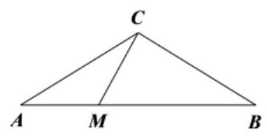
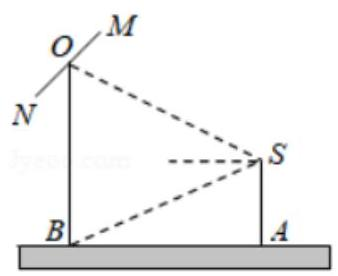
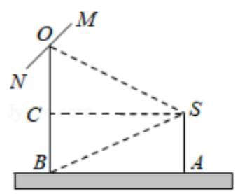
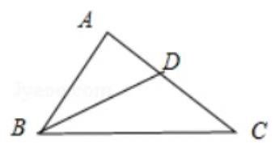
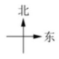
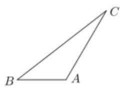
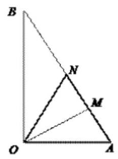
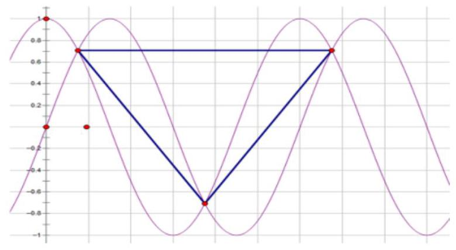
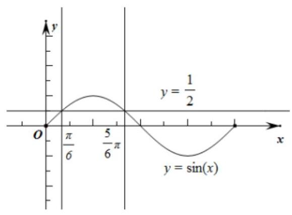

## 三角函数

<table><tr><td>教学目标</td><td>熟悉高考三角函数考点</td></tr><tr><td>重点</td><td>1、三角比定义与三角恒等式的运用;   2、利用正余弦定理解三角形中基本元素与三角形面积公式;   3、三角函数性质的综合运用，加强综合分析问题的能力.</td></tr><tr><td>难 点</td><td>1、三角恒等式的灵活运用与三角形的形状的判断；   2、三角函数性质的综合运用，加强综合分析问题的能力.</td></tr></table>

## (一) 三角比和三角恒等式

## 知识梳理

1、弧长公式与扇形面积公式

2、任意角三角比定义(6 个)与同角三角比关系

3、诱导公式(4 个同名 2 个异名)

4、两角和差正弦、余弦、正切公式与辅助角公式

5、二倍角与半角公式与万能公式

## 例题精讲

【例 1 】若 $\tan \left( {\alpha  + \frac{\pi }{4}}\right)  =  - 3$ ，则 $\sin {2\alpha } - {\cos }^{2}\alpha  =$ ___.

【难度】 $\star   \star   \star$

【答案】 $\frac{3}{5}$

【解析】 $\tan \left( {\alpha  + \frac{\pi }{4}}\right)  =  - 3 \Rightarrow  \frac{\tan \alpha  + \tan \frac{\pi }{4}}{1 - \tan \alpha  \cdot  \tan \frac{\pi }{4}} =  - 3 \Rightarrow  \tan \alpha  = 2$ ,

$\sin {2\alpha } - {\cos }^{2}\alpha  = \frac{\sin {2\alpha } - {\cos }^{2}\alpha }{{\sin }^{2}\alpha  + {\cos }^{2}\alpha } = \frac{2\sin \alpha \cos \alpha  - {\cos }^{2}\alpha }{{\sin }^{2}\alpha  + {\cos }^{2}\alpha } = \frac{2\tan \alpha  - 1}{1 + {\tan }^{2}\alpha }$ ,把 $\tan \alpha  = 2$ 代入,

求得 $\sin {2\alpha } - {\cos }^{2}\alpha  = \frac{3}{5}$ .

【例 2】已知点 $A$ 的坐标 $\left( {-4\sqrt{3}, - 1}\right)$ ,将 ${OA}$ 绕坐标原点 $O$ 逆时针旋转 $\frac{\pi }{2}$ 至 ${OB}$ ,则点 $B$ 的纵坐标为 ( )

A. $- 4\sqrt{3}$ B. -1 C. 1 D. $4\sqrt{3}$

【难度】 $\star   \star   \star$

【答案】A

【解析】假设 ${OA}$ 与横轴非负半轴所夹角为 $A$ ,由点 $A$ 的坐标 $\left( {-4\sqrt{3}, - 1}\right)$ 可求得 $\cos A =  - \frac{4\sqrt{3}}{7}$ , $\sin A =  - \frac{1}{7}$ ,点 $B$ 是由 ${OA}$ 绕坐标原点 $O$ 逆时针旋转 $\frac{\pi }{2}$ 所得,所以有 $B = A + \frac{\pi }{2}$ ,则

$\sin B = \sin \left( {A + \frac{\pi }{2}}\right)  = \cos A =  - \frac{1}{7},\cos B = \cos \left( {A + \frac{\pi }{2}}\right)  =  - \sin A =  - \frac{4\sqrt{3}}{7}$ ,由三角函数与坐标的关系可知点 $B$ 的纵坐标 $B\left( {1, - 4\sqrt{3}}\right)$ ,故本题的正确选项为 A.

【例 3】 “ $\tan \theta  = a$ ” 是 “ $\frac{1 - \cos {2\theta }}{\sin {2\theta }} = a$ ” 的( )

A. 充分非必要条件 B. 必要非充分条件 C. 充要条件 D. 既非充分也非必要条件

【难度】 $\star   \star   \star$

【答案】B

【解析】当 $\tan \theta  = a$ 时, $\frac{1 - \cos {2\theta }}{\sin {2\theta }} = \frac{2{\sin }^{2}\theta }{2\sin \theta \cos \theta } = \frac{\sin \theta }{\cos \theta } = a$ ,但是当 $\theta  = 0$ 时, $\frac{1 - \cos {2\theta }}{\sin {2\theta }}$ 分母为零,没有意义.

所以 “ $\tan \theta  = a$ ” 是 “ $\frac{1 - \cos {2\theta }}{\sin {2\theta }} = a$ ” 的非充分条件;

当 $\frac{1 - \cos {2\theta }}{\sin {2\theta }} = a$ 时, ${2\theta } \neq  {k\pi }\left( {k \in  Z}\right) ,\therefore x \neq  \frac{k\pi }{2}$ . 所以 $\frac{1 - \cos {2\theta }}{\sin {2\theta }} = \frac{2{\sin }^{2}\theta }{2\sin \theta \cos \theta } = \frac{\sin \theta }{\cos \theta } = \tan \theta  = a$ ,

所以 “ $\tan \theta  = a$ ” 是 “ $\frac{1 - \cos {2\theta }}{\sin {2\theta }} = a$ ” 的必要条件. 所以 “ $\tan \theta  = a$ ” 是 “ $\frac{1 - \cos {2\theta }}{\sin {2\theta }} = a$ ”的必要非充分条件. 故选: B

巩固训练

1、已知 $x \in  \left\lbrack  {0,\pi }\right\rbrack$ ，且 $3\sin \frac{x}{2} = \sqrt{1 + \sin x}$ ，则 $\tan \frac{x}{2} =$ ___.

【答案】 $\frac{1}{2}$

【解析】由于 $0 \leq  x \leq  \pi$ ,所以 $0 \leq  \frac{x}{2} \leq  \frac{\pi }{2}$ ,故 $\sin \frac{x}{2} \geq  0,\cos \frac{x}{2} \geq  0$ . 所以 $\sqrt{1 + \sin x} = \sqrt{{\sin }^{2}\frac{x}{2} + 2\sin \frac{x}{2}\cos \frac{x}{2} + {\cos }^{2}\frac{x}{2}} = \sin \frac{x}{2} + \cos \frac{x}{2}$ ,即 $\sin \frac{x}{2} + \cos \frac{x}{2} = 3\sin \frac{x}{2}$ ,即 $\cos \frac{x}{2} = 2\sin \frac{x}{2}$ ,故 $\tan \frac{x}{2} = \frac{\sin \frac{x}{2}}{\cos \frac{x}{2}} = \frac{1}{2}$ .

2、已知 $\sin \left( {\pi  - \theta }\right) \cos \theta  < 0$ ，且 $\left| {\cos \theta }\right|  = \cos \theta$ ，则角 $\theta$ 是( )

A. 第一象限角 B. 第二象限角 C. 第三象限角 D. 第四象限角

【答案】D

【解析】有 $\left| {\cos \theta }\right|  = \cos \theta$ 可知 $\cos \theta  \geq  0$ ,结合 $\sin \left( {\pi  - \theta }\right) \cos \theta  < 0$ 可得: $\cos \theta  > 0,\sin \left( {\pi  - \theta }\right)  < 0$ ,即 $\cos \theta  > 0,\sin \theta  < 0$ ,据此可得角 $\theta$ 是第四象限角. 本题选择 $D$ 选项.

3、中国传统扇文化有着极其深厚的底蕴.一般情况下，折扇可看作是从一个圆面中剪下的扇形制作而成，设扇形的面积为 ${S}_{1}$ ,圆面中剩余部分的面积为 ${S}_{2}$ ,当 ${S}_{1}$ 与 ${S}_{2}$ 的比值为 $\frac{\sqrt{3} - 1}{2}$ 时,扇面看上去形状较为美观, 那么此时扇形的圆心角的弧度数为( )

A. $\left( {4 - 2\sqrt{3}}\right) \pi$ B. $\left( {2 - \sqrt{3}}\right) \pi$ C. $\left( {\sqrt{3} - 1}\right) \pi$ D. $\left( {2\sqrt{3} - 2}\right) \pi$

【答案】A

【解析】设扇形圆心角的弧度数为 $\alpha$ ,由题意可得出 $\frac{{S}_{1}}{{S}_{2}} = \frac{\alpha }{{2\pi } - \alpha } = \frac{\sqrt{3} - 1}{2}$ ,解得 $\alpha  = \left( {4 - 2\sqrt{3}}\right) \pi$ . 故选: A.

4、已知 $0 < x < \frac{\pi }{2}$ ，且 $\sin x - \cos x = \frac{1}{5}$ ，则 $4\sin x\cos x - {\cos }^{2}x$ 的值为___.

【答案】 $\frac{39}{25}$

【解析】由题 $0 < x < \frac{\pi }{2}$ ,且 $\sin x - \cos x = \frac{1}{5}$ ,可

两边平方可得: $1 - 2\sin x\cos x = \frac{1}{25}$ ,解得 $2\sin x\cos x = \frac{24}{26}$ ,

$\therefore \sin x + \cos x = \sqrt{{\sin }^{2}x + {\cos }^{2}x + 2\sin x\cos x} = \sqrt{1 + \frac{24}{25}} = \frac{7}{5}$ ,②

$\therefore$ 联立①,② 解得: $\sin x = \frac{4}{5},\cos x = \frac{3}{5},\therefore 4\sin x\cos x - {\cos }^{2}x = 4 \times  \frac{4}{5} \times  \frac{3}{5} - {\left( \frac{3}{5}\right) }^{2} = \frac{39}{25}$ . 故答案为 $\frac{39}{25}$ 。

## (二)解三角形

## 知识梳理

1、三角形的面积公式

2、正弦定理及其运用

3、余弦定理及其运用

4、利用正余弦定理解三角形问题

【例 4】 $\bigtriangleup {ABC}$ 的内角 $A, B, C$ 所对边分别为 $a, b, c$ ,若 $a = 6, b = 2\sqrt{3}, B, A, C$ 成等差数列, 则 $B =$ (   )

A. $\frac{\pi }{6}$ B. $\frac{5\pi }{6}$ C. $\frac{\pi }{6}$ 或 $\frac{5\pi }{6}$ D. $\frac{2\pi }{3}$

【难度】 $\star   \star   \star$

【答案】A

【解析】解: $\bigtriangleup {ABC}$ 中,由 $B, A, C$ 成等差数列,则 ${2A} = B + C = \pi  - A$ ,解得 $A = \frac{\pi }{3}$ ;

所以 $\sin B = \frac{b\sin A}{a} = \frac{2\sqrt{3} \times  \frac{\sqrt{3}}{2}}{6} = \frac{1}{2}$ ,又 $a > b$ ,所以 $B$ 为锐角. 所以 $B = \frac{\pi }{6}$ . 故选: $A$ .

【例 5】某人要制作一个三角形，要求它的三条高的长度分别是 $\frac{1}{3},\frac{1}{5},\frac{1}{7}$ ，则此人( )

A. 不能作出这样的三角形 B. 能作出一个锐角三角形

C. 能作出一个直角三角形 D. 能作出一个钝角三角形

【难度】★★★

【答案】D

【解析】设三条边分别是 $a, b, c$ ,由面积可知 $\frac{a}{3} = \frac{b}{5} = \frac{c}{7}$ ,所以 $a : b : c = 3 : 5 : 7$ ,最大角为 $\mathrm{C}$ , $\because \cos C = \frac{{a}^{2} + {b}^{2} - {c}^{2}}{2ab} = \frac{9 + {35} - {49}}{30} < 0;\therefore C > {90}^{ \circ  }$ 能作出一个钝角三角形。

【例 6】在 $\bigtriangleup {ABC}$ 中,角 $\mathrm{A}, B, C$ 所对的边分别为 $a, b, c, c\sin A + \sqrt{3}a\sin \left( {C + \frac{\pi }{2}}\right)  = 0, c = 6$ .

(1)求 $\bigtriangleup  {ABC}$ 外接圆的面积；

(2)若 $c = \sqrt{3}b,\overrightarrow{AM} = \frac{1}{3}\overrightarrow{AB}$ ，求 $\bigtriangleup  {ACM}$ 的周长.

【难度】 $\star   \star   \star$

【答案】( 1 ) ${12\pi };$ ( 2 ) $4 + 2\sqrt{3}$ .

【解析】(1) $\because c\sin A + \sqrt{3}a\sin \left( {C + \frac{\pi }{2}}\right)  = 0$ ,

$\therefore c\sin A + \sqrt{3}a\cos C = 0$ ,由正弦定理得: $\sin C\sin A + \sqrt{3}\sin A\cos C = 0$ ,

因为 $\sin A \neq  0$ ,所以 $\sin C + \sqrt{3}\cos C = 0$ ,得 $\tan C =  - \sqrt{3}$ ,

又 $0 < C < \pi$ ,故 $C = \frac{2\pi }{3}$ ,

$\therefore \bigtriangleup {ABC}$ 外接圆的半径 $R = \frac{1}{2} \cdot  \frac{c}{\sin C} = \frac{1}{2} \times  \frac{6}{\frac{\sqrt{3}}{2}} = 2\sqrt{3}$ ， $\therefore \bigtriangleup {ABC}$ 外接圆的面积为 ${12\pi }$ .

(2)由 $c = 6$ 及 $c = \sqrt{3}b$ 得: $b = 2\sqrt{3}$ ， $\sin B = \frac{\sin C}{\sqrt{3}} = \frac{\frac{\sqrt{3}}{2}}{\sqrt{3}} = \frac{1}{2}$ ，

$\because C = \frac{2\pi }{3}$ ,则 $B$ 为锐角, $\therefore B = \frac{\pi }{6}$ ,故 $A = \pi  - B - C = \frac{\pi }{6}$ .

如图所示，在 $\bigtriangleup  {ACM}$ 中，由余弦定理得，

$C{M}^{2} = A{M}^{2} + A{C}^{2} - {2AM} \cdot  {AC} \cdot  \cos A = {2}^{2} + {\left( 2\sqrt{3}\right) }^{2} - 2 \times  2 \times  2\sqrt{3} \times  \frac{\sqrt{3}}{2} = 4$ ,解得 ${CM} = 2$ ,

则 $\bigtriangleup {ACM}$ 的周长为 $4 + 2\sqrt{3}$ .

【例 7】已知锐角 $\alpha$ 、 $\beta$ 的顶点与坐标原点重合,始边与 $x$ 轴正方向重合,终边与单位圆分别交于 $P\text{ 、 }Q$ 两点,若 $P\text{ 、 }Q$ 两点的横坐标分别为 $\frac{3\sqrt{10}}{10}\text{ 、 }\frac{2\sqrt{5}}{5}$ .

(1)求 $\cos \left( {\alpha  + \beta }\right)$ 的大小；

(2)在 $\bigtriangleup  {ABC}$ 中， $a$ 、 $b$ 、 $c$ 为三个内角 $A$ 、 $B$ 、 $C$ 对应的边长，若已知角 $C = \alpha  + \beta$ ， $\tan A = \frac{3}{4}$ ，且 ${a}^{2} = {\lambda bc} + {c}^{2}$ ,求 $\lambda$ 的值.

【难度】 $\bigstar \bigstar \bigstar \bigstar$

【答案】( 1 ) $\frac{\sqrt{2}}{2}$ ( 2 ) $\lambda  =  - \frac{1}{2}$

【解析】( 1 )由三角函数定义，得: $\cos \alpha  = \frac{3\sqrt{10}}{10},\cos \beta  = \frac{2\sqrt{5}}{5}$

$\because \alpha \text{ 、 }\beta$ 为锐角, $\therefore \sin \alpha  = \sqrt{1 - {\cos }^{2}\alpha } = \frac{\sqrt{10}}{10},\sin \beta  = \sqrt{1 - {\cos }^{2}\beta } = \frac{\sqrt{5}}{5}$

$\therefore \cos \left( {\alpha  + \beta }\right)  = \cos \alpha \cos \beta  - \sin \alpha \sin \beta  = \frac{3\sqrt{10}}{10} \times  \frac{2\sqrt{5}}{5} - \frac{\sqrt{10}}{10} \times  \frac{\sqrt{5}}{5} = \frac{\sqrt{2}}{2}$

( 2 )由 $\cos \left( {\alpha  + \beta }\right)  = \frac{\sqrt{2}}{2},\because \alpha$ 、 $\beta$ 为锐角，得: $C = \alpha  + \beta  = \frac{\pi }{4},\therefore \cos C = \frac{\sqrt{2}}{2},\sin C = \frac{\sqrt{2}}{2}$

由 $\tan A = \frac{3}{4}$ ,得 $\frac{\sin A}{\cos A} = \frac{3}{4}$ ,又 ${\sin }^{2}A + {\cos }^{2}A = 1$ ,解得 $\sin A = \frac{3}{5},\cos A = \frac{4}{5}$

$\sin B = \sin \left\lbrack  {\pi  - \left( {A + C}\right) }\right\rbrack   = \sin \left( {A + C}\right)  = \sin A\cos C + \cos A\sin C = \frac{3}{5} \times  \frac{\sqrt{2}}{2} + \frac{4}{5} \times  \frac{\sqrt{2}}{2} = \frac{7\sqrt{2}}{10}$

由正弦定理可得: $\lambda  = \frac{{a}^{2} - {c}^{2}}{bc} = \frac{{\sin }^{2}A - {\sin }^{2}C}{\sin B\sin C} = \frac{\frac{9}{25} - \frac{1}{2}}{\frac{7\sqrt{2}}{10} \cdot  \frac{\sqrt{2}}{2}} =  - \frac{1}{5}$

【例 8】如图,摄影爱好者在某公园 $A$ 处,发现正前方 $B$ 处有一立柱,测得立柱顶端 $O$ 的仰角和立柱底部 $B$ 的俯角均为 ${30}^{ \circ  }$ ，已知摄影爱好者的身高约为 $\sqrt{3}$ 米(将眼睛 $S$ 距地面的距离 ${SA}$ 按 $\sqrt{3}$ 米处理).

(1)求摄影爱好者到立柱的水平距离 ${AB}$ 和立柱的高度 ${OB}$ ；

(2)立柱的顶端有一长为 2 米的彩杆 ${MN}$ ，且 ${MN}$ 绕其中点 $O$ 在摄影爱好者与立柱所在的平面内旋转当 ${SM} \cdot  {SN} = {15}$ 时，求摄影爱好者观察彩杆 ${MN}$ 的视角 $\angle {MSN}$ 的余弦值.

【难度】 $\star   \star   \star$

【答案】见解析

【解析】解: (1) 如图,作 ${SC} \bot  {OB}$ 于 $C$ ,依题意 $\angle {CSB} = {30}^{ \circ  },\angle {ASB} = {60}^{ \circ  }$ ,

又 ${SA} = \sqrt{3}$ ，故在 Rt $\Delta \mathrm{{SAB}}$ 中，可求得 ${AB} = \frac{SA}{\tan {30}^{ \circ  }} = \frac{\sqrt{3}}{\tan {30}^{ \circ  }} = 3$ ，

即摄影爱好者到立柱的水平距离 ${AB}$ 为 3 米,

在 Rt $\Delta \mathrm{{SCO}}$ 中, ${SC} = 3,\angle {CSO} = {30}^{ \circ  },{OC} = {SC} \cdot  \tan {30}^{ \circ  } = \sqrt{3}$ ,又 ${BC} = {SA} = \sqrt{3}$ ,

故 ${OB} = 2\sqrt{3}$ ，即立柱的高度 ${OB}$ 为 $2\sqrt{3}$ 米；

(2)因为 $\cos \angle {MOS} =  - \cos \angle {NOS}$ ，

所以 $\frac{M{O}^{2} + S{O}^{2} - S{M}^{2}}{2 \cdot  {MO} \cdot  {SO}} =  - \frac{N{O}^{2} + S{O}^{2} - S{N}^{2}}{2 \cdot  {NO} \cdot  {SO}}$ ，于是得 $S{M}^{2} + S{N}^{2} = {26}$ ，

又 ${SM} \cdot  {SN} = {15}$ ,从而 $\cos \angle {MSN} = \frac{S{M}^{2} + S{N}^{2} - M{N}^{2}}{2 \cdot  {SM} \cdot  {SN}} = \frac{22}{30} = \frac{11}{15}$ .

巩固训练

1、在 $\bigtriangleup  {ABC}$ 中， $a$ ， $b$ ， $c$ 分别是角 $A$ ， $B$ ， $C$ 所对的边，若 $\lg a - \lg c = \lg \sin B =  - \lg \sqrt{2}$ ，且 $B \in  \left( {0,\frac{\pi }{2}}\right)$ ， 则 $\bigtriangleup  {ABC}$ 的形状是( )

A. 等边三角形 B. 锐角三角形 C. 等腰直角三角形 D. 钝角三角形

【答案】C

【解析】 $\because \lg a - \lg c = \lg \sin B =  - \lg \sqrt{2},\therefore \frac{a}{c} = \sin B = \frac{\sqrt{2}}{2}.\because B \in  \left( {0,\frac{\pi }{2}}\right) ,\therefore B = \frac{\pi }{4}$ .

由正弦定理,得 $\frac{a}{c} = \frac{\sin A}{\sin C} = \frac{\sqrt{2}}{2},\therefore \sin C = \sqrt{2}\sin A = \sqrt{2}\sin \left( {\frac{3\pi }{4} - C}\right)  = \sqrt{2}\left( {\frac{\sqrt{2}}{2}\cos C + \frac{\sqrt{2}}{2}\sin C}\right)$ ,

化简得 $\cos C = 0.\because C \in  \left( {0,\pi }\right) ,\therefore C = \frac{\pi }{2}$ ,则 $A = \pi  - B - C = \frac{\pi }{4},\therefore \bigtriangleup {ABC}$ 是等腰直角三角形.

2、已知 $\bigtriangleup  {ABC}$ ， $\angle {ABC} = {60}^{ \circ  }$ ， ${BA} = 2$ ， ${BC} = 3$ ， ${BD}$ 平分 $\angle {ABC}$ 交 ${AC}$ 于 $D$ ，则线段 ${BD}$ 的长为___. 【答案】 $\frac{6\sqrt{3}}{5}$

【解析】解: $\because \angle {ABC} = {60}^{ \circ  },{BA} = 2,{BC} = 3$ ,

$\therefore$ 由余弦定理可得: ${AC} = \sqrt{A{B}^{2} + B{C}^{2} - {2AB} \cdot  {BC} \cdot  \cos \angle {ABC}} = \sqrt{{2}^{2} + {3}^{2} - 2 \times  2 \times  3 \times  \frac{1}{2}} = \sqrt{7}$ ，

$\because {BD}$ 平分 $\angle {ABC}$ 交 ${AC}$ 于 $D,\therefore \frac{AD}{CD} = \frac{AB}{BC} = \frac{2}{3}$ ,可得: ${AD} = \frac{2}{3}{CD}$ ,又 $\because {AD} + {CD} = \sqrt{7},\therefore$ 解得: ${AD} = \frac{2\sqrt{7}}{5}$ ,

$\therefore$ 在 $\bigtriangleup  {ABD}$ 中，由余弦定理， $A{D}^{2} = A{B}^{2} + B{D}^{2} - {2AB} \cdot  {BD} \cdot  \cos {30}^{ \circ  }$ ，可得: $\frac{28}{25} = 4 + B{D}^{2} - 2 \times  2 \times  {BD} \times  \frac{\sqrt{3}}{2}$ ， $\therefore$ 可

得: ${BD} = \frac{6\sqrt{3}}{5}$ ，或 $\frac{4\sqrt{3}}{5}$ . $\because$ 在 $\bigtriangleup  {BCD}$ 中，由余弦定理 $C{D}^{2} = B{C}^{2} + B{D}^{2} - {2BC} \cdot  {BD} \cdot  \cos {30}^{ \circ  }$ ，可得:

$\frac{63}{25} = 9 + B{D}^{2} - 2 \times  {BD} \times  \frac{\sqrt{3}}{2} \times  3$ ,代入 ${BD} = \frac{6\sqrt{3}}{5}$ ,或 $\frac{4\sqrt{3}}{5}$ 验证,可得 ${BD} = \frac{6\sqrt{3}}{5},\left( {{BD} = \frac{4\sqrt{3}}{5}}\right)$ 错误) . 故答案为: $\frac{6\sqrt{3}}{5}$ .

3、在 $\bigtriangleup {ABC}$ 中，内角 $A\text{ 、 }B\text{ 、 }C$ 的对边分别为 $a\text{ 、 }b\text{ 、 }c$ ，若 $b = 2,\frac{\sin A}{a} = \frac{\sqrt{3}\cos B}{b}$ 则 $\bigtriangleup {ABC}$ 的面积的最大值等于___. 【答案】 $\sqrt{3}$

【解析】解: $\because \frac{\sin A}{a} = \frac{\sqrt{3}\cos B}{b}$ ,又由正弦定理可得 $\frac{\sin A}{a} = \frac{\sin B}{b}$ ,

$\therefore \sin B = \sqrt{3}\cos B$ ,即 $\tan B = \sqrt{3},\because B \in  \left( {0,\pi }\right) ,\therefore B = \frac{\pi }{3}$ ,又 $\because b = 2$ ,

$\therefore {b}^{2} = {a}^{2} + {c}^{2} - {ac} \geq  {2ac} - {ac} = {ac}$ ,可得 ${ac} \leq  4$ ,当且仅当 $a = c$ 时等号成立,

$\therefore {S}_{\bigtriangleup {ABC}} = \frac{1}{2}{ac}\sin B \leq  \frac{1}{2} \times  4 \times  \frac{\sqrt{3}}{2} = \sqrt{3}$ ，当且仅当 $a = c$ 时等处成立，即 $\bigtriangleup {ABC}$ 的面积的最大值等于 $\sqrt{3}$ . 故答案为: $\sqrt{3}$ .

4、在 $\bigtriangleup {ABC}$ 中，角 $A, B, C$ 所对边分别为 $a, b, c$ . 已知 $\overrightarrow{m} = \left( {\sin C,\sin B\cos A}\right) ,\overrightarrow{n} = \left( {b,{2c}}\right)$ ，且 $\overrightarrow{m} \bot  \overrightarrow{n}$ .

(1)求角 $A$ 大小.

(2)若 $a = 2\sqrt{3}, c = 2$ ，求 $\bigtriangleup  {ABC}$ 的面积 $S$ 的大小.

【答案】( 1 ) $A = \frac{2\pi }{3}$ . ( 2 ) ${S}_{\bigtriangleup {ABC}} = \frac{1}{2}{bc}\sin A = \sqrt{3}$ .

【解析】(1) $\because \bar{m} \bot  \bar{n},\;\therefore \left( {\sin C,\sin B\cos A}\right)  \cdot  \left( {b,{2c}}\right)  = 0.\therefore b\sin C + {2c}\sin B\cos A = 0$ .

$\because \frac{b}{\sin B} = \frac{c}{\sin C}\therefore {bc} + {2cb}\cos A = 0$ ,

$\because b \neq  0, c \neq  0\;\therefore 1 + 2\cos A = 0,\;\therefore \cos A =  - \frac{1}{2}$ .

$\because 0 < A < \pi ,\therefore A = \frac{2\pi }{3}$ .

(2)在 $\Delta \mathrm{{ABC}}$ 中，由余弦定理可知 ${\mathrm{a}}^{2} = {\mathrm{b}}^{2} + {\mathrm{c}}^{2} - 2\mathrm{{bccosA}}$ ，

$\therefore {12} = {b}^{2} + 4 - {4b}\cos {120}^{ \circ  },\therefore {b}^{2} + {2b} - 8 = 0.\therefore b =  - 4$ (舍去) 或 $b = 2$ ,

$\therefore \bigtriangleup {ABC}$ 的面积 ${S}_{\bigtriangleup {ABC}} = \frac{1}{2}{bc}\sin A = \sqrt{3}$ .

5、如图，一智能扫地机器人在 A 处发现位于它正西方向的 $B$ 处和北偏东 ${30}^{ \circ  }$ 方向上的 $C$ 处分别有需要清扫的垃圾，红外线感应测量发现机器人到 $B$ 的距离比到 $C$ 的距离少 0.4 米，于是选择沿 $A \rightarrow  B \rightarrow  C$ 路线清扫，已知智能扫地机器人的直线行走速度为 ${0.2}\mathrm{\;m}/\mathrm{s}$ ，忽略机器人吸入垃圾及在 $B$ 处旋转所用时间，10 秒钟完成了清扫任务.

(1) $B$ 、 $C$ 两处垃圾的距离是多少？

(2)智能扫地机器人此次清扫行走路线的夹角 $\angle B$ 的正弦值是多少？

【答案】(1) $B$ 、 $C$ 两处垃圾的距离是 1.4 米; (2) $\frac{5\sqrt{3}}{14}$ .

【解析】(1)设 ${AB} = x > 0$ ，依题意可知 ${AC} = x + {0.4},\angle {BAC} = {90}^{ \circ  } + {30}^{ \circ  } = {120}^{ \circ  }$ ，由余弦定理得

${BC} = \sqrt{{x}^{2} + {\left( x + {0.4}\right) }^{2} - 2 \cdot  x \cdot  \left( {x + {0.4}}\right)  \cdot  \cos {120}^{ \circ  }} = \sqrt{3{x}^{2} + {1.2x} + {0.16}}.$

所以 $\frac{{AB} + {BC}}{0.2} = {10}$ ,即 $x + \sqrt{3{x}^{2} + {1.2x} + {0.16}} = 2$ ,

即 $\sqrt{3{x}^{2} + {1.2x} + {0.16}} = 2 - x$ ,两边平方并化简得 $\left( {{5x} - 3}\right) \left( {{5x} + {16}}\right)  = 0$ ,解得 $x = \frac{3}{5}$ 或 $x =  - \frac{16}{5}$ (舍去).

所以 ${BC} = \sqrt{3 \times  {\left( \frac{3}{5}\right) }^{2} + {1.2} \times  \left( \frac{3}{5}\right)  + {0.16}} = \frac{7}{5} = {1.4}$ 米.

(2)由(1)可知 ${BC} = {1.4},{AB} = {0.6},{AC} = 1$ ，由余弦定理得 $\cos B = \frac{{1.4}^{2} + {0.6}^{2} - {1}^{2}}{2 \times  {1.4} \times  {0.6}} = \frac{11}{14}$ . 由于 $0 < B < {180}^{ \circ  }$ ,所以 $\sin B = \sqrt{1 - {\left( \frac{11}{14}\right) }^{2}} = \frac{5\sqrt{3}}{14}$ .

6、如图所示，某区有一块空地 ${\Delta OAB}$ ，其中 ${OA} = {4km}$ ， ${OB} = 4\sqrt{3}{km}$ ， $\angle {AOB} = {90}^{ \circ  }$ . 当地区政府规划将这块空地改造成一个旅游景点,拟在中间挖一个人工湖 ${\Delta OMN}$ ,其中 $M, N$ 都在边 ${AB}$ 上,且 $\angle {MON} = {30}^{ \circ  }$ ,挖出的泥土堆放在 $\bigtriangleup {OAM}$ 地带上形成假山,剩下的 $\bigtriangleup {OBN}$ 地带开设儿童游乐场. 为安全起见,需在 $\bigtriangleup {OAN}$ 的周围安装防护网.

(1)当 ${AM} = {2km}$ 时，求防护网的总长度；

(2)若要求挖人工湖用地 $\bigtriangleup  {OMN}$ 的面积是堆假山用地， ${OQM}$ 的面积的 $\sqrt{3}$ 倍，试确定 $\angle {AOM}$ 的大小；

(3)为节省投入资金，人工湖 ${\Delta OMN}$ 的面积要尽可能小，问如何设计施工方案，可使 ${\Delta OMN}$ 的面积最小? 最小面积是多少?

【答案】(1)12km(2) ${15}^{ \circ  }$ (3)当且仅当 $\theta  = {15}^{ \circ  }$ 时， $\bigtriangleup {OMN}$ 的面积取最小值为 ${24} - {12}\sqrt{3}k{m}^{2}$

【解析】(1) $\because$ 在 $\bigtriangleup {OAB}$ 中， ${OA} = 4,{OB} = 4\sqrt{3},\angle {AOB} = {90}^{ \circ  },\therefore \angle {OAB} = {60}^{ \circ  }$

在 $\bigtriangleup {AOM}$ 中, ${OA} = 4,{AM} = 2,\angle {OAM} = {60}^{ \circ  }$ ,

由余弦定理,得 ${OM} = 2\sqrt{3},\therefore O{M}^{2} + A{M}^{2} = O{A}^{2}$ ,即 ${OM} \bot  {AN},\therefore \angle {AOM} = {30}^{ \circ  }$ ,

$\therefore \bigtriangleup {OAN}$ 为正三角形,所以 $\bigtriangleup {OAN}$ 的周长为12,即防护网的总长度为 ${12km}$ .

(2)设 $\angle {AOM} = \theta \left( {{0}^{ \circ  } < \theta  < {60}^{ \circ  }}\right) ,\because {S}_{\bigtriangleup {OMN}} = \sqrt{3}{S}_{\bigtriangleup {OAM}}$ ，

$\therefore \frac{1}{2}{ON} \cdot  {OM}\sin {30}^{ \circ  } = \sqrt{3} \times  \frac{1}{2}{OA} \cdot  {OM}\sin \theta$ ，即 ${ON} = 8\sqrt{3}\sin \theta$ ，

在 $\bigtriangleup {OAN}$ 中,由 $\frac{ON}{\sin {60}^{ \circ  }} = \frac{OA}{\sin \left( {{180}^{ \circ  } - \theta  - {60}^{ \circ  } - {30}^{ \circ  }}\right) } = \frac{4}{\cos \theta }$ ,得 ${ON} = \frac{2\sqrt{3}}{\cos \theta }$ ,

从而 $8\sqrt{3}\sin \theta  = \frac{2\sqrt{3}}{\cos \theta }$ ,即 $\sin {2\theta } = \frac{1}{2}$ ,由 ${0}^{ \circ  } < {2\theta } < {120}^{ \circ  }$ ,

得 ${2\theta } = {30}^{ \circ  },\therefore \theta  = {15}^{ \circ  }$ ,即 $\angle {AOM} = {15}^{ \circ  }$ .

(3)设 $\angle {AOM} = \theta \left( {{0}^{ \circ  } < \theta  < {60}^{ \circ  }}\right)$ ，由(2)知 ${ON} = \frac{2\sqrt{3}}{\cos \theta }$ ，

又在 $\angle {AOM}$ 中，由 $\frac{OM}{\sin {60}^{ \circ  }} = \frac{OA}{\sin \left( {\theta  + {60}^{ \circ  }}\right) }$ ，得 ${OM} = \frac{2\sqrt{3}}{\sin \left( {\theta  + {60}^{ \circ  }}\right) }$ ，

$\therefore {S}_{\bigtriangleup {OMN}} = \frac{1}{2}{OM} \cdot  {ON} \cdot  \sin {30}^{ \circ  } = \frac{3}{\sin \left( {\theta  + {60}^{ \circ  }}\right) \cos \theta } = \frac{6}{\frac{1}{2}\sin {2\theta } + \frac{\sqrt{3}}{2}\cos {2\theta } + \frac{\sqrt{3}}{2}} = \frac{6}{\sin \left( {{2\theta } + {60}^{ \circ  }}\right)  + \frac{\sqrt{3}}{2}}$

,

$\therefore$ 当且仅当 ${2\theta } + {60}^{ \circ  } = {90}^{ \circ  }$ ,即 $\theta  = {15}^{ \circ  }$ 时, ${\Delta OMN}$ 的面积取最小值为 ${24} - {{12}\sqrt{3}k{m}^{2}}$ .

## (三)三角函数图像与性质的运用

## 知识梳理

1、正弦余弦正切函数图像与性质:定义域、值域(最值)、周期性、奇偶性、单调性、对称性、零点

2、函数 $y = A\sin \left( {{\omega x} + \varphi }\right)$ 的图像与性质

## 例题精讲

【例 9】已知 $\omega  > 0$ ,顺次连接函数 $y = \sin {\omega x}$ 与 $y = \cos {\omega x}$ 的任意三个相邻的交点都构成一个等边三角形,

则 $\omega  =$ (   )

A. $\pi$ B. $\frac{\sqrt{6}\pi }{2}$ C. $\frac{4\pi }{3}$ D. $\sqrt{3}\pi$

【难度】 $\star   \star   \star$

【答案】B

【解析】当正弦值等于余弦值时,函数值为 $\pm  \frac{\sqrt{2}}{2}$ ,故等边三角形的高为 $\sqrt{2}$ ,由此得到边长为 $2 \times  \frac{\sqrt{3}}{3} \times  \sqrt{2} = \frac{2\sqrt{6}}{3}$ ,边长即为函数的周期,故 $\frac{2\pi }{\omega } = \frac{2\sqrt{6}}{3},\omega  = \frac{\sqrt{6}\pi }{2}$ .

【例 10】已知函数 $f\left( x\right)  = \sin \left( {{2020x} + \frac{\pi }{4}}\right)  + \cos \left( {{2020x} - \frac{\pi }{4}}\right)$ 的最大值为 $M$ ,若存在实数 $m, n$ ,使得对任意实数 $x$ 总有 $f\left( m\right)  \leq  f\left( x\right)  \leq  f\left( n\right)$ 成立，则 $M \cdot  \left| {m - n}\right|$ 的最小值为( )

A. $\frac{\pi }{2020}$ B. $\frac{\pi }{1010}$ C. $\frac{\pi }{505}$ D. $\frac{3\pi }{1010}$

【难度】 $\star   \star   \star$

【答案】B

【解析】令 $\alpha  = {2020x} + \frac{\pi }{4}$ ,

$\therefore f\left( x\right)  = \sin \alpha  + \cos \left( {\alpha  - \frac{\pi }{2}}\right)  = \sin \alpha  + \sin \alpha  = 2\sin \alpha  = 2\sin \left( {{2020x} + \frac{\pi }{4}}\right) , T = \frac{2\pi }{2020} = \frac{\pi }{1010}$ 由题意可知, $M = 2,{\left| m - n\right| }_{\min } = \frac{1}{2}T,\therefore M \cdot  \left| {m - n}\right|$ 的最小值为 $\frac{\pi }{1010}$ . 故选:B.

【例 11】已知 $f\left( x\right)  = \sin \left( {x + \frac{\pi }{2}}\right) \left( {m\sin x + \cos x}\right)  - {\sin }^{2}x$ 的最大值为 2,其中 $m > 0$ ,

(1)求 $f\left( x\right)$ 的单调增区间；

(2)在 $\bigtriangleup  {ABC}$ 中，内角 $\mathrm{A}, B, C$ 的对边分别为 $a, b, c$ ，且 $\frac{a}{{2b} - c} = \frac{\cos A}{\cos C}$ ，求 $f\left( \mathrm{\;A}\right)$ 的值.

【难度】 $\star   \star   \star$

【答案】(1) $\left\lbrack  {-\frac{\pi }{3} + {k\pi },\frac{\pi }{6} + {k\pi }}\right\rbrack  k \in  Z;\;\left( 2\right) 1$ .

【解析】(1) $f\left( x\right)  = \cos x\left( {m\sin x + \cos x}\right)  - {\sin }^{2}x = \frac{m}{2}\sin {2x} + \cos {2x}$

$\therefore f{\left( x\right) }_{\max } = \sqrt{\frac{{m}^{2}}{4} + 1} = 2,\because m > 0,\therefore m = 2\sqrt{3}$

$\therefore f\left( x\right)  = \sqrt{3}\sin {2x} + \cos {2x} = 2\sin \left( {{2x} + \frac{\pi }{6}}\right)$ ,

$\therefore  - \frac{\pi }{2} + {2k\pi } \leq  {2x} + \frac{\pi }{6} \leq  \frac{\pi }{2} + {2k\pi }, k \in  Z,\therefore  - \frac{\pi }{3} + {k\pi } \leq  x \leq  \frac{\pi }{6} + {k\pi }, k \in  Z$ ,

$\therefore f\left( x\right)$ 的单调增区间为 $\left\lbrack  {-\frac{\pi }{3} + {k\pi },\frac{\pi }{6} + {k\pi }}\right\rbrack  k \in  Z$ .

(2)由 $\frac{a}{{2b} - c} = \frac{\cos A}{\cos C}$ 可得 $\frac{\sin A}{2\sin B - \sin \mathrm{C}} = \frac{\cos A}{\cos C}$

所以 $\sin A\cos C = \cos A\left( {2\sin B - \sin C}\right)$ ,即 $\sin A\cos C + \cos A\sin C = 2\cos A\sin B$

即 $\sin \left( {A + C}\right)  = 2\cos A\sin B$ ,所以 $\sin B = 2\cos A\sin B$

由 $B \in  \left( {0,\pi }\right)$ ,则 $\sin B \neq  0$ ,所以 $\cos A = \frac{1}{2}, A \in  \left( {0,\pi }\right) \therefore A = \frac{\pi }{3}$

$f\left( A\right)  = f\left( \frac{\pi }{3}\right)  = 2\sin \left( {\frac{2\pi }{3} + \frac{\pi }{6}}\right)  = 1$

【例 12】已知函数 $f\left( x\right)  = 2\sqrt{2}\sin \frac{x}{2}\cos \frac{x}{2} + 2\sqrt{2}{\cos }^{2}\frac{x}{2} - \sqrt{2}$ .

(1)求函数 $f\left( x\right)$ 在区间 $\left\lbrack  {0,\pi }\right\rbrack$ 上的值域；

(2)若方程 $f\left( {\omega x}\right)  = \sqrt{3}\left( {\omega  > 0}\right)$ 在区间 $\left\lbrack  {0,\pi }\right\rbrack$ 上至少有两个不同的解,求 $\omega$ 的取值范围.

【难度】 $\star   \star   \star$

【答案】( 1 ) $\left\lbrack  {-\sqrt{2},2}\right\rbrack$ ；( 2 ) $\left\lbrack  {\frac{5}{12}, + \infty }\right)$ .

【解析】(1) $f\left( x\right)  = 2\sqrt{2}\sin \frac{x}{2}\cos \frac{x}{2} + 2\sqrt{2}{\cos }^{2}\frac{x}{2} - \sqrt{2} = \sqrt{2}\sin x + \sqrt{2}\cos x = 2\sin \left( {x + \frac{\pi }{4}}\right)$ ,

令 $U = x + \frac{\pi }{4},\because x \in  \left\lbrack  {0,\pi }\right\rbrack  ,\therefore U \in  \left\lbrack  {\frac{\pi }{4},\frac{5\pi }{4}}\right\rbrack$

由 $y = \sin U$ 的图像知, $\sin U \in  \left\lbrack  {-\frac{\sqrt{2}}{2},1}\right\rbrack$ ,即 $\sin \left( {x + \frac{\pi }{4}}\right)  \in  \left\lbrack  {-\frac{\sqrt{2}}{2},1}\right\rbrack  ,\therefore 2\sin \left( {x + \frac{\pi }{4}}\right)  \in  \left\lbrack  {-\sqrt{2},2}\right\rbrack$ , 所以函数 $f\left( x\right)$ 的值域为 $\left\lbrack  {-\sqrt{2},2}\right\rbrack$ .

(2) $f\left( {\omega x}\right)  = 2\sin \left( {{\omega x} + \frac{\pi }{4}}\right) \left( {\omega  > 0}\right)$

$\because f\left( {\omega x}\right)  = \sqrt{3},\therefore 2\sin \left( {{\omega x} + \frac{\pi }{4}}\right)  = \sqrt{3}$ ,即 $\sin \left( {{\omega x} + \frac{\pi }{4}}\right)  = \frac{\sqrt{3}}{2}$ ,

$\because x \in  \left\lbrack  {0,\pi }\right\rbrack  ,\therefore {\omega x} + \frac{\pi }{4} \in  \left\lbrack  {\frac{\pi }{4},{\omega \pi } + \frac{\pi }{4}}\right\rbrack$ ,且 ${\omega x} + \frac{\pi }{4} = {2k\pi } + \frac{\pi }{3}\left( {k \in  \mathbf{Z}}\right)$ 或 ${\omega x} + \frac{\pi }{4} = {2k\pi } + \frac{2\pi }{3}\left( {k \in  \mathbf{Z}}\right)$

由于方程 $f\left( {\omega x}\right)  = \sqrt{3}\left( {\omega  > 0}\right)$ 在区间 $\left\lbrack  {0,\pi }\right\rbrack$ 上至少有两个不同的解,

所以 ${\omega \pi } + \frac{\pi }{4} \geq  \frac{2\pi }{3}$ ,解得 $\omega  \geq  \frac{5}{12}$ ,所以 $\omega$ 的取值范围为 $\left\lbrack  {\frac{5}{12}, + \infty }\right)$ .

【例 13】已知函数 $y = f\left( x\right)  = \sin \left( {{\omega x} + \varphi }\right)  - b\left( {\omega  > 0,0 < \varphi  < \pi }\right)$ 的图象两相邻对称轴之间的距离是 $\frac{\pi }{2}$ , 若将 $y = f\left( x\right)$ 的图象先向右平移 $\frac{\pi }{6}$ 个单位,再向上平移 $\sqrt{3}$ 个单位,所得函数 $y = g\left( x\right)$ 为奇函数.

(1)求 $y = f\left( x\right)$ 的解析式;

(2)若对任意 $x \in  \left\lbrack  {0,\frac{\pi }{3}}\right\rbrack$ ， ${f}^{2}\left( x\right)  - \left( {2 + m}\right) f\left( x\right)  + 2 + m \leq  0$ 恒成立，求实数 $m$ 的取值范围.

【难度】 $\star   \star   \star   \star$

【答案】(1) $f\left( x\right)  = \sin \left( {{2x} + \frac{\pi }{3}}\right)  - \sqrt{3};\left( 2\right) \left( {-\infty ,\frac{-1 - 3\sqrt{3}}{2}}\right\rbrack$

【解析】(1) $\because \frac{2\pi }{\omega } = 2 \times  \frac{\pi }{2},\therefore \omega  = 2\therefore f\left( x\right)  = \sin \left( {{2x} + \varphi }\right)  - b$ .

又 $g\left( x\right)  = \sin \left\lbrack  {2\left( {x - \frac{\pi }{6}}\right)  + \varphi }\right\rbrack   - b + \sqrt{3}$ 为奇函数,且 $0 < \varphi  < \pi$ ,

则 $\varphi  = \frac{\pi }{3}, b = \sqrt{3}$ ,故 $f\left( x\right)  = \sin \left( {{2x} + \frac{\pi }{3}}\right)  - \sqrt{3}$

( 2 )由于 $x \in  \left\lbrack  {0,\frac{\pi }{3}}\right\rbrack$ ，故 $- \sqrt{3} \leq  f\left( x\right)  \leq  1 - \sqrt{3}$ ， $- 1 - \sqrt{3} \leq  f\left( x\right)  - 1 \leq   - \sqrt{3}$ ，

$\because {f}^{2}\left( x\right)  - \left( {2 + m}\right) f\left( x\right)  + 2 + m \leq  0$ 恒成立,整理可得 $m \leq  \frac{1}{f\left( x\right)  - 1} + f\left( x\right)  - 1$ .

由 $- 1 - \sqrt{3} \leq  f\left( x\right)  - 1 \leq   - \sqrt{3}$ ,得: $\frac{-1 - 3\sqrt{3}}{2} \leq  \frac{1}{f\left( x\right)  - 1} + f\left( x\right)  - 1 \leq   - \frac{4\sqrt{3}}{3}$ ,

故 $m \leq  \frac{-1 - 3\sqrt{3}}{2}$ ,即 $m$ 取值范围是 $\left( {-\infty ,\frac{-1 - 3\sqrt{3}}{2}}\right\rbrack$ 。

## 巩固训练

1、在 $\left\lbrack  {0,{2\pi }}\right\rbrack$ 上，满足 $\sin x \geq  \frac{1}{2}$ 的 $x$ 的取值范围是( )

A. $\left\lbrack  {0,\frac{\pi }{6}}\right\rbrack$ B. $\left\lbrack  {\frac{\pi }{6},\frac{5\pi }{6}}\right\rbrack$

C. $\left\lbrack  {\frac{\pi }{6},\frac{2\pi }{3}}\right\rbrack$ D. $\left\lbrack  {\frac{5\pi }{6},\pi }\right\rbrack$

【答案】B

【解析】根据 $y = \sin x$ 的图象可知: 当 $\sin x = \frac{1}{2}$ 时, $x = \frac{\pi }{6}$ 或 $\frac{5}{6}\pi$ , 数形结合可知: 当 $\sin x \geq  \frac{1}{2}$ ,得 $\frac{\pi }{6} \leq  x \leq  \frac{5}{6}\pi$ . 故选: $B$ .

2、已知函数 $f\left( x\right)  = \sqrt{3}\sin x + \cos x$ 在 $\left\lbrack  {-m, m}\right\rbrack$ 上是单调递增函数，则 $f\left( {2m}\right)$ 的取值范围为___.

【答案】 $(1,2\rbrack$

【解析】函数 $f\left( x\right)  = \sqrt{3}\sin x + \cos x = 2\sin \left( {x + \frac{\pi }{6}}\right)$

由 ${2k\pi } - \frac{\pi }{2} \leq  x + \frac{\pi }{6} \leq  {2k\pi } + \frac{\pi }{2}, k \in  Z \Rightarrow  {2k\pi } - \frac{2\pi }{3} \leq  x \leq  {2k\pi } + \frac{\pi }{3}, k \in  Z$

故 $f\left( x\right)$ 在区间 $\left\lbrack  {{2k\pi } - \frac{2\pi }{3},{2k\pi } + \frac{\pi }{3}}\right\rbrack  \left( {k \in  Z}\right)$ 是单调递增的,

当 $\mathrm{k} = 0, f\left( x\right)$ 在区间 $\left\lbrack  {-\frac{2\pi }{3},\frac{\pi }{3}}\right\rbrack$ 是单调递增函数,则 $\left\lbrack  {-m, m}\right\rbrack   \subseteq  \left\lbrack  {-\frac{2\pi }{3},\frac{\pi }{3}}\right\rbrack$

$\therefore \left\{  \begin{matrix} m \leq  \frac{\pi }{3} \\   - m \geq   - \frac{2\pi }{3} \Rightarrow  0 < m \leq  \frac{\pi }{3} \\  m > 0 \end{matrix}\right.$

$f\left( {2m}\right)  = 2\sin \left( {{2m} + \frac{\pi }{6}}\right)$ ,而 $0 < m \leq  \frac{\pi }{6}$ ,所以 $\frac{1}{2} < \sin \left( {{2m} + \frac{\pi }{6}}\right)  \leq  1$ ; 所以 $f\left( {2m}\right)  \in  (1,2\rbrack$ ; 故答案为 $\left( {1,2}\right\rbrack$

3、将函数 $y = f\left( x\right)  = \sin {\omega x} + \sqrt{3}\cos {\omega x}\left( {\omega  > 0}\right)$ 的图象向右平移 $\frac{\pi }{3}$ 个单位,平移后的图象关于 $y$ 轴对称, 则 $y = f\left( x\right)$ 周期的最大值为___。

【答案】 $\frac{4\pi }{5}$

【解析】依题意, $f\left( x\right)  = 2\sin \left( {{\omega x} + \frac{\pi }{3}}\right)$ ,将函数 $y = f\left( x\right)$ 的图象向右平移 $\frac{\pi }{3}$ 个单位长度得到函数为 $f\left( {x - \frac{\pi }{3}}\right)  = 2\sin \left( {{\omega x} + \frac{\pi }{3} - \frac{\omega \pi }{3}}\right)$ ,则 $\frac{\pi }{3} - \frac{\omega \pi }{3} = \frac{\pi }{2} + {k\pi }\left( {k \in  Z}\right)$ ,故 $\omega  =  - \frac{1}{2} - {3k}\left( {k \in  Z}\right)$ , 当 $k =  - 1$ 时,正数 $\omega$ 取最小值 $\frac{5}{2}$ . 因此,函数 $y = f\left( x\right)$ 周期的最大值为 $T = \frac{2\pi }{\frac{5}{2}} = \frac{4\pi }{5}$ 。

4、已知函数 $y = f\left( x\right)  = \sin \left( {{\omega x} + \varphi }\right) \left( {\omega  > 0,\left| \varphi \right|  < \frac{\pi }{2}}\right)$ ，其图象相邻两条对称轴之间的距离为 $\frac{\pi }{2}$ ，将该函数的图象向左平移 $\frac{\pi }{12}$ 个单位后,得到的图象对应的函数为偶函数. 下列判断正确的是( )

A. 函数 $y = f\left( x\right)$ 的最小正周期为 ${2\pi }$

B. 函数 $y = f\left( x\right)$ 的图象关于点 $\left( {\frac{7\pi }{12},0}\right)$ 对称

C. 函数 $y = f\left( x\right)$ 的图象关于直线 $x =  - \frac{7\pi }{12}$ 对称 D. 函数 $y = f\left( x\right)$ 在 $\left\lbrack  {\frac{3\pi }{4},\pi }\right\rbrack$ 上严格单调递增

【答案】D

【解析】图象相邻两条对称轴之间的距离为 $\frac{\pi }{2}$ ,所以周期为 $\pi$ ,选项 $\mathrm{A}$ 不正确,故 $\pi  = \frac{2\pi }{\omega }$ ,解得 $\omega  = 2$ , 函数图象向左平移 $\frac{\pi }{12}$ 单位后得 $y = \sin \left( {{2x} + \frac{\pi }{6} + \varphi }\right)$ ,因为新函数为偶函数,故当 $x = 0$ 时, $y =  \pm  1$ ,

即 $\sin \left( {\frac{\pi }{6} + \varphi }\right)  =  \pm  1$ ,所以 $\frac{\pi }{6} + \varphi  = \frac{\pi }{2} + {k\pi }, k \in  z$ ,因为 $\left| \varphi \right|  < \frac{\pi }{2}$ ,所以 $\varphi  = \frac{\pi }{3}$ ,

原函数为 $f\left( x\right)  = \sin \left( {{2x} + \frac{\pi }{3}}\right)$ ,函数的对称中心为 $\left( {-\frac{\pi }{6} + \frac{k\pi }{2},0}\right)$ ,选项 $\mathrm{B}$ 不正确,

函数的对称轴为 $x = \frac{\pi }{12} + \frac{k\pi }{2}, k \in  z$ ,选项 $\mathrm{C}$ 不正确,因为 $- \frac{\pi }{2} + {2k\pi } \leq  {2x} + \frac{\pi }{3} \leq  \frac{\pi }{2} + {2k\pi }$ ,

解得: $- \frac{5\pi }{12} + {k\pi } \leq  x \leq  \frac{\pi }{12} + {k\pi }$ ,故函数的单调增区间为 $\left\lbrack  {-\frac{5\pi }{12} + {k\pi },\frac{\pi }{12} + {k\pi }}\right\rbrack  , k \in  z$ ,

当 $k = 1$ 时，函数的一个单调增区间为 $\left\lbrack  {\frac{7\pi }{12},\frac{13\pi }{12}}\right\rbrack  , k \in  z$ ，而 $\left\lbrack  {\frac{3\pi }{4},\pi }\right\rbrack   \subset  \left\lbrack  {\frac{7\pi }{12},\frac{13\pi }{12}}\right\rbrack$ ，所以 D 正确。

5、已知函数 $f\left( x\right)  = 2{\cos }^{2}\frac{x}{2} - \sqrt{3}\cos \left( {x + \frac{\pi }{2}}\right)  - 1$ .

(1)求函数 $f\left( x\right)$ 的最小正周期；

(2)在 $\bigtriangleup  {ABC}$ 中，角 $\mathrm{A}$ 、 $B$ 、 $C$ 所对边分别为 $a$ 、 $b$ 、 $c$ ，若 $f\left( A\right)  = 2$ ， $b = 2$ ， $\bigtriangleup  {ABC}$ 的面积为 $3\sqrt{3}$ ， 求 $\bigtriangleup  {ABC}$ 外接圆的面积.

【答案】(1) ${2\pi };\;$ (2) $\frac{28\pi }{3}$ .

【解析】解: (1) $f\left( x\right)  = 2{\cos }^{2}\frac{x}{2} - \sqrt{3}\cos \left( {x + \frac{\pi }{2}}\right)  - 1 = \cos x + \sqrt{3}\sin x = 2\sin \left( {x + \frac{\pi }{6}}\right)$ , 所以函数 $f\left( x\right)$ 的最小正周期为 ${2\pi }$ .

(2)因为 $f\left( A\right)  = 2 \Rightarrow  2\sin \left( {A + \frac{\pi }{6}}\right)  = 2$ ，所以 $A = \frac{\pi }{3}$ ，

由 ${S}_{\bigtriangleup {ABC}} = \frac{1}{2}{bc}\sin A = 3\sqrt{3}$ 得 ${bc} = {12}$ ,因为 $b = 2$ ,所以 $c = 6$ ,

由余弦定理得 ${a}^{2} = {c}^{2} + {b}^{2} - {2bc}\cos A = {c}^{2} + {b}^{2} - {bc} = {28}$ ,得 $a = 2\sqrt{7}$ .

设 $\bigtriangleup {ABC}$ 外接圆半径为 $R$ ,则 ${2R} = \frac{a}{\sin A} = \frac{4\sqrt{7}}{\sqrt{3}},\therefore R = \frac{2\sqrt{21}}{3}$ ,

所以 $\bigtriangleup {ABC}$ 外接圆的面积为 $S = \pi {R}^{2} = \frac{28\pi }{3}$ .

6、已知函数 $y = f\left( x\right)  = 2\cos \left( {{2x} + \frac{\pi }{4}}\right) , x \in  \mathbf{R}$ .

(1)求函数 $y = f\left( x\right)$ 的单调递增区间；

(2)当 $x \in  \left\lbrack  {-\frac{3\pi }{8},\frac{\pi }{4}}\right\rbrack$ 时，方程 $f\left( x\right)  = k$ 恰有两个不同的实数根，求实数 $k$ 的取值范围；

(3)将函数 $y = f\left( x\right)  = 2\cos \left( {{2x} + \frac{\pi }{4}}\right)$ 的图象向右平移 $m\left( {m > 0}\right)$ 个单位后所得函数 $y = g\left( x\right)$ 的图象关于原点中心对称,求 $m$ 的最小值。

【答案】( 1 ) $\left( {\frac{3\pi }{8} + {k\pi },\frac{7\pi }{8} + {k\pi }}\right) , k \in  Z$ ；( 2 ) $\left\lbrack  {0,2}\right)$ ；( 3 ) ${m}_{\min } = \frac{3\pi }{8}$

【解析】(1)由余弦函数的单调性,解不等式 ${2k\pi } + \pi  < {2x} + \frac{\pi }{4} < {2k\pi } + {2\pi }, k \in  Z$ ,

得 $\frac{3\pi }{8} + {k\pi } < x < \frac{7\pi }{8} + {k\pi }$ ,所以函数 $f\left( x\right)$ 的单调递增区间为 $\left( {\frac{3\pi }{8} + {k\pi },\frac{7\pi }{8} + {k\pi }}\right) , k \in  Z$ ;

(2)函数 $f\left( x\right)  = 2\cos \left( {{2x} + \frac{\pi }{4}}\right)$ 的单调递增区间为 $\left( {\frac{3\pi }{8} + {k\pi },\frac{7\pi }{8} + {k\pi }}\right) , k \in  Z$ ，单调递减区间为 $\left( {\frac{7\pi }{8} + {k\pi },\frac{11\pi }{8} + {k\pi }}\right) , k \in  Z$ ,所以函数 $f\left( x\right)$ 在 $\left\lbrack  {-\frac{3\pi }{8}, - \frac{\pi }{8}}\right)$ 上严格单调递增,在 $\left\lbrack  {-\frac{\pi }{8},\frac{\pi }{4}}\right\rbrack$ 上严格单调递减,

则 $f\left( {-\frac{3\pi }{8}}\right)  = 0, f\left( {-\frac{\pi }{8}}\right)  = 2, f\left( \frac{\pi }{4}\right)  =  - \sqrt{2}$ ,

所以当 $0 \leq  k < 2$ 时,函数 $y = k$ 与函数 $y = f\left( x\right)$ 的图象有两个公共点,

即当 $0 \leq  k < 2$ 时,方程 $f\left( x\right)  = k$ 恰有两个不同的实数根时.

(3)函数 $f\left( x\right)  = 2\cos \left( {{2x} + \frac{\pi }{4}}\right)$ 的图象向右平移 $m\left( {m > 0}\right)$ 个单位，

得到 $g\left( x\right)  = 2\cos \left( {{2x} + \frac{\pi }{4} - {2m}}\right)$ ,则 $g\left( x\right)$ 是奇函数,

则 $g\left( 0\right)  = 2\cos \left( {0 + \frac{\pi }{4} - {2m}}\right)  = 0$ ,即 $\frac{\pi }{4} - {2m} = {k\pi } + \frac{\pi }{2}, k \in  Z$ ,

则 $m =  - \frac{\pi }{8} - \frac{k\pi }{2}, k \in  Z$ ,因为 $m > 0$ ,所以当 $k =  - 1$ 时, ${m}_{\min } = \frac{3\pi }{8}$ 。
