立体几何

<table><tr><td>教学目标</td><td>1、通过点、直线、平面位置关系培养学生空间想象能力;   2、了解简单几何体、组合体, 会求几何体的表面积和体积;   3、能用几何法和向量法求空间角的大小与距离问题;</td></tr><tr><td>重点</td><td>1、几何体的表面积与体积;   2、异面直线夹角、线面角，二面角的求法;   3、点到平面的距离公式。</td></tr><tr><td>难 点</td><td>1、线面角，二面角的求法、点到平面的距离公式。;   2、要有一定空间想象能力判断点、线面间的位置关系.</td></tr></table>

## (一) 点、直线、平面间的位置关系

## 知识梳理

## 1、点、直线、平面间的位置关系;

## (1)两条直线的位置关系

$\left\{  \begin{array}{l} \text{ 共面直线 }\left\{  \begin{array}{l} \text{ 平行直线: 在同一平面内,没有公共点; } \\  \text{ 相交直线: 有且只有一个公共点; } \end{array}\right. \\  \text{ 异面直线: 不能同在任何平面内的两条直线,没有公共点. } \end{array}\right.$

## (2)直线与平面间的位置关系

$\left\{  \begin{array}{l} \text{ 直线在平面内一一有无数个公共点 } \\  \text{ 直线在平面外 }\left\{  \begin{array}{l} \text{ 直线与平面平行 } \\  \text{ 直线与平面相交 } \end{array}\right. \\  \text{ 一一连连,方程为 }\left( {0, + \infty }\right) \text{ . } \end{array}\right.$

## (3)两平面间的位置关系

所平面平行___没有公共点

两平面相交——有一条公共直线

## 例题精讲

【例 1】设 $a\text{ 、 }b$ 是两条不同的直线， $\alpha \text{ 、 }\beta$ 是两个不同的平面，则下面四个命题中错误的是( ).

A. 若 $a \bot  b, a \bot  \alpha , b \text{ ⊄ } \alpha$ ,则 $b//\alpha$ B. 若 $a \bot  b, a \bot  \alpha , b \bot  \beta$ ,则 $\alpha  \bot  \beta$

C. 若 $a \bot  \beta ,\alpha  \bot  \beta$ ,则 $a//\alpha$ 或 $a \subsetneqq  \alpha$ D. 若 $a//\alpha ,\alpha  \bot  \beta$ ,则 $a \bot  \beta$

【难度】 $\star   \star$

【答案】D

【解析】命题(A)中,若 $a \bot  b, a \bot  \alpha$ ,则 $b \subset  \alpha$ 或 $b//\alpha$ ,但 $b \text{ ⊄ } \alpha$ ,所以 $b//\alpha$ ,正确;

命题 (B) 中,若 $a \bot  b, a \bot  \alpha , b \bot  \beta$ ,由法向量的性质可知, $\alpha  \bot  \beta$ 正确;

命题 (C) 中若 $a \bot  \beta ,\alpha  \bot  \beta$ ,则 $a//\alpha$ 或 $a \text{ ⊄ } \alpha$ 正确;

(D) 若 $a//\alpha ,\alpha  \bot  \beta$ ,则 $a$ 与平面 $\beta$ 可能平行,可能相交,错误,故选 $D$ .

【例 2】( 1 )已知两个向量 $\overrightarrow{a} = \left( {2, - 1,3}\right) ,\overrightarrow{b} = \left( {4, m, n}\right)$ ，且 $\overrightarrow{a}//\overrightarrow{b}$ ，则 $m + n$ 的值为( )

A. 1 B. 2 C. 4 D. 8

【难度】 $\star   \star$

【答案】C

【解析】 $\because \overrightarrow{a}//\overrightarrow{b},\therefore$ 存在实数 $k$ 使得 $\overrightarrow{a} = k\overrightarrow{b}$ ,

$\therefore \left\{  \begin{array}{l} 2 = {4k} \\   - 1 = {km} \\  3 = {kn} \end{array}\right.$ ,解得 $k = \frac{1}{2}, m =  - 2, n = 6$ ,则 $m + n = 4$ . 故选: C.

(2)已知 $\overrightarrow{a} = \left( {-2,3, m}\right)$ ， $\overrightarrow{b} = \left( {2, - 1,1}\right)$ ，若 $\overrightarrow{a}\bot \overrightarrow{b}$ ，则实数 $m$ 的值为___.

【难度】 $\star   \star$

【答案】 7

【解析】因为 $\overrightarrow{a} \bot  \overrightarrow{b}$ ,所以 $\overrightarrow{a} \cdot  \overrightarrow{b} = 0 \Rightarrow   - 2 \times  2 + 3 \times  \left( {-1}\right)  + m = 0$ ,解得 $m = 7$ .

故答案为: 7 .

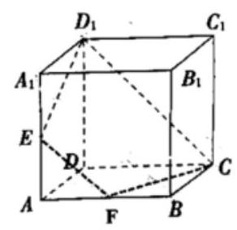

【例 3】在正方体 ${ABCD} - {A}_{1}{B}_{1}{C}_{1}{D}_{1}$ 中, $E\text{ 、 }F$ 分别是 $A{A}_{1}\text{ 、 }{AB}$ 的中点,

(1)证明:点 $E\text{ 、 }F\text{ 、 }C\text{ 、 }{D}_{1}$ 共面;

(2)证明: ${D}_{1}E$ 、 ${DA}$ 、 ${CF}$ 三线交于一点；

【难度】 $\star   \star   \star$

【答案】(1)详见解析；(2)详见解析.

【解析】(1)连接 ${A}_{1}B$ ,根据正方体的几何性质可知 ${A}_{1}B//C{D}_{1}$ . 由于 $E, F$ 分别是 $A{A}_{1},{AB}$ 的中点,所以 ${EF}//{A}_{1}B$ ,所以 ${EF}//C{D}_{1}$ ,所以 $E, F, C,{D}_{1}$ 四点共面.

(2)由于 ${EF}//C{D}_{1},{EF} \neq  C{D}_{1}$ ，所以 ${D}_{1}E$ 与 ${CF}$ 延长后必相交，设交点为 $P$ ，由于 $P \in  {D}_{1}E \subset$ 平面 ${AD}{D}_{1}{A}_{1}$ ， $P \in  {CF} \subset$ 平面 ${ABCD}$ ，根据公理 3 可知， $P$ 在平面 ${AD}{D}_{1}{A}_{1}$ 与平面 ${ABCD}$ 的交线 ${DA}$ 上，所以 ${D}_{1}E\text{ 、 }{DA}\text{ 、 }{CF}$ 三线交于一点

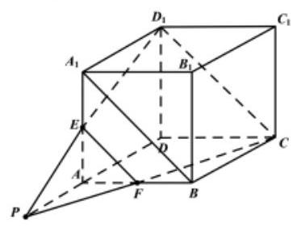

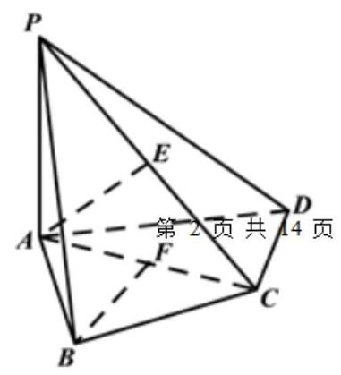

【例 4】如图,在四棱锥 $P - {ABCD}$ 中, ${PA} \bot$ 底面 ${ABCD},\angle {ABC} = {60}^{ \circ  }$ , ${PA} = {AB} = {BC},{AC} \bot  {CD}, E, F$ 分别是 ${PC},{AC}$ 的中点.

(1)证明: ${BF}//$ 平面 ${PCD}$ ；(2)证明: ${AE} \bot$ 平面 ${PCD}.$

【难度】 $\star   \star   \star$

【答案】(1)详见解析；(2)详见解析.

【解析】(1)因为 $\angle {ABC} = {60}^{ \circ  }$ ， ${AB} = {BC}$ ，所以 $\bigtriangleup  {ABC}$ 为等边三角形，又 $F$ 是 ${AC}$ 的中点，所以 ${BF} \bot  {AC}$ .

又 ${CD} \bot  {AC}$ ,且 ${BF}\text{ 、 }{CD}\text{ 、 }{AC}$ 都在平面 ${ABCD}$ 内,所以 ${BF}//{CD}$ .

因为 ${CD} \subset$ 平面 ${PCD},{BF} \text{ ⊄ }$ 平面 ${PCD}$ ,所以 ${BF}//$ 平面 ${PCD}$ .

(2)由(1)知， $\bigtriangleup {ABC}$ 为等边三角形，且 ${PA} = {AB}$ ，所以 ${PA} = {AC}$ ，又 $E$ 为 ${PC}$ 的中点，所以 ${AE}\bot {PC}$ . 因为 ${PA} \bot$ 底面 ${ABCD},{CD} \subset$ 平面 ${ABCD}$ ,所以 ${PA} \bot  {CD}$ ,又 ${CD} \bot  {AC},{PA} \cap  {AC} = A$ ,所以 ${CD} \bot$ 平面 ${PAC}$ ,

又 ${AE} \subset$ 平面 ${PAC}$ ,所以 ${CD}\bot {AE}$ ，又 ${PC} \cap  {CD} = C$ ，所以 ${AE}\bot$ 平面 ${PCD}$ .

## 巩固训练

1、已知平面 $\alpha ,\beta ,\gamma$ 有一个公共点，直线 $a, b, c$ 满足: $a \subseteq  \alpha , b \subseteq  \beta , c \subseteq  \gamma$ ，则直线 $a, b, c$ 不可能满足以下哪种关系 ( )

A. 两两平行 B. 两两异面 C. 两两垂直 D. 两两相交

【答案】A

【解析】取长方体某一顶点处的三个平面内分别检验, 三条交线就可以满足两两垂直, 两两相交, 也易作出两两异面,如图: 平面 ${AD}{D}_{1}$ ,平面 ${C}_{1}D{D}_{1}$ ,平面 ${C}_{1}{A}_{1}{D}_{1}$ ,取 ${C}_{1}{D}_{1}$ 中点 $E$ ,

$A{D}_{1},{A}_{1}{C}_{1},{DE}$ 两两异面, $D{D}_{1},{A}_{1}{D}_{1},{D}_{1}{C}_{1}$ 两两相交,两两垂直,

对于两两平行,考虑反证法: 假设符合题意的三个平面内直线 $a, b, c$ 两两平行,则任意两条直线形成的平面共三个，这三个平面要么相交于同一条直线，要么三条交线两两平行，均与题目矛盾.

2、有以下三种说法，其中正确的是( )

①若直线 $a$ 与平面 $\alpha$ 相交，则 $\alpha$ 内不存在与 $a$ 平行的直线；

②若直线 $b//$ 平面 $\alpha$ ，直线 $a$ 与直线 $b$ 垂直，则直线 $a$ 不可能与 $\alpha$ 平行；

③ 直线 $a, b$ 满足 $a//b$ ，则 $a$ 平行于经过 $b$ 的任何平面.

A. ①② B. ①③ C. ②③ D. ①

【答案】D

【解析】对于①,若直线 $a$ 与平面 $\alpha$ 相交,则 $\alpha$ 内不存在与 $a$ 平行的直线,是真命题,故①正确; 对于 ②，若直线 $b//$ 平面 $\alpha$ ，直线 $a$ 与直线 $b$ 垂直，则直线 $a$ 可能与 $\alpha$ 平行，故②错误；对于 ③，若直线 $a, b$ 满足 $a//b$ ,则直线 $a$ 与直线 $b$ 可能共面,故③错误. 故选 D

3、正方体 ${ABCD} - {A}_{1}{B}_{1}{C}_{1}{D}_{1}$ 中， $M, N$ 分别是 $C{C}_{1},{BC}$ 的中点，过 $A, M, N$ 三点的平面截正方体 ${ABCD} - {A}_{1}{B}_{1}{C}_{1}{D}_{1}$ ，则所得截面形状是( )

A. 平行四边形 B. 直角梯形 C. 等腰梯形 D. 以上都不对

【答案】C

【解析】连接 $A{D}_{1},{D}_{1}M$ ,由正方体的性质得 $A{D}_{1}\parallel {MN}$ ,则 ${D}_{1}$ 在平面 ${AMN}$ 中,

$\therefore$ 平面 ${A}_{1}{DMN}$ 即为所得截面,即为过 $A\text{ 、 }M\text{ 、 }N$ 三点的正方体 ${ABCD} - {A}_{1}{B}_{1}{C}_{1}{D}_{1}$ 的截面,

$\because {AN} = {D}_{1}M,\therefore$ 截面为等腰梯形,故选 $\mathrm{C}$

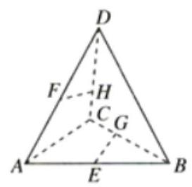

4、如图所示，在空间四面体 ${ABCD}$ 中， $E, F$ 分别是 ${AB},{AD}$ 的中点， $G, H$ 分别是 ${BC},{CD}$ 上的点，且 ${CG} = \frac{1}{3}{BC},{CH} = \frac{1}{3}{DC}$ . 求证:

(1) $E, F, G, H$ 四点共面；

(2)直线 ${FH}, E{G}_{I}{AC}$ 共点

【答案】(1)证明见解析；(2)证明见解析.

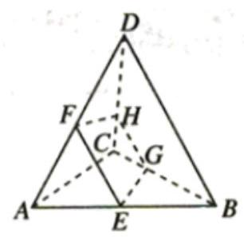

【解析】(1)连接 ${EF},{GH},\because E, F$ 分别是 ${AB},{AD}$ 的中点， $\therefore {EF}//{BD}$ .

又 $\because {CG} = \frac{1}{3}{BC},{CH} = \frac{1}{3}{DC},\therefore {GH}//{BD},\therefore {EF}//{GH},\therefore {E, F, G, H}$ 四点共面.

(2)易知 ${FH}$ 与直线 ${AC}$ 不平行，但共面， $\therefore$ 设 ${FH} \cap  {AC} = M$ ，则 $M \in$ 平面 ${EFHG}$ ， $M \in$ 平面 ${ABC}$ .

$\because$ 平面 ${EFHG} \cap$ 平面 ${ABC} = {EG},\therefore M \in  {EG},\therefore$ 直线 ${FH},{EG},{AC}$ 共点.

5、如图，在长方体 ${ABCD} - {A}^{\prime }{B}^{\prime }{C}^{\prime }{D}^{\prime }$ 中， $E$ ， $M$ ， $N$ 分别是 ${BC},{AE}, C{D}^{\prime }$ 的中点，求证: ${MN}//$ 平面 ${AD}{D}^{\prime }{A}^{\prime }$ .

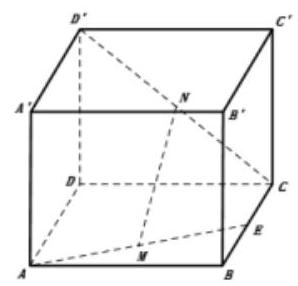

【答案】证明见解析

【解析】证明: 如图,取 ${CD}$ 的中点 $K$ . 连接 ${MK},{NK}$ .

$\because M, K$ 分别是 ${AE},{CD}$ 的中点, $\therefore {MK}//{AD}$ . 又 ${AD} \subset$ 平面 ${AD}{D}^{\prime }{A}^{\prime }$ ,

${MK} \text{ ⊄ }$ 平面 ${AD}{D}^{\prime }{A}^{\prime },\therefore {MK}//$ 平面 ${AD}{D}^{\prime }{A}^{\prime }$ .

又 $\because N$ 是 $C{D}^{\prime }$ 的中点, $\therefore {NK}//{D}^{\prime }D$ .

又 ${NK} \text{ ⊄ }$ 平面 ${AD}{D}^{\prime }{A}^{\prime },{D}^{\prime }D \subset$ 平面 ${AD}{D}^{\prime }{A}^{\prime },\therefore {NK}//$ 平面 ${AD}{D}^{\prime }{A}^{\prime }$ ,

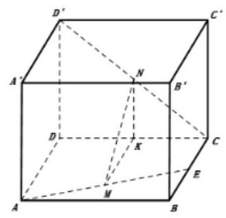

又 ${MK} \subset$ 平面 ${MNK},{NK} \subset$ 平面 ${ANK},{MK} \cap  {NK} = K,\therefore$ 平面 ${MNK}//$ 平面 ${AD}{D}^{\prime }{A}^{\prime }$ .

又 ${MN} \subset$ 平面 ${MNK},\therefore {MN}//$ 平面 ${AD}{D}^{\prime }{A}^{\prime }$ .

## (二)几何体的表面积与体积

## 知识梳理

表面积公式: ${S}_{\text{ 全 }} = {S}_{\text{ 侧 }} + {S}_{\text{ 底 }}$

柱体的体积: ${V}_{\text{ 柱 }} = {S}_{\text{ 底 }} \times  h$ ( $h$ 为柱体的高)

锥体的体积: ${V}_{\text{ 锥 }} = \frac{1}{3} \times  {S}_{\text{ 底 }} \times  h$ ( $h$ 为锥体的高)

球的体积: ${V}_{\text{ 球 }} = \frac{4}{3}\pi {r}^{3}$ ( $r$ 是球的半径)

## 例题精讲

【例 5】已知某个几何体的三视图如图,根据图中标出的尺寸,可得这个几何体的表面积是( )

A. ${16} + \sqrt{2}$ B. ${12} + 2\sqrt{2} + 2\sqrt{6}$ C. ${18} + 2\sqrt{2}$ D. ${16} + 2\sqrt{2}$

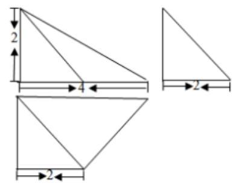

【难度】 $\bigstar \bigstar \bigstar$

【答案】B

【解析】还原几何体,连接 ${AC}$ ,

简单计算得到 ${AC} = {CD} = 2\sqrt{2},{AD} = 4$ ,故 ${AC} \bot  {CD},{PA} \bot$ 平面 ${ABCD}$ ,

故 ${PA} \bot  {CD}$ . 故 ${CD} \bot  {CP},{PC} = 2\sqrt{3}$ ,

表面积为: $S = \frac{1}{2} \times  \left( {2 + 4}\right)  \times  2 + \frac{1}{2} \times  2 \times  2 + \frac{1}{2} \times  4 \times  2 + \frac{1}{2} \times  2 \times  2\sqrt{2} + \frac{1}{2} \times  2\sqrt{2} \times  2\sqrt{3}$

$= {12} + 2\sqrt{2} + 2\sqrt{6}$ ,故选: $B$

【例 6】若圆锥的侧面积为 ${20\pi }$ ,且母线与底面所成的角为 $\arccos \frac{4}{5}$ ,则该圆锥的体积为___.

【难度】 $\star   \star   \star$

【答案】 ${16\pi }$

【解析】设圆锥的母线长是 $l$ ,底面半径为 $\mathrm{r}$ ,因为母线与底面所成的角为 $\arccos \frac{4}{5}$ ,可得 $\frac{r}{l} = \frac{4}{5}$ ,①

又因为侧面积是 ${20\pi },\therefore {\pi rl} = {20\pi }$ ,②,由①② 解得: $r = 4, l = 5$ ,故圆锥的高 $h = \sqrt{{l}^{2} - {r}^{2}} = \sqrt{{25} - {16}} = 3$ , 则该圆锥的体积为: $\frac{1}{3} \times  \pi {r}^{2} \times  3 = {16\pi }$ ,故答案为: ${16\pi }$ .

【例 7】在梯形 ${ABCD}$ 中, $\angle {ABC} = {90}^{ \circ  },{AD}//{BC},{BC} = {2AD} = {2AB} = 2$ . 将梯形 ${ABCD}$ 绕 ${AD}$ 所在直线旋转一周而形成的曲面所围成的几何体的体积为( )

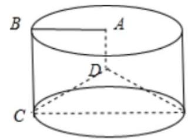

A. $\frac{2\pi }{3}$ B. $\frac{4\pi }{3}$ C. $\frac{5\pi }{3}$ D. ${2\pi }$

【难度】 $\star   \star   \star$

【答案】C

【解析】由题意可知旋转后的几何体如图:

直角梯形 $\mathrm{{ABCD}}$ 绕 $\mathrm{{AD}}$ 所在的直线旋转一周而形成的曲面所围成的几何体是一个底面半径

为 1 , 母线长为 2 的圆柱挖去一个底面半径同样是 1 、高为 1 的圆锥后得到的组合体, 所以该组合体的体积为: $V = {V}_{\text{ 圆柱 }} - {V}_{\text{ 圆锥 }} = \pi  \times  {1}^{2} \times  2 - \frac{1}{3} \times  \pi  \times  {1}^{2} \times  1 = \frac{5}{3}\pi$ ,故选 C.

【例 8】一个四面体的顶点在空间直角坐标系 $O - {xyz}$ 中的坐标分别是 $A\left( {0,0,\sqrt{5}}\right) , B\left( {\sqrt{3},0,0}\right) , C\left( {0,1,0}\right)$ , $D\left( {\sqrt{3},1,\sqrt{5}}\right)$ ，则该四面体的的体积为___.

【难度】 $\star   \star   \star$

【答案】 $\frac{\sqrt{15}}{3}$

【解析】采用补体法, 由空间点坐标可知, 该四面体的四个顶点在一个长方体上, 该长方体的长宽高分别为 $\sqrt{3},1,\sqrt{5}$ ,所求三棱锥点体积等于长方体的体积减去 4 个相同三棱锥点体积,即得。

【例 9】如图,在四棱锥 $P - {ABCD}$ 中, ${PA} \bot$ 平面 ${ABCD},{AD}//{BC},{AD} \bot  {DC}, E$ 为 ${PD}$ 的中点, ${BC} = {CD} = {2PA} = {2AD} = 2$ .

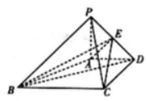

(1)求证: ${AE}\bot$ 平面 ${PCD}$ ；(2)求三棱锥 $C - {BDE}$ 的体积.

【难度】 $\star   \star   \star$

【答案】(1)见解析 (2) $\frac{1}{3}$

【解析】(1) $\because {PA} = {AD}$ ， $E$ 为 ${PD}$ 的中点， $\therefore {AE} \bot  {PD}$

$\because {PA} \bot$ 平面 ${ABCD}$ ， $\therefore {PA} \bot  {DC}$ ，结合 ${AD} \bot  {CD}$ 可得 ${CD} \bot$ 平面 ${PAD}$ ，

又 $\because {AE} \subset$ 平面 ${PAD}$ ， $\therefore {CD} \bot  {AE}$ ，又 $\because {PD}$ ， ${CD}$ 为平面 ${PCD}$ 内两条相交直线， $\therefore {AE} \bot$ 平面 ${PCD}$ .

(2) $\because {V}_{C - {BDE}} = {V}_{E - {BCD}}, E$ 为 ${PD}$ 的中点， $\therefore {V}_{C - {BDE}} = {V}_{E - {BCD}} = \frac{1}{2}{V}_{P - {BCD}}$

$\because {PA} \bot$ 平面 ${ABCD}$ ， ${V}_{P - {BCD}} = \frac{1}{3} \times  \frac{1}{2} \times  {DC} \times  {BC} \times  {PA} = \frac{1}{3} \times  \frac{1}{2} \times  2 \times  2 \times  1 = \frac{2}{3}$ ，故 ${V}_{C - {BDE}} = \frac{1}{2}{V}_{P - {BCD}} = \frac{1}{3}$

巩固训练

1、圆锥的体积为 $\frac{2\sqrt{2}}{3}\pi$ ，底面积为 $\pi$ ，则该圆锥侧面展开图的圆心角大小为___.

【答案】 $\frac{2\pi }{3}$

【解析】设圆锥的高为 $h$ ,底面半径为 $r$ ,依题意 $\left\{  \begin{array}{l} \frac{1}{3}\pi {r}^{2} \cdot  h = \frac{2\sqrt{2}\pi }{3}, \\  \pi {r}^{2} = \pi  \end{array}\right.$ 解得 $h = 2\sqrt{2}, r = 1$ ,所以圆锥母线 $l = \sqrt{{h}^{2} + {r}^{2}} = \sqrt{8 + 1} = 3$ . 所以圆锥侧面展开图的圆心角大小为 $\frac{2\pi r}{l} = \frac{2\pi }{3}$ . 故答案为: $\frac{2\pi }{3}$

2、若正六棱柱的所有棱长均为 $m$ ，且其体积为 ${12}\sqrt{3}$ ，则 $m =$ ___.

【答案】 2

【解析】正六棱柱底面为边长为 $m$ 的正六边形, $\therefore$ 底面面积为: $\left( {m + {2m}}\right)  \times  \frac{\sqrt{3}}{2}m = \frac{3\sqrt{3}}{2}{m}^{2}$

$\therefore$ 正六棱柱体积 $V = \frac{3\sqrt{3}}{2}{m}^{2} \cdot  m = {12}\sqrt{3}$ ,解得: $m = 2$ ,故答案为: 2

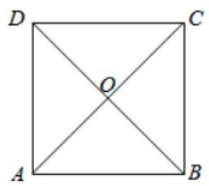

3、如图所示，在边长为 4 的正方形纸片 ${ABCD}$ 中， ${AC}$ 与 ${BD}$ 相交于 $O$ . 剪去 $\bigtriangleup {AOB}$ ,将剩余部分沿 ${OC},{OD}$ 折叠,使 ${OA}\text{ 、 }{OB}$ 重合,则以 $A\left( B\right) \text{ 、 }C\text{ 、 }D$ 、 O 为顶点的四面体的外接球的体积为( )

A. $8\sqrt{6}\pi$ B. ${24\pi }$ C. $\sqrt{6}\pi$ D. ${48\pi }$

【答案】A

【解析】根据题意, 为方便说明问题, 将几何体从正方体中截取出来如右图所示: 容易知三棱锥 $A - {ODC}$ 和棱长为 $2\sqrt{2}$ 的正方体有相同的外接球. 则外接球的半径 $r = \frac{\sqrt{3}}{2} \times  2\sqrt{2} = \sqrt{6}$ ,故其外接球体 $V = \frac{4}{3}\pi {r}^{3} = 8\sqrt{6}\pi$ . 故选: A.

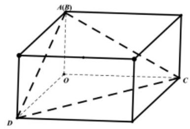

4、《九章算术》中，将底面为长方形且有一条侧棱与底面垂直的四棱锥称之为阳马，将四个面都为直角三角形的四面体称之为鳖臑. 如图, 网格纸上正方形小格的边长为 1 , 图中粗线画出的是某几何体毛坯的三视图, 第一次切削, 将该毛坯得到一个表面积最大的长方体; 第二次切削沿长方体的对角面刨开, 得到两个三棱柱；第三次切削将两个三棱柱分别沿棱和表面的对角线刨开得到两个鳖臑和两个阳马，则阳马与鳖臑的体积之比为( )

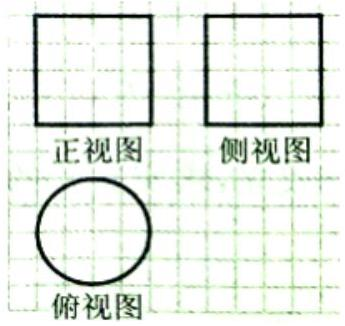

A. 1:2 B. 1:1 C. 2:1 D. 3:1

【答案】C

【解析】由题意, 第一次切削将该毛坯得到一个表面积最大的长方体, 为正方体, 第二次切削沿长方体的对角面刨开,得到两个全等的直三棱柱,设正方体的棱长为 $a$ ,则直三棱柱的体积 $= \frac{1}{2}a \times  a \times  a = \frac{1}{2}{a}^{3}$ 鳖臑的体积 $= \frac{1}{3} \times  \frac{1}{2}a \times  a \times  a = \frac{1}{6}{a}^{3}$ ,阳马的体积 $= \frac{1}{2}{a}^{3} - \frac{1}{6}{a}^{3} = \frac{1}{3}{a}^{3}$ ,

$\therefore$ 阳马与鳖臑的体积之比为 $2 : 1$ ,故选 C.

## (三)线线、线面所成角、二面角

## 知识梳理

两异面直线间的夹角、直线与平面间的夹角、二面角的平面角;

① 若异面直线 ${l}_{1},{l}_{2}$ 的方向向量为 $\overrightarrow{{u}_{1}},\overrightarrow{{u}_{2}},;{l}_{1}$ 与 ${l}_{2}$ 所成的角为 $\alpha$ ，则 $\cos \alpha  = \left| {\cos \left\langle  {\overrightarrow{{u}_{1}},\overrightarrow{{u}_{2}}}\right\rangle  }\right|$

②已知直线 $l$ 的方向向量为 $\overrightarrow{v}$ ，平面 $\alpha$ 的法向量 $\overrightarrow{u}$ ， $l$ 与平面 $\alpha$ 的夹角为 $\alpha$ ，则 $\sin \alpha  = \left| {\cos \langle \overrightarrow{u},\overrightarrow{v}\rangle }\right|$ ；

③ 已知二面角 $\alpha  - l - \beta$ 的两个面 $\alpha$ 和 $\beta$ 的法向量分别为 $\overrightarrow{v}$ ， $\overrightarrow{u}$ ，则 $\langle \overrightarrow{u},\overrightarrow{v}\rangle$ 与该二面角相等或互补;

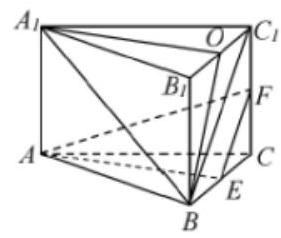

## 例题精讲

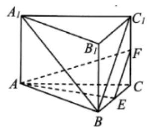

【例 10】如图,在正三棱柱 ${ABC} - {A}_{1}{B}_{1}{C}_{1}$ 中, ${AB} = 2$ ,侧棱 $A{A}_{1} = \sqrt{2}$ ,且 $E$ , $F$ 分别是 ${BC}, C{C}_{1}$ 的中点. 求异面直线 ${AE}$ 与 ${A}_{1}B$ 所成角的大小.

【难度】 $\star   \star   \star$

【答案】(1)证明见解析(2) ${45}^{ \circ  }$

【解析】方法一: (几何法) 取 ${B}_{1}{C}_{1}$ 的中点 $O$ ,连接 ${BO},{A}_{1}O$ ,在正三棱柱 ${ABC} - {A}_{1}{B}_{1}{C}_{1}$ 中， $E$ 为 ${BC}$ 中点，所以 ${OE}\operatorname{\parallel }A{A}_{1}$ ，且 ${OE} = A{A}_{1}$

所以 $A{A}_{1}{OE}$ 为平行四边形,所以 ${A}_{1}O//{AE}$ ,所以 $\angle B{A}_{1}O$ 为异面直线 ${AE}$ 与 ${A}_{1}B$ 所成角,

又因为 ${A}_{1}O \bot  {B}_{1}{C}_{1}$ ,平面 ${A}_{1}{B}_{1}{C}_{1} \bot$ 平面 ${BC}{C}_{1}{B}_{1}$ ,平面 ${A}_{1}{B}_{1}{C}_{1} \cap$ 平面 ${BC}{C}_{1}{B}_{1} = {B}_{1}{C}_{1},{A}_{1}O \subset$ 平面 ${A}_{1}{B}_{1}{C}_{1}$ , 所以 ${A}_{1}O \bot$ 平面 ${BC}{C}_{1}{B}_{1}$ ,而 ${BO} \subset$ 平面 ${BC}{C}_{1}{B}_{1}$ ,所以 ${A}_{1}O \bot  {BO}$ ,

又因为 ${AB} = 2,{A{A}_{1}} = \sqrt{2}$ ，所以在 $\operatorname{Rt}\Delta {A}_{1}{OB}$ 中， ${A}_{1}B = \sqrt{6},{A}_{1}O = \sqrt{3}$ ， $\angle {A}_{1}{OB} = {90}^{ \circ  }$ ，即 $\cos \angle B{A}_{1}O = \frac{\sqrt{2}}{2}$ ,故异面直线 ${AE}$ 与 ${A}_{1}B$ 所成角的大小为 ${45}^{ \circ  }$

方法二:(建系法)略。

【例 11】已知圆锥 ${AO}$ 的底面半径为 2,母线长为 $2\sqrt{10}$ ,点 $C$ 为圆锥底面圆周上的一点， $O$ 为圆心， $D$ 是 ${AB}$ 的中点，且 $\angle {BOC} = \frac{\pi }{2}$ . 求直线 ${CD}$ 与平面 ${AOB}$ 所成角的大小.(结果用反三角函数值表示)

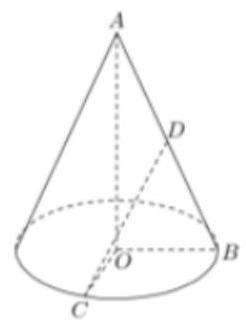

【难度】 $\star   \star   \star$

【答案】 $\arctan \frac{\sqrt{10}}{5}$ .

【解析】方法一: (几何法) $\because \angle {BOC} = \frac{\pi }{2}\;\therefore {OC} \bot  {OB}$ 且 ${OC} \bot  {OA},{OC} \bot$

平面 ${AOB}\therefore \angle {CDO}$ 是直线 ${CD}$ 与平面 ${AOB}$ 所成角

在 $R{t}_{ \bigtriangleup  }{CDO}$ 中, ${OC} = 2,{OD} = \sqrt{10}$ ,

$\tan \angle {CDO} = \frac{\sqrt{10}}{5},\therefore \angle {CDO} = \arctan \frac{\sqrt{10}}{5}$ ;

所以,直线 ${CD}$ 与平面 ${AOB}$ 所成角的为 $\arctan \frac{\sqrt{10}}{5}$ .

方法二:(建系法)略.

【例 12】在长方体 ${ABCD} - {A}_{1}{B}_{1}{C}_{1}{D}_{1}$ 中, ${AB} = {BC} = 3, A{A}_{1} = 4$ ,求: 平面 ${C}_{1}{BD}$ 和底面 $\mathrm{{ABCD}}$ 所成锐角的大小.

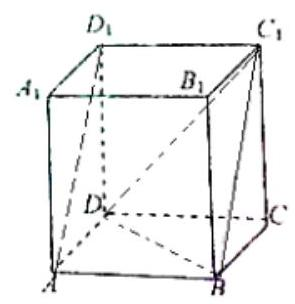

【难度】 $\star   \star   \star$

【答案】 $\arccos \frac{3\sqrt{41}}{41}$ .

【解析】方法一:(几何法)略；

方法二; (建系法) 以 $D$ 为原点, ${DA},{DC}, D{D}_{1}$ 分别为 $x, y, z$ 轴建立空间直角坐标系,

则 $D\left( {0,0,0}\right) , B\left( {3,3,0}\right) ,{C}_{1}\left( {0,3,4}\right) ,{D}_{1}\left( {0,0,4}\right) ,\overrightarrow{DB} = \left( {3,3,0}\right) ,\overrightarrow{D{C}_{1}} = \left( {0,3,4}\right)$ ,

设平面 ${C}_{1}{BD}$ 的一个法向量为 $\overrightarrow{n} = \left( {x, y, z}\right)$ ,则 $\left\{  \begin{array}{l} \overrightarrow{n} \cdot  \overrightarrow{DB} = 0, \\  \overrightarrow{n} \cdot  \overrightarrow{D{C}_{1}} = 0, \end{array}\right. \left\{  {\begin{array}{l} {3x} + {3y} = 0, \\  {3y} + {4z} = 0, \end{array}\text{ 令 }x = 1}\right.$ ,则 $y =  - 1, z = \frac{3}{4}$ ,故 $\bar{n} = \left( {1, - 1,\frac{3}{4}}\right)$ . 又 $D{D}_{1} \bot$ 平面 ${ABCD}$ ,故平面 ${ABCD}$ 的法向量为 $\overline{D{D}_{1}} = \left( {0,0,4}\right)$ ,所以 $\cos \left\langle  {\overrightarrow{D{D}_{1}},\overrightarrow{n}}\right\rangle   = \frac{\overrightarrow{D{D}_{1}} \cdot  \overrightarrow{n}}{\left| \overrightarrow{D{D}_{1}}\right| \left| \overrightarrow{n}\right| } = \frac{3\sqrt{41}}{41}$ ，故平面 ${C}_{1}{BD}$ 和底面 ABCD 所成锐角的大小为 $\arccos \frac{3\sqrt{41}}{41}$ .

## 巩固训练

1、如图，以长方体 ${ABCD} - {A}_{1}{B}_{1}{C}_{1}{D}_{1}$ 的顶点 $D$ 为坐标原点，过 $D$ 的三条棱所在的直线为坐标轴，建立空间直角坐标系，若 $\overline{D{B}_{1}}$ 的坐标为 $\left( {2,3,4}\right)$ ，则 $\overline{A{C}_{1}}$ 的坐标为___.

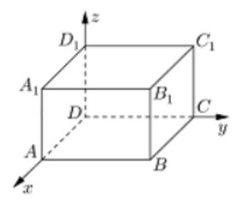

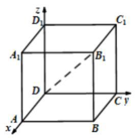

【答案】 $\left( {-2,3,4}\right)$

【解析】解: 如图,以长方体 ${ABCD} - {A}_{1}{B}_{1}{C}_{1}{D}_{1}$ 的顶点 $D$ 为坐标原点,

过 $D$ 的三条棱所在的直线为坐标轴,建立空间直角坐标系,

$\because \overrightarrow{D{B}_{1}}$ 的坐标为 $\left( {2,3,4}\right) ,\therefore A\left( {2,0,0}\right) ,{C}_{1}\left( {0,3,4}\right) ,\;\therefore \overrightarrow{A{C}_{1}} = \left( {-2,3,4}\right)$ . 故答案为: $\left( {-2,3,4}\right)$ .

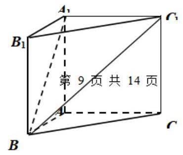

2、在直三棱柱 ${ABC} - {A}_{1}{B}_{1}{C}_{1}$ 中， ${AB} = {AC} = 1,\angle {BAC} = {90}^{ \circ  }$ ，异面直线 ${A}_{1}B$ 与 ${B}_{1}{C}_{1}$ 所成的角等于 ${60}^{ \circ  }$ ,设 $A{A}_{1} = a$ .

(1)求 $a$ 的值；

(2)求平面 ${A}_{1}B{C}_{1}$ 与平面 ${B}_{1}B{C}_{1}$ 所成的锐二面角的大小.

【答案】(1) $a = 1;\left( 2\right) {60}^{ \circ  }$ .

【解析】(1)建立如图所示的空间直角坐标系,则 $B\left( {1,0,0}\right) ,{B}_{1}\left( {1,0,1}\right) ,{C}_{1}\left( {0,1,1}\right) ,{A}_{1}\left( {0,0, a}\right) \left( {a > 0}\right)$

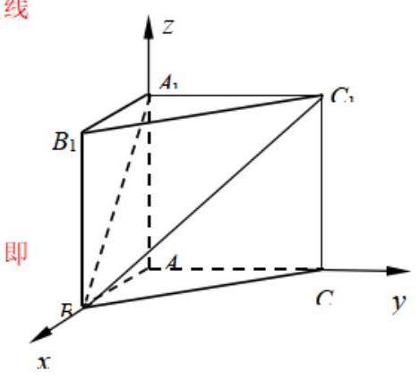

$\therefore {B}_{1}{C}_{1} = \left( {-1,1,0}\right) ,\;{A}_{1}\dot{B} = \left( {1,0, - a}\right) \;\therefore \overrightarrow{{B}_{1}{C}_{1}} \cdot  \overrightarrow{{A}_{1}B} =  - 1 \; \because$ 异面直线

${A}_{1}B$ 与 ${B}_{1}{C}_{1}$ 所成的角 ${60}^{ \circ  }$

$\therefore \left| \frac{\overrightarrow{{A}_{1}B} \cdot  \overrightarrow{{B}_{1}{C}_{1}}}{\left| {{A}_{1}\overrightarrow{B}}\right|  \cdot  \left| {{B}_{1}{C}_{1}}\right| }\right|  = \cos {60}^{ \circ  }$ ,即 $\left| \frac{-1}{\sqrt{1 + {a}^{2}} \cdot  \sqrt{2}}\right|  = \frac{1}{2}$ ,又 $a > 0$ ,所以 $a = 1$ 。

(2)设平面 ${A}_{1}B{C}_{1}$ 的一个法向量为 $\overrightarrow{n} = \left( {x, y, z}\right)$ ,则 $\overrightarrow{n} \bot  {A}_{1}\overrightarrow{B},\overrightarrow{n} \bot  {A}_{1}{C}_{1}$ ,即 $\dot{n} \cdot  {A}_{1}\dot{B} = 0$ 且 $\dot{n} \cdot  {A}_{1}{C}_{1} = 0$ ;

又 ${A}_{1}\dot{B} = \left( {1,0, - 1}\right) ,{A}_{1}{C}_{1} = \left( {0,1,0}\right)$ ; $\therefore \left\{  \begin{array}{l} x - z = 0 \\  y = 0 \end{array}\right.$ ,不妨取 $\dot{n} = \left( {1,0,1}\right)$

同理得平面 $B{B}_{1}{C}_{1}$ 的一个法向量 $\overrightarrow{m} = \left( {1,1,0}\right)$ ;

设 $\overrightarrow{m}$ 与 $\overrightarrow{n}$ 的夹角为 $\theta$ ,则 $\cos \theta  = \frac{\overrightarrow{m} \cdot  \overrightarrow{n}}{\left| \overrightarrow{m}\right|  \cdot  \left| \overrightarrow{n}\right| } = \frac{1}{\sqrt{2} \times  \sqrt{2}} = \frac{1}{2},\therefore \theta  = {60}^{ \circ  }$ 。

$\therefore$ 平面 ${A}_{1}B{C}_{1}$ 与平面 ${B}_{1}B{C}_{1}$ 所成的锐二面角的大小为 ${60}^{ \circ  }$

3、在正方体 ${ABCD} - {A}_{1}{B}_{1}{C}_{1}{D}_{1}$ 中, $E$ 是棱 $D{D}_{1}$ 的中点.

(1)求直线 ${BE}$ 与平面 ${AB}{B}_{1}{A}_{1}$ 所成的角的大小(结果用反三角函数值表示)；

(2)在棱 ${C}_{1}{D}_{1}$ 上是否存在一点 $F$ ，使得 ${B}_{1}F//$ 平面 ${A}_{1}{BE}$ ，若存在，指明点 $F$ 的位置；若不存在，说明理由.

【答案】(1) $\arcsin \frac{2}{3}$ ; (2)点 $F$ 是棱 ${C}_{1}{D}_{1}$ 的中点.

【解析】解: (1) 以 $A$ 为坐标原点,以射线 ${AB}\text{ 、 }{AD}\text{ 、 }A{A}_{1}$ 分别为 $x\text{ 、 }y\text{ 、 }z$ 轴,

建立空间直角坐标系,不妨设正方体 ${ABCD} - {A}_{1}{B}_{1}{C}_{1}{D}_{1}$ 的棱长为 $a\left( {a > 0}\right)$ ,

则 $B\left( {a,0,0}\right) , E\left( {0, a,\frac{a}{2}}\right)$ ,于是 ${BE} = \left( {-a, a,\frac{a}{2}}\right)$

根据正方体的性质,可知 ${DA} \bot$ 平面 ${AB}{B}_{1}{A}_{1}$ ,

故 $\overrightarrow{AD}$ 是平面 ${AB}{B}_{1}{A}_{1}$ 的一个法向量且 $\overrightarrow{AD} = \left( {0, a,0}\right)$

设直线 ${BE}$ 与平面 ${AB}{B}_{1}{A}_{1}$ 所成的较为 $\theta$ ,则 $\sin \theta  = \frac{\overrightarrow{BE} \cdot  \overrightarrow{AD}}{\left| \overrightarrow{BE}\right| \left| \overrightarrow{AD}\right| } = \frac{{a}^{2}}{\frac{3}{2}a \times  a} = \frac{2}{3} > 0$

所以 $\theta  = \arcsin \frac{2}{3}$ ,故直线 ${BE}$ 与平面 ${AB}{B}_{1}{A}_{1}$ 所成的角的大小为 $\arcsin \frac{2}{3}$ .

(2)假设在棱 ${C}_{1}{D}_{1}$ 上是存在一点 $F$ ，使得 ${B}_{1}F//$ 平面 ${A}_{1}{BE}$ ，设 $F\left( {x, a, a}\right)$ (其中 $0 \leq  x \leq  a$ )

$B\left( {a,0,0}\right) ,{A}_{1}\left( {0,0, a}\right) ,\overrightarrow{B{A}_{1}} = \left( {-a,0, a}\right) ,\overrightarrow{{B}_{1}F} = \left( {x - a, a,0}\right)$

根据(1)可知， $\overrightarrow{BE} = \left( {-a, a,\frac{a}{2}}\right)$

设 $\overrightarrow{n} = \left( {x, y, z}\right)$ 平面 ${A}_{1}{BE}$ 的一个法向量,则 $\left\{  \begin{array}{l} \overrightarrow{n} \cdot  \overrightarrow{B{A}_{1}} = 0 \\  \overrightarrow{n} \cdot  \overrightarrow{BE} = 0 \end{array}\right.$ ,即 $\left\{  \begin{array}{l} {ax} - {az} = 0 \\  {ax} - {ay} - \frac{a}{2}z = 0 \end{array}\right.$ ,

取 $z = 2$ ,则 $\overrightarrow{n} = \left( {2,1,2}\right)$ ,由于直线 ${B}_{1}F//$ 平面 ${A}_{1}{BE}$ ,所以 $\overrightarrow{{B}_{1}F} \cdot  \overrightarrow{n} = 0$

即 $\left( {x - a, a,0}\right)  \cdot  \left( {2,1,2}\right)  = 0$ ,

化简得 $2\left( {x - a}\right)  + a = 0$ ,解得 $x = \frac{a}{2}$

故在棱 ${C}_{1}{D}_{1}$ 上是存在一点 $F$ ,使得 ${B}_{1}F//$ 平面 ${A}_{1}{BE}$ ,且点 $F$ 是棱 ${C}_{1}{D}_{1}$ 的中点.

4、如图，在四棱锥P-ABCD 中，底面 ABCD 是边长为 1 的菱形， $\angle {BAD} = {60}^{ \circ  }$ ，侧棱 PA $\bot$ 底面 ABCD，E 是 PC 的中点.

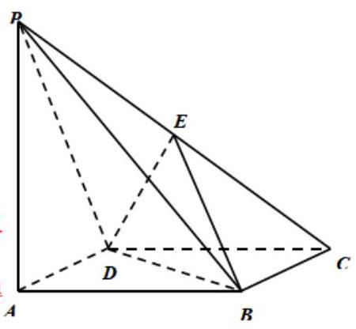

(1)证明:PA//平面EBD；

(2)若直线 PC 与平面 EBD 所成角的大小为 ${60}^{ \circ  }$ ，求 PA 的长.

【答案】(1)证明见解析；(2)1.

【解析】(I)连接 ${AC}$ 交 ${BD}$ 于点 $O$ ,连接 ${OE}$ ,

$\because O\text{ 、 }E$ 分别是 ${AC}\text{ 、 }{PC}$ 的中点, $\therefore {EO}//{PA}$ .

$\because \mathrm{{PA}}$ 不在平面 $\mathrm{{FBD}}$ 内, $\therefore \mathrm{{PA}}//$ 平面 $\mathrm{{FBD}}$ .

(II) $\because$ PA⊥平面 ${ABCD}$ ， $\therefore {PA}\bot {AC}$ ，又 $\because {EO}//{PA}$ ， $\therefore {{EO}\bot {AC}}$ ，又 $\mathrm{{AC}} \bot  \mathrm{{BD}},\therefore \mathrm{{AC}} \bot$ 平面 $\mathrm{{EBD}}$ ,

$\therefore \angle \mathrm{{CEO}}$ 就是直线 $\mathrm{{PC}}$ 与平面 $\mathrm{{EDB}}$ 所成角. 在菱形 $\mathrm{{ABCD}}$ 中,容易求得

${OC} = \frac{\sqrt{3}}{2}$ .

又 $\because \mathrm{{EO}} \bot  \mathrm{{OC}}$ ,所以 ${EO} = \frac{1}{2}$ ,故 $\mathrm{{PA}} = 1$ .

## (四)点到平面的距离问题

## 知识梳理

点到平面的距离:

法一:若平面 $\alpha$ 的一个法向量为 $\overrightarrow{u}$ ，P是平面 $\alpha$ 外一点，A是 $\alpha$ 内任一点，则点P到平面 $\alpha$ 的距离 $d = \frac{\left| \overrightarrow{PA} \cdot  \overrightarrow{u}\right| }{\left| \overrightarrow{u}\right| }$ .

法二: 体积转化

例题精讲

【例 13】如图,三棱锥 $P - {ABC}$ 中, ${PA} = {PC},{AB} = {BC},\angle {APC} = {120}^{ \circ  },\angle {ABC} = {90}^{ \circ  }$ , ${AC} = \sqrt{3}{PB} = 2$ .

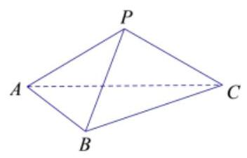

(1)求证: ${AC}\bot {PB}$ ；

(2)求点 $C$ 到平面 ${PAB}$ 的距离.

【难度】 $\star   \star   \star$

【答案】(1)证明见解析(2) $\frac{3\sqrt{5}}{5}$

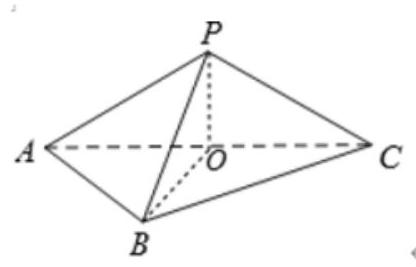

【解析】(1)证明:取 ${AC}$ 的中点为 $O$ ，连接 ${BO}$ ， ${PO}$ .

在 $\bigtriangleup {PAC}$ 中, $\because {PA} = {PC}, O$ 为 ${AC}$ 的中点, $\therefore {PO} \bot  {AC}$ , 在 $\bigtriangleup {BAC}$ 中, $\because {BA} = {BC}, O$ 为 ${AC}$ 的中点, $\therefore {BO} \bot  {AC}$ , $\because {OP} \cap  {OB} = O,{OP},{OB} \subset$ 平面 ${OPB},\therefore {AC} \bot$ 平面 ${OPB}$ , $\because {PB} \subset$ 平面 ${POB},\therefore {AC}\bot {BP}$ ；

(2)在直角三角形 ${ABC}$ 中，由 ${AC} = 2, O$ 为 ${AC}$ 的中点，得 ${BO} = 1$ ，

在等腰三角形 ${APC}$ 中，由 $\angle {APC} = {120}^{ \circ  }$ ，得 ${PO} = \frac{\sqrt{3}}{3}$ ，

又 $\because {PB} = \frac{2\sqrt{3}}{3},\therefore P{O}^{2} + B{O}^{2} = P{B}^{2}$ ,即 ${PO}\bot {BO}$ ,

又 ${PO} \bot  {AC},{AC} \cap  {OB} = O,\therefore {PO} \bot$ 平面 ${ABC}$ ,

求解三角形可得 ${PA} = \frac{2\sqrt{3}}{3}$ ,又 ${AB} = \sqrt{2}$ ,得 ${S}_{\bigtriangleup {PAB}} = \frac{1}{2} \times  \sqrt{2} \times  \sqrt{{\left( \frac{2\sqrt{3}}{3}\right) }^{2} - {\left( \frac{\sqrt{2}}{2}\right) }^{2}} = \frac{\sqrt{15}}{6}$ .

设点 $C$ 到平面 ${PAB}$ 的距离为 $h$ ，由 ${V}_{P - {ABC}} = {V}_{C - {PAB}}$ ，得 $\frac{1}{3} \times  \frac{1}{2} \times  \sqrt{2} \times  \sqrt{2} \times  \frac{\sqrt{3}}{2} = \frac{1}{3} \times  \frac{\sqrt{15}}{6}h$ ，解得 $h = \frac{3\sqrt{5}}{5}$ ， 故点 $C$ 到平面 ${PAB}$ 的距离为 $\frac{3\sqrt{5}}{5}$ .

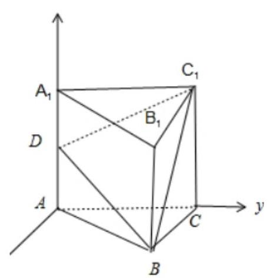

第 12 页共 14 页

【例 14】在正三棱柱 ${ABC} - {A}_{1}{B}_{1}{C}_{1}$ 中,若 ${AB} = A{A}_{1} = 4$ ,点 $D$ 是 $A{A}_{1}$ 的中点，求点 ${A}_{1}$ 到平面 ${DB}{C}_{1}$ 的距离___.

【难度】 $\star   \star   \star$

【答案】 $\sqrt{2}$

【解析】

以 $\mathbf{A}$ 为原点,在平面 $\mathbf{{ABC}}$ 中过 $\mathbf{A}$ 作 $\mathbf{{AC}}$ 的垂线为 $\mathbf{x}$ 轴, $\mathbf{{AC}}$ 为 $\mathbf{y}$ 轴, $A{A}_{1}$ 为 $z$ 轴,建立空间直角坐标系,

${A}_{1}\left( {0,0,4}\right) , D\left( {0,0,2}\right) , B\left( {2\sqrt{3},2,0}\right) ,{C}_{1}\left( {0,4,4}\right)$ ,

$\overrightarrow{D{A}_{1}} = \left( {0,0,2}\right) ,\overrightarrow{DB} = \left( {2\sqrt{3},2, - 2}\right) ,\overrightarrow{D{C}_{1}} = \left( {0,4,2}\right)$ ,

设平面 ${DB}{C}_{1}$ 的法向量 $\overrightarrow{n} = \left( {x, y, z}\right)$ ,则 $\left\{  \begin{matrix} \overrightarrow{n} \cdot  \overrightarrow{DB} = 2\sqrt{3}x + {2y} - {2z} = 0 \\  \overrightarrow{n} \cdot  \overrightarrow{D{C}_{1}} = {4y} + {2z} = 0 \end{matrix}\right.$ ,取 $x = \sqrt{3}$ ,得 $\overrightarrow{n} = \left( {\sqrt{3}, - 1,2}\right)$ , $\therefore$ 点 ${A}_{1}$ 到平面 ${DB}{C}_{1}$ 的距离: $d = \frac{\left| \overrightarrow{D{A}_{1}} \cdot  \overrightarrow{n}\right| }{\left| \overrightarrow{n}\right| } = \frac{4}{\sqrt{8}} = \sqrt{2}$ . 故答案为 $\sqrt{2}$ .

## 巩固训练

1、直三棱柱 ${ABC} - {A}_{1}{B}_{1}{C}_{1}$ 中，若 $\angle {BAC} = {90}^{ \circ  }$ ， ${AB} = {AC} = \sqrt{2}$ ， $A{A}_{1} = 2$ ，求点 $A$ 到平面 ${A}_{1}B{C}_{1}$ 的距离

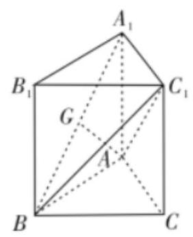

【答案】 $\frac{2\sqrt{3}}{3}$ .

【解析】 $\because {C}_{1}{A}_{1} \bot  {A}_{1}{B}_{1},{C}_{1}{A}_{1} \bot  A{A}_{1},\therefore {C}_{1}{A}_{1} \bot$ 平面 $A{A}_{1}{B}_{1}B$ ,

又 $\because {C}_{1}{A}_{1} \subset$ 平面 ${C}_{1}{A}_{1}B$ ,平面 ${C}_{1}{A}_{1}B \bot$ 平面 $A{A}_{1}{B}_{1}B$ .

又 $\because {A}_{1}B =$ 平面 ${C}_{1}{A}_{1}B \cap$ 平面 $A{A}_{1}{B}_{1}B$ ,

$\therefore$ 过 $A$ 作 ${AG} \bot  {A}_{1}B$ ,则 ${AG}$ 的长为 $A$ 到平面 ${A}_{1}B{C}_{1}$ 的距离,

在 ${Rt\Delta A}{A}_{1}B$ 中, ${AG} = \frac{{AB} \times  A{A}_{1}}{{A}_{1}B} = \frac{2 \times  \sqrt{2}}{\sqrt{6}} = \frac{2\sqrt{3}}{3}$ .

2、如图，PA⊥平面ABCD，矩形 ${ABCD}$ 的边长 ${AB} = 1,{BC} = 2, E$ 为 ${BC}$ 的中点.

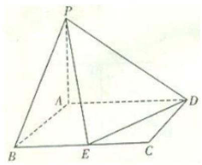

(1)证明: $\mathrm{{PE}} \bot  \mathrm{{DE}}$ ；

(2)如果异面直线 $\mathrm{{AE}}$ 与 $\mathrm{{PD}}$ 所成的角的大小为 $\frac{\pi }{3}$ ，求 $\mathrm{{PA}}$ 的长及点 $\mathrm{A}$ 到平面 $\mathrm{{PED}}$ 的距离.

【答案】(1)证明见解析；(2) $\mathrm{{PA}} = 2$ ，点 $\mathrm{A}$ 到平面 $\mathrm{{PED}}$ 的距离为 $\frac{2\sqrt{3}}{3}$ .

【解析】(1)证明:连接 ${AE}$ ,由 ${AB} = {BE} = 1$ ，得 ${AE} = \sqrt{2}$ ，同理 ${DE} = \sqrt{2}$ ， $A{E}^{2} + D{E}^{2} = 4 = A{D}^{2},$

由勾股定理逆定理可得 $\angle {AED} = {90}^{ \circ  },\mathrm{{DE}} \bot  \mathrm{{AE}}$ ,

$\because \mathrm{{PA}} \bot$ 平面 $\mathrm{{ABCD}},\therefore \mathrm{{PA}} \bot  \mathrm{{DE}}$ ,又 ${PA} \bigcap  {AE} = A,\therefore \mathrm{{DE}} \bot$ 平面 $\mathrm{{PAE}},\therefore \mathrm{{PE}} \bot  \mathrm{{DE}}$ . 取 PA 的中点 M, AD 的中点 N, 连 MC, NC, MN, AC, ... NC//AE, MN//PD, $\therefore \angle \mathrm{{MNC}}$ 的大小等于异面直线 PD 与 $\mathrm{{AE}}$ 所成的角或其补角的大小,

即 $\angle {MNC} = \frac{2\pi }{3}$ 或 $\frac{\pi }{3}$ (或者由观察可知, $\angle {MNC} = \frac{2\pi }{3}$ ,不需分类讨论)

设 $\mathrm{{PA}} = \mathrm{x}$ ,则 ${NC} = \sqrt{2},{MN} = \sqrt{1 + \frac{{x}^{2}}{4}},{MC} = \sqrt{5 + \frac{{x}^{2}}{4}}$ .

若 $\angle {MNC} = \frac{2\pi }{3}$ ,由 $\cos \angle {MNC} = \frac{1 + \frac{{x}^{2}}{4} + 2 - 5 - \frac{{x}^{2}}{4}}{2\sqrt{1 + \frac{{x}^{2}}{4}} \cdot  \sqrt{2}} =  - \frac{1}{2}$ ,得 $\mathrm{{PA}} = 2$ .

$\therefore {V}_{A - {PDE}} = {V}_{P - {ADE}} = \frac{1}{3} \times  \frac{1}{2} \times  \sqrt{2} \times  \sqrt{2} \times  2 = \frac{2}{3}$ .

又在 RT $\bigtriangleup$ PED 中, ${PE} = \sqrt{6},{DE} = \sqrt{2},\therefore {S}_{\bigtriangleup {PED}} = \frac{1}{2} \times  \sqrt{2} \times  \sqrt{6} = \sqrt{3}$ .

$\therefore$ 点 $\mathrm{A}$ 到平面 $\mathrm{{PED}}$ 的距离为 $\frac{\frac{2}{3}}{\frac{\sqrt{3}}{3}} = \frac{2\sqrt{3}}{3}$ .

若 $\angle {MNC} = \frac{\pi }{3}$ ,由 $\cos \angle {MNC} = \frac{1 + \frac{{x}^{2}}{4} + 2 - 5 - \frac{{x}^{2}}{4}}{2\sqrt{1 + \frac{{x}^{2}}{4}} \cdot  \sqrt{2}} = \frac{1}{2}$ ,显然不适合题意.

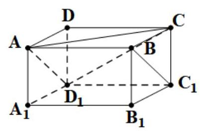

综上所述， $\mathrm{{PA}} = 2$ ，点 $\mathrm{A}$ 到平面 $\mathrm{{PED}}$ 的距离为 $\frac{2\sqrt{3}}{3}$ .

3、如图，在长方体 $\mathrm{{ABCD}} - {\mathrm{A}}_{1}{\mathrm{\;B}}_{1}{\mathrm{C}}_{1}{\mathrm{D}}_{1}$ 中， $\mathrm{{AB}} = 2,\mathrm{{AD}} = 1,{\mathrm{\;A}}_{1}\mathrm{\;A} = 1$ ，证明直线 $\mathrm{B}{\mathrm{C}}_{1}$ 平行于平面 ${D}_{1}{AC}$ ,并求直线 ${\mathrm{{BC}}}_{1}$ 到平面 ${\mathrm{D}}_{1}\mathrm{{AC}}$ 的距离.

【答案】(1)证明见解析; (2) $\mathrm{{PA}} = 2$ ，点 $\mathrm{A}$ 到平面 $\mathrm{{PED}}$ 的距离为 $\frac{2\sqrt{3}}{3}$ .

【解析】因为 $\mathrm{{ABCD}} - {\mathrm{A}}_{1}{\mathrm{\;B}}_{1}{\mathrm{C}}_{1}{\mathrm{D}}_{1}$ 为长方体,故 ${AB}//{C}_{1}{D}_{1},{AB} = {C}_{1}{D}_{1}$ ,

故 ${\mathrm{{ABC}}}_{1}{\mathrm{D}}_{1}$ 为平行四边形,故 $B{C}_{1}//A{D}_{1}$ ,显然 $\mathrm{B}$ 不在平面 ${\mathrm{D}}_{1}\mathrm{{AC}}$ 上,于是直线 $\mathrm{B}{C}_{1}$ 平行于平面 ${D}_{1}{AC}$ ;

直线 $B{C}_{1}$ 到平面 ${D}_{1}{AC}$ 的距离即为点 $B$ 到平面 ${D}_{1}{AC}$ 的距离设为 $h$

考虑三棱锥 ${\mathrm{{ABCD}}}_{1}$ 的体积,以 $\mathrm{{ABC}}$ 为底面,可得 $V = \frac{1}{3} \times  \left( {\frac{1}{2} \times  1 \times  2}\right)  \times  1 = \frac{1}{3}$

而 $\bigtriangleup A{D}_{1}C$ 中, ${AC} = {D}_{1}C = \sqrt{5}, A{D}_{1} = \sqrt{2}$ ,故 ${S}_{\bigtriangleup A{D}_{1}C} = \frac{3}{2}$

所以, $V = \frac{1}{3} \times  \frac{3}{2} \times  h = \frac{1}{3} \Rightarrow  h = \frac{2}{3}$ ,即直线 $B{C}_{1}$ 到平面 ${D}_{1}{AC}$ 的距离为 $\frac{2}{3}$ .
