解析几何

<table><tr><td>教学目标</td><td>掌握解析几何高考题型</td></tr><tr><td>重点</td><td>1、直线方程的各种形式、两直线位置关系、距离、夹角公式;   2、圆的方程、点与圆、直线与圆的位置关系;   3、圆锥曲线定义与性质、直线与圆锥曲线的综合;   4、圆锥曲线的新定义。</td></tr><tr><td>难点</td><td>1、圆锥曲线定义与性质、直线与圆锥曲线的综合运用;   2、圆锥曲线的新定义。</td></tr></table>

## (一) 直线方程

## 知识梳理

## 一、直线的方程

1. 直线方程的几种形式: 点方向式方程、点法向式方程、点斜式、一般式

## 2. 倾斜角与斜率

(1)倾斜角:倾斜角的范围是 $\lbrack 0,\pi )$ .

(2)斜率:不是 $\frac{\pi }{2}$ 的倾斜角的正切值叫做直线的斜率，即 $k = \tan \alpha$ .

(3)求直线斜率的方法

①定义法:已知直线的倾斜角为 $\alpha$ ，且 $\alpha  \neq  \frac{\pi }{2}$ ，则斜率 $k = \tan \alpha$ .

②公式法: 已知直线过两点 ${P}_{1}\left( {{x}_{1},{y}_{1}}\right) \text{ 、 }{P}_{2}\left( {{x}_{2},{y}_{2}}\right)$ ,且 ${x}_{1} \neq  {x}_{2}$ ,则斜率 $k = \frac{{y}_{2} - {y}_{1}}{{x}_{2} - {x}_{1}}$ .

③方向向量法:若 $\overrightarrow{\alpha } = \left( {m, n}\right)$ 为直线的方向向量，则直线的斜率 $k = \frac{n}{m}$ .

(4)求直线倾斜角的方法

直线斜率 $k$ 不存在，倾斜角 $\alpha  = {90}^{ \circ  }$ ；当 ${x}_{1} \neq  {x}_{2}$ 时，直线斜率存在，且

$$
\alpha  = \left\{  \begin{matrix} \text{ arctank } & k \geq  0 \\  \pi  + \operatorname{arctank} = \pi  - \arctan \left( {-k}\right) & k < 0. \end{matrix}\right.
$$

## 3. 两直线的位置关系

(1)平面内两条直线的位置关系有三种:重合、平行、相交.

## 4. 相交直线的夹角公式

向量表示: $\cos \alpha  = \left| {\cos \theta }\right|  = \left| \frac{\overrightarrow{{d}_{1}} \cdot  \overrightarrow{{d}_{2}}}{\left| \overrightarrow{{d}_{1}}\right|  \cdot  \left| \overrightarrow{{d}_{2}}\right| }\right|  = \frac{\left| {a}_{1}{a}_{2} + {b}_{1}{b}_{2}\right| }{\sqrt{{a}_{1}^{2} + {b}_{1}^{2}} \cdot  \sqrt{{a}_{2}^{2} + {b}_{2}^{2}}}$ .

斜率表示:由于不是所有的直线都有斜率，因此需要按 “斜率存在、斜率不存在” 分类讨论.

(1)若两直线的斜率都存在，当 $\alpha  \neq  \frac{\pi }{2}$ 时，有公式 $\tan  = \left| \frac{{k}_{2} - {k}_{1}}{1 + {k}_{1}{k}_{2}}\right|$ ；

(2)如果直线 ${l}_{1}$ 和 ${l}_{2}$ 中有一条斜率不存在，“夹角”可借助于图形，通过直线的倾斜角求出.

## 5. 点到直线的距离

(1)点到直线的距离点 $P\left( {{x}_{0},{y}_{0}}\right)$ 到直线 $l : {Ax} + {By} + C = 0$ 的距离 $d = \frac{\left| A{x}_{0} + B{y}_{0} + C\right| }{\sqrt{{A}^{2} + {B}^{2}}}$ .

(2)平行直线间的距离

若两条平行线直线 ${l}_{1} : {ax} + {by} + {c}_{1} = 0,{l}_{2} : {ax} + {by} + {c}_{2} = 0$ 的距离 $d = \frac{\left| {c}_{1} - {c}_{2}\right| }{\sqrt{{a}^{2} + {b}^{2}}}\left( {{a}^{2} + {b}^{2} \neq  0}\right)$ .

## 例题精讲

【例 1】直线 $l$ 的参数方程是 $\left\{  {\begin{array}{l} x = 1 + {2t} \\  y = 2 - t \end{array}\left( {t \in  R}\right) }\right.$ ,则 $l$ 的法向量 $\overrightarrow{d}$ 可以是( )

A. $\left( {2, - 1}\right)$ B. $\left( {-1,2}\right)$ C. $\left( {1,2}\right)$ D. $\left( {2,1}\right)$

【难度】★★

【答案】C

【解析】由 $\left\{  {\begin{array}{l} x = 1 + {2t} \\  y = 2 - t \end{array} \Rightarrow  x + {2y} - 5 = 0}\right.$ ,即直线方程为 $y =  - \frac{1}{2}x + \frac{5}{2}$ ,斜率为 ${k}_{1} =  - \frac{1}{2}$ ,直线对应的法向量对应的斜率应满足 ${k}_{1} \cdot  {k}_{2} =  - 1$ ,解得 ${k}_{2} = 2$ ,选项 $\mathrm{C}$ 对应的斜率为 2; 故选: $\mathrm{C}$

【例 2】( 1 )若等比数列 $\left\{  {a}_{n}\right\}$ 的公比为 $q\left( {q \neq  0}\right)$ ,则关于 $x, y$ 的二元一次方程组 $\left\{  \begin{array}{l} {a}_{1}x + {a}_{3}y = 3 \\  {a}_{2}x + {a}_{4}y =  - 2 \end{array}\right.$ 的解的情况的下列说法中正确的是( )

A. 对任意 $q \in  \mathbf{R}\left( {q \neq  0}\right)$ ,方程组有唯一解 B. 对任意 $q \in  \mathbf{R}\left( {q \neq  0}\right)$ ,方程组无解

C. 当且仅当 $q =  - \frac{2}{3}$ 时,方程组有无穷多解 D. 当且仅当 $q =  - \frac{2}{3}$ 时,方程组无解

【难度】 $\star   \star$

【答案】C

【解析】解方程组, $\left\{  \begin{array}{l} {a}_{1}x + {a}_{3}y = 3 \\  {a}_{2}x + {a}_{4}y =  - 2 \end{array}\right.$ ,消去 $y$ ,得到 $\left( {{a}_{1}{a}_{4} - {a}_{2}{a}_{3}}\right) x = 3{a}_{4} + 2{a}_{3}$

$\because$ 数列 $\left\{  {a}_{n}\right\}$ 的公比为 $q\left( {q \neq  0}\right)$ 的等比数列, $\therefore {a}_{1}{a}_{4} - {a}_{2}{a}_{3} = 0$ ,

当 $3{a}_{4} + 2{a}_{3} = 0$ ,即 $q = \frac{{a}_{4}}{{a}_{3}} =  - \frac{2}{3}$ 时,方程组由无穷多解,

当 $3{a}_{4} + 2{a}_{3} \neq  0$ ,即 $q \neq   - \frac{2}{3}$ 时,方程组无解. 故选: $\mathbf{C}$

( 2 )已知两条直线 ${l}_{1} : \left( {m + 3}\right) x + {4y} + {3m} - 5 = 0,{l}_{2} : {2x} + \left( {m + 5}\right) y - 8 = 0,{l}_{1}//{l}_{2}$ ，则直线 ${l}_{1}$ 的一个方向向量是( )

A. $\left( {1, - \frac{1}{2}}\right)$ B. $\left( {-1, - 1}\right)$ C. $\left( {1, - 1}\right)$

D. $\left( {-1, - \frac{1}{2}}\right)$

【难度】 $\star   \star$

【答案】B

【解析】由题,因为 ${l}_{1}//{l}_{2}$ ,所以 $\frac{m + 3}{2} = \frac{4}{m + 5} \neq  \frac{{3m} - 5}{-8}$ ,解得 $m =  - 7$ 或 $m =  - 1$ (舍)

所以直线 ${l}_{1}$ 为 $- {4x} + {4y} - {26} = 0$ ,即 ${2x} - {2y} + {13} = 0$ ,则该直线的一个方向向量为 $\left( {-1, - 1}\right)$ ,故选: B.

【例 3】直线 $\sqrt{3}x + y + 2 = 0$ 与直线 $x + 1 = 0$ 的夹角为___.

【难度】★★

【答案】 $\frac{\pi }{6}$

【解析】因为直线 $\sqrt{3}x + y + 2 = 0$ 的斜率为 $k =  - \sqrt{3}$ ,所以其倾斜角为 $\frac{2\pi }{3}$ ,又直线 $x + 1 = 0$ 的倾斜角为 $\frac{\pi }{2}$ , 所以两直线夹角为: $\frac{2\pi }{3} - \frac{\pi }{2} = \frac{\pi }{6}$ . 故答案为: $\frac{\pi }{6}$

【例 4】已知实数 ${x}_{1}\text{ 、 }{x}_{2}\text{ 、 }{y}_{1}\text{ 、 }{y}_{2}$ 满足: ${x}_{1}^{2} + {y}_{1}^{2} = 1,{x}_{2}^{2} + {y}_{2}^{2} = 1,{x}_{1}{x}_{2} + {y}_{1}{y}_{2} = \frac{1}{2}$ ,则 $\frac{\left| {x}_{1} + {y}_{1} - 1\right| }{\sqrt{2}} + \sqrt{2}\left| {{x}_{2} + {y}_{2} - 1}\right|$ 的最大值为___.

【难度】 $\star   \star   \star   \star$

【答案】 $\sqrt{7} + \frac{3}{2}\sqrt{2}$

【解析】记 $A\left( {{x}_{1},{y}_{1}}\right) \text{ 、 }B\left( {{x}_{2},{y}_{2}}\right)$ ,由题意,知 $A\text{ 、 }B$ 位于单位圆上,

${x}_{1}{x}_{2} + {y}_{1}{y}_{2} = \frac{1}{2} \Rightarrow  \cos \angle {AOB} = \frac{\overrightarrow{OA} \cdot  \overrightarrow{OB}}{\left| \overrightarrow{OA}\right|  \cdot  \left| \overrightarrow{OB}\right| } = \frac{1}{2} \Rightarrow  \angle {AOB} = \frac{\pi }{3}$ ，

则 $\frac{\left| {x}_{1} + {y}_{1} - 1\right| }{\sqrt{2}}\text{ 、 }\frac{\left| {x}_{2} + {y}_{2} - 1\right| }{\sqrt{2}}$ 分别表示 $A\text{ 、 }B$ 到直线 $l : x + y - 1 = 0$ 的距离 $A{A}_{1}\text{ 、 }B{B}_{1}$ ,于是,

$\frac{\left| {x}_{1} + {y}_{1} - 1\right| }{\sqrt{2}} + \sqrt{2}\left| {{x}_{2} + {y}_{2} - 1}\right|  = \left| {A{A}_{1}}\right|  + 2\left| {B{B}_{1}}\right|$ ,分别取 ${AB}\text{ 、 }{A}_{1}{B}_{1}$ 靠近 $B\text{ 、 }{B}_{1}$ 的三等分点为 $C\text{ 、 }{C}_{1}$ ,联结 $C{C}_{1}$ ,过点 $B$ 作 $A{A}_{1}$ 的垂线,交 $A{A}_{1}\text{ 、 }C{C}_{1}$ 于 $M\text{ 、 }N$ ,则

$\left| {C{C}_{1}}\right|  = \left| {CN}\right|  + \left| {N{C}_{1}}\right|  = \frac{1}{3}\left| {AM}\right|  + \left| {N{C}_{1}}\right|  = \frac{1}{3}\left( {\left| {A{A}_{1}}\right|  - \left| {B{B}_{1}}\right| }\right)  + \left| {B{B}_{1}}\right|  = \frac{1}{3}\left| {A{A}_{1}}\right|  + \frac{2}{3}\left| {B{B}_{1}}\right|$ ,在 $\bigtriangleup {BOC}$ 中,应用余弦定理,可得 ${\left| OC\right| }^{2} = {\left| OB\right| }^{2} + {\left| BC\right| }^{2} - 2\left| {OB}\right|  \cdot  \left| {BC}\right|  \cdot  \cos \frac{\pi }{3} = \frac{7}{9},\therefore \left| {OC}\right|  = \frac{\sqrt{7}}{3}$ , $\therefore \left| {C{C}_{1}}\right|  \leq  \left| {OC}\right|  + {d}_{O \rightarrow  {kx} + y - 1 = 0} = \frac{\sqrt{7}}{3} + \frac{\sqrt{2}}{2}$ ,从而, $\frac{\left| {x}_{1} + {y}_{1} - 1\right| }{\sqrt{2}} + \sqrt{2}\left| {{x}_{2} + {y}_{2} - 1}\right|  = 3\left| {C{C}_{1}}\right|  \leq  \sqrt{7} + \frac{3}{2}\sqrt{2}$ .

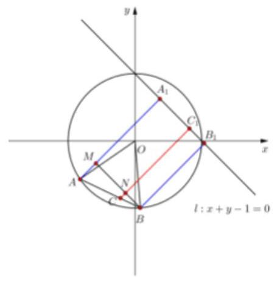

故答案为: $\sqrt{7} + \frac{3}{2}\sqrt{2}$

## 巩固训练

1、线性方程组对应的增广矩阵是 $\left( \begin{matrix} m & 4 & 2 \\  1 & m & m \end{matrix}\right)$ ，且此方程组无解，则实数 $m =$ ___。

【答案】 $\pm  2$

【解析】解: 由题意知线性方程组无解,则对应的系数行列式首先满足 $\left( \begin{matrix} m & 4 \\  1 & m \end{matrix}\right)  = {m}^{2} - 4 = 0$ , 解得 $m =  \pm  2$ ,经检验,都符合题意; 故答案为: $\pm  2$ .

2、直线 $l$ 的一个方向向量为 $\overrightarrow{d} = \left( {-1,2}\right)$ ，则 $l$ 的倾斜角等于( )

A. arctan 2 B. arctan $\left( {-2}\right)$ C. $\pi$ -arctan 2 D. $\pi  + \arctan 2$

【答案】C

【解析】直线 $l$ 的一个方向向量为 $\overrightarrow{d} = \left( {-1,2}\right)$ ,设直线倾斜角为 $\alpha$ ,所以直线的斜率 $k = \tan \alpha  =  - 2$ , $\alpha  \in  \left( {\frac{\pi }{2},\pi }\right)$ ,所以 $\alpha  - \pi  \in  \left( {-\frac{\pi }{2},0}\right) ,\tan \left( {\alpha  - \pi }\right)  =  - 2$ ,所以 $\alpha  - \pi  = \arctan \left( {-2}\right)$ ,所以 $\alpha  = \pi  - \arctan 2$ ; 故选: C

3、已知关于 $x, y$ 的一元二次方程组: $\left\{  \begin{array}{l} {mx} + {2y} = 2 \\  {3x} + \left( {m - 1}\right) y = {2m} + 1 \end{array}\right.$ ,当方程组无解时, $m$ 的值为___.

【答案】 $m = 3$ ；

【解析】一元二次方程组: $\left\{  \begin{array}{l} {mx} + {2y} = 2 \\  {3x} + \left( {m - 1}\right) y = {2m} + 1 \end{array}\right.$ 对应的 $D = \left| \begin{array}{ll} m & 2 \\  3 & m - 1 \end{array}\right|  = {m}^{2} - m - 6 = \left( {m - 3}\right) \left( {m + 2}\right)$

${D}_{x} = \left| \begin{array}{ll} 2 & 2 \\  {2m} + 1 & m - 1 \end{array}\right|  =  - 2\left( {m + 2}\right) ,\;{D}_{y} = \left| \begin{array}{ll} m & 2 \\  3 & {2m} + 1 \end{array}\right|  = \left( {{2m} - 3}\right) \left( {m + 2}\right)$

方程组无解的情况等价于 $D = 0$ 时, ${D}_{x} \neq  0$ 或者 ${D}_{y} \neq  0$ ,即只有 $m = 3$ 时符合情况;

4、已知 ${P}_{1}\left( {{a}_{1},{b}_{1}}\right)$ 与 ${P}_{2}\left( {{a}_{2},{b}_{2}}\right)$ 是直线 $y = {kx} + 1$ ( $k$ 为常数)上两个不同的点，则关于 $x$ 和 $y$ 的方程组 $\left\{  \begin{array}{l} {a}_{1}x + {b}_{1}y = 1 \\  {a}_{2}x + {b}_{2}y = 1 \end{array}\right.$ 的解的情况是( )

A. 无论 $k,{P}_{1},{P}_{2}$ 如何,总是无解 B. 无论 $k,{P}_{1},{P}_{2}$ 如何,总有唯一解

C. 存在 $k,{P}_{1},{P}_{2}$ ,使之恰有两解 D. 存在 $k,{P}_{1},{P}_{2}$ ,使之有无穷多解

【答案】B

【解析】依题意有 $k = \frac{{b}_{2} - {b}_{1}}{{a}_{2} - {a}_{1}}$ 且 ${a}_{2}{b}_{1} - {a}_{1}{b}_{2} = k{a}_{1}{a}_{2} - k{a}_{1}{a}_{2} + {a}_{2} - {a}_{1} = {a}_{2} - {a}_{1}$ ,由 $\left\{  \begin{array}{l} {a}_{1}x + {b}_{1}y = 1 \\  {a}_{2}x + {b}_{2}y = 1 \end{array}\right.$ 消去 $y$ 得 $\left( {{a}_{1}{b}_{2} - {a}_{2}{b}_{1}}\right) x = {b}_{2} - {b}_{1}$ 即 $\left( {{a}_{1} - {a}_{2}}\right) x = {b}_{2} - {b}_{1}$ ,所以方程组有唯一解.

5、设 ${3x} + {4y} - 5 = 0$ ，则 ${x}^{2} + {y}^{2}$ 的最小值是___.

【答案】 1

【解析】 ${x}^{2} + {y}^{2}$ 表示直线 ${3x} + {4y} - 5 = 0$ 上任意点 $P\left( {x, y}\right)$ 到原点的距离的平方,

显然原点到直线 ${3x} + {4y} - 5 = 0$ 上的点的最小距离就是原点到直线 ${3x} + {4y} - 5 = 0$ 的距离,即 $d = \frac{\left| 0 \times  3 + 0 \times  4 - 5\right| }{\sqrt{{3}^{2} + {4}^{2}}} = 1$ ,所以 ${x}^{2} + {y}^{2}$ 的最小值是 ${d}^{2} = {1}^{2} = 1$ . 故答案为:1

## (二) 圆的方程

## 知识梳理

1. 圆的标准方程与一般方程

(1)圆的标准方程为 ${\left( x - a\right) }^{2} + {\left( y - b\right) }^{2} = {r}^{2}$ ，其中圆心为 $\left( {a, b}\right)$ ，半径为 $r$ ；

(2)圆的一般方程为 ${x}^{2} + {y}^{2} + {Dx} + {Ey} + F = 0$ ，圆心坐标 $\left( {-\frac{D}{2}, - \frac{E}{2}}\right)$ ，半径为 $\frac{\sqrt{{D}^{2} + {E}^{2} - {4F}}}{2}$ . 方程表示圆的充要条件是 ${D}^{2} + {E}^{2} - {4F} > 0$ .

(3)圆的参数方程: $\left\{  \begin{array}{l} x = a + r\cos \theta \\  y = b + r\sin \theta  \end{array}\right.$ ( $\theta$ 为参数)，其中圆心为 $\left( {a, b}\right)$ ，半径为 $r$ .

2. 点 $M\left( {{x}_{0},{y}_{0}}\right)$ 与圆 ${x}^{2} + {y}^{2} + {Dx} + {Ey} + F = 0$ 的位置关系: 在圆内、在圆外、在圆上

3. 判断直线与圆的位置关系的两种方法:

(1)几何法:通过圆心到直线的距离与半径的大小比较来判断，设圆心到直线的距离为 $d$ ，圆半径为 $r$ . 若直线与圆相离，则 $d > r$ ；若直线与圆相切，则 $d = r$ ；若直线与圆相交，则 $d < r$ .

(2)代数法:通过直线与圆的方程联立的方程组的解的个数来判断，即通过判别式来判断，若 $\Delta  > 0$ ，则直线与圆相离；若 $\Delta  = 0$ ，则直线与圆相切；若 $\Delta  < 0$ ，则直线与圆相交.

4. 两圆的的位置关系:一个交点:内切、外切；两个交点:相交；无交点:内含、外离

## 例题精讲

【例 5】已知圆 $C$ 的圆心在 $y$ 轴上,截直线 ${l}_{1} : {3x} + {4y} + 3 = 0$ 所得弦长为 8,且与直线 ${l}_{2} : {3x} - {4y} + {37} = 0$ 相切，则圆 $C$ 的方程___.

【难度】★★★

【答案】 ${x}^{2} + {\left( y - 3\right) }^{2} = {25}$

【解析】设圆 $C$ 的圆心为 $C\left( {0, b}\right)$ ,半径为 $r\left( {r > 0}\right)$

圆心 $C$ 到直线 ${l}_{1}$ 的距离为 ${d}_{1} = \frac{\left| 4b + 3\right| }{\sqrt{{3}^{2} + {4}^{2}}} = \frac{\left| 4b + 3\right| }{5}$ ,

圆心 $C$ 到直线 ${l}_{2}$ 的距离为 ${d}_{2} = \frac{\left| -4b + {37}\right| }{\sqrt{{3}^{2} + {\left( -4\right) }^{2}}} = \frac{\left| 4b - {37}\right| }{5}$

则 $\left\{  \begin{matrix} {r}^{2} = {d}_{1}^{2} + {\left( \frac{8}{2}\right) }^{2} \\  r = {d}_{2} \end{matrix}\right.$ ,即 $\left\{  \begin{matrix} {r}^{2} = \frac{{\left( 4b + 3\right) }^{2}}{25} + {16} \\  {r}^{2} = \frac{{\left( 4b - {37}\right) }^{2}}{25} \end{matrix}\right.$ ,解得 $\left\{  \begin{matrix} b = 3 \\  r = 5 \end{matrix}\right.$

则圆 $C$ 的方程为 ${x}^{2} + {\left( y - 3\right) }^{2} = {25}$ ; 故答案为: ${x}^{2} + {\left( y - 3\right) }^{2} = {25}$

【例 6】在直角坐标系 ${xOy}$ 中,曲线 ${C}_{1}$ 的方程为 $y = k\left| x\right|  + 2$ ,曲线 ${C}_{2}$ 的方程为 ${\left( x + 1\right) }^{2} + {y}^{2} = 4$ ,若 ${C}_{1}$ 与 ${C}_{2}$ 有且仅有三个公共点，则实数 $k$ 的值为___.

【难度】 $\star   \star   \star$

【答案】 $- \frac{4}{3}$

【解析】易知 ${C}_{2}$ 是圆心为 $A\left( {-1,0}\right)$ ,半径为 2 的圆.

由题设知, ${C}_{1}$ 是过点 $B\left( {0,2}\right)$ 且关于 $y$ 轴对称的两条射线,记 $y$ 轴右边的射线为 ${l}_{1}, y$ 轴左边的射线为 ${l}_{2}$ 由于 $B$ 在圆 ${C}_{2}$ 的外面,故 ${C}_{1}$ 与 ${C}_{2}$ 有且仅有三个公共点等价于 ${l}_{1}$ 与 ${C}_{2}$ 只有一个公共点且 ${l}_{2}$ 与 ${C}_{2}$ 有两个公共点,或 ${l}_{2}$ 与 ${C}_{2}$ 只有一个公共点且 ${l}_{1}$ 与 ${C}_{2}$ 有两个公共点.

当 ${l}_{1}$ 与 ${C}_{2}$ 只有一个公共点时, $A$ 到 ${l}_{1}$ 所在直线的距离为 2,所以 $\frac{\left| -k + 2\right| }{\sqrt{{k}^{2} + 1}} = 2$ ,

故 $k =  - \frac{4}{3}$ 或 $k = 0$ . 经检验,当 $k = 0$ 时, ${l}_{1}$ 与 ${C}_{2}$ 没有公共点;

当 $k =  - \frac{4}{3}$ 时, ${l}_{1}$ 与 ${C}_{2}$ 只有一个公共点, ${l}_{2}$ 与 ${C}_{2}$ 有两个公共点

当 ${l}_{2}$ 与 ${C}_{2}$ 只有一个公共点时, $A$ 到 ${l}_{2}$ 所在直线的距离为 2,所以 $\frac{\left| k + 2\right| }{\sqrt{{k}^{2} + 1}} = 2$ ,

故 $k = 0$ 或 $k = \frac{4}{3}$ ，经检验，当 $k = 0$ 时， ${l}_{1}$ 与 ${C}_{2}$ 没有公共点，当 $k = \frac{4}{3}$ 时， ${l}_{2}$ 与 ${C}_{2}$ 没有公共点. 故答案为: $- \frac{4}{3}$

【例 7】若圆 ${x}^{2} + {y}^{2} = 5$ 上的两个动点 $A, B$ 满足 $\left| \overrightarrow{AB}\right|  = \sqrt{15}$ ,点 $M$ 在直线 ${2x} + y = {10}$ 上运动,则 $\left| {\overrightarrow{MA} + \overrightarrow{MB}}\right|$ 的最小值是( )

A. $2\sqrt{5}$ B. $3\sqrt{5}$ C. $\sqrt{10}$ D. $2\sqrt{10}$

【难度】 $\star   \star   \star$

【答案】B

【解析】由 ${x}^{2} + {y}^{2} = 5$ 可知圆心为坐标原点 $O\left( {0,0}\right)$ ,半径为 $r = \sqrt{5}$ ,因为 $\left| \overrightarrow{AB}\right|  = \sqrt{15}$ ,所以圆心到直线 ${AB}$ 的距离 $d = \sqrt{{r}^{2} - {\left( \frac{\sqrt{15}}{2}\right) }^{2}} = \frac{\sqrt{5}}{2}$ ，设 ${AB}$ 的中点为 $N$ ，则 $\left| {ON}\right|  = d = \frac{\sqrt{5}}{2}$ ，所以 $N$ 点在以原点为圆心,以 ${r}_{1} = \frac{\sqrt{5}}{2}$ 为半径的圆上,所以 $N$ 点的轨迹方程为 ${x}^{2} + {y}^{2} = \frac{5}{4}$ ,

$\overrightarrow{MA} + \overrightarrow{MB} = \overrightarrow{MN} + \overrightarrow{NA} + \overrightarrow{MN} + \overrightarrow{NB}$ ,又 $N$ 为 ${AB}$ 的中点,所以 $\overrightarrow{NA} =  - \overrightarrow{NB}$ ,

所以 $\overrightarrow{MA} + \overrightarrow{MB} = 2\overrightarrow{MN}$ ,圆心 $\left( {0,0}\right)$ 到 ${2x} + y = {10}$ 的距离为 ${d}_{1} = \frac{\left| -{10}\right| }{\sqrt{4 + 1}} = 2\sqrt{5}$ ,所以

${\left| \overrightarrow{MN}\right| }_{\min } = {d}_{1} - {r}_{1} = 2\sqrt{5} - \frac{\sqrt{5}}{2} = \frac{3\sqrt{5}}{2}$ ，所以 ${\left| \overrightarrow{MA} + \overrightarrow{MB}\right| }_{\min } = 2{\left| \overrightarrow{MN}\right| }_{\min } = 3\sqrt{5}$ . 故选:B

【例 8】如图,正方形 ${ABCD}$ 的边长为 20 米,圆 $O$ 的半径为 1 米,圆心是正方形的中心,点 $P\text{ 、 }Q$ 分别在线段 ${AD}\text{ 、 }{CB}$ 上,若线段 ${PQ}$ 与圆 $O$ 有公共点,则称点 $Q$ 在点 $P$ 的“盲区”中,已知点 $P$ 以 1.5 米/秒的速度从 $A$ 出发向 $D$ 移动，同时，点 $Q$ 以 1 米/秒的速度从 $C$ 出发向 $B$ 移动，则在点 $P$ 从 $A$ 移动到 $D$ 的过程中， 点 $Q$ 在点 $P$ 的盲区中的时长约为___秒(精确到 0.1)

【难度】

【答案】 4.4

【解析】解: 以 $O$ 为坐标原点,建立如图所示的直角坐标系,

可设 $P\left( {-{10}, - {10} + {1.5t}}\right) , Q\left( {{10},{10} - t}\right)$ ,可得直线 ${PQ}$ 的方程为 $y - {10} + t = \frac{{20} - {2.5t}}{20}\left( {x - {10}}\right)$ ,圆 $O$ 的方程为 ${x}^{2} + {y}^{2} = 1,$

由直线 ${PQ}$ 与圆 $O$ 有交点,可得 $\frac{\left| \frac{{2.5t} - {20}}{2} - t + {10}\right| }{\sqrt{1 + {\left( \frac{{20} - {2.5t}}{20}\right) }^{2}}} \leq  1$ ,化为 $3{t}^{2} + {16t} - {128} \leq  0$ ,解得 $0 \leq  t \leq  \frac{8\sqrt{7} - 8}{3}$ , 即有点 $Q$ 在点 $P$ 的盲区中的时长约为 4.4 秒. 故答案为: 4.4 .

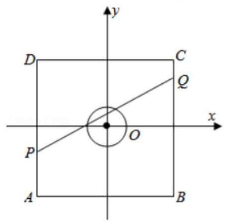

## 巩固训练

1、已知点 $P\left( {2,2}\right)$ ，点 $M$ 是圆 ${O}_{1} : {x}^{2} + {\left( y - 1\right) }^{2} = \frac{1}{4}$ 上的动点，点 $N$ 是圆 ${O}_{2} : {\left( x - 2\right) }^{2} + {y}^{2} = \frac{1}{4}$ 上的动点，则 $\left| {PN}\right|  - \left| {PM}\right|$ 的最大值是( )

A. $\sqrt{5} - 1$ B. $\sqrt{5} - 2$ C. $2 - \sqrt{5}$ D. $3 - \sqrt{5}$

【答案】D

【解析】如图,圆心 ${O}_{1}\left( {0,1}\right)$ ,半径 $r = \frac{1}{2}$ ,圆心 ${O}_{2}\left( {2,0}\right)$ ,半径 $R = \frac{1}{2}$ ,则 $\left| {PN}\right|$ 的最大值为 $2 + \frac{1}{2}$ , $\left| {PM}\right|$ 的最小值为 $\sqrt{{2}^{2} + 1} - \frac{1}{2} = \sqrt{5} - \frac{1}{2}$ ,则 $\left| {PN}\right|  - \left| {PM}\right|$ 的最大值为 $2 + \frac{1}{2} - \left( {\sqrt{5} - \frac{1}{2}}\right)  = 3 - \sqrt{5}$ ,故选 $D$ .

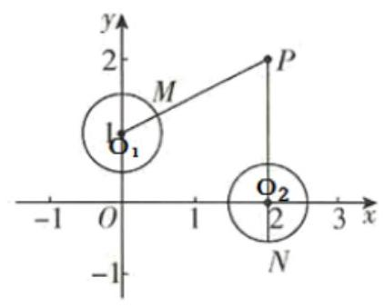

2、若圆 ${x}^{2} + {\left( y - 1\right) }^{2} = 1$ 的圆心到直线 ${l}_{n} : x + {ny} = 0\left( {n \in  {N}^{ * }}\right)$ 的距离为 ${d}_{n}$ ，则 $\mathop{\lim }\limits_{{n \rightarrow  \infty }}{d}_{n} =$ ___.

【答案】 1

【解析】 $\mathop{\lim }\limits_{{n \rightarrow  \infty }}{d}_{n} = \frac{\left| 0 + 1 \times  n\right| }{\sqrt{{1}^{2} + {n}^{2}}} = 1$

3、如图: 边长为 4 的正方形 ${ABCD}$ 的中心为 $E$ ,以 $E$ 为圆心,1 为半径作圆. 点 $P$ 是圆 $E$ 上任意一点,点 $Q$ 是边 ${AB},{BC},{CD}$ 上的任意一点(包括端点)，则 $P\dot{Q} \cdot  D\dot{A}$ 的取值范围为___.

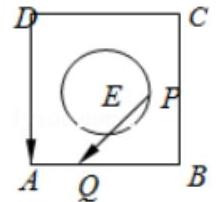

【答案】 $\left\lbrack  {-{12},{12}}\right\rbrack$

【解析】以 $A$ 为原点, ${AB},{AD}$ 分别为 $x, y$ 轴建立平面直角坐标系, $A\left( {0,0}\right) , D\left( {0,4}\right) ,\overrightarrow{DA} = \left( {0, - 4}\right)$ ,圆 $E$ : ${\left( x - 2\right) }^{2} + {\left( y - 2\right) }^{2} = 1$ ,设 $P\left( {x, y}\right) ,1 \leq  x \leq  3,1 \leq  y \leq  3$ ,当 $Q \in$ 线段 ${AB}$ 时, $Q\left( {a,0}\right) ,0 \leq  a \leq  4$ ,此时 $\overrightarrow{PQ} = \left( {a - x, - y}\right)$ ,此时 $\overrightarrow{PQ} \cdot  \overrightarrow{DA} = {4y} \in  \left\lbrack  {4.12}\right\rbrack$ ,当 $Q \in$ 线段 ${BC}$ 时, $Q\left( {4, b}\right) ,0 \leq  b \leq  4$ ,此时 $\overrightarrow{PQ} = \left( {4 - x, b - y}\right) ,\overrightarrow{PQ} \cdot  \overrightarrow{DA} =  - 4\left( {b - y}\right)  \in  \left\lbrack  {-{12},{12}}\right\rbrack$ ,当 $Q \in$ 线段 ${CD}$ 时, $Q\left( {a,4}\right) ,0 \leq  a \leq  4$ ,此时, $\overrightarrow{PQ} = \left( {a - 4,4 - y}\right) ,\overrightarrow{PQ} \cdot  \overrightarrow{DA} =  - 4\left( {4 - y}\right)  \in  \left\lbrack  {-{12}, - 4}\right\rbrack$ ,所以最后的取值范围是 $\left\lbrack  {-{12},{12}}\right\rbrack$ .

4、以 $\left( {{a}_{1},0}\right) ,\left( {{a}_{2},0}\right)$ 为圆心的两圆均过 $\left( {1,0}\right)$ ,与 $y$ 轴正半轴分别交于 $\left( {0,{y}_{1}}\right) ,\left( {0,{y}_{2}}\right)$ ,且满足 $\ln {y}_{1} + \ln {y}_{2} = 0$ , 则点 $\left( {\frac{1}{{a}_{1}},\frac{1}{{a}_{2}}}\right)$ 的轨迹是( )

A. 直线 B. 圆 C. 椭圆 D. 双曲线

【答案】A

【解析】因为 ${r}_{1} = \left| {1 - {a}_{1}}\right|  = \sqrt{{a}_{1}^{2} + {y}_{1}^{2}}\; \Rightarrow  {y}_{1}^{2} = 1 - 2{a}_{1}$ ,同理: ${y}_{2}^{2} = 1 - 2{a}_{2}$

又因为 $\ln {y}_{1} + \ln {y}_{2} = 0$ ,所以 ${y}_{1}{y}_{2} = 1$ ,则 $\left( {1 - 2{a}_{1}}\right) \left( {1 - 2{a}_{2}}\right)  = 1$ ,即 $2{a}_{1}{a}_{2} = {a}_{1} + {a}_{2} \Rightarrow  \frac{1}{{a}_{1}} + \frac{1}{{a}_{2}} = 2$

设 $\left\{  \begin{array}{l} x = \frac{1}{{a}_{1}} \\  y = \frac{1}{{a}_{2}} \end{array}\right.$ ,则 $x + y = 2$ 为直线; 本题正确选项: $A$

5、已知直线 $y = x + 1$ 上有两点 $A\left( {{a}_{1},{b}_{1}}\right) , B\left( {{a}_{2},{b}_{2}}\right)$ ，且 ${a}_{1} > {a}_{2}$ ，已知若 $\left| {AB}\right|  = 2 + \sqrt{2}$ ，且 ${a}_{1},{b}_{1},{a}_{2},{b}_{2}$ ，满足 $2\left| {{a}_{1}{a}_{2} + {b}_{1}{b}_{2}}\right|  = \sqrt{{a}_{1}^{2} + {b}_{1}^{2}} \cdot  \sqrt{{a}_{2}^{2} + {b}_{2}^{2}}$ ，则这样的点 $A$ 个数为( )

A. 1 B. 2 C. 3 D. 4

【答案】D

## (三)圆锥曲线定义与性质、直线与圆锥曲线综合

## 知识梳理

1. 椭圆和双曲线的标准方程和几何性质

<table><tr><td>名称</td><td>椭 圆</td><td>双 曲 线</td></tr><tr><td>图象</td><td>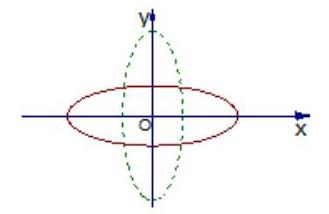</td><td>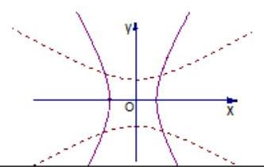</td></tr><tr><td>定义</td><td>平面内到两定点 ${F}_{1},{F}_{2}$ 的距离的和为常数 ${2a}\left( {{2a} > {F}_{1}{F}_{2}}\right)$ )的动点的轨迹叫椭圆. 即 $\left| {M{F}_{1}}\right|  + \left| {M{F}_{2}}\right|  = {2a}$   当 ${2a} > {2c}$ 时，轨迹是椭圆，   当 ${2a} = {2c}$ 时，轨迹是一条线段 ${F}_{1}{F}_{2}$   当 ${2a} < {2c}$ 时，轨迹不存在</td><td>平面内到两定点 ${F}_{1},{F}_{2}$ 的距离的差的绝对值为常数 ${2a}\left( {0 < {2a} <  \mid  {F}_{1}{F}_{2}}\right. \left. \right)$ 的动点的轨迹叫双曲线.   即 $\begin{Vmatrix}{M{F}_{1}\left| -\right| M{F}_{2}}\end{Vmatrix} = {2a}$   当 ${2a} < {2c}$ 时，轨迹是双曲线   当 ${2a} = {2c}$ 时，轨迹是两条射线   当 ${2a} > {2c}$ 时，轨迹不存在</td></tr><tr><td rowspan="2">标 准方 程</td><td>焦点在 $x$ 轴上时: $\frac{{x}^{2}}{{a}^{2}} + \frac{{y}^{2}}{{b}^{2}} = 1$ 焦点在 $y$ 轴上时: $\frac{{y}^{2}}{{a}^{2}} + \frac{{x}^{2}}{{b}^{2}} = 1 \; \left( {a > b > 0}\right)$</td><td>焦点在 $x$ 轴上时: $\frac{{x}^{2}}{{a}^{2}} - \frac{{y}^{2}}{{b}^{2}} = 1$   焦点在 $y$ 轴上时: $\frac{{y}^{2}}{{a}^{2}} - \frac{{x}^{2}}{{b}^{2}} = 1$</td></tr><tr><td>注:是根据分母的大小来判断焦点在哪一坐标轴上.</td><td>注:是根据项的正负来判断焦点所在的位置.</td></tr><tr><td>两轴</td><td>长轴长 ${2a}$ ,短轴长 ${2b}$   (长半轴 $a$ ，短半轴 $b$ )</td><td>实轴长 ${2a}$ ，虚轴长 ${2b}$   (实半轴 $a$ ，虚半轴 $b$ )</td></tr><tr><td>$a, b, c$ 关系</td><td>(1) ${a}^{2} = {c}^{2} + {b}^{2}$ (符合勾股定理的)   (2) $a$ 最大(可以 $c = b, c < b, c > b$ )</td><td>(1) ${c}^{2} = {a}^{2} + {b}^{2}$ (符合勾股定理的)   (2) $c$ 最大(可以 $a = b, a < b, a > b$ )</td></tr><tr><td>范围</td><td>焦点在 $x$ 轴: $- a \leq  x \leq  a, - b \leq  y \leq  b$ 焦点在 $y$ 轴: $- b \leq  x \leq  b, - a \leq  y \leq  a$</td><td>焦点在 $x$ 轴: $x \geq  a$ 或 $x \leq   - a$   焦点在 $y$ 轴: $y \geq  a$ 或 $y \leq   - a$</td></tr><tr><td>对称</td><td colspan="2">关于 $x$ 轴、 $y$ 轴和原点对称</td></tr></table>

## 2. 双曲线的渐近线

<table id="cross-table-1"><tr><td></td><td>焦点在 $x$ 轴</td><td colspan="2">焦点在 $y$ 轴</td></tr><tr><td>双曲线</td><td>$\frac{{x}^{2}}{{a}^{2}} - \frac{{y}^{2}}{{b}^{2}} = 1$</td><td colspan="2">$\frac{{y}^{2}}{{a}^{2}} - \frac{{x}^{2}}{{b}^{2}} = 1$</td></tr><tr><td>渐近线</td><td colspan="2">$\frac{{x}^{2}}{{a}^{2}} - \frac{{y}^{2}}{{b}^{2}} = 0$ 即 $y =  \pm  \frac{b}{a}x$</td><td>$\frac{{y}^{2}}{{a}^{2}} - \frac{{x}^{2}}{{b}^{2}} = 0$ 即 $y =  \pm  \frac{a}{b}x$</td></tr></table>

【小贴士】与 $\frac{{x}^{2}}{{a}^{2}} - \frac{{y}^{2}}{{b}^{2}} = 1$ 共渐近线的双曲线方程 $\frac{{x}^{2}}{{a}^{2}} - \frac{{y}^{2}}{{b}^{2}} = \lambda \;\left( {\lambda  \neq  0}\right)$ ;

## 3、抛物线的标准方程和几何性质

<table><tr><td>标准方程</td><td>图形</td><td>对称轴</td><td>焦点 $F$</td><td>准线 $l$</td></tr><tr><td>${y}^{2} = {2px}$</td><td>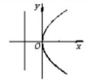</td><td>$x$ 轴</td><td>$\left( {\frac{p}{2},0}\right)$</td><td>$x =  - \frac{p}{2}$</td></tr><tr><td>${y}^{2} =  - {2px}$</td><td>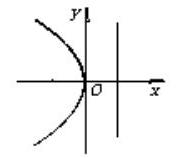</td><td>$x$ 轴</td><td>$\left( {-\frac{p}{2},0}\right)$</td><td>$x = \frac{p}{2}$</td></tr><tr><td>${x}^{2} = {2py}$</td><td>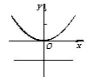</td><td>$y$ 轴</td><td>$\left( {0,\frac{p}{2}}\right)$</td><td>$y =  - \frac{p}{2}$</td></tr><tr><td>${x}^{2} =  - {2py}$</td><td>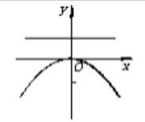</td><td>$y$ 轴</td><td>$\left( {0, - \frac{p}{2}}\right)$</td><td>$y = \frac{p}{2}$</td></tr></table>

## 例题精讲

【例 9】( 1 )若椭圆 $3{x}^{2} - t{y}^{2} = 6$ 的一个焦点为 $F\left( {0,2}\right)$ ，则实数 $t =$ ___.

【难度】★★

【答案】-1

【解析】椭圆 $3{x}^{2} - t{y}^{2} = 6$ 的标准方程为: $\frac{{x}^{2}}{2} + \frac{{y}^{2}}{-\frac{6}{t}} = 1$ ,

因为其一个焦点为 $F\left( {0,2}\right)$ ,所以 ${a}^{2} =  - \frac{6}{t},{b}^{2} = 2$ ,所以 $- \frac{6}{t} - 2 = 4$ ,解得 $t =  - 1$ ,故答案为: -1

(2)若椭圆 $\frac{{x}^{2}}{m} + \frac{{y}^{2}}{3} = 1$ 的一个焦点在抛物线 ${y}^{2} = {8x}$ 的准线上,则 $m =$ ___.

【难度】 $\star   \star$

【答案】 7

【解析】解: 抛物线 ${y}^{2} = {8x}$ 的准线为直线 $x =  - 2$ ,

因为椭圆 $\frac{{x}^{2}}{m} + \frac{{y}^{2}}{3} = 1$ 的一个焦点在抛物线 ${y}^{2} = {8x}$ 的准线上,所以可得 $c = 2$ ,

所以 $m = {a}^{2} = {b}^{2} + {c}^{2} = 3 + {2}^{2} = 7$ ,故答案为: 7

(3)设双曲线 $C : \frac{{x}^{2}}{8} - \frac{{y}^{2}}{m} = 1\left( {m > 0}\right)$ 的左、右焦点分别为 ${F}_{1},{F}_{2}$ ，过 ${F}_{1}$ 的直线与双曲线 $C$ 交于 $M$ ， $N$ 两点，其中 $M$ 在左支上， $N$ 在右支上. 若 $\angle {F}_{2}{MN} = \angle {F}_{2}{NM}$ ，则 $\left| {MN}\right|  =$ ( )

A. $8\sqrt{2}$ B. 8 C. $4\sqrt{2}$ D. 4

【难度】 $\star   \star   \star$

【答案】A

【解析】由 $\angle {F}_{2}{MN} = \angle {F}_{2}{NM}$ 可知, $\left| {{F}_{2}M}\right|  = \left| {{F}_{2}N}\right|$ . 由双曲线定义可知, $\left| {M{F}_{2}}\right|  - \left| {M{F}_{1}}\right|  = 4\sqrt{2}$ , $\left| {N{F}_{1}}\right|  - \left| {N{F}_{2}}\right|  = 4\sqrt{2}$ ，两式相加得， $\left| {N{F}_{1}}\right|  - \left| {M{F}_{1}}\right|  = \left| {MN}\right|  = 8\sqrt{2}$ . 故选:A

【例 10】已知椭圆 $C : \frac{{x}^{2}}{{a}^{2}} + \frac{{y}^{2}}{{b}^{2}} = 1\left( {a > 0, b > 0}\right)$ 过点 $\left( {2, - 1}\right)$ ,且其长轴长为 $4\sqrt{2}$ ,抛物线 ${y}^{2} =  - {16x}$ 的准线 $l$ 交 $x$ 轴于点 $A$ ,过点 $A$ 作直线交椭圆 $C$ 于 $M, N$ .

(1)求椭圆 $C$ 的标准方程和点 $A$ 的坐标；

(2)若 $M$ 是线段 ${AN}$ 的中点，求直线 ${MN}$ 的方程；

(3)设 $P, Q$ 是直线 $l$ 上关于 $x$ 轴对称的两点，问:直线 ${PM}$ 于 ${QN}$ 的交点是否在一条定直线上？请说明你的理由.

【难度】★★★

【答案】(1) $\frac{{x}^{2}}{8} + \frac{{y}^{2}}{2} = 1, A\left( {4,0}\right)$ ; (2) $y =  \pm  \frac{\sqrt{7}}{6}\left( {x - 4}\right)$ ; (3) ${PM}$ 与 ${QN}$ 的交点恒在直线 $x =$ 理由见解析.

【解析】

(1)由题意，椭圆 $C : \frac{{x}^{2}}{{a}^{2}} + \frac{{y}^{2}}{{b}^{2}} = 1\left( {a > 0, b > 0}\right)$ 过点 $\left( {2, - 1}\right)$ ,

可得 $\frac{4}{{a}^{2}} + \frac{1}{{b}^{2}} = 1$ 且 $a = 2\sqrt{2}$ ，解得 ${a}^{2} = 8,{b}^{2} = 2$ ，即椭圆 $C$ 的方程为 $\frac{{x}^{2}}{8} + \frac{{y}^{2}}{2} = 1$ ，

又由抛物线 ${y}^{2} =  - {16x}$ ,可得准线方程为 $l : x = 4$ ,所以 $A\left( {4,0}\right)$ .

(2)设 $N\left( {{x}_{0},{y}_{0}}\right)$ ，则 $M\left( {\frac{{x}_{0} + 4}{2},\frac{{y}_{0}}{2}}\right)$ ，

联立方程组 $\left\{  \begin{matrix} \frac{{x}_{0}^{2}}{8} + \frac{{y}_{0}^{2}}{2} = 1 \\  \frac{{\left( {x}_{0} + 4\right) }^{2}}{32} + \frac{{y}_{0}^{2}}{8} = 1 \end{matrix}\right.$ ，解得 ${x}_{0} = 1,{y}_{0} =  \pm  \frac{\sqrt{7}}{2}$ ，

当 $M\left( {\frac{5}{2},\frac{\sqrt{7}}{4}}\right) , N\left( {1,\frac{\sqrt{7}}{2}}\right)$ 时,可得直线 ${MN} : y =  - \frac{\sqrt{7}}{6}\left( {x - 4}\right)$ ;

当 $M\left( {\frac{5}{2}, - \frac{\sqrt{7}}{4}}\right) , N\left( {1, - \frac{\sqrt{7}}{2}}\right)$ 时,可得直线 ${MN} : y = \frac{\sqrt{7}}{6}\left( {x - 4}\right)$ ; 所以直线 ${MN}$ 的方程为 $y =  \pm  \frac{\sqrt{7}}{6}\left( {x - 4}\right)$ .

(3)设 $P\left( {4, t}\right) , Q\left( {4, - t}\right)$ ，可得 ${MN} : x = {ky} + 4$ ，

设 $M\left( {{x}_{1},{y}_{1}}\right) , N\left( {{x}_{2},{y}_{2}}\right)$ ,联立方程组 $\left\{  \begin{matrix} x = {ky} + 4 \\  {x}^{2} + 4{y}^{2} - 8 = 0 \end{matrix}\right.$ ,整理得 $\left( {{k}^{2} + 4}\right) {y}^{2} + {8ky} + 8 = 0$ ,

所以 ${y}_{1} + {y}_{2} =  - \frac{8k}{{k}^{2} + 4},{y}_{1}{y}_{2} = \frac{8}{{k}^{2} + 4}$ ,则 ${y}_{1} + {y}_{2} =  - k{y}_{1}{y}_{2}$ ,

又由直线 ${PM} : y = \frac{{y}_{1} - t}{{x}_{1} - 4}x + \frac{t{x}_{1} - 4{y}_{1}}{{x}_{1} - 4},{QN} : y = \frac{{y}_{2} + t}{{x}_{2} - 4}x - \frac{4{y}_{2} + t{x}_{2}}{{x}_{2} - 4}$ ,

交点横坐标为 $x = \frac{{2k}{y}_{1}{y}_{2} + 4\left( {{y}_{1} + {y}_{2}}\right) }{{y}_{1} + {y}_{2}} = 2$ ,所以 ${PM}$ 与 ${QN}$ 的交点恒在直线 $x = 2$ 上.

【例 11】已知曲线 $C : \frac{{x}^{2}}{3} - \frac{{y}^{2}}{6} = 1, Q$ 为曲线 $C$ 上一动点,过 $Q$ 作两条渐近线的垂线,垂足分别是 ${P}_{1}$ 和 ${P}_{2}$ .

(1)当 $Q$ 运动到 $\left( {3,2\sqrt{3}}\right)$ 时，求 $\overrightarrow{Q{P}_{1}} \cdot  \overrightarrow{Q{P}_{2}}$ 的值；

(2)设直线 $l$ (不与 $x$ 轴垂直)与曲线 $C$ 交于 $M$ 、 $N$ 两点，与 $x$ 轴正半轴交于 $T$ 点，与 $y$ 轴交于 $S$ 点， 若 $\overrightarrow{SM} = \lambda \overrightarrow{MT},\overrightarrow{SN} = \mu \overrightarrow{NT}$ ,且 $\lambda  + \mu  = 1$ ,求证 $T$ 为定点.

【难度】 $\star   \star   \star$

【答案】(1) $\frac{2}{3};\;\left( 2\right)$ 证明见解析;

【解析】解: (1) 由曲线 $C : \frac{{x}^{2}}{3} - \frac{{y}^{2}}{6} = 1$ ,得渐近线方程为 $\pm  \sqrt{2}x - y = 0$ ,作示意图如图所示:

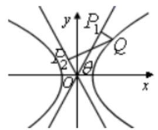

设 $\angle {P}_{1}{Ox} = \theta ,\tan \theta  = \sqrt{2}$ ,则 $\cos {2\theta } = \frac{{\cos }^{2}\theta  - {\sin }^{2}\theta }{{\cos }^{2}\theta  + {\sin }^{2}\theta } = \frac{1 - {\tan }^{2}\theta }{1 + {\tan }^{2}\theta } =  - \frac{1}{3}$

则 $\cos \angle {P}_{1}Q{P}_{2} =  - \cos {2\theta } = \frac{1}{3}$ ,

又 $Q{P}_{1} = \frac{\left| 3\sqrt{2} - 2\sqrt{3}\right| }{\sqrt{3}} = \frac{3\sqrt{2} - 2\sqrt{3}}{\sqrt{3}};Q{P}_{2} = \frac{\left| -3\sqrt{2} - 2\sqrt{3}\right| }{\sqrt{3}} = \frac{3\sqrt{2} + 2\sqrt{3}}{\sqrt{3}}$

$\overrightarrow{Q{P}_{1}} \cdot  \overrightarrow{Q{P}_{2}} = Q{P}_{1} \cdot  Q{P}_{2} \cdot  \cos \angle {P}_{1}Q{P}_{2} = \frac{{18} - {12}}{3} \cdot  \frac{1}{3} = \frac{2}{3}$ .

(2)设 $M\left( {{x}_{1},{y}_{1}}\right)$ ， $N\left( {{x}_{2},{y}_{2}}\right)$ ， $T\left( {m,0}\right)$ ， $S\left( {0, n}\right)$ ， $m > 0$ ，设直线 $l$ 的斜率为 $k$ ，

则 $l : y = k\left( {x - m}\right)$ ,又 $\frac{{x}^{2}}{3} - \frac{{y}^{2}}{6} = 1$ ,得 $\left( {2 - {k}^{2}}\right) {x}^{2} + 2{k}^{2}{mx} - {k}^{2}{m}^{2} - 6 = 0$

得 ${x}_{1} + {x}_{2} =  - \frac{2{k}^{2}m}{2 - {k}^{2}},{x}_{1}{x}_{2} =  - \frac{{k}^{2}{m}^{2} + 6}{2 - {k}^{2}}$

由 $\overrightarrow{SM} = \lambda \overrightarrow{MT}$ ,则 $\left( {{x}_{1},{y}_{1} - n}\right)  = \lambda \left( {m - {x}_{1}, - {y}_{1}}\right)$ ,即 $\left\{  \begin{array}{l} {x}_{1} = \lambda \left( {m - {x}_{1}}\right) \\  {y}_{1} - n = \lambda \left( {-{y}_{1}}\right)  \end{array}\right.$ ,

得 $\lambda  = \frac{{x}_{1}}{m - {x}_{1}}$ ,同理,由 $\overline{SN} = {\mu NT} \Rightarrow  \mu  = \frac{{x}_{2}}{m - {x}_{2}}$ ,

则 $\lambda  + \mu  = \frac{{x}_{1}}{m - {x}_{1}} + \frac{{x}_{2}}{m - {x}_{2}} = \frac{m\left( {{x}_{1} + {x}_{2}}\right)  - 2{x}_{1}{x}_{2}}{{m}^{2} - \left( {{x}_{1} + {x}_{2}}\right) m + {x}_{1}{x}_{2}} = 1$

得 ${2m}\left( {{x}_{1} + {x}_{2}}\right)  - 3{x}_{1}{x}_{2} = {m}^{2}$ ,则 $- \frac{{2m} \cdot  2{k}^{2}m}{2 - {k}^{2}} + \frac{3 \cdot  \left( {{k}^{2}{m}^{2} + 6}\right) }{2 - {k}^{2}} = {m}^{2}$ ,

得 ${m}^{2} = 9$ ,又 $m > 0$ ,得 $m = 3$ ,即 $T$ 为定点 $\left( {3,0}\right)$ .

【例 12】已知椭圆 $C : \frac{{x}^{2}}{{a}^{2}} + \frac{{y}^{2}}{{b}^{2}} = 1\left( {a > b > 0}\right)$ 的右焦点为 $F\left( {1,0}\right)$ ,短轴长为 2,过定点 $P\left( {0,2}\right)$ 的直线 $l$ 交椭圆 $C$ 于不同的两点 $A\text{ 、 }B$ (点 $B$ 在点 $A, P$ 之间).

(1)求椭圆 $C$ 的方程；

(2)若 $\overline{PB} = \lambda \overline{PA}$ ，求实数 $\lambda$ 的取值范围；

(3)若射线 ${BO}$ 交椭圆 $C$ 于点 $M$ ( $O$ 为原点)，求 $\bigtriangleup  {ABM}$ 面积的最大值.

【难度】 $\star   \star   \star$

【答案】(1) $\frac{{x}^{2}}{2} + {y}^{2} = 1;\left( 2\right) \lambda  \in  \left\lbrack  {\frac{1}{3},1}\right) ;\left( 3\right) \sqrt{2}$

【解析】(1)因为右焦点为 $F\left( {1,0}\right)$ ,故 ${a}^{2} - {b}^{2} = 1$ . 又短轴长为 2,故 ${2b} = 2, b = 1$ ,解得 $\left\{  \begin{array}{l} {a}^{2} = 2 \\  {b}^{2} = 1 \end{array}\right.$

故椭圆 $C$ 的方程: $\frac{{x}^{2}}{2} + {y}^{2} = 1$

(2)当直线 $l$ 斜率不存在时,直线 $l : x = 0$ ,此时 $B\left( {0,1}\right) , A\left( {0, - 1}\right)$ ,故 $\overrightarrow{PB} = \left( {0, - 1}\right) ,\overrightarrow{PA} = \left( {0, - 3}\right)$ ,此时

$\overrightarrow{PB} = \frac{1}{3}\overrightarrow{PA},\lambda  = \frac{1}{3}$

当直线 $l$ 斜率存在时,设直线 $l : y = {kx} + 2, A\left( {{x}_{1},{y}_{1}}\right) , B\left( {{x}_{2},{y}_{2}}\right)$ . 联立直线与椭圆 $\left\{  \begin{array}{l} \frac{{x}^{2}}{2} + {y}^{2} = 1 \\  y = {kx} + 2 \end{array}\right.$

有 $\left( {1 + 2{k}^{2}}\right) {x}^{2} + {8kx} + 6 = 0$ ,此时 ${x}_{1} + {x}_{2} =  - \frac{8k}{1 + 2{k}^{2}},{x}_{1}{x}_{2} = \frac{6}{1 + 2{k}^{2}}$ .

$\Delta  = {64}{k}^{2} - 4\left( {1 + 2{k}^{2}}\right)  \times  6 > 0 \Rightarrow  2{k}^{2} - 3 > 0 \Rightarrow  {k}^{2} > \frac{3}{2}.$

又 $\overrightarrow{PB} = \lambda \overrightarrow{PA}$ ,即 $\left\{  \begin{array}{l} {x}_{2} = \lambda {x}_{1} \\  {y}_{2} - 2 = \lambda \left( {{y}_{1} - 2}\right)  \end{array}\right.$ ,故 $\lambda  = \frac{{x}_{2}}{{x}_{1}}$

又 $\frac{{\left( {x}_{1} + {x}_{2}\right) }^{2}}{{x}_{1}{x}_{2}} = \frac{{\left( -\frac{8k}{1 + 2{k}^{2}}\right) }^{2}}{\frac{6}{1 + 2{k}^{2}}} \Rightarrow  \frac{{x}_{1}}{{x}_{2}} + 2 + \frac{{x}_{2}}{{x}_{1}} = \frac{{32}{k}^{2}}{3\left( {1 + 2{k}^{2}}\right) }$ ,即 $\lambda  + \frac{1}{\lambda } = \frac{10}{3} - \frac{16}{3\left( {1 + 2{k}^{2}}\right) } < \frac{10}{3}$ ,

又因为 ${k}^{2} > \frac{3}{2}$ ,故 $3\left( {1 + 2{k}^{2}}\right)  > {12}$ ,即 $\frac{10}{3} - \frac{16}{3\left( {1 + 2{k}^{2}}\right) } > 2$ ,故 $\lambda  + \frac{1}{\lambda } \in  \left( {2,\frac{10}{3}}\right)$

有基本不等式 $\lambda  + \frac{1}{\lambda } > 2\left( {\lambda  \neq  1}\right)$ ,故计算 $\lambda  + \frac{1}{\lambda } < \frac{10}{3} \Rightarrow  {\lambda }^{2} - \frac{10}{3}\lambda  + \frac{25}{9} < \frac{16}{9}$ 得

$- \frac{4}{3} < \lambda  - \frac{5}{3} < \frac{4}{3} \Rightarrow  \frac{1}{3} < \lambda  < 3$ ,又 $\lambda  = \frac{{x}_{2}}{{x}_{1}} < 1$ ,故 $\frac{1}{3} < \lambda  < 1$ ; 综上 $\lambda  \in  \left\lbrack  {\frac{1}{3},1}\right)$

(3) ${S}_{\bigtriangleup {ABM}} = 2{S}_{\bigtriangleup {ABO}} = 2 \times  \frac{1}{2}\left| {OP}\right|  \cdot  \left| {{x}_{1} - {x}_{2}}\right|  = 2\sqrt{{\left( {x}_{1} + {x}_{2}\right) }^{2} - 4{x}_{1}{x}_{2}} = \frac{4\sqrt{2}\sqrt{2{k}^{2} - 3}}{1 + 2{k}^{2}}$ ,

令 $t = \sqrt{2{k}^{2} - 3} > 0$ ,则 ${S}_{\bigtriangleup {ABM}} = \frac{4\sqrt{2}t}{{t}^{2} + 4} = \frac{4\sqrt{2}}{t + \frac{4}{t}} \leq  \frac{4\sqrt{2}}{2\sqrt{t \cdot  \frac{4}{t}}} = \sqrt{2}$ ，故 ${\Delta ABM}$ 面积的最大值为 $\sqrt{2}$

## 巩固训练

1、在平面直角坐标系 ${xOy}$ 中，抛物线 ${x}^{2} = {2y}$ 的焦点到准线的距离为___.

【答案】 1

【解析】由 ${x}^{2} = {2y}$ 可得 $p = 1$ ,抛物线 ${x}^{2} = {2y}$ 的焦点坐标为 $\left( {0,\frac{1}{2}}\right)$ ,准线方程为 $y =  - \frac{1}{2}$ ,

所以抛物线 ${x}^{2} = {2y}$ 的焦点到准线的距离为 $\frac{1}{2} - \left( {-\frac{1}{2}}\right)  = 1$ ,故答案为: 1 .

2、设点 $O$ 是坐标原点，过双曲线 $C : \frac{{x}^{2}}{{a}^{2}} - \frac{{y}^{2}}{{b}^{2}} = 1\left( {a > 0, b > 0}\right)$ 的右焦点 ${F}_{2}$ 作 $C$ 的一条渐近线的垂线， 垂足为 $P$ . 若 $\bigtriangleup {OP}{F}_{2}$ 为等腰直角三角形,则双曲线 $C$ 的渐近线方程为( )

A. ${2x} \pm  y = 0$ B. $x \pm  y = 0$

C. $\frac{x}{2} \pm  y = 0$ D. $\sqrt{2}x \pm  y = 0$

【答案】B

【解析】取渐近线方程为 $y = \frac{b}{a}x$ ,即 ${bx} - {ay} = 0,{F}_{2}\left( {c,0}\right) ,\therefore \left| {{F}_{2}P}\right|  = \frac{\left| bc\right| }{\sqrt{{b}^{2} + {a}^{2}}} = b$ , ${\left| OP\right| }^{2} = {\left| O{F}_{2}\right| }^{2} - {\left| P{F}_{2}\right| }^{2} = {c}^{2} - {b}^{2} = {a}^{2},\left| {OP}\right|  = a$ ,由题意 $b = a,\frac{b}{a} = 1$ ,

$\therefore$ 渐近线方程为 $y =  \pm  x$ . 故选: B.

3、已知椭圆 $C : \frac{{x}^{2}}{m} + \frac{{y}^{2}}{3} = 1$ 的焦点在 $x$ 轴上， ${B}_{1},{B}_{2}$ 是 $C$ 的短轴的两个端点， $F$ 是 $C$ 的一个焦点，且 $\angle {B}_{1}F{B}_{2} = {120}^{ \circ  }$ ,则 $m =$ (   )

A. $2\sqrt{3}$ B. 4 C. 12 D. 16

【答案】B

【解析】依题意 $b = \sqrt{3}$ ,由于 $\angle {B}_{1}F{B}_{2} = {120}^{ \circ  }$ ,所以 $\angle {B}_{1}{FO} = {60}^{ \circ  }$ ,所以 $\tan {60}^{ \circ  } = \frac{b}{c} = \sqrt{3} \Rightarrow  c = 1$ , 所以 $m = {a}^{2} = {b}^{2} + {c}^{2} = 3 + 1 = 4$ . 故选: B

4、已知椭圆 $C : \frac{{x}^{2}}{{a}^{2}} + \frac{{y}^{2}}{{b}^{2}} = 1\left( {a > b > 0}\right)$ 经过定点 $E\left( {1,\frac{\sqrt{2}}{2}}\right)$ ,其左右集点分别为 ${F}_{1},{F}_{2}$ 且 $\left| {E{F}_{1}}\right|  + \left| {E{F}_{2}}\right|  = 2\sqrt{2}$ ,过右焦 ${F}_{2}$ 且与坐标轴不垂直的直线 $l$ 与椭圈交于 $P, Q$ 两点.

(1)求椭圆 $C$ 的方程:

(2)若 $O$ 为坐标原点，在线段 $O{F}_{2}$ 上是否存在点 $M\left( {m,0}\right)$ ，使得以 ${MP}$ ， ${MQ}$ 为邻边的平行四边形是菱形? 若存在,求出 $m$ 的取值范围; 若不存在,请说明理由.

【答案】(1) $\frac{{x}^{2}}{2} + {y}^{2} = 1$ (2)存在， $m$ 的取值范围为 $\left( {0,\frac{1}{2}}\right)$

【解析】解: (1) $\because$ 点 $E$ 在椭圆上,且 $\left| {E{F}_{1}}\right|  + \left| {E{F}_{2}}\right|  = 2\sqrt{2},\therefore {2a} = 2\sqrt{2}, a = \sqrt{2}$ ,

又 $\because$ 定点 $E\left( {1,\frac{\sqrt{2}}{2}}\right)$ 在椭圆上， $\therefore \frac{1}{{a}^{2}} + \frac{1}{2{b}^{2}} = 1$ ， $\therefore b = 1$ ， $\therefore$ 椭圆 $C$ 的方程为: $\frac{{x}^{2}}{2} + {y}^{2} = 1$ ；

(2)假设存在点 $M\left( {m,0}\right)$ 满足条件,设 $P\left( {{x}_{1},{y}_{1}}\right)$ ， $Q\left( {{x}_{2},{y}_{2}}\right)$ ，直线 $l$ 的方程为: $y = k\left( {x - 1}\right)$ ，

联立方程 $\left\{  \begin{array}{l} y = k\left( {x - 1}\right) \\  \frac{{x}^{2}}{2} + {y}^{2} = 1 \end{array}\right.$ ,消去 $y$ 得: $\left( {1 + 2{k}^{2}}\right) {x}^{2} - 4{k}^{2}x + 2{k}^{2} - 2 = 0$ ,

$\therefore {x}_{1} + {x}_{2} = \frac{4{\mathrm{k}}^{2}}{1 + 2{\mathrm{k}}^{2}},{x}_{1}{x}_{2} = \frac{2{k}^{2} - 2}{1 + 2{k}^{2}},\Delta  = 8{k}^{2} + 8 > 0$ ,

又 $\overrightarrow{MP} = \left( {{x}_{1} - m,{y}_{1}}\right) ,\overrightarrow{MQ} = \left( {{x}_{2} - m,{y}_{2}}\right) ,\overrightarrow{PQ} = \left( {{x}_{2} - {x}_{1},{y}_{2} - {y}_{1}}\right)$ ,

$\therefore \overrightarrow{MP} + \overrightarrow{MQ} = \left( {{x}_{1} + {x}_{2} - {2m},{y}_{1} + {y}_{2}}\right)$ ,

由题意知. $\left( {\overrightarrow{MP} + \overrightarrow{MQ}}\right)  \cdot  \overrightarrow{PQ} = \left( {{x}_{2} + {x}_{1} - {2m}}\right) \left( {{x}_{2} - {x}_{1}}\right)  + \left( {{y}_{1} + {y}_{2}}\right) \left( {{y}_{2} - {y}_{1}}\right)$

$= \left( {{x}_{2} + {x}_{1} - {2m}}\right) \left( {{x}_{2} - {x}_{1}}\right) \left( {{y}_{1} + {y}_{2}}\right)  = 0,$

$\because {x}_{1} \neq  {x}_{2},\therefore {x}_{2} + {x}_{1} - {2m} + k\left( {{y}_{1} + {y}_{2}}\right)  = 0$ ,即 ${x}_{2} + {x}_{1} - {2m} + {k}^{2}\left( {{x}_{1} + {x}_{2} - 2}\right)  = 0$ ,

则 $\frac{4{k}^{2}}{1 + 2{k}^{2}} - {2m} + {k}^{2}\left( {\frac{4{k}^{2}}{1 + 2{k}^{2}} - 2}\right)  = 0,\therefore {k}^{2} = \frac{m}{1 - {2m}} > 0,\therefore 0 < m < \frac{1}{2}$ ,

故存在点 $M\left( {m,0}\right)$ ,使得以 ${MP},{MQ}$ 为邻边的平行四边形是菱形, $m$ 的取值范围为 $\left( {0,\frac{1}{2}}\right)$ .

5、已知点 $F$ 是抛物线 $C : {y}^{2} = {8x}$ 上的焦点， $A\left( {{x}_{1},{y}_{1}}\right)$ 、 $B\left( {{x}_{2},{y}_{2}}\right)$ 是抛物线上的两个动点.

(1)若直线 ${AB}$ 经过点 $F$ ，且 ${x}_{1} + {x}_{2} = 6$ ，求 $\left| {AB}\right|$ ；

(2)若 ${x}_{1} + {x}_{2} = 6$ ，求证:线段 ${AB}$ 的垂直平分线经过一个定点 $C$ ，并求出 $C$ 点的坐标；

(3)若线段 ${AB}$ 与 $x$ 轴交于 $Q$ 点，是否存在这样的点 $Q$ ，使得 $\frac{1}{{\left| AQ\right| }^{2}} + \frac{1}{{\left| BQ\right| }^{2}}$ 为定值，若存在，求出这个定值和 $Q$ 点的坐标；若不存在，请说明理由.

【答案】( 1 )10 ( 2 )证明见解析，经过一个定点 $C\left( {7,0}\right)$ ；( 3 )存在 $Q$ 点满足题意，坐标为 $\left( {4,0}\right)$ ， $\frac{1}{{\left| AQ\right| }^{2}} + \frac{1}{{\left| BQ\right| }^{2}} = \frac{1}{16}.$

【解析】(1) $\left| \overrightarrow{AB}\right|  = \left| {AF}\right|  + \left| {BF}\right|  = {x}_{A} + \frac{p}{2} + {x}_{B} + \frac{p}{2} = {x}_{A} + {x}_{B} + p = {10}$ .

(2)①当直线 ${AB}$ 的斜率存在时，设线段 ${AB}$ 的中点为 $M\left( {{x}_{0},{y}_{0}}\right)$ ，则

${x}_{0} = \frac{{x}_{1} + {x}_{2}}{2} = 3,{y}_{0} = \frac{{y}_{1} + {y}_{2}}{2},{k}_{AB} = \frac{{y}_{2} - {y}_{1}}{{x}_{2} - {x}_{1}} = \frac{{y}_{2} - {y}_{1}}{\frac{{y}_{2}^{2}}{8} - \frac{{y}_{1}^{2}}{8}} = \frac{8}{{y}_{2} + {y}_{1}} = \frac{4}{{y}_{0}}$ .

线段 ${AB}$ 的垂直平分线的方程是 $y - {y}_{0} =  - \frac{{y}_{0}}{4}\left( {x - 3}\right)$ ,即 $y =  - \frac{{y}_{0}}{4}\left( {x - 7}\right)$ .

②当直线设 ${AB}$ 的斜率不存在时,此时线段 ${AB}$ 的垂直平分线的方程是 $y = 0$ .

所以线段 ${AB}$ 的垂直平分线经过一个定点 $C\left( {7,0}\right)$ .

(3)设 $Q\left( {m,0}\right)$ ，过 $Q$ 点直线方程为 $x = {ty} + m$ ，联立 $\left\{  \begin{matrix} {y}^{2} = {8x} \\  x = {ty} + m \end{matrix}\right.  \Rightarrow  {y}^{2} - {8ty} - {8m} = 0$ ，

则 $\Delta  = {64}{t}^{2} + {32m} > 0,{y}_{1} + {y}_{2} = {8t},{y}_{1}{y}_{2} =  - {8m}$ .

则 ${\left| AQ\right| }^{2} = {\left( {x}_{1} - m\right) }^{2} + {y}_{1}^{2} = \left( {{t}^{2} + 1}\right) {y}_{1}^{2},{\left| BQ\right| }^{2} = {\left( {x}_{2} - m\right) }^{2} + {y}_{2}^{2} = \left( {{t}^{2} + 1}\right) {y}_{2}^{2}$ ,

所以, $\frac{1}{{\left| AQ\right| }^{2}} + \frac{1}{{\left| BQ\right| }^{2}} = \frac{1}{\left( {{t}^{2} + 1}\right) {y}_{1}^{2}} + \frac{1}{\left( {{t}^{2} + 1}\right) {y}_{2}^{2}}$

$= \frac{{y}_{1}^{2} + {y}_{2}^{2}}{\left( {{t}^{2} + 1}\right) {\left( {y}_{1}{y}_{2}\right) }^{2}} = \frac{{\left( {y}_{1} + {y}_{2}\right) }^{2} - 2{y}_{1}{y}_{2}}{\left( {{t}^{2} + 1}\right) {\left( {y}_{1}{y}_{2}\right) }^{2}} = \frac{{64}{t}^{2} + {16m}}{{64}{m}^{2}\left( {{t}^{2} + 1}\right) }$ ,

所以当 $m = 4$ 时, $\frac{1}{{\left| AQ\right| }^{2}} + \frac{1}{{\left| BQ\right| }^{2}} = \frac{1}{16}$ ,故 $Q$ 点的坐标为 $\left( {4,0}\right)$ ,并且满足 $\Delta  = {64}{t}^{2} + {32m} > 0$ .

6、已知双曲线 $c : \frac{{x}^{2}}{2} - {y}^{2} = 1$ ,设过点 $A\left( {-3\sqrt{2},0}\right)$ 的直线1的方向向量 $\overrightarrow{e} = \left( {1, k}\right)$

(1)当直线 $\mathrm{l}$ 与双曲线 $\mathrm{C}$ 的一条渐近线 $\mathrm{m}$ 平行时,求直线 $\mathrm{l}$ 的方程及 $\mathrm{l}$ 与 $\mathrm{m}$ 的距离;

(2)证明:当 $k > \frac{\sqrt{2}}{2}$ 时，在双曲线 $\mathrm{C}$ 的右支上不存在点 $\mathrm{Q}$ ，使之到直线 $\mathrm{I}$ 的距离为 $\sqrt{6}$ 。

【答案】( 1 ) ${x}^{2} = {4y}$ ；( 2 )①证明见解析；②能， $\left( {0,1}\right)$ .

【解析】解: (1) 双曲线 $\mathrm{C}$ 的渐近线 $m : \frac{x}{\sqrt{2}} \pm  \sqrt{2}y = 0$

$\therefore$ 直线 $l$ 的方程 $x \pm  \sqrt{2}y + 3\sqrt{2} = 0$ ；___直线 $l$ 与 $m$ 的距离 $d = \frac{3\sqrt{2}}{\sqrt{1 + 2}} = \sqrt{6}$ 。

(2)设过原点且平行与 $\left| \mathbf{l}\right|$ 的直线 $b : {kx} - y = 0$ ，则直线 $\mathbf{l}$ 与 $\mathbf{b}$ 的距离 $d = \frac{3\sqrt{2}\left| k\right| }{\sqrt{1 + {k}^{2}}}$

当 $k > \frac{\sqrt{2}}{2}$ 时, $d > \sqrt{6}$ _又双曲线 $\mathrm{C}$ 的渐近线为 $x \pm  \sqrt{2}y = 0$

$\therefore$ 双曲线 $\mathrm{C}$ 的右支在直线 $\mathrm{b}$ 的右下方,

$\therefore$ 双曲线 $C$ 右支上的任意点到直线 $l$ 的距离为 $\sqrt{6}$ 。

故在双曲线 $C$ 的右支上不存在点 $Q$ ,使之到直线 $l$ 的距离为 $\sqrt{6}$ 。

[证法二] 双曲线 $C$ 的右支上存在点 $Q\left( {{x}_{0},{y}_{0}}\right)$ 到直线 $l$ 的距离为 $\sqrt{6}$ ,则 $\left\{  \begin{array}{l} \frac{\left| k{x}_{0} - {y}_{0} + 3\sqrt{2}\right| }{\sqrt{1 + {k}^{2}}} = \sqrt{6},\left( 1\right) \\  {x}_{0} - 2{y}_{0} = 2,\left( 2\right)  \end{array}\right.$

由(1)得 ${y}_{0} = k{x}_{0} + 3\sqrt{2}k \pm  \sqrt{6} \cdot  \sqrt{1 + {k}^{2}}$ ，

设 $t = 3\sqrt{2}k \pm  \sqrt{6} \cdot  \sqrt{1 + {k}^{2}}\;$ 当 $k > \frac{\sqrt{2}}{2}, t = 3\sqrt{2}k \pm  \sqrt{6} \cdot  \sqrt{1 + {k}^{2}} > 0$

将 ${y}_{0} = k{x}_{0} + t$ 代入 (2) 得 $\left( {1 - 2{k}^{2}}\right) {x}_{0}^{2} - {4kt}{x}_{0} - 2\left( {{t}^{2} + 1}\right)  = 0$(*)

$\because k > \frac{\sqrt{2}}{2}, t > 0,\therefore 1 - 2{k}^{2} < 0, - {4kt} < 0, - 2\left( {{t}^{2} + 1}\right)  < 0$

$\therefore$ 方程 (*) 不存在正根,即假设不成立

故在双曲线 $\mathrm{C}$ 的右支上不存在 $\mathrm{Q}$ ,使之到直线 $\mathrm{I}$ 的距离为 $\sqrt{6}$ .

7、已知椭圆 $C : \frac{{x}^{2}}{9} + \frac{{y}^{2}}{4} = 1$ 的左、右焦点分别为 ${F}_{1},{F}_{2}$ ，上顶点为 $M$ ，过点 $M$ 且斜率为 -1 的直线与 $C$ 交于另一点 $N$ ,过原点的直线 $l$ 与 $C$ 交于 $P, Q$ 两点

(1)求 $\bigtriangleup  {PQ}{F}_{2}$ 周长的最小值:

(2)是否存在这样的直线，使得与直线 ${MN}$ 平行的弦的中点都在该直线上？若存在，求出该直线的方程: 若不存在,请说明理由.

(3)直线 $l$ 与线段 ${MN}$ 相交，且四边形 ${MPNQ}$ 的面积 $S \in  \left\lbrack  {\frac{108}{13},\frac{{36}\sqrt{13}}{13}}\right\rbrack$ ，求直线 $l$ 的斜率 $k$ 的取值范围.

【答案】(1)10；(2)存在满足条件的直线，其方程为 ${4x} - {9y} = 0$ ；(3) $\left\lbrack  {0,\frac{8}{5}}\right\rbrack$ .

【解析】(1)连接 $P{F}_{1}$ ，又直线 $l$ 过原点，由椭圆的对称性得 $\left| {P{F}_{1}}\right|  = \left| {Q{F}_{2}}\right|$ ，

则 $\bigtriangleup  {PQ}{F}_{2}$ 的周长 $\left| {PQ}\right|  + \left| {P{F}_{2}}\right|  + \left| {Q{F}_{2}}\right|  = \left| {PQ}\right|  + \left| {P{F}_{2}}\right|  + \left| {P{F}_{1}}\right|  = 6 + \left| {PQ}\right|$ ，

要使得 $\vartriangle  {PQ}{F}_{2}$ 的周长最小,即过原点的弦 ${PQ}$ 最短,

由椭圆的性质可知,当弦 ${PQ}$ 与 $C$ 的短轴重合时最短,即弦 ${PQ}$ 的最小值为 4,则 $\vartriangle  {PQ}{F}_{2}$ 周长的最小值为 10.

(2)依题意，设与直线 ${MN}$ 平行的弦所在的直线方程为 $y =  - x + m$ ，与 $C$ 的交点坐标为 $\left( {{x}_{1},{y}_{1}}\right)$ ， $\left( {{x}_{2},{y}_{2}}\right)$ ， 平行弦中点的坐标为 $\left( {{x}_{0},{y}_{0}}\right)$ ,

联立 $\left\{  \begin{array}{l} \frac{{x}^{2}}{9} + \frac{{y}^{2}}{4} = 1 \\  y =  - x + m \end{array}\right.$ ,化简整理得 ${13}{x}^{2} - {18mx} + 9{m}^{2} - {36} = 0$ ,

当 $\Delta  = {\left( -{18}m\right) }^{2} - 4 \times  {13} \cdot  \left( {9{m}^{2} - {36}}\right)  =  - {144}\left( {{m}^{2} - {13}}\right)  > 0$

即 $- \sqrt{13} < m < \sqrt{13}$ 时，平行弦存在，

则 ${x}_{0} = \frac{{x}_{1} + {x}_{2}}{2} = \frac{9}{13}m,{y}_{0} = \frac{{y}_{1} + {y}_{2}}{2} =  - \frac{{x}_{1} + {x}_{2}}{2} + m = \frac{4}{13}m$ ,则 $4{x}_{0} - 9{y}_{0} = 0$ ,

故存在满足条件的直线,其方程为 ${4x} - {9y} = 0$ .

(3)设直线 $l$ 的方程为 $y = {kx}$ ，点 $P\left( {{x}_{1},{y}_{1}}\right)$ ， $Q\left( {{x}_{2},{y}_{2}}\right)$ .(不妨设 ${x}_{1} > {x}_{2}$ )，

由 $\left\{  \begin{array}{l} \frac{{x}^{2}}{9} + \frac{{y}^{2}}{4} = 1 \\  y = {kx} \end{array}\right.$ 消去 $y$ 并化简得 $\left( {9{k}^{2} + 4}\right) {x}^{2} = {36}$ ,即 ${x}_{1} = \frac{6}{\sqrt{9{k}^{2} + 4}},{x}_{2} =  - {x}_{1} =  - \frac{6}{\sqrt{9{k}^{2} + 4}}$ ,

依题意,直线 ${MN}$ 的方程为 $y =  - x + 2$ ,

由 $\left\{  \begin{array}{l} \frac{{x}^{2}}{9} + \frac{{y}^{2}}{4} = 1 \\  x + y = 2 \end{array}\right.$ ,得 ${13}{x}^{2} - {36x} = 0$ ,解得 $x = 0$ 或 $x = \frac{36}{13}$ ,

所以 ${x}_{N} = \frac{36}{13},{y}_{N} =  - \frac{10}{13}$ ,所以 $M\left( {0,2}\right) , N\left( {\frac{36}{13}, - \frac{10}{13}}\right)$ ,则 $\left| {MN}\right|  = \frac{{36}\sqrt{2}}{13}$ .

又 $l$ 与线段 ${MN}$ 有交点且 ${MPNQ}$ 为四边形,所以 $k > {k}_{ON} = \frac{-\frac{10}{13}}{\frac{36}{13}} =  - \frac{5}{18}$ ,即 $k \in  \left( {-\frac{5}{18}, + \infty }\right)$ ,

点 $P, Q$ 到直线 ${MN}$ 的距离分别为 ${d}_{1} = \frac{\left| {x}_{1} + k{x}_{1} - 2\right| }{\sqrt{2}},{d}_{2} = \frac{\left| {x}_{2} + k{x}_{2} - 2\right| }{\sqrt{2}}$ ,

则 ${S}_{\text{ 四边形 }{MPNQ}} = \frac{1}{2} \cdot  \left| {MN}\right|  \cdot  \left( {{d}_{1} + {d}_{2}}\right)  = \frac{1}{2} \times  \frac{{36}\sqrt{2}}{13}\left( {\frac{\left| {x}_{1} + k{x}_{1} - 2\right| }{\sqrt{2}} + \frac{\left| {x}_{2} + k{x}_{2} - 2\right| }{\sqrt{2}}}\right)$

$= \frac{1}{2} \times  \frac{{36}\sqrt{2}}{13}\left| {\frac{{x}_{2} + k{x}_{2} - 2}{\sqrt{2}} - \frac{{x}_{1} + k{x}_{1} - 2}{\sqrt{2}}}\right|$

$= \frac{1}{2} \times  \frac{{36}\sqrt{2}}{13} \cdot  \left| \frac{\left( {1 + k}\right) \left( {{x}_{2} - {x}_{1}}\right) }{\sqrt{2}}\right|  = \frac{18}{13}\left| {\left( {1 + k}\right)  \times  \frac{12}{\sqrt{9{k}^{2} + 4}}}\right|  = \frac{216}{13} \cdot  \sqrt{\frac{1 + {2k} + {k}^{2}}{9{k}^{2} + 4}},$

又 $S \in  \left\lbrack  {\frac{108}{13},\frac{{36}\sqrt{13}}{13}}\right\rbrack$ ,即 $\frac{108}{13} \leq  \frac{216}{13} \cdot  \sqrt{\frac{1 + {2k} + {k}^{2}}{9{k}^{2} + 4}} \leq  \frac{{36}\sqrt{13}}{13}$ .

化简整理得, $\left\{  \begin{array}{l} 5{k}^{2} - {8k} \leq  0 \\  {81}{k}^{2} - {72k} + {16} \geq  0 \end{array}\right.$ ,解得 $0 \leq  k \leq  \frac{8}{5}$ ,

又 $k \in  \left( {-\frac{5}{18}, + \infty }\right)$ ,所以 $0 \leq  k \leq  \frac{8}{5}$ .

则所求的直线 $l$ 的斜率 $k$ 的取值范围为 $\left\lbrack  {0,\frac{8}{5}}\right\rbrack$ .

## (四)解析几何新定义

## 例题精讲

【例 13】已知抛物线 $\Gamma  : {y}^{2} = {4x}$ 的焦点为 $F$ ,若 $\bigtriangleup {ABC}$ 的三个顶点都在抛物线 $\Gamma$ 上,且 $\overrightarrow{FA} + \overrightarrow{FB} + \overrightarrow{FC} = \overrightarrow{0}$ ,则称该三角形为“核心三角形”.

(1)是否存在“核心三角形”，其中两个顶点的坐标分别为 $\left( {0,0}\right)$ 和 $\left( {1,2}\right)$ ? 请说明理由;

(2)设“核心三角形” ${ABC}$ 的一边 ${AB}$ 所在直线的斜率为4，求直线 ${AB}$ 的方程；

(3)已知 $\bigtriangleup  {ABC}$ 是“核心三角形”，证明:点 $A$ 的横坐标小于 2 .

【难度】

【答案】(1)不存在,理由见解析. (2) ${4x} - y - 5 = 0$ . (3)证明见解析

【解析】(1)由于 $\overrightarrow{FA} + \overrightarrow{FB} + \overrightarrow{FC} = \overrightarrow{0}$ ,即 $\overrightarrow{OA} - \overrightarrow{OF} + \overrightarrow{OB} - \overrightarrow{OF} + \overrightarrow{OC} - \overrightarrow{OF} = \overrightarrow{0}$ ,即

$\overrightarrow{OC} = 3\overrightarrow{OF} - \overrightarrow{OA} - \overrightarrow{OB}$ ,所以第三个顶点的坐标为 $3\left( {1,0}\right)  - \left( {0,0}\right)  - \left( {1,2}\right)  = \left( {2, - 2}\right)$ ,

但点 $\left( {2, - 2}\right)$ 不在抛物线 $\Gamma$ 上, $\therefore$ 这样的“核心三角形”不存在.

(2)设直线 ${AB}$ 的方程为 $y = {4x} + t$ ，与 ${y}^{2} = {4x}$ 联立并化简得: ${y}^{2} - y + t = 0$

设 $A\left( {{x}_{1},{y}_{1}}\right) , B\left( {{x}_{2},{y}_{2}}\right) , C\left( {{x}_{3},{y}_{3}}\right) ,{y}_{1} + {y}_{2} = 1,{x}_{1} + {x}_{2} = \frac{1}{4}\left( {{y}_{1} + {y}_{2} - {2t}}\right)  = \frac{1}{4} - \frac{t}{2}$ ,

由(1)得 $\overrightarrow{OC} = 3\overrightarrow{OF} - \overrightarrow{OA} - \overrightarrow{OB}$ ，即 $\overrightarrow{OA} + \overrightarrow{OB} + \overrightarrow{OC} = 3\overrightarrow{OF}$ ，所以

由 $\left( {{x}_{1} + {x}_{2} + {x}_{3},{y}_{1} + {y}_{2} + {y}_{3}}\right)  = \left( {3,0}\right)$ 得: ${x}_{3} = \frac{t}{2} + \frac{11}{4},{y}_{3} =  - 1$ ,

代入方程 ${y}^{2} = {4x}$ ，解得: $m =  - 5$ ， $\therefore$ 直线 ${AB}$ 的方程为 ${4x} - y - 5 = 0$ .

(3)设直线 ${BC}$ 的方程为 $x = {ny} + m$ ，与 ${y}^{2} = {4x}$ 联立并化简得: ${y}^{2} - {4ny} - {4m} = 0$ ，

$\because$ 直线 ${BC}$ 与抛物线 $\Gamma$ 相交， $\therefore$ 判别式 $\Delta  = {16}\left( {{n}^{2} + m}\right)  > 0$ ，即 $m >  - {n}^{2}$ .

${y}_{2} + {y}_{3} = {4n},\therefore {x}_{2} + {x}_{3} = 4{n}^{2} + {2m}$ ,

由 $\overrightarrow{OA} + \overrightarrow{OB} + \overrightarrow{OC} = 3\overrightarrow{OF}$ ,得

$\overrightarrow{OA} = 3\overrightarrow{OF} - \left( {\overrightarrow{OB} + \overrightarrow{OC}}\right)  = 3\left( {1,0}\right)  - \left( {4{n}^{2} + {2m},{4n}}\right)  = \left( {3,0}\right)  - \left( {4{n}^{2} + {2m},{4n}}\right)  = \left( {-4{n}^{2} - {2m} + 3, - {4n}}\right)$ ,即

点 $A$ 的坐标为 $\left( {-4{n}^{2} - {2m} + 3, - {4n}}\right)$ ,

又 $\because$ 点 $A$ 在抛物线 $\Gamma$ 上, $\therefore {16}{n}^{2} =  - {16}{n}^{2} - {8m} + {12}$ ,得 $m =  - 4{n}^{2} + \frac{3}{2}$ ,

$\because m >  - {n}^{2}$ ,即 $m =  - 4{n}^{2} + \frac{3}{2} >  - {n}^{2},\therefore {n}^{2} < \frac{1}{2}$ ,

$\therefore$ 点 $A$ 的横坐标 $- 4{n}^{2} - {2m} + 3 =  - 4{n}^{2} + 8{n}^{2} = 4{n}^{2} < 2$ .

【例 14】已知抛物线方程 ${y}^{2} = {4x}, F$ 为焦点, $P$ 为抛物线准线上一点, $Q$ 为线段 ${PF}$ 与抛物线的交点, 定义: $d\left( P\right)  = \frac{PF}{FQ}$ .

(1)当 $P\left( {-1, - \frac{8}{3}}\right)$ 时，求 $d\left( P\right)$ ；

(2)证明:存在常数 $a$ ，使得 ${2d}\left( P\right)  = {PF} + a$ .

(3) ${P}_{1},{P}_{2},{P}_{3}$ 为抛物线准线上三点，且 ${P}_{1}{P}_{2} = {P}_{2}{P}_{3}$ ，判断 $d\left( {P}_{1}\right)  + d\left( {P}_{3}\right)$ 与 ${2d}\left( {P}_{2}\right)$ 的关系.

【难度】 $\star   \star   \star   \star$

【答案】( 1 ) $\frac{8}{3};$ ( 2 )证明见解析；( 3 ) $d\left( {P}_{1}\right)  + d\left( {P}_{3}\right)  > {2d}\left( {P}_{2}\right)$ .

【解析】(1)因为 ${k}_{PF} = \frac{\frac{8}{3}}{2} = \frac{4}{3} \Rightarrow  y = \frac{4}{3}\left( {x - 1}\right)$ . 联立方程 $\left\{  {\begin{array}{l} y = \frac{4}{3}\left( {x - 1}\right) \\  {y}^{2} = {4x} \end{array} \Rightarrow  {x}_{Q} = \frac{1}{4}}\right.$ ,

则 $\left\{  {\begin{array}{l} \left| {PF}\right|  = \frac{10}{3} \\  \left| {QF}\right|  = \frac{5}{4} \end{array} \Rightarrow  d\left( P\right)  = \frac{8}{3}}\right.$ .

( 2 )当 $P\left( {-1,0}\right)$ ,易得 $a = {2d}\left( P\right)  - \left| {PF}\right|  = 2$ ,

不妨设 $P\left( {-1,{y}_{P}}\right) ,{y}_{P} > 0$ ,直线 ${PF} : x = {my} + 1$ ,则 $m{y}_{P} =  - 2$ ,联立 $\left\{  {\begin{array}{l} x = {my} + 1 \\  {y}^{2} = {4x} \end{array},{y}^{2} - {4my} - 4 = 0}\right.$ , ${y}_{Q} = \frac{{4m} + \sqrt{{\left( 4m\right) }^{2} + {16}}}{2} = {2m} + 2\sqrt{{m}^{2} + 1},$

${2d}\left( P\right)  - \left| {PF}\right|  = 2\frac{{y}_{P}}{{y}_{Q}} - \sqrt{1 + {m}^{2}}{y}_{P} = 2\frac{-2}{m\left( {{2m} + 2\sqrt{{m}^{2} + 1}}\right) } + \frac{2\sqrt{1 + {m}^{2}}}{m} \; =  - 2\frac{\sqrt{{m}^{2} + 1} - m}{m} + \frac{2\sqrt{1 + {m}^{2}}}{m} = 2$ .

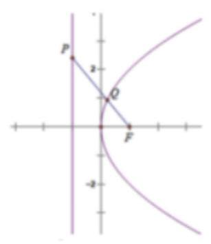

(3)设 ${P}_{1}\left( {-1,{y}_{1}}\right) ,{P}_{2}\left( {-1,{y}_{2}}\right) ,{P}_{3}\left( {-1,{y}_{3}}\right)$ ，则

$2\left\lbrack  {d\left( {P}_{1}\right)  + d\left( {P}_{3}\right) }\right\rbrack   - {4d}\left( {P}_{2}\right)  = \left| {{P}_{1}F}\right|  + \left| {{P}_{3}F}\right|  - 2\left| {{P}_{2}F}\right|  = \sqrt{{y}_{1}^{2} + 4} + \sqrt{{y}_{3}^{2} + 4} - 2\sqrt{{y}_{2}^{2} + 4}$

$= \sqrt{{y}_{1}^{2} + 4} + \sqrt{{y}_{3}^{2} + 4} - 2\sqrt{{\left( \frac{{y}_{1} + {y}_{3}}{2}\right) }^{2} + 4} = \sqrt{{y}_{1}^{2} + 4} + \sqrt{{y}_{3}^{2} + 4} - \sqrt{{\left( {y}_{1} + {y}_{3}\right) }^{2} + {16}}$ ,

因为 ${\left( \sqrt{{y}_{1}^{2} + 4} + \sqrt{{y}_{3}^{2} + 4}\right) }^{2} - \left\lbrack  {{\left( {y}_{1} + {y}_{3}\right) }^{2} + {16}}\right\rbrack   = 2\sqrt{{y}_{1}^{2} + 4}\sqrt{{y}_{3}^{2} + 4} - 2{y}_{1}{y}_{2} - 8$ ,

又因 $\left( {{y}_{1}^{2} + 4}\right) \left( {{y}_{3}^{2} + 4}\right)  - {\left( {y}_{1}{y}_{3} + 4\right) }^{2} = 4\left( {{y}_{1}^{2} + {y}_{3}^{2}}\right)  - 8{y}_{1}{y}_{3} > 0$ ,所以 $d\left( {P}_{1}\right)  + d\left( {P}_{3}\right)  > {2d}\left( {P}_{2}\right)$ .

## 巩固训练

1、如图，已知曲线 ${C}_{1} : \frac{{x}^{2}}{2} - {y}^{2} = 1$ ，曲线 ${C}_{2} : \left| y\right|  = \left| x\right|  + 1,\mathrm{P}$ 是平面上一点，若存在过点 $\mathrm{P}$ 的直线与 ${C}_{1},{C}_{2}$ 都有公共点,则称 $\mathrm{P}$ 为 “ ${\mathrm{C}}_{1} - {\mathrm{C}}_{2}$ 型点”.

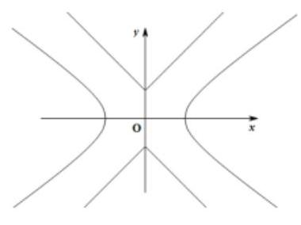

(1)在正确证明 ${C}_{1}$ 的左焦点是 ${}^{c}{\mathrm{C}}_{1} - {\mathrm{C}}_{2}$ 型点”时，要使用一条过该焦点的直线， 试写出一条这样的直线的方程(不要求验证)；

(2)设直线 $y = {kx}$ 与 ${C}_{2}$ 有公共点，求证 $\left| k\right|  > 1$ ，进而证明原点不是 “ ${C}_{1} - {C}_{2}$ 型点”；

(3)求证:圆 ${x}^{2} + {y}^{2} = \frac{1}{2}$ 内的点都不是 ${}^{c}{C}_{1} - {C}_{2}$ 型点”.

【答案】(1) $x =  - \sqrt{3}$ ；(2)见解析；(3)见解析.

【解析】: (1) ${\mathrm{C}}_{1}$ 的左焦点为 $F\left( {-\sqrt{3},0}\right)$ ,过 $\mathrm{F}$ 的直线 $x =  - \sqrt{3}$ 与 ${\mathrm{C}}_{1}$ 交于 $\left( {-\sqrt{3}, \pm  \frac{\sqrt{2}}{2}}\right)$ ，与 ${\mathrm{C}}_{2}$ 交于 $\left( {-\sqrt{3}, \pm  \left( {\sqrt{3} + 1}\right) }\right)$ ，故 ${\mathrm{C}}_{1}$ 的左焦点为“ ${\mathrm{C}}_{1} - {\mathrm{C}}_{2}$ 型点”，且直线可以为 $x =  - \sqrt{3}$ ；

(2)直线 $y = {kx}$ 与 ${C}_{2}$ 有交点，则 $\left\{  {\begin{matrix} y = {kx} \\  \left| y\right|  = \left| x\right|  + 1 \end{matrix} \Rightarrow  \left( {\left| k\right|  - 1}\right) \left| x\right|  = 1}\right.$ ，若方程组有解，则必须 $\left| k\right|  > 1$ ； 直线 $y = {kx}$ 与 ${C}_{1}$ 有交点,则 $\left\{  {\begin{matrix} y = {kx} \\  {x}^{2} - 2{y}^{2} = 2 \end{matrix} \Rightarrow  \left( {1 - 2{k}^{2}}\right) {x}^{2} = 2}\right.$ ,若方程组有解,则必须 ${k}^{2} < \frac{1}{2}$ 故直线 $y = {kx}$ 至多与曲线 ${\mathrm{C}}_{1}$ 和 ${\mathrm{C}}_{2}$ 中的一条有交点，即原点不是 “ ${\mathrm{C}}_{1} - {\mathrm{C}}_{2}$ 型点”。

(3)显然过圆 ${x}^{2} + {y}^{2} = \frac{1}{2}$ 内一点的直线 $l$ 若与曲线 ${\mathrm{C}}_{1}$ 有交点，则斜率必存在；

根据对称性,不妨设直线 $l$ 斜率存在且与曲线 ${\mathrm{C}}_{2}$ 交于点 $\left( {t, t + 1}\right) \left( {t \geq  0}\right)$ ,则

$l : y - \left( {t + 1}\right)  = k\left( {x - t}\right)  \Rightarrow  {kx} - y + \left( {1 + t - {kt}}\right)  = 0$

直线 $l$ 与圆 ${x}^{2} + {y}^{2} = \frac{1}{2}$ 内部有交点,故 $\frac{\left| 1 + t - kt\right| }{\sqrt{{k}^{2} + 1}} < \frac{\sqrt{2}}{2}$ ,化简得, ${\left( 1 + t - tk\right) }^{2} < \frac{1}{2}\left( {{k}^{2} + 1}\right)$ ① 若直线 $l$ 与曲线 ${\mathrm{C}}_{1}$ 有交点,则

$$
\left\{  {\begin{matrix} y = {kx} - {kt} + t + 1 \\  \frac{{x}^{2}}{2} - {y}^{2} = 1 \end{matrix} \Rightarrow  \left( {{k}^{2} - \frac{1}{2}}\right) {x}^{2} + {2k}\left( {1 + t - {kt}}\right) x + {\left( 1 + t - kt\right) }^{2} + 1 = 0}\right.
$$

当 ${k}^{2} - \frac{1}{2} \neq  0$ 时, $\Delta  = 4{k}^{2}{\left( 1 + t - kt\right) }^{2} - 4\left( {{k}^{2} - \frac{1}{2}}\right) \left\lbrack  {{\left( 1 + t - kt\right) }^{2} + 1}\right\rbrack   \geq  0 \Rightarrow  {\left( 1 + t - kt\right) }^{2} \geq  2\left( {{k}^{2} - 1}\right)$

化简得, ${\left( 1 + t - kt\right) }^{2} \geq  2\left( {{k}^{2} - 1}\right)$ ②

由①②得， $2\left( {{k}^{2} - 1}\right)  \leq  {\left( 1 + t - tk\right) }^{2} < \frac{1}{2}\left( {{k}^{2} + 1}\right)  \Leftrightarrow  \left\{  {\begin{matrix} {\left( 1 + t - tk\right) }^{2} < \frac{1}{2}\left( {{k}^{2} + 1}\right) \\  2\left( {{k}^{2} - 1}\right)  < 0 \end{matrix} \Rightarrow  \left\{  {\begin{array}{l} {k}^{2} < \frac{5}{3} \\  {k}^{2} < 1 \end{array} \Rightarrow  {k}^{2} < 1}\right. }\right.$

但此时在①式中，因为 $t \geq  0,{\left\lbrack  1 + t\left( 1 - k\right) \right\rbrack  }^{2} \geq  1,\frac{1}{2}\left( {{k}^{2} + 1}\right)  < 1$ ，即①式不成立；

当 ${k}^{2} = \frac{1}{2}$ 时，①式也不成立

综上,直线 $l$ 若与圆 ${x}^{2} + {y}^{2} = \frac{1}{2}$ 内有交点,则不可能同时与曲线 ${\mathrm{C}}_{1}$ 和 ${\mathrm{C}}_{2}$ 有交点,

即圆 ${x}^{2} + {y}^{2} = \frac{1}{2}$ 内的点都不是 “ ${\mathrm{C}}_{1} - {\mathrm{C}}_{2}$ 型点”.

2、在平面直角坐标系 ${xoy}$ 中,对于直线 $l : {ax} + {by} + c = 0$ 和点 ${P}_{i}\left( {{x}_{1},{y}_{1}}\right) ,{P}_{2}\left( {{x}_{2},{y}_{2}}\right)$ ,记 $\eta  = \left( {a{x}_{1} + b{y}_{1} + c}\right) \left( {a{x}_{2} + b{y}_{2} + c}\right)$ . 若 $\eta  < 0$ ,则称点 ${P}_{1},{P}_{2}$ 被直线 $l$ 分隔。若曲线 $\mathrm{C}$ 与直线 $l$ 没有公共点, 且曲线 $\mathrm{C}$ 上存在点 ${P}_{1},{P}_{2}$ 被直线 $l$ 分隔,则称直线 $l$ 为曲线 $\mathrm{C}$ 的一条分隔线.

(1)求证:点 $A\left( {1,2}\right)$ ， $B\left( {-1,0}\right)$ 被直线 $x + y - 1 = 0$ 分隔；

(2)若直线 $y = {kx}$ 是曲线 ${x}^{2} - 4{y}^{2} = 1$ 的分隔线，求实数 $k$ 的取值范围；

(3)动点 $M$ 到点 $Q\;\left( {0,2}\right)$ 的距离与到 $y$ 轴的距离之积为 1，设点 $M$ 的轨迹为 $E$ ，求证:通过原点的直线中， 有且仅有一条直线是 $\mathrm{E}$ 的分割线.

【答案】(1)见解析; (2) $k \in  \left( {-\infty , - \frac{1}{2}}\right\rbrack   \cup  \left\lbrack  {\frac{1}{2}, + \infty }\right)$ ; (3) 见解析.

【解析】证明: (1) 由题得, $\eta  = 2 \cdot  \left( {-2}\right)  < 0,\therefore A\left( {1,2}\right) , B\left( {-1,0}\right)$ 被直线 $x + y - 1 = 0$ 分隔。

解: (2) 由题得,直线 $y = {kx}$ 与曲线 ${x}^{2} - 4{y}^{2} = 1$ 无交点

即 $\left\{  {\begin{matrix} {x}^{2} - 4{y}^{2} = 1 \\  y = {kx} \end{matrix} \Rightarrow  \left( {1 - 4{k}^{2}}\right) {x}^{2} - 1 = 0}\right.$ 无解

$\therefore 1 - 4{k}^{2} = 0$ 或 $\left\{  \begin{matrix} 1 - 4{k}^{2} \neq  0 \\  \Delta  = 4\left( {1 - 4{k}^{2}}\right)  < 0 \end{matrix}\right. ,\therefore k \in  \left( {-\infty , - \frac{1}{2}}\right\rbrack   \cup  \left\lbrack  {\frac{1}{2}, + \infty }\right)$

证明: (3) 由题得,设 $M\left( {x, y}\right) ,\therefore \sqrt{{x}^{2} + {\left( y - 2\right) }^{2}} \cdot  \left| x\right|  = 1$ ,

化简得,点 $M$ 的轨迹方程为 $E : {x}^{2} + {\left( y - 2\right) }^{2} = \frac{1}{{x}^{2}}, x \neq  0$ 。

① 当过原点的直线斜率存在时,设方程为 $y = {kx}$ 。

联立方程, $\left\{  \begin{matrix} {x}^{2} + {\left( y - 2\right) }^{2} = \frac{1}{{x}^{2}} \Rightarrow  \left( {{k}^{2} + 1}\right) {x}^{2} - {4kx} + 4 = \frac{1}{{x}^{2}}\text{ 。 } \\  y = {kx} \end{matrix}\right.$

令 $F\left( x\right)  = \left( {{k}^{2} + 1}\right) {x}^{2} - {4kx} + 4, G\left( x\right)  = \frac{1}{{x}^{2}}$ ,显然 $y = F\left( x\right)$ 是开口朝上的二次函数

$\therefore$ 由二次函数与幂函数的图像可得, $F\left( x\right)  = G\left( x\right)$ 必定有解,不符合题意,舍去

② 当过原点的直线斜率不存在时,其方程为 $x = 0$ 。

显然 $x = 0$ 与曲线 $E : {x}^{2} + {\left( y - 2\right) }^{2} = \frac{1}{{x}^{2}}, x \neq  0$ 没有交点,在曲线 $E$ 上找两点 $\left( {-1,2}\right) ,\left( {1,2}\right)$ 。

$\therefore \eta  =  - 1 \cdot  1 < 0$ ,符合题意; 综上所述,仅存在一条直线 $x = 0$ 是 $E$ 的分割线。

证明: (文科) (3) 由题得,设 $M\left( {x, y}\right) ,\therefore \sqrt{{x}^{2} + {\left( y - 2\right) }^{2}} \cdot  \left| x\right|  = 1$ ,

化简得,点 $M$ 的轨迹方程为 $E : {x}^{2} + {\left( y - 2\right) }^{2} = \frac{1}{{x}^{2}}, x \neq  0$ 。

显然 $x = 0$ 与曲线 $E : {x}^{2} + {\left( y - 2\right) }^{2} = \frac{1}{{x}^{2}}, x \neq  0$ 没有交点,在曲线 $E$ 上找两点 $\left( {-1,2}\right) ,\left( {1,2}\right)$ 。

$\therefore \eta  =  - 1 \cdot  1 < 0$ ,符合题意。 $\therefore x = 0$ 是 $E$ 的分割线。

3、已知平面上的线段 $l$ 及点 $P$ ，任取 $l$ 上一点 $Q$ ，线段 ${PQ}$ 长度的最小值称为点 $P$ 到线段 $l$ 的距离，记作 $d\left( {P, l}\right)$

(1)求点 $P\left( {1,1}\right)$ 到线段 $l : x - y - 3 = 0\left( {3 \leq  x \leq  5}\right)$ 的距离 $d\left( {P, l}\right)$ ；

(2)设 $l$ 是长为 2 的线段，求点的集合 $D = \{ P \mid  d\left( {P, l}\right)  \leq  1\}$ 所表示的图形面积；

(3)写出到两条线段 ${l}_{1},{l}_{2}$ 距离相等的点的集合 $\Omega  = \left\{  {P \mid  d\left( {P,{l}_{1}}\right)  = d\left( {P,{l}_{2}}\right) }\right\}$ ，其中 ${l}_{1} = {AB},{l}_{2} = {CD}$ ， $A, B, C, D$ 是下列三组点中的一组.

对于下列三种情形，只需选做一种，满分分别是①2 分，②6 分，③8 分；若选择了多于一种情形，则按照序号较小的解答.计分.

① $A\left( {1,3}\right) , B\left( {1,0}\right) , C\left( {-1,3}\right) , D\left( {-1,0}\right)$ .

② $A\left( {1,3}\right) , B\left( {1,0}\right) , C\left( {-1,3}\right) , D\left( {-1, - 2}\right)$ .

③ $A\left( {0,1}\right) , B\left( {0,0}\right) , C\left( {0,0}\right) , D\left( {2,0}\right)$ .

【答案】( 1 ) $\sqrt{5}$ ；( 2 ) $S = 4 + \pi$ ；( 3 )见解析.

【解析】解: (1) 设 $Q\left( {x, x - 3}\right)$ 是线段 $l : x - y - 3 = 0\left( {3 \leq  x \leq  5}\right)$ 上一点,则

$\left| {PQ}\right|  = \sqrt{{\left( x - 1\right) }^{2} + {\left( x - 4\right) }^{2}} = \sqrt{2{\left( x - \frac{5}{2}\right) }^{2} + \frac{9}{2}}\left( {3 \leq  x \leq  5}\right)$ ,当 $x = 3$ 时, $d\left( {P, l}\right)  = {\left| PQ\right| }_{\min } = \sqrt{5}$ 。

(2)设线段 $l$ 的端点分别为 $A, B$ ，以直线 ${AB}$ 为 $x$ 轴， ${AB}$ 的中点为原点建立直角坐标系，

则 $A\left( {-1,0}\right) , B\left( {1,0}\right)$ ,点集 $D$ 由如下曲线围成

${l}_{1} : y = 1\left( {\left| x\right|  \leq  1}\right) ,{l}_{2} : y =  - 1\left( {\left| x\right|  \leq  1}\right) ,{C}_{1} : {\left( x + 1\right) }^{2} + {y}^{2} = 1\left( {x \leq   - 1}\right) ,{C}_{2} : {\left( x - 1\right) }^{2} + {y}^{2} = 1\left( {x \geq  1}\right)$

其面积为 $S = 4 + \pi$ 。

(3) ① 选择 $A\left( {1,3}\right) , B\left( {1,0}\right) , C\left( {-1,3}\right) , D\left( {-1,0}\right) ,\Omega  = \{ \left( {x, y}\right)  \mid  x = 0\}$

② 选择 $A\left( {1,3}\right) , B\left( {1,0}\right) , C\left( {-1,3}\right) , D\left( {-1, - 2}\right)$ 。

$\Omega  = \{ \left( {x, y}\right)  \mid  x = 0, y \geq  0\}  \cup  \left\{  {\left( {x, y}\right)  \mid  {y}^{2} = {4x}, - 2 \leq  y < 0}\right\}   \cup  \{ \left( {x, y}\right)  \mid  x + y + 1 = 0, x > 1\}$

③ 选择 $A\left( {0,1}\right) , B\left( {0,0}\right) , C\left( {0,0}\right) , D\left( {2,0}\right)$ 。

$\Omega  = \{ \left( {x, y}\right)  \mid  x \leq  0, y \leq  0\}  \cup  \{ \left( {x, y}\right)  \mid  y = x,0 < x \leq  1\}$

$\cup  \{ \left( {x, y}\right)  \mid  {x}^{2} = {2y} - 1,1 < x \leq  2\}  \cup  \{ \left( {x, y}\right)  \mid  {4x} - {2y} - 3 = 0, x > 2\}$

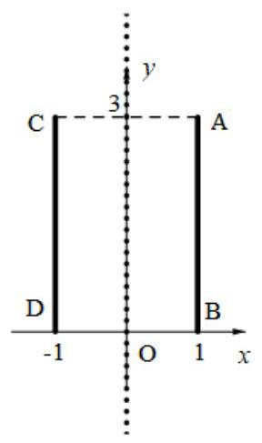

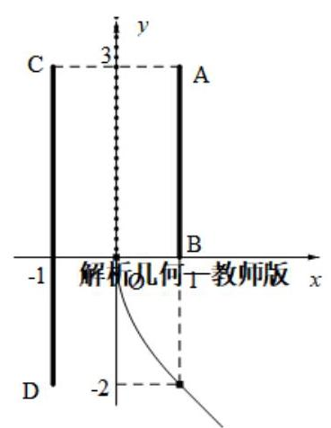

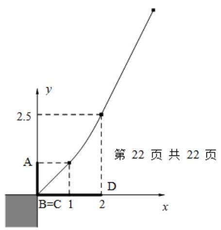
