平面向量

<table><tr><td>教学目标</td><td>掌握高考平面向量常见题型</td></tr><tr><td>重点</td><td>1、平面向量的坐标表示及线性运算;   2、平面向量共线定量与分解定量及其应用;   3、向量的数量积及其几何意义, 会用向量的数量积可以处理有关长度、角度和垂直的问题.</td></tr><tr><td>难 点</td><td>1、平面向量共线定量与分解定量及其应用;   2、向量的数量积各自求法特点及与其他章节知识点的综合运用.</td></tr></table>

## (一)平面向量基本概念+坐标运算

## 知识梳理

## 一、向量的概念与线性运算

1、平面向量的有关概念:

(1)向量的定义:既有大小又有方向的量叫做向量。

(2)零向量:长度为零的向量叫做零向量，记作 $\overrightarrow{0}$ ；零向量的方向是任意的。

(3)单位向量:长度为 1 个长度单位的向量叫做单位向量 $\left( \overrightarrow{AB}\right)$ 的单位向量是 $\frac{\overrightarrow{AB}}{\left| \overrightarrow{AB}\right| }$ )

(4)共线(平行)向量:方向相同或相反的向量叫共线(平行)向量，规定零向量与任何向量共线。

(5)相等向量:长度相等且方向相同的两个向量叫相等向量，相等向量有传递性。

(6)相反向量:长度相等方向相反的向量叫做相反向量， $\overrightarrow{a}$ 的相反向量是 $- \overrightarrow{a}$ 。

2、向量的线性运算

1、向量的加法:

(1)对于零向量与任一向量 $\overrightarrow{a}$ ,有 $\overrightarrow{a} + \overrightarrow{0} = \overrightarrow{0} + \overrightarrow{a} = \overrightarrow{a}$

(2)法则:三角形法则，平行四边形法则

(3)运算律: $\overrightarrow{a} + \overrightarrow{b} = \overrightarrow{b} + \overrightarrow{a}$ ；( $\overrightarrow{a} + \overrightarrow{b}$ )+ $\overrightarrow{c} = \overrightarrow{a} + \left( {\overrightarrow{b} + \overrightarrow{c}}\right)$ .

2、向量的减法:

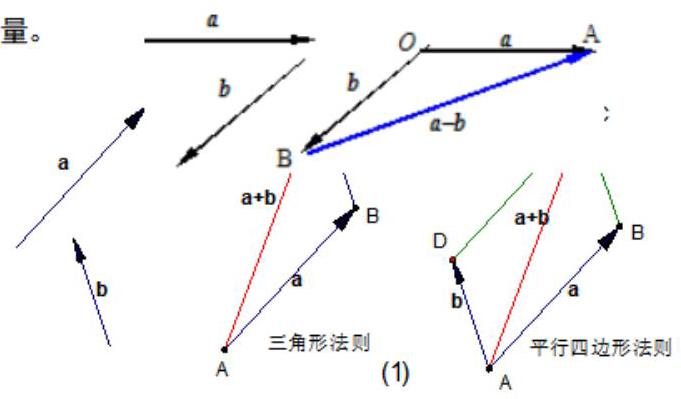

(1) $\overset{ - }{a} - \overset{ - }{b}$ 可以表示为从向量 $\overset{ - }{b}$ 的终点指向向量 $\overset{ - }{a}$ 的终点的向量。

3、实数与向量的积:

(1)定义:实数 $\lambda$ 与向量 $\overrightarrow{a}$ 的积是一个向量，记作 $\lambda \overrightarrow{a}$ ，规定: $\left| {\lambda \overrightarrow{a}}\right|  = \left| \lambda \right| \left| \overrightarrow{a}\right|$ . 当 $\lambda  > 0$ 时, $\lambda \overrightarrow{a}$ 的方向与 $\overrightarrow{a}$ 的方向相同; 当 $\lambda  < 0$ 时, $\lambda \overrightarrow{a}$ 的方向与 $\overrightarrow{a}$ 的方向相反; 当 $\lambda  = 0$ 时, $\lambda \overrightarrow{a}$ 与 $\overrightarrow{a}$ 平行。

(2)运算律: $\lambda \left( {\mu \overrightarrow{a}}\right)  = \left( {\lambda \mu }\right) \overrightarrow{a},\;\left( {\lambda  + \mu }\right) \overrightarrow{a} = \lambda \overrightarrow{a} + \; \mu \bar{a},\lambda \left( {\bar{a} + \bar{b}}\right)  = \lambda \bar{a} + \lambda \bar{b}$ 。

## 3、平面向量的坐标运算

(1)若 $\overrightarrow{a} = \left( {{x}_{1},{y}_{1}}\right) ,\overrightarrow{b} = \left( {{x}_{2},{y}_{2}}\right)$ ，则 $\overrightarrow{a} + \overrightarrow{b} = \left( {{x}_{1} + {x}_{2},{y}_{1} + {y}_{2}}\right)$ ，

$$
\overrightarrow{a} - \overrightarrow{b} = \underline{\left( {x}_{1} - {x}_{2},{y}_{1} - {y}_{2}\right) }\text{ 。 }
$$

两个向量和与差的坐标分别等于这两个向量相应坐标的和与差。

(2)若 $A\left( {{x}_{1},{y}_{1}}\right) , B\left( {{x}_{2},{y}_{2}}\right)$ ，则 $\overline{AB} = \left( {{x}_{2} - {x}_{1},{y}_{2} - {y}_{1}}\right)$ 。

一个向量的坐标等于表示此向量的有向线段的终点坐标减去始点的坐标。

(3)若 $\overrightarrow{a} = \left( {x, y}\right)$ 和实数 $\lambda$ ，则 $\lambda \overrightarrow{a} = \left( {{\lambda x},{\lambda y}}\right)$ 。

实数与向量的积的坐标等于用这个实数乘原来向量的相应坐标。

4、向量平行的充要条件的坐标表示:设 $\overrightarrow{a} = \left( {{x}_{1},{y}_{1}}\right)$ ， $\overrightarrow{b} = \left( {{x}_{2},{y}_{2}}\right)$ 其中 $\overrightarrow{b} \neq  \overrightarrow{a}$

$\overrightarrow{a}//\overrightarrow{b}\;\left( {\overrightarrow{b} \neq  \overrightarrow{0}}\right)$ 的充要条件是 $\underline{{x}_{1}{y}_{2} - {x}_{2}{y}_{1} = 0}$ 。

## 例题精讲

【例 1】四边形 ${ABCD}$ 中, $\overrightarrow{AB} = \overrightarrow{DC}$ ,且 $\left| {\overrightarrow{AD} - \overrightarrow{AB}}\right|  = \left| {\overrightarrow{AD} + \overrightarrow{AB}}\right|$ ,则四边形 ${ABCD}$ 是( )

A. 平行四边形 B. 菱形 C. 矩形 D. 正方形

【难度】★★

【答案】C

【解析】由于 $\overrightarrow{AB} = \overrightarrow{DC}$ ,故四边形是平行四边形,根据向量加法和减法的几何意义可知,该平行四边形的对角线相等，故为矩形.

【例 2】已知单位向量 $\overrightarrow{a}\text{ 、 }\overrightarrow{b}\text{ 、 }\overrightarrow{c}$ ,满足 $\overrightarrow{a} + \overrightarrow{b} = \overrightarrow{c}$ . 若常数 ${\lambda }_{1}\text{ 、 }{\lambda }_{2}\text{ 、 }{\lambda }_{3}$ 的取值集合为 $M = \{  - 1,1\}$ ,则 $\left| {{\lambda }_{1}\overrightarrow{a} + {\lambda }_{2}\overrightarrow{b} + {\lambda }_{3}\overrightarrow{c}}\right|$ 的最大值为( )

A. $\sqrt{3}$ B. 2 C. $2\sqrt{2}$ D. $2\sqrt{3}$

【难度】★★★

【答案】B

【解析】由条件 $\overrightarrow{a} + \overrightarrow{b} = \overrightarrow{c}$ 得 $\left| {{\lambda }_{1}\overrightarrow{a} + {\lambda }_{2}\overrightarrow{b} + {\lambda }_{3}\overrightarrow{c}}\right|  = \left| {\left( {{\lambda }_{1} + {\lambda }_{3}}\right) \overrightarrow{a} + \left( {{\lambda }_{2} + {\lambda }_{3}}\right) \overrightarrow{b}}\right|$ ,

${\lambda }_{1} + {\lambda }_{3}$ 和 ${\lambda }_{2} + {\lambda }_{3}$ 的取值只有三种可能,分别为 $0\text{ 、 } - 2\text{ 、 }2$ ,但二者不可能同时一个取 2,另一个取 -2,

$\therefore \left| {\left( {{\lambda }_{1} + {\lambda }_{3}}\right) \overrightarrow{a} + \left( {{\lambda }_{2} + {\lambda }_{3}}\right) \overrightarrow{b}}\right|$ 的化简结果只有四种形式: $0\text{ 、 }2\left| \overrightarrow{a}\right| \text{ 、 }2\left| \overrightarrow{b}\right| \text{ 、 }2\left| {\overrightarrow{a} + \overrightarrow{b}}\right|$ ,

而 $\left| {\overrightarrow{a} + \overrightarrow{b}}\right|  = \left| \overrightarrow{c}\right|  = 1$ ,故所有可能取值只有 0 或 2 两种结果,

$\therefore \left| {{\lambda }_{1}\overrightarrow{a} + {\lambda }_{2}\overrightarrow{b} + {\lambda }_{3}\overrightarrow{c}}\right|$ 的最大值为 2 . 故选: B

【例 3】过抛物线 ${y}^{2} = {2px}\left( {p > 0}\right)$ 的焦点作直线 $l$ 与抛物线交于 $A, B$ 两点,直线 $l$ 与 $y$ 轴的负半轴交于点 $C$ . 若 $\overrightarrow{AB} = 3\overrightarrow{BC}$ ，则直线 $l$ 的斜率为___.

【难度】 $\star   \star   \star$

【答案】 $2\sqrt{2}$

【解析】解: 抛物线 ${y}^{2} = {2px}\left( {p > 0}\right)$ 的焦点 $\left( {\frac{p}{2},0}\right)$ ,

设 $A\left( {{x}_{1},{y}_{1}}\right) , B\left( {{x}_{2},{y}_{2}}\right) ,{y}_{1} > 0,{y}_{2} < 0$ ,直线 $l$ 的方程为 $y = k\left( {x - \frac{p}{2}}\right) ,\left( {k > 0}\right)$ ,

设 $C\left( {0, m}\right) ,\overrightarrow{AB} = \left( {{x}_{2} - {x}_{1},{y}_{2} - {y}_{1}}\right) ,\overrightarrow{BC} = \left( {-{x}_{2}, m - {y}_{2}}\right)$ ,所以 ${x}_{2} - {x}_{1} = 3 \times  \left( {-{x}_{2}}\right) ,{x}_{1} = 4{x}_{2}$ ,

$\left\{  {\begin{matrix} {y}^{2} = {2px} \\  y = k\left( {x - \frac{p}{2}}\right)  \end{matrix},{k}^{2}{x}^{2} - \left( {{k}^{2} + 2}\right) {px} + \frac{{p}^{2}{k}^{2}}{4} = 0,{x}_{1}{x}_{2} = \frac{{p}^{2}}{4},}\right.$

$\left\{  {\begin{array}{l} {x}_{1} = 4{x}_{2} \\  {x}_{2}{x}_{1} = \frac{{p}^{2}}{4} \end{array},\text{ 所以 }{x}_{1} = p,{y}_{1} = \sqrt{2}p,{k}_{l} = \frac{\sqrt{2}p}{{x}_{1} - \frac{p}{2}} = 2\sqrt{2},\text{ 故答案为: }2\sqrt{2}.}\right.$

## 巩固训练

1、在平行四边形 ${ABCD}$ 中， $M$ 为 ${AB}$ 上任一点，则 $\overrightarrow{AM} - \overrightarrow{DM} - \overrightarrow{AC}$ 等于( )

A. $\overrightarrow{BC}$ B. $\overrightarrow{DC}$ C. $\overrightarrow{BA}$ D. $\overrightarrow{AD}$

【答案】C

【解析】解: $\overrightarrow{AM} - \overrightarrow{DM} - \overrightarrow{AC} = \overrightarrow{AM} + \overrightarrow{MD} - \overrightarrow{AC} = \overrightarrow{AD} - \overrightarrow{AC} = \overrightarrow{CD} = \overrightarrow{BA}$ ,故选: C.

2、已知等边三角形 ${ABC}$ 的边长为 6,点 $P$ 满足 $\overrightarrow{PA} + 2\overrightarrow{PB} - \overrightarrow{PC} = \overrightarrow{0}$ ,则 $\left| \overrightarrow{PA}\right|  =$ ( )

A. $\frac{\sqrt{3}}{2}$ B. $2\sqrt{3}$ C. $3\sqrt{3}$ D. $4\sqrt{3}$

【答案】C

【解析】依题意 $\overrightarrow{PA} + 2\overrightarrow{PB} - \overrightarrow{PC} = \overrightarrow{0},\overrightarrow{PA} - \overrightarrow{PC} =  - 2\overrightarrow{PB},\overrightarrow{CA} =  - 2\overrightarrow{PB},\overrightarrow{CA} = 2\overrightarrow{BP}$ ,

设 $D$ 是 ${AC}$ 中点，连接 ${BD}$ ，由于三角形 ${ABC}$ 是等边三角形，所以 ${BD}\bot {AD}$ ， $\angle {ABD} = \angle {CBD} = {30}^{ \circ  }$ ， 由于 $\overrightarrow{CA} = 2\overrightarrow{BP}$ ,所以 $\overrightarrow{DA} = \overrightarrow{BP}$ ,所以四边形 ${BDAP}$ 是矩形,所以 $\angle {ABP} = {90}^{ \circ  } - {30}^{ \circ  } = {60}^{ \circ  }$ ,

${Rt}\bigtriangleup {BCP}$ 中, ${AP} = {AB} \cdot  \sin {60}^{ \circ  } = 6 \times  \frac{\sqrt{3}}{2} = 3\sqrt{3}$ ,即 $\left| \overrightarrow{PA}\right|  = 3\sqrt{3}$ ; 故选: $\mathbf{C}$

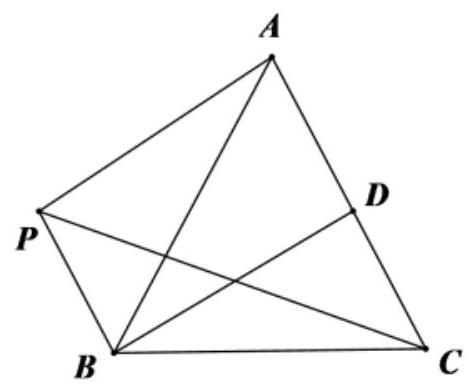

3、在平面直角坐标系 ${xOy}$ 中，已知直线 $y = {mx}\left( {m > 0}\right)$ 与曲线 $y = {x}^{3}$ 从左至右依次交于 $A, B, C$ 三点. 若直线 $l : {kx} - y + 3 = 0\;\left( {k \in  \mathbf{R}}\right)$ 上存在点 $P$ 满足 $\left| {\overrightarrow{PA} + \overrightarrow{PC}}\right|  = 2$ ，则实数 $k$ 的取值范围是( )

A. $\left( {-2,2}\right)$ B. $\left\lbrack  {-2\sqrt{2},2\sqrt{2}}\right\rbrack$

C. $\left( {-\infty , - 2}\right)  \cup  \left( {2, + \infty }\right)$ D. $\left( {-\infty , - 2\sqrt{2}\rbrack \cup \lbrack 2\sqrt{2}, + \infty }\right)$

【答案】D

【解析】因为直线 $y = {mx}$ 与曲线 $y = {x}^{3}$ 都关于原点对称,且都过原点,

所以 $B$ 为原点， $A, C$ 关于点 $B$ 对称，

因为直线 $l : {kx} - y + 3 = 0\;\left( {k \in  \mathbf{R}}\right)$ 上存在点 $P$ 满足 $\left| {\overrightarrow{PA} + \overrightarrow{PC}}\right|  = 2$ ,所以 $\left| \overrightarrow{PB}\right|  = 1$ ,

则点 $B$ 到直线 ${kx} - y + 3 = 0$ 的距离不大于 1,即 $\frac{3}{\sqrt{1 + {k}^{2}}} \leq  1$ ,解得 $k \leq   - 2\sqrt{2}$ 或 $k \geq  2\sqrt{2}$ ,

所以实数 $k$ 的取值范围是 $\left( {-\infty , - 2\sqrt{2}\rbrack \cup \lbrack 2\sqrt{2}, + \infty }\right)$ . 故选: D

4、如图，在平面直角坐标系 ${xOy}$ 中， $O$ 为正十边形 ${A}_{1}{A}_{2}{A}_{3}\cdots {A}_{10}$ 的中心，点 ${A}_{1}$ 在 $x$ 轴正半轴上. 现任取不同的两点 ${A}_{i},{A}_{j}$ (其中 $1 \leq  i, j \leq  {10}$ ,且 $\mathrm{i}, j \in  N$ ),使得点 $P$ 满足 $3\overline{OP} = \overline{O{A}_{i}} + \overline{O{A}_{j}}$ ,则点 $P$ 落在第二象限的概率是(   )

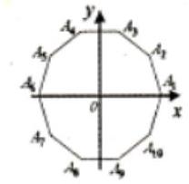

A. $\frac{8}{45}$ B. $\frac{7}{45}$ C. $\frac{1}{5}$ D. $\frac{2}{9}$

【答案】A

【解析】从正十边形 ${A}_{1}{A}_{2}{A}_{3}\ldots {A}_{10}$ 十个顶点中任取两个,基本事件总数为 $n = {C}_{10}^{2} = {45}$ ,

满足 $3\overline{OP} = \overline{O{A}_{i}} + \overline{O{A}_{j}}$ ,，且点 $P$ 落在第二象限，则需向量 $\overline{O{A}_{i}} + \overline{O{A}_{j}}$ 的终点落在第二象限，

对应的 $\left( {{A}_{i},{A}_{j}}\right)$ 为: $\left( {{A}_{2},{A}_{6}}\right) ,\left( {{A}_{3},{A}_{5}}\right) ,\left( {{A}_{3},{A}_{6}}\right) ,\left( {{A}_{3},{A}_{7}}\right) ,\left( {{A}_{4},{A}_{5}}\right) ,\left( {{A}_{4},{A}_{6}}\right) ,\left( {{A}_{4},{A}_{7}}\right) ,\left( {{A}_{5},{A}_{6}}\right)$ 共 8 种取法. $\therefore$ 点 $P$ 落在第二象限的概率是 $P = \frac{8}{45}$ ,故选 A.

## (二)平面向量共线定理

## 知识梳理

1) 向量 $\overrightarrow{b}$ 与非零向量 $\overrightarrow{a}$ 共线的充要条件是有且仅有一个实数 $\lambda$ ,使得 $\overrightarrow{b} = \lambda \overrightarrow{a}$ ,即 $\overrightarrow{b}//\overrightarrow{a} \Leftrightarrow  \overrightarrow{b} = \lambda \overrightarrow{a}(\overrightarrow{a} \neq \; \overrightarrow{0}$ ).

(2)向量共线的充要条件的坐标表示:设 $\overrightarrow{a} = \left( {{x}_{1},{y}_{1}}\right) ,\overrightarrow{b} = \left( {{x}_{2},{y}_{2}}\right)$ 其中 $\overrightarrow{b} \neq  \overrightarrow{a}$

$\overrightarrow{a}//\overrightarrow{b}\;\left( {\overrightarrow{b} \neq  \overrightarrow{0}}\right)$ 的充要条件是 $\underline{{x}_{1}{y}_{2} - {x}_{2}{y}_{1} = 0}$ 。

(3)若P、A、B三点不共线，则点 $C$ 在直线 ${AB}$ 上的充要条件是:存在唯一一对实数 $\lambda$ ， $\mu$ ，使得 $\overrightarrow{PC} = \lambda \overrightarrow{PA} + \mu \overrightarrow{PB}$ 且 $\lambda  + \mu  = 1$ .

## 例题精讲

【例 4】已知平面向量 $\overrightarrow{a} = \left( {2,\lambda }\right) ,\overrightarrow{b} = \left( {-3,6}\right) , c = \left( {4,2}\right)$ ,若 $\overrightarrow{a}//\overrightarrow{b}$ ,则 $\left( {\overrightarrow{a} + \overrightarrow{c}}\right)  \cdot  \overrightarrow{b} =$ ___.

【难度】 $\bigstar \bigstar$

【答案】 -30

【解析】由题意得, ${12} =  - {3\lambda }$ ,解得 $\lambda  =  - 4$ ,故 $\overrightarrow{a} + \overrightarrow{c} = \left( {6, - 2}\right)$ ,

故 $\left( {\overrightarrow{a} + \overrightarrow{c}}\right)  \cdot  \overrightarrow{b} = 6 \times  \left( {-3}\right)  + \left( {-2}\right)  \times  6 =  - {30}$ . 故答案为: -30

【例 5】若 $\overrightarrow{a},\overrightarrow{b}$ 是两个不共线的向量,已知 $\overrightarrow{MN} = \overrightarrow{a} - 2\overrightarrow{b},\overrightarrow{PN} = 2\overrightarrow{a} + k\overrightarrow{b},\overrightarrow{PQ} = 3\overrightarrow{a} - \overrightarrow{b}$ ,若 $M, N$ , $Q$ 三点共线，则 $k =$ ( )

A. -1 B. 1

C. $\frac{3}{2}$ D. 2

【难度】★★

【答案】B

【解析】由题意知, $\overrightarrow{NQ} = \overrightarrow{PQ} - \overrightarrow{PN} = \overrightarrow{a} - \left( {k + 1}\right) \overrightarrow{b}$ ,

因为 $M, N, Q$ 三点共线,故 $\overrightarrow{MN} = \lambda \overrightarrow{NQ}$ ,即 $\overrightarrow{a} - 2\overrightarrow{b} = \lambda \left\lbrack  {\overrightarrow{a} - \left( {k + 1}\right) \overrightarrow{b}}\right\rbrack$ ,解得 $\lambda  = 1, k = 1$ ,故选: B.

【例 6】在 $\bigtriangleup  {ABC}$ 中， $M$ 为边 ${BC}$ 上的点，且 $\overrightarrow{AM} = \frac{x}{2}\overrightarrow{AB} + y\overrightarrow{AC}$ ，满足则 $\frac{{5y} + 4}{x} + \frac{{3x} + 2}{y}$ ( )

A. 有最小值 $8 + 2\sqrt{15}$ B. 有最小值 $\frac{33}{2}$

C. 有最小值 12 D. 有最小值 16

【难度】 $\star   \star   \star$

【答案】D

【解析】因为 $M$ 在边 ${BC}$ 上,且 $\overrightarrow{AM} = \frac{x}{2}\overrightarrow{AB} + y\overrightarrow{AC}$ ,所以 $\frac{x}{2} + y = 1$ 且 $x > 0, y > 0$ , $\frac{{5y} + 4}{x} + \frac{{3x} + 2}{y} = \frac{5y}{x} + \frac{3x}{y} + \frac{4}{x} + \frac{2}{y} = \frac{5y}{x} + \frac{3x}{y} + \left( {\frac{4}{x} + \frac{2}{y}}\right) \left( {\frac{x}{2} + y}\right)  = 4 + \frac{4x}{y} + \frac{9y}{x} \geq  4 + 2\sqrt{\frac{4x}{y} \times  \frac{9y}{x}} = {16}$ , 当且仅当 $\frac{4x}{y} = \frac{9y}{x}$ ,即 $x = \frac{6}{7}, y = \frac{4}{7}$ 时等号成立. 故选: D.

## 巩固训练

1、已知 $O$ ，A，B 是平面内任意三点，点 $P$ 在直线 ${AB}$ 上，若 $\overrightarrow{OP} = 3\overrightarrow{OA} + x\overrightarrow{OB}$ ，则 $x =$ ___. 【答案】 -2 .

【解析】因为点 $P$ 在直线 ${AB}$ 上,所以 $\overrightarrow{AP} = \lambda \overrightarrow{AB},\lambda  \in  R,\overrightarrow{OP} - \overrightarrow{OA} = \lambda \left( {\overrightarrow{OB} - \overrightarrow{OA}}\right)$ ,

即 $\overrightarrow{OP} = \lambda \overrightarrow{OB} + \left( {1 - \lambda }\right) \overrightarrow{OA}$ ,所以 $\left\{  \begin{array}{l} 1 - \lambda  = 3 \\  \lambda  = x \end{array}\right.$ 所以 $x =  - 2$ . 故答案为: -2 .

2、已知向量 $\overrightarrow{a}$ 与 $\overrightarrow{b}$ 不共线，向量 $m\overrightarrow{a} + n\overrightarrow{b}$ 与 $2\overrightarrow{a} + \overrightarrow{b}$ 共线，则 $\frac{m}{n} =$ ___.

【答案】 2

【解析】因为向量 $m\overrightarrow{a} + n\overrightarrow{b}$ 与 $2\overrightarrow{a} + \overrightarrow{b}$ 共线,所以 $m\overrightarrow{a} + n\overrightarrow{b} = \lambda \left( {2\overrightarrow{a} + \overrightarrow{b}}\right)$ ,

即 $\left\{  \begin{array}{l} m = {2\lambda } \\  n = \lambda  \end{array}\right.$ ,所以 $\frac{m}{n} = \frac{2\lambda }{\lambda } = 2$ ,故答案为: 2 .

3、已知 $O$ 为正 $\bigtriangleup  {ABC}$ 内的一点，且满足 $\overrightarrow{OA} + \lambda \overrightarrow{OB} + \left( {1 + \lambda }\right) \overrightarrow{OC} = \overrightarrow{0}$ ，若 $\bigtriangleup  {OAB}$ 的面积与 $\bigtriangleup  {OBC}$ 的面积的比值为3，则 $\lambda$ 的值为( )

A. $\frac{1}{2}$ B. $\frac{5}{2}$ C. 2 D. 3

【答案】C

【解析】解: 由于 $\overrightarrow{OA} + \lambda \overrightarrow{OB} + \left( {1 + \lambda }\right) \overrightarrow{OC} = \overrightarrow{0}$ ,变为 $\overrightarrow{OA} + \overrightarrow{OC} + \lambda \left( {\overrightarrow{OB} + \overrightarrow{OC}}\right)  = 0$ .

如图, $D, E$ 分别是对应边的中点,由平行四边形法则知 $\overrightarrow{OA} + \overrightarrow{OC} = 2\overrightarrow{OE},\lambda \left( {\overrightarrow{OB} + \overrightarrow{OC}}\right)  = {2\lambda }\overrightarrow{OD}$ ,故 $\overrightarrow{OE} =  - \lambda \overrightarrow{OD}$ ,

在正三角形 ${ABC}$ 中,

$\because {S}_{\bot {COB}} = \frac{1}{3}{S}_{\bot {AOB}} = \frac{1}{3} \times  \frac{1}{2}{S}_{\bot {ABC}} = \frac{1}{6}{S}_{\bot {ABC}},{S}_{\bot {COA}} = {S}_{\bot {ACB}} - \frac{1}{6}{S}_{\bot {ABC}} - \frac{1}{2}{S}_{\bot {ABC}} = \frac{1}{3}{S}_{\bot {ABC}},$

且三角形 ${AOC}$ 与三角形 ${COB}$ 的底边相等,面积之比为 2,得 $\lambda  = 2$ . 故选: $C$ .

## (三)平面向量分解定理

## 知识梳理

平面向量分解定理: 如果 $\overrightarrow{{e}_{1}},\overrightarrow{{e}_{2}}$ 是同一平面内的两个不共线向量,那么对于这一平面内的任一向量 $\overrightarrow{a}$ ,有且只有一对实数 ${\lambda }_{1},{\lambda }_{2}$ 使 $\overrightarrow{a} = {\lambda }_{1}\overrightarrow{{e}_{1}} + {\lambda }_{2}\overrightarrow{{e}_{2}}$ 。

## 特别提醒:

(1)我们把不共线向量 $\overrightarrow{{e}_{1}}\text{ 、 }\overrightarrow{{e}_{2}}$ 叫做表示这一平面内所有向量的一组基底；

(2)基底不惟一，关键是不共线；

(3)由定理可将任一向量 $\overrightarrow{a}$ 在给出基底 $\overrightarrow{{e}_{1}}$ 、 $\overrightarrow{{e}_{2}}$ 的条件下进行分解;

(4)基底给定时,分解形式惟一. ${\lambda }_{1},{\lambda }_{2}$ 是被 $\overrightarrow{a},\overrightarrow{{e}_{1}},\overrightarrow{{e}_{2}}$ 唯一确定的数量;

## 例题精讲

【例 7】已知 $\overrightarrow{{e}_{1}},\overrightarrow{{e}_{2}}$ 是表示平面内所有向量的一组基底,则下列四个向量中,不能作为一组基底的是( )

A. $\left\{  {\overrightarrow{{e}_{1}} + \overrightarrow{{e}_{2}},\overrightarrow{{e}_{1}} - \overrightarrow{{e}_{2}}}\right\}$ B. $\left\{  {3\overrightarrow{{e}_{1}} - 2\overrightarrow{{e}_{2}},4\overrightarrow{{e}_{2}} - 6\overrightarrow{{e}_{1}}}\right\}$

C. $\left\{  {\overrightarrow{{e}_{1}} + 2\overrightarrow{{e}_{2}},\overrightarrow{{e}_{2}} + 2\overrightarrow{{e}_{1}}}\right\}$ D. $\left\{  {\overrightarrow{{e}_{2}},\overrightarrow{{e}_{1}} + \overrightarrow{{e}_{2}}}\right\}$

【难度】 $\star   \star$

【答案】B

【解析】 $\because 4\overrightarrow{{e}_{2}} - 6\overrightarrow{{e}_{1}} =  - 2\left( {3\overrightarrow{{e}_{1}} - 2\overrightarrow{{e}_{2}}}\right) ,\therefore 3\overrightarrow{{e}_{1}} - 2\overrightarrow{{e}_{2}}$ 与 $4\overrightarrow{{e}_{2}} - 6\overrightarrow{{e}_{1}}$ 共线,

$\therefore$ 它们不能作为一组基底,作为基底的两向量一定不共线 $A\text{ 、 }C\text{ 、 }D$ 选项均可; 故选: B

(2)已知向量 $\overrightarrow{a},\overrightarrow{b}$ 是平面内的一组基底，若 $\overrightarrow{m} = x\overrightarrow{a} + y\overrightarrow{b}$ ，则称有序实数对 $\left( {x, y}\right)$ 为向量 $\overrightarrow{m}$ 在基底 $\overrightarrow{a},\overrightarrow{b}$ 下的坐标. 给定一个平面向量 $\overrightarrow{p}$ ,已知 $\overrightarrow{p}$ 在基底 $\overrightarrow{a},\overrightarrow{b}$ 下的坐标为 $\left( {1,2}\right)$ ,那么 $\overrightarrow{p}$ 在基底 $\overrightarrow{a} - \overrightarrow{b},\overrightarrow{a} + \overrightarrow{b}$ 下的坐标为 【难度】 $\star   \star   \star$

【答案】 $\left( {-\frac{1}{2},\frac{3}{2}}\right)$

【解析】解: 由 $\overrightarrow{p}$ 在基底 $\overrightarrow{a},\overrightarrow{b}$ 下的坐标为 $\left( {1,2}\right)$ ,得 $\overrightarrow{p} = \overrightarrow{a} + 2\overrightarrow{b}$ ,

设 $\overrightarrow{p}$ 在基底 $\overrightarrow{a} - \overrightarrow{b},\overrightarrow{a} + \overrightarrow{b}$ 下的坐标为 $\left( {m, n}\right)$ ,则 $\overrightarrow{p} = m\left( {\overrightarrow{a} - \overrightarrow{b}}\right)  + n\left( {\overrightarrow{a} + \overrightarrow{b}}\right)$ ,所以 $\overrightarrow{p} = \left( {m + n}\right) \overrightarrow{a} + \left( {n - m}\right) \overrightarrow{b}$

所以 $\left\{  \begin{array}{l} m + n = 1 \\  n - m = 2 \end{array}\right.$ ,解得 $\left\{  \begin{array}{l} m =  - \frac{1}{2} \\  n = \frac{3}{2} \end{array}\right.$ ,所以 $\overrightarrow{p}$ 在基底 $\overrightarrow{a} - \overrightarrow{b},\overrightarrow{a} + \overrightarrow{b}$ 下的坐标为 $\left( {-\frac{1}{2},\frac{3}{2}}\right)$ ,故答案为: $\left( {-\frac{1}{2},\frac{3}{2}}\right)$

【例 8】庄严美丽的国旗和国徽上的五角星是革命和光明的象征, 正五角星是一个非常优美的几何图形, 且与黄金分割有着密切的联系. 在如图所示的正五角星中,以 $A, B, C, D, E$ 为顶点的多边形为正五边形,且 $\frac{PT}{AP} = \frac{\sqrt{5} - 1}{2}$ ，则( )

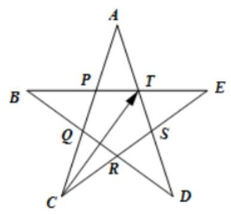

A. $\overrightarrow{CT} = \frac{3 - \sqrt{5}}{2}\overrightarrow{CA} + \frac{3 - \sqrt{5}}{2}\overrightarrow{CE}$ B. $\overline{CT} = \frac{\sqrt{5} - 1}{2}\overline{CA} + \frac{\sqrt{5} - 1}{2}\overline{CE}$

C. $\overline{CT} = \frac{\sqrt{5} - 1}{2}\overline{CA} + \frac{\sqrt{5} - 1}{2}\overline{CE}$ D. $\overrightarrow{CT} = \frac{3 - \sqrt{5}}{4}\overrightarrow{CA} + \frac{\sqrt{5} - 1}{2}\overrightarrow{CE}$

【难度】 $\star   \star   \star$

【答案】A

【解析】设 ${AP} = a$ ,因为 $\frac{PT}{AP} = \frac{\sqrt{5} - 1}{2}$ ,所以 ${PT} = \frac{\sqrt{5} - 1}{2}a,{CP} = \frac{\sqrt{5} + 1}{2}a,{CA} = \frac{\sqrt{5} + 3}{2}a$ ,

所以 $\overrightarrow{CP} = \frac{\sqrt{5} + 1}{\sqrt{5} + 3}\overrightarrow{CA},\overrightarrow{PT} = \frac{\sqrt{5} - 1}{2}\overrightarrow{TE} = \frac{\sqrt{5} - 1}{2}\overrightarrow{CE} - \frac{\sqrt{5} - 1}{2}\overrightarrow{CT}$ ,

因为 $\overrightarrow{CT} = \overrightarrow{CP} + \overrightarrow{PT}$ ,所以 $\frac{\sqrt{5} + 1}{2}\overrightarrow{CT} = \frac{\sqrt{5} + 1}{\sqrt{5} + 3}\overrightarrow{CA} + \frac{\sqrt{5} - 1}{2}\overrightarrow{CE}$ ,

所以 $\overrightarrow{CT} = \frac{2}{\sqrt{5} + 1} \cdot  \frac{\sqrt{5} + 1}{\sqrt{5} + 3}\overrightarrow{CA} + \frac{\sqrt{5} - 1}{\sqrt{5} + 1}\overrightarrow{CE} = \frac{2}{\sqrt{5} + 3}\overrightarrow{CA} + \frac{\sqrt{5} - 1}{\sqrt{5} + 1}\overrightarrow{CE} = \frac{3 - \sqrt{5}}{2}\overrightarrow{CA} + \frac{3 - \sqrt{5}}{2}\overrightarrow{CE}$ . 故选: A

【例 9】已知 $O$ 为 $\bigtriangleup  {ABC}$ 所在平面内一点，且 $\overrightarrow{OA} + 2\overrightarrow{OB} + 4\overrightarrow{OC} = \overrightarrow{0}$ ，若 ${S}_{\bigtriangleup {ABC}} = {14}$ ，则 ${S}_{\bigtriangleup {AOB}} =$ ___.

【难度】 $\star   \star   \star$

【答案】8

【解析】解: 如图所示,延长 ${OB}$ 到点 $D$ ,使得 ${BD} = {OB}$ ,延长 ${OC}$ 到点 $E$ ,使得 ${CE} = {3OC}$ ,

连接 ${AD}$ ， ${DE}$ ， ${CE}$ ，

$\because O$ 为 $\bigtriangleup {ABC}$ 所在平面内一点,且满足 $\overrightarrow{OA} + 2\overrightarrow{OB} + 4\overrightarrow{OC} = \overrightarrow{0},\therefore \overrightarrow{OA} + \overrightarrow{OD} + \overrightarrow{OE} = \overrightarrow{0}$ ,

所以 $O$ 为 $\bigtriangleup {ADE}$ 的重心,所以 ${S}_{\bigtriangleup {AOB}} = \frac{1}{2}{S}_{\bigtriangleup {AOD}},{S}_{\bigtriangleup {AOC}} = \frac{1}{4}{S}_{\bigtriangleup {AOE}},{S}_{\bigtriangleup {COB}} = \frac{1}{8}{S}_{\bigtriangleup {EOD}}$ ,

又 ${S}_{\bigtriangleup {AOE}} = {S}_{\bigtriangleup {AOD}} = {S}_{\bigtriangleup {EOD}}$ ,所以 ${S}_{\bigtriangleup {AOB}} : {S}_{\bigtriangleup {AOC}} : {S}_{\bigtriangleup {BOC}} = \frac{1}{2} : \frac{1}{4} : \frac{1}{8} = 4 : 2 : 1$ ,又 ${S}_{\bigtriangleup {ABC}} = {14}$ ,

所以 ${S}_{\bigtriangleup {AOB}} = \frac{4}{4 + 2 + 1}{S}_{\bigtriangleup {ABC}} = \frac{4}{7} \times  {14} = 8$ ; 故答案为:8

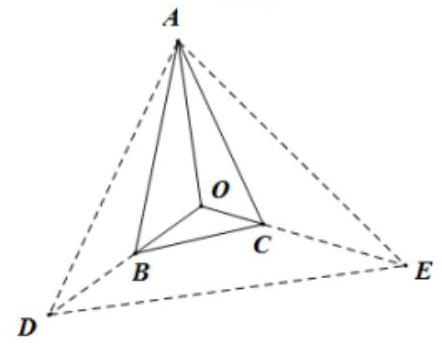

【例 10】( 1 )在平面四边形 $\mathrm{{ABCD}}$ 中，已知 $\bigtriangleup  {ABC}$ 的面积是 $\bigtriangleup  {ACD}$ 的面积的 3 倍，若存在正实数 $x, y$ 使得 $\overrightarrow{AC} = \left( {\frac{1}{x} - 3}\right) \overrightarrow{AB} + \left( {1 - \frac{1}{y}}\right) \overrightarrow{AD}$ 成立，则 $x + y$ 的最小值为___.

【难度】 $\star   \star   \star$

【答案】 $\frac{2 + \sqrt{3}}{5}$

【解析】 $\frac{{S}_{\bigtriangleup {ABC}}}{{S}_{\bigtriangleup {ACD}}} = 3$ ,连接 $\mathrm{{AC}}$ 与 $\mathrm{{BD}}$ 相交于点 $\mathrm{O}$ ,则

$\overrightarrow{OB} = 3\overrightarrow{DO},\overrightarrow{OA} + \overrightarrow{AB} = 3\left( {\overrightarrow{DA} + {AO}}\right)  \Rightarrow  \overrightarrow{AO} = \frac{1}{4}\overrightarrow{AB} + \frac{3}{4}\overrightarrow{AD}$

因为 $\overrightarrow{AC}$ 平行 $\overrightarrow{AO}$ ,所以 $\frac{1}{x} - 3 = 3\left( {1 - \frac{1}{y}}\right)  \Rightarrow  \frac{3}{x} + \frac{1}{y} = {10}$ ,后面再结合基本不等式即可解得 $x + y$ 的最小值为 $\frac{2 + \sqrt{3}}{5}$ .

(2)如图所示，在梯形 ${ABCD}$ 中， ${AB}\bot {AD}$ ， ${AB}//{CD}$ ， ${AD} = {CD} = 1$ ， ${AB} = 2$ ， $E$ 是 ${AB}$ 的中点， 点 $P$ 在以 $A$ 为圆心, ${AE}$ 为半径的四分之一圆弧 $\overset{\text{ ⏜ }}{DE}$ 上运动,若 $\overrightarrow{AP} = \lambda \overrightarrow{AD} + \mu \overrightarrow{AB},\lambda ,\mu  \in  R$ ,则 ${3\lambda } - {4\mu }$ 的取值范围是___.

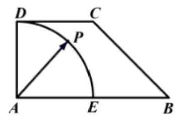

【难度】 $\star   \star   \star$

【答案】 $\left\lbrack  {-2,3}\right\rbrack$

【解析】建立如图所示的直角坐标系,则 $A\left( {0,0}\right) , E\left( {1,0}\right) , D\left( {0,1}\right) , B\left( {2,0}\right)$ ,

设 $P\left( {\cos \theta ,\sin \theta }\right) ,\left( {0 \leq  \theta  \leq  \frac{\pi }{2}}\right)$ ,可得 $\overrightarrow{AP} = \left( {\cos \theta ,\sin \theta }\right)$

因为 $\overrightarrow{AP} = \lambda \overrightarrow{AD} + \mu \overrightarrow{AB} = \lambda \left( {0,1}\right)  + \mu \left( {2,0}\right)  = \left( {{2\mu },\lambda }\right)$ ,所以 $\left\{  \begin{array}{l} \cos \theta  = {2u} \\  \sin \theta  = \lambda  \end{array}\right.$ ,即 $u = \frac{1}{2}\cos \theta ,\lambda  = \sin \theta$ ,

则 ${3\lambda } - {4\mu } = 3\sin \theta  - 2\cos \theta$ ,且 $0 \leq  \theta  \leq  \frac{\pi }{2}$ , 根据正弦函数与余弦函数的性质,易得函数 $y = 3\sin x - 2\cos x$ 在 $\left\lbrack  {0,\frac{\pi }{2}}\right\rbrack$ 上为单调递增函数,

当 $\theta  = 0$ 时, ${3\lambda } - {4\mu }$ 取得最小值,最小值为 -2 ; 当 $\theta  = \frac{\pi }{2}$ 时, ${3\lambda } - {4\mu }$ 取得最大值,最大值为 3, 所以 ${3\lambda } - {4\mu }$ 的取值范围是 $\left\lbrack  {-2,3}\right\rbrack$ . 故答案为: $\left\lbrack  {-2,3}\right\rbrack$ .

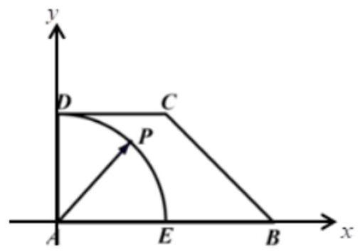

## 巩固训练

1、下列各组向量中，能作为表示它们所在平面内所有向量的基底的是( )

A. $\overrightarrow{{e}_{1}} = \left( {2,2}\right) ,\overrightarrow{{e}_{2}} = \left( {1,1}\right)$ B. $\overrightarrow{{e}_{1}} = \left( {1, - 2}\right) ,\overrightarrow{{e}_{2}} = \left( {4, - 8}\right)$

C. $\overrightarrow{{e}_{1}} = \left( {1,0}\right) ,\overrightarrow{{e}_{2}} = \left( {0, - 1}\right)$ D. $\overrightarrow{{e}_{1}} = \left( {1, - 2}\right) ,\overrightarrow{{e}_{2}} = \left( {-\frac{1}{2},1}\right)$

【答案】C

【解析】 $\mathbf{A}$ 中, $\overrightarrow{{e}_{1}} = 2\overrightarrow{{e}_{2}},\overrightarrow{{e}_{1}},\overrightarrow{{e}_{2}}$ 共线,所以 $\mathbf{A}$ 不正确; $\mathbf{B}$ 中, $\overrightarrow{{e}_{2}} = 4\overrightarrow{{e}_{1}},\overrightarrow{{e}_{1}},\overrightarrow{{e}_{2}}$ 共线,所以 $\mathbf{B}$ 不正确; $\mathrm{C}$ 中, ${e}_{1},{e}_{2}$ 不共线,可以作为一组基底,所以 $\mathrm{C}$ 正确; $\mathrm{D}$ 中, ${e}_{1} =  - 2{e}_{2},{e}_{1},{e}_{2}$ 共线,所以 $\mathrm{D}$ 不正确; 故选:C

2、在等腰梯形 ${ABCD}$ 中， ${AB} = {2CD}$ ，若 $\overrightarrow{AD} = \overrightarrow{a}$ ， $\overrightarrow{AB} = \overrightarrow{b}$ ，则 $\overrightarrow{BC} =$ ()

A. $\overrightarrow{a} - \frac{1}{2}\overrightarrow{b}$ B. $\frac{1}{2}\overrightarrow{a} + \overrightarrow{b}$

C. $- \overrightarrow{a} + \frac{3}{2}\overrightarrow{b}$ D. $\overrightarrow{a} + \frac{1}{2}\overrightarrow{b}$

【答案】A

【解析】解法一: 如图,取 ${AB}$ 的中点 $E$ ,连结 ${DE}$ ,因为四边形 ${ABCD}$ 为等腰梯形, ${AB} = {2CD}$ ,所以 $\overrightarrow{DC} = \overrightarrow{EB} = \frac{1}{2}\overrightarrow{AB}$ ,所以四边形 ${BCDE}$ 为平行四边形,所以 $\overrightarrow{BC} = \overrightarrow{BA} + \overrightarrow{AD} + \overrightarrow{DC} =  - \overrightarrow{b} + \overrightarrow{a} + \frac{1}{2}\overrightarrow{b} = \overrightarrow{a} - \frac{1}{2}\overrightarrow{b}$ ; 故选:A.

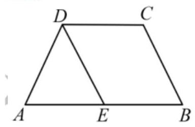

解法二: 如图,取 ${AB}$ 的中点 $E$ ,连结 ${DE}$ ,因为四边形 ${ABCD}$ 为等腰梯形, ${AB} = {2CD}$ ,所以 $\overrightarrow{DC} = \overrightarrow{EB}$ , 所以四边形 ${BCDE}$ 为平行四边形,所以 $\overrightarrow{BC} = \overrightarrow{ED} = \overrightarrow{AD} - \overrightarrow{AE} = \overrightarrow{a} - \frac{1}{2}\overrightarrow{b}$ . 故选:A.

3、设 $\overrightarrow{AG} = \frac{1}{3}\left( {\overrightarrow{AB} + \overrightarrow{AC}}\right)$ ,过 $G$ 作直线 $l$ 分别交 ${AB},{AC}$ (不与端点重合) 于 $P, Q$ ,若 $\overrightarrow{AP} = \lambda \overrightarrow{AB}$ , $\overline{AQ} = \mu \overline{AC}$ ,若 $\bigtriangleup {PAG}$ 与 $\bigtriangleup {QAG}$ 的面积之比为 $\frac{2}{3}$ ,则 $\mu  =$

A. $\frac{1}{3}$ B. $\frac{2}{3}$ C. $\frac{3}{4}$ D. $\frac{5}{6}$

【答案】D

【解析】连接 ${AG}$ 并延长,则通过 ${BC}$ 的中点 $M$ ,过 $P, Q$ 分别向 ${AG}$ 所在直线作垂线,垂足分别为 $D$ , $E$ ,如图所示

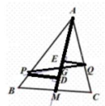

$\because \bigtriangleup {PAG}$ 与 $\bigtriangleup {QAG}$ 的面积之比为 $\frac{2}{3};\therefore \frac{PD}{QE} = \frac{2}{3}$ ;

根据三角形相似可知 $\frac{PG}{GQ} = \frac{2}{3}$ ,则 $\overline{PG} = \frac{2}{5}\overline{PQ};\therefore \overline{AG} = \overline{AP} + \overline{PG} = \overline{AP} + \frac{2}{5}\left( {\overline{AQ} - \overline{AP}}\right)$

即 $\overrightarrow{AG} = \frac{3}{5}\overrightarrow{AP} + \frac{2}{5}\overrightarrow{AQ} = \frac{3}{5}\lambda \overrightarrow{AB} + \frac{2}{5}\mu \overrightarrow{AC}$ ; 由平行四边形法则得 $\overrightarrow{AG} = \frac{2}{3}\overrightarrow{AM} = \frac{1}{3}\left( {\overrightarrow{AB} + \overrightarrow{AC}}\right)$

根据待定系数法有 $\frac{2}{5}\mu  = \frac{1}{3}$ ,则 $\mu  = \frac{5}{6}$ ; 故选 $D$

4、在 $\bigtriangleup  {ABC}$ 中， ${BC} = 3$ ， ${AC} = 4$ ， $\angle {ACB} = {90}^{ \circ  }$ ， $D$ 在边 ${AB}$ 上(不与端点重合). 延长 ${CD}$ 到 $P$ ，使得 ${CP} = 9$ . 若 $\overline{PC} = m\overrightarrow{PA} + \left( {\frac{3}{2} - m}\right) \overrightarrow{PB}\left( {m\text{ 为常数 }}\right)$ ，则 ${BD}$ 的长度是___.

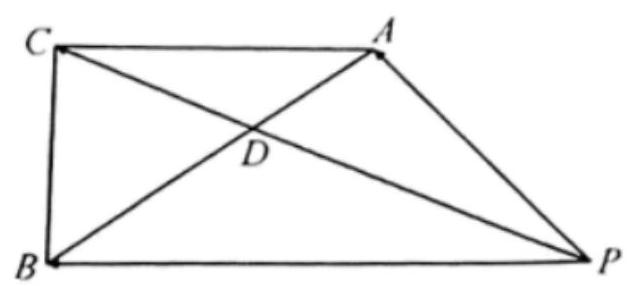

【答案】 $\frac{18}{5}$

【解析】 $\because C\text{ 、 }D\text{ 、 }P$ 三点共线, $\therefore$ 可设 $\overrightarrow{PC} = \lambda \overrightarrow{PD}\left( {\lambda  > 0}\right)$ ,

$\because \overrightarrow{PC} = m\overrightarrow{PA} + \left( {\frac{3}{2} - m}\right) \overrightarrow{PB},\therefore \lambda \overrightarrow{PD} = m\overrightarrow{PA} + \left( {\frac{3}{2} - m}\right) \overrightarrow{PB}$ ,即 $\frac{}{PD} = \frac{m}{\lambda }\overrightarrow{PA} + \frac{\left( \frac{3}{2} - m\right) }{\lambda }\overrightarrow{PB}$ ,

若 $m \neq  0$ 且 $m \neq  \frac{3}{2}$ ，则 $A$ 、 $B$ 、 $D$ 三点共线， $\therefore \frac{m}{n} + \frac{\left( \frac{3}{2} - m\right) }{\lambda } = 1$ ，即 $\lambda  = \frac{3}{2}$ ，

$\because {CP} = 9,\therefore {PD} = 6,{CD} = 3,\because {BC} = 3,{AC} = 4,\angle {ACB} = {90}^{ \circ  },\therefore {AB} = 5$ ,

设 ${AD} = x,\angle {ADC} = \theta$ ,则 ${BD} = 5 - x,\angle {BDC} = \pi  - \theta$ ,

$\therefore$ 根据余弦定理可得 $\cos \theta  = \frac{A{D}^{2} + C{D}^{2} - A{C}^{2}}{{2AD} \cdot  {CD}} = \frac{{x}^{2} - 7}{6x},\cos \left( {\pi  - \theta }\right)  = \frac{C{D}^{2} + B{D}^{2} - B{C}^{2}}{{2CD} \cdot  {BD}} = \frac{{\left( 5 - x\right) }^{2}}{6\left( {5 - x}\right) }$ ,

$\because \cos \theta  + \cos \left( {\pi  - \theta }\right)  = 0,\therefore \frac{{x}^{2} - 7}{6x} + \frac{{\left( 5 - x\right) }^{2}}{6\left( {5 - x}\right) } = 0$ ,解得 $x = \frac{7}{5}$ 或 $x = 5$ (舍去),

$\therefore {BD}$ 的长度为 $5 - \frac{7}{5} = \frac{18}{5}$ . 故答案为: $\frac{18}{5}$ .

## (四)平面向量数量积及应用

## 知识梳理

## 1、两个非零向量夹角的概念

已知非零向量 $\overrightarrow{a}$ 与 $\overrightarrow{b}$ ，作 $O\dot{A} = \bar{a},\overline{OB} = \overrightarrow{b}$ ，则 $\angle \mathrm{{AOB}} = \theta \left( {0 \leq  \theta  \leq  \pi }\right)$ 叫 $\bar{a}$ 与 $\overrightarrow{b}$ 的夹角。

2、平面向量数量积(内积)的定义:已知两个非零向量 $\overrightarrow{a}$ 与 $\overrightarrow{b}$ ，它们的夹角是 $\theta$ ，则数量 $\left| \overrightarrow{a}\right| \left| \overrightarrow{b}\right| \cos \theta$ 叫 $\bar{a}$ 与 $\bar{b}$ 的数量积,记作 $\bar{a} \cdot  \bar{b}$ ,即有 $\bar{a} \cdot  \bar{b} = \left| \bar{a}\right| \left| \bar{b}\right| \cos \theta$ 。

提醒:

1、 $\left( {0 \leq  \theta  \leq  \pi }\right)$ ，并规定 0 与任何向量的数量积为 0 ；

2、两个向量的数量积的性质:

设 $\overrightarrow{a}\text{ 、 }\overrightarrow{b}$ 为两个非零向量, $\overrightarrow{e}$ 是与 $\overrightarrow{b}$ 同向的单位向量;

1) $\overrightarrow{e} \cdot  \overrightarrow{a} = \overrightarrow{a} \cdot  \overrightarrow{e} = \left| \overrightarrow{a}\right| \cos \theta$ ; 2) $\overrightarrow{a} \bot  \overrightarrow{b} \Leftrightarrow  \overrightarrow{a} \cdot  \overrightarrow{b} = 0$ ;

3) 当 $\overrightarrow{a}$ 与 $\overrightarrow{b}$ 同向时, $\overrightarrow{a} \cdot  \overrightarrow{b} = \left| \overrightarrow{a}\right| \left| \overrightarrow{b}\right|$ ; 当 $\overrightarrow{a}$ 与 $\overrightarrow{b}$ 反向时, $\overrightarrow{a} \cdot  \overrightarrow{b} =  - \left| \overrightarrow{a}\right|  \mid  \overrightarrow{b}$ ;

特别的 $\overrightarrow{a} \cdot  \overrightarrow{a} = {\left| \overrightarrow{a}\right| }^{2}$ 或 $\left| \overrightarrow{a}\right|  = \sqrt{\overrightarrow{a} \cdot  \overrightarrow{a}}$ ;

4) 当 $\theta$ 为锐角时, $\overrightarrow{a} \cdot  \overrightarrow{b} > 0$ ,且 $\overrightarrow{a}\text{ 、 }\overrightarrow{b}$ 不同向, $\overrightarrow{a} \cdot  \overrightarrow{b} > 0$ 是 $\theta$ 为锐角的必要非充分条件; 当 $\theta$ 为钝角时, $\overrightarrow{a} \cdot  \overrightarrow{b} < 0$ ，且 $\overrightarrow{a}$ 、 $\overrightarrow{b}$ 不反向， $\overrightarrow{a} \cdot  \overrightarrow{b} < 0$ 是 $\theta$ 为钝角的必要非充分条件；

5) $\cos \theta  = \frac{\overrightarrow{a} \cdot  \overrightarrow{b}}{\left| \overrightarrow{a}\right| \left| \overrightarrow{b}\right| };\;$ 6) $\left| {\overrightarrow{a} \cdot  \overrightarrow{b}}\right|  \leq  \left| \overrightarrow{a}\right| \left| \overrightarrow{b}\right|$ 。

3、“投影”的概念:如图

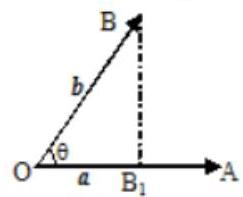

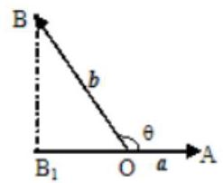

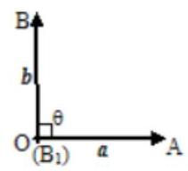

定义: $\left| b\right| \cos \theta$ 叫做向量 $b$ 在 $a$ 方向上的投影。

提醒:

投影也是一个数量，不是向量；当θ为锐角时投影为正值；当θ为钝角时投影为负值；当θ为直角时投影为0； 当 $\theta  = {0}^{ \circ  }$ 时投影为 $\left| b\right|$ ; 当 $\theta  = {180}^{ \circ  }$ 时投影为 $- \left| b\right|$ 。

4、平面向量数量积的运算律

交换律: $\overrightarrow{a} \cdot  \overrightarrow{b} = \overrightarrow{b} \cdot  \overrightarrow{a}$ ;

数乘结合律: $\left( {\lambda \bar{a}}\right)  \cdot  \overrightarrow{b} = \lambda \left( {\bar{a} \cdot  \overrightarrow{b}}\right)  = \bar{a} \cdot  \left( {\lambda \overrightarrow{b}}\right)$ ;

分配律: $\left( {\overrightarrow{a} + \overrightarrow{b}}\right)  \cdot  \overrightarrow{c} = \overrightarrow{a} \cdot  \overrightarrow{c} + \overrightarrow{b} \cdot  \overrightarrow{c}$ 。

5、平面两向量数量积的坐标表示

已知两个非零向量 $\overrightarrow{a} = \left( {{x}_{1},{y}_{1}}\right) ,\overrightarrow{b} = \left( {{x}_{2},{y}_{2}}\right)$ ,设 $\overrightarrow{i}$ 是 $x$ 轴上的单位向量, $\overrightarrow{j}$ 是 $y$ 轴上的单位向量,那么 $\overrightarrow{a} = \underline{{x}_{1}\overrightarrow{i} + {y}_{1}\overrightarrow{j}},\;\overrightarrow{b} = \underline{{x}_{2}\overrightarrow{i} + {y}_{2}\overrightarrow{j}}$ 所以 $\overrightarrow{a} \cdot  \overrightarrow{b} = \underline{{x}_{1}{x}_{2} + {y}_{1}{y}_{2}}$ 。

## 6、平面内两点间的距离公式

如果表示向量 $\overrightarrow{a}$ 的有向线段的起点和终点的坐标分别为 $\left( {{x}_{1},{y}_{1}}\right) \text{ 、 }\left( {{x}_{2},{y}_{2}}\right)$ ,

那么: $\left| \overrightarrow{a}\right|  = \sqrt{{\left( {x}_{1} - {x}_{2}\right) }^{2} + {\left( {y}_{1} - {y}_{2}\right) }^{2}}$ 。

7、向量垂直的判定: 设 $\overrightarrow{a} = \left( {{x}_{1},{y}_{1}}\right) ,\overrightarrow{b} = \left( {{x}_{2},{y}_{2}}\right)$ ,则 $\overrightarrow{a} \bot  \overrightarrow{b} \Leftrightarrow  \underline{{x}_{1}{x}_{2} + {y}_{1}{y}_{2} = 0}$ 。

8、两向量夹角的余弦 $\left( {0 \leq  \theta  \leq  \pi }\right) \;\cos \theta  = \frac{\overrightarrow{a} \cdot  \overrightarrow{b}}{\left| \overrightarrow{a}\right|  \cdot  \left| \overrightarrow{b}\right| } = \frac{{x}_{1}{x}_{2} + {y}_{1}{y}_{2}}{\sqrt{{x}_{1}{}^{2} + {y}_{1}{}^{2}}\sqrt{{x}_{2}{}^{2} + {y}_{2}{}^{2}}}$ 。

## 例题精讲

【例 11】已知单位向量 $\overrightarrow{a},\overrightarrow{b}$ 满足 $\left| {\overrightarrow{b} - 2\overrightarrow{a}}\right|  = \sqrt{3}$ ,则向量 $\overrightarrow{a}$ 在向量 $\overrightarrow{b} - 2\overrightarrow{a}$ 方向上的投影为( )

A. $- \frac{\sqrt{3}}{2}$ B. $- \frac{1}{2}$ C. $\frac{1}{2}$ D. $\frac{\sqrt{3}}{2}$

【难度】 $\star   \star$

【答案】A

【解析】 $\left| \overrightarrow{a}\right|  = 1,\left| \overrightarrow{b}\right|  = 1$ ,所以 $\left| {\overrightarrow{b} - 2\overrightarrow{a}}\right|  = \sqrt{{\left( \overrightarrow{b} - 2\overrightarrow{a}\right) }^{2}} = \sqrt{{\overrightarrow{b}}^{2} - 4\overrightarrow{a} \cdot  \overrightarrow{b} + 4{\overrightarrow{a}}^{2}} = \sqrt{5 - 4\overrightarrow{a} \cdot  \overrightarrow{b}} = \sqrt{3}$ 解得 $\overrightarrow{a} \cdot  \overrightarrow{b} = \frac{1}{2}$ ;

向量 $\overrightarrow{a}$ 在向量 $\overrightarrow{b} - 2\overrightarrow{a}$ 方向上的投影为 $\frac{\overrightarrow{a} \cdot  \left( {\overrightarrow{b} - 2\overrightarrow{a}}\right) }{\left| \overrightarrow{b} - 2\overrightarrow{a}\right| } = \frac{\overrightarrow{a} \cdot  \overrightarrow{b} - 2{\overrightarrow{a}}^{2}}{\sqrt{3}} = \frac{\frac{1}{2} - 2}{\sqrt{3}} =  - \frac{\sqrt{3}}{2}$ ; 故选: A.

【例 12】( 1 )已知等边 $\bigtriangleup  {ABC}$ ， $D$ 为 ${BC}$ 中点，若点 $M$ 是 $\bigtriangleup  {ABC}$ 所在平面上一点，且满足 $\overrightarrow{AM} = \frac{1}{3}\overrightarrow{AD} + \frac{1}{2}\overrightarrow{AC}$ ，则 $\overrightarrow{AB} \cdot  \overrightarrow{CM} =$ ___.

【难度】 $\star   \star$

【答案】0

【解析】根据向量减法的几何意义可得: $\overrightarrow{CM} = \overrightarrow{AM} - \overrightarrow{AC}$ ,

即 $\overrightarrow{CM} = \frac{1}{3}\overrightarrow{AD} + \frac{1}{2}\overrightarrow{AC} - \overrightarrow{AC} = \frac{1}{3} \times  \frac{1}{2}\left( {\overrightarrow{AB} + \overrightarrow{AC}}\right)  - \frac{1}{2}\overrightarrow{AC} = \frac{1}{6}\overrightarrow{AB} - \frac{1}{3}\overrightarrow{AC}$ ,

所以 $\overrightarrow{AB} \cdot  \overrightarrow{CM} = \overrightarrow{AB} \cdot  \left( {\frac{1}{6}\overrightarrow{AB} - \frac{1}{3}\overrightarrow{AC}}\right)  = \frac{1}{6}{\overrightarrow{AB}}^{2} - \frac{1}{3}\overrightarrow{AB} \cdot  \overrightarrow{AC} = \frac{1}{6}{\overrightarrow{AB}}^{2} - \frac{1}{3}\left| \overrightarrow{AB}\right|  \cdot  \left| \overrightarrow{AC}\right| \cos A = 0$ . 故答案为: 0

(2)在平面直角坐标系中，已知点 $A\left( {0, - 1}\right)$ 、 $B\left( {0,3}\right)$ 、 $M$ ， $N$ 是 $x$ 轴上的两个动点，且 $\left| \overrightarrow{MN}\right|  = 2$ ，则 $\overrightarrow{AM} \cdot  \overrightarrow{BN}$ 的最小值为( )

A. -4 B. -3 C. 2 D. 3

【难度】★★★

【答案】A

【解析】由题, $\overrightarrow{AM} \cdot  \overrightarrow{BN} = \left( {\overrightarrow{AO} + \overrightarrow{OM}}\right)  \cdot  \left( {\overrightarrow{BO} + \overrightarrow{ON}}\right)  = \overrightarrow{AO} \cdot  \overrightarrow{BO} + \overrightarrow{AO} \cdot  \overrightarrow{ON} + \overrightarrow{OM} \cdot  \overrightarrow{BO} + \overrightarrow{OM} \cdot  \overrightarrow{ON}$

$=  - 3 + 0 + 0 + \overrightarrow{OM} \cdot  \overrightarrow{ON} = \overrightarrow{OM} \cdot  \overrightarrow{ON} - 3$ .

又 $\left| \overrightarrow{MN}\right|  = 2$ ,由 $\overrightarrow{OM} \cdot  \overrightarrow{ON} - 3$ 的对称性,不妨设 $M\left( {m,0}\right) , N\left( {m + 2,0}\right)$ ,

则 $\overrightarrow{OM} \cdot  \overrightarrow{ON} - 3 = x\left( {x + 2}\right)  - 3 = {x}^{2} + {2x} - 3 = {\left( x + 1\right) }^{2} - 4$ ,当 $x =  - 1$ 时有最小值 -4 . 故选: A

(3)如图，直角三角形 $\bigtriangleup  {ABC}$ 中， $\angle {ABC} = {90}^{ \circ  },{AB} = 3,{BC} = 4$ ， $M$ 点是线段 ${AC}$ 一动点，若以 $M$ 为圆心半径为 $\sqrt{5}$ 的圆与直线 ${AC}$ 交于 $P, Q$ 两点,则 $\overrightarrow{BP} \cdot  \overrightarrow{BQ}$ 的最小值为 ( )

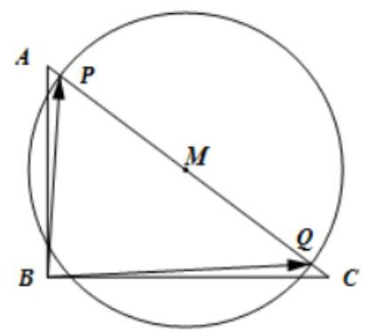

A. $\frac{12}{15}$ B. $\frac{19}{25}$ C. $\frac{9}{13}$ D. $\frac{19}{15}$

【难度】★★★

【答案】B

【解析】因为 $\overrightarrow{MP} =  - \overrightarrow{MQ}$ ,所以 $\overrightarrow{BP} \cdot  \overrightarrow{BQ} = \left( {\overrightarrow{BM} + M\overrightarrow{P}}\right)  \cdot  \left( {\overrightarrow{BM} - \overrightarrow{MP}}\right)  = {\left| BM\right| }^{2} - {\left| MP\right| }^{2}$ ,

即 $\overline{BP} \cdot  \overline{BQ} = {\left| BM\right| }^{2} - 5$ ,

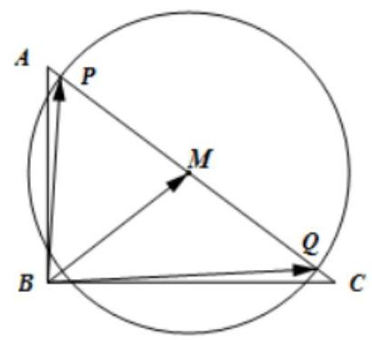

只需要求 $\left| {BM}\right|$ 的最小值即可,

当 ${BM}\bot {AC}$ 时， $\left| {BM}\right|$ 最小，此时 $\left| {BM}\right|  = \frac{12}{5}$ ，所以 ${\left( \overrightarrow{BP} \cdot  \overrightarrow{BQ}\right) }_{\min } = \frac{144}{25} - 5 = \frac{19}{25}$ ，故选:B

【例 13】已知椭圆 $\frac{{x}^{2}}{{a}^{2}} + \frac{{y}^{2}}{{b}^{2}} = 1\left( {a > b > 0}\right)$ 的短轴长为 2,过点 $A\left( {0, - b}\right)$ 和 $B\left( {a,0}\right)$ 的直线与原点的距离为 $\frac{\sqrt{3}}{2}$ .

(1)求椭圆的方程；

(2)已知定点 $E\left( {-1,0}\right)$ ，若直线 $y = {kx} + 2\left( {k \neq  0}\right)$ 与椭圆交于 $C$ ， $D$ 两点. 问:是否存在 $k$ 的值，使 ${EC}\bot {ED}$ ? 请说明理由.

【难度】★★★

【答案】(1) $\frac{{x}^{2}}{3} + {y}^{2} = 1$ ; (2) 存在, $k = \frac{7}{6}$ .

【解析】(1)直线 ${AB}$ 的方程为 $\frac{x}{a} + \frac{y}{-b} = 1$ ，即 ${bx} - {ay} - {ab} = 0$ ，

由题意得 $\left\{  \begin{array}{l} {2b} = 2 \\  \frac{ab}{\sqrt{{a}^{2} + {b}^{2}}} = \frac{\sqrt{3}}{2} \end{array}\right.$ ,解得 ${a}^{2} = 3,{b}^{2} = 1$ ,所以椭圆的方程为 $\frac{{x}^{2}}{3} + {y}^{2} = 1$ ;

(2)由 $\left\{  \begin{array}{l} y = {kx} + 2 \\  \frac{{x}^{2}}{3} + {y}^{2} = 1 \end{array}\right.$ 得 $\left( {1 + 3{k}^{2}}\right) {x}^{2} + {12kx} + 9 = 0$ ，

所以 $\Delta  = {\left( {12}k\right) }^{2} - {36}\left( {1 + 3{k}^{2}}\right)  = {144}{k}^{2} - {108}{k}^{2} - {36} = {36}{k}^{2} - {36} > 0\left( *\right)$ ，

设 $C\left( {{x}_{1},{y}_{1}}\right) , D\left( {{x}_{2},{y}_{2}}\right)$ ,则 ${x}_{1} + {x}_{2} =  - \frac{12k}{1 + 3{k}^{2}},{x}_{1}{x}_{2} = \frac{9}{1 + 3{k}^{2}}$ ,

因为 ${EC} \bot  {ED}$ ,所以 $\overrightarrow{EC} \cdot  \overrightarrow{ED} = \left( {{x}_{1} + 1,{y}_{1}}\right)  \cdot  \left( {{x}_{2} + 1,{y}_{2}}\right)  = 0$ ,所以 $\left( {{x}_{1} + 1}\right) \left( {{x}_{2} + 1}\right)  + {y}_{1}{y}_{2} = 0$ ,

所以 $\left( {{x}_{1} + 1}\right) \left( {{x}_{2} + 1}\right)  + \left( {k{x}_{1} + 2}\right) \left( {k{x}_{2} + 2}\right)  = 0$ ,

所以 $\left( {{k}^{2} + 1}\right) {x}_{1}{x}_{2} + \left( {{2k} + 1}\right) \left( {{x}_{1} + {x}_{1}}\right)  + 5 = 0$ ,

将 ${x}_{1} + {x}_{2} =  - \frac{12k}{1 + 3{k}^{2}}\text{ 、 }{x}_{1}{x}_{2} = \frac{9}{1 + 3{k}^{2}}$ 代入上式,解得 $k = \frac{7}{6}$ ,满足 $\left( *\right)$ 式,所以 $k = \frac{7}{6}$ .

【例 14】我们把等轴双曲线的一部分 ${C}_{1} : \frac{{x}^{2}}{{a}^{2}} - \frac{{y}^{2}}{{b}^{2}} = 1\left( {y \geq  0}\right)$ 与半圆 ${C}_{2} : {x}^{2} + {y}^{2} = {a}^{2}\left( {y \leq  0}\right)$ 合成的曲线称作“异型”曲线 $C$ ,其中 ${C}_{1}$ 是焦距为 $2\sqrt{2}$ 的等轴双曲线的一部分,如图所示.

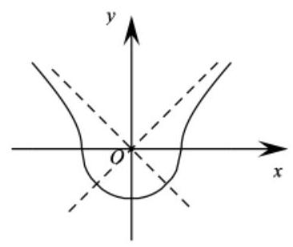

(1)求“异型”曲线 $C$ 的方程；

(2)若直线 $l : y = {kx} - 1$ 与“异型”曲线 $C$ 有两个公共点，求 $k$ 的取值范围；

(3)若 $P\left( {0, p}\right) \left( {p > 0}\right)$ ， $Q$ 为“异型”曲线 $C$ 上的点，求 $\left| {PQ}\right|$ 的最小值.

【难度】 $\star   \star   \star$

【答案】(1) ${x}^{2} - y\left| y\right|  = 1$ ; (2) $\left\{  {-\sqrt{2}}\right\}   \cup  \left\lbrack  {-1,0)\cup (0,1}\right\rbrack   \cup  \left\{  \sqrt{2}\right\}$ ; (3) ${\left| PQ\right| }_{\min } = \sqrt{1 + \frac{1}{2}{p}^{2}}$

【解析】

(1)由题意，可知 ${C}_{1}$ 满足 $\left\{  \begin{array}{l} a = b \\  {2c} = 2\sqrt{2} \\  {a}^{2} + {b}^{2} = {c}^{2} \end{array}\right.$ ，解得 $\left\{  \begin{array}{l} a = b = 1 \\  c = \sqrt{2} \end{array}\right.$ ，

$\therefore {C}_{1} : {x}^{2} - {y}^{2} = 1\left( {y \geq  0}\right) ,{C}_{2} : {x}^{2} + {y}^{2} = 1\left( {y \leq  0}\right)$ ,

$\therefore$ “异型”曲线 $C$ 的方程为 ${x}^{2} - y\left| y\right|  = 1$ .

(2)直线 $l : y = {kx} - 1$ 与“异型”曲线 $C$ 有公共点 $A\left( {0, - 1}\right)$ .

联立 $\left\{  \begin{array}{l} {x}^{2} - {y}^{2} = 1\left( {y \geq  0}\right) \\  {x}^{2} + {y}^{2} = 1\left( {y \leq  0}\right)  \end{array}\right.$ ,解得 $\left\{  \begin{array}{l} x = 1 \\  y = 0 \end{array}\right.$ 或 $\left\{  \begin{array}{l} x =  - 1 \\  y = 0 \end{array}\right.$ ,即 ${C}_{1}\text{ 、 }{C}_{2}$ 有公共点 $B\left( {1,0}\right) \text{ 、 }C\left( {-1,0}\right)$ .

① 当 $k = 0$ 时，直线 $l : y =  - 1$ ，与 ${C}_{1}$ 无公共点，与 ${C}_{2}$ 有唯一公共点 $\left( {0, - 1}\right)$ ，不符合题意；

② 当 $0 < k \leq  1$ 时，可知 ${k}_{AB} = \frac{-1 - 0}{0 - 1} = 1$ ，易知直线 $l : y = {kx} - 1$ 与 ${C}_{2}$ 有两个公共点，

又 $\because {C}_{1}$ 的渐近线为 $y =  \pm  x$ ,且 ${C}_{1}$ 中 $y \geq  0$ ,

$\therefore l : y = {kx} - 1$ 与 ${C}_{1}$ 无公共点.

$\therefore$ 当 $0 < k \leq  1$ 时,直线 $l : y = {kx} - 1$ 与“异型”曲线 $C$ 有两个公共点,符合题意;

③ 当 $k > 1$ 时，可知 $k > {k}_{AB}$ ，则直线 $l : y = {kx} - 1$ 与 ${C}_{2}$ 只有一个公共点.

联立 $\left\{  \begin{array}{l} {x}^{2} - {y}^{2} = 1 \\  y = {kx} - 1 \end{array}\right.$ ,得 $\left( {1 - {k}^{2}}\right) {x}^{2} + {2kx} - 2 = 0$ ,易知 $1 - {k}^{2} \neq  0$ ,

若 $\Delta  = 4{k}^{2} - 4\left( {1 - {k}^{2}}\right) \left( {-2}\right)  = 0$ ,解得 $k =  \pm  \sqrt{2}$ ,

$\because k > 1,\therefore k = \sqrt{2}$ ,此时 $l : y = {kx} - 1$ 与 ${C}_{1}$ 相切于第一象限,只有一个公共点;

若 $\Delta  = 4{k}^{2} - 4\left( {1 - {k}^{2}}\right) \left( {-2}\right)  > 0$ ,解得 $- \sqrt{2} < k < \sqrt{2}$ ,

$\because k > 1,\therefore 1 < k < \sqrt{2}$ ,易知 $l$ 与 ${C}_{1}$ 在第一象限有两个交点.

$\therefore k = \sqrt{2}$ 时,直线 $l : y = {kx} - 1$ 与“异型”曲线 $C$ 有两个公共点.

根据“异型”曲线 $C$ 的图象关于 $y$ 轴对称,可知当 $k \in  \{  - \sqrt{2}\}  \cup  \lbrack  - 1,0)$ 时,也满足直线 $l : y = {kx} - 1$ 与“异型” 曲线 $C$ 有两个公共点.

综上所述, $k$ 的取值范围是: $\{  - \sqrt{2}\}  \cup  \left\lbrack  {-1,0)\cup (0,1}\right\rbrack   \cup  \{ \sqrt{2}\}$ .

(3) 设 $Q\left( {x, y}\right)$ ，

当 $y \leq  0$ 时， ${\left| PQ\right| }^{2} = {x}^{2} + {\left( y - p\right) }^{2} = {x}^{2} + {y}^{2} + {p}^{2} - {2py} = 1 + {p}^{2} - {2py}$ ，

$\because  - 1 \leq  y \leq  0, p > 0,\therefore$ 当 $y = 0$ 时, ${\left| PQ\right| }_{\min } = \sqrt{1 + {p}^{2}}$ ;

当 $y > 0$ 时, ${\left| PQ\right| }^{2} = {x}^{2} + {\left( y - p\right) }^{2} = {x}^{2} + {y}^{2} + {p}^{2} - {2py} = 2{y}^{2} - {2py} + 1 + {p}^{2} = 2{\left( y - \frac{1}{2}p\right) }^{2} + \frac{1}{2}{p}^{2} + 1$ ,

当 $y = \frac{1}{2}p$ 时, ${\left| PQ\right| }_{\min } = \sqrt{1 + \frac{1}{2}{p}^{2}}$ .

$\because \sqrt{1 + \frac{1}{2}{p}^{2}} < \sqrt{1 + {p}^{2}},\therefore {\left| PQ\right| }_{\min } = \sqrt{1 + \frac{1}{2}{p}^{2}}$ .

## 巩固训练

1、已知菱形 ${ABCD}$ 的边长为2， $\overrightarrow{EC} = 2\overrightarrow{BE},\angle {ABC} = {120}^{ \circ  }$ ，则 $\overrightarrow{AE} \cdot  \overrightarrow{BD}$ 的值为( )

A. $\frac{4}{3}$ B. $- \frac{4}{3}$ C. $\frac{2}{3}$ D. $- \frac{2}{3}$

【答案】B

【解析】因为 $\overrightarrow{EC} = 2\overrightarrow{BE}$ ,所以 $\overrightarrow{BE} = \frac{1}{3}\overrightarrow{BC}$ ,因为 $\overrightarrow{AE} = \overrightarrow{AB} + \overrightarrow{BE} =  - \overrightarrow{BA} + \frac{1}{3}\overrightarrow{BC}$ ,

$\overrightarrow{BD} = \overrightarrow{BA} + \overrightarrow{AD} = \overrightarrow{BA} + \overrightarrow{BC}$ ,所以 $\overrightarrow{AE} \cdot  \overrightarrow{BD} = \left( {-\overrightarrow{BA} + \frac{1}{3}\overrightarrow{BC}}\right)  \cdot  \left( {\overrightarrow{BA} + \overrightarrow{BC}}\right)$ ,

$=  - {\overrightarrow{BA}}^{2} - \frac{2}{3}\overrightarrow{BA} \cdot  \overrightarrow{BC} + \frac{1}{3}{\overrightarrow{BC}}^{2} =  - {2}^{2} - \frac{2}{3} \times  2 \times  2 \times  \cos {120}^{ \circ  } + \frac{1}{3} \times  {2}^{2} =  - \frac{4}{3}$ ，故选:B

2、如图， $O$ 为 $\bigtriangleup {ABC}$ 的外心， ${AB} = 4,{AC} = 2,\angle {BAC}$ 为钝角， $M$ 是边 ${BC}$ 的中点， $\overrightarrow{AM} \cdot  \overrightarrow{AO}$ 的值( )

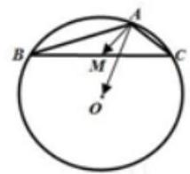

A. 4 B. .6 C. 7 D. 5

【答案】D

【解析】: $\because \mathrm{M}$ 是 $\mathrm{{BC}}$ 边的中点, $\therefore \overrightarrow{AM} = \frac{1}{2}\left( {\overrightarrow{AB} + \overrightarrow{AC}}\right) ,\because \mathrm{O}$ 是 $\bigtriangleup \mathrm{{ABC}}$ 的外接圆的圆心,

$\therefore \overrightarrow{AO} \cdot  \overrightarrow{AB} = \left| \overrightarrow{AO}\right| \left| \overrightarrow{AB}\right| \cos \angle {BAO} = \frac{1}{2} \times  {\left( 2\sqrt{3}\right) }^{2} = 6$ . 同理可得 $\overrightarrow{AO} \cdot  \overrightarrow{AC} = 4$ .

$\therefore \overrightarrow{AM} \cdot  \overrightarrow{AO} = \frac{1}{2}\left( {\overrightarrow{AB} + \overrightarrow{AC}}\right)  \cdot  \overrightarrow{AO} = \frac{1}{2}\overrightarrow{AB} \cdot  \overrightarrow{AO} + \frac{1}{2}\overrightarrow{AC} \cdot  \overrightarrow{AO} = \frac{1}{2} \times  \left( {6 + 4}\right)  = 5$ .

3、设 $m, n$ 分别为连续两次投掷骰子得到的点数，且向量 $\overrightarrow{a} = \left( {m, n}\right) ,\overrightarrow{b} = \left( {1, - 1}\right)$ ，则向量 $\overrightarrow{a},\overrightarrow{b}$ 的夹角为锐角的概率是___.

【答案】 $\frac{5}{12}$

【解析】因为向量 $\bar{a},\bar{b}$ 的夹角为锐角,所以 $\bar{a} \cdot  \bar{b} > 0$ ,即 $m - n > 0, m > n$ ,

当 $m = 6$ 时， $n$ 有 5 种；当 $m = 5$ 时， $n$ 有 4 种；当 $m = 4$ 时， $n$ 有 3 种；

当 $m = 3$ 时, $n$ 有 2 种; 当 $m = 2$ 时, $n$ 有 1 种,一共 15 种,所以概率为 $\frac{15}{36} = \frac{5}{12}$ .

4、点 $M$ 是三角形 ${ABC}$ 所在平面上一点，且满足 $\left( {\overrightarrow{MA} + \overrightarrow{MB} - 2\overrightarrow{MC}}\right)  \cdot  \left( {\overrightarrow{MA} - \overrightarrow{MB}}\right)  = 0$ ，则三角形 ${ABC}$ 的形状一定是( )

A. 等腰三角形 B. 直角三角形 C. 钝角三角形 D. 不能确定

【答案】A

【解析】取 ${AB}$ 中点为 $E$ ,连接 ${CE}$ ,如图,

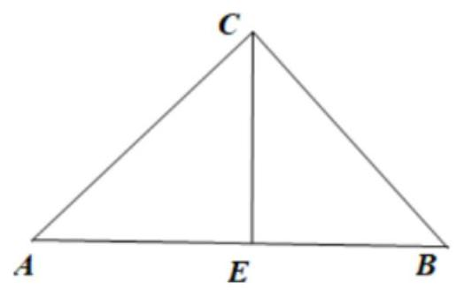

因为 $\left( {\overrightarrow{MA} + \overrightarrow{MB} - 2\overrightarrow{MC}}\right)  \cdot  \left( {\overrightarrow{MA} - \overrightarrow{MB}}\right)  = \left( {2\overrightarrow{ME} - 2\overrightarrow{MC}}\right)  \cdot  \overrightarrow{BA} = 2\overrightarrow{CE} \cdot  \overrightarrow{BA} = 0$ ,所以 ${CE} \bot  {BA}$ ,

又 $E$ 为 ${AB}$ 中点，所以 ${CA} = {CB}$ ，故三角形 ${ABC}$ 的形状一定是等腰三角形，故选:A

5、在平面直角坐标系 ${xOy}$ 中，若正方形 ${OBCD}$ 边长为 1， $O$ 点在原点， $D$ 、 $B$ 分别在 $y$ 轴和 $x$ 轴上.

(1)若点 $P$ 在线段 ${OC}$ 上运动，求 $\overrightarrow{OP} \cdot  \left( {\overrightarrow{PB} + \overrightarrow{PD}}\right)$ 的取值范围；

(2)已圆 $M : {x}^{2} + {y}^{2} - x - y - \frac{1}{2} = 0$ ，问是否存在被圆 $M$ 所截的直线 $l : {kx} - y + k = 0$ 交圆于两点 $E$ ， $F$ 且 ${OE} \bot  {OF}$ . 若存在,求出直线 $l$ ,若不存在说明理由.

【答案】( 1 ) $\left\lbrack  {-2,\frac{1}{4}}\right\rbrack$ ；( 2 )存在， $y = \frac{1 + \sqrt{6}}{5}\left( {x + 1}\right)$ 和 $y = \frac{1 - \sqrt{6}}{5}\left( {x + 1}\right)$ .

【解析】( 1 ) $\because$ 平面直角坐标系 ${xOy}$ 中，正方形 ${OBCD}$ 边长为 1， $O$ 点在原点， $D$ 、 $B$ 分别在 $y$ 轴和 $x$ 轴上, $O\left( {0,0}\right) , B\left( {1,0}\right) , C\left( {1,1}\right) , D\left( {0,1}\right) ,\therefore {OC}$ 的直线方程为: $y = x$ ,

又 $\because P$ 在线段 ${OC}$ 上, $\therefore$ 设 $P\left( {x, x}\right) , x \in  \left\lbrack  {0,1}\right\rbrack$ ,

$\therefore \overrightarrow{PB} = \left( {1 - x, - x}\right) ,\overrightarrow{PD} = \left( {-x,1 - x}\right) ,\therefore \overrightarrow{PB} + \overrightarrow{PD} = \left( {1 - {2x},1 - {2x}}\right)$ ,

又 $\because \overrightarrow{OP} = \left( {x, x}\right) ,\therefore \overrightarrow{OP} \cdot  \left( {\overrightarrow{PB} + \overrightarrow{PD}}\right)  = {2x} \times  \left( {1 - {2x}}\right) , x \in  \left\lbrack  {0,1}\right\rbrack$ ,

$\therefore x = \frac{1}{4}$ 时,取得最大值: $\frac{1}{4}, x = 1$ 时,取得最小值:-2,

$\therefore \overrightarrow{OP} \cdot  \left( {\overrightarrow{PB} + \overrightarrow{PD}}\right)$ 的取值范围为: $\left\lbrack  {-2,\frac{1}{4}}\right\rbrack$ .

(2)假设存在被圆 $M$ 所截的直线 $l : {kx} - y + k = 0$ 交圆于两点 $E, F$ 且 ${OE}\bot {OF}$ ，

$\therefore$ 设 $E\left( {{x}_{1},{y}_{1}}\right) , F\left( {{x}_{2},{y}_{2}}\right)$ ,

把直线 $l : {kx} - y + k = 0$ 与圆 $M : {x}^{2} + {y}^{2} - x - y - \frac{1}{2} = 0$ 联立方程组得:

$\left\{  \begin{array}{l} {kx} - y + k = 0 \\  {x}^{2} + {y}^{2} - x - y - \frac{1}{2} = 0 \end{array}\right.$

消去 $y$ ,整理得: $\left( {1 + {k}^{2}}\right) {x}^{2} + \left( {2{k}^{2} - k - 1}\right) x + {k}^{2} - k - \frac{1}{2} = 0$ ,

则它的两根为: ${x}_{1},{x}_{2}$ ,

由根与系数的关系得: $\left\{  \begin{array}{l} {x}_{1} + {x}_{2} = \frac{k + 1 - 2{k}^{2}}{1 + {k}^{2}} \\  {x}_{1}{x}_{2} = \frac{{k}^{2} - k - \frac{1}{2}}{1 + {k}^{2}} \end{array}\right.$ ,

$\because {OE} \bot  {OF},\therefore \overrightarrow{OE} \bot  \overrightarrow{OF},\therefore \overrightarrow{OE} \cdot  \overrightarrow{OF} = 0$

$\because \overrightarrow{OE} = \left( {{x}_{1},{y}_{1}}\right) ,\overrightarrow{OF} = \left( {{x}_{2},{y}_{2}}\right) ,\therefore {x}_{1}{x}_{2} + {y}_{1}{y}_{2} = 0,\ldots$ ①,

又因为 $E, F$ 在 $l : {kx} - y + k = 0$ 直线上, $\therefore {y}_{1} = k{x}_{1} + k,{y}_{2} = k{x}_{2} + k$ ,

$\therefore {y}_{1}{y}_{2} = \left( {k{x}_{1} + k}\right) \left( {k{x}_{2} + k}\right)  = {k}^{2}\left( {{x}_{1} + {x}_{2}}\right)  + {k}^{2}{x}_{1}{x}_{2} + {k}^{2}$ ,

把 ${x}_{1} + {x}_{2},{x}_{1}{x}_{2},{y}_{1}{y}_{2}$ 代入①式得: $\left( {{k}^{2} + 1}\right) \frac{{k}^{2} - k - \frac{1}{2}}{1 + {k}^{2}} + {k}^{2} \times  \frac{k + 1 - 2{k}^{2}}{1 + {k}^{2}} + {k}^{2} = 0$ ,

整理得: $5{k}^{2} - {2k} - 1 = 0$ ,

解得: $k = \frac{1 + \sqrt{6}}{5}$ 或 $k = \frac{1 - \sqrt{6}}{5}$ ,

故存在直线: $y = \frac{1 + \sqrt{6}}{5}\left( {x + 1}\right)$ 和 $y = \frac{1 - \sqrt{6}}{5}\left( {x + 1}\right)$ 满足题意.
