## 应用题

<table><tr><td>教学目标</td><td>掌握高考应用题常见题型</td></tr><tr><td>重点</td><td>1、总结高考常考的函数应用题的类型;   2、通过相应的例题和习题提高学生审题、析题能力.</td></tr><tr><td>难 点</td><td>1、函数性质类试题分析；   2、应用题中的审题与析题以及相应知识的迁移</td></tr></table>

## (一) 函数模型

## 例题精讲

【例 1】甲厂以 $\mathrm{x}$ 千克/小时的速度运输生产某种产品(生产条件要求 $1 \leq  x \leq  {10}$ )，每小时可获得利润是 ${100}\left( {{5x} + 1 - \frac{3}{x}}\right)$ 元.

(1)要使生产该产品 2 小时获得的利润不低于 3000 元，求 x 的取值范围；

(2)要使生产 900 千克该产品获得的利润最大，问:甲厂应该选取何种生产速度？并求最大利润.

【难度】★★

【答案】( 1 )3 $\leq  x \leq  {10}$ ；( 2 )甲厂以 6 千克/小时生产速度运输生产某种产品，可使利润最大，且最大利润为 457500 元。.

【解析】(1)根据题意, ${200}\left( {{5x} + 1 - \frac{3}{x}}\right)  \geq  {3000} \Rightarrow  {5x} - {14} - \frac{3}{x} \geq  0$

又 $1 \leq  x \leq  {10}$ ,可解得 $3 \leq  x \leq  {10}$

(2)设利润为 $y$ 元，则 $y = \frac{900}{x} \cdot  {100}\left( {{5x} + 1 - \frac{3}{x}}\right)  = 9 \times  {10}^{4}\left\lbrack  {-3{\left( \frac{1}{x} - \frac{1}{6}\right) }^{2} + \frac{61}{12}}\right\rbrack$

故 $x = 6$ 时， ${y}_{\max } = {457500}$ 元.

【例 2】在数学探究活动中,某兴趣小组合作制作一个工艺品,设计了如图所示的一个窗户,其中矩形 ${ABCD}$ 的三边 ${AB},{BC},{CD}$ 由长为 8 厘米的材料弯折而成, ${BC}$ 边的长为 ${2t}$ 厘米 $\left( {0 < t < 4}\right)$ ; 曲线 ${AOD}$ 是一段抛物线,在如图所示的平面直角坐标系中,其解析式为 $y =  - \frac{{x}^{2}}{3}$ ,记窗户的高 (点 $O$ 到 ${BC}$ 边的距离) 为 $f\left( t\right)$ .

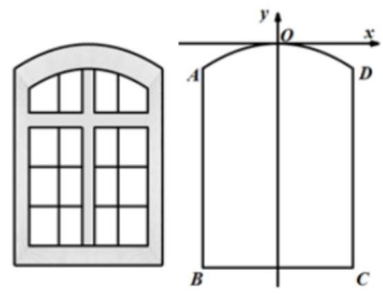

(1)求函数 $f\left( t\right)$ 的解析式，并求要使得窗户的高最小， ${BC}$ 边应设计成多少厘米？

(2)要使得窗户的高与 ${BC}$ 长的比值达到最小， ${BC}$ 边应设计成多少厘米？

【难度】 $\star   \star   \star$

【答案】(1) $f\left( t\right)  = \frac{{t}^{2}}{3} - t + 4\left( {0 < t < 4}\right)$ ， ${BC}$ 应设计为3 厘米；(2) $4\sqrt{3}$ 厘米.

【解析】解: (1) 因为抛物线方程为 $y =  - \frac{{x}^{2}}{3}$ ,所以 $D\left( {t, - \frac{{t}^{2}}{3}}\right)$ ,

又因为 ${AB} = {DC} = \frac{8 - {2t}}{2} = 4 - t$ ，所以点 $O$ 到 ${AD}$ 的距离为 $\frac{{t}^{2}}{3}$ ，

所以点 $O$ 到 ${BC}$ 的距离为 $\frac{{t}^{2}}{3} + 4 - t$ ,即 $f\left( t\right)  = \frac{{t}^{2}}{3} - t + 4\left( {0 < t < 4}\right)$ ,

因为 $t = \frac{-1}{-2 \times  \frac{1}{3}} = \frac{3}{2}\left( {0 < t < 4}\right)$ ,所以当 $t = \frac{3}{2}$ 时有最小值,

$f{\left( t\right) }_{\min } = f\left( \frac{3}{2}\right)  = \frac{{\left( \frac{3}{2}\right) }^{2}}{3} - \frac{3}{2} + 4 = \frac{3}{4} - \frac{3}{2} + 4 = \frac{13}{4},$

此时 $t = \frac{3}{2},{BC} = {2t} = 2 \times  \frac{3}{2} = 3$ ,故 ${BC}$ 应设计为 3 厘米.

( 2 )窗户的高与 ${BC}$ 长的比值为 $g\left( t\right)  = \frac{\frac{{t}^{2}}{3} - t + 4}{2t} = \frac{1}{6}t + \frac{2}{t} - \frac{1}{2}\left( {0 < t < 4}\right)$ ，

因为 $\frac{1}{6}t + \frac{2}{t} - \frac{1}{2} \geq  2\sqrt{\frac{1}{6}t \cdot  \frac{2}{t}} - \frac{1}{2} = \frac{2\sqrt{3}}{3} - \frac{1}{2}$ ,当且仅当 $\frac{t}{6} = \frac{2}{t}$ ,即 $t = 2\sqrt{3}$ 时取等号,

所以要使得窗户的高与 ${BC}$ 长的比值达到最小, ${BC} = {2t} = 4\sqrt{3}$ 厘米.

应用题一教师版

【例 3】为减少人员聚集,某地上班族 $S$ 中的成员仅以自驾或公交方式上班. 分析显示,当 $S$ 中有 $x\% \left( {0 < x < {100}}\right)$ 的成员自驾时,自驾群体的人均上班路上时间为:

$f\left( x\right)  = \left\{  \begin{array}{l} {30},0 < x \leq  {30} \\  {2x} + \frac{1800}{x} - {90},{30} < x < {100} \end{array}\right.$ ,(单位: 分钟) 而公交群体中的人均上班路上时间不受 $x$ 的影响,恒为 40 分钟, 试根据上述分析结果回家下列问题:

(1)当 $x$ 取何值时，自驾群体的人均上班路上时间等于公交群体的人均上班路上时间？

(2)已知上班族 $S$ 的人均上班时间计算公式为: $g\left( x\right)  = f\left( x\right)  \cdot  {x\% } + {50}\left( {{100} - x}\right) \%$ ，讨论 $g\left( x\right)$ 的单调性, 并说明实际意义.(注: 人均上班路上时间, 是指单日内该群体中成员从居住地到工作地的平均用时.)

【难度】 $\star   \star   \star$

【答案】(1) $x = {20}$ 或 $x = {45}$ ； (2) 当 $x \in  \left( {0,{35}}\right)$ 时 $g\left( x\right)$ 单调递减，当 $x \in  \left( {{35},{100}}\right)$ 时 $g\left( x\right)$ 单调递增， 实际意义答案见解析

【解析】

(1)依题意得:①当 $0 < x \leq  {30}$ 时， $f\left( x\right)  = {30} < {40}$ ，不符，

② 当 ${30} < x < {100}$ 时， $f\left( x\right)  = {2x} + \frac{1800}{x} - {90}$ ，

若公交群体的人均上班时间等于自驾群体的人均上班时间,则 $\left\{  \begin{array}{l} {30} < x < {100} \\  {2x} + \frac{1800}{x} - {90} = {40} \end{array}\right.$ ,

解得 $x = {20}$ 或 $x = {45}$ ,

即当 $x = {20}$ 或 $x = {45}$ 时自驾群体的人均上班时间等于公交群体的人均上班时间.

( 2 )① 当 $0 < x \leq  {30}$ 时， $g\left( x\right)  =  - \frac{1}{5}x + {50}$ ，

② 当 ${30} < x < {100}$ 时 $g\left( x\right)  = \frac{1}{50}{x}^{2} - \frac{7}{5}x + {68}$ ,即 $g\left( x\right)  = \left\{  \begin{array}{l}  - \frac{1}{5}x + {50},0 < x \leq  {30} \\  \frac{1}{50}{x}^{2} - \frac{7}{5}x + {68},{30} < x < {100} \end{array}\right.$ ,

$\because$ 当 $0 < x \leq  {30}$ 时, $g\left( x\right)  =  - \frac{1}{5}x + {50}$ 单调递减,则 $g\left( x\right)  \geq  g\left( {30}\right)  = {44}$ ,

当 ${30} < x < {100}$ 时， $g\left( x\right)  = \frac{1}{50}{x}^{2} - \frac{7}{5}x + {68}$ ，

在 $x \in  \left( {{30},{35}}\right)$ 上单调递减, $g\left( x\right)  < g\left( {30}\right)  = {44}$ ; 在 $x \in  \left( {{35},{100}}\right)$ 上单调递增,

$\therefore$ 当 $x \in  \left( {0,{35}}\right)$ 时 $g\left( x\right)$ 单调递减,当 $x \in  \left( {{35},{100}}\right)$ 时 $g\left( x\right)$ 单调递增.

说明该地上班族 $S$ 中有小于 35%的人自驾时，人均上班时间递减；

当大于 35%的人自驾时，人均上班时间递增；当自驾人数等于 35%时，人均上班时间最少.

## 巩固训练

1、为践行“绿水青山就是金山银山”的发展理念，聊城市环保部门近年来利用水生植物(例如浮萍、蒲草、 芦苇等)，对国家级湿地公园——东昌湖进行进一步净化和绿化. 为了保持水生植物面积和开阔水面面积的合理比例，对水生植物的生长进行了科学管控，并于 2020 年对东昌湖内某一水域浮萍的生长情况作了调查， 测得该水域二月底浮萍覆盖面积为 ${45}{\mathrm{\;m}}^{2}$ ，四月底浮萍覆盖面积为 ${80}{\mathrm{\;m}}^{2}$ ，八月底浮萍覆盖面积为 ${115}{\mathrm{\;m}}^{2}$ . 若浮萍覆盖面积 $y$ (单位: ${\mathrm{m}}^{2}$ )与月份 $x$ (2020 年 1 月底记 $x = 1,{2021}$ 年 1 月底记 $x = {13}$ )的关系有两个函数模型 $y = k{a}^{x}\left( {k > 0, a > 1}\right)$ 与 $y = m{\log }_{2}x + n\left( {m > 0}\right)$ 可供选择.

(1)你认为选择哪个模型更符合实际？并解释理由；

(2)利用你选择的函数模型, 试估算从 2020 年 1 月初起至少经过多少个月该水域的浮萍覆盖面积能达到 ${148}{\mathrm{\;m}}^{2}$ ?

(可能用到的数据: ${\log }_{2}{15} \approx  {3.9},\sqrt[3]{\frac{23}{9}} \approx  {1.37},\frac{320}{\sqrt{23}} \approx  {66.72}$ )

【答案】(1)选函数模型 $y = {35}{\log }_{2}x + {10}$ ，理由见解析；(2)16 个月.

【解析】解: (1)若选择数据 $\left( {2,{45}}\right)$ 和 $\left( {4,{80}}\right)$ ,

由 $\left\{  \begin{array}{l} m{\log }_{2}2 + n = {45} \\  m{\log }_{2}4 + n = {80} \end{array}\right.$ ,解得 $\left\{  \begin{array}{l} m = {35} \\  n = {10} \end{array}\right.$ . 则 $y = {35}{\log }_{2}x + {10}$ .

当 $x = 8$ 时, $\dot{y} = {35}{\log }_{2}8 + {10} = {115}$ ,与实际情况相符.

下面仅考虑函数模型 $y = k{a}^{x}\left( {k > 0, a > 1}\right)$ .

若选择数据 $\left( {2,{45}}\right)$ 和 $\left( {4,{80}}\right)$ ,

由 $\left\{  \begin{array}{l} k \cdot  {a}^{2} = {45} \\  k \cdot  {a}^{4} = {80} \end{array}\right.$ ,解得 $\left\{  \begin{array}{l} a = \frac{4}{3}, \\  k = \frac{405}{16} \end{array}\right.$ ,则 $y = \frac{405}{16} \times  {\left( \frac{4}{3}\right) }^{x}$ .

当 $x = 8$ 时, $y = \frac{405}{16} \times  {\left( \frac{4}{3}\right) }^{8} = \frac{20480}{81} > {115}$ ,与实际情况差别较大.

若选择数据 $\left( {2,{45}}\right)$ 和 $\left( {8,{115}}\right)$ ,

由 $\left\{  \begin{array}{l} k \cdot  {a}^{2} = {45} \\  k \cdot  {a}^{8} = {115} \end{array}\right.$ ,解得 $\left\{  \begin{array}{l} a = \sqrt[6]{\frac{23}{9}} \\  k = {45} \cdot  \sqrt[3]{\frac{9}{23}} \end{array}\right.$ ,则 $y = {45} \times  \sqrt[3]{\frac{9}{23}} \times  {\left( \sqrt[6]{\frac{23}{9}}\right) }^{x}$ .

当 $x = 4$ 时, $y = {45} \times  \sqrt[3]{\frac{9}{23}} \times  {\left( \sqrt[6]{\frac{23}{9}}\right) }^{4} = {45} \times  \sqrt[3]{\frac{23}{9}} \approx  {45} \times  {1.37} = {61.65}$ ,与实际情况 80 差别较大.

若选择数据 $\left( {4,{80}}\right)$ 和 $\left( {8,{115}}\right)$ ,

由 $\left\{  \begin{array}{l} k \cdot  {a}^{4} = {80} \\  k \cdot  {a}^{8} = {115} \end{array}\right.$ ,解得 $\left\{  \begin{array}{l} a = \frac{\sqrt[4]{23}}{2} \\  k = \frac{1280}{23} \end{array}\right.$ ,则 $y = \frac{1280}{23} \times  {\left( \frac{\sqrt[4]{23}}{2}\right) }^{x}$ .

当 $x = 2$ 时, $y = \frac{320}{\sqrt{23}} \approx  {66.72}$ 实际情况 45 差别较大. 故选函数模型 $y = {35}{\log }_{2}x + {10}$ .

(2)因为 ${35}{\log }_{2}{15} + {1.0} \approx  {35} \times  {3.9} + {10} = {146.5},{35}{\log }_{2}{16} + {10} = {150}$ .

而 ${146.5} < {148} < {150}$ ,所以至少经过 16 个月该承域的浮萍覆盖面积能达到 ${148}{\mathrm{\;m}}^{2}$ .

2、2011 年六月康菲公司由于机器故障，引起严重的石油泄漏，造成了海洋的巨大污染，某沿海渔场也受到污染.为降低污染, 渔场迅速切断与海水联系, 并决定在渔场中投放一种可与石油发生化学反应的药剂.已知每投放 $a\left( {1 \leq  a \leq  4\text{ ,且 }a \in  R}\right)$ 个单位的药剂,它在水中释放的浓度 $y$ (毫克/升)随着时间 $x$ (天)变化的函数关系式近似为 $y = a \cdot  f\left( x\right)$ ,其中 $f\left( x\right)  = \left\{  \begin{array}{l} \frac{16}{8 - x} - 1,\left( {0 \leq  x \leq  4}\right) \\  5 - \frac{1}{2}x,\left( {4 < x \leq  {10}}\right)  \end{array}\right.$ ,若多次投放,则某一时刻水中的药剂浓

度为每次投放的药剂在相应时刻所释放的浓度之和.根据实验, 当水中药剂的浓度不低于 4(毫克/升)时, 它才能起到有效治污的作用. 称为有效净化; 当药剂在水中释放的浓度不低于 6(毫克/升)且不高于 18(毫克/升) 时称为最佳净化.

(1)若一次投放 4 个单位的药剂，则有效治污时间可达几天？

(2)若第一次投放 2 个单位的药剂，6 天后再投放 $a$ 个单位的药剂，要使接下来的 4 天中能够持续有效治污,试问 $a$ 的最小值(精确到 0.1,参考数据: $\sqrt{2}$ 取近似值 1.4).

【答案】(1)可达 8 天；(2)0 的最小值 1.6.

【解析】(1) $\because a = 4,\;\therefore y = 4 \cdot  f\left( x\right)  = \left\{  \begin{array}{ll} \frac{64}{8 - x} - 4, & \left( {0 \leq  x \leq  4}\right) \\  {20} - {2x}, & \left( {4 < x \leq  {10}}\right)  \end{array}\right.$

则由 $0 \leq  x \leq  4$ 时, $\frac{64}{8 - x} - 4 \geq  4$ ,解得 $x \geq  0$ ,所以此时 $0 \leq  x \leq  4$ .

当 $4 < x \leq  {10}$ 时, ${20} - {2x} \geq  4$ ,解得 $x \leq  8$ ,所以此时 $4 < x \leq  8$ .

综上所述,得 $0 \leq  x \leq  8$ ,若一次投放 4 个单位的药剂,则有效去污时间可达 8 天.

( 2 )当 $6 \leq  x \leq  {10}$ 时， $y = 2 \times  \left( {5 - \frac{1}{2}x}\right)  + a\left\lbrack  {\frac{16}{8 - \left( {x - 6}\right) } - 1}\right\rbrack   = \left( {{14} - x}\right)  + \frac{16a}{{14} - x} - a - 4$ ，

${14} - x \in  \left\lbrack  {4,8}\right\rbrack  ,1 \leq  a \leq  4,\;\therefore 4 \leq  4\sqrt{a} \leq  8$

$\left( {{14} - x}\right)  + \frac{16a}{{14} - x} - a - 4 \geq  2\sqrt{\left( {{14} - x}\right) \frac{16a}{{14} - x}} - a - 4 = 8\sqrt{a} - a - 4$

(当 ${14} - x = 4\sqrt{a}$ 时,等号成立)

由 $8\sqrt{a} - a - 4 \geq  4$ ,解得 ${24} - {16}\sqrt{2} \leq  a \leq  4$ ,所以 $a$ 的最小值 1.6 .

3、在研究某市交通情况时发现, 道路密度是指该路段上一定时间内用过的车辆数除以时间, 车辆密度是该路段一定时间内通过的车辆数除以该路段的长度,现定义交通流量 $v = \frac{q}{x}, x$ 为道路密度, $q$ 车辆密度, $x \in  (0,{80}\rbrack$ ,且 $v = \left\{  {\begin{array}{ll} {100} - {135}{\left( \frac{1}{3}\right) }^{\frac{80}{x}} & 0 < x < {40} \\   - k\left( {x - {40}}\right)  + {85} & {40} \leq  x \leq  {80} \end{array}, k > 0}\right.$ .

(1)当交通流量 $v > {95}$ 时,求道路密度 $x$ 的取值范围；

应用题一教师版

(2)若道路密度 $x = {80}$ 时,测得交通流量 $v = {50}$ ，求出车辆密度 $q$ 的最大值.

【答案】(1) $x \in  \left( {0,\frac{80}{3}}\right) ;\;\left( 2\right) \frac{28800}{7}$ .

【解析】(1)①当 $0 < x < {40}$ 时,令 ${100} - {135}{\left( \frac{1}{3}\right) }^{\frac{80}{x}} > {95}$ ,解得 $x \in  \left( {0,\frac{80}{3}}\right)$

② 当 ${40} \leq  x \leq  {80}$ 时，由于 $k > 0,\; - k < 0$ ，故 $v =  - k\left( {x - {40}}\right)  + {85} \leq  {85}$ ，此时 $v > {95}$ 时无解综上所述， $x \in  \left( {0,\frac{80}{3}}\right)$ .

(2)因为 $x = {80}$ 时， $v =  - k \cdot  \left( {{80} - {40}}\right)  + {85} = {50}$ ，求得 $k = \frac{7}{8},\because q = {vx}$

① 当 $x \in  \left( {0,{40}}\right)$ 时,所以 $q = {100x} - {135} \cdot  {\left( \frac{1}{3}\right) }^{\frac{80}{x}}x,\because {135} \cdot  {\left( \frac{1}{3}\right) }^{\frac{80}{x}}x > 0,\therefore q < {4000}$

② 当 $x \in  \left\lbrack  {{40},{80}}\right\rbrack$ 时，所以 $q =  - \frac{7}{8}{x}^{2} + {120x} =  - \frac{7}{8}{\left( x - \frac{480}{7}\right) }^{2} + \frac{28800}{7}$

$\therefore$ 当 $x = \frac{480}{7}$ 时, $q$ 有最大值为 $\frac{28800}{7}$

又 $\because \frac{28800}{7} > {4000},\therefore x = \frac{480}{7}$ 时, $q$ 取得最大值为 $\frac{28800}{7}$

## (二)三角模型

## 例题精讲

【例 4】某高档小区有一个池塘,其形状为直角 $\bigtriangleup {ABC},\angle C = {90}^{ \circ  },{AB} = 2$ 百米, ${BC} = 1$ 百米,观准备养一批观赏鱼供小区居民观赏.

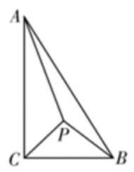

图①

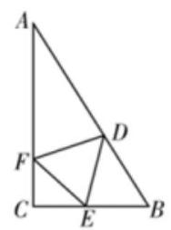

图②

(1)若在 $\bigtriangleup  {ABC}$ 内部取一点 $P$ ，建造 ${APC}$ 连廊供居民观赏，如图①，使得点 $P$ 是等腰三角形 ${PBC}$ 的顶点， 且 $\angle {CPB} = \frac{2\pi }{3}$ ，求连廊 ${AP} + {PC}$ 的长；

(2)若分别在 ${AB},{BC},{CA}$ 上取点 $D, E, F$ ，建造 $\bigtriangleup  {DEF}$ 连廊供居民观赏，如图②，使得 $\bigtriangleup  {DEF}$ 为正三角形，求 $\bigtriangleup  {DEF}$ 连廊长的最小值.

【难度】 $\star   \star   \star$

【答案】(1) $\frac{\sqrt{3} + \sqrt{21}}{3}$ 百米；(2) $\frac{3\sqrt{21}}{7}$ 百米.

【解析】解: (1) 因为 $P$ 是等腰三角形 ${PBC}$ 的顶点,且 $\angle {CPB} = \frac{2\pi }{3}$ ,

又 ${BC} = 1$ ,所以 $\angle {PCB} = \frac{\pi }{6},{PC} = \frac{\sqrt{3}}{3}$ ,又因为 $\angle {ACB} = \frac{\pi }{2}$ ,所以 $\angle {ACP} = \frac{\pi }{3}$ ,

则在三角形 ${PAC}$ 中,由余弦定理可得:

$A{P}^{2} = A{C}^{2} + P{C}^{2} - {2AC} \cdot  {PC}\cos \frac{\pi }{3} = \frac{7}{3}$ ,解得 ${AP} = \frac{\sqrt{21}}{3}$ ,

所以连廊 ${AP} + {PC} = \frac{\sqrt{3} + \sqrt{21}}{3}$ 百米;

( 2 )设正三角形 ${DEF}$ 的边长为 $a,\angle {CEF} = \alpha \left( {0 < \alpha  < \pi }\right)$ ，

则 ${CF} = a\sin \alpha ,{AF} = \sqrt{3} - a\sin \alpha$ ，且 $\angle {EDB} = \alpha$ ，所以 $\angle {ADF} = \frac{2\pi }{3} - \alpha$ ，

在三角形 ${ADF}$ 中,由正弦定理可得:

$\frac{DF}{\sin \angle A} = \frac{AF}{\sin \angle {ADF}}$ ,即 $\frac{a}{\sin \frac{\pi }{6}} = \frac{\sqrt{3} - a\sin \alpha }{\sin \left( {\frac{2\pi }{3} - \alpha }\right) }$ ,

即 $\frac{a}{\frac{1}{2}} = \frac{\sqrt{3} - a\sin \alpha }{\sin \left( {\frac{2\pi }{3} - \alpha }\right) }$ ,化简可得 $a\left\lbrack  {2\sin \left( {\frac{2\pi }{3} - \alpha }\right)  + \sin \alpha }\right\rbrack   = \sqrt{3}$ ,

所以 $a = \frac{\sqrt{3}}{2\sin \alpha  + \sqrt{3}\cos \alpha } = \frac{\sqrt{3}}{\sqrt{7}\sin \left( {\alpha  + \theta }\right) } \geq  \frac{\sqrt{3}}{\sqrt{7}} = \frac{\sqrt{21}}{7}$ (其中 $\theta$ 为锐角,且 $\tan \theta  = \frac{\sqrt{3}}{2}$ ),

即边长的最小值为 $\frac{\sqrt{21}}{7}$ 百米,所以三角形 ${DEF}$ 连廊长的最小值为 $\frac{3\sqrt{21}}{7}$ 百米.

【例 5】如图,已知某市穿城公路 ${MON}$ 自西向东到达市中心 $O$ 后转向东北方向, $\angle {MON} = \frac{3\pi }{4}$ ,现准备修建一条直线型高架公路 ${AB}$ ，在 ${MO}$ 上设一出入口 $\mathrm{A}$ ，在 ${ON}$ 上设一出入口 $B$ ，且要求市中心 $O$ 到 ${AB}$ 所在的直线距离为10km.

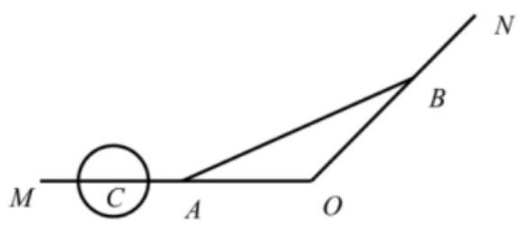

(1)求A， $B$ 两出入口间距离的最小值；

(2)在公路 ${MO}$ 段上距离市中心 $O$ 点 ${30}\mathrm{{km}}$ 处有一古建筑 $C$ (视为一点)，现设立一个以 $C$ 为圆心， $5\mathrm{{km}}$ 为半径的圆形保护区，问如何在古建筑 $C$ 和市中心 $O$ 之间设计出入口 $\mathrm{A}$ ，才能使高架公路及其延长线不经过保护区?

【难度】 $\star   \star   \star$

【答案】( 1 )20 $2\left( {\sqrt{2} + 1}\right)$ ；( 2 )10 $\sqrt{2} < {OA} < {20}$ ，

【解析】(1)如图所示:

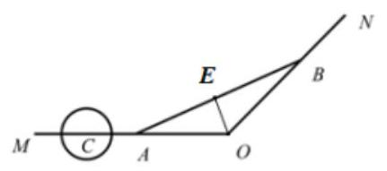

过点 $O$ 作 ${OE} \bot  {AB}$ 于点 $E$ ,则 ${OE} = {10}$ ,设 $\angle {AOE} = \alpha$ ,

则 $\frac{\pi }{4} < \alpha  < \frac{\pi }{2},\angle {BOE} = \frac{3\pi }{4} - \alpha$ ,

所以 ${AB} = {AE} + {BE} = {10}\tan \alpha  + {10}\tan \left( {\frac{3\pi }{4} - \alpha }\right)  = \frac{5\sqrt{2}}{\cos \alpha  \cdot  \cos \left( {\frac{3\pi }{4} - \alpha }\right) }$ ,

而 $\cos \alpha  \cdot  \cos \left( {\frac{3\pi }{4} - \alpha }\right)  = \cos \alpha  \cdot  \left( {-\frac{\sqrt{2}}{2}\cos \alpha  + \frac{\sqrt{2}}{2}\sin \alpha }\right)$ ,

$= \left( {-\frac{\sqrt{2}}{2}{\cos }^{2}\alpha  + \frac{\sqrt{2}}{2}\sin \alpha \cos \alpha }\right)  = \frac{1}{2}\sin \left( {{2\alpha } - \frac{\pi }{4}}\right)  - \frac{\sqrt{2}}{4}$ ,所以当 $\alpha  = \frac{3\pi }{8}$ 时, $A{B}_{\min } = {20}\left( {\sqrt{2} + 1}\right)$ .

(2)以 $O$ 为原点建立平面直角坐标系，

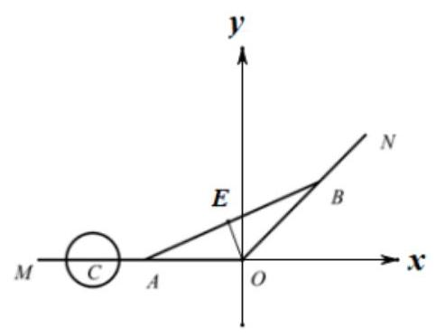

则圆 $C$ 的方程为: ${\left( x + {30}\right) }^{2} + {y}^{2} = {25}$ ,

设直线 ${AB}$ 的方程为: $y = {kx} + t\left( {k > 0, t > 0}\right)$ ,由题意得: $\frac{\left| t\right| }{\sqrt{{k}^{2} + 1}} = {10}$ ,且 $\frac{\left| -{30}k + t\right| }{\sqrt{{k}^{2} + 1}} > 5$ ,

所以 $\sqrt{{k}^{2} + 1} = \frac{t}{10}$ ,代入 $\frac{\left| -{30}k + t\right| }{\sqrt{{k}^{2} + 1}} > 5$ ,化简得: ${t}^{2} - {80kt} + {1200}{k}^{2} > 0$ ,

解得 $t < {20k}$ 或 $t > {60k}$ (舍去),

因为 $\angle {BAO} < \frac{\pi }{4}$ ，所以 $0 < k < 1$ ，所以 ${OA} < {20}$ ，

当 ${AB}//{ON}$ 时， ${OA} \rightarrow  {10}\sqrt{2}$ ，所以 ${10}\sqrt{2} < {OA} < {20}$ .

【例 6】某加油站拟造如图所示的铁皮储油罐(不计厚度，长度单位:米)，其中储油罐的中间为圆柱形， 左右两端均为半球形, $l = {2r} - 3$ ( $l$ 为圆柱的高, $r$ 为球的半径, $l \geq  2$ ). 假设该储油罐的建造费用仅与其表面积有关. 已知圆柱形部分每平方米建造费用为 $c$ 千元,半球形部分每平方米建造费用为 3 千元. 设该储油罐的建造费用为 $y$ 千元.

(1)写出 $y$ 关于 $r$ 的函数表达式，并求该函数的定义域；

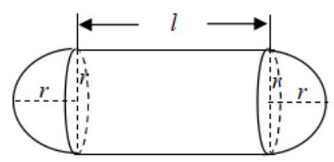

(2)求该储油罐的建造费用最小时的 $r$ 的值.

【难度】 $\star   \star   \star$

【答案】(1)见解析. (2)当 $r = \frac{5}{2}$ 时,储油罐的建造费用最小.

【解析】[解]: (1) $y = {2\pi rlc} + {4\pi }{r}^{2} \cdot  3$

$y = \left( {{12\pi } + {4\pi c}}\right) {r}^{2} - {6\pi rc}\left( {r \geq  \frac{5}{2}}\right)$

(2) $y = \left( {{12\pi } + {4\pi c}}\right) {\left\lbrack  r - \frac{3c}{\left( {12} + 4c\right) }\right\rbrack  }^{2} - \frac{{9\pi }{c}^{2}}{{12} + {4c}}$

$\because \frac{3c}{{12} + {4c}} = \frac{3}{4}\left( {1 - \frac{3}{c + 3}}\right)  < \frac{3}{4}\;\therefore y$ 在 $\left\lbrack  {\frac{5}{2}, + \infty }\right)$ 上是增函数,

所以当 $r = \frac{5}{2}$ 时,储油罐的建造费用最小.

## 巩固训练

1、重庆、武汉、南京并称为三大“火炉”城市，而重庆比武汉、南京更厉害，堪称三大“火炉”之首. 某人在歌乐山修建了一座避暑山庄 $O$ (如图)，为吸引游客，准备在门前两条夹角为 $\frac{\pi }{6}$ (即 $\angle {AOB}$ )的小路之间修建一处弓形花园，使之有着类似“冰淇淋”般的凉爽感，已知弓形花园的弦长 $\left| {AB}\right|  = 2\sqrt{3}$ 且点 $\mathrm{A}, B$ 落在小路上,记弓形花园的顶点为 $M$ ,且 $\angle {MAB} = \angle {MBA} = \frac{\pi }{6}$ ,设 $\angle {OBA} = \theta$ .

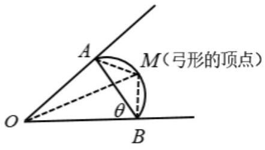

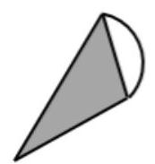

“冰淇淋”设计图

(1)将 $\mathrm{{OA}}$ ， ${OB}$ 用含有 $\theta$ 的关系式表示出来;

(2)该山庄准备在 $M$ 点处修建喷泉，为获取更好的观景视野，如何规划花园(即 $\mathrm{{OA}}$ ， ${OB}$ 长度)，才使得喷泉 $M$ 与山庄 $O$ 距离即值 $\left| {OM}\right|$ 最大?

【答案】(1) ${OA} = 4\sqrt{3}\sin \theta$ ； ${OB} = 4\sqrt{3}\sin \left( {\theta  + \frac{\pi }{6}}\right)$ ；(2) 当 ${OB} = {OA} = \sqrt{6} + 3\sqrt{2}$ 时， $\left| {OM}\right|$ 取最大值.

【解析】(1)在 $\bigtriangleup  {ABC}$ 中，由正弦定理可知 $\frac{OA}{\sin \theta } = \frac{AB}{\sin \frac{\pi }{6}}$ ，则 ${OA} = 4\sqrt{3}\sin \theta$ ； 同理由正弦定理可得 $\frac{OB}{\sin \angle {OAB}} = \frac{AB}{\sin \frac{\pi }{6}}$ ,则 ${OB} = 4\sqrt{3}\sin \angle {OAB} = 4\sqrt{3}\sin \left( {\theta  + \frac{\pi }{6}}\right)$ ,

(2) $\because \left| {AB}\right|  = 2\sqrt{3}$ ， $\angle {MAB} = \angle {MBA} = \frac{\pi }{6}$ ， $\therefore {AM} = {BM} = 2$ ，

在 $\bigtriangleup {OMB}$ 中,由余弦定理可知

$O{M}^{2} = O{B}^{2} + B{M}^{2} - {2OB} \cdot  {BM}\cos \left( {\theta  + \frac{\pi }{6}}\right)  = {48}{\sin }^{2}\left( {\theta  + \frac{\pi }{6}}\right)  + 4 - {16}\sqrt{3}\sin \left( {\theta  + \frac{\pi }{6}}\right) \cos \left( {\theta  + \frac{\pi }{6}}\right)$

$= {24}\left( {1 - \cos \left( {\frac{\pi }{3} + {2\theta }}\right) }\right)  + 4 - 8\sqrt{3}\sin \left( {\frac{\pi }{3} + {2\theta }}\right)$

$=  - 8\left\lbrack  {\sqrt{3}\sin \left( {\frac{\pi }{3} + {2\theta }}\right)  + 3\cos \left( {\frac{\pi }{3} + {2\theta }}\right) }\right\rbrack   + {28} =  - {16}\sqrt{3}\sin \left( {{2\theta } + \frac{2\pi }{3}}\right)  + {28}$ ,

$\because \theta  \in  \left( {0,\frac{5\pi }{6}}\right) ,\therefore {2\theta } + \frac{2\pi }{3} \in  \left( {\frac{2\pi }{3},\frac{7\pi }{3}}\right) ,\therefore \sin \left( {{2\theta } + \frac{2\pi }{3}}\right)  = \left\lbrack  {-1,\frac{\sqrt{3}}{2}}\right)$ ,

当 $\sin \left( {{2\theta } + \frac{2\pi }{3}}\right)  =  - 1$ 时,即 $\theta  = \frac{5\pi }{12}$ 时,

$\left| {OM}\right|$ 取最大值 $\sqrt{{28} + {16}\sqrt{3}} = 4 + 2\sqrt{3}$ ,

此时 ${OA} = 4\sqrt{3}\sin \frac{5\pi }{12} = 4\sqrt{3}\left( {\sin \frac{\pi }{4}\cos \frac{\pi }{6} + \cos \frac{\pi }{4}\sin \frac{\pi }{6}}\right)  = \sqrt{6} + 3\sqrt{2}$ ,

${OB} = 4\sqrt{3}\sin \left( {\frac{5\pi }{12} + \frac{\pi }{6}}\right)  = 4\sqrt{3}\sin \left( {\pi  - \frac{5\pi }{12}}\right)  = 4\sqrt{3}\sin \frac{5\pi }{12} = \sqrt{6} + 3\sqrt{2},$

即当 ${OB} = {OA} = \sqrt{6} + {3\sqrt{2}}$ 时， $\left| {OM}\right|$ 取最大值.

2、某城市为发展城市旅游经济，拟在景观河道的两侧，沿河岸直线 ${l}_{1}$ 与 ${l}_{2}$ 修建景观路(桥)，如图所示， 河道为东西方向,现要在矩形区域 ${ABCD}$ 内沿直线将 ${l}_{1}$ 与 ${l}_{2}$ 接通,已知 ${AB} = {60}\mathrm{\;m},{BC} = {80}\mathrm{\;m}$ ,河道两侧的景观道路修建费用为每米 1 万元，架设在河道上方的景观桥 ${EF}$ 部分的修建费用为每米 2 万元.

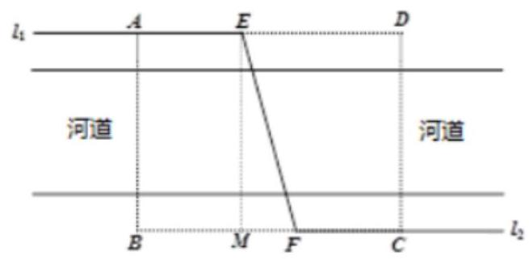

(1)若景观桥长 ${90}\mathrm{\;m}$ 时，求桥与河道所成角的大小；

(2)如何设计景观桥 ${EF}$ 的位置，使矩形区域 ${ABCD}$ 内的总修建费用最低? 最低总造价是多少？

【答案】(1) $\frac{\pi }{2} - \arccos \frac{2}{3}$ ；(2)景观桥 ${EF}$ 与和河道沿线所成的角为 $\frac{\pi }{6}$ 时，最低总造价是 ${80} + {60}\sqrt{3}$ 万元.

【解析】如题设中的图示, ${EM} \bot  {BC}$ 垂足为 $M$ ,设 ${EF}$ 与 ${AB}$ 所成的角为 $\alpha$ ,即 $\angle {MEF} = \alpha \left( {0 \leq  \tan \alpha  \leq  \frac{4}{3}}\right)$ ,故有 ${MF} = {60}\tan \alpha ,{EF} = \frac{60}{\cos \alpha }$ .

(1)当景观桥 ${EF}$ 的长为 ${90m}$ 时,得 ${EF} = \frac{60}{\cos \alpha } = {90} \Rightarrow  \cos \alpha  = \frac{2}{3} \Rightarrow  \alpha  = \arccos \frac{2}{3}$ ,即景观桥 ${EF}$ 与和河道沿线所成的角为 $\frac{\pi }{2} - \arccos \frac{2}{3}$ .

(2)由 ${AE} + {FC} = {80} - {60}\tan \alpha$ ，可得总修建费用

$y = \left( {{80} - {60}\tan \alpha }\right)  \times  1 + \frac{60}{\cos \alpha } \times  2 = {80} - \frac{{60}\left( {\sin \alpha  - 2}\right) }{\cos \alpha },$

令 $t = \frac{\sin \alpha  - 2}{\cos \alpha }$ ,又 $0 \leq  \tan \alpha  \leq  \frac{4}{3}$ ,故 $0 < \alpha  < \frac{\pi }{2}$ ,则 $t < 0$ 且 $\sin \alpha  - t\cos \alpha  = 2 \Rightarrow  \sin \left( {\alpha  + \varphi }\right)  = \frac{2}{\sqrt{1 + {t}^{2}}}$ ,

又 $\left| {\sin \left( {\alpha  + \varphi }\right) }\right|  \leq  1 \Rightarrow  \frac{2}{\sqrt{1 + {t}^{2}}} \leq  1$ 有 $t \leq   - \sqrt{3}$ ,

所以 $t$ 最大值为 $- \sqrt{3}$ ， $y$ 有最小值为 ${80} + {60}\sqrt{3}$ ，此时 $\alpha  = \frac{\pi }{6}$ ，景观桥 ${EF}$ 与河道沿线所成的角为 $\frac{\pi }{3}$ .

3、如图是一段半圆柱形水渠的直观图，其横断面是所示的半圆弧 ${ACB}$ ，其中 $C$ 为半圆弧中点，渠宽 ${AB}$ 为 2 米.

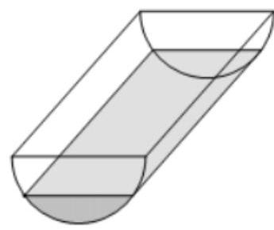

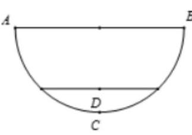

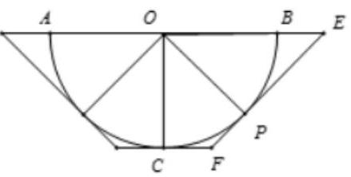

(1)当渠中水深 ${CD}$ 为 0.4 米时( $D$ 为水面中点)，求水面的宽；

(2)若把这条水渠改挖(不准填上)成横断面为等腰梯形的水渠，使渠的底面与水平地面平行，则改挖后的水渠底宽为多少米时 (精确到 0.01 米), 所挖的土最少?

【答案】(1)1.6 米；(2)1.15 米.

【解析】(1)以 ${AB}$ 所在直线为 $x$ 轴， ${AB}$ 的中垂线为 $y$ 轴，

建立如图所示的平面直角坐标系,

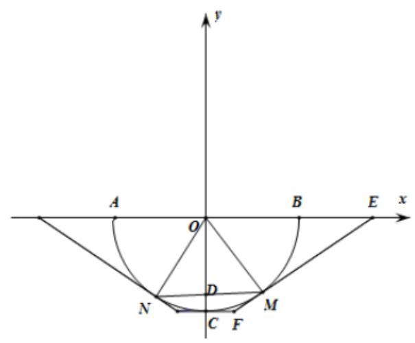

因为 ${AB} = 2$ 米,所以半圆的半径为 1 米,所以半圆的方程为 ${x}^{2} + {y}^{2} = 1\left( {-1 \leq  x \leq  1, y \leq  0}\right)$

因为水深 ${CD} = {0.4}$ 米，所以 ${OD} = {0.6}$ 米，

在直角 $\bigtriangleup {ODM}$ 中, ${DM} = \sqrt{O{M}^{2} - O{D}^{2}} = \sqrt{1 - {0.6}^{2}} = {0.8}$ 米,

所以 ${MN} = {2DM} = {1.6}$ ，故水面的宽为 1.6 米；

(2)为使挖掉的土最少，等腰梯形的两条腰必须和半圆相切，

设切点 $P\left( {\cos \theta ,\sin \theta }\right) \left( {-\frac{\pi }{2} < \theta  < 0}\right)$ 是第四象限内半圆上的一点,

因为 $\overrightarrow{OP} = \left( {\cos \theta ,\sin \theta }\right)$ ,所以切线方程为

$\cos \theta \left( {x - \cos \theta }\right)  + \sin \theta \left( {y - \sin \theta }\right)  = 0$ ,即 $x\cos \theta  + y\sin \theta  = 1$ ,

令 $y = 0$ ,得 $E\left( {\frac{1}{\cos \theta },0}\right)$ ,令 $y =  - 1$ ,得 $F\left( {\frac{1 + \sin \theta }{\cos \theta }, - 1}\right)$ ,

设直角梯形 ${OCFE}$ 的面积为 $S$ ,

则 $S = \frac{1}{2}\left( {{CF} + {OE}}\right)  \cdot  {OC} = \frac{1}{2}\left( {\frac{1}{\cos \theta } + \frac{1 + \sin \theta }{\cos \theta }}\right)  \times  1 = \frac{1}{2} \times  \frac{2 + \sin \theta }{\cos \theta }\left( {-\frac{\pi }{2} < \theta  < 0}\right)$ ,

所以 $\sin \theta  - {2S}\cos \theta  =  - 2$ ,所以 $\sqrt{1 + 4{S}^{2}}\sin \left( {\theta  + \varphi }\right)  =  - 2$ ,

于是 $\sin \left( {\theta  + \varphi }\right)  = \frac{-2}{\sqrt{1 + 4{S}^{2}}} \geq   - 1$ ,解得 $S \geq  \frac{\sqrt{3}}{2}$ ,

取等号的条件为 $S = \frac{\sqrt{3}}{2},\tan \varphi  =  - {2S} =  - \sqrt{3}$ ,所以 $\varphi  =  - \frac{\pi }{3}$ ,

又 $\sin \left( {\theta  + \varphi }\right)  =  - 1$ ,所以 $\theta  =  - \frac{\pi }{6}$ ,

此时 $E\left( {\frac{2}{\sqrt{3}},0}\right) , F\left( {\frac{\sqrt{3}}{3}, - 1}\right)$ 即水渠底面的宽为 $\frac{2\sqrt{3}}{3} \approx  {1.15}$ 米时,所挖的土最少.

## (三) 数列模型

## 例题精讲

【例 7】某公司自 2020 年起, 每年投入的设备升级资金为 500 万元, 预计自 2020 年起 (2020 年为第 1 年), 因为设备升级,第 $n$ 年可新增的盈利 ${a}_{n} = \left\{  \begin{array}{l} {80}\left( {n - 1}\right) , n \leq  5 \\  {1000}\left( {1 - {0.6}^{n - 5}}\right) , n \geq  6 \end{array}\right.$ (单位: 万元),求:

(1)第几年起，当年新增盈利超过当年设备升级资金；

(2)第几年起，累计新增盈利总额超过累计设备升级资金总额.

【难度】★★★

【答案】(1)第 7 年；(2)第 12 年.

【解析】(1)当 $n \leq  5$ 时, ${a}_{n} = {80}\left( {n - 1}\right)  > {500}$ ,解得 $n > {7.25}$ ,即 $n \geq  8$ ,不成立,

当 $n \geq  6$ 时, ${a}_{n} = {1000}\left( {1 - {0.6}^{n - 5}}\right)  > {500}$ ,即 ${0.6}^{n - 5} < {0.5},{0.6}^{n - 5}$ 随着 $n$ 的增大而减小,

当 $n = 6$ 时， ${0.6}^{6 - 5} = {0.6} < {0.5}$ 不成立，当 $n = 7$ 时， ${0.6}^{7 - 5} = {0.36} < {0.5}$ 成立，

故第 7 年起, 当年新增盈利超过当年设备升级资金;

(2)当 $n = 5$ 时,累计新增盈利总额

${S}_{5} = {a}_{1} + {a}_{2} + {a}_{3} + {a}_{4} + {a}_{5} = 0 + {80} + {160} + {240} + {320} = {800} < {500} \times  5$ ,

可得所求 $n$ 超过 5,

当 $n \geq  6$ 时, ${S}_{n} = {S}_{5} + {1000}\left( {n - 5}\right)  - \frac{{600}\left( {1 - {0.6}^{n - 5}}\right) }{1 - {0.6}} > {500n}$ ,

整理得 $n + 3 \times  {0.6}^{n - 5} > {11.4}$ ,由于 $3 \times  {0.6}^{n - 5}$ 随着 $n$ 的增大而减小

又当 $n = {11}$ 时， ${11} + 3 \times  {0.6}^{{11} - 5} < {11.4}$ ，故不成立，

当 $n = {12}$ 时， ${12} + 3 \times  {0.6}^{{12} - 5} > {11.4}$ ，故成立，

故从第 12 年起, 累计新增盈利总额超过累计设备升级资金总额.

【例 8】某卫材公司年初投资 300 万元, 购置口罩生产设备, 立即投入生产, 预计第一年该生产设备的使用费用为 36 万元,以后每年增加 6 万元,该生产设备每年可给公司带来 121 万元的收入.假设第 $n$ 年该设备产生的利润(利润=该年该设备给公司带来的收入-该年的使用费用)为 ${a}_{n}$ .

(1)写出 ${a}_{n}$ 的表达式；

(2)在该设备运行若干整年后，该卫材公司需要升级产品生产线，决定处置该生产设备，现有以下两种处置方案:

①当总利润(总利润=各年的收入之和-各年的使用费用-购置口罩生产设备的成本)最大时，以 7 万元变卖该生产设备；

②当年平均总利润最大时，以 72 万元变卖该生产设备.

请你为该公司选择一个合理的处置方案, 并说明理由.

【难度】 $\star   \star   \star$

【答案】( 1 ) ${a}_{n} =  - {6n} + {91}$ ；( 2 )第二种方案合理，理由见详解.

【解析】(1)由题意可知第 $n$ 年的使用费为 ${36} + \left( {n - 1}\right)  \times  6$ ,

$\therefore {a}_{n} = {121} - \left\lbrack  {{36} + \left( {n - 1}\right)  \times  6}\right\rbrack   = {85} - 6\left( {n - 1}\right)  =  - {6n} + {91}, n \in  {N}^{ * }$ ,

(2)设 ${a}_{n}$ 的前 $n$ 项和为 ${S}_{n}$ ，则 ${S}_{n} = \frac{n\left( {{85} + {91} - {6n}}\right) }{2} =  - 3{n}^{2} + {88n}$ ，

若采用第一种方案，则总收入最大，根据二次函数的对称轴公式

$x =  - \frac{b}{2a} = \frac{44}{3}$ ,可得 $n = {14}$ 或 $n = {15},\therefore {S}_{14} = {644},{S}_{15} = {645},\therefore {S}_{15} > {S}_{14}$ ,

应用题一教师版

$\therefore$ 当 $n = {15}$ 时,即第 15 年时总利润最大为 ${645} - {300} + 7 = {352}$ (万元),

若采用第二种方案,

令 ${b}_{n} = \frac{{S}_{n} - {300}}{n} =  - {3n} - \frac{300}{n} + {88} =  - \left( {{3n} + \frac{300}{n}}\right)  + {88}$ ,

$\therefore {3n} + \frac{300}{n} \geq  2 \times  \sqrt{900} = {60}$ ,当且仅当 $n = {10}$ 时取等号,

$\therefore$ 第 10 的平均利润最大,此时的总利润为 ${S}_{10} - {300} = {280}$ (万元),故最大利润为 ${280} + {72} = {352}$ (万元), 综上所述, 两种方案的最终利润一样, 但是第二种方案只用了10的时间,

因此选择第二种方案合理.

## 巩固训练

1、诺贝尔奖每年发放一次，把奖金总金额平均分成 6 份，奖励在 6 项(物理、化学、文学、经济学、生理学和医学、和平)为人类做出最有贡献人. 每年发放奖金的总金额是基金在该年度所获利息的一半，另一半利息用于增加基金总额，以便保证奖金数逐年递增. 资料显示:1998 年诺贝尔奖发奖后的基金总额(即 1999 年的初始基金总额)已达 19516 万美元,基金平均年利率为 $r = {6.24}\%$ .

(1)求 1999 年每项诺贝尔奖发放奖金为多少万美元(精确到 0.01)；

(2)设 ${a}_{n}$ 表示 $\left( {{1998} + n}\right)$ 年诺贝尔奖发奖后的基金总额，其中 $n \in  {N}^{ * }$ ，求数列 $\left\{  {a}_{n}\right\}$ 的通项公式，并因此判断“2020 年每项诺贝尔奖发放奖金将高达 193.46 万美元”的推测是否具有可信度.

【答案】(1)101 万美元; (2) ${a}_{n} = {20125} \cdot  {\left( 1 + {3.12}\% \right) }^{n - 1}$ ; 该推测具有可信度.

【解析】(1)由题意得 1999 年诺贝尔奖发奖后基金总额为

${19516} \times  \left( {1 + {6.24}\% }\right)  - \frac{1}{2} \times  {19516} \times  {6.24}\%  = {20124.8992} \approx  {20125}$ 万美元,

每项诺贝尔奖发放奖金为 $\frac{1}{6} \times  \left( {\frac{1}{2} \times  {19516} \times  {6.24}\% }\right)  = {101.4832} \approx  {101}$ 万美元;

(2)由题意得 ${a}_{1} = {20125},{a}_{2} = {a}_{1} \cdot  \left( {1 + {6.24}\% }\right)  - \frac{1}{2} \cdot  {a}_{1} \cdot  {6.24}\%  = {a}_{1} \cdot  \left( {1 + {3.12}\% }\right)$ , ${a}_{3} = {a}_{2} \cdot  \left( {1 + {6.24}\% }\right)  - \frac{1}{2} \cdot  {a}_{2} \cdot  {6.24}\%  = {a}_{2} \cdot  \left( {1 + {3.12}\% }\right)  = {a}_{1} \cdot  {\left( 1 + {3.12}\% \right) }^{2}$

...

所以 ${a}_{n} = {20125} \cdot  {\left( 1 + {3.12}\% \right) }^{n - 1}$ ,

2019 年诺贝尔奖发奖后基本总额为 ${a}_{21} = {20125} \cdot  {\left( 1 + {3.12}\% \right) }^{20}$ ,

2020 年每项诺贝尔奖发放奖金为 $\frac{1}{6} \times  \frac{1}{2} \times  {a}_{21} \times  {6.249}\%  \approx  {193.46}$ 万美元,故该推测具有可信度.

2、2019 年9月1日，小刘从各个渠道融资 30 万元，在某大学投资一个咖啡店，2020 年1月1日正式开业， 已知开业第一年运营成本为 6 万元，由于工人工资不断增加及设备维修等，以后每年成本增加 2 万元，若每年的销售额为 30 万元,用数列 $\left\{  {a}_{n}\right\}$ 表示前 $n$ 年的纯收入. (注: 纯收入 $=$ 前 $n$ 年的总收入-前 $n$ 年的总支出一投资额)

(1)试求年平均利润最大时的年份(年份取正整数)并求出最大值.

(2)若前 $n$ 年的收入达到最大值时，小刘计划用前 $n$ 年总收入的 $\frac{1}{3}$ 对咖啡店进行重新装修，请问:小刘最早从哪一年对咖啡店进行重新装修 (年份取整数)? 并求小刘计划装修的费用.

【答案】(1)到 2025 年或 2026 年，年平均利润最大，最大值为 14 万元；(2)小刘最早从 2032 年对咖啡店进行重新装修, 计划装修费用为 42 万元.

【解析】(1)由条件可知, 每年的运营成本构成首项为 6 , 公差为 2 的等差数列, $\therefore {a}_{n} = {30n} - \left\lbrack  {{6n} + \frac{n\left( {n - 1}\right) }{2} \times  2}\right\rbrack   - {30} =  - {n}^{2} + {25n} - {30}$ ,则年平均利润为 $\frac{{a}_{n}}{n} = {25} - \left( {n + \frac{30}{n}}\right)$ , 由 $n + \frac{30}{n} \geq  2\sqrt{30}$ ,当且仅当 $n = \frac{30}{n}$ ,即 $n = \sqrt{30}$ 时取等号.

但 $n \in  {N}^{ * }$ ,且 $n = 5$ 或 $n = 6$ 时, $n + \frac{30}{n} = {11}$ . 此时, $\frac{{a}_{n}}{n}$ 取最大值 14 .

$\therefore$ 到 2025 年或 2026 年,年平均利润最大,最大值为 14 万元;

(2)由(1)可得 ${a}_{n} =  - {n}^{2} + {25n} - {30} =  - {\left( n - \frac{25}{2}\right) }^{2} + \frac{505}{4}\left( {n \in  {\mathbf{N}}^{ * }}\right)$ ,

当 $n = {12}$ 或 $n = {13}$ 时， ${a}_{n}$ 取得最大值126. ${126} \div  3 = {42}$ (万元)

故小刘最早从2032年对咖啡店进行重新装修，计划装修费用为 42 万元.

应用题一教师版
