## 解题技巧

<table><tr><td>教学目标</td><td>1、结合选择题填空题的特点，用一些非常规方法，达到做题速度快，又准确；   2、要培养学生做选择题填空题非常规方法的合理选用，不能“小题大做”。</td></tr><tr><td>重点</td><td>学会结合选项用排除法、验证法、特殊值法、数形结合、估值法等方法解答选择题；用观察法、特例法、数形结合法、等价转化法、归纳猜想法等方法解答填空题.</td></tr><tr><td>难 点</td><td>解答选择题填空题方法的灵活运用</td></tr></table>

## (一) 选择题解题策略

知识梳理

## 一、高考数学选择题的基本特点:

(1)绝大部分数学选择题属于低中档题，最后第 16 题有一定难度，且一般按由易到难的顺序排列，主要的数学思想和数学方法能通过它得到充分的体现和应用，并且因为它还有相对难度(如思维层次、解题方法的优劣选择，解题速度的快慢等)，所以选择题已成为具有较好区分度的基本题型之一.

(2)选择题具有概括性强、知识覆盖面广、小巧灵活及有一定的综合性和深度等特点，且每一题几乎都有两种或两种以上的解法，能有效地检测学生的思维层次及观察、分析、判断和推理能力.

(3)由选择题的结构特点，决定了解选择题除常规方法外还有一些特殊的方法. 解选择题的基本原则是: “小题不能大做”，要充分利用题目中(包括题干和选项)提供的各种信息，排除干扰，利用矛盾，作出正确的判断.

## 二、做选择题常用解题策略:

(1)小题不能大做；(2)一定要结合选项；(3)能排除的选项就先排除掉；(4)能特殊值法就不用常规计算；(5)能间接解就不要直接解；(6)分析计算一半后直接选选项；(7)三个相似选相似.

例题精讲

## 1、直接法

直接从题设条件出发，利用已知条件、相关概念、性质、公式、公理、定理、法则等基础知识，通过严谨推理、准确运算、合理验证，从而直接得出正确结论，然后对照题目所给出的选项“对号入座”，从而确定正确的选择. 这类选择题往往是由计算题、应用题或证明题改编而来, 其基本求解策略是由因导果, 直接求解.

【例 1】已知向量 $\overrightarrow{a}$ 与 $\overrightarrow{b}$ 的夹角为 ${60}^{ \circ  },\left| \overrightarrow{a}\right|  = 2,\left| \overrightarrow{b}\right|  = 6$ ，则 $2\overrightarrow{a} - \overrightarrow{b}$ 在 $\overrightarrow{a}$ 方向上的投影为( )

A. 4 B. 3 C. 2 D. 1

【难度】★★

【答案】D

【解析】: 向量 $\overrightarrow{a}$ 与 $\overrightarrow{b}$ 的夹角为 ${60}^{ \circ  },\left| \overrightarrow{a}\right|  = 2,\left| \overrightarrow{b}\right|  = 6,\therefore \left( {2\overrightarrow{a} - \overrightarrow{b}}\right)  \cdot  \overrightarrow{a} = 2{\left| \overrightarrow{a}\right| }^{2} - \overrightarrow{a} \cdot  \overrightarrow{b} = 2 \times  {2}^{2} - 2 \times  6 \times  \frac{1}{2} = 2$ , $\therefore 2\overrightarrow{a} - \overrightarrow{b}$ 在 $\overrightarrow{a}$ 方向上的投影为 $\frac{\left( {2\overrightarrow{a} - \overrightarrow{b}}\right)  \cdot  \overrightarrow{a}}{\left| \overrightarrow{a}\right| } = \frac{2}{2} = 1$ ,故选: D.

【例 2】若实数 $x\text{ 、 }y$ 满足 $x > y > 0$ ,且 ${\log }_{2}x + {\log }_{2}y = 2$ ,则 $\frac{x - y}{{\left( x + y\right) }^{2}}$ 的最大值为( ).

A. 1

B. $\frac{1}{2}$ C. $\frac{1}{4}$ D. $\frac{1}{8}$

【难度】 $\star   \star   \star$

【答案】D

【解析】解: 由 ${\log }_{2}x + {\log }_{2}y = 2 \Rightarrow  {xy} = 4;\frac{x - y}{{\left( x + y\right) }^{2}} = \frac{x - y}{{\left( x - y\right) }^{2} + {4xy}} = \frac{1}{\left( {x - y}\right)  + \frac{16}{x - y}} \leq  \frac{1}{8}$ (当且仅当 $x = 2\sqrt{2} + 2,\;y = 2\sqrt{2} - 2$ 时等式成立 $)$ . 故答案为: D.

【例 3】已知直线 ${3x} + {4y} - {15} = 0$ 与圆 $O : {x}^{2} + {y}^{2} = {25}$ 交于 $A\text{ 、 }B$ 两点，点 $C$ 在圆 $O$ 上，且 ${S}_{\bigtriangleup {ABC}} = 8$ ，则满足条件的点 $C$ 的个数为( )

A. 1 个 B. 2 个 C. 3 个 D. 4 个

【难度】 $\star   \star   \star$

【答案】C

【解析】圆心 $O$ 到已知直线的距离为 $d = \frac{\left| -{15}\right| }{\sqrt{{3}^{2} + {4}^{2}}} = 3$ ,因此 $\left| {AB}\right|  = 2\sqrt{{5}^{2} - {3}^{2}} = 8$ ,设点 $C$ 到直线 ${AB}$ 的距离为 $h$ ,则 ${S}_{\bigtriangleup {ABC}} = \frac{1}{2} \times  8 \times  h = 8, h = 2$ ,由于 $d + h = 3 + 2 = 5 = r$ (圆的半径),因此与直线 ${AB}$ 距离为 2 的两条直线中一条与圆相切,一条与圆相交,故符合条件的点 $C$ 有三个,选 $\mathrm{C}$ .

【例 4】已知梯形 ${ABCD},{AB}//{CD}$ ,设 $\overrightarrow{AB} = \overrightarrow{{e}_{1}}$ ,向量 $\overrightarrow{{e}_{2}}$ 的起点和终点分别是 $A\text{ 、 }B\text{ 、 }C\text{ 、 }D$ 中的两个点,若对平面中任意的非零向量 $\overrightarrow{a}$ ,都可以唯一表示为 $\overrightarrow{{e}_{1}}\text{ 、 }\overrightarrow{{e}_{2}}$ 的线性组合,那么 $\overrightarrow{{e}_{2}}$ 的个数为 ( )

A. 6 B. 8 C. 10 D. 12

【难度】★★

【答案】B

【解析】 ${P}_{4}^{2} - 4 = 8$

【例 5】不定方程的整数解问题是数论中一个古老的分支, 其内容极为丰富, 西方最早研究不定方程的人是希腊数学家丢番图. 请研究下面一道不定方程整数解的问题: 已知 ${x}^{2020} + {y}^{2} = {2y},\left( {x \in  Z, y \in  Z}\right)$ 则该方程的整数解有( )组.

A. 1 B. 2 C. 3 D. 4

【难度】 $\star   \star   \star$

【答案】D

【解析】设此方程的解为有序数对 $\left( {x, y}\right)$ ,因为 ${x}^{2020} + {y}^{2} = {2y},\left( {x, y \in  Z}\right)$ ,所以 ${x}^{2020} + {\left( y - 1\right) }^{2} = 1$ 当 ${x}^{2020} > 1$ 或 ${\left( y - 1\right) }^{2} > 1$ 时,等号是不能成立的,所以 $\left| x\right|  \leq  1,{\left( y - 1\right) }^{2} \leq  1$ ,即 $- 1 \leq  x \leq  1,0 \leq  y \leq  2$ , $\left( {x, y \in  Z}\right)$

(1)当 $x =  - 1$ 时， ${\left( y - 1\right) }^{2} = 0$ 即 $y = 1$

(2)当 $x = 0$ 时， ${\left( y - 1\right) }^{2} = 1$ 即 $y = 0$ 或 $y = 2$

(3)当 $x = 1$ 时， ${\left( y - 1\right) }^{2} = 0$ 即 $y = 1$

综上所述,其有四组解 $\left( {-1, - 1}\right) ,\left( {0,0}\right) ,\left( {0,2}\right) ,\left( {1,1}\right)$ ; 故选: D

## 巩固训练

1、如图，在斜坐标系 ${xOy}$ 中， $x$ 轴、 $y$ 轴相交成 ${60}^{ \circ  }$ 角， $\overrightarrow{{e}_{1}}$ 、 $\overrightarrow{{e}_{2}}$ 分别是与 $x$ 轴、 $y$ 轴正方向同向的单位向量,若向量 $\overrightarrow{OP} = x\overrightarrow{{e}_{1}} + y\overrightarrow{{e}_{2}}$ ,则称有序实数对 $< x, y >$ 为向量 $\overrightarrow{OP}$ 的坐标,记作 $\overrightarrow{OP} =  < x, y >$ . 在此斜坐标系 ${xOy}$ 中，已知向量 $\overrightarrow{a} = \langle 2,3 > ,\overrightarrow{b} = \langle  - 5,2 >$ ，则 $\overrightarrow{a}\text{ 、 }\overrightarrow{b}$ 夹角的大小为( )

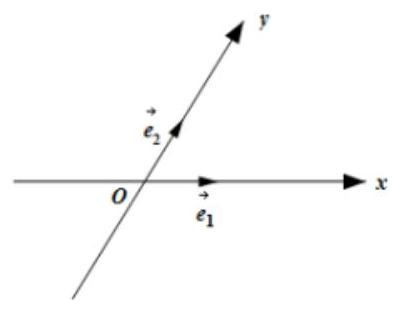

A. $\frac{\pi }{6}$ B. $\frac{\pi }{3}$ C. $\frac{2\pi }{3}$ D. $\frac{5\pi }{6}$

【答案】C

【解析】由已知可得 $\overrightarrow{a} = 2\overrightarrow{{e}_{1}} + 3\overrightarrow{{e}_{2}},\overrightarrow{b} =  - 5\overrightarrow{{e}_{1}} + 2\overrightarrow{{e}_{2}}$ ,

由平面向量数量积的定义可得 $\overrightarrow{{e}_{1}} \cdot  \overrightarrow{{e}_{2}} = \left| \overrightarrow{{e}_{1}}\right|  \cdot  \left| \overrightarrow{{e}_{2}}\right| \cos {60}^{ \circ  } = \frac{1}{2}$ ,

$\overrightarrow{a} \cdot  \overrightarrow{b} = \left( {2\overrightarrow{{e}_{1}} + 3\overrightarrow{{e}_{2}}}\right) \left( {-5\overrightarrow{{e}_{1}} + 2\overrightarrow{{e}_{2}}}\right)  =  - {10}{\overrightarrow{e}}_{1}^{2} - {11}\overrightarrow{{e}_{1}} \cdot  \overrightarrow{{e}_{2}} + 6{\overrightarrow{e}}_{2}^{2} =  - {10} - {11} \times  \frac{1}{2} + 6 =  - \frac{19}{2}$ ,

$\left| \overrightarrow{a}\right|  = \sqrt{{\left( 2\overrightarrow{{e}_{1}} + 3\overrightarrow{{e}_{2}}\right) }^{2}} = \sqrt{4{\overrightarrow{e}}_{1}^{2} + {12}{\overrightarrow{e}}_{1} \cdot  {\overrightarrow{e}}_{2} + 9{\overrightarrow{e}}_{2}^{2}} = \sqrt{19},$

$\left| \overrightarrow{b}\right|  = \sqrt{{\left( -5\overrightarrow{{e}_{1}} + 2\overrightarrow{{e}_{2}}\right) }^{2}} = \sqrt{{25}{\overrightarrow{{e}_{1}}}^{2} - {20}\overrightarrow{{e}_{1}} \cdot  \overrightarrow{{e}_{2}} + 4{\overrightarrow{{e}_{2}}}^{2}} = \sqrt{19},$

$\therefore \cos  < \overrightarrow{a},\overrightarrow{b} >  = \frac{\overrightarrow{a} \cdot  \overrightarrow{b}}{\left| \overrightarrow{a}\right|  \cdot  \left| \overrightarrow{b}\right| } = \frac{-\frac{19}{2}}{\sqrt{19} \times  \sqrt{19}} =  - \frac{1}{2}$ ,

$\because 0 \leq   < \overrightarrow{a},\overrightarrow{b} >  \leq  \pi$ ,所以, $< \overrightarrow{a},\overrightarrow{b} >  = \frac{2\pi }{3}$ ,因此, $\overrightarrow{a}\text{ 、 }\overrightarrow{b}$ 的夹角为 $\frac{2\pi }{3}$ . 故选: C.

2、设双曲线 $\frac{{x}^{2}}{{a}^{2}} - \frac{{y}^{2}}{{b}^{2}} = 1\left( {a > 0, b > 0}\right)$ 的一条渐近线与抛物线 $y = {x}^{2} + 1$ 只有一个公共点,则 $\frac{{ab} + 1}{a}$ 的最小值为( )

A. $\sqrt{2}$ B. 1 C. 2 D. $2\sqrt{2}$

【答案】D

【解析】设双曲线的渐近线方程为 $y = {kx}$ ,这条直线与抛物线 $y = {x}^{2} + 1$ 相切,联立 $\left\{  \begin{matrix} y = {kx} \\  y = {x}^{2} + 1 \end{matrix}\right.$ ,整理得 ${x}^{2} - {kx} + 1 = 0$ ,则 $\Delta  = {k}^{2} - 4 = 0$ ,解得 $k =  \pm  2$ ,即 $\frac{b}{a} = 2, b = {2a}$ 故 $\frac{{ab} + 1}{a} = b + \frac{1}{a} = {2a} + \frac{1}{a} \geq  2\sqrt{2}$ ，当且仅当 $a = \frac{\sqrt{2}}{2}, b = \sqrt{2}$ ，故选 D.

3、已知集合 $M = \{ 1,2,3,\cdots ,{10}\}$ ，集合 $A \subseteq  M$ ，定义 $M\left( A\right)$ 为 $A$ 中元素的最小值，当 $A$ 取遍 $M$ 的所有非空子集时,对应的 $M\left( A\right)$ 的和记为 ${S}_{10}$ ,则 ${S}_{10} =$ (   )

A. 45 B. 1012 C. 2036 D. 9217

【答案】C

【解析】 ${10} \times  {2}^{0} + 9 \times  {2}^{1} + 8 \times  {2}^{2} + \cdots  + 1 \times  {2}^{9}$ 。

4、设函数 $y = f\left( x\right)$ 和 $y = f\left( {f\left( x\right) }\right)$ 的定义域都是 $R$ ,对于下列四个命题:

(1)若函数 $y = f\left( x\right)$ 是奇函数，则函数 $y = f\left( {f\left( x\right) }\right)$ 是奇函数:

(2)若函数 $y = f\left( x\right)$ 是偶函数，则函数 $y = f\left( {f\left( x\right) }\right)$ 是偶函数；

(3)若函数 $y = f\left( x\right)$ 是减函数，则函数 $y = f\left( {f\left( x\right) }\right)$ 是增函数；

解题技巧一教师版

(4)若函数 $y = f\left( x\right)$ 存在反函数 $y = {f}^{-1}\left( x\right)$ ，且函数 $y = f\left( x\right)  - {f}^{-1}\left( x\right)$ 有零点，则函数 $y = f\left( x\right)  - x$ 也有零点;

其中正确的命题有( )

A. 1 个 B. 2 个 C. 3 个 D. 4 个

【答案】C

【解析】对于(1),若函数 $y = f\left( x\right)$ 是奇函数,则 $f\left( {-x}\right)  =  - f\left( x\right)$ ,

所以, $f\left( {f\left( {-x}\right) }\right)  = f\left( {-f\left( x\right) }\right)  =  - f\left( {f\left( x\right) }\right)$ ,所以,函数 $y = f\left( {f\left( x\right) }\right)$ 是奇函数,(1) 正确;

对于(2)，若函数 $y = f\left( x\right)$ 为偶函数，则 $f\left( {-x}\right)  = f\left( x\right)$ ，

所以, $f\left( {f\left( {-x}\right) }\right)  = f\left( {f\left( x\right) }\right)$ ,所以,函数 $y = f\left( {f\left( x\right) }\right)$ 是偶函数,(2) 正确;

对于(3)，任取 ${x}_{1}\text{ 、 }{x}_{2} \in  R$ 且 ${x}_{1} > {x}_{2}$ ，由于函数 $y = f\left( x\right)$ 是减函数，则 $f\left( {x}_{1}\right)  < f\left( {x}_{2}\right)$ ，

所以, $f\left( {f\left( {x}_{1}\right) }\right)  > f\left( {f\left( {x}_{2}\right) }\right)$ ,所以, $y = f\left( {f\left( x\right) }\right)$ 是增函数,(3) 正确;

对于(4)，函数 $f\left( x\right)  = \frac{1}{x}\left( {x \neq   \pm  1}\right)$ 的反函数是它本身，

此时函数 $y = f\left( x\right)  - {f}^{-1}\left( x\right)$ 有无数个零点,但函数 $y = f\left( x\right)  - x$ 无零点,(4)错误.

故选: C.

## 2、排除法(筛选法)

## 通过观察分析或推理运算各项提供的信息或通过特例，对于错误的选项，逐一剔除，从而获得正确的结 论.

【例 6】方程 $a{x}^{2} + {2x} + 1 = 0$ 至少有一个负根的充要条件是( )

A. $0 < a \leq  1$ B. $a < 1$ C. $a \leq  1$ D. $0 < a \leq  1$ 或 $a < 0$

【难度】★★

【答案】C

【解析】结合选项取当 $a = 0$ 时, $x =  - \frac{1}{2}$ ,故排除 $A, D$ . 当 $a = 1$ 时, $x =  - 1$ ,排除 $B$ . 故选 $C$ .

【例 7】函数 $f\left( x\right)  = {\cos }^{2}x - 2{\cos }^{2}\frac{x}{2}$ 的一个单调增区间是( )

A、 $\left( {\frac{\pi }{3},\frac{2\pi }{3}}\right)$ B、 $\left( {\frac{\pi }{6},\frac{\pi }{2}}\right)$ C、 $\left( {0,\frac{\pi }{3}}\right)$ D、 $\left( {-\frac{\pi }{6},\frac{\pi }{6}}\right)$

【难度】★★★

【答案】A

【解析】 $f\left( x\right)  = {\cos }^{2}x - 2{\cos }^{2}\frac{x}{2} = {\cos }^{2}x - \left( {1 + \cos x}\right)  = {\cos }^{2}x - \cos x - 1$ ,结合选项及复合函数“同增异减”法则，可知选A.

【例 8】在正方体 ${ABCD} - {A}_{1}{B}_{1}{C}_{1}{D}_{1}$ 中, $E\text{ 、 }F$ 分别在 ${B}_{1}B$ 和 ${C}_{1}C$ 上 (异于端点),则过三点 $A\text{ 、 }F\text{ 、 }E$ 的平面被正方体截得的图形不可能是( )

A. 正方形 B. 不是正方形的菱形

C. 不是正方形的矩形 D. 梯形

【难度】 $\star   \star   \star$

【答案】A

【解析】对于 $\mathbf{A}$ 选项,设正方体 ${ABCD} - {A}_{1}{B}_{1}{C}_{1}{D}_{1}$ 的棱长为 1,如下图所示:

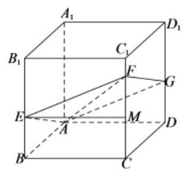

设 ${BF} = a\left( {0 < a < \frac{1}{2}}\right) ,\because$ 平面 $A{A}_{1}{B}_{1}B//$ 平面 $C{C}_{1}{D}_{1}D$ ,平面 ${AEF} \cap$ 平面 $A{A}_{1}{B}_{1}B = {AE}$ ,平面 ${AEF} \cap$ 平面 $C{C}_{1}{D}_{1}D = {FG},\therefore {AE}//{FG}$ ,同理 ${AG}//{EF}$ ,

若截面 ${AEFG}$ 为正方形,则 ${AE} = {EF}$ ,过点 $E$ 作 ${EM}//{BC}$ 交 $C{C}_{1}$ 于点 $M$ ,易知 ${BE} = {CM},\because {AE} = {EF}$ ,

则 ${MF} = {BE},\therefore {CF} = {2BE} = {2a},{AE} = {EF} = \sqrt{A{B}^{2} + B{E}^{2}} = \sqrt{1 + {a}^{2}}$ ,

${AF} = \sqrt{A{C}^{2} + C{F}^{2}} = \sqrt{2 + 4{a}^{2}},$

由勾股定理得 $A{F}^{2} = A{E}^{2} + E{F}^{2}$ ,即 $2 + 4{a}^{2} = 2 + 2{a}^{2}$ ,解得 $a = 0 \notin  \left( {0,\frac{1}{2}}\right)$ ,所以,截面不可能是正方形;

对于 $\mathbf{B}$ 选项，由 $\mathbf{A}$ 选项可知，当 ${CF} = {2BE}$ 时，截面是不为正方形的菱形；

对于 $\mathrm{C}$ 选项，如下图所示，当 ${EF}//{BC}$ 时，由于 ${BC}\bot$ 平面 ${AB}{B}_{1}{A}_{1}$ ， ${EF}//{BC}$ ， $\therefore {EF} \bot$ 平面 ${AB}{B}_{1}{A}_{1}$ ， $\because {AE} \subset$ 平面 ${AB}{B}_{1}{A}_{1},\therefore {EF}\bot {AE}$ ，

$\because$ 平面 $A{A}_{1}{B}_{1}B//$ 平面 $C{C}_{1}{D}_{1}D$ ,平面 ${AEF} \cap$ 平面 $A{A}_{1}{B}_{1}B = {AE}$ ,平面 ${AEF} \cap$ 平面 $C{C}_{1}{D}_{1}D = {DF}$ ,由面面平行的性质定理可得 ${AE}//{DF}$ ，

$\because {AD}//{BC}$ ， $\therefore {EF}//{AD}$ ， ${AE} = \sqrt{{AB}^{2} + {BE}^{2}} > {EF}$ ，此时，四边形 ${ADFE}$ 为矩形但不是正方形；

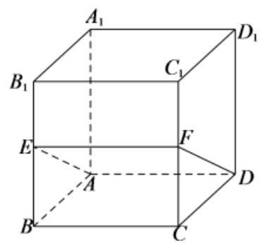

对于 $\mathrm{D}$ 选项,如下图所示,

$\because$ 平面 $A{A}_{1}{B}_{1}B//$ 平面 $C{C}_{1}{D}_{1}D$ ,平面 ${AEF} \cap$ 平面 $A{A}_{1}{B}_{1}B = {AE}$ ,平面 ${AEF} \cap$ 平面 $C{C}_{1}{D}_{1}D = {FG}$ ,由面面平行的性质定理可得 ${AE}//{FG}$ ,

当 ${BE} > {CF}$ 时,过点 $D$ 作 ${DH}//{FG}$ 交 $C{C}_{1}$ 于点 $H$ ，易知 ${DH} = {AE}$ 且 ${FG} < {DH} = {AE}$ ，

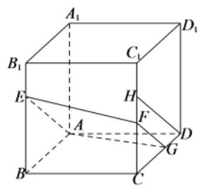

此时,截面图形为梯形. 故选: A.

【例 9】已知数列 $\left\{  {a}_{n}\right\}$ 的首项 ${a}_{1} = a$ ,且 $0 < a \leq  4,{a}_{n + 1} = \left\{  \begin{array}{ll} {a}_{n} - 4 & {a}_{n} > 4 \\  6 - {a}_{n} & {a}_{n} \leq  4 \end{array}\right.$ ， ${S}_{n}$ 是此数列的前 $n$ 项和，则以下结论正确的是( )

A. 不存在 $a$ 和 $n$ 使得 ${S}_{n} = {2015}$ B. 不存在 $a$ 和 $n$ 使得 ${S}_{n} = {2016}$

C. 不存在 $a$ 和 $n$ 使得 ${S}_{n} = {2017}$ D. 不存在 $a$ 和 $n$ 使得 ${S}_{n} = {2018}$

【难度】 $\star   \star   \star$

【答案】A

【解析】方法一: 令 ${a}_{1} = 1$ ,则所有奇数项都为 1,偶数项都为 5,排除 $\mathrm{B}\text{ 、 }\mathrm{C}$ ; 令 ${a}_{1} = 2$ ,则所有奇数项都为 2,偶数项都为 4,排除 $\mathrm{D}$ ,故选 $\mathrm{A}$ .

方法二: 正常方法需要分类讨论, ${a}_{1} = a,{a}_{2} = 6 - a$ ,当 $0 < a < 2,{a}_{3} = 2 - a,{a}_{4} = a + 4,{a}_{5} = a,\cdots \cdots$ , 有周期性,此时当 $n$ 为偶数, ${S}_{n} = {6k}$ ; 当 $2 \leq  a \leq  4,{a}_{3} = a,{a}_{4} = 6 - a,\cdots \cdots$ ,周期为 2,

$\therefore$ 此时 ${S}_{n} = {6k}$ 或 ${S}_{n} = {6k} + a, a \in  (0,4\rbrack$ ,由此可知选 $\mathbf{A}$

## 巩固训练

1、已知函数 $f\left( x\right)  = m{x}^{2} + \left( {m - 3}\right) x + 1$ 的图象与 $x$ 轴的交点至少有一个在原点右侧,则实数 $m$ 的取值范围是( )

A. $\left( {0,1}\right)$ B. $(0,1\rbrack$ C. $\left( {-\infty ,1}\right)$ D. $( - \infty ,1\rbrack$

【答案】D

【解析】令 $m = 0$ ,由 $f\left( x\right)  = 0$ 得 $x = \frac{1}{3}$ 适合,排除 $\mathrm{A}\text{ 、 }\mathrm{\;B}$ . 令 $m = 1$ ,由 $f\left( x\right)  = 0$ 得: $x = 1$ 适合,排除 C. 故选 D.

2、已知函数 $f\left( x\right)  = A\sin \left( {{\omega \pi }x + \frac{\pi }{3}}\right)$ ，其中 $A > 0,\omega  > 0$ ，其图象满足最高点与相邻最低点间的距离为2， $f\left( x\right)$ 相邻两个零点的差的绝对值为 1,下列结论中错误的是( )

A. $\omega  = 1$ B. $f\left( x\right)$ 的最大值为 1

C. $f\left( x\right)$ 在区间 $\left( {\frac{1}{6},1}\right)$ 上单调递减 D. $f\left( x\right)$ 的一个零点为 $\frac{2}{3}$

【答案】B

【解析】由 $f\left( x\right)$ 相邻两个零点的差的绝对值为 1 知 $T = 2 \times  1 = \frac{2\pi }{\omega \pi }$ ,解得 $\omega  = 1$ , $\mathrm{A}$ 正确;

又图象满足最高点与相邻最低点间的距离为 2,所以 $A = \sqrt{{1}^{2} - {\left( \frac{1}{2}\right) }^{2}} = \frac{\sqrt{3}}{2}$ ,

故 $f\left( x\right)  = \frac{\sqrt{3}}{2}\sin \left( {{\pi x} + \frac{\pi }{3}}\right)$ , B 错误;

当 $x \in  \left( {\frac{1}{6},1}\right)$ 时, ${\pi x} + \frac{\pi }{3} \in  \left( {\frac{\pi }{2},\frac{4\pi }{3}}\right)  \subseteq  \left( {\frac{\pi }{2},\frac{3\pi }{2}}\right) , f\left( x\right)$ 递减, $\mathrm{C}$ 正确;

因为 $f\left( \frac{2}{3}\right)  = \frac{\sqrt{3}}{2}\sin \left( {\frac{2}{3}\pi  + \frac{\pi }{3}}\right)  = 0,\mathrm{D}$ 正确. 故选: $\mathrm{B}$

3、函数 $y = \sqrt{{x}^{2} + 1} + 1\left( {x < 0}\right)$ 的反函数为( )

A. $y = \sqrt{{x}^{2} - {2x}}\left( {x < 0}\right)$ B. $\mathrm{y} = y = \sqrt{{x}^{2} - {2x}}\left( {x > 2}\right)$

C. $y =  - \sqrt{{x}^{2} - {2x}}\left( {x < 0}\right)$ D. $y =  - \sqrt{{x}^{2} - {2x}}\left( {x > 2}\right)$

【答案】D

【解析】根据原函数与反函数的定义域和值域关系,原函数中 $\mathrm{x} < 0,\mathrm{y} > 2$ ,因此可知应选 D;

4、已知集合 $A = \left\{  {x\left| {\;{x}^{2} - {4x} + 3 < 0}\right. , x \in  R}\right\}  , B = \left\{  {x\left| {\;{2}^{1 - x} + a \leq  0\text{ 且 }{x}^{2} - 2\left( {a + 7}\right) x + 5 \leq  0}\right. , x \in  R}\right\}$ , 若 $A \subseteq  B$ ，则实数 $a$ 的取值范围是( )

A. $\left\lbrack  {-4,0}\right\rbrack$ B. $\left\lbrack  {-4, - 1}\right\rbrack$ C. $\left\lbrack  {-1,0}\right\rbrack$

D. $\left\lbrack  {-\frac{14}{3}, - 1}\right\rbrack$

【答案】B

【解析】先根据选项取当 $a = 0$ ,验证显然不满足 $A \subseteq  B$ ,排除选项 $\mathrm{{AC}}$ ; 再代入 $a =  - 4$ ,满足题意,故选 B.

## 3、特殊值法

是用特殊值(或特殊图形、特殊位置)代替题设普遍条件，得出特殊结论，再对各个选项进行检验，从而做出正确的选择. 常用的特例有特殊数值、特殊数列、特殊函数、特殊图形、特殊角、特殊位置等. 特例检验是解答选择题的最佳方法之一，适用于解答“对某一集合的所有元素、某种关系恒成立”，这样以全称判断形式出现的题目，其原理是 “结论若在某种特殊情况下不真，则它在一般情况下也不真”，利用 “小题小做”或“小题巧做”的解题策略.

【例 10】已知 $A\text{ 、 }B\text{ 、 }C\text{ 、 }D$ 是抛物线 ${y}^{2} = {8x}$ 上的点， $F$ 是抛物线的焦点，且 $\overrightarrow{FA} + \overrightarrow{FB} + \overrightarrow{FC} + \overrightarrow{FD} = \overrightarrow{0}$ ，则 $\left| \overrightarrow{FA}\right|$

$+ \left| {FB}\right|  + \left| {FC}\right|  + \left| {FD}\right|$ 的值( )

A. 2 B. 4 C. 8 D. 16

【难度】★★★

【答案】 $\mathrm{D}$

【解析】取特殊位置, ${AB},{CD}$ 为抛物线的通径,显然 $\overrightarrow{FA} + \overrightarrow{FB} + \overrightarrow{FC} + \overrightarrow{FD} = \overrightarrow{0}$ ,则 $\overrightarrow{FA} + \overrightarrow{FB} + \overrightarrow{FC} + \overrightarrow{FD} = \; {4p} = {16}$ ,故选 D.

【例 11】在 $\bigtriangleup {ABC}$ 中, ${BC} = a,{CA} = b,{AB} = c$ ,下列说法中正确的是( )

A. 用 $\sqrt{a}\text{ 、 }\sqrt{b}\text{ 、 }\sqrt{c}$ 为边长不可以作成一个三角形

B. 用 $\sqrt{a}\text{ 、 }\sqrt{b}\text{ 、 }\sqrt{c}$ 为边长一定可以作成一个锐角三角形

C. 用 $\sqrt{a}\text{ 、 }\sqrt{b}\text{ 、 }\sqrt{c}$ 为边长一定可以作成一个直角三角形

D. 用 $\sqrt{a}\text{ 、 }\sqrt{b}\text{ 、 }\sqrt{c}$ 为边长一定可以作成一个钝角三角形

【难度】★★★

【答案】B

【解析】方法一: 可以通过对 $\mathbf{a},\mathbf{b},\mathbf{c}$ 分别取特殊值即可得到选项;

方法二: 要证 $\sqrt{a},\sqrt{b},\sqrt{c}$ 可以构成三角形,

因为 ${\left( \sqrt{a} + \sqrt{b}\right) }^{2} = a + 2\sqrt{ab} + b > c = {\left( \sqrt{c}\right) }^{2}$ ,所以 $\sqrt{a} + \sqrt{b} > \sqrt{c}$ ,即可以构成三角形。

又 $\cos A = \frac{b + c - a}{2\sqrt{bc}} > 0$ ,同理 $\cos B,\cos C$ 也大于 0,所以三角形为锐角三角形。

【例 12】已知点 $A\left( {-2,0}\right)$ ，设 $B$ 、 $C$ 是圆 $O : {x}^{2} + {y}^{2} = 1$ 上的两个不同的动点，且向量 $\overrightarrow{OB} = t\overrightarrow{OA} + \left( {1 - t}\right) \overrightarrow{OC}$ (其中 $t$ 为实数)，则 $\overline{AB} \cdot  \overline{AC} =$ ( ).

A. -3 B. 1 C. 2 D. 3

【难度】★★★

【答案】D

【解析】由题目条件 $\overrightarrow{OB} = t\overrightarrow{OA} + \left( {1 - t}\right) \overrightarrow{OC}$ 可知 $\mathrm{A}\text{ 、 }\mathrm{\;B}\text{ 、 }\mathrm{C}$ 三点共线,且根据题目答案问答方式可知 $\overrightarrow{AB} \cdot  \overrightarrow{AC}$ 为一定值,故取特殊位置如图,可知 $\overrightarrow{AB} \cdot  \overrightarrow{AC} = \left| \overrightarrow{AB}\right| \left| \overrightarrow{AC}\right|  = 1 \times  3 = 3$ .

(特殊位置也可取 $\mathbf{{AB}}$ 与圆相切时,此时 $\mathbf{B}$ 、 $\mathbf{C}$ 重合,虽然不符合题意,但计算可以出定值)

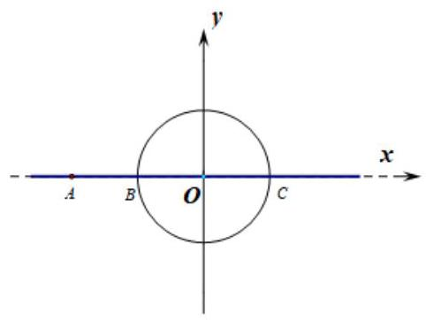

【例 13】已知正四棱锥 $S - {ABCD}$ 的侧面与底面所成角为 $\beta$ ，相邻两侧面所成角为 $\alpha$ ，则 $\cos \alpha  + {\cos }^{2}\beta$ 的值为( ).

A. $\frac{1}{4}$ B. $\frac{1}{3}$ C. $\frac{1}{2}$ D. 0

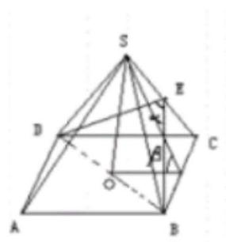

【难度】★★★

【答案】D

【解析】取特殊图形,取正四棱锥所有棱长为 2,则 ${\cos }^{2}\beta  = {\left( \frac{1}{\sqrt{3}}\right) }^{2} = \frac{1}{3}$ ,

$\cos \alpha  = \frac{{\left( \sqrt{3}\right) }^{2} + {\left( \sqrt{3}\right) }^{2} - {\left( 2\sqrt{2}\right) }^{2}}{2 \times  \sqrt{3} \times  \sqrt{3}} =  - \frac{1}{3}$ ,故 $\cos \alpha  + {\cos }^{2}\beta  = 0$ . 故选 D.

【例 14】已知直线 $a//$ 平面 $\alpha$ ,则“平面 $\alpha  \bot$ 平面 $\beta$ ”是“直线 $a \bot$ 平面 $\beta$ ”的( )

A. 充分但不必要条件 B. 必要但不充分条件

C. 充要条件 D. 既不充分也不必要条件

【难度】 $\star   \star   \star$

【答案】B

【解析】若直线 $a//$ 平面 $\alpha$ ,平面 $\alpha  \bot$ 平面 $\beta$ ,此时直线 $a$ 与平面 $\beta$ 可能平行,所以充分性不成立; 若直线 $a//$ 平面 $\alpha$ ,直线 $a \bot$ 平面 $\beta$ ,则平面 $\alpha  \bot$ 平面 $\beta$ ,所以必要性成立. 故选:B

【例 15】已知数列 $\left\{  {a}_{n}\right\}  \left( {n \geq  3, n \in  {N}^{ * }}\right)$ 为等差数列,则 “ ${a}_{1} + 2{a}_{2} + \cdots  + {2020}{a}_{2020}$ 为有理数” 是 “数列 $\left\{  {a}_{n}\right\}$ 中存在有理数” ( )

A. 充分不必要条件 B. 必要不充分条件 C. 充要条件 D. 既不充分也不必要条件

【难度】 $\star   \star   \star$

【答案】A

【解析】设 ${a}_{n} = {a}_{1} + \left( {n - 1}\right) d,{T}_{n} = {a}_{1} + 2{a}_{2} + \cdots  + n{a}_{n}$

${T}_{n} = \left( {1 + 2 + \cdots  + n}\right) {a}_{1} + \left\lbrack  {1 \times  2 + 2 \times  3 + \cdots  + \left( {n - 1}\right) n}\right\rbrack  d$

$= \frac{n\left( {1 + n}\right) }{2}{a}_{1} + \left\lbrack  {{1}^{2} + {2}^{2} + \cdots  + {n}^{2} - \left( {1 + 2 + \cdots  + n}\right) }\right\rbrack  d$

$= \frac{n\left( {1 + n}\right) }{2}{a}_{1} + \left\lbrack  {\frac{n\left( {n + 1}\right) \left( {{2n} + 1}\right) }{6} - \frac{n\left( {1 + n}\right) }{2}}\right\rbrack  d$

$= \frac{n\left( {1 + n}\right) }{2}\left\lbrack  {{a}_{1} + \left( {\frac{{2n} + 1}{3} - 1}\right) d}\right\rbrack   = \frac{n\left( {1 + n}\right) }{2}\left\lbrack  {{a}_{1} + \frac{2\left( {n - 1}\right) }{3}d}\right\rbrack$

当 $n - 1$ 是 3 的倍数时, ${T}_{n} = \frac{n\left( {n + 1}\right) }{2}{a}_{\frac{{2n} + 1}{3}}$

若 ${T}_{n} = \frac{n\left( {n + 1}\right) }{2}{a}_{\frac{{2n} + 1}{3}}$ 为有理数时,则 ${a}_{\frac{{2n} + 1}{3}}$ 是有理数,故有数列 $\left\{  {a}_{n}\right\}$ 中存在有理数成立,

因为 $n = {2020}$ ,则 $n - 1 = {2019} = 3 \times  {673}$ ,所以 “ ${a}_{1} + 2{a}_{2} + \cdots  + {2020}{a}_{2020}$ 为有理数” 能使得 “数列 $\left\{  {a}_{n}\right\}$ 中存在有理数”成立;

若“数列 $\left\{  {a}_{n}\right\}$ 中存在有理数”不妨设 ${a}_{1} = 3\sqrt{2}, d =  - \sqrt{2}$ 则 ${a}_{4} = {a}_{1} + {3d} = 0$ 为有理数,

那么 ${T}_{2020} = \frac{{2020}\left( {{2020} + 1}\right) }{2}{a}_{1347} = {1010} \times  {2021} \times  \left( {{a}_{1} + {1346d}}\right)  =  - {1010} \times  {2021} \times  {1343}\sqrt{2}$ 是无理数,

故“ ${a}_{1} + 2{a}_{2} + \cdots  + {2020}{a}_{2020}$ 为有理数”是“数列 $\left\{  {a}_{n}\right\}$ 中存在有理数” 充分不必要条件; 故选: A

## 巩固训练

1、已知 $P$ 、 $Q$ 是椭圆 $3{x}^{2} + 5{y}^{2} = 1$ 上满足 $\angle {POQ} = {90}^{ \circ  }$ 的两个动点，则 $\frac{1}{O{P}^{2}} + \frac{1}{O{Q}^{2}}$ 等于( )

A. 34 B. 8 C. $\frac{8}{15}$ D. $\frac{34}{225}$

【答案】B

【解析】取两特殊点 $P\left( {\frac{\sqrt{3}}{3},0}\right) \text{ 、 }Q\left( {0,\frac{\sqrt{5}}{5}}\right)$ 即两个端点,则 $\frac{1}{O{P}^{2}} + \frac{1}{O{Q}^{2}} = 3 + 5 = 8$ . 故选 B.

2、已知等差数列 $\left\{  {a}_{n}\right\}$ 的前 $n$ 项和为 ${S}_{n}$ ,若 $\frac{{a}_{2n}}{{a}_{n}} = \frac{{4n} - 1}{{2n} - 1}$ ,则 $\frac{{S}_{2n}}{{S}_{n}}$ 的值为 ( )

A. 2 B. 3 C. 4 D. 8

【答案】C

【解析】方法一、(特殊值检验法)

取 $n = 1$ ，得 $\frac{{a}_{2} = 3}{{a}_{1}}$ ， $\therefore \frac{{a}_{1} + {a}_{2}}{{a}_{1}} = \frac{4}{1} = 4$ ，于是，当 $n = 1$ 时， $\frac{{S}_{2n}}{{S}_{n}} = \frac{{S}_{2}}{{S}_{1}} = \frac{{a}_{1} + {a}_{2}}{{a}_{1}} = 4$ .

方法二、(特殊式检验法)

注意到 $\frac{{a}_{2n}}{{a}_{n}} = \frac{{4n} - 1}{{2n} - 1} = \frac{2 \cdot  {2n} - 1}{2 \cdot  n - 1}$ ,取 ${a}_{n} = {2n} - 1,\frac{{S}_{2n}}{{S}_{n}} = \frac{\frac{1 + \left( {{4n} - 1}\right) }{2} \cdot  {2n}}{\frac{1 + \left( {{2n} - 1}\right) }{2} \cdot  n} = 4$ .

方法三、(直接求解法)

由 $\frac{{a}_{2n}}{{a}_{n}} = \frac{{4n} - 1}{{2n} - 1}$ ,得 $\frac{{a}_{2n} - {a}_{n}}{{a}_{n}} = \frac{2n}{{2n} - 1}$ ,即 $\frac{nd}{{a}_{n}} = \frac{2n}{{2n} - 1},\therefore {a}_{n} = \frac{d\left( {{2n} - 1}\right) }{2}$ ,

于是, $\frac{{S}_{2n}}{{S}_{n}} = \frac{\frac{{a}_{1} + {a}_{2n}}{2} \cdot  {2n}}{\frac{{a}_{1} + {a}_{n}}{2} \cdot  n} = 2\frac{\frac{d}{{a}_{1} + {a}_{2n}} = 2\frac{\frac{d}{2} + \frac{d}{2}\left( {{4n} - 1}\right) }{\frac{d}{2} + \frac{d}{2}\left( {{2n} - 1}\right) }}{\frac{d}{2} + \frac{d}{2}\left( {{2n} - 1}\right) } = 4$ .

3、长方体的对角线与过同一个顶点的三个表面所成的角分别为 $\alpha$ ， $\beta$ ， $\gamma$ ，则 ${\cos }^{2}\alpha  + {\cos }^{2}\beta  + {\cos }^{2}\gamma  =$ (   ).

A. 2 B. 3 C. 4 D. 5

【答案】A

【解析】

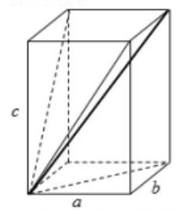

方法一、(取特殊图形)从所求式子看出答案肯定是定值，故不妨将长方体画成边长为 1 的正方体，则每个角 $\alpha ,\beta ,\gamma$ 都相等，且 ${\cos }^{2}\alpha  = {\left( \frac{\sqrt{2}}{\sqrt{3}}\right) }^{2} = \frac{2}{3}$ ，所以 ${\cos }^{2}\alpha  + {\cos }^{2}\beta  + {\cos }^{2}\gamma  = 2$ .

方法二、(直接法)设长方形的长、宽、高分别为 $a, b, c$ ,则对角线长 $d = \sqrt{{a}^{2} + {b}^{2} + {c}^{2}}$ ,

所以 ${\cos }^{2}\alpha  + {\cos }^{2}\beta  + {\cos }^{2}\gamma  = {\left( \frac{\sqrt{{b}^{2} + {c}^{2}}}{d}\right) }^{2} + {\left( \frac{\sqrt{{a}^{2} + {c}^{2}}}{d}\right) }^{2} + {\left( \frac{\sqrt{{a}^{2} + {b}^{2}}}{d}\right) }^{2} = \frac{2\left( {{a}^{2} + {b}^{2} + {c}^{2}}\right) }{{d}^{2}} = 2$

4、已知 $\bigtriangleup  \mathrm{{ABC}}$ 的三边 $a, b, c$ 成等差数列,则 $\frac{\cos A + \cos C}{1 + \cos A\cos C}$ 的值为( )

A. $\frac{3}{5}$ B. $\frac{4}{5}$ C. $\frac{4\sqrt{3}}{7}$ D. $\frac{1}{2}$

【答案】B

【解析】可设 $\bigtriangleup \mathrm{{ABC}}$ 的三边长为: $\mathrm{a} = \mathrm{b} = \mathrm{c}$ 或 $\mathrm{a} = 3\text{ 、 }\mathrm{\;b} = 4\text{ 、 }\mathrm{c} = 5$ ，可知选 B.

5、已知函数 $y = f\left( x\right)$ 是定义在 $\mathbf{R}$ 上的奇函数,且在 $\lbrack 0, + \infty )$ 单调递减,当 $x + y = {2019}$ 时,恒有 $f\left( x\right)  + f\left( {2019}\right)  > f\left( y\right)$ 成立，则 $x$ 的取值范围是( )

A. $( - \infty ,0\rbrack$ B. $\left( {-\infty ,0}\right)$ C. $( - \infty ,1\rbrack$ D. $( - \infty ,1\rbrack$

【答案】B

【解析】方法一: 由题意,可以用特殊函数做,比如 $y = f\left( x\right)  =  - x$ ,则可得 $- x - {2019} >  - y =  - \left( {{2019} - x}\right)$ ,

可解得 $x < 0$ 。

方法二: 对 $x$ 与 0 大小进行比较讨论;

当 $x > 0$ 时,因为 $x + y = {2019}$ ,所以 $y < {2019} \Rightarrow  f\left( y\right)  > f\left( {2019}\right)$ ,且此时 $f\left( x\right)  < 0$ ,显然 $f\left( x\right)  + f\left( {2019}\right)  > f\left( y\right)$ 不成立;

当 $x = 0$ 时, $f\left( x\right)  = 0, y = {2019}, f\left( y\right)  = f\left( {2019}\right)$ ,显然 $f\left( x\right)  + f\left( {2019}\right)  > f\left( y\right)$ 不成立;

当 $x < 0$ 时, $f\left( x\right)  > 0$ ,因为 $x + y = {2019}$ ,所以 $y > {2019} \Rightarrow  f\left( y\right)  < f\left( {2019}\right)$ ,显然

$f\left( x\right)  + f\left( {2019}\right)  > f\left( y\right)$ 恒成立; 综上: $x < 0$

## 4、验证法(将选项直接代入)

## 将各选项逐个代入题目，进行验证或适当选取特殊值进行检验而得到正确选项。

【例 16】已知函数 $y = f\left( x\right)$ 和 $y = g\left( x\right)$ 分别是定义在 $R$ 上的偶函数和奇函数,且 $f\left( 0\right)  =  - 4, f\left( x\right)  = g\left( {x + 2}\right)$ ,则 $g\left( x\right)$ 的解析式可以是( )

A. $y =  - 4\sin \frac{\pi x}{4}$ B. $y = 4\sin \frac{\pi x}{2}$ C. $y =  - 4\cos \frac{\pi x}{4}$ D. $y = 4\cos \frac{\pi x}{2}$

【难度】 $\star   \star   \star$

【答案】A

【解析】因为 $f\left( 0\right)  =  - 4, f\left( x\right)  = g\left( {x + 2}\right)$ ,所以 $g\left( 2\right)  =  - 4$ ,

而 ${y}_{1}\left( 2\right)  =  - 4\sin \frac{2\pi }{4} =  - 4,{y}_{2}\left( 2\right)  = 4\sin \frac{2\pi }{2} = 0,{y}_{3}\left( 2\right)  =  - 4\cos \frac{2\pi }{4} = 0,{y}_{4}\left( 2\right)  = 4\cos \frac{2\pi }{2} =  - 4$ ,

又因为 $y = g\left( x\right)$ 是定义在 $R$ 上的奇函数,所以 $g\left( {-x}\right)  =  - g\left( x\right)$ ,

而 ${y}_{1}\left( {-x}\right)  =  - 4\sin \left( {-\frac{\pi x}{4}}\right)  = 4\sin \frac{\pi x}{4} =  - {y}_{1}\left( x\right) ,{y}_{4}\left( {-x}\right)  = 4\cos \left( {-\frac{\pi }{2}x}\right)  = 4\cos \frac{\pi }{2}x = {y}_{4}\left( x\right)$ ,故选: A

【例 17】意大利著名数学家斐波那契在研究兔子繁殖问题时,发现有这样一列数: $1,1,2,3,5,\ldots$ ,其中从第三项起,每个数等于它前面两个数的和,后来人们把这样的一列数组成的数列 $\left\{  {a}_{n}\right\}$ 称为“斐波那契数列”,记 ${S}_{n}$ 为数列 $\left\{  {a}_{n}\right\}$ 的前 $n$ 项和,则下列结论中不正确的有( )

A. ${a}_{8} = {21}$ B. ${S}_{7} = {32}$

C. ${a}_{1} + {a}_{3} + {a}_{5} + \cdots  + {a}_{{2n} - 1} = {a}_{2n}$

D. $\frac{{a}_{1}^{2} + {a}_{2}^{2} + \cdots  + {a}_{2021}^{2}}{{a}_{2021}} = {a}_{2022}$

【难度】 $\star   \star   \star$

【答案】B

【解析】由题意斐波那契数列前面 8 项依次为1,1,2,3,5,8,13,21,

${a}_{8} = {21},{S}_{7} = 1 + 1 + 2 + 3 + 5 + 8 + {13} = {33}$ , $\mathbf{A}$ 正确，B错误;

${a}_{2n} = {a}_{{2n} - 1} + {a}_{{2n} - 2} = {a}_{{2n} - 1} + {a}_{{2n} - 3} + {a}_{{2n} - 4} = \cdots  = {a}_{{2n} - 1} + {a}_{{2n} - 3} + \cdots  + {a}_{3} + {a}_{2} = {a}_{{2n} - 1} + {a}_{{2n} - 3} + \cdots  + {a}_{3} + {a}_{1},\mathbf{C}$ 正确;

${a}_{2n}{a}_{{2n} - 1} = {a}_{{2n} - 1}\left( {{a}_{{2n} - 1} + {a}_{{2n} - 2}}\right)  = {a}_{{2n} - 1}^{2} + {a}_{{2n} - 1}{a}_{{2n} - 2} = {a}_{{2n} - 1}^{2} + {a}_{{2n} - 2}\left( {{a}_{{2n} - 2} + {a}_{{2n} - 3}}\right)  = {a}_{{2n} - 1}^{2} + {a}_{{2n} - 2}^{2} + {a}_{{2n} - 2}{a}_{{2n} - 3} \; = {a}_{{2n} - 1}^{2} + {a}_{{2n} - 2}^{2} + \cdots  + {a}_{3}^{2} + {a}_{3}{a}_{2} = {a}_{{2n} - 1}^{2} + {a}_{{2n} - 2}^{2} + \cdots  + {a}_{3}^{2} + {a}_{2}^{2} + {a}_{1}^{2}, n = {1011}$ 时,得 ${a}_{2022} = \frac{{a}_{1}^{2} + {a}_{2}^{2} + \cdots  + {a}_{2021}^{2}}{{a}_{2021}}$ , D 正确. 故选: B.

## 巩固训练

1、下面给出的四个点中，到直线 $x - y + 1 = 0$ 的距离为 $\frac{\sqrt{2}}{2}$ ，且位于 $\left\{  \begin{array}{l} x + y - 1 < 0 \\  x - y + 1 > 0 \end{array}\right.$ 表示的平面区域内的点是( )

A、(1,1) B、(-1,1) C、(-1，-1) D、(1，-1)

【答案】C

【解析】代入选项直接验证可以得到答案;

2、已知集合 $A = \left\{  {{a}_{1},{a}_{2},\cdots ,{a}_{n}}\right\}  \left( {n > 2}\right)$ ,令 ${T}_{A} = \left\{  {x \mid  x = {a}_{i} + {a}_{j},1 \leq  i < j \leq  n}\right\}$ , $\operatorname{card}\left( {T}_{A}\right)$ 表示集合 ${T}_{A}$ 中元素的个数。关于 $\operatorname{card}\left( {T}_{A}\right)$ 有下列四个命题

① $\operatorname{card}\left( {T}_{A}\right)$ 的最大值为 $\frac{1}{2}{n}^{2}$ ； ② $\operatorname{card}\left( {T}_{A}\right)$ 的最大值为 $\frac{1}{2}n\left( {n - 1}\right)$ ；

③ $\operatorname{card}\left( {T}_{A}\right)$ 的最小值为 ${2n}$ ； ④ $\operatorname{card}\left( {T}_{A}\right)$ 的最小值为 ${2n} - 3$ ;

其中，正确的是( )

A、①⑧ B、①④ C、②③ D、②④

【答案】D

【解析】取 $A = \{ 1,2,3\} ,{T}_{A} = \{ 3,4,5\} , n = 3,\operatorname{card}{\left( {T}_{A}\right) }_{\max } = 3,\operatorname{card}{\left( {T}_{A}\right) }_{\min } = 3$ ,可排除①③；故②④正确.

## 5、数形结合法

“数”与“形”是数学这座高楼大厦的两块最重要的基石，二者在内容上互相联系、在方法上互相渗透、 在一定条件下可以互相转化, 而数形结合法正是在这一学科特点的基础上发展而来的. 在解答选择题的过程中，可以先根据题意，做出草图，然后参照图形的做法、形状、位置、性质，综合图象的特征，得出结论.

【例 18】若关于 $x$ 的方程 $\frac{1}{1 + \left| x\right| } - {x}^{2} + a = 0$ 有两个不等的实数解,则 $a$ 的取值范围是(   )

A. $\left( {-1, + \infty }\right)$ B. $\left( {-\infty ,1}\right)$ C. $\left( {-\infty , - 1}\right)$ D. $\left( {1, + \infty }\right)$

【难度】★★★

【答案】A

【解析】

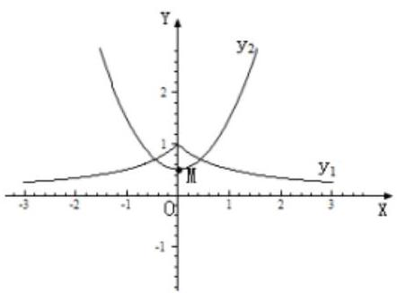

由题意关于 $x$ 的方程 $\frac{1}{1 + \left| x\right| } - {x}^{2} + a = 0$ 有两个不等的实数解,等价于函数 ${y}_{1} = \frac{1}{1 + \left| x\right| }$ 和函数 ${y}_{2} = {x}^{2} - a$ 有两个交点如图所示, $\mathrm{M}$ 点坐标为 $\left( {0, - a}\right)$ ,要使两个函数有两个交点,则需 $- a < 1$ ,即得 $a >  - 1$ . 则满足题意 $a$ 的取值范围是: $\left( {-1, + \infty }\right)$ . 故答案为: $\left( {-1, + \infty }\right)$ . 选 A.

【例 19】如图,正方形 ${ABCD}$ 的边长为 6,点 $E\text{ 、 }F$ 分别在边 ${AD}\text{ 、 }{BC}$ 上,且 ${DE} = {2AE},{CF} = {2BF}$ , 如果对于常数 $\lambda$ ,在正方形 ${ABCD}$ 的四条边上,有且只有 6 个不同的点 $P$ 使得 $\overrightarrow{PE} \cdot  \overrightarrow{PF} = \lambda$ 成立,那么 $\lambda$ 的取值范围是( )

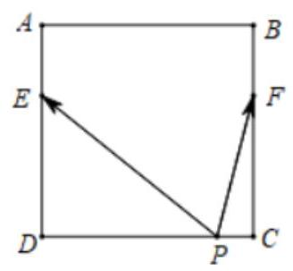

A. $\left( {0,7}\right)$ B. $\left( {4,7}\right)$

C. $\left( {0,4}\right)$ D. $\left( {-5,{16}}\right)$

【难度】 $\star   \star   \star$

【答案】C

【解析】如图所示,

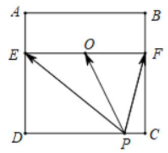

设 ${EF}$ 的中点为 $O$ ,则 $\left\{  \begin{array}{l} \overline{PE} + \overline{PF} = 2\overline{PO} \\  \overline{PE} - \overline{PF} = \overline{FE} \end{array}\right.$ ,两式平方相减得 $4\overline{PE} \cdot  \overline{PF} = 4{\overline{PO}}^{2} - {\overline{EF}}^{2}$ ,所以 $\overrightarrow{PE} \cdot  \overrightarrow{PF} = {\overrightarrow{PO}}^{2} - 9 = \lambda$ ,即 ${\overrightarrow{PO}}^{2} = \lambda  + 9$ ,所以 $\left| \overrightarrow{PO}\right|  = \sqrt{\lambda  + 9}$ ,

①当点 $P$ 在 ${DC}$ 上时，

当 $P$ 在 ${DC}$ 的中点处时, $\left| \overline{PO}\right|  = \sqrt{\lambda  + 9} = 4$ ,此时 $\lambda  = 7$ ,

当 $P$ 在 ${DC}$ 的中点两侧(非端点 $A$ 、 $D$ )时, $4 < \left| \overline{PO}\right|  = \sqrt{\lambda  + 9} < 5$ ,此时 $7 < \lambda  < {16}$ ,

②当点 $P$ 在 ${AB}$ 上时，

当 $P$ 在 ${AB}$ 的中点处时, $\left| \overrightarrow{PO}\right|  = \sqrt{\lambda  + 9} = 2$ ,此时 $\lambda  =  - 5$ ,

当 $P$ 在 ${AB}$ 的中点两侧(非端点 $A$ 、 $B$ )时, $2 < \left| \overrightarrow{PO}\right|  = \sqrt{\lambda  + 9} < \sqrt{13}$ ,此时 $- 5 < \lambda  < 4$ ,

③ 当点 $P$ 在 ${AD}$ 上时,

当 $P$ 在点 $E$ 处时, $\left| \overrightarrow{PO}\right|  = \sqrt{\lambda  + 9} = 3$ ,此时 $\lambda  = 0$ ,

当 $3 < \left| \overline{PO}\right|  = \sqrt{\lambda  + 9} < \sqrt{13}$ ,此时 $0 < \lambda  < 4$ ,点 $P$ 有 2 个满足 $3 < \left| \overline{PO}\right|  = \sqrt{\lambda  + 9} < \sqrt{13}$ 的点;

当 $\sqrt{13} < \left| \overrightarrow{PO}\right|  = \sqrt{\lambda  + 9} < 5$ ,此时 $4 < \lambda  < {16}$ ,点 $P$ 有 1 个满足 $\sqrt{13} < \left| \overrightarrow{PO}\right|  = \sqrt{\lambda  + 9} < 5$ 的点;

④当点 $P$ 在 ${BC}$ 上时,

当 $P$ 在点 $F$ 处时, $\left| \overline{PO}\right|  = \sqrt{\lambda  + 9} = 3$ ,此时 $\lambda  = 0$ ,

当 $3 < \left| \overline{PO}\right|  = \sqrt{\lambda  + 9} < \sqrt{13}$ ,此时 $0 < \lambda  < 4$ ,点 $P$ 有 2 个满足 $3 < \left| \overline{PO}\right|  = \sqrt{\lambda  + 9} < \sqrt{13}$ 的点;

当 $\sqrt{13} < \left| \overrightarrow{PO}\right|  = \sqrt{\lambda  + 9} < 5$ ,此时 $4 < \lambda  < {16}$ ,点 $P$ 有 1 个满足 $\sqrt{13} < \left| \overrightarrow{PO}\right|  = \sqrt{\lambda  + 9} < 5$ 的点;

⑤当 $P$ 在点 $A$ 处时， $\left| \overrightarrow{PO}\right|  = \sqrt{\lambda  + 9} = \sqrt{13}$ ，此时 $\lambda  = 4$ ，当 $P$ 在点 $B$ 处时， $\left| \overrightarrow{PO}\right|  = \sqrt{\lambda  + 9} = \sqrt{13}$ ，此时 $\lambda  = 4$ ， 当 $P$ 在点 $C$ 处时, $\left| \overrightarrow{PO}\right|  = \sqrt{\lambda  + 9} = 5$ ,此时 $\lambda  = {16}$ ,当 $P$ 在点 $D$ 处时, $\left| \overrightarrow{PO}\right|  = \sqrt{\lambda  + 9} = 5$ ,此时 $\lambda  = {16}$ , 综上得:当 $\lambda  =  - 5$ 时，有 1 个满足条件的点 $P$ ；

当 $- 5 < \lambda  < 0$ 时,有 2 个满足条件的点 $P$ ;

当 $\lambda  = 0$ 时,有 4 个满足条件的点 $P$ ;

当 $0 < \lambda  < 4$ 时,有 6 个满足条件的点 $P$ ;

当 $\lambda  = 4$ 时,有 4 个满足条件的点 $P$ ;

当 $4 < \lambda  < 7$ 时,有 2 个满足条件的点 $P$ ;

当 $\lambda  = 7$ 时,有 3 个满足条件的点 $P$ ;

当 $7 < \lambda  < {16}$ 时,有 4 个满足条件的点 $P$ ; 故选:C.

当 $\lambda  = {16}$ 时,有 2 个满足条件的点 $P$ ; 故选:C.

【例 20】已知实数 $x, y$ 满足 ${\left( x - 3\right) }^{2} + {y}^{2} = \frac{9}{4}$ ,则 $\frac{\sqrt{3}x - y}{\sqrt{{x}^{2} + {y}^{2}}}$ 的最小值为 ( )

A. $\frac{1}{2}$ B. 1 C. $\sqrt{3}$ D. 2

【难度】 $\star   \star   \star$

【答案】B

【解析】设 $P\left( {x, y}\right)$ 为 ${\left( x - 3\right) }^{2} + {y}^{2} = \frac{9}{4}$ 上的任意一点,则点 $P$ 到直线 $\sqrt{3}x - y = 0$ 的距离

$\left| {PM}\right|  = \frac{\left| \sqrt{3}x - y\right| }{2}$ ,点 $P$ 到原点的距离 $\left| {OP}\right|  = \sqrt{{x}^{2} + {y}^{2}} \cdot  \frac{\sqrt{3}x - y}{\sqrt{{x}^{2} + {y}^{2}}} = \frac{2\left| {PM}\right| }{\left| OP\right| } = 2\sin \angle {POM}$ ,

设圆 ${\left( x - 3\right) }^{2} + {y}^{2} = \frac{9}{4}$ 与直线 $y = {kx}$ 相切,则 $\frac{\left| 3k\right| }{\sqrt{{k}^{2} + 1}} = \frac{3}{2}$ ,解得 $k = \frac{\sqrt{3}}{3}$ 或 $k =  - \frac{\sqrt{3}}{3}$ ,结合图形可知 $\angle {POM}$ 的最小值为 ${30}^{ \circ  }$ ,故 ${\left( \frac{\sqrt{3}x - y}{\sqrt{{x}^{2} + {y}^{2}}}\right) }_{\text{ min }} = 2\sin {30}^{ \circ  } = 1$ ,故选: B.

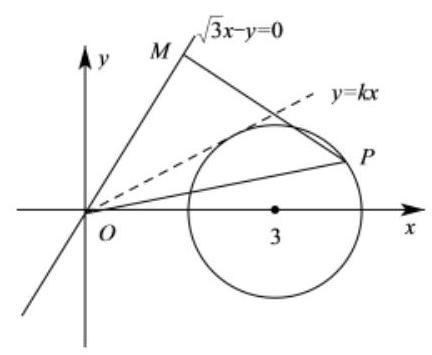

## 巩固训练

1、 $y = f\left( x\right)$ 是定义在 $R$ 上周期为 1 的周期函数,当 $x \in  \lbrack 0,1)$ 时 $f\left( x\right)  = \frac{x}{1 - x}$ ,直线 $y = x$ 与函数 $y = f\left( x\right)$ 的图像在 $y$ 轴右边交点的横坐标从小到大组成数列 $\left\{  {a}_{n}\right\}$ ，则()

A. ${a}_{n + 1} - {a}_{n} > 1$ 对 $n \in  {N}^{ * }$ 恒成立 B. ${a}_{n + 1} - {a}_{n} < 1$ 对 $n \in  {N}^{ * }$ 恒成立

C. ${a}_{n + 1} - {a}_{n} = 1$ 对 $n \in  {N}^{ * }$ 恒成立 D. ${a}_{n + 1} - {a}_{n}$ 与 1 的大小关系不确定

【答案】A

【解析】数形结合, 画出图像即可得到结果。

2、如图，已知点 $O\left( {0,0}\right)$ ， $A\left( {1,0}\right)$ ， $B\left( {0, - 1}\right)$ ， $P$ 是曲线 $y = \sqrt{1 - {x}^{2}}$ 上一个动点，则 $\overrightarrow{OP} \cdot  \overrightarrow{BA}$ 的取值范围是( ).

A、 $\left\lbrack  {-1,\sqrt{2}}\right\rbrack$ B、 $\left( {-1,\sqrt{2}}\right\rbrack$ C、 $\left\lbrack  {-1,\sqrt{2}}\right)$ D、 $\left( {-1,\sqrt{2}}\right)$

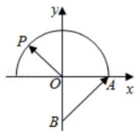

【答案】A

【解析】解法一: 运用向量数量积的意义: 向量 $\overrightarrow{a}$ 与向量 $\overrightarrow{b}$ 在向量 $\overrightarrow{a}$ 上的投影的乘积.

在一个向量确定的情况下, 另一向量在该向量上的投影有: 同向最长, 乘积最大; 反向最长, 乘积最小.

将向量 $\overrightarrow{BA}$ 移至以 $O$ 为起点 (方便观察投影的情况), $\left| \overrightarrow{BA}\right|  = \sqrt{2}$ ,可知 $P$ 点在 ${P}_{1}$ 位置时向量数量积最小,此时 $\overrightarrow{O{P}_{1}}$ 在 $\overrightarrow{BA}$ 上投影长为 $- \frac{\sqrt{2}}{2}$ ，向量数量积为 -1 ；在 ${P}_{2}$ 位置时，向量数量积最大，此时 $\overrightarrow{O{P}_{2}}$ 在 $\overrightarrow{BA}$ 上投影长为 1,向量数量积为 $\sqrt{2}$ 。故取值范围为 $\left\lbrack  {-1,\sqrt{2}}\right\rbrack$ .

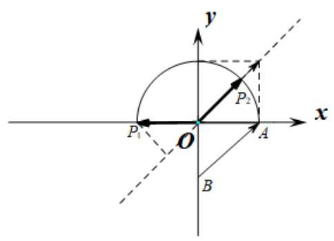

解法二: 设 $\overrightarrow{OP} = \left( {x, y}\right)$ ,则 $\overrightarrow{OP} = \left( {x,\sqrt{1 - {x}^{2}}}\right)$ ,由 $A\left( {1,0}\right) , B\left( {0, - 1}\right)$ ,得: $\overrightarrow{BA} = \left( {1,1}\right)$ ,

$\therefore \overrightarrow{OP} \cdot  \overrightarrow{BA} = x + \sqrt{1 - {x}^{2}}$ ,令 $x = \cos \theta ,\theta  \in  \left\lbrack  {0,\pi }\right\rbrack$ ,

则 $\overrightarrow{OP} \cdot  \overrightarrow{BA} = \sin \theta  + \cos \theta  = \sqrt{2}\sin \left( {\theta  + \frac{\pi }{4}}\right) ,\theta  \in  \left\lbrack  {0,\pi }\right\rbrack$ ,故 $\overrightarrow{OP} \cdot  \overrightarrow{BA}$ 的范围是 $\left\lbrack  {-1,\sqrt{2}}\right\rbrack$ ,

故答案为:A.

3、已知向量 $\overrightarrow{a},\overrightarrow{b}$ 满足 $\left| \overrightarrow{a}\right|  = \sqrt{3},\left| \overrightarrow{b}\right|  = 4,\overrightarrow{a}$ 在 $\overrightarrow{b}$ 上的投影为 $\frac{3}{2}$ . 若向量 $\overrightarrow{c}$ 满足 $\overrightarrow{c}$ 满足 $\left( {\overrightarrow{c} - 2\overrightarrow{a}}\right)  \cdot  \left( {\overrightarrow{c} - \overrightarrow{b}}\right)  = 0$ ，则 $\overrightarrow{c} - \overrightarrow{a}$ 的取值范围是( ).

A、 $\left( {1,3}\right)$ B、(1,3] C、 $\left\lbrack  {1,3}\right\rbrack$ D、 $\left\lbrack  {1,3}\right)$

【答案】C

【解析】解: 法 1: 由题意, $\left| \overrightarrow{a}\right| \cos \theta  = \frac{3}{2} \Rightarrow  \cos \theta  = \frac{\sqrt{3}}{2},\theta  = \frac{\pi }{6}$ .

以 $O$ 为坐标原点建系如图,则 $A\left( {\sqrt{3},0}\right) , B\left( {2\sqrt{3},2}\right)$ ,

设 $\overrightarrow{c} = \left( {x, y}\right)$ ,则 $\left( {x - 2\sqrt{3}, y}\right)  \cdot  \left( {x - 2\sqrt{3}, y - 2}\right)  = 0 \Rightarrow  {\left( x - 2\sqrt{3}\right) }^{2} + {\left( y - 1\right) }^{2} = 1$ ,

$\because \left| {\overrightarrow{c} - \overrightarrow{a}}\right|  = \sqrt{{\left( x - \sqrt{3}\right) }^{2} + {y}^{2}}$ 表示 $\left( {x, y}\right)$ 到 $\left( {\sqrt{3},0}\right)$ 的距离,圆心距 $d = 2$ ,

故 $\left| {\overrightarrow{c} - \overrightarrow{a}}\right|  \in  \left\lbrack  {d - r, d + r}\right\rbrack   = \left\lbrack  {1,3}\right\rbrack$ . 故答案为 C.

法 2: 如图,由 (1) 向量 $\overrightarrow{a} = \overrightarrow{OA},\overrightarrow{b} = \overrightarrow{OB}$ 如图,

由 $\left( {\overrightarrow{c} - 2\overrightarrow{a}}\right)  \cdot  \left( {\overrightarrow{c} - \overrightarrow{b}}\right)  = 0$ ,设 $\overrightarrow{c}$ 的起点为 $O$ ,故 $\overrightarrow{c}$ 的终点 $C$ 落在以 ${A}^{\prime }B$ 为直径的圆上, $\left| {\overrightarrow{c} - \overrightarrow{a}}\right|$ 表示 ${AC}$ 距离, 易得 $\left| {\overrightarrow{c} - \overrightarrow{a}}\right|  \in  \left\lbrack  {d - r, d + r}\right\rbrack   = \left\lbrack  {1,3}\right\rbrack$ . 故答案为 C.

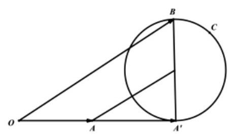

4、若分段函数 $f\left( x\right)  = \left\{  \begin{matrix} 3\sin {2x} & x \leq  0 \\  {2}^{x} - 3 & x > 0 \end{matrix}\right.$ ,将函数 $y = \left| {f\left( x\right)  - f\left( a\right) }\right| , x \in  \left\lbrack  {m, n}\right\rbrack$ 的最大值记作 ${Z}_{a}\left\lbrack  {m, n}\right\rbrack$ ,那么当 $- 2 \leq  m \leq  2$ 时， ${Z}_{2}\left\lbrack  {m, m + 4}\right\rbrack$ 的取值范围是___；

A、 $\left\lbrack  {4,{60}}\right\rbrack$ B、 $\left\lbrack  {2,{60}}\right\rbrack$ C、 $\lbrack 4,{60})$ D、 $\lbrack 2,{60})$

【答案】A

【解析】由 $f\left( x\right)  = \left\{  \begin{array}{l} 3\sin {2x}, x \leq  0 \\  {2}^{x} - 3, x > 0 \end{array}\right.$ ,得 $f\left( 2\right)  = 1$ ,则 $y = f\left( x\right)  - f\left( \mathrm{a}\right)  \vDash  f\left( x\right)  - 1 \mid$ ,

作出函数 $f\left( x\right)$ 的图象如图所示:

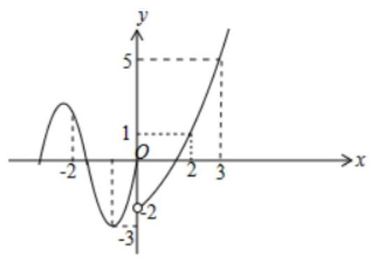

当 $- 2 \leq  m \leq   - 1$ 时, ${\left| f\left( x\right)  - 1\right| }_{\max } = \left| {\left( {-3}\right)  - 1}\right|  = 4$ ;

当 $m >  - 1$ 时, $m + 4 > 3,{2}^{m + 4} - 3 - 1 = {2}^{m + 4} - 4 > 4$ , $\therefore$ 当 $- 1 < m \leq  2$ 时, ${Z}_{a}\left\lbrack  {m, m + 4}\right\rbrack   = {2}^{m + 4} - 4$ ,

则 ${Z}_{2}\left\lbrack  {m, m + 4}\right\rbrack$ 的最大值为 ${2}^{6} - 4 = {60}$ . 故 ${Z}_{2}\left\lbrack  {m, m + 4}\right\rbrack$ 的取值范围是 $\left\lbrack  {4,{60}}\right\rbrack$ .

故答案为: A.

## 6、估值法

由于选择题提供了唯一正确的选项，解答又无需过程. 因此，有些题目，不必进行准确的计算. 只需对其数值特点和取值界限作出适当的估计，便能作出正确的判断，或有些题目由于条件的限制无法进行精准的运算或判断，此时只能借助估算，通过观察、分析、比较、推算，从而得到正确选项。这就是估算法. 估算法往往可以减少运算量，但是加强了思维的层次.

【例 21】函数 $f\left( \theta \right)  = \left| \begin{matrix}  - 1 &  - \tan \theta & \sqrt{\cot \theta } \\  2 & \tan \theta &  - \sqrt{\cot \theta } \\  3 & \sqrt{{\tan }^{3}\theta  + {64}} & \tan \theta  - 3 \end{matrix}\right| \left( {0 < \theta  < \frac{\pi }{2}}\right)$ 的最小值为( )

A、 9 B、 8 C、 4 D、 1

【难度】★★★

【答案】C

【解析】借助计算器,分别取 $\theta  = \frac{\pi }{4},\theta  = \frac{\pi }{3}$ 等即可得到答案.

## 巩固训练

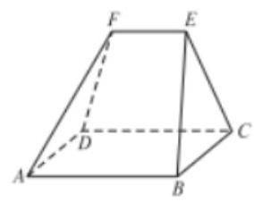

1、如图，在多面体 $\mathrm{{ABCDEF}}$ 中，四边形 $\mathrm{{ABCD}}$ 是边长为3的正方形，EF//AB，EF= $\frac{3}{2}$ ， EF 与平面 ABCD 的距离为 2 ，则该多面体的体积为( )

A、 $\frac{9}{2}$ B、 5 C、 6

D、 $\frac{15}{2}$

【答案】D

【解析】 ${V}_{ABCDEF} = {V}_{E - {ABCD}} + {V}_{E - {BCF}},{V}_{E - {ABCD}} = \frac{1}{3} \times  9 \times  2 = 6$ ,所以 ${V}_{ABCDEF} > 6$ . 故排除 ABC,选 D 正确.

## 7、利用极限思想

是指用极限概念分析问题和解决问题的一种数学思想.

【例 22】已知数列 $\left\{  {a}_{n}\right\}$ 满足 ${a}_{n} < {a}_{n + 1}\left( {n \in  {\mathbf{N}}^{ * }}\right)$ ,若 ${P}_{n}\left( {n,{a}_{n}}\right) \left( {n \geq  3}\right)$ 均在双曲线 $\frac{{x}^{2}}{6} - \frac{{y}^{2}}{2} = 1$ 上,则 $\mathop{\lim }\limits_{{n \rightarrow  \infty }}\left| {{P}_{n}{P}_{n + 1}}\right|  =$ (   )

A. $\sqrt{3}$ B. $\frac{2\sqrt{3}}{3}$ C. $\frac{\sqrt{3}}{3}$ D. 1

【难度】★★★

【答案】B

【解析】方法一: 当 $n \rightarrow   + \infty$ 时, ${P}_{n}{P}_{n + 1}$ 与渐近线平行, ${P}_{n}{P}_{n + 1}$ 在 $x$ 轴的投影为 1,渐近线倾斜角为 $\theta$ ,则 $\tan \theta  = \frac{\sqrt{3}}{3}$ ,

故 ${P}_{n}{P}_{n + 1} = \frac{1}{\cos \frac{\pi }{6}} = \frac{2\sqrt{3}}{3}$ ; 故答案为: $\mathrm{B}$ .

方法二: 由 $\frac{{n}^{2}}{6} - \frac{{a}_{n}^{2}}{2} = 1$ ,可得 ${a}_{n} = \sqrt{2\left( {\frac{{n}^{2}}{6} - 1}\right) },\therefore {P}_{n}\left( {n,\sqrt{2\left( {\frac{{n}^{2}}{6} - 1}\right) }}\right) ,\therefore {P}_{n + 1}\left( {n + 1,\sqrt{2\left( {\frac{{\left( n + 1\right) }^{2}}{6} - 1}\right) }}\right)$ ,

$\therefore \left| {{P}_{n}{P}_{n + 1}}\right|  = \sqrt{{\left( n + 1 - n\right) }^{2} + \left( \sqrt{2{\left( \frac{n + 1}{6}\right) }^{2} - 1}\right)  - \sqrt{2\left( {\frac{{n}^{2}}{6} - 1}\right) }} = \sqrt{\frac{2{n}^{2} + {2n} - 8}{3} + 4\sqrt{\left( {\frac{{\left( n + 1\right) }^{2}}{6} - 1}\right) \left( {\frac{{n}^{2}}{6} - 1}\right) }}$

$\therefore$ 求解极限可得 $\mathop{\lim }\limits_{{n \rightarrow  \infty }}\left| {{P}_{n}{P}_{n + 1}}\right|  = \frac{2\sqrt{3}}{3}$ ,故答案为: $\mathrm{B}$ .

1、平面直角坐标系中，满足到 ${F}_{1}\left( {-1,0}\right)$ 的距离比到 ${F}_{2}\left( {1,0}\right)$ 的距离大 1 的点的轨迹为曲线 $T$ ，点 ${P}_{n}\left( {n,{y}_{n}}\right)$ (其中 ${y}_{n} > 0, n \in  {\mathbf{N}}^{ * }$ ) 是曲线 $T$ 上的点,原点 $O$ 到直线 ${P}_{n}{F}_{2}$ 的距离为 ${d}_{n}$ ,则 $\mathop{\lim }\limits_{{n \rightarrow  \infty }}{d}_{n} =$ (   ).

A. $\frac{\sqrt{3}}{3}$ B. $\frac{\sqrt{3}}{2}$ C. $\sqrt{3}$ D. 1

【答案】B

【解析】当 $n \rightarrow  \infty$ 时,直线 ${P}_{n}{F}_{2}$ 平行于双曲线渐近线 $y = \sqrt{3}x$ ,所求的量可以转化为点 $\mathrm{F}$ 到双曲线渐近线 $y = \sqrt{3}x$ 。故选 B.

2、正 $\mathrm{n}$ 棱锥的相邻两侧面所成角的范围是( )

A、 $\left( {\frac{n - 2}{n}\pi ,\pi }\right)$ B、 $\left( {\frac{\pi }{3},\pi }\right)$ C、 $\left( {\frac{n - 1}{n}\pi ,\pi }\right)$ D、 $\left( {\frac{n - 2}{n}\pi ,\frac{n - 1}{n}\pi }\right)$

【答案】A

【解析】若将棱锥的高看作 $\rightarrow  \infty$ ,则棱锥 $\rightarrow$ 棱柱,则两侧面所成角 $\rightarrow$ 正 $\mathrm{n}$ 边形的一个内角,故选A；

## (二)填空题解题策略

知识梳理

## 1. 填空题的类型

填空题主要考查学生的基础知识、基本技能以及分析问题和解决问题的能力，具有小巧灵活、结构简单、概念性强、运算量不大、不需要写出求解过程而只需要写出结论等特点. 从填写内容看, 主要有两类: 一类是定量填写, 一类是定性填写.

## 2. 填空题的特征

填空题不要求写出计算或推理过程, 只需要将结论直接写出的 “求解题”. 填空题与选择题也有质的区别:第一，表现为填空题没有备选项，因此，解答时有不受诱误干扰之好处，但也有缺乏提示之不足； 第二，填空题的结构往往是在一个正确的命题或断言中，抽出其中的一些内容(既可以是条件，也可以是结论), 留下空位, 让考生独立填上, 考查方法比较灵活.

从历年高考成绩看，填空题得分率一直不很高，因为填空题的结果必须是数值准确、形式规范、表达式最简，稍有毛病，便是零分．因此，解填空题要求在“快速、准确”上下功夫，由于填空题不需要写出具体的推理、计算过程，因此要想“快速”解答填空题，则千万不可“小题大做”，而要达到“准确”，则必须合理灵活地运用恰当的方法，在 “巧” 字上下功夫.

## 3. 解填空题的基本原则

①快——运算要快，力戒小题大作；

②稳——变形要稳，不可操之过急；

③全——答案要全，力避残缺不全；

④活——方法要活，不要钻死胡同；

⑤细——审题要细，不能粗心大意。

常用方法:(填空题解法很多，这里介绍几种常用方法)

解题技巧一教师版

## 例题精讲

1、直接法

直接法就是从题设条件出发，运用定义、定理、公式、性质、法则等知识，通过变形、推理、计算等， 得出正确结论, 使用此法时, 要善于透过现象看本质, 自觉地、有意识地采用灵活、简捷的解法.

【例 1】已知 $\bigtriangleup  {ABC}$ 的内角 $A, B, C$ 对应的边长分别为 $a, b, c, a = 4,\cos {2A} =  - \frac{7}{25}$ ，则 $\bigtriangleup  {ABC}$ 外接圆半径为___.

【难度】 $\star   \star$

【答案】 $\frac{5}{2}$

【解析】解: 因为 $\cos {2A} =  - \frac{7}{25}$ ,所以 $1 - 2{\sin }^{2}A =  - \frac{7}{25}$ ,解得 $\sin A =  \pm  \frac{4}{5}$

因为 $A \in  \left( {0,\pi }\right)$ ,所以 $\sin A = \frac{4}{5}$ ; 又 $a = 4$ ,所以 ${2R} = \frac{a}{\sin A} = \frac{4}{\frac{4}{5}} = 5$ ,所以 $R = \frac{5}{2}$ ;

【例 2】设 $f\left( x\right)$ 是展开式 ${\left( {x}^{2} + \frac{1}{2x}\right) }^{6}$ 中的中间项,若 $f\left( x\right)  \leq  {mx}$ 在区间 $\left\lbrack  {\frac{\sqrt{2}}{2},\sqrt{2}}\right\rbrack$ 上恒成立,则实数 $m$ 的取值范围是___.

【难度】 $\star   \star   \star$

【答案】 $\lbrack 5, + \infty )$

【解析】由题知二项展开式的中间项为 ${T}_{4} = {C}_{6}^{3}{\left( \frac{1}{2x}\right) }^{3}{\left( {x}^{2}\right) }^{3} = \frac{5}{2}{x}^{3}$ ,则 $f\left( x\right)  = \frac{5}{2}{x}^{3}$ ,据题 $\frac{5}{2}{x}^{3} \leq  {mx}$ ,即 $\frac{5}{2}{x}^{3} - {mx} \leq  0$ 在区间 $\left\lbrack  {\frac{\sqrt{2}}{2},\sqrt{2}}\right\rbrack$ 上恒成立,不等式等价于 $m \geq  \frac{5}{2}{x}^{2}$ ,当 $x \in  \left\lbrack  {\frac{\sqrt{2}}{2},\sqrt{2}}\right\rbrack$ 时, $\frac{5}{2}{x}^{2}$ 的最大值为 $\frac{5}{2} \times  {\left( \sqrt{2}\right) }^{2} = 5$ ,故 $m \geq  5$ . 本题应填 $\lbrack 5, + \infty )$

## 2、观察法

通过观察题目所给已知条件与所求的量, 与我们已学过知识产生联系, 进而达到解答出来.

【例 3】设点 $P\left( {x, y}\right) \left( {{xy} \neq  0}\right)$ 是曲线 $\sqrt{\frac{{x}^{2}}{25}} + \sqrt{\frac{{y}^{2}}{9}} = 1$ 上的点， ${F}_{1}\left( {-4,0}\right)$ ， ${F}_{2}\left( {4,0}\right)$ ，则 $\left| {{F}_{1}P}\right|  + \left| {{F}_{2}P}\right|$ 与 10 的关系是

___.

【难度】 $\star   \star   \star$

【答案】 $\left| {{F}_{1}P}\right|  + \left| {{F}_{2}P}\right|  < {10}$

【解析】曲线 $\sqrt{\frac{{x}^{2}}{25}} + \sqrt{\frac{{y}^{2}}{9}} = 1$ 可化为: $\frac{\left| x\right| }{5} + \frac{\left| y\right| }{3} = 1$ ,

$\therefore$ 曲线围成的图形是一菱形,与坐标轴的交点分别为 $\left( {\pm 5,0}\right) ,\left( {0, \pm  3}\right)$ ,

和已知椭圆是内接的关系,曲线在椭圆 $\frac{{x}^{2}}{25} + \frac{{y}^{2}}{9} = 1$ 内部,

因为椭圆上的点 ${P}^{\prime }$ 满足 $\left| {{F}_{1}{P}^{\prime }}\right|  + \left| {{F}_{2}{P}^{\prime }}\right|  = {10}$ ,而点 $P\left( {x, y}\right) \left( {{xy} \neq  0}\right)$ 在椭圆内部,所以 $\left| {{F}_{1}P}\right|  + \left| {{F}_{2}P}\right|  < {10}$ .

【例 4】已知函数 $f\left( x\right)  = \frac{{3}^{x}}{{3}^{x} + 1},\left( {x \in  R}\right)$ ,正项等比数列 $\left\{  {a}_{n}\right\}$ 满足 ${a}_{50} = 1$ ,则 $f\left( {\ln {a}_{1}}\right)  + f\left( {\ln {a}_{2}}\right)  + \ldots  + f\left( {\ln {a}_{99}}\right)$ 等于___.

【难度】 $\star   \star$

【答案】 $\frac{99}{2}$

【解析】因为 $f\left( x\right)  = \frac{{3}^{x}}{{3}^{x} + 1}$ ,所以 $f\left( x\right)  + f\left( {-x}\right)  = \frac{{3}^{x}}{{3}^{x} + 1} + \frac{{3}^{-x}}{{3}^{-x} + 1} = 1$ . 因为数列 $\left\{  {a}_{n}\right\}$ 是等比数列,所以 ${a}_{1}{a}_{99} = {a}_{2}{a}_{98} = \cdots  = {a}_{49}{a}_{51} = {a}_{50}^{2} = 1$ ,即 $\ln {a}_{1} + \ln {a}_{99} = \ln {a}_{2} + \ln {a}_{98} = \cdots  = \ln {a}_{49} + \ln {a}_{51} = 0$ . 设 ${S}_{99} = f\left( {\ln {a}_{1}}\right)  + f\left( {\ln {a}_{2}}\right)  + f\left( {\ln {a}_{3}}\right)  + \cdots  + f\left( {\ln {a}_{99}}\right)$ ①，又 ${S}_{99} = f\left( {\ln {a}_{99}}\right)  + f\left( {\ln {a}_{98}}\right)  + f\left( {\ln {a}_{97}}\right)  + \ldots  + \; f\left( {\ln {a}_{1}}\right)$ ②，①+②，得 $2{S}_{99} = {99}$ ，所以 ${S}_{99} = \frac{99}{2}$ .

## 3、特例法

特殊值法在考试中应用起来比较方便, 它的实施过程是从特殊到一般, 优点是简便易行. 当暗示答案是一个“定值”时，就可以取一个特殊数值、特殊位置、特殊图形、特殊关系、特殊数列或特殊函数值来将字母具体化, 把一般形式变为特殊形式. 当题目的条件是从一般性的角度给出时, 特例法尤其有效.

【例 5】已知 $\bigtriangleup {ABC}$ 的三个内角 $A\text{ 、 }B\text{ 、 }C$ 的对边分别为 $a\text{ 、 }b\text{ 、 }c$ ,且满足 $\frac{\left( {\sin A - \sin C}\right) \left( {a + c}\right) }{b} = \sin A - \sin B$ , 则 $C =$ ___.

【难度】 $\star   \star   \star$

【答案】 ${60}^{ \circ  }$

【解析】容易发现当 $\bigtriangleup {ABC}$ 是一个等边三角形时,满足 $\frac{\left( {\sin A - \sin C}\right) \left( {a + c}\right) }{b} = \sin A - \sin B$ , 而此时 $C = {60}^{ \circ  }$ ,故角 $C$ 的大小为 ${60}^{ \circ  }$ .

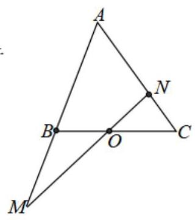

【例 6】如图,在 $\bigtriangleup {ABC}$ 中,点 $O$ 是 ${BC}$ 的中点,过点 $O$ 的直线分别交直线 ${AB},{AC}$ 于不同的两点 $M, N$ ，若 $\overrightarrow{AB} = m\overrightarrow{AM}$ ， $\overrightarrow{AC} = n\overrightarrow{AN}$ ，则 $m + n$ 的值为___.

【难度】★★★

【答案】 2

【解析】方法一、用特殊值代入即得答案如 MN 与 BC 重合。

方法二、考察三点共线充要条件: 若 $\overrightarrow{OP} = {\lambda }_{1}\overrightarrow{OA} + {\lambda }_{2}\overrightarrow{OB}$ ,则 ${\lambda }_{1} + {\lambda }_{2} = 1$ 是三点 $\mathrm{P}\text{ 、 }\mathrm{A}\text{ 、 }\mathrm{\;B}$ 共线的充要条件。

## 4、数形结合法

依据特殊数量关系所对应的图形位置、特征, 利用图形直观性求解的填空题, 称为图象分析型填空题, 这类问题的几何意义一般较为明显. 由于填空题不要求写出解答过程, 因而有些问题可以借助于图形, 然后参照图形的形状、位置、性质，综合图象的特征，进行直观地分析，加上简单的运算，一般就可以得出正确的答案. 事实上许多问题都可以转化为数与形的结合, 利用数形结合法解题既

浅显易懂, 又能节省时间. 利用数形结合的思想解决问题能很好地考查考生对基础知识的掌握程度及灵活处理问题的能力, 此类问题为近年来高考考查的热点内容

【例 7】在棱长均为 1 的正四面体 ${ABCD}$ 中, $M$ 为 ${AC}$ 的中点, $P$ 为 ${DM}$ 上的动点,则 ${PA} + {PB}$ 的最小值为 ___.

【难度】 $\star   \star   \star$

【答案】 $\sqrt{1 + \frac{\sqrt{6}}{3}}$

【解析】如图,

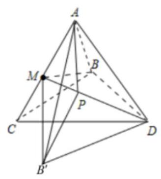

记 $\angle {BDM} = \theta$ ,在 $\bigtriangleup {BDM}$ 中, ${BD} = 1,{BM} = {DM} = \frac{\sqrt{3}}{2}$ ,可得 $\cos \theta  = \frac{\sqrt{3}}{3},\sin \theta  = \frac{\sqrt{6}}{3}$ .

将 $\bigtriangleup  {BDM}$ 绕 ${DM}$ 旋转，使 $\bigtriangleup  {BDM}$ 在平面 ${ACD}$ 内，此时 $B$ 在 ${B}^{\prime }$ 处.

连接 $A{B}^{\prime },{B}^{\prime }P$ ,则所求最小值即为 $A{B}^{\prime }$ 的长.

$\because \angle {AD}{B}^{\prime } = \theta  + {30}^{ \circ  },\;\therefore A{B}^{\prime 2} = A{D}^{2} + D{B}^{\prime 2} - {2AD} \cdot  D{B}^{\prime } \cdot  \cos \angle {AD}{B}^{\prime }$

$= {1}^{2} + {1}^{2} - 2\cos \left( {\theta  + {30}^{ \circ  }}\right)  = 2 - 2\left( {\cos \theta  \cdot  \cos {30}^{ \circ  } - \sin \theta  \cdot  \sin {30}^{ \circ  }}\right)  = 1 + \frac{\sqrt{6}}{3}$ .

$\therefore {PA} + {PB}$ 的最小值为 $\sqrt{1 + \frac{\sqrt{6}}{3}}$ . 故答案为: $\sqrt{1 + \frac{\sqrt{6}}{3}}$ .

【例 8】设 $n \in  {\mathrm{N}}^{ * },{a}_{n}$ 为 ${\left( x + 4\right) }^{n} - {\left( x + 1\right) }^{n}$ 的展开式的各项系数之和, ${b}_{n} = \left\lbrack  \frac{{a}_{1}}{5}\right\rbrack   + \left\lbrack  \frac{2{a}_{2}}{{5}^{2}}\right\rbrack   + \ldots  + \left\lbrack  \frac{n{a}_{n}}{{5}^{n}}\right\rbrack  (\left\lbrack  x\right\rbrack$ 表示不超过实数 $x$ 的最大整数)，则 ${\left( n - t\right) }^{2} + {\left( {b}_{n} - 2 + t\right) }^{2}\left( {t \in  R}\right)$ 的最小值为___.

【难度】 $\star   \star   \star$

【答案】 $\frac{1}{2}$

【解析】 ${a}_{n}$ 为 ${\left( x + 4\right) }^{n} - {\left( x + 1\right) }^{n}$ 的展开式的各项系数之和,即 ${a}_{n} = {5}^{n} - {2}^{n}$ ,

$\frac{{5}^{n} - {2}^{n}}{{5}^{n}} = 1 - {\left( \frac{2}{5}\right) }^{n}$ ,考虑 $f\left( n\right)  = n{\left( \frac{2}{5}\right) }^{n} > 0, n \in  {N}^{ * },{2n} + 2 < {5n}$ ,

$\frac{f\left( {n + 1}\right) }{f\left( n\right) } = \frac{\left( {n + 1}\right) {\left( \frac{2}{5}\right) }^{n + 1}}{n{\left( \frac{2}{5}\right) }^{n}} = \frac{2\left( {n + 1}\right) }{5n} < 1$ ,所以 $f\left( n\right)  = n{\left( \frac{2}{5}\right) }^{n} > 0, n \in  {N}^{ * }$ 递减,

所以 $f\left( n\right)  = n{\left( \frac{2}{5}\right) }^{n} \in  \left( {0,\frac{2}{5}}\right\rbrack$ ,

所以 $\left\lbrack  \frac{n{a}_{n}}{{5}^{n}}\right\rbrack   = \left\lbrack  {n - n{\left( \frac{2}{5}\right) }^{n}}\right\rbrack   = n - 1,{b}_{n} = 1 + 2 + \ldots  + n - 1 = \frac{{n}^{2} - n}{2}$ ,

${\left( n - t\right) }^{2} + {\left( {b}_{n} - 2 + t\right) }^{2} = {\left( n - t\right) }^{2} + {\left( \frac{{n}^{2} - n}{2} - 2 + t\right) }^{2}$ ,可以看成点 $\left( {n,\frac{{n}^{2} - n}{2}}\right)$ 到 $\left( {t,2 - t}\right)$ 的距离的平方,

即求点 $\left( {n,\frac{{n}^{2} - n}{2}}\right)$ 到直线 $y = 2 - x$ 的距离最小值的平方,

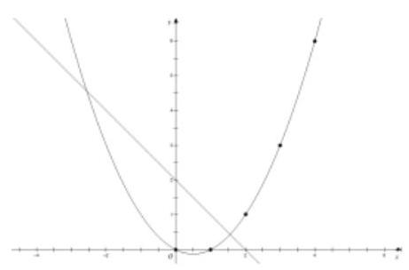

由图可得即求点 $\left( {1,0}\right)$ 或 $\left( {2,1}\right)$ 到直线 $x + y - 2 = 0$ 的距离的平方,即 ${\left( \frac{\left| 2 + 1 - 2\right| }{\sqrt{2}}\right) }^{2} = \frac{1}{2}$ ; 故答案为: $\frac{1}{2}$

## 5、等价转化法

将所给的命题进行等价转化, 使之成为一种容易理解的语言或容易求解的模式. 通过转化, 使问题化繁为简、化陌生为熟悉, 将问题等价转化成便于解决的问题, 从而得出正确的结果.

【例 9】已知数列 $\left\{  {a}_{n}\right\}$ 共有 21 项,且 ${a}_{1} = 1,{a}_{21} = {15},\left| {{a}_{k + 1} - {a}_{k}}\right|  = 1\left( {k = 1,2,3,\cdots ,{20}}\right)$ ,则满足条件的不同数列 $\left\{  {a}_{n}\right\}$ 有___个.

【难度】 $\star   \star   \star$

【答案】 1140

【解析】 $\because \left| {{a}_{k + 1} - {a}_{k}}\right|  = 1,\therefore {a}_{k + 1} - {a}_{k} = 1$ 或 ${a}_{k + 1} - {a}_{k} =  - 1$ ,

设满足 ${a}_{k + 1} - {a}_{k} = 1$ 的个数为 $x$ ,

$\because {a}_{21} - {a}_{1} = \left( {{a}_{21} - {a}_{20}}\right)  + \left( {{a}_{20} - {a}_{19}}\right)  + \cdots  + \left( {{a}_{2} - {a}_{1}}\right)  = {14}$ ,

$\therefore x + \left( {{20} - x}\right)  \cdot  \left( {-1}\right)  = {14}$ ,解得 $x = {17}$ ,结合组合的应用,满足要求的数列有 ${C}_{20}^{17} = {C}_{20}^{3} = {1140}$ 个.

故答案为: 1140 .

【例 10】已知函数 $f\left( x\right)  = {2}^{x - 1}, g\left( x\right)  = \left\{  {\begin{array}{l} a\cos x + 2, x \geq  0 \\  {x}^{2} + {2a}, x < 0 \end{array}\left( {a \in  \mathbf{R}}\right) }\right.$ ,若对任意 ${x}_{1} \in  \lbrack 1, + \infty )$ ,总存在 ${x}_{2} \in  \mathbf{R}$ , 使得 $f\left( {x}_{1}\right)  = g\left( {x}_{2}\right)$ ,则实数 $a$ 的取值范围是___.

【难度】 $\star   \star   \star$

【答案】 $\left( {-\infty ,\frac{1}{2}}\right)  \cup  \left\lbrack  {1,2}\right\rbrack$

【解析】因为函数 $f\left( x\right)  = {2}^{x - 1}$ 在 $\lbrack 1, + \infty )$ 上递增,

所以,对 $\forall x \in  \lbrack 1, + \infty )$ ,则 $f\left( x\right)  = {2}^{x - 1} \geq  {2}^{0} = 1$ ,即 $f\left( {x}_{1}\right)$ 的值域为 $\lbrack 1, + \infty )$ ,

对 $\forall {x}_{1} \in  \lbrack 1, + \infty )$ ,存在 ${x}_{2} \in  \mathbf{R}$ ,使得 $f\left( {x}_{1}\right)  = g\left( {x}_{2}\right)$ ,

设函数 $g\left( x\right)$ 的值域为 $A$ ,则满足 $\lbrack 1, + \infty ) \subseteq  A$ ,

当 $x < 0$ 时,函数 $g\left( x\right)  = {x}^{2} + {2a}$ 为减函数,则此时 $g\left( x\right)  > {2a}$ ,

当 $x \geq  0$ 时,函数 $g\left( x\right)  = a\cos x + 2 \in  \left\lbrack  {2 - \left| a\right| ,2 + \left| a\right| }\right\rbrack$ .

① 当 ${2a} < 1$ 时，即 $a < \frac{1}{2}$ 时，满足条件 $\lbrack 1, + \infty ) \subseteq  A$ ，

② 当 $a \geq  \frac{1}{2}$ 时，此时 ${2a} \geq  1$ ，要使 $\left\lbrack  {1, + \infty }\right\rbrack   \subseteq  A$ 成立，则此时有 $\left\{  \begin{array}{l} 2 - a \leq  1 \\  {2a} \leq  2 + a \end{array}\right.$ ，既有 $1 \leq  a \leq  2$ ，

综上 $a \in  \left( {-\infty ,\frac{1}{2}}\right)  \cup  \left\lbrack  {1,2}\right\rbrack$ . 故答案为: $\left( {-\infty ,\frac{1}{2}}\right)  \cup  \left\lbrack  {1,2}\right\rbrack$ .

## 6、归纳猜想

【例 11】设数列 $\left\{  {a}_{n}\right\}$ 是集合 $\left\{  {x \mid  x = {3}^{s} + {3}^{t}, s < t\text{ 且 }s, t \in  N}\right\}$ 中所有的数从小到大排列成的数列,即 ${a}_{1} = 4$ , ${a}_{2} = {10},{a}_{3} = {12},{a}_{4} = {28},{a}_{5} = {30},{a}_{6} = {36},\cdots$ ,将数列 $\left\{  {a}_{n}\right\}$ 中各项按照上小下大,左小右大的原则排成如图的等腰直角三角形数表，则 ${a}_{15}$ 的值为___

---

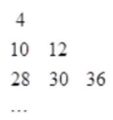

---

【难度】 $\star   \star   \star$

【答案】324

【解析】如果用 $\left( {t, s}\right)$ 表示 ${3}^{s} + {3}^{t}$ ,则 $4 = \left( {0,1}\right)  = {3}^{0} + {3}^{1},{10} = \left( {0,2}\right)  = {3}^{0} + {3}^{2},{12} = \left( {1,2}\right)  = {3}^{1} + {3}^{2} \; {28} = \left( {0,3}\right)  = {3}^{0} + {3}^{3},\;{30} = \left( {1,3}\right)  = {3}^{1} + {3}^{3},\;{36} = \left( {2,3}\right)  = {3}^{2} + {3}^{3};$

利用归纳推理得: ${a}_{15} = \left( {4,5}\right)$ ，则 ${a}_{15} = \left( {4,5}\right)  = {3}^{4} + {3}^{5} = {324}$ ，故答案为:324

巩固训练

1、已知角 $\alpha$ 的终边与单位圆交于点 $\left( {{x}_{0},{y}_{0}}\right)$ 且 $\sin \left( {\pi  - \alpha }\right)  = \frac{4}{5}$ ，则 $\cos {2\alpha } =$ ___.

【答案】 $- \frac{7}{25}$

【解析】因为 $\sin \left( {\pi  - \alpha }\right)  = \frac{4}{5}$ ,所以 $\sin \alpha  = \frac{4}{5}$ ,由三角函数的定义可知: $\sin \alpha  = {y}_{0} = \frac{4}{5}$ ,

由二倍角公式可得 $\cos {2\alpha } = 1 - 2{\sin }^{2}\alpha  = 1 - 2 \times  {\left( \frac{4}{5}\right) }^{2} =  - \frac{7}{25}$ ; 故答案为: $- \frac{7}{25}$ .

2、设 ${F}_{1},{F}_{2}$ 分别是椭圆 $C : \frac{{x}^{2}}{{a}^{2}} + \frac{{y}^{2}}{2} = 1\left( {a > 0}\right)$ 的左、右焦点,过 ${F}_{2}$ 作 $x$ 轴的垂线与 $C$ 交于 $A, B$ 两点,若 $\bigtriangleup  {AB}{F}_{1}$ 为正三角形，则 $a$ 的值为___.

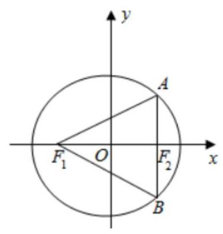

【答案】 $\sqrt{3}$

【解析】 ${F}_{1},{F}_{2}$ 分别是椭圆 $C : \frac{{x}^{2}}{{a}^{2}} + \frac{{y}^{2}}{2} = 1\left( {a > 0}\right)$ 的左、右焦点,则 ${a}^{2} - {c}^{2} = 2$ ①,

过 ${F}_{2}$ 作 $x$ 轴的垂线与 $C$ 交于 $A, B$ 两点,

因为 $\bigtriangleup  {AB}{F}_{1}$ 是等边三角形，所以 $A{F}_{2} = {F}_{1}{F}_{2}\tan {30}^{ \circ  } = \frac{2\sqrt{3}}{3}c$ ，则 $A\left( {c,\frac{2\sqrt{3}}{3}c}\right)$ ，代入椭圆方程可得 $\frac{{c}^{2}}{{a}^{2}} + \frac{2{c}^{2}}{3} = 1$ ②

由①②，结合 $a > c > 0$ 可得 $\left\{  \begin{array}{l} a = \sqrt{3} \\  c = 1 \end{array}\right.$ ，故答案为: $\sqrt{3}$ .

3、已知等差数列 $\left\{  {a}_{n}\right\}  ,\left\{  {b}_{n}\right\}$ 是每项为正数的等比数列( $q \neq  1$ )，且 ${a}_{1} = {b}_{1},{a}_{11} = {b}_{11}$ ，试比较 ${a}_{6}$ 与 ${b}_{6}$ 的大小为___.

【答案】 ${a}_{6} > {b}_{6}$

【解析】利用等差等比中项及基本不等式即可判定大小。

4、若实数 $a, b, c$ 成等差数列,点 $P\left( {-1,0}\right)$ 在动直线 $l : {ax} + {by} + c = 0$ 上的射影为 $M$ ,点 $N\left( {0,3}\right)$ ,则线段 ${MN}$ 长度的最小值是___.

【答案】 $4 - \sqrt{2}$

【解析】解: 由 $a\text{ 、 }b\text{ 、 }c$ 成等差数列可得 $a - {2b} + c = 0,\therefore$ 直线 $l : {ax} + {by} + c = 0$ 过定点 $Q\left( {1, - 2}\right)$ , 由点 $P\left( {-1,0}\right)$ 在直线 $l$ 的射影为 $M$ 得, $\angle {PMQ} = {90}^{ \circ  }$ ,则 $M$ 的轨迹是以 ${PQ}$ 为直径的圆,

易得,圆心 $C\left( {0, - 1}\right) , r = \left| {PC}\right|  = \sqrt{2},\therefore M{N}_{\min } = {CN} - r = 4 - \sqrt{2}$ . 故答案为: $4 - \sqrt{2}$ .

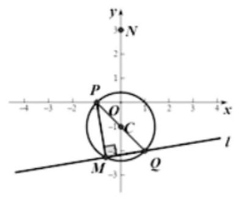

5、中国古代计时器的发明时间不晚于战国时代(公元前 476 年~前 222 年)，其中沙漏就是古代利用机械原理设计的一种计时装置, 它由两个形状完全相同的容器和一个狭窄的连接管道组成, 开始时细沙全部在上部容器中, 细沙通过连接管道流到下部容器, 如图, 某沙漏由上、下两个圆锥容器组成, 圆锥的底面圆的直径和高均为 $8\mathrm{\;{cm}}$ ,细沙全部在上部时,其高度为圆锥高度的 $\frac{2}{3}$ (细管长度忽略不计). 若细沙全部漏入下部后，恰好堆成一个盖住沙漏底部的圆锥形沙堆，则此圆锥形沙堆的高为___cm

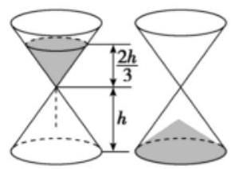

【答案】 $\frac{64}{27}$

【解析】设圆锥形容器的底面圆半径为 $r$ ,高为 $h$ ,则圆锥形容器的体积为 $V = \frac{1}{3}\pi {r}^{2}h$ ,

解题技巧一教师版

当细沙在上部时,细沙形成一个圆锥,该圆锥的底面圆半径为 $\frac{2}{3}r$ ,高为 $\frac{2}{3}h$ ,

细沙的体积为 ${V}_{1} = \frac{1}{3}\pi  \times  {\left( \frac{2}{3}r\right) }^{2} \times  \frac{2}{3}h = \frac{8}{27} \times  \frac{1}{3}\pi {r}^{2}h = \frac{8}{27}V$ ,

当细沙在下部时,细沙形成一个圆锥,该圆锥的底面半径为 $r$ ,设此时沙堆的高为 ${h}_{1}$ ,

则 $\frac{1}{3}\pi {r}^{2} \cdot  {h}^{\prime } = \frac{8}{27}V = \frac{8}{27} \times  \frac{1}{3}\pi {r}^{2}h$ ,可得 ${h}^{\prime } = \frac{8}{27}h = \frac{8}{27} \times  8 = \frac{64}{27}\left( {cm}\right)$ . 故答案为: $\frac{64}{27}$ .

6、已知函数 $f\left( {x + 1}\right)$ 为奇函数，函数 $g\left( x\right)  = 4\sin \frac{\pi }{2}x \cdot  \cos \frac{\pi }{2}x + 1\left( {x \neq  1}\right)$ . 若函数 $y = f\left( x\right)  + 1$ 与函数 $y = g\left( x\right)$ 的图象的交点坐标为 $\left( {{x}_{1},{y}_{1}}\right) ,\left( {{x}_{2},{y}_{2}}\right) ,\ldots ,\left( {{x}_{2020},{y}_{2020}}\right)$ ,则 ${x}_{1} + {x}_{2} + \cdots  + {x}_{2020} + {y}_{1} + {y}_{2} + \cdots  + {y}_{2020} =$ ___.

【答案】 4040

【解析】: 函数 $f\left( {x + 1}\right)$ 为奇函数, $\therefore$ 函数 $f\left( x\right)$ 的对称中心为 $\left( {1,0}\right)$ ,

$\therefore$ 函数 $y = f\left( x\right)  + 1$ 的对称中心为 $\left( {1,1}\right)$ ,

又 $g\left( x\right)  = 4\sin \frac{\pi }{2}x \cdot  \cos \frac{\pi }{2}x + 1 = 2\sin {\pi x} + 1\left( {x \neq  1}\right)$ ,

$\therefore$ 点 $\left( {1,1}\right)$ 也为函数 $g\left( x\right)$ 的对称中心,

$\therefore$ 函数 $y = f\left( x\right)  + 1$ 与函数 $y = g\left( x\right)$ 的图象的交点两两关于点 $\left( {1,1}\right)$ 成中心对称,

$\therefore {x}_{1} + {x}_{2} + \cdots  + {x}_{2020} + {y}_{1} + {y}_{2} + \cdots  + {y}_{2020} = \frac{2 \times  {2020}}{2} + \frac{2 \times  {2020}}{2} = {4040}$ . 故答案为:4040.

7、设点 $O$ 是 $\bigtriangleup  {ABC}$ 外接圆的圆心， ${AB} = 3$ ，且 $\overline{AO} \cdot  \overline{BC} =  - 4$ . 则 $\frac{\sin B}{\sin C}$ 的值是___.

【答案】 $\frac{1}{3}$

【解析】设点 $D$ 是边 ${BC}$ 的中点,则

$\overrightarrow{AO} \cdot  \overrightarrow{BC} = \left( {\overrightarrow{AD} + \overrightarrow{DO}}\right)  \cdot  \overrightarrow{BC} = \overrightarrow{AD} \cdot  \overrightarrow{BC} = \frac{1}{2}\left( {\overrightarrow{AB} + \overrightarrow{AC}}\right)  \cdot  \left( {\overrightarrow{AC} - \overrightarrow{AB}}\right)  = \frac{1}{2}\left( {{\overrightarrow{AC}}^{2} - {\overrightarrow{AB}}^{2}}\right)$

即 $\frac{1}{2}\left( {{\overline{AC}}^{2} - 9}\right)  =  - 4,{\overline{AC}}^{2} = 1,{AC} = 1$ ,故 $\frac{\sin B}{\sin C} = \frac{AC}{AB} = \frac{1}{3}$ . 故答案为: $\frac{1}{3}$ .

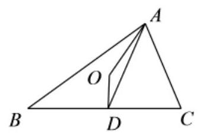

8、设 $1 + i$ 是关于 $x$ 的方程 ${x}^{2} - {4qx} + 2 = 0$ ( $q \in  R$ )的一个虚根，若 ${S}_{n}$ 表示数列 $\left\{  {5 \cdot  {q}^{n - 1}}\right\}$ 的前 $n$ 项和， 则 $\mathop{\lim }\limits_{{n \rightarrow  \infty }}{S}_{n}$ 的值是___.

【答案】 10

【解析】略

9、定义: 如果 $P$ 是圆 $O$ 所在平面内的一点, $Q$ 是射线 ${OP}$ 上一点,且线段 ${OP}\text{ 、 }{OQ}$ 的比例中项等于圆 $O$ 的半径,那么我们称点 $P$ 与点 $Q$ 为这个圆的一对反演点,已知点 $M\text{ 、 }N$ 为圆 $O$ 的一对反演点,且点 $M$ 、 $N$ 到圆心 $O$ 的距离分别为 4 和 9，那么圆 $O$ 上任意一点 $A$ 到点 $M\text{ 、 }N$ 的距离之比 $\frac{AM}{AN} =$ ___.

【答案】2:3

【解析】方法一:特殊值法，连接 $M$ 、 $N$ 与圆 $O$ 交于点 $Q$ ，此点就是我们选取的 $A$ 点，可知圆 $O$ 半径为 6, 故 $\mathrm{{AM}} = 2,\mathrm{{AN}} = 3,\therefore \mathrm{{AM}} : \mathrm{{AN}} = 2 : 3$ .

解法二: 解: 由题意 $\odot  O$ 的半径 ${r}^{2} = 4 \times  9 = {36},\because r > 0,\therefore r = 6$ ,

当点 $A$ 在 ${NO}$ 的延长线上时, ${AM} = 6 + 4 = {10},{AN} = 6 + 9 = {15},\therefore \frac{AM}{AN} = \frac{10}{15} = \frac{2}{3}$ ,

当点 ${A}^{\prime \prime }$ 是 ${ON}$ 与 $\odot  O$ 的交点时, ${A}^{\prime \prime }M = 2,{A}^{\prime \prime }N = 3,\therefore \frac{{A}^{\prime \prime }M}{{A}^{\prime \prime }N} = \frac{2}{3}$ ,

当点 ${A}^{\prime }$ 是 $\odot  O$ 上异与 $A,{A}^{\prime \prime }$ 两点时,易证 $\bigtriangleup O{A}^{\prime }{M}^{\odot /2}{\Delta ON}{A}^{\prime },\therefore \frac{{A}^{\prime }M}{{A}^{\prime }N} = \frac{O{A}^{\prime }}{ON} = \frac{6}{9} = \frac{2}{3}$ ,

综上所述， $\frac{AM}{AN} = \frac{2}{3}$ . 故答案为: $\frac{2}{3}$ .

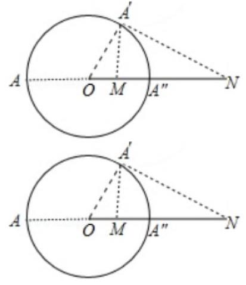

10、已知 $f\left( x\right)  = \sqrt{x - 1}$ ，其反函数为 ${f}^{-1}\left( x\right)$ ，若 ${f}^{-1}\left( x\right)  - a = f\left( {x + a}\right)$ 有实数根，则 $a$ 的取值范围为___ 【答案】 $\lbrack \frac{3}{4}, + \infty )$

【解析】解: 因为 $y = {f}^{-1}\left( x\right)  - a$ 与 $y = f\left( {x + a}\right)$ 互为反函数,

若 $y = {f}^{-1}\left( x\right)  - a$ 与 $y = f\left( {x + a}\right)$ 有实数根,则 $y = f\left( {x + a}\right)$ 与 $y = x$ 有交点,

所以 $\sqrt{x + a - 1} = x$ ,即 $a = {x}^{2} - x + 1 = {\left( x - \frac{1}{2}\right) }^{2} + \frac{3}{4} \geq  \frac{3}{4}$ ,故答案为: $\left\lbrack  {\frac{3}{4}, + \infty }\right)$ .

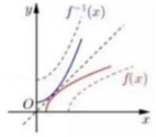

11、如图，在 $3 \times  3$ 的点阵中，依次随机地选出 $A, B, C$ 三个点，则选出的三点满足 $\overrightarrow{AB} \cdot  \overrightarrow{AC} \geq  0$ 的概率是___.

-

【答案】 $\frac{55}{63}$

【解析】由题意可知 $A, B, C$ 三个点是有序的,从反面 $\overrightarrow{AB} \cdot  \overrightarrow{AC} < 0$ 的角度做,讨论的是 $A$ 为主元, 故对 $A$ 分三种情况讨论,如图: 第一类 $A$ 为 5 号点; 第二类 $A$ 为1,3,7,9号点; 第三类 $A$ 为2,4,6,8号点;

(1)当 $A$ 为 5 号点时,则

(i) $\angle {BAC} = {180}^{ \circ  }$ ，三点共线有四条直线，故 $4{A}_{2}^{2} = 8$ ，

(ii) $\angle {BAC} = {135}^{ \circ  }$ ，则，如 $B$ 在 1 号位， $\left( {1,5,6}\right)$ 和 $\left( {1,5,8}\right)$ ，即确定第二个点的位置有四种方法，第三个点的位置有两种方法,然后 $B, C$ 排列,即方法数为: $4 \times  2 \times  2 = {16}$ ,

共有 $8 + {16} = {24}$ 种.

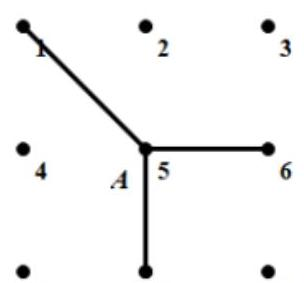

7

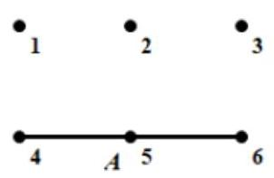

(2)当 $A$ 为第二类点不存在这样的点；

(3)当 $A$ 为第三类点，以 2 号点为例，有三种如图所示:

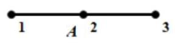

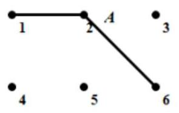

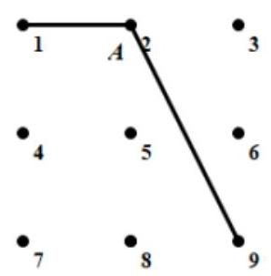

故有 $\left( {1 + 2 + 2}\right)  \times  4 \times  2 = {40}$ ,综上 $\overrightarrow{AB} \cdot  \overrightarrow{AC} < 0$ 共有 64 中,故 $P = 1 - \frac{64}{{A}_{9}^{3}} = \frac{55}{63}$ .

故答案为: $\frac{55}{63}$ .

12、已知函数 $g\left( x\right)  = {e}^{x} - {e}^{-x} + \frac{x}{{x}^{2} + 1} + \frac{1}{2}$ ，函数 $g\left( x\right)$ 在区间 $\left\lbrack  {-m, m}\right\rbrack  \left( {m > 0}\right)$ 上的最大值与最小值的和为 $a$ , 若函数 $f\left( x\right)  = {ax}\left| x\right|$ ,且对任意的 $x \in  \left\lbrack  {0,2}\right\rbrack$ ,不等式 $f\left( {x - {2k}}\right)  < {2k}$ 恒成立,则实数 $k$ 的取值范围为___.

【答案】 $\left( {\frac{1}{2}, + \infty }\right)$

【解析】解: 令 $h\left( x\right)  = {e}^{x} - {e}^{-x} + \frac{x}{{x}^{2} + 1}$ ,

则有 $y = h\left( x\right)$ 在 $\left\lbrack  {-m, m}\right.$ 上为奇函数. $\therefore h{\left( x\right) }_{\max } + h{\left( x\right) }_{\min } = 0$ .

$\therefore g{\left( x\right) }_{\max } = h{\left( x\right) }_{\max } + \frac{1}{2};g{\left( x\right) }_{\min } = h{\left( x\right) }_{\min } + \frac{1}{2}$ .

又 $\because$ 函数 $g\left( x\right)$ 在区间 $\left\lbrack  {-m, m}\right\rbrack  \left( {m > 0}\right)$ 上的最大值与最小值的和为 $a,\therefore a = 1$ .

$\therefore f\left( x\right)  = x\left| x\right|  = \left\{  {\begin{array}{l}  - {x}^{2}, x < 0 \\  {x}^{2}, x \geq  0 \end{array},\therefore y = f\left( x\right) }\right.$ 在 $x \in  \left\lbrack  {0,2}\right\rbrack$ 上为增加的.

又 $\because$ 对任意的 $x \in  \left\lbrack  {0,2}\right\rbrack$ ,不等式 $f\left( {x - {2k}}\right)  < {2k}$ 恒成立,

$\therefore f\left( {2 - {2k}}\right)  < {2k}$ ,即 $\left\{  \begin{array}{l} 2 - {2k} < 0 \\   - {\left( 2 - 2k\right) }^{2} < {2k} \end{array}\right.$ 或 $\left\{  \begin{array}{l} 2 - {2k} \geq  0 \\  {\left( 2 - 2k\right) }^{2} < {2k} \end{array}\right.$ ,解得, $k > \frac{1}{2}$ . 故答案为: $\left( {\frac{1}{2}, + \infty }\right)$ .
