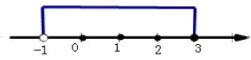
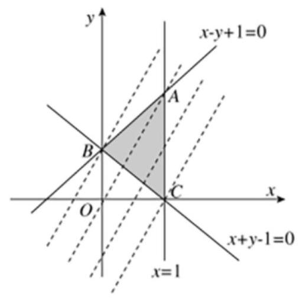
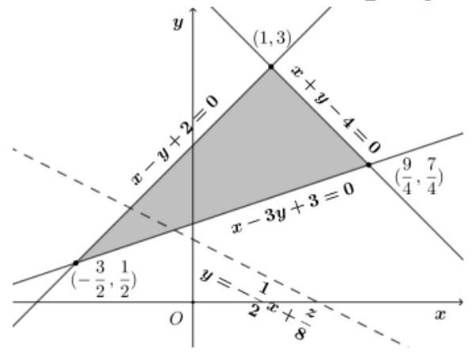

## 考前题型

<table><tr><td>教学目标</td><td>考前题型</td></tr><tr><td>重点</td><td>1、掌握集合的运算与充要条件;   2、熟练解一元二次不等式、分式不等式、含绝对值不等式、指对不等式; 会画二元一次不等式的可行域;   3、理解矩阵与行列式、复数相关概念;   4、掌握二项式定理、两个加法计数原理、排列组合问题、古典概型.</td></tr><tr><td>难 点</td><td>1、区分排列组合问题;   2、利用古典概型公式求事件概率.</td></tr></table>

## (一) 集合与命题

## 知识梳理

## 1、集合的运算

交集: $A \cap  B = \{ x \mid  x \in  A$ 且 $x \in  B\}$

并集: $A \cup  B = \{ x \mid  x \in  A$ 或 $x \in  B\}$

补集: ${\mathrm{C}}_{U}A = \{ x \mid  x \in  U$ 且 $x \notin  A\}$

## 2、充要条件

若 $\alpha  \Rightarrow  \beta$ ,那么 $\alpha$ 叫做 $\beta$ 的充分条件, $\beta$ 叫做 $\alpha$ 的必要条件;

若既有 $\alpha  \Rightarrow  \beta$ ,又有 $\beta  \Rightarrow  \alpha$ ,即 $\alpha  \Leftrightarrow  \beta$ ,那么 $\alpha$ 是 $\beta$ 的充分必要条件,简称充要条件;

## 例题精讲

【例 1】( 1 )若集合 $S = \{ 0,1,2,3\} , T = \{ x \mid   - 1 < x < 3\}$ ，则 $S \cup  T =$ ( )

A. $\left( {-1,3}\right)$ B. $( - 1,3\rbrack$ C. $\{ 0,1,2\}$ D. $(0,3\rbrack$

【难度】★★

【答案】B

【解析】画数轴如图:

可看出并集为 $S \cup  T = ( - 1,3\rbrack$ ; 故选: $B$

(2)设集合 $A = \left\{  {y\left| {\;y = \sqrt{{2x} - 1}}\right. }\right\}  , B = \left\{  {x\left| {\;\left( {{3x} - 4}\right) \left( {x + 1}\right)  > 0}\right. }\right\}$ ，则 $A \cap  \left( {{C}_{R}B}\right)  =$ ( )

A. $\left\lbrack  {0,\frac{4}{3}}\right\rbrack$ B. $\left\lbrack  {\frac{1}{2},\frac{4}{3}}\right\rbrack$ C. $\left\lbrack  {0,\frac{4}{3}}\right)$ D. $\left\lbrack  {\frac{1}{2},\frac{4}{3}}\right)$

【难度】 $\star   \star$

【答案】A

【解析】依题得, $A = \left\{  {y\left| {\;y = \sqrt{{2x} - 1}}\right. }\right\}   = \left\{  {y \mid  y \geq  0}\right\}  ,{C}_{R}B = \left\{  {x\left| {\;\left( {{3x} - 4}\right) \left( {x + 1}\right)  \leq  0}\right. }\right\}   = \left\{  {x \mid   - 1 \leq  x \leq  \frac{4}{3}}\right\}$ ,则 $A \cap  \left( {{\complement }_{\mathbb{R}}B}\right)  = \left\lbrack  {0,\frac{4}{3}}\right\rbrack$ . 故选: A.

【例 2】已知集合 $P = \left\{  {x \mid  {x}^{2} \leq  1}\right\}  , M = \{ a\}$ ,若 $P \cap  M = M$ ,则实数 $a$ 的取值范围是( )

A. $( - \infty , - 1\rbrack$ B. $\left\lbrack  {-1,1}\right\rbrack$ C. $\lbrack 1,\infty )$ D. $\left( {-\infty , - 1\rbrack \cup \lbrack 1,\infty }\right)$

【难度】★★

【答案】B

【解析】 $P \cap  M = M \Rightarrow  M \subseteq  P, P = \left\{  {x\left| {\;{x}^{2} \leq  1}\right. }\right\}   = \left\lbrack  {-1,1}\right\rbrack$ ,又 $M = \{ a\}$ ,所以 $- 1 \leq  a \leq  1$ .

【例 3】( 1 )已知直线 ${l}_{1} : x + \left( {{2a} - 1}\right) y + {2a} - 3 = 0,{l}_{2} : {ax} + {3y} + {a}^{2} + 4 = 0$ ,则 “ ${l}_{1}//{l}_{2}$ ” 是 “ $a = \frac{3}{2}$ ” 的( )

A. 充分不必要条件 B. 必要不充分条件

C. 充要条件 D. 既不充分也不必要条件

【难度】 $\star   \star$

【答案】C

【解析】若 ${l}_{1}//{l}_{2}$ ,则 $a\left( {{2a} - 1}\right)  = 3$ ,解得: $a = \frac{3}{2}$ 或 $a =  - 1$ ,

当 $a =  - 1$ 时, ${l}_{1} : x - {3y} - 5 = 0,{l}_{2} :  - x + {3y} + 5 = 0$ ,直线 ${l}_{1},{l}_{2}$ 重合, $\therefore a = \frac{3}{2};\therefore$ 充分性成立;

当 $a = \frac{3}{2}$ 时, ${l}_{1} : x + {2y} = 0,{l}_{2} : x + {2y} + \frac{25}{6} = 0$ ,显然 ${l}_{1}//{l}_{2},\therefore$ 必要性成立.

$\therefore$ 故“ ${l}_{1}//{l}_{2}$ ”是“ $a = \frac{3}{2}$ ”的充要条件. 故选: C.

(2)可以作为“若 $a, b \in  \mathbf{R}$ ，则 $a + b > 0$ ”的一个充分而不必要条件的是( )

A. ${ab} > 0$ B. $a > 0$ 或 $b > 0$ C. $a > 0$ 且 $b > 0$ D. ${ab} > 1$

【难度】★★

【答案】C

【解析】A. ${ab} > 0$ ，只能推出 $a$ ， $b$ 同号，不能推出一定是正数，故不是充分条件，故A不正确；B. $a =  - 4$ ， $b = 3$ ， 满足 $a > 0$ 或 $b > 0$ ,但此时 $a + b < 0$ ,故 $\mathbf{B}$ 不正确; C. $a > 0$ 且 $b > 0$ ,能推出 $a + b > 0$ ,反过来, $a = 4, b =  - 3$ ,满足 $a + b > 0$ ,但不能推出 $a > 0$ 且 $b > 0$ ,所以 $a > 0$ 且 $b > 0$ 是 $a + b > 0$ 的一个充分而不必要条件,故 $\mathrm{C}$ 正确; D. $a =  - 3, b =  - 4$ ,满足 ${ab} > 1$ ,但不能推出 $a + b > 0$ ,所以不是充分条件,故D 不正确. 故选: C

(3)王安石在《游褒禅山记》中写道:“世之奇伟、瑰怪，非常之观，常在险远，而人之所罕至焉，故非有志者不能至也. ”请问“有志”是能到达“奇伟、瑰怪，非常之观”的___条件. (填“充分”“必要”“充要” 中的一个)

【难度】★★

【答案】必要

【解析】因为“非有志者不能至”所以“能至是有志者”，因此“有志”是能到达“奇伟、瑰怪，非常之观”的必要条件

## 巩固训练

1、若集合 $P = \{ x\parallel x \mid   > 1\} , Q = \left\{  {x\left| {\;y = \sqrt{5 - {x}^{2}}}\right. }\right\}$ ，则 $P \cap  Q =$ ( )

A. $\left\lbrack  {-\sqrt{5}, - 1}\right)$ B. $\left( {1,\sqrt{5}}\right\rbrack$

C. $\left\lbrack  {-\sqrt{5}, - 1)\cup (1,\sqrt{5}}\right\rbrack$ D. $\left\lbrack  {-\sqrt{5},\sqrt{5}}\right\rbrack$

【答案】C

【解析】 $\because P = \{ x\begin{Vmatrix}x\end{Vmatrix} > 1\}  = \{ x \mid  x <  - 1$ 或 $x > 1\}$ ,

$Q = \left\{  {x\left| {\;y = \sqrt{5 - {x}^{2}}}\right. }\right\}   = \left\{  {x\left| {\;5 - {x}^{2} \geq  0}\right. }\right\}   = \left\{  {x\left| {\; - \sqrt{5} \leq  x \leq  \sqrt{5}}\right. }\right\}  ,$

$\therefore P \cap  Q = \left\{  {x\left| {\; - \sqrt{5} \leq  x <  - 1\text{ 或 }1 < x \leq  \sqrt{5}}\right. }\right\}$ . 故选: $C$ .

2、设全集 $U = \mathbf{R}$ ，集合 $A = \left\lbrack  {2,4}\right\rbrack  ,\;B = \left\{  {x \mid  {\log }_{2}x > 1}\right\}$ 则集合 $A \cap  \left( {{\complement }_{\mathrm{U}}B}\right)  =$ ( )

A. $\infty$ B. $\{ 2\}$ C. $\{ x \mid  0 \leq  x \leq  2\}$ D. $\{ x \mid  x \leq  2\}$

【答案】B

【解析】解: 因为 $A = \left\lbrack  {2,4}\right\rbrack  , B = \left\{  {x \mid  {\log }_{2}x > 1}\right\}$

所以 $B = \left( {2, + \infty }\right)$ ,则 ${\complement }_{\mathrm{U}}B = ( - \infty ,2\rbrack$ ,所以 $A \cap  \left( {{\complement }_{\mathrm{U}}B}\right)  = \{ 2\}$ ,故选: $B$ .

3、设 $p : \frac{1}{2} \leq  x \leq  1;q : a \leq  x \leq  a + 1$ ，若 $p$ 是 $q$ 的充分不必要条件，则实数 $a$ 的取值范围是( )

A. $0 < a < \frac{1}{2}$ B. $0 \leq  a \leq  \frac{1}{2}$ C. $0 \leq  a < \frac{1}{2}$ D. $0 < a \leq  \frac{1}{2}$

【答案】B

【解析】 $\because p : \frac{1}{2} \leq  x \leq  1;q : a \leq  x \leq  a + 1$ ,且 $p$ 是 $q$ 的充分不必要条件,

$\therefore \left\lbrack  {\frac{1}{2},1}\right\rbrack   \subsetneqq  \left\lbrack  {a, a + 1}\right\rbrack$ ,则 $\left\{  \begin{array}{l} a \leq  \frac{1}{2} \\  a + 1 \geq  1 \end{array}\right.$ ,且两不等式中的等号不同时成立. 解得: $0 \leq  a \leq  \frac{1}{2}$ . 故选: B.

4、已知集合 $A = \left\{  {x \mid  3 < {3}^{x} \leq  {27}}\right\}  , B = \left\{  {x\left| {\;\frac{x - a}{x - a - 2} > 0}\right. }\right\}$ .

(1)当 $a =  - 1$ 时，求 $A \cap  B$ ；

(2)若“ $x \in  B$ ”是“ $x \in  A$ ”的必要不充分条件，求实数 $a$ 的取值范围.

【答案】( 1 ) $\{ x \mid  1 < x \leq  3\}$ ；( 2 ) $\left( {-\infty , - 1}\right\rbrack   \cup  \left( {3, + \infty }\right)$ .

【解析】(1) 由 $3 < {3}^{x} \leq  {27}$ ,得 $1 < x \leq  3$ ,

所以集合 $A = \{ x \mid  1 < x \leq  3\} , B = \left\{  {x\left| {\;\frac{x - a}{x - a - 2} > 0}\right. }\right\}   = \{ x \mid  x < a$ 或 $x > a + 2\}$ ;

当 $a =  - 1$ 时, $B = \{ x \mid  x <  - 1$ 或 $x > 1\}$ ,所以 $A \cap  B = \{ x \mid  1 < x \leq  3\}$ ;

(2)曲“ $x \in  B$ ”是“ $x \in  A$ ”的必要不充分条件，得 $\mathrm{A}\;B$ ，

所以 $a > 3$ 或 $a + 2 \leq  1$ ,解得 $a > 3$ 或 $a \leq   - 1$ ,故实数 $a$ 的取值范围是 $( - \infty , - 1\rbrack  \cup  \left( {3, + \infty }\right)$ .

## (二) 不等式

## 知识梳理

1、一元二次不等式的解法

2、其他不等式的解法: 包括分式不等式、含绝对值不等式、指对不等式

3、二元一次不等式(组)

## 例题精讲

【例 4】( 1 )若集合 $A = \left\{  {x \mid  a{x}^{2} - {ax} + 1 \leq  0}\right\}   = \varnothing$ ，则实数 $a$ 的取值集合为( )

A. $\{ a \mid  0 < a < 4\}$ B. $\{ a \mid  0 \leq  a < 4\}$ C. $\{ a \mid  0 < a \leq  4\}$ D. $\{ a \mid  0 \leq  a \leq  4\}$

【难度】★★

【答案】B

【解析】因为 $A = \left\{  {x \mid  a{x}^{2} - {ax} + 1 \leq  0}\right\}   = \varnothing$ ,所以当 $a = 0$ ,时,满足题意; 当 $a \neq  0$ 时, $\Delta  = {a}^{2} - {4a} < 0 \Rightarrow  0 < a < 4$ ; 综上, $0 \leq  a < 4$ ,故选 B.

(2)已知 $x \in  \mathbf{R}$ ，则 “ $x < 2$ ” 是 “ $\frac{2}{x} > 1$ ” 的( )

A. 充分不必要条件 B. 必要不充分条件

C. 充要条件 D. 既不充分也不必要条件

【难度】★★

【答案】B

【解析】当 $x =  - 1$ 时,“ $x < 2$ ”成立,但 $\frac{2}{x} < 0$ ,故“ $\frac{2}{x} < 1$ ”,故“ $x < 2$ ”不是“ $\frac{2}{x} > 1$ ”的充分条件,

“ $\frac{2}{x} > 1$ ”等价于 $\frac{x - 2}{x} < 0 \Leftrightarrow  0 < x < 2$ ,即 $\frac{2}{x} > 1$ 能推出 $x < 2$ ,

$\therefore$ " $x < 2$ " 是 " $\frac{2}{x} > 1$ "的必要条件,故 " $x < 2$ " 是 " $\frac{2}{x} > 1$ " 的必要不充分条件,故选:B.

【例 5】( 1 )已知 $x$ ， $y \in  {R}^{ + }$ ，且 $\frac{1}{x} + {2y} = 3$ ，则 $\frac{y}{x}$ 的最大值为___.

【难度】★★

【答案】 $\frac{9}{8}$

【解答】解: $3 = \frac{1}{x} + {2y} \geq  2\sqrt{\frac{1}{x} \cdot  {2y}},\therefore \frac{y}{x} \leq  {\left( \frac{3}{2\sqrt{2}}\right) }^{2} = \frac{9}{8}$ ; 故答案为: $\frac{9}{8}$

(2)已知正实数 $x$ ， $y$ 满足 ${xy} - x - {2y} = 1$ ，则 $x + {2y}$ 的最小值为___.

【难度】 $\star   \star   \star$

【答案】 $4 + 2\sqrt{6}$

【解析】正实数 $x, y$ 满足 ${xy} - x - {2y} = 1,{xy} = x + {2y} + 1$ ,

由基本不等式可得, ${xy} = \frac{1}{2}x \cdot  \left( {2y}\right)  \leq  \frac{1}{2}{\left( \frac{x + {2y}}{2}\right) }^{2}$ ,当且仅当 $x = {2y}$ 时取等号,

$\therefore x + {2y} + 1 \leq  \frac{1}{2}{\left( \frac{x + {2y}}{2}\right) }^{2}$ ,

$\because x + {2y} > 0$ ,解不等式可得, $x + {2y} \geq  4 + 2\sqrt{6}$ 。故答案为: $4 + 2\sqrt{6}$ 。

【例 6】已知实数 $x, y$ 满足约束条件 $\left\{  \begin{array}{l} x - y + 1 \geq  0, \\  x + y - 1 \geq  0, \\  x \leq  1 \end{array}\right.$ 则 $z = {2x} - y$ 的取值范围为 ( )

A. $\left\lbrack  {-1,0}\right\rbrack$ B. $\left\lbrack  {-1,2}\right\rbrack$

C. $\left\lbrack  {0,2}\right\rbrack$ D. $\left\lbrack  {-2,1}\right\rbrack$

【难度】★★

【答案】B

【解析】如图画出可行域,由 $z = {2x} - y$ ,

则 $y = {2x} - z$ ,当直线 $y = {2x} - z$ 过点 $C$ 时, $z$ 取最大值;

当直线 $y = {2x} - z$ 过点 $B$ 时, $z$ 取最小值. 由题可得 $B\left( {0,1}\right) , C\left( {1,0}\right)$ ,

所以 ${z}_{\max } = 2,{z}_{\min } =  - 1$ ; 故选: B.

## 巩固训练

1、已知不等式 $a{x}^{2} + {bx} + 2 > 0$ 的解集为 $\{ x \mid   - 1 < x < 2\}$ ，则不等式 $2{x}^{2} + {bx} + a < 0$ 的解集为( )

A. $\{ x \mid   - 1 < x < \frac{1}{2}\}$ B. $\left\{  {x\left| {\;x <  - 1}\right. }\right.$ 或 $\left. {x > \frac{1}{2}}\right\}$

C. $\{ x \mid   - 2 < x < 1\}$ D. $\{ x \mid  x <  - 2$ 或 $x > 1\}$

【答案】 $\mathrm{A}$

【解析】 $\because$ 不等式 $a{x}^{2} + {bx} + 2 > 0$ 的解集为 $\{ x \mid   - 1 < x < 2\}$ ,

$\therefore a{x}^{2} + {bx} + 2 = 0$ 的两根为-1,2,且 $a < 0$ ,即 $- 1 + 2 =  - \frac{b}{a},\left( {-1}\right)  \times  2 = \frac{2}{a}$ ,解得 $a =  - 1, b = 1$ , 则不等式可化为 $2{x}^{2} + x - 1 < 0$ ,解得 $- 1 < x < \frac{1}{2}$ ,则不等式 $2{x}^{2} + {bx} + a < 0$ 的解集为 $\{ x \mid   - 1 < x < \frac{1}{2}\}$ . 故选:A

2、不等式 $\frac{1 - x}{x + 1} > 0$ 的解集是( )

A. $\left( {1, + \infty }\right)$ B. $\left( {-1,1}\right)$ C. $\left( {-\infty , - 1}\right)$ D. $\left( {-\infty , - 1}\right)  \cup  \left( {1, + \infty }\right)$

【答案】B

【解析】分式不等式 $\frac{1 - x}{x + 1} > 0$ 等价于 $\left( {1 - x}\right) \left( {x + 1}\right)  > 0$ ,即 $\left( {x - 1}\right) \left( {x + 1}\right)  < 0$ ,解一元二次不等式得: $- 1 < x < 1$ ,故不等式 $\frac{1 - x}{x + 1} > 0$ 的解集是 $\left( {-1,1}\right)$ ; 故选: B.

3、已知集合 $A = \left\{  {x \mid  {\log }_{2}x > 1}\right\}  , B = \{ x\parallel x - 1 \mid   < 3\}$ ，则 $A\bigcap B =$ (   )

A. $\left( {-2,4}\right)$ B. $\left( {1,2}\right)$ C. $\left( {1,4}\right)$ D. $\left( {2,4}\right)$

【答案】D

【解析】解: $\because A = \left\{  {x \mid  {\log }_{2}x > 1}\right\}  , B = \{ x\parallel x - 1 \mid   < 3\}$

$\therefore A = \{ x \mid  x > 2\} , B = \{ x \mid   - 3 < x - 1 < 3\}  = \{ x \mid   - 2 < x < 4\} ,\therefore A\bigcap B = \left( {2,4}\right)$ . 故选: $D$ .

4、若实数 $x, y$ 满足不等式组 $\left\{  \begin{array}{l} x - y + 2 \geq  0 \\  x + y - 4 \leq  0 \\  x - {3y} + 3 \leq  0, \end{array}\right.$ ,则 ${4x} + {8y}$ 的最大值为___.

【答案】28

【解析】令 $z = {4x} + {8y}$ ,得 $y =  - \frac{1}{2}x + \frac{z}{8}$ ,由约束条件可得如下可行域,

$\therefore$ 由图知: 当过点 $\left( {1,3}\right)$ 时, $z$ 取得最大值,且 ${z}_{\max } = 4 \times  1 + 8 \times  3 = {28}$ .

## (三)矩阵与行列式

## 知识梳理

1、线性方程组的系数矩阵、增广矩阵

2、二阶行列式、三阶行列式的求法与其中元素的余子式或代数余子式

## 例题精讲

【例 7】( 1 )行列式 $\left| \begin{matrix} \sin \alpha & \sin \alpha  - \cos \alpha \\  \cos \alpha & \sin \alpha  + \cos \alpha  \end{matrix}\right|$ 的值等于___.

【难度】★★

【答案】 1

【解析】行列式 $\left| \begin{array}{rr} \sin \alpha & \sin \alpha  - \cos \alpha \\  \cos \alpha & \sin \alpha  + \cos \alpha  \end{array}\right|$ 的值为:

$\sin \alpha \left( {\sin \alpha  + \cos \alpha }\right)  - \cos \alpha \left( {\sin \alpha  - \cos \alpha }\right)  = {\sin }^{2}\alpha  + {\cos }^{2}\alpha  = 1$ ,

故答案为:1.

(2) $\left| \begin{array}{lll} 1 & 4 & 7 \\  2 & 5 & 8 \\  3 & 6 & 9 \end{array}\right|$ 中 3 的代数余子式的值是___

【难度】★★

【答案】 -3

【解析】 $\left| \begin{array}{lll} 1 & 4 & 7 \\  2 & 5 & 8 \\  3 & 6 & 9 \end{array}\right|$ 中 3 的代数余子式的值是 ${\left( -1\right) }^{3 + 1}\left| \begin{array}{ll} 4 & 7 \\  5 & 8 \end{array}\right|  = 4 \times  8 - 5 \times  7 =  - 3$ . 故答案为: -3 .

【例 8】( 1 )关于 $x$ 、 $y$ 的二元一次方程组 $\left\{  \begin{array}{l} {3x} + {4y} = 1 \\  x - {3y} = {10} \end{array}\right.$ 的增广矩阵为( )

C. $\left( \begin{matrix} 3 & 4 & 1 \\  1 &  - 3 & {10} \end{matrix}\right)$ D. $\left( \begin{matrix} 3 & 4 & 1 \\  1 & 3 & {10} \end{matrix}\right)$

【难度】 $\star   \star$

【答案】C

【解析】关于 $x, y$ 的二元一次方程组 $\left\{  \begin{array}{l} {3x} + {4y} = 1 \\  x - {3y} = {10} \end{array}\right.$ 的增广矩阵为 $\left( \begin{array}{rrr} 3 & 4 & 1 \\  1 &  - 3 & {10} \end{array}\right)$ ,故选: $\mathbf{C}$

( 2 )若某线性方程组的增广矩阵为 $\left( \begin{matrix} 1 & 2 & 8 \\  2 & 4 & {16} \end{matrix}\right)$ ，则该线性方程组的解的个数为( )

A. 0 个 B. 1 个 C. 无数个 D. 不确定

【难度】 $\star   \star$

【答案】C

【解析】该线性方程组可化为方程 $x + {2y} = 8$ ,故有无数组解,故选: C.

(3)已知 ${P}_{1}\left( {{a}_{1},{b}_{1}}\right)$ 与 ${P}_{2}\left( {{a}_{2},{b}_{2}}\right)$ 是直线 $y = {kx} + 1$ ( $k$ 为常数)上两个不同的点，则关于 ${l}_{1} : {a}_{1}x + {b}_{1}y - 1 = 0$ 和 ${l}_{2} : {a}_{2}x + {b}_{2}y - 1 = 0$ 的交点情况是( )

A. 存在 $k,{P}_{1},{P}_{2}$ 使之无交点 B. 存在 $k,{P}_{1},{P}_{2}$ 使之有无穷多交点

C. 无论 $k,{P}_{1},{P}_{2}$ 如何,总是无交点 D. 无论 $k,{P}_{1},{P}_{2}$ 如何,总是唯一交点

【难度】 $\star   \star   \star$

【答案】D

【解析】因为直线 $y = {kx} + 1$ 经过点 $\left( {0,1}\right)$ 不经过原点,点 ${P}_{1},{P}_{2}$ 在直线 $y = {kx} + 1$ 上且不重合,

所以 $\overrightarrow{O{P}_{1}},\overrightarrow{O{P}_{2}}$ 不共线,所以 ${a}_{1}{b}_{2} - {a}_{2}{b}_{1} \neq  0$ ,

因为 $\left\{  \begin{array}{l} {a}_{1}x + {b}_{1}y - 1 = 0 \\  {a}_{2}x + {b}_{2}y - 1 = 0 \end{array}\right.$ ,即 $\left\{  \begin{array}{l} {a}_{1}x + {b}_{1}y = 1 \\  {a}_{2}x + {b}_{2}y = 1 \end{array}\right.$ ,方程组的系数矩阵为: $\left\lbrack  \begin{array}{ll} {a}_{1} & {b}_{1} \\  {a}_{2} & {b}_{2} \end{array}\right\rbrack$ ,

所以 $D = \left| \begin{array}{ll} {a}_{1} & {b}_{1} \\  {a}_{2} & {b}_{2} \end{array}\right|  = {a}_{1}{b}_{2} - {a}_{2}{b}_{1} \neq  0$ ,所以 $\left\{  \begin{array}{l} {a}_{1}x + {b}_{1}y - 1 = 0 \\  {a}_{2}x + {b}_{2}y - 1 = 0 \end{array}\right.$ 有唯一解,

所以不论 $k,{P}_{1},{P}_{2}$ 如何, ${l}_{1},{l}_{2}$ 总是唯一交点,故选: D.

巩固训练

1、关于 $x$ 、 $y$ 的二元一次方程组 $\left\{  \begin{array}{l} x + {5y} = 0 \\  {2x} + {3y} = 4 \end{array}\right.$ 的系数行列式 $D$ 的值为___.

【答案】 -7

【解析】系数行列式为 $\left| \begin{array}{ll} 1 & 5 \\  2 & 3 \end{array}\right|  = 1 \times  3 - 2 \times  5 =  - 7$ ,故答案为:-7

2、若等比数列 $\left\{  {a}_{n}\right\}$ 的前 $n$ 项和为 ${S}_{n}$ ，且满足 $\left| \begin{matrix} {a}_{n + 1} & {S}_{n} \\  1 & 1 \end{matrix}\right|  = 2$ ，则数列 $\left\{  {a}_{n}\right\}$ 的前 $n$ 项和为 ${S}_{n}$ 为___.

【答案】 ${2}^{n + 1} - 2$

【解析】 $\left| \begin{matrix} {a}_{n + 1} & {S}_{n} \\  1 & 1 \end{matrix}\right|  = {a}_{n + 1} - {S}_{n} = 2\left( *\right)$ ,

在 $\left( *\right)$ 式中,分别令 $n = 1,2$ ,得 $\left\{  \begin{array}{l} {a}_{2} - {a}_{1} = 2 \\  {a}_{3} - {a}_{2} - {a}_{1} = 2 \end{array}\right.$ ,即 $\left\{  \begin{array}{l} {a}_{2} = {a}_{1} + 2 \\  {a}_{3} = 2{a}_{1} + 4 \end{array}\right.$ ,

因为 $\left\{  {a}_{n}\right\}$ 是等比数列,所以公比 $q = \frac{{a}_{3}}{{a}_{2}} = 2$ ,解得 ${a}_{1} = 2$ ,

所以 ${S}_{n} = \frac{{a}_{1}\left( {1 - {q}^{n}}\right) }{1 - q} = \frac{2\left( {1 - {2}^{n}}\right) }{1 - 2} = {2}^{n + 1} - 2$ ; 故答案为: ${2}^{n + 1} - 2$ .

3、若关于 $x, y$ 的线性方程组 $\left( \begin{matrix} m & 1 \\  1 & m \end{matrix}\right) \left( \begin{array}{l} x \\  y \end{array}\right)  = \left( \begin{matrix} {m}^{2} \\  m \end{matrix}\right)$ 有无穷多组解,则实数 $m$ 的值是___.

【答案】 $\pm  1$

【解析】由题意, $D = \left| \begin{matrix} m & 1 \\  1 & m \end{matrix}\right|  = {m}^{2} - 1,{D}_{x} = \left| \begin{matrix} {m}^{2} & 1 \\  m & m \end{matrix}\right|  = {m}^{3} - m = m\left( {{m}^{2} - 1}\right)$ ,

${D}_{y} = \left| \begin{matrix} m & {m}^{2} \\  1 & m \end{matrix}\right|  = {m}^{2} - {m}^{2} = 0,$

令 $D = \left| \begin{matrix} m & 1 \\  1 & m \end{matrix}\right|  = {m}^{2} - 1 = 0$ ,解得 $m =  \pm  1$ .

当 $m =  \pm  1$ 时, $D = {D}_{x} = {D}_{y} = 0$ ,方程组有无穷多组解.故答案为: $\pm  1$ .

4、若二元一次方程组的增广矩阵是 $\left( \begin{array}{lll} 1 & 2 & {c}_{1} \\  3 & 4 & {c}_{2} \end{array}\right)$ ,其解为 $\left\{  \begin{array}{l} x = {10}, \\  y = 0, \end{array}\right.$ 则 ${c}_{1} + {c}_{2} =$ ___.

【答案】 40

【解析】 ${c}_{1} = 1 \times  {10} + 2 \times  0 = {10},{c}_{2} = 3 \times  {10} + 4 \times  0 = {30}$ ,所以 ${c}_{1} + {c}_{2} = {40}$ .

5、直线 $\left| \begin{array}{lll} x & y & 1 \\  0 & 2 & 1 \\  1 & 1 & 1 \end{array}\right|  = 0$ 的倾斜角是___.

【答案】 $\frac{3\pi }{4}$

【解析】由 $\left| \begin{array}{lll} x & y & 1 \\  0 & 2 & 1 \\  1 & 1 & 1 \end{array}\right|  = x\left| \begin{array}{ll} 2 & 1 \\  1 & 1 \end{array}\right|  + \left| \begin{array}{ll} y & 1 \\  2 & 1 \end{array}\right|  = x + y - 2$ ,

可得 $x + y - 2 = 0$ ,故斜率为 $k =  - 1$ ,所以倾斜角为 $\frac{3\pi }{4}$ ,故答案为: $\frac{3\pi }{4}$ .

6、把三阶行列式 $\left| \begin{matrix} {2}^{x} & 0 & 3 \\  x & 4 & 0 \\  1 & x - 3 &  - 1 \end{matrix}\right|$ 中第 1 行第 3 列元素的代数余子式记为 $f\left( x\right)$ , 则关于 $x$ 的不等式 $f\left( x\right)  < 0$ 的解集为___.

【答案】 $\left( {-1,4}\right)$

## (四) 复数

## 知识梳理

1、复数相关概念: 虚数单位 $i$ 、复数的实部与虚部、共轭复数

2、复数的分类:实数、虚数(纯虚数、非纯虚数)

3、两复数相等充要条件

4、复数的运算

5、实系数一元二次方程

例题精讲

【例9】(1)如果复数 $\frac{2 + {bi}}{i}\left( {b \in  \mathbf{R}}\right)$ 的实部与虚部相等，那么 $b =$ ( )

A. -2 B. 1 C. 2 D. 4

【难度】★★

【答案】A

【解析】 $\frac{2 + {bi}}{i} = b - {2i}$ ,所以 $b =  - 2$

(2)若 $z = \frac{{i}^{3}}{1 + {2i}}$ ，则 $\left| z\right|  =$ ( )

A. $\frac{\sqrt{5}}{5}$ B. $\frac{\sqrt{5}}{3}$ C. $\frac{1}{5}$ D. $\frac{5}{9}$

【难度】★★

【答案】A

【解析】 $z = \frac{{i}^{3}}{1 + {2i}} = \frac{-i\left( {1 - {2i}}\right) }{\left( {1 + {2i}}\right) \left( {1 - {2i}}\right) } = \frac{-2 - i}{5}$ ,故 $\left| z\right|  = \sqrt{{\left( \frac{2}{5}\right) }^{2} + {\left( \frac{1}{5}\right) }^{2}} = \frac{\sqrt{5}}{5}$ ,故选: A

【例 10】( 1 )若复数 $z$ 满足 $\left( {z - 1}\right) i = 1 + i$ 其中 $i$ 为虚数单位，则复数 $z$ 的共轭复数 $\bar{z} =$ (   )

A. $- 2 - i$ B. $- 2 + i$ C. $2 - i$ D. $2 + i$

【难度】★★

【答案】D

【解析】因为 $\left( {z - 1}\right) i = 1 + i$ ,所以 $z = \frac{1 + {2i}}{i} = \frac{\left( {1 + {2i}}\right) i}{i \times  i} = 2 - i$ ,所以 $\bar{z} = 2 + i$ . 故选: D.

(2)已知 $a \in  R$ ， $\mathrm{i}$ 是虚数单位，若 $z = a + \sqrt{3}i$ ， $z \cdot  \bar{z} = 4$ ，则 $a$ 的值可以是___.

【难度】★★

【答案】 $\pm  1$

【解析】

$\because z = a + \sqrt{3}i$ ,则 $\bar{z} = a - \sqrt{3}i$ ,所以, $z \cdot  \bar{z} = 4 = \left( {a + \sqrt{3}i}\right) \left( {a - \sqrt{3}i}\right)  = {a}^{2} + 3 = 4$ ,解得 $a =  \pm  1$ .

【例 11】已知 $1 + {2i}$ 是方程 ${x}^{2} - {mx} + {2n} = 0\left( {m, n \in  R}\right)$ 的一个根，则 $m + n =$ ___.

【难度】 $\star   \star$

【答案】 $\frac{9}{2}$

【解析】解: 将 $x = 1 + {2i}$ 代入方程 ${x}^{2} - {mx} + {2n} = 0$ ,有 ${\left( 1 + 2i\right) }^{2} - m\left( {1 + {2i}}\right)  + {2n} = 0$ ,即 $1 + {4i} - 4 - m - {2mi} + {2n} = 0$ ,即 $\left( {-3 - m + {2n}}\right)  + \left( {4 - {2m}}\right) i = 0$ ,由复数相等的充要条件,得 $\left\{  \begin{array}{l}  - 3 - m + {2n} = 0 \\  4 - {2m} = 0 \end{array}\right.$ 解得 $\left\{  \begin{array}{l} n = \frac{5}{2} \\  m = 2 \end{array}\right.$ ,故 $m + n = 2 + \frac{5}{2} = \frac{9}{2}$ . 故答案为: $\frac{9}{2}$

## 巩固训练

1、已知 $\mathrm{i}$ 是虚数单位，若 $z\left( {1 - i}\right)  = i - 2$ ，则 $\left| z\right|  =$ ( )

A. $\frac{\sqrt{5}}{2}$ B. $\sqrt{10}$

C. $\frac{\sqrt{10}}{2}$ D. $\sqrt{5}$

【答案】C

【解析】 $\because z\left( {1 - i}\right)  = i - 2,\therefore z = \frac{i - 2}{1 - i} = \frac{\left( {i - 2}\right) \left( {1 + i}\right) }{\left( {1 - i}\right) \left( {1 + i}\right) } = \frac{i - 1 - 2 - {2i}}{2} =  - \frac{3}{2} - \frac{1}{2}i$ ,

$\therefore \left| z\right|  = \left| \frac{i - 2}{1 - i}\right|  = \left| {-\frac{3}{2} - \frac{1}{2}i}\right|  = \sqrt{{\left( -\frac{3}{2}\right) }^{2} + {\left( -\frac{1}{2}\right) }^{2}} = \frac{\sqrt{10}}{2}$ . 故选: C.

2、若复数 $z$ 的共轭复数为 $\bar{z}$ 且满足 $z \cdot  \left( {2 + i}\right)  = \bar{z} \cdot  \left( {1 - i}\right)  + 1$ ，则复数 $z$ 的实部为( )

A. $- \frac{3}{2}$ B. -1

C. $- \frac{1}{2}$ D. 1

【答案】D

【解析】设 $z = a + {bi}, a \in  R, b \in  R$ ,则 $\bar{z} = a - {bi}, a \in  R, b \in  R$

$\because z \cdot  \left( {2 + i}\right)  = \bar{z} \cdot  \left( {1 - i}\right)  + 1,\therefore \left( {a + {bi}}\right) \left( {2 + i}\right)  = \left( {a - {bi}}\right) \left( {1 - i}\right)  + 1$

整理得: $\therefore {2a} + \left( {a + {2b}}\right) i + b{i}^{2} = a - \left( {a + b}\right) i + b{i}^{2} + 1$ ,即 ${2a} + \left( {a + {2b}}\right) i = \left( {a + 1}\right)  - \left( {a + b}\right) i \; \therefore \left\{  \begin{matrix} {2a} = a + 1 \\  a + {2b} =  - \left( {a + b}\right)  \end{matrix}\right.$ ,解得: $\left\{  \begin{matrix} a = 1 \\  b =  - \frac{2}{3} \end{matrix}\right.$ ,所以复数 $z$ 的实部为 1,故选: D

3、已知关于 $x$ 的方程 ${x}^{2} + \left( {m + {2i}}\right) x + 2 + {2i} = 0\left( {m \in  R}\right)$ 有实数根 $n$ ，且 $z = m + {ni}$ ，则复数 $z$ 等于___.

【答案】 $3 - i$

【解析】由题意关于 $x$ 的方程有实数根 $n$ ,则 $n$ 适合方程,即 ${n}^{2} + \left( {m + {2i}}\right) n + 2 + {2i} = 0$ ,

即 $\left( {{n}^{2} + {mn} + 2}\right)  + \left( {{2n} + 2}\right) i = 0$ ,故 $\left\{  \begin{array}{l} {n}^{2} + {mn} + 2 = 0 \\  {2n} + 2 = 0 \end{array}\right.$ ,解得 $\left\{  {\begin{array}{l} m = 3 \\  n =  - 1 \end{array}3 - i\therefore z = 3 - i}\right.$ .

4、已知 $\mathrm{i}$ 为虚数单位,复数 $z = \frac{a - {2i}}{1 - i}\left( {a \in  R}\right)$ 是纯虚数,则 $\left| {\sqrt{5} - {ai}}\right|  =$ (   ).

A. $\sqrt{5}$ B. 4 C. 3 D. 2

【答案】C

【解析】由 $z = \frac{\left( {a - {2i}}\right) \left( {1 + i}\right) }{2} = \frac{a + 2 + \left( {a - 2}\right) i}{2}$ 为纯虚数,

$\therefore \left\{  \begin{array}{l} a + 2 = 0 \\  a - 2 \neq  0 \end{array}\right.$ ,解得: $a =  - 2$ ,则 $\left| {\sqrt{5} + {2i}}\right|  = \sqrt{{\left( \sqrt{5}\right) }^{2} + {2}^{2}} = 3$ ,故选: C.

5、若 $a \in  R$ ,则 “关于 $x$ 的方程 ${x}^{2} + {ax} + 1 = 0$ 无实根”是 “ $z = \left( {{2a} - 1}\right)  + \left( {a - 1}\right) i$ (其中 $i$ 表示虚数单位)在复平面上对应的点位于第四象限”的( )

$A$ . 充分非必要条件. $B$ . 必要非充分条件.

$C$ . 充要条件. $D$ . 既非充分又非必要条件.

【答案】 $B$

## (五)二项式定理、排列组合、概率与统计

例题精讲

【例 12】( 1 ) ${\left( 2\sqrt{x} - \frac{1}{\sqrt[3]{x}}\right) }^{6}$ 的二项展开式中，含 $\sqrt{x}$ 项的系数为___.

【难度】 $\star   \star$

【答案】-160

【解析】 ${T}_{r + 1} = {C}_{6}^{r} \cdot  {\left( 2\sqrt{x}\right) }^{6 - r} \cdot  {\left( -\frac{1}{\sqrt[3]{x}}\right) }^{r} = {\left( -1\right) }^{r} \cdot  {2}^{6 - r} \cdot  {C}_{6}^{r} \cdot  {x}^{3 - \frac{5r}{6}}$ ,

由 $3 - \frac{5r}{6} = \frac{1}{2}$ ,可得 $r = 3.\therefore$ 含 $\sqrt{x}$ 项的系数为 ${\left( -1\right) }^{3} \cdot  {2}^{6 - 3} \cdot  {C}_{6}^{3} =  - {160}$ .

故答案为: -160

(2)已知等差数列 $\left\{  {a}_{n}\right\}$ 的第 5 项是 ${\left( x - \frac{1}{x} + 2y\right) }^{6}$ 展开式中的常数项，则 ${a}_{2} + {a}_{8} =$ ( )

A. 20 B. -20 C. 40 D. -40

【难度】 $\star   \star   \star$

【答案】D

【解析】由二项式定理, ${\left( x - \frac{1}{x} + 2y\right) }^{6}$ 展开式中的常数项是 ${C}_{6}^{3}{x}^{3} \times  {\left( -\frac{1}{x}\right) }^{3} =  - {20}$ ,

即 ${a}_{5} =  - {20}$ ,因为 $\left\{  {a}_{n}\right\}$ 是等差数列,所以 ${a}_{2} + {a}_{8} = 2{a}_{5} =  - {40}$ . 故选: D.

【例 13】( 1 )中国古代中的“礼、乐、射、御、书、数”合称“六艺”. “礼”，主要指德育；“乐”，主要指美育; “射”和“御”，就是体育和劳动；“书”，指各种历史文化知识；个数”，数学. 某校国学社团开展“六艺”课程讲座活动，每艺安排一节，连排六节，一天课程讲座排课有如下要求:“数”必须排在前三节，且“射”和“御” 两门课程相邻排课，则关于“六艺”课程讲座不同排课顺序的种数为___. (用数字作答)

【难度】★★★

【答案】120

【解析】按相邻两门课排在前 3 节、中间两节及后 3 节分类,

方法数 ${C}_{2}^{1}{A}_{2}^{2}{A}_{3}^{3} + {A}_{2}^{2}{C}_{2}^{1}{A}_{3}^{3} + {A}_{2}^{2}{C}_{2}^{1}{C}_{3}^{1}{A}_{3}^{3} = {120}$ ,故答案为: 120 .

(2)某校高二年级共有 10 个班级，5 位教学教师，每位教师教两个班级，其中姜老师一定教 1 班，张老师一定教 3 班，王老师一定教 8 班，秋老师至少教 9 班和 10 班中的一个班，曲老师不教 2 班和 6 班，王老师不教 5 班，则不同的排课方法种数___.

【难度】 $\star   \star   \star$

【答案】 236

【解析】(1)秋老师教 9 班，曲老师可在4,5,7,10班中选两班,再分两小类:

①曲老师不教 5 班，则曲老师可选 ${C}_{3}^{2} = 3$ (种)；王老师可选 ${C}_{3}^{1} = 3$ (种)；剩余的 3 个班 3 个老师全排列安排有 ${A}_{3}^{3} = 3 \times  2 \times  1 = 6$ (种)；按分步相乘计数原理有: $3 \times  3 \times  6 = {54}$ (种)；

②曲老师教 5 班，则曲老师可选 ${C}_{3}^{1} = 3$ (种)；剩余的 4 个班 4 个老师全排列安排有 ${A}_{4}^{4} = 4 \times  3 \times  2 \times  1 = {24}$ (种)；按分步相乘计数原理有: $3 \times  {24} = {72}$ (种).

按分类相加计数原理,秋老师数 9 班有: ${54} + {72} = {126}$ (种);

(2)秋老师教 10 班，同理也有 126(种)；

(3)秋老师同时教 9 班和 10 班，曲老师可在 4,5,7 班中选两班，再分两小类:

①曲老师不教 5 班，则曲老师教 4 班和 7 班，王老师再从 2,6 班选一个，可选 ${C}_{2}^{1} = 2$ (种)；剩余的 2 个班 2 个老师全排列安排有 ${A}_{2}^{2} = 2$ (种)；按分步相乘计数原理有: ${2 \times  2} = 4$ (种)；

②曲老师教 5 班，则曲老师可选 ${C}_{2}^{1} = 2$ (种)；剩余的 3 个班 3 个老师全排列安排有 ${A}_{3}^{3} = 3 \times  2 \times  1 = 6$ (种)； 按分步相乘计数原理有: $2 \times  6 = {12}$ (种).

按分类相加计数原理，秋老师同时教 9 班和 10 班有:4 + 12 = 16 (种)；

但秋老师同时教 9 班和 10 班在( 1 )和( 2 )两种分类里都涉及到，所以重复需减去，

故不同的排课方法种数有:126+126-16=236(种)，故答案为:236

【例 14】(1)为了强化安全意识，某校拟在周一至周五的 5 天中随机选择 2 天进行紧急疏散演练，则选择的 2 天恰好是连续 2 天的概率是( )

A. $\frac{2}{5}$ B. $\frac{3}{5}$ C. $\frac{3}{10}$ D. $\frac{1}{5}$

【难度】 $\star   \star   \star$

【答案】A

【解析】由题意,某校拟在周一至周五的 5 天中随机选择 2 天进行紧急疏散演练,

可得基本事件的总数为 $n = {C}_{5}^{2} = {10}$ 种不同的选法,

其中选择的 2 天恰好为连续 2 天包换的基本事件为 $m = 4$ ,

所以选择的 2 天恰好是连续 2 天的概率是 $p = \frac{m}{n} = \frac{4}{10} = \frac{2}{5}$ . 故选: A.

(2)春天是鲜花的季节，水仙花就是其中最迷人的代表，数学上有个水仙花数，它是这样定义的:“水仙花数”是指一个三位数，它的各位数字的立方和等于其本身. 三位的水仙花数共有 4 个，其中仅有 1 个在区间 (150,160) 内，我们姑且称它为“水仙四妹”，则在集合\{142,147,152,154,157，“水仙四妹”\}，共 6 个整数中, 任意取其中 3 个整数, 则这 3 个整数中含有“水仙四妹”, 且其余两个整数至少有一个比“水仙四妹” 小的概率是( )

A. $\frac{3}{20}$ B. $\frac{1}{4}$ C. $\frac{3}{10}$ D. $\frac{9}{20}$

【难度】 $\star   \star   \star$

【答案】D

【解析】设 “水仙四妹”为 ${150} + x$ 且 $0 < x < {10}, x \in  \mathbf{Z}$ ,依题意知: ${1}^{3} + {5}^{3} + {x}^{3} = {150} + x$ ,即有 $\left( {x - 1}\right) x\left( {x + 1}\right)  = {24}$ ,可得 $x = 3$ ,即“水仙四妹”为 153,

$\therefore$ 集合为 $\{ {142},{147},{152},{153},{154},{157}\}$ ,故“含有 153,但其余两个整数至少有一个比 153 小”的对立事件 $A$

为“含有 153 ，但其余两个没有比 153 小”，

$\therefore$ “含有 153 ”的取法有: ${C}_{5}^{2}$ 种，而事件 $A$ 只有 1 种，故所求事件的取法有 ${C}_{5}^{2} - 1 = 9$ 种，

$\therefore$ 即所求概率为 $\frac{9}{{C}_{6}^{3}} = \frac{9}{20}$ . 故选: D

【例 15】( 1 )已知样本数据 ${x}_{1}\text{ 、 }{x}_{2}\text{ 、 }{x}_{3}\text{ 、 }{x}_{4}$ 的每个数据都是自然数,该样本的平均数为 4 ，方差为 5 , 且样本数据两两互不相同，则样本数据中的最大值是___.

【难度】 $\star   \star$

【答案】7

【解析】方差为 $5,\therefore {\left( {x}_{1} - 4\right) }^{2} + {\left( {x}_{2} - 4\right) }^{2} + {\left( {x}_{3} - 4\right) }^{2} + {\left( {x}_{4} - 4\right) }^{2} = {20}$ ,平均数为 4,

$\therefore {x}_{1} + {x}_{2} + {x}_{3} + {x}_{4} = {16},{x}_{1}\text{ 、 }{x}_{2}\text{ 、 }{x}_{3}\text{ 、 }{x}_{4} \in  \mathbf{N}$ ,且互不相同,不妨设 ${x}_{1} < {x}_{2} < {x}_{3} < {x}_{4}$ .

$\because$ 四个自然数的平方和为 20 只有两种情况: ${0}^{2} + {0}^{2} + {2}^{2} + {4}^{2}$ 及 ${1}^{2} + {1}^{2} + {3}^{2} + {3}^{2}$ ,而符合上

述全部条件的是 ${x}_{1} = 1\text{ 、 }{x}_{2} = 3\text{ 、 }{x}_{3} = 5\text{ 、 }{x}_{4} = 7$ ,即数据中的最大值是 7

( 2 )已知一组数据 $1,2, a, b$ ，这四个数的中位数为3，平均数为4，则 ${ab} =$ ___.

【难度】 $\star   \star$

【答案】36

【解析】不妨假设 $a \leq  b$ ,则 $\left\{  {\begin{matrix} \frac{2 + a}{2} = 3 \\  \frac{3 + a + b}{4} = 4 \end{matrix} \Rightarrow  \left\{  \begin{array}{l} a = 4 \\  b = 9 \end{array}\right. }\right.$ ,故 ${ab} = {36}$ .

巩固训练

1、 $\left( {3 - {2x}}\right) {\left( x + 1\right) }^{5}$ 展开式中 ${x}^{3}$ 的系数为( )

A. -15 B. -10 C. 10 D. 15

【答案】C

【解析】 $\because {\left( x + 1\right) }^{5}$ 展开式通项公式为: ${C}_{5}^{r}{x}^{5 - r}$ ,

$\therefore \left( {3 - {2x}}\right) {\left( x + 1\right) }^{5}$ 展开式中 ${x}^{3}$ 的系数为: $3{C}_{5}^{2} - 2{C}_{5}^{3} = {30} - {20} = {10}$ . 故选: C.

2、对于 ${\left( {x}^{2} - \frac{3}{x}\right) }^{6}$ 的展开式，下列说法不正确的是( )

A. 所有项的二项式系数和为 64 B. 所有项的系数和为 64

C. 常数项为 1215 D. 二项式系数最大的项为第 3 项

【答案】D

【解析】 ${\left( {x}^{2} - \frac{3}{x}\right) }^{6}$ 的展开式所有项的二项式系数和为 ${2}^{6} = {64}$ ,选项 $\mathrm{A}$ 正确;

${\left( {x}^{2} - \frac{3}{x}\right) }^{6}$ 中令 $x = 1$ 得 ${\left( 1 - 3\right) }^{6} = {64}$ ,选项 $\mathrm{B}$ 正确;

展开式通项为 ${T}_{k + 1} = {C}_{6}^{k}{\left( {x}^{2}\right) }^{6 - k}{\left( -\frac{3}{x}\right) }^{k} = {\left( -3\right) }^{k}{C}_{6}^{k}{x}^{{12} - {3k}}$ ,

令 ${12} - {3k} = 0$ ,得 $k = 4$ ,所以常数项为 ${\left( -3\right) }^{4}{C}_{6}^{4} = {1215}$ ,选项 $\mathrm{C}$ 正确;

根据通项第2,4,6项系数为负值,第 1 项系数为 1,第 3 项系数为 ${\left( -3\right) }^{2}{C}_{6}^{2} = {135}$ ,

第 5 项系数为 ${\left( -3\right) }^{4}{C}_{6}^{4} = {1215}$ ,第 7 项系数为 ${\left( -3\right) }^{6}{C}_{6}^{6} = {729}$ ,

系数最大项为第 5 项,选项D 不正确. 故选: D.

3、有 2 辆不同的红色车和 2 辆不同的黑色车要停放在如图所示的六个车位中的四个内，要求相同颜色的车不在同一行也不在同一列, 则共有___种不同的停放方法. (用数字作答)

<table><tr><td>A</td><td>B</td><td>C</td></tr><tr><td>D</td><td>E</td><td>F</td></tr></table>

【答案】36

【解析】因为要求相同颜色的车不在同一行也不在同一列, 所以第一行只能停放一辆红色车与一辆黑色车, 共有 $2 \times  2 \times  3$ 种停法,再在第二行分类讨论停放剩下车,第二辆红车如果停在第一辆黑车下方,则第二辆黑车有 2 种方法, 如果第二辆红车不停在第一辆黑车下方, 则第二辆黑车有 1 种方法, 共有 3 种情况, 因此共有 $3 \times  2 \times  2 \times  3 = {36}$ 种情况; 故答案为: 36.

4、将 4 个不同的小球放入三个分别标有 1、2、3 号的盒子中，不允许有空盒子，则不同的放法种数是 ___. (用数值表示)

【答案】36

【解析】首先从 4 个不同的小球分成 3 组,3 组的球数为2,1,1,即 ${C}_{4}^{2}$ 或 $\frac{{C}_{4}^{2}{C}_{2}^{2}}{{A}_{2}^{2}}$ ,

再将 3 组小球放入标有1、2、3号的盒子中，有 ${A}_{3}^{3}$ 种，

所以共有 ${C}_{4}^{2}{A}_{3}^{3} = {36}$ 或 $\frac{{C}_{4}^{2}{C}_{2}^{1}}{{A}_{2}^{2}} \cdot  {A}_{3}^{3} = {36}$

5、在普通高中新课程改革中，某地实施“3+1+2”选课方案. 该方案中“2”指的是从政治、地理、化学、生物 4 门学科中任选 2 门，假设每门学科被选中的可能性相等，那么政治和地里至少有一门被选中的概率是( )

A. $\frac{1}{6}$ B. $\frac{1}{2}$ C. $\frac{2}{3}$ D. $\frac{5}{6}$

【答案】D

【解析】设 $A = \{$ 两门至少有一门被选中 $\}$ ,则 $\bar{A} = \{$ 两门都没有选中 $\} ,\bar{A}$ 包含 1 个基本事件,则 $P\left( \bar{A}\right)  = \frac{1}{{C}_{4}^{2}} = \frac{1}{6}$ ,所以 $P\left( A\right)  = 1 - \frac{1}{6} = \frac{5}{6}$ ,故选 D.

6、生活中人们常用“通五经贯六艺”形容一个人才识技艺过人，这里的“六艺”其实源于中国周朝的贵族教育体系，具体包括“礼、乐、射、御、书、数”. 为弘扬中国传统文化，某校在周末学生业余兴趣活动中开展了“六艺”知识讲座，每艺安排一节，连排六节，则满足“数”必须排在前两节，“礼”和“乐”必须分开安排的概率为 ( )

A. $\frac{7}{60}$ B. $\frac{1}{6}$ C. $\frac{13}{60}$ D. $\frac{1}{4}$

【答案】C

【解析】当“数”位于第一位时,礼和乐相邻有 4 种情况,礼和乐顺序有 2 种,其它剩下的有 ${A}_{3}^{3}$ 种情况,由间接法得到满足条件的情况有 ${A}_{5}^{5} - {C}_{4}^{1}{A}_{2}^{2}{A}_{3}^{3}$

当“数”在第二位时，礼和乐相邻有 3 种情况，礼和乐顺序有 2 种，其它剩下的有 ${A}_{3}^{3}$ 种，

由间接法得到满足条件的情况有 ${A}_{5}^{5} - {C}_{3}^{1}{A}_{2}^{2}{A}_{3}^{3}$

共有: ${A}_{5}^{5} - {C}_{3}^{1}{A}_{2}^{2}{A}_{3}^{3} + {A}_{5}^{5} - {C}_{4}^{1}{A}_{2}^{2}{A}_{3}^{3}$ 种情况,不考虑限制因素,总数有 ${A}_{6}^{6}$ 种,

故满足条件的事件的概率为: $\frac{{A}_{5}^{5} - {C}_{3}^{1}{A}_{2}^{2}{A}_{3}^{3} + {A}_{5}^{5} - {C}_{4}^{1}{A}_{2}^{2}{A}_{3}^{3}}{{A}_{6}^{6}} = \frac{13}{60}$ 故答案为C.

7、根据党中央关于精准脱贫的要求，我市某部门派四位专家各自在周一、周二两天中任选一天对某县进行调研活动, 选择周一、周二可能性相同, 且四位专家周一或是周二去互不影响, 则周一、周二都有专家参加调研活动的概率为___.

【答案】 $\frac{7}{8}$

【解析】依题意,总的事件数为 ${2}^{4} = {16}$ 种,只有周一或周二有专家参加调研活动的情况有 2 种,所以周一、 周二都有专家参加调研活动的情况有 ${16} - 2 = {14}$ 种,则周一、周二都有专家参加调研活动的概率为 $\frac{14}{16} = \frac{7}{8}$ ; 故答案为: $\frac{7}{8}$

8、若某同学连续3 次考试的名次(3 次考试均没有出现并列名次的情况)不低于第 3 名，则称该同学为班级的尖子生.根据甲、乙、丙、丁四位同学过去连续 3 次考试名次的数据，推断一定是尖子生的是( )

A. 甲同学:平均数为2，方差小于1

B. 乙同学:平均数为2，众数为1

C. 丙同学:中位数为2，众数为2

D. 丁同学:众数为2，方差大于1

【答案】A

【解析】对于甲同学,平均数为 2,方差小于 1,设甲同学三次考试的名次分别为 ${x}_{1}\text{ 、 }{x}_{2}\text{ 、 }{x}_{3}$ ,

若 ${x}_{1}\text{ 、 }{x}_{2}\text{ 、 }{x}_{3}$ 中至少有一个大于等于 4,则方差为 ${s}^{2} = \frac{1}{3}\left\lbrack  {{\left( {x}_{1} - 2\right) }^{2} + {\left( {x}_{2} - 2\right) }^{2} + {\left( {x}_{3} - 2\right) }^{2}}\right\rbrack   \geq  \frac{4}{3}$ ,与已知条件矛盾,所以, ${x}_{1}\text{ 、 }{x}_{2}\text{ 、 }{x}_{3}$ 均不大于 3,满足题意;

对于乙同学，平均数为2，众数为1，则三次考试的成绩的名次为1、1、4，

即必有一次考试为第 4 名，不满足题意；

对于丙同学，中位数为2，众数为2，可举反例:2、2、4，不满足题意；

对于丁同学，众数为2，方差大于1，可举特例:2、2、5，则平均数为3，

方差为 ${s}^{2} = \frac{1}{3}\left\lbrack  {2 \times  {\left( 2 - 3\right) }^{2} + {\left( 5 - 3\right) }^{2}}\right\rbrack   = 2 > 1$ ,不满足条件. 故选: A.

9、已知样本数据为 ${x}_{1},{x}_{2},{x}_{3},{x}_{4},{x}_{5}$ ,该样本平均数为 4,方差为 2,现加入一个数 4,得到新样本的平均数为 $\bar{x}$ ,方差为 ${s}^{2}$ ,则(   )

A. $\bar{x} > 4,{s}^{2} > 2$ B. $\bar{x} = 4,{s}^{2} < 2$

C. $\bar{x} < 4,{s}^{2} < 2$ D. $\bar{x} = 4,{s}^{2} > 2$

【答案】B

【解析】 $\because {x}_{1},{x}_{2},{x}_{3},{x}_{4},{x}_{5}$ 的平均数为 4 . 方差为 2,则加入 4 后平均数为方差 $\bar{x} = \frac{1}{6} \times  \left( {4 \times  5 + 4}\right)  = 4$ , 方差为 ${s}^{2} = \frac{1}{6} \times  \left\lbrack  {5 \times  2 + {\left( 4 - 4\right) }^{2}}\right\rbrack   = \frac{5}{3} < 2$ . 故选: B
