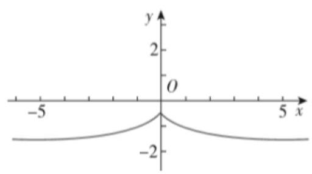
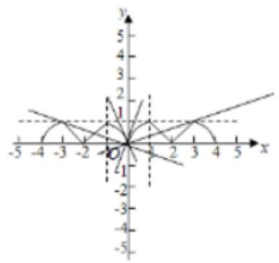
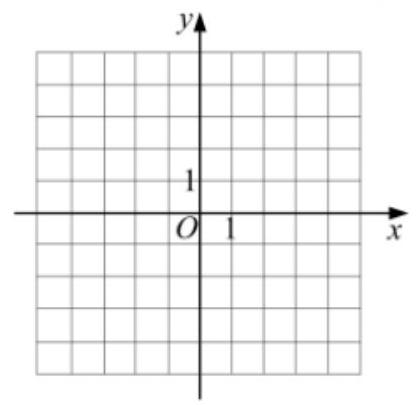
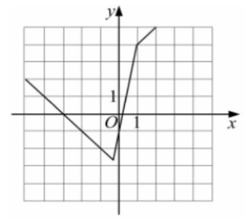
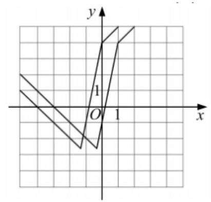
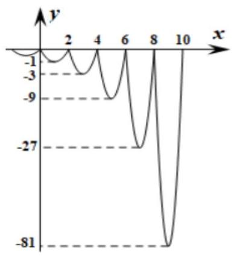
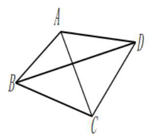
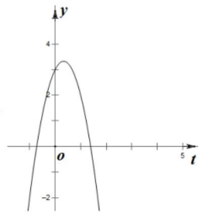

函数图像与性质在解题中的应用

<table><tr><td>教学目标</td><td>理解函数图像与性质在解题中的应用</td></tr><tr><td>重点</td><td>1、函数性质的运用   2、构造函数解决问题</td></tr><tr><td>难 点</td><td>构造函数来解决问题、函数性质的综合运用</td></tr></table>

## (一)函数的单调性、奇偶性、对称性、周期性

## 例题精讲

【例1】命题 $p :$ 存在 $a \neq  0$ ,对于任意的 $x$ ,使得 $f\left( {x + a}\right)  < f\left( x\right)  + f\left( a\right)$ ;

命题 ${q}_{1} : f\left( x\right)$ 单调递减且恒大于 0 ; 命题 ${q}_{2} : f\left( x\right)$ 单调递增且存在 ${x}_{0} < 0$ 使得 $f\left( {x}_{0}\right)  = 0$ .

A. 只有 ${q}_{1}$ 是 $p$ 的充分条件; B. 只有 ${q}_{2}$ 是 $p$ 的充分条件;

C. ${q}_{1},{q}_{2}$ 都是 $p$ 的充分条件; D. ${q}_{1},{q}_{2}$ 都不是 $p$ 的充分条件

【难度】 $\star   \star   \star$

【答案】C

【解析】对于 ${q}_{1}$ : 因为 $f\left( x\right)$ 单调递减,所以对任意 $a > 0$ ,都有 $f\left( {x + a}\right)  < f\left( x\right)$ 又因 $f\left( x\right)  > 0$ ,

任取 $a > 0$ 都有 $f\left( a\right)  > 0$ ,所以 $f\left( {x + a}\right)  < f\left( x\right)  < f\left( x\right)  + f\left( a\right)$ ,所以 ${q}_{1} \Rightarrow  p$ ;

对于 ${q}_{2}$ : 因为 $f\left( x\right)$ 单调递增,所以存在任意 $a < 0$ ,都有 $f\left( {x + a}\right)  < f\left( x\right)$ ,又因为存在 ${x}_{0} < 0, f\left( {x}_{0}\right)  = 0$ , 所以取 $a = {x}_{0}$ 使得 $f\left( {x + a}\right)  < f\left( x\right)  = f\left( x\right)  + f\left( a\right)$ ,所以选C.

【例2】已知函数 $f\left( x\right)  = \left\{  \begin{array}{l} {2}^{-x} - \frac{3}{2}, x \geq  0 \\  {2}^{x} - \frac{3}{2}, x < 0 \end{array}\right.$ ，若 $f\left( {{3m} - 1}\right)  > f\left( {2 - m}\right)$ ，则实数 $m$ 的取值范围为___.

【难度】 $\star   \star   \star$

【答案】 $\left( {-\frac{1}{2},\frac{3}{4}}\right)$

【解析】作出函数 $f\left( x\right)$ 的图如右所示,

观察可知,函数 $f\left( x\right)$ 为偶函数,且在 $\left( {-\infty ,0}\right)$ 上单调递增,

在 $\left( {0, + \infty }\right)$ 上单调递减,故 $f\left( {{3m} - 1}\right)  > f\left( {2 - m}\right)  \Leftrightarrow  {3m} - 1\left|  < \right| 2 - m \mid   \Leftrightarrow \; 8{m}^{2} - {2m} - 3 < 0 \Leftrightarrow   - \frac{1}{2} < m < \frac{3}{4}$ ，故实数 $m$ 的取值范围为 $\left( {-\frac{1}{2},\frac{3}{4}}\right)$ . 故答案为: $\left( {-\frac{1}{2},\frac{3}{4}}\right)$

【例3】设函数 $f\left( x\right)$ 的定义域为 $R$ ,若存在常数 $M > 0$ ,使得 $\left| {f\left( x\right) }\right|  \leq  M\left| x\right|$ 对一切实数 $x$ 均成立,则称 $f\left( x\right)$ 为 $F$ 函数,给出下列函数:

① $f\left( x\right)  = 0$ ; ② $f\left( x\right)  = {x}^{2}$ ; ③ $f\left( x\right)  = \sqrt{2}\left( {\sin x + \cos x}\right)$ ; ④ $f\left( x\right)  = \frac{x}{{x}^{2} + x + 1}$ ;

⑤ $f\left( x\right)$ 是定义在 $R$ 上的奇函数，且对于任意实数 ${x}_{1},{x}_{2}$ 均有 $\left| {f\left( {x}_{1}\right)  - f\left( {x}_{2}\right) }\right|  \leq  2\left| {{x}_{1} - {x}_{2}}\right|$ . 则其中是 $F$ 函数的序号是___

【难度】 $\bigstar \bigstar \bigstar$

【答案】①④⑤

【详解】对于 ① $f\left( x\right)  = 0$ ，显然对任意常数 $m > 0$ 均成立，所以 $f\left( x\right)$ 是 $F$ 函数，故①正确；

对于 ② $f\left( x\right)  = {x}^{2},\left| {f\left( x\right) }\right|  = \left| {x}^{2}\right|  \leq  M\left| x\right|$ ，即 $\left| x\right|  \leq  M$ ，不存在这样的 $M$ 对一切实数 $x$ 均成立，故②不正确;

对于 ③ $f\left( x\right)  = \sqrt{2}\left( {\sin x + \cos x}\right)$ ，由于 $x = 0$ 时，若 $\left| {f\left( x\right) }\right|  \leq  M\left| x\right|$ ，则可得 $\sqrt{2} \leq  0$ ，故③不正确；

对于④ $f\left( x\right)  = \frac{x}{{x}^{2} + x + 1}$ ，则 $\left| {f\left( x\right) }\right|  = \left| \frac{x}{{x}^{2} + x + 1}\right|  = \frac{\left| x\right| }{{\left( x + \frac{1}{2}\right) }^{2} + \frac{3}{4}} \leq  \frac{4}{3}\left| x\right|$ ，

故对任意的 $m > \frac{4}{3}$ ，都有 $\left| {f\left( x\right) }\right|  \leq  M\left| x\right|$ ，所以④正确；

对于⑤，令 ${x}_{1} = x,{x}_{2} =  - x$ ，则 $\left| {f\left( {x}_{1}\right)  - f\left( {x}_{2}\right) }\right|  \leq  2\left| {{x}_{1} - {x}_{2}}\right|  \Leftrightarrow  \left| {f\left( x\right) }\right|  \leq  \left| x\right|$ ，

所以存在 $\mathrm{M} \geq  2 > 0$ 使得对一切的实数 $x$ 均成立,故⑤正确.

【例4】设函数 $f\left( x\right)  = \ln \left( {\sqrt{{x}^{2} + 1} + x}\right)  + x + \pi$ ,若对于任意实数 $x, f\left( \left| {\sin x + 3 + \frac{8}{\sin x + 3} - a}\right| \right)  + f\left( {a - 6}\right)  \leq  {2\pi }$ 恒成立,则实数 $a$ 的取值范围是( )

A. $( - \infty ,4\sqrt{2}\rbrack$ B. $( - \infty ,6\rbrack$ C. $\left\lbrack  {4\sqrt{2},6}\right\rbrack$ D. $\left( {-\infty ,3 + 2\sqrt{2}}\right\rbrack$

【难度】★★★★

【答案】D

【解析】设 $g\left( x\right)  = f\left( x\right)  - \pi  = \ln \left( {\sqrt{{x}^{2} + 1} + x}\right)  + x$ ,

对任意的 $x \in  \mathbf{R},\sqrt{{x}^{2} + 1} + x > \sqrt{{x}^{2}} + x = \left| x\right|  + x \geq  0$ ,所以,函数 $y = g\left( x\right)$ 的定义域为 $R$ ,

$g\left( {-x}\right)  = \ln \left( {\sqrt{{x}^{2} + 1} - x}\right)  - x = \ln \frac{1}{\sqrt{{x}^{2} + 1} + x} - x =  - \ln \left( {\sqrt{{x}^{2} + 1} + x}\right)  - x =  - g\left( x\right) ,$

所以,函数 $y = g\left( x\right)$ 为奇函数,

当 $x \geq  0$ 时,对于函数 $y = \ln \left( {\sqrt{{x}^{2} + 1} + x}\right)$ ,内层函数 $u = \sqrt{{x}^{2} + 1} + x$ 为增函数,外层函数 $y = \ln u$ 为增函数,

所以,函数 $y = \ln \left( {\sqrt{{x}^{2} + 1} + x}\right)$ 在 $\lbrack 0, + \infty )$ 上为增函数,

所以,函数 $y = g\left( x\right)$ 在 $\lbrack 0, + \infty )$ 上为增函数,

由于函数 $y = g\left( x\right)$ 为奇函数,则该函数在 $( - \infty ,0\rbrack$ 为增函数,

又函数 $y = g\left( x\right)$ 在 $R$ 上连续,所以,函数 $y = g\left( x\right)$ 在 $R$ 上为增函数,

由 $f\left( \left| {\sin x + 3 + \frac{8}{\sin x + 3} - a}\right| \right)  + f\left( {a - 6}\right)  \leq  {2\pi }$ 得 $f\left( \left| {\sin x + 3 + \frac{8}{\sin x + 3} - a}\right| \right)  - \pi  \leq  \pi  - f\left( {a - 6}\right)$ ,

即 $g\left( \left| {\sin x + 3 + \frac{8}{\sin x + 3} - a}\right| \right)  \leq   - g\left( {a - 6}\right)  = g\left( {6 - a}\right) ,\therefore \left| {\sin x + 3 + \frac{8}{\sin x + 3} - a}\right|  \leq  6 - a$ ,

所以, $\left\{  \begin{array}{l} 6 - a \geq  0 \\  a - 6 \leq  \sin x + 3 + \frac{8}{\sin x + 3} - a \leq  6 - a \end{array}\right.$ .

令 $t = \sin x + 3 \in  \left\lbrack  {2,4}\right\rbrack$ ,构造函数 $y = t + \frac{8}{t} - a$ ,由双勾函数的单调性可知,函数 $y = t + \frac{8}{t} - a$ 在 $\lbrack 2,2\sqrt{2})$ 上单调递减,在 $\left( {2\sqrt{2},4}\right\rbrack$ 上单调递增,所以, ${y}_{\min } = 2\sqrt{2} + \frac{8}{2\sqrt{2}} - a = 4\sqrt{2} - a,{y}_{\max } = 2 + \frac{8}{2} - a = 6 - a$ , 所以, $\left\{  \begin{array}{l} 6 - a \geq  0 \\  a - 6 \leq  4\sqrt{2} - a \end{array}\right.$ ,解得 $a \leq  3 + 2\sqrt{2}$ . 故选: D.

【例5】(1) $f\left( x\right)$ 是以 $\left( {0, + \infty }\right)$ 为定义域的减函数，且对于任意 $x, y \in  \left( {0, + \infty }\right)$ ，恒有 $f\left( {xy}\right)  = f\left( x\right)  + f\left( y\right)$ ， 写出一个满足条件的函数 $f\left( x\right)$ 的解析式;

(2) $f\left( x\right)$ 是以 $\left( {-\infty , + \infty }\right)$ 为定义域的奇函数，且对于任意 $x, y \in  \left( {0, + \infty }\right)$ ，恒有 $f\left( {x + y}\right)  = f\left( x\right) f\left( y\right)$ ，写出一个满足条件的函数 $f\left( x\right)$ 的解析式;

(3) $f\left( x\right) , g\left( x\right)$ 都是以 $\left( {1, + \infty }\right)$ 为定义域的函数，写出一组满足下列条件的函数 $f\left( x\right) , g\left( x\right)$ 的解析式，对于下列三组条件, 只需选做一组, 满分分别是①, ②, ③; 若选择了多于一种的情形, 则按照序号较小的解答计分.

①对于任意 $x \in  \left( {1, + \infty }\right)$ ，恒有 $f\left\lbrack  {g\left( x\right) }\right\rbrack   = g\left\lbrack  {f\left( x\right) }\right\rbrack   = x$ ；

②对于任意 $x \in  \left( {1, + \infty }\right)$ ，恒有 $f\left\lbrack  {g\left( x\right) }\right\rbrack   = g\left\lbrack  {f\left( x\right) }\right\rbrack   = {x}^{2}$ ；

③对于任意 $x \in  \left( {1, + \infty }\right)$ ，恒有 $f\left\lbrack  {g\left( x\right) }\right\rbrack   = {x}^{2}, g\left\lbrack  {f\left( x\right) }\right\rbrack   = {x}^{4}$ .

【难度】 $\star   \star   \star   \star$

【答案】( 1 ) $f\left( x\right)  = {\log }_{0.5}x, x > 0$ ；( 2 ) $f\left( x\right)  = \left\{  \begin{array}{ll} {2}^{x}, & x > 0 \\  0, & x = 0 \\   - {2}^{-x}, & x < 0 \end{array}\right.$ ；当察不唯一，具体见解析.

【解析】解: (1) 对于任意 $x, y \in  \left( {0, + \infty }\right)$ ,恒有 $f\left( {xy}\right)  = f\left( x\right)  + f\left( y\right)$ ,

可知对数函数 $f\left( x\right)  = {\log }_{a}x, x > 0$ 符合条件,即 ${\log }_{a}{xy} = {\log }_{a}x + {\log }_{a}y$ ,

而 $f\left( x\right)$ 是以 $\left( {0, + \infty }\right)$ 为定义域的减函数,则 $0 < a < 1$ ,所以满足条件的一个函数为: $f\left( x\right)  = {\log }_{0.5}x, x > 0$ ;

(2)对于任意 $x, y \in  \left( {0, + \infty }\right)$ ，恒有 $f\left( {x + y}\right)  = f\left( x\right) f\left( y\right)$ ，

可知指数函数 $f\left( x\right)  = {a}^{x}, x > 0$ 符合条件,即 ${a}^{x + y} = {a}^{x} \cdot  {a}^{y}$ ,而 $f\left( x\right)$ 是以 $\left( {-\infty , + \infty }\right)$ 为定义域的奇函数, 所以满足条件的一个函数为: $f\left( x\right)  = \left\{  \begin{array}{l} {2}^{x}, x > 0 \\  0, x = 0 \\   - {2}^{-x}, x < 0 \end{array}\right.$ ;

(3)已知 $f\left( x\right) , g\left( x\right)$ 都是以 $\left( {1, + \infty }\right)$ 为定义域的函数，若选①对于任意 $x \in  \left( {1, + \infty }\right)$ ，恒有 $f\left\lbrack  {g\left( x\right) }\right\rbrack   = g\left\lbrack  {f\left( x\right) }\right\rbrack   = x,$

则满足条件的一组函数 $f\left( x\right) , g\left( x\right)$ 的解析式为: $f\left( x\right)  = x, x > 1, g\left( x\right)  = x, x > 1$ ;

若选②对于任意 $x \in  \left( {1, + \infty }\right)$ ,恒有 $f\left\lbrack  {g\left( x\right) }\right\rbrack   = g\left\lbrack  {f\left( x\right) }\right\rbrack   = {x}^{2}$ ,

则满足条件的一组函数 $f\left( x\right) , g\left( x\right)$ 的解析式为: $f\left( x\right)  = x, x > 1, g\left( x\right)  = {x}^{2}, x > 1$ ;

若选③对于任意 $x \in  \left( {1, + \infty }\right)$ ，恒有 $f\left\lbrack  {g\left( x\right) }\right\rbrack   = {x}^{2}, g\left\lbrack  {f\left( x\right) }\right\rbrack   = {x}^{4}$ ，

则满足条件的一组函数 $f\left( x\right) , g\left( x\right)$ 的解析式为: $f\left( x\right)  = {2}^{2\sqrt{{\log }_{2}x}}, x > 1, g\left( x\right)  = {2}^{{\left( {\log }_{2}x\right) }^{2}}, x > 1$ .

## 巩固训练

1、定义: 若函数 $\mathrm{f}\left( \mathrm{x}\right)$ 的定义域为 $R$ ,且存在非零常数 $T$ ,对任意 $\mathrm{x} \in  \mathrm{R},\mathrm{f}\left( {\mathrm{x} + \mathrm{T}}\right)  = \mathrm{f}\left( \mathrm{x}\right)  + \mathrm{T}$ 恒成立, 则称 $\mathrm{f}\left( \mathrm{x}\right)$ 为线周期函数， $T$ 为 $\mathrm{f}\left( \mathrm{x}\right)$ 的线周期。若 $\varphi \left( \mathrm{x}\right)  = \sin \mathrm{x} + \mathrm{{kx}}$ 为线周期函数，则 $k$ 的值为___.

【答案】 1

【解析】若 $\varphi \left( x\right)  = \sin x + {kx}$ 为线周期函数,则满足对任意 $x \in  \mathbf{R},\varphi \left( {x + T}\right)  = \varphi \left( x\right)  + T$ 恒成立

即 $\sin \left( {x + T}\right)  + k\left( {x + T}\right)  = \sin x + {kx} + T$ ,即 $\sin \left( {x + T}\right)  + {kT} = \sin x + T$

则 $\left\{  {\begin{array}{l} \sin \left( {x + T}\right)  = \sin x \\  {kT} = T \end{array}\; \Rightarrow  k = 1}\right.$ ,本题正确结果: 1

2、已知函数 $f\left( x\right)  = \ln \left( {\sqrt{{x}^{2} + 1} - x}\right)  + {3}^{-x} - {3}^{x}$ ,不等式 $f\left( {a\sqrt{{x}^{2} + 4}}\right)  + f\left( {{x}^{2} + 5}\right)  \leq  0$ 对 $x \in  \mathbf{R}$ 恒成立,则 $a$ 的取值范围为( )

A. $\lbrack  - 2, + \infty )$ B. $\left( {-\infty , - 2}\right)$

C. $\left\lbrack  {-\frac{5}{2}, + \infty }\right)$ D. $\left( {-\infty , - \frac{5}{2}}\right\rbrack$

【答案】C

【解析】 $f\left( {-x}\right)  = \ln \left( {\sqrt{{x}^{2} + 1} + x}\right)  + {3}^{x} - {3}^{-x} =  - f\left( x\right) , f\left( x\right)$ 是奇函数,

$f\left( x\right)  = \ln \left( {\sqrt{{x}^{2} + 1} - x}\right)  + {3}^{-x} - {3}^{x} = \ln \left( \frac{1}{\sqrt{{x}^{2} + 1} + x}\right)  + {3}^{-x} - {3}^{x},$

易知 $y = \ln \left( \frac{1}{\sqrt{{x}^{2} + 1} + x}\right) , y = {3}^{-x}, y =  - {3}^{x}$ 均为减函数,故 $f\left( x\right)$ 且在 $R$ 上单调递减,

不等式 $f\left( {a\sqrt{{x}^{2} + 4}}\right)  + f\left( {{x}^{2} + 5}\right)  \leq  0$ ,即 $f\left( {a\sqrt{{x}^{2} + 4}}\right)  \leq  f\left( {-{x}^{2} - 5}\right)$ ,

结合函数的单调性可得 $a\sqrt{{x}^{2} + 4} \geq   - {x}^{2} - 5$ ,即 $a \geq  \frac{-{x}^{2} - 5}{\sqrt{{x}^{2} + 4}} =  - \left( {\sqrt{{x}^{2} + 4} + \frac{1}{\sqrt{{x}^{2} + 4}}}\right)$ ,

设 $t = \sqrt{{x}^{2} + 4}, t \geq  2$ ,故 $y =  - \left( {t + \frac{1}{t}}\right)$ 单调递减,故 $- {\left( \sqrt{{x}^{2} + 4} + \frac{1}{\sqrt{{x}^{2} + 4}}\right) }_{\text{ max }} =  - \frac{5}{2}$ ,

当 $t = 2$ ,即 $x = 0$ 时取最大值,所以 $a \geq   - \frac{5}{2}$ . 故选: $C$ .

3、若函数 $y = f\left( x\right)$ 对定义域 $D$ 内的每一个 ${x}_{1}$ ，都存在唯一的 ${x}_{2} \in  D$ ，使得 $f\left( {x}_{1}\right) f\left( {x}_{2}\right)  = 1$ 成立，则称 $f\left( x\right)$ 为“自倒函数”,给出下列命题:

① $f\left( x\right)  = \sin x + \sqrt{2}\left( {x \in  \left\lbrack  {-\frac{\pi }{2},\frac{\pi }{2}}\right\rbrack  }\right)$ 是自倒函数;

②自倒函数 $f\left( x\right)$ 可以是奇函数;

③ 自倒函数 $f\left( x\right)$ 的值域可以是 $R$ ；

④若 $y = f\left( x\right) , y = g\left( x\right)$ 都是自倒函数且定义域相同,则 $y = f\left( x\right) g\left( x\right)$ 也是自倒函数

则以上命题正确的是___. (写出所有正确的命题的序号)

【答案】①②

【解析】因为 $f\left( x\right)  = \sin x + \sqrt{2} \in  \left\lbrack  {\sqrt{2} - 1,\sqrt{2} + 1}\right\rbrack$ ,所以 $\frac{1}{f\left( x\right) } \in  \left\lbrack  {\sqrt{2} - 1,\sqrt{2} + 1}\right\rbrack$ ,因此 $y = f\left( x\right)$ 满足“自倒函数”定义:因为奇函数 $f\left( x\right)  = \frac{1}{x}$ 满足“自倒函数”定义，所以②对；自倒函数 $f\left( x\right)$ 不可以为零；因为 $f\left( x\right)  = \frac{1}{x}, g\left( x\right)  =  - \frac{1}{x}$ 都是自倒函数且定义域相同,但 $y = f\left( x\right) g\left( x\right)  =  - \frac{1}{{x}^{2}}$ 不是自倒函数(不唯一),因此命题正确的是①②

4、对于定义域为 $D$ 的函数 $y = f\left( x\right)$ ,若同时满足下列条件:

① $f\left( x\right)$ 在 $D$ 内单调递增或单调递减;

②存在区间 $\left\lbrack  {a, b}\right\rbrack   \subseteq  D$ ,使 $f\left( x\right)$ 在 $\left\lbrack  {a, b}\right\rbrack$ 上的值域为 $\left\lbrack  {a, b}\right\rbrack$ ; 那么把 $y = f\left( x\right) \left( {x \in  D}\right)$ 叫闭函数.

(1)求闭函数 $y =  - {x}^{3}$ 符合条件②的区间 $\left\lbrack  {a, b}\right\rbrack$ ；

(2)判断函数 $f\left( x\right)  = \frac{3}{4}x + \frac{1}{x}\left( {x > 0}\right)$ 是否为闭函数？并说明理由;

(3)判断函数 $y = k + \sqrt{x + 2}$ 是否为闭函数？若是闭函数，求实数 $k$ 的取值范围.

【答案】( 1 ) $\left\lbrack  {-1,1}\right\rbrack$ ；( 2 )不是闭函数，理由见解析；( 3 ) $k \in  \left( {-\frac{9}{4}, - 2}\right\rbrack$ .

【解析】(1) 由题意, $y =  - {x}^{3}$ 在 $\left\lbrack  {a, b}\right\rbrack$ 上递减,则 $\left\{  \begin{array}{l} a =  - {a}^{3} \\  a =  - {b}^{3} \end{array}\right.$ ,解得 $\left\{  \begin{array}{l} a =  - 1 \\  b = 1 \end{array}\right.$ ,所以,所求的区间为 $\left\lbrack  {-1,1}\right\rbrack$ .

(2)取 ${x}_{1} = 1,{x}_{2} = {10}$ ，则 $f\left( {x}_{1}\right)  = \frac{7}{4} < \frac{76}{10} = f\left( {x}_{2}\right)$ ，即 $f\left( x\right)$ 不是 $\left( {0, + \infty }\right)$ 上的减函数，

取 ${x}_{1} = \frac{1}{10},{x}_{2} = \frac{1}{100}, f\left( {x}_{3}\right)  = \frac{3}{40} + {10} < \frac{3}{400} + {100} = f\left( {x}_{2}\right)$ ,即 $f\left( x\right)$ 不是 $\left( {0, + \infty }\right)$ 上的增函数,

所以函数在定义域内不单调递增或单调递减, 从而该函数不是闭函数.

(3)若 $y = k + \sqrt{x + 2}$ 是闭函数，则存在区间 $\left\lbrack  {a, b}\right\rbrack$ ，在区间 $\left\lbrack  {a, b}\right\rbrack$ 上，函数 $f\left( x\right)$ 的值域为 $\left\lbrack  {a, b}\right\rbrack$ ， 即 $\left\{  {\begin{array}{l} a = k + \sqrt{a + 2} \\  b = k + \sqrt{b + 2} \end{array},\therefore a, b}\right.$ 为方程 $x = k + \sqrt{x + 2}$ 的两个实根,

即方程 ${x}^{2} - \left( {{2k} + 1}\right) x + {k}^{2} - 2 = 0\left( {x \geq   - 2, x \geq  k}\right)$ 有两个不等的实根,

当 $k \leq   - 2$ 时,有 $\left\{  \begin{array}{l} \Delta  > 0 \\  f\left( {-2}\right)  \geq  0 \\  \frac{{2k} + 1}{2} >  - 2 \end{array}\right.$ ,解得 $- \frac{9}{4} < k \leq   - 2$ ,当 $k >  - 2$ 时,有 $\left\{  \begin{array}{l} f\left( k\right)  \geq  0 \\  \frac{{2k} + 1}{2} > k \end{array}\right.$ ,无解.

综上所述, $k \in  \left( {-\frac{9}{4}, - 2}\right\rbrack$ .

## (二)函数的图像、零点

## 例题精讲

【例6】已知定义在 $R$ 上的偶函数 $f\left( x\right)$ 满足 $f\left( {x + 4}\right)  = f\left( x\right)$ ,且当 $0 \leq  x \leq  2$ 时,

$f\left( x\right)  = \min \left\{  {-{x}^{2} + {2x},2 - x}\right\}  ,$

若方程 $f\left( x\right)  - {mx} = 0$ 恰有两个根，则 $m$ 的取值范围是___.

【难度】 $\star   \star   \star$

【答案】 $\left( {-2, - \frac{1}{3}}\right)  \cup  \left( {\frac{1}{3},2}\right)$

【解析】

$0 \leq  x \leq  2$ 时, $f\left( x\right)  = \left\{  \begin{array}{l}  - {x}^{2} + {2x},0 \leq  x \leq  1 \\  2 - x,1 < x \leq  2 \end{array}\right.$ ,

$\because f\left( x\right)$ 是偶函数且周期是 4，可得整个函数的图象， 令 $g\left( x\right)  = {mx}$ ,本题转化为两个函数交点的问题,结合图象,当直线过点 $\left( {3,1}\right)$ 时, $m = \frac{1}{3}$ ;

当直线与 $y =  - {x}^{2} + {2x},\left( {0 \leq  x \leq  1}\right)$ 相切时, $m = 2$ ;

所以,若交点在纵轴右边,符合题意的 $m$ 的取值范围是 $\left( {\frac{1}{3},2}\right)$ ;

因为函数是偶函数,结合函数的对称性可得,若交点在纵轴左边,符合题意的 $m$ 的取值范围是 $\left( {-2, - \frac{1}{3}}\right)$ ;

所以若方程 $f\left( x\right)  - {mx} = 0$ 恰有两个根,则 $m$ 的取值范围是 $\left( {-2, - \frac{1}{3}}\right)  \cup  \left( {\frac{1}{3},2}\right)$ ,

故答案为 $\left( {-2, - \frac{1}{3}}\right)  \cup  \left( {\frac{1}{3},2}\right)$ .

【例 7】已知函数 $f\left( x\right)  = \left| {{x}^{2} - {ax}}\right| \left( {a \in  R}\right)$ .

(1)讨论函数 $f\left( x\right)$ 的奇偶性;

(2)设函数 $g\left( x\right)  = \frac{f\left( x\right) }{\left| x\right| } + x, h\left( x\right)  = \ln x$ ,若对任意 ${x}_{1} \in  \left\lbrack  {0,1}\right\rbrack$ ,总存在 ${x}_{2} \in  \left\lbrack  {1, e}\right\rbrack$ 使得 $g\left( {x}_{1}\right)  = h\left( {x}_{2}\right)$ , 求实数 $a$ 的取值范围;

(3)当 $a$ 为常数时,若函数 $y = f\left( x\right)  - b$ 在区间 $\left\lbrack  {0,2}\right\rbrack$ 上存在两个零点，求实数 $b$ 的取值范围.

【难度】 $\star   \star   \star   \star$

【答案】(1)见解析 (2) $a = 1\left( 3\right)$ 见解析

【解析】解: (1) 函数 $f\left( x\right)  = \left| {{x}^{2} - {ax}}\right|$ 的定义域为 $\mathbf{R}$ ,

当 $a = 0$ 时, $f\left( x\right)  = {x}^{2}$ ,满足 $f\left( {-x}\right)  = {\left( -x\right) }^{2} = {x}^{2} = f\left( x\right)$ ,函数为偶函数;

当 $a \neq  0$ 时, $\because f\left( {-a}\right)  = 2{a}^{2}, f\left( a\right)  = 0,\therefore f\left( {-a}\right)  \neq  f\left( a\right)$ ,且 $f\left( {-a}\right)  \neq   - f\left( a\right)$ ,

$\therefore f\left( x\right)$ 为非奇非偶函数;

( 2 )对任意 ${x}_{1} \in  \left\lbrack  {0,1}\right\rbrack$ ，总存在 ${\mathrm{x}}_{2} \in  \left\lbrack  {1,\mathrm{e}}\right\rbrack$ 使得 $g\left( {x}_{1}\right)  = h\left( {x}_{2}\right)$ ，可得函数 $g\left( x\right)$ 的值域为 $h\left( x\right)$ 的值域的子集,

当 $x \in  \left\lbrack  {1,\mathrm{e}}\right\rbrack$ 时, $h\left( x\right)$ 的值域是 $\left\lbrack  {0,1}\right\rbrack$ ,

当 $x \in  \left\lbrack  {0,1}\right\rbrack$ 时, $g\left( x\right)  = \frac{f\left( x\right) }{\left| x\right| } + x = \left| {x - a}\right|  + x \geq  0$ 恒成立,

$\therefore$ 问题转化为 $g\left( x\right)  \leq  1$ 在 $\left\lbrack  {0,1}\right\rbrack$ 上恒成立,即 $\left| {x - a}\right|  \leq  1 - x$ 对任意 $x \in  \left\lbrack  {0,1}\right\rbrack$ 恒成立,

即 $x - 1 \leq  x - a \leq  1 - x$ 对任意 $x \in  \left\lbrack  {0,1}\right\rbrack$ 恒成立,

即 $\left\{  \begin{array}{l} a \geq  {2x} - 1 \\  a \leq  1 \end{array}\right.$ 对任意 $x \in  \left\lbrack  {0,1}\right\rbrack$ 恒成立,解得 $a = 1$ ;

(3)函数 $y = f\left( x\right)  - b$ 在区间 $\left\lbrack  {0,2}\right\rbrack$ 上存在两个零点，即方程 $\left| {{x}^{2} - {ax}}\right|  = b$ 在 $\left\lbrack  {0,2}\right\rbrack$ 上有两个不同解，

当 $a \leq  0$ 时， $f\left( x\right)$ 在 $\left\lbrack  {0,2}\right\rbrack$ 上单调递增，不合题意；

当 $a > 0$ 时,令 ${x}^{2} - {ax} = \frac{{a}^{2}}{4} = f\left( \frac{a}{2}\right)$ ,解得 $x = \frac{\sqrt{2} + 1}{2}a$ (考虑 $x > 0$ ) .

① 当 $\frac{a}{2} \geq  2$ ，即 $a \geq  4$ 时，在 $\left\lbrack  {0,2}\right\rbrack$ 上单调递增，不合题意；

② 当 $\frac{a}{2} < 2 \leq  a$ ，即 $2 \leq  a < 4$ 时， $f\left( x\right)$ 在 $\left\lbrack  {0,\frac{a}{2}}\right\rbrack$ 上单调递增，在 $\left\lbrack  {\frac{a}{2}, a}\right\rbrack$ 上单调递减，

则 $f\left( 2\right)  \leq  b < f\left( \frac{a}{2}\right)$ ,即 ${2a} - 4 \leq  b < \frac{{a}^{2}}{4}$ ;

③ 当 $0 < a < 2$ ， $\frac{\sqrt{2} + 1}{2}a \leq  2$ ，即 $0 < a \leq  4\sqrt{2} - 4$ 时，

$f\left( x\right)$ 在 $\left\lbrack  {0,\frac{a}{2}}\right\rbrack$ 上单调递增,在 $\left\lbrack  {\frac{a}{2}, a}\right\rbrack$ 上单调递减,在 $\left\lbrack  {a,2}\right\rbrack$ 上单调递增,且 $f\left( 2\right)  \geq  f\left( \frac{a}{2}\right)$ ,

则 $b = 0$ 或 $b = f\left( \frac{a}{2}\right)$ ,即 $b = 0$ 或 $b = \frac{{a}^{2}}{4}$ .

④ 当 $0 < a < 2$ , $\frac{\sqrt{2} + 1}{2}a > 2$ ,即 $4\sqrt{2} - 4 < a < 2$ 时,

$f\left( x\right)$ 在 $\left\lbrack  {0,\frac{a}{2}}\right\rbrack$ 上单调递增,在 $\left\lbrack  {\frac{a}{2}, a}\right\rbrack$ 上单调递减,在 $\left\lbrack  {a,2}\right\rbrack$ 上单调递增,且 $f\left( 2\right)  < f\left( \frac{a}{2}\right)$ ,

则 $b = 0$ 或 $f\left( 2\right)  \leq  b < f\left( \frac{a}{2}\right)$ ,即 $b = 0$ 或 $4 - {2a} < b < \frac{{a}^{2}}{4}$ .

综上所述: 当 $0 < a \leq  4\sqrt{2} - 4$ 时, $b = 0$ 或 $b = \frac{{a}^{2}}{4}$ ;

当 $4\sqrt{2} - 4 < a < 2$ 时, $b = 0$ 或 $4 - {2a} < b < \frac{{a}^{2}}{4}$ ;

当 $2 \leq  a < 4$ 时, ${2a} - 4 \leq  b < \frac{{a}^{2}}{4}$ ; 当 $a \leq  0$ 或 $a \geq  4$ 时, $b$ 不存在.

【例8】已知函数 $f\left( x\right)  = \left| {{3x} + 1}\right|  - 2\left| {x - 1}\right|$ .

(1)画出 $y = f\left( x\right)$ 的图像; (2)求不等式 $f\left( x\right)  > f\left( {x + 1}\right)$ 的解集；

(3)若不等式 $f\left( x\right)  \geq   - {t}^{2} + {at} - \frac{2}{3}$ ，对于任意的 $x \in  R$ ，任意的 $a \in  \left\lbrack  {-1,1}\right\rbrack$ 恒成立，求实数 $t$ 的取值范围.

【难度】

【答案】(1)见解析; (2) $\left( {-\infty , - \frac{7}{6}}\right)$ ; (3) $t \leq   - 2$ ,或 $t \geq  2$

【解析】(1)由题设知 $f\left( x\right)  = \left\{  \begin{array}{l}  - x - 3, x \leq   - \frac{1}{3}, \\  {5x} - 1, - \frac{1}{3} < x \leq  1, y = f\left( x\right) \text{ 的图像如图所示. } \\  x + 3, x > 1. \end{array}\right.$

(2)函数 $y = f\left( x\right)$ 的图像向左平移1个单位长度后得到函数 $y = f\left( {x + 1}\right)$ 的图像.

$y = f\left( x\right)$ 的图像与 $y = f\left( {x + 1}\right)$ 的图像的交点坐标为 $\left( {-\frac{7}{6}, - \frac{11}{6}}\right)$ .

由图像可知当且仅当 $x <  - \frac{7}{6}$ 时, $y = f\left( x\right)$ 的图像在 $y = f\left( {x + 1}\right)$ 的图像上方,

故不等式 $f\left( x\right)  > f\left( {x + 1}\right)$ 的解集为 $\left( {-\infty , - \frac{7}{6}}\right)$ .

(3)由函数图像性质可知，当 $x =  - \frac{1}{3}$ 时， $f\left( x\right)$ 取得最小值 $- \frac{8}{3}$ ，

则原问题转化为 $- \frac{8}{3} \geq   - {t}^{2} + {at} - \frac{2}{3}$ ,对任意 $a \in  \left\lbrack  {-1,1}\right\rbrack$ 恒成立,

记函数 $g\left( a\right)  =  - {ta} + {t}^{2} - 2$ ,要使 $g\left( a\right)  \geq  0$ 对任意 $a \in  \left\lbrack  {-1,1}\right\rbrack$ 恒成立,只需 $\left\{  \begin{array}{l} g\left( 1\right)  \geq  0 \\  g\left( {-1}\right)  \geq  0 \end{array}\right.$ ,

解得 $t \leq   - 2$ ,或 $t \geq  2$ .

## 巩固训练

1、设函数 $f\left( x\right)$ 的定义域为 $R$ ,满足 $f\left( {x + 2}\right)  = {3f}\left( x\right)$ ,且当 $x \in  (0,2\rbrack$ 时, $f\left( x\right)  = x\left( {x - 2}\right)$ . 若对任意 $x \in  ( - \infty , m\rbrack$ ,都有 $f\left( x\right)  \geq   - {65}$ ,则 $m$ 的取值范围是___.

【答案】 $\left( {-\infty ,\frac{77}{8}}\right\rbrack$

【解析】由题可知 $f\left( {x + 2}\right)  = {3f}\left( x\right)  \Rightarrow  f\left( {x + 4}\right)  = {3f}\left( {x + 2}\right)  = {3}^{2}f\left( x\right)  \Rightarrow  f\left( {x + 6}\right)  = {3f}\left( {x + 4}\right)  = {3}^{3}f\left( x\right)$ , 则可得一般规律: $f\left( {x + {2n}}\right)  = {3}^{n}f\left( x\right)$ ,可画出大致函数图像,

如图:

由图可知,当 $x + {2n} \in  (8,{10}\rbrack$ 时, $n = 4$ ,则 $f\left( {x + 8}\right)  = {3}^{4}f\left( x\right) , x \in  (0,2\rbrack$ ,

此时 $f\left( {x + 8}\right)  = {3}^{4}f\left( x\right)  =  - {65} \Rightarrow  {3}^{4}x\left( {x - 2}\right)  =  - {65} \Rightarrow  {x}_{1} = \frac{5}{9},{x}_{2} = \frac{13}{9}$ ,由图像可知,要对任意 $x \in  ( - \infty , m\rbrack$ ,

都有 $f\left( x\right)  \geq   - {65}$ ,则 $m$ 的最大值只能取 $8 + \frac{5}{9} = \frac{77}{9}$ ,故 $m \in  \left( {-\infty ,\frac{77}{8}}\right\rbrack$ 。故答案为: $\left( {-\infty ,\frac{77}{8}}\right\rbrack$

2、已知单调函数 $f\left( x\right)$ 的定义域为 $\left( {0, + \infty }\right)$ ,对于定义域内任意 $x, f\left\lbrack  {f\left( x\right)  - {\log }_{2}x}\right\rbrack   = 3$ ,则函数 $g\left( x\right)  = f\left( x\right)  + x - 7$ 的零点所在的区间为( )

A. $\left( {1,2}\right)$ B. $\left( {2,3}\right)$ C. $\left( {3,4}\right)$ D. $\left( {4,5}\right)$

【答案】C

【解析】根据题意,对任意的 $x \in  \left( {0, + \infty }\right)$ ,都有 $f\left\lbrack  {f\left( x\right)  - {\log }_{2}x}\right\rbrack   = 3$ ,又由 $f\left( x\right)$ 是定义在 $\left( {0, + \infty }\right)$ 上的单调函数,则 $f\left( x\right)  - {\log }_{2}x$ 为定值,设 $t = f\left( x\right)  - {\log }_{2}x$ ,则 $f\left( x\right)  = {\log }_{2}x + t$ ,又由 $f\left( t\right)  = 3$ ,

$\therefore f\left( t\right)  = {\log }_{2}t + t = 3$ ,

所以 $t = 2$ ,所以 $f\left( x\right)  = {\log }_{2}x + 2$ ,所以 $g\left( x\right)  = {\log }_{2}x + x - 5$ ,

因为 $g\left( 1\right)  < 0, g\left( 2\right)  < 0, g\left( 3\right)  < 0, g\left( 4\right)  > 0, g\left( 5\right)  > 0$ ,所以零点所在的区间为 $\left( {3,4}\right)$ .

## (三) 构造函数

## 例题精讲

【例9】已知函数 $f\left( x\right)$ 是定义在 $R$ 上的偶函数,且对 $\forall {x}_{1},{x}_{2} \in  \left( {0, + \infty }\right) \;\left( {{x}_{1} \neq  {x}_{2}}\right)$ 都有

$\left\lbrack  {{x}_{2}^{2}f\left( {x}_{1}\right)  - {x}_{1}^{2}f\left( {x}_{2}\right) }\right\rbrack  \left( {{x}_{1} - {x}_{2}}\right)  < 0$ . 记 $a = f\left( 1\right) , b = \frac{f\left( 2\right) }{4}, c = \frac{f\left( {-3}\right) }{9}$ ,则(   )

A. $a < c < b$ B. $a < b < c$ C. $b < c < a$ D. $c < b < a$

【难度】★★★★

【答案】D

【解析】当 $0 < {x}_{2} < {x}_{1}$ 时, ${x}_{1} - {x}_{2} > 0$ ,由题意可得 ${x}_{2}^{2}f\left( {x}_{1}\right)  - {x}_{1}^{2}f\left( {x}_{2}\right)  < 0$ ,即 $\frac{f\left( {x}_{1}\right) }{{x}_{1}^{2}} < \frac{f\left( {x}_{2}\right) }{{x}_{2}^{2}}$ ;

当 $0 < {x}_{1} < {x}_{2}$ 时, ${x}_{1} - {x}_{2} < 0$ ,可得 ${x}_{2}^{2}f\left( {x}_{1}\right)  - {x}_{1}^{2}f\left( {x}_{2}\right)  > 0$ ,即 $\frac{f\left( {x}_{1}\right) }{{x}_{1}^{2}} > \frac{f\left( {x}_{2}\right) }{{x}_{2}^{2}}$ .

令函数 $g\left( x\right)  = \frac{f\left( x\right) }{{x}^{2}}$ ,则函数 $g\left( x\right)$ 在 $\left( {0, + \infty }\right)$ 上单调递减,且函数 $g\left( x\right)$ 是偶函数.

又 $a = \frac{f\left( 1\right) }{{1}^{2}} = g\left( 1\right) , b = \frac{f\left( 2\right) }{{2}^{2}} = g\left( 2\right) , c = \frac{f\left( {-3}\right) }{{\left( -3\right) }^{2}} = g\left( {-3}\right)  = g\left( 3\right)$ ,

且函数 $g\left( x\right)$ 在 $\left( {0, + \infty }\right)$ 上单调递减,所以 $a > b > c$ . 故选: D.

【例10】凸四边形就是没有角度数大于 ${180}^{ \circ  }$ 的四边形,把四边形的任何一边向两方延长,其他各边都在延长所得直线的同一旁,这样的四边形叫做凸四边形. 如图,在凸四边形 ${ABCD}$ 中, ${AB} = 1,{BC} = \sqrt{3}$ , ${AC}\bot {CD}$ ， ${AC} = {CD}$ . 当 $\angle {ABC}$ 变化时，对角线 ${BD}$ 的最大值为___.

【难度】 $\star   \star   \star   \star$

【答案】 $\sqrt{6} + 1$

【解析】设 ${AC} = {CD} = x$ ,在 $\bigtriangleup {ABC}$ 中,

$A{C}^{2} = A{B}^{2} + B{C}^{2} - {2AB} \cdot  {BC} \cdot  \cos \angle {ABC},$

$\therefore {x}^{2} = 1 + 3 - 2\sqrt{3}\cos \angle {ABC}$ ,

$\because \frac{AC}{\sin \angle {ABC}} = \frac{AB}{\sin \angle {ACB}},\therefore \sin \angle {ACB} = \frac{\sin \angle {ABC}}{x}$ .

在 ${\Delta BCD}$ 中,

${BD} = \sqrt{{3}^{2} + {x}^{2} - 2\sqrt{3}x\cos \left( {\frac{\pi }{2} + \angle {ACB}}\right) } = \sqrt{{3}^{2} + {x}^{2} + 2\sqrt{3}x\sin \angle {ACB}}$ ,

$= \sqrt{3 + 1 + 3 - 2\sqrt{3}\cos \angle {ABC} + 2\sqrt{3}\sin \angle {ABC}} = \sqrt{7 - 2\sqrt{6}\sin \left( {\angle {ABC} - \frac{\pi }{4}}\right) }$ ,

$\because \angle {ABC} \in  \left( {0,\pi }\right) ,\therefore \sin \left( {\angle {ABC} - \frac{\pi }{4}}\right)$ 可以取到最大值 1,

$\therefore {\left| BD\right| }_{\max } = \sqrt{7 + 2\sqrt{6}} = \sqrt{6} + 1$ .

## 巩固训练

1、函数 $f\left( x\right)  = \min \{ 2\sqrt{x},\left| {x - 2}\right| \}$ ，其中 $\min \{ a, b\}  = \left\{  \begin{array}{l} a, a \leq  b \\  b, a > b \end{array}\right.$ ，若动直线 $y = m$ 与函数 $y = f\left( x\right)$ 的图象有三个不同的交点,他们的横坐标分别为 ${x}_{1},{x}_{2},{x}_{3}$ ,则 ${x}_{1} \cdot  {x}_{2} \cdot  {x}_{3}$ 是否存在最大值？若存在,求出最大值。

【答案】 1

【解析】作出函数图象,解得 ${x}_{1} = 2 - m,{x}_{2} = 2 + m,{x}_{3} = \frac{1}{4}{m}^{2}$ ,则 ${x}_{1} \cdot  {x}_{2} \cdot  {x}_{3} =  - \frac{1}{4}{t}^{4} + {t}^{2} =  - \frac{1}{4}{\left( {t}^{2} - 2\right) }^{2} + 1$ , 当 $t = \sqrt{2}$ 时有最大值 1 .

2、“解方程 ${\left( \frac{12}{13}\right) }^{x} + {\left( \frac{5}{13}\right) }^{x} = 1$ ”有如下思路: 设 $f\left( x\right)  = {\left( \frac{12}{13}\right) }^{x} + {\left( \frac{5}{13}\right) }^{x}$ ,则 $f\left( x\right)$ 在 $R$ 上为减函数,且 $f\left( 2\right)  = 1$ , 故原方程有唯一解 $x = 2$ . 类比上述解题思路,不等式 ${x}^{3} - \ln \left( {1 - x}\right)  >  - \ln \left( {1 + x}\right)  - x$ 的解集为___.

【答案】 $\left( {0,1}\right)$

【解析】解: 由题意得: 将不等式 ${x}^{3} - \ln \left( {1 - x}\right)  >  - \ln \left( {1 + x}\right)  - x$ ,

变形为 ${x}^{3} - \ln \left( {1 - x}\right)  + \ln \left( {1 + x}\right)  + x > 0$ ,设 $f\left( x\right)  = {x}^{3} - \ln \left( {1 - x}\right)  + \ln \left( {1 + x}\right)  + x,\left( {-1 < x < 1}\right)$ ,

由于: $f\left( {-x}\right)  =  - {x}^{3} - \ln \left( {1 + x}\right)  + \ln \left( {1 - x}\right)  - x =  - \left( {{x}^{3} - \ln \left( {1 - x}\right)  + \ln \left( {1 + x}\right)  + x}\right)  =  - f\left( x\right)$ ,

可知 $f\left( x\right)$ 为奇函数,

即 ${x}^{3} - \ln \left( {1 - x}\right)  >  - \ln \left( {1 + x}\right)  - x$ 的解集为 $\left( {0,1}\right)$ . 故答案为: $\left( {0,1}\right)$ .
