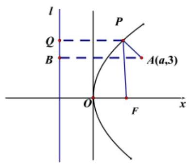
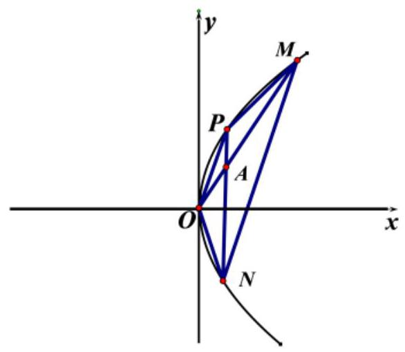
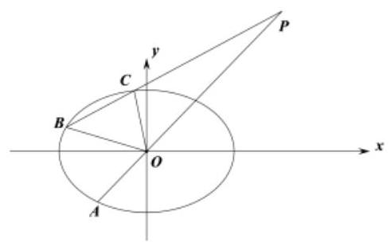
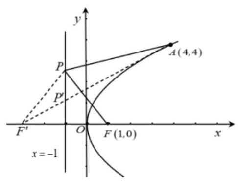
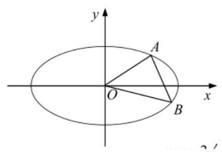
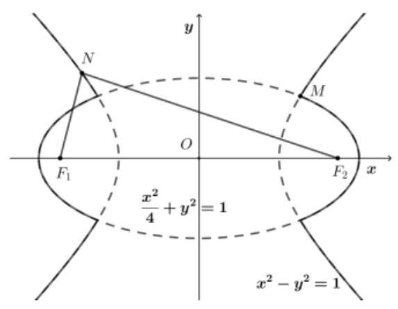
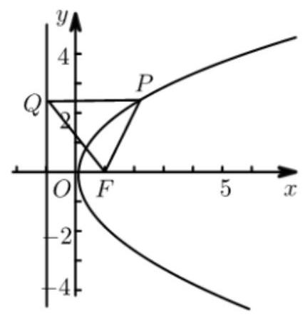

圆锥曲线中“定”与“不定”

<table><tr><td>教学目标</td><td>1、圆锥曲线中取值范围问题、最值问题   2、解析几何中的定点、定值问题   3、熟悉解析几何中存在性探索性问题解题思路</td></tr><tr><td>重点</td><td>1、掌握圆锥曲线中变量取值范围的解法   2、掌握解析几何中定点、定值问题的解法</td></tr><tr><td>难点</td><td>1、圆锥曲线中变量取值范围的解法   2、解析几何定点定值问题的分析</td></tr></table>

## (一) 圆锥曲线中定值问题

## 例题精讲

例 1、已知椭圆 $C : \frac{{x}^{2}}{{a}^{2}} + \frac{{y}^{2}}{{b}^{2}} = 1\left( {a > b > 0}\right)$ 的左、右焦点分别为 ${F}_{1},{F}_{2}$ ,椭圆 $C$ 与 $y$ 轴的一个交点为 $M$ , 且 $\left| {{F}_{1}{F}_{2}}\right|  = 2\sqrt{3},\left| {M{F}_{1}}\right|  = 2$ .

(1)求椭圆 $C$ 的标准方程；

(2)设 $O$ 为坐标原点， $A$ ， $B$ 为椭圆 $C$ 上不同的两点，点 $A$ 关于 $x$ 轴的对称点为点 $D$ . 若直线 ${BD}$ 的斜率为 1,求证: $\bigtriangleup {OAB}$ 的面积为定值.

【难度】 $\star   \star   \star$

【答案】(1) $\frac{{x}^{2}}{4} + {y}^{2} = 1$ ; (2) 证明见解析.

【解析】(1)因为焦距为 $2\sqrt{3}$ ，所以 ${2c} = 2\sqrt{3}$ ，即 $c = \sqrt{3}$ ，

由 $\left| {M{F}_{1}}\right|  = 2$ ,得 $a = 2$ ,即 ${a}^{2} = 4,{b}^{2} = 1$ ,所以椭圆 $C$ 的标准方程为 $\frac{{x}^{2}}{4} + {y}^{2} = 1$ ;

(2)证明:由题意知直线 ${AB}$ 斜率一定存在，设直线方程为 $y = {kx} + m$ ，点 $A\left( {{x}_{1},{y}_{1}}\right)$ ， $B\left( {{x}_{2},{y}_{2}}\right)$ ，则 $\bigtriangleup  {OAB}$ 面积为 ${S}_{\bigtriangleup {OAB}} = \frac{1}{2}\left| m\right| \left| {{x}_{1} - {x}_{2}}\right| , D\left( {{x}_{1}, - {y}_{1}}\right)$ ，

联立方程 $\left\{  \begin{array}{l} y = {kx} + m \\  \frac{{x}^{2}}{4} + {y}^{2} = 1 \end{array}\right.$ ,得 $\left( {1 + 4{k}^{2}}\right) {x}^{2} + {8kmx} + 4\left( {{m}^{2} - 1}\right)  = 0$ ,即 $\left\{  \begin{array}{l} {x}_{1} + {x}_{2} =  - \frac{8km}{1 + 4{k}^{2}} \\  {x}_{1} \cdot  {x}_{2} = \frac{4\left( {{m}^{2} - 1}\right) }{1 + 4{k}^{2}} \end{array}\right.$ ,

因为直线 ${BD}$ 的斜率为 1,所以 $\frac{{y}_{2} + {y}_{1}}{{x}_{2} - {x}_{1}} = 1$ ,即 $k\left( {{x}_{2} + {x}_{1}}\right)  + {2m} = {x}_{2} - {x}_{1}$ ,

即 $\left| {-\frac{8{k}^{2}m}{1 + 4{k}^{2}} + {2m}}\right|  = \left| {{x}_{2} - {x}_{1}}\right|  \Rightarrow  \left| \frac{2m}{1 + 4{k}^{2}}\right|  = \sqrt{{\left( {x}_{2} + {x}_{1}\right) }^{2} - 4{x}_{2} \cdot  {x}_{1}}$ ,解得 $5{m}^{2} = {16}{k}^{2} + 4$ ,

所以 ${S}_{\bigtriangleup {OAB}} = \frac{1}{2}\left| m\right| \left| {{x}_{1} - {x}_{2}}\right|  = \frac{1}{2}\left| m\right|  \times  \left| \frac{2m}{1 + 4{k}^{2}}\right|  = \frac{{m}^{2}}{1 + 4{k}^{2}} = \frac{4}{5}$ ，综上， $\bigtriangleup  {OAB}$ 面积为定值 $\frac{4}{5}$ .

例 2、已知等轴双曲线 $C : \frac{{x}^{2}}{{a}^{2}} - \frac{{y}^{2}}{{b}^{2}} = 1\left( {a > 0, b > 0}\right)$ 经过点 $\left( {\frac{\sqrt{5}}{2},\frac{1}{2}}\right)$ .

(1)求双曲线 $C$ 的标准方程；

(2)已知点 $B\left( {0,1}\right)$ ，点 $A$ 是 $C$ 上一定点，过点 $B$ 的动直线与双曲线 $C$ 交于 $P, Q$ 两点， ${k}_{AP} + {k}_{AQ}$ 为定值 $\lambda$ ,求点 $A$ 的坐标及实数 $\lambda$ 的值.

【难度】 $\star   \star   \star$

【答案】( 1 ) ${x}^{2} - {y}^{2} = 1$ ；( 2 ) $A\left( {\sqrt{2},1}\right) ,\lambda  = \sqrt{2}$ 或者 $A\left( {-\sqrt{2},1}\right) ,\lambda  =  - \sqrt{2}$ .

【解析】解: (1) 由题意 $a = b$ ,且 $\frac{\frac{5}{4}}{{a}^{2}} - \frac{\frac{1}{4}}{{b}^{2}} = 1$ 解得 $a = b = 1$ ,所以双曲线 $C$ 的标准方程为 ${x}^{2} - {y}^{2} = 1$ .

(2)设 $A\left( {m, n}\right)$ ，过点 $B$ 的动直线为: $y = {tx} + 1$ .

设 $P\left( {{x}_{1},{y}_{1}}\right) , Q\left( {{x}_{2},{y}_{2}}\right)$ ,联立 $\left\{  \begin{array}{l} {x}^{2} - {y}^{2} = 1 \\  y = {tx} + 1 \end{array}\right.$ 得 $\left( {1 - {t}^{2}}\right) {x}^{2} - {2tx} - 2 = 0$ ，

所以 $\left\{  \begin{array}{l} 1 - {t}^{2} \neq  0 \\  \Delta  = 4{t}^{2} + 8\left( {1 - {t}^{2}}\right)  > 0 \\  {x}_{1} + {x}_{2} =  - \frac{-{2t}}{1 - {t}^{2}} \\  {x}_{1}{x}_{2} =  - \frac{2}{1 - {t}^{2}} \end{array}\right.$ ,由 $1 - {t}^{2} \neq  0$ 且 $\Delta  > 0$ ,解得 ${t}^{2} < 2$ 且 ${t}^{2} \neq  1$ ,

${k}_{AP} + {k}_{AQ} = \lambda$ ,即 $\frac{{y}_{1} - n}{{x}_{1} - m} + \frac{{y}_{2} - n}{{x}_{2} - m} = \lambda$ ,即 $\frac{t{x}_{1} + 1 - n}{{x}_{1} - m} + \frac{t{x}_{2} + 1 - n}{{x}_{2} - m} = \lambda$ ,

化简得 $\left( {{2t} - \lambda }\right) {x}_{1}{x}_{2} + \left( {-{mt} + 1 - n + {\lambda m}}\right) \left( {{x}_{1} + {x}_{2}}\right)  - {2m} + {2mn} - \lambda {m}^{2} = 0$ ,

所以 $\left( {{2t} - \lambda }\right) \frac{-2}{1 - {t}^{2}} + \left( {-{mt} + 1 - n + {\lambda m}}\right) \frac{2t}{1 - {t}^{2}} - {2m} + {2mn} - \lambda {m}^{2} = 0$ ,

化简得 $\left( {\lambda {m}^{2} - {2mn}}\right) {t}^{2} + 2\left( {{\lambda m} - n - 1}\right) t + {2\lambda } - {2m} + {2mn} - \lambda {m}^{2} = 0$ ,

由于上式对无穷多个不同的实数 $t$ 都成立,所以 $\left\{  \begin{array}{l} \lambda {m}^{2} - {2mn} = 0 \\  {\lambda m} - n - 1 = 0 \\  {2\lambda } - {2m} + {2mn} - \lambda {m}^{2} = 0 \end{array}\right.$

如果 $m = 0$ ,那么 $n =  - 1$ ,此时 $A\left( {0, - 1}\right)$ 不在双曲线 $C$ 上,舍去.

因此 $m \neq  0$ ,从而 ${m}^{2} = {2n}$ ,代入 ${m}^{2} = n + 1$ 解得 $n = 1, m =  \pm  \sqrt{2}$ . 此时 $A\left( {\pm \sqrt{2},1}\right)$ 在双曲线 $C$ 上.

综上, $A\left( {\sqrt{2},1}\right) ,\lambda  = \sqrt{2}$ ,或者 $A\left( {-\sqrt{2},1}\right) ,\lambda  =  - \sqrt{2}$ .

例 3、已知抛物线 $C : {y}^{2} = {4x}$ 的焦点为 $F$ ，点 $A\left( {a,3}\right)$ ，点 $P$ 为抛物线 $C$ 上的动点 $O$ 为坐标原点.

(1)若 $\left| {PA}\right|  + \left| {PF}\right|$ 的最小值为 5，求实数 $a$ 的值；

(2)若梯形 ${OPMN}$ 内接于抛物线 $C,{OP}//{MN},{OM},{PN}$ 的交点恰为 $A$ ，且 $\left| {MN}\right|  = 5\sqrt{13}$ ，求直线 ${MN}$ 的方程.

【难度】 $\star   \star   \star$

【答案】( 1 ) $a = 4$ 或 $a =  - 3$ ；( 2 ) ${2x} - {3y} - 8 = 0$

【解析】(1)①当线段 ${AF}$ 与抛物线 $C$ 没有公共点，即 $a > \frac{9}{4}$ 时，

设抛物线 $C$ 的准线为 $l$ ,过点 $P$ 作 $l$ 的垂线,垂足为 $Q$ ,

过点 $A$ 作 $l$ 的垂线,垂足为 $B$ ,则 $\left| {PA}\right|  + \left| {PF}\right|  = \left| {PA}\right|  + \left| {PQ}\right|  \geq  \left| {AB}\right|  = a + 1$ ,故 $a + 1 = 5 \Rightarrow  a = 4$ .

② 当线段 ${AF}$ 与抛物线 $C$ 有公共点,即 $a \leq  \frac{9}{4}$ 时, $\left| {PA}\right|  + \left| {PF}\right|  \geq  \left| {AF}\right|  = \sqrt{{\left( a - 1\right) }^{2} + {3}^{2}}$ .

故 $\sqrt{{\left( a - 1\right) }^{2} + {3}^{2}} = 5 \Rightarrow  a =  - 3$ 或 $a = 5$ (舍去). 综上 $a = 4$ 或 $a =  - 3$ .

(2)

设 $P\left( {{x}_{0},{y}_{0}}\right) , M\left( {{x}_{1},{y}_{1}}\right) , N\left( {{x}_{2},{y}_{2}}\right)$ ,

则 ${k}_{OP} = \frac{{y}_{0} - 0}{{x}_{0} - 0} = \frac{{y}_{0}}{\frac{{y}_{0}{}^{2}}{4}} = \frac{4}{{y}_{0}},{k}_{MN} = \frac{{y}_{1} - {y}_{2}}{{x}_{1} - {x}_{2}} = \frac{{y}_{1} - {y}_{2}}{\frac{{y}_{1}{}^{2}}{4} - \frac{{y}_{2}{}^{2}}{4}} = \frac{4}{{y}_{1} + {y}_{2}}$ .

因为 ${k}_{MN} = {k}_{OP}$ ,所以 ${y}_{0} = {y}_{1} + {y}_{2}$ ,即 $\frac{{y}_{0}}{2} = \frac{{y}_{1} + {y}_{2}}{2}$ .

即线段 ${OP}$ 与 ${MN}$ 的中点纵坐标相同,故 ${OP}$ 中点与 ${MN}$ 中点连线平行于 $x$ 轴.

由平面几何知识知: 点 $A$ 在 ${OP}$ 与 ${MN}$ 中点连线上,

故 $\frac{{y}_{0}}{2} = 3 \Rightarrow  {y}_{0} = 6$ . 于是 ${x}_{0} = \frac{{y}_{0}{}^{2}}{4} = 9,{k}_{MN} = {k}_{OP} = \frac{{y}_{0}}{{x}_{0}} = \frac{2}{3}$ .

设直线 ${MN}$ 的方程为 $y = \frac{2}{3}x + t$ ,

$\left\{  {\begin{matrix} y = \frac{2}{3}x + t \\  {y}^{2} = {4x} \end{matrix} \Rightarrow  4{x}^{2} + {12}\left( {t - 3}\right) x + 9{t}^{2} = 0.{x}_{1} + {x}_{2} = 3\left( {3 - t}\right) ,{x}_{1} \cdot  {x}_{2} = \frac{9{t}^{2}}{4}}\right.$ .

所以 $\left| {MN}\right|  = \sqrt{1 + {k}^{2}}\sqrt{{\left( {x}_{1} + {x}_{2}\right) }^{2} - 4{x}_{1} \cdot  {x}_{2}} = \sqrt{1 + {\left( \frac{2}{3}\right) }^{2}} \cdot  \sqrt{9{\left( 3 - t\right) }^{2} - 9{t}^{2}} = \sqrt{13} \cdot  \sqrt{9 - {6t}} = 5\sqrt{13}$ .

解得: $t =  - \frac{8}{3}$ ,故直线 ${MN}$ 的方程为 $y = \frac{2}{3}x - \frac{8}{3}$ ,即 ${2x} - {3y} - 8 = 0$ .

例 4、在平面直角坐标系 ${xOy}$ 中,椭圆 $C : \frac{{x}^{2}}{3} + {y}^{2} = 1$ 的左顶点为 $A$ ，点 $P\text{ 、 }Q$ 是椭圆 $C$ 上的两个动点.

(1)当 $P\text{ 、 }O\text{ 、 }Q$ 三点共线时,直线 ${PA}\text{ 、 }{QA}$ 分别与 $y$ 轴交于 $M$ ， $N$ 两点，求 $\overrightarrow{AM} \cdot  \overrightarrow{AN}$ 的值；

(2)设直线 ${AP}\text{ 、 }{AQ}$ 的斜率分别为 ${k}_{1},{k}_{2}$ ，当 ${k}_{1}{k}_{2} =  - 1$ 时，证明:直线 ${PQ}$ 恒过一个定点 $R$ .

【难度】 $\star   \star   \star$

【答案】(1)2；(2)证明见解析.

【解析】解: (1) 由题意,得 $A\left( {-\sqrt{3},0}\right)$ ,

设 $P\left( {{x}_{0},{y}_{0}}\right)$ ,则根据 $P\text{ 、 }O\text{ 、 }Q$ 三点共线可知 $Q\left( {-{x}_{0}, - {y}_{0}}\right)$ ,

故直线 ${AP}$ 方程为 $y = \frac{{y}_{0}}{{x}_{0} + \sqrt{3}}\left( {x + \sqrt{3}}\right) , M\left( {0,\frac{\sqrt{3}{y}_{0}}{{x}_{0} + \sqrt{3}}}\right) ,\overrightarrow{AM} = \left( {\sqrt{3},\frac{\sqrt{3}{y}_{0}}{{x}_{0} + \sqrt{3}}}\right)$ , 直线 ${AQ}$ 方程为 $y = \frac{-{y}_{0}}{-{x}_{0} + \sqrt{3}}\left( {x + \sqrt{3}}\right) , N\left( {0,\frac{-\sqrt{3}{y}_{0}}{-{x}_{0} + \sqrt{3}}}\right) ,\overline{AN} = \left( {\sqrt{3},\frac{-\sqrt{3}{y}_{0}}{-{x}_{0} + \sqrt{3}}}\right)$ , $\overline{AM} \cdot  \overline{AN} = 3 + \frac{3{y}_{0}^{2}}{{x}_{0}^{2} - 3}$ ,

又点 $P$ 在 $C$ 上,即 $\frac{{x}_{0}^{2}}{3} + {y}_{0}^{2} = 1$ ,由此得 $\overline{AM} \cdot  \overline{AN} = 3 + \frac{3{y}_{0}^{2}}{{x}_{0}^{2} - 3} = 2$ .

( 2 )由题意知直线 ${AP}$ 、 ${AQ}$ 的斜率存在，设直线 ${AP}$ 的方程为 $y = {k}_{1}\left( {x + \sqrt{3}}\right)$ ，直线 ${AQ}$ 的方程为 $y = {k}_{2}\left( {x + \sqrt{3}}\right) ,\;P\left( {{x}_{1},{y}_{1}}\right) , Q\left( {{x}_{2},{y}_{2}}\right)$ ,由 $\left\{  \begin{array}{l} y = {k}_{1}\left( {x + \sqrt{3}}\right) \\  \frac{{x}^{2}}{3} + {y}^{2} = 1 \end{array}\right.$ ,得 $\left( {1 + 3{k}_{1}^{2}}\right) {x}^{2} + 6\sqrt{3}{k}_{1}^{2}x + 9{k}_{1}^{2} - 3 = 0$ , 因为 $x =  - \sqrt{3}$ 和 $x = {x}_{1}$ 是此方程的两个根,所以 $- \sqrt{3} + {x}_{1} = \frac{-6\sqrt{3}{k}_{1}^{2}}{1 + 3{k}_{1}^{2}},{x}_{1} = \frac{\sqrt{3} - 3\sqrt{3}{k}_{1}^{2}}{1 + 3{k}_{1}^{2}},{y}_{1} = \frac{2\sqrt{3}{k}_{1}}{1 + 3{k}_{1}^{2}}$ , 所以 $P\left( {\frac{\sqrt{3} - 3\sqrt{3}{k}_{1}^{2}}{1 + 3{k}_{1}^{2}},\frac{2\sqrt{3}{k}_{1}}{1 + 3{k}_{1}^{2}}}\right)$ ,同理得 $Q\left( {\frac{\sqrt{3} - 3\sqrt{3}{k}_{2}^{2}}{1 + 3{k}_{2}^{2}},\frac{2\sqrt{3}{k}_{2}}{1 + 3{k}_{2}^{2}}}\right)$ 因为 ${k}_{1}{k}_{2} =  - 1$ ,所以 $Q\left( {\frac{\sqrt{3}{k}_{1}^{2} - 3\sqrt{3}}{{k}_{1}^{2} + 3},\frac{-2\sqrt{3}{k}_{1}}{{k}_{1}^{2} + 3}}\right)$ ,当 ${k}_{1}^{2} = 1$ 时, $\frac{\sqrt{3} - 3\sqrt{3}{k}_{1}^{2}}{1 + 3{k}_{1}^{2}} =  - \frac{\sqrt{3}}{2}$ , 此时 $P$ 与 $Q$ 的横坐标相同,所以直线 ${PQ}$ 的方程为 $x =  - \frac{\sqrt{3}}{2}$ . 所以 $R$ 的横坐标为 $- \frac{\sqrt{3}}{2}$ . 当 ${k}_{1}^{2} \neq  1$ 时, ${k}_{PQ} = \frac{4{k}_{1}}{3\left( {1 - {k}_{1}^{2}}\right) },{PQ}$ 的方程为 $y = \frac{4{k}_{1}}{3\left( {1 - {k}_{1}^{2}}\right) }\left( {x - \frac{\sqrt{3} - 3\sqrt{3}{k}_{1}^{2}}{1 + 3{k}_{1}^{2}}}\right)  + \frac{2\sqrt{3}{k}_{1}}{1 + 3{k}_{1}^{2}}$ , 令 $x =  - \frac{\sqrt{3}}{2}$ ,得 $y = \frac{4{k}_{1}}{3\left( {1 - {k}_{1}^{2}}\right) }\left( {-\frac{\sqrt{3}}{2} - \frac{\sqrt{3} - 3\sqrt{3}{k}_{1}^{2}}{1 + 3{k}_{1}^{2}}}\right)  + \frac{2\sqrt{3}{k}_{1}}{1 + 3{k}_{1}^{2}} = 0$ . 所以直线 ${PQ}$ 恒过定点 $\mathrm{R}\left( {-\frac{\sqrt{3}}{2},0}\right)$ .

## 巩固训练

1、在平面直角坐标系 ${xOy}$ 中，已知椭圆 $\frac{{x}^{2}}{{a}^{2}} + \frac{{y}^{2}}{{b}^{2}} = 1\left( {a > b > 0}\right)$ 的长轴长为 6，且经过点 $Q\left( {\frac{3}{2},\sqrt{3}}\right)$ ， $A$ 为左顶点, $B$ 为下顶点,椭圆上的点 $P$ 在第一象限, ${PA}$ 交 $y$ 轴于点 $C,{PB}$ 交 $x$ 轴于点 $D$ .

(1)求椭圆的标准方程.

( 2 )若 $\overrightarrow{OB} + 2\overrightarrow{OC} = \overrightarrow{0}$ ，求线段 ${PA}$ 的长.

(3)试问:四边形 ${ABCD}$ 的面积是否为定值？若是，求出该定值，若不是，请说明理由.

【答案】(1) $\frac{{x}^{2}}{9} + \frac{{y}^{2}}{4} = 1$ ；(2) $\frac{{24}\sqrt{10}}{15}$ ；(3)是定值，6.

【解析】(1)解:由题意得 ${2a} = 6$ ，解得 $a = 3$ . 把点 $Q$ 的坐标代入椭圆 $C$ 的方程 $\frac{{x}^{2}}{{a}^{2}} + \frac{{y}^{2}}{{b}^{2}} = 1$ ，得 $\frac{9}{4{a}^{2}} + \frac{3}{{b}^{2}} = 1$ 由于 $a = 3$ ,解得 $b = 2$ ; 所以所求的椭圆的标准方程为 $\frac{{x}^{2}}{9} + \frac{{y}^{2}}{4} = 1$ .

(2)解:因为 $\overrightarrow{OB} + 2\overrightarrow{OC} = \overrightarrow{0}$ ，则得 $\overrightarrow{OC} =  - \frac{1}{2}\overrightarrow{OB} = \left( {0,1}\right)$ ，即 $C\left( {0,1}\right)$ ，

又因为 $A\left( {-3,0}\right)$ ,所以直线 ${AP}$ 的方程为 $y = \frac{1}{3}\left( {x + 3}\right)$ .

由 $\left\{  \begin{array}{l} y = \frac{1}{3}\left( {x + 3}\right) \\  \frac{{x}^{2}}{9} + \frac{{y}^{2}}{4} = 1 \end{array}\right.$ 解得 $\left\{  \begin{array}{l} x =  - 3 \\  y = 0 \end{array}\right.$ (舍去)或 $\left\{  \begin{array}{l} x = \frac{27}{15} \\  y = \frac{24}{15} \end{array}\right.$ ,即得 $P\left( {\frac{27}{15},\frac{24}{15}}\right)$

所以 $\left| {AP}\right|  = \sqrt{{\left( \frac{27}{15} - \left( -3\right) \right) }^{2} + {\left( \frac{24}{15}\right) }^{2}} = \frac{{24}\sqrt{10}}{15}$ ; 即线段 ${AP}$ 的长为 $\frac{{24}\sqrt{10}}{15}$

(3)由题意知，直线 ${PB}$ 的斜率存在，可设直线 ${PB} : y = {kx} - 2\left( {k > \frac{2}{3}}\right)$ .

令 $y = 0$ ,得 $D\left( {\frac{2}{k},0}\right)$ ,由 $\left\{  {\begin{array}{l} y = {kx} - 2 \\  \frac{{x}^{2}}{9} + \frac{{y}^{2}}{4} = 1 \end{array}\text{ 得 }\left( {4{k}^{2} + 9}\right) {x}^{2} - {36kx} = 0}\right.$ ,解得 $x = 0$ (舍去)或 $x = \frac{36k}{4 + 9{k}^{2}}$

所以 $y = \frac{{18}{k}^{2} - 8}{4 + 9{k}^{2}}$ ,即 $P\left( {\frac{36k}{4 + 9{k}^{2}},\frac{{18}{k}^{2} - 8}{4 + 9{k}^{2}}}\right)$ ;

于是直线 ${AP}$ 的方程为 $y = \frac{\frac{{18}{k}^{2} - 8}{4{k}^{2} + 9}}{\frac{36k}{1 + 4{k}^{2}} + 3} \times  \left( {x + 3}\right)$ ,即 $y = \frac{2\left( {{3k} - 2}\right) }{3\left( {{3k} + 2}\right) }\left( {x + 3}\right)$ 令 $x = 0$ ,得 $y = \frac{2\left( {{3k} - 2}\right) }{{3k} + 2}$ ,即 $C\left( {0,\frac{2\left( {{3k} - 2}\right) }{{3k} + 2}}\right)$ ,所以四边形 ${ABDC}$ 的面积等于 $\frac{1}{2} \times  \left| {AD}\right|  \times  \left| {BC}\right| \; = \frac{1}{2}\left( {\frac{2}{k} + 3}\right)  \cdot  \left( {\frac{2\left( {{3k} - 2}\right) }{{3k} + 2} + 2}\right)  = \frac{1}{2} \cdot  \frac{{3k} + 2}{k} \cdot  \frac{12k}{{3k} + 2} = 6$ ; 即四边形 ${ABDC}$ 的面积为定值.

2、已知点 $A\left( {-2,0}\right) , B\left( {2,0}\right)$ ,动点 $S\left( {x, y}\right)$ 满足直线 ${AS}$ 与 ${BS}$ 的斜率之积为 $- \frac{3}{4}$ ,记动点 $S$ 的轨迹为曲线 $C$ .

(1)求曲线 $C$ 的方程，并说明曲线 $C$ 是什么样的曲线；

(2)设 $M, N$ 是曲线 $C$ 上的两个动点，直线 ${AM}$ 与 ${NB}$ 交于点 $P,\angle {MAN} = {90}^{ \circ  }$ .

① 求证:点 $P$ 在定直线上；

② 求证:直线 ${NB}$ 与直线 ${MB}$ 的斜率之积为定值.

【答案】(1) $\frac{{x}^{2}}{4} + \frac{{y}^{2}}{3} = 1\left( {x \neq   \pm  2}\right)$ ,曲线 $C$ 为中心在坐标原点,焦点在 $x$ 轴上的椭圆,不含 $A, B$ 两点; (2)①证明见解析；②证明见解析.

【解析】(1) 解: 由题意,得 $\frac{y}{x + 2} \cdot  \frac{y}{x - 2} =  - \frac{3}{4}\left( {x \neq   \pm  2}\right)$ ,化简,得 $\frac{{x}^{2}}{4} + \frac{{y}^{2}}{3} = 1\left( {x \neq   \pm  2}\right)$ ,

所以曲线 $C$ 为中心在坐标原点,焦点在 $x$ 轴上的椭圆,不含 $A, B$ 两点.

(2)证明:①由题设知，直线 ${MA}$ ， ${NB}$ 的斜率存在且均不为 0.

设直线 ${AM}$ 的方程为 $x = {ty} - 2\left( {t \neq  0}\right)$ ,

由 ${AM} \bot  {AN}$ ,可知直线 ${NA}$ 的斜率为 ${k}_{NA} =  - t$ ,方程为 $x =  - \frac{1}{t}y - 2$ .

由 $\left\{  \begin{array}{l} x =  - \frac{1}{t}y - 2, \\  3{x}^{2} + 4{y}^{2} = {12}, \end{array}\right.$ 得 $\left( {4{t}^{2} + 3}\right) {y}^{2} + {12ty} = 0$ ,

解得 ${y}_{N} =  - \frac{12t}{4{t}^{2} + 3}$ ,则 ${x}_{N} =  - \frac{1}{t} \cdot  \left( {-\frac{12t}{4{t}^{2} + 3}}\right)  - 2 = \frac{6 - 8{t}^{2}}{4{t}^{2} + 3}$ ,即 $N\left( {\frac{6 - 8{t}^{2}}{4{t}^{2} + 3}, - \frac{12t}{4{t}^{2} + 3}}\right)$ .

直线 ${NB}$ 的斜率为 ${k}_{NB} = \frac{-\frac{12t}{4{t}^{2} + 3} - 0}{\frac{6 - 8{t}^{2}}{4{t}^{2} + 3} - 2} = \frac{3}{4t}$ ,

则直线 ${BN}$ 的方程为 $y = \frac{3}{4t}\left( {x - 2}\right)$ ,将 $y = \frac{3}{4t}\left( {x - 2}\right)$ 代入 $x = {ty} - 2$ ，解得 $x =  - {14}$ ，

故点 $P$ 在直线 $x =  - {14}$ 上.

②由(1)，得 ${k}_{NA} \cdot  {k}_{NB} =  - \frac{3}{4},{k}_{MA} \cdot  {k}_{MB} =  - \frac{3}{4}$ ，所以 ${k}_{NA} \cdot  {k}_{NB} \cdot  {k}_{MA} \cdot  {k}_{MB} = \left( {-\frac{3}{4}}\right)  \times  \left( {-\frac{3}{4}}\right)  = \frac{9}{16}$ .

结合 ${k}_{NA} \cdot  {k}_{MA} =  - 1$ ,得 ${k}_{MB} \cdot  {k}_{NB} =  - \frac{9}{16}$ 为定值. 即直线 ${NB}$ 与直线 ${MB}$ 的斜率之积为定值.

3、已知椭圆 $C : \frac{{x}^{2}}{{a}^{2}} + \frac{{y}^{2}}{{b}^{2}} = 1\left( {a > b > 0}\right)$ 的左、右两个焦点分别是 ${F}_{1},{F}_{2}$ ,焦距为 2,点 $M$ 在椭圆上且满足 $M{F}_{2} \bot  {F}_{1}{F}_{2},\left| {M{F}_{1}}\right|  = 3\left| {M{F}_{2}}\right|$ .

(1)求椭圆 $C$ 的标准方程；

(2)点 $O$ 为坐标原点，直线 $l$ 与椭圆 $C$ 交于 $A, B$ 两点，且 ${OA}\bot {OB}$ ，证明 $\frac{1}{{\left| OA\right| }^{2}} + \frac{1}{{\left| OB\right| }^{2}}$ 为定值，并求出该定值.

【答案】(1) $\frac{{x}^{2}}{2} + {y}^{2} = 1$ ；(2)证明见解析， $\frac{1}{{\left| OA\right| }^{2}} + \frac{1}{{\left| OB\right| }^{2}} = \frac{3}{2}$ .

【解析】(1)依题意 $\left| {{F}_{1}{F}_{2}}\right|  = {2c} = 2$ ，所以 $c = 1$ .

由 $\left| {M{F}_{1}}\right|  = 3\left| {M{F}_{2}}\right| ,\left| {M{F}_{1}}\right|  + \left| {M{F}_{2}}\right|  = {2a}$ ,得 $\left| {M{F}_{1}}\right|  = \frac{3}{2}a,\left| {M{F}_{2}}\right|  = \frac{1}{2}a$ ,

于是 $\left| {{F}_{1}{F}_{2}}\right|  = \sqrt{{\left| M{F}_{1}\right| }^{2} - {\left| M{F}_{2}\right| }^{2}} = \sqrt{{\left( \frac{3a}{2}\right) }^{2} - {\left( \frac{a}{2}\right) }^{2}} = \sqrt{2}a = 2$ ,所以 $a = \sqrt{2}$ ,所以 ${b}^{2} = {a}^{2} - {c}^{2} = 1$ , 因此椭圆 $C$ 的方程为 $\frac{{x}^{2}}{2} + {y}^{2} = 1$ .

(2)当直线 $l$ 的斜率存在时,设直线 ${AB} : y = {kx} + m, A\left( {{x}_{1},{y}_{1}}\right) , B\left( {{x}_{2},{y}_{2}}\right)$ , 由 $\left\{  \begin{array}{l} {x}^{2} + 2{y}^{2} = 2, \\  y = {kx} + m \end{array}\right.$ 消去 $y$ 得 $\left( {1 + 2{k}^{2}}\right) {x}^{2} + {4kmx} + 2{m}^{2} - 2 = 0$ ,

由题意, $\Delta  > 0$ ,则 $\left\{  \begin{array}{l} {x}_{1} + {x}_{2} = \frac{-{4km}}{1 + 2{k}^{2}}, \\  {x}_{1}{x}_{2} = \frac{2{m}^{2} - 2}{1 + 2{k}^{2}}, \end{array}\right.$

因为 ${OA} \bot  {OB}$ ,所以 ${x}_{1}{x}_{2} + {y}_{1}{y}_{2} = 0$ ,即 ${x}_{1}{x}_{2} + \left( {k{x}_{1} + m}\right) \left( {k{x}_{2} + m}\right)  = 0$ ,整理得 $3{m}^{2} = 2\left( {1 + {k}^{2}}\right)$ .

而 $\frac{1}{{\left| OA\right| }^{2}} + \frac{1}{{\left| OB\right| }^{2}} = \frac{{\left| OA\right| }^{2} + {\left| OB\right| }^{2}}{{\left| OA\right| }^{2}{\left| OB\right| }^{2}} = \frac{{\left| AB\right| }^{2}}{{\left| OA\right| }^{2}{\left| OB\right| }^{2}}$ ,

设 $h$ 为原点到直线 $l$ 的距离,则 $\left| {OA}\right| \left| {OB}\right|  = \left| {AB}\right|  \cdot  h$ ,所以 $\frac{1}{{\left| OA\right| }^{2}} + \frac{1}{{\left| OB\right| }^{2}} = \frac{1}{{h}^{2}}$ ,

而 $h = \frac{\left| m\right| }{\sqrt{1 + {k}^{2}}}$ ,所以 $\frac{1}{{\left| OA\right| }^{2}} + \frac{1}{{\left| OB\right| }^{2}} = \frac{1 + {k}^{2}}{{m}^{2}} = \frac{3}{2}$ .

当直线 $l$ 的斜率不存在时,设 $A\left( {{x}_{1},{y}_{1}}\right)$ ,则有 ${k}_{OA} =  \pm  1$ ,不妨设 ${k}_{OA} = 1$ ,则 ${x}_{1} = {y}_{1}$ ,

代入椭圆方程得 ${x}_{1}^{2} = \frac{2}{3}$ ，所以 ${\left| OA\right| }^{2} = {\left| OB\right| }^{2} = \frac{4}{3}$ ，所以 $\frac{1}{{\left| OA\right| }^{2}} + \frac{1}{{\left| OB\right| }^{2}} = \frac{3}{2}$ . 综上 $\frac{1}{{\left| OA\right| }^{2}} + \frac{1}{{\left| OB\right| }^{2}} = \frac{3}{2}$ .

4、已知椭圆 $\frac{{x}^{2}}{{a}^{2}} + \frac{{y}^{2}}{{b}^{2}} = 1\left( {a > b > 0}\right)$ 的 $\frac{{b}^{2}}{{a}^{2}} = \frac{1}{4},\mathrm{\;A}$ 是椭圆上位于第三象限内的一点，点 $P$ 满足 $\overrightarrow{OP} = \sqrt{5AO}$ . 过点 $P$ 作一条斜率为 $k$ 的直线 $l$ 交椭圆于 $B, C$ 两点.

(1)若点 $P$ 的坐标为 $\left( {4,1}\right)$

① 求椭圆的方程；

② 求 $\bigtriangleup  {OBC}$ 面积；(用含 $k$ 的代数式表示)

(2)若满足 $\overrightarrow{BP} = 3\overrightarrow{BC}$ ，求直线 $\mathrm{{OA}}$ ， ${OB}$ 的斜率之积.

【答案】( 1 )① $\frac{{x}^{2}}{4} + {y}^{2} = 1,$ ② ${S}_{\bigtriangleup {OBC}} = \frac{4\left| {1 - {4k}}\right|  \cdot  \sqrt{-3{k}^{2} + {2k}}}{4{k}^{2} + 1}\left( {0 < k < \frac{2}{3}}\right) ,$ ( 2 ) $- \frac{1}{4}$

【解析】解: (1) $\left( i\right) \frac{{b}^{2}}{{a}^{2}} = \frac{1}{4}$ ①

因为点 $P\left( {4,1}\right) ,\overrightarrow{OP} = \sqrt{5}\overrightarrow{AO}$ ,所以 $A\left( {-\frac{4\sqrt{5}}{5}, - \frac{\sqrt{5}}{5}}\right)$ 代入椭圆方程得 $\frac{16}{5{a}^{2}} + \frac{1}{5{b}^{2}} = 1$ ② 由①②解得 ${a}^{2} = 4,{b}^{2} = 1$ ，故椭圆方程为 $\frac{{x}^{2}}{4} + {y}^{2} = 1$

(ii) 直线 $l : y - 1 = k\left( {x - 4}\right)$ ,设 $B\left( {{x}_{1},{y}_{1}}\right) , C\left( {{x}_{2},{y}_{2}}\right)$

联立方程 $\left\{  \begin{matrix} y - 1 = k\left( {x - 4}\right) \\  \frac{{x}^{2}}{4} + {y}^{2} = 1 \end{matrix}\right.$ 得 $\left( {4{k}^{2} + 1}\right) {x}^{2} - {8k}\left( {{4k} - 1}\right) x + {64}{k}^{2} - {32k} = 0$

由 $\Delta  > 0$ 得 $0 < k < \frac{2}{3}$ ，所以由韦达定理得 ${x}_{1} + {x}_{2} = \frac{{8k}\left( {{4k} - 1}\right) }{4{k}^{2} + 1},{x}_{1}{x}_{2} = \frac{{64}{k}^{2} - {32k}}{4{k}^{2} + 1}$ ；

所以 $\left| {BC}\right|  = \sqrt{1 + {k}^{2}} \cdot  \left| {{x}_{1} - {x}_{2}}\right|  = \sqrt{1 + {k}^{2}} \cdot  \sqrt{{\left( {x}_{1} + {x}_{2}\right) }^{2} - 4{x}_{1}{x}_{2}} = \sqrt{1 + {k}^{2}} \cdot  \frac{8\sqrt{-3{k}^{2} + {2k}}}{4{k}^{2} + 1}$

原点到直线 $l : y - 1 = k\left( {x - 4}\right)$ 的距离 $d = \frac{\left| 1 - 4k\right| }{\sqrt{1 + {k}^{2}}}$ ;

所以 ${S}_{\bigtriangleup {OBC}} = \frac{1}{2}d \cdot  \left| {BC}\right|  = \frac{1}{2} \cdot  \frac{\left| 1 - 4k\right| }{\sqrt{1 + {k}^{2}}} \cdot  \sqrt{1 + {k}^{2}} \cdot  \frac{8\sqrt{-3{k}^{2} + {2k}}}{4{k}^{2} + 1} = \frac{4\left| {1 - {4k}}\right|  \cdot  \sqrt{-3{k}^{2} + {2k}}}{4{k}^{2} + 1}\left( {0 < k < \frac{2}{3}}\right)$

(II) 设 $A\left( {{x}_{0},{y}_{0}}\right) ,\overrightarrow{OP} = \sqrt{5}\overrightarrow{AO}$ ,椭圆方程为: $\frac{{x}^{2}}{4} + {y}^{2} = {k}^{2}\left( {k > 0}\right)$ ,所以 $P\left( {-\sqrt{5}{x}_{0}, - \sqrt{5}{y}_{0}}\right)$ ,

因为 $\overrightarrow{BP} = 3\overrightarrow{BC}$ ,所以 $\left( {-\sqrt{5}{x}_{0} - {x}_{1}, - \sqrt{5}{y}_{0} - {y}_{1}}\right)  = 3\left( {{x}_{2} - {x}_{1},{y}_{2} - {y}_{1}}\right)$ ,

即 $\left\{  {\begin{array}{l}  - \sqrt{5}{x}_{0} - {x}_{1} = 3\left( {{x}_{2} - {x}_{1}}\right) \\   - \sqrt{5}{y}_{0} - {y}_{1} = 3\left( {{y}_{2} - {y}_{1}}\right)  \end{array} \Rightarrow  \left\{  \begin{array}{l} {x}_{2} = \frac{1}{3}\left( {-\sqrt{5}{x}_{0} + 2{x}_{1}}\right) \\  {y}_{2} = \frac{1}{3}\left( {-\sqrt{5}{y}_{0} + 2{y}_{1}}\right)  \end{array}\right. }\right.$ ,

代入椭圆中 $\frac{1}{9}{\left( -\sqrt{5}{x}_{0} + 2{x}_{1}\right) }^{2} + 4 \times  \frac{1}{9}{\left( -\sqrt{5}{y}_{0} + 2{y}_{1}\right) }^{2} - 4{k}^{2} = 0$ ,

整理得 $4\left( {{x}_{1}^{2} + 4{y}_{1}^{2}}\right)  + 5\left( {{x}_{0}^{2} + 4{y}_{0}^{2}}\right)  - 4\sqrt{5}\left( {{x}_{1}{x}_{0} + 4{y}_{1}{y}_{0}}\right)  = {36}{k}^{2}$ ,

因为 $A\left( {{x}_{0},{y}_{0}}\right) , B\left( {{x}_{1},{y}_{1}}\right)$ 在椭圆上,所以 ${x}_{1}^{2} + 4{y}_{1}^{2} = 4{k}^{2},{x}_{0}^{2} + 4{y}_{0}^{2} = 4{k}^{2}$ , 代入化简得 ${x}_{1}{x}_{0} + 4{y}_{1}{y}_{0} = 0$ ,所以 $\frac{{y}_{1}{y}_{0}}{{x}_{1}{x}_{0}} =  - \frac{1}{4}$ ,即 ${k}_{OA} \cdot  {k}_{OB} =  - \frac{1}{4}$ ,所以直线 $\mathrm{{OA}},{OB}$ 的斜率之积为 $- \frac{1}{4}$ .

## (二)圆锥曲线中取值范围问题

例题精讲

例 5、已知点 $A\left( {4,4}\right)$ 在抛物线 ${y}^{2} = {4x}$ 上， $F$ 是抛物线的焦点，点 $P$ 为直线 $x =  - 1$ 上的动点，我们可以通过找对称点的方法求解两条线段之和的最小值，则 $\left| {PA}\right|  + \left| {PF}\right|$ 的最小值为( ).

A. 8 B. $2\sqrt{13}$ C. $2 + \sqrt{41}$ D. $\sqrt{65}$

【难度】 $\star   \star   \star$

【答案】D

【解析】由题意,知抛物线 ${y}^{2} = {4x}$ 的焦点 $F\left( {1,0}\right)$ ,直线 $x =  - 1$ 是抛物线 ${y}^{2} = {4x}$ 的准线,点 $A\left( {4,4}\right)$ 在抛物线 ${y}^{2} = {4x}$ 上,点 $P$ 为直线 $x =  - 1$ 上的动点,

设 $F\left( {1,0}\right)$ 关于直线 $x =  - 1$ 的对称点 ${F}^{\prime }\left( {-3,0}\right)$ ,作图如下,

利用对称性质知: $\left| {PF}\right|  = \left| {P{F}^{\prime }}\right|$ ,则 $\left| {PA}\right|  + \left| {PF}\right|  = \left| {PA}\right|  + \left| {P{F}^{\prime }}\right|  \geq  \left| {A{F}^{\prime }}\right|$

即点 $P$ 在 ${P}^{\prime }$ 位置时, $\left| {PA}\right|  + \left| {PF}\right|$ 的值最小,等于 $\left| {A{F}^{\prime }}\right|$ ,

利用两点之间距离知 $\left| {A{F}^{\prime }}\right|  = \sqrt{{\left( -3 - 4\right) }^{2} + {4}^{2}} = \sqrt{65}$ ,则 $\left| {PA}\right|  + \left| {PF}\right|$ 的最小值为 $\sqrt{65}$ ; 故选: D.

例 6、已知等轴双曲线 $C : \frac{{x}^{2}}{{a}^{2}} - \frac{{y}^{2}}{{b}^{2}} = 1\left( {a > 0, b > 0}\right)$ 经过点 $\left( {\frac{\sqrt{5}}{2},\frac{1}{2}}\right)$ .

(1)求双曲线 $C$ 的标准方程；

(2)已知点 $B\left( {0,1}\right)$ . 过原点且斜率为 $k$ 的直线与双曲线 $C$ 交于 $E, F$ 两点，求 $\angle {EBF}$ 最小时 $k$ 的值；

【难度】 $\star   \star   \star$

【答案】(1) ${x}^{2} - {y}^{2} = 1$ ；(2) $k = 0$ ；

【解析】解: (1) 由题意 $a = b$ ,且 $\frac{\frac{5}{4}}{{a}^{2}} - \frac{\frac{1}{4}}{{b}^{2}} = 1$ 解得 $a = b = 1$ ,所以双曲线 $C$ 的标准方程为 ${x}^{2} - {y}^{2} = 1$ .

(2)①由对称性可设 $E\left( {x, y}\right) , F\left( {-x, - y}\right)$ ，且 $x \geq  1$ ，则 $\overrightarrow{BE} \cdot  \overrightarrow{BF} = \left( {x, y - 1}\right)  \cdot  \left( {-x, - y - 1}\right)  =  - {x}^{2} - {y}^{2} + 1$ ， 因为 $E$ 点在双曲线 $C$ 上,所以 ${x}^{2} - {y}^{2} = 1$ ,所以 ${y}^{2} = {x}^{2} - 1$ ,所以 $\overrightarrow{BE} \cdot  \overrightarrow{BF} = 2\left( {1 - {x}^{2}}\right)  \leq  0$ ,

当 $\left| x\right|  = 1$ 时， $\overrightarrow{BE} \cdot  \overrightarrow{BF} = 0,\angle {EBF}$ 为直角，

当 $\left| x\right|  > 1$ 时， $\overline{BE} \cdot  \overline{BF} < 0,\angle {EBF}$ 为钝角. 因此， $\angle {EBF}$ 最小时， $\left| x\right|  = 1, k = 0$ .

例 7、已知椭圆 $C$ 过点 $\left( {1,\frac{\sqrt{2}}{2}}\right)$ ，且与曲线 ${x}^{2} - {y}^{2} = \frac{1}{2}$ 有共同的焦点.

(1)求椭圆 $C$ 的标准方程；

( 2 )过椭圆的右焦点 ${F}_{2}$ 作直线 $l$ 与椭圆 $C$ 交于 $A, B$ 两点，设 $\overrightarrow{{F}_{2}A} = \lambda \overrightarrow{{F}_{2}B}$ ，若 $\lambda  \in  \left\lbrack  {-2, - 1}\right\rbrack$ ，点 $T\left( {2,0}\right)$ ， 求 $\left| {\overrightarrow{TA} + \overrightarrow{TB}}\right|$ 的取值范围.

【难度】 $\star   \star   \star   \star$

【答案】( 1 ) $\frac{{x}^{2}}{2} + {y}^{2} = 1;\;\left( 2\right) \left\lbrack  {2,\frac{{13}\sqrt{2}}{8}}\right\rbrack$ .

【解析】(1)设椭圆的焦距为 ${2c}$ ,由题意得 $c = 1$ ,设椭圆 $C$ 的标准方程为 $\frac{{x}^{2}}{{a}^{2}} + \frac{{y}^{2}}{{b}^{2}} = 1\left( {a > b > 0}\right)$ ,则 $\frac{1}{{a}^{2}} + \frac{\frac{1}{2}}{{b}^{2}} = 1$ 又 ${a}^{2} = {b}^{2} + 1$ ，解得 ${b}^{2} = 1$ 或 ${b}^{2} =  - \frac{1}{2}$ (舍去)，所以 ${a}^{2} = {b}^{2} + 1 = 2$ . 故椭圆 $C$ 的标准方程为 $\frac{{x}^{2}}{2} + {y}^{2} = 1$ .

(2)由题意设直线 $l$ 的方程为 $x = {my} + 1$ .

将直线 $l$ 的方程代入 $\frac{{x}^{2}}{2} + {y}^{2} = 1$ 中，得 $\left( {{m}^{2} + 2}\right) {y}^{2} + {2my} - 1 = 0$

设 $A\left( {{x}_{1},{y}_{1}}\right) , B\left( {{x}_{2},{y}_{2}}\right) ,{y}_{1}{y}_{2} \neq  0$ ,可得 ${y}_{1} + {y}_{2} =  - \frac{2m}{{m}^{2} + 2}$ ,①

${y}_{1}{y}_{2} =  - \frac{1}{{m}^{2} + 2}$ ,②

将上面两式①式平方除以②式，得 $\frac{{y}_{1}}{{y}_{2}} + \frac{{y}_{2}}{{y}_{1}} + 2 =  - \frac{4{m}^{2}}{{m}^{2} + 2}$ .

因为 $\overrightarrow{{F}_{2}A} = \lambda \overrightarrow{{F}_{2}B}$ ,所以 $\frac{{y}_{1}}{{y}_{2}} = \lambda$ ,且 $\lambda  < 0$ . 则 $\frac{{y}_{1}}{{y}_{2}} + \frac{{y}_{2}}{{y}_{1}} + 2 =  - \frac{4{m}^{2}}{{m}^{2} + 2} \Rightarrow  \lambda  + \frac{1}{\lambda } + 2 =  - \frac{4{m}^{2}}{{m}^{2} + 2}$ ,

由 $\lambda  \in  \left\lbrack  {-2, - 1}\right\rbrack   \Rightarrow   - \frac{5}{2} \leq  \lambda  + \frac{1}{\lambda } \leq   - 2 \Rightarrow   - \frac{1}{2} \leq  \lambda  + \frac{1}{\lambda } + 2 \leq  0 \Rightarrow   - \frac{1}{2} \leq   - \frac{4{m}^{2}}{{m}^{2} + 2} \leq  0$ ,

所以 $0 \leq  {m}^{2} \leq  \frac{2}{7}$ ,因为 $\overrightarrow{TA} = \left( {{x}_{1} - 2,{y}_{1}}\right) ,\overrightarrow{TB} = \left( {{x}_{2} - 2,{y}_{2}}\right)$ ,所以 $\overrightarrow{TA} + \overrightarrow{TB} = \left( {{x}_{1} + {x}_{2} - 4,{y}_{1} + {y}_{2}}\right)$

又 ${y}_{1} + {y}_{2} =  - \frac{2m}{{m}^{2} + 2}$ ,所以 ${x}_{1} + {x}_{2} - 4 = m\left( {{y}_{1} + {y}_{2}}\right)  - 2 =  - \frac{4\left( {{m}^{2} + 1}\right) }{{m}^{2} + 2}$ ,

故 ${\left| \overrightarrow{TA} + \overrightarrow{TB}\right| }^{2} = {\left( {x}_{1} + {x}_{2} - 4\right) }^{2} + {\left( {y}_{1} + {y}_{2}\right) }^{2}$

$= \frac{{16}{\left( {m}^{2} + 1\right) }^{2}}{{\left( {m}^{2} + 2\right) }^{2}} + \frac{4{m}^{2}}{{\left( {m}^{2} + 2\right) }^{2}} = \frac{{16}{\left( {m}^{2} + 2\right) }^{2} - {28}\left( {{m}^{2} + 2}\right)  + 8}{{\left( {m}^{2} + 2\right) }^{2}} = {16} - \frac{28}{{m}^{2} + 2} + \frac{8}{{\left( {m}^{2} + 2\right) }^{2}}$

令 $t = \frac{1}{{m}^{2} + 2}$ ,因为 $0 \leq  {m}^{2} \leq  \frac{2}{7}$ ,所以 $\frac{7}{16} \leq  \frac{1}{{m}^{2} + 2} \leq  \frac{1}{2}$ ,即 $t \in  \left\lbrack  {\frac{7}{16},\frac{1}{2}}\right\rbrack$ ,

所以 ${\left| \overrightarrow{TA} + \overrightarrow{TB}\right| }^{2} = 8{t}^{2} - {28t} + {16} = 8{\left( t - \frac{7}{4}\right) }^{2} - \frac{17}{2}$ . 而 $t \in  \left\lbrack  {\frac{7}{16},\frac{1}{2}}\right\rbrack$ ,所以 ${\left| \overrightarrow{TA} + \overrightarrow{TB}\right| }^{2} \in  \left\lbrack  {4,\frac{169}{32}}\right\rbrack$ .

所以 $\left| {\overrightarrow{TA} + \overrightarrow{TB}}\right|  \in  \left\lbrack  {2,\frac{{13}\sqrt{2}}{8}}\right\rbrack$

例 8、已知点 $A, B$ 在椭圆 $\frac{{x}^{2}}{{a}^{2}} + \frac{{y}^{2}}{{b}^{2}} = 1\left( {a > b > 0}\right)$ 上，点 $A$ 在第一象限， $O$ 为坐标原点，且 ${OA}\bot {AB}$ .

(1)若 $a = \sqrt{3}, b = 1$ ，直线 $\mathrm{{OA}}$ 的方程为 $x - {3y} = 0$ ，求直线 ${OB}$ 的斜率；

(2)若 $\bigtriangleup  {OAB}$ 是等腰三角形(点 $O$ ， $A$ ， $B$ 按顺时针排列)，求 $\frac{b}{a}$ 的最大值.

【难度】 $\star   \star   \star   \star$

【答案】( 1 ) $- \frac{1}{12};\;\left( 2\right)$ 最大值 $\frac{\sqrt{5} - 1}{2}$ .

【解析】(1)由 $a = \sqrt{3}, b = 1$ ，得椭圆方程为 $\frac{{x}^{2}}{3} + {y}^{2} = 1$ .

由 $\left\{  \begin{array}{l} \frac{{x}^{2}}{3} + {y}^{2} = 1, \\  x - {3y} = 0, \end{array}\right.$ 得 $\left\{  \begin{array}{l} x = \frac{3}{2}, \\  y = \frac{1}{2} \end{array}\right.$ 或 $\left\{  \begin{array}{l} x =  - \frac{3}{2}, \\  y =  - \frac{1}{2}. \end{array}\right.$

因为点 $A$ 在第一象限,所以 $A\left( {\frac{3}{2},\frac{1}{2}}\right)$ .

又 ${OA} \bot  {AB}$ ,所以直线 ${AB}$ 的方程为 $y - \frac{1}{2} =  - 3\left( {x - \frac{3}{2}}\right)$ ,即 ${3x} + y - 5 = 0$ .

由 $\left\{  \begin{array}{l} \frac{{x}^{2}}{3} + {y}^{2} = 1, \\  {3x} + y - 5 = 0, \end{array}\right.$ 得 $\left\{  \begin{array}{l} x = \frac{12}{7}, \\  y =  - \frac{1}{7} \end{array}\right.$ 或 $\left\{  \begin{array}{l} x = \frac{3}{2}, \\  y = \frac{1}{2}, \end{array}\right.$ 所以 $B\left( {\frac{12}{7}, - \frac{1}{7}}\right)$ ,所以直线 ${OB}$ 的斜率为 ${k}_{OB} = \frac{-\frac{1}{7}}{\frac{12}{7}} =  - \frac{1}{12}$ .

(2)法 1:设直线 $\mathrm{{OA}}$ 的斜率为 $k\left( {k > 0}\right)$ ，则直线 ${AB}$ 的斜率为 $- \frac{1}{k}$ .

因为 $\bigtriangleup  {OAB}$ 是等腰直角三角形(点 $O$ ， $A$ ， $B$ 按顺时针排列)，

所以设 $A\left( {{x}_{1},{y}_{1}}\right)$ ， $B\left( {{x}_{2},{y}_{2}}\right)$ ， $\left( {{x}_{1} > 0,{y}_{1} > 0,{x}_{1} < {x}_{2}}\right)$ .

又 ${OA} = {AB}$ ,所以 $\sqrt{{x}_{1}^{2} + {y}_{1}^{2}} = \sqrt{{\left( {x}_{1} - {x}_{2}\right) }^{2} + {\left( {y}_{1} - {y}_{2}\right) }^{2}}$ ,得 $\sqrt{1 + \frac{1}{{k}^{2}}}\left| {y}_{1}\right|  = \sqrt{1 + {\left( -\frac{1}{k}\right) }^{2}}\left| {{x}_{1} - {x}_{2}}\right|$ .

所以 ${y}_{1} = {x}_{2} - {x}_{1}$ ,即 ${x}_{2} = {x}_{1} + {y}_{1}$ .

又由 ${OA} \bot  {AB}$ ,得 $\frac{{y}_{1}}{{x}_{1}} \times  \frac{{y}_{2} - {y}_{1}}{{x}_{2} - {x}_{1}} =  - 1$ ,所以 ${y}_{2} = {y}_{1} - {x}_{1}$ .

因为点 $A\left( {{x}_{1},{y}_{1}}\right) , B\left( {{x}_{1} + {y}_{1},{y}_{1} - {x}_{1}}\right)$ 在椭圆 $\frac{{x}^{2}}{{a}^{2}} + \frac{{y}^{2}}{{b}^{2}} = 1$ 上，

所以 $\left\{  \begin{array}{l} \frac{{x}_{1}^{2}}{{a}^{2}} + \frac{{y}_{1}^{2}}{{b}^{2}} = 1, \\  \frac{{\left( {x}_{1} + {y}_{1}\right) }^{2}}{{a}^{2}} + \frac{{\left( {y}_{1} - {x}_{1}\right) }^{2}}{{b}^{2}} = 1, \end{array}\right.$ 所以 $\frac{{x}_{1}^{2}}{{a}^{2}} + \frac{{y}_{1}^{2}}{{b}^{2}} = \frac{{\left( {x}_{1} + {y}_{1}\right) }^{2}}{{a}^{2}} + \frac{{\left( {y}_{1} - {x}_{1}\right) }^{2}}{{b}^{2}}$ .

整理得 ${b}^{2}{\left( \frac{{y}_{1}}{{x}_{1}}\right) }^{2} - 2\left( {{a}^{2} - {b}^{2}}\right) \frac{{y}_{1}}{{x}_{1}} + {a}^{2} = 0$ .

所以 $\Delta  = 4{\left( {a}^{2} - {b}^{2}\right) }^{2} - 4{a}^{2}{b}^{2} \geq  0$ ,即 $\left( {{a}^{2} - {b}^{2} + {ab}}\right) \left( {{a}^{2} - {b}^{2} - {ab}}\right)  \geq  0$ .

因为 ${a}^{2} - {b}^{2} + {ab} > 0$ ,所以 ${a}^{2} - {b}^{2} - {ab} \geq  0$ ,即 ${\left( \frac{b}{a}\right) }^{2} + \frac{b}{a} - 1 \leq  0$ ,所以 $\frac{b}{a} \leq  \frac{\sqrt{5} - 1}{2}$ ,

当 $k = \frac{{y}_{1}}{{x}_{1}} = \frac{2\left( {{a}^{2} - {b}^{2}}\right) }{2{b}^{2}} = \frac{{a}^{2}}{{b}^{2}} - 1 = \frac{\sqrt{5} + 1}{2}$ 时, $\frac{b}{a}$ 取最大值 $\frac{\sqrt{5} - 1}{2}$ .

法 2: 设直线 $\mathrm{{OA}}$ 的斜率为 $k\left( {k > 0}\right)$ ,倾斜角为 $\theta \left( {{0}^{ \circ  } < \theta  < {90}^{ \circ  }}\right)$ .

因为 $\bigtriangleup  {OAB}$ 是等腰直角三角形(点 $O$ ， $A$ ， $B$ 按顺时针排列)，且 ${OA} \bot  {AB}$ ，

所以直线 ${OB}$ 的斜率为 ${k}_{OB} = \tan \left( {\theta  - {45}^{ \circ  }}\right)$ 或 ${k}_{OB} = \tan \left( {\theta  + {135}^{ \circ  }}\right)$ . 所以 ${k}_{OB} = \frac{k - 1}{1 + k}$ .

设 $A\left( {{x}_{1},{y}_{1}}\right) , B\left( {{x}_{2},{y}_{2}}\right) ,\left( {{x}_{1} > 0,{y}_{1} > 0,{x}_{1} < {x}_{2}}\right)$ .

由 $\left\{  \begin{array}{l} y = {kx}, \\  \frac{{x}^{2}}{{a}^{2}} + \frac{{y}^{2}}{{b}^{2}} = 1, \end{array}\right.$ 得 ${x}_{1}^{2} = \frac{{a}^{2}{b}^{2}}{{b}^{2} + {a}^{2}{k}^{2}}$ . 由 $\left\{  \begin{array}{l} y = \frac{k - 1}{1 + k}x, \\  \frac{{x}^{2}}{{a}^{2}} + \frac{{y}^{2}}{{b}^{2}} = 1, \end{array}\right.$ 得 ${x}^{2} = \frac{{a}^{2}{b}^{2}}{{b}^{2} + {a}^{2}{\left( \frac{k - 1}{1 + k}\right) }^{2}} = \frac{{a}^{2}{b}^{2}{\left( 1 + k\right) }^{2}}{{b}^{2}{\left( 1 + k\right) }^{2} + {a}^{2}{\left( 1 - k\right) }^{2}}$ .

又 ${OB} = \sqrt{2}{OA}$ ,所以 ${2O}{A}^{2} = O{B}^{2}$ ,得 $2\left( {1 + {k}^{2}}\right) {x}_{1}^{2} = \left\lbrack  {1 + {\left( \frac{k - 1}{1 + k}\right) }^{2}}\right\rbrack  {x}_{2}^{2}$ ,

$2\left( {1 + {k}^{2}}\right) \frac{{a}^{2}{b}^{2}}{{b}^{2} + {a}^{2}{k}^{2}} = \left\lbrack  {1 + {\left( \frac{k - 1}{1 + k}\right) }^{2}}\right\rbrack  \frac{{a}^{2}{b}^{2}{\left( 1 + k\right) }^{2}}{{b}^{2}{\left( 1 + k\right) }^{2} + {a}^{2}{\left( k - 1\right) }^{2}}$ . 整理得 ${b}^{2}{k}^{2} + 2\left( {{b}^{2} - {a}^{2}}\right) k + {a}^{2} = 0$ ,

所以 $\Delta  = 4{\left( {b}^{2} - {a}^{2}\right) }^{2} - 4{a}^{2}{b}^{2} \geq  0$ ,即 ${\left( {a}^{2} - {b}^{2}\right) }^{2} - {a}^{2}{b}^{2} \geq  0$ ,所以 $\left( {{a}^{2} - {b}^{2} + {ab}}\right) \left( {{a}^{2} - {b}^{2} - {ab}}\right)  \geq  0$ .

因为 ${a}^{2} - {b}^{2} + {ab} > 0$ ,所以 ${a}^{2} - {b}^{2} - {ab} \geq  0$ ,即 ${\left( \frac{b}{a}\right) }^{2} + \frac{b}{a} - 1 \leq  0$ ,所以 $\frac{b}{a} \leq  \frac{\sqrt{5} - 1}{2}$ ,

当 $k =  - \frac{2\left( {{b}^{2} - {a}^{2}}\right) }{2{b}^{2}} = \frac{{a}^{2}}{{b}^{2}} - 1 = \frac{\sqrt{5} + 1}{2}$ 时, $\frac{b}{a}$ 取最大值 $\frac{\sqrt{5} - 1}{2}$ .

## 巩固训练

1、已知抛物线 $C : {y}^{2} = {2px}\left( {p > 0}\right)$ 的焦点为 $F\text{ ， }A$ 为 $C$ 上位于第一象限的任意一点，过点 $A$ 的直线 $l$ 交 $C$ 于另一点 $B$ ,交 $x$ 轴的正半轴于点 $D$ .

(1)若点 $D$ 在点 $F$ 的右侧,当点 $A$ 的横坐标为 3，且 $\bigtriangleup  {ADF}$ 为等边三角形，求 $C$ 的方程.

(2)对于(1)中求出的抛物线 $C$ ，若点 $D\left( {{x}_{0},0}\right) \left( {{x}_{0} \geq  \frac{1}{2}}\right)$ ，记点 $B$ 关于 $x$ 轴的对称点为 $E$ ， ${AE}$ 交 $x$ 轴于点 $P$ ,且 ${AP} \bot  {BP}$ .

① 求证: 点 $P$ 的坐标为 $\left( {-{x}_{0},0}\right)$ .

② 求点 $P$ 到直线 ${AB}$ 的距离 $d$ 的取值范围.

【答案】(1) ${y}^{2} = {4x}$ ；(2)①证明见解析； ② $\left\lbrack  {\frac{\sqrt{6}}{3},2}\right)$ .

【解析】(1)由题意知 $F\left( {\frac{p}{2},0}\right) ,\left| {FA}\right|  = 3 + \frac{p}{2}$ ,

则 $D\left( {3 + p,0}\right) ,{FD}$ 的中点坐标为 $\left( {\frac{3}{2} + \frac{3p}{4},0}\right)$ ,则 $\frac{3}{2} + \frac{3p}{4} = 3$ ,解得 $p = 2$ ,故 $C$ 的方程为 ${y}^{2} = {4x}$ .

(2)①依题意可设直线 ${AB}$ 的方程为 $x = {my} + {x}_{0}\left( {m \neq  0}\right)$ ， $A\left( {{x}_{1},{y}_{1}}\right)$ ， $B\left( {{x}_{2},{y}_{2}}\right)$ ，

则 $E\left( {{x}_{2}, - {y}_{2}}\right)$ ,由 $\left\{  \begin{array}{l} {y}^{2} = {4x} \\  x = {my} + {x}_{0} \end{array}\right.$ ,消去 $x$ ,得 ${y}^{2} - {4my} - 4{x}_{0} = 0,{x}_{0} \geq  \frac{1}{2}$ ,

所以 $\Delta  = {16}{m}^{2} + {16}{x}_{0} > 0,{y}_{1} + {y}_{2} = {4m},{y}_{1}{y}_{2} =  - 4{x}_{0}$ ,

设 $P$ 的坐标为 $\left( {{x}_{P},0}\right)$ ,则 $\overrightarrow{PE} = \left( {{x}_{2} - {x}_{P}, - {y}_{2}}\right) ,\overrightarrow{PA} = \left( {{x}_{1} - {x}_{P},{y}_{1}}\right)$ ,

由题意知 $\overrightarrow{PE}//\overrightarrow{PA}$ ,所以 $\left( {{x}_{2} - {x}_{P}}\right) {y}_{1} + {y}_{2}\left( {{x}_{1} - {x}_{P}}\right)  = 0$ ,

即 ${x}_{2}{y}_{1} + {y}_{2}{x}_{1} = \frac{{y}_{2}^{2}{y}_{1} + {y}_{1}^{2}{y}_{2}}{4} = \frac{{y}_{1}{y}_{2}\left( {{y}_{1} + {y}_{2}}\right) }{4} = \left( {{y}_{1} + {y}_{2}}\right) {x}_{P}$ ,

显然 ${y}_{1} + {y}_{2} = {4m} \neq  0$ ,所以 ${x}_{P} = \frac{{y}_{1}{y}_{2}}{4} =  - {x}_{0}$ ,即证 $P\left( {-{x}_{0},0}\right)$ ,

②由题意知 $\bigtriangleup  {EPB}$ 为等腰直角三角形，所以 ${k}_{AP} = 1$ ，即 $\frac{{y}_{1} + {y}_{2}}{{x}_{1} - {x}_{2}} = 1$ ，

也即 $\frac{{y}_{1} + {y}_{2}}{\frac{1}{4}\left( {{y}_{1}^{2} - {y}_{2}^{2}}\right) } = 1$ ，所以 ${y}_{1} - {y}_{2} = 4$ ，所以 ${\left( {y}_{1} + {y}_{2}\right) }^{2} - 4{y}_{1}{y}_{2} = {16}$ ，

即 ${16}{m}^{2} + {16}{x}_{0} = {16},{m}^{2} = 1 - {x}_{0},{x}_{0} < 1$ ,

又因为 ${x}_{0} \geq  \frac{1}{2}$ ,所以 $\frac{1}{2} \leq  {x}_{0} < 1, d = \frac{\left| -{x}_{0} - {x}_{0}\right| }{\sqrt{1 + {m}^{2}}} = \frac{2{x}_{0}}{\sqrt{1 + {m}^{2}}} = \frac{2{x}_{0}}{\sqrt{2 - {x}_{0}}}$ ,

令 $\sqrt{2 - {x}_{0}} = t \in  \left( {1,\frac{\sqrt{6}}{2}}\right\rbrack  ,{x}_{0} = 2 - {t}^{2}, d = \frac{2\left( {2 - {t}^{2}}\right) }{t} = \frac{4}{t} - {2t}$ ,

易知 $f\left( t\right)  = \frac{4}{t} - {2t}$ 在 $\left( {1,\frac{\sqrt{6}}{2}}\right\rbrack$ 上是减函数,所以 $d \in  \left\lbrack  {\frac{\sqrt{6}}{3},2}\right)$ ,所以 $d$ 的取值范围是 $\left\lbrack  {\frac{\sqrt{6}}{3},2}\right)$ .

2、已知椭圆 ${C}_{1} : \frac{{x}^{2}}{4} + {y}^{2} = 1,{F}_{1}\text{ 、 }{F}_{2}$ 为 ${C}_{1}$ 的左、右焦点.

(1)求椭圆 ${C}_{1}$ 的焦距；

(2)点 $Q\left( {\sqrt{2},\frac{\sqrt{2}}{2}}\right)$ 为椭圆 ${C}_{1}$ 一点，与 ${OQ}$ 平行的直线 $l$ 与椭圆 ${C}_{1}$ 交于两点 $A$ 、 $B$ ，若 $\bigtriangleup  {QAB}$ 面积为1， 求直线 $l$ 的方程;

(3)已知椭圆 ${C}_{1}$ 与双曲线 ${C}_{2} : {x}^{2} - {y}^{2} = 1$ 在第一象限的交点为 $M\left( {{x}_{M},{y}_{M}}\right)$ ,椭圆 ${C}_{1}$ 和双曲线 ${C}_{2}$ 上满足 $\left| x\right|  \geq  \left| {x}_{M}\right|$ 的所有点 $\left( {x, y}\right)$ 组成曲线 $C$ . 若点 $N$ 是曲线 $C$ 上一动点,求 $\overrightarrow{N{F}_{1}} \cdot  \overrightarrow{N{F}_{2}}$ 的取值范围.

【答案】(1) $2\sqrt{3};\;\left( 2\right) y = \frac{1}{2}x \pm  1;\;\left( 3\right) \left\lbrack  {-\frac{4}{5} + \infty }\right)$

【解析】( 1 )由椭圆 ${C}_{1}$ 的方程知: $c = \sqrt{{a}^{2} - {b}^{2}} = 3$ ，即焦距为 ${2c} = 2\sqrt{3}$ .

(2)设 $l : y = \frac{1}{2}x + m$ ，代入 ${x}^{2} + 4{y}^{2} = 4$ 得 ${x}^{2} + {2mx} + {2{m}^{2}} - 2 = 0$ ，

由 $\Delta  = 4{m}^{2} - 8\left( {{m}^{2} - 1}\right)  = 8 - 4{m}^{2} > 0$ 得 $\left| m\right|  < \sqrt{2},{x}_{1} + {x}_{2} =  - {2m},{x}_{1}{x}_{2} = 2{m}^{2} - 2$ ,

所以 ${AB} = \sqrt{1 + {k}^{2}} \cdot  \left| {{x}_{1} - {x}_{2}}\right|  = \frac{\sqrt{5}}{2} \times  2\sqrt{2 - {m}^{2}} = \sqrt{{10} - 5{m}^{2}}$ ,

所以 $Q$ 到直线 $l$ 的距离 $d = \frac{\left| m\right| }{\frac{\sqrt{5}}{2}}$ ,由 ${S}_{zQAB} = \frac{1}{2}d \cdot  \left| {AB}\right|  = \left| m\right|  \cdot  \sqrt{2 - {m}^{2}} = 1$ ,得 $m =  \pm  1$ ; 所以 $l : y = \frac{1}{2}x \pm  1$ (3)由 $\left\{  \begin{array}{l} {x}^{2} + 4{y}^{2} = 4 \\  {x}^{2} - {y}^{2} = 1 \end{array}\right.$ 解得 $\left\{  \begin{array}{l} {x}_{M} = \frac{2\sqrt{10}}{5} \\  {y}_{M} = \frac{\sqrt{15}}{5} \end{array}\right.$ ，设 $N\left( {x, y}\right)$ 是曲线 $C$ 上一点，又 ${F}_{1}\left( {-\sqrt{3},0}\right) ,{F}_{2}\left( {\sqrt{3},0}\right)$ ， $\overrightarrow{N{F}_{1}} = \left( {-\sqrt{3} - x, - y}\right) ,\overrightarrow{N{F}_{2}} = \left( {\sqrt{3} - x, - y}\right) ,\therefore \overrightarrow{N{F}_{1}} \cdot  \overrightarrow{N{F}_{2}} = {x}^{2} + {y}^{2} - 3,\left( {\left| x\right|  \geq  \frac{2\sqrt{10}}{5}}\right)$ ,

当 $N$ 在曲线 ${x}^{2} + 4{y}^{2} = 4\left( {\left| x\right|  \geq  \left| {x}_{M}\right| }\right)$ 上时, $\overline{N{F}_{1}} \cdot  \overline{N{F}_{2}} = 1 - 3{y}^{2}$ ,

当 $y = \frac{\sqrt{15}}{5}$ 时, ${\left( \overline{N{F}_{1}} \cdot  \overline{N{F}_{2}}\right) }_{\min } =  - \frac{4}{5}$ ,当 $y = 0$ 时, ${\left( \overline{N{F}_{1}} \cdot  \overline{N{F}_{2}}\right) }_{\max } = 1$ ,所以 $\overline{N{F}_{1}} \cdot  \overline{N{F}_{2}} \in  \left\lbrack  {-\frac{4}{5},1}\right\rbrack$ ; 当 $N$ 在曲线 ${x}^{2} - {y}^{2} = 1\left( {\left| x\right|  \geq  \left| {x}_{M}\right| }\right)$ 上时, $\overrightarrow{N{F}_{1}} \cdot  \overrightarrow{N{F}_{2}} = 2{y}^{2} - 2$ ; 当 $y = \frac{\sqrt{15}}{5}$ 时, ${\left( \overrightarrow{N{F}_{1}} \cdot  \overrightarrow{N{F}_{2}}\right) }_{\min } =  - \frac{4}{5},\overrightarrow{N{F}_{1}} \cdot  \overrightarrow{N{F}_{2}} \in  \left\lbrack  {-\frac{4}{5}+,\infty }\right)$ ; 综上, $\overrightarrow{N{F}_{1}} \cdot  \overrightarrow{N{F}_{2}} \in  \left\lbrack  {-\frac{4}{5}, + \infty }\right)$ .

3、已知点 $M$ 是椭圆 $C : \frac{{x}^{2}}{{a}^{2}} + \frac{{y}^{2}}{{b}^{2}} = 1\left( {a > b > 0}\right)$ 上一点， ${F}_{1}$ ， ${F}_{2}$ 分别为 $C$ 的左、右焦点，且 $\left| {{F}_{1}{F}_{2}}\right|  = 4$ ， $\angle {F}_{1}M{F}_{2} = {60}^{ \circ  },\bigtriangleup {F}_{1}M{F}_{2}$ 的面积为 $\frac{4\sqrt{3}}{3}$ .

(1)求椭圆 $C$ 的方程；

(2)设点 $Q$ 为椭圆 $C$ 上与焦点 ${F}_{1},{F}_{2}$ 不共线点，若 ${\Delta Q}{F}_{1}{F}_{2}$ 面积小于 $2\sqrt{3}$ ，求点 $Q$ 横坐标的取值范围.

【答案】(1) $\frac{{x}^{2}}{8} + \frac{{y}^{2}}{4} = 1$ ; (2) $\left( {-2\sqrt{2}, - \sqrt{2}}\right)  \cup  \left( {\sqrt{2},2\sqrt{2}}\right)$ .

【解析】( 1 )在 $\bigtriangleup {F}_{1}M{F}_{2}$ 中，由 ${S}_{\bigtriangleup {F}_{1}M{F}_{2}} = \frac{1}{2}\left| {M{F}_{1}}\right| \left| {M{F}_{2}}\right| \sin {60}^{ \circ  } = \frac{4\sqrt{3}}{3}$ ，得 $\left| {M{F}_{1}}\right| \left| {M{F}_{2}}\right|  = \frac{16}{3}$ .

由余弦定理,得 ${\left| {F}_{1}{F}_{2}\right| }^{2} = {\left| M{F}_{1}\right| }^{2} + {\left| M{F}_{2}\right| }^{2} - 2\left| {M{F}_{1}}\right| \left| {M{F}_{2}}\right|  \cdot  \cos {60}^{ \circ  }$

${16} = {\left( \left| M{F}_{1}\right|  + \left| M{F}_{2}\right| \right) }^{2} - 2\left| {M{F}_{1}}\right| \left| {M{F}_{2}}\right| \left( {1 + \cos {60}^{ \circ  }}\right)$ ,解得: $\left| {M{F}_{1}}\right|  + \left| {M{F}_{2}}\right|  = 4\sqrt{2}$ .

从而 ${2a} = \left| {M{F}_{1}}\right|  + \left| {M{F}_{2}}\right|  = 4\sqrt{2}$ ,即 $a = 2\sqrt{2}$ .

由 $\left| {{F}_{1}{F}_{2}}\right|  = 4$ 得 $c = 2$ ,从而 $b = 2$ ,故椭圆 $C$ 的方程为: $\frac{{x}^{2}}{8} + \frac{{y}^{2}}{4} = 1$ .

(2)设 $P\left( {{x}_{0},{y}_{0}}\right)$ ，则 $\overrightarrow{P{F}_{1}} \cdot  \overrightarrow{P{F}_{2}} = \left( {-2 - {x}_{0}, - {y}_{0}}\right)  \cdot  \left( {2 - {x}_{0}, - {y}_{0}}\right)  = {x}_{0}^{2} + {y}_{0}^{2} - 4$ ，

因为 $\frac{{x}_{0}{}^{2}}{8} + \frac{{y}_{0}{}^{2}}{4} = 1$ 可得 ${y}_{0}{}^{2} = 4 - \frac{{x}_{0}{}^{2}}{2}$ ,所以 $\overline{P{F}_{1}} \cdot  \overline{P{F}_{2}} = {x}_{0}{}^{2} + 4 - \frac{{x}_{0}{}^{2}}{2} - 4 = \frac{{x}_{0}{}^{2}}{2}$ ,

因为 $- 2\sqrt{2} \leq  {x}_{0} \leq  2\sqrt{2}$ ,所以 $0 \leq  {x}_{0}{}^{2} \leq  8$ ,所以 $0 \leq  \frac{{x}_{0}{}^{2}}{2} \leq  4$ ,

(3)设 $Q\left( {{x}_{1},{y}_{1}}\right)$ ，且 $- 2\sqrt{2} < {x}_{1} < 2\sqrt{2}$ ，

因为 $\bigtriangleup Q{F}_{1}{F}_{2}$ 面积小于 $2\sqrt{3}$ ,所以 ${S}_{\bigtriangleup Q{F}_{1}{F}_{2}} = \frac{1}{2}\left| {{F}_{1}{F}_{2}}\right|  \times  \left| {y}_{1}\right|  = \frac{1}{2} \times  4 \times  {y}_{1} = 2\left| {y}_{1}\right|  < 2\sqrt{3}$ ,所以 $\left| {y}_{1}\right|  < \sqrt{3}$ ,且 ${y}_{1} \neq  0,$

又因为点 $Q\left( {{x}_{1},{y}_{1}}\right)$ 在椭圆上,所以 $\frac{{x}_{1}^{2}}{8} + \frac{{y}_{1}^{2}}{4} = 1$ ,所以 ${x}_{1}^{2} = 8\left( {1 - \frac{{y}_{1}^{2}}{4}}\right)  = 8 - 2{y}_{1}^{2}$ ,

由 $\left| {y}_{1}\right|  < \sqrt{3}$ 且 ${y}_{1} \neq  0$ ,可得 $0 < {y}_{1}{}^{2} < 3$ ,所以 ${x}_{1}^{2} = 8 - 2{y}_{1}{}^{2} \in  \left( {2,8}\right)$ ,

所以 $\sqrt{2} < {x}_{1} < 2\sqrt{2}$ 或 $- 2\sqrt{2} < {x}_{1} <  - \sqrt{2}$ ,所以点 $Q$ 横坐标的取值范围为 $\left( {-2\sqrt{2}, - \sqrt{2}}\right)  \cup  \left( {\sqrt{2},2\sqrt{2}}\right)$ .

## (三) 圆锥曲线中存在性问题

## 例题精讲

例 9、在平面直角坐标系 ${xOy}$ 中，已知点 $A\left( {-1,1}\right)$ ， $P$ 是动点，且直线 ${OP}$ 的斜率与直线 ${OA}$ 的斜率之和等于直线的 ${PA}$ 斜率.

(1)求动点 $P$ 的轨迹 $C$ 的方程；

(2)过 $A$ 作斜率为 2 的直线与轨迹 $C$ 相交于点 $B$ ，点 $T\left( {0, t}\right) \left( {t > 0}\right)$ ，直线 ${AT}$ 与 ${BT}$ 分别交轨迹 $C$ 于点 $E$ 、 $F$ ,设直线 ${EF}$ 的斜率为 $k$ ,是否存在常数 $\lambda$ ,使得 $t = {\lambda k}$ ,若存在,求出 $\lambda$ 值,若不存在,请说明理由.

【难度】 $\star   \star   \star$

【答案】( 1 ) $y = {x}^{2}\left( {x \neq   - 1\text{ 且 }x \neq  0}\right)$ ；( 2 )存在 $\lambda  = \frac{3}{2}$ ，使得 $t = \frac{3}{2}k$ .

【解析】(1)设点 $P$ 的坐标为 $\left( {x, y}\right)$ ,由题意可得 ${k}_{OP} + {k}_{OA} = {k}_{AP}$ ,即 $\frac{y}{x} - 1 = \frac{y - 1}{x + 1}$ ,则 $x \neq  0$ 且 $x \neq   - 1$ . 整理可得 $y = {x}^{2}\left( {x \neq   - 1\text{ 且 }x \neq  0}\right)$ . 因此,动点 $P$ 的轨迹 $C$ 的方程为 $y = {x}^{2}\left( {x \neq   - 1\text{ 且 }x \neq  0}\right)$ ;

(2)设点 $B\left( {{x}_{0},{y}_{0}}\right)$ ，则 ${k}_{AB} = \frac{{y}_{0} - 1}{{x}_{0} + 1} = \frac{{x}_{0}^{2} - 1}{{x}_{0} + 1} = {x}_{0} - 1 = 2$ ，解得 ${x}_{0} = 3$ ，则 ${y}_{0} = 9$ ，

所以，点 $B$ 的坐标为 $\left( {3,9}\right)$ .

设点 $E\left( {{x}_{1},{x}_{1}^{2}}\right) \text{ 、 }F\left( {{x}_{2},{x}_{2}^{2}}\right)$ ,则直线 ${EF}$ 的斜率为 $k = \frac{{x}_{1}^{2} - {x}_{2}^{2}}{{x}_{1} - {x}_{2}} = {x}_{1} + {x}_{2}$ ,

直线 ${AT}$ 的斜率为 ${k}_{AT} = \frac{t - 1}{0 - \left( {-1}\right) } = t - 1$ ,直线 ${AT}$ 的方程为 $y = \left( {t - 1}\right) x + t$ ,

联立 $\left\{  \begin{array}{l} y = {x}^{2} \\  y = \left( {t - 1}\right) x + t \end{array}\right.$ ,整理可得 ${x}^{2} - \left( {t - 1}\right) x - t = 0$ ,解得 ${x}_{1} = t$ ,

直线 ${BT}$ 的斜率为 ${k}_{BT} =  - \frac{t - 9}{3}$ ,直线 ${BT}$ 的方程为 $y =  - \frac{t - 9}{3}x + t$ ,

联立 $\left\{  \begin{array}{l} y =  - \frac{t - 9}{3}x + t \\  y = {x}^{2} \end{array}\right.$ ，整理可得 $3{x}^{2} + \left( {t - 9}\right) x - {3t} = 0$ ，解得 ${x}_{2} =  - \frac{t}{3}$ ，

所以, $k = {x}_{1} + {x}_{2} = \frac{2}{3}t$ ,即 $t = \frac{3}{2}k$ ,所以, $\lambda  = \frac{3}{2}$ . 因此,存在 $\lambda  = \frac{3}{2}$ ,使得 $t = \frac{3}{2}k$ .

例 10、已知点 $P\left( {2,0}\right)$ 及圆 $C : {x}^{2} + {y}^{2} - {6x} + {4y} + 4 = 0$ .

(1)若直线 $l$ 过点 $P$ 且与圆心 $C$ 的距离为 1，求直线 $l$ 的方程；

(2)若过点 $P$ 的直线 ${l}_{1}$ 与圆 $C$ 交于 $M$ 、 $N$ 两点，且 $\left| {MN}\right|  = 4$ ，求以 ${MN}$ 为直径的圆的方程；

(3)若直线 ${ax} - y + 1 = 0$ 与圆 $C$ 交于 $A, B$ 两点，是否存在实数 $a$ ，使得过点 $P$ 的直线 ${l}_{2}$ 垂直平分弦 ${AB}$ ? 若存在,求出实数 $a$ 的值; 若不存在,请说明理由.

【难度】 $\star   \star   \star$

【答案】( 1 ) ${3x} + {4y} - 6 = 0, x = 2$ ；( 2 ) ${\left( x - 2\right) }^{2} + {y}^{2} = 4$ ；(3)不存在，理由详见解析.

【解析】( 1 )圆 $C$ 的圆心为 $\left( {3, - 2}\right)$ ,半径 $r = 3$ ,

当 $l$ 的斜率存在时,设直线 $l$ 的斜率为 $k$ ,则方程为 $y - 0 = k\left( {x - 2}\right)$ .

依题意得 $\frac{\left| 3k + 2 - 2k\right| }{\sqrt{{k}^{2} + 1}} = 1$ ,解得 $k =  - \frac{3}{4}$ . 所以直线 $l$ 的方程为 $y =  - \frac{3}{4}\left( {x - 2}\right)$ ,即 ${3x} + {4y} - 6 = 0$ .

当 $l$ 的斜率不存在时, $l$ 的方程为 $x = 2$ ,经验证 $x = 2$ 也满足条件.

(2)由于 $\left| {CP}\right|  = \sqrt{5}$ ,而弦心距 $d = \sqrt{{r}^{2} - {\left( \frac{\left| MN\right| }{2}\right) }^{2}} = \sqrt{5}$ ，所以 $d = \left| {CP}\right|  = \sqrt{5}$ .

所以 $P$ 为 ${MN}$ 的中点. 故以 ${MN}$ 为直径的圆 $Q$ 的方程为 ${\left( x - 2\right) }^{2} + {y}^{2} = 4$ .

(3)直线 ${ax} - y + 1 = 0$ ，即 $y = {ax} + 1$ ，

代入圆 $C$ 的方程，消去 $y$ ，整理得 $\left( {{a}^{2} + 1}\right) {x}^{2} + 6\left( {a - 1}\right) x + 9 = 0$ .

由于直线 ${ax} - y + 1 = 0$ 交圆 $C$ 于 $A, B$ 两点,

故 $\Delta  = {36}{\left( a - 1\right) }^{2} - {36}\left( {{a}^{2} + 1}\right)  > 0$ ,解得 $a < 0$ . 则实数 $a$ 的取值范围是 $\left( {-\infty ,0}\right)$ .

若存在实数 $a$ ,使得过点 $P$ 的直线 ${l}_{2}$ 垂直平分弦 ${AB}$ ,则圆心 $C\left( {3, - 2}\right)$ 必在 ${l}_{2}$ 上.

所以 ${l}_{2}$ 的斜率 ${k}_{PC} =  - 2$ ,而 ${k}_{AB} = a =  - \frac{1}{{k}_{PC}}$ ,所以 $a = \frac{1}{2}$ .

由于 $\frac{1}{2} \notin  \left( {-\infty ,0}\right)$ ,故不存在实数 $a$ ,使得过点 $P\left( {2,0}\right)$ 的直线 ${l}_{2}$ 垂直平分弦 ${AB}$ .

例 11、已知动点 $C$ 是椭圆 $\Omega  : \frac{{x}^{2}}{a} + {y}^{2} = 1\left( {a > 1}\right)$ 上的任意一点， ${AB}$ 是圆 $G : {x}^{2} + {\left( y - 2\right) }^{2} = \frac{9}{4}$ 的一条直径 $\left( {A, B\text{ 是端点 }}\right) ,\overrightarrow{CA} \cdot  \overrightarrow{CB}$ 的最大值是 $\frac{31}{4}$ .

(1)求椭圆 $\Omega$ 的方程；

(2)已知椭圆 $\Omega$ 的左、右焦点分别为点 ${F}_{1},{F}_{2}$ ，过点 ${F}_{2}$ 且与 $x$ 轴不垂直的直线 $l$ 交椭圆 $\Omega$ 于 $P, Q$ 两点. 在线段 $O{F}_{2}$ 上是否存在点 $M\left( {m,0}\right)$ ,使得以 ${MP},{MQ}$ 为邻边的平行四边形是菱形? 若存在,求实数 $m$ 的取值范围；若不存在，请说明理由.

【难度】 $\star   \star   \star$

【答案】(1) $\frac{{x}^{2}}{5} + {y}^{2} = 1$ ；(2)存在， $\left( {0,\frac{8}{5}}\right)$ .

【解析】(1)设点 $C$ 的坐标为 $\left( {x, y}\right)$ ,则 $\frac{{x}^{2}}{a} + {y}^{2} = 1$ ,由 $\overrightarrow{CA} = \overrightarrow{CG} + \overrightarrow{GA},\overrightarrow{CB} = \overrightarrow{CG} + \overrightarrow{GB} = \overrightarrow{CG} - \overrightarrow{GA}$ ,又 $G\left( {0,2}\right)$ ,

可得 $\overrightarrow{CA} \cdot  \overrightarrow{CB} = {\overrightarrow{CG}}^{2} - {\overrightarrow{GA}}^{2} = {x}^{2} + {\left( y - 2\right) }^{2} - \frac{9}{4}$

$= a\left( {1 - {y}^{2}}\right)  + {\left( y - 2\right) }^{2} - \frac{9}{4} =  - \left( {a - 1}\right) {y}^{2} - {4y} + a + \frac{7}{4}$ ,其中 $y \in  \left\lbrack  {-1,1}\right\rbrack$ .

因为 $a > 1$ ,故当 $y = \frac{4}{2\left( {1 - a}\right) } \leq   - 1$ ,即 $1 < a \leq  3$ 时,

取 $y =  - 1$ ,得 $\overrightarrow{CA} \cdot  \overrightarrow{CB}$ 有最大值 $- \left( {a - 1}\right)  + 4 + a + \frac{7}{4} = \frac{27}{4}$ ,与条件矛盾;

当 $y = \frac{4}{2\left( {1 - a}\right) } >  - 1$ ,即 $a > 3$ 时, $\overrightarrow{CA} \cdot  \overrightarrow{CB}$ 的最大值是 $\frac{4\left( {1 - a}\right) \left( {a + \frac{7}{4}}\right)  - {16}}{4\left( {1 - a}\right) }$ ,

由条件得 $\frac{4\left( {1 - a}\right) \left( {a + \frac{7}{4}}\right)  - {16}}{4\left( {1 - a}\right) } = \frac{31}{4}$ ,即 ${a}^{2} - {7a} + {10} = 0$ ,解得 $a = 5$ 或 $a = 2$ (舍去).

综上所述,椭圆 $\Omega$ 的方程是 $\frac{{x}^{2}}{5} + {y}^{2} = 1$ .

(2)设点 $P\left( {{x}_{1},{y}_{1}}\right) , Q\left( {{x}_{2},{y}_{2}}\right) ,{PQ}$ 的中点坐标为 $\left( {{x}_{0},{y}_{0}}\right)$ ，

则满足 $\frac{{x}_{1}^{2}}{5} + {y}_{1}^{2} = 1,\frac{{x}_{2}^{2}}{5} + {y}_{2}^{2} = 1$ ,两式相减,整理得 $\frac{{y}_{2} - {y}_{1}}{{x}_{2} - {x}_{1}} =  - \frac{{x}_{2} + {x}_{1}}{5\left( {{y}_{2} + {y}_{1}}\right) } =  - \frac{{x}_{0}}{5{y}_{0}}$ ,从而直线 ${PQ}$ 的方程为 $y - {y}_{0} =  - \frac{{x}_{0}}{5{y}_{0}}\left( {x - {x}_{0}}\right)$ ,又右焦点 ${F}_{2}$ 的坐标是 $\left( {2,0}\right)$ ,

将点 ${F}_{2}$ 的坐标代入 ${PQ}$ 的方程得 $- {y}_{0} =  - \frac{{x}_{0}}{5{y}_{0}}\left( {2 - {x}_{0}}\right)$ ,

因为直线 $l$ 与 $x$ 轴不垂直,故 $2{x}_{0} - {x}_{0}^{2} = 5{y}_{0}^{2} = 0$ ,从而 $0 < {x}_{0} < 2$ .

假设在线段 $O{F}_{2}$ 上存在点 $M\left( {m,0}\right) \left( {0 < m < 2}\right)$ ,使得以 ${MP},{MQ}$ 为邻边的平行四边形是菱形,则线段 ${PQ}$ 的垂直平分线必过点 $M$ ,而线段 ${PQ}$ 的垂直平分线方程是 $y - {y}_{0} = \frac{5{y}_{0}}{{x}_{0}}\left( {x - {x}_{0}}\right)$ ,将点 $M\left( {m,0}\right)$ 代入得 $- {y}_{0} = \frac{5{y}_{0}}{{x}_{0}}\left( {m - {x}_{0}}\right)$ ,得 $m = \frac{4}{5}{x}_{0}$ ,从而 $m \in  \left( {0,\frac{8}{5}}\right)$ .

巩固训练

1、已知点 $F\left( {1,0}\right)$ ,直线 $L : x =  - 1, P$ 为平面上的动点,过点 $P$ 作直线 $L$ 的垂线,垂足为 $Q$ ,且 $\overline{QP} \cdot  \overline{QF} = \overline{FP} \cdot  \overline{FQ}.$

(1)求点 $P$ 的轨迹 $C$ 的方程.

(2)是否存在正数 $m$ ，对于过点 $M\left( {m,0}\right)$ 且与曲线 $C$ 有两个交点 $A, B$ 的任一直线，都有 $\overrightarrow{FA} \cdot  \overrightarrow{FB} < 0$ ？ 若存在,求出 $m$ 的取值范围; 若不存在,请说明理由.

【答案】(1) ${y}^{2} = {4x}$ ；(2)存在， $\left( {3 - 2\sqrt{2},3 + 2\sqrt{2}}\right)$ .

【解析】(1)设 $P$ 的坐标为 $\left( {x, y}\right)$ ,则 $Q\left( {-1, y}\right)$ ,可得 $\overline{QP} = \left( {x + 1,0}\right) ,\overline{QF} = \left( {2, - y}\right)$ ,

$\overrightarrow{FP} = \left( {x - 1, y}\right) ,\overrightarrow{FQ} = \left( {-2, y}\right) ,$

$\because \overrightarrow{QP} \cdot  \overrightarrow{QF} = \overrightarrow{FP} \cdot  \overrightarrow{FQ};\therefore \left( {x + 1}\right)  \cdot  2 = \left( {x - 1}\right)  \cdot  \left( {-2}\right)  + {y}^{2}$ ,化简得 ${y}^{2} = {4x}$ ,

即动点 $P$ 的轨迹 $C$ 的方程为: ${y}^{2} = {4x}$ ;

( 2 )设直线 $l$ 的方程为 $x = {ty} + m$ ，过点 $M\left( {m,0}\right) \left( {m > 0}\right)$ 的直线 $l$ 与曲线 $C$ 的交点为 $A\left( {{x}_{1},{y}_{1}}\right)$ ， $B\left( {{x}_{2},{y}_{2}}\right)$ ， 联立 $\left\{  \begin{array}{l} x = {ty} + m \\  {y}^{2} = {4x} \end{array}\right.$ ,消去 $x$ ,得 ${y}^{2} - {4ty} - {4m} = 0$ (*),则 ${y}_{1},{y}_{2}$ 是方程 (*) 的两根,

$\therefore \Delta  = {16}\left( {{t}^{2} + m}\right)  > 0$ ,且 $\left\{  \begin{array}{l} {y}_{1} + {y}_{2} = {4t} \\  {y}_{1} \cdot  {y}_{2} =  - {4m} \end{array}\right.$ ,①

又 $\because \overrightarrow{FA} = \left( {{x}_{1} - 1,{y}_{1}}\right) ,\overrightarrow{FB} = \left( {{x}_{2} - 1,{y}_{2}}\right)$ ,

由 $\overrightarrow{FA} \cdot  \overrightarrow{FB} < 0$ ,可得 $\left( {{x}_{1} - 1}\right) \left( {{x}_{2} - 1}\right)  + {y}_{1}{y}_{2} < 0$ ,即 ${x}_{1}{x}_{2} - \left( {{x}_{1} + {x}_{2}}\right)  + 1 + {y}_{1}{y}_{2} < 0$ ,②

由于 ${x}_{1}{x}_{2} = \frac{{y}_{1}^{2}}{4} \cdot  \frac{{y}_{2}^{2}}{4}$ ,代入不等式②可得:

$\frac{{y}_{1}^{2}}{4} \cdot  \frac{{y}_{2}^{2}}{4} + {y}_{1}{y}_{2} - \left( {\frac{{y}_{1}^{2}}{4} + \frac{{y}_{2}^{2}}{4}}\right)  + 1 < 0,$

化简得: $\frac{{\left( {y}_{1}{y}_{2}\right) }^{2}}{16} + {y}_{1}{y}_{2} - \frac{1}{4}\left\lbrack  {{\left( {y}_{1} + {y}_{2}\right) }^{2} - 2{y}_{1}{y}_{2}}\right\rbrack   + 1 < 0$ ,③

由①式，化简不等式③得 ${m}^{2} - {6m} + 1 < 4{t}^{2}$ ，④

对任意实数 $t$ ,不等式 $4{t}^{2} \geq  0$ 恒成立,

$\therefore$ 不等式④对于一切 $t$ 恒成立等价于 ${m}^{2} - {6m} + 1 < 0$ ,解之得 $3 - 2\sqrt{2} < m < 3 + 2\sqrt{2}$ ,

由此可得: 存在正数 $m$ ,对于过点 $M\left( {m,0}\right)$ ,且与曲线 $C$ 有两个交点 $A, B$ 的任一直线,都有 $\overrightarrow{FA} \cdot  \overrightarrow{FB} < 0$ 且 $m$ 的取值范围是 $\left( {3 - 2\sqrt{2},3 + 2\sqrt{2}}\right)$ .

2、已知圆 $E : {\left( x - \sqrt{3}\right) }^{2} + {y}^{2} = {16}$ ，圆 $E$ 的弦 ${AB}$ 过点 $F\left( {-\sqrt{3},0}\right)$ ，连接 ${AE}$ ， ${BE}$ ，过点 $F$ 且与 ${BE}$ 平行的直线与 ${AE}$ 交于点 $P$ ,记点 $P$ 的轨迹为曲线 $M$ .

(1)求 $M$ 的方程；

(2)过点 $N\left( {1,0}\right)$ 的直线 $l$ 交 $M$ 于 $C, D$ 两点，试探究是否存在定点 $Q$ ，使得 ${\overline{QC}}^{2} + \overline{QC} \cdot  \overline{CD}$ 为定值.

【答案】(1) $\frac{{x}^{2}}{4} + {y}^{2} = 1$ ；(2)存在定点 $Q\left( {\frac{17}{8},0}\right)$ ，使得 ${\overrightarrow{QC}}^{2} + \overrightarrow{QC} \cdot  \overrightarrow{CD}$ 为定值.

【解析】(1)由题意， ${BE}//{PF}$ ，则 $\angle {AFP} = \angle {ABE}$ ，

又因为 ${EA},{EB}$ 都是圆 $E$ 的半径,所以 $\left| {EA}\right|$ ,则 $\angle {BAE} = \angle {ABE}$ ,

所以 $\angle {BAE} = \angle {AFP}$ ,即 $\angle {FAP} = \angle {AFP}$ ,因此 $\left| {PF}\right|  = \left| {PA}\right|$ ,则 $\left| {PF}\right|  + \left| {PE}\right|  = \left| {PA}\right|  + \left| {PE}\right|  = \left| {EA}\right|  = 4 > 2\sqrt{3} = \left| {EF}\right|$ , 所以点 $P$ 的轨迹是以 $F\left( {-\sqrt{3},0}\right) , E\left( {\sqrt{3},0}\right)$ 为焦点,以 4 为长轴长的椭圆,

所以椭圆方程为 $\frac{{x}^{2}}{4} + \frac{{y}^{2}}{4 - 3} = 1$ ,即 $\frac{{x}^{2}}{4} + {y}^{2} = 1$ ;

(2)假设存在定点 $Q$ ，使得 ${\overrightarrow{QC}}^{2} + \overrightarrow{QC} \cdot  \overrightarrow{CD}$ 为定值，设 $Q\left( {m, n}\right)$ ， $C\left( {{x}_{1},{y}_{1}}\right)$ ， $D\left( {{x}_{2},{y}_{2}}\right)$ ，

则 $\overrightarrow{QC} = \left( {{x}_{1} - m,{y}_{1} - n}\right) ,\overrightarrow{QD} = \left( {{x}_{2} - m,{y}_{2} - n}\right)$ ,

当直线 $l$ 的斜率存在时,可设直线 $l$ 的方程为 $y = k\left( {x - 1}\right)$ ,

由 $\left\{  \begin{array}{l} y = k\left( {x - 1}\right) \\  \frac{{x}^{2}}{4} + {y}^{2} = 1 \end{array}\right.$ 消去 $y$ ,整理得 $\left( {1 + 4{k}^{2}}\right) {x}^{2} - 8{k}^{2}x + 4{k}^{2} - 4 = 0$ ,

所以 $\left\{  \begin{array}{l} {x}_{1} + {x}_{2} = \frac{8{k}^{2}}{1 + 4{k}^{2}} \\  {x}_{1}{x}_{2} = \frac{4{k}^{2} - 4}{1 + 4{k}^{2}} \end{array}\right.$ ,则 $\left\{  \begin{array}{l} {y}_{1} + {y}_{2} = k\left( {{x}_{1} + {x}_{2}}\right)  - {2k} = \frac{-{2k}}{1 + 4{k}^{2}} \\  {y}_{1}{y}_{2} = {k}^{2}\left\lbrack  {{x}_{1}{x}_{2} - \left( {{x}_{1} + {x}_{2}}\right)  + 1}\right\rbrack   = \frac{-3{k}^{2}}{1 + 4{k}^{2}} \end{array}\right.$ ,

因此 $\overrightarrow{QC}{}^{2} + \overrightarrow{QC} \cdot  \overrightarrow{CD} = \overrightarrow{QC} \cdot  \overrightarrow{QD} = \left( {{x}_{1} - m}\right) \left( {{x}_{2} - m}\right)  + \left( {{y}_{1} - n}\right) \left( {{y}_{2} - n}\right)$

$= {x}_{1}{x}_{2} - m\left( {{x}_{1} + {x}_{2}}\right)  + {m}^{2} + {y}_{1}{y}_{2} - n\left( {{y}_{1} + {y}_{2}}\right)  + {n}^{2}$

$= \frac{4{k}^{2} - 4}{1 + 4{k}^{2}} - \frac{{8m}{k}^{2}}{1 + 4{k}^{2}} + {m}^{2} - \frac{3{k}^{2}}{1 + 4{k}^{2}} + \frac{2nk}{1 + 4{k}^{2}} + {n}^{2} = \frac{\left( {1 + 4{m}^{2} - {8m} + 4{n}^{2}}\right) {k}^{2} + {2nk} + {m}^{2} + {n}^{2} - 4}{4{k}^{2} + 1}$ 为使

$\overrightarrow{QC}{}^{2} + \overrightarrow{QC} \cdot  \overrightarrow{CD}$ 为定值，必有 $\frac{\left( {1 + 4{m}^{2} - {8m} + 4{n}^{2}}\right) {k}^{2} + {2nk} + {m}^{2} + {n}^{2} - 4}{4{k}^{2} + 1}$ 为常数,

即 $\left( {3 + 4{m}^{2} - {8m} + 4{n}^{2}}\right) {k}^{2} + {2nk} + {m}^{2} + {n}^{2} - 4 = t\left( {4{k}^{2} + 1}\right) \left( {t \in  R}\right)$ ,

所以 $\left\{  \begin{array}{l} {2n} = 0 \\  \frac{1 + 4{m}^{2} - {8m} + 4{n}^{2}}{4} = \frac{{m}^{2} + {n}^{2} - 4}{1} \end{array}\right.$ ,解得 $\left\{  \begin{array}{l} n = 0 \\  m = \frac{17}{8} \end{array}\right.$ ,

即存在定点 $Q\left( {\frac{17}{8},0}\right)$ ,使得 $\overrightarrow{QC}{}^{2} + \overrightarrow{QC} \cdot  \overrightarrow{CD}$ 为定值 $\frac{33}{64}$ ;

当直线斜率不存在时,直线 $l$ 的方程为 $x = 1$ ,由 $\left\{  \begin{array}{l} x = 1 \\  \frac{{x}^{2}}{4} + {y}^{2} = 1 \end{array}\right.$ 解得 $\left\{  \begin{array}{l} x = 1 \\  y =  \pm  \frac{\sqrt{3}}{2} \end{array}\right.$ ,

不妨取 $C\left( {1,\frac{\sqrt{3}}{2}}\right) , D\left( {1, - \frac{\sqrt{3}}{2}}\right)$ ,若 $Q\left( {\frac{17}{8},0}\right)$ ,则 $\overrightarrow{QC} = \left( {-\frac{9}{8},\frac{\sqrt{3}}{2}}\right) ,\overrightarrow{QD} = \left( {-\frac{9}{8}, - \frac{\sqrt{3}}{2}}\right)$ ,

所以 $\overrightarrow{QC}{}^{2} + \overrightarrow{QC} \cdot  \overrightarrow{CD} = \overrightarrow{QC} \cdot  \overrightarrow{QD} = \frac{81}{64} - \frac{3}{4} = \frac{33}{64}$ ;

综上,存在定点 $Q\left( {\frac{17}{8},0}\right)$ ,使得 ${\overrightarrow{QC}}^{2} + \overrightarrow{QC} \cdot  \overrightarrow{CD}$ 为定值 $\frac{33}{64}$ .

3、已知椭圆 $C : \frac{{x}^{2}}{{a}^{2}} + \frac{{y}^{2}}{{b}^{2}} = 1\left( {a > b > 0}\right)$ 的右焦点为 $F\left( {1,0}\right)$ ,且点 $P\left( {1,\frac{3}{2}}\right)$ 在椭圆 $C$ 上.

(1)求椭圆 $C$ 的标准方程；

(2)过椭圆 ${C}_{1} : \frac{{x}^{2}}{{a}^{2}} + \frac{{y}^{2}}{{b}^{2} - \frac{5}{3}} = 1$ 上异于其顶点的任意一点 $Q$ 作圆 $O : {x}^{2} + {y}^{2} = \frac{4}{3}$ 的两条切线,切点分别为 $M, N\left( {M, N}\right.$ 不在坐标轴上 $)$ ,若直线 ${MN}$ 在 $x$ 轴, $y$ 轴上的截距分别为 $m, n$ ,证明: $\frac{1}{3{m}^{2}} + \frac{1}{{n}^{2}}$ 为定值;

(3)若 ${P}_{1},{P}_{2}$ 是椭圆 ${C}_{2} : \frac{{x}^{2}}{{a}^{2}} + \frac{3{y}^{2}}{{b}^{2}} = 1$ 上不同的两点， ${P}_{1}{P}_{2} \bot  x$ 轴，圆 $E$ 过 ${P}_{1},{P}_{2}$ 且椭圆 ${C}_{2}$ 上任意一点都不在圆 $E$ 内,则称圆 $E$ 为该椭圆的一个内切圆. 试问: 椭圆 ${C}_{2}$ 是否存在过左焦点 ${F}_{1}$ 的内切圆? 若存在,求出圆心 $E$ 的坐标; 若不存在,请说明理由.

【答案】(1) $\frac{{x}^{2}}{4} + \frac{{y}^{2}}{3} = 1$ ; (2) 证明见解析; (3) 存在, $\left( {-\frac{\sqrt{3}}{2},0}\right)$ .

【解析】(1)由题意得， $c = 1$ . 所以 ${a}^{2} = {b}^{2} + 1$ ，

又点 $P\left( {1,\frac{3}{2}}\right)$ 在椭圆 $C$ 上，所以 $\frac{1}{{a}^{2}} + \frac{9}{4{b}^{2}} = 1$ ，解 ${a}^{2} = 4$ ， ${b}^{2} = 3$ ，所以椭圆 $C$ 的标准方程为 $\frac{{x}^{2}}{4} + \frac{{y}^{2}}{3} = 1$ ；

(2)由(1)知， ${C}_{1} : \frac{{x}^{2}}{4} + \frac{3{y}^{2}}{4} = 1$ ，设点 $Q\left( {{x}_{1},{y}_{1}}\right)$ ， $M\left( {{x}_{2},{y}_{2}}\right)$ ， $N\left( {{x}_{3},{y}_{3}}\right)$ 则直线 ${QM}$ 的方程为 ${x}_{2}x + {y}_{2}y = \frac{4}{3}$ ___①，直线 ${QN}$ 的方程为 ${x}_{3}x + {y}_{3}y = \frac{4}{3}$ ___②， 把点 $Q$ 的坐标代入 ①② 得 $\left\{  \begin{array}{l} {x}_{2}{x}_{1} + {y}_{2}{y}_{1} = \frac{4}{3} \\  {x}_{3}{x}_{1} + {y}_{3}{y}_{1} = \frac{4}{3} \end{array}\right.$ ，所以直线 ${MN}$ 的方程为 ${x}_{1}x + {y}_{1}y = \frac{4}{3}$ 令 $y = 0$ ,得 $m = \frac{4}{3{x}_{1}}$ ,令 $x = 0$ ,得 $n = \frac{4}{3{y}_{1}}$ . 所以 ${x}_{1} = \frac{4}{3m},{y}_{1} = \frac{4}{3n}$ ,又点 $Q$ 在圆 ${C}_{1}$ 上. 所以 ${\left( \frac{4}{3m}\right) }^{2} + 3{\left( \frac{4}{3n}\right) }^{2} = 4,\frac{1}{3{m}^{2}} + \frac{1}{{n}^{2}} = \frac{3}{4}$ ,为定值;

(3)由椭圆的对称性，不妨设 ${P}_{1}\left( {m, n}\right) ,{P}_{2}\left( {m, - n}\right)$ ，由题意知，点 $E$ 在 $x$ 轴上，

设点 $E\left( {t,0}\right)$ ,则圆 $E$ 的方程为 ${\left( x - t\right) }^{2} + {y}^{2} = {\left( m - t\right) }^{2} + {n}^{2}$

由椭圆的内切圆的定义知,椭圆上的点到点 $E$ 的距离的最小值是 $\left| {{P}_{1}E}\right|$ ,

设点 $M\left( {x, y}\right)$ 是椭圆 ${C}_{2}$ 上任意一点,则 ${\left| ME\right| }^{2} = {\left( x - t\right) }^{2} + {y}^{2} = \frac{3}{4}{x}^{2} - {2tx} + {t}^{2} + 1$ ,

当 $x = m$ 时， ${\left| ME\right| }^{2}$ 最小，所以 $m =  - \frac{-{2t}}{\frac{3}{2}} = \frac{4t}{3}$ ___①

假设椭圆 ${C}_{2}$ 存在过左焦点 ${F}_{1}$ 的内切圆,则 ${\left( -\sqrt{3} - t\right) }^{2} = {\left( m - t\right) }^{2} + {n}^{2}$

又点 ${P}_{1}$ 在椭圆 ${C}_{2}$ 上,所以 ${n}^{2} = 1 - \frac{{m}^{2}}{4}$ ___③

由①②③得 $t =  - \frac{\sqrt{3}}{2}$ 或 $t =  - \sqrt{3}$ ,

当 $t =  - \sqrt{3}$ 时, $m = \frac{4t}{3} = \frac{-4\sqrt{3}}{3} <  - 2$ ,不合题意,舍去,且经验证, $t =  - \frac{\sqrt{3}}{2}$ 符合题意,

综上,椭圆 ${C}_{2}$ 存在过左焦点 $F$ 的内切圆,圆心 $E$ 的坐标是 $\left( {-\frac{\sqrt{3}}{2},0}\right)$ .
